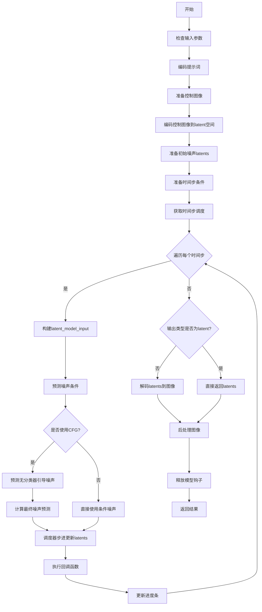
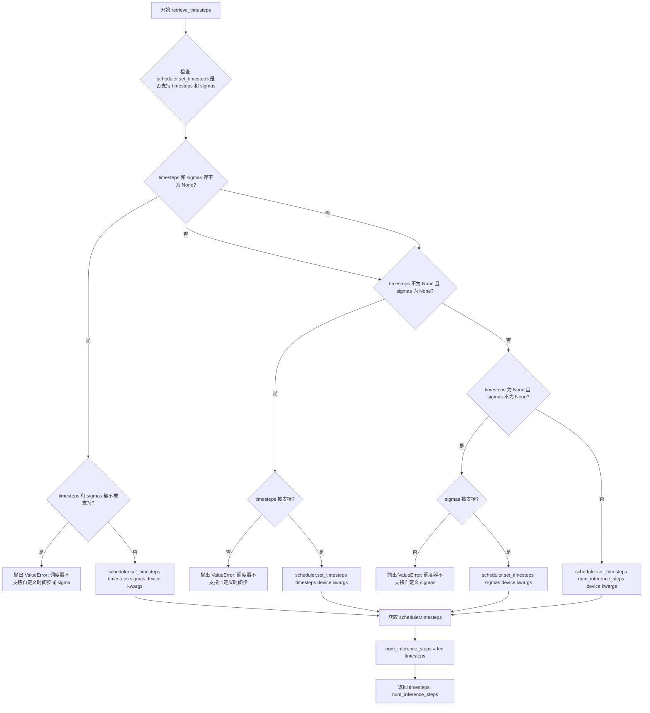
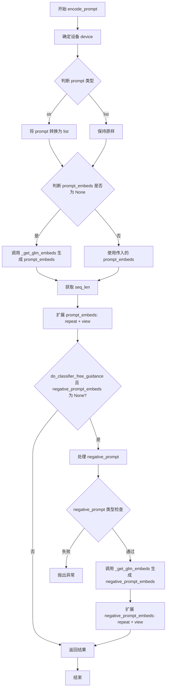
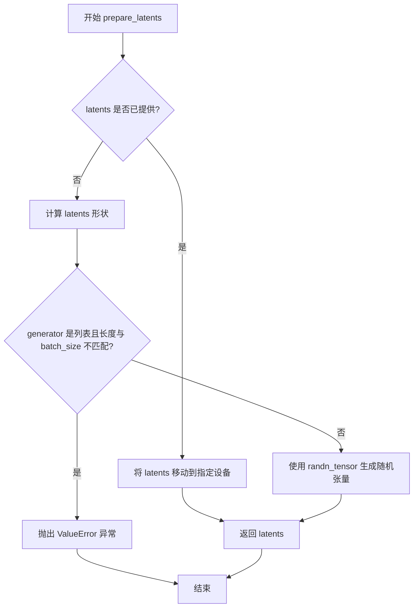
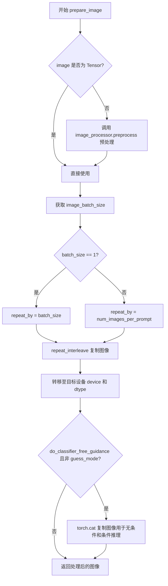
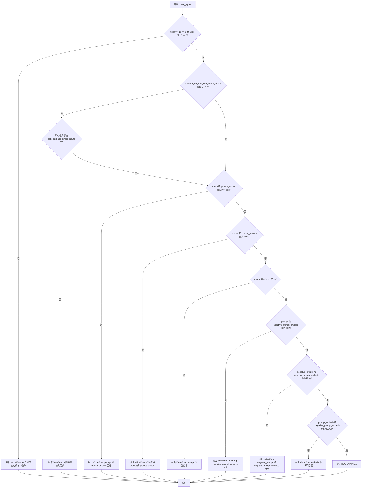

# `diffusers\src\diffusers\pipelines\cogview4\pipeline_cogview4_control.py` 详细设计文档

CogView4ControlPipeline是一个用于文本到图像生成的控制扩散管道，支持基于文本提示和控制图像生成图像。该管道继承自DiffusionPipeline，集成了VAE编码器、GLM文本编码器、CogView4Transformer2DModel变换器和FlowMatchEulerDiscreteScheduler调度器，实现了基于控制图像的条件图像生成功能。

## 整体流程



## 类结构

```
DiffusionPipeline (抽象基类)
└── CogView4ControlPipeline (文本到图像控制生成管道)
```

## 全局变量及字段


### `logger`
    
模块级日志记录器，用于输出调试和运行信息

类型：`logging.Logger`
    


### `EXAMPLE_DOC_STRING`
    
示例文档字符串，包含CogView4ControlPipeline的使用示例代码

类型：`str`
    


### `XLA_AVAILABLE`
    
标志位，指示PyTorch XLA是否可用，用于支持TPU加速

类型：`bool`
    


### `calculate_shift`
    
全局函数，根据图像序列长度计算时间步偏移量，用于调整采样计划

类型：`Callable[[int, int, float, float], float]`
    


### `retrieve_timesteps`
    
全局函数，从调度器获取时间步序列，支持自定义时间步和sigma值

类型：`Callable`
    


### `CogView4ControlPipeline.vae`
    
变分自编码器模型，用于将图像编码到潜在空间并从潜在空间解码重建图像

类型：`AutoencoderKL`
    


### `CogView4ControlPipeline.text_encoder`
    
冻结的文本编码器(GLM-4-9B)，将文本提示转换为文本嵌入向量

类型：`GlmModel`
    


### `CogView4ControlPipeline.tokenizer`
    
分词器，用于将文本分割成token序列并编码

类型：`PreTrainedTokenizer`
    


### `CogView4ControlPipeline.transformer`
    
CogView4变换器模型，用于去噪潜在表示生成图像

类型：`CogView4Transformer2DModel`
    


### `CogView4ControlPipeline.scheduler`
    
流匹配欧拉离散调度器，控制去噪过程中的时间步采样

类型：`FlowMatchEulerDiscreteScheduler`
    


### `CogView4ControlPipeline.vae_scale_factor`
    
VAE缩放因子，用于计算潜在空间的分辨率

类型：`int`
    


### `CogView4ControlPipeline.image_processor`
    
图像处理器，用于预处理输入图像和后处理输出图像

类型：`VaeImageProcessor`
    


### `CogView4ControlPipeline._optional_components`
    
可选组件列表，定义管道中可选的模块

类型：`list`
    


### `CogView4ControlPipeline.model_cpu_offload_seq`
    
CPU卸载顺序字符串，定义模型卸载到CPU的顺序

类型：`str`
    


### `CogView4ControlPipeline._callback_tensor_inputs`
    
回调函数可访问的张量输入列表，用于在推理步骤结束时传递数据

类型：`list`
    


### `CogView4ControlPipeline._guidance_scale`
    
分类器自由引导比例，控制文本提示对生成图像的影响程度

类型：`float`
    


### `CogView4ControlPipeline._attention_kwargs`
    
注意力机制参数字典，传递给注意力处理器

类型：`dict`
    


### `CogView4ControlPipeline._num_timesteps`
    
推理过程中的总时间步数

类型：`int`
    


### `CogView4ControlPipeline._current_timestep`
    
当前正在处理的时间步

类型：`int`
    


### `CogView4ControlPipeline._interrupt`
    
中断标志，用于在推理过程中停止生成

类型：`bool`
    


### `CogView4ControlPipeline.__init__`
    
初始化方法，接受tokenizer、text_encoder、vae、transformer和scheduler作为参数

类型：`method`
    


### `CogView4ControlPipeline._get_glm_embeds`
    
内部方法，使用GLM模型获取文本嵌入，处理padding和截断

类型：`method`
    


### `CogView4ControlPipeline.encode_prompt`
    
编码提示词为文本嵌入向量，支持分类器自由引导

类型：`method`
    


### `CogView4ControlPipeline.prepare_latents`
    
准备初始潜在变量，或使用提供的latents

类型：`method`
    


### `CogView4ControlPipeline.prepare_image`
    
预处理控制图像，包括调整大小和 normalization

类型：`method`
    


### `CogView4ControlPipeline.check_inputs`
    
验证输入参数的有效性，包括高度、宽度、提示词等

类型：`method`
    


### `CogView4ControlPipeline.__call__`
    
主推理方法，执行完整的文本到图像生成流程

类型：`method`
    
    

## 全局函数及方法


### `calculate_shift`

计算图像序列长度偏移量，用于调整扩散模型采样过程中的时间步偏移。该函数基于图像序列长度计算一个缩放因子，结合基础偏移量和最大偏移量，生成一个用于调度器的时间步偏移值，以适应不同分辨率图像的生成需求。

参数：

- `image_seq_len`：`int`，图像序列长度，通常由图像高度、宽度和变压器 patch 大小计算得出
- `base_seq_len`：`int`，基础序列长度，默认为 256，用于归一化计算
- `base_shift`：`float`，基础偏移量，默认为 0.25，作为偏移的下界
- `max_shift`：`float`，最大偏移量，默认为 0.75，作为偏移的上界

返回值：`float`，计算得到的时间步偏移量 mu，用于传递给调度器

#### 流程图

```mermaid
flowchart TD
    A[开始] --> B[计算缩放因子 m]
    B --> B1[m = (image_seq_len / base_seq_len) ** 0.5]
    B1 --> C[计算偏移量 mu]
    C --> C1[mu = m * max_shift + base_shift]
    C1 --> D[返回 mu]
    D --> E[结束]
```

#### 带注释源码

```python
# Copied from diffusers.pipelines.cogview4.pipeline_cogview4.calculate_shift
def calculate_shift(
    image_seq_len,           # 图像序列长度
    base_seq_len: int = 256,  # 基础序列长度，用于归一化
    base_shift: float = 0.25, # 基础偏移量
    max_shift: float = 0.75,  # 最大偏移量
) -> float:
    """
    计算图像序列长度偏移量。
    
    该函数根据图像序列长度计算一个缩放因子，然后结合基础偏移量和最大偏移量
    生成一个用于扩散模型采样调度的时间步偏移值。这有助于在不同分辨率下
    获得更好的生成效果。
    
    Args:
        image_seq_len: 图像序列长度，由 (height // vae_scale_factor) * 
                      (width // vae_scale_factor) // patch_size^2 计算得出
        base_seq_len: 基础序列长度，默认值为 256
        base_shift: 基础偏移量，默认值为 0.25
        max_shift: 最大偏移量，默认值为 0.75
    
    Returns:
        float: 计算得到的时间步偏移量 mu
    """
    # 计算缩放因子：对图像序列长度与基础序列长度的比值开平方
    # 这种非线性缩放方式可以使较大图像和较小图像都能获得合适的偏移
    m = (image_seq_len / base_seq_len) ** 0.5
    
    # 计算最终的偏移量：将缩放因子映射到 [base_shift, max_shift] 范围内
    # m * max_shift 提供了基于图像大小的动态调整
    # base_shift 提供了基础偏移量
    mu = m * max_shift + base_shift
    
    # 返回计算得到的偏移量
    return mu
```


### `retrieve_timesteps`

该函数是调度器时间步检索工具函数，用于调用调度器的 `set_timesteps` 方法并从调度器中获取时间步。它支持自定义时间步和时间步间隔策略（sigmas），并对不支持自定义时间步的调度器进行错误检查。

参数：

- `scheduler`：`SchedulerMixin`，调度器对象，用于获取时间步。
- `num_inference_steps`：`int | None`，生成样本时使用的扩散步数。如果使用此参数，`timesteps` 必须为 `None`。
- `device`：`str | torch.device | None`，时间步要移动到的设备。如果为 `None`，时间步不会被移动。
- `timesteps`：`list[int] | None`，自定义时间步，用于覆盖调度器的时间步间隔策略。如果传递了 `timesteps`，则 `num_inference_steps` 和 `sigmas` 必须为 `None`。
- `sigmas`：`list[float] | None`，自定义 sigmas，用于覆盖调度器的时间步间隔策略。如果传递了 `sigmas`，则 `num_inference_steps` 和 `timesteps` 必须为 `None`。
- `**kwargs`：任意关键字参数，将传递给 `scheduler.set_timesteps`。

返回值：`tuple[torch.Tensor, int]`，元组，其中第一个元素是调度器的时间步计划，第二个元素是推理步数。

#### 流程图



#### 带注释源码

```python
# Copied from diffusers.pipelines.cogview4.pipeline_cogview4.retrieve_timesteps
def retrieve_timesteps(
    scheduler,
    num_inference_steps: int | None = None,
    device: str | torch.device | None = None,
    timesteps: list[int] | None = None,
    sigmas: list[float] | None = None,
    **kwargs,
):
    r"""
    Calls the scheduler's `set_timesteps` method and retrieves timesteps from the scheduler after the call. Handles
    custom timesteps. Any kwargs will be supplied to `scheduler.set_timesteps`.

    Args:
        scheduler (`SchedulerMixin`):
            The scheduler to get timesteps from.
        num_inference_steps (`int`):
            The number of diffusion steps used when generating samples with a pre-trained model. If used, `timesteps`
            must be `None`.
        device (`str` or `torch.device`, *optional*):
            The device to which the timesteps should be moved to. If `None`, the timesteps are not moved.
        timesteps (`list[int]`, *optional*):
            Custom timesteps used to override the timestep spacing strategy of the scheduler. If `timesteps` is passed,
            `num_inference_steps` and `sigmas` must be `None`.
        sigmas (`list[float]`, *optional*):
            Custom sigmas used to override the timestep spacing strategy of the scheduler. If `sigmas` is passed,
            `num_inference_steps` and `timesteps` must be `None`.

    Returns:
        `tuple[torch.Tensor, int]`: A tuple where the first element is the timestep schedule from the scheduler and the
        second element is the number of inference steps.
    """
    # 使用 inspect 检查 scheduler.set_timesteps 方法是否支持 timesteps 和 sigmas 参数
    accepts_timesteps = "timesteps" in set(inspect.signature(scheduler.set_timesteps).parameters.keys())
    accepts_sigmas = "sigmas" in set(inspect.signature(scheduler.set_timesteps).parameters.keys())

    # 处理 timesteps 和 sigmas 都不为 None 的情况
    if timesteps is not None and sigmas is not None:
        # 检查调度器是否支持自定义时间步或 sigmas
        if not accepts_timesteps and not accepts_sigmas:
            raise ValueError(
                f"The current scheduler class {scheduler.__class__}'s `set_timesteps` does not support custom"
                f" timestep or sigma schedules. Please check whether you are using the correct scheduler."
            )
        # 调用 scheduler.set_timesteps 设置自定义 timesteps 和 sigmas
        scheduler.set_timesteps(timesteps=timesteps, sigmas=sigmas, device=device, **kwargs)
        # 从调度器获取设置后的时间步
        timesteps = scheduler.timesteps
        # 计算推理步数
        num_inference_steps = len(timesteps)
    # 处理只有 timesteps 不为 None 的情况
    elif timesteps is not None and sigmas is None:
        # 检查调度器是否支持自定义时间步
        if not accepts_timesteps:
            raise ValueError(
                f"The current scheduler class {scheduler.__class__}'s `set_timesteps` does not support custom"
                f" timestep schedules. Please check whether you are using the correct scheduler."
            )
        # 调用 scheduler.set_timesteps 设置自定义 timesteps
        scheduler.set_timesteps(timesteps=timesteps, device=device, **kwargs)
        # 从调度器获取设置后的时间步
        timesteps = scheduler.timesteps
        # 计算推理步数
        num_inference_steps = len(timesteps)
    # 处理只有 sigmas 不为 None 的情况
    elif timesteps is None and sigmas is not None:
        # 检查调度器是否支持自定义 sigmas
        if not accepts_sigmas:
            raise ValueError(
                f"The current scheduler class {scheduler.__class__}'s `set_timesteps` does not support custom"
                f" sigmas schedules. Please check whether you are using the correct scheduler."
            )
        # 调用 scheduler.set_timesteps 设置自定义 sigmas
        scheduler.set_timesteps(sigmas=sigmas, device=device, **kwargs)
        # 从调度器获取设置后的时间步
        timesteps = scheduler.timesteps
        # 计算推理步数
        num_inference_steps = len(timesteps)
    # 处理默认情况（使用 num_inference_steps）
    else:
        # 调用 scheduler.set_timesteps 设置推理步数
        scheduler.set_timesteps(num_inference_steps, device=device, **kwargs)
        # 从调度器获取设置后的时间步
        timesteps = scheduler.timesteps
    
    # 返回时间步张量和推理步数
    return timesteps, num_inference_steps
```


### CogView4ControlPipeline.__init__

初始化 CogView4ControlPipeline 文本到图像生成管道，设置分词器、文本编码器、VAE、Transformer 和调度器等核心组件，并配置图像处理器用于后续图像预处理和后处理。

参数：

- `tokenizer`：`AutoTokenizer`，CogView4 模型的分词器，用于将文本提示转换为 token 序列
- `text_encoder`：`GlmModel`，冻结的文本编码器（CogView4 使用 glm-4-9b-hf），用于将文本转换为嵌入向量
- `vae`：`AutoencoderKL`，变分自编码器模型，用于编码和解码图像与潜在表示之间的转换
- `transformer`：`CogView4Transformer2DModel`，文本条件的 CogView4 Transformer 模型，用于对编码后的图像潜在表示进行去噪
- `scheduler`：`FlowMatchEulerDiscreteScheduler`，与 transformer 配合使用的调度器，用于在去噪过程中逐步调整时间步

返回值：`None`，构造函数不返回任何值，仅初始化对象状态

#### 流程图

```mermaid
flowchart TD
    A[开始 __init__] --> B[调用父类 DiffusionPipeline.__init__]
    B --> C[调用 self.register_modules 注册所有模块]
    C --> D{检查 vae 是否存在}
    D -->|是| E[计算 vae_scale_factor: 2^(len(vae.config.block_out_channels) - 1)]
    D -->|否| F[设置 vae_scale_factor = 8]
    E --> G[创建 VaeImageProcessor 实例]
    F --> G
    G --> H[结束 __init__]
```

#### 带注释源码

```python
def __init__(
    self,
    tokenizer: AutoTokenizer,
    text_encoder: GlmModel,
    vae: AutoencoderKL,
    transformer: CogView4Transformer2DModel,
    scheduler: FlowMatchEulerDiscreteScheduler,
):
    """
    初始化 CogView4ControlPipeline 管道实例。
    
    参数:
        tokenizer: 分词器，将文本转换为 token ID 序列
        text_encoder: 文本编码器，将 token 转换为文本嵌入
        vae: 变分自编码器，用于图像编码/解码
        transformer: CogView4 主变换器模型，执行潜在空间的去噪
        scheduler: 流动匹配欧拉离散调度器，控制去噪过程的时间步
    
    返回:
        None
    """
    # 调用父类 DiffusionPipeline 的初始化方法
    # 设置管道的基本结构和配置
    super().__init__()

    # 注册所有模块组件，使管道能够访问和管理这些模型
    # 注册后的模块会自动关联到管道对象，支持统一调度和内存管理
    self.register_modules(
        tokenizer=tokenizer, 
        text_encoder=text_encoder, 
        vae=vae, 
        transformer=transformer, 
        scheduler=scheduler
    )
    
    # 计算 VAE 缩放因子，用于调整潜在空间的维度
    # 基于 VAE 的 block_out_channels 配置计算下采样比例
    # 典型配置下，结果为 2^(len(block_out_channels) - 1)
    self.vae_scale_factor = 2 ** (len(self.vae.config.block_out_channels) - 1) if getattr(self, "vae", None) else 8
    
    # 初始化图像处理器，用于管道的图像预处理和后处理
    # VAE 缩放因子决定了图像在潜在空间中的尺寸比例
    self.image_processor = VaeImageProcessor(vae_scale_factor=self.vae_scale_factor)
```


### `CogView4ControlPipeline._get_glm_embeds`

该方法用于将文本提示词（prompt）转换为文本编码器（GLM）的嵌入向量（embeddings），是CogView4图像生成管道的核心组件之一。

参数：

- `prompt`：`str | list[str]`，要编码的文本提示词，可以是单个字符串或字符串列表
- `max_sequence_length`：`int`，最大序列长度，默认为1024
- `device`：`torch.device | None`，计算设备，若为None则使用执行设备
- `dtype`：`torch.dtype | None`，数据类型，若为None则使用文本编码器的数据类型

返回值：`torch.Tensor`，文本编码器生成的嵌入向量

#### 流程图

```mermaid
flowchart TD
    A[开始 _get_glm_embeds] --> B{device是否为None}
    B -->|是| C[使用执行设备 self._execution_device]
    B -->|否| D[使用传入的device]
    C --> E{device是否为None}
    D --> E
    E --> F{device不为None|使用执行设备]
    F --> G{device为None?}
    G -->|是| H[使用self._execution_device]
    G -->|否| I[使用传入的dtype]
    H --> J[设置device和dtype]
    I --> J
    J --> K{prompt是否为字符串}
    K -->|是| L[将prompt包装为列表]
    K -->|否| M[直接使用prompt列表]
    L --> N[调用tokenizer编码]
    M --> N
    N --> O[获取input_ids和untruncated_ids]
    O --> P{检测是否被截断}
    P -->|是| Q[记录警告日志]
    P -->|否| R[计算padding长度]
    Q --> R
    R --> S{padding长度大于0?}
    S -->|是| T[添加padding tokens]
    S -->|否| U[调用text_encoder获取隐藏状态]
    T --> U
    U --> V[提取倒数第二层隐藏状态]
    V --> W[转换dtype和device]
    W --> X[返回prompt_embeds]
```

#### 带注释源码

```python
# Copied from diffusers.pipelines.cogview4.pipeline_cogview4.CogView4Pipeline._get_glm_embeds
def _get_glm_embeds(
    self,
    prompt: str | list[str] = None,
    max_sequence_length: int = 1024,
    device: torch.device | None = None,
    dtype: torch.dtype | None = None,
):
    """
    将文本提示词转换为文本编码器的嵌入向量表示
    
    参数:
        prompt: 输入的文本提示词，支持单字符串或字符串列表
        max_sequence_length: 最大序列长度，超过此长度将被截断
        device: 指定计算设备，默认为None（使用执行设备）
        dtype: 指定数据类型，默认为None（使用文本编码器数据类型）
    
    返回:
        prompt_embeds: 文本编码器生成的嵌入向量，形状为 [batch_size, seq_len, hidden_dim]
    """
    # 确定设备：如果未指定，则使用管道的执行设备
    device = device or self._execution_device
    # 确定数据类型：如果未指定，则使用文本编码器的数据类型
    dtype = dtype or self.text_encoder.dtype

    # 标准化输入：将单个字符串转换为列表，统一处理流程
    prompt = [prompt] if isinstance(prompt, str) else prompt

    # 步骤1: 使用tokenizer对提示词进行分词和编码
    # padding="longest": 使用最长序列进行padding（而非固定最大长度）
    # max_length: 设置最大序列长度
    # truncation: 启用截断功能
    # add_special_tokens: 添加特殊tokens（如[CLS], [SEP]等）
    # return_tensors="pt": 返回PyTorch张量
    text_inputs = self.tokenizer(
        prompt,
        padding="longest",  # 不使用固定最大长度
        max_length=max_sequence_length,
        truncation=True,
        add_special_tokens=True,
        return_tensors="pt",
    )
    # 获取编码后的input_ids
    text_input_ids = text_inputs.input_ids
    
    # 步骤2: 检查是否存在截断
    # 使用更长的序列重新编码，以检测原始编码是否被截断
    untruncated_ids = self.tokenizer(prompt, padding="longest", return_tensors="pt").input_ids
    
    # 比较截断后的序列和未截断的序列长度与内容
    # 如果未截断序列更长，且两者不相等，说明发生了截断
    if untruncated_ids.shape[-1] >= text_input_ids.shape[-1] and not torch.equal(text_input_ids, untruncated_ids):
        # 解码被截断的部分用于警告信息
        removed_text = self.tokenizer.batch_decode(untruncated_ids[:, max_sequence_length - 1 : -1])
        # 记录警告日志，提示用户哪些内容被截断
        logger.warning(
            "The following part of your input was truncated because `max_sequence_length` is set to "
            f" {max_sequence_length} tokens: {removed_text}"
        )

    # 步骤3: 添加padding使序列长度能被16整除
    # 这是因为GLM模型可能对输入长度有特定要求
    current_length = text_input_ids.shape[1]  # 当前序列长度
    pad_length = (16 - (current_length % 16)) % 16  # 需要padding的长度
    
    if pad_length > 0:
        # 创建padding token张量
        pad_ids = torch.full(
            (text_input_ids.shape[0], pad_length),  # [batch_size, pad_length]
            fill_value=self.tokenizer.pad_token_id,  # 使用tokenizer的pad_token_id填充
            dtype=text_input_ids.dtype,
            device=text_input_ids.device,
        )
        # 将padding tokens添加到序列开头（前面）
        text_input_ids = torch.cat([pad_ids, text_input_ids], dim=1)

    # 步骤4: 调用文本编码器获取嵌入向量
    # output_hidden_states=True: 要求返回所有隐藏状态
    # 取倒数第二层隐藏状态（通常这是最佳的特征表示层）
    prompt_embeds = self.text_encoder(text_input_ids.to(device), output_hidden_states=True).hidden_states[-2]

    # 步骤5: 转换数据类型和设备
    prompt_embeds = prompt_embeds.to(dtype=dtype, device=device)
    
    return prompt_embeds
```


### CogView4ControlPipeline.encode_prompt

该方法用于将文本提示（prompt）和负向提示（negative_prompt）编码为文本编码器的隐藏状态（embeddings），为后续的图像生成提供文本条件输入。支持 Classifier-Free Guidance（分类器自由引导）技术，可同时处理正向和负向文本嵌入。

参数：

- `self`：`CogView4ControlPipeline` 实例本身
- `prompt`：`str | list[str]`，待编码的正向提示词，可以是单个字符串或字符串列表
- `negative_prompt`：`str | list[str] | None`，用于引导图像生成的反向提示词，默认为 None，不使用引导时忽略
- `do_classifier_free_guidance`：`bool`，是否启用分类器自由引导，默认为 True
- `num_images_per_prompt`：`int`，每个提示词生成的图像数量，默认为 1
- `prompt_embeds`：`torch.Tensor | None`，预生成的提示词嵌入，若提供则直接使用，默认为 None
- `negative_prompt_embeds`：`torch.Tensor | None`，预生成的负向提示词嵌入，若提供则直接使用，默认为 None
- `device`：`torch.device | None`，执行设备，默认为 None（使用执行设备）
- `dtype`：`torch.dtype | None`，数据类型，默认为 None（使用文本编码器数据类型）
- `max_sequence_length`：`int`，编码提示词的最大序列长度，默认为 1024

返回值：`tuple[torch.Tensor, torch.Tensor]`，返回包含提示词嵌入和负向提示词嵌入的元组

#### 流程图



#### 带注释源码

```python
def encode_prompt(
    self,
    prompt: str | list[str],
    negative_prompt: str | list[str] | None = None,
    do_classifier_free_guidance: bool = True,
    num_images_per_prompt: int = 1,
    prompt_embeds: torch.Tensor | None = None,
    negative_prompt_embeds: torch.Tensor | None = None,
    device: torch.device | None = None,
    dtype: torch.dtype | None = None,
    max_sequence_length: int = 1024,
):
    r"""
    Encodes the prompt into text encoder hidden states.

    Args:
        prompt (`str` or `list[str]`, *optional*):
            prompt to be encoded
        negative_prompt (`str` or `list[str]`, *optional*):
            The prompt or prompts not to guide the image generation. If not defined, one has to pass
            `negative_prompt_embeds` instead. Ignored when not using guidance (i.e., ignored if `guidance_scale` is
            less than `1`).
        do_classifier_free_guidance (`bool`, *optional*, defaults to `True`):
            Whether to use classifier free guidance or not.
        num_images_per_prompt (`int`, *optional*, defaults to 1):
            Number of images that should be generated per prompt. torch device to place the resulting embeddings on
        prompt_embeds (`torch.Tensor`, *optional*):
            Pre-generated text embeddings. Can be used to easily tweak text inputs, *e.g.* prompt weighting. If not
            provided, text embeddings will be generated from `prompt` input argument.
        negative_prompt_embeds (`torch.Tensor`, *optional*):
            Pre-generated negative text embeddings. Can be used to easily tweak text inputs, *e.g.* prompt
            weighting. If not provided, negative_prompt_embeds will be generated from `negative_prompt` input
            argument.
        device: (`torch.device`, *optional*):
            torch device
        dtype: (`torch.dtype`, *optional*):
            torch dtype
        max_sequence_length (`int`, defaults to `1024`):
            Maximum sequence length in encoded prompt. Can be set to other values but may lead to poorer results.
    """
    # 确定执行设备，优先使用传入的 device，否则使用 pipeline 的执行设备
    device = device or self._execution_device

    # 如果 prompt 是单个字符串，转换为列表；否则保持列表不变
    prompt = [prompt] if isinstance(prompt, str) else prompt
    
    # 根据是否有 prompt 确定批次大小
    if prompt is not None:
        batch_size = len(prompt)
    else:
        # 如果没有 prompt，则使用传入的 prompt_embeds 的批次大小
        batch_size = prompt_embeds.shape[0]

    # 如果未提供 prompt_embeds，则调用内部方法 _get_glm_embeds 生成
    if prompt_embeds is None:
        prompt_embeds = self._get_glm_embeds(prompt, max_sequence_length, device, dtype)

    # 获取序列长度
    seq_len = prompt_embeds.size(1)
    
    # 根据 num_images_per_prompt 扩展 prompt_embeds
    # repeat(1, num_images_per_prompt, 1) 在序列维度上重复
    # view(batch_size * num_images_per_prompt, seq_len, -1) 重塑为批量维度
    prompt_embeds = prompt_embeds.repeat(1, num_images_per_prompt, 1)
    prompt_embeds = prompt_embeds.view(batch_size * num_images_per_prompt, seq_len, -1)

    # 处理分类器自由引导
    if do_classifier_free_guidance and negative_prompt_embeds is None:
        # 如果未提供负向提示，则使用空字符串
        negative_prompt = negative_prompt or ""
        # 将负向提示扩展为批次大小
        negative_prompt = batch_size * [negative_prompt] if isinstance(negative_prompt, str) else negative_prompt

        # 类型检查：negative_prompt 和 prompt 类型必须一致
        if prompt is not None and type(prompt) is not type(negative_prompt):
            raise TypeError(
                f"`negative_prompt` should be the same type to `prompt`, but got {type(negative_prompt)} !="
                f" {type(prompt)}."
            )
        # 批次大小检查：negative_prompt 和 prompt 批次大小必须一致
        elif batch_size != len(negative_prompt):
            raise ValueError(
                f"`negative_prompt`: {negative_prompt} has batch size {len(negative_prompt)}, but `prompt`:"
                f" {prompt} has batch size {batch_size}. Please make sure that passed `negative_prompt` matches"
                " the batch size of `prompt`."
            )

        # 生成负向提示嵌入
        negative_prompt_embeds = self._get_glm_embeds(negative_prompt, max_sequence_length, device, dtype)

        # 同样扩展 negative_prompt_embeds
        seq_len = negative_prompt_embeds.size(1)
        negative_prompt_embeds = negative_prompt_embeds.repeat(1, num_images_per_prompt, 1)
        negative_prompt_embeds = negative_prompt_embeds.view(batch_size * num_images_per_prompt, seq_len, -1)

    # 返回正向和负向提示嵌入
    return prompt_embeds, negative_prompt_embeds
```


### `CogView4ControlPipeline.prepare_latents`

该方法用于为 CogView4 图像生成管道准备潜在向量（latents）。如果传入了预生成的 latents，则将其移动到指定设备；否则根据指定的批次大小、通道数、高度和宽度使用随机张量生成器创建新的噪声 latents。

参数：

- `batch_size`：`int`，批次大小，指定要生成的图像数量
- `num_channels_latents`：`int`，潜在向量的通道数，通常为 transformer 输入通道数的一半
- `height`：`int`，生成图像的高度（像素）
- `width`：`int`，生成图像的宽度（像素）
- `dtype`：`torch.dtype`，潜在向量的数据类型
- `device`：`torch.device`，潜在向量要放置的设备
- `generator`：`torch.Generator | list[torch.Generator] | None`，用于生成确定性随机数的 PyTorch 生成器
- `latents`：`torch.FloatTensor | None = None`，可选的预生成潜在向量

返回值：`torch.FloatTensor`，准备好的潜在向量张量

#### 流程图



#### 带注释源码

```python
def prepare_latents(
    self,
    batch_size: int,
    num_channels_latents: int,
    height: int,
    width: int,
    dtype: torch.dtype,
    device: torch.device,
    generator: torch.Generator | list[torch.Generator] | None,
    latents: torch.FloatTensor | None = None,
):
    """
    准备用于去噪过程的潜在向量。
    
    Args:
        batch_size: 批次大小
        num_channels_latents: 潜在向量通道数
        height: 图像高度
        width: 图像宽度
        dtype: 张量数据类型
        device: 计算设备
        generator: 随机生成器
        latents: 预生成的潜在向量
    
    Returns:
        准备好的潜在向量张量
    """
    # 如果已提供 latents，直接移动到目标设备并返回
    if latents is not None:
        return latents.to(device)

    # 计算潜在向量的形状，考虑 VAE 缩放因子
    # 高度和宽度需要除以 vae_scale_factor 以得到潜在空间中的尺寸
    shape = (
        batch_size,
        num_channels_latents,
        int(height) // self.vae_scale_factor,
        int(width) // self.vae_scale_factor,
    )
    
    # 验证生成器列表长度是否与批次大小匹配
    if isinstance(generator, list) and len(generator) != batch_size:
        raise ValueError(
            f"You have passed a list of generators of length {len(generator)}, but requested an effective batch"
            f" size of {batch_size}. Make sure the batch size matches the length of the generators."
        )
    
    # 使用随机张量生成器创建高斯噪声潜在向量
    latents = randn_tensor(shape, generator=generator, device=device, dtype=dtype)
    return latents
```


### CogView4ControlPipeline.prepare_image

该方法负责将输入的控制图像（control image）进行预处理，包括尺寸调整、批次复制、设备转移和数据类型转换，为后续的扩散模型推理准备好符合要求的图像张量。

参数：

- `self`：`CogView4ControlPipeline`，当前管道实例的隐式参数
- `image`：`PipelineImageInput`（torch.Tensor | PIL.Image.Image | np.ndarray | list），待处理控制图像输入，可以是原始图像或预处理后的张量
- `width`：`int`，目标输出图像宽度（像素）
- `height`：`int`，目标输出图像高度（像素）
- `batch_size`：`int`，提示词的批次大小，用于决定图像重复次数
- `num_images_per_prompt`：`int`，每个提示词生成的图像数量
- `device`：`torch.device`，目标计算设备（CPU/CUDA）
- `dtype`：`torch.dtype`，目标数据类型（如 bfloat16、float32）
- `do_classifier_free_guidance`：`bool`，是否启用分类器自由引导，默认为 False
- `guess_mode`：`bool`，猜测模式标志，默认为 False

返回值：`torch.Tensor`，处理完成的控制图像张量，形状为 [B, C, H, W]，已放置在指定设备上

#### 流程图



#### 带注释源码

```python
def prepare_image(
    self,
    image,
    width,
    height,
    batch_size,
    num_images_per_prompt,
    device,
    dtype,
    do_classifier_free_guidance=False,
    guess_mode=False,
):
    """
    预处理控制图像，为扩散模型推理做准备。
    
    该方法执行以下操作：
    1. 如果输入是 PIL Image 或其他格式，调用图像预处理器转换为 Tensor
    2. 根据批次大小和每提示词图像数量复制图像张量
    3. 将图像转移到指定设备并转换为指定数据类型
    4. 如果启用分类器自由引导，复制图像用于条件/无条件推理
    
    Args:
        image: 输入控制图像，支持 Tensor、PIL Image、numpy array 或列表
        width: 目标宽度
        height: 目标高度
        batch_size: 提示词批次大小
        num_images_per_prompt: 每提示词生成的图像数
        device: 目标设备
        dtype: 目标数据类型
        do_classifier_free_guidance: 是否启用 CFG
        guess_mode: 猜测模式
    
    Returns:
        处理后的图像张量
    """
    # 判断输入是否为 PyTorch Tensor
    if isinstance(image, torch.Tensor):
        # 已是 Tensor 格式，直接使用
        pass
    else:
        # 非 Tensor 格式（PIL Image 等），调用 VAE 图像预处理器进行预处理
        # 将图像resize到目标尺寸并转换为 Tensor
        image = self.image_processor.preprocess(image, height=height, width=width)

    # 获取输入图像的批次维度
    image_batch_size = image.shape[0]

    # 确定图像复制次数
    if image_batch_size == 1:
        # 如果图像只有一个样本，按提示词批次大小复制
        repeat_by = batch_size
    else:
        # 如果图像批次与提示词批次相同，按每提示词图像数复制
        # image batch size is the same as prompt batch size
        repeat_by = num_images_per_prompt

    # 沿批次维度复制图像
    # 使用 repeat_interleave 而非 repeat 以确保正确的复制语义
    image = image.repeat_interleave(repeat_by, dim=0, output_size=image.shape[0] * repeat_by)

    # 将图像转移到指定设备并转换数据类型
    image = image.to(device=device, dtype=dtype)

    # 分类器自由引导处理
    if do_classifier_free_guidance and not guess_mode:
        # 复制图像用于同时进行条件和无条件预测
        # 第一个副本用于无条件（negative prompt）推理，第二个用于条件（positive prompt）推理
        image = torch.cat([image] * 2)

    return image
```


### `CogView4ControlPipeline.check_inputs`

该方法用于验证图像生成管道的输入参数是否合法，包括检查高度和宽度是否被16整除、回调张量输入是否有效、prompt和prompt_embeds的互斥关系、以及negative_prompt和negative_prompt_embeds的互斥关系等。如果检测到任何不合法的输入组合，该方法会抛出详细的ValueError异常。

参数：

- `self`：`CogView4ControlPipeline`，Pipeline实例本身
- `prompt`：`str | list[str] | None`，用户提供的文本提示，可以是单个字符串或字符串列表
- `height`：`int`，生成的图像高度（像素），必须能被16整除
- `width`：`int`，生成的图像宽度（像素），必须能被16整除
- `negative_prompt`：`str | list[str] | None`，用于指导图像生成的反向提示词，与negative_prompt_embeds互斥
- `callback_on_step_end_tensor_inputs`：`list[str] | None`，每步结束时回调函数需要接收的张量输入列表，必须是self._callback_tensor_inputs的子集
- `prompt_embeds`：`torch.FloatTensor | None`，预生成的文本嵌入向量，与prompt互斥
- `negative_prompt_embeds`：`torch.FloatTensor | None`，预生成的负向文本嵌入向量，与negative_prompt互斥

返回值：`None`，该方法不返回任何值，仅通过抛出异常来处理错误输入

#### 流程图



#### 带注释源码

```python
def check_inputs(
    self,
    prompt,
    height,
    width,
    negative_prompt,
    callback_on_step_end_tensor_inputs,
    prompt_embeds=None,
    negative_prompt_embeds=None,
):
    # 检查图像尺寸是否满足16位对齐要求
    # CogView4模型内部使用patch partition，要求高度和宽度都能被16整除
    if height % 16 != 0 or width % 16 != 0:
        raise ValueError(f"`height` and `width` have to be divisible by 16 but are {height} and {width}.")

    # 验证回调函数所需的张量输入是否在允许的列表中
    # _callback_tensor_inputs 定义了哪些张量可以在步骤结束时传递给回调函数
    if callback_on_step_end_tensor_inputs is not None and not all(
        k in self._callback_tensor_inputs for k in callback_on_step_end_tensor_inputs
    ):
        raise ValueError(
            f"`callback_on_step_end_tensor_inputs` has to be in {self._callback_tensor_inputs}, but found {[k for k in callback_on_step_end_tensor_inputs if k not in self._callback_tensor_inputs]}"
        )
    
    # 检查prompt和prompt_embeds的互斥关系
    # 两者都提供会导致重复编码，应该只选择其中一种方式
    if prompt is not None and prompt_embeds is not None:
        raise ValueError(
            f"Cannot forward both `prompt`: {prompt} and `prompt_embeds`: {prompt_embeds}. Please make sure to"
            " only forward one of the two."
        )
    # 至少需要提供一种文本输入方式
    elif prompt is None and prompt_embeds is None:
        raise ValueError(
            "Provide either `prompt` or `prompt_embeds`. Cannot leave both `prompt` and `prompt_embeds` undefined."
        )
    # 验证prompt的类型合法性
    elif prompt is not None and (not isinstance(prompt, str) and not isinstance(prompt, list)):
        raise ValueError(f"`prompt` has to be of type `str` or `list` but is {type(prompt)}")

    # 检查prompt和negative_prompt_embeds的互斥关系
    if prompt is not None and negative_prompt_embeds is not None:
        raise ValueError(
            f"Cannot forward both `prompt`: {prompt} and `negative_prompt_embeds`:"
            f" {negative_prompt_embeds}. Please make sure to only forward one of the two."
        )

    # 检查negative_prompt和negative_prompt_embeds的互斥关系
    if negative_prompt is not None and negative_prompt_embeds is not None:
        raise ValueError(
            f"Cannot forward both `negative_prompt`: {negative_prompt} and `negative_prompt_embeds`:"
            f" {negative_prompt_embeds}. Please make sure to only forward one of the two."
        )

    # 如果两者都提供了embeddings，验证它们的形状一致性
    # 在classifier-free guidance中，两者需要具有相同的形状以便进行插值
    if prompt_embeds is not None and negative_prompt_embeds is not None:
        if prompt_embeds.shape != negative_prompt_embeds.shape:
            raise ValueError(
                "`prompt_embeds` and `negative_prompt_embeds` must have the same shape when passed directly, but"
                f" got: `prompt_embeds` {prompt_embeds.shape} != `negative_prompt_embeds`"
                f" {negative_prompt_embeds.shape}."
            )
```


### CogView4ControlPipeline.__call__

该方法是CogView4ControlPipeline的核心推理方法，负责根据文本提示（prompt）和控制图像（control_image）生成目标图像。方法内部完成了输入验证、提示编码、潜在向量准备、去噪循环（包括分类器自由引导）、VAE解码以及后处理等完整流程。

参数：

- `prompt`：`str | list[str] | None`，用于引导图像生成的文本提示，如果不提供则需传入prompt_embeds
- `negative_prompt`：`str | list[str] | None`，不希望出现在生成图像中的负面提示，用于引导但不使用分类器自由引导时被忽略
- `control_image`：`PipelineImageInput`，用于控制生成图像结构或特征的控制图像输入
- `height`：`int | None`，生成图像的高度（像素），默认使用transformer配置的sample_size乘以vae_scale_factor
- `width`：`int | None`，生成图像的宽度（像素），默认使用transformer配置的sample_size乘以vae_scale_factor
- `num_inference_steps`：`int`，去噪步数，默认为50，更多步数通常能获得更高质量的图像但推理速度更慢
- `timesteps`：`list[int] | None`，自定义时间步，用于支持set_timesteps方法的调度器，必须按降序排列
- `sigmas`：`list[float] | None`，自定义sigma值，用于支持set_timesteps方法的调度器
- `guidance_scale`：`float`，分类器自由引导的引导比例，默认为5.0，值为1时表示不进行引导
- `num_images_per_prompt`：`int`，每个提示生成的图像数量，默认为1
- `generator`：`torch.Generator | list[torch.Generator] | None`，用于生成确定性结果的随机数生成器
- `latents`：`torch.FloatTensor | None`，预生成的噪声潜在向量，用于图像生成，可用于通过不同提示微调相同生成
- `prompt_embeds`：`torch.FloatTensor | None`，预生成的文本嵌入，可用于轻松调整文本输入（如提示加权）
- `negative_prompt_embeds`：`torch.FloatTensor | None`，预生成的负面文本嵌入
- `original_size`：`tuple[int, int] | None`，原始尺寸，用于图像尺寸调节的微条件，默认为(1024, 1024)
- `crops_coords_top_left`：`tuple[int, int]`，裁剪坐标起始点，用于生成从特定位置裁剪的图像，默认为(0, 0)
- `output_type`：`str`，输出格式，可选"pil"（PIL.Image.Image）或np.array，默认为"pil"
- `return_dict`：`bool`，是否返回CogView4PipelineOutput对象而非元组，默认为True
- `attention_kwargs`：`dict[str, Any] | None`，传递给AttentionProcessor的额外关键字参数
- `callback_on_step_end`：`Callable | PipelineCallback | MultiPipelineCallbacks | None`，每个去噪步骤结束时调用的回调函数
- `callback_on_step_end_tensor_inputs`：`list[str]`，回调函数需要接收的张量输入列表，默认为["latents"]
- `max_sequence_length`：`int`，编码提示的最大序列长度，默认为1024

返回值：`CogView4PipelineOutput | tuple`，返回CogView4PipelineOutput对象（包含生成的图像列表）或元组（当return_dict为False时）

#### 流程图

```mermaid
flowchart TD
    A[开始 __call__] --> B{callback_on_step_end类型检查}
    B -->|PipelineCallback| C[设置callback_on_step_end_tensor_inputs]
    B -->|其他| D[跳过设置]
    C --> E[设置height和width默认值]
    D --> E
    E --> F[设置original_size和target_size]
    F --> G[调用check_inputs验证输入]
    G --> H[设置_guidance_scale和_attention_kwargs]
    H --> I[确定batch_size]
    J[调用encode_prompt] --> K[获取prompt_embeds和negative_prompt_embeds]
    K --> L[准备latent通道数]
    L --> M[调用prepare_image处理control_image]
    M --> N[使用VAE编码control_image得到潜在表示]
    N --> O[调用prepare_latents准备初始噪声]
    O --> P[准备额外时间步条件: original_size, target_size, crops_coords_top_left]
    P --> Q[计算image_seq_len和timesteps]
    Q --> R[调用retrieve_timesteps获取调度器时间步]
    R --> S[设置num_warmup_steps]
    S --> T[进入去噪循环 for each timestep]
    T --> U{检查interrupt标志}
    U -->|True| V[continue跳过本次循环]
    U -->|False| W[扩展timestep到batch维度]
    W --> X[拼接latents和control_image作为latent_model_input]
    X --> Y[调用transformer进行条件预测]
    Y --> Z{do_classifier_free_guidance?}
    Z -->|True| AA[调用transformer进行无条件预测]
    AA --> AB[计算noise_pred = noise_pred_uncond + guidance_scale * (noise_pred_cond - noise_pred_uncond)]
    Z -->|False| AC[noise_pred = noise_pred_cond]
    AB --> AD[调用scheduler.step更新latents]
    AC --> AD
    AD --> AE{callback_on_step_end存在?}
    AE -->|True| AF[构建callback_kwargs并调用回调函数]
    AF --> AG[更新latents, prompt_embeds, negative_prompt_embeds]
    AE -->|False| AH{是否更新进度条?}
    AG --> AH
    AH -->|是| AI[progress_bar.update]
    AH -->|否| AJ{XLA_AVAILABLE?}
    AI --> AJ
    AJ -->|是| AK[xm.mark_step]
    AJ -->|否| AL[循环继续或结束]
    AK --> AL
    AL --> T
    T --> AM{所有timesteps完成?}
    AM -->|否| T
    AM -->|是| AN[设置_current_timestep为None]
    AN --> AO{output_type != latent?}
    AO -->|是| AP[将latents解码为图像]
    AO -->|否| AQ[image = latents]
    AP --> AR[调用image_processor后处理图像]
    AQ --> AR
    AR --> AS[调用maybe_free_model_hooks释放模型]
    AS --> AT{return_dict?}
    AT -->|是| AU[返回CogView4PipelineOutput]
    AT -->|否| AV[返回tuple]
    AU --> AX[结束]
    AV --> AX
    V --> AL
```

#### 带注释源码

```python
@torch.no_grad()
@replace_example_docstring(EXAMPLE_DOC_STRING)
def __call__(
    self,
    prompt: str | list[str] | None = None,
    negative_prompt: str | list[str] | None = None,
    control_image: PipelineImageInput = None,
    height: int | None = None,
    width: int | None = None,
    num_inference_steps: int = 50,
    timesteps: list[int] | None = None,
    sigmas: list[float] | None = None,
    guidance_scale: float = 5.0,
    num_images_per_prompt: int = 1,
    generator: torch.Generator | list[torch.Generator] | None = None,
    latents: torch.FloatTensor | None = None,
    prompt_embeds: torch.FloatTensor | None = None,
    negative_prompt_embeds: torch.FloatTensor | None = None,
    original_size: tuple[int, int] | None = None,
    crops_coords_top_left: tuple[int, int] = (0, 0),
    output_type: str = "pil",
    return_dict: bool = True,
    attention_kwargs: dict[str, Any] | None = None,
    callback_on_step_end: Callable[[int, int], None] | PipelineCallback | MultiPipelineCallbacks | None = None,
    callback_on_step_end_tensor_inputs: list[str] = ["latents"],
    max_sequence_length: int = 1024,
) -> CogView4PipelineOutput | tuple:
    """
    Function invoked when calling the pipeline for generation.

    Args:
        prompt: The prompt or prompts to guide the image generation.
        negative_prompt: The prompt or prompts not to guide the image generation.
        height: The height in pixels of the generated image.
        width: The width in pixels of the generated image.
        num_inference_steps: The number of denoising steps.
        timesteps: Custom timesteps to use for the denoising process.
        sigmas: Custom sigmas to use for the denoising process.
        guidance_scale: Guidance scale as defined in Classifier-Free Diffusion Guidance.
        num_images_per_prompt: The number of images to generate per prompt.
        generator: One or a list of torch generator(s) to make generation deterministic.
        latents: Pre-generated noisy latents to be used as inputs for image generation.
        prompt_embeds: Pre-generated text embeddings.
        negative_prompt_embeds: Pre-generated negative text embeddings.
        original_size: If original_size is not the same as target_size the image will appear to be down- or upsampled.
        crops_coords_top_left: crops_coords_top_left can be used to generate an image that appears to be cropped.
        output_type: The output format of the generate image. Choose between PIL or np.array.
        return_dict: Whether or not to return a CogView4PipelineOutput instead of a plain tuple.
        attention_kwargs: A kwargs dictionary that if specified is passed along to the AttentionProcessor.
        callback_on_step_end: A function that calls at the end of each denoising steps during the inference.
        callback_on_step_end_tensor_inputs: The list of tensor inputs for the callback_on_step_end function.
        max_sequence_length: Maximum sequence length in encoded prompt.

    Returns:
        CogView4PipelineOutput or tuple: The generated images or a tuple of images.
    """

    # 如果使用PipelineCallback或MultiPipelineCallbacks，则从回调中获取tensor_inputs
    if isinstance(callback_on_step_end, (PipelineCallback, MultiPipelineCallbacks)):
        callback_on_step_end_tensor_inputs = callback_on_step_end.tensor_inputs

    # 设置默认的height和width，使用transformer配置的sample_size乘以vae_scale_factor
    height = height or self.transformer.config.sample_size * self.vae_scale_factor
    width = width or self.transformer.config.sample_size * self.vae_scale_factor

    # 设置默认的original_size为(height, width)
    original_size = original_size or (height, width)
    target_size = (height, width)

    # 检查输入参数的有效性
    self.check_inputs(
        prompt,
        height,
        width,
        negative_prompt,
        callback_on_step_end_tensor_inputs,
        prompt_embeds,
        negative_prompt_embeds,
    )
    # 保存引导比例和注意力参数到实例变量
    self._guidance_scale = guidance_scale
    self._attention_kwargs = attention_kwargs
    self._current_timestep = None
    self._interrupt = False

    # 根据prompt或prompt_embeds确定batch_size
    if prompt is not None and isinstance(prompt, str):
        batch_size = 1
    elif prompt is not None and isinstance(prompt, list):
        batch_size = len(prompt)
    else:
        batch_size = prompt_embeds.shape[0]

    # 获取执行设备
    device = self._execution_device

    # 编码输入提示，获取正负文本嵌入
    prompt_embeds, negative_prompt_embeds = self.encode_prompt(
        prompt,
        negative_prompt,
        self.do_classifier_free_guidance,
        num_images_per_prompt=num_images_per_prompt,
        prompt_embeds=prompt_embeds,
        negative_prompt_embeds=negative_prompt_embeds,
        max_sequence_length=max_sequence_length,
        device=device,
    )

    # 获取transformer的潜在通道数（通常是潜在维度的一半）
    latent_channels = self.transformer.config.in_channels // 2

    # 准备控制图像：预处理、调整大小、批处理
    control_image = self.prepare_image(
        image=control_image,
        width=width,
        height=height,
        batch_size=batch_size * num_images_per_prompt,
        num_images_per_prompt=num_images_per_prompt,
        device=device,
        dtype=self.vae.dtype,
    )
    # 更新height和width为control_image的实际尺寸
    height, width = control_image.shape[-2:]

    # VAE移位因子（当前为0）
    vae_shift_factor = 0

    # 使用VAE编码控制图像得到潜在表示
    control_image = self.vae.encode(control_image).latent_dist.sample()
    # 应用缩放因子进行归一化
    control_image = (control_image - vae_shift_factor) * self.vae.config.scaling_factor

    # 准备初始潜在向量（噪声）
    latents = self.prepare_latents(
        batch_size * num_images_per_prompt,
        latent_channels,
        height,
        width,
        torch.float32,
        device,
        generator,
        latents,
    )

    # 准备额外的时间步条件：原始尺寸、目标尺寸、裁剪坐标
    original_size = torch.tensor([original_size], dtype=prompt_embeds.dtype, device=device)
    target_size = torch.tensor([target_size], dtype=prompt_embeds.dtype, device=device)
    crops_coords_top_left = torch.tensor([crops_coords_top_left], dtype=prompt_embeds.dtype, device=device)

    # 重复这些条件以匹配batch大小
    original_size = original_size.repeat(batch_size * num_images_per_prompt, 1)
    target_size = target_size.repeat(batch_size * num_images_per_prompt, 1)
    crops_coords_top_left = crops_coords_top_left.repeat(batch_size * num_images_per_prompt, 1)

    # 计算图像序列长度，用于调度器的时间步计算
    image_seq_len = ((height // self.vae_scale_factor) * (width // self.vae_scale_factor)) // (
        self.transformer.config.patch_size**2
    )

    # 准备时间步：如果没有提供，则从num_train_timesteps到1生成线性空间
    timesteps = (
        np.linspace(self.scheduler.config.num_train_timesteps, 1.0, num_inference_steps)
        if timesteps is None
        else np.array(timesteps)
    )
    timesteps = timesteps.astype(np.int64).astype(np.float32)
    # 计算默认的sigmas
    sigmas = timesteps / self.scheduler.config.num_train_timesteps if sigmas is None else sigmas
    # 计算图像序列长度相关的移位因子mu
    mu = calculate_shift(
        image_seq_len,
        self.scheduler.config.get("base_image_seq_len", 256),
        self.scheduler.config.get("base_shift", 0.25),
        self.scheduler.config.get("max_shift", 0.75),
    )
    # 对于XLA设备，时间步设备设置为CPU
    if XLA_AVAILABLE:
        timestep_device = "cpu"
    else:
        timestep_device = device
    # 从调度器获取最终的时间步
    timesteps, num_inference_steps = retrieve_timesteps(
        self.scheduler, num_inference_steps, timestep_device, timesteps, sigmas, mu=mu
    )
    self._num_timesteps = len(timesteps)
    
    # 获取transformer的数据类型
    transformer_dtype = self.transformer.dtype
    # 计算预热步数
    num_warmup_steps = max(len(timesteps) - num_inference_steps * self.scheduler.order, 0)

    # 使用进度条进行去噪循环
    with self.progress_bar(total=num_inference_steps) as progress_bar:
        for i, t in enumerate(timesteps):
            # 检查中断标志，允许外部中断生成过程
            if self.interrupt:
                continue

            # 更新当前时间步
            self._current_timestep = t
            # 将latents和控制图像在通道维度上拼接
            latent_model_input = torch.cat([latents, control_image], dim=1).to(transformer_dtype)

            # 将时间步扩展到batch维度以兼容ONNX/Core ML
            timestep = t.expand(latents.shape[0])

            # 使用transformer进行条件预测（带文本嵌入）
            noise_pred_cond = self.transformer(
                hidden_states=latent_model_input,
                encoder_hidden_states=prompt_embeds,
                timestep=timestep,
                original_size=original_size,
                target_size=target_size,
                crop_coords=crops_coords_top_left,
                attention_kwargs=attention_kwargs,
                return_dict=False,
            )[0]

            # 执行分类器自由引导（Classifier-Free Guidance）
            if self.do_classifier_free_guidance:
                # 使用负面提示进行无条件预测
                noise_pred_uncond = self.transformer(
                    hidden_states=latent_model_input,
                    encoder_hidden_states=negative_prompt_embeds,
                    timestep=timestep,
                    original_size=original_size,
                    target_size=target_size,
                    crop_coords=crops_coords_top_left,
                    attention_kwargs=attention_kwargs,
                    return_dict=False,
                )[0]

                # 根据引导比例计算最终噪声预测
                noise_pred = noise_pred_uncond + self.guidance_scale * (noise_pred_cond - noise_pred_uncond)
            else:
                noise_pred = noise_pred_cond
            
            # 使用调度器步骤更新latents
            latents = self.scheduler.step(noise_pred, t, latents, return_dict=False)[0]

            # 如果提供了回调函数，则在每个步骤结束时调用
            if callback_on_step_end is not None:
                callback_kwargs = {}
                for k in callback_on_step_end_tensor_inputs:
                    callback_kwargs[k] = locals()[k]
                callback_outputs = callback_on_step_end(self, i, self.scheduler.sigmas[i], callback_kwargs)
                # 允许回调函数修改latents和embeds
                latents = callback_outputs.pop("latents", latents)
                prompt_embeds = callback_outputs.pop("prompt_embeds", prompt_embeds)
                negative_prompt_embeds = callback_outputs.pop("negative_prompt_embeds", negative_prompt_embeds)

            # 在最后一步或预热完成后且是调度器阶数的倍数时更新进度条
            if i == len(timesteps) - 1 or ((i + 1) > num_warmup_steps and (i + 1) % self.scheduler.order == 0):
                progress_bar.update()

            # 如果使用XLA，则标记执行步骤
            if XLA_AVAILABLE:
                xm.mark_step()

    # 完成去噪，重置当前时间步
    self._current_timestep = None

    # 如果不需要潜在输出，则解码到图像空间
    if not output_type == "latents":
        # 反归一化latents
        latents = latents.to(self.vae.dtype) / self.vae.config.scaling_factor
        # 使用VAE解码
        image = self.vae.decode(latents, return_dict=False, generator=generator)[0]
    else:
        image = latents

    # 对输出图像进行后处理
    image = self.image_processor.postprocess(image, output_type=output_type)

    # 释放所有模型的钩子（用于CPU offload等）
    self.maybe_free_model_hooks()

    # 根据return_dict决定返回格式
    if not return_dict:
        return (image,)

    return CogView4PipelineOutput(images=image)
```

## 关键组件


### 张量索引与惰性加载

在 `__call__` 方法中，通过 `latents` 参数实现惰性加载，允许用户传入预生成的噪声潜在表示，避免重复生成；去噪循环中通过 `torch.cat([latents, control_image], dim=1)` 动态拼接潜在向量与控制图像，实现条件潜在输入的高效组合。

### 反量化支持

VAE 编码阶段通过 `self.vae.encode(control_image).latent_dist.sample()` 将控制图像转换为潜在分布采样，并应用 `scaling_factor` 进行缩放；解码阶段通过 `latents.to(self.vae.dtype) / self.vae.config.scaling_factor` 逆向操作恢复潜在表示，最后调用 `self.vae.decode` 生成最终图像。

### 量化策略

通过 `dtype` 参数支持多种精度推理，代码中使用 `transformer_dtype = self.transformer.dtype` 获取转换器模型的数据类型，并在前向传播中将潜在输入转换为模型期望的精度；同时支持 `torch.float32` 用于潜在生成、`self.vae.dtype` 用于 VAE 编解码，实现不同模块的差异化精度管理。

## 问题及建议


### 已知问题

-   `vae_shift_factor = 0` 被声明但未实际使用，代码中直接使用了固定的零值而没有进行实际的 VAE shift 计算
-   `max_sequence_length` 参数在文档字符串中错误地标注默认值为 `224`，但实际默认值为 `1024`，文档与实现不一致
-   `prepare_image` 方法中对于 `torch.Tensor` 类型的图像输入直接 `pass` 跳过处理，没有进行任何验证或转换，可能导致潜在的类型不一致问题
-   `encode_prompt` 方法中存在重复计算逻辑：`prompt_embeds` 在开头已经根据 `num_images_per_prompt` 进行了扩展，但在 `negative_prompt_embeds` 的处理中又重复了相同的扩展逻辑
-   `calculate_shift` 和 `retrieve_timesteps` 函数是从其他 pipeline 复制过来的，虽然标注了 "Copied from"，但没有抽象到共享模块中，造成代码重复
-   `check_inputs` 方法的返回值类型没有进行类型注解，不利于静态分析和 IDE 支持
-   在 denoising 循环中，`latent_model_input = torch.cat([latents, control_image], dim=1)` 每步都执行张量拼接，对于长序列可能会带来额外的内存开销

### 优化建议

-   将 `vae_shift_factor` 移除或实现其应有的功能（如从配置中读取或动态计算）
-   修正文档字符串中 `max_sequence_length` 的默认值描述，使其与代码一致
-   在 `prepare_image` 方法中对 Tensor 类型的输入添加类型验证或标准化处理，而非简单的 `pass`
-   抽取 `calculate_shift` 和 `retrieve_timesteps` 到共享工具模块，避免跨文件的代码复制
-   考虑在 `encode_prompt` 中重构重复的张量扩展逻辑，提取为独立的辅助方法
-   为 `check_inputs` 等方法添加完整的类型注解
-   评估是否可以在循环外预先计算 `latent_model_input` 的固定部分，减少每步的拼接开销

## 其它


### 设计目标与约束

本Pipeline的设计目标是实现基于CogView4模型的可控文本到图像生成，通过引入控制图像（control image）来实现对生成结果的精细控制。核心约束包括：1) 输入图像高度和宽度必须能被16整除；2) 支持的最大序列长度为1024 tokens；3) 默认使用50步去噪推理；4) guidance_scale默认值为5.0，数值越大生成的图像与文本提示相关性越高但可能牺牲图像质量；5) 支持PyTorch和PyTorch XLA设备加速。

### 错误处理与异常设计

Pipeline在多个关键点实现了输入验证：1) check_inputs方法验证height和width必须能被16整除；2) 验证prompt和prompt_embeds不能同时提供；3) 验证negative_prompt和negative_prompt_embeds不能同时提供；4) 验证prompt_embeds和negative_prompt_embeds形状必须一致；5) retrieve_timesteps方法验证scheduler是否支持自定义timesteps或sigmas。异常处理采用ValueError直接抛出，附详细的错误信息帮助开发者定位问题。关键操作如模型推理、VAE编解码均使用torch.no_grad()装饰器以避免不必要的梯度计算。

### 数据流与状态机

Pipeline的执行流程遵循典型的扩散模型推理状态机：初始化状态（创建pipeline实例）→ 输入验证状态（check_inputs）→ 提示编码状态（encode_prompt生成prompt_embeds和negative_prompt_embeds）→ 潜在向量准备状态（prepare_latents）→ 控制图像处理状态（prepare_image + VAE编码）→ 去噪循环状态（遍历timesteps进行transformer推理 + scheduler.step）→ 最终解码状态（VAE decode或直接输出latents）→ 资源释放状态（maybe_free_model_hooks）。状态转换由__call__方法中的顺序调用控制，支持通过callback_on_step_end在每个去噪步骤后注入自定义逻辑。

### 外部依赖与接口契约

本Pipeline依赖以下核心外部组件：1) transformers库提供AutoTokenizer和GlmModel用于文本编码；2) diffusers库提供DiffusionPipeline基类、AutoencoderKL、CogView4Transformer2DModel、FlowMatchEulerDiscreteScheduler、VaeImageProcessor等核心组件；3) numpy用于数值计算；4) torch提供张量运算和神经网络计算；5) 可选的torch_xla用于TPU加速。接口契约方面：encode_prompt返回(prompt_embeds, negative_prompt_embeds)元组；prepare_latents返回torch.FloatTensor；prepare_image返回处理后的控制图像张量；__call__返回CogView4PipelineOutput或(image,)元组。所有方法遵循diffusers库的命名规范和类型注解约定。

### 性能考虑与优化点

代码中包含多项性能优化：1) 使用torch.no_grad()装饰器避免梯度计算；2) 支持模型CPU卸载（model_cpu_offload_seq定义卸载顺序）；3) 支持XLA设备加速（检测XLA_AVAILABLE并使用xm.mark_step()）；4) 使用randn_tensor生成随机潜在向量支持generator以实现可重复生成；5) prompt_embeds和negative_prompt_embeds在推理前预计算并缓存避免重复编码。潜在优化点包括：1) 混合精度推理（当前部分使用float32可考虑bfloat16）；2) 梯度检查点技术以减少显存占用；3) 并行处理多个prompt的批处理优化。

### 安全性考虑

代码包含以下安全措施：1) 版权声明和Apache 2.0许可证；2) 输入验证防止无效参数导致运行时错误；3) 文本截断处理防止超长prompt导致tokenizer溢出；4) 设备管理确保张量在正确的设备上运算。安全建议：1) 对用户提供的prompt应实现内容过滤；2) 模型加载应实现沙箱隔离；3) 生成的图像应添加水印以标识AI生成内容。

### 配置与参数说明

关键配置参数说明：1) vae_scale_factor由VAE的block_out_channels深度决定，用于潜在空间与像素空间的尺寸转换；2) max_sequence_length默认1024，控制文本编码的最大长度；3) num_inference_steps默认50，控制去噪迭代次数；4) guidance_scale默认5.0，控制分类器自由引导强度；5) num_images_per_prompt默认1，控制每个prompt生成的图像数量；6) output_type支持"pil"和"latent"两种模式；7) attention_kwargs允许传递自定义注意力处理器参数。

### 使用示例与最佳实践

基础使用示例：
```python
import torch
from diffusers import CogView4ControlPipeline

pipe = CogView4ControlPipeline.from_pretrained("THUDM/CogView4-6B-Control", torch_dtype=torch.bfloat16)
control_image = load_image("path/to/control.png")
prompt = "A bird in space"
image = pipe(prompt, control_image=control_image, height=1024, width=1024, guidance_scale=3.5).images[0]
```

最佳实践：1) 推荐使用bfloat16以平衡精度和性能；2) 根据GPU显存调整num_inference_steps；3) guidance_scale在3.0-7.0之间可获得较好效果；4) 使用generator参数实现确定性生成；5) 对于大批量生成考虑启用模型卸载以节省显存。

    