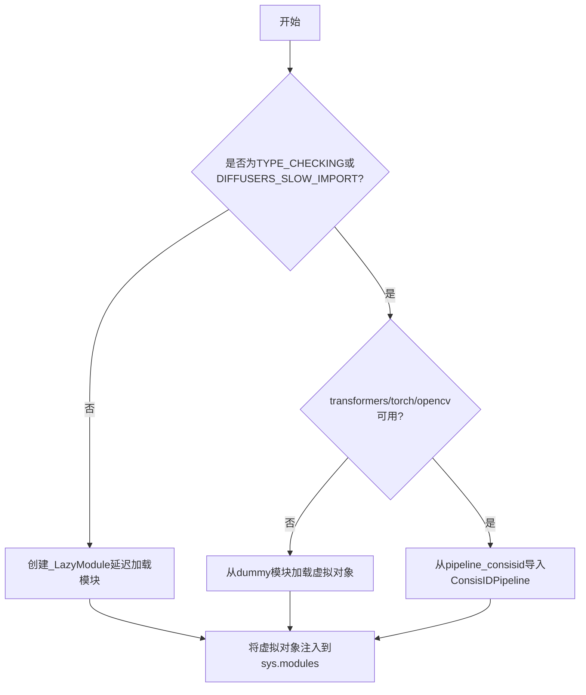

# `diffusers\src\diffusers\pipelines\consisid\__init__.py` 详细设计文档

这是一个Diffusers库的延迟加载模块，用于在满足可选依赖（transformers、torch、opencv）条件时导入ConsisIDPipeline，否则加载虚拟对象以保持模块接口一致性。

## 整体流程



## 类结构

```
无自定义类层次结构
主要使用_LazyModule进行延迟加载
ConsisIDPipeline (被导入的pipeline类)
```

## 全局变量及字段


### `_dummy_objects`
    
用于存储虚拟对象的字典，当可选依赖（torch、transformers、opencv）不可用时，会从dummy模块中获取虚拟对象并填充到此字典中

类型：`dict`
    


### `_import_structure`
    
定义模块导入结构的字典，键为模块路径，值为可导出的类或函数列表，用于LazyModule的延迟加载机制

类型：`dict`
    


    

## 全局函数及方法


## 关键组件


### 延迟加载模块 (_LazyModule)

使用 `_LazyModule` 实现模块的延迟加载，将模块注册到 `sys.modules` 中，只有在实际使用时才真正加载对应的类，提高导入速度并减少初始内存占用。

### 可选依赖检查机制

通过 `is_transformers_available()`、`is_torch_available()` 和 `is_opencv_available()` 三个函数检查必需的可选依赖是否已安装，用于条件性导入pipeline模块。

### 虚拟对象模式 (_dummy_objects)

当可选依赖不可用时，通过 `get_objects_from_module` 从虚拟对象模块中获取虚拟对象，并将其设置为模块属性，确保代码在缺少依赖时不会直接崩溃。

### 导入结构定义 (_import_structure)

使用字典定义模块的导入结构，键为模块路径，值为可导出的类列表（如 `ConsisIDPipeline`），为动态导入提供元数据支持。

### TYPE_CHECKING 条件导入

在类型检查模式下，直接导入实际的 `ConsisIDPipeline` 类而非虚拟对象，支持IDE和类型检查器进行类型推断和验证。

### ConsisIDPipeline 流水线类

通过延迟加载机制导入的身份一致性（Consistency ID）生成流水线，用于处理图像生成任务，依赖于 transformers、torch 和 opencv 三个核心库。


## 问题及建议


### 已知问题

-   **依赖检查逻辑不一致**：主逻辑中检查 `is_transformers_available() and is_torch_available() and is_opencv_available()` 三个依赖，但在 TYPE_CHECKING 分支中仅检查 `is_transformers_available() and is_torch_available()`，缺少 opencv 的检查，可能导致类型导入与运行时行为不一致
-   **重复的异常处理模式**：使用 try-except 捕获 `OptionalDependencyNotAvailable` 后在 except 分支导入 dummy 对象，这种模式在主逻辑和 TYPE_CHECKING 分支中重复出现，增加维护成本
-   **魔法字符串硬编码**：`"pipeline_consisid"` 作为键名在代码中硬编码，若模块重命名需要手动同步修改，容易遗漏
-   **导入结构与实际导入不一致**：在主逻辑的 else 分支中，`_import_structure["pipeline_consisid"]` 只在依赖全部可用时添加，但 TYPE_CHECKING 分支有独立的导入逻辑，可能导致 IDE 提示和实际运行时行为不一致
-   **缺少模块级文档**：整个模块没有文档字符串（docstring），难以快速理解模块用途和设计意图

### 优化建议

-   **抽取依赖检查逻辑**：将依赖检查封装为独立函数，例如 `def _check_dependencies()`，避免在多处重复相同的条件判断，提高代码可维护性
-   **统一导入结构定义**：将 `_import_structure` 的定义集中管理，确保 TYPE_CHECKING 分支和运行时分支使用一致的导入键，避免潜在的导入遗漏
-   **使用常量替代硬编码字符串**：定义 `PIPELINE_NAME = "pipeline_consisid"` 常量，统一引用位置，降低重命名风险
-   **添加模块文档**：在文件开头添加模块级 docstring，说明这是 ConsisIDPipeline 的延迟加载模块，负责可选依赖管理
-   **考虑使用装饰器或上下文管理器**：对于可选依赖的加载逻辑，可以考虑抽象为更简洁的封装，减少样板代码


## 其它


### 设计目标与约束

本模块采用延迟加载(Lazy Loading)模式，旨在解决Diffusers库中大型Pipeline模块的快速导入问题。通过条件导入机制，仅在实际使用ConsisIDPipeline时才加载完整模块，显著提升库的整体导入速度。设计约束包括：必须同时满足transformers、torch和opencv三个可选依赖才能正常导入，任何一个依赖缺失都将触发dummy对象的注入。

### 错误处理与异常设计

代码使用try-except块捕获OptionalDependencyNotAvailable异常。当检测到任一可选依赖不可用时，程序流程如下：捕获异常后，从dummy模块导入空对象定义，通过get_objects_from_module函数获取所有dummy对象，并将其更新到全局_dummy_objects字典中。这种设计确保了模块在依赖不完整时仍可被导入，但调用时会触发真实的ImportError，实现优雅降级。

### 外部依赖与接口契约

模块明确依赖三个外部包：transformers(模型加载)、torch(深度学习框架)和opencv(图像处理)。导入契约规定：只有当三个依赖全部可用时，ConsisIDPipeline才会被导入；否则模块导出空对象。TYPE_CHECKING模式下会额外检查torch和transformers可用性，允许类型检查工具在无运行时依赖时工作。_import_structure字典定义了公开API接口，仅暴露ConsisIDPipeline类。

### 模块初始化流程

模块初始化遵循以下时序：首次导入时执行顶层代码，检查依赖可用性；若依赖满足，则将pipeline_consisid模块路径加入导入结构，否则填充dummy对象；DIFFUSERS_SLOW_IMPORT为真或TYPE_CHECKING模式下立即执行导入；否则将当前模块替换为_LazyModule代理对象，实现运行时延迟导入。_LazyModule在首次访问属性时触发真实模块加载。

### 内存管理与性能优化

使用LazyModule避免了在库初始化时加载所有Pipeline的内存开销。dummy对象机制通过setattr将空对象注入sys.modules，使得依赖检查失败的导入不会引发AttributeError，而是返回空对象引用。这种设计允许应用在缺少可选依赖时仍能部分运行，仅在调用特定功能时失败。

### 测试与兼容性考量

该模式需要针对两种场景编写测试：完整依赖环境下的功能测试，以及依赖缺失时的降级行为测试。dummy对象的存在使得测试可以在不安装大型依赖(如torch)的情况下运行，提升CI效率。模块需兼容Python 3.8+和不同版本的transformers/torch。

### 版本兼容性说明

代码通过is_xxx_available()函数抽象依赖检查，支持不同版本的库兼容性。_import_structure采用字典结构便于扩展未来新增的Pipeline类。TYPE_CHECKING分支允许类型检查器在无运行时环境时工作，支持IDE自动完成和静态分析工具。


    