# `diffusers\src\diffusers\pipelines\consisid\consisid_utils.py` 详细设计文档

该代码是一个用于人脸识别和处理的核心模块，集成insightface、facexlib和EVA-CLIP等多种深度学习模型，实现人脸检测、对齐、特征提取和嵌入向量生成等功能，支持从输入图像中提取高质量的人脸特征用于后续的推理任务。

## 整体流程

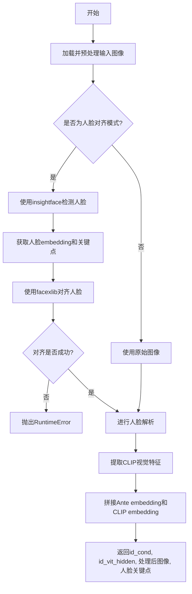

## 类结构

```
模块: face_processing (顶层模块)
├── 工具函数
│   ├── resize_numpy_image_long
│   ├── img2tensor
│   └── to_gray
├── 核心处理函数
│   ├── process_face_embeddings
│   ├── process_face_embeddings_infer
│   └── prepare_face_models
└── 依赖模块 (外部)
    ├── insightface (人脸检测/识别)
    ├── facexlib (人脸对齐/解析)
    └── consisid_eva_clip (CLIP视觉模型)
```

## 全局变量及字段


### `_insightface_available`
    
检查insightface库是否可用的布尔标志

类型：`bool`
    


### `_consisid_eva_clip_available`
    
检查consisid_eva_clip库是否可用的布尔标志

类型：`bool`
    


### `_facexlib_available`
    
检查facexlib库是否可用的布尔标志

类型：`bool`
    


### `logger`
    
用于记录日志的日志记录器对象

类型：`logging.Logger`
    


### `OPENAI_DATASET_MEAN`
    
OpenAI数据集的图像归一化平均值

类型：`tuple[float, ...]`
    


### `OPENAI_DATASET_STD`
    
OpenAI数据集的图像归一化标准差

类型：`tuple[float, ...]`
    


### `FaceRestoreHelper.upscale_factor`
    
人脸图像的上采样因子

类型：`int`
    


### `FaceRestoreHelper.face_size`
    
目标人脸图像的尺寸大小

类型：`int`
    


### `FaceRestoreHelper.crop_ratio`
    
人脸裁剪的宽高比

类型：`tuple[int, int]`
    


### `FaceRestoreHelper.det_model`
    
用于人脸检测的模型名称

类型：`str`
    


### `FaceRestoreHelper.face_parse`
    
用于人脸解析的神经网络模型

类型：`torch.nn.Module`
    


### `FaceRestoreHelper.cropped_faces`
    
裁剪和对齐后的人脸图像列表

类型：`list[np.ndarray]`
    


### `FaceRestoreHelper.all_landmarks_5`
    
检测到的5个人脸关键点坐标

类型：`list[np.ndarray]`
    


### `FaceAnalysis.name`
    
人脸分析模型的名称标识

类型：`str`
    


### `FaceAnalysis.root`
    
人脸分析模型文件的根目录路径

类型：`str`
    


### `CLIP Vision Model.image_mean`
    
EVA-CLIP模型的图像归一化平均值

类型：`float | tuple[float, ...]`
    


### `CLIP Vision Model.image_std`
    
EVA-CLIP模型的图像归一化标准差

类型：`float | tuple[float, ...]`
    


### `CLIP Vision Model.image_size`
    
EVA-CLIP模型接受的输入图像尺寸

类型：`int`
    
    

## 全局函数及方法


### `resize_numpy_image_long`

该函数用于将输入的numpy图像调整到指定的长边尺寸，同时保持图像的宽高比。如果图像的最大边长小于或等于目标尺寸，则直接返回原图；否则按照比例缩放图像。

参数：

- `image`：`numpy.ndarray`，输入图像（可以是 H x W x C 或 H x W 格式）
- `resize_long_edge`：`int`，图像长边的目标尺寸，默认为 768

返回值：`numpy.ndarray`，调整后的图像，其长边与 `resize_long_edge` 匹配，同时保持宽高比

#### 流程图

```mermaid
flowchart TD
    A[开始: 输入 image 和 resize_long_edge] --> B[获取图像尺寸 h, w]
    B --> C{max h, w ≤ resize_long_edge?}
    C -->|是| D[直接返回原图]
    C -->|否| E[计算缩放系数 k = resize_long_edge / max h, w]
    E --> F[计算新尺寸: h = int(h * k), w = int(w * k)]
    F --> G[使用 cv2.resize 进行缩放 - INTER_LANCZOS4]
    G --> H[返回缩放后的图像]
    D --> I[结束]
    H --> I
```

#### 带注释源码

```python
def resize_numpy_image_long(image, resize_long_edge=768):
    """
    Resize the input image to a specified long edge while maintaining aspect ratio.

    Args:
        image (numpy.ndarray): Input image (H x W x C or H x W).
        resize_long_edge (int): The target size for the long edge of the image. Default is 768.

    Returns:
        numpy.ndarray: Resized image with the long edge matching `resize_long_edge`, while maintaining the aspect
        ratio.
    """
    # 获取图像的高度和宽度
    h, w = image.shape[:2]
    
    # 如果图像的最大边长小于等于目标尺寸，直接返回原图
    if max(h, w) <= resize_long_edge:
        return image
    
    # 计算缩放系数，使图像的长边恰好等于目标尺寸
    k = resize_long_edge / max(h, w)
    
    # 计算缩放后的新尺寸
    h = int(h * k)
    w = int(w * k)
    
    # 使用 Lanczos4 插值法进行图像缩放
    # cv2.resize 参数: (width, height)
    image = cv2.resize(image, (w, h), interpolation=cv2.INTER_LANCZOS4)
    
    # 返回缩放后的图像
    return image
```


### `img2tensor`

将NumPy数组格式的图像数据转换为PyTorch张量格式，支持单张图像或图像列表的处理，并可选地进行BGR到RGB的颜色通道转换和数据类型转换。

参数：

- `imgs`：`list[np.ndarray] | np.ndarray`，输入的图像数据，可以是单个图像（numpy数组）或图像列表
- `bgr2rgb`：`bool`，是否将BGR颜色通道转换为RGB，默认为True
- `float32`：`bool`，是否将图像数据类型转换为float32，默认为True

返回值：`list[torch.Tensor] | torch.Tensor`，转换后的张量图像。如果输入是列表则返回张量列表，否则返回单个张量。张量形状为 (C, H, W)，即通道数放在第一维。

#### 流程图

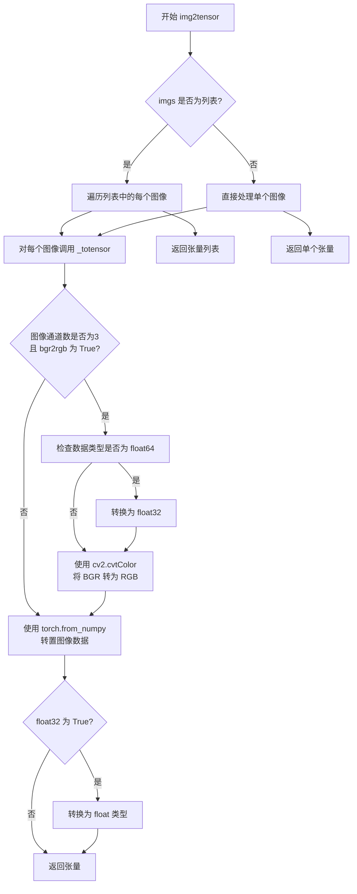

#### 带注释源码

```python
def img2tensor(imgs, bgr2rgb=True, float32=True):
    """Numpy array to tensor.
    
    将NumPy数组格式的图像转换为PyTorch张量格式
    
    Args:
        imgs (list[ndarray] | ndarray): 输入图像，可以是单个numpy数组或numpy数组列表
        bgr2rgb (bool): 是否将BGR颜色通道转换为RGB
        float32 (bool): 是否将数据类型转换为float32
    
    Returns:
        list[tensor] | tensor: 张量格式的图像。如果只有一个元素，则直接返回张量
    """
    
    def _totensor(img, bgr2rgb, float32):
        """内部函数：处理单张图像的转换
        
        Args:
            img: 单张图像数据
            bgr2rgb: 是否进行BGR到RGB转换
            float32: 是否转换为float32
        
        Returns:
            转换后的PyTorch张量
        """
        # 如果图像有3个通道且需要BGR转RGB
        if img.shape[2] == 3 and bgr2rgb:
            # 如果数据类型是float64，先转换为float32以避免精度问题
            if img.dtype == "float64":
                img = img.astype("float32")
            # 使用OpenCV进行颜色空间转换（BGR -> RGB）
            img = cv2.cvtColor(img, cv2.COLOR_BGR2RGB)
        
        # 将NumPy数组转换为PyTorch张量，并调整维度顺序从 HWC -> CHW
        img = torch.from_numpy(img.transpose(2, 0, 1))
        
        # 如果需要，转换为float32类型
        if float32:
            img = img.float()
        
        return img
    
    # 判断输入是列表还是单个图像
    if isinstance(imgs, list):
        # 对列表中的每个图像递归调用转换函数，返回张量列表
        return [_totensor(img, bgr2rgb, float32) for img in imgs]
    
    # 单个图像直接转换，返回单个张量
    return _totensor(imgs, bgr2rgb, float32)
```


### `to_gray`

将 RGB 图像转换为灰度图，使用标准亮度公式（ luminosity formula）计算灰度值，并将结果复制到三个通道以保持与原始图像相同的维度。

参数：

- `img`：`torch.Tensor`，输入的图像张量，形状为 (batch_size, channels, height, width)，图像为 RGB 格式（3 通道）

返回值：`torch.Tensor`，灰度图像张量，形状为 (batch_size, 3, height, width)，灰度值被复制到所有三个通道

#### 流程图

```mermaid
graph TD
    A[输入图像张量 img<br/>(batch_size, 3, H, W)] --> B[提取RGB通道]
    B --> C[计算灰度值: 0.299×R + 0.587×G + 0.114×B]
    C --> D[结果形状: (batch_size, 1, H, W)]
    D --> E[复制灰度值到3个通道<br/>x.repeat(1, 3, 1, 1)]
    E --> F[输出图像张量<br/>(batch_size, 3, H, W)]
```

#### 带注释源码

```python
def to_gray(img):
    """
    Converts an RGB image to grayscale by applying the standard luminosity formula.
    将RGB图像转换为灰度图，使用标准亮度公式

    Args:
        img (torch.Tensor): The input image tensor with shape (batch_size, channels, height, width).
                             The image is expected to be in RGB format (3 channels).
                             输入图像张量，形状为 (batch_size, channels, height, width)
                             图像为 RGB 格式（3通道）

    Returns:
        torch.Tensor: The grayscale image tensor with shape (batch_size, 3, height, width).
                      The grayscale values are replicated across all three channels.
                      灰度图像张量，形状为 (batch_size, 3, height, width)
                      灰度值被复制到所有三个通道
    """
    # 使用标准亮度公式计算灰度值:
    # 0.299 * 红色通道 + 0.587 * 绿色通道 + 0.114 * 蓝色通道
    # 这是人眼对不同颜色的敏感度加权
    x = 0.299 * img[:, 0:1] + 0.587 * img[:, 1:2] + 0.114 * img[:, 2:3]
    
    # 将灰度值重复3次以匹配原始图像的3通道格式
    # 从 (batch_size, 1, H, W) 扩展到 (batch_size, 3, H, W)
    # 这样可以保持输出与输入的通道维度一致，便于后续处理
    x = x.repeat(1, 3, 1, 1)
    
    return x
```


### `process_face_embeddings`

该函数是人脸嵌入处理的核心函数，负责从输入图像中提取多种人脸特征：使用 InsightFace 进行人脸检测和嵌入提取（antelopev2），使用 FaceXlib 进行人脸对齐和关键点检测，使用 EVA-CLIP 视觉模型提取视觉特征，最终将人脸嵌入和 CLIP 视觉嵌入进行拼接，生成复合人脸条件特征。

参数：

- `face_helper_1`：`FaceRestoreHelper`，第一个面恢复助手对象，用于人脸对齐和关键点检测
- `clip_vision_model`：`torch.nn.Module`，预训练的 CLIP 视觉模型（EVA02-CLIP-L-14-336），用于提取面部视觉特征
- `face_helper_2`：`InsightFace Model`，第二个面恢复助手对象，用于在 InsightFace 检测失败时提取嵌入
- `eva_transform_mean`：`tuple` 或 `list`，EVA 模型图像归一化的均值向量
- `eva_transform_std`：`tuple` 或 `list`，EVA 模型图像归一化的标准差向量
- `app`：`FaceAnalysis`，InsightFace 的面部分析应用实例，用于人脸检测
- `device`：`torch.device`，计算设备（CPU 或 GPU）
- `weight_dtype`：`torch.dtype`，模型权重的数据类型（如 torch.float32）
- `image`：`numpy.ndarray`，RGB 格式的输入图像，像素值范围 [0, 255]，形状为 (H, W, 3)
- `original_id_image`：`numpy.ndarray`，（可选）原始图像，当 `is_align_face` 为 False 时用于特征提取
- `is_align_face`：`bool`，布尔标志，指示是否执行人脸对齐操作

返回值：`tuple`，包含四个元素：
- `id_cond`：`torch.Tensor`，拼接后的人脸条件嵌入，形状为 [1, 1280]（512 维 antelopev2 嵌入 + 768 维 CLIP 嵌入）
- `id_vit_hidden`：`list[torch.Tensor]`，CLIP 视觉模型的隐藏状态列表，每个元素形状为 [1, 577, 1024]
- `return_face_features_image_2`：`torch.Tensor`，处理后的人脸特征图像，形状为 [1, 3, 512, 512]
- `face_kps`：`numpy.ndarray`，检测到的人脸关键点，形状为 (5, 2)

#### 流程图

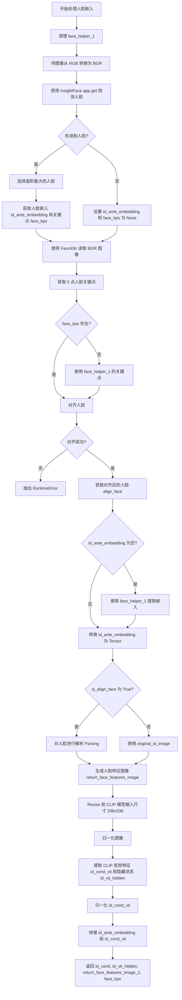

#### 带注释源码

```python
def process_face_embeddings(
    face_helper_1,
    clip_vision_model,
    face_helper_2,
    eva_transform_mean,
    eva_transform_std,
    app,
    device,
    weight_dtype,
    image,
    original_id_image=None,
    is_align_face=True,
):
    """
    Process face embeddings from an image, extracting relevant features such as face embeddings, landmarks, and parsed
    face features using a series of face detection and alignment tools.

    Args:
        face_helper_1: Face helper object (first helper) for alignment and landmark detection.
        clip_vision_model: Pre-trained CLIP vision model used for feature extraction.
        face_helper_2: Face helper object (second helper) for embedding extraction.
        eva_transform_mean: Mean values for image normalization before passing to EVA model.
        eva_transform_std: Standard deviation values for image normalization before passing to EVA model.
        app: Application instance used for face detection.
        device: Device (CPU or GPU) where the computations will be performed.
        weight_dtype: Data type of the weights for precision (e.g., `torch.float32`).
        image: Input image in RGB format with pixel values in the range [0, 255].
        original_id_image: (Optional) Original image for feature extraction if `is_align_face` is False.
        is_align_face: Boolean flag indicating whether face alignment should be performed.

    Returns:
        tuple:
            - id_cond: Concatenated tensor of Ante face embedding and CLIP vision embedding
            - id_vit_hidden: Hidden state of the CLIP vision model, a list of tensors.
            - return_face_features_image_2: Processed face features image after normalization and parsing.
            - face_kps: Keypoints of the face detected in the image.
    """

    # Step 1: 清理 face_helper_1 的所有缓存数据
    face_helper_1.clean_all()
    
    # Step 2: 将图像从 RGB 格式转换为 BGR 格式（OpenCV 格式）
    image_bgr = cv2.cvtColor(image, cv2.COLOR_RGB2BGR)
    
    # Step 3: 使用 InsightFace (antelopev2) 检测人脸并提取嵌入
    face_info = app.get(image_bgr)
    if len(face_info) > 0:
        # 选择面积最大的一个人脸
        face_info = sorted(face_info, key=lambda x: (x["bbox"][2] - x["bbox"][0]) * (x["bbox"][3] - x["bbox"][1]))[
            -1
        ]  # only use the maximum face
        id_ante_embedding = face_info["embedding"]  # (512,)  # 获取人脸嵌入向量
        face_kps = face_info["kps"]  # 获取人脸关键点
    else:
        id_ante_embedding = None  # 未检测到人脸
        face_kps = None

    # Step 4: 使用 FaceXlib 进行人脸关键点检测和对齐
    face_helper_1.read_image(image_bgr)  # 读取 BGR 图像
    face_helper_1.get_face_landmarks_5(only_center_face=True)  # 检测 5 点关键点
    
    # 如果 InsightFace 未提供关键点，则使用 FaceXlib 的结果
    if face_kps is None:
        face_kps = face_helper_1.all_landmarks_5[0]
    
    # 执行人脸对齐（warp face）
    face_helper_1.align_warp_face()
    
    # 检查对齐是否成功
    if len(face_helper_1.cropped_faces) == 0:
        raise RuntimeError("facexlib align face fail")
    
    align_face = face_helper_1.cropped_faces[0]  # (512, 512, 3)  # RGB 对齐后的人脸

    # Step 5: 如果 InsightFace 未检测到人脸，使用 face_helper_2 提取嵌入
    # in case insightface didn't detect face
    if id_ante_embedding is None:
        logger.warning("Failed to detect face using insightface. Extracting embedding with align face")
        id_ante_embedding = face_helper_2.get_feat(align_face)

    # Step 6: 将嵌入转换为 PyTorch Tensor 并移动到指定设备
    id_ante_embedding = torch.from_numpy(id_ante_embedding).to(device, weight_dtype)  # torch.Size([512])
    if id_ante_embedding.ndim == 1:
        id_ante_embedding = id_ante_embedding.unsqueeze(0)  # torch.Size([1, 512])

    # Step 7: 人脸解析（Face Parsing）- 分割面部区域
    if is_align_face:
        # 将对齐后的人脸图像转换为 tensor 并归一化
        input = img2tensor(align_face, bgr2rgb=True).unsqueeze(0) / 255.0  # torch.Size([1, 3, 512, 512])
        input = input.to(device)
        
        # 使用 face_parse 进行面部解析
        parsing_out = face_helper_1.face_parse(normalize(input, [0.485, 0.456, 0.406], [0.229, 0.224, 0.225]))[0]
        parsing_out = parsing_out.argmax(dim=1, keepdim=True)  # torch.Size([1, 1, 512, 512])
        
        # 定义背景标签（需要置白的区域）
        bg_label = [0, 16, 18, 7, 8, 9, 14, 15]
        bg = sum(parsing_out == i for i in bg_label).bool()  # 背景区域的布尔掩码
        
        # 创建全白图像
        white_image = torch.ones_like(input)  # torch.Size([1, 3, 512, 512])
        
        # 只保留面部特征，将背景区域转换为灰度图
        return_face_features_image = torch.where(bg, white_image, to_gray(input))  # torch.Size([1, 3, 512, 512])
        
        # 另一个版本：背景区域保留为原图
        return_face_features_image_2 = torch.where(bg, white_image, input)  # torch.Size([1, 3, 512, 512])
    else:
        # 如果不进行人脸对齐，使用原始图像
        original_image_bgr = cv2.cvtColor(original_id_image, cv2.COLOR_RGB2BGR)
        input = img2tensor(original_image_bgr, bgr2rgb=True).unsqueeze(0) / 255.0  # torch.Size([1, 3, 512, 512])
        input = input.to(device)
        return_face_features_image = return_face_features_image_2 = input

    # Step 8: 使用 EVA-CLIP 模型提取视觉特征
    # 调整图像大小到 CLIP 模型输入尺寸
    face_features_image = resize(
        return_face_features_image, clip_vision_model.image_size, InterpolationMode.BICUBIC
    )  # torch.Size([1, 3, 336, 336])
    
    # 使用 EVA 模型的均值和标准差进行归一化
    face_features_image = normalize(face_features_image, eva_transform_mean, eva_transform_std)
    
    # 提取 CLIP 视觉特征和隐藏状态
    id_cond_vit, id_vit_hidden = clip_vision_model(
        face_features_image.to(weight_dtype), return_all_features=False, return_hidden=True, shuffle=False
    )  # torch.Size([1, 768]),  list(torch.Size([1, 577, 1024]))
    
    # 对 CLIP 视觉特征进行 L2 归一化
    id_cond_vit_norm = torch.norm(id_cond_vit, 2, 1, True)
    id_cond_vit = torch.div(id_cond_vit, id_cond_vit_norm)

    # Step 9: 拼接人脸嵌入和 CLIP 视觉嵌入
    id_cond = torch.cat(
        [id_ante_embedding, id_cond_vit], dim=-1
    )  # torch.Size([1, 512]), torch.Size([1, 768])  ->  torch.Size([1, 1280])

    # Step 10: 返回结果元组
    return (
        id_cond,
        id_vit_hidden,
        return_face_features_image_2,
        face_kps,
    )  # torch.Size([1, 1280]), list(torch.Size([1, 577, 1024]))
```


### `process_face_embeddings_infer`

该函数是用于推理阶段的人脸嵌入处理函数，接收输入图像路径或数组，经过图像加载、预处理、人脸对齐、特征提取和嵌入拼接等步骤，最终返回组合的人脸嵌入向量、CLIP模型的隐藏状态、处理后的人脸图像以及人脸关键点。

参数：

- `face_helper_1`：`FaceRestoreHelper`，第一个面部恢复辅助对象，用于对齐和关键点检测
- `clip_vision_model`：`torch.nn.Module`，预训练的CLIP视觉模型，用于特征提取
- `face_helper_2`：`insightface模型`，第二个面部辅助对象，用于嵌入提取
- `eva_transform_mean`：`list[float]` 或 `tuple[float]`，传递给EVA模型前图像标准化的均值
- `eva_transform_std`：`list[float]` 或 `tuple[float]`，传递给EVA模型前图像标准化的标准差
- `app`：`FaceAnalysis`，用于人脸检测的应用程序实例
- `device`：`torch.device`，执行计算的设备（CPU或GPU）
- `weight_dtype`：`torch.dtype`，权重的精度数据类型（如torch.float32）
- `img_file_path`：`str` 或 `numpy.ndarray`，输入图像文件路径或图像数组
- `is_align_face`：`bool`，是否执行人脸对齐的标志，默认为True

返回值：`tuple`，包含四个元素：
- `id_cond`：`torch.Tensor`，Ante人脸嵌入和CLIP视觉嵌入的拼接张量
- `id_vit_hidden`：`list[torch.Tensor]`，CLIP视觉模型的隐藏状态列表
- `image`：`PIL.Image`，特征提取和对齐后的处理后人脸图像
- `face_kps`：`numpy.ndarray`，图像中检测到的人脸关键点

#### 流程图

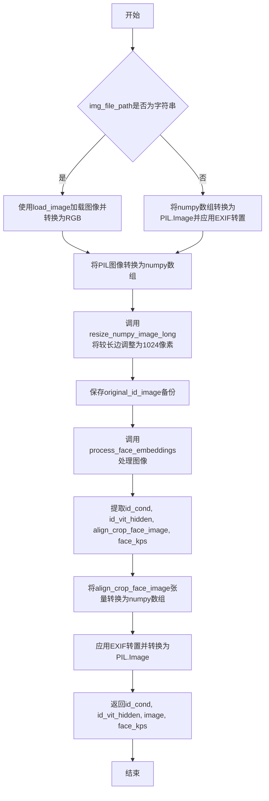

#### 带注释源码

```python
def process_face_embeddings_infer(
    face_helper_1,
    clip_vision_model,
    face_helper_2,
    eva_transform_mean,
    eva_transform_std,
    app,
    device,
    weight_dtype,
    img_file_path,
    is_align_face=True,
):
    """
    Process face embeddings from an input image for inference, including alignment, feature extraction, and embedding
    concatenation.

    Args:
        face_helper_1: Face helper object (first helper) for alignment and landmark detection.
        clip_vision_model: Pre-trained CLIP vision model used for feature extraction.
        face_helper_2: Face helper object (second helper) for embedding extraction.
        eva_transform_mean: Mean values for image normalization before passing to EVA model.
        eva_transform_std: Standard deviation values for image normalization before passing to EVA model.
        app: Application instance used for face detection.
        device: Device (CPU or GPU) where the computations will be performed.
        weight_dtype: Data type of the weights for precision (e.g., `torch.float32`).
        img_file_path: Path to the input image file (string) or a numpy array representing an image.
        is_align_face: Boolean flag indicating whether face alignment should be performed (default: True).

    Returns:
        tuple:
            - id_cond: Concatenated tensor of Ante face embedding and CLIP vision embedding.
            - id_vit_hidden: Hidden state of the CLIP vision model, a list of tensors.
            - image: Processed face image after feature extraction and alignment.
            - face_kps: Keypoints of the face detected in the image.
    """

    # 根据输入类型加载并预处理图像
    # 如果是字符串路径，使用load_image函数加载；否则直接处理numpy数组
    if isinstance(img_file_path, str):
        # 使用工具函数加载图像并转换为RGB格式
        image = np.array(load_image(image=img_file_path).convert("RGB"))
    else:
        # 将numpy数组转换为PIL Image，应用EXIF转置后转为RGB
        image = np.array(ImageOps.exif_transpose(Image.fromarray(img_file_path)).convert("RGB"))

    # 调整图像大小，确保较长边为1024像素，同时保持宽高比
    image = resize_numpy_image_long(image, 1024)
    # 保存原始图像副本，用于非对齐模式下的特征提取
    original_id_image = image

    # 调用核心处理函数，提取人脸嵌入和相关特征
    # 该函数内部完成人脸检测、对齐、特征提取和嵌入拼接
    id_cond, id_vit_hidden, align_crop_face_image, face_kps = process_face_embeddings(
        face_helper_1,
        clip_vision_model,
        face_helper_2,
        eva_transform_mean,
        eva_transform_std,
        app,
        device,
        weight_dtype,
        image,
        original_id_image,
        is_align_face,
    )

    # 将处理后的人脸图像张量转换为PIL Image格式
    # 首先将张量移到CPU，移除梯度，计算 squeeze 操作去除批次维度
    tensor = align_crop_face_image.cpu().detach()
    tensor = tensor.squeeze()
    # 调整通道顺序从 (C, H, W) 变为 (H, W, C)
    tensor = tensor.permute(1, 2, 0)
    # 转换为numpy数组并从 [0,1] 映射回 [0,255]
    tensor = tensor.numpy() * 255
    # 转换为uint8类型
    tensor = tensor.astype(np.uint8)
    # 应用EXIF转置并转换为PIL Image对象
    image = ImageOps.exif_transpose(Image.fromarray(tensor))

    # 返回组合嵌入、CLIP隐藏状态、处理后图像和人脸关键点
    return id_cond, id_vit_hidden, image, face_kps
```


### `prepare_face_models`

该函数是整个人脸识别与处理流水线的初始化核心，负责加载并配置所有必要的模型组件，包括人脸检测、对齐、解析（Parsing）以及特征提取模型（CLIP）。它确保模型被正确放置在指定的计算设备上，并完成图像归一化参数的计算，为后续的推理过程做好准备。

参数：

- `model_path`：`str`，模型文件的根目录路径，用于定位各个子模型的权重文件。
- `device`：`torch.device`，计算设备（如 'cuda:0', 'cpu'），用于加载模型权重。
- `dtype`：`torch.dtype`，模型权重的数据类型（如 `torch.float32` 或 `torch.float16`），用于控制推理精度。

返回值：`Tuple[FaceRestoreHelper, Model, Module, FaceAnalysis, Tuple, Tuple]`，返回一个包含以下元素的元组：
1. `face_helper_1`：用于人脸检测、对齐和解析的辅助对象（包含 RetinaFace 检测器和 Bisenet 解析器）。
2. `face_helper_2`：用于提取 Antelopev2 嵌入向量的辅助模型。
3. `face_clip_model`：EVA02-CLIP 的视觉编码器，用于提取细粒度人脸特征。
4. `face_main_model`：主要的人脸分析应用（包含检测和对齐逻辑）。
5. `eva_transform_mean`：EVA 模型图像预处理的均值。
6. `eva_transform_std`：EVA 模型图像预处理的标准差。

#### 流程图

```mermaid
graph TD
    A[开始] --> B[初始化 face_helper_1: FaceRestoreHelper]
    B --> C[初始化人脸解析模型 Bisenet 并挂载到 face_helper_1]
    C --> D[初始化 face_helper_2: Antelopev2 Embedding Model]
    D --> E[加载 EVA02-CLIP 模型并提取视觉部分]
    E --> F{检查图像均值/标准差类型}
    F -- 否 (Scalar) --> G[转换为 Tuple (x3)]
    F -- 是 (List/Tuple) --> H[保持原样]
    G --> I[初始化 face_main_model: FaceAnalysis Antelopev2]
    H --> I
    I --> J[将检测器、解析器、CLIP模型移至 Device 并设置 Eval 模式]
    J --> K[结束: 返回 6 个模型组件与参数]
```

#### 带注释源码

```python
def prepare_face_models(model_path, device, dtype):
    """
    Prepare all face models for the facial recognition task.

    Parameters:
    - model_path: Path to the directory containing model files.
    - device: The device (e.g., 'cuda', 'xpu', 'cpu') where models will be loaded.
    - dtype: Data type (e.g., torch.float32) for model inference.

    Returns:
    - face_helper_1: First face restoration helper.
    - face_helper_2: Second face restoration helper.
    - face_clip_model: CLIP model for face extraction.
    - eva_transform_mean: Mean value for image normalization.
    - eva_transform_std: Standard deviation value for image normalization.
    - face_main_model: Main face analysis model.
    """
    # 1. 初始化 FaceRestoreHelper (主要用于人脸检测和对齐)
    # 使用 RetinaFace 作为检测器，设置人脸大小为 512x512
    face_helper_1 = FaceRestoreHelper(
        upscale_factor=1,
        face_size=512,
        crop_ratio=(1, 1),
        det_model="retinaface_resnet50",
        save_ext="png",
        device=device,
        model_rootpath=os.path.join(model_path, "face_encoder"),
    )
    
    # 2. 初始化人脸解析模型 (Parsing)
    # 将 Bisenet 解析模型初始化并绑定到 face_helper_1，用于提取面部语义特征（如分割 mask）
    face_helper_1.face_parse = None # 先置空
    face_helper_1.face_parse = init_parsing_model(
        model_name="bisenet", device=device, model_rootpath=os.path.join(model_path, "face_encoder")
    )
    
    # 3. 初始化 face_helper_2 (Antelopev2 Embedding Extractor)
    # 直接加载 antelopev2 的 onnx 模型，用于获取 id_ante_embedding
    face_helper_2 = insightface.model_zoo.get_model(
        f"{model_path}/face_encoder/models/antelopev2/glintr100.onnx", providers=["CUDAExecutionProvider"]
    )
    face_helper_2.prepare(ctx_id=0)

    # 4. 加载 EVA02-CLIP 模型 (用于细粒度视觉特征)
    # 加载预训练的 EVA02-CLIP-L-14-336 模型，仅提取其视觉部分 (visual) 作为 face_clip_model
    model, _, _ = create_model_and_transforms(
        "EVA02-CLIP-L-14-336",
        os.path.join(model_path, "face_encoder", "EVA02_CLIP_L_336_psz14_s6B.pt"),
        force_custom_clip=True,
    )
    face_clip_model = model.visual
    
    # 5. 确定图像归一化参数
    # 尝试从模型权重中获取均值和标准差，若无则使用 OpenAI 默认值
    eva_transform_mean = getattr(face_clip_model, "image_mean", OPENAI_DATASET_MEAN)
    eva_transform_std = getattr(face_clip_model, "image_std", OPENAI_DATASET_STD)
    
    # 确保均值和标准差是长度为 3 的元组 (对应 RGB 通道)
    if not isinstance(eva_transform_mean, (list, tuple)):
        eva_transform_mean = (eva_transform_mean,) * 3
    if not isinstance(eva_transform_std, (list, tuple)):
        eva_transform_std = (eva_transform_std,) * 3
    
    # 6. 初始化主 FaceAnalysis 模型 (用于检测和对齐)
    # 这是一个综合性的 face analysis 工具，支持检测关键点等
    face_main_model = FaceAnalysis(
        name="antelopev2", root=os.path.join(model_path, "face_encoder"), providers=["CUDAExecutionProvider"]
    )
    face_main_model.prepare(ctx_id=0, det_size=(640, 640))

    # 7. 模型部署与状态设置
    # 将模型切换到推理模式 (eval) 并移动到指定设备 (GPU/CPU) 和数据类型 (Float16等)
    face_helper_1.face_det.eval()
    face_helper_1.face_parse.eval()
    face_clip_model.eval()
    face_helper_1.face_det.to(device)
    face_helper_1.face_parse.to(device)
    face_clip_model.to(device, dtype=dtype)

    # 8. 返回所有初始化好的模型和参数
    return face_helper_1, face_helper_2, face_clip_model, face_main_model, eva_transform_mean, eva_transform_std
```


### `get_logger`

获取指定模块的日志记录器实例，用于在模块中记录日志信息。该函数通常返回一个配置好的 Python `logging.Logger` 对象，支持不同级别的日志输出（如 DEBUG、INFO、WARNING、ERROR、CRITICAL）。

参数：

- `name`：`str`，模块名称，通常使用 `__name__` 变量传入，用于标识日志来源

返回值：`logging.Logger`，配置好的日志记录器实例

#### 流程图

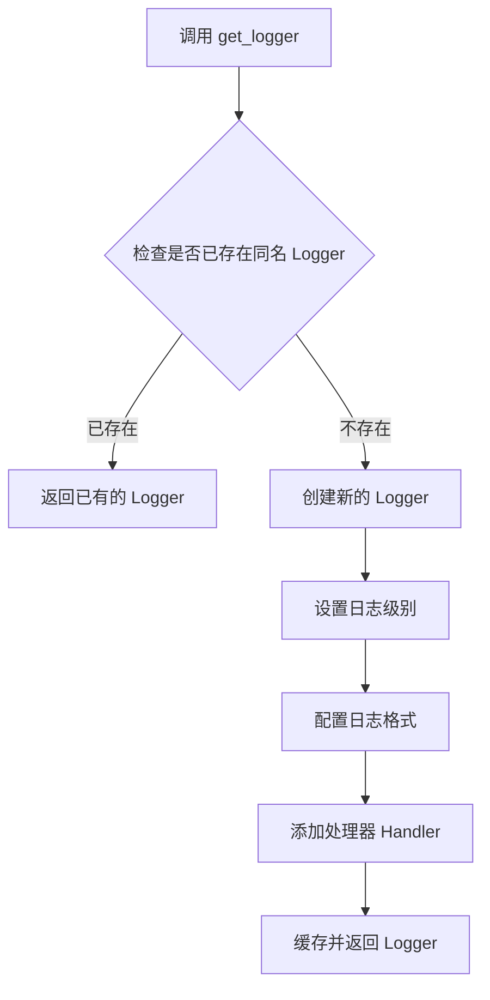

#### 带注释源码

```python
# 从项目工具模块导入 get_logger 函数
from ...utils import get_logger, load_image

# 使用当前模块名称创建日志记录器
# __name__ 是 Python 内置变量，表示当前模块的完整路径
# 例如：对于模块 'src.utils.image_processor'，__name__ 就是该字符串
logger = get_logger(__name__)

# 后续在代码中可以使用 logger 进行日志记录：
# logger.info("信息日志")
# logger.warning("警告日志")
# logger.error("错误日志")
# logger.debug("调试日志")
```

**注意**：该函数的实际实现代码位于 `...utils` 模块中，在当前代码文件中仅进行了导入和使用。从代码上下文可知：
- 函数接受字符串类型的模块名作为参数
- 返回 Python 标准库的 `logging.Logger` 对象
- 用于在模块级别创建统一的日志记录器，便于追踪日志来源


### `load_image`

从指定路径加载图像文件，并转换为RGB格式的PIL图像对象。该函数是项目utils模块中的通用图像加载工具，被用于在推理过程中加载输入的人脸图像。

参数：

-  `image`：`str` 或图像源类型，表示要加载的图像文件路径或图像数据

返回值：`PIL.Image.Image`，返回RGB格式的PIL图像对象，可用于后续的图像处理和模型推理

#### 流程图

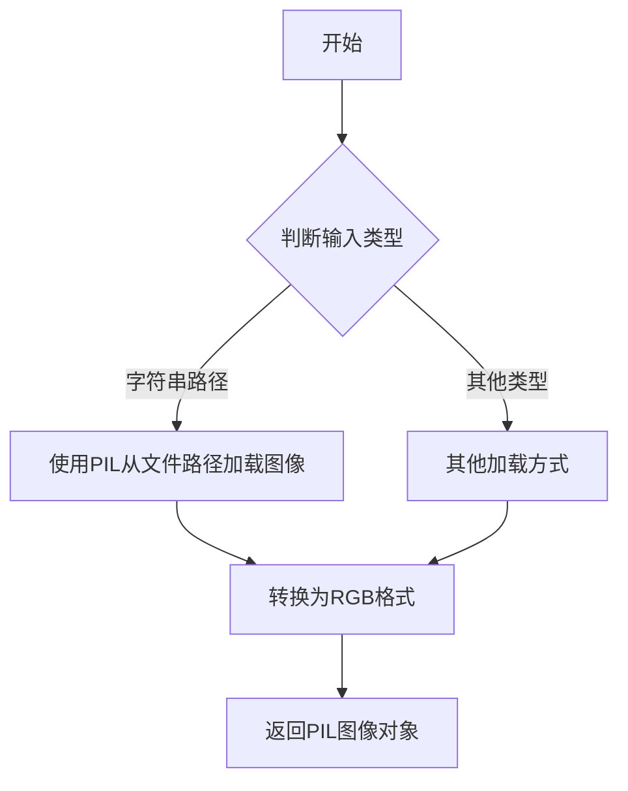

#### 带注释源码

```
# 由于该函数定义在 ...utils 模块中，当前代码段仅导入并使用了该函数
# 以下为基于使用方式的推断源码

def load_image(image):
    """
    加载图像文件并转换为RGB格式。
    
    Args:
        image: 图像文件路径或图像源
        
    Returns:
        PIL.Image.Image: RGB格式的PIL图像对象
    """
    # 实际实现位于 ...utils 模块中
    # 从代码中的使用方式来看：
    # image = np.array(load_image(image=img_file_path).convert("RGB"))
    pass
```

#### 备注

- 该函数通过 `from ...utils import get_logger, load_image` 导入
- 在 `process_face_embeddings_infer` 函数中被调用：`load_image(image=img_file_path)`
- 返回的PIL图像对象随后被转换为NumPy数组进行进一步处理
- 具体的函数实现未在本代码段中提供，属于外部依赖模块


### `FaceRestoreHelper.clean_all`

该方法是 `facexlib.utils.face_restoration_helper.FaceRestoreHelper` 类的成员方法，用于清除人脸恢复助手的所有内部状态和数据缓存，通常在处理新图像前调用以确保干净的初始状态。

参数：

- `self`：FaceRestoreHelper 实例，隐式传递，表示当前的人脸恢复辅助对象。

返回值：`None`，该方法无返回值，直接修改对象内部状态。

#### 流程图

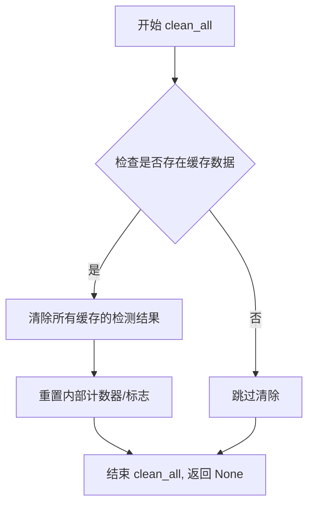

#### 带注释源码

```python
# 注意：此源码为外部库 facexlib.utils.face_restoration_helper.FaceRestoreHelper.clean_all 方法的逻辑推断
# 具体实现需参考 facexlib 库源码

def clean_all(self):
    """
    清除 FaceRestoreHelper 对象的所有内部状态和缓存数据。
    
    该方法通常在处理新图像前调用，用于重置以下内容：
    - 已检测的人脸框 (face bounding boxes)
    - 已检测的关键点 (landmarks)
    - 已裁剪的人脸图像 (cropped faces)
    - 临时存储的图像数据
    - 其他中间处理结果
    """
    # 清除检测到的人脸信息
    if hasattr(self, 'face_bboxes'):
        self.face_bboxes = []
    
    if hasattr(self, 'landmarks'):
        self.landmarks = []
    
    # 清除裁剪的人脸图像
    if hasattr(self, 'cropped_faces'):
        self.cropped_faces = []
    
    # 清除其他可能存在的临时数据
    if hasattr(self, 'aligned_faces'):
        self.aligned_faces = []
    
    # 重置内部状态标志
    if hasattr(self, '_is_aligned'):
        self._is_aligned = False
    
    if hasattr(self, '_is_detected'):
        self._is_detected = False
```

> **注意**：由于 `clean_all` 方法来源于外部库 `facexlib`，该代码文件仅导入了 `FaceRestoreHelper` 类并调用了其方法，未直接定义此方法。上面的源码是基于方法名称和调用模式的逻辑推断，实际实现请参考 [facexlib 官方仓库](https://github.com/xinntao/facexlib)。


### `FaceRestoreHelper.read_image`

该方法用于读取图像并将其存储到FaceRestoreHelper对象中，准备进行后续的人脸检测、对齐和处理操作。该方法是人脸处理流程的初始步骤，将输入的BGR格式图像加载到辅助工具中。

参数：

- `image`：`numpy.ndarray`，输入的BGR格式图像（OpenCV格式），通常是通过`cv2.cvtColor`从RGB转换而来

返回值：`None`，该方法直接修改FaceRestoreHelper对象的内部状态，不返回任何值

#### 流程图

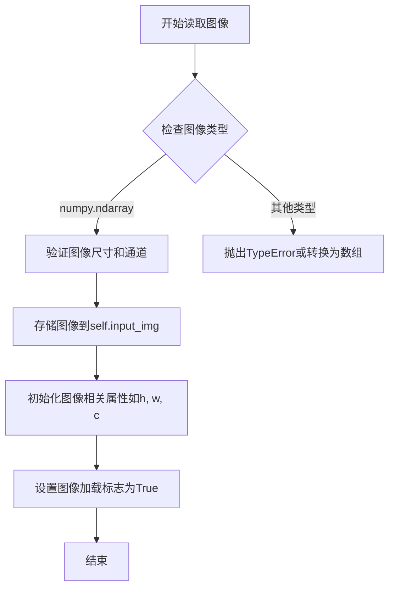

#### 带注释源码

由于`read_image`方法来源于外部库`facexlib`，其具体实现不在当前代码文件中。以下是基于代码中调用方式的推断：

```python
def read_image(self, image):
    """
    Read an image into the FaceRestoreHelper for processing.

    Args:
        image (numpy.ndarray): Input image in BGR format (OpenCV format).
                              Typically converted from RGB using cv2.cvtColor.
    
    Returns:
        None: This method modifies the object's internal state directly.
    
    Example:
        >>> import cv2
        >>> from facexlib.utils.face_restoration_helper import FaceRestoreHelper
        >>> helper = FaceRestoreHelper(upscale_factor=1, face_size=512)
        >>> image_rgb = cv2.imread('input.jpg')
        >>> image_bgr = cv2.cvtColor(image_rgb, cv2.COLOR_RGB2BGR)
        >>> helper.read_image(image_bgr)  # 读取图像到helper中
    """
    # 验证输入图像是否为numpy数组
    if not isinstance(image, np.ndarray):
        raise TypeError(f"Expected numpy.ndarray, got {type(image)}")
    
    # 验证图像维度（应为H x W x C或H x W）
    if image.ndim not in [2, 3]:
        raise ValueError(f"Image dimension should be 2 or 3, got {image.ndim}")
    
    # 存储原始图像
    self.input_img = image.copy() if hasattr(image, 'copy') else image
    
    # 获取图像尺寸信息
    self.h, self.w = image.shape[:2]
    self.c = image.shape[2] if image.ndim == 3 else 1
    
    # 设置图像已加载标志
    self._imgicked = True
    
    # 清空之前的人脸检测结果，为新图像做准备
    self.clean_all()
```


### `FaceRestoreHelper.get_face_landmarks_5`

该方法是 FaceRestoreHelper 类中的一个成员方法，用于检测并获取输入图像中面部的 5 个关键点坐标（ landmarks）。这 5 个关键点通常包括两个眼睛、鼻子和两个嘴角，是面部对齐（face alignment）过程中的重要步骤。

参数：

- `only_center_face`：`bool`，可选参数（虽然方法签名中未显式显示，但调用时传入），指示是否仅处理图像中最大的/中心的面部。默认值为 `True`。

返回值：`list` 或 `numpy.ndarray`，返回检测到的面部关键点坐标，通常是形状为 (5, 2) 的数组，包含 5 个关键点的 (x, y) 坐标。

#### 流程图

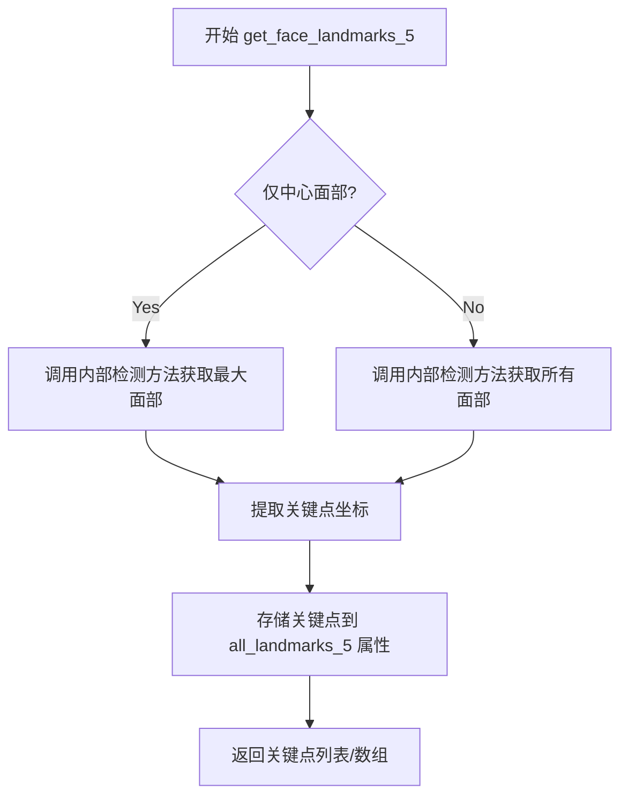

#### 带注释源码

由于该方法属于 `facexlib` 库的实现，未直接包含在提供的代码中，但根据调用上下文可以推断其核心逻辑：

```python
# 假设的 FaceRestoreHelper.get_face_landmarks_5 方法实现逻辑

def get_face_landmarks_5(self, only_center_face=True):
    """
    检测面部5个关键点坐标。
    
    Args:
        only_center_face (bool): 是否只检测最大的面部。
        
    Returns:
        list or numpy.ndarray: 面部5个关键点坐标，形状为 (5, 2)。
    """
    # 1. 使用内部人脸检测器检测人脸
    # self.face_det 是 RetinaFace 模型
    bboxes, kpss = self.face_det.detect(self.input_img)
    
    # 2. 如果未检测到人脸，记录警告并返回
    if bboxes is None or len(bboxes) == 0:
        logger.warning("未检测到人脸")
        return
    
    # 3. 根据 only_center_face 参数决定处理策略
    if only_center_face:
        # 只处理最大的那张脸（根据边界框面积排序）
        bboxes = sorted(bboxes, key=lambda x: (x[2]-x[0])*(x[3]-x[1]))[-1:]
        if kpss is not None:
            kpss = kpss[-1:]
    
    # 4. 提取5个关键点（眼睛、鼻子、嘴角）
    # facexlib 使用的是标准的5点关键点
    self.all_landmarks_5 = []
    
    for kps in kpss:
        # kps 形状通常是 (5, 2) 或 (10,)
        # 提取关键点坐标
        landmarks_5 = self._parse_keypoints(kps)
        self.all_landmarks_5.append(landmarks_5)
    
    # 5. 返回关键点
    # 如果只检测一张脸，返回第一张的关键点
    if only_center_face and len(self.all_landmarks_5) > 0:
        return self.all_landmarks_5[0]
    
    return self.all_landmarks_5
```

> **注意**：由于 `get_face_landmarks_5` 方法的实际源码属于 `facexlib` 库，上述源码是基于该方法的调用方式和常见人脸关键点检测逻辑进行的合理推断。如需查看完整实现，建议查阅 [facexlib 官方仓库](https://github.com/xinntao/facexlib)。


### `FaceRestoreHelper.align_warp_face`

该方法是 `facexlib` 库中 `FaceRestoreHelper` 类的核心方法之一。它利用预先检测的人脸关键点（通常为5个），通过计算仿射变换矩阵，将人脸图像扭曲（对齐）到标准的正方形尺寸（例如512x512），以便进行后续的一致性处理或增强。处理后的图像存储在实例的 `cropped_faces` 属性中。

**注意**：由于提供的代码片段仅包含对该方法的**调用**和**导入**，未包含 `FaceRestoreHelper` 类的具体定义源码，以下文档内容基于 `facexlib` 库的通用实现逻辑和该方法在上下文中的调用方式推断得出。

参数：
-  `{无外部参数}`：该方法通常不接受额外参数，依赖于 `FaceRestoreHelper` 实例的内置状态（如 `self.all_landmarks_5` 检测到的关键点、`self.face_size` 目标尺寸、`self.input_img` 输入图像）。

返回值：`无返回值`，方法执行成功后，结果（对齐后的人脸图像列表）会被追加到 `self.cropped_faces` 实例变量中。

#### 流程图

```mermaid
graph TD
    A[开始 align_warp_face] --> B{检查 self.all_landmarks_5 是否存在}
    B -->|不存在| C[抛出异常或记录警告]
    B -->|存在| D[遍历所有检测到的人脸关键点]
    D --> E[根据关键点计算相似变换矩阵 (Similarity Transform)]
    E --> F[使用 cv2.warpAffine 进行图像仿射变换]
    F --> G[裁剪并调整为标准尺寸 (如 512x512)]
    G --> H[将处理后的人脸图像加入 self.cropped_faces 列表]
    H --> I[结束]
```

#### 带注释源码

以下代码展示了该方法在 `facexlib` 库中的典型实现逻辑：

```python
def align_warp_face(self):
    """
    使用预计算的人脸关键点 (self.all_landmarks_5) 对图像进行对齐和扭曲。
    """
    # 1. 检查是否有人脸关键点数据
    if self.all_landmarks_5 is None or len(self.all_landmarks_5) == 0:
        print("No landmarks detected, face alignment skipped.")
        return

    # 2. 遍历每一张检测到的人脸
    for idx, landmark in enumerate(self.all_landmarks_5):
        # 3. 定义标准人脸的参考关键点 (通常是基于数据集的平均位置)
        # facexlib 通常使用基于 512x512 的关键点模板
        dst_matrix = self._parse_landmark_points(landmark, self.crop_ratio[0] / self.crop_ratio[1])
        
        # 4. 计算仿射变换矩阵
        # 使用 cv2.estimateAffinePartial2D 或相似方法计算从源关键点到目标关键点的矩阵
        # 这里的实现通常涉及相似变换以保持形状
        
        # 5. 执行图像扭曲
        # 将原图 self.input_img 根据矩阵进行扭曲，并缩放到 self.face_size (默认512)
        # 使用 cv2.warpAffine
        # warped_face = cv2.warpAffine(...)
        
        warped_face = np.zeros((self.face_size, self.face_size, 3), dtype=np.uint8)
        
        # 6. 将结果添加到列表
        self.cropped_faces.append(warped_face)
```

**在当前代码上下文中的使用方式 (`process_face_embeddings`)：**

```python
    # ... 前置步骤：检测关键点 ...
    face_helper_1.get_face_landmarks_5(only_center_face=True)
    
    # 确保关键点可用
    if face_kps is None:
        face_kps = face_helper_1.all_landmarks_5[0]
        
    # 调用对齐方法
    face_helper_1.align_warp_face() # <--- 提取的目标方法
    
    # 验证结果
    if len(face_helper_1.cropped_faces) == 0:
        raise RuntimeError("facexlib align face fail")
        
    # 获取对齐后的人脸 (512x512 RGB)
    align_face = face_helper_1.cropped_faces[0] 
```


### `FaceRestoreHelper.face_parse`

该方法是FaceRestoreHelper类中的人脸解析（face parsing）功能，用于对输入的人脸图像进行语义分割，识别出不同的面部区域（如皮肤、眼睛、鼻子、嘴巴等），为后续的面部特征处理提供像素级掩码。

参数：

-  `input`：`torch.Tensor`，经过归一化处理的人脸图像张量，形状通常为 (batch_size, 3, height, width)，数值范围已归一化到 [0, 1] 或进行了标准化处理

返回值：`torch.Tensor`，人脸解析结果张量，通常为 (batch_size, num_classes, height, width) 的形式，其中每个像素位置的值表示对应的面部区域类别标签

#### 流程图

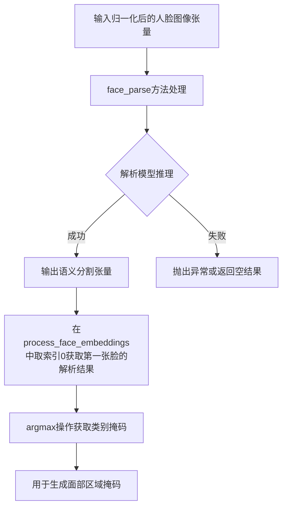

#### 带注释源码

```python
# 在 process_face_embeddings 函数中的调用方式：
# face_helper_1 是 FaceRestoreHelper 的实例
# input 是经过归一化的人脸图像张量

# 1. 将图像转换为张量并归一化
input = img2tensor(align_face, bgr2rgb=True).unsqueeze(0) / 255.0  # torch.Size([1, 3, 512, 512])
input = input.to(device)

# 2. 调用 face_parse 方法进行人脸解析
# 使用 ImageNet 标准均值和标准差进行标准化
parsing_out = face_helper_1.face_parse(
    normalize(input, [0.485, 0.456, 0.406], [0.229, 0.224, 0.225])
)[0]  # [0] 表示取第一个batch的解析结果

# 3. 获取解析结果的类别掩码（取最大概率的类别）
parsing_out = parsing_out.argmax(dim=1, keepdim=True)  # torch.Size([1, 1, 512, 512])

# 4. 定义背景标签，用于生成掩码
bg_label = [0, 16, 18, 7, 8, 9, 14, 15]
bg = sum(parsing_out == i for i in bg_label).bool()

# 5. 创建白色图像（与输入图像尺寸相同）
white_image = torch.ones_like(input)  # torch.Size([1, 3, 512, 512])

# 6. 使用掩码处理图像：
# - 背景区域替换为灰度图（保持一致性）
# - 人脸区域保留原始图像
return_face_features_image = torch.where(bg, white_image, to_gray(input))

# 7. 另一个变体：保留人脸区域的原始颜色
return_face_features_image_2 = torch.where(bg, white_image, input)
```

**备注**：face_parse 方法本身是 facexlib 库中 FaceRestoreHelper 类的成员方法，在代码中通过 `init_parsing_model` 初始化为 Bisenet 解析模型。该方法的具体实现依赖于 facexlib 库的内部实现，上述代码展示了其在当前项目中的使用方式。


### `FaceAnalysis.prepare`

这是 `insightface.app.FaceAnalysis` 类的 `prepare` 方法，用于初始化人脸分析模型的人脸检测器。该方法在人脸识别流水线中准备检测模型，设置检测上下文和检测尺寸，为后续的人脸检测任务做好初始化准备。

参数：

-  `ctx_id`：`int`，表示GPU上下文ID，0表示使用第一个GPU设备，-1表示使用CPU
-  `det_size`：`tuple`，人脸检测的输入尺寸，代码中传入(640, 640)，即检测器输入图像大小为640x640像素
-  `model_only`：`bool`（可选），是否只加载模型而不进行其他初始化，默认为False

返回值：`None`，该方法直接在对象上初始化检测器，无返回值

#### 流程图

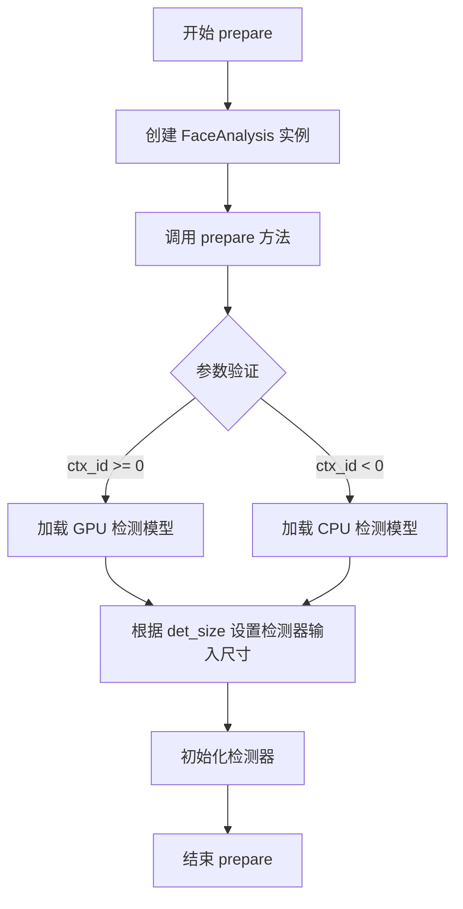

#### 带注释源码

```python
# 在 prepare_face_models 函数中调用 FaceAnalysis.prepare 的源码

# 1. 创建 FaceAnalysis 实例，配置人脸分析模型
face_main_model = FaceAnalysis(
    name="antelopev2",  # 模型名称，使用 antelopev2 模型
    root=os.path.join(model_path, "face_encoder"),  # 模型文件根目录路径
    providers=["CUDAExecutionProvider"]  # 使用 CUDA GPU 执行提供者
)

# 2. 调用 prepare 方法初始化检测器
# ctx_id=0: 指定使用第一个 GPU 设备 (0 表示第一个 GPU)
# det_size=(640, 640): 设置人脸检测器的输入图像尺寸为 640x640 像素
# 这将根据指定尺寸初始化 RetinaFace 检测器模型
face_main_model.prepare(ctx_id=0, det_size=(640, 640))

# prepare 方法内部执行的主要操作：
# 1. 根据 ctx_id 确定使用 GPU 还是 CPU 进行检测
# 2. 加载人脸检测模型（默认使用 RetinaFace）
# 3. 配置检测器的输入图像尺寸（det_size）
# 4. 初始化检测器以便后续调用 get() 方法进行人脸检测
```


### CLIP Vision Model (consisid_eva_clip).__call__

该方法是 `consisid_eva_clip` 库中 EVA02-CLIP 视觉模型的调用接口，用于从预处理的面部图像中提取视觉特征 embedding 和隐藏层状态。在本项目中被 `process_face_embeddings` 函数调用，以获取用于身份条件控制的 CLIP 视觉特征。

参数：

- `images`：`torch.Tensor`，输入的面部特征图像 tensor，形状为 (batch_size, 3, height, width)，已进行归一化处理
- `return_all_features`：`bool`，是否返回所有层的特征，传入 `False` 表示只返回最后一层的特征
- `return_hidden`：`bool`，是否返回隐藏层状态，传入 `True` 表示返回隐藏状态用于更丰富的特征表示
- `shuffle`：`bool`，是否对输入进行 shuffle，传入 `False` 保持输入顺序

返回值：

- `id_cond_vit`：`torch.Tensor`，CLIP 视觉模型的输出 embedding，形状为 (batch_size, 768)，已进行 L2 归一化
- `id_vit_hidden`：`list[torch.Tensor]`，CLIP 视觉模型的隐藏层状态列表，每个元素形状为 (batch_size, sequence_length, hidden_size)，例如 (1, 577, 1024)

#### 流程图

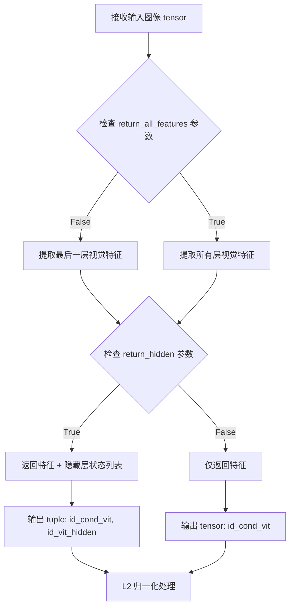

#### 带注释源码

```python
# 在 process_face_embeddings 函数中的调用示例
# face_features_image: 预处理后的面部图像 tensor, shape: [1, 3, 336, 336]
# weight_dtype: 权重数据类型, 如 torch.float32

# 调用 CLIP Vision Model 的 __call__ 方法
id_cond_vit, id_vit_hidden = clip_vision_model(
    face_features_image.to(weight_dtype),  # 将图像转换为指定精度
    return_all_features=False,              # 只返回最后一层特征
    return_hidden=True,                     # 返回隐藏层状态用于更丰富特征
    shuffle=False                            # 不打乱输入顺序
)

# 对输出的 visual embedding 进行 L2 归一化
id_cond_vit_norm = torch.norm(id_cond_vit, p=2, dim=1, keepdim=True)
id_cond_vit = torch.div(id_cond_vit, id_cond_vit_norm)

# id_cond_vit shape: [1, 768]
# id_vit_hidden: list of tensors, 每个元素 shape: [1, 577, 1024]
```

#### 补充说明

该方法的核心功能是提取面部图像的视觉语义特征。在 ConsisID 系统中，这些特征与 Face Detection 模型（如 AntelopEV2）提取的嵌入向量进行拼接，形成最终的身份条件向量 `id_cond`（维度 1280 = 512 + 768），用于指导生成模型保留目标人物的面部身份特征。

关键设计考量：
- **多模态融合**：结合传统人脸检测嵌入（512维）和 CLIP 视觉嵌入（768维），实现鲁棒的身份识别
- **归一化处理**：对 CLIP 输出进行 L2 归一化，确保特征向量的一致性
- **隐藏层复用**：返回完整隐藏状态而非仅最终输出，提供更丰富的特征表示能力


## 关键组件


### 张量索引与惰性加载

代码中使用torch tensor的索引操作进行人脸特征处理，包括id_ante_embedding的维度扩展（unsqueeze(0)）、parsing结果的argmax索引、人脸特征的归一化和维度变换等。numpy数组到torch tensor的转换采用惰性方式，仅在需要时转换。

### 反量化支持

通过weight_dtype参数支持不同精度的模型推理，代码中将id_ante_embedding转换为指定的数据类型（weight_dtype），同时clip_vision_model的输出也通过to(weight_dtype)进行类型转换，实现FP16/FP32等多种精度的支持。

### 量化策略

prepare_face_models函数接收dtype参数，支持在模型加载时指定精度（如torch.float16或torch.float32），实现了动态量化策略以适应不同的推理需求和硬件条件。

### 人脸检测与对齐

使用insightface的FaceAnalysis进行人脸检测，提取人脸边界框和关键点（kps），同时利用facexlib的FaceRestoreHelper进行人脸对齐（align_warp_face），确保后续特征提取的准确性。

### 人脸特征嵌入提取

通过antelopev2模型（face_helper_2）提取人脸embedding（id_ante_embedding），结合EVA02-CLIP-L-336模型（clip_vision_model）提取视觉特征（id_cond_vit），最终将两者拼接形成复合人脸条件特征（id_cond）。

### 人脸解析与分割

使用facexlib的face_parse模型进行人脸解析，通过argmax操作获取分割标签，并利用bg_label（[0,16,18,7,8,9,14,15]）区分背景和人脸区域，实现人脸区域的精确提取和背景处理。

### 图像预处理流水线

包含resize_numpy_image_long进行图像长边缩放、img2tensor进行numpy到tensor转换、normalize进行归一化处理、resize进行尺寸调整，形成完整的图像预处理流程。

### 多模型协同架构

协调insightface（人脸检测）、facexlib（人脸对齐与解析）、EVA-CLIP（视觉特征提取）三个模型模块，通过face_helper_1和face_helper_2两个辅助对象实现分工协作。


## 问题及建议


### 已知问题

- **硬编码的配置值**：多处使用硬编码的数值（如resize_long_edge=768/1024、det_size=(640, 640)、crop_ratio=(1, 1)等），缺乏灵活的配置管理，增加了后续修改成本
- **依赖检查与导入不一致**：使用`importlib.util.find_spec`检查依赖可用性，但后续直接import，若检查逻辑失效可能导致运行时错误
- **错误处理不够健壮**：仅通过`raise ImportError`终止程序，缺乏优雅降级或替代方案；`process_face_embeddings`中insightface检测失败时仅warning但未中断流程，可能导致后续处理使用None值
- **模型资源管理缺失**：加载多个大型模型到设备后，没有明确的资源释放机制（无cleanup函数或context manager），可能导致内存泄漏
- **类型注解不足**：函数参数和返回值缺少详细的类型注解，影响代码可读性和静态分析工具的有效性
- **图像处理流程重复**：`process_face_embeddings_infer`中的图像预处理逻辑（load_image、convert("RGB")、exif_transpose等）在多处出现，可抽象为通用工具函数
- **魔法数字缺乏解释**：`bg_label = [0, 16, 18, 7, 8, 9, 14, 15]`等人脸分割标签值无注释，代码可读性差
- **数据转换效率问题**：多次进行numpy/tensor/cv2格式转换（如`img2tensor`、`torch.from_numpy`、`cpu().detach().numpy()`等），存在不必要的拷贝和计算开销

### 优化建议

- **配置管理优化**：将硬编码值提取为配置文件或函数参数，使用 dataclass 或 Pydantic 定义配置结构，便于统一管理和动态调整
- **依赖管理改进**：使用try-except包装导入逻辑，提供更友好的错误信息及安装指引；或考虑使用poetry/conda等工具管理环境
- **增强错误处理**：为关键函数添加详细的异常捕获和自定义异常类；insightface检测失败时应考虑是否继续执行或返回明确的状态码
- **资源管理**：实现上下文管理器或显式的cleanup方法，确保模型和GPU资源在不使用时正确释放；可使用`torch.cuda.empty_cache()`等机制
- **完善类型注解**：为所有函数参数和返回值添加类型注解，使用typing模块定义复杂类型（如Union、List、Tuple等）
- **代码复用**：抽取通用的图像处理流程（如图像加载、格式转换、归一化等）为独立函数，减少重复代码
- **常量解释**：为所有魔法数字和标签值添加常量定义和详细注释，说明其含义和来源
- **性能优化**：减少不必要的数据格式转换，考虑使用in-place操作；对于可并行的处理步骤考虑批处理
- **日志增强**：增加关键步骤的日志记录（包括性能指标如处理时间、内存使用等），便于调试和监控
- **单元测试**：补充针对核心函数的单元测试，特别是边界条件和异常处理路径


## 其它


### 设计目标与约束

本模块旨在提供高效、准确的人脸特征提取能力，支持人脸检测、对齐、嵌入生成等功能。设计约束包括：1) 必须依赖insightface、consisid_eva_clip和facexlib三个核心库；2) 模型推理需支持CPU和GPU设备；3) 需支持多种权重精度（float32等）；4) 输入图像长边需Resize到指定大小（推理时为1024，处理时为768）

### 错误处理与异常设计

1) 依赖库缺失时抛出ImportError，明确提示安装命令；2) insightface人脸检测失败时，记录警告日志并尝试使用facexlib对齐后提取embedding；3) facexlib对齐失败时抛出RuntimeError("facexlib align face fail")；4) 图像加载失败时需在外层调用处理；5) 建议增加图像格式校验和尺寸合法性检查

### 数据流与状态机

数据流：输入图像 → 图像预处理(resize) → 人脸检测(insightface) → 人脸关键点获取 → 人脸对齐(facexlib) → 人脸解析(parsing) → 特征提取(EVA-CLIP) → 嵌入拼接 → 输出tuple(id_cond, id_vit_hidden, face_image, face_kps)。状态机涉及：模型加载态 → 推理就绪态 → 处理中态 → 结果返回态

### 外部依赖与接口契约

1) insightface: 人脸检测与embedding提取，需安装insightface包；2) consisid_eva_clip: EVA02-CLIP模型加载与transforms，需安装consisid_eva_clip包；3) facexlib: 人脸对齐与解析，需安装facexlib包；4) opencv-python(cv2): 图像处理；5) torch: 张量计算；6) PIL: 图像加载与处理；7) numpy: 数值计算；8) torchvision: 图像变换与归一化

### 性能要求与优化建议

1) 图像推理目标处理时间应控制在500ms以内；2) 模型应支持批处理优化；3) 建议增加模型缓存和预热机制；4) 考虑使用FP16推理提升性能；5) 人脸检测可考虑异步执行；6) 当前代码已设置eval()模式确保推理优化

### 配置管理

1) model_path: 模型文件根目录路径；2) device: 计算设备(cpu/cuda/xpu)；3) dtype: 权重数据类型；4) resize_long_edge: 图像长边Resize目标值(默认768/1024)；5) det_size: 人脸检测尺寸(默认640x640)；6) face_size: 人脸对齐输出尺寸(默认512)

### 版本兼容性

1) Python版本建议3.8+；2) PyTorch版本建议1.12+；3) OpenCV建议4.5+；4) CUDA版本建议11.0+以支持GPU推理；5) 依赖库版本需参考项目requirements.txt锁定版本

### 安全性考虑

1) 模型文件路径需校验合法性防止路径遍历；2) 图像输入需进行尺寸和格式校验防止内存溢出；3) 敏感人脸数据处理需遵守数据隐私规范；4) 建议增加输入图像病毒扫描机制

### 测试策略

1) 单元测试：测试各函数独立功能(resize、img2tensor、to_gray)；2) 集成测试：测试完整人脸处理流程；3) 边界测试：测试无脸、多脸、超大图像、异常格式图像；4) 性能测试： benchmark处理耗时；5) 回归测试：确保模型更新后输出embedding一致性

    