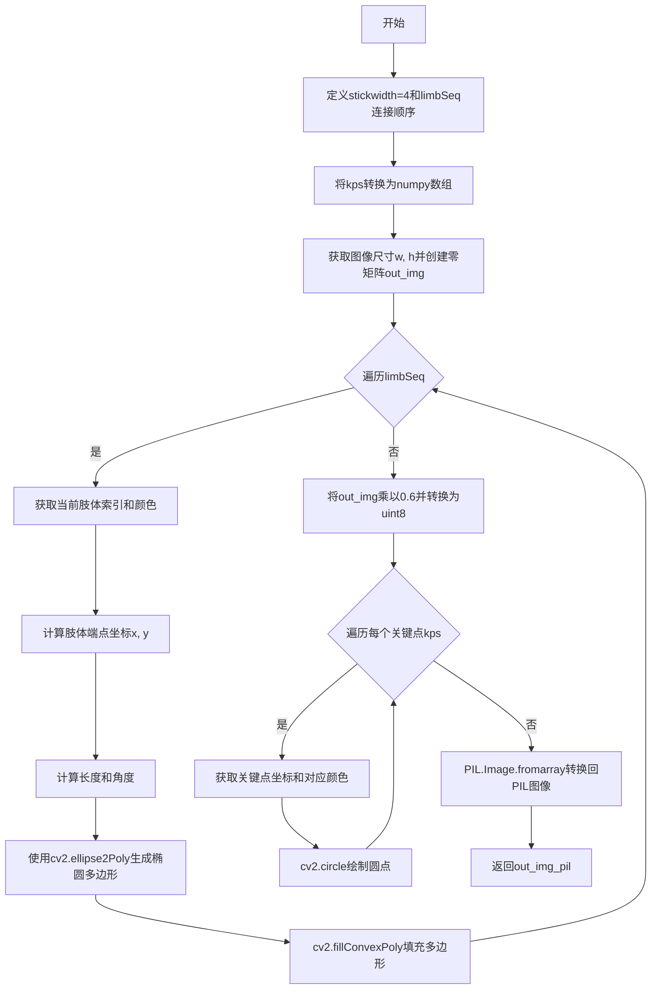
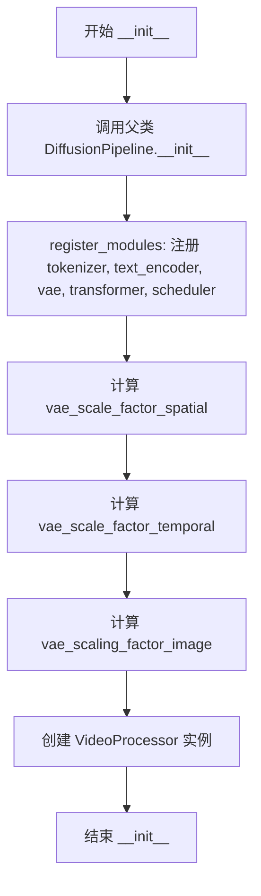
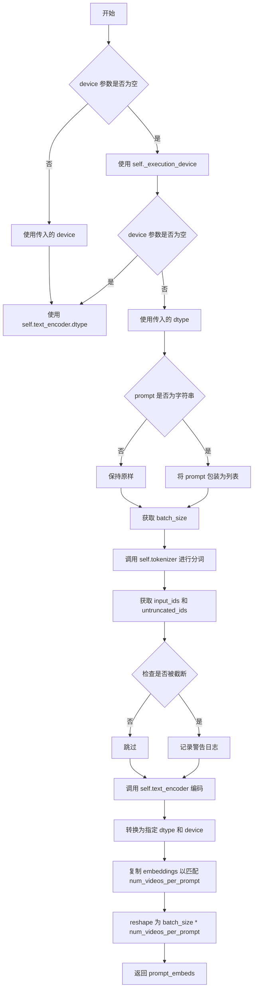
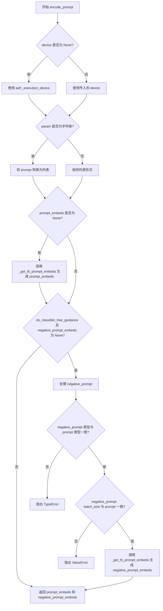
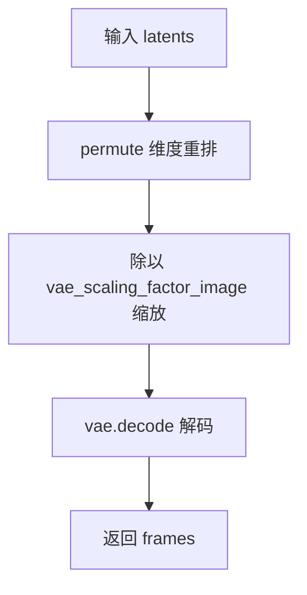
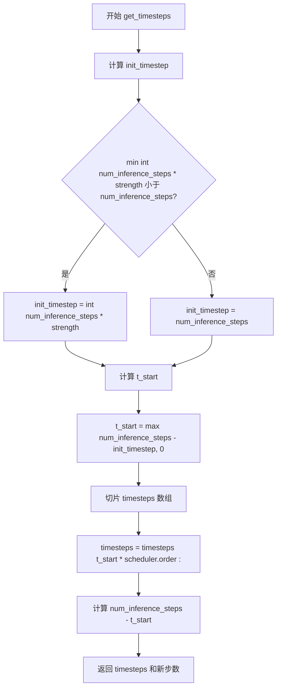
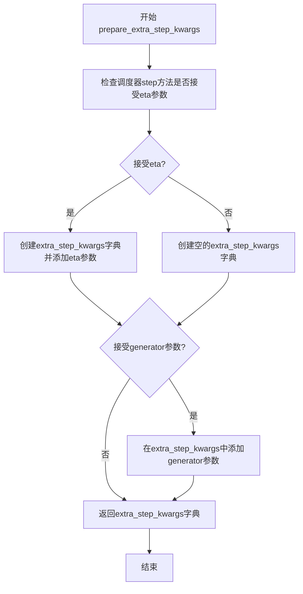
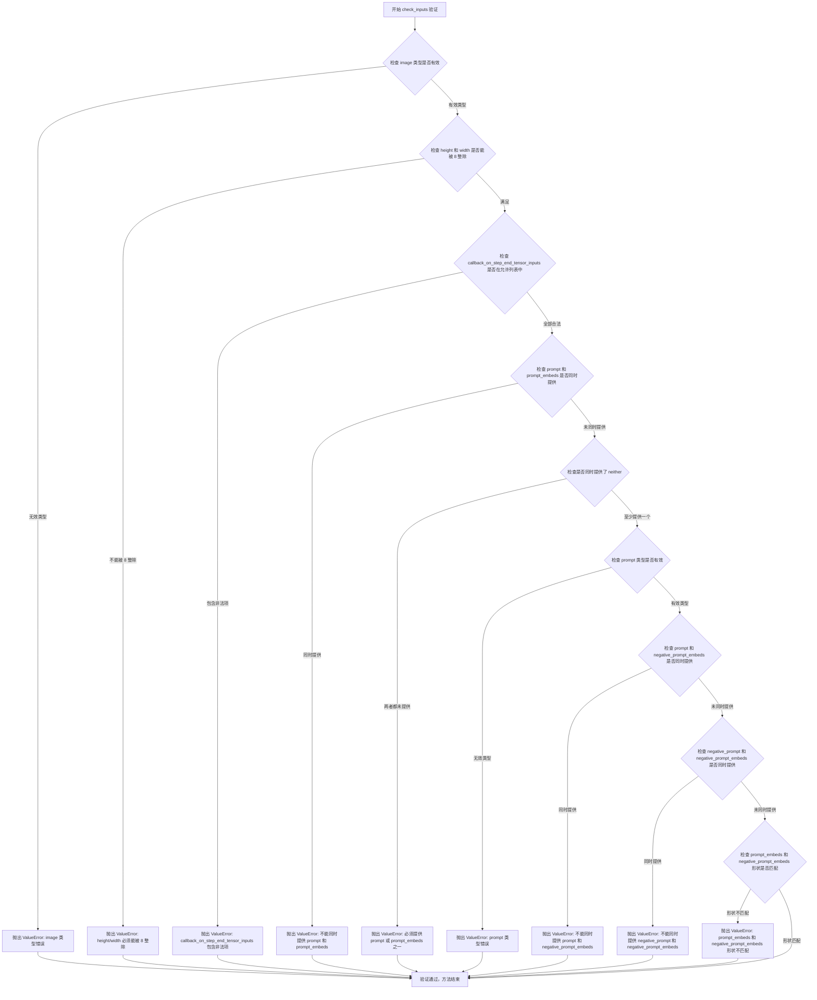

```mermaid
flowchart TD
    A[开始 __call__] --> B[设置默认高度、宽度、帧数]
    B --> C[设置 num_videos_per_prompt = 1]
    C --> D[检查输入参数 check_inputs]
    D --> E[初始化 _guidance_scale, _attention_kwargs, _interrupt]
    E --> F[计算 batch_size]
    F --> G{判断是否使用 CFG}
    G -->|是| H[do_classifier_free_guidance = True]
    G -->|否| I[do_classifier_free_guidance = False]
    H --> J[编码提示词 encode_prompt]
    I --> J
    J --> K[拼接 negative_prompt_embeds 和 prompt_embeds]
    K --> L[获取时间步 retrieve_timesteps]
    L --> M[准备潜在变量 prepare_latents]
    M --> N[准备额外步骤参数 prepare_extra_step_kwargs]
    N --> O{判断是否使用旋转位置嵌入}
    O -->|是| P[创建旋转嵌入 _prepare_rotary_positional_embeddings]
    O -->|否| Q[rotary_emb = None]
    P --> R[开始去噪循环]
    Q --> R
    R --> S[扩展 latent_model_input]
    S --> T[使用调度器缩放模型输入]
    T --> U[拼接 latent_image_input]
    U --> V[扩展 timestep]
    V --> W[调用 transformer 预测噪声]
    W --> X{判断是否使用动态 CFG}
    X -->|是| Y[动态计算 guidance_scale]
    X -->|否| Z[保持原 guidance_scale]
    Y --> AA{判断是否使用 CFG}
    Z --> AA
    AA -->|是| AB[分割噪声预测并应用引导]
    AA -->|否| AC[直接使用噪声预测]
    AB --> AD[调度器执行一步去噪]
    AC --> AD
    AD --> AE{是否有回调函数}
    AE -->|是| AF[执行回调并更新 latents]
    AE -->|否| AG[检查是否完成]
    AF --> AG
    AG -->|未完成| R
    AG -->|已完成| AH[解码潜在变量 decode_latents]
    AH --> AI[后处理视频 postprocess_video]
    AI --> AJ[释放模型钩子 maybe_free_model_hooks]
    AJ --> AK{判断 return_dict}
    AK -->|是| AL[返回 ConsisIDPipelineOutput]
    AK -->|否| AM[返回元组]
    AL --> AN[结束]
    AM --> AN
```

# `diffusers\src\diffusers\pipelines\consisid\pipeline_consisid.py` 详细设计文档

ConsisIDPipeline是一个用于图像到视频生成的扩散管道，它接收输入图像和文本提示，利用T5文本编码器、CogVideoX VAE和ConsisIDTransformer3DModel transformer模型，通过去噪过程生成与文本描述一致的视频。该管道支持人脸身份保持、条件关键点控制、动态CFG等功能。

## 整体流程

```mermaid
graph TD
A[开始] --> B[检查输入参数]
B --> C[编码文本提示 (encode_prompt)]
C --> D[获取timesteps (retrieve_timesteps)]
D --> E[准备latents和图像latents]
E --> F[准备旋转位置嵌入]
F --> G{循环: for each timestep}
G --> H[构建latent_model_input]
H --> I[Transformer预测噪声]
I --> J[应用分类器自由引导]
J --> K[Scheduler步骤更新latents]
K --> L{是否结束?}
L -- 否 --> G
L -- 是 --> M[解码latents为视频]
M --> N[后处理视频]
N --> O[返回结果]
```

## 类结构

```
DiffusionPipeline (基类)
└── ConsisIDPipeline
    ├── CogVideoXLoraLoaderMixin (混入类)
    └── 依赖组件:
        ├── T5Tokenizer
        ├── T5EncoderModel
        ├── AutoencoderKLCogVideoX
        ├── ConsisIDTransformer3DModel
        ├── CogVideoXDPMScheduler
        └── VideoProcessor
```

## 全局变量及字段


### `logger`
    
模块级日志记录器，用于输出警告和信息日志

类型：`logging.Logger`
    


### `EXAMPLE_DOC_STRING`
    
包含ConsisIDPipeline使用示例的文档字符串

类型：`str`
    


### `ConsisIDPipeline.tokenizer`
    
T5分词器，用于将文本提示编码为token序列

类型：`T5Tokenizer`
    


### `ConsisIDPipeline.text_encoder`
    
冻结的T5文本编码器，用于将token序列转换为文本嵌入向量

类型：`T5EncoderModel`
    


### `ConsisIDPipeline.vae`
    
CogVideoX变分自编码器，用于将视频编码到潜在空间并从潜在空间解码视频

类型：`AutoencoderKLCogVideoX`
    


### `ConsisIDPipeline.transformer`
    
3D变换器模型，用于去噪视频潜在表示并结合文本和身份条件

类型：`ConsisIDTransformer3DModel`
    


### `ConsisIDPipeline.scheduler`
    
DPM调度器，用于在去噪过程中计算下一步的潜在变量

类型：`CogVideoXDPMScheduler`
    


### `ConsisIDPipeline.video_processor`
    
视频处理器，用于预处理输入图像和后处理生成的视频帧

类型：`VideoProcessor`
    


### `ConsisIDPipeline.vae_scale_factor_spatial`
    
VAE空间缩放因子，用于计算潜在空间的 spatial 维度大小

类型：`int`
    


### `ConsisIDPipeline.vae_scale_factor_temporal`
    
VAE时间缩放因子，用于计算潜在空间的时间维度大小

类型：`int`
    


### `ConsisIDPipeline.vae_scaling_factor_image`
    
VAE图像缩放因子，用于缩放编码后的潜在表示

类型：`float`
    


### `ConsisIDPipeline._optional_components`
    
可选组件列表，定义了管道中可选的模型组件

类型：`list`
    


### `ConsisIDPipeline.model_cpu_offload_seq`
    
模型CPU卸载顺序字符串，指定模型组件卸载到CPU的顺序

类型：`str`
    


### `ConsisIDPipeline._callback_tensor_inputs`
    
回调函数可访问的张量输入列表，用于在推理步骤结束时传递张量

类型：`list`
    


### `ConsisIDPipeline._guidance_scale`
    
分类器自由引导比例，控制文本提示对生成结果的影响程度

类型：`float`
    


### `ConsisIDPipeline._num_timesteps`
    
推理步骤总数，记录去噪过程的步数

类型：`int`
    


### `ConsisIDPipeline._attention_kwargs`
    
注意力机制参数字典，用于传递自定义注意力处理器的参数

类型：`dict`
    


### `ConsisIDPipeline._interrupt`
    
中断标志，用于在推理过程中请求提前终止

类型：`bool`
    
    

## 全局函数及方法


### `draw_kps`

该函数用于在输入的PIL图像上绘制关键点（keypoints）及其连接的肢体（limbs）。它使用OpenCV在图像上绘制椭圆来表示肢体连接，并绘制圆圈来表示关键点位置，最终返回带有绘制结果的PIL图像。

参数：

- `image_pil`：`PIL.Image`，输入的PIL图像对象
- `kps`：`list of tuples`，关键点坐标列表，每个元素为(x, y)元组
- `color_list`：`list of tuples`，可选，关键点颜色列表（RGB格式），默认为五种颜色

返回值：`PIL.Image`，绘制了关键点和肢体连接线的图像

#### 流程图



#### 带注释源码

```
def draw_kps(image_pil, kps, color_list=[(255, 0, 0), (0, 255, 0), (0, 0, 255), (255, 255, 0), (255, 0, 255)]):
    """
    This function draws keypoints and the limbs connecting them on an image.

    Parameters:
    - image_pil (PIL.Image): Input image as a PIL object.
    - kps (list of tuples): A list of keypoints where each keypoint is a tuple of (x, y) coordinates.
    - color_list (list of tuples, optional): list of colors (in RGB format) for each keypoint. Default is a set of five
      colors.

    Returns:
    - PIL.Image: Image with the keypoints and limbs drawn.
    """

    stickwidth = 4  # 肢体线条宽度
    # 定义肢体连接顺序: [[起点索引, 终点索引], ...]
    # 索引0,1,3,4连接到索引2（通常为鼻子/中心点）
    limbSeq = np.array([[0, 2], [1, 2], [3, 2], [4, 2]])
    kps = np.array(kps)  # 转换为numpy数组便于索引操作

    w, h = image_pil.size  # 获取图像宽高
    out_img = np.zeros([h, w, 3])  # 创建与图像同尺寸的空白图像（RGB三通道）

    # 第一步：绘制肢体连接线（使用椭圆表示）
    for i in range(len(limbSeq)):
        index = limbSeq[i]  # 获取当前肢体连接的两个关键点索引
        color = color_list[index[0]]  # 使用起点索引对应的颜色

        x = kps[index][:, 0]  # 获取两个关键点的x坐标
        y = kps[index][:, 1]  # 获取两个关键点的y坐标
        
        # 计算肢体长度（欧几里得距离）
        length = ((x[0] - x[1]) ** 2 + (y[0] - y[1]) ** 2) ** 0.5
        
        # 计算肢体角度（从起点到终点的方向角）
        angle = math.degrees(math.atan2(y[0] - y[1], x[0] - x[1]))
        
        # 使用椭圆多边形近似表示肢体
        # 参数: 中心点, (长半轴, 短半轴), 旋转角度, 起始角度, 结束角度, 步长
        polygon = cv2.ellipse2Poly(
            (int(np.mean(x)), int(np.mean(y))), (int(length / 2), stickwidth), int(angle), 0, 360, 1
        )
        # 填充多边形（使用copy避免修改原数组）
        out_img = cv2.fillConvexPoly(out_img.copy(), polygon, color)
    
    # 第二步：将肢体图像透明度降低至60%
    out_img = (out_img * 0.6).astype(np.uint8)

    # 第三步：绘制关键点（圆点）
    for idx_kp, kp in enumerate(kps):
        color = color_list[idx_kp]  # 按索引获取对应颜色
        x, y = kp  # 解包关键点坐标
        # 绘制实心圆（半径10，thickness=-1表示实心）
        out_img = cv2.circle(out_img.copy(), (int(x), int(y)), 10, color, -1)

    # 第四步：转换回PIL图像格式并返回
    out_img_pil = PIL.Image.fromarray(out_img.astype(np.uint8))
    return out_img_pil
```


### `get_resize_crop_region_for_grid`

该函数用于计算图像的调整大小和裁剪区域，使其在保持宽高比的同时适应目标宽度和高度。

参数：

- `src`：`tuple`，包含源图像的高度 (h) 和宽度 (w) 的元组
- `tgt_width`：`int`，目标宽度
- `tgt_height`：`int`，目标高度

返回值：`tuple`，两个元组，表示裁剪区域：
1. 裁剪区域的左上角坐标 (top, left)
2. 裁剪区域的右下角坐标 (bottom, right)

#### 流程图

```mermaid
flowchart TD
    A[开始] --> B[获取输入参数: src, tgt_width, tgt_height]
    B --> C[解析src获取高度h和宽度w]
    C --> D[计算源图像宽高比 r = h / w]
    D --> E{判断 r > tgt_height / tgt_width}
    E -->|是| F[调整高度为tgt_height<br/>按比例计算宽度]
    E -->|否| G[调整宽度为tgt_width<br/>按比例计算高度]
    F --> H[计算裁剪顶部偏移 crop_top]
    G --> H
    H --> I[计算裁剪左侧偏移 crop_left]
    I --> J[返回裁剪区域坐标<br/>(crop_top, crop_left) 和<br/>(crop_top + resize_height, crop_left + resize_width)]
    J --> K[结束]
```

#### 带注释源码

```python
def get_resize_crop_region_for_grid(src, tgt_width, tgt_height):
    """
    This function calculates the resize and crop region for an image to fit a target width and height while preserving
    the aspect ratio.

    Parameters:
    - src (tuple): A tuple containing the source image's height (h) and width (w).
    - tgt_width (int): The target width to resize the image.
    - tgt_height (int): The target height to resize the image.

    Returns:
    - tuple: Two tuples representing the crop region:
        1. The top-left coordinates of the crop region.
        2. The bottom-right coordinates of the crop region.
    """

    # 目标宽度和高度
    tw = tgt_width
    th = tgt_height
    
    # 从源图像元组中解包获取高度和宽度
    h, w = src
    
    # 计算源图像的宽高比
    r = h / w
    
    # 根据宽高比决定调整策略
    # 如果源图像比目标图像更"高"（高宽比更大），则以高度为基准
    if r > (th / tw):
        resize_height = th  # 高度填满目标高度
        resize_width = int(round(th / h * w))  # 按比例计算宽度
    else:
        # 否则以宽度为基准
        resize_width = tw  # 宽度填满目标宽度
        resize_height = int(round(tw / w * h))  # 按比例计算高度

    # 计算居中裁剪的偏移量
    # 裁剪顶部位置 = (目标高度 - 调整后高度) / 2
    crop_top = int(round((th - resize_height) / 2.0))
    # 裁剪左侧位置 = (目标宽度 - 调整后宽度) / 2
    crop_left = int(round((tw - resize_width) / 2.0))

    # 返回两个元组：左上角坐标和右下角坐标
    return (crop_top, crop_left), (crop_top + resize_height, crop_left + resize_width)
```


### `retrieve_timesteps`

该函数负责调用调度器的 `set_timesteps` 方法并从中获取时间步调度，处理自定义时间步或 sigmas，支持三种模式：自定义 timesteps、自定义 sigmas 或默认推理步数，最终返回时间步张量和推理步数。

参数：

- `scheduler`：`SchedulerMixin`，调度器对象，用于获取时间步
- `num_inference_steps`：`int | None`，扩散模型生成样本时使用的步数，若使用则 `timesteps` 必须为 `None`
- `device`：`str | torch.device | None`，时间步要移动到的设备，若为 `None` 则不移动
- `timesteps`：`list[int] | None`，自定义时间步，用于覆盖调度器的时间步间隔策略，若传递此参数则 `num_inference_steps` 和 `sigmas` 必须为 `None`
- `sigmas`：`list[float] | None`，自定义 sigmas，用于覆盖调度器的时间步间隔策略，若传递此参数则 `num_inference_steps` 和 `timesteps` 必须为 `None`
- `**kwargs`：任意关键字参数，将传递给 `scheduler.set_timesteps`

返回值：`tuple[torch.Tensor, int]`，第一个元素是调度器的时间步调度，第二个元素是推理步数

#### 流程图

```mermaid
flowchart TD
    A[开始] --> B{检查timesteps和sigmas是否同时存在}
    B -->|是| C[抛出ValueError: 只能选择一个]
    B -->|否| D{是否传入timesteps?}
    D -->|是| E[检查scheduler.set_timesteps是否接受timesteps参数]
    E -->|不支持| F[抛出ValueError: 不支持自定义timesteps]
    E -->|支持| G[调用scheduler.set_timesteps并获取timesteps]
    D -->|否| H{是否传入sigmas?}
    H -->|是| I[检查scheduler.set_timesteps是否接受sigmas参数]
    I -->|不支持| J[抛出ValueError: 不支持自定义sigmas]
    I -->|支持| K[调用scheduler.set_timesteps并获取timesteps]
    H -->|否| L[调用scheduler.set_timesteps使用num_inference_steps]
    G --> M[计算num_inference_steps = len(timesteps)]
    K --> M
    L --> N[获取scheduler.timesteps]
    N --> O[返回timesteps和num_inference_steps]
    M --> O
```

#### 带注释源码

```python
# Copied from diffusers.pipelines.stable_diffusion.pipeline_stable_diffusion.retrieve_timesteps
def retrieve_timesteps(
    scheduler,
    num_inference_steps: int | None = None,
    device: str | torch.device | None = None,
    timesteps: list[int] | None = None,
    sigmas: list[float] | None = None,
    **kwargs,
):
    r"""
    Calls the scheduler's `set_timesteps` method and retrieves timesteps from the scheduler after the call. Handles
    custom timesteps. Any kwargs will be supplied to `scheduler.set_timesteps`.

    Args:
        scheduler (`SchedulerMixin`):
            The scheduler to get timesteps from.
        num_inference_steps (`int`):
            The number of diffusion steps used when generating samples with a pre-trained model. If used, `timesteps`
            must be `None`.
        device (`str` or `torch.device`, *optional*):
            The device to which the timesteps should be moved to. If `None`, the timesteps are not moved.
        timesteps (`list[int]`, *optional*):
            Custom timesteps used to override the timestep spacing strategy of the scheduler. If `timesteps` is passed,
            `num_inference_steps` and `sigmas` must be `None`.
        sigmas (`list[float]`, *optional*):
            Custom sigmas used to override the timestep spacing strategy of the scheduler. If `sigmas` is passed,
            `num_inference_steps` and `timesteps` must be `None`.

    Returns:
        `tuple[torch.Tensor, int]`: A tuple where the first element is the timestep schedule from the scheduler and the
        second element is the number of inference steps.
    """
    # 校验：timesteps和sigmas不能同时传入
    if timesteps is not None and sigmas is not None:
        raise ValueError("Only one of `timesteps` or `sigmas` can be passed. Please choose one to set custom values")
    
    # 处理自定义timesteps模式
    if timesteps is not None:
        # 通过inspect检查scheduler.set_timesteps是否支持timesteps参数
        accepts_timesteps = "timesteps" in set(inspect.signature(scheduler.set_timesteps).parameters.keys())
        if not accepts_timesteps:
            raise ValueError(
                f"The current scheduler class {scheduler.__class__}'s `set_timesteps` does not support custom"
                f" timestep schedules. Please check whether you are using the correct scheduler."
            )
        # 调用scheduler的set_timesteps方法设置自定义时间步
        scheduler.set_timesteps(timesteps=timesteps, device=device, **kwargs)
        # 从scheduler获取设置后的timesteps
        timesteps = scheduler.timesteps
        # 计算推理步数
        num_inference_steps = len(timesteps)
    # 处理自定义sigmas模式
    elif sigmas is not None:
        # 通过inspect检查scheduler.set_timesteps是否支持sigmas参数
        accept_sigmas = "sigmas" in set(inspect.signature(scheduler.set_timesteps).parameters.keys())
        if not accept_sigmas:
            raise ValueError(
                f"The current scheduler class {scheduler.__class__}'s `set_timesteps` does not support custom"
                f" sigmas schedules. Please check whether you are using the correct scheduler."
            )
        # 调用scheduler的set_timesteps方法设置自定义sigmas
        scheduler.set_timesteps(sigmas=sigmas, device=device, **kwargs)
        # 从scheduler获取设置后的timesteps
        timesteps = scheduler.timesteps
        # 计算推理步数
        num_inference_steps = len(timesteps)
    # 默认模式：使用num_inference_steps
    else:
        scheduler.set_timesteps(num_inference_steps, device=device, **kwargs)
        timesteps = scheduler.timesteps
    
    # 返回timesteps张量和推理步数
    return timesteps, num_inference_steps
```


### `retrieve_latents`

从 VAE 编码器输出中提取潜在变量（latents）的工具函数，根据 sample_mode 参数决定是从潜在分布中采样还是取最可能值，或者直接返回预存的 latents。

参数：

- `encoder_output`：`torch.Tensor`，VAE 编码器的输出对象，包含 `latent_dist` 属性（潜在分布）或 `latents` 属性（预计算的潜在变量）
- `generator`：`torch.Generator | None`，可选的 PyTorch 随机数生成器，用于控制采样过程中的随机性
- `sample_mode`：`str`，采样模式，默认为 "sample"，"sample" 表示从分布中采样，"argmax" 表示取分布的众数（最大值索引）

返回值：`torch.Tensor`，从编码器输出中提取的潜在变量张量

#### 流程图

```mermaid
flowchart TD
    A[retrieve_latents 开始] --> B{encoder_output 是否有 latent_dist 属性?}
    B -->|是| C{sample_mode == 'sample'?}
    B -->|否| D{encoder_output 是否有 latents 属性?}
    C -->|是| E[返回 encoder_output.latent_dist.sample<br/>(使用 generator 随机采样)]
    C -->|否| F{sample_mode == 'argmax'?}
    F -->|是| G[返回 encoder_output.latent_dist.mode<br/>(取分布的众数)]
    F -->|否| H[返回 encoder_output.latents<br/>(预存的潜在变量)]
    D -->|是| H
    D -->|否| I[抛出 AttributeError<br/'Could not access latents...']
```

#### 带注释源码

```python
def retrieve_latents(
    encoder_output: torch.Tensor, generator: torch.Generator | None = None, sample_mode: str = "sample"
):
    """
    从 VAE 编码器输出中提取潜在变量。

    Args:
        encoder_output: VAE 编码器的输出，包含潜在分布或潜在变量
        generator: 可选的随机数生成器，用于采样
        sample_mode: 采样模式，"sample" 从分布采样，"argmax" 取众数

    Returns:
        从编码器输出中提取的潜在变量张量
    """
    # 情况1: 有 latent_dist 属性且模式为 sample，从分布中采样
    if hasattr(encoder_output, "latent_dist") and sample_mode == "sample":
        return encoder_output.latent_dist.sample(generator)
    # 情况2: 有 latent_dist 属性且模式为 argmax，取分布的众数
    elif hasattr(encoder_output, "latent_dist") and sample_mode == "argmax":
        return encoder_output.latent_dist.mode()
    # 情况3: 有预存的 latents 属性，直接返回
    elif hasattr(encoder_output, "latents"):
        return encoder_output.latents
    # 错误: 无法获取潜在变量
    else:
        raise AttributeError("Could not access latents of provided encoder_output")
```


### `ConsisIDPipeline.__init__`

这是 ConsisIDPipeline 类的构造函数，用于初始化视频生成管道。它接收分词器、文本编码器、VAE、Transformer 和调度器等核心组件，并注册这些模块，同时计算 VAE 的缩放因子和初始化视频处理器。

参数：

- `self`：类的实例本身
- `tokenizer`：`T5Tokenizer`，用于对文本提示进行分词
- `text_encoder`：`T5EncoderModel`，冻结的文本编码器，用于将文本转换为嵌入向量
- `vae`：`AutoencoderKLCogVideoX`，变分自编码器，用于编码和解码视频潜在表示
- `transformer`：`ConsisIDTransformer3DModel`，文本条件的 3D Transformer 模型，用于对视频潜在表示进行去噪
- `scheduler`：`CogVideoXDPMScheduler`，用于与 Transformer 结合对视频潜在表示进行去噪的调度器

返回值：`None`，构造函数不返回值，仅初始化对象状态

#### 流程图



#### 带注释源码

```python
def __init__(
    self,
    tokenizer: T5Tokenizer,
    text_encoder: T5EncoderModel,
    vae: AutoencoderKLCogVideoX,
    transformer: ConsisIDTransformer3DModel,
    scheduler: CogVideoXDPMScheduler,
):
    """
    初始化 ConsisIDPipeline 实例。

    参数:
        tokenizer (T5Tokenizer): T5 分词器，用于将文本提示转换为 token 序列
        text_encoder (T5EncoderModel): T5 文本编码器，用于生成文本嵌入
        vae (AutoencoderKLCogVideoX): CogVideoX VAE 模型，用于潜在表示的编码和解码
        transformer (ConsisIDTransformer3DModel): ConsisID 3D Transformer 主干网络
        scheduler (CogVideoXDPMScheduler): DPM 调度器，用于扩散过程的时间步调度
    """
    # 调用父类 DiffusionPipeline 的初始化方法
    super().__init__()

    # 注册所有模块，使管道能够访问和保存这些组件
    self.register_modules(
        tokenizer=tokenizer,
        text_encoder=text_encoder,
        vae=vae,
        transformer=transformer,
        scheduler=scheduler,
    )
    
    # 计算 VAE 空间缩放因子，用于调整潜在空间的尺寸
    # 基于 VAE 块输出通道数的深度（默认为8）
    self.vae_scale_factor_spatial = (
        2 ** (len(self.vae.config.block_out_channels) - 1) if hasattr(self, "vae") and self.vae is not None else 8
    )
    
    # 计算 VAE 时间缩放因子，用于处理视频帧的时间维度（默认为4）
    self.vae_scale_factor_temporal = (
        self.vae.config.temporal_compression_ratio if hasattr(self, "vae") and self.vae is not None else 4
    )
    
    # 计算 VAE 图像缩放因子，用于潜在空间的归一化（默认为0.7）
    self.vae_scaling_factor_image = (
        self.vae.config.scaling_factor if hasattr(self, "vae") and self.vae is not None else 0.7
    )

    # 初始化视频处理器，用于视频帧的预处理和后处理
    self.video_processor = VideoProcessor(vae_scale_factor=self.vae_scale_factor_spatial)
```


### `ConsisIDPipeline._get_t5_prompt_embeds`

该方法用于将文本提示（prompt）编码为 T5 文本Encoder的隐藏状态嵌入（embedding）。它接收原始文本，通过 T5Tokenizer 进行分词和编码，然后使用 T5EncoderModel 生成文本嵌入，最后对每个提示生成多个视频的情况进行嵌入复制处理。

参数：

- `prompt`：`str | list[str]`，要编码的文本提示，可以是单个字符串或字符串列表
- `num_videos_per_prompt`：`int`，每个提示生成的视频数量，默认为 1
- `max_sequence_length`：`int`，编码的最大序列长度，默认为 226
- `device`：`torch.device | None`，执行设备，若为 None 则使用当前执行设备
- `dtype`：`torch.dtype | None`，返回的张量数据类型，若为 None 则使用 text_encoder 的数据类型

返回值：`torch.Tensor`，编码后的文本嵌入向量，形状为 `(batch_size * num_videos_per_prompt, seq_len, hidden_dim)`

#### 流程图



#### 带注释源码

```python
def _get_t5_prompt_embeds(
    self,
    prompt: str | list[str] = None,
    num_videos_per_prompt: int = 1,
    max_sequence_length: int = 226,
    device: torch.device | None = None,
    dtype: torch.dtype | None = None,
):
    """
    获取 T5 模型生成的文本提示嵌入向量。
    
    该方法将文本提示编码为 T5 Encoder 的隐藏状态，用于后续的视频生成过程。
    支持批量处理和每个提示生成多个视频的场景。
    
    参数:
        prompt: 要编码的文本提示，支持单个字符串或字符串列表
        num_videos_per_prompt: 每个提示生成的视频数量，用于复制 embeddings
        max_sequence_length: token 序列的最大长度，超过此长度会被截断
        device: 计算设备，默认为当前执行设备
        dtype: 张量数据类型，默认为 text_encoder 的数据类型
    
    返回:
        编码后的文本嵌入向量，形状为 (batch_size * num_videos_per_prompt, seq_len, hidden_dim)
    """
    # 1. 确定设备：如果未指定，则使用 Pipeline 的执行设备
    device = device or self._execution_device
    # 2. 确定数据类型：如果未指定，则使用 text_encoder 的数据类型
    dtype = dtype or self.text_encoder.dtype

    # 3. 预处理 prompt：统一转换为列表格式，方便批量处理
    prompt = [prompt] if isinstance(prompt, str) else prompt
    # 4. 获取批量大小
    batch_size = len(prompt)

    # 5. 使用 T5Tokenizer 对 prompt 进行分词和编码
    #    填充到最大长度，截断超长部分，添加特殊 token，返回 PyTorch 张量
    text_inputs = self.tokenizer(
        prompt,
        padding="max_length",
        max_length=max_sequence_length,
        truncation=True,
        add_special_tokens=True,
        return_tensors="pt",
    )
    # 6. 获取编码后的 input_ids
    text_input_ids = text_inputs.input_ids
    
    # 7. 额外获取未截断的编码结果，用于检测是否发生了截断
    untruncated_ids = self.tokenizer(prompt, padding="longest", return_tensors="pt").input_ids

    # 8. 检查是否发生了截断：比较截断和未截断的长度
    if untruncated_ids.shape[-1] >= text_input_ids.shape[-1] and not torch.equal(text_input_ids, untruncated_ids):
        # 9. 如果发生截断，记录警告日志，显示被截断的内容
        removed_text = self.tokenizer.batch_decode(untruncated_ids[:, max_sequence_length - 1 : -1])
        logger.warning(
            "The following part of your input was truncated because `max_sequence_length` is set to "
            f" {max_sequence_length} tokens: {removed_text}"
        )

    # 10. 使用 T5 Encoder 编码 text_input_ids，获取隐藏状态
    #      [batch_size, seq_len, hidden_dim]
    prompt_embeds = self.text_encoder(text_input_ids.to(device))[0]
    
    # 11. 将 embeddings 转换为指定的 dtype 和 device
    prompt_embeds = prompt_embeds.to(dtype=dtype, device=device)

    # 12. 为每个提示生成多个视频复制 embeddings
    #      这是因为在某些配置下需要为每个 prompt 生成多个视频
    #      使用 repeat 方法可以高效地进行复制，兼容 mps 设备
    _, seq_len, _ = prompt_embeds.shape
    
    # 第一次 repeat：在序列维度之前复制 num_videos_per_prompt 次
    # [batch_size, seq_len, hidden_dim] -> [batch_size, num_videos_per_prompt, seq_len, hidden_dim]
    prompt_embeds = prompt_embeds.repeat(1, num_videos_per_prompt, 1)
    
    # 13. 重塑为最终的批量大小
    # [batch_size, num_videos_per_prompt, seq_len, hidden_dim] 
    # -> [batch_size * num_videos_per_prompt, seq_len, hidden_dim]
    prompt_embeds = prompt_embeds.view(batch_size * num_videos_per_prompt, seq_len, -1)

    # 14. 返回最终的 prompt embeddings
    return prompt_embeds
```


### `ConsisIDPipeline.encode_prompt`

该方法负责将输入的文本提示（prompt）和负向提示（negative_prompt）编码为文本编码器的隐藏状态（hidden states）。如果提供了预计算的嵌入（prompt_embeds 和 negative_prompt_embeds），则直接使用；否则使用 T5 文本编码器生成嵌入。支持 classifier-free guidance（分类器自由引导），用于提高生成质量。

参数：

- `self`：`ConsisIDPipeline` 实例本身
- `prompt`：`str | list[str]`，要编码的文本提示，可以是单个字符串或字符串列表
- `negative_prompt`：`str | list[str] | None`，不用于引导图像生成的提示，仅在使用 guidance 时有效
- `do_classifier_free_guidance`：`bool`，是否使用 classifier-free guidance，默认为 True
- `num_videos_per_prompt`：`int`，每个提示生成的视频数量，默认为 1
- `prompt_embeds`：`torch.Tensor | None`，预生成的文本嵌入，可用于调整文本输入
- `negative_prompt_embeds`：`torch.Tensor | None`，预生成的负向文本嵌入
- `max_sequence_length`：`int`，编码的最大序列长度，默认为 226
- `device`：`torch.device | None`，torch 设备
- `dtype`：`torch.dtype | None`，torch 数据类型

返回值：`tuple[torch.Tensor, torch.Tensor]`，返回编码后的 prompt_embeds 和 negative_prompt_embeds 元组

#### 流程图



#### 带注释源码

```python
def encode_prompt(
    self,
    prompt: str | list[str],
    negative_prompt: str | list[str] | None = None,
    do_classifier_free_guidance: bool = True,
    num_videos_per_prompt: int = 1,
    prompt_embeds: torch.Tensor | None = None,
    negative_prompt_embeds: torch.Tensor | None = None,
    max_sequence_length: int = 226,
    device: torch.device | None = None,
    dtype: torch.dtype | None = None,
):
    r"""
    Encodes the prompt into text encoder hidden states.

    Args:
        prompt (`str` or `list[str]`, *optional*):
            prompt to be encoded
        negative_prompt (`str` or `list[str]`, *optional*):
            The prompt or prompts not to guide the image generation. If not defined, one has to pass
            `negative_prompt_embeds` instead. Ignored when not using guidance (i.e., ignored if `guidance_scale` is
            less than `1`).
        do_classifier_free_guidance (`bool`, *optional*, defaults to `True`):
            Whether to use classifier free guidance or not.
        num_videos_per_prompt (`int`, *optional*, defaults to 1):
            Number of videos that should be generated per prompt. torch device to place the resulting embeddings on
        prompt_embeds (`torch.Tensor`, *optional*):
            Pre-generated text embeddings. Can be used to easily tweak text inputs, *e.g.* prompt weighting. If not
            provided, text embeddings will be generated from `prompt` input argument.
        negative_prompt_embeds (`torch.Tensor`, *optional*):
            Pre-generated negative text embeddings. Can be used to easily tweak text inputs, *e.g.* prompt
            weighting. If not provided, negative_prompt_embeds will be generated from `negative_prompt` input
            argument.
        device: (`torch.device`, *optional*):
            torch device
        dtype: (`torch.dtype`, *optional*):
            torch dtype
    """
    # 如果未提供 device，使用执行设备
    device = device or self._execution_device

    # 将 prompt 转换为列表（如果是字符串）
    prompt = [prompt] if isinstance(prompt, str) else prompt
    # 确定 batch_size
    if prompt is not None:
        batch_size = len(prompt)
    else:
        batch_size = prompt_embeds.shape[0]

    # 如果未提供 prompt_embeds，则生成
    if prompt_embeds is None:
        prompt_embeds = self._get_t5_prompt_embeds(
            prompt=prompt,
            num_videos_per_prompt=num_videos_per_prompt,
            max_sequence_length=max_sequence_length,
            device=device,
            dtype=dtype,
        )

    # 如果使用 classifier-free guidance 且未提供 negative_prompt_embeds
    if do_classifier_free_guidance and negative_prompt_embeds is None:
        # 处理 negative_prompt：默认为空字符串
        negative_prompt = negative_prompt or ""
        # 扩展为列表以匹配 batch_size
        negative_prompt = batch_size * [negative_prompt] if isinstance(negative_prompt, str) else negative_prompt

        # 类型检查
        if prompt is not None and type(prompt) is not type(negative_prompt):
            raise TypeError(
                f"`negative_prompt` should be the same type to `prompt`, but got {type(negative_prompt)} !="
                f" {type(prompt)}."
            )
        # batch_size 一致性检查
        elif batch_size != len(negative_prompt):
            raise ValueError(
                f"`negative_prompt`: {negative_prompt} has batch size {len(negative_prompt)}, but `prompt`:"
                f" {prompt} has batch size {batch_size}. Please make sure that passed `negative_prompt` matches"
                " the batch size of `prompt`."
            )

        # 生成 negative_prompt_embeds
        negative_prompt_embeds = self._get_t5_prompt_embeds(
            prompt=negative_prompt,
            num_videos_per_prompt=num_videos_per_prompt,
            max_sequence_length=max_sequence_length,
            device=device,
            dtype=dtype,
        )

    # 返回编码后的嵌入
    return prompt_embeds, negative_prompt_embeds
```


### `ConsisIDPipeline.prepare_latents`

该方法负责为 ConsisID 图像到视频生成流程准备潜在变量（latents）。它首先验证随机数生成器配置，然后对输入图像和关键点条件（如有）进行 VAE 编码，根据时间压缩比例调整帧数，通过零填充补齐潜在表示以匹配目标帧数，最后生成或使用提供的噪声潜在变量并应用调度器的初始噪声标准差进行缩放。

参数：

- `self`：`ConsisIDPipeline`，Pipeline 实例本身
- `image`：`torch.Tensor`，输入图像张量，用于编码生成图像潜在表示
- `batch_size`：`int`，批量大小，默认为 1
- `num_channels_latents`：`int`，潜在通道数，默认为 16
- `num_frames`：`int`，目标帧数，默认为 13
- `height`：`int`，图像高度，默认为 60
- `width`：`int`，图像宽度，默认为 90
- `dtype`：`torch.dtype | None`，潜在变量的数据类型
- `device`：`torch.device | None`，潜在变量存放的设备
- `generator`：`torch.Generator | None`，随机数生成器，用于生成确定性噪声
- `latents`：`torch.Tensor | None`，预生成的噪声潜在变量，如不提供则自动生成
- `kps_cond`：`torch.Tensor | None`，关键点条件张量，用于面部关键点条件生成

返回值：`tuple[torch.Tensor, torch.Tensor]`，返回两个张量——第一个是噪声潜在变量（latents），第二个是图像潜在表示（image_latents）

#### 流程图

```mermaid
flowchart TD
    A[开始 prepare_latents] --> B{generator是列表且长度不等于batch_size?}
    B -->|是| C[抛出ValueError]
    B -->|否| D[计算压缩后帧数: num_frames = (num_frames - 1) // vae_scale_factor_temporal + 1]
    D --> E[计算潜在空间形状 shape]
    E --> F[image unsqueeze添加时间维度: image = image.unsqueeze 2]
    F --> G{generator是列表?}
    G -->|是| H[遍历batch编码每个图像和kps_cond]
    G -->|否| I[遍历图像编码, 如果有kps_cond也编码]
    H --> J[拼接image_latents并转置: torch.cat -> permute]
    I --> J
    J --> K[应用vae_scaling_factor缩放]
    K --> L{有kps_cond?}
    L -->|是| M[拼接kps_cond_latents并缩放]
    L -->|否| N[继续]
    M --> O[计算padding形状: num_frames-2 或 num_frames-1]
    N --> O
    O --> P[创建零填充: torch.zeros padding_shape]
    P --> Q{有kps_cond?}
    Q -->|是| R[拼接: image_latents + kps_cond_latents + latent_padding]
    Q -->|否| S[拼接: image_latents + latent_padding]
    R --> T
    S --> T{latents是None?}
    T -->|是| U[randn_tensor生成随机噪声]
    T -->|否| V[使用提供的latents并转移到device]
    U --> W[latents乘以scheduler.init_noise_sigma]
    V --> W
    W --> X[返回 latents, image_latents]
```

#### 带注释源码

```python
def prepare_latents(
    self,
    image: torch.Tensor,
    batch_size: int = 1,
    num_channels_latents: int = 16,
    num_frames: int = 13,
    height: int = 60,
    width: int = 90,
    dtype: torch.dtype | None = None,
    device: torch.device | None = None,
    generator: torch.Generator | None = None,
    latents: torch.Tensor | None = None,
    kps_cond: torch.Tensor | None = None,
):
    # 验证 generator 列表长度是否与 batch_size 匹配
    if isinstance(generator, list) and len(generator) != batch_size:
        raise ValueError(
            f"You have passed a list of generators of length {len(generator)}, but requested an effective batch"
            f" size of {batch_size}. Make sure the batch size matches the length of the generators."
        )

    # 根据 VAE 时间压缩比计算实际帧数
    # 例如: 如果 num_frames=13, temporal_compression=4, 则结果为 (13-1)//4 + 1 = 4
    num_frames = (num_frames - 1) // self.vae_scale_factor_temporal + 1
    
    # 计算潜在空间的形状 [batch, frames, channels, height/8, width/8]
    shape = (
        batch_size,
        num_frames,
        num_channels_latents,
        height // self.vae_scale_factor_spatial,
        width // self.vae_scale_factor_spatial,
    )

    # 为图像添加时间维度: [B, C, H, W] -> [B, C, F, H, W]
    image = image.unsqueeze(2)

    # 根据是否有多个 generator 分别处理图像编码
    if isinstance(generator, list):
        # 列表 generator: 为每个样本使用对应的 generator
        image_latents = [
            retrieve_latents(self.vae.encode(image[i].unsqueeze(0)), generator[i]) for i in range(batch_size)
        ]
        if kps_cond is not None:
            # 同样处理关键点条件
            kps_cond = kps_cond.unsqueeze(2)
            kps_cond_latents = [
                retrieve_latents(self.vae.encode(kps_cond[i].unsqueeze(0)), generator[i])
                for i in range(batch_size)
            ]
    else:
        # 单个 generator: 复用同一个 generator
        image_latents = [retrieve_latents(self.vae.encode(img.unsqueeze(0)), generator) for img in image]
        if kps_cond is not None:
            kps_cond = kps_cond.unsqueeze(2)
            kps_cond_latents = [retrieve_latents(self.vae.encode(img.unsqueeze(0)), generator) for img in kps_cond]

    # 拼接并转置图像潜在表示: [B, C, F, H, W] -> [B, F, C, H, W]
    image_latents = torch.cat(image_latents, dim=0).to(dtype).permute(0, 2, 1, 3, 4)
    # 应用 VAE 缩放因子
    image_latents = self.vae_scaling_factor_image * image_latents

    # 处理关键点条件潜在表示
    if kps_cond is not None:
        kps_cond_latents = torch.cat(kps_cond_latents, dim=0).to(dtype).permute(0, 2, 1, 3, 4)
        kps_cond_latents = self.vae_scaling_factor_image * kps_cond_latents

        # 有 kps_cond 时填充形状少一帧 (减去 kps_cond 本身那一帧)
        padding_shape = (
            batch_size,
            num_frames - 2,
            num_channels_latents,
            height // self.vae_scale_factor_spatial,
            width // self.vae_scale_factor_spatial,
        )
    else:
        # 无 kps_cond 时填充形状少一帧 (减去 image_latents 本身那一帧)
        padding_shape = (
            batch_size,
            num_frames - 1,
            num_channels_latents,
            height // self.vae_scale_factor_spatial,
            width // self.vae_scale_factor_spatial,
        )

    # 创建零填充潜在变量用于占位
    latent_padding = torch.zeros(padding_shape, device=device, dtype=dtype)
    
    # 根据是否有 kps_cond 拼接潜在表示
    if kps_cond is not None:
        # 拼接: [image_latents, kps_cond_latents, padding]
        image_latents = torch.cat([image_latents, kps_cond_latents, latent_padding], dim=1)
    else:
        # 拼接: [image_latents, padding]
        image_latents = torch.cat([image_latents, latent_padding], dim=1)

    # 生成或使用提供的噪声潜在变量
    if latents is None:
        # 使用 randn_tensor 生成随机噪声
        latents = randn_tensor(shape, generator=generator, device=device, dtype=dtype)
    else:
        # 使用提供的 latents 并转移到目标设备
        latents = latents.to(device)

    # 根据调度器要求缩放初始噪声
    # 这是 DPM 等调度器的要求，初始噪声需要乘以调度器的 init_noise_sigma
    latents = latents * self.scheduler.init_noise_sigma
    
    # 返回: (噪声潜在变量, 图像潜在表示)
    return latents, image_latents
```


### `ConsisIDPipeline.decode_latents`

该方法负责将扩散模型生成的潜在表示（latents）解码为实际的视频帧（frames）。它首先对潜在表示进行维度重排以匹配VAE的输入格式，然后通过除以VAE的图像缩放因子来反转之前的缩放操作，最后使用VAE的解码器将潜在表示转换为视频帧。

参数：

- `latents`：`torch.Tensor`，从扩散过程得到的潜在表示张量，形状为 [batch_size, num_frames, num_channels, height, width]

返回值：`torch.Tensor`，解码后的视频帧张量

#### 流程图



#### 带注释源码

```
def decode_latents(self, latents: torch.Tensor) -> torch.Tensor:
    # 将 latents 从 [batch_size, num_frames, num_channels, height, width]
    # 重排为 [batch_size, num_channels, num_frames, height, width]
    # 以符合 VAE 的输入格式要求
    latents = latents.permute(0, 2, 1, 3, 4)
    
    # 通过除以图像缩放因子来反转编码时的缩放操作
    # 这是因为在编码时 latents 被乘以了 vae_scaling_factor_image
    latents = 1 / self.vae_scaling_factor_image * latents
    
    # 使用 VAE 解码器将潜在表示解码为实际的视频帧
    frames = self.vae.decode(latents).sample
    
    # 返回解码后的视频帧
    return frames
```


### `ConsisIDPipeline.get_timesteps`

该方法用于在视频到视频的图像生成过程中，根据推理步数和强度参数调整时间步序列，实现图像到视频的渐进式转换和插值。

参数：

- `num_inference_steps`：`int`，总的扩散推理步数，用于控制去噪过程的迭代次数
- `timesteps`：`torch.Tensor`，从调度器获取的原始时间步序列
- `strength`：`float`，强度系数，用于决定保留多少原始时间步（值在0到1之间，值越大表示保留越多原始特征）
- `device`：`torch.device`，计算设备，用于确保张量在正确的设备上运算

返回值：`tuple[torch.Tensor, int]`，返回调整后的时间步序列和实际执行的推理步数

#### 流程图



#### 带注释源码

```python
def get_timesteps(self, num_inference_steps, timesteps, strength, device):
    """
    根据推理步数和强度参数调整时间步序列，用于视频到视频的图像生成。
    
    该方法实现了基于强度的图像转换，通过计算初始时间步来控制保留原始图像特征的程度。
    较高强度值会保留更多原始时间步，实现更平稳的过渡效果。
    
    参数:
        num_inference_steps: 总推理步数，决定去噪过程的精细程度
        timesteps: 原始时间步序列，来自调度器
        strength: 强度系数，控制图像保留程度（0-1之间）
        device: 计算设备
    
    返回:
        tuple: (调整后的时间步序列, 实际推理步数)
    """
    
    # 计算初始时间步数
    # 取推理步数乘以强度和总步数中的较小值，确保不超过总步数
    init_timestep = min(int(num_inference_steps * strength), num_inference_steps)

    # 计算起始索引
    # 从总步数中减去初始步数，确定从哪个时间步开始处理
    t_start = max(num_inference_steps - init_timestep, 0)
    
    # 根据调度器顺序截取时间步序列
    # 从计算的起始位置开始切片，乘以scheduler.order确保对齐调度器的时间步间隔
    timesteps = timesteps[t_start * self.scheduler.order :]

    # 返回调整后的时间步和剩余的推理步数
    return timesteps, num_inference_steps - t_start
```


### `ConsisIDPipeline.prepare_extra_step_kwargs`

该方法用于准备调度器（scheduler）步骤所需的额外参数。由于不同的调度器具有不同的签名，该方法通过检查调度器的 `step` 方法是否接受特定参数（如 `eta` 和 `generator`），动态构建并返回包含这些参数的字典。这确保了管线能够兼容多种调度器实现。

参数：

- `generator`：`torch.Generator | list[torch.Generator] | None`，控制噪声生成的可选随机数生成器，用于确保生成的可重复性
- `eta`：`float`，DDIM调度器专用的噪声调度参数（η），对应DDIM论文中的参数，取值范围通常为[0, 1]；其他调度器会忽略此参数

返回值：`dict[str, Any]`，包含调度器 `step` 方法所需额外参数（如 `eta` 和 `generator`）的字典

#### 流程图



#### 带注释源码

```python
def prepare_extra_step_kwargs(self, generator, eta):
    """
    准备调度器步骤的额外参数。
    
    不同的调度器有不同的签名，此方法通过反射检查调度器step方法接受的参数，
    动态构建需要传递给调度器的额外参数字典。
    
    参数:
        generator: torch.Generator, 可选的随机数生成器
        eta: float, DDIM调度器使用的eta参数 (取值范围 [0, 1])
    
    返回:
        dict: 包含额外参数的字典，可能包含 'eta' 和/或 'generator' 键
    """
    
    # 通过inspect模块检查调度器的step方法签名
    # 获取step方法所有参数名并转换为集合，便于快速查找
    accepts_eta = "eta" in set(inspect.signature(self.scheduler.step).parameters.keys())
    
    # 初始化空字典用于存储额外参数
    extra_step_kwargs = {}
    
    # 如果调度器接受eta参数，则将其添加到extra_step_kwargs中
    # eta仅被DDIMScheduler使用，其他调度器会忽略此参数
    if accepts_eta:
        extra_step_kwargs["eta"] = eta
    
    # 再次检查调度器是否接受generator参数
    # 某些调度器支持使用生成器来控制随机性
    accepts_generator = "generator" in set(inspect.signature(self.scheduler.step).parameters.keys())
    
    # 如果调度器接受generator参数，则将其添加到extra_step_kwargs中
    if accepts_generator:
        extra_step_kwargs["generator"] = generator
    
    # 返回构建好的参数字典，可能为空或不包含某些参数
    return extra_step_kwargs
```


### ConsisIDPipeline.check_inputs

该方法用于验证 ConsisIDPipeline 的输入参数有效性，确保所有必需参数的类型、格式和约束条件满足要求，如果验证失败则抛出相应的 ValueError 异常。

参数：

- `self`：`ConsisIDPipeline` 实例，Pipeline 对象本身
- `image`：`Any`，输入图像，支持 torch.Tensor、PIL.Image.Image 或 list[PIL.Image.Image] 类型
- `prompt`：`str | list[str] | None`，文本提示词，用于引导视频生成
- `height`：`int`，生成图像的高度（像素）
- `width`：`int`，生成图像的宽度（像素）
- `negative_prompt`：`str | list[str] | None`，负面提示词，用于避免生成不希望的内容
- `callback_on_step_end_tensor_inputs`：`list[str] | None`，在每步结束时回调函数中使用的张量输入列表
- `latents`：`torch.Tensor | None`，可选的预生成噪声潜在向量
- `prompt_embeds`：`torch.FloatTensor | None`，可选的预生成文本嵌入向量
- `negative_prompt_embeds`：`torch.FloatTensor | None`，可选的预生成负面文本嵌入向量

返回值：`None`，该方法不返回值，通过抛出 ValueError 来处理验证失败的情况

#### 流程图



#### 带注释源码

```python
def check_inputs(
    self,
    image,
    prompt,
    height,
    width,
    negative_prompt,
    callback_on_step_end_tensor_inputs,
    latents=None,
    prompt_embeds=None,
    negative_prompt_embeds=None,
):
    # 验证 image 参数的类型是否合法
    # 必须为 torch.Tensor、PIL.Image.Image 或 list 类型之一
    if (
        not isinstance(image, torch.Tensor)
        and not isinstance(image, PIL.Image.Image)
        and not isinstance(image, list)
    ):
        raise ValueError(
            "`image` has to be of type `torch.Tensor` or `PIL.Image.Image` or `list[PIL.Image.Image]` but is"
            f" {type(image)}"
        )

    # 验证 height 和 width 是否能被 8 整除
    # 这是因为 VAE 的下采样率需要满足此条件
    if height % 8 != 0 or width % 8 != 0:
        raise ValueError(f"`height` and `width` have to be divisible by 8 but are {height} and {width}.")

    # 验证回调函数的张量输入是否在允许的列表中
    # 允许的回调张量输入定义在 self._callback_tensor_inputs 中
    if callback_on_step_end_tensor_inputs is not None and not all(
        k in self._callback_tensor_inputs for k in callback_on_step_end_tensor_inputs
    ):
        raise ValueError(
            f"`callback_on_step_end_tensor_inputs` has to be in {self._callback_tensor_inputs}, but found {[k for k in callback_on_step_end_tensor_inputs if k not in self._callback_tensor_inputs]}"
        )
    
    # 验证不能同时提供 prompt 和 prompt_embeds
    # 这两个参数是互斥的，只能提供其中一个
    if prompt is not None and prompt_embeds is not None:
        raise ValueError(
            f"Cannot forward both `prompt`: {prompt} and `prompt_embeds`: {prompt_embeds}. Please make sure to"
            " only forward one of the two."
        )
    
    # 验证必须提供 prompt 或 prompt_embeds 之一
    # 不能两者都为空
    elif prompt is None and prompt_embeds is None:
        raise ValueError(
            "Provide either `prompt` or `prompt_embeds`. Cannot leave both `prompt` and `prompt_embeds` undefined."
        )
    
    # 验证 prompt 的类型是否合法
    # 必须为 str 或 list 类型之一
    elif prompt is not None and (not isinstance(prompt, str) and not isinstance(prompt, list)):
        raise ValueError(f"`prompt` has to be of type `str` or `list` but is {type(prompt)}")

    # 验证不能同时提供 prompt 和 negative_prompt_embeds
    # 这两个参数是互斥的
    if prompt is not None and negative_prompt_embeds is not None:
        raise ValueError(
            f"Cannot forward both `prompt`: {prompt} and `negative_prompt_embeds`:"
            f" {negative_prompt_embeds}. Please make sure to only forward one of the two."
        )

    # 验证不能同时提供 negative_prompt 和 negative_prompt_embeds
    # 这两个参数是互斥的
    if negative_prompt is not None and negative_prompt_embeds is not None:
        raise ValueError(
            f"Cannot forward both `negative_prompt`: {negative_prompt} and `negative_prompt_embeds`:"
            f" {negative_prompt_embeds}. Please make sure to only forward one of the two."
        )

    # 验证 prompt_embeds 和 negative_prompt_embeds 的形状是否一致
    # 如果两者都提供，必须形状相同才能进行 classifier-free guidance
    if prompt_embeds is not None and negative_prompt_embeds is not None:
        if prompt_embeds.shape != negative_prompt_embeds.shape:
            raise ValueError(
                "`prompt_embeds` and `negative_prompt_embeds` must have the same shape when passed directly, but"
                f" got: `prompt_embeds` {prompt_embeds.shape} != `negative_prompt_embeds`"
                f" {negative_prompt_embeds.shape}."
            )
```


### `ConsisIDPipeline._prepare_rotary_positional_embeddings`

该方法用于生成3D旋转位置嵌入（Rotary Positional Embeddings），以便在视频生成过程中为Transformer模型提供空间和时间的位置信息。它根据输入图像的高度、宽度和帧数计算网格尺寸，并通过`get_3d_rotary_pos_embed`函数生成余弦和正弦频率张量。

参数：

- `self`：`ConsisIDPipeline` 类实例，隐式参数
- `height`：`int`，输入图像的高度（像素）
- `width`：`int`，输入图像的宽度（像素）
- `num_frames`：`int`，生成的视频帧数
- `device`：`torch.device`，用于计算的目标设备

返回值：`tuple[torch.Tensor, torch.Tensor]`，返回一个元组，包含：
  - `freqs_cos`：`torch.Tensor`，余弦频率张量
  - `freqs_sin`：`torch.Tensor`，正弦频率张量

#### 流程图

```mermaid
flowchart TD
    A[开始] --> B[计算grid_height<br/>height / (vae_scale_factor_spatial * patch_size)]
    B --> C[计算grid_width<br/>width / (vae_scale_factor_spatial * patch_size)]
    C --> D[计算base_size_width<br/>sample_width / patch_size]
    D --> E[计算base_size_height<br/>sample_height / patch_size]
    E --> F[调用get_resize_crop_region_for_grid<br/>获取裁剪坐标]
    F --> G[调用get_3d_rotary_pos_embed<br/>生成3D旋转位置嵌入]
    G --> H[返回 freqs_cos, freqs_sin]
```

#### 带注释源码

```python
def _prepare_rotary_positional_embeddings(
    self,
    height: int,
    width: int,
    num_frames: int,
    device: torch.device,
) -> tuple[torch.Tensor, torch.Tensor]:
    """
    准备3D旋转位置嵌入（Rotary Positional Embeddings）
    
    该方法根据输入的图像尺寸和帧数计算空间和时间的旋转位置编码，
    用于在Transformer中保持视频的空间和时间位置信息。
    """
    # 计算高度方向的网格数量：将高度除以VAE缩放因子和patch大小的乘积
    grid_height = height // (self.vae_scale_factor_spatial * self.transformer.config.patch_size)
    
    # 计算宽度方向的网格数量
    grid_width = width // (self.vae_scale_factor_spatial * self.transformer.config.patch_size)
    
    # 计算基础尺寸（参考尺寸，用于确定裁剪区域）
    base_size_width = self.transformer.config.sample_width // self.transformer.config.patch_size
    base_size_height = self.transformer.config.sample_height // self.transformer.config.patch_size
    
    # 获取调整大小和裁剪区域坐标
    # 确保不同尺寸的输入能被正确处理到标准尺寸
    grid_crops_coords = get_resize_crop_region_for_grid(
        (grid_height, grid_width), base_size_width, base_size_height
    )
    
    # 调用外部函数生成3D旋转位置嵌入
    # embed_dim: 注意力头维度
    # crops_coords: 裁剪坐标
    # grid_size: 网格尺寸（高度x宽度）
    # temporal_size: 时间维度大小（帧数）
    freqs_cos, freqs_sin = get_3d_rotary_pos_embed(
        embed_dim=self.transformer.config.attention_head_dim,
        crops_coords=grid_crops_coords,
        grid_size=(grid_height, grid_width),
        temporal_size=num_frames,
        device=device,
    )
    
    # 返回余弦和正弦频率张量
    return freqs_cos, freqs_sin
```


### `ConsisIDPipeline.__call__`

该方法是ConsisIDPipeline的核心调用方法，负责根据输入图像和文本提示生成视频。它实现了图像到视频的扩散推理流程，包括输入验证、提示编码、时间步准备、潜在变量初始化、旋转位置嵌入准备、去噪循环解码等多个关键步骤，最终输出生成的视频帧。

参数：

- `image`：`PipelineImageInput`，用于条件生成的输入图像，可以是图像、图像列表或张量
- `prompt`：`str | list[str] | None`，引导图像生成的文本提示，若不定义则需传入`prompt_embeds`
- `negative_prompt`：`str | list[str] | None`，不引导图像生成的提示词，仅在`guidance_scale`大于1时生效
- `height`：`int`，生成图像的高度（像素），默认480
- `width`：`int`，生成图像的宽度（像素），默认720
- `num_frames`：`int`，要生成的帧数，默认49，必须能被`vae_scale_factor_temporal`整除
- `num_inference_steps`：`int`，去噪步数，默认50，步数越多通常质量越高但推理越慢
- `guidance_scale`：`float`，无分类器引导比例，默认6.0，高值更接近文本提示
- `use_dynamic_cfg`：`bool`，是否在推理期间动态调整引导比例，默认False
- `num_videos_per_prompt`：`int`，每个提示词生成的视频数量，默认1
- `eta`：`float`，DDIM调度器使用的eta参数，仅DDIMScheduler有效，默认0.0
- `generator`：`torch.Generator | list[torch.Generator] | None`，随机数生成器，用于生成确定性结果
- `latents`：`torch.FloatTensor | None`，预生成的噪声潜在变量，若不提供则使用随机生成器采样
- `prompt_embeds`：`torch.FloatTensor | None`，预生成的文本嵌入，可用于调整提示词权重
- `negative_prompt_embeds`：`torch.FloatTensor | None`，预生成的负面文本嵌入
- `output_type`：`str`，输出格式，可选"pil"或"latent"，默认"pil"
- `return_dict`：`bool`，是否返回字典格式结果，默认True
- `attention_kwargs`：`dict[str, Any] | None`，传递给AttentionProcessor的额外参数字典
- `callback_on_step_end`：`Callable | PipelineCallback | MultiPipelineCallbacks | None`，每步推理结束后调用的回调函数
- `callback_on_step_end_tensor_inputs`：`list[str]`，回调函数需要的张量输入列表，默认["latents"]
- `max_sequence_length`：`int`，编码提示词的最大序列长度，默认226
- `id_vit_hidden`：`torch.Tensor | None`，从人脸模型提取的隐藏特征，用于局部人脸提取器的条件生成
- `id_cond`：`torch.Tensor | None`，从CLIP模型提取的隐藏特征，用于局部人脸提取器的条件生成
- `kps_cond`：`torch.Tensor | None`，关键点信息条件张量，用于全局人脸提取器保留低频信息

返回值：`ConsisIDPipelineOutput | tuple`，返回生成的视频帧（当return_dict为True时返回ConsisIDPipelineOutput，否则返回元组）

#### 流程图



#### 带注释源码

```python
@torch.no_grad()
@replace_example_docstring(EXAMPLE_DOC_STRING)
def __call__(
    self,
    image: PipelineImageInput,
    prompt: str | list[str] | None = None,
    negative_prompt: str | list[str] | None = None,
    height: int = 480,
    width: int = 720,
    num_frames: int = 49,
    num_inference_steps: int = 50,
    guidance_scale: float = 6.0,
    use_dynamic_cfg: bool = False,
    num_videos_per_prompt: int = 1,
    eta: float = 0.0,
    generator: torch.Generator | list[torch.Generator] | None = None,
    latents: torch.FloatTensor | None = None,
    prompt_embeds: torch.FloatTensor | None = None,
    negative_prompt_embeds: torch.FloatTensor | None = None,
    output_type: str = "pil",
    return_dict: bool = True,
    attention_kwargs: dict[str, Any] | None = None,
    callback_on_step_end: Callable[[int, int], None] | PipelineCallback | MultiPipelineCallbacks | None = None,
    callback_on_step_end_tensor_inputs: list[str] = ["latents"],
    max_sequence_length: int = 226,
    id_vit_hidden: torch.Tensor | None = None,
    id_cond: torch.Tensor | None = None,
    kps_cond: torch.Tensor | None = None,
) -> ConsisIDPipelineOutput | tuple:
    """
    管道生成时调用的主函数

    Args:
        image: 输入图像用于条件生成
        prompt: 引导生成的文本提示
        negative_prompt: 不引导生成的负面提示
        height: 生成图像高度（像素）
        width: 生成图像宽度（像素）
        num_frames: 要生成的帧数
        num_inference_steps: 去噪步数
        guidance_scale: 无分类器引导比例
        use_dynamic_cfg: 是否使用动态CFG
        num_videos_per_prompt: 每个提示生成的视频数
        eta: DDIM调度器参数
        generator: 随机数生成器
        latents: 预生成噪声潜在变量
        prompt_embeds: 预生成文本嵌入
        negative_prompt_embeds: 预生成负面文本嵌入
        output_type: 输出格式
        return_dict: 是否返回字典格式
        attention_kwargs: 注意力额外参数
        callback_on_step_end: 每步结束回调函数
        callback_on_step_end_tensor_inputs: 回调张量输入列表
        max_sequence_length: 最大序列长度
        id_vit_hidden: 人脸模型隐藏特征
        id_cond: CLIP模型隐藏特征
        kps_cond: 关键点条件张量

    Returns:
        ConsisIDPipelineOutput 或 tuple: 生成的视频帧
    """

    # 1. 处理回调函数：如果传入的是PipelineCallback或MultiPipelineCallbacks对象，
    # 则从中提取tensor_inputs用于回调
    if isinstance(callback_on_step_end, (PipelineCallback, MultiPipelineCallbacks)):
        callback_on_step_end_tensor_inputs = callback_on_step_end.tensor_inputs

    # 2. 设置默认尺寸：使用transformer配置的sample_height/width乘以vae缩放因子
    height = height or self.transformer.config.sample_height * self.vae_scale_factor_spatial
    width = width or self.transformer.config.sample_width * self.vae_scale_factor_spatial
    num_frames = num_frames or self.transformer.config.sample_frames

    # 强制设置每个提示只生成1个视频（ConsisID当前版本限制）
    num_videos_per_prompt = 1

    # 3. 输入验证：检查所有输入参数的有效性
    self.check_inputs(
        image=image,
        prompt=prompt,
        height=height,
        width=width,
        negative_prompt=negative_prompt,
        callback_on_step_end_tensor_inputs=callback_on_step_end_tensor_inputs,
        latents=latents,
        prompt_embeds=prompt_embeds,
        negative_prompt_embeds=negative_prompt_embeds,
    )
    
    # 4. 初始化内部状态
    self._guidance_scale = guidance_scale
    self._attention_kwargs = attention_kwargs
    self._interrupt = False

    # 5. 确定批处理大小
    if prompt is not None and isinstance(prompt, str):
        batch_size = 1
    elif prompt is not None and isinstance(prompt, list):
        batch_size = len(prompt)
    else:
        batch_size = prompt_embeds.shape[0]

    # 获取执行设备
    device = self._execution_device

    # 6. 判断是否使用无分类器引导（CFG）
    # guidance_scale > 1.0 时启用CFG
    do_classifier_free_guidance = guidance_scale > 1.0

    # 7. 编码输入提示词
    prompt_embeds, negative_prompt_embeds = self.encode_prompt(
        prompt=prompt,
        negative_prompt=negative_prompt,
        do_classifier_free_guidance=do_classifier_free_guidance,
        num_videos_per_prompt=num_videos_per_prompt,
        prompt_embeds=prompt_embeds,
        negative_prompt_embeds=negative_prompt_embeds,
        max_sequence_length=max_sequence_length,
        device=device,
    )
    
    # 8. 如果使用CFG，将负面和正面提示词嵌入拼接
    # 格式: [negative_prompt_embeds, prompt_embeds]
    if do_classifier_free_guidance:
        prompt_embeds = torch.cat([negative_prompt_embeds, prompt_embeds], dim=0)

    # 9. 准备时间步：从调度器获取推理所需的时间步序列
    timesteps, num_inference_steps = retrieve_timesteps(self.scheduler, num_inference_steps, device)
    self._num_timesteps = len(timesteps)

    # 10. 处理关键点条件（如果transformer配置支持）
    is_kps = getattr(self.transformer.config, "is_kps", False)
    kps_cond = kps_cond if is_kps else None
    
    # 如果有关键点条件，绘制关键点并预处理
    if kps_cond is not None:
        kps_cond = draw_kps(image, kps_cond)  # 在图像上绘制关键点
        kps_cond = self.video_processor.preprocess(kps_cond, height=height, width=width).to(
            device, dtype=prompt_embeds.dtype
        )

    # 11. 预处理输入图像
    image = self.video_processor.preprocess(image, height=height, width=width).to(
        device, dtype=prompt_embeds.dtype
    )

    # 12. 准备潜在变量
    latent_channels = self.transformer.config.in_channels // 2
    latents, image_latents = self.prepare_latents(
        image,
        batch_size * num_videos_per_prompt,
        latent_channels,
        num_frames,
        height,
        width,
        prompt_embeds.dtype,
        device,
        generator,
        latents,
        kps_cond,
    )

    # 13. 准备调度器的额外参数（eta和generator）
    extra_step_kwargs = self.prepare_extra_step_kwargs(generator, eta)

    # 14. 创建旋转位置嵌入（如果模型配置启用）
    image_rotary_emb = (
        self._prepare_rotary_positional_embeddings(height, width, latents.size(1), device)
        if self.transformer.config.use_rotary_positional_embeddings
        else None
    )

    # 15. 去噪循环
    # 计算预热步数：总步数减去调度器order倍数的推理步数
    num_warmup_steps = max(len(timesteps) - num_inference_steps * self.scheduler.order, 0)

    with self.progress_bar(total=num_inference_steps) as progress_bar:
        # DPM-solver++ 需要保存上一次的原始预测
        old_pred_original_sample = None
        timesteps_cpu = timesteps.cpu()
        
        # 遍历每个时间步进行去噪
        for i, t in enumerate(timesteps):
            # 检查中断标志
            if self.interrupt:
                continue

            # 16. 准备模型输入：复制latents用于CFG
            latent_model_input = torch.cat([latents] * 2) if do_classifier_free_guidance else latents
            latent_model_input = self.scheduler.scale_model_input(latent_model_input, t)

            # 17. 拼接图像潜在变量
            latent_image_input = torch.cat([image_latents] * 2) if do_classifier_free_guidance else image_latents
            latent_model_input = torch.cat([latent_model_input, latent_image_input], dim=2)

            # 18. 扩展时间步以匹配批处理维度
            timestep = t.expand(latent_model_input.shape[0])

            # 19. 调用transformer预测噪声
            noise_pred = self.transformer(
                hidden_states=latent_model_input,
                encoder_hidden_states=prompt_embeds,
                timestep=timestep,
                image_rotary_emb=image_rotary_emb,
                attention_kwargs=attention_kwargs,
                return_dict=False,
                id_vit_hidden=id_vit_hidden,
                id_cond=id_cond,
            )[0]
            noise_pred = noise_pred.float()

            # 20. 动态CFG：如果是动态模式，根据当前步数调整引导比例
            if use_dynamic_cfg:
                # 使用余弦函数实现从高到低的渐进式引导
                progress = (num_inference_steps - timesteps_cpu[i].item()) / num_inference_steps
                self._guidance_scale = 1 + guidance_scale * (
                    (1 - math.cos(math.pi * progress ** 5.0)) / 2
                )

            # 21. 应用无分类器引导
            if do_classifier_free_guidance:
                noise_pred_uncond, noise_pred_text = noise_pred.chunk(2)
                # 公式: noise_pred = noise_pred_uncond + scale * (noise_pred_text - noise_pred_uncond)
                noise_pred = noise_pred_uncond + self.guidance_scale * (noise_pred_text - noise_pred_uncond)

            # 22. 执行调度器的一步去噪
            if not isinstance(self.scheduler, CogVideoXDPMScheduler):
                # 标准调度器
                latents = self.scheduler.step(noise_pred, t, latents, **extra_step_kwargs, return_dict=False)[0]
            else:
                # CogVideoX DPM 调度器特殊处理
                latents, old_pred_original_sample = self.scheduler.step(
                    noise_pred,
                    old_pred_original_sample,
                    t,
                    timesteps[i - 1] if i > 0 else None,
                    latents,
                    **extra_step_kwargs,
                    return_dict=False,
                )
            
            # 保持潜在变量与提示词嵌入的数据类型一致
            latents = latents.to(prompt_embeds.dtype)

            # 23. 执行回调函数（如果提供）
            if callback_on_step_end is not None:
                callback_kwargs = {}
                for k in callback_on_step_end_tensor_inputs:
                    callback_kwargs[k] = locals()[k]
                callback_outputs = callback_on_step_end(self, i, t, callback_kwargs)

                # 更新可能被回调修改的变量
                latents = callback_outputs.pop("latents", latents)
                prompt_embeds = callback_outputs.pop("prompt_embeds", prompt_embeds)
                negative_prompt_embeds = callback_outputs.pop("negative_prompt_embeds", negative_prompt_embeds)

            # 24. 更新进度条
            if i == len(timesteps) - 1 or ((i + 1) > num_warmup_steps and (i + 1) % self.scheduler.order == 0):
                progress_bar.update()

    # 25. 解码潜在变量为视频帧
    if not output_type == "latent":
        video = self.decode_latents(latents)
        video = self.video_processor.postprocess_video(video=video, output_type=output_type)
    else:
        video = latents

    # 26. 释放模型钩子（用于CPU offload等）
    self.maybe_free_model_hooks()

    # 27. 返回结果
    if not return_dict:
        return (video,)

    return ConsisIDPipelineOutput(frames=video)
```

## 关键组件


### 张量索引与惰性加载

代码使用`@torch.no_grad()`装饰器实现惰性加载，通过`.to(device, dtype=...)`按需转移张量设备，使用`torch.no_grad()`上下文管理器减少内存占用。

### 反量化支持

通过`dtype`参数（如torch.bfloat16）控制张量精度，在`prepare_latents`、`encode_prompt`等方法中支持float32和bfloat16之间的转换，使用`.float()`将预测结果转换为float32进行计算。

### 量化策略

Pipeline支持通过`torch_dtype`参数指定模型精度（默认bfloat16），在`encode_prompt`和`prepare_latents`中使用`prompt_embeds.dtype`保持数据类型一致性，支持CPU offload序列"text_encoder->transformer->vae"。

### ConsisIDPipeline主类

继承自DiffusionPipeline和CogVideoXLoraLoaderMixin，负责图像到视频的生成，集成T5文本编码器、CogVideoX VAE和Transformer模型，支持人脸身份保持的文本到视频生成。

### 人脸特征条件注入

支持三种人脸条件输入：`id_vit_hidden`（从CLIP模型提取的局部人脸高频信息）、`id_cond`（从人脸模型提取的面部特征条件）、`kps_cond`（关键点信息用于保持低频人脸信息），通过`draw_kps`函数可视化关键点。

### 视频潜在变量准备

`prepare_latents`方法将输入图像编码为潜在变量，处理VAE的时间压缩比例，支持批量生成，处理关键点条件 latent，通过`retrieve_latents`函数从encoder output中提取latent分布。

### 文本提示编码

`encode_prompt`方法使用T5Tokenizer和T5EncoderModel将文本提示编码为嵌入向量，支持分类器自由引导（CFG），处理negative prompt，支持批量生成和预计算的prompt_embeds。

### 动态分类器自由引导

`use_dynamic_cfg`参数启用动态CFG，根据推理进度动态调整guidance_scale，使用余弦函数计算动态权重，早期步骤使用高引导强度，后期降低以提高多样性。

### 旋转位置嵌入

`_prepare_rotary_positional_embeddings`方法生成3D旋转位置嵌入，用于transformer的时空注意力，计算网格裁剪坐标，支持可变的视频分辨率和帧数。

### 关键点绘制

`draw_kps`函数使用OpenCV在图像上绘制人脸关键点和肢体连接线，使用椭圆绘制肢体，关键点用圆圈表示，支持自定义颜色列表。

### VAE缩放因子管理

管理VAE的空间缩放因子（`vae_scale_factor_spatial`）和时间缩放因子（`vae_scale_factor_temporal`），用于潜在空间的正确reshape和视频分辨率计算。

### 调度器集成

集成CogVideoXDPMScheduler，支持自定义timesteps和sigmas，处理DPM-solver++的特殊step逻辑，支持多种调度器的兼容处理。

### 回调机制

支持`callback_on_step_end`回调函数，在每个去噪步骤后执行，允许用户干预中间结果，支持tensor输入的灵活指定。


## 问题及建议


### 已知问题

-   **硬编码参数覆盖**：`__call__`方法中`num_videos_per_prompt`被硬编码为1，忽略了传入的参数值，导致用户指定的多视频生成参数无效。
-   **不必要的内存复制**：`draw_kps`函数在循环中每次都调用`out_img.copy()`进行凸多边形填充和圆绘制，产生大量冗余的内存拷贝操作，影响性能。
-   **未使用的函数参数**：`get_timesteps`方法接受`strength`参数但函数体内未实际使用，可能导致调用者困惑。
-   **输入验证不完整**：`check_inputs`方法缺少对`id_vit_hidden`、`id_cond`、`kps_cond`等关键条件输入的参数类型和形状验证。
-   **冗余代码**：`prepare_latents`方法中存在重复的latent编码逻辑，generator为list和单独generator时的处理逻辑高度相似，可以合并优化。
-   **低效的变量获取方式**：在denoising循环中使用`locals()[k]`动态获取回调函数需要的变量，这种方式不仅效率较低且难以维护。
-   **配置获取不够健壮**：使用`getattr(self.transformer.config, "is_kps", False)`获取配置时默认值可能掩盖真实的配置错误。
-   **未使用的类属性**：定义了`_optional_components = []`但从未使用，`model_cpu_offload_seq`虽然定义但未在代码中显式调用。

### 优化建议

-   **修复参数覆盖**：移除`__call__`中硬编码的`num_videos_per_prompt = 1`，使用传入的参数值或在方法开始时进行合理默认值赋值。
-   **优化图像绘制函数**：将`draw_kps`函数中的`out_img.copy()`调用移到循环外部，只在必要时进行复制，或直接使用in-place操作。
-   **完善参数验证**：在`check_inputs`方法中添加对`id_vit_hidden`、`id_cond`、`kps_cond`的类型检查和形状验证，确保维度兼容性。
-   **重构冗余逻辑**：将`prepare_latents`中的generator处理逻辑提取为独立辅助函数，减少代码重复。
-   **改进变量捕获**：在回调处理前显式构建`callback_kwargs`字典，替代`locals()`的动态获取方式，提高代码可读性和调试便利性。
-   **增强配置验证**：在获取`is_kps`配置时添加警告机制，当配置缺失时给出明确提示而非静默使用默认值。
-   **清理未使用代码**：删除未使用的`_optional_components`属性，或考虑在文档中说明其预留用途。

## 其它


### 设计目标与约束

**设计目标**：实现一个基于ConsisID模型的图像到视频（Image-to-Video）生成管道，通过接收输入图像和文本提示，生成保持人物身份一致性的视频内容。

**核心约束**：
- 输入图像必须是清晰的单人脸图像（推荐半身或全身照）
- 文本提示应详细描述场景和动作
- 高度和宽度必须能被8整除
- num_frames必须能被self.vae_scale_factor_temporal整除
- 管道依赖T5文本编码器进行文本特征提取
- 需要预先准备好face_helper_1、face_helper_2、face_clip_model、face_main_model等面部处理模型

### 错误处理与异常设计

**参数验证（check_inputs方法）**：
- 图像类型检查：仅接受torch.Tensor、PIL.Image.Image或list类型
- 尺寸验证：height和width必须能被8整除
- 回调张量检查：callback_on_step_end_tensor_inputs必须在允许列表中
- 提示词冲突检查：不能同时传递prompt和prompt_embeds
- 负提示词冲突检查：不能同时传递negative_prompt和negative_prompt_embeds
- 嵌入维度匹配：prompt_embeds和negative_prompt_embeds形状必须一致

**调度器兼容性检查**：
- retrieve_timesteps函数验证调度器是否支持自定义timesteps或sigmas
- prepare_extra_step_kwargs方法检查调度器是否接受eta和generator参数

**生成器验证**：
- 当传入生成器列表时，长度必须与batch_size匹配

### 数据流与状态机

**主处理流程**：
1. **输入预处理阶段**：图像和关键点条件预处理
2. **提示编码阶段**：T5编码器将文本提示转换为embedding
3. **潜在向量初始化**：使用VAE编码图像生成初始噪声潜在向量
4. **去噪迭代循环**：
   - 准备rotary位置编码
   - 执行噪声预测
   - 应用分类器自由指导（CFG）
   - 调度器步骤更新潜在向量
5. **潜在向量解码**：VAE解码潜在向量生成最终视频帧

**状态管理**：
- self._guidance_scale：指导比例系数
- self._num_timesteps：去噪步数
- self._attention_kwargs：注意力处理器的额外参数
- self._interrupt：中断标志位

### 外部依赖与接口契约

**核心依赖模型**：
- T5EncoderModel（text_encoder）：文本编码器，使用t5-v1_1-xxl变体
- T5Tokenizer：文本分词器
- AutoencoderKLCogVideoX（vae）：视频变分自编码器
- ConsisIDTransformer3DModel（transformer）：3D扩散变换器
- CogVideoXDPMScheduler：去噪调度器

**可选依赖**：
- OpenCV（cv2）：用于绘制关键点和图像处理
- face_helper_1、face_helper_2、face_clip_model、face_main_model：面部处理模型

**接口契约**：
- 输入图像：PipelineImageInput类型（torch.Tensor、PIL.Image或list）
- 输出：ConsisIDPipelineOutput包含frames属性，或tuple格式的视频数据
- 设备支持：GPU（cuda）和CPU
- 精度支持：torch.float32、torch.bfloat16等

### 性能考虑

**内存优化**：
- 使用torch.no_grad()装饰器禁用梯度计算
- 模型CPU卸载序列：text_encoder->transformer->vae
- 可能使用梯度检查点技术减少显存占用

**推理优化**：
- 支持动态CFG（use_dynamic_cfg）根据去噪进度调整指导强度
- 支持批量生成（num_videos_per_prompt），虽然当前代码强制设为1
- DPM-solver++调度器支持更快的收敛

**潜在瓶颈**：
- VAE编码/解码步骤可能较慢
- T5文本编码在长序列时计算量大
- 3D transformer处理视频帧序列复杂度较高

### 安全性考虑

**输入验证**：
- 检查图像类型防止恶意输入
- 验证张量形状防止缓冲区溢出

**模型安全**：
- LoRA加载支持（CogVideoXLoraLoaderMixin）
- 遵循Apache 2.0许可证

### 兼容性考虑

**框架兼容性**：
- PyTorch 2.0+推荐
- Transformers库版本要求
- Diffusers库版本要求

**模型版本**：
- 与ConsisID-preview模型版本配套使用
- 调度器必须与CogVideoX系列兼容

**输出格式**：
- 支持PIL.Image、numpy数组、latent等多种输出类型

### 测试策略建议

**单元测试**：
- test_check_inputs：各种输入参数验证
- test_prepare_latents：潜在向量准备逻辑
- test_encode_prompt：提示编码功能

**集成测试**：
- 完整管道推理测试
- 不同输入尺寸测试
- 各种调度器兼容性测试

**性能测试**：
- 显存占用测试
- 推理速度基准测试
- 批量生成性能测试

### 部署注意事项

**环境要求**：
- CUDA 11.0+或CPU
- Python 3.8+
- 建议至少16GB显存

**模型下载**：
- 需要从HuggingFace Hub下载ConsisID-preview模型
- 面部处理模型需要额外下载

**配置建议**：
- 推荐使用torch.bfloat16减少显存
- 长时间运行设置适当的超时机制
- 考虑实现中断恢复机制

    