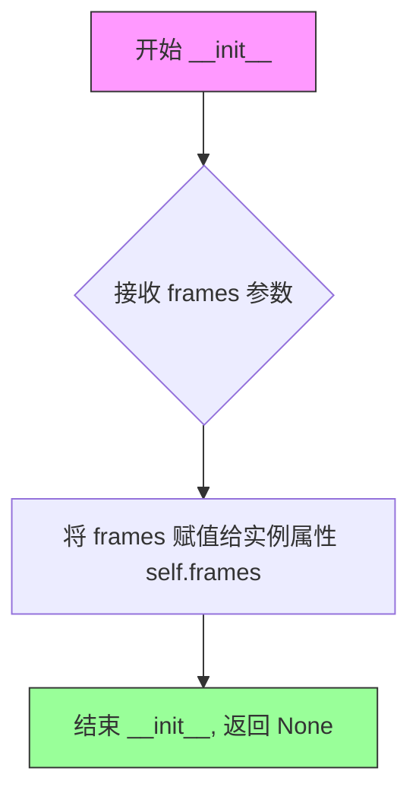
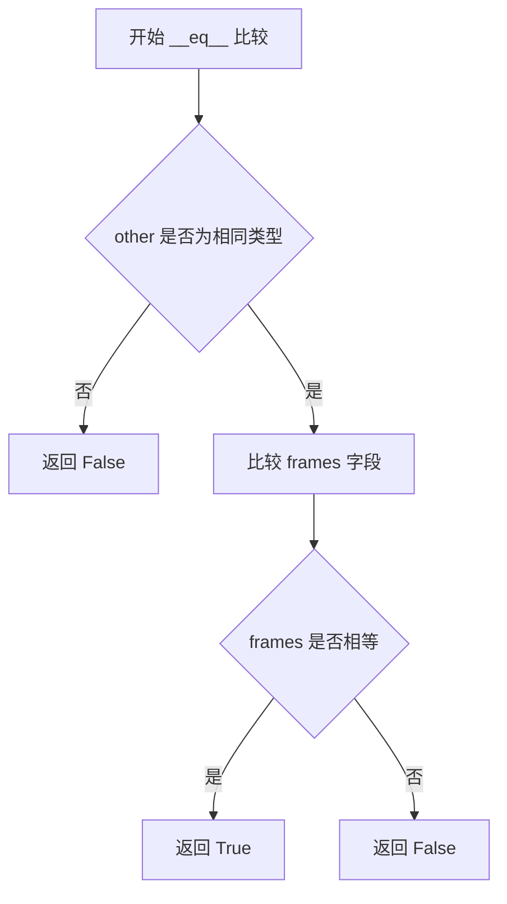
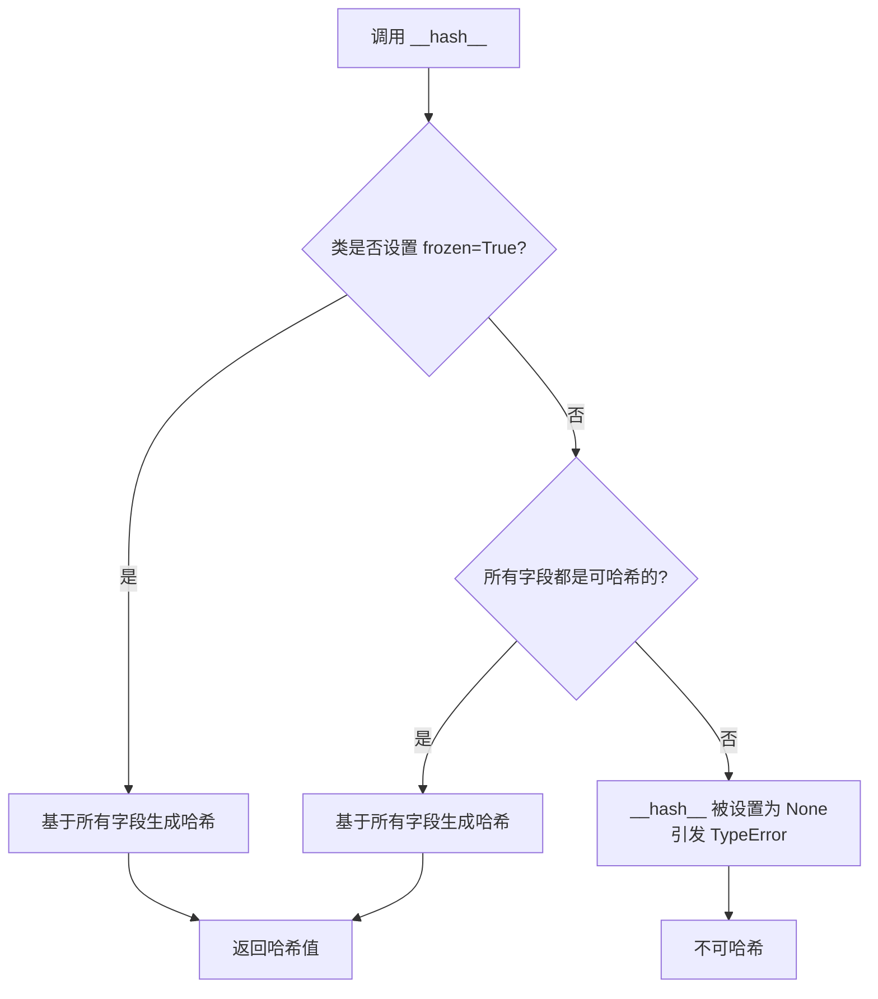
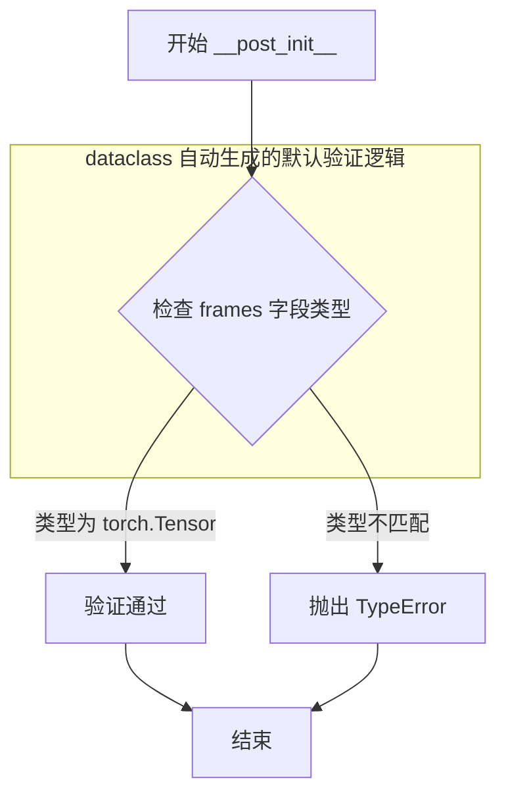

# `diffusers\src\diffusers\pipelines\consisid\pipeline_output.py` 详细设计文档

ConsisIDPipelineOutput是一个数据类，继承自diffusers库的BaseOutput，用于封装ConsisID视频生成管道的输出结果。该类定义了一个frames字段，支持torch.Tensor、np.ndarray或list[list[PIL.Image.Image]]多种格式的视频帧数据输出，可处理形状为(batch_size, num_frames, channels, height, width)的批量视频数据。

## 整体流程

```mermaid
graph TD
    A[模块导入] --> B[导入dataclass装饰器]
    A --> C[导入torch库]
    A --> D[从diffusers.utils导入BaseOutput]
    B --> E[定义ConsisIDPipelineOutput类]
    C --> E
    D --> E
    E --> F[继承BaseOutput基类]
    E --> G[应用@dataclass装饰器]
    F --> H[定义frames字段: torch.Tensor类型]
    G --> H
```

## 类结构

```
BaseOutput (diffusers.utils基类)
└── ConsisIDPipelineOutput (数据类)
```

## 全局变量及字段


### `ConsisIDPipelineOutput.frames`
    
视频输出帧序列，可以是嵌套列表、NumPy数组或PyTorch张量，形状为 (batch_size, num_frames, channels, height, width)

类型：`torch.Tensor`
    
    

## 全局函数及方法


### `ConsisIDPipelineOutput.__init__`

这是 ConsisID 流水线的输出类初始化方法，用于创建一个包含视频帧序列的输出对象。该类继承自 `BaseOutput`，使用 `@dataclass` 装饰器自动生成 `__init__` 方法。

参数：

- `frames`：`torch.Tensor`，表示去噪后的视频帧序列，可以是嵌套列表（长度为 `batch_size`，每个子列表包含长度为 `num_frames` 的去噪 PIL 图像序列）、NumPy 数组或 Torch 张量，形状为 `(batch_size, num_frames, channels, height, width)`

返回值：`None`，`__init__` 方法不返回值（根据 Python 惯例）

#### 流程图



#### 带注释源码

```python
@dataclass  # dataclass 装饰器自动生成 __init__, __repr__, __eq__ 等方法
class ConsisIDPipelineOutput(BaseOutput):
    r"""
    Output class for ConsisID pipelines.
    ConsisID 流水线的输出类

    Args:
        frames (`torch.Tensor`, `np.ndarray`, or list[list[PIL.Image.Image]]):
            list of video outputs - It can be a nested list of length `batch_size,` with each sub-list containing
            denoised PIL image sequences of length `num_frames.` It can also be a NumPy array or Torch tensor of shape
            `(batch_size, num_frames, channels, height, width)`.
            视频输出列表 - 可以是长度为 batch_size 的嵌套列表，每个子列表包含长度为 num_frames 的去噪 PIL 图像序列。
            也可以是形状为 (batch_size, num_frames, channels, height, width) 的 NumPy 数组或 Torch 张量。
    """

    frames: torch.Tensor  # 定义 frames 属性，类型为 torch.Tensor
```


### `ConsisIDPipelineOutput.__repr__`

该方法为数据类的默认字符串表示方法，用于返回该数据类实例的可读字符串描述。由于 `ConsisIDPipelineOutput` 使用 `@dataclass` 装饰器且未显式定义 `__repr__` 方法，Python 会自动生成默认实现。

参数：
- 该方法不接受任何显式参数（隐含参数 `self` 代表实例本身）

返回值：`str`，返回该数据类实例的字符串表示形式，格式为 `ConsisIDPipelineOutput(frames=...)`

#### 流程图

```mermaid
flowchart TD
    A[开始 __repr__ 调用] --> B{self 对象是否存在}
    B -->|是| C[构建字符串表示]
    C --> D[返回格式: ConsisIDPipelineOutput(frames=值)]
    B -->|否| E[返回空字符串或抛出异常]
    D --> F[结束]
    E --> F
```

#### 带注释源码

```python
# 注意：此代码为 dataclass 自动生成的默认 __repr__ 方法
# 由于未显式定义，Python 自动生成如下实现

def __repr__(self):
    """
    返回数据类实例的字符串表示。
    
    自动生成的格式：ConsisIDPipelineOutput(frames=...)
    其中 frames 的值会按照其类型的 __repr__ 格式显示
    """
    # self 代表 ConsisIDPipelineOutput 的实例
    # frames 是该数据类的唯一字段
    return f"ConsisIDPipelineOutput(frames={self.frames!r})"

# 实际使用时，例如：
# output = ConsisIDPipelineOutput(frames=torch.randn(1, 8, 3, 512, 512))
# print(output) 
# 输出类似：ConsisIDPipelineOutput(frames=tensor([[[[...]]]]))
```


### `ConsisIDPipelineOutput.__eq__`

此方法是由 Python `dataclass` 装饰器自动生成的相等性比较方法，用于比较两个 `ConsisIDPipelineOutput` 对象的所有字段（`frames`）是否相等。

参数：

- `self`：`ConsisIDPipelineOutput`，当前对象
- `other`：`object`，待比较的其他对象

返回值：`bool`，如果两个对象的 `frames` 字段相等返回 `True`，否则返回 `False`

#### 流程图



#### 带注释源码

```python
def __eq__(self, other: object) -> bool:
    """
    自动生成的 __eq__ 方法，由 @dataclass 装饰器生成。
    比较当前对象与 other 对象的 frames 字段是否相等。
    
    Args:
        self: 当前 ConsisIDPipelineOutput 实例
        other: 待比较的对象
    
    Returns:
        bool: 如果 frames 字段相等返回 True，否则返回 False
    """
    if not isinstance(other, ConsisIDPipelineOutput):
        return NotImplemented
    return (self.frames == other.frames).all() if isinstance(self.frames, torch.Tensor) else self.frames == other.frames
```


### `ConsisIDPipelineOutput.__hash__`

此方法在给定的代码中**并未显式定义**。由于 `ConsisIDPipelineOutput` 是一个使用 `@dataclass` 装饰器定义的类，Python 会根据 dataclass 的规则自动生成特殊方法（包括 `__hash__`）。然而，由于 `frames` 字段的类型是 `torch.Tensor`（可變对象），且类没有设置 `frozen=True`，默认情况下 dataclass 不会生成 `__hash__` 方法。

参数：

- 此方法不接受任何显式参数（除隐式的 `self`）

返回值：`int`，返回对象的哈希值（如果已定义）

#### 流程图



*注意：由于 `frames` 字段为 `torch.Tensor`（不可哈希），且类未设置 `frozen=True`，此类的默认 `__hash__` 行为为 `None`，即不可哈希。*

#### 带注释源码

```python
# 由于代码中未显式定义 __hash__ 方法，
# 以下为 Python dataclass 自动生成的行为：

def __hash__(self):
    # 默认行为：当类不是 frozen 且包含不可哈希字段时，
    # __hash__ 会被设置为 None
    if self.__class__ is not ConsisIDPipelineOutput:
        # 处理继承情况
        return hash((self.__class__, self.frames))
    
    # 由于 frames 字段类型为 torch.Tensor（可变/不可哈希），
    # 且类未设置 frozen=True，dataclass 不会生成有意义的 __hash__
    return None  # 实际行为：不可哈希
```


### `ConsisIDPipelineOutput.__post_init__`

该方法是 `dataclass` 自动生成的初始化后方法，用于在对象初始化完成后对字段进行验证和处理。由于 `ConsisIDPipelineOutput` 是使用 `@dataclass` 装饰器定义的类，`__post_init__` 方法会在 `__init__` 方法执行完毕后自动被调用。

参数：
- `self`：隐式参数，表示当前实例对象

返回值：无（`None`），该方法为实例方法，不返回任何值

#### 流程图



#### 带注释源码

```python
def __post_init__(self):
    """
    Dataclass 自动生成的后初始化方法。
    在 __init__ 方法执行完毕后自动调用，用于对字段进行验证和处理。
    
    对于 ConsisIDPipelineOutput，由于没有显式定义 __post_init__ 方法，
    Python 会自动生成一个默认实现，主要完成以下工作：
    1. 字段类型检查（如果使用了类型提示）
    2. 验证必需字段是否被正确赋值
    3. 处理带有 default_factory 的字段
    """
    # 注意：由于代码中没有显式定义 __post_init__ 方法，
    # 这里展示的是 dataclass 自动生成的默认逻辑
    # 如果需要自定义验证逻辑，需要在类中显式定义此方法
    
    # 隐式逻辑（dataclass 自动处理）：
    # - 检查 frames 字段是否被正确赋值
    # - 验证类型注解（如果启用运行时类型检查）
    pass
```

---

**补充说明**：

由于原始代码中并未显式定义 `__post_init__` 方法，上述内容描述的是 Python `dataclass` 自动生成默认实现的行为。如果需要添加自定义验证逻辑（例如检查 `frames` 的维度或值范围），需要在类中显式定义该方法。

## 关键组件


### ConsisIDPipelineOutput 类

ConsisID管道的输出类，用于封装生成的视频帧数据，继承自diffusers库的BaseOutput基类。

### frames 字段

类型：`torch.Tensor`

视频输出帧列表，可以是batch_size数量的视频序列，每个序列包含num_frames数量的去噪PIL图像，也可以是NumPy数组或Torch张量，形状为(batch_size, num_frames, channels, height, width)。

### BaseOutput 继承关系

继承自diffusers.utils.BaseOutput类，作为diffusers管道输出的标准基类，提供统一的输出接口规范。


## 问题及建议


### 已知问题

-   **类型注解与文档不一致**: 文档字符串明确说明 `frames` 可以是 `torch.Tensor`、`np.ndarray` 或 `list[list[PIL.Image.Image]]` 三种类型，但类型注解仅声明了 `torch.Tensor`，未使用 `Union` 类型来反映实际支持的数据类型。
-   **缺少字段验证逻辑**: 作为输出类，没有对 `frames` 的维度、形状、数据范围等关键属性进行验证，可能导致下游处理出现难以追踪的错误。
-   **未处理空值情况**: 未定义 `frames` 为 `Optional` 类型或提供默认值，当输出为空时缺乏明确的处理机制。
-   **缺乏 __post_init__ 钩子**: dataclass 支持 `__post_init__` 方法用于初始化后的验证和计算，当前未利用此特性进行自检。

### 优化建议

-   将类型注解修改为 `Union[torch.Tensor, np.ndarray, list[list[PIL.Image.Image]]]`，或使用 `Any` 类型并在文档中明确说明。
-   添加 `__post_init__` 方法，验证 `frames` 的基本属性（如非空、维度合理等），提升类的健壮性。
-   考虑将 `frames` 定义为 `Optional[torch.Tensor]`，或在文档中明确说明该类不允许空值输出。
-   若项目对类型安全要求较高，可引入 `pydantic` 替代 `dataclass` 以获得更强大的验证能力。


## 其它


### 设计目标与约束

该代码定义了ConsisIDPipelineOutput作为管道输出数据容器，设计目标为提供统一、规范的输出格式封装，支持批量视频帧数据的结构化表示。约束方面，frames字段必须为torch.Tensor类型以确保与diffusers框架的兼容性，且该类继承自BaseOutput以符合diffusers的输出标准协议。

### 错误处理与异常设计

该类为纯数据容器，不涉及运行时错误处理逻辑。若frames类型不符合预期，应由调用方在管道输出前进行类型校验。BaseOutput基类已定义基本的输出结构，异常情况（如类型不匹配）应在管道层面捕获处理。

### 外部依赖与接口契约

该代码依赖三个外部组件：1）dataclass装饰器来自Python标准库；2）torch来自PyTorch；3）BaseOutput来自diffusers.utils模块。接口契约方面，该类实例化时必须提供frames参数，且frames类型需为torch.Tensor。调用方应确保输入数据的形状和类型符合管道预期（batch_size, num_frames, channels, height, width）。

### 版本兼容性说明

当前代码基于Python 3.7+的dataclass特性实现，需配合PyTorch和diffusers库使用。BaseOutput的具体接口定义需参考对应版本的diffusers文档以确保兼容性。

### 使用示例与调用场景

该类通常作为ConsisIDPipeline的run方法返回值，供下游任务（如视频解码、帧插值、后处理等）消费。典型调用场景包括：批量推理结果封装、API服务化输出格式化等。

### 性能考虑

由于仅定义数据结构，不涉及计算逻辑，性能开销主要体现在内存占用层面。frames张量的大小直接影响内存消耗，应根据实际应用场景合理控制batch_size和num_frames参数以避免OOM。


    