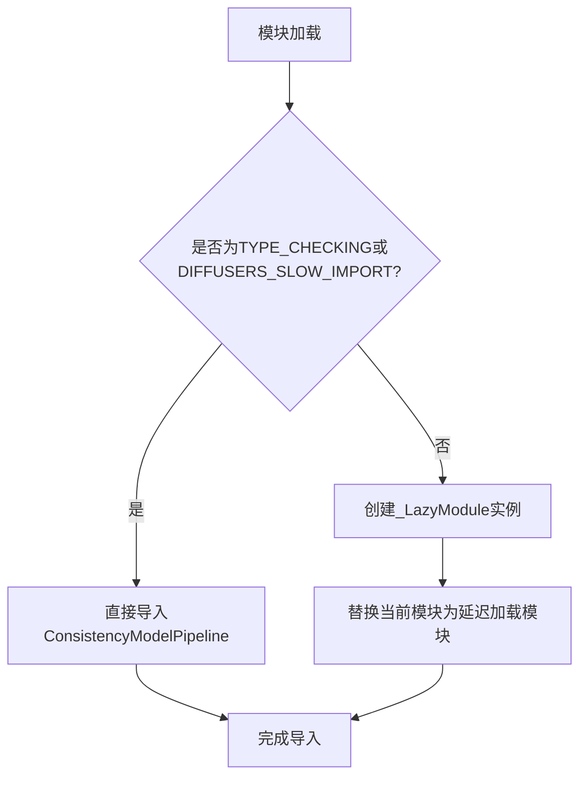

# `diffusers\src\diffusers\pipelines\consistency_models\__init__.py` 详细设计文档

这是一个diffusers库的延迟加载模块初始化文件，通过_LazyModule机制实现ConsistencyModelPipeline的延迟导入，支持类型检查时的直接导入和运行时的延迟加载，优化导入性能。

## 整体流程



## 类结构

```
此文件为模块入口，不涉及类继承结构
主要依赖_LazyModule实现延迟加载
ConsistencyModelPipeline从pipeline_consistency_models子模块导入
```

## 全局变量及字段


### `_import_structure`
    
定义延迟加载的导出结构字典

类型：`Dict[str, List[str]]`
    


### `DIFFUSERS_SLOW_IMPORT`
    
控制是否使用延迟加载的全局配置标志

类型：`bool`
    


### `__spec__`
    
Python模块规范对象（隐式可用）

类型：`Optional[ModuleSpec]`
    


    

## 全局函数及方法


## 关键组件


### _LazyModule

延迟加载机制，用于在模块被导入时动态加载子模块，提高导入速度和内存效率。

### ConsistencyModelPipeline

一致性模型管道类，用于生成一致性模型（Consistency Models）的输出。

### TYPE_CHECKING

类型检查标志，用于在类型检查时导入模块，避免运行时导入开销。

### DIFFUSERS_SLOW_IMPORT

全局配置标志，控制是否使用慢速导入模式，影响模块的加载方式。

### _import_structure

全局字典变量，定义了模块的导入结构，映射子模块名称到可导出的类或函数。

### sys.modules

Python运行时模块注册表，用于存储已导入的模块，延迟加载通过替换此字典中的模块实现。


## 问题及建议


### 已知问题

-   **缺乏错误处理机制**：当`ConsistencyModelPipeline`导入失败或不存在时，没有提供fallback或友好的错误提示，可能导致运行时难以追踪的问题。
-   **导入结构硬编码**：`_import_structure`字典手动维护，随着模块增长容易出现遗漏或不同步的情况。
-   **类型注解不完整**：仅依赖`TYPE_CHECKING`条件导入，缺少明确的类型提示和文档说明，对IDE支持和代码可读性不足。
-   **单点导出风险**：仅导出一个类`ConsistencyModelPipeline`，若该类实现变化，会直接影响所有依赖方。
-   **缺少版本兼容性说明**：未标注API版本稳定性，可能导致下游使用时产生破坏性更新的风险。
-   **间接依赖隐含**：代码依赖`...utils`中的`_LazyModule`和`DIFFUSERS_SLOW_IMPORT`，但未显式声明这些依赖的版本要求或接口契约。

### 优化建议

-   **添加try-except包装**：在导入失败时捕获异常并提供有意义的错误信息，或设置可选的fallback机制。
-   **使用`__all__`显式声明导出**：配合`_import_structure`一起使用，明确公共API接口。
-   **补充类型提示和文档**：为模块和导出类添加类型注解及docstring，提升可维护性和IDE支持。
-   **考虑自动化导入管理**：可探索使用工具自动生成`_import_structure`，减少手动维护成本。
-   **添加API版本标注**：使用`__version__`或DeprecationWarning标注API稳定性，便于下游版本适配。
-   **显式声明依赖版本**：在文档或配置中明确`...utils`模块的接口要求和版本约束。


## 其它


### 设计目标与约束

**设计目标**：实现Diffusers库中Consistency Model Pipeline的延迟导入机制，支持类型检查时的静态导入和运行时的动态加载，优化大型模型的导入性能。

**约束条件**：
- 必须兼容Python的类型检查模式（TYPE_CHECKING）
- 必须支持DIFFUSERS_SLOW_IMPORT配置以控制导入行为
- 必须保持与LazyModule框架的一致性
- 必须通过sys.modules注册模块以避免重复导入

### 错误处理与异常设计

**延迟导入失败处理**：
- 当ConsistencyModelPipeline模块不存在时，_LazyModule会抛出ModuleNotFoundError
- 运行时访问未加载的属性会触发AttributeError
- TYPE_CHECKING模式下直接导入，失败则报告ImportError

**异常传播机制**：
- 延迟加载的异常会在首次访问时抛出
- 异常信息包含模块路径和属性名称

### 外部依赖与接口契约

**依赖项**：
- typing.TYPE_CHECKING：Python标准库，用于类型检查
- ...utils._LazyModule：Diffusers内部延迟加载工具类
- ...utils.DIFFUSERS_SLOW_IMPORT：配置标志，控制导入行为

**接口契约**：
- 导出项：ConsistencyModelPipeline类
- 模块注册：通过sys.modules[__name__]注册自身
- 延迟加载：首次访问属性时触发实际模块加载

### 模块初始化流程

**初始化阶段**：
1. 定义_import_structure字典，声明可导出内容
2. 检查导入模式（TYPE_CHECKING或DIFFUSERS_SLOW_IMPORT）
3. 根据模式选择直接导入或延迟加载
4. 注册到sys.modules完成模块初始化

### 性能特征与优化

**优化目标**：
- 减少启动时的模块加载时间
- 按需加载ConsistencyModelPipeline及其依赖
- 支持增量导入以降低内存占用

**潜在影响**：
- 首次访问属性时存在轻微延迟
- 调试时可能难以追踪延迟加载的模块

### 版本兼容性考虑

**Python版本**：支持Python 3.7+（TYPE_CHECKING支持）

**框架兼容性**：
- 依赖Diffusers库的LazyModule实现
- 与ConsistencyModelPipeline模块版本同步

### 配置与扩展性

**可配置项**：
- DIFFUSERS_SLOW_IMPORT：控制是否使用延迟导入

**扩展方式**：
- 在_import_structure中添加新的导出项
- 扩展if条件以支持更多导入模式

### 安全与权限

**安全考量**：
- 模块路径通过相对导入确保安全性
- 延迟加载避免执行未授权代码

**权限要求**：
- 需要访问...utils模块的权限
- 需要注册到sys.modules的权限

### 测试策略建议

**测试要点**：
- 验证TYPE_CHECKING模式下的直接导入
- 验证运行时延迟加载行为
- 验证sys.modules正确注册
- 验证异常处理机制

### 维护注意事项

**维护要点**：
- 保持_import_structure与实际导出一致
- 确保ConsistencyModelPipeline路径正确
- 跟踪Diffusers框架的LazyModule API变化


    