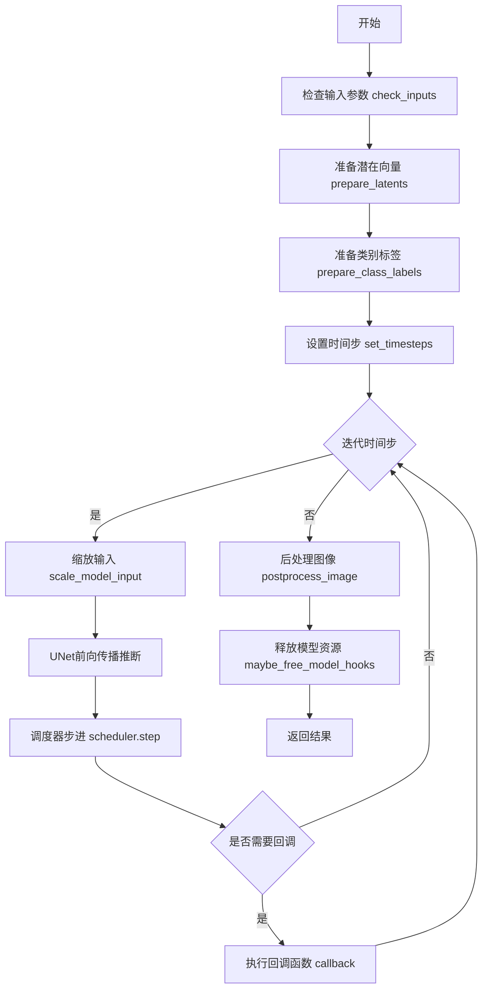
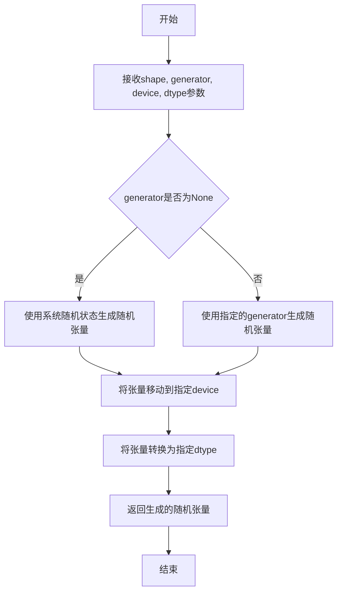
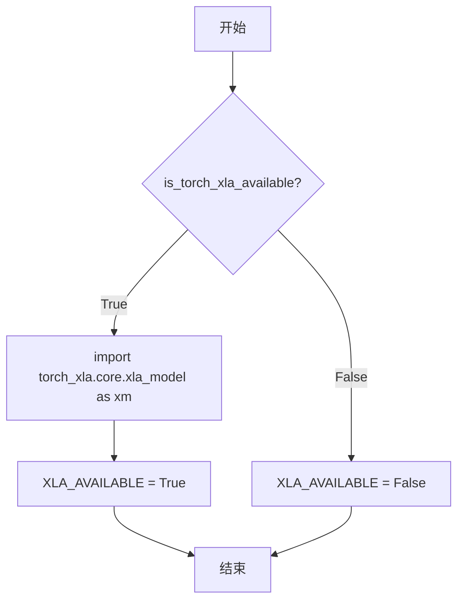
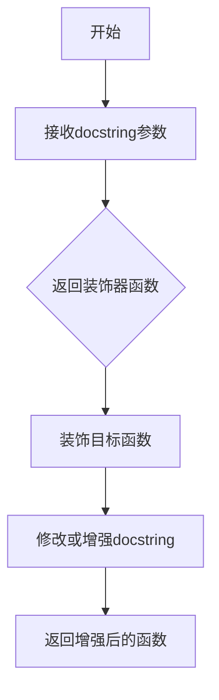
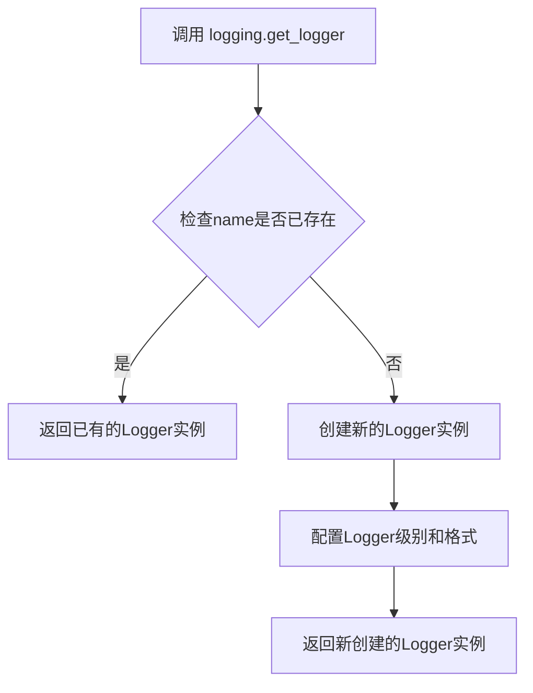
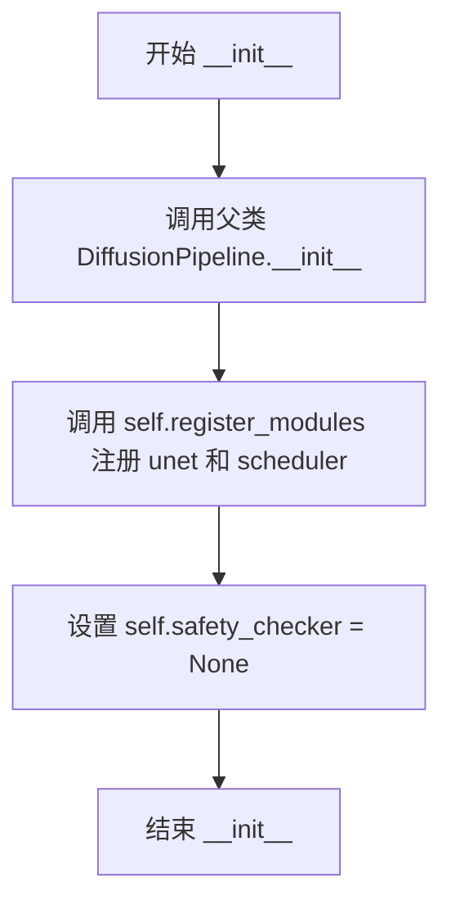
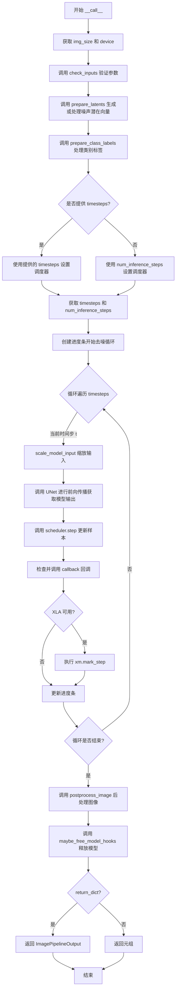

# `diffusers\src\diffusers\pipelines\consistency_models\pipeline_consistency_models.py` 详细设计文档

ConsistencyModelPipeline是一个用于无条件或类别条件图像生成的扩散管道。该管道实现了Consistency Models算法，支持单步和多步采样，可通过预训练的UNet2DModel和CMStochasticIterativeScheduler调度器生成高质量图像。

## 整体流程



## 类结构

```
DiffusionPipeline (基类)
└── ConsistencyModelPipeline (实现类)
```

## 全局变量及字段


### `logger`
    
用于记录日志的Logger实例，来自于logging模块

类型：`logging.Logger`
    


### `EXAMPLE_DOC_STRING`
    
包含示例代码的文档字符串，展示ConsistencyModelPipeline的使用方法

类型：`str`
    


### `XLA_AVAILABLE`
    
布尔标志，指示torch_xla是否可用以支持XLA设备加速

类型：`bool`
    


### `ConsistencyModelPipeline.unet`
    
UNet2DModel模型实例，用于对编码的图像潜在表示进行去噪

类型：`UNet2DModel`
    


### `ConsistencyModelPipeline.scheduler`
    
一致性模型的随机迭代调度器，用于去噪过程

类型：`CMStochasticIterativeScheduler`
    


### `ConsistencyModelPipeline.safety_checker`
    
安全检查器，当前设置为None

类型：`None`
    


### `ConsistencyModelPipeline.model_cpu_offload_seq`
    
模型CPU卸载顺序，指定为'unet'

类型：`str`
    
    

## 全局函数及方法


### `randn_tensor`

该函数用于生成符合标准正态分布（高斯分布）的随机张量，主要用于在扩散模型pipeline中生成初始噪声 latent。在 `ConsistencyModelPipeline` 中被 `prepare_latents` 方法调用，以初始化用于去噪过程的随机噪声样本。

参数：

- `shape`：`tuple`，表示生成张量的形状，例如 `(batch_size, num_channels, height, width)`
- `generator`：`torch.Generator | list[torch.Generator] | None`，可选的随机数生成器，用于确保生成过程的可确定性
- `device`：`torch.device`，生成张量所在的设备（如 CPU 或 CUDA）
- `dtype`：`torch.dtype`，生成张量的数据类型（如 float32、float16 等）

返回值：`torch.Tensor`，返回符合正态分布 N(0, 1) 的随机张量，形状为指定的 `shape`

#### 流程图



#### 带注释源码

```
# 该函数定义位于 ...utils.torch_utils 模块中
# 以下为在 ConsistencyModelPipeline.prepare_latents 方法中的调用示例和推断实现

# 调用方式：
latents = randn_tensor(shape, generator=generator, device=device, dtype=dtype)

# 参数说明：
# - shape: 张量形状，如 (batch_size, num_channels, height, width)
# - generator: 可选的 PyTorch 随机生成器，用于确定性采样
# - device: 目标设备 (cpu/cuda)
# - dtype: 目标数据类型 (float32/float16等)

# 返回值：
# - torch.Tensor: 形状为shape的正态分布随机张量，均值0，标准差1
```


### `is_torch_xla_available`

该函数用于检查当前环境中是否安装了PyTorch XLA（Accelerated），如果安装则返回`True`，否则返回`False`。代码中通过此函数的条件判断来决定是否导入`torch_xla`相关模块并设置`XLA_AVAILABLE`标志。

参数： 无

返回值：`bool`，如果torch_xla可用返回`True`，否则返回`False`

#### 流程图



#### 带注释源码

```python
# 从utils模块导入is_torch_xla_available函数
from ...utils import is_torch_xla_available, logging, replace_example_docstring

# 检查torch_xla是否可用
if is_torch_xla_available():
    # 如果可用，导入torch_xla的核心模块
    import torch_xla.core.xla_model as xm
    # 设置全局标志，表示XLA可用
    XLA_AVAILABLE = True
else:
    # 如果不可用，设置全局标志，表示XLA不可用
    XLA_AVAILABLE = False
```


### `replace_example_docstring`

这是一个从 `...utils` 导入的装饰器函数，用于自动替换或增强函数的文档字符串（docstring），通常用于在文档中添加使用示例。

参数：

- `docstring`：任意类型，要替换或增强的文档字符串

返回值：任意类型，返回一个装饰器函数

#### 流程图



#### 带注释源码

```python
# replace_example_docstring 是从 diffusers 库 utils 模块导入的装饰器
# 源码位于 ...utils 模块中
# 使用方式：作为装饰器应用于类的 __call__ 方法

# 导入语句（在代码中的实际位置）
from ...utils import replace_example_docstring

# 在 ConsistencyModelPipeline.__call__ 方法上的使用示例
@replace_example_docstring(EXAMPLE_DOC_STRING)
def __call__(
    self,
    batch_size: int = 1,
    class_labels: torch.Tensor | list[int] | int | None = None,
    num_inference_steps: int = 1,
    timesteps: list[int] = None,
    generator: torch.Generator | list[torch.Generator] | None = None,
    latents: torch.Tensor | None = None,
    output_type: str | None = "pil",
    return_dict: bool = True,
    callback: Callable[[int, int, torch.Tensor], None] | None = None,
    callback_steps: int = 1,
):
    r"""
    Args:
        batch_size (`int`, *optional*, defaults to 1):
            The number of images to generate.
        # ... 其他参数文档
    
    Examples:
        # 此处的示例内容由 replace_example_docstring 装饰器自动填充
        # 填充的内容来自 EXAMPLE_DOC_STRING 变量
    
    Returns:
        [`~pipelines.ImagePipelineOutput`] or `tuple`:
            If `return_dict` is `True`, [`~pipelines.ImagePipelineOutput`] is returned...
    """
    # 方法实现...
```

> **注意**：由于 `replace_example_docstring` 函数的实际实现源码不在当前提供的代码文件中，上述信息是基于其使用方式和功能推断得出的。该函数是 diffusers 库的工具函数，用于自动将预定义的示例文档字符串注入到被装饰方法的文档中。


### logging.get_logger

获取或创建一个与指定模块关联的logger实例，用于在diffusers库中记录日志信息。

参数：

- `name`：`str`，模块的`__name__`属性，用于标识logger的来源，通常为`__name__`变量

返回值：`logging.Logger`，返回一个Python标准库的logger实例，用于记录日志

#### 流程图



#### 带注释源码

```python
# 从 ...utils 导入 logging 模块
from ...utils import is_torch_xla_available, logging, replace_example_docstring

# 使用 logging.get_logger 创建模块级别的 logger
# __name__ 是 Python 的内置变量，表示当前模块的完整路径
# 例如：对于 diffusers.pipelines.consistency_models ConsistencyModelPipeline
# __name__ 可能是 "diffusers.pipelines.consistency_models ConsistencyModelPipeline"
logger = logging.get_logger(__name__)  # pylint: disable=invalid-name

# 这里的 logger 用于在代码中记录日志，例如：
# logger.warning("Both `num_inference_steps` and `timesteps` are supplied; `timesteps` will be used over `num_inference_steps`.")
```


### ConsistencyModelPipeline.__init__

初始化一致性模型管道，注册UNet模型和调度器，并设置安全检查器为None。

参数：

- `unet`：`UNet2DModel`，用于去噪编码图像 latent 的 UNet2DModel
- `scheduler`：`CMStochasticIterativeScheduler`，与 unet 一起用于去噪编码图像 latent 的调度器，目前仅兼容 CMStochasticIterativeScheduler

返回值：`None`，构造函数无返回值

#### 流程图



#### 带注释源码

```python
def __init__(self, unet: UNet2DModel, scheduler: CMStochasticIterativeScheduler) -> None:
    """
    初始化 ConsistencyModelPipeline
    
    参数:
        unet: UNet2DModel 实例，用于图像去噪
        scheduler: CMStochasticIterativeScheduler 实例，用于调度去噪步骤
    """
    # 调用父类 DiffusionPipeline 的初始化方法
    # 父类会初始化一些基础属性如 device, dtype 等
    super().__init__()

    # 使用 register_modules 方法注册 UNet 和调度器
    # 这些模块会被添加到 self.modules 字典中以便后续访问
    # 同时也会保存到对应的属性中 (self.unet, self.scheduler)
    self.register_modules(
        unet=unet,
        scheduler=scheduler,
    )

    # 一致性模型管道不使用安全检查器
    # 显式设置为 None 以避免继承自父类的默认行为
    self.safety_checker = None
```


### `ConsistencyModelPipeline.prepare_latents`

该方法用于为一致性模型（Consistency Model）准备初始的噪声潜在向量（latents）。它根据指定的批量大小、通道数、高度和宽度生成随机噪声张量，或者使用用户提供的潜在张量，并按照调度器要求的初始噪声标准差进行缩放。

参数：

- `batch_size`：`int`，批量大小，指定要生成的图像数量
- `num_channels`：`int`，通道数，对应 UNet 输入通道数
- `height`：`int`，生成图像的高度（以像素为单位）
- `width`：`int`，生成图像的宽度（以像素为单位）
- `dtype`：`torch.dtype`，生成张量的数据类型（如 float16、float32 等）
- `device`：`torch.device`，生成张量所在的设备（CPU 或 CUDA）
- `generator`：`torch.Generator` 或 `list[torch.Generator]`，可选的随机数生成器，用于确保可复现性
- `latents`：`torch.Tensor` 或 `None`，可选的预生成噪声张量，如果为 None 则随机生成

返回值：`torch.Tensor`，处理后的潜在张量，已按调度器的初始噪声标准差进行缩放

#### 流程图

```mermaid
flowchart TD
    A[开始 prepare_latents] --> B[构建 shape 元组: (batch_size, num_channels, height, width)]
    B --> C{检查 generator 是否为列表且长度 != batch_size}
    C -->|是| D[抛出 ValueError: 生成器列表长度与批量大小不匹配]
    C -->|否| E{latents 是否为 None}
    E -->|是| F[调用 randn_tensor 生成随机噪声张量]
    F --> G[将 latents 移到指定 device 并转换 dtype]
    E -->|否| G
    G --> H[latents = latents * self.scheduler.init_noise_sigma]
    H --> I[返回处理后的 latents]
    D --> J[结束]
    I --> J
```

#### 带注释源码

```python
def prepare_latents(
    self,
    batch_size: int,
    num_channels: int,
    height: int,
    width: int,
    dtype: torch.dtype,
    device: torch.device,
    generator: torch.Generator | list[torch.Generator] | None,
    latents: torch.Tensor | None = None,
) -> torch.Tensor:
    """
    为扩散模型准备初始潜在张量。

    参数:
        batch_size: 批量大小，要生成的图像数量
        num_channels: 输入通道数
        height: 图像高度
        width: 图像宽度
        dtype: 张量的数据类型
        device: 张量存放的设备
        generator: 随机数生成器，用于可复现性
        latents: 可选的预生成噪声张量，如果为 None 则随机生成

    返回:
        处理后的潜在张量，已按调度器要求缩放
    """
    # 构建潜在张量的形状元组
    shape = (batch_size, num_channels, height, width)

    # 检查 generator 列表长度是否与 batch_size 匹配
    if isinstance(generator, list) and len(generator) != batch_size:
        raise ValueError(
            f"You have passed a list of generators of length {len(generator)}, but requested an effective batch"
            f" size of {batch_size}. Make sure the batch size matches the length of the generators."
        )

    # 根据是否有预提供的 latents 决定生成方式
    if latents is None:
        # 如果没有提供 latents，使用 randn_tensor 生成随机噪声
        # 从标准正态分布 N(0, 1) 采样
        latents = randn_tensor(shape, generator=generator, device=device, dtype=dtype)
    else:
        # 如果提供了 latents，确保它位于正确的设备和数据类型
        latents = latents.to(device=device, dtype=dtype)

    # 使用调度器的初始噪声标准差缩放初始噪声
    # 这确保了噪声符合调度器期望的初始方差
    latents = latents * self.scheduler.init_noise_sigma

    return latents
```


### `ConsistencyModelPipeline.postprocess_image`

该方法用于将去噪后的图像样本（tensor 格式）后处理成指定格式（PyTorch tensor、NumPy 数组或 PIL Image），主要完成去归一化和格式转换操作。

参数：

- `self`：隐式参数，指向 `ConsistencyModelPipeline` 实例本身
- `sample`：`torch.Tensor`，需要后处理的去噪图像样本张量，形状通常为 (batch_size, channels, height, width)，值域在归一化范围内
- `output_type`：`str`，期望的输出格式，默认为 `"pil"`，可选值包括 `"pt"`（PyTorch tensor）、`"np"`（NumPy 数组）、`"pil"`（PIL Image）

返回值：返回值的类型取决于 `output_type` 参数：

- 当 `output_type="pt"` 时：返回 `torch.Tensor`，去归一化后的图像张量
- 当 `output_type="np"` 时：返回 `numpy.ndarray`，去归一化并转换为 NumPy 数组，形状为 (batch_size, height, width, channels)
- 当 `output_type="pil"` 时：返回 `List[PIL.Image.Image]` 或 `PIL.Image.Image`，去归一化并转换为 PIL 图像列表

#### 流程图

```mermaid
flowchart TD
    A[开始 postprocess_image] --> B{output_type 是否合法?}
    B -- 否 --> C[抛出 ValueError 异常]
    B -- 是 --> D[sample = (sample / 2 + 0.5).clamp(0, 1)<br/>去归一化操作]
    D --> E{output_type == 'pt'?}
    E -- 是 --> F[返回 torch.Tensor 格式的 sample]
    E -- 否 --> G[sample = sample.cpu().permute(0, 2, 3, 1).numpy()<br/>转换为 NumPy 数组]
    G --> H{output_type == 'np'?}
    H -- 是 --> I[返回 numpy.ndarray 格式的 sample]
    H -- 否 --> J[sample = self.numpy_to_pil(sample)<br/>转换为 PIL Image]
    I --> K[返回 PIL Image 列表]
    F --> L[结束]
    K --> L
    I --> L
```

#### 带注释源码

```python
def postprocess_image(self, sample: torch.Tensor, output_type: str = "pil"):
    """
    Postprocess the denoised image sample to the desired output format.
    
    Args:
        sample (torch.Tensor): The denoised image tensor to postprocess.
        output_type (str): The desired output format. Must be one of "pt", "np", or "pil".
    
    Returns:
        The postprocessed image in the requested format.
    """
    # 检查 output_type 是否为支持的格式
    if output_type not in ["pt", "np", "pil"]:
        raise ValueError(
            f"output_type={output_type} is not supported. Make sure to choose one of ['pt', 'np', or 'pil']"
        )

    # Equivalent to diffusers.VaeImageProcessor.denormalize
    # 将 [-1, 1] 范围的值域映射回 [0, 1] 范围
    # 公式: (sample / 2 + 0.5) 等价于 (sample + 1) / 2
    # .clamp(0, 1) 确保值域严格限制在 [0, 1]
    sample = (sample / 2 + 0.5).clamp(0, 1)
    
    # 如果只需要 PyTorch tensor 格式，直接返回
    if output_type == "pt":
        return sample

    # Equivalent to diffusers.VaeImageProcessor.pt_to_numpy
    # 将张量转移到 CPU 并转换为 NumPy 数组
    # permute(0, 2, 3, 1) 变换维度顺序: (B, C, H, W) -> (B, H, W, C)
    sample = sample.cpu().permute(0, 2, 3, 1).numpy()
    
    # 如果只需要 NumPy 数组格式，直接返回
    if output_type == "np":
        return sample

    # Output_type must be 'pil'
    # 将 NumPy 数组转换为 PIL Image 列表
    sample = self.numpy_to_pil(sample)
    return sample
```


### ConsistencyModelPipeline.prepare_class_labels

该方法用于准备类别标签（class labels），支持类别条件的一致性模型。如果模型配置了类别嵌入（num_class_embeds 不为 None），则根据输入的 class_labels 参数处理或随机生成批次大小的类别标签；否则返回 None。

参数：

- `batch_size`：`int`，批处理大小，用于生成随机类别标签时的数量
- `device`：`torch.device`，目标设备，用于将类别标签张量移动到指定设备
- `class_labels`：`torch.Tensor | list[int] | int | None`，可选的类别标签输入，可以是单个整数、整数列表、预先创建的 Tensor 或 None（表示随机生成）

返回值：`torch.Tensor | None`，处理后的类别标签张量或 None（当模型不支持类别条件时）

#### 流程图

```mermaid
flowchart TD
    A[开始] --> B{self.unet.config.num_class_embeds is not None}
    B -->|否| C[设置 class_labels = None]
    B -->|是| D{class_labels 类型}
    D -->|list| E[转换为 torch.Tensor int类型]
    D -->|int| F{assert batch_size == 1}
    F -->|是| G[转换为 torch.Tensor [class_labels]]
    F -->|否| H[抛出异常]
    D -->|None| I[随机生成 batch_size个类别标签]
    E --> J[class_labels.to(device)]
    G --> J
    I --> J
    C --> K[返回 class_labels]
    J --> K
```

#### 带注释源码

```python
def prepare_class_labels(self, batch_size, device, class_labels=None):
    # 检查UNet配置是否支持类别条件嵌入
    if self.unet.config.num_class_embeds is not None:
        # 处理列表类型的类别标签
        if isinstance(class_labels, list):
            class_labels = torch.tensor(class_labels, dtype=torch.int)
        # 处理单个整数类型的类别标签
        elif isinstance(class_labels, int):
            # 确保batch_size为1，因为只有一个类别标签
            assert batch_size == 1, "Batch size must be 1 if classes is an int"
            class_labels = torch.tensor([class_labels], dtype=torch.int)
        # 如果未提供类别标签，则随机生成
        elif class_labels is None:
            # 随机生成batch_size个类别标签，范围在[0, num_class_embeds)
            # TODO: should use generator here? int analogue of randn_tensor is not exposed in ...utils
            class_labels = torch.randint(0, self.unet.config.num_class_embeds, size=(batch_size,))
        # 将类别标签张量移动到目标设备
        class_labels = class_labels.to(device)
    else:
        # 如果模型不支持类别条件，则返回None
        class_labels = None
    return class_labels
```


### `ConsistencyModelPipeline.check_inputs`

该方法用于验证一致性模型管道的输入参数是否合法，包括检查推理步数与时间步的互斥关系、潜在向量的形状是否符合预期、以及回调步数是否为正整数。

参数：

- `num_inference_steps`：`int | None`，推理步数，指定去噪过程的迭代次数
- `timesteps`：`list[int] | None`，自定义时间步列表，用于指定去噪过程的具体时间步
- `latents`：`torch.Tensor | None`，预生成的噪声潜在向量，用于图像生成
- `batch_size`：`int`，批大小，指定生成的图像数量
- `img_size`：`int`，图像尺寸，对应 UNet 模型的样本大小
- `callback_steps`：`int`，回调步数，指定调用回调函数的频率

返回值：`None`，该方法仅进行参数验证，不返回任何值

#### 流程图

```mermaid
flowchart TD
    A[开始 check_inputs] --> B{num_inference_steps is None<br/>且 timesteps is None?}
    B -->|是| C[抛出 ValueError:<br/>必须提供其中一个参数]
    B -->|否| D{num_inference_steps is not None<br/>且 timesteps is not None?}
    D -->|是| E[记录警告:<br/>timesteps 将优先于<br/>num_inference_steps]
    D -->|否| F{latents is not None?}
    C --> Z[结束]
    E --> F
    F -->|是| G{latents.shape ==<br/>(batch_size, 3, img_size, img_size)?}
    F -->|否| H{callback_steps 是 None?}
    G -->|否| I[抛出 ValueError:<br/>latents 形状不匹配]
    G -->|是| H
    H -->|是| J[抛出 ValueError:<br/>callback_steps 必须为正整数]
    H -->|否| K{callback_steps 是 int 类型<br/>且 > 0?}
    I --> Z
    J --> Z
    K -->|否| J
    K -->|是| L[验证通过]
    L --> Z
```

#### 带注释源码

```python
def check_inputs(self, num_inference_steps, timesteps, latents, batch_size, img_size, callback_steps):
    """
    验证一致性模型管道的输入参数合法性
    
    参数:
        num_inference_steps: 推理步数
        timesteps: 自定义时间步列表
        latents: 潜在向量张量
        batch_size: 批大小
        img_size: 图像尺寸
        callback_steps: 回调步数
    """
    # 检查：必须提供 num_inference_steps 或 timesteps 之一
    if num_inference_steps is None and timesteps is None:
        raise ValueError("Exactly one of `num_inference_steps` or `timesteps` must be supplied.")

    # 检查：如果两者都提供了，记录警告，timesteps 优先
    if num_inference_steps is not None and timesteps is not None:
        logger.warning(
            f"Both `num_inference_steps`: {num_inference_steps} and `timesteps`: {timesteps} are supplied;"
            " `timesteps` will be used over `num_inference_steps`."
        )

    # 检查：如果提供了 latents，验证其形状是否符合预期
    if latents is not None:
        # 期望形状: (batch_size, 3通道, img_size, img_size)
        expected_shape = (batch_size, 3, img_size, img_size)
        if latents.shape != expected_shape:
            raise ValueError(f"The shape of latents is {latents.shape} but is expected to be {expected_shape}.")

    # 检查：callback_steps 必须是正整数
    if (callback_steps is None) or (
        callback_steps is not None and (not isinstance(callback_steps, int) or callback_steps <= 0)
    ):
        raise ValueError(
            f"`callback_steps` has to be a positive integer but is {callback_steps} of type"
            f" {type(callback_steps)}."
        )
```


### ConsistencyModelPipeline.__call__

该方法是 ConsistencyModelPipeline 的核心推理方法，负责执行一致性模型（Consistency Model）的图像生成流程。它支持单步采样和多步采样两种模式，可以根据 class_labels 生成条件或无条件图像，并返回处理后的图像结果。

参数：

- `batch_size`：`int`，可选，默认值为 1，要生成的图像数量
- `class_labels`：`torch.Tensor | list[int] | int | None`，可选，条件生成所需的类别标签，支持单值、列表或张量形式，若为 None 且模型支持类别条件则随机生成
- `num_inference_steps`：`int`，可选，默认值为 1，去噪步数，单步采样时设为 1，多步采样时使用更大值
- `timesteps`：`list[int]`，可选，自定义去噪过程的时间步列表，若提供则覆盖 num_inference_steps，必须按降序排列
- `generator`：`torch.Generator | list[torch.Generator] | None`，可选，用于生成确定性随机数的生成器
- `latents`：`torch.Tensor | None`，可选，预生成的噪声潜在向量，若不提供则自动生成
- `output_type`：`str | None`，可选，默认值为 "pil"，输出图像格式，可选 "pil"、"np" 或 "pt"
- `return_dict`：`bool`，可选，默认值为 True，是否返回字典格式的结果
- `callback`：`Callable[[int, int, torch.Tensor], None] | None`，可选，每隔 callback_steps 步调用的回调函数
- `callback_steps`：`int`，可选，默认值为 1，回调函数被调用的频率

返回值：`ImagePipelineOutput | tuple`，若 return_dict 为 True 返回 ImagePipelineOutput 对象，包含生成的图像列表；否则返回元组，第一个元素为图像列表

#### 流程图



#### 带注释源码

```python
@torch.no_grad()
@replace_example_docstring(EXAMPLE_DOC_STRING)
def __call__(
    self,
    batch_size: int = 1,
    class_labels: torch.Tensor | list[int] | int | None = None,
    num_inference_steps: int = 1,
    timesteps: list[int] = None,
    generator: torch.Generator | list[torch.Generator] | None = None,
    latents: torch.Tensor | None = None,
    output_type: str | None = "pil",
    return_dict: bool = True,
    callback: Callable[[int, int, torch.Tensor], None] | None = None,
    callback_steps: int = 1,
):
    r"""
    Pipeline for generating images using Consistency Model.
    
    Args:
        batch_size: Number of images to generate.
        class_labels: Optional class labels for conditioning.
        num_inference_steps: Number of denoising steps.
        timesteps: Custom timesteps for denoising process.
        generator: Random generator for deterministic results.
        latents: Pre-generated noise latents.
        output_type: Output format - "pil", "np", or "pt".
        return_dict: Whether to return ImagePipelineOutput or tuple.
        callback: Callback function called during inference.
        callback_steps: Frequency of callback calls.
    
    Returns:
        ImagePipelineOutput or tuple containing generated images.
    """
    # 0. 准备调用参数 - 从 UNet 配置中获取图像尺寸和执行设备
    img_size = self.unet.config.sample_size  # 获取采样图像尺寸
    device = self._execution_device  # 获取执行设备（CPU/CUDA）

    # 1. 检查输入参数的有效性
    # 验证 num_inference_steps、timesteps、latents、batch_size、callback_steps 等参数
    self.check_inputs(num_inference_steps, timesteps, latents, batch_size, img_size, callback_steps)

    # 2. 准备图像潜在向量
    # 从标准差为 sigma_0 的高斯分布采样初始图像潜在向量 x_0 ~ N(0, sigma_0^2 * I)
    sample = self.prepare_latents(
        batch_size=batch_size,
        num_channels=self.unet.config.in_channels,  # UNet 输入通道数
        height=img_size,
        width=img_size,
        dtype=self.unet.dtype,  # UNet 数据类型
        device=device,
        generator=generator,
        latents=latents,  # 如果提供则使用提供的潜在向量，否则生成新的
    )

    # 3. 处理类别标签用于条件生成
    # 如果模型支持类别嵌入，则处理并转移类别标签到对应设备
    class_labels = self.prepare_class_labels(batch_size, device, class_labels=class_labels)

    # 4. 准备时间步
    # 根据是否提供自定义时间步来设置调度器
    if timesteps is not None:
        # 使用自定义时间步
        self.scheduler.set_timesteps(timesteps=timesteps, device=device)
        timesteps = self.scheduler.timesteps
        num_inference_steps = len(timesteps)  # 更新实际推理步数
    else:
        # 使用等间距的 num_inference_steps 个时间步
        self.scheduler.set_timesteps(num_inference_steps)
        timesteps = self.scheduler.timesteps

    # 5. 去噪循环 - 实现论文中的算法 1（多步采样）
    # 创建进度条用于显示推理进度
    with self.progress_bar(total=num_inference_steps) as progress_bar:
        # 遍历每个时间步
        for i, t in enumerate(timesteps):
            # 缩放输入样本以适应调度器要求
            scaled_sample = self.scheduler.scale_model_input(sample, t)
            
            # 调用 UNet 进行去噪预测
            # 返回模型输出 [0] 表示只取第一个元素（预测噪声）
            model_output = self.unet(scaled_sample, t, class_labels=class_labels, return_dict=False)[0]

            # 使用调度器根据模型输出更新样本
            # 返回 [0] 表示只取更新后的样本
            sample = self.scheduler.step(model_output, t, sample, generator=generator)[0]

            # 调用回调函数（如果提供且满足调用条件）
            progress_bar.update()  # 更新进度条
            if callback is not None and i % callback_steps == 0:
                callback(i, t, sample)  # 传入当前步索引、时间步和潜在向量

            # 如果使用 PyTorch XLA，进行标记步骤
            if XLA_AVAILABLE:
                xm.mark_step()

    # 6. 后处理图像样本
    # 将潜在向量转换为最终图像格式
    image = self.postprocess_image(sample, output_type=output_type)

    # 释放所有模型内存
    self.maybe_free_model_hooks()

    # 返回结果
    if not return_dict:
        return (image,)  # 返回元组格式

    # 返回 ImagePipelineOutput 对象（默认方式）
    return ImagePipelineOutput(images=image)
```

## 关键组件


### 张量索引与惰性加载

在`prepare_latents`方法中实现，支持惰性加载：只有当`latents`参数为`None`时才调用`randn_tensor`生成新张量，否则直接使用用户提供的张量并转移到目标设备，避免不必要的内存分配。

### 反量化支持

在`postprocess_image`方法中实现，将生成的张量从模型输出的[-1,1]范围通过`(sample / 2 + 0.5).clamp(0, 1)`反量化到[0,1]标准图像范围，支持转换为PyTorch张量、NumPy数组或PIL图像三种输出格式。

### 量化策略

通过`torch_dtype`参数支持半精度量化（torch.float16），在`prepare_latents`中通过`dtype=self.unet.dtype`将量化类型应用于潜在张量，配合`model_cpu_offload_seq = "unet"`实现模型的CPU卸载以优化显存占用。


## 问题及建议


### 已知问题

- **类型注解不一致**：`timesteps: list[int] = None` 的默认值为 `None`，但类型注解应为 `list[int] | None`，存在类型错误
- **遗留字段未清理**：`self.safety_checker = None` 被注册但从未使用，是从父类继承的遗留字段，未实现任何功能
- **CPU Offload 配置未生效**：`model_cpu_offload_seq = "unet"` 已定义但未调用相关 offload 逻辑，配置形同虚设
- **TODO 未完成**：`prepare_class_labels` 方法中有 TODO 注释关于 generator 的使用，但至今未实现
- **参数来源不一致**：`prepare_latents` 的 `num_channels` 参数由调用方传入，而非从 `self.unet.config.in_channels` 获取，存在潜在不一致风险
- **文档与实现不符**：`postprocess_image` 注释声明 "Follows diffusers.VaeImageProcessor.postprocess"，但实际实现为简化版本，未完全遵循

### 优化建议

- 修复 `timesteps` 的类型注解为 `list[int] | None = None`
- 移除未使用的 `safety_checker` 注册或实现完整的安全检查功能
- 若不打算实现 CPU offload，移除 `model_cpu_offload_seq` 配置以避免误导
- 完成 TODO 中关于 generator 的功能，使用类似 `randn_tensor` 的方式支持 generator
- 统一 `num_channels` 来源，改为从 `self.unet.config.in_channels` 获取
- 更新 `postprocess_image` 文档注释或实现完整的 VaeImageProcessor 功能
- 考虑将 `img_size` 的获取方式多元化，支持动态尺寸输入而不仅依赖 `unet.config.sample_size`

## 其它


### 设计目标与约束

本Pipeline的设计目标是实现一致性模型（Consistency Models）的推理管道，支持单步和多步采样进行图像生成。核心约束包括：1）仅支持CMStochasticIterativeScheduler调度器；2）支持类别条件和无条件生成；3）兼容PyTorch和XLA设备；4）遵循DiffusionPipeline的统一接口规范。

### 错误处理与异常设计

代码包含以下错误处理机制：1）prepare_latents方法中检查generator列表长度与batch_size不匹配时抛出ValueError；2）postprocess_image方法验证output_type参数是否在支持列表中["pt", "np", "pil"]；3）check_inputs方法全面验证num_inference_steps、timesteps、latents形状和callback_steps的有效性；4）prepare_class_labels方法处理int、list和None三种输入类型并进行类型转换。

### 数据流与状态机

数据流如下：1）输入阶段：接收batch_size、class_labels、num_inference_steps等参数；2）预处理阶段：调用prepare_latents生成初始噪声 latent，通过prepare_class_labels处理条件标签；3）调度阶段：调用scheduler.set_timesteps设置时间步；4）去噪循环：迭代执行UNet推理和scheduler.step更新sample；5）后处理阶段：调用postprocess_image将tensor转换为目标格式（pil/np/pt）；6）输出阶段：返回ImagePipelineOutput或tuple。

### 外部依赖与接口契约

主要依赖包括：1）UNet2DModel：用于去噪的UNet模型；2）CMStochasticIterativeScheduler：一致性模型的专用调度器；3）DiffusionPipeline：基础管道类，提供设备管理、模型卸载等功能；4）randn_tensor：随机张量生成工具；5）XLA支持：可选的PyTorch XLA加速。接口契约：__call__方法接受标准扩散模型参数，返回ImagePipelineOutput或tuple(images)。

### 性能考虑

1）模型CPU卸载：model_cpu_offload_seq = "unet"指定卸载顺序；2）XLA支持：通过is_torch_xla_available检测并在可能时使用xm.mark_step()；3）无梯度计算：@torch.no_grad()装饰器确保推理时不计算梯度；4）进度条：使用progress_bar跟踪去噪步骤；5）回调机制：支持每callback_steps调用一次回调函数。

### 安全性考虑

1）safety_checker初始化为None，未实现内容安全检查；2）模型加载来自HuggingFace Hub需验证来源可靠性；3）生成的图像可能包含不当内容需使用者自行负责；4）无用户输入验证机制处理敏感数据。

### 并发和异步处理

当前实现为同步处理，未包含async/await异步模式。XLA设备使用xm.mark_step()进行单步标记，但非真正的异步并发。进度条回调可在每步执行自定义操作，但不支持并行处理多个样本批次。

### 版本兼容性

代码引用了Python 3.10+的类型注解语法（int | None、list[int]等）。依赖库版本要求：torch >= 1.0，diffusers库需包含UNet2DModel、CMStochasticIterativeScheduler等组件。PyTorch XLA为可选依赖。

### 测试策略建议

建议补充的测试包括：1）单元测试：验证prepare_latents、prepare_class_labels、postprocess_image等方法；2）集成测试：测试完整生成流程，验证输出图像尺寸和格式；3）错误输入测试：验证各类异常情况是否正确抛出；4）性能测试：对比CPU/GPU/XLA的推理速度；5）回归测试：确保不同版本diffusers的兼容性。

### 配置和参数设计

关键配置参数：1）batch_size：默认1，控制生成图像数量；2）num_inference_steps：默认1，支持单步和多步采样；3）timesteps：可选自定义时间步列表；4）class_labels：支持int/list/tensor/None条件输入；5）output_type：默认"pil"，支持三种输出格式；6）return_dict：默认True，返回结构化输出。


    