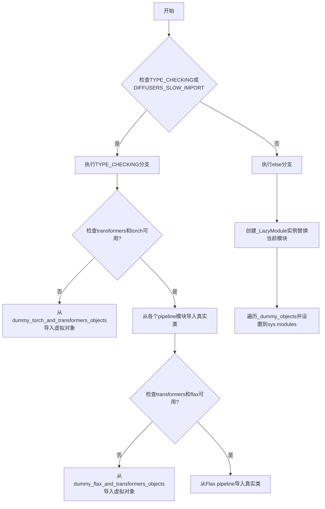
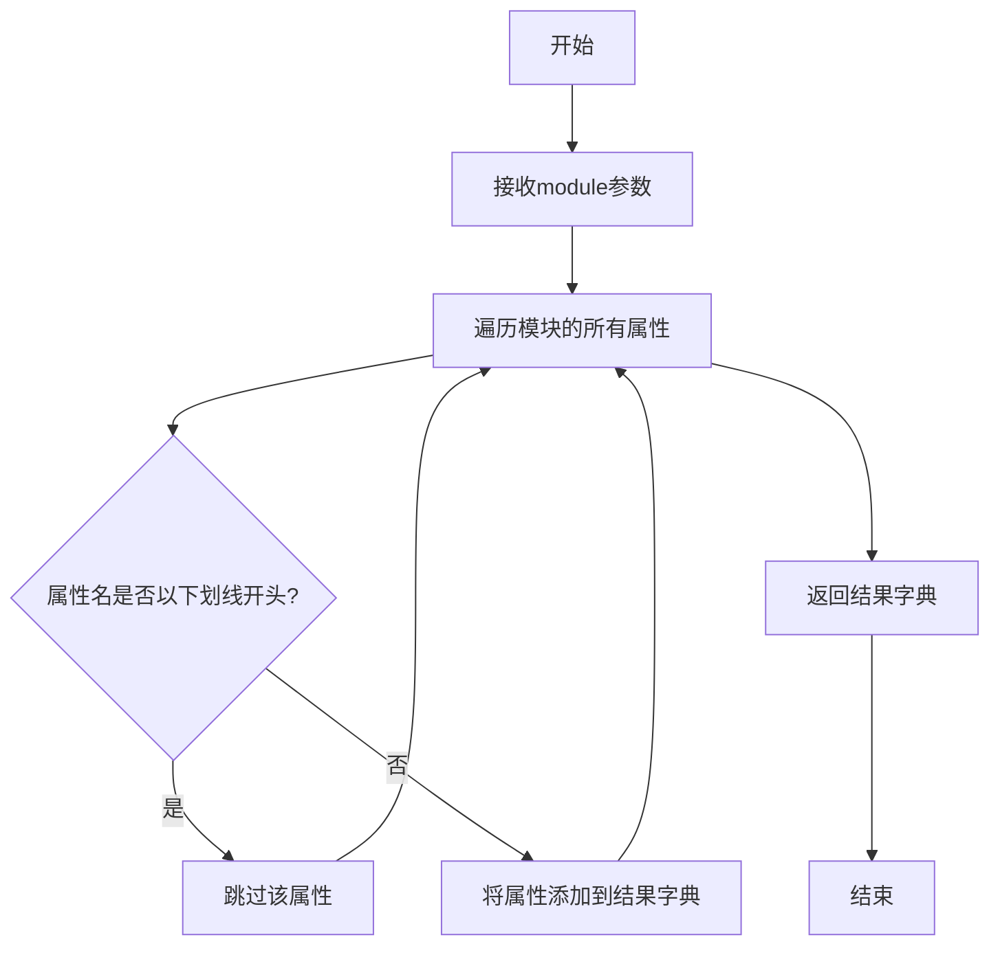
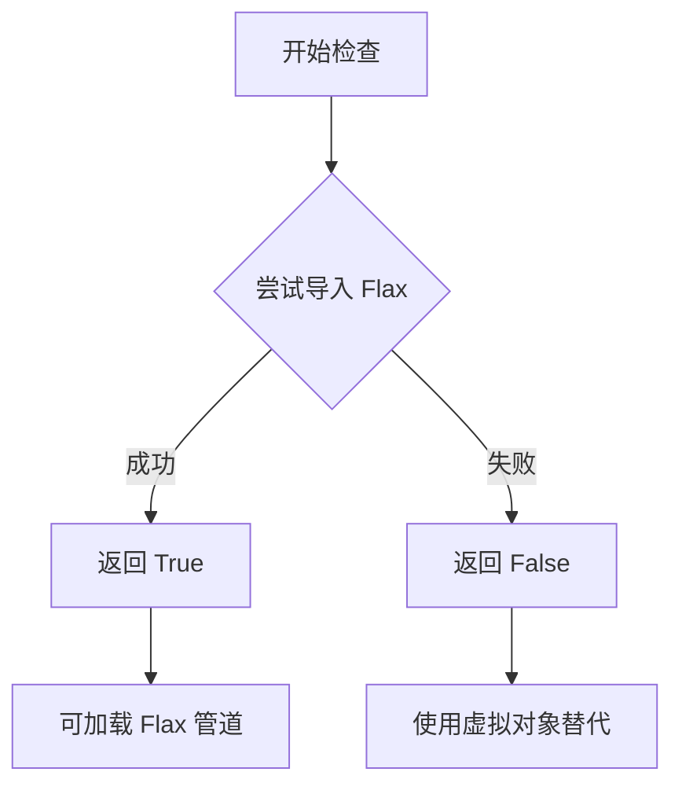
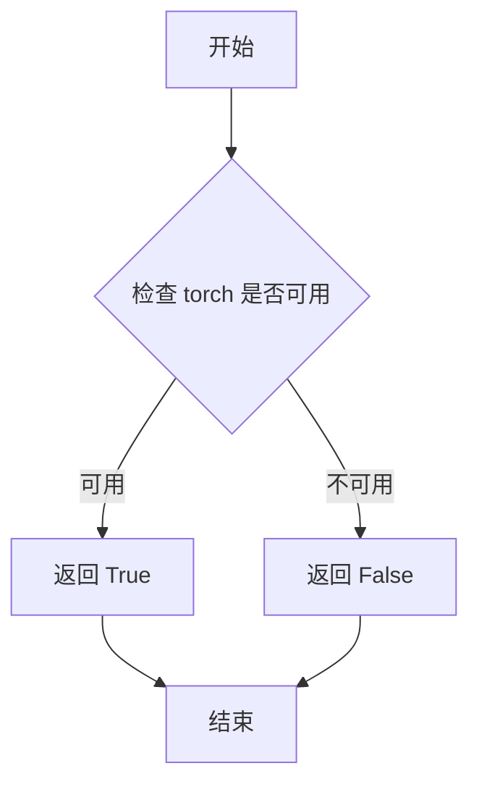
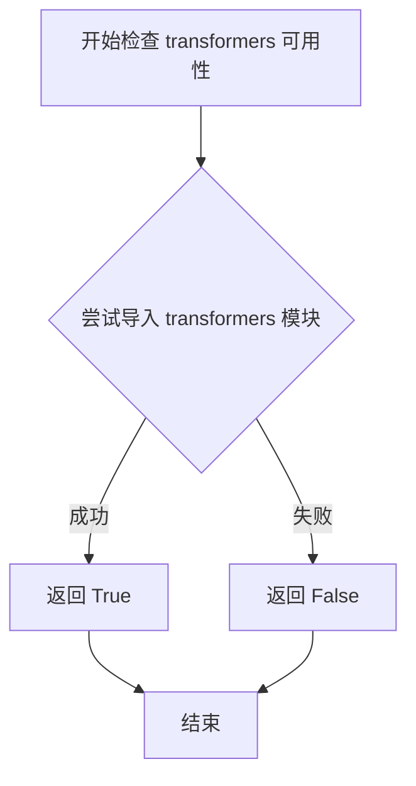
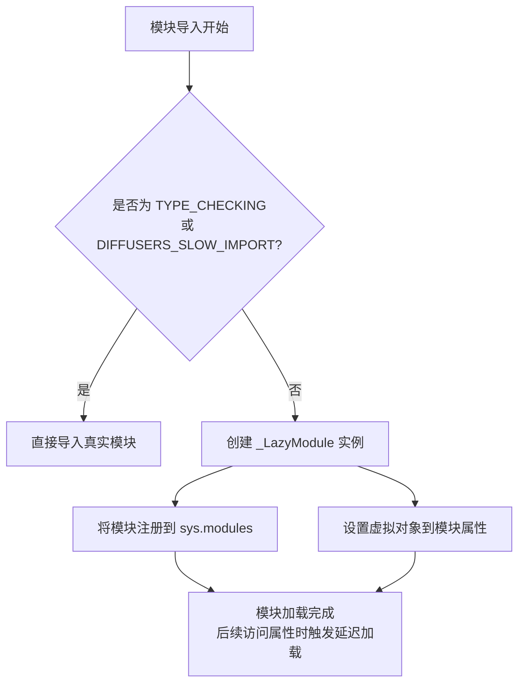

# `diffusers\src\diffusers\pipelines\controlnet\__init__.py` 详细设计文档

这是一个懒加载模块，用于导出Diffusers库中与ControlNet相关的各种Pipeline和Model类，通过_LazyModule机制实现延迟导入，同时优雅地处理torch、transformers和flax等可选依赖，当依赖不可用时回退到虚拟对象。

## 整体流程



## 类结构

```
此文件为__init__.py，不包含类定义
主要功能为模块导出和懒加载
导出的类层次结构（来自子模块）:
├── MultiControlNetModel (多ControlNet模型)
├── StableDiffusionControlNetPipeline (基础ControlNet Pipeline)
├── StableDiffusionControlNetImg2ImgPipeline (ControlNet图生图)
├── StableDiffusionControlNetInpaintPipeline (ControlNet重绘)
├── StableDiffusionXLControlNetPipeline (SDXL ControlNet)
├── StableDiffusionXLControlNetImg2ImgPipeline (SDXL ControlNet图生图)
├── StableDiffusionXLControlNetInpaintPipeline (SDXL ControlNet重绘)
├── StableDiffusionXLControlNetUnionPipeline (SDXL多条件ControlNet)
├── StableDiffusionXLControlNetUnionImg2ImgPipeline
├── StableDiffusionXLControlNetUnionInpaintPipeline
├── BlipDiffusionControlNetPipeline (BLIP结合ControlNet)
└── FlaxStableDiffusionControlNetPipeline (JAX/Flax版本)
```

## 全局变量及字段


### `_dummy_objects`
    
存储虚拟对象的字典，当依赖不可用时使用

类型：`dict`
    


### `_import_structure`
    
定义模块导出结构的字典，键为子模块名，值为导出的类名列表

类型：`dict`
    


### `DIFFUSERS_SLOW_IMPORT`
    
全局配置，控制是否禁用懒加载直接导入

类型：`bool`
    


    

## 全局函数及方法


### `get_objects_from_module`

该函数是一个工具函数，用于从指定模块中动态提取所有公共对象（如类、函数等），并将其返回为字典形式，以便于后续的延迟导入和动态属性设置。

参数：

- `module`：`types.ModuleType` 或 `ModuleType`，需要从中获取对象的目标模块

返回值：`Dict[str, Any]`，返回模块中所有非下划线开头的属性名及其对应对象的字典

#### 流程图



#### 带注释源码

```python
def get_objects_from_module(module):
    """
    从指定模块获取所有公共对象
    
    参数:
        module: 模块对象,需要提取属性的目标模块
        
    返回值:
        dict: 包含模块中所有非下划线开头属性的字典
    """
    # 初始化结果字典
    objects = {}
    
    # 遍历模块的所有属性
    for attr_name in dir(module):
        # 过滤掉以下划线开头的私有属性
        if not attr_name.startswith('_'):
            # 获取属性值并添加到结果字典
            attr_value = getattr(module, attr_name)
            objects[attr_name] = attr_value
    
    return objects
```

#### 使用示例

在给定代码中的实际使用方式：

```python
# 从dummy_torch_and_transformers_objects模块获取所有虚拟对象
_dummy_objects.update(get_objects_from_module(dummy_torch_and_transformers_objects))

# 从dummy_flax_and_transformers_objects模块获取所有虚拟对象  
_dummy_objects.update(get_objects_from_module(dummy_flax_and_transformers_objects))
```

这种设计主要用于处理可选依赖的场景：当某些依赖不可用时，会使用虚拟对象（dummy objects）来填充模块，同时保持API的完整性，使得用户在访问这些类时不会立即抛出导入错误。


### `is_flax_available`

该函数用于检查当前环境中是否安装了 Flax 深度学习框架及其依赖，返回布尔值以决定是否加载相关的 Flax 管道和模型。

参数：无需参数

返回值：`bool`，返回 `True` 表示 Flax 可用，`False` 表示不可用

#### 流程图



#### 带注释源码

```
# 从 utils 模块导入 is_flax_available 函数
# 该函数用于检测 Flax 框架是否可用
from ...utils import is_flax_available

# 使用方式 1: 在 try-except 块中检查依赖
try:
    # 检查 transformers 和 flax 是否都可用
    if not (is_transformers_available() and is_flax_available()):
        # 如果任一依赖不可用，抛出可选依赖不可用异常
        raise OptionalDependencyNotAvailable()
except OptionalDependencyNotAvailable:
    # 导入虚拟对象作为后备
    from ...utils import dummy_flax_and_transformers_objects
    _dummy_objects.update(get_objects_from_module(dummy_flax_and_transformers_objects))
else:
    # 如果依赖可用，将 Flax 管道添加到导入结构中
    _import_structure["pipeline_flax_controlnet"] = ["FlaxStableDiffusionControlNetPipeline"]

# 使用方式 2: 在 TYPE_CHECKING 块中进行类型检查
try:
    if not (is_transformers_available() and is_flax_available()):
        raise OptionalDependencyNotAvailable()
except OptionalDependencyNotAvailable:
    from ...utils.dummy_flax_and_transformers_objects import *
else:
    # 导入实际的 Flax 管道类用于类型检查
    from .pipeline_flax_controlnet import FlaxStableDiffusionControlNetPipeline
```


### `is_torch_available`

检查 torch 依赖是否可用，返回布尔值以表示 torch 是否已安装且可用。

参数：

- 该函数无参数

返回值：`bool`，如果 torch 可用则返回 `True`，否则返回 `False`

#### 流程图



#### 带注释源码

```
# is_torch_available 函数的源码位于 ...utils 模块中
# 以下是基于其使用方式的逻辑推断

def is_torch_available():
    """
    检查 torch 依赖是否可用。
    
    该函数尝试导入 torch 模块，如果导入成功则返回 True，
    否则返回 False。通常用于条件导入和可选依赖处理。
    
    返回值:
        bool: 如果 torch 可用返回 True，否则返回 False
    """
    try:
        import torch
        return True
    except ImportError:
        return False
```

> **注意**：实际的 `is_torch_available` 函数源码不在当前代码文件中，它是从 `...utils` 模块导入的。上述源码是基于其使用逻辑的推断实现。该函数在当前代码中用于条件性地导入 torch 和 transformers 相关的模块，当两者都可用时才允许导入 ControlNet 相关的管道类。


### `is_transformers_available`

该函数用于检查 Python 环境中是否已安装 `transformers` 库，通过尝试导入该库来判断依赖是否可用，返回布尔值以指示 transformers 是否可用。

参数：无

返回值：`bool`，如果 transformers 库可用返回 `True`，否则返回 `False`

#### 流程图



#### 带注释源码

```python
def is_transformers_available():
    """
    检查 transformers 依赖是否可用。
    
    该函数尝试导入 transformers 库，如果导入成功则返回 True，
    如果抛出 ImportError 或其他异常则返回 False。
    这是一种常见的可选依赖检查模式，用于实现可选依赖的延迟导入。
    
    Returns:
        bool: transformers 库是否可用
    """
    try:
        # 尝试导入 transformers 模块
        import transformers
        # 如果导入成功，返回 True
        return True
    except ImportError:
        # 如果导入失败（未安装），返回 False
        return False
```


### `_LazyModule`

`_LazyModule` 是用于实现模块延迟加载的类，通过将模块替换为惰性加载的代理对象，实现按需导入，从而优化大型库的导入性能。

#### 参数

由于 `_LazyModule` 类的定义源码未在此文件中（来自 `...utils`），以下参数基于调用时的实参推断：

- `__name__`：`str`，当前模块的完全限定名称（`__name__`）
- `__file__`：`str`，模块文件的绝对路径（`globals()["__file__"]`）
- `import_structure`：`dict`，定义模块可导出属性与实际子模块映射关系的字典（`_import_structure`）
- `module_spec`：`ModuleSpec`，模块的规格对象（`__spec__`），包含模块的元信息

#### 返回值

- `LazyModule` 实例：返回一个惰性加载的模块代理对象，替换 `sys.modules` 中的当前模块，使得对未导入属性的访问会触发按需导入。

#### 流程图



#### 带注释源码

```python
# 当非类型检查且非慢导入模式时，使用 _LazyModule 实现延迟加载
else:
    import sys

    # 创建惰性模块代理，替换当前模块
    sys.modules[__name__] = _LazyModule(
        __name__,                      # 模块名: 'diffusers.pipelines.controlnet'
        globals()["__file__"],         # 模块文件路径
        _import_structure,             # 导出结构定义
        module_spec=__spec__,          # 模块规格对象
    )
    
    # 将虚拟对象（依赖不可用时的替代品）注入到模块命名空间
    for name, value in _dummy_objects.items():
        setattr(sys.modules[__name__], name, value)
```

---

### 补充说明

#### 潜在技术债务

1. **重复的依赖检查逻辑**：代码中存在两处几乎相同的 `try-except` 块用于检查 `transformers` 和 `torch`/`flax` 的可用性，可提取为通用函数。
2. **魔法字符串**：多次使用 `"transformers"`, `"torch"` 等字符串，建议使用常量统一管理。

#### 错误处理与异常设计

- 使用 `OptionalDependencyNotAvailable` 异常来处理可选依赖不可用的情况，这是 diffusers 库的标准模式。

#### 设计目标与约束

- **延迟加载目标**：避免在导入库时加载所有子模块，减少初始导入时间和内存占用。
- **兼容性约束**：需同时支持 `torch`、`flax`、`transformers` 的多种组合情况。

## 关键组件


### LazyModule 机制

使用 `_LazyModule` 实现模块的惰性加载，当模块被首次导入时才加载实际的类和函数，避免启动时加载所有依赖

### OptionalDependencyNotAvailable 异常

自定义异常类，用于在可选依赖不可用时触发降级处理流程

### _import_structure 字典

定义模块的导入结构映射，将子模块名称映射到其导出的类名列表

### _dummy_objects 字典

存储虚拟对象，用于在依赖不可用时保持 API 可用性（返回错误而非导入失败）

### get_objects_from_module 函数

从模块中获取所有对象，用于批量填充虚拟对象到 `_dummy_objects`

### 依赖检测函数

`is_torch_available()`, `is_transformers_available()`, `is_flax_available()` 用于检测运行时环境中的可选依赖

### MultiControlNetModel

多 ControlNet 模型容器类，支持同时使用多个 ControlNet 进行推理

### StableDiffusionControlNetPipeline

基础 ControlNet 管道，支持文生图任务

### StableDiffusionControlNetImg2ImgPipeline

ControlNet 图像到图像转换管道

### StableDiffusionControlNetInpaintPipeline

ControlNet 图像修复管道

### StableDiffusionXLControlNetPipeline

SDXL 版本的 ControlNet 管道

### StableDiffusionXLControlNetImg2ImgPipeline

SDXL 版本的 ControlNet 图像转换管道

### StableDiffusionXLControlNetInpaintPipeline

SDXL 版本的 ControlNet 修复管道

### StableDiffusionXLControlNetUnionPipeline

SDXL 版本的联合 ControlNet 管道

### StableDiffusionXLControlNetUnionImg2ImgPipeline

SDXL 版本的联合 ControlNet 图像转换管道

### StableDiffusionXLControlNetUnionInpaintPipeline

SDXL 版本的联合 ControlNet 修复管道

### BlipDiffusionControlNetPipeline

结合 BLIP 文本到图像生成与 ControlNet 的管道

### FlaxStableDiffusionControlNetPipeline

基于 JAX/Flax 的 ControlNet 管道实现


## 问题及建议


### 已知问题

-   **重复的条件检查逻辑**：代码中多次出现 `is_transformers_available() and is_torch_available()` 的检查逻辑（第14-16行、第42-44行），以及 `is_transformers_available() and is_flax_available()` 的检查（第24-26行、第51-53行），违反了 DRY 原则，增加了维护成本。
-   **通配符导入**：`from ...utils.dummy_torch_and_transformers_objects import *` 和 `from ...utils.dummy_flax_and_transformers_objects import *` 使用了通配符导入，导致命名空间污染，无法明确知道导入了哪些对象，降低了代码的可读性和可维护性。
-   **魔法字符串**：`_import_structure` 字典的键使用硬编码的字符串（如 "multicontrolnet"、"pipeline_controlnet" 等），缺乏类型安全性和重构友好性。
-   **异常处理不一致**：在 `TYPE_CHECKING` 分支中，当依赖不可用时直接导入 dummy 模块，而在模块顶层则是通过捕获 `OptionalDependencyNotAvailable` 异常来处理，两种处理方式不一致。
-   **缺少导入错误处理**：在 `TYPE_CHECKING` 块中的实际导入语句没有额外的错误处理，如果导入失败（除了 `OptionalDependencyNotAvailable` 之外的其他原因），可能导致不明确的错误。

### 优化建议

-   提取依赖检查逻辑为辅助函数，例如创建 `_check_torch_transformers_available()` 和 `_check_flax_transformers_available()` 函数，减少代码重复。
-   将 `_import_structure` 中的键定义为常量或使用枚举，提高代码的类型安全和重构安全性。
-   将通配符导入替换为显式导入，明确列出需要导入的对象，提高代码可读性。
-   统一异常处理模式，在 TYPE_CHECKING 块中也使用 try-except 包装，保持与模块顶层一致的处理逻辑。
-   考虑添加日志记录或警告机制，当可选依赖不可用时提供更友好的提示信息。
-   可以将重复的 import structure 构建逻辑抽取为通用的辅助函数或类，减少手工维护成本。


## 其它


### 设计目标与约束

本模块作为diffusers库中ControlNet相关pipeline的入口模块，采用延迟加载(Lazy Loading)机制以优化导入性能。核心目标是根据运行时环境可用性动态导出ControlNet相关的pipeline类，包括多ControlNet模型、各类Stable Diffusion与ControlNet结合的生成 pipeline（图像生成、图像到图像转换、修复、XL版本等），同时支持Flax加速版本。设计约束包括必须同时满足transformers和torch可用（或flax）才能加载对应模块，否则回退到dummy对象。

### 错误处理与异常设计

本模块采用可选依赖检查模式，使用`OptionalDependencyNotAvailable`异常来处理依赖不可用的情况。当检测到所需依赖缺失时，捕获异常并从dummy模块加载替代对象，确保模块导入不会因依赖缺失而完全失败。这种设计允许用户仅安装部分依赖即可导入模块，但使用时会获得明确的错误提示。TYPE_CHECKING模式下会直接检查依赖可用性并导入真实类型，否则通过LazyModule机制延迟导入。

### 数据流与状态机

本模块不涉及运行时数据流处理，其主要作用是在模块导入时构建导入结构映射(_import_structure)和虚拟对象(_dummy_objects)。状态转换如下：模块首次导入时检查依赖可用性，若可用则将真实模块路径加入_import_structure，否则添加dummy对象引用；LazyModule根据_import_structure在后续实际使用属性时才触发真实模块加载。

### 外部依赖与接口契约

本模块直接依赖以下外部包：transformers（必选，用于模型加载）、torch（必选，用于推理）、flax（可选，用于JAX/Flax加速）、diffusers内部工具模块（_LazyModule、get_objects_from_module、OptionalDependencyNotAvailable等）。所有导出的pipeline类需符合diffusers标准的Pipeline接口规范，包括from_pretrained方法、__call__方法以及save_pretrained方法。

### 性能考虑

采用LazyModule延迟加载机制，显著减少模块初始导入时间。仅当用户实际访问（如from xxx import Pipeline）时才加载真实模块代码。dummy对象的存在避免了大量条件判断逻辑。DIFFUSERS_SLOW_IMPORT标志允许开发者在开发调试时禁用延迟加载以获得完整类型提示。

### 安全性考虑

本模块主要涉及模型加载和推理，无直接的用户输入处理或网络请求。需注意pipeline类在使用时加载的预训练模型可能来自不受信任的来源，建议用户仅使用官方或可信来源的模型。

### 版本兼容性

本模块依赖的transformers、torch、flax版本需与各pipeline实现兼容。不同版本的Stable Diffusion（SD 1.x vs SD XL）对应不同的pipeline实现。Flax版本仅支持部分pipeline，需单独处理。

### 测试策略

应测试以下场景：完整依赖环境下所有pipeline类的导入和基本实例化；部分依赖（如仅有torch和transformers，无flax）下的行为；无任何可选依赖时的graceful degradation；TYPE_CHECKING模式下的类型检查。

### 部署注意事项

部署时需确保目标环境安装了必要的依赖（transformers、torch或flax）。LazyModule机制在某些序列化场景（如pickle）可能存在问题，需注意。本模块作为diffusers库的公共API入口，部署版本需与库的其他组件保持一致。

### 维护建议

当前实现中，导入结构的定义存在重复（_import_structure在多处定义），建议统一管理。每新增一个ControlNet pipeline，需要在多处（_import_structure、TYPE_CHECKING块、else块）添加条目，容易遗漏，可考虑使用代码生成方式自动化。dummy对象的使用虽然提供了便利，但增加了模块复杂度和加载时间，后续可考虑更优雅的依赖检查策略。

    