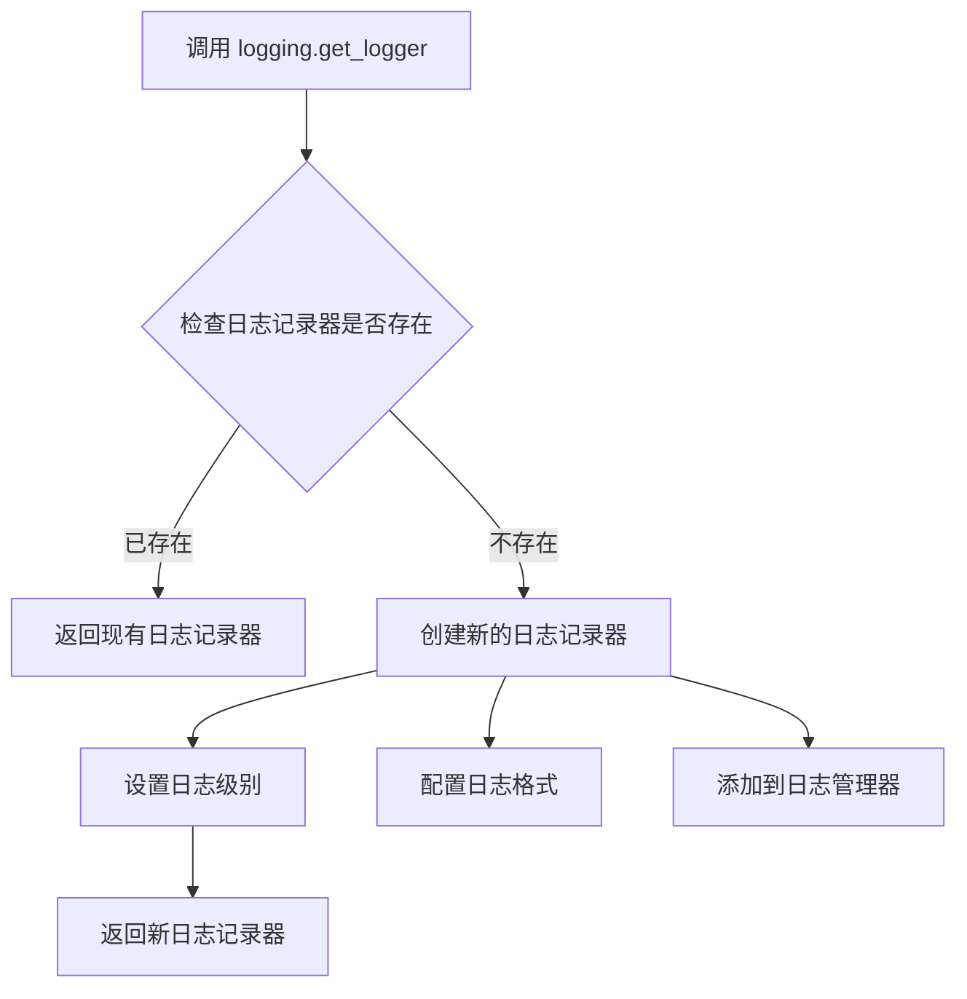

# `diffusers\src\diffusers\pipelines\controlnet\multicontrolnet.py` 详细设计文档

这是一个弃用兼容层模块，通过创建一个继承自原始MultiControlNetModel的子类，当用户从旧路径(diffusers.pipelines.controlnet.multicontrolnet)导入时显示弃用警告，并将调用重定向到新路径(models.controlnets.multicontrolnet)。

## 整体流程

```mermaid
graph TD
    A[导入MultiControlNetModel] --> B{从旧路径导入?}
    B -- 是 --> C[执行兼容层类]
    B -- 否 --> D[执行原始类]
    C --> E[__init__被调用]
    E --> F[调用deprecate显示警告]
    F --> G[调用父类super().__init__]
    G --> H[完成初始化]
```

## 类结构

```
MultiControlNetModel (原始基类)
└── MultiControlNetModel (弃用兼容层-当前类)
```

## 全局变量及字段


### `logger`
    
用于记录弃用警告信息的日志记录器对象

类型：`logging.Logger`
    


    

## 全局函数及方法


### `MultiControlNetModel.__init__`

该方法是 `MultiControlNetModel` 类的构造函数，用于初始化多控制网络模型实例，并在初始化时发出弃用警告，提示用户该类的导入路径已更改，不建议从当前模块导入。

参数：

- `*args`：`tuple`，可变位置参数，用于传递给父类 `MultiControlNetModel` 的初始化参数
- `**kwargs`：`dict`，可变关键字参数，用于传递给父类 `MultiControlNetModel` 的初始化参数

返回值：`None`，无返回值，仅执行初始化逻辑和弃用警告

#### 流程图

```mermaid
flowchart TD
    A[开始 __init__] --> B[构建弃用警告消息]
    B --> C[调用 deprecate 函数发出警告]
    C --> D[调用父类构造函数 super().__init__]
    D --> E[结束]
```

#### 带注释源码

```
class MultiControlNetModel(MultiControlNetModel):
    """
    MultiControlNetModel 类的子类，用于发出弃用警告。
    该类继承自真正的 MultiControlNetModel，但会在初始化时提示用户
    从新的导入路径导入该类。
    """
    
    def __init__(self, *args, **kwargs):
        """
        初始化 MultiControlNetModel 实例并发出弃用警告。
        
        参数:
            *args: 可变位置参数，传递给父类
            **kwargs: 可变关键字参数，传递给父类
        """
        # 定义弃用警告消息，说明新的导入路径
        deprecation_message = "Importing `MultiControlNetModel` from `diffusers.pipelines.controlnet.multicontrolnet` is deprecated and this will be removed in a future version. Please use `from diffusers.models.controlnets.multicontrolnet import MultiControlNetModel`, instead."
        
        # 调用 deprecate 函数，传入被弃用的完整路径、弃用版本和消息
        # 这会记录警告并可能影响未来的行为
        deprecate("diffusers.pipelines.controlnet.multicontrolnet.MultiControlNetModel", "0.34", deprecation_message)
        
        # 调用父类的初始化方法，完成实际的模型初始化
        super().__init__(*args, **kwargs)
```


### `logging.get_logger`

获取或创建一个指定名称的日志记录器（Logger），用于记录程序运行过程中的日志信息。

参数：

- `name`：`str`，日志记录器的名称，通常使用 `__name__` 变量（当前模块的完全限定名）来标识日志来源

返回值：`logging.Logger`，返回对应的日志记录器实例，用于输出日志信息

#### 流程图



#### 带注释源码

```python
# 从diffusers的utils模块导入logging对象
# logging是一个模块，包含了get_logger等日志相关函数
from ...utils import deprecate, logging

# 调用logging.get_logger函数，传入当前模块的__name__作为参数
# __name__是Python内置变量，表示当前模块的完全限定名
# 例如：如果模块是diffusers.pipelines.controlnet.multicontrolnet，则__name__就是这个字符串
# 该函数返回一个Logger对象，赋值给logger变量
# 这个logger对象将用于后续的日志记录操作
logger = logging.get_logger(__name__)
```


### MultiControlNetModel.__init__

该方法是一个继承自 `MultiControlNetModel` 的子类构造函数，通过调用父类初始化并发出弃用警告，引导用户从新路径 `diffusers.models.controlnets.multicontrolnet` 导入 `MultiControlNetModel`，而不是从旧路径 `diffusers.pipelines.controlnet.multicontrolnet` 导入。

参数：

- `*args`：`tuple`，可变位置参数，传递给父类构造函数的任意位置参数
- `**kwargs`：`dict`，可变关键字参数，传递给父类构造函数的任意关键字参数

返回值：`None`，无返回值（`__init__` 方法隐式返回 `None`）

#### 流程图

```mermaid
flowchart TD
    A[开始 __init__] --> B[构建弃用警告消息]
    B --> C[调用 deprecate 函数]
    C --> D[显示弃用警告: 提示新导入路径]
    D --> E[调用父类构造函数 super().__init__]
    E --> F[结束]
```

#### 带注释源码

```python
class MultiControlNetModel(MultiControlNetModel):
    def __init__(self, *args, **kwargs):
        # 构建弃用警告消息，说明旧导入路径已被弃用，将在 0.34 版本移除
        deprecation_message = "Importing `MultiControlNetModel` from `diffusers.pipelines.controlnet.multicontrolnet` is deprecated and this will be removed in a future version. Please use `from diffusers.models.controlnets.multicontrolnet import MultiControlNetModel`, instead."
        
        # 调用 deprecate 函数，触发弃用警告
        # 参数: 被弃用的完整路径, 弃用将在哪个版本移除, 弃用消息
        deprecate("diffusers.pipelines.controlnet.multicontrolnet.MultiControlNetModel", "0.34", deprecation_message)
        
        # 调用父类构造函数，传递所有接收到的参数
        super().__init__(*args, **kwargs)
```

## 关键组件


### 类继承与重命名

该类继承自`...models.controlnets.multicontrolnet.MultiControlNetModel`，实现了导入路径的重定向功能。

### 弃用警告机制

使用`deprecate`函数向用户发出警告，提示`MultiControlNetModel`从当前路径导入已弃用，并指引用户使用新的导入路径。

### 日志记录模块

通过`logging.get_logger(__name__)`获取日志记录器，用于记录弃用警告信息。

### 初始化方法

重写`__init__`方法，在初始化时首先调用弃用警告，然后调用父类的初始化方法。


## 问题及建议


### 已知问题

-   **冗余类设计**：该类仅用于显示弃用警告而继承完整父类，功能完全可以通过在模块级别或包初始化文件中调用 `deprecate` 实现，导致代码结构冗余。
-   **循环导入风险**：从 `...models.controlnets.multicontrolnet` 导入父类同时定义同名子类，可能在某些导入路径下触发循环依赖问题。
-   **维护负担**：作为实际类定义，未来需要持续维护，即使其唯一目的是弃用通知，增加了代码库的长期维护成本。

### 优化建议

-   **移除该类并在模块级别处理弃用**：建议在包入口点（如 `diffusers/pipelines/controlnet/__init__.py` 或 `multicontrolnet.py` 顶部）使用 `warnings.warn()` 或 `deprecate` 函数直接发出警告，然后从 `diffusers.models.controlnets.multicontrolnet` 重新导出 `MultiControlNetModel`，避免定义冗余子类。
-   **统一弃用策略**：如果必须保留类形式的弃用处理，可以考虑仅保留一个轻量级的别名或导入包装器，而不是完整继承父类。


## 其它


### 设计目标与约束

该类的设计目标是为了实现向后兼容性，平滑过渡到新的导入路径。当用户从旧路径导入`MultiControlNetModel`时，系统会显示弃用警告，引导用户在后续版本中使用新的导入方式，避免因路径变更导致的代码中断。

### 错误处理与异常设计

该类本身不进行复杂的错误处理，主要依赖于父类`MultiControlNetModel`的异常处理机制。弃用警告通过`deprecate`函数触发，该函数会记录警告日志但不会中断程序执行，允许旧代码继续运行直到用户更新导入语句。

### 外部依赖与接口契约

依赖以下模块：`deprecate`函数来自`diffusers.utils`，用于生成弃用警告；`logging`模块用于记录日志；父类`MultiControlNetModel`来自`diffusers.models.controlnets.multicontrolnet`，提供核心的模型功能实现。

### 版本兼容性信息

该弃用从0.34版本开始生效，用户需要在后续版本中更新导入语句为`from diffusers.models.controlnets.multicontrolnet import MultiControlNetModel`。

### 使用场景与迁移指南

适用于已有代码从旧路径导入`MultiControlNetModel`的用户。建议用户尽快更新导入路径，以避免在未来版本中因完全移除旧路径而导致导入错误。

### 继承关系说明

该类继承自`diffusers.models.controlnets.multicontrolnet.MultiControlNetModel`，通过super().__init__(*args, **kwargs)调用父类构造函数，保持了父类的所有功能特性。

### 性能影响评估

该类本身不引入额外的性能开销，仅在导入时执行一次弃用警告的记录操作，对模型推理性能无影响。

    