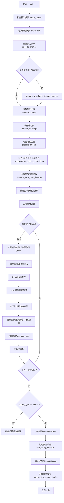
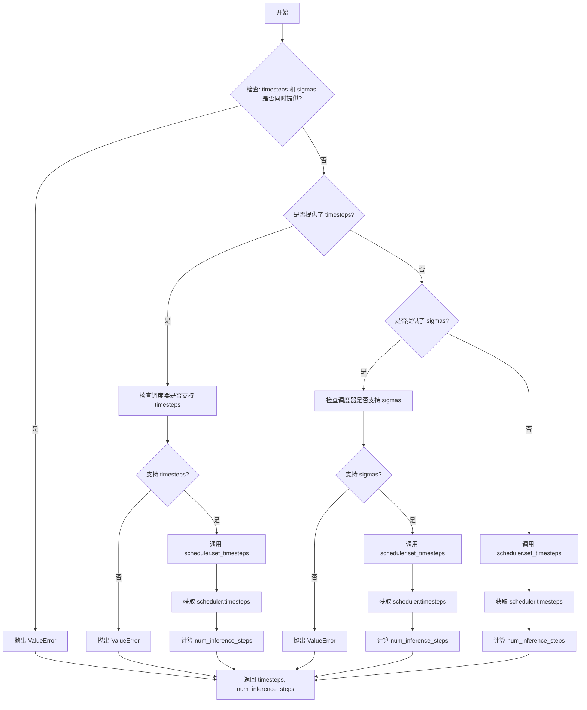
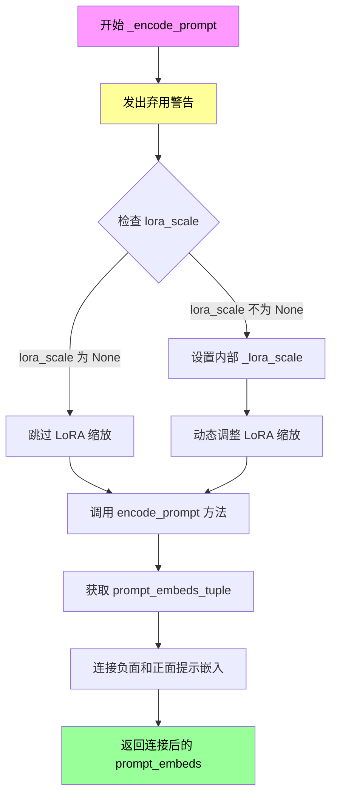
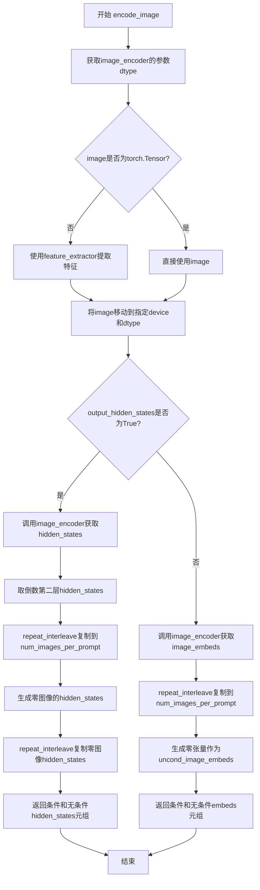
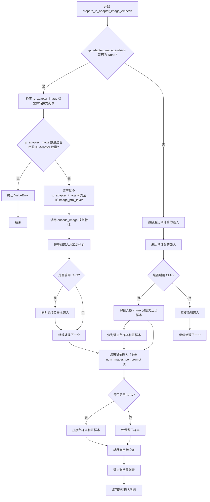
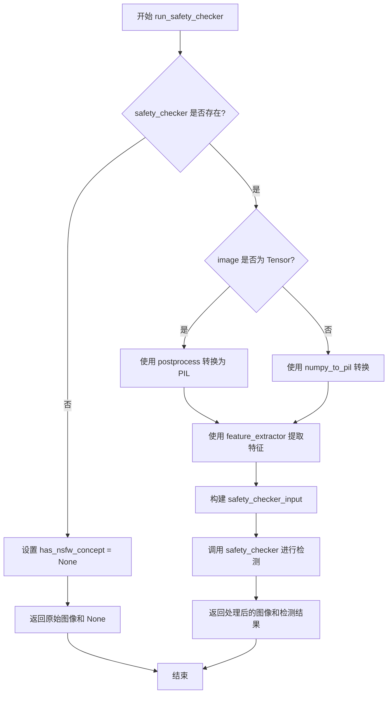
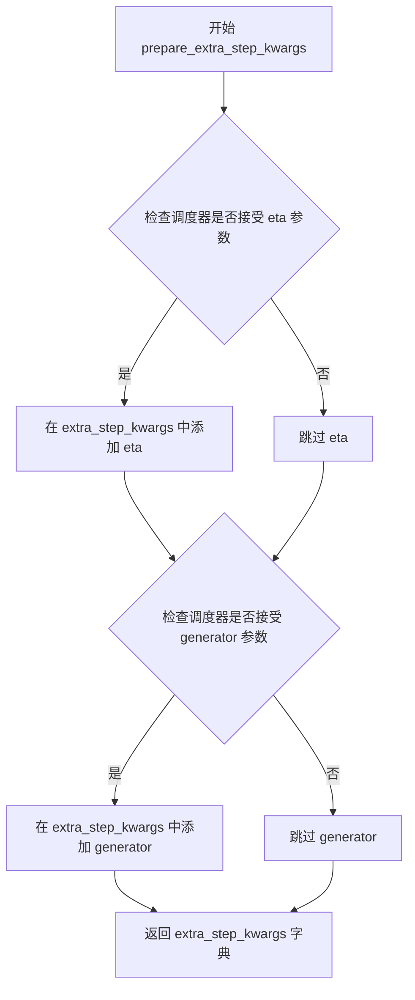
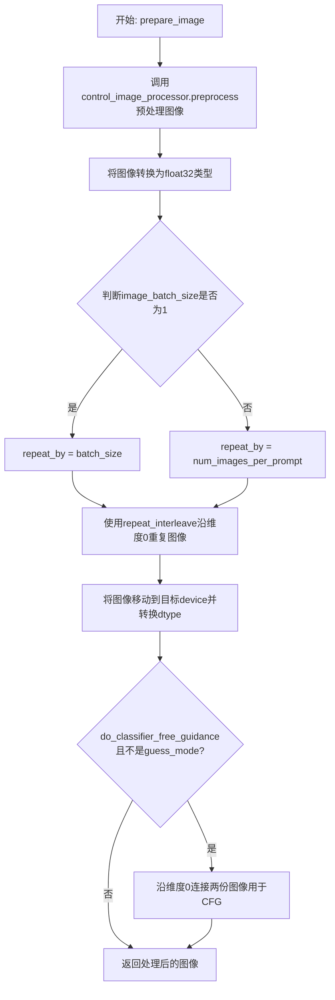
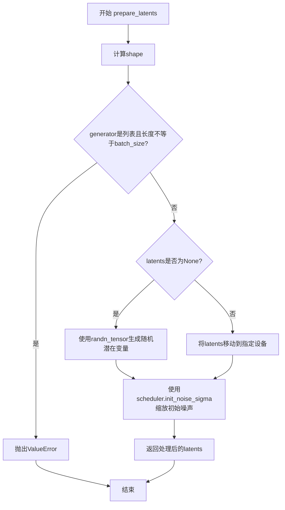

# `diffusers\src\diffusers\pipelines\controlnet\pipeline_controlnet.py` 详细设计文档

StableDiffusionControlNetPipeline 是一个用于文本到图像生成的管道，结合了 ControlNet 条件指导。该管道接受文本提示和条件图像（如 canny 边缘、深度图、姿态等）作为输入，通过 ControlNet 模型提取条件特征，指导 Stable Diffusion UNet 进行去噪操作，最终生成与文本提示相符且符合条件图像结构的图像。

## 整体流程



## 类结构

```
DiffusionPipeline (基类)
├── StableDiffusionMixin
├── TextualInversionLoaderMixin
├── StableDiffusionLoraLoaderMixin
├── IPAdapterMixin
├── FromSingleFileMixin
└── StableDiffusionControlNetPipeline
```

## 全局变量及字段


### `XLA_AVAILABLE`
    
Indicates whether PyTorch XLA is available for TPU acceleration

类型：`bool`
    


### `logger`
    
Module-level logger for debugging and information output

类型：`logging.Logger`
    


### `EXAMPLE_DOC_STRING`
    
Documentation string containing example usage of the pipeline

类型：`str`
    


### `StableDiffusionControlNetPipeline.vae`
    
Variational Auto-Encoder model for encoding and decoding images to/from latent representations

类型：`AutoencoderKL`
    


### `StableDiffusionControlNetPipeline.text_encoder`
    
Frozen text-encoder for converting text prompts to embeddings

类型：`CLIPTextModel`
    


### `StableDiffusionControlNetPipeline.tokenizer`
    
CLIP tokenizer for tokenizing text input into token IDs

类型：`CLIPTokenizer`
    


### `StableDiffusionControlNetPipeline.unet`
    
UNet2DConditionModel for denoising encoded image latents during generation

类型：`UNet2DConditionModel`
    


### `StableDiffusionControlNetPipeline.controlnet`
    
ControlNet model(s) providing additional conditioning to the UNet during denoising

类型：`ControlNetModel | MultiControlNetModel`
    


### `StableDiffusionControlNetPipeline.scheduler`
    
Diffusion scheduler for controlling the denoising process and timestep scheduling

类型：`KarrasDiffusionSchedulers`
    


### `StableDiffusionControlNetPipeline.safety_checker`
    
Safety checker module for detecting and filtering potentially harmful generated content

类型：`StableDiffusionSafetyChecker`
    


### `StableDiffusionControlNetPipeline.feature_extractor`
    
CLIP image processor for extracting features from images for safety checking

类型：`CLIPImageProcessor`
    


### `StableDiffusionControlNetPipeline.image_encoder`
    
Vision model with projection for encoding images in IP-Adapter support

类型：`CLIPVisionModelWithProjection`
    


### `StableDiffusionControlNetPipeline.vae_scale_factor`
    
Scaling factor derived from VAE block output channels for latent space computation

类型：`int`
    


### `StableDiffusionControlNetPipeline.image_processor`
    
Image processor for VAE encoding/decoding and post-processing generated images

类型：`VaeImageProcessor`
    


### `StableDiffusionControlNetPipeline.control_image_processor`
    
Image processor specifically for preprocessing control images (e.g., Canny, pose) before feeding to ControlNet

类型：`VaeImageProcessor`
    
    

## 全局函数及方法


### `retrieve_timesteps`

该函数是一个全局工具函数，用于调用调度器的 `set_timesteps` 方法并从中获取时间步。它处理自定义时间步和自定义 sigmas，并返回时间步张量和推理步数。

参数：

- `scheduler`：`SchedulerMixin`，要获取时间步的调度器
- `num_inference_steps`：`int | None`，生成样本时使用的扩散步数。如果使用此参数，`timesteps` 必须为 `None`
- `device`：`str | torch.device | None`，时间步要移动到的设备。如果为 `None`，时间步不会移动
- `timesteps`：`list[int] | None`，用于覆盖调度器时间步间隔策略的自定义时间步。如果传递 `timesteps`，则 `num_inference_steps` 和 `sigmas` 必须为 `None`
- `sigmas`：`list[float] | None`，用于覆盖调度器时间步间隔策略的自定义 sigmas。如果传递 `sigmas`，则 `num_inference_steps` 和 `timesteps` 必须为 `None`
- `**kwargs`：任意关键字参数，将传递给 `scheduler.set_timesteps`

返回值：`tuple[torch.Tensor, int]`，第一个元素是调度器的时间步调度，第二个元素是推理步数

#### 流程图



#### 带注释源码

```python
def retrieve_timesteps(
    scheduler,
    num_inference_steps: int | None = None,
    device: str | torch.device | None = None,
    timesteps: list[int] | None = None,
    sigmas: list[float] | None = None,
    **kwargs,
):
    r"""
    Calls the scheduler's `set_timesteps` method and retrieves timesteps from the scheduler after the call. Handles
    custom timesteps. Any kwargs will be supplied to `scheduler.set_timesteps`.

    Args:
        scheduler (`SchedulerMixin`):
            The scheduler to get timesteps from.
        num_inference_steps (`int`):
            The number of diffusion steps used when generating samples with a pre-trained model. If used, `timesteps`
            must be `None`.
        device (`str` or `torch.device`, *optional*):
            The device to which the timesteps should be moved to. If `None`, the timesteps are not moved.
        timesteps (`list[int]`, *optional*):
            Custom timesteps used to override the timestep spacing strategy of the scheduler. If `timesteps` is passed,
            `num_inference_steps` and `sigmas` must be `None`.
        sigmas (`list[float]`, *optional*):
            Custom sigmas used to override the timestep spacing strategy of the scheduler. If `sigmas` is passed,
            `num_inference_steps` and `timesteps` must be `None`.

    Returns:
        `tuple[torch.Tensor, int]`: A tuple where the first element is the timestep schedule from the scheduler and the
        second element is the number of inference steps.
    """
    # 检查是否同时提供了 timesteps 和 sigmas，这是不允许的
    if timesteps is not None and sigmas is not None:
        raise ValueError("Only one of `timesteps` or `sigmas` can be passed. Please choose one to set custom values")
    
    # 处理自定义 timesteps 的情况
    if timesteps is not None:
        # 检查调度器的 set_timesteps 方法是否支持 timesteps 参数
        accepts_timesteps = "timesteps" in set(inspect.signature(scheduler.set_timesteps).parameters.keys())
        if not accepts_timesteps:
            raise ValueError(
                f"The current scheduler class {scheduler.__class__}'s `set_timesteps` does not support custom"
                f" timestep schedules. Please check whether you are using the correct scheduler."
            )
        # 调用调度器的 set_timesteps 方法
        scheduler.set_timesteps(timesteps=timesteps, device=device, **kwargs)
        # 从调度器获取时间步
        timesteps = scheduler.timesteps
        # 计算推理步数
        num_inference_steps = len(timesteps)
    # 处理自定义 sigmas 的情况
    elif sigmas is not None:
        # 检查调度器的 set_timesteps 方法是否支持 sigmas 参数
        accept_sigmas = "sigmas" in set(inspect.signature(scheduler.set_timesteps).parameters.keys())
        if not accept_sigmas:
            raise ValueError(
                f"The current scheduler class {scheduler.__class__}'s `set_timesteps` does not support custom"
                f" sigmas schedules. Please check whether you are using the correct scheduler."
            )
        # 调用调度器的 set_timesteps 方法
        scheduler.set_timesteps(sigmas=sigmas, device=device, **kwargs)
        # 从调度器获取时间步
        timesteps = scheduler.timesteps
        # 计算推理步数
        num_inference_steps = len(timesteps)
    # 默认情况：使用 num_inference_steps
    else:
        scheduler.set_timesteps(num_inference_steps, device=device, **kwargs)
        timesteps = scheduler.timesteps
    
    # 返回时间步和推理步数
    return timesteps, num_inference_steps
```


### `StableDiffusionControlNetPipeline.__init__`

这是 `StableDiffusionControlNetPipeline` 类的初始化方法，负责实例化 Stable Diffusion 控制网管道。该方法接收多个神经网络组件（VAE、文本编码器、UNet、ControlNet 等），进行参数校验，初始化图像处理器，并注册所有模块到管道中。

参数：

- `vae`：`AutoencoderKL`，变分自编码器模型，用于编码和解码图像到潜在表示
- `text_encoder`：`CLIPTextModel`，冻结的文本编码器，用于将文本转换为嵌入向量
- `tokenizer`：`CLIPTokenizer`，CLIP 分词器，用于对文本进行分词
- `unet`：`UNet2DConditionModel`，去噪 UNet 模型，用于对编码后的图像潜在表示进行去噪
- `controlnet`：`ControlNetModel | list[ControlNetModel] | tuple[ControlNetModel] | MultiControlNetModel`，提供额外条件指导的 ControlNet 模型，支持单个或多个 ControlNet
- `scheduler`：`KarrasDiffusionSchedulers`，与 UNet 配合使用的调度器，用于去噪过程
- `safety_checker`：`StableDiffusionSafetyChecker`，安全检查模块，用于评估生成图像是否包含不当内容
- `feature_extractor`：`CLIPImageProcessor`，从生成图像中提取特征的处理器，作为 safety_checker 的输入
- `image_encoder`：`CLIPVisionModelWithProjection`（可选），CLIP 视觉编码器，用于 IP-Adapter 功能
- `requires_safety_checker`：`bool`（默认为 True），是否需要安全检查器

返回值：无（`None`），该方法为构造函数，不返回值

#### 流程图

```mermaid
flowchart TD
    A[开始 __init__] --> B[调用 super().__init__]
    B --> C{safety_checker is None<br/>且 requires_safety_checker is True?}
    C -->|是| D[记录警告日志:<br/>安全检查器已禁用]
    C -->|否| E{safety_checker is not None<br/>且 feature_extractor is None?}
    E -->|是| F[抛出 ValueError:<br/>需要定义 feature_extractor]
    E -->|否| G{controlnet 是 list 或 tuple?}
    G -->|是| H[将 controlnet 包装为<br/>MultiControlNetModel]
    G -->|否| I[继续]
    H --> I
    I --> J[调用 self.register_modules<br/>注册所有模块]
    J --> K[计算 vae_scale_factor]
    K --> L[创建 VaeImageProcessor<br/>用于主图像处理]
    L --> M[创建 VaeImageProcessor<br/>用于控制图像处理]
    M --> N[调用 self.register_to_config<br/>保存 requires_safety_checker]
    N --> O[结束 __init__]
```

#### 带注释源码

```python
def __init__(
    self,
    vae: AutoencoderKL,
    text_encoder: CLIPTextModel,
    tokenizer: CLIPTokenizer,
    unet: UNet2DConditionModel,
    controlnet: ControlNetModel | list[ControlNetModel] | tuple[ControlNetModel] | MultiControlNetModel,
    scheduler: KarrasDiffusionSchedulers,
    safety_checker: StableDiffusionSafetyChecker,
    feature_extractor: CLIPImageProcessor,
    image_encoder: CLIPVisionModelWithProjection = None,
    requires_safety_checker: bool = True,
):
    """
    初始化 StableDiffusionControlNetPipeline 管道实例。
    
    参数:
        vae: Variational Auto-Encoder (VAE) 模型，用于编码和解码图像
        text_encoder: Frozen CLIP 文本编码器
        tokenizer: CLIP 分词器
        unet: UNet2DConditionModel 去噪模型
        controlnet: ControlNet 模型或模型列表，提供额外条件
        scheduler: 扩散调度器
        safety_checker: 安全检查器（可选）
        feature_extractor: CLIP 图像处理器
        image_encoder: CLIP 视觉编码器（可选，用于 IP-Adapter）
        requires_safety_checker: 是否需要安全检查器
    """
    # 调用父类 DiffusionPipeline 的初始化方法
    super().__init__()

    # 如果 safety_checker 为 None 但 requires_safety_checker 为 True，记录警告
    if safety_checker is None and requires_safety_checker:
        logger.warning(
            f"You have disabled the safety checker for {self.__class__} by passing `safety_checker=None`. Ensure"
            " that you abide to the conditions of the Stable Diffusion license and do not expose unfiltered"
            " results in services or applications open to the public. Both the diffusers team and Hugging Face"
            " strongly recommend to keep the safety filter enabled in all public facing circumstances, disabling"
            " it only for use-cases that involve analyzing network behavior or auditing its results. For more"
            " information, please have a look at https://github.com/huggingface/diffusers/pull/254 ."
        )

    # 如果提供了 safety_checker 但没有提供 feature_extractor，抛出错误
    if safety_checker is not None and feature_extractor is None:
        raise ValueError(
            "Make sure to define a feature extractor when loading {self.__class__} if you want to use the safety"
            " checker. If you do not want to use the safety checker, you can pass `'safety_checker=None'` instead."
        )

    # 如果 controlnet 是 list 或 tuple，将其包装为 MultiControlNetModel
    if isinstance(controlnet, (list, tuple)):
        controlnet = MultiControlNetModel(controlnet)

    # 注册所有模块到管道，使其可以通过 self.xxx 访问
    self.register_modules(
        vae=vae,
        text_encoder=text_encoder,
        tokenizer=tokenizer,
        unet=unet,
        controlnet=controlnet,
        scheduler=scheduler,
        safety_checker=safety_checker,
        feature_extractor=feature_extractor,
        image_encoder=image_encoder,
    )

    # 计算 VAE 缩放因子，基于 VAE 块输出通道数的深度
    # 2^(len(block_out_channels) - 1)，如果 VAE 存在的话，默认值为 8
    self.vae_scale_factor = 2 ** (len(self.vae.config.block_out_channels) - 1) if getattr(self, "vae", None) else 8

    # 创建主图像处理器，用于后处理 VAE 输出的图像
    # do_convert_rgb=True 表示将图像转换为 RGB 格式
    self.image_processor = VaeImageProcessor(vae_scale_factor=self.vae_scale_factor, do_convert_rgb=True)

    # 创建控制图像处理器，用于预处理 ControlNet 的输入图像
    # do_normalize=False 表示不进行归一化
    self.control_image_processor = VaeImageProcessor(
        vae_scale_factor=self.vae_scale_factor, do_convert_rgb=True, do_normalize=False
    )

    # 将 requires_safety_checker 注册到配置中
    self.register_to_config(requires_safety_checker=requires_safety_checker)
```


### `StableDiffusionControlNetPipeline._encode_prompt`

该方法是`StableDiffusionControlNetPipeline`类中已弃用的提示编码方法，用于将文本提示转换为文本编码器的隐藏状态。它通过调用新的`encode_prompt`方法来实现功能，并为了向后兼容性，将负面提示嵌入和正面提示嵌入进行连接后返回。

参数：

- `prompt`：`str | list[str] | None`，要编码的提示词，可以是单个字符串或字符串列表
- `device`：`torch.device`， torch设备，用于将张量移动到指定设备
- `num_images_per_prompt`：`int`，每个提示词要生成的图像数量
- `do_classifier_free_guidance`：`bool`，是否使用无分类器自由引导技术
- `negative_prompt`：`str | list[str] | None`，不包含在图像生成中的提示词
- `prompt_embeds`：`torch.Tensor | None`，预生成的文本嵌入，可用于轻松调整文本输入
- `negative_prompt_embeds`：`torch.Tensor | None`，预生成的负面文本嵌入
- `lora_scale`：`float | None`，如果加载了LoRA层，将应用于文本编码器所有LoRA层的LoRA缩放因子
- `**kwargs`：其他关键字参数

返回值：`torch.Tensor`，连接后的提示嵌入张量，包含了负面和正面提示嵌入（用于向后兼容）

#### 流程图



#### 带注释源码

```python
# Copied from diffusers.pipelines.stable_diffusion.pipeline_stable_diffusion.StableDiffusionPipeline._encode_prompt
def _encode_prompt(
    self,
    prompt,                          # 输入的文本提示，可以是str或list[str]类型
    device,                         # torch设备，用于张量运算
    num_images_per_prompt,          # 每个提示生成的图像数量
    do_classifier_free_guidance,    # 是否启用无分类器自由引导
    negative_prompt=None,           # 负面提示词，用于引导生成不包含某些内容的图像
    prompt_embeds: torch.Tensor | None = None,   # 预计算的提示嵌入向量
    negative_prompt_embeds: torch.Tensor | None = None,  # 预计算的负面提示嵌入
    lora_scale: float | None = None,  # LoRA权重缩放因子，用于调整LoRA层的影响
    **kwargs,                       # 其他可选参数
):
    """
    已弃用的提示编码方法，保留用于向后兼容性。
    将在未来版本中移除，建议使用encode_prompt()方法。
    """
    # 发出弃用警告，提醒用户该方法将被移除
    deprecation_message = "`_encode_prompt()` is deprecated and it will be removed in a future version. Use `encode_prompt()` instead. Also, be aware that the output format changed from a concatenated tensor to a tuple."
    deprecate("_encode_prompt()", "1.0.0", deprecation_message, standard_warn=False)

    # 调用新的encode_prompt方法获取编码后的嵌入
    # 返回值为元组 (negative_prompt_embeds, prompt_embeds)
    prompt_embeds_tuple = self.encode_prompt(
        prompt=prompt,
        device=device,
        num_images_per_prompt=num_images_per_prompt,
        do_classifier_free_guidance=do_classifier_free_guidance,
        negative_prompt=negative_prompt,
        prompt_embeds=prompt_embeds,
        negative_prompt_embeds=negative_prompt_embeds,
        lora_scale=lora_scale,
        **kwargs,
    )

    # 为了向后兼容性，将负面提示嵌入和正面提示嵌入连接起来
    # 新版本返回的是元组，老版本返回的是连接后的单个张量
    # 连接顺序: [negative_prompt_embeds, prompt_embeds]
    prompt_embeds = torch.cat([prompt_embeds_tuple[1], prompt_embeds_tuple[0]])

    return prompt_embeds
```


### `StableDiffusionControlNetPipeline.encode_prompt`

该方法将文本提示词编码为文本编码器的隐藏状态，支持LoRA权重调整、文本反转、分类器自由引导等功能，是Stable Diffusion图像生成流程中处理文本输入的核心步骤。

参数：

- `prompt`：`str | list[str] | None`，要编码的文本提示词，可以是单个字符串或字符串列表
- `device`：`torch.device`，指定计算设备（CPU/CUDA）
- `num_images_per_prompt`：`int`，每个提示词需要生成的图像数量，用于复制嵌入向量
- `do_classifier_free_guidance`：`bool`，是否启用分类器自由引导（CFG），为True时需要生成无条件嵌入
- `negative_prompt`：`str | list[str] | None`，负面提示词，用于引导图像不包含指定内容
- `prompt_embeds`：`torch.Tensor | None`，可选的预计算文本嵌入，若提供则直接使用
- `negative_prompt_embeds`：`torch.Tensor | None`，可选的预计算负面文本嵌入
- `lora_scale`：`float | None`，LoRA层缩放因子，用于调整LoRA权重影响程度
- `clip_skip`：`int | None`，CLIP编码器跳过层数，用于获取不同层次的特征表示

返回值：`tuple[torch.Tensor, torch.Tensor]`，返回一个元组，包含编码后的提示词嵌入和负面提示词嵌入，形状为`(batch_size * num_images_per_prompt, seq_len, hidden_dim)`

#### 流程图

```mermaid
flowchart TD
    A[开始 encode_prompt] --> B{检查 lora_scale}
    B -->|非 None 且为 LoRAMixin| C[设置 LoRA 缩放]
    C --> D{检查 prompt_embeds 是否为 None}
    D -->|是| E{检查 prompt 类型}
    E -->|str| F[batch_size = 1]
    E -->|list| G[batch_size = len(prompt)]
    E -->|其他| H[batch_size = prompt_embeds.shape[0]]
    D -->|否| I[使用提供的 prompt_embeds]
    F --> J[文本反转处理]
    G --> J
    H --> J
    I --> K{有 clip_skip?}
    J --> L[Tokenizer 处理文本]
    L --> M{text_encoder 使用 attention_mask?}
    M -->|是| N[获取 attention_mask]
    M -->|否| O[attention_mask = None]
    N --> P{clip_skip 为 None?}
    O --> P
    P -->|是| Q[直接获取最后一层隐藏状态]
    P -->|否| R[获取倒数第 clip_skip+1 层并应用 LayerNorm]
    Q --> S[转换 dtype 和 device]
    R --> S
    K -->|是| R
    K -->|否| Q
    S --> T[重复嵌入 num_images_per_prompt 次]
    T --> U{do_classifier_free_guidance 为真且无 negative_prompt_embeds?}
    U -->|是| V[构建 uncond_tokens]
    V --> W{negative_prompt 类型?}
    W -->|None| X[uncond_tokens = 空字符串列表]
    W -->|str| Y[uncond_tokens = 单元素列表]
    W -->|list| Z[直接使用]
    X --> AA[文本反转处理]
    Y --> AA
    Z --> AA
    AA --> AB[Tokenizer 处理 uncond_tokens]
    AB --> AC[text_encoder 编码获取 negative_prompt_embeds]
    U -->|否| AD[使用提供的 negative_prompt_embeds]
    AC --> AE{do_classifier_free_guidance?}
    AD --> AE
    AE -->|是| AF[重复 negative_prompt_embeds]
    AE -->|否| AG[返回嵌入]
    AF --> AG
```

#### 带注释源码

```python
def encode_prompt(
    self,
    prompt,
    device,
    num_images_per_prompt,
    do_classifier_free_guidance,
    negative_prompt=None,
    prompt_embeds: torch.Tensor | None = None,
    negative_prompt_embeds: torch.Tensor | None = None,
    lora_scale: float | None = None,
    clip_skip: int | None = None,
):
    r"""
    Encodes the prompt into text encoder hidden states.

    Args:
        prompt (`str` or `list[str]`, *optional*):
            prompt to be encoded
        device: (`torch.device`):
            torch device
        num_images_per_prompt (`int`):
            number of images that should be generated per prompt
        do_classifier_free_guidance (`bool`):
            whether to use classifier free guidance or not
        negative_prompt (`str` or `list[str]`, *optional*):
            The prompt or prompts not to guide the image generation. If not defined, one has to pass
            `negative_prompt_embeds` instead. Ignored when not using guidance (i.e., ignored if `guidance_scale` is
            less than `1`).
        prompt_embeds (`torch.Tensor`, *optional*):
            Pre-generated text embeddings. Can be used to easily tweak text inputs, *e.g.* prompt weighting. If not
            provided, text embeddings will be generated from `prompt` input argument.
        negative_prompt_embeds (`torch.Tensor`, *optional*):
            Pre-generated negative text embeddings. Can be used to easily tweak text inputs, *e.g.* prompt
            weighting. If not provided, negative_prompt_embeds will be generated from `negative_prompt` input
            argument.
        lora_scale (`float`, *optional*):
            A LoRA scale that will be applied to all LoRA layers of the text encoder if LoRA layers are loaded.
        clip_skip (`int`, *optional*):
            Number of layers to be skipped from CLIP while computing the prompt embeddings. A value of 1 means that
            the output of the pre-final layer will be used for computing the prompt embeddings.
    """
    # 设置 LoRA 缩放值，使文本编码器的 monkey patched LoRA 函数能正确访问
    # 如果传入了 lora_scale 且当前 pipeline 支持 LoRA
    if lora_scale is not None and isinstance(self, StableDiffusionLoraLoaderMixin):
        self._lora_scale = lora_scale

        # 动态调整 LoRA 缩放
        if not USE_PEFT_BACKEND:
            # 使用旧版 LoRA 机制
            adjust_lora_scale_text_encoder(self.text_encoder, lora_scale)
        else:
            # 使用 PEFT 后端
            scale_lora_layers(self.text_encoder, lora_scale)

    # 确定批次大小
    if prompt is not None and isinstance(prompt, str):
        batch_size = 1
    elif prompt is not None and isinstance(prompt, list):
        batch_size = len(prompt)
    else:
        batch_size = prompt_embeds.shape[0]

    # 如果未提供 prompt_embeds，则从 prompt 生成
    if prompt_embeds is None:
        # 文本反转：必要时处理多向量 token
        if isinstance(self, TextualInversionLoaderMixin):
            prompt = self.maybe_convert_prompt(prompt, self.tokenizer)

        # 使用 tokenizer 将文本转换为 token IDs
        text_inputs = self.tokenizer(
            prompt,
            padding="max_length",
            max_length=self.tokenizer.model_max_length,
            truncation=True,
            return_tensors="pt",
        )
        text_input_ids = text_inputs.input_ids
        
        # 获取未截断的 token IDs，用于警告信息
        untruncated_ids = self.tokenizer(prompt, padding="longest", return_tensors="pt").input_ids

        # 检测是否发生了截断，并记录警告
        if untruncated_ids.shape[-1] >= text_input_ids.shape[-1] and not torch.equal(
            text_input_ids, untruncated_ids
        ):
            removed_text = self.tokenizer.batch_decode(
                untruncated_ids[:, self.tokenizer.model_max_length - 1 : -1]
            )
            logger.warning(
                "The following part of your input was truncated because CLIP can only handle sequences up to"
                f" {self.tokenizer.model_max_length} tokens: {removed_text}"
            )

        # 获取 attention_mask（如果文本编码器配置需要）
        if hasattr(self.text_encoder.config, "use_attention_mask") and self.text_encoder.config.use_attention_mask:
            attention_mask = text_inputs.attention_mask.to(device)
        else:
            attention_mask = None

        # 根据 clip_skip 参数决定使用哪层隐藏状态
        if clip_skip is None:
            # 默认使用最后一层隐藏状态
            prompt_embeds = self.text_encoder(text_input_ids.to(device), attention_mask=attention_mask)
            prompt_embeds = prompt_embeds[0]
        else:
            # 获取所有隐藏状态，然后选择指定层
            prompt_embeds = self.text_encoder(
                text_input_ids.to(device), attention_mask=attention_mask, output_hidden_states=True
            )
            # hidden_states 是一个元组，包含所有编码器层的输出
            # 选择倒数第 clip_skip+1 层（-1 是最后一层，-2 是倒数第二层，以此类推）
            prompt_embeds = prompt_embeds[-1][-(clip_skip + 1)]
            # 应用 final_layer_norm 以获得正确的表示
            prompt_embeds = self.text_encoder.text_model.final_layer_norm(prompt_embeds)

    # 确定 prompt_embeds 的数据类型（优先使用文本编码器的 dtype）
    if self.text_encoder is not None:
        prompt_embeds_dtype = self.text_encoder.dtype
    elif self.unet is not None:
        prompt_embeds_dtype = self.unet.dtype
    else:
        prompt_embeds_dtype = prompt_embeds.dtype

    # 将 prompt_embeds 转换到正确的设备和 dtype
    prompt_embeds = prompt_embeds.to(dtype=prompt_embeds_dtype, device=device)

    # 复制文本嵌入以匹配每个提示词生成的图像数量
    bs_embed, seq_len, _ = prompt_embeds.shape
    prompt_embeds = prompt_embeds.repeat(1, num_images_per_prompt, 1)
    prompt_embeds = prompt_embeds.view(bs_embed * num_images_per_prompt, seq_len, -1)

    # 为分类器自由引导获取无条件嵌入
    if do_classifier_free_guidance and negative_prompt_embeds is None:
        uncond_tokens: list[str]
        if negative_prompt is None:
            # 如果没有负面提示，使用空字符串
            uncond_tokens = [""] * batch_size
        elif prompt is not None and type(prompt) is not type(negative_prompt):
            raise TypeError(
                f"`negative_prompt` should be the same type to `prompt`, but got {type(negative_prompt)} !="
                f" {type(prompt)}."
            )
        elif isinstance(negative_prompt, str):
            uncond_tokens = [negative_prompt]
        elif batch_size != len(negative_prompt):
            raise ValueError(
                f"`negative_prompt`: {negative_prompt} has batch size {len(negative_prompt)}, but `prompt`:"
                f" {prompt} has batch size {batch_size}. Please make sure that passed `negative_prompt` matches"
                " the batch size of `prompt`."
            )
        else:
            uncond_tokens = negative_prompt

        # 文本反转：必要时处理多向量 token
        if isinstance(self, TextualInversionLoaderMixin):
            uncond_tokens = self.maybe_convert_prompt(uncond_tokens, self.tokenizer)

        max_length = prompt_embeds.shape[1]
        uncond_input = self.tokenizer(
            uncond_tokens,
            padding="max_length",
            max_length=max_length,
            truncation=True,
            return_tensors="pt",
        )

        # 获取 attention_mask
        if hasattr(self.text_encoder.config, "use_attention_mask") and self.text_encoder.config.use_attention_mask:
            attention_mask = uncond_input.attention_mask.to(device)
        else:
            attention_mask = None

        # 编码无条件提示
        negative_prompt_embeds = self.text_encoder(
            uncond_input.input_ids.to(device),
            attention_mask=attention_mask,
        )
        negative_prompt_embeds = negative_prompt_embeds[0]

    # 如果使用分类器自由引导，复制无条件嵌入
    if do_classifier_free_guidance:
        seq_len = negative_prompt_embeds.shape[1]

        negative_prompt_embeds = negative_prompt_embeds.to(dtype=prompt_embeds_dtype, device=device)

        negative_prompt_embeds = negative_prompt_embeds.repeat(1, num_images_per_prompt, 1)
        negative_prompt_embeds = negative_prompt_embeds.view(batch_size * num_images_per_prompt, seq_len, -1)

    # 如果使用了 LoRA，恢复原始缩放值
    if self.text_encoder is not None:
        if isinstance(self, StableDiffusionLoraLoaderMixin) and USE_PEFT_BACKEND:
            # 通过取消缩放 LoRA 层来恢复原始缩放值
            unscale_lora_layers(self.text_encoder, lora_scale)

    return prompt_embeds, negative_prompt_embeds
```


### `StableDiffusionControlNetPipeline.encode_image`

该方法用于将输入图像编码为图像嵌入向量或隐藏状态，以便在Stable Diffusion ControlNet管道中进行图像条件生成。它支持两种输出模式：返回图像嵌入（默认）或返回隐藏状态（当output_hidden_states为True时）。

参数：

- `image`：输入图像，可以是PIL图像、numpy数组、torch.Tensor或列表
- `device`：torch.device，用于指定计算设备
- `num_images_per_prompt`：int，每个提示词生成的图像数量
- `output_hidden_states`：bool可选，是否返回隐藏状态而非图像嵌入

返回值：`tuple[torch.Tensor, torch.Tensor]`，返回两个张量元组——第一个是条件图像嵌入/隐藏状态，第二个是无条件（零）图像嵌入/隐藏状态，用于分类器自由引导

#### 流程图



#### 带注释源码

```python
def encode_image(self, image, device, num_images_per_prompt, output_hidden_states=None):
    """
    将输入图像编码为图像嵌入向量或隐藏状态
    
    参数:
        image: 输入图像，支持PIL.Image、numpy array、torch.Tensor或列表
        device: torch设备
        num_images_per_prompt: 每个prompt生成的图像数量
        output_hidden_states: 是否返回隐藏状态（用于IP-Adapter）
    
    返回:
        tuple: (条件图像嵌入/隐藏状态, 无条件图像嵌入/隐藏状态)
    """
    # 获取图像编码器的参数数据类型
    dtype = next(self.image_encoder.parameters()).dtype

    # 如果输入不是torch.Tensor，使用feature_extractor处理
    if not isinstance(image, torch.Tensor):
        image = self.feature_extractor(image, return_tensors="pt").pixel_values

    # 将图像移动到指定设备和数据类型
    image = image.to(device=device, dtype=dtype)
    
    # 根据output_hidden_states决定输出格式
    if output_hidden_states:
        # 返回隐藏状态模式（用于IP-Adapter）
        # 获取图像的隐藏状态，取倒数第二层
        image_enc_hidden_states = self.image_encoder(image, output_hidden_states=True).hidden_states[-2]
        # 复制num_images_per_prompt次以匹配批量大小
        image_enc_hidden_states = image_enc_hidden_states.repeat_interleave(num_images_per_prompt, dim=0)
        
        # 生成零图像的隐藏状态作为无条件输入
        uncond_image_enc_hidden_states = self.image_encoder(
            torch.zeros_like(image), output_hidden_states=True
        ).hidden_states[-2]
        uncond_image_enc_hidden_states = uncond_image_enc_hidden_states.repeat_interleave(
            num_images_per_prompt, dim=0
        )
        return image_enc_hidden_states, uncond_image_enc_hidden_states
    else:
        # 返回图像嵌入模式（默认）
        image_embeds = self.image_encoder(image).image_embeds
        # 复制num_images_per_prompt次
        image_embeds = image_embeds.repeat_interleave(num_images_per_prompt, dim=0)
        # 生成零张量作为无条件图像嵌入（用于classifier-free guidance）
        uncond_image_embeds = torch.zeros_like(image_embeds)

        return image_embeds, uncond_image_embeds
```


### `StableDiffusionControlNetPipeline.prepare_ip_adapter_image_embeds`

该方法用于为 IP-Adapter 准备图像嵌入向量。它处理两种输入形式：直接输入的图像（需要通过图像编码器提取特征）或预先计算好的图像嵌入。在启用 classifier-free guidance 时，还会生成对应的负样本嵌入。最终返回处理后的图像嵌入列表，可用于后续的扩散模型推理过程。

参数：

- `ip_adapter_image`：`PipelineImageInput | None`，要用于 IP-Adapter 的输入图像，可以是 PIL Image、Tensor、NumPy 数组或它们的列表
- `ip_adapter_image_embeds`：`list[torch.Tensor] | None`，预先计算好的图像嵌入向量列表，长度应与 IP-Adapter 数量相同
- `device`：`torch.device`，执行计算的设备（CPU 或 CUDA）
- `num_images_per_prompt`：`int`，每个 prompt 生成的图像数量
- `do_classifier_free_guidance`：`bool`，是否启用 classifier-free guidance

返回值：`list[torch.Tensor]`，处理后的 IP-Adapter 图像嵌入列表，每个元素为拼接了正负样本（如果启用 CFG）的张量

#### 流程图



#### 带注释源码

```python
def prepare_ip_adapter_image_embeds(
    self, ip_adapter_image, ip_adapter_image_embeds, device, num_images_per_prompt, do_classifier_free_guidance
):
    """
    准备 IP-Adapter 的图像嵌入向量。
    
    该方法处理两种输入模式：
    1. 当 ip_adapter_image_embeds 为 None 时，直接对 ip_adapter_image 进行编码
    2. 当 ip_adapter_image_embeds 不为 None 时，使用预先计算的嵌入
    
    Args:
        ip_adapter_image: 输入图像，支持 PIL Image、Tensor、NumPy 数组或列表
        ip_adapter_image_embeds: 预计算的图像嵌入（可选）
        device: 计算设备
        num_images_per_prompt: 每个 prompt 生成的图像数量
        do_classifier_free_guidance: 是否启用 classifier-free guidance
    
    Returns:
        处理后的图像嵌入列表
    """
    # 初始化用于存储图像嵌入的列表
    image_embeds = []
    
    # 如果启用 classifier-free guidance，还需要准备负样本嵌入
    if do_classifier_free_guidance:
        negative_image_embeds = []
    
    # 情况1：需要从原始图像编码获取嵌入
    if ip_adapter_image_embeds is None:
        # 确保输入图像是列表格式
        if not isinstance(ip_adapter_image, list):
            ip_adapter_image = [ip_adapter_image]

        # 验证图像数量与 IP-Adapter 数量是否匹配
        # 每个 IP-Adapter 需要对应的图像输入
        if len(ip_adapter_image) != len(self.unet.encoder_hid_proj.image_projection_layers):
            raise ValueError(
                f"`ip_adapter_image` must have same length as the number of IP Adapters. Got {len(ip_adapter_image)} images and {len(self.unet.encoder_hid_proj.image_projection_layers)} IP Adapters."
            )

        # 遍历每个 IP-Adapter 的图像和对应的投影层
        for single_ip_adapter_image, image_proj_layer in zip(
            ip_adapter_image, self.unet.encoder_hid_proj.image_projection_layers
        ):
            # 判断是否需要输出隐藏状态（ImageProjection 类型不需要）
            output_hidden_state = not isinstance(image_proj_layer, ImageProjection)
            
            # 编码图像获取嵌入向量
            # 返回正样本嵌入和（如果启用 CFG）负样本嵌入
            single_image_embeds, single_negative_image_embeds = self.encode_image(
                single_ip_adapter_image, device, 1, output_hidden_state
            )

            # 将嵌入添加到列表（添加 batch 维度）
            image_embeds.append(single_image_embeds[None, :])
            
            # 如果启用 CFG，同时保存负样本嵌入
            if do_classifier_free_guidance:
                negative_image_embeds.append(single_negative_image_embeds[None, :])
    else:
        # 情况2：使用预先计算好的图像嵌入
        for single_image_embeds in ip_adapter_image_embeds:
            if do_classifier_free_guidance:
                # 预计算的嵌入通常包含正负样本（拼接在一起）
                # 需要按 chunk 分割为两部分
                single_negative_image_embeds, single_image_embeds = single_image_embeds.chunk(2)
                negative_image_embeds.append(single_negative_image_embeds)
            image_embeds.append(single_image_embeds)

    # 第二步：根据 num_images_per_prompt 复制嵌入，并处理 CFG 拼接
    ip_adapter_image_embeds = []
    for i, single_image_embeds in enumerate(image_embeds):
        # 将嵌入复制 num_images_per_prompt 次（支持批量生成）
        single_image_embeds = torch.cat([single_image_embeds] * num_images_per_prompt, dim=0)
        
        if do_classifier_free_guidance:
            # 对负样本嵌入进行相同的复制操作
            single_negative_image_embeds = torch.cat([negative_image_embeds[i]] * num_images_per_prompt, dim=0)
            # 将负样本嵌入和正样本嵌入拼接在一起
            # 顺序：负样本在前，正样本在后（符合 CFG 的惯例）
            single_image_embeds = torch.cat([single_negative_image_embeds, single_image_embeds], dim=0)

        # 将处理后的嵌入转移到目标设备
        single_image_embeds = single_image_embeds.to(device=device)
        ip_adapter_image_embeds.append(single_image_embeds)

    return ip_adapter_image_embeds
```


### `StableDiffusionControlNetPipeline.run_safety_checker`

该方法用于对生成的图像进行安全检查（NSFW检测），通过安全检查器判断图像是否包含不适当的内容，并根据需要进行图像后处理。

参数：

- `image`：`torch.Tensor | np.ndarray`，需要检查的图像，可以是 PyTorch 张量或 NumPy 数组
- `device`：`torch.device`，用于将数据移动到指定设备
- `dtype`：`torch.dtype`，用于类型转换的目标数据类型

返回值：`tuple[torch.Tensor | np.ndarray, torch.Tensor | None]`，返回处理后的图像和 NSFW 检测结果元组

#### 流程图



#### 带注释源码

```python
def run_safety_checker(self, image, device, dtype):
    """
    运行安全检查器对生成的图像进行 NSFW 检测
    
    Args:
        image: 输入图像，torch.Tensor 或 np.ndarray
        device: torch 设备
        dtype: torch 数据类型
    
    Returns:
        tuple: (处理后的图像, NSFW检测结果)
    """
    # 检查安全检查器是否已配置
    if self.safety_checker is None:
        # 如果没有配置安全检查器，返回 None
        has_nsfw_concept = None
    else:
        # 根据图像类型进行预处理
        if torch.is_tensor(image):
            # 将 Tensor 图像转换为 PIL 图像
            feature_extractor_input = self.image_processor.postprocess(image, output_type="pil")
        else:
            # 将 numpy 数组转换为 PIL 图像
            feature_extractor_input = self.image_processor.numpy_to_pil(image)
        
        # 使用特征提取器提取图像特征并转换为 Tensor
        safety_checker_input = self.feature_extractor(feature_extractor_input, return_tensors="pt").to(device)
        
        # 调用安全检查器进行 NSFW 检测
        # 传入图像和 CLIP 输入
        image, has_nsfw_concept = self.safety_checker(
            images=image, 
            clip_input=safety_checker_input.pixel_values.to(dtype)
        )
    
    # 返回处理后的图像和 NSFW 检测结果
    return image, has_nsfw_concept
```


### `StableDiffusionControlNetPipeline.decode_latents`

该方法用于将 VAE 潜在表示解码为实际图像。由于该方法已标记为废弃，未来版本中将移除，建议使用 VaeImageProcessor.postprocess(...) 代替。

参数：

- `latents`：`torch.Tensor`，待解码的 VAE 潜在表示张量

返回值：`np.ndarray`，解码后的图像，形状为 (batch_size, height, width, channels)，像素值范围 [0, 1]

#### 流程图

```mermaid
flowchart TD
    A[开始 decode_latents] --> B[输出废弃警告]
    B --> C[反缩放 latents: latents = 1 / scaling_factor * latents]
    C --> D[VAE 解码: image = vae.decode latents]
    D --> E[图像归一化: image = (image / 2 + 0.5).clamp(0, 1)]
    E --> F[转换到 CPU 并转为 float32]
    F --> G[维度重排: permute 0,2,3,1 以匹配 HWC 格式]
    G --> H[转为 numpy 数组]
    H --> I[返回图像数组]
```

#### 带注释源码

```python
def decode_latents(self, latents):
    """
    将 VAE 潜在表示解码为实际图像。

    注意: 此方法已废弃，将在 1.0.0 版本中移除。
    建议使用 VaeImageProcessor.postprocess(...) 代替。

    参数:
        latents: VAE 潜在表示张量

    返回:
        解码后的图像 numpy 数组
    """
    # 发出废弃警告，建议使用新方法
    deprecation_message = "The decode_latents method is deprecated and will be removed in 1.0.0. Please use VaeImageProcessor.postprocess(...) instead"
    deprecate("decode_latents", "1.0.0", deprecation_message, standard_warn=False)

    # 第一步：反缩放潜在表示
    # VAE 在编码时会将 latents 乘以 scaling_factor，这里需要除以回来
    latents = 1 / self.vae.config.scaling_factor * latents

    # 第二步：使用 VAE 解码器将潜在表示解码为图像
    # vae.decode 返回一个元组 (image, ...)，我们取第一个元素
    image = self.vae.decode(latents, return_dict=False)[0]

    # 第三步：图像归一化到 [0, 1] 范围
    # VAE 输出的图像值范围通常是 [-1, 1]，需要转换到 [0, 1]
    # 公式: (image / 2 + 0.5) 将 [-1, 1] 映射到 [0, 1]
    # .clamp(0, 1) 确保值不会超出 [0, 1] 范围
    image = (image / 2 + 0.5).clamp(0, 1)

    # 第四步：转换为 float32 并移到 CPU
    # 转换为 float32 不会造成显著开销，且与 bfloat16 兼容
    # .cpu() 将张量从 GPU 移到 CPU
    # .permute(0, 2, 3, 1) 将通道维度从 CHW 移到 HWC 格式（NHWC）
    image = image.cpu().permute(0, 2, 3, 1).float().numpy()

    # 返回解码后的图像数组
    return image
```


### `StableDiffusionControlNetPipeline.prepare_extra_step_kwargs`

该方法用于为调度器（scheduler）的 `step` 方法准备额外的关键字参数。由于不同调度器的签名不同，此方法通过检查调度器是否支持 `eta` 和 `generator` 参数来动态构建参数字典，确保与各种调度器兼容。

参数：

- `generator`：`torch.Generator | list[torch.Generator] | None`，用于控制随机性以确保可重复生成的随机数生成器
- `eta`：`float`，DDIM 调度器专用的噪声参数（η），取值范围应为 [0, 1]，其他调度器会忽略此参数

返回值：`dict[str, Any]`，包含调度器 `step` 方法所需的关键字参数（如 `eta` 和/或 `generator`）

#### 流程图



#### 带注释源码

```python
# Copied from diffusers.pipelines.stable_diffusion.pipeline_stable_diffusion.StableDiffusionPipeline.prepare_extra_step_kwargs
def prepare_extra_step_kwargs(self, generator, eta):
    # 准备调度器步骤所需的额外参数，因为并非所有调度器都具有相同的签名
    # eta (η) 仅在 DDIMScheduler 中使用，其他调度器会将其忽略
    # eta 对应 DDIM 论文中的 η：https://huggingface.co/papers/2010.02502
    # 取值范围应为 [0, 1]

    # 检查调度器的 step 方法是否接受 eta 参数
    accepts_eta = "eta" in set(inspect.signature(self.scheduler.step).parameters.keys())
    
    # 初始化额外的参数字典
    extra_step_kwargs = {}
    
    # 如果调度器接受 eta，则将其添加到参数字典中
    if accepts_eta:
        extra_step_kwargs["eta"] = eta

    # 检查调度器是否接受 generator 参数
    accepts_generator = "generator" in set(inspect.signature(self.scheduler.step).parameters.keys())
    
    # 如果调度器接受 generator，则将其添加到参数字典中
    if accepts_generator:
        extra_step_kwargs["generator"] = generator
    
    # 返回构建好的参数字典，供后续调度器 step 方法使用
    return extra_step_kwargs
```


### StableDiffusionControlNetPipeline.check_inputs

该方法负责在执行Stable Diffusion ControlNet管道之前验证所有输入参数的有效性，包括提示词、图像、回调步骤、控制网络条件等关键参数的类型、形状和合法性检查，确保管道执行时的输入符合预期规范。

参数：

- `prompt`：`str | list[str] | None`，用户提供的文本提示词，用于指导图像生成
- `image`：`PipelineImageInput`，ControlNet的条件输入图像，可以是PIL图像、torch张量、numpy数组或其列表形式
- `callback_steps`：`int | None`，回调函数被调用的频率步数，必须为正整数
- `negative_prompt`：`str | list[str] | None`，负面提示词，指定不希望出现在生成图像中的内容
- `prompt_embeds`：`torch.Tensor | None`，预计算的文本嵌入向量，可用于替代prompt参数
- `negative_prompt_embeds`：`torch.Tensor | None`，预计算的负面文本嵌入向量
- `ip_adapter_image`：`PipelineImageInput | None`，IP适配器的输入图像
- `ip_adapter_image_embeds`：`list[torch.Tensor] | None`，预计算的IP适配器图像嵌入
- `controlnet_conditioning_scale`：`float | list[float]`，ControlNet输出到UNet残差的乘数因子
- `control_guidance_start`：`float | list[float]`，ControlNet开始应用的总步数百分比
- `control_guidance_end`：`float | list[float]`，ControlNet停止应用的总步数百分比
- `callback_on_step_end_tensor_inputs`：`list[str] | None`，在每步结束时传递给回调的张量输入列表

返回值：`None`，该方法不返回任何值，仅通过抛出异常来处理验证失败的情况

#### 流程图

```mermaid
flowchart TD
    A[开始 check_inputs] --> B{验证 callback_steps}
    B -->|无效| B1[抛出 ValueError]
    B -->|有效| C{验证 callback_on_step_end_tensor_inputs}
    C -->|包含无效键| C1[抛出 ValueError]
    C -->|有效| D{prompt 和 prompt_embeds 同时存在?}
    D -->|是| D1[抛出 ValueError]
    D -->|否| E{prompt 和 prompt_embeds 都为空?}
    E -->|是| E1[抛出 ValueError]
    E -->|否| F{prompt 类型合法?}
    F -->|否| F1[抛出 ValueError]
    F -->|是| G{negative_prompt 和 negative_prompt_embeds 同时存在?}
    G -->|是| G1[抛出 ValueError]
    G -->|否| H{prompt_embeds 和 negative_prompt_embeds 形状一致?}
    H -->|否| H1[抛出 ValueError]
    H -->|是| I{检查 controlnet 类型和 image 格式}
    I -->|单ControlNet| I1[调用 check_image 验证图像]
    I -->|多ControlNet| I2{image 是 list?}
    I2 -->|否| I3[抛出 TypeError]
    I2 -->|是| I4{检查 list 嵌套结构]
    I4 -->|嵌套list| I5[转置并验证每个子列表]
    I4 -->|普通list| I6[验证长度匹配 ControlNet 数量]
    I -->|无效类型| I7[assert False]
    I1 --> J{验证 controlnet_conditioning_scale}
    J -->|单ControlNet非float| J1[抛出 TypeError]
    J -->|多ControlNet list| J2[检查嵌套和长度]
    J -->|有效| K{验证 control_guidance_start/end}
    K -->|长度不一致| K1[抛出 ValueError]
    K -->|多ControlNet数量不匹配| K2[抛出 ValueError]
    K -->|start >= end| K3[抛出 ValueError]
    K -->|超出范围| K4[抛出 ValueError]
    K -->|有效| L{验证 IP Adapter 参数}
    L -->|同时提供image和embeds| L1[抛出 ValueError]
    L -->|embeds类型/维度非法| L2[抛出 ValueError]
    L -->|有效| M[验证通过]
```

#### 带注释源码

```python
def check_inputs(
    self,
    prompt,                           # 文本提示词，str或list[str]或None
    image,                            # ControlNet条件图像
    callback_steps,                   # 回调步数，必须为正整数
    negative_prompt=None,             # 负面提示词
    prompt_embeds=None,               # 预计算的提示词嵌入
    negative_prompt_embeds=None,      # 预计算的负面提示词嵌入
    ip_adapter_image=None,            # IP适配器图像
    ip_adapter_image_embeds=None,     # IP适配器图像嵌入
    controlnet_conditioning_scale=1.0, # ControlNet调节尺度
    control_guidance_start=0.0,        # ControlNet引导开始位置
    control_guidance_end=1.0,          # ControlNet引导结束位置
    callback_on_step_end_tensor_inputs=None, # 回调张量输入列表
):
    # 验证 callback_steps 参数
    # 必须为正整数，否则抛出错误
    if callback_steps is not None and (not isinstance(callback_steps, int) or callback_steps <= 0):
        raise ValueError(
            f"`callback_steps` has to be a positive integer but is {callback_steps} of type"
            f" {type(callback_steps)}."
        )

    # 验证回调张量输入是否在允许的列表中
    # 这些是允许在回调中使用的张量参数
    if callback_on_step_end_tensor_inputs is not None and not all(
        k in self._callback_tensor_inputs for k in callback_on_step_end_tensor_inputs
    ):
        raise ValueError(
            f"`callback_on_step_end_tensor_inputs` has to be in {self._callback_tensor_inputs}, but found {[k for k in callback_on_step_end_tensor_inputs if k not in self._callback_tensor_inputs]}"
        )

    # 验证 prompt 和 prompt_embeds 不能同时提供
    # 只能选择其中一种方式传递文本输入
    if prompt is not None and prompt_embeds is not None:
        raise ValueError(
            f"Cannot forward both `prompt`: {prompt} and `prompt_embeds`: {prompt_embeds}. Please make sure to"
            " only forward one of the two."
        )
    # 验证 prompt 和 prompt_embeds 至少提供一个
    elif prompt is None and prompt_embeds is None:
        raise ValueError(
            "Provide either `prompt` or `prompt_embeds`. Cannot leave both `prompt` and `prompt_embeds` undefined."
        )
    # 验证 prompt 的类型，必须是字符串或字符串列表
    elif prompt is not None and (not isinstance(prompt, str) and not isinstance(prompt, list)):
        raise ValueError(f"`prompt` has to be of type `str` or `list` but is {type(prompt)}")

    # 验证 negative_prompt 和 negative_prompt_embeds 不能同时提供
    if negative_prompt is not None and negative_prompt_embeds is not None:
        raise ValueError(
            f"Cannot forward both `negative_prompt`: {negative_prompt} and `negative_prompt_embeds`:"
            f" {negative_prompt_embeds}. Please make sure to only forward one of the two."
        )

    # 验证 prompt_embeds 和 negative_prompt_embeds 形状必须一致
    if prompt_embeds is not None and negative_prompt_embeds is not None:
        if prompt_embeds.shape != negative_prompt_embeds.shape:
            raise ValueError(
                "`prompt_embeds` and `negative_prompt_embeds` must have the same shape when passed directly, but"
                f" got: `prompt_embeds` {prompt_embeds.shape} != `negative_prompt_embeds`"
                f" {negative_prompt_embeds.shape}."
            )

    # 检查图像输入格式
    # 区分单ControlNet和多ControlNet的情况
    is_compiled = hasattr(F, "scaled_dot_product_attention") and isinstance(
        self.controlnet, torch._dynamo.eval_frame.OptimizedModule
    )
    if (
        isinstance(self.controlnet, ControlNetModel)
        or is_compiled
        and isinstance(self.controlnet._orig_mod, ControlNetModel)
    ):
        # 单个ControlNet：直接验证图像
        self.check_image(image, prompt, prompt_embeds)
    elif (
        isinstance(self.controlnet, MultiControlNetModel)
        or is_compiled
        and isinstance(self.controlnet._orig_mod, MultiControlNetModel)
    ):
        # 多个ControlNet：image必须是list类型
        if not isinstance(image, list):
            raise TypeError("For multiple controlnets: `image` must be type `list`")

        # 处理嵌套列表情况（每个元素是一个ControlNet的图像列表）
        # 例如: [[canny_image_1, pose_image_1], [canny_image_2, pose_image_2]]
        elif any(isinstance(i, list) for i in image):
            # 转置嵌套列表，使其按ControlNet分组
            transposed_image = [list(t) for t in zip(*image)]
            # 验证转置后的列表长度与ControlNet数量一致
            if len(transposed_image) != len(self.controlnet.nets):
                raise ValueError(
                    f"For multiple controlnets: if you pass`image` as a list of list, each sublist must have the same length as the number of controlnets, but the sublists in `image` got {len(transposed_image)} images and {len(self.controlnet.nets)} ControlNets."
                )
            # 对每个ControlNet的图像分别进行验证
            for image_ in transposed_image:
                self.check_image(image_, prompt, prompt_embeds)
        # 验证图像列表长度与ControlNet数量一致
        elif len(image) != len(self.controlnet.nets):
            raise ValueError(
                f"For multiple controlnets: `image` must have the same length as the number of controlnets, but got {len(image)} images and {len(self.controlnet.nets)} ControlNets."
            )
        else:
            # 验证每个图像
            for image_ in image:
                self.check_image(image_, prompt, prompt_embeds)
    else:
        # ControlNet类型不匹配
        assert False

    # 验证 controlnet_conditioning_scale 参数
    if (
        isinstance(self.controlnet, ControlNetModel)
        or is_compiled
        and isinstance(self.controlnet._orig_mod, ControlNetModel)
    ):
        # 单ControlNet时必须为float类型
        if not isinstance(controlnet_conditioning_scale, float):
            raise TypeError("For single controlnet: `controlnet_conditioning_scale` must be type `float`.")
    elif (
        isinstance(self.controlnet, MultiControlNetModel)
        or is_compiled
        and isinstance(self.controlnet._orig_mod, MultiControlNetModel)
    ):
        # 多ControlNet时可以是float或list
        if isinstance(controlnet_conditioning_scale, list):
            # 不支持嵌套列表（批次级别的不同尺度）
            if any(isinstance(i, list) for i in controlnet_conditioning_scale):
                raise ValueError(
                    "A single batch of varying conditioning scale settings (e.g. [[1.0, 0.5], [0.2, 0.8]]) is not supported at the moment. "
                    "The conditioning scale must be fixed across the batch."
                )
            # list长度必须与ControlNet数量一致
            elif isinstance(controlnet_conditioning_scale, list) and len(controlnet_conditioning_scale) != len(
                self.controlnet.nets
            ):
                raise ValueError(
                    "For multiple controlnets: When `controlnet_conditioning_scale` is specified as `list`, it must have"
                    " the same length as the number of controlnets"
                )
    else:
        assert False

    # 验证 control_guidance_start 和 control_guidance_end 参数
    # 将标量转换为列表以便统一处理
    if not isinstance(control_guidance_start, (tuple, list)):
        control_guidance_start = [control_guidance_start]

    if not isinstance(control_guidance_end, (tuple, list)):
        control_guidance_end = [control_guidance_end]

    # 验证两个列表长度必须一致
    if len(control_guidance_start) != len(control_guidance_end):
        raise ValueError(
            f"`control_guidance_start` has {len(control_guidance_start)} elements, but `control_guidance_end` has {len(control_guidance_end)} elements. Make sure to provide the same number of elements to each list."
        )

    # 对于多ControlNet，列表长度必须与ControlNet数量一致
    if isinstance(self.controlnet, MultiControlNetModel):
        if len(control_guidance_start) != len(self.controlnet.nets):
            raise ValueError(
                f"`control_guidance_start`: {control_guidance_start} has {len(control_guidance_start)} elements but there are {len(self.controlnet.nets)} controlnets available. Make sure to provide {len(self.controlnet.nets)}."
            )

    # 验证每个start-end对的合法性
    for start, end in zip(control_guidance_start, control_guidance_end):
        if start >= end:
            raise ValueError(
                f"control guidance start: {start} cannot be larger or equal to control guidance end: {end}."
            )
        if start < 0.0:
            raise ValueError(f"control guidance start: {start} can't be smaller than 0.")
        if end > 1.0:
            raise ValueError(f"control guidance end: {end} can't be larger than 1.0.")

    # 验证 IP Adapter 参数
    # 不能同时提供 ip_adapter_image 和 ip_adapter_image_embeds
    if ip_adapter_image is not None and ip_adapter_image_embeds is not None:
        raise ValueError(
            "Provide either `ip_adapter_image` or `ip_adapter_image_embeds`. Cannot leave both `ip_adapter_image` and `ip_adapter_image_embeds` defined."
        )

    # 验证 ip_adapter_image_embeds 的格式
    if ip_adapter_image_embeds is not None:
        if not isinstance(ip_adapter_image_embeds, list):
            raise ValueError(
                f"`ip_adapter_image_embeds` has to be of type `list` but is {type(ip_adapter_image_embeds)}"
            )
        # 验证张量维度，必须是3D或4D
        elif ip_adapter_image_embeds[0].ndim not in [3, 4]:
            raise ValueError(
                f"`ip_adapter_image_embeds` has to be a list of 3D or 4D tensors but is {ip_adapter_image_embeds[0].ndim}D"
            )
```


### `StableDiffusionControlNetPipeline.check_image`

该方法用于验证输入图像的有效性和批次大小一致性，确保传入的图像符合ControlNet Pipeline的要求（支持PIL图像、PyTorch张量、NumPy数组及其列表形式），并检查图像批次大小是否与提示批次大小匹配。

参数：

- `image`：`PIL.Image.Image | torch.Tensor | np.ndarray | list[PIL.Image.Image] | list[torch.Tensor] | list[np.ndarray]`，待验证的ControlNet输入图像
- `prompt`：`str | list[str] | None`，用于引导图像生成的文本提示
- `prompt_embeds`：`torch.Tensor | None`，预生成的文本嵌入

返回值：`None`，该方法仅进行验证，不返回任何值

#### 流程图

```mermaid
flowchart TD
    A[开始 check_image] --> B{检查图像类型}
    B --> B1{是否为PIL Image?}
    B1 -->|Yes| C[设置 image_batch_size = 1]
    B1 -->|No| B2{是否为 torch.Tensor?}
    B2 -->|Yes| C
    B2 -->|No| B3{是否为 np.ndarray?}
    B3 -->|Yes| C
    B3 -->|No| B4{是否为 PIL Image 列表?}
    B4 -->|Yes| D[设置 image_batch_size = len(image)]
    B4 -->|No| B5{是否为 torch.Tensor 列表?}
    B5 -->|Yes| D
    B5 -->|No| B6{是否为 np.ndarray 列表?}
    B6 -->|Yes| D
    B6 -->|No| E[抛出 TypeError]
    C --> F{计算 prompt_batch_size}
    D --> F
    F --> G{检查批次大小一致性}
    G --> H{image_batch_size != 1 且 != prompt_batch_size?}
    H -->|Yes| I[抛出 ValueError]
    H -->|No| J[验证通过]
    E --> J
    I --> J
    J[结束]
```

#### 带注释源码

```python
def check_image(self, image, prompt, prompt_embeds):
    """
    验证输入图像的有效性和批次大小一致性。
    
    该方法执行以下检查：
    1. 确认图像是支持的类型（PIL Image, torch.Tensor, np.ndarray 及其列表形式）
    2. 验证图像批次大小与提示批次大小是否匹配
    
    Args:
        image: ControlNet 输入图像，支持多种格式
        prompt: 文本提示，用于引导图像生成
        prompt_embeds: 预生成的文本嵌入
    
    Raises:
        TypeError: 当图像类型不支持时抛出
        ValueError: 当图像批次大小与提示批次大小不匹配时抛出
    """
    # 检查图像是否为各种支持的类型
    image_is_pil = isinstance(image, PIL.Image.Image)
    image_is_tensor = isinstance(image, torch.Tensor)
    image_is_np = isinstance(image, np.ndarray)
    image_is_pil_list = isinstance(image, list) and isinstance(image[0], PIL.Image.Image)
    image_is_tensor_list = isinstance(image, list) and isinstance(image[0], torch.Tensor)
    image_is_np_list = isinstance(image, list) and isinstance(image[0], np.ndarray)

    # 如果图像不是任何支持的类型，抛出 TypeError
    if (
        not image_is_pil
        and not image_is_tensor
        and not image_is_np
        and not image_is_pil_list
        and not image_is_tensor_list
        and not image_is_np_list
    ):
        raise TypeError(
            f"image must be passed and be one of PIL image, numpy array, torch tensor, list of PIL images, list of numpy arrays or list of torch tensors, but is {type(image)}"
        )

    # 确定图像批次大小
    # 单张 PIL 图像的批次大小为 1，列表形式则取列表长度
    if image_is_pil:
        image_batch_size = 1
    else:
        image_batch_size = len(image)

    # 确定提示批次大小
    if prompt is not None and isinstance(prompt, str):
        prompt_batch_size = 1
    elif prompt is not None and isinstance(prompt, list):
        prompt_batch_size = len(prompt)
    elif prompt_embeds is not None:
        prompt_batch_size = prompt_embeds.shape[0]
    else:
        # 如果没有 prompt 和 prompt_embeds，暂不检查批次大小
        prompt_batch_size = None

    # 验证批次大小一致性
    # 图像批次大小必须为 1（单张图像）或与提示批次大小相同
    if prompt_batch_size is not None and image_batch_size != 1 and image_batch_size != prompt_batch_size:
        raise ValueError(
            f"If image batch size is not 1, image batch size must be same as prompt batch size. image batch size: {image_batch_size}, prompt batch size: {prompt_batch_size}"
        )
```


### `StableDiffusionControlNetPipeline.prepare_image`

该方法负责对ControlNet的输入图像进行预处理，包括调整图像尺寸、转换为张量格式、处理批次大小，以及在需要时为无分类器自由guidance（CFG）复制图像。

参数：

- `self`：StableDiffusionControlNetPipeline实例本身
- `image`：`PipelineImageInput`（图像输入，支持PIL.Image、torch.Tensor、np.ndarray或它们的列表），ControlNet的输入条件图像
- `width`：`int`，输出图像的宽度（像素）
- `height`：`int`，输出图像的高度（像素）
- `batch_size`：`int`，批处理大小，通常等于提示词批处理大小乘以每提示词生成的图像数量
- `num_images_per_prompt`：`int`，每个提示词要生成的图像数量
- `device`：`torch.device`，图像要移动到的目标设备
- `dtype`：`torch.dtype`，图像张量的目标数据类型
- `do_classifier_free_guidance`：`bool`（可选，默认False），是否启用无分类器自由guidance
- `guess_mode`：`bool`（可选，默认False），ControlNet是否以猜测模式运行

返回值：`torch.Tensor`，处理后的图像张量，形状为批量大小的图像数据，已准备好供ControlNet使用

#### 流程图



#### 带注释源码

```python
def prepare_image(
    self,
    image,
    width,
    height,
    batch_size,
    num_images_per_prompt,
    device,
    dtype,
    do_classifier_free_guidance=False,
    guess_mode=False,
):
    """
    准备ControlNet的输入图像
    
    Args:
        image: 输入图像（PIL Image, torch.Tensor, np.ndarray或列表）
        width: 目标宽度
        height: 目标高度
        batch_size: 批处理大小
        num_images_per_prompt: 每个提示词生成的图像数
        device: 目标设备
        dtype: 目标数据类型
        do_classifier_free_guidance: 是否启用无分类器引导
        guess_mode: 是否使用猜测模式
    
    Returns:
        处理后的图像张量
    """
    # 使用控制图像处理器预处理图像：调整大小、归一化等
    # preprocess方法会处理PIL/NumPy到Tensor的转换，并应用必要的预处理
    image = self.control_image_processor.preprocess(image, height=height, width=width).to(dtype=torch.float32)
    
    # 获取输入图像的批次大小
    image_batch_size = image.shape[0]

    # 确定重复次数
    # 如果输入只有一张图像，需要根据batch_size重复以匹配提示词批次
    # 如果输入图像批次与提示词批次相同，则根据num_images_per_prompt重复
    if image_batch_size == 1:
        repeat_by = batch_size
    else:
        # image batch size is the same as prompt batch size
        repeat_by = num_images_per_prompt

    # 沿批次维度重复图像，以匹配推理所需的批次大小
    # repeat_interleave用于在批次维度上重复每个图像
    image = image.repeat_interleave(repeat_by, dim=0)

    # 将图像移动到目标设备并转换为目标数据类型
    # ControlNet通常使用特定精度（如float16）进行推理
    image = image.to(device=device, dtype=dtype)

    # 无分类器自由guidance (CFG) 处理
    # 当启用CFG时，需要同时提供有条件和无条件输入
    # 因此将图像复制两份：第一份用于无条件路径，第二份用于条件路径
    if do_classifier_free_guidance and not guess_mode:
        image = torch.cat([image] * 2)

    return image
```


### `StableDiffusionControlNetPipeline.prepare_latents`

该方法用于准备扩散模型的潜在变量（latents），根据指定的批量大小、图像尺寸和数据类型生成初始噪声或处理预提供的潜在变量，并通过调度器的初始噪声标准差进行缩放。

参数：

- `batch_size`：`int`，批量大小，指定生成图像的数量
- `num_channels_latents`：`int`，潜在变量的通道数，对应于UNet的输入通道数
- `height`：`int`，生成图像的高度（像素）
- `width`：`int`，生成图像的宽度（像素）
- `dtype`：`torch.dtype`，潜在变量的数据类型
- `device`：`torch.device`，潜在变量存放的设备
- `generator`：`torch.Generator | list[torch.Generator] | None`，随机数生成器，用于确保可重复性
- `latents`：`torch.Tensor | None`，可选参数，预提供的潜在变量，如果为None则随机生成

返回值：`torch.Tensor`，处理后的潜在变量张量

#### 流程图



#### 带注释源码

```python
def prepare_latents(self, batch_size, num_channels_latents, height, width, dtype, device, generator, latents=None):
    # 计算潜在变量的形状：batch_size x channels x (height/vae_scale_factor) x (width/vae_scale_factor)
    # vae_scale_factor用于将像素空间映射到潜在空间
    shape = (
        batch_size,
        num_channels_latents,
        int(height) // self.vae_scale_factor,
        int(width) // self.vae_scale_factor,
    )
    
    # 验证generator列表长度是否与batch_size匹配
    if isinstance(generator, list) and len(generator) != batch_size:
        raise ValueError(
            f"You have passed a list of generators of length {len(generator)}, but requested an effective batch"
            f" size of {batch_size}. Make sure the batch size matches the length of the generators."
        )

    # 如果未提供latents，则使用randn_tensor从标准正态分布生成随机潜在变量
    if latents is None:
        latents = randn_tensor(shape, generator=generator, device=device, dtype=dtype)
    else:
        # 如果提供了latents，确保其位于正确的设备上
        latents = latents.to(device)

    # 使用调度器的初始噪声标准差缩放初始噪声
    # 不同调度器（如DDIM、DDPM等）可能需要不同的噪声缩放因子
    latents = latents * self.scheduler.init_noise_sigma
    
    return latents
```


### `StableDiffusionControlNetPipeline.get_guidance_scale_embedding`

该方法用于生成Guidance Scale嵌入向量，将标量 guidance scale 值映射到高维向量空间，以便后续丰富时间步嵌入。该实现基于正弦/余弦位置编码方式，通过对 guidance scale 进行缩放、计算频率并生成交替的正弦和余弦特征，从而得到可用于 UNet 时间条件投影的嵌入向量。

参数：

- `self`：`StableDiffusionControlNetPipeline` 实例，隐式参数，表示调用该方法的对象本身
- `w`：`torch.Tensor`，输入的一维张量，表示要生成嵌入向量的 guidance scale 值
- `embedding_dim`：`int`，可选参数，默认值为 `512`，指定生成的嵌入向量的维度
- `dtype`：`torch.dtype`，可选参数，默认值为 `torch.float32`，指定生成嵌入向量的数据类型

返回值：`torch.Tensor`，返回形状为 `(len(w), embedding_dim)` 的嵌入向量张量

#### 流程图

```mermaid
flowchart TD
    A[开始: get_guidance_scale_embedding] --> B{验证输入}
    B -->|assert len(w.shape) == 1| C[将w乘以1000.0进行缩放]
    C --> D[计算half_dim = embedding_dim // 2]
    D --> E[计算基础频率: emb = log(10000.0) / (half_dim - 1)]
    F[生成频率序列] --> F1[torch.arange生成0到half_dim-1的索引]
    F1 --> F2[乘以负的基础频率]
    F2 --> F3[torch.exp得到频率衰减序列]
    E --> F3
    F3 --> G[将w与频率序列相乘: emb = w[:, None] * emb[None, :]]
    G --> H[拼接sin和cos: torch.cat([sin, cos], dim=1)]
    H --> I{embedding_dim为奇数?}
    I -->|是| J[补零填充: pad emb with (0, 1)]
    I -->|否| K[验证输出形状]
    J --> K
    K --> L[assert emb.shape == (w.shape[0], embedding_dim)]
    L --> M[返回嵌入向量]
```

#### 带注释源码

```python
def get_guidance_scale_embedding(
    self, w: torch.Tensor, embedding_dim: int = 512, dtype: torch.dtype = torch.float32
) -> torch.Tensor:
    """
    See https://github.com/google-research/vdm/blob/dc27b98a554f65cdc654b800da5aa1846545d41b/model_vdm.py#L298

    Args:
        w (`torch.Tensor`):
            Generate embedding vectors with a specified guidance scale to subsequently enrich timestep embeddings.
        embedding_dim (`int`, *optional*, defaults to 512):
            Dimension of the embeddings to generate.
        dtype (`torch.dtype`, *optional*, defaults to `torch.float32`):
            Data type of the generated embeddings.

    Returns:
        `torch.Tensor`: Embedding vectors with shape `(len(w), embedding_dim)`.
    """
    # 断言确保输入w是一维张量
    assert len(w.shape) == 1
    
    # 将guidance scale缩放1000倍，使较小的数值差异在嵌入空间中更加明显
    w = w * 1000.0

    # 计算嵌入维度的一半（因为每个频率会产生sin和cos两个值）
    half_dim = embedding_dim // 2
    
    # 计算对数基础频率：log(10000.0) / (half_dim - 1)
    # 这决定了频率随维度索引的衰减速度
    emb = torch.log(torch.tensor(10000.0)) / (half_dim - 1)
    
    # 生成指数衰减的频率序列：从1.0开始，指数级衰减到很小的值
    # 形状为 (half_dim,)
    emb = torch.exp(torch.arange(half_dim, dtype=dtype) * -emb)
    
    # 将输入w与频率序列进行外积运算
    # w: (n,) -> w[:, None]: (n, 1)
    # emb: (half_dim,) -> emb[None, :]: (1, half_dim)
    # 结果emb: (n, half_dim)
    emb = w.to(dtype)[:, None] * emb[None, :]
    
    # 拼接sin和cos部分形成完整的正弦位置编码
    # 形状从 (n, half_dim) 变为 (n, half_dim * 2) = (n, embedding_dim)
    emb = torch.cat([torch.sin(emb), torch.cos(emb)], dim=1)
    
    # 如果embedding_dim为奇数，需要对最后一个维度进行补零填充
    # 因为half_dim * 2可能小于embedding_dim
    if embedding_dim % 2 == 1:  # zero pad
        emb = torch.nn.functional.pad(emb, (0, 1))
    
    # 最终验证输出形状是否符合预期
    assert emb.shape == (w.shape[0], embedding_dim)
    
    # 返回生成的guidance scale嵌入向量
    return emb
```


### `StableDiffusionControlNetPipeline.__call__`

这是 Stable Diffusion ControlNet Pipeline 的核心推理方法，通过文本提示和 ControlNet 条件图像生成图像。该方法实现了完整的扩散模型推理流程，包括输入验证、文本编码、条件图像处理、时间步长准备、潜在变量初始化、去噪循环（包含 ControlNet 推理和 UNet 噪声预测）、可选的 NSFW 安全检查，以及最终图像解码。

参数：

- `prompt`：`str | list[str] | None`，用于引导图像生成的文本提示。如果未定义，则需要传递 `prompt_embeds`
- `image`：`PipelineImageInput`，ControlNet 输入条件，用于引导 `unet` 生成图像。可以是 torch.Tensor、PIL.Image.Image、np.ndarray 或它们的列表形式
- `height`：`int | None`，生成图像的高度（像素），默认为 `self.unet.config.sample_size * self.vae_scale_factor`
- `width`：`int | None`，生成图像的宽度（像素），默认为 `self.unet.config.sample_size * self.vae_scale_factor`
- `num_inference_steps`：`int`，去噪步数，默认为 50。更多步数通常能获得更高质量的图像，但推理速度更慢
- `timesteps`：`list[int]`，自定义时间步，用于支持 `set_timesteps` 方法的调度器
- `sigmas`：`list[float]`，自定义 sigma 值，用于支持 sigmas 参数的调度器
- `guidance_scale`：`float`，引导比例，默认为 7.5。较高的值会促使模型生成与文本提示更紧密相关的图像，但可能降低图像质量
- `negative_prompt`：`str | list[str] | None`，用于引导不包含内容的负面提示
- `num_images_per_prompt`：`int`，每个提示生成的图像数量，默认为 1
- `eta`：`float`，DDIM 论文中的参数 η，默认为 0.0
- `generator`：`torch.Generator | list[torch.Generator] | None`，用于使生成具有确定性的随机生成器
- `latents`：`torch.Tensor | None`，预生成的噪声潜在向量，用于图像生成
- `prompt_embeds`：`torch.Tensor | None`，预生成的文本嵌入，用于轻松调整文本输入
- `negative_prompt_embeds`：`torch.Tensor | None`，预生成的负面文本嵌入
- `ip_adapter_image`：`PipelineImageInput | None`，用于 IP Adapter 的可选图像输入
- `ip_adapter_image_embeds`：`list[torch.Tensor] | None`，IP-Adapter 的预生成图像嵌入列表
- `output_type`：`str`，输出格式，默认为 `"pil"`，可选择 `PIL.Image` 或 `np.array`
- `return_dict`：`bool`，是否返回 `StableDiffusionPipelineOutput`，默认为 True
- `cross_attention_kwargs`：`dict[str, Any] | None`，传递给 AttentionProcessor 的 kwargs 字典
- `controlnet_conditioning_scale`：`float | list[float]`，ControlNet 输出乘数，默认为 1.0
- `guess_mode`：`bool`，ControlNet 编码器尝试识别输入图像内容，默认为 False
- `control_guidance_start`：`float | list[float]`，ControlNet 开始应用的步骤百分比，默认为 0.0
- `control_guidance_end`：`float | list[float]`，ControlNet 停止应用的步骤百分比，默认为 1.0
- `clip_skip`：`int | None`，CLIP 计算提示嵌入时跳过的层数
- `callback_on_step_end`：`Callable | PipelineCallback | MultiPipelineCallbacks | None`，每个去噪步骤结束时调用的函数
- `callback_on_step_end_tensor_inputs`：`list[str]`，传递给回调函数的张量输入列表，默认为 `["latents"]`
- `**kwargs`：其他参数，包括已弃用的 `callback` 和 `callback_steps`

返回值：`StableDiffusionPipelineOutput | tuple`，如果 `return_dict` 为 True，返回包含生成图像和 NSFW 检测结果的 `StableDiffusionPipelineOutput`，否则返回元组

#### 流程图

```mermaid
flowchart TD
    A[开始 __call__] --> B[处理已弃用参数<br/>callback, callback_steps]
    B --> C[检查并格式化 control_guidance_start/end]
    C --> D[验证输入 check_inputs]
    D --> E[设置内部状态<br/>_guidance_scale, _clip_skip, _cross_attention_kwargs, _interrupt]
    E --> F[确定 batch_size]
    F --> G[编码文本提示 encode_prompt]
    G --> H{是否使用 IP-Adapter?}
    H -->|Yes| I[prepare_ip_adapter_image_embeds]
    H -->|No| J[跳过 IP-Adapter 准备]
    I --> J
    J --> K{ControlNet 类型?}
    K -->|Single ControlNet| L[prepare_image 单图像处理]
    K -->|MultiControlNet| M[prepare_image 多图像处理]
    L --> N[准备 timesteps]
    M --> N
    N --> O[准备 latents 潜在变量]
    O --> P{是否需要 Guidance Scale Embedding?}
    P -->|Yes| Q[计算 timestep_cond]
    P -->|No| R[跳过]
    Q --> R
    R --> S[准备 extra_step_kwargs]
    S --> T[创建 controlnet_keep 列表]
    T --> U[进入去噪循环]
    
    U --> V{循环: i, t in timesteps}
    V -->|interrupt=True| W[continue 跳过]
    V -->|interrupt=False| X[扩大 latents<br/>classifier free guidance]
    X --> Y[scheduler.scale_model_input]
    Y --> Z{guess_mode && CFG?}
    Z -->|Yes| AA[仅条件批次推理 ControlNet]
    Z -->|No| AB[正常推理 ControlNet]
    AA --> AC[controlnet 返回 down_block_res_samples<br/>mid_block_res_sample]
    AB --> AC
    AC --> AD[guess_mode 时填充零张量]
    AD --> AE[UNet 预测噪声]
    AE --> AF{Classifier Free Guidance?}
    AF -->|Yes| AG[分离 noise_pred 为<br/>uncond 和 text]
    AF -->|No| AH[直接使用 noise_pred]
    AG --> AI[计算: noise_pred = noise_uncond<br/>+ guidance_scale * (noise_text - noise_uncond)]
    AH --> AI
    AI --> AJ[scheduler.step 计算上一步]
    AJ --> AK{有 callback_on_step_end?}
    AK -->|Yes| AL[调用回调处理 latents/prompt_embeds/image]
    AK -->|No| AM[跳过回调]
    AL --> AN[进度条更新]
    AM --> AN
    AN --> AO{是否最后一步或热身完成?}
    AO -->|Yes| AP[调用旧式 callback]
    AO -->|No| AQ[继续循环]
    AP --> AQ
    AQ --> AR{XLA available?}
    AR -->|Yes| AS[xm.mark_step]
    AR -->|No| AT[跳过]
    AS --> AU{循环结束?}
    AT --> AU
    AU -->|No| V
    AU -->|Yes| AV{output_type != latent?}
    AV -->|Yes| AW[VAE decode + safety_checker]
    AV -->|No| AX[直接返回 latents]
    AW --> AY[postprocess 图像后处理]
    AX --> AZ[maybe_free_model_hooks]
    AY --> AZ
    AZ --> BA{return_dict?}
    BA -->|Yes| BB[返回 StableDiffusionPipelineOutput]
    BA -->|No| BC[返回 tuple]
    BB --> BD[结束]
    BC --> BD
```

#### 带注释源码

```python
@torch.no_grad()
@replace_example_docstring(EXAMPLE_DOC_STRING)
def __call__(
    self,
    prompt: str | list[str] = None,
    image: PipelineImageInput = None,
    height: int | None = None,
    width: int | None = None,
    num_inference_steps: int = 50,
    timesteps: list[int] = None,
    sigmas: list[float] = None,
    guidance_scale: float = 7.5,
    negative_prompt: str | list[str] | None = None,
    num_images_per_prompt: int | None = 1,
    eta: float = 0.0,
    generator: torch.Generator | list[torch.Generator] | None = None,
    latents: torch.Tensor | None = None,
    prompt_embeds: torch.Tensor | None = None,
    negative_prompt_embeds: torch.Tensor | None = None,
    ip_adapter_image: PipelineImageInput | None = None,
    ip_adapter_image_embeds: list[torch.Tensor] | None = None,
    output_type: str | None = "pil",
    return_dict: bool = True,
    cross_attention_kwargs: dict[str, Any] | None = None,
    controlnet_conditioning_scale: float | list[float] = 1.0,
    guess_mode: bool = False,
    control_guidance_start: float | list[float] = 0.0,
    control_guidance_end: float | list[float] = 1.0,
    clip_skip: int | None = None,
    callback_on_step_end: Callable[[int, int], None] | PipelineCallback | MultiPipelineCallbacks | None = None,
    callback_on_step_end_tensor_inputs: list[str] = ["latents"],
    **kwargs,
):
    r"""
    The call function to the pipeline for generation.

    Args:
        prompt: The prompt or prompts to guide image generation.
        image: The ControlNet input condition to provide guidance to the unet.
        height: The height in pixels of the generated image.
        width: The width in pixels of the generated image.
        num_inference_steps: The number of denoising steps.
        timesteps: Custom timesteps for the denoising process.
        sigmas: Custom sigmas for the denoising process.
        guidance_scale: A higher guidance scale value encourages closer link to prompt.
        negative_prompt: The prompt or prompts to guide what to not include.
        num_images_per_prompt: The number of images to generate per prompt.
        eta: Corresponds to parameter eta from the DDIM paper.
        generator: A torch.Generator to make generation deterministic.
        latents: Pre-generated noisy latents sampled from a Gaussian distribution.
        prompt_embeds: Pre-generated text embeddings.
        negative_prompt_embeds: Pre-generated negative text embeddings.
        ip_adapter_image: Optional image input to work with IP Adapters.
        ip_adapter_image_embeds: Pre-generated image embeddings for IP-Adapter.
        output_type: The output format of the generated image.
        return_dict: Whether or not to return a StableDiffusionPipelineOutput.
        cross_attention_kwargs: Kwargs dictionary passed to AttentionProcessor.
        controlnet_conditioning_scale: Multiplier for ControlNet outputs.
        guess_mode: ControlNet tries to recognize content even without prompts.
        control_guidance_start: Percentage of steps when ControlNet starts applying.
        control_guidance_end: Percentage of steps when ControlNet stops applying.
        clip_skip: Number of layers to skip from CLIP while computing embeddings.
        callback_on_step_end: Function called at the end of each denoising step.
        callback_on_step_end_tensor_inputs: List of tensor inputs for callback.
    """
    # 处理已弃用的参数，将旧式 callback 转换为新格式
    callback = kwargs.pop("callback", None)
    callback_steps = kwargs.pop("callback_steps", None)

    if callback is not None:
        deprecate(
            "callback", "1.0.0",
            "Passing `callback` as an input argument to `__call__` is deprecated, consider using `callback_on_step_end`",
        )
    if callback_steps is not None:
        deprecate(
            "callback_steps", "1.0.0",
            "Passing `callback_steps` as an input argument to `__call__` is deprecated, consider using `callback_on_step_end`",
        )

    # 处理 PipelineCallback 和 MultiPipelineCallbacks，设置 tensor_inputs
    if isinstance(callback_on_step_end, (PipelineCallback, MultiPipelineCallbacks)):
        callback_on_step_end_tensor_inputs = callback_on_step_end.tensor_inputs

    # 获取原始 controlnet 模块（处理 torch.compile 编译后的模块）
    controlnet = self.controlnet._orig_mod if is_compiled_module(self.controlnet) else self.controlnet

    # 对齐 control_guidance 格式，确保 start 和 end 都是列表
    if not isinstance(control_guidance_start, list) and isinstance(control_guidance_end, list):
        control_guidance_start = len(control_guidance_end) * [control_guidance_start]
    elif not isinstance(control_guidance_end, list) and isinstance(control_guidance_start, list):
        control_guidance_end = len(control_guidance_start) * [control_guidance_end]
    elif not isinstance(control_guidance_start, list) and not isinstance(control_guidance_end, list):
        # 根据 controlnet 数量扩展
        mult = len(controlnet.nets) if isinstance(controlnet, MultiControlNetModel) else 1
        control_guidance_start, control_guidance_end = (
            mult * [control_guidance_start],
            mult * [control_guidance_end],
        )

    # 1. 检查输入参数，验证格式和合法性
    self.check_inputs(
        prompt, image, callback_steps, negative_prompt, prompt_embeds,
        negative_prompt_embeds, ip_adapter_image, ip_adapter_image_embeds,
        controlnet_conditioning_scale, control_guidance_start, control_guidance_end,
        callback_on_step_end_tensor_inputs,
    )

    # 设置内部状态属性
    self._guidance_scale = guidance_scale
    self._clip_skip = clip_skip
    self._cross_attention_kwargs = cross_attention_kwargs
    self._interrupt = False

    # 2. 定义调用参数，确定 batch_size
    if prompt is not None and isinstance(prompt, str):
        batch_size = 1
    elif prompt is not None and isinstance(prompt, list):
        batch_size = len(prompt)
    else:
        batch_size = prompt_embeds.shape[0]

    # 获取执行设备
    device = self._execution_device

    # 如果是 MultiControlNet 但 scale 是单个 float，转换为列表
    if isinstance(controlnet, MultiControlNetModel) and isinstance(controlnet_conditioning_scale, float):
        controlnet_conditioning_scale = [controlnet_conditioning_scale] * len(controlnet.nets)

    # 确定是否使用全局池化条件
    global_pool_conditions = (
        controlnet.config.global_pool_conditions
        if isinstance(controlnet, ControlNetModel)
        else controlnet.nets[0].config.global_pool_conditions
    )
    guess_mode = guess_mode or global_pool_conditions

    # 3. 编码输入文本提示
    text_encoder_lora_scale = (
        self.cross_attention_kwargs.get("scale", None) if self.cross_attention_kwargs is not None else None
    )
    # 调用 encode_prompt 获取文本嵌入
    prompt_embeds, negative_prompt_embeds = self.encode_prompt(
        prompt, device, num_images_per_prompt, self.do_classifier_free_guidance,
        negative_prompt, prompt_embeds=prompt_embeds, negative_prompt_embeds=negative_prompt_embeds,
        lora_scale=text_encoder_lora_scale, clip_skip=self.clip_skip,
    )

    # 对于 classifier free guidance，将无条件嵌入和文本嵌入拼接为一个 batch
    if self.do_classifier_free_guidance:
        prompt_embeds = torch.cat([negative_prompt_embeds, prompt_embeds])

    # 4. 准备 IP-Adapter 图像嵌入
    if ip_adapter_image is not None or ip_adapter_image_embeds is not None:
        image_embeds = self.prepare_ip_adapter_image_embeds(
            ip_adapter_image, ip_adapter_image_embeds, device,
            batch_size * num_images_per_prompt, self.do_classifier_free_guidance,
        )

    # 5. 准备 ControlNet 条件图像
    if isinstance(controlnet, ControlNetModel):
        # 单个 ControlNet 处理
        image = self.prepare_image(
            image=image, width=width, height=height,
            batch_size=batch_size * num_images_per_prompt,
            num_images_per_prompt=num_images_per_prompt,
            device=device, dtype=controlnet.dtype,
            do_classifier_free_guidance=self.do_classifier_free_guidance,
            guess_mode=guess_mode,
        )
        height, width = image.shape[-2:]
    elif isinstance(controlnet, MultiControlNetModel):
        # 多个 ControlNet 处理
        images = []
        # 处理嵌套列表形式的 ControlNet 条件
        if isinstance(image[0], list):
            image = [list(t) for t in zip(*image)]
        for image_ in image:
            image_ = self.prepare_image(
                image=image_, width=width, height=height,
                batch_size=batch_size * num_images_per_prompt,
                num_images_per_prompt=num_images_per_prompt,
                device=device, dtype=controlnet.dtype,
                do_classifier_free_guidance=self.do_classifier_free_guidance,
                guess_mode=guess_mode,
            )
            images.append(image_)
        image = images
        height, width = image[0].shape[-2:]
    else:
        assert False

    # 6. 准备 timesteps
    if XLA_AVAILABLE:
        timestep_device = "cpu"
    else:
        timestep_device = device
    timesteps, num_inference_steps = retrieve_timesteps(
        self.scheduler, num_inference_steps, timestep_device, timesteps, sigmas
    )
    self._num_timesteps = len(timesteps)

    # 7. 准备 latent 变量
    num_channels_latents = self.unet.config.in_channels
    latents = self.prepare_latents(
        batch_size * num_images_per_prompt, num_channels_latents, height, width,
        prompt_embeds.dtype, device, generator, latents,
    )

    # 7.5 可选：获取 Guidance Scale Embedding
    timestep_cond = None
    if self.unet.config.time_cond_proj_dim is not None:
        guidance_scale_tensor = torch.tensor(self.guidance_scale - 1).repeat(batch_size * num_images_per_prompt)
        timestep_cond = self.get_guidance_scale_embedding(
            guidance_scale_tensor, embedding_dim=self.unet.config.time_cond_proj_dim
        ).to(device=device, dtype=latents.dtype)

    # 8. 准备额外步骤参数
    extra_step_kwargs = self.prepare_extra_step_kwargs(generator, eta)

    # 9. 添加 IP-Adapter 图像嵌入
    added_cond_kwargs = (
        {"image_embeds": image_embeds}
        if ip_adapter_image is not None or ip_adapter_image_embeds is not None
        else None
    )

    # 10. 创建 controlnet_keep 列表，控制每个时间步应用哪些 ControlNet
    controlnet_keep = []
    for i in range(len(timesteps)):
        keeps = [
            1.0 - float(i / len(timesteps) < s or (i + 1) / len(timesteps) > e)
            for s, e in zip(control_guidance_start, control_guidance_end)
        ]
        controlnet_keep.append(keeps[0] if isinstance(controlnet, ControlNetModel) else keeps)

    # 11. 去噪循环
    num_warmup_steps = len(timesteps) - num_inference_steps * self.scheduler.order
    is_unet_compiled = is_compiled_module(self.unet)
    is_controlnet_compiled = is_compiled_module(self.controlnet)
    is_torch_higher_equal_2_1 = is_torch_version(">=", "2.1")
    
    with self.progress_bar(total=num_inference_steps) as progress_bar:
        for i, t in enumerate(timesteps):
            # 检查中断标志
            if self.interrupt:
                continue

            # 对于 torch.compile 优化，在推理开始标记步骤
            if (is_unet_compiled and is_controlnet_compiled) and is_torch_higher_equal_2_1:
                torch._inductor.cudagraph_mark_step_begin()
            
            # 扩展 latents 用于 classifier free guidance
            latent_model_input = torch.cat([latents] * 2) if self.do_classifier_free_guidance else latents
            latent_model_input = self.scheduler.scale_model_input(latent_model_input, t)

            # ControlNet 推理
            if guess_mode and self.do_classifier_free_guidance:
                # 仅对条件 batch 进行 ControlNet 推理
                control_model_input = latents
                control_model_input = self.scheduler.scale_model_input(control_model_input, t)
                controlnet_prompt_embeds = prompt_embeds.chunk(2)[1]
            else:
                control_model_input = latent_model_input
                controlnet_prompt_embeds = prompt_embeds

            # 计算条件缩放
            if isinstance(controlnet_keep[i], list):
                cond_scale = [c * s for c, s in zip(controlnet_conditioning_scale, controlnet_keep[i])]
            else:
                controlnet_cond_scale = controlnet_conditioning_scale
                if isinstance(controlnet_cond_scale, list):
                    controlnet_cond_scale = controlnet_cond_scale[0]
                cond_scale = controlnet_cond_scale * controlnet_keep[i]

            # 执行 ControlNet 前向传播
            down_block_res_samples, mid_block_res_sample = self.controlnet(
                control_model_input, t, encoder_hidden_states=controlnet_prompt_embeds,
                controlnet_cond=image, conditioning_scale=cond_scale,
                guess_mode=guess_mode, return_dict=False,
            )

            # guess_mode 下对无条件 batch 填充零
            if guess_mode and self.do_classifier_free_guidance:
                down_block_res_samples = [torch.cat([torch.zeros_like(d), d]) for d in down_block_res_samples]
                mid_block_res_sample = torch.cat([torch.zeros_like(mid_block_res_sample), mid_block_res_sample])

            # UNet 预测噪声残差
            noise_pred = self.unet(
                latent_model_input, t, encoder_hidden_states=prompt_embeds,
                timestep_cond=timestep_cond, cross_attention_kwargs=self.cross_attention_kwargs,
                down_block_additional_residuals=down_block_res_samples,
                mid_block_additional_residual=mid_block_res_sample,
                added_cond_kwargs=added_cond_kwargs, return_dict=False,
            )[0]

            # 执行 guidance
            if self.do_classifier_free_guidance:
                noise_pred_uncond, noise_pred_text = noise_pred.chunk(2)
                noise_pred = noise_pred_uncond + self.guidance_scale * (noise_pred_text - noise_pred_uncond)

            # 计算上一步的 noisy sample
            latents = self.scheduler.step(noise_pred, t, latents, **extra_step_kwargs, return_dict=False)[0]

            # 步骤结束时的回调
            if callback_on_step_end is not None:
                callback_kwargs = {}
                for k in callback_on_step_end_tensor_inputs:
                    callback_kwargs[k] = locals()[k]
                callback_outputs = callback_on_step_end(self, i, t, callback_kwargs)

                latents = callback_outputs.pop("latents", latents)
                prompt_embeds = callback_outputs.pop("prompt_embeds", prompt_embeds)
                negative_prompt_embeds = callback_outputs.pop("negative_prompt_embeds", negative_prompt_embeds)
                image = callback_outputs.pop("image", image)

            # 进度更新和旧式回调
            if i == len(timesteps) - 1 or ((i + 1) > num_warmup_steps and (i + 1) % self.scheduler.order == 0):
                progress_bar.update()
                if callback is not None and i % callback_steps == 0:
                    step_idx = i // getattr(self.scheduler, "order", 1)
                    callback(step_idx, t, latents)

            # XLA 设备标记步骤
            if XLA_AVAILABLE:
                xm.mark_step()

    # 12. 顺序模型卸载（如需要）
    if hasattr(self, "final_offload_hook") and self.final_offload_hook is not None:
        self.unet.to("cpu")
        self.controlnet.to("cpu")
        empty_device_cache()

    # 13. 解码 latents 到图像
    if not output_type == "latent":
        image = self.vae.decode(latents / self.vae.config.scaling_factor, return_dict=False, generator=generator)[0]
        # 运行安全检查器
        image, has_nsfw_concept = self.run_safety_checker(image, device, prompt_embeds.dtype)
    else:
        image = latents
        has_nsfw_concept = None

    # 14. 反归一化处理
    if has_nsfw_concept is None:
        do_denormalize = [True] * image.shape[0]
    else:
        do_denormalize = [not has_nsfw for has_nsfw in has_nsfw_concept]

    # 15. 后处理图像
    image = self.image_processor.postprocess(image, output_type=output_type, do_denormalize=do_denormalize)

    # 16. 卸载所有模型
    self.maybe_free_model_hooks()

    # 17. 返回结果
    if not return_dict:
        return (image, has_nsfw_concept)

    return StableDiffusionPipelineOutput(images=image, nsfw_content_detected=has_nsfw_concept)
```

## 关键组件


### StableDiffusionControlNetPipeline

核心类，集成了Stable Diffusion模型与ControlNet，用于根据文本提示和ControlNet条件图像生成图像。

### retrieve_timesteps

全局函数，负责调用调度器的set_timesteps方法并检索时间步。支持自定义时间步和sigma值，提供灵活的时间步调度策略。

### _encode_prompt

已弃用的提示词编码方法，内部调用encode_prompt。为保持向后兼容性，将输出进行拼接处理。

### encode_prompt

核心方法，将文本提示编码为文本编码器的隐藏状态。支持LoRA缩放、clip跳过、分类器自由引导等高级功能，处理文本标记化、嵌入生成和条件/无条件嵌入的构建。

### encode_image

将输入图像编码为图像嵌入向量。支持输出隐藏状态用于IP-Adapter集成人脸识别，可选择返回条件和非条件图像嵌入。

### prepare_ip_adapter_image_embeds

准备IP-Adapter的图像嵌入，处理多IP-Adapter场景。根据是否使用分类器自由引导，生成对应的正向和负向图像嵌入。

### run_safety_checker

运行安全检查器，检测生成图像是否包含不当内容。支持张量和PIL图像格式输入，返回处理后的图像和NSFW概念标志。

### decode_latents

已弃用的潜在变量解码方法，使用VAE将潜在表示解码为图像。已被VaeImageProcessor.postprocess取代。

### check_inputs

全面验证输入参数的有效性。包括提示词、图像、回调步骤、IP-Adapter参数、ControlNet条件比例等多个维度的校验。

### check_image

验证ControlNet输入图像的有效性。支持PIL图像、PyTorch张量、NumPy数组及其列表形式，检查图像批处理大小与提示词批处理大小的一致性。

### prepare_image

预处理ControlNet输入图像。执行尺寸调整、类型转换、重复处理以匹配批处理大小，并根据需要为分类器自由引导复制图像。

### prepare_latents

准备初始潜在变量。根据指定的形状、设备和数据类型生成随机张量或使用提供的潜在变量，并应用调度器的初始噪声标准差。

### get_guidance_scale_embedding

生成引导尺度嵌入向量。实现基于Imagen论文的embedding算法，将引导尺度值映射到高维空间用于时间步条件嵌入。

### __call__

主生成方法，执行完整的文本到图像生成流程。协调编码、潜在变量准备、去噪循环、ControlNet推理、分类器自由引导和最终图像解码等所有步骤。

### VaeImageProcessor

图像处理组件，负责VAE的图像预处理和后处理。包括图像缩放、归一化、格式转换等功能。

### MultiControlNetModel

多ControlNet管理类，支持多个ControlNet模型的并行推理和输出聚合。

### DiffusionPipeline

基础管道类，提供模型加载、CPU卸载、进度条等通用功能。

### StableDiffusionMixin

Stable Diffusion混合类，提供稳定扩散模型的通用配置和方法。


## 问题及建议


### 已知问题

-   **大量代码重复**：多个方法（`_encode_prompt`, `encode_prompt`, `encode_image`, `prepare_ip_adapter_image_embeds`, `run_safety_checker`, `decode_latents`, `prepare_extra_step_kwargs`, `prepare_latents`, `get_guidance_scale_embedding` 等）是从 `StableDiffusionPipeline` 直接复制过来的，未通过继承或 mixin 复用，增加了维护成本。
-   **废弃 API 仍在使用**：`_encode_prompt()` 和 `decode_latents()` 方法已标记为 `deprecated`（在 1.0.0 版本移除），但代码中仍保留了对这些方法的调用和兼容逻辑，增加了代码复杂度。
-   **魔法字符串硬编码**：`model_cpu_offload_seq = "text_encoder->image_encoder->unet->vae"` 采用硬编码字符串，耦合度高，扩展性差。
-   **回调参数获取方式不当**：在 `__call__` 中使用 `locals()[k]` 获取回调参数，这种方式依赖 Python 局部作用域，容易出错且难以调试。
-   **类型检查使用大量 `isinstance` 和 `hasattr`**：运行时类型检查逻辑散布在多个方法中（如 `check_inputs`、`check_image`），导致代码分支多、复杂度高，可读性差。
-   **可选组件处理不完整**：`image_encoder` 被定义为可选组件，但在 `encode_image` 和相关 IP-Adapter 方法中未充分处理 `None` 情况，可能导致运行时错误。
-   **`__call__` 方法职责过重**：主生成方法包含超过 300 行代码，聚合了输入验证、编码、调度、推理、后期处理等多个职责违反了单一职责原则。

### 优化建议

-   **重构代码继承结构**：将共用的编码、方法提取到基类 `DiffusionPipeline` 或专门的 mixin 中，避免复制粘贴代码。
-   **移除废弃 API**：清理 `_encode_prompt()` 和 `decode_latents()` 的废弃兼容逻辑，强制使用新 API `encode_prompt()` 和 `VaeImageProcessor.postprocess()`。
-   **消除硬编码**：将设备序列字符串改为配置驱动或从模型配置动态读取。
-   **改进回调机制**：使用显式参数传递代替 `locals()`，或定义回调参数白名单常量。
-   **引入抽象基类或协议**：对 `ControlNetModel` 和 `MultiControlNetModel` 使用策略模式，减少 `isinstance` 类型检查分支。
-   **完善可选组件检查**：在所有使用 `image_encoder` 的方法开头添加 `None` 检查，提供明确错误信息。
-   **拆分 `__call__` 方法**：将 `__call__` 拆分为多个私有方法，如 `_validate_inputs`、`_encode_prompts`、`_prepare_images`、`_denoise`、`_post_process` 等，提高可测试性和可维护性。

## 其它


### 设计目标与约束

本Pipeline旨在实现基于ControlNet的文本到图像生成，支持多种控制条件（如canny、pose等）。设计目标包括：(1) 提供灵活的ControlNet集成，支持单和多ControlNet；(2) 兼容多种加载器（LoRA、Textual Inversion、IP-Adapter、Single File）；(3) 支持安全检查和NSFW内容过滤；(4) 支持CPU Offload和xformers等内存优化。约束条件包括：需要GPU内存充足（推荐16GB+），依赖于Stable Diffusion v1.5基础模型，ControlNet模型需与主模型版本匹配。

### 错误处理与异常设计

代码中的错误处理主要通过以下机制实现：
1. **输入验证**：`check_inputs`方法验证prompt、image、callback_steps、controlnet_conditioning_scale等参数的合法性，包括类型检查、范围检查、维度匹配检查。
2. **图像验证**：`check_image`方法验证输入图像的类型（PIL/Tensor/numpy array及其列表形式）和批次大小与prompt的一致性。
3. **调度器兼容性检查**：`retrieve_timesteps`函数检查调度器是否支持自定义timesteps或sigmas参数。
4. **Safety Checker检查**：当safety_checker为None但requires_safety_checker为True时发出警告。
5. **废弃API警告**：使用`deprecate`函数标记废弃的函数和参数。
6. **异常抛出**：通过ValueError、TypeError、AssertionError等标准异常反馈错误信息。

### 数据流与状态机

Pipeline的数据流主要分为以下几个阶段：
1. **初始化阶段**：加载VAE、Text Encoder、Tokenizer、UNet、ControlNet、Scheduler、Safety Checker、Feature Extractor等组件。
2. **输入处理阶段**：编码prompt（`encode_prompt`）、预处理控制图像（`prepare_image`）、准备latents（`prepare_latents`）。
3. **去噪循环阶段**：通过`retrieve_timesteps`获取时间步，遍历每个时间步执行：(a) 扩展latents用于classifier-free guidance；(b) ControlNet推理获取中间特征；(c) UNet预测噪声；(d) 执行guidance计算；(e) scheduler步骤更新latents。
4. **后处理阶段**：VAE解码latents（`vae.decode`）、运行安全检查（`run_safety_checker`）、后处理图像（`image_processor.postprocess`）。
状态机主要体现在guidance_scale、clip_skip、cross_attention_kwargs、num_timesteps、interrupt等属性的管理，以及ControlNet的启用/禁用状态（通过control_guidance_start/end控制）。

### 外部依赖与接口契约

主要外部依赖包括：
1. **transformers库**：CLIPTextModel、CLIPTokenizer、CLIPImageProcessor、CLIPVisionModelWithProjection
2. **diffusers内部模块**：DiffusionPipeline、StableDiffusionMixin、各种LoaderMixin、PipelineImageInput、VaeImageProcessor
3. **PyTorch**：torch、torch.nn.functional
4. **numpy**：数值计算
5. **PIL**：图像处理
6. **可选依赖**：torch_xla（XLA支持）、opencv-python（示例中用于Canny边缘检测）
接口契约方面：Pipeline接受prompt/image作为主要输入，输出StableDiffusionPipelineOutput（包含images和nsfw_content_detected）；组件之间通过标准化接口通信（如encode_prompt返回tuple of tensors，scheduler.step返回新的latents）。

### 配置与参数设计

Pipeline的主要配置参数包括：
- `vae_scale_factor`：VAE缩放因子，基于VAE block_out_channels计算
- `model_cpu_offload_seq`：模型CPU卸载顺序 "text_encoder->image_encoder->unet->vae"
- `_optional_components`：可选组件列表 ["safety_checker", "feature_extractor", "image_encoder"]
- `_exclude_from_cpu_offload`：从CPU卸载排除的组件 ["safety_checker"]
- `_callback_tensor_inputs`：回调函数可用的tensor输入 ["latents", "prompt_embeds", "negative_prompt_embeds", "image"]
- `requires_safety_checker`：是否需要安全检查器（可通过config配置）

### 版本兼容性与要求

- **PyTorch版本**：建议2.0+以支持xformers和compiled module
- **Python版本**：3.8+
- **CUDA版本**：建议11.8+以获得最佳性能
- **依赖库版本**：diffusers库需支持KarrasDiffusionSchedulers、PipelineCallback等特性
- **模型兼容性**：ControlNet模型需与Stable Diffusion版本匹配（如sd-controlnet-canny配合stable-diffusion-v1-5）

### 安全性考虑

1. **NSFW检测**：集成StableDiffusionSafetyChecker对生成的图像进行安全检查
2. **Safety Checker配置**：可通过requires_safety_checker参数控制是否启用安全检查
3. **潜在风险**：禁用safety_checker可能导致生成不当内容，需谨慎使用
4. **模型责任**：生成内容需遵守Stable Diffusion许可协议

### 性能优化策略

1. **模型CPU卸载**：通过enable_model_cpu_offload()将不活跃的模型移到CPU
2. **xformers优化**：enable_xformers_memory_efficient_attention()减少注意力计算内存
3. **Compiled Module**：支持torch.compile加速UNet和ControlNet推理
4. **梯度禁用**：@torch.no_grad()装饰器确保推理时不计算梯度
5. **Mixed Precision**：支持float16推理减少内存占用
6. **XLA支持**：可选的torch_xla集成用于TPU加速

### 多ControlNet支持

代码通过MultiControlNetModel支持多个ControlNet：
- 输入可以是单个ControlNetModel或ControlNetModel列表
- 对于多个ControlNet，image参数需为列表形式，每个元素对应一个ControlNet的条件图像
- controlnet_conditioning_scale可以是float或float列表，分别应用于各个ControlNet
- control_guidance_start/end支持列表形式，分别控制每个ControlNet的启用时机
- 输出通过加权求和（cond_scale * controlnet_keep[i]）合并

### LoRA与Textual Inversion支持

通过继承StableDiffusionLoraLoaderMixin和TextualInversionLoaderMixin实现：
- `encode_prompt`方法中集成LoRA scale调整（adjust_lora_scale_text_encoder/scale_lora_layers/unscale_lora_layers）
- 支持clip_skip参数跳过CLIP最后若干层
- 支持Textual Inversion的多向量token处理（maybe_convert_prompt）
- LoRA权重可通过load_lora_weights/save_lora_weights加载/保存

### IP-Adapter集成

- 支持通过IP-Adapter注入图像条件
- `prepare_ip_adapter_image_embeds`方法处理图像embedding的制备
- 支持classifier-free guidance下的negative image embedding
- 通过added_cond_kwargs传递给UNet

### 回调机制与扩展性

1. **传统回调**：callback和callback_steps参数（已废弃）
2. **新一代回调**：callback_on_step_end支持Callable/PipelineCallback/MultiPipelineCallbacks
3. **回调张量**：callback_on_step_end_tensor_inputs指定哪些tensor可传入回调
4. **进度条**：通过progress_bar显示去噪进度
5. **中断机制**：interrupt属性支持在循环中中断生成

### 资源管理与清理

1. **设备缓存**：empty_device_cache()在需要时清理GPU缓存
2. **模型卸载**：maybe_free_model_hooks()释放所有模型的hooks和内存
3. **最终卸载**：final_offload_hook在推理结束后将UNet和ControlNet移至CPU
4. **XLA标记**：xm.mark_step()用于XLA设备同步

    