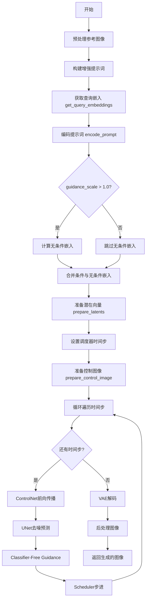
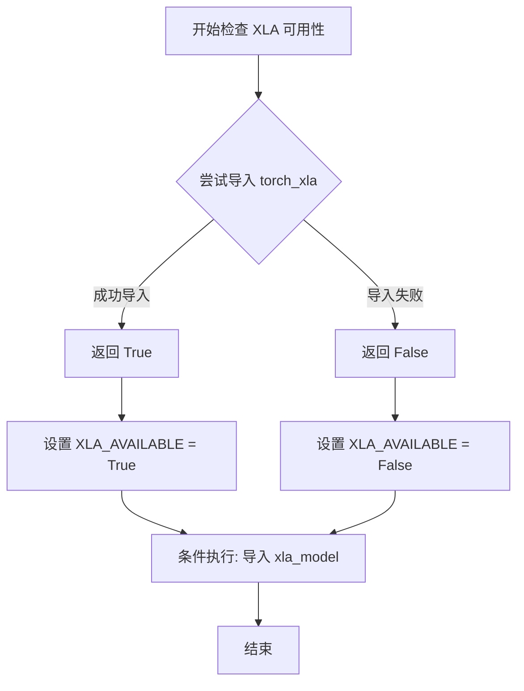
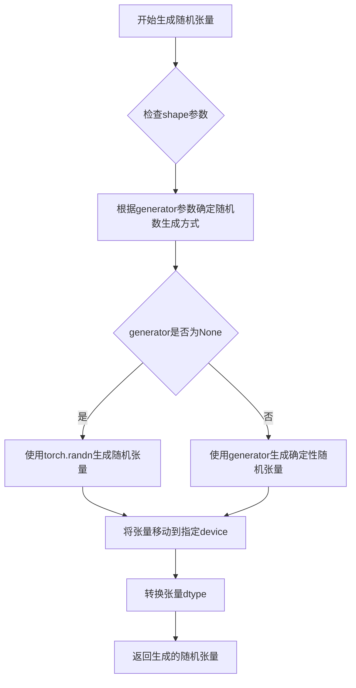
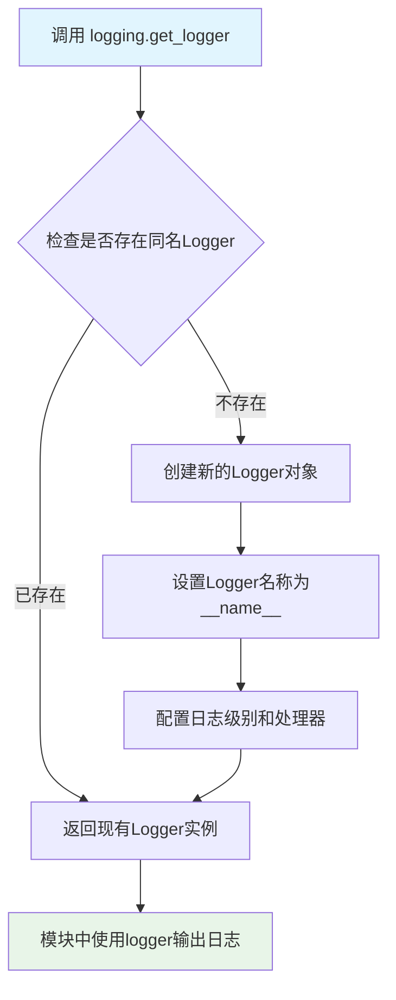
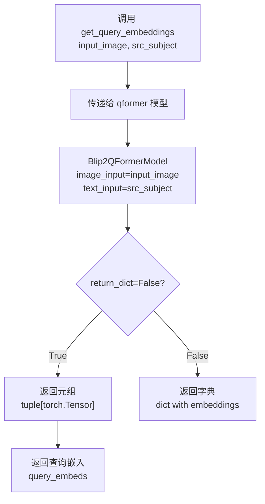
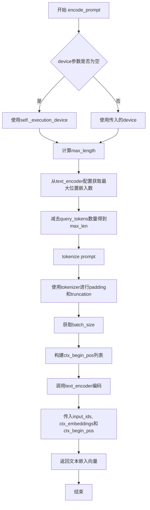
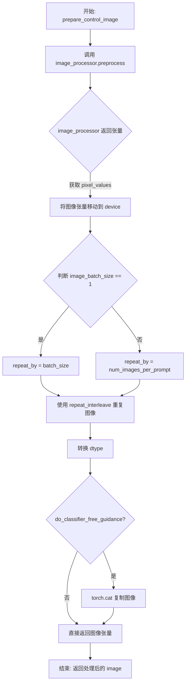
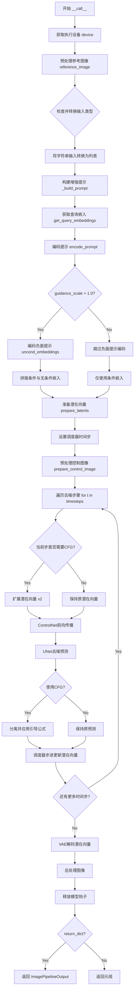

# `diffusers\src\diffusers\pipelines\controlnet\pipeline_controlnet_blip_diffusion.py` 详细设计文档

这是一个基于Blip Diffusion和ControlNet的图像生成管道，用于实现Canny边缘检测控制的主题驱动图像生成。该管道通过结合文本提示、参考图像和Canny边缘条件图像，利用Q-Former模型提取多模态嵌入，并通过条件U-Net进行去噪扩散过程，生成与目标主题相关的图像。

## 整体流程



## 类结构

```
DiffusionPipeline (基类)
└── BlipDiffusionControlNetPipeline
    ├── DeprecatedPipelineMixin (混入类)
    └── ImagePipelineOutput (输出类)
```

## 全局变量及字段


### `logger`
    
用于记录日志的日志记录器

类型：`logging.Logger`
    


### `EXAMPLE_DOC_STRING`
    
包含pipeline使用示例的文档字符串

类型：`str`
    


### `XLA_AVAILABLE`
    
指示PyTorch XLA是否可用的布尔标志

类型：`bool`
    


### `BlipDiffusionControlNetPipeline.tokenizer`
    
文本编码器的分词器

类型：`CLIPTokenizer`
    


### `BlipDiffusionControlNetPipeline.text_encoder`
    
用于编码文本提示的文本编码器

类型：`ContextCLIPTextModel`
    


### `BlipDiffusionControlNetPipeline.vae`
    
变分自编码器模型，用于潜在空间与图像之间的转换

类型：`AutoencoderKL`
    


### `BlipDiffusionControlNetPipeline.unet`
    
条件U-Net模型，用于去噪图像潜在表示

类型：`UNet2DConditionModel`
    


### `BlipDiffusionControlNetPipeline.scheduler`
    
PNDM调度器，用于控制扩散过程的噪声调度

类型：`PNDMScheduler`
    


### `BlipDiffusionControlNetPipeline.qformer`
    
Q-Former模型，用于从图像和文本获取多模态查询嵌入

类型：`Blip2QFormerModel`
    


### `BlipDiffusionControlNetPipeline.controlnet`
    
ControlNet模型，用于从条件图像获取控制嵌入

类型：`ControlNetModel`
    


### `BlipDiffusionControlNetPipeline.image_processor`
    
图像处理器，用于图像的预处理和后处理

类型：`BlipImageProcessor`
    


### `BlipDiffusionControlNetPipeline._last_supported_version`
    
pipeline最后支持的版本号

类型：`str`
    


### `BlipDiffusionControlNetPipeline.model_cpu_offload_seq`
    
模型CPU卸载顺序定义

类型：`str`
    
    

## 全局函数及方法


### `is_torch_xla_available`

检查当前运行环境是否支持 PyTorch XLA（用于 TPU 的 PyTorch 设备），以便在代码中条件性地启用 XLA 相关功能。

参数： 无

返回值：`bool`，返回 `True` 表示 XLA 可用（环境中有 `torch_xla` 库），返回 `False` 表示不可用。

#### 流程图



#### 带注释源码

```python
# 该函数定义在 diffusers 库的 utils 模块中
# 以下是其在当前文件中的使用方式：

# 从 utils 模块导入 is_torch_xla_available 函数
from ...utils import is_torch_xla_available, logging, replace_example_docstring

# 条件性地检查 XLA 是否可用
if is_torch_xla_available():
    # 如果 XLA 可用，导入 torch_xla 的 xla_model 模块
    import torch_xla.core.xla_model as xm
    # 设置全局标志，表示 XLA 可用
    XLA_AVAILABLE = True
else:
    # 如果 XLA 不可用，设置全局标志为 False
    XLA_AVAILABLE = False

# 在后续代码中使用 XLA_AVAILABLE 标志进行条件判断
# 例如在 pipeline 的 __call__ 方法中：
if XLA_AVAILABLE:
    xm.mark_step()  # 用于 TPU 的显式计算标记
```

> **注意**：该函数本身定义在 `diffusers` 库的 `...utils` 模块中，上述源码展示了其典型的使用模式和效果，而非函数本身的完整实现。函数通过尝试导入 `torch_xla` 库来判断 XLA 环境是否可用，通常返回布尔值。


### `randn_tensor`

生成随机张量（高斯分布），用于在扩散模型中创建初始噪声潜在表示。该函数是 `torch_utils` 模块中的工具函数，被 `prepare_latents` 方法调用以初始化或处理潜在变量。

参数：

- `shape`：`tuple` 或 `torch.Size`，随机张量的形状（如 `(batch_size, num_channels, height, width)`）
- `generator`：`torch.Generator` 或 `list[torch.Generator] | None`，可选的随机数生成器，用于确保可重复性
- `device`：`torch.device`，张量应放置的设备（如 CPU 或 CUDA 设备）
- `dtype`：`torch.dtype`，张量的数据类型（如 `torch.float32` 或 `torch.float16`）

返回值：`torch.Tensor`，符合指定形状、设备和数据类型的高斯分布随机张量

#### 流程图



#### 带注释源码

```python
# randn_tensor 函数定义（位于 ...utils/torch_utils 模块中）
# 此代码为推断代码，因为原始代码中只导入了该函数而未展示定义

def randn_tensor(
    shape: tuple,  # 张量的形状，如 (batch_size, channels, height, width)
    generator: Optional[Union[torch.Generator, List[torch.Generator]]] = None,  # 随机数生成器
    device: Optional[torch.device] = None,  # 目标设备
    dtype: Optional[torch.dtype] = None,  # 数据类型
) -> torch.Tensor:
    """
    生成符合正态分布（高斯分布）的随机张量。
    
    Args:
        shape: 张量的维度元组
        generator: 可选的 torch.Generator 对象，用于生成确定性随机数
        device: 张量应放置的设备
        dtype: 张量的数据类型
    
    Returns:
        随机张量
    """
    # 导入 torch
    import torch
    
    # 如果没有指定 device，默认使用 CPU
    if device is None:
        device = torch.device("cpu")
    
    # 如果没有指定 dtype，默认使用 float32
    if dtype is None:
        dtype = torch.float32
    
    # 如果提供了 generator，使用它来生成随机数（确保可重复性）
    if generator is not None:
        # 根据 generator 类型处理
        if isinstance(generator, list):
            # 批量生成，每个样本使用不同的 generator
            # 这里简化处理，实际实现可能更复杂
            tensor = torch.randn(shape, generator=generator[0] if generator else None, device=device, dtype=dtype)
        else:
            tensor = torch.randn(shape, generator=generator, device=device, dtype=dtype)
    else:
        # 不使用 generator，直接生成随机张量
        tensor = torch.randn(shape, device=device, dtype=dtype)
    
    return tensor


# 在 BlipDiffusionControlNetPipeline 中的调用示例
def prepare_latents(self, batch_size, num_channels, height, width, dtype, device, generator, latents=None):
    """
    准备扩散模型的初始潜在变量。
    
    该方法使用 randn_tensor 生成随机噪声作为初始潜在表示，
    或者使用用户提供的 latents。
    """
    shape = (batch_size, num_channels, height, width)
    
    # 验证 generator 列表长度与 batch_size 匹配
    if isinstance(generator, list) and len(generator) != batch_size:
        raise ValueError(
            f"You have passed a list of generators of length {len(generator)}, but requested an effective batch"
            f" size of {batch_size}. Make sure the batch size matches the length of the generators."
        )
    
    # 如果没有提供 latents，则使用 randn_tensor 生成随机潜在变量
    if latents is None:
        latents = randn_tensor(shape, generator=generator, device=device, dtype=dtype)
    else:
        # 使用提供的 latents，只需转换设备和数据类型
        latents = latents.to(device=device, dtype=dtype)
    
    # 根据 scheduler 的要求缩放初始噪声的标准差
    latents = latents * self.scheduler.init_noise_sigma
    
    return latents
```


# logging.get_logger 函数详细设计文档

## 1. 函数概述

`logging.get_logger` 是 Hugging Face Diffusers 库中用于获取模块级日志记录器的工具函数。它根据传入的模块名称（`__name__`）创建一个或获取已存在的日志记录器，使得模块能够进行统一的日志记录和调试信息输出。

## 2. 文件的整体运行流程

本文件定义了一个图像生成管道 `BlipDiffusionControlNetPipeline`，用于实现基于 Canny Edge 的受控主体驱动生成。整个流程包括：
1. 导入必要的依赖和模块
2. 定义管道类及其初始化方法
3. 实现多个辅助方法（获取查询嵌入、构建提示词、编码提示词等）
4. 实现主要的 `__call__` 方法执行图像生成
5. 使用 `logging.get_logger(__name__)` 获取当前模块的日志记录器用于调试输出

## 3. 类的详细信息

### 3.1 BlipDiffusionControlNetPipeline 类

#### 类字段

| 字段名称 | 类型 | 描述 |
|---------|------|------|
| `_last_supported_version` | `str` | 记录最后支持的管道版本号 |
| `model_cpu_offload_seq` | `str` | 定义模型CPU卸载顺序（qformer→text_encoder→unet→vae）|

#### 类方法

| 方法名称 | 功能描述 |
|---------|---------|
| `__init__` | 初始化管道，接收所有模型组件并注册到模块中 |
| `get_query_embeddings` | 获取查询嵌入，用于文本-图像多模态嵌入 |
| `_build_prompt` | 构建增强的提示词，通过重复主题来强化生成效果 |
| `prepare_latents` | 准备噪声潜在向量，用于去噪过程 |
| `encode_prompt` | 编码文本提示词为嵌入向量 |
| `prepare_control_image` | 预处理控制图像（如Canny边缘图）|
| `__call__` | 执行主要的图像生成流程 |

## 4. logging.get_logger 详细信息

### logging.get_logger

获取与当前模块关联的日志记录器实例，用于模块级别的日志输出。

参数：

- `__name__`：`str`，Python内置的特殊变量，表示当前模块的完整路径名称（如 `"diffusers.pipelines.blip_diffusion_controlnet.pipeline_blip_diffusion_controlnet"`）

返回值：`logging.Logger`，返回一个Python标准库的Logger对象，用于记录日志信息

#### 流程图



#### 带注释源码

```python
# 在文件顶部导入logging模块
from ...utils import logging, replace_example_docstring

# 使用 logging.get_logger 获取当前模块的日志记录器
# __name__ 是Python内置变量，自动获取当前模块的完整路径名
# 这样可以在日志中清晰标识日志来源的模块
logger = logging.get_logger(__name__)  # pylint: disable=invalid-name
```

## 5. 关键组件信息

| 组件名称 | 描述 |
|---------|------|
| `CLIPTokenizer` | 用于将文本提示词转换为token序列 |
| `ContextCLIPTextModel` | 上下文感知的CLIP文本编码器 |
| `AutoencoderKL` | VAE模型，用于潜在空间与图像空间的转换 |
| `UNet2DConditionModel` | 条件U-Net架构，用于去噪过程 |
| `PNDMScheduler` | PNDM调度器，控制去噪步骤 |
| `Blip2QFormerModel` | BLIP-2 Q-Former模型，获取多模态嵌入 |
| `ControlNetModel` | ControlNet模型，提取控制条件 |
| `BlipImageProcessor` | 图像预处理器 |

## 6. 潜在的技术债务或优化空间

1. **硬编码参数**：图像尺寸默认512x512，可以考虑参数化
2. **错误处理**：部分方法缺少详细的异常处理和输入验证
3. **日志使用不足**：虽然获取了logger实例，但在代码中未实际使用日志输出
4. **类型提示不完整**：部分参数使用了`|`联合类型语法，可能影响兼容性

## 7. 其它项目

### 设计目标与约束
- 支持Canny边缘控制的主体驱动图像生成
- 遵循DiffusionPipeline的标准接口设计
- 支持CPU和GPU推理

### 错误处理与异常设计
- 使用`ValueError`处理批次大小不匹配的情况
- 通过条件判断处理可选参数（如generator）
- 使用`XLA_AVAILABLE`标志处理TPU兼容性

### 数据流与状态机
- 输入：文本提示、参考图像、控制图像、主题类别
- 处理流程：文本编码 → 潜在向量准备 → ControlNet条件提取 → UNet去噪循环 → VAE解码
- 输出：生成的图像

### 外部依赖与接口契约
- 依赖PIL、torch、transformers等核心库
- 依赖diffusers库的Pipeline基类和工具函数
- 依赖controlnet_aux库的CannyDetector（示例中使用）


### `BlipDiffusionControlNetPipeline.__init__`

这是 BlipDiffusionControlNetPipeline 类的构造函数，用于初始化整个控制网络扩散流水线的所有核心组件，包括分词器、文本编码器、VAE、UNet、调度器、Q-Former、ControlNet 和图像处理器，并注册配置参数。

参数：

- `tokenizer`：`CLIPTokenizer`，文本分词器，用于将文本提示转换为token序列
- `text_encoder`：`ContextCLIPTextModel`，文本编码器，用于编码文本提示
- `vae`：`AutoencoderKL`，变分自编码器，用于将潜在空间映射到图像空间
- `unet`：`UNet2DConditionModel`，条件UNet模型，用于去噪图像潜在表示
- `scheduler`：`PNDMScheduler`，PNDM调度器，用于控制扩散过程的噪声调度
- `qformer`：`Blip2QFormerModel`，Q-Former模型，用于从图像和文本提取多模态查询嵌入
- `controlnet`：`ControlNetModel`，ControlNet模型，用于提取控制条件特征
- `image_processor`：`BlipImageProcessor`，图像处理器，用于图像的预处理和后处理
- `ctx_begin_pos`：`int`，可选，上下文token在文本编码器中的起始位置，默认为2
- `mean`：`list[float]`，可选，图像预处理的均值，默认为None
- `std`：`list[float]`，可选，图像预处理的标准差，默认为None

返回值：`None`，构造函数不返回任何值

#### 流程图

```mermaid
flowchart TD
    A[__init__ 开始] --> B[调用 super().__init__ 初始化基类]
    B --> C[调用 register_modules 注册所有模型组件]
    C --> D[调用 register_to_config 注册配置参数]
    D --> E[__init__ 结束]
    
    C --> C1[注册 tokenizer]
    C --> C2[注册 text_encoder]
    C --> C3[注册 vae]
    C --> C4[注册 unet]
    C --> C5[注册 scheduler]
    C --> C6[注册 qformer]
    C --> C7[注册 controlnet]
    C --> C8[注册 image_processor]
    
    D --> D1[注册 ctx_begin_pos]
    D --> D2[注册 mean]
    D --> D3[注册 std]
```

#### 带注释源码

```python
def __init__(
    self,
    tokenizer: CLIPTokenizer,
    text_encoder: ContextCLIPTextModel,
    vae: AutoencoderKL,
    unet: UNet2DConditionModel,
    scheduler: PNDMScheduler,
    qformer: Blip2QFormerModel,
    controlnet: ControlNetModel,
    image_processor: BlipImageProcessor,
    ctx_begin_pos: int = 2,
    mean: list[float] = None,
    std: list[float] = None,
):
    """
    初始化 BlipDiffusionControlNetPipeline 流水线
    
    参数:
        tokenizer: CLIP 分词器
        text_encoder: 上下文 CLIP 文本编码器
        vae: VAE 变分自编码器
        unet: 条件 UNet 去噪模型
        scheduler: PNDM 调度器
        qformer: BLIP-2 Q-Former 多模态模型
        controlnet: ControlNet 控制网络
        image_processor: BLIP 图像处理器
        ctx_begin_pos: 上下文token起始位置，默认2
        mean: 图像归一化均值
        std: 图像归一化标准差
    """
    # 调用父类 DeprecatedPipelineMixin 和 DiffusionPipeline 的初始化方法
    # 建立基础的扩散流水线结构
    super().__init__()

    # 通过 register_modules 方法将所有模型组件注册到流水线中
    # 这些组件将可以通过 self.xxx 访问
    self.register_modules(
        tokenizer=tokenizer,
        text_encoder=text_encoder,
        vae=vae,
        unet=unet,
        scheduler=scheduler,
        qformer=qformer,
        controlnet=controlnet,
        image_processor=image_processor,
    )
    
    # 注册配置参数到 self.config 中
    # 保存 ctx_begin_pos, mean, std 等配置供后续使用
    self.register_to_config(ctx_begin_pos=ctx_begin_pos, mean=mean, std=std)
```


### `BlipDiffusionControlNetPipeline.get_query_embeddings`

该方法用于通过 QFormer 模型获取图像和文本的多模态查询嵌入（query embeddings），将输入图像和源主体类别转换为可供文本编码器使用的上下文嵌入表示。

参数：

- `input_image`：图像张量，输入的参考图像，用于提取视觉特征（类型需根据调用上下文确定，通常为 `torch.Tensor`）
- `src_subject`：字符串或字符串列表，源主体类别，用于生成文本查询条件（类型为 `str` 或 `list[str]`）

返回值：元组 `tuple[torch.Tensor]`，返回 QFormer 生成的查询嵌入向量，通常为形状 `(batch_size, num_query_tokens, hidden_size)` 的张量元组

#### 流程图



#### 带注释源码

```python
def get_query_embeddings(self, input_image, src_subject):
    """
    获取查询嵌入向量。
    
    该方法将输入图像和源主体类别传递给 QFormer 模型，
    生成多模态查询嵌入，用于后续文本编码器的上下文嵌入。
    
    参数:
        input_image: 输入的参考图像张量，来自预处理后的 reference_image
        src_subject: 源主体类别字符串，如 "flower"、"teapot" 等
        
    返回:
        QFormer 输出的查询嵌入元组，包含视觉-文本融合后的特征表示
    """
    # 调用 self.qformer (Blip2QFormerModel) 进行前向传播
    # image_input: 图像输入，用于提取视觉特征
    # text_input: 文本输入，提供主题语义信息
    # return_dict=False: 返回元组而非字典，便于后续处理
    return self.qformer(image_input=input_image, text_input=src_subject, return_dict=False)
```


### `BlipDiffusionControlNetPipeline._build_prompt`

该方法用于构建增强后的文本提示，通过将目标主体（tgt_subject）添加到提示前，并使用 prompt_strength 和 prompt_reps 参数控制提示的重复次数来放大提示效果。

参数：

- `prompts`：`list`，原始文本提示列表
- `tgt_subjects`：`list`，目标主体类别列表
- `prompt_strength`：`float`，提示强度系数（默认值为 1.0），用于与 prompt_reps 相乘确定最终重复次数
- `prompt_reps`：`int`，基础重复次数（默认值为 20），与 prompt_strength 相乘确定最终重复次数

返回值：`list[str]`，构建并增强后的提示列表

#### 流程图

```mermaid
flowchart TD
    A[开始 _build_prompt] --> B[初始化空列表 rv]
    B --> C{遍历 prompts 和 tgt_subjects}
    C -->|逐个处理| D[将目标主体添加到提示前: prompt = f'a {tgt_subject} {prompt.strip()}']
    D --> E[计算重复次数: reps = int(prompt_strength * prompt_reps)]
    E --> F[将提示重复 reps 次并用逗号连接]
    F --> G[将增强后的提示添加到 rv 列表]
    G --> C
    C -->|遍历完成| H[返回列表 rv]
    H --> I[结束]
```

#### 带注释源码

```
# 从原始 Blip Diffusion 代码移植
# 用于指定目标主体，并通过重复提示来增强提示效果
def _build_prompt(self, prompts, tgt_subjects, prompt_strength=1.0, prompt_reps=20):
    # 初始化结果列表
    rv = []
    
    # 遍历每个提示和对应的目标主体
    for prompt, tgt_subject in zip(prompts, tgt_subjects):
        # 将目标主体添加到提示前面，格式为 "a {tgt_subject} {原始提示}"
        # 例如: tgt_subject="teapot", prompt="on a marble table" 
        #      -> "a teapot on a marble table"
        prompt = f"a {tgt_subject} {prompt.strip()}"
        
        # 通过重复提示来放大提示效果
        # 这是一种增强提示的技术手段
        # 计算实际重复次数: prompt_strength * prompt_reps
        # 例如: prompt_strength=1.0, prompt_reps=20 -> 重复 20 次
        rv.append(", ".join([prompt] * int(prompt_strength * prompt_reps)))
    
    # 返回增强后的提示列表
    return rv
```


### `BlipDiffusionControlNetPipeline.prepare_latents`

该方法用于为扩散模型准备初始潜在向量（latents），根据指定的批次大小、通道数、高度和宽度生成随机噪声，或使用提供的潜在向量，并按照调度器的要求进行初始噪声标准差的缩放。

参数：

- `self`：隐式参数，指向 `BlipDiffusionControlNetPipeline` 实例本身
- `batch_size`：`int`，批量大小，指定生成图像的数量
- `num_channels`：`int`，潜在向量的通道数，通常对应于 UNet 模型的输入通道数
- `height`：`int`，潜在向量对应图像的高度（按 VAE 下采样比例缩放后）
- `width`：`int`，潜在向量对应图像的宽度（按 VAE 下采样比例缩放后）
- `dtype`：`torch.dtype`，生成潜在向量所使用的数据类型（如 `torch.float32`）
- `device`：`torch.device`，生成潜在向量所使用的设备（如 CUDA 或 CPU）
- `generator`：`torch.Generator` 或 `list[torch.Generator]`，可选，用于控制随机数生成以实现可重现的生成结果
- `latents`：`torch.Tensor`，可选，如果提供则直接使用该潜在向量，否则生成新的随机潜在向量

返回值：`torch.Tensor`，处理后的潜在向量，形状为 `(batch_size, num_channels, height, width)`

#### 流程图

```mermaid
flowchart TD
    A[开始准备潜在向量] --> B[计算形状 shape = (batch_size, num_channels, height, width)]
    B --> C{generator 是列表且长度不等于 batch_size?}
    C -->|是| D[抛出 ValueError 错误]
    C -->|否| E{latents 参数是否为 None?}
    E -->|是| F[使用 randn_tensor 生成随机潜在向量]
    E -->|否| G[将提供的 latents 移动到指定设备并转换数据类型]
    F --> H[使用调度器的 init_noise_sigma 缩放潜在向量]
    G --> H
    H --> I[返回处理后的潜在向量]
    D --> J[结束]
    I --> J
```

#### 带注释源码

```python
def prepare_latents(self, batch_size, num_channels, height, width, dtype, device, generator, latents=None):
    """
    为扩散模型准备初始潜在向量（latents）
    
    参数:
        batch_size: 批量大小
        num_channels: 通道数
        height: 潜在向量高度
        width: 潜在向量宽度
        dtype: 数据类型
        device: 计算设备
        generator: 随机数生成器
        latents: 可选的预生成潜在向量
    
    返回:
        处理后的潜在向量张量
    """
    # 1. 计算潜在向量的形状：(batch_size, num_channels, height, width)
    shape = (batch_size, num_channels, height, width)
    
    # 2. 验证生成器列表长度与批次大小是否匹配
    if isinstance(generator, list) and len(generator) != batch_size:
        raise ValueError(
            f"You have passed a list of generators of length {len(generator)}, but requested an effective batch"
            f" size of {batch_size}. Make sure the batch size matches the length of the generators."
        )

    # 3. 根据是否提供 latents 决定生成方式
    if latents is None:
        # 3.1 未提供 latents 时，使用 randn_tensor 生成随机噪声潜在向量
        latents = randn_tensor(shape, generator=generator, device=device, dtype=dtype)
    else:
        # 3.2 已提供 latents 时，将其移动到指定设备并转换数据类型
        latents = latents.to(device=device, dtype=dtype)

    # 4. 根据调度器要求的初始噪声标准差缩放潜在向量
    # 这是扩散模型去噪过程的关键初始化步骤
    latents = latents * self.scheduler.init_noise_sigma
    
    # 5. 返回处理后的潜在向量
    return latents
```


### `BlipDiffusionControlNetPipeline.encode_prompt`

该方法用于将文本提示（prompt）与查询嵌入（query_embeds）结合，通过文本编码器生成文本嵌入向量。它首先对提示进行tokenize处理，然后利用文本编码器将tokenized输入与查询嵌入进行融合，最终返回融合后的文本嵌入表示。

参数：

- `query_embeds`：`torch.Tensor`，由Q-Former生成的查询嵌入，作为文本编码器的上下文输入
- `prompt`：`str` 或 `list[str]`，需要编码的文本提示
- `device`：`torch.device` 或 `None`，可选参数，指定运行设备，默认为`self._execution_device`

返回值：`torch.Tensor`，编码后的文本嵌入向量，形状为`(batch_size, seq_len, hidden_size)`

#### 流程图



#### 带注释源码

```python
def encode_prompt(self, query_embeds, prompt, device=None):
    """
    编码文本提示，结合查询嵌入生成文本嵌入向量
    
    Args:
        query_embeds: 由Q-Former生成的查询嵌入，用作文本编码器的上下文
        prompt: 要编码的文本提示
        device: 可选的运行设备，默认为执行设备
    
    Returns:
        text_embeddings: 编码后的文本嵌入向量
    """
    # 确定运行设备，如果未指定则使用执行设备
    device = device or self._execution_device

    # 计算文本编码器的最大序列长度
    # 嵌入长度 = 最大位置嵌入数 - 查询token数量（保留空间给query_embeds）
    max_len = self.text_encoder.text_model.config.max_position_embeddings
    max_len -= self.qformer.config.num_query_tokens

    # 对提示进行tokenize处理
    # padding到最大长度，进行截断，转换为pytorch张量
    tokenized_prompt = self.tokenizer(
        prompt,
        padding="max_length",
        truncation=True,
        max_length=max_len,
        return_tensors="pt",
    ).to(device)

    # 获取批次大小，用于构建context begin位置列表
    batch_size = query_embeds.shape[0]
    
    # 构建每个样本的context开始位置列表
    # ctx_begin_pos指定query_embeds插入到文本嵌入的位置
    ctx_begin_pos = [self.config.ctx_begin_pos] * batch_size

    # 调用文本编码器进行编码
    # input_ids: tokenized的输入ID
    # ctx_embeddings: 查询嵌入作为上下文
    # ctx_begin_pos: 上下文嵌入的起始位置
    text_embeddings = self.text_encoder(
        input_ids=tokenized_prompt.input_ids,
        ctx_embeddings=query_embeds,
        ctx_begin_pos=ctx_begin_pos,
    )[0]

    # 返回编码后的文本嵌入向量
    return text_embeddings
```


### `BlipDiffusionControlNetPipeline.prepare_control_image`

该方法负责将输入的控制图像（如Canny边缘检测图像）进行预处理，包括resize到指定尺寸、转换为PyTorch张量、复制以匹配batch大小，以及在启用classifier-free guidance时进行图像拼接，最终返回符合模型输入要求的图像张量。

参数：

- `image`：`PIL.Image.Image` 或 `torch.Tensor`，待预处理的条件图像（控制网络输入）
- `width`：`int`，目标图像宽度（像素）
- `height`：`int`，目标图像高度（像素）
- `batch_size`：`int`，prompt的batch大小，用于决定图像重复次数
- `num_images_per_prompt`：`int`，每个prompt生成的图像数量
- `device`：`torch.device`，图像张量要移动到的目标设备
- `dtype`：`torch.dtype`，图像张量的目标数据类型
- `do_classifier_free_guidance`：`bool`，是否启用classifier-free guidance，若为True则返回拼接后的双图像

返回值：`torch.Tensor`，预处理后的图像张量，形状为 `(batch_size * num_images_per_prompt * (2 if guidance else 1), C, H, W)`

#### 流程图



#### 带注释源码

```
def prepare_control_image(
    self,
    image,                                      # 输入的控制图像（PIL.Image 或张量）
    width,                                      # 目标宽度
    height,                                     # 目标高度
    batch_size,                                 # prompt的batch大小
    num_images_per_prompt,                      # 每个prompt生成的图像数
    device,                                     # 目标设备
    dtype,                                      # 目标数据类型
    do_classifier_free_guidance=False,         # 是否启用无分类器引导
):
    # 步骤1：使用 image_processor 预处理图像
    # - resize 到指定宽高
    # - do_rescale=True 归一化到 [0,1]
    # - do_center_crop=False 不做中心裁剪
    # - do_normalize=False 不做标准化（归一化在后续或模型内部处理）
    image = self.image_processor.preprocess(
        image,
        size={"width": width, "height": height},
        do_rescale=True,
        do_center_crop=False,
        do_normalize=False,
        return_tensors="pt",
    )["pixel_values"].to(device)               # 转换为 PyTorch 张量并移至设备
    
    image_batch_size = image.shape[0]           # 获取输入图像的batch维度

    # 步骤2：根据batch情况确定重复次数
    if image_batch_size == 1:
        # 如果输入只有一张图像，按prompt batch大小重复
        repeat_by = batch_size
    else:
        # 如果输入图像batch与prompt batch一致，按num_images_per_prompt重复
        # image batch size is the same as prompt batch size
        repeat_by = num_images_per_prompt

    # 步骤3：沿 dim=0 重复图像以匹配batch
    image = image.repeat_interleave(repeat_by, dim=0)

    # 步骤4：确保数据类型正确
    image = image.to(device=device, dtype=dtype)

    # 步骤5：处理 classifier-free guidance
    # 复制图像用于后续：一张用于无条件生成，一张用于条件生成
    if do_classifier_free_guidance:
        image = torch.cat([image] * 2)

    return image  # 返回处理后的图像张量
```


### `BlipDiffusionControlNetPipeline.__call__`

该方法是 BlipDiffusionControlNetPipeline 的核心推理方法，用于实现基于 Canny Edge 控制的被试驱动图像生成。它接收参考图像、条件边缘图像、文本提示和主体类别，通过 Q-Former 获取多模态嵌入，结合 ControlNet 的条件控制，在 UNet 中执行去噪操作，最后通过 VAE 解码生成目标图像。

参数：

- `prompt`：`list[str]`，引导图像生成的文本提示或提示列表
- `reference_image`：`PIL.Image.Image`，用于条件生成的正则参考图像
- `condtioning_image`：`PIL.Image.Image`，用于 ControlNet 控制的 Canny 边缘条件图像
- `source_subject_category`：`list[str]`，源主体类别列表
- `target_subject_category`：`list[str]`，目标主体类别列表
- `latents`：`torch.Tensor | None`，可选的预生成噪声潜在向量，用于图像生成
- `guidance_scale`：`float`，默认为 7.5，分类器自由扩散引导比例
- `height`：`int`，默认为 512，生成图像的高度
- `width`：`int`，默认为 512，生成图像的宽度
- `num_inference_steps`：`int`，默认为 50，去噪迭代步数
- `generator`：`torch.Generator | list[torch.Generator] | None`，用于生成确定性的随机数生成器
- `neg_prompt`：`str | None`，默认为空字符串，不引导图像生成的负面提示
- `prompt_strength`：`float`，默认为 1.0，提示强度，用于放大提示
- `prompt_reps`：`int`，默认为 20，提示重复次数
- `output_type`：`str | None`，默认为 "pil"，输出类型
- `return_dict`：`bool`，默认为 True，是否以字典形式返回结果

返回值：`ImagePipelineOutput` 或 `tuple`，包含生成的图像或图像列表

#### 流程图



#### 带注释源码

```python
@torch.no_grad()
@replace_example_docstring(EXAMPLE_DOC_STRING)
def __call__(
    self,
    prompt: list[str],
    reference_image: PIL.Image.Image,
    condtioning_image: PIL.Image.Image,
    source_subject_category: list[str],
    target_subject_category: list[str],
    latents: torch.Tensor | None = None,
    guidance_scale: float = 7.5,
    height: int = 512,
    width: int = 512,
    num_inference_steps: int = 50,
    generator: torch.Generator | list[torch.Generator] | None = None,
    neg_prompt: str | None = "",
    prompt_strength: float = 1.0,
    prompt_reps: int = 20,
    output_type: str | None = "pil",
    return_dict: bool = True,
):
    """
    Function invoked when calling the pipeline for generation.

    Args:
        prompt (`list[str]`): The prompt or prompts to guide the image generation.
        reference_image (`PIL.Image.Image`): The reference image to condition the generation on.
        condtioning_image (`PIL.Image.Image`): The conditioning canny edge image to condition the generation on.
        source_subject_category (`list[str]`): The source subject category.
        target_subject_category (`list[str]`): The target subject category.
        latents (`torch.Tensor`, *optional*): Pre-generated noisy latents...
        guidance_scale (`float`, *optional*, defaults to 7.5): Guidance scale as defined in...
        height (`int`, *optional*, defaults to 512): The height of the generated image.
        width (`int`, *optional*, defaults to 512): The width of the generated image.
        num_inference_steps (`int`, *optional*, defaults to 50): The number of denoising steps.
        generator (`torch.Generator` or `list[torch.Generator]`, *optional*): One or a list of...
        neg_prompt (`str`, *optional*, defaults to ""): The prompt or prompts not to guide...
        prompt_strength (`float`, *optional*, defaults to 1.0): The strength of the prompt...
        prompt_reps (`int`, *optional*, defaults to 20): The number of times the prompt is repeated...
    """
    # 1. 获取执行设备（CPU/CUDA）
    device = self._execution_device

    # 2. 预处理参考图像：使用图像处理器将PIL图像转换为张量，并应用归一化参数
    reference_image = self.image_processor.preprocess(
        reference_image, image_mean=self.config.mean, image_std=self.config.std, return_tensors="pt"
    )["pixel_values"]
    reference_image = reference_image.to(device)

    # 3. 类型标准化：将单个字符串转换为列表，以支持批量处理
    if isinstance(prompt, str):
        prompt = [prompt]
    if isinstance(source_subject_category, str):
        source_subject_category = [source_subject_category]
    if isinstance(target_subject_category, str):
        target_subject_category = [target_subject_category]

    # 4. 获取批处理大小
    batch_size = len(prompt)

    # 5. 构建增强提示：将目标主体类别添加到提示前，并按prompt_strength和prompt_reps重复以放大提示
    prompt = self._build_prompt(
        prompts=prompt,
        tgt_subjects=target_subject_category,
        prompt_strength=prompt_strength,
        prompt_reps=prompt_reps,
    )
    
    # 6. 获取查询嵌入：使用Q-Former模型从参考图像和源主体类别获取多模态查询嵌入
    query_embeds = self.get_query_embeddings(reference_image, source_subject_category)
    
    # 7. 编码提示：将查询嵌入作为上下文，使用文本编码器编码文本提示
    text_embeddings = self.encode_prompt(query_embeds, prompt, device)
    
    # 8. 确定是否使用分类器自由引导（CFG）：当guidance_scale > 1.0时启用
    do_classifier_free_guidance = guidance_scale > 1.0
    
    # 9. 如果启用CFG，则编码负面提示并与条件嵌入拼接
    if do_classifier_free_guidance:
        max_length = self.text_encoder.text_model.config.max_position_embeddings

        # 编码负面提示（无条件嵌入）
        uncond_input = self.tokenizer(
            [neg_prompt] * batch_size,
            padding="max_length",
            max_length=max_length,
            return_tensors="pt",
        )
        uncond_embeddings = self.text_encoder(
            input_ids=uncond_input.input_ids.to(device),
            ctx_embeddings=None,  # 负面提示不使用上下文嵌入
        )[0]
        
        # 拼接无条件嵌入和条件嵌入（用于单次前向传播实现CFG）
        text_embeddings = torch.cat([uncond_embeddings, text_embeddings])
    
    # 10. 计算缩放因子：UNet的下采样因子，用于调整潜在向量尺寸
    scale_down_factor = 2 ** (len(self.unet.config.block_out_channels) - 1)
    
    # 11. 准备潜在向量：初始化或使用提供的噪声潜在向量
    latents = self.prepare_latents(
        batch_size=batch_size,
        num_channels=self.unet.config.in_channels,
        height=height // scale_down_factor,
        width=width // scale_down_factor,
        generator=generator,
        latents=latents,
        dtype=self.unet.dtype,
        device=device,
    )
    
    # 12. 设置调度器的时间步
    extra_set_kwargs = {}
    self.scheduler.set_timesteps(num_inference_steps, **extra_set_kwargs)

    # 13. 预处理控制/条件图像：调整尺寸并复制以匹配批处理大小
    cond_image = self.prepare_control_image(
        image=condtioning_image,
        width=width,
        height=height,
        batch_size=batch_size,
        num_images_per_prompt=1,
        device=device,
        dtype=self.controlnet.dtype,
        do_classifier_free_guidance=do_classifier_free_guidance,
    )

    # 14. 迭代去噪过程
    for i, t in enumerate(self.progress_bar(self.scheduler.timesteps)):
        # 每次迭代重新检查CFG（可能随时间变化）
        do_classifier_free_guidance = guidance_scale > 1.0

        # 如果使用CFG，将潜在向量扩展2倍（前半为无条件，后半为条件）
        latent_model_input = torch.cat([latents] * 2) if do_classifier_free_guidance else latents
        
        # ControlNet前向传播：获取中间残差连接
        down_block_res_samples, mid_block_res_sample = self.controlnet(
            latent_model_input,
            t,
            encoder_hidden_states=text_embeddings,
            controlnet_cond=cond_image,
            return_dict=False,
        )

        # UNet去噪预测：根据当前潜在向量和时间步预测噪声
        noise_pred = self.unet(
            latent_model_input,
            timestep=t,
            encoder_hidden_states=text_embeddings,
            down_block_additional_residuals=down_block_res_samples,
            mid_block_additional_residual=mid_block_res_sample,
        )["sample"]

        # 执行分类器自由引导
        if do_classifier_free_guidance:
            # 分离无条件预测和条件预测
            noise_pred_uncond, noise_pred_text = noise_pred.chunk(2)
            # 应用引导公式：noise_pred = noise_pred_uncond + guidance_scale * (noise_pred_text - noise_pred_uncond)
            noise_pred = noise_pred_uncond + guidance_scale * (noise_pred_text - noise_pred_uncond)

        # 调度器步进：更新潜在向量到下一步
        latents = self.scheduler.step(
            noise_pred,
            t,
            latents,
        )["prev_sample"]

        # 如果使用XLA设备，标记计算步骤
        if XLA_AVAILABLE:
            xm.mark_step()

    # 15. VAE解码：将最终潜在向量解码为图像
    image = self.vae.decode(latents / self.vae.config.scaling_factor, return_dict=False)[0]
    
    # 16. 后处理图像：将张量转换为指定输出类型（PIL/np/pt）
    image = self.image_processor.postprocess(image, output_type=output_type)

    # 17. 释放所有模型的钩子（用于CPU卸载）
    self.maybe_free_model_hooks()

    # 18. 返回结果
    if not return_dict:
        return (image,)

    return ImagePipelineOutput(images=image)
```

## 关键组件


### BlipDiffusionControlNetPipeline

核心pipeline类，继承自DiffusionPipeline和DeprecatedPipelineMixin，用于Canny边缘控制的主题驱动图像生成，集成了QFormer、ControlNet和文本编码器来实现条件图像合成。

### 张量索引与潜在向量管理

在`__call__`方法和`prepare_latents`中使用批量张量处理，包括latents的初始化、索引和调度器步进。`latents`支持外部传入或随机生成，并通过`torch.cat([latents] * 2)`实现分类器自由引导的张量扩展。

### 反量化支持

通过`self.vae.decode(latents / self.vae.config.scaling_factor)`实现潜在空间的反量化，将去噪后的潜在向量除以缩放因子后解码为图像像素值。

### 控制网集成

`prepare_control_image`方法处理条件图像的预处理和批量扩展，`__call__`中通过`self.controlnet`获取中间残差特征，传递给UNet的`down_block_additional_residuals`和`mid_block_additional_residual`参数。

### 量化策略

通过`model_cpu_offload_seq = "qformer->text_encoder->unet->vae"`定义模型卸载序列，支持fp16量化（`torch_dtype=torch.float16`），同时保留XLA设备支持以优化TPU性能。

### 调度器与去噪流程

集成`PNDMScheduler`，通过`set_timesteps`和`scheduler.step`实现迭代去噪，支持分类器自由引导（CFG）来平衡条件与无条件预测。

### QFormer多模态嵌入

`get_query_embeddings`方法使用QFormer模型从参考图像和源主题类别提取多模态查询嵌入，作为文本编码器的上下文输入。

### 提示词增强策略

`_build_prompt`方法通过重复拼接提示词（`prompt_strength * prompt_reps`次）来放大提示词效果，支持目标主题的动态前缀注入。


## 问题及建议


### 已知问题

- **拼写错误**: `condtioning_image` 参数名存在拼写错误，应为 `conditioning_image`，这会影响代码可读性和API一致性。
- **重复计算**: `do_classifier_free_guidance` 在循环外部和循环内部都被计算，循环内部的计算是冗余的。
- **无效变量声明**: `extra_set_kwargs = {}` 被创建但未实际使用，传递给 `set_timesteps` 时为空字典，属于无效代码。
- **类型不一致**: `neg_prompt` 参数默认值为空字符串 `""`，但类型标注为 `str | None`，当传入 `None` 时 `[neg_prompt] * batch_size` 会产生包含 `None` 的列表，可能导致后续处理错误。
- **缺少批处理验证**: 未验证 `prompt`、`source_subject_category` 和 `target_subject_category` 的批次大小是否一致，可能导致运行时错误。
- **硬编码默认值**: `prompt_reps=20`、`guidance_scale=7.5`、`height=512`、`width=512` 等关键参数在多处硬编码，缺乏配置灵活性。
- **图片预处理不一致**: `reference_image` 使用 `config.mean/std` 进行归一化，而 `prepare_control_image` 中使用 `do_rescale=True` 但 `do_normalize=False`，两处预处理逻辑不统一。
- **缺少参数验证**: 未对 `num_inference_steps`、`prompt_strength`、`prompt_reps` 等参数进行有效性验证（如负数检查）。

### 优化建议

- **修复拼写错误**: 将 `condtioning_image` 重命名为 `conditioning_image`。
- **移除冗余计算**: 删除循环内部的 `do_classifier_free_guidance = guidance_scale > 1.0` 重复赋值。
- **删除无效代码**: 移除 `extra_set_kwargs = {}` 及相关空参数传递。
- **统一类型处理**: 修正 `neg_prompt` 默认值为 `None` 或在处理时强制转换为空字符串，并添加类型一致性检查。
- **添加批次验证**: 在 `__call__` 方法开始处添加 `prompt`、`source_subject_category` 和 `target_subject_category` 批次长度一致性验证。
- **提取配置参数**: 将硬编码的默认值提取为类属性或构造函数可选参数，提供更好的配置灵活性。
- **统一图片预处理**: 确保 `reference_image` 和控制图像的预处理逻辑一致，或在文档中明确说明差异原因。
- **添加参数验证**: 在方法入口处添加参数范围检查（如 `num_inference_steps > 0`、`prompt_strength > 0` 等）。
- **优化XLA集成**: 考虑在循环外部进行更多批处理操作，减少 `xm.mark_step()` 调用频率以提升性能。

## 其它


### 设计目标与约束

本Pipeline的设计目标是实现Canny边缘检测控制的Subject-Driven图像生成，通过结合BLIP Diffusion模型与ControlNet架构，实现对特定目标主体的风格迁移与条件控制生成。设计约束包括：1) 仅支持512x512分辨率输出；2) 依赖CLIP文本编码器与Q-Former多模态嵌入；3) 仅支持PNDM调度器；4) 目标设备为CUDA兼容GPU；5) 不支持CPU推理（虽可通过XLA支持TPU）。

### 错误处理与异常设计

代码中的错误处理主要包含：1) `prepare_latents`方法中验证generator列表长度与batch_size是否匹配；2) 分词器的truncation处理；3) 可选参数默认为None时的类型检查；4) XLA设备可用性检测。异常传播采用Python原生异常机制，通过pipeline的返回值（tuple或ImagePipelineOutput）区分成功与错误状态。建议增加：输入图像尺寸验证、模型加载失败处理、CUDA内存不足捕获、调度器配置异常检测。

### 数据流与状态机

Pipeline的数据流如下：1) 输入阶段：接收prompt、reference_image、condtioning_image、source_subject_category、target_subject_category；2) 预处理阶段：reference_image经image_processor预处理生成pixel_values，condtioning_image经prepare_control_image处理，prompt经_build_prompt增强；3) 编码阶段：reference_image与source_subject通过get_query_embeddings获取query_embeds，query_embeds与prompt通过encode_prompt获取text_embeddings；4) 去噪阶段：latents经PNDM调度器多步迭代，ControlNet提供条件控制，UNet执行去噪预测；5) 解码阶段：VAE解码latents生成最终图像；6) 后处理阶段：image_processor postprocess输出为PIL图像或numpy数组。状态转换：初始化→预处理→编码→迭代去噪→解码→后处理→完成。

### 外部依赖与接口契约

核心依赖包括：1) transformers库 - CLIPTokenizer、ContextCLIPTextModel；2) diffusers库 - AutoencoderKL、ControlNetModel、UNet2DConditionModel、PNDMScheduler、DiffusionPipeline；3) PIL库 - 图像处理；4) torch - 深度学习框架；5) controlnet_aux - CannyDetector用于边缘检测；6) 可选torch_xla - TPU支持。接口契约：__call__方法接受多参数并返回ImagePipelineOutput或tuple，支持batch处理，guidance_scale控制生成质量，num_inference_steps控制迭代次数，generator控制随机性。

### 配置参数说明

关键配置参数：1) ctx_begin_pos - 上下文token在文本编码器中的起始位置，默认值为2；2) mean/std - 图像归一化参数，默认None；3) _last_supported_version - 最后支持版本"0.33.1"；4) model_cpu_offload_seq - CPU卸载顺序"qformer->text_encoder->unet->vae"。运行时参数：guidance_scale默认7.5，height/width默认512，num_inference_steps默认50，prompt_strength默认1.0，prompt_reps默认20。

### 性能考虑与优化点

当前实现包含的性能优化：1) 模型CPU卸载机制（maybe_free_model_hooks）；2) XLA mark_step支持TPU加速；3) Classifier-Free Guidance批处理优化（单次前向传播而非两次）；4) torch.no_grad()装饰器禁用梯度计算。潜在优化空间：1) 启用enable_vae_slicing处理高分辨率图像；2) 使用enable_vae_tiling进行大图像分块处理；3) 编译优化torch.compile；4) 混合精度推理（当前强制float32）；5) 预热推理（warmup）减少首次调用延迟；6) 缓存文本嵌入避免重复编码。

### 安全性考虑

代码安全性考虑：1) 仅支持从预训练模型加载，不支持自定义权重文件；2) 图像输入经过preprocess处理后转换为tensor，防止恶意图像payload；3) 分词器truncation防止超长prompt注入；4) 无用户输入直接执行代码路径。不足之处：1) neg_prompt未经严格过滤；2) 无水印或内容安全检查；3) 无输入图像大小限制（可能导致内存溢出）；4) 模型反序列化无签名验证。

### 内存管理与Offload

内存管理机制：1) 模型CPU卸载通过model_cpu_offload_seq定义顺序；2) 预定义的卸载序列确保模型按正确顺序释放GPU内存；3) XLA模式下使用mark_step而非同步等待。内存占用估算：UNet通常占用~3GB，VAE ~500MB，ControlNet ~1.5GB，TextEncoder ~500MB，Q-Former ~1GB，总计约6.5GB（FP32），半精度下约3.25GB。优化建议：对于8GB以下GPU建议启用CPU卸载，对于更大模型建议启用VAE tiling/slicing。

### 调度器工作原理

PNDMScheduler（Pseudo Numerical Method for Diffusion Models）工作流程：1) 通过set_timesteps设置推理步数；2) 每步迭代中，scheduler.step根据noise_pred、当前timestep和latents计算前一时刻的latents；3) 采用PLMS（Pseudo Linear Multistep）方法，利用前几步的预测结果提高准确性；4) init_noise_sigma用于初始化噪声规模。配置参数：num_inference_steps控制去噪步数，步数越多质量越好但速度越慢。

### 多平台支持

平台支持情况：1) CUDA - 完全支持，性能最优；2) CPU - 理论上支持但无优化，性能极差；3) TPU - 通过torch_xla提供实验性支持，需安装torch_xla并满足XLA_AVAILABLE条件；4) Apple Silicon (M1/M2) - 未明确测试，可能存在兼容性风险。XLA支持时使用xm.mark_step()进行异步执行标记，提高TPU利用率。

    