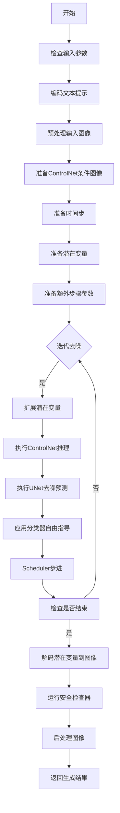
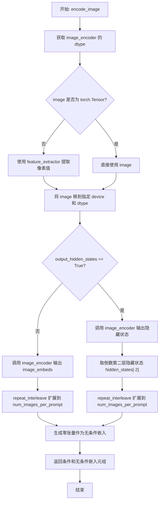
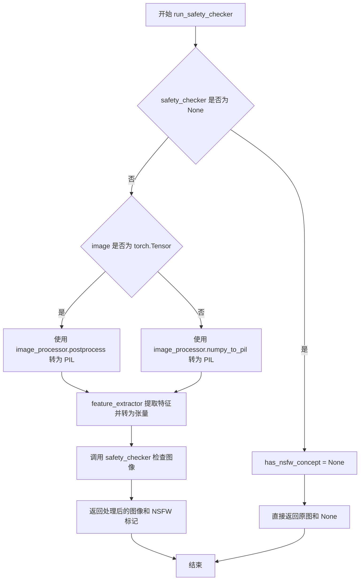
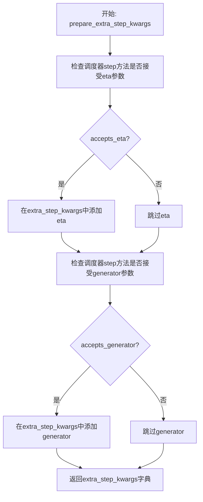
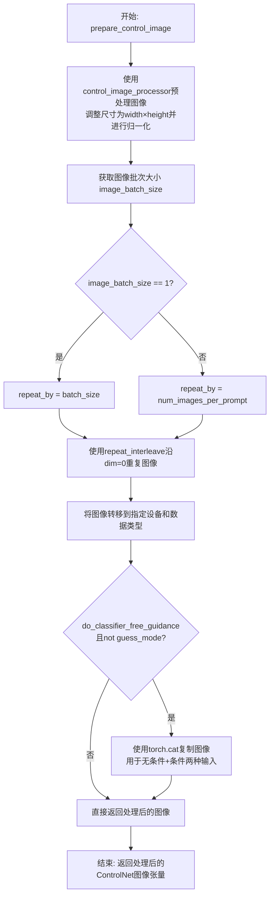
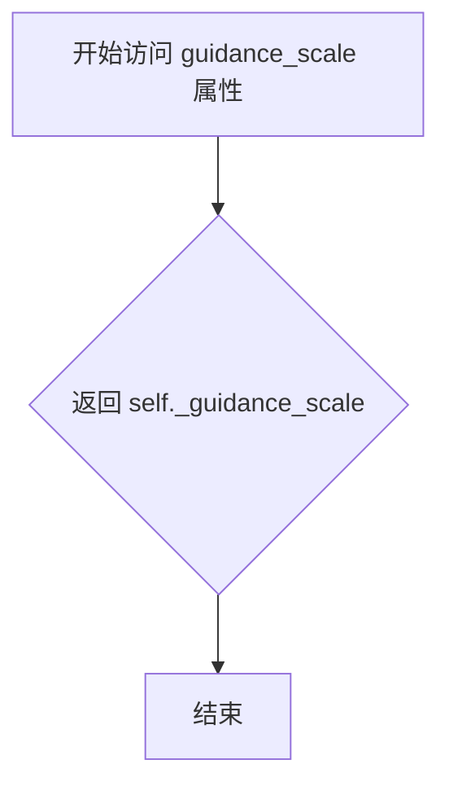
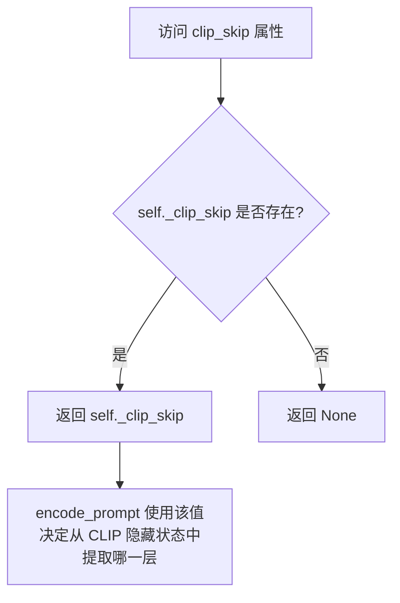
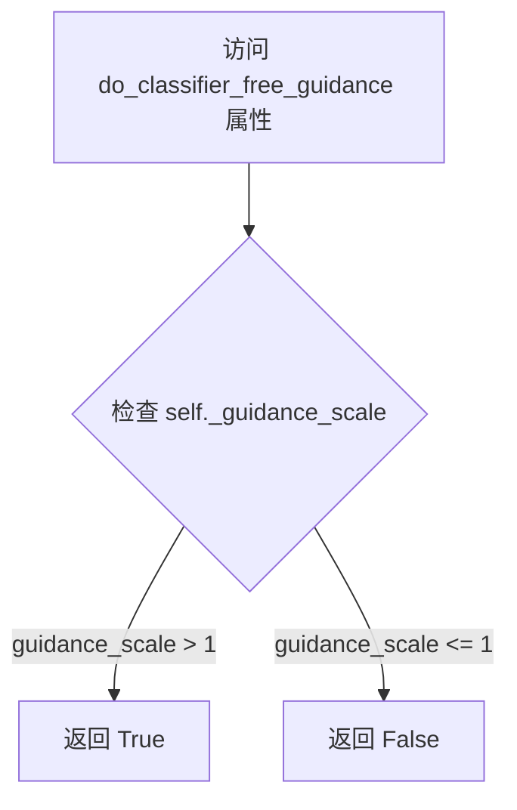

```mermaid
flowchart TD
    A[Start __call__] --> B[Parse & Validate kwargs]
    B --> C[Align control guidance format]
    C --> D[Check inputs with check_inputs]
    D --> E[Set internal state variables]
    E --> F[Define call parameters batch_size]
    F --> G[Encode input prompt with encode_prompt]
    G --> H{do_classifier_free_guidance?}
    H -->|Yes| I[Concat negative + positive prompt_embeds]
    H -->|No| J[Prepare IP Adapter image embeddings]
    I --> J
    J --> K[Preprocess input image]
    K --> L{ControlNet type?}
    L -->|Single ControlNet| M[Prepare single control_image]
    L -->|Multi ControlNet| N[Prepare multiple control_images]
    M --> O[Prepare timesteps]
    N --> O
    O --> P[Get timesteps with get_timesteps]
    P --> Q[Prepare latent variables]
    Q --> R[Prepare extra step kwargs]
    R --> S[Create controlnet_keep mask]
    S --> T[Enter denoising loop]
    T --> U{Iteration &lt; num_inference_steps?}
    U -->|Yes| V[Expand latents for CFG]
    V --> W[Scale model input]
    W --> X{Run ControlNet inference}
    X --> Y[Predict noise residual]
    Y --> Z[Apply guidance scale]
    Z --> AA[Scheduler step - compute previous sample]
    AA --> AB{callback_on_step_end?}
    AB -->|Yes| AC[Execute callback]
    AC --> AD[Update progress bar]
    AB -->|No| AD
    AD --> AE{XLA available?}
    AE -->|Yes| AF[xm.mark_step]
    AE -->|No| T
    T -->|No| AG[Offload models if needed]
    AG --> AH{output_type == 'latent'?}
    AH -->|Yes| AI[Set image = latents]
    AH -->|No| AJ[Decode latents with VAE]
    AJ --> AK[Run safety checker]
    AI --> AL[Postprocess image]
    AK --> AL
    AL --> AM[Offload all models]
    AM --> AN{return_dict?}
    AN -->|Yes| AO[Return StableDiffusionPipelineOutput]
    AN -->|No| AP[Return tuple]
    AO --> AQ[End]
    AP --> AQ
```

# `diffusers\src\diffusers\pipelines\controlnet\pipeline_controlnet_img2img.py` 详细设计文档

这是一个基于Stable Diffusion的图像到图像生成管道，集成了ControlNet进行条件控制。该管道接收文本提示、初始图像和ControlNet条件图像，通过去噪过程生成符合文本描述和条件控制的新图像。

## 整体流程



## 类结构

```
DiffusionPipeline (抽象基类)
├── StableDiffusionMixin
├── TextualInversionLoaderMixin
├── StableDiffusionLoraLoaderMixin
├── IPAdapterMixin
├── FromSingleFileMixin
└── StableDiffusionControlNetImg2ImgPipeline
```

## 全局变量及字段


### `XLA_AVAILABLE`
    
Boolean flag indicating whether PyTorch XLA (Accelerated Linear Algebra) is available for TPU support

类型：`bool`
    


### `logger`
    
Module-level logger instance for logging warnings, info, and errors during pipeline execution

类型：`logging.Logger`
    


### `EXAMPLE_DOC_STRING`
    
Documentation string containing example usage code for the StableDiffusionControlNetImg2ImgPipeline class

类型：`str`
    


### `StableDiffusionControlNetImg2ImgPipeline.vae`
    
Variational Auto-Encoder (VAE) model used for encoding images into latent representations and decoding latents back to images

类型：`AutoencoderKL`
    


### `StableDiffusionControlNetImg2ImgPipeline.text_encoder`
    
Frozen CLIP text encoder that converts input text prompts into text embeddings for conditioning the diffusion model

类型：`CLIPTextModel`
    


### `StableDiffusionControlNetImg2ImgPipeline.tokenizer`
    
CLIP tokenizer that tokenizes input text prompts into token IDs for the text encoder

类型：`CLIPTokenizer`
    


### `StableDiffusionControlNetImg2ImgPipeline.unet`
    
Conditional UNet2D model that performs the denoising process to generate latents from noise based on conditioning

类型：`UNet2DConditionModel`
    


### `StableDiffusionControlNetImg2ImgPipeline.controlnet`
    
ControlNet model(s) that provide additional conditioning signals to guide the UNet during the denoising process

类型：`ControlNetModel | MultiControlNetModel`
    


### `StableDiffusionControlNetImg2ImgPipeline.scheduler`
    
Diffusion scheduler that manages the noise scheduling and denoising steps during the image generation process

类型：`KarrasDiffusionSchedulers`
    


### `StableDiffusionControlNetImg2ImgPipeline.safety_checker`
    
Safety checker model that detects and filters out potentially NSFW (not-safe-for-work) generated images

类型：`StableDiffusionSafetyChecker`
    


### `StableDiffusionControlNetImg2ImgPipeline.feature_extractor`
    
CLIP image processor that extracts features from images for the safety checker and image encoding

类型：`CLIPImageProcessor`
    


### `StableDiffusionControlNetImg2ImgPipeline.image_encoder`
    
CLIP vision model with projection used for encoding images into embeddings for IP-Adapter support

类型：`CLIPVisionModelWithProjection`
    


### `StableDiffusionControlNetImg2ImgPipeline.vae_scale_factor`
    
Scaling factor derived from VAE block out channels, used for computing the latent space dimensions

类型：`int`
    


### `StableDiffusionControlNetImg2ImgPipeline.image_processor`
    
Image processor for preprocessing input images and postprocessing decoded images with RGB conversion enabled

类型：`VaeImageProcessor`
    


### `StableDiffusionControlNetImg2ImgPipeline.control_image_processor`
    
Image processor specifically for preprocessing control images with normalization disabled

类型：`VaeImageProcessor`
    


### `StableDiffusionControlNetImg2ImgPipeline.model_cpu_offload_seq`
    
String defining the sequence of models for CPU offloading: text_encoder->unet->vae

类型：`str`
    


### `StableDiffusionControlNetImg2ImgPipeline._optional_components`
    
List of optional pipeline components that can be None: safety_checker, feature_extractor, image_encoder

类型：`list`
    


### `StableDiffusionControlNetImg2ImgPipeline._exclude_from_cpu_offload`
    
List of components excluded from CPU offloading: safety_checker

类型：`list`
    


### `StableDiffusionControlNetImg2ImgPipeline._callback_tensor_inputs`
    
List of tensor input names that can be passed to callbacks during pipeline execution

类型：`list`
    


### `StableDiffusionControlNetImg2ImgPipeline._guidance_scale`
    
Classifier-free guidance scale value controlling the strength of text prompt influence on generation

类型：`float`
    


### `StableDiffusionControlNetImg2ImgPipeline._clip_skip`
    
Number of CLIP layers to skip when computing prompt embeddings for fine-grained control

类型：`int`
    


### `StableDiffusionControlNetImg2ImgPipeline._cross_attention_kwargs`
    
Dictionary of keyword arguments passed to cross-attention layers for customizing attention behavior

类型：`dict`
    


### `StableDiffusionControlNetImg2ImgPipeline._num_timesteps`
    
Total number of denoising timesteps used in the current generation run

类型：`int`
    


### `StableDiffusionControlNetImg2ImgPipeline._interrupt`
    
Flag indicating whether the pipeline execution should be interrupted mid-generation

类型：`bool`
    
    

## 全局函数及方法


### `retrieve_latents`

从编码器输出中提取潜在向量的辅助函数，根据采样模式从潜在分布中采样或获取预计算的潜在向量。

参数：

- `encoder_output`：`torch.Tensor`，编码器输出对象，包含 `latent_dist` 属性（潜在分布）或 `latents` 属性（预计算潜在向量）
- `generator`：`torch.Generator | None`，可选的随机数生成器，用于确保采样可重现
- `sample_mode`：`str`，采样模式，"sample" 表示从分布中采样，"argmax" 表示取分布的众数，默认值为 "sample"

返回值：`torch.Tensor`，从编码器输出中提取的潜在向量

#### 流程图

```mermaid
flowchart TD
    A[开始 retrieve_latents] --> B{encoder_output 是否有 latent_dist 属性?}
    B -->|是| C{sample_mode == "sample"?}
    B -->|否| D{encoder_output 是否有 latents 属性?}
    C -->|是| E[返回 encoder_output.latent_dist.sample<br/>(generator)]
    C -->|否| F[返回 encoder_output.latent_dist.mode<br/>()]
    D -->|是| G[返回 encoder_output.latents]
    D -->|否| H[抛出 AttributeError]
    E --> Z[结束]
    F --> Z
    G --> Z
    H --> Z
```

#### 带注释源码

```python
# Copied from diffusers.pipelines.stable_diffusion.pipeline_stable_diffusion_img2img.retrieve_latents
def retrieve_latents(
    encoder_output: torch.Tensor, generator: torch.Generator | None = None, sample_mode: str = "sample"
):
    """
    从编码器输出中提取潜在向量。
    
    Args:
        encoder_output: 编码器输出，包含潜在分布或预计算潜在向量
        generator: 可选的随机生成器，用于采样时的随机性控制
        sample_mode: 采样模式，"sample" 或 "argmax"
    
    Returns:
        提取的潜在向量
    """
    # 检查编码器输出是否有 latent_dist 属性且采样模式为 "sample"
    if hasattr(encoder_output, "latent_dist") and sample_mode == "sample":
        # 从潜在分布中采样
        return encoder_output.latent_dist.sample(generator)
    # 检查编码器输出是否有 latent_dist 属性且采样模式为 "argmax"
    elif hasattr(encoder_output, "latent_dist") and sample_mode == "argmax":
        # 返回潜在分布的众数（最大值对应的潜在向量）
        return encoder_output.latent_dist.mode()
    # 检查编码器输出是否有预计算的 latents 属性
    elif hasattr(encoder_output, "latents"):
        # 直接返回预计算的潜在向量
        return encoder_output.latents
    else:
        # 如果无法访问潜在向量，抛出 AttributeError
        raise AttributeError("Could not access latents of provided encoder_output")
```


### `prepare_image`

该函数负责将多种格式的输入图像（PIL.Image、numpy.ndarray 或 torch.Tensor）统一预处理为 float32 类型的 PyTorch 张量，并对像素值进行归一化处理（除以 127.5 后减 1，映射到 [-1, 1] 范围），以便后续的 Stable Diffusion 模型进行处理。

参数：

- `image`：`Union[torch.Tensor, PIL.Image.Image, np.ndarray, List]` ，输入图像，支持单张 PIL 图像、NumPy 数组、PyTorch 张量或它们的列表形式

返回值：`torch.Tensor`，返回处理后的图像张量，形状为 (B, C, H, W)，数据类型为 torch.float32，值域范围 [-1, 1]

#### 流程图

```mermaid
flowchart TD
    A[开始: 输入 image] --> B{image 是 torch.Tensor?}
    B -->|Yes| C{image.ndim == 3?}
    B -->|No| D[image 是 PIL.Image 或 np.ndarray?]
    C -->|Yes| E[unsqueeze(0) 扩展批次维度]
    C -->|No| F[跳过]
    E --> G[to(dtype=torch.float32)]
    D -->|Yes| H[转为列表]
    D -->|No| I[假设已是列表]
    H --> J{列表元素是 PIL.Image?}
    J -->|Yes| K[每个图像转RGB再转np.array]
    J -->|No| L{列表元素是 np.ndarray?}
    K --> M[np.concatenate 合并]
    L -->|Yes| N[为每个数组添加批次维]
    L -->|No| O[抛出异常]
    M --> P[transpose: (B,H,W,C) -> (B,C,H,W)]
    N --> P
    P --> Q[to(dtype=torch.float32) / 127.5 - 1.0]
    F --> R[返回 image]
    G --> R
    Q --> R
    O --> R
```

#### 带注释源码

```python
def prepare_image(image):
    """
    预处理输入图像，将其转换为模型所需的张量格式。
    
    支持的输入类型：
    - torch.Tensor: 直接使用，仅确保 dtype 为 float32
    - PIL.Image.Image: 转换为 RGB 格式的 numpy 数组
    - np.ndarray: 直接处理
    - 上述类型的列表: 批量处理
    
    处理步骤：
    1. Tensor 输入：直接转换 dtype
    2. PIL/NumPy 输入：统一转为张量并归一化到 [-1, 1]
    """
    
    # 分支1: 输入已经是 PyTorch 张量
    if isinstance(image, torch.Tensor):
        # 批处理单张图像：如果输入是 3D (C,H,W)，扩展为 4D (1,C,H,W)
        if image.ndim == 3:
            image = image.unsqueeze(0)
        
        # 统一转换为 float32 类型（确保 dtype 一致性）
        image = image.to(dtype=torch.float32)
    else:
        # 分支2: 输入是 PIL 图像或 NumPy 数组，需要预处理
        
        # 统一转为列表格式，便于批量处理
        if isinstance(image, (PIL.Image.Image, np.ndarray)):
            image = [image]
        
        # 处理 PIL 图像列表
        if isinstance(image, list) and isinstance(image[0], PIL.Image.Image):
            # 每个图像转 RGB -> numpy 数组 -> 添加批次维 [None, :]
            image = [np.array(i.convert("RGB"))[None, :] for i in image]
            # 在批次维度 concatenate: (1,H,W,C) + (1,H,W,C) -> (B,H,W,C)
            image = np.concatenate(image, axis=0)
        # 处理 numpy 数组列表
        elif isinstance(image, list) and isinstance(image[0], np.ndarray):
            # 为每个数组添加批次维，然后 concatenate
            image = np.concatenate([i[None, :] for i in image], axis=0)
        
        # 维度转换: 从 (B,H,W,C) 转换为 (B,C,H,W)
        # 这是 PyTorch 图像的标准格式（通道在前）
        image = image.transpose(0, 3, 1, 2)
        
        # 转换为 PyTorch 张量，并归一化到 [-1, 1] 范围
        # 原始像素值范围 [0, 255] -> [0, 1] -> [-1, 1]
        image = torch.from_numpy(image).to(dtype=torch.float32) / 127.5 - 1.0
    
    return image
```


### StableDiffusionControlNetImg2ImgPipeline.__init__

初始化Stable Diffusion ControlNet图像到图像生成管道，负责加载和配置所有必要的模型组件（VAE、文本编码器、UNet、ControlNet、调度器等），并设置图像处理器和可选的安全检查器。

参数：

- `vae`：`AutoencoderKL`，用于将图像编码和解码到潜在表示的变分自编码器模型
- `text_encoder`：`CLIPTextModel`，冻结的文本编码器（clip-vit-large-patch14），用于将文本提示转换为嵌入向量
- `tokenizer`：`CLIPTokenizer`，用于对文本进行分词的CLIP分词器
- `unet`：`UNet2DConditionModel`，去噪编码图像潜在表示的UNet模型
- `controlnet`：`ControlNetModel | list[ControlNetModel] | tuple[ControlNetModel] | MultiControlNetModel`，提供额外条件指导的ControlNet模型，支持单个或多个ControlNet
- `scheduler`：`KarrasDiffusionSchedulers`，与UNet结合用于去噪编码图像潜在的调度器
- `safety_checker`：`StableDiffusionSafetyChecker`，估计生成图像是否可能被视为攻击性或有害内容的分类模块
- `feature_extractor`：`CLIPImageProcessor`，用于从生成图像中提取特征的CLIP图像处理器
- `image_encoder`：`CLIPVisionModelWithProjection`（可选），用于IP-Adapter的视觉编码器，默认为None
- `requires_safety_checker`：`bool`，是否需要安全检查器，默认为True

返回值：无（`None`），构造函数初始化管道实例

#### 流程图

```mermaid
flowchart TD
    A[开始 __init__] --> B[调用 super().__init__]
    B --> C{safety_checker is None<br/>且 requires_safety_checker?}
    C -->|是| D[输出安全检查器禁用警告]
    C -->|否| E{safety_checker is not None<br/>且 feature_extractor is None?}
    D --> E
    E -->|是| F[抛出 ValueError:<br/>需要定义 feature_extractor]
    E -->|否| G{controlnet 是 list/tuple?}
    F --> H[终止]
    G -->|是| I[创建 MultiControlNetModel]
    G -->|否| J[保持 controlnet 不变]
    I --> K[register_modules: 注册所有模型组件]
    J --> K
    K --> L[计算 vae_scale_factor]
    L --> M[创建 VaeImageProcessor<br/>用于主图像处理]
    M --> N[创建 VaeImageProcessor<br/>用于 control_image 处理<br/>do_normalize=False]
    N --> O[register_to_config:<br/>保存 requires_safety_checker]
    O --> P[结束 __init__]
```

#### 带注释源码

```python
def __init__(
    self,
    vae: AutoencoderKL,  # VAE模型：变分自编码器，用于图像与潜在表示之间的转换
    text_encoder: CLIPTextModel,  # 文本编码器：冻结的CLIP文本模型
    tokenizer: CLIPTokenizer,  # 分词器：CLIP分词器
    unet: UNet2DConditionModel,  # UNet模型：条件去噪模型
    # ControlNet：单个模型、列表、元组或MultiControlNetModel
    controlnet: ControlNetModel | list[ControlNetModel] | tuple[ControlNetModel] | MultiControlNetModel,
    scheduler: KarrasDiffusionSchedulers,  # 调度器：扩散调度器
    safety_checker: StableDiffusionSafetyChecker,  # 安全检查器：NSFW检测
    feature_extractor: CLIPImageProcessor,  # 特征提取器：CLIP图像处理器
    image_encoder: CLIPVisionModelWithProjection = None,  # 图像编码器：用于IP-Adapter（可选）
    requires_safety_checker: bool = True,  # 标志：是否需要安全检查器
):
    # 调用父类构造函数，初始化基础管道功能
    super().__init__()

    # 安全检查：如果safety_checker为None但requires_safety_checker为True，则发出警告
    if safety_checker is None and requires_safety_checker:
        logger.warning(
            f"You have disabled the safety checker for {self.__class__} by passing `safety_checker=None`. Ensure"
            " that you abide to the conditions of the Stable Diffusion license and do not expose unfiltered"
            " results in services or applications open to the public. Both the diffusers team and Hugging Face"
            " strongly recommend to keep the safety filter enabled in all public facing circumstances, disabling"
            " it only for use-cases that involve analyzing network behavior or auditing its results. For more"
            " information, please have a look at https://github.com/huggingface/diffusers/pull/254 ."
        )

    # 验证：如果启用了safety_checker但未提供feature_extractor，则抛出错误
    if safety_checker is not None and feature_extractor is None:
        raise ValueError(
            "Make sure to define a feature extractor when loading {self.__class__} if you want to use the safety"
            " checker. If you do not want to use the safety checker, you can pass `'safety_checker=None'` instead."
        )

    # 处理多个ControlNet：如果传入列表或元组，则包装为MultiControlNetModel
    if isinstance(controlnet, (list, tuple)):
        controlnet = MultiControlNetModel(controlnet)

    # 注册所有模块：使这些组件可以通过管道访问和保存
    self.register_modules(
        vae=vae,
        text_encoder=text_encoder,
        tokenizer=tokenizer,
        unet=unet,
        controlnet=controlnet,
        scheduler=scheduler,
        safety_checker=safety_checker,
        feature_extractor=feature_extractor,
        image_encoder=image_encoder,
    )

    # 计算VAE缩放因子：基于VAE的block_out_channels深度，用于图像处理
    # 例如：VAE有[128, 256, 512, 512]通道，则2^(4-1)=8
    self.vae_scale_factor = 2 ** (len(self.vae.config.block_out_channels) - 1) if getattr(self, "vae", None) else 8

    # 创建图像处理器：用于预处理和后处理图像（RGB转换）
    self.image_processor = VaeImageProcessor(vae_scale_factor=self.vae_scale_factor, do_convert_rgb=True)

    # 创建ControlNet图像处理器：类似主图像处理器，但不进行归一化
    self.control_image_processor = VaeImageProcessor(
        vae_scale_factor=self.vae_scale_factor, do_convert_rgb=True, do_normalize=False
    )

    # 注册配置：将requires_safety_checker保存到配置中
    self.register_to_config(requires_safety_checker=requires_safety_checker)
```


### `StableDiffusionControlNetImg2ImgPipeline._encode_prompt`

该方法是一个已弃用的提示编码方法，用于将文本提示转换为文本编码器的隐藏状态。它通过调用新的 `encode_prompt` 方法来实现功能，但为了向后兼容性，将返回的张量从元组格式重新连接为单一的拼接张量格式。该方法已被 `encode_prompt` 取代，并将在未来版本中移除。

参数：

- `prompt`：`str | list[str] | None`，要编码的提示文本，可以是单个字符串或字符串列表
- `device`：`torch.device`，torch 设备用于执行计算
- `num_images_per_prompt`：`int`，每个提示要生成的图像数量
- `do_classifier_free_guidance`：`bool`，是否使用无分类器自由引导
- `negative_prompt`：`str | list[str] | None`，不包含在图像生成中的提示
- `prompt_embeds`：`torch.Tensor | None`，预生成的文本嵌入，可用于轻松调整文本输入
- `negative_prompt_embeds`：`torch.Tensor | None`，预生成的负面文本嵌入
- `lora_scale`：`float | None`，如果加载了 LoRA 层，将应用于文本编码器所有 LoRA 层的 LoRA 比例
- `**kwargs`：其他关键字参数

返回值：`torch.Tensor`，返回连接的负面提示嵌入和提示嵌入（用于向后兼容）

#### 流程图

```mermaid
flowchart TD
    A[开始 _encode_prompt] --> B[记录弃用警告]
    B --> C{检查 lora_scale}
    C -->|非空且为 StableDiffusionLoraLoaderMixin| D[设置 self._lora_scale]
    C -->|其他| E[跳过 LoRA 缩放]
    D --> F[动态调整 LoRA 比例]
    E --> G[调用 encode_prompt 方法]
    F --> G
    G --> H[获取返回的元组 prompt_embeds_tuple]
    H --> I[拼接: torch.cat[negative_prompt, prompt_embeds]]
    I --> J[返回拼接后的 prompt_embeds]
```

#### 带注释源码

```python
def _encode_prompt(
    self,
    prompt,                          # 输入的文本提示，字符串或字符串列表
    device,                         # torch 设备对象
    num_images_per_prompt,          # 每个提示生成的图像数量
    do_classifier_free_guidance,    # 是否使用分类器自由引导
    negative_prompt=None,           # 负面提示，用于引导不包含的内容
    prompt_embeds: torch.Tensor | None = None,  # 预计算的提示嵌入
    negative_prompt_embeds: torch.Tensor | None = None,  # 预计算的负面嵌入
    lora_scale: float | None = None,  # LoRA 层的缩放因子
    **kwargs,                       # 其他可选参数
):
    # 记录弃用警告，提示用户使用 encode_prompt 代替
    deprecation_message = "`_encode_prompt()` is deprecated and it will be removed in a future version. Use `encode_prompt()` instead. Also, be aware that the output format changed from a concatenated tensor to a tuple."
    deprecate("_encode_prompt()", "1.0.0", deprecation_message, standard_warn=False)

    # 调用新的 encode_prompt 方法获取元组格式的嵌入
    prompt_embeds_tuple = self.encode_prompt(
        prompt=prompt,
        device=device,
        num_images_per_prompt=num_images_per_prompt,
        do_classifier_free_guidance=do_classifier_free_guidance,
        negative_prompt=negative_prompt,
        prompt_embeds=prompt_embeds,
        negative_prompt_embeds=negative_prompt_embeds,
        lora_scale=lora_scale,
        **kwargs,
    )

    # 为了向后兼容性，将元组重新拼接为单一张量
    # 顺序为: [negative_prompt_embeds, prompt_embeds]
    # 注意：encode_prompt 返回 (prompt_embeds, negative_prompt_embeds)
    # 所以这里先放 negative 再放 positive
    prompt_embeds = torch.cat([prompt_embeds_tuple[1], prompt_embeds_tuple[0]])

    # 返回拼接后的张量（旧格式）
    return prompt_embeds
```


### `StableDiffusionControlNetImg2ImgPipeline.encode_prompt`

该方法用于将文本提示（prompt）编码为文本 encoder 的隐藏状态（hidden states），支持 LoRA 权重调整、CLIP 层跳过（clip_skip）、无分类器引导（classifier-free guidance）等高级功能。

参数：

- `prompt`：`str` 或 `list[str]`，要编码的提示词
- `device`：`torch.device`，torch 设备
- `num_images_per_prompt`：`int`，每个提示词要生成的图像数量
- `do_classifier_free_guidance`：`bool`，是否使用无分类器引导
- `negative_prompt`：`str` 或 `list[str]` 或 `None`，负面提示词，用于引导图像不包含什么内容
- `prompt_embeds`：`torch.Tensor` 或 `None`，预生成的提示词嵌入，可用于微调输入
- `negative_prompt_embeds`：`torch.Tensor` 或 `None`，预生成的负面提示词嵌入
- `lora_scale`：`float` 或 `None`，LoRA 缩放因子，用于调整 LoRA 层的影响
- `clip_skip`：`int` 或 `None`，CLIP 编码时跳过的层数，用于获取不同层次的特征

返回值：`tuple[torch.Tensor, torch.Tensor]`，返回提示词嵌入和负面提示词嵌入的元组

#### 流程图

```mermaid
flowchart TD
    A[开始 encode_prompt] --> B{检查 lora_scale}
    B -->|非 None| C[设置 LoRA scale 并动态调整]
    B -->|None| D{检查 prompt 类型}
    
    D -->|str| E[batch_size = 1]
    D -->|list| F[batch_size = len prompt]
    D -->|其他| G[batch_size = prompt_embeds.shape[0]]
    
    E --> H{prompt_embeds is None?}
    F --> H
    G --> H
    
    H -->|是| I{检查 TextualInversionLoaderMixin}
    I -->|是| J[maybe_convert_prompt]
    I -->|否| K[tokenizer 处理 prompt]
    
    J --> K
    
    K --> L[检查 use_attention_mask]
    L -->|是| M[获取 attention_mask]
    L -->|否| N[attention_mask = None]
    
    M --> O{clip_skip is None?}
    N --> O
    
    O -->|是| P[text_encoder 输出 hidden_states=False]
    O -->|否| Q[text_encoder 输出 hidden_states=True]
    
    P --> R[获取 prompt_embeds[0]]
    Q --> S[根据 clip_skip 索引 hidden_states]
    S --> T[应用 final_layer_norm]
    
    R --> U{text_encoder 存在?}
    T --> U
    
    U -->|是| V[获取 text_encoder.dtype]
    U -->|否| W{unet 存在?}
    
    V --> X
    W -->|是| Y[获取 unet.dtype]
    W -->|否| X[使用 prompt_embeds.dtype]
    
    Y --> X
    
    X --> Z[转换 prompt_embeds 到目标 dtype 和 device]
    
    H -->|否| Z
    
    Z --> AA[重复 prompt_embeds num_images_per_prompt 次]
    
    AA --> AB{do_classifier_free_guidance?}
    AB -->|是 且 negative_prompt_embeds is None| AC[处理 negative_prompt]
    AB -->|否| AD[返回最终结果]
    
    AC --> AE[tokenizer 处理 uncond_tokens]
    AE --> AF[text_encoder 编码 uncond_input]
    
    AF --> AG[重复 negative_prompt_embeds]
    
    AG --> AH{使用 StableDiffusionLoraLoaderMixin?}
    AH -->|是 且 USE_PEFT_BACKEND| AI[unscale_lora_layers]
    AH -->|否| AD
    
    AI --> AD[返回 prompt_embeds, negative_prompt_embeds]
```

#### 带注释源码

```python
def encode_prompt(
    self,
    prompt,  # str 或 list[str]，要编码的提示词
    device,  # torch.device，torch 设备
    num_images_per_prompt,  # int，每个提示词要生成的图像数量
    do_classifier_free_guidance,  # bool，是否使用无分类器引导
    negative_prompt=None,  # str 或 list[str] 或 None，负面提示词
    prompt_embeds: torch.Tensor | None = None,  # torch.Tensor，预生成的提示词嵌入
    negative_prompt_embeds: torch.Tensor | None = None,  # torch.Tensor，预生成的负面提示词嵌入
    lora_scale: float | None = None,  # float，LoRA 缩放因子
    clip_skip: int | None = None,  # int，CLIP 跳过的层数
):
    r"""
    Encodes the prompt into text encoder hidden states.

    Args:
        prompt (`str` or `list[str]`, *optional*):
            prompt to be encoded
        device: (`torch.device`):
            torch device
        num_images_per_prompt (`int`):
            number of images that should be generated per prompt
        do_classifier_free_guidance (`bool`):
            whether to use classifier free guidance or not
        negative_prompt (`str` or `list[str]`, *optional*):
            The prompt or prompts not to guide the image generation. If not defined, one has to pass
            `negative_prompt_embeds` instead. Ignored when not using guidance (i.e., ignored if `guidance_scale` is
            less than `1`).
        prompt_embeds (`torch.Tensor`, *optional*):
            Pre-generated text embeddings. Can be used to easily tweak text inputs, *e.g.* prompt weighting. If not
            provided, text embeddings will be generated from `prompt` input argument.
        negative_prompt_embeds (`torch.Tensor`, *optional*):
            Pre-generated negative text embeddings. Can be used to easily tweak text inputs, *e.g.* prompt
            weighting. If not provided, negative_prompt_embeds will be generated from `negative_prompt` input
            argument.
        lora_scale (`float`, *optional*):
            A LoRA scale that will be applied to all LoRA layers of the text encoder if LoRA layers are loaded.
        clip_skip (`int`, *optional*):
            Number of layers to be skipped from CLIP while computing the prompt embeddings. A value of 1 means that
            the output of the pre-final layer will be used for computing the prompt embeddings.
    """
    # 设置 lora scale 以便 text encoder 的 monkey patched LoRA 函数可以正确访问
    if lora_scale is not None and isinstance(self, StableDiffusionLoraLoaderMixin):
        self._lora_scale = lora_scale

        # 动态调整 LoRA scale
        if not USE_PEFT_BACKEND:
            adjust_lora_scale_text_encoder(self.text_encoder, lora_scale)
        else:
            scale_lora_layers(self.text_encoder, lora_scale)

    # 确定批处理大小
    if prompt is not None and isinstance(prompt, str):
        batch_size = 1
    elif prompt is not None and isinstance(prompt, list):
        batch_size = len(prompt)
    else:
        batch_size = prompt_embeds.shape[0]

    # 如果没有预生成 prompt_embeds，则从 prompt 生成
    if prompt_embeds is None:
        # textual inversion: 如果需要，处理多向量 tokens
        if isinstance(self, TextualInversionLoaderMixin):
            prompt = self.maybe_convert_prompt(prompt, self.tokenizer)

        # 使用 tokenizer 将文本转换为 token IDs
        text_inputs = self.tokenizer(
            prompt,
            padding="max_length",
            max_length=self.tokenizer.model_max_length,
            truncation=True,
            return_tensors="pt",
        )
        text_input_ids = text_inputs.input_ids
        
        # 获取未截断的 token IDs 用于警告信息
        untruncated_ids = self.tokenizer(prompt, padding="longest", return_tensors="pt").input_ids

        # 检查是否发生了截断，如果是则记录警告
        if untruncated_ids.shape[-1] >= text_input_ids.shape[-1] and not torch.equal(
            text_input_ids, untruncated_ids
        ):
            removed_text = self.tokenizer.batch_decode(
                untruncated_ids[:, self.tokenizer.model_max_length - 1 : -1]
            )
            logger.warning(
                "The following part of your input was truncated because CLIP can only handle sequences up to"
                f" {self.tokenizer.model_max_length} tokens: {removed_text}"
            )

        # 检查 text_encoder 是否使用 attention_mask
        if hasattr(self.text_encoder.config, "use_attention_mask") and self.text_encoder.config.use_attention_mask:
            attention_mask = text_inputs.attention_mask.to(device)
        else:
            attention_mask = None

        # 根据 clip_skip 选择不同的编码方式
        if clip_skip is None:
            # 直接获取最后一层的输出
            prompt_embeds = self.text_encoder(text_input_ids.to(device), attention_mask=attention_mask)
            prompt_embeds = prompt_embeds[0]
        else:
            # 获取所有隐藏状态，然后根据 clip_skip 索引
            prompt_embeds = self.text_encoder(
                text_input_ids.to(device), attention_mask=attention_mask, output_hidden_states=True
            )
            # hidden_states 是一个元组，包含所有 encoder 层的输出
            # 通过 clip_skip+1 索引获取对应层的输出
            prompt_embeds = prompt_embeds[-1][-(clip_skip + 1)]
            # 应用 final_layer_norm 以保持表示的一致性
            prompt_embeds = self.text_encoder.text_model.final_layer_norm(prompt_embeds)

    # 确定 prompt_embeds 的 dtype
    if self.text_encoder is not None:
        prompt_embeds_dtype = self.text_encoder.dtype
    elif self.unet is not None:
        prompt_embeds_dtype = self.unet.dtype
    else:
        prompt_embeds_dtype = prompt_embeds.dtype

    # 将 prompt_embeds 转换为适当的 dtype 和 device
    prompt_embeds = prompt_embeds.to(dtype=prompt_embeds_dtype, device=device)

    # 获取形状信息
    bs_embed, seq_len, _ = prompt_embeds.shape
    
    # 为每个 prompt 复制 text embeddings（mps 友好的方法）
    prompt_embeds = prompt_embeds.repeat(1, num_images_per_prompt, 1)
    prompt_embeds = prompt_embeds.view(bs_embed * num_images_per_prompt, seq_len, -1)

    # 为 classifier-free guidance 获取无条件 embeddings
    if do_classifier_free_guidance and negative_prompt_embeds is None:
        uncond_tokens: list[str]
        
        # 处理不同的 negative_prompt 情况
        if negative_prompt is None:
            uncond_tokens = [""] * batch_size
        elif prompt is not None and type(prompt) is not type(negative_prompt):
            raise TypeError(
                f"`negative_prompt` should be the same type to `prompt`, but got {type(negative_prompt)} !="
                f" {type(prompt)}."
            )
        elif isinstance(negative_prompt, str):
            uncond_tokens = [negative_prompt]
        elif batch_size != len(negative_prompt):
            raise ValueError(
                f"`negative_prompt`: {negative_prompt} has batch size {len(negative_prompt)}, but `prompt`:"
                f" {prompt} has batch size {batch_size}. Please make sure that passed `negative_prompt` matches"
                " the batch size of `prompt`."
            )
        else:
            uncond_tokens = negative_prompt

        # textual inversion: 如果需要，处理多向量 tokens
        if isinstance(self, TextualInversionLoaderMixin):
            uncond_tokens = self.maybe_convert_prompt(uncond_tokens, self.tokenizer)

        # 获取最大长度（与 prompt_embeds 相同）
        max_length = prompt_embeds.shape[1]
        
        # tokenizer 处理 uncond_tokens
        uncond_input = self.tokenizer(
            uncond_tokens,
            padding="max_length",
            max_length=max_length,
            truncation=True,
            return_tensors="pt",
        )

        # 获取 attention_mask
        if hasattr(self.text_encoder.config, "use_attention_mask") and self.text_encoder.config.use_attention_mask:
            attention_mask = uncond_input.attention_mask.to(device)
        else:
            attention_mask = None

        # 编码无条件输入
        negative_prompt_embeds = self.text_encoder(
            uncond_input.input_ids.to(device),
            attention_mask=attention_mask,
        )
        negative_prompt_embeds = negative_prompt_embeds[0]

    # 如果使用 classifier-free guidance，复制无条件 embeddings
    if do_classifier_free_guidance:
        seq_len = negative_prompt_embeds.shape[1]

        # 转换 dtype 和 device
        negative_prompt_embeds = negative_prompt_embeds.to(dtype=prompt_embeds_dtype, device=device)

        # 复制 embeddings（mps 友好的方法）
        negative_prompt_embeds = negative_prompt_embeds.repeat(1, num_images_per_prompt, 1)
        negative_prompt_embeds = negative_prompt_embeds.view(batch_size * num_images_per_prompt, seq_len, -1)

    # 如果使用了 LoRA，恢复原始 scale
    if self.text_encoder is not None:
        if isinstance(self, StableDiffusionLoraLoaderMixin) and USE_PEFT_BACKEND:
            # 通过 unscale 恢复原始 scale
            unscale_lora_layers(self.text_encoder, lora_scale)

    return prompt_embeds, negative_prompt_embeds
```


### `StableDiffusionControlNetImg2ImgPipeline.encode_image`

该方法用于将输入图像编码为图像嵌入（image embeddings）或隐藏状态，供后续的 IP-Adapter 图像引导使用。它支持两种输出模式：直接输出图像嵌入或输出中间隐藏状态，并同时生成对应的无条件（unconditional）图像嵌入用于无分类器自由引导。

参数：

- `image`：`torch.Tensor | PIL.Image.Image | np.ndarray`，输入图像，可以是张量、PIL图像或numpy数组
- `device`：`torch.device`，目标计算设备
- `num_images_per_prompt`：`int`，每个提示词生成的图像数量，用于批量扩展
- `output_hidden_states`：`bool | None`，是否输出隐藏状态而非图像嵌入

返回值：`tuple[torch.Tensor, torch.Tensor]`，返回两个张量元组——第一个是条件图像嵌入/隐藏状态，第二个是无条件图像嵌入/隐藏状态（用于CFG）

#### 流程图



#### 带注释源码

```python
def encode_image(self, image, device, num_images_per_prompt, output_hidden_states=None):
    """
    Encodes the input image into embeddings or hidden states for IP-Adapter guidance.
    
    Args:
        image: Input image (tensor, PIL Image, or numpy array)
        device: Target torch device
        num_images_per_prompt: Number of images to generate per prompt
        output_hidden_states: If True, returns hidden states instead of image embeddings
    
    Returns:
        Tuple of (condition_embeds, uncond_embeds) for classifier-free guidance
    """
    # 获取图像编码器的参数数据类型，用于后续计算
    dtype = next(self.image_encoder.parameters()).dtype

    # 如果输入不是张量，使用特征提取器将其转换为像素值张量
    if not isinstance(image, torch.Tensor):
        image = self.feature_extractor(image, return_tensors="pt").pixel_values

    # 将图像移动到目标设备并转换为正确的dtype
    image = image.to(device=device, dtype=dtype)
    
    # 根据output_hidden_states参数选择不同的处理路径
    if output_hidden_states:
        # 路径1：输出隐藏状态（用于更细粒度的图像特征）
        image_enc_hidden_states = self.image_encoder(image, output_hidden_states=True).hidden_states[-2]
        # 重复扩展以匹配每提示生成的图像数量
        image_enc_hidden_states = image_enc_hidden_states.repeat_interleave(num_images_per_prompt, dim=0)
        
        # 生成零张量用于无条件的图像隐藏状态（对应空/随机图像）
        uncond_image_enc_hidden_states = self.image_encoder(
            torch.zeros_like(image), output_hidden_states=True
        ).hidden_states[-2]
        uncond_image_enc_hidden_states = uncond_image_enc_hidden_states.repeat_interleave(
            num_images_per_prompt, dim=0
        )
        return image_enc_hidden_states, uncond_image_enc_hidden_states
    else:
        # 路径2：输出图像嵌入（直接用于IP-Adapter）
        image_embeds = self.image_encoder(image).image_embeds
        # 重复扩展以匹配每提示生成的图像数量
        image_embeds = image_embeds.repeat_interleave(num_images_per_prompt, dim=0)
        
        # 生成零张量作为无条件图像嵌入
        uncond_image_embeds = torch.zeros_like(image_embeds)

        return image_embeds, uncond_image_embeds
```


### `StableDiffusionControlNetImg2ImgPipeline.prepare_ip_adapter_image_embeds`

该方法用于准备IP-Adapter的图像嵌入（image embeddings），支持多个IP-Adapter和分类器自由引导（classifier-free guidance）。它接受原始图像或预计算的图像嵌入，处理后返回符合扩散模型输入格式的嵌入列表。

参数：

- `self`：`StableDiffusionControlNetImg2ImgPipeline` 实例，Pipeline 对象本身
- `ip_adapter_image`：`PipelineImageInput | None`，原始输入图像，可以是单个图像或图像列表，用于生成图像嵌入
- `ip_adapter_image_embeds`：`list[torch.Tensor] | None`，预计算的图像嵌入列表，如果提供则直接使用，跳过编码步骤
- `device`：`torch.device`，目标设备，用于将张量移动到指定设备
- `num_images_per_prompt`：`int`，每个提示词生成的图像数量，用于复制嵌入维度
- `do_classifier_free_guidance`：`bool`，是否启用分类器自由引导，决定是否生成负向嵌入

返回值：`list[torch.Tensor]`，处理后的 IP-Adapter 图像嵌入列表，每个元素是对应 IP-Adapter 的嵌入张量

#### 流程图

```mermaid
flowchart TD
    A[开始 prepare_ip_adapter_image_embeds] --> B{ip_adapter_image_embeds<br/>是否为 None?}
    B -->|是| C{ip_adapter_image<br/>是否为列表?}
    C -->|否| D[将 ip_adapter_image<br/>转换为列表]
    C -->|是| E[检查图像数量是否等于<br/>IP-Adapter 数量]
    D --> E
    E -->|数量不匹配| F[抛出 ValueError]
    E -->|数量匹配| G[遍历每个 IP-Adapter 图像和对应的投影层]
    G --> H{image_proj_layer<br/>是否为 ImageProjection?}
    H -->|是| I[output_hidden_state = False]
    H -->|否| J[output_hidden_state = True]
    I --> K[调用 encode_image<br/>生成嵌入]
    J --> K
    K --> L[添加正向嵌入到列表]
    L --> M{do_classifier_free_guidance<br/>为 True?}
    M -->|是| N[添加负向嵌入到列表]
    M -->|否| O[处理下一个 IP-Adapter]
    N --> O
    O --> P{还有更多<br/>IP-Adapter?}
    P -->|是| G
    P -->|否| Q[遍历完成]
    B -->|否| R[遍历预计算的嵌入]
    R --> S{do_classifier_free_guidance<br/>为 True?}
    S -->|是| T[将嵌入按chunk(2)分割为<br/>负向和正向]
    S -->|否| U[直接添加嵌入]
    T --> V[添加负向嵌入]
    V --> U
    U --> W{还有更多嵌入?}
    W -->|是| R
    W -->|否| X[准备最终输出列表]
    Q --> X
    X --> Y[遍历每个嵌入]
    Y --> Z[复制嵌入 num_images_per_prompt 次]
    Z --> AA{do_classifier_free_guidance<br/>为 True?}
    AA -->|是| AB[复制负向嵌入并拼接]
    AA -->|否| AC[移动到目标设备]
    AB --> AC
    AC --> AD[添加到输出列表]
    AD --> AE{处理完所有嵌入?}
    AE -->|否| Y
    AE -->|是| AF[返回嵌入列表]
```

#### 带注释源码

```python
def prepare_ip_adapter_image_embeds(
    self,
    ip_adapter_image,  # 原始 IP-Adapter 输入图像
    ip_adapter_image_embeds,  # 预计算的图像嵌入（可选）
    device,  # 目标设备
    num_images_per_prompt,  # 每个提示生成的图像数量
    do_classifier_free_guidance,  # 是否启用分类器自由引导
):
    """
    准备 IP-Adapter 的图像嵌入。
    
    该方法支持两种输入模式：
    1. 提供 ip_adapter_image：使用 encode_image 方法从原始图像编码生成嵌入
    2. 提供 ip_adapter_image_embeds：直接使用预计算的嵌入
    
    支持多个 IP-Adapter 和分类器自由引导（CFG）模式。
    """
    
    # 初始化正向嵌入列表
    image_embeds = []
    
    # 如果启用 CFG，同时初始化负向嵌入列表
    if do_classifier_free_guidance:
        negative_image_embeds = []
    
    # ===== 模式1：需要从原始图像编码嵌入 =====
    if ip_adapter_image_embeds is None:
        # 确保输入是列表形式
        if not isinstance(ip_adapter_image, list):
            ip_adapter_image = [ip_adapter_image]
        
        # 验证图像数量与 IP-Adapter 数量匹配
        # IP-Adapter 数量由 UNet 的 encoder_hid_proj.image_projection_layers 决定
        if len(ip_adapter_image) != len(self.unet.encoder_hid_proj.image_projection_layers):
            raise ValueError(
                f"`ip_adapter_image` must have same length as the number of IP Adapters. "
                f"Got {len(ip_adapter_image)} images and "
                f"{len(self.unet.encoder_hid_proj.image_projection_layers)} IP Adapters."
            )
        
        # 遍历每个 IP-Adapter 的图像和对应的投影层
        for single_ip_adapter_image, image_proj_layer in zip(
            ip_adapter_image, self.unet.encoder_hid_proj.image_projection_layers
        ):
            # 判断是否需要输出隐藏状态
            # 如果投影层不是 ImageProjection 类型，则需要输出隐藏状态
            output_hidden_state = not isinstance(image_proj_layer, ImageProjection)
            
            # 调用 encode_image 方法编码图像
            # 返回正向嵌入和（如果启用 CFG）负向嵌入
            single_image_embeds, single_negative_image_embeds = self.encode_image(
                single_ip_adapter_image, device, 1, output_hidden_state
            )
            
            # 将正向嵌入添加到列表（添加批次维度）
            image_embeds.append(single_image_embeds[None, :])
            
            # 如果启用 CFG，同时添加负向嵌入
            if do_classifier_free_guidance:
                negative_image_embeds.append(single_negative_image_embeds[None, :])
    
    # ===== 模式2：使用预计算的嵌入 =====
    else:
        # 遍历预计算的嵌入
        for single_image_embeds in ip_adapter_image_embeds:
            # 如果启用 CFG，需要将嵌入分割为负向和正向两部分
            if do_classifier_free_guidance:
                # 预计算的嵌入格式：[negative_embeds, positive_embeds]
                single_negative_image_embeds, single_image_embeds = single_image_embeds.chunk(2)
                negative_image_embeds.append(single_negative_image_embeds)
            
            # 添加正向嵌入
            image_embeds.append(single_image_embeds)
    
    # ===== 处理和格式化最终输出 =====
    ip_adapter_image_embeds = []
    
    # 遍历每个嵌入
    for i, single_image_embeds in enumerate(image_embeds):
        # 为每个提示复制 num_images_per_prompt 次
        single_image_embeds = torch.cat([single_image_embeds] * num_images_per_prompt, dim=0)
        
        # 如果启用 CFG，需要在正向嵌入前添加负向嵌入（无分类器引导格式）
        if do_classifier_free_guidance:
            single_negative_image_embeds = torch.cat([negative_image_embeds[i]] * num_images_per_prompt, dim=0)
            # 拼接：[negative_embeds, positive_embeds]
            single_image_embeds = torch.cat([single_negative_image_embeds, single_image_embeds], dim=0)
        
        # 将处理后的嵌入移动到目标设备
        single_image_embeds = single_image_embeds.to(device=device)
        
        # 添加到输出列表
        ip_adapter_image_embeds.append(single_image_embeds)
    
    return ip_adapter_image_embeds
```


### `StableDiffusionControlNetImg2ImgPipeline.run_safety_checker`

该方法用于检查生成的图像是否包含不安全内容（NSFW），通过调用 `safety_checker` 对图像进行分类，如果检测到不适当内容则标记并可能过滤。

参数：

- `image`：`torch.Tensor | Any`，待检查的图像输入，可以是张量或其他图像格式
- `device`：`torch.device`，用于计算的目标设备
- `dtype`：`torch.dtype`，图像数据的目标数据类型

返回值：`tuple[Any, Any]`，返回处理后的图像和 NSFW 检测结果元组

#### 流程图



#### 带注释源码

```python
def run_safety_checker(self, image, device, dtype):
    """
    运行安全检查器以检测 NSFW 内容
    
    Args:
        image: 输入图像，可以是 torch.Tensor 或其他图像格式
        device: torch device，用于将特征提取器输入移动到目标设备
        dtype: torch dtype，用于将特征提取器输入转换为适当的数据类型
    
    Returns:
        tuple: (处理后的图像, has_nsfw_concept) 元组
               - image: 处理后的图像（可能已被安全检查器修改）
               - has_nsfw_concept: 布尔列表或 None，指示每个图像是否包含 NSFW 内容
    """
    # 如果未配置安全检查器，直接返回 None
    if self.safety_checker is None:
        has_nsfw_concept = None
    else:
        # 根据输入类型进行预处理
        if torch.is_tensor(image):
            # 将张量图像转换为 PIL 图像格式供特征提取器使用
            feature_extractor_input = self.image_processor.postprocess(image, output_type="pil")
        else:
            # 将 numpy 数组图像转换为 PIL 图像
            feature_extractor_input = self.image_processor.numpy_to_pil(image)
        
        # 使用 CLIP 特征提取器提取图像特征并转为张量
        safety_checker_input = self.feature_extractor(feature_extractor_input, return_tensors="pt").to(device)
        
        # 调用安全检查器模型进行 NSFW 检测
        # 将像素值转换为指定 dtype 以匹配模型期望的输入格式
        image, has_nsfw_concept = self.safety_checker(
            images=image, clip_input=safety_checker_input.pixel_values.to(dtype)
        )
    
    return image, has_nsfw_concept
```


### StableDiffusionControlNetImg2ImgPipeline.decode_latents

该方法接收潜在向量（latents），使用变分自编码器（VAE）将其解码为图像，并对图像进行归一化和格式转换，最终返回 NumPy 数组格式的图像。

参数：

-  `latents`：`torch.Tensor`，需要解码的潜在向量表示。

返回值：`np.ndarray`，解码后的图像，格式为 NumPy 数组（批次, 高, 宽, 通道）。

#### 流程图

```mermaid
graph TD
    A([Start]) --> B[Unscale Latents<br>latents = 1 / scaling_factor \* latents]
    B --> C[VAE Decode<br>image = self.vae.decode]
    C --> D[Normalize Image<br>image = (image / 2 + 0.5).clamp]
    D --> E[Convert to NumPy<br>image = .cpu().permute.float().numpy]
    E --> F([Return Image])
```

#### 带注释源码

```python
def decode_latents(self, latents):
    # 发出警告，表示此方法已弃用，将在 1.0.0 版本中移除，建议使用 VaeImageProcessor.postprocess
    deprecation_message = "The decode_latents method is deprecated and will be removed in 1.0.0. Please use VaeImageProcessor.postprocess(...) instead"
    deprecate("decode_latents", "1.0.0", deprecation_message, standard_warn=False)

    # 1. 缩放潜在向量：将其除以 VAE 的缩放因子，以恢复到标准 latent 空间
    latents = 1 / self.vae.config.scaling_factor * latents
    
    # 2. 使用 VAE 解码器将 latent 转换为图像特征
    # return_dict=False 返回元组，取第一个元素 [0]
    image = self.vae.decode(latents, return_dict=False)[0]
    
    # 3. 归一化图像：将图像像素值从 [-1, 1] 范围映射到 [0, 1] 范围
    image = (image / 2 + 0.5).clamp(0, 1)
    
    # 4. 转换格式：
    # - .cpu()：将数据从 GPU 移到 CPU
    # - .permute(0, 2, 3, 1)：调整维度顺序，从 (B, C, H, W) 变为 (B, H, W, C)
    # - .float()：转换为 float32，避免兼容性问题
    # - .numpy()：转换为 NumPy 数组
    image = image.cpu().permute(0, 2, 3, 1).float().numpy()
    
    return image
```


### `StableDiffusionControlNetImg2ImgPipeline.prepare_extra_step_kwargs`

该方法用于准备调度器（scheduler）的额外参数。由于不同的调度器具有不同的签名接口，此方法通过检查调度器的 `step` 函数是否接受特定参数（如 `eta` 和 `generator`），动态构建并返回需要传递给调度器的额外关键字参数字典，确保与各种调度器兼容。

参数：

- `self`：`StableDiffusionControlNetImg2ImgPipeline` 实例本身，隐式参数
- `generator`：`torch.Generator | list[torch.Generator] | None`，用于控制随机数生成的生成器，以确保扩散过程的可重复性
- `eta`：`float`，DDIM 调度器专用的噪声参数（η），取值范围为 [0, 1]，其他调度器会忽略此参数

返回值：`dict[str, Any]`，包含调度器 `step` 方法所需额外参数（如 `eta` 和/或 `generator`）的字典

#### 流程图



#### 带注释源码

```python
# Copied from diffusers.pipelines.stable_diffusion.pipeline_stable_diffusion.StableDiffusionPipeline.prepare_extra_step_kwargs
def prepare_extra_step_kwargs(self, generator, eta):
    # prepare extra kwargs for the scheduler step, since not all schedulers have the same signature
    # eta (η) is only used with the DDIMScheduler, it will be ignored for other schedulers.
    # eta corresponds to η in DDIM paper: https://huggingface.co/papers/2010.02502
    # and should be between [0, 1]

    # 使用inspect模块获取调度器step方法的签名参数
    # 检查调度器是否接受eta参数（主要用于DDIMScheduler）
    accepts_eta = "eta" in set(inspect.signature(self.scheduler.step).parameters.keys())
    
    # 初始化空字典用于存储额外参数
    extra_step_kwargs = {}
    
    # 如果调度器接受eta参数，则将其添加到extra_step_kwargs中
    if accepts_eta:
        extra_step_kwargs["eta"] = eta

    # check if the scheduler accepts generator
    # 检查调度器是否接受generator参数（用于控制随机性）
    accepts_generator = "generator" in set(inspect.signature(self.scheduler.step).parameters.keys())
    if accepts_generator:
        extra_step_kwargs["generator"] = generator
    
    # 返回构建好的参数字典，供调度器step方法使用
    return extra_step_kwargs
```


### `StableDiffusionControlNetImg2ImgPipeline.check_inputs`

该方法负责验证 `StableDiffusionControlNetImg2ImgPipeline` 的所有输入参数是否符合要求，包括提示词、图像、控制网参数、回调设置等的类型、形状和有效性检查。如果任何检查失败，该方法会抛出相应的异常。

参数：

- `prompt`：`str | list[str] | None`，要验证的提示词，可以是单个字符串或字符串列表
- `image`：`PipelineImageInput`，用于图像到图像转换的输入图像
- `callback_steps`：`int | None`，回调执行的步数间隔
- `negative_prompt`：`str | list[str] | None`，负面提示词
- `prompt_embeds`：`torch.Tensor | None`，预生成的提示词嵌入
- `negative_prompt_embeds`：`torch.Tensor | None`，预生成的负面提示词嵌入
- `ip_adapter_image`：`PipelineImageInput | None`，IP适配器图像输入
- `ip_adapter_image_embeds`：`list[torch.Tensor] | None`，IP适配器图像嵌入
- `controlnet_conditioning_scale`：`float | list[float]`，控制网条件缩放因子
- `control_guidance_start`：`float | list[float]`，控制网开始应用的步骤百分比
- `control_guidance_end`：`float | list[float]`，控制网停止应用的步骤百分比
- `callback_on_step_end_tensor_inputs`：`list[str] | None`，步骤结束时回调的张量输入列表

返回值：`None`，该方法不返回任何值，通过抛出异常来处理验证错误

#### 流程图

```mermaid
flowchart TD
    A[开始 check_inputs] --> B{callback_steps 是否有效?}
    B -->|否| B1[抛出 ValueError]
    B -->|是| C{callback_on_step_end_tensor_inputs 是否有效?}
    C -->|否| C1[抛出 ValueError]
    C -->|是| D{prompt 和 prompt_embeds 同时存在?}
    D -->|是| D1[抛出 ValueError]
    D -->|否| E{prompt 和 prompt_embeds 都未提供?}
    E -->|是| E1[抛出 ValueError]
    E -->|否| F{prompt 类型是否有效?}
    F -->|否| F1[抛出 ValueError]
    F -->|是| G{negative_prompt 和 negative_prompt_embeds 同时存在?}
    G -->|是| G1[抛出 ValueError]
    G -->|否| H{prompt_embeds 和 negative_prompt_embeds 形状是否一致?}
    H -->|否| H1[抛出 ValueError]
    H -->|是| I{是否为 MultiControlNetModel?}
    I -->|是| I1[记录警告日志]
    I -->|否| J{检查 image 参数]}
    J --> K{controlnet 类型?}
    K -->|ControlNetModel| L[调用 check_image]
    K -->|MultiControlNetModel| M[检查 image 是否为列表]
    M -->|否| M1[抛出 TypeError]
    M -->|是| N{image 是否为嵌套列表?]
    N -->|是| N1[抛出 ValueError]
    N -->|否| O{image 数量是否与 controlnet 数量匹配?]
    O -->|否| O1[抛出 ValueError]
    O -->|是| P[遍历 image 调用 check_image]
    K -->|其他| Q[断言失败]
    L --> R[检查 controlnet_conditioning_scale]
    R --> S{control_guidance_start 和 end 长度是否一致?}
    S -->|否| S1[抛出 ValueError]
    S -->|是| T{是否为 MultiControlNetModel?}
    T -->|是| U{start 长度是否与 controlnet 数量匹配?}
    U -->|否| U1[抛出 ValueError]
    U -->|是| V[检查 start >= end]
    T -->|否| V
    V --> W{start < 0?}
    W -->|是| W1[抛出 ValueError]
    W -->|否| X{end > 1?}
    X -->|是| X1[抛出 ValueError]
    X -->|否| Y{ip_adapter_image 和 ip_adapter_image_embeds 都存在?}
    Y -->|是| Y1[抛出 ValueError]
    Y -->|否| Z{ip_adapter_image_embeds 是否有效?}
    Z -->|否| Z1[抛出 ValueError]
    Z -->|是| END[验证通过]
    
    B1 --> END
    C1 --> END
    D1 --> END
    E1 --> END
    F1 --> END
    G1 --> END
    H1 --> END
    M1 --> END
    N1 --> END
    O1 --> END
    Q --> END
    S1 --> END
    U1 --> END
    W1 --> END
    X1 --> END
    Y1 --> END
    Z1 --> END
```

#### 带注释源码

```python
def check_inputs(
    self,
    prompt,
    image,
    callback_steps,
    negative_prompt=None,
    prompt_embeds=None,
    negative_prompt_embeds=None,
    ip_adapter_image=None,
    ip_adapter_image_embeds=None,
    controlnet_conditioning_scale=1.0,
    control_guidance_start=0.0,
    control_guidance_end=1.0,
    callback_on_step_end_tensor_inputs=None,
):
    # 验证 callback_steps 参数
    # 必须为正整数，如果为 None 则跳过此检查
    if callback_steps is not None and (not isinstance(callback_steps, int) or callback_steps <= 0):
        raise ValueError(
            f"`callback_steps` has to be a positive integer but is {callback_steps} of type"
            f" {type(callback_steps)}."
        )

    # 验证回调张量输入是否在允许的列表中
    # _callback_tensor_inputs 是类属性，定义了哪些张量可以传递给回调
    if callback_on_step_end_tensor_inputs is not None and not all(
        k in self._callback_tensor_inputs for k in callback_on_step_end_tensor_inputs
    ):
        raise ValueError(
            f"`callback_on_step_end_tensor_inputs` has to be in {self._callback_tensor_inputs}, but found {[k for k in callback_on_step_end_tensor_inputs if k not in self._callback_tensor_inputs]}"
        )

    # 验证 prompt 和 prompt_embeds 不能同时提供
    # 只能选择其中一种方式提供文本条件
    if prompt is not None and prompt_embeds is not None:
        raise ValueError(
            f"Cannot forward both `prompt`: {prompt} and `prompt_embeds`: {prompt_embeds}. Please make sure to"
            " only forward one of the two."
        )
    # 验证至少需要提供 prompt 或 prompt_embeds 之一
    elif prompt is None and prompt_embeds is None:
        raise ValueError(
            "Provide either `prompt` or `prompt_embeds`. Cannot leave both `prompt` and `prompt_embeds` undefined."
        )
    # 验证 prompt 的类型必须是 str 或 list
    elif prompt is not None and (not isinstance(prompt, str) and not isinstance(prompt, list)):
        raise ValueError(f"`prompt` has to be of type `str` or `list` but is {type(prompt)}")

    # 验证 negative_prompt 和 negative_prompt_embeds 不能同时提供
    if negative_prompt is not None and negative_prompt_embeds is not None:
        raise ValueError(
            f"Cannot forward both `negative_prompt`: {negative_prompt} and `negative_prompt_embeds`:"
            f" {negative_prompt_embeds}. Please make sure to only forward one of the two."
        )

    # 如果同时提供了 prompt_embeds 和 negative_prompt_embeds，验证它们的形状必须一致
    if prompt_embeds is not None and negative_prompt_embeds is not None:
        if prompt_embeds.shape != negative_prompt_embeds.shape:
            raise ValueError(
                "`prompt_embeds` and `negative_prompt_embeds` must have the same shape when passed directly, but"
                f" got: `prompt_embeds` {prompt_embeds.shape} != `negative_prompt_embeds`"
                f" {negative_prompt_embeds.shape}."
            )

    # 当使用多个 ControlNet 时，如果是列表形式的 prompt，发出警告
    # 因为条件固定应用于所有提示词
    if isinstance(self.controlnet, MultiControlNetModel):
        if isinstance(prompt, list):
            logger.warning(
                f"You have {len(self.controlnet.nets)} ControlNets and you have passed {len(prompt)}"
                " prompts. The conditionings will be fixed across the prompts."
            )

    # 检查输入图像的有效性
    # 处理 ControlNetModel 或 MultiControlNetModel 的情况
    is_compiled = hasattr(F, "scaled_dot_product_attention") and isinstance(
        self.controlnet, torch._dynamo.eval_frame.OptimizedModule
    )
    if (
        isinstance(self.controlnet, ControlNetModel)
        or is_compiled
        and isinstance(self.controlnet._orig_mod, ControlNetModel)
    ):
        # 单个 ControlNet 的情况：调用 check_image 验证图像
        self.check_image(image, prompt, prompt_embeds)
    elif (
        isinstance(self.controlnet, MultiControlNetModel)
        or is_compiled
        and isinstance(self.controlnet._orig_mod, MultiControlNetModel)
    ):
        # 多个 ControlNet 的情况：验证 image 必须是列表类型
        if not isinstance(image, list):
            raise TypeError("For multiple controlnets: `image` must be type `list`")

        # 检查是否有嵌套列表（暂不支持）
        elif any(isinstance(i, list) for i in image):
            raise ValueError("A single batch of multiple conditionings are supported at the moment.")
        # 验证图像数量与 ControlNet 数量一致
        elif len(image) != len(self.controlnet.nets):
            raise ValueError(
                f"For multiple controlnets: `image` must have the same length as the number of controlnets, but got {len(image)} images and {len(self.controlnet.nets)} ControlNets."
            )

        # 对每个图像调用 check_image 进行验证
        for image_ in image:
            self.check_image(image_, prompt, prompt_embeds)
    else:
        # ControlNet 类型不匹配
        assert False

    # 验证 controlnet_conditioning_scale 参数
    if (
        isinstance(self.controlnet, ControlNetModel)
        or is_compiled
        and isinstance(self.controlnet._orig_mod, ControlNetModel)
    ):
        # 单个 ControlNet：必须是 float 类型
        if not isinstance(controlnet_conditioning_scale, float):
            raise TypeError("For single controlnet: `controlnet_conditioning_scale` must be type `float`.")
    elif (
        isinstance(self.controlnet, MultiControlNetModel)
        or is_compiled
        and isinstance(self.controlnet._orig_mod, MultiControlNetModel)
    ):
        # 多个 ControlNet：可以是 float 或 list
        if isinstance(controlnet_conditioning_scale, list):
            # 不支持嵌套列表
            if any(isinstance(i, list) for i in controlnet_conditioning_scale):
                raise ValueError("A single batch of multiple conditionings are supported at the moment.")
        # 如果是列表，长度必须与 ControlNet 数量一致
        elif isinstance(controlnet_conditioning_scale, list) and len(controlnet_conditioning_scale) != len(
            self.controlnet.nets
        ):
            raise ValueError(
                "For multiple controlnets: When `controlnet_conditioning_scale` is specified as `list`, it must have"
                " the same length as the number of controlnets"
            )
    else:
        assert False

    # 验证 control_guidance_start 和 control_guidance_end 长度必须一致
    if len(control_guidance_start) != len(control_guidance_end):
        raise ValueError(
            f"`control_guidance_start` has {len(control_guidance_start)} elements, but `control_guidance_end` has {len(control_guidance_end)} elements. Make sure to provide the same number of elements to each list."
        )

    # 如果是 MultiControlNetModel，验证长度与 ControlNet 数量一致
    if isinstance(self.controlnet, MultiControlNetModel):
        if len(control_guidance_start) != len(self.controlnet.nets):
            raise ValueError(
                f"`control_guidance_start`: {control_guidance_start} has {len(control_guidance_start)} elements but there are {len(self.controlnet.nets)} controlnets available. Make sure to provide {len(self.controlnet.nets)}."
            )

    # 验证每个 start-end 对的有效性
    for start, end in zip(control_guidance_start, control_guidance_end):
        # start 必须小于 end
        if start >= end:
            raise ValueError(
                f"control guidance start: {start} cannot be larger or equal to control guidance end: {end}."
            )
        # start 不能小于 0
        if start < 0.0:
            raise ValueError(f"control guidance start: {start} can't be smaller than 0.")
        # end 不能大于 1.0
        if end > 1.0:
            raise ValueError(f"control guidance end: {end} can't be larger than 1.0.")

    # 验证 IP 适配器图像参数不能同时提供
    if ip_adapter_image is not None and ip_adapter_image_embeds is not None:
        raise ValueError(
            "Provide either `ip_adapter_image` or `ip_adapter_image_embeds`. Cannot leave both `ip_adapter_image` and `ip_adapter_image_embeds` defined."
        )

    # 验证 ip_adapter_image_embeds 的类型和维度
    if ip_adapter_image_embeds is not None:
        if not isinstance(ip_adapter_image_embeds, list):
            raise ValueError(
                f"`ip_adapter_image_embeds` has to be of type `list` but is {type(ip_adapter_image_embeds)}"
            )
        elif ip_adapter_image_embeds[0].ndim not in [3, 4]:
            raise ValueError(
                f"`ip_adapter_image_embeds` has to be a list of 3D or 4D tensors but is {ip_adapter_image_embeds[0].ndim}D"
            )
```


### `StableDiffusionControlNetImg2ImgPipeline.check_image`

该方法用于验证控制网输入图像的类型和批次大小是否有效，确保图像格式符合 Pipeline 的要求（支持 PIL Image、torch.Tensor、np.ndarray 或它们的列表），并检查图像批次大小与提示批次大小的一致性。

参数：

- `image`：`PIL.Image.Image | torch.Tensor | np.ndarray | list[PIL.Image.Image] | list[torch.Tensor] | list[np.ndarray]`，待验证的控制网条件图像
- `prompt`：`str | list[str] | None`，用于生成图像的文本提示
- `prompt_embeds`：`torch.Tensor | None`，预计算的文本嵌入

返回值：`None`，该方法仅进行验证，不返回任何内容

#### 流程图

```mermaid
flowchart TD
    A[开始 check_image] --> B{检查 image 类型}
    B --> C{image 是 PIL.Image?}
    C -->|Yes| D[image_is_pil = True]
    C -->|No| E{image 是 torch.Tensor?}
    E -->|Yes| F[image_is_tensor = True]
    E -->|No| G{image 是 np.ndarray?}
    G -->|Yes| H[image_is_np = True]
    G -->|No| I{image 是 list?}
    I -->|Yes| J{检查 list 元素类型}
    I -->|No| K[抛出 TypeError]
    J --> K
    K --> L[结束]
    
    D --> M{计算 image_batch_size}
    F --> M
    H --> M
    
    M --> N{image 是 PIL?}
    N -->|Yes| O[image_batch_size = 1]
    N -->|No| P[image_batch_size = len(image)]
    O --> Q{计算 prompt_batch_size}
    P --> Q
    
    Q --> R{prompt 不是 None 且是 str?}
    R -->|Yes| S[prompt_batch_size = 1]
    R -->|No| T{prompt 是 list?}
    T -->|Yes| U[prompt_batch_size = len(prompt)]
    T -->|No| V{prompt_embeds 不是 None?}
    V -->|Yes| W[prompt_batch_size = prompt_embeds.shape[0]]
    V -->|No| X[结束]
    
    S --> Y{检查 batch size 一致性}
    U --> Y
    W --> Y
    
    Y --> Z{image_batch_size != 1<br/>且 != prompt_batch_size?}
    Z -->|Yes| AA[抛出 ValueError]
    Z -->|No| X
```

#### 带注释源码

```python
def check_image(self, image, prompt, prompt_embeds):
    """
    验证控制网输入图像的类型和批次大小是否有效。
    
    该方法执行以下检查：
    1. 确认图像是支持的类型（PIL Image、torch.Tensor、np.ndarray 或它们的列表）
    2. 计算图像的批次大小
    3. 计算提示的批次大小
    4. 验证两者的一致性（除非图像批次大小为 1）
    """
    # 检查图像是否为 PIL Image
    image_is_pil = isinstance(image, PIL.Image.Image)
    # 检查图像是否为 torch.Tensor
    image_is_tensor = isinstance(image, torch.Tensor)
    # 检查图像是否为 np.ndarray
    image_is_np = isinstance(image, np.ndarray)
    # 检查图像是否为 PIL Image 列表
    image_is_pil_list = isinstance(image, list) and isinstance(image[0], PIL.Image.Image)
    # 检查图像是否为 torch.Tensor 列表
    image_is_tensor_list = isinstance(image, list) and isinstance(image[0], torch.Tensor)
    # 检查图像是否为 np.ndarray 列表
    image_is_np_list = isinstance(image, list) and isinstance(image[0], np.ndarray)

    # 如果图像不是任何支持的类型，抛出 TypeError
    if (
        not image_is_pil
        and not image_is_tensor
        and not image_is_np
        and not image_is_pil_list
        and not image_is_tensor_list
        and not image_is_np_list
    ):
        raise TypeError(
            f"image must be passed and be one of PIL image, numpy array, torch tensor, list of PIL images, list of numpy arrays or list of torch tensors, but is {type(image)}"
        )

    # 计算图像批次大小
    if image_is_pil:
        # 单个 PIL 图像视为批次大小 1
        image_batch_size = 1
    else:
        # 对于列表或其他类型，获取其长度作为批次大小
        image_batch_size = len(image)

    # 计算提示批次大小
    if prompt is not None and isinstance(prompt, str):
        # 字符串提示视为单个提示
        prompt_batch_size = 1
    elif prompt is not None and isinstance(prompt, list):
        # 提示列表的长度作为批次大小
        prompt_batch_size = len(prompt)
    elif prompt_embeds is not None:
        # 使用预计算嵌入的形状确定批次大小
        prompt_batch_size = prompt_embeds.shape[0]
    else:
        # 如果没有提供 prompt 或 prompt_embeds，不进行批次大小检查
        prompt_batch_size = None

    # 验证图像批次大小与提示批次大小的一致性
    # 当图像批次大小不为 1 时，必须与提示批次大小相同
    if image_batch_size != 1 and image_batch_size != prompt_batch_size:
        raise ValueError(
            f"If image batch size is not 1, image batch size must be same as prompt batch size. image batch size: {image_batch_size}, prompt batch size: {prompt_batch_size}"
        )
```


### `StableDiffusionControlNetImg2ImgPipeline.prepare_control_image`

该方法负责对ControlNet的输入控制图像进行预处理，包括尺寸调整、归一化、批处理复制以及在启用分类器自由引导时的条件/无条件图像复制，以适配Stable Diffusion ControlNet图像到图像管道的推理流程。

参数：

- `image`：`PipelineImageInput`，待处理的ControlNet输入图像，支持PIL图像、numpy数组、torch张量或它们的列表
- `width`：`int`，目标输出宽度（像素）
- `height`：`int`，目标输出高度（像素）
- `batch_size`：`int`，文本提示的批处理大小
- `num_images_per_prompt`：`int`，每个提示生成的图像数量
- `device`：`torch.device`，目标设备
- `dtype`：`torch.dtype`，目标数据类型
- `do_classifier_free_guidance`：`bool`，是否启用分类器自由引导（默认False）
- `guess_mode`：`bool`，ControlNet猜测模式标志（默认False）

返回值：`torch.Tensor`，处理后的ControlNet图像张量，形状为 `[batch_size * num_images_per_prompt * (2 if cfg and not guess_mode else 1), channels, height, width]`

#### 流程图



#### 带注释源码

```python
def prepare_control_image(
    self,
    image,
    width,
    height,
    batch_size,
    num_images_per_prompt,
    device,
    dtype,
    do_classifier_free_guidance=False,
    guess_mode=False,
):
    """
    准备ControlNet的输入控制图像。
    
    该方法执行以下操作:
    1. 使用control_image_processor将图像预处理为统一尺寸
    2. 根据batch_size和num_images_per_prompt复制图像以匹配推理批次
    3. 移动到目标设备并转换数据类型
    4. 在分类器自由引导模式下复制图像用于条件和无条件输入
    """
    # Step 1: 预处理图像 - 调整尺寸并进行归一化
    # control_image_processor.preprocess会处理PIL/张量/数组等格式
    # 转换为float32张量并归一化到[-1, 1]
    image = self.control_image_processor.preprocess(image, height=height, width=width).to(dtype=torch.float32)
    
    # 获取预处理后图像的批次大小
    image_batch_size = image.shape[0]

    # Step 2: 确定复制因子
    if image_batch_size == 1:
        # 如果只有一张图像，根据总批处理大小复制
        repeat_by = batch_size
    else:
        # 图像批次大小与提示批次大小相同时，根据每提示图像数复制
        repeat_by = num_images_per_prompt

    # Step 3: 沿批次维度复制图像
    # repeat_interleave用于在指定维度上重复每个元素
    image = image.repeat_interleave(repeat_by, dim=0)

    # Step 4: 移动到目标设备和数据类型
    image = image.to(device=device, dtype=dtype)

    # Step 5: 分类器自由引导处理
    # 在cfg模式下需要为无条件输入和条件输入各准备一份
    # guess_mode为True时跳过，因为只使用条件输入
    if do_classifier_free_guidance and not guess_mode:
        image = torch.cat([image] * 2)

    return image
```


### `StableDiffusionControlNetImg2ImgPipeline.get_timesteps`

该方法根据推理步数和强度参数计算扩散过程的时间步，用于控制图像到图像生成过程中的去噪步数。它根据 `strength` 参数确定从原始时间步序列中截取哪一部分作为当前任务的推理时间步。

参数：

- `num_inference_steps`：`int`，推理过程中要执行的去噪步数
- `strength`：`float`，图像变换强度，值在 0 到 1 之间，决定初始噪声添加到原始图像的程度
- `device`：`torch.device`，用于张量运算的计算设备

返回值：返回一个元组 `(timesteps, actual_inference_steps)`

- `timesteps`：`torch.Tensor`，从调度器中提取的推理时间步序列
- `actual_inference_steps`：`int`，实际执行的推理步数

#### 流程图

```mermaid
flowchart TD
    A[开始 get_timesteps] --> B[计算 init_timestep = min(num_inference_steps * strength, num_inference_steps)]
    B --> C[计算 t_start = max(num_inference_steps - init_timestep, 0)]
    C --> D[从调度器提取时间步: timesteps = scheduler.timesteps[t_start * scheduler.order:]]
    D --> E{检查调度器是否有 set_begin_index 方法}
    E -->|是| F[调用 scheduler.set_begin_index(t_start * scheduler.order)]
    E -->|否| G[跳过此步骤]
    F --> H[返回 timesteps 和 num_inference_steps - t_start]
    G --> H
```

#### 带注释源码

```python
def get_timesteps(self, num_inference_steps, strength, device):
    # 根据强度参数计算需要添加的初始时间步数
    # strength 越高，添加的噪声越多，初始时间步越接近总步数
    init_timestep = min(int(num_inference_steps * strength), num_inference_steps)

    # 计算起始索引，确定从时间步序列的哪个位置开始
    # 如果 strength=1.0，则从 0 开始（全部步数）
    # 如果 strength 较小，则跳过前面的时间步
    t_start = max(num_inference_steps - init_timestep, 0)
    
    # 从调度器的时间步序列中提取需要的时间步
    # 使用 scheduler.order 确保正确对齐多步调度器
    timesteps = self.scheduler.timesteps[t_start * self.scheduler.order :]
    
    # 设置调度器的起始索引，某些调度器需要此信息
    if hasattr(self.scheduler, "set_begin_index"):
        self.scheduler.set_begin_index(t_start * self.scheduler.order)

    # 返回提取的时间步和实际推理步数
    return timesteps, num_inference_steps - t_start
```


### `StableDiffusionControlNetImg2ImgPipeline.prepare_latents`

该方法负责将输入图像编码为潜在向量（latents），并根据指定的时间步长添加噪声，以准备进行图像到图像的扩散过程。它处理图像类型验证、VAE 编码、批次大小调整以及噪声添加等核心逻辑。

参数：

- `image`：`torch.Tensor | PIL.Image.Image | list`，输入的初始图像，用于作为图像生成过程的起点，可以是 PyTorch 张量、PIL 图像或图像列表
- `timestep`：`torch.Tensor`，当前扩散过程的时间步长，用于确定添加的噪声量
- `batch_size`：`int`，基础批次大小，表示每个提示词生成的图像数量
- `num_images_per_prompt`：`int`，每个提示词要生成的图像数量
- `dtype`：`torch.dtype`，目标数据类型，用于将图像转换到指定设备
- `device`：`torch.device`，目标设备（CPU 或 GPU）
- `generator`：`torch.Generator | list[torch.Generator] | None`，可选的随机数生成器，用于确保生成的可重复性

返回值：`torch.Tensor`，返回添加了噪声的潜在向量，可直接用于 UNet 去噪过程

#### 流程图

```mermaid
flowchart TD
    A[开始 prepare_latents] --> B{验证 image 类型}
    B -->|类型无效| C[抛出 ValueError]
    B -->|类型有效| D[将 image 移动到目标设备和数据类型]
    E[计算有效批次大小: batch_size * num_images_per_prompt] --> F{image 是否已为潜在向量}
    F -->|是 shape[1]==4| G[直接作为 init_latents]
    F -->|否| H{验证 generator 列表长度}
    H -->|长度不匹配| I[抛出 ValueError]
    H -->|长度匹配| J{generator 是否为列表}
    J -->|是列表| K{检查批次大小能否整除图像数量}
    J -->|否列表| L[直接编码图像]
    K -->|能整除| M[复制图像以匹配批次大小]
    K -->|不能整除| N[抛出 ValueError]
    M --> O[逐个编码图像并合并]
    O --> P[应用 VAE scaling factor]
    L --> P
    G --> Q{检查是否需要复制潜在向量}
    Q -->|需要且能整除| R[复制潜在向量并发出警告]
    Q -->|需要但不能整除| S[抛出 ValueError]
    Q -->|不需要| T[直接使用 init_latents]
    R --> U
    T --> U[生成随机噪声]
    U --> V[使用 scheduler 添加噪声]
    W[返回带噪声的 latents]
    V --> W
```

#### 带注释源码

```python
def prepare_latents(
    self,
    image,
    timestep,
    batch_size,
    num_images_per_prompt,
    dtype,
    device,
    generator=None,
):
    # 1. 验证输入图像类型是否合法
    if not isinstance(image, (torch.Tensor, PIL.Image.Image, list)):
        raise ValueError(
            f"`image` has to be of type `torch.Tensor`, `PIL.Image.Image` or list but is {type(image)}"
        )

    # 2. 将图像移动到目标设备和指定数据类型
    image = image.to(device=device, dtype=dtype)

    # 3. 计算有效批次大小（考虑每个提示词生成的图像数量）
    batch_size = batch_size * num_images_per_prompt

    # 4. 判断图像是否已经是潜在向量（4通道）
    if image.shape[1] == 4:
        # 如果已经是潜在向量格式，直接使用
        init_latents = image
    else:
        # 5. 处理 VAE 编码流程
        
        # 验证 generator 列表长度是否匹配批次大小
        if isinstance(generator, list) and len(generator) != batch_size:
            raise ValueError(
                f"You have passed a list of generators of length {len(generator)}, but requested an effective batch"
                f" size of {batch_size}. Make sure the batch size matches the length of the generators."
            )

        # 6. 处理图像复制以匹配批次大小
        elif isinstance(generator, list):
            # 如果图像数量小于所需批次大小，尝试复制
            if image.shape[0] < batch_size and batch_size % image.shape[0] == 0:
                # 可以整除时，复制图像以匹配批次
                image = torch.cat([image] * (batch_size // image.shape[0]), dim=0)
            elif image.shape[0] < batch_size and batch_size % image.shape[0] != 0:
                # 不能整除时抛出错误
                raise ValueError(
                    f"Cannot duplicate `image` of batch size {image.shape[0]} to effective batch_size {batch_size} "
                )

            # 7. 为每个图像使用对应的 generator 进行编码
            init_latents = [
                retrieve_latents(self.vae.encode(image[i : i + 1]), generator=generator[i])
                for i in range(batch_size)
            ]
            init_latents = torch.cat(init_latents, dim=0)
        else:
            # 8. 使用单个 generator 进行编码
            init_latents = retrieve_latents(self.vae.encode(image), generator=generator)

        # 9. 应用 VAE 缩放因子
        init_latents = self.vae.config.scaling_factor * init_latents

    # 10. 处理批次大小与潜在向量数量不匹配的情况
    if batch_size > init_latents.shape[0] and batch_size % init_latents.shape[0] == 0:
        # 扩展潜在向量以匹配批次大小（已弃用行为）
        deprecation_message = (
            f"You have passed {batch_size} text prompts (`prompt`), but only {init_latents.shape[0]} initial"
            " images (`image`). Initial images are now duplicating to match the number of text prompts. Note"
            " that this behavior is deprecated and will be removed in a version 1.0.0. Please make sure to update"
            " your script to pass as many initial images as text prompts to suppress this warning."
        )
        deprecate("len(prompt) != len(image)", "1.0.0", deprecation_message, standard_warn=False)
        additional_image_per_prompt = batch_size // init_latents.shape[0]
        init_latents = torch.cat([init_latents] * additional_image_per_prompt, dim=0)
    elif batch_size > init_latents.shape[0] and batch_size % init_latents.shape[0] != 0:
        # 无法复制时抛出错误
        raise ValueError(
            f"Cannot duplicate `image` of batch size {init_latents.shape[0]} to {batch_size} text prompts."
        )
    else:
        init_latents = torch.cat([init_latents], dim=0)

    # 11. 生成与潜在向量形状相同的随机噪声
    shape = init_latents.shape
    noise = randn_tensor(shape, generator=generator, device=device, dtype=dtype)

    # 12. 使用调度器根据时间步长将噪声添加到潜在向量
    init_latents = self.scheduler.add_noise(init_latents, noise, timestep)
    latents = init_latents

    # 13. 返回带噪声的潜在向量
    return latents
```


### `StableDiffusionControlNetImg2ImgPipeline.__call__`

该方法是 Stable Diffusion ControlNet Image-to-Image 管道的主入口函数，用于根据文本提示、初始图像和控制图像条件生成新图像。该方法整合了 ControlNet 的条件引导能力与 Stable Diffusion 的去噪过程，支持多种高级功能如 IP-Adapter、LoRA、文本反转等。

参数：

- `prompt`：`str | list[str] | None`，用于引导图像生成的文本提示。如果未定义，则需要传递 `prompt_embeds`。
- `image`：`PipelineImageInput | None`，作为图像生成起点的初始图像。也可以接受图像潜在向量，如果直接传递潜在向量则不会再编码。
- `control_image`：`PipelineImageInput | None`，ControlNet 输入条件，用于为 `unet` 生成提供指导。
- `height`：`int | None`，生成图像的高度（像素），默认为 `self.unet.config.sample_size * self.vae_scale_factor`。
- `width`：`int | None`，生成图像的宽度（像素），默认为 `self.unet.config.sample_size * self.vae_scale_factor`。
- `strength`：`float`，变换参考图像的程度，值必须在 0 和 1 之间，默认为 0.8。
- `num_inference_steps`：`int`，去噪步骤数，默认为 50。
- `guidance_scale`：`float`，引导比例值，鼓励模型生成与文本提示紧密相关的图像，默认为 7.5。
- `negative_prompt`：`str | list[str] | None`，不希望包含在图像生成中的提示。
- `num_images_per_prompt`：`int`，每个提示生成的图像数量，默认为 1。
- `eta`：`float`，DDIM 论文中的参数，仅适用于 DDIMScheduler，默认为 0.0。
- `generator`：`torch.Generator | list[torch.Generator] | None`，用于使生成确定性的随机生成器。
- `latents`：`torch.Tensor | None`，预生成的噪声潜在向量。
- `prompt_embeds`：`torch.Tensor | None`，预生成的文本嵌入。
- `negative_prompt_embeds`：`torch.Tensor | None`，预生成的负文本嵌入。
- `ip_adapter_image`：`PipelineImageInput | None`，用于 IP Adapter 的可选图像输入。
- `ip_adapter_image_embeds`：`list[torch.Tensor] | None`，IP-Adapter 的预生成图像嵌入列表。
- `output_type`：`str | None`，生成图像的输出格式，可选 "pil" 或 "np.array"，默认为 "pil"。
- `return_dict`：`bool`，是否返回 `StableDiffusionPipelineOutput`，默认为 True。
- `cross_attention_kwargs`：`dict[str, Any] | None`，传递给注意力处理器的 kwargs 字典。
- `controlnet_conditioning_scale`：`float | list[float]`，ControlNet 输出乘以的条件比例，默认为 0.8。
- `guess_mode`：`bool`，ControlNet 编码器尝试识别输入图像的内容，默认为 False。
- `control_guidance_start`：`float | list[float]`，ControlNet 开始应用的總步驟百分比，默认为 0.0。
- `control_guidance_end`：`float | list[float]`，ControlNet 停止应用的總步驟百分比，默认为 1.0。
- `clip_skip`：`int | None`，计算提示嵌入时从 CLIP 跳过的层数。
- `callback_on_step_end`：`Callable | PipelineCallback | MultiPipelineCallbacks | None`，每个去噪步骤结束时要调用的回调函数。
- `callback_on_step_end_tensor_inputs`：`list[str]`，回调函数的张量输入列表。

返回值：`StableDiffusionPipelineOutput | tuple`，如果 `return_dict` 为 True，返回 `StableDiffusionPipelineOutput`，否则返回包含生成图像列表和 NSFW 检测布尔列表的元组。

#### 流程图



#### 带注释源码

```python
@torch.no_grad()
@replace_example_docstring(EXAMPLE_DOC_STRING)
def __call__(
    self,
    prompt: str | list[str] = None,
    image: PipelineImageInput = None,
    control_image: PipelineImageInput = None,
    height: int | None = None,
    width: int | None = None,
    strength: float = 0.8,
    num_inference_steps: int = 50,
    guidance_scale: float = 7.5,
    negative_prompt: str | list[str] | None = None,
    num_images_per_prompt: int | None = 1,
    eta: float = 0.0,
    generator: torch.Generator | list[torch.Generator] | None = None,
    latents: torch.Tensor | None = None,
    prompt_embeds: torch.Tensor | None = None,
    negative_prompt_embeds: torch.Tensor | None = None,
    ip_adapter_image: PipelineImageInput | None = None,
    ip_adapter_image_embeds: list[torch.Tensor] | None = None,
    output_type: str | None = "pil",
    return_dict: bool = True,
    cross_attention_kwargs: dict[str, Any] | None = None,
    controlnet_conditioning_scale: float | list[float] = 0.8,
    guess_mode: bool = False,
    control_guidance_start: float | list[float] = 0.0,
    control_guidance_end: float | list[float] = 1.0,
    clip_skip: int | None = None,
    callback_on_step_end: Callable[[int, int], None] | PipelineCallback | MultiPipelineCallbacks | None = None,
    callback_on_step_end_tensor_inputs: list[str] = ["latents"],
    **kwargs,
):
    r"""
    The call function to the pipeline for generation.
    ... [详细文档字符串见原代码] ...
    """
    # 解析并处理已弃用的回调参数
    callback = kwargs.pop("callback", None)
    callback_steps = kwargs.pop("callback_steps", None)

    # 已弃用警告处理
    if callback is not None:
        deprecate("callback", "1.0.0", "Passing `callback` as an input argument to `__call__` is deprecated, consider using `callback_on_step_end`")
    if callback_steps is not None:
        deprecate("callback_steps", "1.0.0", "Passing `callback_steps` as an input argument to `__call__` is deprecated, consider using `callback_on_step_end`")

    # 处理回调张量输入
    if isinstance(callback_on_step_end, (PipelineCallback, MultiPipelineCallbacks)):
        callback_on_step_end_tensor_inputs = callback_on_step_end.tensor_inputs

    # 获取原始 controlnet（处理编译后的模块）
    controlnet = self.controlnet._orig_mod if is_compiled_module(self.controlnet) else self.controlnet

    # 对齐控制引导格式（统一为列表）
    if not isinstance(control_guidance_start, list) and isinstance(control_guidance_end, list):
        control_guidance_start = len(control_guidance_end) * [control_guidance_start]
    elif not isinstance(control_guidance_end, list) and isinstance(control_guidance_start, list):
        control_guidance_end = len(control_guidance_start) * [control_guidance_end]
    elif not isinstance(control_guidance_start, list) and not isinstance(control_guidance_end, list):
        mult = len(controlnet.nets) if isinstance(controlnet, MultiControlNetModel) else 1
        control_guidance_start, control_guidance_end = mult * [control_guidance_start], mult * [control_guidance_end]

    # 1. 检查输入参数
    self.check_inputs(
        prompt, control_image, callback_steps, negative_prompt, prompt_embeds,
        negative_prompt_embeds, ip_adapter_image, ip_adapter_image_embeds,
        controlnet_conditioning_scale, control_guidance_start, control_guidance_end,
        callback_on_step_end_tensor_inputs,
    )

    # 设置内部状态变量
    self._guidance_scale = guidance_scale
    self._clip_skip = clip_skip
    self._cross_attention_kwargs = cross_attention_kwargs
    self._interrupt = False

    # 2. 定义调用参数 - 确定批次大小
    if prompt is not None and isinstance(prompt, str):
        batch_size = 1
    elif prompt is not None and isinstance(prompt, list):
        batch_size = len(prompt)
    else:
        batch_size = prompt_embeds.shape[0]

    device = self._execution_device

    # 处理多个 ControlNet 的条件缩放
    if isinstance(controlnet, MultiControlNetModel) and isinstance(controlnet_conditioning_scale, float):
        controlnet_conditioning_scale = [controlnet_conditioning_scale] * len(controlnet.nets)

    # 确定是否使用 guess_mode
    global_pool_conditions = controlnet.config.global_pool_conditions if isinstance(controlnet, ControlNetModel) else controlnet.nets[0].config.global_pool_conditions
    guess_mode = guess_mode or global_pool_conditions

    # 3. 编码输入提示
    text_encoder_lora_scale = self.cross_attention_kwargs.get("scale", None) if self.cross_attention_kwargs is not None else None
    prompt_embeds, negative_prompt_embeds = self.encode_prompt(
        prompt, device, num_images_per_prompt, self.do_classifier_free_guidance,
        negative_prompt, prompt_embeds=prompt_embeds, negative_prompt_embeds=negative_prompt_embeds,
        lora_scale=text_encoder_lora_scale, clip_skip=self.clip_skip,
    )

    # 对于 CFG，需要将无条件和文本嵌入连接成单个批次
    if self.do_classifier_free_guidance:
        prompt_embeds = torch.cat([negative_prompt_embeds, prompt_embeds])

    # 准备 IP Adapter 图像嵌入
    if ip_adapter_image is not None or ip_adapter_image_embeds is not None:
        image_embeds = self.prepare_ip_adapter_image_embeds(
            ip_adapter_image, ip_adapter_image_embeds, device,
            batch_size * num_images_per_prompt, self.do_classifier_free_guidance,
        )

    # 4. 预处理输入图像
    image = self.image_processor.preprocess(image, height=height, width=width).to(dtype=torch.float32)

    # 5. 准备 ControlNet 条件图像
    if isinstance(controlnet, ControlNetModel):
        control_image = self.prepare_control_image(
            image=control_image, width=width, height=height,
            batch_size=batch_size * num_images_per_prompt,
            num_images_per_prompt=num_images_per_prompt, device=device,
            dtype=controlnet.dtype, do_classifier_free_guidance=self.do_classifier_free_guidance,
            guess_mode=guess_mode,
        )
    elif isinstance(controlnet, MultiControlNetModel):
        control_images = []
        for control_image_ in control_image:
            control_image_ = self.prepare_control_image(
                image=control_image_, width=width, height=height,
                batch_size=batch_size * num_images_per_prompt,
                num_images_per_prompt=num_images_per_prompt, device=device,
                dtype=controlnet.dtype, do_classifier_free_guidance=self.do_classifier_free_guidance,
                guess_mode=guess_mode,
            )
            control_images.append(control_image_)
        control_image = control_images

    # 5. 准备时间步
    self.scheduler.set_timesteps(num_inference_steps, device=device)
    timesteps, num_inference_steps = self.get_timesteps(num_inference_steps, strength, device)
    latent_timestep = timesteps[:1].repeat(batch_size * num_images_per_prompt)
    self._num_timesteps = len(timesteps)

    # 6. 准备潜在变量
    if latents is None:
        latents = self.prepare_latents(
            image, latent_timestep, batch_size, num_images_per_prompt,
            prompt_embeds.dtype, device, generator,
        )

    # 7. 准备额外步骤参数
    extra_step_kwargs = self.prepare_extra_step_kwargs(generator, eta)

    # 7.1 为 IP-Adapter 添加图像嵌入
    added_cond_kwargs = {"image_embeds": image_embeds} if ip_adapter_image is not None or ip_adapter_image_embeds is not None else None

    # 7.2 创建 ControlNet 保持张量
    controlnet_keep = []
    for i in range(len(timesteps)):
        keeps = [1.0 - float(i / len(timesteps) < s or (i + 1) / len(timesteps) > e) for s, e in zip(control_guidance_start, control_guidance_end)]
        controlnet_keep.append(keeps[0] if isinstance(controlnet, ControlNetModel) else keeps)

    # 8. 去噪循环
    num_warmup_steps = len(timesteps) - num_inference_steps * self.scheduler.order
    with self.progress_bar(total=num_inference_steps) as progress_bar:
        for i, t in enumerate(timesteps):
            # 检查中断标志
            if self.interrupt:
                continue

            # 如果使用 CFG，则扩展潜在变量
            latent_model_input = torch.cat([latents] * 2) if self.do_classifier_free_guidance else latents
            latent_model_input = self.scheduler.scale_model_input(latent_model_input, t)

            # ControlNet 推理
            if guess_mode and self.do_classifier_free_guidance:
                control_model_input = latents
                control_model_input = self.scheduler.scale_model_input(control_model_input, t)
                controlnet_prompt_embeds = prompt_embeds.chunk(2)[1]
            else:
                control_model_input = latent_model_input
                controlnet_prompt_embeds = prompt_embeds

            # 计算条件缩放
            if isinstance(controlnet_keep[i], list):
                cond_scale = [c * s for c, s in zip(controlnet_conditioning_scale, controlnet_keep[i])]
            else:
                controlnet_cond_scale = controlnet_conditioning_scale
                if isinstance(controlnet_cond_scale, list):
                    controlnet_cond_scale = controlnet_cond_scale[0]
                cond_scale = controlnet_cond_scale * controlnet_keep[i]

            # 执行 ControlNet
            down_block_res_samples, mid_block_res_sample = self.controlnet(
                control_model_input, t, encoder_hidden_states=controlnet_prompt_embeds,
                controlnet_cond=control_image, conditioning_scale=cond_scale,
                guess_mode=guess_mode, return_dict=False,
            )

            # guess_mode 下的处理
            if guess_mode and self.do_classifier_free_guidance:
                down_block_res_samples = [torch.cat([torch.zeros_like(d), d]) for d in down_block_res_samples]
                mid_block_res_sample = torch.cat([torch.zeros_like(mid_block_res_sample), mid_block_res_sample])

            # 预测噪声残差
            noise_pred = self.unet(
                latent_model_input, t, encoder_hidden_states=prompt_embeds,
                cross_attention_kwargs=self.cross_attention_kwargs,
                down_block_additional_residuals=down_block_res_samples,
                mid_block_additional_residual=mid_block_res_sample,
                added_cond_kwargs=added_cond_kwargs, return_dict=False,
            )[0]

            # 执行引导
            if self.do_classifier_free_guidance:
                noise_pred_uncond, noise_pred_text = noise_pred.chunk(2)
                noise_pred = noise_pred_uncond + guidance_scale * (noise_pred_text - noise_pred_uncond)

            # 计算前一个噪声样本 x_t -> x_t-1
            latents = self.scheduler.step(noise_pred, t, latents, **extra_step_kwargs, return_dict=False)[0]

            # 步骤结束回调
            if callback_on_step_end is not None:
                callback_kwargs = {k: locals()[k] for k in callback_on_step_end_tensor_inputs}
                callback_outputs = callback_on_step_end(self, i, t, callback_kwargs)
                latents = callback_outputs.pop("latents", latents)
                prompt_embeds = callback_outputs.pop("prompt_embeds", prompt_embeds)
                negative_prompt_embeds = callback_outputs.pop("negative_prompt_embeds", negative_prompt_embeds)
                control_image = callback_outputs.pop("control_image", control_image)

            # 更新进度条和调用回调
            if i == len(timesteps) - 1 or ((i + 1) > num_warmup_steps and (i + 1) % self.scheduler.order == 0):
                progress_bar.update()
                if callback is not None and i % callback_steps == 0:
                    step_idx = i // getattr(self.scheduler, "order", 1)
                    callback(step_idx, t, latents)

            # XLA 设备处理
            if XLA_AVAILABLE:
                xm.mark_step()

    # 手动卸载模型以节省内存
    if hasattr(self, "final_offload_hook") and self.final_offload_hook is not None:
        self.unet.to("cpu")
        self.controlnet.to("cpu")
        empty_device_cache()

    # 解码潜在向量或直接返回
    if not output_type == "latent":
        image = self.vae.decode(latents / self.vae.config.scaling_factor, return_dict=False, generator=generator)[0]
        image, has_nsfw_concept = self.run_safety_checker(image, device, prompt_embeds.dtype)
    else:
        image = latents
        has_nsfw_concept = None

    # 处理去归一化
    if has_nsfw_concept is None:
        do_denormalize = [True] * image.shape[0]
    else:
        do_denormalize = [not has_nsfw for has_nsfw in has_nsfw_concept]

    # 后处理图像
    image = self.image_processor.postprocess(image, output_type=output_type, do_denormalize=do_denormalize)

    # 卸载所有模型
    self.maybe_free_model_hooks()

    # 返回结果
    if not return_dict:
        return (image, has_nsfw_concept)

    return StableDiffusionPipelineOutput(images=image, nsfw_content_detected=has_nsfw_concept)
```


### `StableDiffusionControlNetImg2ImgPipeline.guidance_scale`

这是一个属性 getter 方法，用于获取管线在图像生成过程中使用的引导尺度（guidance scale）参数。该属性直接返回内部变量 `_guidance_scale` 的值，该值控制分类器-free 引导（Classifier-Free Guidance）的强度。

参数：无需参数

返回值：`float`，返回当前的引导尺度值。该值用于控制生成图像与文本提示的关联强度，值越大生成的图像越贴近提示词，但可能降低图像质量。当值大于 1 时启用分类器-free 引导。

#### 流程图



#### 带注释源码

```python
@property
def guidance_scale(self):
    """
    Property getter for guidance_scale.
    
    Guidance scale controls the strength of classifier-free guidance.
    A higher value produces images more closely related to the text prompt
    but may result in lower quality images. Guidance scale is enabled when
    guidance_scale > 1.
    
    Returns:
        float: The current guidance scale value used in the pipeline.
    """
    return self._guidance_scale
```

#### 补充说明

该属性在管线中的使用方式：

1. **初始化与设置**：在 `__call__` 方法中通过 `self._guidance_scale = guidance_scale` 进行赋值，默认值为 7.5
2. **实际应用**：在去噪循环中通过 `self.do_classifier_free_guidance` 属性（基于 `guidance_scale > 1` 的条件）来判断是否启用分类器-free 引导，并在噪声预测时应用：`noise_pred = noise_pred_uncond + guidance_scale * (noise_pred_text - noise_pred_uncond)`
3. **关联属性**：`do_classifier_free_guidance` 属性依赖于该值，当 `guidance_scale > 1` 时返回 True，表示启用引导


### `StableDiffusionControlNetImg2ImgPipeline.clip_skip`

这是一个属性 getter，用于获取在计算 prompt embeddings 时需要从 CLIP 模型中跳过的层数。该属性返回在 pipeline 调用时设置的 `_clip_skip` 值，允许用户在文本编码过程中选择使用 CLIP 的倒数第二层输出而非最后一层，以获得不同的语义表示。

参数：
- （无 - 这是一个属性而非方法）

返回值：`int | None`，返回需要从 CLIP 跳过的层数，如果未设置则为 `None`

#### 流程图



#### 带注释源码

```python
@property
def clip_skip(self):
    """
    属性 getter: 返回在计算 prompt embeddings 时要从 CLIP 跳过的层数。
    
    该值在 pipeline 的 __call__ 方法中被设置 (self._clip_skip = clip_skip)。
    当 clip_skip 不为 None 时，encode_prompt 方法会从 CLIP 文本编码器的
    隐藏状态中提取倒数第 (clip_skip + 1) 层的输出，而不是默认的最后一层。
    这允许用户获取不同层次的语义表示。
    
    Returns:
        int | None: 要跳过的 CLIP 层数，None 表示使用默认的最后一层
    """
    return self._clip_skip
```

#### 相关上下文代码

```python
# 在 __call__ 方法中设置 _clip_skip
self._clip_skip = clip_skip

# 在 encode_prompt 中使用 clip_skip
if clip_skip is None:
    prompt_embeds = self.text_encoder(text_input_ids.to(device), attention_mask=attention_mask)
    prompt_embeds = prompt_embeds[0]
else:
    prompt_embeds = self.text_encoder(
        text_input_ids.to(device), attention_mask=attention_mask, output_hidden_states=True
    )
    # 从隐藏状态元组中获取倒数第 (clip_skip + 1) 层
    prompt_embeds = prompt_embeds[-1][-(clip_skip + 1)]
    # 应用最终的 LayerNorm 以确保表示一致性
    prompt_embeds = self.text_encoder.text_model.final_layer_norm(prompt_embeds)
```


### `StableDiffusionControlNetImg2ImgPipeline.do_classifier_free_guidance`

该属性用于判断是否启用分类器自由引导（Classifier-Free Guidance）。它通过检查`guidance_scale`参数是否大于1来决定是否启用CFG。当`guidance_scale > 1`时，返回`True`表示启用CFG；否则返回`False`。

参数：
- 该方法无参数（属性访问）

返回值：`bool`，返回是否启用分类器自由引导。当`guidance_scale > 1`时返回`True`，否则返回`False`。

#### 流程图



#### 带注释源码

```python
@property
def do_classifier_free_guidance(self):
    """
    判断是否启用分类器自由引导（Classifier-Free Guidance）。
    
    该属性的设计基于Imagen论文（https://huggingface.co/papers/2205.11487）中的
    方程(2)，其中guidance_scale对应于权重w。当guidance_scale = 1时，
    表示不进行分类器自由引导。
    
    Returns:
        bool: 如果guidance_scale > 1则返回True（启用CFG），否则返回False。
    """
    return self._guidance_scale > 1
```


### `StableDiffusionControlNetImg2ImgPipeline.cross_attention_kwargs`

该属性是 `StableDiffusionControlNetImg2ImgPipeline` 类中的一个只读属性，用于获取在图像生成过程中传递给注意力处理器（AttentionProcessor）的关键字参数（kwargs）。这些参数用于控制交叉注意力（cross-attention）的行为，例如启用自定义注意力机制、LoRA 权重调整等。

参数：
- `self`：隐式参数，指向类的实例本身，无类型

返回值：`dict[str, Any] | None`，返回存储在实例中的交叉注意力关键字参数字典，如果未设置则返回 `None`

#### 流程图

```mermaid
flowchart TD
    A[开始访问 cross_attention_kwargs 属性] --> B{检查 self._cross_attention_kwargs 是否存在}
    B -->|存在| C[返回字典对象]
    B -->|不存在| D[返回 None]
    C --> E[流程结束]
    D --> E
```

#### 带注释源码

```python
@property
def cross_attention_kwargs(self):
    """
    属性getter方法，用于获取交叉注意力关键字参数。
    
    该属性返回一个字典，其中包含在pipeline调用时传递的额外参数，
    这些参数会被传递给UNet模型中的注意力处理器（AttentionProcessor）。
    常见的用途包括：
    - LoRA权重调整（通过"scale"键）
    - 自定义注意力实现
    - 注意力可视化等调试选项
    
    Returns:
        dict[str, Any] | None: 交叉注意力关键字参数字典，如果未设置则返回None
    """
    return self._cross_attention_kwargs
```


### `StableDiffusionControlNetImg2ImgPipeline.num_timesteps`

该属性是一个只读属性，用于返回扩散模型在图像生成过程中所使用的时间步数量。该值在调用 `__call__` 方法执行推理时根据指定的推理步数（`num_inference_steps`）和图像强度（`strength`）动态计算并存储到 `_num_timesteps` 变量中。

参数： 无（该属性不接受任何参数）

返回值：`int`，返回扩散过程使用的时间步总数，即去噪循环中实际执行的推理步数。

#### 流程图

```mermaid
flowchart TD
    A[调用 num_timesteps 属性] --> B{检查 _num_timesteps 是否已设置}
    B -->|是| C[返回 self._num_timesteps]
    B -->|否| D[返回默认值或引发错误]
    
    subgraph 赋值流程
    E[__call__ 方法] --> F[scheduler.set_timesteps]
    F --> G[get_timesteps 计算有效步数]
    G --> H[self._num_timesteps = len(timesteps)]
    end
    
    C --> I[返回 int 类型的步数]
```

#### 带注释源码

```python
@property
def num_timesteps(self):
    """
    只读属性，返回扩散过程使用的时间步数量。
    
    该属性在 __call__ 方法中被赋值：
    - 在准备时间步阶段，调用 scheduler.set_timesteps() 设置调度器的时间步
    - 然后通过 get_timesteps() 根据 strength 参数计算有效的时间步数
    - 最终将有效时间步的数量存储到 self._num_timesteps 中
    
    返回值:
        int: 扩散去噪过程中使用的时间步总数，通常等于 num_inference_steps * scheduler.order
             但会受到 strength 参数的影响（strength < 1.0 时会减少实际步数）
    
    示例:
        >>> pipe = StableDiffusionControlNetImg2ImgPipeline.from_pretrained(...)
        >>> image = pipe(prompt="a photo", num_inference_steps=20, strength=0.8)
        >>> print(pipe.num_timesteps)  # 输出小于等于20的值，取决于strength
    """
    return self._num_timesteps
```


### `StableDiffusionControlNetImg2ImgPipeline.interrupt`

该属性是一个用于中断图像生成过程的控制标志。它作为只读属性返回内部 `_interrupt` 状态变量，允许外部调用者检查生成管道是否被请求中断。在 `__call__` 方法的去噪循环中，该属性会被检查以决定是否跳过当前迭代。

参数：
- 无（属性访问无需参数）

返回值：`bool`，返回管道的中断状态标志。当值为 `True` 时，表示外部已请求中断生成过程；值为 `False` 时，表示生成过程可以继续进行。

#### 流程图

```mermaid
flowchart TD
    A[访问 interrupt 属性] --> B{读取 _interrupt 值}
    B --> C[返回布尔值]
    C --> D{值为 True?}
    D -->|Yes| E[去噪循环中的 continue 语句<br/>跳过当前迭代]
    D -->|No| F[继续执行当前迭代]
    
    style E fill:#ffcccc
    style F fill:#ccffcc
```

#### 带注释源码

```python
@property
def interrupt(self):
    """
    属性访问器：获取管道的中断状态标志。
    
    该属性提供了一个只读接口来访问内部的中断标志 _interrupt。
    在去噪循环中，pipeline 会检查此属性以确定是否需要提前终止生成过程。
    当外部代码希望中断正在进行的图像生成时，可以设置 _interrupt 为 True。
    
    返回值:
        bool: 当前的中断状态。True 表示请求中断，False 表示继续生成。
    """
    return self._interrupt
```

#### 使用上下文说明

该属性在 `__call__` 方法的去噪循环中被使用：

```python
# 在 __call__ 方法中初始化
self._interrupt = False  # 设置初始状态

# 在去噪循环中检查
with self.progress_bar(total=num_inference_steps) as progress_bar:
    for i, t in enumerate(timesteps):
        if self.interrupt:  # 检查中断状态
            continue       # 如果请求中断，则跳过当前迭代
        # ... 继续去噪逻辑
```

#### 技术债务与优化空间

1. **缺少 setter 方法**：当前 `interrupt` 仅作为只读属性暴露，没有提供直接的 setter 接口。外部调用者需要通过 `pipeline._interrupt = True` 的方式来设置中断状态，这违反了良好的封装原则。建议添加一个 `set_interrupt()` 方法或 setter 属性来提供更清晰的 API。

2. **线程安全性**：如果该 pipeline 在多线程环境中被使用，对 `_interrupt` 的读写操作可能存在竞态条件。建议使用线程锁（如 `threading.Lock`）来保护该标志的访问。

3. **中断粒度**：当前的中断实现是在每次迭代开始时检查，无法实现精确的中断点（如在特定 timestep 后中断）。可以考虑增强中断机制，支持按条件中断。

## 关键组件


### StableDiffusionControlNetImg2ImgPipeline

核心功能：实现基于Stable Diffusion的ControlNet图像到图像生成管道，通过ControlNet提供的额外条件信息（如边缘检测、姿态估计等）来指导图像生成过程，支持LoRA、Textual Inversion、IP-Adapter等多种增强技术，并集成了安全检查器过滤不当内容。

### 核心组件

### retrieve_latents

从VAE编码器输出中提取潜在表示，支持多种模式（sample/argmax）和潜在分布访问方式。

### prepare_image

将多种格式的输入图像（PIL.Image、numpy数组、PyTorch张量）统一转换为PyTorch张量格式并进行标准化预处理。

### encode_prompt

将文本提示编码为文本encoder的隐藏状态，支持LoRA权重调整、clip_skip跳过层、分类器自由引导的负向提示嵌入，以及批量生成时的嵌入复制。

### encode_image

将输入图像编码为图像嵌入向量，支持输出隐藏状态用于IP-Adapter，支持分类器自由引导下的条件和非条件图像嵌入生成。

### prepare_ip_adapter_image_embeds

为IP-Adapter准备图像嵌入，处理单张或多张图像输入，支持分类器自由引导下的正向和负向图像嵌入拼接。

### run_safety_checker

使用安全检查器对生成的图像进行NSFW内容检测，返回处理后的图像和检测结果标志。

### check_inputs

全面验证输入参数的有效性，包括提示词、图像、回调步骤、控制网条件比例、引导起止时间等，并针对单和多ControlNet场景进行不同验证逻辑。

### check_image

验证控制图像的类型和批次维度是否与提示词匹配，支持PIL图像、numpy数组、PyTorch张量及其列表形式。

### prepare_control_image

对控制图像进行预处理、重复和类型转换，以适配ControlNet的输入要求，支持分类器自由引导下的图像复制。

### get_timesteps

根据图像变换强度计算去噪过程中的时间步，确定起始时间步位置和实际推理步数。

### prepare_latents

准备初始潜在表示，对输入图像进行VAE编码或直接使用提供的潜在表示，处理批量大小扩展和噪声添加。

### __call__

主管道执行方法，协调整个图像生成流程：编码提示词、准备图像和控制图像、设置时间步、执行去噪循环（包含ControlNet推理和UNet噪声预测）、最后解码潜在表示并运行安全检查。

### 关键设计特性

### 张量索引与惰性加载

使用`randn_tensor`按需生成噪声张量，VAE编码采用延迟执行模式，图像预处理在设备间传输时才真正触发计算。

### 反量化支持

通过`dtype`参数在图像编码、潜在表示准备、VAE解码等环节支持不同的浮点精度（float32/float16/bfloat16）。

### 多ControlNet支持

使用`MultiControlNetModel`组合多个ControlNet，各ControlNet输出通过`controlnet_conditioning_scale`进行加权融合，支持不同ControlNet在不同去噪阶段启用。

### 量化策略

LoRA层支持PEFT后端和传统两种模式，通过`scale_lora_layers`和`unscale_lora_layers`动态调整权重，文本encoder和UNet使用统一的dtype进行计算。

### 技术债务与优化空间

### 废弃方法兼容

`_encode_prompt`和`decode_latents`方法标记为已弃用但仍保留，需在后续版本中完全移除以减少代码复杂度。

### 潜在内存优化

图像批处理时存在重复复制操作，可在`prepare_latents`中优化内存分配策略；去噪循环中的中间张量未显式释放。

### 类型提示完善

部分方法参数使用`Any`和`dict`等宽泛类型，可进一步细化类型定义提升代码可维护性。

## 问题及建议


### 已知问题

-   **超长__call__方法**：核心推理逻辑高度集中在一个超过300行的方法中，缺乏职责分离，难以单元测试和维护
-   **重复代码从其他Pipeline复制**：多个方法（如encode_prompt、encode_image、run_safety_checker等）直接从其他Pipeline复制过来，导致代码冗余和维护困难
-   **硬编码默认值**：strength=0.8、guidance_scale=7.5等关键参数硬编码在__call__签名中，缺乏可配置性
-   **不完整的类型提示**：部分方法参数使用`|`联合类型语法（如`torch.Tensor | None`），在旧版Python中可能不兼容
-   **存在assert False代码路径**：在处理controlnet类型时存在`assert False`分支，会导致运行时错误而非有意义的异常
-   **潜在的未初始化变量使用**：image_embeds变量在IP-Adapter相关代码块中定义，但在非IP-Adapter路径中可能被引用（虽然有None检查）
-   **LoRA后端兼容性问题**：代码尝试在PEFT和非PEFT后端之间切换，但逻辑复杂且存在边界情况处理不完善
-   **重复的Image Processor**：创建了两个类似的VaeImageProcessor实例（image_processor和control_image_processor），配置分散

### 优化建议

-   **重构__call__方法**：将推理逻辑拆分为独立方法，如_prepare_inputs、_denoise_step、_post_process等，提高可测试性
-   **提取公共逻辑到基类或Mixin**：将复制的方法（encode_prompt、encode_image等）提取到StableDiffusionMixin或新的基类中，避免代码重复
-   **增加配置类**：使用@dataclass或Pydantic定义配置类，集中管理默认值，提高可配置性
-   **统一设备管理**：创建统一的_device_dtype_manager或使用context manager处理设备转换
-   **改进错误处理**：用明确的异常类替换assert False，提供有意义的错误信息
-   **添加类型注解兼容性**：使用typing.Optional替代|语法以支持更多Python版本
-   **内存优化**：在denoising循环中添加显式的torch.cuda.empty_cache()调用，特别是在处理大批量图像时


## 其它


### 设计目标与约束

本 Pipeline 的设计目标是实现基于 ControlNet 的图像到图像生成能力，允许用户通过控制图像（如边缘检测、骨骼姿态等）来引导 Stable Diffusion 模型的生成过程。核心约束包括：必须配合 Stable Diffusion v1.5 或兼容版本使用；ControlNet 模型需与输入图像尺寸匹配；图像强度参数 strength 必须在 0 到 1 之间；推理步数 num_inference_steps 建议在 20-50 之间以平衡质量与速度；支持多 ControlNet 组合但需确保控制图像数量一致。

### 错误处理与异常设计

代码实现了多层次的输入验证和异常处理机制。在 check_inputs 方法中全面检查了各类输入参数的合法性，包括回调步数必须为正整数、提示词与嵌入向量不能同时传递、控制图像与提示词的批次大小需匹配、controlnet_conditioning_scale 类型与数量的校验等。对于图像预处理阶段的异常，prepare_latents 方法会验证输入图像类型并在类型不匹配时抛出 ValueError。潜在的运行时异常包括 VAE 编码失败、ControlNet 推理超时、内存不足等，这些通过 try-except 块和资源清理机制（maybe_free_model_hooks）进行管理。建议增强的错误处理包括：添加更详细的错误信息提示用户具体的修复方式；为常见的模型加载失败场景提供备选方案；实现更完善的资源回收机制以应对中断情况。

### 数据流与状态机

Pipeline 的核心数据流遵循以下状态转换：初始化状态（模型加载完成）→ 输入验证状态（check_inputs）→ 提示词编码状态（encode_prompt）→ 图像预处理状态（prepare_latents + prepare_control_image）→ 去噪迭代状态（denoising loop）→ 后处理状态（decode_latents + run_safety_checker + postprocess）→ 完成状态。在去噪循环内部，状态机会根据是否启用 Classifier-Free Guidance 决定是否执行条件和非条件两次前向传播，并根据 guess_mode 决定 ControlNet 的使用方式。控制_guidance_start 和 control_guidance_end 参数实现了时间步级别的条件控制，允许 ControlNet 仅在特定的去噪阶段生效。

### 外部依赖与接口契约

本 Pipeline 依赖于以下核心外部组件：Transformers 库提供的 CLIPTextModel、CLIPTokenizer、CLIPImageProcessor、CLIPVisionModelWithProjection 用于文本和图像编码；Diffusers 库的 AutoencoderKL（VAE）、UNet2DConditionModel（去噪网络）、ControlNetModel/MultiControlNetModel（条件控制）、各类 KarrasDiffusionSchedulers（调度器）；PyTorch 作为深度学习后端；PIL 和 OpenCV 用于图像处理；NumPy 用于数值计算。接口契约方面，encode_prompt 方法约定返回 (prompt_embeds, negative_prompt_embeds) 元组；prepare_ip_adapter_image_embeds 方法约定返回图像嵌入列表；__call__ 方法约定当 return_dict=True 时返回 StableDiffusionPipelineOutput 对象，包含 images 和 nsfw_content_detected 字段。

### 配置与参数设计

Pipeline 通过注册模块机制（register_modules）管理所有子组件，支持热插拔和序列化。主要配置参数通过 register_to_config 保存到 config 对象中，包括 requires_safety_checker 布尔标志控制安全检查器启用状态。模型 CPU 卸载顺序通过 model_cpu_offload_seq 定义为 "text_encoder->unet->vae"。可选组件通过 _optional_components 列表声明，包括 safety_checker、feature_extractor、image_encoder。回调张量输入通过 _callback_tensor_inputs 指定，允许用户自定义回调函数访问特定的中间状态。VAE 缩放因子根据 VAE 块输出通道数自动计算（2^(len(block_out_channels)-1)），默认为 8。

### 性能优化策略

代码实现了多项性能优化：模型 CPU 卸载（enable_model_cpu_offload）减少显存占用；通过 is_compiled_module 检测 PyTorch 编译模块以优化控制流；VAE 图像处理器支持批量处理和高效的类型转换；去噪循环中使用 torch.no_grad() 避免梯度计算；对于 XLA 设备使用 xm.mark_step() 优化 TPU 执行。潜在的优化方向包括：实现半精度（FP16）推理的更细粒度控制；添加梯度检查点以支持更长序列生成；优化多 ControlNet 的并行推理；引入 KV 缓存机制减少重复计算。

### 安全性考虑

Pipeline 内置了 StableDiffusionSafetyChecker 用于检测和过滤潜在的不安全内容。安全检查器可以通过 requires_safety_checker 参数在初始化时禁用，但在公共-facing 应用中强烈建议保持启用。run_safety_checker 方法会对生成的图像进行 NSFW 概念检测，返回 has_nsfw_concept 标志供调用者决策。代码还通过 deprecation 机制逐步淘汰不安全的旧 API（如 callback 参数）。安全相关的最佳实践包括：永远不要在生产环境中禁用安全检查器；对用户输入的提示词进行预处理过滤；实施适当的输出审核流程。

### 版本兼容性与迁移

代码使用 deprecate 函数标记了多个将在一段时间后移除的 API，包括 _encode_prompt（建议使用 encode_prompt）、decode_latents（建议使用 VaeImageProcessor.postprocess）、callback 和 callback_steps 参数（建议使用 callback_on_step_end）。对于从旧版本迁移的开发者，需要注意：提示词嵌入的返回格式从串联张量改为元组；回调机制从 callback/callback_steps 迁移到 callback_on_step_end；建议使用更高效的调度器如 UniPCMultistepScheduler 替代默认调度器。Pipeline 保持了与 Stable Diffusion 生态系统的向后兼容性，支持通过 FromSingleFileMixin 加载 .ckpt 文件和通过各类 LoaderMixin 加载 LoRA 权重、Textual Inversion 嵌入等。

    