# `diffusers\src\diffusers\pipelines\controlnet\pipeline_controlnet_inpaint.py` 详细设计文档

这是一个用于图像修复（Inpainting）的 Stable Diffusion 扩散管道，结合了 ControlNet 来提供额外的条件控制（如边缘、深度等）。该管道接收文本提示、原始图像、掩码图像和控制图像，生成符合掩码区域约束的修复结果。

## 整体流程

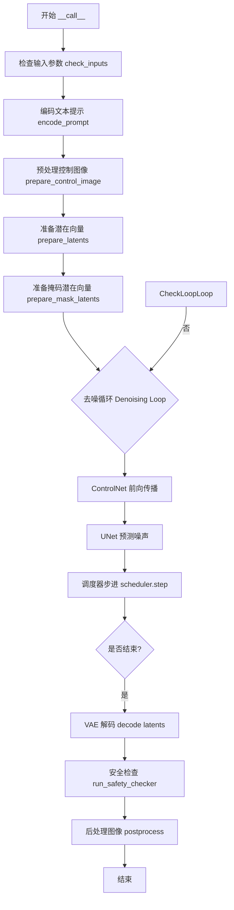

## 类结构

```
DiffusionPipeline (基类)
├── StableDiffusionMixin
├── TextualInversionLoaderMixin
├── StableDiffusionLoraLoaderMixin
├── IPAdapterMixin
├── FromSingleFileMixin
└── StableDiffusionControlNetInpaintPipeline (当前类)
```

## 全局变量及字段


### `logger`
    
用于记录日志信息的日志记录器

类型：`logging.Logger`
    


### `EXAMPLE_DOC_STRING`
    
包含代码使用示例的文档字符串

类型：`str`
    


### `XLA_AVAILABLE`
    
表示torch_xla是否可用的布尔标志

类型：`bool`
    


### `StableDiffusionControlNetInpaintPipeline.vae`
    
VAE编解码器，用于在潜在空间编码和解码图像

类型：`AutoencoderKL`
    


### `StableDiffusionControlNetInpaintPipeline.text_encoder`
    
CLIP文本编码器，用于将文本提示转换为嵌入向量

类型：`CLIPTextModel`
    


### `StableDiffusionControlNetInpaintPipeline.tokenizer`
    
CLIP文本分词器，用于将文本分割成token

类型：`CLIPTokenizer`
    


### `StableDiffusionControlNetInpaintPipeline.unet`
    
UNet条件去噪网络，用于在潜在空间中逐步去噪生成图像

类型：`UNet2DConditionModel`
    


### `StableDiffusionControlNetInpaintPipeline.controlnet`
    
ControlNet控制网络，用于提供额外的条件引导来控制图像生成

类型：`ControlNetModel | list[ControlNetModel] | MultiControlNetModel`
    


### `StableDiffusionControlNetInpaintPipeline.scheduler`
    
Karras扩散调度器，用于控制去噪过程中的噪声调度

类型：`KarrasDiffusionSchedulers`
    


### `StableDiffusionControlNetInpaintPipeline.safety_checker`
    
安全检查器，用于检测和过滤可能不安全的内容

类型：`StableDiffusionSafetyChecker`
    


### `StableDiffusionControlNetInpaintPipeline.feature_extractor`
    
CLIP图像特征提取器，用于从图像中提取特征供安全检查器使用

类型：`CLIPImageProcessor`
    


### `StableDiffusionControlNetInpaintPipeline.image_encoder`
    
CLIP视觉编码器，用于将图像编码为嵌入向量以支持IP-Adapter

类型：`CLIPVisionModelWithProjection`
    


### `StableDiffusionControlNetInpaintPipeline.image_processor`
    
VAE图像预处理器，用于预处理输入图像

类型：`VaeImageProcessor`
    


### `StableDiffusionControlNetInpaintPipeline.mask_processor`
    
掩码预处理器，用于预处理掩码图像

类型：`VaeImageProcessor`
    


### `StableDiffusionControlNetInpaintPipeline.control_image_processor`
    
控制图像预处理器，用于预处理ControlNet的输入图像

类型：`VaeImageProcessor`
    


### `StableDiffusionControlNetInpaintPipeline.vae_scale_factor`
    
VAE缩放因子，用于计算潜在空间的尺寸

类型：`int`
    
    

## 全局函数及方法


### `retrieve_latents`

该函数是一个全局辅助函数，位于 Stable Diffusion 相关 Pipeline 的实现文件中。它的核心作用是从 VAE（变分自编码器）的编码结果中安全地提取潜在的表示向量（latents）。它封装了对 VAE 输出格式的判断逻辑，支持随机采样（sample）和确定性取模（argmax/mean）两种模式，以及直接返回预计算 latents 的情况，从而解耦了 Pipeline 对具体 VAE 输出结构的依赖。

参数：

-  `encoder_output`：`Any`，VAE 编码器的输出对象。在 Diffusers 库中，通常为包含 `latent_dist`（潜在分布）或 `latents`（潜在张量）属性的对象。*（注：代码中类型注解为 `torch.Tensor`，但实现逻辑表明它是一个具有属性的对象实体，而非单纯的张量，此处存在类型注解不准确的技术债务。）*
-  `generator`：`torch.Generator | None`，用于控制随机数生成的生成器，以确保结果可复现。默认为 `None`。
-  `sample_mode`：`str`，采样模式。必须是 `"sample"`（从分布中随机采样）或 `"argmax"`（取分布的众数/均值）。默认为 `"sample"`。

返回值：`torch.Tensor`，提取出的潜在变量张量，通常用于后续 UNet 的去噪过程。

#### 流程图

```mermaid
flowchart TD
    A([Start retrieve_latents]) --> B{Has 'latent_dist' attribute?}
    B -- Yes --> C{sample_mode == 'sample'?}
    C -- Yes --> D[Return: encoder_output.latent_dist.sample<br/>(generator)]
    C -- No --> E{sample_mode == 'argmax'?}
    E -- Yes --> F[Return: encoder_output.latent_dist.mode<br/>()]
    E -- No --> G{Has 'latents' attribute?}
    B -- No --> G
    G -- Yes --> H[Return: encoder_output.latents]
    G -- No --> I[Raise AttributeError:<br/>'Could not access latents...']
```

#### 带注释源码

```python
# Copied from diffusers.pipelines.stable_diffusion.pipeline_stable_diffusion_img2img.retrieve_latents
def retrieve_latents(
    encoder_output: torch.Tensor, generator: torch.Generator | None = None, sample_mode: str = "sample"
):
    # 检查编码器输出是否包含 latent_dist 属性（通常对应 VAE 的概率分布输出）
    if hasattr(encoder_output, "latent_dist") and sample_mode == "sample":
        # 如果模式为 'sample'，则从潜在分布中随机采样一个潜在向量
        # 这里的 generator 用于控制采样的随机性
        return encoder_output.latent_dist.sample(generator)
    # 检查编码器输出是否包含 latent_dist 且模式为 'argmax'
    elif hasattr(encoder_output, "latent_dist") and sample_mode == "argmax":
        # 如果模式为 'argmax'，则取分布的众数（mode），即确定性的均值或中位数
        return encoder_output.latent_dist.mode()
    # 备选方案：检查编码器输出是否直接包含 latents 属性（确定性输出）
    elif hasattr(encoder_output, "latents"):
        return encoder_output.latents
    # 如果无法识别编码器输出的格式，抛出异常
    else:
        raise AttributeError("Could not access latents of provided encoder_output")
```

#### 关键组件信息

*   **VAE (Variational Autoencoder)**: 虽然不是本函数内部的组件，但它是本函数的输入源。Diffusers 中的 `AutoencoderKL` 使用此函数来标准化从图像到潜在空间的转换。
*   **Latent Distribution**: VAE 输出的一种概率分布表示（DiagonalGaussianDistribution），允许进行随机采样，这与标准 AE（自编码器）不同。

#### 潜在的技术债务或优化空间

1.  **类型注解错误**：代码中 `encoder_output` 的类型注解为 `torch.Tensor`，但该函数的实现逻辑大量使用了 `hasattr` 检查属性（如 `.latent_dist`, `.latents`）。普通的 `torch.Tensor` 对象并不具备这些属性。这表明传入的更可能是一个自定义的 `EncoderOutput` 命名元组或类似对象。准确的类型注解应类似于 `Union[DiagonalGaussianDistribution, torch.Tensor]` 或自定义的 `Output` 类，这会导致类型检查器（如 mypy）无法有效工作。
2.  **字符串硬编码**：`"sample"` 和 `"argmax"` 作为魔法字符串在代码中硬编码。如果需要扩展更多的采样策略（如 `mean`），需要修改函数签名或增加判断逻辑。


### `StableDiffusionControlNetInpaintPipeline.__init__`

该方法是 `StableDiffusionControlNetInpaintPipeline` 类的构造函数，负责初始化图像修复管道所需的所有组件，包括 VAE、文本编码器、UNet、ControlNet、调度器、安全检查器等，并配置图像处理器和注册模块。

参数：

- `vae`：`AutoencoderKL`，用于编码和解码图像与潜在表示的变分自编码器模型
- `text_encoder`：`CLIPTextModel`，冻结的文本编码器 (clip-vit-large-patch14)
- `tokenizer`：`CLIPTokenizer`，用于对文本进行分词的 CLIP 分词器
- `unet`：`UNet2DConditionModel`，用于对编码后的图像潜在表示进行去噪的 UNet 模型
- `controlnet`：`ControlNetModel | list[ControlNetModel] | tuple[ControlNetModel] | MultiControlNetModel`，在去噪过程中为 `unet` 提供额外条件控制的 ControlNet 模型
- `scheduler`：`KarrasDiffusionSchedulers`，与 `unet` 一起用于对编码后的图像潜在表示进行去噪的调度器
- `safety_checker`：`StableDiffusionSafetyChecker`，用于估计生成图像是否被认为具有攻击性或有害的分类模块
- `feature_extractor`：`CLIPImageProcessor`，用于从生成图像中提取特征的图像处理器
- `image_encoder`：`CLIPVisionModelWithProjection`（可选），用于 IP Adapter 的图像编码器
- `requires_safety_checker`：`bool`（默认为 True），指定是否需要安全检查器

返回值：`None`，构造函数不返回值

#### 流程图

```mermaid
flowchart TD
    A[开始 __init__] --> B[调用 super().__init__]
    B --> C{检查 safety_checker 是否为 None<br/>且 requires_safety_checker 为 True?}
    C -->|是| D[发出安全警告]
    C -->|否| E{检查 safety_checker 不为 None<br/>但 feature_extractor 为 None?}
    D --> E
    E -->|是| F[抛出 ValueError 异常]
    E -->|否| G{检查 controlnet 是否为 list 或 tuple?}
    F --> H[结束]
    G -->|是| I[将 controlnet 转换为 MultiControlNetModel]
    G -->|否| J[跳过转换]
    I --> K[调用 self.register_modules<br/>注册所有模块]
    J --> K
    K --> L[计算 vae_scale_factor<br/>2 ** (len(vae.config.block_out_channels) - 1)]
    L --> M[创建 VaeImageProcessor<br/>用于主图像处理]
    M --> N[创建 VaeImageProcessor<br/>用于掩码处理<br/>do_binarize=True]
    N --> O[创建 VaeImageProcessor<br/>用于控制图像处理<br/>do_convert_rgb=True]
    O --> P[调用 self.register_to_config<br/>注册 requires_safety_checker]
    P --> Q[结束 __init__]
```

#### 带注释源码

```python
def __init__(
    self,
    vae: AutoencoderKL,
    text_encoder: CLIPTextModel,
    tokenizer: CLIPTokenizer,
    unet: UNet2DConditionModel,
    controlnet: ControlNetModel | list[ControlNetModel] | tuple[ControlNetModel] | MultiControlNetModel,
    scheduler: KarrasDiffusionSchedulers,
    safety_checker: StableDiffusionSafetyChecker,
    feature_extractor: CLIPImageProcessor,
    image_encoder: CLIPVisionModelWithProjection = None,
    requires_safety_checker: bool = True,
):
    # 调用父类 DiffusionPipeline 的初始化方法
    super().__init__()

    # 如果 safety_checker 为 None 但 requires_safety_checker 为 True，发出警告
    if safety_checker is None and requires_safety_checker:
        logger.warning(
            f"You have disabled the safety checker for {self.__class__} by passing `safety_checker=None`. Ensure"
            " that you abide to the conditions of the Stable Diffusion license and do not expose unfiltered"
            " results in services or applications open to the public. Both the diffusers team and Hugging Face"
            " strongly recommend to keep the safety filter enabled in all public facing circumstances, disabling"
            " it only for use-cases that involve analyzing network behavior or auditing its results. For more"
            " information, please have a look at https://github.com/huggingface/diffusers/pull/254 ."
        )

    # 如果 safety_checker 不为 None 但 feature_extractor 为 None，抛出错误
    if safety_checker is not None and feature_extractor is None:
        raise ValueError(
            "Make sure to define a feature extractor when loading {self.__class__} if you want to use the safety"
            " checker. If you do not want to use the safety checker, you can pass `'safety_checker=None'` instead."
        )

    # 如果 controlnet 是列表或元组，转换为 MultiControlNetModel
    if isinstance(controlnet, (list, tuple)):
        controlnet = MultiControlNetModel(controlnet)

    # 注册所有模块到管道中
    self.register_modules(
        vae=vae,
        text_encoder=text_encoder,
        tokenizer=tokenizer,
        unet=unet,
        controlnet=controlnet,
        scheduler=scheduler,
        safety_checker=safety_checker,
        feature_extractor=feature_extractor,
        image_encoder=image_encoder,
    )

    # 计算 VAE 缩放因子，基于 VAE 块输出通道数
    # 默认为 2 ** (len(block_out_channels) - 1)，通常为 8
    self.vae_scale_factor = 2 ** (len(self.vae.config.block_out_channels) - 1) if getattr(self, "vae", None) else 8

    # 创建主图像处理器，用于 VAE 编解码后的图像后处理
    self.image_processor = VaeImageProcessor(vae_scale_factor=self.vae_scale_factor)

    # 创建掩码处理器，专门处理修复任务的掩码
    # do_binarize=True 表示进行二值化处理
    # do_convert_grayscale=True 表示转换为灰度图
    self.mask_processor = VaeImageProcessor(
        vae_scale_factor=self.vae_scale_factor, do_normalize=False, do_binarize=True, do_convert_grayscale=True
    )

    # 创建控制图像处理器，用于处理 ControlNet 的输入条件图像
    # do_convert_rgb=True 表示转换为 RGB 格式
    self.control_image_processor = VaeImageProcessor(
        vae_scale_factor=self.vae_scale_factor, do_convert_rgb=True, do_normalize=False
    )

    # 将 requires_safety_checker 注册到配置中
    self.register_to_config(requires_safety_checker=requires_safety_checker)
```


### `StableDiffusionControlNetInpaintPipeline._encode_prompt`

该方法是一个已被弃用的提示词编码方法，用于将文本提示词转换为文本编码器的隐藏状态。它内部调用了新的 `encode_prompt` 方法，为了保持向后兼容性，将负面提示词嵌入和正面提示词嵌入进行了拼接返回。

参数：

- `prompt`：`str | list[str] | None`，要编码的提示词
- `device`：`torch.device`，torch 设备
- `num_images_per_prompt`：`int`，每个提示词生成的图像数量
- `do_classifier_free_guidance`：`bool`，是否使用无分类器自由引导
- `negative_prompt`：`str | list[str] | None`，不包含在图像生成中的提示词
- `prompt_embeds`：`torch.Tensor | None`，预生成的文本嵌入
- `negative_prompt_embeds`：`torch.Tensor | None`，预生成的负面文本嵌入
- `lora_scale`：`float | None`，LoRA 缩放因子
- `**kwargs`：其他关键字参数

返回值：`torch.Tensor`，拼接后的提示词嵌入（负面嵌入在前，正面嵌入在后）

#### 流程图

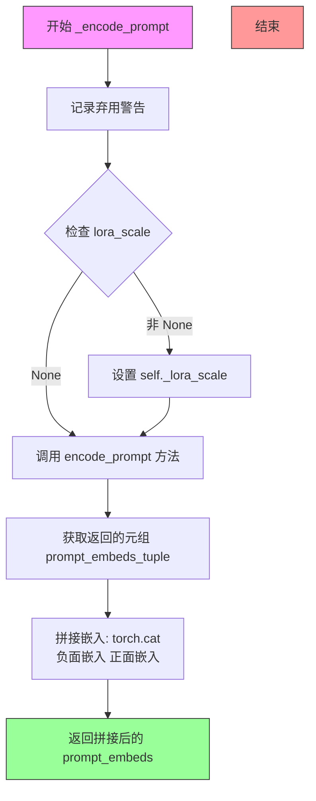

#### 带注释源码

```python
# Copied from diffusers.pipelines.stable_diffusion.pipeline_stable_diffusion.StableDiffusionPipeline._encode_prompt
def _encode_prompt(
    self,
    prompt,                          # str | list[str] | None: 输入的文本提示词
    device,                          # torch.device: torch 设备对象
    num_images_per_prompt,           # int: 每个提示词要生成的图像数量
    do_classifier_free_guidance,     # bool: 是否使用 classifier-free guidance
    negative_prompt=None,            # str | list[str] | None: 负面提示词
    prompt_embeds: torch.Tensor | None = None,    # 预计算的提示词嵌入
    negative_prompt_embeds: torch.Tensor | None = None,  # 预计算的负面提示词嵌入
    lora_scale: float | None = None,  # LoRA 缩放因子
    **kwargs,                       # 其他可选参数
):
    # 记录弃用警告，提示用户使用 encode_prompt() 方法代替
    deprecation_message = "`_encode_prompt()` is deprecated and it will be removed in a future version. Use `encode_prompt()` instead. Also, be aware that the output format changed from a concatenated tensor to a tuple."
    deprecate("_encode_prompt()", "1.0.0", deprecation_message, standard_warn=False)

    # 调用新的 encode_prompt 方法获取元组格式的嵌入
    prompt_embeds_tuple = self.encode_prompt(
        prompt=prompt,
        device=device,
        num_images_per_prompt=num_images_per_prompt,
        do_classifier_free_guidance=do_classifier_free_guidance,
        negative_prompt=negative_prompt,
        prompt_embeds=prompt_embeds,
        negative_prompt_embeds=negative_prompt_embeds,
        lora_scale=lora_scale,
        **kwargs,
    )

    # 为了向后兼容性，拼接负面和正面提示词嵌入
    # 负面嵌入在前，正面嵌入在后（与旧版本行为一致）
    prompt_embeds = torch.cat([prompt_embeds_tuple[1], prompt_embeds_tuple[0]])

    return prompt_embeds
```


### `StableDiffusionControlNetInpaintPipeline.encode_prompt`

该方法将文本提示（prompt）编码为文本编码器的隐藏状态（embedding），用于指导图像生成。它处理正向提示和负向提示，支持LoRA缩放、CLIP跳层（clip_skip）和无分类器自由引导（classifier-free guidance），并根据生成图像数量复制embeddings。

参数：

- `prompt`：`str | list[str] | None`，要编码的文本提示
- `device`：`torch.device`，PyTorch设备
- `num_images_per_prompt`：`int`，每个提示生成的图像数量
- `do_classifier_free_guidance`：`bool`，是否使用无分类器自由引导
- `negative_prompt`：`str | list[str] | None`，不包含在图像生成中的提示
- `prompt_embeds`：`torch.Tensor | None`，预生成的文本embeddings
- `negative_prompt_embeds`：`torch.Tensor | None`，预生成的负向文本embeddings
- `lora_scale`：`float | None`，应用于文本编码器所有LoRA层的LoRA缩放因子
- `clip_skip`：`int | None`，计算prompt embeddings时从CLIP跳过的层数

返回值：`tuple[torch.Tensor, torch.Tensor]`，返回编码后的`prompt_embeds`和`negative_prompt_embeds`

#### 流程图

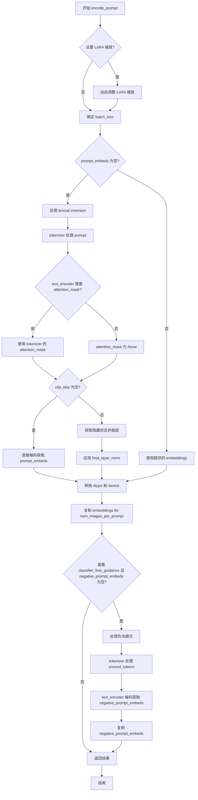

#### 带注释源码

```python
def encode_prompt(
    self,
    prompt,
    device,
    num_images_per_prompt,
    do_classifier_free_guidance,
    negative_prompt=None,
    prompt_embeds: torch.Tensor | None = None,
    negative_prompt_embeds: torch.Tensor | None = None,
    lora_scale: float | None = None,
    clip_skip: int | None = None,
):
    r"""
    Encodes the prompt into text encoder hidden states.

    Args:
        prompt (`str` or `list[str]`, *optional*):
            prompt to be encoded
        device: (`torch.device`):
            torch device
        num_images_per_prompt (`int`):
            number of images that should be generated per prompt
        do_classifier_free_guidance (`bool`):
            whether to use classifier free guidance or not
        negative_prompt (`str` or `list[str]`, *optional*):
            The prompt or prompts not to guide the image generation. If not defined, one has to pass
            `negative_prompt_embeds` instead. Ignored when not using guidance (i.e., ignored if `guidance_scale` is
            less than `1`).
        prompt_embeds (`torch.Tensor`, *optional*):
            Pre-generated text embeddings. Can be used to easily tweak text inputs, *e.g.* prompt weighting. If not
            provided, text embeddings will be generated from `prompt` input argument.
        negative_prompt_embeds (`torch.Tensor`, *optional*):
            Pre-generated negative text embeddings. Can be used to easily tweak text inputs, *e.g.* prompt
            weighting. If not provided, negative_prompt_embeds will be generated from `negative_prompt` input
            argument.
        lora_scale (`float`, *optional*):
            A LoRA scale that will be applied to all LoRA layers of the text encoder if LoRA layers are loaded.
        clip_skip (`int`, *optional*):
            Number of layers to be skipped from CLIP while computing the prompt embeddings. A value of 1 means that
            the output of the pre-final layer will be used for computing the prompt embeddings.
    """
    # 设置 lora scale 以便 text encoder 的 LoRA 函数可以正确访问
    if lora_scale is not None and isinstance(self, StableDiffusionLoraLoaderMixin):
        self._lora_scale = lora_scale

        # 动态调整 LoRA 缩放
        if not USE_PEFT_BACKEND:
            adjust_lora_scale_text_encoder(self.text_encoder, lora_scale)
        else:
            scale_lora_layers(self.text_encoder, lora_scale)

    # 根据 prompt 类型确定 batch_size
    if prompt is not None and isinstance(prompt, str):
        batch_size = 1
    elif prompt is not None and isinstance(prompt, list):
        batch_size = len(prompt)
    else:
        batch_size = prompt_embeds.shape[0]

    # 如果没有提供 prompt_embeds，则从 prompt 生成
    if prompt_embeds is None:
        # textual inversion: 如果需要，处理多向量 tokens
        if isinstance(self, TextualInversionLoaderMixin):
            prompt = self.maybe_convert_prompt(prompt, self.tokenizer)

        # 使用 tokenizer 将文本转为 token IDs
        text_inputs = self.tokenizer(
            prompt,
            padding="max_length",
            max_length=self.tokenizer.model_max_length,
            truncation=True,
            return_tensors="pt",
        )
        text_input_ids = text_inputs.input_ids
        # 获取未截断的 IDs 用于检测截断警告
        untruncated_ids = self.tokenizer(prompt, padding="longest", return_tensors="pt").input_ids

        # 检测并警告截断
        if untruncated_ids.shape[-1] >= text_input_ids.shape[-1] and not torch.equal(
            text_input_ids, untruncated_ids
        ):
            removed_text = self.tokenizer.batch_decode(
                untruncated_ids[:, self.tokenizer.model_max_length - 1 : -1]
            )
            logger.warning(
                "The following part of your input was truncated because CLIP can only handle sequences up to"
                f" {self.tokenizer.model_max_length} tokens: {removed_text}"
            )

        # 处理 attention_mask
        if hasattr(self.text_encoder.config, "use_attention_mask") and self.text_encoder.config.use_attention_mask:
            attention_mask = text_inputs.attention_mask.to(device)
        else:
            attention_mask = None

        # 根据 clip_skip 选择编码方式
        if clip_skip is None:
            # 直接获取最后一层隐藏状态
            prompt_embeds = self.text_encoder(text_input_ids.to(device), attention_mask=attention_mask)
            prompt_embeds = prompt_embeds[0]
        else:
            # 获取所有隐藏状态，选择跳层后的结果
            prompt_embeds = self.text_encoder(
                text_input_ids.to(device), attention_mask=attention_mask, output_hidden_states=True
            )
            # 访问 hidden_states 元组，选择期望的层
            prompt_embeds = prompt_embeds[-1][-(clip_skip + 1)]
            # 应用 final_layer_norm 以保持表示正确
            prompt_embeds = self.text_encoder.text_model.final_layer_norm(prompt_embeds)

    # 确定 dtype（使用 text_encoder、unet 或 prompt_embeds 的 dtype）
    if self.text_encoder is not None:
        prompt_embeds_dtype = self.text_encoder.dtype
    elif self.unet is not None:
        prompt_embeds_dtype = self.unet.dtype
    else:
        prompt_embeds_dtype = prompt_embeds.dtype

    # 转换 prompt_embeds 到正确的 dtype 和 device
    prompt_embeds = prompt_embeds.to(dtype=prompt_embeds_dtype, device=device)

    # 为每个 prompt 复制 embeddings 以支持生成多张图像
    bs_embed, seq_len, _ = prompt_embeds.shape
    # 使用 mps 友好的方式复制
    prompt_embeds = prompt_embeds.repeat(1, num_images_per_prompt, 1)
    prompt_embeds = prompt_embeds.view(bs_embed * num_images_per_prompt, seq_len, -1)

    # 获取无分类器自由引导的 unconditional embeddings
    if do_classifier_free_guidance and negative_prompt_embeds is None:
        uncond_tokens: list[str]
        if negative_prompt is None:
            uncond_tokens = [""] * batch_size
        elif prompt is not None and type(prompt) is not type(negative_prompt):
            raise TypeError(
                f"`negative_prompt` should be the same type to `prompt`, but got {type(negative_prompt)} !="
                f" {type(prompt)}."
            )
        elif isinstance(negative_prompt, str):
            uncond_tokens = [negative_prompt]
        elif batch_size != len(negative_prompt):
            raise ValueError(
                f"`negative_prompt`: {negative_prompt} has batch size {len(negative_prompt)}, but `prompt`:"
                f" {prompt} has batch size {batch_size}. Please make sure that passed `negative_prompt` matches"
                " the batch size of `prompt`."
            )
        else:
            uncond_tokens = negative_prompt

        # textual inversion: 如果需要，处理多向量 tokens
        if isinstance(self, TextualInversionLoaderMixin):
            uncond_tokens = self.maybe_convert_prompt(uncond_tokens, self.tokenizer)

        max_length = prompt_embeds.shape[1]
        uncond_input = self.tokenizer(
            uncond_tokens,
            padding="max_length",
            max_length=max_length,
            truncation=True,
            return_tensors="pt",
        )

        if hasattr(self.text_encoder.config, "use_attention_mask") and self.text_encoder.config.use_attention_mask:
            attention_mask = uncond_input.attention_mask.to(device)
        else:
            attention_mask = None

        negative_prompt_embeds = self.text_encoder(
            uncond_input.input_ids.to(device),
            attention_mask=attention_mask,
        )
        negative_prompt_embeds = negative_prompt_embeds[0]

    # 如果使用 classifier-free guidance，复制 unconditional embeddings
    if do_classifier_free_guidance:
        seq_len = negative_prompt_embeds.shape[1]

        negative_prompt_embeds = negative_prompt_embeds.to(dtype=prompt_embeds_dtype, device=device)

        negative_prompt_embeds = negative_prompt_embeds.repeat(1, num_images_per_prompt, 1)
        negative_prompt_embeds = negative_prompt_embeds.view(batch_size * num_images_per_prompt, seq_len, -1)

    # 如果使用了 LoRA，通过 unscale 恢复原始缩放
    if self.text_encoder is not None:
        if isinstance(self, StableDiffusionLoraLoaderMixin) and USE_PEFT_BACKEND:
            # 通过 unscale LoRA 层恢复原始缩放
            unscale_lora_layers(self.text_encoder, lora_scale)

    return prompt_embeds, negative_prompt_embeds
```


### `StableDiffusionControlNetInpaintPipeline.encode_image`

该方法用于将输入图像编码为图像嵌入（image embeddings）或隐藏状态，供 IP-Adapter 使用。它支持两种输出模式：当 `output_hidden_states=True` 时返回隐藏状态，否则返回图像嵌入。同时会生成对应的无条件（unconditional）嵌入，用于 Classifier-Free Guidance。

参数：

- `image`：输入图像，可以是 `torch.Tensor`、`PIL.Image.Image`、numpy 数组或列表
- `device`：`torch.device`，指定计算设备
- `num_images_per_prompt`：`int`，每个 prompt 生成的图像数量
- `output_hidden_states`：`bool | None`，是否输出隐藏状态（用于 IP-Adapter）

返回值：`tuple[torch.Tensor, torch.Tensor]`，返回 (条件嵌入, 无条件嵌入) 的元组。当 `output_hidden_states=True` 时为隐藏状态，否则为图像嵌入。

#### 流程图

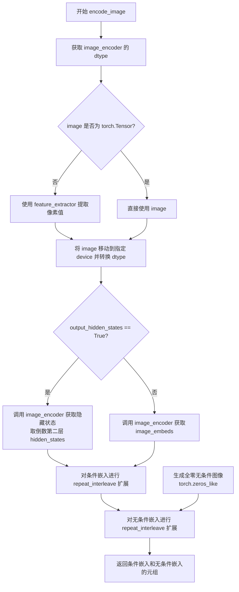

#### 带注释源码

```python
def encode_image(self, image, device, num_images_per_prompt, output_hidden_states=None):
    # 获取 image_encoder 模型参数的数据类型，用于后续计算
    dtype = next(self.image_encoder.parameters()).dtype

    # 如果输入不是 PyTorch Tensor，则使用 feature_extractor 转换为张量
    if not isinstance(image, torch.Tensor):
        image = self.feature_extractor(image, return_tensors="pt").pixel_values

    # 将图像移动到指定设备并转换数据类型
    image = image.to(device=device, dtype=dtype)

    # 根据 output_hidden_states 参数决定输出格式
    if output_hidden_states:
        # 模式1：输出隐藏状态（用于某些 IP-Adapter）
        # 对输入图像进行编码，获取隐藏状态
        image_enc_hidden_states = self.image_encoder(image, output_hidden_states=True).hidden_states[-2]
        # 扩展条件嵌入以匹配 num_images_per_prompt
        image_enc_hidden_states = image_enc_hidden_states.repeat_interleave(num_images_per_prompt, dim=0)
        
        # 对全零图像（无内容）进行编码，生成无条件嵌入
        uncond_image_enc_hidden_states = self.image_encoder(
            torch.zeros_like(image), output_hidden_states=True
        ).hidden_states[-2]
        # 同样扩展无条件嵌入
        uncond_image_enc_hidden_states = uncond_image_enc_hidden_states.repeat_interleave(
            num_images_per_prompt, dim=0
        )
        # 返回条件隐藏状态和无条件隐藏状态的元组
        return image_enc_hidden_states, uncond_image_enc_hidden_states
    else:
        # 模式2：输出图像嵌入（默认模式）
        # 直接获取图像嵌入向量
        image_embeds = self.image_encoder(image).image_embeds
        # 扩展条件嵌入
        image_embeds = image_embeds.repeat_interleave(num_images_per_prompt, dim=0)
        # 生成形状相同的全零无条件嵌入（用于 CFG）
        uncond_image_embeds = torch.zeros_like(image_embeds)

        # 返回条件嵌入和无条件嵌入的元组
        return image_embeds, uncond_image_embeds
```


### `StableDiffusionControlNetInpaintPipeline.prepare_ip_adapter_image_embeds`

该方法用于准备 IP-Adapter 的图像嵌入（image embeds），支持两种输入模式：直接传入 IP-Adapter 图像或预计算的图像嵌入。它会根据是否启用 Classifier-Free Guidance（CFG）分别处理正向和负向图像嵌入，并将嵌入重复扩展以匹配每个 prompt 生成的图像数量。

参数：

- `self`：`StableDiffusionControlNetInpaintPipeline` 实例本身
- `ip_adapter_image`：`PipelineImageInput | None`，要用于 IP-Adapter 的输入图像，支持 PIL.Image、torch.Tensor、numpy.ndarray 或它们的列表
- `ip_adapter_image_embeds`：`list[torch.Tensor] | None`，预计算的图像嵌入列表，每个元素应为形状 `(batch_size, num_images, emb_dim)` 的张量；当 `do_classifier_free_guidance` 为 True 时应包含负向嵌入
- `device`：`torch.device`，目标计算设备
- `num_images_per_prompt`：`int`，每个 prompt 生成的图像数量
- `do_classifier_free_guidance`：`bool`，是否启用 Classifier-Free Guidance

返回值：`list[torch.Tensor]`，处理后的 IP-Adapter 图像嵌入列表，每个元素是拼接了负向（若启用 CFG）和正向嵌入的张量，形状为 `(num_images_per_prompt, emb_dim)` 或 `(2 * num_images_per_prompt, emb_dim)`

#### 流程图

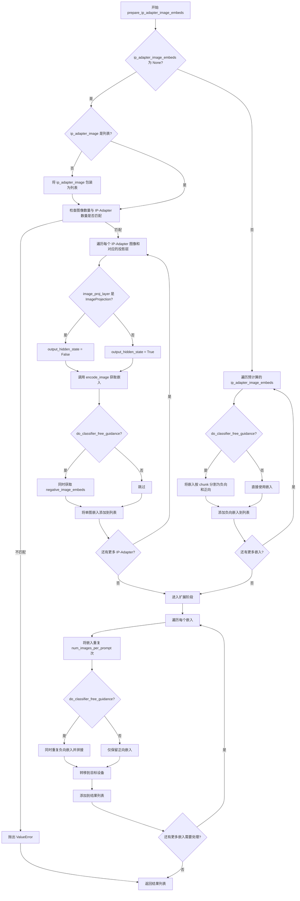

#### 带注释源码

```python
def prepare_ip_adapter_image_embeds(
    self, ip_adapter_image, ip_adapter_image_embeds, device, num_images_per_prompt, do_classifier_free_guidance
):
    """
    准备 IP-Adapter 的图像嵌入。
    
    该方法支持两种输入模式：
    1. 直接传入 ip_adapter_image（原始图像），需要通过 encode_image 编码
    2. 传入预计算的 ip_adapter_image_embeds，直接进行后处理
    
    Args:
        ip_adapter_image: IP-Adapter 图像输入
        ip_adapter_image_embeds: 预计算的图像嵌入
        device: 目标设备
        num_images_per_prompt: 每个 prompt 生成的图像数量
        do_classifier_free_guidance: 是否启用 CFG
    """
    # 初始化正向嵌入列表
    image_embeds = []
    
    # 如果启用 CFG，初始化负向嵌入列表
    if do_classifier_free_guidance:
        negative_image_embeds = []
    
    # 模式1：需要从图像编码生成嵌入
    if ip_adapter_image_embeds is None:
        # 确保图像是列表形式（支持单图或多图输入）
        if not isinstance(ip_adapter_image, list):
            ip_adapter_image = [ip_adapter_image]

        # 验证图像数量与 IP-Adapter 数量匹配
        if len(ip_adapter_image) != len(self.unet.encoder_hid_proj.image_projection_layers):
            raise ValueError(
                f"`ip_adapter_image` must have same length as the number of IP Adapters. Got {len(ip_adapter_image)} images and {len(self.unet.encoder_hid_proj.image_projection_layers)} IP Adapters."
            )

        # 遍历每个 IP-Adapter 图像和对应的投影层
        for single_ip_adapter_image, image_proj_layer in zip(
            ip_adapter_image, self.unet.encoder_hid_proj.image_projection_layers
        ):
            # 判断是否需要输出隐藏状态：ImageProjection 类型不需要，其他类型需要
            output_hidden_state = not isinstance(image_proj_layer, ImageProjection)
            
            # 编码图像获取嵌入（batch_size=1）
            single_image_embeds, single_negative_image_embeds = self.encode_image(
                single_ip_adapter_image, device, 1, output_hidden_state
            )

            # 添加批次维度 [1, batch, emb] -> [1, 1, emb]
            image_embeds.append(single_image_embeds[None, :])
            
            # 如果启用 CFG，同时处理负向嵌入
            if do_classifier_free_guidance:
                negative_image_embeds.append(single_negative_image_embeds[None, :])
    else:
        # 模式2：使用预计算的嵌入
        for single_image_embeds in ip_adapter_image_embeds:
            if do_classifier_free_guidance:
                # 预计算嵌入包含负向和正向，需要拆分
                # 假设格式：[negative_embeds, positive_embeds] 沿 dim=0 拼接
                single_negative_image_embeds, single_image_embeds = single_image_embeds.chunk(2)
                negative_image_embeds.append(single_negative_image_embeds)
            
            image_embeds.append(single_image_embeds)

    # 后处理：将嵌入扩展到 num_images_per_prompt 数量
    ip_adapter_image_embeds = []
    for i, single_image_embeds in enumerate(image_embeds):
        # 重复正向嵌入 num_images_per_prompt 次
        # 例如：[1, emb] -> [num_images_per_prompt, emb]
        single_image_embeds = torch.cat([single_image_embeds] * num_images_per_prompt, dim=0)
        
        if do_classifier_free_guidance:
            # 同样重复负向嵌入，然后与正向嵌入拼接
            # 结果：[2*num_images_per_prompt, emb]（前 num_images_per_prompt 是负向）
            single_negative_image_embeds = torch.cat([negative_image_embeds[i]] * num_images_per_prompt, dim=0)
            single_image_embeds = torch.cat([single_negative_image_embeds, single_image_embeds], dim=0)

        # 转移嵌入到目标设备
        single_image_embeds = single_image_embeds.to(device=device)
        
        # 添加到最终结果列表
        ip_adapter_image_embeds.append(single_image_embeds)

    return ip_adapter_image_embeds
```


### `StableDiffusionControlNetInpaintPipeline.run_safety_checker`

该方法用于对生成的图像进行安全检查，检测图像中是否包含不当内容（NSFW），通过图像处理器预处理图像并调用安全检查器进行分类判断。

参数：

- `image`：`torch.Tensor | PIL.Image | np.ndarray`，需要检查的图像输入
- `device`：`torch.device`，用于计算的目标设备
- `dtype`：`torch.dtype`，图像数据的目标数据类型

返回值：`tuple[torch.Tensor | PIL.Image | np.ndarray, torch.Tensor | None]`，返回处理后的图像和NSFW检测结果元组

#### 流程图

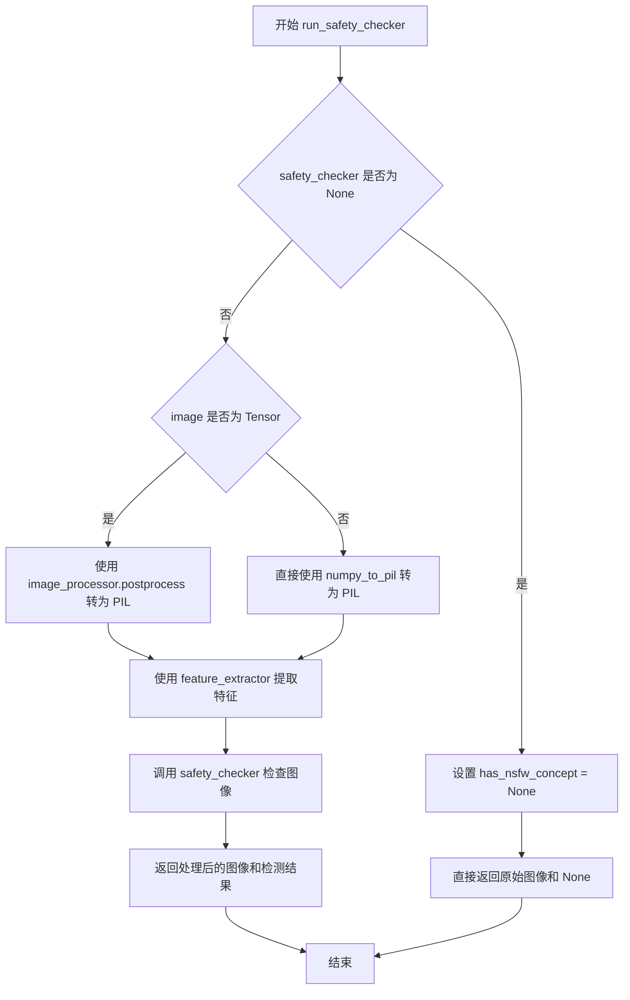

#### 带注释源码

```python
def run_safety_checker(self, image, device, dtype):
    """
    运行安全检查器来过滤不当内容
    
    Args:
        image: 输入图像，可以是 torch.Tensor, PIL.Image 或 np.ndarray
        device: torch 设备对象
        dtype: 目标数据类型
    
    Returns:
        tuple: (处理后的图像, NSFW检测结果)
    """
    # 如果没有配置安全检查器，直接返回None表示无NSFW概念
    if self.safety_checker is None:
        has_nsfw_concept = None
    else:
        # 根据输入类型进行不同的预处理
        if torch.is_tensor(image):
            # 将tensor图像转换为PIL格式供feature_extractor使用
            feature_extractor_input = self.image_processor.postprocess(image, output_type="pil")
        else:
            # numpy数组直接转换为PIL图像
            feature_extractor_input = self.image_processor.numpy_to_pil(image)
        
        # 使用特征提取器处理图像并转换为tensor
        safety_checker_input = self.feature_extractor(feature_extractor_input, return_tensors="pt").to(device)
        
        # 调用安全检查器进行NSFW检测
        # 传入图像和经过类型转换的clip输入
        image, has_nsfw_concept = self.safety_checker(
            images=image, 
            clip_input=safety_checker_input.pixel_values.to(dtype)
        )
    
    # 返回处理后的图像和NSFW检测标志
    return image, has_nsfw_concept
```


### `StableDiffusionControlNetInpaintPipeline.decode_latents`

该方法用于将VAE的潜在表示（latents）解码为实际的图像数据。它接收潜在表示作为输入，通过VAE解码器将其转换为图像张量，进行归一化处理（将值从[-1,1]映射到[0,1]），最后转换为NumPy数组返回。

参数：

- `latents`：`torch.Tensor`，需要解码的潜在表示，通常是从扩散过程生成的噪声潜在向量

返回值：`np.ndarray`，解码后的图像，形状为 `(batch_size, height, width, channels)`，通道顺序为 HWC，值为 [0, 1] 范围内的浮点数

#### 流程图

```mermaid
flowchart TD
    A[开始: decode_latents] --> B[发出废弃警告]
    B --> C[latents = 1 / scaling_factor × latents]
    C --> D[调用 VAE.decode 解码潜在表示]
    D --> E[image = (image / 2 + 0.5).clamp(0, 1)]
    E --> F[转换为 CPU 张量]
    F --> G[维度重排: CHW → HWC]
    G --> H[转换为 float32 NumPy 数组]
    H --> I[返回图像数组]
```

#### 带注释源码

```python
# Copied from diffusers.pipelines.stable_diffusion.pipeline_stable_diffusion.StableDiffusionPipeline.decode_latents
def decode_latents(self, latents):
    # 发出方法废弃警告，提示用户使用 VaeImageProcessor.postprocess 代替
    deprecation_message = "The decode_latents method is deprecated and will be removed in 1.0.0. Please use VaeImageProcessor.postprocess(...) instead"
    deprecate("decode_latents", "1.0.0", deprecation_message, standard_warn=False)

    # 将潜在表示反缩放：latents 在 VAE 编码时乘以了 scaling_factor，解码时需要除以它
    latents = 1 / self.vae.config.scaling_factor * latents
    
    # 使用 VAE 解码器将潜在表示解码为图像
    # return_dict=False 返回元组，取第一个元素（图像张量）
    image = self.vae.decode(latents, return_dict=False)[0]
    
    # 归一化图像：将图像从 [-1, 1] 范围映射到 [0, 1] 范围
    # 这是因为训练时通常将图像归一化到 [-1, 1]
    image = (image / 2 + 0.5).clamp(0, 1)
    
    # 将图像移到 CPU 并转换为 float32 类型的 NumPy 数组
    # 选择 float32 是因为它不会引起显著的性能开销，同时与 bfloat16 兼容
    # 维度重排：将 (batch, channels, height, width) 转换为 (batch, height, width, channels)
    image = image.cpu().permute(0, 2, 3, 1).float().numpy()
    
    # 返回解码后的图像数组
    return image
```


### `StableDiffusionControlNetInpaintPipeline.prepare_extra_step_kwargs`

该方法用于准备调度器（scheduler）的额外参数。由于不同的扩散调度器具有不同的签名（例如只有DDIMScheduler支持eta参数），该方法通过检查调度器的step方法是否接受特定参数（eta和generator），动态构建需要传递给scheduler.step的额外参数字典，确保pipeline能够兼容多种调度器。

参数：

- `generator`：`torch.Generator | list[torch.Generator] | None`，可选的随机数生成器，用于确保生成过程的可重复性
- `eta`：`float`，DDIM论文中的η参数，仅被DDIMScheduler使用，其他调度器会忽略该参数，值应在[0, 1]范围内

返回值：`dict[str, Any]`，包含调度器step方法所需额外参数的字典，可能包含`eta`和/或`generator`键

#### 流程图

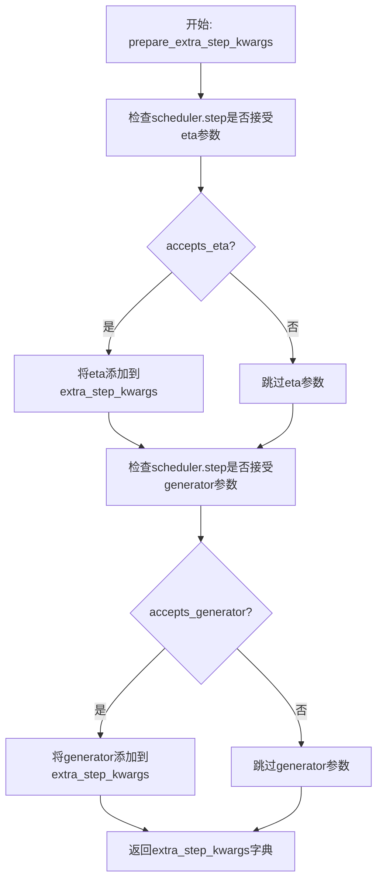

#### 带注释源码

```python
def prepare_extra_step_kwargs(self, generator, eta):
    # 准备调度器的额外参数，因为并非所有调度器都具有相同的函数签名
    # eta (η) 仅在 DDIMScheduler 中使用，其他调度器会忽略它
    # eta 对应 DDIM 论文 (https://huggingface.co/papers/2010.02502) 中的 η 参数
    # 取值范围应为 [0, 1]

    # 使用 inspect 模块检查 scheduler.step 方法的签名参数
    # 判断当前调度器是否支持 eta 参数
    accepts_eta = "eta" in set(inspect.signature(self.scheduler.step).parameters.keys())
    
    # 初始化空字典用于存储额外参数
    extra_step_kwargs = {}
    
    # 如果调度器接受 eta 参数，则将其添加到 extra_step_kwargs
    if accepts_eta:
        extra_step_kwargs["eta"] = eta

    # 检查调度器是否接受 generator 参数
    accepts_generator = "generator" in set(inspect.signature(self.scheduler.step).parameters.keys())
    
    # 如果调度器接受 generator 参数，则将其添加到 extra_step_kwargs
    if accepts_generator:
        extra_step_kwargs["generator"] = generator
    
    # 返回包含调度器所需额外参数的字典
    return extra_step_kwargs
```


### `StableDiffusionControlNetInpaintPipeline.get_timesteps`

根据推理步数和强度（strength）计算用于去噪过程的时间步（timesteps），用于图像修复（inpainting）pipeline中控制去噪的起止时间点。

参数：

- `num_inference_steps`：`int`，推理步数，即去噪过程的迭代总次数
- `strength`：`float`，强度值，范围 0 到 1，控制图像保真度和噪声添加程度
- `device`：`torch.device`，计算设备（CPU 或 CUDA）

返回值：`(tuple[timesteps, int])`，返回时间步张量和调整后的推理步数

#### 流程图

```mermaid
flowchart TD
    A[开始] --> B[计算 init_timestep<br/>min(num_inference_steps × strength, num_inference_steps)]
    --> C[计算起始索引 t_start<br/>max(num_inference_steps - init_timestep, 0)]
    --> D[从 scheduler.timesteps 切片获取时间步<br/>timesteps = scheduler.timesteps[t_start × order :]]
    --> E{scheduler 是否有<br/>set_begin_index 方法?}
    -->|是| F[调用 set_begin_index<br/>设置调度器起始索引]
    --> G[返回 timesteps 和 num_inference_steps - t_start]
    --> H[结束]
    |否| G
```

#### 带注释源码

```python
def get_timesteps(self, num_inference_steps, strength, device):
    # 根据强度计算初始时间步数，取推理步数和强度乘积的整数值的最小值
    # strength 越接近 1，init_timestep 越大，表示从更多的噪声开始去噪
    init_timestep = min(int(num_inference_steps * strength), num_inference_steps)

    # 计算起始索引，从完整的推理步数中减去初始时间步数
    # 这决定了从时间步序列的哪个位置开始
    t_start = max(num_inference_steps - init_timestep, 0)
    
    # 从调度器的时间步序列中提取从 t_start 开始的时间步
    # 乘以 scheduler.order 是因为某些调度器使用多步方法
    timesteps = self.scheduler.timesteps[t_start * self.scheduler.order :]
    
    # 如果调度器支持设置起始索引方法，则调用它来同步调度器的内部状态
    if hasattr(self.scheduler, "set_begin_index"):
        self.scheduler.set_begin_index(t_start * self.scheduler.order)

    # 返回提取的时间步和调整后的推理步数
    # 调整后的步数反映了实际将执行的去噪迭代次数
    return timesteps, num_inference_steps - t_start
```


### `StableDiffusionControlNetInpaintPipeline.check_inputs`

该方法用于验证和控制图像修复管道的输入参数合法性，确保所有必需参数都已正确提供，并检查参数之间的兼容性和约束条件。

参数：

- `prompt`：`str | list[str] | None`，用于引导图像生成的提示词
- `image`：`PipelineImageInput`，用作起点的输入图像
- `mask_image`：`PipelineImageInput`，用于遮罩的图像，白色像素被重绘，黑色像素保留
- `height`：`int | None`，生成图像的高度（像素），必须能被8整除
- `width`：`int | None`，生成图像的宽度（像素），必须能被8整除
- `callback_steps`：`int | None`，每多少步调用一次回调函数，必须为正整数
- `output_type`：`str | None`，生成图像的输出格式（如"pil"或"numpy"）
- `negative_prompt`：`str | list[str] | None`，不包含在图像生成中的提示词
- `prompt_embeds`：`torch.Tensor | None`，预生成的文本嵌入
- `negative_prompt_embeds`：`torch.Tensor | None`，预生成的负面文本嵌入
- `ip_adapter_image`：`PipelineImageInput | None`，IP适配器的图像输入
- `ip_adapter_image_embeds`：`list[torch.Tensor] | None`，IP适配器的预生成图像嵌入
- `controlnet_conditioning_scale`：`float | list[float]`，ControlNet输出乘数
- `control_guidance_start`：`float | list[float]`，ControlNet开始应用的步骤百分比
- `control_guidance_end`：`float | list[float]`，ControlNet停止应用的步骤百分比
- `callback_on_step_end_tensor_inputs`：`list[str] | None`，每步结束时回调的 tensor 输入列表
- `padding_mask_crop`：`int | None`，裁剪应用的边距大小

返回值：`None`，该方法不返回任何值，仅在验证失败时抛出 ValueError 或 TypeError 异常。

#### 流程图

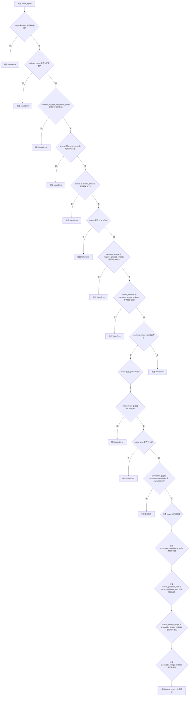

#### 带注释源码

```python
def check_inputs(
    self,
    prompt,                          # 文本提示词
    image,                           # 输入图像
    mask_image,                      # 掩码图像
    height,                          # 输出高度
    width,                           # 输出宽度
    callback_steps,                  # 回调步数
    output_type,                     # 输出类型
    negative_prompt=None,            # 负面提示词
    prompt_embeds=None,              # 提示词嵌入
    negative_prompt_embeds=None,     # 负面提示词嵌入
    ip_adapter_image=None,           # IP适配器图像
    ip_adapter_image_embeds=None,   # IP适配器图像嵌入
    controlnet_conditioning_scale=1.0,  # 控制网调节比例
    control_guidance_start=0.0,      # 控制引导开始
    control_guidance_end=1.0,        # 控制引导结束
    callback_on_step_end_tensor_inputs=None,  # 步骤结束回调的tensor输入
    padding_mask_crop=None,         # 填充掩码裁剪
):
    """
    验证和控制图像修复管道的输入参数合法性。
    
    检查内容：
    1. height 和 width 必须能被 8 整除
    2. callback_steps 必须为正整数
    3. callback_on_step_end_tensor_inputs 必须在允许列表中
    4. prompt 和 prompt_embeds 不能同时提供
    5. prompt 和 prompt_embeds 不能同时为空
    6. prompt 必须为 str 或 list 类型
    7. negative_prompt 和 negative_prompt_embeds 不能同时提供
    8. prompt_embeds 和 negative_prompt_embeds 形状必须相同
    9. padding_mask_crop 相关检查（需要 PIL 图像和pil输出类型）
    10. ControlNet 相关的 image 和 conditioning_scale 验证
    11. control_guidance_start 和 control_guidance_end 的长度和范围验证
    12. IP Adapter 相关参数的互斥性检查
    """
    
    # 检查高度和宽度是否可被8整除
    if height is not None and height % 8 != 0 or width is not None and width % 8 != 0:
        raise ValueError(f"`height` and `width` have to be divisible by 8 but are {height} and {width}.")

    # 检查 callback_steps 是否为正整数
    if callback_steps is not None and (not isinstance(callback_steps, int) or callback_steps <= 0):
        raise ValueError(
            f"`callback_steps` has to be a positive integer but is {callback_steps} of type"
            f" {type(callback_steps)}."
        )

    # 检查 callback_on_step_end_tensor_inputs 是否在允许的tensor输入列表中
    if callback_on_step_end_tensor_inputs is not None and not all(
        k in self._callback_tensor_inputs for k in callback_on_step_end_tensor_inputs
    ):
        raise ValueError(
            f"`callback_on_step_end_tensor_inputs` has to be in {self._callback_tensor_inputs}, but found {[k for k in callback_on_step_end_tensor_inputs if k not in self._callback_tensor_inputs]}"
        )

    # 检查 prompt 和 prompt_embeds 互斥
    if prompt is not None and prompt_embeds is not None:
        raise ValueError(
            f"Cannot forward both `prompt`: {prompt} and `prompt_embeds`: {prompt_embeds}. Please make sure to"
            " only forward one of the two."
        )
    # 检查至少提供一个
    elif prompt is None and prompt_embeds is None:
        raise ValueError(
            "Provide either `prompt` or `prompt_embeds`. Cannot leave both `prompt` and `prompt_embeds` undefined."
        )
    # 检查 prompt 类型
    elif prompt is not None and (not isinstance(prompt, str) and not isinstance(prompt, list)):
        raise ValueError(f"`prompt` has to be of type `str` or `list` but is {type(prompt)}")

    # 检查 negative_prompt 和 negative_prompt_embeds 互斥
    if negative_prompt is not None and negative_prompt_embeds is not None:
        raise ValueError(
            f"Cannot forward both `negative_prompt`: {negative_prompt} and `negative_prompt_embeds`:"
            f" {negative_prompt_embeds}. Please make sure to only forward one of the two."
        )

    # 检查 prompt_embeds 和 negative_prompt_embeds 形状一致性
    if prompt_embeds is not None and negative_prompt_embeds is not None:
        if prompt_embeds.shape != negative_prompt_embeds.shape:
            raise ValueError(
                "`prompt_embeds` and `negative_prompt_embeds` must have the same shape when passed directly, but"
                f" got: `prompt_embeds` {prompt_embeds.shape} != `negative_prompt_embeds`"
                f" {negative_prompt_embeds.shape}."
            )

    # padding_mask_crop 相关验证（需要特定的图像类型和输出类型）
    if padding_mask_crop is not None:
        if not isinstance(image, PIL.Image.Image):
            raise ValueError(
                f"The image should be a PIL image when inpainting mask crop, but is of type {type(image)}."
            )
        if not isinstance(mask_image, PIL.Image.Image):
            raise ValueError(
                f"The mask image should be a PIL image when inpainting mask crop, but is of type"
                f" {type(mask_image)}."
            )
        if output_type != "pil":
            raise ValueError(f"The output type should be PIL when inpainting mask crop, but is {output_type}.")

    # 多ControlNet时的警告
    if isinstance(self.controlnet, MultiControlNetModel):
        if isinstance(prompt, list):
            logger.warning(
                f"You have {len(self.controlnet.nets)} ControlNets and you have passed {len(prompt)}"
                " prompts. The conditionings will be fixed across the prompts."
            )

    # 检查 ControlNet 输入的 image
    is_compiled = hasattr(F, "scaled_dot_product_attention") and isinstance(
        self.controlnet, torch._dynamo.eval_frame.OptimizedModule
    )
    # 单个 ControlNet 模型检查
    if (
        isinstance(self.controlnet, ControlNetModel)
        or is_compiled
        and isinstance(self.controlnet._orig_mod, ControlNetModel)
    ):
        self.check_image(image, prompt, prompt_embeds)
    # 多个 ControlNet 模型检查
    elif (
        isinstance(self.controlnet, MultiControlNetModel)
        or is_compiled
        and isinstance(self.controlnet._orig_mod, MultiControlNetModel)
    ):
        if not isinstance(image, list):
            raise TypeError("For multiple controlnets: `image` must be type `list`")
        # 嵌套列表检查（不支持）
        elif any(isinstance(i, list) for i in image):
            raise ValueError("A single batch of multiple conditionings are supported at the moment.")
        elif len(image) != len(self.controlnet.nets):
            raise ValueError(
                f"For multiple controlnets: `image` must have the same length as the number of controlnets, but got {len(image)} images and {len(self.controlnet.nets)} ControlNets."
            )
        # 遍历每个 image 进行检查
        for image_ in image:
            self.check_image(image_, prompt, prompt_embeds)
    else:
        assert False

    # 检查 controlnet_conditioning_scale
    if (
        isinstance(self.controlnet, ControlNetModel)
        or is_compiled
        and isinstance(self.controlnet._orig_mod, ControlNetModel)
    ):
        if not isinstance(controlnet_conditioning_scale, float):
            raise TypeError("For single controlnet: `controlnet_conditioning_scale` must be type `float`.")
    elif (
        isinstance(self.controlnet, MultiControlNetModel)
        or is_compiled
        and isinstance(self.controlnet._orig_mod, MultiControlNetModel)
    ):
        if isinstance(controlnet_conditioning_scale, list):
            if any(isinstance(i, list) for i in controlnet_conditioning_scale):
                raise ValueError("A single batch of multiple conditionings are supported at the moment.")
        elif isinstance(controlnet_conditioning_scale, list) and len(controlnet_conditioning_scale) != len(
            self.controlnet.nets
        ):
            raise ValueError(
                "For multiple controlnets: When `controlnet_conditioning_scale` is specified as `list`, it must have"
                " the same length as the number of controlnets"
            )
    else:
        assert False

    # 检查 control_guidance_start 和 control_guidance_end 长度一致性
    if len(control_guidance_start) != len(control_guidance_end):
        raise ValueError(
            f"`control_guidance_start` has {len(control_guidance_start)} elements, but `control_guidance_end` has {len(control_guidance_end)} elements. Make sure to provide the same number of elements to each list."
        )

    # 检查 MultiControlNet 时长度与nets数量一致
    if isinstance(self.controlnet, MultiControlNetModel):
        if len(control_guidance_start) != len(self.controlnet.nets):
            raise ValueError(
                f"`control_guidance_start`: {control_guidance_start} has {len(control_guidance_start)} elements but there are {len(self.controlnet.nets)} controlnets available. Make sure to provide {len(self.controlnet.nets)}."
            )

    # 检查每个 start/end 对的有效性
    for start, end in zip(control_guidance_start, control_guidance_end):
        if start >= end:
            raise ValueError(
                f"control guidance start: {start} cannot be larger or equal to control guidance end: {end}."
            )
        if start < 0.0:
            raise ValueError(f"control guidance start: {start} can't be smaller than 0.")
        if end > 1.0:
            raise ValueError(f"control guidance end: {end} can't be larger than 1.0.")

    # IP Adapter 参数互斥检查
    if ip_adapter_image is not None and ip_adapter_image_embeds is not None:
        raise ValueError(
            "Provide either `ip_adapter_image` or `ip_adapter_image_embeds`. Cannot leave both `ip_adapter_image` and `ip_adapter_image_embeds` defined."
        )

    # IP Adapter embeddings 格式检查
    if ip_adapter_image_embeds is not None:
        if not isinstance(ip_adapter_image_embeds, list):
            raise ValueError(
                f"`ip_adapter_image_embeds` has to be of type `list` but is {type(ip_adapter_image_embeds)}"
            )
        elif ip_adapter_image_embeds[0].ndim not in [3, 4]:
            raise ValueError(
                f"`ip_adapter_image_embeds` has to be a list of 3D or 4D tensors but is {ip_adapter_image_embeds[0].ndim}D"
            )
```


### `StableDiffusionControlNetInpaintPipeline.check_image`

该方法用于验证控制网络（ControlNet）的输入图像是否符合要求，包括检查图像类型是否合法以及图像批次大小与提示词批次大小是否匹配。

参数：

- `image`：控制网络需要处理的输入图像，支持 PIL.Image.Image、torch.Tensor、np.ndarray 或它们的列表类型
- `prompt`：用于指导图像生成的文本提示词，可以是字符串或字符串列表
- `prompt_embeds`：预生成的文本嵌入张量，用于直接传递已编码的提示词信息

返回值：无返回值（None），该方法仅进行参数验证，若参数不符合要求则抛出相应的异常

#### 流程图

```mermaid
flowchart TD
    A[开始 check_image] --> B{检查 image 类型}
    B --> C{image 是 PIL.Image?}
    C -->|是| D[设置 image_batch_size = 1]
    C -->|否| E[设置 image_batch_size = len(image)]
    D --> F{检查 prompt 类型}
    E --> F
    
    F --> G{prompt 是 str?}
    G -->|是| H[设置 prompt_batch_size = 1]
    G -->|否| I{prompt 是 list?}
    I -->|是| J[设置 prompt_batch_size = len(prompt)]
    I -->|否| K{prompt_embeds 不为空?}
    K -->|是| L[设置 prompt_batch_size = prompt_embeds.shape[0]]
    K -->|否| M[结束 - 验证通过]
    
    J --> N{验证批次大小}
    L --> N
    H --> N
    
    N --> O{image_batch_size != 1 且 != prompt_batch_size?}
    O -->|是| P[抛出 ValueError]
    O -->|否| M
    
    B --> Q{类型是否合法?}
    Q -->|否| R[抛出 TypeError]
    Q -->|是| C
    
    P --> S[结束 - 验证失败]
    R --> S
```

#### 带注释源码

```python
def check_image(self, image, prompt, prompt_embeds):
    """
    检查 ControlNet 输入图像的有效性。
    
    该方法验证图像类型是否为支持的格式，并确保图像批次大小与提示词批次大小兼容。
    """
    # 检查图像是否为 PIL Image
    image_is_pil = isinstance(image, PIL.Image.Image)
    # 检查图像是否为 PyTorch 张量
    image_is_tensor = isinstance(image, torch.Tensor)
    # 检查图像是否为 NumPy 数组
    image_is_np = isinstance(image, np.ndarray)
    # 检查图像是否为 PIL Image 列表
    image_is_pil_list = isinstance(image, list) and isinstance(image[0], PIL.Image.Image)
    # 检查图像是否为 PyTorch 张量列表
    image_is_tensor_list = isinstance(image, list) and isinstance(image[0], torch.Tensor)
    # 检查图像是否为 NumPy 数组列表
    image_is_np_list = isinstance(image, list) and isinstance(image[0], np.ndarray)

    # 验证图像类型是否合法
    if (
        not image_is_pil
        and not image_is_tensor
        and not image_is_np
        and not image_is_pil_list
        and not image_is_tensor_list
        and not image_is_np_list
    ):
        raise TypeError(
            f"image must be passed and be one of PIL image, numpy array, torch tensor, list of PIL images, list of numpy arrays or list of torch tensors, but is {type(image)}"
        )

    # 确定图像批次大小
    if image_is_pil:
        # 单个 PIL 图像，批次大小为 1
        image_batch_size = 1
    else:
        # 列表形式，批次大小为列表长度
        image_batch_size = len(image)

    # 确定提示词批次大小
    if prompt is not None and isinstance(prompt, str):
        # 单个字符串提示词
        prompt_batch_size = 1
    elif prompt is not None and isinstance(prompt, list):
        # 字符串列表提示词
        prompt_batch_size = len(prompt)
    elif prompt_embeds is not None:
        # 使用预计算的提示词嵌入
        prompt_batch_size = prompt_embeds.shape[0]

    # 验证批次大小一致性
    if image_batch_size != 1 and image_batch_size != prompt_batch_size:
        raise ValueError(
            f"If image batch size is not 1, image batch size must be same as prompt batch size. image batch size: {image_batch_size}, prompt batch size: {prompt_batch_size}"
        )
```


### `StableDiffusionControlNetInpaintPipeline.prepare_control_image`

该方法用于预处理 ControlNet 的输入图像，将 PIL 图像、NumPy 数组或 PyTorch 张量转换为适合模型处理的标准化张量格式，并根据批次大小和分类器自由引导参数进行相应的复制和拼接操作。

参数：

- `image`：`PipelineImageInput`，待处理的 ControlNet 输入图像，支持 PIL 图像、NumPy 数组、PyTorch 张量或其列表
- `width`：`int`，目标输出宽度（像素）
- `height`：`int`，目标输出高度（像素）
- `batch_size`：`int`，生成的批次大小
- `num_images_per_prompt`：`int`，每个提示词生成的图像数量
- `device`：`torch.device`，目标设备（CPU 或 CUDA）
- `dtype`：`torch.dtype`，目标数据类型（如 float16、float32）
- `crops_coords`：`tuple` 或 `None`，裁剪坐标，指定图像中要保留的区域，None 表示不裁剪
- `resize_mode`：`str`，调整大小模式，"default" 或 "fill"
- `do_classifier_free_guidance`：`bool`，是否启用分类器自由引导，默认为 False
- `guess_mode`：`bool`，是否使用猜测模式，默认为 False

返回值：`torch.Tensor`，处理后的 ControlNet 图像张量，形状为 (batch_size, C, H, W)

#### 流程图

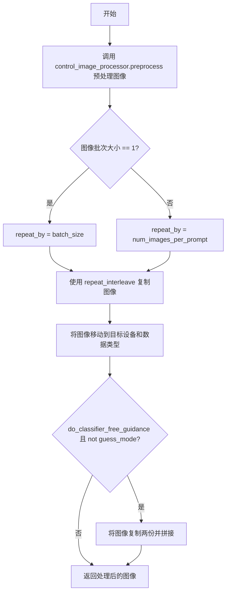

#### 带注释源码

```python
def prepare_control_image(
    self,
    image,
    width,
    height,
    batch_size,
    num_images_per_prompt,
    device,
    dtype,
    crops_coords,
    resize_mode,
    do_classifier_free_guidance=False,
    guess_mode=False,
):
    """
    预处理 ControlNet 的输入图像。
    
    该方法将各种格式的输入图像转换为标准化的 PyTorch 张量格式，
    并根据批次参数进行复制以匹配扩散模型的输入要求。
    
    参数:
        image: 输入的 ControlNet 条件图像
        width: 目标宽度
        height: 目标高度
        batch_size: 批处理大小
        num_images_per_prompt: 每个提示生成的图像数
        device: 目标设备
        dtype: 目标数据类型
        crops_coords: 裁剪坐标
        resize_mode: 调整大小模式
        do_classifier_free_guidance: 是否使用无分类器引导
        guess_mode: 猜测模式
    
    返回:
        处理后的图像张量
    """
    # 使用 VaeImageProcessor 预处理图像：调整大小、归一化、转换为张量
    # 转换为 float32 以便进行后续处理
    image = self.control_image_processor.preprocess(
        image, height=height, width=width, crops_coords=crops_coords, resize_mode=resize_mode
    ).to(dtype=torch.float32)
    
    # 获取预处理后图像的批次大小
    image_batch_size = image.shape[0]

    # 根据批次大小确定重复次数
    # 如果图像批次大小为1，则根据总批处理大小重复
    # 如果图像批次大小等于提示批次大小，则根据每提示图像数重复
    if image_batch_size == 1:
        repeat_by = batch_size
    else:
        # image batch size is the same as prompt batch size
        repeat_by = num_images_per_prompt

    # 沿批次维度重复图像，以匹配生成数量
    image = image.repeat_interleave(repeat_by, dim=0)

    # 将图像移动到目标设备和数据类型
    image = image.to(device=device, dtype=dtype)

    # 对于无分类器引导，需要同时输入条件和无条件图像
    # 在 guess_mode 下，只使用条件图像
    if do_classifier_free_guidance and not guess_mode:
        # 复制图像并拼接：前半部分为无条件输入，后半部分为条件输入
        image = torch.cat([image] * 2)

    return image
```


### `StableDiffusionControlNetInpaintPipeline.prepare_latents`

该方法用于为图像修复（inpainting）管道准备潜在的噪声向量（latents）。它根据批处理大小、图像尺寸和VAE的缩放因子计算潜在空间的形状，并处理输入图像以生成或混合潜在向量，支持纯噪声初始化或图像+噪声的混合模式。

参数：

- `self`：隐式参数，StableDiffusionControlNetInpaintPipeline 实例本身
- `batch_size`：`int`，生成图像的批处理大小
- `num_channels_latents`：`int`，潜在空间的通道数，通常为4
- `height`：`int`，目标图像的高度（像素）
- `width`：`int`，目标图像的宽度（像素）
- `dtype`：`torch.dtype`，张量的数据类型（如 torch.float16）
- `device`：`torch.device`，计算设备（如 cuda:0）
- `generator`：`torch.Generator | list[torch.Generator] | None`，用于生成确定性随机数的生成器
- `latents`：`torch.Tensor | None`，可选的预生成潜在向量，若提供则直接使用
- `image`：`torch.Tensor | None`，输入图像，用于 img2img 或 inpainting 模式
- `timestep`：`torch.Tensor | None`，用于 img2img 的时间步
- `is_strength_max`：`bool`，指示是否为最大强度（strength=1.0），此时完全使用噪声初始化
- `return_noise`：`bool`，是否在返回值中包含噪声张量
- `return_image_latents`：`bool`，是否在返回值中包含图像潜在向量

返回值：`tuple`，包含以下元素的元组：
- `latents`：`torch.Tensor`，准备好的潜在向量
- `noise`：`torch.Tensor`（可选），生成的噪声张量，当 `return_noise=True` 时返回
- `image_latents`：`torch.Tensor`（可选），编码后的图像潜在向量，当 `return_image_latents=True` 时返回

#### 流程图

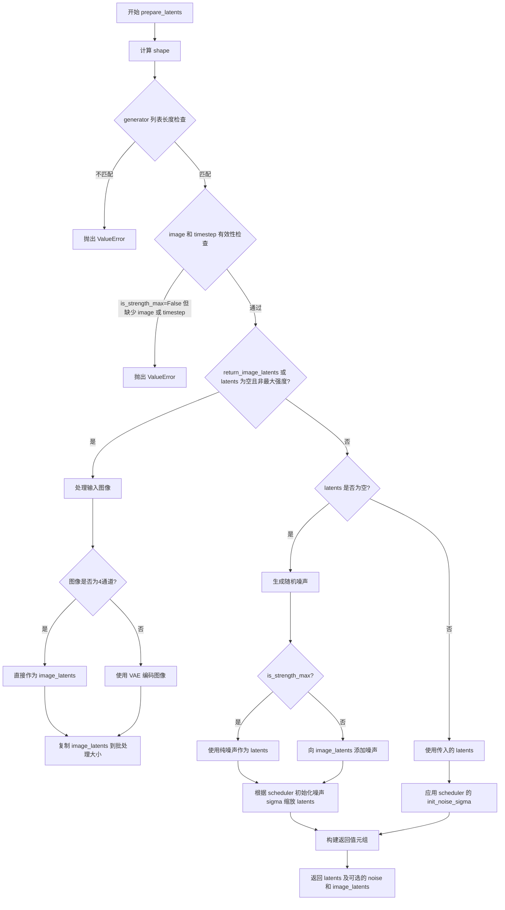

#### 带注释源码

```python
def prepare_latents(
    self,
    batch_size,
    num_channels_latents,
    height,
    width,
    dtype,
    device,
    generator,
    latents=None,
    image=None,
    timestep=None,
    is_strength_max=True,
    return_noise=False,
    return_image_latents=False,
):
    """
    为图像修复准备潜在向量。
    
    根据批处理大小、潜在通道数和图像尺寸计算潜在空间的形状。
    支持三种模式：
    1. 纯噪声模式 (strength=1.0): 完全使用随机噪声初始化
    2. 图像+噪声模式 (strength<1.0): 混合图像潜在和噪声
    3. 直接使用模式: 使用预生成的 latents
    
    参数:
        batch_size: 批处理大小
        num_channels_latents: 潜在通道数 (通常为4)
        height: 图像高度
        width: 图像宽度
        dtype: 张量数据类型
        device: 计算设备
        generator: 随机生成器
        latents: 预生成的潜在向量 (可选)
        image: 输入图像 (可选)
        timestep: 时间步 (可选)
        is_strength_max: 是否为最大强度
        return_noise: 是否返回噪声
        return_image_latents: 是否返回图像潜在向量
    
    返回:
        (latents,) 或 (latents, noise) 或 (latents, noise, image_latents)
    """
    # 计算潜在向量的形状: (batch_size, channels, height/vae_scale, width/vae_scale)
    shape = (
        batch_size,
        num_channels_latents,
        int(height) // self.vae_scale_factor,
        int(width) // self.vae_scale_factor,
    )
    
    # 验证生成器列表长度与批处理大小是否匹配
    if isinstance(generator, list) and len(generator) != batch_size:
        raise ValueError(
            f"You have passed a list of generators of length {len(generator)}, but requested an effective batch"
            f" size of {batch_size}. Make sure the batch size matches the length of the generators."
        )

    # 检查图像和时间步的有效性（非最大强度时需要两者）
    if (image is None or timestep is None) and not is_strength_max:
        raise ValueError(
            "Since strength < 1. initial latents are to be initialised as a combination of Image + Noise."
            "However, either the image or the noise timestep has not been provided."
        )

    # 处理需要返回图像潜在向量或需要混合图像的情况
    if return_image_latents or (latents is None and not is_strength_max):
        # 将图像移动到指定设备
        image = image.to(device=device, dtype=dtype)

        # 检查图像是否已经是潜在向量格式（4通道）
        if image.shape[1] == 4:
            image_latents = image
        else:
            # 使用 VAE 编码图像为潜在向量
            image_latents = self._encode_vae_image(image=image, generator=generator)
        
        # 复制图像潜在向量以匹配批处理大小
        image_latents = image_latents.repeat(batch_size // image_latents.shape[0], 1, 1, 1)

    # 生成或处理潜在向量
    if latents is None:
        # 生成随机噪声
        noise = randn_tensor(shape, generator=generator, device=device, dtype=dtype)
        
        # 根据强度决定初始化方式
        # 最大强度: 使用纯噪声; 非最大强度: 混合图像潜在和噪声
        latents = noise if is_strength_max else self.scheduler.add_noise(image_latents, noise, timestep)
        
        # 纯噪声模式下根据 scheduler 的初始化 sigma 进行缩放
        latents = latents * self.scheduler.init_noise_sigma if is_strength_max else latents
    else:
        # 使用预提供的潜在向量
        noise = latents.to(device)
        latents = noise * self.scheduler.init_noise_sigma

    # 构建返回值元组
    outputs = (latents,)

    # 可选: 添加噪声到返回值
    if return_noise:
        outputs += (noise,)

    # 可选: 添加图像潜在向量到返回值
    if return_image_latents:
        outputs += (image_latents,)

    return outputs
```


### `StableDiffusionControlNetInpaintPipeline.prepare_mask_latents`

该方法用于准备掩码（mask）和被掩码覆盖的图像（masked image）的潜在表示（latents），将其调整为与潜在空间相同的尺寸，并处理批量大小以支持分类器自由引导（Classifier-Free Guidance）。

参数：

-   `mask`：`torch.Tensor`，输入的掩码张量，用于指示图像中被遮盖的区域
-   `masked_image`：`torch.Tensor`，被掩码覆盖后的图像张量，即原始图像与掩码相乘后的结果
-   `batch_size`：`int`，推理时每个提示词生成的图像数量（乘以 num_images_per_prompt 后的值）
-   `height`：`int`，目标图像的高度（像素单位）
-   `width`：`int`，目标图像的宽度（像素单位）
-   `dtype`：`torch.dtype`，目标数据类型，用于将掩码和 masked image latents 转换为指定精度
-   `device`：`torch.device`，目标设备（CPU 或 CUDA）
-   `generator`：`torch.Generator | None`，随机数生成器，用于确保可重复性
-   `do_classifier_free_guidance`：`bool`，是否启用分类器自由引导

返回值：`Tuple[torch.Tensor, torch.Tensor]`，返回处理后的掩码和被掩码覆盖的图像的潜在表示

#### 流程图

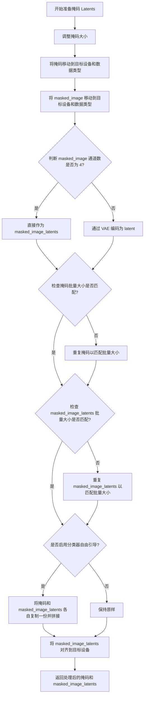

#### 带注释源码

```python
# Copied from diffusers.pipelines.stable_diffusion.pipeline_stable_diffusion_inpaint.StableDiffusionInpaintPipeline.prepare_mask_latents
def prepare_mask_latents(
    self, mask, masked_image, batch_size, height, width, dtype, device, generator, do_classifier_free_guidance
):
    # 调整掩码大小以匹配潜在空间分辨率
    # 在转换为 dtype 之前执行此操作，以避免在使用 cpu_offload 和半精度时出现问题
    mask = torch.nn.functional.interpolate(
        mask, size=(height // self.vae_scale_factor, width // self.vae_scale_factor)
    )
    # 将掩码移动到指定设备和数据类型
    mask = mask.to(device=device, dtype=dtype)

    # 将被掩码覆盖的图像移动到指定设备和数据类型
    masked_image = masked_image.to(device=device, dtype=dtype)

    # 如果 masked_image 已经是 latent 格式（4 通道），则直接使用
    # 否则，通过 VAE 编码器将其转换为 latent 格式
    if masked_image.shape[1] == 4:
        masked_image_latents = masked_image
    else:
        masked_image_latents = self._encode_vae_image(masked_image, generator=generator)

    # 为每个 prompt 生成多个图像时复制掩码和 masked_image_latents
    # 使用 mps 友好的方法（repeat 而不是 repeat_interleave）
    if mask.shape[0] < batch_size:
        if not batch_size % mask.shape[0] == 0:
            raise ValueError(
                "The passed mask and the required batch size don't match. Masks are supposed to be duplicated to"
                f" a total batch size of {batch_size}, but {mask.shape[0]} masks were passed. Make sure the number"
                " of masks that you pass is divisible by the total requested batch size."
            )
        mask = mask.repeat(batch_size // mask.shape[0], 1, 1, 1)
    
    if masked_image_latents.shape[0] < batch_size:
        if not batch_size % masked_image_latents.shape[0] == 0:
            raise ValueError(
                "The passed images and the required batch size don't match. Images are supposed to be duplicated"
                f" to a total batch size of {batch_size}, but {masked_image_latents.shape[0]} images were passed."
                " Make sure the number of images that you pass is divisible by the total requested batch size."
            )
        masked_image_latents = masked_image_latents.repeat(batch_size // masked_image_latents.shape[0], 1, 1, 1)

    # 如果启用分类器自由引导，需要拼接无条件版本和条件版本
    mask = torch.cat([mask] * 2) if do_classifier_free_guidance else mask
    masked_image_latents = (
        torch.cat([masked_image_latents] * 2) if do_classifier_free_guidance else masked_image_latents
    )

    # 将设备对齐以防止连接 latent 模型输入时出现设备错误
    masked_image_latents = masked_image_latents.to(device=device, dtype=dtype)
    return mask, masked_image_latents
```


### `StableDiffusionControlNetInpaintPipeline._encode_vae_image`

该方法用于将输入图像编码为 VAE 潜在空间表示。它通过 VAE 模型编码图像，并根据是否提供单个或多个随机生成器来生成对应的潜在向量，最后乘以 VAE 的缩放因子以获得最终的图像潜在表示。

参数：

- `image`：`torch.Tensor`，待编码的输入图像张量，形状应为 `(B, C, H, W)`
- `generator`：`torch.Generator`，用于生成随机数的 PyTorch 生成器，支持单个生成器或生成器列表以实现批次级别的随机性控制

返回值：`torch.Tensor`，编码后的图像潜在表示，形状为 `(B, latent_channels, latent_h, latent_w)`

#### 流程图

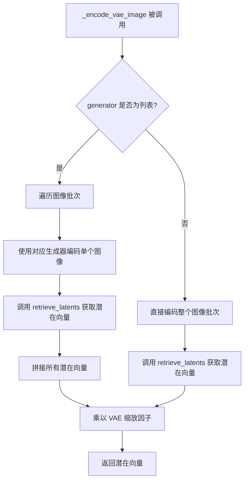

#### 带注释源码

```python
# Copied from diffusers.pipelines.stable_diffusion.pipeline_stable_diffusion_inpaint.StableDiffusionInpaintPipeline._encode_vae_image
def _encode_vae_image(self, image: torch.Tensor, generator: torch.Generator):
    """
    Encode image to VAE latent space.
    
    Args:
        image: Input image tensor to be encoded
        generator: Random generator for reproducibility, can be a single generator or a list
    
    Returns:
        Encoded image latents scaled by VAE scaling factor
    """
    # 检查 generator 是否为列表，以支持批次级别的随机性控制
    if isinstance(generator, list):
        # 批次处理：逐个编码图像，每个图像使用对应的生成器
        image_latents = [
            # 使用 VAE 编码单张图像，并通过 retrieve_latents 提取潜在向量
            retrieve_latents(self.vae.encode(image[i : i + 1]), generator=generator[i])
            for i in range(image.shape[0])
        ]
        # 将列表中的潜在向量沿批次维度拼接
        image_latents = torch.cat(image_latents, dim=0)
    else:
        # 单一生成器：直接编码整个图像批次
        image_latents = retrieve_latents(self.vae.encode(image), generator=generator)

    # 应用 VAE 配置中的缩放因子，将潜在向量缩放到适当的数值范围
    image_latents = self.vae.config.scaling_factor * image_latents

    return image_latents
```


### `StableDiffusionControlNetInpaintPipeline.__call__`

这是 Stable Diffusion ControlNet 图像修复管道的主调用方法，结合了 ControlNet 条件引导来实现图像修复功能。用户可以通过文本提示（prompt）、掩码图像（mask_image）和控制图像（control_image）来指导图像生成过程，管道会在掩码区域填充生成的图像内容。

参数：

- `prompt`：`str | list[str] | None`，用于引导图像生成的文本提示，如果未定义则需要传递 `prompt_embeds`
- `image`：`PipelineImageInput`，用作起点的图像，支持 torch.Tensor、PIL.Image、np.ndarray 或其列表形式，值范围 [0, 1]
- `mask_image`：`PipelineImageInput`，用于遮罩原始图像的掩码，白色像素被重绘，黑色像素保留
- `control_image`：`PipelineImageInput`，提供给 ControlNet 的条件图像，用于引导 unet 生成
- `height`：`int | None`，生成图像的高度像素，默认为 unet 配置的 sample_size * vae_scale_factor
- `width`：`int | None`，生成图像的宽度像素
- `padding_mask_crop`：`int | None`，裁剪边距大小，用于在掩码较小时扩展处理区域
- `strength`：`float`，图像转换程度，0-1 之间，1 表示完全转换
- `num_inference_steps`：`int`，去噪步数，默认为 50
- `guidance_scale`：`float`，引导比例，>1 时启用无分类器引导，默认为 7.5
- `negative_prompt`：`str | list[str] | None`，不希望出现在图像中的内容提示
- `num_images_per_prompt`：`int`，每个提示生成的图像数量
- `eta`：`float`，DDIM 论文中的 eta 参数，仅适用于 DDIMScheduler
- `generator`：`torch.Generator | list[torch.Generator] | None`，用于使生成具有确定性
- `latents`：`torch.Tensor | None`，预生成的噪声潜在向量
- `prompt_embeds`：`torch.Tensor | None`，预生成的文本嵌入
- `negative_prompt_embeds`：`torch.Tensor | None`，预生成的负面文本嵌入
- `ip_adapter_image`：`PipelineImageInput | None`，IP Adapter 的可选图像输入
- `ip_adapter_image_embeds`：`list[torch.Tensor] | None`，IP-Adapter 的预生成图像嵌入
- `output_type`：`str | None`，输出格式，默认为 "pil"
- `return_dict`：`bool`，是否返回 StableDiffusionPipelineOutput，默认为 True
- `cross_attention_kwargs`：`dict[str, Any] | None`，传递给注意力处理器的 kwargs
- `controlnet_conditioning_scale`：`float | list[float]`，ControlNet 输出乘数，默认为 0.5
- `guess_mode`：`bool`，ControlNet 是否尝试识别输入图像内容，默认为 False
- `control_guidance_start`：`float | list[float]`，ControlNet 开始应用的步骤百分比
- `control_guidance_end`：`float | list[float]`，ControlNet 停止应用的步骤百分比
- `clip_skip`：`int | None`，CLIP 层跳跃数量
- `callback_on_step_end`：`Callable | PipelineCallback | MultiPipelineCallbacks | None`，每步结束时的回调函数
- `callback_on_step_end_tensor_inputs`：`list[str]`，回调函数需要的张量输入列表

返回值：`StableDiffusionPipelineOutput | tuple`，如果 return_dict 为 True 返回包含生成图像和 NSFW 检测结果的管道输出，否则返回元组

#### 流程图

```mermaid
flowchart TD
    A[开始 __call__] --> B[解析回调参数]
    B --> C[处理 control_guidance 格式]
    C --> D[检查输入参数 check_inputs]
    D --> E[设置 guidance_scale, clip_skip, cross_attention_kwargs]
    E --> F[确定批次大小 batch_size]
    F --> G{是否需要裁剪}
    G -->|是| H[计算裁剪坐标和调整大小模式]
    G -->|否| I[设置 crops_coords=None]
    H --> J[准备 ControlNet 条件图像]
    I --> J
    J --> K[编码文本提示 encode_prompt]
    K --> L{是否有 IP-Adapter}
    L -->|是| M[准备 IP-Adapter 图像嵌入]
    L -->|否| N[预处理图像和掩码]
    M --> N
    N --> O[准备时间步 get_timesteps]
    O --> P[准备潜在变量 prepare_latents]
    P --> Q[准备掩码潜在变量 prepare_mask_latents]
    Q --> R[准备额外步骤参数 prepare_extra_step_kwargs]
    R --> S[创建 controlnet_keep 列表]
    S --> T[进入去噪循环]
    
    T --> U[检查是否中断]
    U -->|是| V[继续下一轮]
    U -->|否| W[扩展潜在变量进行 CFG]
    W --> X[ControlNet 推理]
    X --> Y[UNet 预测噪声残差]
    Y --> Z[执行引导]
    Z --> AA[计算上一步样本]
    AA --> AB{是否需要图像潜在变量}
    AB -->|是| AC[混合噪声和图像潜在变量]
    AB -->|否| AD[执行回调]
    AC --> AD
    AD --> AE[更新进度条]
    AE --> AF{是否完成所有步}
    AF -->|否| V
    AF -->|是| AG[卸载模型]
    
    AG --> AH{输出类型是否为 latent}
    AH -->|否| AI[VAE 解码]
    AH -->|是| AJ[运行安全检查]
    AI --> AJ
    AJ --> AK[后处理图像]
    AK --> AL{是否需要裁剪覆盖}
    AL -->|是| AM[应用覆盖]
    AL -->|否| AN[返回结果]
    AM --> AN
```

#### 带注释源码

```python
@torch.no_grad()
@replace_example_docstring(EXAMPLE_DOC_STRING)
def __call__(
    self,
    prompt: str | list[str] = None,
    image: PipelineImageInput = None,
    mask_image: PipelineImageInput = None,
    control_image: PipelineImageInput = None,
    height: int | None = None,
    width: int | None = None,
    padding_mask_crop: int | None = None,
    strength: float = 1.0,
    num_inference_steps: int = 50,
    guidance_scale: float = 7.5,
    negative_prompt: str | list[str] | None = None,
    num_images_per_prompt: int | None = 1,
    eta: float = 0.0,
    generator: torch.Generator | list[torch.Generator] | None = None,
    latents: torch.Tensor | None = None,
    prompt_embeds: torch.Tensor | None = None,
    negative_prompt_embeds: torch.Tensor | None = None,
    ip_adapter_image: PipelineImageInput | None = None,
    ip_adapter_image_embeds: list[torch.Tensor] | None = None,
    output_type: str | None = "pil",
    return_dict: bool = True,
    cross_attention_kwargs: dict[str, Any] | None = None,
    controlnet_conditioning_scale: float | list[float] = 0.5,
    guess_mode: bool = False,
    control_guidance_start: float | list[float] = 0.0,
    control_guidance_end: float | list[float] = 1.0,
    clip_skip: int | None = None,
    callback_on_step_end: Callable[[int, int], None] | PipelineCallback | MultiPipelineCallbacks | None = None,
    callback_on_step_end_tensor_inputs: list[str] = ["latents"],
    **kwargs,
):
    # 1. 处理回调参数兼容性，从 kwargs 中提取已废弃的 callback 和 callback_steps 参数
    callback = kwargs.pop("callback", None)
    callback_steps = kwargs.pop("callback_steps", None)

    # 废弃警告处理
    if callback is not None:
        deprecate("callback", "1.0.0", "Passing `callback` as an input argument to `__call__` is deprecated, consider using `callback_on_step_end`")
    if callback_steps is not None:
        deprecate("callback_steps", "1.0.0", "Passing `callback_steps` as an input argument to `__call__` is deprecated, consider using `callback_on_step_end`")

    # 如果使用新的回调类，获取其支持的张量输入
    if isinstance(callback_on_step_end, (PipelineCallback, MultiPipelineCallbacks)):
        callback_on_step_end_tensor_inputs = callback_on_step_end.tensor_inputs

    # 获取原始 ControlNet 模型（处理编译情况）
    controlnet = self.controlnet._orig_mod if is_compiled_module(self.controlnet) else self.controlnet

    # 2. 对齐 control_guidance 格式，确保列表长度匹配
    if not isinstance(control_guidance_start, list) and isinstance(control_guidance_end, list):
        control_guidance_start = len(control_guidance_end) * [control_guidance_start]
    elif not isinstance(control_guidance_end, list) and isinstance(control_guidance_start, list):
        control_guidance_end = len(control_guidance_start) * [control_guidance_end]
    elif not isinstance(control_guidance_start, list) and not isinstance(control_guidance_end, list):
        mult = len(controlnet.nets) if isinstance(controlnet, MultiControlNetModel) else 1
        control_guidance_start, control_guidance_end = mult * [control_guidance_start], mult * [control_guidance_end]

    # 3. 检查输入参数合法性
    self.check_inputs(
        prompt, control_image, mask_image, height, width, callback_steps, output_type,
        negative_prompt, prompt_embeds, negative_prompt_embeds, ip_adapter_image,
        ip_adapter_image_embeds, controlnet_conditioning_scale, control_guidance_start,
        control_guidance_end, callback_on_step_end_tensor_inputs, padding_mask_crop,
    )

    # 4. 设置实例变量
    self._guidance_scale = guidance_scale
    self._clip_skip = clip_skip
    self._cross_attention_kwargs = cross_attention_kwargs
    self._interrupt = False

    # 5. 确定批次大小
    if prompt is not None and isinstance(prompt, str):
        batch_size = 1
    elif prompt is not None and isinstance(prompt, list):
        batch_size = len(prompt)
    else:
        batch_size = prompt_embeds.shape[0]

    # 6. 处理图像裁剪
    if padding_mask_crop is not None:
        height, width = self.image_processor.get_default_height_width(image, height, width)
        crops_coords = self.mask_processor.get_crop_region(mask_image, width, height, pad=padding_mask_crop)
        resize_mode = "fill"
    else:
        crops_coords = None
        resize_mode = "default"

    device = self._execution_device

    # 7. 处理 ControlNet 条件缩放
    if isinstance(controlnet, MultiControlNetModel) and isinstance(controlnet_conditioning_scale, float):
        controlnet_conditioning_scale = [controlnet_conditioning_scale] * len(controlnet.nets)

    # 8. 确定是否使用 guess_mode
    global_pool_conditions = (
        controlnet.config.global_pool_conditions
        if isinstance(controlnet, ControlNetModel)
        else controlnet.nets[0].config.global_pool_conditions
    )
    guess_mode = guess_mode or global_pool_conditions

    # 9. 编码文本提示
    text_encoder_lora_scale = (
        self.cross_attention_kwargs.get("scale", None) if self.cross_attention_kwargs is not None else None
    )
    prompt_embeds, negative_prompt_embeds = self.encode_prompt(
        prompt, device, num_images_per_prompt, self.do_classifier_free_guidance,
        negative_prompt, prompt_embeds=prompt_embeds, negative_prompt_embeds=negative_prompt_embeds,
        lora_scale=text_encoder_lora_scale, clip_skip=self.clip_skip,
    )

    # 10. 连接无条件和有条件嵌入以进行 CFG
    if self.do_classifier_free_guidance:
        prompt_embeds = torch.cat([negative_prompt_embeds, prompt_embeds])

    # 11. 处理 IP-Adapter 图像嵌入
    if ip_adapter_image is not None or ip_adapter_image_embeds is not None:
        image_embeds = self.prepare_ip_adapter_image_embeds(
            ip_adapter_image, ip_adapter_image_embeds, device,
            batch_size * num_images_per_prompt, self.do_classifier_free_guidance,
        )

    # 12. 准备 ControlNet 条件图像
    if isinstance(controlnet, ControlNetModel):
        control_image = self.prepare_control_image(
            image=control_image, width=width, height=height,
            batch_size=batch_size * num_images_per_prompt, num_images_per_prompt=num_images_per_prompt,
            device=device, dtype=controlnet.dtype, crops_coords=crops_coords,
            resize_mode=resize_mode, do_classifier_free_guidance=self.do_classifier_free_guidance,
            guess_mode=guess_mode,
        )
    elif isinstance(controlnet, MultiControlNetModel):
        control_images = []
        for control_image_ in control_image:
            control_image_ = self.prepare_control_image(
                image=control_image_, width=width, height=height,
                batch_size=batch_size * num_images_per_prompt, num_images_per_prompt=num_images_per_prompt,
                device=device, dtype=controlnet.dtype, crops_coords=crops_coords,
                resize_mode=resize_mode, do_classifier_free_guidance=self.do_classifier_free_guidance,
                guess_mode=guess_mode,
            )
            control_images.append(control_image_)
        control_image = control_images

    # 13. 预处理原始图像和掩码
    original_image = image
    init_image = self.image_processor.preprocess(
        image, height=height, width=width, crops_coords=crops_coords, resize_mode=resize_mode
    )
    init_image = init_image.to(dtype=torch.float32)

    mask = self.mask_processor.preprocess(
        mask_image, height=height, width=width, resize_mode=resize_mode, crops_coords=crops_coords
    )

    # 创建被掩码的图像（掩码区域为黑色）
    masked_image = init_image * (mask < 0.5)
    _, _, height, width = init_image.shape

    # 14. 准备时间步
    self.scheduler.set_timesteps(num_inference_steps, device=device)
    timesteps, num_inference_steps = self.get_timesteps(
        num_inference_steps=num_inference_steps, strength=strength, device=device
    )
    latent_timestep = timesteps[:1].repeat(batch_size * num_images_per_prompt)
    is_strength_max = strength == 1.0
    self._num_timesteps = len(timesteps)

    # 15. 准备潜在变量
    num_channels_latents = self.vae.config.latent_channels
    num_channels_unet = self.unet.config.in_channels
    return_image_latents = num_channels_unet == 4
    latents_outputs = self.prepare_latents(
        batch_size * num_images_per_prompt, num_channels_latents, height, width,
        prompt_embeds.dtype, device, generator, latents, image=init_image,
        timestep=latent_timestep, is_strength_max=is_strength_max,
        return_noise=True, return_image_latents=return_image_latents,
    )

    if return_image_latents:
        latents, noise, image_latents = latents_outputs
    else:
        latents, noise = latents_outputs

    # 16. 准备掩码潜在变量
    mask, masked_image_latents = self.prepare_mask_latents(
        mask, masked_image, batch_size * num_images_per_prompt, height, width,
        prompt_embeds.dtype, device, generator, self.do_classifier_free_guidance,
    )

    # 17. 准备额外步骤参数
    extra_step_kwargs = self.prepare_extra_step_kwargs(generator, eta)

    # 18. 添加 IP-Adapter 条件
    added_cond_kwargs = (
        {"image_embeds": image_embeds}
        if ip_adapter_image is not None or ip_adapter_image_embeds is not None
        else None
    )

    # 19. 创建 ControlNet 保持列表
    controlnet_keep = []
    for i in range(len(timesteps)):
        keeps = [
            1.0 - float(i / len(timesteps) < s or (i + 1) / len(timesteps) > e)
            for s, e in zip(control_guidance_start, control_guidance_end)
        ]
        controlnet_keep.append(keeps[0] if isinstance(controlnet, ControlNetModel) else keeps)

    # 20. 去噪循环
    num_warmup_steps = len(timesteps) - num_inference_steps * self.scheduler.order
    with self.progress_bar(total=num_inference_steps) as progress_bar:
        for i, t in enumerate(timesteps):
            # 检查中断标志
            if self.interrupt:
                continue

            # 扩展潜在变量以进行无分类器引导
            latent_model_input = torch.cat([latents] * 2) if self.do_classifier_free_guidance else latents
            latent_model_input = self.scheduler.scale_model_input(latent_model_input, t)

            # ControlNet 推理
            if guess_mode and self.do_classifier_free_guidance:
                control_model_input = latents
                control_model_input = self.scheduler.scale_model_input(control_model_input, t)
                controlnet_prompt_embeds = prompt_embeds.chunk(2)[1]
            else:
                control_model_input = latent_model_input
                controlnet_prompt_embeds = prompt_embeds

            # 计算条件缩放
            if isinstance(controlnet_keep[i], list):
                cond_scale = [c * s for c, s in zip(controlnet_conditioning_scale, controlnet_keep[i])]
            else:
                controlnet_cond_scale = controlnet_conditioning_scale
                if isinstance(controlnet_cond_scale, list):
                    controlnet_cond_scale = controlnet_cond_scale[0]
                cond_scale = controlnet_cond_scale * controlnet_keep[i]

            # 执行 ControlNet
            down_block_res_samples, mid_block_res_sample = self.controlnet(
                control_model_input, t, encoder_hidden_states=controlnet_prompt_embeds,
                controlnet_cond=control_image, conditioning_scale=cond_scale,
                guess_mode=guess_mode, return_dict=False,
            )

            # guess_mode 下扩展 ControlNet 输出
            if guess_mode and self.do_classifier_free_guidance:
                down_block_res_samples = [torch.cat([torch.zeros_like(d), d]) for d in down_block_res_samples]
                mid_block_res_sample = torch.cat([torch.zeros_like(mid_block_res_sample), mid_block_res_sample])

            # 为 UNet 准备输入（包含掩码信息）
            if num_channels_unet == 9:
                latent_model_input = torch.cat([latent_model_input, mask, masked_image_latents], dim=1)

            # UNet 预测噪声残差
            noise_pred = self.unet(
                latent_model_input, t, encoder_hidden_states=prompt_embeds,
                cross_attention_kwargs=self.cross_attention_kwargs,
                down_block_additional_residuals=down_block_res_samples,
                mid_block_additional_residual=mid_block_res_sample,
                added_cond_kwargs=added_cond_kwargs, return_dict=False,
            )[0]

            # 执行引导
            if self.do_classifier_free_guidance:
                noise_pred_uncond, noise_pred_text = noise_pred.chunk(2)
                noise_pred = noise_pred_uncond + guidance_scale * (noise_pred_text - noise_pred_uncond)

            # 计算上一步样本
            latents = self.scheduler.step(noise_pred, t, latents, **extra_step_kwargs, return_dict=False)[0]

            # 处理图像潜在变量混合
            if num_channels_unet == 4:
                init_latents_proper = image_latents
                if self.do_classifier_free_guidance:
                    init_mask, _ = mask.chunk(2)
                else:
                    init_mask = mask

                if i < len(timesteps) - 1:
                    noise_timestep = timesteps[i + 1]
                    init_latents_proper = self.scheduler.add_noise(
                        init_latents_proper, noise, torch.tensor([noise_timestep])
                    )

                latents = (1 - init_mask) * init_latents_proper + init_mask * latents

            # 执行步骤结束回调
            if callback_on_step_end is not None:
                callback_kwargs = {}
                for k in callback_on_step_end_tensor_inputs:
                    callback_kwargs[k] = locals()[k]
                callback_outputs = callback_on_step_end(self, i, t, callback_kwargs)

                latents = callback_outputs.pop("latents", latents)
                prompt_embeds = callback_outputs.pop("prompt_embeds", prompt_embeds)
                negative_prompt_embeds = callback_outputs.pop("negative_prompt_embeds", negative_prompt_embeds)
                control_image = callback_outputs.pop("control_image", control_image)

            # 旧式回调
            if i == len(timesteps) - 1 or ((i + 1) > num_warmup_steps and (i + 1) % self.scheduler.order == 0):
                progress_bar.update()
                if callback is not None and i % callback_steps == 0:
                    step_idx = i // getattr(self.scheduler, "order", 1)
                    callback(step_idx, t, latents)

            # XLA 支持
            if XLA_AVAILABLE:
                xm.mark_step()

    # 21. 手动模型卸载（如需要）
    if hasattr(self, "final_offload_hook") and self.final_offload_hook is not None:
        self.unet.to("cpu")
        self.controlnet.to("cpu")
        empty_device_cache()

    # 22. 解码潜在变量
    if not output_type == "latent":
        image = self.vae.decode(latents / self.vae.config.scaling_factor, return_dict=False, generator=generator)[0]
        image, has_nsfw_concept = self.run_safety_checker(image, device, prompt_embeds.dtype)
    else:
        image = latents
        has_nsfw_concept = None

    # 23. 反归一化
    if has_nsfw_concept is None:
        do_denormalize = [True] * image.shape[0]
    else:
        do_denormalize = [not has_nsfw for has_nsfw in has_nsfw_concept]

    # 24. 后处理图像
    image = self.image_processor.postprocess(image, output_type=output_type, do_denormalize=do_denormalize)

    # 25. 应用覆盖（如需要）
    if padding_mask_crop is not None:
        image = [self.image_processor.apply_overlay(mask_image, original_image, i, crops_coords) for i in image]

    # 26. 卸载所有模型
    self.maybe_free_model_hooks()

    # 27. 返回结果
    if not return_dict:
        return (image, has_nsfw_concept)

    return StableDiffusionPipelineOutput(images=image, nsfw_content_detected=has_nsfw_concept)
```

## 关键组件


### 张量索引与惰性加载

代码通过`retrieve_latents`函数实现从VAE编码器输出中提取潜在向量的惰性加载机制，支持`latent_dist.sample()`和`latent_dist.mode()`两种采样模式，以及直接访问`.latents`属性。在`prepare_latents`方法中，根据`is_strength_max`标志决定是初始化为纯噪声还是图像加噪声的组合。

### 反量化支持

代码通过`dtype`参数在多个位置处理模型精度转换。在`encode_prompt`中，提示嵌入被转换为与文本编码器或UNet相同的`prompt_embeds_dtype`。`prepare_control_image`将图像转换为`torch.float32`，然后再转换为目标`dtype`。VAE解码时使用`scaling_factor`进行潜在空间的缩放和反归一化。

### 量化策略

代码通过`model_cpu_offload_seq`定义模型卸载顺序，使用`empty_device_cache()`释放设备内存。对于LoRA权重，通过`scale_lora_layers`和`unscale_lora_layers`在PEFT后端和非PEFT后端之间动态调整LoRA权重缩放。`is_compiled_module`检查用于torch.compile优化的模型。

### ControlNet引导

`StableDiffusionControlNetInpaintPipeline`集成了ControlNet模型进行条件引导。在去噪循环中，ControlNet预测额外的残差（`down_block_res_samples`和`mid_block_res_sample`），通过`controlnet_conditioning_scale`加权后添加到UNet的去噪过程中。`guess_mode`允许ControlNet在无需提示的情况下识别输入图像内容。

### 图像修复（Inpainting）

代码实现了完整的图像修复流程：`mask_processor`预处理二值化掩码，`prepare_mask_latents`将掩码调整到潜在空间大小。`prepare_latents`根据`strength`参数混合图像潜在向量和噪声。在去噪循环中，通过公式`(1 - init_mask) * init_latents_proper + init_mask * latents`将原始图像信息与去噪结果按掩码比例混合。

### 条件引导与无分类器引导

通过`do_classifier_free_guidance`属性控制是否启用无分类器引导。在编码提示时，将负面提示嵌入和正面提示嵌入在批次维度上连接，实现单次前向传播完成条件和无条件预测。ControlNet的引导也可以通过`control_guidance_start`和`control_guidance_end`参数在特定去噪步骤范围内逐步应用。

### 安全检查器

`run_safety_checker`方法使用`feature_extractor`提取图像特征，然后通过`StableDiffusionSafetyChecker`检测NSFW内容。输出图像经过后处理后返回带有`nsfw_content_detected`标志的`StableDiffusionPipelineOutput`。

### IP-Adapter支持

`prepare_ip_adapter_image_embeds`方法处理IP-Adapter的图像嵌入准备，支持图像提示的批量处理和分类器自由引导下的阴性图像嵌入。通过`image_projection_layers`将图像编码到与文本嵌入相同的空间。

### 回调机制

`callback_on_step_end`支持在每个去噪步骤结束后调用自定义回调函数，通过`callback_on_step_end_tensor_inputs`指定需要传递的张量参数。传统的`callback`和`callback_steps`参数已标记为弃用。


## 问题及建议


### 已知问题

-   **代码重复严重**：大量使用 `Copied from` 的方法（`_encode_prompt`、`encode_prompt`、`encode_image`、`prepare_ip_adapter_image_embeds`、`run_safety_checker`、`decode_latents`、`prepare_extra_step_kwargs`、`get_timesteps`、`check_inputs`、`check_image`、`prepare_control_image`、`prepare_latents`、`prepare_mask_latents`、`_encode_vae_image`），表明在不同pipeline之间存在显著的代码复制，缺乏统一的抽象基类或混合类来共享这些逻辑。
-   **遗留API未清理**：已deprecated的方法如 `_encode_prompt` 和 `decode_latents` 仍保留在代码库中，且 `callback`/`callback_steps` 参数被标记为deprecated但仍支持，增加了维护负担和代码复杂度。
-   **类型注解不一致**：部分参数使用新语法（如 `str | list[str]`）而部分使用旧语法（如 `Callable` 而非 `Callable[[int, int], None]`），且缺少部分参数的详细类型说明。
-   **错误处理使用assert**：在 `check_inputs` 中多处使用 `assert False` 而非抛出具体的 `ValueError` 或 `TypeError`，不利于调试和用户理解错误原因。
-   **图像处理逻辑复杂**：支持多种图像类型（PIL Image、torch.Tensor、numpy.ndarray及它们的列表）导致 `check_image` 和 `prepare_control_image` 方法有大量类型检查分支，增加了代码复杂性和出错概率。
-   **LoRA缩放逻辑重复**：在 `encode_prompt` 中对 LoRA 缩放的处理逻辑分散，且在不同位置有 `scale_lora_layers` 和 `unscale_lora_layers` 调用，容易遗漏或出错。

### 优化建议

-   **提取公共基类或Mixin**：将 Copied from 的方法统一放入抽象基类或Mixin中（如 `StableDiffusionPipelineBase`），通过继承减少代码重复，提高可维护性。
-   **完全移除deprecated代码**：在主要版本更新中完全移除 `_encode_prompt`、`decode_latents` 等已标记为 1.0.0 移除的方法，以及旧的 callback 机制。
-   **统一类型注解**：全面采用 Python 3.10+ 的联合类型语法，并补充缺失的类型注解，特别是复杂参数如 `callback_on_step_end`。
-   **用具体异常替换assert**：将 `assert False` 替换为 `raise ValueError("...")` 或 `raise TypeError("...")`，提供有意义的错误信息。
-   **简化图像类型处理**：考虑在输入阶段统一转换为特定类型（如 torch.Tensor），减少方法内部的类型分支判断，或使用工厂模式和策略模式处理不同图像类型。
-   **重构LoRA逻辑**：将 LoRA 缩放逻辑封装为独立方法或使用装饰器模式，确保在所有编码路径中一致应用。
-   **添加性能监控点**：在关键路径（如 denoising loop、VAE encode/decode）添加可选的性能日志或hooks，便于后续优化。

## 其它


### 设计目标与约束

本 pipeline 的设计目标是实现基于 ControlNet 的图像修复（inpainting）功能，允许用户通过文本提示、控制图像和掩码来修复或替换图像中的特定区域。核心约束包括：1）输入图像、掩码和 ControlNet 控制图像的尺寸必须能被 8 整除；2）支持单个或多个 ControlNet 模型；3）支持 Classifier-Free Guidance（CFG）来提升生成质量；4）兼容 LoRA、Textual Inversion、IP-Adapter 等微调技术；5）支持从单文件加载模型权重。

### 错误处理与异常设计

代码在多个关键位置进行了输入验证：1）`check_inputs()` 方法验证图像尺寸、callback_steps 参数、prompt 与 prompt_embeds 的互斥关系、negative_prompt 与 negative_prompt_embeds 的互斥关系、以及 ControlNet 相关的配置；2）`prepare_latents()` 检查生成器列表长度与批处理大小的匹配；3）`prepare_mask_latents()` 验证掩码和被掩码图像的批处理大小兼容性；4）`check_image()` 验证图像类型是否合法；5）`prepare_ip_adapter_image_embeds()` 验证 IP-Adapter 图像数量与投影层数量的匹配。异常主要通过 `ValueError`、`TypeError` 和 `AttributeError` 抛出，并使用 `deprecate()` 函数警告废弃的接口。

### 数据流与状态机

Pipeline 的核心数据流如下：1）初始化阶段：加载 VAE、Text Encoder、Tokenizer、UNet、ControlNet、Scheduler、Safety Checker 等组件；2）编码阶段：将文本 prompt 编码为 prompt_embeds 和 negative_prompt_embeds，将 ControlNet 控制图像预处理为标准化张量，将输入图像和掩码预处理并编码为 latent 表示；3）去噪阶段：在每个 timestep，UNet 预测噪声残差，ControlNet 生成额外的条件残差，二者结合后通过 Scheduler 更新 latents；4）解码阶段：将最终的 latents 通过 VAE 解码为图像，并进行后处理（包括 NSFW 检测和格式转换）。状态机由 Scheduler 管理，timesteps 从初始噪声逐步过渡到纯图像。

### 外部依赖与接口契约

本 pipeline 依赖以下核心外部组件：1）`transformers` 库：提供 CLIPTextModel、CLIPTokenizer、CLIPImageProcessor、CLIPVisionModelWithProjection；2）`torch` 和 `numpy`：用于张量运算；3）`PIL`：用于图像处理；4）`diffusers` 内部模块：AutoencoderKL、ControlNetModel、UNet2DConditionModel、KarrasDiffusionSchedulers、VaeImageProcessor 等。接口契约包括：`__call__()` 方法接受多种输入格式（str、list[str]、torch.Tensor、PIL.Image 等），返回 `StableDiffusionPipelineOutput` 或 tuple；所有图像相关参数均支持批处理；`prompt_embeds` 和 `negative_prompt_embeds` 必须形状一致；ControlNet 条件图像数量必须与 ControlNet 模型数量匹配。

### 配置参数详解

关键配置参数包括：1）`vae_scale_factor`：基于 VAE 块输出通道数计算，用于图像到 latent 空间的缩放；2）`model_cpu_offload_seq`：定义模型卸载到 CPU 的顺序（text_encoder->image_encoder->unet->vae）；3）`_optional_components`：标记可选组件（safety_checker、feature_extractor、image_encoder）；4）`_callback_tensor_inputs`：定义回调函数可访问的张量输入列表；5）`controlnet_conditioning_scale`：ControlNet 输出残差的缩放因子，默认为 0.5；6）`guess_mode`：启用时 ControlNet 仅用于条件批次推理；7）`control_guidance_start/end`：控制 ControlNet 在去噪过程中的启用和停止时机。

### 性能考虑与优化

代码包含多项性能优化：1）模型 CPU 卸载支持（`enable_model_cpu_offload()`）；2）XLA 设备支持（`is_torch_xla_available()`）；3）torch.compile 支持（`is_compiled_module()`）；4）批处理优化：重复 embeddings 而非重新编码；5）LoRA 动态缩放：仅在需要时调整 LoRA 权重；6）内存效率：通过 `empty_device_cache()` 释放未使用的 GPU 内存；7）并行处理：支持同时生成多张图像（`num_images_per_prompt`）。潜在优化方向包括：使用 FP16 推理减少显存占用、启用 gradient checkpointing 节省内存、进一步优化 VAE 解码效率。

### 安全性考虑

1）内置 `StableDiffusionSafetyChecker` 用于检测 NSFW（不适内容）图像；2）`requires_safety_checker` 配置允许禁用安全检查器，但会输出警告；3）Safety checker 的输出（`has_nsfw_concept`）会作为返回值的一部分返回给调用者；4）文档中明确提醒用户遵守 Stable Diffusion 许可证，不在公开服务中暴露未过滤的结果；5）潜在的对抗性输入风险通过图像预处理和格式验证进行部分缓解。

### 版本兼容性

1）代码使用 Python 3.9+ 的类型注解语法（如 `|` 联合类型）；2）通过 `deprecate()` 函数标记废弃接口（`_encode_prompt()`、`decode_latents()`）；3）通过 `XLA_AVAILABLE` 标志兼容 PyTorch XLA 设备；4）通过 `is_compiled_module()` 兼容 torch.compile 编译的模型；5）Scheduler 接口通过 `inspect.signature()` 动态检测支持的参数；6）兼容 PEFT 后端的 LoRA 加载方式（`USE_PEFT_BACKEND` 标志）。

### 使用示例与最佳实践

1）推荐使用专门的 inpainting 微调模型（如 stable-diffusion-inpainting）配合 ControlNet；2）ControlNet 建议使用针对 inpainting 任务微调的版本（如 lllyasviel/control_v11p_sd15_inpaint）；3）对于高分辨率图像，建议启用 `enable_model_cpu_offload()` 避免 OOM；4）使用 DDIMScheduler 时可调整 `eta` 参数控制随机性；5）`strength` 参数控制图像保留程度，1.0 表示完全替换，较低值保留更多原图信息；6）多 ControlNet 时可使用不同的 `controlnet_conditioning_scale` 平衡各控制信号强度。

### 限制与已知问题

1）输入图像尺寸必须能被 8 整除；2）mask_image 必须是单通道（灰度）图像；3）当使用多个 ControlNet 时，所有控制图像必须作为列表传递；4）IP-Adapter 功能需要 image_encoder 可用；5）padding_mask_crop 功能仅在 output_type="pil" 时可用；6）pure noise 模式（strength=1.0）下不会使用输入图像的 latents；7）当 num_channels_unet==9 时（inpainting 专用 UNet），latent_model_input 会与 mask 和 masked_image_latents 拼接。

### 扩展性与未来改进

1）可添加更多 ControlNet 类型支持（如 Depth、Normal、Pose 等）；2）可集成更先进的调度器；3）可添加自定义 Attention Processor 支持；4）可增强多模态提示支持；5）潜在改进包括：更细粒度的内存管理、异步推理支持、更灵活的 callback 机制、分布式推理支持等。


    