# `diffusers\src\diffusers\pipelines\controlnet\pipeline_controlnet_inpaint_sd_xl.py` 详细设计文档

这是一个基于 Stable Diffusion XL 的 ControlNet 修复（Inpainting）管道，用于根据文本提示、控制图像和掩码生成或修复图像。该管道结合了 ControlNet 的条件控制能力和 SDXL 的高质量生成能力，支持 LoRA、Textual Inversion、IP-Adapter 等多种扩展功能。

## 整体流程

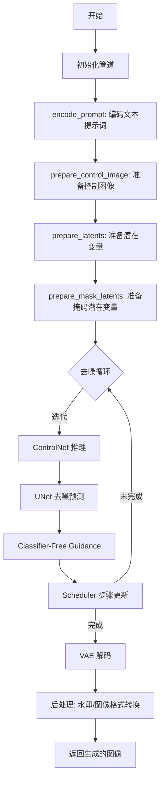

## 类结构

```
DiffusionPipeline (基类)
├── StableDiffusionMixin
├── StableDiffusionXLLoraLoaderMixin
├── FromSingleFileMixin
├── IPAdapterMixin
├── TextualInversionLoaderMixin
└── StableDiffusionXLControlNetInpaintPipeline
```

## 全局变量及字段


### `logger`
    
日志记录器

类型：`logging.Logger`
    


### `XLA_AVAILABLE`
    
XLA 可用性标志

类型：`bool`
    


### `EXAMPLE_DOC_STRING`
    
示例文档字符串

类型：`str`
    


### `model_cpu_offload_seq`
    
CPU 卸载顺序

类型：`str`
    


### `_optional_components`
    
可选组件列表

类型：`list`
    


### `_callback_tensor_inputs`
    
回调张量输入列表

类型：`list`
    


### `StableDiffusionXLControlNetInpaintPipeline.vae`
    
VAE 编解码器

类型：`AutoencoderKL`
    


### `StableDiffusionXLControlNetInpaintPipeline.text_encoder`
    
第一个文本编码器

类型：`CLIPTextModel`
    


### `StableDiffusionXLControlNetInpaintPipeline.text_encoder_2`
    
第二个文本编码器

类型：`CLIPTextModelWithProjection`
    


### `StableDiffusionXLControlNetInpaintPipeline.tokenizer`
    
第一个分词器

类型：`CLIPTokenizer`
    


### `StableDiffusionXLControlNetInpaintPipeline.tokenizer_2`
    
第二个分词器

类型：`CLIPTokenizer`
    


### `StableDiffusionXLControlNetInpaintPipeline.unet`
    
条件 U-Net

类型：`UNet2DConditionModel`
    


### `StableDiffusionXLControlNetInpaintPipeline.controlnet`
    
ControlNet 模型

类型：`ControlNetModel | MultiControlNetModel`
    


### `StableDiffusionXLControlNetInpaintPipeline.scheduler`
    
扩散调度器

类型：`KarrasDiffusionSchedulers`
    


### `StableDiffusionXLControlNetInpaintPipeline.feature_extractor`
    
特征提取器

类型：`CLIPImageProcessor`
    


### `StableDiffusionXLControlNetInpaintPipeline.image_encoder`
    
图像编码器

类型：`CLIPVisionModelWithProjection`
    


### `StableDiffusionXLControlNetInpaintPipeline.vae_scale_factor`
    
VAE 缩放因子

类型：`int`
    


### `StableDiffusionXLControlNetInpaintPipeline.image_processor`
    
图像处理器

类型：`VaeImageProcessor`
    


### `StableDiffusionXLControlNetInpaintPipeline.mask_processor`
    
掩码处理器

类型：`VaeImageProcessor`
    


### `StableDiffusionXLControlNetInpaintPipeline.control_image_processor`
    
控制图像处理器

类型：`VaeImageProcessor`
    


### `StableDiffusionXLControlNetInpaintPipeline.watermark`
    
水印处理器

类型：`StableDiffusionXLWatermarker`
    
    

## 全局函数及方法


### `retrieve_latents`

该函数是 Stable Diffusion 系列 Pipeline 中的一个工具函数，核心作用是从编码器（通常是 VAE）的输出对象中统一且安全地提取潜在变量（Latents）。它封装了不同 VAE 输出格式的差异，允许调用者通过指定 `sample_mode`（"sample" 或 "argmax"）来控制是从概率分布中采样还是直接取确定性的值，从而提升了 Pipeline 代码的健壮性和灵活性。

参数：
- `encoder_output`：`torch.Tensor` (实际类型通常为包含 `latent_dist` 或 `latents` 属性的对象)，来自编码器的输出结果，包含了图像的潜在表示信息。
- `generator`：`torch.Generator | None`，可选的随机数生成器，用于在采样模式下保证生成结果的可复现性。
- `sample_mode`：`str`，字符串类型，指定提取模式。"sample" 表示从分布中采样随机潜在向量；"argmax"（或 "mode"）表示取分布的众数（最可能的值）。

返回值：`torch.Tensor`，提取出的潜在变量张量，通常用于后续的 U-Net 去噪过程。

#### 流程图

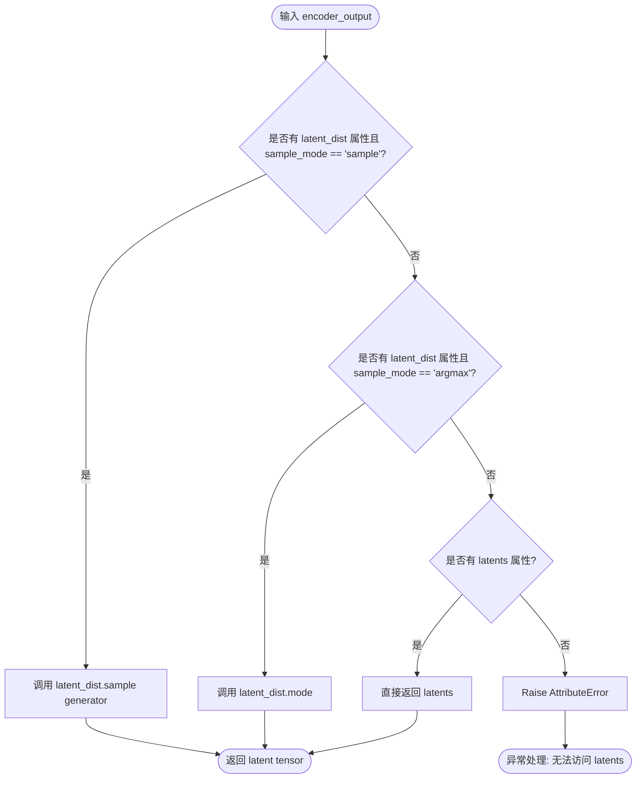

#### 带注释源码

```python
# Copied from diffusers.pipelines.stable_diffusion.pipeline_stable_diffusion_img2img.retrieve_latents
def retrieve_latents(
    encoder_output: torch.Tensor, generator: torch.Generator | None = None, sample_mode: str = "sample"
):
    # 检查编码器输出是否包含 latent_dist 属性（通常是 FlowMatch 或 Diffusion VAE 的输出形式）
    if hasattr(encoder_output, "latent_dist") and sample_mode == "sample":
        # 如果模式为 'sample'，从分布中采样一个潜在向量，允许引入随机性
        return encoder_output.latent_dist.sample(generator)
    # 如果模式为 'argmax'，获取分布的众数（mode），即确定性的最高概率值
    elif hasattr(encoder_output, "latent_dist") and sample_mode == "argmax":
        return encoder_output.latent_dist.mode()
    # 兼容旧版或某些特殊编码器输出，可能直接包含 latents 属性
    elif hasattr(encoder_output, "latents"):
        return encoder_output.latents
    else:
        # 如果无法识别编码器输出的格式，抛出属性错误
        raise AttributeError("Could not access latents of provided encoder_output")
```


### `rescale_noise_cfg`

根据 guidance_rescale 重新缩放噪声配置，以改善图像质量并修复过度曝光问题。该函数基于论文 Common Diffusion Noise Schedules and Sample Steps are Flawed (Section 3.4) 的方法，通过计算噪声预测的标准差来进行重新缩放，并通过 guidance_rescale 因子混合原始结果以避免图像看起来过于平淡。

参数：

- `noise_cfg`：`torch.Tensor`，引导扩散过程预测的噪声张量
- `noise_pred_text`：`torch.Tensor`，文本引导扩散过程预测的噪声张量
- `guidance_rescale`：`float`，可选，默认值为 0.0，重新缩放因子

返回值：`torch.Tensor`，重新缩放后的噪声预测张量

#### 流程图

```mermaid
flowchart TD
    A[开始] --> B[计算 noise_pred_text 的标准差 std_text]
    B --> C[计算 noise_cfg 的标准差 std_cfg]
    C --> D[计算重新缩放后的噪声预测 noise_pred_rescaled = noise_cfg \* (std_text / std_cfg)]
    D --> E[根据 guidance_rescale 混合原始和重新缩放的结果]
    E --> F[noise_cfg = guidance_rescale \* noise_pred_rescaled + (1 - guidance_rescale) \* noise_cfg]
    F --> G[返回重新缩放后的 noise_cfg]
    
    B -.-> H[保持维度]
    C -.-> H
    H -.-> D
```

#### 带注释源码

```python
# Copied from diffusers.pipelines.stable_diffusion.pipeline_stable_diffusion.rescale_noise_cfg
def rescale_noise_cfg(noise_cfg, noise_pred_text, guidance_rescale=0.0):
    r"""
    Rescales `noise_cfg` tensor based on `guidance_rescale` to improve image quality and fix overexposure. Based on
    Section 3.4 from [Common Diffusion Noise Schedules and Sample Steps are
    Flawed](https://huggingface.co/papers/2305.08891).

    Args:
        noise_cfg (`torch.Tensor`):
            The predicted noise tensor for the guided diffusion process.
        noise_pred_text (`torch.Tensor`):
            The predicted noise tensor for the text-guided diffusion process.
        guidance_rescale (`float`, *optional*, defaults to 0.0):
            A rescale factor applied to the noise predictions.

    Returns:
        noise_cfg (`torch.Tensor`): The rescaled noise prediction tensor.
    """
    # 计算文本引导噪声预测的标准差，keepdim=True 保持维度以便广播
    std_text = noise_pred_text.std(dim=list(range(1, noise_pred_text.ndim)), keepdim=True)
    # 计算引导噪声配置的标准差，keepdim=True 保持维度以便广播
    std_cfg = noise_cfg.std(dim=list(range(1, noise_cfg.ndim)), keepdim=True)
    
    # 重新缩放引导结果（修复过度曝光问题）
    # 通过将 noise_cfg 乘以 std_text/std_cfg 来匹配文本引导噪声的方差
    noise_pred_rescaled = noise_cfg * (std_text / std_cfg)
    
    # 通过 guidance_rescale 因子混合原始引导结果，避免图像看起来"平淡"
    # guidance_rescale=0.0 时保留原始 noise_cfg，guidance_rescale=1.0 时完全使用重新缩放版本
    noise_cfg = guidance_rescale * noise_pred_rescaled + (1 - guidance_rescale) * noise_cfg
    
    return noise_cfg
```


### `StableDiffusionXLControlNetInpaintPipeline.__init__`

初始化 Stable Diffusion XL ControlNet Inpaint Pipeline，配置 VAE、文本编码器、Tokenizer、U-Net、ControlNet、调度器等核心组件，并注册图像处理器和水印处理器。

参数：

-  `vae`：`AutoencoderKL`，变分自编码器，用于编码和解码图像与潜在表示之间的转换
-  `text_encoder`：`CLIPTextModel`，冻结的文本编码器，Stable Diffusion XL 使用 CLIP 的文本部分
-  `text_encoder_2`：`CLIPTextModelWithProjection`，第二个冻结的文本编码器，包含文本和池化部分
-  `tokenizer`：`CLIPTokenizer`，第一个分词器
-  `tokenizer_2`：`CLIPTokenizer`，第二个分词器
-  `unet`：`UNet2DConditionModel`，条件 U-Net 架构，用于对编码后的图像潜在表示进行去噪
-  `controlnet`：`ControlNetModel | list[ControlNetModel] | tuple[ControlNetModel] | MultiControlNetModel`，ControlNet 模型，用于提供额外的控制条件
-  `scheduler`：`KarrasDiffusionSchedulers`，去噪调度器，与 U-Net 结合使用对图像潜在表示进行去噪
-  `requires_aesthetics_score`：`bool`，是否需要美学评分，默认为 False
-  `force_zeros_for_empty_prompt`：`bool`，是否对空提示强制使用零嵌入，默认为 True
-  `add_watermarker`：`bool | None`，是否添加不可见水印，默认为 None（自动检测）
-  `feature_extractor`：`CLIPImageProcessor | None`，图像特征提取器，用于 IP-Adapter
-  `image_encoder`：`CLIPVisionModelWithProjection | None`，图像编码器，用于 IP-Adapter

返回值：无（`None`），构造函数初始化管道实例的内部状态

#### 流程图

```mermaid
flowchart TD
    A[开始 __init__] --> B{检查 controlnet 类型}
    B -->|list 或 tuple| C[创建 MultiControlNetModel]
    B -->|其他| D[保持原样]
    C --> E[调用 super().__init__]
    D --> E
    E --> F[register_modules 注册所有模块]
    F --> G[register_to_config 注册配置参数]
    G --> H[计算 vae_scale_factor]
    H --> I[创建 VaeImageProcessor]
    I --> J[创建 MaskProcessor]
    J --> K[创建 ControlImageProcessor]
    K --> L{add_watermarker 是否为 None}
    L -->|是| M[检查 is_invisible_watermark_available]
    L -->|否| N{add_watermarker 为 True}
    M --> O[决定是否添加水印]
    N --> O
    O --> P[初始化 watermark]
    P --> Q[结束 __init__]
```

#### 带注释源码

```python
def __init__(
    self,
    vae: AutoencoderKL,  # VAE 模型，用于图像编码/解码
    text_encoder: CLIPTextModel,  # 第一个文本编码器
    text_encoder_2: CLIPTextModelWithProjection,  # 第二个文本编码器
    tokenizer: CLIPTokenizer,  # 第一个分词器
    tokenizer_2: CLIPTokenizer,  # 第二个分词器
    unet: UNet2DConditionModel,  # 条件 U-Net
    controlnet: ControlNetModel | list[ControlNetModel] | tuple[ControlNetModel] | MultiControlNetModel,  # ControlNet 模型
    scheduler: KarrasDiffusionSchedulers,  # 调度器
    requires_aesthetics_score: bool = False,  # 是否需要美学评分
    force_zeros_for_empty_prompt: bool = True,  # 空提示时是否强制零嵌入
    add_watermarker: bool | None = None,  # 是否添加水印
    feature_extractor: CLIPImageProcessor | None = None,  # 特征提取器
    image_encoder: CLIPVisionModelWithProjection | None = None,  # 图像编码器
):
    # 调用父类构造函数
    super().__init__()

    # 如果 controlnet 是列表或元组，转换为 MultiControlNetModel
    if isinstance(controlnet, (list, tuple)):
        controlnet = MultiControlNetModel(controlnet)

    # 注册所有模块到管道
    self.register_modules(
        vae=vae,
        text_encoder=text_encoder,
        text_encoder_2=text_encoder_2,
        tokenizer=tokenizer,
        tokenizer_2=tokenizer_2,
        unet=unet,
        controlnet=controlnet,
        scheduler=scheduler,
        feature_extractor=feature_extractor,
        image_encoder=image_encoder,
    )

    # 注册配置参数
    self.register_to_config(force_zeros_for_empty_prompt=force_zeros_for_empty_prompt)
    self.register_to_config(requires_aesthetics_score=requires_aesthetics_score)

    # 计算 VAE 缩放因子，基于 VAE 块输出通道数的幂
    self.vae_scale_factor = 2 ** (len(self.vae.config.block_out_channels) - 1) if getattr(self, "vae", None) else 8

    # 创建图像处理器
    self.image_processor = VaeImageProcessor(vae_scale_factor=self.vae_scale_factor)

    # 创建掩码处理器：不平滑、不二值化、转换为灰度
    self.mask_processor = VaeImageProcessor(
        vae_scale_factor=self.vae_scale_factor, do_normalize=False, do_binarize=True, do_convert_grayscale=True
    )

    # 创建控制图像处理器：转换为 RGB、不平滑
    self.control_image_processor = VaeImageProcessor(
        vae_scale_factor=self.vae_scale_factor, do_convert_rgb=True, do_normalize=False
    )

    # 处理水印：如果 add_watermarker 为 None，则根据是否可用决定
    add_watermarker = add_watermarker if add_watermarker is not None else is_invisible_watermark_available()

    # 如果需要水印，创建水印处理器
    if add_watermarker:
        self.watermark = StableDiffusionXLWatermarker()
    else:
        self.watermark = None
```


### `StableDiffusionXLControlNetInpaintPipeline.encode_prompt`

该方法负责将文本提示词编码为文本嵌入向量，支持Stable Diffusion XL的双文本编码器架构，处理LoRA权重调整、文本反转嵌入、分类器无关引导（CFG）的无条件嵌入生成，并返回正向和负向的文本嵌入及池化嵌入。

参数：

- `prompt`：`str | list[str]`，要编码的主提示词，SDXL双文本编码器使用
- `prompt_2`：`str | list[str] | None`，发送给第二个文本编码器的提示词，未定义时使用`prompt`
- `device`：`torch.device | None`，执行设备，未指定时使用`self._execution_device`
- `num_images_per_prompt`：`int`，每个提示词生成的图像数量，用于复制embeddings
- `do_classifier_free_guidance`：`bool`，是否启用分类器无关引导
- `negative_prompt`：`str | list[str] | None`，负向提示词，用于无条件引导
- `negative_prompt_2`：`str | list[str] | None`，第二个文本编码器的负向提示词
- `prompt_embeds`：`torch.Tensor | None`，预生成的文本嵌入，可用于提示词加权
- `negative_prompt_embeds`：`torch.Tensor | None`，预生成的负向文本嵌入
- `pooled_prompt_embeds`：`torch.Tensor | None`，预生成的池化文本嵌入
- `negative_pooled_prompt_embeds`：`torch.Tensor | None`，预生成的负向池化嵌入
- `lora_scale`：`float | None`，LoRA权重缩放因子
- `clip_skip`：`int | None`，CLIP模型跳过层数，用于选择不同深度的特征

返回值：`tuple[torch.Tensor, torch.Tensor, torch.Tensor, torch.Tensor]`，包含四个张量：编码后的正向提示词嵌入、负向提示词嵌入、池化正向嵌入、池化负向嵌入

#### 流程图

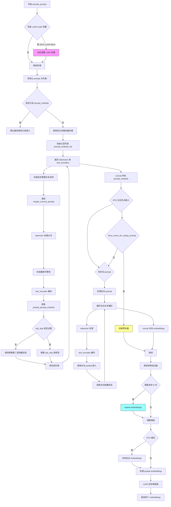

#### 带注释源码

```python
def encode_prompt(
    self,
    prompt: str,
    prompt_2: str | None = None,
    device: torch.device | None = None,
    num_images_per_prompt: int = 1,
    do_classifier_free_guidance: bool = True,
    negative_prompt: str | None = None,
    negative_prompt_2: str | None = None,
    prompt_embeds: torch.Tensor | None = None,
    negative_prompt_embeds: torch.Tensor | None = None,
    pooled_prompt_embeds: torch.Tensor | None = None,
    negative_pooled_prompt_embeds: torch.Tensor | None = None,
    lora_scale: float | None = None,
    clip_skip: int | None = None,
):
    r"""
    Encodes the prompt into text encoder hidden states.

    Args:
        prompt (`str` or `list[str]`, *optional*):
            prompt to be encoded
        prompt_2 (`str` or `list[str]`, *optional*):
            The prompt or prompts to be sent to the `tokenizer_2` and `text_encoder_2`. If not defined, `prompt` is
            used in both text-encoders
        device: (`torch.device`):
            torch device
        num_images_per_prompt (`int`):
            number of images that should be generated per prompt
        do_classifier_free_guidance (`bool`):
            whether to use classifier free guidance or not
        negative_prompt (`str` or `list[str]`, *optional*):
            The prompt or prompts not to guide the image generation. If not defined, one has to pass
            `negative_prompt_embeds` instead. Ignored when not using guidance (i.e., ignored if `guidance_scale` is
            less than `1`).
        negative_prompt_2 (`str` or `list[str]`, *optional*):
            The prompt or prompts not to guide the image generation to be sent to `tokenizer_2` and
            `text_encoder_2`. If not defined, `negative_prompt` is used in both text-encoders
        prompt_embeds (`torch.Tensor`, *optional*):
            Pre-generated text embeddings. Can be used to easily tweak text inputs, *e.g.* prompt weighting. If not
            provided, text embeddings will be generated from `prompt` input argument.
        negative_prompt_embeds (`torch.Tensor`, *optional*):
            Pre-generated negative text embeddings. Can be used to easily tweak text inputs, *e.g.* prompt
            weighting. If not provided, negative_prompt_embeds will be generated from `negative_prompt` input
            argument.
        pooled_prompt_embeds (`torch.Tensor`, *optional*):
            Pre-generated pooled text embeddings. Can be used to easily tweak text inputs, *e.g.* prompt weighting.
            If not provided, pooled text embeddings will be generated from `prompt` input argument.
        negative_pooled_prompt_embeds (`torch.Tensor`, *optional*):
            Pre-generated negative pooled text embeddings. Can be used to easily tweak text inputs, *e.g.* prompt
            weighting. If not provided, pooled negative_prompt_embeds will be generated from `negative_prompt`
            input argument.
        lora_scale (`float`, *optional*):
            A lora scale that will be applied to all LoRA layers of the text encoder if LoRA layers are loaded.
        clip_skip (`int`, *optional*):
            Number of layers to be skipped from CLIP while computing the prompt embeddings. A value of 1 means that
            the output of the pre-final layer will be used for computing the prompt embeddings.
    """
    # 确定执行设备，默认使用实例绑定的执行设备
    device = device or self._execution_device

    # 设置 LoRA 缩放因子，使文本编码器的 LoRA 函数可以正确访问
    # 检查是否传入了 lora_scale 且当前管线支持 LoRA
    if lora_scale is not None and isinstance(self, StableDiffusionXLLoraLoaderMixin):
        self._lora_scale = lora_scale

        # 动态调整 LoRA 缩放 - 根据是否使用 PEFT backend 选择不同方式
        if self.text_encoder is not None:
            if not USE_PEFT_BACKEND:
                adjust_lora_scale_text_encoder(self.text_encoder, lora_scale)
            else:
                scale_lora_layers(self.text_encoder, lora_scale)

        if self.text_encoder_2 is not None:
            if not USE_PEFT_BACKEND:
                adjust_lora_scale_text_encoder(self.text_encoder_2, lora_scale)
            else:
                scale_lora_layers(self.text_encoder_2, lora_scale)

    # 统一将单个字符串 prompt 转换为列表，便于批处理
    prompt = [prompt] if isinstance(prompt, str) else prompt

    # 计算批次大小：优先使用 prompt 长度，其次使用已提供的 prompt_embeds 维度
    if prompt is not None:
        batch_size = len(prompt)
    else:
        batch_size = prompt_embeds.shape[0]

    # 定义文本编码器和分词器列表（支持双文本编码器架构）
    # 如果 tokenizers 只提供一个，则使用该 tokenizer 处理两个 prompt
    tokenizers = [self.tokenizer, self.tokenizer_2] if self.tokenizer is not None else [self.tokenizer_2]
    text_encoders = (
        [self.text_encoder, self.text_encoder_2] if self.text_encoder is not None else [self.text_encoder_2]
    )

    # ========== 处理正向提示词编码 ==========
    if prompt_embeds is None:
        # prompt_2 未提供时，默认使用 prompt
        prompt_2 = prompt_2 or prompt
        prompt_2 = [prompt_2] if isinstance(prompt_2, str) else prompt_2

        # 用于存储两个文本编码器生成的 embeddings
        prompt_embeds_list = []
        prompts = [prompt, prompt_2]

        # 遍历两个文本编码器：tokenizer + text_encoder 组合
        for prompt, tokenizer, text_encoder in zip(prompts, tokenizers, text_encoders):
            # 如果实现了文本反转加载Mixin，处理多向量 token
            if isinstance(self, TextualInversionLoaderMixin):
                prompt = self.maybe_convert_prompt(prompt, tokenizer)

            # 使用 tokenizer 将文本转为 token IDs
            text_inputs = tokenizer(
                prompt,
                padding="max_length",
                max_length=tokenizer.model_max_length,
                truncation=True,
                return_tensors="pt",
            )

            text_input_ids = text_inputs.input_ids
            # 获取未截断的 token IDs 用于检测截断
            untruncated_ids = tokenizer(prompt, padding="longest", return_tensors="pt").input_ids

            # 检测并警告：CLIP 模型有最大 token 长度限制
            if untruncated_ids.shape[-1] >= text_input_ids.shape[-1] and not torch.equal(
                text_input_ids, untruncated_ids
            ):
                removed_text = tokenizer.batch_decode(untruncated_ids[:, tokenizer.model_max_length - 1 : -1])
                logger.warning(
                    "The following part of your input was truncated because CLIP can only handle sequences up to"
                    f" {tokenizer.model_max_length} tokens: {removed_text}"
                )

            # 文本编码器前向传播，获取隐藏状态
            prompt_embeds = text_encoder(text_input_ids.to(device), output_hidden_states=True)

            # 提取池化输出（用于 SDXL 的时间步嵌入）
            # 只关心最终文本编码器的池化输出
            if pooled_prompt_embeds is None and prompt_embeds[0].ndim == 2:
                pooled_prompt_embeds = prompt_embeds[0]

            # 根据 clip_skip 选择隐藏层：None 时使用倒数第二层
            if clip_skip is None:
                prompt_embeds = prompt_embeds.hidden_states[-2]
            else:
                # SDXL 索引从倒数第二层开始，所以 +2
                prompt_embeds = prompt_embeds.hidden_states[-(clip_skip + 2)]

            prompt_embeds_list.append(prompt_embeds)

        # 沿最后一个维度拼接两个文本编码器的输出
        prompt_embeds = torch.concat(prompt_embeds_list, dim=-1)

    # ========== 处理分类器无关引导的无条件嵌入 ==========
    # 检查是否需要强制将空 prompt 的负向嵌入设为零
    zero_out_negative_prompt = negative_prompt is None and self.config.force_zeros_for_empty_prompt
    
    # 情况1：使用 CFG 且没有提供负向嵌入，但配置要求强制为零
    if do_classifier_free_guidance and negative_prompt_embeds is None and zero_out_negative_prompt:
        negative_prompt_embeds = torch.zeros_like(prompt_embeds)
        negative_pooled_prompt_embeds = torch.zeros_like(pooled_prompt_embeds)
    # 情况2：使用 CFG 且没有提供负向嵌入，需要从 negative_prompt 生成
    elif do_classifier_free_guidance and negative_prompt_embeds is None:
        # 默认空字符串
        negative_prompt = negative_prompt or ""
        negative_prompt_2 = negative_prompt_2 or negative_prompt

        # 规范化负向 prompt 为列表（与批次大小匹配）
        negative_prompt = batch_size * [negative_prompt] if isinstance(negative_prompt, str) else negative_prompt
        negative_prompt_2 = (
            batch_size * [negative_prompt_2] if isinstance(negative_prompt_2, str) else negative_prompt_2
        )

        # 类型检查：negative_prompt 与 prompt 类型必须一致
        uncond_tokens: list[str]
        if prompt is not None and type(prompt) is not type(negative_prompt):
            raise TypeError(
                f"`negative_prompt` should be the same type to `prompt`, but got {type(negative_prompt)} !="
                f" {type(prompt)}."
            )
        elif batch_size != len(negative_prompt):
            raise ValueError(
                f"`negative_prompt`: {negative_prompt} has batch size {len(negative_prompt)}, but `prompt`:"
                f" {prompt} has batch size {batch_size}. Please make sure that passed `negative_prompt` matches"
                " the batch size of `prompt`."
            )
        else:
            uncond_tokens = [negative_prompt, negative_prompt_2]

        # 编码负向提示词
        negative_prompt_embeds_list = []
        for negative_prompt, tokenizer, text_encoder in zip(uncond_tokens, tokenizers, text_encoders):
            # 文本反转处理
            if isinstance(self, TextualInversionLoaderMixin):
                negative_prompt = self.maybe_convert_prompt(negative_prompt, tokenizer)

            # 使用已编码的 prompt_embeds 长度作为 max_length
            max_length = prompt_embeds.shape[1]
            uncond_input = tokenizer(
                negative_prompt,
                padding="max_length",
                max_length=max_length,
                truncation=True,
                return_tensors="pt",
            )

            # 编码负向文本
            negative_prompt_embeds = text_encoder(
                uncond_input.input_ids.to(device),
                output_hidden_states=True,
            )

            # 提取负向池化嵌入
            if negative_pooled_prompt_embeds is None and negative_prompt_embeds[0].ndim == 2:
                negative_pooled_prompt_embeds = negative_prompt_embeds[0]
            negative_prompt_embeds = negative_prompt_embeds.hidden_states[-2]

            negative_prompt_embeds_list.append(negative_prompt_embeds)

        # 拼接负向嵌入
        negative_prompt_embeds = torch.concat(negative_prompt_embeds_list, dim=-1)

    # ========== 类型转换和设备移动 ==========
    # 将 prompt_embeds 转换到适当的 dtype（优先使用 text_encoder_2 的类型）
    if self.text_encoder_2 is not None:
        prompt_embeds = prompt_embeds.to(dtype=self.text_encoder_2.dtype, device=device)
    else:
        prompt_embeds = prompt_embeds.to(dtype=self.unet.dtype, device=device)

    # 获取当前 embeddings 维度信息
    bs_embed, seq_len, _ = prompt_embeds.shape
    
    # ========== 复制 embeddings 以支持每个 prompt 生成多张图像 ==========
    # 使用 MPS 友好的重复方法
    prompt_embeds = prompt_embeds.repeat(1, num_images_per_prompt, 1)
    prompt_embeds = prompt_embeds.view(bs_embed * num_images_per_prompt, seq_len, -1)

    # 如果使用 CFG，也需要复制负向 embeddings
    if do_classifier_free_guidance:
        seq_len = negative_prompt_embeds.shape[1]

        if self.text_encoder_2 is not None:
            negative_prompt_embeds = negative_prompt_embeds.to(dtype=self.text_encoder_2.dtype, device=device)
        else:
            negative_prompt_embeds = negative_prompt_embeds.to(dtype=self.unet.dtype, device=device)

        negative_prompt_embeds = negative_prompt_embeds.repeat(1, num_images_per_prompt, 1)
        negative_prompt_embeds = negative_prompt_embeds.view(batch_size * num_images_per_prompt, seq_len, -1)

    # 处理池化 embeddings 的复制
    pooled_prompt_embeds = pooled_prompt_embeds.repeat(1, num_images_per_prompt).view(
        bs_embed * num_images_per_prompt, -1
    )
    if do_classifier_free_guidance:
        negative_pooled_prompt_embeds = negative_pooled_prompt_embeds.repeat(1, num_images_per_prompt).view(
            bs_embed * num_images_per_prompt, -1
        )

    # ========== LoRA 后处理：恢复原始缩放 ==========
    # 使用 PEFT backend 时，需要取消 LoRA 层的缩放以保持一致性
    if self.text_encoder is not None:
        if isinstance(self, StableDiffusionXLLoraLoaderMixin) and USE_PEFT_BACKEND:
            # 通过反向缩放 LoRA 层恢复原始权重
            unscale_lora_layers(self.text_encoder, lora_scale)

    if self.text_encoder_2 is not None:
        if isinstance(self, StableDiffusionXLLoraLoaderMixin) and USE_PEFT_BACKEND:
            unscale_lora_layers(self.text_encoder_2, lora_scale)

    # 返回四个 embeddings 元组
    return prompt_embeds, negative_prompt_embeds, pooled_prompt_embeds, negative_pooled_prompt_embeds
```


### `StableDiffusionXLControlNetInpaintPipeline.encode_image`

该方法用于将输入图像编码为图像嵌入向量（image embeddings）或隐藏状态（hidden states），以供后续的 IP-Adapter 图像条件引导或多模态条件处理使用。

参数：

- `image`：`torch.Tensor | PIL.Image.Image | np.ndarray | list`，输入图像，支持张量、PIL图像、numpy数组或图像列表
- `device`：`torch.device`，目标计算设备（如 CPU/CUDA）
- `num_images_per_prompt`：`int`，每个 prompt 生成的图像数量，用于复制嵌入向量维度
- `output_hidden_states`：`bool | None`，是否返回编码器的隐藏状态而非图像嵌入，默认为 `None`

返回值：`tuple[torch.Tensor, torch.Tensor]`，返回两个张量元组——条件图像嵌入（或隐藏状态）和无条件图像嵌入（或隐藏状态），用于分类器自由引导（Classifier-Free Guidance）

#### 流程图

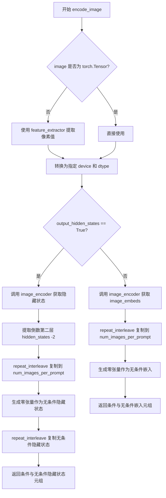

#### 带注释源码

```python
def encode_image(self, image, device, num_images_per_prompt, output_hidden_states=None):
    """
    将输入图像编码为图像嵌入或隐藏状态，用于后续的图像条件引导。
    
    Args:
        image: 输入图像，支持 torch.Tensor, PIL.Image, np.ndarray 或 list 类型
        device: 目标 PyTorch 设备
        num_images_per_prompt: 每个 prompt 生成的图像数量，用于扩展嵌入维度
        output_hidden_states: 是否返回编码器的隐藏状态（True）还是图像嵌入（False/None）
    
    Returns:
        tuple: (条件嵌入, 无条件嵌入) 或 (条件隐藏状态, 无条件隐藏状态)
    """
    # 获取 image_encoder 的参数数据类型，用于后续张量转换
    dtype = next(self.image_encoder.parameters()).dtype

    # 如果输入不是张量，则使用特征提取器将其转换为像素值张量
    if not isinstance(image, torch.Tensor):
        image = self.feature_extractor(image, return_tensors="pt").pixel_values

    # 将图像移动到指定设备并转换数据类型
    image = image.to(device=device, dtype=dtype)
    
    # 根据 output_hidden_states 标志决定输出格式
    if output_hidden_states:
        # 返回隐藏状态模式：获取倒数第二层特征（-2）
        # 用于更丰富的图像特征表示
        image_enc_hidden_states = self.image_encoder(image, output_hidden_states=True).hidden_states[-2]
        # 扩展条件嵌入维度以匹配 num_images_per_prompt
        image_enc_hidden_states = image_enc_hidden_states.repeat_interleave(num_images_per_prompt, dim=0)
        
        # 生成零张量作为无条件的图像条件（用于 CFG）
        uncond_image_enc_hidden_states = self.image_encoder(
            torch.zeros_like(image), output_hidden_states=True
        ).hidden_states[-2]
        # 同样扩展无条件嵌入
        uncond_image_enc_hidden_states = uncond_image_enc_hidden_states.repeat_interleave(
            num_images_per_prompt, dim=0
        )
        return image_enc_hidden_states, uncond_image_enc_hidden_states
    else:
        # 默认模式：返回图像嵌入（image_embeds）
        image_embeds = self.image_encoder(image).image_embeds
        # 扩展条件嵌入维度
        image_embeds = image_embeds.repeat_interleave(num_images_per_prompt, dim=0)
        # 生成零张量作为无条件嵌入
        uncond_image_embeds = torch.zeros_like(image_embeds)

        return image_embeds, uncond_image_embeds
```


### `StableDiffusionXLControlNetInpaintPipeline.prepare_ip_adapter_image_embeds`

该方法用于准备 IP-Adapter 的图像嵌入，将输入的图像或预计算的图像嵌入处理为符合扩散模型要求的格式，支持分类器自由引导（CFG）模式下的正向和负向嵌入处理。

参数：

- `ip_adapter_image`：`PipelineImageInput | None`，待处理的 IP-Adapter 输入图像，支持 PIL.Image、torch.Tensor、numpy.array 或它们的列表
- `ip_adapter_image_embeds`：`list[torch.Tensor] | None`，预计算的图像嵌入列表，每个元素应为形状如 (batch_size, num_images, emb_dim) 的张量，包含 CFG 模式下的负向嵌入（如果启用）
- `device`：`torch.device`，目标计算设备
- `num_images_per_prompt`：`int`，每个文本提示生成的图像数量
- `do_classifier_free_guidance`：`bool`，是否启用分类器自由引导

返回值：`list[torch.Tensor]`，处理后的 IP-Adapter 图像嵌入列表，每个元素为拼接了 CFG 正负向嵌入的张量

#### 流程图

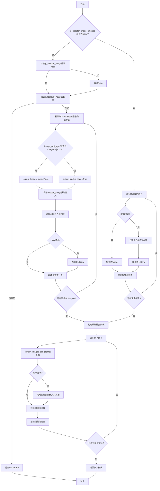

#### 带注释源码

```python
def prepare_ip_adapter_image_embeds(
    self,
    ip_adapter_image,              # 输入的IP-Adapter图像（PIL/Tensor/Numpy/列表）
    ip_adapter_image_embeds,       # 预计算的嵌入（可选）
    device,                       # 目标设备
    num_images_per_prompt,        # 每提示生成的图像数
    do_classifier_free_guidance   # 是否启用CFG
):
    """
    准备IP-Adapter图像嵌入
    
    处理逻辑：
    1. 如果未提供预计算嵌入，则对输入图像进行编码
    2. 支持多个IP-Adapter同时工作
    3. 根据CFG模式处理正向/负向嵌入
    4. 复制嵌入以匹配生成的图像数量
    """
    image_embeds = []              # 存储处理过程中的嵌入
    if do_classifier_free_guidance:
        negative_image_embeds = [] # 存储CFG所需的负向嵌入
    
    # 分支1：需要从图像编码获取嵌入
    if ip_adapter_image_embeds is None:
        # 统一转为列表格式
        if not isinstance(ip_adapter_image, list):
            ip_adapter_image = [ip_adapter_image]
        
        # 验证图像数量与IP-Adapter数量匹配
        if len(ip_adapter_image) != len(self.unet.encoder_hid_proj.image_projection_layers):
            raise ValueError(
                f"`ip_adapter_image` must have same length as the number of IP Adapters. "
                f"Got {len(ip_adapter_image)} images and "
                f"{len(self.unet.encoder_hid_proj.image_projection_layers)} IP Adapters."
            )
        
        # 遍历每个IP-Adapter的图像和对应的投影层
        for single_ip_adapter_image, image_proj_layer in zip(
            ip_adapter_image, self.unet.encoder_hid_proj.image_projection_layers
        ):
            # 确定是否输出隐藏状态（ImageProjection层不需要）
            output_hidden_state = not isinstance(image_proj_layer, ImageProjection)
            
            # 编码图像获取嵌入
            single_image_embeds, single_negative_image_embeds = self.encode_image(
                single_ip_adapter_image, device, 1, output_hidden_state
            )
            
            # 添加批次维度并存储
            image_embeds.append(single_image_embeds[None, :])
            
            # CFG模式下同时保存负向嵌入
            if do_classifier_free_guidance:
                negative_image_embeds.append(single_negative_image_embeds[None, :])
    
    # 分支2：使用预计算的嵌入
    else:
        for single_image_embeds in ip_adapter_image_embeds:
            if do_classifier_free_guidance:
                # 从预计算嵌入中分离正负向（假设拼接在一起）
                single_negative_image_embeds, single_image_embeds = single_image_embeds.chunk(2)
                negative_image_embeds.append(single_negative_image_embeds)
            image_embeds.append(single_image_embeds)
    
    # 最终处理：复制并拼接嵌入
    ip_adapter_image_embeds = []
    for i, single_image_embeds in enumerate(image_embeds):
        # 复制以匹配每提示生成的图像数量
        single_image_embeds = torch.cat([single_image_embeds] * num_images_per_prompt, dim=0)
        
        if do_classifier_free_guidance:
            # 复制负向嵌入并与正向嵌入拼接 [neg, pos]
            single_negative_image_embeds = torch.cat(
                [negative_image_embeds[i]] * num_images_per_prompt, dim=0
            )
            single_image_embeds = torch.cat(
                [single_negative_image_embeds, single_image_embeds], dim=0
            )
        
        # 移动到目标设备
        single_image_embeds = single_image_embeds.to(device=device)
        ip_adapter_image_embeds.append(single_image_embeds)
    
    return ip_adapter_image_embeds
```


### `StableDiffusionXLControlNetInpaintPipeline.prepare_extra_step_kwargs`

准备调度器额外参数。该方法通过检查调度器 `step` 方法的签名，动态判断调度器是否支持 `eta` 和 `generator` 参数，并将这些参数组装成字典返回，以适配不同类型的调度器（如 DDIMScheduler 需支持 eta，其他调度器可能忽略该参数）。

参数：

- `self`：隐式参数，StableDiffusionXLControlNetInpaintPipeline 实例本身
- `generator`：`torch.Generator | list[torch.Generator] | None`，用于生成确定性随机数的 PyTorch 生成器
- `eta`：`float`，DDIM 论文中的 η 参数，取值范围 [0, 1]，仅 DDIMScheduler 使用，其他调度器会忽略

返回值：`dict`，包含调度器 `step` 方法额外参数的字典，可能包含 `eta` 和/或 `generator` 键

#### 流程图

```mermaid
flowchart TD
    A[开始] --> B[获取调度器 step 方法的签名参数]
    B --> C{eta 是否在签名中?}
    C -->|是| D[设置 extra_step_kwargs['eta'] = eta]
    C -->|否| E[跳过 eta]
    D --> F{generator 是否在签名中?}
    E --> F
    F -->|是| G[设置 extra_step_kwargs['generator'] = generator]
    F -->|否| H[跳过 generator]
    G --> I[返回 extra_step_kwargs 字典]
    H --> I
```

#### 带注释源码

```python
# Copied from diffusers.pipelines.stable_diffusion.pipeline_stable_diffusion.StableDiffusionPipeline.prepare_extra_step_kwargs
def prepare_extra_step_kwargs(self, generator, eta):
    # 准备调度器的额外参数，因为并非所有调度器都具有相同的函数签名
    # eta (η) 仅在 DDIMScheduler 中使用，其他调度器会忽略该参数
    # eta 对应 DDIM 论文中的 η: https://huggingface.co/papers/2010.02502
    # 取值应在 [0, 1] 范围内

    # 通过 inspect 检查调度器 step 方法是否接受 eta 参数
    accepts_eta = "eta" in set(inspect.signature(self.scheduler.step).parameters.keys())
    # 初始化空字典用于存储额外参数
    extra_step_kwargs = {}
    # 如果调度器支持 eta，则将其加入参数字典
    if accepts_eta:
        extra_step_kwargs["eta"] = eta

    # 检查调度器是否接受 generator 参数
    accepts_generator = "generator" in set(inspect.signature(self.scheduler.step).parameters.keys())
    # 如果调度器支持 generator，则将其加入参数字典
    if accepts_generator:
        extra_step_kwargs["generator"] = generator
    
    # 返回组装好的额外参数字典
    return extra_step_kwargs
```


### `StableDiffusionXLControlNetInpaintPipeline.check_image`

该方法用于验证输入图像的类型和批次大小是否符合管道的预期，确保图像是 PIL Image、NumPy 数组、PyTorch 张量之一，或者是这些类型的列表，同时检查图像批次大小与提示词批次大小是否匹配。

参数：

- `self`：隐式参数，指向 `StableDiffusionXLControlNetInpaintPipeline` 类的实例
- `image`：输入的图像数据，支持 PIL Image、torch.Tensor、numpy.ndarray 或它们的列表类型，用于修复的输入图像
- `prompt`：字符串或字符串列表，用于指导图像生成的正向提示词
- `prompt_embeds`：预生成的文本嵌入张量，形状为 `(batch_size, seq_len, hidden_size)`

返回值：无返回值（`None`），该方法仅进行输入验证，若验证失败则抛出异常

#### 流程图

```mermaid
flowchart TD
    A[开始 check_image] --> B{检查 image 类型}
    B --> C{image 是 PIL Image?}
    C -->|是| D[设置 image_batch_size = 1]
    C -->|否| E[设置 image_batch_size = len(image)]
    D --> F{获取 prompt_batch_size}
    E --> F
    F --> G{prompt 是 str?}
    G -->|是| H[prompt_batch_size = 1]
    G -->|否| I{prompt 是 list?}
    I -->|是| J[prompt_batch_size = len(prompt)]
    I -->|否| K[使用 prompt_embeds.shape[0]]
    H --> L{校验 batch_size 匹配}
    J --> L
    K --> L
    L --> M{image_batch_size != 1 且 != prompt_batch_size?}
    M -->|是| N[抛出 ValueError]
    M -->|否| O[结束 check_image]
    N --> O
```

#### 带注释源码

```python
def check_image(self, image, prompt, prompt_embeds):
    """
    检查图像输入的有效性，包括类型检查和批次大小一致性检查。
    
    参数:
        image: 输入的图像，可以是 PIL Image、torch.Tensor、numpy.ndarray 或它们的列表
        prompt: 文本提示词，字符串或字符串列表
        prompt_embeds: 预计算的文本嵌入张量
    
    异常:
        TypeError: 当 image 类型不符合预期时抛出
        ValueError: 当图像批次大小与提示词批次大小不匹配时抛出
    """
    # 检查 image 是否为 PIL Image
    image_is_pil = isinstance(image, PIL.Image.Image)
    # 检查 image 是否为 torch.Tensor
    image_is_tensor = isinstance(image, torch.Tensor)
    # 检查 image 是否为 numpy.ndarray
    image_is_np = isinstance(image, np.ndarray)
    # 检查 image 是否为 PIL Image 列表
    image_is_pil_list = isinstance(image, list) and isinstance(image[0], PIL.Image.Image)
    # 检查 image 是否为 torch.Tensor 列表
    image_is_tensor_list = isinstance(image, list) and isinstance(image[0], torch.Tensor)
    # 检查 image 是否为 numpy.ndarray 列表
    image_is_np_list = isinstance(image, list) and isinstance(image[0], np.ndarray)

    # 如果 image 不属于任何支持的类型，抛出 TypeError
    if (
        not image_is_pil
        and not image_is_tensor
        and not image_is_np
        and not image_is_pil_list
        and not image_is_tensor_list
        and not image_is_np_list
    ):
        raise TypeError(
            f"image must be passed and be one of PIL image, numpy array, torch tensor, list of PIL images, list of numpy arrays or list of torch tensors, but is {type(image)}"
        )

    # 确定图像批次大小：PIL Image 单张为 1，否则为列表长度
    if image_is_pil:
        image_batch_size = 1
    else:
        image_batch_size = len(image)

    # 根据 prompt 或 prompt_embeds 确定提示词批次大小
    if prompt is not None and isinstance(prompt, str):
        prompt_batch_size = 1
    elif prompt is not None and isinstance(prompt, list):
        prompt_batch_size = len(prompt)
    elif prompt_embeds is not None:
        prompt_batch_size = prompt_embeds.shape[0]
    
    # 校验批次大小一致性：图像批次大小必须为 1 或与提示词批次大小相同
    if image_batch_size != 1 and image_batch_size != prompt_batch_size:
        raise ValueError(
            f"If image batch size is not 1, image batch size must be same as prompt batch size. image batch size: {image_batch_size}, prompt batch size: {prompt_batch_size}"
        )
```


### `StableDiffusionXLControlNetInpaintPipeline.check_inputs`

检查并验证 `StableDiffusionXLControlNetInpaintPipeline` 管道输入参数的有效性，确保所有参数符合管道要求，若参数无效则抛出相应的异常。

参数：

- `prompt`：`str | list[str] | None`，主要提示词，用于指导图像生成
- `prompt_2`：`str | list[str] | None`，发送给第二个文本编码器的提示词，若不指定则使用 `prompt`
- `image`：`PipelineImageInput`，待修复的图像或图像批次
- `mask_image`：`PipelineImageInput`，用于遮罩的图像，白色像素将被重绘
- `strength`：`float`，概念上表示对参考图像遮罩部分的变换程度，范围 [0, 1]
- `num_inference_steps`：`int`，去噪步数，必须为正整数
- `callback_steps`：`int | None`，如果提供，必须为正整数，表示每多少步调用一次回调
- `output_type`：`str`，生成图像的输出格式，如 "pil" 或 "latent"
- `negative_prompt`：`str | list[str] | None`，不用于指导图像生成的负面提示词
- `negative_prompt_2`：`str | list[str] | None`，发送给第二个文本编码器的负面提示词
- `prompt_embeds`：`torch.Tensor | None`，预生成的文本嵌入，与 prompt 互斥
- `negative_prompt_embeds`：`torch.Tensor | None`，预生成的负面文本嵌入
- `ip_adapter_image`：`PipelineImageInput | None`，用于 IP Adapter 的图像输入
- `ip_adapter_image_embeds`：`list[torch.Tensor] | None`，预生成的 IP Adapter 图像嵌入
- `pooled_prompt_embeds`：`torch.Tensor | None`，预生成的池化文本嵌入
- `negative_pooled_prompt_embeds`：`torch.Tensor | None`，预生成的负面池化文本嵌入
- `controlnet_conditioning_scale`：`float | list[float]`，ControlNet 条件缩放因子
- `control_guidance_start`：`float | list[float]`，ControlNet 指导开始时间
- `control_guidance_end`：`float | list[float]`，ControlNet 指导结束时间
- `callback_on_step_end_tensor_inputs`：`list[str] | None`，在步骤结束时调用的张量输入列表
- `padding_mask_crop`：`int | None`，遮罩裁剪的边距大小

返回值：`None`，该方法不返回任何值，仅通过抛出异常来处理验证错误

#### 流程图

```mermaid
flowchart TD
    A[开始 check_inputs] --> B{strength 在 [0, 1] 范围?}
    B -->|否| B1[抛出 ValueError]
    B -->|是| C{num_inference_steps 是正整数?}
    C -->|否| C1[抛出 ValueError]
    C -->|是| D{callback_steps 是正整数?}
    D -->|否| D1[抛出 ValueError]
    D -->|是| E{callback_on_step_end_tensor_inputs 有效?}
    E -->|否| E1[抛出 ValueError]
    E -->|是| F{prompt 和 prompt_embeds 互斥?}
    F -->|否| F1[抛出 ValueError]
    F -->|是| G{prompt_2 和 prompt_embeds 互斥?}
    G -->|否| G1[抛出 ValueError]
    G -->|是| H{prompt 或 prompt_embeds 至少提供一个?}
    H -->|否| H1[抛出 ValueError]
    H -->|是| I{prompt 类型是 str 或 list?}
    I -->|否| I1[抛出 ValueError]
    I -->|是| J{prompt_2 类型是 str 或 list?]
    J -->|否| J1[抛出 ValueError]
    J -->|是| K{negative_prompt 和 negative_prompt_embeds 互斥?}
    K -->|否| K1[抛出 ValueError]
    K -->|是| L{negative_prompt_2 和 negative_prompt_embeds 互斥?}
    L -->|否| L1[抛出 ValueError]
    L -->|是| M{prompt_embeds 和 negative_prompt_embeds 形状一致?}
    M -->|否| M1[抛出 ValueError]
    M -->|是| N{padding_mask_crop 不为 None?}
    N -->|是| N1{image 是 PIL.Image?}
    N1 -->|否| N2[抛出 ValueError]
    N1 -->|是| N3{mask_image 是 PIL.Image?}
    N3 -->|否| N4[抛出 ValueError]
    N3 -->|是| N5{output_type 是 'pil'?]
    N5 -->|否| N6[抛出 ValueError]
    N5 -->|是| N7[继续验证]
    N -->|否| O{prompt_embeds 提供时 pooled_prompt_embeds 也提供?}
    O -->|否| O1[抛出 ValueError]
    O -->|是| P{negative_prompt_embeds 提供时 negative_pooled_prompt_embeds 也提供?}
    P -->|否| P1[抛出 ValueError]
    P -->|是| Q{检查 controlnet 配置]}
    Q --> R{检查 image 参数}
    R --> S{检查 controlnet_conditioning_scale}
    S --> T{检查 control_guidance_start 和 control_guidance_end}
    T --> U{检查 ip_adapter_image 和 ip_adapter_image_embeds}
    U --> V[验证通过]
```

#### 带注释源码

```python
def check_inputs(
    self,
    prompt,                      # 主要提示词
    prompt_2,                    # 第二文本编码器的提示词
    image,                       # 待修复的图像
    mask_image,                  # 遮罩图像
    strength,                    # 变换强度 [0, 1]
    num_inference_steps,         # 去噪步数
    callback_steps,              # 回调步数
    output_type,                 # 输出类型
    negative_prompt=None,        # 负面提示词
    negative_prompt_2=None,      # 第二负面提示词
    prompt_embeds=None,          # 预生成提示词嵌入
    negative_prompt_embeds=None, # 预生成负面嵌入
    ip_adapter_image=None,       # IP Adapter 图像
    ip_adapter_image_embeds=None,# IP Adapter 嵌入
    pooled_prompt_embeds=None,   # 池化提示词嵌入
    negative_pooled_prompt_embeds=None, # 负面池化嵌入
    controlnet_conditioning_scale=1.0, # ControlNet 缩放因子
    control_guidance_start=0.0,  # ControlNet 指导起始
    control_guidance_end=1.0,    # ControlNet 指导结束
    callback_on_step_end_tensor_inputs=None, # 回调张量输入
    padding_mask_crop=None,      # 遮罩裁剪边距
):
    # 验证 strength 参数必须在 [0.0, 1.0] 范围内
    if strength < 0 or strength > 1:
        raise ValueError(f"The value of strength should in [0.0, 1.0] but is {strength}")
    
    # 验证 num_inference_steps 不能为 None 且必须是正整数
    if num_inference_steps is None:
        raise ValueError("`num_inference_steps` cannot be None.")
    elif not isinstance(num_inference_steps, int) or num_inference_steps <= 0:
        raise ValueError(
            f"`num_inference_steps` has to be a positive integer but is {num_inference_steps} of type"
            f" {type(num_inference_steps)}."
        )

    # 验证 callback_steps 如果提供必须是正整数
    if callback_steps is not None and (not isinstance(callback_steps, int) or callback_steps <= 0):
        raise ValueError(
            f"`callback_steps` has to be a positive integer but is {callback_steps} of type"
            f" {type(callback_steps)}."
        )

    # 验证 callback_on_step_end_tensor_inputs 中的所有键都在允许列表中
    if callback_on_step_end_tensor_inputs is not None and not all(
        k in self._callback_tensor_inputs for k in callback_on_step_end_tensor_inputs
    ):
        raise ValueError(
            f"`callback_on_step_end_tensor_inputs` has to be in {self._callback_tensor_inputs}, but found {[k for k in callback_on_step_end_tensor_inputs if k not in self._callback_tensor_inputs]}"
        )

    # 验证 prompt 和 prompt_embeds 互斥，不能同时提供
    if prompt is not None and prompt_embeds is not None:
        raise ValueError(
            f"Cannot forward both `prompt`: {prompt} and `prompt_embeds`: {prompt_embeds}. Please make sure to"
            " only forward one of the two."
        )
    # 验证 prompt_2 和 prompt_embeds 互斥
    elif prompt_2 is not None and prompt_embeds is not None:
        raise ValueError(
            f"Cannot forward both `prompt_2`: {prompt_2} and `prompt_embeds`: {prompt_embeds}. Please make sure to"
            " only forward one of the two."
        )
    # 至少提供 prompt 或 prompt_embeds 之一
    elif prompt is None and prompt_embeds is None:
        raise ValueError(
            "Provide either `prompt` or `prompt_embeds`. Cannot leave both `prompt` and `prompt_embeds` undefined."
        )
    # 验证 prompt 类型
    elif prompt is not None and (not isinstance(prompt, str) and not isinstance(prompt, list)):
        raise ValueError(f"`prompt` has to be of type `str` or `list` but is {type(prompt)}")
    # 验证 prompt_2 类型
    elif prompt_2 is not None and (not isinstance(prompt_2, str) and not isinstance(prompt_2, list)):
        raise ValueError(f"`prompt_2` has to be of type `str` or `list` but is {type(prompt_2)}")

    # 验证 negative_prompt 和 negative_prompt_embeds 互斥
    if negative_prompt is not None and negative_prompt_embeds is not None:
        raise ValueError(
            f"Cannot forward both `negative_prompt`: {negative_prompt} and `negative_prompt_embeds`:"
            f" {negative_prompt_embeds}. Please make sure to only forward one of the two."
        )
    # 验证 negative_prompt_2 和 negative_prompt_embeds 互斥
    elif negative_prompt_2 is not None and negative_prompt_embeds is not None:
        raise ValueError(
            f"Cannot forward both `negative_prompt_2`: {negative_prompt_2} and `negative_prompt_embeds`:"
            f" {negative_prompt_embeds}. Please make sure to only forward one of the two."
        )

    # 验证 prompt_embeds 和 negative_prompt_embeds 形状一致
    if prompt_embeds is not None and negative_prompt_embeds is not None:
        if prompt_embeds.shape != negative_prompt_embeds.shape:
            raise ValueError(
                "`prompt_embeds` and `negative_prompt_embeds` must have the same shape when passed directly, but"
                f" got: `prompt_embeds` {prompt_embeds.shape} != `negative_prompt_embeds`"
                f" {negative_prompt_embeds.shape}."
            )

    # 如果使用 padding_mask_crop，必须满足特定条件
    if padding_mask_crop is not None:
        # image 必须是 PIL Image
        if not isinstance(image, PIL.Image.Image):
            raise ValueError(
                f"The image should be a PIL image when inpainting mask crop, but is of type {type(image)}."
            )
        # mask_image 必须是 PIL Image
        if not isinstance(mask_image, PIL.Image.Image):
            raise ValueError(
                f"The mask image should be a PIL image when inpainting mask crop, but is of type"
                f" {type(mask_image)}."
            )
        # output_type 必须是 "pil"
        if output_type != "pil":
            raise ValueError(f"The output type should be PIL when inpainting mask crop, but is {output_type}.")

    # 如果提供 prompt_embeds，也必须提供 pooled_prompt_embeds
    if prompt_embeds is not None and pooled_prompt_embeds is None:
        raise ValueError(
            "If `prompt_embeds` are provided, `pooled_prompt_embeds` also have to be passed. Make sure to generate `pooled_prompt_embeds` from the same text encoder that was used to generate `prompt_embeds`."
        )

    # 如果提供 negative_prompt_embeds，也必须提供 negative_pooled_prompt_embeds
    if negative_prompt_embeds is not None and negative_pooled_prompt_embeds is None:
        raise ValueError(
            "If `negative_prompt_embeds` are provided, `negative_pooled_prompt_embeds` also have to be passed. Make sure to generate `negative_pooled_prompt_embeds` from the same text encoder that was used to generate `negative_prompt_embeds`."
        )

    # 对于多个 controlnet 的警告处理
    if isinstance(self.controlnet, MultiControlNetModel):
        if isinstance(prompt, list):
            logger.warning(
                f"You have {len(self.controlnet.nets)} ControlNets and you have passed {len(prompt)}"
                " prompts. The conditionings will be fixed across the prompts."
            )

    # 检查 image 参数
    is_compiled = hasattr(F, "scaled_dot_product_attention") and isinstance(
        self.controlnet, torch._dynamo.eval_frame.OptimizedModule
    )
    # 单个 ControlNet 的情况
    if (
        isinstance(self.controlnet, ControlNetModel)
        or is_compiled
        and isinstance(self.controlnet._orig_mod, ControlNetModel)
    ):
        self.check_image(image, prompt, prompt_embeds)
    # 多个 ControlNet 的情况
    elif (
        isinstance(self.controlnet, MultiControlNetModel)
        or is_compiled
        and isinstance(self.controlnet._orig_mod, MultiControlNetModel)
    ):
        if not isinstance(image, list):
            raise TypeError("For multiple controlnets: `image` must be type `list`")
        # 不支持嵌套列表
        elif any(isinstance(i, list) for i in image):
            raise ValueError("A single batch of multiple conditionings are supported at the moment.")
        # image 数量必须与 controlnet 数量一致
        elif len(image) != len(self.controlnet.nets):
            raise ValueError(
                f"For multiple controlnets: `image` must have the same length as the number of controlnets, but got {len(image)} images and {len(self.controlnet.nets)} ControlNets."
            )
        # 验证每个 image
        for image_ in image:
            self.check_image(image_, prompt, prompt_embeds)
    else:
        assert False

    # 检查 controlnet_conditioning_scale 参数
    if (
        isinstance(self.controlnet, ControlNetModel)
        or is_compiled
        and isinstance(self.controlnet._orig_mod, ControlNetModel)
    ):
        if not isinstance(controlnet_conditioning_scale, float):
            raise TypeError("For single controlnet: `controlnet_conditioning_scale` must be type `float`.")
    elif (
        isinstance(self.controlnet, MultiControlNetModel)
        or is_compiled
        and isinstance(self.controlnet._orig_mod, MultiControlNetModel)
    ):
        if isinstance(controlnet_conditioning_scale, list):
            if any(isinstance(i, list) for i in controlnet_conditioning_scale):
                raise ValueError("A single batch of multiple conditionings are supported at the moment.")
        elif isinstance(controlnet_conditioning_scale, list) and len(controlnet_conditioning_scale) != len(
            self.controlnet.nets
        ):
            raise ValueError(
                "For multiple controlnets: When `controlnet_conditioning_scale` is specified as `list`, it must have"
                " the same length as the number of controlnets"
            )
    else:
        assert False

    # 将标量转换为列表以便统一处理
    if not isinstance(control_guidance_start, (tuple, list)):
        control_guidance_start = [control_guidance_start]

    if not isinstance(control_guidance_end, (tuple, list)):
        control_guidance_end = [control_guidance_end]

    # control_guidance_start 和 control_guidance_end 长度必须一致
    if len(control_guidance_start) != len(control_guidance_end):
        raise ValueError(
            f"`control_guidance_start` has {len(control_guidance_start)} elements, but `control_guidance_end` has {len(control_guidance_end)} elements. Make sure to provide the same number of elements to each list."
        )

    # 对于多个 controlnet，长度必须匹配
    if isinstance(self.controlnet, MultiControlNetModel):
        if len(control_guidance_start) != len(self.controlnet.nets):
            raise ValueError(
                f"`control_guidance_start`: {control_guidance_start} has {len(control_guidance_start)} elements but there are {len(self.controlnet.nets)} controlnets available. Make sure to provide {len(self.controlnet.nets)}."
            )

    # 验证每个 control_guidance_start 和 control_guidance_end 对
    for start, end in zip(control_guidance_start, control_guidance_end):
        if start >= end:
            raise ValueError(
                f"control guidance start: {start} cannot be larger or equal to control guidance end: {end}."
            )
        if start < 0.0:
            raise ValueError(f"control guidance start: {start} can't be smaller than 0.")
        if end > 1.0:
            raise ValueError(f"control guidance end: {end} can't be larger than 1.0.")

    # ip_adapter_image 和 ip_adapter_image_embeds 互斥检查
    if ip_adapter_image is not None and ip_adapter_image_embeds is not None:
        raise ValueError(
            "Provide either `ip_adapter_image` or `ip_adapter_image_embeds`. Cannot leave both `ip_adapter_image` and `ip_adapter_image_embeds` defined."
        )

    # 验证 ip_adapter_image_embeds 格式
    if ip_adapter_image_embeds is not None:
        if not isinstance(ip_adapter_image_embeds, list):
            raise ValueError(
                f"`ip_adapter_image_embeds` has to be of type `list` but is {type(ip_adapter_image_embeds)}"
            )
        elif ip_adapter_image_embeds[0].ndim not in [3, 4]:
            raise ValueError(
                f"`ip_adapter_image_embeds` has to be a list of 3D or 4D tensors but is {ip_adapter_image_embeds[0].ndim}D"
            )
```


### `StableDiffusionXLControlNetInpaintPipeline.prepare_control_image`

该方法负责将输入的控制图像（Control Image）进行预处理，以适配Stable Diffusion XL ControlNet Inpainting Pipeline的推理需求。处理流程包括图像尺寸调整、批次复制、设备转移以及可选的分类器自由引导（Classifier-Free Guidance）处理。

参数：

- `self`：类的实例，指向 `StableDiffusionXLControlNetInpaintPipeline` 对象
- `image`：`PipelineImageInput`，待处理控制图像，支持PIL.Image、torch.Tensor、numpy.ndarray或它们的列表形式
- `width`：`int`，目标输出宽度（像素）
- `height`：`int`，目标输出高度（像素）
- `batch_size`：`int`，当前批次的样本数量
- `num_images_per_prompt`：`int`，每个文本提示生成的图像数量
- `device`：`torch.device`，目标计算设备（CPU/CUDA）
- `dtype`：`torch.dtype`，目标数据类型（如torch.float16）
- `crops_coords`：`tuple[int, int] | None`，裁剪坐标偏移量（左上角坐标），用于图像裁剪
- `resize_mode`：`str`，图像缩放模式（"default"或"fill"）
- `do_classifier_free_guidance`：`bool`，是否启用分类器自由 guidance（默认为False）
- `guess_mode`：`bool`，是否为猜测模式（默认为False）

返回值：`torch.Tensor`，预处理后的控制图像张量，形状为 `[B, C, H, W]`，其中B为最终批次大小

#### 流程图

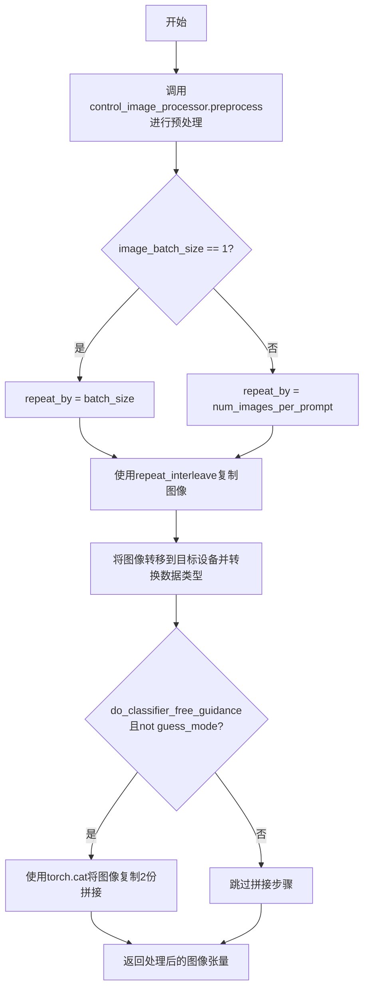

#### 带注释源码

```python
def prepare_control_image(
    self,
    image,                          # 输入：待处理控制图像（PIL Image / Tensor / ndarray / list）
    width,                          # 输入：目标宽度（像素）
    height,                         # 输入：目标高度（像素）
    batch_size,                     # 输入：当前批次的样本数量
    num_images_per_prompt,          # 输入：每个提示生成的图像数量
    device,                         # 输入：目标计算设备
    dtype,                          # 输入：目标数据类型
    crops_coords,                   # 输入：裁剪坐标，默认为None
    resize_mode,                    # 输入：缩放模式，'default' 或 'fill'
    do_classifier_free_guidance=False,  # 输入：是否启用CFG
    guess_mode=False,               # 输入：猜测模式标志
):
    # 步骤1：使用control_image_processor对图像进行预处理
    # - 调整图像尺寸到指定的width和height
    # - 应用裁剪坐标（如果有）
    # - 转换为float32类型
    image = self.control_image_processor.preprocess(
        image, height=height, width=width, 
        crops_coords=crops_coords, resize_mode=resize_mode
    ).to(dtype=torch.float32)
    
    # 获取预处理后图像的批次大小
    image_batch_size = image.shape[0]

    # 步骤2：根据原始批次大小确定图像复制因子
    if image_batch_size == 1:
        # 单张图像：复制batch_size次（与提示批次对齐）
        repeat_by = batch_size
    else:
        # 图像批次与提示批次相同：复制num_images_per_prompt次
        repeat_by = num_images_per_prompt

    # 步骤3：沿批次维度复制图像
    # 使用repeat_interleave而非repeat，保留原始维度顺序
    image = image.repeat_interleave(repeat_by, dim=0)

    # 步骤4：转移图像到目标设备并转换数据类型
    image = image.to(device=device, dtype=dtype)

    # 步骤5：处理分类器自由引导（CFG）
    # 当启用CFG且非guess_mode时，需要同时提供条件和无条件输入
    # 通过复制图像实现：cond_image + uncond_image
    if do_classifier_free_guidance and not guess_mode:
        image = torch.cat([image] * 2)

    # 返回处理完成的控制图像张量
    return image
```


### `StableDiffusionXLControlNetInpaintPipeline.prepare_latents`

该方法用于在图像修复（inpainting）流程中准备潜在变量（latents），根据输入图像、噪声和强度参数初始化或调整潜在变量，为后续的去噪扩散过程准备输入数据。

参数：

- `batch_size`：`int`，批次大小，决定生成图像的数量
- `num_channels_latents`：`int`，潜在变量的通道数，通常为 VAE 的潜在通道数
- `height`：`int`，生成图像的高度（像素）
- `width`：`int`，生成图像的宽度（像素）
- `dtype`：`torch.dtype`，潜在变量的数据类型
- `device`：`torch.device`，计算设备（CPU 或 CUDA）
- `generator`：`torch.Generator | list[torch.Generator] | None`，随机数生成器，用于确保可重复性
- `latents`：`torch.Tensor | None`，可选的预生成潜在变量，如果为 None 则根据其他参数生成
- `image`：`torch.Tensor | None`，输入图像，用于图像修复任务
- `timestep`：`torch.Tensor | None`，噪声时间步，用于图像+噪声的混合
- `is_strength_max`：`bool`，是否为最大强度（1.0），决定初始化方式
- `add_noise`：`bool`，是否添加噪声
- `return_noise`：`bool`，是否返回噪声张量
- `return_image_latents`：`bool`，是否返回图像潜在变量

返回值：`tuple`，包含以下元素：
- `latents`：`torch.Tensor`，准备好的潜在变量
- `noise`：`torch.Tensor`（可选），生成的噪声张量
- `image_latents`：`torch.Tensor`（可选），编码后的图像潜在变量

#### 流程图

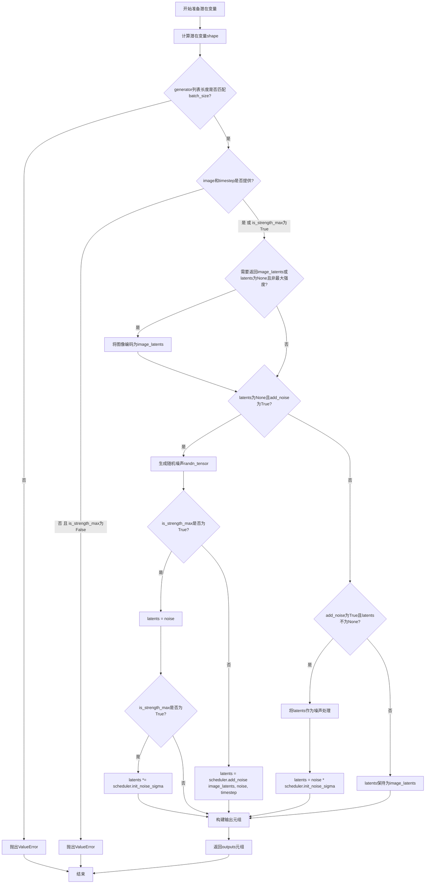

#### 带注释源码

```python
def prepare_latents(
    self,
    batch_size: int,
    num_channels_latents: int,
    height: int,
    width: int,
    dtype: torch.dtype,
    device: torch.device,
    generator: torch.Generator | list[torch.Generator] | None = None,
    latents: torch.Tensor | None = None,
    image: torch.Tensor | None = None,
    timestep: torch.Tensor | None = None,
    is_strength_max: bool = True,
    add_noise: bool = True,
    return_noise: bool = False,
    return_image_latents: bool = False,
):
    # 1. 计算潜在变量的shape，基于VAE的缩放因子
    #    batch_size: 批处理大小
    #    num_channels_latents: 潜在通道数（通常为4）
    #    height/width: 通过VAE缩放因子（下采样）调整尺寸
    shape = (
        batch_size,
        num_channels_latents,
        int(height) // self.vae_scale_factor,
        int(width) // self.vae_scale_factor,
    )

    # 2. 验证generator列表长度与batch_size是否匹配
    if isinstance(generator, list) and len(generator) != batch_size:
        raise ValueError(
            f"You have passed a list of generators of length {len(generator)}, but requested an effective batch"
            f" size of {batch_size}. Make sure the batch size matches the length of the generators."
        )

    # 3. 检查image和timestep的可用性
    #    当强度小于1时，需要图像和噪声时间步来初始化潜在变量
    if (image is None or timestep is None) and not is_strength_max:
        raise ValueError(
            "Since strength < 1. initial latents are to be initialised as a combination of Image + Noise."
            "However, either the image or the noise timestep has not been provided."
        )

    # 4. 如果需要返回图像潜在变量，或者latents为None且不是最大强度
    #    则将图像编码为潜在空间表示
    if return_image_latents or (latents is None and not is_strength_max):
        # 将图像移到指定设备并转换为指定数据类型
        image = image.to(device=device, dtype=dtype)

        # 如果图像已经是潜在空间格式（4通道），直接使用
        # 否则使用VAE编码器将图像转换为潜在变量
        if image.shape[1] == 4:
            image_latents = image
        else:
            image_latents = self._encode_vae_image(image=image, generator=generator)
        
        # 重复图像潜在变量以匹配批次大小
        image_latents = image_latents.repeat(batch_size // image_latents.shape[0], 1, 1, 1)

    # 5. 处理潜在变量的初始化
    if latents is None and add_noise:
        # 5a. 无预提供潜在变量，需要生成新的潜在变量
        # 生成随机噪声张量
        noise = randn_tensor(shape, generator=generator, device=device, dtype=dtype)
        
        # 根据强度决定初始化方式：
        # - 最大强度(1.0)：完全使用噪声初始化
        # - 非最大强度：将噪声添加到图像潜在变量
        latents = noise if is_strength_max else self.scheduler.add_noise(image_latents, noise, timestep)
        
        # 如果是纯噪声模式，用scheduler的初始噪声sigma进行缩放
        # 这有助于控制去噪过程的起始点
        latents = latents * self.scheduler.init_noise_sigma if is_strength_max else latents
    
    # 6. 处理已有潜在变量但需要添加噪声的情况
    elif add_noise:
        # 将已存在的latents视为噪声并用init_noise_sigma缩放
        noise = latents.to(device)
        latents = noise * self.scheduler.init_noise_sigma
    
    # 7. 处理不添加噪声的情况（如直接使用图像潜在变量）
    else:
        # 生成随机噪声（可能用于后续处理）
        noise = randn_tensor(shape, generator=generator, device=device, dtype=dtype)
        # 使用编码后的图像潜在变量
        latents = image_latents.to(device)

    # 8. 构建输出元组，根据标志位包含可选的噪声和图像潜在变量
    outputs = (latents,)

    if return_noise:
        outputs += (noise,)

    if return_image_latents:
        outputs += (image_latents,)

    return outputs
```


### `StableDiffusionXLControlNetInpaintPipeline._encode_vae_image`

该方法负责将输入图像编码为 VAE  latent 表示，支持可选的随机生成器以确保可重复性，并处理 VAE 的精度转换。

参数：

- `image`：`torch.Tensor`，输入的要编码的图像张量
- `generator`：`torch.Generator | None`，可选的随机生成器，用于采样潜在分布

返回值：`torch.Tensor`，编码后的图像潜在表示

#### 流程图

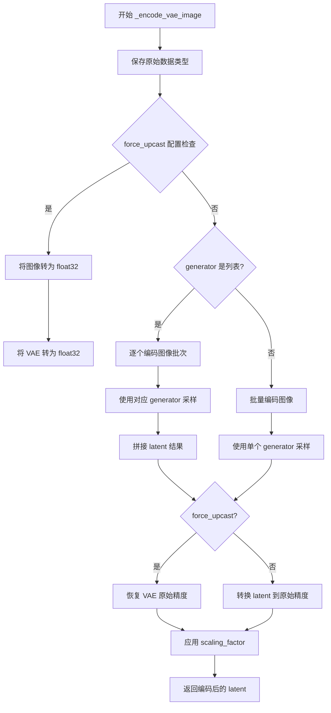

#### 带注释源码

```python
def _encode_vae_image(self, image: torch.Tensor, generator: torch.Generator):
    # 保存原始输入图像的数据类型，用于后续转换
    dtype = image.dtype
    
    # 如果 VAE 配置了 force_upcast，则将图像和 VAE 临时转为 float32
    # 这是为了避免在某些硬件上因精度不足导致的溢出问题
    if self.vae.config.force_upcast:
        image = image.float()
        self.vae.to(dtype=torch.float32)

    # 根据 generator 类型决定编码策略
    if isinstance(generator, list):
        # 当传入多个 generator 时，需要逐个处理图像的每个元素
        # 这允许对批次中的每个图像使用不同的随机状态
        image_latents = [
            retrieve_latents(self.vae.encode(image[i : i + 1]), generator=generator[i])
            for i in range(image.shape[0])
        ]
        # 将每个单独编码的 latent 沿批次维度拼接
        image_latents = torch.cat(image_latents, dim=0)
    else:
        # 批量编码整个图像张量，使用单个 generator
        image_latents = retrieve_latents(self.vae.encode(image), generator=generator)

    # 完成后恢复 VAE 的原始数据类型
    if self.vae.config.force_upcast:
        self.vae.to(dtype)

    # 将编码后的 latent 转换回原始输入的数据类型
    image_latents = image_latents.to(dtype)
    # 应用 VAE 的缩放因子，这是 Stable Diffusion 中将 latent 映射到标准正态分布的必要步骤
    image_latents = self.vae.config.scaling_factor * image_latents

    return image_latents
```


### `StableDiffusionXLControlNetInpaintPipeline.prepare_mask_latents`

准备掩码潜在变量，用于图像修复（inpainting）任务中对掩码和被遮罩图像进行预处理，以便后续与UNet的潜在变量进行拼接。

参数：

- `mask`：`torch.Tensor`，输入的掩码张量，用于标识需要修复的区域
- `masked_image`：`torch.Tensor`，被掩码覆盖的图像，即原始图像中被掩码遮挡的部分
- `batch_size`：`int`，批处理大小，用于确定掩码和被掩码图像的重复次数
- `height`：`int`，目标高度（像素单位），用于计算潜在变量的目标尺寸
- `width`：`int`，目标宽度（像素单位），用于计算潜在变量的目标尺寸
- `dtype`：`torch.dtype`，数据类型，用于转换掩码和被掩码图像的张量类型
- `device`：`torch.device`，目标设备，用于将张量移动到指定设备
- `generator`：`torch.Generator | None`，随机数生成器，用于确保潜在变量生成的可重复性
- `do_classifier_free_guidance`：`bool`，是否执行无分类器引导，如果为true则复制掩码以支持CFG

返回值：`Tuple[torch.Tensor, torch.Tensor | None]`，返回处理后的掩码潜在变量和被掩码图像的潜在变量（可能为None）

#### 流程图

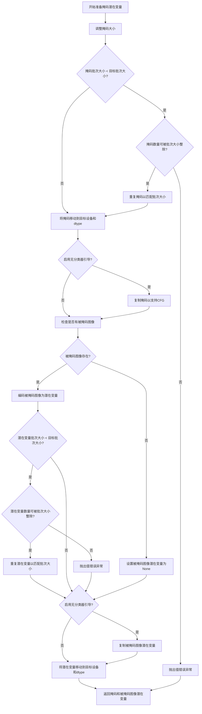

#### 带注释源码

```python
def prepare_mask_latents(
    self,
    mask: torch.Tensor,
    masked_image: torch.Tensor,
    batch_size: int,
    height: int,
    width: int,
    dtype: torch.dtype,
    device: torch.device,
    generator: torch.Generator | None,
    do_classifier_free_guidance: bool
) -> Tuple[torch.Tensor, torch.Tensor | None]:
    """
    准备掩码潜在变量，用于图像修复任务
    
    该方法执行以下步骤：
    1. 将掩码调整到与潜在变量相同的空间分辨率
    2. 根据批次大小复制掩码以支持批量生成
    3. 如果启用无分类器引导(Classifier-Free Guidance)，复制掩码以同时处理条件和非条件输入
    4. 对被掩码图像进行VAE编码生成潜在变量
    5. 对被掩码图像潜在变量进行与掩码相同的批处理处理
    
    参数:
        mask: 输入掩码张量，形状为 [B, 1, H, W]，白色区域表示需要修复
        masked_image: 被掩码覆盖的图像，即原始图像中被掩码遮挡的部分
        batch_size: 目标批次大小
        height: 图像高度（像素）
        width: 图像宽度（像素）
        dtype: 目标数据类型
        device: 目标设备
        generator: 随机数生成器，用于VAE编码
        do_classifier_free_guidance: 是否启用无分类器引导
    
    返回:
        (mask, masked_image_latents): 处理后的掩码和被掩码图像潜在变量
    """
    
    # ========== 步骤1: 调整掩码大小 ==========
    # 将掩码调整到与VAE潜在变量相同的空间分辨率
    # 潜在变量空间分辨率 = 图像分辨率 / VAE缩放因子(通常为8)
    # 在转换为dtype之前进行此操作，以避免在使用cpu_offload和半精度时出现问题
    mask = torch.nn.functional.interpolate(
        mask, 
        size=(
            height // self.vae_scale_factor,  # 计算潜在变量空间的高度
            width // self.vae_scale_factor     # 计算潜在变量空间的宽度
        ),
        mode='bilinear',  # 使用双线性插值进行缩放
        align_corners=False  # 不对齐角点以保持一致性
    )
    
    # 将掩码移动到目标设备和数据类型
    mask = mask.to(device=device, dtype=dtype)
    
    # ========== 步骤2: 处理批次大小不匹配 ==========
    # 复制掩码和被掩码图像潜在变量以匹配每个prompt的生成数量
    # 使用MPS友好的方法(repeat而不是expand)
    if mask.shape[0] < batch_size:
        # 检查掩码数量是否可以被批次大小整除
        if not batch_size % mask.shape[0] == 0:
            raise ValueError(
                "The passed mask and the required batch size don't match. "
                f"Masks are supposed to be duplicated to a total batch size of "
                f"{batch_size}, but {mask.shape[0]} masks were passed. Make sure "
                "the number of masks that you pass is divisible by the total "
                "requested batch size."
            )
        
        # 重复掩码以匹配批次大小
        # 例如：如果batch_size=4, mask.shape[0]=2, 则重复2次
        mask = mask.repeat(batch_size // mask.shape[0], 1, 1, 1)
    
    # ========== 步骤3: 处理无分类器引导 ==========
    # 如果启用CFG，需要为无条件输入复制一份掩码
    # 这样可以在单次前向传播中同时计算条件和非条件预测
    mask = torch.cat([mask] * 2) if do_classifier_free_guidance else mask
    
    # ========== 步骤4: 处理被掩码图像 ==========
    masked_image_latents = None  # 初始化为None，如果存在被掩码图像则会被编码
    
    if masked_image is not None:
        # 将被掩码图像移动到目标设备和数据类型
        masked_image = masked_image.to(device=device, dtype=dtype)
        
        # 使用VAE编码器将图像编码为潜在变量
        # 这一步将图像从像素空间转换到潜在空间
        masked_image_latents = self._encode_vae_image(masked_image, generator=generator)
        
        # 处理被掩码图像潜在变量的批次大小
        if masked_image_latents.shape[0] < batch_size:
            if not batch_size % masked_image_latents.shape[0] == 0:
                raise ValueError(
                    "The passed images and the required batch size don't match. "
                    f"Images are supposed to be duplicated to a total batch size "
                    f"of {batch_size}, but {masked_image_latents.shape[0]} images "
                    "were passed. Make sure the number of images that you pass is "
                    "divisible by the total requested batch size."
                )
            
            # 重复潜在变量以匹配批次大小
            masked_image_latents = masked_image_latents.repeat(
                batch_size // masked_image_latents.shape[0], 
                1, 1, 1
            )
        
        # 如果启用CFG，复制被掩码图像潜在变量
        masked_image_latents = (
            torch.cat([masked_image_latents] * 2) 
            if do_classifier_free_guidance 
            else masked_image_latents
        )
        
        # 对齐设备以防止连接时出现设备错误
        # 确保潜在变量与潜在模型输入在同一设备上
        masked_image_latents = masked_image_latents.to(device=device, dtype=dtype)
    
    # ========== 返回结果 ==========
    # 返回处理后的掩码和被掩码图像潜在变量
    # 这些将作为UNet的额外输入通道（当in_channels=9时）
    return mask, masked_image_latents
```


### `StableDiffusionXLControlNetInpaintPipeline.get_timesteps`

获取去噪过程的时间步（timesteps），根据推理步数、强度和可选的去噪起始点计算合适的时间步序列，用于控制扩散模型的去噪过程。

参数：

- `num_inference_steps`：`int`，推理步数，表示去噪过程需要执行的迭代次数
- `strength`：`float`，强度值，介于0和1之间，决定初始噪声与原始图像的混合比例
- `device`：`torch.device`，计算设备，用于指定张量存放的设备
- `denoising_start`：`float | None`，可选的去噪起始点，指定从哪个去噪阶段开始（0到1之间的值），如果为None则根据strength计算

返回值：`tuple[torch.Tensor, int]`，返回包含时间步张量和实际推理步数的元组

#### 流程图

```mermaid
flowchart TD
    A[开始 get_timesteps] --> B{denoising_start is None?}
    B -->|Yes| C[根据strength计算init_timestep]
    C --> D[计算t_start = max(num_inference_steps - init_timestep, 0)]
    D --> E[从scheduler.timesteps切片获取timesteps]
    E --> F{scheduler有set_begin_index?}
    F -->|Yes| G[设置scheduler的起始索引]
    F -->|No| H[跳过设置]
    G --> I[返回timesteps和实际步数]
    H --> I
    
    B -->|No| J[根据denoising_start计算discrete_timestep_cutoff]
    J --> K[计算小于cutoff的timesteps数量]
    K --> L{scheduler是2阶且步数为偶数?}
    L -->|Yes| M[num_inference_steps + 1]
    L -->|No| N[保持不变]
    M --> O[计算t_start并切片timesteps]
    N --> O
    O --> P{scheduler有set_begin_index?}
    P -->|Yes| Q[设置scheduler的起始索引]
    P -->|No| R[跳过设置]
    Q --> S[返回timesteps和实际步数]
    R --> S
```

#### 带注释源码

```python
def get_timesteps(self, num_inference_steps, strength, device, denoising_start=None):
    """
    获取去噪过程的时间步。
    
    参数:
        num_inference_steps: 推理步数
        strength: 强度值 (0-1)
        device: 计算设备
        denoising_start: 可选的去噪起始点
        
    返回:
        timesteps: 时间步张量
        actual_num_inference_steps: 实际推理步数
    """
    # 如果没有指定去噪起始点，则根据strength计算
    if denoising_start is None:
        # 计算初始时间步数，基于strength和总步数
        init_timestep = min(int(num_inference_steps * strength), num_inference_steps)
        # 计算起始索引，确保不为负数
        t_start = max(num_inference_steps - init_timestep, 0)

        # 从调度器的时间步序列中获取对应的子集
        # 乘以scheduler.order是因为有些调度器会复制时间步
        timesteps = self.scheduler.timesteps[t_start * self.scheduler.order :]
        
        # 如果调度器支持设置起始索引，则进行设置
        if hasattr(self.scheduler, "set_begin_index"):
            self.scheduler.set_begin_index(t_start * self.scheduler.order)

        # 返回时间步和调整后的推理步数
        return timesteps, num_inference_steps - t_start

    else:
        # 当直接指定去噪起始点时，strength由denoising_start决定
        # 计算离散时间步的截止点
        discrete_timestep_cutoff = int(
            round(
                self.scheduler.config.num_train_timesteps
                - (denoising_start * self.scheduler.config.num_train_timesteps)
            )
        )

        # 计算小于截止点的时间步数量
        num_inference_steps = (self.scheduler.timesteps < discrete_timestep_cutoff).sum().item()
        
        # 对于二阶调度器的特殊处理
        if self.scheduler.order == 2 and num_inference_steps % 2 == 0:
            # 如果调度器是二阶的，可能需要进行+1操作
            # 因为每个时间步（除了最高的）都会被复制
            # 如果步数是偶数，意味着我们在去噪步骤中间切断了
            # 添加1确保去噪过程总是在调度器的二阶导数步骤之后结束
            num_inference_steps = num_inimesteps + 1

        # 因为 t_n+1 >= t_n，我们从末尾开始切片时间步
        t_start = len(self.scheduler.timesteps) - num_inference_steps
        timesteps = self.scheduler.timesteps[t_start:]
        
        # 设置调度器的起始索引
        if hasattr(self.scheduler, "set_begin_index"):
            self.scheduler.set_begin_index(t_start)
            
        return timesteps, num_inference_steps
```


### `StableDiffusionXLControlNetInpaintPipeline._get_add_time_ids`

获取附加时间 ID，用于 Stable Diffusion XL 模型的微条件（micro-conditioning），包括图像尺寸信息和美学评分，生成供 UNet 使用的时序嵌入向量。

参数：

- `self`：`StableDiffusionXLControlNetInpaintPipeline` 实例，管道对象本身
- `original_size`：`tuple[int, int]`，原始输入图像的尺寸 (高度, 宽度)
- `crops_coords_top_left`：`tuple[int, int]`，裁剪区域的左上角坐标 (y, x)
- `target_size`：`tuple[int, int]`，目标生成图像的尺寸 (高度, 宽度)
- `aesthetic_score`：`float`，正向提示词的美学评分，用于模拟生成图像的美学质量
- `negative_aesthetic_score`：`float`，负向提示词的美学评分，用于反向条件
- `dtype`：`torch.dtype`，输出张量的数据类型
- `text_encoder_projection_dim`：`int | None`，文本编码器的投影维度，若为 None 则从 pooled_prompt_embeds 推断

返回值：`tuple[torch.Tensor, torch.Tensor]`，返回一个元组，包含 `add_time_ids`（正向时间 ID 张量）和 `add_neg_time_ids`（负向时间 ID 张量），形状均为 (1, N)，其中 N 为时间嵌入向量的维度。这些张量将作为额外条件传递给 UNet，用于控制图像尺寸和美学风格。

#### 流程图

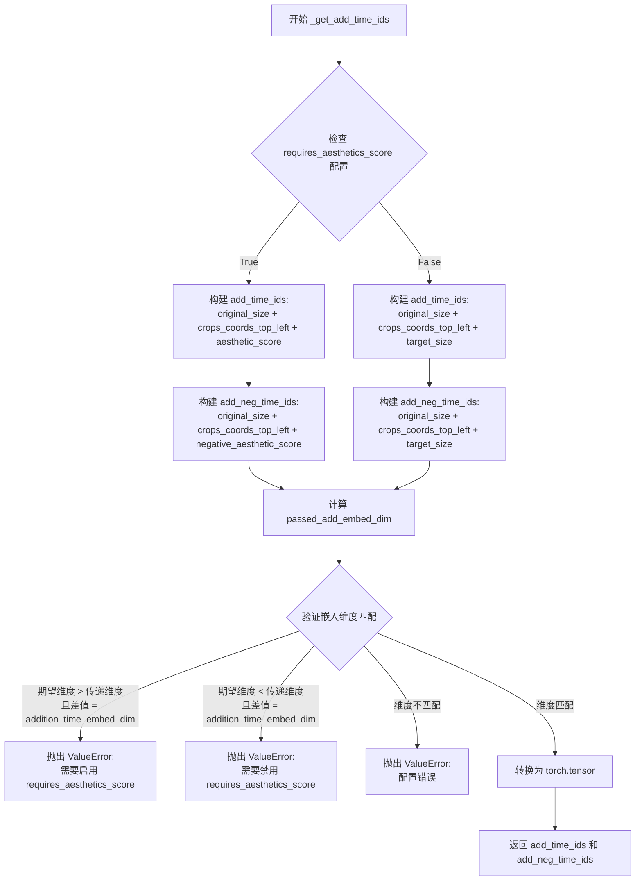

#### 带注释源码

```python
def _get_add_time_ids(
    self,
    original_size,
    crops_coords_top_left,
    target_size,
    aesthetic_score,
    negative_aesthetic_score,
    dtype,
    text_encoder_projection_dim=None,
):
    """
    获取附加时间 ID，用于 SDXL 模型的微条件。
    
    该方法根据配置中的 requires_aesthetics_score 参数决定如何构建时间嵌入向量。
    SDXL 使用额外的时间嵌入来编码图像尺寸信息和美学评分。
    
    参数:
        original_size: 原始图像尺寸 (height, width)
        crops_coords_top_left: 裁剪左上角坐标 (y, x)
        target_size: 目标生成尺寸 (height, width)
        aesthetic_score: 正向条件美学评分 (默认 6.0)
        negative_aesthetic_score: 负向条件美学评分 (默认 2.5)
        dtype: 输出张量的数据类型
        text_encoder_projection_dim: 文本编码器投影维度
    
    返回:
        add_time_ids: 正向时间 ID 张量
        add_neg_time_ids: 负向时间 ID 张量
    """
    # 根据配置决定是否使用美学评分
    # 若启用 requires_aesthetics_score，则使用 aesthetic_score 作为第4个元素
    # 否则使用 target_size 作为第4-5个元素
    if self.config.requires_aesthetics_score:
        # 构建正向时间 ID: [original_height, original_width, crop_y, crop_x, aesthetic_score]
        add_time_ids = list(original_size + crops_coords_top_left + (aesthetic_score,))
        # 构建负向时间 ID: [original_height, original_width, crop_y, crop_x, negative_aesthetic_score]
        add_neg_time_ids = list(original_size + crops_coords_top_left + (negative_aesthetic_score,))
    else:
        # 构建正向时间 ID: [original_height, original_width, crop_y, crop_x, target_height, target_width]
        add_time_ids = list(original_size + crops_coords_top_left + target_size)
        # 构建负向时间 ID: [original_height, original_width, crop_y, crop_x, target_height, target_width]
        add_neg_time_ids = list(original_size + crops_coords_top_left + target_size)

    # 计算实际传递的嵌入维度
    # addition_time_embed_dim * 时间ID数量 + 文本编码器投影维度
    passed_add_embed_dim = (
        self.unet.config.addition_time_embed_dim * len(add_time_ids) + text_encoder_projection_dim
    )
    # 获取 UNet 期望的嵌入维度
    expected_add_embed_dim = self.unet.add_embedding.linear_1.in_features

    # 验证维度匹配，SDXL 对嵌入维度有严格要求
    if (
        expected_add_embed_dim > passed_add_embed_dim
        and (expected_add_embed_dim - passed_add_embed_dim) == self.unet.config.addition_time_embed_dim
    ):
        # 期望更大但传递的更小，差值恰好为一个 addition_time_embed_dim
        # 说明模型期望 aesthetic_score 但配置未启用
        raise ValueError(
            f"Model expects an added time embedding vector of length {expected_add_embed_dim}, but a vector of {passed_add_embed_dim} was created. Please make sure to enable `requires_aesthetics_score` with `pipe.register_to_config(requires_aesthetics_score=True)` to make sure `aesthetic_score` {aesthetic_score} and `negative_aesthetic_score` {negative_aesthetic_score} is correctly used by the model."
        )
    elif (
        expected_add_embed_dim < passed_add_embed_dim
        and (passed_add_embed_dim - expected_add_embed_dim) == self.unet.config.addition_time_embed_dim
    ):
        # 期望更小但传递的更大，差值恰好为一个 addition_time_embed_dim
        # 说明模型不期望 aesthetic_score 但配置启用了
        raise ValueError(
            f"Model expects an added time embedding vector of length {expected_add_embed_dim}, but a vector of {passed_add_embed_dim} was created. Please make sure to disable `requires_aesthetics_score` with `pipe.register_to_config(requires_aesthetics_score=False)` to make sure `target_size` {target_size} is correctly used by the model."
        )
    elif expected_add_embed_dim != passed_add_embed_dim:
        # 维度完全不匹配，检查 unet.config.time_embedding_type 和 text_encoder_2.config.projection_dim
        raise ValueError(
            f"Model expects an added time embedding vector of length {expected_add_embed_dim}, but a vector of {passed_add_embed_dim} was created. The model has an incorrect config. Please check `unet.config.time_embedding_type` and `text_encoder_2.config.projection_dim`."
        )

    # 将列表转换为 PyTorch 张量
    # 形状: (1, num_time_ids) - 批次维度为1，稍后在 pipeline 中会扩展
    add_time_ids = torch.tensor([add_time_ids], dtype=dtype)
    add_neg_time_ids = torch.tensor([add_neg_time_ids], dtype=dtype)

    return add_time_ids, add_neg_time_ids
```


### `StableDiffusionXLControlNetInpaintPipeline.upcast_vae`

将 VAE（Variational Autoencoder）模型转换为 float32 数据类型，以避免在半精度（float16）计算时可能出现的数值溢出问题。该方法已被标记为废弃，推荐直接使用 `pipe.vae.to(torch.float32)`。

参数：

- 该方法无显式参数（隐式参数 `self` 为 Pipeline 实例本身）

返回值：无返回值（`None`），该方法直接修改实例属性

#### 流程图

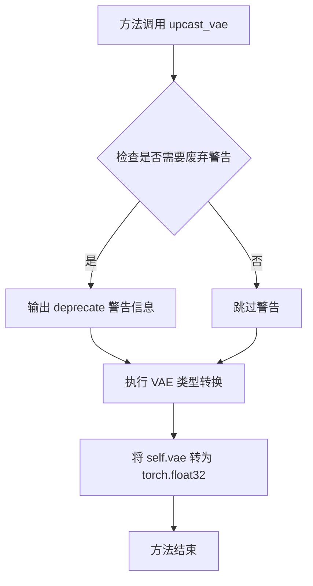

#### 带注释源码

```python
def upcast_vae(self):
    """
    将 VAE 模型上转换为 float32 类型。
    
    此方法用于在需要更高数值精度时（如避免半精度溢出），
    将 VAE 模型从当前数据类型（通常是 float16）转换为 float32。
    由于 VAE 在解码过程中可能产生超出 float16 范围的数值，
    此上转换操作可确保图像生成过程的数值稳定性。
    """
    # 发出废弃警告，建议用户直接使用 pipe.vae.to(torch.float32)
    # 参数说明:
    #   - "upcast_vae": 废弃的功能名称
    #   - "1.0.0": 废弃版本号
    #   - 第三个参数为废弃原因和替代方案说明
    deprecate(
        "upcast_vae",
        "1.0.0",
        "`upcast_vae` is deprecated. Please use `pipe.vae.to(torch.float32)`. For more details, please refer to: https://github.com/huggingface/diffusers/pull/12619#issue-3606633695.",
    )
    # 执行 VAE 模型的数据类型转换，将其移至 float32
    # 这确保了在后续解码过程中不会因精度不足而产生数值溢出
    self.vae.to(dtype=torch.float32)
```


### StableDiffusionXLControlNetInpaintPipeline.__call__

执行基于Stable Diffusion XL的ControlNet图像修复管道推理，支持通过文本提示、控制图像和掩码进行图像修复生成。

参数：

- `prompt`：`str | list[str] | None`，用于指导图像生成的提示词，未定义时需传入`prompt_embeds`
- `prompt_2`：`str | list[str] | None`，发送给tokenizer_2和text_encoder_2的提示词，未定义时使用`prompt`
- `image`：`PipelineImageInput`，将被修复的图像批次，掩码区域将根据`prompt`重新绘制
- `mask_image`：`PipelineImageInput`，用于遮罩image的图像，白色像素将被重新绘制，黑色像素将被保留
- `control_image`：`PipelineImageInput | list[PipelineImageInput]`，ControlNet的控制条件图像（如Canny边缘、姿态等）
- `height`：`int | None`，生成图像的高度（像素），默认self.unet.config.sample_size * self.vae_scale_factor
- `width`：`int | None`，生成图像的宽度（像素），默认self.unet.config.sample_size * self.vae_scale_factor
- `padding_mask_crop`：`int | None`，裁剪边距大小，用于处理小遮罩区域在大图像中的情况
- `strength`：`float`，概念上表示对遮罩区域的变换程度，0-1之间，值越大变换越多
- `num_inference_steps`：`int`，去噪步数，更多步数通常产生更高质量图像
- `denoising_start`：`float | None`，指定跳过的去噪过程比例（0.0-1.0）
- `denoising_end`：`float | None`，指定提前终止去噪过程的比例
- `guidance_scale`：`float`，分类器自由扩散引导比例，>1时启用引导，越高越接近文本提示
- `negative_prompt`：`str | list[str] | None`，不用于指导图像生成的提示词
- `negative_prompt_2`：`str | list[str] | None`，发送给第二个文本编码器的负面提示词
- `num_images_per_prompt`：`int | None`，每个提示词生成的图像数量
- `eta`：`float`，DDIM调度器的eta参数，仅DDIMScheduler有效
- `generator`：`torch.Generator | list[torch.Generator] | None`，随机生成器，用于确保可重复生成
- `latents`：`torch.Tensor | None`，预生成的噪声潜在变量
- `prompt_embeds`：`torch.Tensor | None`，预生成的文本嵌入
- `negative_prompt_embeds`：`torch.Tensor | None`，预生成的负面文本嵌入
- `ip_adapter_image`：`PipelineImageInput | None`，IP-Adapter的可选图像输入
- `ip_adapter_image_embeds`：`list[torch.Tensor] | None`，IP-Adapter的预生成图像嵌入
- `pooled_prompt_embeds`：`torch.Tensor | None`，预生成的池化文本嵌入
- `negative_pooled_prompt_embeds`：`torch.Tensor | None`，预生成的负面池化文本嵌入
- `output_type`：`str | None`，输出格式，默认为"pil"
- `return_dict`：`bool`，是否返回StableDiffusionXLPipelineOutput而非元组
- `cross_attention_kwargs`：`dict[str, Any] | None`，传递给AttentionProcessor的kwargs字典
- `controlnet_conditioning_scale`：`float | list[float]`，ControlNet条件缩放因子
- `guess_mode`：`bool`，是否使用猜测模式运行ControlNet
- `control_guidance_start`：`float | list[float]`，ControlNet引导开始时间
- `control_guidance_end`：`float | list[float]`，ControlNet引导结束时间
- `guidance_rescale`：`float`，噪声配置重缩放因子，用于改善图像质量
- `original_size`：`tuple[int, int]`，原始图像尺寸
- `crops_coords_top_left`：`tuple[int, int]`，裁剪坐标起始点，默认为(0, 0)
- `target_size`：`tuple[int, int]`，目标图像尺寸
- `aesthetic_score`：`float`，美学评分，用于影响正向文本条件
- `negative_aesthetic_score`：`float`，负面美学评分
- `clip_skip`：`int | None`，CLIP计算提示嵌入时跳过的层数
- `callback_on_step_end`：`Callable | PipelineCallback | MultiPipelineCallbacks | None`，每步结束时的回调函数
- `callback_on_step_end_tensor_inputs`：`list[str]`，回调函数使用的张量输入列表

返回值：`StableDiffusionXLPipelineOutput | tuple`，当return_dict为True时返回StableDiffusionXLPipelineOutput，否则返回元组（第一个元素为生成的图像列表）

#### 流程图

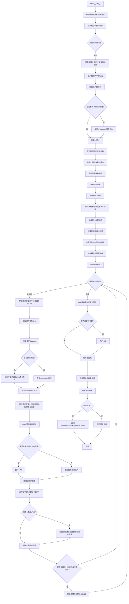

#### 带注释源码

```python
@torch.no_grad()
@replace_example_docstring(EXAMPLE_DOC_STRING)
def __call__(
    self,
    prompt: str | list[str] = None,
    prompt_2: str | list[str] | None = None,
    image: PipelineImageInput = None,
    mask_image: PipelineImageInput = None,
    control_image: PipelineImageInput | list[PipelineImageInput] = None,
    height: int | None = None,
    width: int | None = None,
    padding_mask_crop: int | None = None,
    strength: float = 0.9999,
    num_inference_steps: int = 50,
    denoising_start: float | None = None,
    denoising_end: float | None = None,
    guidance_scale: float = 5.0,
    negative_prompt: str | list[str] | None = None,
    negative_prompt_2: str | list[str] | None = None,
    num_images_per_prompt: int | None = 1,
    eta: float = 0.0,
    generator: torch.Generator | list[torch.Generator] | None = None,
    latents: torch.Tensor | None = None,
    prompt_embeds: torch.Tensor | None = None,
    negative_prompt_embeds: torch.Tensor | None = None,
    ip_adapter_image: PipelineImageInput | None = None,
    ip_adapter_image_embeds: list[torch.Tensor] | None = None,
    pooled_prompt_embeds: torch.Tensor | None = None,
    negative_pooled_prompt_embeds: torch.Tensor | None = None,
    output_type: str | None = "pil",
    return_dict: bool = True,
    cross_attention_kwargs: dict[str, Any] | None = None,
    controlnet_conditioning_scale: float | list[float] = 1.0,
    guess_mode: bool = False,
    control_guidance_start: float | list[float] = 0.0,
    control_guidance_end: float | list[float] = 1.0,
    guidance_rescale: float = 0.0,
    original_size: tuple[int, int] = None,
    crops_coords_top_left: tuple[int, int] = (0, 0),
    target_size: tuple[int, int] = None,
    aesthetic_score: float = 6.0,
    negative_aesthetic_score: float = 2.5,
    clip_skip: int | None = None,
    callback_on_step_end: Callable[[int, int], None] | PipelineCallback | MultiPipelineCallbacks | None = None,
    callback_on_step_end_tensor_inputs: list[str] = ["latents"],
    **kwargs,
):
    r"""
    执行管道生成时调用的函数。
    
    参数详细说明见上文...
    """
    # 1. 处理旧版回调参数，提取callback和callback_steps
    callback = kwargs.pop("callback", None)
    callback_steps = kwargs.pop("callback_steps", None)

    # 2. 废弃警告：提醒用户使用新的回调方式
    if callback is not None:
        deprecate("callback", "1.0.0", "Passing `callback` as an input argument to `__call__` is deprecated, consider using `callback_on_step_end`")
    if callback_steps is not None:
        deprecate("callback_steps", "1.0.0", "Passing `callback_steps` as an input argument to `__call__` is deprecated, consider using `callback_on_step_end`")

    # 3. 处理回调张量输入
    if isinstance(callback_on_step_end, (PipelineCallback, MultiPipelineCallbacks)):
        callback_on_step_end_tensor_inputs = callback_on_step_end.tensor_inputs

    # 4. 获取ControlNet模块（处理编译后的模块）
    controlnet = self.controlnet._orig_mod if is_compiled_module(self.controlnet) else self.controlnet

    # 5. 格式化控制引导参数，确保列表格式一致
    # 统一control_guidance_start和control_guidance_end为列表格式
    if not isinstance(control_guidance_start, list) and isinstance(control_guidance_end, list):
        control_guidance_start = len(control_guidance_end) * [control_guidance_start]
    elif not isinstance(control_guidance_end, list) and isinstance(control_guidance_start, list):
        control_guidance_end = len(control_guidance_start) * [control_guidance_end]
    elif not isinstance(control_guidance_start, list) and not isinstance(control_guidance_end, list):
        mult = len(controlnet.nets) if isinstance(controlnet, MultiControlNetModel) else 1
        control_guidance_start, control_guidance_end = mult * [control_guidance_start], mult * [control_guidance_end]

    # 6. 检查输入有效性
    self.check_inputs(
        prompt, prompt_2, control_image, mask_image, strength, num_inference_steps,
        callback_steps, output_type, negative_prompt, negative_prompt_2,
        prompt_embeds, negative_prompt_embeds, ip_adapter_image, ip_adapter_image_embeds,
        pooled_prompt_embeds, negative_pooled_prompt_embeds, controlnet_conditioning_scale,
        control_guidance_start, control_guidance_end, callback_on_step_end_tensor_inputs,
        padding_mask_crop,
    )

    # 7. 设置内部状态变量
    self._guidance_scale = guidance_scale
    self._clip_skip = clip_skip
    self._cross_attention_kwargs = cross_attention_kwargs
    self._interrupt = False

    # 8. 确定批次大小
    if prompt is not None and isinstance(prompt, str):
        batch_size = 1
    elif prompt is not None and isinstance(prompt, list):
        batch_size = len(prompt)
    else:
        batch_size = prompt_embeds.shape[0]

    # 9. 获取执行设备
    device = self._execution_device

    # 10. 处理ControlNet条件缩放（多ControlNet时转换为列表）
    if isinstance(controlnet, MultiControlNetModel) and isinstance(controlnet_conditioning_scale, float):
        controlnet_conditioning_scale = [controlnet_conditioning_scale] * len(controlnet.nets)

    # 11. 编码提示词
    text_encoder_lora_scale = self.cross_attention_kwargs.get("scale", None) if self.cross_attention_kwargs is not None else None
    
    (
        prompt_embeds,
        negative_prompt_embeds,
        pooled_prompt_embeds,
        negative_pooled_prompt_embeds,
    ) = self.encode_prompt(
        prompt=prompt, prompt_2=prompt_2, device=device, num_images_per_prompt=num_images_per_prompt,
        do_classifier_free_guidance=self.do_classifier_free_guidance, negative_prompt=negative_prompt,
        negative_prompt_2=negative_prompt_2, prompt_embeds=prompt_embeds, negative_prompt_embeds=negative_prompt_embeds,
        pooled_prompt_embeds=pooled_prompt_embeds, negative_pooled_prompt_embeds=negative_pooled_prompt_embeds,
        lora_scale=text_encoder_lora_scale, clip_skip=self.clip_skip,
    )

    # 12. 编码IP-Adapter图像（如果提供）
    if ip_adapter_image is not None or ip_adapter_image_embeds is not None:
        image_embeds = self.prepare_ip_adapter_image_embeds(
            ip_adapter_image, ip_adapter_image_embeds, device, batch_size * num_images_per_prompt,
            self.do_classifier_free_guidance,
        )

    # 13. 设置调度器时间步
    self.scheduler.set_timesteps(num_inference_steps, device=device)
    timesteps, num_inference_steps = self.get_timesteps(
        num_inference_steps, strength, device,
        denoising_start=denoising_start if denoising_value_valid(denoising_start) else None,
    )
    
    # 验证去噪步数有效性
    if num_inference_steps < 1:
        raise ValueError(f"After adjusting the num_inference_steps by strength parameter: {strength}, the number of pipeline steps is {num_inference_steps} which is < 1")

    # 14. 初始化潜在变量时间步
    latent_timestep = timesteps[:1].repeat(batch_size * num_images_per_prompt)
    is_strength_max = strength == 1.0
    self._num_timesteps = len(timesteps)

    # 15. 预处理图像和掩码
    if padding_mask_crop is not None:
        height, width = self.image_processor.get_default_height_width(image, height, width)
        crops_coords = self.mask_processor.get_crop_region(mask_image, width, height, pad=padding_mask_crop)
        resize_mode = "fill"
    else:
        crops_coords = None
        resize_mode = "default"

    # 预处理输入图像
    original_image = image
    init_image = self.image_processor.preprocess(
        image, height=height, width=width, crops_coords=crops_coords, resize_mode=resize_mode
    )
    init_image = init_image.to(dtype=torch.float32)

    # 16. 准备控制图像
    if isinstance(controlnet, ControlNetModel):
        control_image = self.prepare_control_image(
            image=control_image, width=width, height=height,
            batch_size=batch_size * num_images_per_prompt, num_images_per_prompt=num_images_per_prompt,
            device=device, dtype=controlnet.dtype, crops_coords=crops_coords, resize_mode=resize_mode,
            do_classifier_free_guidance=self.do_classifier_free_guidance, guess_mode=guess_mode,
        )
    elif isinstance(controlnet, MultiControlNetModel):
        control_images = []
        for control_image_ in control_image:
            control_image_ = self.prepare_control_image(
                image=control_image_, width=width, height=height,
                batch_size=batch_size * num_images_per_prompt, num_images_per_prompt=num_images_per_prompt,
                device=device, dtype=controlnet.dtype, crops_coords=crops_coords, resize_mode=resize_mode,
                do_classifier_free_guidance=self.do_classifier_free_guidance, guess_mode=guess_mode,
            )
            control_images.append(control_image_)
        control_image = control_images

    # 17. 准备掩码
    mask = self.mask_processor.preprocess(
        mask_image, height=height, width=width, resize_mode=resize_mode, crops_coords=crops_coords
    )
    masked_image = init_image * (mask < 0.5)
    _, _, height, width = init_image.shape

    # 18. 准备潜在变量
    num_channels_latents = self.vae.config.latent_channels
    num_channels_unet = self.unet.config.in_channels
    return_image_latents = num_channels_unet == 4

    add_noise = True if denoising_start is None else False
    latents_outputs = self.prepare_latents(
        batch_size * num_images_per_prompt, num_channels_latents, height, width,
        prompt_embeds.dtype, device, generator, latents, image=init_image,
        timestep=latent_timestep, is_strength_max=is_strength_max, add_noise=add_noise,
        return_noise=True, return_image_latents=return_image_latents,
    )

    if return_image_latents:
        latents, noise, image_latents = latents_outputs
    else:
        latents, noise = latents_outputs

    # 19. 准备掩码潜在变量
    mask, masked_image_latents = self.prepare_mask_latents(
        mask, masked_image, batch_size * num_images_per_prompt, height, width,
        prompt_embeds.dtype, device, generator, self.do_classifier_free_guidance,
    )

    # 20. 验证尺寸匹配
    if num_channels_unet == 9:
        num_channels_mask = mask.shape[1]
        num_channels_masked_image = masked_image_latents.shape[1]
        if num_channels_latents + num_channels_mask + num_channels_masked_image != self.unet.config.in_channels:
            raise ValueError("Incorrect configuration settings!")
    elif num_channels_unet != 4:
        raise ValueError(f"The unet should have either 4 or 9 input channels, not {num_channels_unet}")

    # 21. 准备额外步骤参数
    extra_step_kwargs = self.prepare_extra_step_kwargs(generator, eta)

    # 22. 创建ControlNet保持张量
    controlnet_keep = []
    for i in range(len(timesteps)):
        keeps = [
            1.0 - float(i / len(timesteps) < s or (i + 1) / len(timesteps) > e)
            for s, e in zip(control_guidance_start, control_guidance_end)
        ]
        controlnet_keep.append(keeps if isinstance(controlnet, MultiControlNetModel) else keeps[0])

    # 23. 准备添加的时间ID
    height, width = latents.shape[-2:]
    height = height * self.vae_scale_factor
    width = width * self.vae_scale_factor
    original_size = original_size or (height, width)
    target_size = target_size or (height, width)

    # 24. 获取文本嵌入维度
    if self.text_encoder_2 is None:
        text_encoder_projection_dim = int(pooled_prompt_embeds.shape[-1])
    else:
        text_encoder_projection_dim = self.text_encoder_2.config.projection_dim

    # 25. 计算添加的时间ID
    add_text_embeds = pooled_prompt_embeds
    add_time_ids, add_neg_time_ids = self._get_add_time_ids(
        original_size, crops_coords_top_left, target_size, aesthetic_score,
        negative_aesthetic_score, dtype=prompt_embeds.dtype,
        text_encoder_projection_dim=text_encoder_projection_dim,
    )
    add_time_ids = add_time_ids.repeat(batch_size * num_images_per_prompt, 1)

    # 26. 分类器自由引导准备
    if self.do_classifier_free_guidance:
        prompt_embeds = torch.cat([negative_prompt_embeds, prompt_embeds], dim=0)
        add_text_embeds = torch.cat([negative_pooled_prompt_embeds, add_text_embeds], dim=0)
        add_neg_time_ids = add_neg_time_ids.repeat(batch_size * num_images_per_prompt, 1)
        add_time_ids = torch.cat([add_neg_time_ids, add_time_ids], dim=0)

    prompt_embeds = prompt_embeds.to(device)
    add_text_embeds = add_text_embeds.to(device)
    add_time_ids = add_time_ids.to(device)

    # 27. 去噪循环
    num_warmup_steps = max(len(timesteps) - num_inference_steps * self.scheduler.order, 0)

    # 验证denoising_end参数
    if denoising_end is not None and denoising_value_valid(denoising_end):
        discrete_timestep_cutoff = int(
            round(self.scheduler.config.num_train_timesteps - (denoising_end * self.scheduler.config.num_train_timesteps))
        )
        num_inference_steps = len(list(filter(lambda ts: ts >= discrete_timestep_cutoff, timesteps)))
        timesteps = timesteps[:num_inference_steps]

    with self.progress_bar(total=num_inference_steps) as progress_bar:
        for i, t in enumerate(timesteps):
            if self.interrupt:
                continue

            # 扩展潜在变量用于分类器自由引导
            latent_model_input = torch.cat([latents] * 2) if self.do_classifier_free_guidance else latents

            # 在通道维度连接潜在变量、掩码和掩码图像潜在变量
            latent_model_input = self.scheduler.scale_model_input(latent_model_input, t)

            added_cond_kwargs = {"text_embeds": add_text_embeds, "time_ids": add_time_ids}

            # ControlNet推理
            if guess_mode and self.do_classifier_free_guidance:
                # 仅对条件批次进行推理
                control_model_input = latents
                control_model_input = self.scheduler.scale_model_input(control_model_input, t)
                controlnet_prompt_embeds = prompt_embeds.chunk(2)[1]
                controlnet_added_cond_kwargs = {"text_embeds": add_text_embeds.chunk(2)[1], "time_ids": add_time_ids.chunk(2)[1]}
            else:
                control_model_input = latent_model_input
                controlnet_prompt_embeds = prompt_embeds
                controlnet_added_cond_kwargs = added_cond_kwargs

            # 计算条件缩放
            if isinstance(controlnet_keep[i], list):
                cond_scale = [c * s for c, s in zip(controlnet_conditioning_scale, controlnet_keep[i])]
            else:
                controlnet_cond_scale = controlnet_conditioning_scale
                if isinstance(controlnet_cond_scale, list):
                    controlnet_cond_scale = controlnet_cond_scale[0]
                cond_scale = controlnet_cond_scale * controlnet_keep[i]

            # 运行ControlNet
            down_block_res_samples, mid_block_res_sample = self.controlnet(
                control_model_input, t, encoder_hidden_states=controlnet_prompt_embeds,
                controlnet_cond=control_image, conditioning_scale=cond_scale, guess_mode=guess_mode,
                added_cond_kwargs=controlnet_added_cond_kwargs, return_dict=False,
            )

            # 猜测模式下添加零到无条件批次
            if guess_mode and self.do_classifier_free_guidance:
                down_block_res_samples = [torch.cat([torch.zeros_like(d), d]) for d in down_block_res_samples]
                mid_block_res_sample = torch.cat([torch.zeros_like(mid_block_res_sample), mid_block_res_sample])

            # 添加IP-Adapter图像嵌入
            if ip_adapter_image is not None or ip_adapter_image_embeds is not None:
                added_cond_kwargs["image_embeds"] = image_embeds

            # 连接掩码和掩码图像潜在变量
            if num_channels_unet == 9:
                latent_model_input = torch.cat([latent_model_input, mask, masked_image_latents], dim=1)

            # UNet预测噪声残差
            noise_pred = self.unet(
                latent_model_input, t, encoder_hidden_states=prompt_embeds,
                cross_attention_kwargs=self.cross_attention_kwargs,
                down_block_additional_residuals=down_block_res_samples,
                mid_block_additional_residual=mid_block_res_sample,
                added_cond_kwargs=added_cond_kwargs, return_dict=False,
            )[0]

            # 执行分类器自由引导
            if self.do_classifier_free_guidance:
                noise_pred_uncond, noise_pred_text = noise_pred.chunk(2)
                noise_pred = noise_pred_uncond + guidance_scale * (noise_pred_text - noise_pred_uncond)

            # 重缩放噪声配置
            if self.do_classifier_free_guidance and guidance_rescale > 0.0:
                noise_pred = rescale_noise_cfg(noise_pred, noise_pred_text, guidance_rescale=guidance_rescale)

            # 计算前一时间步的潜在变量
            latents = self.scheduler.step(noise_pred, t, latents, **extra_step_kwargs, return_dict=False)[0]

            # 对于4通道UNet（修复任务），混合初始潜在变量
            if num_channels_unet == 4:
                init_latents_proper = image_latents
                if self.do_classifier_free_guidance:
                    init_mask, _ = mask.chunk(2)
                else:
                    init_mask = mask

                if i < len(timesteps) - 1:
                    noise_timestep = timesteps[i + 1]
                    init_latents_proper = self.scheduler.add_noise(init_latents_proper, noise, torch.tensor([noise_timestep]))

                latents = (1 - init_mask) * init_latents_proper + init_mask * latents

            # 执行步骤结束回调
            if callback_on_step_end is not None:
                callback_kwargs = {}
                for k in callback_on_step_end_tensor_inputs:
                    callback_kwargs[k] = locals()[k]
                callback_outputs = callback_on_step_end(self, i, t, callback_kwargs)
                latents = callback_outputs.pop("latents", latents)
                prompt_embeds = callback_outputs.pop("prompt_embeds", prompt_embeds)
                negative_prompt_embeds = callback_outputs.pop("negative_prompt_embeds", negative_prompt_embeds)
                control_image = callback_outputs.pop("control_image", control_image)

            # 进度更新和旧回调
            if i == len(timesteps) - 1 or ((i + 1) > num_warmup_steps and (i + 1) % self.scheduler.order == 0):
                progress_bar.update()
                if callback is not None and i % callback_steps == 0:
                    step_idx = i // getattr(self.scheduler, "order", 1)
                    callback(step_idx, t, latents)

            # XLA支持
            if XLA_AVAILABLE:
                xm.mark_step()

    # 28. 后处理
    # 确保VAE为float32模式以避免溢出
    if self.vae.dtype == torch.float16 and self.vae.config.force_upcast:
        self.upcast_vae()
        latents = latents.to(next(iter(self.vae.post_quant_conv.parameters())).dtype)

    # 手动卸载以节省内存
    if hasattr(self, "final_offload_hook") and self.final_offload_hook is not None:
        self.unet.to("cpu")
        self.controlnet.to("cpu")
        empty_device_cache()

    # 解码潜在变量到图像
    if not output_type == "latent":
        image = self.vae.decode(latents / self.vae.config.scaling_factor, return_dict=False)[0]
    else:
        return StableDiffusionXLPipelineOutput(images=latents)

    # 应用水印
    if self.watermark is not None:
        image = self.watermark.apply_watermark(image)

    # 后处理图像
    image = self.image_processor.postprocess(image, output_type=output_type)

    # 应用覆盖层（如需裁剪）
    if padding_mask_crop is not None:
        image = [self.image_processor.apply_overlay(mask_image, original_image, i, crops_coords) for i in image]

    # 释放模型钩子
    self.maybe_free_model_hooks()

    # 返回结果
    if not return_dict:
        return (image,)

    return StableDiffusionXLPipelineOutput(images=image)
```

## 关键组件


### 张量索引与惰性加载

在 `prepare_latents` 方法中，代码通过条件判断实现惰性加载：当 `latents` 为 `None` 时使用 `randn_tensor` 生成随机噪声，否则直接使用传入的 latents。同时支持返回噪声和图像潜在变量，通过 `return_noise` 和 `return_image_latents` 参数控制。

### 反量化支持

`_encode_vae_image` 方法通过 `force_upcast` 配置实现 VAE 编码时的类型转换：当 `vae.config.force_upcast` 为真时，将输入图像临时转换为 float32 以避免精度溢出，编码完成后再恢复原始数据类型。此外，`upcast_vae` 方法提供显式的 float32 转换接口，用于处理 float16 下的溢出问题。

### 量化策略

代码通过 `dtype` 参数在多个位置（`encode_prompt`、`prepare_control_image`、`prepare_latents`、`prepare_mask_latents` 等）支持动态 dtype 选择，允许在 float16/float32 等不同精度间切换以平衡性能和内存使用。

### 关键类 StableDiffusionXLControlNetInpaintPipeline

主 pipeline 类，继承自 `DiffusionPipeline`、`StableDiffusionMixin`、`StableDiffusionXLLoraLoaderMixin`、`FromSingleFileMixin`、`IPAdapterMixin` 和 `TextualInversionLoaderMixin`，实现了基于 ControlNet 的 SDXL 图像修复功能。

### encode_prompt 方法

负责将文本提示编码为文本嵌入向量，支持双文本编码器（CLIP Text Encoder 和 CLIP Text Encoder with Projection），处理 LoRA 缩放、classifier-free guidance，并返回条件和无条件嵌入。

### prepare_latents 方法

准备去噪过程的初始潜在变量，根据 strength 参数决定是纯噪声还是图像与噪声的混合，支持随机生成或使用传入的 latents，并通过 scheduler 的 `init_noise_sigma` 进行缩放。

### prepare_mask_latents 方法

调整掩码尺寸至潜在空间分辨率，处理 classifier-free guidance 下的掩码复制，并对被遮挡图像进行 VAE 编码以生成对应的潜在变量。

### __call__ 方法

主推理入口，协调整个图像修复流程：输入验证、提示词编码、ControlNet 条件图像处理、潜在变量准备、去噪循环（包含 ControlNet 推理和 UNet 噪声预测）、VAE 解码以及可选的水印处理。

### ControlNet 集成

在去噪循环中通过 `self.controlnet` 调用，支持单 ControlNet 和 MultiControlNetModel 两种模式，通过 `controlnet_conditioning_scale` 控制各 ControlNet 的影响权重，并支持 guess_mode 模式仅使用条件分支进行推理。

### VAE 编解码

使用 `_encode_vae_image` 进行图像到潜在空间的编码，使用 `self.vae.decode` 进行潜在空间到图像的解码，通过 `vae_scale_factor`（基于 VAE block_out_channels 计算）实现图像像素空间与潜在空间间的尺寸转换。

### 时间步处理

`get_timesteps` 方法根据 strength 和 denoising_start 参数计算去噪过程的时间步，支持跳过初始时间步以实现部分去噪或混合多个去噪器。

### IP-Adapter 支持

通过 `prepare_ip_adapter_image_embeds` 方法处理图像提示适配器，将图像编码为嵌入向量并在去噪过程中作为额外条件传入 UNet。

### 回调机制

支持 `callback_on_step_end` 回调函数，在每个去噪步骤结束后接收中间结果（如 latents、prompt_embeds 等），允许用户干预或监控生成过程。


## 问题及建议


### 已知问题

- **方法过长且复杂**：`encode_prompt` 方法超过300行代码，包含大量重复逻辑，如文本编码、LoRA处理、嵌入重复等操作，可以拆分为更小的子方法
- **API 参数过多**：`__call__` 方法有超过50个参数，这使得API非常复杂且难以使用，建议使用配置对象或构建器模式
- **Magic Numbers**：`strength=0.9999`、`aesthetic_score=6.0`、`negative_aesthetic_score=2.5` 等硬编码值缺乏解释
- **重复代码块**：control_guidance_start/control_guidance_end 的格式对齐逻辑在代码中出现了两次（步骤0.1和步骤2附近）
- **潜在的类型转换问题**：代码中多次使用 `.to(device=device, dtype=dtype)` 进行设备转换，可能存在不必要的拷贝
- **检查逻辑复杂**：`check_inputs` 方法非常长，包含大量的验证逻辑，可以考虑拆分为多个独立的验证方法
- **缺失的默认值处理**：某些参数如 `original_size`、`target_size` 在 `__call__` 中有延迟初始化的逻辑，但不够清晰
- **watermark 可选组件处理**：watermark 的处理逻辑分散在多处，可以更统一地管理
- **回调机制冗余**：代码同时支持旧的 `callback`/`callback_steps` 和新的 `callback_on_step_end`，增加了维护成本

### 优化建议

- **提取辅助方法**：将 `encode_prompt` 中的文本编码、LoRA缩放、嵌入重复等逻辑提取为独立方法，提高可读性和可测试性
- **使用数据类或配置对象**：将 `__call__` 的大量参数封装为配置类，简化API
- **常量定义**：将 magic numbers 提取为类常量或配置常量，并添加文档说明
- **合并重复代码**：将重复的 control_guidance 格式对齐逻辑抽取为独立方法
- **优化张量操作**：审查 `.to()` 调用，使用 `to(dtype=..., device=...)` 避免中间张量创建
- **重构验证逻辑**：将 `check_inputs` 拆分为 `check_prompt_inputs`、`check_image_inputs`、`check_controlnet_inputs` 等
- **统一回调机制**：废弃旧版 callback API，统一使用 `callback_on_step_end`
- **添加类型注解**：部分函数参数和返回值缺少详细的类型注解
- **文档增强**：为复杂逻辑块（如 denoising loop 中的 guidance 计算）添加更详细的注释

## 其它


### 设计目标与约束

本 Pipeline 的核心设计目标是实现基于 Stable Diffusion XL 的 ControlNet 引导图像修复功能，支持通过文本提示、控制图像（如 Canny 边缘检测）来指导修复过程。主要约束包括：1) 依赖 HuggingFace Diffusers 框架架构；2) 支持 SDXL 系列的文本编码器（CLIPTextModel 和 CLIPTextModelWithProjection）；3) 兼容 ControlNet 和 MultiControlNet 两种模式；4) 必须支持 LoRA、Textual Inversion、IP-Adapter 等加载器扩展。

### 错误处理与异常设计

代码中实现了多层次的错误检查机制。在 `check_inputs` 方法中验证：strength 参数范围 [0,1]、num_inference_steps 正整数检查、prompt 与 prompt_embeds 互斥检查、negative_prompt 与 negative_prompt_embeds 互斥检查、batch_size 一致性检查、controlnet_conditioning_scale 类型检查等。`check_image` 方法验证图像类型合法性。异常处理采用显式 ValueError 和 TypeError 抛出，配合 deprecate 函数处理废弃参数。关键边界条件（如 denoising_start 与 denoising_end 关系）也有校验。

### 数据流与状态机

Pipeline 核心数据流：1) 初始化阶段：加载 VAE、TextEncoder(1/2)、UNet、ControlNet、Scheduler；2) 编码阶段：encode_prompt 生成 prompt_embeds/pooled_prompt_embeds，prepare_ip_adapter_image_embeds 处理 IP-Adapter 图像；3. 预处理阶段：preprocess 处理原始图像和 mask，prepare_control_image 处理控制图像，prepare_mask_latents 生成 mask 潜变量；4. 去噪循环：scheduler.step() 迭代执行噪声预测和潜变量更新；5. 解码阶段：vae.decode 将潜变量解码为图像。状态机由 Scheduler 的 timesteps 控制，is_strength_max 标志位决定是否使用纯噪声初始化。

### 外部依赖与接口契约

主要外部依赖包括：transformers 库提供 CLIPTextModel、CLIPTextModelWithProjection、CLIPTokenizer、CLIPImageProcessor、CLIPVisionModelWithProjection；diffusers 库提供 DiffusionPipeline 基类、AutoencoderKL、UNet2DConditionModel、ControlNetModel、MultiControlNetModel、KarrasDiffusionSchedulers、VaeImageProcessor；PIL 和 numpy 处理图像。接口契约方面，Pipeline 接受 prompt/control_image/mask_image 等输入，返回 StableDiffusionXLPipelineOutput 或 tuple(images)。ControlNet 必须实现 __call__ 方法返回 down_block_res_samples 和 mid_block_res_sample。

### 性能考量与优化空间

性能优化点：1) 模型 CPU 卸载：model_cpu_offload_seq 定义了卸载顺序；2) VAE 升精度：force_upcast 避免 float16 溢出；3) XLA 支持：is_torch_xla_available 集成 TPU；4) 编译模块支持：is_compiled_module 检测 torch.compile。潜在优化空间：1) 内存占用可进一步通过 VAE tiling 优化；2) ControlNet 推理可并行化多卡；3) 缺少对 ONNX 导出的优化支持。

### 配置与参数说明

关键配置参数：vae_scale_factor 由 VAE block_out_channels 计算；vae_scale_factor=8（标准 SDXL）；mask_processor 和 control_image_processor 分别处理 mask 和控制图；add_watermarker 控制隐形水印添加；requires_aesthetics_score 影响 add_time_ids 构造；force_zeros_for_empty_prompt 控制空提示的负嵌入行为。运行时参数通过 __call__ 传递，包括 strength、num_inference_steps、guidance_scale、denoising_start、denoising_end 等核心去噪控制参数。

### 版本兼容性与依赖要求

最小依赖版本：Python 3.8+；PyTorch 2.0+；transformers 4.30+；diffusers 0.21+。兼容的 Scheduler 类型包括 DDIMScheduler、LMSDiscreteScheduler、PNDMScheduler 及 KarrasDiffusionSchedulers 系列。ControlNet 支持 diffusers/controlnet-canny-sdxl-1.0 等 SDXL 适配模型。不支持旧版 Stable Diffusion 1.x/2.x 的直接迁移。

### 测试策略建议

建议测试覆盖：1) 单元测试：encode_prompt、check_inputs、prepare_latents 等方法；2) 集成测试：完整 pipeline 运行生成图像；3) 参数组合测试：不同 guidance_scale、strength、num_inference_steps 组合；4) 多 ControlNet 场景测试；5) IP-Adapter 功能测试；6) 错误输入校验测试；7) 内存和推理速度基准测试。代码中已包含 EXAMPLE_DOC_STRING 用于 doctest 验证。

### 安全性与伦理考量

需注意：1) 图像修复可能用于伪造或不道德用途；2) 生成的图像应符合平台政策；3) watermark 模块提供不可见水印用于溯源；4) 建议在生产环境部署时加入内容安全过滤；5) 模型权重下载需遵守 Apache 2.0 许可协议。

### 部署与运维建议

部署建议：1) 使用 model_cpu_offload 或 sequential_cpu_offload 节省显存；2) FP16 推理需确保 GPU 兼容；3) XLA 设备需单独配置；4) 多 pipeline 并发需独立实例；5) callback_on_step_end 支持实时进度监控；6) 建议使用 TorchScript 或 torch.compile 优化推理速度；7) 监控 GPU 显存避免 OOM，batch_size 和 num_images_per_prompt 需根据硬件调整。

    