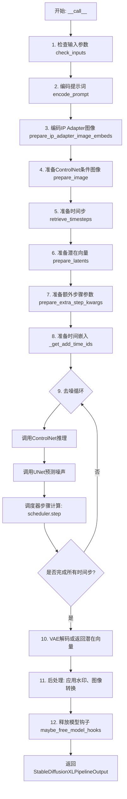
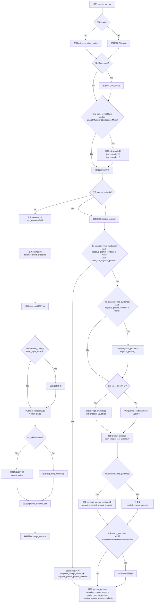
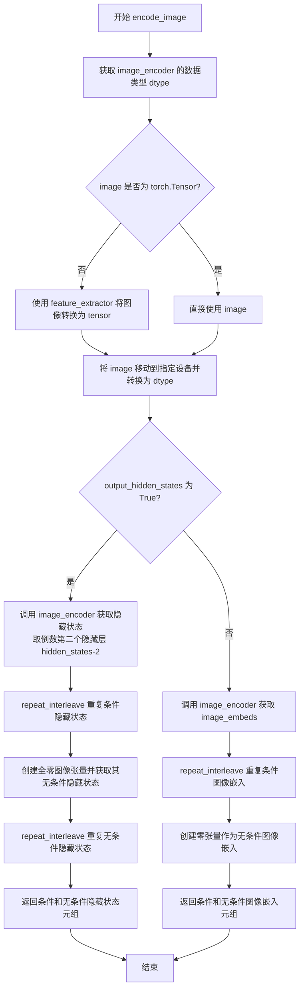
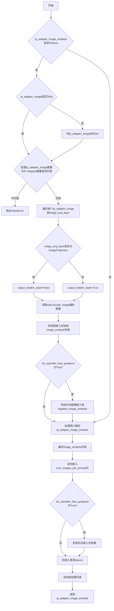
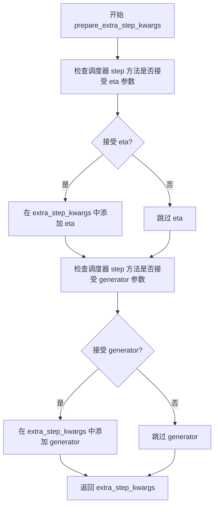
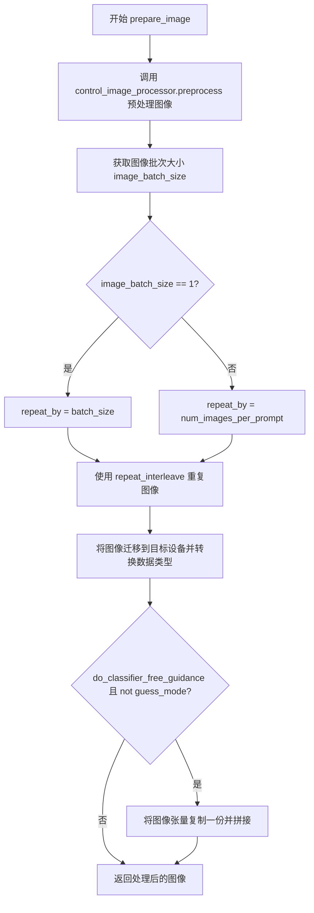
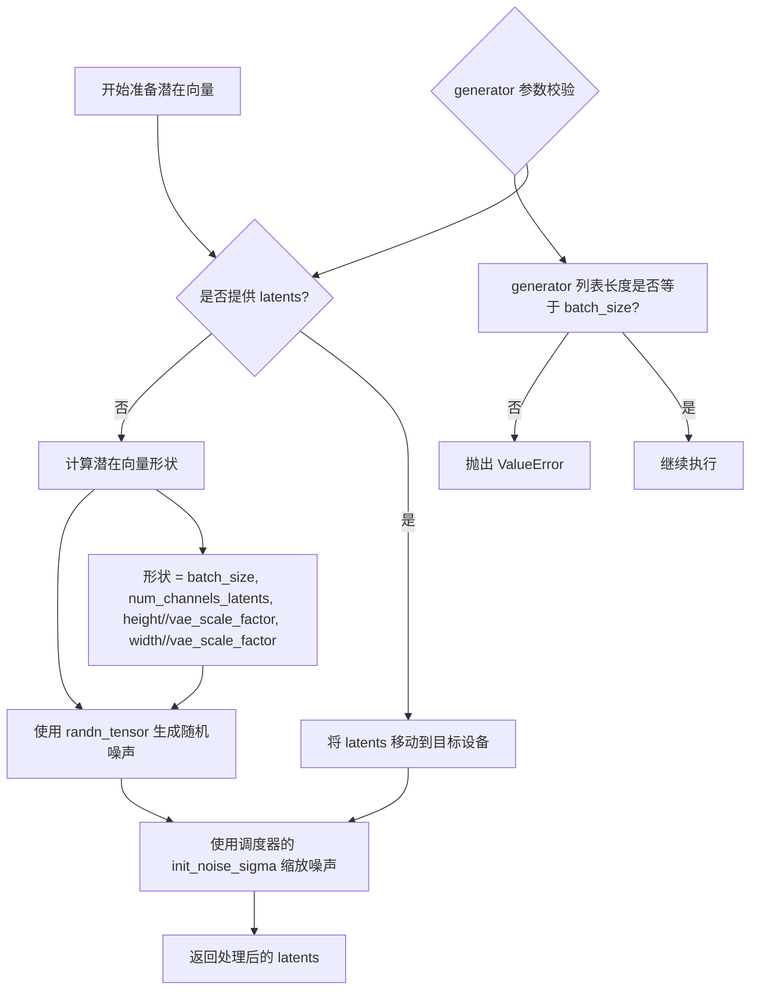
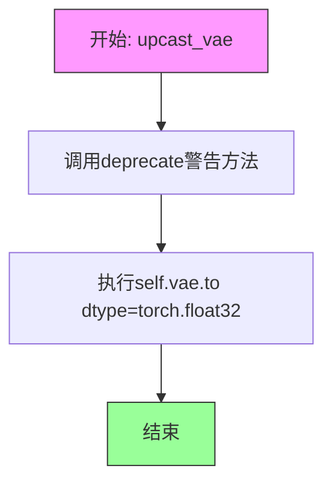
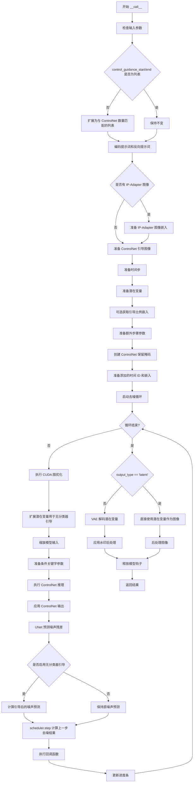

# `diffusers\src\diffusers\pipelines\controlnet\pipeline_controlnet_sd_xl.py` 详细设计文档

Stable Diffusion XL ControlNet Pipeline是一个用于文本到图像生成的扩散模型管道，结合了ControlNet条件控制机制，支持双文本编码器（CLIP Text Encoder和CLIP Text Encoder with Projection）、VAE变分自编码器、UNet2DConditionModel去噪网络以及可选的IP Adapter和LoRA权重加载，可通过ControlNet输入的图像条件（如边缘检测、姿态估计等）来引导图像生成过程，实现高质量、可控的图像合成。

## 整体流程



## 类结构

```
DiffusionPipeline (抽象基类)
├── StableDiffusionMixin
├── TextualInversionLoaderMixin
├── StableDiffusionXLLoraLoaderMixin
├── IPAdapterMixin
├── FromSingleFileMixin
└── StableDiffusionXLControlNetPipeline (主类)
```

## 全局变量及字段


### `EXAMPLE_DOC_STRING`
    
示例文档字符串

类型：`str`
    


### `logger`
    
日志记录器

类型：`logging.Logger`
    


### `XLA_AVAILABLE`
    
PyTorch XLA是否可用

类型：`bool`
    


### `retrieve_timesteps`
    
获取扩散调度器的时间步

类型：`function`
    


### `StableDiffusionXLControlNetPipeline.vae`
    
VAE变分自编码器，用于编码和解码图像

类型：`AutoencoderKL`
    


### `StableDiffusionXLControlNetPipeline.text_encoder`
    
第一个冻结的文本编码器

类型：`CLIPTextModel`
    


### `StableDiffusionXLControlNetPipeline.text_encoder_2`
    
第二个带投影的文本编码器

类型：`CLIPTextModelWithProjection`
    


### `StableDiffusionXLControlNetPipeline.tokenizer`
    
第一个分词器

类型：`CLIPTokenizer`
    


### `StableDiffusionXLControlNetPipeline.tokenizer_2`
    
第二个分词器

类型：`CLIPTokenizer`
    


### `StableDiffusionXLControlNetPipeline.unet`
    
去噪UNet网络

类型：`UNet2DConditionModel`
    


### `StableDiffusionXLControlNetPipeline.controlnet`
    
ControlNet模型，用于提供额外的条件控制

类型：`ControlNetModel | MultiControlNetModel`
    


### `StableDiffusionXLControlNetPipeline.scheduler`
    
扩散调度器

类型：`KarrasDiffusionSchedulers`
    


### `StableDiffusionXLControlNetPipeline.feature_extractor`
    
特征提取器

类型：`CLIPImageProcessor`
    


### `StableDiffusionXLControlNetPipeline.image_encoder`
    
图像编码器

类型：`CLIPVisionModelWithProjection`
    


### `StableDiffusionXLControlNetPipeline.vae_scale_factor`
    
VAE缩放因子

类型：`int`
    


### `StableDiffusionXLControlNetPipeline.image_processor`
    
图像处理器

类型：`VaeImageProcessor`
    


### `StableDiffusionXLControlNetPipeline.control_image_processor`
    
ControlNet图像处理器

类型：`VaeImageProcessor`
    


### `StableDiffusionXLControlNetPipeline.watermark`
    
水印器

类型：`StableDiffusionXLWatermarker`
    


### `StableDiffusionXLControlNetPipeline.model_cpu_offload_seq`
    
模型CPU卸载顺序

类型：`str`
    


### `StableDiffusionXLControlNetPipeline._optional_components`
    
可选组件列表

类型：`list`
    


### `StableDiffusionXLControlNetPipeline._callback_tensor_inputs`
    
回调张量输入列表

类型：`list`
    
    

## 全局函数及方法


### `retrieve_timesteps`

检索调度器的时间步，根据传入的参数调用调度器的 `set_timesteps` 方法，并从调度器中获取时间步序列。该函数支持自定义时间步或自定义 sigmas，并能自动处理不同类型调度器的兼容性检查。

参数：

- `scheduler`：`SchedulerMixin`，调度器对象，用于获取时间步
- `num_inference_steps`：`int | None`，生成样本时使用的扩散步数，如果使用此参数，则 `timesteps` 必须为 `None`
- `device`：`str | torch.device | None`，时间步要移动到的设备，如果为 `None` 则不移动
- `timesteps`：`list[int] | None`，自定义时间步，用于覆盖调度器的时间步间隔策略，如果传入此参数，则 `num_inference_steps` 和 `sigmas` 必须为 `None`
- `sigmas`：`list[float] | None`，自定义 sigmas，用于覆盖调度器的时间步间隔策略，如果传入此参数，则 `num_inference_steps` 和 `timesteps` 必须为 `None`
- `**kwargs`：任意关键字参数，将传递给 `scheduler.set_timesteps`

返回值：`tuple[torch.Tensor, int]`，第一个元素是调度器的时间步序列，第二个元素是推理步数

#### 流程图

```mermaid
flowchart TD
    A[开始] --> B{检查timesteps和sigmas是否同时存在}
    B -->|是| C[抛出ValueError: 只能选择timesteps或sigmas之一]
    B -->|否| D{检查timesteps是否提供}
    
    D -->|是| E{检查scheduler.set_timesteps是否支持timesteps参数}
    E -->|不支持| F[抛出ValueError: 当前调度器不支持自定义timesteps]
    E -->|支持| G[调用scheduler.set_timesteps<br/>传入timesteps和device]
    G --> H[获取scheduler.timesteps]
    H --> I[计算num_inference_steps = len(timesteps)]
    
    D -->|否| J{检查sigmas是否提供}
    J -->|是| K{检查scheduler.set_timesteps是否支持sigmas参数}
    K -->|不支持| L[抛出ValueError: 当前调度器不支持自定义sigmas]
    K -->|支持| M[调用scheduler.set_timesteps<br/>传入sigmas和device]
    M --> N[获取scheduler.timesteps]
    N --> O[计算num_inference_steps = len(timesteps)]
    
    J -->|否| P[调用scheduler.set_timesteps<br/>传入num_inference_steps和device]
    P --> Q[获取scheduler.timesteps]
    
    I --> R[返回timesteps和num_inference_steps]
    O --> R
    Q --> R
```

#### 带注释源码

```
# 从代码中提取的 retrieve_timesteps 函数
def retrieve_timesteps(
    scheduler,
    num_inference_steps: int | None = None,
    device: str | torch.device | None = None,
    timesteps: list[int] | None = None,
    sigmas: list[float] | None = None,
    **kwargs,
):
    r"""
    Calls the scheduler's `set_timesteps` method and retrieves timesteps from the scheduler after the call. Handles
    custom timesteps. Any kwargs will be supplied to `scheduler.set_timesteps`.

    Args:
        scheduler (`SchedulerMixin`):
            The scheduler to get timesteps from.
        num_inference_steps (`int`):
            The number of diffusion steps used when generating samples with a pre-trained model. If used, `timesteps`
            must be `None`.
        device (`str` or `torch.device`, *optional*):
            The device to which the timesteps should be moved to. If `None`, the timesteps are not moved.
        timesteps (`list[int]`, *optional*):
            Custom timesteps used to override the timestep spacing strategy of the scheduler. If `timesteps` is passed,
            `num_inference_steps` and `sigmas` must be `None`.
        sigmas (`list[float]`, *optional*):
            Custom sigmas used to override the timestep spacing strategy of the scheduler. If `sigmas` is passed,
            `num_inference_steps` and `timesteps` must be `None`.

    Returns:
        `tuple[torch.Tensor, int]`: A tuple where the first element is the timestep schedule from the scheduler and the
        second element is the number of inference steps.
    """
    # 检查是否同时传入了timesteps和sigmas，这是不允许的
    if timesteps is not None and sigmas is not None:
        raise ValueError("Only one of `timesteps` or `sigmas` can be passed. Please choose one to set custom values")
    
    # 处理自定义timesteps的情况
    if timesteps is not None:
        # 检查调度器的set_timesteps方法是否支持timesteps参数
        accepts_timesteps = "timesteps" in set(inspect.signature(scheduler.set_timesteps).parameters.keys())
        if not accepts_timesteps:
            raise ValueError(
                f"The current scheduler class {scheduler.__class__}'s `set_timesteps` does not support custom"
                f" timestep schedules. Please check whether you are using the correct scheduler."
            )
        # 调用调度器的set_timesteps方法设置自定义时间步
        scheduler.set_timesteps(timesteps=timesteps, device=device, **kwargs)
        # 从调度器获取时间步序列
        timesteps = scheduler.timesteps
        # 计算推理步数
        num_inference_steps = len(timesteps)
    # 处理自定义sigmas的情况
    elif sigmas is not None:
        # 检查调度器的set_timesteps方法是否支持sigmas参数
        accept_sigmas = "sigmas" in set(inspect.signature(scheduler.set_timesteps).parameters.keys())
        if not accept_sigmas:
            raise ValueError(
                f"The current scheduler class {scheduler.__class__}'s `set_timesteps` does not support custom"
                f" sigmas schedules. Please check whether you are using the correct scheduler."
            )
        # 调用调度器的set_timesteps方法设置自定义sigmas
        scheduler.set_timesteps(sigmas=sigmas, device=device, **kwargs)
        # 从调度器获取时间步序列
        timesteps = scheduler.timesteps
        # 计算推理步数
        num_inference_steps = len(timesteps)
    # 处理默认情况，使用num_inference_steps设置时间步
    else:
        scheduler.set_timesteps(num_inference_steps, device=device, **kwargs)
        timesteps = scheduler.timesteps
    
    # 返回时间步序列和推理步数
    return timesteps, num_inference_steps
```


### `StableDiffusionXLControlNetPipeline.__init__`

初始化StableDiffusionXLControlNetPipeline管道，用于结合ControlNet进行基于文本提示的图像生成。该方法接收多个模型组件（VAE、文本编码器、UNet、ControlNet等）并进行注册和配置。

参数：

- `vae`：`AutoencoderKL`，变分自编码器模型，用于编码和解码图像与潜在表示
- `text_encoder`：`CLIPTextModel`，冻结的文本编码器（clip-vit-large-patch14）
- `text_encoder_2`：`CLIPTextModelWithProjection`，第二个冻结的文本编码器（laion/CLIP-ViT-bigG-14-laion2B-39B-b160k）
- `tokenizer`：`CLIPTokenizer`，用于对文本进行分词的CLIP分词器
- `tokenizer_2`：`CLIPTokenizer`，第二个CLIP分词器
- `unet`：`UNet2DConditionModel`，用于对编码图像潜在表示进行去噪的UNet模型
- `controlnet`：`ControlNetModel | list[ControlNetModel] | tuple[ControlNetModel] | MultiControlNetModel`，提供额外条件控制的ControlNet模型，可接收单个或多个ControlNet
- `scheduler`：`KarrasDiffusionSchedulers`，与unet配合使用的调度器，用于对编码图像潜在表示进行去噪
- `force_zeros_for_empty_prompt`：`bool`，可选参数，默认为True，是否将空提示的负向提示嵌入始终设置为0
- `add_watermarker`：`bool | None`，可选参数，是否使用不可见水印库为输出图像添加水印
- `feature_extractor`：`CLIPImageProcessor`，可选参数，图像特征提取器
- `image_encoder`：`CLIPVisionModelWithProjection`，可选参数，图像编码器模型

返回值：`None`，构造函数无返回值，仅初始化实例属性

#### 流程图

```mermaid
flowchart TD
    A[开始 __init__] --> B[调用 super().__init__]
    B --> C{controlnet 是 list 或 tuple?}
    C -->|是| D[将 controlnet 包装为 MultiControlNetModel]
    C -->|否| E[保持原 controlnet 不变]
    D --> F[register_modules 注册所有模块]
    E --> F
    F --> G[计算 vae_scale_factor]
    G --> H[创建 VaeImageProcessor]
    I[创建 control_image_processor] --> J{add_watermarker 为 None?}
    J -->|是| K[检查 is_invisible_watermark_available]
    J -->|否| L[使用传入的 add_watermarker 值]
    K --> M[设置 add_watermarker 值]
    L --> M
    M --> N{add_watermarker 为 True?}
    N -->|是| O[创建 StableDiffusionXLWatermarker 实例]
    N -->|否| P[设置 watermark 为 None]
    O --> Q[register_to_config 注册配置]
    P --> Q
    Q --> R[结束 __init__]
```

#### 带注释源码

```python
def __init__(
    self,
    vae: AutoencoderKL,
    text_encoder: CLIPTextModel,
    text_encoder_2: CLIPTextModelWithProjection,
    tokenizer: CLIPTokenizer,
    tokenizer_2: CLIPTokenizer,
    unet: UNet2DConditionModel,
    controlnet: ControlNetModel | list[ControlNetModel] | tuple[ControlNetModel] | MultiControlNetModel,
    scheduler: KarrasDiffusionSchedulers,
    force_zeros_for_empty_prompt: bool = True,
    add_watermarker: bool | None = None,
    feature_extractor: CLIPImageProcessor = None,
    image_encoder: CLIPVisionModelWithProjection = None,
):
    # 调用父类构造函数，初始化基础管道功能
    super().__init__()

    # 如果 controlnet 是列表或元组，则包装为 MultiControlNetModel
    # 以支持多个 ControlNet 模型的组合使用
    if isinstance(controlnet, (list, tuple)):
        controlnet = MultiControlNetModel(controlnet)

    # 注册所有模块到管道，使这些组件可通过 self.xxx 访问
    # 包括 VAE、文本编码器、分词器、UNet、ControlNet、调度器等
    self.register_modules(
        vae=vae,
        text_encoder=text_encoder,
        text_encoder_2=text_encoder_2,
        tokenizer=tokenizer,
        tokenizer_2=tokenizer_2,
        unet=unet,
        controlnet=controlnet,
        scheduler=scheduler,
        feature_extractor=feature_extractor,
        image_encoder=image_encoder,
    )
    
    # 计算 VAE 缩放因子，基于 VAE 配置中的 block_out_channels 数量
    # 用于后续图像预处理和后处理的尺寸调整
    self.vae_scale_factor = 2 ** (len(self.vae.config.block_out_channels) - 1) if getattr(self, "vae", None) else 8
    
    # 创建图像处理器，用于 VAE 的图像预处理和后处理
    # do_convert_rgb=True 表示将输入转换为 RGB 格式
    self.image_processor = VaeImageProcessor(vae_scale_factor=self.vae_scale_factor, do_convert_rgb=True)
    
    # 创建 ControlNet 专用的图像处理器
    # do_normalize=False 表示不进行归一化，保持 ControlNet 输入的原始数值范围
    self.control_image_processor = VaeImageProcessor(
        vae_scale_factor=self.vae_scale_factor, do_convert_rgb=True, do_normalize=False
    )
    
    # 如果 add_watermarker 为 None，则根据水印库是否可用来决定是否添加水印
    add_watermarker = add_watermarker if add_watermarker is not None else is_invisible_watermark_available()

    # 根据 add_watermarker 值决定是否初始化水印器
    if add_watermarker:
        self.watermark = StableDiffusionXLWatermarker()
    else:
        self.watermark = None

    # 将配置参数注册到管道配置中
    self.register_to_config(force_zeros_for_empty_prompt=force_zeros_for_empty_prompt)
```


### `StableDiffusionXLControlNetPipeline.encode_prompt`

该方法负责将文本提示编码为文本编码器的隐藏状态。它支持双文本编码器架构（SDXL特性），处理LoRA缩放、分类器自由引导的负提示嵌入，并允许预先计算的提示嵌入以实现灵活性。

参数：

- `prompt`：`str | list[str] | None`，要编码的提示文本
- `prompt_2`：`str | list[str] | None`，发送给第二个tokenizer和text_encoder的提示，如果不定义则使用prompt
- `device`：`torch.device | None`，torch设备，如果为None则使用执行设备
- `num_images_per_prompt`：`int`，每个提示生成的图像数量，默认为1
- `do_classifier_free_guidance`：`bool`，是否使用分类器自由引导，默认为True
- `negative_prompt`：`str | list[str] | None`，不引导图像生成的提示
- `negative_prompt_2`：`str | list[str] | None`，发送给第二个tokenizer和text_encoder的负提示
- `prompt_embeds`：`torch.Tensor | None`，预生成的文本嵌入，用于轻松调整文本输入
- `negative_prompt_embeds`：`torch.Tensor | None`，预生成的负文本嵌入
- `pooled_prompt_embeds`：`torch.Tensor | None`，预生成的池化文本嵌入
- `negative_pooled_prompt_embeds`：`torch.Tensor | None`，预生成的负池化文本嵌入
- `lora_scale`：`float | None`，应用于文本编码器所有LoRA层的LoRA缩放因子
- `clip_skip`：`int | None`，计算提示嵌入时从CLIP跳过的层数

返回值：`tuple[torch.Tensor, torch.Tensor, torch.Tensor, torch.Tensor]`，返回四个张量：提示嵌入、负提示嵌入、池化提示嵌入、负池化提示嵌入

#### 流程图



#### 带注释源码

```python
def encode_prompt(
    self,
    prompt: str,
    prompt_2: str | None = None,
    device: torch.device | None = None,
    num_images_per_prompt: int = 1,
    do_classifier_free_guidance: bool = True,
    negative_prompt: str | None = None,
    negative_prompt_2: str | None = None,
    prompt_embeds: torch.Tensor | None = None,
    negative_prompt_embeds: torch.Tensor | None = None,
    pooled_prompt_embeds: torch.Tensor | None = None,
    negative_pooled_prompt_embeds: torch.Tensor | None = None,
    lora_scale: float | None = None,
    clip_skip: int | None = None,
):
    r"""
    Encodes the prompt into text encoder hidden states.

    Args:
        prompt (`str` or `list[str]`, *optional*):
            prompt to be encoded
        prompt_2 (`str` or `list[str]`, *optional*):
            The prompt or prompts to be sent to the `tokenizer_2` and `text_encoder_2`. If not defined, `prompt` is
            used in both text-encoders
        device: (`torch.device`):
            torch device
        num_images_per_prompt (`int`):
            number of images that should be generated per prompt
        do_classifier_free_guidance (`bool`):
            whether to use classifier free guidance or not
        negative_prompt (`str` or `list[str]`, *optional*):
            The prompt or prompts not to guide the image generation. If not defined, one has to pass
            `negative_prompt_embeds` instead. Ignored when not using guidance (i.e., ignored if `guidance_scale` is
            less than `1`).
        negative_prompt_2 (`str` or `list[str]`, *optional*):
            The prompt or prompts not to guide the image generation to be sent to `tokenizer_2` and
            `text_encoder_2`. If not defined, `negative_prompt` is used in both text-encoders
        prompt_embeds (`torch.Tensor`, *optional*):
            Pre-generated text embeddings. Can be used to easily tweak text inputs, *e.g.* prompt weighting. If not
            provided, text embeddings will be generated from `prompt` input argument.
        negative_prompt_embeds (`torch.Tensor`, *optional*):
            Pre-generated negative text embeddings. Can be used to easily tweak text inputs, *e.g.* prompt
            weighting. If not provided, negative_prompt_embeds will be generated from `negative_prompt` input
            argument.
        pooled_prompt_embeds (`torch.Tensor`, *optional*):
            Pre-generated pooled text embeddings. Can be used to easily tweak text inputs, *e.g.* prompt weighting.
            If not provided, pooled text embeddings will be generated from `prompt` input argument.
        negative_pooled_prompt_embeds (`torch.Tensor`, *optional*):
            Pre-generated negative pooled text embeddings. Can be used to easily tweak text inputs, *e.g.* prompt
            weighting. If not provided, pooled negative_prompt_embeds will be generated from `negative_prompt`
            input argument.
        lora_scale (`float`, *optional*):
            A lora scale that will be applied to all LoRA layers of the text encoder if LoRA layers are loaded.
        clip_skip (`int`, *optional*):
            Number of layers to be skipped from CLIP while computing the prompt embeddings. A value of 1 means that
            the output of the pre-final layer will be used for computing the prompt embeddings.
    """
    # 确定设备，默认为执行设备
    device = device or self._execution_device

    # 设置lora scale以便text encoder的LoRA函数正确访问
    # 如果传入了lora_scale且当前pipeline支持StableDiffusionXLLoraLoaderMixin
    if lora_scale is not None and isinstance(self, StableDiffusionXLLoraLoaderMixin):
        self._lora_scale = lora_scale

        # 动态调整LoRA scale
        if self.text_encoder is not None:
            if not USE_PEFT_BACKEND:
                adjust_lora_scale_text_encoder(self.text_encoder, lora_scale)
            else:
                scale_lora_layers(self.text_encoder, lora_scale)

        if self.text_encoder_2 is not None:
            if not USE_PEFT_BACKEND:
                adjust_lora_scale_text_encoder(self.text_encoder_2, lora_scale)
            else:
                scale_lora_layers(self.text_encoder_2, lora_scale)

    # 将prompt标准化为列表
    prompt = [prompt] if isinstance(prompt, str) else prompt

    # 确定batch_size
    if prompt is not None:
        batch_size = len(prompt)
    else:
        batch_size = prompt_embeds.shape[0]

    # 定义tokenizers和text encoders列表
    # 支持一个或两个text encoder架构
    tokenizers = [self.tokenizer, self.tokenizer_2] if self.tokenizer is not None else [self.tokenizer_2]
    text_encoders = (
        [self.text_encoder, self.text_encoder_2] if self.text_encoder is not None else [self.text_encoder_2]
    )

    # 如果没有提供prompt_embeds，则从prompt生成
    if prompt_embeds is None:
        # prompt_2默认为prompt
        prompt_2 = prompt_2 or prompt
        prompt_2 = [prompt_2] if isinstance(prompt_2, str) else prompt_2

        # 用于存储所有text encoder的embeddings
        prompt_embeds_list = []
        prompts = [prompt, prompt_2]
        
        # 遍历两个prompts和对应的tokenizers/text_encoders
        for prompt, tokenizer, text_encoder in zip(prompts, tokenizers, text_encoders):
            # 如果支持TextualInversionLoaderMixin，转换prompt
            if isinstance(self, TextualInversionLoaderMixin):
                prompt = self.maybe_convert_prompt(prompt, tokenizer)

            # Tokenize文本
            text_inputs = tokenizer(
                prompt,
                padding="max_length",
                max_length=tokenizer.model_max_length,
                truncation=True,
                return_tensors="pt",
            )

            text_input_ids = text_inputs.input_ids
            
            # 检查是否被截断
            untruncated_ids = tokenizer(prompt, padding="longest", return_tensors="pt").input_ids

            if untruncated_ids.shape[-1] >= text_input_ids.shape[-1] and not torch.equal(
                text_input_ids, untruncated_ids
            ):
                removed_text = tokenizer.batch_decode(untruncated_ids[:, tokenizer.model_max_length - 1 : -1])
                logger.warning(
                    "The following part of your input was truncated because CLIP can only handle sequences up to"
                    f" {tokenizer.model_max_length} tokens: {removed_text}"
                )

            # 获取text encoder的hidden states
            prompt_embeds = text_encoder(text_input_ids.to(device), output_hidden_states=True)

            # 获取pooled输出（来自最后一个encoder）
            if pooled_prompt_embeds is None and prompt_embeds[0].ndim == 2:
                pooled_prompt_embeds = prompt_embeds[0]

            # 根据clip_skip选择hidden states层
            if clip_skip is None:
                prompt_embeds = prompt_embeds.hidden_states[-2]  # 默认使用倒数第二层
            else:
                # SDXL总是从倒数第二层索引
                prompt_embeds = prompt_embeds.hidden_states[-(clip_skip + 2)]

            prompt_embeds_list.append(prompt_embeds)

        # 沿着最后一个维度拼接两个encoder的embeddings
        prompt_embeds = torch.concat(prompt_embeds_list, dim=-1)

    # 处理分类器自由引导的unconditional embeddings
    zero_out_negative_prompt = negative_prompt is None and self.config.force_zeros_for_empty_prompt
    
    # 情况1：需要生成全零的negative embeddings
    if do_classifier_free_guidance and negative_prompt_embeds is None and zero_out_negative_prompt:
        negative_prompt_embeds = torch.zeros_like(prompt_embeds)
        negative_pooled_prompt_embeds = torch.zeros_like(pooled_prompt_embeds)
    # 情况2：需要从negative_prompt生成embeddings
    elif do_classifier_free_guidance and negative_prompt_embeds is None:
        negative_prompt = negative_prompt or ""
        negative_prompt_2 = negative_prompt_2 or negative_prompt

        # 标准化为列表
        negative_prompt = batch_size * [negative_prompt] if isinstance(negative_prompt, str) else negative_prompt
        negative_prompt_2 = (
            batch_size * [negative_prompt_2] if isinstance(negative_prompt_2, str) else negative_prompt_2
        )

        # 类型检查
        uncond_tokens: list[str]
        if prompt is not None and type(prompt) is not type(negative_prompt):
            raise TypeError(
                f"`negative_prompt` should be the same type to `prompt`, but got {type(negative_prompt)} !="
                f" {type(prompt)}."
            )
        elif batch_size != len(negative_prompt):
            raise ValueError(
                f"`negative_prompt`: {negative_prompt} has batch size {len(negative_prompt)}, but `prompt`:"
                f" {prompt} has batch size {batch_size}. Please make sure that passed `negative_prompt` matches"
                " the batch size of `prompt`."
            )
        else:
            uncond_tokens = [negative_prompt, negative_prompt_2]

        negative_prompt_embeds_list = []
        
        # 处理negative prompts
        for negative_prompt, tokenizer, text_encoder in zip(uncond_tokens, tokenizers, text_encoders):
            if isinstance(self, TextualInversionLoaderMixin):
                negative_prompt = self.maybe_convert_prompt(negative_prompt, tokenizer)

            max_length = prompt_embeds.shape[1]
            uncond_input = tokenizer(
                negative_prompt,
                padding="max_length",
                max_length=max_length,
                truncation=True,
                return_tensors="pt",
            )

            negative_prompt_embeds = text_encoder(
                uncond_input.input_ids.to(device),
                output_hidden_states=True,
            )

            # 获取pooled输出
            if negative_pooled_prompt_embeds is None and negative_prompt_embeds[0].ndim == 2:
                negative_pooled_prompt_embeds = negative_prompt_embeds[0]
            negative_prompt_embeds = negative_prompt_embeds.hidden_states[-2]

            negative_prompt_embeds_list.append(negative_prompt_embeds)

        negative_prompt_embeds = torch.concat(negative_prompt_embeds_list, dim=-1)

    # 转换prompt_embeds到正确的dtype
    if self.text_encoder_2 is not None:
        prompt_embeds = prompt_embeds.to(dtype=self.text_encoder_2.dtype, device=device)
    else:
        prompt_embeds = prompt_embeds.to(dtype=self.unet.dtype, device=device)

    # 扩展embeddings以支持每个prompt生成多张图像
    bs_embed, seq_len, _ = prompt_embeds.shape
    # 重复embeddings
    prompt_embeds = prompt_embeds.repeat(1, num_images_per_prompt, 1)
    prompt_embeds = prompt_embeds.view(bs_embed * num_images_per_prompt, seq_len, -1)

    # 如果使用分类器自由引导，也扩展negative embeddings
    if do_classifier_free_guidance:
        seq_len = negative_prompt_embeds.shape[1]

        if self.text_encoder_2 is not None:
            negative_prompt_embeds = negative_prompt_embeds.to(dtype=self.text_encoder_2.dtype, device=device)
        else:
            negative_prompt_embeds = negative_prompt_embeds.to(dtype=self.unet.dtype, device=device)

        negative_prompt_embeds = negative_prompt_embeds.repeat(1, num_images_per_prompt, 1)
        negative_prompt_embeds = negative_prompt_embeds.view(batch_size * num_images_per_prompt, seq_len, -1)

    # 扩展pooled embeddings
    pooled_prompt_embeds = pooled_prompt_embeds.repeat(1, num_images_per_prompt).view(
        bs_embed * num_images_per_prompt, -1
    )
    if do_classifier_free_guidance:
        negative_pooled_prompt_embeds = negative_pooled_prompt_embeds.repeat(1, num_images_per_prompt).view(
            bs_embed * num_images_per_prompt, -1
        )

    # 如果使用PEFT backend，恢复LoRA层到原始scale
    if self.text_encoder is not None:
        if isinstance(self, StableDiffusionXLLoraLoaderMixin) and USE_PEFT_BACKEND:
            # 检索原始scale，通过反向缩放LoRA层
            unscale_lora_layers(self.text_encoder, lora_scale)

    if self.text_encoder_2 is not None:
        if isinstance(self, StableDiffusionXLLoraLoaderMixin) and USE_PEFT_BACKEND:
            unscale_lora_layers(self.text_encoder_2, lora_scale)

    # 返回四个embeddings
    return prompt_embeds, negative_prompt_embeds, pooled_prompt_embeds, negative_pooled_prompt_embeds
```


### `StableDiffusionXLControlNetPipeline.encode_image`

该方法用于将输入图像编码为图像嵌入（image embeddings）或隐藏状态（hidden states），以供 Stable Diffusion XL ControlNet pipeline 在图像生成过程中使用。它支持条件和无条件的图像嵌入，适用于分类器自由引导（classifier-free guidance）。

参数：

- `image`：`torch.Tensor | PIL.Image | np.ndarray | list`，输入图像，可以是 PyTorch 张量、PIL 图像、NumPy 数组或图像列表
- `device`：`torch.device`，将图像张量移动到的目标设备
- `num_images_per_prompt`：`int`，每个提示词生成的图像数量，用于对图像嵌入进行重复
- `output_hidden_states`：`bool | None`，可选参数，指定是否输出图像编码器的隐藏状态而非图像嵌入

返回值：`tuple[torch.Tensor, torch.Tensor]`，返回一个元组，包含：
- 第一个元素：条件图像嵌入或隐藏状态（`image_embeds` 或 `image_enc_hidden_states`）
- 第二个元素：无条件图像嵌入或隐藏状态（`uncond_image_embeds` 或 `uncond_image_enc_hidden_states`）
- 两个元素均按 `num_images_per_prompt` 重复以匹配批量大小

#### 流程图



#### 带注释源码

```python
def encode_image(self, image, device, num_images_per_prompt, output_hidden_states=None):
    """
    Encodes the input image into image embeddings or hidden states.
    
    Args:
        image: Input image (PIL Image, numpy array, torch.Tensor, or list)
        device: Target device for the image tensor
        num_images_per_prompt: Number of images to generate per prompt
        output_hidden_states: If True, returns hidden states instead of image embeddings
    
    Returns:
        Tuple of (conditioned embeddings, unconditioned embeddings)
    """
    # 获取 image_encoder 的参数数据类型，用于保持数据类型一致
    dtype = next(self.image_encoder.parameters()).dtype
    
    # 如果输入不是 torch.Tensor，则使用 feature_extractor 转换为 tensor
    if not isinstance(image, torch.Tensor):
        image = self.feature_extractor(image, return_tensors="pt").pixel_values
    
    # 将图像移动到目标设备并转换为正确的 dtype
    image = image.to(device=device, dtype=dtype)
    
    # 根据 output_hidden_states 参数决定输出类型
    if output_hidden_states:
        # 输出隐藏状态模式：获取图像编码器的倒数第二个隐藏层
        image_enc_hidden_states = self.image_encoder(image, output_hidden_states=True).hidden_states[-2]
        # 沿批次维度重复，以匹配每个提示生成的图像数量
        image_enc_hidden_states = image_enc_hidden_states.repeat_interleave(num_images_per_prompt, dim=0)
        
        # 创建与输入图像形状相同的全零张量，用于生成无条件的隐藏状态
        uncond_image_enc_hidden_states = self.image_encoder(
            torch.zeros_like(image), output_hidden_states=True
        ).hidden_states[-2]
        # 同样重复无条件隐藏状态
        uncond_image_enc_hidden_states = uncond_image_enc_hidden_states.repeat_interleave(
            num_images_per_prompt, dim=0
        )
        # 返回条件和无条件隐藏状态
        return image_enc_hidden_states, uncond_image_enc_hidden_states
    else:
        # 默认模式：获取图像嵌入
        image_embeds = self.image_encoder(image).image_embeds
        # 重复图像嵌入以匹配批量大小
        image_embeds = image_embeds.repeat_interleave(num_images_per_prompt, dim=0)
        # 创建零张量作为无条件图像嵌入
        uncond_image_embeds = torch.zeros_like(image_embeds)
        
        # 返回条件和无条件图像嵌入
        return image_embeds, uncond_image_embeds
```


### `StableDiffusionXLControlNetPipeline.prepare_ip_adapter_image_embeds`

该方法用于准备IP-Adapter的图像嵌入，处理输入图像或预计算的图像嵌入，并根据是否启用分类器自由引导（classifier-free guidance）来构造正向和负向的图像嵌入向量，以供后续的去噪过程使用。

参数：

- `self`：`StableDiffusionXLControlNetPipeline`实例本身
- `ip_adapter_image`：`PipelineImageInput | None`，待处理的IP-Adapter输入图像，支持PIL.Image、numpy数组、torch.Tensor或它们的列表
- `ip_adapter_image_embeds`：`list[torch.Tensor] | None`，预计算的图像嵌入列表，若为None则从`ip_adapter_image`编码获取
- `device`：`torch.device`，目标设备，用于将计算结果移至指定设备
- `num_images_per_prompt`：`int`，每个prompt生成的图像数量，用于复制图像嵌入
- `do_classifier_free_guidance`：`bool`，是否启用分类器自由引导，若为True则同时生成负向图像嵌入

返回值：`list[torch.Tensor]`，处理后的IP-Adapter图像嵌入列表，每个元素为拼接了正向（和负向）图像嵌入的Tensor

#### 流程图



#### 带注释源码

```python
def prepare_ip_adapter_image_embeds(
    self, ip_adapter_image, ip_adapter_image_embeds, device, num_images_per_prompt, do_classifier_free_guidance
):
    """
    准备IP-Adapter的图像嵌入。
    
    参数:
        ip_adapter_image: IP-Adapter输入图像或图像列表
        ip_adapter_image_embeds: 预计算的图像嵌入，若为None则从图像编码
        device: 目标设备
        num_images_per_prompt: 每个prompt生成的图像数量
        do_classifier_free_guidance: 是否启用分类器自由引导
    """
    image_embeds = []  # 存储正向图像嵌入
    if do_classifier_free_guidance:
        negative_image_embeds = []  # 存储负向图像嵌入（用于classifier-free guidance）
    
    # 情况1：未预计算嵌入，需要从图像编码
    if ip_adapter_image_embeds is None:
        # 统一转为list格式
        if not isinstance(ip_adapter_image, list):
            ip_adapter_image = [ip_adapter_image]

        # 验证图像数量与IP-Adapter数量匹配
        if len(ip_adapter_image) != len(self.unet.encoder_hid_proj.image_projection_layers):
            raise ValueError(
                f"`ip_adapter_image` must have same length as the number of IP Adapters. Got {len(ip_adapter_image)} images and {len(self.unet.encoder_hid_proj.image_projection_layers)} IP Adapters."
            )

        # 遍历每个IP-Adapter的图像和对应的投影层
        for single_ip_adapter_image, image_proj_layer in zip(
            ip_adapter_image, self.unet.encoder_hid_proj.image_projection_layers
        ):
            # 确定是否输出hidden states（ImageProjection类型不需要）
            output_hidden_state = not isinstance(image_proj_layer, ImageProjection)
            # 编码图像获取嵌入
            single_image_embeds, single_negative_image_embeds = self.encode_image(
                single_ip_adapter_image, device, 1, output_hidden_state
            )

            # 添加批次维度 [1, emb_dim]
            image_embeds.append(single_image_embeds[None, :])
            # 如果启用classifier-free guidance，同时保留负向嵌入
            if do_classifier_free_guidance:
                negative_image_embeds.append(single_negative_image_embeds[None, :])
    else:
        # 情况2：已有预计算的嵌入，直接使用
        for single_image_embeds in ip_adapter_image_embeds:
            if do_classifier_free_guidance:
                # 预计算嵌入中已包含正负向，需要拆分
                single_negative_image_embeds, single_image_embeds = single_image_embeds.chunk(2)
                negative_image_embeds.append(single_negative_image_embeds)
            image_embeds.append(single_image_embeds)

    # 处理每个嵌入：复制num_images_per_prompt次，并拼接正负向（如果需要）
    ip_adapter_image_embeds = []
    for i, single_image_embeds in enumerate(image_embeds):
        # 复制以匹配每个prompt生成的图像数量
        single_image_embeds = torch.cat([single_image_embeds] * num_images_per_prompt, dim=0)
        if do_classifier_free_guidance:
            # 复制负向嵌入并拼接在前面
            single_negative_image_embeds = torch.cat([negative_image_embeds[i]] * num_images_per_prompt, dim=0)
            single_image_embeds = torch.cat([single_negative_image_embeds, single_image_embeds], dim=0)

        # 移至目标设备
        single_image_embeds = single_image_embeds.to(device=device)
        ip_adapter_image_embeds.append(single_image_embeds)

    return ip_adapter_image_embeds
```


### `StableDiffusionXLControlNetPipeline.prepare_extra_step_kwargs`

该方法用于为调度器（scheduler）的 `step` 方法准备额外的关键字参数。由于不同的调度器具有不同的签名（例如 DDIMScheduler 使用 `eta` 参数，而其他调度器可能不支持），该方法通过检查调度器的 `step` 方法签名来动态构建需要传递的额外参数字典，确保与各种调度器兼容。

参数：

- `generator`：`torch.Generator` 或 `list[torch.Generator]` 或 `None`，用于控制生成过程的随机数生成器。如果调度器支持 generator 参数，则将其传递给调度器的 step 方法。
- `eta`：`float`，DDIM 调度器中的 eta 参数（η），对应 DDIM 论文中的参数，取值范围通常为 [0, 1]。其他调度器会忽略此参数。

返回值：`dict`，包含额外关键字参数的字典，可能包含 `eta` 和/或 `generator` 键，取决于调度器是否支持这些参数。

#### 流程图



#### 带注释源码

```python
# Copied from diffusers.pipelines.stable_diffusion.pipeline_stable_diffusion.StableDiffusionPipeline.prepare_extra_step_kwargs
def prepare_extra_step_kwargs(self, generator, eta):
    # 准备调度器 step 方法的额外参数，因为并非所有调度器都具有相同的签名
    # eta (η) 仅在 DDIMScheduler 中使用，其他调度器会忽略它
    # eta 对应 DDIM 论文中的 η: https://huggingface.co/papers/2010.02502
    # 取值应在 [0, 1] 之间

    # 使用 inspect 模块检查调度器的 step 方法签名，判断是否接受 eta 参数
    accepts_eta = "eta" in set(inspect.signature(self.scheduler.step).parameters.keys())
    
    # 初始化空字典用于存储额外参数
    extra_step_kwargs = {}
    
    # 如果调度器接受 eta 参数，则将其添加到 extra_step_kwargs 中
    if accepts_eta:
        extra_step_kwargs["eta"] = eta

    # 检查调度器是否接受 generator 参数
    accepts_generator = "generator" in set(inspect.signature(self.scheduler.step).parameters.keys())
    
    # 如果调度器接受 generator 参数，则将其添加到 extra_step_kwargs 中
    if accepts_generator:
        extra_step_kwargs["generator"] = generator
    
    # 返回包含额外参数的字典，供调度器 step 方法使用
    return extra_step_kwargs
```


### `StableDiffusionXLControlNetPipeline.check_inputs`

该方法用于验证Stable Diffusion XL ControlNet管道的输入参数是否合法，确保用户在调用管道生成图像时提供的prompt、image、controlnet相关参数等符合要求，从而避免在后续生成过程中出现运行时错误。

参数：

- `self`：`StableDiffusionXLControlNetPipeline`，类实例本身
- `prompt`：`str | list[str] | None`，主要提示词，用于指导图像生成内容
- `prompt_2`：`str | list[str] | None`，发送给第二个tokenizer和text_encoder的提示词，若不指定则使用prompt
- `image`：`PipelineImageInput | None`，ControlNet输入条件图像，用于引导unet生成
- `callback_steps`：`int | None`，每多少步执行一次回调函数
- `negative_prompt`：`str | list[str] | None`，负面提示词，用于指定不希望出现在生成图像中的内容
- `negative_prompt_2`：`str | list[str] | None`，第二个负面提示词
- `prompt_embeds`：`torch.Tensor | None`，预生成的文本嵌入，可用于轻松调整文本输入
- `negative_prompt_embeds`：`torch.Tensor | None`，预生成的负面文本嵌入
- `pooled_prompt_embeds`：`torch.Tensor | None`，预生成的池化文本嵌入
- `ip_adapter_image`：`PipelineImageInput | None`，IP适配器可选图像输入
- `ip_adapter_image_embeds`：`list[torch.Tensor] | None`，IP适配器的预生成图像嵌入
- `negative_pooled_prompt_embeds`：`torch.Tensor | None`，预生成的负面池化文本嵌入
- `controlnet_conditioning_scale`：`float | list[float]`，ControlNet输出乘数，默认为1.0
- `control_guidance_start`：`float | list[float]`，ControlNet开始应用的总步数百分比，默认为0.0
- `control_guidance_end`：`float | list[float]`，ControlNet停止应用的总步数百分比，默认为1.0
- `callback_on_step_end_tensor_inputs`：`list[str] | None`，回调函数在每步结束时接收的张量输入列表

返回值：`None`，该方法不返回任何值，仅进行参数验证，若参数不合法则抛出相应的ValueError或TypeError异常

#### 流程图

```mermaid
flowchart TD
    A[开始 check_inputs] --> B{检查 callback_steps}
    B -->|无效| B1[抛出 ValueError]
    B -->|有效| C{检查 callback_on_step_end_tensor_inputs}
    C -->|包含非法键| C1[抛出 ValueError]
    C -->|合法| D{prompt 和 prompt_embeds 互斥检查}
    D -->|两者都提供| D1[抛出 ValueError]
    D -->|合法| E{prompt_2 和 prompt_embeds 互斥检查}
    E -->|两者都提供| E1[抛出 ValueError]
    E -->|合法| F{prompt 和 prompt_embeds 至少提供一个}
    F -->|都未提供| F1[抛出 ValueError]
    F -->|合法| G{prompt 类型检查}
    G -->|类型错误| G1[抛出 ValueError]
    G -->|合法| H{prompt_2 类型检查]
    H -->|类型错误| H1[抛出 ValueError]
    H -->|合法| I{negative_prompt 和 negative_prompt_embeds 互斥}
    I -->|两者都提供| I1[抛出 ValueError]
    I -->|合法| J{negative_prompt_2 和 negative_prompt_embeds 互斥}
    J -->|两者都提供| J1[抛出 ValueError]
    J -->|合法| K{prompt_embeds 和 negative_prompt_embeds 形状检查}
    K -->|形状不匹配| K1[抛出 ValueError]
    K -->|合法| L{prompt_embeds 需要 pooled_prompt_embeds}
    L -->|缺少| L1[抛出 ValueError]
    L -->|合法| M{negative_prompt_embeds 需要 negative_pooled_prompt_embeds}
    M -->|缺少| M1[抛出 ValueError]
    M -->|合法| N{检查 ControlNet 类型}
    N -->|Single ControlNet| N1[调用 check_image 验证图像]
    N -->|Multi ControlNet| N2{image 是 list 类型}
    N2 -->|不是 list| N3[抛出 TypeError]
    N2 -->|是 list| N4{image 是嵌套 list}
    N4 -->|是嵌套| N4a[抛出 ValueError]
    N4 -->|不是| N5{image 长度与 ControlNet 数量匹配}
    N5 -->|不匹配| N5a[抛出 ValueError]
    N5 -->|匹配| N6[遍历 image 调用 check_image]
    N1 --> O{检查 controlnet_conditioning_scale}
    N6 --> O
    O -->|Single 且非 float| O1[抛出 TypeError]
    O -->|Multi 且是 list| O2{检查 list 嵌套和长度}
    O2 -->|嵌套| O2a[抛出 ValueError]
    O2 -->|长度不匹配| O2b[抛出 ValueError]
    O -->|合法| P{检查 control_guidance_start 和 control_guidance_end}
    P -->|类型不是 list| P1[转换为 list]
    P -->|长度不相等| P2[抛出 ValueError]
    P -->|Multi ControlNet 且长度不匹配| P3[抛出 ValueError]
    P -->|start >= end| P4[抛出 ValueError]
    P -->|start < 0 或 end > 1| P5[抛出 ValueError]
    P -->|合法| Q{检查 IP Adapter 参数互斥}
    Q -->|都提供| Q1[抛出 ValueError]
    Q -->|合法| R{检查 ip_adapter_image_embeds 类型和维度}
    R -->|不是 list| R1[抛出 ValueError]
    R -->|维度不是 3D 或 4D| R2[抛出 ValueError]
    R -->|合法| S[结束验证]
```

#### 带注释源码

```
    def check_inputs(
        self,
        prompt,                            # 主要提示词，str或list类型
        prompt_2,                          # 第二个提示词，若不指定则使用prompt
        image,                             # ControlNet控制图像
        callback_steps,                    # 回调步数
        negative_prompt=None,              # 负面提示词
        negative_prompt_2=None,            # 第二个负面提示词
        prompt_embeds=None,                # 预生成的提示词嵌入
        negative_prompt_embeds=None,       # 预生成的负面提示词嵌入
        pooled_prompt_embeds=None,         # 池化的提示词嵌入
        ip_adapter_image=None,             # IP适配器图像
        ip_adapter_image_embeds=None,      # IP适配器图像嵌入
        negative_pooled_prompt_embeds=None,# 负面池化提示词嵌入
        controlnet_conditioning_scale=1.0,# ControlNet条件缩放因子
        control_guidance_start=0.0,        # ControlNetGuidance开始比例
        control_guidance_end=1.0,          # ControlNetGuidance结束比例
        callback_on_step_end_tensor_inputs=None, # 回调时传递的张量输入
    ):
        # 1. 验证callback_steps参数
        # 必须是正整数，用于指定每隔多少步执行一次回调函数
        if callback_steps is not None and (not isinstance(callback_steps, int) or callback_steps <= 0):
            raise ValueError(
                f"`callback_steps` has to be a positive integer but is {callback_steps} of type"
                f" {type(callback_steps)}."
            )

        # 2. 验证callback_on_step_end_tensor_inputs中的键是否都在允许列表中
        # 这些是回调函数可以接收的张量参数
        if callback_on_step_end_tensor_inputs is not None and not all(
            k in self._callback_tensor_inputs for k in callback_on_step_end_tensor_inputs
        ):
            raise ValueError(
                f"`callback_on_step_end_tensor_inputs` has to be in {self._callback_tensor_inputs}, but found {[k for k in callback_on_step_end_tensor_inputs if k not in self._callback_tensor_inputs]}"
            )

        # 3. 验证prompt和prompt_embeds的互斥关系
        # 不能同时提供原始提示词和预计算的嵌入
        if prompt is not None and prompt_embeds is not None:
            raise ValueError(
                f"Cannot forward both `prompt`: {prompt} and `prompt_embeds`: {prompt_embeds}. Please make sure to"
                " only forward one of the two."
            )
        elif prompt_2 is not None and prompt_embeds is not None:
            raise ValueError(
                f"Cannot forward both `prompt_2`: {prompt_2} and `prompt_embeds`: {prompt_embeds}. Please make sure to"
                " only forward one of the two."
            )
        # 4. 必须提供至少一种提示词方式
        elif prompt is None and prompt_embeds is None:
            raise ValueError(
                "Provide either `prompt` or `prompt_embeds`. Cannot leave both `prompt` and `prompt_embeds` undefined."
            )
        # 5. 验证prompt的类型
        elif prompt is not None and (not isinstance(prompt, str) and not isinstance(prompt, list)):
            raise ValueError(f"`prompt` has to be of type `str` or `list` but is {type(prompt)}")
        # 6. 验证prompt_2的类型
        elif prompt_2 is not None and (not isinstance(prompt_2, str) and not isinstance(prompt_2, list)):
            raise ValueError(f"`prompt_2` has to be of type `str` or `list` but is {type(prompt_2)}")

        # 7. 验证negative_prompt和negative_prompt_embeds的互斥关系
        if negative_prompt is not None and negative_prompt_embeds is not None:
            raise ValueError(
                f"Cannot forward both `negative_prompt`: {negative_prompt} and `negative_prompt_embeds`:"
                f" {negative_prompt_embeds}. Please make sure to only forward one of the two."
            )
        elif negative_prompt_2 is not None and negative_prompt_embeds is not None:
            raise ValueError(
                f"Cannot forward both `negative_prompt_2`: {negative_prompt_2} and `negative_prompt_embeds`:"
                f" {negative_prompt_embeds}. Please make sure to only forward one of the two."
            )

        # 8. 验证prompt_embeds和negative_prompt_embeds的形状一致性
        if prompt_embeds is not None and negative_prompt_embeds is not None:
            if prompt_embeds.shape != negative_prompt_embeds.shape:
                raise ValueError(
                    "`prompt_embeds` and `negative_prompt_embeds` must have the same shape when passed directly, but"
                    f" got: `prompt_embeds` {prompt_embeds.shape} != `negative_prompt_embeds`"
                    f" {negative_prompt_embeds.shape}."
                )

        # 9. 如果提供了prompt_embeds，必须也提供pooled_prompt_embeds
        # SDXL需要池化的嵌入来生成图像
        if prompt_embeds is not None and pooled_prompt_embeds is None:
            raise ValueError(
                "If `prompt_embeds` are provided, `pooled_prompt_embeds` also have to be passed. Make sure to generate `pooled_prompt_embeds` from the same text encoder that was used to generate `prompt_embeds`."
            )

        # 10. 如果提供了negative_prompt_embeds，必须也提供negative_pooled_prompt_embeds
        if negative_prompt_embeds is not None and negative_pooled_prompt_embeds is None:
            raise ValueError(
                "If `negative_prompt_embeds` are provided, `negative_pooled_prompt_embeds` also have to be passed. Make sure to generate `negative_pooled_prompt_embeds` from the same text encoder that was used to generate `negative_prompt_embeds`."
            )

        # 11. 当有多个ControlNet时，检查prompt是否为列表
        # 如果有多个ControlNet但只提供一个prompt，会对所有ControlNet使用相同的条件
        if isinstance(self.controlnet, MultiControlNetModel):
            if isinstance(prompt, list):
                logger.warning(
                    f"You have {len(self.controlnet.nets)} ControlNets and you have passed {len(prompt)}"
                    " prompts. The conditionings will be fixed across the prompts."
                )

        # 12. 验证图像输入的有效性
        # 检查是否使用编译后的模型（torch.compile）
        is_compiled = hasattr(F, "scaled_dot_product_attention") and isinstance(
            self.controlnet, torch._dynamo.eval_frame.OptimizedModule
        )
        # 单个ControlNet的情况
        if (
            isinstance(self.controlnet, ControlNetModel)
            or is_compiled
            and isinstance(self.controlnet._orig_mod, ControlNetModel)
        ):
            self.check_image(image, prompt, prompt_embeds)
        # 多个ControlNet的情况
        elif (
            isinstance(self.controlnet, MultiControlNetModel)
            or is_compiled
            and isinstance(self.controlnet._orig_mod, MultiControlNetModel)
        ):
            # 必须提供图像列表
            if not isinstance(image, list):
                raise TypeError("For multiple controlnets: `image` must be type `list`")

            # 不支持嵌套列表（多个批次的条件）
            elif any(isinstance(i, list) for i in image):
                raise ValueError("A single batch of multiple conditionings are supported at the moment.")
            # 图像数量必须与ControlNet数量匹配
            elif len(image) != len(self.controlnet.nets):
                raise ValueError(
                    f"For multiple controlnets: `image` must have the same length as the number of controlnets, but got {len(image)} images and {len(self.controlnet.nets)} ControlNets."
                )

            # 遍历每个图像进行验证
            for image_ in image:
                self.check_image(image_, prompt, prompt_embeds)
        else:
            assert False

        # 13. 验证controlnet_conditioning_scale参数
        # 单个ControlNet时必须是float类型
        if (
            isinstance(self.controlnet, ControlNetModel)
            or is_compiled
            and isinstance(self.controlnet._orig_mod, ControlNetModel)
        ):
            if not isinstance(controlnet_conditioning_scale, float):
                raise TypeError("For single controlnet: `controlnet_conditioning_scale` must be type `float`.")
        # 多个ControlNet时可以是float或list
        elif (
            isinstance(self.controlnet, MultiControlNetModel)
            or is_compiled
            and isinstance(self.controlnet._orig_mod, MultiControlNetModel)
        ):
            if isinstance(controlnet_conditioning_scale, list):
                # 不支持嵌套列表
                if any(isinstance(i, list) for i in controlnet_conditioning_scale):
                    raise ValueError("A single batch of multiple conditionings are supported at the moment.")
            # 如果是list，长度必须与ControlNet数量一致
            elif isinstance(controlnet_conditioning_scale, list) and len(controlnet_conditioning_scale) != len(
                self.controlnet.nets
            ):
                raise ValueError(
                    "For multiple controlnets: When `controlnet_conditioning_scale` is specified as `list`, it must have"
                    " the same length as the number of controlnets"
                )
        else:
            assert False

        # 14. 验证control_guidance_start和control_guidance_end
        # 转换为列表以便统一处理
        if not isinstance(control_guidance_start, (tuple, list)):
            control_guidance_start = [control_guidance_start]

        if not isinstance(control_guidance_end, (tuple, list)):
            control_guidance_end = [control_guidance_end]

        # 长度必须一致
        if len(control_guidance_start) != len(control_guidance_end):
            raise ValueError(
                f"`control_guidance_start` has {len(control_guidance_start)} elements, but `control_guidance_end` has {len(control_guidance_end)} elements. Make sure to provide the same number of elements to each list."
            )

        # 对于多个ControlNet，长度必须与ControlNet数量一致
        if isinstance(self.controlnet, MultiControlNetModel):
            if len(control_guidance_start) != len(self.controlnet.nets):
                raise ValueError(
                    f"`control_guidance_start`: {control_guidance_start} has {len(control_guidance_start)} elements but there are {len(self.controlnet.nets)} controlnets available. Make sure to provide {len(self.controlnet.nets)}."
                )

        # 验证每个start和end的值的有效性
        for start, end in zip(control_guidance_start, control_guidance_end):
            # start必须小于end
            if start >= end:
                raise ValueError(
                    f"control guidance start: {start} cannot be larger or equal to control guidance end: {end}."
                )
            # 必须在[0, 1]范围内
            if start < 0.0:
                raise ValueError(f"control guidance start: {start} can't be smaller than 0.")
            if end > 1.0:
                raise ValueError(f"control guidance end: {end} can't be larger than 1.0.")

        # 15. 验证IP Adapter参数互斥
        # 不能同时提供ip_adapter_image和ip_adapter_image_embeds
        if ip_adapter_image is not None and ip_adapter_image_embeds is not None:
            raise ValueError(
                "Provide either `ip_adapter_image` or `ip_adapter_image_embeds`. Cannot leave both `ip_adapter_image` and `ip_adapter_image_embeds` defined."
            )

        # 16. 验证ip_adapter_image_embeds的格式
        if ip_adapter_image_embeds is not None:
            # 必须是列表类型
            if not isinstance(ip_adapter_image_embeds, list):
                raise ValueError(
                    f"`ip_adapter_image_embeds` has to be of type `list` but is {type(ip_adapter_image_embeds)}"
                )
            # 必须是3D或4D张量
            elif ip_adapter_image_embeds[0].ndim not in [3, 4]:
                raise ValueError(
                    f"`ip_adapter_image_embeds` has to be a list of 3D or 4D tensors but is {ip_adapter_image_embeds[0].ndim}D"
                )
```


### `StableDiffusionXLControlNetPipeline.check_image`

该方法用于验证输入图像的类型和批次大小是否符合 ControlNet Pipeline 的要求，确保图像是 PIL Image、torch.Tensor、numpy.ndarray 或者是它们的列表形式，并且当图像批次大小不为 1 时，必须与提示词的批次大小相匹配。

参数：

- `image`：PIL.Image.Image | torch.Tensor | np.ndarray | list[PIL.Image.Image] | list[torch.Tensor] | list[np.ndarray]，需要检查的输入图像
- `prompt`：str | list[str] | None，用于生成图像的提示词
- `prompt_embeds`：torch.Tensor | None，预生成的文本嵌入

返回值：`None`（无返回值，仅进行验证检查）

#### 流程图

```mermaid
flowchart TD
    A[开始 check_image] --> B{检查 image 类型}
    B --> C{image 是 PIL.Image?}
    C -->|是| D[设置 image_batch_size = 1]
    C -->|否| E[设置 image_batch_size = len(image)]
    
    F{检查 prompt 类型}
    F --> G{prompt 是 str?}
    G -->|是| H[prompt_batch_size = 1]
    G -->|否| I{prompt 是 list?}
    I -->|是| J[prompt_batch_size = len(prompt)]
    I -->|否| K{prompt_embeds 不为 None?}
    K -->|是| L[prompt_batch_size = prompt_embeds.shape[0]]
    K -->|否| M[prompt_batch_size 未定义]
    
    D --> N{验证批次大小}
    E --> N
    H --> N
    J --> N
    L --> N
    M --> N
    
    N --> O{image_batch_size != 1<br/>且 != prompt_batch_size?}
    O -->|是| P[抛出 ValueError]
    O -->|否| Q[验证通过]
    P --> R[结束 - 抛出异常]
    Q --> R
    
    style P fill:#ffcccc
    style Q fill:#ccffcc
```

#### 带注释源码

```
def check_image(self, image, prompt, prompt_embeds):
    # 检查图像是否为 PIL Image 类型
    image_is_pil = isinstance(image, PIL.Image.Image)
    # 检查图像是否为 torch.Tensor 类型
    image_is_tensor = isinstance(image, torch.Tensor)
    # 检查图像是否为 numpy.ndarray 类型
    image_is_np = isinstance(image, np.ndarray)
    # 检查图像是否为 PIL Image 列表
    image_is_pil_list = isinstance(image, list) and isinstance(image[0], PIL.Image.Image)
    # 检查图像是否为 torch.Tensor 列表
    image_is_tensor_list = isinstance(image, list) and isinstance(image[0], torch.Tensor)
    # 检查图像是否为 numpy.ndarray 列表
    image_is_np_list = isinstance(image, list) and isinstance(image[0], np.ndarray)

    # 如果图像不是以上任何一种类型，抛出 TypeError
    if (
        not image_is_pil
        and not image_is_tensor
        and not image_is_np
        and not image_is_pil_list
        and not image_is_tensor_list
        and not image_is_np_list
    ):
        raise TypeError(
            f"image must be passed and be one of PIL image, numpy array, torch tensor, list of PIL images, list of numpy arrays or list of torch tensors, but is {type(image)}"
        )

    # 确定图像的批次大小
    # 如果是单张 PIL Image，批次大小为 1
    if image_is_pil:
        image_batch_size = 1
    else:
        # 否则为列表长度
        image_batch_size = len(image)

    # 确定提示词的批次大小
    if prompt is not None and isinstance(prompt, str):
        prompt_batch_size = 1
    elif prompt is not None and isinstance(prompt, list):
        prompt_batch_size = len(prompt)
    elif prompt_embeds is not None:
        # 如果提供了预生成的 prompt_embeds，使用其批次大小
        prompt_batch_size = prompt_embeds.shape[0]

    # 验证图像批次大小与提示词批次大小的一致性
    # 当图像批次大小不为 1 时，必须与提示词批次大小匹配
    if image_batch_size != 1 and image_batch_size != prompt_batch_size:
        raise ValueError(
            f"If image batch size is not 1, image batch size must be same as prompt batch size. image batch size: {image_batch_size}, prompt batch size: {prompt_batch_size}"
        )
```


### `StableDiffusionXLControlNetPipeline.prepare_image`

该方法用于预处理 ControlNet 输入图像，包括图像的尺寸调整、批处理重复、设备迁移和数据类型转换，为后续的 ControlNet 推理准备好符合条件的图像张量。

参数：

- `self`：`StableDiffusionXLControlNetPipeline` 实例本身
- `image`：`PipelineImageInput`，需要预处理的输入图像，支持 PIL.Image.Image、torch.Tensor、np.ndarray 或它们的列表形式
- `width`：`int`，目标图像宽度（像素）
- `height`：`int`，目标图像高度（像素）
- `batch_size`：`int`，批处理大小，用于确定图像重复次数
- `num_images_per_prompt`：`int`，每个 prompt 生成的图像数量
- `device`：`torch.device`，图像张量需要迁移到的目标设备
- `dtype`：`torch.dtype`，图像张量的目标数据类型
- `do_classifier_free_guidance`：`bool`，是否启用 classifier-free guidance（默认为 False）
- `guess_mode`：`bool`，是否为 guess mode（默认为 False）

返回值：`torch.Tensor`，预处理后的图像张量，已准备好用于 ControlNet 推理

#### 流程图



#### 带注释源码

```python
def prepare_image(
    self,
    image,
    width,
    height,
    batch_size,
    num_images_per_prompt,
    device,
    dtype,
    do_classifier_free_guidance=False,
    guess_mode=False,
):
    # 使用控制网图像预处理器对输入图像进行预处理
    # 将图像统一调整为指定的 width 和 height 尺寸，并转换为 float32 类型
    image = self.control_image_processor.preprocess(image, height=height, width=width).to(dtype=torch.float32)
    
    # 获取预处理后图像的批次大小
    image_batch_size = image.shape[0]

    # 确定图像重复次数：如果输入是单张图像，则按 batch_size 重复
    # 如果输入图像批次与 prompt 批次相同，则按 num_images_per_prompt 重复
    if image_batch_size == 1:
        repeat_by = batch_size
    else:
        # image batch size is the same as prompt batch size
        repeat_by = num_images_per_prompt

    # 按指定次数重复图像批次，以匹配生成参数
    image = image.repeat_interleave(repeat_by, dim=0)

    # 将图像迁移到目标设备（CPU/GPU）并转换为目标数据类型
    image = image.to(device=device, dtype=dtype)

    # 当启用 classifier-free guidance 且不在 guess_mode 时
    # 需要为无条件生成和条件生成分别准备图像
    # 通过复制一份图像并拼接来实现（前半部分为无条件，后半部分为条件）
    if do_classifier_free_guidance and not guess_mode:
        image = torch.cat([image] * 2)

    return image
```


### `StableDiffusionXLControlNetPipeline.prepare_latents`

该方法负责为 Stable Diffusion XL 控制网络管道准备潜在向量（latents）。它根据指定的批次大小、图像尺寸和数据类型创建初始噪声张量，或者将预先提供的潜在向量移动到目标设备，并使用调度器的初始噪声标准差进行缩放，以适配去噪过程的起始条件。

参数：

- `self`：隐式参数，StableDiffusionXLControlNetPipeline 实例本身
- `batch_size`：`int`，生成的图像批次大小
- `num_channels_latents`：`int`，潜在空间的通道数，通常对应于 UNet 的输入通道配置
- `height`：`int`，目标生成图像的高度（像素）
- `width`：`int`，目标生成图像的宽度（像素）
- `dtype`：`torch.dtype`，潜在张量的目标数据类型（如 torch.float16）
- `device`：`torch.device`，潜在张量应放置的目标设备（如 cuda:0）
- `generator`：`torch.Generator | list[torch.Generator] | None`，用于生成确定性噪声的随机数生成器，支持单个或多个生成器
- `latents`：`torch.Tensor | None`，可选的预生成噪声潜在向量，如果为 None 则随机生成

返回值：`torch.Tensor`，处理后的潜在向量张量，形状为 (batch_size, num_channels_latents, height//vae_scale_factor, width//vae_scale_factor)，已根据调度器初始噪声标准差进行缩放

#### 流程图



#### 带注释源码

```python
def prepare_latents(
    self,
    batch_size: int,
    num_channels_latents: int,
    height: int,
    width: int,
    dtype: torch.dtype,
    device: torch.device,
    generator: torch.Generator | list[torch.Generator] | None,
    latents: torch.Tensor | None = None,
):
    """
    准备用于图像生成的潜在向量。
    
    参数:
        batch_size: 批次大小
        num_channels_latents: 潜在通道数
        height: 图像高度
        width: 图像宽度
        dtype: 潜在张量的数据类型
        device: 目标设备
        generator: 随机数生成器
        latents: 可选的预生成潜在向量
    
    返回:
        处理后的潜在向量
    """
    # 计算潜在向量的形状，根据 VAE 缩放因子调整空间维度
    # VAE scale factor 通常为 8，意味着潜在空间是像素空间的 1/8
    shape = (
        batch_size,
        num_channels_latents,
        int(height) // self.vae_scale_factor,
        int(width) // self.vae_scale_factor,
    )
    
    # 验证 generator 列表长度与批次大小是否匹配
    if isinstance(generator, list) and len(generator) != batch_size:
        raise ValueError(
            f"You have passed a list of generators of length {len(generator)}, but requested an effective batch"
            f" size of {batch_size}. Make sure the batch size matches the length of the generators."
        )

    # 如果没有提供潜在向量，则随机生成
    if latents is None:
        # 使用 randn_tensor 生成符合标准正态分布的噪声张量
        latents = randn_tensor(shape, generator=generator, device=device, dtype=dtype)
    else:
        # 将提供的潜在向量移动到目标设备
        latents = latents.to(device)

    # 根据调度器的要求缩放初始噪声
    # 不同调度器可能有不同的初始噪声标准差要求
    latents = latents * self.scheduler.init_noise_sigma
    
    return latents
```


### `StableDiffusionXLControlNetPipeline._get_add_time_ids`

该方法用于生成 Stable Diffusion XL 模型的时间嵌入 IDs（add_time_ids），这些 IDs 包含了图像的原始尺寸、裁剪坐标和目标尺寸信息，是 SDXL 微条件（micro-conditioning）机制的核心组成部分，用于条件生成过程。

参数：

- `original_size`：`tuple[int, int]`，原始图像尺寸，格式为 (height, width)
- `crops_coords_top_left`：`tuple[int, int]`，裁剪坐标起始点，格式为 (top, left)
- `target_size`：`tuple[int, int]`，目标生成图像尺寸，格式为 (height, width)
- `dtype`：`torch.dtype`，输出张量的数据类型
- `text_encoder_projection_dim`：`int | None`，文本编码器投影维度，如果为 None 则使用 pooled_prompt_embeds 的最后一个维度

返回值：`torch.Tensor`，形状为 (1, 6) 的时间 IDs 张量，包含了原始尺寸、裁剪坐标和目标尺寸的展平表示

#### 流程图

```mermaid
flowchart TD
    A[开始 _get_add_time_ids] --> B[拼接参数: add_time_ids = list(original_size + crops_coords_top_left + target_size)]
    B --> C[计算实际嵌入维度: passed_add_embed_dim = addition_time_embed_dim * 3 + text_encoder_projection_dim]
    C --> D[获取期望嵌入维度: expected_add_embed_dim = unet.add_embedding.linear_1.in_features]
    D --> E{expected_add_embed_dim == passed_add_embed_dim?}
    E -->|否| F[抛出 ValueError 异常]
    E -->|是| G[将 add_time_ids 转换为 torch.tensor]
    G --> H[返回 add_time_ids 张量]
    F --> I[结束]
    H --> I
```

#### 带注释源码

```python
def _get_add_time_ids(
    self, original_size, crops_coords_top_left, target_size, dtype, text_encoder_projection_dim=None
):
    """
    生成 Stable Diffusion XL 的时间嵌入 IDs。
    
    这些时间 IDs 包含了图像的尺寸信息，用于 SDXL 的微条件机制，
    让模型能够根据不同的原始尺寸、裁剪位置和目标尺寸来调整生成过程。
    
    参数:
        original_size: 原始图像尺寸 (height, width)
        crops_coords_top_left: 裁剪坐标起始点 (top, left)
        target_size: 目标生成尺寸 (height, width)
        dtype: 输出张量的数据类型
        text_encoder_projection_dim: 文本编码器投影维度
        
    返回:
        包含时间 IDs 的张量
    """
    # 将三个元组拼接成一个列表 [orig_h, orig_w, crop_top, crop_left, target_h, target_w]
    add_time_ids = list(original_size + crops_coords_top_left + target_size)

    # 计算实际传入的嵌入维度
    # addition_time_embed_dim 通常为 256，每个时间 ID 乘以维度数，再加上文本编码器投影维度
    passed_add_embed_dim = (
        self.unet.config.addition_time_embed_dim * len(add_time_ids) + text_encoder_projection_dim
    )
    
    # 从 UNet 配置中获取期望的嵌入维度
    expected_add_embed_dim = self.unet.add_embedding.linear_1.in_features

    # 验证维度是否匹配，确保模型配置正确
    if expected_add_embed_dim != passed_add_embed_dim:
        raise ValueError(
            f"Model expects an added time embedding vector of length {expected_add_embed_dim}, but a vector of {passed_add_embed_dim} was created. The model has an incorrect config. Please check `unet.config.time_embedding_type` and `text_encoder_2.config.projection_dim`."
        )

    # 将列表转换为 PyTorch 张量，形状为 (1, 6)
    add_time_ids = torch.tensor([add_time_ids], dtype=dtype)
    return add_time_ids
```


### `StableDiffusionXLControlNetPipeline.upcast_vae`

将 VAE 模型从当前数据类型（通常是 float16）上转换为 float32，以避免在解码过程中出现数值溢出。该方法已被弃用，建议直接使用 `pipe.vae.to(torch.float32)` 替代。

参数：

- `self`：`StableDiffusionXLControlNetPipeline` 实例，Pipeline 对象本身

返回值：`None`，该方法直接修改 VAE 模型的数据类型，无返回值

#### 流程图



#### 带注释源码

```python
def upcast_vae(self):
    """
    将 VAE 模型上转换为 float32 类型。
    
    该方法已被弃用，因为在 float16 模式下 VAE 解码时可能会出现数值溢出。
    建议直接使用 pipe.vae.to(torch.float32) 替代。
    """
    # 发出弃用警告，提醒用户该方法将在 1.0.0 版本中移除
    deprecate(
        "upcast_vae",                          # 被弃用的方法名
        "1.0.0",                                # 弃用版本
        "`upcast_vae` is deprecated. Please use `pipe.vae.to(torch.float32)`. For more details, please refer to: https://github.com/huggingface/diffusers/pull/12619#issue-3606633695.",  # 弃用消息
    )
    # 将 VAE 模型转换为 float32 类型，避免解码时溢出
    self.vae.to(dtype=torch.float32)
```


### `StableDiffusionXLControlNetPipeline.get_guidance_scale_embedding`

该函数用于将guidance scale（引导强度）转换为高维embedding向量，通过正弦和余弦函数编码为周期性特征，供UNet的时间条件投影层使用，以实现更精细的噪声预测控制。

参数：

- `self`：`StableDiffusionXLControlNetPipeline` 实例本身，Pipeline对象
- `w`：`torch.Tensor`，一维张量，表示guidance scale值，用于生成embedding向量
- `embedding_dim`：`int`，可选，默认值为 512，生成的embedding向量的维度
- `dtype`：`torch.dtype`，可选，默认值为 `torch.float32`，生成embeddings的数据类型

返回值：`torch.Tensor`，形状为 `(len(w), embedding_dim)` 的embedding向量

#### 流程图

```mermaid
flowchart TD
    A[开始: get_guidance_scale_embedding] --> B[断言 w 是一维张量]
    B --> C[将 w 乘以 1000.0 进行缩放]
    C --> D[计算 half_dim = embedding_dim // 2]
    D --> E[计算频率基础向量 emb: log10000 / half_dim-1]
    E --> F[生成频率指数序列: exp -emb * arange half_dim]
    F --> G[计算输入与频率的外积: w[:, None] * emb[None, :]]
    G --> H[拼接正弦和余弦: concat sin, cos]
    H --> I{embedding_dim 是否为奇数?}
    I -->|是| J[零填充最后维度]
    I -->|否| K[跳过填充]
    J --> L[断言输出形状正确]
    K --> L
    L --> M[返回 embedding 向量]
```

#### 带注释源码

```python
def get_guidance_scale_embedding(
    self, w: torch.Tensor, embedding_dim: int = 512, dtype: torch.dtype = torch.float32
) -> torch.Tensor:
    """
    根据 VDM 论文实现guidance scale embedding
    See https://github.com/google-research/vdm/blob/dc27b98a554f65cdc654b800da5aa1846545d41b/model_vdm.py#L298

    Args:
        w (`torch.Tensor`):
            生成embedding向量的guidance scale值，用于后续丰富timestep embeddings
        embedding_dim (`int`, *optional*, 默认 512):
            要生成的embeddings维度
        dtype (`torch.dtype`, *optional*, 默认 `torch.float32`):
            生成的embeddings的数据类型

    Returns:
        `torch.Tensor`: 形状为 `(len(w), embedding_dim)` 的embedding向量
    """
    # 确保输入是一维张量
    assert len(w.shape) == 1
    # 将guidance scale放大1000倍，便于数值计算
    w = w * 1000.0

    # 计算半维度，用于生成正弦和余弦两个部分
    half_dim = embedding_dim // 2
    # 计算对数空间中的频率基础值，使用10000.0的自然对数
    emb = torch.log(torch.tensor(10000.0)) / (half_dim - 1)
    # 生成指数衰减的频率序列，从0到half_dim-1
    emb = torch.exp(torch.arange(half_dim, dtype=dtype) * -emb)
    # 将guidance scale与频率进行外积运算，生成广播后的embedding基础
    emb = w.to(dtype)[:, None] * emb[None, :]
    # 拼接正弦和余弦变换，形成完整的周期特征表示
    emb = torch.cat([torch.sin(emb), torch.cos(emb)], dim=1)
    # 如果embedding维度为奇数，需要在最后填充一个零
    if embedding_dim % 2 == 1:  # zero pad
        emb = torch.nn.functional.pad(emb, (0, 1))
    # 断言确保输出形状正确
    assert emb.shape == (w.shape[0], embedding_dim)
    return emb
```


### StableDiffusionXLControlNetPipeline.__call__

该方法是 Stable Diffusion XL 与 ControlNet 组合的文本到图像生成管道的主入口函数，通过接收文本提示词和可选的控制图像（如边缘检测图、姿态图等），在去噪迭代过程中利用 ControlNet 提供的额外条件信息来指导生成符合用户意图的图像。

参数：

- `prompt`：`str | list[str] | None`，用于引导图像生成的主提示词，如未定义则需传入 `prompt_embeds`
- `prompt_2`：`str | list[str] | None`，发送给第二文本编码器的提示词，未定义时与 `prompt` 相同
- `image`：`PipelineImageInput | None`，ControlNet 输入的引导条件图像，支持多种格式（PIL.Image、numpy array、torch.Tensor 或其列表）
- `height`：`int | None`，生成图像的高度像素值，默认为 `self.unet.config.sample_size * self.vae_scale_factor`
- `width`：`int | None`，生成图像的宽度像素值，默认为 `self.unet.config.sample_size * self.vae_scale_factor`
- `num_inference_steps`：`int`，去噪步数，默认为 50，步数越多图像质量通常越高但推理越慢
- `timesteps`：`list[int] | None`，自定义时间步序列，用于支持自定义时间步调度的降噪过程
- `sigmas`：`list[float] | None`，自定义 sigmas 值，用于支持自定义 sigma 调度的降噪过程
- `denoising_end`：`float | None`，提前终止降噪过程的比例（0.0 到 1.0 之间），用于多管道混合降噪器设置
- `guidance_scale`：`float`，引导比例，值越高生成的图像与文本提示词相关性越高但质量可能下降，默认为 5.0
- `negative_prompt`：`str | list[str] | None`，反向提示词，用于指定生成图像时应避免的内容
- `negative_prompt_2`：`str | list[str] | None`，发送给第二文本编码器的反向提示词
- `num_images_per_prompt`：`int | None`，每个提示词生成的图像数量，默认为 1
- `eta`：`float`，DDIM 论文中的 eta 参数，仅适用于 DDIMScheduler，默认为 0.0
- `generator`：`torch.Generator | list[torch.Generator] | None`，用于使生成具有确定性的随机数生成器
- `latents`：`torch.Tensor | None`，预生成的噪声潜在变量，可用于通过不同提示词微调相同生成
- `prompt_embeds`：`torch.Tensor | None`，预生成的文本嵌入，可用于轻松调整文本输入
- `negative_prompt_embeds`：`torch.Tensor | None`，预生成的反向文本嵌入
- `pooled_prompt_embeds`：`torch.Tensor | None`，预生成的池化文本嵌入
- `negative_pooled_prompt_embeds`：`torch.Tensor | None`，预生成的反向池化文本嵌入
- `ip_adapter_image`：`PipelineImageInput | None`，用于 IP Adapters 的可选图像输入
- `ip_adapter_image_embeds`：`list[torch.Tensor] | None`，IP-Adapter 的预生成图像嵌入列表
- `output_type`：`str | None`，输出格式，默认为 "pil"，可选择 "pil" 或 "np.array"
- `return_dict`：`bool`，是否返回 PipelineOutput 对象而非元组，默认为 True
- `cross_attention_kwargs`：`dict[str, Any] | None`，传递给注意力处理器的额外关键字参数
- `controlnet_conditioning_scale`：`float | list[float]`，ControlNet 输出与 UNet 残差相加前的缩放因子，默认为 1.0
- `guess_mode`：`bool`，ControlNet 编码器尝试识别输入图像内容，即使没有提示词，默认为 False
- `control_guidance_start`：`float | list[float]`，ControlNet 开始应用的总步数百分比，默认为 0.0
- `control_guidance_end`：`float | list[float]`，ControlNet 停止应用的总步数百分比，默认为 1.0
- `original_size`：`tuple[int, int] | None`，原始图像尺寸，用于 SDXL 微条件处理，默认为 (1024, 1024)
- `crops_coords_top_left`：`tuple[int, int]`，裁剪坐标左上角，用于生成"裁剪"效果的图像，默认为 (0, 0)
- `target_size`：`tuple[int, int] | None`，目标图像尺寸，默认为生成图像的高度和宽度
- `negative_original_size`：`tuple[int, int] | None`，反向条件处理的原始尺寸
- `negative_crops_coords_top_left`：`tuple[int, int]`，反向条件处理的裁剪坐标，默认为 (0, 0)
- `negative_target_size`：`tuple[int, int] | None`，反向条件处理的目标尺寸
- `clip_skip`：`int | None`，CLIP 计算提示词嵌入时跳过的层数
- `callback_on_step_end`：`Callable[[int, int], None] | PipelineCallback | MultiPipelineCallbacks | None`，每个去噪步骤结束时调用的回调函数
- `callback_on_step_end_tensor_inputs`：`list[str]`，回调函数使用的张量输入列表，默认为 ["latents"]

返回值：`StableDiffusionXLPipelineOutput | tuple`，当 `return_dict` 为 True 时返回 `StableDiffusionXLPipelineOutput` 对象，包含生成的图像列表；否则返回包含输出图像的元组

#### 流程图



#### 带注释源码

```python
@torch.no_grad()
@replace_example_docstring(EXAMPLE_DOC_STRING)
def __call__(
    self,
    prompt: str | list[str] = None,
    prompt_2: str | list[str] | None = None,
    image: PipelineImageInput = None,
    height: int | None = None,
    width: int | None = None,
    num_inference_steps: int = 50,
    timesteps: list[int] = None,
    sigmas: list[float] = None,
    denoising_end: float | None = None,
    guidance_scale: float = 5.0,
    negative_prompt: str | list[str] | None = None,
    negative_prompt_2: str | list[str] | None = None,
    num_images_per_prompt: int | None = 1,
    eta: float = 0.0,
    generator: torch.Generator | list[torch.Generator] | None = None,
    latents: torch.Tensor | None = None,
    prompt_embeds: torch.Tensor | None = None,
    negative_prompt_embeds: torch.Tensor | None = None,
    pooled_prompt_embeds: torch.Tensor | None = None,
    negative_pooled_prompt_embeds: torch.Tensor | None = None,
    ip_adapter_image: PipelineImageInput | None = None,
    ip_adapter_image_embeds: list[torch.Tensor] | None = None,
    output_type: str | None = "pil",
    return_dict: bool = True,
    cross_attention_kwargs: dict[str, Any] | None = None,
    controlnet_conditioning_scale: float | list[float] = 1.0,
    guess_mode: bool = False,
    control_guidance_start: float | list[float] = 0.0,
    control_guidance_end: float | list[float] = 1.0,
    original_size: tuple[int, int] = None,
    crops_coords_top_left: tuple[int, int] = (0, 0),
    target_size: tuple[int, int] = None,
    negative_original_size: tuple[int, int] | None = None,
    negative_crops_coords_top_left: tuple[int, int] = (0, 0),
    negative_target_size: tuple[int, int] | None = None,
    clip_skip: int | None = None,
    callback_on_step_end: Callable[[int, int], None] | PipelineCallback | MultiPipelineCallbacks | None = None,
    callback_on_step_end_tensor_inputs: list[str] = ["latents"],
    **kwargs,
):
    r"""
    The call function to the pipeline for generation.
    
    [Docstring content omitted for brevity - see original]
    """
    # 处理已弃用的回调参数
    callback = kwargs.pop("callback", None)
    callback_steps = kwargs.pop("callback_steps", None)

    if callback is not None:
        deprecate("callback", "1.0.0", "Passing `callback` as an input argument to `__call__` is deprecated, consider using `callback_on_step_end`")
    if callback_steps is not None:
        deprecate("callback_steps", "1.0.0", "Passing `callback_steps` as an input argument to `__call__` is deprecated, consider using `callback_on_step_end`")

    # 处理回调张量输入
    if isinstance(callback_on_step_end, (PipelineCallback, MultiPipelineCallbacks)):
        callback_on_step_end_tensor_inputs = callback_on_step_end.tensor_inputs

    # 获取原始 ControlNet 模块（处理编译后的模块）
    controlnet = self.controlnet._orig_mod if is_compiled_module(self.controlnet) else self.controlnet

    # 对齐控制引导格式为列表
    if not isinstance(control_guidance_start, list) and isinstance(control_guidance_end, list):
        control_guidance_start = len(control_guidance_end) * [control_guidance_start]
    elif not isinstance(control_guidance_end, list) and isinstance(control_guidance_start, list):
        control_guidance_end = len(control_guidance_start) * [control_guidance_end]
    elif not isinstance(control_guidance_start, list) and not isinstance(control_guidance_end, list):
        mult = len(controlnet.nets) if isinstance(controlnet, MultiControlNetModel) else 1
        control_guidance_start, control_guidance_end = mult * [control_guidance_start], mult * [control_guidance_end]

    # 1. 检查输入参数，错误则抛出
    self.check_inputs(...)

    # 设置管道状态属性
    self._guidance_scale = guidance_scale
    self._clip_skip = clip_skip
    self._cross_attention_kwargs = cross_attention_kwargs
    self._denoising_end = denoising_end
    self._interrupt = False

    # 2. 定义调用参数 - 确定批次大小
    if prompt is not None and isinstance(prompt, str):
        batch_size = 1
    elif prompt is not None and isinstance(prompt, list):
        batch_size = len(prompt)
    else:
        batch_size = prompt_embeds.shape[0]

    device = self._execution_device

    # 处理多个 ControlNet 的条件缩放
    if isinstance(controlnet, MultiControlNetModel) and isinstance(controlnet_conditioning_scale, float):
        controlnet_conditioning_scale = [controlnet_conditioning_scale] * len(controlnet.nets)

    # 确定是否使用全局池化条件
    global_pool_conditions = controlnet.config.global_pool_conditions if isinstance(controlnet, ControlNetModel) else controlnet.nets[0].config.global_pool_conditions
    guess_mode = guess_mode or global_pool_conditions

    # 3.1 编码输入提示词
    text_encoder_lora_scale = self.cross_attention_kwargs.get("scale", None) if self.cross_attention_kwargs is not None else None
    prompt_embeds, negative_prompt_embeds, pooled_prompt_embeds, negative_pooled_prompt_embeds = self.encode_prompt(...)

    # 3.2 编码 IP-Adapter 图像
    if ip_adapter_image is not None or ip_adapter_image_embeds is not None:
        image_embeds = self.prepare_ip_adapter_image_embeds(...)

    # 4. 准备引导图像
    if isinstance(controlnet, ControlNetModel):
        image = self.prepare_image(...)
        height, width = image.shape[-2:]
    elif isinstance(controlnet, MultiControlNetModel):
        images = []
        for image_ in image:
            image_ = self.prepare_image(...)
            images.append(image_)
        image = images
        height, width = image[0].shape[-2:]

    # 5. 准备时间步
    if XLA_AVAILABLE:
        timestep_device = "cpu"
    else:
        timestep_device = device
    timesteps, num_inference_steps = retrieve_timesteps(self.scheduler, num_inference_steps, timestep_device, timesteps, sigmas)
    self._num_timesteps = len(timesteps)

    # 6. 准备潜在变量
    num_channels_latents = self.unet.config.in_channels
    latents = self.prepare_latents(...)

    # 6.5 可选获取引导比例嵌入
    timestep_cond = None
    if self.unet.config.time_cond_proj_dim is not None:
        guidance_scale_tensor = torch.tensor(self.guidance_scale - 1).repeat(batch_size * num_images_per_prompt)
        timestep_cond = self.get_guidance_scale_embedding(guidance_scale_tensor, embedding_dim=self.unet.config.time_cond_proj_dim).to(device=device, dtype=latents.dtype)

    # 7. 准备额外步骤参数
    extra_step_kwargs = self.prepare_extra_step_kwargs(generator, eta)

    # 7.1 创建 ControlNet 保留掩码
    controlnet_keep = []
    for i in range(len(timesteps)):
        keeps = [1.0 - float(i / len(timesteps) < s or (i + 1) / len(timesteps) > e) for s, e in zip(control_guidance_start, control_guidance_end)]
        controlnet_keep.append(keeps[0] if isinstance(controlnet, ControlNetModel) else keeps)

    # 7.2 准备添加的时间 ID 和嵌入
    original_size = original_size or (image[0].shape[-2:] if isinstance(image, list) else image.shape[-2:])
    target_size = target_size or (height, width)
    add_text_embeds = pooled_prompt_embeds
    text_encoder_projection_dim = int(pooled_prompt_embeds.shape[-1]) if self.text_encoder_2 is None else self.text_encoder_2.config.projection_dim
    add_time_ids = self._get_add_time_ids(original_size, crops_coords_top_left, target_size, dtype=prompt_embeds.dtype, text_encoder_projection_dim=text_encoder_projection_dim)
    
    if negative_original_size is not None and negative_target_size is not None:
        negative_add_time_ids = self._get_add_time_ids(...)
    else:
        negative_add_time_ids = add_time_ids

    # 连接条件和无条件嵌入
    if self.do_classifier_free_guidance:
        prompt_embeds = torch.cat([negative_prompt_embeds, prompt_embeds], dim=0)
        add_text_embeds = torch.cat([negative_pooled_prompt_embeds, add_text_embeds], dim=0)
        add_time_ids = torch.cat([negative_add_time_ids, add_time_ids], dim=0)

    # 8. 去噪循环
    num_warmup_steps = len(timesteps) - num_inference_steps * self.scheduler.order

    # 8.1 应用 denoising_end
    if self.denoising_end is not None and isinstance(self.denoising_end, float) and 0 < self.denoising_end < 1:
        discrete_timestep_cutoff = int(round(self.scheduler.config.num_train_timesteps - (self.denoising_end * self.scheduler.config.num_train_timesteps)))
        num_inference_steps = len(list(filter(lambda ts: ts >= discrete_timestep_cutoff, timesteps)))
        timesteps = timesteps[:num_inference_steps]

    is_unet_compiled = is_compiled_module(self.unet)
    is_controlnet_compiled = is_compiled_module(self.controlnet)
    is_torch_higher_equal_2_1 = is_torch_version(">=", "2.1")

    with self.progress_bar(total=num_inference_steps) as progress_bar:
        for i, t in enumerate(timesteps):
            if self.interrupt:
                continue

            # CUDA 图形优化
            if torch.cuda.is_available() and is_unet_compiled and is_controlnet_compiled and is_torch_higher_equal_2_1:
                torch._inductor.cudagraph_mark_step_begin()

            # 扩展潜在变量用于无分类器引导
            latent_model_input = torch.cat([latents] * 2) if self.do_classifier_free_guidance else latents
            latent_model_input = self.scheduler.scale_model_input(latent_model_input, t)

            added_cond_kwargs = {"text_embeds": add_text_embeds, "time_ids": add_time_ids}

            # ControlNet 推理
            if guess_mode and self.do_classifier_free_guidance:
                control_model_input = latents
                control_model_input = self.scheduler.scale_model_input(control_model_input, t)
                controlnet_prompt_embeds = prompt_embeds.chunk(2)[1]
                controlnet_added_cond_kwargs = {"text_embeds": add_text_embeds.chunk(2)[1], "time_ids": add_time_ids.chunk(2)[1]}
            else:
                control_model_input = latent_model_input
                controlnet_prompt_embeds = prompt_embeds
                controlnet_added_cond_kwargs = added_cond_kwargs

            # 计算条件缩放
            if isinstance(controlnet_keep[i], list):
                cond_scale = [c * s for c, s in zip(controlnet_conditioning_scale, controlnet_keep[i])]
            else:
                controlnet_cond_scale = controlnet_conditioning_scale[0] if isinstance(controlnet_conditioning_scale, list) else controlnet_conditioning_scale
                cond_scale = controlnet_cond_scale * controlnet_keep[i]

            # 执行 ControlNet
            down_block_res_samples, mid_block_res_sample = self.controlnet(
                control_model_input, t, encoder_hidden_states=controlnet_prompt_embeds,
                controlnet_cond=image, conditioning_scale=cond_scale, guess_mode=guess_mode,
                added_cond_kwargs=controlnet_added_cond_kwargs, return_dict=False
            )

            # guess_mode 下复制条件输出到无条件批次
            if guess_mode and self.do_classifier_free_guidance:
                down_block_res_samples = [torch.cat([torch.zeros_like(d), d]) for d in down_block_res_samples]
                mid_block_res_sample = torch.cat([torch.zeros_like(mid_block_res_sample), mid_block_res_sample])

            # 添加 IP-Adapter 图像嵌入
            if ip_adapter_image is not None or ip_adapter_image_embeds is not None:
                added_cond_kwargs["image_embeds"] = image_embeds

            # UNet 预测噪声残差
            noise_pred = self.unet(
                latent_model_input, t, encoder_hidden_states=prompt_embeds, timestep_cond=timestep_cond,
                cross_attention_kwargs=self.cross_attention_kwargs, down_block_additional_residuals=down_block_res_samples,
                mid_block_additional_residual=mid_block_res_sample, added_cond_kwargs=added_cond_kwargs, return_dict=False
            )[0]

            # 执行引导
            if self.do_classifier_free_guidance:
                noise_pred_uncond, noise_pred_text = noise_pred.chunk(2)
                noise_pred = noise_pred_uncond + guidance_scale * (noise_pred_text - noise_pred_uncond)

            # 计算上一步的去噪结果
            latents = self.scheduler.step(noise_pred, t, latents, **extra_step_kwargs, return_dict=False)[0]

            # 步骤结束回调
            if callback_on_step_end is not None:
                callback_kwargs = {k: locals()[k] for k in callback_on_step_end_tensor_inputs}
                callback_outputs = callback_on_step_end(self, i, t, callback_kwargs)
                latents = callback_outputs.pop("latents", latents)
                # ... 更新其他变量

            # 进度条更新和旧式回调
            if i == len(timesteps) - 1 or ((i + 1) > num_warmup_steps and (i + 1) % self.scheduler.order == 0):
                progress_bar.update()
                if callback is not None and i % callback_steps == 0:
                    step_idx = i // getattr(self.scheduler, "order", 1)
                    callback(step_idx, t, latents)

            if XLA_AVAILABLE:
                xm.mark_step()

    # 后处理 - VAE 解码
    if not output_type == "latent":
        # 检查是否需要上转换 VAE
        needs_upcasting = self.vae.dtype == torch.float16 and self.vae.config.force_upcast
        if needs_upcasting:
            self.upcast_vae()
            latents = latents.to(next(iter(self.vae.post_quant_conv.parameters())).dtype)

        # 逆归一化潜在变量
        has_latents_mean = hasattr(self.vae.config, "latents_mean") and self.vae.config.latents_mean is not None
        has_latents_std = hasattr(self.vae.config, "latents_std") and self.vae.config.latents_std is not None
        if has_latents_mean and has_latents_std:
            latents_mean = torch.tensor(self.vae.config.latents_mean).view(1, 4, 1, 1).to(latents.device, latents.dtype)
            latents_std = torch.tensor(self.vae.config.latents_std).view(1, 4, 1, 1).to(latents.device, latents.dtype)
            latents = latents * latents_std / self.vae.config.scaling_factor + latents_mean
        else:
            latents = latents / self.vae.config.scaling_factor

        # VAE 解码
        image = self.vae.decode(latents, return_dict=False)[0]

        # 还原到 fp16
        if needs_upcasting:
            self.vae.to(dtype=torch.float16)
    else:
        image = latents

    # 后处理
    if not output_type == "latent":
        if self.watermark is not None:
            image = self.watermark.apply_watermark(image)
        image = self.image_processor.postprocess(image, output_type=output_type)

    # 释放模型钩子
    self.maybe_free_model_hooks()

    # 返回结果
    if not return_dict:
        return (image,)
    return StableDiffusionXLPipelineOutput(images=image)
```

## 关键组件


### Stable Diffusion XL ControlNet Pipeline

这是用于使用 ControlNet 引导进行文本到图像生成的核心管道，支持 Stable Diffusion XL 模型，并通过 ControlNet 提供额外的条件控制能力。

### 张量索引与惰性加载

该组件负责管理张量的索引操作和模型的惰性加载。通过 `prepare_latents` 方法生成初始潜在向量，使用 `randn_tensor` 函数创建随机张量，并在去噪循环中通过 `scheduler.step` 更新潜在向量。模型权重通过 `register_modules` 进行延迟注册，实现按需加载。

### 反量化支持

该组件处理模型权重的精度转换和浮点运算。`upcast_vae` 方法将 VAE 从 float16 转换为 float32 以防止溢出，在解码前进行必要的精度提升，并在解码后恢复原始精度。代码还处理 `text_encoder_2` 和 `unet` 之间的 dtype 转换，确保不同模型组件之间的兼容性。

### 量化策略

该组件管理量化模型的加载和推理过程。通过 `is_compiled_module` 检测编译后的模块，支持 PyTorch 2.0+ 的编译功能。代码处理 `torch._inductor.cudagraph_mark_step_begin()` 用于 CUDA 图优化，并支持 PEFT 后端的 LoRA 权重调整。

### ControlNet 集成

该组件负责 ControlNet 模型的调用和条件控制。支持单个 ControlNet 和多个 ControlNet (MultiControlNetModel) 的配置，通过 `controlnet_conditioning_scale` 参数调整控制强度，实现 `guess_mode` 模式下的无提示识别，并在去噪过程中动态计算控制网络的保留权重。

### 多模型架构

该组件协调 VAE、两个文本编码器 (text_encoder 和 text_encoder_2)、两个分词器、UNet2DConditionModel 和调度器之间的交互。通过 `StableDiffusionMixin` 提供统一的接口，支持 `TextualInversionLoaderMixin` 和 `StableDiffusionXLLoraLoaderMixin` 的加载方法。

### IP-Adapter 支持

该组件处理图像提示的适配器功能。`prepare_ip_adapter_image_embeds` 方法编码输入图像并生成图像嵌入，支持分类器自由引导下的负向图像嵌入，通过 `image_projection_layers` 处理多个 IP-Adapter。

### 回调系统

该组件实现推理过程的监控和干预能力。通过 `callback_on_step_end` 和 `callback_on_step_end_tensor_inputs` 参数支持在每个去噪步骤结束后执行自定义回调，使用 `MultiPipelineCallbacks` 和 `PipelineCallback` 类管理多个回调函数。

### 时间步检索

该组件处理自定义时间步和 sigma 值的配置。`retrieve_timesteps` 函数支持三种模式：使用指定的 `timesteps` 列表、使用指定的 `sigmas` 列表，或使用默认的 `num_inference_steps`。该函数验证调度器是否支持自定义时间表，并处理设备放置。

### 引导尺度嵌入

该组件计算用于调节去噪过程的引导尺度嵌入。`get_guidance_scale_embedding` 方法根据 Imagen 论文的公式生成嵌入向量，将引导尺度值映射到高维空间，以增强模型对条件信号的响应。

### 图像处理

该组件负责输入图像的预处理和输出图像的后处理。`VaeImageProcessor` 处理 VAE 相关的图像转换，`control_image_processor` 专门处理 ControlNet 的输入图像，包括尺寸调整、归一化和批处理操作。

### 时间标识管理

该组件处理 SDXL 微条件的时间标识。`_get_add_time_ids` 方法生成包含原始尺寸、裁剪坐标和目标尺寸的时间嵌入，与文本嵌入结合后输入 UNet，实现对图像尺寸和裁剪条件的精确控制。

### 调度器集成

该组件管理扩散调度器的配置和调用。`prepare_extra_step_kwargs` 方法动态检测调度器支持的参数（如 eta 和 generator），确保与不同调度器实现的兼容性，支持 DDIM、LMSDiscrete 和 PNDMScheduler 等。


## 问题及建议


### 已知问题

-   **方法过长且职责过多**: `__call__` 方法超过500行，承担了输入验证、prompt编码、图像准备、时间步计算、去噪循环、VAE解码等多个职责，难以维护和测试。
-   **代码重复严重**: 多处使用 `# Copied from` 注释标记的方法（如 `encode_prompt`、`encode_image`、`prepare_latents` 等），表明存在大量跨文件复制粘贴，违反了 DRY 原则。
-   **实例状态污染**: 在 `__call__` 方法中直接设置 `self._guidance_scale`、`self._clip_skip`、`self._cross_attention_kwargs` 等实例变量，可能导致并发调用时的状态竞争问题。
-   **硬编码值**: 存在多处硬编码的默认值（如 `1024x1024` 分辨率、默认guidance_scale为5.0等），缺乏配置灵活性。
-   **ControlNet 类型检查冗余**: 在 `__call__` 方法中多次使用 `isinstance(self.controlnet, ControlNetModel)` 和 `isinstance(self.controlnet, MultiControlNetModel)` 进行类型判断，代码重复且可读性差。
-   **弃用模式处理冗余**: `callback` 和 `callback_steps` 参数的弃用处理逻辑在每次调用时都会执行，即使这些参数已被弃用。
-   **类型提示不完整**: 部分方法参数和返回值缺少精确的类型提示，如 `check_inputs` 方法中的某些参数。
-   **XLA 支持的条件编译**: `XLA_AVAILABLE` 的使用方式可能导致在不同环境下的行为不一致。
-   **Watermark 可选组件处理**: 水印功能的条件导入和处理逻辑分散，增加代码复杂度。

### 优化建议

-   **重构 `__call__` 方法**: 将其拆分为多个私有方法，如 `_prepare_prompt_embeddings`、`_prepare_control_images`、`_run_denoising_loop`、`_decode_latents` 等，每个方法负责单一职责。
-   **提取公共基类或 Mixin**: 将复制的方法统一到 `StableDiffusionMixin` 或新的基类中，减少代码重复。
-   **使用数据类或配置对象**: 创建一个 `PipelineConfig` 或 `GenerationConfig` 数据类来管理配置参数，避免直接修改实例状态。
-   **引入 ControlNet 策略模式**: 将单/多 ControlNet 的处理逻辑封装到独立的处理器类中，消除重复的类型检查代码。
-   **提取常量**: 将 `1024`、`5.0`、`50` 等魔法数字提取为类级别常量或配置参数。
-   **优化弃用处理**: 在类初始化时检查并记录弃用警告，而不是在每次 `__call__` 时重复检查。
-   **增强类型提示**: 为所有公共方法添加完整的类型注解，包括泛型支持。
-   **统一 XLA 处理**: 考虑使用统一的设备抽象层来简化跨平台代码。
-   **简化水印逻辑**: 将水印相关逻辑提取为独立的装饰器或后处理器。
-   **添加方法级文档**: 为关键私有方法添加 docstring，说明其输入输出和副作用。

## 其它


### 设计目标与约束

本Pipeline的设计目标是实现基于Stable Diffusion XL的ControlNet控制图像生成功能，支持通过条件图像（如Canny边缘图、姿态图等）来引导图像生成过程。核心约束包括：1) 仅支持Stable Diffusion XL系列模型；2) 支持单和多ControlNet配置；3) 必须配合CLIPTextModel和CLIPTextModelWithProjection双文本编码器使用；4) 输出分辨率受限于VAE的潜空间缩放因子（通常为8）；5) 需要安装invisible_watermark库才能启用水印功能。

### 错误处理与异常设计

代码采用防御式编程设计，主要通过以下机制处理异常：1) **输入验证**：check_inputs方法对prompt、prompt_embeds、negative_prompt、图像输入、controlnet_conditioning_scale等参数进行严格校验，抛出TypeError或ValueError；2) **图像验证**：check_image方法验证图像类型（PIL.Image、torch.Tensor、np.ndarray或其列表）；3) **调度器兼容性检查**：retrieve_timesteps函数验证调度器是否支持自定义timesteps或sigmas；4) **参数类型检查**：多处使用isinstance进行类型检查；5) **废弃警告**：使用deprecate函数提示API变更；6) **断言保护**：关键分支使用assert False防止意外控制流。

### 数据流与状态机

Pipeline执行流程可分为以下主要状态：1) **初始化态**：加载模型组件（VAE、TextEncoder、UNet、ControlNet、Scheduler）；2) **编码态**：encode_prompt将文本转换为embedding，prepare_ip_adapter_image_embeds处理IP-Adapter图像；3) **准备态**：prepare_image处理控制图像，prepare_latents初始化噪声，_get_add_time_ids生成时间嵌入；4) **去噪循环态**：遍历timesteps进行迭代去噪，每步执行UNet预测噪声、ControlNet提取特征、scheduler.step更新latents；5) **解码态**：VAE decode将latents转换为图像；6) **后处理态**：应用水印、图像后处理、模型卸载。

### 外部依赖与接口契约

主要依赖包括：1) **Transformers库**：CLIPTextModel、CLIPTextModelWithProjection、CLIPTokenizer、CLIPImageProcessor、CLIPVisionModelWithProjection；2) **Diffusers内部模块**：DiffusionPipeline基类、各类加载器Mixin（TextualInversionLoaderMixin、StableDiffusionXLLoraLoaderMixin、IPAdapterMixin等）、Scheduler系列（KarrasDiffusionSchedulers）、模型系列（AutoencoderKL、UNet2DConditionModel、ControlNetModel）；3) **可选依赖**：is_invisible_watermark_available控制水印功能，is_torch_xla_available控制XLA设备支持；4) **输入契约**：prompt支持str或list[str]，image支持多种格式，generator支持单个或列表。

### 版本兼容性

代码需要以下版本兼容：1) **PyTorch**：支持>=2.1版本的CUDA图优化（torch._inductor.cudagraph_mark_step_begin）；2) **Python**：代码中使用联合类型注解（int | None），需Python 3.10+；3) **Diffusers**：依赖于StableDiffusionMixin、PipelineImageInput等最新API；4) **Torch编译**：支持torch.compile编译的模型（通过is_compiled_module检测）。

### 配置参数说明

关键配置参数包括：1) **force_zeros_for_empty_prompt**：控制空提示词时是否使用零embedding；2) **vae_scale_factor**：VAE缩放因子（默认2^(len(vae.config.block_out_channels)-1)）；3) **model_cpu_offload_seq**：模型CPU卸载顺序（"text_encoder->text_encoder_2->image_encoder->unet->vae"）；4) **addition_time_embed_dim**：UNet的时间嵌入维度，用于_get_add_time_ids验证。

### 并发与异步特性

代码支持以下并发特性：1) **XLA支持**：通过is_torch_xla_available检测，使用xm.mark_step()进行XLA设备同步；2) **CUDA图优化**：支持torch.compile的UNet和ControlNet联合优化；3) **批量生成**：num_images_per_prompt参数支持单次生成多张图像；4) **设备自动选择**：通过self._execution_device自动选择执行设备。

### 回调与扩展机制

Pipeline提供多层扩展点：1) **PipelineCallback**：支持callback_on_step_end在每步结束后执行自定义逻辑；2) **MultiPipelineCallbacks**：支持多回调链式执行；3) **tensor_inputs**：通过_callback_tensor_inputs定义可传递的tensor参数；4) **AttentionProcessor**：通过cross_attention_kwargs自定义注意力处理器；5) **Hook机制**：maybe_free_model_hooks支持模型卸载钩子。

### 内存管理

代码采用以下内存管理策略：1) **模型卸载**：enable_model_cpu_offload()支持模型CPU卸载；2) **VAE类型转换**：upcast_vae方法处理float16溢出问题；3) **梯度禁用**：@torch.no_grad()装饰器确保推理不计算梯度；4) **Latents缩放**：根据scheduler.init_noise_sigma初始化噪声标准差。

### 安全考虑

代码包含以下安全措施：1) **输入长度检查**：检查tokenizer处理的序列长度，截断时发出警告；2) **批大小一致性**：确保negative_prompt与prompt批大小一致；3) **ControlNet条件范围**：controlnet_conditioning_scale和control_guidance_start/end参数范围校验（0-1之间）；4) **参数互斥检查**：确保prompt与prompt_embeds等参数不同时传递。


    