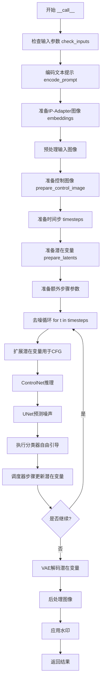
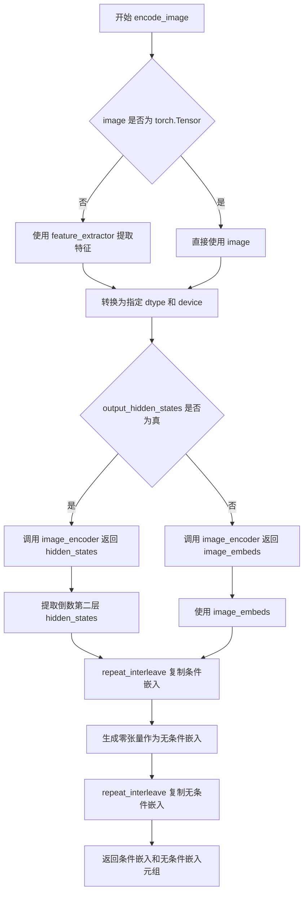
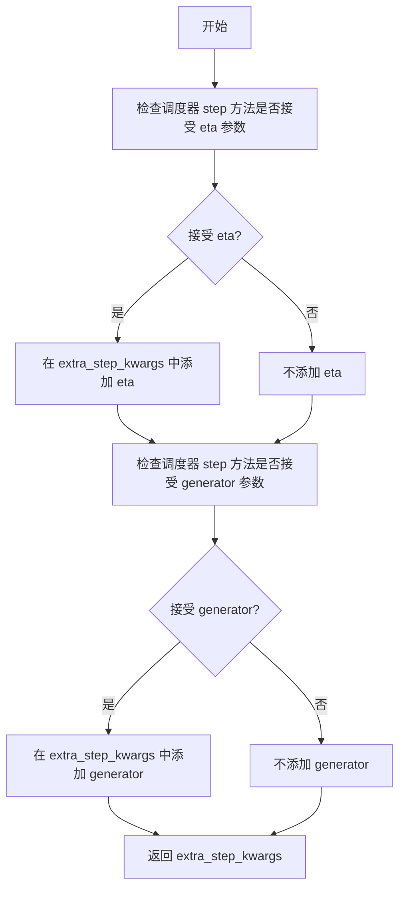
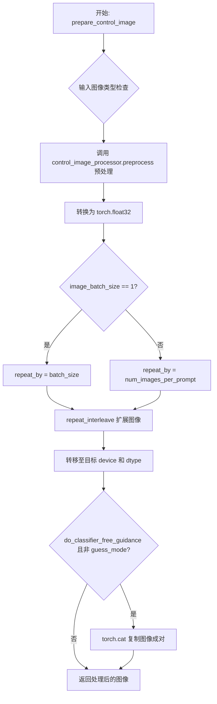
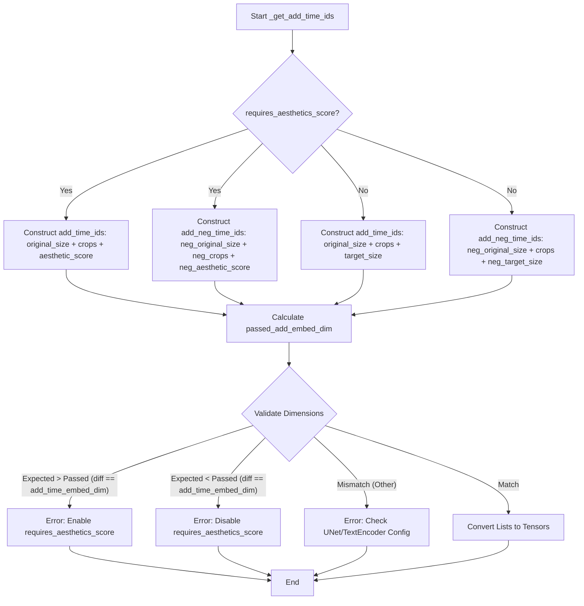
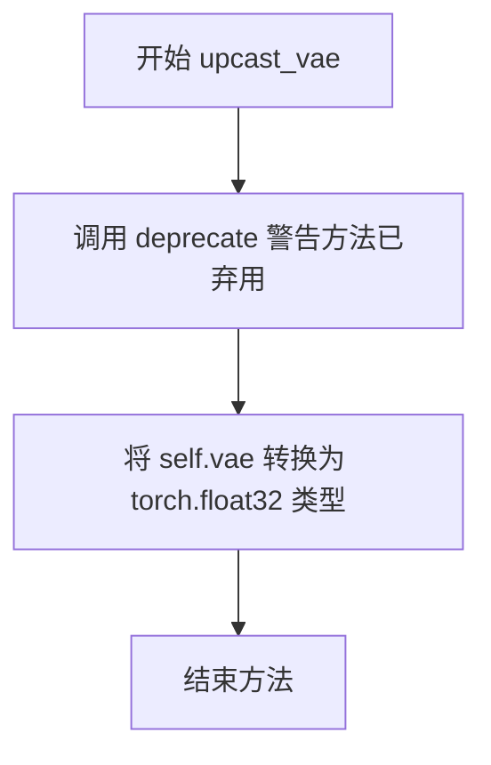

```mermaid
flowchart TD
    A[__call__ 入口] --> B{检查callback参数废弃状态}
    B --> C[解析control_guidance格式]
    C --> D[调用check_inputs验证输入参数]
    D --> E[设置内部状态变量<br/>_guidance_scale, _clip_skip等]
    E --> F[确定batch_size]
    F --> G[处理controlnet_conditioning_scale格式]
    G --> H[检查guess_mode和global_pool_conditions]
    
    H --> I[调用encode_prompt编码提示词]
    I --> J{ip_adapter_image存在?}
    J -->|Yes| K[调用prepare_ip_adapter_image_embeds]
    J -->|No| L[跳过IP-Adapter处理]
    K --> L
    
    L --> M[预处理输入image]
    M --> N{controlnet类型?}
    N -->|ControlNetModel| O[调用prepare_control_image处理control_image]
    N -->|MultiControlNetModel| P[遍历处理多个control_image]
    O --> Q[获取height和width]
    P --> Q
    Q --> R[调用scheduler.set_timesteps设置去噪步骤]
    R --> S[调用get_timesteps计算实际timesteps]
    S --> T[准备latents变量]
    T --> U[调用prepare_extra_step_kwargs处理调度器额外参数]
    U --> V[创建controlnet_keep列表]
    V --> W[准备add_time_ids时间嵌入]
    
    W --> X{分类器自由引导?}
    X -->|Yes| Y[拼接negative和positive embeddings]
    X -->|No| Z[保持原样]
    Y --> AA[设备对齐: prompt_embeds等移至device]
    Z --> AA
    
    AA --> AB[进入Denoising Loop]
    AB --> AC{遍历timesteps}
    
    AC --> AD{interrupt标志?}
    AD -->|Yes| AE[跳过当前迭代]
    AD -->|No| AF[扩展latents进行CFG]
    
    AF --> AG[调用scheduler.scale_model_input]
    AH[准备added_cond_kwargs] --> AI[guess_mode处理]
    AG --> AI
    
    AI --> AJ{guess_mode & CFG?}
    AJ -->|Yes| AK[仅对conditional batch推理ControlNet]
    AJ -->|No| AL[对全部batch推理ControlNet]
    AK --> AM
    AL --> AM
    
    AM --> AN[调用controlnet推理]
    AN --> AO[处理down_block和mid_block残差]
    
    AO --> AP{guess_mode & CFG?}
    AP -->|Yes| AQ[添加零张量保持uncond不变]
    AQ --> AR
    AP -->|No| AR[继续]
    
    AR --> AS{IP-Adapter存在?}
    AS -->|Yes| AT[添加image_embeds到条件]
    AT --> AU
    AS -->|No| AU
    
    AU --> AV[调用UNet预测噪声残差]
    AV --> AW[执行分类器自由引导计算]
    AW --> AX[调用scheduler.step去噪]
    AX --> AY[处理callback_on_step_end回调]
    AY --> AZ{更新进度条}
    AZ --> BA{XLA可用?}
    BA -->|Yes| BB[执行xm.mark_step]
    BB --> BC
    BA -->|No| BC
    
    BC --> AC
    AC -->|Loop End| BD
    
    BD --> BE{output_type != latent?}
    BE -->|Yes| BF[VAE解码latents到图像]
    BF --> BG[应用watermark后处理]
    BG --> BH[调用image_processor后处理]
    BE -->|No| BI[直接返回latents]
    
    BH --> BJ[释放模型内存]
    BJ --> BK[返回结果]
    BI --> BK
    
    style AB fill:#f9f,color:#000
    style AC fill:#f9f,color:#000
    style BD fill:#ff9,color:#000
    style BK fill:#9f9,color:#000
```

# `diffusers\src\diffusers\pipelines\controlnet\pipeline_controlnet_sd_xl_img2img.py` 详细设计文档

Stable Diffusion XL ControlNet Image-to-Image Pipeline 是一个用于图像到图像生成的扩散管道，结合了 Stable Diffusion XL 模型和 ControlNet 条件控制系统。该管道接收文本提示、输入图像和控制图像，通过去噪过程生成符合控制条件的目标图像，支持美学评分、IP-Adapter、LoRA 等高级功能。

## 整体流程



## 类结构

```
DiffusionPipeline (基类)
├── StableDiffusionMixin
├── TextualInversionLoaderMixin
├── StableDiffusionXLLoraLoaderMixin
├── FromSingleFileMixin
├── IPAdapterMixin
└── StableDiffusionXLControlNetImg2ImgPipeline
```

## 全局变量及字段


### `EXAMPLE_DOC_STRING`
    
示例文档字符串，包含管道使用示例和代码演示

类型：`str`
    


### `logger`
    
日志记录器，用于输出管道运行时的日志信息

类型：`logging.Logger`
    


### `XLA_AVAILABLE`
    
XLA可用性标志，指示是否支持PyTorch XLA加速

类型：`bool`
    


### `model_cpu_offload_seq`
    
模型CPU卸载顺序，定义模型组件卸载到CPU的顺序

类型：`str`
    


### `_optional_components`
    
可选组件列表，包含管道中可选的模型组件名称

类型：`list`
    


### `_callback_tensor_inputs`
    
回调张量输入列表，定义回调函数可访问的张量变量

类型：`list`
    


### `StableDiffusionXLControlNetImg2ImgPipeline.vae`
    
VAE变分自编码器，用于图像编码和解码到潜在空间

类型：`AutoencoderKL`
    


### `StableDiffusionXLControlNetImg2ImgPipeline.text_encoder`
    
第一个CLIP文本编码器，将文本提示编码为嵌入向量

类型：`CLIPTextModel`
    


### `StableDiffusionXLControlNetImg2ImgPipeline.text_encoder_2`
    
第二个CLIP文本编码器，带投影层用于SDXL

类型：`CLIPTextModelWithProjection`
    


### `StableDiffusionXLControlNetImg2ImgPipeline.tokenizer`
    
第一个分词器，将文本转换为token IDs

类型：`CLIPTokenizer`
    


### `StableDiffusionXLControlNetImg2ImgPipeline.tokenizer_2`
    
第二个分词器，用于SDXL双文本编码器

类型：`CLIPTokenizer`
    


### `StableDiffusionXLControlNetImg2ImgPipeline.unet`
    
条件U-Net去噪模型，在潜在空间中执行扩散去噪过程

类型：`UNet2DConditionModel`
    


### `StableDiffusionXLControlNetImg2ImgPipeline.controlnet`
    
ControlNet模型，提供额外的条件控制信息引导去噪过程

类型：`ControlNetModel|MultiControlNetModel`
    


### `StableDiffusionXLControlNetImg2ImgPipeline.scheduler`
    
Karras扩散调度器，管理去噪过程的噪声调度

类型：`KarrasDiffusionSchedulers`
    


### `StableDiffusionXLControlNetImg2ImgPipeline.vae_scale_factor`
    
VAE缩放因子，用于调整潜在空间的缩放比例

类型：`int`
    


### `StableDiffusionXLControlNetImg2ImgPipeline.image_processor`
    
图像处理器，处理输入输出图像的预处理和后处理

类型：`VaeImageProcessor`
    


### `StableDiffusionXLControlNetImg2ImgPipeline.control_image_processor`
    
控制图像处理器，专门处理ControlNet输入的控制图像

类型：`VaeImageProcessor`
    


### `StableDiffusionXLControlNetImg2ImgPipeline.watermark`
    
水印处理器，为生成的图像添加不可见水印

类型：`StableDiffusionXLWatermarker`
    


### `StableDiffusionXLControlNetImg2ImgPipeline._guidance_scale`
    
引导强度，控制文本提示对生成图像的影响程度

类型：`float`
    


### `StableDiffusionXLControlNetImg2ImgPipeline._clip_skip`
    
CLIP跳过的层数，控制使用CLIP的哪一层输出作为提示嵌入

类型：`int`
    


### `StableDiffusionXLControlNetImg2ImgPipeline._cross_attention_kwargs`
    
交叉注意力参数字典，传递给注意力机制的额外参数

类型：`dict`
    


### `StableDiffusionXLControlNetImg2ImgPipeline._num_timesteps`
    
时间步数，记录扩散过程中的总步数

类型：`int`
    


### `StableDiffusionXLControlNetImg2ImgPipeline._interrupt`
    
中断标志，用于控制管道执行过程中的中断操作

类型：`bool`
    
    

## 全局函数及方法


### `retrieve_latents`

该函数是diffusers库中的工具函数，用于从变分自编码器(VAE)的编码器输出中检索潜在变量(latents)。它支持多种获取潜在变量的方式，包括从潜在分布中采样或获取其模式(mode)，也可以直接返回预存的潜在变量。

参数：

- `encoder_output`：`torch.Tensor`，编码器的输出对象，通常是VAE编码后的结果，可能包含`latent_dist`属性或`latents`属性
- `generator`：`torch.Generator | None`，可选的随机数生成器，用于确保潜在变量采样的可重现性
- `sample_mode`：`str`，采样模式，默认为"sample"，可选择"sample"（从分布中采样）或"argmax"（获取分布的模式）

返回值：`torch.Tensor`，检索到的潜在变量张量

#### 流程图

```mermaid
flowchart TD
    A[开始: retrieve_latents] --> B{encoder_output是否有<br/>latent_dist属性?}
    B -->|是| C{sample_mode == 'sample'?}
    B -->|否| D{encoder_output是否有<br/>latents属性?}
    C -->|是| E[返回 latent_dist.sample<br/>(generator)]
    C -->|否| F{sample_mode == 'argmax'?}
    F -->|是| G[返回 latent_dist.mode<br/>()]
    F -->|否| H[抛出AttributeError]
    D -->|是| I[返回 encoder_output.latents]
    D -->|否| H
    E --> J[结束]
    G --> J
    I --> J
    H --> J
```

#### 带注释源码

```python
# Copied from diffusers.pipelines.stable_diffusion.pipeline_stable_diffusion_img2img.retrieve_latents
def retrieve_latents(
    encoder_output: torch.Tensor, generator: torch.Generator | None = None, sample_mode: str = "sample"
):
    # 检查编码器输出是否具有latent_dist属性，且采样模式为"sample"
    if hasattr(encoder_output, "latent_dist") and sample_mode == "sample":
        # 从潜在分布中采样得到潜在变量，可选使用生成器确保可重现性
        return encoder_output.latent_dist.sample(generator)
    # 检查编码器输出是否具有latent_dist属性，且采样模式为"argmax"
    elif hasattr(encoder_output, "latent_dist") and sample_mode == "argmax":
        # 获取潜在分布的模式（均值或最可能的值）
        return encoder_output.latent_dist.mode()
    # 检查编码器输出是否直接具有latents属性
    elif hasattr(encoder_output, "latents"):
        # 直接返回预存的潜在变量
        return encoder_output.latents
    # 如果无法访问潜在变量，抛出属性错误
    else:
        raise AttributeError("Could not access latents of provided encoder_output")
```


### `StableDiffusionXLControlNetImg2ImgPipeline.__init__`

该方法是 Stable Diffusion XL ControlNet img2img 管道的构造函数，负责初始化所有核心组件，包括 VAE、文本编码器、UNet、ControlNet、调度器等，并配置图像处理器和水印功能。

参数：

- `vae`：`AutoencoderKL`，用于将图像编码和解码到潜在表示的变分自编码器模型
- `text_encoder`：`CLIPTextModel`，冻结的文本编码器，Stable Diffusion 使用 CLIP 的文本部分
- `text_encoder_2`：`CLIPTextModelWithProjection`，第二个冻结的文本编码器，Stable Diffusion XL 使用 CLIP 的文本和池化部分
- `tokenizer`：`CLIPTokenizer`，CLIP Tokenizer 类
- `tokenizer_2`：`CLIPTokenizer`，第二个 CLIP Tokenizer 类
- `unet`：`UNet2DConditionModel`，条件 U-Net 架构，用于对编码的图像潜在表示进行去噪
- `controlnet`：`ControlNetModel | list[ControlNetModel] | tuple[ControlNetModel] | MultiControlNetModel`，提供额外条件控制的 ControlNet 模型
- `scheduler`：`KarrasDiffusionSchedulers`，与 unet 结合使用进行去噪的调度器
- `requires_aesthetics_score`：`bool`，可选，默认为 False，是否在推理过程中需要传递 aesthetic_score 条件
- `force_zeros_for_empty_prompt`：`bool`，可选，默认为 True，是否将空提示的负提示嵌入始终设置为 0
- `add_watermarker`：`bool | None`，可选，是否使用 invisible_watermark 库对输出图像加水印
- `feature_extractor`：`CLIPImageProcessor`，可选，用于从生成的图像中提取特征的 CLIPImageProcessor
- `image_encoder`：`CLIPVisionModelWithProjection`，可选，用于 IP Adapter 的图像编码器

返回值：`None`，构造函数无返回值

#### 流程图

```mermaid
flowchart TD
    A[开始 __init__] --> B[调用 super().__init__]
    B --> C{controlnet 是否为 list 或 tuple}
    C -->|是| D[将 controlnet 包装为 MultiControlNetModel]
    C -->|否| E[保持原样]
    D --> F[register_modules 注册所有模块]
    E --> F
    F --> G[计算 vae_scale_factor]
    G --> H[创建 VaeImageProcessor 实例]
    H --> I[创建 control_image_processor 实例]
    I --> J{add_watermarker 是否为 None}
    J -->|是| K[检查 is_invisible_watermark_available]
    J -->|否| L[使用传入的 add_watermarker 值]
    K --> M[确定是否添加水印]
    L --> M
    M --> N{需要添加水印}
    N -->|是| O[创建 StableDiffusionXLWatermarker]
    N -->|否| P[设置 watermark 为 None]
    O --> Q[register_to_config 注册配置参数]
    P --> Q
    Q --> R[结束 __init__]
```

#### 带注释源码

```python
def __init__(
    self,
    vae: AutoencoderKL,
    text_encoder: CLIPTextModel,
    text_encoder_2: CLIPTextModelWithProjection,
    tokenizer: CLIPTokenizer,
    tokenizer_2: CLIPTokenizer,
    unet: UNet2DConditionModel,
    controlnet: ControlNetModel | list[ControlNetModel] | tuple[ControlNetModel] | MultiControlNetModel,
    scheduler: KarrasDiffusionSchedulers,
    requires_aesthetics_score: bool = False,
    force_zeros_for_empty_prompt: bool = True,
    add_watermarker: bool | None = None,
    feature_extractor: CLIPImageProcessor = None,
    image_encoder: CLIPVisionModelWithProjection = None,
):
    """
    初始化 StableDiffusionXLControlNetImg2ImgPipeline
    
    参数:
        vae: 变分自编码器，用于图像和潜在表示之间的转换
        text_encoder: 第一个冻结的文本编码器 (CLIP)
        text_encoder_2: 第二个冻结的文本编码器 (CLIP with projection)
        tokenizer: 第一个文本 tokenizer
        tokenizer_2: 第二个文本 tokenizer
        unet: 条件 U-Net 用于去噪
        controlnet: ControlNet 模型，用于提供额外条件控制
        scheduler: 扩散调度器
        requires_aesthetics_score: 是否需要美学评分条件
        force_zeros_for_empty_prompt: 空提示是否强制为零嵌入
        add_watermarker: 是否添加水印
        feature_extractor: 图像特征提取器
        image_encoder: 图像编码器用于 IP Adapter
    """
    # 调用父类构造函数
    super().__init__()

    # 如果 controlnet 是列表或元组，包装为 MultiControlNetModel
    if isinstance(controlnet, (list, tuple)):
        controlnet = MultiControlNetModel(controlnet)

    # 注册所有模块到管道
    self.register_modules(
        vae=vae,
        text_encoder=text_encoder,
        text_encoder_2=text_encoder_2,
        tokenizer=tokenizer,
        tokenizer_2=tokenizer_2,
        unet=unet,
        controlnet=controlnet,
        scheduler=scheduler,
        feature_extractor=feature_extractor,
        image_encoder=image_encoder,
    )
    
    # 计算 VAE 缩放因子，基于 VAE 的块输出通道数
    # 默认值为 8 (2^(3-1) = 4, 但代码中有 fallback)
    self.vae_scale_factor = 2 ** (len(self.vae.config.block_out_channels) - 1) if getattr(self, "vae", None) else 8
    
    # 创建图像处理器，用于预处理和后处理图像
    self.image_processor = VaeImageProcessor(vae_scale_factor=self.vae_scale_factor, do_convert_rgb=True)
    
    # 创建 ControlNet 图像处理器，不进行归一化
    self.control_image_processor = VaeImageProcessor(
        vae_scale_factor=self.vae_scale_factor, do_convert_rgb=True, do_normalize=False
    )
    
    # 确定是否添加水印：如果未指定，则检查 invisible_watermark 是否可用
    add_watermarker = add_watermarker if add_watermarker is not None else is_invisible_watermark_available()

    # 根据条件创建水印器
    if add_watermarker:
        self.watermark = StableDiffusionXLWatermarker()
    else:
        self.watermark = None

    # 注册配置参数
    self.register_to_config(force_zeros_for_empty_prompt=force_zeros_for_empty_prompt)
    self.register_to_config(requires_aesthetics_score=requires_aesthetics_score)
```


### `StableDiffusionXLControlNetImg2ImgPipeline.encode_prompt`

该方法负责将文本提示词编码为文本编码器的隐藏状态（embeddings），支持单文本编码器和双文本编码器（SDXL架构），并处理无分类器自由引导（CFG）的负向提示词编码，同时支持LoRA权重调整和CLIP层跳过功能。

参数：

- `prompt`：`str | list[str] | None`，要编码的主提示词
- `prompt_2`：`str | list[str] | None`，发送给 `tokenizer_2` 和 `text_encoder_2` 的提示词，若未定义则使用 `prompt`
- `device`：`torch.device | None`，执行编码的 torch 设备
- `num_images_per_prompt`：`int`，每个提示词需要生成的图像数量
- `do_classifier_free_guidance`：`bool`，是否启用无分类器自由引导
- `negative_prompt`：`str | list[str] | None`，负向提示词，用于引导图像生成方向
- `negative_prompt_2`：`str | list[str] | None`，发送给第二组编码器的负向提示词
- `prompt_embeds`：`torch.Tensor | None`，预生成的文本嵌入，可用于提示词加权等微调
- `negative_prompt_embeds`：`torch.Tensor | None`，预生成的负向文本嵌入
- `pooled_prompt_embeds`：`torch.Tensor | None`，预生成的池化文本嵌入
- `negative_pooled_prompt_embeds`：`torch.Tensor | None`，预生成的负向池化文本嵌入
- `lora_scale`：`float | None`，应用于文本编码器所有LoRA层的缩放因子
- `clip_skip`：`int | None`，计算提示词嵌入时需要跳过的CLIP层数

返回值：`tuple[torch.Tensor, torch.Tensor, torch.Tensor, torch.Tensor]`，返回四个张量分别是：
- 正向提示词嵌入 `prompt_embeds`
- 负向提示词嵌入 `negative_prompt_embeds`
- 正向池化嵌入 `pooled_prompt_embeds`
- 负向池化嵌入 `negative_pooled_prompt_embeds`

#### 流程图

```mermaid
flowchart TD
    A[开始 encode_prompt] --> B{传入 lora_scale?}
    B -->|Yes| C[设置 self._lora_scale]
    B -->|No| D{prompt_embeds 已存在?}
    
    C --> E{使用 PEFT 后端?}
    E -->|Yes| F[使用 scale_lora_layers]
    E -->|No| G[使用 adjust_lora_scale_text_encoder]
    F --> H[同时处理 text_encoder 和 text_encoder_2]
    G --> H
    
    D -->|Yes| I[跳过编码直接使用传入的 embeds]
    D -->|No| J[标准化 prompt 和 prompt_2 为列表]
    
    I --> K{do_classifier_free_guidance 为真<br>且 negative_prompt_embeds 为空?}
    J --> L[遍历 tokenizers 和 text_encoders]
    L --> M[调用 maybe_convert_prompt<br>处理 textual inversion]
    M --> N[tokenizer 编码文本]
    N --> O{截断后与原始长度不符?}
    O -->|Yes| P[记录警告日志]
    O -->|No| Q[text_encoder 前向传播]
    Q --> R{clip_skip 为空?}
    R -->|Yes| S[取倒数第二层 hidden_states]
    R -->|No| T[取第 -(clip_skip+2) 层]
    S --> U[提取 pooled_prompt_embeds]
    T --> U
    U --> V[拼接两个编码器的输出]
    V --> K
    
    K -->|Yes| W[生成零向量作为负向嵌入]
    K -->|No| X{negative_prompt_embeds 为空?}
    X -->|Yes| Y[编码 negative_prompt 和 negative_prompt_2]
    Y --> Z[拼接负向嵌入]
    X -->|No| AA[使用传入的 negative_prompt_embeds]
    W --> AB[复制正向嵌入<br>num_images_per_prompt 次]
    Z --> AB
    AA --> AB
    
    AB --> AC{do_classifier_free_guidance 为真?}
    AC -->|Yes| AD[复制负向嵌入<br>num_images_per_prompt 次]
    AC -->|No| AE[调整维度准备返回]
    AD --> AE
    AE --> AF{使用 PEFT 后端?}
    AF -->|Yes| AG[调用 unscale_lora_layers]
    AF -->|No| AH[直接返回四个嵌入]
    AG --> AH
    AH --> AI[结束]
```

#### 带注释源码

```python
def encode_prompt(
    self,
    prompt: str,
    prompt_2: str | None = None,
    device: torch.device | None = None,
    num_images_per_prompt: int = 1,
    do_classifier_free_guidance: bool = True,
    negative_prompt: str | None = None,
    negative_prompt_2: str | None = None,
    prompt_embeds: torch.Tensor | None = None,
    negative_prompt_embeds: torch.Tensor | None = None,
    pooled_prompt_embeds: torch.Tensor | None = None,
    negative_pooled_prompt_embeds: torch.Tensor | None = None,
    lora_scale: float | None = None,
    clip_skip: int | None = None,
):
    r"""
    Encodes the prompt into text encoder hidden states.

    Args:
        prompt (`str` or `list[str]`, *optional*): prompt to be encoded
        prompt_2 (`str` or `list[str]`, *optional*): The prompt or prompts to be sent to the `tokenizer_2` 
            and `text_encoder_2`. If not defined, `prompt` is used in both text-encoders
        device: (`torch.device`): torch device
        num_images_per_prompt (`int`): number of images that should be generated per prompt
        do_classifier_free_guidance (`bool`): whether to use classifier free guidance or not
        negative_prompt (`str` or `list[str]`, *optional*): The prompt or prompts not to guide the 
            image generation.
        negative_prompt_2 (`str` or `list[str]`, *optional*): The negative prompt for second encoder.
        prompt_embeds (`torch.Tensor`, *optional*): Pre-generated text embeddings.
        negative_prompt_embeds (`torch.Tensor`, *optional*): Pre-generated negative text embeddings.
        pooled_prompt_embeds (`torch.Tensor`, *optional*): Pre-generated pooled text embeddings.
        negative_pooled_prompt_embeds (`torch.Tensor`, *optional*): Pre-generated negative pooled embeddings.
        lora_scale (`float`, *optional*): A lora scale for text encoder LoRA layers.
        clip_skip (`int`, *optional*): Number of layers to skip from CLIP while computing embeddings.
    """
    # 确定执行设备，优先使用传入的 device，否则使用管道默认执行设备
    device = device or self._execution_device

    # 设置 LoRA 缩放因子，以便文本编码器的 monkey patched LoRA 函数正确访问
    if lora_scale is not None and isinstance(self, StableDiffusionXLLoraLoaderMixin):
        self._lora_scale = lora_scale

        # 动态调整 LoRA 缩放
        if self.text_encoder is not None:
            if not USE_PEFT_BACKEND:
                adjust_lora_scale_text_encoder(self.text_encoder, lora_scale)
            else:
                scale_lora_layers(self.text_encoder, lora_scale)

        if self.text_encoder_2 is not None:
            if not USE_PEFT_BACKEND:
                adjust_lora_scale_text_encoder(self.text_encoder_2, lora_scale)
            else:
                scale_lora_layers(self.text_encoder_2, lora_scale)

    # 标准化 prompt 为列表格式，便于批处理
    prompt = [prompt] if isinstance(prompt, str) else prompt

    # 确定批处理大小
    if prompt is not None:
        batch_size = len(prompt)
    else:
        batch_size = prompt_embeds.shape[0]

    # 定义 tokenizers 和 text_encoders 列表，支持单/双编码器架构
    tokenizers = [self.tokenizer, self.tokenizer_2] if self.tokenizer is not None else [self.tokenizer_2]
    text_encoders = (
        [self.text_encoder, self.text_encoder_2] if self.text_encoder is not None else [self.text_encoder_2]
    )

    # 如果未提供 prompt_embeds，则从原始 prompt 开始编码
    if prompt_embeds is None:
        # prompt_2 默认为 prompt
        prompt_2 = prompt_2 or prompt
        prompt_2 = [prompt_2] if isinstance(prompt_2, str) else prompt_2

        # 处理 textual inversion 的多向量 token（如需要）
        prompt_embeds_list = []
        prompts = [prompt, prompt_2]
        for prompt, tokenizer, text_encoder in zip(prompts, tokenizers, text_encoders):
            # 如果支持 textual inversion，转换 prompt
            if isinstance(self, TextualInversionLoaderMixin):
                prompt = self.maybe_convert_prompt(prompt, tokenizer)

            # tokenizer 编码：padding 到最大长度，truncation 截断
            text_inputs = tokenizer(
                prompt,
                padding="max_length",
                max_length=tokenizer.model_max_length,
                truncation=True,
                return_tensors="pt",
            )

            text_input_ids = text_inputs.input_ids
            # 获取未截断的 token ids 用于检查是否被截断
            untruncated_ids = tokenizer(prompt, padding="longest", return_tensors="pt").input_ids

            # 检查是否发生了截断，若是则记录警告
            if untruncated_ids.shape[-1] >= text_input_ids.shape[-1] and not torch.equal(
                text_input_ids, untruncated_ids
            ):
                removed_text = tokenizer.batch_decode(untruncated_ids[:, tokenizer.model_max_length - 1 : -1])
                logger.warning(
                    "The following part of your input was truncated because CLIP can only handle sequences up to"
                    f" {tokenizer.model_max_length} tokens: {removed_text}"
                )

            # text_encoder 前向传播，获取 hidden states
            prompt_embeds = text_encoder(text_input_ids.to(device), output_hidden_states=True)

            # 提取 pooled output（用于 SDXL 的 pool 层）
            if pooled_prompt_embeds is None and prompt_embeds[0].ndim == 2:
                pooled_prompt_embeds = prompt_embeds[0]

            # 根据 clip_skip 决定使用哪一层的 hidden states
            if clip_skip is None:
                prompt_embeds = prompt_embeds.hidden_states[-2]  # 默认使用倒数第二层
            else:
                # SDXL 总是从倒数第 clip_skip+2 层获取（因为索引从倒数第二层开始）
                prompt_embeds = prompt_embeds.hidden_states[-(clip_skip + 2)]

            prompt_embeds_list.append(prompt_embeds)

        # 沿最后一维拼接两个编码器的输出
        prompt_embeds = torch.concat(prompt_embeds_list, dim=-1)

    # 处理无分类器自由引导的负向嵌入
    zero_out_negative_prompt = negative_prompt is None and self.config.force_zeros_for_empty_prompt
    if do_classifier_free_guidance and negative_prompt_embeds is None and zero_out_negative_prompt:
        # 如果配置要求对空 prompt 强制为零，则创建全零张量
        negative_prompt_embeds = torch.zeros_like(prompt_embeds)
        negative_pooled_prompt_embeds = torch.zeros_like(pooled_prompt_embeds)
    elif do_classifier_free_guidance and negative_prompt_embeds is None:
        # 需要编码负向 prompt
        negative_prompt = negative_prompt or ""
        negative_prompt_2 = negative_prompt_2 or negative_prompt

        # 标准化为列表
        negative_prompt = batch_size * [negative_prompt] if isinstance(negative_prompt, str) else negative_prompt
        negative_prompt_2 = (
            batch_size * [negative_prompt_2] if isinstance(negative_prompt_2, str) else negative_prompt_2
        )

        # 类型和批次大小检查
        uncond_tokens: list[str]
        if prompt is not None and type(prompt) is not type(negative_prompt):
            raise TypeError(
                f"`negative_prompt` should be the same type to `prompt`, but got {type(negative_prompt)} !="
                f" {type(prompt)}."
            )
        elif batch_size != len(negative_prompt):
            raise ValueError(
                f"`negative_prompt`: {negative_prompt} has batch size {len(negative_prompt)}, but `prompt`:"
                f" {prompt} has batch size {batch_size}. Please make sure that passed `negative_prompt` matches"
                " the batch size of `prompt`."
            )
        else:
            uncond_tokens = [negative_prompt, negative_prompt_2]

        # 编码负向 prompt
        negative_prompt_embeds_list = []
        for negative_prompt, tokenizer, text_encoder in zip(uncond_tokens, tokenizers, text_encoders):
            if isinstance(self, TextualInversionLoaderMixin):
                negative_prompt = self.maybe_convert_prompt(negative_prompt, tokenizer)

            max_length = prompt_embeds.shape[1]
            uncond_input = tokenizer(
                negative_prompt,
                padding="max_length",
                max_length=max_length,
                truncation=True,
                return_tensors="pt",
            )

            negative_prompt_embeds = text_encoder(
                uncond_input.input_ids.to(device),
                output_hidden_states=True,
            )

            # 提取 pooled output
            if negative_pooled_prompt_embeds is None and negative_prompt_embeds[0].ndim == 2:
                negative_pooled_prompt_embeds = negative_prompt_embeds[0]
            negative_prompt_embeds = negative_prompt_embeds.hidden_states[-2]

            negative_prompt_embeds_list.append(negative_prompt_embeds)

        negative_prompt_embeds = torch.concat(negative_prompt_embeds_list, dim=-1)

    # 转换数据类型以匹配目标模型
    if self.text_encoder_2 is not None:
        prompt_embeds = prompt_embeds.to(dtype=self.text_encoder_2.dtype, device=device)
    else:
        prompt_embeds = prompt_embeds.to(dtype=self.unet.dtype, device=device)

    bs_embed, seq_len, _ = prompt_embeds.shape
    # 复制 text embeddings 以支持每个 prompt 生成多张图像
    # 使用 mps 友好的方法（repeat 而非 repeat_interleave）
    prompt_embeds = prompt_embeds.repeat(1, num_images_per_prompt, 1)
    prompt_embeds = prompt_embeds.view(bs_embed * num_images_per_prompt, seq_len, -1)

    # 如果启用 CFG，同样复制负向 embeddings
    if do_classifier_free_guidance:
        seq_len = negative_prompt_embeds.shape[1]

        if self.text_encoder_2 is not None:
            negative_prompt_embeds = negative_prompt_embeds.to(dtype=self.text_encoder_2.dtype, device=device)
        else:
            negative_prompt_embeds = negative_prompt_embeds.to(dtype=self.unet.dtype, device=device)

        negative_prompt_embeds = negative_prompt_embeds.repeat(1, num_images_per_prompt, 1)
        negative_prompt_embeds = negative_prompt_embeds.view(batch_size * num_images_per_prompt, seq_len, -1)

    # 复制 pooled embeddings
    pooled_prompt_embeds = pooled_prompt_embeds.repeat(1, num_images_per_prompt).view(
        bs_embed * num_images_per_prompt, -1
    )
    if do_classifier_free_guidance:
        negative_pooled_prompt_embeds = negative_pooled_prompt_embeds.repeat(1, num_images_per_prompt).view(
            bs_embed * num_images_per_prompt, -1
        )

    # 如果使用 PEFT 后端，恢复 LoRA 层的原始缩放因子
    if self.text_encoder is not None:
        if isinstance(self, StableDiffusionXLLoraLoaderMixin) and USE_PEFT_BACKEND:
            unscale_lora_layers(self.text_encoder, lora_scale)

    if self.text_encoder_2 is not None:
        if isinstance(self, StableDiffusionXLLoraLoaderMixin) and USE_PEFT_BACKEND:
            unscale_lora_layers(self.text_encoder_2, lora_scale)

    return prompt_embeds, negative_prompt_embeds, pooled_prompt_embeds, negative_pooled_prompt_embeds
```


### `StableDiffusionXLControlNetImg2ImgPipeline.encode_image`

该方法用于将输入图像编码为图像嵌入（image embeddings）或隐藏状态（hidden states），支持分类器自由引导（classifier-free guidance）。它首先使用特征提取器（feature_extractor）将图像转换为张量，然后通过图像编码器（image_encoder）生成嵌入，最后为每个提示生成多个图像的嵌入，并返回条件嵌入和非条件嵌入。

参数：

- `image`：`torch.Tensor | PIL.Image.Image | np.ndarray | list`，需要编码的输入图像，支持张量、PIL图像、numpy数组或图像列表
- `device`：`torch.device`，用于计算的目标设备（如cuda或cpu）
- `num_images_per_prompt`：`int`，每个提示生成的图像数量，用于复制嵌入
- `output_hidden_states`：`bool | None`，可选参数，指定是否返回图像编码器的隐藏状态而非池化的图像嵌入

返回值：`tuple[torch.Tensor, torch.Tensor]`，返回两个张量组成的元组——第一个是条件图像嵌入（或隐藏状态），第二个是无条件（零）图像嵌入（或隐藏状态），两者形状均已根据 `num_images_per_prompt` 进行复制

#### 流程图



#### 带注释源码

```python
def encode_image(self, image, device, num_images_per_prompt, output_hidden_states=None):
    """
    Encodes the input image into image embeddings or hidden states.

    This method is used for encoding images for IP-Adapter support in the
    Stable Diffusion XL ControlNet image-to-image pipeline.

    Args:
        image: The input image to encode. Can be a torch.Tensor, PIL.Image,
               numpy array, or a list of images.
        device: The torch device to use for encoding.
        num_images_per_prompt: Number of images to generate per prompt.
        output_hidden_states: If True, returns hidden states instead of
                             pooled image embeddings.

    Returns:
        A tuple of (image_embeds, uncond_image_embeds). If output_hidden_states
        is True, these will be hidden states from the second-to-last layer.
        Otherwise, they will be pooled image embeddings.
    """
    # 获取图像编码器的参数数据类型
    dtype = next(self.image_encoder.parameters()).dtype

    # 如果输入不是张量，则使用特征提取器进行处理
    if not isinstance(image, torch.Tensor):
        image = self.feature_extractor(image, return_tensors="pt").pixel_values

    # 将图像移动到指定设备并转换数据类型
    image = image.to(device=device, dtype=dtype)

    # 根据 output_hidden_states 参数决定返回类型
    if output_hidden_states:
        # 返回隐藏状态模式：获取倒数第二层的隐藏状态
        image_enc_hidden_states = self.image_encoder(image, output_hidden_states=True).hidden_states[-2]
        # 为每个提示复制条件嵌入
        image_enc_hidden_states = image_enc_hidden_states.repeat_interleave(num_images_per_prompt, dim=0)
        
        # 生成零张量作为无条件嵌入（用于 classifier-free guidance）
        uncond_image_enc_hidden_states = self.image_encoder(
            torch.zeros_like(image), output_hidden_states=True
        ).hidden_states[-2]
        # 复制无条件嵌入
        uncond_image_enc_hidden_states = uncond_image_enc_hidden_states.repeat_interleave(
            num_images_per_prompt, dim=0
        )
        
        return image_enc_hidden_states, uncond_image_enc_hidden_states
    else:
        # 返回池化嵌入模式：直接获取 image_embeds
        image_embeds = self.image_encoder(image).image_embeds
        # 为每个提示复制条件嵌入
        image_embeds = image_embeds.repeat_interleave(num_images_per_prompt, dim=0)
        # 生成零张量作为无条件嵌入
        uncond_image_embeds = torch.zeros_like(image_embeds)

        return image_embeds, uncond_image_embeds
```


### `StableDiffusionXLControlNetImg2ImgPipeline.prepare_ip_adapter_image_embeds`

该方法用于准备 IP-Adapter 的图像嵌入（image embeds），处理两种输入情况：当直接提供原始图像时，会调用 `encode_image` 方法进行编码；当已提供预计算的图像嵌入时，直接进行处理。根据 `do_classifier_free_guidance` 参数决定是否同时生成负向嵌入，最后将嵌入复制到指定的设备上，并按照 `num_images_per_prompt` 进行复制以支持批量生成。

参数：

- `ip_adapter_image`：`PipelineImageInput | None`，原始 IP-Adapter 图像输入，可以是 PIL.Image、torch.Tensor、numpy array 或它们的列表。当 `ip_adapter_image_embeds` 为 None 时使用。
- `ip_adapter_image_embeds`：`list[torch.Tensor] | None`，预计算的 IP-Adapter 图像嵌入列表，每个元素为形状 `(batch_size, num_images, emb_dim)` 的张量。当同时提供负向嵌入时，长度应为实际长度的 2 倍。
- `device`：`torch.device`，目标设备，用于将生成的嵌入移动到指定设备。
- `num_images_per_prompt`：`int`，每个提示词生成的图像数量，用于复制嵌入以匹配批量大小。
- `do_classifier_free_guidance`：`bool`，是否启用无分类器自由引导（CFG）。若为 True，则会生成负向图像嵌入并与正向嵌入连接。

返回值：`list[torch.Tensor]`，处理后的 IP-Adapter 图像嵌入列表，每个元素为形状 `(batch_size * num_images_per_prompt, emb_dim)` 或在 CFG 模式下为 `(2 * batch_size * num_images_per_prompt, emb_dim)` 的张量。

#### 流程图

```mermaid
flowchart TD
    A[开始] --> B{ip_adapter_image_embeds<br>是否为 None?}
    B -->|是| C{ip_adapter_image<br>是否为 list?}
    C -->|否| D[将 ip_adapter_image<br>包装为 list]
    C -->|是| E[检查 ip_adapter_image 长度<br>是否等于 IP-Adapter 数量]
    D --> E
    E -->|不等| F[抛出 ValueError]
    E -->|相等| G[遍历 ip_adapter_image 和<br>image_projection_layers]
    G --> H[判断是否输出隐藏状态]
    H --> I[调用 encode_image<br>编码单个图像]
    I --> J[将编码结果添加到<br>image_embeds 列表]
    J --> K{CFG 模式?}
    K -->|是| L[同时添加<br>negative_image_embeds]
    K -->|否| M[下一个 IP-Adapter]
    M --> G
    B -->|否| N[遍历预计算的<br>ip_adapter_image_embeds]
    N --> O{CFG 模式?}
    O -->|是| P[按 chunk(2) 分离<br>负向和正向嵌入]
    P --> Q[分别添加到对应列表]
    O -->|否| R[直接添加到 image_embeds]
    Q --> S[遍历所有 image_embeds]
    R --> S
    S --> T[复制 num_images_per_prompt 次]
    T --> U{CFG 模式?}
    U -->|是| V[复制负向嵌入并与<br>正向嵌入在维度 0 上拼接]
    U -->|否| W[移动到目标设备]
    V --> W
    W --> X[添加到结果列表]
    X --> Y[返回处理后的嵌入列表]
```

#### 带注释源码

```python
def prepare_ip_adapter_image_embeds(
    self,
    ip_adapter_image: PipelineImageInput | None,           # 原始 IP-Adapter 图像输入
    ip_adapter_image_embeds: list[torch.Tensor] | None,    # 预计算的图像嵌入
    device: torch.device,                                  # 目标设备
    num_images_per_prompt: int,                            # 每个 prompt 生成的图像数
    do_classifier_free_guidance: bool                      # 是否启用 CFG
) -> list[torch.Tensor]:
    """
    准备 IP-Adapter 的图像嵌入。
    
    该方法处理两种输入模式：
    1. 当 ip_adapter_image_embeds 为 None 时，对 ip_adapter_image 进行编码
    2. 当 ip_adapter_image_embeds 已提供时，直接进行后处理
    
    在 CFG 模式下，会同时生成负向嵌入并与正向嵌入拼接。
    """
    
    # 初始化正向嵌入列表
    image_embeds = []
    
    # 如果启用 CFG，同时初始化负向嵌入列表
    if do_classifier_free_guidance:
        negative_image_embeds = []
    
    # 情况一：需要从原始图像编码
    if ip_adapter_image_embeds is None:
        # 确保图像是列表格式
        if not isinstance(ip_adapter_image, list):
            ip_adapter_image = [ip_adapter_image]
        
        # 验证图像数量与 IP-Adapter 数量是否匹配
        if len(ip_adapter_image) != len(self.unet.encoder_hid_proj.image_projection_layers):
            raise ValueError(
                f"`ip_adapter_image` must have same length as the number of IP Adapters. "
                f"Got {len(ip_adapter_image)} images and "
                f"{len(self.unet.encoder_hid_proj.image_projection_layers)} IP Adapters."
            )
        
        # 遍历每个 IP-Adapter 的图像和对应的投影层
        for single_ip_adapter_image, image_proj_layer in zip(
            ip_adapter_image, 
            self.unet.encoder_hid_proj.image_projection_layers
        ):
            # 判断是否需要输出隐藏状态（ImageProjection 类型不需要）
            output_hidden_state = not isinstance(image_proj_layer, ImageProjection)
            
            # 编码单个图像，获取正向和（可能的）负向嵌入
            single_image_embeds, single_negative_image_embeds = self.encode_image(
                single_ip_adapter_image, 
                device, 
                1,  # 每个 IP-Adapter 只生成 1 个嵌入
                output_hidden_state
            )
            
            # 添加批次维度 [1, emb_dim] 并存入列表
            image_embeds.append(single_image_embeds[None, :])
            
            # CFG 模式下处理负向嵌入
            if do_classifier_free_guidance:
                negative_image_embeds.append(single_negative_image_embeds[None, :])
    
    # 情况二：使用预计算的嵌入
    else:
        for single_image_embeds in ip_adapter_image_embeds:
            if do_classifier_free_guidance:
                # 假设预计算的嵌入按 [negative, positive] 顺序拼接
                single_negative_image_embeds, single_image_embeds = single_image_embeds.chunk(2)
                negative_image_embeds.append(single_negative_image_embeds)
            image_embeds.append(single_image_embeds)
    
    # 后处理：将嵌入复制 num_images_per_prompt 次并移动到目标设备
    ip_adapter_image_embeds = []
    for i, single_image_embeds in enumerate(image_embeds):
        # 复制正向嵌入以匹配生成的图像数量
        single_image_embeds = torch.cat([single_image_embeds] * num_images_per_prompt, dim=0)
        
        if do_classifier_free_guidance:
            # 复制负向嵌入，并在维度 0 上与正向嵌入拼接
            # 结果形状: [2 * num_images_per_prompt, emb_dim]
            single_negative_image_embeds = torch.cat(
                [negative_image_embeds[i]] * num_images_per_prompt, 
                dim=0
            )
            single_image_embeds = torch.cat(
                [single_negative_image_embeds, single_image_embeds], 
                dim=0
            )
        
        # 移动到目标设备
        single_image_embeds = single_image_embeds.to(device=device)
        ip_adapter_image_embeds.append(single_image_embeds)
    
    return ip_adapter_image_embeds
```


### `StableDiffusionXLControlNetImg2ImgPipeline.prepare_extra_step_kwargs`

该方法用于为调度器（scheduler）的 `step` 方法准备额外的关键字参数。由于不同的调度器具有不同的签名，该方法通过检查调度器的 `step` 方法是否接受 `eta` 和 `generator` 参数来动态构建额外的参数字典。

参数：

- `generator`：`torch.Generator | list[torch.Generator] | None`，用于使生成具有确定性
- `eta`：`float`，对应于 DDIM 论文中的 η 参数，仅在 DDIMScheduler 中使用，其他调度器会忽略该参数

返回值：`dict[str, Any]`，包含调度器 `step` 方法所需的关键字参数字典，可能包含 `eta` 和/或 `generator` 键

#### 流程图



#### 带注释源码

```python
def prepare_extra_step_kwargs(self, generator, eta):
    # 准备调度器的额外参数，因为并非所有调度器都具有相同的签名
    # eta (η) 仅在 DDIMScheduler 中使用，其他调度器将忽略它
    # eta 对应于 DDIM 论文中的 η：https://huggingface.co/papers/2010.02502
    # 取值应在 [0, 1] 之间

    # 通过检查调度器 step 方法的签名来判断是否接受 eta 参数
    accepts_eta = "eta" in set(inspect.signature(self.scheduler.step).parameters.keys())
    # 初始化额外的参数字典
    extra_step_kwargs = {}
    # 如果调度器接受 eta 参数，则将其添加到 extra_step_kwargs 中
    if accepts_eta:
        extra_step_kwargs["eta"] = eta

    # 检查调度器是否接受 generator 参数
    accepts_generator = "generator" in set(inspect.signature(self.scheduler.step).parameters.keys())
    # 如果调度器接受 generator 参数，则将其添加到 extra_step_kwargs 中
    if accepts_generator:
        extra_step_kwargs["generator"] = generator
    
    # 返回包含调度器所需额外参数的字典
    return extra_step_kwargs
```


### `StableDiffusionXLControlNetImg2ImgPipeline.check_inputs`

该方法用于验证 Stable Diffusion XL ControlNet Img2Img Pipeline 的输入参数是否符合要求，确保用户传入的参数类型、数量和范围都正确，以避免在后续处理过程中出现运行时错误。

参数：

- `self`：`StableDiffusionXLControlNetImg2ImgPipeline` 实例，Pipeline 对象本身
- `prompt`：`str | list[str] | None`，主要的文本提示，用于指导图像生成
- `prompt_2`：`str | list[str] | None`，第二个文本提示，用于第二文本编码器
- `image`：`PipelineImageInput`，输入的图像，可以是 PIL Image、torch.Tensor、numpy array 或它们的列表
- `strength`：`float`，图像转换强度，值在 [0.0, 1.0] 之间
- `num_inference_steps`：`int`，去噪步数，必须为正整数
- `callback_steps`：`int | None`，回调步数，必须为正整数（如果提供）
- `negative_prompt`：`str | list[str] | None`，负向提示，用于指导不生成的内容
- `negative_prompt_2`：`str | list[str] | None`，第二个负向提示
- `prompt_embeds`：`torch.Tensor | None`，预生成的文本嵌入
- `negative_prompt_embeds`：`torch.Tensor | None`，预生成的负向文本嵌入
- `pooled_prompt_embeds`：`torch.Tensor | None`，预生成的池化文本嵌入
- `negative_pooled_prompt_embeds`：`torch.Tensor | None`，预生成的负向池化文本嵌入
- `ip_adapter_image`：`PipelineImageInput | None`，IP Adapter 图像输入
- `ip_adapter_image_embeds`：`list[torch.Tensor] | None`，IP Adapter 图像嵌入
- `controlnet_conditioning_scale`：`float | list[float]`，ControlNet 条件缩放因子
- `control_guidance_start`：`float | list[float]`，ControlNet 引导开始时间
- `control_guidance_end`：`float | list[float]`，ControlNet 引导结束时间
- `callback_on_step_end_tensor_inputs`：`list[str] | None`，每步结束时回调的tensor输入列表

返回值：`None`，该方法不返回任何值，仅进行参数验证，验证失败时抛出 `ValueError` 或 `TypeError` 异常。

#### 流程图

```mermaid
flowchart TD
    A[开始 check_inputs 验证] --> B{strength 是否在 [0, 1] 范围}
    B -- 否 --> B1[抛出 ValueError]
    B -- 是 --> C{num_inference_steps 是否为正整数}
    C -- 否 --> C1[抛出 ValueError]
    C -- 是 --> D{callback_steps 是否为正整数}
    D -- 否 --> D1[抛出 ValueError]
    D -- 是 --> E{callback_on_step_end_tensor_inputs 是否合法}
    E -- 否 --> E1[抛出 ValueError]
    E -- 是 --> F{prompt 和 prompt_embeds 是否同时提供}
    F -- 是 --> F1[抛出 ValueError]
    F -- 否 --> G{prompt_2 和 prompt_embeds 是否同时提供}
    G -- 是 --> G1[抛出 ValueError]
    G -- 否 --> H{prompt 和 prompt_embeds 是否都未提供}
    H -- 是 --> H1[抛出 ValueError]
    H -- 否 --> I{prompt 类型是否合法}
    I -- 否 --> I1[抛出 ValueError]
    I -- 是 --> J{prompt_2 类型是否合法}
    J -- 否 --> J1[抛出 ValueError]
    J -- 是 --> K{negative_prompt 和 negative_prompt_embeds 是否同时提供}
    K -- 是 --> K1[抛出 ValueError]
    K -- 否 --> L{negative_prompt_2 和 negative_prompt_embeds 是否同时提供}
    L -- 是 --> L1[抛出 ValueError]
    L -- 否 --> M{prompt_embeds 和 negative_prompt_embeds 形状是否一致}
    M -- 否 --> M1[抛出 ValueError]
    M -- 是 --> N{如果提供 prompt_embeds, 是否也提供了 pooled_prompt_embeds}
    N -- 否 --> N1[抛出 ValueError]
    N -- 是 --> O{如果提供 negative_prompt_embeds, 是否也提供了 negative_pooled_prompt_embeds}
    O -- 否 --> O1[抛出 ValueError]
    O -- 是 --> P{检查 ControlNet 配置下的 image 参数}
    P --> Q{检查 controlnet_conditioning_scale 参数}
    Q --> R{检查 control_guidance_start 和 control_guidance_end 参数}
    R --> S{检查 IP Adapter 相关参数}
    S --> T[验证通过，方法结束]
    
    B1 --> T
    C1 --> T
    D1 --> T
    E1 --> T
    F1 --> T
    G1 --> T
    H1 --> T
    I1 --> T
    J1 --> T
    K1 --> T
    L1 --> T
    M1 --> T
    N1 --> T
    O1 --> T
```

#### 带注释源码

```python
def check_inputs(
    self,
    prompt,  # str | list[str] | None: 主提示词
    prompt_2,  # str | list[str] | None: 第二提示词（用于 SDXL 双文本编码器）
    image,  # PipelineImageInput: 输入图像
    strength,  # float: 图像转换强度，范围 [0, 1]
    num_inference_steps,  # int: 去噪步数，必须为正整数
    callback_steps,  # int | None: 回调步数
    negative_prompt=None,  # str | list[str] | None: 负向提示词
    negative_prompt_2=None,  # str | list[str] | None: 第二负向提示词
    prompt_embeds=None,  # torch.Tensor | None: 预计算的提示词嵌入
    negative_prompt_embeds=None,  # torch.Tensor | None: 预计算的负向提示词嵌入
    pooled_prompt_embeds=None,  # torch.Tensor | None: 预计算的池化提示词嵌入
    negative_pooled_prompt_embeds=None,  # torch.Tensor | None: 预计算的负向池化嵌入
    ip_adapter_image=None,  # PipelineImageInput | None: IP Adapter 图像输入
    ip_adapter_image_embeds=None,  # list[torch.Tensor] | None: IP Adapter 图像嵌入
    controlnet_conditioning_scale=1.0,  # float | list[float]: ControlNet 条件缩放因子
    control_guidance_start=0.0,  # float | list[float]: ControlNet 引导开始时间
    control_guidance_end=1.0,  # float | list[float]: ControlNet 引导结束时间
    callback_on_step_end_tensor_inputs=None,  # list[str] | None: 回调的 tensor 输入列表
):
    # 验证 strength 参数必须在 [0.0, 1.0] 范围内
    if strength < 0 or strength > 1:
        raise ValueError(f"The value of strength should in [0.0, 1.0] but is {strength}")
    
    # 验证 num_inference_steps 不能为 None，必须为正整数
    if num_inference_steps is None:
        raise ValueError("`num_inference_steps` cannot be None.")
    elif not isinstance(num_inference_steps, int) or num_inference_steps <= 0:
        raise ValueError(
            f"`num_inference_steps` has to be a positive integer but is {num_inference_steps} of type"
            f" {type(num_inference_steps)}."
        )

    # 验证 callback_steps 如果提供，必须为正整数
    if callback_steps is not None and (not isinstance(callback_steps, int) or callback_steps <= 0):
        raise ValueError(
            f"`callback_steps` has to be a positive integer but is {callback_steps} of type"
            f" {type(callback_steps)}."
        )

    # 验证 callback_on_step_end_tensor_inputs 必须在允许的列表中
    if callback_on_step_end_tensor_inputs is not None and not all(
        k in self._callback_tensor_inputs for k in callback_on_step_end_tensor_inputs
    ):
        raise ValueError(
            f"`callback_on_step_end_tensor_inputs` has to be in {self._callback_tensor_inputs}, but found {[k for k in callback_on_step_end_tensor_inputs if k not in self._callback_tensor_inputs]}"
        )

    # 验证 prompt 和 prompt_embeds 不能同时提供
    if prompt is not None and prompt_embeds is not None:
        raise ValueError(
            f"Cannot forward both `prompt`: {prompt} and `prompt_embeds`: {prompt_embeds}. Please make sure to"
            " only forward one of the two."
        )
    # 验证 prompt_2 和 prompt_embeds 不能同时提供
    elif prompt_2 is not None and prompt_embeds is not None:
        raise ValueError(
            f"Cannot forward both `prompt_2`: {prompt_2} and `prompt_embeds`: {prompt_embeds}. Please make sure to"
            " only forward one of the two."
        )
    # 验证 prompt 或 prompt_embeds 必须提供一个
    elif prompt is None and prompt_embeds is None:
        raise ValueError(
            "Provide either `prompt` or `prompt_embeds`. Cannot leave both `prompt` and `prompt_embeds` undefined."
        )
    # 验证 prompt 类型必须是 str 或 list
    elif prompt is not None and (not isinstance(prompt, str) and not isinstance(prompt, list)):
        raise ValueError(f"`prompt` has to be of type `str` or `list` but is {type(prompt)}")
    # 验证 prompt_2 类型必须是 str 或 list
    elif prompt_2 is not None and (not isinstance(prompt_2, str) and not isinstance(prompt_2, list)):
        raise ValueError(f"`prompt_2` has to be of type `str` or `list` but is {type(prompt_2)}")

    # 验证 negative_prompt 和 negative_prompt_embeds 不能同时提供
    if negative_prompt is not None and negative_prompt_embeds is not None:
        raise ValueError(
            f"Cannot forward both `negative_prompt`: {negative_prompt} and `negative_prompt_embeds`:"
            f" {negative_prompt_embeds}. Please make sure to only forward one of the two."
        )
    # 验证 negative_prompt_2 和 negative_prompt_embeds 不能同时提供
    elif negative_prompt_2 is not None and negative_prompt_embeds is not None:
        raise ValueError(
            f"Cannot forward both `negative_prompt_2`: {negative_prompt_2} and `negative_prompt_embeds`:"
            f" {negative_prompt_embeds}. Please make sure to only forward one of the two."
        )

    # 验证 prompt_embeds 和 negative_prompt_embeds 形状必须一致
    if prompt_embeds is not None and negative_prompt_embeds is not None:
        if prompt_embeds.shape != negative_prompt_embeds.shape:
            raise ValueError(
                "`prompt_embeds` and `negative_prompt_embeds` must have the same shape when passed directly, but"
                f" got: `prompt_embeds` {prompt_embeds.shape} != `negative_prompt_embeds`"
                f" {negative_prompt_embeds.shape}."
            )

    # 如果提供了 prompt_embeds，也必须提供 pooled_prompt_embeds
    if prompt_embeds is not None and pooled_prompt_embeds is None:
        raise ValueError(
            "If `prompt_embeds` are provided, `pooled_prompt_embeds` also have to be passed. Make sure to generate `pooled_prompt_embeds` from the same text encoder that was used to generate `prompt_embeds`."
        )

    # 如果提供了 negative_prompt_embeds，也必须提供 negative_pooled_prompt_embeds
    if negative_prompt_embeds is not None and negative_pooled_prompt_embeds is None:
        raise ValueError(
            "If `negative_prompt_embeds` are provided, `negative_pooled_prompt_embeds` also have to be passed. Make sure to generate `negative_pooled_prompt_embeds` from the same text encoder that was used to generate `negative_prompt_embeds`."
        )

    # 多条件处理时的警告提示
    if isinstance(self.controlnet, MultiControlNetModel):
        if isinstance(prompt, list):
            logger.warning(
                f"You have {len(self.controlnet.nets)} ControlNets and you have passed {len(prompt)}"
                " prompts. The conditionings will be fixed across the prompts."
            )

    # 检查 image 参数的有效性
    is_compiled = hasattr(F, "scaled_dot_product_attention") and isinstance(
        self.controlnet, torch._dynamo.eval_frame.OptimizedModule
    )
    # 单个 ControlNet 的情况
    if (
        isinstance(self.controlnet, ControlNetModel)
        or is_compiled
        and isinstance(self.controlnet._orig_mod, ControlNetModel)
    ):
        self.check_image(image, prompt, prompt_embeds)
    # 多个 ControlNet 的情况
    elif (
        isinstance(self.controlnet, MultiControlNetModel)
        or is_compiled
        and isinstance(self.controlnet._orig_mod, MultiControlNetModel)
    ):
        if not isinstance(image, list):
            raise TypeError("For multiple controlnets: `image` must be type `list`")
        # 嵌套列表的情况暂不支持
        elif any(isinstance(i, list) for i in image):
            raise ValueError("A single batch of multiple conditionings are supported at the moment.")
        elif len(image) != len(self.controlnet.nets):
            raise ValueError(
                f"For multiple controlnets: `image` must have the same length as the number of controlnets, but got {len(image)} images and {len(self.controlnet.nets)} ControlNets."
            )
        # 验证每个 image
        for image_ in image:
            self.check_image(image_, prompt, prompt_embeds)
    else:
        assert False

    # 验证 controlnet_conditioning_scale 参数
    if (
        isinstance(self.controlnet, ControlNetModel)
        or is_compiled
        and isinstance(self.controlnet._orig_mod, ControlNetModel)
    ):
        if not isinstance(controlnet_conditioning_scale, float):
            raise TypeError("For single controlnet: `controlnet_conditioning_scale` must be type `float`.")
    elif (
        isinstance(self.controlnet, MultiControlNetModel)
        or is_compiled
        and isinstance(self.controlnet._orig_mod, MultiControlNetModel)
    ):
        if isinstance(controlnet_conditioning_scale, list):
            if any(isinstance(i, list) for i in controlnet_conditioning_scale):
                raise ValueError("A single batch of multiple conditionings are supported at the moment.")
        elif isinstance(controlnet_conditioning_scale, list) and len(controlnet_conditioning_scale) != len(
            self.controlnet.nets
        ):
            raise ValueError(
                "For multiple controlnets: When `controlnet_conditioning_scale` is specified as `list`, it must have"
                " the same length as the number of controlnets"
            )
    else:
        assert False

    # 验证 control_guidance_start 和 control_guidance_end 参数
    if not isinstance(control_guidance_start, (tuple, list)):
        control_guidance_start = [control_guidance_start]

    if not isinstance(control_guidance_end, (tuple, list)):
        control_guidance_end = [control_guidance_end]

    if len(control_guidance_start) != len(control_guidance_end):
        raise ValueError(
            f"`control_guidance_start` has {len(control_guidance_start)} elements, but `control_guidance_end` has {len(control_guidance_end)} elements. Make sure to provide the same number of elements to each list."
        )

    if isinstance(self.controlnet, MultiControlNetModel):
        if len(control_guidance_start) != len(self.controlnet.nets):
            raise ValueError(
                f"`control_guidance_start`: {control_guidance_start} has {len(control_guidance_start)} elements but there are {len(self.controlnet.nets)} controlnets available. Make sure to provide {len(self.controlnet.nets)}."
            )

    # 验证每个 start 和 end 值
    for start, end in zip(control_guidance_start, control_guidance_end):
        if start >= end:
            raise ValueError(
                f"control guidance start: {start} cannot be larger or equal to control guidance end: {end}."
            )
        if start < 0.0:
            raise ValueError(f"control guidance start: {start} can't be smaller than 0.")
        if end > 1.0:
            raise ValueError(f"control guidance end: {end} can't be larger than 1.0.")

    # 验证 IP Adapter 参数
    if ip_adapter_image is not None and ip_adapter_image_embeds is not None:
        raise ValueError(
            "Provide either `ip_adapter_image` or `ip_adapter_image_embeds`. Cannot leave both `ip_adapter_image` and `ip_adapter_image_embeds` defined."
        )

    if ip_adapter_image_embeds is not None:
        if not isinstance(ip_adapter_image_embeds, list):
            raise ValueError(
                f"`ip_adapter_image_embeds` has to be of type `list` but is {type(ip_adapter_image_embeds)}"
            )
        elif ip_adapter_image_embeds[0].ndim not in [3, 4]:
            raise ValueError(
                f"`ip_adapter_image_embeds` has to be a list of 3D or 4D tensors but is {ip_adapter_image_embeds[0].ndim}D"
            )
```


### `StableDiffusionXLControlNetImg2ImgPipeline.check_image`

该方法用于验证输入的 control_image 参数是否符合 pipeline 的要求，包括检查图像类型（PIL Image、torch.Tensor、numpy.ndarray 及其列表）以及图像批次大小与提示批次大小的一致性。

参数：

- `self`：隐式参数，StableDiffusionXLControlNetImg2ImgPipeline 实例本身
- `image`：`PIL.Image.Image | torch.Tensor | np.ndarray | list[PIL.Image.Image] | list[torch.Tensor] | list[np.ndarray]`，待验证的 control net 输入图像
- `prompt`：`str | list[str] | None`，文本提示，用于确定 prompt 的批次大小
- `prompt_embeds`：`torch.Tensor | None`，预计算的文本嵌入，用于确定 prompt 的批次大小

返回值：无（`None`），该方法仅进行参数验证，不返回任何值

#### 流程图

```mermaid
flowchart TD
    A[开始 check_image 验证] --> B{检查 image 类型}
    
    B --> C1[image_is_pil = isinstance(image, PIL.Image.Image)]
    B --> C2[image_is_tensor = isinstance(image, torch.Tensor)]
    B --> C3[image_is_np = isinstance(image, np.ndarray)]
    B --> C4[image_is_pil_list = isinstance(image, list) and isinstance(image[0], PIL.Image.Image)]
    B --> C5[image_is_tensor_list = isinstance(image, list) and isinstance(image[0], torch.Tensor)]
    B --> C6[image_is_np_list = isinstance(image, list) and isinstance(image[0], np.ndarray)]
    
    C1 --> D{所有类型检查都为 False?}
    C2 --> D
    C3 --> D
    C4 --> D
    C5 --> D
    C6 --> D
    
    D -->|是| E[抛出 TypeError: image 类型不支持]
    D -->|否| F{image_is_pil?}
    
    F -->|是| G[image_batch_size = 1]
    F -->|否| H[image_batch_size = len(image)]
    
    G --> I{prompt 是 str?}
    H --> I
    
    I -->|是| J[prompt_batch_size = 1]
    I -->|否| K{prompt 是 list?}
    
    K -->|是| L[prompt_batch_size = len(prompt)]
    K -->|否| M{prompt_embeds 不为 None?}
    
    M -->|是| N[prompt_batch_size = prompt_embeds.shape[0]]
    M -->|否| O[prompt_batch_size 未定义 - 后续检查]
    
    L --> P{image_batch_size != 1 且 != prompt_batch_size?}
    N --> P
    J --> P
    O --> P
    
    P -->|是| Q[抛出 ValueError: 批次大小不匹配]
    P -->|否| R[验证通过 - 结束]
    
    E --> R
```

#### 带注释源码

```python
def check_image(self, image, prompt, prompt_embeds):
    """
    验证 control_image 参数的有效性。
    
    检查要点：
    1. 图像必须是支持的类型之一
    2. 图像批次大小必须与提示批次大小匹配（除非图像批次大小为1）
    """
    # 检查图像是否为 PIL Image
    image_is_pil = isinstance(image, PIL.Image.Image)
    # 检查图像是否为 PyTorch Tensor
    image_is_tensor = isinstance(image, torch.Tensor)
    # 检查图像是否为 NumPy 数组
    image_is_np = isinstance(image, np.ndarray)
    # 检查图像是否为 PIL Image 列表
    image_is_pil_list = isinstance(image, list) and isinstance(image[0], PIL.Image.Image)
    # 检查图像是否为 PyTorch Tensor 列表
    image_is_tensor_list = isinstance(image, list) and isinstance(image[0], torch.Tensor)
    # 检查图像是否为 NumPy 数组列表
    image_is_np_list = isinstance(image, list) and isinstance(image[0], np.ndarray)

    # 如果图像不是任何支持的类型，抛出 TypeError
    if (
        not image_is_pil
        and not image_is_tensor
        and not image_is_np
        and not image_is_pil_list
        and not image_is_tensor_list
        and not image_is_np_list
    ):
        raise TypeError(
            f"image must be passed and be one of PIL image, numpy array, torch tensor, list of PIL images, list of numpy arrays or list of torch tensors, but is {type(image)}"
        )

    # 确定图像的批次大小
    if image_is_pil:
        # 单个 PIL 图像，批次大小为 1
        image_batch_size = 1
    else:
        # 列表形式，批次大小为列表长度
        image_batch_size = len(image)

    # 确定提示的批次大小
    if prompt is not None and isinstance(prompt, str):
        # 单个字符串提示，批次大小为 1
        prompt_batch_size = 1
    elif prompt is not None and isinstance(prompt, list):
        # 提示列表，批次大小为列表长度
        prompt_batch_size = len(prompt)
    elif prompt_embeds is not None:
        # 使用预计算的文本嵌入的批次大小
        prompt_batch_size = prompt_embeds.shape[0]

    # 验证批次大小一致性
    if image_batch_size != 1 and image_batch_size != prompt_batch_size:
        raise ValueError(
            f"If image batch size is not 1, image batch size must be same as prompt batch size. image batch size: {image_batch_size}, prompt batch size: {prompt_batch_size}"
        )
```


### `StableDiffusionXLControlNetImg2ImgPipeline.prepare_control_image`

该方法用于对 ControlNet 的输入控制图像进行预处理，包括图像尺寸调整、批处理大小处理、设备转移、数据类型转换，以及在 classifier-free guidance 模式下的图像复制等操作，最终返回符合 pipeline 要求的控制图像张量。

参数：

- `image`：`PipelineImageInput`（torch.Tensor | PIL.Image.Image | np.ndarray | list），待处理的 ControlNet 输入控制图像
- `width`：`int`，目标输出图像的宽度（像素）
- `height`：`int`，目标输出图像的高度（像素）
- `batch_size`：`int`，批处理大小，通常基于 prompt 数量计算
- `num_images_per_prompt`：`int`，每个 prompt 生成的图像数量
- `device`：`torch.device`，目标计算设备（CPU/CUDA）
- `dtype`：`torch.dtype`，目标数据类型（如 torch.float16）
- `do_classifier_free_guidance`：`bool`（可选，默认 False），是否启用 classifier-free guidance
- `guess_mode`：`bool`（可选，默认 False），是否启用 guess mode，启用时不会复制图像用于 CFG

返回值：`torch.Tensor`，处理后的控制图像张量，形状为 `[B, C, H, W]`，其中 B 为最终批处理大小

#### 流程图



#### 带注释源码

```python
def prepare_control_image(
    self,
    image,
    width,
    height,
    batch_size,
    num_images_per_prompt,
    device,
    dtype,
    do_classifier_free_guidance=False,
    guess_mode=False,
):
    """
    预处理 ControlNet 的输入控制图像。
    
    处理流程：
    1. 使用 control_image_processor.preprocess 进行尺寸调整和归一化
    2. 根据批处理需求复制图像
    3. 转移至目标设备并转换数据类型
    4. 在 classifier-free guidance 模式下复制图像用于条件/非条件输入
    """
    # Step 1: 预处理图像 - 调整尺寸并转换为 float32
    # preprocess 方法会执行: 缩放、归一化、转换为 tensor
    image = self.control_image_processor.preprocess(image, height=height, width=width).to(dtype=torch.float32)
    
    # Step 2: 获取输入图像的批大小
    image_batch_size = image.shape[0]

    # Step 3: 确定复制因子
    # 如果输入只有一张图，需要根据 batch_size 复制以匹配 prompt 数量
    # 如果输入图像批大小 > 1，则认为已与 prompt 批大小匹配，按 num_images_per_prompt 复制
    if image_batch_size == 1:
        repeat_by = batch_size
    else:
        # image batch size is the same as prompt batch size
        repeat_by = num_images_per_prompt

    # Step 4: 在批次维度复制图像
    image = image.repeat_interleave(repeat_by, dim=0)

    # Step 5: 转移至目标设备和数据类型
    image = image.to(device=device, dtype=dtype)

    # Step 6: Classifier-free guidance 处理
    # 在 CFG 模式下，需要同时提供条件和非条件输入
    # 如果不是 guess_mode，则复制图像用于后续与负向 prompt 进行加权
    if do_classifier_free_guidance and not guess_mode:
        image = torch.cat([image] * 2)

    return image
```


### `StableDiffusionXLControlNetImg2ImgPipeline.get_timesteps`

该方法用于根据推理步数和图像变换强度（strength）计算Stable Diffusion XL img2img pipeline的降噪时间步（timesteps），并设置调度器的起始索引，以便从正确的时间点开始去噪过程。

参数：

- `num_inference_steps`：`int`，推理过程中使用的去噪步数，决定生成图像的迭代次数
- `strength`：`float`，图像变换强度，值在0到1之间，决定对原始图像的保留程度和添加的噪声量
- `device`：`torch.device`，计算设备（CPU或CUDA），用于张量操作

返回值：`tuple[torch.Tensor, int]`，返回一个元组，包含`torch.Tensor`类型的降噪时间步序列和`int`类型的有效推理步数

#### 流程图

```mermaid
flowchart TD
    A[开始] --> B[计算 init_timestep = min(int(num_inference_steps \* strength), num_inference_steps)]
    B --> C[计算 t_start = max(num_inference_steps - init_timestep, 0)]
    C --> D[从 scheduler.timesteps 中切片获取 timesteps = timesteps[t_start \* order :]]
    D --> E{scheduler 是否有 set_begin_index 方法?}
    E -->|是| F[调用 scheduler.set_begin_index(t_start \* order)]
    E -->|否| G[跳过设置]
    F --> H[返回 timesteps 和 num_inference_steps - t_start]
    G --> H
```

#### 带注释源码

```python
def get_timesteps(self, num_inference_steps, strength, device):
    """
    根据推理步数和图像变换强度计算降噪时间步。
    
    该方法确定在图像到图像（img2img）生成过程中需要使用的时间步。
    strength 参数控制原始图像保留程度：值越大，添加的噪声越多，
    生成的图像与原始图像差异越大。
    
    Args:
        num_inference_steps: 推理过程中执行的去噪步数
        strength: 图像变换强度，范围0-1
        device: 计算设备
    
    Returns:
        timesteps: 用于去噪过程的时间步序列
        num_inference_steps - t_start: 实际执行的推理步数
    """
    # 计算初始时间步数，根据strength和总步数确定
    # strength 乘以总步数得到需要跳过的原始步数
    # 使用 min 确保不超过总步数
    init_timestep = min(int(num_inference_steps * strength), num_inference_steps)

    # 计算起始索引，从总步数的末尾开始向前计算
    # 如果strength为1，t_start为0，使用全部时间步
    # 如果strength较小，跳过前面的时间步，从中间开始
    t_start = max(num_inference_steps - init_timestep, 0)
    
    # 从调度器获取时间步序列，按order进行切片
    # scheduler.order 表示调度器的阶数（1表示DDIM，2表示DPM等）
    timesteps = self.scheduler.timesteps[t_start * self.scheduler.order :]
    
    # 如果调度器支持设置起始索引，则配置调度器
    # 这确保调度器从正确的时间点开始去噪
    if hasattr(self.scheduler, "set_begin_index"):
        self.scheduler.set_begin_index(t_start * self.scheduler.order)

    # 返回时间步序列和实际推理步数
    # num_inference_steps - t_start 表示实际使用的时间步数量
    return timesteps, num_inference_steps - t_start
```


### `StableDiffusionXLControlNetImg2ImgPipeline.prepare_latents`

该方法负责将输入图像编码为潜在向量（latents），并根据需要对潜在向量进行噪声处理。这是 Stable Diffusion XL image-to-image 流程中的关键步骤，用于准备扩散模型的输入。

参数：

- `self`：隐式参数，Pipeline 实例本身
- `image`：`torch.Tensor | PIL.Image.Image | list`，输入的原始图像，用于从中提取潜在表示
- `timestep`：`torch.Tensor`，当前的时间步，用于在添加噪声时确定噪声调度
- `batch_size`：`int`，基础的批处理大小（不包括每提示生成的图像数量）
- `num_images_per_prompt`：`int`，每个提示要生成的图像数量
- `dtype`：`torch.dtype`，图像和潜在向量要转换到的数据类型（如 float16）
- `device`：`torch.device`，图像和潜在向量要移动到的设备（如 cuda）
- `generator`：`torch.Generator | list[torch.Generator] | None`，可选的随机数生成器，用于确保可重复性
- `add_noise`：`bool`，是否向初始潜在向量添加噪声，默认为 True

返回值：`torch.Tensor`，处理后的潜在向量，可直接用于 UNet 去噪

#### 流程图

```mermaid
flowchart TD
    A[开始 prepare_latents] --> B{验证 image 类型}
    B -->|类型无效| C[抛出 ValueError]
    B -->|类型有效| D[获取 VAE latents_mean 和 latents_std]
    D --> E{是否有 final_offload_hook}
    E -->|是| F[卸载 text_encoder_2 到 CPU]
    E -->|否| G[继续]
    F --> G
    G --> H[将 image 移动到指定 device 和 dtype]
    H --> I[计算有效批处理大小: batch_size * num_images_per_prompt]
    I --> J{image 是否已编码为 latents}
    J -->|是<br/>image.shape[1] == 4| K[直接使用 image 作为 init_latents]
    J -->|否| L{VAE 是否需要强制上转}
    L -->|是| M[将 image 转为 float32, VAE 转为 float32]
    L -->|否| N[继续]
    M --> N
    N --> O{generator 是否为列表}
    O -->|是| P{generator 长度是否匹配 batch_size}
    P -->|不匹配| Q[抛出 ValueError]
    P -->|匹配| R{image 能否复制到 batch_size}
    R -->|可以整除| S[复制 image]
    R -->|不能整除| T[抛出 ValueError]
    O -->|否| U[直接使用 VAE encode image]
    S --> V[逐个编码 image 并拼接 latents]
    U --> V
    V --> W[VAE 恢复原始 dtype]
    W --> X{是否有 latents_mean 和 latents_std}
    X -->|有| Y[归一化 latents: (latents - mean) * scaling / std]
    X -->|没有| Z[仅缩放 latents: latents * scaling]
    Y --> AA
    Z --> AA
    AA --> BB{是否需要扩展到 batch_size}
    BB -->|需要且可整除| CC[复制 latents]
    BB -->|需要且不可整除| DD[抛出 ValueError]
    BB -->|不需要| EE[保持原样]
    CC --> FF
    EE --> FF
    FF --> GG{add_noise 是否为 True}
    GG -->|是| HH[生成噪声并通过 scheduler 添加]
    GG -->|否| II[跳过噪声添加]
    HH --> JJ[返回最终 latents]
    II --> JJ
```

#### 带注释源码

```python
def prepare_latents(
    self, image, timestep, batch_size, num_images_per_prompt, dtype, device, generator=None, add_noise=True
):
    """
    准备用于去噪的潜在向量（latents）。
    
    该方法执行以下操作：
    1. 验证输入图像类型
    2. 获取 VAE 的均值和标准差配置（用于归一化）
    3. 将图像编码为潜在空间表示
    4. 根据需要进行批处理扩展
    5. 添加噪声（如果需要）
    
    Args:
        image: 输入图像，可以是 torch.Tensor, PIL.Image.Image 或 list
        timestep: 当前时间步
        batch_size: 基础批处理大小
        num_images_per_prompt: 每个提示生成的图像数
        dtype: 目标数据类型
        device: 目标设备
        generator: 随机数生成器
        add_noise: 是否添加噪声
    
    Returns:
        torch.Tensor: 处理后的潜在向量
    """
    # 1. 验证输入类型 - 确保 image 是支持的类型
    if not isinstance(image, (torch.Tensor, PIL.Image.Image, list)):
        raise ValueError(
            f"`image` has to be of type `torch.Tensor`, `PIL.Image.Image` or list but is {type(image)}"
        )

    # 2. 获取 VAE 的潜在空间统计参数（用于归一化）
    latents_mean = latents_std = None
    if hasattr(self.vae.config, "latents_mean") and self.vae.config.latents_mean is not None:
        # 将配置的均值 reshape 为 (1, 4, 1, 1) 以便广播
        latents_mean = torch.tensor(self.vae.config.latents_mean).view(1, 4, 1, 1)
    if hasattr(self.vae.config, "latents_std") and self.vae.config.latents_std is not None:
        # 将配置的标准差 reshape 为 (1, 4, 1, 1) 以便广播
        latents_std = torch.tensor(self.vae.config.latents_std).view(1, 4, 1, 1)

    # 3. 如果启用了 CPU 卸载，卸载 text_encoder_2 以释放显存
    if hasattr(self, "final_offload_hook") and self.final_offload_hook is not None:
        self.text_encoder_2.to("cpu")
        empty_device_cache()

    # 4. 将图像移动到目标设备和数据类型
    image = image.to(device=device, dtype=dtype)

    # 5. 计算有效批处理大小（考虑每提示图像数）
    batch_size = batch_size * num_images_per_prompt

    # 6. 检查图像是否已经是编码后的潜在表示
    if image.shape[1] == 4:
        # 图像已经是 latents 格式（4 个通道），直接使用
        init_latents = image
    else:
        # 图像是原始格式，需要通过 VAE 编码
        
        # 6.1 强制 VAE 使用 float32 以避免 float16 溢出
        if self.vae.config.force_upcast:
            image = image.float()
            self.vae.to(dtype=torch.float32)

        # 6.2 处理多个生成器的情况
        if isinstance(generator, list) and len(generator) != batch_size:
            raise ValueError(
                f"You have passed a list of generators of length {len(generator)}, but requested an effective batch"
                f" size of {batch_size}. Make sure the batch size matches the length of the generators."
            )

        # 6.3 对图像进行批处理扩展或编码
        elif isinstance(generator, list):
            # 有多个生成器，需要逐个编码
            if image.shape[0] < batch_size and batch_size % image.shape[0] == 0:
                # 可以整除，复制图像
                image = torch.cat([image] * (batch_size // image.shape[0]), dim=0)
            elif image.shape[0] < batch_size and batch_size % image.shape[0] != 0:
                raise ValueError(
                    f"Cannot duplicate `image` of batch size {image.shape[0]} to effective batch_size {batch_size} "
                )

            # 使用对应的 generator 逐个编码每个图像
            init_latents = [
                retrieve_latents(self.vae.encode(image[i : i + 1]), generator=generator[i])
                for i in range(batch_size)
            ]
            init_latents = torch.cat(init_latents, dim=0)
        else:
            # 只有一个生成器，直接编码整个批次
            init_latents = retrieve_latents(self.vae.encode(image), generator=generator)

        # 6.4 恢复 VAE 的原始数据类型
        if self.vae.config.force_upcast:
            self.vae.to(dtype)

        # 6.5 转换 init_latents 到目标 dtype
        init_latents = init_latents.to(dtype)
        
        # 6.6 应用 VAE 缩放因子和归一化
        if latents_mean is not None and latents_std is not None:
            latents_mean = latents_mean.to(device=device, dtype=dtype)
            latents_std = latents_std.to(device=device, dtype=dtype)
            # 归一化公式: (latents - mean) * scaling / std
            init_latents = (init_latents - latents_mean) * self.vae.config.scaling_factor / latents_std
        else:
            # 仅应用缩放因子
            init_latents = self.vae.config.scaling_factor * init_latents

    # 7. 扩展 latent 以匹配批处理大小
    if batch_size > init_latents.shape[0] and batch_size % init_latents.shape[0] == 0:
        # 可以整除，复制 latents
        additional_image_per_prompt = batch_size // init_latents.shape[0]
        init_latents = torch.cat([init_latents] * additional_image_per_prompt, dim=0)
    elif batch_size > init_latents.shape[0] and batch_size % init_latents.shape[0] != 0:
        raise ValueError(
            f"Cannot duplicate `image` of batch size {init_latents.shape[0]} to {batch_size} text prompts."
        )
    else:
        init_latents = torch.cat([init_latents], dim=0)

    # 8. 如果需要，添加噪声
    if add_noise:
        shape = init_latents.shape
        # 生成与 latent 形状相同的随机噪声
        noise = randn_tensor(shape, generator=generator, device=device, dtype=dtype)
        # 通过 scheduler 将噪声添加到初始 latents
        init_latents = self.scheduler.add_noise(init_latents, noise, timestep)

    # 9. 返回最终处理后的 latents
    latents = init_latents
    return latents
```


### `StableDiffusionXLControlNetImg2ImgPipeline._get_add_time_ids`

该方法负责构造并返回 Stable Diffusion XL (SDXL) UNet 所需的额外时间嵌入（Additional Time Embeddings，也称为 `add_time_ids`）。这些嵌入包含了图像的原始尺寸、裁剪坐标、目标尺寸或美学评分，用于微调生成图像的构图和审美。方法内部会根据 pipeline 配置（`requires_aesthetics_score`）决定使用目标尺寸还是美学评分，并严格校验生成的向量维度是否与 UNet 期望的输入维度匹配，以防止运行时错误。

参数：

-  `original_size`：`tuple[int, int]`，原始输入图像的尺寸 (高, 宽)。
-  `crops_coords_top_left`：`tuple[int, int]`，图像裁剪的左上角坐标。
-  `target_size`：`tuple[int, int]`，生成图像的目标尺寸 (高, 宽)。
-  `aesthetic_score`：`float`，正向条件的美学评分（用于 Refiner 模型）。
-  `negative_aesthetic_score`：`float`，负向条件的美学评分。
-  `negative_original_size`：`tuple[int, int]`，负向条件的原始尺寸。
-  `negative_crops_coords_top_left`：`tuple[int, int]`，负向条件的裁剪坐标。
-  `negative_target_size`：`tuple[int, int]`，负向条件的目标尺寸。
-  `dtype`：`torch.dtype`，返回张量的数据类型。
-  `text_encoder_projection_dim`：`int | None`，文本编码器的投影维度，默认为 None。

返回值：`tuple[torch.Tensor, torch.Tensor]`，返回两个张量，分别是包含正向条件信息的 `add_time_ids` 和包含负向条件信息的 `add_neg_time_ids`。

#### 流程图



#### 带注释源码

```python
def _get_add_time_ids(
    self,
    original_size,
    crops_coords_top_left,
    target_size,
    aesthetic_score,
    negative_aesthetic_score,
    negative_original_size,
    negative_crops_coords_top_left,
    negative_target_size,
    dtype,
    text_encoder_projection_dim=None,
):
    # 根据配置决定是使用美学评分还是目标尺寸来构建时间ID
    if self.config.requires_aesthetics_score:
        # 如果模型需要美学评分 (例如 Refiner 模型)
        # 组合正向条件: [原始宽, 原始高, 裁剪x, 裁剪y, 美学评分]
        add_time_ids = list(original_size + crops_coords_top_left + (aesthetic_score,))
        # 组合负向条件: [负原始宽, 负原始高, 负裁剪x, 负裁剪y, 负美学评分]
        add_neg_time_ids = list(
            negative_original_size + negative_crops_coords_top_left + (negative_aesthetic_score,)
        )
    else:
        # 如果模型不需要美学评分 (例如 Base 模型)
        # 组合正向条件: [原始宽, 原始高, 裁剪x, 裁剪y, 目标宽, 目标高]
        add_time_ids = list(original_size + crops_coords_top_left + target_size)
        # 组合负向条件: 注意这里使用传入的 negative_original_size 和 negative_target_size
        # 但使用的是正向的 crops_coords_top_left (根据代码逻辑)
        add_neg_time_ids = list(negative_original_size + crops_coords_top_left + negative_target_size)

    # 计算实际传入的嵌入向量总长度
    # 公式: (时间ID数量 * 每个ID的嵌入维度) + 文本编码器投影维度
    passed_add_embed_dim = (
        self.unet.config.addition_time_embed_dim * len(add_time_ids) + text_encoder_projection_dim
    )
    # 获取 UNet 期望的嵌入向量长度
    expected_add_embed_dim = self.unet.add_embedding.linear_1.in_features

    # 维度校验逻辑：如果维度不匹配，通常是因为 requires_aesthetics_score 配置错误
    if (
        expected_add_embed_dim > passed_add_embed_dim
        and (expected_add_embed_dim - passed_add_embed_dim) == self.unet.config.addition_time_embed_dim
    ):
        raise ValueError(
            f"Model expects an added time embedding vector of length {expected_add_embed_dim}, but a vector of {passed_add_embed_dim} was created. Please make sure to enable `requires_aesthetics_score` with `pipe.register_to_config(requires_aesthetics_score=True)` to make sure `aesthetic_score` {aesthetic_score} and `negative_aesthetic_score` {negative_aesthetic_score} is correctly used by the model."
        )
    elif (
        expected_add_embed_dim < passed_add_embed_dim
        and (passed_add_embed_dim - expected_add_embed_dim) == self.unet.config.addition_time_embed_dim
    ):
        raise ValueError(
            f"Model expects an added time embedding vector of length {expected_add_embed_dim}, but a vector of {passed_add_embed_dim} was created. Please make sure to disable `requires_aesthetics_score` with `pipe.register_to_config(requires_aesthetics_score=False)` to make sure `target_size` {target_size} is correctly used by the model."
        )
    elif expected_add_embed_dim != passed_add_embed_dim:
        raise ValueError(
            f"Model expects an added time embedding vector of length {expected_add_embed_dim}, but a vector of {passed_add_embed_dim} was created. The model has an incorrect config. Please check `unet.config.time_embedding_type` and `text_encoder_2.config.projection_dim`."
        )

    # 将列表转换为 PyTorch 张量
    add_time_ids = torch.tensor([add_time_ids], dtype=dtype)
    add_neg_time_ids = torch.tensor([add_neg_time_ids], dtype=dtype)

    return add_time_ids, add_neg_time_ids
```


### `StableDiffusionXLControlNetImg2ImgPipeline.upcast_vae`

将 VAE（变分自编码器）强制转换为 float32 数据类型，以防止在 float16 模式下运行时出现数值溢出问题。该方法已被弃用，建议用户直接使用 `pipe.vae.to(torch.float32)` 替代。

参数：

- 该方法没有显式参数（`self` 为隐式参数）

返回值：`None`，无返回值（隐式返回 None）

#### 流程图



#### 带注释源码

```python
# Copied from diffusers.pipelines.stable_diffusion.pipeline_stable_diffusion_upscale.StableDiffusionUpscalePipeline.upcast_vae
def upcast_vae(self):
    """
    将 VAE 转换为 float32 类型以防止数值溢出。
    
    注意：此方法已弃用，建议直接使用 pipe.vae.to(torch.float32) 代替。
    """
    # 发出弃用警告，提示用户该方法将在 1.0.0 版本移除
    # 并建议使用新的替代方案
    deprecate(
        "upcast_vae",
        "1.0.0",
        "`upcast_vae` is deprecated. Please use `pipe.vae.to(torch.float32)`. For more details, please refer to: https://github.com/huggingface/diffusers/pull/12619#issue-3606633695.",
    )
    # 将 VAE 模型的所有参数和缓冲区转换为 float32 类型
    # 这可以防止在 float16 推理时出现数值溢出问题
    self.vae.to(dtype=torch.float32)
```


### `StableDiffusionXLControlNetImg2ImgPipeline.__call__`

该方法是Stable Diffusion XL ControlNet图像到图像（Img2Img）Pipeline的主入口函数，接收文本提示词、初始图像和ControlNet控制图像，通过去噪过程生成符合文本描述和ControlNet条件约束的目标图像。支持分类器自由引导（CFG）、IP-Adapter、LoRA、watermark等技术特性。

参数：

- `prompt`：`str | list[str] | None`，用于指导图像生成的文本提示词，若未定义则必须传入`prompt_embeds`
- `prompt_2`：`str | list[str] | None`，发送给第二个tokenizer和text_encoder的提示词，未定义时使用`prompt`
- `image`：`PipelineImageInput | None`，初始图像作为图像生成过程的起点，也接受图像latents
- `control_image`：`PipelineImageInput | None`，ControlNet输入条件图像，用于引导Unet生成
- `height`：`int | None`，生成图像的高度像素值，默认为control_image的尺寸
- `width`：`int | None`，生成图像的宽度像素值，默认为control_image的尺寸
- `strength`：`float`，指示转换参考图像的程度（0-1），值越大添加噪声越多
- `num_inference_steps`：`int`，去噪步数，越多图像质量越高但推理越慢
- `guidance_scale`：`float`，分类器自由引导（CFG）缩放因子，>1时启用CFG
- `negative_prompt`：`str | list[str] | None`，不引导图像生成的负面提示词
- `negative_prompt_2`：`str | list[str] | None`，第二个负面提示词
- `num_images_per_prompt`：`int`，每个提示词生成的图像数量
- `eta`：`float`，DDIM调度器参数η，仅DDIMScheduler生效
- `generator`：`torch.Generator | list[torch.Generator] | None`，随机数生成器用于确定性生成
- `latents`：`torch.Tensor | None`，预生成的噪声latents
- `prompt_embeds`：`torch.Tensor | None`，预生成的文本嵌入
- `negative_prompt_embeds`：`torch.Tensor | None`，预生成的负面文本嵌入
- `pooled_prompt_embeds`：`torch.Tensor | None`，预生成的池化文本嵌入
- `negative_pooled_prompt_embeds`：`torch.Tensor | None`，预生成的负面池化文本嵌入
- `ip_adapter_image`：`PipelineImageInput | None`，IP-Adapter的图像输入
- `ip_adapter_image_embeds`：`list[torch.Tensor] | None`，IP-Adapter的预生成图像嵌入
- `output_type`：`str | None`，输出格式，默认为"pil"
- `return_dict`：`bool`，是否返回PipelineOutput对象而非tuple
- `cross_attention_kwargs`：`dict[str, Any] | None`，传递给AttentionProcessor的参数字典
- `controlnet_conditioning_scale`：`float | list[float]`，ControlNet输出缩放因子
- `guess_mode`：`bool`，ControlNet识别模式，即使无提示词也能尝试识别内容
- `control_guidance_start`：`float | list[float]`，ControlNet开始应用的步骤百分比
- `control_guidance_end`：`float | list[float]`，ControlNet停止应用的步骤百分比
- `original_size`：`tuple[int, int] | None`，原始图像尺寸，用于SDXL微条件
- `crops_coords_top_left`：`tuple[int, int]`，裁剪坐标起点
- `target_size`：`tuple[int, int] | None`，目标图像尺寸
- `negative_original_size`：`tuple[int, int] | None`，负面条件原始尺寸
- `negative_crops_coords_top_left`：`tuple[int, int]`，负面条件裁剪坐标
- `negative_target_size`：`tuple[int, int] | None`，负面条件目标尺寸
- `aesthetic_score`：`float`，美学评分，影响正向文本条件
- `negative_aesthetic_score`：`float`，负面美学评分
- `clip_skip`：`int | None`，CLIP跳过的层数
- `callback_on_step_end`：`Callable | PipelineCallback | MultiPipelineCallbacks | None`，每步结束时的回调函数
- `callback_on_step_end_tensor_inputs`：`list[str]`，回调函数接收的tensor输入列表
- `**kwargs`：其他参数，包括已废弃的`callback`和`callback_steps`

返回值：`StableDiffusionXLPipelineOutput | tuple`，返回生成的图像集合或包含图像的tuple

#### 流程图



#### 带注释源码

```python
@torch.no_grad()
@replace_example_docstring(EXAMPLE_DOC_STRING)
def __call__(
    self,
    prompt: str | list[str] = None,
    prompt_2: str | list[str] | None = None,
    image: PipelineImageInput = None,
    control_image: PipelineImageInput = None,
    height: int | None = None,
    width: int | None = None,
    strength: float = 0.8,
    num_inference_steps: int = 50,
    guidance_scale: float = 5.0,
    negative_prompt: str | list[str] | None = None,
    negative_prompt_2: str | list[str] | None = None,
    num_images_per_prompt: int | None = 1,
    eta: float = 0.0,
    generator: torch.Generator | list[torch.Generator] | None = None,
    latents: torch.Tensor | None = None,
    prompt_embeds: torch.Tensor | None = None,
    negative_prompt_embeds: torch.Tensor | None = None,
    pooled_prompt_embeds: torch.Tensor | None = None,
    negative_pooled_prompt_embeds: torch.Tensor | None = None,
    ip_adapter_image: PipelineImageInput | None = None,
    ip_adapter_image_embeds: list[torch.Tensor] | None = None,
    output_type: str | None = "pil",
    return_dict: bool = True,
    cross_attention_kwargs: dict[str, Any] | None = None,
    controlnet_conditioning_scale: float | list[float] = 0.8,
    guess_mode: bool = False,
    control_guidance_start: float | list[float] = 0.0,
    control_guidance_end: float | list[float] = 1.0,
    original_size: tuple[int, int] = None,
    crops_coords_top_left: tuple[int, int] = (0, 0),
    target_size: tuple[int, int] = None,
    negative_original_size: tuple[int, int] | None = None,
    negative_crops_coords_top_left: tuple[int, int] = (0, 0),
    negative_target_size: tuple[int, int] | None = None,
    aesthetic_score: float = 6.0,
    negative_aesthetic_score: float = 2.5,
    clip_skip: int | None = None,
    callback_on_step_end: Callable[[int, int], None] | PipelineCallback | MultiPipelineCallbacks | None = None,
    callback_on_step_end_tensor_inputs: list[str] = ["latents"],
    **kwargs,
):
    r"""
    函数调用说明文档...
    """
    # 1. 处理废弃的callback参数，提示用户使用新的callback_on_step_end
    callback = kwargs.pop("callback", None)
    callback_steps = kwargs.pop("callback_steps", None)

    if callback is not None:
        deprecate(
            "callback",
            "1.0.0",
            "Passing `callback` as an input argument to `__call__` is deprecated, consider using `callback_on_step_end`",
        )
    if callback_steps is not None:
        deprecate(
            "callback_steps",
            "1.0.0",
            "Passing `callback_steps` as an input argument to `__call__` is deprecated, consider using `callback_on_step_end`",
        )

    # 处理PipelineCallback类型，设置tensor_inputs
    if isinstance(callback_on_step_end, (PipelineCallback, MultiPipelineCallbacks)):
        callback_on_step_end_tensor_inputs = callback_on_step_end.tensor_inputs

    # 2. 获取原始controlnet模块（处理torch.compile编译后的模块）
    controlnet = self.controlnet._orig_mod if is_compiled_module(self.controlnet) else self.controlnet

    # 3. 对齐control_guidance格式（确保start和end都是列表）
    if not isinstance(control_guidance_start, list) and isinstance(control_guidance_end, list):
        control_guidance_start = len(control_guidance_end) * [control_guidance_start]
    elif not isinstance(control_guidance_end, list) and isinstance(control_guidance_start, list):
        control_guidance_end = len(control_guidance_start) * [control_guidance_end]
    elif not isinstance(control_guidance_start, list) and not isinstance(control_guidance_end, list):
        mult = len(controlnet.nets) if isinstance(controlnet, MultiControlNetModel) else 1
        control_guidance_start, control_guidance_end = (
            mult * [control_guidance_start],
            mult * [control_guidance_end],
        )

    # 4. 验证输入参数合法性
    self.check_inputs(
        prompt, prompt_2, control_image, strength, num_inference_steps, callback_steps,
        negative_prompt, negative_prompt_2, prompt_embeds, negative_prompt_embeds,
        pooled_prompt_embeds, negative_pooled_prompt_embeds, ip_adapter_image,
        ip_adapter_image_embeds, controlnet_conditioning_scale, control_guidance_start,
        control_guidance_end, callback_on_step_end_tensor_inputs,
    )

    # 5. 设置内部状态变量
    self._guidance_scale = guidance_scale
    self._clip_skip = clip_skip
    self._cross_attention_kwargs = cross_attention_kwargs
    self._interrupt = False

    # 6. 确定batch_size
    if prompt is not None and isinstance(prompt, str):
        batch_size = 1
    elif prompt is not None and isinstance(prompt, list):
        batch_size = len(prompt)
    else:
        batch_size = prompt_embeds.shape[0]

    # 7. 获取执行设备
    device = self._execution_device

    # 8. 处理controlnet_conditioning_scale格式
    if isinstance(controlnet, MultiControlNetModel) and isinstance(controlnet_conditioning_scale, float):
        controlnet_conditioning_scale = [controlnet_conditioning_scale] * len(controlnet.nets)

    # 9. 确定guess_mode
    global_pool_conditions = (
        controlnet.config.global_pool_conditions
        if isinstance(controlnet, ControlNetModel)
        else controlnet.nets[0].config.global_pool_conditions
    )
    guess_mode = guess_mode or global_pool_conditions

    # 10. 编码输入提示词
    text_encoder_lora_scale = (
        self.cross_attention_kwargs.get("scale", None) if self.cross_attention_kwargs is not None else None
    )
    (
        prompt_embeds,
        negative_prompt_embeds,
        pooled_prompt_embeds,
        negative_pooled_prompt_embeds,
    ) = self.encode_prompt(
        prompt, prompt_2, device, num_images_per_prompt,
        self.do_classifier_free_guidance, negative_prompt, negative_prompt_2,
        prompt_embeds=prompt_embeds, negative_prompt_embeds=negative_prompt_embeds,
        pooled_prompt_embeds=pooled_prompt_embeds,
        negative_pooled_prompt_embeds=negative_pooled_prompt_embeds,
        lora_scale=text_encoder_lora_scale, clip_skip=self.clip_skip,
    )

    # 11. 处理IP-Adapter图像嵌入
    if ip_adapter_image is not None or ip_adapter_image_embeds is not None:
        image_embeds = self.prepare_ip_adapter_image_embeds(
            ip_adapter_image, ip_adapter_image_embeds, device,
            batch_size * num_images_per_prompt, self.do_classifier_free_guidance,
        )

    # 12. 预处理输入图像
    image = self.image_processor.preprocess(image, height=height, width=width).to(dtype=torch.float32)

    # 13. 预处理ControlNet条件图像
    if isinstance(controlnet, ControlNetModel):
        control_image = self.prepare_control_image(
            image=control_image, width=width, height=height,
            batch_size=batch_size * num_images_per_prompt,
            num_images_per_prompt=num_images_per_prompt, device=device,
            dtype=controlnet.dtype,
            do_classifier_free_guidance=self.do_classifier_free_guidance,
            guess_mode=guess_mode,
        )
        height, width = control_image.shape[-2:]
    elif isinstance(controlnet, MultiControlNetModel):
        control_images = []
        for control_image_ in control_image:
            control_image_ = self.prepare_control_image(
                image=control_image_, width=width, height=height,
                batch_size=batch_size * num_images_per_prompt,
                num_images_per_prompt=num_images_per_prompt, device=device,
                dtype=controlnet.dtype,
                do_classifier_free_guidance=self.do_classifier_free_guidance,
                guess_mode=guess_mode,
            )
            control_images.append(control_image_)
        control_image = control_images
        height, width = control_image[0].shape[-2:]

    # 14. 设置去噪调度器的时间步
    self.scheduler.set_timesteps(num_inference_steps, device=device)
    timesteps, num_inference_steps = self.get_timesteps(num_inference_steps, strength, device)
    latent_timestep = timesteps[:1].repeat(batch_size * num_images_per_prompt)
    self._num_timesteps = len(timesteps)

    # 15. 准备latent变量
    if latents is None:
        latents = self.prepare_latents(
            image, latent_timestep, batch_size, num_images_per_prompt,
            prompt_embeds.dtype, device, generator, True,
        )

    # 16. 准备调度器额外参数
    extra_step_kwargs = self.prepare_extra_step_kwargs(generator, eta)

    # 17. 创建controlnet_keep列表（控制每个时间步是否启用ControlNet）
    controlnet_keep = []
    for i in range(len(timesteps)):
        keeps = [
            1.0 - float(i / len(timesteps) < s or (i + 1) / len(timesteps) > e)
            for s, e in zip(control_guidance_start, control_guidance_end)
        ]
        controlnet_keep.append(keeps[0] if isinstance(controlnet, ControlNetModel) else keeps)

    # 18. 准备SDXL额外时间嵌入
    if isinstance(control_image, list):
        original_size = original_size or control_image[0].shape[-2:]
    else:
        original_size = original_size or control_image.shape[-2:]
    target_size = target_size or (height, width)

    if negative_original_size is None:
        negative_original_size = original_size
    if negative_target_size is None:
        negative_target_size = target_size
    add_text_embeds = pooled_prompt_embeds

    # 获取text_encoder_projection_dim
    if self.text_encoder_2 is None:
        text_encoder_projection_dim = int(pooled_prompt_embeds.shape[-1])
    else:
        text_encoder_projection_dim = self.text_encoder_2.config.projection_dim

    add_time_ids, add_neg_time_ids = self._get_add_time_ids(
        original_size, crops_coords_top_left, target_size, aesthetic_score,
        negative_aesthetic_score, negative_original_size, negative_crops_coords_top_left,
        negative_target_size, dtype=prompt_embeds.dtype,
        text_encoder_projection_dim=text_encoder_projection_dim,
    )
    add_time_ids = add_time_ids.repeat(batch_size * num_images_per_prompt, 1)

    # 19. 处理分类器自由引导（CFG）
    if self.do_classifier_free_guidance:
        prompt_embeds = torch.cat([negative_prompt_embeds, prompt_embeds], dim=0)
        add_text_embeds = torch.cat([negative_pooled_prompt_embeds, add_text_embeds], dim=0)
        add_neg_time_ids = add_neg_time_ids.repeat(batch_size * num_images_per_prompt, 1)
        add_time_ids = torch.cat([add_neg_time_ids, add_time_ids], dim=0)

    # 20. 设备对齐
    prompt_embeds = prompt_embeds.to(device)
    add_text_embeds = add_text_embeds.to(device)
    add_time_ids = add_time_ids.to(device)

    # 21. Denoising Loop（去噪主循环）
    num_warmup_steps = len(timesteps) - num_inference_steps * self.scheduler.order
    with self.progress_bar(total=num_inference_steps) as progress_bar:
        for i, t in enumerate(timesteps):
            # 检查中断标志
            if self.interrupt:
                continue

            # 扩展latents用于CFG
            latent_model_input = torch.cat([latents] * 2) if self.do_classifier_free_guidance else latents
            latent_model_input = self.scheduler.scale_model_input(latent_model_input, t)

            # 准备额外条件
            added_cond_kwargs = {"text_embeds": add_text_embeds, "time_ids": add_time_ids}

            # ControlNet推理
            if guess_mode and self.do_classifier_free_guidance:
                # 仅对conditional batch推理ControlNet
                control_model_input = latents
                control_model_input = self.scheduler.scale_model_input(control_model_input, t)
                controlnet_prompt_embeds = prompt_embeds.chunk(2)[1]
                controlnet_added_cond_kwargs = {
                    "text_embeds": add_text_embeds.chunk(2)[1],
                    "time_ids": add_time_ids.chunk(2)[1],
                }
            else:
                control_model_input = latent_model_input
                controlnet_prompt_embeds = prompt_embeds
                controlnet_added_cond_kwargs = added_cond_kwargs

            # 计算ControlNet条件缩放
            if isinstance(controlnet_keep[i], list):
                cond_scale = [c * s for c, s in zip(controlnet_conditioning_scale, controlnet_keep[i])]
            else:
                controlnet_cond_scale = controlnet_conditioning_scale
                if isinstance(controlnet_cond_scale, list):
                    controlnet_cond_scale = controlnet_cond_scale[0]
                cond_scale = controlnet_cond_scale * controlnet_keep[i]

            # 调用ControlNet
            down_block_res_samples, mid_block_res_sample = self.controlnet(
                control_model_input, t, encoder_hidden_states=controlnet_prompt_embeds,
                controlnet_cond=control_image, conditioning_scale=cond_scale,
                guess_mode=guess_mode, added_cond_kwargs=controlnet_added_cond_kwargs,
                return_dict=False,
            )

            # guess_mode下处理unconditional batch
            if guess_mode and self.do_classifier_free_guidance:
                down_block_res_samples = [torch.cat([torch.zeros_like(d), d]) for d in down_block_res_samples]
                mid_block_res_sample = torch.cat([torch.zeros_like(mid_block_res_sample), mid_block_res_sample])

            # 添加IP-Adapter图像嵌入
            if ip_adapter_image is not None or ip_adapter_image_embeds is not None:
                added_cond_kwargs["image_embeds"] = image_embeds

            # UNet预测噪声残差
            noise_pred = self.unet(
                latent_model_input, t, encoder_hidden_states=prompt_embeds,
                cross_attention_kwargs=self.cross_attention_kwargs,
                down_block_additional_residuals=down_block_res_samples,
                mid_block_additional_residual=mid_block_res_sample,
                added_cond_kwargs=added_cond_kwargs,
                return_dict=False,
            )[0]

            # 执行CFG引导
            if self.do_classifier_free_guidance:
                noise_pred_uncond, noise_pred_text = noise_pred.chunk(2)
                noise_pred = noise_pred_uncond + guidance_scale * (noise_pred_text - noise_pred_uncond)

            # 调度器去噪步骤
            latents = self.scheduler.step(noise_pred, t, latents, **extra_step_kwargs, return_dict=False)[0]

            # 处理callback_on_step_end
            if callback_on_step_end is not None:
                callback_kwargs = {}
                for k in callback_on_step_end_tensor_inputs:
                    callback_kwargs[k] = locals()[k]
                callback_outputs = callback_on_step_end(self, i, t, callback_kwargs)

                # 更新可能被回调修改的变量
                latents = callback_outputs.pop("latents", latents)
                prompt_embeds = callback_outputs.pop("prompt_embeds", prompt_embeds)
                negative_prompt_embeds = callback_outputs.pop("negative_prompt_embeds", negative_prompt_embeds)
                add_text_embeds = callback_outputs.pop("add_text_embeds", add_text_embeds)
                negative_pooled_prompt_embeds = callback_outputs.pop("negative_pooled_prompt_embeds", negative_pooled_prompt_embeds)
                add_time_ids = callback_outputs.pop("add_time_ids", add_time_ids)
                add_neg_time_ids = callback_outputs.pop("add_neg_time_ids", add_neg_time_ids)
                control_image = callback_outputs.pop("control_image", control_image)

            # 更新进度条和旧式callback
            if i == len(timesteps) - 1 or ((i + 1) > num_warmup_steps and (i + 1) % self.scheduler.order == 0):
                progress_bar.update()
                if callback is not None and i % callback_steps == 0:
                    step_idx = i // getattr(self.scheduler, "order", 1)
                    callback(step_idx, t, latents)

            # XLA设备同步
            if XLA_AVAILABLE:
                xm.mark_step()

    # 22. 释放UNet和ControlNet内存
    if hasattr(self, "final_offload_hook") and self.final_offload_hook is not None:
        self.unet.to("cpu")
        self.controlnet.to("cpu")
        empty_device_cache()

    # 23. VAE解码
    if not output_type == "latent":
        # 处理VAE精度
        needs_upcasting = self.vae.dtype == torch.float16 and self.vae.config.force_upcast

        if needs_upcasting:
            self.upcast_vae()
            latents = latents.to(next(iter(self.vae.post_quant_conv.parameters())).dtype)

        # 反标准化latents
        has_latents_mean = hasattr(self.vae.config, "latents_mean") and self.vae.config.latents_mean is not None
        has_latents_std = hasattr(self.vae.config, "latents_std") and self.vae.config.latents_std is not None
        if has_latents_mean and has_latents_std:
            latents_mean = (
                torch.tensor(self.vae.config.latents_mean).view(1, 4, 1, 1).to(latents.device, latents.dtype)
            )
            latents_std = (
                torch.tensor(self.vae.config.latents_std).view(1, 4, 1, 1).to(latents.device, latents.dtype)
            )
            latents = latents * latents_std / self.vae.config.scaling_factor + latents_mean
        else:
            latents = latents / self.vae.config.scaling_factor

        # VAE解码
        image = self.vae.decode(latents, return_dict=False)[0]

        # 恢复fp16
        if needs_upcasting:
            self.vae.to(dtype=torch.float16)
    else:
        image = latents
        return StableDiffusionXLPipelineOutput(images=image)

    # 24. 应用水印
    if self.watermark is not None:
        image = self.watermark.apply_watermark(image)

    # 25. 后处理图像
    image = self.image_processor.postprocess(image, output_type=output_type)

    # 26. 释放所有模型内存
    self.maybe_free_model_hooks()

    # 27. 返回结果
    if not return_dict:
        return (image,)

    return StableDiffusionXLPipelineOutput(images=image)
```

## 关键组件


### StableDiffusionXLControlNetImg2ImgPipeline

Stable Diffusion XL图像到图像生成管道，结合ControlNet条件控制，实现基于深度图等条件图像的图像转换与增强。

### encode_prompt

文本提示编码功能，支持双文本编码器(CLIP Text Encoder和CLIP Text Encoder with Projection)、LoRA权重调节、Classifier-Free Guidance，以及文本嵌入的惰性加载与张量索引管理。

### encode_image

图像编码功能，用于IP-Adapter图像嵌入生成，支持输出隐藏状态或图像embedding，支持张量索引与批量处理。

### prepare_ip_adapter_image_embeds

IP-Adapter图像嵌入准备功能，处理多IP-Adapter场景下的图像embedding，支持条件与无条件embedding的拼接与张量形状管理。

### prepare_latents

潜在变量准备功能，处理图像编码与潜在空间转换，支持VAE强制float32模式、潜在变量均值/标准差归一化、噪声添加与批量潜在变量复制。

### check_inputs

输入参数验证功能，验证prompt、图像、条件控制比例、时间步等参数的合法性，支持单/多ControlNet场景的差异化检查。

### check_image

图像输入验证功能，支持PIL图像、PyTorch张量、NumPy数组等多种图像格式输入的批处理大小验证。

### prepare_control_image

ControlNet条件图像预处理功能，执行图像缩放、归一化、批处理复制与Classifier-Free Guidance条件处理。

### get_timesteps

时间步计算功能，根据图像转换强度(strength)计算去噪过程的起始时间步，支持调度器的阶数(order)处理。

### _get_add_time_ids

SDXL额外时间嵌入生成功能，处理美学评分、原始尺寸、裁剪坐标等微条件，支持正向与负向条件embedding的生成。

### retrieve_latents

潜在变量提取工具函数，从VAE编码器输出中提取潜在分布样本或确定性模式，支持多种潜在变量访问方式。

### VaeImageProcessor

VAE图像处理器，负责图像的预处理(Resize、Normalize、转换为RGB)和后处理(去归一化、转换为PIL/NumPy)。

### ControlNet多模型支持

MultiControlNetModel支持多个ControlNet组合使用，通过conditioning_scale加权合并各ControlNet输出，实现复杂条件控制。

### Classifier-Free Guidance实现

通过复制潜在变量和文本embedding实现无分类器引导，支持guess_mode模式下的ControlNet独立推理。

### 调度器与去噪循环

集成KarrasDiffusionSchedulers调度器，实现DDIM/LMS/PNDM等去噪算法的兼容，支持eta参数与generator随机性控制。

### 回调机制

callback_on_step_end支持每步结束后的自定义回调，支持latents、prompt_embeds等张量的惰性传递与修改。

### 模型卸载与内存管理

model_cpu_offload_seq定义模型CPU卸载顺序，final_offload_hook实现UNet和ControlNet的显式内存释放，支持XLA设备优化。

### 水印处理

StableDiffusionXLWatermarker集成隐形水印功能，支持图像输出时的水印添加。


## 问题及建议


### 已知问题

-   **大量代码重复**：多个方法（`encode_prompt`、`encode_image`、`prepare_ip_adapter_image_embeds`、`prepare_extra_step_kwargs`、`check_inputs`、`check_image`、`prepare_control_image`、`get_timesteps`、`prepare_latents`、`_get_add_time_ids`）从其他 pipeline 复制而来，未抽取为共享基类或工具模块，导致维护成本高且易产生同步问题。
-   **`__call__` 方法职责过重**：主推理方法超过 500 行，包含输入校验、编码、预处理、去噪循环、后处理等多个阶段的逻辑，违反单一职责原则，难以测试和调试。
-   **弃用的 API 仍被支持**：代码中仍保留 `callback` 和 `callback_steps` 参数，虽发出弃用警告但未移除，增加了代码复杂度和维护负担。
-   **类型断言使用不当**：多处使用 `assert False` 而非 `raise ValueError`/`raise TypeError`，在生产环境中断言可能被禁用，导致静默失败。
-   **重复的类型检查**：在 `check_inputs` 和 `check_image` 中存在大量类型检查逻辑，可合并或抽象为通用验证函数。
- **潜在的内存问题**：
  - `prepare_latents` 中批量处理图像时，可能产生大量中间张量未及时释放
  - 去噪循环中重复创建相同的张量结构（如 `latent_model_input`）
- **控制流复杂度过高**：去噪循环内部包含大量条件分支（`guess_mode`、`do_classifier_free_guidance`、`is_compiled_module` 等），导致代码可读性差且难以优化。

### 优化建议

-   **提取共享模块**：将跨 pipeline 共用的方法抽取到基类或 Mixin 中，例如 `StableDiffusionXLMixin`，减少代码重复并便于统一维护。
-   **重构 `__call__` 方法**：将主方法拆分为多个私有方法（如 `_encode_prompts`、`_prepare_inputs`、`_denoise`、`_postprocess`），每个方法负责单一职责。
-   **移除弃用参数**：完全移除 `callback` 和 `callback_steps` 参数，仅保留新的回调机制。
-   **用异常替代断言**：将所有 `assert False` 替换为适当的异常抛出，提高代码健壮性。
-   **优化内存管理**：
  - 在去噪循环前显式调用 `empty_device_cache()` 清理无关缓存
  - 使用 `torch.no_grad()` 包裹不需要梯度的编码操作
  - 考虑使用原地操作（in-place operations）减少内存分配
- **简化控制流**：将去噪循环中的条件分支提取为策略模式或配置对象，减少嵌套层级。
- **增强输入校验**：将 `check_inputs` 和 `check_image` 的校验逻辑统一为可复用的验证器类，提供更友好的错误信息。

## 其它


### 设计目标与约束

本Pipeline的设计目标是实现基于Stable Diffusion XL模型的ControlNet引导的图像到图像（Img2Img）生成功能。核心约束包括：支持单张和多张ControlNet条件输入、兼容LoRA和Textual Inversion等微调技术、支持IP Adapter扩展、遵循diffusers库的Pipeline接口规范。Pipeline支持0-1之间的strength参数控制图像变换程度，num_inference_steps控制去噪步数，guidance_scale控制分类器自由引导强度。输入图像支持PIL.Image、numpy.ndarray、torch.Tensor及其列表形式，输出支持PIL图像或numpy数组。

### 错误处理与异常设计

Pipeline在参数验证阶段通过check_inputs方法进行全面的输入校验。对于strength参数，抛出ValueError如果值不在[0,1]范围内；对于num_inference_steps，验证其为正整数；对于回调张量输入，验证其在允许的_callback_tensor_inputs列表中；对于提示词和嵌入，验证类型一致性、形状匹配和必需参数的存在性。对于ControlNet配置，验证单或多ControlNet模式下image和conditioning_scale的类型与数量。管道还通过deprecate函数警告废弃的接口（如callback和callback_steps参数），引导用户使用新接口（callback_on_step_end）。

### 数据流与状态机

Pipeline的核心数据流包含以下阶段：1) 提示词编码阶段：encode_prompt将文本提示转换为text_encoder的隐藏状态和pooled embedding；2) 图像预处理阶段：image_processor将输入图像转换为float32张量，prepare_control_image处理ControlNet条件图像；3) 潜在变量准备阶段：prepare_latents通过VAE编码图像并添加噪声；4) 时间步准备阶段：get_timesteps根据strength计算实际使用的去噪时间步；5) 去噪循环阶段：循环遍历每个时间步，执行UNet噪声预测、ControlNet条件提取、分类器自由引导、调度器步骤更新潜在变量；6) 解码阶段：VAE decode将潜在变量转换回图像空间；7) 后处理阶段：应用水印（如启用）、图像格式转换。状态机由scheduler管理，遵循扩散模型的采样调度逻辑。

### 外部依赖与接口契约

主要依赖包括：transformers库提供CLIPTextModel、CLIPTextModelWithProjection、CLIPTokenizer、CLIPImageProcessor、CLIPVisionModelWithProjection；diffusers库提供DiffusionPipeline基类、AutoencoderKL、UNet2DConditionModel、ControlNetModel、KarrasDiffusionSchedulers、VaeImageProcessor；PIL和numpy用于图像处理；torch用于张量操作。接口契约方面，Pipeline的__call__方法接受标准化的参数集合，包括prompt系列参数、image/control_image系列参数、生成控制参数（num_inference_steps、guidance_scale、strength）、条件嵌入参数、回调参数等。输出返回StableDiffusionXLPipelineOutput对象，包含生成的图像列表。Pipeline通过optional_components机制支持feature_extractor和image_encoder的可选加载。

### 性能考虑

Pipeline实现多项性能优化：模型CPU卸载（model_cpu_offload_seq定义卸载顺序为text_encoder->text_encoder_2->image_encoder->unet->vae）；使用torch.no_grad()禁用梯度计算；通过empty_device_cache释放GPU内存；支持torch.compile编译模块以提升推理速度；支持XLA设备加速（通过is_torch_xla_available检测）；对于批处理生成，通过repeat_interleave和view操作优化内存使用。VAE在float16模式下可能溢出，代码通过force_upcast机制在编码时临时转换为float32，解码后转回。ControlNet和UNet的残差连接采用延迟计算和连接策略以降低内存峰值。

### 安全性考虑

Pipeline集成了不可见水印功能（StableDiffusionXLWatermarker），通过is_invisible_watermark_available检测可用性，可选择在输出图像上添加水印以标识AI生成内容。代码尊重Apache 2.0许可证要求。对于IP Adapter功能，支持预计算和直接输入图像嵌入两种方式，验证嵌入维度（3D或4D张量）。Pipeline不直接实现内容过滤，但通过feature_extractor接口支持外部安全检查器的集成。在处理用户输入时，代码验证图像批次大小与提示词批次大小的一致性，防止潜在的批处理混淆攻击。

### 可扩展性设计

Pipeline采用多重继承结构实现功能扩展：DiffusionPipeline提供基础管道功能；StableDiffusionMixin添加SDXL特有功能；TextualInversionLoaderMixin支持Textual Inversion嵌入；StableDiffusionXLLoraLoaderMixin支持LoRA权重加载；FromSingleFileMixin支持单文件模型加载；IPAdapterMixin支持IP Adapter扩展。通过multi_controlnet模块支持多个ControlNet联合使用，通过callback机制支持自定义后处理步骤，通过cross_attention_kwargs支持注意力操作定制。_optional_components列表允许某些组件可选加载，_callback_tensor_inputs定义允许在回调中访问的张量名称，支持灵活的扩展点注入。

### 配置管理

Pipeline通过register_modules方法注册所有模型组件（vae、text_encoder、text_encoder_2、tokenizer、tokenizer_2、unet、controlnet、scheduler、feature_extractor、image_encoder），通过register_to_config保存配置参数（force_zeros_for_empty_prompt、requires_aesthetics_score）。实例化时自动计算vae_scale_factor（基于VAE的block_out_channels），初始化VaeImageProcessor和VaeImageProcessor用于图像预处理。add_watermarker参数控制水印功能，默认根据is_invisible_watermark_available自动检测。Pipeline属性（guidance_scale、clip_skip、do_classifier_free_guidance、cross_attention_kwargs、num_timesteps、interrupt）提供运行时配置访问。

### 版本兼容性

Pipeline假设以下库版本兼容性：transformers库需支持CLIPTextModelWithProjection的projection_dim配置；diffusers库需提供完整的水印、调度器和加载器Mixin支持；torch需支持torch._dynamo.eval_frame.OptimizedModule用于编译模块检测。代码通过is_compiled_module辅助函数处理torch.compile包装的模型，通过is_invisible_watermark_available检测水印库可用性。对于多ControlNet场景，验证nets列表长度与输入条件数量匹配。Scheduler接口通过inspect.signature动态检测支持的参数（eta、generator），确保跨调度器类型的兼容性。

### 测试策略建议

建议测试策略包括：单元测试覆盖encode_prompt、check_inputs、prepare_latents、get_timesteps等关键方法；集成测试验证完整生成流程的输入输出正确性；参数边界测试覆盖strength、num_inference_steps、guidance_scale的极限值；多ControlNet场景测试；LoRA和IP Adapter加载后的功能测试；内存泄漏检测和性能基准测试。示例文档中已包含端到端使用示例，演示了深度图提取、ControlNet条件设置和pipeline调用的完整流程。

### 部署注意事项

部署时需注意：GPU显存需求（建议至少16GB用于FP16推理）；模型下载和缓存路径配置；多ControlNet场景显存倍增；启用enable_model_cpu_offload以降低峰值显存；VAE解码阶段可能需要额外显存；水印库为可选依赖。生产环境建议使用torch.float16 dtype以提升推理速度并降低显存占用。对于高并发场景，考虑Pipeline实例的线程安全性和模型状态管理。XLA加速需安装torch_xla包。推理服务器部署时需配置适当的批处理队列和超时控制。

    