# `diffusers\src\diffusers\pipelines\controlnet\pipeline_controlnet_union_inpaint_sd_xl.py` 详细设计文档

这是一个用于Stable Diffusion XL的ControlNet图像修复（Inpainting）管道，支持多个ControlNet联合控制，能够根据文本提示、掩码图像和控制图像生成或修复图像。该管道集成了VAE、双文本编码器、U-Net和ControlNet模型，支持LoRA、Textual Inversion和IP Adapter等高级功能。

## 整体流程

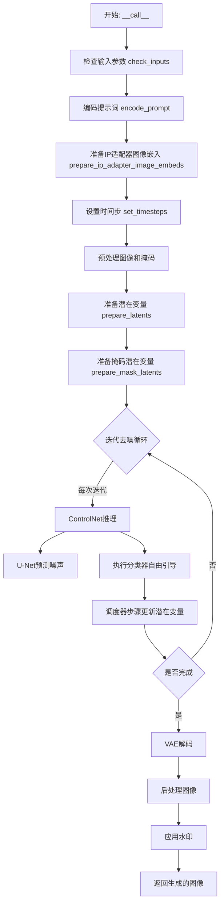

## 类结构

```
StableDiffusionXLControlNetUnionInpaintPipeline (主类)
├── DiffusionPipeline (基类)
├── StableDiffusionMixin (SDXL混合)
├── StableDiffusionXLLoraLoaderMixin (LoRA加载)
├── FromSingleFileMixin (单文件加载)
├── IPAdapterMixin (IP适配器)
└── TextualInversionLoaderMixin (文本反转)
```

## 全局变量及字段


### `logger`
    
模块级日志记录器

类型：`logging.Logger`
    


### `XLA_AVAILABLE`
    
PyTorch XLA可用性标志

类型：`bool`
    


### `EXAMPLE_DOC_STRING`
    
示例文档字符串

类型：`str`
    


### `StableDiffusionXLControlNetUnionInpaintPipeline.vae`
    
VAE模型，用于编码/解码图像

类型：`AutoencoderKL`
    


### `StableDiffusionXLControlNetUnionInpaintPipeline.text_encoder`
    
第一个文本编码器

类型：`CLIPTextModel`
    


### `StableDiffusionXLControlNetUnionInpaintPipeline.text_encoder_2`
    
第二个文本编码器

类型：`CLIPTextModelWithProjection`
    


### `StableDiffusionXLControlNetUnionInpaintPipeline.tokenizer`
    
第一个分词器

类型：`CLIPTokenizer`
    


### `StableDiffusionXLControlNetUnionInpaintPipeline.tokenizer_2`
    
第二个分词器

类型：`CLIPTokenizer`
    


### `StableDiffusionXLControlNetUnionInpaintPipeline.unet`
    
条件U-Net去噪模型

类型：`UNet2DConditionModel`
    


### `StableDiffusionXLControlNetUnionInpaintPipeline.controlnet`
    
控制网络

类型：`ControlNetUnionModel | MultiControlNetUnionModel`
    


### `StableDiffusionXLControlNetUnionInpaintPipeline.scheduler`
    
扩散调度器

类型：`KarrasDiffusionSchedulers`
    


### `StableDiffusionXLControlNetUnionInpaintPipeline.feature_extractor`
    
图像特征提取器

类型：`CLIPImageProcessor | None`
    


### `StableDiffusionXLControlNetUnionInpaintPipeline.image_encoder`
    
图像编码器

类型：`CLIPVisionModelWithProjection | None`
    


### `StableDiffusionXLControlNetUnionInpaintPipeline.image_processor`
    
图像处理器

类型：`VaeImageProcessor`
    


### `StableDiffusionXLControlNetUnionInpaintPipeline.mask_processor`
    
掩码处理器

类型：`VaeImageProcessor`
    


### `StableDiffusionXLControlNetUnionInpaintPipeline.control_image_processor`
    
控制图像处理器

类型：`VaeImageProcessor`
    


### `StableDiffusionXLControlNetUnionInpaintPipeline.watermark`
    
水印处理器

类型：`StableDiffusionXLWatermarker | None`
    


### `StableDiffusionXLControlNetUnionInpaintPipeline.vae_scale_factor`
    
VAE缩放因子

类型：`int`
    


### `StableDiffusionXLControlNetUnionInpaintPipeline.model_cpu_offload_seq`
    
CPU卸载顺序

类型：`str`
    


### `StableDiffusionXLControlNetUnionInpaintPipeline._optional_components`
    
可选组件列表

类型：`list`
    


### `StableDiffusionXLControlNetUnionInpaintPipeline._callback_tensor_inputs`
    
回调张量输入列表

类型：`list`
    
    

## 全局函数及方法


### `retrieve_latents`

从编码器输出中检索潜在变量，支持从潜在分布中采样或获取模式值，或直接返回预计算的潜在变量。

参数：

- `encoder_output`：`torch.Tensor`，编码器的输出对象，通常包含 `latent_dist` 或 `latents` 属性
- `generator`：`torch.Generator | None`，可选的随机数生成器，用于潜在变量采样
- `sample_mode`：`str`，采样模式，可选值为 `"sample"`（从分布中采样）或 `"argmax"`（获取分布的模式值），默认为 `"sample"`

返回值：`torch.Tensor`，检索到的潜在变量张量

#### 流程图

```mermaid
flowchart TD
    A[开始: retrieve_latents] --> B{encoder_output 是否有 latent_dist 属性?}
    B -->|是| C{sample_mode == 'sample'?}
    B -->|否| D{encoder_output 是否有 latents 属性?}
    C -->|是| E[返回 latent_dist.sample(generator)]
    C -->|否| F{sample_mode == 'argmax'?}
    F -->|是| G[返回 latent_dist.mode()]
    F -->|否| H[抛出 AttributeError]
    D -->|是| I[返回 encoder_output.latents]
    D -->|否| H
    E --> J[结束]
    G --> J
    I --> J
    H --> J
```

#### 带注释源码

```python
def retrieve_latents(
    encoder_output: torch.Tensor, generator: torch.Generator | None = None, sample_mode: str = "sample"
):
    """
    从编码器输出中检索潜在变量。
    
    该函数支持三种获取潜在变量的方式：
    1. 从潜在分布中采样（sample_mode='sample'）
    2. 获取潜在分布的模式/均值（sample_mode='argmax'）
    3. 直接返回预计算的潜在变量
    
    参数:
        encoder_output: 编码器输出对象，通常是VAE编码器的输出
        generator: 可选的PyTorch随机数生成器，用于采样时的确定性生成
        sample_mode: 采样模式，'sample'表示从分布采样，'argmax'表示取模式值
    
    返回:
        潜在变量张量
    
    异常:
        AttributeError: 当encoder_output既没有latent_dist也没有latents属性时抛出
    """
    # 检查encoder_output是否有latent_dist属性且采样模式为sample
    if hasattr(encoder_output, "latent_dist") and sample_mode == "sample":
        # 从潜在分布中采样，返回潜在变量
        return encoder_output.latent_dist.sample(generator)
    # 检查encoder_output是否有latent_dist属性且采样模式为argmax
    elif hasattr(encoder_output, "latent_dist") and sample_mode == "argmax":
        # 获取潜在分布的模式（通常是均值），返回潜在变量
        return encoder_output.latent_dist.mode()
    # 检查encoder_output是否有预计算的latents属性
    elif hasattr(encoder_output, "latents"):
        # 直接返回预计算的潜在变量
        return encoder_output.latents
    # 如果都不满足，抛出属性错误
    else:
        raise AttributeError("Could not access latents of provided encoder_output")
```


### `rescale_noise_cfg`

根据 `guidance_rescale` 参数重新缩放噪声配置张量，以改善图像质量并修复过度曝光问题。该函数基于论文 [Common Diffusion Noise Schedules and Sample Steps are Flawed](https://huggingface.co/papers/2305.08891) Section 3.4 的方法实现。

参数：

- `noise_cfg`：`torch.Tensor`，引导扩散过程中预测的噪声张量
- `noise_pred_text`：`torch.Tensor`，文本引导扩散过程中预测的噪声张量
- `guidance_rescale`：`float`，可选，默认值为 0.0应用于噪声预测的重新缩放因子

返回值：`torch.Tensor`，重新缩放后的噪声预测张量

#### 流程图

```mermaid
flowchart TD
    A[开始] --> B[计算 noise_pred_text 的标准差 std_text]
    B --> C[计算 noise_cfg 的标准差 std_cfg]
    C --> D[计算重新缩放因子: std_text / std_cfg]
    D --> E[重新缩放噪声预测: noise_cfg × 因子]
    E --> F[混合原始和重新缩放的噪声]
    F --> G{guidance_rescale > 0?}
    G -->|是| H[返回混合结果: guidance_rescale × rescaled + (1 - guidance_rescale) × original]
    G -->|否| I[返回原始 noise_cfg]
    H --> J[结束]
    I --> J
```

#### 带注释源码

```python
def rescale_noise_cfg(noise_cfg, noise_pred_text, guidance_rescale=0.0):
    r"""
    Rescales `noise_cfg` tensor based on `guidance_rescale` to improve image quality and fix overexposure. Based on
    Section 3.4 from [Common Diffusion Noise Schedules and Sample Steps are
    Flawed](https://huggingface.co/papers/2305.08891).

    Args:
        noise_cfg (`torch.Tensor`):
            The predicted noise tensor for the guided diffusion process.
        noise_pred_text (`torch.Tensor`):
            The predicted noise tensor for the text-guided diffusion process.
        guidance_rescale (`float`, *optional*, defaults to 0.0):
            A rescale factor applied to the noise predictions.

    Returns:
        noise_cfg (`torch.Tensor`): The rescaled noise prediction tensor.
    """
    # 计算文本预测噪声在所有维度（除batch维度外）上的标准差
    # keepdim=True 保持维度以便后续广播操作
    std_text = noise_pred_text.std(dim=list(range(1, noise_pred_text.ndim)), keepdim=True)
    
    # 计算噪声配置在所有维度（除batch维度外）上的标准差
    std_cfg = noise_cfg.std(dim=list(range(1, noise_cfg.ndim)), keepdim=True)
    
    # 使用文本噪声的标准差重新缩放噪声配置（修复过度曝光问题）
    # 这一步将噪声配置的方差调整到与文本预测噪声相同的水平
    noise_pred_rescaled = noise_cfg * (std_text / std_cfg)
    
    # 通过 guidance_rescale 因子混合原始结果和重新缩放后的结果
    # 避免生成"平淡无奇"的图像，增加多样性
    # 当 guidance_rescale=0 时，返回原始 noise_cfg（无操作）
    # 当 guidance_rescale=1 时，返回完全重新缩放的噪声预测
    noise_cfg = guidance_rescale * noise_pred_rescaled + (1 - guidance_rescale) * noise_cfg
    
    return noise_cfg
```


### StableDiffusionXLControlNetUnionInpaintPipeline

这是一个用于图像修复（Inpainting）的Stable Diffusion XL管道，结合了ControlNet联合模型来提供多条件控制能力。该管道支持通过文本提示、掩码图像和控制图像来指导图像修复生成，适用于需要精确控制修复区域的场景。

参数：

- `prompt`：`str | list[str]`，引导图像生成的文本提示，若未定义则需提供prompt_embeds
- `prompt_2`：`str | list[str] | None`，发送给第二tokenizer和text_encoder的提示，未定义时使用prompt
- `image`：`PipelineImageInput`，待修复的图像批次，将被mask_image遮罩覆盖的部分进行重绘
- `mask_image`：`PipelineImageInput`，遮罩图像，白色像素区域将被重绘，黑色像素保留
- `control_image`：`PipelineImageInput | list[PipelineImageInput]`，ControlNet条件输入图像，用于引导unet生成
- `height`：`int | None`，生成图像的高度像素，默认值为self.unet.config.sample_size * self.vae_scale_factor
- `width`：`int | None`，生成图像的宽度像素，默认值为self.unet.config.sample_size * self.vae_scale_factor
- `padding_mask_crop`：`int | None`，裁剪边距大小，用于扩展包含遮罩区域的矩形区域
- `strength`：`float`，图像变换强度，介于0和1之间，值越大对原始图像的改变越多
- `num_inference_steps`：`int`，去噪迭代次数，更多迭代通常导致更高质量的图像
- `denoising_start`：`float | None`，去噪过程的起始分数，0.0到1.0之间
- `denoising_end`：`float | None`，去噪过程的终止分数，0.0到1.0之间
- `guidance_scale`：`float`，分类器自由引导比例，定义为Imagen论文中的w参数
- `negative_prompt`：`str | list[str] | None`，不引导图像生成的负面提示
- `negative_prompt_2`：`str | list[str] | None`，发送给第二tokenizer和text_encoder的负面提示
- `num_images_per_prompt`：`int | None`，每个提示生成的图像数量
- `eta`：`float`，DDIM论文中的eta参数，仅DDIMScheduler使用
- `generator`：`torch.Generator | list[torch.Generator] | None`，随机数生成器，用于确定性生成
- `latents`：`torch.Tensor | None`，预生成的噪声潜在向量
- `prompt_embeds`：`torch.Tensor | None`，预生成的文本嵌入
- `negative_prompt_embeds`：`torch.Tensor | None`，预生成的负面文本嵌入
- `ip_adapter_image`：`PipelineImageInput | None`，IP适配器图像输入
- `ip_adapter_image_embeds`：`list[torch.Tensor] | None`，IP适配器预生成图像嵌入
- `pooled_prompt_embeds`：`torch.Tensor | None`，预生成的池化文本嵌入
- `negative_pooled_prompt_embeds`：`torch.Tensor | None`，预生成的负面池化文本嵌入
- `output_type`：`str | None`，生成图像的输出格式，默认为"pil"
- `return_dict`：`bool`，是否返回PipelineOutput而不是元组
- `cross_attention_kwargs`：`dict[str, Any] | None`，传递给注意力处理器的 kwargs 字典
- `controlnet_conditioning_scale`：`float | list[float]`，ControlNet输出在添加到UNet残差前的乘数
- `guess_mode`：`bool`，ControlNet编码器尝试识别输入图像内容，即使没有提示
- `control_guidance_start`：`float | list[float]`，ControlNet开始应用的总步数百分比
- `control_guidance_end`：`float | list[float]`，ControlNet停止应用的总步数百分比
- `control_mode`：`int | list[int] | list[list[int]] | None`，ControlNet的条件控制类型
- `guidance_rescale`：`float`，根据Imagen论文第3.4节重新缩放噪声配置
- `original_size`：`tuple[int, int]`，原始图像尺寸
- `crops_coords_top_left`：`tuple[int, int]`，裁剪坐标左上角，默认为(0, 0)
- `target_size`：`tuple[int, int]`，目标图像尺寸
- `aesthetic_score`：`float`，用于模拟生成图像美学分数的正向文本条件
- `negative_aesthetic_score`：`float`，用于模拟生成图像美学分数的负向文本条件
- `clip_skip`：`int | None`，CLIP计算提示嵌入时跳过的层数
- `callback_on_step_end`：`Callable | PipelineCallback | MultiPipelineCallbacks | None`，每个去噪步骤结束时调用的函数
- `callback_on_step_end_tensor_inputs`：`list[str]`，callback_on_step_end函数的张量输入列表

返回值：`StableDiffusionXLPipelineOutput`或`tuple`，当return_dict为True时返回PipelineOutput，否则返回元组，第一个元素是生成的图像列表

#### 流程图

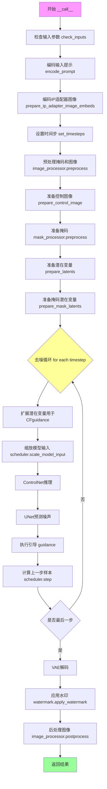

#### 带注释源码

```python
@torch.no_grad()
@replace_example_docstring(EXAMPLE_DOC_STRING)
def __call__(
    self,
    prompt: str | list[str] = None,
    prompt_2: str | list[str] | None = None,
    image: PipelineImageInput = None,
    mask_image: PipelineImageInput = None,
    control_image: PipelineImageInput | list[PipelineImageInput] = None,
    height: int | None = None,
    width: int | None = None,
    padding_mask_crop: int | None = None,
    strength: float = 0.9999,
    num_inference_steps: int = 50,
    denoising_start: float | None = None,
    denoising_end: float | None = None,
    guidance_scale: float = 5.0,
    negative_prompt: str | list[str] | None = None,
    negative_prompt_2: str | list[str] | None = None,
    num_images_per_prompt: int | None = 1,
    eta: float = 0.0,
    generator: torch.Generator | list[torch.Generator] | None = None,
    latents: torch.Tensor | None = None,
    prompt_embeds: torch.Tensor | None = None,
    negative_prompt_embeds: torch.Tensor | None = None,
    ip_adapter_image: PipelineImageInput | None = None,
    ip_adapter_image_embeds: list[torch.Tensor] | None = None,
    pooled_prompt_embeds: torch.Tensor | None = None,
    negative_pooled_prompt_embeds: torch.Tensor | None = None,
    output_type: str | None = "pil",
    return_dict: bool = True,
    cross_attention_kwargs: dict[str, Any] | None = None,
    controlnet_conditioning_scale: float | list[float] = 1.0,
    guess_mode: bool = False,
    control_guidance_start: float | list[float] = 0.0,
    control_guidance_end: float | list[float] = 1.0,
    control_mode: int | list[int] | list[list[int]] | None = None,
    guidance_rescale: float = 0.0,
    original_size: tuple[int, int] = None,
    crops_coords_top_left: tuple[int, int] = (0, 0),
    target_size: tuple[int, int] = None,
    aesthetic_score: float = 6.0,
    negative_aesthetic_score: float = 2.5,
    clip_skip: int | None = None,
    callback_on_step_end: Callable[[int, int], None] | PipelineCallback | MultiPipelineCallbacks | None = None,
    callback_on_step_end_tensor_inputs: list[str] = ["latents"],
    **kwargs,
):
    r"""
    管道调用函数，用于生成图像修复结果。
    
    该方法执行完整的图像修复流程：
    1. 验证输入参数的有效性
    2. 编码文本提示为嵌入向量
    3. 准备控制图像和掩码
    4. 初始化潜在变量
    5. 执行去噪循环
    6. 解码潜在变量为最终图像
    
    Args:
        prompt: 引导图像生成的文本提示
        prompt_2: 发送给第二tokenizer的提示
        image: 待修复的输入图像
        mask_image: 遮罩图像，定义需要修复的区域
        control_image: ControlNet条件图像
        height: 输出图像高度
        width: 输出图像宽度
        padding_mask_crop: 裁剪边距大小
        strength: 图像变换强度
        num_inference_steps: 去噪迭代次数
        denoising_start: 去噪起始点
        denoising_end: 去噪终止点
        guidance_scale: 引导强度
        negative_prompt: 负面提示
        negative_prompt_2: 第二负面提示
        num_images_per_prompt: 每提示生成图像数
        eta: DDIM参数
        generator: 随机数生成器
        latents: 预定义潜在变量
        prompt_embeds: 预定义提示嵌入
        negative_prompt_embeds: 预定义负面嵌入
        ip_adapter_image: IP适配器图像
        ip_adapter_image_embeds: IP适配器嵌入
        pooled_prompt_embeds: 池化提示嵌入
        negative_pooled_prompt_embeds: 负面池化嵌入
        output_type: 输出类型
        return_dict: 是否返回字典格式
        cross_attention_kwargs: 交叉注意力参数
        controlnet_conditioning_scale: ControlNet缩放因子
        guess_mode: 猜测模式
        control_guidance_start: ControlNet起始引导
        control_guidance_end: ControlNet结束引导
        control_mode: 控制模式
        guidance_rescale: 引导重新缩放
        original_size: 原始尺寸
        crops_coords_top_left: 裁剪坐标
        target_size: 目标尺寸
        aesthetic_score: 美学分数
        negative_aesthetic_score: 负面美学分数
        clip_skip: CLIP跳过层数
        callback_on_step_end: 步骤结束回调
        callback_on_step_end_tensor_inputs: 回调张量输入
    
    Returns:
        StableDiffusionXLPipelineOutput: 包含生成图像的输出对象
    """
    # 处理已弃用的回调参数
    callback = kwargs.pop("callback", None)
    callback_steps = kwargs.pop("callback_steps", None)

    # 检查并设置ControlNet模型
    controlnet = self.controlnet._orig_mod if is_compiled_module(self.controlnet) else self.controlnet

    # 标准化control_image和control_mode为列表格式
    if not isinstance(control_image, list):
        control_image = [control_image]
    else:
        control_image = control_image.copy()

    if not isinstance(control_mode, list):
        control_mode = [control_mode]

    # 对于多ControlNet模型，嵌套列表
    if isinstance(controlnet, MultiControlNetUnionModel):
        control_image = [[item] for item in control_image]
        control_mode = [[item] for item in control_mode]

    # 对齐控制引导格式
    if not isinstance(control_guidance_start, list) and isinstance(control_guidance_end, list):
        control_guidance_start = len(control_guidance_end) * [control_guidance_start]
    elif not isinstance(control_guidance_end, list) and isinstance(control_guidance_start, list):
        control_guidance_end = len(control_guidance_start) * [control_guidance_end]
    elif not isinstance(control_guidance_start, list) and not isinstance(control_guidance_end, list):
        mult = len(controlnet.nets) if isinstance(controlnet, MultiControlNetUnionModel) else len(control_mode)
        control_guidance_start, control_guidance_end = (
            mult * [control_guidance_start],
            mult * [control_guidance_end],
        )

    if isinstance(controlnet_conditioning_scale, float):
        mult = len(controlnet.nets) if isinstance(controlnet, MultiControlNetUnionModel) else len(control_mode)
        controlnet_conditioning_scale = [controlnet_conditioning_scale] * mult

    # 1. 检查输入参数
    self.check_inputs(
        prompt, prompt_2, control_image, mask_image, strength,
        num_inference_steps, callback_steps, output_type,
        negative_prompt, negative_prompt_2, prompt_embeds, negative_prompt_embeds,
        ip_adapter_image, ip_adapter_image_embeds, pooled_prompt_embeds,
        negative_pooled_prompt_embeds, controlnet_conditioning_scale,
        control_guidance_start, control_guidance_end, control_mode,
        callback_on_step_end_tensor_inputs, padding_mask_crop,
    )

    # 创建控制类型张量
    if isinstance(controlnet, ControlNetUnionModel):
        control_type = torch.zeros(controlnet.config.num_control_type).scatter_(0, torch.tensor(control_mode), 1)
    elif isinstance(controlnet, MultiControlNetUnionModel):
        control_type = [
            torch.zeros(controlnet_.config.num_control_type).scatter_(0, torch.tensor(control_mode_), 1)
            for control_mode_, controlnet_ in zip(control_mode, self.controlnet.nets)
        ]

    # 设置内部状态
    self._guidance_scale = guidance_scale
    self._clip_skip = clip_skip
    self._cross_attention_kwargs = cross_attention_kwargs
    self._interrupt = False

    # 2. 定义批次大小
    if prompt is not None and isinstance(prompt, str):
        batch_size = 1
    elif prompt is not None and isinstance(prompt, list):
        batch_size = len(prompt)
    else:
        batch_size = prompt_embeds.shape[0]

    device = self._execution_device

    # 3. 编码输入提示
    text_encoder_lora_scale = (
        self.cross_attention_kwargs.get("scale", None) if self.cross_attention_kwargs is not None else None
    )

    (
        prompt_embeds,
        negative_prompt_embeds,
        pooled_prompt_embeds,
        negative_pooled_prompt_embeds,
    ) = self.encode_prompt(
        prompt=prompt,
        prompt_2=prompt_2,
        device=device,
        num_images_per_prompt=num_images_per_prompt,
        do_classifier_free_guidance=self.do_classifier_free_guidance,
        negative_prompt=negative_prompt,
        negative_prompt_2=negative_prompt_2,
        prompt_embeds=prompt_embeds,
        negative_prompt_embeds=negative_prompt_embeds,
        pooled_prompt_embeds=pooled_prompt_embeds,
        negative_pooled_prompt_embeds=negative_pooled_prompt_embeds,
        lora_scale=text_encoder_lora_scale,
        clip_skip=self.clip_skip,
    )

    # 3.1 编码IP适配器图像
    if ip_adapter_image is not None or ip_adapter_image_embeds is not None:
        image_embeds = self.prepare_ip_adapter_image_embeds(
            ip_adapter_image,
            ip_adapter_image_embeds,
            device,
            batch_size * num_images_per_prompt,
            self.do_classifier_free_guidance,
        )

    # 4. 设置时间步
    def denoising_value_valid(dnv):
        return isinstance(dnv, float) and 0 < dnv < 1

    self.scheduler.set_timesteps(num_inference_steps, device=device)
    timesteps, num_inference_steps = self.get_timesteps(
        num_inference_steps, strength, device,
        denoising_start=denoising_start if denoising_value_valid(denoising_start) else None,
    )
    
    if num_inference_steps < 1:
        raise ValueError(...)
    
    latent_timestep = timesteps[:1].repeat(batch_size * num_images_per_prompt)
    is_strength_max = strength == 1.0
    self._num_timesteps = len(timesteps)

    # 5. 预处理掩码和图像
    if padding_mask_crop is not None:
        height, width = self.image_processor.get_default_height_width(image, height, width)
        crops_coords = self.mask_processor.get_crop_region(mask_image, width, height, pad=padding_mask_crop)
        resize_mode = "fill"
    else:
        crops_coords = None
        resize_mode = "default"

    original_image = image
    init_image = self.image_processor.preprocess(
        image, height=height, width=width, crops_coords=crops_coords, resize_mode=resize_mode
    )
    init_image = init_image.to(dtype=torch.float32)

    # 5.2 准备控制图像
    if isinstance(controlnet, ControlNetUnionModel):
        control_images = []
        for image_ in control_image:
            image_ = self.prepare_control_image(
                image=image_, width=width, height=height,
                batch_size=batch_size * num_images_per_prompt,
                num_images_per_prompt=num_images_per_prompt,
                device=device, dtype=controlnet.dtype,
                crops_coords=crops_coords, resize_mode=resize_mode,
                do_classifier_free_guidance=self.do_classifier_free_guidance,
                guess_mode=guess_mode,
            )
            control_images.append(image_)
        control_image = control_images
        height, width = control_image[0].shape[-2:]

    # 5.3 准备掩码
    mask = self.mask_processor.preprocess(
        mask_image, height=height, width=width, resize_mode=resize_mode, crops_coords=crops_coords
    )
    masked_image = init_image * (mask < 0.5)
    _, _, height, width = init_image.shape

    # 6. 准备潜在变量
    num_channels_latents = self.vae.config.latent_channels
    num_channels_unet = self.unet.config.in_channels
    return_image_latents = num_channels_unet == 4

    add_noise = True if denoising_start is None else False
    latents_outputs = self.prepare_latents(
        batch_size * num_images_per_prompt, num_channels_latents,
        height, width, prompt_embeds.dtype, device, generator, latents,
        image=init_image, timestep=latent_timestep,
        is_strength_max=is_strength_max, add_noise=add_noise,
        return_noise=True, return_image_latents=return_image_latents,
    )

    if return_image_latents:
        latents, noise, image_latents = latents_outputs
    else:
        latents, noise = latents_outputs

    # 7. 准备掩码潜在变量
    mask, _ = self.prepare_mask_latents(
        mask, masked_image, batch_size * num_images_per_prompt,
        height, width, prompt_embeds.dtype, device, generator,
        self.do_classifier_free_guidance,
    )

    # 8. 准备额外步骤参数
    extra_step_kwargs = self.prepare_extra_step_kwargs(generator, eta)

    # 8.2 创建控制网保留张量
    controlnet_keep = []
    for i in range(len(timesteps)):
        keeps = [
            1.0 - float(i / len(timesteps) < s or (i + 1) / len(timesteps) > e)
            for s, e in zip(control_guidance_start, control_guidance_end)
        ]
        controlnet_keep.append(keeps)

    # 9. 准备添加的时间ID和嵌入
    height, width = latents.shape[-2:]
    height = height * self.vae_scale_factor
    width = width * self.vae_scale_factor

    original_size = original_size or (height, width)
    target_size = target_size or (height, width)

    add_text_embeds = pooled_prompt_embeds
    text_encoder_projection_dim = (
        int(pooled_prompt_embeds.shape[-1]) if self.text_encoder_2 is None 
        else self.text_encoder_2.config.projection_dim
    )

    add_time_ids, add_neg_time_ids = self._get_add_time_ids(
        original_size, crops_coords_top_left, target_size,
        aesthetic_score, negative_aesthetic_score,
        dtype=prompt_embeds.dtype,
        text_encoder_projection_dim=text_encoder_projection_dim,
    )
    add_time_ids = add_time_ids.repeat(batch_size * num_images_per_prompt, 1)

    # 应用分类器自由引导
    if self.do_classifier_free_guidance:
        prompt_embeds = torch.cat([negative_prompt_embeds, prompt_embeds], dim=0)
        add_text_embeds = torch.cat([negative_pooled_prompt_embeds, add_text_embeds], dim=0)
        add_neg_time_ids = add_neg_time_ids.repeat(batch_size * num_images_per_prompt, 1)
        add_time_ids = torch.cat([add_neg_time_ids, add_time_ids], dim=0)

    prompt_embeds = prompt_embeds.to(device)
    add_text_embeds = add_text_embeds.to(device)
    add_time_ids = add_time_ids.to(device)

    # 11. 去噪循环
    num_warmup_steps = max(len(timesteps) - num_inference_steps * self.scheduler.order, 0)

    # 准备控制类型重复因子
    control_type_repeat_factor = (
        batch_size * num_images_per_prompt * (2 if self.do_classifier_free_guidance else 1)
    )

    if isinstance(controlnet, ControlNetUnionModel):
        control_type = (
            control_type.reshape(1, -1)
            .to(self._execution_device, dtype=prompt_embeds.dtype)
            .repeat(control_type_repeat_factor, 1)
        )
    elif isinstance(controlnet, MultiControlNetUnionModel):
        control_type = [
            _control_type.reshape(1, -1)
            .to(self._execution_device, dtype=prompt_embeds.dtype)
            .repeat(control_type_repeat_factor, 1)
            for _control_type in control_type
        ]

    with self.progress_bar(total=num_inference_steps) as progress_bar:
        for i, t in enumerate(timesteps):
            if self.interrupt:
                continue

            # 扩展潜在变量用于分类器自由引导
            latent_model_input = torch.cat([latents] * 2) if self.do_classifier_free_guidance else latents
            latent_model_input = self.scheduler.scale_model_input(latent_model_input, t)

            added_cond_kwargs = {
                "text_embeds": add_text_embeds,
                "time_ids": add_time_ids,
            }

            # ControlNet推理
            if guess_mode and self.do_classifier_free_guidance:
                control_model_input = latents
                control_model_input = self.scheduler.scale_model_input(control_model_input, t)
                controlnet_prompt_embeds = prompt_embeds.chunk(2)[1]
                controlnet_added_cond_kwargs = {
                    "text_embeds": add_text_embeds.chunk(2)[1],
                    "time_ids": add_time_ids.chunk(2)[1],
                }
            else:
                control_model_input = latent_model_input
                controlnet_prompt_embeds = prompt_embeds
                controlnet_added_cond_kwargs = added_cond_kwargs

            # 计算控制网条件缩放
            if isinstance(controlnet_keep[i], list):
                cond_scale = [c * s for c, s in zip(controlnet_conditioning_scale, controlnet_keep[i])]
            else:
                controlnet_cond_scale = controlnet_conditioning_scale
                if isinstance(controlnet_cond_scale, list):
                    controlnet_cond_scale = controlnet_cond_scale[0]
                cond_scale = controlnet_cond_scale * controlnet_keep[i]

            # ControlNet前向传播
            down_block_res_samples, mid_block_res_sample = self.controlnet(
                control_model_input, t,
                encoder_hidden_states=controlnet_prompt_embeds,
                controlnet_cond=control_image,
                control_type=control_type,
                control_type_idx=control_mode,
                conditioning_scale=cond_scale,
                guess_mode=guess_mode,
                added_cond_kwargs=controlnet_added_cond_kwargs,
                return_dict=False,
            )

            # 猜测模式下处理ControlNet输出
            if guess_mode and self.do_classifier_free_guidance:
                down_block_res_samples = [torch.cat([torch.zeros_like(d), d]) for d in down_block_res_samples]
                mid_block_res_sample = torch.cat([torch.zeros_like(mid_block_res_sample), mid_block_res_sample])

            # 添加IP适配器嵌入
            if ip_adapter_image is not None or ip_adapter_image_embeds is not None:
                added_cond_kwargs["image_embeds"] = image_embeds

            # UNet预测噪声
            noise_pred = self.unet(
                latent_model_input, t,
                encoder_hidden_states=prompt_embeds,
                cross_attention_kwargs=self.cross_attention_kwargs,
                down_block_additional_residuals=down_block_res_samples,
                mid_block_additional_residual=mid_block_res_sample,
                added_cond_kwargs=added_cond_kwargs,
                return_dict=False,
            )[0]

            # 执行引导
            if self.do_classifier_free_guidance:
                noise_pred_uncond, noise_pred_text = noise_pred.chunk(2)
                noise_pred = noise_pred_uncond + guidance_scale * (noise_pred_text - noise_pred_uncond)

            # 重新缩放噪声配置
            if self.do_classifier_free_guidance and guidance_rescale > 0.0:
                noise_pred = rescale_noise_cfg(noise_pred, noise_pred_text, guidance_rescale=guidance_rescale)

            # 计算上一步样本
            latents = self.scheduler.step(noise_pred, t, latents, **extra_step_kwargs, return_dict=False)[0]

            # 混合原始潜在变量
            init_latents_proper = image_latents
            if self.do_classifier_free_guidance:
                init_mask, _ = mask.chunk(2)
            else:
                init_mask = mask

            if i < len(timesteps) - 1:
                noise_timestep = timesteps[i + 1]
                init_latents_proper = self.scheduler.add_noise(
                    init_latents_proper, noise, torch.tensor([noise_timestep])
                )

            latents = (1 - init_mask) * init_latents_proper + init_mask * latents

            # 步骤结束回调
            if callback_on_step_end is not None:
                callback_kwargs = {}
                for k in callback_on_step_end_tensor_inputs:
                    callback_kwargs[k] = locals()[k]
                callback_outputs = callback_on_step_end(self, i, t, callback_kwargs)
                latents = callback_outputs.pop("latents", latents)
                prompt_embeds = callback_outputs.pop("prompt_embeds", prompt_embeds)
                negative_prompt_embeds = callback_outputs.pop("negative_prompt_embeds", negative_prompt_embeds)
                control_image = callback_outputs.pop("control_image", control_image)

            # 进度更新
            if i == len(timesteps) - 1 or ((i + 1) > num_warmup_steps and (i + 1) % self.scheduler.order == 0):
                progress_bar.update()
                if callback is not None and i % callback_steps == 0:
                    step_idx = i // getattr(self.scheduler, "order", 1)
                    callback(step_idx, t, latents)

            if XLA_AVAILABLE:
                xm.mark_step()

    # 后处理：VAE解码
    if self.vae.dtype == torch.float16 and self.vae.config.force_upcast:
        self.upcast_vae()
        latents = latents.to(next(iter(self.vae.post_quant_conv.parameters())).dtype)

    # 手动卸载模型
    if hasattr(self, "final_offload_hook") and self.final_offload_hook is not None:
        self.unet.to("cpu")
        self.controlnet.to("cpu")
        empty_device_cache()

    # 解码潜在变量
    if not output_type == "latent":
        image = self.vae.decode(latents / self.vae.config.scaling_factor, return_dict=False)[0]
    else:
        return StableDiffusionXLPipelineOutput(images=latents)

    # 应用水印
    if self.watermark is not None:
        image = self.watermark.apply_watermark(image)

    # 后处理图像
    image = self.image_processor.postprocess(image, output_type=output_type)

    # 应用覆盖层
    if padding_mask_crop is not None:
        image = [self.image_processor.apply_overlay(mask_image, original_image, i, crops_coords) for i in image]

    # 卸载模型
    self.maybe_free_model_hooks()

    if not return_dict:
        return (image,)

    return StableDiffusionXLPipelineOutput(images=image)
```


### `StableDiffusionXLControlNetUnionInpaintPipeline.__init__`

该方法用于初始化 `StableDiffusionXLControlNetUnionInpaintPipeline` 管道，接收包括 VAE、文本编码器、UNet、ControlNet 和调度器在内的所有必要模型组件，并进行图像处理器、水印等模块的初始化配置。

参数：

-  `vae`：`AutoencoderKL`，用于将图像编码和解码为潜在表示的变分自编码器模型。
-  `text_encoder`：`CLIPTextModel`，冻结的文本编码器，Stable Diffusion XL 使用 CLIP 的文本部分。
-  `text_encoder_2`：`CLIPTextModelWithProjection`，第二个冻结的文本编码器，使用 CLIP 的文本和池化部分。
-  `tokenizer`：`CLIPTokenizer`，第一个分词器。
-  `tokenizer_2`：`CLIPTokenizer`，第二个分词器。
-  `unet`：`UNet2DConditionModel`，条件 U-Net 架构，用于对编码后的图像潜在表示进行去噪。
-  `controlnet`：`ControlNetUnionModel | list[ControlNetUnionModel] | tuple[ControlNetUnionModel] | MultiControlNetUnionModel`，ControlNet 模型，用于提供图像生成的条件控制。
-  `scheduler`：`KarrasDiffusionSchedulers`，与 `unet` 结合使用以对编码图像进行去噪的调度器。
-  `requires_aesthetics_score`：`bool`，是否需要美学评分，默认为 False。
-  `force_zeros_for_empty_prompt`：`bool`，是否对空提示强制为零，默认为 True。
-  `add_watermarker`：`bool | None`，是否添加隐形水印，默认为 None（如果可用则添加）。
-  `feature_extractor`：`CLIPImageProcessor | None`，图像处理器，用于将图像转换为特征。
-  `image_encoder`：`CLIPVisionModelWithProjection | None`，图像编码器，用于 IP Adapter。

返回值：`None`，无返回值（构造函数）。

#### 流程图

```mermaid
graph TD
    A([Start __init__]) --> B[调用 super().__init__]
    B --> C{controlnet 是 list 或 tuple?}
    C -- 是 --> D[将 controlnet 转换为 MultiControlNetUnionModel]
    C -- 否 --> E[注册模块: vae, text_encoder, text_encoder_2, tokenizer, tokenizer_2, unet, controlnet, scheduler, feature_extractor, image_encoder]
    D --> E
    E --> F[注册配置: force_zeros_for_empty_prompt, requires_aesthetics_score]
    F --> G[计算 vae_scale_factor]
    G --> H[初始化 image_processor, mask_processor, control_image_processor]
    H --> I{is_invisible_watermark_available?}
    I -- 是 --> J[初始化 watermark]
    I -- 否 --> K[设置 watermark 为 None]
    J --> L([End])
    K --> L
```

#### 带注释源码

```python
def __init__(
    self,
    vae: AutoencoderKL,
    text_encoder: CLIPTextModel,
    text_encoder_2: CLIPTextModelWithProjection,
    tokenizer: CLIPTokenizer,
    tokenizer_2: CLIPTokenizer,
    unet: UNet2DConditionModel,
    controlnet: ControlNetUnionModel
    | list[ControlNetUnionModel]
    | tuple[ControlNetUnionModel]
    | MultiControlNetUnionModel,
    scheduler: KarrasDiffusionSchedulers,
    requires_aesthetics_score: bool = False,
    force_zeros_for_empty_prompt: bool = True,
    add_watermarker: bool | None = None,
    feature_extractor: CLIPImageProcessor | None = None,
    image_encoder: CLIPVisionModelWithProjection | None = None,
):
    # 调用父类 DiffusionPipeline 的初始化方法
    super().__init__()

    # 如果 controlnet 是列表或元组，则将其转换为 MultiControlNetUnionModel 以便统一处理
    if isinstance(controlnet, (list, tuple)):
        controlnet = MultiControlNetUnionModel(controlnet)

    # 将所有传入的模型和组件注册到当前 pipeline 实例中
    self.register_modules(
        vae=vae,
        text_encoder=text_encoder,
        text_encoder_2=text_encoder_2,
        tokenizer=tokenizer,
        tokenizer_2=tokenizer_2,
        unet=unet,
        controlnet=controlnet,
        scheduler=scheduler,
        feature_extractor=feature_extractor,
        image_encoder=image_encoder,
    )

    # 将配置参数注册到 config 中
    self.register_to_config(force_zeros_for_empty_prompt=force_zeros_for_empty_prompt)
    self.register_to_config(requires_aesthetics_score=requires_aesthetics_score)

    # 计算 VAE 的缩放因子，通常为 2^(len(block_out_channels) - 1)，默认为 8
    self.vae_scale_factor = 2 ** (len(self.vae.config.block_out_channels) - 1) if getattr(self, "vae", None) else 8

    # 初始化图像处理器，用于预处理和后处理图像
    self.image_processor = VaeImageProcessor(vae_scale_factor=self.vae_scale_factor)
    
    # 初始化掩码处理器，配置为归一化=False，二值化=True，转换为灰度=True
    self.mask_processor = VaeImageProcessor(
        vae_scale_factor=self.vae_scale_factor, do_normalize=False, do_binarize=True, do_convert_grayscale=True
    )
    
    # 初始化控制图像处理器，配置为转换为 RGB，归一化=False
    self.control_image_processor = VaeImageProcessor(
        vae_scale_factor=self.vae_scale_factor, do_convert_rgb=True, do_normalize=False
    )

    # 如果未指定 add_watermarker，则默认检查是否可用隐形水印功能
    add_watermarker = add_watermarker if add_watermarker is not None else is_invisible_watermark_available()

    # 如果启用水印，则初始化水印器，否则设为 None
    if add_watermarker:
        self.watermark = StableDiffusionXLWatermarker()
    else:
        self.watermark = None
```


### `StableDiffusionXLControlNetUnionInpaintPipeline.encode_prompt`

该方法负责将文本提示词编码为文本编码器的隐藏状态，处理双文本编码器（CLIP Text Encoder和CLIP Text Encoder with Projection）的提示词嵌入，支持LoRA权重调节和CLIP跳过层功能，并生成用于无分类器自由引导的正负提示词嵌入。

参数：

- `prompt`：`str | list[str]`，要编码的主提示词
- `prompt_2`：`str | list[str] | None`，发送给第二个tokenizer和text_encoder_2的提示词，若不定义则使用prompt
- `device`：`torch.device | None`，torch设备，未指定时使用执行设备
- `num_images_per_prompt`：`int`，每个提示词生成的图像数量
- `do_classifier_free_guidance`：`bool`，是否使用无分类器自由引导
- `negative_prompt`：`str | list[str] | None`，不引导图像生成的提示词
- `negative_prompt_2`：`str | list[str] | None`，发送给第二个tokenizer和text_encoder_2的负面提示词
- `prompt_embeds`：`torch.Tensor | None`，预生成的文本嵌入，用于轻松调整文本输入
- `negative_prompt_embeds`：`torch.Tensor | None`，预生成的负面文本嵌入
- `pooled_prompt_embeds`：`torch.Tensor | None`，预生成的池化文本嵌入
- `negative_pooled_prompt_embeds`：`torch.Tensor | None`，预生成的负面池化文本嵌入
- `lora_scale`：`float | None`，应用于文本编码器所有LoRA层的LoRA缩放因子
- `clip_skip`：`int | None`，计算提示词嵌入时从CLIP跳过的层数

返回值：`(torch.Tensor, torch.Tensor, torch.Tensor, torch.Tensor)`，返回四个张量——编码后的提示词嵌入、负面提示词嵌入、池化提示词嵌入、负面池化提示词嵌入

#### 流程图

```mermaid
flowchart TD
    A[开始 encode_prompt] --> B{device参数是否为空?}
    B -->|是| C[使用self._execution_device]
    B -->|否| D[使用传入的device]
    C --> E{是否传入了lora_scale?}
    D --> E
    E -->|是| F[设置self._lora_scale]
    E -->|否| G{self是否为StableDiffusionXLLoraLoaderMixin?}
    F --> H[动态调整LoRA scale]
    H --> I{text_encoder是否不为None?}
    I -->|是| J[调整LoRA scale或使用PEFT backend]
    I -->|否| K{text_encoder_2是否不为None?}
    J --> K
    K --> L[处理prompt为list格式]
    L --> M[定义tokenizers和text_encoders列表]
    M --> N{prompt_embeds是否为None?}
    N -->|是| O[遍历prompts和tokenizers/text_encoders]
    N -->|否| P[处理负面提示词嵌入]
    O --> Q[调用maybe_convert_prompt处理文本反转]
    Q --> R[tokenizer处理prompt]
    R --> S[检查是否被截断]
    S --> T[text_encoder生成embeddings]
    T --> U{pooled_prompt_embeds为None且ndim==2?}
    U -->|是| V[提取pooled输出]
    U -->|否| W{clip_skip是否为None?}
    W -->|是| X[使用倒数第二层hidden states]
    W -->|否| Y[使用倒数clip_skip+2层]
    V --> Z[添加到prompt_embeds_list]
    X --> Z
    Y --> Z
    Z --> AA[concat所有prompt_embeds]
    AA --> P
    P --> BB{do_classifier_free_guidance为True且negative_prompt_embeds为None?}
    BB -->|是| BC{force_zeros_for_empty_prompt?}
    BB -->|否| BD[处理negative_prompt]
    BC -->|是| BE[创建零张量]
    BC -->|否| BF[遍历negative_prompts生成embeddings]
    BE --> BG[复制embeddings到num_images_per_prompt]
    BD --> BF
    BF --> BG
    BG --> BH{text_encoder_2是否不为None?}
    BH -->|是| BI[转换为text_encoder_2的dtype]
    BH -->|否| BJ[转换为unet的dtype]
    BI --> BK[重复embeddings]
    BJ --> BK
    BK --> BL[处理classifier_free_guidance的negative embeddings]
    BL --> BM{使用PEFT backend且为LoRA loader?}
    BM -->|是| BN[取消LoRA scale]
    BM -->|否| BO[返回四个embeddings]
    BN --> BO
```

#### 带注释源码

```python
def encode_prompt(
    self,
    prompt: str,
    prompt_2: str | None = None,
    device: torch.device | None = None,
    num_images_per_prompt: int = 1,
    do_classifier_free_guidance: bool = True,
    negative_prompt: str | None = None,
    negative_prompt_2: str | None = None,
    prompt_embeds: torch.Tensor | None = None,
    negative_prompt_embeds: torch.Tensor | None = None,
    pooled_prompt_embeds: torch.Tensor | None = None,
    negative_pooled_prompt_embeds: torch.Tensor | None = None,
    lora_scale: float | None = None,
    clip_skip: int | None = None,
):
    r"""
    Encodes the prompt into text encoder hidden states.

    Args:
        prompt (`str` or `list[str]`, *optional*):
            prompt to be encoded
        prompt_2 (`str` or `list[str]`, *optional*):
            The prompt or prompts to be sent to the `tokenizer_2` and `text_encoder_2`. If not defined, `prompt` is
            used in both text-encoders
        device: (`torch.device`):
            torch device
        num_images_per_prompt (`int`):
            number of images that should be generated per prompt
        do_classifier_free_guidance (`bool`):
            whether to use classifier free guidance or not
        negative_prompt (`str` or `list[str]`, *optional*):
            The prompt or prompts not to guide the image generation. If not defined, one has to pass
            `negative_prompt_embeds` instead. Ignored when not using guidance (i.e., ignored if `guidance_scale` is
            less than `1`).
        negative_prompt_2 (`str` or `list[str]`, *optional*):
            The prompt or prompts not to guide the image generation to be sent to `tokenizer_2` and
            `text_encoder_2`. If not defined, `negative_prompt` is used in both text-encoders
        prompt_embeds (`torch.Tensor`, *optional*):
            Pre-generated text embeddings. Can be used to easily tweak text inputs, *e.g.* prompt weighting. If not
            provided, text embeddings will be generated from `prompt` input argument.
        negative_prompt_embeds (`torch.Tensor`, *optional*):
            Pre-generated negative text embeddings. Can be used to easily tweak text inputs, *e.g.* prompt
            weighting. If not provided, negative_prompt_embeds will be generated from `negative_prompt` input
            argument.
        pooled_prompt_embeds (`torch.Tensor`, *optional*):
            Pre-generated pooled text embeddings. Can be used to easily tweak text inputs, *e.g.* prompt weighting.
            If not provided, pooled text embeddings will be generated from `prompt` input argument.
        negative_pooled_prompt_embeds (`torch.Tensor`, *optional*):
            Pre-generated negative pooled text embeddings. Can be used to easily tweak text inputs, *e.g.* prompt
            weighting. If not provided, pooled negative_prompt_embeds will be generated from `negative_prompt`
            input argument.
        lora_scale (`float`, *optional*):
            A lora scale that will be applied to all LoRA layers of the text encoder if LoRA layers are loaded.
        clip_skip (`int`, *optional*):
            Number of layers to be skipped from CLIP while computing the prompt embeddings. A value of 1 means that
            the output of the pre-final layer will be used for computing the prompt embeddings.
    """
    # 确定设备，默认为执行设备
    device = device or self._execution_device

    # 设置lora scale以便text encoder的monkey patched LoRA函数可以正确访问
    if lora_scale is not None and isinstance(self, StableDiffusionXLLoraLoaderMixin):
        self._lora_scale = lora_scale

        # 动态调整LoRA scale
        if self.text_encoder is not None:
            if not USE_PEFT_BACKEND:
                adjust_lora_scale_text_encoder(self.text_encoder, lora_scale)
            else:
                scale_lora_layers(self.text_encoder, lora_scale)

        if self.text_encoder_2 is not None:
            if not USE_PEFT_BACKEND:
                adjust_lora_scale_text_encoder(self.text_encoder_2, lora_scale)
            else:
                scale_lora_layers(self.text_encoder_2, lora_scale)

    # 将prompt转换为list格式以便批量处理
    prompt = [prompt] if isinstance(prompt, str) else prompt

    # 确定batch_size
    if prompt is not None:
        batch_size = len(prompt)
    else:
        batch_size = prompt_embeds.shape[0]

    # 定义tokenizers和text encoders列表
    tokenizers = [self.tokenizer, self.tokenizer_2] if self.tokenizer is not None else [self.tokenizer_2]
    text_encoders = (
        [self.text_encoder, self.text_encoder_2] if self.text_encoder is not None else [self.text_encoder_2]
    )

    # 如果未提供prompt_embeds，则从prompt生成
    if prompt_embeds is None:
        # prompt_2默认为prompt
        prompt_2 = prompt_2 or prompt
        prompt_2 = [prompt_2] if isinstance(prompt_2, str) else prompt_2

        # textual inversion: process multi-vector tokens if necessary
        prompt_embeds_list = []
        prompts = [prompt, prompt_2]
        for prompt, tokenizer, text_encoder in zip(prompts, tokenizers, text_encoders):
            # 如果支持TextualInversionLoaderMixin，转换prompt
            if isinstance(self, TextualInversionLoaderMixin):
                prompt = self.maybe_convert_prompt(prompt, tokenizer)

            # tokenizer处理prompt
            text_inputs = tokenizer(
                prompt,
                padding="max_length",
                max_length=tokenizer.model_max_length,
                truncation=True,
                return_tensors="pt",
            )

            text_input_ids = text_inputs.input_ids
            # 获取未截断的ids用于检测截断
            untruncated_ids = tokenizer(prompt, padding="longest", return_tensors="pt").input_ids

            # 检查是否发生了截断
            if untruncated_ids.shape[-1] >= text_input_ids.shape[-1] and not torch.equal(
                text_input_ids, untruncated_ids
            ):
                removed_text = tokenizer.batch_decode(untruncated_ids[:, tokenizer.model_max_length - 1 : -1])
                logger.warning(
                    "The following part of your input was truncated because CLIP can only handle sequences up to"
                    f" {tokenizer.model_max_length} tokens: {removed_text}"
                )

            # text_encoder生成embeddings
            prompt_embeds = text_encoder(text_input_ids.to(device), output_hidden_states=True)

            # 我们只对最终text encoder的pooled输出感兴趣
            if pooled_prompt_embeds is None and prompt_embeds[0].ndim == 2:
                pooled_prompt_embeds = prompt_embeds[0]

            # 根据clip_skip选择hidden states层
            if clip_skip is None:
                prompt_embeds = prompt_embeds.hidden_states[-2]
            else:
                # "2" because SDXL always indexes from the penultimate layer.
                prompt_embeds = prompt_embeds.hidden_states[-(clip_skip + 2)]

            prompt_embeds_list.append(prompt_embeds)

        # 合并两个text encoder的embeddings
        prompt_embeds = torch.concat(prompt_embeds_list, dim=-1)

    # 获取无分类器自由引导的无条件embeddings
    zero_out_negative_prompt = negative_prompt is None and self.config.force_zeros_for_empty_prompt
    if do_classifier_free_guidance and negative_prompt_embeds is None and zero_out_negative_prompt:
        # 创建零张量
        negative_prompt_embeds = torch.zeros_like(prompt_embeds)
        negative_pooled_prompt_embeds = torch.zeros_like(pooled_prompt_embeds)
    elif do_classifier_free_guidance and negative_prompt_embeds is None:
        negative_prompt = negative_prompt or ""
        negative_prompt_2 = negative_prompt_2 or negative_prompt

        # 规范化为list格式
        negative_prompt = batch_size * [negative_prompt] if isinstance(negative_prompt, str) else negative_prompt
        negative_prompt_2 = (
            batch_size * [negative_prompt_2] if isinstance(negative_prompt_2, str) else negative_prompt_2
        )

        uncond_tokens: list[str]
        if prompt is not None and type(prompt) is not type(negative_prompt):
            raise TypeError(
                f"`negative_prompt` should be the same type to `prompt`, but got {type(negative_prompt)} !="
                f" {type(prompt)}."
            )
        elif batch_size != len(negative_prompt):
            raise ValueError(
                f"`negative_prompt`: {negative_prompt} has batch size {len(negative_prompt)}, but `prompt`:"
                f" {prompt} has batch size {batch_size}. Please make sure that passed `negative_prompt` matches"
                " the batch size of `prompt`."
            )
        else:
            uncond_tokens = [negative_prompt, negative_prompt_2]

        # 生成negative_prompt_embeds
        negative_prompt_embeds_list = []
        for negative_prompt, tokenizer, text_encoder in zip(uncond_tokens, tokenizers, text_encoders):
            if isinstance(self, TextualInversionLoaderMixin):
                negative_prompt = self.maybe_convert_prompt(negative_prompt, tokenizer)

            max_length = prompt_embeds.shape[1]
            uncond_input = tokenizer(
                negative_prompt,
                padding="max_length",
                max_length=max_length,
                truncation=True,
                return_tensors="pt",
            )

            negative_prompt_embeds = text_encoder(
                uncond_input.input_ids.to(device),
                output_hidden_states=True,
            )

            # 只对最终text encoder的pooled输出感兴趣
            if negative_pooled_prompt_embeds is None and negative_prompt_embeds[0].ndim == 2:
                negative_pooled_prompt_embeds = negative_prompt_embeds[0]
            negative_prompt_embeds = negative_prompt_embeds.hidden_states[-2]

            negative_prompt_embeds_list.append(negative_prompt_embeds)

        negative_prompt_embeds = torch.concat(negative_prompt_embeds_list, dim=-1)

    # 转换prompt_embeds的dtype和device
    if self.text_encoder_2 is not None:
        prompt_embeds = prompt_embeds.to(dtype=self.text_encoder_2.dtype, device=device)
    else:
        prompt_embeds = prompt_embeds.to(dtype=self.unet.dtype, device=device)

    # 复制prompt embeddings以匹配num_images_per_prompt
    bs_embed, seq_len, _ = prompt_embeds.shape
    # duplicate text embeddings for each generation per prompt, using mps friendly method
    prompt_embeds = prompt_embeds.repeat(1, num_images_per_prompt, 1)
    prompt_embeds = prompt_embeds.view(bs_embed * num_images_per_prompt, seq_len, -1)

    # 处理无分类器自由引导的negative embeddings
    if do_classifier_free_guidance:
        # duplicate unconditional embeddings for each generation per prompt, using mps friendly method
        seq_len = negative_prompt_embeds.shape[1]

        if self.text_encoder_2 is not None:
            negative_prompt_embeds = negative_prompt_embeds.to(dtype=self.text_encoder_2.dtype, device=device)
        else:
            negative_prompt_embeds = negative_prompt_embeds.to(dtype=self.unet.dtype, device=device)

        negative_prompt_embeds = negative_prompt_embeds.repeat(1, num_images_per_prompt, 1)
        negative_prompt_embeds = negative_prompt_embeds.view(batch_size * num_images_per_prompt, seq_len, -1)

    # 处理pooled prompt embeddings
    pooled_prompt_embeds = pooled_prompt_embeds.repeat(1, num_images_per_prompt).view(
        bs_embed * num_images_per_prompt, -1
    )
    if do_classifier_free_guidance:
        negative_pooled_prompt_embeds = negative_pooled_prompt_embeds.repeat(1, num_images_per_prompt).view(
            bs_embed * num_images_per_prompt, -1
        )

    # 如果使用PEFT backend，恢复LoRA layers的原始scale
    if self.text_encoder is not None:
        if isinstance(self, StableDiffusionXLLoraLoaderMixin) and USE_PEFT_BACKEND:
            # Retrieve the original scale by scaling back the LoRA layers
            unscale_lora_layers(self.text_encoder, lora_scale)

    if self.text_encoder_2 is not None:
        if isinstance(self, StableDiffusionXLLoraLoaderMixin) and USE_PEFT_BACKEND:
            # Retrieve the original scale by scaling back the LoRA layers
            unscale_lora_layers(self.text_encoder_2, lora_scale)

    return prompt_embeds, negative_prompt_embeds, pooled_prompt_embeds, negative_pooled_prompt_embeds
```


### `StableDiffusionXLControlNetUnionInpaintPipeline.encode_image`

该方法用于将输入图像编码为图像嵌入向量（image embeddings），支持两种输出模式：隐藏状态模式（用于IP-Adapter）和图像嵌入模式，为条件扩散模型提供图像条件信息。

参数：

- `image`：输入图像，支持 `torch.Tensor`、`PIL.Image` 或 `numpy array` 格式，待编码的图像数据
- `device`：`torch.device`，图像张量将被移动到的目标设备（CPU/CUDA）
- `num_images_per_prompt`：`int`，每个提示词生成的图像数量，用于对图像嵌入进行重复以匹配批量大小
- `output_hidden_states`：`bool | None`，可选参数，设为 `True` 时返回文本编码器的隐藏状态（用于 IP-Adapter），否则返回图像嵌入

返回值：`(torch.Tensor, torch.Tensor)`，返回两个张量元组——条件图像嵌入（`image_embeds` 或 `image_enc_hidden_states`）和无条件图像嵌入（`uncond_image_embeds` 或 `uncond_image_enc_hidden_states`），用于分类器自由引导（Classifier-Free Guidance）

#### 流程图

```mermaid
flowchart TD
    A[开始 encode_image] --> B{image 是否为 torch.Tensor?}
    B -->|否| C[使用 feature_extractor 提取像素值]
    B -->|是| D[直接使用 image]
    C --> E[将 image 移动到指定 device 和 dtype]
    D --> E
    E --> F{output_hidden_states == True?}
    F -->|是| G[调用 image_encoder 获取隐藏状态]
    G --> H[取倒数第二层隐藏状态 hidden_states[-2]]
    H --> I[repeat_interleave 扩展条件嵌入]
    I --> J[用 zeros_like 创建无条件嵌入]
    J --> K[repeat_interleave 扩展无条件嵌入]
    K --> L[返回条件隐藏状态, 无条件隐藏状态]
    F -->|否| M[调用 image_encoder 获取图像嵌入]
    M --> N[repeat_interleave 扩展条件嵌入]
    N --> O[zeros_like 创建无条件嵌入]
    O --> P[返回条件嵌入, 无条件嵌入]
    L --> Q[结束]
    P --> Q
```

#### 带注释源码

```python
def encode_image(self, image, device, num_images_per_prompt, output_hidden_states=None):
    """
    将输入图像编码为图像嵌入向量，用于条件扩散模型。
    
    该方法支持两种模式：
    1. output_hidden_states=True: 返回图像编码器的隐藏状态（用于 IP-Adapter）
    2. output_hidden_states=False: 返回图像嵌入（image_embeds）
    
    两种模式都会返回条件嵌入和无条件嵌入，用于分类器自由引导。
    """
    # 获取图像编码器的参数数据类型，确保输入图像使用相同的数据类型
    dtype = next(self.image_encoder.parameters()).dtype

    # 如果输入不是张量，则使用特征提取器将其转换为张量
    # 支持 PIL.Image、numpy array 等格式
    if not isinstance(image, torch.Tensor):
        image = self.feature_extractor(image, return_tensors="pt").pixel_values

    # 将图像移动到目标设备并转换数据类型
    image = image.to(device=device, dtype=dtype)
    
    # 根据 output_hidden_states 参数选择不同的处理路径
    if output_hidden_states:
        # 模式1：返回隐藏状态（用于 IP-Adapter）
        
        # 使用图像编码器获取隐藏状态，output_hidden_states=True 启用完整隐藏状态输出
        image_enc_hidden_states = self.image_encoder(image, output_hidden_states=True).hidden_states[-2]
        # repeat_interleave 沿 batch 维度扩展，匹配 num_images_per_prompt
        image_enc_hidden_states = image_enc_hidden_states.repeat_interleave(num_images_per_prompt, dim=0)
        
        # 创建零张量作为无条件图像编码的输入（用于 classifier-free guidance）
        uncond_image_enc_hidden_states = self.image_encoder(
            torch.zeros_like(image), output_hidden_states=True
        ).hidden_states[-2]
        # 同样扩展无条件嵌入
        uncond_image_enc_hidden_states = uncond_image_enc_hidden_states.repeat_interleave(
            num_images_per_prompt, dim=0
        )
        
        # 返回条件和无条件隐藏状态
        return image_enc_hidden_states, uncond_image_enc_hidden_states
    else:
        # 模式2：返回图像嵌入（默认模式）
        
        # 获取图像编码器输出的图像嵌入
        image_embeds = self.image_encoder(image).image_embeds
        # 扩展条件嵌入以匹配每个提示的图像数量
        image_embeds = image_embeds.repeat_interleave(num_images_per_prompt, dim=0)
        
        # 创建零张量作为无条件图像嵌入（用于 classifier-free guidance）
        uncond_image_embeds = torch.zeros_like(image_embeds)

        # 返回条件和无条件图像嵌入
        return image_embeds, uncond_image_embeds
```


### `StableDiffusionXLControlNetUnionInpaintPipeline.prepare_ip_adapter_image_embeds`

该方法用于准备 IP-Adapter 的图像嵌入。它处理两种输入情况：当直接提供 IP-Adapter 图像时，使用 `encode_image` 方法编码图像；当提供预计算的图像嵌入时，直接使用这些嵌入。该方法还会根据 `do_classifier_free_guidance` 参数处理无条件嵌入，并将嵌入复制到指定设备上，最后返回处理后的图像嵌入列表。

参数：

- `self`：类实例本身
- `ip_adapter_image`：图像输入，可以是 PIL Image、torch.Tensor、numpy array 或它们的列表，表示要用于 IP-Adapter 的图像
- `ip_adapter_image_embeds`：预计算的图像嵌入列表，如果为 None 则需要从 `ip_adapter_image` 编码生成
- `device`：torch.device，目标设备，用于将嵌入移动到指定设备
- `num_images_per_prompt`：int，每个 prompt 生成的图像数量，用于复制嵌入
- `do_classifier_free_guidance`：bool，是否使用无分类器指导，如果为 True 则同时生成无条件嵌入

返回值：`list[torch.Tensor]`，处理后的 IP-Adapter 图像嵌入列表，每个元素对应一个 IP-Adapter

#### 流程图

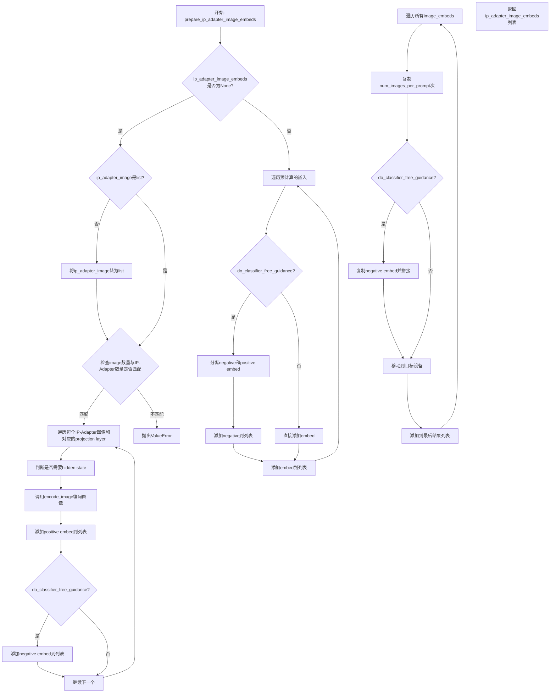

#### 带注释源码

```python
def prepare_ip_adapter_image_embeds(
    self, ip_adapter_image, ip_adapter_image_embeds, device, num_images_per_prompt, do_classifier_free_guidance
):
    """
    准备IP-Adapter的图像嵌入。
    
    该方法处理两种输入模式：
    1. 当ip_adapter_image_embeds为None时，从ip_adapter_image编码生成嵌入
    2. 当ip_adapter_image_embeds不为None时，直接使用预计算的嵌入
    
    参数:
        ip_adapter_image: 输入图像，可以是单个图像或图像列表
        ip_adapter_image_embeds: 预计算的图像嵌入（可选）
        device: 目标设备
        num_images_per_prompt: 每个prompt生成的图像数量
        do_classifier_free_guidance: 是否使用无分类器指导
    
    返回:
        处理后的图像嵌入列表
    """
    # 初始化positive图像嵌入列表
    image_embeds = []
    
    # 如果使用无分类器指导，同时初始化negative图像嵌入列表
    if do_classifier_free_guidance:
        negative_image_embeds = []
    
    # 情况1: 需要从图像编码生成嵌入
    if ip_adapter_image_embeds is None:
        # 确保图像是列表格式
        if not isinstance(ip_adapter_image, list):
            ip_adapter_image = [ip_adapter_image]

        # 验证图像数量与IP-Adapter数量是否匹配
        # 通过检查unet中的encoder_hid_proj的image_projection_layers数量
        if len(ip_adapter_image) != len(self.unet.encoder_hid_proj.image_projection_layers):
            raise ValueError(
                f"`ip_adapter_image` must have same length as the number of IP Adapters. Got {len(ip_adapter_image)} images and {len(self.unet.encoder_hid_proj.image_projection_layers)} IP Adapters."
            )

        # 遍历每个IP-Adapter的图像和对应的投影层
        for single_ip_adapter_image, image_proj_layer in zip(
            ip_adapter_image, self.unet.encoder_hid_proj.image_projection_layers
        ):
            # 判断是否需要输出hidden states
            # 如果image_proj_layer不是ImageProjection类型，则需要hidden states
            output_hidden_state = not isinstance(image_proj_layer, ImageProjection)
            
            # 调用encode_image方法编码单个图像
            # 返回positive和negative（如果启用CFG）图像嵌入
            single_image_embeds, single_negative_image_embeds = self.encode_image(
                single_ip_adapter_image, device, 1, output_hidden_state
            )

            # 添加batch维度并存储positive嵌入
            # [1, seq_len, hidden_dim] 格式
            image_embeds.append(single_image_embeds[None, :])
            
            # 如果启用CFG，同时存储negative嵌入
            if do_classifier_free_guidance:
                negative_image_embeds.append(single_negative_image_embeds[None, :])
    else:
        # 情况2: 直接使用预计算的嵌入
        # 遍历预计算的嵌入
        for single_image_embeds in ip_adapter_image_embeds:
            if do_classifier_free_guidance:
                # 预计算嵌入通常包含positive和negative两部分
                # 通过chunk(2)分离它们
                single_negative_image_embeds, single_image_embeds = single_image_embeds.chunk(2)
                negative_image_embeds.append(single_negative_image_embeds)
            
            # 添加positive嵌入
            image_embeds.append(single_image_embeds)

    # 处理每个嵌入：复制num_images_per_prompt次并移动到目标设备
    ip_adapter_image_embeds = []
    for i, single_image_embeds in enumerate(image_embeds):
        # 复制positive嵌入num_images_per_prompt次
        single_image_embeds = torch.cat([single_image_embeds] * num_images_per_prompt, dim=0)
        
        # 如果启用CFG，同时处理negative嵌入
        if do_classifier_free_guidance:
            # 复制negative嵌入
            single_negative_image_embeds = torch.cat([negative_image_embeds[i]] * num_images_per_prompt, dim=0)
            # 拼接negative（前面）和positive（后面）嵌入
            # 格式: [negative_embed, positive_embed]
            single_image_embeds = torch.cat([single_negative_image_embeds, single_image_embeds], dim=0)

        # 将嵌入移动到目标设备
        single_image_embeds = single_image_embeds.to(device=device)
        
        # 添加到结果列表
        ip_adapter_image_embeds.append(single_image_embeds)

    return ip_adapter_image_embeds
```


### `StableDiffusionXLControlNetUnionInpaintPipeline.prepare_extra_step_kwargs`

该方法用于准备调度器（scheduler）的额外参数。由于不同的调度器可能有不同的签名，该方法通过检查调度器的 `step` 方法是否接受特定参数（如 `eta` 和 `generator`），动态构建需要传递给调度器的参数字典。

参数：

- `self`：`StableDiffusionXLControlNetUnionInpaintPipeline` 实例，管道对象本身
- `generator`：`torch.Generator | list[torch.Generator] | None`，随机数生成器，用于确保生成的可重复性
- `eta`：`float`，DDIM 调度器的参数 η（对应 DDIM 论文中的 η），取值范围 [0, 1]

返回值：`dict[str, Any]`，包含调度器 `step` 方法所需额外参数的字典，可能包含 `eta` 和/或 `generator` 键

#### 流程图

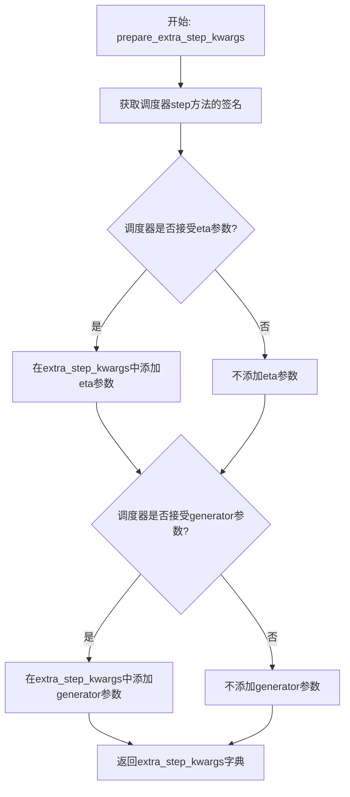

#### 带注释源码

```python
def prepare_extra_step_kwargs(self, generator, eta):
    """
    准备调度器的额外参数。
    
    由于并非所有调度器都具有相同的签名，此方法检查调度器的 step 方法
    是否接受特定参数（eta 和 generator），并相应地构建参数字典。
    
    参数:
        generator: torch.Generator | list[torch.Generator] | None
            随机数生成器，用于确保生成过程的可重复性
        eta: float
            DDIM 调度器的 η 参数，仅被 DDIMScheduler 使用，
            其他调度器会忽略此参数。对应 DDIM 论文中的 η，
            取值范围应为 [0, 1]
    
    返回:
        dict: 包含调度器 step 方法所需额外参数的字典
    """
    
    # 通过 inspect 模块获取调度器 step 方法的签名参数
    # 检查调度器是否接受 eta 参数
    accepts_eta = "eta" in set(inspect.signature(self.scheduler.step).parameters.keys())
    
    # 初始化额外的参数字典
    extra_step_kwargs = {}
    
    # 如果调度器接受 eta 参数，则将其添加到 extra_step_kwargs 中
    # eta 主要用于 DDIMScheduler，对于其他调度器会被忽略
    if accepts_eta:
        extra_step_kwargs["eta"] = eta

    # 检查调度器是否接受 generator 参数
    # 某些调度器（如 DPMSolverMultistepScheduler）支持通过 generator 控制随机性
    accepts_generator = "generator" in set(inspect.signature(self.scheduler.step).parameters.keys())
    
    # 如果调度器接受 generator 参数，则将其添加到 extra_step_kwargs 中
    if accepts_generator:
        extra_step_kwargs["generator"] = generator
    
    # 返回构建好的参数字典，供调度器 step 方法使用
    return extra_step_kwargs
```


### `StableDiffusionXLControlNetUnionInpaintPipeline.check_image`

该方法用于验证输入图像的类型是否符合要求，并检查图像批次大小与提示批次大小是否兼容，确保数据一致性。

参数：

- `image`：输入图像，支持 PIL.Image.Image、torch.Tensor、numpy.ndarray 或这些类型的列表
- `prompt`：文本提示，支持字符串或字符串列表
- `prompt_embeds`：预生成的文本嵌入，torch.Tensor 或 None

返回值：`None`，该方法不返回任何值，仅进行输入验证

#### 流程图

```mermaid
flowchart TD
    A[开始 check_image] --> B{检查 image 类型}
    B --> C{image 是 PIL.Image?}
    C -->|是| D[设置 image_batch_size = 1]
    C -->|否| E[设置 image_batch_size = len(image)]
    B --> F{检查 prompt 类型}
    F --> G{prompt 是 str?}
    G -->|是| H[设置 prompt_batch_size = 1]
    G -->|否| I{prompt 是 list?}
    I -->|是| J[设置 prompt_batch_size = len(prompt)]
    I -->|否| K{prompt_embeds 不为 None?}
    K -->|是| L[设置 prompt_batch_size = prompt_embeds.shape[0]]
    K -->|否| M[prompt_batch_size 未定义]
    D --> N{验证批次大小}
    E --> N
    H --> N
    J --> N
    L --> N
    M --> N
    N --> O{image_batch_size != 1 且 != prompt_batch_size?}
    O -->|是| P[抛出 ValueError]
    O -->|否| Q[验证通过]
    P --> R[结束]
    Q --> R
```

#### 带注释源码

```
def check_image(self, image, prompt, prompt_embeds):
    # 检查 image 是否为 PIL.Image.Image 类型
    image_is_pil = isinstance(image, PIL.Image.Image)
    # 检查 image 是否为 torch.Tensor 类型
    image_is_tensor = isinstance(image, torch.Tensor)
    # 检查 image 是否为 numpy.ndarray 类型
    image_is_np = isinstance(image, np.ndarray)
    # 检查 image 是否为 PIL.Image.Image 列表
    image_is_pil_list = isinstance(image, list) and isinstance(image[0], PIL.Image.Image)
    # 检查 image 是否为 torch.Tensor 列表
    image_is_tensor_list = isinstance(image, list) and isinstance(image[0], torch.Tensor)
    # 检查 image 是否为 numpy.ndarray 列表
    image_is_np_list = isinstance(image, list) and isinstance(image[0], np.ndarray)

    # 如果 image 不是以上任何一种类型，抛出 TypeError
    if (
        not image_is_pil
        and not image_is_tensor
        and not image_is_np
        and not image_is_pil_list
        and not image_is_tensor_list
        and not image_is_np_list
    ):
        raise TypeError(
            f"image must be passed and be one of PIL image, numpy array, torch tensor, list of PIL images, list of numpy arrays or list of torch tensors, but is {type(image)}"
        )

    # 如果 image 是 PIL 图片，批次大小为 1，否则为列表长度
    if image_is_pil:
        image_batch_size = 1
    else:
        image_batch_size = len(image)

    # 根据 prompt 或 prompt_embeds 确定 prompt 的批次大小
    if prompt is not None and isinstance(prompt, str):
        prompt_batch_size = 1
    elif prompt is not None and isinstance(prompt, list):
        prompt_batch_size = len(prompt)
    elif prompt_embeds is not None:
        prompt_batch_size = prompt_embeds.shape[0]

    # 如果 image 批次大小不为 1，必须与 prompt 批次大小相同
    if image_batch_size != 1 and image_batch_size != prompt_batch_size:
        raise ValueError(
            f"If image batch size is not 1, image batch size must be same as prompt batch size. image batch size: {image_batch_size}, prompt batch size: {prompt_batch_size}"
        )
```


### `StableDiffusionXLControlNetUnionInpaintPipeline.check_inputs`

该方法负责在调用 Stable Diffusion XL ControlNet 联合修复管道之前验证所有输入参数的有效性。它执行全面的参数检查，包括提示词与嵌入的互斥性、数值范围验证、图像与控制模式的批次一致性、IP Adapter 配置检查等，确保管道能够正确执行而不会出现运行时错误。

参数：

- `prompt`：`str | list[str] | None`，主提示词，用于引导图像生成
- `prompt_2`：`str | list[str] | None`，发送给第二个分词器和文本编码器的提示词
- `image`：`PipelineImageInput`，待修复的输入图像
- `mask_image`：`PipelineImageInput`，用于遮盖图像的掩码
- `strength`：`float`，修复强度，控制在 0.0 到 1.0 之间
- `num_inference_steps`：`int`，去噪步数，必须为正整数
- `callback_steps`：`int | None`，回调步数，必须为正整数（如果提供）
- `output_type`：`str`，输出类型，如 "pil"、"numpy" 等
- `negative_prompt`：`str | list[str] | None`，负面提示词
- `negative_prompt_2`：`str | list[str] | None`，第二个负面提示词
- `prompt_embeds`：`torch.Tensor | None`，预生成的文本嵌入
- `negative_prompt_embeds`：`torch.Tensor | None`，预生成的负面文本嵌入
- `ip_adapter_image`：`PipelineImageInput | None`，IP Adapter 图像输入
- `ip_adapter_image_embeds`：`list[torch.Tensor] | None`，IP Adapter 图像嵌入
- `pooled_prompt_embeds`：`torch.Tensor | None`，池化后的提示词嵌入
- `negative_pooled_prompt_embeds`：`torch.Tensor | None`，池化后的负面提示词嵌入
- `controlnet_conditioning_scale`：`float | list[float]`，ControlNet 条件尺度
- `control_guidance_start`：`float | list[float]`，ControlNet 开始应用的步骤比例
- `control_guidance_end`：`float | list[float]`，ControlNet 停止应用的步骤比例
- `control_mode`：`int | list[int] | list[list[int]] | None`，ControlNet 控制模式
- `callback_on_step_end_tensor_inputs`：`list[str] | None`，步骤结束回调的张量输入列表
- `padding_mask_crop`：`int | None`，修复掩码裁剪的边距大小

返回值：`None`，该方法不返回值，仅通过抛出异常来处理验证错误

#### 流程图

```mermaid
flowchart TD
    A[开始 check_inputs 验证] --> B{strength 在 [0, 1] 范围?}
    B -->|否| B1[抛出 ValueError]
    B -->|是| C{num_inference_steps 有效?}
    C -->|否| C1[抛出 ValueError]
    C -->|是| D{callback_steps 有效?}
    D -->|否| D1[抛出 ValueError]
    D -->|是| E{callback_on_step_end_tensor_inputs 有效?}
    E -->|否| E1[抛出 ValueError]
    E -->|是| F{prompt 和 prompt_embeds 互斥?}
    F -->|否| F1[抛出 ValueError]
    F -->|是| G{prompt_2 和 prompt_embeds 互斥?}
    G -->|否| G1[抛出 ValueError]
    G -->|是| H{prompt 和 prompt_embeds 至少提供一个?}
    H -->|否| H1[抛出 ValueError]
    H -->|是| I{prompt 类型有效?}
    I -->|否| I1[抛出 ValueError]
    I -->|是| J{negative_prompt 和 negative_prompt_embeds 互斥?}
    J -->|否| J1[抛出 ValueError]
    J -->|是| K{negative_prompt_2 和 negative_prompt_embeds 互斥?}
    K -->|否| K1[抛出 ValueError]
    K -->|是| L{prompt_embeds 和 negative_prompt_embeds 形状匹配?}
    L -->|否| L1[抛出 ValueError]
    L -->|是| M{padding_mask_crop 是否设置?}
    M -->|是| M1{image 是 PIL Image?}
    M1 -->|否| M2[抛出 ValueError]
    M1 -->|是| M3{mask_image 是 PIL Image?}
    M3 -->|否| M4[抛出 ValueError]
    M3 -->|是| M5{output_type 是 'pil'?]
    M5 -->|否| M6[抛出 ValueError]
    M5 -->|是| N{prompt_embeds 和 pooled_prompt_embeds 配对检查]
    N -->|不匹配| N1[抛出 ValueError]
    N -->|匹配| O{negative_prompt_embeds 和 negative_pooled_prompt_embeds 配对检查]
    O -->|不匹配| O1[抛出 ValueError]
    O -->|匹配| P{检查 control_guidance_start/end 列表一致性}
    P -->|不一致| P1[抛出 ValueError]
    P -->|一致| Q{检查 control_mode 有效性]
    Q -->|无效| Q1[抛出 ValueError]
    Q -->|有效| R{检查 image 和 control_mode 长度匹配}
    R -->|不匹配| R1[抛出 ValueError]
    R -->|匹配| S{检查 ip_adapter_image 和 ip_adapter_image_embeds 互斥}
    S -->|都提供| S1[抛出 ValueError]
    S -->|互斥| T{检查 ip_adapter_image_embeds 维度}
    T -->|无效| T1[抛出 ValueError]
    T -->|有效| U[验证通过]
```

#### 带注释源码

```python
def check_inputs(
    self,
    prompt,
    prompt_2,
    image,
    mask_image,
    strength,
    num_inference_steps,
    callback_steps,
    output_type,
    negative_prompt=None,
    negative_prompt_2=None,
    prompt_embeds=None,
    negative_prompt_embeds=None,
    ip_adapter_image=None,
    ip_adapter_image_embeds=None,
    pooled_prompt_embeds=None,
    negative_pooled_prompt_embeds=None,
    controlnet_conditioning_scale=1.0,
    control_guidance_start=0.0,
    control_guidance_end=1.0,
    control_mode=None,
    callback_on_step_end_tensor_inputs=None,
    padding_mask_crop=None,
):
    """
    检查并验证所有输入参数的有效性。
    该方法在管道执行前被调用，确保所有参数都符合预期。
    """
    
    # 验证 strength 参数必须在 [0, 1] 范围内
    if strength < 0 or strength > 1:
        raise ValueError(f"The value of strength should in [0.0, 1.0] but is {strength}")
    
    # 验证 num_inference_steps 不能为 None 且必须为正整数
    if num_inference_steps is None:
        raise ValueError("`num_inference_steps` cannot be None.")
    elif not isinstance(num_inference_steps, int) or num_inference_steps <= 0:
        raise ValueError(
            f"`num_inference_steps` has to be a positive integer but is {num_inference_steps} of type"
            f" {type(num_inference_steps)}."
        )

    # 验证 callback_steps 如果提供必须为正整数
    if callback_steps is not None and (not isinstance(callback_steps, int) or callback_steps <= 0):
        raise ValueError(
            f"`callback_steps` has to be a positive integer but is {callback_steps} of type"
            f" {type(callback_steps)}."
        )

    # 验证 callback_on_step_end_tensor_inputs 必须在允许的列表中
    if callback_on_step_end_tensor_inputs is not None and not all(
        k in self._callback_tensor_inputs for k in callback_on_step_end_tensor_inputs
    ):
        raise ValueError(
            f"`callback_on_step_end_tensor_inputs` has to be in {self._callback_tensor_inputs}, but found {[k for k in callback_on_step_end_tensor_inputs if k not in self._callback_tensor_inputs]}"
        )

    # 验证 prompt 和 prompt_embeds 互斥，不能同时提供
    if prompt is not None and prompt_embeds is not None:
        raise ValueError(
            f"Cannot forward both `prompt`: {prompt} and `prompt_embeds`: {prompt_embeds}. Please make sure to"
            " only forward one of the two."
        )
    # 验证 prompt_2 和 prompt_embeds 互斥
    elif prompt_2 is not None and prompt_embeds is not None:
        raise ValueError(
            f"Cannot forward both `prompt_2`: {prompt_2} and `prompt_embeds`: {prompt_embeds}. Please make sure to"
            " only forward one of the two."
        )
    # 至少需要提供 prompt 或 prompt_embeds 之一
    elif prompt is None and prompt_embeds is None:
        raise ValueError(
            "Provide either `prompt` or `prompt_embeds`. Cannot leave both `prompt` and `prompt_embeds` undefined."
        )
    # 验证 prompt 类型必须是 str 或 list
    elif prompt is not None and (not isinstance(prompt, str) and not isinstance(prompt, list)):
        raise ValueError(f"`prompt` has to be of type `str` or `list` but is {type(prompt)}")
    # 验证 prompt_2 类型必须是 str 或 list
    elif prompt_2 is not None and (not isinstance(prompt_2, str) and not isinstance(prompt_2, list)):
        raise ValueError(f"`prompt_2` has to be of type `str` or `list` but is {type(prompt_2)}")

    # 验证 negative_prompt 和 negative_prompt_embeds 互斥
    if negative_prompt is not None and negative_prompt_embeds is not None:
        raise ValueError(
            f"Cannot forward both `negative_prompt`: {negative_prompt} and `negative_prompt_embeds`:"
            f" {negative_prompt_embeds}. Please make sure to only forward one of the two."
        )
    # 验证 negative_prompt_2 和 negative_prompt_embeds 互斥
    elif negative_prompt_2 is not None and negative_prompt_embeds is not None:
        raise ValueError(
            f"Cannot forward both `negative_prompt_2`: {negative_prompt_2} and `negative_prompt_embeds`:"
            f" {negative_prompt_embeds}. Please make sure to only forward one of the two."
        )

    # 验证 prompt_embeds 和 negative_prompt_embeds 形状必须一致
    if prompt_embeds is not None and negative_prompt_embeds is not None:
        if prompt_embeds.shape != negative_prompt_embeds.shape:
            raise ValueError(
                "`prompt_embeds` and `negative_prompt_embeds` must have the same shape when passed directly, but"
                f" got: `prompt_embeds` {prompt_embeds.shape} != `negative_prompt_embeds`"
                f" {negative_prompt_embeds.shape}."
            )

    # 如果提供了 padding_mask_crop，必须满足以下条件
    if padding_mask_crop is not None:
        # image 必须是 PIL Image
        if not isinstance(image, PIL.Image.Image):
            raise ValueError(
                f"The image should be a PIL image when inpainting mask crop, but is of type {type(image)}."
            )
        # mask_image 必须是 PIL Image
        if not isinstance(mask_image, PIL.Image.Image):
            raise ValueError(
                f"The mask image should be a PIL image when inpainting mask crop, but is of type"
                f" {type(mask_image)}."
            )
        # output_type 必须是 "pil"
        if output_type != "pil":
            raise ValueError(f"The output type should be PIL when inpainting mask crop, but is {output_type}.")

    # 如果提供了 prompt_embeds，也必须提供 pooled_prompt_embeds
    if prompt_embeds is not None and pooled_prompt_embeds is None:
        raise ValueError(
            "If `prompt_embeds` are provided, `pooled_prompt_embeds` also have to be passed. Make sure to generate `pooled_prompt_embeds` from the same text encoder that was used to generate `prompt_embeds`."
        )

    # 如果提供了 negative_prompt_embeds，也必须提供 negative_pooled_prompt_embeds
    if negative_prompt_embeds is not None and negative_pooled_prompt_embeds is None:
        raise ValueError(
            "If `negative_prompt_embeds` are provided, `negative_pooled_prompt_embeds` also have to be passed. Make sure to generate `negative_pooled_prompt_embeds` from the same text encoder that was used to generate `negative_prompt_embeds`."
        )

    # 对于多个 ControlNet 的情况，发出警告
    if isinstance(self.controlnet, MultiControlNetUnionModel):
        if isinstance(prompt, list):
            logger.warning(
                f"You have {len(self.controlnet.nets)} ControlNets and you have passed {len(prompt)}"
                " prompts. The conditionings will be fixed across the prompts."
            )

    # 获取原始的 controlnet（如果是编译模块）
    controlnet = self.controlnet._orig_mod if is_compiled_module(self.controlnet) else self.controlnet

    # 检查 image 参数的有效性
    if isinstance(controlnet, ControlNetUnionModel):
        for image_ in image:
            self.check_image(image_, prompt, prompt_embeds)
    elif isinstance(controlnet, MultiControlNetUnionModel):
        if not isinstance(image, list):
            raise TypeError("For multiple controlnets: `image` must be type `list`")
        elif not all(isinstance(i, list) for i in image):
            raise ValueError("For multiple controlnets: elements of `image` must be list of conditionings.")
        elif len(image) != len(self.controlnet.nets):
            raise ValueError(
                f"For multiple controlnets: `image` must have the same length as the number of controlnets, but got {len(image)} images and {len(self.controlnet.nets)} ControlNets."
            )

        for images_ in image:
            for image_ in images_:
                self.check_image(image_, prompt, prompt_embeds)

    # 将 control_guidance_start 和 control_guidance_end 规范化为列表
    if not isinstance(control_guidance_start, (tuple, list)):
        control_guidance_start = [control_guidance_start]

    if not isinstance(control_guidance_end, (tuple, list)):
        control_guidance_end = [control_guidance_end]

    # 验证 control_guidance_start 和 control_guidance_end 长度一致
    if len(control_guidance_start) != len(control_guidance_end):
        raise ValueError(
            f"`control_guidance_start` has {len(control_guidance_start)} elements, but `control_guidance_end` has {len(control_guidance_end)} elements. Make sure to provide the same number of elements to each list."
        )

    # 对于多个 ControlNet，验证长度匹配
    if isinstance(controlnet, MultiControlNetUnionModel):
        if len(control_guidance_start) != len(self.controlnet.nets):
            raise ValueError(
                f"`control_guidance_start`: {control_guidance_start} has {len(control_guidance_start)} elements but there are {len(self.controlnet.nets)} controlnets available. Make sure to provide {len(self.controlnet.nets)}."
            )

    # 验证 control_guidance_start 和 control_guidance_end 的范围
    for start, end in zip(control_guidance_start, control_guidance_end):
        if start >= end:
            raise ValueError(
                f"control guidance start: {start} cannot be larger or equal to control guidance end: {end}."
            )
        if start < 0.0:
            raise ValueError(f"control guidance start: {start} can't be smaller than 0.")
        if end > 1.0:
            raise ValueError(f"control guidance end: {end} can't be larger than 1.0.")

    # 检查 control_mode 的有效性
    if isinstance(controlnet, ControlNetUnionModel):
        if max(control_mode) >= controlnet.config.num_control_type:
            raise ValueError(f"control_mode: must be lower than {controlnet.config.num_control_type}.")
    elif isinstance(controlnet, MultiControlNetUnionModel):
        for _control_mode, _controlnet in zip(control_mode, self.controlnet.nets):
            if max(_control_mode) >= _controlnet.config.num_control_type:
                raise ValueError(f"control_mode: must be lower than {_controlnet.config.num_control_type}.")

    # 验证 image 和 control_mode 长度匹配
    if isinstance(controlnet, ControlNetUnionModel):
        if len(image) != len(control_mode):
            raise ValueError("Expected len(control_image) == len(control_mode)")
    elif isinstance(controlnet, MultiControlNetUnionModel):
        if not all(isinstance(i, list) for i in control_mode):
            raise ValueError(
                "For multiple controlnets: elements of control_mode must be lists representing conditioning mode."
            )

        elif sum(len(x) for x in image) != sum(len(x) for x in control_mode):
            raise ValueError("Expected len(control_image) == len(control_mode)")

    # 验证 ip_adapter_image 和 ip_adapter_image_embeds 互斥
    if ip_adapter_image is not None and ip_adapter_image_embeds is not None:
        raise ValueError(
            "Provide either `ip_adapter_image` or `ip_adapter_image_embeds`. Cannot leave both `ip_adapter_image` and `ip_adapter_image_embeds` defined."
        )

    # 验证 ip_adapter_image_embeds 的有效性
    if ip_adapter_image_embeds is not None:
        if not isinstance(ip_adapter_image_embeds, list):
            raise ValueError(
                f"`ip_adapter_image_embeds` has to be of type `list` but is {type(ip_adapter_image_embeds)}"
            )
        elif ip_adapter_image_embeds[0].ndim not in [3, 4]:
            raise ValueError(
                f"`ip_adapter_image_embeds` has to be a list of 3D or 4D tensors but is {ip_adapter_image_embeds[0].ndim}D"
            )
```


### `StableDiffusionXLControlNetUnionInpaintPipeline.prepare_control_image`

该方法负责预处理控制网络（ControlNet）的输入图像，包括图像的尺寸调整、批处理重复、设备转移和数据类型转换，为扩散模型的推理过程准备符合条件格式的控制图像。

参数：

- `self`：`StableDiffusionXLControlNetUnionInpaintPipeline` 实例自身
- `image`：`PipelineImageInput`（PIL.Image.Image | torch.Tensor | np.ndarray | list），待处理 ControlNet 输入图像
- `width`：`int`，目标图像宽度（像素）
- `height`：`int`，目标图像高度（像素）
- `batch_size`：`int`，批处理大小，通常为 `batch_size * num_images_per_prompt`
- `num_images_per_prompt`：`int`，每个提示词生成的图像数量
- `device`：`torch.device`，目标设备（CPU/CUDA）
- `dtype`：`torch.dtype`，目标数据类型（如 torch.float16）
- `crops_coords`：`tuple[int, int]` 或 `None`，裁剪坐标（左上角位置）
- `resize_mode`：`str`，调整尺寸模式（"default" 或 "fill"）
- `do_classifier_free_guidance`：`bool`，是否启用无分类器引导（默认 False）
- `guess_mode`：`bool`，猜测模式标志（默认 False）

返回值：`torch.Tensor`，预处理后的 ControlNet 控制图像张量，形状为 `(B, C, H, W)`

#### 流程图

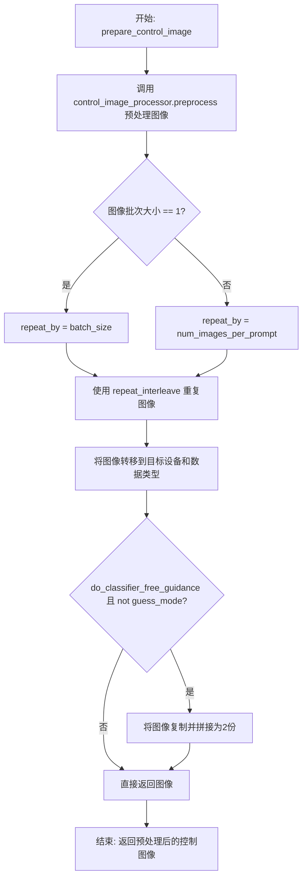

#### 带注释源码

```python
def prepare_control_image(
    self,
    image,
    width,
    height,
    batch_size,
    num_images_per_prompt,
    device,
    dtype,
    crops_coords,
    resize_mode,
    do_classifier_free_guidance=False,
    guess_mode=False,
):
    """
    预处理 ControlNet 输入图像：
    1. 使用 control_image_processor.preprocess 进行尺寸调整、归一化、通道转换
    2. 根据批次大小重复图像以匹配推理批次
    3. 转移至目标设备和数据类型
    4. 如果启用无分类器引导且非猜测模式，则复制图像用于条件/非条件推理
    """
    # Step 1: 预处理图像 - 调整尺寸、裁剪、转换通道
    image = self.control_image_processor.preprocess(
        image, height=height, width=width, crops_coords=crops_coords, resize_mode=resize_mode
    ).to(dtype=torch.float32)  # 预处理阶段使用 float32 避免精度问题
    
    # 获取预处理后图像的批次大小
    image_batch_size = image.shape[0]

    # Step 2: 确定需要重复的次数
    if image_batch_size == 1:
        # 单一图像需要复制以匹配完整批次
        repeat_by = batch_size
    else:
        # 图像批次已与提示词批次对齐，使用每提示词图像数重复
        repeat_by = num_images_per_prompt

    # 沿批次维度重复图像
    image = image.repeat_interleave(repeat_by, dim=0)

    # Step 3: 转移至目标设备和数据类型
    image = image.to(device=device, dtype=dtype)

    # Step 4: 无分类器引导处理 - 为条件/非条件各准备一份
    if do_classifier_free_guidance and not guess_mode:
        # 复制图像并拼接：[image, image] 用于后续 guidance
        image = torch.cat([image] * 2)

    return image
```


### `StableDiffusionXLControlNetUnionInpaintPipeline.prepare_latents`

该方法负责为图像修复（inpainting）流程准备初始的潜在向量（latents）。它根据输入参数（是否添加噪声、是否使用图像初始化、时间步等）生成或处理潜在向量，支持纯噪声初始化、图像+噪声混合初始化等多种模式，并可选择性地返回噪声和图像潜在向量供后续步骤使用。

参数：

- `batch_size`：`int`，批次大小，指定要生成的图像数量
- `num_channels_latents`：`int`，潜在向量的通道数，通常为 VAE 的潜在通道数
- `height`：`int`，生成图像的高度（像素单位）
- `width`：`int`，生成图像的宽度（像素单位）
- `dtype`：`torch.dtype`，潜在向量的数据类型
- `device`：`torch.device`，计算设备（CPU/CUDA）
- `generator`：`torch.Generator | list[torch.Generator] | None`，随机数生成器，用于确保可重复性
- `latents`：`torch.Tensor | None`，可选的预生成潜在向量，若提供则直接使用
- `image`：`torch.Tensor | None`，输入图像张量，用于图像修复任务
- `timestep`：`torch.Tensor | None`，噪声调度的时间步，用于混合噪声和图像
- `is_strength_max`：`bool`，是否使用最大强度（1.0），此时完全使用噪声初始化
- `add_noise`：`bool`，是否向潜在向量添加噪声
- `return_noise`：`bool`，是否在返回值中包含生成的噪声
- `return_image_latents`：`bool`，是否在返回值中包含图像潜在向量

返回值：`tuple`，返回包含潜在向量的元组，格式为 `(latents, noise?, image_latents?)`，其中 `noise` 和 `image_latents` 根据 `return_noise` 和 `return_image_latents` 参数决定是否包含

#### 流程图

```mermaid
flowchart TD
    A[开始 prepare_latents] --> B[计算 shape]
    B --> C{generator 长度是否匹配 batch_size?}
    C -->|否| D[抛出 ValueError]
    C -->|是| E{image 和 timestep 都为 None 且非 is_strength_max?}
    E -->|是| F[抛出 ValueError]
    E -->|否| G{return_image_latents 或<br/>latents 为 None 且非 is_strength_max?}
    G -->|否| H{latents 为 None 且 add_noise 为 True?}
    G -->|是| I[将 image 转为 dtype 和 device]
    I --> J{image.shape[1] == 4?}
    J -->|是| K[image_latents = image]
    J -->|否| L[调用 _encode_vae_image 编码]
    K --> M[重复 image_latents 以匹配 batch_size]
    L --> M
    H -->|否| N{add_noise 为 True?}
    H -->|是| O[生成噪声 randn_tensor]
    O --> P{is_strength_max?}
    P -->|是| Q[latents = noise]
    P -->|否| R[latents = scheduler.add_noise]
    Q --> S[latents = latents * init_noise_sigma]
    R --> S
    N -->|是| T[noise = latents.to device]
    T --> U[latents = noise * init_noise_sigma]
    N -->|否| V[生成噪声 randn_tensor]
    V --> W[latents = image_latents.to device]
    S --> X[构建输出元组]
    U --> X
    W --> X
    X --> Y{return_noise?}
    Y -->|是| Z[添加 noise 到输出]
    Y -->|否| AA{return_image_latents?}
    Z --> AA
    AA -->|是| AB[添加 image_latents 到输出]
    AA -->|否| AC[返回输出元组]
    D --> AC
    M --> AB
```

#### 带注释源码

```python
def prepare_latents(
    self,
    batch_size,
    num_channels_latents,
    height,
    width,
    dtype,
    device,
    generator,
    latents=None,
    image=None,
    timestep=None,
    is_strength_max=True,
    add_noise=True,
    return_noise=False,
    return_image_latents=False,
):
    # 计算潜在向量的形状：batch_size x channels x (height // vae_scale_factor) x (width // vae_scale_factor)
    # VAE 的缩放因子用于将像素空间映射到潜在空间
    shape = (
        batch_size,
        num_channels_latents,
        int(height) // self.vae_scale_factor,
        int(width) // self.vae_scale_factor,
    )
    
    # 检查 generator 列表长度是否与 batch_size 匹配
    if isinstance(generator, list) and len(generator) != batch_size:
        raise ValueError(
            f"You have passed a list of generators of length {len(generator)}, but requested an effective batch"
            f" size of {batch_size}. Make sure the batch size matches the length of the generators."
        )

    # 如果不是最大强度（即 strength < 1.0），则需要图像和时间步来初始化潜在向量
    # 因为此时需要将图像和噪声混合
    if (image is None or timestep is None) and not is_strength_max:
        raise ValueError(
            "Since strength < 1. initial latents are to be initialised as a combination of Image + Noise."
            "However, either the image or the noise timestep has not been provided."
        )

    # 准备图像潜在向量（如果需要）
    # 当 return_image_latents 为 True 或 latents 为 None 且非最大强度时，需要编码图像
    if return_image_latents or (latents is None and not is_strength_max):
        # 将图像转移到指定设备和数据类型
        image = image.to(device=device, dtype=dtype)

        # 如果图像已经是 4 通道潜在向量格式，直接使用
        # 否则使用 VAE 编码图像到潜在空间
        if image.shape[1] == 4:
            image_latents = image
        else:
            image_latents = self._encode_vae_image(image=image, generator=generator)
        
        # 重复图像潜在向量以匹配批次大小
        image_latents = image_latents.repeat(batch_size // image_latents.shape[0], 1, 1, 1)

    # 主逻辑：初始化潜在向量
    if latents is None and add_noise:
        # 情况1：无预提供潜在向量且需要添加噪声
        # 生成随机噪声
        noise = randn_tensor(shape, generator=generator, device=device, dtype=dtype)
        
        # 如果是最大强度，纯噪声初始化；否则混合图像和噪声
        # is_strength_max 为 True 时完全忽略原始图像
        latents = noise if is_strength_max else self.scheduler.add_noise(image_latents, noise, timestep)
        
        # 乘以调度器的初始噪声 sigma 进行缩放
        # 这是为了匹配训练时的噪声水平
        latents = latents * self.scheduler.init_noise_sigma if is_strength_max else latents
    elif add_noise:
        # 情况2：有预提供潜在向量但仍需添加噪声处理
        # 将潜在向量转移到设备并应用初始噪声 sigma
        noise = latents.to(device)
        latents = noise * self.scheduler.init_noise_sigma
    else:
        # 情况3：不添加噪声（直接使用图像潜在向量）
        # 用于不需要噪声调度的场景
        noise = randn_tensor(shape, generator=generator, device=device, dtype=dtype)
        latents = image_latents.to(device)

    # 构建返回值元组
    outputs = (latents,)

    # 可选：返回噪声（用于后续步骤如图像重建）
    if return_noise:
        outputs += (noise,)

    # 可选：返回图像潜在向量（用于掩码混合等操作）
    if return_image_latents:
        outputs += (image_latents,)

    return outputs
```


### `StableDiffusionXLControlNetUnionInpaintPipeline._encode_vae_image`

该方法用于将输入的图像编码为 VAE 潜空间（latent space）中的表示。它处理 VAE 的强制升采样（force_upcast），支持批量或单个生成器，并将编码后的潜在变量乘以缩放因子以适配扩散模型的潜空间。

参数：

- `self`：隐式参数，指向 pipeline 实例本身
- `image`：`torch.Tensor`，待编码的输入图像张量，形状为 (B, C, H, W)，通常为 4 通道 RGB 或单通道灰度图像
- `generator`：`torch.Generator`，PyTorch 随机数生成器，用于确保 VAE 编码的确定性；若为列表，则对批量图像的每个样本使用对应的生成器

返回值：`torch.Tensor`，编码后的图像潜在表示，形状为 (B, latent_channels, H//vae_scale_factor, W//vae_scale_factor)

#### 流程图

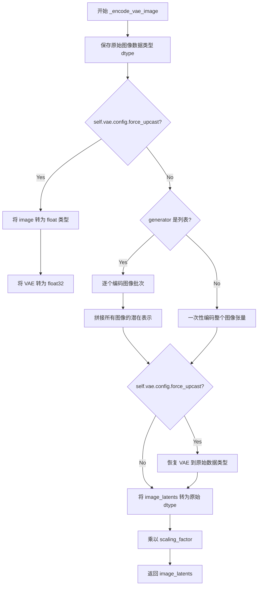

#### 带注释源码

```python
def _encode_vae_image(self, image: torch.Tensor, generator: torch.Generator):
    """
    将图像编码为 VAE 潜空间表示

    Args:
        image: 输入图像张量，形状为 (B, C, H, W)
        generator: 随机生成器，用于控制 VAE 编码的随机采样过程

    Returns:
        编码后的图像潜在表示
    """
    # 保存原始图像数据类型，用于后续恢复
    dtype = image.dtype

    # 如果 VAE 配置了 force_upcast，则需要将输入图像和 VAE 临时转为 float32
    # 这是为了避免在混合精度训练时出现精度溢出问题
    if self.vae.config.force_upcast:
        image = image.float()
        self.vae.to(dtype=torch.float32)

    # 根据生成器类型决定编码策略
    # 如果是列表，则对每个图像单独编码（每张图对应独立生成器）
    if isinstance(generator, list):
        # 使用列表推导逐个处理每张图像
        # retrieve_latents 函数负责从 VAE encoder output 中提取潜在分布的样本
        image_latents = [
            retrieve_latents(self.vae.encode(image[i : i + 1]), generator=generator[i])
            for i in range(image.shape[0])
        ]
        # 将列表中的所有潜在表示沿批次维度拼接
        image_latents = torch.cat(image_latents, dim=0)
    else:
        # 一次性编码整个图像批次
        image_latents = retrieve_latents(self.vae.encode(image), generator=generator)

    # 恢复 VAE 的原始数据类型（如果之前进行了升采样）
    if self.vae.config.force_upcast:
        self.vae.to(dtype)

    # 确保潜在表示的数据类型与原始图像一致
    image_latents = image_latents.to(dtype)

    # VAE 编码后的潜在表示需要乘以缩放因子才能用于扩散模型
    # 这是因为 VAE 在训练时使用了特定的缩放系数
    image_latents = self.vae.config.scaling_factor * image_latents

    return image_latents
```


### StableDiffusionXLControlNetUnionInpaintPipeline.prepare_mask_latents

该方法用于准备掩码（mask）和被掩码覆盖的图像（masked image）的潜在表示（latents）。它首先将输入的掩码调整到与潜在空间相匹配的大小，然后根据批量大小复制掩码以适配批量生成需求。如果存在被掩码覆盖的图像，该方法会使用VAE将其编码为潜在表示，并进行相同的批量大小调整和设备/数据类型转换。最后，根据是否启用无分类器指导（classifier-free guidance），该方法会返回处理后的掩码和被掩码覆盖的图像潜在表示。

参数：

- `mask`：`torch.Tensor`，输入的掩码张量，用于指示图像中需要修复的区域
- `masked_image`：`torch.Tensor`，被掩码覆盖的图像张量，即原始图像中被掩码遮挡的部分
- `batch_size`：`int`，批量大小，指定一次生成多少个样本
- `height`：`int`，输出图像的高度（像素单位）
- `width`：`int`，输出图像的宽度（像素单位）
- `dtype`：`torch.dtype`，指定张量的数据类型（如torch.float32、torch.float16等）
- `device`：`torch.device`，指定张量所在的设备（如CPU或CUDA设备）
- `generator`：`torch.Generator | None`，用于生成随机数的生成器，以确保可重复性
- `do_classifier_free_guidance`：`bool`，是否启用无分类器指导，启用时会对掩码进行复制以同时处理条件和非条件情况

返回值：`tuple[torch.Tensor, torch.Tensor | None]`，返回一个元组，包含处理后的掩码潜在表示和被掩码覆盖的图像潜在表示（如果提供了masked_image，否则为None）

#### 流程图

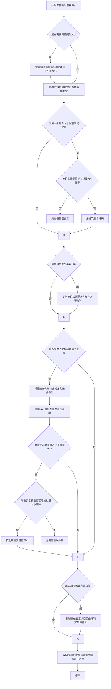

#### 带注释源码

```python
def prepare_mask_latents(
    self, mask, masked_image, batch_size, height, width, dtype, device, generator, do_classifier_free_guidance
):
    # 将掩码调整到潜在空间的大小，因为我们需要将掩码与潜在表示连接
    # 我们在转换为dtype之前执行此操作，以避免在使用cpu_offload和半精度时出现问题
    mask = torch.nn.functional.interpolate(
        mask, size=(height // self.vae_scale_factor, width // self.vae_scale_factor)
    )
    # 将掩码转移到目标设备和数据类型
    mask = mask.to(device=device, dtype=dtype)

    # 为每个提示生成复制掩码和被掩码覆盖的图像潜在表示，使用MPS友好的方法
    if mask.shape[0] < batch_size:
        # 检查掩码数量是否能被批量大小整除
        if not batch_size % mask.shape[0] == 0:
            raise ValueError(
                "The passed mask and the required batch size don't match. Masks are supposed to be duplicated to"
                f" a total batch size of {batch_size}, but {mask.shape[0]} masks were passed. Make sure the number"
                " of masks that you pass is divisible by the total requested batch size."
            )
        # 重复掩码以匹配批量大小
        mask = mask.repeat(batch_size // mask.shape[0], 1, 1, 1)

    # 如果启用无分类器指导，复制掩码以同时处理条件和非条件输入
    mask = torch.cat([mask] * 2) if do_classifier_free_guidance else mask

    # 初始化被掩码覆盖的图像潜在表示为None
    masked_image_latents = None
    if masked_image is not None:
        # 将被掩码覆盖的图像转移到目标设备和数据类型
        masked_image = masked_image.to(device=device, dtype=dtype)
        # 使用VAE编码被掩码覆盖的图像为潜在表示
        masked_image_latents = self._encode_vae_image(masked_image, generator=generator)
        
        # 如果潜在表示数量小于批量大小，进行复制调整
        if masked_image_latents.shape[0] < batch_size:
            if not batch_size % masked_image_latents.shape[0] == 0:
                raise ValueError(
                    "The passed images and the required batch size don't match. Images are supposed to be duplicated"
                    f" to a total batch size of {batch_size}, but {masked_image_latents.shape[0]} images were passed."
                    " Make sure the number of images that you pass is divisible by the total requested batch size."
                )
            # 重复潜在表示以匹配批量大小
            masked_image_latents = masked_image_latents.repeat(
                batch_size // masked_image_latents.shape[0], 1, 1, 1
            )

        # 如果启用无分类器指导，复制潜在表示以同时处理条件和非条件输入
        masked_image_latents = (
            torch.cat([masked_image_latents] * 2) if do_classifier_free_guidance else masked_image_latents
        )

        # 将潜在表示对齐到目标设备以防止连接时出现设备错误
        masked_image_latents = masked_image_latents.to(device=device, dtype=dtype)

    # 返回处理后的掩码和被掩码覆盖的图像潜在表示
    return mask, masked_image_latents
```


### `StableDiffusionXLControlNetUnionInpaintPipeline.get_timesteps`

该方法用于根据推理步数、强度和可选的去噪起始点，计算并返回扩散模型的时间步序列。它处理两种场景：当直接指定去噪起始点时，根据该起始点计算时间步；否则，根据强度(strength)参数计算时间步。最后还会调整调度器的起始索引。

参数：

- `num_inference_steps`：`int`，推理过程中的去噪步数
- `strength`：`float`，图像处理的强度值，介于0和1之间，控制添加噪声的程度
- `device`：`torch.device`，计算设备
- `denoising_start`：`float | None`，可选参数，指定去噪过程的起始点（0.0到1.0之间的分数），如果为None则使用strength参数

返回值：`tuple[torch.Tensor, int]`，返回元组包含计算得到的时间步序列和实际推理步数

#### 流程图

```mermaid
flowchart TD
    A[开始 get_timesteps] --> B{denoising_start is None?}
    B -->|Yes| C[根据strength计算]
    B -->|No| D[根据denoising_start计算]
    
    C --> C1[init_timestep = min<br/>num_inference_steps × strength]
    C1 --> C2[t_start = num_inference_steps<br/>- init_timestep]
    C2 --> C3[timesteps = scheduler.timesteps<br/>[t_start * order:]]
    C3 --> C4[设置scheduler起始索引<br/>set_begin_index]
    C4 --> C5[返回timesteps和<br/>num_inference_steps - t_start]
    
    D --> D1[计算discrete_timestep_cutoff]
    D1 --> D2[计算num_inference_steps<br/>timesteps < cutoff的数量]
    D2 --> D3{scheduler.order == 2<br/>且 num_inference_steps 为偶数?}
    D3 -->|Yes| D4[num_inference_steps += 1]
    D3 -->|No| D5
    D4 --> D5[t_start = len(timesteps)<br/>- num_inference_steps]
    D5 --> D6[timesteps = scheduler.timesteps<br/>[t_start:]]
    D6 --> D7[设置scheduler起始索引<br/>set_begin_index]
    D7 --> C5
```

#### 带注释源码

```python
def get_timesteps(self, num_inference_steps, strength, device, denoising_start=None):
    """
    计算并返回用于去噪过程的时间步序列。
    
    参数:
        num_inference_steps: 推理过程中的去噪步数
        strength: 图像处理强度 (0-1)
        device: 计算设备
        denoising_start: 可选的去噪起始点 (0.0-1.0)
    
    返回:
        tuple: (时间步序列, 实际推理步数)
    """
    # 场景1: 未指定denoising_start，使用strength计算时间步
    if denoising_start is None:
        # 根据强度计算初始时间步数
        init_timestep = min(int(num_inference_steps * strength), num_inference_steps)
        # 计算起始索引
        t_start = max(num_inference_steps - init_timestep, 0)
        
        # 从调度器获取时间步序列
        timesteps = self.scheduler.timesteps[t_start * self.scheduler.order :]
        
        # 设置调度器的起始索引（如果支持）
        if hasattr(self.scheduler, "set_begin_index"):
            self.scheduler.set_begin_index(t_start * self.scheduler.order)
        
        return timesteps, num_inference_steps - t_start
    
    # 场景2: 直接指定了denoising_start
    else:
        # 强度在此场景下无关，由denoising_start决定
        # 计算离散时间步截止点
        discrete_timestep_cutoff = int(
            round(
                self.scheduler.config.num_train_timesteps
                - (denoising_start * self.scheduler.config.num_train_timesteps)
            )
        )
        
        # 计算满足条件的时间步数量
        num_inference_steps = (self.scheduler.timesteps < discrete_timestep_cutoff).sum().item()
        
        # 对于二阶调度器的特殊处理
        if self.scheduler.order == 2 and num_inference_steps % 2 == 0:
            # 避免在去噪步骤中间切片导致错误
            num_inference_steps = num_inference_steps + 1
        
        # 从末尾切片时间步
        t_start = len(self.scheduler.timesteps) - num_inference_steps
        timesteps = self.scheduler.timesteps[t_start:]
        
        # 设置调度器的起始索引（如果支持）
        if hasattr(self.scheduler, "set_begin_index"):
            self.scheduler.set_begin_index(t_start)
        
        return timesteps, num_inference_steps
```


### `StableDiffusionXLControlNetUnionInpaintPipeline._get_add_time_ids`

该方法用于生成 Stable Diffusion XL 模型的附加时间标识（additional time IDs），这些标识包含了原始图像尺寸、裁剪坐标、目标尺寸以及美学评分等信息，用于微调条件扩散过程中的时间嵌入。

参数：

- `original_size`：`tuple[int, int]`，原始图像的尺寸 (宽度, 高度)
- `crops_coords_top_left`：`tuple[int, int]`，裁剪坐标的左上角位置
- `target_size`：`tuple[int, int]`，目标图像的尺寸 (宽度, 高度)
- `aesthetic_score`：`float`，正向美学评分，用于影响生成图像的美学质量
- `negative_aesthetic_score`：`float`，负向美学评分，用于反向条件
- `dtype`：`torch.dtype`，输出张量的数据类型
- `text_encoder_projection_dim`：`int | None`，文本编码器的投影维度，默认为 None

返回值：`tuple[torch.Tensor, torch.Tensor]`，返回两个张量，分别是正向和负向的附加时间标识

#### 流程图

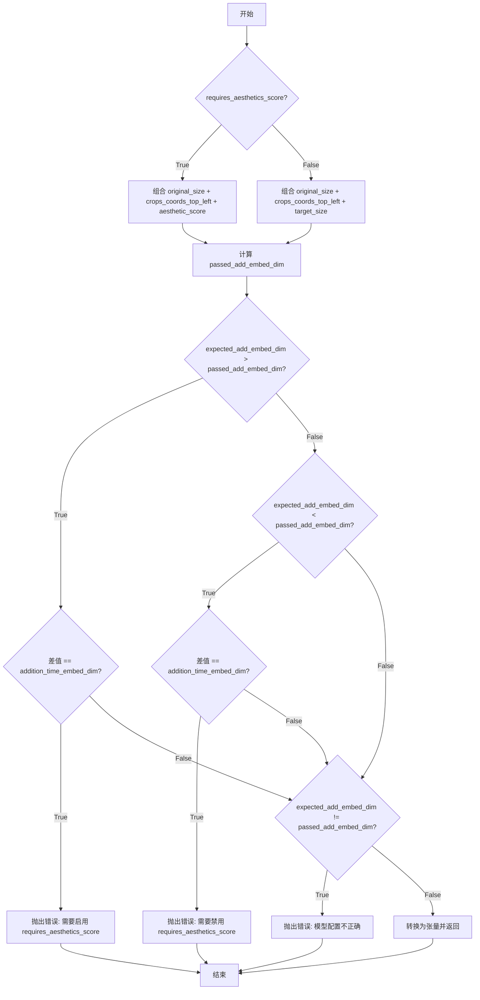

#### 带注释源码

```python
def _get_add_time_ids(
    self,
    original_size,
    crops_coords_top_left,
    target_size,
    aesthetic_score,
    negative_aesthetic_score,
    dtype,
    text_encoder_projection_dim=None,
):
    # 根据 requires_aesthetics_score 配置决定时间ID的组成
    if self.config.requires_aesthetics_score:
        # 使用美学评分而非目标尺寸
        add_time_ids = list(original_size + crops_coords_top_left + (aesthetic_score,))
        add_neg_time_ids = list(original_size + crops_coords_top_left + (negative_aesthetic_score,))
    else:
        # 使用目标尺寸
        add_time_ids = list(original_size + crops_coords_top_left + target_size)
        add_neg_time_ids = list(original_size + crops_coords_top_left + target_size)

    # 计算实际传入的嵌入维度
    # 公式: addition_time_embed_dim * 时间ID数量 + 文本编码器投影维度
    passed_add_embed_dim = (
        self.unet.config.addition_time_embed_dim * len(add_time_ids) + text_encoder_projection_dim
    )
    
    # 获取模型期望的嵌入维度
    expected_add_embed_dim = self.unet.add_embedding.linear_1.in_features

    # 验证维度匹配，根据不匹配情况抛出相应的错误信息
    if (
        expected_add_embed_dim > passed_add_embed_dim
        and (expected_add_embed_dim - passed_add_embed_dim) == self.unet.config.addition_time_embed_dim
    ):
        raise ValueError(
            f"Model expects an added time embedding vector of length {expected_add_embed_dim}, but a vector of {passed_add_embed_dim} was created. Please make sure to enable `requires_aesthetics_score` with `pipe.register_to_config(requires_aesthetics_score=True)` to make sure `aesthetic_score` {aesthetic_score} and `negative_aesthetic_score` {negative_aesthetic_score} is correctly used by the model."
        )
    elif (
        expected_add_embed_dim < passed_add_embed_dim
        and (passed_add_embed_dim - expected_add_embed_dim) == self.unet.config.addition_time_embed_dim
    ):
        raise ValueError(
            f"Model expects an added time embedding vector of length {expected_add_embed_dim}, but a vector of {passed_add_embed_dim} was created. Please make sure to disable `requires_aesthetics_score` with `pipe.register_to_config(requires_aesthetics_score=False)` to make sure `target_size` {target_size} is correctly used by the model."
        )
    elif expected_add_embed_dim != passed_add_embed_dim:
        raise ValueError(
            f"Model expects an added time embedding vector of length {expected_add_embed_dim}, but a vector of {passed_add_embed_dim} was created. The model has an incorrect config. Please check `unet.config.time_embedding_type` and `text_encoder_2.config.projection_dim`."
        )

    # 将列表转换为 PyTorch 张量
    add_time_ids = torch.tensor([add_time_ids], dtype=dtype)
    add_neg_time_ids = torch.tensor([add_neg_time_ids], dtype=dtype)

    return add_time_ids, add_neg_time_ids
```


### `StableDiffusionXLControlNetUnionInpaintPipeline.upcast_vae`

该方法是一个已弃用的工具方法，用于将 VAE（变分自编码器）模型强制转换为 float32 数据类型，以防止在 float16 模式下运行时发生数值溢出。该方法已被标记为弃用，建议用户直接使用 `pipe.vae.to(torch.float32)` 替代。

参数： 无（仅包含隐式参数 `self`）

返回值：`None`，无返回值（该方法直接修改 VAE 模型的状态）

#### 流程图

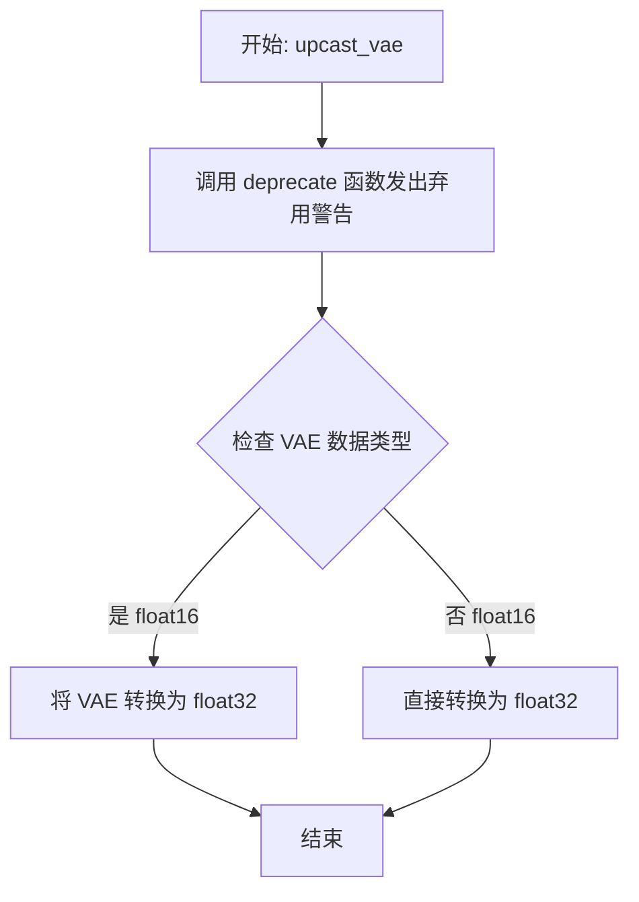

#### 带注释源码

```python
def upcast_vae(self):
    """
    将 VAE 模型上转换为 float32 类型。
    
    此方法已被弃用，因为在 float16 模式下 VAE 可能会发生数值溢出。
    建议直接使用 pipe.vae.to(torch.float32) 替代。
    """
    # 发出弃用警告，告知用户该方法将在 1.0.0 版本移除
    deprecate(
        "upcast_vae",                          # 被弃用的方法名称
        "1.0.0",                               # 弃用版本号
        "`upcast_vae` is deprecated. Please use `pipe.vae.to(torch.float32)`. For more details, please refer to: https://github.com/huggingface/diffusers/pull/12619#issue-3606633695.",  # 弃用消息和替代方案
    )
    # 将 VAE 模型转换为 float32 数据类型，防止数值溢出
    self.vae.to(dtype=torch.float32)
```


### StableDiffusionXLControlNetUnionInpaintPipeline.__call__

该方法是 Stable Diffusion XL ControlNet 联合修复管道的核心推理方法，通过结合文本提示、控制网络引导和掩码修复技术，实现高质量的图像修复生成。

参数：

- `prompt`：`str | list[str] | None`，用于指导图像生成的主提示词
- `prompt_2`：`str | list[str] | None`，发送给第二个文本编码器的提示词
- `image`：`PipelineImageInput`，待修复的输入图像
- `mask_image`：`PipelineImageInput`，指定修复区域的掩码图像
- `control_image`：`PipelineImageInput | list[PipelineImageInput]`，控制网络的条件图像
- `height`：`int | None`，生成图像的高度（像素）
- `width`：`int | None`，生成图像的宽度（像素）
- `padding_mask_crop`：`int | None`，掩码裁剪的边距大小
- `strength`：`float`，对参考图像的变换程度（0-1）
- `num_inference_steps`：`int`，去噪步数
- `denoising_start`：`float | None`，去噪开始的分数
- `denoising_end`：`float | None`，去噪结束的时刻分数
- `guidance_scale`：`float`，分类器自由引导的权重
- `negative_prompt`：`str | list[str] | None`，负面提示词
- `negative_prompt_2`：`str | list[str] | None`，第二个负面提示词
- `num_images_per_prompt`：`int`，每个提示词生成的图像数量
- `eta`：`float`，DDIM 调度器的 eta 参数
- `generator`：`torch.Generator | list[torch.Generator] | None`，随机数生成器
- `latents`：`torch.Tensor | None`，预生成的噪声潜在向量
- `prompt_embeds`：`torch.Tensor | None`，预生成的文本嵌入
- `negative_prompt_embeds`：`torch.Tensor | None`，预生成的负面文本嵌入
- `ip_adapter_image`：`PipelineImageInput | None`，IP Adapter 图像输入
- `ip_adapter_image_embeds`：`list[torch.Tensor] | None`，IP Adapter 图像嵌入
- `pooled_prompt_embeds`：`torch.Tensor | None`，池化文本嵌入
- `negative_pooled_prompt_embeds`：`torch.Tensor | None`，负面池化文本嵌入
- `output_type`：`str | None`，输出格式（"pil" 或其他）
- `return_dict`：`bool`，是否返回字典格式结果
- `cross_attention_kwargs`：`dict[str, Any] | None`，交叉注意力参数
- `controlnet_conditioning_scale`：`float | list[float]`，ControlNet 条件缩放因子
- `guess_mode`：`bool`，ControlNet 猜测模式
- `control_guidance_start`：`float | list[float]`，ControlNet 开始应用的步骤百分比
- `control_guidance_end`：`float | list[float]`，ControlNet 停止应用的步骤百分比
- `control_mode`：`int | list[int] | list[list[int]] | None`，ControlNet 控制模式类型
- `guidance_rescale`：`float`，噪声配置重缩放因子
- `original_size`：`tuple[int, int]`，原始图像尺寸
- `crops_coords_top_left`：`tuple[int, int]`，裁剪坐标左上角
- `target_size`：`tuple[int, int]`，目标图像尺寸
- `aesthetic_score`：`float`，美学评分（6.0）
- `negative_aesthetic_score`：`float`，负面美学评分（2.5）
- `clip_skip`：`int | None`，CLIP 跳过的层数
- `callback_on_step_end`：`Callable | PipelineCallback | MultiPipelineCallbacks | None`，每步结束时的回调
- `callback_on_step_end_tensor_inputs`：`list[str]`，回调张量输入列表
- `**kwargs`：其他关键字参数

返回值：`StableDiffusionXLPipelineOutput | tuple`，生成修复后的图像列表或元组

#### 流程图

```mermaid
flowchart TD
    A[开始 __call__] --> B[解析并验证回调参数]
    B --> C[获取 ControlNet 实例]
    C --> D[规范化 control_image 和 control_mode 格式]
    D --> E[对齐 control_guidance_start/end 格式]
    E --> F[规范化 controlnet_conditioning_scale]
    F --> G[调用 check_inputs 验证所有输入参数]
    G --> H[创建 control_type 张量]
    H --> I[设置引导相关内部状态]
    I --> J[确定批次大小 batch_size]
    J --> K[获取执行设备 device]
    K --> L{是否提供 prompt_embeds}
    L -->|否| M[调用 encode_prompt 生成文本嵌入]
    L -->|是| N[使用提供的 prompt_embeds]
    M --> O[编码 IP Adapter 图像嵌入]
    N --> O
    O --> P[设置去噪调度器时间步]
    P --> Q[计算实际推理步数和初始潜在向量]
    Q --> R[预处理图像和掩码]
    R --> S[准备控制图像]
    S --> T[准备潜在变量和掩码潜在变量]
    T --> U[计算额外步骤参数]
    U --> V[准备时间嵌入 add_time_ids]
    V --> W[分类器自由引导：拼接负向和正向嵌入]
    W --> X[初始化进度条]
    X --> Y[去噪循环 for i, t in enumerate timesteps]
    Y --> Z{检查 interrupt 标志}
    Z -->|是| AA[跳过本次循环]
    Z -->|否| AB[扩展潜在向量用于 CFG]
    AB --> AC[缩放潜在向量输入]
    AC --> AD[构建条件参数 added_cond_kwargs]
    AD --> AE{guess_mode 启用?}
    AE -->|是| AF[仅推断条件批次]
    AE -->|否| AG[使用完整输入]
    AF --> AH[计算 ControlNet 保留权重]
    AG --> AH
    AH --> AI[调用 ControlNet 推断]
    AI --> AJ[处理 guess_mode 下的结果]
    AJ --> AK[添加 IP Adapter 图像嵌入]
    AK --> AL[调用 UNet 预测噪声残差]
    AL --> AM{启用 CFG?}
    AM -->|是| AN[分割并重新组合噪声预测]
    AM -->|否| AO[直接使用噪声预测]
    AN --> AP[应用 guidance_rescale 重缩放]
    AO --> AP
    AP --> AQ[调度器步进计算上一时刻]
    AQ --> AR[根据掩码混合潜在向量]
    AR --> AS[调用 callback_on_step_end 回调]
    AS --> AT{是否是最后一步或完成预热?}
    AT -->|是| AU[更新进度条并调用旧回调]
    AT -->|否| AV[继续循环]
    AU --> AV
    AV --> AW{XLA 可用?}
    AW -->|是| AX[标记 XLA 步骤]
    AW -->|否| AY[去噪循环结束]
    AX --> AY
    AY --> AZ{VAE 是 float16 且强制上转?}
    AZ -->|是| BA[上转 VAE 到 float32]
    AZ -->|否| BB[检查是否需要手动卸载模型]
    BA --> BB
    BB --> BC{output_type 是 latent?}
    BC -->|是| BD[直接返回潜在向量]
    BC -->|否| BE[VAE 解码潜在向量到图像]
    BE --> BF[应用水印后处理]
    BF --> BG[后处理图像格式]
    BG --> BH{启用了 padding_mask_crop?}
    BH -->|是| BI[应用覆盖层]
    BH -->|否| BJ[释放模型钩子]
    BI --> BJ
    BJ --> BK{return_dict 为真?}
    BK -->|是| BL[返回 StableDiffusionXLPipelineOutput]
    BK -->|否| BM[返回元组]
    BL --> BN[结束]
    BM --> BN
```

#### 带注释源码

```python
@torch.no_grad()
@replace_example_docstring(EXAMPLE_DOC_STRING)
def __call__(
    self,
    prompt: str | list[str] = None,
    prompt_2: str | list[str] | None = None,
    image: PipelineImageInput = None,
    mask_image: PipelineImageInput = None,
    control_image: PipelineImageInput | list[PipelineImageInput] = None,
    height: int | None = None,
    width: int | None = None,
    padding_mask_crop: int | None = None,
    strength: float = 0.9999,
    num_inference_steps: int = 50,
    denoising_start: float | None = None,
    denoising_end: float | None = None,
    guidance_scale: float = 5.0,
    negative_prompt: str | list[str] | None = None,
    negative_prompt_2: str | list[str] | None = None,
    num_images_per_prompt: int | None = 1,
    eta: float = 0.0,
    generator: torch.Generator | list[torch.Generator] | None = None,
    latents: torch.Tensor | None = None,
    prompt_embeds: torch.Tensor | None = None,
    negative_prompt_embeds: torch.Tensor | None = None,
    ip_adapter_image: PipelineImageInput | None = None,
    ip_adapter_image_embeds: list[torch.Tensor] | None = None,
    pooled_prompt_embeds: torch.Tensor | None = None,
    negative_pooled_prompt_embeds: torch.Tensor | None = None,
    output_type: str | None = "pil",
    return_dict: bool = True,
    cross_attention_kwargs: dict[str, Any] | None = None,
    controlnet_conditioning_scale: float | list[float] = 1.0,
    guess_mode: bool = False,
    control_guidance_start: float | list[float] = 0.0,
    control_guidance_end: float | list[float] = 1.0,
    control_mode: int | list[int] | list[list[int]] | None = None,
    guidance_rescale: float = 0.0,
    original_size: tuple[int, int] = None,
    crops_coords_top_left: tuple[int, int] = (0, 0),
    target_size: tuple[int, int] = None,
    aesthetic_score: float = 6.0,
    negative_aesthetic_score: float = 2.5,
    clip_skip: int | None = None,
    callback_on_step_end: Callable[[int, int], None] | PipelineCallback | MultiPipelineCallbacks | None = None,
    callback_on_step_end_tensor_inputs: list[str] = ["latents"],
    **kwargs,
):
    r"""
    执行图像修复生成的主方法，整合文本编码、ControlNet 引导和去噪过程。
    
    参数详细说明见文档字符串...
    """
    # 1. 处理旧版回调参数（已弃用）
    callback = kwargs.pop("callback", None)
    callback_steps = kwargs.pop("callback_steps", None)

    if callback is not None:
        deprecate("callback", "1.0.0", "使用 callback_on_step_end 替代")
    if callback_steps is not None:
        deprecate("callback_steps", "1.0.0", "使用 callback_on_step_end 替代")

    # 处理新回调机制的 tensor inputs
    if isinstance(callback_on_step_end, (PipelineCallback, MultiPipelineCallbacks)):
        callback_on_step_end_tensor_inputs = callback_on_step_end.tensor_inputs

    # 2. 获取 ControlNet（处理编译模块）
    controlnet = self.controlnet._orig_mod if is_compiled_module(self.controlnet) else self.controlnet

    # 3. 规范化 control_image 和 control_mode 格式为列表
    if not isinstance(control_image, list):
        control_image = [control_image]
    else:
        control_image = control_image.copy()

    if not isinstance(control_mode, list):
        control_mode = [control_mode]

    # 对于多 ControlNet 模型，嵌套列表
    if isinstance(controlnet, MultiControlNetUnionModel):
        control_image = [[item] for item in control_image]
        control_mode = [[item] for item in control_mode]

    # 4. 对齐 control_guidance 格式
    if not isinstance(control_guidance_start, list) and isinstance(control_guidance_end, list):
        control_guidance_start = len(control_guidance_end) * [control_guidance_start]
    elif not isinstance(control_guidance_end, list) and isinstance(control_guidance_start, list):
        control_guidance_end = len(control_guidance_start) * [control_guidance_end]
    elif not isinstance(control_guidance_start, list) and not isinstance(control_guidance_end, list):
        # 根据 ControlNet 数量复制
        mult = len(controlnet.nets) if isinstance(controlnet, MultiControlNetUnionModel) else len(control_mode)
        control_guidance_start, control_guidance_end = mult * [control_guidance_start], mult * [control_guidance_end]

    # 5. 规范化 controlnet_conditioning_scale
    if isinstance(controlnet_conditioning_scale, float):
        mult = len(controlnet.nets) if isinstance(controlnet, MultiControlNetUnionModel) else len(control_mode)
        controlnet_conditioning_scale = [controlnet_conditioning_scale] * mult

    # 6. 验证输入参数
    self.check_inputs(
        prompt, prompt_2, control_image, mask_image, strength, num_inference_steps,
        callback_steps, output_type, negative_prompt, negative_prompt_2, prompt_embeds,
        negative_prompt_embeds, ip_adapter_image, ip_adapter_image_embeds,
        pooled_prompt_embeds, negative_pooled_prompt_embeds, controlnet_conditioning_scale,
        control_guidance_start, control_guidance_end, control_mode,
        callback_on_step_end_tensor_inputs, padding_mask_crop,
    )

    # 7. 创建 control_type 张量（独热编码控制模式）
    if isinstance(controlnet, ControlNetUnionModel):
        control_type = torch.zeros(controlnet.config.num_control_type).scatter_(0, torch.tensor(control_mode), 1)
    elif isinstance(controlnet, MultiControlNetUnionModel):
        control_type = [
            torch.zeros(controlnet_.config.num_control_type).scatter_(0, torch.tensor(control_mode_), 1)
            for control_mode_, controlnet_ in zip(control_mode, self.controlnet.nets)
        ]

    # 8. 设置内部状态
    self._guidance_scale = guidance_scale
    self._clip_skip = clip_skip
    self._cross_attention_kwargs = cross_attention_kwargs
    self._interrupt = False

    # 9. 确定批次大小
    if prompt is not None and isinstance(prompt, str):
        batch_size = 1
    elif prompt is not None and isinstance(prompt, list):
        batch_size = len(prompt)
    else:
        batch_size = prompt_embeds.shape[0]

    device = self._execution_device

    # 10. 编码文本提示词
    text_encoder_lora_scale = (
        self.cross_attention_kwargs.get("scale", None) if self.cross_attention_kwargs is not None else None
    )

    (
        prompt_embeds,
        negative_prompt_embeds,
        pooled_prompt_embeds,
        negative_pooled_prompt_embeds,
    ) = self.encode_prompt(
        prompt=prompt, prompt_2=prompt_2, device=device, num_images_per_prompt=num_images_per_prompt,
        do_classifier_free_guidance=self.do_classifier_free_guidance, negative_prompt=negative_prompt,
        negative_prompt_2=negative_prompt_2, prompt_embeds=prompt_embeds,
        negative_prompt_embeds=negative_prompt_embeds, pooled_prompt_embeds=pooled_prompt_embeds,
        negative_pooled_prompt_embeds=negative_pooled_prompt_embeds,
        lora_scale=text_encoder_lora_scale, clip_skip=self.clip_skip,
    )

    # 11. 编码 IP Adapter 图像
    if ip_adapter_image is not None or ip_adapter_image_embeds is not None:
        image_embeds = self.prepare_ip_adapter_image_embeds(
            ip_adapter_image, ip_adapter_image_embeds, device,
            batch_size * num_images_per_prompt, self.do_classifier_free_guidance,
        )

    # 12. 设置去噪调度器时间步
    self.scheduler.set_timesteps(num_inference_steps, device=device)
    timesteps, num_inference_steps = self.get_timesteps(
        num_inference_steps, strength, device,
        denoising_start=denoising_start if denoising_value_valid(denoising_start) else None,
    )
    
    if num_inference_steps < 1:
        raise ValueError("推理步数不能小于1")

    # 初始化潜在向量时间步
    latent_timestep = timesteps[:1].repeat(batch_size * num_images_per_prompt)
    is_strength_max = strength == 1.0
    self._num_timesteps = len(timesteps)

    # 13. 预处理图像和掩码
    if padding_mask_crop is not None:
        height, width = self.image_processor.get_default_height_width(image, height, width)
        crops_coords = self.mask_processor.get_crop_region(mask_image, width, height, pad=padding_mask_crop)
        resize_mode = "fill"
    else:
        crops_coords = None
        resize_mode = "default"

    original_image = image
    init_image = self.image_processor.preprocess(
        image, height=height, width=width, crops_coords=crops_coords, resize_mode=resize_mode
    )
    init_image = init_image.to(dtype=torch.float32)

    # 14. 准备控制图像
    if isinstance(controlnet, ControlNetUnionModel):
        control_images = []
        for image_ in control_image:
            image_ = self.prepare_control_image(
                image=image_, width=width, height=height,
                batch_size=batch_size * num_images_per_prompt, num_images_per_prompt=num_images_per_prompt,
                device=device, dtype=controlnet.dtype, crops_coords=crops_coords, resize_mode=resize_mode,
                do_classifier_free_guidance=self.do_classifier_free_guidance, guess_mode=guess_mode,
            )
            control_images.append(image_)
        control_image = control_images
        height, width = control_image[0].shape[-2:]

    elif isinstance(controlnet, MultiControlNetUnionModel):
        control_images = []
        for control_image_ in control_image:
            images = []
            for image_ in control_image_:
                image_ = self.prepare_control_image(
                    image=image_, width=width, height=height,
                    batch_size=batch_size * num_images_per_prompt, num_images_per_prompt=num_images_per_prompt,
                    device=device, dtype=controlnet.dtype, crops_coords=crops_coords, resize_mode=resize_mode,
                    do_classifier_free_guidance=self.do_classifier_free_guidance, guess_mode=guess_mode,
                )
                images.append(image_)
            control_images.append(images)
        control_image = control_images
        height, width = control_image[0][0].shape[-2:]

    # 15. 准备掩码
    mask = self.mask_processor.preprocess(
        mask_image, height=height, width=width, resize_mode=resize_mode, crops_coords=crops_coords
    )
    masked_image = init_image * (mask < 0.5)

    # 16. 准备潜在变量
    num_channels_latents = self.vae.config.latent_channels
    num_channels_unet = self.unet.config.in_channels
    return_image_latents = num_channels_unet == 4

    add_noise = True if denoising_start is None else False
    latents_outputs = self.prepare_latents(
        batch_size * num_images_per_prompt, num_channels_latents, height, width,
        prompt_embeds.dtype, device, generator, latents, image=init_image,
        timestep=latent_timestep, is_strength_max=is_strength_max, add_noise=add_noise,
        return_noise=True, return_image_latents=return_image_latents,
    )

    if return_image_latents:
        latents, noise, image_latents = latents_outputs
    else:
        latents, noise = latents_outputs

    # 17. 准备掩码潜在变量
    mask, masked_image_latents = self.prepare_mask_latents(
        mask, masked_image, batch_size * num_images_per_prompt,
        height, width, prompt_embeds.dtype, device, generator,
        self.do_classifier_free_guidance,
    )

    # 18. 验证尺寸匹配
    if num_channels_unet != 4:
        raise ValueError(f"UNet 输入通道数应为4或9，实际为{self.unet.config.in_channels}")

    # 19. 准备额外步骤参数
    extra_step_kwargs = self.prepare_extra_step_kwargs(generator, eta)

    # 20. 创建 ControlNet 保留张量
    controlnet_keep = []
    for i in range(len(timesteps)):
        keeps = [
            1.0 - float(i / len(timesteps) < s or (i + 1) / len(timesteps) > e)
            for s, e in zip(control_guidance_start, control_guidance_end)
        ]
        controlnet_keep.append(keeps)

    # 21. 调整图像尺寸
    height, width = latents.shape[-2:]
    height = height * self.vae_scale_factor
    width = width * self.vae_scale_factor

    original_size = original_size or (height, width)
    target_size = target_size or (height, width)

    # 22. 准备时间嵌入
    add_text_embeds = pooled_prompt_embeds
    text_encoder_projection_dim = (
        int(pooled_prompt_embeds.shape[-1]) if self.text_encoder_2 is None 
        else self.text_encoder_2.config.projection_dim
    )

    add_time_ids, add_neg_time_ids = self._get_add_time_ids(
        original_size, crops_coords_top_left, target_size, aesthetic_score,
        negative_aesthetic_score, dtype=prompt_embeds.dtype,
        text_encoder_projection_dim=text_encoder_projection_dim,
    )
    add_time_ids = add_time_ids.repeat(batch_size * num_images_per_prompt, 1)

    # 23. 分类器自由引导：拼接负向和正向嵌入
    if self.do_classifier_free_guidance:
        prompt_embeds = torch.cat([negative_prompt_embeds, prompt_embeds], dim=0)
        add_text_embeds = torch.cat([negative_pooled_prompt_embeds, add_text_embeds], dim=0)
        add_neg_time_ids = add_neg_time_ids.repeat(batch_size * num_images_per_prompt, 1)
        add_time_ids = torch.cat([add_neg_time_ids, add_time_ids], dim=0)

    prompt_embeds = prompt_embeds.to(device)
    add_text_embeds = add_text_embeds.to(device)
    add_time_ids = add_time_ids.to(device)

    # 24. 准备去噪结束条件
    if denoising_end is not None and denoising_value_valid(denoising_end):
        discrete_timestep_cutoff = int(
            round(self.scheduler.config.num_train_timesteps 
                  - (denoising_end * self.scheduler.config.num_train_timesteps))
        )
        num_inference_steps = len(list(filter(lambda ts: ts >= discrete_timestep_cutoff, timesteps)))
        timesteps = timesteps[:num_inference_steps]

    # 25. 准备 control_type 重复因子
    control_type_repeat_factor = batch_size * num_images_per_prompt * (2 if self.do_classifier_free_guidance else 1)

    if isinstance(controlnet, ControlNetUnionModel):
        control_type = (
            control_type.reshape(1, -1).to(self._execution_device, dtype=prompt_embeds.dtype)
            .repeat(control_type_repeat_factor, 1)
        )
    elif isinstance(controlnet, MultiControlNetUnionModel):
        control_type = [
            _control_type.reshape(1, -1).to(self._execution_device, dtype=prompt_embeds.dtype)
            .repeat(control_type_repeat_factor, 1)
            for _control_type in control_type
        ]

    # 26. 去噪循环
    num_warmup_steps = max(len(timesteps) - num_inference_steps * self.scheduler.order, 0)

    with self.progress_bar(total=num_inference_steps) as progress_bar:
        for i, t in enumerate(timesteps):
            # 检查中断标志
            if self.interrupt:
                continue

            # 扩展潜在向量用于 CFG
            latent_model_input = torch.cat([latents] * 2) if self.do_classifier_free_guidance else latents
            latent_model_input = self.scheduler.scale_model_input(latent_model_input, t)

            added_cond_kwargs = {"text_embeds": add_text_embeds, "time_ids": add_time_ids}

            # ControlNet 推断
            if guess_mode and self.do_classifier_free_guidance:
                control_model_input = latents
                control_model_input = self.scheduler.scale_model_input(control_model_input, t)
                controlnet_prompt_embeds = prompt_embeds.chunk(2)[1]
                controlnet_added_cond_kwargs = {
                    "text_embeds": add_text_embeds.chunk(2)[1],
                    "time_ids": add_time_ids.chunk(2)[1],
                }
            else:
                control_model_input = latent_model_input
                controlnet_prompt_embeds = prompt_embeds
                controlnet_added_cond_kwargs = added_cond_kwargs

            # 计算条件缩放
            if isinstance(controlnet_keep[i], list):
                cond_scale = [c * s for c, s in zip(controlnet_conditioning_scale, controlnet_keep[i])]
            else:
                controlnet_cond_scale = controlnet_conditioning_scale
                if isinstance(controlnet_cond_scale, list):
                    controlnet_cond_scale = controlnet_cond_scale[0]
                cond_scale = controlnet_cond_scale * controlnet_keep[i]

            # ControlNet 前向传播
            down_block_res_samples, mid_block_res_sample = self.controlnet(
                control_model_input, t, encoder_hidden_states=controlnet_prompt_embeds,
                controlnet_cond=control_image, control_type=control_type, control_type_idx=control_mode,
                conditioning_scale=cond_scale, guess_mode=guess_mode,
                added_cond_kwargs=controlnet_added_cond_kwargs, return_dict=False,
            )

            # guess_mode 处理
            if guess_mode and self.do_classifier_free_guidance:
                down_block_res_samples = [torch.cat([torch.zeros_like(d), d]) for d in down_block_res_samples]
                mid_block_res_sample = torch.cat([torch.zeros_like(mid_block_res_sample), mid_block_res_sample])

            # 添加 IP Adapter 图像嵌入
            if ip_adapter_image is not None or ip_adapter_image_embeds is not None:
                added_cond_kwargs["image_embeds"] = image_embeds

            # UNet 噪声预测
            noise_pred = self.unet(
                latent_model_input, t, encoder_hidden_states=prompt_embeds,
                cross_attention_kwargs=self.cross_attention_kwargs,
                down_block_additional_residuals=down_block_res_samples,
                mid_block_additional_residual=mid_block_res_sample,
                added_cond_kwargs=added_cond_kwargs, return_dict=False,
            )[0]

            # 执行分类器自由引导
            if self.do_classifier_free_guidance:
                noise_pred_uncond, noise_pred_text = noise_pred.chunk(2)
                noise_pred = noise_pred_uncond + guidance_scale * (noise_pred_text - noise_pred_uncond)

            # 重缩放噪声配置
            if self.do_classifier_free_guidance and guidance_rescale > 0.0:
                noise_pred = rescale_noise_cfg(noise_pred, noise_pred_text, guidance_rescale=guidance_rescale)

            # 计算前一步的潜在向量
            latents = self.scheduler.step(noise_pred, t, latents, **extra_step_kwargs, return_dict=False)[0]

            # 混合原始图像潜在和去噪潜在
            init_latents_proper = image_latents
            init_mask = mask.chunk(2)[0] if self.do_classifier_free_guidance else mask

            if i < len(timesteps) - 1:
                noise_timestep = timesteps[i + 1]
                init_latents_proper = self.scheduler.add_noise(
                    init_latents_proper, noise, torch.tensor([noise_timestep])
                )

            latents = (1 - init_mask) * init_latents_proper + init_mask * latents

            # 步骤结束回调
            if callback_on_step_end is not None:
                callback_kwargs = {k: locals()[k] for k in callback_on_step_end_tensor_inputs}
                callback_outputs = callback_on_step_end(self, i, t, callback_kwargs)
                latents = callback_outputs.pop("latents", latents)
                prompt_embeds = callback_outputs.pop("prompt_embeds", prompt_embeds)
                negative_prompt_embeds = callback_outputs.pop("negative_prompt_embeds", negative_prompt_embeds)
                control_image = callback_outputs.pop("control_image", control_image)

            # 进度更新和旧回调
            if i == len(timesteps) - 1 or ((i + 1) > num_warmup_steps and (i + 1) % self.scheduler.order == 0):
                progress_bar.update()
                if callback is not None and i % callback_steps == 0:
                    step_idx = i // getattr(self.scheduler, "order", 1)
                    callback(step_idx, t, latents)

            # XLA 标记步骤
            if XLA_AVAILABLE:
                xm.mark_step()

    # 27. 后处理
    # 上转 VAE 到 float32
    if self.vae.dtype == torch.float16 and self.vae.config.force_upcast:
        self.upcast_vae()
        latents = latents.to(next(iter(self.vae.post_quant_conv.parameters())).dtype)

    # 手动卸载模型
    if hasattr(self, "final_offload_hook") and self.final_offload_hook is not None:
        self.unet.to("cpu")
        self.controlnet.to("cpu")
        empty_device_cache()

    # 解码潜在向量
    if not output_type == "latent":
        image = self.vae.decode(latents / self.vae.config.scaling_factor, return_dict=False)[0]
    else:
        return StableDiffusionXLPipelineOutput(images=latents)

    # 应用水印
    if self.watermark is not None:
        image = self.watermark.apply_watermark(image)

    # 后处理图像
    image = self.image_processor.postprocess(image, output_type=output_type)

    # 应用覆盖层
    if padding_mask_crop is not None:
        image = [self.image_processor.apply_overlay(mask_image, original_image, i, crops_coords) for i in image]

    # 释放模型钩子
    self.maybe_free_model_hooks()

    # 返回结果
    if not return_dict:
        return (image,)

    return StableDiffusionXLPipelineOutput(images=image)
```

## 关键组件


### 张量索引与惰性加载

通过 `_callback_tensor_inputs` 列表定义了回调函数中允许使用的张量键，包括 `latents`、`prompt_embeds`、`add_text_embeds`、`add_time_ids`、`mask`、`masked_image_latents`、`control_image` 等，实现了对中间计算结果的按需访问，避免了不必要的内存占用。

### 反量化支持

通过 `upcast_vae()` 方法和 `self.vae.config.force_upcast` 配置实现反量化支持。当VAE运行在float16模式时，会将其临时转换为float32以避免溢出问题，处理完成后再恢复原始数据类型。

### 量化策略

代码中通过 `dtype` 参数管理模型量化，包括 `torch.float16`（用于加速推理）、`torch.float32`（用于精度要求高的计算）以及 `self.vae.config.force_upcast` 配置来控制量化策略的动态切换。

### StableDiffusionXLControlNetUnionInpaintPipeline

主pipeline类，集成了Stable Diffusion XL、ControlNet Union和图像修复功能，支持文本到图像生成、ControlNet条件控制、图像修复、LoRA权重加载、IP-Adapter和文本反转嵌入等多功能。

### VaeImageProcessor

图像处理器，用于图像的预处理和后处理，包括归一化、二值化、灰度转换等操作，支持VAE的缩放因子调整。

### ControlNetUnionModel

统一控制网络模型，支持多种控制模式（深度、边缘、姿态等），可通过 `control_mode` 参数指定具体控制类型，并支持多个ControlNet的组合使用。

### 文本编码与嵌入

使用双文本编码器（`text_encoder` 和 `text_encoder_2`）分别处理主提示和辅助提示，通过 `encode_prompt` 方法生成文本嵌入向量，支持LoRA权重调整和CLIP跳过层功能。

### 调度器与去噪

使用 `KarrasDiffusionSchedulers` 实现扩散过程调度，通过 `get_timesteps` 和 `scheduler.step` 方法控制去噪步骤，支持噪声调度、引导_scale和重缩放等高级功能。

### IP-Adapter支持

通过 `prepare_ip_adapter_image_embeds` 方法实现IP-Adapter图像提示功能，支持预生成的图像嵌入和实时编码两种方式，增强了对图像条件的控制能力。

### 回调与监控

通过 `callback_on_step_end` 和传统 `callback` 参数支持推理过程中的实时监控和干预，允许在每个去噪步骤结束时访问和修改中间结果如latents和prompt_embeds。


## 问题及建议


### 已知问题

-   **代码重复严重**：`encode_prompt`、`encode_image`、`prepare_ip_adapter_image_embeds`、`check_image`、`prepare_control_image`、`prepare_latents`、`prepare_mask_latents`、`get_timesteps`、`_get_add_time_ids`、`upcast_vae` 等大量方法直接复制自其他 Pipeline 类，导致代码冗余和维护困难
-   **方法长度过长**：`check_inputs` 方法包含超过 200 行代码，混合了多种输入验证逻辑，缺乏单一职责原则
-   **魔法数字和硬编码值**：`strength=0.9999`、`aesthetic_score=6.0`、`negative_aesthetic_score=2.5` 等值硬编码在 `__call__` 方法签名中，缺少配置化
-   **未使用的导入和变量**：`inspect` 模块被导入但仅用于 `prepare_extra_step_kwargs`，且某些中间计算结果可能未充分利用
-   **类型检查分散**：多处使用 `isinstance` 进行类型验证，如 `image_is_pil`、`image_is_tensor` 等检查逻辑重复出现在不同位置
-   **注释掉的死代码**：存在被注释掉的 `F.interpolate` 控制图像调整大小代码片段，影响代码可读性
-   **Mixin 继承顺序复杂性**：类继承自 6 个 Mixin，可能导致方法解析顺序（MRO）复杂，调试困难

### 优化建议

-   **提取公共基类**：将复用的方法抽取到 `StableDiffusionXLControlNetInpaintPipeline` 基类或抽象基类中，避免跨类的代码复制
-   **拆分 `check_inputs` 方法**：按功能模块拆分为 `check_prompt_inputs`、`check_image_inputs`、`check_controlnet_inputs` 等小型验证方法
-   **配置化默认值**：将硬编码的超参数（如 `aesthetic_score`）提取为 `__init__` 参数或配置文件，提供更好的灵活性
-   **统一类型检查工具**：创建 `ImageInputValidator` 或类似的工具类，集中处理图像类型检查逻辑
-   **清理死代码**：移除注释掉的代码片段，保持代码库整洁
-   **优化内存使用**：对于大型张量操作，考虑使用原地操作（in-place operations）或 `torch.no_grad()` 上下文管理器减少内存占用
-   **添加类型提示**：为部分缺少类型注解的局部变量添加类型提示，提高代码可读性

## 其它


### 设计目标与约束

本pipeline的设计目标是实现基于Stable Diffusion XL模型的图像修复（inpainting）功能，并结合ControlNet Union模型实现多种控制条件的图像生成。主要约束包括：1）仅支持1024x1024及以上的图像分辨率；2）需要GPU显存至少16GB；3）仅支持PyTorch框架；4）必须使用FP16或FP32精度，不支持INT8/INT4量化推理；5）ControlNet数量受限于`controlnet.config.num_control_type`；6）不支持CPU推理（XLA除外）；7）不支持流式输出（streaming）。

### 错误处理与异常设计

主要错误类型包括：1）输入验证错误（TypeError/ValueError）如图像类型不支持、batch size不匹配、prompt与embeds同时传递等；2）模型加载错误如CUDA out of memory；3）调度器参数不兼容错误；4）ControlNet配置错误如control_mode超过阈值；5）潜在浮点精度溢出错误（通过upcast_vae机制处理）。所有错误均通过抛出明确异常并附带详细错误信息，不使用错误码返回机制。

### 数据流与状态机

Pipeline调用流程：1）输入验证（check_inputs）；2）Prompt编码（encode_prompt）；3）IP-Adapter图像编码（prepare_ip_adapter_image_embeds）；4）时间步设置（set_timesteps/get_timesteps）；5）图像预处理（preprocess）；6）Control图像预处理（prepare_control_image）；7）Mask预处理（prepare_mask_latents）；8）潜在变量初始化（prepare_latents）；9）去噪循环（denoising loop）；10）VAE解码（vae.decode）；11）后处理（watermark/postprocess）。状态机包含：初始化态→编码态→预处理态→去噪态→解码态→完成态。

### 外部依赖与接口契约

核心依赖：1）transformers库（CLIPTextModel/CLIPTokenizer/CLIPVisionModelWithProjection）；2）diffusers库（DiffusionPipeline/Scheduler/VAE/Unet）；3）torch/torch_xla；4）PIL/PIL.Image；5）numpy。接口契约：1）输入图像需为PIL.Image/numpy array/torch tensor或列表；2）输出默认返回StableDiffusionXLPipelineOutput或tuple；3）支持callback机制进行中间状态回调；4）支持cross_attention_kwargs传递注意力控制参数；5）支持多ControlNet联合控制。

### 性能考虑与优化建议

性能瓶颈：1）VAE编解码为最大计算开销；2）UNet推理占主要时间；3）多ControlNet叠加计算量线性增长。优化建议：1）启用model_cpu_offload节省显存；2）使用torch.compile加速UNet推理；3）使用XLA编译加速TPU推理；4）对于多图生成使用变长batch；5）考虑使用TinyVAE替代方案；6）预先计算prompt_embeds避免重复编码；7）ControlNet在guess_mode下仅计算条件batch可节省50%计算。

### 安全性考虑

1）水印机制（StableDiffusionXLWatermarker）用于追踪AI生成图像；2）不支持用户自定义安全过滤器；3）模型本身可能生成不当内容，需外部内容过滤；4）CLIP模型存在对抗性输入风险；5）ControlNet输入图像需验证合法性；6）不支持加密或签名验证的模型加载；7）不提供输出图像的元数据清理功能。

### 版本兼容性

1）要求Python 3.8+；2）PyTorch 2.0+推荐；3）transformers库版本需支持CLIPTextModelWithProjection；4）diffusers库版本需支持StableDiffusionXLPipeline及ControlNetUnionModel；5）XLA支持需要torch_xla包；6）不支持PyTorch 1.x遗留版本；7） scheduler需兼容KarrasDiffusionSchedulers接口。

### 测试策略

测试覆盖：1）单元测试验证各方法（encode_prompt/prepare_latents/check_inputs等）；2）集成测试验证完整pipeline；3）内存泄漏检测；4）CUDA/CPU跨平台测试；5）多ControlNet组合测试；6）不同scheduler兼容性测试；7）float16/float32精度对比测试；8）边界条件测试（strength=0/1、batch_size=1等）。

### 部署注意事项

1）推荐使用Docker容器化部署；2）需要预先下载模型权重（stabilityai/stable-diffusion-xl-base-1.0及ControlNet模型）；3）建议配置模型缓存目录；4）多GPU部署需使用torchrun或DeepSpeed；5）生产环境建议设置超时机制防止无限等待；6）需要配置日志系统记录推理参数；7）建议使用NVIDIA Triton Inference Server进行生产部署；8）监控GPU显存使用情况防止OOM。

### 配置参数详解

关键配置参数：1）vae_scale_factor=8（VAE缩放因子）；2）force_zeros_for_empty_prompt（空prompt处理策略）；3）requires_aesthetics_score（是否使用美学评分）；4）model_cpu_offload_seq定义模型卸载顺序；5）_optional_components定义可选组件；6）_callback_tensor_inputs定义回调可访问的tensor变量。控制参数：guidance_scale（分类器自由引导权重，典型值5.0-7.5）、strength（图像变换强度，典型值0.8-0.9999）、controlnet_conditioning_scale（ControlNet影响权重）、control_guidance_start/end（ControlNet应用时间窗口）。


    