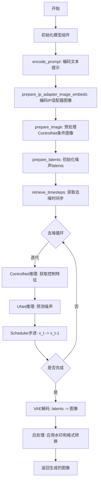
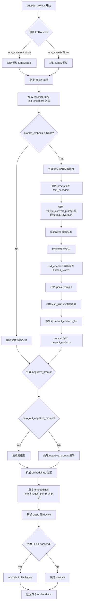
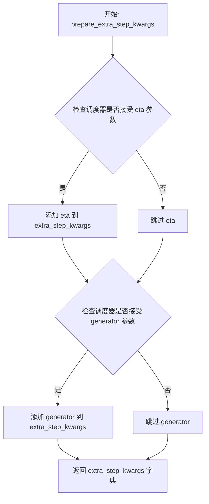
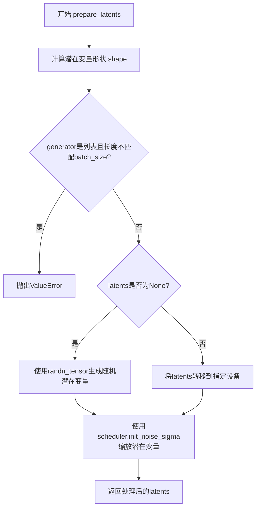
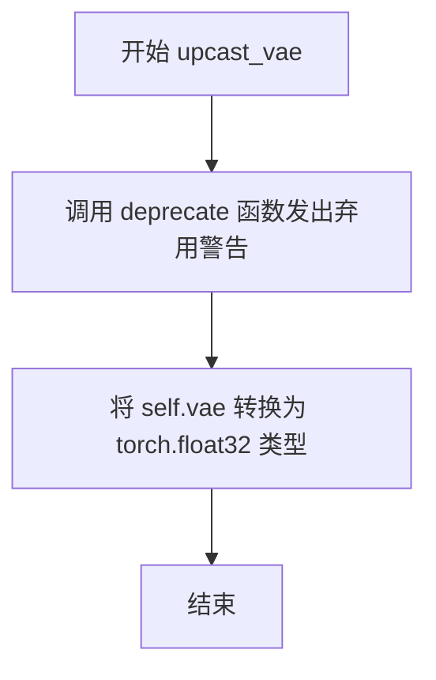
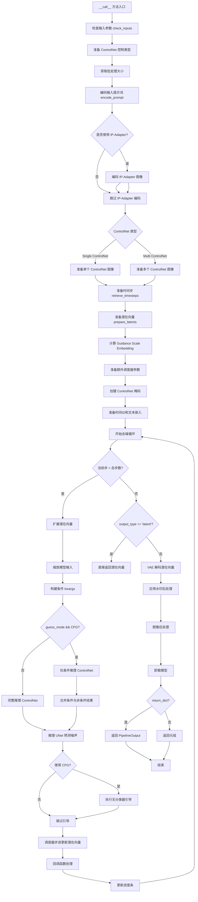

# `diffusers\src\diffusers\pipelines\controlnet\pipeline_controlnet_union_sd_xl.py` 详细设计文档

Stable Diffusion XL ControlNet Union Pipeline 是一个用于文生图的高阶扩散模型管道，结合了SDXL模型和ControlNet Union模型，支持多种控制模式（canny, depth, pose, normal等），能够根据文本提示和条件图像生成高质量图像。

## 整体流程



## 类结构

```
DiffusionPipeline (基类)
├── StableDiffusionMixin
├── TextualInversionLoaderMixin
├── StableDiffusionXLLoraLoaderMixin
├── IPAdapterMixin
├── FromSingleFileMixin
└── StableDiffusionXLControlNetUnionPipeline (主类)
```

## 全局变量及字段


### `logger`
    
Module-level logger for tracking runtime events and errors

类型：`logging.Logger`
    


### `EXAMPLE_DOC_STRING`
    
Documentation string containing example usage of the pipeline

类型：`str`
    


### `XLA_AVAILABLE`
    
Flag indicating whether PyTorch XLA is available for accelerated computation

类型：`bool`
    


### `StableDiffusionXLControlNetUnionPipeline.vae`
    
Variational Auto-Encoder model for encoding and decoding images to and from latent representations

类型：`AutoencoderKL`
    


### `StableDiffusionXLControlNetUnionPipeline.text_encoder`
    
Frozen text encoder for converting text prompts to embeddings

类型：`CLIPTextModel`
    


### `StableDiffusionXLControlNetUnionPipeline.text_encoder_2`
    
Second frozen text encoder with projection for SDXL enhanced text understanding

类型：`CLIPTextModelWithProjection`
    


### `StableDiffusionXLControlNetUnionPipeline.tokenizer`
    
CLIP tokenizer for converting text to token IDs

类型：`CLIPTokenizer`
    


### `StableDiffusionXLControlNetUnionPipeline.tokenizer_2`
    
Second CLIP tokenizer for dual text encoder pipeline

类型：`CLIPTokenizer`
    


### `StableDiffusionXLControlNetUnionPipeline.unet`
    
Conditional UNet model for denoising latent representations during diffusion process

类型：`UNet2DConditionModel`
    


### `StableDiffusionXLControlNetUnionPipeline.controlnet`
    
ControlNet providing additional conditioning to guide the denoising process

类型：`ControlNetUnionModel | MultiControlNetUnionModel`
    


### `StableDiffusionXLControlNetUnionPipeline.scheduler`
    
Diffusion scheduler managing timestep schedules and noise removal logic

类型：`KarrasDiffusionSchedulers`
    


### `StableDiffusionXLControlNetUnionPipeline.vae_scale_factor`
    
Scaling factor based on VAE encoder block channels for latent space computation

类型：`int`
    


### `StableDiffusionXLControlNetUnionPipeline.image_processor`
    
Image processor for post-processing decoded VAE output images

类型：`VaeImageProcessor`
    


### `StableDiffusionXLControlNetUnionPipeline.control_image_processor`
    
Specialized image processor for preprocessing control images before ControlNet input

类型：`VaeImageProcessor`
    


### `StableDiffusionXLControlNetUnionPipeline.watermark`
    
Invisible watermark applier for output images to prevent unauthorized use

类型：`StableDiffusionXLWatermarker | None`
    


### `StableDiffusionXLControlNetUnionPipeline._guidance_scale`
    
Classifier-free guidance scale controlling prompt adherence versus diversity

类型：`float`
    


### `StableDiffusionXLControlNetUnionPipeline._clip_skip`
    
Number of CLIP layers to skip when extracting prompt embeddings

类型：`int`
    


### `StableDiffusionXLControlNetUnionPipeline._cross_attention_kwargs`
    
Keyword arguments passed to cross-attention layers for custom behavior

类型：`dict`
    


### `StableDiffusionXLControlNetUnionPipeline._denoising_end`
    
Fraction of denoising process after which generation terminates early

类型：`float`
    


### `StableDiffusionXLControlNetUnionPipeline._num_timesteps`
    
Total number of denoising timesteps used in current generation

类型：`int`
    


### `StableDiffusionXLControlNetUnionPipeline._interrupt`
    
Flag to signal interruption of the generation process

类型：`bool`
    
    

## 全局函数及方法


### `retrieve_timesteps`

该函数是扩散管道中的工具函数，负责调用调度器的 `set_timesteps` 方法并从调度器中检索生成的时间步序列。它支持三种模式：使用 `num_inference_steps` 自动计算时间步、使用自定义 `timesteps` 列表、或使用自定义 `sigmas` 列表。函数会检查调度器是否支持相应的参数，并确保不会同时传入冲突的参数。

参数：

- `scheduler`：`SchedulerMixin`，扩散调度器对象，用于获取时间步
- `num_inference_steps`：`int | None`，生成样本时使用的扩散步数，如果使用此参数则 `timesteps` 必须为 `None`
- `device`：`str | torch.device | None`，时间步要移动到的设备，如果为 `None` 则不移动
- `timesteps`：`list[int] | None`，用于覆盖调度器时间步间隔策略的自定义时间步，如果传入此参数则 `num_inference_steps` 和 `sigmas` 必须为 `None`
- `sigmas`：`list[float] | None`，用于覆盖调度器时间步间隔策略的自定义 sigmas，如果传入此参数则 `num_inference_steps` 和 `timesteps` 必须为 `None`
- `**kwargs`：任意关键字参数，将传递给 `scheduler.set_timesteps`

返回值：`tuple[torch.Tensor, int]`，元组第一个元素是调度器的时间步序列，第二个元素是推理步数

#### 流程图

```mermaid
flowchart TD
    A[开始] --> B{检查timesteps和sigmas是否同时传入}
    B -->|是| C[抛出ValueError: 只能选择timesteps或sigmas之一]
    B -->|否| D{检查timesteps是否传入}
    
    D -->|是| E[检查scheduler.set_timesteps是否接受timesteps参数]
    E -->|否| F[抛出ValueError: 当前调度器不支持自定义timesteps]
    E -->|是| G[调用scheduler.set_timesteps<br/>timesteps=timesteps, device=device]
    G --> H[获取scheduler.timesteps]
    H --> I[计算num_inference_steps = len(timesteps)]
    I --> J[返回timesteps和num_inference_steps]
    
    D -->|否| K{检查sigmas是否传入}
    K -->|是| L[检查scheduler.set_timesteps是否接受sigmas参数]
    L -->|否| M[抛出ValueError: 当前调度器不支持自定义sigmas]
    L -->|是| N[调用scheduler.set_timesteps<br/>sigmas=sigmas, device=device]
    N --> O[获取scheduler.timesteps]
    O --> P[计算num_inference_steps = len(timesteps)]
    P --> J
    
    K -->|否| Q[调用scheduler.set_timesteps<br/>num_inference_steps, device=device]
    Q --> R[获取scheduler.timesteps]
    R --> S[返回timesteps和num_inference_steps]
    
    C --> Z[结束]
    F --> Z
    J --> Z
    M --> Z
    S --> Z
```

#### 带注释源码

```python
# 从diffusers.pipelines.stable_diffusion中复制的函数
def retrieve_timesteps(
    scheduler,
    num_inference_steps: int | None = None,
    device: str | torch.device | None = None,
    timesteps: list[int] | None = None,
    sigmas: list[float] | None = None,
    **kwargs,
):
    r"""
    Calls the scheduler's `set_timesteps` method and retrieves timesteps from the scheduler after the call. Handles
    custom timesteps. Any kwargs will be supplied to `scheduler.set_timesteps`.

    Args:
        scheduler (`SchedulerMixin`):
            The scheduler to get timesteps from.
        num_inference_steps (`int`):
            The number of diffusion steps used when generating samples with a pre-trained model. If used, `timesteps`
            must be `None`.
        device (`str` or `torch.device`, *optional*):
            The device to which the timesteps should be moved to. If `None`, the timesteps are not moved.
        timesteps (`list[int]`, *optional*):
            Custom timesteps used to override the timestep spacing strategy of the scheduler. If `timesteps` is passed,
            `num_inference_steps` and `sigmas` must be `None`.
        sigmas (`list[float]`, *optional*):
            Custom sigmas used to override the timestep spacing strategy of the scheduler. If `sigmas` is passed,
            `num_inference_steps` and `timesteps` must be `None`.

    Returns:
        `tuple[torch.Tensor, int]`: A tuple where the first element is the timestep schedule from the scheduler and the
        second element is the number of inference steps.
    """
    # 检查timesteps和sigmas是否同时传入 - 只能选择其中一种自定义方式
    if timesteps is not None and sigmas is not None:
        raise ValueError("Only one of `timesteps` or `sigmas` can be passed. Please choose one to set custom values")
    
    # 处理自定义timesteps的情况
    if timesteps is not None:
        # 检查调度器的set_timesteps方法是否支持timesteps参数
        accepts_timesteps = "timesteps" in set(inspect.signature(scheduler.set_timesteps).parameters.keys())
        if not accepts_timesteps:
            raise ValueError(
                f"The current scheduler class {scheduler.__class__}'s `set_timesteps` does not support custom"
                f" timestep schedules. Please check whether you are using the correct scheduler."
            )
        # 调用调度器的set_timesteps方法设置自定义时间步
        scheduler.set_timesteps(timesteps=timesteps, device=device, **kwargs)
        # 从调度器获取设置后的时间步
        timesteps = scheduler.timesteps
        # 计算推理步数
        num_inference_steps = len(timesteps)
    # 处理自定义sigmas的情况
    elif sigmas is not None:
        # 检查调度器的set_timesteps方法是否支持sigmas参数
        accept_sigmas = "sigmas" in set(inspect.signature(scheduler.set_timesteps).parameters.keys())
        if not accept_sigmas:
            raise ValueError(
                f"The current scheduler class {scheduler.__class__}'s `set_timesteps` does not support custom"
                f" sigmas schedules. Please check whether you are using the correct scheduler."
            )
        # 调用调度器的set_timesteps方法设置自定义sigmas
        scheduler.set_timesteps(sigmas=sigmas, device=device, **kwargs)
        # 从调度器获取设置后的时间步
        timesteps = scheduler.timesteps
        # 计算推理步数
        num_inference_steps = len(timesteps)
    # 处理默认情况 - 使用num_inference_steps计算时间步
    else:
        scheduler.set_timesteps(num_inference_steps, device=device, **kwargs)
        timesteps = scheduler.timesteps
    
    # 返回时间步序列和推理步数
    return timesteps, num_inference_steps
```


### `StableDiffusionXLControlNetUnionPipeline.__init__`

这是 `StableDiffusionXLControlNetUnionPipeline` 类的初始化方法，负责构建一个集成了 ControlNet 联合模型的 Stable Diffusion XL 推理管道。该方法接收所有必要的模型组件（如 VAE、文本编码器、UNet、ControlNet 等），进行模块注册、图像处理器初始化、水印配置等初始化工作。

参数：

- `vae`：`AutoencoderKL`，Variational Auto-Encoder (VAE) 模型，用于编码和解码图像到潜在表示
- `text_encoder`：`CLIPTextModel`，冻结的文本编码器 (clip-vit-large-patch14)
- `text_encoder_2`：`CLIPTextModelWithProjection`，第二个冻结的文本编码器 (CLIP-ViT-bigG-14-laion2B-39B-b160k)
- `tokenizer`：`CLIPTokenizer`，用于对文本进行分词的 CLIPTokenizer
- `tokenizer_2`：`CLIPTokenizer`，第二个用于对文本进行分词的 CLIPTokenizer
- `unet`：`UNet2DConditionModel`，用于对编码后的图像潜在表示进行去噪的 UNet2DConditionModel
- `controlnet`：`ControlNetUnionModel | list[ControlNetUnionModel] | tuple[ControlNetUnionModel] | MultiControlNetUnionModel`，提供额外条件给 `unet` 进行去噪处理的 ControlNet 联合模型
- `scheduler`：`KarrasDiffusionSchedulers`，与 `unet` 结合使用以对编码图像潜在表示进行去噪的调度器
- `force_zeros_for_empty_prompt`：`bool`，可选，默认值为 `True`，是否将空提示的嵌入始终设置为 0
- `add_watermarker`：`bool | None`，可选，是否使用 invisible_watermark 库对输出图像加水印
- `feature_extractor`：`CLIPImageProcessor = None`，可选，图像特征提取器
- `image_encoder`：`CLIPVisionModelWithProjection = None`，可选，CLIP 视觉模型

返回值：无（`None`），构造函数不返回任何值

#### 流程图

```mermaid
flowchart TD
    A[__init__ 开始] --> B[调用 super().__init__]
    B --> C{controlnet 是 list 或 tuple?}
    C -->|是| D[将 controlnet 包装为 MultiControlNetUnionModel]
    C -->|否| E[保持原样]
    D --> F[register_modules 注册所有模块]
    E --> F
    F --> G[计算 vae_scale_factor]
    G --> H[初始化 VaeImageProcessor]
    H --> I[初始化 control_image_processor]
    I --> J{add_watermarker 未指定?}
    J -->|是| K[检查 is_invisible_watermark_available]
    J -->|否| L[使用传入的 add_watermarker 值]
    K --> M{watermark 可用?}
    M -->|是| N[创建 StableDiffusionXLWatermarker]
    M -->|否| O[设置 watermark 为 None]
    L --> P[注册到 config: force_zeros_for_empty_prompt]
    N --> P
    O --> P
    P --> Q[__init__ 结束]
```

#### 带注释源码

```python
def __init__(
    self,
    vae: AutoencoderKL,
    text_encoder: CLIPTextModel,
    text_encoder_2: CLIPTextModelWithProjection,
    tokenizer: CLIPTokenizer,
    tokenizer_2: CLIPTokenizer,
    unet: UNet2DConditionModel,
    controlnet: ControlNetUnionModel
    | list[ControlNetUnionModel]
    | tuple[ControlNetUnionModel]
    | MultiControlNetUnionModel,
    scheduler: KarrasDiffusionSchedulers,
    force_zeros_for_empty_prompt: bool = True,
    add_watermarker: bool | None = None,
    feature_extractor: CLIPImageProcessor = None,
    image_encoder: CLIPVisionModelWithProjection = None,
):
    # 调用父类 DiffusionPipeline 的初始化方法
    super().__init__()

    # 如果 controlnet 是列表或元组，则将其包装为 MultiControlNetUnionModel
    if isinstance(controlnet, (list, tuple)):
        controlnet = MultiControlNetUnionModel(controlnet)

    # 注册所有模块，使它们成为管道的可访问属性
    self.register_modules(
        vae=vae,
        text_encoder=text_encoder,
        text_encoder_2=text_encoder_2,
        tokenizer=tokenizer,
        tokenizer_2=tokenizer_2,
        unet=unet,
        controlnet=controlnet,
        scheduler=scheduler,
        feature_extractor=feature_extractor,
        image_encoder=image_encoder,
    )

    # 计算 VAE 缩放因子，用于后续图像处理
    # 2^(len(vae.config.block_out_channels) - 1)，默认为 8
    self.vae_scale_factor = 2 ** (len(self.vae.config.block_out_channels) - 1) if getattr(self, "vae", None) else 8

    # 初始化图像处理器，用于处理管道输入输出图像
    self.image_processor = VaeImageProcessor(vae_scale_factor=self.vae_scale_factor, do_convert_rgb=True)

    # 初始化 ControlNet 专用的图像处理器（不进行归一化）
    self.control_image_processor = VaeImageProcessor(
        vae_scale_factor=self.vae_scale_factor, do_convert_rgb=True, do_normalize=False
    )

    # 如果未指定 add_watermarker，则默认检查水印库是否可用
    add_watermarker = add_watermarker if add_watermarker is not None else is_invisible_watermark_available()

    # 如果启用水印，则创建水印处理器
    if add_watermarker:
        self.watermark = StableDiffusionXLWatermarker()
    else:
        self.watermark = None

    # 将 force_zeros_for_empty_prompt 注册到配置中
    self.register_to_config(force_zeros_for_empty_prompt=force_zeros_for_empty_prompt)
```


### StableDiffusionXLControlNetUnionPipeline.encode_prompt

该方法负责将文本提示（prompt）编码为文本编码器的隐藏状态（embeddings），支持双文本编码器架构（CLIP Text Encoder和CLIP Text Encoder with Projection），同时处理LoRA权重调整、分类器自由引导（CFG）的无条件嵌入生成，以及提示词的批次扩展。

参数：

- `prompt`：`str` 或 `list[str]`，要编码的主提示词
- `prompt_2`：`str | list[str] | None`，发送给第二个tokenizer和text_encoder的提示词，若为None则使用prompt
- `device`：`torch.device | None`，执行计算的设备，若为None则使用self._execution_device
- `num_images_per_prompt`：`int`，每个提示词需要生成的图像数量，用于扩展embeddings维度
- `do_classifier_free_guidance`：`bool`，是否启用分类器自由引导
- `negative_prompt`：`str | list[str] | None`，负面提示词，用于引导不包含的内容
- `negative_prompt_2`：`str | list[str] | None`，第二个负面提示词，若为None则使用negative_prompt
- `prompt_embeds`：`torch.Tensor | None`，预生成的文本嵌入，可用于微调提示词输入
- `negative_prompt_embeds`：`torch.Tensor | None`，预生成的负面文本嵌入
- `pooled_prompt_embeds`：`torch.Tensor | None`，预生成的池化文本嵌入
- `negative_pooled_prompt_embeds`：`torch.Tensor | None`，预生成的负面池化文本嵌入
- `lora_scale`：`float | None`，LoRA层的缩放因子
- `clip_skip`：`int | None`，CLIP编码时跳过的层数，用于获取不同层次的特征

返回值：`tuple[torch.Tensor, torch.Tensor, torch.Tensor, torch.Tensor]`，包含：

- `prompt_embeds`：编码后的提示词嵌入
- `negative_prompt_embeds`：编码后的负面提示词嵌入
- `pooled_prompt_embeds`：池化后的提示词嵌入
- `negative_pooled_prompt_embeds`：池化后的负面提示词嵌入

#### 流程图



#### 带注释源码

```python
def encode_prompt(
    self,
    prompt: str,
    prompt_2: str | None = None,
    device: torch.device | None = None,
    num_images_per_prompt: int = 1,
    do_classifier_free_guidance: bool = True,
    negative_prompt: str | None = None,
    negative_prompt_2: str | None = None,
    prompt_embeds: torch.Tensor | None = None,
    negative_prompt_embeds: torch.Tensor | None = None,
    pooled_prompt_embeds: torch.Tensor | None = None,
    negative_pooled_prompt_embeds: torch.Tensor | None = None,
    lora_scale: float | None = None,
    clip_skip: int | None = None,
):
    r"""
    Encodes the prompt into text encoder hidden states.

    Args:
        prompt (`str` or `list[str]`, *optional*):
            prompt to be encoded
        prompt_2 (`str` or `list[str]`, *optional*):
            The prompt or prompts to be sent to the `tokenizer_2` and `text_encoder_2`. If not defined, `prompt` is
            used in both text-encoders
        device: (`torch.device`):
            torch device
        num_images_per_prompt (`int`):
            number of images that should be generated per prompt
        do_classifier_free_guidance (`bool`):
            whether to use classifier free guidance or not
        negative_prompt (`str` or `list[str]`, *optional*):
            The prompt or prompts not to guide the image generation. If not defined, one has to pass
            `negative_prompt_embeds` instead. Ignored when not using guidance (i.e., ignored if `guidance_scale` is
            less than `1`).
        negative_prompt_2 (`str` or `list[str]`, *optional*):
            The prompt or prompts not to guide the image generation to be sent to `tokenizer_2` and
            `text_encoder_2`. If not defined, `negative_prompt` is used in both text-encoders
        prompt_embeds (`torch.Tensor`, *optional*):
            Pre-generated text embeddings. Can be used to easily tweak text inputs, *e.g.* prompt weighting. If not
            provided, text embeddings will be generated from `prompt` input argument.
        negative_prompt_embeds (`torch.Tensor`, *optional*):
            Pre-generated negative text embeddings. Can be used to easily tweak text inputs, *e.g.* prompt
            weighting. If not provided, negative_prompt_embeds will be generated from `negative_prompt` input
            argument.
        pooled_prompt_embeds (`torch.Tensor`, *optional*):
            Pre-generated pooled text embeddings. Can be used to easily tweak text inputs, *e.g.* prompt weighting.
            If not provided, pooled text embeddings will be generated from `prompt` input argument.
        negative_pooled_prompt_embeds (`torch.Tensor`, *optional*):
            Pre-generated negative pooled text embeddings. Can be used to easily tweak text inputs, *e.g.* prompt
            weighting. If not provided, pooled negative_prompt_embeds will be generated from `negative_prompt`
            input argument.
        lora_scale (`float`, *optional*):
            A lora scale that will be applied to all LoRA layers of the text encoder if LoRA layers are loaded.
        clip_skip (`int`, *optional*):
            Number of layers to be skipped from CLIP while computing the prompt embeddings. A value of 1 means that
            the output of the pre-final layer will be used for computing the prompt embeddings.
    """
    # 如果未指定device，使用execution_device
    device = device or self._execution_device

    # 设置lora scale以便text encoder的LoRA函数正确访问
    # 检查是否为StableDiffusionXLLoraLoaderMixin实例且lora_scale不为None
    if lora_scale is not None and isinstance(self, StableDiffusionXLLoraLoaderMixin):
        self._lora_scale = lora_scale

        # 动态调整LoRA scale
        if self.text_encoder is not None:
            if not USE_PEFT_BACKEND:
                # 非PEFT后端：直接调整LoRA scale
                adjust_lora_scale_text_encoder(self.text_encoder, lora_scale)
            else:
                # PEFT后端：缩放LoRA layers
                scale_lora_layers(self.text_encoder, lora_scale)

        if self.text_encoder_2 is not None:
            if not USE_PEFT_BACKEND:
                adjust_lora_scale_text_encoder(self.text_encoder_2, lora_scale)
            else:
                scale_lora_layers(self.text_encoder_2, lora_scale)

    # 统一prompt为list格式，便于批处理
    prompt = [prompt] if isinstance(prompt, str) else prompt

    # 确定batch_size：如果有prompt则使用len(prompt)，否则使用prompt_embeds的batch维度
    if prompt is not None:
        batch_size = len(prompt)
    else:
        batch_size = prompt_embeds.shape[0]

    # 定义tokenizers和text_encoders列表（支持单双文本编码器）
    # 如果tokenizer存在则使用[tokenizer, tokenizer_2]，否则只使用tokenizer_2
    tokenizers = [self.tokenizer, self.tokenizer_2] if self.tokenizer is not None else [self.tokenizer_2]
    text_encoders = (
        [self.text_encoder, self.text_encoder_2] if self.text_encoder is not None else [self.text_encoder_2]
    )

    # 如果未提供prompt_embeds，则从prompt生成
    if prompt_embeds is None:
        # prompt_2默认为prompt
        prompt_2 = prompt_2 or prompt
        prompt_2 = [prompt_2] if isinstance(prompt_2, str) else prompt_2

        # textual inversion处理：处理多向量tokens
        prompt_embeds_list = []
        prompts = [prompt, prompt_2]
        # 同时处理两个prompt和对应的tokenizer/text_encoder
        for prompt, tokenizer, text_encoder in zip(prompts, tokenizers, text_encoders):
            # 如果支持TextualInversionLoaderMixin，转换prompt
            if isinstance(self, TextualInversionLoaderMixin):
                prompt = self.maybe_convert_prompt(prompt, tokenizer)

            # tokenizer编码：padding到最大长度，truncation截断
            text_inputs = tokenizer(
                prompt,
                padding="max_length",
                max_length=tokenizer.model_max_length,
                truncation=True,
                return_tensors="pt",
            )

            text_input_ids = text_inputs.input_ids
            # 获取未截断的ids用于比较
            untruncated_ids = tokenizer(prompt, padding="longest", return_tensors="pt").input_ids

            # 检测截断：如果未截断ids长度大于截断后的长度且不完全相同
            if untruncated_ids.shape[-1] >= text_input_ids.shape[-1] and not torch.equal(
                text_input_ids, untruncated_ids
            ):
                # 提取被截断的部分并记录警告
                removed_text = tokenizer.batch_decode(untruncated_ids[:, tokenizer.model_max_length - 1 : -1])
                logger.warning(
                    "The following part of your input was truncated because CLIP can only handle sequences up to"
                    f" {tokenizer.model_max_length} tokens: {removed_text}"
                )

            # text_encoder编码，获取hidden_states
            prompt_embeds = text_encoder(text_input_ids.to(device), output_hidden_states=True)

            # 获取pooled output（最后一个token的隐藏状态）
            # 始终使用最后一个文本编码器的pooled output
            if pooled_prompt_embeds is None and prompt_embeds[0].ndim == 2:
                pooled_prompt_embeds = prompt_embeds[0]

            # 根据clip_skip选择hidden_states层级
            if clip_skip is None:
                # 默认使用倒数第二层（SDXL索引从-2开始）
                prompt_embeds = prompt_embeds.hidden_states[-2]
            else:
                # "2"是因为SDXL总是从倒数第二层索引
                # clip_skip=1表示跳过最后一层，使用penultimate layer
                prompt_embeds = prompt_embeds.hidden_states[-(clip_skip + 2)]

            prompt_embeds_list.append(prompt_embeds)

        # 沿最后一维拼接两个text_encoder的embeddings
        prompt_embeds = torch.concat(prompt_embeds_list, dim=-1)

    # 获取无条件embeddings用于分类器自由引导
    # 判断是否需要将negative_prompt设为零
    zero_out_negative_prompt = negative_prompt is None and self.config.force_zeros_for_empty_prompt
    
    # 如果启用CFG且未提供negative_prompt_embeds且需要zero out
    if do_classifier_free_guidance and negative_prompt_embeds is None and zero_out_negative_prompt:
        # 生成与prompt_embeds相同形状的零张量
        negative_prompt_embeds = torch.zeros_like(prompt_embeds)
        negative_pooled_prompt_embeds = torch.zeros_like(pooled_prompt_embeds)
    elif do_classifier_free_guidance and negative_prompt_embeds is None:
        # 需要从negative_prompt生成embeddings
        negative_prompt = negative_prompt or ""
        negative_prompt_2 = negative_prompt_2 or negative_prompt

        # 统一为list格式
        negative_prompt = batch_size * [negative_prompt] if isinstance(negative_prompt, str) else negative_prompt
        negative_prompt_2 = (
            batch_size * [negative_prompt_2] if isinstance(negative_prompt_2, str) else negative_prompt_2
        )

        uncond_tokens: list[str]
        # 类型检查：negative_prompt和prompt类型必须一致
        if prompt is not None and type(prompt) is not type(negative_prompt):
            raise TypeError(
                f"`negative_prompt` should be the same type to `prompt`, but got {type(negative_prompt)} !="
                f" {type(prompt)}."
            )
        # batch_size检查
        elif batch_size != len(negative_prompt):
            raise ValueError(
                f"`negative_prompt`: {negative_prompt} has batch size {len(negative_prompt)}, but `prompt`:"
                f" {prompt} has batch size {batch_size}. Please make sure that passed `negative_prompt` matches"
                " the batch size of `prompt`."
            )
        else:
            uncond_tokens = [negative_prompt, negative_prompt_2]

        # 处理negative_prompt的编码
        negative_prompt_embeds_list = []
        for negative_prompt, tokenizer, text_encoder in zip(uncond_tokens, tokenizers, text_encoders):
            if isinstance(self, TextualInversionLoaderMixin):
                negative_prompt = self.maybe_convert_prompt(negative_prompt, tokenizer)

            # 使用prompt_embeds的长度作为max_length
            max_length = prompt_embeds.shape[1]
            uncond_input = tokenizer(
                negative_prompt,
                padding="max_length",
                max_length=max_length,
                truncation=True,
                return_tensors="pt",
            )

            # text_encoder编码
            negative_prompt_embeds = text_encoder(
                uncond_input.input_ids.to(device),
                output_hidden_states=True,
            )

            # 获取pooled output
            if negative_pooled_prompt_embeds is None and negative_prompt_embeds[0].ndim == 2:
                negative_pooled_prompt_embeds = negative_prompt_embeds[0]
            # 使用倒数第二层
            negative_prompt_embeds = negative_prompt_embeds.hidden_states[-2]

            negative_prompt_embeds_list.append(negative_prompt_embeds)

        # 拼接negative_prompt_embeds
        negative_prompt_embeds = torch.concat(negative_prompt_embeds_list, dim=-1)

    # 转换dtype和device
    if self.text_encoder_2 is not None:
        prompt_embeds = prompt_embeds.to(dtype=self.text_encoder_2.dtype, device=device)
    else:
        prompt_embeds = prompt_embeds.to(dtype=self.unet.dtype, device=device)

    # 获取embeddings形状信息
    bs_embed, seq_len, _ = prompt_embeds.shape
    
    # 为每个prompt复制num_images_per_prompt次（mps友好的方法）
    prompt_embeds = prompt_embeds.repeat(1, num_images_per_prompt, 1)
    prompt_embeds = prompt_embeds.view(bs_embed * num_images_per_prompt, seq_len, -1)

    # 如果启用CFG，复制negative embeddings
    if do_classifier_free_guidance:
        seq_len = negative_prompt_embeds.shape[1]

        if self.text_encoder_2 is not None:
            negative_prompt_embeds = negative_prompt_embeds.to(dtype=self.text_encoder_2.dtype, device=device)
        else:
            negative_prompt_embeds = negative_prompt_embeds.to(dtype=self.unet.dtype, device=device)

        negative_prompt_embeds = negative_prompt_embeds.repeat(1, num_images_per_prompt, 1)
        negative_prompt_embeds = negative_prompt_embeds.view(batch_size * num_images_per_prompt, seq_len, -1)

    # 复制pooled embeddings
    pooled_prompt_embeds = pooled_prompt_embeds.repeat(1, num_images_per_prompt).view(
        bs_embed * num_images_per_prompt, -1
    )
    if do_classifier_free_guidance:
        negative_pooled_prompt_embeds = negative_pooled_prompt_embeds.repeat(1, num_images_per_prompt).view(
            bs_embed * num_images_per_prompt, -1
        )

    # 如果使用PEFT backend，需要unscale LoRA layers恢复原始scale
    if self.text_encoder is not None:
        if isinstance(self, StableDiffusionXLLoraLoaderMixin) and USE_PEFT_BACKEND:
            # 通过scaling back LoRA layers获取原始scale
            unscale_lora_layers(self.text_encoder, lora_scale)

    if self.text_encoder_2 is not None:
        if isinstance(self, StableDiffusionXLLoraLoaderMixin) and USE_PEFT_BACKEND:
            unscale_lora_layers(self.text_encoder_2, lora_scale)

    # 返回四个embeddings：prompt_embeds, negative_prompt_embeds, pooled_prompt_embeds, negative_pooled_prompt_embeds
    return prompt_embeds, negative_prompt_embeds, pooled_prompt_embeds, negative_pooled_prompt_embeds
```


### `StableDiffusionXLControlNetUnionPipeline.encode_image`

该方法用于将输入图像编码为图像嵌入向量，支持条件和无条件两种模式，以便在后续的扩散模型推理中实现分类器自由引导（Classifier-Free Guidance）。它通过图像编码器（CLIP Vision Encoder）提取图像特征，并根据参数决定是否返回中间隐藏状态。

参数：

- `image`：输入图像，支持 `torch.Tensor`、`PIL.Image`、numpy 数组或列表形式。如果不是张量形式，会通过 `feature_extractor` 提取特征。
- `device`：`torch.device`，指定计算设备，用于将图像和张量移动到指定设备上。
- `num_images_per_prompt`：`int`，每个提示词生成的图像数量，用于对图像嵌入进行重复扩展以匹配批量生成。
- `output_hidden_states`：`bool` 或 `None`，可选参数。若为 `True`，则返回图像编码器的倒数第二个隐藏状态（hidden states）而非池化后的图像嵌入（image_embeds），通常用于更细粒度的图像条件控制。

返回值：`tuple[torch.Tensor, torch.Tensor]`，返回一个元组，包含：

- 第一个元素为条件图像嵌入（或隐藏状态），维度为 `(batch_size * num_images_per_prompt, ...)`。
- 第二个元素为无条件图像嵌入（或隐藏状态），维度与第一个元素相同，用于分类器自由引导计算。

#### 流程图

```mermaid
flowchart TD
    A[开始 encode_image] --> B{image 是否为 torch.Tensor}
    B -- 否 --> C[使用 feature_extractor 提取像素值]
    C --> D[将 image 移动到 device 并转换 dtype]
    B -- 是 --> D
    D --> E{output_hidden_states == True?}
    E -- 是 --> F[调用 image_encoder 获取隐藏状态]
    F --> G[取倒数第二个隐藏状态 hidden_states[-2]]
    G --> H[repeat_interleave 扩展条件嵌入]
    I[调用 image_encoder 处理零张量获取无条件隐藏状态] --> J[repeat_interleave 扩展无条件嵌入]
    H --> K[返回条件和无条件隐藏状态元组]
    J --> K
    E -- 否 --> L[调用 image_encoder 获取 image_embeds]
    L --> M[repeat_interleave 扩展条件嵌入]
    N[创建与 image_embeds 形状相同的零张量] --> O[作为无条件嵌入]
    M --> P[返回条件和无条件嵌入元组]
    O --> P
```

#### 带注释源码

```python
def encode_image(self, image, device, num_images_per_prompt, output_hidden_states=None):
    """
    Encode image to image embeddings for IP-Adapter support.
    
    Args:
        image: Input image (PIL Image, numpy array, torch.Tensor, or list).
        device: Torch device to move tensors to.
        num_images_per_prompt: Number of images to generate per prompt.
        output_hidden_states: If True, return hidden states instead of pooled embeddings.
    
    Returns:
        Tuple of (image_embeds, uncond_image_embeds) or (hidden_states, uncond_hidden_states).
    """
    # 获取图像编码器的参数数据类型，用于后续类型转换
    dtype = next(self.image_encoder.parameters()).dtype

    # 如果输入不是 torch.Tensor，则使用 feature_extractor 提取特征
    if not isinstance(image, torch.Tensor):
        image = self.feature_extractor(image, return_tensors="pt").pixel_values

    # 将图像移动到指定设备并转换为正确的 dtype
    image = image.to(device=device, dtype=dtype)
    
    # 根据 output_hidden_states 参数决定输出格式
    if output_hidden_states:
        # 返回倒数第二个隐藏状态（penultimate layer），用于更细粒度的控制
        image_enc_hidden_states = self.image_encoder(image, output_hidden_states=True).hidden_states[-2]
        # 扩展条件嵌入以匹配每个提示的图像数量
        image_enc_hidden_states = image_enc_hidden_states.repeat_interleave(num_images_per_prompt, dim=0)
        
        # 创建零张量作为无条件的图像嵌入（对应空条件/negative condition）
        uncond_image_enc_hidden_states = self.image_encoder(
            torch.zeros_like(image), output_hidden_states=True
        ).hidden_states[-2]
        # 同样扩展无条件嵌入
        uncond_image_enc_hidden_states = uncond_image_enc_hidden_states.repeat_interleave(
            num_images_per_prompt, dim=0
        )
        # 返回隐藏状态元组
        return image_enc_hidden_states, uncond_image_enc_hidden_states
    else:
        # 使用池化后的图像嵌入（image_embeds）
        image_embeds = self.image_encoder(image).image_embeds
        # 扩展条件嵌入
        image_embeds = image_embeds.repeat_interleave(num_images_per_prompt, dim=0)
        # 创建零张量作为无条件嵌入，用于 classifier-free guidance
        uncond_image_embeds = torch.zeros_like(image_embeds)

        return image_embeds, uncond_image_embeds
```


### `StableDiffusionXLControlNetUnionPipeline.prepare_ip_adapter_image_embeds`

该方法用于准备 IP Adapter 的图像嵌入（image embeddings）。它处理两种输入情况：直接传入图像或已经预计算好的图像嵌入，并根据是否启用 Classifier-Free Guidance（分类器自由引导）来生成相应的正负嵌入向量。这些嵌入将作为条件信息注入到 UNet 的去噪过程中，以实现图像提示（image prompt）功能。

参数：

- `ip_adapter_image`：`PipelineImageInput | None`，需要被编码为 IP Adapter 嵌入的输入图像，支持 PIL.Image、numpy array、torch.Tensor 或它们的列表
- `ip_adapter_image_embeds`：`list[torch.Tensor] | None`，预先生成的图像嵌入列表，如果为 None，则从 ip_adapter_image 编码生成
- `device`：`torch.device`，执行操作的设备（CPU 或 CUDA）
- `num_images_per_prompt`：`int`，每个 prompt 生成的图像数量，用于复制 embeddings 以匹配批量大小
- `do_classifier_free_guidance`：`bool`，是否启用 Classifier-Free Guidance。若为 True，则会生成负样本图像嵌入（unconditional image embeddings）

返回值：`list[torch.Tensor]`，处理后的 IP Adapter 图像嵌入列表。每个元素是一个张量，形状为 `(num_images_per_prompt, embedding_dim)` 或当启用 CFG 时为 `(2 * num_images_per_prompt, embedding_dim)`。

#### 流程图

```mermaid
flowchart TD
    A[开始 prepare_ip_adapter_image_embeds] --> B{ip_adapter_image_embeds<br/>是否为 None?}
    B -->|是| C{检查 ip_adapter_image<br/>是否为 list}
    C -->|否| D[将 ip_adapter_image<br/>转换为 list]
    C -->|是| E[验证 ip_adapter_image 长度<br/>与 image_projection_layers 匹配]
    D --> E
    E --> F[遍历每个 IP Adapter 图像和对应的投影层]
    F --> G{image_proj_layer<br/>是否为 ImageProjection?}
    G -->|是| H[output_hidden_state = False]
    G -->|否| I[output_hidden_state = True]
    H --> J[调用 self.encode_image<br/>编码图像]
    I --> J
    J --> K[提取 single_image_embeds<br/>和 single_negative_image_embeds]
    K --> L[添加 single_image_embeds[None, :]<br/>到 image_embeds 列表]
    L --> M{CFG 启用?}
    M -->|是| N[添加 single_negative_image_embeds[None, :]<br/>到 negative_image_embeds]
    M -->|否| O[遍历下一个 IP Adapter]
    N --> O
    O --> P[检查是否还有更多 IP Adapter]
    P -->|是| F
    P -->|否| Q[开始构建最终输出]
    B -->|否| R[遍历 ip_adapter_image_embeds]
    R --> S{CFG 启用?}
    S -->|是| T[从 single_image_embeds<br/>chunk(2) 分离正负嵌入]
    S -->|否| U[直接添加 single_image_embeds<br/>到 image_embeds]
    T --> V[添加负嵌入到 negative_image_embeds<br/>添加正嵌入到 image_embeds]
    U --> Q
    Q --> W[遍历 image_embeds 列表]
    W --> X[将每个 embedding 重复<br/>num_images_per_prompt 次]
    X --> Y{CFG 启用?}
    Y -->|是| Z[将 negative_image_embeds[i]<br/>重复并拼接]
    Y -->|否| AA[移动到指定 device]
    Z --> AA
    AA --> BB[添加处理后的嵌入到<br/>ip_adapter_image_embeds 输出列表]
    BB --> CC[检查是否还有更多嵌入]
    CC -->|是| W
    CC -->|否| DD[返回 ip_adapter_image_embeds]
```

#### 带注释源码

```python
def prepare_ip_adapter_image_embeds(
    self, ip_adapter_image, ip_adapter_image_embeds, device, num_images_per_prompt, do_classifier_free_guidance
):
    """
    准备 IP Adapter 的图像嵌入。

    该方法处理两种输入模式：
    1. 直接传入图像 (ip_adapter_image)，需要编码
    2. 传入预计算的嵌入 (ip_adapter_image_embeds)

    支持 Classifier-Free Guidance，会生成对应的负样本嵌入。
    """
    # 初始化用于存储图像嵌入的列表
    image_embeds = []
    
    # 如果启用 CFG，还需要存储负样本图像嵌入
    if do_classifier_free_guidance:
        negative_image_embeds = []

    # 情况1：没有预计算嵌入，需要从图像编码
    if ip_adapter_image_embeds is None:
        # 确保输入图像是列表格式，便于统一处理
        if not isinstance(ip_adapter_image, list):
            ip_adapter_image = [ip_adapter_image]

        # 验证图像数量与 IP Adapter 数量是否匹配
        # 每个 IP Adapter 对应一个 image_projection_layer
        if len(ip_adapter_image) != len(self.unet.encoder_hid_proj.image_projection_layers):
            raise ValueError(
                f"`ip_adapter_image` must have same length as the number of IP Adapters. "
                f"Got {len(ip_adapter_image)} images and {len(self.unet.encoder_hid_proj.image_projection_layers)} IP Adapters."
            )

        # 遍历每个 IP Adapter 的图像和对应的投影层
        for single_ip_adapter_image, image_proj_layer in zip(
            ip_adapter_image, self.unet.encoder_hid_proj.image_projection_layers
        ):
            # 确定是否需要输出隐藏状态
            # ImageProjection 类型不需要隐藏状态，其他类型需要
            output_hidden_state = not isinstance(image_proj_layer, ImageProjection)
            
            # 调用 encode_image 方法编码图像
            # 返回图像嵌入和（如果启用 CFG）负样本嵌入
            single_image_embeds, single_negative_image_embeds = self.encode_image(
                single_ip_adapter_image, device, 1, output_hidden_state
            )

            # 将图像嵌入添加到列表（使用 [None, :] 增加批次维度）
            image_embeds.append(single_image_embeds[None, :])
            
            # 如果启用 CFG，同时保存负样本嵌入
            if do_classifier_free_guidance:
                negative_image_embeds.append(single_negative_image_embeds[None, :])
    else:
        # 情况2：已有预计算的嵌入，直接使用
        for single_image_embeds in ip_adapter_image_embeds:
            # 如果启用 CFG，预计算嵌入通常包含正负两部分
            # 使用 chunk(2) 分离它们
            if do_classifier_free_guidance:
                single_negative_image_embeds, single_image_embeds = single_image_embeds.chunk(2)
                negative_image_embeds.append(single_negative_image_embeds)
            
            # 将处理后的嵌入添加到列表
            image_embeds.append(single_image_embeds)

    # 准备最终输出，根据 num_images_per_prompt 复制 embeddings
    ip_adapter_image_embeds = []
    for i, single_image_embeds in enumerate(image_embeds):
        # 将嵌入重复 num_images_per_prompt 次
        # 以匹配每个 prompt 生成的图像数量
        single_image_embeds = torch.cat([single_image_embeds] * num_images_per_prompt, dim=0)
        
        if do_classifier_free_guidance:
            # 对负样本嵌入做同样的重复处理
            single_negative_image_embeds = torch.cat([negative_image_embeds[i]] * num_images_per_prompt, dim=0)
            # 将负样本和正样本拼接在一起
            # 顺序为 [negative, positive]，符合 CFG 的惯例
            single_image_embeds = torch.cat([single_negative_image_embeds, single_image_embeds], dim=0)

        # 将最终嵌入移动到目标设备
        single_image_embeds = single_image_embeds.to(device=device)
        
        # 添加到输出列表
        ip_adapter_image_embeds.append(single_image_embeds)

    return ip_adapter_image_embeds
```


### `StableDiffusionXLControlNetUnionPipeline.prepare_extra_step_kwargs`

该方法用于为调度器（scheduler）的 `step` 方法准备额外的关键字参数。由于不同调度器（如 DDIMScheduler、LMSDiscreteScheduler 等）的 `step` 方法签名不同，此方法通过检查调度器支持的参数来动态构建 `extra_step_kwargs` 字典，确保参数兼容性。

参数：

- `generator`：`torch.Generator | list[torch.Generator] | None`，用于控制生成随机性的随机数生成器
- `eta`：`float`，DDIM 调度器的 η 参数，仅在使用 DDIMScheduler 时生效，其他调度器会忽略此参数

返回值：`dict[str, Any]`，包含调度器 `step` 方法所需额外参数（如 `eta` 和 `generator`）的字典

#### 流程图



#### 带注释源码

```python
def prepare_extra_step_kwargs(self, generator, eta):
    # 准备调度器步骤的额外参数，因为并非所有调度器都具有相同的签名
    # eta (η) 仅在与 DDIMScheduler 一起使用时会生效，对于其他调度器将被忽略
    # eta 对应 DDIM 论文中的 η 参数：https://huggingface.co/papers/2010.02502
    # eta 取值范围应为 [0, 1]

    # 使用 inspect 检查调度器的 step 方法是否接受 eta 参数
    accepts_eta = "eta" in set(inspect.signature(self.scheduler.step).parameters.keys())
    
    # 初始化空字典用于存储额外参数
    extra_step_kwargs = {}
    
    # 如果调度器支持 eta 参数，则将其添加到 extra_step_kwargs
    if accepts_eta:
        extra_step_kwargs["eta"] = eta

    # 检查调度器是否接受 generator 参数
    accepts_generator = "generator" in set(inspect.signature(self.scheduler.step).parameters.keys())
    
    # 如果调度器支持 generator 参数，则将其添加到 extra_step_kwargs
    if accepts_generator:
        extra_step_kwargs["generator"] = generator
    
    # 返回包含调度器额外参数的字典
    return extra_step_kwargs
```


### `StableDiffusionXLControlNetUnionPipeline.check_image`

该方法用于验证输入图像的有效性，检查图像类型是否符合要求（PIL图像、NumPy数组、PyTorch张量及其列表形式），并确保图像批次大小与提示批次大小匹配。

参数：

- `image`：输入的控制图像，支持PIL.Image.Image、torch.Tensor、np.ndarray或它们的列表形式，用于为ControlNet提供条件控制信息
- `prompt`：文本提示，用于与图像批次大小进行验证，可以是字符串或字符串列表
- `prompt_embeds`：预计算的文本嵌入，用于与图像批次大小进行验证，类型为torch.Tensor

返回值：`None`，该方法仅进行验证，不返回任何值

#### 流程图

```mermaid
flowchart TD
    A[开始 check_image] --> B{检查 image 类型}
    B --> B1[是否为 PIL.Image]
    B --> B2[是否为 torch.Tensor]
    B --> B3[是否为 np.ndarray]
    B --> B4[是否为 PIL.Image 列表]
    B --> B5[是否为 torch.Tensor 列表]
    B --> B6[是否为 np.ndarray 列表]
    
    B1 --> C{所有类型检查}
    B2 --> C
    B3 --> C
    B4 --> C
    B5 --> C
    B6 --> C
    
    C -->|不符合任何类型| D[抛出 TypeError]
    C -->|符合类型| E{image 是 PIL 图像?}
    E -->|是| F[设置 image_batch_size = 1]
    E -->|否| G[设置 image_batch_size = len(image)]
    
    F --> H{检查 prompt 类型}
    G --> H
    
    H -->|prompt 是 str| I[设置 prompt_batch_size = 1]
    H -->|prompt 是 list| J[设置 prompt_batch_size = len(prompt)]
    H -->|prompt_embeds 存在| K[设置 prompt_batch_size = prompt_embeds.shape[0]]
    H -->|三者都不存在| L[prompt_batch_size 未定义]
    
    I --> M{验证批次大小}
    J --> M
    K --> M
    
    M -->|image_batch_size != 1 且 != prompt_batch_size| N[抛出 ValueError]
    M -->|验证通过| O[结束 check_image]
    
    D --> P[异常处理]
    N --> P
    P --> Q[结束]
```

#### 带注释源码

```python
def check_image(self, image, prompt, prompt_embeds):
    """
    验证输入图像的有效性，确保图像类型和批次大小符合要求。
    
    该方法检查图像是否为支持的类型（PIL图像、NumPy数组、PyTorch张量或其列表），
    并验证图像批次大小与提示批次大小是否匹配。
    """
    # 检查图像是否为PIL图像类型
    image_is_pil = isinstance(image, PIL.Image.Image)
    # 检查图像是否为PyTorch张量类型
    image_is_tensor = isinstance(image, torch.Tensor)
    # 检查图像是否为NumPy数组类型
    image_is_np = isinstance(image, np.ndarray)
    # 检查图像是否为PIL图像列表
    image_is_pil_list = isinstance(image, list) and isinstance(image[0], PIL.Image.Image)
    # 检查图像是否为PyTorch张量列表
    image_is_tensor_list = isinstance(image, list) and isinstance(image[0], torch.Tensor)
    # 检查图像是否为NumPy数组列表
    image_is_np_list = isinstance(image, list) and isinstance(image[0], np.ndarray)

    # 如果图像不属于任何支持的类型，抛出TypeError异常
    if (
        not image_is_pil
        and not image_is_tensor
        and not image_is_np
        and not image_is_pil_list
        and not image_is_tensor_list
        and not image_is_np_list
    ):
        raise TypeError(
            f"image must be passed and be one of PIL image, numpy array, torch tensor, list of PIL images, list of numpy arrays or list of torch tensors, but is {type(image)}"
        )

    # 确定图像批次大小
    if image_is_pil:
        # 单个PIL图像，批次大小为1
        image_batch_size = 1
    else:
        # 对于列表或其他类型，使用长度作为批次大小
        image_batch_size = len(image)

    # 确定提示批次大小
    if prompt is not None and isinstance(prompt, str):
        # 字符串类型的prompt，批次大小为1
        prompt_batch_size = 1
    elif prompt is not None and isinstance(prompt, list):
        # 列表类型的prompt，批次大小为列表长度
        prompt_batch_size = len(prompt)
    elif prompt_embeds is not None:
        # 如果提供了prompt_embeds，从其形状获取批次大小
        prompt_batch_size = prompt_embeds.shape[0]

    # 验证图像批次大小与提示批次大小是否匹配
    # 图像批次大小必须为1，或者与提示批次大小相同
    if image_batch_size != 1 and image_batch_size != prompt_batch_size:
        raise ValueError(
            f"If image batch size is not 1, image batch size must be same as prompt batch size. image batch size: {image_batch_size}, prompt batch size: {prompt_batch_size}"
        )
```


### `StableDiffusionXLControlNetUnionPipeline.check_inputs`

该方法用于验证Stable Diffusion XL ControlNet Union Pipeline的所有输入参数，确保用户提供的prompt、图像、controlnet配置、IP适配器等参数符合要求，并在参数不符合规范时抛出详细的错误信息。

参数：

- `prompt`：`str | list[str] | None`，主要的文本提示，用于指导图像生成
- `prompt_2`：`str | list[str] | None`，发送给第二个tokenizer和text_encoder的文本提示，若不指定则使用prompt
- `image`：`PipelineImageInput`，ControlNet输入条件图像，用于指导unet生成
- `negative_prompt`：`str | list[str] | None`，负面文本提示，用于指定不希望出现在生成图像中的内容
- `negative_prompt_2`：`str | list[str] | None`，发送给第二个tokenizer和text_encoder的负面提示
- `prompt_embeds`：`torch.Tensor | None`，预生成的文本嵌入，用于微调文本输入
- `negative_prompt_embeds`：`torch.Tensor | None`，预生成的负面文本嵌入
- `pooled_prompt_embeds`：`torch.Tensor | None`，预生成的池化文本嵌入
- `ip_adapter_image`：`PipelineImageInput | None`，IP适配器的可选图像输入
- `ip_adapter_image_embeds`：`list[torch.Tensor] | None`，IP适配器的预生成图像嵌入
- `negative_pooled_prompt_embeds`：`torch.Tensor | None`，预生成的负面池化文本嵌入
- `controlnet_conditioning_scale`：`float | list[float]`，ControlNet输出乘数，默认为1.0
- `control_guidance_start`：`float | list[float]`，ControlNet开始应用的总步数百分比，默认为0.0
- `control_guidance_end`：`float | list[float]`，ControlNet停止应用的总步数百分比，默认为1.0
- `control_mode`：`int | list[int] | list[list[int]] | None`，ControlNet的控制条件类型
- `callback_on_step_end_tensor_inputs`：`list[str] | None`，在每步结束时回调的tensor输入列表

返回值：`None`，该方法不返回任何值，仅通过抛出ValueError或TypeError来处理无效输入

#### 流程图

```mermaid
flowchart TD
    A[开始 check_inputs] --> B{检查 callback_on_step_end_tensor_inputs}
    B -->|无效| C[抛出 ValueError]
    B -->|有效| D{prompt 和 prompt_embeds 互斥}
    D -->|同时提供| E[抛出 ValueError]
    D -->|否则| F{prompt_2 和 prompt_embeds 互斥}
    F -->|同时提供| G[抛出 ValueError]
    F -->|否则| H{prompt 或 prompt_embeds}
    H -->|都未提供| I[抛出 ValueError]
    H -->|已提供| J{prompt 类型检查}
    J -->|类型无效| K[抛出 ValueError]
    J -->|类型有效| L{prompt_2 类型检查}
    L -->|类型无效| M[抛出 ValueError]
    L -->|类型有效| N{negative_prompt 和 negative_prompt_embeds 互斥}
    N -->|同时提供| O[抛出 ValueError]
    N -->|否则| P{negative_prompt_2 和 negative_prompt_embeds 互斥}
    P -->|同时提供| Q[抛出 ValueError]
    P -->|否则| R{prompt_embeds 和 negative_prompt_embeds 形状}
    R -->|形状不匹配| S[抛出 ValueError]
    R -->|形状匹配| T{prompt_embeds 需要 pooled_prompt_embeds}
    T -->|未提供| U[抛出 ValueError]
    T -->|已提供| V{negative_prompt_embeds 需要 negative_pooled_prompt_embeds}
    V -->|未提供| W[抛出 ValueError]
    V -->|已提供| X{检查 ControlNet 类型]
    X -->|ControlNetUnionModel| Y[验证单ControlNet图像]
    X -->|MultiControlNetUnionModel| Z[验证多ControlNet图像]
    Y --> AA{controlnet_conditioning_scale 检查}
    Z --> AA
    AA --> BB{control_guidance_start/end 长度检查]
    BB -->|长度不匹配| CC[抛出 ValueError]
    BB -->|长度匹配| DD{control_guidance_start < control_guidance_end]
    DD -->|条件不满足| EE[抛出 ValueError]
    DD -->|条件满足| FF{control_mode 值范围检查]
    FF -->|值无效| GG[抛出 ValueError]
    FF -->|值有效| HH{image 和 control_mode 长度匹配]
    HH -->|长度不匹配| II[抛出 ValueError]
    HH -->|长度匹配| JJ{ip_adapter_image 和 ip_adapter_image_embeds 互斥]
    JJ -->|同时提供| KK[抛出 ValueError]
    JJ -->|否则| LL{ip_adapter_image_embeds 格式检查]
    LL -->|格式无效| MM[抛出 ValueError]
    LL -->|格式有效| NN[结束验证]
```

#### 带注释源码

```python
def check_inputs(
    self,
    prompt,
    prompt_2,
    image: PipelineImageInput,
    negative_prompt=None,
    negative_prompt_2=None,
    prompt_embeds=None,
    negative_prompt_embeds=None,
    pooled_prompt_embeds=None,
    ip_adapter_image=None,
    ip_adapter_image_embeds=None,
    negative_pooled_prompt_embeds=None,
    controlnet_conditioning_scale=1.0,
    control_guidance_start=0.0,
    control_guidance_end=1.0,
    control_mode=None,
    callback_on_step_end_tensor_inputs=None,
):
    """
    Validates all input parameters for the pipeline.
    
    This method performs comprehensive validation of:
    - Prompt and embedding consistency
    - Image and controlnet configuration
    - Control guidance timing
    - IP adapter parameters
    
    Raises:
        ValueError: If any parameter validation fails
        TypeError: If parameter types are incorrect
    """
    # 检查回调tensor输入是否在允许的列表中
    if callback_on_step_end_tensor_inputs is not None and not all(
        k in self._callback_tensor_inputs for k in callback_on_step_end_tensor_inputs
    ):
        raise ValueError(
            f"`callback_on_step_end_tensor_inputs` has to be in {self._callback_tensor_inputs}, but found {[k for k in callback_on_step_end_tensor_inputs if k not in self._callback_tensor_inputs]}"
        )

    # 验证prompt和prompt_embeds不能同时提供
    if prompt is not None and prompt_embeds is not None:
        raise ValueError(
            f"Cannot forward both `prompt`: {prompt} and `prompt_embeds`: {prompt_embeds}. Please make sure to"
            " only forward one of the two."
        )
    # 验证prompt_2和prompt_embeds不能同时提供
    elif prompt_2 is not None and prompt_embeds is not None:
        raise ValueError(
            f"Cannot forward both `prompt_2`: {prompt_2} and `prompt_embeds`: {prompt_embeds}. Please make sure to"
            " only forward one of the two."
        )
    # 至少需要提供prompt或prompt_embeds之一
    elif prompt is None and prompt_embeds is None:
        raise ValueError(
            "Provide either `prompt` or `prompt_embeds`. Cannot leave both `prompt` and `prompt_embeds` undefined."
        )
    # 验证prompt类型
    elif prompt is not None and (not isinstance(prompt, str) and not isinstance(prompt, list)):
        raise ValueError(f"`prompt` has to be of type `str` or `list` but is {type(prompt)}")
    # 验证prompt_2类型
    elif prompt_2 is not None and (not isinstance(prompt_2, str) and not isinstance(prompt_2, list)):
        raise ValueError(f"`prompt_2` has to be of type `str` or `list` but is {type(prompt_2)}")

    # 验证negative_prompt和negative_prompt_embeds不能同时提供
    if negative_prompt is not None and negative_prompt_embeds is not None:
        raise ValueError(
            f"Cannot forward both `negative_prompt`: {negative_prompt} and `negative_prompt_embeds`:"
            f" {negative_prompt_embeds}. Please make sure to only forward one of the two."
        )
    # 验证negative_prompt_2和negative_prompt_embeds不能同时提供
    elif negative_prompt_2 is not None and negative_prompt_embeds is not None:
        raise ValueError(
            f"Cannot forward both `negative_prompt_2`: {negative_prompt_2} and `negative_prompt_embeds`:"
            f" {negative_prompt_embeds}. Please make sure to only forward one of the two."
        )

    # 验证prompt_embeds和negative_prompt_embeds形状一致
    if prompt_embeds is not None and negative_prompt_embeds is not None:
        if prompt_embeds.shape != negative_prompt_embeds.shape:
            raise ValueError(
                "`prompt_embeds` and `negative_prompt_embeds` must have the same shape when passed directly, but"
                f" got: `prompt_embeds` {prompt_embeds.shape} != `negative_prompt_embeds`"
                f" {negative_prompt_embeds.shape}."
            )

    # 如果提供prompt_embeds，必须同时提供pooled_prompt_embeds
    if prompt_embeds is not None and pooled_prompt_embeds is None:
        raise ValueError(
            "If `prompt_embeds` are provided, `pooled_prompt_embeds` also have to be passed. Make sure to generate `pooled_prompt_embeds` from the same text encoder that was used to generate `prompt_embeds`."
        )

    # 如果提供negative_prompt_embeds，必须同时提供negative_pooled_prompt_embeds
    if negative_prompt_embeds is not None and negative_pooled_prompt_embeds is None:
        raise ValueError(
            "If `negative_prompt_embeds` are provided, `negative_pooled_prompt_embeds` also have to be passed. Make sure to generate `negative_pooled_prompt_embeds` from the same text encoder that was used to generate `negative_prompt_embeds`."
        )

    # 对于多ControlNet模型，检查prompt处理
    if isinstance(self.controlnet, MultiControlNetUnionModel):
        if isinstance(prompt, list):
            logger.warning(
                f"You have {len(self.controlnet.nets)} ControlNets and you have passed {len(prompt)}"
                " prompts. The conditionings will be fixed across the prompts."
            )

    # 获取原始controlnet模型（如果是编译后的模型）
    controlnet = self.controlnet._orig_mod if is_compiled_module(self.controlnet) else self.controlnet

    # 验证图像输入格式和批次
    if isinstance(controlnet, ControlNetUnionModel):
        for image_ in image:
            self.check_image(image_, prompt, prompt_embeds)
    elif isinstance(controlnet, MultiControlNetUnionModel):
        if not isinstance(image, list):
            raise TypeError("For multiple controlnets: `image` must be type `list`")
        elif not all(isinstance(i, list) for i in image):
            raise ValueError("For multiple controlnets: elements of `image` must be list of conditionings.")
        elif len(image) != len(self.controlnet.nets):
            raise ValueError(
                f"For multiple controlnets: `image` must have the same length as the number of controlnets, but got {len(image)} images and {len(self.controlnet.nets)} ControlNets."
            )

        for images_ in image:
            for image_ in images_:
                self.check_image(image_, prompt, prompt_embeds)

    # 验证controlnet_conditioning_scale
    if isinstance(controlnet, MultiControlNetUnionModel):
        if isinstance(controlnet_conditioning_scale, list):
            if any(isinstance(i, list) for i in controlnet_conditioning_scale):
                raise ValueError("A single batch of multiple conditionings is not supported at the moment.")
        elif isinstance(controlnet_conditioning_scale, list) and len(controlnet_conditioning_scale) != len(
            self.controlnet.nets
        ):
            raise ValueError(
                "For multiple controlnets: When `controlnet_conditioning_scale` is specified as `list`, it must have"
                " the same length as the number of controlnets"
            )

    # 验证control_guidance_start和control_guidance_end长度一致
    if len(control_guidance_start) != len(control_guidance_end):
        raise ValueError(
            f"`control_guidance_start` has {len(control_guidance_start)} elements, but `control_guidance_end` has {len(control_guidance_end)} elements. Make sure to provide the same number of elements to each list."
        )

    # 对于多ControlNet模型，验证control_guidance_start长度
    if isinstance(controlnet, MultiControlNetUnionModel):
        if len(control_guidance_start) != len(self.controlnet.nets):
            raise ValueError(
                f"`control_guidance_start`: {control_guidance_start} has {len(control_guidance_start)} elements but there are {len(self.controlnet.nets)} controlnets available. Make sure to provide {len(self.controlnet.nets)}."
            )

    # 验证每个control_guidance_start < control_guidance_end，且在有效范围内
    for start, end in zip(control_guidance_start, control_guidance_end):
        if start >= end:
            raise ValueError(
                f"control_guidance_start: {start} cannot be larger or equal to control guidance end: {end}."
            )
        if start < 0.0:
            raise ValueError(f"control_guidance_start: {start} can't be smaller than 0.")
        if end > 1.0:
            raise ValueError(f"control_guidance_end: {end} can't be larger than 1.0.")

    # 验证control_mode的值范围
    if isinstance(controlnet, ControlNetUnionModel):
        if max(control_mode) >= controlnet.config.num_control_type:
            raise ValueError(f"control_mode: must be lower than {controlnet.config.num_control_type}.")
    elif isinstance(controlnet, MultiControlNetUnionModel):
        for _control_mode, _controlnet in zip(control_mode, self.controlnet.nets):
            if max(_control_mode) >= _controlnet.config.num_control_type:
                raise ValueError(f"control_mode: must be lower than {_controlnet.config.num_control_type}.")

    # 验证image和control_mode长度匹配
    if isinstance(controlnet, ControlNetUnionModel):
        if len(image) != len(control_mode):
            raise ValueError("Expected len(control_image) == len(control_mode)")
    elif isinstance(controlnet, MultiControlNetUnionModel):
        if not all(isinstance(i, list) for i in control_mode):
            raise ValueError(
                "For multiple controlnets: elements of control_mode must be lists representing conditioning mode."
            )

        elif sum(len(x) for x in image) != sum(len(x) for x in control_mode):
            raise ValueError("Expected len(control_image) == len(control_mode)")

    # 验证ip_adapter_image和ip_adapter_image_embeds不能同时提供
    if ip_adapter_image is not None and ip_adapter_image_embeds is not None:
        raise ValueError(
            "Provide either `ip_adapter_image` or `ip_adapter_image_embeds`. Cannot leave both `ip_adapter_image` and `ip_adapter_image_embeds` defined."
        )

    # 验证ip_adapter_image_embeds格式
    if ip_adapter_image_embeds is not None:
        if not isinstance(ip_adapter_image_embeds, list):
            raise ValueError(
                f"`ip_adapter_image_embeds` has to be of type `list` but is {type(ip_adapter_image_embeds)}"
            )
        elif ip_adapter_image_embeds[0].ndim not in [3, 4]:
            raise ValueError(
                f"`ip_adapter_image_embeds` has to be a list of 3D or 4D tensors but is {ip_adapter_image_embeds[0].ndim}D"
            )
```


### `StableDiffusionXLControlNetUnionPipeline.prepare_image`

该方法用于预处理ControlNet输入图像，将原始图像（支持PIL.Image、numpy数组或torch.Tensor）调整到指定尺寸并转换为适合模型处理的tensor格式，同时根据批处理大小和分类器自由引导设置进行图像复制或拼接。

参数：

- `self`：`StableDiffusionXLControlNetUnionPipeline`实例本身
- `image`：`PipelineImageInput`（PIL.Image.Image | torch.Tensor | np.ndarray | list），待处理的ControlNet输入图像
- `width`：`int`，目标图像宽度（像素）
- `height`：`int`，目标图像高度（像素）
- `batch_size`：`int`，批处理大小，用于确定图像重复次数
- `num_images_per_prompt`：`int`，每个prompt生成的图像数量
- `device`：`torch.device`，图像张量移动到的目标设备
- `dtype`：`torch.dtype`，图像张量的目标数据类型
- `do_classifier_free_guidance`：`bool`（可选，默认为False），是否在推理时使用无分类器引导
- `guess_mode`：`bool`（可选，默认为False），是否启用猜测模式（仅用于条件批处理）

返回值：`torch.Tensor`，预处理后的图像张量，形状为 `(batch_size * num_images_per_prompt * (2 if do_classifier_free_guidance and not guess_mode else 1), C, H, W)`

#### 流程图

```mermaid
flowchart TD
    A[开始: prepare_image] --> B[调用control_image_processor.preprocess预处理图像]
    B --> C[将图像转换为float32类型]
    C --> D{判断image_batch_size == 1?}
    D -->|是| E[repeat_by = batch_size]
    D -->|否| F[repeat_by = num_images_per_prompt]
    E --> G[使用repeat_interleave沿dim=0重复图像]
    F --> G
    G --> H[将图像移动到指定device和dtype]
    H --> I{do_classifier_free_guidance且not guess_mode?}
    I -->|是| J[将图像复制一份并拼接: torch.cat([image]*2)]
    I -->|否| K[返回处理后的图像张量]
    J --> K
    K --> L[结束: 返回处理完成的image]
```

#### 带注释源码

```python
def prepare_image(
    self,
    image,
    width,
    height,
    batch_size,
    num_images_per_prompt,
    device,
    dtype,
    do_classifier_free_guidance=False,
    guess_mode=False,
):
    """
    预处理ControlNet输入图像：
    1. 使用control_image_processor将图像调整为指定宽高
    2. 根据batch_size和num_images_per_prompt复制图像
    3. 移动到指定设备并转换数据类型
    4. 如果使用classifier-free guidance则复制图像用于unconditional输入
    
    参数:
        image: 输入图像（PIL.Image、torch.Tensor、numpy数组或列表）
        width: 目标宽度
        height: 目标高度
        batch_size: 批处理大小
        num_images_per_prompt: 每个prompt生成的图像数
        device: 目标设备
        dtype: 目标数据类型
        do_classifier_free_guidance: 是否使用无分类器引导
        guess_mode: 是否使用猜测模式
    
    返回:
        处理后的图像张量
    """
    # Step 1: 预处理图像（调整大小、归一化等），转换为float32
    image = self.control_image_processor.preprocess(image, height=height, width=width).to(dtype=torch.float32)
    
    # Step 2: 获取图像批次大小
    image_batch_size = image.shape[0]

    # Step 3: 确定图像重复次数
    # 如果只有一张图像，按batch_size重复
    # 如果有多张图像（与prompt批次对应），按num_images_per_prompt重复
    if image_batch_size == 1:
        repeat_by = batch_size
    else:
        # image batch size is the same as prompt batch size
        repeat_by = num_images_per_prompt

    # Step 4: 沿批次维度重复图像
    image = image.repeat_interleave(repeat_by, dim=0)

    # Step 5: 移动到指定设备并转换数据类型
    image = image.to(device=device, dtype=dtype)

    # Step 6: 如果使用classifier-free guidance且不是guess_mode，复制图像用于unconditional分支
    # 这样可以在一次前向传播中同时计算条件和非条件输出
    if do_classifier_free_guidance and not guess_mode:
        image = torch.cat([image] * 2)

    return image
```


### `StableDiffusionXLControlNetUnionPipeline.prepare_latents`

该方法用于准备潜在变量（latents），根据批次大小、图像尺寸和VAE缩放因子构建潜在变量的形状，若未提供潜在变量则使用随机噪声生成，否则将已有潜在变量转移到指定设备，最后根据调度器的初始噪声标准差对潜在变量进行缩放。

参数：

- `batch_size`：`int`，批量大小，指定要生成的图像数量
- `num_channels_latents`：`int`，潜在变量的通道数，通常对应于UNet的输入通道数
- `height`：`int`，生成图像的高度（像素单位）
- `width`：`int`，生成图像的宽度（像素单位）
- `dtype`：`torch.dtype`，潜在变量的数据类型
- `device`：`torch.device`，潜在变量所在的设备（CPU或GPU）
- `generator`：`torch.Generator` 或 `list[torch.Generator]` 或 `None`，用于生成随机噪声的随机数生成器，可指定为单个或列表以实现确定性生成
- `latents`：`torch.Tensor` 或 `None`，可选的预生成潜在变量，若为None则随机生成

返回值：`torch.Tensor`，处理后的潜在变量张量，形状为(batch_size, num_channels_latents, height//vae_scale_factor, width//vae_scale_factor)

#### 流程图



#### 带注释源码

```python
def prepare_latents(
    self,
    batch_size: int,
    num_channels_latents: int,
    height: int,
    width: int,
    dtype: torch.dtype,
    device: torch.device,
    generator: torch.Generator | list[torch.Generator] | None,
    latents: torch.Tensor | None = None,
) -> torch.Tensor:
    """
    准备用于去噪过程的潜在变量张量。
    
    参数:
        batch_size: 批量大小，即每次生成的数量
        num_channels_latents: 潜在变量的通道数
        height: 目标图像高度
        width: 目标图像宽度
        dtype: 潜在变量的数据类型
        device: 计算设备
        generator: 随机数生成器，用于确定性生成
        latents: 可选的预生成潜在变量
    
    返回:
        缩放后的潜在变量张量
    """
    # 根据VAE缩放因子计算潜在变量的空间维度
    shape = (
        batch_size,
        num_channels_latents,
        int(height) // self.vae_scale_factor,
        int(width) // self.vae_scale_factor,
    )
    
    # 验证生成器列表长度与批次大小是否匹配
    if isinstance(generator, list) and len(generator) != batch_size:
        raise ValueError(
            f"You have passed a list of generators of length {len(generator)}, but requested an effective batch"
            f" size of {batch_size}. Make sure the batch size matches the length of the generators."
        )

    # 根据是否提供潜在变量决定生成方式
    if latents is None:
        # 使用随机张量生成噪声潜在变量
        latents = randn_tensor(shape, generator=generator, device=device, dtype=dtype)
    else:
        # 将已有潜在变量转移到目标设备
        latents = latents.to(device)

    # 根据调度器的初始噪声标准差缩放潜在变量
    # 这是扩散模型去噪过程的重要预处理步骤
    latents = latents * self.scheduler.init_noise_sigma
    
    return latents
```


### `StableDiffusionXLControlNetUnionPipeline._get_add_time_ids`

该方法用于生成SDXL模型的额外时间标识（additional time IDs），将原始图像尺寸、裁剪坐标和目标尺寸组合成一个向量，并进行维度验证后返回张量形式。这是SDXL微条件（micro-conditioning）的核心组成部分。

参数：

- `original_size`：`tuple[int, int]`，原始图像尺寸 (高度, 宽度)
- `crops_coords_top_left`：`tuple[int, int]`，裁剪左上角坐标 (y, x)
- `target_size`：`tuple[int, int]`，目标图像尺寸 (高度, 宽度)
- `dtype`：`torch.dtype`，输出张量的数据类型
- `text_encoder_projection_dim`：`int | None`，文本编码器的投影维度，若为None则使用pooled_prompt_embeds的最后一维

返回值：`torch.Tensor`，形状为 (1, 6) 的时间标识张量，包含原始尺寸、裁剪坐标和目标尺寸的信息

#### 流程图

```mermaid
flowchart TD
    A[开始 _get_add_time_ids] --> B[合并尺寸信息]
    B --> C[计算传入的嵌入维度]
    C --> D{验证嵌入维度}
    D -->|维度不匹配| E[抛出 ValueError]
    D -->|维度匹配| F[转换为张量]
    F --> G[返回 add_time_ids 张量]
    
    B --> B1[original_size + crops_coords_top_left + target_size]
    B1 --> B2[list 转换为 [h, w, crop_y, crop_x, target_h, target_w]]
```

#### 带注释源码

```python
# Copied from diffusers.pipelines.stable_diffusion_xl.pipeline_stable_diffusion_xl.StableDiffusionXLPipeline._get_add_time_ids
def _get_add_time_ids(
    self, original_size, crops_coords_top_left, target_size, dtype, text_encoder_projection_dim=None
):
    """
    生成SDXL模型的额外时间标识（additional time IDs）
    
    SDXL使用微条件（micro-conditioning）来帮助模型理解图像的尺寸信息，
    包括原始尺寸、裁剪坐标和目标尺寸。这些信息会被编码为额外的时间嵌入。
    """
    # 将三个元组拼接成一个列表: (h, w) + (crop_y, crop_x) + (target_h, target_w)
    # 结果为 [original_height, original_width, crops_top, crops_left, target_height, target_width]
    add_time_ids = list(original_size + crops_coords_top_left + target_size)

    # 计算实际传入的嵌入维度
    # 公式: addition_time_embed_dim * 数量(6) + text_encoder_projection_dim
    passed_add_embed_dim = (
        self.unet.config.addition_time_embed_dim * len(add_time_ids) + text_encoder_projection_dim
    )
    
    # 从UNet配置中获取期望的嵌入维度
    expected_add_embed_dim = self.unet.add_embedding.linear_1.in_features

    # 验证维度是否匹配，确保模型配置正确
    if expected_add_embed_dim != passed_add_embed_dim:
        raise ValueError(
            f"Model expects an added time embedding vector of length {expected_add_embed_dim}, but a vector of {passed_add_embed_dim} was created. The model has an incorrect config. Please check `unet.config.time_embedding_type` and `text_encoder_2.config.projection_dim`."
        )

    # 转换为PyTorch张量，形状为 (1, 6)
    add_time_ids = torch.tensor([add_time_ids], dtype=dtype)
    return add_time_ids
```


### `StableDiffusionXLControlNetUnionPipeline.upcast_vae`

该方法用于将 VAE 模型转换为 float32 数据类型，以避免在解码过程中因 float16 溢出而导致的问题。同时，该方法已被弃用，并会发出警告提示用户直接使用 `pipe.vae.to(torch.float32)` 代替。

参数： 无

返回值： `None`，该方法没有返回值，仅执行模型类型转换操作

#### 流程图



#### 带注释源码

```python
# Copied from diffusers.pipelines.stable_diffusion.pipeline_stable_diffusion_upscale.StableDiffusionUpscalePipeline.upcast_vae
def upcast_vae(self):
    """
    将 VAE 模型转换为 float32 类型并发出弃用警告。
    
    该方法已被弃用，因为在 float16 精度下 VAE 解码可能会发生溢出。
    推荐直接使用 pipe.vae.to(torch.float32) 代替。
    """
    # 发出弃用警告，提示用户该方法将在 1.0.0 版本被移除
    # 并提供替代方案和相关文档链接
    deprecate(
        "upcast_vae",  # 方法名
        "1.0.0",  # 弃用版本
        "`upcast_vae` is deprecated. Please use `pipe.vae.to(torch.float32)`. For more details, please refer to: https://github.com/huggingface/diffusers/pull/12619#issue-3606633695.",  # 警告消息
    )
    # 将 VAE 模型及其所有参数转换为 float32 类型
    # 这可以避免在解码过程中 float16 数值溢出导致的问题
    self.vae.to(dtype=torch.float32)
```


### `StableDiffusionXLControlNetUnionPipeline.get_guidance_scale_embedding`

该方法用于根据指定的guidance scale生成嵌入向量（embedding），这些嵌入向量随后用于丰富时间步嵌入（timestep embeddings）。该实现遵循VDM论文中的方法，通过正弦和余弦函数创建周期性编码。

参数：

- `self`：隐含的实例参数，表示类的方法调用
- `w`：`torch.Tensor`，输入的guidance scale值，用于生成嵌入向量
- `embedding_dim`：`int`，可选参数，默认为512，生成嵌入向量的维度
- `dtype`：`torch.dtype`，可选参数，默认为`torch.float32`，生成嵌入向量的数据类型

返回值：`torch.Tensor`，形状为`(len(w), embedding_dim)`的嵌入向量张量

#### 流程图

```mermaid
flowchart TD
    A[开始: get_guidance_scale_embedding] --> B[验证输入: w.shape长度必须为1]
    B --> C[缩放输入: w = w * 1000.0]
    C --> D[计算嵌入维度的一半: half_dim = embedding_dim // 2]
    D --> E[计算频率基: emb = log(10000.0) / (half_dim - 1)]
    E --> F[生成指数衰减频率: emb = exp(arange(half_dim) * -emb)]
    F --> G[加权输入: emb = w[:, None] * emb[None, :]]
    G --> H[拼接正弦和余弦: emb = concat([sin(emb), cos(emb)], dim=1)]
    H --> I{embedding_dim是否为奇数?}
    I -->|是| J[零填充: pad emb to add 1 element]
    I -->|否| K[跳过填充]
    J --> L[验证输出形状: emb.shape == (w.shape[0], embedding_dim)]
    K --> L
    L --> M[返回嵌入向量]
```

#### 带注释源码

```python
def get_guidance_scale_embedding(
    self, w: torch.Tensor, embedding_dim: int = 512, dtype: torch.dtype = torch.float32
) -> torch.Tensor:
    """
    根据给定的guidance scale生成嵌入向量，用于增强时间步嵌入。
    实现参考: https://github.com/google-research/vdm/blob/dc27b98a554f65cdc654b800da5aa1846545d41b/model_vdm.py#L298

    Args:
        w (torch.Tensor): 
            输入的guidance scale值，用于生成嵌入向量
        embedding_dim (int, optional): 
            嵌入向量的维度，默认为512
        dtype (torch.dtype, optional): 
            生成嵌入向量的数据类型，默认为torch.float32

    Returns:
        torch.Tensor: 形状为(len(w), embedding_dim)的嵌入向量
    """
    # 验证输入w是一维张量
    assert len(w.shape) == 1
    
    # 将输入值放大1000倍，以适配模型的时间步范围
    w = w * 1000.0

    # 计算嵌入维度的一半（用于生成正弦和余弦两部分）
    half_dim = embedding_dim // 2
    
    # 计算对数空间的频率基础，使用10000.0作为基础值
    # 这创建了一个从高频到低频的频率范围
    emb = torch.log(torch.tensor(10000.0)) / (half_dim - 1)
    
    # 生成指数衰减的频率向量
    # 较短的波长对应较高的频率，较长的波长对应较低的频率
    emb = torch.exp(torch.arange(half_dim, dtype=dtype) * -emb)
    
    # 将输入guidance scale与频率向量相乘，创建加权嵌入
    # w[:, None] 将w转换为列向量，emb[None, :] 将emb转换为行向量
    # 结果是一个 (len(w), half_dim) 的矩阵
    emb = w.to(dtype)[:, None] * emb[None, :]
    
    # 对加权结果分别应用正弦和余弦函数，创建周期性的嵌入表示
    # 这允许模型学习不同guidance scale之间的关系
    emb = torch.cat([torch.sin(emb), torch.cos(emb)], dim=1)
    
    # 如果目标维度为奇数，需要在最后添加一个零padding
    if embedding_dim % 2 == 1:
        emb = torch.nn.functional.pad(emb, (0, 1))
    
    # 验证最终输出的形状是否正确
    assert emb.shape == (w.shape[0], embedding_dim)
    
    return emb
```


### `StableDiffusionXLControlNetUnionPipeline.__call__`

该方法是Stable Diffusion XL ControlNet Union Pipeline的核心推理方法，通过接收文本提示词和ControlNet条件图像，在去噪循环中逐步生成与文本语义和图像结构相匹配的高质量图像。支持多ControlNet联合控制、条件引导、IP-Adapter图像提示等功能。

参数：

- `prompt`：`str | list[str] | None`，用于引导图像生成的主要文本提示词，未指定时需传递`prompt_embeds`
- `prompt_2`：`str | list[str] | None`，发送给第二个tokenizer和text_encoder_2的提示词，未指定时使用`prompt`
- `control_image`：`PipelineImageInput | list[PipelineImageInput] | None`，为ControlNet提供的条件图像，用于引导UNet生成过程
- `height`：`int | None`，生成图像的高度像素值，默认为`self.unet.config.sample_size * self.vae_scale_factor`
- `width`：`int | None`，生成图像的宽度像素值，默认为`self.unet.config.sample_size * self.vae_scale_factor`
- `num_inference_steps`：`int`，去噪步数，默认50，步数越多图像质量越高但推理越慢
- `timesteps`：`list[int] | None`，自定义去噪过程的时间步，调度器支持时使用，需按降序排列
- `sigmas`：`list[float] | None`，自定义去噪过程的sigma值，调度器支持时使用
- `denoising_end`：`float | None`，当指定时控制提前终止去噪过程的比例（0.0-1.0），用于多调度器混合设置
- `guidance_scale`：`float`，引导比例，默认5.0，大于1时启用无分类器引导
- `negative_prompt`：`str | list[str] | None`，不希望出现在图像中的负面提示词
- `negative_prompt_2`：`str | list[str] | None`，第二负面提示词，用于第二个文本编码器
- `num_images_per_prompt`：`int | None`，每个提示词生成的图像数量，默认1
- `eta`：`float`，DDIM调度器的eta参数（η），仅DDIMScheduler生效，默认0.0
- `generator`：`torch.Generator | list[torch.Generator] | None`，用于生成确定性结果的随机生成器
- `latents`：`torch.Tensor | None`，预生成的噪声潜在向量，用于基于已有潜在向量生成图像
- `prompt_embeds`：`torch.Tensor | None`，预生成的文本嵌入，用于轻松调整文本输入权重
- `negative_prompt_embeds`：`torch.Tensor | None`，预生成的负面文本嵌入
- `pooled_prompt_embeds`：`torch.Tensor | None`，预生成的池化文本嵌入
- `negative_pooled_prompt_embeds`：`torch.Tensor | None`，预生成的负面池化文本嵌入
- `ip_adapter_image`：`PipelineImageInput | None`，IP-Adapter的可选图像输入
- `ip_adapter_image_embeds`：`list[torch.Tensor] | None`，IP-Adapter的预生成图像嵌入列表
- `output_type`：`str | None`，生成图像的输出格式，默认"pil"，可选"np.array"
- `return_dict`：`bool`，是否返回`StableDiffusionXLPipelineOutput`而非元组，默认True
- `cross_attention_kwargs`：`dict[str, Any] | None`，传递给AttentionProcessor的参数字典
- `controlnet_conditioning_scale`：`float | list[float]`，ControlNet输出乘数，默认1.0，多ControlNet时为列表
- `guess_mode`：`bool`，ControlNet是否尝试识别输入图像内容，默认False，建议guidance_scale在3.0-5.0
- `control_guidance_start`：`float | list[float]`，ControlNet开始应用的总步数百分比，默认0.0
- `control_guidance_end`：`float | list[float]`，ControlNet停止应用的总步数百分比，默认1.0
- `control_mode`：`int | list[int] | list[list[int]] | None`，ControlNet的条件类型，控制模式
- `original_size`：`tuple[int, int] | None`，原始尺寸，默认(1024, 1024)，SDXL微观调节参数
- `crops_coords_top_left`：`tuple[int, int]`，裁剪坐标起点，默认(0, 0)
- `target_size`：`tuple[int, int] | None`，目标尺寸，默认(1024, 1024)
- `negative_original_size`：`tuple[int, int] | None`，负面原始尺寸
- `negative_crops_coords_top_left`：`tuple[int, int]`，负面裁剪坐标起点
- `negative_target_size`：`tuple[int, int] | None`，负面目标尺寸
- `clip_skip`：`int | None`，CLIP计算提示嵌入时跳过的层数
- `callback_on_step_end`：`Callable | PipelineCallback | MultiPipelineCallbacks | None`，每步结束时调用的回调函数
- `callback_on_step_end_tensor_inputs`：`list[str]`，回调函数接收的张量输入列表，默认["latents"]

返回值：`StableDiffusionXLPipelineOutput | tuple`，当`return_dict=True`时返回包含生成图像的`StableDiffusionXLPipelineOutput`对象，否则返回元组

#### 流程图



#### 带注释源码

```python
@torch.no_grad()
@replace_example_docstring(EXAMPLE_DOC_STRING)
def __call__(
    self,
    prompt: str | list[str] = None,
    prompt_2: str | list[str] | None = None,
    control_image: PipelineImageInput | list[PipelineImageInput] = None,
    height: int | None = None,
    width: int | None = None,
    num_inference_steps: int = 50,
    timesteps: list[int] = None,
    sigmas: list[float] = None,
    denoising_end: float | None = None,
    guidance_scale: float = 5.0,
    negative_prompt: str | list[str] | None = None,
    negative_prompt_2: str | list[str] | None = None,
    num_images_per_prompt: int | None = 1,
    eta: float = 0.0,
    generator: torch.Generator | list[torch.Generator] | None = None,
    latents: torch.Tensor | None = None,
    prompt_embeds: torch.Tensor | None = None,
    negative_prompt_embeds: torch.Tensor | None = None,
    pooled_prompt_embeds: torch.Tensor | None = None,
    negative_pooled_prompt_embeds: torch.Tensor | None = None,
    ip_adapter_image: PipelineImageInput | None = None,
    ip_adapter_image_embeds: list[torch.Tensor] | None = None,
    output_type: str | None = "pil",
    return_dict: bool = True,
    cross_attention_kwargs: dict[str, Any] | None = None,
    controlnet_conditioning_scale: float | list[float] = 1.0,
    guess_mode: bool = False,
    control_guidance_start: float | list[float] = 0.0,
    control_guidance_end: float | list[float] = 1.0,
    control_mode: int | list[int] | list[list[int]] | None = None,
    original_size: tuple[int, int] = None,
    crops_coords_top_left: tuple[int, int] = (0, 0),
    target_size: tuple[int, int] = None,
    negative_original_size: tuple[int, int] | None = None,
    negative_crops_coords_top_left: tuple[int, int] = (0, 0),
    negative_target_size: tuple[int, int] | None = None,
    clip_skip: int | None = None,
    callback_on_step_end: Callable[[int, int], None] | PipelineCallback | MultiPipelineCallbacks | None = None,
    callback_on_step_end_tensor_inputs: list[str] = ["latents"],
):
    r"""
    The call function to the pipeline for generation.

    Args:
        prompt (`str` or `list[str]`, *optional*):
            The prompt or prompts to guide image generation. If not defined, you need to pass `prompt_embeds`.
        # ... (完整参数说明见上文)
    """

    # 处理回调函数，将 PipelineCallback 转换为张量输入列表
    if isinstance(callback_on_step_end, (PipelineCallback, MultiPipelineCallbacks)):
        callback_on_step_end_tensor_inputs = callback_on_step_end.tensor_inputs

    # 获取原始 ControlNet 模块（处理 torch.compile 编译后的模块）
    controlnet = self.controlnet._orig_mod if is_compiled_module(self.controlnet) else self.controlnet

    # 标准化 control_image 为列表格式
    if not isinstance(control_image, list):
        control_image = [control_image]
    else:
        control_image = control_image.copy()

    # 标准化 control_mode 为列表格式
    if not isinstance(control_mode, list):
        control_mode = [control_mode]

    # 对于多 ControlNet 模型，嵌套列表格式
    if isinstance(controlnet, MultiControlNetUnionModel):
        control_image = [[item] for item in control_image]
        control_mode = [[item] for item in control_mode]

    # 对齐控制引导起始和结束时间点格式
    if not isinstance(control_guidance_start, list) and isinstance(control_guidance_end, list):
        control_guidance_start = len(control_guidance_end) * [control_guidance_start]
    elif not isinstance(control_guidance_end, list) and isinstance(control_guidance_start, list):
        control_guidance_end = len(control_guidance_start) * [control_guidance_end]
    elif not isinstance(control_guidance_start, list) and not isinstance(control_guidance_end, list):
        mult = len(controlnet.nets) if isinstance(controlnet, MultiControlNetUnionModel) else len(control_mode)
        control_guidance_start, control_guidance_end = (
            mult * [control_guidance_start],
            mult * [control_guidance_end],
        )

    # 标准化 controlnet_conditioning_scale 为列表格式
    if isinstance(controlnet_conditioning_scale, float):
        mult = len(controlnet.nets) if isinstance(controlnet, MultiControlNetUnionModel) else len(control_mode)
        controlnet_conditioning_scale = [controlnet_conditioning_scale] * mult

    # 1. 检查输入参数
    self.check_inputs(
        prompt,
        prompt_2,
        control_image,
        negative_prompt,
        negative_prompt_2,
        prompt_embeds,
        negative_prompt_embeds,
        pooled_prompt_embeds,
        ip_adapter_image,
        ip_adapter_image_embeds,
        negative_pooled_prompt_embeds,
        controlnet_conditioning_scale,
        control_guidance_start,
        control_guidance_end,
        control_mode,
        callback_on_step_end_tensor_inputs,
    )

    # 2. 准备 ControlNet 控制类型编码
    if isinstance(controlnet, ControlNetUnionModel):
        # 创建 one-hot 编码的控制类型张量
        control_type = torch.zeros(controlnet.config.num_control_type).scatter_(0, torch.tensor(control_mode), 1)
    elif isinstance(controlnet, MultiControlNetUnionModel):
        control_type = [
            torch.zeros(controlnet_.config.num_control_type).scatter_(0, torch.tensor(control_mode_), 1)
            for control_mode_, controlnet_ in zip(control_mode, self.controlnet.nets)
        ]

    # 设置内部状态变量
    self._guidance_scale = guidance_scale
    self._clip_skip = clip_skip
    self._cross_attention_kwargs = cross_attention_kwargs
    self._denoising_end = denoising_end
    self._interrupt = False

    # 3. 定义调用参数 - 计算批处理大小
    if prompt is not None and isinstance(prompt, str):
        batch_size = 1
    elif prompt is not None and isinstance(prompt, list):
        batch_size = len(prompt)
    else:
        batch_size = prompt_embeds.shape[0]

    device = self._execution_device

    # 判断是否使用全局池化条件
    global_pool_conditions = (
        controlnet.config.global_pool_conditions
        if isinstance(controlnet, ControlNetUnionModel)
        else controlnet.nets[0].config.global_pool_conditions
    )
    guess_mode = guess_mode or global_pool_conditions

    # 3.1 编码输入提示词
    text_encoder_lora_scale = (
        self.cross_attention_kwargs.get("scale", None) if self.cross_attention_kwargs is not None else None
    )
    (
        prompt_embeds,
        negative_prompt_embeds,
        pooled_prompt_embeds,
        negative_pooled_prompt_embeds,
    ) = self.encode_prompt(
        prompt,
        prompt_2,
        device,
        num_images_per_prompt,
        self.do_classifier_free_guidance,
        negative_prompt,
        negative_prompt_2,
        prompt_embeds=prompt_embeds,
        negative_prompt_embeds=negative_prompt_embeds,
        pooled_prompt_embeds=pooled_prompt_embeds,
        negative_pooled_prompt_embeds=negative_pooled_prompt_embeds,
        lora_scale=text_encoder_lora_scale,
        clip_skip=self.clip_skip,
    )

    # 3.2 编码 IP-Adapter 图像
    if ip_adapter_image is not None or ip_adapter_image_embeds is not None:
        image_embeds = self.prepare_ip_adapter_image_embeds(
            ip_adapter_image,
            ip_adapter_image_embeds,
            device,
            batch_size * num_images_per_prompt,
            self.do_classifier_free_guidance,
        )

    # 4. 准备 ControlNet 图像
    if isinstance(controlnet, ControlNetUnionModel):
        control_images = []

        for image_ in control_image:
            image_ = self.prepare_image(
                image=image_,
                width=width,
                height=height,
                batch_size=batch_size * num_images_per_prompt,
                num_images_per_prompt=num_images_per_prompt,
                device=device,
                dtype=controlnet.dtype,
                do_classifier_free_guidance=self.do_classifier_free_guidance,
                guess_mode=guess_mode,
            )

            control_images.append(image_)

        control_image = control_images
        height, width = control_image[0].shape[-2:]

    elif isinstance(controlnet, MultiControlNetUnionModel):
        control_images = []

        for control_image_ in control_image:
            images = []

            for image_ in control_image_:
                image_ = self.prepare_image(
                    image=image_,
                    width=width,
                    height=height,
                    batch_size=batch_size * num_images_per_prompt,
                    num_images_per_prompt=num_images_per_prompt,
                    device=device,
                    dtype=controlnet.dtype,
                    do_classifier_free_guidance=self.do_classifier_free_guidance,
                    guess_mode=guess_mode,
                )

                images.append(image_)
            control_images.append(images)

        control_image = control_images
        height, width = control_image[0][0].shape[-2:]

    # 5. 准备时间步 - 处理 XLA 设备兼容性
    if XLA_AVAILABLE:
        timestep_device = "cpu"
    else:
        timestep_device = device
    timesteps, num_inference_steps = retrieve_timesteps(
        self.scheduler, num_inference_steps, timestep_device, timesteps, sigmas
    )
    self._num_timesteps = len(timesteps)

    # 6. 准备潜在向量
    num_channels_latents = self.unet.config.in_channels
    latents = self.prepare_latents(
        batch_size * num_images_per_prompt,
        num_channels_latents,
        height,
        width,
        prompt_embeds.dtype,
        device,
        generator,
        latents,
    )

    # 6.5 可选：获取 Guidance Scale Embedding
    timestep_cond = None
    if self.unet.config.time_cond_proj_dim is not None:
        guidance_scale_tensor = torch.tensor(self.guidance_scale - 1).repeat(batch_size * num_images_per_prompt)
        timestep_cond = self.get_guidance_scale_embedding(
            guidance_scale_tensor, embedding_dim=self.unet.config.time_cond_proj_dim
        ).to(device=device, dtype=latents.dtype)

    # 7. 准备额外调度器参数
    extra_step_kwargs = self.prepare_extra_step_kwargs(generator, eta)

    # 7.1 创建张量标记哪些 ControlNet 需要保留
    controlnet_keep = []
    for i in range(len(timesteps)):
        keeps = [
            1.0 - float(i / len(timesteps) < s or (i + 1) / len(timesteps) > e)
            for s, e in zip(control_guidance_start, control_guidance_end)
        ]
        controlnet_keep.append(keeps)

    # 7.2 准备添加的时间 ID 和嵌入
    original_size = original_size or (height, width)
    target_size = target_size or (height, width)
    for _image in control_image:
        if isinstance(_image, torch.Tensor):
            original_size = original_size or _image.shape[-2:]
    add_text_embeds = pooled_prompt_embeds
    if self.text_encoder_2 is None:
        text_encoder_projection_dim = int(pooled_prompt_embeds.shape[-1])
    else:
        text_encoder_projection_dim = self.text_encoder_2.config.projection_dim

    add_time_ids = self._get_add_time_ids(
        original_size,
        crops_coords_top_left,
        target_size,
        dtype=prompt_embeds.dtype,
        text_encoder_projection_dim=text_encoder_projection_dim,
    )

    if negative_original_size is not None and negative_target_size is not None:
        negative_add_time_ids = self._get_add_time_ids(
            negative_original_size,
            negative_crops_coords_top_left,
            negative_target_size,
            dtype=prompt_embeds.dtype,
            text_encoder_projection_dim=text_encoder_projection_dim,
        )
    else:
        negative_add_time_ids = add_time_ids

    # 合并条件和非条件嵌入
    if self.do_classifier_free_guidance:
        prompt_embeds = torch.cat([negative_prompt_embeds, prompt_embeds], dim=0)
        add_text_embeds = torch.cat([negative_pooled_prompt_embeds, add_text_embeds], dim=0)
        add_time_ids = torch.cat([negative_add_time_ids, add_time_ids], dim=0)

    prompt_embeds = prompt_embeds.to(device)
    add_text_embeds = add_text_embeds.to(device)
    add_time_ids = add_time_ids.to(device).repeat(batch_size * num_images_per_prompt, 1)

    # 8. 去噪循环
    num_warmup_steps = len(timesteps) - num_inference_steps * self.scheduler.order

    # 8.1 应用 denoising_end
    if (
        self.denoising_end is not None
        and isinstance(self.denoising_end, float)
        self.denoising_end > 0
        and self.denoising_end < 1
    ):
        discrete_timestep_cutoff = int(
            round(
                self.scheduler.config.num_train_timesteps
                - (self.denoising_end * self.scheduler.config.num_train_timesteps)
            )
        )
        num_inference_steps = len(list(filter(lambda ts: ts >= discrete_timestep_cutoff, timesteps)))
        timesteps = timesteps[:num_inference_steps]

    # 检查编译状态
    is_unet_compiled = is_compiled_module(self.unet)
    is_controlnet_compiled = is_compiled_module(self.controlnet)
    is_torch_higher_equal_2_1 = is_torch_version(">=", "2.1")

    # 计算 ControlNet 类型重复因子
    control_type_repeat_factor = (
        batch_size * num_images_per_prompt * (2 if self.do_classifier_free_guidance else 1)
    )

    # 扩展 ControlNet 类型张量
    if isinstance(controlnet, ControlNetUnionModel):
        control_type = (
            control_type.reshape(1, -1)
            .to(self._execution_device, dtype=prompt_embeds.dtype)
            .repeat(control_type_repeat_factor, 1)
        )
    elif isinstance(controlnet, MultiControlNetUnionModel):
        control_type = [
            _control_type.reshape(1, -1)
            .to(self._execution_device, dtype=prompt_embeds.dtype)
            .repeat(control_type_repeat_factor, 1)
            for _control_type in control_type
        ]

    # 开始去噪循环
    with self.progress_bar(total=num_inference_steps) as progress_bar:
        for i, t in enumerate(timesteps):
            # 检查中断标志
            if self.interrupt:
                continue

            # PyTorch 2.0+ CUDA Graphs 优化
            if (is_unet_compiled and is_controlnet_compiled) and is_torch_higher_equal_2_1:
                torch._inductor.cudagraph_mark_step_begin()

            # 扩展潜在向量（如果使用无分类器引导）
            latent_model_input = torch.cat([latents] * 2) if self.do_classifier_free_guidance else latents
            latent_model_input = self.scheduler.scale_model_input(latent_model_input, t)

            # 构建条件 kwargs
            added_cond_kwargs = {
                "text_embeds": add_text_embeds,
                "time_ids": add_time_ids,
            }

            # ControlNet 推理
            if guess_mode and self.do_classifier_free_guidance:
                # 仅对条件批次推理 ControlNet
                control_model_input = latents
                control_model_input = self.scheduler.scale_model_input(control_model_input, t)
                controlnet_prompt_embeds = prompt_embeds.chunk(2)[1]
                controlnet_added_cond_kwargs = {
                    "text_embeds": add_text_embeds.chunk(2)[1],
                    "time_ids": add_time_ids.chunk(2)[1],
                }
            else:
                control_model_input = latent_model_input
                controlnet_prompt_embeds = prompt_embeds
                controlnet_added_cond_kwargs = added_cond_kwargs

            # 计算条件缩放
            if isinstance(controlnet_keep[i], list):
                cond_scale = [c * s for c, s in zip(controlnet_conditioning_scale, controlnet_keep[i])]
            else:
                controlnet_cond_scale = controlnet_conditioning_scale
                if isinstance(controlnet_cond_scale, list):
                    controlnet_cond_scale = controlnet_cond_scale[0]
                cond_scale = controlnet_cond_scale * controlnet_keep[i]

            # 调用 ControlNet
            down_block_res_samples, mid_block_res_sample = self.controlnet(
                control_model_input,
                t,
                encoder_hidden_states=controlnet_prompt_embeds,
                controlnet_cond=control_image,
                control_type=control_type,
                control_type_idx=control_mode,
                conditioning_scale=cond_scale,
                guess_mode=guess_mode,
                added_cond_kwargs=controlnet_added_cond_kwargs,
                return_dict=False,
            )

            # guess_mode 下的处理：将零张量连接到非条件批次
            if guess_mode and self.do_classifier_free_guidance:
                down_block_res_samples = [torch.cat([torch.zeros_like(d), d]) for d in down_block_res_samples]
                mid_block_res_sample = torch.cat([torch.zeros_like(mid_block_res_sample), mid_block_res_sample])

            # 添加 IP-Adapter 图像嵌入
            if ip_adapter_image is not None or ip_adapter_image_embeds is not None:
                added_cond_kwargs["image_embeds"] = image_embeds

            # 预测噪声残差
            noise_pred = self.unet(
                latent_model_input,
                t,
                encoder_hidden_states=prompt_embeds,
                timestep_cond=timestep_cond,
                cross_attention_kwargs=self.cross_attention_kwargs,
                down_block_additional_residuals=down_block_res_samples,
                mid_block_additional_residual=mid_block_res_sample,
                added_cond_kwargs=added_cond_kwargs,
                return_dict=False,
            )[0]

            # 执行无分类器引导
            if self.do_classifier_free_guidance:
                noise_pred_uncond, noise_pred_text = noise_pred.chunk(2)
                noise_pred = noise_pred_uncond + guidance_scale * (noise_pred_text - noise_pred_uncond)

            # 计算前一个噪声样本 x_t -> x_t-1
            latents = self.scheduler.step(noise_pred, t, latents, **extra_step_kwargs, return_dict=False)[0]

            # 步结束回调处理
            if callback_on_step_end is not None:
                callback_kwargs = {}
                for k in callback_on_step_end_tensor_inputs:
                    callback_kwargs[k] = locals()[k]
                callback_outputs = callback_on_step_end(self, i, t, callback_kwargs)

                latents = callback_outputs.pop("latents", latents)
                prompt_embeds = callback_outputs.pop("prompt_embeds", prompt_embeds)
                add_text_embeds = callback_outputs.pop("add_text_embeds", add_text_embeds)
                add_time_ids = callback_outputs.pop("add_time_ids", add_time_ids)

            # 进度条更新
            if i == len(timesteps) - 1 or ((i + 1) > num_warmup_steps and (i + 1) % self.scheduler.order == 0):
                progress_bar.update()

            # XLA 设备标记步骤
            if XLA_AVAILABLE:
                xm.mark_step()

    # 9. 后处理 - VAE 解码
    if not output_type == "latent":
        # 确保 VAE 为 float32 模式以避免溢出
        needs_upcasting = self.vae.dtype == torch.float16 and self.vae.config.force_upcast

        if needs_upcasting:
            self.upcast_vae()
            latents = latents.to(next(iter(self.vae.post_quant_conv.parameters())).dtype)

        # 去归一化潜在向量
        has_latents_mean = hasattr(self.vae.config, "latents_mean") and self.vae.config.latents_mean is not None
        has_latents_std = hasattr(self.vae.config, "latents_std") and self.vae.config.latents_std is not None
        if has_latents_mean and has_latents_std:
            latents_mean = (
                torch.tensor(self.vae.config.latents_mean).view(1, 4, 1, 1).to(latents.device, latents.dtype)
            )
            latents_std = (
                torch.tensor(self.vae.config.latents_std).view(1, 4, 1, 1).to(latents.device, latents.dtype)
            )
            latents = latents * latents_std / self.vae.config.scaling_factor + latents_mean
        else:
            latents = latents / self.vae.config.scaling_factor

        # VAE 解码
        image = self.vae.decode(latents, return_dict=False)[0]

        # 恢复 fp16
        if needs_upcasting:
            self.vae.to(dtype=torch.float16)
    else:
        image = latents

    # 10. 最终处理
    if not output_type == "latent":
        # 应用水印（如有）
        if self.watermark is not None:
            image = self.watermark.apply_watermark(image)

        # 图像后处理
        image = self.image_processor.postprocess(image, output_type=output_type)

    # 11. 卸载所有模型
    self.maybe_free_model_hooks()

    # 12. 返回结果
    if not return_dict:
        return (image,)

    return StableDiffusionXLPipelineOutput(images=image)
```

## 关键组件


### 张量索引与重复（Tensor Indexing & Repetition）

代码中大量使用张量索引和重复操作来实现批处理和分类器自由引导。包括使用`torch.cat`、`torch.chunk`、`repeat`、`repeat_interleave`等操作对prompt_embeds、latents、control_image等进行复制和分割，以支持CFG和多图像生成。

### 反量化支持（De-quantization / Upcasting）

代码包含完整的反量化支持，通过`upcast_vae`方法和`needs_upcasting`逻辑将VAE从float16转换为float32进行解码，以避免溢出问题。同时在编码prompt时处理不同精度类型的文本编码器。

### 量化策略（Quantization Strategy）

代码支持多种精度类型（float16、float32），通过`dtype`参数控制模型精度。提供了LoRA权重加载时的动态调整和缩放（scale_lora_layers、unscale_lora_layers），以及PEFT后端支持。

### ControlNet联合模型（ControlNet Union Model）

`ControlNetUnionModel`和`MultiControlNetUnionModel`支持多个ControlNet的联合使用，通过`control_type`、`control_mode`参数控制不同控制模式，通过`controlnet_conditioning_scale`调整控制强度。

### 调度器与时间步检索（Scheduler & Timestep Retrieval）

`retrieve_timesteps`函数封装了调度器的`set_timesteps`方法，支持自定义timesteps和sigmas，返回调度器的时间步序列。

### 图像预处理与后处理（Image Pre/Post Processing）

`VaeImageProcessor`用于图像的预处理（resize、normalize、convert_rgb）和后处理（denormalize、decode）。`prepare_image`方法处理ControlNet输入图像的批处理和guidance模式。

### 文本编码与Embedding（Text Encoding & Embedding）

`encode_prompt`方法支持双文本编码器（CLIPTextModel和CLIPTextModelWithProjection），处理LoRA缩放、文本反转、clip_skip等高级功能，生成prompt_embeds和pooled_prompt_embeds。

### IP-Adapter支持

`prepare_ip_adapter_image_embeds`方法支持IP-Adapter图像条件注入，通过`image_encoder`编码图像并与文本embedding结合。

### 微条件化（Micro-conditioning）

`_get_add_time_ids`方法处理SDXL的微条件参数，包括original_size、crops_coords_top_left、target_size等，用于控制图像生成的不同方面。

### Guidance Scale Embedding

`get_guidance_scale_embedding`方法实现Guidance Scale的embedding，用于时间条件投影（time_cond_proj_dim），增强条件生成效果。

### 回调与中断机制（Callbacks & Interruption）

支持`callback_on_step_end`回调机制，允许在每个去噪步骤结束时执行自定义逻辑。`interrupt`属性支持中断生成过程。

### XLA支持

通过`is_torch_xla_available`检测并支持XLA设备，使用`xm.mark_step()`进行XLA设备的梯度标记。


## 问题及建议


### 已知问题

-   **方法参数过多**: `__call__` 方法包含超过50个参数，导致API过于复杂，难以维护和使用，容易导致参数误用。
-   **代码重复严重**: 多个方法标注为 `# Copied from`，表明存在大量代码复制，如 `encode_prompt`、`encode_image`、`prepare_ip_adapter_image_embeds` 等，这增加了维护成本和潜在的不一致性风险。
-   **类型检查冗长**: `check_inputs` 方法包含大量的类型和值验证逻辑（超过200行代码），导致方法过于庞大，难以阅读和扩展。
- **硬编码默认值**: 默认值如 `num_inference_steps=50`、`guidance_scale=5.0`、`height=1024`、`width=1024` 被硬编码在方法签名中，缺少配置灵活性。
- **条件逻辑复杂**: 在 `__call__` 方法中存在大量嵌套的条件判断（如 `isinstance(controlnet, ControlNetUnionModel)` 和 `isinstance(controlnet, MultiControlNetUnionModel)` 的多次检查），导致代码分支复杂，可读性差。
- **张量操作缺乏抽象**: 大量直接的张量操作（如 `repeat`、`view`、`chunk`、`concat`）散落在各处，未进行有效封装，增加内存管理和设备兼容性的复杂性。
- **错误处理不完善**: 缺少对 `control_image` 和 `control_mode` 长度不匹配、调度器不支持特定参数等情况的详细错误提示。
- **性能优化缺失**: 未使用 `@torch.jit.script` 或其他编译优化手段；在循环中没有预分配内存；缺少对中间张量的显式释放。

### 优化建议

-   **重构方法签名**: 使用数据类（dataclass）或配置对象（Config Object Pattern）来封装 `__call__` 的参数，将相关参数分组（如图像参数、控制网参数、文本参数等）。
-   **消除代码重复**: 将复制的代码提取到基类或工具模块中，通过继承或组合的方式复用；考虑引入 Mixin 类或抽象基类来统一管道行为。
-   **拆分验证逻辑**: 将 `check_inputs` 方法拆分为多个小的验证方法，如 `validate_prompt`、`validate_control_image`、`validate_controlnet_config` 等，每个方法负责单一职责。
-   **提取配置常量**: 将硬编码的默认值提取为类常量或配置文件，提供可配置的默认值覆盖机制。
-   **简化条件分支**: 使用工厂模式或策略模式来处理不同的 ControlNet 类型（Single vs Multi），将类型特定的逻辑封装到独立的处理类中。
-   **封装张量操作**: 创建专门的张量处理工具类或函数，用于处理重复、视图变换、批次管理等操作，提高代码可读性和可测试性。
-   **增强错误处理**: 为所有可能的错误情况提供具体的错误信息和错误类型，使用自定义异常类来区分不同类型的验证错误。
-   **性能优化**: 考虑使用 `torch.cuda.amp.autocast` 混合精度训练；使用 `torch.no_grad()` 上下文管理器（已部分使用）；对循环中的张量操作进行预分配和复用；引入模型卸载钩子的更细粒度控制。

## 其它


### 设计目标与约束

该代码实现了一个基于Stable Diffusion XL的ControlNet联合管道，用于根据文本提示和ControlNet条件图像生成图像。其主要设计目标包括：支持多种ControlNet类型、兼容SDXL模型、提供灵活的推理控制、支持IP-Adapter和LoRA等扩展功能。约束条件包括：需要CUDA-capable GPU、依赖HuggingFace Transformers和Diffusers库、模型权重需要从HuggingFace Hub下载。

### 错误处理与异常设计

代码包含多层次的错误处理机制。在`check_inputs`方法中进行参数验证，包括：提示词与prompt_embeds互斥检查、批处理大小匹配验证、ControlNet条件图数量验证、control_mode与controlnet类型兼容性检查。在`retrieve_timesteps`中检查scheduler是否支持自定义timesteps或sigmas。图像预处理通过`check_image`方法验证输入类型。异常抛出使用标准的ValueError和TypeError，并在文档字符串中说明相关约束。

### 数据流与状态机

数据流主要经历以下阶段：1)prompt编码阶段，通过`encode_prompt`生成text_embeds；2)ControlNet条件图像预处理阶段，通过`prepare_image`处理control_image；3)潜在变量初始化阶段，通过`prepare_latents`生成噪声；4)去噪循环阶段，UNet预测噪声并通过scheduler更新latents；5)VAE解码阶段，将latents解码为图像；6)后处理阶段，包括水印应用和图像格式转换。状态机主要由scheduler管理，通过timesteps控制去噪进度。

### 外部依赖与接口契约

核心依赖包括：torch、numpy、PIL、transformers(CLIPTextModel、CLIPTokenizer等)、diffusers库自身模块。外部模型依赖：Stable Diffusion XL base模型、ControlNet Union模型、VAE模型。可选依赖：invisible_watermark(用于水印)、torch_xla(用于XLA设备)。接口契约方面，pipeline接受PipelineImageInput类型作为control_image，支持PIL.Image、torch.Tensor、np.ndarray或其列表形式；输出为StableDiffusionXLPipelineOutput或tuple。

### 性能考虑与优化空间

代码支持多种性能优化机制：模型CPU卸载通过`model_cpu_offload_seq`配置、flash attention通过cross_attention_kwargs启用、torch.compile编译支持(通过is_compiled_module检测)。潜在优化空间包括：减少内存占用的混合精度推理优化、批处理推理的效率提升、多ControlNet时的并行计算优化、推理过程中的显存复用策略。当前实现已包含XLA设备支持(TPU)，但需要显式启用。

### 安全性考虑

代码处理用户输入的prompt和图像，需要注意：prompt注入风险(恶意提示词可能导致模型产生不当内容)、图像处理中的数据隐私、模型权重来源可信度验证。建议在生产环境中实施prompt过滤、内容安全检查和输出审核机制。

### 版本兼容性

代码依赖的版本约束包括：torch版本需要">=2.1"以支持某些编译特性、diffusers库版本需支持ControlNetUnionModel和MultiControlNetUnionModel、transformers库需包含CLIPTextModelWithProjection。代码中通过is_torch_version、is_invisible_watermark_available等函数进行版本/依赖检查，并使用XLA_AVAILABLE标志处理TPU兼容性。

### 配置与可扩展性设计

代码采用模块化设计，通过mixin类继承实现功能扩展：TextualInversionLoaderMixin支持文本反转嵌入、StableDiffusionXLLoraLoaderMixin支持LoRA权重加载、IPAdapterMixin支持IP-Adapter、FromSingleFileMixin支持单文件模型加载。_optional_components列表定义了可选组件，pipeline支持动态配置。回调机制通过callback_on_step_end和MultiPipelineCallbacks实现推理过程干预。

### 内存管理与资源释放

代码实现资源管理机制：maybe_free_model_hooks用于模型卸载、VAE类型转换管理(在float16和float32间切换以防止溢出)、torch.no_grad装饰器减少梯度计算。XLA设备使用xm.mark_step()进行显式同步。模型offload通过enable_model_cpu_offload实现。

### 多ControlNet支持

代码原生支持MultiControlNetUnionModel，可同时使用多个ControlNet。实现要点：control_image和control_mode需要为嵌套列表、分别处理单个和多个ControlNet的分支逻辑、controlnet_conditioning_scale支持列表配置以实现不同ControlNet的权重控制、global_pool_conditions配置影响ControlNet输出聚合方式。

    