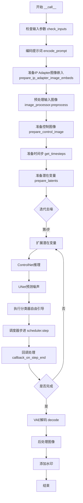
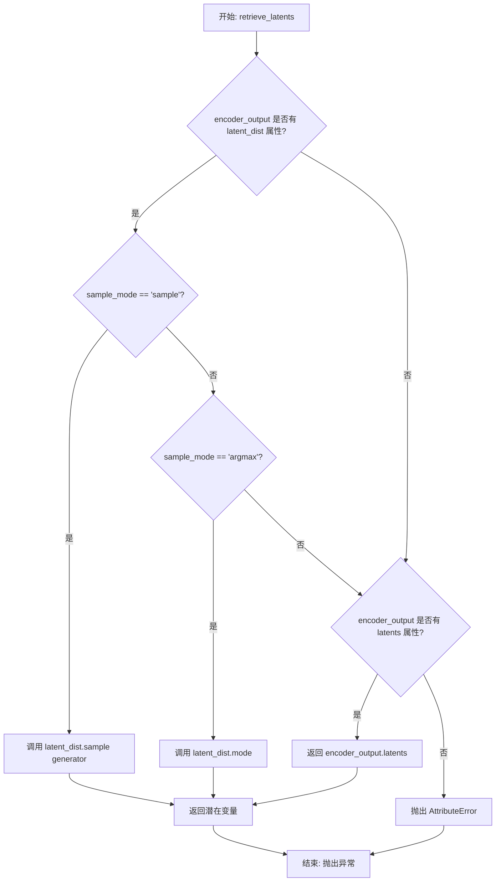
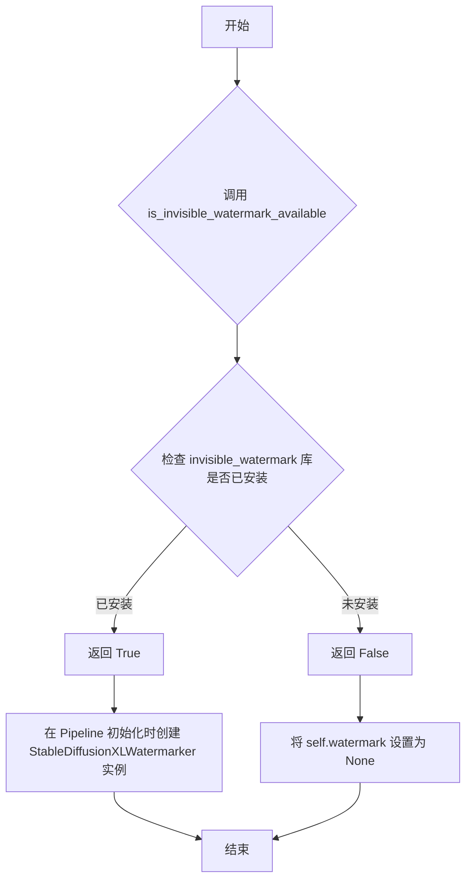
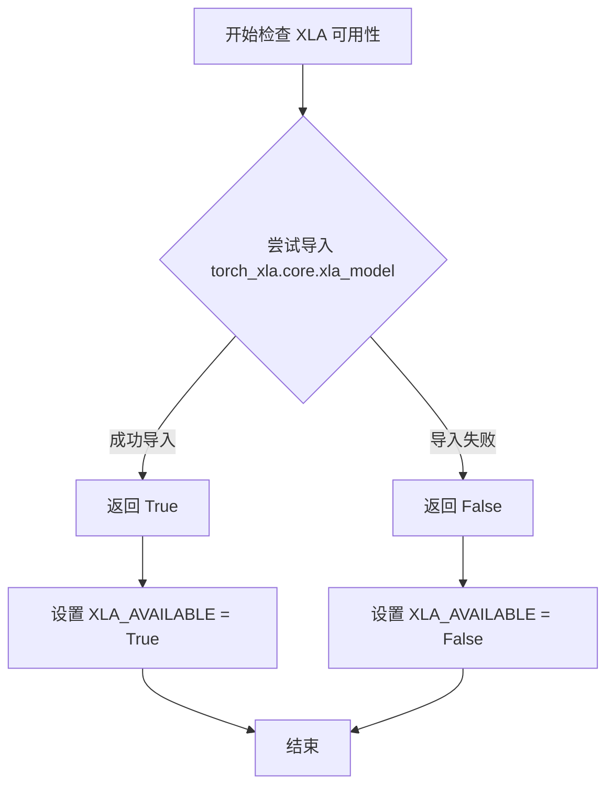
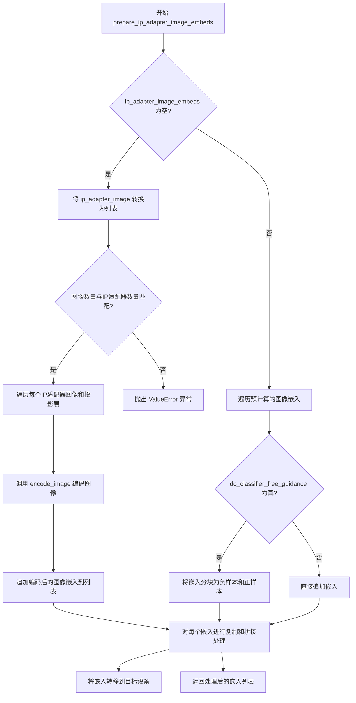
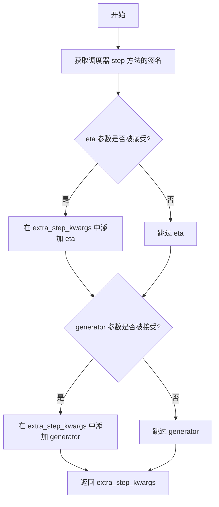
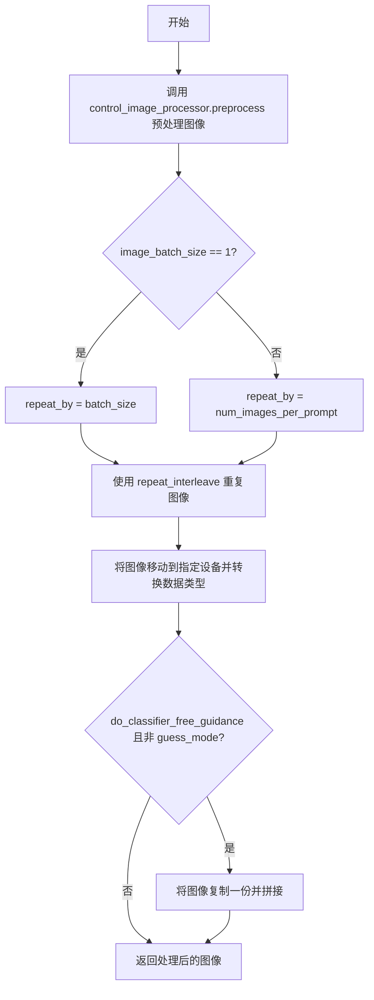
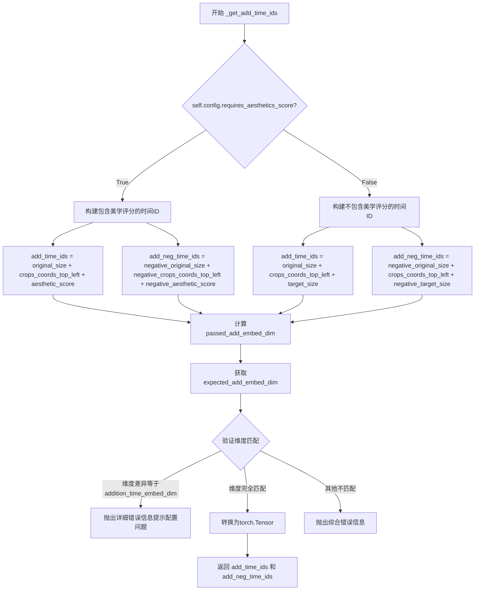
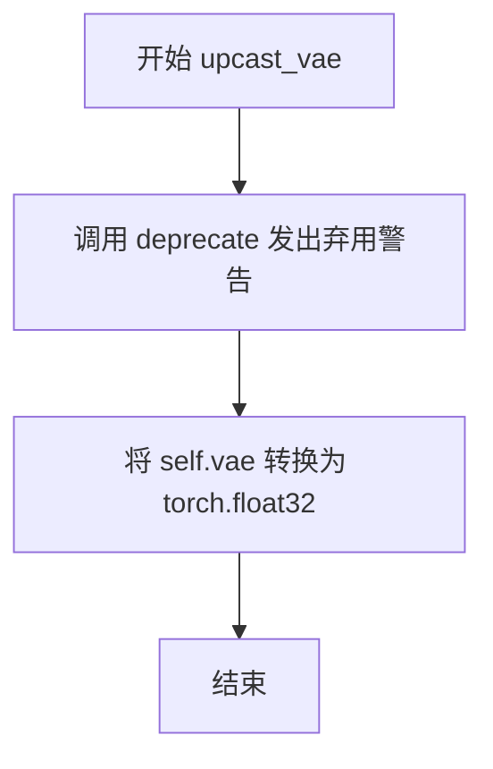

```mermaid
flowchart TD
    A[开始 __call__] --> B[检查输入参数]
    B --> C[获取执行设备 device]
    C --> D[编码提示词 encode_prompt]
    D --> E{ip_adapter_image 或<br/>ip_adapter_image_embeds<br/>是否存在?}
    E -->|是| F[准备 IP Adapter 图像嵌入]
    E -->|否| G[跳过 IP Adapter 处理]
    F --> G
    G --> H[预处理输入图像]
    H --> I[准备控制图像 prepare_control_image]
    I --> J[设置调度器时间步]
    J --> K[获取时间步 get_timesteps]
    K --> L{latents 是否为 None?}
    L -->|是| M[准备潜在向量 prepare_latents]
    L -->|否| N[使用提供的 latents]
    M --> O[准备额外调度器参数]
    N --> O
    O --> P[创建 ControlNet 保持掩码]
    P --> Q[准备添加的时间 ID 和嵌入]
    Q --> R[分类器自由引导处理]
    R --> S[进入去噪循环]
    
    S --> T[展开 latents 进行 CFG]
    T --> U[缩放模型输入]
    U --> V[构建条件 kwargs]
    V --> W{guess_mode 且 CFG?}
    W -->|是| X[仅条件推理 ControlNet]
    W -->|否| Y[正常推理 ControlNet]
    X --> Z[连接零向量]
    Y --> AA[执行 ControlNet 推理]
    Z --> AB
    AA --> AB[合并 ControlNet 残差]
    AB --> AC[添加图像嵌入到条件]
    AC --> AD[UNet 预测噪声残差]
    AD --> AE{CFG 是否启用?}
    AE -->|是| AF[执行分类器自由引导]
    AE -->|否| AG[直接使用噪声预测]
    AF --> AH[计算引导后的噪声]
    AG --> AH
    AH --> AI[调度器步进更新 latents]
    AI --> AJ{是否有回调?}
    AJ -->|是| AK[执行回调函数]
    AJ -->|否| AL[更新进度条]
    AK --> AL
    AL --> AM{是否还有时间步?}
    AM -->|是| AT[返回 T 继续循环]
    AM -->|否| AN[去噪循环结束]
    
    AN --> AO{output_type<br/>是否为 latent?}
    AO -->|否| AP[VAE 解码潜在向量]
    AO -->|是| AQ[直接返回 latents]
    AP --> AR[应用水印]
    AR --> AS[后处理图像]
    AQ --> AT2[返回结果]
    AS --> AT2
    
    AT --> T
```

# `diffusers\src\diffusers\pipelines\controlnet\pipeline_controlnet_union_sd_xl_img2img.py` 详细设计文档

这是一个结合了Stable Diffusion XL (SDXL) 和 ControlNet Union 的图像到图像（Img2Img）生成Pipeline。该Pipeline支持通过ControlNet进行条件控制，实现基于文本提示和输入图像的受控图像生成与转换，同时集成了LoRA、Textual Inversion、IP Adapter等高级功能。

## 整体流程



## 类结构

```
DiffusionPipeline (基类)
├── StableDiffusionMixin
├── TextualInversionLoaderMixin
├── StableDiffusionXLLoraLoaderMixin
├── FromSingleFileMixin
├── IPAdapterMixin
└── StableDiffusionXLControlNetUnionImg2ImgPipeline
```

## 全局变量及字段


### `logger`
    
日志记录器，用于记录Pipeline运行过程中的信息

类型：`logging.Logger`
    


### `EXAMPLE_DOC_STRING`
    
使用示例文档字符串，包含Pipeline调用示例代码

类型：`str`
    


### `XLA_AVAILABLE`
    
XLA可用性标志，标识torch_xla是否可用

类型：`bool`
    


### `StableDiffusionXLControlNetUnionImg2ImgPipeline.vae`
    
VAE模型用于编码/解码图像

类型：`AutoencoderKL`
    


### `StableDiffusionXLControlNetUnionImg2ImgPipeline.text_encoder`
    
第一个文本编码器

类型：`CLIPTextModel`
    


### `StableDiffusionXLControlNetUnionImg2ImgPipeline.text_encoder_2`
    
第二个文本编码器(SDXL)

类型：`CLIPTextModelWithProjection`
    


### `StableDiffusionXLControlNetUnionImg2ImgPipeline.tokenizer`
    
第一个分词器

类型：`CLIPTokenizer`
    


### `StableDiffusionXLControlNetUnionImg2ImgPipeline.tokenizer_2`
    
第二个分词器

类型：`CLIPTokenizer`
    


### `StableDiffusionXLControlNetUnionImg2ImgPipeline.unet`
    
条件U-Net去噪模型

类型：`UNet2DConditionModel`
    


### `StableDiffusionXLControlNetUnionImg2ImgPipeline.controlnet`
    
ControlNet条件控制模型

类型：`ControlNetUnionModel | MultiControlNetUnionModel`
    


### `StableDiffusionXLControlNetUnionImg2ImgPipeline.scheduler`
    
扩散调度器

类型：`KarrasDiffusionSchedulers`
    


### `StableDiffusionXLControlNetUnionImg2ImgPipeline.vae_scale_factor`
    
VAE缩放因子

类型：`int`
    


### `StableDiffusionXLControlNetUnionImg2ImgPipeline.image_processor`
    
图像处理器

类型：`VaeImageProcessor`
    


### `StableDiffusionXLControlNetUnionImg2ImgPipeline.control_image_processor`
    
控制图像处理器

类型：`VaeImageProcessor`
    


### `StableDiffusionXLControlNetUnionImg2ImgPipeline.watermark`
    
水印处理器

类型：`StableDiffusionXLWatermarker`
    


### `StableDiffusionXLControlNetUnionImg2ImgPipeline._guidance_scale`
    
引导尺度

类型：`float`
    


### `StableDiffusionXLControlNetUnionImg2ImgPipeline._clip_skip`
    
CLIP跳过的层数

类型：`int`
    


### `StableDiffusionXLControlNetUnionImg2ImgPipeline._cross_attention_kwargs`
    
交叉注意力参数

类型：`dict`
    


### `StableDiffusionXLControlNetUnionImg2ImgPipeline._num_timesteps`
    
时间步数

类型：`int`
    


### `StableDiffusionXLControlNetUnionImg2ImgPipeline._interrupt`
    
中断标志

类型：`bool`
    
    

## 全局函数及方法


### `retrieve_latents`

该函数用于从 VAE 编码器输出（encoder_output）中检索潜在变量（latents），支持多种采样模式（随机采样或 argmax），并处理不同的 encoder_output 数据结构。

参数：

- `encoder_output`：`torch.Tensor`，VAE 编码器的输出对象，可能包含 `latent_dist` 属性（包含采样分布）或 `latents` 属性（直接存储的潜在变量）
- `generator`：`torch.Generator | None`，可选的随机数生成器，用于确保采样过程的可重复性
- `sample_mode`：`str`，采样模式，默认为 `"sample"`（随机采样），也可设置为 `"argmax"`（取概率最大的值）

返回值：`torch.Tensor`，从编码器输出中提取的潜在变量张量

#### 流程图



#### 带注释源码

```python
def retrieve_latents(
    encoder_output: torch.Tensor, generator: torch.Generator | None = None, sample_mode: str = "sample"
):
    """
    从 VAE 编码器输出中检索潜在变量。
    
    该函数支持三种获取潜在变量的方式：
    1. 从 latent_dist 分布中采样（sample 模式）
    2. 从 latent_dist 分布中取 mode/argmax（argmax 模式）
    3. 直接获取预存的 latents 属性
    
    Args:
        encoder_output: VAE 编码器的输出，通常包含 latent_dist 或 latents 属性
        generator: 可选的随机数生成器，用于控制采样过程的随机性
        sample_mode: 采样模式，'sample' 表示随机采样，'argmax' 表示取概率最大的值
    
    Returns:
        torch.Tensor: 编码后的潜在变量
    
    Raises:
        AttributeError: 当 encoder_output 既没有 latent_dist 也没有 latents 属性时抛出
    """
    # 检查 encoder_output 是否有 latent_dist 属性且使用 sample 模式
    if hasattr(encoder_output, "latent_dist") and sample_mode == "sample":
        # 从潜在空间分布中采样，支持使用 generator 控制随机性
        return encoder_output.latent_dist.sample(generator)
    # 检查 encoder_output 是否有 latent_dist 属性且使用 argmax 模式
    elif hasattr(encoder_output, "latent_dist") and sample_mode == "argmax":
        # 取潜在空间分布的 mode（概率最大的值）
        return encoder_output.latent_dist.mode()
    # 检查 encoder_output 是否有直接存储的 latents 属性
    elif hasattr(encoder_output, "latents"):
        # 直接返回预存的潜在变量
        return encoder_output.latents
    else:
        # 无法识别有效的潜在变量来源
        raise AttributeError("Could not access latents of provided encoder_output")
```


### `is_invisible_watermark_available`

检查不可见水印库是否可用，用于决定是否为生成的图像添加水印。

参数：

- 无参数

返回值：`bool`，如果不可见水印库可用则返回 `True`，否则返回 `False`

#### 流程图



#### 带注释源码

```python
# 该函数从 diffusers.utils.import_utils 导入
# 用于检查 invisible_watermark 库是否可用

# 在 Pipeline 初始化中的使用方式：
add_watermarker = add_watermarker if add_watermarker is not None else is_invisible_watermark_available()

# 如果 add_watermarker 为 None，则自动检查库是否可用
# 如果库可用，则创建水印器实例
if add_watermarker:
    self.watermark = StableDiffusionXLWatermarker()
else:
    self.watermark = None

# 在图像生成完成后，如果水印器存在，则应用水印
if self.watermark is not None:
    image = self.watermark.apply_watermark(image)
```


### `is_torch_xla_available`

该函数是一个工具函数，用于检测当前环境是否支持 PyTorch XLA（用于 TPU 的后端）。它通过尝试导入 `torch_xla` 模块来判断 XLA 是否可用。

参数：无需参数

返回值：`bool`，返回 `True` 表示 PyTorch XLA 可用（环境中有 `torch_xla` 包），返回 `False` 表示不可用

#### 流程图



#### 带注释源码

```python
# 从 diffusers.utils 模块导入 is_torch_xla_available 函数
from ...utils import is_torch_xla_available

# 根据 XLA 可用性条件性地导入 torch_xla 并设置全局标志
if is_torch_xla_available():
    # 仅当 XLA 可用时导入，以避免不必要的依赖或导入错误
    import torch_xla.core.xla_model as xm

    # 设置全局标志，供后续代码（如管道推理循环）使用
    XLA_AVAILABLE = True
else:
    # XLA 不可用时设置标志为 False
    XLA_AVAILABLE = False

# 在管道的去噪循环末尾使用 XLA_AVAILABLE 标志
# 如果 XLA 可用，调用 xm.mark_step() 来标记计算步骤
if XLA_AVAILABLE:
    xm.mark_step()
```

---

**注意**：该函数的实际定义位于 `diffusers.utils` 模块中，未包含在当前提供的代码文件内。上述信息是基于其在当前文件中的使用方式推断得出的。


### `StableDiffusionXLControlNetUnionImg2ImgPipeline.__init__`

该方法是StableDiffusionXLControlNetUnionImg2ImgPipeline类的构造函数，负责初始化整个图像到图像生成管道。它接收多个核心模型组件（如VAE、文本编码器、U-Net、ControlNet等）和配置参数，完成模块注册、图像处理器初始化、水印处理器设置以及配置保存等关键初始化工作。

参数：

- `vae`：`AutoencoderKL`，变分自编码器模型，用于编码和解码图像与潜在表示之间的转换
- `text_encoder`：`CLIPTextModel`，冻结的文本编码器，负责将文本提示转换为嵌入向量
- `text_encoder_2`：`CLIPTextModelWithProjection`，第二个冻结的文本编码器（SDXL特有），提供文本和池化输出
- `tokenizer`：`CLIPTokenizer`，第一个分词器，用于将文本转换为token ID
- `tokenizer_2`：`CLIPTokenizer`，第二个分词器，配合text_encoder_2使用
- `unet`：`UNet2DConditionModel`，条件U-Net架构，用于对潜在表示进行去噪
- `controlnet`：`ControlNetUnionModel | list[ControlNetUnionModel] | tuple[ControlNetUnionModel] | MultiControlNetUnionModel`，提供额外条件引导的ControlNet模型
- `scheduler`：`KarrasDiffusionSchedulers`，去噪调度器，与unet配合使用
- `requires_aesthetics_score`：`bool`，可选，默认False，是否需要美学评分条件
- `force_zeros_for_empty_prompt`：`bool`，可选，默认True，当prompt为空时是否强制使用零嵌入
- `add_watermarker`：`bool | None`，可选，是否添加隐形水印
- `feature_extractor`：`CLIPImageProcessor`，可选，用于从生成图像中提取特征的处理器
- `image_encoder`：`CLIPVisionModelWithProjection`，可选，用于IP Adapter的图像编码器

返回值：无（`None`），构造函数不返回值，仅完成对象初始化

#### 流程图

```mermaid
flowchart TD
    A[开始 __init__] --> B[调用 super().__init__]
    B --> C{controlnet是否为list或tuple}
    C -->|是| D[将controlnet转换为MultiControlNetUnionModel]
    C -->|否| E[保持原样]
    D --> F[调用 register_modules 注册所有模块]
    E --> F
    F --> G[计算vae_scale_factor]
    G --> H[初始化 VaeImageProcessor]
    H --> I[初始化 control_image_processor]
    I --> J{add_watermarker是否为None}
    J -->|是| K[检查 is_invisible_watermark_available]
    J -->|否| L[使用传入的add_watermarker值]
    K --> M{水印库可用}
    M -->|是| N[创建 StableDiffusionXLWatermarker]
    M -->|否| O[设置 watermark=None]
    L --> N
    L --> O
    N --> P[注册配置: force_zeros_for_empty_prompt]
    O --> P
    P --> Q[注册配置: requires_aesthetics_score]
    Q --> R[结束 __init__]
```

#### 带注释源码

```python
def __init__(
    self,
    vae: AutoencoderKL,
    text_encoder: CLIPTextModel,
    text_encoder_2: CLIPTextModelWithProjection,
    tokenizer: CLIPTokenizer,
    tokenizer_2: CLIPTokenizer,
    unet: UNet2DConditionModel,
    controlnet: ControlNetUnionModel
    | list[ControlNetUnionModel]
    | tuple[ControlNetUnionModel]
    | MultiControlNetUnionModel,
    scheduler: KarrasDiffusionSchedulers,
    requires_aesthetics_score: bool = False,
    force_zeros_for_empty_prompt: bool = True,
    add_watermarker: bool | None = None,
    feature_extractor: CLIPImageProcessor = None,
    image_encoder: CLIPVisionModelWithProjection = None,
):
    """
    初始化StableDiffusionXLControlNetUnionImg2ImgPipeline管道
    
    参数:
        vae: 用于图像编码/解码的变分自编码器
        text_encoder: 第一个CLIP文本编码器
        text_encoder_2: 第二个CLIP文本编码器(带projection)
        tokenizer: 第一个分词器
        tokenizer_2: 第二个分词器
        unet: 条件U-Net去噪模型
        controlnet: ControlNet模型(支持单/多模型)
        scheduler: 扩散调度器
        requires_aesthetics_score: 是否需要美学评分
        force_zeros_for_empty_prompt: 空prompt时强制零嵌入
        add_watermarker: 是否添加水印
        feature_extractor: 图像特征提取器
        image_encoder: 图像编码器(IP Adapter用)
    """
    # 调用父类DiffusionPipeline的初始化方法
    super().__init__()

    # 如果controlnet是列表或元组，包装为MultiControlNetUnionModel
    # 以支持多个ControlNet联合使用
    if isinstance(controlnet, (list, tuple)):
        controlnet = MultiControlNetUnionModel(controlnet)

    # 注册所有模块到pipeline，使它们可以通过self.xxx访问
    # 这是DiffusionPipeline的核心机制，支持模型加载/保存和设备管理
    self.register_modules(
        vae=vae,
        text_encoder=text_encoder,
        text_encoder_2=text_encoder_2,
        tokenizer=tokenizer,
        tokenizer_2=tokenizer_2,
        unet=unet,
        controlnet=controlnet,
        scheduler=scheduler,
        feature_extractor=feature_extractor,
        image_encoder=image_encoder,
    )

    # 计算VAE缩放因子，用于潜在空间与像素空间的转换
    # 公式: 2^(block_out_channels数量 - 1)，通常为8
    self.vae_scale_factor = 2 ** (len(self.vae.config.block_out_channels) - 1) if getattr(self, "vae", None) else 8

    # 初始化主图像处理器，用于预处理输入图像和后处理输出图像
    # do_convert_rgb=True确保所有图像转换为RGB格式
    self.image_processor = VaeImageProcessor(vae_scale_factor=self.vae_scale_factor, do_convert_rgb=True)

    # 初始化ControlNet专用图像处理器
    # do_normalize=False表示不进行归一化，保持ControlNet输入的一致性
    self.control_image_processor = VaeImageProcessor(
        vae_scale_factor=self.vae_scale_factor, do_convert_rgb=True, do_normalize=False
    )

    # 确定是否添加水印：优先使用传入值，否则检查水印库是否可用
    add_watermarker = add_watermarker if add_watermarker is not None else is_invisible_watermark_available()

    # 如果启用水印，创建水印处理器实例
    if add_watermarker:
        self.watermark = StableDiffusionXLWatermarker()
    else:
        self.watermark = None

    # 将配置参数注册到pipeline的config中
    # 这些配置会在save_pretrained/from_pretrained时持久化
    self.register_to_config(force_zeros_for_empty_prompt=force_zeros_for_empty_prompt)
    self.register_to_config(requires_aesthetics_score=requires_aesthetics_score)
```


### `StableDiffusionXLControlNetUnionImg2ImgPipeline.encode_prompt`

该方法负责将文本提示词（prompt）转换为模型能够理解的向量表示（embeddings）。它是 Stable Diffusion XL 管道处理文本输入的核心环节，涉及双文本编码器（CLIP Text Encoder 1 & 2）的调用、文本反转（Textual Inversion）处理、LoRA 权重调整、以及无分类器指导（Classifier-Free Guidance, CFG）所需的负向嵌入生成。

#### 参数

- `prompt`：`str | list[str]`，需要编码的主要提示词。
- `prompt_2`：`str | list[str] | None`，发送给第二个文本编码器（tokenizer_2, text_encoder_2）的提示词。如果为 None，则使用 `prompt`。
- `device`：`torch.device | None`，执行编码的设备。如果为 None，则使用管道的默认执行设备。
- `num_images_per_prompt`：`int`，每个提示词要生成的图像数量，用于批量扩展嵌入向量。
- `do_classifier_free_guidance`：`bool`，是否启用无分类器指导。如果为 True，会生成负向嵌入。
- `negative_prompt`：`str | list[str] | None`，负向提示词，用于引导图像远离特定内容。
- `negative_prompt_2`：`str | list[str] | None`，第二个负向提示词。
- `prompt_embeds`：`torch.Tensor | None`，预生成的提示词嵌入。如果提供此参数，则跳过从文本生成嵌入的过程。
- `negative_prompt_embeds`：`torch.Tensor | None`，预生成的负向提示词嵌入。
- `pooled_prompt_embeds`：`torch.Tensor | None`，预生成的池化提示词嵌入（通常包含全局语义信息）。
- `negative_pooled_prompt_embeds`：`torch.Tensor | None`，预生成的负向池化嵌入。
- `lora_scale`：`float | None`，LoRA 权重缩放因子，用于动态调整 LoRA 的影响。
- `clip_skip`：`int | None`，CLIP 模型的跳过层数。如果设置，则从倒数第 N 层获取隐藏状态而非最后一层。

#### 返回值

`tuple[torch.Tensor, torch.Tensor, torch.Tensor, torch.Tensor]`
返回一个包含四个张量的元组：
1.  **prompt_embeds**: 编码后的正向提示词嵌入。
2.  **negative_prompt_embeds**: 编码后的负向提示词嵌入。
3.  **pooled_prompt_embeds**: 编码后的池化正向提示词嵌入。
4.  **negative_pooled_prompt_embeds**: 编码后的池化负向提示词嵌入。

#### 流程图

```mermaid
flowchart TD
    A([Start encode_prompt]) --> B{检查 LoRA Scale}
    B -->|Yes| C[应用 LoRA 缩放权重]
    B -->|No| D[跳过 LoRA 调整]
    C --> D
    
    D --> E[规范化输入: 确认 Batch Size]
    E --> F{是否已有 prompt_embeds?}
    F -->|Yes| G[直接使用现有 Embeds]
    F -->|No| H[开始编码正向提示词]
    
    H --> I[遍历 2 个 Tokenizer 和 TextEncoder]
    I --> I1[检查 Textual Inversion]
    I1 --> I2[Tokenize -> Encode]
    I2 --> I3[处理 clip_skip 逻辑]
    I3 --> I4[提取 Pooled Output]
    I4 --> I5[合并两个 Encoder 的 Embeds]
    
    G --> J{是否启用 CFG?}
    I5 --> J
    
    J -->|Yes| K[处理负向提示词]
    J -->|No| L[复制 Embeds 以匹配 Batch]
    
    K --> K1{force_zeros_for_empty_prompt?}
    K1 -->|Yes| K2[创建全零负向 Embeds]
    K1 -->|No| K3[Tokenize 负向提示词 -> Encode]
    K2 --> L
    K3 --> L
    
    L --> M[复制 Embeds (num_images_per_prompt)]
    M --> N[转换 Dtype 与 Device]
    N --> O{使用了 PEFT Backend?}
    O -->|Yes| P[反向缩放 LoRA 权重]
    O -->|No| Q([Return 4 Tensors])
    P --> Q
```

#### 带注释源码

```python
def encode_prompt(
    self,
    prompt: str,
    prompt_2: str | None = None,
    device: torch.device | None = None,
    num_images_per_prompt: int = 1,
    do_classifier_free_guidance: bool = True,
    negative_prompt: str | None = None,
    negative_prompt_2: str | None = None,
    prompt_embeds: torch.Tensor | None = None,
    negative_prompt_embeds: torch.Tensor | None = None,
    pooled_prompt_embeds: torch.Tensor | None = None,
    negative_pooled_prompt_embeds: torch.Tensor | None = None,
    lora_scale: float | None = None,
    clip_skip: int | None = None,
):
    r"""
    Encodes the prompt into text encoder hidden states.
    ...
    """
    # 1. 确定设备，默认为管道的执行设备
    device = device or self._execution_device

    # 2. 处理 LoRA 缩放
    # 如果传入了 lora_scale，则调整文本编码器上的 LoRA 权重
    if lora_scale is not None and isinstance(self, StableDiffusionXLLoraLoaderMixin):
        self._lora_scale = lora_scale
        # 根据是否使用 PEFT 后端选择不同的缩放方法
        if self.text_encoder is not None:
            if not USE_PEFT_BACKEND:
                adjust_lora_scale_text_encoder(self.text_encoder, lora_scale)
            else:
                scale_lora_layers(self.text_encoder, lora_scale)

        if self.text_encoder_2 is not None:
            if not USE_PEFT_BACKEND:
                adjust_lora_scale_text_encoder(self.text_encoder_2, lora_scale)
            else:
                scale_lora_layers(self.text_encoder_2, lora_scale)

    # 3. 预处理 Prompt 列表
    # 确保 prompt 是列表格式，以便批量处理
    prompt = [prompt] if isinstance(prompt, str) else prompt

    if prompt is not None:
        batch_size = len(prompt)
    else:
        # 如果没有 prompt，则从已提供的 prompt_embeds 推断 batch_size
        batch_size = prompt_embeds.shape[0]

    # 4. 定义编码器组件
    # SDXL 通常使用两个文本编码器：tokenizer/text_encoder 和 tokenizer_2/text_encoder_2
    tokenizers = [self.tokenizer, self.tokenizer_2] if self.tokenizer is not None else [self.tokenizer_2]
    text_encoders = (
        [self.text_encoder, self.text_encoder_2] if self.text_encoder is not None else [self.text_encoder_2]
    )

    # 5. 生成正向提示词嵌入 (Positive Prompt Embeds)
    if prompt_embeds is None:
        # 如果只提供了一个 prompt_2，默认使用 prompt
        prompt_2 = prompt_2 or prompt
        prompt_2 = [prompt_2] if isinstance(prompt_2, str) else prompt_2

        # 用于存储两个编码器生成的 embeddings
        prompt_embeds_list = []
        prompts = [prompt, prompt_2]

        # 循环处理两个文本编码器
        for prompt, tokenizer, text_encoder in zip(prompts, tokenizers, text_encoders):
            # 如果启用了 Textual Inversion (文本反转)，在此处转换 prompt
            if isinstance(self, TextualInversionLoaderMixin):
                prompt = self.maybe_convert_prompt(prompt, tokenizer)

            # Tokenize
            text_inputs = tokenizer(
                prompt,
                padding="max_length",
                max_length=tokenizer.model_max_length,
                truncation=True,
                return_tensors="pt",
            )

            text_input_ids = text_inputs.input_ids
            
            # 检查是否发生了截断，并记录警告
            untruncated_ids = tokenizer(prompt, padding="longest", return_tensors="pt").input_ids
            if untruncated_ids.shape[-1] >= text_input_ids.shape[-1] and not torch.equal(
                text_input_ids, untruncated_ids
            ):
                removed_text = tokenizer.batch_decode(untruncated_ids[:, tokenizer.model_max_length - 1 : -1])
                logger.warning(
                    "The following part of your input was truncated because CLIP can only handle sequences up to"
                    f" {tokenizer.model_max_length} tokens: {removed_text}"
                )

            # 获取 Embeddings
            # output_hidden_states=True 确保我们获取所有层的隐藏状态
            prompt_embeds = text_encoder(text_input_ids.to(device), output_hidden_states=True)

            # 获取 Pooled Embeddings (通常用于 U-Net 的条件注入)
            # 我们只对最终的 text_encoder 感兴趣，但这里通过索引 [0] 获取pooled输出
            if pooled_prompt_embeds is None and prompt_embeds[0].ndim == 2:
                pooled_prompt_embeds = prompt_embeds[0]

            # 处理 clip_skip 逻辑
            # 如果没有指定 clip_skip，默认取倒数第二层 (-2)
            # 如果指定了 clip_skip=N，则取倒数第 N+2 层
            if clip_skip is None:
                prompt_embeds = prompt_embeds.hidden_states[-2]
            else:
                prompt_embeds = prompt_embeds.hidden_states[-(clip_skip + 2)]

            prompt_embeds_list.append(prompt_embeds)

        # 沿最后一个维度拼接两个编码器的输出
        # CLIP ViT-L (768维) + CLIP ViT-bigG (1280维) -> 2048维
        prompt_embeds = torch.concat(prompt_embeds_list, dim=-1)

    # 6. 生成负向提示词嵌入 (Negative Prompt Embeds) - 也就是 CFG 的条件部分
    zero_out_negative_prompt = negative_prompt is None and self.config.force_zeros_for_empty_prompt
    
    # 逻辑分支：
    # A. 启用 CFG 且未提供负向嵌入，但配置要求强制为零 -> 生成全零张量
    if do_classifier_free_guidance and negative_prompt_embeds is None and zero_out_negative_prompt:
        negative_prompt_embeds = torch.zeros_like(prompt_embeds)
        negative_pooled_prompt_embeds = torch.zeros_like(pooled_prompt_embeds)
    # B. 启用 CFG 且需要生成负向嵌入
    elif do_classifier_free_guidance and negative_prompt_embeds is None:
        negative_prompt = negative_prompt or ""
        negative_prompt_2 = negative_prompt_2 or negative_prompt

        # 规范化为列表
        negative_prompt = batch_size * [negative_prompt] if isinstance(negative_prompt, str) else negative_prompt
        negative_prompt_2 = (
            batch_size * [negative_prompt_2] if isinstance(negative_prompt_2, str) else negative_prompt_2
        )

        # 类型和长度校验
        uncond_tokens: list[str]
        if prompt is not None and type(prompt) is not type(negative_prompt):
            raise TypeError(...)
        elif batch_size != len(negative_prompt):
            raise ValueError(...)
        else:
            uncond_tokens = [negative_prompt, negative_prompt_2]

        negative_prompt_embeds_list = []
        
        # 编码负向提示词，逻辑与正向类似
        for negative_prompt, tokenizer, text_encoder in zip(uncond_tokens, tokenizers, text_encoders):
            if isinstance(self, TextualInversionLoaderMixin):
                negative_prompt = self.maybe_convert_prompt(negative_prompt, tokenizer)

            max_length = prompt_embeds.shape[1]
            uncond_input = tokenizer(
                negative_prompt,
                padding="max_length",
                max_length=max_length,
                truncation=True,
                return_tensors="pt",
            )

            negative_prompt_embeds = text_encoder(
                uncond_input.input_ids.to(device),
                output_hidden_states=True,
            )

            if negative_pooled_prompt_embeds is None and negative_prompt_embeds[0].ndim == 2:
                negative_pooled_prompt_embeds = negative_prompt_embeds[0]
            
            # 同样取倒数第二层
            negative_prompt_embeds = negative_prompt_embeds.hidden_states[-2]

            negative_prompt_embeds_list.append(negative_prompt_embeds)

        negative_prompt_embeds = torch.concat(negative_prompt_embeds_list, dim=-1)

    # 7. 类型与设备转换
    # 确保生成的 Embeds 精度与目标模型一致 (通常为 float16)
    if self.text_encoder_2 is not None:
        prompt_embeds = prompt_embeds.to(dtype=self.text_encoder_2.dtype, device=device)
    else:
        prompt_embeds = prompt_embeds.to(dtype=self.unet.dtype, device=device)

    # 8. 批量扩展 (Batch Expansion)
    # 为每个 prompt 生成多个图像时，复制对应的 embeddings
    bs_embed, seq_len, _ = prompt_embeds.shape
    # 使用 repeat 方法扩展维度以兼容 MPS (Apple Silicon)
    prompt_embeds = prompt_embeds.repeat(1, num_images_per_prompt, 1)
    prompt_embeds = prompt_embeds.view(bs_embed * num_images_per_prompt, seq_len, -1)

    # 如果启用 CFG，同样扩展负向 Embeds
    if do_classifier_free_guidance:
        seq_len = negative_prompt_embeds.shape[1]

        if self.text_encoder_2 is not None:
            negative_prompt_embeds = negative_prompt_embeds.to(dtype=self.text_encoder_2.dtype, device=device)
        else:
            negative_prompt_embeds = negative_prompt_embeds.to(dtype=self.unet.dtype, device=device)

        negative_prompt_embeds = negative_prompt_embeds.repeat(1, num_images_per_prompt, 1)
        negative_prompt_embeds = negative_prompt_embeds.view(batch_size * num_images_per_prompt, seq_len, -1)

    # 扩展 Pooled Embeds
    pooled_prompt_embeds = pooled_prompt_embeds.repeat(1, num_images_per_prompt).view(
        bs_embed * num_images_per_prompt, -1
    )
    if do_classifier_free_guidance:
        negative_pooled_prompt_embeds = negative_pooled_prompt_embeds.repeat(1, num_images_per_prompt).view(
            bs_embed * num_images_per_prompt, -1
        )

    # 9. 清理 LoRA 状态
    # 恢复原始权重，避免影响后续非 LoRA 操作
    if self.text_encoder is not None:
        if isinstance(self, StableDiffusionXLLoraLoaderMixin) and USE_PEFT_BACKEND:
            unscale_lora_layers(self.text_encoder, lora_scale)

    if self.text_encoder_2 is not None:
        if isinstance(self, StableDiffusionXLLoraLoaderMixin) and USE_PEFT_BACKEND:
            unscale_lora_layers(self.text_encoder_2, lora_scale)

    # 10. 返回四个关键的 Embedding Tensor
    return prompt_embeds, negative_prompt_embeds, pooled_prompt_embeds, negative_pooled_prompt_embeds
```

#### 关键组件信息

1.  **Textual Inversion (文本反转)**: 代码中通过 `self.maybe_convert_prompt` 调用，允许用户使用自定义的 embedding token 来替代词汇。
2.  **Clip Skip**: 允许跳过 CLIP 的最后一层，使用更深层的特征来生成图像，有时能产生更好的效果或符合特定的风格。
3.  **Dual Text Encoders**: SDXL 的核心特性，通过合并两个不同大小 CLIP 模型的输出（ViT-L + ViT-bigG）来获得更丰富的语义空间。

#### 潜在技术债务与优化空间

1.  **代码重复**: 正向提示词和负向提示词的编码逻辑（Tokenize -> Encode -> Clip Skip 处理）高度相似，存在大量重复代码。可以抽象为一个辅助函数 `_encode_prompt_core` 来减少重复。
2.  **复杂性高**: 该函数承担了过多的职责（输入验证、LoRA管理、编码、类型转换、批量处理）。长期来看，建议将 Embedding 的生成与 CFG 的处理逻辑进一步解耦。
3.  **内存峰值**: 在生成分离的 `negative_prompt_embeds` 时，如果 batch 很大，内存占用会翻倍。对于极端的 batch size，可能需要in-place操作或优化策略。

#### 其它项目

*   **设计目标**: 确保文本语义能精确传递给生成模型，特别是在处理超长描述或特殊 token 时。
*   **错误处理**: 主要集中在输入类型检查（如 list vs str）和 batch size 匹配上。如果 `negative_prompt` 和 `prompt` 的 batch size 不一致，会直接抛出异常。
*   **外部依赖**: 强依赖 `transformers` 库中的 `CLIPTokenizer` 和 `CLIPTextModel`。


### `StableDiffusionXLControlNetUnionImg2ImgPipeline.encode_image`

该方法用于将输入图像编码为嵌入向量（image embeddings），支持条件图像嵌入和非条件（unconditional）图像嵌入的生成，用于后续的图像到图像（img2img）扩散过程或IP-Adapter控制。

参数：

- `image`：`Union[torch.Tensor, PIL.Image.Image, np.ndarray, List[Union[torch.Tensor, PIL.Image.Image, np.ndarray]]]`，待编码的输入图像，支持多种格式（PIL图像、PyTorch张量、NumPy数组或它们的列表）
- `device`：`torch.device`，目标计算设备（CPU/CUDA）
- `num_images_per_prompt`：`int`，每个提示词需要生成的图像数量，用于批量扩展嵌入维度
- `output_hidden_states`：`Optional[bool]`，是否返回CLIP编码器的隐藏状态而非图像嵌入，默认为`None`（返回`image_embeds`）

返回值：`Tuple[torch.Tensor, torch.Tensor]`，返回两个张量元组——条件图像嵌入（或隐藏状态）和非条件图像嵌入（或隐藏状态），分别用于Classifier-Free Guidance的引导和非引导分支

#### 流程图

```mermaid
flowchart TD
    A[开始 encode_image] --> B[获取 image_encoder 的数据类型 dtype]
    B --> C{image 是否为 torch.Tensor}
    C -->|否| D[使用 feature_extractor 提取像素值]
    C -->|是| E[直接使用 image]
    D --> F[将 image 转换到指定 device 和 dtype]
    E --> F
    F --> G{output_hidden_states 为 True?}
    G -->|是| H[调用 image_encoder 获取 hidden_states]
    H --> I[取倒数第二层 hidden_states]
    I --> J[repeat_interleave 扩展条件嵌入]
    K[创建全零张量作为 uncond 输入]
    K --> L[调用 image_encoder 获取 uncond hidden_states]
    L --> J1[取倒数第二层]
    J1 --> J2[repeat_interleave 扩展非条件嵌入]
    J2 --> M[返回 (image_enc_hidden_states, uncond_image_enc_hidden_states)]
    G -->|否| N[调用 image_encoder 获取 image_embeds]
    N --> O[repeat_interleave 扩展条件嵌入]
    P[创建与 image_embeds 形状相同的全零张量]
    P --> Q[repeat_interleave 扩展非条件嵌入]
    O --> R[返回 (image_embeds, uncond_image_embeds)]
    M --> S[结束]
    R --> S
```

#### 带注释源码

```python
def encode_image(
    self,
    image,
    device,
    num_images_per_prompt,
    output_hidden_states=None
):
    """
    将输入图像编码为嵌入向量，用于图像到图像生成或IP-Adapter控制。

    Args:
        image: 输入图像，支持 PIL.Image、torch.Tensor、np.ndarray 或它们的列表
        device: torch 设备
        num_images_per_prompt: 每个提示词生成的图像数量
        output_hidden_states: 是否返回隐藏状态（用于更细粒度的控制）

    Returns:
        Tuple[torch.Tensor, torch.Tensor]: (条件嵌入, 非条件嵌入)
    """
    # 1. 获取 image_encoder 的参数数据类型，用于后续张量转换
    dtype = next(self.image_encoder.parameters()).dtype

    # 2. 如果输入不是 PyTorch 张量，使用 feature_extractor 预处理
    #    将 PIL Image 或 numpy array 转换为 tensor
    if not isinstance(image, torch.Tensor):
        image = self.feature_extractor(image, return_tensors="pt").pixel_values

    # 3. 将图像移动到目标设备并转换为正确的 dtype
    image = image.to(device=device, dtype=dtype)

    # 4. 根据 output_hidden_states 参数决定输出形式
    if output_hidden_states:
        # --- 分支 A: 返回隐藏状态 (hidden states) ---
        
        # 4.1 编码条件图像，获取倒数第二层隐藏状态
        #     选择倒数第二层是因为最后一层可能过于具体或噪声较大
        image_enc_hidden_states = self.image_encoder(
            image,
            output_hidden_states=True
        ).hidden_states[-2]
        
        # 4.2 按 num_images_per_prompt 扩展批次维度
        #     repeat_interleave 在 batch 维度上重复，用于支持单提示词多图生成
        image_enc_hidden_states = image_enc_hidden_states.repeat_interleave(
            num_images_per_prompt,
            dim=0
        )

        # 4.3 创建全零图像（unconditional），用于 Classifier-Free Guidance
        #     在 CFG 中，无条件嵌入帮助模型在"无引导"和"有引导"之间插值
        uncond_image_enc_hidden_states = self.image_encoder(
            torch.zeros_like(image),
            output_hidden_states=True
        ).hidden_states[-2]
        
        # 4.4 同样扩展无条件嵌入的批次
        uncond_image_enc_hidden_states = uncond_image_enc_hidden_states.repeat_interleave(
            num_images_per_prompt,
            dim=0
        )

        # 4.5 返回隐藏状态形式的嵌入对
        return image_enc_hidden_states, uncond_image_enc_hidden_states
    else:
        # --- 分支 B: 返回图像嵌入 (image_embeds) ---
        
        # 4.6 直接获取图像嵌入（CLIP ViT 的 pooled 输出）
        image_embeds = self.image_encoder(image).image_embeds
        
        # 4.7 扩展条件嵌入批次
        image_embeds = image_embeds.repeat_interleave(num_images_per_prompt, dim=0)
        
        # 4.8 创建全零无条件嵌入（形状与条件嵌入相同）
        #     zeros_like 确保梯度结构兼容，但值为零
        uncond_image_embeds = torch.zeros_like(image_embeds)

        # 4.9 返回图像嵌入对
        return image_embeds, uncond_image_embeds
```


### `StableDiffusionXLControlNetUnionImg2ImgPipeline.prepare_ip_adapter_image_embeds`

该方法用于准备IP Adapter图像嵌入，将输入的图像或预计算的图像嵌入进行处理，生成可用于Stable Diffusion XL图像生成的条件嵌入，支持分类器-free引导和多IP适配器场景。

参数：

- `ip_adapter_image`：`PipelineImageInput | None`，需要处理的IP Adapter输入图像
- `ip_adapter_image_embeds`：`list[torch.Tensor] | None`，预生成的图像嵌入列表
- `device`：`torch.device`，执行计算的设备
- `num_images_per_prompt`：`int`，每个提示词生成的图像数量
- `do_classifier_free_guidance`：`bool`，是否启用分类器-free引导

返回值：`list[torch.Tensor]`，处理后的IP Adapter图像嵌入列表

#### 流程图



#### 带注释源码

```python
def prepare_ip_adapter_image_embeds(
    self, 
    ip_adapter_image,  # PipelineImageInput | None: 输入的IP Adapter图像
    ip_adapter_image_embeds,  # list[torch.Tensor] | None: 预计算的图像嵌入
    device,  # torch.device: 计算设备
    num_images_per_prompt,  # int: 每个提示生成的图像数量
    do_classifier_free_guidance  # bool: 是否启用分类器-free引导
):
    """
    准备IP Adapter图像嵌入用于条件生成
    
    该方法支持两种输入模式：
    1. 输入原始图像：需要通过encode_image编码为嵌入
    2. 输入预计算的嵌入：直接进行后处理
    
    处理流程包括：
    - 验证输入参数的有效性
    - 对每个IP适配器独立处理图像嵌入
    - 根据是否启用分类器-free引导进行负样本嵌入处理
    - 将嵌入复制扩展到num_images_per_prompt维度
    """
    
    image_embeds = []  # 存储处理后的图像嵌入
    if do_classifier_free_guidance:
        negative_image_embeds = []  # 存储负样本图像嵌入
    
    # 分支1：需要从原始图像编码嵌入
    if ip_adapter_image_embeds is None:
        # 确保图像是列表格式
        if not isinstance(ip_adapter_image, list):
            ip_adapter_image = [ip_adapter_image]
        
        # 验证图像数量与IP适配器数量匹配
        if len(ip_adapter_image) != len(self.unet.encoder_hid_proj.image_projection_layers):
            raise ValueError(
                f"`ip_adapter_image` must have same length as the number of IP Adapters. "
                f"Got {len(ip_adapter_image)} images and {len(self.unet.encoder_hid_proj.image_projection_layers)} IP Adapters."
            )
        
        # 遍历每个IP适配器的图像和投影层
        for single_ip_adapter_image, image_proj_layer in zip(
            ip_adapter_image, self.unet.encoder_hid_proj.image_projection_layers
        ):
            # 判断是否需要输出隐藏状态（根据投影层类型）
            output_hidden_state = not isinstance(image_proj_layer, ImageProjection)
            
            # 编码单个图像
            single_image_embeds, single_negative_image_embeds = self.encode_image(
                single_ip_adapter_image, device, 1, output_hidden_state
            )
            
            # 添加批次维度并存储
            image_embeds.append(single_image_embeds[None, :])
            if do_classifier_free_guidance:
                negative_image_embeds.append(single_negative_image_embeds[None, :])
    
    # 分支2：使用预计算的嵌入
    else:
        for single_image_embeds in ip_adapter_image_embeds:
            if do_classifier_free_guidance:
                # 将嵌入分割为负样本和正样本
                single_negative_image_embeds, single_image_embeds = single_image_embeds.chunk(2)
                negative_image_embeds.append(single_negative_image_embeds)
            image_embeds.append(single_image_embeds)
    
    # 后处理：扩展到num_images_per_prompt维度并拼接
    ip_adapter_image_embeds = []
    for i, single_image_embeds in enumerate(image_embeds):
        # 复制嵌入以匹配生成的图像数量
        single_image_embeds = torch.cat([single_image_embeds] * num_images_per_prompt, dim=0)
        
        if do_classifier_free_guidance:
            # 对负样本嵌入进行相同处理
            single_negative_image_embeds = torch.cat([negative_image_embeds[i]] * num_images_per_prompt, dim=0)
            # 拼接负样本和正样本（负样本在前，符合分类器-free引导的约定）
            single_image_embeds = torch.cat([single_negative_image_embeds, single_image_embeds], dim=0)
        
        # 移动到目标设备
        single_image_embeds = single_image_embeds.to(device=device)
        ip_adapter_image_embeds.append(single_image_embeds)
    
    return ip_adapter_image_embeds
```


### `StableDiffusionXLControlNetUnionImg2ImgPipeline.prepare_extra_step_kwargs`

该方法用于准备调度器（scheduler）的额外参数，因为不是所有调度器都有相同的签名。它会检查调度器的 `step` 方法是否接受 `eta` 和 `generator` 参数，并将这些参数传递给调度器。

参数：

- `self`：隐式参数，Pipeline 实例本身
- `generator`：`torch.Generator | None`，随机数生成器，用于确保可重复的图像生成
- `eta`：`float`，DDIM 调度器的参数 η（对应 DDIM 论文中的 η），值应在 [0, 1] 之间

返回值：`dict[str, Any]`，包含调度器 `step` 方法所需的额外关键字参数字典

#### 流程图



#### 带注释源码

```python
def prepare_extra_step_kwargs(self, generator, eta):
    """
    准备调度器的额外参数，因为不是所有调度器都有相同的签名。
    eta (η) 仅用于 DDIMScheduler，其他调度器会忽略它。
    eta 对应 DDIM 论文 https://huggingface.co/papers/2010.02502 中的 η，值应在 [0, 1] 之间。
    
    参数:
        generator: torch.Generator 或 None，用于确保可重复生成的随机数生成器
        eta: float，DDIM 调度器的 eta 参数
    
    返回:
        dict: 包含调度器 step 方法所需额外参数的关键字参数字典
    """
    
    # 通过检查调度器 step 方法的签名来判断是否接受 eta 参数
    accepts_eta = "eta" in set(inspect.signature(self.scheduler.step).parameters.keys())
    extra_step_kwargs = {}
    
    # 如果调度器接受 eta 参数，则添加到 extra_step_kwargs
    if accepts_eta:
        extra_step_kwargs["eta"] = eta

    # 检查调度器是否接受 generator 参数
    accepts_generator = "generator" in set(inspect.signature(self.scheduler.step).parameters.keys())
    
    # 如果调度器接受 generator 参数，则添加到 extra_step_kwargs
    if accepts_generator:
        extra_step_kwargs["generator"] = generator
    
    return extra_step_kwargs
```


### `StableDiffusionXLControlNetUnionImg2ImgPipeline.check_inputs`

该方法用于验证图像到图像生成管道的所有输入参数有效性，确保传入的参数符合模型要求，包括提示词、图像、推理步数、ControlNet配置等参数的合法性检查与类型校验。

参数：

- `prompt`：`str | list[str] | None`，主提示词，引导图像生成的主要内容
- `prompt_2`：`str | list[str] | None`，第二个提示词，用于第二文本编码器
- `image`：`PipelineImageInput`，输入的初始图像，作为图像生成过程的起点
- `strength`：`float`，强度参数，控制在0.0到1.0之间，决定对原始图像的变换程度
- `num_inference_steps`：`int`，推理步数，必须为正整数
- `callback_steps`：`int | None`，回调步数，必须为正整数（如果提供）
- `negative_prompt`：`str | list[str] | None`，负面提示词，用于引导不期望的内容
- `negative_prompt_2`：`str | list[str] | None`，第二个负面提示词
- `prompt_embeds`：`torch.Tensor | None`，预计算的提示词嵌入向量
- `negative_prompt_embeds`：`torch.Tensor | None`，预计算的负面提示词嵌入向量
- `pooled_prompt_embeds`：`torch.Tensor | None`，池化后的提示词嵌入向量
- `negative_pooled_prompt_embeds`：`torch.Tensor | None`，池化后的负面提示词嵌入向量
- `ip_adapter_image`：`PipelineImageInput | None`，IP适配器输入图像
- `ip_adapter_image_embeds`：`list[torch.Tensor] | None`，IP适配器图像嵌入列表
- `controlnet_conditioning_scale`：`float`，ControlNet条件调节比例
- `control_guidance_start`：`float | list[float]`，ControlNet引导开始时间点
- `control_guidance_end`：`float | list[float]`，ControlNet引导结束时间点
- `control_mode`：`int | list[int] | list[list[int]] | None`，ControlNet控制模式
- `callback_on_step_end_tensor_inputs`：`list[str] | None`，回调函数在步骤结束时需要处理的张量输入列表

返回值：`None`，该方法不返回任何值，仅通过抛出异常来处理无效输入

#### 流程图

```mermaid
flowchart TD
    A[开始 check_inputs] --> B{strength 在 [0, 1] 范围内?}
    B -->|否| B1[抛出 ValueError]
    B -->|是| C{num_inference_steps 有效?}
    C -->|否| C1[抛出 ValueError]
    C -->|是| D{callback_steps 有效?}
    D -->|否| D1[抛出 ValueError]
    D -->|是| E{callback_on_step_end_tensor_inputs 合法?}
    E -->|否| E1[抛出 ValueError]
    E -->|是| F{prompt 和 prompt_embeds 互斥?}
    F -->|是| F1[抛出 ValueError]
    F -->|否| G{prompt_2 和 prompt_embeds 互斥?}
    G -->|是| G1[抛出 ValueError]
    G -->|否| H{prompt 和 prompt_embeds 至少提供一个?}
    H -->|否| H1[抛出 ValueError]
    H -->|是| I{prompt 类型合法?}
    I -->|否| I1[抛出 ValueError]
    I -->|是| J{negative_prompt 和 negative_prompt_embeds 互斥?}
    J -->|是| J1[抛出 ValueError]
    J -->|否| K{negative_prompt_2 和 negative_prompt_embeds 互斥?}
    K -->|是| K1[抛出 ValueError]
    K -->|否| L{prompt_embeds 与 negative_prompt_embeds 形状一致?}
    L -->|否| L1[抛出 ValueError]
    L -->|是| M{prompt_embeds 提供时 pooled_prompt_embeds 也提供?}
    M -->|否| M1[抛出 ValueError]
    M -->|是| N{negative_prompt_embeds 提供时 negative_pooled_prompt_embeds 也提供?}
    N -->|否| N1[抛出 ValueError]
    N -->|是| O{ControlNet 类型检查}
    O --> P{ControlNetUnionModel?}
    P -->|是| Q[遍历 image 调用 check_image]
    P -->|否| R{MultiControlNetUnionModel?}
    R -->|是| S[检查 image 为列表且长度匹配]
    R -->|否| T[继续后续检查]
    Q --> T
    S --> T
    T --> U{control_guidance_start/end 长度一致?}
    U -->|否| U1[抛出 ValueError]
    U -->|是| V{每个 start < end 且在 [0,1] 范围内?}
    V -->|否| V1[抛出 ValueError]
    V -->|是| W{control_mode 索引合法?}
    W -->|否| W1[抛出 ValueError]
    W -->|是| X{ip_adapter_image 和 ip_adapter_image_embeds 互斥?}
    X -->|是| X1[抛出 ValueError]
    X -->|否| Y{ip_adapter_image_embeds 类型合法?}
    Y -->|否| Y1[抛出 ValueError]
    Y -->|是| Z[结束 check_inputs - 验证通过]
```

#### 带注释源码

```python
def check_inputs(
    self,
    prompt,                       # 主提示词，str或list[str]类型
    prompt_2,                     # 第二提示词，用于双文本编码器
    image,                        # 输入图像
    strength,                     # 强度参数，范围[0,1]
    num_inference_steps,          # 推理步数，必须为正整数
    callback_steps,               # 回调步数，可选
    negative_prompt=None,         # 负面提示词
    negative_prompt_2=None,        # 第二负面提示词
    prompt_embeds=None,           # 预计算提示词嵌入
    negative_prompt_embeds=None,  # 预计算负面提示词嵌入
    pooled_prompt_embeds=None,    # 池化提示词嵌入
    negative_pooled_prompt_embeds=None,  # 池化负面提示词嵌入
    ip_adapter_image=None,        # IP适配器图像
    ip_adapter_image_embeds=None, # IP适配器嵌入
    controlnet_conditioning_scale=1.0,  # ControlNet调节比例
    control_guidance_start=0.0,   # ControlNet引导开始
    control_guidance_end=1.0,     # ControlNet引导结束
    control_mode=None,            # ControlNet控制模式
    callback_on_step_end_tensor_inputs=None,  # 回调张量输入
):
    # 验证strength参数必须在[0, 1]范围内
    if strength < 0 or strength > 1:
        raise ValueError(f"The value of strength should in [0.0, 1.0] but is {strength}")
    
    # 验证num_inference_steps必须为正整数
    if num_inference_steps is None:
        raise ValueError("`num_inference_steps` cannot be None.")
    elif not isinstance(num_inference_steps, int) or num_inference_steps <= 0:
        raise ValueError(
            f"`num_inference_steps` has to be a positive integer but is {num_inference_steps} of type"
            f" {type(num_inference_steps)}."
        )

    # 验证callback_steps必须为正整数（如果提供）
    if callback_steps is not None and (not isinstance(callback_steps, int) or callback_steps <= 0):
        raise ValueError(
            f"`callback_steps` has to be a positive integer but is {callback_steps} of type"
            f" {type(callback_steps)}."
        )

    # 验证callback_on_step_end_tensor_inputs必须在允许列表中
    if callback_on_step_end_tensor_inputs is not None and not all(
        k in self._callback_tensor_inputs for k in callback_on_step_end_tensor_inputs
    ):
        raise ValueError(
            f"`callback_on_step_end_tensor_inputs` has to be in {self._callback_tensor_inputs}, but found {[k for k in callback_on_step_end_tensor_inputs if k not in self._callback_tensor_inputs]}"
        )

    # 验证prompt和prompt_embeds不能同时提供
    if prompt is not None and prompt_embeds is not None:
        raise ValueError(
            f"Cannot forward both `prompt`: {prompt} and `prompt_embeds`: {prompt_embeds}. Please make sure to"
            " only forward one of the two."
        )
    # 验证prompt_2和prompt_embeds不能同时提供
    elif prompt_2 is not None and prompt_embeds is not None:
        raise ValueError(
            f"Cannot forward both `prompt_2`: {prompt_2} and `prompt_embeds`: {prompt_embeds}. Please make sure to"
            " only forward one of the two."
        )
    # 验证至少提供prompt或prompt_embeds之一
    elif prompt is None and prompt_embeds is None:
        raise ValueError(
            "Provide either `prompt` or `prompt_embeds`. Cannot leave both `prompt` and `prompt_embeds` undefined."
        )
    # 验证prompt类型必须为str或list
    elif prompt is not None and (not isinstance(prompt, str) and not isinstance(prompt, list)):
        raise ValueError(f"`prompt` has to be of type `str` or `list` but is {type(prompt)}")
    # 验证prompt_2类型必须为str或list
    elif prompt_2 is not None and (not isinstance(prompt_2, str) and not isinstance(prompt_2, list)):
        raise ValueError(f"`prompt_2` has to be of type `str` or `list` but is {type(prompt_2)}")

    # 验证negative_prompt和negative_prompt_embeds不能同时提供
    if negative_prompt is not None and negative_prompt_embeds is not None:
        raise ValueError(
            f"Cannot forward both `negative_prompt`: {negative_prompt} and `negative_prompt_embeds`:"
            f" {negative_prompt_embeds}. Please make sure to only forward one of the two."
        )
    # 验证negative_prompt_2和negative_prompt_embeds不能同时提供
    elif negative_prompt_2 is not None and negative_prompt_embeds is not None:
        raise ValueError(
            f"Cannot forward both `negative_prompt_2`: {negative_prompt_2} and `negative_prompt_embeds`:"
            f" {negative_prompt_embeds}. Please make sure to only forward one of the two."
        )

    # 验证prompt_embeds和negative_prompt_embeds形状必须一致
    if prompt_embeds is not None and negative_prompt_embeds is not None:
        if prompt_embeds.shape != negative_prompt_embeds.shape:
            raise ValueError(
                "`prompt_embeds` and `negative_prompt_embeds` must have the same shape when passed directly, but"
                f" got: `prompt_embeds` {prompt_embeds.shape} != `negative_prompt_embeds`"
                f" {negative_prompt_embeds.shape}."
            )

    # 如果提供prompt_embeds，必须也提供pooled_prompt_embeds
    if prompt_embeds is not None and pooled_prompt_embeds is None:
        raise ValueError(
            "If `prompt_embeds` are provided, `pooled_prompt_embeds` also have to be passed. Make sure to generate `pooled_prompt_embeds` from the same text encoder that was used to generate `prompt_embeds`."
        )

    # 如果提供negative_prompt_embeds，必须也提供negative_pooled_prompt_embeds
    if negative_prompt_embeds is not None and negative_pooled_prompt_embeds is None:
        raise ValueError(
            "If `negative_prompt_embeds` are provided, `negative_pooled_prompt_embeds` also have to be passed. Make sure to generate `negative_pooled_prompt_embeds` from the same text encoder that was used to generate `negative_prompt_embeds`."
        )

    # 对于多ControlNet情况，检查prompt数量与ControlNet数量
    if isinstance(self.controlnet, MultiControlNetUnionModel):
        if isinstance(prompt, list):
            logger.warning(
                f"You have {len(self.controlnet.nets)} ControlNets and you have passed {len(prompt)}"
                " prompts. The conditionings will be fixed across the prompts."
            )

    # 获取原始ControlNet模块（处理torch.compile情况）
    controlnet = self.controlnet._orig_mod if is_compiled_module(self.controlnet) else self.controlnet

    # 验证图像输入格式
    if isinstance(controlnet, ControlNetUnionModel):
        # 单个ControlNetUnionModel，遍历每个图像检查
        for image_ in image:
            self.check_image(image_, prompt, prompt_embeds)
    elif isinstance(controlnet, MultiControlNetUnionModel):
        # 多个ControlNet，必须是列表类型
        if not isinstance(image, list):
            raise TypeError("For multiple controlnets: `image` must be type `list`")
        # 每个元素必须是条件列表
        elif not all(isinstance(i, list) for i in image):
            raise ValueError("For multiple controlnets: elements of `image` must be list of conditionings.")
        # 图像数量必须与ControlNet数量匹配
        elif len(image) != len(self.controlnet.nets):
            raise ValueError(
                f"For multiple controlnets: `image` must have the same length as the number of controlnets, but got {len(image)} images and {len(self.controlnet.nets)} ControlNets."
            )

        # 遍历所有图像进行验证
        for images_ in image:
            for image_ in images_:
                self.check_image(image_, prompt, prompt_embeds)

    # 验证control_guidance_start格式
    if not isinstance(control_guidance_start, (tuple, list)):
        control_guidance_start = [control_guidance_start]

    # 多ControlNet情况下验证control_guidance_start数量
    if isinstance(controlnet, MultiControlNetUnionModel):
        if len(control_guidance_start) != len(self.controlnet.nets):
            raise ValueError(
                f"`control_guidance_start`: {control_guidance_start} has {len(control_guidance_start)} elements but there are {len(self.controlnet.nets)} controlnets available. Make sure to provide {len(self.controlnet.nets)}."
            )

    # 验证control_guidance_end格式
    if not isinstance(control_guidance_end, (tuple, list)):
        control_guidance_end = [control_guidance_end]

    # 验证start和end长度一致
    if len(control_guidance_start) != len(control_guidance_end):
        raise ValueError(
            f"`control_guidance_start` has {len(control_guidance_start)} elements, but `control_guidance_end` has {len(control_guidance_end)} elements. Make sure to provide the same number of elements to each list."
        )

    # 验证每个start < end且在[0,1]范围内
    for start, end in zip(control_guidance_start, control_guidance_end):
        if start >= end:
            raise ValueError(
                f"control guidance start: {start} cannot be larger or equal to control guidance end: {end}."
            )
        if start < 0.0:
            raise ValueError(f"control guidance start: {start} can't be smaller than 0.")
        if end > 1.0:
            raise ValueError(f"control guidance end: {end} can't be larger than 1.0.")

    # 验证control_mode索引合法
    if isinstance(controlnet, ControlNetUnionModel):
        if max(control_mode) >= controlnet.config.num_control_type:
            raise ValueError(f"control_mode: must be lower than {controlnet.config.num_control_type}.")
    elif isinstance(controlnet, MultiControlNetUnionModel):
        for _control_mode, _controlnet in zip(control_mode, self.controlnet.nets):
            if max(_control_mode) >= _controlnet.config.num_control_type:
                raise ValueError(f"control_mode: must be lower than {_controlnet.config.num_control_type}.")

    # 验证ip_adapter_image和ip_adapter_image_embeds不能同时提供
    if ip_adapter_image is not None and ip_adapter_image_embeds is not None:
        raise ValueError(
            "Provide either `ip_adapter_image` or `ip_adapter_image_embeds`. Cannot leave both `ip_adapter_image` and `ip_adapter_image_embeds` defined."
        )

    # 验证ip_adapter_image_embeds格式
    if ip_adapter_image_embeds is not None:
        if not isinstance(ip_adapter_image_embeds, list):
            raise ValueError(
                f"`ip_adapter_image_embeds` has to be of type `list` but is {type(ip_adapter_image_embeds)}"
            )
        elif ip_adapter_image_embeds[0].ndim not in [3, 4]:
            raise ValueError(
                f"`ip_adapter_image_embeds` has to be a list of 3D or 4D tensors but is {ip_adapter_image_embeds[0].ndim}D"
            )
```


### `StableDiffusionXLControlNetUnionImg2ImgPipeline.check_image`

该方法用于验证控制图像（control image）的有效性，确保图像类型符合要求（PIL Image、numpy array、torch tensor 及其列表形式），并检查图像批次大小与提示词批次大小的一致性。

参数：

- `image`：输入的控制图像，支持 PIL Image、numpy array、torch tensor 或它们的列表形式
- `prompt`：提示词，类型为 str 或 list[str]，用于与图像批次大小进行比对
- `prompt_embeds`：预计算的提示词嵌入，类型为 torch.Tensor，用于与图像批次大小进行比对

返回值：`None`，该方法不返回任何值，仅进行输入验证，若验证失败则抛出异常

#### 流程图

```mermaid
flowchart TD
    A[开始 check_image] --> B{检查 image 类型}
    B --> B1{PIL Image?}
    B --> B2{torch.Tensor?}
    B --> B3{numpy.ndarray?}
    B --> B4{PIL Image 列表?}
    B --> B5{torch.Tensor 列表?}
    B --> B6{numpy.ndarray 列表?}
    
    B1 --> C{是否满足任一类型?}
    B2 --> C
    B3 --> C
    B4 --> C
    B5 --> C
    B6 --> C
    
    C -->|否| D[抛出 TypeError]
    C -->|是| E{是否为 PIL Image?}
    
    E -->|是| F[设置 image_batch_size = 1]
    E -->|否| G[设置 image_batch_size = len(image)]
    
    F --> H{检查 prompt 类型}
    G --> H
    
    H --> I{prompt 是 str?}
    I -->|是| J[prompt_batch_size = 1]
    I -->|否| K{prompt 是 list?}
    K -->|是| L[prompt_batch_size = len(prompt)]
    K -->|否| M{prompt_embeds 不为空?}
    M -->|是| N[prompt_batch_size = prompt_embeds.shape[0]]
    M -->|否| O[结束 - 默认为 None]
    
    J --> P{验证批次大小}
    L --> P
    N --> P
    
    P --> Q{image_batch_size != 1 且 != prompt_batch_size?}
    Q -->|是| R[抛出 ValueError]
    Q -->|否| S[结束 - 验证通过]
```

#### 带注释源码

```python
def check_image(self, image, prompt, prompt_embeds):
    """
    检查控制图像的有效性
    
    Args:
        image: 控制图像输入，支持多种格式
        prompt: 提示词，用于验证批次大小一致性
        prompt_embeds: 预计算的提示词嵌入
    """
    # 检查图像是否为 PIL Image
    image_is_pil = isinstance(image, PIL.Image.Image)
    # 检查图像是否为 torch.Tensor
    image_is_tensor = isinstance(image, torch.Tensor)
    # 检查图像是否为 numpy 数组
    image_is_np = isinstance(image, np.ndarray)
    # 检查是否为 PIL Image 列表
    image_is_pil_list = isinstance(image, list) and isinstance(image[0], PIL.Image.Image)
    # 检查是否为 torch.Tensor 列表
    image_is_tensor_list = isinstance(image, list) and isinstance(image[0], torch.Tensor)
    # 检查是否为 numpy 数组列表
    image_is_np_list = isinstance(image, list) and isinstance(image[0], np.ndarray)

    # 如果图像不属于任何支持的类型，抛出 TypeError
    if (
        not image_is_pil
        and not image_is_tensor
        and not image_is_np
        and not image_is_pil_list
        and not image_is_tensor_list
        and not image_is_np_list
    ):
        raise TypeError(
            f"image must be passed and be one of PIL image, numpy array, torch tensor, list of PIL images, list of numpy arrays or list of torch tensors, but is {type(image)}"
        )

    # 确定图像批次大小
    if image_is_pil:
        # 单个 PIL Image，批次大小为 1
        image_batch_size = 1
    else:
        # 列表形式，取列表长度作为批次大小
        image_batch_size = len(image)

    # 确定提示词批次大小
    if prompt is not None and isinstance(prompt, str):
        prompt_batch_size = 1
    elif prompt is not None and isinstance(prompt, list):
        prompt_batch_size = len(prompt)
    elif prompt_embeds is not None:
        # 从预计算的嵌入张量获取批次大小
        prompt_batch_size = prompt_embeds.shape[0]
    else:
        # 如果没有 prompt 和 prompt_embeds，不进行批次大小验证
        prompt_batch_size = None

    # 验证批次大小一致性
    # 如果图像批次大小不为1，则必须与提示词批次大小匹配
    if image_batch_size != 1 and image_batch_size != prompt_batch_size:
        raise ValueError(
            f"If image batch size is not 1, image batch size must be same as prompt batch size. image batch size: {image_batch_size}, prompt batch size: {prompt_batch_size}"
        )
```


### `StableDiffusionXLControlNetUnionImg2ImgPipeline.prepare_control_image`

该方法用于预处理控制图像（Control Image），将其调整为指定的宽高，处理批次维度，并准备好供ControlNet模型使用的格式。支持无分类器指导（Classifier-Free Guidance）模式下的图像复制。

参数：

- `self`：`StableDiffusionXLControlNetUnionImg2ImgPipeline` 实例本身
- `image`：`PipelineImageInput`（支持 `PIL.Image.Image`、`torch.Tensor`、`np.ndarray` 或它们的列表），待预处理的控制图像
- `width`：`int`，目标宽度（像素）
- `height`：`int`，目标高度（像素）
- `batch_size`：`int`，批处理大小
- `num_images_per_prompt`：`int`，每个提示词生成的图像数量
- `device`：`torch.device`，目标设备
- `dtype`：`torch.dtype`，目标数据类型
- `do_classifier_free_guidance`：`bool`（默认 `False`），是否在无分类器指导模式下处理图像
- `guess_mode`：`bool`（默认 `False`），是否使用猜测模式

返回值：`torch.Tensor`，预处理后的控制图像张量

#### 流程图



#### 带注释源码

```python
def prepare_control_image(
    self,
    image,
    width,
    height,
    batch_size,
    num_images_per_prompt,
    device,
    dtype,
    do_classifier_free_guidance=False,
    guess_mode=False,
):
    """
    预处理控制图像
    
    参数:
        image: 输入的控制图像
        width: 目标宽度
        height: 目标高度
        batch_size: 批处理大小
        num_images_per_prompt: 每个提示的图像数量
        device: 目标设备
        dtype: 目标数据类型
        do_classifier_free_guidance: 是否使用无分类器指导
        guess_mode: 猜测模式标志
    
    返回:
        预处理后的图像张量
    """
    # 使用控制图像处理器预处理图像：调整大小、归一化等
    # preprocess 方法会将图像转换为 float32 张量并调整到指定宽高
    image = self.control_image_processor.preprocess(image, height=height, width=width).to(dtype=torch.float32)
    
    # 获取图像批次大小
    image_batch_size = image.shape[0]

    # 确定图像重复次数
    if image_batch_size == 1:
        # 如果图像批次为1，使用batch_size作为重复因子
        repeat_by = batch_size
    else:
        # 图像批次与提示批次相同，使用num_images_per_prompt
        repeat_by = num_images_per_prompt

    # 按指定维度重复图像以匹配批次
    image = image.repeat_interleave(repeat_by, dim=0)

    # 将图像移动到指定设备并转换数据类型
    image = image.to(device=device, dtype=dtype)

    # 如果启用无分类器指导且不是猜测模式，则复制图像用于条件和非条件输入
    if do_classifier_free_guidance and not guess_mode:
        # 在批次维度拼接两个相同的图像副本
        # 第一个用于无条件输入，第二个用于条件输入
        image = torch.cat([image] * 2)

    return image
```


### `StableDiffusionXLControlNetUnionImg2ImgPipeline.get_timesteps`

该方法用于根据推理步数和图像变换强度（strength）计算Stable Diffusion XL去噪过程的时间步（timesteps），它决定了从噪声图像到目标图像的反向扩散过程，是图像到图像生成管线中的关键步骤。

参数：

- `num_inference_steps`：`int`，推理步数，表示去噪过程中总共需要执行的去噪迭代次数
- `strength`：`float`，变换强度，范围0到1之间，决定了有多少原始图像信息被保留，值越大意味着添加的噪声越多
- `device`：`torch.device`，计算设备，用于指定张量存放的硬件设备

返回值：`tuple[torch.Tensor, int]`，返回时间步张量（用于去噪迭代）和剩余推理步数的元组

#### 流程图

```mermaid
flowchart TD
    A[开始 get_timesteps] --> B[计算 init_timestep = min(num_inference_steps * strength, num_inference_steps)]
    B --> C[计算 t_start = max(num_inference_steps - init_timestep, 0)]
    C --> D[从 scheduler.timesteps 中提取子集: timesteps[t_start * order :]]
    D --> E{scheduler 是否有 set_begin_index 方法?}
    E -->|是| F[调用 scheduler.set_begin_index(t_start * order)]
    E -->|否| G[跳过设置]
    F --> H[返回 timesteps 和 num_inference_steps - t_start]
    G --> H
```

#### 带注释源码

```python
def get_timesteps(self, num_inference_steps, strength, device):
    # 根据强度参数计算初始时间步数，用于确定图像到图像转换的程度
    # strength 越高，保留的原始图像信息越少，生成的图像变化越大
    init_timestep = min(int(num_inference_steps * strength), num_inference_steps)
    
    # 计算起始索引，决定从哪个时间步开始去噪
    # 如果 strength=1.0，则从0开始（完全重新生成）
    # 如果 strength=0.0，则从最后的时间步开始（保持原始图像）
    t_start = max(num_inference_steps - init_timestep, 0)
    
    # 从调度器的时间步数组中获取对应的时间步序列
    # 使用 scheduler.order 确保正确处理多步调度器
    timesteps = self.scheduler.timesteps[t_start * self.scheduler.order :]
    
    # 如果调度器支持设置起始索引，则配置调度器从正确的位置开始
    # 这对于某些调度器的内部状态管理是必要的
    if hasattr(self.scheduler, "set_begin_index"):
        self.scheduler.set_begin_index(t_start * self.scheduler.order)
    
    # 返回计算得到的时间步序列和实际需要执行的推理步数
    return timesteps, num_inference_steps - t_start
```


### `StableDiffusionXLControlNetUnionImg2ImgPipeline.prepare_latents`

该方法用于准备图像到图像生成过程中的潜在变量（latents）。它负责将输入图像编码为潜在表示，处理批量大小扩展，并根据需要对潜在变量添加噪声以支持去噪过程。

参数：

- `self`：类实例本身
- `image`：`torch.Tensor | PIL.Image.Image | list`，输入的初始图像，将被编码到潜在空间或直接用作潜在变量
- `timestep`：`int`，当前的扩散时间步，用于确定添加噪声的强度
- `batch_size`：`int`，批次大小，控制生成图像的数量
- `num_images_per_prompt`：`int`，每个提示词生成的图像数量
- `dtype`：`torch.dtype`，张量的数据类型（如float16、float32等）
- `device`：`torch.device`，计算设备（CPU或GPU）
- `generator`：`torch.Generator | list[torch.Generator] | None`，可选的随机数生成器，用于确保生成的可重复性
- `add_noise`：`bool`，是否向潜在变量添加噪声，默认为True

返回值：`torch.Tensor`，处理后的潜在变量张量，可直接用于UNet去噪过程

#### 流程图

```mermaid
flowchart TD
    A[开始] --> B{检查image类型是否有效}
    B -->|无效| C[抛出ValueError]
    B -->|有效| D[获取VAE的latents_mean和latents_std]
    D --> E[Offload text_encoder如果启用了cpu_offload]
    E --> F[将image移到指定device]
    F --> G[计算有效batch_size = batch_size * num_images_per_prompt]
    G --> H{image通道数是否为4}
    H -->|是| I[直接用作init_latents]
    H -->|否| J{VAE是否需要force_upcast}
    J -->|是| K[将image转为float32, VAE转为float32]
    J -->|否| L[使用VAE编码image获取latents]
    K --> L
    L --> M[恢复VAE数据类型]
    M --> N{latents_mean和latents_std是否存在}
    N -->|是| O[应用标准化: (latents - mean) * scaling_factor / std]
    N -->|否| P[应用scaling_factor: latents * scaling_factor]
    O --> Q
    P --> Q
    Q --> R{batch_size是否能整除init_latents}
    R -->|是| S[扩展init_latents到batch_size]
    R -->|否| T{是否可以精确复制}
    T -->|否| U[抛出ValueError]
    T -->|是| S
    S --> V{add_noise为True?}
    V -->|是| W[生成噪声tensor]
    V -->|否| X
    W --> Y[调用scheduler.add_noise添加噪声]
    Y --> X
    X --> Z[返回最终latents]
```

#### 带注释源码

```python
def prepare_latents(
    self, 
    image, 
    timestep, 
    batch_size, 
    num_images_per_prompt, 
    dtype, 
    device, 
    generator=None, 
    add_noise=True
):
    """
    准备用于图像生成的潜在变量。
    
    参数:
        image: 输入图像，可以是torch.Tensor、PIL.Image.Image或列表
        timestep: 当前的扩散时间步
        batch_size: 批次大小
        num_images_per_prompt: 每个提示词生成的图像数量
        dtype: 张量数据类型
        device: 计算设备
        generator: 随机数生成器
        add_noise: 是否添加噪声
    
    返回:
        处理后的潜在变量张量
    """
    # 1. 类型检查：确保image是支持的类型
    if not isinstance(image, (torch.Tensor, PIL.Image.Image, list)):
        raise ValueError(
            f"`image` has to be of type `torch.Tensor`, `PIL.Image.Image` or list but is {type(image)}"
        )

    # 2. 获取VAE的latents统计参数（如果配置中有）
    latents_mean = latents_std = None
    if hasattr(self.vae.config, "latents_mean") and self.vae.config.latents_mean is not None:
        # 将配置中的均值转换为张量，形状为(1, 4, 1, 1)以便于广播
        latents_mean = torch.tensor(self.vae.config.latents_mean).view(1, 4, 1, 1)
    if hasattr(self.vae.config, "latents_std") and self.vae.config.latents_std is not None:
        # 将配置中的标准差转换为张量
        latents_std = torch.tensor(self.vae.config.latents_std).view(1, 4, 1, 1)

    # 3. 如果启用了模型CPU offload，将text_encoder_2移到CPU以释放GPU内存
    if hasattr(self, "final_offload_hook") and self.final_offload_hook is not None:
        self.text_encoder_2.to("cpu")
        empty_device_cache()

    # 4. 将图像移到指定设备
    image = image.to(device=device, dtype=dtype)

    # 5. 计算有效批次大小
    batch_size = batch_size * num_images_per_prompt

    # 6. 检查图像是否已经是潜在表示（4通道）
    if image.shape[1] == 4:
        # 图像已经是VAE编码后的潜在表示，直接使用
        init_latents = image
    else:
        # 7. 图像需要通过VAE编码为潜在表示
        
        # 7.1 如果VAE配置了force_upcast，需要在float32模式下运行以避免溢出
        if self.vae.config.force_upcast:
            image = image.float()
            self.vae.to(dtype=torch.float32)

        # 7.2 处理多个生成器的情况
        if isinstance(generator, list) and len(generator) != batch_size:
            raise ValueError(
                f"You have passed a list of generators of length {len(generator)}, but requested an effective batch"
                f" size of {batch_size}. Make sure the batch size matches the length of the generators."
            )

        # 7.3 为批量生成准备图像
        elif isinstance(generator, list):
            # 如果图像小于所需批次大小，尝试复制图像
            if image.shape[0] < batch_size and batch_size % image.shape[0] == 0:
                image = torch.cat([image] * (batch_size // image.shape[0]), dim=0)
            elif image.shape[0] < batch_size and batch_size % image.shape[0] != 0:
                raise ValueError(
                    f"Cannot duplicate `image` of batch size {image.shape[0]} to effective batch_size {batch_size} "
                )

            # 7.3.1 分别编码每个图像（使用不同的生成器）
            init_latents = [
                retrieve_latents(self.vae.encode(image[i : i + 1]), generator=generator[i])
                for i in range(batch_size)
            ]
            # 7.3.2 合并所有latents
            init_latents = torch.cat(init_latents, dim=0)
        else:
            # 7.4 单个生成器情况：直接编码整个批次
            init_latents = retrieve_latents(self.vae.encode(image), generator=generator)

        # 7.5 恢复VAE的数据类型
        if self.vae.config.force_upcast:
            self.vae.to(dtype)

        # 7.6 转换latents到目标数据类型
        init_latents = init_latents.to(dtype)
        
        # 7.7 应用标准化（如果配置了latents_mean和latents_std）
        if latents_mean is not None and latents_std is not None:
            latents_mean = latents_mean.to(device=device, dtype=dtype)
            latents_std = latents_std.to(device=device, dtype=dtype)
            # 标准化公式：(latents - mean) * scaling_factor / std
            init_latents = (init_latents - latents_mean) * self.vae.config.scaling_factor / latents_std
        else:
            # 默认只应用scaling_factor
            init_latents = self.vae.config.scaling_factor * init_latents

    # 8. 处理批次大小扩展
    if batch_size > init_latents.shape[0] and batch_size % init_latents.shape[0] == 0:
        # 扩展init_latents以匹配batch_size
        additional_image_per_prompt = batch_size // init_latents.shape[0]
        init_latents = torch.cat([init_latents] * additional_image_per_prompt, dim=0)
    elif batch_size > init_latents.shape[0] and batch_size % init_latents.shape[0] != 0:
        raise ValueError(
            f"Cannot duplicate `image` of batch size {init_latents.shape[0]} to {batch_size} text prompts."
        )
    else:
        # 已经是正确的批次大小，确保维度正确
        init_latents = torch.cat([init_latents], dim=0)

    # 9. 添加噪声（用于去噪过程的起点）
    if add_noise:
        shape = init_latents.shape
        # 使用randn_tensor生成标准正态分布噪声
        noise = randn_tensor(shape, generator=generator, device=device, dtype=dtype)
        # 通过scheduler添加噪声，获得带噪声的latents
        init_latents = self.scheduler.add_noise(init_latents, noise, timestep)

    latents = init_latents

    return latents
```


### `StableDiffusionXLControlNetUnionImg2ImgPipeline._get_add_time_ids`

该方法用于获取Stable Diffusion XL模型中额外的时间嵌入ID（Additional Time IDs），这些ID包含原始图像尺寸、裁剪坐标、目标尺寸以及美学评分等信息，用于微调图像生成过程中的时间步条件。

参数：

- `original_size`：`tuple[int, int]`，原始输入图像的尺寸 (高度, 宽度)
- `crops_coords_top_left`：`tuple[int, int]`，裁剪坐标的左上角位置 (垂直偏移, 水平偏移)
- `target_size`：`tuple[int, int]`，目标输出图像的尺寸 (高度, 宽度)
- `aesthetic_score`：`float`，正向条件下的美学评分，用于模拟生成图像的美学质量
- `negative_aesthetic_score`：`float`，负向条件下的美学评分
- `negative_original_size`：`tuple[int, int]`，负向条件下的原始图像尺寸
- `negative_crops_coords_top_left`：`tuple[int, int]`，负向条件下的裁剪坐标左上角
- `negative_target_size`：`tuple[int, int]`，负向条件下的目标图像尺寸
- `dtype`：`torch.dtype`，输出张量的数据类型
- `text_encoder_projection_dim`：`int | None`，文本编码器的投影维度，用于计算嵌入维度匹配

返回值：`tuple[torch.Tensor, torch.Tensor]`，返回两个张量——add_time_ids（正向时间嵌入ID）和 add_neg_time_ids（负向时间嵌入ID），形状均为 (1, N) 其中N为时间ID数量

#### 流程图



#### 带注释源码

```python
def _get_add_time_ids(
    self,
    original_size,                        # 原始图像尺寸 (height, width)
    crops_coords_top_left,                 # 裁剪左上角坐标 (y, x)
    target_size,                           # 目标图像尺寸 (height, width)
    aesthetic_score,                      # 正向美学评分
    negative_aesthetic_score,             # 负向美学评分
    negative_original_size,               # 负向原始尺寸
    negative_crops_coords_top_left,       # 负向裁剪坐标
    negative_target_size,                 # 负向目标尺寸
    dtype,                                 # 输出张量数据类型
    text_encoder_projection_dim=None,     # 文本编码器投影维度
):
    # 根据配置决定是否包含美学评分
    if self.config.requires_aesthetics_score:
        # SDXL Refiner模型：包含美学评分
        add_time_ids = list(original_size + crops_coords_top_left + (aesthetic_score,))
        add_neg_time_ids = list(
            negative_original_size + negative_crops_coords_top_left + (negative_aesthetic_score,)
        )
    else:
        # SDXL Base模型：不包含美学评分，使用目标尺寸
        add_time_ids = list(original_size + crops_coords_top_left + target_size)
        # 注意：此处使用crops_coords_top_left而非negative_crops_coords_top_left是原始实现
        add_neg_time_ids = list(negative_original_size + crops_coords_top_left + negative_target_size)

    # 计算实际传入的嵌入维度
    # 维度 = addition_time_embed_dim * 时间ID数量 + 文本编码器投影维度
    passed_add_embed_dim = (
        self.unet.config.addition_time_embed_dim * len(add_time_ids) + text_encoder_projection_dim
    )
    
    # 获取模型期望的嵌入维度
    expected_add_embed_dim = self.unet.add_embedding.linear_1.in_features

    # 维度验证与错误提示
    if (
        expected_add_embed_dim > passed_add_embed_dim
        and (expected_add_embed_dim - passed_add_embed_dim) == self.unet.config.addition_time_embed_dim
    ):
        raise ValueError(
            f"Model expects an added time embedding vector of length {expected_add_embed_dim}, but a vector of {passed_add_embed_dim} was created. "
            f"Please make sure to enable `requires_aesthetics_score` with `pipe.register_to_config(requires_aesthetics_score=True)` "
            f"to make sure `aesthetic_score` {aesthetic_score} and `negative_aesthetic_score` {negative_aesthetic_score} is correctly used by the model."
        )
    elif (
        expected_add_embed_dim < passed_add_embed_dim
        and (passed_add_embed_dim - expected_add_embed_dim) == self.unet.config.addition_time_embed_dim
    ):
        raise ValueError(
            f"Model expects an added time embedding vector of length {expected_add_embed_dim}, but a vector of {passed_add_embed_dim} was created. "
            f"Please make sure to disable `requires_aesthetics_score` with `pipe.register_to_config(requires_aesthetics_score=False)` "
            f"to make sure `target_size` {target_size} is correctly used by the model."
        )
    elif expected_add_embed_dim != passed_add_embed_dim:
        raise ValueError(
            f"Model expects an added time embedding vector of length {expected_add_embed_dim}, but a vector of {passed_add_embed_dim} was created. "
            f"The model has an incorrect config. Please check `unet.config.time_embedding_type` and `text_encoder_2.config.projection_dim`."
        )

    # 转换为PyTorch张量
    add_time_ids = torch.tensor([add_time_ids], dtype=dtype)
    add_neg_time_ids = torch.tensor([add_neg_time_ids], dtype=dtype)

    return add_time_ids, add_neg_time_ids
```


### `StableDiffusionXLControlNetUnionImg2ImgPipeline.upcast_vae`

该方法用于将VAE的精度上转换为float32，以避免在float16精度下发生溢出。该方法已被弃用，建议直接使用 `pipe.vae.to(torch.float32)` 替代。

参数： 无

返回值：`None`，无返回值

#### 流程图



#### 带注释源码

```python
# Copied from diffusers.pipelines.stable_diffusion.pipeline_stable_diffusion_upscale.StableDiffusionUpscalePipeline.upcast_vae
def upcast_vae(self):
    """
    将 VAE 的精度上转换为 float32。

    此方法已被弃用，建议直接使用 pipe.vae.to(torch.float32) 代替。
    这样做是为了避免在 float16 精度下进行 VAE 解码时发生数值溢出。
    """
    # 发出弃用警告，提示用户使用新的方法
    deprecate(
        "upcast_vae",
        "1.0.0",
        "`upcast_vae` is deprecated. Please use `pipe.vae.to(torch.float32)`. For more details, please refer to: https://github.com/huggingface/diffusers/pull/12619#issue-3606633695.",
    )
    # 将 VAE 模型转换为 float32 精度
    self.vae.to(dtype=torch.float32)
```


### `StableDiffusionXLControlNetUnionImg2ImgPipeline.__call__`

执行 Stable Diffusion XL 与 ControlNet 联合模型的图像到图像生成管道，通过文本提示引导并结合控制条件（如边缘、姿态、深度等）来生成新图像。

参数：

- `prompt`：`str | list[str]`，用于引导图像生成的主要提示词
- `prompt_2`：`str | list[str] | None`，发送给第二个分词器和文本编码器的提示词
- `image`：`PipelineImageInput`，用作图像生成起点的初始图像
- `control_image`：`PipelineImageInput | list[PipelineImageInput]`，ControlNet 输入条件，用于引导 unet 生成
- `height`：`int | None`，生成图像的高度（像素）
- `width`：`int | None`，生成图像的宽度（像素）
- `strength`：`float`，图像变换程度，值在 0 到 1 之间
- `num_inference_steps`：`int`，去噪步数
- `guidance_scale`：`float`，分类器自由引导比例
- `negative_prompt`：`str | list[str] | None`，不引导图像生成的负面提示词
- `negative_prompt_2`：`str | list[str] | None`，第二文本编码器的负面提示词
- `num_images_per_prompt`：`int | None`，每个提示词生成的图像数量
- `eta`：`float`，DDIM 调度器参数 η
- `generator`：`torch.Generator | list[torch.Generator] | None`，随机生成器，用于确定性生成
- `latents`：`torch.Tensor | None`，预生成的噪声潜在向量
- `prompt_embeds`：`torch.Tensor | None`，预生成的文本嵌入
- `negative_prompt_embeds`：`torch.Tensor | None`，预生成的负面文本嵌入
- `pooled_prompt_embeds`：`torch.Tensor | None`，预生成的池化文本嵌入
- `negative_pooled_prompt_embeds`：`torch.Tensor | None`，预生成的负面池化文本嵌入
- `ip_adapter_image`：`PipelineImageInput | None`，IP Adapter 可选图像输入
- `ip_adapter_image_embeds`：`list[torch.Tensor] | None`，IP-Adapter 预生成的图像嵌入
- `output_type`：`str | None`，输出格式，可选 "pil"、"latent" 等
- `return_dict`：`bool`，是否返回 PipelineOutput 对象
- `cross_attention_kwargs`：`dict[str, Any] | None`，传递给注意力处理器的 kwargs
- `controlnet_conditioning_scale`：`float | list[float]`，ControlNet 输出缩放因子
- `guess_mode`：`bool`，ControlNet 识别模式
- `control_guidance_start`：`float | list[float]`，ControlNet 开始应用的步骤百分比
- `control_guidance_end`：`float | list[float]`，ControlNet 停止应用的步骤百分比
- `control_mode`：`int | list[int] | list[list[int]] | None`，ControlNet 控制条件类型
- `original_size`：`tuple[int, int]`，原始图像尺寸
- `crops_coords_top_left`：`tuple[int, int]`，裁剪坐标左上角
- `target_size`：`tuple[int, int]`，目标图像尺寸
- `negative_original_size`：`tuple[int, int] | None`，负面条件原始尺寸
- `negative_crops_coords_top_left`：`tuple[int, int]`，负面条件裁剪坐标
- `negative_target_size`：`tuple[int, int] | None`，负面条件目标尺寸
- `aesthetic_score`：`float`，美学评分
- `negative_aesthetic_score`：`float`，负面美学评分
- `clip_skip`：`int | None`，CLIP 跳过层数
- `callback_on_step_end`：`Callable | PipelineCallback | MultiPipelineCallbacks | None`，每步结束时回调
- `callback_on_step_end_tensor_inputs`：`list[str]`，回调张量输入列表

返回值：`StableDiffusionXLPipelineOutput | tuple`，生成的图像输出

#### 流程图



#### 带注释源码

```python
@torch.no_grad()
@replace_example_docstring(EXAMPLE_DOC_STRING)
def __call__(
    self,
    prompt: str | list[str] = None,
    prompt_2: str | list[str] | None = None,
    image: PipelineImageInput = None,
    control_image: PipelineImageInput | list[PipelineImageInput] = None,
    height: int | None = None,
    width: int | None = None,
    strength: float = 0.8,
    num_inference_steps: int = 50,
    guidance_scale: float = 5.0,
    negative_prompt: str | list[str] | None = None,
    negative_prompt_2: str | list[str] | None = None,
    num_images_per_prompt: int | None = 1,
    eta: float = 0.0,
    generator: torch.Generator | list[torch.Generator] | None = None,
    latents: torch.Tensor | None = None,
    prompt_embeds: torch.Tensor | None = None,
    negative_prompt_embeds: torch.Tensor | None = None,
    pooled_prompt_embeds: torch.Tensor | None = None,
    negative_pooled_prompt_embeds: torch.Tensor | None = None,
    ip_adapter_image: PipelineImageInput | None = None,
    ip_adapter_image_embeds: list[torch.Tensor] | None = None,
    output_type: str | None = "pil",
    return_dict: bool = True,
    cross_attention_kwargs: dict[str, Any] | None = None,
    controlnet_conditioning_scale: float | list[float] = 0.8,
    guess_mode: bool = False,
    control_guidance_start: float | list[float] = 0.0,
    control_guidance_end: float | list[float] = 1.0,
    control_mode: int | list[int] | list[list[int]] | None = None,
    original_size: tuple[int, int] = None,
    crops_coords_top_left: tuple[int, int] = (0, 0),
    target_size: tuple[int, int] = None,
    negative_original_size: tuple[int, int] | None = None,
    negative_crops_coords_top_left: tuple[int, int] = (0, 0),
    negative_target_size: tuple[int, int] | None = None,
    aesthetic_score: float = 6.0,
    negative_aesthetic_score: float = 2.5,
    clip_skip: int | None = None,
    callback_on_step_end: Callable[[int, int], None] | PipelineCallback | MultiPipelineCallbacks | None = None,
    callback_on_step_end_tensor_inputs: list[str] = ["latents"],
    **kwargs,
):
    r"""
    执行管道进行图像生成的主方法。
    
    该方法完成以下主要任务：
    1. 检查并验证所有输入参数
    2. 编码文本提示词为嵌入向量
    3. 预处理输入图像和控制图像
    4. 设置去噪调度器的时间步
    5. 准备初始潜在向量
    6. 执行去噪循环，包含 ControlNet 推理
    7. 使用 VAE 解码最终潜在向量
    8. 后处理输出图像
    """
    
    # 处理已废弃的回调参数
    callback = kwargs.pop("callback", None)
    callback_steps = kwargs.pop("callback_steps", None)
    
    # 废弃警告处理
    if callback is not None:
        deprecate("callback", "1.0.0", "请使用 callback_on_step_end")
    if callback_steps is not None:
        deprecate("callback_steps", "1.0.0", "请使用 callback_on_step_end")
    
    # 设置回调张量输入
    if isinstance(callback_on_step_end, (PipelineCallback, MultiPipelineCallbacks)):
        callback_on_step_end_tensor_inputs = callback_on_step_end.tensor_inputs
    
    # 获取 ControlNet 模块（处理编译后的模块）
    controlnet = self.controlnet._orig_mod if is_compiled_module(self.controlnet) else self.controlnet
    
    # 确保 control_image 和 control_mode 为列表格式
    if not isinstance(control_image, list):
        control_image = [control_image]
    else:
        control_image = control_image.copy()
    
    if not isinstance(control_mode, list):
        control_mode = [control_mode]
    
    # 处理多 ControlNet 情况
    if isinstance(controlnet, MultiControlNetUnionModel):
        control_image = [[item] for item in control_image]
        control_mode = [[item] for item in control_mode]
    
    # 对齐控制引导参数格式
    if not isinstance(control_guidance_start, list) and isinstance(control_guidance_end, list):
        control_guidance_start = len(control_guidance_end) * [control_guidance_start]
    elif not isinstance(control_guidance_end, list) and isinstance(control_guidance_start, list):
        control_guidance_end = len(control_guidance_start) * [control_guidance_end]
    elif not isinstance(control_guidance_start, list) and not isinstance(control_guidance_end, list):
        mult = len(controlnet.nets) if isinstance(controlnet, MultiControlNetUnionModel) else len(control_mode)
        control_guidance_start, control_guidance_end = (
            mult * [control_guidance_start],
            mult * [control_guidance_end],
        )
    
    # 处理 ControlNet 条件缩放
    if isinstance(controlnet_conditioning_scale, float):
        mult = len(controlnet.nets) if isinstance(controlnet, MultiControlNetUnionModel) else len(control_mode)
        controlnet_conditioning_scale = [controlnet_conditioning_scale] * mult
    
    # 1. 检查输入参数
    self.check_inputs(...)
    
    # 创建控制类型张量（用于 ControlNetUnionModel）
    if isinstance(controlnet, ControlNetUnionModel):
        control_type = torch.zeros(controlnet.config.num_control_type).scatter_(0, torch.tensor(control_mode), 1)
    elif isinstance(controlnet, MultiControlNetUnionModel):
        control_type = [...]
    
    # 设置内部状态
    self._guidance_scale = guidance_scale
    self._clip_skip = clip_skip
    self._cross_attention_kwargs = cross_attention_kwargs
    self._interrupt = False
    
    # 2. 定义批次大小
    if prompt is not None and isinstance(prompt, str):
        batch_size = 1
    elif prompt is not None and isinstance(prompt, list):
        batch_size = len(prompt)
    else:
        batch_size = prompt_embeds.shape[0]
    
    device = self._execution_device
    
    # 确定是否使用 guess mode
    global_pool_conditions = (
        controlnet.config.global_pool_conditions
        if isinstance(controlnet, ControlNetUnionModel)
        else controlnet.nets[0].config.global_pool_conditions
    )
    guess_mode = guess_mode or global_pool_conditions
    
    # 3.1 编码输入提示词
    (
        prompt_embeds,
        negative_prompt_embeds,
        pooled_prompt_embeds,
        negative_pooled_prompt_embeds,
    ) = self.encode_prompt(...)
    
    # 3.2 编码 IP Adapter 图像
    if ip_adapter_image is not None or ip_adapter_image_embeds is not None:
        image_embeds = self.prepare_ip_adapter_image_embeds(...)
    
    # 4.1 准备输入图像
    image = self.image_processor.preprocess(image, height=height, width=width).to(dtype=torch.float32)
    
    # 4.2 准备控制图像
    if isinstance(controlnet, ControlNetUnionModel):
        control_images = []
        for image_ in control_image:
            image_ = self.prepare_control_image(...)
            control_images.append(image_)
        control_image = control_images
        height, width = control_image[0].shape[-2:]
    elif isinstance(controlnet, MultiControlNetUnionModel):
        # 多 ControlNet 处理
        control_images = [...]
        control_image = control_images
    
    # 5. 准备时间步
    self.scheduler.set_timesteps(num_inference_steps, device=device)
    timesteps, num_inference_steps = self.get_timesteps(num_inference_steps, strength, device)
    latent_timestep = timesteps[:1].repeat(batch_size * num_images_per_prompt)
    self._num_timesteps = len(timesteps)
    
    # 6. 准备潜在变量
    if latents is None:
        latents = self.prepare_latents(...)
    
    # 7. 准备额外调度器参数
    extra_step_kwargs = self.prepare_extra_step_kwargs(generator, eta)
    
    # 7.1 创建 ControlNet 保持掩码
    controlnet_keep = []
    for i in range(len(timesteps)):
        keeps = [
            1.0 - float(i / len(timesteps) < s or (i + 1) / len(timesteps) > e)
            for s, e in zip(control_guidance_start, control_guidance_end)
        ]
        controlnet_keep.append(keeps)
    
    # 7.2 准备添加的时间 ID 和嵌入
    original_size = original_size or (height, width)
    target_size = target_size or (height, width)
    # ... 处理负向尺寸
    add_text_embeds = pooled_prompt_embeds
    
    # 获取添加的时间 ID
    add_time_ids, add_neg_time_ids = self._get_add_time_ids(...)
    add_time_ids = add_time_ids.repeat(batch_size * num_images_per_prompt, 1)
    
    # 分类器自由引导处理
    if self.do_classifier_free_guidance:
        prompt_embeds = torch.cat([negative_prompt_embeds, prompt_embeds], dim=0)
        add_text_embeds = torch.cat([negative_pooled_prompt_embeds, add_text_embeds], dim=0)
        add_neg_time_ids = add_neg_time_ids.repeat(batch_size * num_images_per_prompt, 1)
        add_time_ids = torch.cat([add_neg_time_ids, add_time_ids], dim=0)
    
    # 准备控制类型
    control_type_repeat_factor = batch_size * num_images_per_prompt * (2 if self.do_classifier_free_guidance else 1)
    # ... 调整 control_type 形状
    
    # 8. 去噪循环
    num_warmup_steps = len(timesteps) - num_inference_steps * self.scheduler.order
    with self.progress_bar(total=num_inference_steps) as progress_bar:
        for i, t in enumerate(timesteps):
            if self.interrupt:
                continue
            
            # 展开 latents 进行 CFG
            latent_model_input = torch.cat([latents] * 2) if self.do_classifier_free_guidance else latents
            latent_model_input = self.scheduler.scale_model_input(latent_model_input, t)
            
            added_cond_kwargs = {
                "text_embeds": add_text_embeds,
                "time_ids": add_time_ids,
            }
            
            # ControlNet 推理
            if guess_mode and self.do_classifier_free_guidance:
                # 仅条件批次推理
                control_model_input = latents
                control_model_input = self.scheduler.scale_model_input(control_model_input, t)
                controlnet_prompt_embeds = prompt_embeds.chunk(2)[1]
                controlnet_added_cond_kwargs = {...}
            else:
                control_model_input = latent_model_input
                controlnet_prompt_embeds = prompt_embeds
                controlnet_added_cond_kwargs = added_cond_kwargs
            
            # 计算条件缩放
            if isinstance(controlnet_keep[i], list):
                cond_scale = [c * s for c, s in zip(controlnet_conditioning_scale, controlnet_keep[i])]
            else:
                cond_scale = controlnet_conditioning_scale * controlnet_keep[i]
            
            # 执行 ControlNet
            down_block_res_samples, mid_block_res_sample = self.controlnet(
                control_model_input,
                t,
                encoder_hidden_states=controlnet_prompt_embeds,
                controlnet_cond=control_image,
                control_type=control_type,
                control_type_idx=control_mode,
                conditioning_scale=cond_scale,
                guess_mode=guess_mode,
                added_cond_kwargs=controlnet_added_cond_kwargs,
                return_dict=False,
            )
            
            # guess_mode 处理
            if guess_mode and self.do_classifier_free_guidance:
                down_block_res_samples = [torch.cat([torch.zeros_like(d), d]) for d in down_block_res_samples]
                mid_block_res_sample = torch.cat([torch.zeros_like(mid_block_res_sample), mid_block_res_sample])
            
            # 添加图像嵌入
            if ip_adapter_image is not None or ip_adapter_image_embeds is not None:
                added_cond_kwargs["image_embeds"] = image_embeds
            
            # UNet 预测噪声残差
            noise_pred = self.unet(
                latent_model_input,
                t,
                encoder_hidden_states=prompt_embeds,
                cross_attention_kwargs=self.cross_attention_kwargs,
                down_block_additional_residuals=down_block_res_samples,
                mid_block_additional_residual=mid_block_res_sample,
                added_cond_kwargs=added_cond_kwargs,
                return_dict=False,
            )[0]
            
            # 执行分类器自由引导
            if self.do_classifier_free_guidance:
                noise_pred_uncond, noise_pred_text = noise_pred.chunk(2)
                noise_pred = noise_pred_uncond + guidance_scale * (noise_pred_text - noise_pred_uncond)
            
            # 调度器步进
            latents = self.scheduler.step(noise_pred, t, latents, **extra_step_kwargs, return_dict=False)[0]
            
            # 步骤结束回调
            if callback_on_step_end is not None:
                callback_kwargs = {}
                for k in callback_on_step_end_tensor_inputs:
                    callback_kwargs[k] = locals()[k]
                callback_outputs = callback_on_step_end(self, i, t, callback_kwargs)
                # 更新相关变量...
            
            # 进度更新
            if i == len(timesteps) - 1 or ((i + 1) > num_warmup_steps and (i + 1) % self.scheduler.order == 0):
                progress_bar.update()
                if callback is not None and i % callback_steps == 0:
                    callback(step_idx, t, latents)
            
            # XLA 支持
            if XLA_AVAILABLE:
                xm.mark_step()
    
    # 后处理
    if not output_type == "latent":
        # VAE 解码
        needs_upcasting = self.vae.dtype == torch.float16 and self.vae.config.force_upcast
        if needs_upcasting:
            self.upcast_vae()
        
        # 反归一化 latents
        if has_latents_mean and has_latents_std:
            latents = latents * latents_std / self.vae.config.scaling_factor + latents_mean
        else:
            latents = latents / self.vae.config.scaling_factor
        
        # 解码
        image = self.vae.decode(latents, return_dict=False)[0]
    else:
        image = latents
        return StableDiffusionXLPipelineOutput(images=image)
    
    # 应用水印
    if self.watermark is not None:
        image = self.watermark.apply_watermark(image)
    
    # 后处理图像
    image = self.image_processor.postprocess(image, output_type=output_type)
    
    # 释放模型
    self.maybe_free_model_hooks()
    
    if not return_dict:
        return (image,)
    
    return StableDiffusionXLPipelineOutput(images=image)
```

## 关键组件


### StableDiffusionXLControlNetUnionImg2ImgPipeline

主管道类，集成了Stable Diffusion XL模型与ControlNet联合模型，用于图像到图像的生成任务，支持多控制网联合控制、LoRA加载、文本反转和IP Adapter等功能。

### retrieve_latents

辅助函数，从编码器输出中检索潜在变量，支持从latent_dist采样或直接获取latents属性。

### ControlNetUnionModel / MultiControlNetUnionModel

控制网模型，提供额外的条件引导信息到UNet，支持多种控制模式（如Canny、Depth、Pose等），可处理单个或多个控制网联合推理。

### VAE (AutoencoderKL)

变分自编码器模型，负责将图像编码到潜在空间以及从潜在空间解码回图像，包含latents_mean和latents_std配置用于归一化。

### UNet2DConditionModel

条件U-Net架构，负责去噪潜在表示，接受文本嵌入、时间步、条件引导等输入，输出预测的噪声。

### CLIPTextModel / CLIPTextModelWithProjection

文本编码器模型，将文本提示转换为高维嵌入表示，SDXL使用两个文本编码器分别处理不同的文本特征。

### encode_prompt

编码文本提示为嵌入向量，处理正负提示、LoRA缩放、CLIP跳过层等，支持批量生成和分类器自由引导。

### encode_image

将输入图像编码为图像嵌入，用于IP Adapter等图像提示功能，支持输出隐藏状态或图像嵌入。

### prepare_ip_adapter_image_embeds

准备IP适配器的图像嵌入，处理批量图像、分类器自由引导等情况，将图像适配器嵌入与文本嵌入结合。

### prepare_latents

准备图像潜在表示，将输入图像编码为潜在变量，或直接使用提供的潜在变量，支持添加噪声。

### check_inputs / check_image

输入验证模块，检查提示、图像、引导参数等的合法性，确保参数类型和维度正确。

### prepare_control_image

预处理控制图像，将PIL图像、numpy数组或张量转换为统一格式的张量，并进行归一化处理。

### get_timesteps

根据强度参数计算去噪调度的时间步，确定起始时间步和实际推理步数。

### _get_add_time_ids

生成额外的时间嵌入ID，包含原始尺寸、裁剪坐标、目标尺寸和美学评分等SDXL微条件信息。

### VaeImageProcessor

VAE图像处理器，负责图像的预处理（resize、normalize、convert_rgb）和后处理（decode、postprocess）。

### StableDiffusionXLWatermarker

隐形水印模块，为生成的图像添加不可见的水印，用于版权保护。

### IPAdapterMixin

IP适配器混合类，提供加载和使用IP适配器的功能，支持图像提示的条件下生成。

### TextualInversionLoaderMixin

文本反转加载混合类，支持加载自定义文本反转嵌入向量，用于自定义概念注入。

### StableDiffusionXLLoraLoaderMixin

SDXL LoRA加载混合类，支持加载和应用LoRA权重到模型，实现风格迁移或概念定制。

### XLA_AVAILABLE

PyTorch XLA可用性标志，用于支持TPU等硬件加速，当可用时在推理循环中调用xm.mark_step()优化性能。


## 问题及建议


### 已知问题

- **方法过长且职责过多**：`__call__`方法超过700行，`encode_prompt`方法约300行，包含大量内联逻辑，违反单一职责原则，难以维护和测试。
- **多重继承复杂度高**：该类继承了6个Mixin类（`DiffusionPipeline`, `StableDiffusionMixin`, `TextualInversionLoaderMixin`, `StableDiffusionXLLoraLoaderMixin`, `FromSingleFileMixin`, `IPAdapterMixin`），可能导致MRO（方法解析顺序）混乱和命名冲突。
- **代码重复**：ControlNet图像处理逻辑、`prepare_ip_adapter_image_embeds`、`encode_image`等方法在多个pipeline中重复实现，缺乏代码复用抽象。
- **`control_image`复制逻辑问题**：在`__call__`方法中将`control_image`转为列表后复制，但原始类型检查未考虑已列表化的情况，可能导致意外行为。
- **类型提示兼容性**：`str | list[str]`等联合类型语法需要Python 3.10+，可能影响向后兼容性。
- **LoRA缩放逻辑分散**：LoRA scale的调整和恢复逻辑分散在`encode_prompt`方法的多处，逻辑不够清晰且容易出错。
- **回调系统过于复杂**：包含旧版`callback`和`callback_steps`参数与新版`callback_on_step_end`的混合使用，增加维护负担。

### 优化建议

- **拆分大型方法**：将`__call__`拆分为多个私有方法，如`_prepare_control_images`、`_encode_prompts`、`_denoise`、`_decode_latents`等，每个方法负责单一职责。
- **提取Mixin公共逻辑**：将重复的编码、处理方法提取到基类或工具模块中，避免代码重复。
- **简化继承结构**：考虑使用组合代替部分Mixin继承，或重构为更扁平的类层次结构。
- **统一回调机制**：废弃旧版回调参数，统一使用`callback_on_step_end`，并简化回调参数验证。
- **改进错误处理**：添加更多输入验证和更详细的错误信息，特别是在`check_inputs`方法中。
- **优化性能**：减少不必要的张量复制，使用`torch.no_grad()`上下文管理器（虽然已在`__call__`上但内部可更精细控制），考虑使用`torch.compile`优化。
- **文档和注释**：为复杂逻辑添加注释，将过长的docstring提取为独立文档。

## 其它


### 设计目标与约束

本Pipeline的设计目标是实现基于Stable Diffusion XL的图像到图像（Img2Img）生成，并通过ControlNet Union模型提供多条件控制能力。核心约束包括：1) 支持FP16推理以降低显存占用；2) 依赖HuggingFace Diffusers框架；3) 需要CLIP系列文本编码器支持双文本编码器架构；4) 图像分辨率建议不低于512x512以保证生成质量；5) 仅支持PyTorch作为计算后端。

### 错误处理与异常设计

Pipeline通过`check_inputs`方法进行全面的输入验证，包括：strength参数范围检查[0,1]、num_inference_steps正整数验证、prompt与prompt_embeds互斥检查、图像批次与提示批次匹配验证、control_mode维度检查、IP Adapter参数互斥检查等。关键异常类型包括：ValueError（参数值无效）、TypeError（类型不匹配）、AttributeError（encoder_output缺少latent属性）。当启用`enable_model_cpu_offload`时，文本编码器会在VAE编码前被卸载至CPU以节省显存。

### 数据流与状态机

Pipeline执行流程分为以下阶段：1) 参数解析与校验（check_inputs）；2) 提示词编码（encode_prompt生成prompt_embeds和pooled_prompt_embeds）；3) IP Adapter图像编码（prepare_ip_adapter_image_embeds）；4) 输入图像预处理（image_processor.preprocess）；5) ControlNet条件图像准备（prepare_control_image）；6) 潜空间初始化（prepare_latents添加噪声）；7) 时间步调度（scheduler.set_timesteps）；8) 去噪循环（UNet推理+ControlNet推理+噪声预测+采样器更新）；9) VAE解码（vae.decode生成最终图像）；10) 后处理（watermark+postprocess）。状态转移由scheduler的timesteps控制，interrupt标志可随时中断去噪循环。

### 外部依赖与接口契约

核心依赖包括：transformers库（CLIPTextModel、CLIPTextModelWithProjection、CLIPTokenizer、CLIPVisionModelWithProjection、CLIPImageProcessor）；diffusers库（AutoencoderKL、UNet2DConditionModel、KarrasDiffusionSchedulers、VaeImageProcessor等）；PIL/numpy用于图像处理；torch用于张量运算。可选依赖包括：invisible_watermark（数字水印）、torch_xla（XLA加速）、peft（LoRA后端）。接口契约遵循DiffusionPipeline基类规范，__call__方法接受prompt、image、control_image等参数，返回StableDiffusionXLPipelineOutput或tuple。

### 配置与参数设计

关键配置参数包括：vae（VAE模型）、text_encoder/text_encoder_2（双文本编码器）、unet（去噪网络）、controlnet（ControlNet Union模型）、scheduler（扩散调度器）。运行时参数通过__call__传递：strength控制图像变换程度、guidance_scale控制分类器自由引导强度、controlnet_conditioning_scale控制ControlNet影响权重、control_mode指定控制类型索引。特殊参数包括：aesthetic_score（审美评分，SDXL微条件）、clip_skip（CLIP跳过层数）、crops_coords_top_left（裁剪坐标）。

### 性能优化策略

1) 模型卸载：model_cpu_offload_seq定义卸载顺序（text_encoder->text_encoder_2->image_encoder->unet->vae）；2) VAE float32上转：当 dtype=fp16时显式上转VAE以避免溢出；3) XLA支持：检测torch_xla可用性并调用xm.mark_step()；4) 批处理优化：prompt_embeds和latents使用repeat/repeat_interleave进行批处理扩展；5) 编译模块支持：通过is_compiled_module检测TorchScript编译的ControlNet；6) 梯度禁用：@torch.no_grad()装饰器确保推理无梯度计算。

### 安全性与隐私

1) 数字水印：可选StableDiffusionXLWatermarker添加不可见水印（默认启用）；2) 图像安全检查：feature_extractor用于提取生成图像特征供safety_checker使用；3) 模型内存安全：敏感模型参数在推理后及时卸载；4) 提示词处理：TextualInversionLoaderMixin支持安全的嵌入加载；5) 随机数管理：generator参数支持确定性生成以保证可复现性。

### 版本兼容性与迁移

1) 回调API迁移：callback/callback_steps参数已废弃，推荐使用callback_on_step_end；2) XLA兼容性：通过is_torch_xla_available动态检测并适配；3) PEFT后端：USE_PEFT_BACKEND标志区分LoRA处理方式；4) 调度器兼容性：prepare_extra_step_kwargs通过inspect.signature动态检测调度器支持的参数；5) 多ControlNet支持：MultiControlNetUnionModel处理多个ControlNet并行推理。

### 测试与验证建议

1) 输入验证测试：覆盖各种无效输入组合；2) 图像质量测试：对比不同strength/guidance_scale生成的图像；3) ControlNet模式测试：验证各control_mode生成效果；4) 内存占用测试：监控不同批大小下的GPU显存使用；5) 端到端测试：使用EXAMPLE_DOC_STRING中的示例代码进行完整流程验证；6) 回归测试：确保LoRA/IP Adapter/TextualInversion等加载功能正常工作。

### 潜在技术债务

1) 重复代码：encode_prompt、encode_image等方法从其他Pipeline复制过来，缺乏统一抽象；2) 参数冗余：prompt和prompt_2、negative_prompt和negative_prompt_2设计增加了API复杂度；3) 硬编码默认值：如aesthetic_score=6.0、negative_aesthetic_score=2.5缺乏文档说明；4) 调度器兼容性处理：通过inspect动态检测的方式不够显式；5) XLA集成：mark_step的位置和时机可能需要优化；6) 多ControlNet分支代码：Single和Multi ControlNet的处理逻辑分散在多处。

    