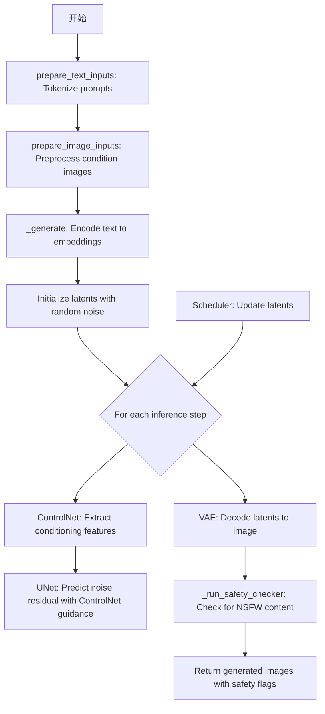
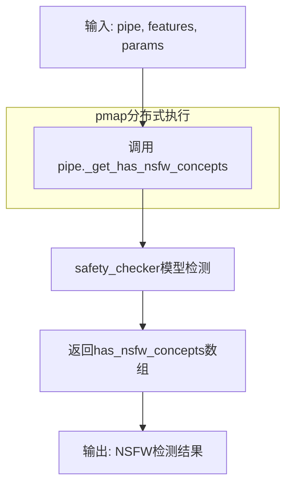
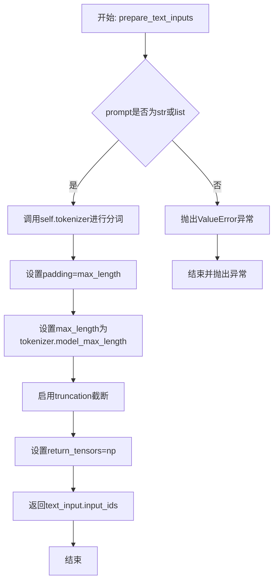
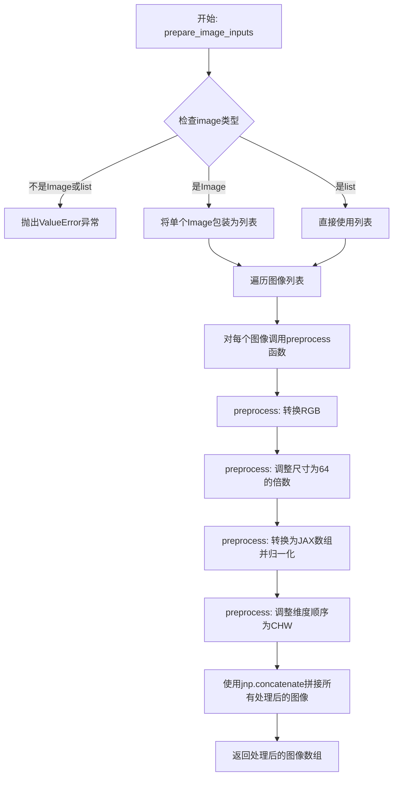
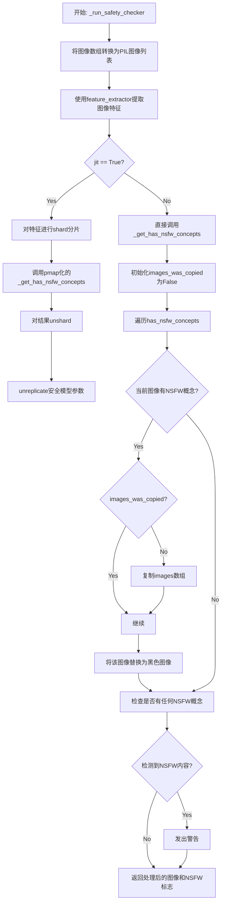
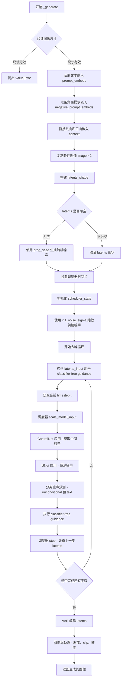
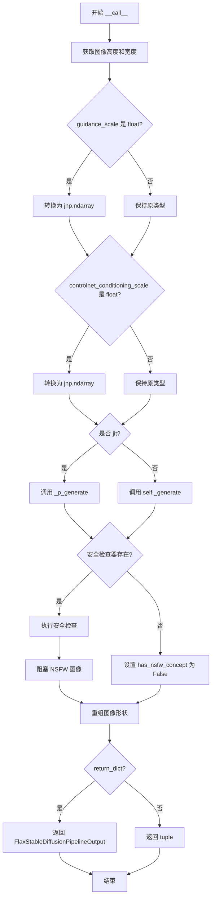

# `diffusers\src\diffusers\pipelines\controlnet\pipeline_flax_controlnet.py` 详细设计文档

A Flax-based pipeline for text-to-image generation using Stable Diffusion with ControlNet guidance. It enables conditional image generation where users can provide an additional condition image (like canny edge, depth map, etc.) to guide the generation process, leveraging JAX/Flax for efficient parallel computation across multiple devices.

## 整体流程



## 类结构

```
FlaxDiffusionPipeline (基类)
└── FlaxStableDiffusionControlNetPipeline
```

## 全局变量及字段


### `logger`
    
模块级日志记录器，用于记录警告和信息

类型：`logging.Logger`
    


### `DEBUG`
    
调试模式标志，设置为True时使用Python循环代替jax.fori_loop以便调试

类型：`bool`
    


### `EXAMPLE_DOC_STRING`
    
示例文档字符串，包含pipeline使用示例和代码演示

类型：`str`
    


### `FlaxStableDiffusionControlNetPipeline.vae`
    
VAE模型用于图像编解码，将图像编码到潜在空间并从潜在空间解码重建图像

类型：`FlaxAutoencoderKL`
    


### `FlaxStableDiffusionControlNetPipeline.text_encoder`
    
文本编码器，将文本提示编码为嵌入向量供UNet使用

类型：`FlaxCLIPTextModel`
    


### `FlaxStableDiffusionControlNetPipeline.tokenizer`
    
文本分词器，将文本字符串分词为token ID序列

类型：`CLIPTokenizer`
    


### `FlaxStableDiffusionControlNetPipeline.unet`
    
去噪UNet模型，根据文本嵌入和噪声预测潜在空间中的噪声残差

类型：`FlaxUNet2DConditionModel`
    


### `FlaxStableDiffusionControlNetPipeline.controlnet`
    
ControlNet条件模型，提供额外条件信息引导UNet生成符合控制条件的图像

类型：`FlaxControlNetModel`
    


### `FlaxStableDiffusionControlNetPipeline.scheduler`
    
调度器，管理去噪过程中的时间步和噪声调度策略

类型：`SchedulerMixin`
    


### `FlaxStableDiffusionControlNetPipeline.safety_checker`
    
NSFW检查器，检测生成图像是否包含不当内容

类型：`FlaxStableDiffusionSafetyChecker`
    


### `FlaxStableDiffusionControlNetPipeline.feature_extractor`
    
特征提取器，从图像中提取特征供安全检查器使用

类型：`CLIPImageProcessor`
    


### `FlaxStableDiffusionControlNetPipeline.dtype`
    
数据类型，指定模型计算使用的数据精度（默认jnp.float32）

类型：`jnp.dtype`
    


### `FlaxStableDiffusionControlNetPipeline.vae_scale_factor`
    
VAE缩放因子，用于调整潜在空间与像素空间的尺寸比例

类型：`int`
    
    

## 全局函数及方法


### `_p_generate`

`_p_generate` 是一个使用 JAX `pmap` 装饰器包装的并行生成函数，用于在多个设备（CPU/GPU/TPU）上并行执行 Stable Diffusion ControlNet 的图像生成任务。该函数通过 `jax.pmap` 将生成逻辑分布到多个设备上，以加速推理过程。

参数：

- `pipe`：`FlaxStableDiffusionControlNetPipeline`，Pipeline 实例，包含模型和配置信息（静态广播参数）
- `prompt_ids`：`jnp.ndarray`，形状为 `(batch_size, seq_length)` 的 tokenized 提示词 IDs（沿第 0 维分片）
- `image`：`jnp.ndarray`，ControlNet 条件图像数组（沿第 0 维分片）
- `params`：`dict | FrozenDict`，包含所有模型参数的字典，包括 text_encoder、unet、vae、controlnet、scheduler 等（沿第 0 维分片）
- `prng_seed`：`jax.Array`，JAX 随机数生成器种子，用于采样噪声（沿第 0 维分片）
- `num_inference_steps`：`int`，去噪步数（静态广播参数）
- `guidance_scale`：`float | jnp.ndarray`，CFG 引导尺度，控制文本提示对生成结果的影响程度（沿第 0 维分片）
- `latents`：`jnp.ndarray | None`，可选的预生成潜在向量，用于自定义噪声（沿第 0 维分片）
- `neg_prompt_ids`：`jnp.ndarray | None`，负面提示词 IDs，用于避免生成不希望的内容（沿第 0 维分片）
- `controlnet_conditioning_scale`：`float | jnp.ndarray`，ControlNet 条件缩放因子（沿第 0 维分片）

返回值：`jnp.ndarray`，生成的图像张量，形状为 `(num_devices, batch_size, height, width, channels)`，其中 num_devices 是可用的 JAX 设备数量。

#### 流程图

```mermaid
flowchart TD
    A[Start: _p_generate] --> B[接收分片输入参数]
    B --> C[调用 pipe._generate 方法]
    C --> D[在当前设备上执行单设备生成逻辑]
    D --> E[返回当前设备生成的图像]
    E --> F[pmap 自动收集各设备结果]
    F --> G[返回合并后的图像张量]
    
    subgraph 设备0
        B0[接收 prompt_ids[0], image[0], params[0]...] --> C0[_generate on device 0]
    end
    
    subgraph 设备N
        B1[接收 prompt_ids[N], image[N], params[N]...] --> C1[_generate on device N]
    end
    
    C0 --> F
    C1 --> F
```

#### 带注释源码

```python
# 使用 partial 装饰器配置 jax.pmap 的参数
# in_axes: 指定每个参数沿哪个维度分片
#   - None: 静态广播参数，不分片（pipe 和 num_inference_steps）
#   - 0: 沿第0维分片，其他参数在每个设备上复制
# static_broadcasted_argnums: 指定静态参数，这些参数在编译时广播到所有设备
@partial(
    jax.pmap,
    in_axes=(None, 0, 0, 0, 0, None, 0, 0, 0, 0),
    static_broadcasted_argnums=(0, 5),
)
def _p_generate(
    pipe,                          # FlaxStableDiffusionControlNetPipeline 实例
    prompt_ids,                    # 分片的提示词 token IDs
    image,                         # 分片的 ControlNet 条件图像
    params,                        # 分片的模型参数
    prng_seed,                     # 分片的随机种子
    num_inference_steps,           # 去噪步数（静态）
    guidance_scale,                # 分片的引导尺度
    latents,                       # 分片的潜在向量（可为空）
    neg_prompt_ids,                # 分片的负面提示词 IDs
    controlnet_conditioning_scale, # 分片的 ControlNet 缩放因子
):
    """
    pmap 包装的生成函数，用于多设备并行生成。
    
    该函数被 jax.pmap 装饰后，会在每个 JAX 设备上并行执行。
    输入参数中 in_axes=0 的参数会被自动分片，每个设备处理一部分数据。
    pipe 和 num_inference_steps 使用 static_broadcasted_argnums 指定，
    在编译时作为静态参数广播到所有设备。
    """
    # 调用 Pipeline 实例的内部 _generate 方法执行实际生成逻辑
    # _generate 方法执行完整的 Stable Diffusion + ControlNet 生成流程：
    # 1. 编码文本提示词
    # 2. 处理 ControlNet 条件图像
    # 3. 初始化潜在向量
    # 4. 迭代去噪（包含 ControlNet 条件注入）
    # 5. VAE 解码潜在向量到图像
    return pipe._generate(
        prompt_ids,
        image,
        params,
        prng_seed,
        num_inference_steps,
        guidance_scale,
        latents,
        neg_prompt_ids,
        controlnet_conditioning_scale,
    )
```


### `_p_get_has_nsfw_concepts`

这是一个使用 `jax.pmap` 装饰器包装的NSFW（不宜内容）检测函数，用于在多个JAX设备上并行运行NSFW概念检测。该函数是对 `FlaxStableDiffusionControlNetPipeline._get_has_nsfw_concepts` 方法的pmap封装，支持分布式推理场景下的安全检查。

参数：

- `pipe`：`FlaxStableDiffusionControlNetPipeline`，管道实例，包含safety_checker模块
- `features`：`jnp.ndarray`，从图像中提取的特征向量，作为safety_checker的输入
- `params`：`dict | FrozenDict`，safety_checker模型的参数

返回值：`jnp.ndarray`，布尔数组，表示每个输入图像是否包含NSFW内容

#### 流程图



#### 带注释源码

```python
# 使用 partial 和 jax.pmap 装饰器将函数转换为分布式版本
# static_broadcasted_argnums=(0,) 表示 pipe 参数是静态广播的，不参与分片
@partial(jax.pmap, static_broadcasted_argnums=(0,))
def _p_get_has_nsfw_concepts(pipe, features, params):
    """
    pmap封装的NSFW概念检测函数
    
    该函数在每个JAX设备上并行执行，接收分片（sharded）的输入特征，
    并返回每个设备上对应的NSFW检测结果。
    
    Args:
        pipe: FlaxStableDiffusionControlNetPipeline 实例
        features: 从图像提取的特征，形状为 [num_devices, batch_size, ...]
        params: safety_checker 的模型参数
    
    Returns:
        has_nsfw_concepts: NSFW检测结果数组，形状与输入features对应
    """
    return pipe._get_has_nsfw_concepts(features, params)
```


### `unshard`

将分片数组（sharded array）重新reshape为批次，通过合并设备维度（device dimension）和批次维度（batch dimension）来恢复原始的批次结构。

参数：

- `x`：`jnp.ndarray`，输入的分片数组，形状为 `(num_devices, batch_size, ...)`

返回值：`jnp.ndarray`，重新reshape后的数组，形状为 `(num_devices * batch_size, ...)`

#### 流程图

```mermaid
graph TD
    A[输入分片数组 x<br/>形状: (num_devices, batch_size, ...)] --> B[提取维度信息]
    B --> C[获取 num_devices = x.shape[0]]
    B --> D[获取 batch_size = x.shape[1]]
    B --> E[获取 rest = x.shape[2:]]
    C --> F[执行 reshape 操作<br/>目标形状: (num_devices * batch_size, *rest)]
    D --> F
    E --> F
    F --> G[返回合并后的数组<br/>形状: (num_devices * batch_size, ...)]
```

#### 带注释源码

```python
def unshard(x: jnp.ndarray):
    # 原始意图使用 einops 库进行重排:
    # einops.rearrange(x, 'd b ... -> (d b) ...')
    # 其中 'd' 表示设备维度, 'b' 表示批次维度, '...' 表示其余维度
    
    # 获取输入数组的前两个维度：设备数量和批次大小
    num_devices, batch_size = x.shape[:2]
    
    # 获取剩余维度信息，用于后续reshape
    rest = x.shape[2:]
    
    # 将设备和批次维度合并为一个批次维度
    # 从 (num_devices, batch_size, ...) 变为 (num_devices * batch_size, ...)
    return x.reshape(num_devices * batch_size, *rest)
```


### `preprocess`

图像预处理函数，将 PIL 图像对象转换为符合模型输入要求的 JAX 数组格式。该函数负责将输入图像转换为 RGB 模式、调整尺寸至 64 的整数倍、归一化像素值，并调整维度顺序以适配 UNet 的输入格式。

参数：

- `image`：`PIL.Image.Image`，输入的 PIL 图像对象
- `dtype`：`jnp.dtype`，目标数据类型（如 jnp.float32）

返回值：`jnp.ndarray`，处理后的图像数组，形状为 (1, 3, H, W)，其中 H 和 W 为调整后的图像高度和宽度（均为 64 的整数倍）

#### 流程图

```mermaid
flowchart TD
    A[开始 preprocess] --> B[将图像转换为RGB模式]
    B --> C[获取图像宽度w和高度h]
    C --> D[计算新的宽高: w - w%64, h - h%64]
    D --> E[使用Lanczos重采样调整图像大小]
    E --> F[转换为numpy数组并转换为目标dtype]
    F --> G[像素值归一化: / 255.0]
    G --> H[添加批次维度: image[None]]
    H --> I[维度重排: transpose 0,3,1,2]
    I --> J[返回处理后的图像]
```

#### 带注释源码

```python
def preprocess(image, dtype):
    # 将图像转换为RGB模式，确保三个颜色通道
    image = image.convert("RGB")
    
    # 获取图像的当前宽度和高度
    w, h = image.size
    
    # 计算新的宽高，确保是64的整数倍数
    # 这满足Stable Diffusion模型对输入尺寸的要求
    w, h = (x - x % 64 for x in (w, h))
    
    # 使用Lanczos重采样算法调整图像大小到新的尺寸
    image = image.resize((w, h), resample=PIL_INTERPOLATION["lanczos"])
    
    # 将PIL图像转换为JAX数组，并转换为目标数据类型
    image = jnp.array(image).astype(dtype) / 255.0
    
    # 添加批次维度并调整维度顺序
    # 从 (H, W, 3) 转换为 (1, 3, H, W) 以适配模型输入
    image = image[None].transpose(0, 3, 1, 2)
    
    # 返回处理后的图像数组
    return image
```


### FlaxStableDiffusionControlNetPipeline.__init__

这是 Flax 版本的 Stable Diffusion ControlNet 管道初始化方法，负责接收并注册所有模型组件（VAE、文本编码器、Tokenizer、UNet、ControlNet、调度器、安全检查器、特征提取器），并配置数据类型和 VAE 缩放因子。

参数：

- `vae`：`FlaxAutoencoderKL`，Variational Auto-Encoder (VAE) 模型，用于编码和解码图像与潜在表示之间的转换
- `text_encoder`：`FlaxCLIPTextModel`，冻结的文本编码器 (clip-vit-large-patch14)，用于将文本提示转换为嵌入向量
- `tokenizer`：`CLIPTokenizer`，用于将文本分词为输入 IDs
- `unet`：`FlaxUNet2DConditionModel`，去噪网络，用于根据文本嵌入和条件信息去噪图像潜在表示
- `controlnet`：`FlaxControlNetModel`，提供额外条件信息的 ControlNet 模型，在去噪过程中为 unet 提供控制指导
- `scheduler`：`FlaxDDIMScheduler | FlaxPNDMScheduler | FlaxLMSDiscreteScheduler | FlaxDPMSolverMultistepScheduler`，调度器，用于在去噪过程中计算噪声残差和采样步骤
- `safety_checker`：`FlaxStableDiffusionSafetyChecker`，安全检查器，用于检测生成图像是否包含不当内容
- `feature_extractor`：`CLIPImageProcessor`，特征提取器，用于从生成的图像中提取特征供安全检查器使用
- `dtype`：`jnp.dtype`，可选，默认为 jnp.float32，用于指定模型参数的数据类型

返回值：`None`，该方法为构造函数，不返回任何值

#### 流程图

```mermaid
flowchart TD
    A[开始 __init__] --> B[调用 super().__init__]
    B --> C[设置 self.dtype]
    D{safety_checker is None?} -->|是| E[输出安全警告日志]
    D -->|否| F[继续执行]
    E --> F
    F --> G[调用 self.register_modules 注册所有模块]
    G --> H[计算 self.vae_scale_factor]
    H --> I[结束]
```

#### 带注释源码

```python
def __init__(
    self,
    vae: FlaxAutoencoderKL,  # VAE模型，用于图像编码/解码
    text_encoder: FlaxCLIPTextModel,  # CLIP文本编码器
    tokenizer: CLIPTokenizer,  # 文本分词器
    unet: FlaxUNet2DConditionModel,  # UNet去噪模型
    controlnet: FlaxControlNetModel,  # ControlNet条件模型
    # 调度器类型，支持DDIM、PNDM、LMS和DPM多步调度器
    scheduler: FlaxDDIMScheduler | FlaxPNDMScheduler | FlaxLMSDiscreteScheduler | FlaxDPMSolverMultistepScheduler,
    safety_checker: FlaxStableDiffusionSafetyChecker,  # NSFW安全检查器
    feature_extractor: CLIPImageProcessor,  # 图像特征提取器
    dtype: jnp.dtype = jnp.float32,  # 默认使用float32数据类型
):
    # 调用父类FlaxDiffusionPipeline的初始化方法
    super().__init__()
    
    # 设置实例的数据类型属性，用于后续模型计算
    self.dtype = dtype

    # 如果safety_checker为None，输出警告信息提醒用户注意潜在风险
    if safety_checker is None:
        logger.warning(
            f"You have disabled the safety checker for {self.__class__} by passing `safety_checker=None`. Ensure"
            " that you abide to the conditions of the Stable Diffusion license and do not expose unfiltered"
            " results in services or applications open to the public. Both the diffusers team and Hugging Face"
            " strongly recommend to keep the safety filter enabled in all public facing circumstances, disabling"
            " it only for use-cases that involve analyzing network behavior or auditing its results. For more"
            " information, please have a look at https://github.com/huggingface/diffusers/pull/254 ."
        )

    # 将所有模型组件注册到管道中，使其可以通过self.xxx访问
    self.register_modules(
        vae=vae,
        text_encoder=text_encoder,
        tokenizer=tokenizer,
        unet=unet,
        controlnet=controlnet,
        scheduler=scheduler,
        safety_checker=safety_checker,
        feature_extractor=feature_extractor,
    )
    
    # 计算VAE的缩放因子，基于VAE块输出通道数的2幂次方
    # 如果存在VAE则计算，否则默认使用8
    self.vae_scale_factor = 2 ** (len(self.vae.config.block_out_channels) - 1) if getattr(self, "vae", None) else 8
```


### `FlaxStableDiffusionControlNetPipeline.prepare_text_inputs`

该方法用于将文本提示（prompt）转换为模型可处理的输入ID。它接受字符串或字符串列表形式的提示，使用CLIP分词器进行编码，填充到最大长度，并返回包含输入ID的NumPy数组，供后续文本编码器使用。

参数：

- `prompt`：`str | list[str]`，用户提供的文本提示，可以是单个字符串或多个字符串的列表

返回值：`np.ndarray`，返回tokenizer处理后的输入ID数组，形状为(batch_size, seq_len)

#### 流程图



#### 带注释源码

```python
def prepare_text_inputs(self, prompt: str | list[str]):
    """
    将文本提示转换为模型输入ID
    
    参数:
        prompt: 字符串或字符串列表形式的文本提示
        
    返回:
        分词后的输入ID数组
    """
    # 类型检查：确保prompt是字符串或列表类型
    if not isinstance(prompt, (str, list)):
        raise ValueError(f"`prompt` has to be of type `str` or `list` but is {type(prompt)}")

    # 使用tokenizer对prompt进行分词处理
    # padding="max_length": 将序列填充到最大长度
    # max_length: 使用tokenizer的最大支持长度
    # truncation=True: 超过最大长度的序列进行截断
    # return_tensors="np": 返回NumPy数组而非Python字典
    text_input = self.tokenizer(
        prompt,
        padding="max_length",
        max_length=self.tokenizer.model_max_length,
        truncation=True,
        return_tensors="np",
    )

    # 返回输入ID数组，用于后续text_encoder处理
    return text_input.input_ids
```


### `FlaxStableDiffusionControlNetPipeline.prepare_image_inputs`

该方法用于将用户提供的PIL图像或图像列表转换为JAX数组格式，以便在ControlNet管道中进行图像生成。它接受单个PIL图像或图像列表，进行类型检查、预处理（包括RGB转换、尺寸调整为64的倍数、归一化），最终返回拼接后的JAX数组。

参数：

- `self`：实例本身，包含pipeline的所有组件配置
- `image`：`Image.Image | list[Image.Image]`，输入的控制条件图像，可以是单个PIL图像对象或PIL图像列表

返回值：`jnp.ndarray`，返回经过预处理并拼接的JAX数组，形状为(N, C, H, W)，其中N为图像数量，C为通道数(3)，H和W为调整后的尺寸

#### 流程图



#### 带注释源码

```python
def prepare_image_inputs(self, image: Image.Image | list[Image.Image]):
    """
    准备图像输入，将PIL图像转换为JAX数组格式
    
    参数:
        image: 单个PIL图像或图像列表，作为ControlNet的控制条件输入
    
    返回:
        处理后的JAX数组，用于后续的图像生成流程
    """
    # 类型检查：确保输入是PIL.Image或列表
    if not isinstance(image, (Image.Image, list)):
        raise ValueError(f"image has to be of type `PIL.Image.Image` or list but is {type(image)}")

    # 如果是单个图像，转换为列表以便统一处理
    if isinstance(image, Image.Image):
        image = [image]

    # 对列表中的每个图像进行预处理，然后沿第0维拼接
    # preprocess函数执行: RGB转换 -> 尺寸调整 -> 归一化 -> 维度变换
    processed_images = jnp.concatenate([preprocess(img, jnp.float32) for img in image])

    # 返回处理后的图像数组，形状为 (num_images, 3, height, width)
    return processed_images


def preprocess(image, dtype):
    """
    单个图像的预处理函数
    
    参数:
        image: PIL.Image对象
        dtype: 目标数据类型（默认为jnp.float32）
    
    返回:
        预处理后的JAX数组，形状为 (1, 3, H, W)
    """
    # 确保图像为RGB模式（处理RGBA、灰度等模式）
    image = image.convert("RGB")
    
    # 获取图像宽高，并将尺寸调整为64的整数倍（满足UNet的尺寸要求）
    w, h = image.size
    w, h = (x - x % 64 for x in (w, h))
    
    # 使用Lanczos重采样调整图像大小
    image = image.resize((w, h), resample=PIL_INTERPOLATION["lanczos"])
    
    # 转换为numpy数组并归一化到[0, 1]
    image = jnp.array(image).astype(dtype) / 255.0
    
    # 调整维度: (H, W, 3) -> (1, 3, H, W)
    image = image[None].transpose(0, 3, 1, 2)
    return image
```


### `FlaxStableDiffusionControlNetPipeline._get_has_nsfw_concepts`

该方法是一个私有包装方法，用于调用安全检查器（safety_checker）来检测输入图像特征中是否包含不适合公开的内容（NSFW），并返回检测结果。

参数：

- `features`：`jnp.ndarray`，从图像中提取的特征向量，作为安全检查器的输入
- `params`：`dict | FrozenDict`，安全检查器的模型参数/权重

返回值：`varies`，安全检查器的输出，通常为布尔数组或相似结构，表示对应图像是否包含 NSFW 内容

#### 流程图

```mermaid
flowchart TD
    A[开始 _get_has_nsfw_concepts] --> B[接收 features 和 params]
    B --> C[调用 self.safety_checker(features, params)]
    C --> D[获取检测结果 has_nsfw_concepts]
    D --> E[返回 has_nsfw_concepts]
```

#### 带注释源码

```python
def _get_has_nsfw_concepts(self, features, params):
    """
    检测输入特征中是否包含 NSFW 内容
    
    这是一个私有方法，作为安全检查器的包装器。
    它将图像特征和安全检查器参数传递给 safety_checker 模块，
    并返回检测结果。
    
    Args:
        features: 从图像中提取的特征向量，用于安全检查
        params: 安全检查器的模型参数/权重
        
    Returns:
        安全检查器的输出，表示是否存在 NSFW 内容
    """
    # 调用类中注册的安全检查器模块进行 NSFW 检测
    # self.safety_checker 是 FlaxStableDiffusionSafetyChecker 的实例
    has_nsfw_concepts = self.safety_checker(features, params)
    
    # 返回检测结果
    return has_nsfw_concepts
```


### `FlaxStableDiffusionControlNetPipeline._run_safety_checker`

该方法负责对生成的图像进行安全检查，检测是否存在潜在的不当内容（NSFW），并将包含不当内容的图像替换为黑色图像。

参数：

- `images`：`jnp.ndarray` 或类似数组类型，待检查的图像数组，通常是从生成模型输出的图像
- `safety_model_params`：安全检查器模型的参数，用于执行 NSFW 概念检测
- `jit`：`bool`，可选，是否使用 JIT 编译加速，默认为 `False`

返回值：`(images, has_nsfw_concepts)`，其中 `images` 是处理后的图像数组（可能已将 NSFW 图像替换为黑色图像），`has_nsfw_concepts` 是布尔数组，表示每张图像是否包含 NSFW 内容

#### 流程图



#### 带注释源码

```python
def _run_safety_checker(self, images, safety_model_params, jit=False):
    """
    运行安全检查器，检测并处理 NSFW 图像
    
    Args:
        images: 生成的图像数组，形状为 (batch, height, width, channels)
        safety_model_params: 安全检查器模型参数
        jit: 是否使用 JIT 编译版本
    
    Returns:
        处理后的图像数组和 NSFW 检测结果元组
    """
    # safety_model_params should already be replicated when jit is True
    # 将 JAX 数组转换为 PIL 图像对象
    pil_images = [Image.fromarray(image) for image in images]
    
    # 使用特征提取器将 PIL 图像转换为特征向量
    # 返回格式为 numpy 数组的 pixel_values
    features = self.feature_extractor(pil_images, return_tensors="np").pixel_values

    if jit:
        # 如果使用 JIT 模式，需要对特征进行分片以适配多设备
        features = shard(features)
        # 调用 pmap 化的安全检查函数（已通过 @partial(jax.pmap, ...) 装饰）
        has_nsfw_concepts = _p_get_has_nsfw_concepts(self, features, safety_model_params)
        # 合并分片结果
        has_nsfw_concepts = unshard(has_nsfw_concepts)
        # 取消参数复制以进行后续处理
        safety_model_params = unreplicate(safety_model_params)
    else:
        # 非 JIT 模式下直接调用安全检查方法
        has_nsfw_concepts = self._get_has_nsfw_concepts(features, safety_model_params)

    # 标记图像是否已被复制（避免不必要的复制操作）
    images_was_copied = False
    
    # 遍历每张图像的 NSFW 检测结果
    for idx, has_nsfw_concept in enumerate(has_nsfw_concepts):
        if has_nsfw_concept:
            # 首次检测到 NSFW 时复制图像数组
            if not images_was_copied:
                images_was_copied = True
                images = images.copy()

            # 将 NSFW 图像替换为黑色图像（全零数组）
            images[idx] = np.zeros(images[idx].shape, dtype=np.uint8)

        # 如果检测到任何 NSFW 内容，发出警告
        if any(has_nsfw_concepts):
            warnings.warn(
                "Potential NSFW content was detected in one or more images. A black image will be returned"
                " instead. Try again with a different prompt and/or seed."
            )

    # 返回处理后的图像和 NSFW 检测标志
    return images, has_nsfw_concepts
```


### `FlaxStableDiffusionControlNetPipeline._generate`

该方法是Flax实现的Stable Diffusion ControlNet管道的核心生成方法，负责根据文本提示（prompt_ids）和条件图像（image）执行去噪过程生成最终图像。该方法实现了classifier-free guidance以提升生成质量，并通过ControlNet引入额外的条件控制信息。

参数：

- `prompt_ids`：`jnp.ndarray`，经过tokenize处理的文本提示IDs，用于生成文本嵌入向量
- `image`：`jnp.ndarray`，ControlNet的条件输入图像，提供额外的生成引导信息
- `params`：`dict | FrozenDict`，包含所有模型（text_encoder、unet、vae、controlnet、scheduler）的参数/权重
- `prng_seed`：`jax.Array`，JAX随机数生成器的种子，用于生成初始噪声
- `num_inference_steps`：`int`，去噪迭代的步数，步数越多通常生成质量越高但推理速度越慢
- `guidance_scale`：`float`，Classifier-free guidance的缩放因子，值越大生成的图像与文本提示相关性越高
- `latents`：`jnp.ndarray | None`，可选的预生成噪声latent，若不提供则使用随机噪声
- `neg_prompt_ids`：`jnp.ndarray | None`，负面提示的tokenized IDs，用于引导模型避免生成指定内容
- `controlnet_conditioning_scale`：`float`，ControlNet输出的缩放因子，控制条件图像对生成结果的影响程度

返回值：`jnp.ndarray`，生成的图像数组，值为[0,1]范围的浮点数，形状为(batch_size, height, width, 3)

#### 流程图



#### 带注释源码

```python
def _generate(
    self,
    prompt_ids: jnp.ndarray,
    image: jnp.ndarray,
    params: dict | FrozenDict,
    prng_seed: jax.Array,
    num_inference_steps: int,
    guidance_scale: float,
    latents: jnp.ndarray | None = None,
    neg_prompt_ids: jnp.ndarray | None = None,
    controlnet_conditioning_scale: float = 1.0,
):
    """
    Flax Stable Diffusion ControlNet 的核心生成方法
    
    参数:
        prompt_ids: 文本提示的 token IDs
        image: ControlNet 条件图像
        params: 模型参数字典
        prng_seed: 随机数种子
        num_inference_steps: 去噪步数
        guidance_scale: guidance 缩放因子
        latents: 可选的预生成噪声
        neg_prompt_ids: 负面提示 IDs
        controlnet_conditioning_scale: ControlNet 条件缩放因子
    
    返回:
        生成的图像数组
    """
    
    # === 步骤1: 验证图像尺寸 ===
    # 图像尺寸必须能被64整除，因为UNet和VAE的结构要求
    height, width = image.shape[-2:]
    if height % 64 != 0 or width % 64 != 0:
        raise ValueError(f"`height` and `width` have to be divisible by 64 but are {height} and {width}.")

    # === 步骤2: 获取文本嵌入 ===
    # 使用 text_encoder 将 token IDs 转换为文本嵌入向量
    prompt_embeds = self.text_encoder(prompt_ids, params=params["text_encoder"])[0]

    # === 步骤3: 准备负面提示嵌入 ===
    # 确定批量大小
    batch_size = prompt_ids.shape[0]
    max_length = prompt_ids.shape[-1]

    # 如果没有提供负面提示，使用空字符串
    if neg_prompt_ids is None:
        uncond_input = self.tokenizer(
            [""] * batch_size, padding="max_length", max_length=max_length, return_tensors="np"
        ).input_ids
    else:
        uncond_input = neg_prompt_ids
    
    # 获取负面提示的文本嵌入
    negative_prompt_embeds = self.text_encoder(uncond_input, params=params["text_encoder"])[0]
    
    # === 步骤4: 拼接上下文 ===
    # 为了同时处理 unconditional 和 conditional 嵌入，将它们拼接在一起
    # 形状: [batch_size * 2, seq_len, embed_dim]
    context = jnp.concatenate([negative_prompt_embeds, prompt_embeds])

    # === 步骤5: 准备条件图像 ===
    # 复制条件图像以匹配 batch_size，用于 classifier-free guidance
    image = jnp.concatenate([image] * 2)

    # === 步骤6: 准备或验证 latents ===
    # 计算 latents 的形状，latents 是 VAE 潜在空间中的噪声表示
    latents_shape = (
        batch_size,
        self.unet.config.in_channels,
        height // self.vae_scale_factor,
        width // self.vae_scale_factor,
    )
    
    # 如果没有提供 latents，则随机生成
    if latents is None:
        latents = jax.random.normal(prng_seed, shape=latents_shape, dtype=jnp.float32)
    else:
        # 验证提供的 latents 形状是否正确
        if latents.shape != latents_shape:
            raise ValueError(f"Unexpected latents shape, got {latents.shape}, expected {latents_shape}")

    # === 步骤7: 定义去噪循环体 ===
    def loop_body(step, args):
        """
        去噪循环的单步迭代
        
        执行以下操作:
        1. 准备 classifier-free guidance 的输入
        2. 获取当前时间步
        3. 通过 ControlNet 获取中间残差
        4. 通过 UNet 预测噪声
        5. 执行 classifier-free guidance
        6. 计算上一步的 latents
        """
        latents, scheduler_state = args
        
        # 为 classifier-free guidance 准备输入
        # 将 latents 复制两份，一份用于 unconditional 预测，一份用于 conditional 预测
        latents_input = jnp.concatenate([latents] * 2)

        # 获取当前时间步
        t = jnp.array(scheduler_state.timesteps, dtype=jnp.int32)[step]
        timestep = jnp.broadcast_to(t, latents_input.shape[0])

        # 调度器缩放模型输入
        latents_input = self.scheduler.scale_model_input(scheduler_state, latents_input, t)

        # === ControlNet 前向传播 ===
        # 使用 ControlNet 处理 latents 和条件图像，生成中间残差
        down_block_res_samples, mid_block_res_sample = self.controlnet.apply(
            {"params": params["controlnet"]},
            jnp.array(latents_input),
            jnp.array(timestep, dtype=jnp.int32),
            encoder_hidden_states=context,
            controlnet_cond=image,
            conditioning_scale=controlnet_conditioning_scale,
            return_dict=False,
        )

        # === UNet 前向传播 ===
        # 使用 UNet 预测噪声残差
        noise_pred = self.unet.apply(
            {"params": params["unet"]},
            jnp.array(latents_input),
            jnp.array(timestep, dtype=jnp.int32),
            encoder_hidden_states=context,
            down_block_additional_residuals=down_block_res_samples,
            mid_block_additional_residual=mid_block_res_sample,
        ).sample

        # === 执行 Classifier-Free Guidance ===
        # 将噪声预测分离为 unconditional 和 text 引导的部分
        noise_pred_uncond, noise_prediction_text = jnp.split(noise_pred, 2, axis=0)
        
        # 使用 guidance_scale 加权组合
        noise_pred = noise_pred_uncond + guidance_scale * (noise_prediction_text - noise_pred_uncond)

        # === 调度器步骤 ===
        # 计算上一步的 latents (x_t -> x_t-1)
        latents, scheduler_state = self.scheduler.step(scheduler_state, noise_pred, t, latents).to_tuple()
        
        return latents, scheduler_state

    # === 步骤8: 初始化调度器 ===
    scheduler_state = self.scheduler.set_timesteps(
        params["scheduler"], num_inference_steps=num_inference_steps, shape=latents_shape
    )

    # === 步骤9: 缩放初始噪声 ===
    # 根据调度器要求的初始噪声标准差缩放 latents
    latents = latents * params["scheduler"].init_noise_sigma

    # === 步骤10: 执行去噪循环 ===
    if DEBUG:
        # 调试模式：使用 Python for 循环，便于调试
        for i in range(num_inference_steps):
            latents, scheduler_state = loop_body(i, (latents, scheduler_state))
    else:
        # 生产模式：使用 JAX 的 fori_loop 以获得更好的性能
        latents, _ = jax.lax.fori_loop(0, num_inference_steps, loop_body, (latents, scheduler_state))

    # === 步骤11: VAE 解码 ===
    # 将 latents 从潜在空间解码回像素空间
    latents = 1 / self.vae.config.scaling_factor * latents
    image = self.vae.apply({"params": params["vae"]}, latents, method=self.vae.decode).sample

    # === 步骤12: 后处理 ===
    # 将图像值从 [-1,1] 转换到 [0,1]，并调整维度顺序
    image = (image / 2 + 0.5).clip(0, 1).transpose(0, 2, 3, 1)
    
    return image
```


### `FlaxStableDiffusionControlNetPipeline.__call__`

该方法是 Flax 实现的 Stable Diffusion 控制网络管道的核心调用函数，负责接收文本提示和条件图像，通过去噪过程生成符合文本描述的图像，并可选地执行安全检查以过滤不当内容。

参数：

- `prompt_ids`：`jnp.ndarray`，引导图像生成的文本提示或提示列表
- `image`：`jnp.ndarray`，ControlNet 输入条件数组，用于为 UNet 提供额外的生成指导
- `params`：`dict | FrozenDict`，包含模型参数/权重的字典
- `prng_seed`：`jax.Array`，随机数生成器密钥数组
- `num_inference_steps`：`int`（可选，默认 50），去噪步数，步数越多图像质量越高但推理越慢
- `guidance_scale`：`float | jnp.ndarray`（可选，默认 7.5），指导比例值，鼓励模型生成与文本更相关的图像
- `latents`：`jnp.ndarray`（可选），预生成的高斯分布噪声潜在向量，可用于通过不同提示微调相同生成
- `neg_prompt_ids`：`jnp.ndarray`（可选），负面提示，用于指定不想在生成图像中出现的内容
- `controlnet_conditioning_scale`：`float | jnp.ndarray`（可选，默认 1.0），ControlNet 输出在添加到原始 UNet 残差之前的乘数
- `return_dict`：`bool`（可选，默认 True），是否返回 FlaxStableDiffusionPipelineOutput 而非普通元组
- `jit`：`bool`（可选，默认 False），是否运行 pmap 版本的生成和安全评分函数

返回值：`FlaxStableDiffusionPipelineOutput | tuple`，当 `return_dict` 为 True 时返回包含生成图像和 NSFW 检测结果的输出对象，否则返回元组

#### 流程图



#### 带注释源码

```python
@replace_example_docstring(EXAMPLE_DOC_STRING)
def __call__(
    self,
    prompt_ids: jnp.ndarray,
    image: jnp.ndarray,
    params: dict | FrozenDict,
    prng_seed: jax.Array,
    num_inference_steps: int = 50,
    guidance_scale: float | jnp.ndarray = 7.5,
    latents: jnp.ndarray = None,
    neg_prompt_ids: jnp.ndarray = None,
    controlnet_conditioning_scale: float | jnp.ndarray = 1.0,
    return_dict: bool = True,
    jit: bool = False,
):
    r"""
    The call function to the pipeline for generation.

    Args:
        prompt_ids (`jnp.ndarray`):
            The prompt or prompts to guide the image generation.
        image (`jnp.ndarray`):
            Array representing the ControlNet input condition to provide guidance to the `unet` for generation.
        params (`Dict` or `FrozenDict`):
            Dictionary containing the model parameters/weights.
        prng_seed (`jax.Array`):
            Array containing random number generator key.
        num_inference_steps (`int`, *optional*, defaults to 50):
            The number of denoising steps. More denoising steps usually lead to a higher quality image at the
            expense of slower inference.
        guidance_scale (`float`, *optional*, defaults to 7.5):
            A higher guidance scale value encourages the model to generate images closely linked to the text
            `prompt` at the expense of lower image quality. Guidance scale is enabled when `guidance_scale > 1`.
        latents (`jnp.ndarray`, *optional*):
            Pre-generated noisy latents sampled from a Gaussian distribution, to be used as inputs for image
            generation. Can be used to tweak the same generation with different prompts. If not provided, a latents
            array is generated by sampling using the supplied random `generator`.
        controlnet_conditioning_scale (`float` or `jnp.ndarray`, *optional*, defaults to 1.0):
            The outputs of the ControlNet are multiplied by `controlnet_conditioning_scale` before they are added
            to the residual in the original `unet`.
        return_dict (`bool`, *optional*, defaults to `True`):
            Whether or not to return a [`~pipelines.stable_diffusion.FlaxStableDiffusionPipelineOutput`] instead of
            a plain tuple.
        jit (`bool`, defaults to `False`):
            Whether to run `pmap` versions of the generation and safety scoring functions.

                > [!WARNING] > This argument exists because `__call__` is not yet end-to-end pmap-able. It will be
                removed in a > future release.

    Examples:

    Returns:
        [`~pipelines.stable_diffusion.FlaxStableDiffusionPipelineOutput`] or `tuple`:
            If `return_dict` is `True`, [`~pipelines.stable_diffusion.FlaxStableDiffusionPipelineOutput`] is
            returned, otherwise a `tuple` is returned where the first element is a list with the generated images
            and the second element is a list of `bool`s indicating whether the corresponding generated image
            contains "not-safe-for-work" (nsfw) content.
    """

    # 从输入图像中提取高度和宽度，用于后续验证和图像处理
    height, width = image.shape[-2:]

    # 如果 guidance_scale 是浮点数，转换为数组以便每个设备都能获得副本
    if isinstance(guidance_scale, float):
        # 转换为张量，使每个设备都能获得副本。跟随 prompt_ids 的形状信息，
        # 因为它们可能是分片的（当 `jit` 为 `True`），也可能不是
        guidance_scale = jnp.array([guidance_scale] * prompt_ids.shape[0])
        if len(prompt_ids.shape) > 2:
            # 假设是分片的
            guidance_scale = guidance_scale[:, None]

    # 如果 controlnet_conditioning_scale 是浮点数，进行相同的转换处理
    if isinstance(controlnet_conditioning_scale, float):
        # 转换为张量，使每个设备都能获得副本。跟随 prompt_ids 的形状信息，
        # 因为它们可能是分片的（当 `jit` 为 `True`），也可能不是
        controlnet_conditioning_scale = jnp.array([controlnet_conditioning_scale] * prompt_ids.shape[0])
        if len(prompt_ids.shape) > 2:
            # 假设是分片的
            controlnet_conditioning_scale = controlnet_conditioning_scale[:, None]

    # 根据 jit 参数选择使用 pmap 版本或普通版本的生成函数
    if jit:
        # 使用 pmap 版本的生成函数（分布式计算）
        images = _p_generate(
            self,
            prompt_ids,
            image,
            params,
            prng_seed,
            num_inference_steps,
            guidance_scale,
            latents,
            neg_prompt_ids,
            controlnet_conditioning_scale,
        )
    else:
        # 使用普通的生成函数
        images = self._generate(
            prompt_ids,
            image,
            params,
            prng_seed,
            num_inference_steps,
            guidance_scale,
            latents,
            neg_prompt_ids,
            controlnet_conditioning_scale,
        )

    # 如果安全检查器存在，执行 NSFW 内容检测
    if self.safety_checker is not None:
        # 获取安全检查器参数
        safety_params = params["safety_checker"]
        # 将图像转换为 uint8 格式（0-255 范围）
        images_uint8_casted = (images * 255).round().astype("uint8")
        # 获取设备数量和批次大小
        num_devices, batch_size = images.shape[:2]

        # 重塑图像数组以进行安全检查
        images_uint8_casted = np.asarray(images_uint8_casted).reshape(num_devices * batch_size, height, width, 3)
        # 运行安全检查
        images_uint8_casted, has_nsfw_concept = self._run_safety_checker(images_uint8_casted, safety_params, jit)
        # 重新转换为 numpy 数组
        images = np.array(images)

        # 阻塞包含 NSFW 内容的图像
        if any(has_nsfw_concept):
            for i, is_nsfw in enumerate(has_nsfw_concept):
                if is_nsfw:
                    # 将 NSFW 图像替换为安全检查器返回的图像（通常是黑图）
                    images[i] = np.asarray(images_uint8_casted[i])

        # 重组图像形状回到原始格式
        images = images.reshape(num_devices, batch_size, height, width, 3)
    else:
        # 如果没有安全检查器，直接转换图像为 numpy 数组
        images = np.asarray(images)
        # 标记为没有检测到 NSFW 内容
        has_nsfw_concept = False

    # 根据 return_dict 参数决定返回格式
    if not return_dict:
        # 返回元组格式：(图像列表, NSFW 检测标志列表)
        return (images, has_nsfw_concept)

    # 返回包含图像和 NSFW 检测结果的输出对象
    return FlaxStableDiffusionPipelineOutput(images=images, nsfw_content_detected=has_nsfw_concept)
```

## 关键组件


### 张量索引与惰性加载

该组件负责管理模型参数的延迟加载与分布式张量的索引操作。在`__call__`方法中，通过`params`字典传递模型权重，实现参数的惰性加载；在`unshard`函数中，通过张量形状变换实现分布式推理结果的聚合。

### 反量化支持

该组件负责将生成的浮点图像张量转换为可用于安全检查的8位整数格式。在`_run_safety_checker`方法中，通过`(images * 255).round().astype("uint8")`将归一化图像反量化回0-255范围的uint8类型，以适配安全检查模型的输入要求。

### 量化策略

该组件通过`dtype`参数控制模型计算精度，支持在初始化时指定`jnp.float32`等数据类型，实现模型权重的量化推理。`FlaxStableDiffusionControlNetPipeline`在`__init__`中接收`dtype`参数，并在各模型应用时传递以确保计算一致性。

### 图像预处理管道

该组件负责将PIL图像转换为JAX数组格式。`preprocess`函数执行图像尺寸调整（对齐到64像素边界）、格式转换、归一化等操作，确保输入图像符合模型要求的张量形状和数值范围。

### 安全检查模块

该组件负责检测生成图像中的不当内容。`_run_safety_checker`方法提取图像特征并通过安全检查器模型判断是否包含NSFW内容，若检测到则返回黑色图像替代。

### ControlNet条件控制

该组件负责在去噪过程中注入额外的控制条件。在`_generate`方法的循环体中，`controlnet.apply`接收图像潜在表示、时间步和文本嵌入，输出中间残差特征供UNet模型使用，实现基于边缘图等条件的图像生成控制。

### 分布式推理支持

该组件通过JAX的`pmap`实现跨设备并行推理。`_p_generate`和`_p_get_has_nsfw_concepts`函数使用`jax.pmap`装饰器包装生成和安全检查逻辑，支持在多个GPU/TPU设备上并行处理批量数据。


## 问题及建议


### 已知问题

- **全局调试标志**：`DEBUG = False` 作为全局变量存在，不便于配置管理，应通过参数或环境变量控制
- **TODO 未完成**：存在 TODO 注释 `implement this conditional do_classifier_free_guidance = guidance_scale > 1.0`，但代码逻辑中隐含实现，缺少显式条件检查
- **警告重复触发**：在 `_run_safety_checker` 方法中，`warnings.warn()` 位于 `for` 循环内部，每检测到一张 NSFW 图片都会触发警告，而非一次性警告
- **数组复制开销**：在 `_run_safety_checker` 中使用 `images.copy()` 进行复制，当检测到 NSFW 内容时会导致不必要的内存开销
- **参数验证不足**：`prepare_text_inputs` 和 `prepare_image_inputs` 方法缺少对空列表、None 值等边界情况的完整验证
- **类型注解不完整**：部分方法参数缺少类型注解（如 `preprocess` 函数的 `image` 参数），且 `scheduler` 参数类型联合使用 `|` 语法但未覆盖所有可能的调度器类型
- **代码重复**：`__call__` 方法中 `guidance_scale` 和 `controlnet_conditioning_scale` 的转换逻辑存在重复，可提取为独立辅助方法

### 优化建议

- **移除或重构全局 DEBUG 标志**：如需调试功能，建议通过日志级别或配置对象管理，而非全局变量
- **完善条件逻辑**：将 TODO 中提到的 `do_classifier_free_guidance` 显式实现，便于理解和维护
- **优化警告逻辑**：将 `warnings.warn()` 移至循环外部，仅在检测到任何 NSFW 内容时触发一次警告
- **减少数组复制**：可考虑在检测到 NSFW 时直接返回新数组，而非先复制再修改
- **增强参数验证**：在 `prepare_text_inputs` 和 `prepare_image_inputs` 中增加对空输入、类型错误等的健壮处理
- **补充类型注解**：为所有公开方法添加完整的类型注解，使用 `typing.Optional` 和 `typing.Union` 替代 `|` 运算符以提高兼容性
- **提取公共逻辑**：将 `guidance_scale` 和 `controlnet_conditioning_scale` 的 tensor 转换逻辑提取为私有辅助方法，如 `_prepare_guidance_scale`
- **完善文档**：为关键方法补充更详细的文档说明，特别是参数约束、异常抛出条件等

## 其它


### 设计目标与约束

本pipeline旨在实现基于Stable Diffusion与ControlNet的文本到图像生成能力，支持多硬件并行加速（通过JAX/Flax），同时满足以下约束：1）必须支持controlnet条件图像输入以引导生成过程；2）遵循Hugging Face diffusers库的模块化架构设计；3）默认启用安全检查器以过滤不当内容；4）支持JIT编译与PMAP并行以提升推理性能；5）仅支持JAX作为计算后端。

### 错误处理与异常设计

代码中显式处理的异常场景包括：1）`prepare_text_inputs`方法中对prompt类型进行校验，仅接受str或list类型；2）`_generate`方法中校验图像尺寸必须能被64整除；3）`prepare_image_inputs`方法中校验image参数类型；4）latents形状不匹配时抛出ValueError；5）NSFW内容检测到时返回黑色图像并发出警告。潜在未处理场景包括：1）模型参数缺失时的校验；2）scheduler类型不兼容时的处理；3）设备内存不足时的异常。

### 数据流与状态机

Pipeline的主要数据流向为：prompt → tokenizer → text_encoder → prompt_embeds → (与negative_prompt_embeds拼接) → context → UNet去噪循环 ← ControlNet额外条件输入 → VAE解码 → 图像输出。状态机方面：scheduler维护timesteps状态，在每个去噪步骤中通过`step`方法更新latents和scheduler_state。图像处理流程：PIL Image → preprocess函数 → jnp数组 → 与negative_prompt拼接形成batch → 去噪循环 → 最终解码。

### 外部依赖与接口契约

核心依赖包括：1）flax.core.frozen_dict.FrozenDict用于不可变参数字典；2）jax/jax.numpy提供自动微分与并行计算；3）transformers库提供CLIPTokenizer和FlaxCLIPTextModel；4）PIL用于图像加载与预处理；5）diffusers库的内部模块包括FlaxAutoencoderKL、FlaxControlNetModel、FlaxUNet2DConditionModel以及各类Scheduler。外部接口遵循Hugging Face pipeline标准：from_pretrained加载模型，__call__方法执行推理，返回FlaxStableDiffusionPipelineOutput或tuple。

### 配置管理与参数说明

关键配置参数包括：1）dtype默认为jnp.float32控制计算精度；2）vae_scale_factor基于vae.config.block_out_channels计算用于潜空间缩放；3）safety_checker可配置为None以禁用安全检查；4）DEBUG标志控制是否使用Python循环替代jax.lax.fori_loop。模型参数通过params字典传递，包含text_encoder、unet、vae、controlnet、scheduler、safety_checker等子模块参数。

### 并发与线程安全

代码利用JAX的pmap实现设备间并行，通过shard函数对输入进行分片处理。关键并发设计包括：1）_p_generate使用pmap包装支持多设备并行推理；2）_p_get_has_nsfw_concepts同样使用pmap实现安全检查并行化；3）unshard函数用于合并多设备输出结果。由于JAX函数具有函数式特性（无副作用），本身不涉及线程安全问题，但需注意params和prng_seed在多设备间的一致性。

### 性能考虑与优化策略

当前实现的性能优化包括：1）JIT编译通过jit参数可选启用；2）pmap实现多GPU/TPU并行；3）jax.lax.fori_loop替代Python循环减少开销；4）静态参数通过static_broadcasted_argnums指定避免重复传输；5）图像预处理使用jnp向量化操作。潜在优化空间：1）可以添加XLA熔断配置；2）可以预编译更多中间结果；3）可以添加混合精度训练支持；4）可以优化VAE解码的批处理效率。

### 安全性考虑

代码包含多重安全保障：1）safety_checker模块用于检测NSFW内容；2）检测到问题时返回黑色图像而非原始内容；3）提供警告信息提示用户；4）默认启用安全检查器，仅在明确传参时才禁用。安全相关配置通过safety_checker参数和nsfw_content_detected返回值暴露给调用者。

    