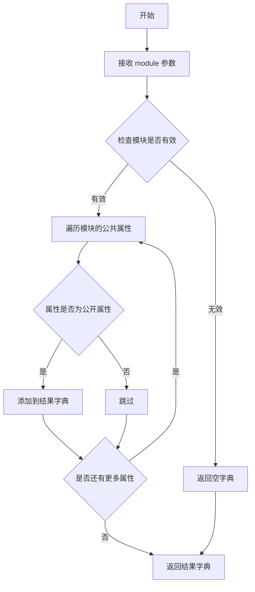
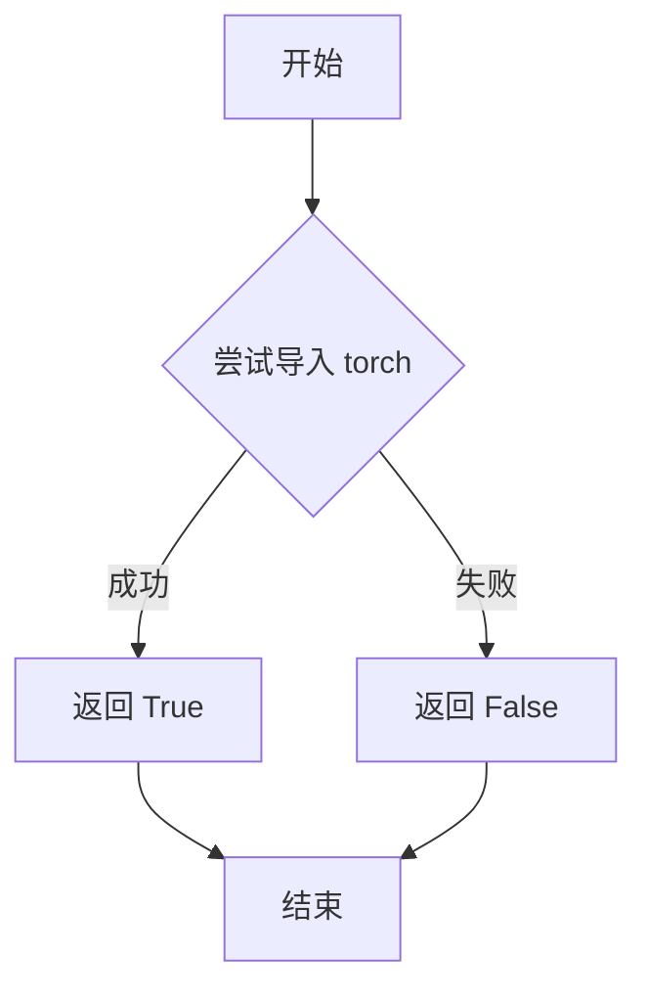
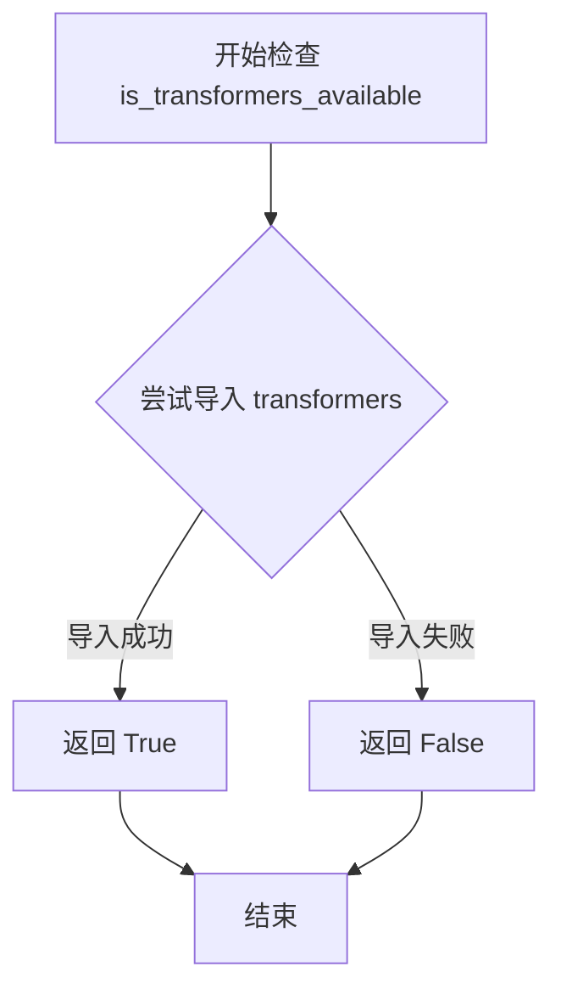

# `diffusers\src\diffusers\pipelines\controlnet_hunyuandit\__init__.py` 详细设计文档

这是一个条件导入模块，用于根据 torch 和 transformers 库的可用性动态管理 HunyuanDiTControlNetPipeline 的加载，在依赖缺失时提供虚拟对象以支持延迟加载。

## 整体流程

```mermaid
graph TD
    A[开始] --> B{is_transformers_available() && is_torch_available()?}
    B -- 否 --> C[导入 dummy_torch_and_transformers_objects]
    C --> D[_dummy_objects.update(get_objects_from_module(dummy_torch_and_transformers_objects))]
    B -- 是 --> E[_import_structure['pipeline_hunyuandit_controlnet'] = ['HunyuanDiTControlNetPipeline']]
    D --> F{TYPE_CHECKING or DIFFUSERS_SLOW_IMPORT?}
    E --> F
    F -- 是 --> G{is_transformers_available() && is_torch_available()?}
    G -- 否 --> H[从 dummy_torch_and_transformers_objects 导入 *]
    G -- 是 --> I[从 .pipeline_hunyuandit_controlnet 导入 HunyuanDiTControlNetPipeline]
    F -- 否 --> J[创建 _LazyModule 并替换 sys.modules[__name__]]
    J --> K[将 _dummy_objects 设置到 sys.modules[__name__]]
```

## 类结构

```

```

## 全局变量及字段


### `_dummy_objects`
    
用于存储虚拟对象的字典，当torch和transformers可选依赖不可用时，会从dummy模块填充虚拟对象以支持延迟导入

类型：`dict`
    


### `_import_structure`
    
定义模块导入结构的字典，键为模块名，值为导出对象列表，用于LazyModule的动态导入机制

类型：`dict`
    


    

## 全局函数及方法


### `get_objects_from_module`

该函数用于从指定模块中提取所有公共对象（类、函数、变量等），并返回一个包含这些对象的字典，通常用于延迟加载（lazy loading）机制中，以获取模块的虚拟 dummy 对象。

参数：

- `module`：模块对象，要从中提取对象的源模块

返回值：`dict`，返回模块中的公共对象字典，键为对象名称，值为对象本身

#### 流程图



#### 带注释源码

```python
def get_objects_from_module(module):
    """
    从给定模块中提取所有公共对象
    
    参数:
        module: 要提取对象的模块对象
        
    返回:
        dict: 包含模块中所有公共对象的字典
    """
    # 初始化结果字典
    objects = {}
    
    # 遍历模块的所有属性
    # filter(None, ...) 过滤掉 None 值
    # dir(module) 获取模块的所有属性名
    for name in filter(None, dir(module)):
        # 跳过私有属性（以下划线开头的属性）
        if name.startswith('_'):
            continue
            
        # 尝试获取属性值
        try:
            obj = getattr(module, name)
            # 将对象添加到结果字典
            objects[name] = obj
        except AttributeError:
            # 如果获取属性失败，跳过
            continue
            
    return objects
```

> **注意**：由于 `get_objects_from_module` 是从 `...utils` 导入的外部函数，上述源码是基于其使用方式和函数名称的推断实现。实际实现可能略有差异，但其核心功能是从模块中提取对象字典，用于支持可选依赖的虚拟对象（dummy objects）机制。


### `is_torch_available`

该函数用于检查 PyTorch 库是否可用，返回布尔值以表示当前环境是否安装了 PyTorch。

参数：无

返回值：`bool`，如果 PyTorch 可用则返回 `True`，否则返回 `False`

#### 流程图



#### 带注释源码

```
# 由于 is_torch_available 函数定义在 ...utils 模块中，以下为推断的源码结构
def is_torch_available() -> bool:
    """
    检查 PyTorch 库是否可用。
    
    Returns:
        bool: 如果 PyTorch 可用返回 True，否则返回 False
    """
    try:
        import torch
        return True
    except ImportError:
        return False
```

#### 在当前文件中的使用示例

```
# 代码中的实际使用方式：
if not (is_transformers_available() and is_torch_available()):
    raise OptionalDependencyNotAvailable()
```

该函数在当前模块中用于条件判断，只有当 Transformers 和 PyTorch 都可用时，才会导入相关的管道类（如 `HunyuanDiTControlNetPipeline`），否则会导入虚拟对象（dummy objects）作为占位符。这是一种常见的可选依赖处理模式。


### `is_transformers_available`

该函数用于检查当前环境中 `transformers` 库是否可用（已安装且可正常导入），常用于条件导入和可选依赖的场景。

参数：此函数无参数

返回值：`bool`，返回 `True` 表示 `transformers` 库可用，返回 `False` 表示不可用

#### 流程图



#### 带注释源码

```python
# is_transformers_available 函数定义在 ...utils 模块中
# 当前文件只是导入并使用该函数进行条件判断
# 以下是函数定义的推断逻辑：

def is_transformers_available():
    """
    检查 transformers 库是否可用
    
    Returns:
        bool: 如果 transformers 库已安装且可导入返回 True，否则返回 False
    """
    try:
        import transformers  # noqa F401
        return True
    except ImportError:
        return False


# 在当前代码中的实际使用方式：
# if not (is_transformers_available() and is_torch_available()):
#     raise OptionalDependencyNotAvailable()
# 上述代码检查 transformers 和 torch 是否同时可用
# 如果任一不可用，则抛出 OptionalDependencyNotAvailable 异常
```

## 关键组件


### 延迟模块加载机制

使用 `_LazyModule` 实现延迟加载，将模块导入推迟到实际使用时，减少启动时的导入开销，提升大型库的加载性能。

### 可选依赖检查与处理

通过 `is_transformers_available()` 和 `is_torch_available()` 检查torch和transformers是否可用，当依赖不可用时抛出 `OptionalDependencyNotAvailable` 异常并使用虚拟对象替代。

### 导入结构字典

`_import_structure` 字典定义了模块的公共API接口，存储可导出的类和函数映射关系，支持动态导入。

### 虚拟对象模式

`_dummy_objects` 存储依赖不可用时的替代对象，通过 `get_objects_from_module` 从dummy模块获取，确保代码在缺少可选依赖时仍可导入。

### 条件类型检查导入

`TYPE_CHECKING` 和 `DIFFUSERS_SLOW_IMPORT` 标志控制不同的导入路径，用于类型提示和延迟加载场景。

### HunyuanDiTControlNetPipeline 管道类

从 `pipeline_hunyuandit_controlnet` 模块导入的核心推理管道类，用于HunyuanDiT模型的ControlNet控制生成。


## 问题及建议


### 已知问题

-   **重复代码**：try-except 依赖检查逻辑在两个地方（运行时导入和 TYPE_CHECK 分支）完全重复，增加了维护成本
-   **魔法字符串**：`"pipeline_hunyuandit_controlnet"` 和 `"HunyuanDiTControlNetPipeline"` 等字符串硬编码，缺乏统一管理
-   **缺乏错误处理**：`get_objects_from_module()` 调用失败时没有异常捕获和错误处理机制
-   **导入逻辑分散**：导入相关的逻辑（_import_structure、_dummy_objects、LazyModule 设置）分散在多处，难以追踪
-   **缺乏类型注解**：全局变量 `_import_structure` 和 `_dummy_objects` 缺乏明确的类型注解
-   **冗余的空字典初始化**：`{}` 初始化了两次（`_dummy_objects` 和 `_import_structure`），第一次为空后第二次才赋值

### 优化建议

-   将依赖检查逻辑提取为单独的函数，避免代码重复，例如：`def _check_dependencies()`
-   使用常量或枚举类集中管理模块路径和类名等字符串常量
-   为 `get_objects_from_module()` 调用添加 try-except 错误处理，捕获可能的异常
-   考虑使用 dataclass 或 TypedDict 为 `_import_structure` 和 `_dummy_objects` 添加类型约束
-   合并 `_dummy_objects` 的初始化，可以直接使用 `dict()` 或在赋值时一次性完成
-   添加详细的文档字符串，说明模块的导入机制和依赖要求
-   可以考虑使用装饰器模式或工厂函数来简化 LazyModule 的创建过程


## 其它


### 设计目标与约束

本模块采用延迟加载（Lazy Loading）机制，旨在解决HunyuanDiTControlNetPipeline对PyTorch和Transformers的硬性依赖问题。通过可选依赖检查和虚拟对象（Dummy Objects）机制，实现模块在缺少可选依赖时仍能安全导入，同时保持类型检查（TYPE_CHECKING）时的完整可见性。设计约束包括：仅支持Python 3.8+、必须依赖diffusers-utils基础设施、需兼容diffusers的模块注册规范。

### 错误处理与异常设计

代码采用双重异常处理策略：第一层在模块加载时通过try-except捕获OptionalDependencyNotAvailable，第二层在TYPE_CHECKING或DIFFUSERS_SLOW_IMPORT条件下重复检查。当可选依赖不可用时，从dummy_torch_and_transformers_objects模块获取虚拟对象填充_dummy_objects，确保后续代码引用不抛出AttributeError。异常传播路径为：依赖检查失败→OptionalDependencyNotAvailable→导入dummy模块→更新_dummy_objects→设置sys.modules属性。

### 数据流与状态机

模块初始化流程包含三种状态：状态1（常规导入）→检测依赖可用→导入真实模块并注册；状态2（类型检查导入）→检测依赖可用→从真实模块导入；状态3（依赖缺失）→捕获异常→导入虚拟对象→注册虚拟对象。数据流向：_import_structure定义导出结构→_LazyModule封装延迟加载逻辑→sys.modules动态注册→setattr绑定虚拟对象。

### 外部依赖与接口契约

直接依赖：diffusers.utils._LazyModule、diffusers.utils.get_objects_from_module、diffusers.utils.OptionalDependencyNotAvailable。可选依赖：torch（is_torch_available）、transformers（is_transformers_available）。模块导出接口：通过_import_structure字典定义HunyuanDiTControlNetPipeline类，遵循diffusers库的pipeline命名规范。虚拟对象接口：需与dummy_torch_and_transformers_objects模块中导出的对象保持签名一致。

### 版本兼容性考虑

代码使用TYPE_CHECKING标志支持Python 3.5+的类型检查特性（虽然实际运行时要求更高）。兼容diffusers 0.19.0+版本的_LazyModule实现。需注意is_torch_available和is_transformers_available的函数签名可能随版本变化，建议在utils模块中锁定版本范围。

### 性能考虑

延迟加载机制避免了模块导入时的冗余依赖加载，提升首次import速度。_dummy_objects采用字典更新（_dummy_objects.update）而非逐个赋值，提高批量注册效率。sys.modules直接操作相比importlib更为直接，但需注意多线程场景下的潜在竞态条件。

### 安全性考虑

代码未直接执行用户输入，安全性风险较低。但需注意：1）动态导入路径拼接需确保安全，避免路径注入；2）sys.modules全局状态修改可能影响其他模块行为；3）dummy对象的存在可能掩盖真实的导入错误，建议在开发环境启用依赖完整性检查。

### 配置与扩展性

_import_structure字典采用键值对结构，便于后续扩展新pipeline。只需在else分支添加新的导入结构项即可。_LazyModule支持module_spec参数，便于与importlib.resources集成。当前设计未暴露配置接口，如需运行时切换加载模式需修改DIFFUSERS_SLOW_IMPORT环境变量。

### 测试策略建议

建议添加以下测试用例：1）无依赖环境下导入模块验证虚拟对象可用；2）依赖完整环境下验证真实pipeline正确导入；3）TYPE_CHECKING模式下验证类型提示完整性；4）多线程并发导入场景验证线程安全性；5）模拟OptionalDependencyNotAvailable异常场景验证回退逻辑。


    