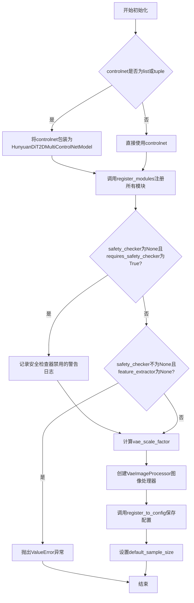
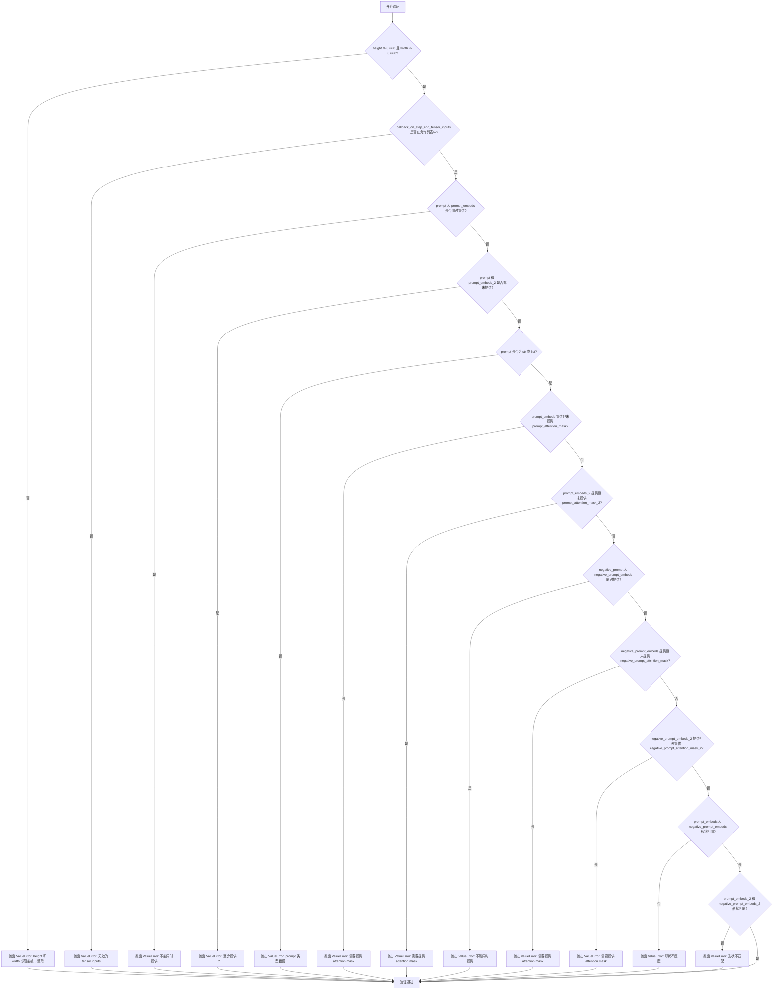
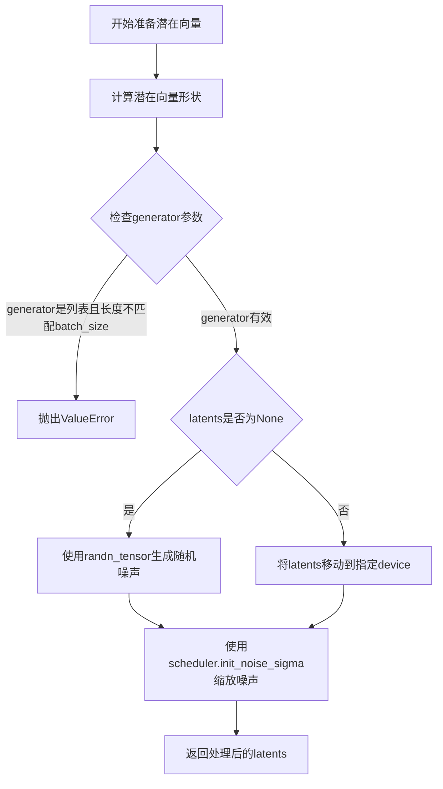
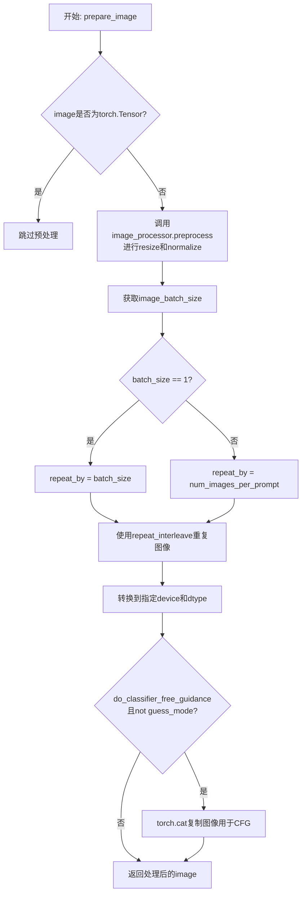
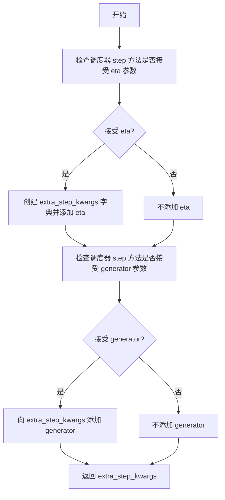
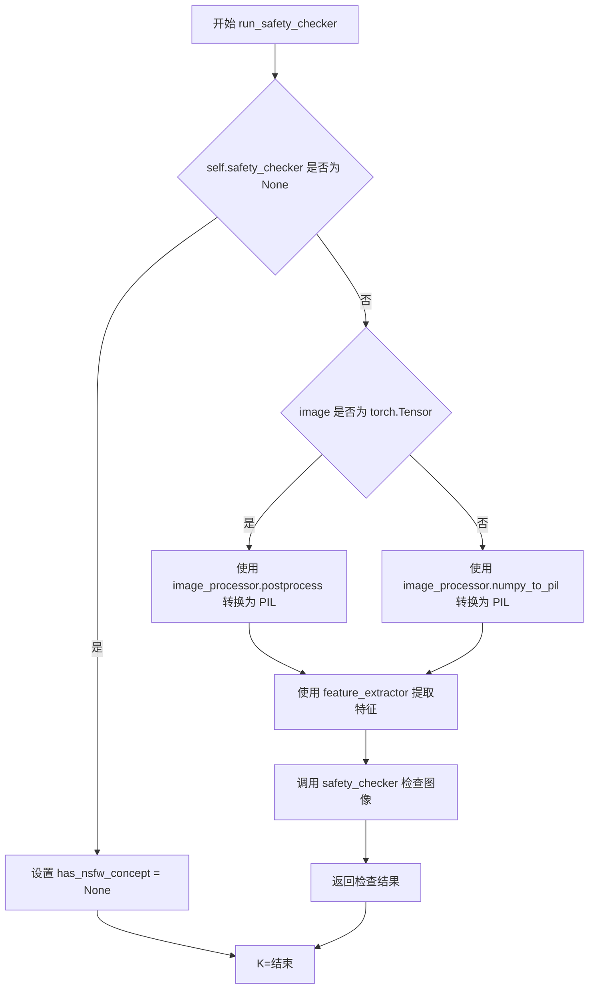

```mermaid
flowchart TD
    A[__call__ 入口] --> B[设置默认高度和宽度]
    B --> C{启用分辨率分箱?}
    C -->|是| D[映射到标准分辨率]
    C -->|否| E[跳过映射]
    D --> E
    E --> F[检查输入参数]
    F --> G[定义批处理大小和设备]
    G --> H[编码输入提示词 - CLIP编码器]
    H --> I[编码输入提示词 - T5编码器]
    I --> J{ControlNet类型?}
    J -->|单个KunyuanDiT2DControlNetModel| K[准备单个控制图像]
    J -->|KunyuanDiT2DMultiControlNetModel| L[准备多个控制图像]
    K --> M[VAE编码控制图像]
    L --> M
    M --> N[设置时间步]
    N --> O[准备潜在变量]
    O --> P[准备额外步骤参数]
    P --> Q[创建旋转嵌入、样式嵌入和时间ID]
    Q --> R{是否启用无分类器引导?}
    R -->|是| S[连接条件和非条件嵌入]
    R -->|否| T[去噪循环]
    S --> T
    T --> U[遍历每个时间步]
    U --> V{是否中断?}
    V -->|是| W[继续下一轮]
    V -->|否| X[扩展潜在变量]
    X --> Y[缩放模型输入]
    Y --> Z[扩展时间步张量]
    Z --> AA[ControlNet推理]
    AA --> AB[Transformer预测噪声]
    AB --> AC[分割噪声预测]
    AC --> AD{启用引导?}
    AD -->|是| AE[应用引导]
    AD -->|否| AF[跳过引导]
    AE --> AG[重缩放噪声配置]
    AG --> AF
    AF --> AH[调度器步骤计算前一潜在变量]
    AH --> AI[执行回调]
    AI --> AJ{更新进度条?}
    AJ -->|是| AK[更新进度]
    AJ -->|否| AL[检查是否完成]
    AL --> AM{还有更多时间步?}
    AM -->|是| V
    AM -->|否| AN{输出类型是latent?}
    AN -->|否| AO[VAE解码]
    AN -->|是| AP[直接使用latents]
    AO --> AQ[运行安全检查]
    AQ --> AR[后处理图像]
    AP --> AR
    AR --> AS[释放模型钩子]
    AS --> AT{return_dict为True?}
    AT -->|是| AU[返回StableDiffusionPipelineOutput]
    AT -->|否| AV[返回元组]
```

# `diffusers\src\diffusers\pipelines\controlnet_hunyuandit\pipeline_hunyuandit_controlnet.py` 详细设计文档

这是腾讯 HunyuanDiT 的 ControlNet Pipeline 实现，继承自 Diffusers 库。它利用双文本编码器（CLIP 和 T5）理解中英文提示，并结合 ControlNet 提供的图像条件（如边缘图）通过去噪过程生成对应的图像。该 Pipeline 包含了完整的输入校验、潜在空间操作、ControlNet 推理、Transformer 主干网络推理、VAE 解码及安全检查流程。

## 整体流程

```mermaid
graph TD
    A([开始]) --> B[检查输入参数 & 设置分辨率]
    B --> C[编码 Prompt (CLIP & T5)]
    C --> D{处理 ControlNet Image}
    D -->|单 ControlNet| E[VAE 编码条件图]
    D -->|多 ControlNet| F[循环 VAE 编码]
    E --> G[初始化 Latents (噪声)]
    F --> G
    G --> H[准备时间步 & 旋转位置嵌入]
    H --> I{去噪循环 (Denoising)}
    I --> J[ControlNet 推理]
    J --> K[Transformer 推理]
    K --> L{Classifier Free Guidance}
    L --> M[计算上一步噪声]
    M --> N[调度器步进]
    N --> I
    I --> O{是否完成}
    O -- 是 --> P[VAE 解码 Latents]
    P --> Q[安全检查 (NSFW)]
    Q --> R[后处理输出图像]
    R --> S([结束])
```

## 类结构

```
DiffusionPipeline (抽象基类)
└── HunyuanDiTControlNetPipeline (具体实现类)
```

## 全局变量及字段


### `STANDARD_RATIO`
    
Numpy array of standard aspect ratios (1:1, 4:3, 3:4, 16:9, 9:16) for resolution binning

类型：`np.ndarray`
    


### `STANDARD_SHAPE`
    
List of tuples defining standard resolutions per aspect ratio category

类型：`list`
    


### `STANDARD_AREA`
    
List of numpy arrays containing areas corresponding to STANDARD_SHAPE resolutions

类型：`list[np.ndarray]`
    


### `SUPPORTED_SHAPE`
    
List of tuples of all supported (width, height) pairs for image generation

类型：`list[tuple[int, int]]`
    


### `logger`
    
Logger instance for the module to log warnings and information

类型：`logging.Logger`
    


### `EXAMPLE_DOC_STRING`
    
Docstring containing usage examples for the pipeline

类型：`str`
    


### `XLA_AVAILABLE`
    
Boolean flag indicating if PyTorch XLA is available for accelerated computation

类型：`bool`
    


### `HunyuanDiTControlNetPipeline.vae`
    
Variational Autoencoder for encoding images to latent space and decoding latents back to images

类型：`AutoencoderKL`
    


### `HunyuanDiTControlNetPipeline.text_encoder`
    
Primary text encoder based on BERT/CLIP architecture for encoding prompts to embeddings

类型：`BertModel`
    


### `HunyuanDiTControlNetPipeline.tokenizer`
    
Tokenizer for the primary text encoder to tokenize input text

类型：`BertTokenizer`
    


### `HunyuanDiTControlNetPipeline.text_encoder_2`
    
Secondary text encoder based on T5 architecture for additional prompt encoding

类型：`T5EncoderModel | None`
    


### `HunyuanDiTControlNetPipeline.tokenizer_2`
    
Tokenizer for the T5 text encoder to tokenize input text

类型：`T5Tokenizer | None`
    


### `HunyuanDiTControlNetPipeline.transformer`
    
The HunyuanDiT diffusion transformer model for denoising image latents

类型：`HunyuanDiT2DModel`
    


### `HunyuanDiTControlNetPipeline.controlnet`
    
ControlNet model providing additional conditioning from control images during denoising

类型：`HunyuanDiT2DControlNetModel | HunyuanDiT2DMultiControlNetModel`
    


### `HunyuanDiTControlNetPipeline.scheduler`
    
Noise scheduler for managing the diffusion denoising process steps

类型：`DDPMScheduler`
    


### `HunyuanDiTControlNetPipeline.safety_checker`
    
Safety checker for detecting and filtering NSFW (not-safe-for-work) generated content

类型：`StableDiffusionSafetyChecker`
    


### `HunyuanDiTControlNetPipeline.feature_extractor`
    
Feature extractor for the safety checker to process images before NSFW detection

类型：`CLIPImageProcessor`
    


### `HunyuanDiTControlNetPipeline.image_processor`
    
Image processor for preprocessing input images and postprocessing output images

类型：`VaeImageProcessor`
    


### `HunyuanDiTControlNetPipeline.vae_scale_factor`
    
Scaling factor for VAE latents, derived from VAE encoder block channels

类型：`int`
    


### `HunyuanDiTControlNetPipeline.default_sample_size`
    
Default image size used when height/width not specified, from transformer config

类型：`int`
    
    

## 全局函数及方法


### `map_to_standard_shapes`

将目标宽度/高度映射到模型支持的最接近的标准形状。该函数通过计算目标宽高比与预定义标准比例的最近匹配，结合目标面积与对应比例类别中标准形状面积的最近匹配，最终返回最合适的标准分辨率。

参数：

- `target_width`：`int`，目标宽度（像素）
- `target_height`：`int`，目标高度（像素）

返回值：`tuple[int, int]`，返回最接近的标准形状的宽度和高度

#### 流程图

```mermaid
flowchart TD
    A[开始] --> B[计算目标宽高比: target_ratio = target_width / target_height]
    B --> C[计算与标准比例数组的绝对差值]
    C --> D[找到最小差值对应的索引: closest_ratio_idx]
    D --> E[计算目标面积: target_area = target_width * target_height]
    E --> F[在最近比例类别中计算与标准面积数组的绝对差值]
    F --> G[找到最小差值对应的索引: closest_area_idx]
    G --> H[从标准形状数组中获取对应尺寸: width, height = STANDARD_SHAPE[closest_ratio_idx][closest_area_idx]]
    H --> I[返回 width, height]
    I --> J[结束]
```

#### 带注释源码

```python
def map_to_standard_shapes(target_width, target_height):
    """
    将目标宽度/高度映射到模型支持的最接近的标准形状。
    
    该函数通过两步匹配：
    1. 首先找到与目标宽高比最接近的标准比例类别
    2. 然后在该比例类别中找到与目标面积最接近的标准尺寸
    
    Args:
        target_width: 目标宽度（像素）
        target_height: 目标高度（像素）
    
    Returns:
        tuple: (width, height) 最接近的标准形状尺寸
    """
    # 第一步：计算目标宽高比
    target_ratio = target_width / target_height
    
    # 在预定义的标准比例数组中找到与目标比例最接近的索引
    # STANDARD_RATIO 包含: [1.0, 4/3, 3/4, 16/9, 9/16] 对应 [1:1, 4:3, 3:4, 16:9, 9:16]
    closest_ratio_idx = np.argmin(np.abs(STANDARD_RATIO - target_ratio))
    
    # 第二步：计算目标面积
    target_area = target_width * target_height
    
    # 在最接近的比例类别中，找到与目标面积最接近的标准形状索引
    # STANDARD_AREA[closest_ratio_idx] 存储该比例类别下所有标准形状的面积
    closest_area_idx = np.argmin(np.abs(STANDARD_AREA[closest_ratio_idx] - target_area))
    
    # 获取最终的标准宽度和高度
    width, height = STANDARD_SHAPE[closest_ratio_idx][closest_area_idx]
    
    return width, height
```


### `get_resize_crop_region_for_grid`

该函数用于计算图像在调整大小到目标尺寸后进行居中裁剪的坐标区域，确保裁剪后的图像能够完整填充目标尺寸并保持宽高比。

参数：

- `src`：`tuple[int, int]`，源图像的尺寸，格式为 (height, width)
- `tgt_size`：`int`，目标尺寸的正方形边长（宽高相等）

返回值：`tuple[tuple[int, int], tuple[int, int]]`，返回两个坐标元组：第一个是裁剪区域的左上角坐标 (crop_top, crop_left)，第二个是裁剪区域的右下角坐标 (crop_top + resize_height, crop_left + resize_width)

#### 流程图

```mermaid
flowchart TD
    A[开始] --> B[接收 src 和 tgt_size]
    B --> C[设 th = tw = tgt_size]
    C --> D[从 src 解包 h, w]
    D --> E[计算宽高比 r = h / w]
    E --> F{r > 1?}
    F -->|是| G[resize_height = th]
    F -->|是| H[resize_width = round(th / h * w)]
    F -->|否| I[resize_width = tw]
    F -->|否| J[resize_height = round(tw / w * h)]
    H --> K[计算裁剪坐标]
    J --> K
    K --> L[计算 crop_top = round((th - resize_height) / 2)]
    K --> M[计算 crop_left = round((tw - resize_width) / 2)]
    L --> N[返回裁剪区域]
    M --> N
    N --> O[左上角: crop_top, crop_left]
    N --> P[右下角: crop_top + resize_height, crop_left + resize_width]
    O --> Q[结束]
    P --> Q
```

#### 带注释源码

```python
def get_resize_crop_region_for_grid(src, tgt_size):
    """
    计算图像调整大小后进行居中裁剪的坐标区域。
    
    该函数首先根据目标尺寸和源图像的宽高比计算调整大小后的尺寸，
    然后计算居中裁剪的坐标，确保裁剪后的图像能够完整填充目标尺寸。
    
    参数:
        src: 源图像的尺寸，格式为 (height, width)
        tgt_size: 目标尺寸的正方形边长
    
    返回:
        两个坐标元组：((crop_top, crop_left), (crop_bottom, crop_right))
    """
    # 目标尺寸赋值给高度和宽度变量
    th = tw = tgt_size
    # 从源尺寸解包出高度和宽度
    h, w = src

    # 计算源图像的宽高比
    r = h / w

    # 根据宽高比决定调整大小的方式
    if r > 1:
        # 源图像为竖向（高度大于宽度），以高度为基准进行缩放
        resize_height = th
        resize_width = int(round(th / h * w))
    else:
        # 源图像为横向（宽度大于等于高度），以宽度为基准进行缩放
        resize_width = tw
        resize_height = int(round(tw / w * h))

    # 计算居中裁剪的左上角坐标
    # 通过目标尺寸减去调整后的尺寸，再除以2来实现居中
    crop_top = int(round((th - resize_height) / 2.0))
    crop_left = int(round((tw - resize_width) / 2.0))

    # 返回裁剪区域的左上角和右下角坐标
    # 右下角坐标 = 左上角坐标 + 调整后的尺寸
    return (crop_top, crop_left), (crop_top + resize_height, crop_left + resize_width)
```


### `rescale_noise_cfg`

该函数用于根据 guidance_rescale 参数重新缩放噪声预测配置，以改善图像质量并修复过度曝光问题。该方法基于论文 Common Diffusion Noise Schedules and Sample Steps are Flawed 的 Section 3.4。

参数：

-  `noise_cfg`：`torch.Tensor`，引导扩散过程的预测噪声张量
-  `noise_pred_text`：`torch.Tensor`，文本引导扩散过程的预测噪声张量
-  `guidance_rescale`：`float`，可选参数，默认为 0.0应用于噪声预测的重缩放因子

返回值：`torch.Tensor`，重缩放后的噪声预测张量

#### 流程图

```mermaid
flowchart TD
    A[开始] --> B[计算 noise_pred_text 的标准差 std_text]
    B --> C[计算 noise_cfg 的标准差 std_cfg]
    C --> D[计算重缩放后的噪声预测 noise_pred_rescaled = noise_cfg \* (std_text / std_cfg)]
    D --> E[根据 guidance_rescale 混合原始结果<br/>noise_cfg = guidance_rescale \* noise_pred_rescaled + (1 - guidance_rescale) \* noise_cfg]
    E --> F[返回重缩放后的 noise_cfg]
```

#### 带注释源码

```python
# Copied from diffusers.pipelines.stable_diffusion.pipeline_stable_diffusion.rescale_noise_cfg
def rescale_noise_cfg(noise_cfg, noise_pred_text, guidance_rescale=0.0):
    r"""
    Rescales `noise_cfg` tensor based on `guidance_rescale` to improve image quality and fix overexposure. Based on
    Section 3.4 from [Common Diffusion Noise Schedules and Sample Steps are
    Flawed](https://huggingface.co/papers/2305.08891).

    Args:
        noise_cfg (`torch.Tensor`):
            The predicted noise tensor for the guided diffusion process.
        noise_pred_text (`torch.Tensor`):
            The predicted noise tensor for the text-guided diffusion process.
        guidance_rescale (`float`, *optional*, defaults to 0.0):
            A rescale factor applied to the noise predictions.

    Returns:
        noise_cfg (`torch.Tensor`): The rescaled noise prediction tensor.
    """
    # 计算文本预测噪声的标准差（沿着除批次维度外的所有维度）
    std_text = noise_pred_text.std(dim=list(range(1, noise_pred_text.ndim)), keepdim=True)
    # 计算噪声配置的标准差（沿着除批次维度外的所有维度）
    std_cfg = noise_cfg.std(dim=list(range(1, noise_cfg.ndim)), keepdim=True)
    # 重缩放引导结果（修复过度曝光）
    noise_pred_rescaled = noise_cfg * (std_text / std_cfg)
    # 通过 guidance_rescale 因子与原始引导结果混合，避免图像看起来"平淡"
    noise_cfg = guidance_rescale * noise_pred_rescaled + (1 - guidance_rescale) * noise_cfg
    return noise_cfg
```


### `HunyuanDiTControlNetPipeline.__init__`

该构造函数是 HunyuanDiTControlNetPipeline 类的初始化方法，用于初始化所有模型组件（VAE、文本编码器、Transformer、ControlNet、调度器等）和处理器（分词器、图像处理器），并注册到管道中，同时配置安全检查器和默认采样参数。

参数：

-  `vae`：`AutoencoderKL`，用于将图像编码和解码到潜在表示的变分自编码器模型
-  `text_encoder`：`BertModel`，冻结的双语 CLIP 文本编码器，用于将文本提示编码为隐藏状态
-  `tokenizer`：`BertTokenizer`，用于将文本分词的 BERT 分词器
-  `transformer`：`HunyuanDiT2DModel`，腾讯混元 DiT 主干模型
-  `scheduler`：`DDPMScheduler`，用于去噪图像潜在表示的调度器
-  `safety_checker`：`StableDiffusionSafetyChecker`，用于检查生成图像是否包含不适内容的安

全检查器
-  `feature_extractor`：`CLIPImageProcessor`，用于提取图像特征的 CLIP 图像处理器
-  `controlnet`：`HunyuanDiT2DControlNetModel | list[HunyuanDiT2DControlNetModel] | tuple[HunyuanDiT2DControlNetModel] | HunyuanDiT2DMultiControlNetModel`，提供额外条件控制的 ControlNet 模型
-  `text_encoder_2`：`T5EncoderModel | None = None`，mT5 文本编码器（可选）
-  `tokenizer_2`：`T5Tokenizer | None = None`，mT5 分词器（可选）
-  `requires_safety_checker`：`bool = True`，是否需要安全检查器

返回值：`None`，构造函数无返回值

#### 流程图



#### 带注释源码

```python
def __init__(
    self,
    vae: AutoencoderKL,
    text_encoder: BertModel,
    tokenizer: BertTokenizer,
    transformer: HunyuanDiT2DModel,
    scheduler: DDPMScheduler,
    safety_checker: StableDiffusionSafetyChecker,
    feature_extractor: CLIPImageProcessor,
    controlnet: HunyuanDiT2DControlNetModel
    | list[HunyuanDiT2DControlNetModel]
    | tuple[HunyuanDiT2DControlNetModel]
    | HunyuanDiT2DMultiControlNetModel,
    text_encoder_2: T5EncoderModel | None = None,
    tokenizer_2: T5Tokenizer | None = None,
    requires_safety_checker: bool = True,
):
    # 调用父类DiffusionPipeline的初始化方法
    super().__init__()
    
    # 如果controlnet是list或tuple，则包装为MultiControlNetModel
    if isinstance(controlnet, (list, tuple)):
        controlnet = HunyuanDiT2DMultiControlNetModel(controlnet)

    # 注册所有模型模块到管道中
    self.register_modules(
        vae=vae,
        text_encoder=text_encoder,
        tokenizer=tokenizer,
        tokenizer_2=tokenizer_2,
        transformer=transformer,
        scheduler=scheduler,
        safety_checker=safety_checker,
        feature_extractor=feature_extractor,
        text_encoder_2=text_encoder_2,
        controlnet=controlnet,
    )

    # 如果safety_checker为None但requires_safety_checker为True，则发出警告
    if safety_checker is None and requires_safety_checker:
        logger.warning(
            f"You have disabled the safety checker for {self.__class__} by passing `safety_checker=None`. Ensure"
            " that you abide to the conditions of the Stable Diffusion license and do not expose unfiltered"
            " results in services or applications open to the public. Both the diffusers team and Hugging Face"
            " strongly recommend to keep the safety filter enabled in all public facing circumstances, disabling"
            " it only for use-cases that involve analyzing network behavior or auditing its results. For more"
            " information, please have a look at https://github.com/huggingface/diffusers/pull/254 ."
        )

    # 如果safety_checker存在但feature_extractor不存在，则抛出错误
    if safety_checker is not None and feature_extractor is None:
        raise ValueError(
            "Make sure to define a feature extractor when loading {self.__class__} if you want to use the safety"
            " checker. If you do not want to use the safety checker, you can pass `'safety_checker=None'` instead."
        )

    # 计算VAE的缩放因子，基于VAE的block_out_channels
    self.vae_scale_factor = 2 ** (len(self.vae.config.block_out_channels) - 1) if getattr(self, "vae", None) else 8
    
    # 创建VAE图像处理器
    self.image_processor = VaeImageProcessor(vae_scale_factor=self.vae_scale_factor)
    
    # 将requires_safety_checker保存到配置中
    self.register_to_config(requires_safety_checker=requires_safety_checker)
    
    # 设置默认采样大小，从transformer配置中获取
    self.default_sample_size = (
        self.transformer.config.sample_size
        if hasattr(self, "transformer") and self.transformer is not None
        else 128
    )
```


### HunyuanDiTControlNetPipeline.encode_prompt

该方法将文本提示编码为文本编码器的隐藏状态（embeddings），支持通过 `text_encoder_index` 参数选择使用 CLIP（索引0）或 T5（索引1）文本编码器，并支持无分类器引导（Classifier-Free Guidance）生成负向嵌入。

参数：

- `prompt`：`str`，要编码的文本提示，可以是单个字符串或字符串列表
- `device`：`torch.device`，torch 设备，用于指定计算设备
- `dtype`：`torch.dtype`，torch 数据类型，用于指定计算精度
- `num_images_per_prompt`：`int`，每个提示要生成的图像数量，用于复制嵌入
- `do_classifier_free_guidance`：`bool`，是否启用无分类器引导
- `negative_prompt`：`str | None`，负向提示，用于指导不包含的内容
- `prompt_embeds`：`torch.Tensor | None`，预生成的提示嵌入，如提供则直接使用
- `negative_prompt_embeds`：`torch.Tensor | None`，预生成的负向提示嵌入
- `prompt_attention_mask`：`torch.Tensor | None`，提示的注意力掩码
- `negative_prompt_attention_mask`：`torch.Tensor | None`，负向提示的注意力掩码
- `max_sequence_length`：`int | None`，最大序列长度，默认为77（CLIP）或256（T5）
- `text_encoder_index`：`int`，文本编码器索引，0表示CLIP，1表示T5

返回值：`tuple[torch.Tensor, torch.Tensor, torch.Tensor, torch.Tensor]`，返回包含四个元素的元组：提示嵌入、负向提示嵌入、提示注意力掩码、负向注意力掩码

#### 流程图

```mermaid
flowchart TD
    A[开始 encode_prompt] --> B{检查 dtype}
    B -->|None| C[根据 text_encoder_2 或 transformer 确定 dtype]
    B -->|有值| D[使用传入的 dtype]
    C --> E[确定 device]
    D --> E
    E --> F[根据 text_encoder_index 选择 tokenizer 和 text_encoder]
    F --> G{确定 max_length}
    G -->|text_encoder_index == 0| H[max_length = 77]
    G -->|text_encoder_index == 1| I[max_length = 256]
    G -->|max_sequence_length 有值| J[使用 max_sequence_length]
    H --> K
    I --> K
    J --> K
    K{确定 batch_size} -->|prompt 是 str| L[batch_size = 1]
    K -->|prompt 是 list| M[batch_size = len(prompt)]
    K -->|否则| N[batch_size = prompt_embeds.shape[0]]
    L --> O{prompt_embeds 为空?}
    M --> O
    N --> O
    O -->|是| P[调用 tokenizer 编码 prompt]
    P --> Q[检查是否被截断]
    Q -->|是| R[记录警告日志]
    Q -->|否| S[继续]
    R --> S
    S --> T[调用 text_encoder 生成嵌入]
    T --> U[重复嵌入 num_images_per_prompt 次]
    O -->|否| V[直接使用传入的 prompt_embeds]
    U --> W{do_classifier_free_guidance 为真<br>且 negative_prompt_embeds 为空?}
    V --> W
    W -->|是| X[处理 negative_prompt]
    X --> Y{negative_prompt 类型}
    Y -->|None| Z[使用空字符串]
    Y -->|str| AA[转换为列表]
    Y -->|list| AB[直接使用]
    Z --> AC
    AA --> AC
    AB --> AC
    AC[调用 tokenizer 编码 negative_prompt] --> AD[调用 text_encoder 生成负向嵌入]
    AD --> AE[重复负向嵌入 num_images_per_prompt 次]
    W -->|否| AF[跳过负向嵌入生成]
    AE --> AG[返回结果]
    AF --> AG
    AG[结束] --> AH[返回 prompt_embeds<br>negative_prompt_embeds<br>prompt_attention_mask<br>negative_prompt_attention_mask]
```

#### 带注释源码

```python
def encode_prompt(
    self,
    prompt: str,  # 要编码的文本提示
    device: torch.device = None,  # torch 设备
    dtype: torch.dtype = None,  # torch 数据类型
    num_images_per_prompt: int = 1,  # 每个提示生成的图像数量
    do_classifier_free_guidance: bool = True,  # 是否启用无分类器引导
    negative_prompt: str | None = None,  # 负向提示
    prompt_embeds: torch.Tensor | None = None,  # 预生成的提示嵌入
    negative_prompt_embeds: torch.Tensor | None = None,  # 预生成的负向提示嵌入
    prompt_attention_mask: torch.Tensor | None = None,  # 提示注意力掩码
    negative_prompt_attention_mask: torch.Tensor | None = None,  # 负向提示注意力掩码
    max_sequence_length: int | None = None,  # 最大序列长度
    text_encoder_index: int = 0,  # 文本编码器索引: 0=CLIP, 1=T5
):
    r"""
    Encodes the prompt into text encoder hidden states.

    Args:
        prompt (`str` or `list[str]`, *optional*):
            prompt to be encoded
        device: (`torch.device`):
            torch device
        dtype (`torch.dtype`):
            torch dtype
        num_images_per_prompt (`int`):
            number of images that should be generated per prompt
        do_classifier_free_guidance (`bool`):
            whether to use classifier free guidance or not
        negative_prompt (`str` or `list[str]`, *optional*):
            The prompt or prompts not to guide the image generation. If not defined, one has to pass
            `negative_prompt_embeds` instead. Ignored when not using guidance (i.e., ignored if `guidance_scale` is
            less than `1`).
        prompt_embeds (`torch.Tensor`, *optional*):
            Pre-generated text embeddings. Can be used to easily tweak text inputs, *e.g.* prompt weighting. If not
            provided, text embeddings will be generated from `prompt` input argument.
        negative_prompt_embeds (`torch.Tensor`, *optional*):
            Pre-generated negative text embeddings. Can be used to easily tweak text inputs, *e.g.* prompt
            weighting. If not provided, negative_prompt_embeds will be generated from `negative_prompt` input
            argument.
        prompt_attention_mask (`torch.Tensor`, *optional*):
            Attention mask for the prompt. Required when `prompt_embeds` is passed directly.
        negative_prompt_attention_mask (`torch.Tensor`, *optional*):
            Attention mask for the negative prompt. Required when `negative_prompt_embeds` is passed directly.
        max_sequence_length (`int`, *optional*): maximum sequence length to use for the prompt.
        text_encoder_index (`int`, *optional*):
            Index of the text encoder to use. `0` for clip and `1` for T5.
    """
    # 如果 dtype 为 None，则根据可用的文本编码器确定默认 dtype
    if dtype is None:
        if self.text_encoder_2 is not None:
            dtype = self.text_encoder_2.dtype  # 优先使用 T5 编码器的 dtype
        elif self.transformer is not None:
            dtype = self.transformer.dtype
        else:
            dtype = None

    # 如果 device 为 None，则使用执行设备
    if device is None:
        device = self._execution_device

    # 准备 tokenizers 和 text_encoders 列表，支持双文本编码器
    tokenizers = [self.tokenizer, self.tokenizer_2]
    text_encoders = [self.text_encoder, self.text_encoder_2]

    # 根据索引选择要使用的 tokenizer 和 text_encoder
    tokenizer = tokenizers[text_encoder_index]
    text_encoder = text_encoders[text_encoder_index]

    # 确定最大序列长度：CLIP 默认为 77，T5 默认为 256
    if max_sequence_length is None:
        if text_encoder_index == 0:
            max_length = 77
        if text_encoder_index == 1:
            max_length = 256
    else:
        max_length = max_sequence_length

    # 确定批处理大小：根据 prompt 类型或已提供的 prompt_embeds
    if prompt is not None and isinstance(prompt, str):
        batch_size = 1
    elif prompt is not None and isinstance(prompt, list):
        batch_size = len(prompt)
    else:
        batch_size = prompt_embeds.shape[0]

    # 如果未提供 prompt_embeds，则从 prompt 生成
    if prompt_embeds is None:
        # 使用 tokenizer 将 prompt 转换为 token IDs 和 attention mask
        text_inputs = tokenizer(
            prompt,
            padding="max_length",
            max_length=max_length,
            truncation=True,
            return_attention_mask=True,
            return_tensors="pt",
        )
        text_input_ids = text_inputs.input_ids
        # 使用最长 padding 获取完整序列，用于检测截断
        untruncated_ids = tokenizer(prompt, padding="longest", return_tensors="pt").input_ids

        # 检测是否发生了截断，并记录警告
        if untruncated_ids.shape[-1] >= text_input_ids.shape[-1] and not torch.equal(
            text_input_ids, untruncated_ids
        ):
            removed_text = tokenizer.batch_decode(untruncated_ids[:, tokenizer.model_max_length - 1 : -1])
            logger.warning(
                "The following part of your input was truncated because CLIP can only handle sequences up to"
                f" {tokenizer.model_max_length} tokens: {removed_text}"
            )

        # 获取 attention mask 并移动到指定设备
        prompt_attention_mask = text_inputs.attention_mask.to(device)
        # 通过 text_encoder 获取文本嵌入
        prompt_embeds = text_encoder(
            text_input_ids.to(device),
            attention_mask=prompt_attention_mask,
        )
        # 获取隐藏状态（通常为 tuple 的第一个元素）
        prompt_embeds = prompt_embeds[0]
        # 为每个提示生成的图像数量复制 attention mask
        prompt_attention_mask = prompt_attention_mask.repeat(num_images_per_prompt, 1)

    # 将 prompt_embeds 转换为指定的数据类型和设备
    prompt_embeds = prompt_embeds.to(dtype=dtype, device=device)

    bs_embed, seq_len, _ = prompt_embeds.shape
    # 为每个提示生成的图像数量复制文本嵌入
    prompt_embeds = prompt_embeds.repeat(1, num_images_per_prompt, 1)
    prompt_embeds = prompt_embeds.view(bs_embed * num_images_per_prompt, seq_len, -1)

    # 如果启用无分类器引导且未提供负向嵌入，则生成负向嵌入
    if do_classifier_free_guidance and negative_prompt_embeds is None:
        uncond_tokens: list[str]
        if negative_prompt is None:
            uncond_tokens = [""] * batch_size  # 使用空字符串作为默认负向提示
        elif prompt is not None and type(prompt) is not type(negative_prompt):
            raise TypeError(
                f"`negative_prompt` should be the same type to `prompt`, but got {type(negative_prompt)} !="
                f" {type(prompt)}."
            )
        elif isinstance(negative_prompt, str):
            uncond_tokens = [negative_prompt]
        elif batch_size != len(negative_prompt):
            raise ValueError(
                f"`negative_prompt`: {negative_prompt} has batch size {len(negative_prompt)}, but `prompt`:"
                f" {prompt} has batch size {batch_size}. Please make sure that passed `negative_prompt` matches"
                " the batch size of `prompt`."
            )
        else:
            uncond_tokens = negative_prompt

        # 使用与 prompt_embeds 相同的序列长度
        max_length = prompt_embeds.shape[1]
        # 对负向提示进行 tokenize
        uncond_input = tokenizer(
            uncond_tokens,
            padding="max_length",
            max_length=max_length,
            truncation=True,
            return_tensors="pt",
        )

        # 获取负向提示的 attention mask 和嵌入
        negative_prompt_attention_mask = uncond_input.attention_mask.to(device)
        negative_prompt_embeds = text_encoder(
            uncond_input.input_ids.to(device),
            attention_mask=negative_prompt_attention_mask,
        )
        negative_prompt_embeds = negative_prompt_embeds[0]
        # 为每个提示生成的图像数量复制 attention mask
        negative_prompt_attention_mask = negative_prompt_attention_mask.repeat(num_images_per_prompt, 1)

    # 如果启用无分类器引导，处理负向嵌入
    if do_classifier_free_guidance:
        # 为每个提示生成的图像数量复制负向嵌入
        seq_len = negative_prompt_embeds.shape[1]

        negative_prompt_embeds = negative_prompt_embeds.to(dtype=dtype, device=device)

        negative_prompt_embeds = negative_prompt_embeds.repeat(1, num_images_per_prompt, 1)
        negative_prompt_embeds = negative_prompt_embeds.view(batch_size * num_images_per_prompt, seq_len, -1)

    # 返回所有四个结果：提示嵌入、负向嵌入、两个 attention mask
    return prompt_embeds, negative_prompt_embeds, prompt_attention_mask, negative_prompt_attention_mask
```


### HunyuanDiTControlNetPipeline.check_inputs

该方法用于验证 HunyuanDiT ControlNet Pipeline 的输入参数，包括高度、宽度、提示词嵌入、负提示词嵌入等的合法性，确保输入参数符合模型要求，避免在后续推理过程中出现运行时错误。

参数：

- `prompt`：`str | list[str] | None`，用户输入的文本提示词，用于指导图像生成
- `height`：`int`，生成图像的高度（像素），必须能被 8 整除
- `width`：`int`，生成图像的宽度（像素），必须能被 8 整除
- `negative_prompt`：`str | list[str] | None`，负向提示词，用于指定不希望出现的元素
- `prompt_embeds`：`torch.Tensor | None`，预生成的文本嵌入（CLIP 编码器），与 prompt 二选一提供
- `negative_prompt_embeds`：`torch.Tensor | None`，预生成的负向文本嵌入
- `prompt_attention_mask`：`torch.Tensor | None`，prompt_embeds 对应的注意力掩码
- `negative_prompt_attention_mask`：`torch.Tensor | None`，negative_prompt_embeds 对应的注意力掩码
- `prompt_embeds_2`：`torch.Tensor | None`，预生成的文本嵌入（T5 编码器）
- `negative_prompt_embeds_2`：`torch.Tensor | None`，预生成的负向文本嵌入（T5 编码器）
- `prompt_attention_mask_2`：`torch.Tensor | None`，prompt_embeds_2 对应的注意力掩码
- `negative_prompt_attention_mask_2`：`torch.Tensor | None`，negative_prompt_embeds_2 对应的注意力掩码
- `callback_on_step_end_tensor_inputs`：`list[str] | None`，在每步结束时需要传递给回调函数的张量输入名称列表

返回值：`None`，该方法不返回任何值，仅通过抛出 ValueError 来指示验证失败

#### 流程图



#### 带注释源码

```python
def check_inputs(
    self,
    prompt,
    height,
    width,
    negative_prompt=None,
    prompt_embeds=None,
    negative_prompt_embeds=None,
    prompt_attention_mask=None,
    negative_prompt_attention_mask=None,
    prompt_embeds_2=None,
    negative_prompt_embeds_2=None,
    prompt_attention_mask_2=None,
    negative_prompt_attention_mask_2=None,
    callback_on_step_end_tensor_inputs=None,
):
    """
    验证输入参数的合法性，确保满足 HunyuanDiT ControlNet Pipeline 的要求。
    
    检查项包括：
    1. 图像尺寸必须能被 8 整除（VAE 下采样因子要求）
    2. callback 张量输入必须在允许列表中
    3. prompt 和 prompt_embeds 互斥，不能同时提供
    4. 必须至少提供 prompt 或 prompt_embeds_2 之一
    5. prompt 类型必须是字符串或列表
    6. 提供的 prompt_embeds 必须配套提供对应的 attention_mask
    7. 负向提示词和嵌入也是互斥关系
    8. prompt_embeds 和 negative_prompt_embeds 形状必须一致
    """
    
    # 检查图像尺寸是否为 8 的倍数（VAE 的下采样因子为 8）
    if height % 8 != 0 or width % 8 != 0:
        raise ValueError(f"`height` and `width` have to be divisible by 8 but are {height} and {width}.")

    # 验证回调函数张量输入是否在允许的列表中
    if callback_on_step_end_tensor_inputs is not None and not all(
        k in self._callback_tensor_inputs for k in callback_on_step_end_tensor_inputs
    ):
        raise ValueError(
            f"`callback_on_step_end_tensor_inputs` has to be in {self._callback_tensor_inputs}, but found {[k for k in callback_on_step_end_tensor_inputs if k not in self._callback_tensor_inputs]}"
        )

    # prompt 和 prompt_embeds 只能提供其中一个，不能同时提供
    if prompt is not None and prompt_embeds is not None:
        raise ValueError(
            f"Cannot forward both `prompt`: {prompt} and `prompt_embeds`: {prompt_embeds}. Please make sure to"
            " only forward one of the two."
        )
    # 至少要提供 prompt 或 prompt_embeds_2 之一，用于文本编码
    elif prompt is None and prompt_embeds is None:
        raise ValueError(
            "Provide either `prompt` or `prompt_embeds`. Cannot leave both `prompt` and `prompt_embeds` undefined."
        )
    elif prompt is None and prompt_embeds_2 is None:
        raise ValueError(
            "Provide either `prompt` or `prompt_embeds_2`. Cannot leave both `prompt` and `prompt_embeds_2` undefined."
        )
    # 验证 prompt 的类型必须是字符串或字符串列表
    elif prompt is not None and (not isinstance(prompt, str) and not isinstance(prompt, list)):
        raise ValueError(f"`prompt` has to be of type `str` or `list` but is {type(prompt)}")

    # 如果直接提供了 prompt_embeds，则必须配套提供对应的 attention_mask
    if prompt_embeds is not None and prompt_attention_mask is None:
        raise ValueError("Must provide `prompt_attention_mask` when specifying `prompt_embeds`.")

    # 如果直接提供了 prompt_embeds_2（T5 编码），则必须配套提供对应的 attention_mask
    if prompt_embeds_2 is not None and prompt_attention_mask_2 is None:
        raise ValueError("Must provide `prompt_attention_mask_2` when specifying `prompt_embeds_2`.")

    # negative_prompt 和 negative_prompt_embeds 互斥，不能同时提供
    if negative_prompt is not None and negative_prompt_embeds is not None:
        raise ValueError(
            f"Cannot forward both `negative_prompt`: {negative_prompt} and `negative_prompt_embeds`:"
            f" {negative_prompt_embeds}. Please make sure to only forward one of the two."
        )

    # 负向嵌入必须配套提供 attention_mask
    if negative_prompt_embeds is not None and negative_prompt_attention_mask is None:
        raise ValueError("Must provide `negative_prompt_attention_mask` when specifying `negative_prompt_embeds`.")

    if negative_prompt_embeds_2 is not None and negative_prompt_attention_mask_2 is None:
        raise ValueError(
            "Must provide `negative_prompt_attention_mask_2` when specifying `negative_prompt_embeds_2`."
        )
    
    # 验证正向和负向嵌入的形状一致性（用于 classifier-free guidance）
    if prompt_embeds is not None and negative_prompt_embeds is not None:
        if prompt_embeds.shape != negative_prompt_embeds.shape:
            raise ValueError(
                "`prompt_embeds` and `negative_prompt_embeds` must have the same shape when passed directly, but"
                f" got: `prompt_embeds` {prompt_embeds.shape} != `negative_prompt_embeds`"
                f" {negative_prompt_embeds.shape}."
            )
    # 验证 T5 编码器的正向和负向嵌入形状一致性
    if prompt_embeds_2 is not None and negative_prompt_embeds_2 is not None:
        if prompt_embeds_2.shape != negative_prompt_embeds_2.shape:
            raise ValueError(
                "`prompt_embeds_2` and `negative_prompt_embeds_2` must have the same shape when passed directly, but"
                f" got: `prompt_embeds_2` {prompt_embeds_2.shape} != `negative_prompt_embeds_2`"
                f" {negative_prompt_embeds_2.shape}."
            )
```


### `HunyuanDiTControlNetPipeline.prepare_latents`

该方法负责为扩散模型的去噪过程准备初始的噪声潜在向量（latents）。它根据指定的批量大小、图像尺寸和潜在通道数计算潜在向量的形状，如果未提供预计算的潜在向量则使用随机张量生成器创建新的噪声，否则使用提供的潜在向量，最后根据调度器的初始噪声标准差对潜在向量进行缩放。

参数：

- `batch_size`：`int`，批量大小，即一次生成图像的数量
- `num_channels_latents`：`int`，潜在向量的通道数，对应于Transformer模型的输入通道数
- `height`：`int`，生成图像的高度（像素）
- `width`：`int`，生成图像的宽度（像素）
- `dtype`：`torch.dtype`，潜在向量的数据类型（如torch.float16）
- `device`：`torch.device`，潜在向量所在的设备（CPU或GPU）
- `generator`：`torch.Generator | list[torch.Generator] | None`，用于生成确定性随机数的PyTorch生成器，可传入单个或与批量大小匹配的生成器列表
- `latents`：`torch.Tensor | None`，可选的预计算潜在向量，如果为None则随机生成

返回值：`torch.Tensor`，处理后的潜在向量张量，形状为 (batch_size, num_channels_latents, height//vae_scale_factor, width//vae_scale_factor)

#### 流程图



#### 带注释源码

```python
def prepare_latents(
    self,
    batch_size: int,
    num_channels_latents: int,
    height: int,
    width: int,
    dtype: torch.dtype,
    device: torch.device,
    generator: torch.Generator | list[torch.Generator] | None,
    latents: torch.Tensor | None = None,
):
    """
    准备用于扩散去噪过程的初始潜在向量。

    参数:
        batch_size: 批量大小
        num_channels_latents: 潜在通道数
        height: 图像高度
        width: 图像宽度
        dtype: 数据类型
        device: 设备
        generator: 随机生成器
        latents: 可选的预计算潜在向量
    """
    # 计算潜在向量的形状，根据VAE的缩放因子调整高度和宽度
    # VAE通常会将图像下采样8倍，所以潜在向量尺寸是图像尺寸除以vae_scale_factor
    shape = (
        batch_size,
        num_channels_latents,
        int(height) // self.vae_scale_factor,
        int(width) // self.vae_scale_factor,
    )

    # 验证生成器列表长度与批量大小是否匹配
    if isinstance(generator, list) and len(generator) != batch_size:
        raise ValueError(
            f"You have passed a list of generators of length {len(generator)}, but requested an effective batch"
            f" size of {batch_size}. Make sure the batch size matches the length of the generators."
        )

    # 如果未提供latents，则使用randn_tensor生成随机噪声张量
    if latents is None:
        latents = randn_tensor(shape, generator=generator, device=device, dtype=dtype)
    else:
        # 如果提供了latents，确保它位于正确的设备上
        latents = latents.to(device)

    # 使用调度器的初始噪声标准差缩放潜在向量
    # 这是扩散模型去噪过程的关键步骤，确保噪声水平与调度器预期一致
    latents = latents * self.scheduler.init_noise_sigma
    return latents
```


### HunyuanDiTControlNetPipeline.prepare_image

该方法负责对控制网络（ControlNet）的输入图像进行预处理，包括图像尺寸调整、归一化处理、批次复制以及设备和数据类型转换，为后续的图像生成流程准备符合要求的控制图像。

参数：

- `image`：`PipelineImageInput`（torch.Tensor、PIL.Image.Image、np.ndarray 或列表），待处理的支持多种格式的原始控制图像输入
- `width`：`int`，目标输出图像的宽度（像素）
- `height`：`int`，目标输出图像的高度（像素）
- `batch_size`：`int`，提示词批处理大小，用于确定图像重复次数
- `num_images_per_prompt`：`int`，每个提示词生成的图像数量
- `device`：`torch.device`，目标计算设备（CPU或GPU）
- `dtype`：`torch.dtype`，目标张量数据类型（如 float16、float32）
- `do_classifier_free_guidance`：`bool`，是否启用无分类器引导（默认为 False）
- `guess_mode`：`bool`，猜测模式标志（默认为 False）

返回值：`torch.Tensor`，预处理后的控制图像张量，形状为 [batch_size * num_images_per_prompt * (2 if cfg and not guess_mode else 1), channels, height, width]

#### 流程图



#### 带注释源码

```
def prepare_image(
    self,
    image,                              # 输入控制图像，支持多种格式
    width,                              # 目标宽度
    height,                             # 目标高度
    batch_size,                         # 批处理大小
    num_images_per_prompt,              # 每个提示生成的图像数
    device,                             # 目标设备
    dtype,                              # 目标数据类型
    do_classifier_free_guidance=False, # 是否启用CFG
    guess_mode=False,                   # 猜测模式
):
    # 判断输入是否为torch.Tensor
    if isinstance(image, torch.Tensor):
        # 如果已经是张量，直接使用，跳过预处理
        pass
    else:
        # 否则调用图像处理器进行预处理：resize到指定尺寸并归一化
        image = self.image_processor.preprocess(image, height=height, width=width)

    # 获取输入图像的批次大小
    image_batch_size = image.shape[0]

    # 根据批次大小决定图像重复策略
    if image_batch_size == 1:
        # 如果输入只有一张图像，按照batch_size重复
        repeat_by = batch_size
    else:
        # 图像批次大小与提示词批次大小相匹配，按照num_images_per_prompt重复
        repeat_by = num_images_per_prompt

    # 在批次维度上重复图像张量
    image = image.repeat_interleave(repeat_by, dim=0)

    # 将图像张量移动到指定设备并转换数据类型
    image = image.to(device=device, dtype=dtype)

    # 如果启用无分类器引导且不在guess_mode下，需要复制图像用于条件和非条件输入
    if do_classifier_free_guidance and not guess_mode:
        image = torch.cat([image] * 2)

    # 返回处理完成的控制图像张量
    return image
```


### `HunyuanDiTControlNetPipeline.prepare_extra_step_kwargs`

该方法用于为调度器（scheduler）的 `step` 方法准备额外的参数。由于不同的调度器可能有不同的签名（如 DDIMScheduler 使用 `eta` 参数，而其他调度器可能不使用），该方法通过检查调度器 `step` 方法的签名来动态决定需要传递哪些额外参数。

参数：

-  `self`：类实例，隐含参数
-  `generator`：`torch.Generator | list[torch.Generator] | None`，用于生成确定性随机数的 PyTorch 生成器
-  `eta`：`float | None`，DDIM 调度器中的 η 参数，对应 DDIM 论文中的 η，取值范围 [0, 1]

返回值：`dict`，包含调度器 `step` 方法所需的额外参数字典（如 `eta` 和/或 `generator`）

#### 流程图



#### 带注释源码

```python
def prepare_extra_step_kwargs(self, generator, eta):
    # 为调度器 step 方法准备额外参数，因为并非所有调度器都具有相同的签名
    # eta (η) 仅用于 DDIMScheduler，对于其他调度器将被忽略
    # eta 对应 DDIM 论文 (https://huggingface.co/papers/2010.02502) 中的 η，取值范围 [0, 1]

    # 使用 inspect 模块检查调度器 step 方法的签名参数
    accepts_eta = "eta" in set(inspect.signature(self.scheduler.step).parameters.keys())
    
    # 初始化空字典用于存储额外参数
    extra_step_kwargs = {}
    
    # 如果调度器接受 eta 参数，则将其添加到 extra_step_kwargs
    if accepts_eta:
        extra_step_kwargs["eta"] = eta

    # 检查调度器 step 方法是否接受 generator 参数
    accepts_generator = "generator" in set(inspect.signature(self.scheduler.step).parameters.keys())
    
    # 如果调度器接受 generator 参数，则将其添加到 extra_step_kwargs
    if accepts_generator:
        extra_step_kwargs["generator"] = generator
    
    # 返回包含额外参数的字典
    return extra_step_kwargs
```


### `HunyuanDiTControlNetPipeline.run_safety_checker`

该方法用于检查生成的图像是否包含不安全内容（NSFW），通过调用安全检查器对图像进行审核，返回处理后的图像和是否存在不安全内容的标志。

参数：

- `self`：`HunyuanDiTControlNetPipeline` 实例本身
- `image`：`torch.Tensor | np.ndarray`，待检查的图像数据
- `device`：`torch.device`，用于计算的目标设备
- `dtype`：`torch.dtype`，用于计算的数据类型

返回值：`(image, has_nsfw_concept)` - 元组，其中 `image` 为处理后的图像（类型与输入一致），`has_nsfw_concept` 为 `None` 或 `list[bool]`，表示图像是否包含不安全内容

#### 流程图



#### 带注释源码

```python
def run_safety_checker(self, image, device, dtype):
    """
    检查生成的图像是否包含不安全内容（NSFW）。
    
    如果未配置安全检查器，直接返回 None；
    否则通过特征提取器提取图像特征，调用安全检查器进行审核。
    
    参数:
        image: 待检查的图像，类型为 torch.Tensor 或 numpy array
        device: 用于计算的目标设备
        dtype: 用于计算的数据类型
    
    返回:
        (image, has_nsfw_concept): 处理后的图像和NSFW检测结果元组
    """
    # 如果未配置安全检查器，跳过检查
    if self.safety_checker is None:
        has_nsfw_concept = None
    else:
        # 根据图像类型进行预处理，转换为 PIL 图像
        if torch.is_tensor(image):
            # 将 PyTorch 张量转换为 PIL 图像
            feature_extractor_input = self.image_processor.postprocess(image, output_type="pil")
        else:
            # 将 NumPy 数组转换为 PIL 图像
            feature_extractor_input = self.image_processor.numpy_to_pil(image)
        
        # 使用特征提取器提取图像特征并转移到目标设备
        safety_checker_input = self.feature_extractor(feature_extractor_input, return_tensors="pt").to(device)
        
        # 调用安全检查器进行 NSFW 检测
        image, has_nsfw_concept = self.safety_checker(
            images=image, 
            clip_input=safety_checker_input.pixel_values.to(dtype)
        )
    
    # 返回处理后的图像和检测结果
    return image, has_nsfw_concept
```


### `HunyuanDiTControlNetPipeline.__call__`

这是HunyuanDiT ControlNet图像生成管道的主方法，负责执行完整的文本到图像生成流程。该方法接受文本提示词和可选的ControlNet条件图像，通过多步去噪过程生成与文本描述相符的图像，同时利用ControlNet提供的额外条件信息来控制生成结果。

参数：

- `prompt`：`str | list[str] | None`，用于指导图像生成的文本提示词，若未定义则需传递`prompt_embeds`
- `height`：`int | None`，生成图像的高度（像素）
- `width`：`int | None`，生成图像的宽度（像素）
- `num_inference_steps`：`int | None`，去噪步数，默认为50，步数越多通常图像质量越高但推理速度越慢
- `guidance_scale`：`float | None`，引导比例，默认为5.0，值越高生成的图像与文本提示词关联越紧密
- `control_image`：`PipelineImageInput`，ControlNet输入条件图像，用于为UNet提供额外的生成指导
- `controlnet_conditioning_scale`：`float | list[float]`，ControlNet输出乘数，默认为1.0，用于调整ControlNet对残差的影响程度
- `negative_prompt`：`str | list[str] | None`，负面提示词，用于指定生成图像时应避免的内容
- `num_images_per_prompt`：`int | None`，每个提示词生成的图像数量，默认为1
- `eta`：`float | None`，DDIM调度器参数eta，默认为0.0
- `generator`：`torch.Generator | list[torch.Generator] | None`，用于确保生成确定性的PyTorch随机数生成器
- `latents`：`torch.Tensor | None`，预生成的潜在变量，可用于控制生成的初始噪声
- `prompt_embeds`：`torch.Tensor | None`，预生成的文本嵌入，可用于调整文本输入
- `prompt_embeds_2`：`torch.Tensor | None`，T5文本编码器的预生成文本嵌入
- `negative_prompt_embeds`：`torch.Tensor | None`，预生成的负面文本嵌入
- `negative_prompt_embeds_2`：`torch.Tensor | None`，T5文本编码器的预生成负面文本嵌入
- `prompt_attention_mask`：`torch.Tensor | None`，提示词的注意力遮罩，当直接传递`prompt_embeds`时必须提供
- `prompt_attention_mask_2`：`torch.Tensor | None`，T5提示词的注意力遮罩
- `negative_prompt_attention_mask`：`torch.Tensor | None`，负面提示词的注意力遮罩
- `negative_prompt_attention_mask_2`：`torch.Tensor | None`，T5负面提示词的注意力遮罩
- `output_type`：`str | None`，生成图像的输出格式，默认为"pil"，可选"np.array"
- `return_dict`：`bool | None`，是否返回`StableDiffusionPipelineOutput`，默认为True
- `callback_on_step_end`：`Callable[[int, int], None] | PipelineCallback | MultiPipelineCallbacks | None`，每个去噪步骤结束时调用的回调函数
- `callback_on_step_end_tensor_inputs`：`list[str]`，应传递给回调函数的张量输入列表，默认为["latents"]
- `guidance_rescale`：`float`，噪声配置的重缩放因子，默认为0.0，用于改善图像质量
- `original_size`：`tuple[int, int] | None`，图像的原始尺寸，默认为(1024, 1024)，用于计算时间ID
- `target_size`：`tuple[int, int] | None`，图像的目标尺寸，用于计算时间ID
- `crops_coords_top_left`：`tuple[int, int] | None`，裁剪的左上坐标，默认为(0, 0)，用于计算时间ID
- `use_resolution_binning`：`bool | None`，是否使用分辨率分箱，默认为True，将输入分辨率映射到最接近的标准分辨率

返回值：`StableDiffusionPipelineOutput | tuple`，当`return_dict`为True时返回包含生成图像列表和NSFW检测布尔值列表的管道输出对象，否则返回元组

#### 流程图



#### 带注释源码

```python
@torch.no_grad()
@replace_example_docstring(EXAMPLE_DOC_STRING)
def __call__(
    self,
    prompt: str | list[str] = None,
    height: int | None = None,
    width: int | None = None,
    num_inference_steps: int | None = 50,
    guidance_scale: float | None = 5.0,
    control_image: PipelineImageInput = None,
    controlnet_conditioning_scale: float | list[float] = 1.0,
    negative_prompt: str | list[str] | None = None,
    num_images_per_prompt: int | None = 1,
    eta: float | None = 0.0,
    generator: torch.Generator | list[torch.Generator] | None = None,
    latents: torch.Tensor | None = None,
    prompt_embeds: torch.Tensor | None = None,
    prompt_embeds_2: torch.Tensor | None = None,
    negative_prompt_embeds: torch.Tensor | None = None,
    negative_prompt_embeds_2: torch.Tensor | None = None,
    prompt_attention_mask: torch.Tensor | None = None,
    prompt_attention_mask_2: torch.Tensor | None = None,
    negative_prompt_attention_mask: torch.Tensor | None = None,
    negative_prompt_attention_mask_2: torch.Tensor | None = None,
    output_type: str | None = "pil",
    return_dict: bool = True,
    callback_on_step_end: Callable[[int, int], None] | PipelineCallback | MultiPipelineCallbacks | None = None,
    callback_on_step_end_tensor_inputs: list[str] = ["latents"],
    guidance_rescale: float = 0.0,
    original_size: tuple[int, int] | None = (1024, 1024),
    target_size: tuple[int, int] | None = None,
    crops_coords_top_left: tuple[int, int] = (0, 0),
    use_resolution_binning: bool = True,
):
    r"""
    The call function to the pipeline for generation with HunyuanDiT.
    ... (完整的文档字符串)
    """
    # 处理回调函数：如果传入的是PipelineCallback或MultiPipelineCallbacks，从中提取tensor_inputs
    if isinstance(callback_on_step_end, (PipelineCallback, MultiPipelineCallbacks)):
        callback_on_step_end_tensor_inputs = callback_on_step_end.tensor_inputs

    # 步骤0：设置默认高度和宽度
    # 如果未提供高度和宽度，使用默认样本大小乘以VAE缩放因子
    height = height or self.default_sample_size * self.vae_scale_factor
    width = width or self.default_sample_size * self.vae_scale_factor
    # 确保高度和宽度是16的倍数（对齐要求）
    height = int((height // 16) * 16)
    width = int((width // 16) * 16)

    # 如果启用分辨率分箱且当前分辨率不在支持列表中，映射到最接近的标准分辨率
    if use_resolution_binning and (height, width) not in SUPPORTED_SHAPE:
        width, height = map_to_standard_shapes(width, height)
        height = int(height)
        width = int(width)
        logger.warning(f"Reshaped to (height, width)=({height}, {width}), Supported shapes are {SUPPORTED_SHAPE}")

    # 步骤1：检查输入参数，确保参数合法
    self.check_inputs(
        prompt, height, width, negative_prompt, prompt_embeds, negative_prompt_embeds,
        prompt_attention_mask, negative_prompt_attention_mask, prompt_embeds_2,
        negative_prompt_embeds_2, prompt_attention_mask_2, negative_prompt_attention_mask_2,
        callback_on_step_end_tensor_inputs,
    )
    # 设置引导比例和重缩放因子
    self._guidance_scale = guidance_scale
    self._guidance_rescale = guidance_rescale
    self._interrupt = False

    # 步骤2：定义调用参数 - 确定批处理大小
    if prompt is not None and isinstance(prompt, str):
        batch_size = 1
    elif prompt is not None and isinstance(prompt, list):
        batch_size = len(prompt)
    else:
        batch_size = prompt_embeds.shape[0]

    # 获取执行设备
    device = self._execution_device

    # 步骤3：编码输入提示词 - 使用CLIP文本编码器（text_encoder_index=0）
    (
        prompt_embeds,
        negative_prompt_embeds,
        prompt_attention_mask,
        negative_prompt_attention_mask,
    ) = self.encode_prompt(
        prompt=prompt,
        device=device,
        dtype=self.transformer.dtype,
        num_images_per_prompt=num_images_per_prompt,
        do_classifier_free_guidance=self.do_classifier_free_guidance,
        negative_prompt=negative_prompt,
        prompt_embeds=prompt_embeds,
        negative_prompt_embeds=negative_prompt_embeds,
        prompt_attention_mask=prompt_attention_mask,
        negative_prompt_attention_mask=negative_prompt_attention_mask,
        max_sequence_length=77,  # CLIP最大序列长度
        text_encoder_index=0,
    )
    # 使用T5文本编码器编码（text_encoder_index=1）
    (
        prompt_embeds_2,
        negative_prompt_embeds_2,
        prompt_attention_mask_2,
        negative_prompt_attention_mask_2,
    ) = self.encode_prompt(
        prompt=prompt,
        device=device,
        dtype=self.transformer.dtype,
        num_images_per_prompt=num_images_per_prompt,
        do_classifier_free_guidance=self.do_classifier_free_guidance,
        negative_prompt=negative_prompt,
        prompt_embeds=prompt_embeds_2,
        negative_prompt_embeds=negative_prompt_embeds_2,
        prompt_attention_mask=prompt_attention_mask_2,
        negative_prompt_attention_mask=negative_prompt_attention_mask_2,
        max_sequence_length=256,  # T5最大序列长度
        text_encoder_index=1,
    )

    # 步骤4：准备控制图像
    if isinstance(self.controlnet, HunyuanDiT2DControlNetModel):
        # 单个ControlNet模型的情况
        control_image = self.prepare_image(
            image=control_image,
            width=width,
            height=height,
            batch_size=batch_size * num_images_per_prompt,
            num_images_per_prompt=num_images_per_prompt,
            device=device,
            dtype=self.dtype,
            do_classifier_free_guidance=self.do_classifier_free_guidance,
            guess_mode=False,
        )
        # 更新尺寸为控制图像的实际尺寸
        height, width = control_image.shape[-2:]
        
        # 使用VAE编码控制图像到潜在空间
        control_image = self.vae.encode(control_image).latent_dist.sample()
        control_image = control_image * self.vae.config.scaling_factor

    elif isinstance(self.controlnet, HunyuanDiT2DMultiControlNetModel):
        # 多个ControlNet模型的情况
        control_images = []

        for control_image_ in control_image:
            control_image_ = self.prepare_image(
                image=control_image_,
                width=width,
                height=height,
                batch_size=batch_size * num_images_per_prompt,
                num_images_per_prompt=num_images_per_prompt,
                device=device,
                dtype=self.dtype,
                do_classifier_free_guidance=self.do_classifier_free_guidance,
                guess_mode=False,
            )

            # VAE编码每个控制图像
            control_image_ = self.vae.encode(control_image_).latent_dist.sample()
            control_image_ = control_image_ * self.vae.config.scaling_factor

            control_images.append(control_image_)

        control_image = control_images
    else:
        assert False

    # 步骤5：准备时间步
    self.scheduler.set_timesteps(num_inference_steps, device=device)
    timesteps = self.scheduler.timesteps

    # 步骤6：准备潜在变量
    num_channels_latents = self.transformer.config.in_channels
    latents = self.prepare_latents(
        batch_size * num_images_per_prompt,
        num_channels_latents,
        height,
        width,
        prompt_embeds.dtype,
        device,
        generator,
        latents,
    )

    # 步骤7：准备额外步骤参数
    extra_step_kwargs = self.prepare_extra_step_kwargs(generator, eta)

    # 步骤8：创建旋转嵌入、样式嵌入和时间ID
    grid_height = height // 8 // self.transformer.config.patch_size
    grid_width = width // 8 // self.transformer.config.patch_size
    base_size = 512 // 8 // self.transformer.config.patch_size
    grid_crops_coords = get_resize_crop_region_for_grid((grid_height, grid_width), base_size)
    # 计算2D旋转位置嵌入
    image_rotary_emb = get_2d_rotary_pos_embed(
        self.transformer.inner_dim // self.transformer.num_heads,
        grid_crops_coords,
        (grid_height, grid_width),
        device=device,
        output_type="pt",
    )

    # 样式嵌入（当前为占位符0）
    style = torch.tensor([0], device=device)

    # 计算额外时间ID
    target_size = target_size or (height, width)
    add_time_ids = list(original_size + target_size + crops_coords_top_left)
    add_time_ids = torch.tensor([add_time_ids], dtype=prompt_embeds.dtype)

    # 如果启用无分类器引导，复制条件和非条件嵌入
    if self.do_classifier_free_guidance:
        prompt_embeds = torch.cat([negative_prompt_embeds, prompt_embeds])
        prompt_attention_mask = torch.cat([negative_prompt_attention_mask, prompt_attention_mask])
        prompt_embeds_2 = torch.cat([negative_prompt_embeds_2, prompt_embeds_2])
        prompt_attention_mask_2 = torch.cat([negative_prompt_attention_mask_2, prompt_attention_mask_2])
        add_time_ids = torch.cat([add_time_ids] * 2, dim=0)
        style = torch.cat([style] * 2, dim=0)

    # 将所有张量移到设备上
    prompt_embeds = prompt_embeds.to(device=device)
    prompt_attention_mask = prompt_attention_mask.to(device=device)
    prompt_embeds_2 = prompt_embeds_2.to(device=device)
    prompt_attention_mask_2 = prompt_attention_mask_2.to(device=device)
    add_time_ids = add_time_ids.to(dtype=prompt_embeds.dtype, device=device).repeat(
        batch_size * num_images_per_prompt, 1
    )
    style = style.to(device=device).repeat(batch_size * num_images_per_prompt)

    # 步骤9：去噪循环
    num_warmup_steps = len(timesteps) - num_inference_steps * self.scheduler.order
    self._num_timesteps = len(timesteps)
    with self.progress_bar(total=num_inference_steps) as progress_bar:
        for i, t in enumerate(timesteps):
            # 检查是否中断
            if self.interrupt:
                continue

            # 如果启用无分类器引导，扩展潜在变量
            latent_model_input = torch.cat([latents] * 2) if self.do_classifier_free_guidance else latents
            latent_model_input = self.scheduler.scale_model_input(latent_model_input, t)

            # 扩展标量时间步为1-D张量以匹配潜在变量的第1维
            t_expand = torch.tensor([t] * latent_model_input.shape[0], device=device).to(
                dtype=latent_model_input.dtype
            )

            # ControlNet推理
            control_block_samples = self.controlnet(
                latent_model_input,
                t_expand,
                encoder_hidden_states=prompt_embeds,
                text_embedding_mask=prompt_attention_mask,
                encoder_hidden_states_t5=prompt_embeds_2,
                text_embedding_mask_t5=prompt_attention_mask_2,
                image_meta_size=add_time_ids,
                style=style,
                image_rotary_emb=image_rotary_emb,
                return_dict=False,
                controlnet_cond=control_image,
                conditioning_scale=controlnet_conditioning_scale,
            )[0]

            # 使用Transformer预测噪声残差
            noise_pred = self.transformer(
                latent_model_input,
                t_expand,
                encoder_hidden_states=prompt_embeds,
                text_embedding_mask=prompt_attention_mask,
                encoder_hidden_states_t5=prompt_embeds_2,
                text_embedding_mask_t5=prompt_attention_mask_2,
                image_meta_size=add_time_ids,
                style=style,
                image_rotary_emb=image_rotary_emb,
                return_dict=False,
                controlnet_block_samples=control_block_samples,
            )[0]

            # 分割噪声预测（条件部分和非条件部分）
            noise_pred, _ = noise_pred.chunk(2, dim=1)

            # 执行引导
            if self.do_classifier_free_guidance:
                noise_pred_uncond, noise_pred_text = noise_pred.chunk(2)
                # 应用引导：noise_pred = noise_pred_uncond + guidance_scale * (noise_pred_text - noise_pred_uncond)
                noise_pred = noise_pred_uncond + guidance_scale * (noise_pred_text - noise_pred_uncond)

            # 如果启用引导重缩放
            if self.do_classifier_free_guidance and guidance_rescale > 0.0:
                # 基于Common Diffusion Noise Schedules and Sample Steps are Flawed论文第3.4节
                noise_pred = rescale_noise_cfg(noise_pred, noise_pred_text, guidance_rescale=guidance_rescale)

            # 计算前一个噪声样本 x_t -> x_t-1
            latents = self.scheduler.step(noise_pred, t, latents, **extra_step_kwargs, return_dict=False)[0]

            # 执行步骤结束回调
            if callback_on_step_end is not None:
                callback_kwargs = {}
                for k in callback_on_step_end_tensor_inputs:
                    callback_kwargs[k] = locals()[k]
                callback_outputs = callback_on_step_end(self, i, t, callback_kwargs)

                # 更新回调返回的变量
                latents = callback_outputs.pop("latents", latents)
                prompt_embeds = callback_outputs.pop("prompt_embeds", prompt_embeds)
                negative_prompt_embeds = callback_outputs.pop("negative_prompt_embeds", negative_prompt_embeds)
                prompt_embeds_2 = callback_outputs.pop("prompt_embeds_2", prompt_embeds_2)
                negative_prompt_embeds_2 = callback_outputs.pop("negative_prompt_embeds_2", negative_prompt_embeds_2)

            # 更新进度条（仅在最后一步或预热步骤后每order步更新）
            if i == len(timesteps) - 1 or ((i + 1) > num_warmup_steps and (i + 1) % self.scheduler.order == 0):
                progress_bar.update()

            # 如果使用XLA，加速标记步骤
            if XLA_AVAILABLE:
                xm.mark_step()

    # 步骤10：如果输出不是潜在变量，则解码
    if not output_type == "latent":
        # 使用VAE解码潜在变量到图像
        image = self.vae.decode(latents / self.vae.config.scaling_factor, return_dict=False)[0]
        # 运行安全检查器
        image, has_nsfw_concept = self.run_safety_checker(image, device, prompt_embeds.dtype)
    else:
        image = latents
        has_nsfw_concept = None

    # 处理去归一化
    if has_nsfw_concept is None:
        do_denormalize = [True] * image.shape[0]
    else:
        do_denormalize = [not has_nsfw for has_nsfw in has_nsfw_concept]

    # 后处理图像
    image = self.image_processor.postprocess(image, output_type=output_type, do_denormalize=do_denormalize)

    # 释放所有模型
    self.maybe_free_model_hooks()

    # 返回结果
    if not return_dict:
        return (image, has_nsfw_concept)

    return StableDiffusionPipelineOutput(images=image, nsfw_content_detected=has_nsfw_concept)
```

## 关键组件


### 张量索引与惰性加载

代码中使用 `randn_tensor` 函数进行延迟的潜在变量初始化，只有当 `latents` 参数为 `None` 时才创建随机张量，避免了不必要的内存分配。张量通过 `chunk` 方法分割为条件和非条件部分，使用 `repeat` 和 `view` 方法进行批量复制以适应多个图像的生成。

### 反量化支持

在图像后处理阶段，通过 `do_denormalize` 列表控制是否对输出图像进行反归一化操作。该列表根据 `has_nsfw_concept` 检测结果动态生成，确保NSFW内容被妥善处理。使用 `VaeImageProcessor.postprocess` 方法执行最终的反量化操作。

### 量化策略

整个管道支持多种量化数据类型，通过 `dtype` 参数在不同组件间传递。默认使用 `transformer.dtype`，可通过 `torch_dtype=torch.float16` 指定半精度推理。VAE编码器使用 `scaling_factor` 进行潜在空间缩放，解码时再除以该因子恢复。

### 双文本编码器系统

HunyuanDiT采用双文本编码器架构：CLIP（text_encoder/tokenizer）用于英文支持，T5（text_encoder_2/tokenizer_2）用于增强的多语言支持。两个编码器分别生成 `prompt_embeds` 和 `prompt_embeds_2`，在去噪循环中同时使用。

### ControlNet条件处理

支持单和多ControlNet模型（通过 `HunyuanDiT2DMultiControlNetModel`）。控制图像经过 `prepare_image` 方法预处理，然后通过VAE编码为潜在表示，最后传递给ControlNet生成条件特征。条件图像与潜在变量在去噪过程中结合。

### 分辨率绑定机制

实现了标准的分辨率映射系统，通过 `map_to_standard_shapes` 函数将用户输入的任意分辨率映射到预定义的10种标准分辨率。预定义分辨率包括1:1、4:3、3:4、16:9和9:16等多种宽高比。

### 2D旋转位置嵌入

使用 `get_2d_rotary_pos_embed` 函数生成二维旋转位置嵌入，用于transformer的注意力机制。通过 `get_resize_crop_region_for_grid` 计算裁剪区域坐标，支持不同分辨率下的位置编码计算。

### 时间ID与尺寸条件

通过 `add_time_ids` 张量传递原始尺寸、目标尺寸和裁剪坐标信息，这些时间ID在去噪过程中帮助模型理解目标图像的尺寸属性，实现分辨率自适应的图像生成。

### 噪声预测与引导

主去噪循环中使用transformer预测噪声残差，通过 `controlnet_block_samples` 接收ControlNet的条件特征。实现了分类器自由引导（CFG），通过 `guidance_scale` 控制文本提示的影响力，并使用 `rescale_noise_cfg` 减少过度曝光问题。


## 问题及建议


### 已知问题

-   **硬编码的分辨率和参数**：`STANDARD_RATIO`、`STANDARD_SHAPE`、`SUPPORTED_SHAPE`等配置被硬编码在全局，如果需要扩展支持的分辨率，需要修改源码而非通过配置。
-   **`default_sample_size` 硬编码**：在`__init__`中，如果`transformer`不存在时使用硬编码的默认值128，可能导致与实际模型配置不一致。
-   **`assert False` 错误处理**：在处理未预期的`controlnet`类型时使用`assert False`，这不是一个好的错误处理实践，应该抛出明确的异常。
-   **重复的encode_prompt调用**：在`__call__`方法中，`encode_prompt`被调用了两次（分别针对CLIP和T5编码器），代码结构重复，可以重构为更通用的形式。
- **类型检查使用多重isinstance**：在多处使用`isinstance`进行多重类型检查（如`HunyuanDiT2DControlNetModel`、`HunyuanDiT2DMultiControlNetModel`），这种模式在大型代码库中难以维护。
- **潜在的张量设备转移开销**：在`__call__`方法中，多次进行`.to(device)`和`.to(dtype)`操作，可能存在不必要的张量复制。
- **缺少对空`control_image`的处理**：当`control_image`为None时，代码没有进行相应的检查和处理，可能导致后续运行时错误。
- **`prepare_image`方法在多ControlNet场景下未被调用**：在`HunyuanDiT2DMultiControlNetModel`分支中，`prepare_image`在循环内部被调用，但参数重复代码较多。
- **缺少日志记录关键操作**：一些关键操作（如图像尺寸调整、分辨率绑定等）仅使用logger.warning，缺乏更详细的调试信息。

### 优化建议

-   **将硬编码配置外部化**：将分辨率、比例等配置抽取到独立的配置类或配置文件中，支持运行时加载和扩展。
-   **改进错误处理机制**：将`assert False`替换为`raise ValueError`或`raise TypeError`，提供有意义的错误信息。
-   **重构encode_prompt调用**：考虑将两个text encoder的编码逻辑合并到一个方法中，通过参数控制行为，减少代码重复。
-   **使用工厂模式或策略模式处理controlnet类型**：将不同controlnet类型的处理逻辑抽象为独立的处理类，提高代码可扩展性。
-   **添加control_image的预检查**：在`__call__`方法开始时添加对`control_image`为空或None的检查，提供明确的错误提示或使用默认值。
-   **优化张量设备转移**：审查所有`.to()`调用，考虑合并转移操作或使用`torch.empty_like`等更高效的内存分配方式。
-   **添加性能日志**：在关键路径（如去噪循环、VAE编解码）添加性能计时日志，便于定位瓶颈。
-   **统一可选组件处理方式**：通过装饰器或上下文管理器统一处理可选组件的加载和检查，提高代码一致性。


## 其它


### 设计目标与约束

本Pipeline的设计目标是实现一个支持中英文提示词的ControlNet图像生成管道，能够基于文本描述和ControlNet条件图像生成高质量的图像。主要约束包括：1) 支持的标准分辨率为1024x1024、1280x1280、1024x768、1152x864、1280x960、768x1024、864x1152、960x1280、1280x768、768x1280；2) 高度和宽度必须被8整除；3) 使用双文本编码器架构（CLIP max_length=77，T5 max_length=256）；4) 必须启用torch.no_grad()以避免梯度计算；5) 支持CPU和GPU推理，XLA加速可选。

### 错误处理与异常设计

代码中的错误处理主要通过check_inputs方法实现，包含以下验证：1) height和width必须能被8整除；2) prompt和prompt_embeds不能同时传递；3) prompt_embeds必须配合prompt_attention_mask使用；4) negative_prompt和negative_prompt_embeds不能同时传递；5) prompt_embeds与negative_prompt_embeds维度必须一致；6) prompt_embeds_2与negative_prompt_embeds_2维度必须一致；7) callback_on_step_end_tensor_inputs必须在允许的tensor列表中。当safety_checker为None但requires_safety_checker为True时，会发出警告；当feature_extractor为None但safety_checker不为None时，会抛出ValueError。Pipeline在推理过程中通过interrupt属性支持中断。

### 数据流与状态机

Pipeline的核心数据流如下：1) 初始化阶段：加载VAE、文本编码器(tokenizer、tokenizer_2)、Transformer、调度器、ControlNet、安全检查器；2) 输入验证阶段：调用check_inputs验证所有输入参数；3) 编码阶段：使用encode_prompt分别通过CLIP和T5编码器编码prompt和negative_prompt，生成prompt_embeds和prompt_embeds_2；4) 图像预处理阶段：调用prepare_image处理control_image；5) 潜在变量准备：调用prepare_latents生成初始噪声；6) 去噪循环：遍历timesteps，在每个步骤中执行ControlNet推理、Transformer噪声预测、分类器自由引导、噪声调度器步进；7) 解码阶段：VAE解码latents到图像；8) 安全检查：调用run_safety_checker检测NSFW内容；9) 后处理：图像归一化和格式转换。状态机包含：初始化态、验证态、编码态、准备态、去噪态、解码态、完成态。

### 外部依赖与接口契约

主要依赖包括：1) transformers库：BertModel、BertTokenizer、CLIPImageProcessor、T5EncoderModel、T5Tokenizer；2) diffusers库：AutoencoderKL、HunyuanDiT2DControlNetModel、HunyuanDiT2DModel、HunyuanDiT2DMultiControlNetModel、DDPMScheduler、VaeImageProcessor、PipelineImageInput、StableDiffusionSafetyChecker、DiffusionPipeline、StableDiffusionPipelineOutput；3) torch及torch_xla（如可用）；4) numpy。接口契约方面：encode_prompt返回(prompt_embeds, negative_prompt_embeds, prompt_attention_mask, negative_prompt_attention_mask)四元组；__call__方法返回StableDiffusionPipelineOutput或(image, nsfw_content_detected)元组；prepare_latents返回torch.Tensor；run_safety_checker返回(image, has_nsfw_concept)元组。

### 配置与初始化

Pipeline通过__init__方法接收以下配置参数：vae、text_encoder、tokenizer、transformer、scheduler、safety_checker、feature_extractor、controlnet、text_encoder_2、tokenizer_2、requires_safety_checker。自动计算vae_scale_factor = 2 ** (len(vae.config.block_out_channels) - 1)，默认值为8。default_sample_size从transformer.config.sample_size获取，默认为128。可选组件列表：safety_checker、feature_extractor、text_encoder_2、tokenizer_2、text_encoder、tokenizer。CPU卸载序列：text_encoder->text_encoder_2->transformer->vae。callback tensor输入列表：latents、prompt_embeds、negative_prompt_embeds、prompt_embeds_2、negative_prompt_embeds_2。

### 性能优化考虑

代码包含以下性能优化：1) torch.no_grad()装饰器避免梯度计算；2) 模型CPU卸载支持（model_cpu_offload_seq）；3) XLA加速支持（通过is_torch_xla_available()检测）；4) randn_tensor用于高效生成随机潜在变量；5) 使用repeat而非clone进行批量复制；6) 图像预处理使用in-place操作；7) 支持批处理生成（num_images_per_prompt）；8) classifier free guidance通过chunk操作实现条件和非条件预测的分离。潜在优化空间：1) 可以添加Flash Attention支持；2) 可以实现xFormers集成；3) 可以添加推理时的模型并行化；4) 可以优化VAE解码的批处理。

### 并发与异步处理

当前代码主要使用同步执行模式。XLA支持通过xm.mark_step()实现异步执行标记。callback机制支持在每个去噪步骤结束后执行自定义操作（callback_on_step_end），可以用于实现进度报告、实时预览等异步功能。Pipeline支持传入generator列表以支持多图像独立随机生成。潜在改进：可以添加async/await支持用于Web服务场景；可以添加流式输出支持用于实时图像生成。

### 资源管理与内存

内存管理方面：1) 使用torch.no_grad()避免存储中间激活值；2) VAE解码前进行潜在变量缩放（除以scaling_factor）；3) 安全检查器结果用于决定是否对图像去归一化；4) 通过maybe_free_model_hooks()在完成后卸载所有模型。显存优化：1) 支持模型CPU卸载；2) 可以启用vae_slice进行分块解码；3) 可以使用半精度（torch.float16）推理。资源清理在Pipeline执行完毕后自动调用maybe_free_model_hooks()释放模型钩子。

### 安全性考虑

安全检查机制：1) 集成StableDiffusionSafetyChecker用于检测NSFW内容；2) 支持通过feature_extractor提取图像特征；3) has_nsfw_concept标记用于标识可能包含不当内容的图像；4) 当safety_checker为None时会发出警告。安全最佳实践：1) 建议在公共场景保持安全检查启用；2) 提供了requires_safety_checker配置选项；3) NSFW图像会被替换为黑屏或原始图像。潜在安全风险：用户可能通过精心设计的prompt绕过安全检查；ControlNet输入图像未经过安全过滤。

### 版本兼容性

代码从diffusers库继承了版本兼容性模式：1) 使用DiffusionPipeline作为基类确保API一致性；2) scheduler通过inspect.signature动态检测支持的参数；3) 支持eta参数仅对DDIMScheduler生效；4) 支持generator参数仅当scheduler.step接受该参数时有效。向后兼容性通过可选组件机制保证：_optional_components列表定义了可选模块。 transformers和diffusers版本需要匹配HunyuanDiT模型的要求。

### 测试策略建议

建议添加以下测试：1) 单元测试验证各方法（encode_prompt、check_inputs、prepare_latents、prepare_image等）；2) 集成测试验证完整生成流程；3) 输入验证测试覆盖各种错误输入场景；4) 分辨率测试验证所有支持的分辨率；5) 中英文prompt测试验证多语言支持；6) ControlNet单/多模型测试；7) 安全检查器启用/禁用场景测试；8) 内存使用测试验证大规模生成；9) XLA加速测试；10) 模型卸载测试。

### 部署注意事项

部署时需考虑：1) 模型下载和缓存管理；2) GPU内存估算（需要约16GB+显存用于fp16推理）；3) 支持的分辨率限制；4) 推理时间（约50步需要数分钟）；5) 需要提前下载的模型：HunyuanDiT-v1.1-Diffusers和HunyuanDiT-v1.1-ControlNet-Diffusers-Canny；6) 建议使用torch.compile或TensorRT优化；7) Web服务场景需要添加请求队列和超时处理；8) 生产环境建议启用安全检查器；9) 日志级别配置（通过logging.get_logger(__name__)）；10) 错误处理和重试机制。

### 关键算法说明

1) 分类器自由引导（CFG）：通过在条件和非条件预测之间进行线性插值实现，公式为noise_pred = noise_pred_uncond + guidance_scale * (noise_pred_text - noise_pred_uncond)；2) 噪声重缩放：基于论文Common Diffusion Noise Schedules and Sample Steps are Flawed的发现，使用rescale_noise_cfg修复过曝问题；3) 2D旋转位置嵌入：通过get_2d_rotary_pos_embed生成用于Transformer的空间位置编码；4) 分辨率绑定：当use_resolution_binning为True时，输入分辨率映射到最近的标准分辨率；5) ControlNet条件融合：controlnet_conditioning_scale用于缩放ControlNet输出后再添加到残差中。


    