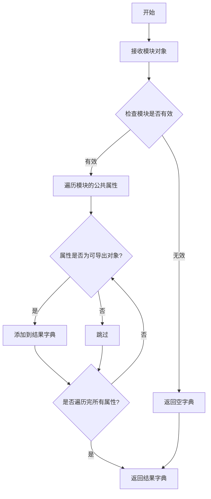
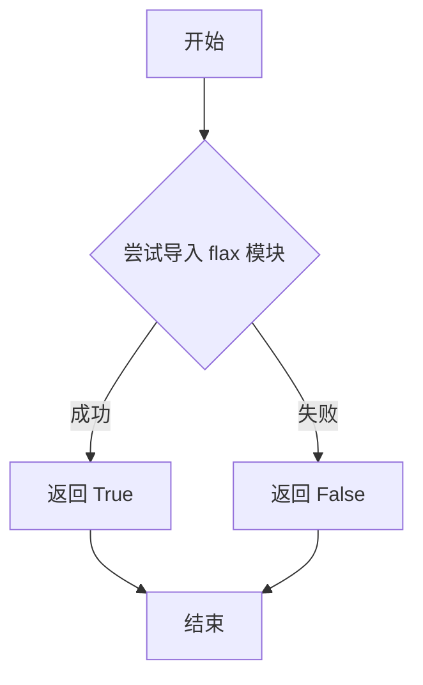
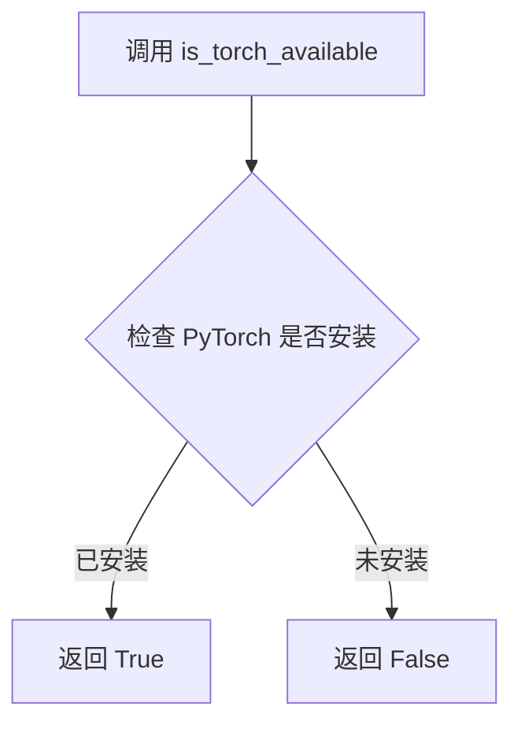
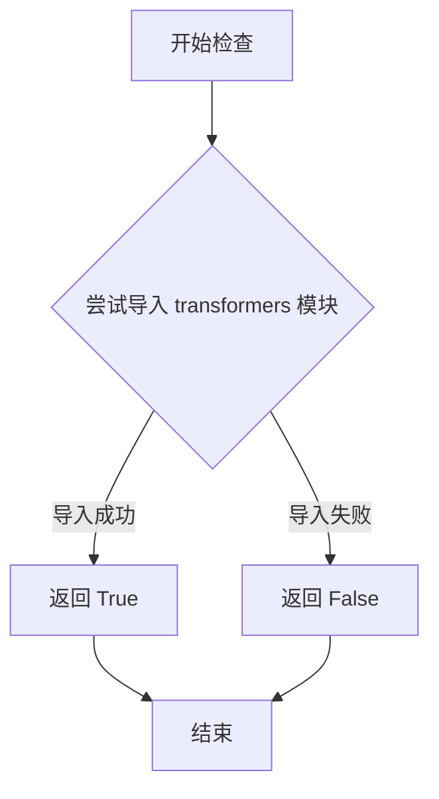

# `diffusers\src\diffusers\pipelines\controlnet_sd3\__init__.py` 详细设计文档

这是一个Diffusers库的Stable Diffusion 3管线初始化文件，通过_LazyModule实现可选依赖（transformers、torch、flax）的延迟导入，根据环境可用性动态加载StableDiffusion3ControlNetPipeline和StableDiffusion3ControlNetInpaintingPipeline，或在依赖不可用时提供虚拟对象以保持API一致性。

## 整体流程

```mermaid
graph TD
    A[开始] --> B{检查 TYPE_CHECKING 或 DIFFUSERS_SLOW_IMPORT}
    B -- 是 --> C[检查 transformers 和 torch 可用性]
    C -- 可用 --> D[导入 StableDiffusion3ControlNetPipeline]
    C -- 不可用 --> E[从 dummy 模块导入虚拟对象]
    D --> F[检查 transformers 和 flax 可用性]
    E --> F
    F -- 可用 --> G[不执行额外导入]
    F -- 不可用 --> H[从 dummy 模块导入虚拟对象]
    B -- 否 --> I[创建 _LazyModule 实例]
    I --> J[设置 sys.modules[__name__]]
    J --> K[遍历 _dummy_objects 并设置属性]
    G --> L[结束]
    H --> L
```

## 类结构

```
该文件为__init__.py，无类层次结构，仅包含模块级变量和导入逻辑
```

## 全局变量及字段


### `_dummy_objects`
    
存储虚拟对象的字典，用于在可选依赖(transformers和torch)不可用时提供替代对象

类型：`dict`
    


### `_import_structure`
    
定义模块导入结构的字典，键为子模块路径，值为可导出的类名列表

类型：`dict`
    


### `name`
    
for循环中迭代_dummy_objects字典的键，表示虚拟对象的名称

类型：`str`
    


### `value`
    
for循环中迭代_dummy_objects字典的值，表示虚拟对象本身

类型：`object`
    


    

## 全局函数及方法


### `get_objects_from_module`

该函数是一个工具函数，用于从指定模块中动态获取所有可导出对象，并返回一个包含这些对象的字典。通常用于懒加载模块时，将目标模块中的类或函数导出到当前模块的虚拟对象中，以便在导入时提供统一的接口。

参数：

- `module`：任意 Python 模块对象，要从中提取对象的目标模块（如 `dummy_torch_and_transformers_objects`）

返回值：`dict`，返回键为对象名称、值为对象本身的字典，用于批量更新其他字典（如 `_dummy_objects`）

#### 流程图



#### 带注释源码

```
# 从 typing 模块导入 TYPE_CHECKING，用于类型检查
from typing import TYPE_CHECKING

# 从 utils 模块导入多个工具函数和类
from ...utils import (
    DIFFUSERS_SLOW_IMPORT,           # 标记是否慢速导入的常量
    OptionalDependencyNotAvailable,  # 可选依赖不可用的异常类
    _LazyModule,                     # 懒加载模块类
    get_objects_from_module,         # 从模块获取对象的工具函数
    is_flax_available,               # 检查 flax 是否可用
    is_torch_available,              # 检查 torch 是否可用
    is_transformers_available,       # 检查 transformers 是否可用
)

# 初始化空的虚拟对象字典和导入结构字典
_dummy_objects = {}
_import_structure = {}

try:
    # 检查 transformers 和 torch 是否都可用
    if not (is_transformers_available() and is_torch_available()):
        # 如果任一依赖不可可用，抛出异常
        raise OptionalDependencyNotAvailable()
except OptionalDependencyNotAvailable:
    # 捕获异常，导入虚拟对象模块
    from ...utils import dummy_torch_and_transformers_objects  # noqa F403

    # 使用 get_objects_from_module 从虚拟对象模块获取所有对象
    # 并更新到 _dummy_objects 字典中
    _dummy_objects.update(get_objects_from_module(dummy_torch_and_transformers_objects))
else:
    # 如果依赖可用，定义正常的导入结构
    _import_structure["pipeline_stable_diffusion_3_controlnet"] = ["StableDiffusion3ControlNetPipeline"]
    _import_structure["pipeline_stable_diffusion_3_controlnet_inpainting"] = [
        "StableDiffusion3ControlNetInpaintingPipeline"
    ]

# TYPE_CHECKING 为 True 或需要慢速导入时的处理分支
if TYPE_CHECKING or DIFFUSERS_SLOW_IMPORT:
    try:
        # 再次检查 transformers 和 torch 依赖
        if not (is_transformers_available() and is_torch_available()):
            raise OptionalDependencyNotAvailable()

    except OptionalDependencyNotAvailable:
        # 依赖不可用时，从虚拟对象模块导入所有内容
        from ...utils.dummy_torch_and_transformers_objects import *
    else:
        # 依赖可用时，导入实际的 pipeline 类
        from .pipeline_stable_diffusion_3_controlnet import StableDiffusion3ControlNetPipeline
        from .pipeline_stable_diffusion_3_controlnet_inpainting import StableDiffusion3ControlNetInpaintingPipeline

    try:
        # 检查 flax 和 transformers 依赖
        if not (is_transformers_available() and is_flax_available()):
            raise OptionalDependencyNotAvailable()
    except OptionalDependencyNotAvailable:
        # 依赖不可用时，导入 flax 虚拟对象
        from ...utils.dummy_flax_and_transformers_objects import *  # noqa F403

else:
    # 非类型检查模式下，设置懒加载模块
    import sys

    # 将当前模块替换为懒加载模块
    sys.modules[__name__] = _LazyModule(
        __name__,
        globals()["__file__"],
        _import_structure,
        module_spec=__spec__,
    )
    # 将虚拟对象设置到 sys.modules 中，使其可以正常导入
    for name, value in _dummy_objects.items():
        setattr(sys.modules[__name__], name, value)
```


### `is_flax_available`

该函数用于检查当前环境中 Flax 库是否可用。它是 diffusers 库中的一个工具函数，通过尝试导入 `flax` 模块来判断 Flax 是否已安装，并返回布尔值。

参数：

- 该函数无参数

返回值：`bool`，返回 `True` 表示 Flax 库可用，返回 `False` 表示不可用

#### 流程图



#### 带注释源码

```python
# is_flax_available 函数定义在 ...utils 模块中
# 当前文件从 utils 导入该函数用于条件判断

from ...utils import (
    DIFFUSERS_SLOW_IMPORT,
    OptionalDependencyNotAvailable,
    _LazyModule,
    get_objects_from_module,
    is_flax_available,  # <-- 从上级目录的 utils 模块导入
    is_torch_available,
    is_transformers_available,
)

# 使用示例：在 TYPE_CHECKING 块中检查 Flax 和 Transformers 是否同时可用
try:
    if not (is_transformers_available() and is_flax_available()):
        raise OptionalDependencyNotAvailable()
except OptionalDependencyNotAvailable:
    from ...utils.dummy_flax_and_transformers_objects import *  # noqa F403
```


### `is_torch_available`

该函数用于检查 PyTorch 库是否可用，返回布尔值以指示依赖是否满足，是扩散库中常用的可选依赖检查工具函数。

参数：

- 该函数无参数

返回值：`bool`，返回 `True` 表示 PyTorch 可用，返回 `False` 表示 PyTorch 不可用。

#### 流程图



#### 带注释源码

```python
# 注意：以下是代码中对该函数的使用示例，而非函数本身的实现
# is_torch_available 是从 ...utils 导入的函数，用于检测 PyTorch 是否可用

# 在当前模块中的使用方式：
try:
    # 检查 transformers 和 torch 是否都可用
    if not (is_transformers_available() and is_torch_available()):
        # 如果任一依赖不可用，抛出可选依赖不可用异常
        raise OptionalDependencyNotAvailable()
except OptionalDependencyNotAvailable:
    # 捕获异常，从 dummy 模块导入空对象作为占位符
    from ...utils import dummy_torch_and_transformers_objects
    _dummy_objects.update(get_objects_from_module(dummy_torch_and_transformers_objects))
else:
    # 如果依赖可用，定义实际的导入结构
    _import_structure["pipeline_stable_diffusion_3_controlnet"] = ["StableDiffusion3ControlNetPipeline"]
    _import_structure["pipeline_stable_diffusion_3_controlnet_inpainting"] = [
        "StableDiffusion3ControlNetInpaintingPipeline"
    ]
```

#### 补充说明

`is_torch_available` 函数本身定义在 `...utils` 模块中，其核心逻辑通常为尝试导入 `torch` 模块并返回导入是否成功的结果。这是扩散库（如 Diffusers）中实现可选依赖的常见模式，允许库在 PyTorch 不可用的环境下仍能被导入（但使用时会提示缺少依赖）。


### `is_transformers_available`

该函数用于检查 `transformers` 库是否在当前环境中可用。它是一个延迟检查函数，通常在模块导入时作为条件判断使用，以决定是否加载依赖 `transformers` 的相关类和对象。

参数：

- 该函数无参数

返回值：`bool`，返回 `True` 表示 `transformers` 库已安装且可用，返回 `False` 表示不可用

#### 流程图



#### 带注释源码

```
# is_transformers_available 函数的典型实现模式
# 该函数通常定义在 ...utils 包中

def is_transformers_available() -> bool:
    """
    检查 transformers 库是否可用。
    
    该函数通过尝试导入 transformers 模块来检查库是否已安装。
    使用 try-except 捕获 ImportError，如果导入成功则返回 True，
    否则返回 False。这是一种延迟检查机制，避免在模块导入时
    立即引发异常。
    
    Returns:
        bool: 如果 transformers 库可用返回 True，否则返回 False
    """
    try:
        # 尝试导入 transformers 模块
        import transformers
        # 如果导入成功，检查版本等（可选）
        return True
    except ImportError:
        # 如果导入失败，说明 transformers 未安装
        return False
```

#### 在当前代码中的使用方式

```
# 在当前代码中，is_transformers_available 的使用示例
if not (is_transformers_available() and is_torch_available()):
    raise OptionalDependencyNotAvailable()
```

> **注意**：由于 `is_transformers_available` 是从 `...utils` 外部模块导入的，上述源码是基于常见实现模式的推断。实际的函数定义位于 `diffusers` 库的 `src/diffusers/utils` 模块中，其具体实现可能略有差异，但其核心功能相同——检查 `transformers` 库是否可用。


### `setattr` (内置函数)

设置模块对象的属性，将虚拟 Dummy 对象绑定到当前模块。

参数：

- `obj`：`types.ModuleType`（即 `sys.modules[__name__]`），目标模块对象
- `name`：`str`，要设置的属性名称（来自 `_dummy_objects` 字典的键）
- `value`：`Any`，要设置的属性值（来自 `_dummy_objects` 字典的值，通常是 Dummy 对象）

返回值：`None`，该函数不返回任何值

#### 流程图

```mermaid
flowchart TD
    A[开始遍历 _dummy_objects 字典] --> B{字典中是否还有未处理的键值对}
    B -->|是| C[获取当前的 name 和 value]
    C --> D[调用 setattr sys.modules[__name__], name, value]
    D --> E[将 Dummy 对象设置为模块属性]
    E --> B
    B -->|否| F[结束]
```

#### 带注释源码

```python
# 遍历 _dummy_objects 字典中的所有键值对
# _dummy_objects 包含当可选依赖不可用时的虚拟替代对象
for name, value in _dummy_objects.items():
    # 使用 setattr 内置函数将每个虚拟对象设置为当前模块的属性
    # 参数1: sys.modules[__name__] - 当前模块的引用
    # 参数2: name - 属性名称字符串
    # 参数3: value - 要绑定的虚拟/Dummy 对象
    setattr(sys.modules[__name__], name, value)
```

---

### 补充说明

**代码上下文**：
这段代码是 `diffusers` 库中的一个懒加载模块初始化逻辑。当 `torch` 和 `transformers` 可选依赖不可用时，系统会创建虚拟的 Dummy 对象，并通过 `setattr` 将它们动态绑定到模块属性上。这样可以让模块在导入时不会立即失败，而是延迟到实际使用时才抛出 `OptionalDependencyNotAvailable` 异常。

**设计目的**：
实现**惰性导入（Lazy Import）**模式，使得库可以在没有可选依赖的情况下被导入，同时保持 API 的一致性。

## 关键组件


### 依赖检查与可选依赖处理

检测transformers和torch是否可用，当依赖不可用时抛出OptionalDependencyNotAvailable异常并使用虚拟对象替代

### 惰性加载机制

使用_LazyModule实现模块的惰性加载，只有在实际使用时才导入真实模块，提高导入速度

### 导入结构定义

_import_structure字典定义了StableDiffusion3ControlNetPipeline和StableDiffusion3ControlNetInpaintingPipeline两个可导出类

### 类型检查分支

TYPE_CHECKING或DIFFUSERS_SLOW_IMPORT为真时直接导入真实类，否则使用惰性加载机制

### Flax支持检测

额外检查Flax和transformers的组合可用性，提供Flax相关对象的虚拟导入

### 虚拟对象管理

_dummy_objects字典存储依赖不可用时的替代对象，通过setattr注入到sys.modules中

### 管道类导出

StableDiffusion3ControlNetPipeline和StableDiffusion3ControlNetInpaintingPipeline作为核心管道类被导出


## 问题及建议


### 已知问题

-   **重复的依赖检查逻辑**：代码中存在重复的 `is_transformers_available() and is_torch_available()` 检查，分别出现在第9-14行的try-except块和第24-30行的TYPE_CHECK块中，造成代码冗余
-   **不一致的依赖检查模式**：对 `torch+transformers` 的检查在两个地方出现，而对 `flax+transformers` 的检查仅在TYPE_CHECK块中，逻辑不够统一
-   **未使用的变量**：第7行声明的 `_dummy_objects = {}` 在填充真实对象的else分支中未被使用，仅在except分支中通过 `update` 更新
-   **导入结构初始化时机问题**：`_import_structure = {}` 在模块顶部初始化为空字典，但在else分支中才会被正确填充，可能导致在某些边缘情况下使用不完整的导入结构
-   **异常处理方式不一致**：部分地方使用 `raise OptionalDependencyNotAvailable()` 抛出异常，部分地方直接从dummy模块导入，这种不一致可能导致调试困难

### 优化建议

-   **提取公共依赖检查函数**：创建一个辅助函数来统一检查 `is_transformers_available() and is_torch_available()`，减少代码重复
-   **统一异常处理模式**：建议统一使用try-except捕获 `OptionalDependencyNotAvailable` 异常并从dummy模块导入对象的模式，提高代码可读性
-   **优化模块初始化**：考虑将 `_import_structure` 的初始化与填充放在更清晰的位置，或使用条件赋值确保初始化和填充的连贯性
-   **添加日志或调试信息**：在依赖检查失败时添加适当的日志，便于排查问题
-   **重构为更清晰的lazy loading模式**：当前代码混合了多种导入模式，建议简化为单一的lazy loading实现方式


## 其它


### 设计目标与约束

该模块旨在实现Diffusers库中Stable Diffusion 3 ControlNet管道的延迟加载机制，通过可选依赖检查（torch和transformers）实现条件导入，使用_LazyModule实现懒加载以优化首次导入性能，同时通过dummy objects机制提供友好的错误提示。设计约束包括：必须同时安装torch和transformers才能使用这些管道；需要在TYPE_CHECKING或DIFFUSERS_SLOW_IMPORT模式下进行完整导入。

### 错误处理与异常设计

代码使用OptionalDependencyNotAvailable异常来处理可选依赖不可用的情况。当torch或transformers任一缺失时，抛出该异常并从dummy模块加载虚拟对象，这些虚拟对象在实际调用时会抛出适当的错误提示。异常处理采用try-except结构，确保在依赖不满足时不会导致程序崩溃，而是提供优雅的降级处理。

### 外部依赖与接口契约

外部依赖包括：torch（必须）、transformers（必须）、flax（可选）、diffusers.utils模块（提供_LazyModule、get_objects_from_module等工具函数）。接口契约方面：模块导出StableDiffusion3ControlNetPipeline和StableDiffusion3ControlNetInpaintingPipeline两个管道类；通过_import_structure字典定义导入结构；通过_dummy_objects字典管理虚拟对象；sys.modules[__name__]被替换为_LazyModule实例实现懒加载。

### 性能考虑

使用_LazyModule实现模块级懒加载，避免在首次导入时加载整个模块图，提升启动性能。DIFFUSERS_SLOW_IMPORT标志控制是否使用懒加载模式。在生产环境中（非TYPE_CHECKING模式），模块被替换为LazyModule，仅在实际访问属性时才加载对应的子模块。

### 版本兼容性

代码假设diffusers库版本支持_LazyModule和OptionalDependencyNotAvailable机制。需要Python 3.7+（类型提示语法）。需要与torch、transformers、flax的特定版本兼容（具体版本需查看项目依赖配置）。

### 测试策略

测试应覆盖：1）依赖全部可用时的正常导入；2）缺少torch时的错误处理；3）缺少transformers时的错误处理；4）TYPE_CHECKING模式下的类型导入；5）_LazyModule的懒加载行为验证；6）dummy对象调用时的错误提示。

    