# `diffusers\src\diffusers\pipelines\controlnet_sd3\pipeline_stable_diffusion_3_controlnet.py` 详细设计文档

A Diffusers pipeline implementation for Stable Diffusion 3 that integrates a ControlNet model to guide the generation process using additional input conditions (e.g., edge maps), leveraging a Transformer-based architecture and multiple text encoders (CLIP and T5).

## 整体流程

```mermaid
graph TD
    Start([Call __call__]) --> Check[check_inputs]
    Check --> Encode[encode_prompt (CLIP + T5)]
    Encode --> EncodeIP[prepare_ip_adapter_image_embeds]
    EncodeIP --> PrepControl[prepare_image + VAE Encode]
    PrepControl --> PrepLatents[prepare_latents]
    PrepLatents --> Loop{ for t in timesteps }
    Loop --> ControlNet[controlnet inference]
    ControlNet --> Transformer[transformer inference]
    Transformer --> Step[scheduler.step]
    Step --> Loop
    Loop --> Decode[vae.decode]
    Decode --> Output([StableDiffusion3PipelineOutput])
```

## 类结构

```
DiffusionPipeline (Base)
└── StableDiffusion3ControlNetPipeline
    ├── + SD3LoraLoaderMixin
    ├── + FromSingleFileMixin
    └── + SD3IPAdapterMixin
```

## 全局变量及字段


### `logger`
    
Logger instance for recording runtime messages and warnings

类型：`logging.Logger`
    


### `EXAMPLE_DOC_STRING`
    
Documentation string containing usage examples for the pipeline

类型：`str`
    


### `XLA_AVAILABLE`
    
Flag indicating whether PyTorch XLA is available for accelerated computation

类型：`bool`
    


### `StableDiffusion3ControlNetPipeline.transformer`
    
Conditional Transformer (MMDiT) architecture to denoise the encoded image latents

类型：`SD3Transformer2DModel`
    


### `StableDiffusion3ControlNetPipeline.vae`
    
Variational Auto-Encoder (VAE) Model to encode and decode images to and from latent representations

类型：`AutoencoderKL`
    


### `StableDiffusion3ControlNetPipeline.text_encoder`
    
First CLIP text encoder with projection layer for text embedding generation

类型：`CLIPTextModelWithProjection`
    


### `StableDiffusion3ControlNetPipeline.text_encoder_2`
    
Second CLIP text encoder (ViT-bigG variant) for enhanced text understanding

类型：`CLIPTextModelWithProjection`
    


### `StableDiffusion3ControlNetPipeline.text_encoder_3`
    
T5 encoder model for long-range text context generation

类型：`T5EncoderModel`
    


### `StableDiffusion3ControlNetPipeline.tokenizer`
    
First tokenizer for converting text to token IDs

类型：`CLIPTokenizer`
    


### `StableDiffusion3ControlNetPipeline.tokenizer_2`
    
Second tokenizer for the second CLIP text encoder

类型：`CLIPTokenizer`
    


### `StableDiffusion3ControlNetPipeline.tokenizer_3`
    
Fast tokenizer for T5 text encoder

类型：`T5TokenizerFast`
    


### `StableDiffusion3ControlNetPipeline.controlnet`
    
ControlNet model(s) providing additional conditioning to the transformer during denoising

类型：`SD3ControlNetModel | SD3MultiControlNetModel`
    


### `StableDiffusion3ControlNetPipeline.scheduler`
    
Scheduler for controlling the diffusion denoising process with flow match

类型：`FlowMatchEulerDiscreteScheduler`
    


### `StableDiffusion3ControlNetPipeline.image_encoder`
    
Pre-trained Vision Model for IP Adapter feature extraction

类型：`SiglipVisionModel`
    


### `StableDiffusion3ControlNetPipeline.feature_extractor`
    
Image processor for IP Adapter to preprocess input images

类型：`SiglipImageProcessor`
    


### `StableDiffusion3ControlNetPipeline.image_processor`
    
Image processor for VAE encoding and decoding operations

类型：`VaeImageProcessor`
    


### `StableDiffusion3ControlNetPipeline.vae_scale_factor`
    
Scale factor derived from VAE block output channels for latent space computation

类型：`int`
    


### `StableDiffusion3ControlNetPipeline.default_sample_size`
    
Default sample size from transformer config for output image dimensions

类型：`int`
    


### `StableDiffusion3ControlNetPipeline.tokenizer_max_length`
    
Maximum sequence length supported by the tokenizers

类型：`int`
    
    

## 全局函数及方法


### `retrieve_timesteps`

该函数是扩散管道中的时间步获取工具函数，用于调用调度器的 `set_timesteps` 方法并从调度器中检索时间步。它支持自定义时间步和自定义 sigmas，并处理不同调度器的时间步设置策略。任何额外的关键字参数都会传递给调度器的 `set_timesteps` 方法。

参数：

- `scheduler`：`SchedulerMixin`，要获取时间步的调度器对象
- `num_inference_steps`：`int | None`，使用预训练模型生成样本时使用的扩散步数。如果使用此参数，`timesteps` 必须为 `None`
- `device`：`str | torch.device | None`，时间步应移动到的设备。如果为 `None`，时间步不会移动
- `timesteps`：`list[int] | None`，用于覆盖调度器时间步间隔策略的自定义时间步。如果传入 `timesteps`，则 `num_inference_steps` 和 `sigmas` 必须为 `None`
- `sigmas`：`list[float] | None`，用于覆盖调度器时间步间隔策略的自定义 sigmas。如果传入 `sigmas`，则 `num_inference_steps` 和 `timesteps` 必须为 `None`
- `**kwargs`：任意关键字参数，将传递给调度器的 `set_timesteps` 方法

返回值：`tuple[torch.Tensor, int]`，第一个元素是调度器的时间步计划，第二个元素是推理步数

#### 流程图

```mermaid
flowchart TD
    A[开始] --> B{同时传入timesteps和sigmas?}
    B -->|是| C[抛出ValueError: 只能选择timesteps或sigmas之一]
    B -->|否| D{传入timesteps?}
    D -->|是| E{调度器支持timesteps?}
    D -->|否| F{传入sigmas?}
    F -->|是| G{调度器支持sigmas?}
    F -->|否| H[调用scheduler.set_timesteps使用num_inference_steps]
    E -->|否| I[抛出ValueError: 调度器不支持自定义timesteps]
    E -->|是| J[调用scheduler.set_timesteps传入timesteps]
    G -->|否| K[抛出ValueError: 调度器不支持自定义sigmas]
    G -->|是| L[调用scheduler.set_timesteps传入sigmas]
    J --> M[获取scheduler.timesteps]
    L --> M
    H --> M
    M --> N[计算num_inference_steps = len(timesteps)]
    N --> O[返回timesteps和num_inference_steps]
    C --> O
    I --> O
    K --> O
```

#### 带注释源码

```python
def retrieve_timesteps(
    scheduler,
    num_inference_steps: int | None = None,
    device: str | torch.device | None = None,
    timesteps: list[int] | None = None,
    sigmas: list[float] | None = None,
    **kwargs,
):
    r"""
    Calls the scheduler's `set_timesteps` method and retrieves timesteps from the scheduler after the call. Handles
    custom timesteps. Any kwargs will be supplied to `scheduler.set_timesteps`.

    Args:
        scheduler (`SchedulerMixin`):
            The scheduler to get timesteps from.
        num_inference_steps (`int`):
            The number of diffusion steps used when generating samples with a pre-trained model. If used, `timesteps`
            must be `None`.
        device (`str` or `torch.device`, *optional*):
            The device to which the timesteps should be moved to. If `None`, the timesteps are not moved.
        timesteps (`list[int]`, *optional*):
            Custom timesteps used to override the timestep spacing strategy of the scheduler. If `timesteps` is passed,
            `num_inference_steps` and `sigmas` must be `None`.
        sigmas (`list[float]`, *optional*):
            Custom sigmas used to override the timestep spacing strategy of the scheduler. If `sigmas` is passed,
            `num_inference_steps` and `timesteps` must be `None`.

    Returns:
        `tuple[torch.Tensor, int]`: A tuple where the first element is the timestep schedule from the scheduler and the
        second element is the number of inference steps.
    """
    # 验证：不能同时传入timesteps和sigmas，只能选择其一
    if timesteps is not None and sigmas is not None:
        raise ValueError("Only one of `timesteps` or `sigmas` can be passed. Please choose one to set custom values")
    
    # 处理自定义timesteps
    if timesteps is not None:
        # 检查调度器的set_timesteps方法是否支持timesteps参数
        accepts_timesteps = "timesteps" in set(inspect.signature(scheduler.set_timesteps).parameters.keys())
        if not accepts_timesteps:
            raise ValueError(
                f"The current scheduler class {scheduler.__class__}'s `set_timesteps` does not support custom"
                f" timestep schedules. Please check whether you are using the correct scheduler."
            )
        # 调用调度器的set_timesteps方法设置自定义时间步
        scheduler.set_timesteps(timesteps=timesteps, device=device, **kwargs)
        # 从调度器获取生成的时间步
        timesteps = scheduler.timesteps
        # 计算推理步数
        num_inference_steps = len(timesteps)
    # 处理自定义sigmas
    elif sigmas is not None:
        # 检查调度器的set_timesteps方法是否支持sigmas参数
        accept_sigmas = "sigmas" in set(inspect.signature(scheduler.set_timesteps).parameters.keys())
        if not accept_sigmas:
            raise ValueError(
                f"The current scheduler class {scheduler.__class__}'s `set_timesteps` does not support custom"
                f" sigmas schedules. Please check whether you are using the correct scheduler."
            )
        # 调用调度器的set_timesteps方法设置自定义sigmas
        scheduler.set_timesteps(sigmas=sigmas, device=device, **kwargs)
        # 从调度器获取生成的时间步
        timesteps = scheduler.timesteps
        # 计算推理步数
        num_inference_steps = len(timesteps)
    # 默认行为：使用num_inference_steps
    else:
        scheduler.set_timesteps(num_inference_steps, device=device, **kwargs)
        timesteps = scheduler.timesteps
    
    # 返回时间步张量和推理步数
    return timesteps, num_inference_steps
```


### `StableDiffusion3ControlNetPipeline.__init__`

初始化 Stable Diffusion 3 ControlNet Pipeline，负责加载和配置所有必需的模型组件（Transformer、VAE、文本编码器、ControlNet等），并设置图像处理和推理相关的参数。

参数：

- `transformer`：`SD3Transformer2DModel`，条件 Transformer (MMDiT) 架构，用于对编码的图像潜在表示进行去噪
- `scheduler`：`FlowMatchEulerDiscreteScheduler`，与 `transformer` 结合使用的调度器，用于去噪过程
- `vae`：`AutoencoderKL`，变分自编码器模型，用于图像到潜在表示的编码和解码
- `text_encoder`：`CLIPTextModelWithProjection`，第一个 CLIP 文本编码器（clip-vit-large-patch14）
- `tokenizer`：`CLIPTokenizer`，第一个文本分词器
- `text_encoder_2`：`CLIPTextModelWithProjection`，第二个 CLIP 文本编码器（CLIP-ViT-bigG-14-laion2B）
- `tokenizer_2`：`CLIPTokenizer`，第二个文本分词器
- `text_encoder_3`：`T5EncoderModel`，T5 文本编码器（t5-v1_1-xxl）
- `tokenizer_3`：`T5TokenizerFast`，第三个文本分词器
- `controlnet`：`SD3ControlNetModel | list[SD3ControlNetModel] | tuple[SD3ControlNetModel] | SD3MultiControlNetModel`，提供额外条件控制的 ControlNet 模型
- `image_encoder`：`SiglipVisionModel | None`，可选的预训练视觉模型，用于 IP Adapter
- `feature_extractor`：`SiglipImageProcessor | None`，可选的图像处理器，用于 IP Adapter

返回值：`None`，构造函数无返回值

#### 流程图

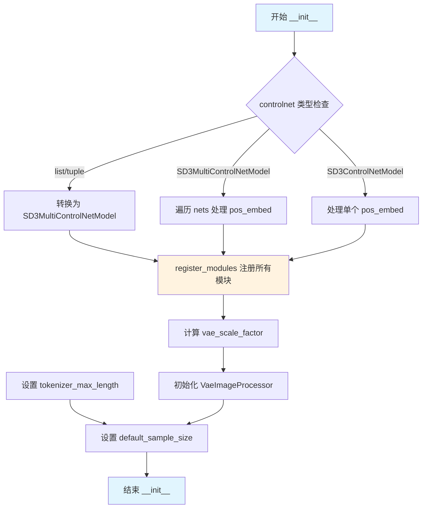

#### 带注释源码

```python
def __init__(
    self,
    transformer: SD3Transformer2DModel,
    scheduler: FlowMatchEulerDiscreteScheduler,
    vae: AutoencoderKL,
    text_encoder: CLIPTextModelWithProjection,
    tokenizer: CLIPTokenizer,
    text_encoder_2: CLIPTextModelWithProjection,
    tokenizer_2: CLIPTokenizer,
    text_encoder_3: T5EncoderModel,
    tokenizer_3: T5TokenizerFast,
    controlnet: SD3ControlNetModel
    | list[SD3ControlNetModel]
    | tuple[SD3ControlNetModel]
    | SD3MultiControlNetModel,
    image_encoder: SiglipVisionModel | None = None,
    feature_extractor: SiglipImageProcessor | None = None,
):
    # 调用父类 DiffusionPipeline 的初始化方法
    super().__init__()
    
    # 如果 controlnet 是列表或元组，则转换为 SD3MultiControlNetModel
    if isinstance(controlnet, (list, tuple)):
        controlnet = SD3MultiControlNetModel(controlnet)
    
    # 处理 SD3.5 8b controlnet 的位置嵌入共享问题
    if isinstance(controlnet, SD3MultiControlNetModel):
        # 遍历多ControlNet模型列表
        for controlnet_model in controlnet.nets:
            # 检查是否需要从 transformer 获取 pos_embed
            # SD3.5 8b controlnet 与 transformer 共享位置嵌入
            if (
                hasattr(controlnet_model.config, "use_pos_embed")
                and controlnet_model.config.use_pos_embed is False
            ):
                # 从 transformer 获取位置嵌入并转换到正确的设备和dtype
                pos_embed = controlnet_model._get_pos_embed_from_transformer(transformer)
                controlnet_model.pos_embed = pos_embed.to(controlnet_model.dtype).to(controlnet_model.device)
    elif isinstance(controlnet, SD3ControlNetModel):
        # 单个 ControlNet 模型的相同处理
        if hasattr(controlnet.config, "use_pos_embed") and controlnet.config.use_pos_embed is False:
            pos_embed = controlnet._get_pos_embed_from_transformer(transformer)
            controlnet.pos_embed = pos_embed.to(controlnet.dtype).to(controlnet.device)

    # 注册所有模块到 Pipeline 中，便于后续访问和管理
    self.register_modules(
        vae=vae,
        text_encoder=text_encoder,
        text_encoder_2=text_encoder_2,
        text_encoder_3=text_encoder_3,
        tokenizer=tokenizer,
        tokenizer_2=tokenizer_2,
        tokenizer_3=tokenizer_3,
        transformer=transformer,
        scheduler=scheduler,
        controlnet=controlnet,
        image_encoder=image_encoder,
        feature_extractor=feature_extractor,
    )
    
    # 计算 VAE 缩放因子，基于 VAE 的 block_out_channels 数量
    # 公式: 2 ** (len(block_out_channels) - 1)
    # 例如: [128, 256, 512, 512] -> 2^3 = 8
    self.vae_scale_factor = 2 ** (len(self.vae.config.block_out_channels) - 1) if getattr(self, "vae", None) else 8
    
    # 初始化图像处理器，用于预处理和后处理图像
    self.image_processor = VaeImageProcessor(vae_scale_factor=self.vae_scale_factor)
    
    # 设置 tokenizer 的最大长度，默认值为 77
    self.tokenizer_max_length = (
        self.tokenizer.model_max_length if hasattr(self, "tokenizer") and self.tokenizer is not None else 77
    )
    
    # 设置默认采样尺寸，用于生成图像的默认分辨率
    self.default_sample_size = (
        self.transformer.config.sample_size
        if hasattr(self, "transformer") and self.transformer is not None
        else 128
    )
```


### `StableDiffusion3ControlNetPipeline._get_t5_prompt_embeds`

该方法用于使用 T5 文本编码器生成文本提示嵌入（prompt embeddings），支持批量处理和每提示生成多张图像，处理文本截断警告并返回标准化的嵌入张量。

参数：

- `prompt`：`str | list[str]`，待编码的文本提示，可以是单个字符串或字符串列表
- `num_images_per_prompt`：`int = 1`，每个提示生成的图像数量，用于复制嵌入向量
- `max_sequence_length`：`int = 256`，T5 编码器的最大序列长度
- `device`：`torch.device | None`，执行设备，默认为执行设备
- `dtype`：`torch.dtype | None`，数据类型，默认为 text_encoder 的数据类型

返回值：`torch.Tensor`，形状为 `(batch_size * num_images_per_prompt, seq_len, joint_attention_dim)` 的 T5 文本嵌入张量

#### 流程图

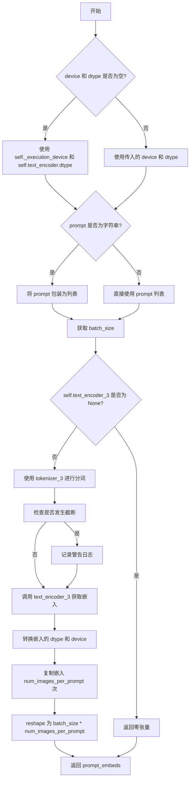

#### 带注释源码

```python
def _get_t5_prompt_embeds(
    self,
    prompt: str | list[str] = None,
    num_images_per_prompt: int = 1,
    max_sequence_length: int = 256,
    device: torch.device | None = None,
    dtype: torch.dtype | None = None,
):
    # 确定执行设备和数据类型，若未指定则使用默认值
    device = device or self._execution_device
    dtype = dtype or self.text_encoder.dtype

    # 标准化 prompt 输入：统一转为列表格式以支持批量处理
    prompt = [prompt] if isinstance(prompt, str) else prompt
    batch_size = len(prompt)

    # 防御性处理：当 T5 编码器不存在时返回零张量
    # 这种情况通常出现在模型配置不完整时
    if self.text_encoder_3 is None:
        return torch.zeros(
            (
                batch_size * num_images_per_prompt,
                max_sequence_length,
                self.transformer.config.joint_attention_dim,
            ),
            device=device,
            dtype=dtype,
        )

    # 使用 T5 tokenizer 对 prompt 进行分词
    # padding="max_length" 确保输出长度一致
    # truncation=True 截断超过 max_sequence_length 的序列
    # add_special_tokens=True 添加特殊 tokens（如 EOS）
    text_inputs = self.tokenizer_3(
        prompt,
        padding="max_length",
        max_length=max_sequence_length,
        truncation=True,
        add_special_tokens=True,
        return_tensors="pt",
    )
    text_input_ids = text_inputs.input_ids
    
    # 获取未截断的 token IDs，用于检测截断情况
    untruncated_ids = self.tokenizer_3(prompt, padding="longest", return_tensors="pt").input_ids

    # 检测并记录截断警告
    # 比较截断后和未截断的序列长度，若发生截断则警告用户
    if untruncated_ids.shape[-1] >= text_input_ids.shape[-1] and not torch.equal(text_input_ids, untruncated_ids):
        removed_text = self.tokenizer_3.batch_decode(untruncated_ids[:, self.tokenizer_max_length - 1 : -1])
        logger.warning(
            "The following part of your input was truncated because `max_sequence_length` is set to "
            f" {max_sequence_length} tokens: {removed_text}"
        )

    # 将 token IDs 传入 T5 编码器获取文本嵌入
    prompt_embeds = self.text_encoder_3(text_input_ids.to(device))[0]

    # 确保嵌入的数据类型和设备与模型配置一致
    dtype = self.text_encoder_3.dtype
    prompt_embeds = prompt_embeds.to(dtype=dtype, device=device)

    _, seq_len, _ = prompt_embeds.shape

    # 复制文本嵌入以匹配每提示生成的图像数量
    # 使用 repeat 方法而非 tile，以兼容 MPS 设备
    prompt_embeds = prompt_embeds.repeat(1, num_images_per_prompt, 1)
    # reshape 为 (batch_size * num_images_per_prompt, seq_len, hidden_dim)
    prompt_embeds = prompt_embeds.view(batch_size * num_images_per_prompt, seq_len, -1)

    return prompt_embeds
```


### `StableDiffusion3ControlNetPipeline._get_clip_prompt_embeds`

该方法用于从CLIP文本编码器生成文本提示的嵌入向量（embeddings），支持两个CLIP模型（clip_model_index=0或1），并返回文本嵌入和池化后的嵌入，可用于Stable Diffusion 3的图像生成过程。

参数：

- `self`：StableDiffusion3ControlNetPipeline实例本身
- `prompt`：`str | list[str]`，要编码的文本提示，可以是单个字符串或字符串列表
- `num_images_per_prompt`：`int = 1`，每个提示需要生成的图像数量，用于复制embeddings
- `device`：`torch.device | None = None`，执行设备，若为None则使用执行设备
- `clip_skip`：`int | None = None`，可选参数，指定跳过CLIP的层数，用于获取不同层次的隐藏状态
- `clip_model_index`：`int = 0`，CLIP模型索引，0表示使用第一个CLIP编码器（tokenizer和text_encoder），1表示使用第二个

返回值：`tuple[torch.Tensor, torch.Tensor]`，返回元组包含：
- 第一个元素为`prompt_embeds`：形状为`(batch_size * num_images_per_prompt, seq_len, hidden_dim)`的文本嵌入张量
- 第二个元素为`pooled_prompt_embeds`：形状为`(batch_size * num_images_per_prompt, hidden_dim)`的池化后文本嵌入张量

#### 流程图

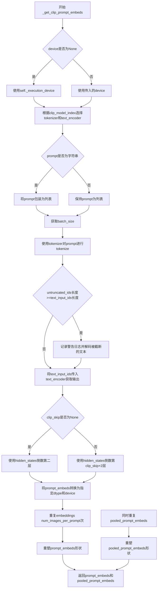

#### 带注释源码

```python
def _get_clip_prompt_embeds(
    self,
    prompt: str | list[str],
    num_images_per_prompt: int = 1,
    device: torch.device | None = None,
    clip_skip: int | None = None,
    clip_model_index: int = 0,
):
    """
    从CLIP文本编码器获取文本提示的嵌入向量。
    
    Args:
        prompt: 要编码的文本提示，字符串或字符串列表
        num_images_per_prompt: 每个提示生成的图像数量
        device: 运行设备，若为None则自动获取
        clip_skip: 跳过CLIP的层数，用于获取不同层次的特征
        clip_model_index: 使用的CLIP模型索引（0或1）
    
    Returns:
        tuple: (prompt_embeds, pooled_prompt_embeds) 文本嵌入和池化嵌入
    """
    # 如果未指定device，则使用执行设备
    device = device or self._execution_device

    # 定义两个CLIP tokenizer和text_encoder的列表
    clip_tokenizers = [self.tokenizer, self.tokenizer_2]
    clip_text_encoders = [self.text_encoder, self.text_encoder_2]

    # 根据索引选择对应的tokenizer和text_encoder
    tokenizer = clip_tokenizers[clip_model_index]
    text_encoder = clip_text_encoders[clip_model_index]

    # 将字符串prompt转换为列表，统一处理
    prompt = [prompt] if isinstance(prompt, str) else prompt
    # 获取批处理大小
    batch_size = len(prompt)

    # 使用tokenizer对prompt进行tokenize
    # 填充到最大长度，截断超长部分，返回PyTorch张量
    text_inputs = tokenizer(
        prompt,
        padding="max_length",
        max_length=self.tokenizer_max_length,
        truncation=True,
        return_tensors="pt",
    )

    # 获取tokenized后的input ids
    text_input_ids = text_inputs.input_ids
    # 使用最长填充方式获取未截断的ids，用于检测是否发生了截断
    untruncated_ids = tokenizer(prompt, padding="longest", return_tensors="pt").input_ids
    
    # 检查是否发生了截断，如果是则记录警告
    if untruncated_ids.shape[-1] >= text_input_ids.shape[-1] and not torch.equal(text_input_ids, untruncated_ids):
        removed_text = tokenizer.batch_decode(untruncated_ids[:, self.tokenizer_max_length - 1 : -1])
        logger.warning(
            "The following part of your input was truncated because CLIP can only handle sequences up to"
            f" {self.tokenizer_max_length} tokens: {removed_text}"
        )
    
    # 将input ids传入text_encoder，获取包含hidden_states的输出
    # output_hidden_states=True确保返回所有隐藏状态
    prompt_embeds = text_encoder(text_input_ids.to(device), output_hidden_states=True)
    # 获取pooled输出（通常是第一层的CLS token或平均池化）
    pooled_prompt_embeds = prompt_embeds[0]

    # 根据clip_skip参数选择使用哪一层的hidden states
    # 如果clip_skip为None，使用倒数第二层（-2）
    # 否则使用倒数第clip_skip+2层
    if clip_skip is None:
        prompt_embeds = prompt_embeds.hidden_states[-2]
    else:
        prompt_embeds = prompt_embeds.hidden_states[-(clip_skip + 2)]

    # 确保embeddings的dtype和device正确
    prompt_embeds = prompt_embeds.to(dtype=self.text_encoder.dtype, device=device)

    # 获取序列长度
    _, seq_len, _ = prompt_embeds.shape
    
    # 为每个prompt复制num_images_per_prompt次的embeddings
    # 使用MPS友好的方法（repeat而不是repeat_interleave）
    prompt_embeds = prompt_embeds.repeat(1, num_images_per_prompt, 1)
    # 重塑为(batch_size * num_images_per_prompt, seq_len, hidden_dim)
    prompt_embeds = prompt_embeds.view(batch_size * num_images_per_prompt, seq_len, -1)

    # 对pooled_prompt_embeds进行相同的复制和重塑操作
    pooled_prompt_embeds = pooled_prompt_embeds.repeat(1, num_images_per_prompt)
    pooled_prompt_embeds = pooled_prompt_embeds.view(batch_size * num_images_per_prompt, -1)

    # 返回文本嵌入和池化嵌入
    return prompt_embeds, pooled_prompt_embeds
```


### `StableDiffusion3ControlNetPipeline.encode_prompt`

该方法负责将文本提示编码为向量表示，支持 Stable Diffusion 3 的多文本编码器架构（CLIP ViT-L/14、CLIP ViT-bigG 和 T5-XXL），并处理 Classifier-Free Guidance 所需的负向提示Embeddings。

参数：

- `prompt`：`str | list[str]`，要编码的主提示文本
- `prompt_2`：`str | list[str]`，发送给第二个 CLIP 编码器的提示，若未定义则使用 `prompt`
- `prompt_3`：`str | list[str]`，发送给 T5 编码器的提示，若未定义则使用 `prompt`
- `device`：`torch.device | None`，计算设备，默认为执行设备
- `num_images_per_prompt`：`int = 1`，每个提示生成的图像数量
- `do_classifier_free_guidance`：`bool = True`，是否启用 Classifier-Free Guidance
- `negative_prompt`：`str | list[str] | None`，负向提示，用于引导图像生成
- `negative_prompt_2`：`str | list[str] | None`，第二个编码器的负向提示
- `negative_prompt_3`：`str | list[str] | None`，T5 编码器的负向提示
- `prompt_embeds`：`torch.FloatTensor | None`，预生成的提示Embeddings，若提供则跳过生成
- `negative_prompt_embeds`：`torch.FloatTensor | None`，预生成的负向提示Embeddings
- `pooled_prompt_embeds`：`torch.FloatTensor | None`，预生成的池化提示Embeddings
- `negative_pooled_prompt_embeds`：`torch.FloatTensor | None`，预生成的负向池化Embeddings
- `clip_skip`：`int | None`，CLIP 编码时跳过的层数
- `max_sequence_length`：`int = 256`，T5 编码的最大序列长度
- `lora_scale`：`float | None`，LoRA 层的缩放因子

返回值：`tuple[torch.FloatTensor, torch.FloatTensor, torch.FloatTensor, torch.FloatTensor]`，包含四个张量：提示Embeddings、负向提示Embeddings、池化提示Embeddings 和负向池化Embeddings

#### 流程图

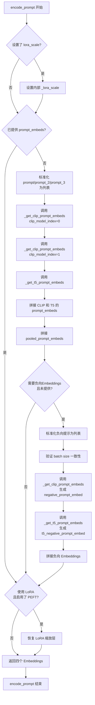

#### 带注释源码

```python
def encode_prompt(
    self,
    prompt: str | list[str],                    # 主提示文本
    prompt_2: str | list[str],                  # 第二 CLIP 编码器提示
    prompt_3: str | list[str],                  # T5 编码器提示
    device: torch.device | None = None,        # 计算设备
    num_images_per_prompt: int = 1,             # 每提示生成的图像数
    do_classifier_free_guidance: bool = True,   # 是否启用 CFG
    negative_prompt: str | list[str] | None = None,    # 负向提示
    negative_prompt_2: str | list[str] | None = None,  # 第二负向提示
    negative_prompt_3: str | list[str] | None = None,  # T5 负向提示
    prompt_embeds: torch.FloatTensor | None = None,   # 预生成提示 Embedding
    negative_prompt_embeds: torch.FloatTensor | None = None,  # 预生成负向 Embedding
    pooled_prompt_embeds: torch.FloatTensor | None = None,    # 预生成池化提示
    negative_pooled_prompt_embeds: torch.FloatTensor | None = None,  # 预生成负向池化
    clip_skip: int | None = None,               # CLIP 跳过层数
    max_sequence_length: int = 256,            # T5 最大序列长度
    lora_scale: float | None = None,            # LoRA 缩放因子
):
    """
    编码文本提示为向量表示，支持多编码器架构和 CFG。
    
    处理流程：
    1. 设置 LoRA 缩放因子（用于文本编码器的 LoRA 层）
    2. 如果未提供 prompt_embeds，则从原始文本生成
    3. 如果启用 CFG 且未提供负向 Embeddings，则生成负向版本
    4. 恢复 LoRA 层缩放
    5. 返回四个 Embeddings 元组
    """
    # 确定计算设备，未指定则使用执行设备
    device = device or self._execution_device

    # 设置 LoRA 缩放因子，以便文本编码器的 Monkey Patched LoRA 函数访问
    if lora_scale is not None and isinstance(self, SD3LoraLoaderMixin):
        self._lora_scale = lora_scale

        # 动态调整 LoRA 缩放
        if self.text_encoder is not None and USE_PEFT_BACKEND:
            scale_lora_layers(self.text_encoder, lora_scale)
        if self.text_encoder_2 is not None and USE_PEFT_BACKEND:
            scale_lora_layers(self.text_encoder_2, lora_scale)

    # 标准化 prompt 为列表格式
    prompt = [prompt] if isinstance(prompt, str) else prompt
    
    # 确定 batch size
    if prompt is not None:
        batch_size = len(prompt)
    else:
        # 如果没有 prompt，则从 prompt_embeds 获取 batch size
        batch_size = prompt_embeds.shape[0]

    # ========== 生成正向提示 Embeddings ==========
    if prompt_embeds is None:
        # 使用 prompt_2 和 prompt_3，若未提供则默认为 prompt
        prompt_2 = prompt_2 or prompt
        prompt_2 = [prompt_2] if isinstance(prompt_2, str) else prompt_2

        prompt_3 = prompt_3 or prompt
        prompt_3 = [prompt_3] if isinstance(prompt_3, str) else prompt_3

        # 获取 CLIP 编码器 1 的提示 embedding 和池化 embedding
        prompt_embed, pooled_prompt_embed = self._get_clip_prompt_embeds(
            prompt=prompt,
            device=device,
            num_images_per_prompt=num_images_per_prompt,
            clip_skip=clip_skip,
            clip_model_index=0,
        )
        
        # 获取 CLIP 编码器 2 的提示 embedding 和池化 embedding
        prompt_2_embed, pooled_prompt_2_embed = self._get_clip_prompt_embeds(
            prompt=prompt_2,
            device=device,
            num_images_per_prompt=num_images_per_prompt,
            clip_skip=clip_skip,
            clip_model_index=1,
        )
        
        # 在最后一个维度拼接两个 CLIP embedding
        clip_prompt_embeds = torch.cat([prompt_embed, prompt_2_embed], dim=-1)

        # 获取 T5 编码器的提示 embedding
        t5_prompt_embed = self._get_t5_prompt_embeds(
            prompt=prompt_3,
            num_images_per_prompt=num_images_per_prompt,
            max_sequence_length=max_sequence_length,
            device=device,
        )

        # 对 CLIP embedding 进行 padding 以匹配 T5 embedding 的长度
        clip_prompt_embeds = torch.nn.functional.pad(
            clip_prompt_embeds, (0, t5_prompt_embed.shape[-1] - clip_prompt_embeds.shape[-1])
        )

        # 拼接 CLIP 和 T5 embedding（在序列维度）
        prompt_embeds = torch.cat([clip_prompt_embeds, t5_prompt_embed], dim=-2)
        
        # 拼接池化后的 prompt embedding
        pooled_prompt_embeds = torch.cat([pooled_prompt_embed, pooled_prompt_2_embed], dim=-1)

    # ========== 生成负向提示 Embeddings（如果启用 CFG）==========
    if do_classifier_free_guidance and negative_prompt_embeds is None:
        # 默认负向提示为空字符串
        negative_prompt = negative_prompt or ""
        negative_prompt_2 = negative_prompt_2 or negative_prompt
        negative_prompt_3 = negative_prompt_3 or negative_prompt

        # 标准化为列表
        negative_prompt = batch_size * [negative_prompt] if isinstance(negative_prompt, str) else negative_prompt
        negative_prompt_2 = (
            batch_size * [negative_prompt_2] if isinstance(negative_prompt_2, str) else negative_prompt_2
        )
        negative_prompt_3 = (
            batch_size * [negative_prompt_3] if isinstance(negative_prompt_3, str) else negative_prompt_3
        )

        # 类型检查
        if prompt is not None and type(prompt) is not type(negative_prompt):
            raise TypeError(
                f"`negative_prompt` should be the same type to `prompt`, but got {type(negative_prompt)} !="
                f" {type(prompt)}."
            )
        # Batch size 一致性检查
        elif batch_size != len(negative_prompt):
            raise ValueError(
                f"`negative_prompt`: {negative_prompt} has batch size {len(negative_prompt)}, but `prompt`:"
                f" {prompt} has batch size {batch_size}. Please make sure that passed `negative_prompt` matches"
                " the batch size of `prompt`."
            )

        # 生成 CLIP 编码器 1 的负向 embedding
        negative_prompt_embed, negative_pooled_prompt_embed = self._get_clip_prompt_embeds(
            negative_prompt,
            device=device,
            num_images_per_prompt=num_images_per_prompt,
            clip_skip=None,  # 负向提示不使用 clip_skip
            clip_model_index=0,
        )
        
        # 生成 CLIP 编码器 2 的负向 embedding
        negative_prompt_2_embed, negative_pooled_prompt_2_embed = self._get_clip_prompt_embeds(
            negative_prompt_2,
            device=device,
            num_images_per_prompt=num_images_per_prompt,
            clip_skip=None,
            clip_model_index=1,
        )
        
        # 拼接负向 CLIP embedding
        negative_clip_prompt_embeds = torch.cat([negative_prompt_embed, negative_prompt_2_embed], dim=-1)

        # 生成 T5 负向 embedding
        t5_negative_prompt_embed = self._get_t5_prompt_embeds(
            prompt=negative_prompt_3,
            num_images_per_prompt=num_images_per_prompt,
            max_sequence_length=max_sequence_length,
            device=device,
        )

        # 对负向 CLIP embedding 进行 padding
        negative_clip_prompt_embeds = torch.nn.functional.pad(
            negative_clip_prompt_embeds,
            (0, t5_negative_prompt_embed.shape[-1] - negative_clip_prompt_embeds.shape[-1]),
        )

        # 拼接所有负向 embedding
        negative_prompt_embeds = torch.cat([negative_clip_prompt_embeds, t5_negative_prompt_embed], dim=-2)
        
        # 拼接负向池化 embedding
        negative_pooled_prompt_embeds = torch.cat(
            [negative_pooled_prompt_embed, negative_pooled_prompt_2_embed], dim=-1
        )

    # ========== 恢复 LoRA 层缩放 ==========
    if self.text_encoder is not None:
        if isinstance(self, SD3LoraLoaderMixin) and USE_PEFT_BACKEND:
            # 通过反向缩放 LoRA 层恢复原始 scale
            unscale_lora_layers(self.text_encoder, lora_scale)

    if self.text_encoder_2 is not None:
        if isinstance(self, SD3LoraLoaderMixin) and USE_PEFT_BACKEND:
            unscale_lora_layers(self.text_encoder_2, lora_scale)

    # 返回四个 embedding 元组
    return prompt_embeds, negative_prompt_embeds, pooled_prompt_embeds, negative_pooled_prompt_embeds
```


### `StableDiffusion3ControlNetPipeline.check_inputs`

该方法负责验证 Stable Diffusion 3 ControlNet Pipeline 的所有输入参数，确保参数类型、形状和组合方式符合要求，然后才会执行图像生成流程。如果任何验证失败，该方法将抛出详细的 ValueError 异常，帮助用户快速定位输入问题。

参数：

- `prompt`：`str | list[str] | None`，主提示词，用于指导图像生成
- `prompt_2`：`str | list[str] | None`，第二个文本编码器的提示词
- `prompt_3`：`str | list[str] | None`，第三个文本编码器（T5）的提示词
- `height`：`int`，生成图像的高度（像素）
- `width`：`int`，生成图像的宽度（像素）
- `negative_prompt`：`str | list[str] | None`，负向提示词，用于引导图像远离某些元素
- `negative_prompt_2`：`str | list[str] | None`，第二个负向提示词
- `negative_prompt_3`：`str | list[str] | None`，第三个负向提示词
- `prompt_embeds`：`torch.FloatTensor | None`，预生成的主提示词嵌入向量
- `negative_prompt_embeds`：`torch.FloatTensor | None`，预生成的负向提示词嵌入向量
- `pooled_prompt_embeds`：`torch.FloatTensor | None`，预生成的主提示词池化嵌入向量
- `negative_pooled_prompt_embeds`：`torch.FloatTensor | None`，预生成的负向提示词池化嵌入向量
- `callback_on_step_end_tensor_inputs`：`list[str] | None`，每步结束后回调函数需要使用的张量输入列表
- `max_sequence_length`：`int | None`，T5 编码器的最大序列长度

返回值：`None`，该方法不返回任何值，仅进行参数验证

#### 流程图

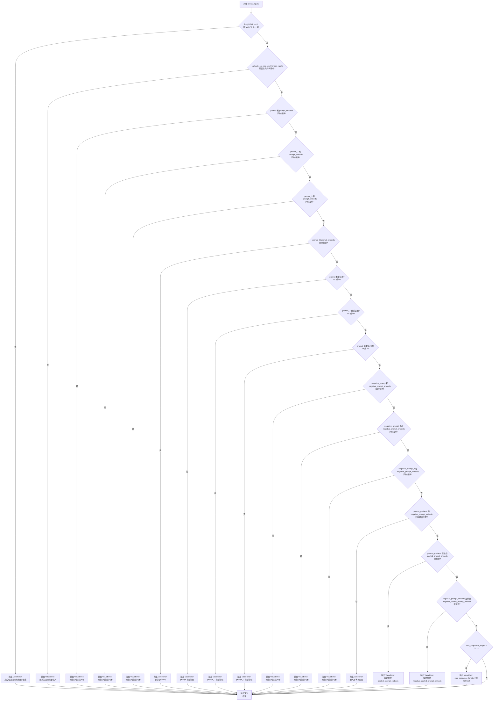

#### 带注释源码

```python
def check_inputs(
    self,
    prompt,                      # 主提示词：str | list[str] | None
    prompt_2,                    # 第二个提示词：str | list[str] | None
    prompt_3,                    # 第三个提示词（T5用）：str | list[str] | None
    height,                      # 生成图像高度：int
    width,                       # 生成图像宽度：int
    negative_prompt=None,        # 负向提示词：str | list[str] | None
    negative_prompt_2=None,      # 第二个负向提示词：str | list[str] | None
    negative_prompt_3=None,      # 第三个负向提示词：str | list[str] | None
    prompt_embeds=None,          # 预生成的提示词嵌入：torch.FloatTensor | None
    negative_prompt_embeds=None, # 预生成的负向提示词嵌入：torch.FloatTensor | None
    pooled_prompt_embeds=None,  # 预生成的池化提示词嵌入：torch.FloatTensor | None
    negative_pooled_prompt_embeds=None,  # 预生成的负向池化嵌入：torch.FloatTensor | None
    callback_on_step_end_tensor_inputs=None,  # 回调张量输入列表：list[str] | None
    max_sequence_length=None,    # 最大序列长度：int | None
):
    """
    验证所有输入参数是否符合Pipeline的要求
    
    该方法在图像生成之前被调用，确保：
    1. 图像尺寸符合VAE的8倍下采样要求
    2. 回调函数使用的张量在允许列表中
    3. prompt和prompt_embeds不能同时提供（互斥）
    4. 至少提供prompt或prompt_embeds之一
    5. 所有提示词类型正确（str或list）
    6. 负向提示词和负向嵌入不能同时提供（互斥）
    7. prompt_embeds和negative_prompt_embeds形状匹配
    8. 如果提供prompt_embeds，必须同时提供pooled_prompt_embeds
    9. 如果提供negative_prompt_embeds，必须同时提供negative_pooled_prompt_embeds
    10. max_sequence_length不能超过512（T5模型限制）
    """
    
    # 验证1: 检查图像尺寸是否能被8整除（VAE的2^3下采样要求）
    if height % 8 != 0 or width % 8 != 0:
        raise ValueError(f"`height` and `width` have to be divisible by 8 but are {height} and {width}.")

    # 验证2: 检查回调函数使用的张量是否在允许列表中
    if callback_on_step_end_tensor_inputs is not None and not all(
        k in self._callback_tensor_inputs for k in callback_on_step_end_tensor_inputs
    ):
        raise ValueError(
            f"`callback_on_step_end_tensor_inputs` has to be in {self._callback_tensor_inputs}, but found {[k for k in callback_on_step_end_tensor_inputs if k not in self._callback_tensor_inputs]}"
        )

    # 验证3-5: 检查prompt和prompt_embeds的互斥关系
    if prompt is not None and prompt_embeds is not None:
        raise ValueError(
            f"Cannot forward both `prompt`: {prompt} and `prompt_embeds`: {prompt_embeds}. Please make sure to"
            " only forward one of the two."
        )
    elif prompt_2 is not None and prompt_embeds is not None:
        raise ValueError(
            f"Cannot forward both `prompt_2`: {prompt_2} and `prompt_embeds`: {prompt_embeds}. Please make sure to"
            " only forward one of the two."
        )
    elif prompt_3 is not None and prompt_embeds is not None:
        raise ValueError(
            f"Cannot forward both `prompt_3`: {prompt_2} and `prompt_embeds`: {prompt_embeds}. Please make sure to"
            " only forward one of the two."
        )
    # 验证6: 至少需要提供prompt或prompt_embeds之一
    elif prompt is None and prompt_embeds is None:
        raise ValueError(
            "Provide either `prompt` or `prompt_embeds`. Cannot leave both `prompt` and `prompt_embeds` undefined."
        )
    
    # 验证7-9: 检查提示词类型是否正确
    elif prompt is not None and (not isinstance(prompt, str) and not isinstance(prompt, list)):
        raise ValueError(f"`prompt` has to be of type `str` or `list` but is {type(prompt)}")
    elif prompt_2 is not None and (not isinstance(prompt_2, str) and not isinstance(prompt_2, list)):
        raise ValueError(f"`prompt_2` has to be of type `str` or `list` but is {type(prompt_2)}")
    elif prompt_3 is not None and (not isinstance(prompt_3, str) and not isinstance(prompt_3, list)):
        raise ValueError(f"`prompt_3` has to be of type `str` or `list` but is {type(prompt_3)}")

    # 验证10-12: 检查负向提示词和负向嵌入的互斥关系
    if negative_prompt is not None and negative_prompt_embeds is not None:
        raise ValueError(
            f"Cannot forward both `negative_prompt`: {negative_prompt} and `negative_prompt_embeds`:"
            f" {negative_prompt_embeds}. Please make sure to only forward one of the two."
        )
    elif negative_prompt_2 is not None and negative_prompt_embeds is not None:
        raise ValueError(
            f"Cannot forward both `negative_prompt_2`: {negative_prompt_2} and `negative_prompt_embeds`:"
            f" {negative_prompt_embeds}. Please make sure to only forward one of the two."
        )
    elif negative_prompt_3 is not None and negative_prompt_embeds is not None:
        raise ValueError(
            f"Cannot forward both `negative_prompt_3`: {negative_prompt_3} and `negative_prompt_embeds`:"
            f" {negative_prompt_embeds}. Please make sure to only forward one of the two."
        )

    # 验证13: 检查prompt_embeds和negative_prompt_embeds形状是否匹配
    if prompt_embeds is not None and negative_prompt_embeds is not None:
        if prompt_embeds.shape != negative_prompt_embeds.shape:
            raise ValueError(
                "`prompt_embeds` and `negative_prompt_embeds` must have the same shape when passed directly, but"
                f" got: `prompt_embeds` {prompt_embeds.shape} != `negative_prompt_embeds`"
                f" {negative_prompt_embeds.shape}."
            )

    # 验证14: 如果提供了prompt_embeds，必须同时提供pooled_prompt_embeds
    if prompt_embeds is not None and pooled_prompt_embeds is None:
        raise ValueError(
            "If `prompt_embeds` are provided, `pooled_prompt_embeds` also have to be passed. Make sure to generate `pooled_prompt_embeds` from the same text encoder that was used to generate `prompt_embeds`."
        )

    # 验证15: 如果提供了negative_prompt_embeds，必须同时提供negative_pooled_prompt_embeds
    if negative_prompt_embeds is not None and negative_pooled_prompt_embeds is None:
        raise ValueError(
            "If `negative_prompt_embeds` are provided, `negative_pooled_prompt_embeds` also have to be passed. Make sure to generate `negative_pooled_prompt_embeds` from the same text encoder that was used to generate `negative_prompt_embeds`."
        )

    # 验证16: 检查max_sequence_length是否超过T5模型的512限制
    if max_sequence_length is not None and max_sequence_length > 512:
        raise ValueError(f"`max_sequence_length` cannot be greater than 512 but is {max_sequence_length}")
```


### `StableDiffusion3ControlNetPipeline.prepare_latents`

该方法用于准备扩散模型的潜在变量（latents）。如果已经提供了预生成的 latents，则将其移动到指定的设备和数据类型；否则，根据批量大小、通道数、图像高度和宽度创建新的随机潜在变量。

参数：

- `batch_size`：`int`，批处理大小，即生成图像的数量
- `num_channels_latents`：`int`，潜在变量的通道数，对应于 transformer 的输入通道数
- `height`：`int`，生成图像的高度（像素）
- `width`：`int`，生成图像的宽度（像素）
- `dtype`：`torch.dtype`，潜在变量的数据类型
- `device`：`torch.device`，潜在变量所在的设备
- `generator`：`torch.Generator | list[torch.Generator] | None`，用于生成随机数的随机数生成器，可以是单个或多个
- `latents`：`torch.FloatTensor | None`，可选的预生成潜在变量，如果提供则直接返回，否则创建新的

返回值：`torch.FloatTensor`，准备好的潜在变量张量

#### 流程图

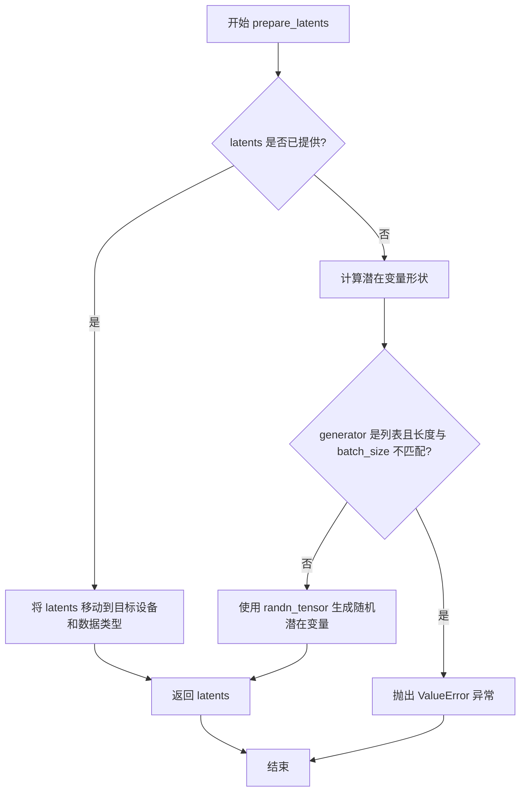

#### 带注释源码

```python
def prepare_latents(
    self,
    batch_size,               # 批处理大小
    num_channels_latents,     # 潜在变量的通道数
    height,                  # 图像高度
    width,                   # 图像宽度
    dtype,                   # 数据类型
    device,                  # 设备
    generator,               # 随机数生成器
    latents=None,            # 可选的预生成潜在变量
):
    # 如果已经提供了 latents，直接将其移动到目标设备和数据类型并返回
    if latents is not None:
        return latents.to(device=device, dtype=dtype)

    # 计算潜在变量的形状，考虑 VAE 缩放因子
    # 潜在变量的高度和宽度为图像尺寸除以 vae_scale_factor
    shape = (
        batch_size,
        num_channels_latents,
        int(height) // self.vae_scale_factor,
        int(width) // self.vae_scale_factor,
    )

    # 检查 generator 列表长度是否与 batch_size 匹配
    if isinstance(generator, list) and len(generator) != batch_size:
        raise ValueError(
            f"You have passed a list of generators of length {len(generator)}, but requested an effective batch"
            f" size of {batch_size}. Make sure the batch size matches the length of the generators."
        )

    # 使用 randn_tensor 生成符合标准正态分布的随机潜在变量
    latents = randn_tensor(shape, generator=generator, device=device, dtype=dtype)

    return latents
```


### `StableDiffusion3ControlNetPipeline.prepare_image`

该方法负责将输入的控制图像进行预处理、尺寸调整、批处理复制以及设备转移，以适配 Stable Diffusion 3 ControlNet 流水线的推理需求。

参数：

- `image`：`Any`，输入的原始图像，可以是 `torch.Tensor`、PIL Image、numpy array 或其他图像格式
- `width`：`int`，目标输出图像的宽度（像素）
- `height`：`int`，目标输出图像的高度（像素）
- `batch_size`：`int`，提示词对应的批处理大小
- `num_images_per_prompt`：`int`，每个提示词需要生成的图像数量
- `device`：`torch.device`，目标计算设备（CPU/CUDA）
- `dtype`：`torch.dtype`，目标数据类型（如 float16、float32）
- `do_classifier_free_guidance`：`bool`，是否启用无分类器引导（用于增加图像质量）
- `guess_mode`：`bool`，猜测模式标志

返回值：`torch.Tensor`，处理完成后的图像张量，形状已根据 batch_size 和 guidance 扩展

#### 流程图

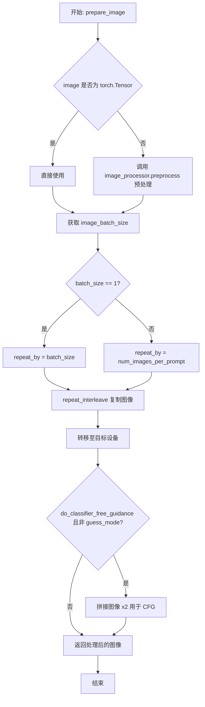

#### 带注释源码

```python
def prepare_image(
    self,
    image,
    width,
    height,
    batch_size,
    num_images_per_prompt,
    device,
    dtype,
    do_classifier_free_guidance=False,
    guess_mode=False,
):
    """ Prepares the control image for the ControlNet pipeline.

    Args:
        image: Input image in various formats (Tensor, PIL Image, etc.)
        width: Target width for the output image
        height: Target height for the output image
        batch_size: Batch size corresponding to the prompt
        num_images_per_prompt: Number of images to generate per prompt
        device: Target device (CPU/CUDA)
        dtype: Target data type
        do_classifier_free_guidance: Whether to use classifier-free guidance
        guess_mode: Mode flag for guessing

    Returns:
        Processed image tensor ready for ControlNet
    """
    # 检查输入图像是否为 PyTorch 张量
    if isinstance(image, torch.Tensor):
        # 如果已是张量，直接使用
        pass
    else:
        # 否则调用图像处理器进行预处理（如归一化、resize等）
        image = self.image_processor.preprocess(image, height=height, width=width)

    # 获取输入图像的批次大小
    image_batch_size = image.shape[0]

    # 根据批次大小确定复制因子
    if image_batch_size == 1:
        # 单张图像时，按完整 batch_size 复制
        repeat_by = batch_size
    else:
        # 图像批次与提示词批次一致时，按 num_images_per_prompt 复制
        # image batch size is the same as prompt batch size
        repeat_by = num_images_per_prompt

    # 沿批次维度复制图像
    image = image.repeat_interleave(repeat_by, dim=0)

    # 将图像转移到目标设备并转换为目标数据类型
    image = image.to(device=device, dtype=dtype)

    # 如果启用无分类器引导且不在猜测模式，则复制图像用于后续的 guidance 计算
    if do_classifier_free_guidance and not guess_mode:
        image = torch.cat([image] * 2)

    return image
```


### `StableDiffusion3ControlNetPipeline.encode_image`

该方法用于将输入图像编码为特征表示形式，通过预训练的图像编码器（image_encoder）提取图像特征，并返回倒数第二层的隐藏状态作为特征表示。

参数：

- `image`：`PipelineImageInput`，输入图像，可以是 PIL Image、numpy 数组、torch.Tensor 等格式
- `device`：`torch.device`，指定计算设备（CPU/CUDA）

返回值：`torch.Tensor`，编码后的图像特征表示（隐藏状态）

#### 流程图

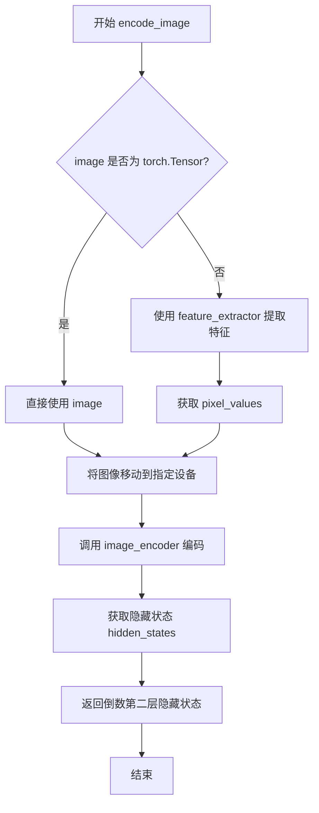

#### 带注释源码

```python
def encode_image(self, image: PipelineImageInput, device: torch.device) -> torch.Tensor:
    """Encodes the given image into a feature representation using a pre-trained image encoder.

    Args:
        image (`PipelineImageInput`):
            Input image to be encoded.
        device: (`torch.device`):
            Torch device.

    Returns:
        `torch.Tensor`: The encoded image feature representation.
    """
    # 判断输入图像是否为 torch.Tensor 类型
    # 如果不是，则需要使用 feature_extractor 进行预处理
    if not isinstance(image, torch.Tensor):
        # 使用图像处理器提取特征，返回包含 pixel_values 的字典
        # 将 PIL Image 或 numpy 数组转换为 torch.Tensor 格式
        image = self.feature_extractor(image, return_tensors="pt").pixel_values

    # 将图像数据移动到指定的计算设备（CPU/CUDA）
    # 同时转换数据类型为 pipeline 指定的 dtype
    image = image.to(device=device, dtype=self.dtype)

    # 调用图像编码器进行编码
    # output_hidden_states=True 表示返回所有层的隐藏状态
    # hidden_states[-2] 表示获取倒数第二层的特征表示
    # 通常最后一层是输出层，倒数第二层包含更丰富的语义特征
    return self.image_encoder(image, output_hidden_states=True).hidden_states[-2]
```


### `StableDiffusion3ControlNetPipeline.prepare_ip_adapter_image_embeds`

该方法用于为IP-Adapter准备图像嵌入向量，处理输入图像或预计算的图像嵌入，根据是否启用无分类器引导（classifier-free guidance）来生成正负样本的图像嵌入，并将嵌入复制到指定的设备上。

参数：

- `ip_adapter_image`：`PipelineImageInput | None`，用于IP-Adapter提取特征的可选输入图像
- `ip_adapter_image_embeds`：`torch.Tensor | None`，可选的预计算图像嵌入
- `device`：`torch.device | None`，torch计算设备，默认为执行设备
- `num_images_per_prompt`：`int`，每个提示词生成的图像数量，默认为1
- `do_classifier_free_guidance`：`bool`，是否启用无分类器引导，默认为True

返回值：`torch.Tensor`，处理后的图像嵌入向量，用于后续的图像生成过程

#### 流程图

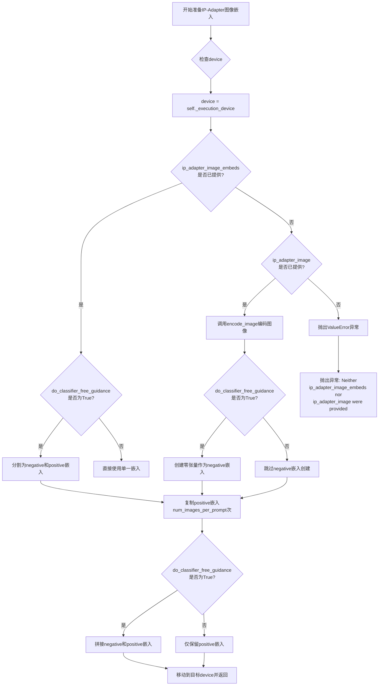

#### 带注释源码

```python
def prepare_ip_adapter_image_embeds(
    self,
    ip_adapter_image: PipelineImageInput | None = None,
    ip_adapter_image_embeds: torch.Tensor | None = None,
    device: torch.device | None = None,
    num_images_per_prompt: int = 1,
    do_classifier_free_guidance: bool = True,
) -> torch.Tensor:
    """Prepares image embeddings for use in the IP-Adapter.

    Either `ip_adapter_image` or `ip_adapter_image_embeds` must be passed.

    Args:
        ip_adapter_image (`PipelineImageInput`, *optional*):
            The input image to extract features from for IP-Adapter.
        ip_adapter_image_embeds (`torch.Tensor`, *optional*):
            Precomputed image embeddings.
        device: (`torch.device`, *optional*):
            Torch device.
        num_images_per_prompt (`int`, defaults to 1):
            Number of images that should be generated per prompt.
        do_classifier_free_guidance (`bool`, defaults to True):
            Whether to use classifier free guidance or not.
    """
    # 获取设备，如果未指定则使用执行设备
    device = device or self._execution_device

    # 情况1: 如果已经提供了预计算的图像嵌入
    if ip_adapter_image_embeds is not None:
        # 如果启用无分类器引导，将嵌入分割为negative和positive两部分
        if do_classifier_free_guidance:
            single_negative_image_embeds, single_image_embeds = ip_adapter_image_embeds.chunk(2)
        else:
            # 否则直接使用提供的嵌入作为positive嵌入
            single_image_embeds = ip_adapter_image_embeds
    # 情况2: 如果提供了原始图像而非预计算嵌入
    elif ip_adapter_image is not None:
        # 使用图像编码器将图像编码为嵌入向量
        single_image_embeds = self.encode_image(ip_adapter_image, device)
        # 如果启用无分类器引导，创建零张量作为negative嵌入（用于无引导）
        if do_classifier_free_guidance:
            single_negative_image_embeds = torch.zeros_like(single_image_embeds)
    # 情况3: 既没有提供图像也没有提供嵌入，抛出异常
    else:
        raise ValueError("Neither `ip_adapter_image_embeds` or `ip_adapter_image_embeds` were provided.")

    # 将图像嵌入复制num_images_per_prompt次，以匹配生成的图像数量
    image_embeds = torch.cat([single_image_embeds] * num_images_per_prompt, dim=0)

    # 如果启用无分类器引导，同时复制negative嵌入并与positive嵌入拼接
    # 拼接顺序: [negative_embeds, positive_embeds]，用于后续的引导生成
    if do_classifier_free_guidance:
        negative_image_embeds = torch.cat([single_negative_image_embeds] * num_images_per_prompt, dim=0)
        image_embeds = torch.cat([negative_image_embeds, image_embeds], dim=0)

    # 将最终结果移动到目标设备并返回
    return image_embeds.to(device=device)
```


### `StableDiffusion3ControlNetPipeline.enable_sequential_cpu_offload`

该方法用于启用顺序CPU卸载功能，允许将管道中的模型组件按顺序卸载到CPU以节省GPU显存。该方法重写了父类的方法，特别针对`image_encoder`组件可能使用`torch.nn.MultiheadAttention`导致的问题添加了警告信息。

参数：

- `*args`：可变位置参数，传递给父类的`enable_sequential_cpu_offload`方法
- `**kwargs`：可变关键字参数，传递给父类的`enable_sequential_cpu_offload`方法

返回值：`None`，该方法直接调用父类方法，不返回任何值

#### 流程图

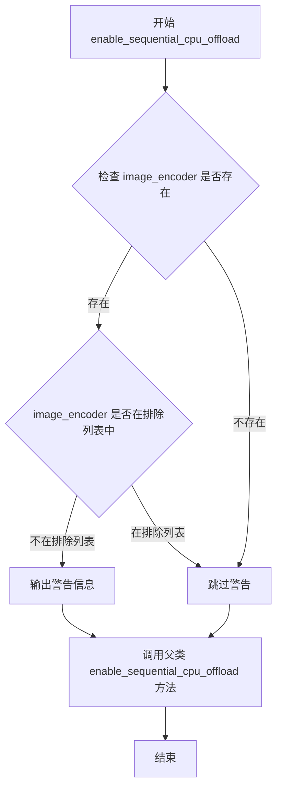

#### 带注释源码

```python
# Copied from diffusers.pipelines.stable_diffusion_3.pipeline_stable_diffusion_3.StableDiffusion3Pipeline.enable_sequential_cpu_offload
def enable_sequential_cpu_offload(self, *args, **kwargs):
    """
    启用顺序CPU卸载功能。
    
    该方法重写了父类 DiffusionPipeline 的 enable_sequential_cpu_offload 方法，
    添加了对 image_encoder 组件的特殊处理，因为 image_encoder 可能使用 
    torch.nn.MultiheadAttention，在CPU卸载时可能会失败。
    
    参数:
        *args: 可变位置参数，传递给父类方法
        **kwargs: 可变关键字参数，传递给父类方法
    
    返回:
        无返回值，直接调用父类方法
    """
    # 检查 image_encoder 是否存在且不在排除列表中
    if self.image_encoder is not None and "image_encoder" not in self._exclude_from_cpu_offload:
        # 输出警告信息，提醒用户 image_encoder 可能存在的问题
        logger.warning(
            "`pipe.enable_sequential_cpu_offload()` might fail for `image_encoder` if it uses "
            "`torch.nn.MultiheadAttention`. You can exclude `image_encoder` from CPU offloading by calling "
            "`pipe._exclude_from_cpu_offload.append('image_encoder')` before `pipe.enable_sequential_cpu_offload()`."
        )

    # 调用父类的 enable_sequential_cpu_offload 方法，执行实际的顺序CPU卸载逻辑
    super().enable_sequential_cpu_offload(*args, **kwargs)
```


### `StableDiffusion3ControlNetPipeline.__call__`

这是Stable Diffusion 3控制网络管道的主推理方法，通过接收文本提示和控制图像，利用多个文本编码器（CLIP和T5）以及控制网络模型，在去噪循环中逐步生成与控制条件相结合的图像。

参数：

- `prompt`：`str | list[str] | None`，主要文本提示，引导图像生成方向
- `prompt_2`：`str | list[str] | None`，发送给第二文本编码器的提示，若未定义则使用prompt
- `prompt_3`：`str | list[str] | None`，发送给T5文本编码器的提示，若未定义则使用prompt
- `height`：`int | None`，生成图像的高度像素值，默认为transformer配置样本大小乘以vae缩放因子
- `width`：`int | None`，生成图像的宽度像素值，默认为transformer配置样本大小乘以vae缩放因子
- `num_inference_steps`：`int`，去噪步数，默认为28，步数越多通常图像质量越高但推理越慢
- `sigmas`：`list[float] | None`，自定义sigmas值，用于支持sigmas的调度器的去噪过程
- `guidance_scale`：`float`，分类器自由引导比例，默认为7.0，值越大越忠实于文本提示
- `control_guidance_start`：`float | list[float]`，控制网络开始应用的总步数百分比，默认为0.0
- `control_guidance_end`：`float | list[float]`，控制网络停止应用的总步数百分比，默认为1.0
- `control_image`：`PipelineImageInput`，控制网络输入条件图像，提供额外的生成引导
- `controlnet_conditioning_scale`：`float | list[float]`，控制网络输出乘以该系数后添加到UNet残差中，默认1.0
- `controlnet_pooled_projections`：`torch.FloatTensor | None`，从控制网络输入条件嵌入投影而来的张量
- `negative_prompt`：`str | list[str] | None`，不引导图像生成的负面提示
- `negative_prompt_2`：`str | list[str] | None`，发送给第二文本编码器的负面提示
- `negative_prompt_3`：`str | list[str] | None`，发送给T5文本编码器的负面提示
- `num_images_per_prompt`：`int | None`，每个提示生成的图像数量，默认为1
- `generator`：`torch.Generator | list[torch.Generator] | None`，随机生成器用于可重复生成
- `latents`：`torch.FloatTensor | None`，预生成的噪声潜在变量，可用于同一生成的不同提示
- `prompt_embeds`：`torch.FloatTensor | None`，预生成的文本嵌入，可用于提示词加权
- `negative_prompt_embeds`：`torch.FloatTensor | None`，预生成的负面文本嵌入
- `pooled_prompt_embeds`：`torch.FloatTensor | None`，预生成的池化文本嵌入
- `negative_pooled_prompt_embeds`：`torch.FloatTensor | None`，预生成的负面池化文本嵌入
- `ip_adapter_image`：`PipelineImageInput | None`，用于IP适配器的可选图像输入
- `ip_adapter_image_embeds`：`torch.Tensor | None`，IP适配器的预生成图像嵌入
- `output_type`：`str | None`，输出格式，默认为"pil"即PIL图像
- `return_dict`：`bool`，是否返回管道输出对象而非元组，默认为True
- `joint_attention_kwargs`：`dict[str, Any] | None`，传递给注意力处理器的额外参数字典
- `clip_skip`：`int | None`，CLIP计算提示嵌入时跳过的层数
- `callback_on_step_end`：`Callable | None`，每个去噪步骤结束时调用的回调函数
- `callback_on_step_end_tensor_inputs`：`list[str]`，回调函数接受的张量输入列表，默认为["latents"]
- `max_sequence_length`：`int`，T5编码器的最大序列长度，默认为256

返回值：`StableDiffusion3PipelineOutput | tuple`，返回生成的图像列表或包含图像的管道输出对象

#### 流程图

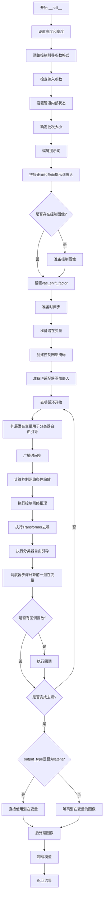

#### 带注释源码

```python
@torch.no_grad()
@replace_example_docstring(EXAMPLE_DOC_STRING)
def __call__(
    self,
    prompt: str | list[str] = None,
    prompt_2: str | list[str] | None = None,
    prompt_3: str | list[str] | None = None,
    height: int | None = None,
    width: int | None = None,
    num_inference_steps: int = 28,
    sigmas: list[float] | None = None,
    guidance_scale: float = 7.0,
    control_guidance_start: float | list[float] = 0.0,
    control_guidance_end: float | list[float] = 1.0,
    control_image: PipelineImageInput = None,
    controlnet_conditioning_scale: float | list[float] = 1.0,
    controlnet_pooled_projections: torch.FloatTensor | None = None,
    negative_prompt: str | list[str] | None = None,
    negative_prompt_2: str | list[str] | None = None,
    negative_prompt_3: str | list[str] | None = None,
    num_images_per_prompt: int | None = 1,
    generator: torch.Generator | list[torch.Generator] | None = None,
    latents: torch.FloatTensor | None = None,
    prompt_embeds: torch.FloatTensor | None = None,
    negative_prompt_embeds: torch.FloatTensor | None = None,
    pooled_prompt_embeds: torch.FloatTensor | None = None,
    negative_pooled_prompt_embeds: torch.FloatTensor | None = None,
    ip_adapter_image: PipelineImageInput | None = None,
    ip_adapter_image_embeds: torch.Tensor | None = None,
    output_type: str | None = "pil",
    return_dict: bool = True,
    joint_attention_kwargs: dict[str, Any] | None = None,
    clip_skip: int | None = None,
    callback_on_step_end: Callable[[int, int], None] | None = None,
    callback_on_step_end_tensor_inputs: list[str] = ["latents"],
    max_sequence_length: int = 256,
):
    r"""
    调用管道进行图像生成的主方法。
    """
    # 1. 设置默认高度和宽度 - 使用VAE缩放因子调整样本大小
    height = height or self.default_sample_size * self.vae_scale_factor
    width = width or self.default_sample_size * self.vae_scale_factor

    # 获取控制网络的配置参数
    controlnet_config = (
        self.controlnet.config
        if isinstance(self.controlnet, SD3ControlNetModel)
        else self.controlnet.nets[0].config
    )

    # 2. 对齐控制引导参数格式 - 确保start和end都是列表格式
    if not isinstance(control_guidance_start, list) and isinstance(control_guidance_end, list):
        control_guidance_start = len(control_guidance_end) * [control_guidance_start]
    elif not isinstance(control_guidance_end, list) and isinstance(control_guidance_start, list):
        control_guidance_end = len(control_guidance_start) * [control_guidance_end]
    elif not isinstance(control_guidance_start, list) and not isinstance(control_guidance_end, list):
        # 单个控制网络时扩展为列表
        mult = len(self.controlnet.nets) if isinstance(self.controlnet, SD3MultiControlNetModel) else 1
        control_guidance_start, control_guidance_end = (
            mult * [control_guidance_start],
            mult * [control_guidance_end],
        )

    # 3. 检查输入参数 - 验证所有必需参数的有效性
    self.check_inputs(
        prompt, prompt_2, prompt_3, height, width,
        negative_prompt, negative_prompt_2, negative_prompt_3,
        prompt_embeds, negative_prompt_embeds,
        pooled_prompt_embeds, negative_pooled_prompt_embeds,
        callback_on_step_end_tensor_inputs, max_sequence_length,
    )

    # 设置管道内部状态变量
    self._guidance_scale = guidance_scale
    self._clip_skip = clip_skip
    self._joint_attention_kwargs = joint_attention_kwargs
    self._interrupt = False

    # 4. 确定批次大小
    if prompt is not None and isinstance(prompt, str):
        batch_size = 1
    elif prompt is not None and isinstance(prompt, list):
        batch_size = len(prompt)
    else:
        batch_size = prompt_embeds.shape[0]

    # 获取执行设备和数据类型
    device = self._execution_device
    dtype = self.transformer.dtype

    # 5. 编码提示词 - 调用encode_prompt生成文本嵌入
    (
        prompt_embeds,
        negative_prompt_embeds,
        pooled_prompt_embeds,
        negative_pooled_prompt_embeds,
    ) = self.encode_prompt(
        prompt=prompt, prompt_2=prompt_2, prompt_3=prompt_3,
        negative_prompt=negative_prompt, negative_prompt_2=negative_prompt_2,
        negative_prompt_3=negative_prompt_3,
        do_classifier_free_guidance=self.do_classifier_free_guidance,
        prompt_embeds=prompt_embeds, negative_prompt_embeds=negative_prompt_embeds,
        pooled_prompt_embeds=pooled_prompt_embeds,
        negative_pooled_prompt_embeds=negative_pooled_prompt_embeds,
        device=device, clip_skip=self.clip_skip,
        num_images_per_prompt=num_images_per_prompt,
        max_sequence_length=max_sequence_length,
    )

    # 6. 拼接负面和正面提示词嵌入用于分类器自由引导
    if self.do_classifier_free_guidance:
        prompt_embeds = torch.cat([negative_prompt_embeds, prompt_embeds], dim=0)
        pooled_prompt_embeds = torch.cat([negative_pooled_prompt_embeds, pooled_prompt_embeds], dim=0)

    # 7. 根据控制网络配置设置VAE移位因子
    if controlnet_config.force_zeros_for_pooled_projection:
        vae_shift_factor = 0  # InstantX SD3控制网络不应用移位因子
    else:
        vae_shift_factor = self.vae.config.shift_factor

    # 8. 准备控制图像 - 处理单控制网络和多控制网络情况
    if isinstance(self.controlnet, SD3ControlNetModel):
        control_image = self.prepare_image(
            image=control_image, width=width, height=height,
            batch_size=batch_size * num_images_per_prompt,
            num_images_per_prompt=num_images_per_prompt,
            device=device, dtype=dtype,
            do_classifier_free_guidance=self.do_classifier_free_guidance,
            guess_mode=False,
        )
        height, width = control_image.shape[-2:]

        # VAE编码控制图像到潜在空间
        control_image = self.vae.encode(control_image).latent_dist.sample()
        control_image = (control_image - vae_shift_factor) * self.vae.config.scaling_factor
    elif isinstance(self.controlnet, SD3MultiControlNetModel):
        control_images = []
        for control_image_ in control_image:
            control_image_ = self.prepare_image(
                image=control_image_, width=width, height=height,
                batch_size=batch_size * num_images_per_prompt,
                num_images_per_prompt=num_images_per_prompt,
                device=device, dtype=dtype,
                do_classifier_free_guidance=self.do_classifier_free_guidance,
                guess_mode=False,
            )
            # VAE编码每个控制图像
            control_image_ = self.vae.encode(control_image_).latent_dist.sample()
            control_image_ = (control_image_ - vae_shift_factor) * self.vae.config.scaling_factor
            control_images.append(control_image_)
        control_image = control_images

    # 9. 准备时间步 - 从调度器获取推理时间步
    if XLA_AVAILABLE:
        timestep_device = "cpu"
    else:
        timestep_device = device
    timesteps, num_inference_steps = retrieve_timesteps(
        self.scheduler, num_inference_steps, timestep_device, sigmas=sigmas
    )
    num_warmup_steps = max(len(timesteps) - num_inference_steps * self.scheduler.order, 0)
    self._num_timesteps = len(timesteps)

    # 10. 准备潜在变量 - 初始化或使用提供的噪声潜在变量
    num_channels_latents = self.transformer.config.in_channels
    latents = self.prepare_latents(
        batch_size * num_images_per_prompt, num_channels_latents,
        height, width, prompt_embeds.dtype, device, generator, latents,
    )

    # 11. 创建控制网络掩码 - 确定每步保留哪些控制网络输出
    controlnet_keep = []
    for i in range(len(timesteps)):
        keeps = [
            1.0 - float(i / len(timesteps) < s or (i + 1) / len(timesteps) > e)
            for s, e in zip(control_guidance_start, control_guidance_end)
        ]
        controlnet_keep.append(keeps[0] if isinstance(self.controlnet, SD3ControlNetModel) else keeps)

    # 12. 准备控制网络池化投影
    if controlnet_config.force_zeros_for_pooled_projection:
        controlnet_pooled_projections = torch.zeros_like(pooled_prompt_embeds)
    else:
        controlnet_pooled_projections = controlnet_pooled_projections or pooled_prompt_embeds

    # 13. 设置控制网络编码器隐藏状态
    if controlnet_config.joint_attention_dim is not None:
        controlnet_encoder_hidden_states = prompt_embeds
    else:
        # SD35官方8b控制网络不使用encoder_hidden_states
        controlnet_encoder_hidden_states = None

    # 14. 准备IP适配器图像嵌入
    if (ip_adapter_image is not None and self.is_ip_adapter_active) or ip_adapter_image_embeds is not None:
        ip_adapter_image_embeds = self.prepare_ip_adapter_image_embeds(
            ip_adapter_image, ip_adapter_image_embeds, device,
            batch_size * num_images_per_prompt, self.do_classifier_free_guidance,
        )
        if self.joint_attention_kwargs is None:
            self._joint_attention_kwargs = {"ip_adapter_image_embeds": ip_adapter_image_embeds}
        else:
            self._joint_attention_kwargs.update(ip_adapter_image_embeds=ip_adapter_image_embeds)

    # 15. 去噪循环 - 核心推理过程
    with self.progress_bar(total=num_inference_steps) as progress_bar:
        for i, t in enumerate(timesteps):
            # 检查是否中断
            if self.interrupt:
                continue

            # 扩展潜在变量用于分类器自由引导
            latent_model_input = torch.cat([latents] * 2) if self.do_classifier_free_guidance else latents
            # 广播到批次维度
            timestep = t.expand(latent_model_input.shape[0])

            # 计算控制网络条件缩放
            if isinstance(controlnet_keep[i], list):
                cond_scale = [c * s for c, s in zip(controlnet_conditioning_scale, controlnet_keep[i])]
            else:
                controlnet_cond_scale = controlnet_conditioning_scale
                if isinstance(controlnet_cond_scale, list):
                    controlnet_cond_scale = controlnet_cond_scale[0]
                cond_scale = controlnet_cond_scale * controlnet_keep[i]

            # 执行控制网络推理
            control_block_samples = self.controlnet(
                hidden_states=latent_model_input, timestep=timestep,
                encoder_hidden_states=controlnet_encoder_hidden_states,
                pooled_projections=controlnet_pooled_projections,
                joint_attention_kwargs=self.joint_attention_kwargs,
                controlnet_cond=control_image, conditioning_scale=cond_scale,
                return_dict=False,
            )[0]

            # 执行Transformer去噪
            noise_pred = self.transformer(
                hidden_states=latent_model_input, timestep=timestep,
                encoder_hidden_states=prompt_embeds, pooled_projections=pooled_prompt_embeds,
                block_controlnet_hidden_states=control_block_samples,
                joint_attention_kwargs=self.joint_attention_kwargs,
                return_dict=False,
            )[0]

            # 执行分类器自由引导
            if self.do_classifier_free_guidance:
                noise_pred_uncond, noise_pred_text = noise_pred.chunk(2)
                noise_pred = noise_pred_uncond + self.guidance_scale * (noise_pred_text - noise_pred_uncond)

            # 使用调度器计算前一潜在变量
            latents_dtype = latents.dtype
            latents = self.scheduler.step(noise_pred, t, latents, return_dict=False)[0]

            # 处理数据类型转换 - 修复MPS平台bug
            if latents.dtype != latents_dtype:
                if torch.backends.mps.is_available():
                    latents = latents.to(latents_dtype)

            # 执行步骤结束回调
            if callback_on_step_end is not None:
                callback_kwargs = {}
                for k in callback_on_step_end_tensor_inputs:
                    callback_kwargs[k] = locals()[k]
                callback_outputs = callback_on_step_end(self, i, t, callback_kwargs)

                # 更新可能被回调修改的张量
                latents = callback_outputs.pop("latents", latents)
                prompt_embeds = callback_outputs.pop("prompt_embeds", prompt_embeds)
                negative_prompt_embeds = callback_outputs.pop("negative_prompt_embeds", negative_prompt_embeds)
                negative_pooled_prompt_embeds = callback_outputs.pop(
                    "negative_pooled_prompt_embeds", negative_pooled_prompt_embeds
                )

            # 更新进度条
            if i == len(timesteps) - 1 or ((i + 1) > num_warmup_steps and (i + 1) % self.scheduler.order == 0):
                progress_bar.update()

            # XLA设备标记步骤
            if XLA_AVAILABLE:
                xm.mark_step()

    # 16. 处理输出 - 根据output_type决定是否解码
    if output_type == "latent":
        image = latents
    else:
        # 反缩放潜在变量
        latents = (latents / self.vae.config.scaling_factor) + self.vae.config.shift_factor

        # VAE解码生成最终图像
        image = self.vae.decode(latents, return_dict=False)[0]
        # 后处理图像
        image = self.image_processor.postprocess(image, output_type=output_type)

    # 17. 卸载所有模型
    self.maybe_free_model_hooks()

    # 18. 返回结果
    if not return_dict:
        return (image,)

    return StableDiffusion3PipelineOutput(images=image)
```

## 关键组件


### StableDiffusion3ControlNetPipeline

Stable Diffusion 3 ControlNet管道核心类，整合transformer、VAE、多个文本编码器(CLIP+T5)和ControlNet实现条件图像生成。

### retrieve_timesteps

辅助函数，调用调度器的set_timesteps方法并返回时间步序列，支持自定义timesteps或sigmas参数。

### _get_t5_prompt_embeds

获取T5文本编码器的提示词嵌入，处理最长256token的序列，支持批量生成和嵌入复制。

### _get_clip_prompt_embeds

获取CLIP文本编码器的提示词嵌入，支持clip_skip跳过层功能，可选择使用第一个或第二个CLIP模型。

### encode_prompt

统一编码接口，整合CLIP和T5的提示词嵌入生成，支持负面提示词、条件引导和LoRA权重调整。

### encode_image

使用SiglipVisionModel编码图像为特征表示，用于IP-Adapter图像条件生成。

### prepare_ip_adapter_image_embeds

准备IP-Adapter图像嵌入，处理图像编码和分类器自由引导的嵌入拼接。

### prepare_latents

准备噪声潜在变量，支持外部传入latents或使用随机tensor生成，确保batch_size匹配。

### prepare_image

预处理控制图像，包括尺寸调整、batch复制和分类器自由引导的图像拼接。

### check_inputs

验证输入参数合法性，包括分辨率、提示词类型、嵌入维度等关键约束检查。

### __call__

主生成函数，执行完整的去噪循环：编码提示词→处理控制图像→初始化latents→遍历时间步→ControlNet推理→Transformer去噪→VAE解码。

### SD3ControlNetModel/SD3MultiControlNetModel

ControlNet模型，支持单个或多个ControlNet组合，提供额外的空间条件控制。

### FlowMatchEulerDiscreteScheduler

调度器，使用Flow Match Euler离散方法进行去噪步骤计算。

### VAE (AutoencoderKL)

变分自编码器，负责图像到潜在空间的编码和从潜在空间到图像的解码。

### 文本编码器组

CLIPTextModelWithProjection (text_encoder, text_encoder_2) 和 T5EncoderModel (text_encoder_3) 组成多模态文本编码系统。

## 问题及建议


### 已知问题

-   **`__call__` 方法中存在无效的错误处理**：在处理 `controlnet` 类型的分支最后使用了 `assert False`，这不是一个合适的错误处理方式，应该抛出明确的异常。
-   **`encode_prompt` 方法过于冗长**：该方法包含大量重复的逻辑代码，超过 200 行，缺乏清晰的结构和单一职责原则。
-   **代码重复严重**：`retrieve_timesteps` 函数、`_get_t5_prompt_embeds` 方法和 `_get_clip_prompt_embeds` 方法均从其他 pipeline 复制而来，未进行抽象和复用。
-   **缺少早期参数验证**：在 `__call__` 方法中，控制网络相关配置（如 `control_guidance_start`、`control_guidance_end`）的验证和格式化在方法中段才进行，而不是在开头。
-   **循环中重复计算张量**：在 denoising 循环中，某些张量操作（如 `controlnet_keep` 的计算）可以在循环外预先计算。
-   **`prepare_image` 方法的 type hint 不准确**：参数 `image` 的类型注解过于宽泛，无法精确表达其支持的多种输入类型。
-   **LoRA 缩放逻辑存在冗余检查**：在 `encode_prompt` 方法中多次检查 `isinstance(self, SD3LoraLoaderMixin)`，这个检查在类定义中已经是确定的。
-   **资源未及时释放**：在某些错误路径下，已分配的 GPU 资源可能未正确释放。

### 优化建议

-   **重构 `encode_prompt` 方法**：将其拆分为多个私有方法，如 `_encode_clip_prompt`、`_encode_t5_prompt`、`_process_negative_prompt` 等，提高代码可读性和可维护性。
-   **使用策略模式处理 ControlNet**：将不同 ControlNet 类型的处理逻辑提取到独立类中，避免大量的 `isinstance` 检查和 `assert False`。
-   **提取通用的 prompt encoding 逻辑**：将复制的方法移至基类或工具模块中，通过继承或组合复用代码。
-   **预计算循环不变量**：将 `controlnet_keep` 的计算移到 timesteps 循环外部，避免每步重复计算。
-   **添加缓存机制**：对于相同输入的 `encode_prompt` 调用，可以考虑添加缓存以避免重复编码计算。
-   **完善类型注解**：为所有公共方法参数添加更精确的类型注解，特别是那些接受多种输入类型的参数。
-   **优化 `__init__` 参数**：考虑使用 builder 模式或 dataclass 来组织大量构造函数参数，提高 API 的易用性。
-   **改进错误处理**：将 `assert False` 替换为 `raise ValueError(...)` 或 `raise TypeError(...)`，并提供有意义的错误信息。

## 其它


### 设计目标与约束

本Pipeline的设计目标是实现一个基于Stable Diffusion 3架构的ControlNet图像生成流水线，支持通过控制图像（Control Image）来引导生成过程，同时保持高质量的图像输出。主要约束包括：1）必须支持多ControlNet联合使用；2）需要兼容IP-Adapter和LoRA扩展；3）支持classifier-free guidance；4）需要在GPU和TPU（通过PyTorch XLA）上运行；5）图像尺寸必须能被8整除；6）max_sequence_length不能超过512。

### 错误处理与异常设计

Pipeline在多个关键点进行了错误处理：1）在`retrieve_timesteps`中检查timesteps和sigmas的互斥性，以及scheduler是否支持自定义参数；2）在`check_inputs`中进行全面的输入验证，包括图像尺寸、prompt类型、embeddings形状匹配、max_sequence_length限制等；3）在`prepare_latents`中验证generator列表长度与batch_size的匹配；4）在`prepare_ip_adapter_image_embeds`中确保至少提供ip_adapter_image或ip_adapter_image_embeds之一。异常主要通过ValueError抛出，并携带详细的错误信息帮助定位问题。

### 数据流与状态机

Pipeline的主要数据流如下：1）输入阶段：接收prompt、control_image、negative_prompt等；2）编码阶段：通过`encode_prompt`将文本编码为embeddings，通过`prepare_image`处理control_image并通过VAE编码为latent；3）调度阶段：使用`retrieve_timesteps`获取去噪步骤；4）去噪循环：对latents进行迭代去噪，每次迭代调用ControlNet获取控制信息，然后调用Transformer预测噪声，最后通过scheduler更新latents；5）解码阶段：通过VAE decode将latents转换为最终图像。整个过程的状态转换由scheduler的step方法控制，interrupt属性可用于中断生成。

### 外部依赖与接口契约

本Pipeline依赖以下核心组件：1）SD3Transformer2DModel：主要的去噪Transformer模型；2）FlowMatchEulerDiscreteScheduler：调度器；3）AutoencoderKL：VAE模型；4）CLIPTextModelWithProjection（x2）和T5EncoderModel：三个文本编码器；5）SD3ControlNetModel或SD3MultiControlNetModel：ControlNet模型；6）SiglipVisionModel和SiglipImageProcessor：IP-Adapter支持的可选组件。所有模型通过`register_modules`注册，支持从预训练模型加载。输出格式为StableDiffusion3PipelineOutput，包含生成的图像列表。

### 性能优化与资源管理

Pipeline实现了多种性能优化：1）模型CPU offload支持，通过`enable_sequential_cpu_offload`实现；2）使用`model_cpu_offload_seq`定义模型卸载顺序；3）支持PyTorch XLA进行TPU加速；4）通过`num_images_per_prompt`支持批量生成；5）通过`latents`参数支持潜在空间的复用；6）使用`callback_on_step_end`支持步骤级回调以实现增量处理。内存优化方面，对于Apple MPS平台特别处理了dtype转换问题。

### 兼容性设计

Pipeline通过以下机制保证兼容性：1）支持从单文件加载（FromSingleFileMixin）；2）支持LoRA权重加载（SD3LoraLoaderMixin）；3）支持IP-Adapter（SD3IPAdapterMixin）；4）通过可选组件机制（_optional_components）支持image_encoder和feature_extractor的缺失；5）通过`callback_on_step_end_tensor_inputs`允许用户自定义回调张量；6）支持多种输入格式（torch.Tensor、PIL.Image、np.ndarray等）。

### 并发与异步支持

Pipeline支持通过XLA进行设备间同步（xm.mark_step()），但在核心去噪循环中采用同步迭代方式。Generator参数支持传入随机数生成器列表以实现多图像独立随机性。num_images_per_prompt参数支持在同一prompt下生成多张图像，底层通过embedding复制实现。

### 安全性与权限管理

代码遵循Apache 2.0许可证。Pipeline使用transformers库的预训练模型，需要遵守相应模型许可。在LoRA加载场景下，通过scale_lora_layers和unscale_lora_layers动态调整权重，确保LORA权重的正确应用。模型设备转移时谨慎处理dtype转换，避免精度损失。

### 配置参数管理

关键配置参数包括：1）vae_scale_factor：根据VAE block_out_channels计算，用于latent空间与像素空间的转换；2）tokenizer_max_length：默认77，用于CLIP tokenizer；3）default_sample_size：从transformer配置获取，默认128；4）guidance_scale：默认7.0，控制classifier-free guidance强度；5）num_inference_steps：默认28，去噪步数；6）controlnet_conditioning_scale：默认1.0，控制Net影响权重。

### 可扩展性设计

Pipeline的设计支持多层次扩展：1）通过继承DiffusionPipeline基类实现通用接口；2）通过mixin类（SD3LoraLoaderMixin、FromSingleFileMixin、SD3IPAdapterMixin）添加可选功能；3）支持多ControlNet联合（SD3MultiControlNetModel）；4）通过joint_attention_kwargs传递注意力控制参数；5）通过callback机制允许用户介入去噪过程；6）支持自定义scheduler，只要实现set_timesteps方法。

### 版本兼容性考虑

代码中处理了多个版本兼容问题：1）检查scheduler.set_timesteps是否支持timesteps或sigmas参数；2）检查ControlNet是否使用pos_embed（SD3.5 8b模型不使用）；3）检查force_zeros_for_pooled_projection配置以决定是否应用VAE shift factor；4）检查joint_attention_dim配置决定是否使用encoder_hidden_states；5）对Apple MPS平台的dtype bug进行了特殊处理。

### 测试与验证建议

建议添加以下测试用例：1）验证不同尺寸输入（必须能被8整除）；2）验证单ControlNet和多ControlNet场景；3）验证IP-Adapter功能；4）验证LoRA加载和权重缩放；5）验证callback_on_step_end正确调用；6）验证interrupt中断功能；7）验证各种output_type（latent、pil、np）；8）验证negative prompt对生成的影响。

    