# `diffusers\src\diffusers\pipelines\controlnet_sd3\pipeline_stable_diffusion_3_controlnet_inpainting.py` 详细设计文档

Stable Diffusion 3 ControlNet Inpainting Pipeline - 基于Stable Diffusion 3架构的条件图像修复管道，结合ControlNet控制网络实现精确的图像修复，支持多文本编码器（CLIP+T5）、IP-Adapter、LoRA等高级特性

## 整体流程

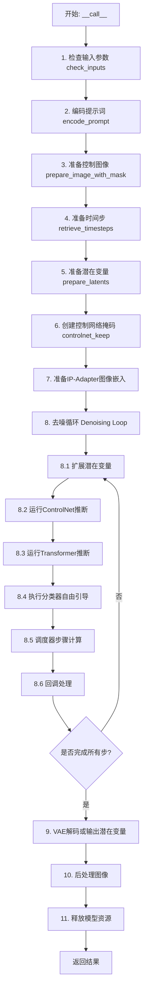

## 类结构

```
DiffusionPipeline (基类)
├── StableDiffusion3ControlNetInpaintingPipeline (主类)
│   ├── 继承: DiffusionPipeline
│   ├── 继承: SD3LoraLoaderMixin
│   ├── 继承: FromSingleFileMixin
│   └── 继承: SD3IPAdapterMixin
```

## 全局变量及字段


### `logger`
    
模块级日志记录器,用于记录管道运行时的信息

类型：`logging.Logger`
    


### `XLA_AVAILABLE`
    
标识是否可用XLA加速,用于判断是否使用torch_xla库

类型：`bool`
    


### `EXAMPLE_DOC_STRING`
    
示例文档字符串,包含管道使用示例代码

类型：`str`
    


### `StableDiffusion3ControlNetInpaintingPipeline.vae`
    
VAE编码器/解码器,用于图像与潜在表示之间的转换

类型：`AutoencoderKL`
    


### `StableDiffusion3ControlNetInpaintingPipeline.text_encoder`
    
第一个CLIP文本编码器,用于将文本提示编码为嵌入向量

类型：`CLIPTextModelWithProjection`
    


### `StableDiffusion3ControlNetInpaintingPipeline.text_encoder_2`
    
第二个CLIP文本编码器,用于提供额外的文本嵌入

类型：`CLIPTextModelWithProjection`
    


### `StableDiffusion3ControlNetInpaintingPipeline.text_encoder_3`
    
T5文本编码器,用于生成长序列文本嵌入

类型：`T5EncoderModel`
    


### `StableDiffusion3ControlNetInpaintingPipeline.tokenizer`
    
第一个分词器,用于将文本转换为token ID

类型：`CLIPTokenizer`
    


### `StableDiffusion3ControlNetInpaintingPipeline.tokenizer_2`
    
第二个分词器,用于配合text_encoder_2使用

类型：`CLIPTokenizer`
    


### `StableDiffusion3ControlNetInpaintingPipeline.tokenizer_3`
    
T5分词器,用于配合text_encoder_3处理长文本

类型：`T5TokenizerFast`
    


### `StableDiffusion3ControlNetInpaintingPipeline.transformer`
    
主去噪Transformer模型,执行潜在空间的去噪过程

类型：`SD3Transformer2DModel`
    


### `StableDiffusion3ControlNetInpaintingPipeline.scheduler`
    
扩散调度器,控制去噪过程中的时间步调度

类型：`FlowMatchEulerDiscreteScheduler`
    


### `StableDiffusion3ControlNetInpaintingPipeline.controlnet`
    
ControlNet模型,提供额外的图像条件控制

类型：`SD3ControlNetModel | SD3MultiControlNetModel`
    


### `StableDiffusion3ControlNetInpaintingPipeline.image_encoder`
    
IP-Adapter图像编码器,用于编码参考图像特征

类型：`SiglipModel`
    


### `StableDiffusion3ControlNetInpaintingPipeline.feature_extractor`
    
图像特征提取器,用于IP-Adapter图像预处理

类型：`SiglipImageProcessor`
    


### `StableDiffusion3ControlNetInpaintingPipeline.vae_scale_factor`
    
VAE缩放因子,用于计算潜在空间尺寸

类型：`int`
    


### `StableDiffusion3ControlNetInpaintingPipeline.image_processor`
    
图像处理器,用于预处理和后处理图像

类型：`VaeImageProcessor`
    


### `StableDiffusion3ControlNetInpaintingPipeline.mask_processor`
    
掩码处理器,用于预处理掩码图像

类型：`VaeImageProcessor`
    


### `StableDiffusion3ControlNetInpaintingPipeline.tokenizer_max_length`
    
分词器最大长度,定义文本最大token数

类型：`int`
    


### `StableDiffusion3ControlNetInpaintingPipeline.default_sample_size`
    
默认采样尺寸,用于确定生成图像的默认分辨率

类型：`int`
    


### `StableDiffusion3ControlNetInpaintingPipeline.patch_size`
    
Transformer patch大小,用于计算有效的图像尺寸

类型：`int`
    
    

## 全局函数及方法


### `retrieve_timesteps`

该函数是一个全局工具函数，用于从调度器（Scheduler）获取时间步（timesteps），支持自定义时间步列表和自定义sigmas列表，同时处理不同的调度器配置情况。

参数：

- `scheduler`：`SchedulerMixin`，调度器对象，用于生成时间步
- `num_inference_steps`：`int | None`，推理时使用的扩散步数，如果使用则`timesteps`必须为`None`
- `device`：`str | torch.device | None`，时间步要移动到的设备，如果为`None`则不移动
- `timesteps`：`list[int] | None`，自定义时间步，用于覆盖调度器的时间步间隔策略，如果传入此参数则`num_inference_steps`和`sigmas`必须为`None`
- `sigmas`：`list[float] | None`，自定义sigmas，用于覆盖调度器的时间步间隔策略，如果传入此参数则`num_inference_steps`和`timesteps`必须为`None`
- `**kwargs`：任意关键字参数，将传递给调度器的`set_timesteps`方法

返回值：`tuple[torch.Tensor, int]`，第一个元素是调度器生成的时间步张量，第二个元素是推理步数

#### 流程图

```mermaid
flowchart TD
    A[开始] --> B{检查timesteps和sigmas是否同时存在}
    B -->|是| C[抛出ValueError: 只能选择一个]
    B -->|否| D{检查timesteps是否不为None}
    D -->|是| E{检查scheduler.set_timesteps是否支持timesteps参数}
    E -->|不支持| F[抛出ValueError: 不支持自定义timesteps]
    E -->|支持| G[调用scheduler.set_timesteps<br/>timesteps=timesteps, device=device]
    G --> H[获取scheduler.timesteps]
    H --> I[计算num_inference_steps = len(timesteps)]
    I --> J[返回timesteps和num_inference_steps]
    D -->|否| K{检查sigmas是否不为None}
    K -->|是| L{检查scheduler.set_timesteps是否支持sigmas参数}
    L -->|不支持| M[抛出ValueError: 不支持自定义sigmas]
    L -->|支持| N[调用scheduler.set_timesteps<br/>sigmas=sigmas, device=device]
    N --> O[获取scheduler.timesteps]
    O --> P[计算num_inference_steps = len(timesteps)]
    P --> J
    K -->|否| Q[调用scheduler.set_timesteps<br/>num_inference_steps=num_inference_steps, device=device]
    Q --> R[获取scheduler.timesteps]
    R --> S[返回timesteps和num_inference_steps]
```

#### 带注释源码

```python
# Copied from diffusers.pipelines.stable_diffusion.pipeline_stable_diffusion.retrieve_timesteps
def retrieve_timesteps(
    scheduler,
    num_inference_steps: int | None = None,
    device: str | torch.device | None = None,
    timesteps: list[int] | None = None,
    sigmas: list[float] | None = None,
    **kwargs,
):
    r"""
    Calls the scheduler's `set_timesteps` method and retrieves timesteps from the scheduler after the call. Handles
    custom timesteps. Any kwargs will be supplied to `scheduler.set_timesteps`.

    Args:
        scheduler (`SchedulerMixin`):
            The scheduler to get timesteps from.
        num_inference_steps (`int`):
            The number of diffusion steps used when generating samples with a pre-trained model. If used, `timesteps`
            must be `None`.
        device (`str` or `torch.device`, *optional*):
            The device to which the timesteps should be moved to. If `None`, the timesteps are not moved.
        timesteps (`list[int]`, *optional*):
            Custom timesteps used to override the timestep spacing strategy of the scheduler. If `timesteps` is passed,
            `num_inference_steps` and `sigmas` must be `None`.
        sigmas (`list[float]`, *optional*):
            Custom sigmas used to override the timestep spacing strategy of the scheduler. If `sigmas` is passed,
            `num_inference_steps` and `timesteps` must be `None`.

    Returns:
        `tuple[torch.Tensor, int]`: A tuple where the first element is the timestep schedule from the scheduler and the
        second element is the number of inference steps.
    """
    # 验证参数：不能同时指定timesteps和sigmas
    if timesteps is not None and sigmas is not None:
        raise ValueError("Only one of `timesteps` or `sigmas` can be passed. Please choose one to set custom values")
    
    # 处理自定义timesteps的情况
    if timesteps is not None:
        # 检查调度器的set_timesteps方法是否支持timesteps参数
        accepts_timesteps = "timesteps" in set(inspect.signature(scheduler.set_timesteps).parameters.keys())
        if not accepts_timesteps:
            raise ValueError(
                f"The current scheduler class {scheduler.__class__}'s `set_timesteps` does not support custom"
                f" timestep schedules. Please check whether you are using the correct scheduler."
            )
        # 调用调度器的set_timesteps方法设置自定义时间步
        scheduler.set_timesteps(timesteps=timesteps, device=device, **kwargs)
        # 从调度器获取生成的时间步
        timesteps = scheduler.timesteps
        # 计算推理步数
        num_inference_steps = len(timesteps)
    
    # 处理自定义sigmas的情况
    elif sigmas is not None:
        # 检查调度器的set_timesteps方法是否支持sigmas参数
        accept_sigmas = "sigmas" in set(inspect.signature(scheduler.set_timesteps).parameters.keys())
        if not accept_sigmas:
            raise ValueError(
                f"The current scheduler class {scheduler.__class__}'s `set_timesteps` does not support custom"
                f" sigmas schedules. Please check whether you are using the correct scheduler."
            )
        # 调用调度器的set_timesteps方法设置自定义sigmas
        scheduler.set_timesteps(sigmas=sigmas, device=device, **kwargs)
        # 从调度器获取生成的时间步
        timesteps = scheduler.timesteps
        # 计算推理步数
        num_inference_steps = len(timesteps)
    
    # 默认情况：使用num_inference_steps设置标准时间步
    else:
        scheduler.set_timesteps(num_inference_steps, device=device, **kwargs)
        timesteps = scheduler.timesteps
    
    # 返回时间步张量和推理步数
    return timesteps, num_inference_steps
```


### StableDiffusion3ControlNetInpaintingPipeline.__init__

初始化Stable Diffusion 3 ControlNet Inpainting Pipeline的所有组件，包括Transformer模型、VAE、多个文本编码器、分词器、ControlNet模型以及图像编码器和特征提取器，同时配置图像处理器、掩膜处理器等必要的处理工具。

参数：

- `transformer`：`SD3Transformer2DModel`，条件Transformer (MMDiT)架构，用于对编码的图像latents进行去噪
- `scheduler`：`FlowMatchEulerDiscreteScheduler`，与transformer一起用于对编码的图像latents进行去噪的调度器
- `vae`：`AutoencoderKL`，变分自编码器(VAE)模型，用于将图像编码和解码到latent表示
- `text_encoder`：`CLIPTextModelWithProjection`，第一个CLIP文本编码器（clip-vit-large-patch14变体）
- `tokenizer`：`CLIPTokenizer`，第一个分词器
- `text_encoder_2`：`CLIPTextModelWithProjection`，第二个CLIP文本编码器（CLIP-ViT-bigG-14变体）
- `tokenizer_2`：`CLIPTokenizer`，第二个分词器
- `text_encoder_3`：`T5EncoderModel`，T5文本编码器（t5-v1_1-xxl变体）
- `tokenizer_3`：`T5TokenizerFast`，第三个分词器（T5分词器）
- `controlnet`：`SD3ControlNetModel | list[SD3ControlNetModel] | tuple[SD3ControlNetModel] | SD3MultiControlNetModel`，ControlNet模型，提供额外的条件控制
- `image_encoder`：`SiglipModel = None`，可选的IP Adapter预训练视觉模型
- `feature_extractor`：`SiglipImageProcessor | None = None`，可选的IP Adapter图像处理器

返回值：无（`None`），构造函数用于初始化实例状态

#### 流程图

```mermaid
flowchart TD
    A[__init__ 开始] --> B{controlnet是list或tuple?}
    B -->|Yes| C[将controlnet包装为SD3MultiControlNetModel]
    B -->|No| D[保持原controlnet不变]
    C --> E[调用super().__init__]
    D --> E
    E --> F[register_modules注册所有模块]
    F --> G[计算vae_scale_factor]
    G --> H[创建VaeImageProcessor图像处理器]
    H --> I[创建VaeImageProcessor掩膜处理器]
    I --> J[设置tokenizer_max_length]
    J --> K[设置default_sample_size]
    K --> L[设置patch_size]
    L --> M[__init__ 结束]
```

#### 带注释源码

```python
def __init__(
    self,
    transformer: SD3Transformer2DModel,
    scheduler: FlowMatchEulerDiscreteScheduler,
    vae: AutoencoderKL,
    text_encoder: CLIPTextModelWithProjection,
    tokenizer: CLIPTokenizer,
    text_encoder_2: CLIPTextModelWithProjection,
    tokenizer_2: CLIPTokenizer,
    text_encoder_3: T5EncoderModel,
    tokenizer_3: T5TokenizerFast,
    controlnet: SD3ControlNetModel
    | list[SD3ControlNetModel]
    | tuple[SD3ControlNetModel]
    | SD3MultiControlNetModel,
    image_encoder: SiglipModel = None,
    feature_extractor: SiglipImageProcessor | None = None,
):
    # 调用父类DiffusionPipeline的初始化方法
    super().__init__()
    
    # 如果controlnet是list或tuple，则包装为SD3MultiControlNetModel
    # 以支持多个ControlNet的组合使用
    if isinstance(controlnet, (list, tuple)):
        controlnet = SD3MultiControlNetModel(controlnet)

    # 注册所有管道组件模块，使pipeline能够统一管理这些模型
    self.register_modules(
        vae=vae,
        text_encoder=text_encoder,
        text_encoder_2=text_encoder_2,
        text_encoder_3=text_encoder_3,
        tokenizer=tokenizer,
        tokenizer_2=tokenizer_2,
        tokenizer_3=tokenizer_3,
        transformer=transformer,
        scheduler=scheduler,
        controlnet=controlnet,
        image_encoder=image_encoder,
        feature_extractor=feature_extractor,
    )
    
    # 计算VAE缩放因子，基于VAE的block_out_channels配置
    # 用于将像素空间图像映射到latent空间
    self.vae_scale_factor = 2 ** (len(self.vae.config.block_out_channels) - 1) if getattr(self, "vae", None) else 8
    
    # 创建图像预处理器：调整大小、RGB转换、归一化
    self.image_processor = VaeImageProcessor(
        vae_scale_factor=self.vae_scale_factor, do_resize=True, do_convert_rgb=True, do_normalize=True
    )
    
    # 创建掩膜预处理器：调整大小、灰度转换、二值化、不归一化
    self.mask_processor = VaeImageProcessor(
        vae_scale_factor=self.vae_scale_factor,
        do_resize=True,
        do_convert_grayscale=True,
        do_normalize=False,
        do_binarize=True,
    )
    
    # 获取tokenizer的最大长度，用于文本编码
    self.tokenizer_max_length = (
        self.tokenizer.model_max_length if hasattr(self, "tokenizer") and self.tokenizer is not None else 77
    )
    
    # 获取transformer的默认采样尺寸，用于确定生成图像的默认分辨率
    self.default_sample_size = (
        self.transformer.config.sample_size
        if hasattr(self, "transformer") and self.transformer is not None
        else 128
    )
    
    # 获取transformer的patch_size，用于处理latent空间尺寸计算
    self.patch_size = (
        self.transformer.config.patch_size if hasattr(self, "transformer") and self.transformer is not None else 2
    )
```


### StableDiffusion3ControlNetInpaintingPipeline._get_t5_prompt_embeds

该方法用于获取T5文本编码器生成的文本嵌入向量（prompt embeddings）。它接收提示词文本，通过T5分词器进行tokenize，然后使用text_encoder_3（T5EncoderModel）将文本转换为高维向量表示，供Stable Diffusion 3的Transformer模型在去噪过程中使用。如果text_encoder_3为空，则返回零向量。

参数：

- `prompt`：`str | list[str]`，要编码的提示词文本，可以是单个字符串或字符串列表
- `num_images_per_prompt`：`int`，每个提示词生成的图像数量，用于复制文本嵌入以匹配批量大小
- `max_sequence_length`：`int`，T5编码的最大序列长度，默认为256
- `device`：`torch.device | None`，指定计算设备，默认为执行设备
- `dtype`：`torch.dtype | None`，指定数据类型，默认为text_encoder的数据类型

返回值：`torch.FloatTensor`，返回形状为(batch_size * num_images_per_prompt, max_sequence_length, joint_attention_dim)的文本嵌入张量

#### 流程图

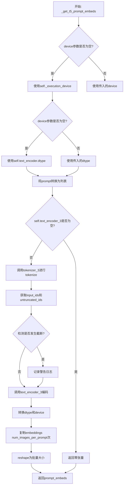

#### 带注释源码

```python
def _get_t5_prompt_embeds(
    self,
    prompt: str | list[str] = None,
    num_images_per_prompt: int = 1,
    max_sequence_length: int = 256,
    device: torch.device | None = None,
    dtype: torch.dtype | None = None,
):
    """
    获取T5文本编码器生成的提示词嵌入向量
    
    参数:
        prompt: 输入的文本提示词，可以是字符串或字符串列表
        num_images_per_prompt: 每个提示词需要生成的图像数量
        max_sequence_length: T5编码的最大token长度
        device: 指定计算设备
        dtype: 指定数据类型
    """
    # 确定设备：如果未指定则使用执行设备
    device = device or self._execution_device
    # 确定数据类型：如果未指定则使用text_encoder的数据类型
    dtype = dtype or self.text_encoder.dtype

    # 标准化输入：将字符串转换为列表，统一处理
    prompt = [prompt] if isinstance(prompt, str) else prompt
    # 计算批次大小
    batch_size = len(prompt)

    # 特殊情况处理：如果text_encoder_3不存在（T5模型未加载）
    # 返回与预期形状匹配的零张量，避免后续处理出错
    if self.text_encoder_3 is None:
        return torch.zeros(
            (
                batch_size * num_images_per_prompt,
                max_sequence_length,
                self.transformer.config.joint_attention_dim,
            ),
            device=device,
            dtype=dtype,
        )

    # 使用T5分词器对prompt进行tokenize
    # padding="max_length": 填充到最大长度
    # truncation=True: 截断超过最大长度的序列
    # add_special_tokens=True: 添加特殊tokens（如EOS）
    # return_tensors="pt": 返回PyTorch张量
    text_inputs = self.tokenizer_3(
        prompt,
        padding="max_length",
        max_length=max_sequence_length,
        truncation=True,
        add_special_tokens=True,
        return_tensors="pt",
    )
    text_input_ids = text_inputs.input_ids
    
    # 获取未截断的token ids，用于检测是否发生了截断
    untruncated_ids = self.tokenizer_3(prompt, padding="longest", return_tensors="pt").input_ids

    # 检查是否发生了截断，如果是则记录警告信息
    if untruncated_ids.shape[-1] >= text_input_ids.shape[-1] and not torch.equal(text_input_ids, untruncated_ids):
        # 解码被截断的部分用于日志
        removed_text = self.tokenizer_3.batch_decode(untruncated_ids[:, self.tokenizer_max_length - 1 : -1])
        logger.warning(
            "The following part of your input was truncated because `max_sequence_length` is set to "
            f" {max_sequence_length} tokens: {removed_text}"
        )

    # 使用T5编码器将token ids转换为嵌入向量
    # [0]表示获取logits/hidden states
    prompt_embeds = self.text_encoder_3(text_input_ids.to(device))[0]

    # 确保embeddings的数据类型和设备与模型配置一致
    dtype = self.text_encoder_3.dtype
    prompt_embeds = prompt_embeds.to(dtype=dtype, device=device)

    # 获取序列长度
    _, seq_len, _ = prompt_embeds.shape

    # 为每个提示词生成多个图像时，需要复制text embeddings
    # repeat(1, num_images_per_prompt, 1): 在第1维度（图像维度）复制
    prompt_embeds = prompt_embeds.repeat(1, num_images_per_prompt, 1)
    # view: 重塑张量形状以匹配批量大小
    prompt_embeds = prompt_embeds.view(batch_size * num_images_per_prompt, seq_len, -1)

    return prompt_embeds
```


### `StableDiffusion3ControlNetInpaintingPipeline._get_clip_prompt_embeds`

该方法负责获取CLIP文本编码器的文本嵌入（prompt embeddings），支持从两个CLIP文本编码器（text_encoder和text_encoder_2）中选择一个进行编码，并返回原始嵌入和池化后的嵌入，用于后续的图像生成过程。

参数：

- `prompt`：`str | list[str]`，需要编码的文本提示，可以是单个字符串或字符串列表
- `num_images_per_prompt`：`int`，默认为1，每个提示生成的图像数量，用于复制嵌入
- `device`：`torch.device | None`，目标设备，默认为执行设备
- `clip_skip`：`int | None`，可选参数，指定从CLIP模型的倒数第几层获取隐藏状态，用于跳过部分层级的输出
- `clip_model_index`：`int`，默认为0，选择使用哪个CLIP编码器（0对应tokenizer和text_encoder，1对应tokenizer_2和text_encoder_2）

返回值：`tuple[torch.Tensor, torch.Tensor]`，返回两个张量——第一个是文本提示的嵌入表示（prompt_embeds），形状为`(batch_size * num_images_per_prompt, seq_len, hidden_dim)`；第二个是池化后的提示嵌入（pooled_prompt_embeds），形状为`(batch_size * num_images_per_prompt, hidden_dim)`，用于提供全局语义信息。

#### 流程图

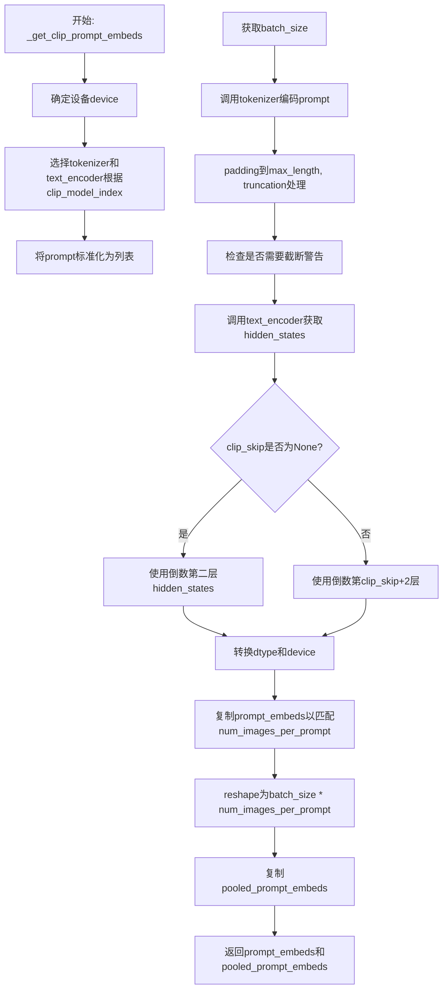

#### 带注释源码

```python
def _get_clip_prompt_embeds(
    self,
    prompt: str | list[str],
    num_images_per_prompt: int = 1,
    device: torch.device | None = None,
    clip_skip: int | None = None,
    clip_model_index: int = 0,
):
    """
    获取CLIP文本编码器的prompt嵌入
    
    参数:
        prompt: 文本提示或提示列表
        num_images_per_prompt: 每个提示生成的图像数量
        device: 目标设备
        clip_skip: 跳过的CLIP层数
        clip_model_index: 选择的CLIP模型索引(0或1)
    
    返回:
        (prompt_embeds, pooled_prompt_embeds)元组
    """
    # 确定设备，优先使用传入的device，否则使用执行设备
    device = device or self._execution_device

    # 准备CLIP tokenizers和text encoders列表
    clip_tokenizers = [self.tokenizer, self.tokenizer_2]
    clip_text_encoders = [self.text_encoder, self.text_encoder_2]

    # 根据索引选择对应的tokenizer和text_encoder
    tokenizer = clip_tokenizers[clip_model_index]
    text_encoder = clip_text_encoders[clip_model_index]

    # 将prompt标准化为列表形式
    prompt = [prompt] if isinstance(prompt, str) else prompt
    # 获取批次大小
    batch_size = len(prompt)

    # 使用tokenizer对prompt进行编码
    text_inputs = tokenizer(
        prompt,
        padding="max_length",          # 填充到最大长度
        max_length=self.tokenizer_max_length,  # 最大长度限制
        truncation=True,               # 启用截断
        return_tensors="pt",           # 返回PyTorch张量
    )

    # 获取编码后的input_ids
    text_input_ids = text_inputs.input_ids
    
    # 使用最长填充方式获取未截断的ids，用于检测是否发生了截断
    untruncated_ids = tokenizer(prompt, padding="longest", return_tensors="pt").input_ids
    
    # 检查是否发生了截断，如果是则记录警告日志
    if untruncated_ids.shape[-1] >= text_input_ids.shape[-1] and not torch.equal(text_input_ids, untruncated_ids):
        # 解码被截断的部分文本
        removed_text = tokenizer.batch_decode(untruncated_ids[:, self.tokenizer_max_length - 1 : -1])
        logger.warning(
            "The following part of your input was truncated because CLIP can only handle sequences up to"
            f" {self.tokenizer_max_length} tokens: {removed_text}"
        )
    
    # 调用text_encoder获取文本嵌入，output_hidden_states=True返回所有隐藏状态
    prompt_embeds = text_encoder(text_input_ids.to(device), output_hidden_states=True)
    # 获取pooled输出（通常是第一token的最后一层表示）
    pooled_prompt_embeds = prompt_embeds[0]

    # 根据clip_skip参数选择隐藏状态层
    if clip_skip is None:
        # 默认使用倒数第二层
        prompt_embeds = prompt_embeds.hidden_states[-2]
    else:
        # 使用倒数第clip_skip+2层
        prompt_embeds = prompt_embeds.hidden_states[-(clip_skip + 2)]

    # 确保embeddings的dtype和device正确
    prompt_embeds = prompt_embeds.to(dtype=self.text_encoder.dtype, device=device)

    # 获取序列长度
    _, seq_len, _ = prompt_embeds.shape
    
    # 为每个prompt复制num_images_per_prompt次，使用MPS友好的方法
    prompt_embeds = prompt_embeds.repeat(1, num_images_per_prompt, 1)
    # 重塑形状为batch_size * num_images_per_prompt
    prompt_embeds = prompt_embeds.view(batch_size * num_images_per_prompt, seq_len, -1)

    # 同样处理pooled_prompt_embeds
    pooled_prompt_embeds = pooled_prompt_embeds.repeat(1, num_images_per_prompt)
    pooled_prompt_embeds = pooled_prompt_embeds.view(batch_size * num_images_per_prompt, -1)

    # 返回prompt嵌入和池化后的嵌入
    return prompt_embeds, pooled_prompt_embeds
```


### `StableDiffusion3ControlNetInpaintingPipeline.encode_prompt`

该方法用于将文本提示词编码为向量表示，支持3个文本编码器（两个CLIP编码器和一个T5编码器），并处理负面提示词和无分类器自由引导（CFG），最终返回拼接后的提示词嵌入和池化嵌入供扩散模型使用。

参数：

- `prompt`：`str | list[str]`，要编码的主提示词
- `prompt_2`：`str | list[str]`，发送给第二个CLIP编码器（tokenizer_2和text_encoder_2）的提示词，若未定义则使用prompt
- `prompt_3`：`str | list[str]`，发送给T5编码器（tokenizer_3和text_encoder_3）的提示词，若未定义则使用prompt
- `device`：`torch.device | None`，torch设备，未指定时使用执行设备
- `num_images_per_prompt`：`int`，每个提示词生成的图像数量，默认为1
- `do_classifier_free_guidance`：`bool`，是否启用无分类器自由引导
- `negative_prompt`：`str | list[str] | None`，负面提示词，用于引导图像生成排除某些内容
- `negative_prompt_2`：`str | list[str] | None`，发送给第二个编码器的负面提示词
- `negative_prompt_3`：`str | list[str] | None`，发送给T5编码器的负面提示词
- `prompt_embeds`：`torch.FloatTensor | None`，预生成的文本嵌入，可用于轻松调整文本输入
- `negative_prompt_embeds`：`torch.FloatTensor | None`，预生成的负面文本嵌入
- `pooled_prompt_embeds`：`torch.FloatTensor | None`，预生成的池化文本嵌入
- `negative_pooled_prompt_embeds`：`torch.FloatTensor | None`，预生成的负面池化文本嵌入
- `clip_skip`：`int | None`，计算提示嵌入时从CLIP跳过的层数
- `max_sequence_length`：`int`，最大序列长度，默认为256
- `lora_scale`：`float | None`，如果加载了LoRA层，将应用于文本编码器所有LoRA层的缩放因子

返回值：`tuple[torch.FloatTensor, torch.FloatTensor, torch.FloatTensor, torch.FloatTensor]`，返回四个张量：prompt_embeds（提示词嵌入）、negative_prompt_embeds（负面提示词嵌入）、pooled_prompt_embeds（池化提示词嵌入）、negative_pooled_prompt_embeds（负面池化提示词嵌入）

#### 流程图

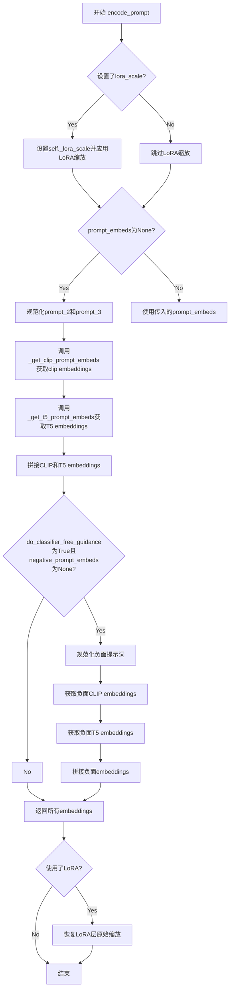

#### 带注释源码

```python
def encode_prompt(
    self,
    prompt: str | list[str],
    prompt_2: str | list[str],
    prompt_3: str | list[str],
    device: torch.device | None = None,
    num_images_per_prompt: int = 1,
    do_classifier_free_guidance: bool = True,
    negative_prompt: str | list[str] | None = None,
    negative_prompt_2: str | list[str] | None = None,
    negative_prompt_3: str | list[str] | None = None,
    prompt_embeds: torch.FloatTensor | None = None,
    negative_prompt_embeds: torch.FloatTensor | None = None,
    pooled_prompt_embeds: torch.FloatTensor | None = None,
    negative_pooled_prompt_embeds: torch.FloatTensor | None = None,
    clip_skip: int | None = None,
    max_sequence_length: int = 256,
    lora_scale: float | None = None,
):
    """编码提示词函数

    Args:
        prompt: 主提示词
        prompt_2: 第二个CLIP编码器的提示词
        prompt_3: T5编码器的提示词
        device: torch设备
        num_images_per_prompt: 每提示词生成的图像数
        do_classifier_free_guidance: 是否使用CFG
        negative_prompt: 负面提示词
        negative_prompt_2: 第二个编码器的负面提示词
        negative_prompt_3: T5的负面提示词
        prompt_embeds: 预生成的提示词嵌入
        negative_prompt_embeds: 预生成的负面提示词嵌入
        pooled_prompt_embeds: 预生成的池化嵌入
        negative_pooled_prompt_embeds: 预生成的负面池化嵌入
        clip_skip: CLIP跳过层数
        max_sequence_length: 最大序列长度
        lora_scale: LoRA缩放因子
    """
    # 确定设备，默认使用执行设备
    device = device or self._execution_device

    # 设置LoRA缩放，以便text encoder的LoRA函数可以正确访问
    if lora_scale is not None and isinstance(self, SD3LoraLoaderMixin):
        self._lora_scale = lora_scale

        # 动态调整LoRA缩放
        if self.text_encoder is not None and USE_PEFT_BACKEND:
            scale_lora_layers(self.text_encoder, lora_scale)
        if self.text_encoder_2 is not None and USE_PEFT_BACKEND:
            scale_lora_layers(self.text_encoder_2, lora_scale)

    # 规范化prompt为列表
    prompt = [prompt] if isinstance(prompt, str) else prompt
    # 确定批次大小
    if prompt is not None:
        batch_size = len(prompt)
    else:
        batch_size = prompt_embeds.shape[0]

    # 如果未提供prompt_embeds，则从prompt生成
    if prompt_embeds is None:
        # 规范化prompt_2和prompt_3
        prompt_2 = prompt_2 or prompt
        prompt_2 = [prompt_2] if isinstance(prompt_2, str) else prompt_2

        prompt_3 = prompt_3 or prompt
        prompt_3 = [prompt_3] if isinstance(prompt_3, str) else prompt_3

        # 获取第一个CLIP编码器的嵌入
        prompt_embed, pooled_prompt_embed = self._get_clip_prompt_embeds(
            prompt=prompt,
            device=device,
            num_images_per_prompt=num_images_per_prompt,
            clip_skip=clip_skip,
            clip_model_index=0,
        )
        # 获取第二个CLIP编码器的嵌入
        prompt_2_embed, pooled_prompt_2_embed = self._get_clip_prompt_embeds(
            prompt=prompt_2,
            device=device,
            num_images_per_prompt=num_images_per_prompt,
            clip_skip=clip_skip,
            clip_model_index=1,
        )
        # 拼接两个CLIP嵌入
        clip_prompt_embeds = torch.cat([prompt_embed, prompt_2_embed], dim=-1)

        # 获取T5编码器的嵌入
        t5_prompt_embed = self._get_t5_prompt_embeds(
            prompt=prompt_3,
            num_images_per_prompt=num_images_per_prompt,
            max_sequence_length=max_sequence_length,
            device=device,
        )

        # 对CLIP嵌入进行padding以匹配T5嵌入的维度
        clip_prompt_embeds = torch.nn.functional.pad(
            clip_prompt_embeds, (0, t5_prompt_embed.shape[-1] - clip_prompt_embeds.shape[-1])
        )

        # 拼接CLIP和T5嵌入得到最终prompt_embeds
        prompt_embeds = torch.cat([clip_prompt_embeds, t5_prompt_embed], dim=-2)
        # 拼接池化嵌入
        pooled_prompt_embeds = torch.cat([pooled_prompt_embed, pooled_prompt_2_embed], dim=-1)

    # 处理负面提示词（CFG）
    if do_classifier_free_guidance and negative_prompt_embeds is None:
        # 默认空字符串
        negative_prompt = negative_prompt or ""
        negative_prompt_2 = negative_prompt_2 or negative_prompt
        negative_prompt_3 = negative_prompt_3 or negative_prompt

        # 规范化为列表
        negative_prompt = batch_size * [negative_prompt] if isinstance(negative_prompt, str) else negative_prompt
        negative_prompt_2 = (
            batch_size * [negative_prompt_2] if isinstance(negative_prompt_2, str) else negative_prompt_2
        )
        negative_prompt_3 = (
            batch_size * [negative_prompt_3] if isinstance(negative_prompt_3, str) else negative_prompt_3
        )

        # 类型检查
        if prompt is not None and type(prompt) is not type(negative_prompt):
            raise TypeError(
                f"`negative_prompt` should be the same type to `prompt`, but got {type(negative_prompt)} !="
                f" {type(prompt)}."
            )
        # 批次大小检查
        elif batch_size != len(negative_prompt):
            raise ValueError(
                f"`negative_prompt`: {negative_prompt} has batch size {len(negative_prompt)}, but `prompt`:"
                f" {prompt} has batch size {batch_size}. Please make sure that passed `negative_prompt` matches"
                " the batch size of `prompt`."
            )

        # 获取负面CLIP嵌入
        negative_prompt_embed, negative_pooled_prompt_embed = self._get_clip_prompt_embeds(
            negative_prompt,
            device=device,
            num_images_per_prompt=num_images_per_prompt,
            clip_skip=None,
            clip_model_index=0,
        )
        negative_prompt_2_embed, negative_pooled_prompt_2_embed = self._get_clip_prompt_embeds(
            negative_prompt_2,
            device=device,
            num_images_per_prompt=num_images_per_prompt,
            clip_skip=None,
            clip_model_index=1,
        )
        negative_clip_prompt_embeds = torch.cat([negative_prompt_embed, negative_prompt_2_embed], dim=-1)

        # 获取负面T5嵌入
        t5_negative_prompt_embed = self._get_t5_prompt_embeds(
            prompt=negative_prompt_3,
            num_images_per_prompt=num_images_per_prompt,
            max_sequence_length=max_sequence_length,
            device=device,
        )

        # Padding负面CLIP嵌入
        negative_clip_prompt_embeds = torch.nn.functional.pad(
            negative_clip_prompt_embeds,
            (0, t5_negative_prompt_embed.shape[-1] - negative_clip_prompt_embeds.shape[-1]),
        )

        # 拼接负面嵌入
        negative_prompt_embeds = torch.cat([negative_clip_prompt_embeds, t5_negative_prompt_embed], dim=-2)
        negative_pooled_prompt_embeds = torch.cat(
            [negative_pooled_prompt_embed, negative_pooled_prompt_2_embed], dim=-1
        )

    # 恢复LoRA层原始缩放
    if self.text_encoder is not None:
        if isinstance(self, SD3LoraLoaderMixin) and USE_PEFT_BACKEND:
            unscale_lora_layers(self.text_encoder, lora_scale)

    if self.text_encoder_2 is not None:
        if isinstance(self, SD3LoraLoaderMixin) and USE_PEFT_BACKEND:
            unscale_lora_layers(self.text_encoder_2, lora_scale)

    # 返回四个嵌入张量
    return prompt_embeds, negative_prompt_embeds, pooled_prompt_embeds, negative_pooled_prompt_embeds
```


### `StableDiffusion3ControlNetInpaintingPipeline.check_image`

该方法用于验证输入的控制图像（control image）的格式是否合法，确保其为 PIL Image、torch.Tensor、numpy.ndarray 或是这些类型的列表，并检查图像批次大小与提示词批次大小是否匹配，以防止维度不兼容导致的运行时错误。

参数：

- `image`：控制网络输入的图像，支持 PIL.Image.Image、torch.Tensor、numpy.ndarray 或这三种类型的列表
- `prompt`：文本提示词，用于生成图像的描述信息，可以是字符串或字符串列表
- `prompt_embeds`：预计算的文本嵌入向量，形状为 (batch_size, seq_len, hidden_dim)，用于直接传入已编码的文本特征

返回值：`None`，该方法仅进行参数校验，不返回任何数据

#### 流程图

```mermaid
flowchart TD
    A[开始 check_image] --> B{检查 image 类型}
    B --> C{是否为 PIL.Image?}
    C -->|Yes| D[设置 image_batch_size = 1]
    C -->|No| E{检查是否为列表}
    E --> F{第一个元素类型?}
    F --> G[PIL.Image] --> H[image_is_pil_list = True]
    F --> I[torch.Tensor] --> J[image_is_tensor_list = True]
    F --> K[numpy.ndarray] --> L[image_is_np_list = True]
    E --> M[设置 image_batch_size = len(image)]
    D --> N{类型是否合法?}
    M --> N
    H --> N
    J --> N
    L --> N
    N -->|No| O[抛出 TypeError]
    N -->|Yes| P{计算 prompt_batch_size}
    P --> Q{prompt 是 str?}
    Q -->|Yes| R[prompt_batch_size = 1]
    Q -->|No| S{prompt 是 list?}
    S -->|Yes| T[prompt_batch_size = len(prompt)]
    S --> U{prompt_embeds 不为 None?}
    U -->|Yes| V[prompt_batch_size = prompt_embeds.shape[0]]
    U -->|No| W[prompt_batch_size 未定义]
    R --> X{批次大小检查}
    T --> X
    V --> X
    X --> Y{image_batch_size != 1 且 != prompt_batch_size?}
    Y -->|Yes| Z[抛出 ValueError]
    Y -->|No| AA[结束 check_image]
```

#### 带注释源码

```python
def check_image(self, image, prompt, prompt_embeds):
    """
    验证控制图像的格式和批次大小是否合法。
    
    该方法检查传入的 image 参数是否为支持的类型（PIL Image、torch.Tensor、numpy.ndarray 及其列表），
    并确保图像批次大小与提示词批次大小在非单样本情况下保持一致。
    
    参数:
        image: 控制网络输入图像，支持单张图像或图像批次
        prompt: 文本提示词
        prompt_embeds: 预计算的文本嵌入
    
    返回:
        None: 仅进行校验，不返回数据
    
    异常:
        TypeError: 当 image 不是支持的类型时抛出
        ValueError: 当图像批次大小与提示词批次大小不匹配时抛出
    """
    # 检查 image 是否为 PIL Image 类型
    image_is_pil = isinstance(image, PIL.Image.Image)
    # 检查 image 是否为 torch.Tensor 类型
    image_is_tensor = isinstance(image, torch.Tensor)
    # 检查 image 是否为 numpy.ndarray 类型
    image_is_np = isinstance(image, np.ndarray)
    # 检查 image 是否为 PIL Image 列表
    image_is_pil_list = isinstance(image, list) and isinstance(image[0], PIL.Image.Image)
    # 检查 image 是否为 torch.Tensor 列表
    image_is_tensor_list = isinstance(image, list) and isinstance(image[0], torch.Tensor)
    # 检查 image 是否为 numpy.ndarray 列表
    image_is_np_list = isinstance(image, list) and isinstance(image[0], np.ndarray)

    # 验证 image 是否为合法类型之一
    if (
        not image_is_pil
        and not image_is_tensor
        and not image_is_np
        and not image_is_pil_list
        and not image_is_tensor_list
        and not image_is_np_list
    ):
        raise TypeError(
            f"image must be passed and be one of PIL image, numpy array, torch tensor, list of PIL images, list of numpy arrays or list of torch tensors, but is {type(image)}"
        )

    # 计算图像批次大小：单张 PIL Image 批次为 1，否则为列表长度
    if image_is_pil:
        image_batch_size = 1
    else:
        image_batch_size = len(image)

    # 根据 prompt 或 prompt_embeds 计算提示词批次大小
    if prompt is not None and isinstance(prompt, str):
        prompt_batch_size = 1
    elif prompt is not None and isinstance(prompt, list):
        prompt_batch_size = len(prompt)
    elif prompt_embeds is not None:
        prompt_batch_size = prompt_embeds.shape[0]

    # 检查批次大小一致性：图像批次不为 1 时，必须与提示词批次相同
    if image_batch_size != 1 and image_batch_size != prompt_batch_size:
        raise ValueError(
            f"If image batch size is not 1, image batch size must be same as prompt batch size. image batch size: {image_batch_size}, prompt batch size: {prompt_batch_size}"
        )
```


### StableDiffusion3ControlNetInpaintingPipeline.check_inputs

该方法用于验证 Stable Diffusion 3 ControlNet Inpainting Pipeline 的输入参数有效性，确保所有传入的参数符合管道要求，包括图像尺寸、提示词、提示词嵌入、控制网参数等，如果不合法则抛出相应的 ValueError 或 TypeError 异常。

参数：

- `height`：`int`，生成图像的高度（像素）
- `width`：`int`，生成图像的宽度（像素）
- `image`：`PipelineImageInput`，控制网输入图像
- `prompt`：`str | list[str]`，主要的文本提示词
- `prompt_2`：`str | list[str]`，发送给第二个文本编码器的提示词
- `prompt_3`：`str | list[str]`，发送给第三个文本编码器（T5）的提示词
- `negative_prompt`：`str | list[str] | None`，负向提示词
- `negative_prompt_2`：`str | list[str] | None`，第二个负向提示词
- `negative_prompt_3`：`str | list[str] | None`，第三个负向提示词
- `prompt_embeds`：`torch.FloatTensor | None`，预生成的文本嵌入
- `negative_prompt_embeds`：`torch.FloatTensor | None`，预生成的负向文本嵌入
- `pooled_prompt_embeds`：`torch.FloatTensor | None`，预生成的池化文本嵌入
- `negative_pooled_prompt_embeds`：`torch.FloatTensor | None`，预生成的负向池化文本嵌入
- `ip_adapter_image`：`PipelineImageInput | None`，IP-Adapter 输入图像
- `ip_adapter_image_embeds`：`torch.Tensor | None`，预生成的 IP-Adapter 图像嵌入
- `controlnet_conditioning_scale`：`float | list[float]`，控制网调节比例，默认为 1.0
- `control_guidance_start`：`float | list[float]`，控制网开始应用的步骤比例，默认为 0.0
- `control_guidance_end`：`float | list[float]`，控制网停止应用的步骤比例，默认为 1.0
- `callback_on_step_end_tensor_inputs`：`list[str] | None`，回调函数需要的张量输入列表
- `max_sequence_length`：`int | None`，T5 编码器的最大序列长度

返回值：`None`，该方法不返回值，通过抛出异常来表示验证失败

#### 流程图

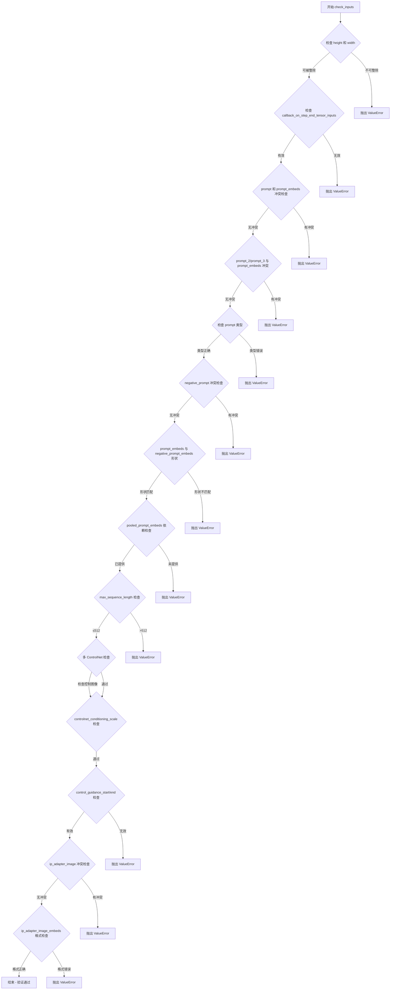

#### 带注释源码

```python
def check_inputs(
    self,
    height,
    width,
    image,
    prompt,
    prompt_2,
    prompt_3,
    negative_prompt=None,
    negative_prompt_2=None,
    negative_prompt_3=None,
    prompt_embeds=None,
    negative_prompt_embeds=None,
    pooled_prompt_embeds=None,
    negative_pooled_prompt_embeds=None,
    ip_adapter_image=None,
    ip_adapter_image_embeds=None,
    controlnet_conditioning_scale=1.0,
    control_guidance_start=0.0,
    control_guidance_end=1.0,
    callback_on_step_end_tensor_inputs=None,
    max_sequence_length=None,
):
    """
    检查输入参数的有效性，确保所有参数符合管道的预期。
    
    该方法会进行多轮验证：
    1. 图像尺寸必须能被 VAE 缩放因子和 patch 大小整除
    2. 回调张量输入必须在允许列表中
    3. prompt 和 prompt_embeds 不能同时提供
    4. 提示词类型必须是字符串或列表
    5. 负向提示词与负向嵌入不能同时提供
    6. 提示词嵌入和负向嵌入形状必须匹配
    7. 如果提供提示词嵌入，必须也提供池化嵌入
    8. 最大序列长度不能超过 512
    9. 多控制网场景下的图像数量匹配检查
    10. 控制网调节比例和引导时间步的验证
    11. IP-Adapter 相关参数的互斥检查
    """
    
    # 步骤1：检查图像尺寸是否能被 VAE 缩放因子和 patch 大小整除
    # 这确保了潜在空间中的尺寸是整数
    if (
        height % (self.vae_scale_factor * self.patch_size) != 0
        or width % (self.vae_scale_factor * self.patch_size) != 0
    ):
        raise ValueError(
            f"`height` and `width` have to be divisible by {self.vae_scale_factor * self.patch_size} but are {height} and {width}."
            f"You can use height {height - height % (self.vae_scale_factor * self.patch_size)} and width {width - width % (self.vae_scale_factor * self.patch_size)}."
        )

    # 步骤2：检查回调函数张量输入是否在允许列表中
    # 允许的回调张量输入：latents, prompt_embeds, negative_prompt_embeds, negative_pooled_prompt_embeds
    if callback_on_step_end_tensor_inputs is not None and not all(
        k in self._callback_tensor_inputs for k in callback_on_step_end_tensor_inputs
    ):
        raise ValueError(
            f"`callback_on_step_end_tensor_inputs` has to be in {self._callback_tensor_inputs}, but found {[k for k in callback_on_step_end_tensor_inputs if k not in self._callback_tensor_inputs]}"
        )

    # 步骤3：检查 prompt 和 prompt_embeds 互斥
    # 不能同时提供原始提示词和预计算的嵌入
    if prompt is not None and prompt_embeds is not None:
        raise ValueError(
            f"Cannot forward both `prompt`: {prompt} and `prompt_embeds`: {prompt_embeds}. Please make sure to"
            " only forward one of the two."
        )
    # 步骤4：检查 prompt_2 和 prompt_embeds 互斥
    elif prompt_2 is not None and prompt_embeds is not None:
        raise ValueError(
            f"Cannot forward both `prompt_2`: {prompt_2} and `prompt_embeds`: {prompt_embeds}. Please make sure to"
            " only forward one of the two."
        )
    # 步骤5：检查 prompt_3 和 prompt_embeds 互斥
    elif prompt_3 is not None and prompt_embeds is not None:
        raise ValueError(
            f"Cannot forward both `prompt_3`: {prompt_2} and `prompt_embeds`: {prompt_embeds}. Please make sure to"
            " only forward one of the two."
        )
    # 步骤6：至少需要提供 prompt 或 prompt_embeds 之一
    elif prompt is None and prompt_embeds is None:
        raise ValueError(
            "Provide either `prompt` or `prompt_embeds`. Cannot leave both `prompt` and `prompt_embeds` undefined."
        )
    # 步骤7：检查 prompt 类型
    elif prompt is not None and (not isinstance(prompt, str) and not isinstance(prompt, list)):
        raise ValueError(f"`prompt` has to be of type `str` or `list` but is {type(prompt)}")
    # 步骤8：检查 prompt_2 类型
    elif prompt_2 is not None and (not isinstance(prompt_2, str) and not isinstance(prompt_2, list)):
        raise ValueError(f"`prompt_2` has to be of type `str` or `list` but is {type(prompt_2)}")
    # 步骤9：检查 prompt_3 类型
    elif prompt_3 is not None and (not isinstance(prompt_3, str) and not isinstance(prompt_3, list)):
        raise ValueError(f"`prompt_3` has to be of type `str` or `list` but is {type(prompt_3)}")

    # 步骤10：检查 negative_prompt 和 negative_prompt_embeds 互斥
    if negative_prompt is not None and negative_prompt_embeds is not None:
        raise ValueError(
            f"Cannot forward both `negative_prompt`: {negative_prompt} and `negative_prompt_embeds`:"
            f" {negative_prompt_embeds}. Please make sure to only forward one of the two."
        )
    # 步骤11：检查 negative_prompt_2 和 negative_prompt_embeds 互斥
    elif negative_prompt_2 is not None and negative_prompt_embeds is not None:
        raise ValueError(
            f"Cannot forward both `negative_prompt_2`: {negative_prompt_2} and `negative_prompt_embeds`:"
            f" {negative_prompt_embeds}. Please make sure to only forward one of the two."
        )
    # 步骤12：检查 negative_prompt_3 和 negative_prompt_embeds 互斥
    elif negative_prompt_3 is not None and negative_prompt_embeds is not None:
        raise ValueError(
            f"Cannot forward both `negative_prompt_3`: {negative_prompt_3} and `negative_prompt_embeds`:"
            f" {negative_prompt_embeds}. Please make sure to only forward one of the two."
        )

    # 步骤13：如果同时提供 prompt_embeds 和 negative_prompt_embeds，检查形状是否一致
    if prompt_embeds is not None and negative_prompt_embeds is not None:
        if prompt_embeds.shape != negative_prompt_embeds.shape:
            raise ValueError(
                "`prompt_embeds` and `negative_prompt_embeds` must have the same shape when passed directly, but"
                f" got: `prompt_embeds` {prompt_embeds.shape} != `negative_prompt_embeds`"
                f" {negative_prompt_embeds.shape}."
            )

    # 步骤14：如果提供了 prompt_embeds，则必须也提供 pooled_prompt_embeds
    # 这是因为文本嵌入需要与池化嵌入配合使用
    if prompt_embeds is not None and pooled_prompt_embeds is None:
        raise ValueError(
            "If `prompt_embeds` are provided, `pooled_prompt_embeds` also have to be passed. Make sure to generate `pooled_prompt_embeds` from the same text encoder that was used to generate `prompt_embeds`."
        )

    # 步骤15：如果提供了 negative_prompt_embeds，则必须也提供 negative_pooled_prompt_embeds
    if negative_prompt_embeds is not None and negative_pooled_prompt_embeds is None:
        raise ValueError(
            "If `negative_prompt_embeds` are provided, `negative_pooled_prompt_embeds` also have to be passed. Make sure to generate `negative_pooled_prompt_embeds` from the same text encoder that was used to generate `negative_prompt_embeds`."
        )

    # 步骤16：检查最大序列长度不超过 512（T5 模型限制）
    if max_sequence_length is not None and max_sequence_length > 512:
        raise ValueError(f"`max_sequence_length` cannot be greater than 512 but is {max_sequence_length}")

    # 步骤17：多控制网场景下的提示词处理警告
    # 如果有多个控制网但只提供了一个提示词，会打印警告
    if isinstance(self.controlnet, SD3MultiControlNetModel):
        if isinstance(prompt, list) and len(prompt) > 1:
            logger.warning(
                f"You have {len(self.controlnet.nets)} ControlNets and you have passed {len(prompt)}"
                " prompts. The conditionings will be fixed across the prompts."
            )

    # 步骤18：获取原始 controlnet（如果被编译）
    controlnet = self.controlnet._orig_mod if is_compiled_module(self.controlnet) else self.controlnet

    # 步骤19：检查控制图像
    # 根据控制网类型（单个或多个）进行相应的验证
    if isinstance(controlnet, SD3ControlNetModel):
        self.check_image(image, prompt, prompt_embeds)
    elif isinstance(controlnet, SD3MultiControlNetModel):
        # 多控制网情况下，图像必须是列表
        if not isinstance(image, list):
            raise TypeError("For multiple controlnets: `image` must be type `list`")
        # 图像数量必须与控制网数量匹配
        elif len(image) != len(self.controlnet.nets):
            raise ValueError(
                f"For multiple controlnets: `image` must have the same length as the number of controlnets, but got {len(image)} images and {len(self.controlnet.nets)} ControlNets."
            )
        # 逐个检查每个控制网的图像
        for image_ in image:
            self.check_image(image_, prompt, prompt_embeds)

    # 步骤20：检查控制网调节比例
    # 如果是列表形式，其长度必须与控制网数量一致
    if isinstance(controlnet, SD3MultiControlNetModel):
        if isinstance(controlnet_conditioning_scale, list) and len(controlnet_conditioning_scale) != len(
            self.controlnet.nets
        ):
            raise ValueError(
                "For multiple controlnets: When `controlnet_conditioning_scale` is specified as `list`, it must have"
                " the same length as the number of controlnets"
            )

    # 步骤21：检查控制引导开始和结束时间步长度是否一致
    if len(control_guidance_start) != len(control_guidance_end):
        raise ValueError(
            f"`control_guidance_start` has {len(control_guidance_start)} elements, but `control_guidance_end` has {len(control_guidance_end)} elements. Make sure to provide the same number of elements to each list."
        )

    # 步骤22：多控制网情况下，检查引导时间步数量与控制网数量是否一致
    if isinstance(controlnet, SD3MultiControlNetModel):
        if len(control_guidance_start) != len(self.controlnet.nets):
            raise ValueError(
                f"`control_guidance_start`: {control_guidance_start} has {len(control_guidance_start)} elements but there are {len(self.controlnet.nets)} controlnets available. Make sure to provide {len(self.controlnet.nets)}."
            )

    # 步骤23：检查每个控制网的引导时间步范围是否有效
    for start, end in zip(control_guidance_start, control_guidance_end):
        # 开始时间步必须小于结束时间步
        if start >= end:
            raise ValueError(
                f"control_guidance_start: {start} cannot be larger or equal to control guidance end: {end}."
            )
        # 开始时间步不能小于 0
        if start < 0.0:
            raise ValueError(f"control_guidance_start: {start} can't be smaller than 0.")
        # 结束时间步不能大于 1.0
        if end > 1.0:
            raise ValueError(f"control_guidance_end: {end} can't be larger than 1.0.")

    # 步骤24：检查 IP-Adapter 图像和嵌入的互斥性
    # 不能同时提供 ip_adapter_image 和 ip_adapter_image_embeds
    if ip_adapter_image is not None and ip_adapter_image_embeds is not None:
        raise ValueError(
            "Provide either `ip_adapter_image` or `ip_adapter_image_embeds`. Cannot leave both `ip_adapter_image` and `ip_adapter_image_embeds` defined."
        )

    # 步骤25：检查 IP-Adapter 图像嵌入的格式
    if ip_adapter_image_embeds is not None:
        # 必须是列表类型
        if not isinstance(ip_adapter_image_embeds, list):
            raise ValueError(
                f"`ip_adapter_image_embeds` has to be of type `list` but is {type(ip_adapter_image_embeds)}"
            )
        # 每个嵌入必须是 3D 或 4D 张量
        elif ip_adapter_image_embeds[0].ndim not in [3, 4]:
            raise ValueError(
                f"`ip_adapter_image_embeds` has to be a list of 3D or 4D tensors but is {ip_adapter_image_embeds[0].ndim}D"
            )
```


### `StableDiffusion3ControlNetInpaintingPipeline.prepare_latents`

该方法用于准备Stable Diffusion 3 ControlNet图像修复管道的初始潜在变量（latents）。如果传入了预生成的潜在变量，则直接返回；否则根据批处理大小、通道数、图像尺寸和数据类型，使用随机生成器初始化潜在变量。

参数：

- `batch_size`：`int`，批处理大小，指定要生成的图像数量
- `num_channels_latents`：`int`，潜在变量的通道数，对应于Transformer模型的输入通道数
- `height`：`int`，目标图像的高度（像素单位）
- `width`：`int`，目标图像的宽度（像素单位）
- `dtype`：`torch.dtype`，潜在变量的数据类型（如torch.float32）
- `device`：`torch.device`，潜在变量存放的设备（如cuda或cpu）
- `generator`：`torch.Generator | list[torch.Generator] | None`，随机数生成器，用于确保生成的可重复性
- `latents`：`torch.FloatTensor | None`，可选的预生成潜在变量，如果提供则直接使用

返回值：`torch.FloatTensor`，准备好的潜在变量张量，形状为 (batch_size, num_channels_latents, height/vae_scale_factor, width/vae_scale_factor)

#### 流程图

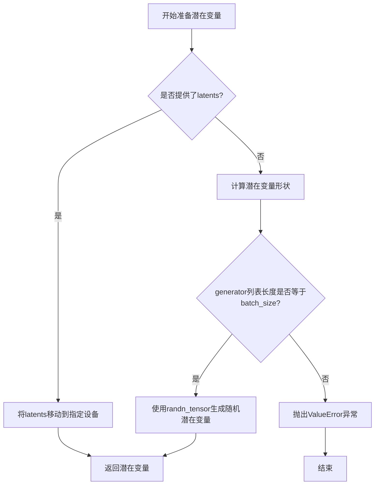

#### 带注释源码

```python
def prepare_latents(
    self,
    batch_size,
    num_channels_latents,
    height,
    width,
    dtype,
    device,
    generator,
    latents=None,
):
    """
    准备用于图像生成的潜在变量张量。
    
    如果传入了预生成的潜在变量（latents），则将其移动到指定设备并返回。
    否则，根据指定的形状和随机生成器创建一个新的潜在变量张量。
    
    参数:
        batch_size: 批处理大小
        num_channels_latents: 潜在变量的通道数
        height: 图像高度
        width: 图像宽度
        dtype: 数据类型
        device: 目标设备
        generator: 随机数生成器
        latents: 可选的预生成潜在变量
    
    返回:
        潜在变量张量
    """
    # 如果提供了潜在变量，直接移动到指定设备并返回
    if latents is not None:
        return latents.to(device=device, dtype=dtype)

    # 计算潜在变量的形状
    # 注意：高度和宽度需要除以vae_scale_factor，因为VAE会进行8倍下采样
    shape = (
        batch_size,
        num_channels_latents,
        int(height) // self.vae_scale_factor,
        int(width) // self.vae_scale_factor,
    )

    # 检查生成器列表长度是否与批处理大小匹配
    if isinstance(generator, list) and len(generator) != batch_size:
        raise ValueError(
            f"You have passed a list of generators of length {len(generator)}, but requested an effective batch"
            f" size of {batch_size}. Make sure the batch size matches the length of the generators."
        )

    # 使用randn_tensor生成符合正态分布的随机潜在变量
    latents = randn_tensor(shape, generator=generator, device=device, dtype=dtype)

    return latents
```


### `StableDiffusion3ControlNetInpaintingPipeline.prepare_image_with_mask`

该方法负责准备控制图像和掩码，将其转换为适合Stable Diffusion 3 ControlNet处理的格式，包括图像预处理、批次扩展、掩码应用、VAE编码以及潜在空间中的图像与掩码融合。

参数：

- `image`：`PipelineImageInput`（torch.Tensor、PIL.Image.Image、np.ndarray或列表），待处理的控制输入图像
- `mask`：`PipelineImageInput`（torch.Tensor、PIL.Image.Image、np.ndarray或列表），用于指示需要重绘的区域
- `width`：`int`，目标输出宽度（像素）
- `height`：`int`，目标输出高度（像素）
- `batch_size`：`int`，批次大小，用于确定图像重复次数
- `num_images_per_prompt`：`int`，每个提示词生成的图像数量
- `device`：`torch.device`，计算设备（CPU/CUDA）
- `dtype`：`torch.dtype`，张量数据类型
- `do_classifier_free_guidance`：`bool`（默认False），是否在推理时启用无分类器指导
- `guess_mode`：`bool`（默认False），猜测模式（当前未使用，保留接口）

返回值：`torch.Tensor`，拼接后的控制图像张量，形状为 `[B, C+1, H, W]`，其中C为潜在空间通道数，1为掩码通道

#### 流程图

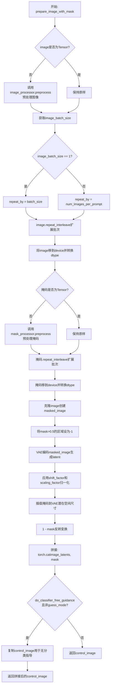

#### 带注释源码

```python
def prepare_image_with_mask(
    self,
    image,
    mask,
    width,
    height,
    batch_size,
    num_images_per_prompt,
    device,
    dtype,
    do_classifier_free_guidance=False,
    guess_mode=False,
):
    """
    准备控制图像和掩码，用于ControlNet条件输入。
    
    该方法执行以下关键步骤：
    1. 预处理图像和掩码（resize到指定尺寸、归一化等）
    2. 根据批次配置扩展图像和掩码维度
    3. 创建被掩码覆盖的图像（masked_image）
    4. 使用VAE将masked_image编码到潜在空间
    5. 在潜在空间中拼接图像latent和掩码作为ControlNet条件
    
    Args:
        image: 输入控制图像（PIL/NumPy/Tensor）
        mask: 掩码图像，标识需要重绘的区域
        width: 目标宽度
        height: 目标高度  
        batch_size: 批次大小
        num_images_per_prompt: 每个提示的图像数
        device: 计算设备
        dtype: 数据类型
        do_classifier_free_guidance: 是否启用无分类器指导
        guess_mode: 猜测模式（当前未使用）
    
    Returns:
        control_image: 包含图像latent和掩码的拼接张量
    """
    
    # ========== 步骤1: 预处理控制图像 ==========
    # 判断输入格式，如果是PIL或NumPy则进行预处理转换
    if isinstance(image, torch.Tensor):
        # 已经是Tensor格式，直接使用
        pass
    else:
        # 调用VAE图像处理器进行预处理：
        # - resize到目标尺寸
        # - 转换为RGB三通道
        # - 归一化到[0,1]
        image = self.image_processor.preprocess(image, height=height, width=width)

    # 获取图像批次大小
    image_batch_size = image.shape[0]

    # ========== 步骤2: 根据批次配置扩展图像 ==========
    # 确定需要重复的次数，使图像与prompt批次匹配
    if image_batch_size == 1:
        # 单张图像：复制batch_size次（用于批量生成）
        repeat_by = batch_size
    else:
        # 图像批次已与prompt匹配：按每prompt生成数复制
        repeat_by = num_images_per_prompt

    # 使用repeat_interleave沿批次维度复制（保留时间维度）
    # 例如：[1,3,H,W] -> [B,3,H,W]
    image = image.repeat_interleave(repeat_by, dim=0)

    # 将图像移到指定设备并转换数据类型
    image = image.to(device=device, dtype=dtype)

    # ========== 步骤3: 预处理掩码 ==========
    # 与图像处理类似，掩码也需要预处理和批次扩展
    if isinstance(mask, torch.Tensor):
        pass
    else:
        # 掩码处理器配置：
        # - do_convert_grayscale: 转为单通道灰度图
        # - do_binarize: 二值化处理
        # - do_normalize: 不归一化（保持0-1范围）
        mask = self.mask_processor.preprocess(mask, height=height, width=width)
    
    # 扩展掩码批次维度
    mask = mask.repeat_interleave(repeat_by, dim=0)
    mask = mask.to(device=device, dtype=dtype)

    # ========== 步骤4: 创建被掩码覆盖的图像 ==========
    # 克隆原始图像用于后续处理
    masked_image = image.clone()
    
    # 将掩码覆盖区域（mask>0.5）设为-1
    # 这是一种常见的masked图像表示法，在Inpainting中指示需要填充的区域
    # repeat(1,3,1,1)将单通道掩码扩展为3通道以匹配图像
    masked_image[(mask > 0.5).repeat(1, 3, 1, 1)] = -1

    # ========== 步骤5: VAE编码到潜在空间 ==========
    # 使用VAE编码masked_image得到潜在表示
    # latent_dist.sample()从分布中采样一个latent向量
    image_latents = self.vae.encode(masked_image).latent_dist.sample()
    
    # 应用VAE配置中的shift_factor和scaling_factor进行归一化
    # 这是VAE latent space的标准预处理步骤
    image_latents = (image_latents - self.vae.config.shift_factor) * self.vae.config.scaling_factor
    image_latents = image_latents.to(dtype)

    # ========== 步骤6: 调整掩码尺寸并反相 ==========
    # 将掩码从像素空间插值到VAE潜在空间尺寸
    # 例如：1024x1024 -> 128x128（当vae_scale_factor=8时）
    mask = torch.nn.functional.interpolate(
        mask, size=(height // self.vae_scale_factor, width // self.vae_scale_factor)
    )
    
    # 反转掩码：0->1, 1->0
    # 这样在后续处理中，1表示需要关注的区域（原始mask中的0，即未遮挡区域）
    mask = 1 - mask

    # ========== 步骤7: 拼接图像latent和掩码 ==========
    # 在通道维度拼接：
    # image_latents: [B, C, H, W]
    # mask: [B, 1, H, W] 
    # result: [B, C+1, H, W]
    # 拼接后的张量作为ControlNet的条件输入
    control_image = torch.cat([image_latents, mask], dim=1)

    # ========== 步骤8: 分类器自由指导处理 ==========
    # 如果启用CFG，需要为无条件输入复制一份条件输入
    # 后续在推理循环中会分别处理uncond和cond部分
    if do_classifier_free_guidance and not guess_mode:
        control_image = torch.cat([control_image] * 2)

    return control_image
```


### `StableDiffusion3ControlNetInpaintingPipeline.encode_image`

该方法用于将输入图像编码为特征表示（用于 IP-Adapter），通过预训练的图像编码器（image_encoder）提取图像特征。

参数：

- `image`：`PipelineImageInput`，输入图像，可以是 PIL 图像、numpy 数组、torch 张量或它们的列表
- `device`：`torch.device`，torch 设备，用于将图像移动到指定设备

返回值：`torch.Tensor`，编码后的图像特征表示（隐藏状态的倒数第二层）

#### 流程图

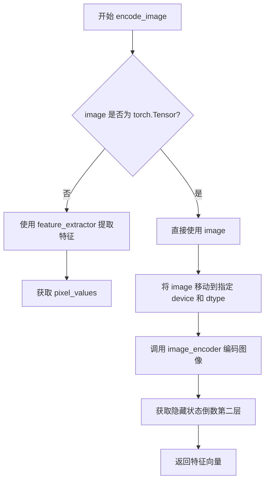

#### 带注释源码

```python
def encode_image(self, image: PipelineImageInput, device: torch.device) -> torch.Tensor:
    """Encodes the given image into a feature representation using a pre-trained image encoder.
    
    此方法用于 IP-Adapter 功能，将输入图像编码为特征向量供后续使用。
    
    Args:
        image (`PipelineImageInput`):
            输入图像，可以是 PIL.Image.Image, numpy.ndarray, torch.Tensor 或它们的列表
        device: (`torch.device`):
            torch 设备，用于将图像数据传输到指定设备
            
    Returns:
        `torch.Tensor`: 编码后的图像特征表示，使用图像编码器隐藏状态的倒数第二层
    """
    # 如果输入不是 torch.Tensor，则使用 feature_extractor 预处理图像
    if not isinstance(image, torch.Tensor):
        # 使用 SiglipImageProcessor 将图像转换为模型输入格式
        # return_tensors="pt" 返回 PyTorch 张量
        image = self.feature_extractor(image, return_tensors="pt").pixel_values
    
    # 将图像数据移动到指定设备，并转换数据类型
    image = image.to(device=device, dtype=self.dtype)
    
    # 调用图像编码器 (SiglipModel) 进行编码
    # output_hidden_states=True 要求返回所有隐藏状态
    # hidden_states[-2] 返回倒数第二层的隐藏状态，通常包含更丰富的特征信息
    return self.image_encoder(image, output_hidden_states=True).hidden_states[-2]
```


### `StableDiffusion3ControlNetInpaintingPipeline.prepare_ip_adapter_image_embeds`

该方法用于准备 IP-Adapter 的图像嵌入，处理输入图像或预计算的图像嵌入，根据是否启用无分类器引导（classifier-free guidance）来生成正负样本的图像嵌入，并按要求复制到指定设备。

参数：

- `ip_adapter_image`：`PipelineImageInput | None`，要提取 IP-Adapter 特征的输入图像
- `ip_adapter_image_embeds`：`torch.Tensor | None`，预计算的图像嵌入
- `device`：`torch.device | None`，Torch 设备
- `num_images_per_prompt`：`int`，每个提示生成的图像数量，默认为 1
- `do_classifier_free_guidance`：`bool`，是否使用无分类器引导，默认为 True

返回值：`torch.Tensor`，处理后的图像嵌入

#### 流程图

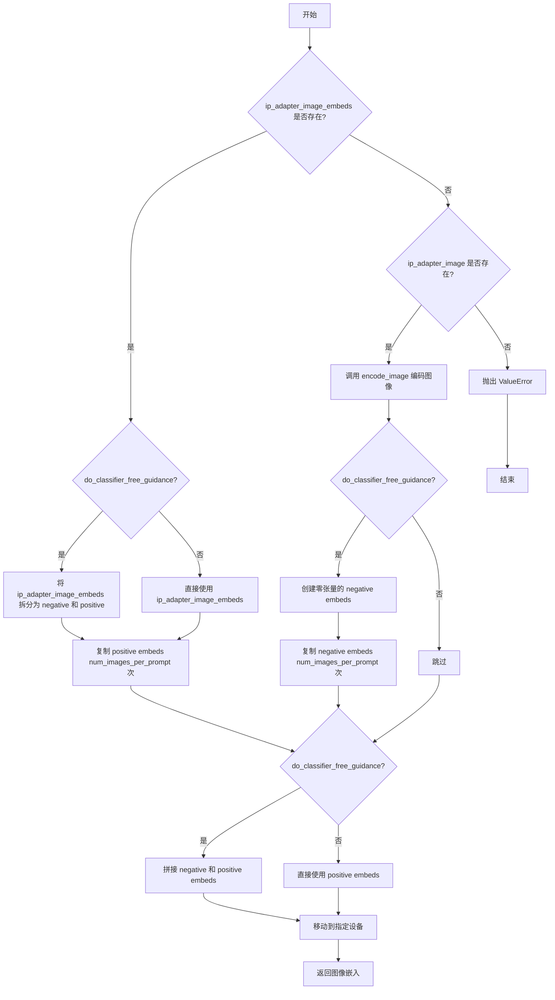

#### 带注释源码

```python
def prepare_ip_adapter_image_embeds(
    self,
    ip_adapter_image: PipelineImageInput | None = None,
    ip_adapter_image_embeds: torch.Tensor | None = None,
    device: torch.device | None = None,
    num_images_per_prompt: int = 1,
    do_classifier_free_guidance: bool = True,
) -> torch.Tensor:
    """Prepares image embeddings for use in the IP-Adapter.

    Either `ip_adapter_image` or `ip_adapter_image_embeds` must be passed.

    Args:
        ip_adapter_image (`PipelineImageInput`, *optional*):
            The input image to extract features from for IP-Adapter.
        ip_adapter_image_embeds (`torch.Tensor`, *optional*):
            Precomputed image embeddings.
        device: (`torch.device`, *optional*):
            Torch device.
        num_images_per_prompt (`int`, defaults to 1):
            Number of images that should be generated per prompt.
        do_classifier_free_guidance (`bool`, defaults to True):
            Whether to use classifier free guidance or not.
    """
    # 获取执行设备，默认为当前执行设备
    device = device or self._execution_device

    # 情况1：已预计算图像嵌入
    if ip_adapter_image_embeds is not None:
        # 如果启用无分类器引导，需要拆分正负嵌入
        if do_classifier_free_guidance:
            single_negative_image_embeds, single_image_embeds = ip_adapter_image_embeds.chunk(2)
        else:
            single_image_embeds = ip_adapter_image_embeds
    # 情况2：需要从图像编码
    elif ip_adapter_image is not None:
        # 使用图像编码器提取特征
        single_image_embeds = self.encode_image(ip_adapter_image, device)
        # 如果启用无分类器引导，创建零张量作为负样本嵌入
        if do_classifier_free_guidance:
            single_negative_image_embeds = torch.zeros_like(single_image_embeds)
    # 情况3：两者都未提供，抛出错误
    else:
        raise ValueError("Neither `ip_adapter_image_embeds` or `ip_adapter_image_embeds` were provided.")

    # 根据 num_images_per_prompt 复制正样本嵌入
    image_embeds = torch.cat([single_image_embeds] * num_images_per_prompt, dim=0)

    # 如果启用无分类器引导，拼接负样本和正样本嵌入
    if do_classifier_free_guidance:
        negative_image_embeds = torch.cat([single_negative_image_embeds] * num_images_per_prompt, dim=0)
        image_embeds = torch.cat([negative_image_embeds, image_embeds], dim=0)

    # 将结果移动到指定设备并返回
    return image_embeds.to(device=device)
```


### `StableDiffusion3ControlNetInpaintingPipeline.enable_sequential_cpu_offload`

启用顺序CPU卸载功能，允许模型组件按顺序卸载到CPU以节省GPU内存。该方法继承自基类，并在调用父类方法之前检查`image_encoder`是否可能存在兼容性问题，如果存在则发出警告。

参数：

-  `*args`：可变位置参数，传递给父类的参数
-  `**kwargs`：可变关键字参数，传递给父类的参数

返回值：`None`，该方法直接调用父类的`enable_sequential_cpu_offload`方法，不返回任何值

#### 流程图

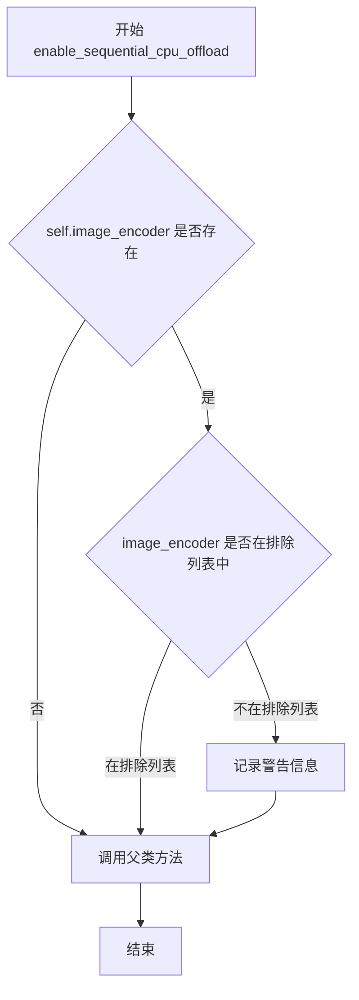

#### 带注释源码

```python
# 继承自 StableDiffusion3Pipeline 的方法，用于启用顺序 CPU 卸载
def enable_sequential_cpu_offload(self, *args, **kwargs):
    """
    启用顺序 CPU 卸载功能。
    
    该方法允许模型组件按顺序从 GPU 卸载到 CPU，以减少 GPU 内存占用。
    在调用父类方法之前，会检查 image_encoder 是否可能存在兼容性问题。
    """
    # 检查 image_encoder 是否存在且不在排除列表中
    if self.image_encoder is not None and "image_encoder" not in self._exclude_from_cpu_offload:
        # 如果 image_encoder 使用 torch.nn.MultiheadAttention，可能会导致失败
        # 记录警告信息，建议用户手动排除 image_encoder
        logger.warning(
            "`pipe.enable_sequential_cpu_offload()` might fail for `image_encoder` if it uses "
            "`torch.nn.MultiheadAttention`. You can exclude `image_encoder` from CPU offloading by calling "
            "`pipe._exclude_from_cpu_offload.append('image_encoder')` before `pipe.enable_sequential_cpu_offload()`."
        )

    # 调用父类 (DiffusionPipeline) 的 enable_sequential_cpu_offload 方法
    # 传递所有接收到的参数
    super().enable_sequential_cpu_offload(*args, **kwargs)
```


### `StableDiffusion3ControlNetInpaintingPipeline.__call__`

主推理方法，执行完整的Stable Diffusion 3 ControlNet图像修复生成流程，包括文本编码、ControlNet条件制备、噪声预测和去噪循环等核心步骤。

参数：

- `prompt`：`str | list[str]`，要引导图像生成的提示词，如未定义则必须传递`prompt_embeds`
- `prompt_2`：`str | list[str] | None`，要发送到`tokenizer_2`和`text_encoder_2`的提示词，如未定义则使用`prompt`
- `prompt_3`：`str | list[str] | None`，要发送到`tokenizer_3`和`text_encoder_3`的提示词，如未定义则使用`prompt`
- `height`：`int | None`，生成图像的高度（像素），默认`self.unet.config.sample_size * self.vae_scale_factor`
- `width`：`int | None`，生成图像的宽度（像素），默认`self.unet.config.sample_size * self.vae_scale_factor`
- `num_inference_steps`：`int`，去噪步数，默认28
- `sigmas`：`list[float] | None`，自定义sigmas值用于支持该参数的调度器
- `guidance_scale`：`float`，无分类器自由引导（CFG）比例，默认7.0
- `control_guidance_start`：`float | list[float]`，ControlNet开始应用的步骤百分比，默认0.0
- `control_guidance_end`：`float | list[float]`，ControlNet停止应用的步骤百分比，默认1.0
- `control_image`：`PipelineImageInput`，ControlNet输入图像，用于提供额外的条件信息
- `control_mask`：`PipelineImageInput`，控制图像的掩码，白色像素表示需要重绘的区域
- `controlnet_conditioning_scale`：`float | list[float]`，ControlNet输出乘数，默认1.0
- `controlnet_pooled_projections`：`torch.FloatTensor | None`，从ControlNet输入条件投影的嵌入
- `negative_prompt`：`str | list[str] | None`，不引导图像生成的负面提示词
- `negative_prompt_2`：`str | list[str] | None`，发送给`tokenizer_2`和`text_encoder_2`的负面提示词
- `negative_prompt_3`：`str | list[str] | None`，发送给`tokenizer_3`和`text_encoder_3`的负面提示词
- `num_images_per_prompt`：`int | None`，每个提示词生成的图像数量，默认1
- `generator`：`torch.Generator | list[torch.Generator] | None`，随机生成器，用于使生成具有确定性
- `latents`：`torch.FloatTensor | None`，预生成的噪声潜在向量
- `prompt_embeds`：`torch.FloatTensor | None`，预生成的文本嵌入
- `negative_prompt_embeds`：`torch.FloatTensor | None`，预生成的负面文本嵌入
- `pooled_prompt_embeds`：`torch.FloatTensor | None`，预生成的池化文本嵌入
- `negative_pooled_prompt_embeds`：`torch.FloatTensor | None`，预生成的负面池化文本嵌入
- `ip_adapter_image`：`PipelineImageInput | None`，用于IP Adapter的可选图像输入
- `ip_adapter_image_embeds`：`torch.Tensor | None`，IP Adapter的预生成图像嵌入
- `output_type`：`str | None`，输出格式，默认"pil"
- `return_dict`：`bool`，是否返回`StableDiffusion3PipelineOutput`，默认True
- `joint_attention_kwargs`：`dict[str, Any] | None`，传递给AttentionProcessor的 kwargs 字典
- `clip_skip`：`int | None`，CLIP计算提示嵌入时跳过的层数
- `callback_on_step_end`：`Callable[[int, int], None] | None`，每个去噪步骤结束时调用的函数
- `callback_on_step_end_tensor_inputs`：`list[str]`，传递给回调函数的tensor输入列表，默认["latents"]
- `max_sequence_length`：`int`，与提示词一起使用的最大序列长度，默认256

返回值：`StableDiffusion3PipelineOutput | tuple`，包含生成的图像列表（如果`return_dict`为True则返回`StableDiffusion3PipelineOutput`对象，否则返回元组）

#### 流程图

```mermaid
flowchart TD
    A[开始__call__] --> B[设置height和width]
    B --> C[对齐control_guidance格式]
    C --> D[检查输入参数check_inputs]
    D --> E[设置内部状态变量]
    E --> F[确定batch_size]
    F --> G[encode_prompt编码文本提示]
    G --> H[拼接负面和正面prompt_embeds]
    H --> I{是否为SD3ControlNetModel?}
    I -->|Yes| J[prepare_image_with_mask处理control_image和control_mask]
    I -->|No| K{是否为SD3MultiControlNetModel?}
    K -->|Yes| L[循环处理每个controlnet的图像]
    K -->|No| M[抛出异常]
    J --> N[计算实际的height和width]
    L --> N
    N --> O[准备controlnet_pooled_projections]
    O --> P[retrieve_timesteps准备时间步]
    P --> Q[prepare_latents准备潜在变量]
    Q --> R[创建controlnet_keep列表]
    R --> S{是否有IP Adapter?}
    S -->|Yes| T[prepare_ip_adapter_image_embeds]
    S -->|No| U[进入去噪循环]
    T --> U
    U --> V[for i, t in enumerate timesteps]
    V --> W{检查interrupt标志}
    W -->|Yes| W1[continue]
    W -->|No| X[expand latents进行CFG]
    X --> Y[广播timestep]
    Y --> Z[计算cond_scale]
    Z --> AA[controlnet推理]
    AA --> AB[transformer推理预测噪声]
    AB --> AC{是否启用CFG?}
    AC -->|Yes| AD[分离uncond和text噪声预测并应用guidance_scale]
    AC -->|No| AE[直接使用noise_pred]
    AD --> AE
    AE --> AF[scheduler.step计算上一步]
    AG{callback_on_step_end?}
    AF --> AG
    AG -->|Yes| AH[调用回调函数]
    AG -->|No| AI[更新进度条]
    AH --> AI
    AI --> AJ{是否满足warmup条件?}
    AJ -->|Yes| AK[progress_bar.update]
    AJ -->|No| AL{循环是否结束?}
    AK --> AL
    AL -->|No| V
    AL -->|Yes| AM{output_type == latent?}
    AM -->|Yes| AN[直接使用latents作为image]
    AM -->|No| AO[VAE decode latent到图像]
    AN --> AP[maybe_free_model_hooks卸载模型]
    AO --> AP
    AP --> AQ{return_dict?}
    AQ -->|Yes| AR[返回StableDiffusion3PipelineOutput]
    AQ -->|No| AS[返回tuple]
    AR --> AT[结束]
    AS --> AT
    
    W1 --> V
```

#### 带注释源码

```python
@torch.no_grad()
@replace_example_docstring(EXAMPLE_DOC_STRING)
def __call__(
    self,
    prompt: str | list[str] = None,
    prompt_2: str | list[str] | None = None,
    prompt_3: str | list[str] | None = None,
    height: int | None = None,
    width: int | None = None,
    num_inference_steps: int = 28,
    sigmas: list[float] | None = None,
    guidance_scale: float = 7.0,
    control_guidance_start: float | list[float] = 0.0,
    control_guidance_end: float | list[float] = 1.0,
    control_image: PipelineImageInput = None,
    control_mask: PipelineImageInput = None,
    controlnet_conditioning_scale: float | list[float] = 1.0,
    controlnet_pooled_projections: torch.FloatTensor | None = None,
    negative_prompt: str | list[str] | None = None,
    negative_prompt_2: str | list[str] | None = None,
    negative_prompt_3: str | list[str] | None = None,
    num_images_per_prompt: int | None = 1,
    generator: torch.Generator | list[torch.Generator] | None = None,
    latents: torch.FloatTensor | None = None,
    prompt_embeds: torch.FloatTensor | None = None,
    negative_prompt_embeds: torch.FloatTensor | None = None,
    pooled_prompt_embeds: torch.FloatTensor | None = None,
    negative_pooled_prompt_embeds: torch.FloatTensor | None = None,
    ip_adapter_image: PipelineImageInput | None = None,
    ip_adapter_image_embeds: torch.Tensor | None = None,
    output_type: str | None = "pil",
    return_dict: bool = True,
    joint_attention_kwargs: dict[str, Any] | None = None,
    clip_skip: int | None = None,
    callback_on_step_end: Callable[[int, int], None] | None = None,
    callback_on_step_end_tensor_inputs: list[str] = ["latents"],
    max_sequence_length: int = 256,
):
    # 1. 设置默认height和width，使用VAE缩放因子计算潜在空间尺寸
    height = height or self.default_sample_size * self.vae_scale_factor
    width = width or self.default_sample_size * self.vae_scale_factor

    # 2. 对齐control_guidance的格式，确保start和end都是列表
    if not isinstance(control_guidance_start, list) and isinstance(control_guidance_end, list):
        control_guidance_start = len(control_guidance_end) * [control_guidance_start]
    elif not isinstance(control_guidance_end, list) and isinstance(control_guidance_start, list):
        control_guidance_end = len(control_guidance_start) * [control_guidance_end]
    elif not isinstance(control_guidance_start, list) and not isinstance(control_guidance_end, list):
        # 根据controlnet数量扩展
        mult = len(self.controlnet.nets) if isinstance(self.controlnet, SD3MultiControlNetModel) else 1
        control_guidance_start, control_guidance_end = (
            mult * [control_guidance_start],
            mult * [control_guidance_end],
        )

    # 3. 检查输入参数合法性
    self.check_inputs(
        height,
        width,
        control_image,
        prompt,
        prompt_2,
        prompt_3,
        negative_prompt=negative_prompt,
        negative_prompt_2=negative_prompt_2,
        negative_prompt_3=negative_prompt_3,
        prompt_embeds=prompt_embeds,
        negative_prompt_embeds=negative_prompt_embeds,
        pooled_prompt_embeds=pooled_prompt_embeds,
        negative_pooled_prompt_embeds=negative_pooled_prompt_embeds,
        ip_adapter_image=ip_adapter_image,
        ip_adapter_image_embeds=ip_adapter_image_embeds,
        controlnet_conditioning_scale=controlnet_conditioning_scale,
        control_guidance_start=control_guidance_start,
        control_guidance_end=control_guidance_end,
        callback_on_step_end_tensor_inputs=callback_on_step_end_tensor_inputs,
        max_sequence_length=max_sequence_length,
    )

    # 4. 设置内部状态变量
    self._guidance_scale = guidance_scale
    self._clip_skip = clip_skip
    self._joint_attention_kwargs = joint_attention_kwargs
    self._interrupt = False

    # 5. 确定batch_size
    if prompt is not None and isinstance(prompt, str):
        batch_size = 1
    elif prompt is not None and isinstance(prompt, list):
        batch_size = len(prompt)
    else:
        batch_size = prompt_embeds.shape[0]

    device = self._execution_device
    dtype = self.transformer.dtype

    # 6. 编码提示词（使用CLIP和T5文本编码器）
    (
        prompt_embeds,
        negative_prompt_embeds,
        pooled_prompt_embeds,
        negative_pooled_prompt_embeds,
    ) = self.encode_prompt(
        prompt=prompt,
        prompt_2=prompt_2,
        prompt_3=prompt_3,
        negative_prompt=negative_prompt,
        negative_prompt_2=negative_prompt_2,
        negative_prompt_3=negative_prompt_3,
        do_classifier_free_guidance=self.do_classifier_free_guidance,
        prompt_embeds=prompt_embeds,
        negative_prompt_embeds=negative_prompt_embeds,
        pooled_prompt_embeds=pooled_prompt_embeds,
        negative_pooled_prompt_embeds=negative_pooled_prompt_embeds,
        device=device,
        clip_skip=self.clip_skip,
        num_images_per_prompt=num_images_per_prompt,
        max_sequence_length=max_sequence_length,
    )

    # 7. 拼接负面和正面提示嵌入（用于CFG）
    if self.do_classifier_free_guidance:
        prompt_embeds = torch.cat([negative_prompt_embeds, prompt_embeds], dim=0)
        pooled_prompt_embeds = torch.cat([negative_pooled_prompt_embeds, pooled_prompt_embeds], dim=0)

    # 8. 准备control图像和mask
    if isinstance(self.controlnet, SD3ControlNetModel):
        control_image = self.prepare_image_with_mask(
            image=control_image,
            mask=control_mask,
            width=width,
            height=height,
            batch_size=batch_size * num_images_per_prompt,
            num_images_per_prompt=num_images_per_prompt,
            device=device,
            dtype=dtype,
            do_classifier_free_guidance=self.do_classifier_free_guidance,
            guess_mode=False,
        )
        latent_height, latent_width = control_image.shape[-2:]
        # 根据潜在空间调整实际尺寸
        height = latent_height * self.vae_scale_factor
        width = latent_width * self.vae_scale_factor

    elif isinstance(self.controlnet, SD3MultiControlNetModel):
        control_images = []
        for control_image_ in control_image:
            control_image_ = self.prepare_image_with_mask(
                image=control_image_,
                mask=control_mask,
                width=width,
                height=height,
                batch_size=batch_size * num_images_per_prompt,
                num_images_per_prompt=num_images_per_prompt,
                device=device,
                dtype=dtype,
                do_classifier_free_guidance=self.do_classifier_free_guidance,
                guess_mode=False,
            )
            control_images.append(control_image_)
        control_image = control_images
    else:
        raise ValueError("Controlnet not found. Please check the controlnet model.")

    # 9. 准备controlnet池化投影
    if controlnet_pooled_projections is None:
        controlnet_pooled_projections = torch.zeros_like(pooled_prompt_embeds)
    else:
        controlnet_pooled_projections = controlnet_pooled_projections or pooled_prompt_embeds

    # 10. 准备时间步
    if XLA_AVAILABLE:
        timestep_device = "cpu"
    else:
        timestep_device = device
    timesteps, num_inference_steps = retrieve_timesteps(
        self.scheduler, num_inference_steps, timestep_device, sigmas=sigmas
    )
    num_warmup_steps = max(len(timesteps) - num_inference_steps * self.scheduler.order, 0)
    self._num_timesteps = len(timesteps)

    # 11. 准备潜在变量
    num_channels_latents = self.transformer.config.in_channels
    latents = self.prepare_latents(
        batch_size * num_images_per_prompt,
        num_channels_latents,
        height,
        width,
        prompt_embeds.dtype,
        device,
        generator,
        latents,
    )

    # 12. 创建controlnet_keep列表，控制每个时间步是否应用controlnet
    controlnet_keep = []
    for i in range(len(timesteps)):
        keeps = [
            1.0 - float(i / len(timesteps) < s or (i + 1) / len(timesteps) > e)
            for s, e in zip(control_guidance_start, control_guidance_end)
        ]
        controlnet_keep.append(keeps[0] if isinstance(self.controlnet, SD3ControlNetModel) else keeps)

    # 13. 准备IP Adapter图像嵌入
    if (ip_adapter_image is not None and self.is_ip_adapter_active) or ip_adapter_image_embeds is not None:
        ip_adapter_image_embeds = self.prepare_ip_adapter_image_embeds(
            ip_adapter_image,
            ip_adapter_image_embeds,
            device,
            batch_size * num_images_per_prompt,
            self.do_classifier_free_guidance,
        )

        if self.joint_attention_kwargs is None:
            self._joint_attention_kwargs = {"ip_adapter_image_embeds": ip_adapter_image_embeds}
        else:
            self._joint_attention_kwargs.update(ip_adapter_image_embeds=ip_adapter_image_embeds)

    # 14. 去噪循环
    with self.progress_bar(total=num_inference_steps) as progress_bar:
        for i, t in enumerate(timesteps):
            # 检查中断标志
            if self.interrupt:
                continue

            # 如果启用CFG，扩展latents
            latent_model_input = torch.cat([latents] * 2) if self.do_classifier_free_guidance else latents
            # 广播到batch维度
            timestep = t.expand(latent_model_input.shape[0])

            # 计算条件缩放
            if isinstance(controlnet_keep[i], list):
                cond_scale = [c * s for c, s in zip(controlnet_conditioning_scale, controlnet_keep[i])]
            else:
                controlnet_cond_scale = controlnet_conditioning_scale
                if isinstance(controlnet_cond_scale, list):
                    controlnet_cond_scale = controlnet_cond_scale[0]
                cond_scale = controlnet_cond_scale * controlnet_keep[i]

            # ControlNet推理
            control_block_samples = self.controlnet(
                hidden_states=latent_model_input,
                timestep=timestep,
                encoder_hidden_states=prompt_embeds,
                pooled_projections=controlnet_pooled_projections,
                joint_attention_kwargs=self.joint_attention_kwargs,
                controlnet_cond=control_image,
                conditioning_scale=cond_scale,
                return_dict=False,
            )[0]

            # Transformer推理预测噪声
            noise_pred = self.transformer(
                hidden_states=latent_model_input,
                timestep=timestep,
                encoder_hidden_states=prompt_embeds,
                pooled_projections=pooled_prompt_embeds,
                block_controlnet_hidden_states=control_block_samples,
                joint_attention_kwargs=self.joint_attention_kwargs,
                return_dict=False,
            )[0]

            # 执行CFG引导
            if self.do_classifier_free_guidance:
                noise_pred_uncond, noise_pred_text = noise_pred.chunk(2)
                noise_pred = noise_pred_uncond + self.guidance_scale * (noise_pred_text - noise_pred_uncond)

            # 计算上一步的噪声样本 x_t -> x_t-1
            latents_dtype = latents.dtype
            latents = self.scheduler.step(noise_pred, t, latents, return_dict=False)[0]

            # 处理数据类型转换
            if latents.dtype != latents_dtype:
                if torch.backends.mps.is_available():
                    latents = latents.to(latents_dtype)

            # 步骤结束回调
            if callback_on_step_end is not None:
                callback_kwargs = {}
                for k in callback_on_step_end_tensor_inputs:
                    callback_kwargs[k] = locals()[k]
                callback_outputs = callback_on_step_end(self, i, t, callback_kwargs)

                latents = callback_outputs.pop("latents", latents)
                prompt_embeds = callback_outputs.pop("prompt_embeds", prompt_embeds)
                negative_prompt_embeds = callback_outputs.pop("negative_prompt_embeds", negative_prompt_embeds)
                negative_pooled_prompt_embeds = callback_outputs.pop(
                    "negative_pooled_prompt_embeds", negative_pooled_prompt_embeds
                )

            # 更新进度条
            if i == len(timesteps) - 1 or ((i + 1) > num_warmup_steps and (i + 1) % self.scheduler.order == 0):
                progress_bar.update()

            # XLA设备支持
            if XLA_AVAILABLE:
                xm.mark_step()

    # 15. 输出处理
    if output_type == "latent":
        image = latents
    else:
        # 反缩放latents
        latents = (latents / self.vae.config.scaling_factor) + self.vae.config.shift_factor
        latents = latents.to(dtype=self.vae.dtype)

        # VAE解码
        image = self.vae.decode(latents, return_dict=False)[0]
        # 后处理图像
        image = self.image_processor.postprocess(image, output_type=output_type)

    # 16. 卸载所有模型
    self.maybe_free_model_hooks()

    # 17. 返回结果
    if not return_dict:
        return (image,)

    return StableDiffusion3PipelineOutput(images=image)
```

## 关键组件


### 张量索引与惰性加载

在`prepare_latents`方法中，通过检查`latents`是否为None来决定是否重新生成潜在向量，实现惰性加载。代码中使用了`randn_tensor`来生成随机潜在向量，只有在未提供`latents`时才进行生成。

### 反量化支持

在`__call__`方法中，通过检查`latents.dtype`与`latents_dtype`是否一致来处理反量化。特别针对Apple MPS平台的pytorch bug进行了兼容处理，使用`latents.to(latents_dtype)`确保数据类型一致性。

### 量化策略

在`encode_prompt`方法中，通过`scale_lora_layers`和`unscale_lora_layers`函数动态调整LoRA层的缩放因子，实现量化模型的加载和推理。同时使用`self.transformer.dtype`和`self.vae.dtype`分别控制不同模块的精度。

### ControlNet支持

`StableDiffusion3ControlNetInpaintingPipeline`类通过`SD3ControlNetModel`和`SD3MultiControlNetModel`支持多个ControlNet。在`prepare_image_with_mask`方法中处理控制图像和掩码的预处理，在去噪循环中通过`controlnet_keep`列表控制每个时间步的ControlNet应用。

### IP-Adapter支持

通过`encode_image`方法使用预训练的`image_encoder`(SiglipModel)编码图像，通过`prepare_ip_adapter_image_embeds`方法准备IP-Adapter的图像嵌入，支持可选的`ip_adapter_image`或`ip_adapter_image_embeds`输入。

### 多文本编码器支持

集成了三个文本编码器：两个CLIP编码器(`text_encoder`, `text_encoder_2`)和一个T5编码器(`text_encoder_3`)。`_get_clip_prompt_embeds`和`_get_t5_prompt_embeds`方法分别处理CLIP和T5的文本嵌入生成，最终在`encode_prompt`中合并所有文本嵌入。

### 图像掩码处理

`prepare_image_with_mask`方法实现了完整的图像和掩码处理流程，包括：图像预处理、掩码预处理、掩码图像生成、VAE编码潜在向量、以及控制图像和掩码的拼接。

### 时间步检索与调度

`retrieve_timesteps`函数支持自定义时间步和sigmas，通过`scheduler.set_timesteps`方法设置调度器的时间步，支持自定义时间步调度策略。


## 问题及建议


### 已知问题

-   **方法过长且职责过多**：`__call__` 方法超过300行，混合了输入验证、图像准备、去噪循环、后期处理等多个职责，违反单一职责原则，可读性和可维护性差。
-   **大量重复代码**：`encode_prompt`、`_get_t5_prompt_embeds`、`_get_clip_prompt_embeds`、`prepare_latents`、`check_image` 等方法是从其他 pipeline 复制而来，存在代码重复，增加了维护成本。
-   **参数过多**：`encode_prompt` 方法有超过15个参数，`__call__` 方法有超过30个参数，导致调用复杂、类型检查繁琐，建议使用配置对象或数据类封装。
-   **类型检查代码冗长**：`check_inputs` 方法有近200行代码用于参数验证，包含大量重复的 isinstance 检查，可拆分为独立的验证函数。
-   **硬编码默认值分散**：`tokenizer_max_length=77`、`default_sample_size=128`、`patch_size=2` 等默认值分散在 `__init__` 方法各处，缺乏统一的配置管理。
-   **潜在的变量引用错误**：在 `check_inputs` 方法的错误消息中使用了 `prompt` 变量，但在某些分支可能未定义，可能导致 NameError。
-   **内存管理不足**：在去噪循环中没有显式的 GPU 内存清理，对于长序列或大批量生成可能导致内存溢出。
-   **类型提示不完整**：部分方法参数和返回值缺少类型注解，如 `prepare_latents` 的参数缺少类型标注。

### 优化建议

-   **重构 `__call__` 方法**：将长方法拆分为多个私有方法，如 `_prepare_control_images`、`_run_diffusion_step`、`_decode_latents` 等，每个方法负责单一职责。
-   **提取公共模块**：将 `encode_prompt`、`_get_t5_prompt_embeds` 等方法移至基类或混入类中，避免跨文件复制粘贴。
-   **使用配置对象**：创建配置类（如 `PipelineConfig`）封装 `encode_prompt` 和 `__call__` 的参数，减少参数列表长度。
-   **拆分验证逻辑**：将 `check_inputs` 拆分为 `validate_prompt_inputs`、`validate_controlnet_inputs`、`validate_dimensions` 等独立验证方法。
-   **集中管理默认值**：在类级别定义常量或配置字典管理默认值，提高可维护性。
-   **添加内存优化**：在去噪循环的关键步骤添加 `torch.cuda.empty_cache()` 或使用 `torch.no_grad()` 上下文管理器（已有 `@torch.no_grad()` 装饰器，但可考虑更细粒度的内存管理）。
-   **完善类型注解**：为所有方法参数和返回值添加完整的类型注解，提高代码可读性和静态检查能力。
-   **添加缓存机制**：对于重复调用的 `prompt_embeds`、IP Adapter embeddings 等，可以考虑添加缓存避免重复计算。

## 其它


### 设计目标与约束

本Pipeline旨在实现基于Stable Diffusion 3模型的ControlNet控制图像修复功能，支持通过控制网络引导图像修复过程。主要设计目标包括：(1) 支持多种控制网络架构（单/多ControlNet）；(2) 提供灵活的文本提示编码方案（CLIP+T5）；(3) 支持IP-Adapter图像提示；(4) 实现高效的图像修复流程。技术约束方面，输入图像尺寸需能被`vae_scale_factor * patch_size`整除，最大序列长度限制为512，推理步数默认28步。

### 错误处理与异常设计

Pipeline在多个关键点进行输入验证：`check_inputs`方法验证图像尺寸、提示词类型与批处理一致性；`check_image`方法检查图像类型（PIL/Tensor/NumPy）及其列表形式；`retrieve_timesteps`验证自定义时间步或sigmas的合法性。主要异常类型包括：`ValueError`用于参数值不合法（如尺寸不整除、批处理大小不匹配）、`TypeError`用于类型错误（如图像类型不支持）、`RuntimeError`用于模型加载失败。LoRA权重加载时的异常通过`scale_lora_layers`和`unscale_lora_layers`函数处理。

### 数据流与状态机

Pipeline执行分为以下阶段：(1) **初始化阶段**：加载各模型组件（transformer、VAE、文本编码器、ControlNet）；(2) **输入预处理阶段**：编码文本提示词（ CLIP prompt embeds + T5 prompt embeds）、预处理控制图像与掩码；(3) **潜在变量准备阶段**：初始化随机潜在向量或使用提供的潜在向量；(4) **去噪循环阶段**：迭代执行ControlNet推理→Transformer去噪→Classifier-Free Guidance→调度器步骤；(5) **解码阶段**：VAE解码潜在向量到图像空间；(6) **后处理阶段**：图像格式转换与输出。状态通过`self._guidance_scale`、`self._clip_skip`、`self._joint_attention_kwargs`、`self._interrupt`等属性管理。

### 外部依赖与接口契约

核心依赖包括：`transformers`库提供CLIPTextModelWithProjection、CLIPTokenizer、SiglipImageProcessor、SiglipModel、T5EncoderModel、T5TokenizerFast；`diffusers`内部模块提供SD3Transformer2DModel、AutoencoderKL、SD3ControlNetModel、FlowMatchEulerDiscreteScheduler等。Pipeline遵循DiffusionPipeline基类接口契约，需实现`__call__`方法返回StableDiffusion3PipelineOutput或元组。ControlNet接口要求输入hidden_states、timestep、encoder_hidden_states等，输出控制块隐藏状态。VAE接口需提供`encode`（返回latent_dist）和`decode`方法。

### 性能考量

Pipeline采用以下性能优化策略：(1) **CPU卸载**：通过`enable_sequential_cpu_offload`和`enable_model_cpu_offload`支持模型分阶段卸载；(2) **编译优化**：检测`is_compiled_module`跳过已编译模型的特殊处理；(3) **批处理优化**：使用`repeat_interleave`而非循环复制图像嵌入；(4) **XLA支持**：检测并使用PyTorch XLA加速；(5) **内存管理**：通过`maybe_free_model_hooks`在推理结束后释放模型权重。默认使用float16精度以降低显存占用。

### 安全性考虑

Pipeline处理用户生成的图像和文本内容，需注意：(1) **有害内容过滤**：通过negative_prompt参数引导模型避免生成不当内容；(2) **模型权重安全**：支持`safetensors`格式加载权重防止恶意代码；(3) **输入验证**：对图像尺寸和内容进行基本检查防止资源耗尽攻击；(4) **内存限制**：通过批处理大小和图像尺寸限制防止OOM。模型输出应视为潜在不安全内容，建议在生产环境中添加额外的内容安全检查层。

### 配置与参数说明

关键配置参数包括：`vae_scale_factor`由VAE块通道数决定（默认8），`patch_size`控制Transformer补丁大小（默认2），`tokenizer_max_length`限制CLIP令牌长度（默认77），`default_sample_size`决定默认输出分辨率（128×vae_scale_factor）。ControlNet相关参数：`control_guidance_start/end`控制ControlNet应用时间范围，`controlnet_conditioning_scale`调整ControlNet影响权重。Guidance相关参数：`guidance_scale`控制CFG强度（默认7.0），`clip_skip`选择CLIP隐藏层深度。

### 使用示例与注意事项

典型使用流程：加载ControlNet模型→初始化Pipeline→设置设备与精度→准备控制图像与掩码→调用Pipeline生成图像。注意事项：(1) 图像和掩码尺寸必须匹配且符合尺寸约束；(2) 多ControlNet时需提供对应数量的控制图像列表；(3) 使用LoRA时需通过`lora_scale`参数控制权重；(4) IP-Adapter与ControlNet可同时使用；(5) 推理完成后建议调用`maybe_free_model_hooks`释放显存。性能优化建议：使用`torch.compile`编译模型、启用CPU卸载、减少推理步数。

### 版本兼容性

Pipeline依赖以下版本要求：`transformers`需支持CLIPTextModelWithProjection和T5EncoderModel；`diffusers`需包含SD3系列模型和调度器；`torch`建议2.0+以支持最新特性。API兼容性：DiffusionPipeline基类接口保持稳定，但特定参数可能随版本更新。模型权重兼容性：stabilityai/stable-diffusion-3-medium-diffusers为官方发布的基础模型，ControlNet权重需匹配基础模型版本。向后兼容性通过`from_pretrained`方法的配置参数维持。

### 资源管理

Pipeline涉及以下资源管理：(1) **GPU显存**：主要资源消耗者，包括模型权重（~10GB+）、中间激活值、潜在向量；(2) **CPU内存**：用于存储文本嵌入和图像数据；(3) **磁盘空间**：模型权重缓存（单模型约5-10GB）。资源释放通过：`maybe_free_model_hooks`释放UNet/VAE权重、`enable_sequential_cpu_offload`分阶段卸载、上下文管理器自动管理。建议在大批量推理时使用`torch.cuda.empty_cache()`显式清理缓存。XLA设备需调用`xm.mark_step()`同步计算。

    