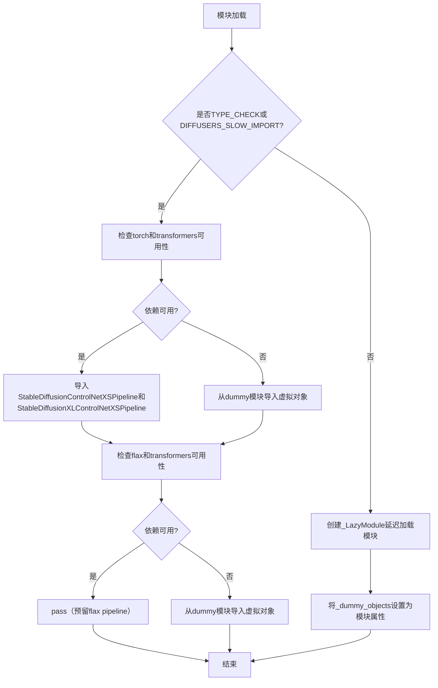
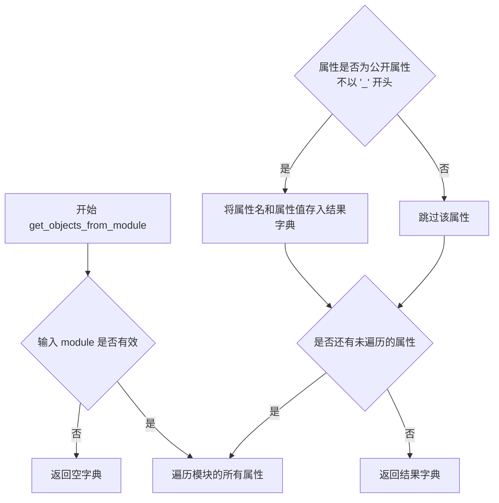
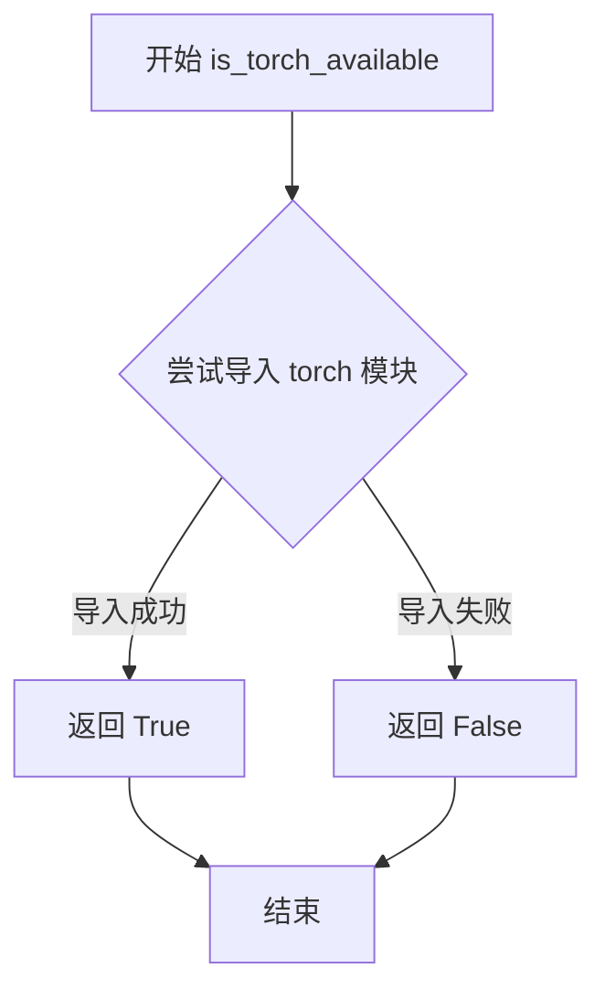
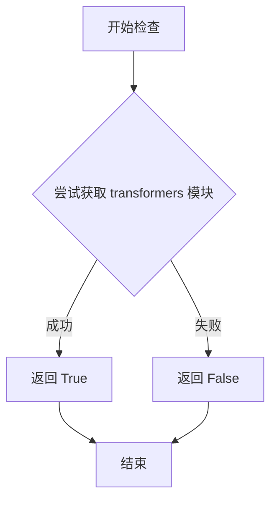
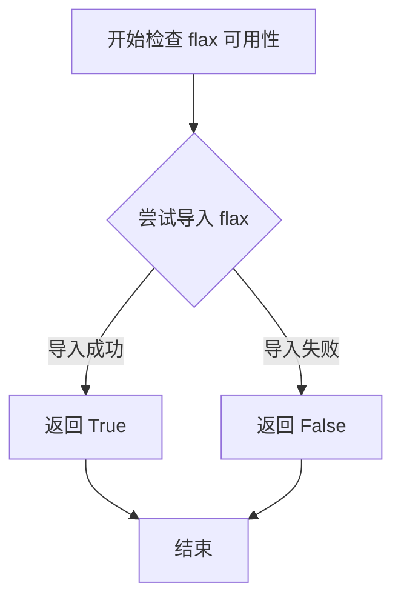

# `diffusers\src\diffusers\pipelines\controlnet_xs\__init__.py` 详细设计文档

这是一个Diffusers库的延迟加载模块初始化文件，用于在满足特定依赖条件（torch、transformers、flax）时有条件地导入ControlNet-XS相关的Stable Diffusion pipeline类，包括StableDiffusionControlNetXSPipeline和StableDiffusionXLControlNetXSPipeline，若依赖不可用则使用虚拟对象替代，确保模块导入时不报错。

## 整体流程



## 类结构

```
此文件为模块入口，无自定义类定义
主要依赖外部类: StableDiffusionControlNetXSPipeline
辅助类: StableDiffusionXLControlNetXSPipeline
底层框架: _LazyModule (延迟加载机制)
```

## 全局变量及字段


### `_dummy_objects`
    
存储虚拟对象，用于依赖不可用时的替代

类型：`dict`
    


### `_import_structure`
    
定义模块的导入结构，映射子模块到可导出对象列表

类型：`dict`
    


### `DIFFUSERS_SLOW_IMPORT`
    
标志位，控制是否使用延迟加载模式

类型：`bool`
    


    

## 全局函数及方法


### `get_objects_from_module`

从指定模块中提取所有公共对象（类、函数等），并返回一个以对象名称为键、对象本身为值的字典，用于动态模块导入和懒加载机制。

参数：

- `module`：`module`，要从中提取对象的模块对象

返回值：`dict`，键为对象名称（字符串），值为对应的对象（类、函数等）

#### 流程图



#### 带注释源码

```
def get_objects_from_module(module):
    """
    从给定模块中提取所有公共对象。
    
    该函数遍历模块的所有属性，过滤掉以 '_' 开头的私有属性，
    将剩余的公共对象收集到一个字典中返回。
    
    参数:
        module: 要提取对象的模块对象
        
    返回:
        dict: 以对象名称为键、对象本身为值的字典
    """
    # 初始化结果字典
    objects = {}
    
    # 遍历模块的所有属性
    for attr_name in dir(module):
        # 过滤掉私有属性（以 '_' 开头）
        if not attr_name.startswith('_'):
            # 获取属性值
            attr_value = getattr(module, attr_name)
            # 将其添加到结果字典
            objects[attr_name] = attr_value
    
    return objects
```

> **注意**：上述函数签名和实现是根据代码中的使用方式（`_dummy_objects.update(get_objects_from_module(dummy_torch_and_transformers_objects))`）推断的。该函数本身在提供的代码中并未定义，而是从 `...utils` 模块导入的工具函数。其实际实现可能在 `diffusers/utils/__init__.py` 或类似的工具模块中。


### `is_torch_available`

该函数是一个工具函数，用于检查当前环境中 PyTorch 库是否可用。它通过尝试导入 `torch` 模块并捕获导入异常来判断，返回布尔值以指示 PyTorch 的可用性，从而支持库的延迟加载和可选依赖项处理。

参数：

- 该函数无参数

返回值：`bool`，如果 PyTorch 库可用则返回 `True`，否则返回 `False`

#### 流程图



#### 带注释源码

```python
def is_torch_available():
    """
    检查 PyTorch 库是否可用。
    
    该函数尝试导入 torch 模块，如果导入成功则返回 True，
    否则返回 False。这用于支持库的延迟加载和可选依赖项处理。
    
    Returns:
        bool: PyTorch 可用返回 True，否则返回 False
    """
    try:
        import torch  # 尝试导入 torch 模块
        return True   # 导入成功，返回 True
    except ImportError:  # 捕获导入异常
        return False  # 导入失败，返回 False
```

> **注意**：由于 `is_torch_available()` 是从外部模块 `...utils` 导入的函数，上述源码是基于其使用方式和典型实现模式重构的推断代码。该函数在当前代码中主要用于条件判断，配合 `is_transformers_available()` 来决定是否加载相关的 PyTorch 和 Transformers 对象。


### `is_transformers_available`

检查当前环境中 `transformers` 库是否可用。

参数：
- 无参数

返回值：`bool`，返回 `True` 表示 transformers 库已安装且可用，返回 `False` 表示不可用。

#### 流程图



#### 带注释源码

```python
# 该函数定义在 ...utils 模块中，此处为推断的源码实现
def is_transformers_available():
    """
    检查 transformers 库是否可用。
    
    Returns:
        bool: 如果 transformers 库已安装且可以导入返回 True，否则返回 False。
    """
    try:
        # 尝试导入 transformers 模块
        import transformers
        # 如果导入成功，返回 True
        return True
    except ImportError:
        # 如果导入失败（库未安装），返回 False
        return False
```


### `is_flax_available()`

检查当前环境中是否安装了 flax 深度学习库，并返回可用性状态。

参数：

- 该函数无参数

返回值：`bool`，如果 flax 库可用返回 `True`，否则返回 `False`

#### 流程图



#### 带注释源码

```
# 注意：此函数由 ...utils 模块提供，这里展示典型的实现方式
# 该函数在当前文件的第4行被导入：
# from ...utils import is_flax_available, ...

# 使用示例（在当前代码中）：
try:
    # 检查 transformers 和 flax 是否同时可用
    if not (is_transformers_available() and is_flax_available()):
        raise OptionalDependencyNotAvailable()
except OptionalDependencyNotAvailable:
    # 如果不可用，导入虚拟对象作为占位符
    from ...utils import dummy_flax_and_transformers_objects
    _dummy_objects.update(get_objects_from_module(dummy_flax_and_transformers_objects))
else:
    # 如果可用，正常导入相关模块
    pass  # _import_structure["pipeline_flax_controlnet"] = ["FlaxStableDiffusionControlNetPipeline"]
```

## 关键组件


### 惰性加载模块（Lazy Loading Module）

使用`_LazyModule`实现模块的惰性加载，在非TYPE_CHECKING模式下延迟导入实际模块，只有在首次访问时才加载，提高导入速度。

### 可选依赖检查与虚拟对象（Optional Dependency Check & Dummy Objects）

通过`try/except OptionalDependencyNotAvailable`检查`torch`和`transformers`、`flax`是否可用，不可用时使用虚拟对象填充，保持API一致性。

### 导入结构字典（Import Structure Dictionary）

`_import_structure`字典定义模块的导入结构，映射子模块名称到可导出对象列表，用于LazyModule的动态导入。

### 类型检查支持（TYPE_CHECKING Support）

在`TYPE_CHECKING`或`DIFFUSERS_SLOW_IMPORT`模式下直接导入真实类，否则使用惰性加载机制，支持IDE类型提示和静态分析。

### 管道导出（Pipeline Exports）

导出`StableDiffusionControlNetXSPipeline`和`StableDiffusionXLControlNetXSPipeline`两个ControlNet XS管道类，支持Stable Diffusion和SDXL的ControlNet XS实现。

### 模块动态注入（Module Dynamic Injection）

通过`setattr`将虚拟对象动态注入到当前模块，使未安装可选依赖时也能导入模块而不报错。


## 问题及建议


### 已知问题

-   **代码重复**：两个 try-except 块结构几乎相同，都检查 `is_transformers_available()` 与其他库可用性，只是依赖不同（torch vs flax），违反了 DRY 原则。
-   **硬编码的导入结构**：`_import_structure` 字典的内容在 else 分支中直接硬编码，缺乏动态性，未来添加新 pipeline 时需要手动维护。
-   **未清理的注释代码**：存在两处被注释掉的代码（`pipeline_flax_controlnet` 相关），表明功能未完成或被放弃，但未清理，影响代码可读性。
-   **魔法字符串**：模块名如 `"pipeline_controlnet_xs"` 被硬编码在多处，缺乏常量定义，容易出现拼写错误。
-   **复杂的条件逻辑**：`TYPE_CHECKING or DIFFUSERS_SLOW_IMPORT` 的组合条件增加了代码分支的复杂性，理解成本较高。
-   **缺乏文档注释**：整个文件没有任何 docstring 或注释说明其用途和维护者信息。
-   **get_objects_from_module 的隐式依赖**：代码依赖于 `get_objects_from_module` 函数处理 dummy objects，但未对该函数的使用方式进行任何说明。

### 优化建议

-   **提取公共逻辑**：将检查可选依赖并更新 `_import_structure` 和 `_dummy_objects` 的逻辑封装为函数或使用装饰器，减少重复代码。
-   **定义常量**：将模块名等字符串常量提取为模块级变量，避免硬编码。
-   **清理注释代码**：如果 Flax pipeline 确实不需要，应删除注释代码块；如果需要实现，应补充完整实现。
-   **添加类型注解和文档**：为关键代码块添加 docstring，说明每个条件分支的用途，特别是 `TYPE_CHECKING` 和 `DIFFUSERS_SLOW_IMPORT` 的作用。
-   **考虑配置化**：将 pipeline 列表和对应的 dummy objects 映射关系配置化，通过数据驱动的方式生成导入结构。
-   **简化条件分支**：可以探索将 TYPE_CHECKING 和运行时导入的逻辑进一步分离或简化，提高可维护性。


## 其它


### 设计目标与约束

本模块采用延迟加载（Lazy Loading）架构，旨在解决Diffusers库中可选依赖项（PyTorch、Transformers、Flax）的条件导入问题。通过_LazyModule实现模块的按需加载，避免在不支持某些后端时引发导入错误，同时保持类型检查（TYPE_CHECKING）时的完整类型信息可用性。

### 错误处理与异常设计

模块使用OptionalDependencyNotAvailable异常来处理可选依赖不可用的情况。当检测到所需依赖（is_transformers_available()、is_torch_available()、is_flax_available()）缺失时，抛出该异常并回退到_dummy_objects，确保模块结构完整但功能不可用。

### 数据流与状态机

模块存在两种运行状态：类型检查状态（TYPE_CHECKING为True）和运行时状态。类型检查时直接导入真实类；运行时则通过_LazyModule代理，实现首次访问时才进行实际导入。_import_structure字典定义导出结构，_dummy_objects提供降级对象。

### 外部依赖与接口契约

模块依赖以下外部包：torch（is_torch_available）、transformers（is_transformers_available）、flax（is_flax_available）。当所有依赖满足时，导出StableDiffusionControlNetXSPipeline和StableDiffusionXLControlNetXSPipeline类；当依赖缺失时，导出对应的dummy对象作为占位符。

### 模块初始化流程

模块初始化遵循以下顺序：首先检查torch和transformers可用性，构造_import_structure；然后检查flax可用性（当前未添加实际导出）；最后根据运行模式选择直接导入或设置_LazyModule。sys.modules[__name__]被替换为_LazyModule实例，实现惰性求值。

### 类型检查支持

通过TYPE_CHECKING标志区分类型检查环境和运行时环境。在类型检查环境下，真实类可用，允许IDE和类型检查器提供完整的类型信息；在运行时环境下，通过_LazyModule延迟导入真实类。

### 优化空间与潜在问题

当前flax相关导出被注释掉但保留try-except结构，造成代码冗余；dummy对象获取使用get_objects_from_module动态扫描，可能影响启动性能；建议明确文档化支持的Python版本和依赖版本范围。

    