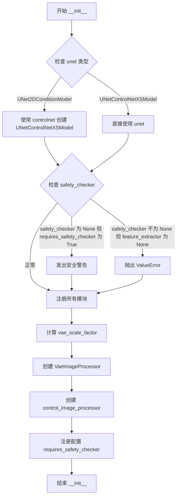
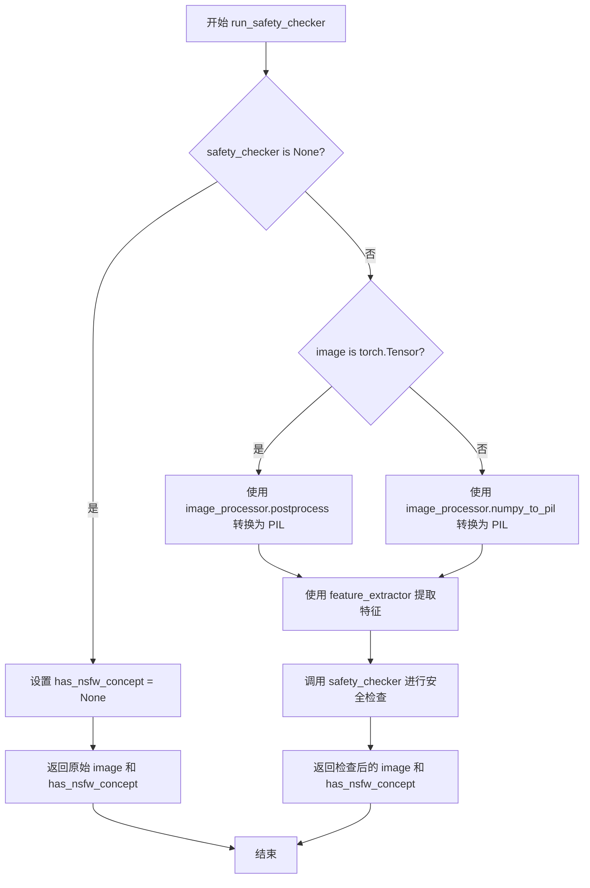
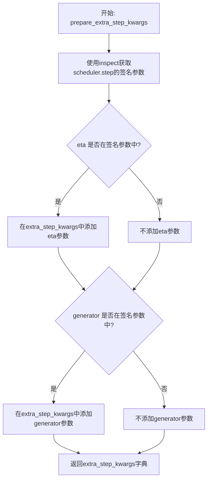
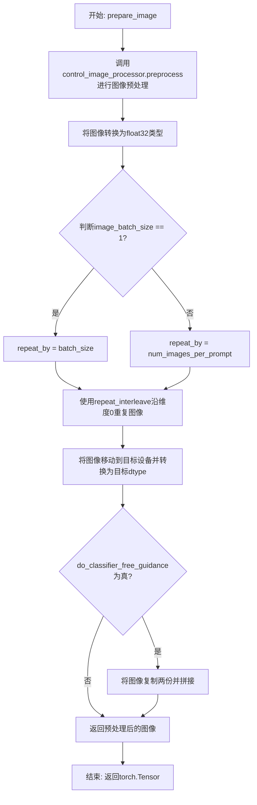
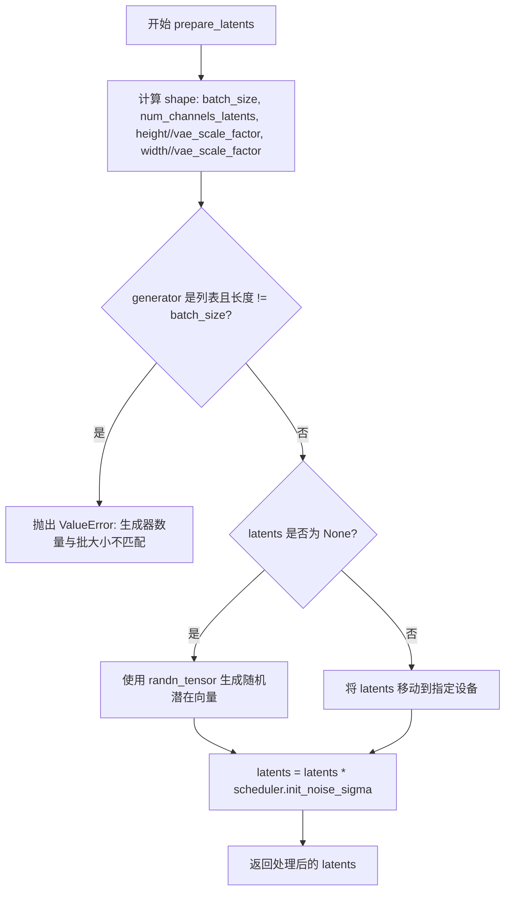
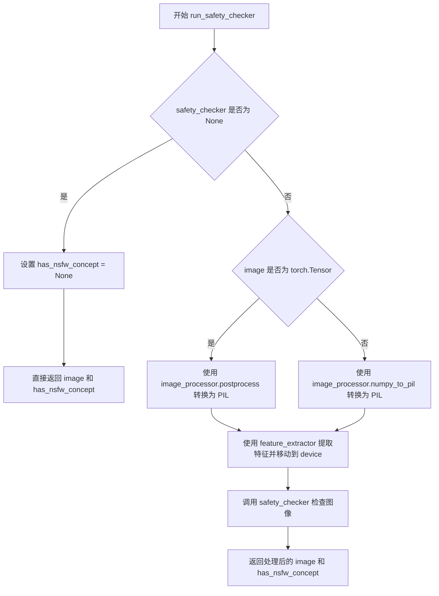
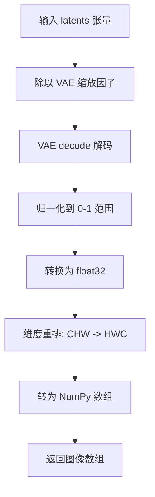
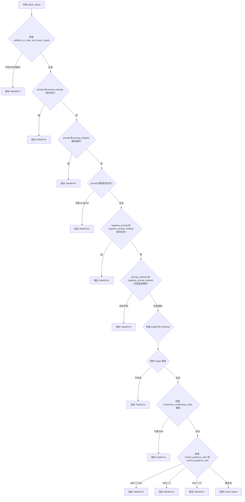

# `diffusers\src\diffusers\pipelines\controlnet_xs\pipeline_controlnet_xs.py` 详细设计文档

这是一个用于文本到图像生成的 Stable Diffusion 管道，集成了 ControlNet-XS 模型。该管道通过接收文本提示（prompt）和控制图像（如边缘图、姿态图）来指导生成过程，实现高度可控的图像合成。

## 整体流程

```mermaid
graph TD
    Start([开始]) --> CheckInputs{检查输入参数}
    CheckInputs --> EncodePrompt[编码文本提示 (encode_prompt)]
    EncodePrompt --> PrepareImg[预处理控制图像 (prepare_image)]
    PrepareImg --> PrepareLatents[初始化潜在向量 (prepare_latents)]
    PrepareLatents --> DenoiseLoop[开始去噪循环]
    DenoiseLoop --> ScaleInput[缩放模型输入]
    ScaleInput --> Predict[UNet + ControlNet 预测噪声]
    Predict --> Guidance{是否使用 Classifier-Free Guidance?}
    Guidance -- 是 --> ApplyGuidance[应用引导策略]
    Guidance -- 否 --> SkipGuidance
    ApplyGuidance --> SchedulerStep[调度器步进 (scheduler.step)]
    SkipGuidance --> SchedulerStep
    SchedulerStep --> CheckLoop{循环是否结束?}
    CheckLoop -- 否 --> DenoiseLoop
    CheckLoop -- 是 --> Decode[VAE 解码 (vae.decode)]
    Decode --> SafetyCheck[安全检查 (run_safety_checker)]
    SafetyCheck --> PostProcess[后处理图像 (image_processor)]
    PostProcess --> End([返回结果])
```

## 类结构

```
DiffusionPipeline (基类)
├── StableDiffusionControlNetXSPipeline (主类)
│   ├── DeprecatedPipelineMixin
│   ├── StableDiffusionMixin
│   ├── TextualInversionLoaderMixin (用于嵌入)
│   ├── StableDiffusionLoraLoaderMixin (用于LoRA权重)
│   └── FromSingleFileMixin (用于加载.ckpt)
```

## 全局变量及字段


### `logger`
    
模块级日志记录器

类型：`logging.Logger`
    


### `EXAMPLE_DOC_STRING`
    
管道使用示例文档字符串

类型：`str`
    


### `XLA_AVAILABLE`
    
布尔值，标识是否支持PyTorch XLA

类型：`bool`
    


### `StableDiffusionControlNetXSPipeline.vae`
    
VAE编解码器

类型：`AutoencoderKL`
    


### `StableDiffusionControlNetXSPipeline.text_encoder`
    
文本编码器

类型：`CLIPTextModel`
    


### `StableDiffusionControlNetXSPipeline.tokenizer`
    
分词器

类型：`CLIPTokenizer`
    


### `StableDiffusionControlNetXSPipeline.unet`
    
核心去噪UNet

类型：`UNetControlNetXSModel`
    


### `StableDiffusionControlNetXSPipeline.controlnet`
    
ControlNet适配器

类型：`ControlNetXSAdapter`
    


### `StableDiffusionControlNetXSPipeline.scheduler`
    
扩散调度器

类型：`KarrasDiffusionSchedulers`
    


### `StableDiffusionControlNetXSPipeline.safety_checker`
    
安全检查器

类型：`StableDiffusionSafetyChecker`
    


### `StableDiffusionControlNetXSPipeline.feature_extractor`
    
特征提取器

类型：`CLIPImageProcessor`
    


### `StableDiffusionControlNetXSPipeline.image_processor`
    
图像处理器

类型：`VaeImageProcessor`
    


### `StableDiffusionControlNetXSPipeline.control_image_processor`
    
控制图像处理器

类型：`VaeImageProcessor`
    


### `StableDiffusionControlNetXSPipeline.vae_scale_factor`
    
VAE缩放因子

类型：`int`
    
    

## 全局函数及方法


### `StableDiffusionControlNetXSPipeline.__init__`

这是 Stable Diffusion ControlNet-XS 管道的构造函数，初始化所有子模块（VAE、文本编码器、Tokenizer、UNet、ControlNet、调度器、安全检查器等），并配置图像处理器和模型参数。

参数：

-  `vae`：`AutoencoderKL`，变分自编码器模型，用于将图像编码和解码到潜在表示
-  `text_encoder`：`CLIPTextModel`，冻结的文本编码器（clip-vit-large-patch14）
-  `tokenizer`：`CLIPTokenizer`，用于对文本进行分词的 CLIP 分词器
-  `unet`：`UNet2DConditionModel | UNetControlNetXSModel`，用于去噪图像潜在表示的 UNet 模型
-  `controlnet`：`ControlNetXSAdapter`，与 unet 结合使用的 ControlNet 适配器
-  `scheduler`：`KarrasDiffusionSchedulers`，与 unet 配合去噪的调度器
-  `safety_checker`：`StableDiffusionSafetyChecker`，评估生成图像是否具有攻击性或有害的分类模块
-  `feature_extractor`：`CLIPImageProcessor`，用于从生成图像中提取特征的 CLIP 图像处理器
-  `requires_safety_checker`：`bool = True`，是否需要安全检查器

返回值：`None`，构造函数无返回值

#### 流程图



#### 带注释源码

```python
def __init__(
    self,
    vae: AutoencoderKL,
    text_encoder: CLIPTextModel,
    tokenizer: CLIPTokenizer,
    unet: UNet2DConditionModel | UNetControlNetXSModel,
    controlnet: ControlNetXSAdapter,
    scheduler: KarrasDiffusionSchedulers,
    safety_checker: StableDiffusionSafetyChecker,
    feature_extractor: CLIPImageProcessor,
    requires_safety_checker: bool = True,
):
    # 调用父类构造函数
    super().__init__()

    # 如果传入的是普通 UNet2DConditionModel，则使用 controlnet 包装成 UNetControlNetXSModel
    if isinstance(unet, UNet2DConditionModel):
        unet = UNetControlNetXSModel.from_unet(unet, controlnet)

    # 如果 safety_checker 为 None 但 requires_safety_checker 为 True，发出警告
    if safety_checker is None and requires_safety_checker:
        logger.warning(
            f"You have disabled the safety checker for {self.__class__} by passing `safety_checker=None`. Ensure"
            " that you abide to the conditions of the Stable Diffusion license and do not expose unfiltered"
            " results in services or applications open to the public. Both the diffusers team and Hugging Face"
            " strongly recommend to keep the safety filter enabled in all public facing circumstances, disabling"
            " it only for use-cases that involve analyzing network behavior or auditing its results. For more"
            " information, please have a look at https://github.com/huggingface/diffusers/pull/254 ."
        )

    # 如果 safety_checker 不为 None 但 feature_extractor 为 None，抛出错误
    if safety_checker is not None and feature_extractor is None:
        raise ValueError(
            "Make sure to define a feature extractor when loading {self.__class__} if you want to use the safety"
            " checker. If you do not want to use the safety checker, you can pass `'safety_checker=None'` instead."
        )

    # 注册所有子模块到管道
    self.register_modules(
        vae=vae,
        text_encoder=text_encoder,
        tokenizer=tokenizer,
        unet=unet,
        controlnet=controlnet,
        scheduler=scheduler,
        safety_checker=safety_checker,
        feature_extractor=feature_extractor,
    )

    # 计算 VAE 缩放因子，用于调整图像分辨率
    self.vae_scale_factor = 2 ** (len(self.vae.config.block_out_channels) - 1) if getattr(self, "vae", None) else 8

    # 创建图像处理器，用于后处理 VAE 输出的图像
    self.image_processor = VaeImageProcessor(vae_scale_factor=self.vae_scale_factor, do_convert_rgb=True)

    # 创建控制图像处理器，用于预处理 ControlNet 输入图像
    self.control_image_processor = VaeImageProcessor(
        vae_scale_factor=self.vae_scale_factor, do_convert_rgb=True, do_normalize=False
    )

    # 注册配置项 requires_safety_checker
    self.register_to_config(requires_safety_checker=requires_safety_checker)
```


### `StableDiffusionControlNetXSPipeline._encode_prompt`

该方法是`_encode_prompt`的弃用版本，用于将提示编码为文本嵌入。它通过调用新的`encode_prompt`方法并处理返回格式的兼容性来进行反向兼容处理。

参数：

- `self`：实例本身，包含pipeline的所有组件
- `prompt`：`str | list[str] | None`，要编码的提示文本，可以是单个字符串或字符串列表
- `device`：`torch.device`， torch设备，用于计算
- `num_images_per_prompt`：`int`，每个提示要生成的图像数量
- `do_classifier_free_guidance`：`bool`，是否执行无分类器引导
- `negative_prompt`：`str | list[str] | None`，不包含的提示，用于引导图像生成方向
- `prompt_embeds`：`torch.Tensor | None`，预生成的文本嵌入，可用于调整文本输入
- `negative_prompt_embeds`：`torch.Tensor | None`，预生成的否定文本嵌入
- `lora_scale`：`float | None`，LoRA缩放因子，用于调整LoRA层的影响
- `**kwargs`：其他可选参数

返回值：`torch.Tensor`，连接后的提示嵌入张量（包含无条件嵌入和条件嵌入）

#### 流程图

```mermaid
flowchart TD
    A[开始 _encode_prompt] --> B[记录弃用警告]
    B --> C[调用 encode_prompt 方法]
    C --> D[获取返回的元组 prompt_embeds_tuple]
    E[合并嵌入: torch.cat<br/>[prompt_embeds_tuple[1]<br/>, prompt_embeds_tuple[0]]]
    D --> E
    E --> F[返回合并后的 prompt_embeds]
```

#### 带注释源码

```python
def _encode_prompt(
    self,
    prompt,
    device,
    num_images_per_prompt,
    do_classifier_free_guidance,
    negative_prompt=None,
    prompt_embeds: torch.Tensor | None = None,
    negative_prompt_embeds: torch.Tensor | None = None,
    lora_scale: float | None = None,
    **kwargs,
):
    # 弃用警告：提示用户该方法已被弃用，将在未来版本中移除
    # 同时警告输出格式已从连接的张量更改为元组
    deprecation_message = "`_encode_prompt()` is deprecated and it will be removed in a future version. Use `encode_prompt()` instead. Also, be aware that the output format changed from a concatenated tensor to a tuple."
    deprecate("_encode_prompt()", "1.0.0", deprecation_message, standard_warn=False)

    # 调用新的 encode_prompt 方法进行实际的提示编码
    # 传递所有必要的参数，包括 LoRA 缩放因子
    prompt_embeds_tuple = self.encode_prompt(
        prompt=prompt,
        device=device,
        num_images_per_prompt=num_images_per_prompt,
        do_classifier_free_guidance=do_classifier_free_guidance,
        negative_prompt=negative_prompt,
        prompt_embeds=prompt_embeds,
        negative_prompt_embeds=negative_prompt_embeds,
        lora_scale=lora_scale,
        **kwargs,
    )

    # 为了向后兼容性，将返回的元组重新连接为单个张量
    # 元组格式为 (negative_prompt_embeds, prompt_embeds)
    # 这里交换顺序以匹配旧的输出格式：[negative_prompt_embeds, prompt_embeds]
    prompt_embeds = torch.cat([prompt_embeds_tuple[1], prompt_embeds_tuple[0]])

    return prompt_embeds
```


### `StableDiffusionControlNetXSPipeline.encode_prompt`

该方法将文本 prompt 编码为 tensor 嵌入向量，用于后续的图像生成过程。支持 LoRA 权重调整、clip_skip 跳过层数设置、以及无分类器自由引导（CFG）的条件嵌入生成。

参数：

- `prompt`：`str | list[str]`，要编码的提示词，可以是单个字符串或字符串列表
- `device`：`torch.device`，torch 设备，用于将张量移动到指定设备
- `num_images_per_prompt`：`int`，每个提示词需要生成的图像数量，用于复制嵌入向量
- `do_classifier_free_guidance`：`bool`，是否启用无分类器自由引导，若为 True 则需要生成负面提示词嵌入
- `negative_prompt`：`str | list[str] | None`，负面提示词，用于引导模型避免生成指定内容
- `prompt_embeds`：`torch.Tensor | None`，可选，预生成的提示词嵌入，若提供则直接使用而不从文本生成
- `negative_prompt_embeds`：`torch.Tensor | None`，可选，预生成的负面提示词嵌入
- `lora_scale`：`float | None`，可选，LoRA 缩放因子，用于调整 LoRA 层的权重
- `clip_skip`：`int | None`，可选，从 CLIP 模型倒数第 N 层获取隐藏状态，用于调整嵌入特征

返回值：`tuple[torch.Tensor, torch.Tensor]`，返回元组包含 (提示词嵌入, 负面提示词嵌入)，形状为 `(batch_size * num_images_per_prompt, seq_len, hidden_dim)`

#### 流程图

```mermaid
flowchart TD
    A[开始 encode_prompt] --> B{检查 lora_scale}
    B -->|非空且为 StableDiffusionLoraLoaderMixin| C[设置 _lora_scale 并调整 LoRA 权重]
    B -->|否则| D{检查 prompt 类型}
    C --> D
    D -->|str| E[batch_size = 1]
    D -->|list| F[batch_size = len(prompt)]
    D -->|其他| G[batch_size = prompt_embeds.shape[0]]
    E --> H{prompt_embeds 为空?}
    F --> H
    G --> H
    H -->|是| I{是否为 TextualInversionLoaderMixin}
    H -->|否| Y[复制 prompt_embeds]
    I -->|是| J[调用 maybe_convert_prompt 处理多向量 token]
    I -->|否| K[直接使用原始 prompt]
    J --> L[tokenizer 编码: padding= max_length, truncation=True, return_tensors=pt]
    K --> L
    L --> M{text_encoder 使用 attention_mask?}
    M -->|是| N[获取 attention_mask]
    M -->|否| O[attention_mask = None]
    N --> P{clip_skip 为空?}
    O --> P
    P -->|是| Q[调用 text_encoder 获取嵌入]
    P -->|否| R[获取完整 hidden_states 并取倒数第 clip_skip+1 层]
    Q --> S[获取最终嵌入]
    R --> T[应用 final_layer_norm]
    S --> U[转换为目标 dtype 和 device]
    Y --> U
    U --> V{do_classifier_free_guidance 且 negative_prompt_embeds 为空?}
    V -->|是| W{negative_prompt 是否为空?}
    V -->|否| AA[直接返回嵌入]
    W -->|是| X[uncond_tokens = [''] * batch_size]
    W -->|否| Z[处理 negative_prompt 类型并生成 uncond_tokens]
    X --> AB[tokenizer 编码 negative prompt]
    Z --> AB
    AB --> AC{text_encoder 使用 attention_mask?}
    AC -->|是| AD[获取 attention_mask]
    AC -->|否| AE[attention_mask = None]
    AD --> AF[调用 text_encoder 获取 negative_prompt_embeds]
    AE --> AF
    AF --> AG[复制 negative_prompt_embeds]
    V -->|否| AG
    AG --> AH[返回 prompt_embeds 和 negative_prompt_embeds]
    AA --> AH
```

#### 带注释源码

```python
def encode_prompt(
    self,
    prompt,
    device,
    num_images_per_prompt,
    do_classifier_free_guidance,
    negative_prompt=None,
    prompt_embeds: torch.Tensor | None = None,
    negative_prompt_embeds: torch.Tensor | None = None,
    lora_scale: float | None = None,
    clip_skip: int | None = None,
):
    r"""
    Encodes the prompt into text encoder hidden states.

    Args:
        prompt (`str` or `list[str]`, *optional*):
            prompt to be encoded
        device: (`torch.device`):
            torch device
        num_images_per_prompt (`int`):
            number of images that should be generated per prompt
        do_classifier_free_guidance (`bool`):
            whether to use classifier free guidance or not
        negative_prompt (`str` or `list[str]`, *optional*):
            The prompt or prompts not to guide the image generation. If not defined, one has to pass
            `negative_prompt_embeds` instead. Ignored when not using guidance (i.e., ignored if `guidance_scale` is
            less than `1`).
        prompt_embeds (`torch.Tensor`, *optional*):
            Pre-generated text embeddings. Can be used to easily tweak text inputs, *e.g.* prompt weighting. If not
            provided, text embeddings will be generated from `prompt` input argument.
        negative_prompt_embeds (`torch.Tensor`, *optional*):
            Pre-generated negative text embeddings. Can be used to easily tweak text inputs, *e.g.* prompt
            weighting. If not provided, negative_prompt_embeds will be generated from `negative_prompt` input
            argument.
        lora_scale (`float`, *optional*):
            A LoRA scale that will be applied to all LoRA layers of the text encoder if LoRA layers are loaded.
        clip_skip (`int`, *optional*):
            Number of layers to be skipped from CLIP while computing the prompt embeddings. A value of 1 means that
            the output of the pre-final layer will be used for computing the prompt embeddings.
    """
    # 设置 lora scale 以便文本编码器的 LoRA 函数可以正确访问
    # 如果传入了 lora_scale 且对象是 StableDiffusionLoraLoaderMixin，则调整 LoRA 权重
    if lora_scale is not None and isinstance(self, StableDiffusionLoraLoaderMixin):
        self._lora_scale = lora_scale

        # 动态调整 LoRA 缩放因子
        if not USE_PEFT_BACKEND:
            # 非 PEFT 后端：直接调整文本编码器的 LoRA 权重
            adjust_lora_scale_text_encoder(self.text_encoder, lora_scale)
        else:
            # PEFT 后端：使用 scale_lora_layers 函数
            scale_lora_layers(self.text_encoder, lora_scale)

    # 确定 batch_size：根据 prompt 类型或已提供的 prompt_embeds
    if prompt is not None and isinstance(prompt, str):
        batch_size = 1
    elif prompt is not None and isinstance(prompt, list):
        batch_size = len(prompt)
    else:
        batch_size = prompt_embeds.shape[0]

    # 如果未提供 prompt_embeds，则从 prompt 生成
    if prompt_embeds is None:
        # 文本反转：如有需要处理多向量 token
        if isinstance(self, TextualInversionLoaderMixin):
            prompt = self.maybe_convert_prompt(prompt, self.tokenizer)

        # 使用 tokenizer 将文本转换为 token IDs
        text_inputs = self.tokenizer(
            prompt,
            padding="max_length",  # 填充到最大长度
            max_length=self.tokenizer.model_max_length,  # 最大长度限制
            truncation=True,  # 截断超长文本
            return_tensors="pt",  # 返回 PyTorch 张量
        )
        text_input_ids = text_inputs.input_ids
        
        # 获取未截断的 token 序列，用于检查是否发生了截断
        untruncated_ids = self.tokenizer(prompt, padding="longest", return_tensors="pt").input_ids

        # 检查是否发生截断，并记录警告
        if untruncated_ids.shape[-1] >= text_input_ids.shape[-1] and not torch.equal(
            text_input_ids, untruncated_ids
        ):
            removed_text = self.tokenizer.batch_decode(
                untruncated_ids[:, self.tokenizer.model_max_length - 1 : -1]
            )
            logger.warning(
                "The following part of your input was truncated because CLIP can only handle sequences up to"
                f" {self.tokenizer.model_max_length} tokens: {removed_text}"
            )

        # 获取 attention_mask（如果文本编码器配置支持）
        if hasattr(self.text_encoder.config, "use_attention_mask") and self.text_encoder.config.use_attention_mask:
            attention_mask = text_inputs.attention_mask.to(device)
        else:
            attention_mask = None

        # 根据 clip_skip 参数决定如何获取嵌入
        if clip_skip is None:
            # 直接获取最后一层的隐藏状态
            prompt_embeds = self.text_encoder(text_input_ids.to(device), attention_mask=attention_mask)
            prompt_embeds = prompt_embeds[0]
        else:
            # 获取完整隐藏状态，然后取倒数第 clip_skip+1 层
            prompt_embeds = self.text_encoder(
                text_input_ids.to(device), attention_mask=attention_mask, output_hidden_states=True
            )
            # hidden_states 是一个元组，包含所有编码器层的隐藏状态
            # 取倒数第 clip_skip+1 层（即倒数第 N 层，N = clip_skip + 1）
            prompt_embeds = prompt_embeds[-1][-(clip_skip + 1)]
            # 应用最终的 LayerNorm 以确保表示正确
            prompt_embeds = self.text_encoder.text_model.final_layer_norm(prompt_embeds)

    # 确定 prompt_embeds 的数据类型（优先使用 text_encoder 的 dtype）
    if self.text_encoder is not None:
        prompt_embeds_dtype = self.text_encoder.dtype
    elif self.unet is not None:
        prompt_embeds_dtype = self.unet.dtype
    else:
        prompt_embeds_dtype = prompt_embeds.dtype

    # 将 prompt_embeds 转换到正确的 dtype 和 device
    prompt_embeds = prompt_embeds.to(dtype=prompt_embeds_dtype, device=device)

    # 复制嵌入向量以支持每个 prompt 生成多个图像
    bs_embed, seq_len, _ = prompt_embeds.shape
    # 使用 mps 友好的方法复制：先在序列维度复制，再 reshape
    prompt_embeds = prompt_embeds.repeat(1, num_images_per_prompt, 1)
    prompt_embeds = prompt_embeds.view(bs_embed * num_images_per_prompt, seq_len, -1)

    # 获取无条件的嵌入（用于 classifier free guidance）
    if do_classifier_free_guidance and negative_prompt_embeds is None:
        # 处理 negative_prompt
        uncond_tokens: list[str]
        if negative_prompt is None:
            # 如果没有提供 negative_prompt，使用空字符串
            uncond_tokens = [""] * batch_size
        elif prompt is not None and type(prompt) is not type(negative_prompt):
            # 类型检查：negative_prompt 和 prompt 类型必须一致
            raise TypeError(
                f"`negative_prompt` should be the same type to `prompt`, but got {type(negative_prompt)} !="
                f" {type(prompt)}."
            )
        elif isinstance(negative_prompt, str):
            uncond_tokens = [negative_prompt]
        elif batch_size != len(negative_prompt):
            # batch 大小检查
            raise ValueError(
                f"`negative_prompt`: {negative_prompt} has batch size {len(negative_prompt)}, but `prompt`:"
                f" {prompt} has batch size {batch_size}. Please make sure that passed `negative_prompt` matches"
                " the batch size of `prompt`."
            )
        else:
            uncond_tokens = negative_prompt

        # 文本反转：处理多向量 token
        if isinstance(self, TextualInversionLoaderMixin):
            uncond_tokens = self.maybe_convert_prompt(uncond_tokens, self.tokenizer)

        # 使用与 prompt_embeds 相同的长度进行 tokenize
        max_length = prompt_embeds.shape[1]
        uncond_input = self.tokenizer(
            uncond_tokens,
            padding="max_length",
            max_length=max_length,
            truncation=True,
            return_tensors="pt",
        )

        # 获取 attention_mask
        if hasattr(self.text_encoder.config, "use_attention_mask") and self.text_encoder.config.use_attention_mask:
            attention_mask = uncond_input.attention_mask.to(device)
        else:
            attention_mask = None

        # 获取负面提示词的嵌入
        negative_prompt_embeds = self.text_encoder(
            uncond_input.input_ids.to(device),
            attention_mask=attention_mask,
        )
        negative_prompt_embeds = negative_prompt_embeds[0]

    # 如果使用 classifier free guidance，复制无条件嵌入
    if do_classifier_free_guidance:
        seq_len = negative_prompt_embeds.shape[1]

        # 转换 dtype 和 device
        negative_prompt_embeds = negative_prompt_embeds.to(dtype=prompt_embeds_dtype, device=device)

        # 复制以匹配生成图像数量
        negative_prompt_embeds = negative_prompt_embeds.repeat(1, num_images_per_prompt, 1)
        negative_prompt_embeds = negative_prompt_embeds.view(batch_size * num_images_per_prompt, seq_len, -1)

    # 如果使用 PEFT 后端的 LoRA，恢复原始权重
    if self.text_encoder is not None:
        if isinstance(self, StableDiffusionLoraLoaderMixin) and USE_PEFT_BACKEND:
            # 通过 unscale 恢复原始 LoRA 权重
            unscale_lora_layers(self.text_encoder, lora_scale)

    # 返回提示词嵌入和负面提示词嵌入的元组
    return prompt_embeds, negative_prompt_embeds
```


### `StableDiffusionControlNetXSPipeline.run_safety_checker`

运行NSFW安全检查，对生成的图像进行内容安全审查，检测图像是否包含不适合工作环境的内容（Not Safe For Work）。

参数：

- `image`：`torch.Tensor | np.ndarray | PIL.Image`，待检查的图像数据
- `device`：`torch.device`，用于计算的目标设备
- `dtype`：`torch.dtype`，用于计算的数据类型

返回值：`tuple[torch.Tensor | np.ndarray | PIL.Image, torch.Tensor | None]`，返回处理后的图像和NSFW检测结果元组。第一个元素是（可能被修改的）图像，第二个元素是布尔张量，表示对应图像是否包含NSFW内容；若`safety_checker`为None，则返回原始图像和`None`。

#### 流程图



#### 带注释源码

```python
def run_safety_checker(self, image, device, dtype):
    """
    运行安全检查器，对生成的图像进行NSFW内容检测。

    Args:
        image: 输入图像，可以是 torch.Tensor、numpy 数组或 PIL.Image
        device: 计算设备
        dtype: 计算数据类型

    Returns:
        tuple: (处理后的图像, NSFW检测结果)
               - 图像: 与输入类型相同
               - has_nsfw_concept: 布尔张量或None
    """
    # 如果未配置安全检查器，直接返回空结果
    if self.safety_checker is None:
        has_nsfw_concept = None
    else:
        # 将图像转换为PIL格式供特征提取器使用
        if torch.is_tensor(image):
            # 从tensor转换为PIL图像
            feature_extractor_input = self.image_processor.postprocess(image, output_type="pil")
        else:
            # 从numpy数组转换为PIL图像
            feature_extractor_input = self.image_processor.numpy_to_pil(image)
        
        # 使用特征提取器提取图像特征并移动到指定设备
        safety_checker_input = self.feature_extractor(feature_extractor_input, return_tensors="pt").to(device)
        
        # 调用安全检查器进行NSFW检测
        # 将像素值转换为指定数据类型后传入检查器
        image, has_nsfw_concept = self.safety_checker(
            images=image, 
            clip_input=safety_checker_input.pixel_values.to(dtype)
        )
    
    # 返回处理后的图像和NSFW检测标志
    return image, has_nsfw_concept
```


### `StableDiffusionControlNetXSPipeline.decode_latents`

将潜在向量解码为图像（已弃用）。该方法通过 VAE 模型将潜在向量反转换为像素空间图像，并进行后处理以便返回。

参数：

- `latents`：`torch.Tensor`，需要解码的潜在向量，通常来自扩散模型的输出

返回值：`np.ndarray`，解码后的图像，形状为 (batch_size, height, width, channels)，像素值范围 [0, 255]

#### 流程图

```mermaid
flowchart TD
    A[开始 decode_latents] --> B[记录弃用警告]
    B --> C[将 latents 乘以 1/scaling_factor 进行缩放]
    C --> D[调用 VAE.decode 解码潜在向量]
    D --> E[将图像像素值从 [-1, 1] 归一化到 [0, 1]]
    E --> F[将图像转移到 CPU]
    F --> G[调整维度顺序: (B, C, H, W) -> (B, H, W, C)]
    G --> H[转换为 float32 类型的 numpy 数组]
    I[返回解码后的图像]
```

#### 带注释源码

```python
def decode_latents(self, latents):
    # 记录弃用警告，提示用户使用 VaeImageProcessor.postprocess 替代
    deprecation_message = "The decode_latents method is deprecated and will be removed in 1.0.0. Please use VaeImageProcessor.postprocess(...) instead"
    deprecate("decode_latents", "1.0.0", deprecation_message, standard_warn=False)

    # 根据 VAE 配置的缩放因子对潜在向量进行反缩放
    # 这是因为 VAE 在编码时会乘以 scaling_factor
    latents = 1 / self.vae.config.scaling_factor * latents
    
    # 使用 VAE 模型解码潜在向量，得到原始图像
    # return_dict=False 返回元组，取第一个元素 [0]
    image = self.vae.decode(latents, return_dict=False)[0]
    
    # 将图像从 [-1, 1] 范围归一化到 [0, 1] 范围
    # 公式: (image / 2 + 0.5) 将 [-1, 1] 映射到 [0, 1]
    # clamp(0, 1) 确保值不超过有效范围
    image = (image / 2 + 0.5).clamp(0, 1)
    
    # 将图像从 GPU 转移到 CPU
    # 转换为 float32 类型（避免显著开销，同时兼容 bfloat16）
    # 调整维度顺序：从 (batch, channel, height, width) 转为 (batch, height, width, channel)
    image = image.cpu().permute(0, 2, 3, 1).float().numpy()
    
    # 返回解码后的图像数组
    return image
```


### `StableDiffusionControlNetXSPipeline.prepare_extra_step_kwargs`

该方法用于准备调度器（scheduler）的额外参数。由于不同调度器的 `step` 方法签名可能不同，该方法通过检查调度器是否支持特定参数（eta 和 generator），动态构建需要传递给 scheduler.step 的额外关键字参数字典。

参数：

- `self`：调用该方法的实例本身，包含 `scheduler` 属性用于检查其支持的参数。
- `generator`：`torch.Generator | list[torch.Generator] | None`，可选的随机数生成器，用于控制生成过程的随机性。如果调度器支持 generator 参数，则会将其传递给调度器的 step 方法。
- `eta`：`float`，DDIM 调度器专用的 eta 参数（η），对应 DDIM 论文中的参数，取值范围应为 [0, 1]。其他调度器会忽略此参数。

返回值：`dict`，返回一个字典，包含需要传递给 `scheduler.step()` 方法的额外关键字参数（如 `eta` 和/或 `generator`）。如果调度器不支持相应参数，则该参数不会出现在返回的字典中。

#### 流程图



#### 带注释源码

```python
def prepare_extra_step_kwargs(self, generator, eta):
    # 准备调度器步骤的额外参数，因为并非所有调度器都具有相同的签名
    # eta (η) 仅在 DDIMScheduler 中使用，对于其他调度器将被忽略
    # eta 对应 DDIM 论文中的 η: https://huggingface.co/papers/2010.02502
    # 取值应在 [0, 1] 之间

    # 通过 inspect 检查 scheduler.step 方法是否接受 eta 参数
    accepts_eta = "eta" in set(inspect.signature(self.scheduler.step).parameters.keys())
    
    # 初始化额外的关键字参数字典
    extra_step_kwargs = {}
    
    # 如果调度器接受 eta 参数，则将其添加到 extra_step_kwargs
    if accepts_eta:
        extra_step_kwargs["eta"] = eta

    # 检查调度器是否接受 generator 参数
    accepts_generator = "generator" in set(inspect.signature(self.scheduler.step).parameters.keys())
    
    # 如果调度器接受 generator 参数，则将其添加到 extra_step_kwargs
    if accepts_generator:
        extra_step_kwargs["generator"] = generator
    
    # 返回包含额外参数的字典，供 scheduler.step 调用使用
    return extra_step_kwargs
```


### `StableDiffusionControlNetXSPipeline.check_inputs`

该方法用于验证传入管道的所有输入参数的有效性，包括文本提示、图像、控制网络条件尺度、引导参数等，确保参数类型、形状和范围符合管道要求，否则抛出相应的 ValueError 或 TypeError 异常。

参数：

- `prompt`：`str | list[str] | None`，用于指导图像生成的文本提示
- `image`：`PipelineImageInput`，控制网络的输入条件图像
- `negative_prompt`：`str | list[str] | None`，用于指导不包含内容的负面提示
- `prompt_embeds`：`torch.Tensor | None`，预生成的文本嵌入
- `negative_prompt_embeds`：`torch.Tensor | None`，预生成的负面文本嵌入
- `controlnet_conditioning_scale`：`float`，ControlNet 输出与原始 UNet 残差相加前的乘数
- `control_guidance_start`：`float`，ControlNet 开始应用的总步数百分比
- `control_guidance_end`：`float`，ControlNet 停止应用的总步数百分比
- `callback_on_step_end_tensor_inputs`：`list[str] | None`，步骤结束回调函数使用的张量输入列表

返回值：`None`，该方法仅进行参数验证，不返回任何值

#### 流程图

```mermaid
flowchart TD
    A[开始 check_inputs] --> B{检查 callback_on_step_end_tensor_inputs}
    B -->|不合法| C[抛出 ValueError]
    B -->|合法| D{prompt 和 prompt_embeds 同时存在?}
    D -->|是| D1[抛出 ValueError]
    D -->|否| E{prompt 和 prompt_embeds 都为空?}
    E -->|是| E1[抛出 ValueError]
    E -->|否| F{prompt 类型是否合法?}
    F -->|否| F1[抛出 ValueError]
    F -->|是| G{negative_prompt 和 negative_prompt_embeds 同时存在?}
    G -->|是| G1[抛出 ValueError]
    G -->|否| H{prompt_embeds 和 negative_prompt_embeds 形状是否相同?]
    H -->|否| H1[抛出 ValueError]
    H -->|是| I{检查 image 和 controlnet_conditioning_scale]
    I --> J{unet 是否为 UNetControlNetXSModel 或编译模块}
    J -->|是| K[调用 check_image 验证图像]
    J -->|否| L[抛出断言错误]
    K --> M{controlnet_conditioning_scale 类型是否为 float?}
    M -->|否| N[抛出 TypeError]
    M -->|是| O{检查 control_guidance_start 和 control_guidance_end}
    O --> P{start >= end?}
    P -->|是| P1[抛出 ValueError]
    P -->|否| Q{start < 0?}
    Q -->|是| Q1[抛出 ValueError]
    Q -->|否| R{end > 1.0?}
    R -->|是| R1[抛出 ValueError]
    R -->|否| S[验证通过]
    C --> S
    D1 --> S
    E1 --> S
    F1 --> S
    G1 --> S
    H1 --> S
    N --> S
    P1 --> S
    Q1 --> S
    R1 --> S
```

#### 带注释源码

```python
def check_inputs(
    self,
    prompt,                        # str | list[str] | None: 文本提示
    image,                         # PipelineImageInput: 控制网络条件图像
    negative_prompt=None,          # str | list[str] | None: 负面提示
    prompt_embeds=None,           # torch.Tensor | None: 预计算的提示嵌入
    negative_prompt_embeds=None,  # torch.Tensor | None: 预计算的负面提示嵌入
    controlnet_conditioning_scale=1.0,  # float: ControlNet 条件尺度
    control_guidance_start=0.0,    # float: 控制引导开始位置
    control_guidance_end=1.0,      # float: 控制引导结束位置
    callback_on_step_end_tensor_inputs=None,  # list[str] | None: 回调张量输入
):
    # 验证回调张量输入是否在允许的列表中
    if callback_on_step_end_tensor_inputs is not None and not all(
        k in self._callback_tensor_inputs for k in callback_on_step_end_tensor_inputs
    ):
        raise ValueError(
            f"`callback_on_step_end_tensor_inputs` has to be in {self._callback_tensor_inputs}, but found {[k for k in callback_on_step_end_tensor_inputs if k not in self._callback_tensor_inputs]}"
        )

    # 检查 prompt 和 prompt_embeds 不能同时提供
    if prompt is not None and prompt_embeds is not None:
        raise ValueError(
            f"Cannot forward both `prompt`: {prompt} and `prompt_embeds`: {prompt_embeds}. Please make sure to"
            " only forward one of the two."
        )
    # 检查至少提供一个 prompt 或 prompt_embeds
    elif prompt is None and prompt_embeds is None:
        raise ValueError(
            "Provide either `prompt` or `prompt_embeds`. Cannot leave both `prompt` and `prompt_embeds` undefined."
        )
    # 检查 prompt 类型必须是 str 或 list
    elif prompt is not None and (not isinstance(prompt, str) and not isinstance(prompt, list)):
        raise ValueError(f"`prompt` has to be of type `str` or `list` but is {type(prompt)}")

    # 检查 negative_prompt 和 negative_prompt_embeds 不能同时提供
    if negative_prompt is not None and negative_prompt_embeds is not None:
        raise ValueError(
            f"Cannot forward both `negative_prompt`: {negative_prompt} and `negative_prompt_embeds`:"
            f" {negative_prompt_embeds}. Please make sure to only forward one of the two."
        )

    # 检查 prompt_embeds 和 negative_prompt_embeds 形状必须相同
    if prompt_embeds is not None and negative_prompt_embeds is not None:
        if prompt_embeds.shape != negative_prompt_embeds.shape:
            raise ValueError(
                "`prompt_embeds` and `negative_prompt_embeds` must have the same shape when passed directly, but"
                f" got: `prompt_embeds` {prompt_embeds.shape} != `negative_prompt_embeds`"
                f" {negative_prompt_embeds.shape}."
            )

    # 检查 image 和 controlnet_conditioning_scale
    # 判断 unet 是否为 UNetControlNetXSModel 或编译后的模块
    is_compiled = hasattr(F, "scaled_dot_product_attention") and isinstance(
        self.unet, torch._dynamo.eval_frame.OptimizedModule
    )
    if (
        isinstance(self.unet, UNetControlNetXSModel)
        or is_compiled
        and isinstance(self.unet._orig_mod, UNetControlNetXSModel)
    ):
        # 验证图像参数的有效性
        self.check_image(image, prompt, prompt_embeds)
        # 验证 controlnet_conditioning_scale 必须是 float 类型
        if not isinstance(controlnet_conditioning_scale, float):
            raise TypeError("For single controlnet: `controlnet_conditioning_scale` must be type `float`.")
    else:
        # 如果不是 UNetControlNetXSModel 则抛出断言错误
        assert False

    # 验证控制引导开始和结束位置的有效性
    start, end = control_guidance_start, control_guidance_end
    if start >= end:
        raise ValueError(
            f"control guidance start: {start} cannot be larger or equal to control guidance end: {end}."
        )
    if start < 0.0:
        raise ValueError(f"control guidance start: {start} can't be smaller than 0.")
    if end > 1.0:
        raise ValueError(f"control guidance end: {end} can't be larger than 1.0.")
```


### `StableDiffusionControlNetXSPipeline.check_image`

该方法用于验证控制图像（ControlNet 输入图像）的类型和尺寸是否合法。它检查图像是否为 PIL Image、torch.Tensor、numpy.ndarray 或它们的列表形式，并确保图像批次大小与提示词批次大小一致，以防止后续处理出现维度不匹配的错误。

参数：

- `self`：调用该方法的管道实例本身
- `image`：输入的控制图像，支持 PIL Image、torch.Tensor、numpy.ndarray 或它们的列表形式
- `prompt`：文本提示词，支持字符串或字符串列表，用于与图像批次大小进行比对
- `prompt_embeds`：预计算的文本嵌入向量（torch.Tensor），用于在 prompt 为空时与图像批次大小进行比对

返回值：无返回值（`None`），该方法通过抛出异常来处理验证失败的情况

#### 流程图

```mermaid
flowchart TD
    A[开始 check_image 验证] --> B{检查 image 类型}
    B -->|PIL.Image| C[设置 image_batch_size = 1]
    B -->|torch.Tensor| D[设置 image_batch_size = len(image)]
    B -->|numpy.ndarray| D
    B -->|list| E{检查列表首元素类型}
    E -->|PIL.Image| D
    E -->|torch.Tensor| D
    E -->|numpy.ndarray| D
    B -->|无效类型| F[抛出 TypeError]
    F --> Z[结束]
    
    C --> G{检查 prompt 类型}
    D --> G
    G -->|str| H[prompt_batch_size = 1]
    G -->|list| I[prompt_batch_size = len(prompt)]
    G -->|None| J[使用 prompt_embeds.shape[0]]
    H --> K{验证批次大小}
    I --> K
    J --> K
    
    K -->|image_batch_size == 1| L[通过验证]
    K -->|image_batch_size == prompt_batch_size| L
    K -->|不匹配| M[抛出 ValueError]
    M --> Z
    L --> Z
```

#### 带注释源码

```python
def check_image(self, image, prompt, prompt_embeds):
    """
    验证控制图像的类型和尺寸是否合法。
    
    该方法执行以下检查：
    1. 验证 image 是支持的类型（PIL Image, torch.Tensor, numpy.ndarray 或它们的列表）
    2. 验证图像批次大小与提示词批次大小一致（当两者都不是 1 时）
    
    Args:
        image: 控制网络输入图像
        prompt: 文本提示词
        prompt_embeds: 预计算的文本嵌入
    """
    # 检查 image 是否为 PIL Image
    image_is_pil = isinstance(image, PIL.Image.Image)
    # 检查 image 是否为 torch.Tensor
    image_is_tensor = isinstance(image, torch.Tensor)
    # 检查 image 是否为 numpy.ndarray
    image_is_np = isinstance(image, np.ndarray)
    # 检查 image 是否为 PIL Image 列表
    image_is_pil_list = isinstance(image, list) and isinstance(image[0], PIL.Image.Image)
    # 检查 image 是否为 torch.Tensor 列表
    image_is_tensor_list = isinstance(image, list) and isinstance(image[0], torch.Tensor)
    # 检查 image 是否为 numpy.ndarray 列表
    image_is_np_list = isinstance(image, list) and isinstance(image[0], np.ndarray)

    # 如果 image 不是支持的类型，抛出 TypeError
    if (
        not image_is_pil
        and not image_is_tensor
        and not image_is_np
        and not image_is_pil_list
        and not image_is_tensor_list
        and not image_is_np_list
    ):
        raise TypeError(
            f"image must be passed and be one of PIL image, numpy array, torch tensor, list of PIL images, list of numpy arrays or list of torch tensors, but is {type(image)}"
        )

    # 确定图像批次大小
    if image_is_pil:
        # 单张 PIL 图像，批次大小为 1
        image_batch_size = 1
    else:
        # 列表形式，取列表长度作为批次大小
        image_batch_size = len(image)

    # 确定提示词批次大小
    if prompt is not None and isinstance(prompt, str):
        # 单个字符串提示词，批次大小为 1
        prompt_batch_size = 1
    elif prompt is not None and isinstance(prompt, list):
        # 字符串列表，取列表长度作为批次大小
        prompt_batch_size = len(prompt)
    elif prompt_embeds is not None:
        # 使用预计算的嵌入，从形状中获取批次大小
        prompt_batch_size = prompt_embeds.shape[0]

    # 验证批次大小一致性
    # 图像批次大小不为 1 时，必须与提示词批次大小一致
    if image_batch_size != 1 and image_batch_size != prompt_batch_size:
        raise ValueError(
            f"If image batch size is not 1, image batch size must be same as prompt batch size. image batch size: {image_batch_size}, prompt batch size: {prompt_batch_size}"
        )
```


### `StableDiffusionControlNetXSPipeline.prepare_image`

该方法用于预处理控制图像以适配模型输入，包括图像尺寸调整、批处理重复、设备和 dtype 转换，以及在需要无分类器自由引导时的图像复制。

参数：

- `self`：当前管道实例
- `image`：`PipelineImageInput`，输入的控制图像，支持 PIL.Image、torch.Tensor、np.ndarray 或这些类型的列表
- `width`：`int`，目标图像宽度
- `height`：`int`，目标图像高度
- `batch_size`：`int`，生成的批次大小
- `num_images_per_prompt`：`int`，每个提示生成的图像数量
- `device`：`torch.device`，目标设备
- `dtype`：`torch.dtype`，目标数据类型
- `do_classifier_free_guidance`：`bool`，是否执行无分类器自由引导（默认为 False）

返回值：`torch.Tensor`，预处理后的控制图像张量，已准备好用于模型输入

#### 流程图



#### 带注释源码

```python
def prepare_image(
    self,
    image,
    width,
    height,
    batch_size,
    num_images_per_prompt,
    device,
    dtype,
    do_classifier_free_guidance=False,
):
    """
    预处理控制图像以适配模型输入。
    
    参数:
        image: 输入的控制图像，支持多种格式
        width: 目标宽度
        height: 目标高度
        batch_size: 批次大小
        num_images_per_prompt: 每个提示生成的图像数
        device: 目标设备
        dtype: 目标数据类型
        do_classifier_free_guidance: 是否执行无分类器自由引导
    
    返回:
        预处理后的图像张量
    """
    # 使用控制图像处理器对图像进行预处理：调整大小、归一化等
    # 预处理后转换为float32类型以确保兼容性
    image = self.control_image_processor.preprocess(image, height=height, width=width).to(dtype=torch.float32)
    
    # 获取图像批次大小
    image_batch_size = image.shape[0]

    # 根据批次大小确定图像重复次数
    if image_batch_size == 1:
        # 如果图像批次为1，使用完整的batch_size进行重复
        repeat_by = batch_size
    else:
        # 图像批次大小与提示批次大小相同，使用num_images_per_prompt
        repeat_by = num_images_per_prompt

    # 沿批次维度重复图像，以匹配生成的图像数量
    image = image.repeat_interleave(repeat_by, dim=0)

    # 将图像移动到目标设备并转换为目标数据类型
    image = image.to(device=device, dtype=dtype)

    # 如果启用无分类器自由引导，需要复制图像以同时处理条件和非条件输入
    if do_classifier_free_guidance:
        # 将图像复制两份并拼接：前半部分为非条件输入，后半部分为条件输入
        image = torch.cat([image] * 2)

    return image
```


### `prepare_latents`

初始化随机潜在向量或处理传入的潜在向量，根据批大小、通道数、高度和宽度生成潜在张量，并使用调度器的初始噪声标准差进行缩放。

参数：

- `batch_size`：`int`，批处理大小，指定要生成的图像数量
- `num_channels_latents`：`int`，潜在变量的通道数，通常对应于 UNet 的输入通道数
- `height`：`int`，生成图像的高度（像素）
- `width`：`int`，生成图像的宽度（像素）
- `dtype`：`torch.dtype`，潜在张量的数据类型
- `device`：`torch.device`，潜在张量存放的设备
- `generator`：`torch.Generator | list[torch.Generator] | None`，随机数生成器，用于确保可重现性
- `latents`：`torch.Tensor | None`，可选的预生成潜在向量，如果为 None 则随机生成

返回值：`torch.Tensor`，处理后的潜在向量张量，已按调度器的初始噪声标准差进行缩放

#### 流程图



#### 带注释源码

```python
def prepare_latents(
    self,
    batch_size: int,
    num_channels_latents: int,
    height: int,
    width: int,
    dtype: torch.dtype,
    device: torch.device,
    generator: torch.Generator | list[torch.Generator] | None,
    latents: torch.Tensor | None = None,
):
    # 计算潜在向量的形状：批次大小、通道数、经 VAE 缩放后的高度和宽度
    # VAE 缩放因子用于将像素空间映射到潜在空间
    shape = (
        batch_size,
        num_channels_latents,
        int(height) // self.vae_scale_factor,
        int(width) // self.vae_scale_factor,
    )
    
    # 验证：如果传入生成器列表，其长度必须与批大小匹配
    if isinstance(generator, list) and len(generator) != batch_size:
        raise ValueError(
            f"You have passed a list of generators of length {len(generator)}, but requested an effective batch"
            f" size of {batch_size}. Make sure the batch size matches the length of the generators."
        )

    # 根据是否有预生成的潜在向量选择处理方式
    if latents is None:
        # 未提供潜在向量时，使用 randn_tensor 生成随机噪声潜在向量
        # generator 参数确保随机数的可重现性
        latents = randn_tensor(shape, generator=generator, device=device, dtype=dtype)
    else:
        # 已提供潜在向量时，确保其位于正确的设备上
        latents = latents.to(device)

    # 使用调度器的初始噪声标准差缩放初始噪声
    # 不同调度器对噪声的缩放要求不同，此步骤确保与调度器兼容
    latents = latents * self.scheduler.init_noise_sigma
    return latents
```


### `StableDiffusionControlNetXSPipeline.__call__`

这是管道的主推理方法，执行完整的文本到图像生成流程。该方法接收提示词、ControlNet条件图像等输入，经过去噪循环生成最终图像，并返回包含生成图像和NSFW检测结果的输出对象。

参数：

- `prompt`：`str | list[str] | None`，用于引导图像生成的提示词，若未定义则需传递`prompt_embeds`
- `image`：`PipelineImageInput`，ControlNet输入条件，用于引导`unet`生成图像
- `height`：`int | None`，生成图像的高度（像素），默认为`self.unet.config.sample_size * self.vae_scale_factor`
- `width`：`int | None`，生成图像的宽度（像素），默认为`self.unet.config.sample_size * self.vae_scale_factor`
- `num_inference_steps`：`int`，去噪步数，默认为50
- `guidance_scale`：`float`，引导尺度值，默认为7.5
- `negative_prompt`：`str | list[str] | None`，不希望出现在图像中的提示词
- `num_images_per_prompt`：`int`，每个提示词生成的图像数量，默认为1
- `eta`：`float`，DDIM调度器的参数，默认为0.0
- `generator`：`torch.Generator | list[torch.Generator] | None`，用于生成确定性结果的随机生成器
- `latents`：`torch.Tensor | None`，预生成的噪声潜在向量
- `prompt_embeds`：`torch.Tensor | None`，预生成的文本嵌入
- `negative_prompt_embeds`：`torch.Tensor | None`，预生成的负向文本嵌入
- `output_type`：`str | None`，输出格式，默认为"pil"
- `return_dict`：`bool`，是否返回`StableDiffusionPipelineOutput`，默认为True
- `cross_attention_kwargs`：`dict[str, Any] | None`，传递给注意力处理器的 kwargs 字典
- `controlnet_conditioning_scale`：`float | list[float]`，ControlNet输出与原始unet残差相加前的乘数，默认为1.0
- `control_guidance_start`：`float`，ControlNet开始应用的总步数百分比，默认为0.0
- `control_guidance_end`：`float`，ControlNet停止应用的总步数百分比，默认为1.0
- `clip_skip`：`int | None`，计算提示词嵌入时从CLIP跳过的层数
- `callback_on_step_end`：`Callable | PipelineCallback | MultiPipelineCallbacks | None`，每个去噪步骤结束时调用的回调函数
- `callback_on_step_end_tensor_inputs`：`list[str]`，传递给回调函数的张量输入列表

返回值：`StableDiffusionPipelineOutput | tuple`，当`return_dict`为True时返回`StableDiffusionPipelineOutput`对象，包含生成的图像列表和NSFW检测布尔列表；否则返回元组

#### 流程图

```mermaid
flowchart TD
    A[开始 __call__] --> B[检查回调张量输入]
    B --> C[获取原始unet模块]
    D[检查输入参数] --> E{输入有效?}
    E -->|否| F[抛出错误]
    E -->|是| G[设置引导尺度、clip_skip、交叉注意力kwargs]
    G --> H[定义批次大小]
    H --> I[判断是否使用无分类器引导]
    I --> J[编码输入提示词]
    J --> K[获取lora_scale]
    K --> L[调用encode_prompt方法]
    L --> M[拼接负向和正向提示词嵌入]
    M --> N[准备ControlNet条件图像]
    N --> O[设置去噪调度器时间步]
    O --> P[准备潜在变量]
    P --> Q[准备额外步骤参数]
    Q --> R[开始去噪循环]
    R --> S{循环遍历每个时间步}
    S --> T[处理CUDA图优化]
    T --> U[扩展潜在变量用于无分类器引导]
    U --> V[缩放模型输入]
    V --> W[计算噪声预测]
    W --> X{应用ControlNet?}
    X -->|是| Y[传递apply_control=True]
    X -->|否| Z[传递apply_control=False]
    Y --> AA[调用unet预测噪声]
    Z --> AA
    AA --> AB[执行无分类器引导]
    AB --> AC[调度器步进更新潜在变量]
    AC --> AD{存在回调?}
    AD -->|是| AE[调用回调函数]
    AD -->|否| AF{是否最后一步或需要更新进度条?}
    AE --> AF
    AF --> AG[更新进度条]
    AG --> AH{还有更多时间步?}
    AH -->|是| R
    AH -->|否| AI{需要最终卸载?]
    AI -->|是| AJ[卸载unet和controlnet到CPU]
    AI -->|否| AK{输出类型是否为latent?}
    AJ --> AK
    AK -->|否| AL[VAE解码潜在变量]
    AK -->|是| AM[直接使用潜在变量]
    AL --> AN[运行安全检查器]
    AN --> AO[后处理图像]
    AM --> AO
    AO --> AP[释放模型钩子]
    AP --> AQ{return_dict为True?}
    AQ -->|是| AR[返回StableDiffusionPipelineOutput]
    AQ -->|否| AS[返回元组]
    AR --> AT[结束]
    AS --> AT
```

#### 带注释源码

```python
@torch.no_grad()
@replace_example_docstring(EXAMPLE_DOC_STRING)
def __call__(
    self,
    prompt: str | list[str] = None,
    image: PipelineImageInput = None,
    height: int | None = None,
    width: int | None = None,
    num_inference_steps: int = 50,
    guidance_scale: float = 7.5,
    negative_prompt: str | list[str] | None = None,
    num_images_per_prompt: int | None = 1,
    eta: float = 0.0,
    generator: torch.Generator | list[torch.Generator] | None = None,
    latents: torch.Tensor | None = None,
    prompt_embeds: torch.Tensor | None = None,
    negative_prompt_embeds: torch.Tensor | None = None,
    output_type: str | None = "pil",
    return_dict: bool = True,
    cross_attention_kwargs: dict[str, Any] | None = None,
    controlnet_conditioning_scale: float | list[float] = 1.0,
    control_guidance_start: float = 0.0,
    control_guidance_end: float = 1.0,
    clip_skip: int | None = None,
    callback_on_step_end: Callable[[int, int], None] | PipelineCallback | MultiPipelineCallbacks | None = None,
    callback_on_step_end_tensor_inputs: list[str] = ["latents"],
):
    r"""
    The call function to the pipeline for generation.

    Args:
        prompt (`str` or `list[str]`, *optional*):
            The prompt or prompts to guide image generation. If not defined, you need to pass `prompt_embeds`.
        image (`torch.Tensor`, `PIL.Image.Image`, `np.ndarray`, `list[torch.Tensor]`, `list[PIL.Image.Image]`, `list[np.ndarray]`,:
                `list[list[torch.Tensor]]`, `list[list[np.ndarray]]` or `list[list[PIL.Image.Image]]`):
            The ControlNet input condition to provide guidance to the `unet` for generation.
        height (`int`, *optional*, defaults to `self.unet.config.sample_size * self.vae_scale_factor`):
            The height in pixels of the generated image.
        width (`int`, *optional*, defaults to `self.unet.config.sample_size * self.vae_scale_factor`):
            The width in pixels of the generated image.
        num_inference_steps (`int`, *optional*, defaults to 50):
            The number of denoising steps.
        guidance_scale (`float`, *optional*, defaults to 7.5):
            A higher guidance scale value encourages the model to generate images closely linked to the text `prompt`.
        negative_prompt (`str` or `list[str]`, *optional*):
            The prompt or prompts to guide what to not include in image generation.
        num_images_per_prompt (`int`, *optional*, defaults to 1):
            The number of images to generate per prompt.
        eta (`float`, *optional*, defaults to 0.0):
            Corresponds to parameter eta (η) from the DDIM paper.
        generator (`torch.Generator` or `list[torch.Generator]`, *optional*):
            A torch.Generator to make generation deterministic.
        latents (`torch.Tensor`, *optional*):
            Pre-generated noisy latents sampled from a Gaussian distribution.
        prompt_embeds (`torch.Tensor`, *optional*):
            Pre-generated text embeddings.
        negative_prompt_embeds (`torch.Tensor`, *optional*):
            Pre-generated negative text embeddings.
        output_type (`str`, *optional*, defaults to `"pil"`):
            The output format of the generated image.
        return_dict (`bool`, *optional*, defaults to `True`):
            Whether or not to return a StableDiffusionPipelineOutput instead of a plain tuple.
        cross_attention_kwargs (`dict`, *optional*):
            A kwargs dictionary passed along to the AttentionProcessor.
        controlnet_conditioning_scale (`float` or `list[float]`, *optional*, defaults to 1.0):
            The outputs of the ControlNet multiplied by this scale before being added to the residual.
        control_guidance_start (`float` or `list[float]`, *optional*, defaults to 0.0):
            The percentage of total steps at which the ControlNet starts applying.
        control_guidance_end (`float` or `list[float]`, *optional*, defaults to 1.0):
            The percentage of total steps at which the ControlNet stops applying.
        clip_skip (`int`, *optional*):
            Number of layers to be skipped from CLIP while computing the prompt embeddings.
        callback_on_step_end (`Callable`, `PipelineCallback`, `MultiPipelineCallbacks`, *optional*):
            A function that is called at the end of each denoising step.
        callback_on_step_end_tensor_inputs (`list`, *optional*):
            The list of tensor inputs for the callback_on_step_end function.

    Returns:
        StableDiffusionPipelineOutput or tuple: Generated images and NSFW detection results.
    """

    # 如果传入的是PipelineCallback或MultiPipelineCallbacks对象，则从中提取tensor_inputs
    if isinstance(callback_on_step_end, (PipelineCallback, MultiPipelineCallbacks)):
        callback_on_step_end_tensor_inputs = callback_on_step_end.tensor_inputs

    # 获取原始unet模块（如果已经编译）
    unet = self.unet._orig_mod if is_compiled_module(self.unet) else self.unet

    # 1. 检查输入参数有效性
    self.check_inputs(
        prompt,
        image,
        negative_prompt,
        prompt_embeds,
        negative_prompt_embeds,
        controlnet_conditioning_scale,
        control_guidance_start,
        control_guidance_end,
        callback_on_step_end_tensor_inputs,
    )

    # 设置实例变量
    self._guidance_scale = guidance_scale
    self._clip_skip = clip_skip
    self._cross_attention_kwargs = cross_attention_kwargs
    self._interrupt = False

    # 2. 定义调用参数 - 确定批次大小
    if prompt is not None and isinstance(prompt, str):
        batch_size = 1
    elif prompt is not None and isinstance(prompt, list):
        batch_size = len(prompt)
    else:
        batch_size = prompt_embeds.shape[0]

    # 获取执行设备
    device = self._execution_device
    
    # 判断是否使用无分类器引导（guidance_scale > 1.0）
    do_classifier_free_guidance = guidance_scale > 1.0

    # 3. 编码输入提示词
    text_encoder_lora_scale = (
        cross_attention_kwargs.get("scale", None) if cross_attention_kwargs is not None else None
    )
    prompt_embeds, negative_prompt_embeds = self.encode_prompt(
        prompt,
        device,
        num_images_per_prompt,
        do_classifier_free_guidance,
        negative_prompt,
        prompt_embeds=prompt_embeds,
        negative_prompt_embeds=negative_prompt_embeds,
        lora_scale=text_encoder_lora_scale,
        clip_skip=clip_skip,
    )

    # 对于无分类器引导，需要进行两次前向传播
    # 这里将无条件嵌入和文本嵌入拼接成单个批次以避免两次前向传播
    if do_classifier_free_guidance:
        prompt_embeds = torch.cat([negative_prompt_embeds, prompt_embeds])

    # 4. 准备ControlNet条件图像
    image = self.prepare_image(
        image=image,
        width=width,
        height=height,
        batch_size=batch_size * num_images_per_prompt,
        num_images_per_prompt=num_images_per_prompt,
        device=device,
        dtype=unet.dtype,
        do_classifier_free_guidance=do_classifier_free_guidance,
    )
    height, width = image.shape[-2:]

    # 5. 准备时间步
    self.scheduler.set_timesteps(num_inference_steps, device=device)
    timesteps = self.scheduler.timesteps

    # 6. 准备潜在变量
    num_channels_latents = self.unet.in_channels
    latents = self.prepare_latents(
        batch_size * num_images_per_prompt,
        num_channels_latents,
        height,
        width,
        prompt_embeds.dtype,
        device,
        generator,
        latents,
    )

    # 7. 准备额外步骤参数
    extra_step_kwargs = self.prepare_extra_step_kwargs(generator, eta)

    # 8. 去噪循环
    num_warmup_steps = len(timesteps) - num_inference_steps * self.scheduler.order
    self._num_timesteps = len(timesteps)
    is_controlnet_compiled = is_compiled_module(self.unet)
    is_torch_higher_equal_2_1 = is_torch_version(">=", "2.1")
    
    # 进度条上下文
    with self.progress_bar(total=num_inference_steps) as progress_bar:
        for i, t in enumerate(timesteps):
            # 处理CUDA图优化
            if torch.cuda.is_available() and is_controlnet_compiled and is_torch_higher_equal_2_1:
                torch._inductor.cudagraph_mark_step_begin()
            
            # 如果使用无分类器引导则扩展潜在变量
            latent_model_input = torch.cat([latents] * 2) if do_classifier_free_guidance else latents
            latent_model_input = self.scheduler.scale_model_input(latent_model_input, t)

            # 预测噪声残差
            apply_control = (
                i / len(timesteps) >= control_guidance_start and (i + 1) / len(timesteps) <= control_guidance_end
            )
            noise_pred = self.unet(
                sample=latent_model_input,
                timestep=t,
                encoder_hidden_states=prompt_embeds,
                controlnet_cond=image,
                conditioning_scale=controlnet_conditioning_scale,
                cross_attention_kwargs=cross_attention_kwargs,
                return_dict=True,
                apply_control=apply_control,
            ).sample

            # 执行无分类器引导
            if do_classifier_free_guidance:
                noise_pred_uncond, noise_pred_text = noise_pred.chunk(2)
                noise_pred = noise_pred_uncond + guidance_scale * (noise_pred_text - noise_pred_uncond)

            # 调度器步进更新潜在变量
            latents = self.scheduler.step(noise_pred, t, latents, **extra_step_kwargs, return_dict=False)[0]

            # 步骤结束回调
            if callback_on_step_end is not None:
                callback_kwargs = {}
                for k in callback_on_step_end_tensor_inputs:
                    callback_kwargs[k] = locals()[k]
                callback_outputs = callback_on_step_end(self, i, t, callback_kwargs)

                latents = callback_outputs.pop("latents", latents)
                prompt_embeds = callback_outputs.pop("prompt_embeds", prompt_embeds)
                negative_prompt_embeds = callback_outputs.pop("negative_prompt_embeds", negative_prompt_embeds)

            # 更新进度条
            if i == len(timesteps) - 1 or ((i + 1) > num_warmup_steps and (i + 1) % self.scheduler.order == 0):
                progress_bar.update()

            # XLA设备处理
            if XLA_AVAILABLE:
                xm.mark_step()

    # 手动卸载unet和controlnet以节省内存
    if hasattr(self, "final_offload_hook") and self.final_offload_hook is not None:
        self.unet.to("cpu")
        self.controlnet.to("cpu")
        empty_device_cache()

    # 解码潜在变量到图像
    if not output_type == "latent":
        image = self.vae.decode(latents / self.vae.config.scaling_factor, return_dict=False, generator=generator)[0]
        image, has_nsfw_concept = self.run_safety_checker(image, device, prompt_embeds.dtype)
    else:
        image = latents
        has_nsfw_concept = None

    # 反归一化处理
    if has_nsfw_concept is None:
        do_denormalize = [True] * image.shape[0]
    else:
        do_denormalize = [not has_nsfw for has_nsfw in has_nsfw_concept]

    # 后处理图像
    image = self.image_processor.postprocess(image, output_type=output_type, do_denormalize=do_denormalize)

    # 释放所有模型钩子
    self.maybe_free_model_hooks()

    # 返回结果
    if not return_dict:
        return (image, has_nsfw_concept)

    return StableDiffusionPipelineOutput(images=image, nsfw_content_detected=has_nsfw_concept)
```


### `StableDiffusionControlNetXSPipeline.__init__`

该方法是StableDiffusionControlNetXSPipeline类的构造函数，负责初始化整个ControlNet-XS推理管道，包括VAE、文本编码器、Tokenizer、UNet、ControlNet适配器、调度器、安全检查器等核心组件，并进行参数校验和模块注册。

参数：

- `vae`：`AutoencoderKL`，Variational Auto-Encoder (VAE) 模型，用于将图像编码和解码到潜在表示
- `text_encoder`：`CLIPTextModel`，冻结的文本编码器 (clip-vit-large-patch14)
- `tokenizer`：`CLIPTokenizer`，用于对文本进行分词的 CLIPTokenizer
- `unet`：`UNet2DConditionModel | UNetControlNetXSModel`，去噪用的 UNet 条件模型，如果传入的是 UNet2DConditionModel，则会自动封装为 UNetControlNetXSModel
- `controlnet`：`ControlNetXSAdapter`，与 unet 结合使用来去噪图像潜在表示的 ControlNet-XS 适配器
- `scheduler`：`KarrasDiffusionSchedulers`，与 unet 结合使用来去噪图像潜在表示的调度器
- `safety_checker`：`StableDiffusionSafetyChecker`，用于估计生成图像是否具有攻击性或有害的分类模块
- `feature_extractor`：`CLIPImageProcessor`，用于从生成图像中提取特征的 CLIPImageProcessor
- `requires_safety_checker`：`bool`，是否需要安全检查器，默认为 True

返回值：`None`，该方法为构造函数，不返回任何值

#### 流程图

```mermaid
flowchart TD
    A[开始 __init__] --> B[调用 super().__init__]
    B --> C{unet 是 UNet2DConditionModel?}
    C -->|是| D[使用 from_unet 将 unet 封装为 UNetControlNetXSModel]
    C -->|否| E[保持原样]
    D --> F{安全检查器为空且需要安全检查器?}
    E --> F
    F -->|是| G[记录警告信息]
    F -->|否| H{安全检查器存在但特征提取器为空?}
    G --> H
    H -->|是| I[抛出 ValueError]
    H -->|否| J[注册所有模块]
    I --> J
    J --> K[计算 vae_scale_factor]
    K --> L[初始化 VaeImageProcessor]
    L --> M[初始化 control_image_processor]
    M --> N[注册 requires_safety_checker 到配置]
    N --> O[结束 __init__]
```

#### 带注释源码

```python
def __init__(
    self,
    vae: AutoencoderKL,
    text_encoder: CLIPTextModel,
    tokenizer: CLIPTokenizer,
    unet: UNet2DConditionModel | UNetControlNetXSModel,
    controlnet: ControlNetXSAdapter,
    scheduler: KarrasDiffusionSchedulers,
    safety_checker: StableDiffusionSafetyChecker,
    feature_extractor: CLIPImageProcessor,
    requires_safety_checker: bool = True,
):
    # 调用父类 DiffusionPipeline 的初始化方法
    super().__init__()

    # 如果传入的是普通的 UNet2DConditionModel，则使用 controlnet 封装为 UNetControlNetXSModel
    # 这是一个关键的适配步骤，使普通 UNet 能够支持 ControlNet-XS 的控制能力
    if isinstance(unet, UNet2DConditionModel):
        unet = UNetControlNetXSModel.from_unet(unet, controlnet)

    # 安全检查器相关的警告处理
    # 当用户禁用了安全检查器但 requires_safety_checker 为 True 时发出警告
    if safety_checker is None and requires_safety_checker:
        logger.warning(
            f"You have disabled the safety checker for {self.__class__} by passing `safety_checker=None`. Ensure"
            " that you abide to the conditions of the Stable Diffusion license and do not expose unfiltered"
            " results in services or applications open to the public. Both the diffusers team and Hugging Face"
            " strongly recommend to keep the safety filter enabled in all public facing circumstances, disabling"
            " it only for use-cases that involve analyzing network behavior or auditing its results. For more"
            " information, please have a look at https://github.com/huggingface/diffusers/pull/254 ."
        )

    # 如果使用了安全检查器但没有提供特征提取器，则抛出错误
    if safety_checker is not None and feature_extractor is None:
        raise ValueError(
            "Make sure to define a feature extractor when loading {self.__class__} if you want to use the safety"
            " checker. If you do not want to use the safety checker, you can pass `'safety_checker=None'` instead."
        )

    # 注册所有模块，使它们可以通过 pipeline.xxx 的方式访问
    self.register_modules(
        vae=vae,
        text_encoder=text_encoder,
        tokenizer=tokenizer,
        unet=unet,
        controlnet=controlnet,
        scheduler=scheduler,
        safety_checker=safety_checker,
        feature_extractor=feature_extractor,
    )

    # 计算 VAE 缩放因子，用于图像预处理和后处理
    # 基于 VAE 配置中的 block_out_channels 计算，默认为 8 (2^(3-1) = 4, 实际使用 2 ** (len(...) - 1))
    self.vae_scale_factor = 2 ** (len(self.vae.config.block_out_channels) - 1) if getattr(self, "vae", None) else 8

    # 初始化主图像处理器，用于 VAE 解码后的图像后处理
    self.image_processor = VaeImageProcessor(vae_scale_factor=self.vae_scale_factor, do_convert_rgb=True)

    # 初始化控制图像处理器，用于 ControlNet 输入图像的预处理
    # 注意：do_normalize=False，因为 ControlNet 输入通常不需要归一化
    self.control_image_processor = VaeImageProcessor(
        vae_scale_factor=self.vae_scale_factor, do_convert_rgb=True, do_normalize=False
    )

    # 将 requires_safety_checker 注册到 pipeline 配置中
    self.register_to_config(requires_safety_checker=requires_safety_checker)
```


### `StableDiffusionControlNetXSPipeline._encode_prompt`

该方法是 `StableDiffusionControlNetXSPipeline` 类的成员方法，主要功能是将文本 prompt（包含正向和负向提示）编码为文本嵌入向量。该方法是一个已弃用的方法，它内部调用新的 `encode_prompt` 方法，为了向后兼容性，将返回的元组结果进行拼接后返回（顺序为 negative_prompt_embeds 在前，prompt_embeds 在后）。

参数：

- `prompt`：`str | list[str] | None`，需要编码的文本 prompt，可以是单个字符串或字符串列表
- `device`：`torch.device`，指定计算设备
- `num_images_per_prompt`：`int`，每个 prompt 生成的图像数量
- `do_classifier_free_guidance`：`bool`，是否执行无分类器自由引导
- `negative_prompt`：`str | list[str] | None`，负向提示，用于引导不包含某些内容的生成
- `prompt_embeds`：`torch.Tensor | None`，可选的预生成正向文本嵌入
- `negative_prompt_embeds`：`torch.Tensor | None`，可选的预生成负向文本嵌入
- `lora_scale`：`float | None`，LoRA 权重缩放因子
- `**kwargs`：其他可变参数，会传递给 `encode_prompt` 方法

返回值：`torch.Tensor`，拼接后的文本嵌入向量（包含负向和正向嵌入）

#### 流程图

```mermaid
flowchart TD
    A[开始 _encode_prompt] --> B[记录弃用警告]
    B --> C{检查 lora_scale}
    C -->|非 None 且为 LoRA 加载器| D[设置内部 _lora_scale]
    C -->|否则| E[跳过 LoRA 设置]
    D --> F[调用 encode_prompt 方法]
    E --> F
    F --> G[获取返回元组 prompt_embeds_tuple]
    G --> H[拼接嵌入: torch.cat<br/>[tuple[1], tuple[0]]]
    H --> I[返回拼接后的 prompt_embeds]
```

#### 带注释源码

```python
def _encode_prompt(
    self,
    prompt,
    device,
    num_images_per_prompt,
    do_classifier_free_guidance,
    negative_prompt=None,
    prompt_embeds: torch.Tensor | None = None,
    negative_prompt_embeds: torch.Tensor | None = None,
    lora_scale: float | None = None,
    **kwargs,
):
    # 记录弃用警告，提醒用户使用 encode_prompt 代替
    # 同时说明返回格式从拼接的 tensor 变为元组
    deprecation_message = "`_encode_prompt()` is deprecated and it will be removed in a future version. Use `encode_prompt()` instead. Also, be aware that the output format changed from a concatenated tensor to a tuple."
    deprecate("_encode_prompt()", "1.0.0", deprecation_message, standard_warn=False)

    # 调用新的 encode_prompt 方法获取编码结果
    # 返回值为 (prompt_embeds, negative_prompt_embeds) 元组
    prompt_embeds_tuple = self.encode_prompt(
        prompt=prompt,
        device=device,
        num_images_per_prompt=num_images_per_prompt,
        do_classifier_free_guidance=do_classifier_free_guidance,
        negative_prompt=negative_prompt,
        prompt_embeds=prompt_embeds,
        negative_prompt_embeds=negative_prompt_embeds,
        lora_scale=lora_scale,
        **kwargs,
    )

    # 为了向后兼容性，将元组中的元素重新拼接
    # 新版 encode_prompt 返回 (prompt_embeds, negative_prompt_embeds)
    # 旧版 _encode_prompt 返回的是 [negative_prompt_embeds, prompt_embeds] 拼接结果
    # 因此这里需要 [tuple[1], tuple[0]] 来恢复旧顺序
    prompt_embeds = torch.cat([prompt_embeds_tuple[1], prompt_embeds_tuple[0]])

    return prompt_embeds
```


### `StableDiffusionControlNetXSPipeline.encode_prompt`

该方法负责将文本提示（prompt）编码为文本嵌入向量（text embeddings），供后续的UNet和ControlNet模型使用。它处理正面提示词和负面提示词（用于Classifier-Free Guidance），支持LoRA权重调整、CLIP跳层（clip_skip）等高级功能，并返回编码后的提示词嵌入和负面提示词嵌入元组。

参数：

- `prompt`：`str | list[str] | None`，要编码的提示词，可以是单个字符串或字符串列表
- `device`：`torch.device`，torch设备，用于将张量移动到指定设备
- `num_images_per_prompt`：`int`，每个提示词生成的图像数量，用于复制嵌入向量
- `do_classifier_free_guidance`：`bool`，是否使用无分类器引导（CFG），为true时需要生成负面提示词嵌入
- `negative_prompt`：`str | list[str] | None`，负面提示词，用于引导图像生成时排除某些元素
- `prompt_embeds`：`torch.Tensor | None`，预生成的文本嵌入，如提供则直接使用而不从prompt编码
- `negative_prompt_embeds`：`torch.Tensor | None`，预生成的负面文本嵌入，如提供则直接使用
- `lora_scale`：`float | None`，LoRA权重缩放因子，用于调整文本编码器上LoRA层的影响
- `clip_skip`：`int | None`，CLIP模型跳过的层数，用于获取不同层次的文本特征

返回值：`tuple[torch.Tensor, torch.Tensor]`，返回包含两个张量的元组——(prompt_embeds, negative_prompt_embeds)，分别是编码后的提示词嵌入和负面提示词嵌入，形状为(batch_size * num_images_per_prompt, seq_len, hidden_dim)

#### 流程图

```mermaid
flowchart TD
    A[开始 encode_prompt] --> B{是否传入了 lora_scale?}
    B -->|是| C[设置 self._lora_scale 并调整LoRA权重]
    B -->|否| D{判断 batch_size}
    C --> D
    D --> E{prompt_embeds 是否为 None?}
    E -->|是| F{检查是否使用 TextualInversion}
    E -->|否| G[直接使用 prompt_embeds]
    F -->|是| H[调用 maybe_convert_prompt 转换 prompt]
    F -->|否| I[直接使用原始 prompt]
    H --> J[tokenizer 处理: padding, truncation, return_tensors]
    I --> J
    J --> K{检查 text_encoder 是否使用 attention_mask}
    K -->|是| L[获取 attention_mask]
    K -->|否| M[设置 attention_mask 为 None]
    L --> N{clip_skip 是否为 None?}
    M --> N
    N -->|是| O[直接调用 text_encoder 获取最后一层隐藏状态]
    N -->|否| P[调用 text_encoder 输出所有隐藏状态<br/>并跳层获取指定层]
    O --> Q[应用 final_layer_norm]
    P --> Q
    Q --> R[转换 prompt_embeds 的 dtype 和 device]
    R --> S[重复 prompt_embeds 以匹配 num_images_per_prompt]
    S --> T{是否使用 CFG 且 negative_prompt_embeds 为 None?}
    T -->|是| U[处理 uncond_tokens]
    T -->|否| V[返回最终嵌入]
    U --> W{negative_prompt 是否为 None?}
    W -->|是| X[uncond_tokens = [''] * batch_size]
    W -->|否| Y[使用 negative_prompt 作为 uncond_tokens]
    X --> Z[tokenizer 处理 uncond_tokens]
    Y --> Z
    Z --> AA[调用 text_encoder 获取 negative_prompt_embeds]
    AA --> AB[重复 negative_prompt_embeds]
    AB --> AC[如果是 PEFT 后端则取消 LoRA 缩放]
    AC --> V
```

#### 带注释源码

```python
def encode_prompt(
    self,
    prompt,
    device,
    num_images_per_prompt,
    do_classifier_free_guidance,
    negative_prompt=None,
    prompt_embeds: torch.Tensor | None = None,
    negative_prompt_embeds: torch.Tensor | None = None,
    lora_scale: float | None = None,
    clip_skip: int | None = None,
):
    r"""
    Encodes the prompt into text encoder hidden states.

    Args:
        prompt (`str` or `list[str]`, *optional*):
            prompt to be encoded
        device: (`torch.device`):
            torch device
        num_images_per_prompt (`int`):
            number of images that should be generated per prompt
        do_classifier_free_guidance (`bool`):
            whether to use classifier free guidance or not
        negative_prompt (`str` or `list[str]`, *optional*):
            The prompt or prompts not to guide the image generation. If not defined, one has to pass
            `negative_prompt_embeds` instead. Ignored when not using guidance (i.e., ignored if `guidance_scale` is
            less than `1`).
        prompt_embeds (`torch.Tensor`, *optional*):
            Pre-generated text embeddings. Can be used to easily tweak text inputs, *e.g.* prompt weighting. If not
            provided, text embeddings will be generated from `prompt` input argument.
        negative_prompt_embeds (`torch.Tensor`, *optional*):
            Pre-generated negative text embeddings. Can be used to easily tweak text inputs, *e.g.* prompt
            weighting. If not provided, negative_prompt_embeds will be generated from `negative_prompt` input
            argument.
        lora_scale (`float`, *optional*):
            A LoRA scale that will be applied to all LoRA layers of the text encoder if LoRA layers are loaded.
        clip_skip (`int`, *optional*):
            Number of layers to be skipped from CLIP while computing the prompt embeddings. A value of 1 means that
            the output of the pre-final layer will be used for computing the prompt embeddings.
    """
    # 设置LoRA权重，使文本编码器的LoRA函数可以正确访问
    # set lora scale so that monkey patched LoRA
    # function of text encoder can correctly access it
    if lora_scale is not None and isinstance(self, StableDiffusionLoraLoaderMixin):
        self._lora_scale = lora_scale

        # 动态调整LoRA权重
        # dynamically adjust the LoRA scale
        if not USE_PEFT_BACKEND:
            adjust_lora_scale_text_encoder(self.text_encoder, lora_scale)
        else:
            scale_lora_layers(self.text_encoder, lora_scale)

    # 确定batch_size：根据prompt类型或已有prompt_embeds推断
    if prompt is not None and isinstance(prompt, str):
        batch_size = 1
    elif prompt is not None and isinstance(prompt, list):
        batch_size = len(prompt)
    else:
        batch_size = prompt_embeds.shape[0]

    # 如果未提供prompt_embeds，则从prompt编码生成
    if prompt_embeds is None:
        # 处理TextualInversion的多向量token（如有必要）
        # textual inversion: process multi-vector tokens if necessary
        if isinstance(self, TextualInversionLoaderMixin):
            prompt = self.maybe_convert_prompt(prompt, self.tokenizer)

        # 使用tokenizer将prompt转换为token IDs
        text_inputs = self.tokenizer(
            prompt,
            padding="max_length",
            max_length=self.tokenizer.model_max_length,
            truncation=True,
            return_tensors="pt",
        )
        text_input_ids = text_inputs.input_ids
        
        # 获取未截断的token IDs用于检查是否被截断
        untruncated_ids = self.tokenizer(prompt, padding="longest", return_tensors="pt").input_ids

        # 检查是否发生截断并记录警告
        if untruncated_ids.shape[-1] >= text_input_ids.shape[-1] and not torch.equal(
            text_input_ids, untruncated_ids
        ):
            removed_text = self.tokenizer.batch_decode(
                untruncated_ids[:, self.tokenizer.model_max_length - 1 : -1]
            )
            logger.warning(
                "The following part of your input was truncated because CLIP can only handle sequences up to"
                f" {self.tokenizer.model_max_length} tokens: {removed_text}"
            )

        # 获取attention_mask（如果文本编码器配置支持）
        if hasattr(self.text_encoder.config, "use_attention_mask") and self.text_encoder.config.use_attention_mask:
            attention_mask = text_inputs.attention_mask.to(device)
        else:
            attention_mask = None

        # 根据clip_skip参数决定如何获取文本嵌入
        if clip_skip is None:
            # 直接获取最后一层隐藏状态
            prompt_embeds = self.text_encoder(text_input_ids.to(device), attention_mask=attention_mask)
            prompt_embeds = prompt_embeds[0]
        else:
            # 获取所有隐藏状态，然后跳层获取指定层
            prompt_embeds = self.text_encoder(
                text_input_ids.to(device), attention_mask=attention_mask, output_hidden_states=True
            )
            # Access the `hidden_states` first, that contains a tuple of
            # all the hidden states from the encoder layers. Then index into
            # the tuple to access the hidden states from the desired layer.
            prompt_embeds = prompt_embeds[-1][-(clip_skip + 1)]
            # 应用最终的LayerNorm以保持表示的一致性
            # We also need to apply the final LayerNorm here to not mess with the
            # representations. The `last_hidden_states` that we typically use for
            # obtaining the final prompt representations passes through the LayerNorm
            # layer.
            prompt_embeds = self.text_encoder.text_model.final_layer_norm(prompt_embeds)

    # 确定prompt_embeds的dtype（优先使用text_encoder的dtype，其次是unet的）
    if self.text_encoder is not None:
        prompt_embeds_dtype = self.text_encoder.dtype
    elif self.unet is not None:
        prompt_embeds_dtype = self.unet.dtype
    else:
        prompt_embeds_dtype = prompt_embeds.dtype

    # 将prompt_embeds转换为正确的dtype和device
    prompt_embeds = prompt_embeds.to(dtype=prompt_embeds_dtype, device=device)

    # 复制文本嵌入以匹配每个prompt生成的图像数量
    # duplicate text embeddings for each generation per prompt, using mps friendly method
    bs_embed, seq_len, _ = prompt_embeds.shape
    prompt_embeds = prompt_embeds.repeat(1, num_images_per_prompt, 1)
    prompt_embeds = prompt_embeds.view(bs_embed * num_images_per_prompt, seq_len, -1)

    # 获取无分类器引导的无条件嵌入
    # get unconditional embeddings for classifier free guidance
    if do_classifier_free_guidance and negative_prompt_embeds is None:
        uncond_tokens: list[str]
        if negative_prompt is None:
            # 使用空字符串作为默认负面提示
            uncond_tokens = [""] * batch_size
        elif prompt is not None and type(prompt) is not type(negative_prompt):
            raise TypeError(
                f"`negative_prompt` should be the same type to `prompt`, but got {type(negative_prompt)} !="
                f" {type(prompt)}."
            )
        elif isinstance(negative_prompt, str):
            uncond_tokens = [negative_prompt]
        elif batch_size != len(negative_prompt):
            raise ValueError(
                f"`negative_prompt`: {negative_prompt} has batch size {len(negative_prompt)}, but `prompt`:"
                f" {prompt} has batch size {batch_size}. Please make sure that passed `negative_prompt` matches"
                " the batch size of `prompt`."
            )
        else:
            uncond_tokens = negative_prompt

        # 处理TextualInversion的多向量token（如有必要）
        # textual inversion: process multi-vector tokens if necessary
        if isinstance(self, TextualInversionLoaderMixin):
            uncond_tokens = self.maybe_convert_prompt(uncond_tokens, self.tokenizer)

        # 使用与prompt_embeds相同的长度
        max_length = prompt_embeds.shape[1]
        uncond_input = self.tokenizer(
            uncond_tokens,
            padding="max_length",
            max_length=max_length,
            truncation=True,
            return_tensors="pt",
        )

        # 获取attention_mask
        if hasattr(self.text_encoder.config, "use_attention_mask") and self.text_encoder.config.use_attention_mask:
            attention_mask = uncond_input.attention_mask.to(device)
        else:
            attention_mask = None

        # 编码负面提示
        negative_prompt_embeds = self.text_encoder(
            uncond_input.input_ids.to(device),
            attention_mask=attention_mask,
        )
        negative_prompt_embeds = negative_prompt_embeds[0]

    # 如果使用CFG，复制无条件嵌入以匹配每个prompt生成的图像数量
    if do_classifier_free_guidance:
        # duplicate unconditional embeddings for each generation per prompt, using mps friendly method
        seq_len = negative_prompt_embeds.shape[1]

        negative_prompt_embeds = negative_prompt_embeds.to(dtype=prompt_embeds_dtype, device=device)

        negative_prompt_embeds = negative_prompt_embeds.repeat(1, num_images_per_prompt, 1)
        negative_prompt_embeds = negative_prompt_embeds.view(batch_size * num_images_per_prompt, seq_len, -1)

    # 如果使用PEFT后端，恢复LoRA层到原始缩放
    if self.text_encoder is not None:
        if isinstance(self, StableDiffusionLoraLoaderMixin) and USE_PEFT_BACKEND:
            # Retrieve the original scale by scaling back the LoRA layers
            unscale_lora_layers(self.text_encoder, lora_scale)

    return prompt_embeds, negative_prompt_embeds
```


### `StableDiffusionControlNetXSPipeline.run_safety_checker`

该方法用于检查生成的图像是否包含不适合工作内容（NSFW），通过调用安全检查器对图像进行分类，如果存在不安全内容则标记并可能对图像进行处理。

参数：

- `image`：`torch.Tensor | numpy.ndarray | PIL.Image`，待检查的图像数据，可以是 PyTorch 张量、NumPy 数组或 PIL 图像
- `device`：`torch.device`，用于将特征提取器输入移动到指定设备（如 CPU 或 CUDA）
- `dtype`：`torch.dtype`，用于将像素值转换为指定数据类型

返回值：`Tuple[Union[torch.Tensor, numpy.ndarray, PIL.Image], Optional[List[bool]]]`，返回处理后的图像和 NSFW 概念检测结果元组

#### 流程图



#### 带注释源码

```python
def run_safety_checker(self, image, device, dtype):
    """
    运行安全检查器，检查生成的图像是否包含不适合工作内容（NSFW）
    
    参数:
        image: 待检查的图像，可以是 torch.Tensor、numpy.ndarray 或 PIL.Image
        device: torch.device，用于将特征提取器输入移动到指定设备
        dtype: torch.dtype，用于将像素值转换为指定数据类型
    
    返回:
        Tuple: (处理后的图像, NSFW 检测结果列表或 None)
    """
    # 如果没有配置安全检查器，直接返回原图和 None
    if self.safety_checker is None:
        has_nsfw_concept = None
    else:
        # 根据输入类型选择合适的图像预处理方式
        if torch.is_tensor(image):
            # 如果是 PyTorch 张量，使用后处理器转换为 PIL 图像
            feature_extractor_input = self.image_processor.postprocess(image, output_type="pil")
        else:
            # 如果是 NumPy 数组或其他格式，直接转换为 PIL 图像
            feature_extractor_input = self.image_processor.numpy_to_pil(image)
        
        # 使用特征提取器提取图像特征，并移动到指定设备
        safety_checker_input = self.feature_extractor(feature_extractor_input, return_tensors="pt").to(device)
        
        # 调用安全检查器进行 NSFW 检测
        # 将像素值转换为指定的数据类型（dtype）
        image, has_nsfw_concept = self.safety_checker(
            images=image, clip_input=safety_checker_input.pixel_values.to(dtype)
        )
    
    # 返回处理后的图像和 NSFW 检测结果
    return image, has_nsfw_concept
```


### `StableDiffusionControlNetXSPipeline.decode_latents`

该方法用于将 VAE 的潜在表示（latents）解码为图像数组。此方法已被废弃，建议使用 `VaeImageProcessor.postprocess(...)` 替代。

参数：

- `latents`：`torch.Tensor`，VAE 编码器输出的潜在表示张量，通常是形状为 `(batch_size, channels, height, width)` 的 4D 张量

返回值：`numpy.ndarray`，解码后的图像，形状为 `(batch_size, height, width, channels)`，像素值范围 [0, 255]

#### 流程图



#### 带注释源码

```python
def decode_latents(self, latents):
    """
    将 VAE 潜在表示解码为图像数组（已废弃方法）
    
    注意：此方法将在 1.0.0 版本中移除，请使用 VaeImageProcessor.postprocess(...) 代替
    """
    # 发出废弃警告
    deprecation_message = "The decode_latents method is deprecated and will be removed in 1.0.0. Please use VaeImageProcessor.postprocess(...) instead"
    deprecate("decode_latents", "1.0.0", deprecation_message, standard_warn=False)

    # 第一步：逆缩放潜在表示
    # VAE 在编码时会对 latents 进行缩放（乘以 scaling_factor），这里需要逆操作
    latents = 1 / self.vae.config.scaling_factor * latents
    
    # 第二步：使用 VAE 解码器将潜在表示解码为图像
    # 返回 tuple，取第一个元素（生成的图像张量）
    image = self.vae.decode(latents, return_dict=False)[0]
    
    # 第三步：将图像值从 [-1, 1] 范围归一化到 [0, 1] 范围
    # 因为 VAE 解码器输出通常在 [-1, 1] 范围
    image = (image / 2 + 0.5).clamp(0, 1)
    
    # 第四步：转换为 float32 并移到 CPU
    # 使用 float32 是为了兼容 bfloat16 且不会造成显著的性能开销
    image = image.cpu().permute(0, 2, 3, 1).float().numpy()
    
    # 返回解码后的图像数组
    return image
```


### `StableDiffusionControlNetXSPipeline.prepare_extra_step_kwargs`

该方法用于准备调度器（scheduler）步骤所需的额外参数。由于不同的调度器具有不同的签名（如 DDIMScheduler 使用 eta 参数，而其他调度器可能不支持），该方法通过检查调度器的 `step` 方法签名来动态构建所需的参数字典。

参数：

- `generator`：`torch.Generator | list[torch.Generator] | None`，用于确保生成过程可重复的随机数生成器
- `eta`：`float`，DDIM 调度器的 η 参数，值应在 [0, 1] 范围内，对应 DDIM 论文中的 η

返回值：`dict[str, Any]`，包含调度器 step 方法所需额外参数的字典

#### 流程图

```mermaid
flowchart TD
    A[开始] --> B[使用 inspect 获取 scheduler.step 方法的签名]
    B --> C{eta 在签名参数中?}
    C -->|是| D[extra_step_kwargs["eta"] = eta]
    C -->|否| E[不添加 eta]
    D --> F{generator 在签名参数中?}
    E --> F
    F -->|是| G[extra_step_kwargs["generator"] = generator]
    F -->|否| H[不添加 generator]
    G --> I[返回 extra_step_kwargs]
    H --> I
```

#### 带注释源码

```python
def prepare_extra_step_kwargs(self, generator, eta):
    """
    准备调度器步骤的额外参数，因为并非所有调度器具有相同的签名。
    eta (η) 仅用于 DDIMScheduler，对于其他调度器会被忽略。
    eta 对应 DDIM 论文 (https://huggingface.co/papers/2010.02502) 中的 η，值应在 [0, 1] 范围内。
    
    参数:
        generator: torch.Generator 或 None，用于生成确定性随机数
        eta: float，DDIM 调度器的 eta 参数
    
    返回:
        dict: 包含调度器 step 方法所需参数的字典
    """
    # 使用 inspect 模块获取 scheduler.step 方法的签名参数
    accepts_eta = "eta" in set(inspect.signature(self.scheduler.step).parameters.keys())
    
    # 初始化空字典
    extra_step_kwargs = {}
    
    # 如果调度器接受 eta 参数，则添加到 extra_step_kwargs
    if accepts_eta:
        extra_step_kwargs["eta"] = eta

    # 检查调度器是否接受 generator 参数
    accepts_generator = "generator" in set(inspect.signature(self.scheduler.step).parameters.keys())
    
    # 如果调度器接受 generator 参数，则添加到 extra_step_kwargs
    if accepts_generator:
        extra_step_kwargs["generator"] = generator
    
    # 返回包含额外参数的字典
    return extra_step_kwargs
```


### `StableDiffusionControlNetXSPipeline.check_inputs`

该方法用于验证StableDiffusionControlNetXS管道的输入参数有效性，确保prompt、image、controlnet相关参数以及回调张量输入符合要求，如果不合法则抛出相应的异常。

参数：

- `self`：隐式参数，StableDiffusionControlNetXSPipeline实例本身
- `prompt`：`str | list[str] | None`，正向提示词，用于引导图像生成
- `image`：`PipelineImageInput`，ControlNet的输入条件图像，提供给unet进行生成引导
- `negative_prompt`：`str | list[str] | None`，负向提示词，用于引导不包含在图像中的内容
- `prompt_embeds`：`torch.Tensor | None`，预生成的正向文本嵌入，可用于轻松调整文本输入
- `negative_prompt_embeds`：`torch.Tensor | None`，预生成的负向文本嵌入
- `controlnet_conditioning_scale`：`float`，ControlNet输出在添加到原始unet残差前的乘数，默认为1.0
- `control_guidance_start`：`float`，ControlNet开始应用的总步数百分比，默认为0.0
- `control_guidance_end`：`float`，ControlNet停止应用的总步数百分比，默认为1.0
- `callback_on_step_end_tensor_inputs`：`list[str] | None`，在每个去噪步骤结束时传递给回调函数的张量输入列表

返回值：`None`，该方法不返回任何值，通过抛出ValueError或TypeError来指示参数验证失败

#### 流程图



#### 带注释源码

```python
def check_inputs(
    self,
    prompt,
    image,
    negative_prompt=None,
    prompt_embeds=None,
    negative_prompt_embeds=None,
    controlnet_conditioning_scale=1.0,
    control_guidance_start=0.0,
    control_guidance_end=1.0,
    callback_on_step_end_tensor_inputs=None,
):
    # 验证 callback_on_step_end_tensor_inputs 参数是否在允许的回调张量输入列表中
    # 如果提供了该参数但包含不在允许列表中的键，则抛出 ValueError
    if callback_on_step_end_tensor_inputs is not None and not all(
        k in self._callback_tensor_inputs for k in callback_on_step_end_tensor_inputs
    ):
        raise ValueError(
            f"`callback_on_step_end_tensor_inputs` has to be in {self._callback_tensor_inputs}, but found {[k for k in callback_on_step_end_tensor_inputs if k not in self._callback_tensor_inputs]}"
        )

    # 验证 prompt 和 prompt_embeds 不能同时提供，只能选择其中一种
    if prompt is not None and prompt_embeds is not None:
        raise ValueError(
            f"Cannot forward both `prompt`: {prompt} and `prompt_embeds`: {prompt_embeds}. Please make sure to"
            " only forward one of the two."
        )
    # 验证至少要提供 prompt 或 prompt_embeds 之一，不能两者都未提供
    elif prompt is None and prompt_embeds is None:
        raise ValueError(
            "Provide either `prompt` or `prompt_embeds`. Cannot leave both `prompt` and `prompt_embeds` undefined."
        )
    # 验证 prompt 的类型必须是 str 或 list
    elif prompt is not None and (not isinstance(prompt, str) and not isinstance(prompt, list)):
        raise ValueError(f"`prompt` has to be of type `str` or `list` but is {type(prompt)}")

    # 验证 negative_prompt 和 negative_prompt_embeds 不能同时提供
    if negative_prompt is not None and negative_prompt_embeds is not None:
        raise ValueError(
            f"Cannot forward both `negative_prompt`: {negative_prompt} and `negative_prompt_embeds`:"
            f" {negative_prompt_embeds}. Please make sure to only forward one of the two."
        )

    # 验证 prompt_embeds 和 negative_prompt_embeds 形状必须相同
    if prompt_embeds is not None and negative_prompt_embeds is not None:
        if prompt_embeds.shape != negative_prompt_embeds.shape:
            raise ValueError(
                "`prompt_embeds` and `negative_prompt_embeds` must have the same shape when passed directly, but"
                f" got: `prompt_embeds` {prompt_embeds.shape} != `negative_prompt_embeds`"
                f" {negative_prompt_embeds.shape}."
            )

    # 检查 image 和 controlnet_conditioning_scale
    # 判断 unet 是否为 UNetControlNetXSModel 或其编译版本
    is_compiled = hasattr(F, "scaled_dot_product_attention") and isinstance(
        self.unet, torch._dynamo.eval_frame.OptimizedModule
    )
    if (
        isinstance(self.unet, UNetControlNetXSModel)
        or is_compiled
        and isinstance(self.unet._orig_mod, UNetControlNetXSModel)
    ):
        # 调用 check_image 验证图像参数的有效性
        self.check_image(image, prompt, prompt_embeds)
        # 验证单 ControlNet 情况下 controlnet_conditioning_scale 必须是 float 类型
        if not isinstance(controlnet_conditioning_scale, float):
            raise TypeError("For single controlnet: `controlnet_conditioning_scale` must be type `float`.")
    else:
        # 如果不是 UNetControlNetXSModel 则断言失败（代码中存在但未处理的情况）
        assert False

    # 获取 control_guidance_start 和 control_guidance_end 的值
    start, end = control_guidance_start, control_guidance_end
    # 验证控制引导开始时间不能大于或等于结束时间
    if start >= end:
        raise ValueError(
            f"control guidance start: {start} cannot be larger or equal to control guidance end: {end}."
        )
    # 验证控制引导开始时间不能小于 0
    if start < 0.0:
        raise ValueError(f"control guidance start: {start} can't be smaller than 0.")
    # 验证控制引导结束时间不能大于 1.0
    if end > 1.0:
        raise ValueError(f"control guidance end: {end} can't be larger than 1.0.")
```


### `StableDiffusionControlNetXSPipeline.check_image`

该方法用于验证 ControlNet 输入图像的类型和批次大小是否有效，确保图像格式符合 Pipeline 的要求（支持 PIL.Image、torch.Tensor、numpy.ndarray 或它们的列表），并检查图像批次大小与提示词批次大小是否匹配。

参数：

- `image`：`PipelineImageInput`（即 `torch.Tensor | PIL.Image.Image | np.ndarray | list[torch.Tensor] | list[PIL.Image.Image] | list[np.ndarray] | list[list[torch.Tensor]] | list[list[np.ndarray]] | list[list[PIL.Image.Image]]`），ControlNet 输入的图像条件
- `prompt`：`str | list[str] | None`，引导图像生成的提示词或提示词列表
- `prompt_embeds`：`torch.Tensor | None`，预生成的文本嵌入

返回值：`None`（无返回值），该方法仅进行参数校验，若校验失败则抛出异常

#### 流程图

```mermaid
flowchart TD
    A[开始 check_image] --> B{检查 image 类型}
    B --> B1[image_is_pil = isinstance image PIL.Image.Image]
    B --> B2[image_is_tensor = isinstance image torch.Tensor]
    B --> B3[image_is_np = isinstance image np.ndarray]
    B --> B4[image_is_pil_list = isinstance image list and isinstance image[0] PIL.Image.Image]
    B --> B5[image_is_tensor_list = isinstance image list and isinstance image[0] torch.Tensor]
    B --> B6[image_is_np_list = isinstance image list and isinstance image[0] np.ndarray]
    B1 --> C{所有类型检查均为 False?}
    C -->|是| D[raise TypeError: image 类型无效]
    C -->|否| E{image_is_pil?}
    E -->|是| F[image_batch_size = 1]
    E -->|否| G[image_batch_size = len image]
    F --> H{检查 prompt 类型并计算 prompt_batch_size}
    G --> H
    H --> I{prompt 是 str?}
    I -->|是| J[prompt_batch_size = 1]
    I -->|否| K{prompt 是 list?}
    K -->|是| L[prompt_batch_size = len prompt]
    K -->|否| M{prompt_embeds 不为 None?}
    M -->|是| N[prompt_batch_size = prompt_embeds.shape[0]]
    M -->|否| O[prompt_batch_size 未定义]
    J --> P{image_batch_size != 1 且 != prompt_batch_size?}
    L --> P
    N --> P
    O --> P
    P -->|是| Q[raise ValueError: 批次大小不匹配]
    P -->|否| R[校验通过，结束]
    D --> R
    Q --> R
```

#### 带注释源码

```python
def check_image(self, image, prompt, prompt_embeds):
    """
    验证 ControlNet 输入图像的类型和批次大小是否有效。
    
    该方法执行以下检查：
    1. 确认 image 是支持的类型之一（PIL Image, torch.Tensor, np.ndarray 及其列表形式）
    2. 计算图像批次大小
    3. 计算提示词批次大小
    4. 验证两者一致性（除非图像批次大小为 1）
    
    参数:
        image: ControlNet 条件图像输入
        prompt: 文本提示词
        prompt_embeds: 预计算的提示词嵌入
        
    异常:
        TypeError: 图像类型不支持
        ValueError: 图像批次大小与提示词批次大小不匹配
    """
    # 检查图像是否为 PIL Image
    image_is_pil = isinstance(image, PIL.Image.Image)
    # 检查图像是否为 torch.Tensor
    image_is_tensor = isinstance(image, torch.Tensor)
    # 检查图像是否为 numpy array
    image_is_np = isinstance(image, np.ndarray)
    # 检查是否为 PIL Image 列表
    image_is_pil_list = isinstance(image, list) and isinstance(image[0], PIL.Image.Image)
    # 检查是否为 torch.Tensor 列表
    image_is_tensor_list = isinstance(image, list) and isinstance(image[0], torch.Tensor)
    # 检查是否为 numpy array 列表
    image_is_np_list = isinstance(image, list) and isinstance(image[0], np.ndarray)

    # 如果图像不是任何支持的类型，抛出 TypeError
    if (
        not image_is_pil
        and not image_is_tensor
        and not image_is_np
        and not image_is_pil_list
        and not image_is_tensor_list
        and not image_is_np_list
    ):
        raise TypeError(
            f"image must be passed and be one of PIL image, numpy array, torch tensor, list of PIL images, list of numpy arrays or list of torch tensors, but is {type(image)}"
        )

    # 计算图像批次大小：如果是单张 PIL 图像则为 1，否则为列表长度
    if image_is_pil:
        image_batch_size = 1
    else:
        image_batch_size = len(image)

    # 计算提示词批次大小
    if prompt is not None and isinstance(prompt, str):
        prompt_batch_size = 1
    elif prompt is not None and isinstance(prompt, list):
        prompt_batch_size = len(prompt)
    elif prompt_embeds is not None:
        prompt_batch_size = prompt_embeds.shape[0]

    # 验证批次大小一致性：图像批次不为 1 时必须与提示词批次匹配
    if image_batch_size != 1 and image_batch_size != prompt_batch_size:
        raise ValueError(
            f"If image batch size is not 1, image batch size must be same as prompt batch size. image batch size: {image_batch_size}, prompt batch size: {prompt_batch_size}"
        )
```


### `StableDiffusionControlNetXSPipeline.prepare_image`

该方法负责将输入的ControlNet图像进行预处理，包括图像的缩放、重复以匹配批次大小、设备转移以及在启用无分类器引导时的图像复制操作。

参数：

- `self`：隐含的实例参数，代表 `StableDiffusionControlNetXSPipeline` 管道对象本身
- `image`：`PipelineImageInput`，输入的ControlNet条件图像，支持PIL.Image、torch.Tensor、np.ndarray或它们的列表
- `width`：`int`，目标输出图像的宽度（像素）
- `height`：`int`，目标输出图像的高度（像素）
- `batch_size`：`int`，批处理大小，用于确定图像重复次数
- `num_images_per_prompt`：`int`，每个提示词生成的图像数量
- `device`：`torch.device`，目标设备（CPU或CUDA设备）
- `dtype`：`torch.dtype`，目标数据类型（如torch.float16）
- `do_classifier_free_guidance`：`bool`，是否启用无分类器引导，默认为False

返回值：`torch.Tensor`，预处理后的图像张量，形状根据batch_size和num_images_per_prompt动态调整

#### 流程图

```mermaid
flowchart TD
    A[开始: prepare_image] --> B{输入图像预处理}
    B --> C[调用control_image_processor.preprocess进行缩放]
    C --> D[转换为torch.float32]
    D --> E{检查image_batch_size}
    E -->|等于1| F[repeat_by = batch_size]
    E -->|大于1| G[repeat_by = num_images_per_prompt]
    F --> H[使用repeat_interleave重复图像]
    G --> H
    H --> I[将图像转移到目标device和dtype]
    J{do_classifier_free_guidance?}
    I --> J
    J -->|True| K[将图像复制两份并cat连接]
    J -->|False| L[跳过复制]
    K --> M[返回处理后的图像]
    L --> M
```

#### 带注释源码

```python
def prepare_image(
    self,
    image,
    width,
    height,
    batch_size,
    num_images_per_prompt,
    device,
    dtype,
    do_classifier_free_guidance=False,
):
    """
    准备ControlNet输入图像的预处理方法。
    
    该方法执行以下操作：
    1. 使用control_image_processor将图像预处理至目标尺寸
    2. 根据batch_size和num_images_per_prompt重复图像
    3. 将图像转移至目标设备和数据类型
    4. 如果启用无分类器引导，复制图像用于条件和非条件输入
    
    参数:
        image: 输入的ControlNet条件图像
        width: 目标宽度
        height: 目标高度
        batch_size: 批处理大小
        num_images_per_prompt: 每个提示的图像数量
        device: 目标设备
        dtype: 目标数据类型
        do_classifier_free_guidance: 是否启用无分类器引导
    
    返回:
        处理后的图像张量
    """
    # Step 1: 预处理图像 - 缩放到目标尺寸并转换为float32
    image = self.control_image_processor.preprocess(image, height=height, width=width).to(dtype=torch.float32)
    
    # 获取图像批次大小
    image_batch_size = image.shape[0]

    # Step 2: 确定图像重复次数
    if image_batch_size == 1:
        # 如果图像批次为1，则按照batch_size重复
        repeat_by = batch_size
    else:
        # 图像批次与提示批次相同，按照num_images_per_prompt重复
        repeat_by = num_images_per_prompt

    # 沿维度0重复图像张量
    image = image.repeat_interleave(repeat_by, dim=0)

    # Step 3: 将图像转移到目标设备和数据类型
    image = image.to(device=device, dtype=dtype)

    # Step 4: 如果启用无分类器引导，复制图像用于条件和非条件输入
    if do_classifier_free_guidance:
        # 复制图像两次并连接，用于同时处理有条件和无条件的噪声预测
        image = torch.cat([image] * 2)

    # 返回处理后的图像
    return image
```


### `StableDiffusionControlNetXSPipeline.prepare_latents`

该方法用于准备去噪过程的初始潜在变量（latents），根据指定的批次大小、图像尺寸和VAE缩放因子计算潜在空间的形状，并使用随机张量或用户提供的潜在变量进行初始化，最后根据调度器的初始噪声标准差进行缩放。

参数：

- `batch_size`：`int`，生成图像的批次大小
- `num_channels_latents`：`int`，潜在变量的通道数，通常等于UNet的输入通道数
- `height`：`int`，目标图像的高度（像素）
- `width`：`int`，目标图像的宽度（像素）
- `dtype`：`torch.dtype`，潜在变量的数据类型
- `device`：`torch.device`，潜在变量存放的设备
- `generator`：`torch.Generator` 或 `list[torch.Generator]`，用于生成确定性随机数的生成器
- `latents`：`torch.Tensor | None`，可选的预生成潜在变量，如果为None则随机生成

返回值：`torch.Tensor`，处理后的潜在变量张量

#### 流程图

```mermaid
flowchart TD
    A[开始准备潜在变量] --> B[计算潜在空间形状]
    B --> C{是否提供了latents?}
    C -->|是| D[将latents移动到目标设备]
    C -->|否| E[使用randn_tensor生成随机潜在变量]
    D --> F[使用调度器的init_noise_sigma缩放潜在变量]
    E --> F
    F --> G[返回处理后的latents]
```

#### 带注释源码

```python
def prepare_latents(self, batch_size, num_channels_latents, height, width, dtype, device, generator, latents=None):
    # 计算潜在变量的形状：批次大小 × 通道数 × (高度/VAE缩放因子) × (宽度/VAE缩放因子)
    # VAE通常会将图像下采样8倍（取决于VAE的架构）
    shape = (
        batch_size,
        num_channels_latents,
        int(height) // self.vae_scale_factor,
        int(width) // self.vae_scale_factor,
    )
    
    # 检查generator列表长度是否与批次大小匹配
    if isinstance(generator, list) and len(generator) != batch_size:
        raise ValueError(
            f"You have passed a list of generators of length {len(generator)}, but requested an effective batch"
            f" size of {batch_size}. Make sure the batch size matches the length of the generators."
        )

    # 如果没有提供latents，则使用randn_tensor生成随机潜在变量
    # randn_tensor生成服从标准正态分布的张量
    if latents is None:
        latents = randn_tensor(shape, generator=generator, device=device, dtype=dtype)
    else:
        # 如果提供了latents，确保它位于正确的设备上
        latents = latents.to(device)

    # 根据调度器的要求缩放初始噪声
    # 不同的调度器可能使用不同的初始噪声标准差
    # 例如：DDIMScheduler可能使用1.0，而DDPMScheduler可能使用不同的值
    latents = latents * self.scheduler.init_noise_sigma
    
    return latents
```


### `StableDiffusionControlNetXSPipeline.__call__`

这是 Stable Diffusion with ControlNet-XS 管道的主入口方法。该方法接收文本提示（prompt）和 ControlNet 条件图像（image）作为输入，依次完成文本编码、潜在向量（Latents）初始化、去噪推理（包含 ControlNet 中间层控制）、VAE 解码以及安全检查，最终返回生成的图像或包含图像与 NSFW 标志的输出对象。

参数：

- `prompt`：`str | list[str] | None`，用于引导图像生成的文本提示。
- `image`：`PipelineImageInput`，ControlNet 的输入条件图像，用于指导生成图像的结构或边缘。
- `height`：`int | None`，生成图像的高度（像素），默认为 `unet.config.sample_size * vae_scale_factor`。
- `width`：`int | None`，生成图像的宽度（像素），默认为 `unet.config.sample_size * vae_scale_factor`。
- `num_inference_steps`：`int`，去噪步骤的数量，默认为 50。
- `guidance_scale`：`float`，分类器自由引导（Classifier-Free Guidance）的权重，默认为 7.5。
- `negative_prompt`：`str | list[str] | None`，反向提示词，用于指定不希望出现在图像中的元素。
- `num_images_per_prompt`：`int`，每个提示词要生成的图像数量，默认为 1。
- `eta`：`float`，DDIM 调度器的随机性参数 (η)，默认为 0.0。
- `generator`：`torch.Generator | list[torch.Generator] | None`，用于控制随机性的 PyTorch 生成器。
- `latents`：`torch.Tensor | None`，预生成的噪声潜在向量，用于在相同种子下复现或修改生成结果。
- `prompt_embeds`：`torch.Tensor | None`，预生成的文本嵌入向量。
- `negative_prompt_embeds`：`torch.Tensor | None`，预生成的负面文本嵌入向量。
- `output_type`：`str | None`，输出格式，默认为 "pil" (PIL Image)。
- `return_dict`：`bool`，是否返回 `StableDiffusionPipelineOutput` 对象，默认为 True。
- `cross_attention_kwargs`：`dict[str, Any] | None`，传递给注意力机制（Attention Processor）的额外关键字参数。
- `controlnet_conditioning_scale`：`float | list[float]`，ControlNet 输出的缩放系数，决定其对去噪过程的影响程度。
- `control_guidance_start`：`float`，ControlNet 开始生效的推理步数百分比（0.0 到 1.0），默认为 0.0。
- `control_guidance_end`：`float`，ControlNet 停止生效的推理步数百分比（0.0 到 1.0），默认为 1.0。
- `clip_skip`：`int | None`，CLIP 编码器在计算提示词嵌入时跳过的层数。
- `callback_on_step_end`：`Callable | PipelineCallback | MultiPipelineCallbacks | None`，每个去噪步骤结束后执行的回调函数。
- `callback_on_step_end_tensor_inputs`：`list[str]`，回调函数中需要传递的张量键列表（如 "latents", "prompt_embeds"）。

返回值：`StableDiffusionPipelineOutput` 或 `tuple`，如果 `return_dict` 为 True，返回包含生成图像列表 (`images`) 和 NSFW 检测标志列表 (`nsfw_content_detected`) 的对象；否则返回元组。

#### 流程图

```mermaid
graph TD
    A[Start __call__] --> B[Check Inputs]
    B --> C[Encode Prompt]
    C --> D[Prepare ControlNet Image]
    D --> E[Prepare Latents]
    E --> F[Set Timesteps]
    F --> G{Denoising Loop}
    G -->|Iteration| H[Scale Model Input]
    H --> I[UNet + ControlNet Inference]
    I --> J[Apply Guidance Scale]
    J --> K[Scheduler Step]
    K --> L{Callback on Step End?}
    L -->|Yes| M[Execute Callback]
    L -->|No| N[Next Step]
    M --> N
    N --> G
    G -->|Finished| O[Decode Latents with VAE]
    O --> P[Run Safety Checker]
    P --> Q[Postprocess Image]
    Q --> R[Free Model Hooks]
    R --> S[Return Output]
```

#### 带注释源码

```python
@torch.no_grad()
@replace_example_docstring(EXAMPLE_DOC_STRING)
def __call__(
    self,
    prompt: str | list[str] = None,
    image: PipelineImageInput = None,
    height: int | None = None,
    width: int | None = None,
    num_inference_steps: int = 50,
    guidance_scale: float = 7.5,
    negative_prompt: str | list[str] | None = None,
    num_images_per_prompt: int | None = 1,
    eta: float = 0.0,
    generator: torch.Generator | list[torch.Generator] | None = None,
    latents: torch.Tensor | None = None,
    prompt_embeds: torch.Tensor | None = None,
    negative_prompt_embeds: torch.Tensor | None = None,
    output_type: str | None = "pil",
    return_dict: bool = True,
    cross_attention_kwargs: dict[str, Any] | None = None,
    controlnet_conditioning_scale: float | list[float] = 1.0,
    control_guidance_start: float = 0.0,
    control_guidance_end: float = 1.0,
    clip_skip: int | None = None,
    callback_on_step_end: Callable[[int, int], None] | PipelineCallback | MultiPipelineCallbacks | None = None,
    callback_on_step_end_tensor_inputs: list[str] = ["latents"],
):
    r"""
    The call function to the pipeline for generation.
    ... (docstring omitted for brevity)
    """

    # 1. 处理回调函数输入，如果传入的是 Callback 对象，则提取其定义的 tensor_inputs
    if isinstance(callback_on_step_end, (PipelineCallback, MultiPipelineCallbacks)):
        callback_on_step_end_tensor_inputs = callback_on_step_end.tensor_inputs

    # 获取原始 UNet 模型（如果使用了 torch.compile 编译）
    unet = self.unet._orig_mod if is_compiled_module(self.unet) else self.unet

    # 2. 验证输入参数的有效性
    self.check_inputs(
        prompt,
        image,
        negative_prompt,
        prompt_embeds,
        negative_prompt_embeds,
        controlnet_conditioning_scale,
        control_guidance_start,
        control_guidance_end,
        callback_on_step_end_tensor_inputs,
    )

    # 3. 设置内部状态参数
    self._guidance_scale = guidance_scale
    self._clip_skip = clip_skip
    self._cross_attention_kwargs = cross_attention_kwargs
    self._interrupt = False

    # 4. 确定批次大小
    if prompt is not None and isinstance(prompt, str):
        batch_size = 1
    elif prompt is not None and isinstance(prompt, list):
        batch_size = len(prompt)
    else:
        batch_size = prompt_embeds.shape[0]

    # 获取执行设备
    device = self._execution_device
    
    # 判断是否启用分类器自由引导 (CFG)
    do_classifier_free_guidance = guidance_scale > 1.0

    # 5. 编码输入的文本提示
    text_encoder_lora_scale = (
        cross_attention_kwargs.get("scale", None) if cross_attention_kwargs is not None else None
    )
    prompt_embeds, negative_prompt_embeds = self.encode_prompt(
        prompt,
        device,
        num_images_per_prompt,
        do_classifier_free_guidance,
        negative_prompt,
        prompt_embeds=prompt_embeds,
        negative_prompt_embeds=negative_prompt_embeds,
        lora_scale=text_encoder_lora_scale,
        clip_skip=clip_skip,
    )

    # 如果启用 CFG，将无条件嵌入和条件嵌入拼接，以进行一次前向传播
    if do_classifier_free_guidance:
        prompt_embeds = torch.cat([negative_prompt_embeds, prompt_embeds])

    # 6. 准备 ControlNet 所需的图像条件
    image = self.prepare_image(
        image=image,
        width=width,
        height=height,
        batch_size=batch_size * num_images_per_prompt,
        num_images_per_prompt=num_images_per_prompt,
        device=device,
        dtype=unet.dtype,
        do_classifier_free_guidance=do_classifier_free_guidance,
    )
    # 更新图像的实际尺寸
    height, width = image.shape[-2:]

    # 7. 设置去噪调度器的时间步
    self.scheduler.set_timesteps(num_inference_steps, device=device)
    timesteps = self.scheduler.timesteps

    # 8. 准备初始噪声潜在向量 (Latents)
    num_channels_latents = self.unet.in_channels
    latents = self.prepare_latents(
        batch_size * num_images_per_prompt,
        num_channels_latents,
        height,
        width,
        prompt_embeds.dtype,
        device,
        generator,
        latents,
    )

    # 9. 准备调度器的额外参数
    extra_step_kwargs = self.prepare_extra_step_kwargs(generator, eta)

    # 10. 开始去噪循环 (Denoising Loop)
    num_warmup_steps = len(timesteps) - num_inference_steps * self.scheduler.order
    self._num_timesteps = len(timesteps)
    is_controlnet_compiled = is_compiled_module(self.unet)
    is_torch_higher_equal_2_1 = is_torch_version(">=", "2.1")
    
    # 进度条初始化
    with self.progress_bar(total=num_inference_steps) as progress_bar:
        for i, t in enumerate(timesteps):
            # 针对 PyTorch 2.0+ 编译优化的 CUDA 图处理
            if torch.cuda.is_available() and is_controlnet_compiled and is_torch_higher_equal_2_1:
                torch._inductor.cudagraph_mark_step_begin()
                
            # 扩展 latent 以适应 CFG (需要同时预测有条件和无条件噪声)
            latent_model_input = torch.cat([latents] * 2) if do_classifier_free_guidance else latents
            latent_model_input = self.scheduler.scale_model_input(latent_model_input, t)

            # 判断当前步是否应用 ControlNet
            apply_control = (
                i / len(timesteps) >= control_guidance_start and (i + 1) / len(timesteps) <= control_guidance_end
            )
            
            # 调用 UNet (包含 ControlNet) 预测噪声残差
            noise_pred = self.unet(
                sample=latent_model_input,
                timestep=t,
                encoder_hidden_states=prompt_embeds,
                controlnet_cond=image,
                conditioning_scale=controlnet_conditioning_scale,
                cross_attention_kwargs=cross_attention_kwargs,
                return_dict=True,
                apply_control=apply_control,
            ).sample

            # 执行分类器自由引导 (Guidance)
            if do_classifier_free_guidance:
                noise_pred_uncond, noise_pred_text = noise_pred.chunk(2)
                noise_pred = noise_pred_uncond + guidance_scale * (noise_pred_text - noise_pred_uncond)

            # 更新 Latents
            latents = self.scheduler.step(noise_pred, t, latents, **extra_step_kwargs, return_dict=False)[0]

            # 处理每步结束时的回调
            if callback_on_step_end is not None:
                callback_kwargs = {}
                for k in callback_on_step_end_tensor_inputs:
                    callback_kwargs[k] = locals()[k]
                callback_outputs = callback_on_step_end(self, i, t, callback_kwargs)

                # 允许回调修改 latents 和 embeddings
                latents = callback_outputs.pop("latents", latents)
                prompt_embeds = callback_outputs.pop("prompt_embeds", prompt_embeds)
                negative_prompt_embeds = callback_outputs.pop("negative_prompt_embeds", negative_prompt_embeds)

            # 更新进度条
            if i == len(timesteps) - 1 or ((i + 1) > num_warmup_steps and (i + 1) % self.scheduler.order == 0):
                progress_bar.update()

            # PyTorch XLA 支持
            if XLA_AVAILABLE:
                xm.mark_step()

    # 11. 最终处理：如果是顺序模型卸载，手动卸载以节省显存
    if hasattr(self, "final_offload_hook") and self.final_offload_hook is not None:
        self.unet.to("cpu")
        self.controlnet.to("cpu")
        empty_device_cache()

    # 12. VAE 解码：如果不需要 latent 输出，则解码为图像
    if not output_type == "latent":
        image = self.vae.decode(latents / self.vae.config.scaling_factor, return_dict=False, generator=generator)[
            0
        ]
        # 运行安全检查器
        image, has_nsfw_concept = self.run_safety_checker(image, device, prompt_embeds.dtype)
    else:
        image = latents
        has_nsfw_concept = None

    # 13. 去归一化处理
    if has_nsfw_concept is None:
        do_denormalize = [True] * image.shape[0]
    else:
        do_denormalize = [not has_nsfw for has_nsfw in has_nsfw_concept]

    # 14. 图像后处理 (转换为 PIL 或 numpy)
    image = self.image_processor.postprocess(image, output_type=output_type, do_denormalize=do_denormalize)

    # 15. 释放所有模型的钩子
    self.maybe_free_model_hooks()

    # 16. 返回结果
    if not return_dict:
        return (image, has_nsfw_concept)

    return StableDiffusionPipelineOutput(images=image, nsfw_content_detected=has_nsfw_concept)
```

## 关键组件


### StableDiffusionControlNetXSPipeline

Stable Diffusion ControlNet-XS Pipeline是一个用于文本到图像生成的管道，结合了ControlNet-XS引导机制，通过接收文本提示和条件图像来生成符合文本描述的图像。

### UNetControlNetXSModel

用于将UNet2DConditionModel与ControlNetXSAdapter组合的模型，实现了去噪网络与ControlNet的集成，以实现条件图像生成。

### ControlNetXSAdapter

ControlNet-XS适配器，用于提供额外的条件控制信息，帮助模型在生成过程中遵循特定的结构或边缘指导。

### AutoencoderKL

变分自编码器(VAE)模型，负责将图像编码到潜在空间并从潜在表示解码回图像，是Stable Diffusion的核心组件。

### CLIPTextModel

冻结的CLIP文本编码器模型，用于将文本提示转换为文本嵌入向量，为图像生成提供语义指导。

### CLIPTokenizer

CLIP分词器，用于将文本提示tokenize为模型可处理的token序列。

### KarrasDiffusionSchedulers

Karras扩散调度器家族，实现不同的噪声调度策略，用于控制去噪过程中的噪声衰减路径。

### StableDiffusionSafetyChecker

安全检查器模块，用于检测生成图像是否包含不当内容（NSFW），确保输出内容的安全性。

### VaeImageProcessor

VAE图像处理器，负责图像的预处理和后处理，包括归一化、格式转换等操作。

### encode_prompt

将文本提示编码为文本嵌入向量的方法，支持LoRA权重调整、clip skip等功能，返回prompt_embeds和negative_prompt_embeds。

### prepare_latents

准备初始噪声潜在变量的方法，根据批次大小、图像尺寸和设备生成或接收噪声潜在变量。

### prepare_image

预处理控制图像的方法，对输入图像进行预处理、缩放和批处理，以适配ControlNet的输入要求。

### check_inputs

验证输入参数合法性的方法，检查提示词、图像、引导参数等的有效性并抛出相应错误。

### run_safety_checker

运行安全检查器的方法，接收生成的图像并检测是否包含不当内容，返回处理后的图像和NSFW标志。

### __call__

管道的主调用方法，执行完整的文本到图像生成流程，包括：输入验证、提示编码、图像准备、去噪循环、潜在解码和后处理。


## 问题及建议


### 已知问题

- **过时的弃用方法**：`_encode_prompt` 方法已标记为弃用但仍保留在代码库中，增加维护负担，且使用它会产生弃用警告
- **assert False 的使用**：在 `check_inputs` 方法中使用 `assert False` 进行流程控制，这不是标准的错误处理方式，应该抛出具体的 `ValueError` 或 `TypeError`
- **重复的类型检查逻辑**：`check_image` 方法中包含大量重复的 `isinstance` 检查，代码可读性较差且难以维护
- **Magic Numbers 硬编码**：`_last_supported_version = "0.33.1"` 是硬编码的版本号，与实际版本可能不同步
- **重复的模块检查**：在 `__call__` 方法中多次调用 `is_compiled_module(self.unet)` 和 `is_torch_version`，可以缓存这些结果以提高性能
- **重复的 len(timesteps) 计算**：在去噪循环中多次计算 `len(timesteps)`，可以预先计算并缓存
- **类型提示不够精确**：部分方法参数和返回值使用了过于宽泛的类型，如 `Any`，可以进一步细化
- **LoRA 缩放逻辑重复**：在 `encode_prompt` 中对 LoRA 缩放的处理逻辑与 `_encode_prompt` 中存在重复代码路径
- **资源管理复杂性**：手动管理 CPU offload 的代码（`final_offload_hook` 检查）与自动的 `maybe_free_model_hooks` 混用，可能导致不一致

### 优化建议

- 移除 `_encode_prompt` 弃用方法，统一使用 `encode_prompt`，并更新所有调用处
- 将 `assert False` 替换为具体的异常抛出，如 `raise ValueError("Unexpected UNet type")`
- 将重复的 `isinstance` 检查提取为辅助方法，如 `is_valid_image_format()`
- 考虑将版本信息改为从包配置动态获取，避免硬编码
- 缓存编译模块检查和 torch 版本检查结果：`is_compiled = is_compiled_module(self.unet)` 在 `__call__` 开始时执行一次
- 预先计算 `num_timesteps = len(timesteps)` 并在循环外使用
- 改进类型提示，例如将 `dict[str, Any]` 替换为更具体的类型定义
- 统一资源管理策略，要么完全使用手动 offload，要么完全使用 `maybe_free_model_hooks`，避免混用
- 添加更详细的文档字符串到内部辅助方法，特别是涉及复杂逻辑的方法

## 其它


### 设计目标与约束

本pipeline的设计目标是实现基于Stable Diffusion的文本到图像生成，并通过ControlNet-XS实现条件图像生成控制。主要约束包括：1) 支持CUDA和CPU设备运行；2) 兼容PyTorch 2.1及以上版本；3) 依赖HuggingFace Transformers库进行文本编码；4) 支持LoRA权重加载和文本反转嵌入；5) 遵循Apache License 2.0开源协议。

### 错误处理与异常设计

pipeline实现了多层次错误处理机制：1) 输入验证阶段通过check_inputs和check_image方法验证prompt、image、embeds等参数的合法性；2) 类型检查覆盖PIL.Image、torch.Tensor、np.ndarray等多种输入格式；3) 批处理一致性检查确保image和prompt的batch size匹配；4) 调度器兼容性检查通过inspect模块动态获取step方法签名；5) 弃用警告通过deprecate函数提示API变更；6) 安全性检查器可选集成，缺失时发出警告。

### 数据流与状态机

数据流遵循以下状态转换：1) 初始化状态：加载VAE、Text Encoder、UNet、ControlNet、Scheduler等组件；2) 编码状态：encode_prompt将文本转换为embedding；3) 预处理状态：prepare_image处理控制图像，prepare_latents初始化噪声；4) 推理状态：scheduler迭代去噪，UNet预测噪声残差；5) 解码状态：VAE decode将latents转换为图像；6) 后处理状态：safety_checker检查NSFW内容，image_processor输出最终图像。

### 外部依赖与接口契约

主要外部依赖包括：1) torch>=2.1：深度学习框架；2) transformers：CLIPTextModel、CLIPTokenizer、CLIPImageProcessor；3) diffusers：DiffusionPipeline基类、KarrasDiffusionSchedulers、AutoencoderKL；4) PIL/Pillow：图像处理；5) numpy：数组操作；6) opencv-python：图像边缘检测(Canny)。接口契约方面：1) Pipeline输入接受prompt字符串或列表、image条件图像；2) 输出返回StableDiffusionPipelineOutput包含images列表和nsfw_content_detected标志；3) 组件通过register_modules注册，支持热插拔。

### 版本兼容性与迁移策略

_last_supported_version = "0.33.1"定义了最后支持的版本号。pipeline提供向后兼容性支持：1) _encode_prompt方法已弃用但仍可用，输出格式从concatenated tensor改为tuple；2) decode_latents方法已弃用，建议使用VaeImageProcessor.postprocess替代；3) 通过DeprecatedPipelineMixin提供版本迁移辅助。

### 性能优化空间

当前实现存在以下优化机会：1) 调度器step调用可使用torch.compile加速；2) CUDA图优化已集成但仅在PyTorch 2.1+启用；3) 模型CPU卸载通过enable_model_cpu_offload实现；4) XLA设备支持通过is_torch_xla_available检测；5) 序列模型卸载通过final_offload_hook手动管理。潜在优化：1) 混合精度推理可进一步降低显存占用；2) 批处理优化可提高吞吐量；3) 缓存prompt embeddings避免重复计算。

    