# `diffusers\src\diffusers\pipelines\controlnet_xs\pipeline_controlnet_xs_sd_xl.py` 详细设计文档

这是一个基于Stable Diffusion XL的ControlNet-XS引导的文本到图像生成管道，通过结合CLIP文本编码器、VAE解码器和UNetControlNetXSModel实现带控制条件的图像生成，支持LoRA权重加载、文本反转嵌入、单文件模型加载等功能。

## 整体流程

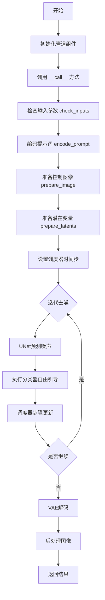

## 类结构

```
StableDiffusionXLControlNetXSPipeline
├── DeprecatedPipelineMixin (混入类)
├── DiffusionPipeline (基类)
├── TextualInversionLoaderMixin (混入类)
├── StableDiffusionXLLoraLoaderMixin (混入类)
└── FromSingleFileMixin (混入类)
```

## 全局变量及字段


### `EXAMPLE_DOC_STRING`
    
包含pipeline使用示例的文档字符串

类型：`str`
    


### `logger`
    
用于记录该模块日志的logger实例

类型：`logging.Logger`
    


### `XLA_AVAILABLE`
    
标识PyTorch XLA是否可用的布尔值，用于支持TPU加速

类型：`bool`
    


### `StableDiffusionXLControlNetXSPipeline.vae`
    
变分自编码器模型，用于编码和解码图像到潜在表示

类型：`AutoencoderKL`
    


### `StableDiffusionXLControlNetXSPipeline.text_encoder`
    
冻结的文本编码器，用于将文本转换为嵌入向量

类型：`CLIPTextModel`
    


### `StableDiffusionXLControlNetXSPipeline.text_encoder_2`
    
第二个冻结的文本编码器，带投影层用于SDXL

类型：`CLIPTextModelWithProjection`
    


### `StableDiffusionXLControlNetXSPipeline.tokenizer`
    
CLIP分词器，用于将文本 token 化

类型：`CLIPTokenizer`
    


### `StableDiffusionXLControlNetXSPipeline.tokenizer_2`
    
第二个CLIP分词器，用于第二文本编码器

类型：`CLIPTokenizer`
    


### `StableDiffusionXLControlNetXSPipeline.unet`
    
UNet去噪模型，结合ControlNet用于条件图像生成

类型：`UNetControlNetXSModel`
    


### `StableDiffusionXLControlNetXSPipeline.controlnet`
    
ControlNet-XS适配器，用于提供图像条件控制

类型：`ControlNetXSAdapter`
    


### `StableDiffusionXLControlNetXSPipeline.scheduler`
    
扩散调度器，用于控制去噪过程的噪声调度

类型：`KarrasDiffusionSchedulers`
    


### `StableDiffusionXLControlNetXSPipeline.vae_scale_factor`
    
VAE缩放因子，用于计算潜在空间的分辨率

类型：`int`
    


### `StableDiffusionXLControlNetXSPipeline.image_processor`
    
图像处理器，用于VAE的图像预处理和后处理

类型：`VaeImageProcessor`
    


### `StableDiffusionXLControlNetXSPipeline.control_image_processor`
    
控制图像专用处理器，用于处理ControlNet输入条件图像

类型：`VaeImageProcessor`
    


### `StableDiffusionXLControlNetXSPipeline.watermark`
    
水印处理器，用于给输出图像添加不可见水印

类型：`StableDiffusionXLWatermarker | None`
    


### `StableDiffusionXLControlNetXSPipeline._last_supported_version`
    
记录最后支持的pipeline版本号

类型：`str`
    


### `StableDiffusionXLControlNetXSPipeline.model_cpu_offload_seq`
    
定义模型到CPU卸载的顺序序列

类型：`str`
    


### `StableDiffusionXLControlNetXSPipeline._optional_components`
    
可选组件列表，用于标识哪些模块可以省略

类型：`list`
    


### `StableDiffusionXLControlNetXSPipeline._callback_tensor_inputs`
    
回调函数可用的tensor输入列表

类型：`list`
    
    

## 全局函数及方法


根据提供代码的分析，`adjust_lora_scale_text_encoder` 是从 `...models.lora` 模块导入的函数，在当前代码中仅看到其调用但未定义其实现。我基于代码中的使用方式和对LoRA调整机制的通用理解来构建文档。

### `adjust_lora_scale_text_encoder`

该函数用于在非PEFT后端环境下，动态调整文本编码器（Text Encoder）中LoRA层的缩放因子，以便在推理或训练过程中正确应用LoRA权重。

参数：

- `text_encoder`：`torch.nn.Module`，需要调整LoRA缩放因子的文本编码器模型（例如CLIPTextModel）。
- `lora_scale`：/`float`，LoRA层的缩放因子，用于控制LoRA权重对原始模型输出的影响程度。

返回值：`None`，该函数直接修改传入的text_encoder模型的内部状态。

#### 流程图

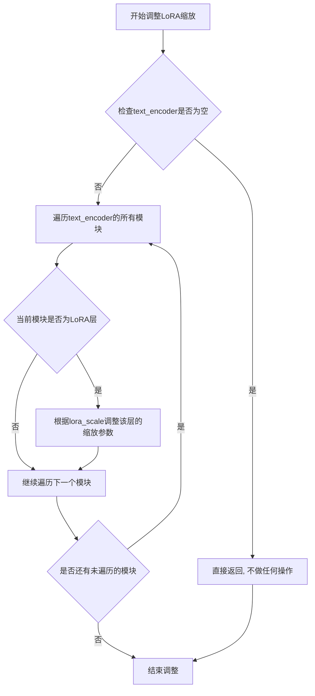

#### 带注释源码

```python
# 这是一个基于代码调用方式推断的函数实现
# 实际定义在 diffusers/src/diffusers/models/lora.py 中

def adjust_lora_scale_text_encoder(text_encoder, lora_scale: float):
    """
    调整文本编码器中LoRA层的缩放因子。
    
    此函数通常用于在不使用PEFT后端时，手动应用LoRA缩放。
    它会遍历文本编码器的模块，找到LoRA相关的层并调整其缩放。
    
    参数:
        text_encoder: 文本编码器模型实例 (例如 CLIPTextModel)
        lora_scale: 浮点数，表示LoRA层的缩放因子
        
    注意:
        在Diffusers中，如果USE_PEFT_BACKEND为True，则使用scale_lora_layers函数；
        否则使用此函数进行手动调整。
    """
    # 遍历文本编码器的所有模块
    for name, module in text_encoder.named_modules():
        # 检查模块名称中是否包含LoRA相关的标识
        # 不同的LoRA实现可能有不同的命名规则，这里以常见的lora命名为例
        if "lora" in name.lower():
            # 假设LoRA层有'alpha'或'scale'属性可以调整
            if hasattr(module, 'alpha'):
                module.alpha = lora_scale
            # 有些实现可能直接在forward中乘以缩放因子
            # 或者有专门的rank_dropout等参数需要调整
            
    # 另一种可能的实现方式是通过遍历named_parameters()
    # 找到与LoRA相关的参数并应用缩放
    # for name, param in text_encoder.named_parameters():
    #     if "lora" in name.lower():
    #         # 某些实现可能将缩放因子存储在param的attr中
    #         pass
```

**注意**：由于该函数的实际定义不在当前提供的代码文件中，以上源码是基于其在`encode_prompt`方法中的调用方式推断得出的。实际的实现可能位于`diffusers`库的`src/diffusers/models/lora.py`文件中，其具体实现可能涉及更复杂的LoRA层检测和参数调整逻辑。


根据任务要求，我需要从给定代码中提取 `scale_lora_layers` 函数的信息。

### scale_lora_layers

这是一个从 `...utils` 模块导入的全局函数，用于动态调整 LoRA（Low-Rank Adaptation）层的缩放因子。该函数在 `encode_prompt` 方法中被调用，用于在文本编码时应用 LoRA 权重缩放。

参数：

-  `model`：`torch.nn.Module`，需要进行 LoRA 缩放的网络模型（如 `text_encoder` 或 `text_encoder_2`）
-  `scale`：`float`，LoRA 缩放因子，用于调整 LoRA 权重的影响程度

返回值：无返回值（`None`），该函数直接修改传入模型的 LoRA 权重

#### 流程图

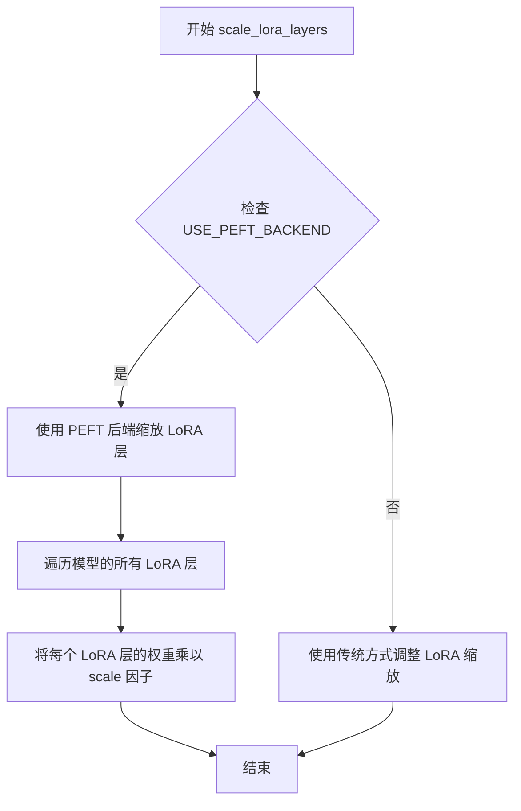

#### 带注释源码

```
# 该函数定义在 diffusers/src/diffusers/utils/__init__.py 或同目录下的其他模块中
# 当前代码文件中仅导入了该函数，未提供完整实现
# 以下为基于代码用法的推断：

def scale_lora_layers(model: torch.nn.Module, scale: float | None = None):
    """
    动态调整模型中所有 LoRA 层的缩放因子。
    
    当使用 PEFT (Parameter-Efficient Fine-Tuning) 后端时，此函数遍历模型中
    所有已添加的 LoRA 层，并将它们的缩放因子调整为指定的值。
    
    Args:
        model: 包含 LoRA 层的 PyTorch 模型（通常是 text_encoder 或 text_encoder_2）
        scale: 缩放因子，如果为 None，则使用默认缩放值
        
    Returns:
        None: 直接修改模型内部状态
    """
    # 具体实现位于 diffusers 库 utils 模块中
    # 此函数在推理时动态调整 LoRA 权重的影响程度
    pass
```

#### 使用示例（来自当前代码文件）

在 `StableDiffusionXLControlNetXSPipeline.encode_prompt` 方法中的调用：

```python
# 动态调整 LoRA 缩放
if self.text_encoder is not None:
    if not USE_PEFT_BACKEND:
        adjust_lora_scale_text_encoder(self.text_encoder, lora_scale)
    else:
        # 调用 scale_lora_layers 调整 text_encoder 的 LoRA 权重
        scale_lora_layers(self.text_encoder, lora_scale)

if self.text_encoder_2 is not None:
    if not USE_PEFT_BACKEND:
        adjust_lora_scale_text_encoder(self.text_encoder_2, lora_scale)
    else:
        # 调用 scale_lora_layers 调整 text_encoder_2 的 LoRA 权重
        scale_lora_layers(self.text_encoder_2, lora_scale)
```

---

> **注意**：由于 `scale_lora_layers` 是从 `diffusers` 库的 `utils` 模块导入的外部函数，其完整实现并未包含在当前代码文件中。上述信息是基于该函数在代码中的使用方式进行的推断。如需获取该函数的完整源代码实现，建议查看 `diffusers` 库的 `src/diffusers/utils/` 目录下的相关文件。


### `unscale_lora_layers`

撤销之前对文本编码器LoRA层应用的缩放操作，将LoRA层的权重缩放因子恢复到原始状态。该函数通常在完成文本编码后调用，以移除临时应用的LoRA缩放，确保后续操作使用正确的权重。

参数：

-  `text_encoder`：`torch.nn.Module`，需要撤销LoRA缩放的文本编码器模型（CLIPTextModel或CLIPTextModelWithProjection）
-  `lora_scale`：`float`，之前通过`scale_lora_layers`应用的LoRA缩放因子，用于逆向操作

返回值：`None`，该函数直接修改传入的模型参数，无返回值

#### 流程图

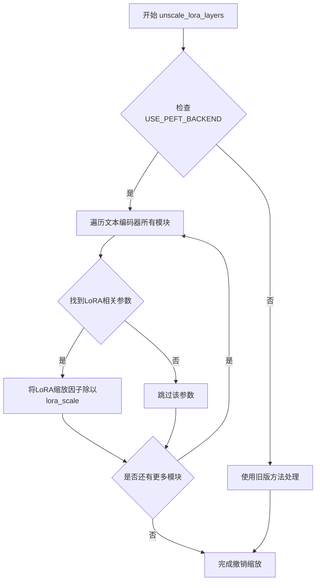

#### 带注释源码

```python
# 该函数定义在 diffusers.utils 模块中
# 以下是调用处的源码展示其使用方式

# 在 StableDiffusionXLControlNetXSPipeline.encode_prompt 方法末尾：

# 检查文本编码器是否存在
if self.text_encoder is not None:
    # 确保当前管线支持LoRA加载且使用PEFT后端
    if isinstance(self, StableDiffusionXLLoraLoaderMixin) and USE_PEFT_BACKEND:
        # 通过撤销LoRA层缩放来恢复原始权重
        # 这样可以确保后续处理使用正确的未缩放权重
        unscale_lora_layers(self.text_encoder, lora_scale)

# 对第二个文本编码器（text_encoder_2）进行相同的处理
if self.text_encoder_2 is not None:
    if isinstance(self, StableDiffusionXLLoraLoaderMixin) and USE_PEFT_BACKEND:
        # 撤销第二个文本编码器的LoRA层缩放
        unscale_lora_layers(self.text_encoder_2, lora_scale)
```

#### 补充说明

该函数是LoRA权重加载流程中的关键环节。在`encode_prompt`方法中，流程如下：

1. **加载阶段**：使用`scale_lora_layers`应用LoRA缩放因子，使文本嵌入生成使用调整后的LoRA权重
2. **编码阶段**：生成prompt_embeds、negative_prompt_embeds等文本表示
3. **恢复阶段**：调用`unscale_lora_layers`撤销缩放，将模型权重恢复到原始状态，避免影响后续管线步骤

这种设计确保了LoRA权重只在需要时生效，并在使用完毕后立即恢复。


### `is_compiled_module`

该函数用于检查给定的 PyTorch 模块是否已通过 `torch.compile()` 编译（ TorchDynamo 编译），如果已编译则返回原始未编译的模块。

参数：

- `module`：`torch.nn.Module`，需要检查的 PyTorch 模块

返回值：`torch.nn.Module`，如果模块已编译则返回原始未编译的模块（`_orig_mod`），否则返回原模块本身

#### 流程图

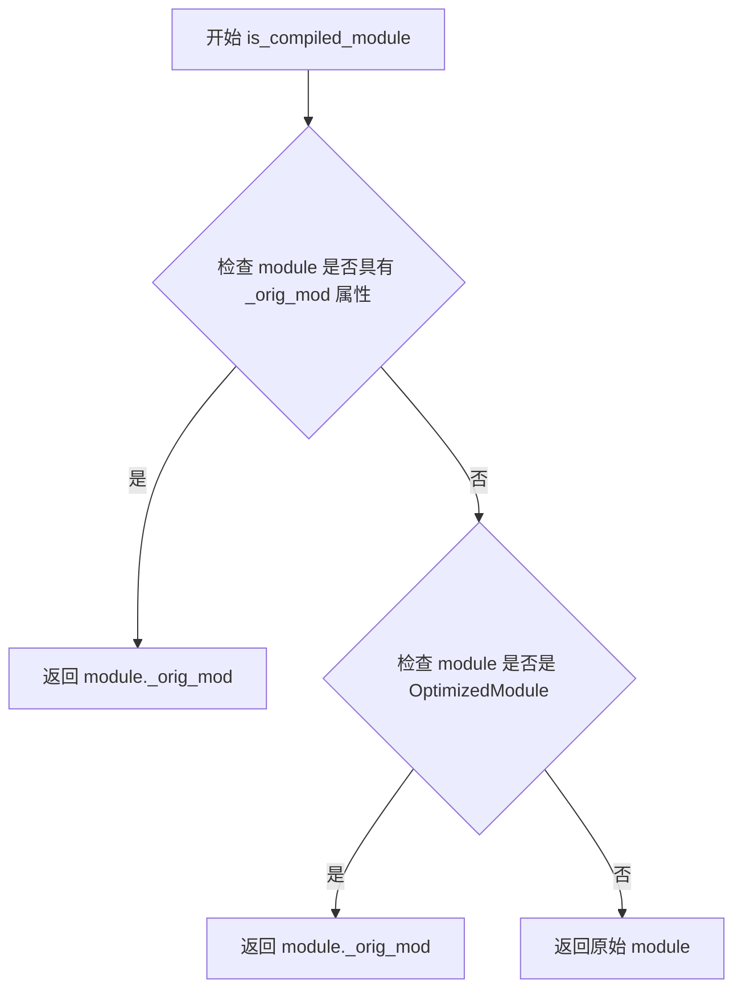

#### 带注释源码

```python
# 该函数定义在 diffusers.utils.torch_utils 模块中
# 当前代码文件中通过 from ...utils.torch_utils import is_compiled_module 导入使用

# 在 pipeline 中的使用示例：
# 如果 unet 已编译，则获取其原始模块
unet = self.unet._orig_mod if is_compiled_module(self.unet) else self.unet

# 用于检查 controlnet 是否已编译
is_controlnet_compiled = is_compiled_module(self.unet)

# 内部实现逻辑（基于使用方式推断）：
# 1. 检查模块是否具有 _orig_mod 属性（torch.compile 会在编译后的模块上添加此属性）
# 2. 或者检查模块是否是 torch._dynamo.eval_frame.OptimizedModule 的实例
# 3. 如果满足条件，返回编译前的原始模块；否则返回原模块
```


### is_torch_version

该函数是一个版本比较工具，用于检查当前 PyTorch 版本是否满足指定的条件。它通过比较运算符和目标版本号来判断 PyTorch 版本，支持大于等于、大于、小于等于、小于等多种比较方式。

参数：

- `op`：`str`，比较运算符，如 ">=", ">", "==", "<=", "<" 等
- `version`：`str`，目标 PyTorch 版本号，如 "2.1", "1.13" 等

返回值：`bool`，如果当前 PyTorch 版本满足指定的条件则返回 `True`，否则返回 `False`

#### 流程图

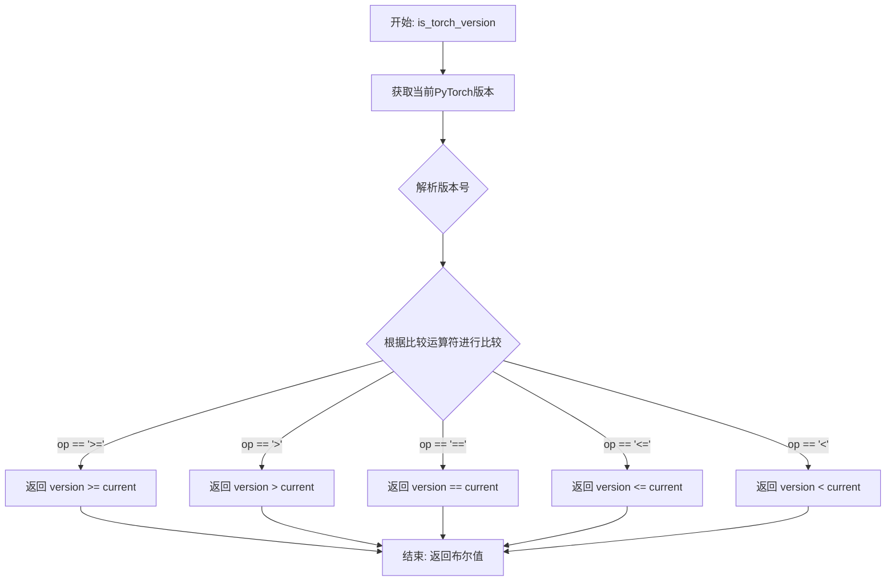

#### 带注释源码

```
# 该函数定义在 diffusers.utils.torch_utils 模块中
# 当前文件从该模块导入该函数：
# from ...utils.torch_utils import is_compiled_module, is_torch_version, randn_tensor

# 在当前代码中的使用示例（第723行附近）：
is_torch_higher_equal_2_1 = is_torch_version(">=", "2.1")

# 函数功能说明：
# - 用于检测当前环境的 PyTorch 版本
# - 支持多种比较运算符：>=, >, ==, <=, <
# - 常用于条件分支，根据不同 PyTorch 版本执行不同代码逻辑
# - 返回布尔值，表示版本比较结果
```

#### 补充说明

由于 `is_torch_version` 函数定义在外部模块 (`diffusers.utils.torch_utils`) 中，当前提供的代码片段仅包含该函数的导入和使用部分。要获取完整的函数源码定义，需要查看 `diffusers/utils/torch_utils.py` 文件。

该函数在当前代码中的作用是：检查 PyTorch 版本是否大于等于 2.1，用于决定是否在推理过程中调用 `torch._inductor.cudagraph_mark_step_begin()` 来优化性能（这是 PyTorch 2.1 及以上版本才支持的功能）。


### randn_tensor

`randn_tensor` 是一个从 `diffusers.utils.torch_utils` 模块导入的全局工具函数，用于生成符合标准正态分布（均值=0，方差=1）的随机张量。在代码中用于生成扩散模型的初始潜在变量（latents）。

参数：

-  `shape`：`tuple` 或 `torch.Size`，要生成张量的形状
-  `generator`：`torch.Generator` 或 `list[torch.Generator]` 或 `None`，用于控制随机数生成的可选生成器，以实现确定性生成
-  `device`：`torch.device`，生成张量所在的设备
-  `dtype`：`torch.dtype`，生成张量的数据类型

返回值：`torch.Tensor`，符合标准正态分布的随机张量

#### 流程图

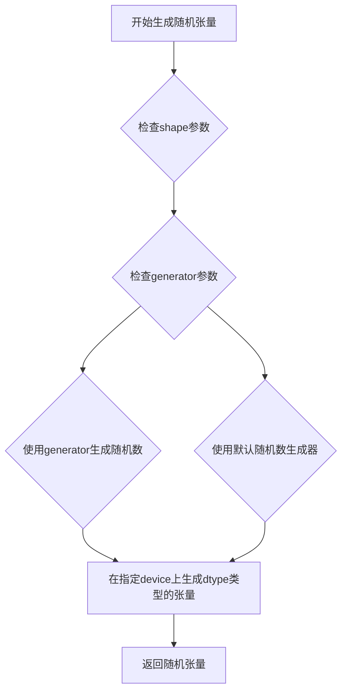

#### 带注释源码

```python
# randn_tensor 函数定义位于 diffusers.utils.torch_utils 模块中
# 以下是其在 StableDiffusionXLControlNetXSPipeline 中的调用方式：

# 在 prepare_latents 方法中调用：
def prepare_latents(self, batch_size, num_channels_latents, height, width, dtype, device, generator, latents=None):
    # 计算需要生成的张量形状
    shape = (
        batch_size,
        num_channels_latents,
        int(height) // self.vae_scale_factor,
        int(width) // self.vae_scale_factor,
    )
    
    # 验证生成器列表长度与批次大小是否匹配
    if isinstance(generator, list) and len(generator) != batch_size:
        raise ValueError(
            f"You have passed a list of generators of length {len(generator)}, but requested an effective batch"
            f" size of {batch_size}. Make sure the batch size matches the length of the generators."
        )

    # 如果没有提供预生成的latents，则使用randn_tensor生成随机噪声
    if latents is None:
        # 调用 randn_tensor 生成符合标准正态分布的随机张量
        latents = randn_tensor(shape, generator=generator, device=device, dtype=dtype)
    else:
        # 如果提供了latents，则直接将其移到目标设备
        latents = latents.to(device)

    # 根据scheduler的初始噪声标准差缩放初始噪声
    latents = latents * self.scheduler.init_noise_sigma
    return latents
```


### `is_invisible_watermark_available`

该函数用于检查 `invisible_watermark` 库是否已安装可用，返回布尔值以决定是否在管道中启用水印功能。

参数：

- 该函数无参数

返回值：`bool`，返回 `True` 表示 invisible_watermark 库可用，可以启用水印功能；返回 `False` 表示库不可用，不启用水印。

#### 流程图

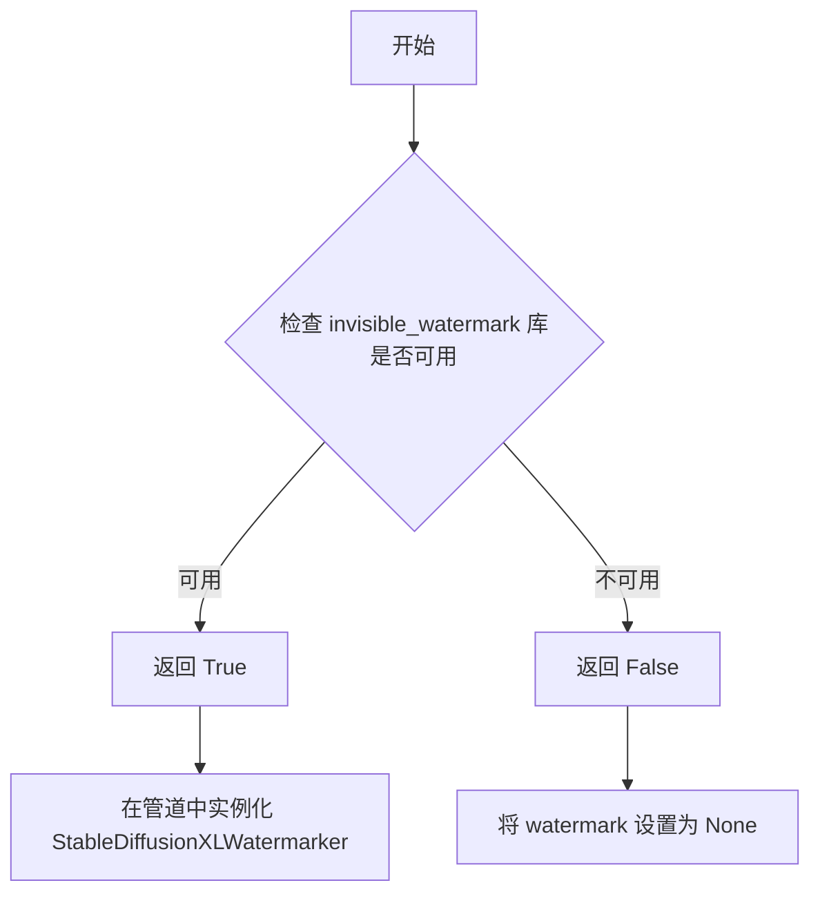

#### 带注释源码

```python
# 该函数从 diffusers.utils.import_utils 导入
from diffusers.utils.import_utils import is_invisible_watermark_available

# 在 Pipeline 初始化中的使用方式：
# add_watermarker 参数如果为 None，则自动检测库是否可用
add_watermarker = add_watermarker if add_watermarker is not None else is_invisible_watermark_available()

# 根据检测结果决定是否创建水印处理器
if add_watermarker:
    self.watermark = StableDiffusionXLWatermarker()
else:
    self.watermark = None

# 在生成图像后应用水印（如有）
if self.watermark is not None:
    image = self.watermark.apply_watermark(image)
```


# 分析结果

## is_torch_xla_available

这是一个用于检查PyTorch XLA（TPU加速库）是否可用的工具函数。

参数：此函数不接受任何参数。

返回值：`bool`，返回True表示PyTorch XLA可用，返回False表示不可用。

#### 流程图

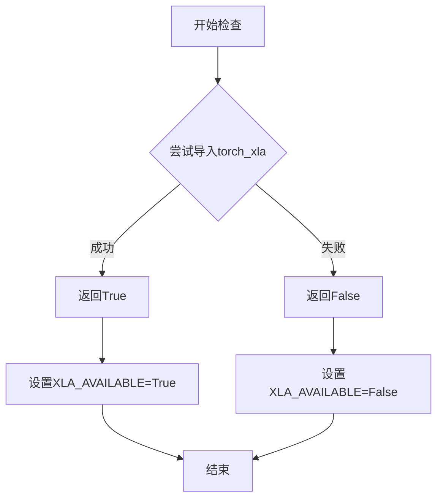

#### 带注释源码

```
# 注意：此函数定义不在当前文件中，而是从 diffusers.utils.import_utils 导入
# 根据代码中的使用方式，推断其功能如下：

def is_torch_xla_available() -> bool:
    """
    检查PyTorch XLA是否可用。
    
    PyTorch XLA是Google TPU的PyTorch后端，用于在TPU设备上加速深度学习模型。
    此函数用于动态检测环境中是否安装了torch_xla库。
    
    返回值:
        bool: 如果torch_xla可用返回True，否则返回False
    """
    # 具体实现通常使用try-except尝试导入torch_xla模块
    # 如果导入成功返回True，失败返回False
    pass
```

#### 在当前代码中的实际使用

```
# 导入语句（来自当前文件第55行）
from ...utils import is_torch_xla_available

# 使用方式（来自当前文件第57-62行）
if is_torch_xla_available():
    import torch_xla.core.xla_model as xm
    XLA_AVAILABLE = True
else:
    XLA_AVAILABLE = False

# 在去噪循环末尾使用（来自当前代码第707行）
if XLA_AVAILABLE:
    xm.mark_step()
```

---

### 补充说明

| 项目 | 说明 |
|------|------|
| **函数类型** | 工具函数/检测函数 |
| **依赖外部** | `torch_xla`库（TPU支持库） |
| **使用场景** | 用于检测是否可以在TPU上运行模型，以优化性能 |
| **相关变量** | `XLA_AVAILABLE`：全局布尔变量，标记XLA是否可用 |
| **相关导入** | `import torch_xla.core.xla_model as xm`：XLA设备管理模块 |


### `StableDiffusionXLControlNetXSPipeline.__init__`

初始化Stable Diffusion XL ControlNet-XS Pipeline，设置VAE、文本编码器、tokenizer、UNet、ControlNet、调度器等核心组件，并注册到pipeline中用于图像生成。

参数：

- `vae`：`AutoencoderKL`，Variational Auto-Encoder (VAE) 模型，用于编码和解码图像到/from latent表示
- `text_encoder`：`CLIPTextModel`，冻结的文本编码器 (clip-vit-large-patch14)
- `text_encoder_2`：`CLIPTextModelWithProjection`，第二个冻结的文本编码器 (laion/CLIP-ViT-bigG-14-laion2B-39B-b160k)
- `tokenizer`：`CLIPTokenizer`，用于tokenize文本的CLIPTokenizer
- `tokenizer_2`：`CLIPTokenizer`，用于tokenize文本的第二个CLIPTokenizer
- `unet`：`UNet2DConditionModel | UNetControlNetXSModel`，用于去噪图像latents的UNet模型
- `controlnet`：`ControlNetXSAdapter`，与unet结合使用的ControlNet-XS适配器
- `scheduler`：`KarrasDiffusionSchedulers`，与unet结合使用去噪latents的调度器
- `force_zeros_for_empty_prompt`：`bool`，可选，默认`True`，是否将负提示嵌入始终设为0
- `add_watermarker`：`bool | None`，可选，是否使用invisible_watermark库对输出图像加水印
- `feature_extractor`：`CLIPImageProcessor`，可选，特征提取器

返回值：无（`None`），`__init__`方法不返回值

#### 流程图

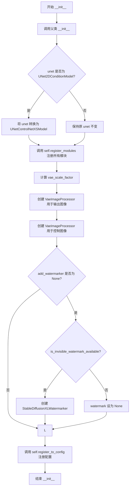

#### 带注释源码

```python
def __init__(
    self,
    vae: AutoencoderKL,
    text_encoder: CLIPTextModel,
    text_encoder_2: CLIPTextModelWithProjection,
    tokenizer: CLIPTokenizer,
    tokenizer_2: CLIPTokenizer,
    unet: UNet2DConditionModel | UNetControlNetXSModel,
    controlnet: ControlNetXSAdapter,
    scheduler: KarrasDiffusionSchedulers,
    force_zeros_for_empty_prompt: bool = True,
    add_watermarker: bool | None = None,
    feature_extractor: CLIPImageProcessor = None,
):
    """
    初始化 StableDiffusionXLControlNetXSPipeline
    
    参数:
        vae: VAE模型，用于图像编码/解码
        text_encoder: 第一个CLIP文本编码器
        text_encoder_2: 第二个CLIP文本编码器(带projection)
        tokenizer: 第一个CLIP分词器
        tokenizer_2: 第二个CLIP分词器
        unet: UNet2DConditionModel或UNetControlNetXSModel
        controlnet: ControlNet-XS适配器
        scheduler: 扩散调度器
        force_zeros_for_empty_prompt: 空提示时是否强制零嵌入
        add_watermarker: 是否添加水印
        feature_extractor: 图像特征提取器
    """
    # 调用父类初始化
    super().__init__()

    # 如果传入的是普通UNet，则将其转换为UNetControlNetXSModel
    # 这样可以利用ControlNet-XS的增强功能
    if isinstance(unet, UNet2DConditionModel):
        unet = UNetControlNetXSModel.from_unet(unet, controlnet)

    # 注册所有模块到pipeline，使其可通过pipeline.xxx访问
    self.register_modules(
        vae=vae,
        text_encoder=text_encoder,
        text_encoder_2=text_encoder_2,
        tokenizer=tokenizer,
        tokenizer_2=tokenizer_2,
        unet=unet,
        controlnet=controlnet,
        scheduler=scheduler,
        feature_extractor=feature_extractor,
    )
    
    # 计算VAE缩放因子，用于后续图像尺寸计算
    # 基于VAE的block_out_channels计算下采样倍数
    self.vae_scale_factor = 2 ** (len(self.vae.config.block_out_channels) - 1) if getattr(self, "vae", None) else 8
    
    # 创建图像处理器:用于处理输出图像(转换为RGB)
    self.image_processor = VaeImageProcessor(vae_scale_factor=self.vae_scale_factor, do_convert_rgb=True)
    
    # 创建控制图像处理器:用于处理ControlNet输入图像
    # 注意:控制图像不需要normalize，因为ControlNet有自身的归一化逻辑
    self.control_image_processor = VaeImageProcessor(
        vae_scale_factor=self.vae_scale_factor, do_convert_rgb=True, do_normalize=False
    )
    
    # 确定是否添加水印:如果未指定，则检查watermark库是否可用
    add_watermarker = add_watermarker if add_watermarker is not None else is_invisible_watermark_available()

    # 根据add_watermarker设置水印处理器
    if add_watermarker:
        self.watermark = StableDiffusionXLWatermarker()
    else:
        self.watermark = None

    # 注册配置参数到config对象
    self.register_to_config(force_zeros_for_empty_prompt=force_zeros_for_empty_prompt)
```


### `StableDiffusionXLControlNetXSPipeline.encode_prompt`

该函数负责将文本提示（prompt）编码为文本编码器的隐藏状态（hidden states），支持双文本编码器（CLIP Text Encoder 和 CLIP Text Encoder with Projection）架构，同时处理 LoRA 权重调整、Classifier-Free Guidance（CFG）所需的负向提示嵌入（negative prompt embeds）以及池化嵌入（pooled embeds）。该函数是 Stable Diffusion XL pipeline 的核心组成部分，用于生成条件扩散模型的文本条件输入。

参数：

- `prompt`：`str | list[str] | None`，要编码的主提示文本，支持字符串或字符串列表
- `prompt_2`：`str | list[str] | None`，发送给第二个 tokenizer 和 text_encoder_2 的提示，若不指定则使用 prompt
- `device`：`torch.device | None`，执行计算的 torch 设备，若为 None 则使用 self._execution_device
- `num_images_per_prompt`：`int`，每个提示生成的图像数量，用于扩展嵌入维度
- `do_classifier_free_guidance`：`bool`，是否启用 Classifier-Free Guidance
- `negative_prompt`：`str | list[str] | None`，不引导图像生成的负向提示
- `negative_prompt_2`：`str | list[str] | None`，发送给第二个 tokenizer 和 text_encoder_2 的负向提示
- `prompt_embeds`：`torch.Tensor | None`，预生成的文本嵌入，可用于调整文本输入（如 prompt weighting）
- `negative_prompt_embeds`：`torch.Tensor | None`，预生成的负向文本嵌入
- `pooled_prompt_embeds`：`torch.Tensor | None`，预生成的池化文本嵌入
- `negative_pooled_prompt_embeds`：`torch.Tensor | None`，预生成的负向池化文本嵌入
- `lora_scale`：`float | None`，要应用于所有 LoRA 层的缩放因子
- `clip_skip`：`int | None`，计算嵌入时从 CLIP 跳过的层数

返回值：`tuple[torch.Tensor, torch.Tensor, torch.Tensor, torch.Tensor]`，返回四个张量：prompt_embeds（编码后的提示嵌入）、negative_prompt_embeds（编码后的负向提示嵌入）、pooled_prompt_embeds（池化后的提示嵌入）、negative_pooled_prompt_embeds（池化后的负向提示嵌入）

#### 流程图

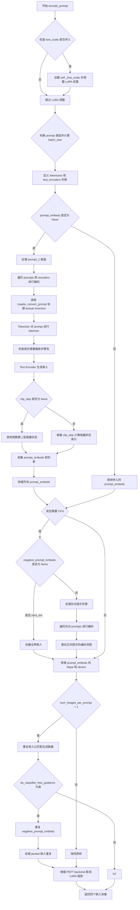

#### 带注释源码

```python
def encode_prompt(
    self,
    prompt: str,
    prompt_2: str | None = None,
    device: torch.device | None = None,
    num_images_per_prompt: int = 1,
    do_classifier_free_guidance: bool = True,
    negative_prompt: str | None = None,
    negative_prompt_2: str | None = None,
    prompt_embeds: torch.Tensor | None = None,
    negative_prompt_embeds: torch.Tensor | None = None,
    pooled_prompt_embeds: torch.Tensor | None = None,
    negative_pooled_prompt_embeds: torch.Tensor | None = None,
    lora_scale: float | None = None,
    clip_skip: int | None = None,
):
    r"""
    Encodes the prompt into text encoder hidden states.

    Args:
        prompt (`str` or `list[str]`, *optional*):
            prompt to be encoded
        prompt_2 (`str` or `list[str]`, *optional*):
            The prompt or prompts to be sent to the `tokenizer_2` and `text_encoder_2`. If not defined, `prompt` is
            used in both text-encoders
        device: (`torch.device`):
            torch device
        num_images_per_prompt (`int`):
            number of images that should be generated per prompt
        do_classifier_free_guidance (`bool`):
            whether to use classifier free guidance or not
        negative_prompt (`str` or `list[str]`, *optional*):
            The prompt or prompts not to guide the image generation. If not defined, one has to pass
            `negative_prompt_embeds` instead. Ignored when not using guidance (i.e., ignored if `guidance_scale` is
            less than `1`).
        negative_prompt_2 (`str` or `list[str]`, *optional*):
            The prompt or prompts not to guide the image generation to be sent to `tokenizer_2` and
            `text_encoder_2`. If not defined, `negative_prompt` is used in both text-encoders
        prompt_embeds (`torch.Tensor`, *optional*):
            Pre-generated text embeddings. Can be used to easily tweak text inputs, *e.g.* prompt weighting. If not
            provided, text embeddings will be generated from `prompt` input argument.
        negative_prompt_embeds (`torch.Tensor`, *optional*):
            Pre-generated negative text embeddings. Can be used to easily tweak text inputs, *e.g.* prompt
            weighting. If not provided, negative_prompt_embeds will be generated from `negative_prompt` input
            argument.
        pooled_prompt_embeds (`torch.Tensor`, *optional*):
            Pre-generated pooled text embeddings. Can be used to easily tweak text inputs, *e.g.* prompt weighting.
            If not provided, pooled text embeddings will be generated from `prompt` input argument.
        negative_pooled_prompt_embeds (`torch.Tensor`, *optional*):
            Pre-generated negative pooled text embeddings. Can be used to easily tweak text inputs, *e.g.* prompt
            weighting. If not provided, pooled negative_prompt_embeds will be generated from `negative_prompt`
            input argument.
        lora_scale (`float`, *optional*):
            A lora scale that will be applied to all LoRA layers of the text encoder if LoRA layers are loaded.
        clip_skip (`int`, *optional*):
            Number of layers to be skipped from CLIP while computing the prompt embeddings. A value of 1 means that
            the output of the pre-final layer will be used for computing the prompt embeddings.
    """
    # 确定执行设备，优先使用传入的 device，否则使用 pipeline 的执行设备
    device = device or self._execution_device

    # 如果传入了 lora_scale 且 pipeline 支持 LoRA，则设置内部缩放因子
    # 并根据是否使用 PEFT backend 来调整 LoRA 权重
    if lora_scale is not None and isinstance(self, StableDiffusionXLLoraLoaderMixin):
        self._lora_scale = lora_scale

        # 动态调整 LoRA 缩放
        if self.text_encoder is not None:
            if not USE_PEFT_BACKEND:
                adjust_lora_scale_text_encoder(self.text_encoder, lora_scale)
            else:
                scale_lora_layers(self.text_encoder, lora_scale)

        if self.text_encoder_2 is not None:
            if not USE_PEFT_BACKEND:
                adjust_lora_scale_text_encoder(self.text_encoder_2, lora_scale)
            else:
                scale_lora_layers(self.text_encoder_2, lora_scale)

    # 统一 prompt 格式为列表
    prompt = [prompt] if isinstance(prompt, str) else prompt

    # 计算 batch_size
    if prompt is not None:
        batch_size = len(prompt)
    else:
        batch_size = prompt_embeds.shape[0]

    # 定义 tokenizers 和 text_encoders 列表
    # 如果 tokenizer 存在则使用两个，否则只使用 tokenizer_2
    tokenizers = [self.tokenizer, self.tokenizer_2] if self.tokenizer is not None else [self.tokenizer_2]
    text_encoders = (
        [self.text_encoder, self.text_encoder_2] if self.text_encoder is not None else [self.text_encoder_2]
    )

    # 如果没有传入预计算的 prompt_embeds，则需要从 prompt 生成
    if prompt_embeds is None:
        # prompt_2 默认为 prompt
        prompt_2 = prompt_2 or prompt
        prompt_2 = [prompt_2] if isinstance(prompt_2, str) else prompt_2

        # textual inversion: process multi-vector tokens if necessary
        prompt_embeds_list = []
        prompts = [prompt, prompt_2]
        
        # 遍历两个 prompt（主 prompt 和 prompt_2）以及对应的 tokenizer 和 text_encoder
        for prompt, tokenizer, text_encoder in zip(prompts, tokenizers, text_encoders):
            # 如果支持 textual inversion，转换 prompt
            if isinstance(self, TextualInversionLoaderMixin):
                prompt = self.maybe_convert_prompt(prompt, tokenizer)

            # 使用 tokenizer 将文本转换为 token IDs
            text_inputs = tokenizer(
                prompt,
                padding="max_length",
                max_length=tokenizer.model_max_length,
                truncation=True,
                return_tensors="pt",
            )

            text_input_ids = text_inputs.input_ids
            # 获取未截断的 token IDs 用于比较
            untruncated_ids = tokenizer(prompt, padding="longest", return_tensors="pt").input_ids

            # 检查是否发生了截断，如果是则记录警告
            if untruncated_ids.shape[-1] >= text_input_ids.shape[-1] and not torch.equal(
                text_input_ids, untruncated_ids
            ):
                removed_text = tokenizer.batch_decode(untruncated_ids[:, tokenizer.model_max_length - 1 : -1])
                logger.warning(
                    "The following part of your input was truncated because CLIP can only handle sequences up to"
                    f" {tokenizer.model_max_length} tokens: {removed_text}"
                )

            # 使用 text_encoder 获取文本嵌入，输出所有隐藏状态
            prompt_embeds = text_encoder(text_input_ids.to(device), output_hidden_states=True)

            # 获取池化输出（始终使用最后一个 text encoder 的池化输出）
            if pooled_prompt_embeds is None and prompt_embeds[0].ndim == 2:
                pooled_prompt_embeds = prompt_embeds[0]

            # 根据 clip_skip 参数选择隐藏状态层
            if clip_skip is None:
                # 默认使用倒数第二层
                prompt_embeds = prompt_embeds.hidden_states[-2]
            else:
                # SDXL 总是从倒数第 clip_skip + 2 层索引（因为索引从0开始）
                prompt_embeds = prompt_embeds.hidden_states[-(clip_skip + 2)]

            prompt_embeds_list.append(prompt_embeds)

        # 在最后一个维度拼接两个 text encoder 的嵌入
        prompt_embeds = torch.concat(prompt_embeds_list, dim=-1)

    # 处理 Classifier-Free Guidance 所需的负向嵌入
    # 如果配置要求对空 prompt 使用零嵌入
    zero_out_negative_prompt = negative_prompt is None and self.config.force_zeros_for_empty_prompt
    
    # 如果需要 CFG 且没有传入负向嵌入
    if do_classifier_free_guidance and negative_prompt_embeds is None and zero_out_negative_prompt:
        # 创建与 prompt_embeds 形状相同的零张量
        negative_prompt_embeds = torch.zeros_like(prompt_embeds)
        negative_pooled_prompt_embeds = torch.zeros_like(pooled_prompt_embeds)
    elif do_classifier_free_guidance and negative_prompt_embeds is None:
        # 需要生成负向嵌入
        negative_prompt = negative_prompt or ""
        negative_prompt_2 = negative_prompt_2 or negative_prompt

        # 将字符串 normalize 为列表
        negative_prompt = batch_size * [negative_prompt] if isinstance(negative_prompt, str) else negative_prompt
        negative_prompt_2 = (
            batch_size * [negative_prompt_2] if isinstance(negative_prompt_2, str) else negative_prompt_2
        )

        # 类型检查
        uncond_tokens: list[str]
        if prompt is not None and type(prompt) is not type(negative_prompt):
            raise TypeError(
                f"`negative_prompt` should be the same type to `prompt`, but got {type(negative_prompt)} !="
                f" {type(prompt)}."
            )
        elif batch_size != len(negative_prompt):
            raise ValueError(
                f"`negative_prompt`: {negative_prompt} has batch size {len(negative_prompt)}, but `prompt`:"
                f" {prompt} has batch size {batch_size}. Please make sure that passed `negative_prompt` matches"
                " the batch size of `prompt`."
            )
        else:
            uncond_tokens = [negative_prompt, negative_prompt_2]

        # 生成负向嵌入
        negative_prompt_embeds_list = []
        for negative_prompt, tokenizer, text_encoder in zip(uncond_tokens, tokenizers, text_encoders):
            # 处理 textual inversion
            if isinstance(self, TextualInversionLoaderMixin):
                negative_prompt = self.maybe_convert_prompt(negative_prompt, tokenizer)

            # 使用与正向嵌入相同的长度
            max_length = prompt_embeds.shape[1]
            uncond_input = tokenizer(
                negative_prompt,
                padding="max_length",
                max_length=max_length,
                truncation=True,
                return_tensors="pt",
            )

            # 获取负向嵌入
            negative_prompt_embeds = text_encoder(
                uncond_input.input_ids.to(device),
                output_hidden_states=True,
            )

            # 获取池化负向嵌入
            if negative_pooled_prompt_embeds is None and negative_prompt_embeds[0].ndim == 2:
                negative_pooled_prompt_embeds = negative_prompt_embeds[0]
            # 使用倒数第二层
            negative_prompt_embeds = negative_prompt_embeds.hidden_states[-2]

            negative_prompt_embeds_list.append(negative_prompt_embeds)

        # 拼接负向嵌入
        negative_prompt_embeds = torch.concat(negative_prompt_embeds_list, dim=-1)

    # 将 prompt_embeds 转换为正确的 dtype 和 device
    if self.text_encoder_2 is not None:
        prompt_embeds = prompt_embeds.to(dtype=self.text_encoder_2.dtype, device=device)
    else:
        prompt_embeds = prompt_embeds.to(dtype=self.unet.dtype, device=device)

    # 扩展嵌入维度以匹配 num_images_per_prompt
    bs_embed, seq_len, _ = prompt_embeds.shape
    # 使用 MPS 友好的方法复制文本嵌入
    prompt_embeds = prompt_embeds.repeat(1, num_images_per_prompt, 1)
    prompt_embeds = prompt_embeds.view(bs_embed * num_images_per_prompt, seq_len, -1)

    # 处理 CFG 所需的负向嵌入扩展
    if do_classifier_free_guidance:
        seq_len = negative_prompt_embeds.shape[1]

        if self.text_encoder_2 is not None:
            negative_prompt_embeds = negative_prompt_embeds.to(dtype=self.text_encoder_2.dtype, device=device)
        else:
            negative_prompt_embeds = negative_prompt_embeds.to(dtype=self.unet.dtype, device=device)

        negative_prompt_embeds = negative_prompt_embeds.repeat(1, num_images_per_prompt, 1)
        negative_prompt_embeds = negative_prompt_embeds.view(batch_size * num_images_per_prompt, seq_len, -1)

    # 扩展池化嵌入
    pooled_prompt_embeds = pooled_prompt_embeds.repeat(1, num_images_per_prompt).view(
        bs_embed * num_images_per_prompt, -1
    )
    if do_classifier_free_guidance:
        negative_pooled_prompt_embeds = negative_pooled_prompt_embeds.repeat(1, num_images_per_prompt).view(
            bs_embed * num_images_per_prompt, -1
        )

    # 如果使用了 PEFT backend，需要恢复原始的 LoRA 缩放
    if self.text_encoder is not None:
        if isinstance(self, StableDiffusionXLLoraLoaderMixin) and USE_PEFT_BACKEND:
            # Retrieve the original scale by scaling back the LoRA layers
            unscale_lora_layers(self.text_encoder, lora_scale)

    if self.text_encoder_2 is not None:
        if isinstance(self, StableDiffusionXLLoraLoaderMixin) and USE_PEFT_BACKEND:
            # Retrieve the original scale by scaling back the LoRA layers
            unscale_lora_layers(self.text_encoder_2, lora_scale)

    # 返回四个嵌入张量
    return prompt_embeds, negative_prompt_embeds, pooled_prompt_embeds, negative_pooled_prompt_embeds
```


### `StableDiffusionXLControlNetXSPipeline.prepare_extra_step_kwargs`

该方法用于为调度器（scheduler）的 `step` 方法准备额外的关键字参数。由于不同调度器的签名不同，此方法通过检查调度器是否接受特定参数（如 `eta` 和 `generator`）来动态构建需要传递的额外参数字典。

参数：

- `self`：`StableDiffusionXLControlNetXSPipeline`，Pipeline 实例本身，包含调度器（scheduler）属性
- `generator`：`torch.Generator` 或 `list[torch.Generator]` 或 `None`，用于控制随机数生成的确定性，可选参数
- `eta`：`float`，DDIM 调度器专用的噪声系数（η），取值范围 [0, 1]，其他调度器会忽略此参数

返回值：`dict`，包含调度器 `step` 方法所需额外参数（如 `eta` 和/或 `generator`）的字典

#### 流程图

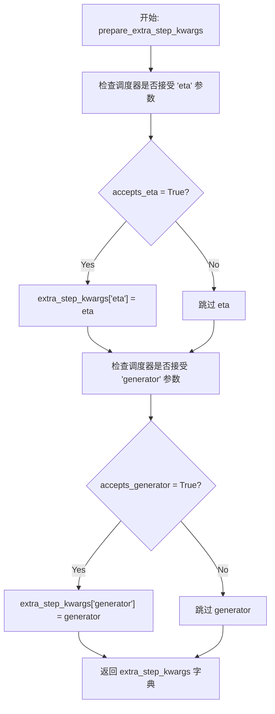

#### 带注释源码

```python
def prepare_extra_step_kwargs(self, generator, eta):
    # 准备调度器步骤的额外关键字参数，因为并非所有调度器都具有相同的签名。
    # eta (η) 仅在 DDIMScheduler 中使用，对于其他调度器将被忽略。
    # eta 对应于 DDIM 论文 (https://huggingface.co/papers/2010.02502) 中的 η，
    # 取值应在 [0, 1] 范围内。

    # 检查当前调度器的 step 方法是否接受 'eta' 参数
    accepts_eta = "eta" in set(inspect.signature(self.scheduler.step).parameters.keys())
    
    # 初始化额外的参数字典
    extra_step_kwargs = {}
    
    # 如果调度器接受 eta 参数，则将其添加到 extra_step_kwargs 中
    if accepts_eta:
        extra_step_kwargs["eta"] = eta

    # 检查调度器的 step 方法是否接受 'generator' 参数
    accepts_generator = "generator" in set(inspect.signature(self.scheduler.step).parameters.keys())
    
    # 如果调度器接受 generator 参数，则将其添加到 extra_step_kwargs 中
    if accepts_generator:
        extra_step_kwargs["generator"] = generator
    
    # 返回包含调度器所需额外参数的字典
    return extra_step_kwargs
```


### `StableDiffusionXLControlNetXSPipeline.check_inputs`

该方法用于验证Stable Diffusion XL ControlNet-XS管道在执行推理前的输入参数有效性，包括检查提示词、提示词嵌入、控制网络图像、控制引导参数等是否符合预期格式和约束条件，若不符合则抛出相应的ValueError或TypeError异常。

参数：

- `prompt`：`str | list[str] | None`，主要的文本提示词，用于指导图像生成
- `prompt_2`：`str | list[str] | None`，发送给第二个tokenizer和text_encoder的提示词，若不定义则使用prompt
- `image`：`PipelineImageInput`，ControlNet的输入条件图像，用于引导生成过程
- `negative_prompt`：`str | list[str] | None`，负面提示词，指定不希望出现在生成图像中的内容
- `negative_prompt_2`：`str | list[str] | None`，发送给第二个tokenizer和text_encoder的负面提示词
- `prompt_embeds`：`torch.Tensor | None`，预生成的文本嵌入，可用于方便地调整文本输入
- `negative_prompt_embeds`：`torch.Tensor | None`，预生成的负面文本嵌入
- `pooled_prompt_embeds`：`torch.Tensor | None`，预生成的池化文本嵌入
- `negative_pooled_prompt_embeds`：`torch.Tensor | None`，预生成的负面池化文本嵌入
- `controlnet_conditioning_scale`：`float`，ControlNet输出在添加到UNet残差之前的缩放因子
- `control_guidance_start`：`float`，ControlNet开始应用的总步数百分比
- `control_guidance_end`：`float`，ControlNet停止应用的总步数百分比
- `callback_on_step_end_tensor_inputs`：`list[str] | None`，在推理步骤结束时调用的回调函数所允许的张量输入列表

返回值：`None`，该方法仅进行参数验证，不返回任何值，若验证失败则抛出异常

#### 流程图

```mermaid
flowchart TD
    A[开始 check_inputs] --> B{检查 callback_on_step_end_tensor_inputs}
    B -->|不在允许列表中| C[抛出 ValueError]
    B -->|通过| D{prompt 和 prompt_embeds 同时存在?}
    D -->|是| E[抛出 ValueError]
    D -->|否| F{prompt_2 和 prompt_embeds 同时存在?}
    F -->|是| G[抛出 ValueError]
    F -->|否| H{prompt 和 prompt_embeds 都为 None?}
    H -->|是| I[抛出 ValueError]
    H -->|否| J{prompt 类型检查}
    J -->|不是 str 或 list| K[抛出 ValueError]
    J -->|通过| L{prompt_2 类型检查}
    L -->|不是 str 或 list| M[抛出 ValueError]
    L -->|通过| N{negative_prompt 和 negative_prompt_embeds 同时存在?}
    N -->|是| O[抛出 ValueError]
    N -->|否| P{negative_prompt_2 和 negative_prompt_embeds 同时存在?}
    P -->|是| Q[抛出 ValueError]
    P -->|否| R{prompt_embeds 和 negative_prompt_embeds 形状检查]}
    R -->|形状不同| S[抛出 ValueError]
    R -->|通过| T{prompt_embeds 存在但 pooled_prompt_embeds 为 None?]
    T -->|是| U[抛出 ValueError]
    T -->|否| V{negative_prompt_embeds 存在但 negative_pooled_prompt_embeds 为 None?]
    V -->|是| W[抛出 ValueError]
    V -->|否| X{检查 image 和 controlnet_conditioning_scale}
    X --> Y{is_compiled 或 UNetControlNetXSModel?}
    Y -->|是| Z[调用 check_image 检查图像]
    Z --> AA{controlnet_conditioning_scale 类型检查]}
    AA -->|不是 float| AB[抛出 TypeError]
    AA -->|通过| AC[控制引导时间范围检查]
    Y -->|否| AD[抛出 AssertionError]
    AC --> AE{start >= end?}
    AE -->|是| AF[抛出 ValueError]
    AE -->|否| AG{start < 0?}
    AG -->|是| AH[抛出 ValueError]
    AG -->|否| AI{end > 1.0?}
    AI -->|是| AJ[抛出 ValueError]
    AI -->|否| AK[验证通过，方法结束]
    C --> AK
    E --> AK
    G --> AK
    I --> AK
    K --> AK
    M --> AK
    O --> AK
    Q --> AK
    S --> AK
    U --> AK
    W --> AK
    AB --> AK
    AD --> AK
    AF --> AK
    AH --> AK
    AJ --> AK
```

#### 带注释源码

```python
def check_inputs(
    self,
    prompt,
    prompt_2,
    image,
    negative_prompt=None,
    negative_prompt_2=None,
    prompt_embeds=None,
    negative_prompt_embeds=None,
    pooled_prompt_embeds=None,
    negative_pooled_prompt_embeds=None,
    controlnet_conditioning_scale=1.0,
    control_guidance_start=0.0,
    control_guidance_end=1.0,
    callback_on_step_end_tensor_inputs=None,
):
    """
    验证管道输入参数的有效性。
    
    该方法执行以下检查：
    1. callback_on_step_end_tensor_inputs 必须在允许的列表中
    2. prompt 和 prompt_embeds 不能同时提供
    3. prompt_2 和 prompt_embeds 不能同时提供
    4. prompt 和 prompt_embeds 必须至少提供一个
    5. prompt 和 prompt_2 必须是 str 或 list 类型
    6. negative_prompt 和 negative_prompt_embeds 不能同时提供
    7. negative_prompt_2 和 negative_prompt_embeds 不能同时提供
    8. prompt_embeds 和 negative_prompt_embeds 形状必须相同
    9. 如果提供了 prompt_embeds，必须同时提供 pooled_prompt_embeds
    10. 如果提供了 negative_prompt_embeds，必须同时提供 negative_pooled_prompt_embeds
    11. controlnet_conditioning_scale 必须是 float 类型
    12. control_guidance_start 必须小于 control_guidance_end
    13. control_guidance_start 必须 >= 0
    14. control_guidance_end 必须 <= 1
    """
    # 检查回调张量输入是否在允许列表中
    if callback_on_step_end_tensor_inputs is not None and not all(
        k in self._callback_tensor_inputs for k in callback_on_step_end_tensor_inputs
    ):
        raise ValueError(
            f"`callback_on_step_end_tensor_inputs` has to be in {self._callback_tensor_inputs}, but found {[k for k in callback_on_step_end_tensor_inputs if k not in self._callback_tensor_inputs]}"
        )

    # 检查 prompt 和 prompt_embeds 不能同时提供
    if prompt is not None and prompt_embeds is not None:
        raise ValueError(
            f"Cannot forward both `prompt`: {prompt} and `prompt_embeds`: {prompt_embeds}. Please make sure to"
            " only forward one of the two."
        )
    # 检查 prompt_2 和 prompt_embeds 不能同时提供
    elif prompt_2 is not None and prompt_embeds is not None:
        raise ValueError(
            f"Cannot forward both `prompt_2`: {prompt_2} and `prompt_embeds`: {prompt_embeds}. Please make sure to"
            " only forward one of the two."
        )
    # 检查必须至少提供 prompt 或 prompt_embeds 之一
    elif prompt is None and prompt_embeds is None:
        raise ValueError(
            "Provide either `prompt` or `prompt_embeds`. Cannot leave both `prompt` and `prompt_embeds` undefined."
        )
    # 检查 prompt 类型必须是 str 或 list
    elif prompt is not None and (not isinstance(prompt, str) and not isinstance(prompt, list)):
        raise ValueError(f"`prompt` has to be of type `str` or `list` but is {type(prompt)}")
    # 检查 prompt_2 类型必须是 str 或 list
    elif prompt_2 is not None and (not isinstance(prompt_2, str) and not isinstance(prompt_2, list)):
        raise ValueError(f"`prompt_2` has to be of type `str` or `list` but is {type(prompt_2)}")

    # 检查 negative_prompt 和 negative_prompt_embeds 不能同时提供
    if negative_prompt is not None and negative_prompt_embeds is not None:
        raise ValueError(
            f"Cannot forward both `negative_prompt`: {negative_prompt} and `negative_prompt_embeds`:"
            f" {negative_prompt_embeds}. Please make sure to only forward one of the two."
        )
    # 检查 negative_prompt_2 和 negative_prompt_embeds 不能同时提供
    elif negative_prompt_2 is not None and negative_prompt_embeds is not None:
        raise ValueError(
            f"Cannot forward both `negative_prompt_2`: {negative_prompt_2} and `negative_prompt_embeds`:"
            f" {negative_prompt_embeds}. Please make sure to only forward one of the two."
        )

    # 检查 prompt_embeds 和 negative_prompt_embeds 形状必须相同
    if prompt_embeds is not None and negative_prompt_embeds is not None:
        if prompt_embeds.shape != negative_prompt_embeds.shape:
            raise ValueError(
                "`prompt_embeds` and `negative_prompt_embeds` must have the same shape when passed directly, but"
                f" got: `prompt_embeds` {prompt_embeds.shape} != `negative_prompt_embeds`"
                f" {negative_prompt_embeds.shape}."
            )

    # 检查如果提供了 prompt_embeds，也必须提供 pooled_prompt_embeds
    if prompt_embeds is not None and pooled_prompt_embeds is None:
        raise ValueError(
            "If `prompt_embeds` are provided, `pooled_prompt_embeds` also have to be passed. Make sure to generate `pooled_prompt_embeds` from the same text encoder that was used to generate `prompt_embeds`."
        )

    # 检查如果提供了 negative_prompt_embeds，也必须提供 negative_pooled_prompt_embeds
    if negative_prompt_embeds is not None and negative_pooled_prompt_embeds is None:
        raise ValueError(
            "If `negative_prompt_embeds` are provided, `negative_pooled_prompt_embeds` also have to be passed. Make sure to generate `negative_pooled_prompt_embeds` from the same text encoder that was used to generate `negative_prompt_embeds`."
        )

    # 检查 image 和 controlnet_conditioning_scale
    # 检查是否是编译后的模块或者是 UNetControlNetXSModel 类型
    is_compiled = hasattr(F, "scaled_dot_product_attention") and isinstance(
        self.unet, torch._dynamo.eval_frame.OptimizedModule
    )
    if (
        isinstance(self.unet, UNetControlNetXSModel)
        or is_compiled
        and isinstance(self.unet._orig_mod, UNetControlNetXSModel)
    ):
        # 调用 check_image 方法验证图像输入
        self.check_image(image, prompt, prompt_embeds)
        # 检查 controlnet_conditioning_scale 必须是 float 类型
        if not isinstance(controlnet_conditioning_scale, float):
            raise TypeError("For single controlnet: `controlnet_conditioning_scale` must be type `float`.")
    else:
        # 如果不是 UNetControlNetXSModel，则抛出断言错误
        assert False

    # 检查控制引导时间范围
    start, end = control_guidance_start, control_guidance_end
    # 开始时间必须小于结束时间
    if start >= end:
        raise ValueError(
            f"control guidance start: {start} cannot be larger or equal to control guidance end: {end}."
        )
    # 开始时间不能小于 0
    if start < 0.0:
        raise ValueError(f"control guidance start: {start} can't be smaller than 0.")
    # 结束时间不能大于 1.0
    if end > 1.0:
        raise ValueError(f"control guidance end: {end} can't be larger than 1.0.")
```


### `StableDiffusionXLControlNetXSPipeline.check_image`

该方法用于验证输入图像的类型是否合法（PIL Image、torch.Tensor、numpy.ndarray 及其列表形式），并确保图像批次大小与提示批次大小一致，以防止后续处理中的维度不匹配问题。

参数：

- `image`：`PipelineImageInput`（torch.Tensor | PIL.Image.Image | np.ndarray | list），ControlNet 输入的图像条件，可以是单个图像或图像列表
- `prompt`：`str | list[str] | None`，引导图像生成的文本提示
- `prompt_embeds`：`torch.Tensor | None`，预生成的文本嵌入

返回值：`None`，该方法仅进行验证，不返回任何值

#### 流程图

```mermaid
flowchart TD
    A[开始 check_image] --> B{判断 image 类型}
    B --> C[image_is_pil = isinstance image PIL.Image]
    B --> D[image_is_tensor = isinstance image torch.Tensor]
    B --> E[image_is_np = isinstance image np.ndarray]
    B --> F[image_is_pil_list = isinstance list and image[0] is PIL]
    B --> G[image_is_tensor_list = isinstance list and image[0] is Tensor]
    B --> H[image_is_np_list = isinstance list and image[0] is np.ndarray]
    
    C --> I{所有类型检查均为 False?}
    D --> I
    E --> I
    F --> I
    G --> I
    H --> I
    
    I -- 是 --> J[抛出 TypeError: image 类型不合法]
    I -- 否 --> K{image_is_pil?}
    
    K -- 是 --> L[image_batch_size = 1]
    K -- 否 --> M[image_batch_size = len image]
    
    L --> N{判断 prompt 类型}
    M --> N
    
    N --> O{prompt 是 str?}
    O -- 是 --> P[prompt_batch_size = 1]
    O -- 否 --> Q{prompt 是 list?}
    Q -- 是 --> R[prompt_batch_size = len prompt]
    Q -- 否 --> S{prompt_embeds 不为 None?}
    S -- 是 --> T[prompt_batch_size = prompt_embeds.shape[0]]
    S -- 否 --> U[prompt_batch_size 未定义]
    
    P --> V{image_batch_size != 1 且 != prompt_batch_size?}
    R --> V
    T --> V
    
    V -- 是 --> W[抛出 ValueError: 批次大小不匹配]
    V -- 否 --> X[验证通过，方法结束]
    J --> X
    U --> X
```

#### 带注释源码

```python
def check_image(self, image, prompt, prompt_embeds):
    """
    验证输入图像的有效性并检查批次大小一致性
    
    参数:
        image: ControlNet 输入图像，支持 PIL Image、torch.Tensor、numpy.ndarray 及其列表形式
        prompt: 文本提示字符串或列表
        prompt_embeds: 预计算的文本嵌入张量
    
    异常:
        TypeError: image 类型不合法时抛出
        ValueError: 图像批次与提示批次大小不匹配时抛出
    """
    # ========== 步骤1: 检查图像类型 ==========
    # 使用 isinstance 判断 image 的类型，支持多种输入格式
    image_is_pil = isinstance(image, PIL.Image.Image)                      # 单个 PIL 图像
    image_is_tensor = isinstance(image, torch.Tensor)                     # 单个 PyTorch 张量
    image_is_np = isinstance(image, np.ndarray)                           # 单个 NumPy 数组
    image_is_pil_list = isinstance(image, list) and isinstance(image[0], PIL.Image.Image)  # PIL 图像列表
    image_is_tensor_list = isinstance(image, list) and isinstance(image[0], torch.Tensor)   # PyTorch 张量列表
    image_is_np_list = isinstance(image, list) and isinstance(image[0], np.ndarray)          # NumPy 数组列表

    # 如果都不满足，抛出类型错误
    if (
        not image_is_pil
        and not image_is_tensor
        and not image_is_np
        and not image_is_pil_list
        and not image_is_tensor_list
        and not image_is_np_list
    ):
        raise TypeError(
            f"image must be passed and be one of PIL image, numpy array, torch tensor, "
            f"list of PIL images, list of numpy arrays or list of torch tensors, "
            f"but is {type(image)}"
        )

    # ========== 步骤2: 计算图像批次大小 ==========
    if image_is_pil:
        # 单个 PIL 图像，批次大小为 1
        image_batch_size = 1
    else:
        # 列表形式，取列表长度作为批次大小
        image_batch_size = len(image)

    # ========== 步骤3: 计算提示批次大小 ==========
    if prompt is not None and isinstance(prompt, str):
        # 字符串类型，批次大小为 1
        prompt_batch_size = 1
    elif prompt is not None and isinstance(prompt, list):
        # 列表类型，取列表长度
        prompt_batch_size = len(prompt)
    elif prompt_embeds is not None:
        # 使用预计算的嵌入，其批次维度为 shape[0]
        prompt_batch_size = prompt_embeds.shape[0]

    # ========== 步骤4: 批次大小一致性检查 ==========
    # 如果图像批次大小不为 1，必须与提示批次大小一致
    if image_batch_size != 1 and image_batch_size != prompt_batch_size:
        raise ValueError(
            f"If image batch size is not 1, image batch size must be same as prompt batch size. "
            f"image batch size: {image_batch_size}, prompt batch size: {prompt_batch_size}"
        )
```


### `StableDiffusionXLControlNetXSPipeline.prepare_image`

该方法负责将输入的控制网络（ControlNet）图像进行预处理、尺寸调整、批处理扩展，并支持分类器自由引导（Classifier-Free Guidance）的图像复制，以适配 Stable Diffusion XL 模型的推理输入要求。

参数：

- `self`：`StableDiffusionXLControlNetXSPipeline` 实例本身
- `image`：`PipelineImageInput`（支持 `torch.Tensor`、`PIL.Image.Image`、`np.ndarray` 或它们的列表），待处理 ControlNet 条件图像
- `width`：`int`，目标输出图像宽度（像素）
- `height`：`int`，目标输出图像高度（像素）
- `batch_size`：`int`，提示词批处理大小，用于决定单张图像的重复次数
- `num_images_per_prompt`：`int`，每个提示词需要生成的图像数量
- `device`：`torch.device`，图像张量需迁移到的目标计算设备
- `dtype`：`torch.dtype`，图像张量的目标数据类型（如 `torch.float16`）
- `do_classifier_free_guidance`：`bool`，是否在推理时启用分类器自由引导（启用时会复制图像以实现条件/非条件双分支计算）

返回值：`torch.Tensor`，处理完成后可直接用于 ControlNet 推理的图像张量，形状通常为 `[B, C, H, W]`

#### 流程图

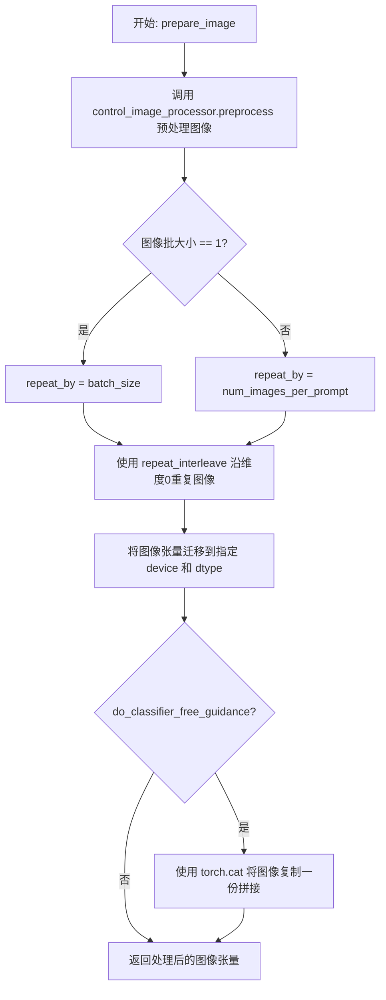

#### 带注释源码

```python
def prepare_image(
    self,
    image,
    width,
    height,
    batch_size,
    num_images_per_prompt,
    device,
    dtype,
    do_classifier_free_guidance=False,
):
    """
    准备 ControlNet 条件图像以供管道推理使用。
    
    该方法执行以下关键步骤：
    1. 调用图像预处理器将输入图像统一转换为 float32 张量并调整为目标尺寸
    2. 根据批处理参数决定图像重复策略（适配批量生成或单图多出图场景）
    3. 将图像迁移到目标设备并转换为目标数据类型
    4. 若启用 CFG，则复制图像以构建条件/非条件分支输入
    
    参数:
        image: 原始 ControlNet 输入图像（PIL/NumPy/Tensor）
        width: 目标宽度像素值
        height: 目标高度像素值
        batch_size: 提示词批大小，用于确定单图的重复次数
        num_images_per_prompt: 每提示词生成的图像数
        device: 目标 torch 设备（cpu/cuda）
        dtype: 目标数据类型（通常为 float16）
        do_classifier_free_guidance: 是否启用无分类器引导
    """
    # 步骤1: 预处理 - 将任意格式图像转为 Tensor 并 resize 到目标尺寸
    # 注意：内部强制转换为 float32 以保证预处理精度
    image = self.control_image_processor.preprocess(image, height=height, width=width).to(dtype=torch.float32)
    
    # 获取预处理后图像的批大小
    image_batch_size = image.shape[0]

    # 步骤2: 确定图像重复策略
    # 场景A: 输入为单张图像（batch_size==1），则按 batch_size 重复以匹配提示词批
    # 场景B: 输入图像批大小与提示词批大小一致，则按 num_images_per_prompt 重复
    if image_batch_size == 1:
        repeat_by = batch_size
    else:
        # image batch size is the same as prompt batch size
        repeat_by = num_images_per_prompt

    # 沿批次维度重复图像张量
    image = image.repeat_interleave(repeat_by, dim=0)

    # 步骤3: 迁移到目标设备并转换数据类型（如 float16 以节省显存）
    image = image.to(device=device, dtype=dtype)

    # 步骤4: 若启用 CFG，需为条件分支和非条件分支各准备一份图像
    # 这允许在单次前向传播中同时计算有条件和无条件噪声预测
    if do_classifier_free_guidance:
        image = torch.cat([image] * 2)

    # 返回处理完成的 ControlNet 条件图像
    return image
```


### `StableDiffusionXLControlNetXSPipeline.prepare_latents`

该方法用于准备扩散模型的潜在向量（latents），根据指定的批量大小、图像尺寸和通道数生成或转换噪声张量，并应用调度器所需的初始噪声标准差进行缩放。

参数：

- `batch_size`：`int`，生成的图像批量大小
- `num_channels_latents`：`int`，潜在空间的通道数，通常由 UNet 的输入通道决定
- `height`：`int`，目标图像的高度（像素）
- `width`：`int`，目标图像的宽度（像素）
- `dtype`：`torch.dtype`，潜在张量的数据类型（如 torch.float16）
- `device`：`torch.device`，潜在张量存放的设备（如 CUDA 或 CPU）
- `generator`：`torch.Generator | list[torch.Generator] | None`，用于生成确定性随机数的生成器，如果为列表则长度必须等于 batch_size
- `latents`：`torch.Tensor | None`，可选的预生成潜在向量，如果提供则直接转移到设备，否则随机生成

返回值：`torch.Tensor`，准备好的潜在向量张量，形状为 (batch_size, num_channels_latents, height//vae_scale_factor, width//vae_scale_factor)

#### 流程图

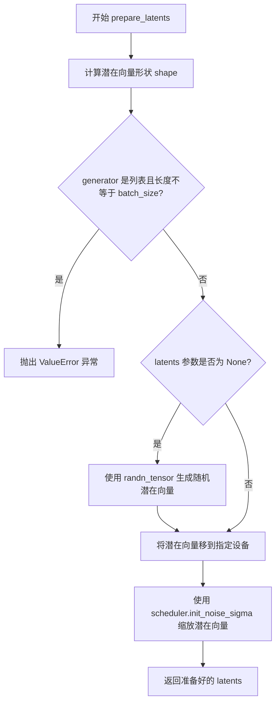

#### 带注释源码

```python
def prepare_latents(
    self,
    batch_size: int,
    num_channels_latents: int,
    height: int,
    width: int,
    dtype: torch.dtype,
    device: torch.device,
    generator: torch.Generator | list[torch.Generator] | None,
    latents: torch.Tensor | None = None
):
    """
    准备扩散模型的潜在向量（latents）。
    
    该方法根据批量大小、图像尺寸和通道数创建潜在向量的形状，
    如果没有提供预生成的潜在向量，则使用随机噪声生成；
    否则使用提供的潜在向量并转移到目标设备。
    最后根据调度器的初始噪声标准差对潜在向量进行缩放。
    """
    # 计算潜在向量的形状：batch_size x channels x (height // vae_scale_factor) x (width // vae_scale_factor)
    # vae_scale_factor 通常为 8，表示 VAE 的下采样比例
    shape = (
        batch_size,
        num_channels_latents,
        int(height) // self.vae_scale_factor,
        int(width) // self.vae_scale_factor,
    )
    
    # 检查 generator 列表长度是否与 batch_size 匹配
    if isinstance(generator, list) and len(generator) != batch_size:
        raise ValueError(
            f"You have passed a list of generators of length {len(generator)}, but requested an effective batch"
            f" size of {batch_size}. Make sure the batch size matches the length of the generators."
        )

    # 如果没有提供潜在向量，则随机生成；否则直接转移到设备
    if latents is None:
        # 使用 randn_tensor 生成符合标准正态分布的随机潜在向量
        latents = randn_tensor(shape, generator=generator, device=device, dtype=dtype)
    else:
        # 将提供的潜在向量转移到目标设备
        latents = latents.to(device)

    # 根据调度器要求的初始噪声标准差缩放潜在向量
    # 这是扩散模型采样的关键步骤，确保噪声幅度与调度器一致
    latents = latents * self.scheduler.init_noise_sigma
    
    return latents
```


### `StableDiffusionXLControlNetXSPipeline._get_add_time_ids`

该方法用于生成Stable Diffusion XL的时间标识（time IDs），这些标识包含了原始图像尺寸、裁剪坐标和目标尺寸信息，用于SDXL模型的微条件（micro-conditioning），确保生成图像符合预期的尺寸和构图要求。

参数：

- `self`：`StableDiffusionXLControlNetXSPipeline`，Pipeline实例本身
- `original_size`：`tuple[int, int]`，原始图像尺寸，格式为(width, height)
- `crops_coords_top_left`：`tuple[int, int]`，裁剪坐标起点，格式为(x, y)
- `target_size`：`tuple[int, int]`，目标图像尺寸，格式为(width, height)
- `dtype`：`torch.dtype`，输出张量的数据类型
- `text_encoder_projection_dim`：`int | None`，文本编码器的投影维度，用于计算嵌入维度

返回值：`torch.Tensor`，形状为(1, 6)的张量，包含按顺序拼接的original_size、crops_coords_top_left和target_size，转换为指定的dtype

#### 流程图

```mermaid
flowchart TD
    A[开始] --> B[拼接时间标识]
    B --> C[计算传入的嵌入维度]
    C --> D{维度是否匹配}
    D -->|是| E[转换为PyTorch张量]
    D -->|否| F[抛出ValueError异常]
    E --> G[返回时间标识张量]
    F --> H[结束]
    G --> H
    
    B描述: add_time_ids = list(original_size + crops_coords_top_left + target_size)
    C描述: passed_add_embed_dim = addition_time_embed_dim * len + text_encoder_projection_dim
    E描述: torch.tensor([add_time_ids], dtype=dtype)
```

#### 带注释源码

```python
def _get_add_time_ids(
    self, 
    original_size: tuple[int, int], 
    crops_coords_top_left: tuple[int, int], 
    target_size: tuple[int, int], 
    dtype: torch.dtype, 
    text_encoder_projection_dim: int | None = None
) -> torch.Tensor:
    """
    生成Stable Diffusion XL的时间标识（time IDs）
    
    这些时间标识是SDXL微条件（micro-conditioning）的一部分，
    包含了原始尺寸、裁剪坐标和目标尺寸信息，用于指导模型生成符合预期尺寸的图像
    
    Args:
        original_size: 原始图像尺寸 (width, height)
        crops_coords_top_left: 裁剪坐标起点 (x, y)
        target_size: 目标图像尺寸 (width, height)
        dtype: 输出张量的数据类型
        text_encoder_projection_dim: 文本编码器投影维度
        
    Returns:
        形状为 (1, 6) 的时间标识张量
    """
    # 步骤1: 将三个尺寸元组拼接成一个列表
    # 格式: [original_width, original_height, crop_x, crop_y, target_width, target_height]
    add_time_ids = list(original_size + crops_coords_top_left + target_size)

    # 步骤2: 计算实际传入的嵌入维度
    # addition_time_embed_dim 是UNet配置中的时间嵌入维度
    # 乘以 add_time_ids 的数量（3个二元组 = 6个值）
    # 加上文本编码器的投影维度
    passed_add_embed_dim = (
        self.unet.config.addition_time_embed_dim * len(add_time_ids) + text_encoder_projection_dim
    )
    
    # 步骤3: 从UNet的base_add_embedding中获取期望的嵌入维度
    expected_add_embed_dim = self.unet.base_add_embedding.linear_1.in_features

    # 步骤4: 验证传入维度与期望维度是否匹配
    # 如果不匹配，抛出详细的错误信息
    if expected_add_embed_dim != passed_add_embed_dim:
        raise ValueError(
            f"Model expects an added time embedding vector of length {expected_add_embed_dim}, but a vector of {passed_add_embed_dim} was created. The model has an incorrect config. Please check `unet.config.time_embedding_type` and `text_encoder_2.config.projection_dim`."
        )

    # 步骤5: 将列表转换为PyTorch张量，形状为 (1, 6)
    add_time_ids = torch.tensor([add_time_ids], dtype=dtype)
    return add_time_ids
```


### `StableDiffusionXLControlNetXSPipeline.upcast_vae`

该方法是一个已弃用的方法，用于将VAE模型的数据类型转换为float32。它通过调用`deprecate`函数发出警告，建议用户直接使用`pipe.vae.to(torch.float32)`来替代。

参数： 无

返回值：`None`，无返回值

#### 流程图

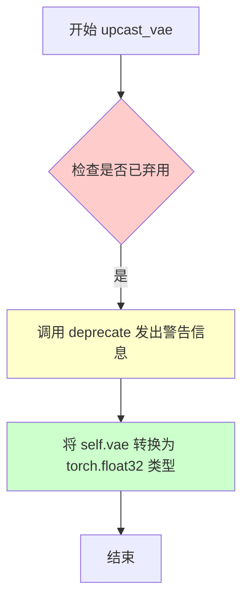

#### 带注释源码

```
# Copied from diffusers.pipelines.stable_diffusion.pipeline_stable_diffusion_upscale.StableDiffusionUpscalePipeline.upcast_vae
def upcast_vae(self):
    """
    将VAE模型的数据类型上转换为float32。
    
    注意：此方法已弃用，建议使用 pipe.vae.to(torch.float32) 代替。
    """
    # 发出弃用警告，提示用户该方法将在1.0.0版本被移除
    deprecate(
        "upcast_vae",           # 方法名称
        "1.0.0",                # 弃用版本
        # 弃用说明，包含新方法的使用建议和参考链接
        "`upcast_vae` is deprecated. Please use `pipe.vae.to(torch.float32)`. For more details, please refer to: https://github.com/huggingface/diffusers/pull/12619#issue-3606633695.",
    )
    # 将VAE模型转换为float32类型，以避免在float16下解码时溢出
    self.vae.to(dtype=torch.float32)
```


### StableDiffusionXLControlNetXSPipeline.guidance_scale

该属性是 StableDiffusionXLControlNetXSPipeline 类的 guidance_scale 属性，用于获取当前配置的 guidance_scale 值。guidance_scale 是用于控制图像生成与文本提示相关性的参数，值越高生成的图像越符合文本描述，但质量可能降低。

参数： 无（该属性不接受任何参数）

返回值：`float`，返回当前管道的 guidance_scale 值，用于控制 classifier-free guidance 的强度。

#### 流程图

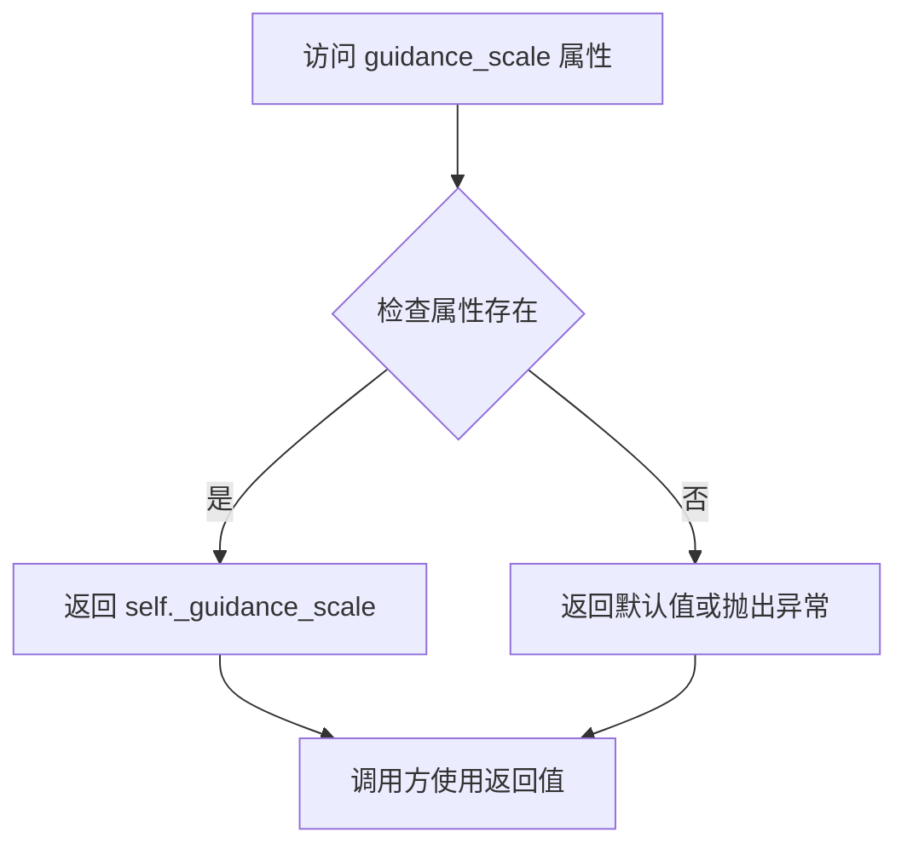

#### 带注释源码

```python
@property
# Copied from diffusers.pipelines.stable_diffusion.pipeline_stable_diffusion.StableDiffusionPipeline.guidance_scale
def guidance_scale(self):
    """
    返回当前的 guidance_scale 值。
    
    guidance_scale 是一个用于控制 classifier-free guidance 强度的参数。
    当 guidance_scale > 1 时，模型会在生成过程中同时考虑条件和无条件预测，
    从而更好地遵循文本提示。较高的值会产生更接近提示的图像，但可能降低整体质量。
    
    返回值:
        float: 当前的 guidance_scale 值
    """
    return self._guidance_scale
```


### `StableDiffusionXLControlNetXSPipeline.clip_skip`

该属性是一个只读的 getter 属性，用于获取在计算提示词嵌入时需要从 CLIP 模型中跳过的层数。该属性继承自 `StableDiffusionPipeline`，允许用户控制使用 CLIP 模型的哪一层隐藏状态来生成文本嵌入。

参数： 无

返回值：`int | None`，返回要跳过的 CLIP 层数。如果为 `None`，则使用默认行为（返回倒数第二层隐藏状态）。

#### 流程图

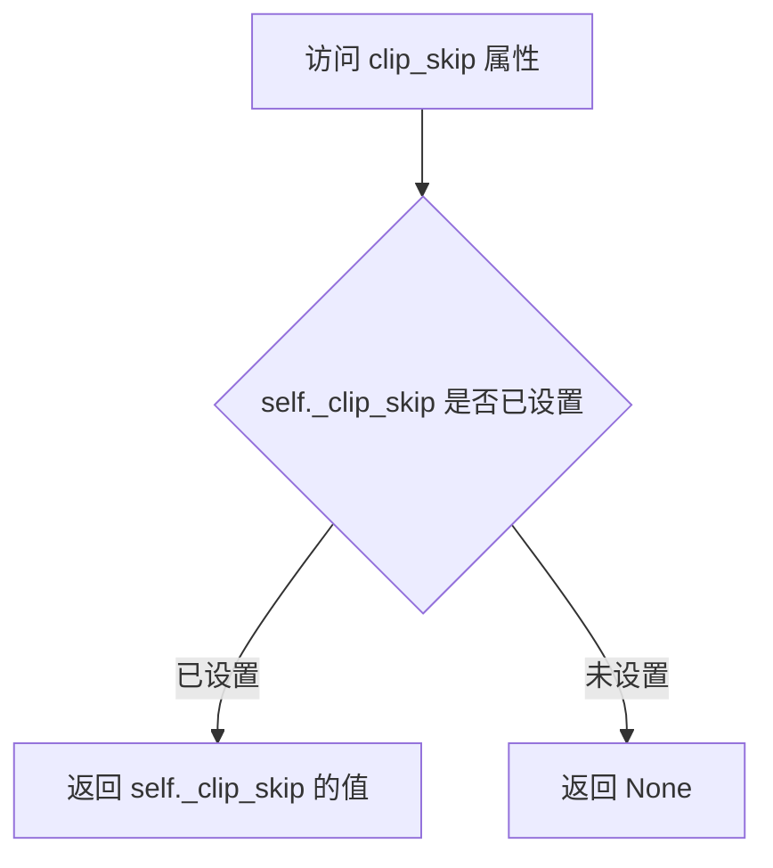

#### 带注释源码

```python
@property
# Copied from diffusers.pipelines.stable_diffusion.pipeline_stable_diffusion.StableDiffusionPipeline.clip_skip
def clip_skip(self):
    """
    获取在计算文本提示嵌入时需要跳过的 CLIP 层数。
    
    该属性允许用户指定在文本编码过程中跳过多少层CLIP模型的隐藏状态。
    当 clip_skip 为 1 时，使用预最终层（pre-final layer）的输出来计算提示嵌入。
    这在 encode_prompt 方法中通过 prompt_embeds.hidden_states[-(clip_skip + 2)] 实现。
    
    Returns:
        int or None: 要跳过的层数，如果为 None 则使用默认行为（返回倒数第二层）
    """
    return self._clip_skip
```


### `StableDiffusionXLControlNetXSPipeline.do_classifier_free_guidance`

这是一个属性getter方法，用于动态判断当前管道是否应该执行分类器自由引导（Classifier-Free Guidance，简称CFG）。当`guidance_scale`大于1且UNet的时间条件投影维度为`None`时，该属性返回`True`，表示启用CFG可以提高生成图像与文本提示的一致性。

参数：

- （无参数，这是属性getter）

返回值：`bool`，返回一个布尔值，表示是否启用分类器自由引导。当`self._guidance_scale > 1`且`self.unet.config.time_cond_proj_dim is None`时返回`True`，否则返回`False`。

#### 流程图

```mermaid
flowchart TD
    A[开始: 访问 do_classifier_free_guidance 属性] --> B{检查 _guidance_scale > 1?}
    B -->|是| C{检查 unet.config.time_cond_proj_dim is None?}
    B -->|否| D[返回 False]
    C -->|是| E[返回 True]
    C -->|否| D
    E --> F[结束: 返回 True]
    D --> F
```

#### 带注释源码

```python
@property
# 复制自 diffusers.pipelines.stable_diffusion.pipeline_stable_diffusion.StableDiffusionPipeline.do_classifier_free_guidance
def do_classifier_free_guidance(self):
    """
    属性getter: 判断是否启用分类器自由引导
    
    分类器自由引导是一种提高生成图像与文本提示一致性的技术。
    它通过在推理时同时考虑条件和无条件噪声预测来实现。
    
    Returns:
        bool: 
            - True: 当 guidance_scale > 1 且 time_cond_proj_dim 为 None 时启用CFG
            - False: 当 guidance_scale <= 1 或 time_cond_proj_dim 不为 None 时不启用CFG
    """
    return self._guidance_scale > 1 and self.unet.config.time_cond_proj_dim is None
```


### `StableDiffusionXLControlNetXSPipeline.cross_attention_kwargs`

该属性是一个只读的 getter 属性，用于获取在 pipeline 调用时传入的跨注意力机制关键字参数（kwargs）。这些参数会被传递给注意力处理器（AttentionProcessor），用于自定义扩散模型的注意力计算行为。

参数：无（该属性不需要额外参数）

返回值：`dict[str, Any] | None`，返回存储在实例中的跨注意力 kwargs 字典，如果未设置则返回 `None`。

#### 流程图

```mermaid
flowchart TD
    A[调用 cross_attention_kwargs 属性] --> B{检查 self._cross_attention_kwargs 是否存在}
    B -->|是| C[返回 self._cross_attention_kwargs]
    B -->|否| D[返回 None]
    
    style A fill:#e1f5fe
    style C fill:#c8e6c9
    style D fill:#ffcdd2
```

#### 带注释源码

```python
@property
# Copied from diffusers.pipelines.stable_diffusion.pipeline_stable_diffusion.StableDiffusionPipeline.cross_attention_kwargs
def cross_attention_kwargs(self):
    """
    获取跨注意力机制的关键字参数。
    
    该属性返回在 pipeline 调用时通过 cross_attention_kwargs 参数传入的字典。
    这些参数会被传递给 UNet 模型中的 AttentionProcessor，用于自定义
    注意力机制的行为，例如：
    - 使用自定义的注意力实现
    - 调整注意力权重
    - 添加额外的注意力控制信息
    
    Returns:
        dict[str, Any] | None: 跨注意力 kwargs 字典，如果未设置则返回 None
    """
    return self._cross_attention_kwargs
```


### `StableDiffusionXLControlNetXSPipeline.num_timesteps`

该属性是 `StableDiffusionXLControlNetXSPipeline` 类的只读属性，用于获取扩散模型在推理过程中使用的时间步总数。它继承自 `StableDiffusionPipeline`，并在 `__call__` 方法的去噪循环开始时被设置。

参数： 无

返回值：`int`，返回推理过程中使用的时间步总数（即推理步数）。

#### 流程图

```mermaid
flowchart TD
    A[访问 num_timesteps 属性] --> B{检查 _num_timesteps 是否已设置}
    B -->|已设置| C[返回 self._num_timesteps]
    B -->|未设置| D[返回默认值或 0]
    
    style A fill:#f9f,stroke:#333
    style C fill:#9f9,stroke:#333
    style D fill:#ff9,stroke:#333
```

#### 带注释源码

```python
@property
# Copied from diffusers.pipelines.stable_diffusion.pipeline_stable_diffusion.StableDiffusionPipeline.num_timesteps
def num_timesteps(self):
    """
    返回推理过程中使用的时间步总数。
    
    该属性在 __call__ 方法中被设置：
    self._num_timesteps = len(timesteps)
    
    Returns:
        int: 推理过程中使用的时间步数量，通常等于 num_inference_steps。
    """
    return self._num_timesteps
```


### StableDiffusionXLControlNetXSPipeline.__call__

这是Stable Diffusion XL与ControlNet-XS结合的文本到图像生成管道的主方法。该方法接收文本提示和ControlNet条件图像，经过多步去噪过程生成符合文本描述的图像，支持Classifier-Free Guidance实现高质量图像生成。

参数：

- `prompt`：`str | list[str] | None`，要引导图像生成的主要提示词，如未定义则需传递prompt_embeds
- `prompt_2`：`str | list[str] | None`，发送给tokenizer_2和text_encoder_2的提示词，未定义时使用prompt
- `image`：`PipelineImageInput | None`，ControlNet输入条件图像，用于引导unet生成过程，支持torch.Tensor、PIL.Image.Image、np.ndarray及其列表形式
- `height`：`int | None`，生成图像的高度像素值，默认self.unet.config.sample_size * self.vae_scale_factor
- `width`：`int | None`，生成图像的宽度像素值，默认self.unet.config.sample_size * self.vae_scale_factor
- `num_inference_steps`：`int`，去噪步数，默认50，步数越多图像质量越高但推理越慢
- `guidance_scale`：`float`，引导比例，默认5.0，值越高图像与文本相关度越高但质量可能下降，>1时启用guidance
- `negative_prompt`：`str | list[str] | None`，不包含在图像中的提示词，未使用guidance时忽略
- `negative_prompt_2`：`str | list[str] | None`，发送给tokenizer_2和text_encoder_2的负向提示词
- `num_images_per_prompt`：`int | None`，每个提示词生成的图像数量，默认1
- `eta`：`float`，DDIM论文中的eta参数，仅DDIMScheduler使用，默认0.0
- `generator`：`torch.Generator | list[torch.Generator] | None`，用于生成确定性结果的随机生成器
- `latents`：`torch.Tensor | None`，预生成的噪声潜在向量，如未提供则使用随机generator生成
- `prompt_embeds`：`torch.Tensor | None`，预生成的文本嵌入，可用于调整提示词权重
- `negative_prompt_embeds`：`torch.Tensor | None`，预生成的负向文本嵌入
- `pooled_prompt_embeds`：`torch.Tensor | None`，预生成的池化文本嵌入
- `negative_pooled_prompt_embeds`：`torch.Tensor | None`，预生成的负向池化文本嵌入
- `output_type`：`str | None`，输出格式，默认"pil"，可选PIL.Image或np.array
- `return_dict`：`bool`，是否返回StableDiffusionXLPipelineOutput，默认True
- `cross_attention_kwargs`：`dict[str, Any] | None`，传递给AttentionProcessor的kwargs字典
- `controlnet_conditioning_scale`：`float | list[float]`，ControlNet输出乘数，默认1.0
- `control_guidance_start`：`float`，ControlNet开始应用的步数百分比，默认0.0
- `control_guidance_end`：`float`，ControlNet停止应用的步数百分比，默认1.0
- `original_size`：`tuple[int, int] | None`，原始尺寸，用于SDXL微条件，默认(1024, 1024)
- `crops_coords_top_left`：`tuple[int, int]`，裁剪坐标起点，默认(0, 0)
- `target_size`：`tuple[int, int] | None`，目标尺寸，默认(1024, 1024)
- `negative_original_size`：`tuple[int, int] | None`，负向条件原始尺寸
- `negative_crops_coords_top_left`：`tuple[int, int]`，负向裁剪坐标起点
- `negative_target_size`：`tuple[int, int] | None`，负向目标尺寸
- `clip_skip`：`int | None`，CLIP计算提示嵌入时跳过的层数
- `callback_on_step_end`：`Callable | PipelineCallback | MultiPipelineCallbacks | None`，每步去噪结束时的回调函数
- `callback_on_step_end_tensor_inputs`：`list[str]`，回调函数需要的张量输入列表，默认["latents"]

返回值：`StableDiffusionXLPipelineOutput | tuple`，return_dict为True时返回StableDiffusionXLPipelineOutput，否则返回tuple

#### 流程图

```mermaid
flowchart TD
    A[开始 __call__] --> B[检查回调张量输入]
    B --> C[获取unet模块]
    C --> D{检查输入参数}
    D -->|通过| E[设置guidance_scale, clip_skip, cross_attention_kwargs]
    D -->|失败| Z[抛出异常]
    E --> F[确定batch_size]
    F --> G[确定device和do_classifier_free_guidance]
    G --> H[编码输入提示词]
    H --> I[准备ControlNet条件图像]
    I --> J[设置去噪 timesteps]
    J --> K[准备潜在变量 latents]
    K --> L[准备额外步骤参数]
    L --> M[准备添加的时间ID和嵌入]
    M --> N{执行去噪循环}
    N --> O[扩展latents进行classifier-free guidance]
    O --> P[缩放模型输入]
    P --> Q[构建added_cond_kwargs]
    Q --> R[预测噪声残差]
    R --> S{是否应用ControlNet}
    S -->|是| T[根据control_guidance_start和end判断]
    S -->|否| U[直接使用噪声预测]
    T --> V[执行UNet前向传播]
    V --> W[执行classifier-free guidance]
    U --> W
    W --> X[scheduler.step计算上一步]
    X --> Y{检查回调}
    Y -->|是| Y1[调用callback_on_step_end]
    Y -->|否| Y2[检查进度更新]
    Y1 --> Y2
    Y2 --> Z1{是否完成所有步}
    Z1 -->|否| O
    Z1 -->|是| AA[VAE解码潜在向量]
    AA --> BB[应用水印后处理]
    BB --> CC[后处理图像]
    CC --> DD[释放模型hooks]
    DD --> EE[返回结果]
```

#### 带注释源码

```python
@torch.no_grad()
@replace_example_docstring(EXAMPLE_DOC_STRING)
def __call__(
    self,
    prompt: str | list[str] = None,
    prompt_2: str | list[str] | None = None,
    image: PipelineImageInput = None,
    height: int | None = None,
    width: int | None = None,
    num_inference_steps: int = 50,
    guidance_scale: float = 5.0,
    negative_prompt: str | list[str] | None = None,
    negative_prompt_2: str | list[str] | None = None,
    num_images_per_prompt: int | None = 1,
    eta: float = 0.0,
    generator: torch.Generator | list[torch.Generator] | None = None,
    latents: torch.Tensor | None = None,
    prompt_embeds: torch.Tensor | None = None,
    negative_prompt_embeds: torch.Tensor | None = None,
    pooled_prompt_embeds: torch.Tensor | None = None,
    negative_pooled_prompt_embeds: torch.Tensor | None = None,
    output_type: str | None = "pil",
    return_dict: bool = True,
    cross_attention_kwargs: dict[str, Any] | None = None,
    controlnet_conditioning_scale: float | list[float] = 1.0,
    control_guidance_start: float = 0.0,
    control_guidance_end: float = 1.0,
    original_size: tuple[int, int] = None,
    crops_coords_top_left: tuple[int, int] = (0, 0),
    target_size: tuple[int, int] = None,
    negative_original_size: tuple[int, int] | None = None,
    negative_crops_coords_top_left: tuple[int, int] = (0, 0),
    negative_target_size: tuple[int, int] | None = None,
    clip_skip: int | None = None,
    callback_on_step_end: Callable[[int, int], None] | PipelineCallback | MultiPipelineCallbacks | None = None,
    callback_on_step_end_tensor_inputs: list[str] = ["latents"],
):
    # 处理回调函数，如果是PipelineCallback或MultiPipelineCallbacks则获取其tensor_inputs
    if isinstance(callback_on_step_end, (PipelineCallback, MultiPipelineCallbacks)):
        callback_on_step_end_tensor_inputs = callback_on_step_end.tensor_inputs

    # 获取原始unet模块，处理torch.compile编译后的模块
    unet = self.unet._orig_mod if is_compiled_module(self.unet) else self.unet

    # 1. 检查输入参数，确保参数合法
    self.check_inputs(
        prompt,
        prompt_2,
        image,
        negative_prompt,
        negative_prompt_2,
        prompt_embeds,
        negative_prompt_embeds,
        pooled_prompt_embeds,
        negative_pooled_prompt_embeds,
        controlnet_conditioning_scale,
        control_guidance_start,
        control_guidance_end,
        callback_on_step_end_tensor_inputs,
    )

    # 设置实例变量供属性方法使用
    self._guidance_scale = guidance_scale
    self._clip_skip = clip_skip
    self._cross_attention_kwargs = cross_attention_kwargs
    self._interrupt = False

    # 2. 确定batch_size
    if prompt is not None and isinstance(prompt, str):
        batch_size = 1
    elif prompt is not None and isinstance(prompt, list):
        batch_size = len(prompt)
    else:
        batch_size = prompt_embeds.shape[0]

    # 获取执行设备
    device = self._execution_device
    # guidance_scale类似Imagen论文中的权重w，=1表示不使用classifier free guidance
    do_classifier_free_guidance = guidance_scale > 1.0

    # 3. 编码输入提示词
    text_encoder_lora_scale = (
        cross_attention_kwargs.get("scale", None) if cross_attention_kwargs is not None else None
    )
    # 调用encode_prompt获取文本嵌入
    (
        prompt_embeds,
        negative_prompt_embeds,
        pooled_prompt_embeds,
        negative_pooled_prompt_embeds,
    ) = self.encode_prompt(
        prompt,
        prompt_2,
        device,
        num_images_per_prompt,
        do_classifier_free_guidance,
        negative_prompt,
        negative_prompt_2,
        prompt_embeds=prompt_embeds,
        negative_prompt_embeds=negative_prompt_embeds,
        pooled_prompt_embeds=pooled_prompt_embeds,
        negative_pooled_prompt_embeds=negative_pooled_prompt_embeds,
        lora_scale=text_encoder_lora_scale,
        clip_skip=clip_skip,
    )

    # 4. 准备ControlNet条件图像
    if isinstance(unet, UNetControlNetXSModel):
        image = self.prepare_image(
            image=image,
            width=width,
            height=height,
            batch_size=batch_size * num_images_per_prompt,
            num_images_per_prompt=num_images_per_prompt,
            device=device,
            dtype=unet.dtype,
            do_classifier_free_guidance=do_classifier_free_guidance,
        )
        # 更新height和width为处理后的图像尺寸
        height, width = image.shape[-2:]
    else:
        assert False

    # 5. 准备timesteps
    self.scheduler.set_timesteps(num_inference_steps, device=device)
    timesteps = self.scheduler.timesteps

    # 6. 准备潜在变量
    num_channels_latents = self.unet.in_channels
    latents = self.prepare_latents(
        batch_size * num_images_per_prompt,
        num_channels_latents,
        height,
        width,
        prompt_embeds.dtype,
        device,
        generator,
        latents,
    )

    # 7. 准备额外步骤参数
    extra_step_kwargs = self.prepare_extra_step_kwargs(generator, eta)

    # 7.1 准备添加的时间ID和嵌入
    if isinstance(image, list):
        original_size = original_size or image[0].shape[-2:]
    else:
        original_size = original_size or image.shape[-2:]
    target_size = target_size or (height, width)

    add_text_embeds = pooled_prompt_embeds
    if self.text_encoder_2 is None:
        text_encoder_projection_dim = int(pooled_prompt_embeds.shape[-1])
    else:
        text_encoder_projection_dim = self.text_encoder_2.config.projection_dim

    # 获取时间ID
    add_time_ids = self._get_add_time_ids(
        original_size,
        crops_coords_top_left,
        target_size,
        dtype=prompt_embeds.dtype,
        text_encoder_projection_dim=text_encoder_projection_dim,
    )

    # 负向条件的时间ID
    if negative_original_size is not None and negative_target_size is not None:
        negative_add_time_ids = self._get_add_time_ids(
            negative_original_size,
            negative_crops_coords_top_left,
            negative_target_size,
            dtype=prompt_embeds.dtype,
            text_encoder_projection_dim=text_encoder_projection_dim,
        )
    else:
        negative_add_time_ids = add_time_ids

    # 8. Denoising loop - 如果使用classifier-free guidance，拼接负向和正向嵌入
    if do_classifier_free_guidance:
        prompt_embeds = torch.cat([negative_prompt_embeds, prompt_embeds], dim=0)
        add_text_embeds = torch.cat([negative_pooled_prompt_embeds, add_text_embeds], dim=0)
        add_time_ids = torch.cat([negative_add_time_ids, add_time_ids], dim=0)

    # 将张量移到设备上
    prompt_embeds = prompt_embeds.to(device)
    add_text_embeds = add_text_embeds.to(device)
    add_time_ids = add_time_ids.to(device).repeat(batch_size * num_images_per_prompt, 1)

    # 初始化进度条相关变量
    num_warmup_steps = len(timesteps) - num_inference_steps * self.scheduler.order
    self._num_timesteps = len(timesteps)
    is_controlnet_compiled = is_compiled_module(self.unet)
    is_torch_higher_equal_2_1 = is_torch_version(">=", "2.1")
    
    # 开始去噪循环
    with self.progress_bar(total=num_inference_steps) as progress_bar:
        for i, t in enumerate(timesteps):
            # 对于编译的ControlNet和PyTorch >= 2.1，使用cudagraphs优化
            if is_controlnet_compiled and is_torch_higher_equal_2_1:
                torch._inductor.cudagraph_mark_step_begin()
            
            # 扩展latents用于classifier-free guidance
            latent_model_input = torch.cat([latents] * 2) if do_classifier_free_guidance else latents
            latent_model_input = self.scheduler.scale_model_input(latent_model_input, t)

            # 构建额外条件参数
            added_cond_kwargs = {"text_embeds": add_text_embeds, "time_ids": add_time_ids}

            # 判断是否在control_guidance范围内应用ControlNet
            apply_control = (
                i / len(timesteps) >= control_guidance_start and (i + 1) / len(timesteps) <= control_guidance_end
            )
            
            # 预测噪声残差
            noise_pred = self.unet(
                sample=latent_model_input,
                timestep=t,
                encoder_hidden_states=prompt_embeds,
                controlnet_cond=image,
                conditioning_scale=controlnet_conditioning_scale,
                cross_attention_kwargs=cross_attention_kwargs,
                added_cond_kwargs=added_cond_kwargs,
                return_dict=True,
                apply_control=apply_control,
            ).sample

            # 执行classifier-free guidance
            if do_classifier_free_guidance:
                noise_pred_uncond, noise_pred_text = noise_pred.chunk(2)
                noise_pred = noise_pred_uncond + guidance_scale * (noise_pred_text - noise_pred_uncond)

            # 计算上一步的latents
            latents = self.scheduler.step(noise_pred, t, latents, **extra_step_kwargs, return_dict=False)[0]

            # 处理每步结束时的回调
            if callback_on_step_end is not None:
                callback_kwargs = {}
                for k in callback_on_step_end_tensor_inputs:
                    callback_kwargs[k] = locals()[k]
                callback_outputs = callback_on_step_end(self, i, t, callback_kwargs)

                # 更新可能的修改后的latents和prompt_embeds
                latents = callback_outputs.pop("latents", latents)
                prompt_embeds = callback_outputs.pop("prompt_embeds", prompt_embeds)
                negative_prompt_embeds = callback_outputs.pop("negative_prompt_embeds", negative_prompt_embeds)

            # 进度更新和XLA设备同步
            if i == len(timesteps) - 1 or ((i + 1) > num_warmup_steps and (i + 1) % self.scheduler.order == 0):
                progress_bar.update()

            if XLA_AVAILABLE:
                xm.mark_step()

    # 9. 后处理VAE解码
    # 如果VAE是float16且强制upcast，进行处理
    if self.vae.dtype == torch.float16 and self.vae.config.force_upcast:
        self.upcast_vae()
        latents = latents.to(next(iter(self.vae.post_quant_conv.parameters())).dtype)

    if not output_type == "latent":
        # 确保VAE在float32模式，避免float16溢出
        needs_upcasting = self.vae.dtype == torch.float16 and self.vae.config.force_upcast

        if needs_upcasting:
            self.upcast_vae()
            latents = latents.to(next(iter(self.vae.post_quant_conv.parameters())).dtype)

        # VAE解码
        image = self.vae.decode(latents / self.vae.config.scaling_factor, return_dict=False)[0]

        # 如果需要upcasting，恢复到fp16
        if needs_upcasting:
            self.vae.to(dtype=torch.float16)
    else:
        image = latents

    # 10. 后处理
    if not output_type == "latent":
        # 应用水印（如有）
        if self.watermark is not None:
            image = self.watermark.apply_watermark(image)

        # 转换为目标输出格式
        image = self.image_processor.postprocess(image, output_type=output_type)

    # 11. 释放模型hooks
    self.maybe_free_model_hooks()

    # 12. 返回结果
    if not return_dict:
        return (image,)

    return StableDiffusionXLPipelineOutput(images=image)
```

## 关键组件


### StableDiffusionXLControlNetXSPipeline

主 pipeline 类，继承自多个 mixin 类，用于结合 ControlNet-XS 进行 Stable Diffusion XL 文本到图像生成。支持文本反转嵌入加载、LoRA 权重加载、单文件加载以及 invisible watermark。

### UNetControlNetXSModel

由 UNet2DConditionModel 和 ControlNetXSAdapter 组合而成的条件去噪模型，用于在扩散过程中预测噪声残差。

### ControlNetXSAdapter

轻量级 ControlNet 适配器，提供额外的条件引导信号，与 UNet 一起用于图像生成的条件控制。

### AutoencoderKL

变分自编码器模型，负责将图像编码到潜在空间以及从潜在空间解码回图像空间。

### CLIPTextModel / CLIPTextModelWithProjection

冻结的文本编码器模型，将文本提示转换为文本嵌入向量，用于指导图像生成过程。

### encode_prompt 方法

将文本提示编码为文本嵌入向量。处理双文本编码器（tokenizer 和 text_encoder），支持 classifier-free guidance，支持 LoRA 缩放调整，支持文本反转，支持 clip_skip。

### __call__ 方法

主要的图像生成方法。执行完整的扩散推理流程：输入验证、提示编码、图像准备、潜在变量准备、时间步设置、去噪循环、VAE 解码、图像后处理。

### check_inputs 方法

验证输入参数的合法性和一致性。检查 prompt 和 prompt_embeds 的互斥性，检查图像批次大小与提示批次大小的一致性，验证 controlnet_conditioning_scale 类型。

### prepare_latents 方法

准备用于去噪的潜在变量张量。根据批次大小、通道数、高度和宽度创建形状，并使用随机张量或提供的 latents 进行初始化。

### prepare_image 方法

预处理 ControlNet 条件图像。将图像调整为指定尺寸和格式，处理批次大小和 classifier-free guidance 的图像复制。

### _get_add_time_ids 方法

生成 SDXL 微条件所需的时间嵌入向量。包括 original_size、crops_coords_top_left 和 target_size，用于控制图像分辨率和裁剪。

### VaeImageProcessor

图像处理器，用于图像的预处理和后处理。处理 RGB 转换、归一化，以及 PIL/ numpy/ tensor 格式的互转。

### Classifier-Free Guidance

无分类器引导机制，在推理时通过连接条件和无条件嵌入实现文本引导强度的动态控制。

### Micro-Conditioning

SDXL 的微条件机制，通过 original_size、target_size、crops_coords_top_left 等参数控制生成图像的分辨率和裁剪区域。

### TextualInversionLoaderMixin

文本反转嵌入加载混合类，支持加载自定义的文本概念嵌入。

### StableDiffusionXLLoraLoaderMixin

SDXL LoRA 权重加载混合类，支持动态加载和调整 LoRA 权重。

### Invisible Watermark

不可见水印组件，用于在生成的图像中嵌入隐形水印以防止滥用。

### XLA Support

Torch XLA 支持，允许在 TPU 设备上运行推理以加速生成过程。


## 问题及建议


### 已知问题

-   **硬编码版本号**：`_last_supported_version = "0.33.1"` 硬编码在类中，可能导致版本追踪困难，应从配置或元数据中动态获取
-   **使用 assert False 处理错误**：在 `check_inputs` 和 `__call__` 中使用 `assert False` 来处理不应该发生的情况，应改为抛出具体的 `ValueError` 或 `TypeError` 异常
-   **代码重复**：多个方法（如 `encode_prompt`、`check_image`、`prepare_extra_step_kwargs`）带有 "Copied from" 注释，表明存在代码复制而非真正的复用，应考虑抽取到基类或工具模块
- **私有 API 依赖**：使用 `torch._dynamo.eval_frame.OptimizedModule` 访问私有 API，可能在不同 PyTorch 版本中失效，应使用公开的 `is_compiled_module` 函数
- **类型提示兼容性**：使用 Python 3.10+ 的 `|` 联合类型语法（如 `str | list[str]`），不兼容 Python 3.9 及以下版本
- **XLA 支持的侵入式检查**：在去噪循环中多次检查 `XLA_AVAILABLE` 和 `is_torch_version`，这些检查应在初始化时完成并在循环外缓存结果

### 优化建议

-   **重构错误处理**：将 `assert False` 替换为明确的异常抛出逻辑，提供有意义的错误信息
-   **提取公共逻辑**：将跨管道复用的方法（如 `encode_prompt`、`prepare_latents`）抽取到 `DiffusionPipeline` 基类或混入类中，减少代码冗余
-   **优化版本检查**：使用 `is_torch_version` 缓存结果到实例属性，避免在循环中重复调用
-   **增强类型兼容性**：考虑使用 `typing.Union` 或添加版本检查来支持更广泛的 Python 版本
-   **统一水印处理**：将水印相关的初始化和应用逻辑统一封装，减少分散的条件判断
-   **性能优化**：在 `encode_prompt` 中预先计算需要重复的 tensor（如 `prompt_embeds.repeat`），减少运行时开销

## 其它


### 设计目标与约束

本Pipeline的设计目标是实现基于Stable Diffusion XL模型的文本到图像生成，并通过ControlNet-XS实现图像条件控制。核心约束包括：(1) 支持SDXL的微条件机制（original_size, crops_coords_top_left, target_size等）；(2) 兼容LoRA和Textual Inversion加载机制；(3) 支持单文件模型加载；(4) 遵循diffusers库的Pipeline设计规范；(5) 必须在PyTorch 2.0+环境下运行以支持torch.compile优化；(6) 内存占用需通过model_cpu_offload_seq进行优化。

### 错误处理与异常设计

代码中的错误处理主要通过以下机制实现：(1) check_inputs方法在__call__前进行全面的参数校验，包括prompt与prompt_embeds互斥检查、negative_prompt与negative_prompt_embeds互斥检查、维度一致性检查、controlnet_conditioning_scale类型检查、以及control_guidance_start/end的范围检查；(2) check_image方法验证输入图像的类型（支持PIL.Image、torch.Tensor、np.ndarray及其列表形式）并检查batch_size一致性；(3) 异常主要通过ValueError和TypeError抛出，错误信息包含具体的参数名称和预期类型；(4) 使用deprecate函数对废弃方法（如upcast_vae）进行警告提示。

### 数据流与状态机

Pipeline的核心数据流如下：(1) 输入阶段：接收prompt、image（控制条件）、及各类可选嵌入向量；(2) 编码阶段：encode_prompt将文本转换为prompt_embeds和pooled_prompt_embeds，prepare_image处理控制图像；(3) 潜在空间准备：prepare_latents生成初始噪声，scheduler设置时间步；(4) 去噪循环：迭代执行UNet预测噪声 -> classifier-free guidance计算 -> scheduler.step更新潜在变量；(5) 解码阶段：VAE decode将潜在向量转换为最终图像；(6) 后处理：watermark应用、image_processor后处理。状态机主要由scheduler管理，通过timesteps数组控制去噪进度。

### 外部依赖与接口契约

主要依赖包括：(1) transformers库：CLIPTextModel、CLIPTextModelWithProjection、CLIPTokenizer、CLIPImageProcessor；(2) diffusers库内部模块：AutoencoderKL、UNet2DConditionModel、ControlNetXSAdapter、UNetControlNetXSModel、各类Scheduler、VaeImageProcessor、PipelineImageInput；(3) 其他：PIL.Image、numpy、torch；(4) 可选：invisible_watermark（如果安装）、torch_xla（如果可用）。接口契约方面，__call__方法接收标准化参数并返回StableDiffusionXLPipelineOutput或tuple；encode_prompt返回四元组(prompt_embeds, negative_prompt_embeds, pooled_prompt_embeds, negative_pooled_prompt_embeds)；所有模型组件通过register_modules注册。

### 版本兼容性信息

_last_supported_version = "0.33.1"标明该Pipeline最后兼容的diffusers版本。代码针对PyTorch 2.1+进行了优化（is_torch_version(">=", "2.1")检查），使用torch._inductor.cudagraph_mark_step_begin()进行CUDA图优化。XLA支持通过is_torch_xla_available()动态检测，启用时使用xm.mark_step()进行设备同步。LoRA支持通过USE_PEFT_BACKEND标志区分PEFT后端和传统后端的处理方式。

### 配置与初始化细节

Pipeline通过register_to_config保存force_zeros_for_empty_prompt配置到self.config。vae_scale_factor根据VAE的block_out_channels计算（通常为8）。image_processor和control_image_processor分别用于主图像和控制图像的预处理，后者do_normalize=False以保留控制条件信息。watermark根据add_watermarker参数和is_invisible_watermark_available()动态初始化。模型CPU卸载顺序定义为"text_encoder->text_encoder_2->unet->vae"。

### 性能优化策略

代码包含多项性能优化：(1) is_compiled_module检查支持torch.compile编译模型的动态处理；(2) model_cpu_offload_seq提供模型CPU卸载支持；(3) XLA_AVAILABLE支持TPU加速；(4) 使用randn_tensor而非torch.randn以支持确定性生成；(5) 潜在变量在需要时重复而非重新生成；(6) callback_on_step_end支持在每步结束时进行干预而无需等待整个流程完成。

### 安全性考量

代码包含以下安全措施：(1) prompt_embeds和negative_prompt_embeds的形状一致性检查防止潜在的攻击向量；(2) text_encoder_2和unet的dtype转换确保计算精度匹配；(3) VAE的float16溢出保护通过upcast_vae机制实现；(4) 使用torch.no_grad()装饰器确保推理过程不计算梯度；(5) watermarker的可见性由用户控制（add_watermarker参数）。

### 使用示例与最佳实践

代码在EXAMPLE_DOC_STRING中提供了完整的Canny边缘检测控制生成示例。最佳实践包括：(1) 使用torch.float16以减少显存占用；(2) 调用enable_model_cpu_offload()实现内存优化；(3) 推荐图像分辨率为1024x1024（SDXL最佳分辨率）；(4) guidance_scale推荐值为5.0-7.5；(5) num_inference_steps推荐值为30-50；(6) controlnet_conditioning_scale建议范围为0.5-1.0。

    