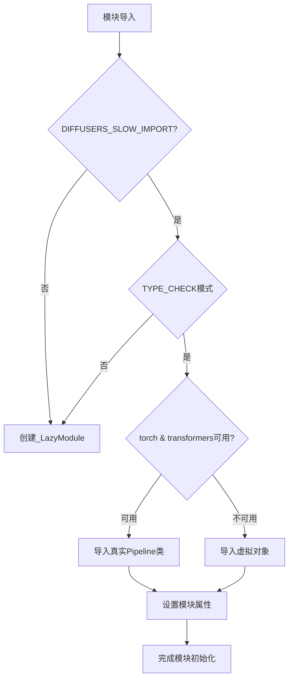
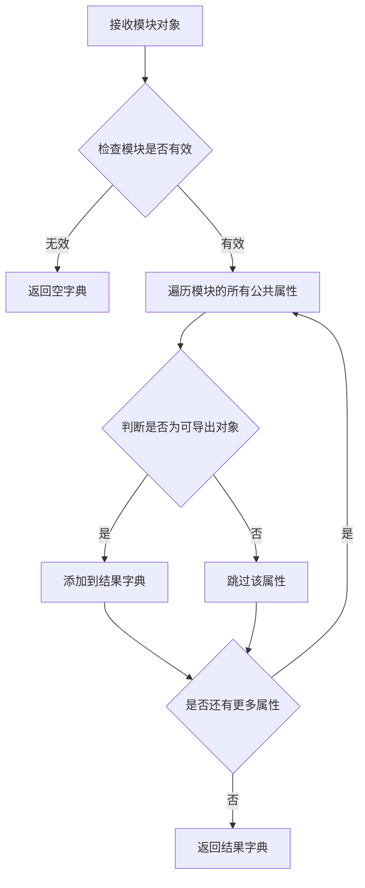
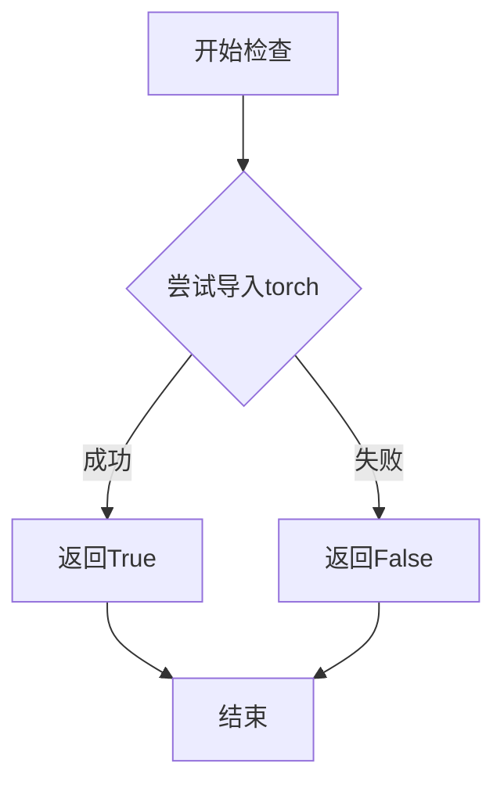
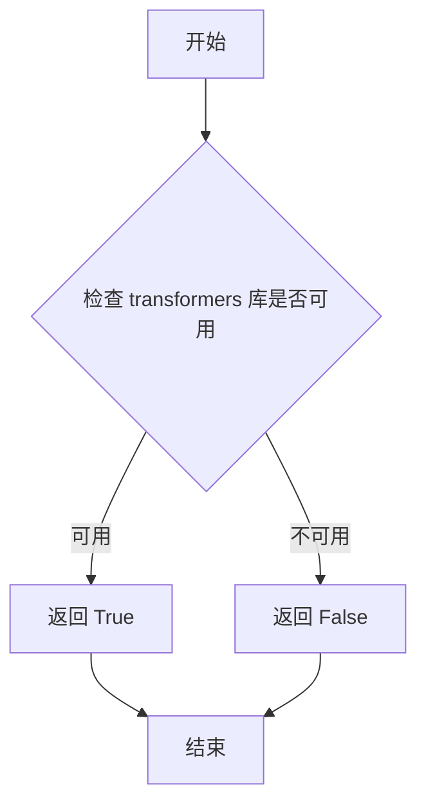

# `diffusers\src\diffusers\pipelines\cosmos\__init__.py` 详细设计文档

这是一个延迟加载模块初始化文件，用于在运行时按需导入Cosmos系列模型的Pipeline类，同时优雅处理torch和transformers等可选依赖的缺失情况，通过_LazyModule实现懒加载并提供虚拟对象保证模块导入一致性。

## 整体流程



## 类结构

```
diffusers.pipelines (包)
└── __init__.py (延迟加载模块)
```

## 全局变量及字段


### `_dummy_objects`
    
存储虚拟对象，用于可选依赖不可用时替代真实类

类型：`dict`
    


### `_import_structure`
    
定义模块的导入结构，键为子模块路径，值为类名列表

类型：`dict`
    


### `TYPE_CHECKING`
    
类型检查标志，导入时为False，运行时为True

类型：`bool`
    


### `DIFFUSERS_SLOW_IMPORT`
    
标志是否启用慢速导入模式，用于调试或类型检查目的

类型：`bool`
    


### `OptionalDependencyNotAvailable`
    
可选依赖不可用时抛出的异常类

类型：`Exception`
    


### `_LazyModule`
    
延迟加载模块的封装类，用于动态导入子模块

类型：`class`
    


### `get_objects_from_module`
    
从模块中获取所有对象的函数

类型：`function`
    


### `is_torch_available`
    
检查PyTorch是否可用的函数

类型：`function`
    


### `is_transformers_available`
    
检查Transformers库是否可用的函数

类型：`function`
    


    

## 全局函数及方法


### `get_objects_from_module`

从指定模块中提取所有公共对象（类、函数、变量），并返回一个以对象名称为键、对象本身为值的字典。主要用于延迟加载机制中获取模块的虚拟或模拟对象集合，以便在依赖不可用时提供替代实现。

参数：

- `module`：`module`，目标模块对象，从中提取所有可导出（exportable）的对象

返回值：`dict`，键为对象名称（字符串），值为对应的对象（类、函数或变量）

#### 流程图



#### 带注释源码

```python
def get_objects_from_module(module):
    """
    从给定模块中提取所有可导出对象。
    
    该函数通常用于处理 dummy/placeholder 模块，在依赖库不可用时
    提供虚拟对象以保持导入结构的一致性。
    
    参数:
        module: 要从中提取对象的目标模块
        
    返回:
        dict: 包含模块中所有公共对象的字典，键为对象名称
    """
    # 初始化结果字典
    objects = {}
    
    # 遍历模块的所有属性
    for attr_name in dir(module):
        # 排除私有属性和特殊属性（以双下划线开头）
        if not attr_name.startswith('_'):
            # 获取属性值
            attr_value = getattr(module, attr_name)
            # 将对象添加到结果字典
            objects[attr_name] = attr_value
    
    return objects
```

#### 在给定代码中的使用示例

```python
# 在 __init__.py 中的实际使用方式
try:
    # 检查依赖是否可用
    if not (is_transformers_available() and is_torch_available()):
        raise OptionalDependencyNotAvailable()
except OptionalDependencyNotAvailable:
    # 依赖不可用时，导入虚拟对象模块
    from ...utils import dummy_torch_and_transformers_objects
    
    # 使用 get_objects_from_module 获取虚拟对象字典
    # 并合并到 _dummy_objects 中
    _dummy_objects.update(get_objects_from_module(dummy_torch_and_transformers_objects))
```

---

### 补充说明

| 项目 | 描述 |
|------|------|
| **设计目标** | 支持可选依赖的延迟加载，在依赖不可用时提供虚拟对象以避免导入错误 |
| **约束条件** | 仅提取公共属性（不以 `_` 开头），返回字典格式 |
| **错误处理** | 依赖 `OptionalDependencyNotAvailable` 异常来控制流程 |
| **数据流** | `dummy_torch_and_transformers_objects` 模块 → `get_objects_from_module()` → `_dummy_objects` 字典 → `sys.modules` 属性设置 |
| **外部依赖** | 依赖 `dummy_torch_and_transformers_objects` 模块的存在 |


### `is_torch_available`

检查当前环境中 PyTorch 库是否可用，返回布尔值以决定是否加载依赖于 torch 的模块。

参数：

- 无参数

返回值：`bool`，如果 torch 库已安装且可用返回 `True`，否则返回 `False`。

#### 流程图



#### 带注释源码

```python
# 从上层utils模块导入is_torch_available函数
# 该函数用于检查torch库是否可用
from ...utils import is_torch_available

# 在当前模块中的使用示例：
# if not (is_transformers_available() and is_torch_available()):
#     raise OptionalDependencyNotAvailable()
# 上述代码检查transformers和torch是否同时可用
# 如果任一不可用，则抛出OptionalDependencyNotAvailable异常
```

#### 补充说明

`is_torch_available` 是一个工具函数，通常定义在 `diffusers` 库的 `src/diffusers/utils` 模块中。其核心逻辑如下：

```python
# 可能的实现方式（基于diffusers库常见模式）
def is_torch_available() -> bool:
    """
    检查torch库是否已安装且可用
    
    Returns:
        bool: 如果torch可用返回True，否则返回False
    """
    try:
        import torch
        return True
    except ImportError:
        return False
```

该函数在当前代码中用于条件导入机制：
- 作为懒加载模块的一部分
- 决定是否加载包含 PyTorch 依赖的管道类
- 在 `TYPE_CHECKING` 或 `DIFFUSERS_SLOW_IMPORT` 模式下进行类型检查和慢速导入


### `is_transformers_available`

该函数用于检查当前环境中是否安装了 `transformers` 库，并返回布尔值以指示库是否可用。

参数：
- 无参数

返回值：`bool`，返回 `True` 表示 `transformers` 库可用，返回 `False` 表示不可用。

#### 流程图



#### 带注释源码

由于提供的代码片段仅导入了 `is_transformers_available` 函数，而未包含其具体实现，因此无法提供该函数的源码。该函数通常在 `...utils` 模块中定义，其典型实现逻辑如下（基于常见模式推断）：

```python
# 假设的实现（在 ...utils 模块中）
def is_transformers_available() -> bool:
    """
    检查 transformers 库是否已安装且可用。
    
    Returns:
        bool: 如果 transformers 库可用则返回 True，否则返回 False。
    """
    try:
        import transformers  # 尝试导入 transformers 库
        return True
    except ImportError:
        return False
```

**注意**：实际实现可能更复杂，可能涉及版本检查或其他条件，具体取决于 `diffusers` 库的实现。

## 关键组件


### 延迟加载模块机制 (_LazyModule)

使用 `_LazyModule` 实现模块的延迟加载，将实际的导入推迟到真正需要时才执行，提升初始导入速度并避免不必要的依赖加载。

### 可选依赖检查 (is_torch_available, is_transformers_available)

通过检查 `torch` 和 `transformers` 库是否可用，决定是否加载实际的 pipeline 类或使用虚拟对象，确保代码在缺少可选依赖时仍能运行。

### 虚拟对象集合 (_dummy_objects)

当可选依赖不可用时，使用 `_dummy_objects` 存储虚拟对象，通过 `get_objects_from_module` 从 `dummy_torch_and_transformers_objects` 模块获取，用于保持导入接口的一致性。

### 导入结构定义 (_import_structure)

定义了模块的导入结构字典，包含6个pipeline类的导入路径：`Cosmos2_5_PredictBasePipeline`、`Cosmos2_5_TransferPipeline`、`Cosmos2TextToImagePipeline`、`Cosmos2VideoToWorldPipeline`、`CosmosTextToWorldPipeline`、`CosmosVideoToWorldPipeline`。

### 类型检查时导入 (TYPE_CHECKING 分支)

在 `TYPE_CHECKING` 或 `DIFFUSERS_SLOW_IMPORT` 模式下，直接导入实际的 pipeline 类供类型检查和静态分析使用，而非使用延迟加载机制。

### 动态模块注册 (sys.modules)

将当前模块注册为 `_LazyModule` 实例，并使用 `setattr` 将虚拟对象动态添加到模块属性中，实现运行时动态解析。


## 问题及建议


### 已知问题

-   **重复的条件判断逻辑**：在try-except块和TYPE_CHECKING块中重复编写了相同的依赖检查代码`if not (is_transformers_available() and is_torch_available())`，违反了DRY原则
-   **魔法字符串硬编码**：pipeline名称在`_import_structure`字典中硬编码多次，新增pipeline时需要同时修改多处
-   **导入映射不一致**：`_import_structure`中定义的键名（如`"pipeline_cosmos2_5_predict"`）与实际导入的类名（如`Cosmos2_5_PredictBasePipeline`）存在命名差异，可能导致维护困难
-   **未使用的变量**：`_dummy_objects`在模块初始化时定义为空字典，但在except块中才被填充，初始状态未被使用
-   **类型检查导入冗余**：TYPE_CHECKING块中的导入逻辑与普通运行时导入逻辑高度重复，可提取为公共函数

### 优化建议

-   **提取依赖检查为公共函数**：创建一个辅助函数来统一处理可选依赖检查，避免代码重复
-   **使用枚举或配置驱动**：将pipeline名称列表提取为常量或配置文件，利用循环动态生成`_import_structure`
-   **重构导入结构**：确保`_import_structure`中的键名与实际类名保持一致的命名规范，或添加显式映射表
-   **简化条件导入逻辑**：将TYPE_CHECKING和普通导入的公共部分提取，使用工厂函数或策略模式处理
-   **添加日志或警告**：当依赖不可用时，提供更友好的警告信息而非静默使用dummy对象

## 其它


### 设计目标与约束

本模块采用延迟加载(Lazy Loading)机制，通过`_LazyModule`实现可选依赖的动态导入。设计目标是确保在未安装torch和transformers时模块仍可导入，但使用时才会抛出真正的ImportError。约束条件是必须同时安装torch和transformers才能使用所有pipeline。

### 错误处理与异常设计

使用`OptionalDependencyNotAvailable`异常处理可选依赖不可用的情况。当检测到torch或transformers任一不可用时，捕获异常并从dummy模块导入空对象填充`_dummy_objects`，避免ImportError提前终止程序。真正的功能类导入仅在TYPE_CHECKING或DIFFUSERS_SLOW_IMPORT为True时执行。

### 数据流与状态机

模块初始化流程：首先检查TYPE_CHECKING或DIFFUSERS_SLOW_IMPORT标志，若为True则立即导入真实类；否则创建`_LazyModule`代理对象。当访问模块属性时，`_LazyModule`会根据_import_structure字典动态加载对应的子模块。_dummy_objects在真实依赖不可用时作为空壳填充模块属性。

### 外部依赖与接口契约

外部依赖包括：(1)torch - 必须依赖，用于模型计算；(2)transformers - 必须依赖，用于文本处理；(3)diffusers.utils模块中的_LazyModule、get_objects_from_module、OptionalDependencyNotAvailable等工具。接口契约：所有pipeline类必须继承或兼容diffusers的BasePipeline接口，模块导出通过_import_structure字典定义。

### 模块初始化流程

1. 定义空字典_dummy_objects和_import_structure
2. 尝试检查torch和transformers可用性
3. 若不可用则加载dummy空对象，若可用则填充_import_structure
4. 根据TYPE_CHECKING或DIFFUSERS_SLOW_IMPORT决定立即导入或延迟加载
5. 延迟加载模式下创建_LazyModule并替换sys.modules中的当前模块
6. 将_dummy_objects设置为模块属性

### 延迟加载机制

_LazyModule继承自types.ModuleType，当访问未定义的模块属性时触发__getattr__，根据_import_structure字典中的映射关系动态导入对应的子模块。这种机制显著减少了启动时的导入开销，使得diffusers可以在未安装所有可选依赖时快速加载。

### 依赖检查逻辑

采用短路求值策略：not (is_transformers_available() and is_torch_available())，即任一依赖不可用则抛出OptionalDependencyNotAvailable。双重检查机制确保了运行时和静态类型检查时的一致性。

### 性能考虑

使用延迟加载避免导入未使用的pipeline模块，减少内存占用和启动时间。_dummy_objects在依赖不可用时预先填充，避免后续访问时的重复检查开销。

### 版本兼容性

代码依赖diffusers 0.19.0+的_LazyModule实现，需要确保utils模块中提供了get_objects_from_module和OptionalDependencyNotAvailable等辅助函数。

### 测试考虑

需要测试两种场景：(1)torch和transformers均可用时所有pipeline类可正常导入；(2)任一依赖不可用时模块可导入但使用时会触发正确的ImportError。

### 配置管理

通过DIFFUSERS_SLOW_IMPORT环境变量控制是否使用延迟加载模式，该变量通常在CI/CD或类型检查时设置为True以确保所有依赖可用。

    