# `diffusers\src\diffusers\pipelines\cosmos\pipeline_cosmos2_5_predict.py` 详细设计文档

Cosmos2_5_PredictBasePipeline 是一个用于 NVIDIA Cosmos Predict2.5 基础模型的视频生成管道，支持三种生成模式：Text2World（文本到世界视频）、Image2World（图像到世界视频）和 Video2World（视频到世界视频）。该管道使用 Qwen2.5-VL 作为文本编码器，CosmosTransformer3DModel 作为去噪变换器，并使用 VAE 进行视频的潜在空间编码和解码。

## 整体流程

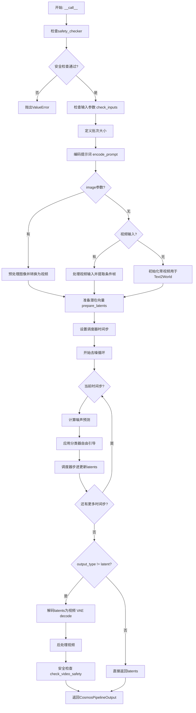

## 类结构

```
DiffusionPipeline (基类)
└── Cosmos2_5_PredictBasePipeline
    ├── 模块: text_encoder (Qwen2_5_VLForConditionalGeneration)
    ├── 模块: tokenizer (AutoTokenizer)
    ├── 模块: transformer (CosmosTransformer3DModel)
    ├── 模块: vae (AutoencoderKLWan)
    ├── 模块: scheduler (UniPCMultistepScheduler)
    └── 模块: safety_checker (CosmosSafetyChecker)
```

## 全局变量及字段


### `logger`
    
模块日志记录器

类型：`logging.Logger`
    


### `XLA_AVAILABLE`
    
XLA加速是否可用

类型：`bool`
    


### `DEFAULT_NEGATIVE_PROMPT`
    
默认负面提示词

类型：`str`
    


### `EXAMPLE_DOC_STRING`
    
示例文档字符串

类型：`str`
    


### `Cosmos2_5_PredictBasePipeline.vae_scale_factor_temporal`
    
VAE时间下采样因子

类型：`int`
    


### `Cosmos2_5_PredictBasePipeline.vae_scale_factor_spatial`
    
VAE空间下采样因子

类型：`int`
    


### `Cosmos2_5_PredictBasePipeline.video_processor`
    
视频处理器

类型：`VideoProcessor`
    


### `Cosmos2_5_PredictBasePipeline.latents_mean`
    
潜在向量均值

类型：`torch.Tensor`
    


### `Cosmos2_5_PredictBasePipeline.latents_std`
    
潜在向量标准差

类型：`torch.Tensor`
    


### `Cosmos2_5_PredictBasePipeline.text_encoder`
    
文本编码器

类型：`Qwen2_5_VLForConditionalGeneration`
    


### `Cosmos2_5_PredictBasePipeline.tokenizer`
    
分词器

类型：`AutoTokenizer`
    


### `Cosmos2_5_PredictBasePipeline.transformer`
    
3D变换器

类型：`CosmosTransformer3DModel`
    


### `Cosmos2_5_PredictBasePipeline.vae`
    
变分自编码器

类型：`AutoencoderKLWan`
    


### `Cosmos2_5_PredictBasePipeline.scheduler`
    
调度器

类型：`UniPCMultistepScheduler`
    


### `Cosmos2_5_PredictBasePipeline.safety_checker`
    
安全检查器

类型：`CosmosSafetyChecker`
    


### `Cosmos2_5_PredictBasePipeline._guidance_scale`
    
引导尺度

类型：`float`
    


### `Cosmos2_5_PredictBasePipeline._current_timestep`
    
当前时间步

类型：`int`
    


### `Cosmos2_5_PredictBasePipeline._num_timesteps`
    
总时间步数

类型：`int`
    


### `Cosmos2_5_PredictBasePipeline._interrupt`
    
中断标志

类型：`bool`
    
    

## 全局函数及方法


### `retrieve_latents`

这是一段用于从编码器（通常是 VAE）的输出中统一提取潜在向量的工具函数。它通过检查输出对象的属性（`latent_dist` 或 `latents`）来兼容不同的 VAE 实现，并支持根据 `sample_mode` 参数从分布中采样或直接获取模式，确保为后续 diffusion 过程提供一致格式的潜在表示。

参数：

- `encoder_output`：`torch.Tensor`，编码器的输出对象。虽然类型标注为 Tensor，但实际逻辑上通常是一个包含 `latent_dist`（分布对象）或 `latents`（张量）属性的对象。
- `generator`：`torch.Generator | None`，可选的 PyTorch 生成器，用于控制随机采样的种子，以确保结果可复现。
- `sample_mode`：`str`，字符串类型，指定提取模式。默认为 `"sample"`（从分布中采样），可选 `"argmax"`（获取分布的众数/均值）。

返回值：`torch.Tensor`，提取出的潜在向量（Latents）。

#### 流程图

```mermaid
flowchart TD
    A([开始: retrieve_latents]) --> B{encoder_output 是否有 latent_dist 属性?}
    B -- 是 --> C{sample_mode == 'sample'?}
    C -- 是 --> D[返回: encoder_output.latent_dist.sample(generator)]
    C -- 否 --> E[返回: encoder_output.latent_dist.mode()]
    B -- 否 --> F{encoder_output 是否有 latents 属性?}
    F -- 是 --> G[返回: encoder_output.latents]
    F -- 否 --> H[抛出: AttributeError]
```

#### 带注释源码

```python
# 从 stable_diffusion.pipeline_stable_diffusion_img2img 拷贝而来
def retrieve_latents(
    encoder_output: torch.Tensor, generator: torch.Generator | None = None, sample_mode: str = "sample"
):
    # 逻辑 1: 检查编码器输出是否包含潜在分布 (latent_dist)
    # 如果包含且模式为 'sample'，则从分布中采样
    if hasattr(encoder_output, "latent_dist") and sample_mode == "sample":
        # 调用分布对象的 sample 方法，可选传入 generator 控制随机性
        return encoder_output.latent_dist.sample(generator)
    
    # 逻辑 2: 如果包含潜在分布且模式为 'argmax'，则获取分布的模式（通常为均值）
    elif hasattr(encoder_output, "latent_dist") and sample_mode == "argmax":
        return encoder_output.latent_dist.mode()
    
    # 逻辑 3: 检查编码器输出是否直接包含潜在张量 (latents)
    # 这常见于某些直接输出张量的编码器
    elif hasattr(encoder_output, "latents"):
        return encoder_output.latents
    
    # 错误处理: 如果无法识别输出格式
    else:
        raise AttributeError("Could not access latents of provided encoder_output")
```


### `logging.get_logger`

获取日志记录器，用于创建或获取指定名称的 Python 日志对象，以便在模块中进行日志记录。

参数：

- `name`：`str`，日志记录器的名称，通常使用 `__name__` 变量传入，以标识日志来源的模块

返回值：`logging.Logger`，返回一个 Python 日志记录器对象，用于输出日志信息

#### 流程图

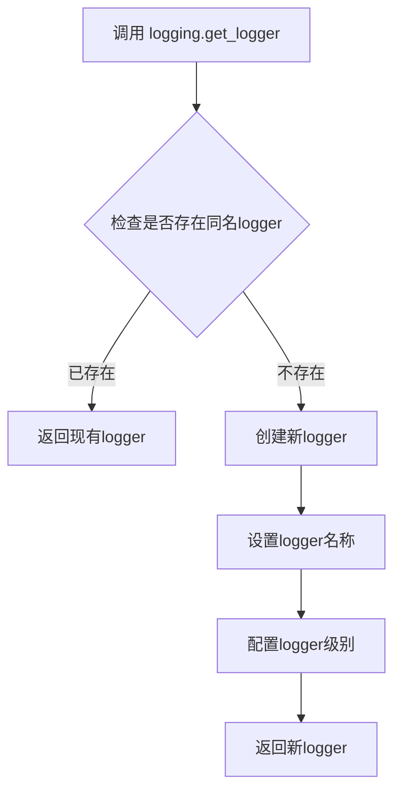

#### 带注释源码

```python
# 从...utils模块导入的logging对象
# 这是一个标准Python logging模块的封装或自定义实现
logger = logging.get_logger(__name__)  # pylint: disable=invalid-name
# 获取当前模块的日志记录器，__name__变量自动反映当前模块的完整路径
# 例如：对于diffusers.pipelines.cosmos.pipeline_cosmos2_5.predict模块
# __name__将等于'diffusers.pipelines.cosmos.pipeline_cosmos2_5.predict'
```

#### 备注

- 该函数位于 `...utils` 包中，是标准 Python `logging.getLogger` 的封装实现
- 返回的 `logger` 对象在代码中用于输出各类日志信息，如配置加载、模型推理进度等
- 使用 `__name__` 作为参数可以方便地追踪日志来源的模块位置


### `Cosmos2_5_PredictBasePipeline.__init__`

初始化Cosmos 2.5视频生成基础管道，设置文本编码器、分词器、3D变换器、VAE、调度器和安全检查器等核心组件，配置VAE的时空调缩因子，初始化视频处理器，并计算并验证潜在变量的均值和标准差。

参数：

- `text_encoder`：`Qwen2_5_VLForConditionalGeneration`，冻结的文本编码器，Cosmos Predict2.5使用Qwen2.5 VL编码器
- `tokenizer`：`AutoTokenizer`，与Qwen2.5 VL编码器关联的分词器
- `transformer`：`CosmosTransformer3DModel`，条件变换器，用于对编码的图像潜在变量进行去噪
- `vae`：`AutoencoderKLWan`，变分自编码器模型，用于在潜在表示之间对视频进行编码和解码
- `scheduler`：`UniPCMultistepScheduler`，与变换器结合使用以对编码图像潜在变量进行去噪的调度器
- `safety_checker`：`CosmosSafetyChecker`（可选），安全检查器，用于检测不安全内容

返回值：`None`，构造函数无返回值

#### 流程图

```mermaid
flowchart TD
    A[开始 __init__] --> B[调用父类 DiffusionPipeline.__init__]
    B --> C{检查 safety_checker 是否为 None}
    C -->|是| D[创建默认 CosmosSafetyChecker]
    C -->|否| E[使用传入的 safety_checker]
    D --> F[注册所有模块: vae, text_encoder, tokenizer, transformer, scheduler, safety_checker]
    E --> F
    F --> G[计算 vae_scale_factor_temporal: 2 ** sum(vae.temporal_downsample)]
    G --> H[计算 vae_scale_factor_spatial: 2 ** len(vae.temporal_downsample)]
    H --> I[创建 VideoProcessor]
    I --> J{检查 vae.config.latents_mean}
    J -->|存在| K[从配置创建 latents_mean 张量]
    J -->|不存在| L[设为 None]
    K --> M{检查 vae.config.latents_std}
    M -->|存在| N[从配置创建 latents_std 张量]
    M -->|不存在| O[设为 None]
    L --> N
    O --> P{验证 latents_mean 和 latents_std}
    P -->|有效| Q[结束初始化]
    P -->|无效| R[抛出 ValueError]
```

#### 带注释源码

```python
def __init__(
    self,
    text_encoder: Qwen2_5_VLForConditionalGeneration,
    tokenizer: AutoTokenizer,
    transformer: CosmosTransformer3DModel,
    vae: AutoencoderKLWan,
    scheduler: UniPCMultistepScheduler,
    safety_checker: CosmosSafetyChecker = None,
):
    """
    初始化 Cosmos2_5_PredictBasePipeline 管道
    
    参数:
        text_encoder: Qwen2.5 VL 文本编码器
        tokenizer: Qwen2.5 VL 分词器
        transformer: Cosmos 3D 变换器模型
        vae: VAE 编解码器模型
        scheduler: 去噪调度器
        safety_checker: 可选的安全检查器
    """
    # 调用父类 DiffusionPipeline 的初始化方法
    super().__init__()

    # 如果未提供安全检查器，创建一个默认的（会抛出导入错误如果cosmos_guardrail未安装）
    if safety_checker is None:
        safety_checker = CosmosSafetyChecker()

    # 使用 register_modules 注册所有子模块，使它们可以通过管道对象访问
    self.register_modules(
        vae=vae,
        text_encoder=text_encoder,
        tokenizer=tokenizer,
        transformer=transformer,
        scheduler=scheduler,
        safety_checker=safety_checker,
    )

    # 计算 VAE 的时空调缩因子
    # temporal: 基于 VAE 的时间下采样层数计算 (通常为2，2^2=4)
    self.vae_scale_factor_temporal = 2 ** sum(self.vae.temperal_downsample) if getattr(self, "vae", None) else 4
    # spatial: 基于 VAE 的空间下采样层数计算 (通常为3，2^3=8)
    self.vae_scale_factor_spatial = 2 ** len(self.vae.temperal_downsample) if getattr(self, "vae", None) else 8
    
    # 创建视频处理器，用于预处理和解码视频
    self.video_processor = VideoProcessor(vae_scale_factor=self.vae_scale_factor_spatial)

    # 从 VAE 配置中获取潜在变量的均值和标准差
    # 这些值用于在潜在空间中对数据进行归一化/反归一化
    latents_mean = (
        # 将配置中的均值reshape为 [1, z_dim, 1, 1, 1] 形状以匹配潜在变量维度
        torch.tensor(self.vae.config.latents_mean).view(1, self.vae.config.z_dim, 1, 1, 1).float()
        if getattr(self.vae.config, "latents_mean", None) is not None
        else None
    )
    latents_std = (
        # 将配置中的标准差reshape为 [1, z_dim, 1, 1, 1] 形状以匹配潜在变量维度
        torch.tensor(self.vae.config.latents_std).view(1, self.vae.config.z_dim, 1, 1, 1).float()
        if getattr(self.vae.config, "latents_std", None) is not None
        else None
    )
    
    # 保存均值和标准差为实例变量
    self.latents_mean = latents_mean
    self.latents_std = latents_std

    # 验证 VAE 配置必须同时定义均值和标准差
    if self.latents_mean is None or self.latents_std is None:
        raise ValueError("VAE configuration must define both `latents_mean` and `latents_std`.")
```


### `Cosmos2_5_PredictBasePipeline._get_prompt_embeds`

该方法负责将文本提示（prompt）转换为文本编码器的隐藏状态嵌入向量（prompt embeds），通过聊天模板（chat template）格式化输入，使用Qwen2.5-VL文本编码器提取各层隐藏状态并进行层归一化处理，最终返回归一化后的提示嵌入张量供扩散Transformer使用。

参数：

- `prompt`：`str | list[str]`，要编码的文本提示，可以是单个字符串或字符串列表
- `max_sequence_length`：`int`，最大序列长度，默认512，用于控制tokenizer的最大长度和截断策略
- `device`：`torch.device | None`，指定计算设备，默认为执行设备（self._execution_device）
- `dtype`：`torch.dtype | None`，指定计算数据类型，默认为文本编码器的dtype

返回值：`torch.Tensor`，返回归一化后的提示嵌入向量，形状为 [batch_size, seq_len, hidden_dim]，其中hidden_dim是所有层归一化隐藏状态的拼接维度

#### 流程图

```mermaid
flowchart TD
    A[开始 _get_prompt_embeds] --> B{device参数为空?}
    B -->|是| C[使用 self._execution_device]
    B -->|否| D[使用传入的device]
    C --> E{dtype参数为空?}
    D --> E
    E -->|是| F[使用 self.text_encoder.dtype]
    E -->|否| G[使用传入的dtype]
    F --> H{prompt是字符串?}
    G --> H
    H -->|是| I[将prompt包装为列表: [prompt]]
    H -->|否| J[保持原样]
    I --> K[遍历prompt列表]
    J --> K
    K --> L[构建对话格式 conversations]
    L --> M[调用 tokenizer.apply_chat_template]
    M --> N[转换为LongTensor]
    N --> O[添加到input_ids_batch]
    O --> P{是否还有更多prompt?}
    P -->|是| K
    P -->|否| Q[stack成batch张量]
    Q --> R[调用 text_encoder 获取hidden_states]
    R --> S[遍历各层hidden_states]
    S --> T[计算层归一化: 减均值除标准差]
    T --> U[收集归一化后的状态]
    U --> V[拼接所有层: torch.cat]
    V --> W[转换dtype和device]
    W --> X[返回 prompt_embeds]
```

#### 带注释源码

```python
def _get_prompt_embeds(
    self,
    prompt: str | list[str] = None,
    max_sequence_length: int = 512,
    device: torch.device | None = None,
    dtype: torch.dtype | None = None,
):
    """
    将文本提示编码为文本编码器的隐藏状态嵌入向量
    
    参数:
        prompt: 输入的文本提示，支持单字符串或字符串列表
        max_sequence_length: token序列的最大长度，默认512
        device: 计算设备，默认为执行设备
        dtype: 计算数据类型，默认为文本编码器数据类型
    
    返回:
        归一化后的提示嵌入张量 [batch_size, seq_len, hidden_dim]
    """
    # 确定设备：优先使用传入的device，否则使用pipeline的执行设备
    device = device or self._execution_device
    # 确定数据类型：优先使用传入的dtype，否则使用文本编码器的dtype
    dtype = dtype or self.text_encoder.dtype
    
    # 标准化输入：确保prompt是列表格式，便于批量处理
    prompt = [prompt] if isinstance(prompt, str) else prompt

    # 用于收集每个prompt对应的token ID批次
    input_ids_batch = []

    # 遍历每个prompt样本，单独进行tokenize处理
    for sample_idx in range(len(prompt)):
        # 构建符合Qwen2.5-VL聊天模板格式的对话结构
        # 包含system消息（设定助手角色）和user消息（实际prompt内容）
        conversations = [
            {
                "role": "system",
                "content": [
                    {
                        "type": "text",
                        "text": "You are a helpful assistant who will provide prompts to an image generator.",
                    }
                ],
            },
            {
                "role": "user",
                "content": [
                    {
                        "type": "text",
                        "text": prompt[sample_idx],  # 用户输入的实际prompt
                    }
                ],
            },
        ]
        
        # 使用tokenizer的聊天模板功能将对话转换为token IDs
        # tokenize=True: 直接返回token IDs而非文本
        # add_generation_prompt=False: 不添加生成提示
        # add_vision_id=False: 不添加视觉标记（该模型为纯文本编码器）
        # max_length/max_sequence_length: 控制最大长度并启用截断
        # padding="max_length": 填充到最大长度以保持batch一致
        input_ids = self.tokenizer.apply_chat_template(
            conversations,
            tokenize=True,
            add_generation_prompt=False,
            add_vision_id=False,
            max_length=max_sequence_length,
            truncation=True,
            padding="max_length",
        )
        
        # 转换为PyTorch LongTensor
        input_ids = torch.LongTensor(input_ids)
        # 收集当前样本的token IDs
        input_ids_batch.append(input_ids)

    # 将所有样本的token IDs堆叠为batch张量 [batch_size, seq_len]
    input_ids_batch = torch.stack(input_ids_batch, dim=0)

    # 调用文本编码器获取隐藏状态
    # output_hidden_states=True: 返回所有层的隐藏状态而非仅最后一层
    outputs = self.text_encoder(
        input_ids_batch.to(device),  # 将输入移到指定设备
        output_hidden_states=True,
    )
    # 获取所有层的隐藏状态列表 [layer_idx, batch_size, seq_len, hidden_dim]
    hidden_states = outputs.hidden_states

    # 对每层隐藏状态进行层归一化处理
    # 归一化可以提升嵌入的稳定性和一致性
    normalized_hidden_states = []
    # 从第1层开始（跳过embedding层，索引0通常是embedding输出）
    for layer_idx in range(1, len(hidden_states)):
        # 计算当前层的均值和标准差用于归一化
        # keepdim=True 保持维度以便广播
        mean = hidden_states[layer_idx].mean(dim=-1, keepdim=True)
        std = hidden_states[layer_idx].std(dim=-1, keepdim=True)
        
        # Z-score标准化: (x - mean) / (std + epsilon)
        # epsilon=1e-8 防止除零
        normalized_state = (hidden_states[layer_idx] - mean) / (std + 1e-8)
        normalized_hidden_states.append(normalized_state)

    # 沿最后一维拼接所有归一化层的隐藏状态
    # 拼接后的维度: [batch_size, seq_len, num_layers * hidden_dim]
    prompt_embeds = torch.cat(normalized_hidden_states, dim=-1)
    
    # 转换到指定的dtype和device
    prompt_embeds = prompt_embeds.to(dtype=dtype, device=device)

    return prompt_embeds
```


### `Cosmos2_5_PredictBasePipeline.encode_prompt`

该函数负责将文本提示（prompt）和负面提示（negative_prompt）编码为文本编码器的隐藏状态向量，支持分类器自由引导（Classifier-Free Guidance）模式，可选择预生成embeddings或实时从输入prompt生成，并处理批量生成和重复embedding以支持每个prompt生成多个视频的场景。

参数：

- `self`：`Cosmos2_5_PredictBasePipeline` 类实例，Pipeline对象本身
- `prompt`：`str | list[str]`，要编码的主提示词，可以是单个字符串或字符串列表
- `negative_prompt`：`str | list[str] | None`，不用于引导图像生成的负面提示词，如果为None且启用guidance则使用默认负面提示
- `do_classifier_free_guidance`：`bool`，是否启用分类器自由引导，默认为True
- `num_videos_per_prompt`：`int`，每个prompt需要生成的视频数量，用于复制embeddings
- `prompt_embeds`：`torch.Tensor | None`，预先生成的文本嵌入，如果提供则直接使用否则从prompt生成
- `negative_prompt_embeds`：`torch.Tensor | None`，预先生成的负面文本嵌入
- `max_sequence_length`：`int`，提示词的最大token长度，默认512
- `device`：`torch.device | None`，执行设备，未指定时使用execution_device
- `dtype`：`torch.dtype | None`，数据类型，未指定时使用text_encoder的dtype

返回值：`tuple[torch.Tensor, torch.Tensor]`，返回两个torch.Tensor组成的元组，第一个是编码后的prompt_embeds，第二个是编码后的negative_prompt_embeds

#### 流程图

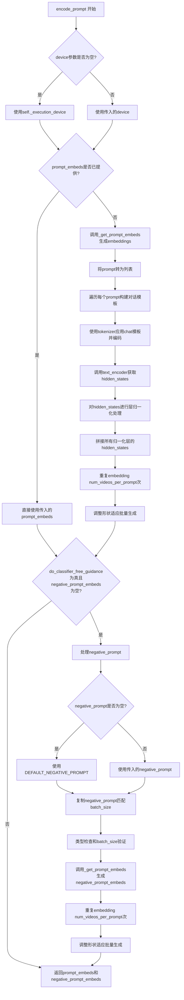

#### 带注释源码

```python
def encode_prompt(
    self,
    prompt: str | list[str],
    negative_prompt: str | list[str] | None = None,
    do_classifier_free_guidance: bool = True,
    num_videos_per_prompt: int = 1,
    prompt_embeds: torch.Tensor | None = None,
    negative_prompt_embeds: torch.Tensor | None = None,
    max_sequence_length: int = 512,
    device: torch.device | None = None,
    dtype: torch.dtype | None = None,
):
    r"""
    Encodes the prompt into text encoder hidden states.

    Args:
        prompt (`str` or `list[str]`, *optional*):
            prompt to be encoded
        negative_prompt (`str` or `list[str]`, *optional*):
            The prompt or prompts not to guide the image generation. If not defined, one has to pass
            `negative_prompt_embeds` instead. Ignored when not using guidance (i.e., ignored if `guidance_scale` is
            less than `1`).
        do_classifier_free_guidance (`bool`, *optional*, defaults to `True`):
            Whether to use classifier free guidance or not.
        num_videos_per_prompt (`int`, *optional*, defaults to 1):
            Number of videos that should be generated per prompt. torch device to place the resulting embeddings on
        prompt_embeds (`torch.Tensor`, *optional*):
            Pre-generated text embeddings. Can be used to easily tweak text inputs, *e.g.* prompt weighting. If not
            provided, text embeddings will be generated from `prompt` input argument.
        negative_prompt_embeds (`torch.Tensor`, *optional*):
            Pre-generated negative text embeddings. Can be used to easily tweak text inputs, *e.g.* prompt
            weighting. If not provided, negative_prompt_embeds will be generated from `negative_prompt` input
            argument.
        device: (`torch.device`, *optional*):
            torch device
        dtype: (`torch.dtype`, *optional*):
            torch dtype
    """
    # 确定执行设备，未指定则使用pipeline的默认执行设备
    device = device or self._execution_device

    # 标准化prompt为列表格式，便于批量处理
    prompt = [prompt] if isinstance(prompt, str) else prompt
    
    # 确定batch_size：如果提供了prompt则使用其长度，否则使用prompt_embeds的batch维度
    if prompt is not None:
        batch_size = len(prompt)
    else:
        batch_size = prompt_embeds.shape[0]

    # 如果未提供prompt_embeds，则从prompt生成
    if prompt_embeds is None:
        # 调用内部方法_get_prompt_embeds生成文本嵌入
        prompt_embeds = self._get_prompt_embeds(
            prompt=prompt, max_sequence_length=max_sequence_length, device=device, dtype=dtype
        )

        # 为每个prompt生成的视频数量复制embeddings（使用MPS友好的方法）
        _, seq_len, _ = prompt_embeds.shape
        prompt_embeds = prompt_embeds.repeat(1, num_videos_per_prompt, 1)  # 复制到num_videos_per_prompt维度
        prompt_embeds = prompt_embeds.view(batch_size * num_videos_per_prompt, seq_len, -1)  # 调整形状

    # 处理分类器自由引导的负面提示embeddings
    if do_classifier_free_guidance and negative_prompt_embeds is None:
        # 如果未提供negative_prompt，使用默认的负面提示
        negative_prompt = negative_prompt if negative_prompt is not None else DEFAULT_NEGATIVE_PROMPT
        # 确保negative_prompt是列表且长度匹配batch_size
        negative_prompt = batch_size * [negative_prompt] if isinstance(negative_prompt, str) else negative_prompt

        # 类型检查：negative_prompt和prompt类型必须一致
        if prompt is not None and type(prompt) is not type(negative_prompt):
            raise TypeError(
                f"`negative_prompt` should be the same type to `prompt`, but got {type(negative_prompt)} !="
                f" {type(prompt)}."
            )
        # batch_size一致性检查
        elif batch_size != len(negative_prompt):
            raise ValueError(
                f"`negative_prompt`: {negative_prompt} has batch size {len(negative_prompt)}, but `prompt`:"
                f" {prompt} has batch size {batch_size}. Please make sure that passed `negative_prompt` matches"
                " the batch size of `prompt`."
            )

        # 生成negative_prompt_embeds
        negative_prompt_embeds = self._get_prompt_embeds(
            prompt=negative_prompt, max_sequence_length=max_sequence_length, device=device, dtype=dtype
        )

        # 为每个prompt生成的视频数量复制embeddings
        _, seq_len, _ = negative_prompt_embeds.shape
        negative_prompt_embeds = negative_prompt_embeds.repeat(1, num_videos_per_prompt, 1)
        negative_prompt_embeds = negative_prompt_embeds.view(batch_size * num_videos_per_prompt, seq_len, -1)

    # 返回处理后的prompt_embeds和negative_prompt_embeds
    return prompt_embeds, negative_prompt_embeds
```


### `Cosmos2_5_PredictBasePipeline.prepare_latents`

该方法负责为扩散模型准备初始的潜在空间（latent space）表示。它根据输入的视频帧数量（`num_frames_in`）区分两种生成模式：当无输入视频时（Text2World），生成随机噪声作为初始潜在向量；当有输入视频时（Video2World/Image2World），使用 VAE（变分自编码器）对输入进行编码，生成条件潜在向量，并创建相应的掩码（mask）以区分需要生成的部分和已 conditioning 的部分。

参数：

- `video`：`torch.Tensor | None`，输入的条件视频/图像帧。如果为 `None` 表示 Text2World 模式。
- `batch_size`：`int`，生成的批量大小。
- `num_channels_latents`：`int`，潜在空间的通道数，默认为 16。
- `height`：`int`，输出视频的高度像素值，默认为 704。
- `width`：`int`，输出视频的宽度像素值，默认为 1280。
- `num_frames_in`：`int`，输入视频的帧数。如果为 0 表示纯文本生成（Text2World）。
- `num_frames_out`：`int`，期望输出的总帧数。
- `do_classifier_free_guidance`：`bool`，是否使用无分类器引导（CFG），默认为 True。
- `dtype`：`torch.dtype | None`，生成张量的数据类型。
- `device`：`torch.device | None`，生成张量的设备。
- `generator`：`torch.Generator | list[torch.Generator] | None`，随机数生成器，用于确保可复现性。
- `latents`：`torch.Tensor | None`，可选的预生成潜在向量。如果提供，将直接使用；否则随机生成。

返回值：`tuple[torch.Tensor, torch.Tensor, torch.Tensor, torch.Tensor]`
返回一个包含四个张量的元组：
1.  `latents` (`torch.Tensor`): 初始的噪声潜在向量，用于扩散过程。
2.  `cond_latents` (`torch.Tensor`): 输入视频编码后的潜在表示（条件潜在向量）。
3.  `cond_mask` (`torch.Tensor`): 条件掩码，形状为 (B, 1, T, H, W)，用于在潜在空间中混合 `latents` 和 `cond_latents`。
4.  `cond_indicator` (`torch.Tensor`): 条件指示器，标记哪些时间步/帧是受条件约束的。

#### 流程图

```mermaid
flowchart TD
    A[开始: prepare_latents] --> B{检查 generator 长度与 batch_size 是否匹配}
    B -- 不匹配 --> C[抛出 ValueError]
    B -- 匹配 --> D[计算潜在向量形状: Shape = (B, C, T, H, W)]
    D --> E{num_frames_in == 0?}
    
    %% 分支1: Text2World (无输入)
    E -- 是 --> F[生成随机 latents: randn_tensor]
    F --> G[创建零值掩码: cond_mask, cond_indicator]
    G --> H[创建零值 cond_latents]
    H --> I[返回: (latents, cond_latents, cond_mask, cond_indicator)]

    %% 分支2: Video/Image2World (有输入)
    E -- 否 --> J{检查 video 是否为 None}
    J -- 是 --> K[抛出 ValueError: 缺少输入视频]
    J -- 否 --> L[视频预处理: video_processor.preprocess_video]
    L --> M[视频编码: vae.encode(video)]
    M --> N[提取潜在向量: retrieve_latents]
    N --> O{归一化 cond_latents}
    O --> P[使用 VAE mean/std 进行标准化]
    P --> Q{latents 是否已提供?}
    Q -- 否 --> R[生成随机 latents: randn_tensor]
    Q -- 是 --> S[使用传入的 latents]
    R --> T[构建 cond_indicator 和 cond_mask]
    S --> T
    T --> I

    I --> Z[结束]
```

#### 带注释源码

```python
def prepare_latents(
    self,
    video: torch.Tensor | None,
    batch_size: int,
    num_channels_latents: int = 16,
    height: int = 704,
    width: int = 1280,
    num_frames_in: int = 93,
    num_frames_out: int = 93,
    do_classifier_free_guidance: bool = True,
    dtype: torch.dtype | None = None,
    device: torch.device | None = None,
    generator: torch.Generator | list[torch.Generator] | None = None,
    latents: torch.Tensor | None = None,
) -> torch.Tensor:
    # 1. 验证 generator 列表长度是否与 batch_size 一致
    if isinstance(generator, list) and len(generator) != batch_size:
        raise ValueError(
            f"You have passed a list of generators of length {len(generator)}, but requested an effective batch"
            f" size of {batch_size}. Make sure the batch size matches the length of the generators."
        )

    # 2. 确定潜在向量的形状
    # B: Batch, C: Channels, T: Temporal frames (根据 VAE 缩放因子计算), H/W: Spatial dimensions
    B = batch_size
    C = num_channels_latents
    T = (num_frames_out - 1) // self.vae_scale_factor_temporal + 1
    H = height // self.vae_scale_factor_spatial
    W = width // self.vae_scale_factor_spatial
    shape = (B, C, T, H, W)

    # 3. 分支处理：Text2World (无输入帧) vs Video2World (有输入帧)
    if num_frames_in == 0:
        # --- Text2World 模式 ---
        # 如果没有提供 latents，则生成随机噪声
        if latents is None:
            latents = randn_tensor(shape, generator=generator, device=device, dtype=dtype)

        # 创建空的掩码和指示器（全是零，表示无conditioning）
        cond_mask = torch.zeros((B, 1, T, H, W), dtype=latents.dtype, device=latents.device)
        cond_indicator = torch.zeros((B, 1, T, 1, 1), dtype=latents.dtype, device=latents.device)
        cond_latents = torch.zeros_like(latents)

        return (
            latents,
            cond_latents,
            cond_mask,
            cond_indicator,
        )
    else:
        # --- Video2World / Image2World 模式 ---
        
        # 验证输入视频是否存在
        if video is None:
            raise ValueError("`video` must be provided when `num_frames_in` is greater than 0.")
        
        # 预处理视频（例如调整大小、归一化）
        needs_preprocessing = not (isinstance(video, torch.Tensor) and video.ndim == 5 and video.shape[1] == 3)
        if needs_preprocessing:
            video = self.video_processor.preprocess_video(video, height, width)
        
        # 将视频数据传输到目标设备和数据类型
        video = video.to(device=device, dtype=self.vae.dtype)
        
        # 使用 VAE 编码视频帧为潜在向量
        if isinstance(generator, list):
            # 如果有多个 generator，为每个样本分别编码
            cond_latents = [
                retrieve_latents(self.vae.encode(video[i].unsqueeze(0)), generator=generator[i])
                for i in range(batch_size)
            ]
        else:
            cond_latents = [retrieve_latents(self.vae.encode(vid.unsqueeze(0)), generator) for vid in video]

        # 合并 batch 维度并转换类型
        cond_latents = torch.cat(cond_latents, dim=0).to(dtype)

        # 标准化条件潜在向量 (使用 VAE 的均值和标准差)
        latents_mean = self.latents_mean.to(device=device, dtype=dtype)
        latents_std = self.latents_std.to(device=device, dtype=dtype)
        cond_latents = (cond_latents - latents_mean) / latents_std

        # 初始化要生成的潜在向量 (如果未提供)
        if latents is None:
            latents = randn_tensor(shape, generator=generator, device=device, dtype=dtype)
        else:
            latents = latents.to(device=device, dtype=dtype)

        # --- 创建 Mask 和 Indicator ---
        # 这是一个关键步骤，用于告诉 Transformer 哪些帧是输入（需要保持），哪些是待生成的
        
        padding_shape = (B, 1, T, H, W)
        ones_padding = latents.new_ones(padding_shape)
        zeros_padding = latents.new_zeros(padding_shape)

        # 计算输入视频对应的潜在帧数
        num_cond_latent_frames = (num_frames_in - 1) // self.vae_scale_factor_temporal + 1
        
        # 初始化指示器（0表示待生成）
        cond_indicator = latents.new_zeros(1, 1, latents.size(2), 1, 1)
        # 将前 num_cond_latent_frames 标记为 1 (条件帧)
        cond_indicator[:, :, 0:num_cond_latent_frames] = 1.0
        
        # 创建 mask：如果该位置是条件帧，则 mask=1，否则 mask=0
        # 用于在噪声预测时混合 gt_velocity (cond_latent) 和 noise_pred (latents)
        cond_mask = cond_indicator * ones_padding + (1 - cond_indicator) * zeros_padding

        return (
            latents,
            cond_latents,
            cond_mask,
            cond_indicator,
        )
```


### `Cosmos2_5_PredictBasePipeline.check_inputs`

该方法用于验证管道输入参数的有效性，确保 `height` 和 `width` 是16的倍数、回调张量输入合法、以及 `prompt` 和 `prompt_embeds` 至少提供一个且类型正确。

参数：

- `self`：类的实例，自动传递
- `prompt`：`str | list[str] | None`，用于指导生成的文本提示
- `height`：`int`，生成图像的高度（像素）
- `width`：`int`，生成图像的宽度（像素）
- `prompt_embeds`：`torch.Tensor | None`，预生成的文本嵌入向量
- `callback_on_step_end_tensor_inputs`：`list[str] | None`，在每个去噪步骤结束时需要回调的张量输入列表

返回值：`None`，该方法仅执行输入验证，若验证失败则抛出 `ValueError` 异常

#### 流程图

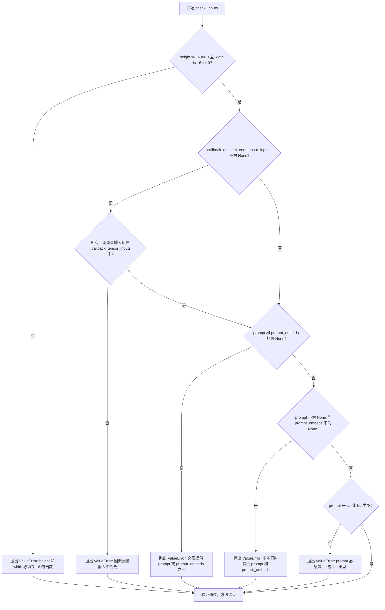

#### 带注释源码

```python
# Copied from diffusers.pipelines.cosmos.pipeline_cosmos_text2world.CosmosTextToWorldPipeline.check_inputs
def check_inputs(
    self,
    prompt,                         # str | list[str] | None: 输入文本提示
    height,                         # int: 生成图像高度
    width,                         # int: 生成图像宽度
    prompt_embeds=None,            # torch.Tensor | None: 预计算的文本嵌入
    callback_on_step_end_tensor_inputs=None,  # list[str] | None: 回调张量输入列表
):
    """
    验证管道输入参数的有效性。
    
    检查项：
    1. height 和 width 必须是 16 的倍数
    2. callback_on_step_end_tensor_inputs 中的所有元素必须在 _callback_tensor_inputs 中
    3. prompt 和 prompt_embeds 不能同时提供
    4. prompt 和 prompt_embeds 不能同时为 None
    5. prompt 必须是 str 或 list 类型
    """
    
    # 检查 1: height 和 width 必须是 16 的倍数（视频/图像处理的网络结构要求）
    if height % 16 != 0 or width % 16 != 0:
        raise ValueError(f"`height` and `width` have to be divisible by 16 but are {height} and {width}.")

    # 检查 2: 验证回调张量输入是否在允许的列表中
    if callback_on_step_end_tensor_inputs is not None and not all(
        k in self._callback_tensor_inputs for k in callback_on_step_end_tensor_inputs
    ):
        raise ValueError(
            f"`callback_on_step_end_tensor_inputs` has to be in {self._callback_tensor_inputs}, but found {[k for k in callback_on_step_end_tensor_inputs if k not in self._callback_tensor_inputs]}"
        )

    # 检查 3: prompt 和 prompt_embeds 不能同时提供
    if prompt is not None and prompt_embeds is not None:
        raise ValueError(
            f"Cannot forward both `prompt`: {prompt} and `prompt_embeds`: {prompt_embeds}. Please make sure to"
            " only forward one of the two."
        )
    # 检查 4: prompt 和 prompt_embeds 不能同时为 None
    elif prompt is None and prompt_embeds is None:
        raise ValueError(
            "Provide either `prompt` or `prompt_embeds`. Cannot leave both `prompt` and `prompt_embeds` undefined."
        )
    # 检查 5: prompt 必须是 str 或 list 类型
    elif prompt is not None and (not isinstance(prompt, str) and not isinstance(prompt, list)):
        raise ValueError(f"`prompt` has to be of type `str` or `list` but is {type(prompt)}")
```


### `Cosmos2_5_PredictBasePipeline.__call__`

该方法是 Cosmos2.5 视频生成管道的主入口，支持三种生成模式：Text2World（仅文本生成）、Image2World（图像条件生成）和Video2World（视频条件生成），通过去噪过程生成视频或图像帧。

参数：

- `image`：`PipelineImageInput | None`，可选的单个图像，用于 Image2World 条件生成
- `video`：`list[PipelineImageInput] | None`，可选的输入视频，用于 Video2World 条件生成
- `prompt`：`str | list[str] | None`，引导生成的文本提示
- `negative_prompt`：`str | list[str] | None`，负向提示，用于引导不生成的内容
- `height`：`int`，生成图像的高度，默认为 704 像素
- `width`：`int`，生成图像的宽度，默认为 1280 像素
- `num_frames`：`int`，输出帧数，默认为 93 帧
- `num_inference_steps`：`int`，去噪推理步数，默认为 36 步
- `guidance_scale`：`float`，分类器自由引导比例，默认为 7.0
- `num_videos_per_prompt`：`int | None`，每个提示生成的视频数量，默认为 1
- `generator`：`torch.Generator | list[torch.Generator] | None`，随机数生成器，用于确定性生成
- `latents`：`torch.Tensor | None`，预生成的噪声潜在变量
- `prompt_embeds`：`torch.Tensor | None`，预生成的文本嵌入向量
- `negative_prompt_embeds`：`torch.Tensor | None`，预生成的负向文本嵌入向量
- `output_type`：`str | None`，输出格式，默认为 "pil"
- `return_dict`：`bool`，是否返回字典格式，默认为 True
- `callback_on_step_end`：`Callable | None`，每个去噪步骤结束时的回调函数
- `callback_on_step_end_tensor_inputs`：`list[str]`，回调函数使用的张量输入列表
- `max_sequence_length`：`int`，提示的最大令牌长度，默认为 512
- `conditional_frame_timestep`：`float`，条件帧时间步，默认为 0.1
- `num_latent_conditional_frames`：`int`，用于 Video2World 条件的潜在条件帧数，默认为 2

返回值：`CosmosPipelineOutput | tuple`，当 return_dict 为 True 时返回 CosmosPipelineOutput 对象，包含生成的视频帧；否则返回元组，第一个元素是生成的视频帧列表

#### 流程图

```mermaid
flowchart TD
    A[开始 __call__] --> B{安全检查器是否存在}
    B -->|否| C[抛出值错误: 必须启用安全检查器]
    B -->|是| D[设置引导比例和时间步]
    D --> E[检查输入参数有效性]
    E --> F{确定批次大小}
    F --> G[编码输入提示词]
    G --> H{输入类型判断}
    H -->|image| I[转换为视频张量, num_frames_in=1]
    H -->|video| J[提取条件帧, num_frames_in=frames_to_extract]
    H -->|None| K[创建零张量, num_frames_in=0]
    I --> L[预处理视频]
    J --> L
    K --> L
    L --> M[准备潜在变量]
    M --> N[设置去噪调度器时间步]
    N --> O[开始去噪循环]
    O --> P{遍历每个时间步}
    P -->|是| Q[计算sigma_t和输入潜在变量]
    Q --> R[Transformer前向传播-条件]
    R --> S[计算噪声预测]
    S --> T{使用分类器自由引导}
    T -->|是| U[Transformer前向传播-非条件]
    U --> V[应用引导比例]
    T -->|否| W[调度器步进]
    V --> W
    W --> X[执行回调函数]
    X --> Y[更新进度条]
    Y --> P
    P -->|否| Z{输出类型是否为latent}
    Z -->|否| AA[反标准化潜在变量]
    AA --> AB[VAE解码]
    AB AC[后处理视频]
    AC --> AD[安全检查]
    AD --> AE[匹配帧数]
    Z -->|是| AF[直接使用潜在变量]
    AE --> AG[卸载模型]
    AF --> AG
    AG --> AH[返回结果]
```

#### 带注释源码

```python
@torch.no_grad()
@replace_example_docstring(EXAMPLE_DOC_STRING)
def __call__(
    self,
    image: PipelineImageInput | None = None,
    video: list[PipelineImageInput] | None = None,
    prompt: str | list[str] | None = None,
    negative_prompt: str | list[str] | None = None,
    height: int = 704,
    width: int = 1280,
    num_frames: int = 93,
    num_inference_steps: int = 36,
    guidance_scale: float = 7.0,
    num_videos_per_prompt: int | None = 1,
    generator: torch.Generator | list[torch.Generator] | None = None,
    latents: torch.Tensor | None = None,
    prompt_embeds: torch.Tensor | None = None,
    negative_prompt_embeds: torch.Tensor | None = None,
    output_type: str | None = "pil",
    return_dict: bool = True,
    callback_on_step_end: Callable[[int, int, None], PipelineCallback | MultiPipelineCallbacks] | None = None,
    callback_on_step_end_tensor_inputs: list[str] = ["latents"],
    max_sequence_length: int = 512,
    conditional_frame_timestep: float = 0.1,
    num_latent_conditional_frames: int = 2,
):
    """
    管道生成调用函数，支持三种模式:
    - Text2World: image=None, video=None, prompt提供
    - Image2World: image提供, video=None
    - Video2World: video提供, image=None
    """
    # 1. 安全检查: 确保安全检查器已启用
    if self.safety_checker is None:
        raise ValueError(
            f"You have disabled the safety checker for {self.__class__}. This is in violation of the "
            "[NVIDIA Open Model License Agreement](https://www.nvidia.com/en-us/agreements/enterprise-software/nvidia-open-model-license). "
            f"Please ensure that you are compliant with the license agreement."
        )

    # 2. 处理回调函数
    if isinstance(callback_on_step_end, (PipelineCallback, MultiPipelineCallbacks)):
        callback_on_step_end_tensor_inputs = callback_on_step_end.tensor_inputs

    # 3. 输入验证
    self.check_inputs(prompt, height, width, prompt_embeds, callback_on_step_end_tensor_inputs)

    # 4. 初始化内部状态
    self._guidance_scale = guidance_scale
    self._current_timestep = None
    self._interrupt = False

    device = self._execution_device

    # 5. 安全检查器设备转移和文本安全检查
    if self.safety_checker is not None:
        self.safety_checker.to(device)
        if prompt is not None:
            prompt_list = [prompt] if isinstance(prompt, str) else prompt
            for p in prompt_list:
                if not self.safety_checker.check_text_safety(p):
                    raise ValueError(
                        f"Cosmos Guardrail detected unsafe text in the prompt: {p}. Please ensure that the "
                        f"prompt abides by the NVIDIA Open Model License Agreement."
                    )

    # 6. 确定批次大小
    if prompt is not None and isinstance(prompt, str):
        batch_size = 1
    elif prompt is not None and isinstance(prompt, list):
        batch_size = len(prompt)
    else:
        batch_size = prompt_embeds.shape[0]

    # 7. 编码输入提示词
    (
        prompt_embeds,
        negative_prompt_embeds,
    ) = self.encode_prompt(
        prompt=prompt,
        negative_prompt=negative_prompt,
        do_classifier_free_guidance=self.do_classifier_free_guidance,
        num_videos_per_prompt=num_videos_per_prompt,
        prompt_embeds=prompt_embeds,
        negative_prompt_embeds=negative_prompt_embeds,
        device=device,
        max_sequence_length=max_sequence_length,
    )

    vae_dtype = self.vae.dtype
    transformer_dtype = self.transformer.dtype

    # 8. 处理输入模式 (Text2World / Image2World / Video2World)
    num_frames_in = None
    if image is not None:
        # Image2World模式: 将图像转换为视频张量
        if batch_size != 1:
            raise ValueError(f"batch_size must be 1 for image input (given {batch_size})")

        image = torchvision.transforms.functional.to_tensor(image).unsqueeze(0)
        video = torch.cat([image, torch.zeros_like(image).repeat(num_frames - 1, 1, 1, 1)], dim=0)
        video = video.unsqueeze(0)
        num_frames_in = 1
    elif video is None:
        # Text2World模式: 创建零张量
        video = torch.zeros(batch_size, num_frames, 3, height, width, dtype=torch.uint8)
        num_frames_in = 0
    else:
        # Video2World模式: 验证和提取条件帧
        if batch_size != 1:
            raise ValueError(f"batch_size must be 1 for video input (given {batch_size})")

        if num_latent_conditional_frames not in [1, 2]:
            raise ValueError(
                f"num_latent_conditional_frames must be 1 or 2, but got {num_latent_conditional_frames}"
            )

        frames_to_extract = 4 * (num_latent_conditional_frames - 1) + 1

        total_input_frames = len(video)

        if total_input_frames < frames_to_extract:
            raise ValueError(
                f"Input video has only {total_input_frames} frames but Video2World requires at least "
                f"{frames_to_extract} frames for conditioning."
            )

        num_frames_in = frames_to_extract

    # 9. 视频预处理
    assert video is not None
    video = self.video_processor.preprocess_video(video, height, width)

    # 10. 对于Video2World: 提取最后frames_to_extract帧并填充
    if image is None and num_frames_in > 0 and num_frames_in < video.shape[2]:
        video = video[:, :, -num_frames_in:, :, :]

    num_frames_out = num_frames

    # 11. 填充视频以匹配输出帧数
    if video.shape[2] < num_frames_out:
        n_pad_frames = num_frames_out - video.shape[2]
        last_frame = video[:, :, -1:, :, :]
        pad_frames = last_frame.repeat(1, 1, n_pad_frames, 1, 1)
        video = torch.cat((video, pad_frames), dim=2)

    assert num_frames_in <= num_frames_out, f"expected ({num_frames_in=}) <= ({num_frames_out=})"

    video = video.to(device=device, dtype=vae_dtype)

    # 12. 准备潜在变量
    num_channels_latents = self.transformer.config.in_channels - 1
    latents, cond_latent, cond_mask, cond_indicator = self.prepare_latents(
        video=video,
        batch_size=batch_size * num_videos_per_prompt,
        num_channels_latents=num_channels_latents,
        height=height,
        width=width,
        num_frames_in=num_frames_in,
        num_frames_out=num_frames,
        do_classifier_free_guidance=self.do_classifier_free_guidance,
        dtype=torch.float32,
        device=device,
        generator=generator,
        latents=latents,
    )
    
    # 13. 设置条件时间步和条件掩码
    cond_timestep = torch.ones_like(cond_indicator) * conditional_frame_timestep
    cond_mask = cond_mask.to(transformer_dtype)

    padding_mask = latents.new_zeros(1, 1, height, width, dtype=transformer_dtype)

    # 14. 去噪循环
    self.scheduler.set_timesteps(num_inference_steps, device=device)
    timesteps = self.scheduler.timesteps
    self._num_timesteps = len(timesteps)
    num_warmup_steps = len(timesteps) - num_inference_steps * self.scheduler.order

    gt_velocity = (latents - cond_latent) * cond_mask
    
    with self.progress_bar(total=num_inference_steps) as progress_bar:
        for i, t in enumerate(timesteps):
            if self.interrupt:
                continue

            self._current_timestep = t.cpu().item()

            # 计算sigma_t
            sigma_t = (
                torch.tensor(self.scheduler.sigmas[i].item())
                .unsqueeze(0)
                .to(device=device, dtype=transformer_dtype)
            )

            # 合并条件潜在变量和噪声潜在变量
            in_latents = cond_mask * cond_latent + (1 - cond_mask) * latents
            in_latents = in_latents.to(transformer_dtype)
            in_timestep = cond_indicator * cond_timestep + (1 - cond_indicator) * sigma_t
            
            # 15. Transformer前向传播 (条件)
            noise_pred = self.transformer(
                hidden_states=in_latents,
                condition_mask=cond_mask,
                timestep=in_timestep,
                encoder_hidden_states=prompt_embeds,
                padding_mask=padding_mask,
                return_dict=False,
            )[0]
            
            # 对于条件输入，使用GT velocity替换
            noise_pred = gt_velocity + noise_pred * (1 - cond_mask)

            # 16. 分类器自由引导
            if self.do_classifier_free_guidance:
                noise_pred_neg = self.transformer(
                    hidden_states=in_latents,
                    condition_mask=cond_mask,
                    timestep=in_timestep,
                    encoder_hidden_states=negative_prompt_embeds,
                    padding_mask=padding_mask,
                    return_dict=False,
                )[0]
                noise_pred_neg = gt_velocity + noise_pred_neg * (1 - cond_mask)
                noise_pred = noise_pred + self.guidance_scale * (noise_pred - noise_pred_neg)

            # 17. 调度器步进
            latents = self.scheduler.step(noise_pred, t, latents, return_dict=False)[0]

            # 18. 执行回调函数
            if callback_on_step_end is not None:
                callback_kwargs = {}
                for k in callback_on_step_end_tensor_inputs:
                    callback_kwargs[k] = locals()[k]
                callback_outputs = callback_on_step_end(self, i, t, callback_kwargs)

                latents = callback_outputs.pop("latents", latents)
                prompt_embeds = callback_outputs.pop("prompt_embeds", prompt_embeds)
                negative_prompt_embeds = callback_outputs.pop("negative_prompt_embeds", negative_prompt_embeds)

            # 更新进度条
            if i == len(timesteps) - 1 or ((i + 1) > num_warmup_steps and (i + 1) % self.scheduler.order == 0):
                progress_bar.update()

            # XLA优化
            if XLA_AVAILABLE:
                xm.mark_step()

    self._current_timestep = None

    # 19. 后处理: 解码潜在变量
    if not output_type == "latent":
        latents_mean = self.latents_mean.to(latents.device, latents.dtype)
        latents_std = self.latents_std.to(latents.device, latents.dtype)
        latents = latents * latents_std + latents_mean
        video = self.vae.decode(latents.to(self.vae.dtype), return_dict=False)[0]
        video = self._match_num_frames(video, num_frames)

        # 20. 安全检查
        assert self.safety_checker is not None
        self.safety_checker.to(device)
        video = self.video_processor.postprocess_video(video, output_type="np")
        video = (video * 255).astype(np.uint8)
        video_batch = []
        for vid in video:
            vid = self.safety_checker.check_video_safety(vid)
            video_batch.append(vid)
        video = np.stack(video_batch).astype(np.float32) / 255.0 * 2 - 1
        video = torch.from_numpy(video).permute(0, 4, 1, 2, 3)
        video = self.video_processor.postprocess_video(video, output_type=output_type)
    else:
        video = latents

    # 21. 卸载模型
    self.maybe_free_model_hooks()

    # 22. 返回结果
    if not return_dict:
        return (video,)

    return CosmosPipelineOutput(frames=video)
```


### `Cosmos2_5_PredictBasePipeline._match_num_frames`

该方法用于将视频帧数与目标帧数进行匹配，通过重复插值或填充/截断操作来调整视频的帧数，确保输出视频的帧数符合用户请求的 `num_frames` 参数要求。

参数：

- `self`：类的实例方法隐含参数
- `video`：`torch.Tensor`，输入的视频潜在表示张量，形状为 [B, C, T, H, W]，其中 T 表示时间维度（帧数）
- `target_num_frames`：`int`，目标输出帧数

返回值：`torch.Tensor`，调整后的视频张量，帧数已被匹配为目标帧数

#### 流程图

```mermaid
flowchart TD
    A[开始 _match_num_frames] --> B{target_num_frames <= 0<br/>or video.shape[2] == target_num_frames}
    B -->|Yes| C[直接返回 video]
    B -->|No| D[计算 frames_per_latent<br/>= max(vae_scale_factor_temporal, 1)]
    D --> E[使用 repeat_interleave<br/>扩展视频帧数]
    E --> F[获取当前帧数<br/>current_frames = video.shape[2]]
    F --> G{current_frames < target_num_frames}
    G -->|Yes| H[重复最后一帧<br/>填充至目标帧数]
    G -->|No| I{current_frames > target_num_frames}
    H --> J[返回处理后的 video]
    I -->|Yes| K[截断多余帧]
    I -->|No| J
    K --> J
```

#### 带注释源码

```python
def _match_num_frames(self, video: torch.Tensor, target_num_frames: int) -> torch.Tensor:
    """
    将视频帧数与目标帧数进行匹配。
    
    参数:
        video: 输入的视频潜在表示张量，形状为 [B, C, T, H, W]
        target_num_frames: 目标输出帧数
    
    返回:
        调整后的视频张量，帧数已匹配为目标帧数
    """
    # 如果目标帧数无效或视频帧数已等于目标帧数，直接返回原视频
    if target_num_frames <= 0 or video.shape[2] == target_num_frames:
        return video

    # 计算每个潜在帧对应的像素帧数（VAE 的时间下采样因子）
    frames_per_latent = max(self.vae_scale_factor_temporal, 1)
    # 使用 repeat_interleave 在时间维度上扩展视频，将潜在表示扩展为像素帧
    video = torch.repeat_interleave(video, repeats=frames_per_latent, dim=2)

    # 获取当前视频的实际帧数
    current_frames = video.shape[2]
    
    # 如果当前帧数小于目标帧数，通过重复最后一帧进行填充
    if current_frames < target_num_frames:
        pad = video[:, :, -1:, :, :].repeat(1, 1, target_num_frames - current_frames, 1, 1)
        video = torch.cat([video, pad], dim=2)
    # 如果当前帧数大于目标帧数，截断多余帧
    elif current_frames > target_num_frames:
        video = video[:, :, :target_num_frames]

    return video
```


### `Cosmos2_5_PredictBasePipeline.guidance_scale`

该属性返回分类器自由引导（Classifier-Free Guidance）的缩放因子，用于控制生成过程中对prompt的遵循程度。较高的值会使生成结果更紧密地跟随prompt，但可能导致图像质量下降或产生伪影。

参数： 无

返回值：`float`，返回当前配置的引导比例值，该值在 pipeline 调用时通过 `guidance_scale` 参数设置，用于控制无分类器引导的强度。

#### 流程图

```mermaid
flowchart TD
    A[获取 guidance_scale 属性] --> B{检查 _guidance_scale 是否已设置}
    B -->|已设置| C[返回 self._guidance_scale]
    B -->|未设置| D[返回默认值或 None]
    
    E[调用 pipeline __call__] --> F[设置 self._guidance_scale = guidance_scale 参数]
    F --> G[在去噪循环中使用 self.guidance_scale 加权噪声预测]
    
    C --> H[用于 cfg 计算: noise_pred + guidance_scale * (noise_pred - noise_pred_neg)]
    D --> I[do_classifier_free_guidance 属性返回 False]
```

#### 带注释源码

```python
@property
def guidance_scale(self):
    """
    返回用于分类器自由引导（Classifier-Free Diffusion Guidance）的引导比例。

    该属性返回内部存储的 _guidance_scale 值，该值在 pipeline 的 __call__ 方法中
    通过参数 guidance_scale 进行设置。在去噪循环中，此值用于对无条件预测和条件预测
    进行加权组合，以引导生成结果更紧密地遵循文本提示。

    Returns:
        float: 引导比例因子，通常在 1.0 到 20.0 之间。
               - 1.0 表示不使用引导（等价于不使用 classifier-free guidance）
               - 7.0 是该 pipeline 的默认值
               - 更高的值会增加对 prompt 的遵循程度，但可能降低生成质量

    Example:
        >>> pipe = Cosmos2_5_PredictBasePipeline.from_pretrained(...)
        >>> # 在调用 pipeline 时设置
        >>> output = pipe(prompt="...", guidance_scale=7.0)
        >>> # 之后可以通过属性获取当前值
        >>> scale = pipe.guidance_scale  # 返回 7.0
    """
    return self._guidance_scale
```

**相关属性和方法：**

```python
@property
def do_classifier_free_guidance(self):
    """
    判断是否启用分类器自由引导。

    当 guidance_scale > 1.0 时返回 True，表示启用 CFG。
    该属性用于条件判断，避免在不需要引导时进行额外的无分类器引导计算。
    """
    return self._guidance_scale > 1.0
```

**使用场景：**

在 pipeline 的去噪循环中，`guidance_scale` 被用于计算最终的噪声预测：

```python
# 在 __call__ 方法的去噪循环中
if self.do_classifier_free_guidance:
    noise_pred_neg = self.transformer(...)  # 无条件预测
    noise_pred = noise_pred + self.guidance_scale * (noise_pred - noise_pred_neg)
    #                    ^^^^^^^^^^^^^^^^^^^^^^^^^^^^^^^^^^^^^^^^^^^^^^^^^^^^^
    #                    这里使用 guidance_scale 加权条件和无条件预测的差异
```


### `Cosmos2_5_PredictBasePipeline.do_classifier_free_guidance`

该属性是一个只读属性，用于判断当前管道是否启用 Classifier-Free Guidance（CFG）技术。它通过检查 `guidance_scale` 是否大于 1.0 来决定是否启用无分类器引导。当 `guidance_scale > 1.0` 时返回 `True`，表示在推理过程中会同时处理带条件和不带条件的噪声预测，以增强生成结果的质量。

参数： 无

返回值：`bool`，返回 `True` 表示启用 CFG（当 `guidance_scale > 1.0`），返回 `False` 表示不启用 CFG。

#### 流程图

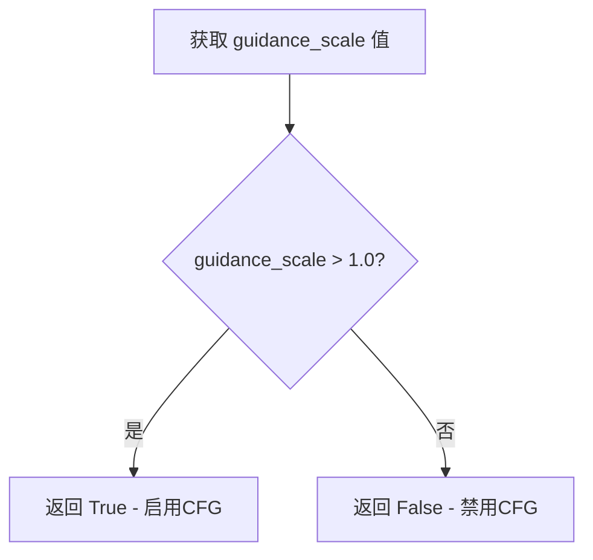

#### 带注释源码

```python
@property
def do_classifier_free_guidance(self):
    """
    属性 Getter：判断是否启用无分类器引导（Classifier-Free Guidance）
    
    Classifier-Free Guidance (CFG) 是一种在扩散模型中改善生成质量的技术。
    其核心思想是在推理时同时预测两个输出：
    1. 有条件预测（带 prompt）
    2. 无条件预测（不带 prompt）
    最终的预测通过公式：prediction = unconditional + guidance_scale * (conditional - unconditional) 得到
    
    当 guidance_scale = 1.0 时，等同于不使用 CFG，预测结果仅为有条件预测
    当 guidance_scale > 1.0 时，CF 生效，模型会在生成过程中考虑负向提示的影响
    
    Returns:
        bool: 如果 guidance_scale 大于 1.0 则返回 True，表示启用 CFG；
              否则返回 False，表示禁用 CFG
    """
    return self._guidance_scale > 1.0
```


### `Cosmos2_5_PredictBasePipeline.num_timesteps`

该属性是一个只读属性，用于返回去噪推理过程中的时间步数量。它在管道调用时由调度器设置，并在整个推理过程中保持不变。

参数：无（该属性不接受任何参数）

返回值：`int`，返回去噪推理过程中的时间步总数（即 `num_inference_steps` 的值）

#### 流程图

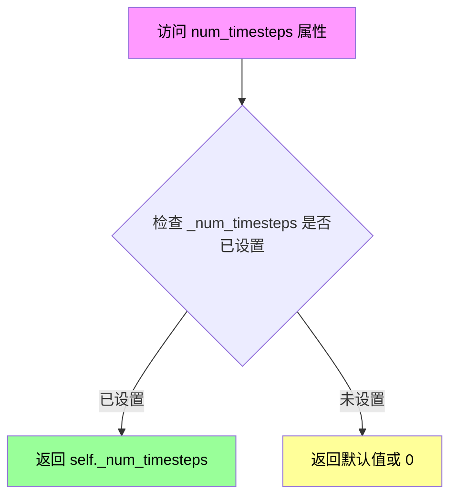

#### 带注释源码

```python
@property
def num_timesteps(self):
    """
    返回去噪推理过程中的时间步数量。
    
    该属性在 __call__ 方法中被设置：
    self.scheduler.set_timesteps(num_inference_steps, device=device)
    timesteps = self.scheduler.timesteps
    self._num_timesteps = len(timesteps)
    
    Returns:
        int: 去噪步骤的总数，对应于推理过程中的迭代次数
    """
    return self._num_timesteps
```


### `Cosmos2_5_PredictBasePipeline.current_timestep`

该属性是 `Cosmos2_5_PredictBasePipeline` 管道类的时间步长只读访问器，用于在去噪推理过程中获取当前的处理时间步。

参数：

- 该属性无需显式参数，隐式接收 `self` 实例

返回值：`int` 或 `float` 或 `None`，返回当前去噪迭代的时间步值，推理开始时被初始化为 `None`，在每次去噪循环中被设置为对应的 timestep 值，循环结束后重置为 `None`。

#### 流程图

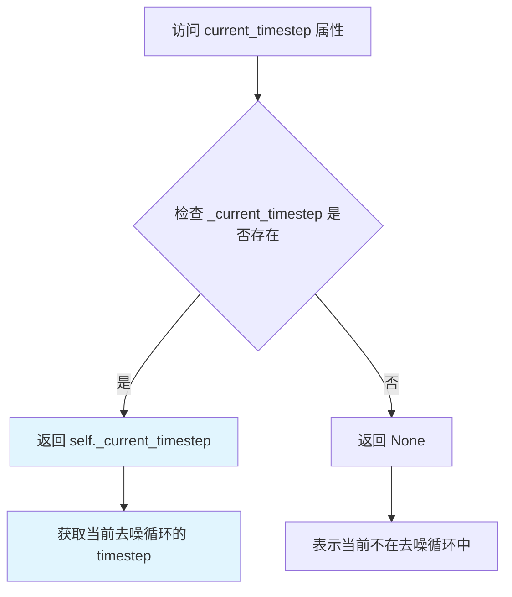

#### 带注释源码

```python
@property
def current_timestep(self):
    """
    属性：获取当前处理的时间步
    
    该属性在去噪循环中被动态更新：
    - 循环开始前：初始化为 None
    - 每次迭代：被设置为当前 timestep 的 CPU 值（.item() 转为 Python 标量）
    - 循环结束后：重置为 None
    
    用法示例：
        在 __call__ 方法的去噪循环中：
        for i, t in enumerate(timesteps):
            self._current_timestep = t.cpu().item()  # 更新当前时间步
            # ... 执行推理 ...
        self._current_timestep = None  # 重置
    
    返回值：
        int 或 float 或 None：当前去噪迭代的时间步值
    """
    return self._current_timestep
```


### `Cosmos2_5_PredictBasePipeline.interrupt`

这是一个属性getter方法，用于获取管道的中断标志状态。该属性返回 `self._interrupt` 的布尔值，用于控制在去噪循环（denoising loop）是否被中断。

参数：无（属性getter不接受任何参数）

返回值：`bool`，返回管道的当前中断状态。当值为 `True` 时，表示管线已被请求中断。

#### 流程图

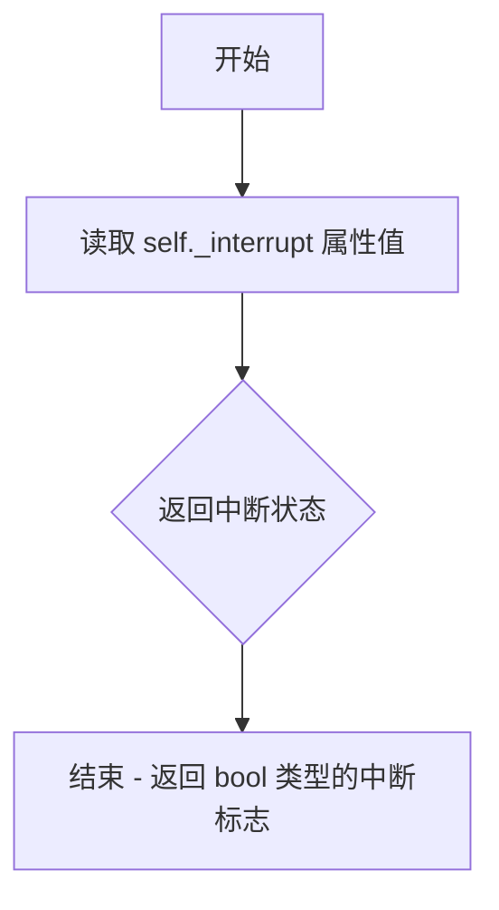

#### 带注释源码

```python
@property
def interrupt(self):
    """
    属性 getter: 获取管道的中断标志状态
    
    该属性返回一个布尔值，表示管线是否被请求中断。
    在 __call__ 方法的去噪循环中会检查此属性：
        for i, t in enumerate(timesteps):
            if self.interrupt:
                continue  # 如果中断标志为 True，跳过当前迭代
    
    Returns:
        bool: True 表示管线已被中断，False 表示管线正常运行
    """
    return self._interrupt
```


### `CosmosSafetyChecker.__init__`

这是一个后备构造函数，当 `cosmos_guardrail` 库未安装时，会抛出 ImportError 提示用户安装该库。

参数：

- `self`：实例本身
- `*args`：可变位置参数，用于传递任意数量的位置参数
- `**kwargs`：可变关键字参数，用于传递任意数量的关键字参数

返回值：无（`None`），构造函数不返回值

#### 流程图

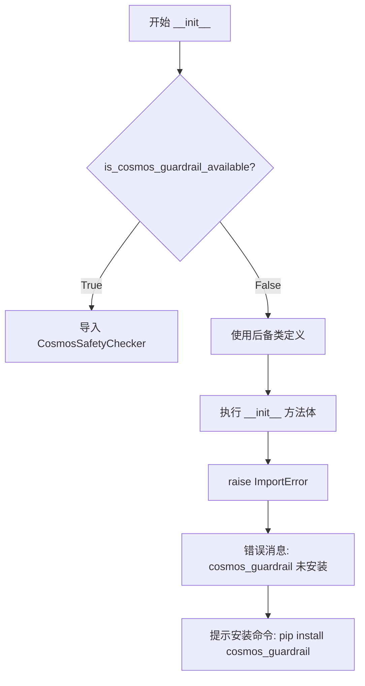

#### 带注释源码

```python
# 这是一个后备类的 __init__ 方法定义
# 当 cosmos_guardrail 库不可用时，会使用这个后备类
def __init__(self, *args, **kwargs):
    # *args 和 **kwargs 接受任意参数，但在此处不使用
    # 因为这个类的唯一目的是抛出 ImportError 错误
    raise ImportError(
        "`cosmos_guardrail` is not installed. Please install it to use the safety checker for Cosmos: `pip install cosmos_guardrail`."
    )
    # 如果 ImportError 被捕获，方法会在此处结束，不会返回任何值
    # 返回类型为 None
```


### `CosmosSafetyChecker.check_text_safety`

该方法是 `CosmosSafetyChecker` 类的成员方法，用于检查输入文本内容是否符合安全标准。在管道执行过程中被调用，用于验证用户提供的 prompt 是否包含不当内容。如果检测到不安全内容，该方法返回 `False`，并抛出 `ValueError` 异常以阻止生成过程。

参数：

-  `text`：`str`，需要检查安全性的文本内容（prompt）

返回值：`bool`，返回 `True` 表示文本安全，返回 `False` 表示文本包含不安全内容

#### 流程图

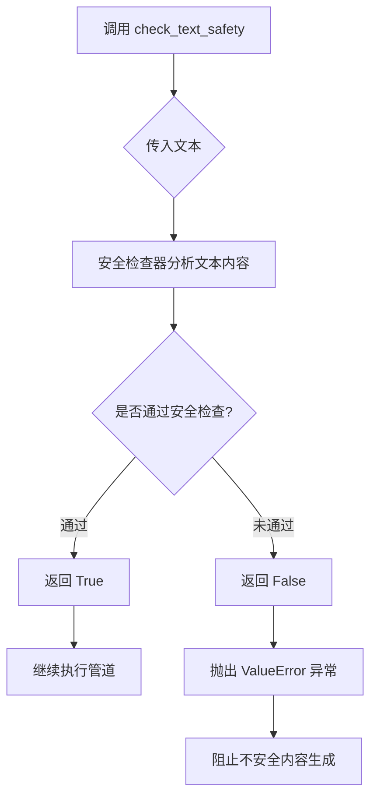

#### 带注释源码

```python
# 该方法定义在 cosmos_guardrail 库中，以下为调用方的使用示例：

# 在 Cosmos2_5_PredictBasePipeline.__call__ 方法中调用：
if self.safety_checker is not None:
    # 将安全检查器移动到执行设备
    self.safety_checker.to(device)
    
    # 如果提供了 prompt，则进行安全检查
    if prompt is not None:
        # 统一转换为列表格式
        prompt_list = [prompt] if isinstance(prompt, str) else prompt
        
        # 遍历每个 prompt 进行安全检查
        for p in prompt_list:
            # 调用 check_text_safety 方法检查文本安全性
            # 参数 p: str - 需要检查的文本内容
            # 返回值: bool - True 表示安全, False 表示不安全
            if not self.safety_checker.check_text_safety(p):
                # 检测到不安全内容时抛出异常
                raise ValueError(
                    f"Cosmos Guardrail detected unsafe text in the prompt: {p}. Please ensure that the "
                    f"prompt abides by the NVIDIA Open Model License Agreement."
                )
```


### `CosmosSafetyChecker.check_video_safety`

该方法用于检查视频内容的安全性，检测并过滤不适合工作内容（NSFW）的视频帧。方法来自外部库 `cosmos_guardrail`，通过安全检查器对视频进行内容审查。

参数：

-  `vid`：`np.ndarray`，待检查的视频帧数据，形状为 (H, W, C)，类型为 uint8

返回值：`np.ndarray`，经过安全检查处理后的视频帧数据，形状和类型与输入相同

#### 流程图

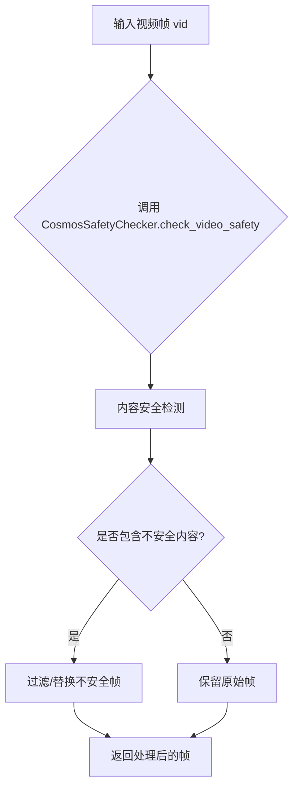

#### 带注释源码

```python
# 该方法定义在 cosmos_guardrail 库中，非本项目源代码
# 以下为调用点的上下文代码，展示该方法的使用方式：

# 1. 将视频从张量转换为 numpy 数组格式
video = self.video_processor.postprocess_video(video, output_type="np")
# 2. 转换为 uint8 类型（0-255 范围）
video = (video * 255).astype(np.uint8)

video_batch = []
# 3. 遍历视频批次中的每一帧
for vid in video:
    # 4. 调用安全检查方法对单个视频帧进行内容安全检查
    # 输入：vid 类型为 np.ndarray，形状 (H, W, C)，uint8
    # 输出：处理后的视频帧，可能包含安全过滤或标记
    vid = self.safety_checker.check_video_safety(vid)
    video_batch.append(vid)

# 5. 重新组装视频批次并转换回模型处理所需的格式
video = np.stack(video_batch).astype(np.float32) / 255.0 * 2 - 1
video = torch.from_numpy(video).permute(0, 4, 1, 2, 3)
```

## 关键组件


### 张量索引与惰性加载

在`prepare_latents`方法中实现，通过条件掩码（cond_mask）和条件指示器（cond_indicator）实现条件帧与生成帧的张量索引与惰性加载。当`num_frames_in=0`时，仅初始化空张量用于Text2World模式；当有输入视频时，通过VAE编码器提取条件潜在变量，并在去噪循环中通过`cond_mask * cond_latent + (1 - cond_mask) * latents`实现条件信息的动态注入。

### 反量化支持

通过`latents_mean`和`latents_std`两个全局变量实现潜在空间的反量化。在`prepare_latents`中对条件潜在变量进行标准化（`(cond_latents - latents_mean) / latents_std`），在解码前进行反标准化（`latents * latents_std + latents_mean`），确保潜在空间符合VAE的量化分布特性。

### 量化策略

支持多级精度转换：VAE使用`vae_dtype`（通常为bfloat16），Transformer使用`transformer_dtype`，通过`.to(device=device, dtype=...)`进行动态切换。在去噪循环中，输入潜在变量从float32转换为transformer_dtype，预测的噪声也进行相应精度匹配，平衡推理速度与显存占用。

### 文本编码器模块

使用Qwen2_5_VLForConditionalGeneration作为文本编码器，通过`_get_prompt_embeds`方法将文本提示转换为隐藏状态。该方法构建对话模板，应用聊天标记化，并对每层隐藏状态进行标准化处理（减去均值除以标准差），最终拼接所有层级的特征用于条件生成。

### 视频处理模块

VideoProcessor类负责视频的预处理和后处理。预处理包括尺寸调整和归一化，后处理包括从潜在空间解码、帧数匹配（`_match_num_frames`方法通过重复或裁剪潜在变量来调整输出帧数）以及格式转换为PIL或numpy数组。

### 条件帧处理机制

在Video2World模式下，通过`num_latent_conditional_frames`参数控制条件帧数量（1或2）。实际提取的像素帧数为`4 * (num_latent_conditional_frames - 1) + 1`。通过`cond_indicator`张量标记条件帧位置，在去噪循环中将条件帧的潜在表示与噪声潜在变量按掩码混合，实现基于输入视频的条件生成。

### 安全检查模块

CosmosSafetyChecker用于文本和视频内容安全检查。在推理前对提示词进行文本安全审查（`check_text_safety`），在生成完成后对每帧进行视频安全审查（`check_video_safety`），过滤不符合NVIDIA开放模型许可证的内容。

### 去噪调度器

UniPCMultistepScheduler控制扩散过程的噪声调度。在每个推理步骤中，通过`scheduler.step`方法更新潜在变量，并计算梯度热启动的预热步数（num_warmup_steps）。支持XLA设备优化（当`XLA_AVAILABLE`为真时调用`xm.mark_step()`）。

### 模型卸载序列

通过`model_cpu_offload_seq = "text_encoder->transformer->vae"`定义模型卸载顺序，确保在推理完成后按序将模型从GPU卸载至CPU，释放显存资源。安全检查器通过`exclude_from_cpu_offload`配置排除在自动卸载之外。


## 问题及建议


### 已知问题

-   **拼写错误**：`temperal_downsample` 应为 `temporal_downsample`（两处出现：vae_scale_factor_temporal 和 vae_scale_factor_spatial 的计算）
-   **类型检查不当**：使用 `type(prompt) is not type(negative_prompt)` 而非 `isinstance()` 进行类型检查，不够健壮
-   **Safety Checker 逻辑矛盾**：safety_checker 被声明为可选组件（`_optional_components`），但在 `__call__` 方法中强制要求其不为 None，违反设计意图
-   **硬编码默认值**：高度(704)、宽度(1280)、帧数(93)等关键参数硬编码在多处，分散在不同方法中
-   **缺少输入验证**：未验证 `num_inference_steps` 是否为正数、`guidance_scale` 是否有效
-   **潜在的 None 处理**：在 `encode_prompt` 中 `prompt_embeds` 可能为 None 时直接访问 `prompt_embeds.shape[0]` 可能导致错误
-   **冗余的设备转换**：在循环中对 batch 中的每个视频单独调用 `vae.encode`，未利用批处理优势
-   **张量重复创建**：在 prepare_latents 中多次创建 ones_padding 和 zeros_padding，可优化

### 优化建议

-   **统一拼写**：将所有 `temperal` 修正为 `temporal`，并添加类型注解确保一致性
-   **增强类型检查**：使用 `isinstance()` 替代 `type() is` 进行类型比较
-   **修复 Safety Checker 设计**：要么从可选组件中移除并在初始化时强制要求，要么在 `__call__` 中允许其为 None
-   **参数配置化**：将硬编码的默认值提取为类常量或配置参数，便于维护和修改
-   **添加输入验证**：在 `check_inputs` 方法中添加对 `num_inference_steps > 0`、`guidance_scale >= 0` 等的验证
-   **防御性编程**：在访问 `prompt_embeds.shape` 前增加 None 检查
-   **批处理优化**：修改 `retrieve_latents` 循环以支持批量编码，减少循环开销
-   **张量缓存**：将重复创建的张量（如 padding 相关）缓存为实例变量或局部变量复用
-   **日志增强**：在关键路径添加日志记录，便于调试和监控
-   **文档完善**：为私有方法（如下划线开头的方法）添加 docstring 说明其用途和参数


## 其它


### 设计目标与约束

本管道旨在为 Cosmos Predict2.5 基础模型提供统一的推理接口，支持三种生成模式：Text2World（仅文本生成视频）、Image2World（图像条件生成视频）和 Video2World（视频条件生成视频）。设计约束包括：1）高度需能被16整除；2）批处理大小限制（图像和视频输入时为1）；3）num_latent_conditional_frames 必须为1或2；4）输入视频帧数必须满足最小要求；5）必须启用安全检查器以符合 NVIDIA Open Model License Agreement。

### 错误处理与异常设计

管道在以下场景抛出 ValueError：1）height 或 width 不能被16整除；2）callback_on_step_end_tensor_inputs 包含非法键；3）prompt 和 prompt_embeds 同时提供；4）两者都未提供；5）generator 列表长度与 batch_size 不匹配；6）视频输入模式下 batch_size 不为1；7）num_latents_conditional_frames 不是1或2；8）输入视频帧数不足。对于安全检查器未安装的情况，导入时抛出 ImportError 并提示安装方法。此外，VAE 配置缺少 latents_mean 或 latents_std 时也会抛出 ValueError。

### 数据流与状态机

管道的数据流如下：1）输入验证阶段：检查 prompt/rompt_embeds、图像/视频输入有效性；2）编码阶段：使用 Qwen2.5 VL 文本编码器生成 prompt_embeds 和 negative_prompt_embeds；3）潜在变量准备阶段：将视频编码为条件潜在变量，初始化随机潜在变量，生成条件掩码和指示器；4）去噪循环阶段：迭代执行 transformer 推理，使用 UniPCMultistepScheduler 更新潜在变量，支持 classifier-free guidance；5）解码阶段：将潜在变量解码为视频帧，执行安全检查，后处理输出。状态管理通过内部属性 _guidance_scale、_current_timestep、_interrupt、_num_timesteps 实现。

### 外部依赖与接口契约

核心依赖包括：1）transformers 库提供的 Qwen2_5_VLForConditionalGeneration 和 AutoTokenizer；2）torch 和 numpy 用于张量运算；3）torchvision 用于图像预处理；4）diffusers 库的 DiffusionPipeline 基类、UniPCMultistepScheduler、randn_tensor 工具函数；5）自定义组件包括 AutoencoderKLWan、CosmosTransformer3DModel、VideoProcessor、PipelineImageInput；6）可选的 CosmosSafetyChecker（cosmos_guardrail 包）。接口契约：__call__ 方法接受多模态输入（图像/视频/文本），返回 CosmosPipelineOutput 或元组；所有组件通过 register_modules 注册，支持模型卸载。

### 性能考虑与优化建议

性能特征：1）默认生成93帧视频，36步推理；2）使用 bf16 精度减少内存占用；3）支持 XLA 加速（torch_xla）；4）支持模型 CPU 卸载（model_cpu_offload_seq）。优化建议：1）对于 Image2World 模式，可设置 num_latent_conditional_frames=1 以减少条件帧处理；2）使用 torch.compile 加速 transformer 推理；3）考虑使用 vae_tiling 处理高分辨率视频以避免 OOM；4）对于批量生成场景，可预先计算 prompt_embeds 以减少重复编码开销；5）启用 gradient checkpointing 减少内存峰值。

### 安全考虑与合规性

管道强制要求启用 CosmosSafetyChecker，不允许禁用。安全检查包括：1）文本安全检查：使用 safety_checker.check_text_safety() 验证 prompt；2）视频安全检查：使用 safety_checker.check_video_safety() 验证生成的每一帧。违规时抛出 ValueError 并提示遵循 NVIDIA Open Model License Agreement。安全检查器必须加载到执行设备上。生成的视频经过后处理（归一化到 [-1,1]）后再进行安全检查，最后转换回输出格式。

### 配置参数详解

关键配置参数：1）height（默认704）和 width（默认1280）：输出分辨率；2）num_frames（默认93）：输出帧数；3）num_inference_steps（默认36）：去噪步数；4）guidance_scale（默认7.0）：classifier-free guidance 权重；5）num_videos_per_prompt（默认1）：每个提示生成的视频数；6）max_sequence_length（默认512）：文本编码最大token数；7）conditional_frame_timestep（默认0.1）：条件帧的时间步；8）num_latent_conditional_frames（默认2）：Video2World 模式的潜在条件帧数（实际提取像素帧数为 4*(n-1)+1）。

### 版本与兼容性信息

本代码基于 diffusers 框架构建，继承自 DiffusionPipeline 基类。依赖版本要求：Python 环境需支持类型提示（str | list[str] 语法），torch >= 2.0（支持 torch.Generator），transformers 需支持 Qwen2.5-VL 模型。可选依赖：torch_xla 用于 XLA 加速，cosmos_guardrail 用于安全检查。模型加载支持 from_pretrained 方法，支持 torch_dtype 参数指定精度（如 bfloat16）。


    