# `diffusers\src\diffusers\pipelines\cosmos\pipeline_cosmos2_5_transfer.py` 详细设计文档

Cosmos2_5_TransferPipeline是一个用于视频/图像生成的Diffusion Pipeline，支持Text2World、Image2World和Video2World三种生成模式，通过条件Transformer对编码后的图像/视频潜在表示进行去噪，并可选地使用ControlNet进行控制生成。

## 整体流程

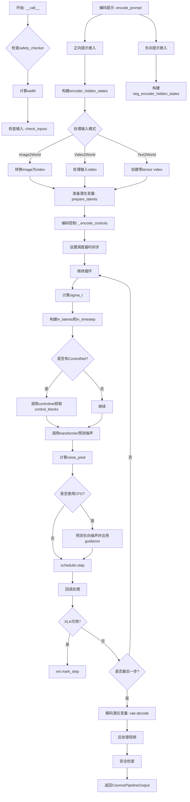

## 类结构

```
DiffusionPipeline (基类)
└── Cosmos2_5_TransferPipeline (主类)
    ├── 模块组件
    │   ├── text_encoder (Qwen2_5_VLForConditionalGeneration)
    │   ├── tokenizer (AutoTokenizer)
    │   ├── transformer (CosmosTransformer3DModel)
    │   ├── vae (AutoencoderKLWan)
    │   ├── scheduler (UniPCMultistepScheduler)
    │   ├── controlnet (CosmosControlNetModel, 可选)
    │   ├── safety_checker (CosmosSafetyChecker)
    │   └── video_processor (VideoProcessor)
    └── 依赖类
        ├── CosmosPipelineOutput (输出类)
        ├── VideoProcessor (视频处理)
        └── CosmosSafetyChecker (安全检查)
```

## 全局变量及字段


### `DEFAULT_NEGATIVE_PROMPT`
    
默认负面提示词，包含低质量视频的描述

类型：`str`
    


### `EXAMPLE_DOC_STRING`
    
包含使用示例的文档字符串

类型：`str`
    


### `logger`
    
模块级日志记录器

类型：`logging.Logger`
    


### `XLA_AVAILABLE`
    
标志位，表示PyTorch XLA是否可用

类型：`bool`
    


### `Cosmos2_5_TransferPipeline.vae`
    
VAE模型，用于编码/解码视频

类型：`AutoencoderKLWan`
    


### `Cosmos2_5_TransferPipeline.text_encoder`
    
文本编码器

类型：`Qwen2_5_VLForConditionalGeneration`
    


### `Cosmos2_5_TransferPipeline.tokenizer`
    
Qwen2.5分词器

类型：`AutoTokenizer`
    


### `Cosmos2_5_TransferPipeline.transformer`
    
条件Transformer

类型：`CosmosTransformer3DModel`
    


### `Cosmos2_5_TransferPipeline.scheduler`
    
去噪调度器

类型：`UniPCMultistepScheduler`
    


### `Cosmos2_5_TransferPipeline.controlnet`
    
ControlNet控制模型

类型：`Optional[CosmosControlNetModel]`
    


### `Cosmos2_5_TransferPipeline.safety_checker`
    
安全检查器

类型：`CosmosSafetyChecker`
    


### `Cosmos2_5_TransferPipeline.vae_scale_factor_temporal`
    
时间维度VAE缩放因子

类型：`int`
    


### `Cosmos2_5_TransferPipeline.vae_scale_factor_spatial`
    
空间维度VAE缩放因子

类型：`int`
    


### `Cosmos2_5_TransferPipeline.video_processor`
    
视频处理器

类型：`VideoProcessor`
    


### `Cosmos2_5_TransferPipeline.latents_mean`
    
VAE潜在变量均值

类型：`torch.Tensor`
    


### `Cosmos2_5_TransferPipeline.latents_std`
    
VAE潜在变量标准差

类型：`torch.Tensor`
    


### `Cosmos2_5_TransferPipeline.model_cpu_offload_seq`
    
CPU卸载顺序

类型：`str`
    


### `Cosmos2_5_TransferPipeline._callback_tensor_inputs`
    
回调张量输入列表

类型：`List[str]`
    


### `Cosmos2_5_TransferPipeline._optional_components`
    
可选组件列表

类型：`List[str]`
    


### `Cosmos2_5_TransferPipeline._exclude_from_cpu_offload`
    
排除CPU卸载的组件

类型：`List[str]`
    
    

## 全局函数及方法


### `_maybe_pad_video`

该函数用于将视频张量填充到指定的帧数。当输入视频的帧数少于目标帧数时，通过重复最后一帧来填充视频，确保视频具有指定的帧数，常用于视频处理流水线中保持帧数一致性。

参数：

- `video`：`torch.Tensor`，输入的视频张量，形状为 (B, C, T, H, W)，其中 T 是时间维度（帧数）
- `num_frames`：`int`，目标帧数，要填充到的总帧数

返回值：`torch.Tensor`，填充后的视频张量，形状为 (B, C, num_frames, H, W)

#### 流程图

```mermaid
flowchart TD
    A[开始] --> B[计算需要填充的帧数<br/>n_pad_frames = num_frames - video.shape[2]]
    --> C{n_pad_frames > 0?}
    -->|否| D[直接返回原始video]
    --> H[结束]
    -->|是| E[获取最后一帧<br/>last_frame = video[:, :, -1:, :, :]]
    --> F[重复最后一帧 n_pad_frames 次<br/>last_frame.repeat(1, 1, n_pad_frames, 1, 1)]
    --> G[沿时间维度拼接<br/>torch.cat((video, repeated_last_frame), dim=2)]
    --> D
```

#### 带注释源码

```python
def _maybe_pad_video(video: torch.Tensor, num_frames: int):
    """
    将视频张量填充到指定帧数，使用最后一帧进行填充。
    
    参数:
        video: 输入视频张量，形状为 (B, C, T, H, W)
        num_frames: 目标帧数
    
    返回:
        填充后的视频张量，形状为 (B, C, num_frames, H, W)
    """
    # 计算需要填充的帧数
    n_pad_frames = num_frames - video.shape[2]
    
    # 如果需要填充帧
    if n_pad_frames > 0:
        # 提取最后一帧，形状为 (B, C, 1, H, W)
        last_frame = video[:, :, -1:, :, :]
        
        # 沿时间维度重复最后一帧 n_pad_frames 次
        # repeat 参数: (batch, channel, time, height, width)
        repeated_last_frame = last_frame.repeat(1, 1, n_pad_frames, 1, 1)
        
        # 沿时间维度(dim=2)拼接原始视频和填充的帧
        video = torch.cat((video, repeated_last_frame), dim=2)
    
    # 返回视频（如果不需要填充则返回原始视频）
    return video
```


### `retrieve_latents`

该函数是一个全局工具函数，用于从编码器输出（encoder_output）中提取潜在变量（latents）。它支持两种提取模式：通过采样（sample）从潜在分布中获取样本，或通过取最大值（argmax）获取最可能的潜在向量。当编码器输出既没有潜在分布也没有潜在向量属性时，函数将抛出AttributeError异常。

参数：

-  `encoder_output`：`torch.Tensor`，编码器输出对象，通常包含 `latent_dist` 属性（潜在分布对象）或 `latents` 属性（直接编码的潜在向量）
-  `generator`：`torch.Generator | None`，可选的随机数生成器，用于在 sample 模式下确保生成的可重复性
-  `sample_mode`：`str`，提取模式，默认为 `"sample"`（从分布中采样），也可设置为 `"argmax"`（取分布的众数/最大值对应的潜在向量）

返回值：`torch.Tensor`，提取出的潜在变量张量

#### 流程图

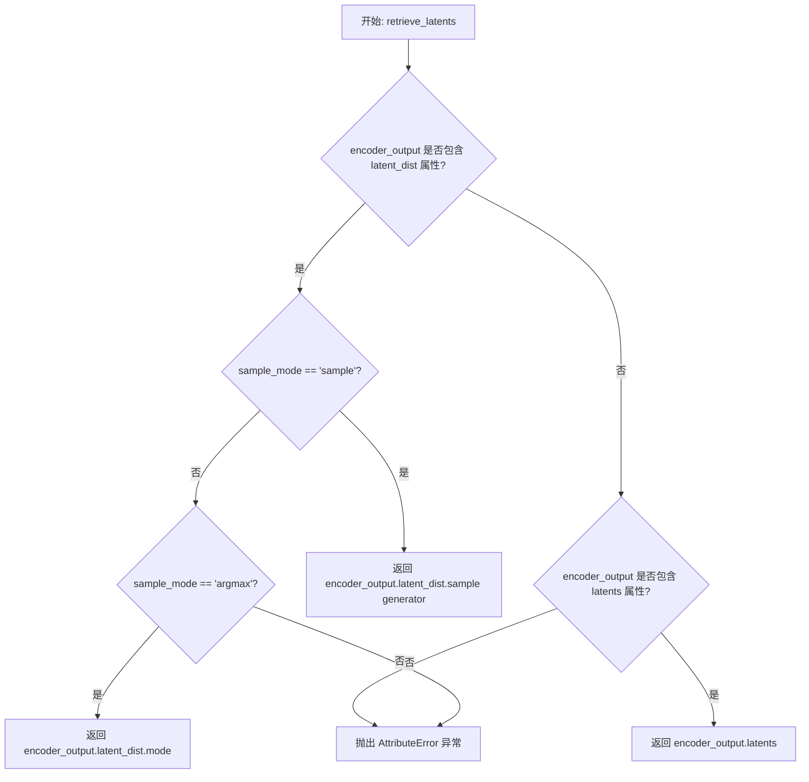

#### 带注释源码

```python
# Copied from diffusers.pipelines.stable_diffusion.pipeline_stable_diffusion_img2img.retrieve_latents
def retrieve_latents(
    encoder_output: torch.Tensor, generator: torch.Generator | None = None, sample_mode: str = "sample"
):
    """
    从encoder_output中提取潜在变量，支持sample和argmax模式。
    
    参数:
        encoder_output: 编码器输出对象，可能包含latent_dist或latents属性
        generator: 可选的随机数生成器，用于sample模式下的采样
        sample_mode: 提取模式，'sample'从分布采样，'argmax'取众数
    
    返回:
        提取的潜在变量张量
    
    异常:
        AttributeError: 当encoder_output既没有latent_dist也没有latents属性时抛出
    """
    # 检查encoder_output是否包含latent_dist属性，并且sample_mode为'sample'
    if hasattr(encoder_output, "latent_dist") and sample_mode == "sample":
        # 从潜在分布中采样获取潜在变量
        return encoder_output.latent_dist.sample(generator)
    # 检查encoder_output是否包含latent_dist属性，并且sample_mode为'argmax'
    elif hasattr(encoder_output, "latent_dist") and sample_mode == "argmax":
        # 获取潜在分布的众数（即概率最大的潜在向量）
        return encoder_output.latent_dist.mode()
    # 检查encoder_output是否直接包含latents属性
    elif hasattr(encoder_output, "latents"):
        # 直接返回预计算的潜在变量
        return encoder_output.latents
    else:
        # 如果无法从encoder_output中提取潜在变量，抛出异常
        raise AttributeError("Could not access latents of provided encoder_output")
```


### Cosmos2_5_TransferPipeline.__init__

该方法是 `Cosmos2_5_TransferPipeline` 类的构造函数，负责初始化扩散管道所需的所有组件，包括文本编码器、分词器、Transformer模型、VAE、调度器、ControlNet和安全检查器，并计算VAE的时空缩放因子以及潜在空间的均值和标准差。

参数：

- `text_encoder`：`Qwen2_5_VLForConditionalGeneration`，冻结的文本编码器，Cosmos Transfer2.5 使用 Qwen2.5 VL 编码器
- `tokenizer`：`AutoTokenizer`，与 Qwen2.5 VL 编码器关联的分词器
- `transformer`：`CosmosTransformer3DModel`，条件 Transformer，用于对编码的图像潜在向量进行去噪
- `vae`：`AutoencoderKLWan`，变分自编码器模型，用于将视频编码和解码到潜在表示
- `scheduler`：`UniPCMultistepScheduler`，与 Transformer 结合使用的调度器，用于对编码的图像潜在向量进行去噪
- `controlnet`：`Optional[CosmosControlNetModel]`，可选的 ControlNet 模型，用于提供额外的控制条件
- `safety_checker`：`CosmosSafetyChecker`，可选的安全检查器，用于检查生成内容的安全性

返回值：`None`，构造函数不返回值，仅初始化对象状态

#### 流程图

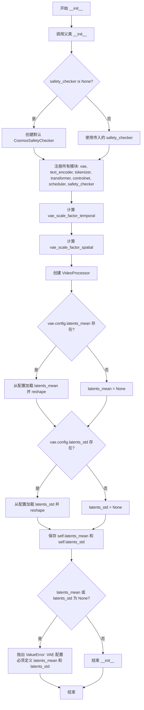

#### 带注释源码

```python
def __init__(
    self,
    text_encoder: Qwen2_5_VLForConditionalGeneration,
    tokenizer: AutoTokenizer,
    transformer: CosmosTransformer3DModel,
    vae: AutoencoderKLWan,
    scheduler: UniPCMultistepScheduler,
    controlnet: Optional[CosmosControlNetModel],
    safety_checker: CosmosSafetyChecker = None,
):
    """
    初始化 Cosmos2_5_TransferPipeline 管道。
    
    参数:
        text_encoder: Qwen2.5 VL 文本编码器
        tokenizer: Qwen2.5 VL 分词器
        transformer: 3D 变换器模型
        vae: 视频 VAE 模型
        scheduler: 去噪调度器
        controlnet: 可选的控制网络
        safety_checker: 可选的安全检查器
    """
    # 调用父类 DiffusionPipeline 的初始化方法
    super().__init__()

    # 如果未提供安全检查器，则创建默认实例
    # 这会触发 ImportError 如果 cosmos_guardrail 未安装
    if safety_checker is None:
        safety_checker = CosmosSafetyChecker()

    # 注册所有模型组件到管道中
    # 使得这些模块可以被管道统一管理和移动到不同设备
    self.register_modules(
        vae=vae,
        text_encoder=text_encoder,
        tokenizer=tokenizer,
        transformer=transformer,
        controlnet=controlnet,
        scheduler=scheduler,
        safety_checker=safety_checker,
    )

    # 计算 VAE 的时间缩放因子
    # 基于 VAE 的时间下采样层数，默认为 2^(下采样次数之和)
    self.vae_scale_factor_temporal = 2 ** sum(self.vae.temperal_downsample) if getattr(self, "vae", None) else 4
    
    # 计算 VAE 的空间缩放因子
    # 基于 VAE 的时间下采样层数，默认为 2^len(下采样次数列表)
    self.vae_scale_factor_spatial = 2 ** len(self.vae.temperal_downsample) if getattr(self, "vae", None) else 8
    
    # 创建视频处理器，用于预处理和后处理视频数据
    self.video_processor = VideoProcessor(vae_scale_factor=self.vae_scale_factor_spatial)

    # 从 VAE 配置中加载潜在向量的均值
    # 需要将 1D 向量 reshape 为 (1, z_dim, 1, 1, 1) 以便后续广播操作
    latents_mean = (
        torch.tensor(self.vae.config.latents_mean).view(1, self.vae.config.z_dim, 1, 1, 1).float()
        if getattr(self.vae.config, "latents_mean", None) is not None
        else None
    )
    
    # 从 VAE 配置中加载潜在向量的标准差
    # 需要将 1D 向量 reshape 为 (1, z_dim, 1, 1, 1) 以便后续广播操作
    latents_std = (
        torch.tensor(self.vae.config.latents_std).view(1, self.vae.config.z_dim, 1, 1, 1).float()
        if getattr(self.vae.config, "latents_std", None) is not None
        else None
    )
    
    # 保存均值和标准差到实例变量
    self.latents_mean = latents_mean
    self.latents_std = latents_std

    # 验证 VAE 配置中必须包含 latents_mean 和 latents_std
    # 这些值对于潜在向量的归一化/反归一化至关重要
    if self.latents_mean is None or self.latents_std is None:
        raise ValueError("VAE configuration must define both `latents_mean` and `latents_std`.")
```


### `Cosmos2_5_TransferPipeline._get_prompt_embeds`

该方法将文本提示词转换为Transformer模型可用的嵌入向量。它使用Qwen2.5-VL分词器的聊天模板构建对话格式，然后通过文本编码器获取隐藏状态，最后对隐藏状态进行层-wise规范化并拼接成最终的提示词嵌入。

参数：

- `prompt`：`Union[str, List[str]]`，要编码的文本提示词，支持单字符串或字符串列表
- `max_sequence_length`：`int`，最大序列长度，默认为512
- `device`：`torch.device | None`，执行设备，默认为执行设备
- `dtype`：`torch.dtype | None`，数据类型，默认为文本编码器的dtype

返回值：`torch.Tensor`，规范化后的提示词嵌入向量

#### 流程图

```mermaid
flowchart TD
    A[开始 _get_prompt_embeds] --> B{device 为空?}
    B -->|是| C[使用 self._execution_device]
    B -->|否| D[使用传入的 device]
    C --> E{dtype 为空?}
    D --> E
    E -->|是| F[使用 self.text_encoder.dtype]
    E -->|否| G[使用传入的 dtype]
    F --> H{prompt 是字符串?}
    G --> H
    H -->|是| I[转换为单元素列表]
    H -->|否| J[保持原列表]
    I --> K[遍历每个 prompt]
    J --> K
    K --> L[构建 system 和 user 对话消息]
    L --> M[使用 tokenizer.apply_chat_template]
    M --> N[转换为 LongTensor]
    N --> O[添加到 input_ids_batch]
    O --> P{还有更多 prompt?}
    P -->|是| K
    P -->|否| Q[stack 成 tensor]
    Q --> R[调用 text_encoder 获取 hidden_states]
    R --> S[遍历隐藏层 1 到 N]
    S --> T[计算层归一化: (x - mean) / (std + 1e-8)]
    T --> U[添加到 normalized_hidden_states]
    U --> V{还有更多层?}
    V -->|是| S
    V -->|否| W[concat 所有归一化隐藏层]
    W --> X[转换为指定 dtype 和 device]
    X --> Y[返回 prompt_embeds]
```

#### 带注释源码

```python
def _get_prompt_embeds(
    self,
    prompt: Union[str, List[str]] = None,
    max_sequence_length: int = 512,
    device: torch.device | None = None,
    dtype: torch.dtype | None = None,
):
    """
    将文本提示词转换为模型可用的嵌入向量
    
    参数:
        prompt: 要编码的文本提示词，支持单字符串或字符串列表
        max_sequence_length: 最大序列长度，默认512
        device: 执行设备，默认为None则使用执行设备
        dtype: 数据类型，默认为None则使用文本编码器的dtype
    
    返回:
        规范化后的提示词嵌入向量 (torch.Tensor)
    """
    # 确定设备：优先使用传入的device，否则使用pipeline的执行设备
    device = device or self._execution_device
    # 确定数据类型：优先使用传入的dtype，否则使用文本编码器的dtype
    dtype = dtype or self.text_encoder.dtype
    # 统一处理：将单个字符串转换为列表，便于批量处理
    prompt = [prompt] if isinstance(prompt, str) else prompt

    # 用于存储每个prompt对应的input_ids
    input_ids_batch = []

    # 遍历每个prompt样本进行编码
    for sample_idx in range(len(prompt)):
        # 构建符合Qwen2.5-VL聊天模板格式的对话结构
        # 包含system消息和user消息
        conversations = [
            {
                "role": "system",
                "content": [
                    {
                        "type": "text",
                        "text": "You are a helpful assistant who will provide prompts to an image generator.",
                    }
                ],
            },
            {
                "role": "user",
                "content": [
                    {
                        "type": "text",
                        "text": prompt[sample_idx],
                    }
                ],
            },
        ]
        # 使用tokenizer的聊天模板将对话转换为token IDs
        input_ids = self.tokenizer.apply_chat_template(
            conversations,
            tokenize=True,              # 执行分词
            add_generation_prompt=False,  # 不添加生成提示
            add_vision_id=False,        # 不添加视觉ID
            max_length=max_sequence_length,  # 最大长度限制
            truncation=True,           # 启用截断
            padding="max_length",      # 填充到最大长度
        )
        # 转换为PyTorch LongTensor
        input_ids = torch.LongTensor(input_ids)
        # 添加到批次中
        input_ids_batch.append(input_ids)

    # 将所有prompt的input_ids堆叠成batch tensor
    input_ids_batch = torch.stack(input_ids_batch, dim=0)

    # 调用文本编码器获取隐藏状态，output_hidden_states=True返回所有层的隐藏状态
    outputs = self.text_encoder(
        input_ids_batch.to(device),
        output_hidden_states=True,
    )
    # 获取所有隐藏状态（包含embedding层和所有transformer层）
    hidden_states = outputs.hidden_states

    # 存储规范化后的隐藏状态
    normalized_hidden_states = []
    
    # 遍历除embedding层外的所有隐藏层（从索引1开始）
    for layer_idx in range(1, len(hidden_states)):
        # 对每层的隐藏状态进行层归一化
        # 公式: (x - mean) / (std + epsilon)
        # 这里使用均值和标准差对特征维度进行规范化
        normalized_state = (hidden_states[layer_idx] - hidden_states[layer_idx].mean(dim=-1, keepdim=True)) / (
            hidden_states[layer_idx].std(dim=-1, keepdim=True) + 1e-8  # 添加小常数防止除零
        )
        normalized_hidden_states.append(normalized_state)

    # 在最后一维（特征维度）上拼接所有规范化后的隐藏层
    # 结果形状: (batch_size, seq_len, sum_of_all_hidden_dims)
    prompt_embeds = torch.cat(normalized_hidden_states, dim=-1)
    
    # 转换到指定的dtype和device
    prompt_embeds = prompt_embeds.to(dtype=dtype, device=device)

    # 返回最终的提示词嵌入
    return prompt_embeds
```


### `Cosmos2_5_TransferPipeline.encode_prompt`

该方法负责将文本提示（prompt）和负向提示（negative_prompt）编码为文本编码器的隐藏状态（hidden states）。它支持批量处理、分类器自由引导（Classifier-Free Guidance），并对生成的嵌入进行复制以支持每个提示生成多个视频。

参数：

- `self`：隐式参数，Cosmos2_5_TransferPipeline 实例，pipeline 对象本身
- `prompt`：`Union[str, List[str]]`，要编码的文本提示，可以是单个字符串或字符串列表
- `negative_prompt`：`Optional[Union[str, List[str]]]`，可选的负向提示，用于引导生成不希望出现的内容
- `do_classifier_free_guidance`：`bool`，是否启用分类器自由引导，默认为 True
- `num_videos_per_prompt`：`int`，每个提示要生成的视频数量，默认为 1
- `prompt_embeds`：`torch.Tensor | None`，可选的预生成文本嵌入，如果提供则直接使用而不从 prompt 生成
- `negative_prompt_embeds`：`torch.Tensor | None`，可选的预生成负向文本嵌入
- `max_sequence_length`：`int`，提示的最大序列长度，默认为 512
- `device`：`torch.device | None`，执行设备，如果为 None 则使用 pipeline 的执行设备
- `dtype`：`torch.dtype | None`，数据类型，如果为 None 则使用 text_encoder 的数据类型

返回值：`Tuple[torch.Tensor, torch.Tensor]`，返回两个张量：
- 第一个是编码后的 prompt_embeds
- 第二个是编码后的 negative_prompt_embeds

#### 流程图

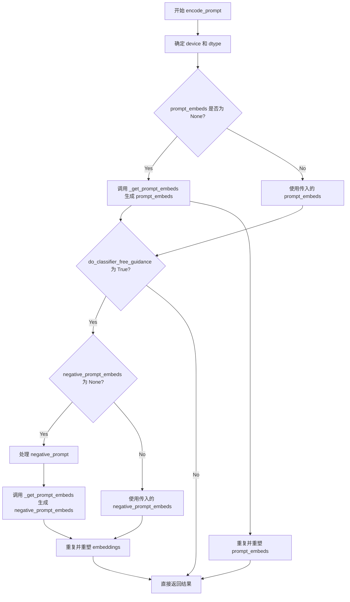

#### 带注释源码

```python
def encode_prompt(
    self,
    prompt: Union[str, List[str]],
    negative_prompt: Optional[Union[str, List[str]]] = None,
    do_classifier_free_guidance: bool = True,
    num_videos_per_prompt: int = 1,
    prompt_embeds: torch.Tensor | None = None,
    negative_prompt_embeds: torch.Tensor | None = None,
    max_sequence_length: int = 512,
    device: torch.device | None = None,
    dtype: torch.dtype | None = None,
):
    r"""
    Encodes the prompt into text encoder hidden states.

    Args:
        prompt (`str` or `List[str]`, *optional*):
            prompt to be encoded
        negative_prompt (`str` or `List[str]`, *optional*):
            The prompt or prompts not to guide the image generation. If not defined, one has to pass
            `negative_prompt_embeds` instead. Ignored when not using guidance (i.e., ignored if `guidance_scale` is
            less than `1`).
        do_classifier_free_guidance (`bool`, *optional*, defaults to `True`):
            Whether to use classifier free guidance or not.
        num_videos_per_prompt (`int`, *optional*, defaults to 1):
            Number of videos that should be generated per prompt. torch device to place the resulting embeddings on
        prompt_embeds (`torch.Tensor`, *optional*):
            Pre-generated text embeddings. Can be used to easily tweak text inputs, *e.g.* prompt weighting. If not
            provided, text embeddings will be generated from `prompt` input argument.
        negative_prompt_embeds (`torch.Tensor`, *optional*):
            Pre-generated negative text embeddings. Can be used to easily tweak text inputs, *e.g.* prompt
            weighting. If not provided, negative_prompt_embeds will be generated from `negative_prompt` input
            argument.
        device: (`torch.device`, *optional*):
            torch device
        dtype: (`torch.dtype`, *optional*):
            torch dtype
    """
    # 确定设备：如果未提供，则使用 pipeline 的执行设备
    device = device or self._execution_device

    # 将 prompt 规范化为列表形式，便于批量处理
    prompt = [prompt] if isinstance(prompt, str) else prompt
    # 确定批大小：如果有 prompt 则使用其长度，否则使用 prompt_embeds 的批大小
    if prompt is not None:
        batch_size = len(prompt)
    else:
        batch_size = prompt_embeds.shape[0]

    # 如果未提供 prompt_embeds，则调用内部方法 _get_prompt_embeds 生成
    if prompt_embeds is None:
        prompt_embeds = self._get_prompt_embeds(
            prompt=prompt, max_sequence_length=max_sequence_length, device=device, dtype=dtype
        )

        # 获取嵌入的序列长度
        _, seq_len, _ = prompt_embeds.shape
        # 为每个提示生成多个视频而复制文本嵌入（使用 mps 友好的方法）
        # 首先在维度 1（视频数）上重复
        prompt_embeds = prompt_embeds.repeat(1, num_videos_per_prompt, 1)
        # 然后重塑为 (batch_size * num_videos_per_prompt, seq_len, hidden_dim)
        prompt_embeds = prompt_embeds.view(batch_size * num_videos_per_prompt, seq_len, -1)

    # 如果启用分类器自由引导且未提供 negative_prompt_embeds，则生成负向嵌入
    if do_classifier_free_guidance and negative_prompt_embeds is None:
        # 如果未提供 negative_prompt，则使用空字符串
        negative_prompt = negative_prompt or ""
        # 将 negative_prompt 规范化为列表
        negative_prompt = batch_size * [negative_prompt] if isinstance(negative_prompt, str) else negative_prompt

        # 类型检查：negative_prompt 与 prompt 类型必须一致
        if prompt is not None and type(prompt) is not type(negative_prompt):
            raise TypeError(
                f"`negative_prompt` should be the same type to `prompt`, but got {type(negative_prompt)} !="
                f" {type(prompt)}."
            )
        # 批大小检查：negative_prompt 批大小必须与 prompt 一致
        elif batch_size != len(negative_prompt):
            raise ValueError(
                f"`negative_prompt`: {negative_prompt} has batch size {len(negative_prompt)}, but `prompt`:"
                f" {prompt} has batch size {batch_size}. Please make sure that passed `negative_prompt` matches"
                " the batch size of `prompt`."
            )

        # 调用内部方法生成 negative_prompt_embeds
        negative_prompt_embeds = self._get_prompt_embeds(
            prompt=negative_prompt, max_sequence_length=max_sequence_length, device=device, dtype=dtype
        )

        # 重复并重塑 negative_prompt_embeds，与 prompt_embeds 处理方式相同
        _, seq_len, _ = negative_prompt_embeds.shape
        negative_prompt_embeds = negative_prompt_embeds.repeat(1, num_videos_per_prompt, 1)
        negative_prompt_embeds = negative_prompt_embeds.view(batch_size * num_videos_per_prompt, seq_len, -1)

    # 返回处理后的 prompt_embeds 和 negative_prompt_embeds
    return prompt_embeds, negative_prompt_embeds
```


### Cosmos2_5_TransferPipeline.prepare_latents

该方法用于为扩散管道准备潜在变量（latents）。它根据输入视频（如果有）计算条件潜在变量，并初始化随机噪声潜在变量用于去噪过程。该方法还生成条件掩码和条件指示器，用于区分输入条件帧和需要生成的帧。

参数：

- `self`：`Cosmos2_5_TransferPipeline` 类实例，隐含参数
- `video`：`Optional[torch.Tensor]`，输入视频张量，形状为 (B, C, T, H, W)，用于 Video2World 模式；如果为 None 则表示 Text2World 模式
- `batch_size`：`int`，批处理大小
- `num_channels_latents`：`int`，潜在变量的通道数，默认为 16
- `height`：`int`，生成图像的高度，默认为 704
- `width`：`int`，生成图像的宽度，默认为 1280
- `num_frames_in`：`int`，输入视频的帧数，默认为 93；为 0 时表示 Text2World 模式
- `num_frames_out`：`int`，输出视频的帧数，默认为 93
- `do_classifier_free_guidance`：`bool`，是否使用无分类器自由引导，默认为 True
- `dtype`：`torch.dtype | None`，潜在变量的数据类型
- `device`：`torch.device | None`，潜在变量所在的设备
- `generator`：`torch.Generator | list[torch.Generator] | None`，随机数生成器，用于确保可重复性
- `latents`：`torch.Tensor | None`，预生成的潜在变量，如果提供则使用该变量，否则随机生成

返回值：`torch.Tensor`，实际上根据代码返回的是一个元组 `(latents, cond_latents, cond_mask, cond_indicator)`：
- `latents`：`torch.Tensor` - 随机初始化的噪声潜在变量
- `cond_latents`：`torch.Tensor` - 从输入视频编码得到的条件潜在变量
- `cond_mask`：`torch.Tensor` - 条件掩码，指示哪些位置是条件帧
- `cond_indicator`：`torch.Tensor` - 条件指示器，标识是否为条件帧

注意：方法签名的返回类型注解为 `torch.Tensor`，但实际返回的是包含 4 个张量的元组，这可能是文档不完整。

#### 流程图

```mermaid
flowchart TD
    A[开始 prepare_latents] --> B{generator 是列表且长度 != batch_size?}
    B -->|是| C[抛出 ValueError]
    B -->|否| D[计算潜在变量形状: B, C, T, H, W]
    D --> E{num_frames_in == 0?}
    E -->|是| F[Text2World 模式]
    E -->|否| G[Video2World 模式]
    
    F --> H{latents is None?}
    H -->|是| I[使用 randn_tensor 生成随机潜在变量]
    H -->|否| J[使用传入的 latents]
    I --> K[创建零填充的 cond_mask 和 cond_indicator]
    J --> K
    K --> L[创建零填充的 cond_latents]
    L --> M[返回元组 latents, cond_latents, cond_mask, cond_indicator]
    
    G --> N{video is None?}
    N -->|是| O[抛出 ValueError: video must be provided]
    N -->|否| P[将 video 移动到指定设备和 dtype]
    P --> Q{generator 是列表?}
    Q -->|是| R[为每个视频帧分别编码获取 cond_latents]
    Q -->|否| S[批量编码视频获取 cond_latents]
    R --> T[拼接所有 cond_latents]
    S --> T
    
    T --> U[标准化 cond_latents: (cond_latents - mean) / std]
    U --> V{latents is None?}
    V -->|是| W[使用 randn_tensor 生成随机潜在变量]
    V -->|否| X[将传入的 latents 移动到指定设备和 dtype]
    W --> Y[创建 cond_indicator 和 cond_mask]
    X --> Y
    
    Y --> Z[返回元组 latents, cond_latents, cond_mask, cond_indicator]
    
    M --> AA[结束]
    Z --> AA
```

#### 带注释源码

```python
    def prepare_latents(
        self,
        video: Optional[torch.Tensor],
        batch_size: int,
        num_channels_latents: int = 16,
        height: int = 704,
        width: int = 1280,
        num_frames_in: int = 93,
        num_frames_out: int = 93,
        do_classifier_free_guidance: bool = True,
        dtype: torch.dtype | None = None,
        device: torch.device | None = None,
        generator: torch.Generator | list[torch.Generator] | None = None,
        latents: torch.Tensor | None = None,
    ) -> torch.Tensor:
        # 检查 generator 列表长度是否与 batch_size 匹配
        if isinstance(generator, list) and len(generator) != batch_size:
            raise ValueError(
                f"You have passed a list of generators of length {len(generator)}, but requested an effective batch"
                f" size of {batch_size}. Make sure the batch size matches the length of the generators."
            )

        # 提取关键维度参数
        B = batch_size  # 批处理大小
        C = num_channels_latents  # 潜在变量通道数
        # 计算时间维度的潜在变量数量：考虑 VAE 的时间下采样因子
        T = (num_frames_out - 1) // self.vae_scale_factor_temporal + 1
        # 计算空间维度的潜在变量高度和宽度：考虑 VAE 的空间下采样因子
        H = height // self.vae_scale_factor_spatial
        W = width // self.vae_scale_factor_spatial
        # 潜在变量的目标形状 (B, C, T, H, W)
        shape = (B, C, T, H, W)

        # 分支1：num_frames_in == 0 表示 Text2World 模式（无输入视频）
        if num_frames_in == 0:
            # 如果没有提供 latents，则随机生成噪声潜在变量
            if latents is None:
                latents = randn_tensor(shape, generator=generator, device=device, dtype=dtype)

            # 创建全零的条件掩码，表示没有条件帧
            cond_mask = torch.zeros((B, 1, T, H, W), dtype=latents.dtype, device=latents.device)
            # 创建全零的条件指示器
            cond_indicator = torch.zeros((B, 1, T, 1, 1), dtype=latents.dtype, device=latents.device)
            # 条件潜在变量也设为零
            cond_latents = torch.zeros_like(latents)

            # 返回四个元素：噪声潜在变量、条件潜在变量、条件掩码、条件指示器
            return (
                latents,
                cond_latents,
                cond_mask,
                cond_indicator,
            )
        else:
            # 分支2：num_frames_in > 0 表示 Video2World 或 Image2World 模式
            if video is None:
                raise ValueError("`video` must be provided when `num_frames_in` is greater than 0.")
            
            # 将视频移动到指定设备和转换数据类型
            video = video.to(device=device, dtype=self.vae.dtype)
            
            # 使用 VAE 编码视频获取潜在变量
            if isinstance(generator, list):
                # 如果有多个 generator，为每个视频帧单独编码
                cond_latents = [
                    retrieve_latents(self.vae.encode(video[i].unsqueeze(0)), generator=generator[i])
                    for i in range(batch_size)
                ]
            else:
                # 批量编码所有视频帧
                cond_latents = [retrieve_latents(self.vae.encode(vid.unsqueeze(0)), generator) for vid in video]

            # 沿批次维度拼接所有条件潜在变量
            cond_latents = torch.cat(cond_latents, dim=0).to(dtype)

            # 获取 VAE 的均值和标准差用于标准化
            latents_mean = self.latents_mean.to(device=device, dtype=dtype)
            latents_std = self.latents_std.to(device=device, dtype=dtype)
            # 标准化条件潜在变量：减均值除标准差
            cond_latents = (cond_latents - latents_mean) / latents_std

            # 如果没有提供 latents，则随机生成；否则使用提供的 latents
            if latents is None:
                latents = randn_tensor(shape, generator=generator, device=device, dtype=dtype)
            else:
                latents = latents.to(device=device, dtype=dtype)

            # 创建填充形状
            padding_shape = (B, 1, T, H, W)
            # 创建全1和全0的填充张量
            ones_padding = latents.new_ones(padding_shape)
            zeros_padding = latents.new_zeros(padding_shape)

            # 初始化条件指示器为零
            cond_indicator = latents.new_zeros(1, 1, latents.size(2), 1, 1)
            # 根据条件指示器创建条件掩码
            cond_mask = cond_indicator * ones_padding + (1 - cond_indicator) * zeros_padding

            # 返回四个元素
            return (
                latents,
                cond_latents,
                cond_mask,
                cond_indicator,
            )
```


### `Cosmos2_5_TransferPipeline._encode_controls`

该方法负责将控制信号（如边缘图、深度图、分割图等）编码为潜在表示，以便后续在去噪过程中作为ControlNet的条件输入。它首先对控制信号进行预处理和帧填充，然后使用VAE编码为latent，最后进行标准化处理。

参数：

- `self`：类的实例
- `controls`：`Optional[torch.Tensor]`，输入的控制信号张量，可以为None（表示不使用ControlNet）
- `height`：`int`，目标高度（像素）
- `width`：`int`，目标宽度（像素）
- `num_frames`：`int`，目标帧数
- `dtype`：`torch.dtype`，输出latent的数据类型
- `device`：`torch.device`，输出设备
- `generator`：`torch.Generator | list[torch.Generator] | None`，随机生成器，用于确保可重复性

返回值：`Optional[torch.Tensor]`，编码后的控制信号潜在表示。如果controls为None，则返回None。

#### 流程图

```mermaid
flowchart TD
    A[开始 _encode_controls] --> B{controls is None?}
    B -->|Yes| C[返回 None]
    B -->|No| D[preprocess_video 预处理控制信号]
    D --> E[_maybe_pad_video 填充视频帧数]
    E --> F[转换为VAE dtype]
    F --> G[VAE.encode 编码为latent]
    G --> H[retrieve_latents 提取latent]
    H --> I[torch.cat 拼接batch维度]
    I --> J[加载 latents_mean 和 latents_std]
    J --> K[标准化: (latents - mean) / std]
    K --> L[返回 control_latents]
```

#### 带注释源码

```python
def _encode_controls(
    self,
    controls: Optional[torch.Tensor],
    height: int,
    width: int,
    num_frames: int,
    dtype: torch.dtype,
    device: torch.device,
    generator: torch.Generator | list[torch.Generator] | None,
) -> Optional[torch.Tensor]:
    # 如果没有提供控制信号，直接返回None，ControlNet将被跳过
    if controls is None:
        return None

    # 步骤1: 预处理控制信号视频/图像
    # 将输入的控制图像/视频调整到目标尺寸(height, width)
    control_video = self.video_processor.preprocess_video(controls, height, width)
    
    # 步骤2: 填充视频帧数
    # 如果控制信号帧数少于目标帧数，用最后一帧填充
    control_video = _maybe_pad_video(control_video, num_frames)

    # 步骤3: 转换设备和数据类型
    # 移动到目标设备，转换为VAE所需的数据类型
    control_video = control_video.to(device=device, dtype=self.vae.dtype)
    
    # 步骤4: 使用VAE编码为潜在表示
    # 对每一帧分别编码，然后沿batch维度拼接
    control_latents = [
        retrieve_latents(self.vae.encode(vid.unsqueeze(0)), generator=generator) 
        for vid in control_video
    ]
    control_latents = torch.cat(control_latents, dim=0).to(dtype)

    # 步骤5: 标准化latent
    # 使用VAE配置的均值和标准差进行标准化
    latents_mean = self.latents_mean.to(device=device, dtype=dtype)
    latents_std = self.latents_std.to(device=device, dtype=dtype)
    control_latents = (control_latents - latents_mean) / latents_std
    
    # 返回编码后的控制信号latent
    return control_latents
```


### `Cosmos2_5_TransferPipeline.check_inputs`

该方法用于验证管道输入参数的有效性，确保 `height` 和 `width` 能被 16 整除、`callback_on_step_end_tensor_inputs` 中的张量在允许的列表中、`prompt` 和 `prompt_embeds` 不能同时提供且至少提供一个、`prompt` 必须是字符串或列表类型。

参数：

- `self`：`Cosmos2_5_TransferPipeline` 实例，管道对象本身
- `prompt`：`Union[str, List[str]] | None`，要验证的提示词，可以是字符串、字符串列表或 None
- `height`：`int`，生成图像的高度像素值
- `width`：`int`，生成图像的宽度像素值
- `prompt_embeds`：`torch.Tensor | None`，预生成的文本嵌入，可选
- `callback_on_step_end_tensor_inputs`：`List[str] | None`，在每个去噪步骤结束时需要传递的张量输入列表，可选

返回值：`None`，该方法不返回任何值，仅进行参数验证，若参数无效则抛出 `ValueError`

#### 流程图

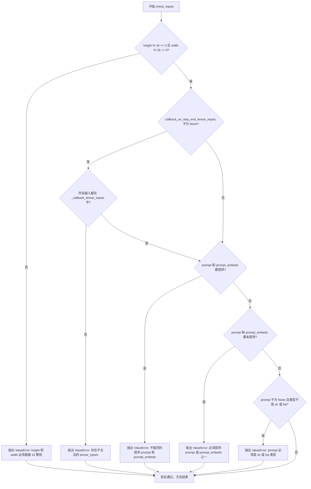

#### 带注释源码

```python
def check_inputs(
    self,
    prompt,
    height,
    width,
    prompt_embeds=None,
    callback_on_step_end_tensor_inputs=None,
):
    # 检查高度和宽度是否能被 16 整除，这是模型的架构要求
    if height % 16 != 0 or width % 16 != 0:
        raise ValueError(f"`height` and `width` have to be divisible by 16 but are {height} and {width}.")

    # 验证回调函数中引用的张量是否在允许的列表中
    # _callback_tensor_inputs 定义了哪些张量可以在回调中传递
    if callback_on_step_end_tensor_inputs is not None and not all(
        k in self._callback_tensor_inputs for k in callback_on_step_end_tensor_inputs
    ):
        raise ValueError(
            f"`callback_on_step_end_tensor_inputs` has to be in {self._callback_tensor_inputs}, but found {[k for k in callback_on_step_end_tensor_inputs if k not in self._callback_tensor_inputs]}"
        )

    # 确保 prompt 和 prompt_embeds 不会同时提供，只能选择其中一种方式传递文本条件
    if prompt is not None and prompt_embeds is not None:
        raise ValueError(
            f"Cannot forward both `prompt`: {prompt} and `prompt_embeds`: {prompt_embeds}. Please make sure to"
            " only forward one of the two."
        )
    # 确保至少提供了 prompt 或 prompt_embeds 之一，不能两者都为空
    elif prompt is None and prompt_embeds is None:
        raise ValueError(
            "Provide either `prompt` or `prompt_embeds`. Cannot leave both `prompt` and `prompt_embeds` undefined."
        )
    # 验证 prompt 的类型必须是字符串或字符串列表
    elif prompt is not None and (not isinstance(prompt, str) and not isinstance(prompt, list)):
        raise ValueError(f"`prompt` has to be of type `str` or `list` but is {type(prompt)}")
```


### `Cosmos2_5_TransferPipeline.guidance_scale`

这是 `Cosmos2_5_TransferPipeline` 类的属性（property），用于获取分类器自由引导（Classifier-Free Guidance）的强度系数 `guidance_scale`。该属性直接返回内部变量 `_guidance_scale`，该值在 `__call__` 方法中被设置为 `3.0`（默认值），用于控制生成内容对文本提示的遵循程度。

参数：无（属性访问器不需要参数）

返回值：`float`，返回分类器自由引导的强度系数，值越大表示生成的视频/图像越严格遵循提示内容

#### 流程图

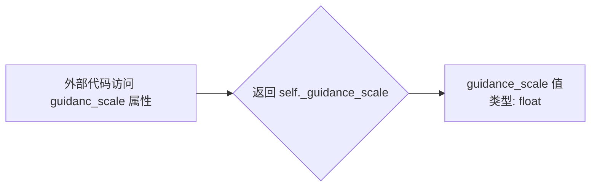

#### 带注释源码

```python
@property
def guidance_scale(self):
    """
    获取分类器自由引导（Classifier-Free Guidance）的强度系数。
    
    guidance_scale 定义了 CFG 中方程 w 的值，决定了生成结果对 prompt 的遵循程度。
    当 guidance_scale > 1.0 时启用 CFG，值越大遵循程度越高但可能影响生成质量。
    
    Returns:
        float: 当前使用的 guidance_scale 值
    """
    return self._guidance_scale
```


### `Cosmos2_5_TransferPipeline.do_classifier_free_guidance`

该属性是一个只读的属性，用于判断当前管道是否启用了 Classifier-Free Guidance（CFG）技术。它通过检查内部属性 `_guidance_scale` 是否大于 1.0 来决定返回值，当 guidance_scale 大于 1.0 时表示启用了 CFG，此时生成过程会同时考虑正向和负向提示词引导。

参数： 无（属性访问器不接受显式参数，`self` 为隐式参数）

返回值：`bool`，返回 `True` 表示启用了 Classifier-Free Guidance（guidance_scale > 1.0）；返回 `False` 表示未启用（guidance_scale <= 1.0）

#### 流程图

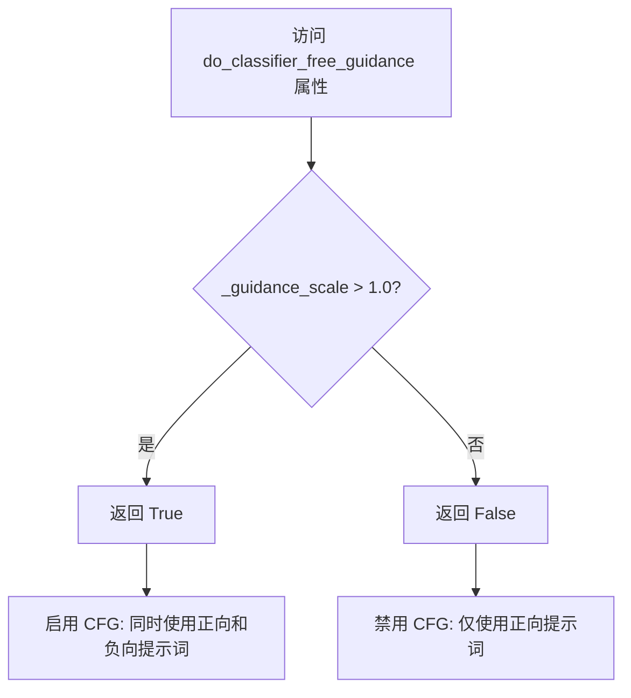

#### 带注释源码

```python
@property
def do_classifier_free_guidance(self):
    """
    属性 getter: 判断是否启用 Classifier-Free Guidance (CFG) 模式。

    Classifier-Free Guidance 是一种扩散模型推理技术，通过同时使用正向提示词（prompt）
    和负向提示词（negative_prompt）来提高生成质量。该技术将 guidance_scale 作为权重系数，
    来调整 CFG 对生成结果的影响程度。

    当 guidance_scale > 1.0 时，CFG 生效，模型会在正向提示词引导的方向上同时远离负向提示词描述的内容。
    当 guidance_scale <= 1.0 时，CFG 不生效，等同于标准的条件生成。

    Returns:
        bool: 如果 guidance_scale > 1.0 则返回 True（启用 CFG），否则返回 False（禁用 CFG）。
              该属性通常在管道的 __call__ 方法中被使用，以决定是否需要编码负向提示词
              以及在去噪循环中是否执行 CFG 步骤。
    """
    return self._guidance_scale > 1.0
```


### `Cosmos2_5_TransferPipeline.num_timesteps`

该属性是一个只读属性，用于获取扩散管道在推理过程中使用的时间步数量。它返回在 `__call__` 方法中根据 `num_inference_steps` 参数计算并存储的 `_num_timesteps` 值。

参数： 无

返回值：`int`，返回去噪过程中执行的时间步总数，即推理步骤的数量。

#### 流程图

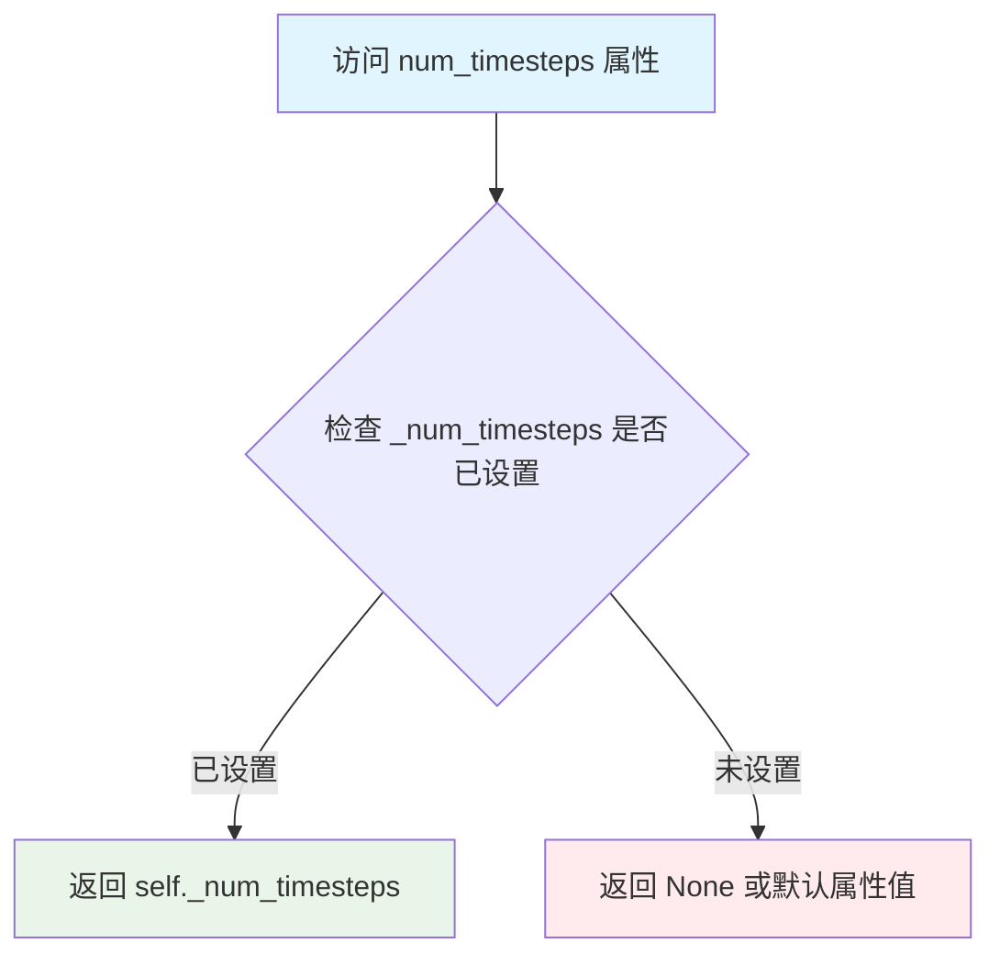

#### 带注释源码

```python
@property
def num_timesteps(self):
    """
    只读属性，返回扩散模型推理过程中的时间步数量。
    
    该属性在 __call__ 方法中被赋值：
    ```python
    self.scheduler.set_timesteps(num_inference_steps, device=device)
    timesteps = self.scheduler.timesteps
    self._num_timesteps = len(timesteps)
    ```
    
    Returns:
        int: 推理过程中执行的去噪步骤总数，通常等于 num_inference_steps 参数值。
    """
    return self._num_timesteps
```


### `Cosmos2_5_TransferPipeline.current_timestep`

这是一个只读属性（property），用于获取当前的去噪时间步（timestep）。在扩散模型的推理过程中，时间步表示当前处于去噪循环的哪个阶段。

参数：

- （无参数，这是一个只读属性）

返回值：`Optional[Union[int, float]]`，返回当前的去噪时间步。如果当前不在推理过程中，则返回 `None`。

#### 流程图

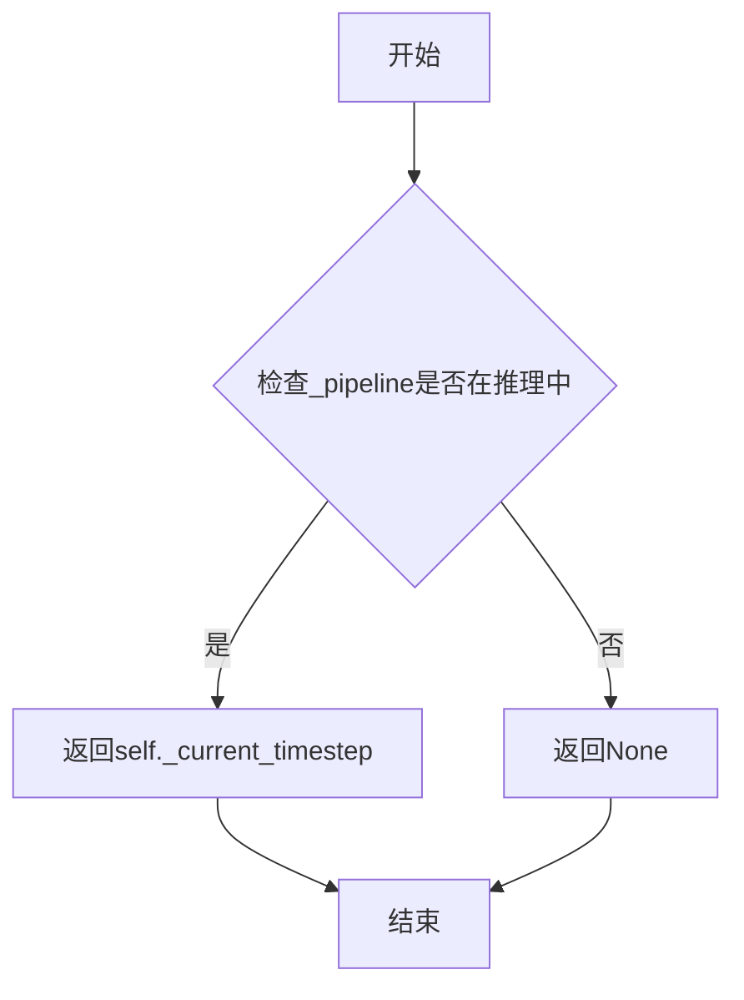

#### 带注释源码

```python
@property
def current_timestep(self):
    """
    返回当前的去噪时间步。
    
    该属性在 __call__ 方法的去噪循环中被更新：
    self._current_timestep = t.cpu().item()
    
    当推理完成后，会被重置为 None：
    self._current_timestep = None
    
    Returns:
        Optional[Union[int, float]]: 当前的去噪时间步。如果当前不在推理过程中，则返回 None。
    """
    return self._current_timestep
```


### `Cosmos2_5_TransferPipeline.interrupt`

该属性是一个布尔类型的getter，用于获取管道的中断标志状态。在去噪循环（denoising loop）中通过检查该属性来判断是否需要立即中断推理过程，从而实现动态控制推理流程的能力。

参数： 无

返回值：`bool`，返回管道的中断标志状态。当值为`True`时，表示外部已请求中断推理，循环将跳过当前步骤继续执行；当值为`False`时，表示推理过程正常运行。

#### 流程图

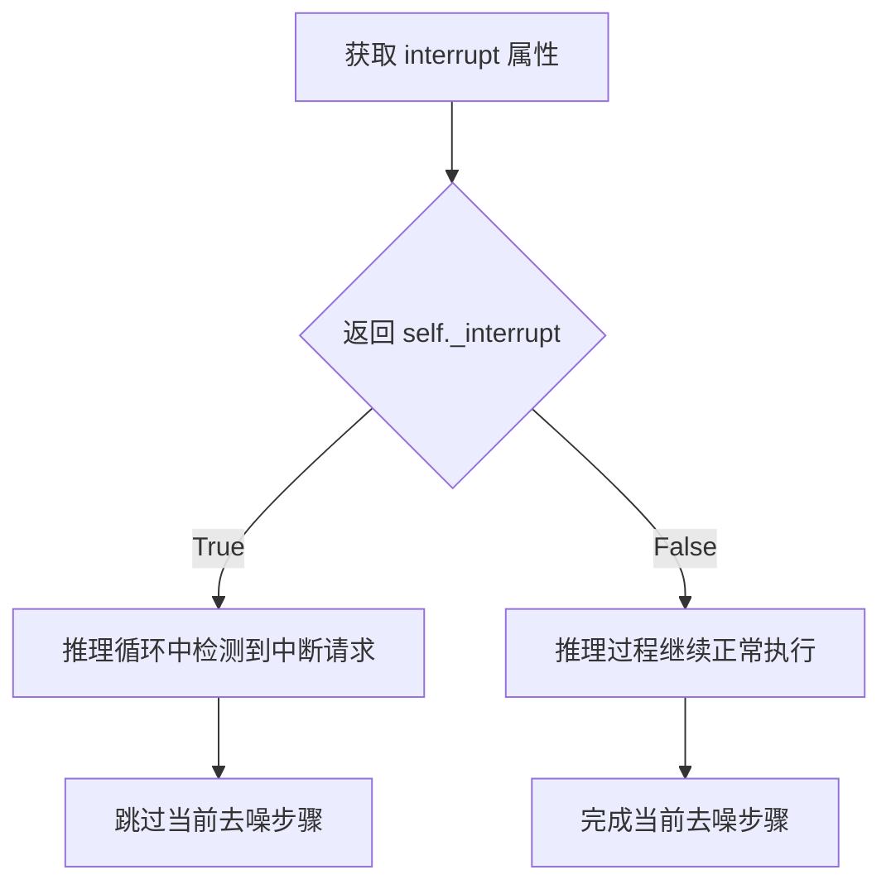

#### 带注释源码

```python
@property
def interrupt(self):
    """
    中断属性 getter。
    
    该属性用于在推理过程中动态控制是否中断去噪循环。
    当外部调用者设置 self._interrupt = True 时，
    推理循环中的检查 'if self.interrupt: continue' 会跳过当前步骤，
    实现即时中断推理的效果。
    
    Returns:
        bool: 中断标志状态。False 表示正常推理，True 表示请求中断。
    """
    return self._interrupt
```


### `Cosmos2_5_TransferPipeline.__call__`

该方法是 Cosmos2.5 Transfer Pipeline 的核心推理入口，支持三种生成模式：Text2World（仅文本提示生成视频）、Image2World（基于单张图像生成视频）和 Video2World（基于输入视频生成新视频）。方法通过 ControlNet 实现边缘图、深度图等条件控制，采用隐式 DDPM 去噪流程完成视频生成，并集成安全检查器过滤不当内容。

参数：

- `image`：`PipelineImageInput | None`，Image2World 条件输入的单张图像，与 video 互斥
- `video`：`List[PipelineImageInput] | None`，Video2World 条件输入的视频帧列表，与 image 互斥
- `prompt`：`Union[str, List[str]] | None`，引导生成的文本提示，除非提供 prompt_embeds
- `negative_prompt`：`Union[str, List[str]]`，不参与引导的负面提示，默认为低质量视频描述
- `height`：`int`，生成图像的高度（像素），默认 704
- `width`：`int | None`，生成图像的宽度，默认根据输入宽高比自动计算
- `num_frames`：`int`，输出帧数，默认 93（设为 1 时生成单帧图像）
- `num_inference_steps`：`int`，去噪步数，默认 36
- `guidance_scale`：`float`，无分类器引导强度，默认 3.0
- `num_videos_per_prompt`：`Optional[int]`，每个提示生成的视频数量，默认 1
- `generator`：`torch.Generator | list[torch.Generator] | None`，随机数生成器，用于可复现生成
- `latents`：`torch.Tensor | None`，预生成的噪声潜在向量，可用于相同提示的不同变体生成
- `controls`：`Optional[PipelineImageInput | List[PipelineImageInput]]`，ControlNet 控制输入（边缘图、深度图等）
- `controls_conditioning_scale`：`float | list[float]`，ControlNet 输出缩放因子，默认 1.0
- `prompt_embeds`：`torch.Tensor | None`，预生成的文本嵌入，用于提示词加权等微调
- `negative_prompt_embeds`：`torch.Tensor | None`，预生成的负面文本嵌入
- `output_type`：`str`，输出格式，支持 "pil"、"np"、"latent"，默认 "pil"
- `return_dict`：`bool`，是否返回 CosmosPipelineOutput 对象而非元组，默认 True
- `callback_on_step_end`：`Callable | PipelineCallback | MultiPipelineCallbacks | None`，每个去噪步骤结束时调用的回调函数
- `callback_on_step_end_tensor_inputs`：`List[str]`，回调函数接收的张量输入列表，默认 ["latents"]
- `max_sequence_length`：`int`，提示词最大 token 长度，默认 512
- `conditional_frame_timestep`：`float`，条件帧的时间步值，用于控制条件帧的影响程度，默认 0.1

返回值：`CosmosPipelineOutput | tuple`，成功时返回包含生成视频帧的 CosmosPipelineOutput 对象，若 return_dict=False 则返回 (video,) 元组，video 为 PIL Image 列表或 np.ndarray 或 latent tensor

#### 流程图

```mermaid
flowchart TD
    A[__call__ 入口] --> B{检查 safety_checker}
    B -->|不存在| C[抛出 ValueError]
    B -->|存在| D[处理 callback_on_step_end]
    D --> E{计算 width}
    E --> F[检查输入 check_inputs]
    F --> G[设置 guidance_scale<br/>interrupt 标志]
    G --> H[安全检查 prompt]
    H --> I[计算 batch_size]
    I --> J[encode_prompt<br/>生成 prompt_embeds 和<br/>negative_prompt_embeds]
    J --> K[准备 img_context<br/>encoder_hidden_states]
    K --> L{判断输入模式}
    L -->|image| M[转换为视频张量<br/>num_frames_in=1]
    L -->|video=None| N[创建零张量<br/>num_frames_in=0]
    L -->|video| O[获取视频长度<br/>num_frames_in=len(video)]
    M --> P
    N --> P
    O --> P[preprocess_video<br/>_maybe_pad_video]
    P --> Q[prepare_latents<br/>生成 latents cond_latent<br/>cond_mask cond_indicator]
    Q --> R[_encode_controls<br/>编码 ControlNet 控制输入]
    R --> S[scheduler.set_timesteps]
    S --> T[进入去噪循环 for t in timesteps]
    T --> U{interrupt?}
    U -->|True| V[continue]
    U -->|False| W[混合 in_latents<br/>in_timestep]
    W --> X{有 controls<br/>和 controlnet?}
    X -->|Yes| Y[controlnet 前向传播]
    X -->|No| Z
    Y --> AA[获取 control_blocks]
    Z --> AB[transformer 前向传播<br/>noise_pred]
    AA --> AB
    AB --> AC[计算 gt_velocity<br/>noise_pred = gt_velocity + noise_pred * (1 - cond_mask)]
    AC --> AD{do_classifier_free_guidance?}
    AD -->|Yes| AE[negative prompt 分支<br/>controlnet + transformer]
    AD -->|No| AF
    AE --> AG[noise_pred += guidance_scale * (noise_pred - noise_pred_neg)]
    AF --> AH[scheduler.step<br/>更新 latents]
    AH --> AI{callback_on_step_end?}
    AI -->|Yes| AJ[执行回调<br/>更新 latents/prompt_embeds]
    AI -->|No| AK
    AJ --> AK
    AK --> AL{最后一个 step 或<br/>warmup 完成?}
    AL -->|Yes| AM[progress_bar.update]
    AL -->|No| AN
    AM --> AO[XLA mark_step]
    AN --> AO
    AO --> AP{还有更多 timesteps?}
    AP -->|Yes| T
    AP -->|No| AQ[后处理 latents<br/>VAE 解码]
    AQ --> AR[安全检查 check_video_safety]
    AR --> AS[postprocess_video<br/>转换 output_type]
    AS --> AT[maybe_free_model_hooks]
    AT --> AU{return_dict?}
    AU -->|Yes| AV[返回 CosmosPipelineOutput]
    AU -->|No| AW[返回 tuple]
```

#### 带注释源码

```python
@torch.no_grad()
@replace_example_docstring(EXAMPLE_DOC_STRING)
def __call__(
    self,
    image: PipelineImageInput | None = None,
    video: List[PipelineImageInput] | None = None,
    prompt: Union[str, List[str]] | None = None,
    negative_prompt: Union[str, List[str]] = DEFAULT_NEGATIVE_PROMPT,
    height: int = 704,
    width: int | None = None,
    num_frames: int = 93,
    num_inference_steps: int = 36,
    guidance_scale: float = 3.0,
    num_videos_per_prompt: Optional[int] = 1,
    generator: torch.Generator | list[torch.Generator] | None = None,
    latents: torch.Tensor | None = None,
    controls: Optional[PipelineImageInput | List[PipelineImageInput]] = None,
    controls_conditioning_scale: float | list[float] = 1.0,
    prompt_embeds: torch.Tensor | None = None,
    negative_prompt_embeds: torch.Tensor | None = None,
    output_type: str = "pil",
    return_dict: bool = True,
    callback_on_step_end: Optional[
        Union[Callable[[int, int, Dict], None], PipelineCallback, MultiPipelineCallbacks]
    ] = None,
    callback_on_step_end_tensor_inputs: List[str] = ["latents"],
    max_sequence_length: int = 512,
    conditional_frame_timestep: float = 0.1,
):
    r"""
    The call function to the pipeline for generation. Supports three modes:

    - **Text2World**: `image=None`, `video=None`, `prompt` provided. Generates a world clip.
    - **Image2World**: `image` provided, `video=None`, `prompt` provided. Conditions on a single frame.
    - **Video2World**: `video` provided, `image=None`, `prompt` provided. Conditions on an input clip.

    Set `num_frames=93` (default) to produce a world video, or `num_frames=1` to produce a single image frame (the
    above in "*2Image mode").

    Outputs follow `output_type` (e.g., `"pil"` returns a list of `num_frames` PIL images per prompt).
    """
    # 1. 安全检查器验证 - NVIDIA Open Model License 要求
    if self.safety_checker is None:
        raise ValueError(
            f"You have disabled the safety checker for {self.__class__}. This is in violation of the "
            "[NVIDIA Open Model License Agreement](https://www.nvidia.com/en-us/agreements/enterprise-software/nvidia-open-model-license). "
            f"Please ensure that you are compliant with the license agreement."
        )

    # 2. 处理回调函数 - 统一 tensor_inputs 参数
    if isinstance(callback_on_step_end, (PipelineCallback, MultiPipelineCallbacks)):
        callback_on_step_end_tensor_inputs = callback_on_step_end.tensor_inputs

    # 3. 自动计算宽度 - 基于输入的宽高比
    if width is None:
        # 优先使用 image 或 video 的第一帧
        frame = image or video[0] if image or video else None
        # 其次使用 controls 的第一帧
        if frame is None and controls is not None:
            frame = controls[0] if isinstance(controls, list) else controls
            if isinstance(frame, (torch.Tensor, np.ndarray)) and len(frame.shape) == 4:
                frame = controls[0]

        if frame is None:
            # 默认 16:9 比例
            width = int((height + 16) * (1280 / 720))
        elif isinstance(frame, PIL.Image.Image):
            width = int((height + 16) * (frame.width / frame.height))
        else:
            # 假设 C H W 格式
            width = int((height + 16) * (frame.shape[2] / frame.shape[1]))

    # 4. 输入验证
    self.check_inputs(prompt, height, width, prompt_embeds, callback_on_step_end_tensor_inputs)

    # 5. 初始化内部状态
    self._guidance_scale = guidance_scale
    self._current_timestep = None
    self._interrupt = False

    device = self._execution_device

    # 6. 安全检查 - 对 prompt 进行文本安全审核
    if self.safety_checker is not None:
        self.safety_checker.to(device)
        if prompt is not None:
            prompt_list = [prompt] if isinstance(prompt, str) else prompt
            for p in prompt_list:
                if not self.safety_checker.check_text_safety(p):
                    raise ValueError(
                        f"Cosmos Guardrail detected unsafe text in the prompt: {p}. Please ensure that the "
                        f"prompt abides by the NVIDIA Open Model License Agreement."
                    )

    # 7. 批处理大小计算
    if prompt is not None and isinstance(prompt, str):
        batch_size = 1
    elif prompt is not None and isinstance(prompt, list):
        batch_size = len(prompt)
    else:
        batch_size = prompt_embeds.shape[0]

    # 8. 文本编码 - 生成 prompt_embeds 和 negative_prompt_embeds
    (
        prompt_embeds,
        negative_prompt_embeds,
    ) = self.encode_prompt(
        prompt=prompt,
        negative_prompt=negative_prompt,
        do_classifier_free_guidance=self.do_classifier_free_guidance,
        num_videos_per_prompt=num_videos_per_prompt,
        prompt_embeds=prompt_embeds,
        negative_prompt_embeds=negative_prompt_embeds,
        device=device,
        max_sequence_length=max_sequence_length,
    )

    # 9. 获取模型数据类型
    vae_dtype = self.vae.dtype
    transformer_dtype = self.transformer.dtype

    # 10. 准备图像上下文 - Transformer 需要的图像上下文标记
    img_context = torch.zeros(
        batch_size,
        self.transformer.config.img_context_num_tokens,
        self.transformer.config.img_context_dim_in,
        device=prompt_embeds.device,
        dtype=transformer_dtype,
    )
    # 组合文本嵌入和图像上下文作为 encoder_hidden_states
    encoder_hidden_states = (prompt_embeds, img_context)
    neg_encoder_hidden_states = (negative_prompt_embeds, img_context)

    # 11. 处理输入模式 - 区分 Image2World / Video2World / Text2World
    num_frames_in = None
    if image is not None:
        # Image2World 模式：将单张图像扩展为视频
        if batch_size != 1:
            raise ValueError(f"batch_size must be 1 for image input (given {batch_size})")

        image = torchvision.transforms.functional.to_tensor(image).unsqueeze(0)
        video = torch.cat([image, torch.zeros_like(image).repeat(num_frames - 1, 1, 1, 1)], dim=0)
        video = video.unsqueeze(0)
        num_frames_in = 1
    elif video is None:
        # Text2World 模式：创建空视频
        video = torch.zeros(batch_size, num_frames, 3, height, width, dtype=torch.uint8)
        num_frames_in = 0
    else:
        # Video2World 模式
        num_frames_in = len(video)

        if batch_size != 1:
            raise ValueError(f"batch_size must be 1 for video input (given {batch_size})")

    # 12. 视频预处理 - 调整大小和归一化
    assert video is not None
    video = self.video_processor.preprocess_video(video, height, width)

    # 13. 视频填充 - 末尾帧填充以匹配输出帧数
    num_frames_out = num_frames
    video = _maybe_pad_video(video, num_frames_out)
    assert num_frames_in <= num_frames_out, f"expected ({num_frames_in=}) <= ({num_frames_out=})"

    video = video.to(device=device, dtype=vae_dtype)

    # 14. 准备潜在向量 - 初始化噪声和条件潜在向量
    num_channels_latents = self.transformer.config.in_channels - 1
    latents, cond_latent, cond_mask, cond_indicator = self.prepare_latents(
        video=video,
        batch_size=batch_size * num_videos_per_prompt,
        num_channels_latents=num_channels_latents,
        height=height,
        width=width,
        num_frames_in=num_frames_in,
        num_frames_out=num_frames,
        do_classifier_free_guidance=self.do_classifier_free_guidance,
        dtype=torch.float32,
        device=device,
        generator=generator,
        latents=latents,
    )
    # 条件帧时间步
    cond_timestep = torch.ones_like(cond_indicator) * conditional_frame_timestep
    cond_mask = cond_mask.to(transformer_dtype)

    # 15. 编码 ControlNet 控制输入
    controls_latents = None
    if controls is not None:
        controls_latents = self._encode_controls(
            controls,
            height=height,
            width=width,
            num_frames=num_frames,
            dtype=transformer_dtype,
            device=device,
            generator=generator,
        )

    # 16. 准备填充掩码
    padding_mask = latents.new_zeros(1, 1, height, width, dtype=transformer_dtype)

    # 17. 去噪循环初始化
    self.scheduler.set_timesteps(num_inference_steps, device=device)
    timesteps = self.scheduler.timesteps
    self._num_timesteps = len(timesteps)
    num_warmup_steps = len(timesteps) - num_inference_steps * self.scheduler.order

    # 18. 计算真实速度 (ground truth velocity) 用于条件区域
    gt_velocity = (latents - cond_latent) * cond_mask
    
    with self.progress_bar(total=num_inference_steps) as progress_bar:
        for i, t in enumerate(timesteps):
            # 18.1 检查中断标志
            if self.interrupt:
                continue

            self._current_timestep = t.cpu().item()

            # 18.2 计算 sigma(t) - 噪声调度器的时间步值
            sigma_t = (
                torch.tensor(self.scheduler.sigmas[i].item())
                .unsqueeze(0)
                .to(device=device, dtype=transformer_dtype)
            )

            # 18.3 混合条件输入和噪声潜在向量
            # 条件区域使用 cond_latent，非条件区域使用 latents
            in_latents = cond_mask * cond_latent + (1 - cond_mask) * latents
            in_latents = in_latents.to(transformer_dtype)
            # 混合时间步 - 条件区域使用 cond_timestep
            in_timestep = cond_indicator * cond_timestep + (1 - cond_indicator) * sigma_t
            
            # 18.4 ControlNet 前向传播 (可选)
            control_blocks = None
            if controls_latents is not None and self.controlnet is not None:
                control_output = self.controlnet(
                    controls_latents=controls_latents,
                    latents=in_latents,
                    timestep=in_timestep,
                    encoder_hidden_states=encoder_hidden_states,
                    condition_mask=cond_mask,
                    conditioning_scale=controls_conditioning_scale,
                    padding_mask=padding_mask,
                    return_dict=False,
                )
                control_blocks = control_output[0]

            # 18.5 Transformer 主干网络前向传播
            noise_pred = self.transformer(
                hidden_states=in_latents,
                timestep=in_timestep,
                encoder_hidden_states=encoder_hidden_states,
                block_controlnet_hidden_states=control_blocks,
                condition_mask=cond_mask,
                padding_mask=padding_mask,
                return_dict=False,
            )[0]
            # 条件区域使用真实速度 GT，非条件区域使用预测噪声
            noise_pred = gt_velocity + noise_pred * (1 - cond_mask)

            # 18.6 无分类器引导 (Classifier-Free Guidance)
            if self.do_classifier_free_guidance:
                control_blocks = None
                if controls_latents is not None and self.controlnet is not None:
                    # 使用负面提示的 ControlNet 输出
                    control_output = self.controlnet(
                        controls_latents=controls_latents,
                        latents=in_latents,
                        timestep=in_timestep,
                        encoder_hidden_states=neg_encoder_hidden_states,  # NOTE: negative prompt
                        condition_mask=cond_mask,
                        conditioning_scale=controls_conditioning_scale,
                        padding_mask=padding_mask,
                        return_dict=False,
                    )
                    control_blocks = control_output[0]

                # 使用负面提示的 Transformer 输出
                noise_pred_neg = self.transformer(
                    hidden_states=in_latents,
                    timestep=in_timestep,
                    encoder_hidden_states=neg_encoder_hidden_states,  # NOTE: negative prompt
                    block_controlnet_hidden_states=control_blocks,
                    condition_mask=cond_mask,
                    padding_mask=padding_mask,
                    return_dict=False,
                )[0]
                # 条件区域使用真实速度，非条件区域使用负面预测
                noise_pred_neg = gt_velocity + noise_pred_neg * (1 - cond_mask)
                # 应用引导：noise_pred = noise_pred + guidance_scale * (noise_pred - noise_pred_neg)
                noise_pred = noise_pred + self.guidance_scale * (noise_pred - noise_pred_neg)

            # 18.7 调度器步骤 - 更新潜在向量
            latents = self.scheduler.step(noise_pred, t, latents, return_dict=False)[0]

            # 18.8 回调处理
            if callback_on_step_end is not None:
                callback_kwargs = {}
                for k in callback_on_step_end_tensor_inputs:
                    callback_kwargs[k] = locals()[k]
                callback_outputs = callback_on_step_end(self, i, t, callback_kwargs)

                # 允许回调修改 latents 和 embeddings
                latents = callback_outputs.pop("latents", latents)
                prompt_embeds = callback_outputs.pop("prompt_embeds", prompt_embeds)
                negative_prompt_embeds = callback_outputs.pop("negative_prompt_embeds", negative_prompt_embeds)

            # 18.9 进度条更新
            if i == len(timesteps) - 1 or ((i + 1) > num_warmup_steps and (i + 1) % self.scheduler.order == 0):
                progress_bar.update()

            # 18.10 XLA 设备同步 (可选)
            if XLA_AVAILABLE:
                xm.mark_step()

    # 19. 清理内部状态
    self._current_timestep = None

    # 20. 后处理 - VAE 解码
    if not output_type == "latent":
        # 反归一化潜在向量
        latents_mean = self.latents_mean.to(latents.device, latents.dtype)
        latents_std = self.latents_std.to(latents.device, latents.dtype)
        latents = latents * latents_std + latents_mean
        
        # VAE 解码
        video = self.vae.decode(latents.to(self.vae.dtype), return_dict=False)[0]
        # 匹配目标帧数
        video = self._match_num_frames(video, num_frames)

        # 安全检查
        assert self.safety_checker is not None
        self.safety_checker.to(device)
        video = self.video_processor.postprocess_video(video, output_type="np")
        video = (video * 255).astype(np.uint8)
        
        # 逐帧安全检查
        video_batch = []
        for vid in video:
            vid = self.safety_checker.check_video_safety(vid)
            if vid is None:
                video_batch.append(np.zeros_like(video[0]))
            else:
                video_batch.append(vid)
        video = np.stack(video_batch).astype(np.float32) / 255.0 * 2 - 1
        video = torch.from_numpy(video).permute(0, 4, 1, 2, 3)
        video = self.video_processor.postprocess_video(video, output_type=output_type)
    else:
        # 直接返回 latent
        video = latents

    # 21. 释放模型内存
    self.maybe_free_model_hooks()

    # 22. 返回结果
    if not return_dict:
        return (video,)

    return CosmosPipelineOutput(frames=video)
```


### `Cosmos2_5_TransferPipeline._match_num_frames`

该方法用于将视频帧数调整为目标帧数。当视频帧数小于目标帧数时，通过重复最后一帧进行填充；当视频帧数大于目标帧数时，进行裁剪。

参数：

- `video`：`torch.Tensor`，输入的视频张量，形状为 (B, C, T, H, W)，其中 T 是时间维度的帧数
- `target_num_frames`：`int`，目标输出帧数

返回值：`torch.Tensor`，调整帧数后的视频张量，形状为 (B, C, target_num_frames, H, W)

#### 流程图

```mermaid
flowchart TD
    A[开始: _match_num_frames] --> B{target_num_frames <= 0?}
    B -->|Yes| D[返回原始video]
    B -->|No| C{video.shape[2] == target_num_frames?}
    C -->|Yes| D
    C -->|No| E[计算frames_per_latent<br/>frames_per_latent = max(vae_scale_factor_temporal, 1)]
    E --> F[沿时间维度重复视频<br/>video = repeat_interleave(video, repeats=frames_per_latent, dim=2)]
    F --> G{当前帧数 < 目标帧数?}
    G -->|Yes| H[填充: 重复最后一帧<br/>pad = video[:, :, -1:, :, :].repeat(...)<br/>video = torch.cat([video, pad], dim=2)]
    G -->|No| I{当前帧数 > 目标帧数?}
    I -->|Yes| J[裁剪: 保留前target_num_frames帧<br/>video = video[:, :, :target_num_frames]
    I -->|No| K[帧数相等, 返回video]
    H --> K
    J --> K
    D --> L[结束: 返回video]
    K --> L
```

#### 带注释源码

```python
def _match_num_frames(self, video: torch.Tensor, target_num_frames: int) -> torch.Tensor:
    """
    调整视频帧数以匹配目标帧数。
    
    处理逻辑：
    1. 如果目标帧数 <= 0 或视频帧数已等于目标帧数，直接返回
    2. 根据VAE的时间下采样因子扩展视频帧数
    3. 如果当前帧数不足，填充最后一帧
    4. 如果当前帧数过多，裁剪多余帧
    
    Args:
        video: 输入视频张量，形状 (B, C, T, H, W)
        target_num_frames: 目标帧数
    
    Returns:
        调整后的视频张量，形状 (B, C, target_num_frames, H, W)
    """
    # 边界检查：目标帧数无效或帧数已匹配，直接返回
    if target_num_frames <= 0 or video.shape[2] == target_num_frames:
        return video

    # 计算每个潜在帧对应的视频帧数（基于VAE时间下采样因子）
    # vae_scale_factor_temporal 通常为 4 或更大的 2 的幂
    frames_per_latent = max(self.vae_scale_factor_temporal, 1)
    
    # 沿时间维度(dim=2)重复视频帧，将潜在帧扩展为视频帧
    video = torch.repeat_interleave(video, repeats=frames_per_latent, dim=2)

    # 获取扩展后的当前帧数
    current_frames = video.shape[2]
    
    # 如果当前帧数不足目标帧数，用最后一帧填充
    if current_frames < target_num_frames:
        # 提取最后一帧并重复需要的帧数
        pad = video[:, :, -1:, :, :].repeat(1, 1, target_num_frames - current_frames, 1, 1)
        # 在时间维度拼接
        video = torch.cat([video, pad], dim=2)
    # 如果当前帧数超过目标帧数，裁剪多余帧
    elif current_frames > target_num_frames:
        # 保留前 target_num_frames 帧
        video = video[:, :, :target_num_frames]

    return video
```


### `CosmosSafetyChecker.__init__`

该方法是 `CosmosSafetyChecker` 类的构造函数，当 `cosmos_guardrail` 库不可用时，作为一个回退定义存在。其核心功能是检查依赖库是否已安装，若未安装则抛出 `ImportError` 提示用户安装 `cosmos_guardrail` 包。该构造函数接受任意参数（*args 和 **kwargs），以便与实际的安全检查器接口保持兼容，但在此回退实现中不执行任何初始化操作，直接抛出异常。

参数：

- `*args`：任意位置参数，用于传递给实际的 `CosmosSafetyChecker` 构造函数（当前版本中不会实际使用）
- `**kwargs`：任意关键字参数，用于传递给实际的 `CosmosSafetyChecker` 构造函数（当前版本中不会实际使用）

返回值：无返回值（`None`），该方法通过抛出异常终止执行

#### 流程图

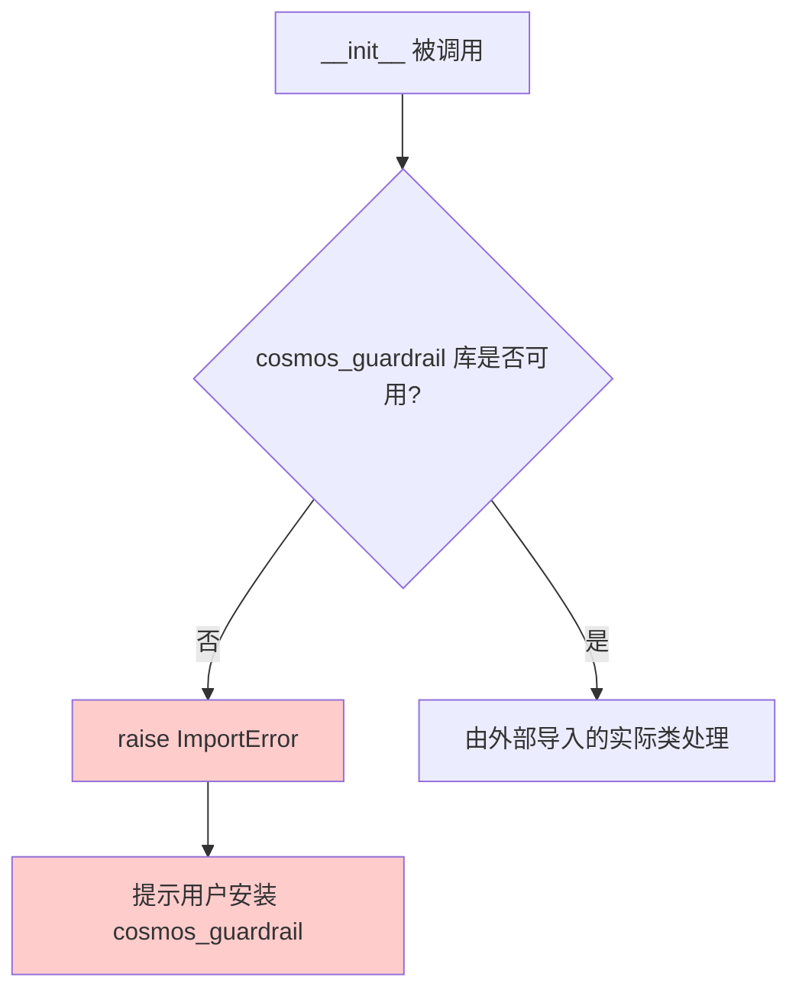

#### 带注释源码

```python
def __init__(self, *args, **kwargs):
    """
    CosmosSafetyChecker 的回退构造函数。
    
    当 cosmos_guardrail 库不可用时，此构造函数会被调用，
    并抛出一个 ImportError 提示用户安装必要的依赖包。
    
    Args:
        *args: 任意位置参数，用于保持接口兼容性
        **kwargs: 任意关键字参数，用于保持接口兼容性
    
    Raises:
        ImportError: 当 cosmos_guardrail 库未安装时抛出
    """
    raise ImportError(
        "`cosmos_guardrail` is not installed. Please install it to use the safety checker for Cosmos: `pip install cosmos_guardrail`."
    )
```


### `CosmosSafetyChecker.check_text_safety`

该方法用于检查输入文本是否包含不安全内容（如违规、敏感或不符合 NVIDIA 开放模型许可证协议的内容）。在管道生成前被调用，如果检测到不安全文本则抛出 ValueError 异常。

参数：

-  `text`：`str`，需要检查安全性的文本内容（通常为用户输入的 prompt）

返回值：`bool`，返回 `True` 表示文本安全，返回 `False` 表示文本包含不安全内容

#### 流程图

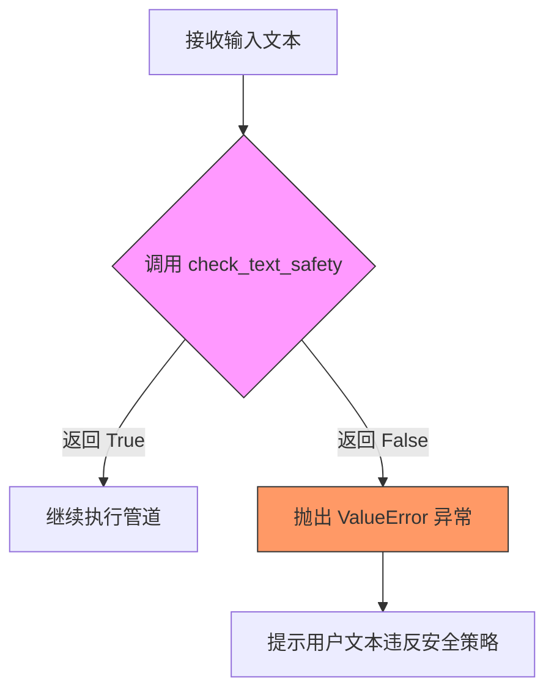

#### 带注释源码

```python
# 使用示例（来自 Cosmos2_5_TransferPipeline.__call__ 方法）
# 在实际调用前检查 prompt 的安全性
if self.safety_checker is not None:
    self.safety_checker.to(device)  # 将安全检查器移动到执行设备
    if prompt is not None:
        prompt_list = [prompt] if isinstance(prompt, str) else prompt
        for p in prompt_list:
            # 调用 check_text_safety 检查每个 prompt
            if not self.safety_checker.check_text_safety(p):
                # 检测到不安全内容，抛出异常
                raise ValueError(
                    f"Cosmos Guardrail detected unsafe text in the prompt: {p}. Please ensure that the "
                    f"prompt abides by the NVIDIA Open Model License Agreement."
                )
```

> **注意**：`CosmosSafetyChecker` 类来自外部包 `cosmos_guardrail`，其 `check_text_safety` 方法的实际实现位于该外部包中，当前代码仓库中仅包含对该类的调用和集成逻辑。若需查看该方法的完整实现源码，需安装 `cosmos_guardrail` 包并查看其源代码。


### CosmosSafetyChecker.check_video_safety

该方法是外部库 `cosmos_guardrail` 中的 `CosmosSafetyChecker` 类的成员方法，用于检查视频帧是否符合安全标准（如检测 NSFW 内容）。在当前代码中通过 `self.safety_checker.check_video_safety(vid)` 调用，对视频帧进行安全检查。

参数：

-  `vid`：`numpy.ndarray`，输入的视频帧数据，形状为 (H, W, C)，值为 uint8 类型

返回值：`numpy.ndarray` 或 `None`，如果视频帧通过安全检查则返回处理后的视频帧数据；如果未通过安全检查则返回 `None`

#### 流程图

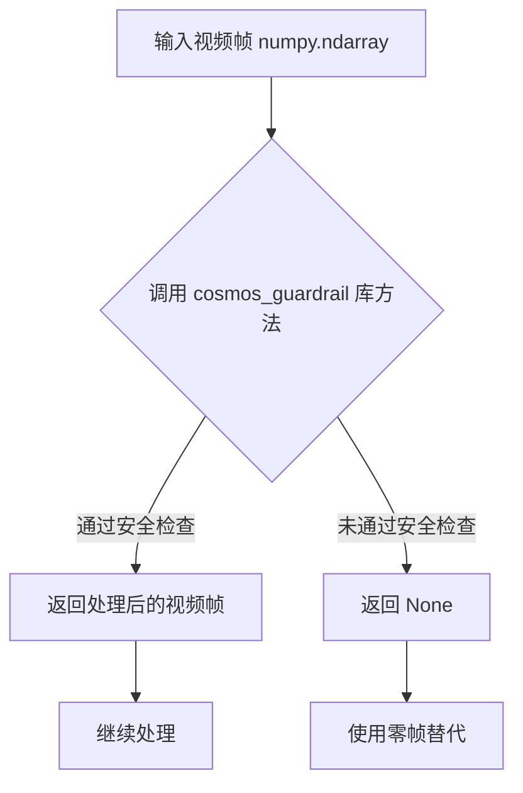

#### 带注释源码

```
# 注意：此方法来自外部库 cosmos_guardrail，未在此代码库中实现
# 以下是基于代码调用方式的推断

def check_video_safety(self, vid: numpy.ndarray) -> Optional[numpy.ndarray]:
    """
    检查视频帧是否符合安全标准
    
    参数:
        vid: 输入的视频帧，形状为 (H, W, C)，dtype 为 uint8
        
    返回:
        如果通过安全检查返回处理后的视频帧，否则返回 None
    """
    # 在 pipeline 中的调用方式：
    # vid = self.safety_checker.check_video_safety(vid)
    # if vid is None:
    #     video_batch.append(np.zeros_like(video[0]))
    # else:
    #     video_batch.append(vid)
    
    pass  # 实现来自外部库
```

---

### 潜在的技术债务或优化空间

1. **外部库依赖**：代码依赖于 `cosmos_guardrail` 外部库，如果该库不可用或版本不兼容，会导致功能缺失
2. **安全检查性能**：在每个视频帧上调用安全检查可能带来性能开销，考虑批量处理或异步检查

## 关键组件


### Latents 标准化/反标准化系统

该系统通过 `latents_mean` 和 `latents_std` 对 VAE 编码的 latents 进行 Z-score 标准化处理，在推理时再反标准化回来，确保数据分布一致性。

### 条件掩码与指示器系统

`cond_mask` 和 `cond_indicator` 用于区分输入条件帧（image/video）和需要生成的帧，支持条件生成和无条件生成两种模式的混合。

### 视频帧填充系统

`_maybe_pad_video` 函数通过复制最后一帧来填充视频到目标帧数，解决视频到世界模型生成中输入帧数少于输出帧数的问题。

### 控制网络编码系统

`_encode_controls` 将控制信号（边缘图、深度图等）编码为 latents 形式，与主模型 latents 一起送入 ControlNet 进行条件引导生成。

### 多模式生成架构

支持三种生成模式：Text2World（纯文本生成）、Image2World（单图条件生成）、Video2World（视频条件生成），通过 `num_frames_in` 参数区分。

### 动态宽高比处理

在 `__call__` 方法中根据输入图像/视频/控制信号的宽高比动态计算输出宽度，确保输出保持原始输入的宽高比例。

### 分类器自由引导系统

通过 `do_classifier_free_guidance` 和 `guidance_scale` 实现 CFG，对正向和负向 prompt 分别编码并在推理时进行插值。

### 调度器与去噪循环

使用 `UniPCMultistepScheduler` 进行多步去噪，在去噪循环中根据 `cond_mask` 区分条件和生成区域，只对非条件区域进行噪声预测。

### 潜在技术债务

1. `vae_scale_factor_temporal` 计算使用了 `sum` 而 `vae_scale_factor_spatial` 使用了 `len`，逻辑不一致
2. `temperal_downsample` 拼写错误（应为 temporal）
3. 多次重复的 `retrieve_latents` 调用可考虑批量优化
4. 安全检查器强制启用但标记为可选组件，逻辑矛盾


## 问题及建议


### 已知问题

-   **拼写错误**：`vae.temperal_downsample` 拼写错误，应为 `temporal_downsample`，导致后续使用该属性的代码可能出错。
-   **`prepare_latents` 方法逻辑错误**：在处理 `num_frames_in > 0` 时，使用了 `cond_indicator` 变量（值为 `latents.new_zeros(1, 1, latents.size(2), 1, 1)`），但该变量是一个全零张量，导致 `cond_mask` 永远为全零，这与条件帧处理的预期逻辑不符。
-   **`padding_mask` 创建后未使用**：在 `__call__` 方法中创建了 `padding_mask` 并传递给 `transformer` 和 `controlnet`，但实际上没有对 padding 进行处理。
-   **重复的 ControlNet 推理**：在去噪循环中，CFG 路径下对 negative prompt 重复调用了 `controlnet`，这在逻辑上是冗余的（negative prompt 不应受 controlnet 影响）。
-   **张量设备转换效率低**：在循环中多次使用 `.to(device=device, dtype=...)` 进行张量转换，可提取到循环外部。
-   **缺失的类型提示**：部分方法参数如 `callback_on_step_end_tensor_inputs` 在 `check_inputs` 中类型标注为 `None`，但实际调用时传入了列表。
-   **魔法数字与硬编码**：多处使用硬编码值（如 `num_frames=93`, `num_inference_steps=36`, `conditional_frame_timestep=0.1`），缺乏配置灵活性。
-   **VAE 编码效率**：在 `prepare_latents` 和 `_encode_controls` 中使用循环对 video 的每一帧进行 VAE 编码，未利用批处理能力。

### 优化建议

-   **修复拼写错误**：将 `temperal_downsample` 更正为 `temporal_downsample`。
-   **修复条件掩码逻辑**：在 `prepare_latents` 中正确计算 `cond_indicator`，应基于输入视频帧数与输出帧数的关系来设定条件指示器（例如，将输入帧对应的 latent 位置设为 1）。
-   **移除未使用的 padding_mask**：如果当前版本不需要 padding 处理，应删除相关代码以避免混淆；若需要，则实现完整的 padding 逻辑。
-   **优化 ControlNet 调用**：仅在 positive prompt 路径使用 controlnet，negative prompt 路径应跳过 controlnet 处理。
-   **提取循环外张量转换**：将 `sigma_t` 的创建和转换移至循环外，避免每步重复创建张量。
-   **添加类型注解**：为 `check_inputs` 等方法的参数添加正确的类型注解。
-   **配置化硬编码值**：将这些硬编码值作为 `__init__` 的默认参数或从配置文件中读取，提高可配置性。
-   **批量 VAE 编码**：修改 `prepare_latents` 和 `_encode_controls` 以支持对整个视频批次进行编码，而非逐帧循环。

## 其它


### 设计目标与约束

本管道旨在实现多模态视频生成，支持三种工作模式：Text2World（文本到世界）、Image2World（图像到世界）和Video2World（视频到世界）。核心约束包括：输入高度和宽度必须被16整除；批处理大小在图像/视频输入时必须为1；提示嵌入与提示需类型匹配；安全检查器必须启用以符合NVIDIA开放模型许可协议。

### 错误处理与异常设计

代码采用多层错误处理机制。导入时，若cosmos_guardrail未安装，CosmosSafetyChecker类会在初始化时抛出ImportError并提供安装指引。管道调用阶段，check_inputs方法对height/width参数进行16整除性校验，对callback_on_step_end_tensor_inputs进行白名单校验，对prompt和prompt_embeds进行互斥校验。prepare_latents方法验证生成器列表长度与批处理大小的匹配性，以及video参数在num_frames_in大于0时的必要性。安全检查阶段，若提示文本被检测为不安全，会抛出ValueError并提示违反许可协议。

### 数据流与状态机

管道数据流遵循以下状态转换：初始化状态→输入验证状态→提示编码状态→潜在向量准备状态→控制编码状态（可选）→去噪迭代状态→VAE解码状态→后处理与安全检查状态→输出状态。在去噪循环中，每个时间步执行条件潜在向量与噪声潜在向量的融合、ControlNet前向传播（若启用）、Transformer去噪预测、分类器自由引导计算（若启用）、调度器步进更新等操作。

### 外部依赖与接口契约

主要依赖包括：transformers库提供Qwen2_5_VLForConditionalGeneration文本编码器；diffusers库提供DiffusionPipeline基类、调度器和VAE模型；cosmos_guardrail库提供视频安全检查功能；torch/torchvision提供张量操作和图像变换；PIL和numpy提供图像处理能力。接口契约方面，encode_prompt方法返回(prompt_embeds, negative_prompt_embeds)元组；prepare_latents方法返回(latents, cond_latent, cond_mask, cond_indicator)四元组；__call__方法返回CosmosPipelineOutput对象或(video, nsfw_detection)元组。

### 性能优化策略

代码支持多种性能优化机制。XLA编译支持通过torch_xla实现TPU加速，使用xm.mark_step()进行计算标记。模型CPU卸载通过model_cpu_offload_seq指定卸载序列。混合精度计算通过dtype参数支持bfloat16等低精度格式。安全检查器延迟加载和条件执行避免不必要的计算开销。进度条机制提供推理过程可视化。

### 安全考虑与合规性

管道强制要求启用安全检查器，未启用时抛出ValueError违反NVIDIA开放模型许可协议。文本安全检查通过safety_checker.check_text_safety()验证每个提示，检测到不安全内容时拒绝生成。视频安全检查在解码后对每帧进行NSFW内容过滤，不安全帧被替换为零帧。所有生成内容均需通过安全检查流程。

### 配置参数与超参数

关键配置参数包括：默认负向提示DEFAULT_NEGATIVE_PROMPT定义了质量较差的视频特征描述；vae_scale_factor_temporal和vae_scale_factor_spatial分别控制时间维度和空间维度的潜在向量缩放；latents_mean和latents_std用于潜在向量归一化。运行时超参数包括：height默认704像素，num_frames默认93帧，num_inference_steps默认36步，guidance_scale默认3.0，conditional_frame_timestep默认0.1。

### 版本与兼容性信息

代码版权标注为2025年，由NVIDIA Team和HuggingFace Team共同开发。依赖版本兼容性方面，需要transformers库支持Qwen2_5_VLForConditionalGeneration模型，需要diffusers库提供Cosmos相关模型类，需要torch支持XLA设备（可选）。该管道继承自DiffusionPipeline基类，遵循diffusers库的Pipeline标准接口。

### 日志与监控

代码使用logging.get_logger(__name__)创建模块级日志记录器，用于记录潜在的系统状态和调试信息。管道内部通过progress_bar提供推理进度可视化。回调机制callback_on_step_end支持在每个去噪步骤结束时执行自定义监控逻辑，可用于中间结果记录、性能指标收集或实时预览生成过程。

### 资源管理与内存优化

管道采用多项内存管理策略。VideoProcessor自动处理视频帧的预处理和后处理。VAE编码阶段支持批量处理以提高内存效率。模型卸载通过maybe_free_model_hooks()在推理完成后释放显存。条件生成机制通过cond_mask和cond_indicator实现条件与无条件生成的有效切换，避免重复计算。

### 测试与验证考量

代码标记safety_checker和controlnet为可选组件(_optional_components)，以便在测试环境中绕过依赖。_callback_tensor_inputs定义了回调函数可访问的张量输入列表。输入验证通过check_inputs方法确保参数合法性和一致性。示例文档字符串(EXAMPLE_DOC_STRING)提供了端到端使用示例，可用于回归测试验证。


    