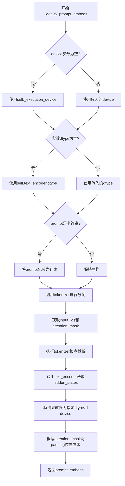
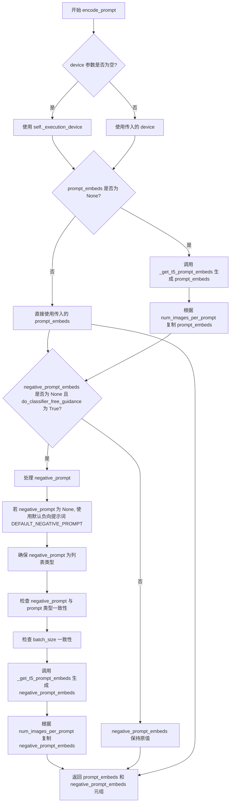
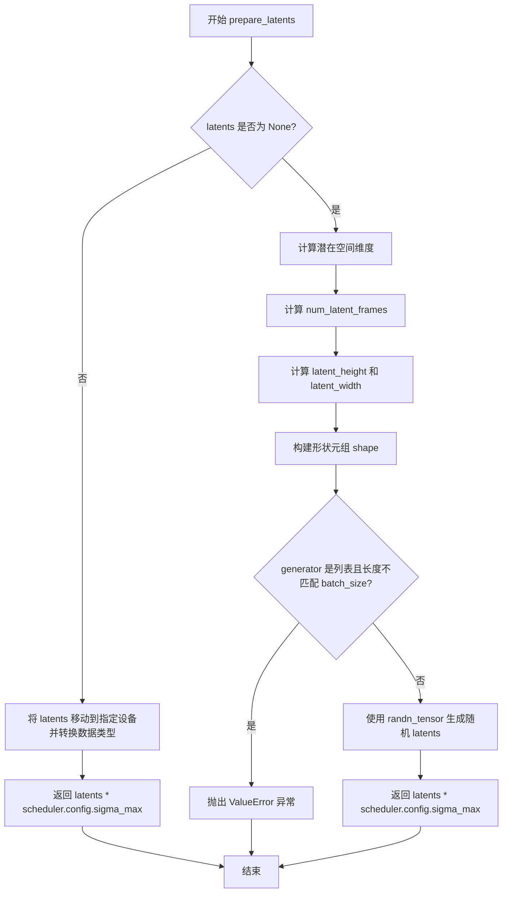
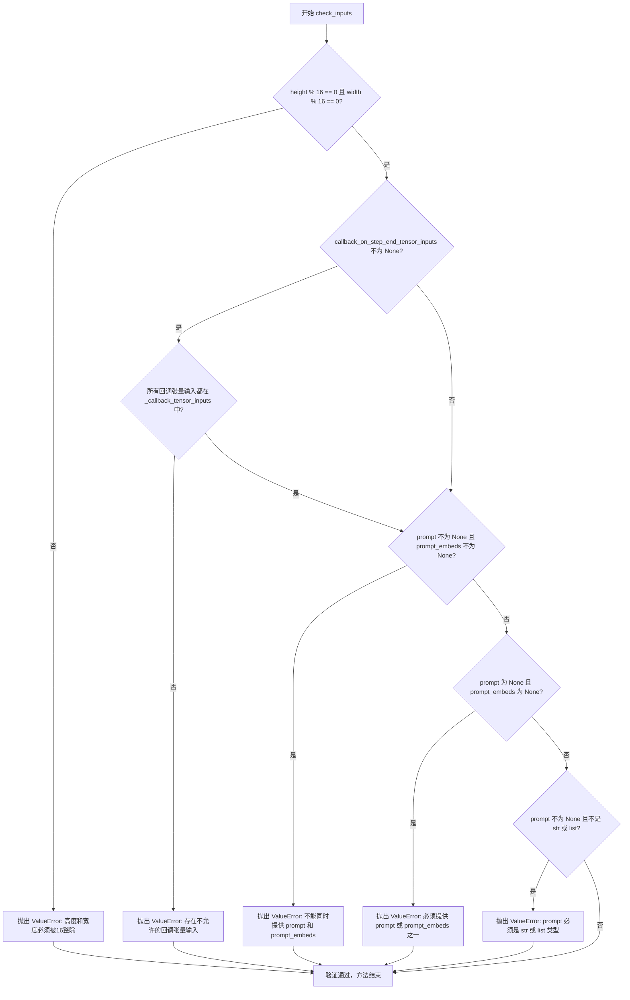
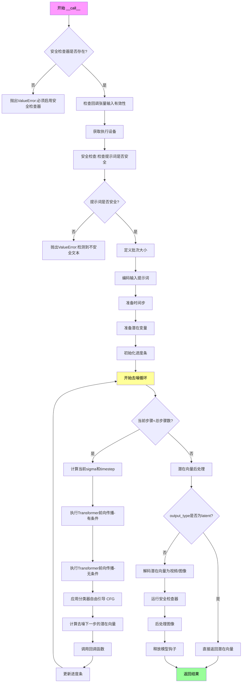
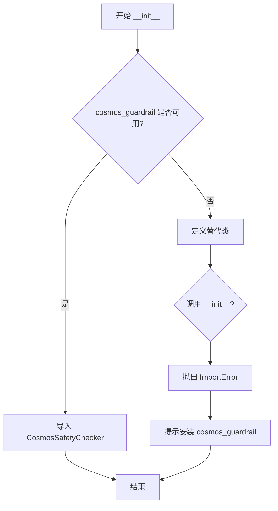
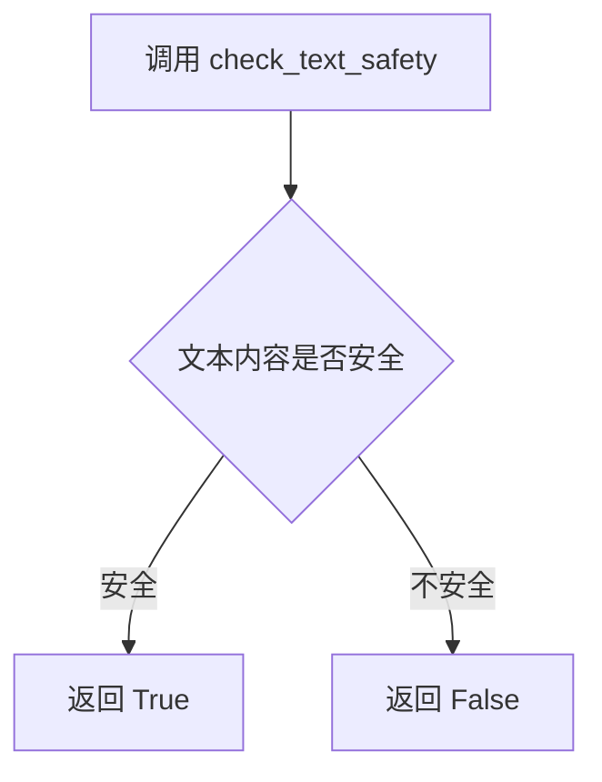
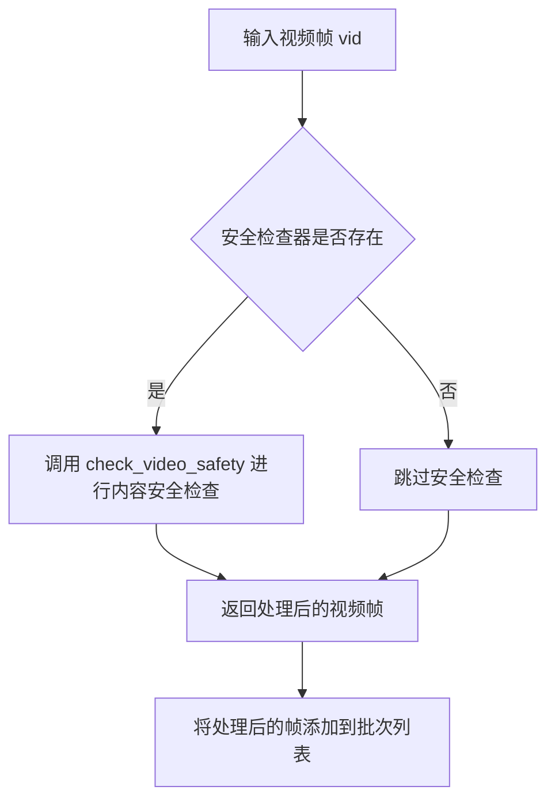

# `diffusers\src\diffusers\pipelines\cosmos\pipeline_cosmos2_text2image.py` 详细设计文档

Cosmos2TextToImagePipeline是一个基于Cosmos Predict2模型的文本到图像生成管道，利用T5编码器处理文本提示，通过CosmosTransformer3DModel进行潜在空间的去噪操作，并使用AutoencoderKLWan进行图像解码，最终生成与文本描述相符的图像。

## 整体流程

```mermaid
graph TD
    A[开始: __call__] --> B[检查safety_checker]
    B --> C[检查输入参数 check_inputs]
    C --> D[设置guidance_scale和interrupt标志]
    D --> E{安全检查?}
    E -- 是 --> F[调用safety_checker检查文本]
    E -- 否 --> G[继续执行]
    F --> G
    G --> H[定义批次大小 batch_size]
    H --> I[编码提示词 encode_prompt]
    I --> J[准备时间步 retrieve_timesteps]
    J --> K[准备潜在变量 prepare_latents]
    K --> L[创建padding_mask]
    L --> M[去噪循环 for t in timesteps]
    M --> N{执行transformer前向传播}
    N --> O[计算噪声预测 noise_pred]
    O --> P{是否使用CFG?}
    P -- 是 --> Q[计算无条件噪声预测 noise_pred_uncond]
    P -- 否 --> R[跳过CFG计算]
    Q --> S[应用guidance_scale计算最终预测]
    R --> S
    S --> T[调度器步进 scheduler.step]
    T --> U{是否有callback?]
    U -- 是 --> V[执行callback_on_step_end]
    U -- 否 --> W[更新进度条]
    V --> W
    W --> X{是否还有时间步?]
    X -- 是 --> M
    X -- 否 --> Y[解码潜在变量 vae.decode]
    Y --> Z{是否有safety_checker?}
    Z -- 是 --> AA[检查视频/图像安全性]
    Z -- 否 --> AB[后处理视频]
    AA --> AB
    AB --> AC[提取首帧作为图像]
    AC --> AD[释放模型钩子 maybe_free_model_hooks]
    AD --> AE[返回结果]
```

## 类结构

```
DiffusionPipeline (抽象基类)
└── Cosmos2TextToImagePipeline (具体实现类)
```

## 全局变量及字段


### `logger`
    
日志记录器

类型：`logging.Logger`
    


### `DEFAULT_NEGATIVE_PROMPT`
    
默认负面提示词

类型：`str`
    


### `EXAMPLE_DOC_STRING`
    
示例文档字符串

类型：`str`
    


### `XLA_AVAILABLE`
    
XLA是否可用标志

类型：`bool`
    


### `Cosmos2TextToImagePipeline.Cosmos2TextToImagePipeline.model_cpu_offload_seq`
    
CPU卸载顺序

类型：`str`
    


### `Cosmos2TextToImagePipeline.Cosmos2TextToImagePipeline._callback_tensor_inputs`
    
回调张量输入列表

类型：`list`
    


### `Cosmos2TextToImagePipeline.Cosmos2TextToImagePipeline._optional_components`
    
可选组件列表

类型：`list`
    


### `Cosmos2TextToImagePipeline.Cosmos2TextToImagePipeline.vae`
    
VAE模型

类型：`AutoencoderKLWan`
    


### `Cosmos2TextToImagePipeline.Cosmos2TextToImagePipeline.text_encoder`
    
T5文本编码器

类型：`T5EncoderModel`
    


### `Cosmos2TextToImagePipeline.Cosmos2TextToImagePipeline.tokenizer`
    
T5分词器

类型：`T5TokenizerFast`
    


### `Cosmos2TextToImagePipeline.Cosmos2TextToImagePipeline.transformer`
    
去噪Transformer

类型：`CosmosTransformer3DModel`
    


### `Cosmos2TextToImagePipeline.Cosmos2TextToImagePipeline.scheduler`
    
调度器

类型：`FlowMatchEulerDiscreteScheduler`
    


### `Cosmos2TextToImagePipeline.Cosmos2TextToImagePipeline.safety_checker`
    
安全检查器

类型：`CosmosSafetyChecker`
    


### `Cosmos2TextToImagePipeline.Cosmos2TextToImagePipeline.vae_scale_factor_temporal`
    
时间维度VAE缩放因子

类型：`int`
    


### `Cosmos2TextToImagePipeline.Cosmos2TextToImagePipeline.vae_scale_factor_spatial`
    
空间维度VAE缩放因子

类型：`int`
    


### `Cosmos2TextToImagePipeline.Cosmos2TextToImagePipeline.video_processor`
    
视频处理器

类型：`VideoProcessor`
    


### `Cosmos2TextToImagePipeline.Cosmos2TextToImagePipeline.sigma_max`
    
最大sigma值

类型：`float`
    


### `Cosmos2TextToImagePipeline.Cosmos2TextToImagePipeline.sigma_min`
    
最小sigma值

类型：`float`
    


### `Cosmos2TextToImagePipeline.Cosmos2TextToImagePipeline.sigma_data`
    
数据sigma值

类型：`float`
    


### `Cosmos2TextToImagePipeline.Cosmos2TextToImagePipeline.final_sigmas_type`
    
最终sigma类型

类型：`str`
    
    

## 全局函数及方法


### `retrieve_timesteps`

该函数是一个全局辅助函数，用于从调度器获取时间步（timesteps）。它调用调度器的 `set_timesteps` 方法，并根据传入的参数（自定义时间步或自定义sigmas）来设置调度器，然后返回更新后的时间步列表和推理步数。

参数：

- `scheduler`：`SchedulerMixin`，调度器对象，用于获取时间步
- `num_inference_steps`：`int | None`，生成样本时使用的扩散步数，如果使用此参数，`timesteps` 必须为 `None`
- `device`：`str | torch.device | None`，时间步要移动到的设备，如果为 `None` 则不移动
- `timesteps`：`list[int] | None`，自定义时间步，用于覆盖调度器的时间步间隔策略
- `sigmas`：`list[float] | None`，自定义sigmas，用于覆盖调度器的时间步间隔策略
- `**kwargs`：任意关键字参数，将传递给 `scheduler.set_timesteps`

返回值：`tuple[torch.Tensor, int]`，元组包含调度器的时间步 schedule 和推理步数

#### 流程图

```mermaid
flowchart TD
    A[开始: retrieve_timesteps] --> B{检查: timesteps 和 sigmas 都非空?}
    B -->|是| C[抛出 ValueError: 只能选择timesteps或sigmas之一]
    B -->|否| D{检查: timesteps 非空?}
    D -->|是| E[检查调度器是否支持timesteps参数]
    E --> F{支持?}
    F -->|否| G[抛出 ValueError: 调度器不支持自定义timesteps]
    F -->|是| H[调用 scheduler.set_timesteps<br/>timesteps=timesteps, device=device]
    H --> I[获取 scheduler.timesteps]
    I --> J[计算 num_inference_steps = len(timesteps)]
    D -->|否| K{检查: sigmas 非空?}
    K -->|是| L[检查调度器是否支持sigmas参数]
    L --> M{支持?}
    M -->|否| N[抛出 ValueError: 调度器不支持自定义sigmas]
    M -->|是| O[调用 scheduler.set_timesteps<br/>sigmas=sigmas, device=device]
    O --> P[获取 scheduler.timesteps]
    P --> Q[计算 num_inference_steps = len(timesteps)]
    K -->|否| R[调用 scheduler.set_timesteps<br/>num_inference_steps, device=device]
    R --> S[获取 scheduler.timesteps]
    J --> T[返回 tuple(timesteps, num_inference_steps)]
    Q --> T
    S --> T
    T --> U[结束]
```

#### 带注释源码

```python
# Copied from diffusers.pipelines.stable_diffusion.pipeline_stable_diffusion.retrieve_timesteps
def retrieve_timesteps(
    scheduler,
    num_inference_steps: int | None = None,
    device: str | torch.device | None = None,
    timesteps: list[int] | None = None,
    sigmas: list[float] | None = None,
    **kwargs,
):
    r"""
    Calls the scheduler's `set_timesteps` method and retrieves timesteps from the scheduler after the call. Handles
    custom timesteps. Any kwargs will be supplied to `scheduler.set_timesteps`.

    Args:
        scheduler (`SchedulerMixin`):
            The scheduler to get timesteps from.
        num_inference_steps (`int`):
            The number of diffusion steps used when generating samples with a pre-trained model. If used, `timesteps`
            must be `None`.
        device (`str` or `torch.device`, *optional*):
            The device to which the timesteps should be moved to. If `None`, the timesteps are not moved.
        timesteps (`list[int]`, *optional*):
            Custom timesteps used to override the timestep spacing strategy of the scheduler. If `timesteps` is passed,
            `num_inference_steps` and `sigmas` must be `None`.
        sigmas (`list[float]`, *optional*):
            Custom sigmas used to override the timestep spacing strategy of the scheduler. If `sigmas` is passed,
            `num_inference_steps` and `timesteps` must be `None`.

    Returns:
        `tuple[torch.Tensor, int]`: A tuple where the first element is the timestep schedule from the scheduler and the
        second element is the number of inference steps.
    """
    # 检查不能同时传递timesteps和sigmas，只能选择其中一个
    if timesteps is not None and sigmas is not None:
        raise ValueError("Only one of `timesteps` or `sigmas` can be passed. Please choose one to set custom values")
    
    # 处理自定义timesteps的情况
    if timesteps is not None:
        # 检查调度器的set_timesteps方法是否接受timesteps参数
        accepts_timesteps = "timesteps" in set(inspect.signature(scheduler.set_timesteps).parameters.keys())
        if not accepts_timesteps:
            raise ValueError(
                f"The current scheduler class {scheduler.__class__}'s `set_timesteps` does not support custom"
                f" timestep schedules. Please check whether you are using the correct scheduler."
            )
        # 调用调度器的set_timesteps方法设置自定义时间步
        scheduler.set_timesteps(timesteps=timesteps, device=device, **kwargs)
        # 从调度器获取更新后的时间步
        timesteps = scheduler.timesteps
        # 计算推理步数
        num_inference_steps = len(timesteps)
    # 处理自定义sigmas的情况
    elif sigmas is not None:
        # 检查调度器的set_timesteps方法是否接受sigmas参数
        accept_sigmas = "sigmas" in set(inspect.signature(scheduler.set_timesteps).parameters.keys())
        if not accept_sigmas:
            raise ValueError(
                f"The current scheduler class {scheduler.__class__}'s `set_timesteps` does not support custom"
                f" sigmas schedules. Please check whether you are using the correct scheduler."
            )
        # 调用调度器的set_timesteps方法设置自定义sigmas
        scheduler.set_timesteps(sigmas=sigmas, device=device, **kwargs)
        # 从调度器获取更新后的时间步
        timesteps = scheduler.timesteps
        # 计算推理步数
        num_inference_steps = len(timesteps)
    # 默认情况：使用num_inference_steps设置时间步
    else:
        scheduler.set_timesteps(num_inference_steps, device=device, **kwargs)
        timesteps = scheduler.timesteps
    
    # 返回时间步列表和推理步数
    return timesteps, num_inference_steps
```


### `Cosmos2TextToImagePipeline.__init__`

该方法是 `Cosmos2TextToImagePipeline` 类的构造函数，负责初始化文本到图像生成管道所需的所有核心组件，包括文本编码器、分词器、Transformer模型、VAE调度器以及安全检查器，并配置相关的缩放因子和sigma参数。

参数：

- `text_encoder`：`T5EncoderModel`，冻结的T5文本编码器，用于将文本提示编码为隐藏状态
- `tokenizer`：`T5TokenizerFast`，T5分词器，用于对文本进行分词处理
- `transformer`：`CosmosTransformer3DModel`，条件Transformer模型，用于对编码的图像潜在表示进行去噪
- `vae`：`AutoencoderKLWan`，变分自编码器模型，用于编码和解码图像与潜在表示之间的转换
- `scheduler`：`FlowMatchEulerDiscreteScheduler`，与Transformer配合使用的调度器，用于对编码的图像潜在表示进行去噪
- `safety_checker`：`CosmosSafetyChecker`，可选的安全检查器，用于检测不安全的内容

返回值：无（`None`），构造函数不返回值，仅初始化对象状态

#### 流程图

```mermaid
flowchart TD
    A[__init__ 开始] --> B[调用 super().__init__]
    B --> C{safety_checker is None?}
    C -->|是| D[创建默认 CosmosSafetyChecker]
    C -->|否| E[使用传入的 safety_checker]
    D --> F[register_modules 注册所有模块]
    E --> F
    F --> G[计算 vae_scale_factor_temporal 和 vae_scale_factor_spatial]
    G --> H[创建 VideoProcessor]
    H --> I[设置 sigma_max, sigma_min, sigma_data, final_sigmas_type]
    I --> J[scheduler.register_to_config 注册配置]
    J --> K[__init__ 结束]
```

#### 带注释源码

```
def __init__(
    self,
    text_encoder: T5EncoderModel,           # T5文本编码器模型
    tokenizer: T5TokenizerFast,             # T5分词器
    transformer: CosmosTransformer3DModel,  # Cosmos 3D Transformer模型
    vae: AutoencoderKLWan,                  # VAE变分自编码器
    scheduler: FlowMatchEulerDiscreteScheduler, # 流匹配欧拉离散调度器
    safety_checker: CosmosSafetyChecker = None,  # 可选的安全检查器
):
    # 调用父类 DiffusionPipeline 的初始化方法
    super().__init__()

    # 如果未提供安全检查器，则创建默认实例
    # 这会抛出 ImportError 如果 cosmos_guardrail 未安装
    if safety_checker is None:
        safety_checker = CosmosSafetyChecker()

    # 将所有模型组件注册到管道中，便于后续管理和保存/加载
    self.register_modules(
        vae=vae,
        text_encoder=text_encoder,
        tokenizer=tokenizer,
        transformer=transformer,
        scheduler=scheduler,
        safety_checker=safety_checker,
    )

    # 计算VAE的时序缩放因子：基于VAE的时序下采样层数
    # 如果VAE存在则计算，否则默认为4
    self.vae_scale_factor_temporal = 2 ** sum(self.vae.temperal_downsample) if getattr(self, "vae", None) else 4
    
    # 计算VAE的空间缩放因子：基于VAE的时序下采样层数的长度
    # 如果VAE存在则计算，否则默认为8
    self.vae_scale_factor_spatial = 2 ** len(self.vae.temperal_downsample) if getattr(self, "vae", None) else 8
    
    # 创建视频处理器，使用空间缩放因子
    self.video_processor = VideoProcessor(vae_scale_factor=self.vae_scale_factor_spatial)

    # 配置扩散过程的sigma参数
    self.sigma_max = 80.0      # 最大sigma值
    self.sigma_min = 0.002     # 最小sigma值
    self.sigma_data = 1.0      # 数据sigma值
    self.final_sigmas_type = "sigma_min"  # 最终sigma类型
    
    # 将sigma配置注册到调度器
    if self.scheduler is not None:
        self.scheduler.register_to_config(
            sigma_max=self.sigma_max,
            sigma_min=self.sigma_min,
            sigma_data=self.sigma_data,
            final_sigmas_type=self.final_sigmas_type,
        )
```


### `Cosmos2TextToImagePipeline._get_t5_prompt_embeds`

该方法负责将文本提示词（prompt）编码为T5文本编码器（text_encoder）可处理的嵌入向量（embeddings），是文本到图像生成流程中的关键预处理步骤。

参数：

- `prompt`：`str | list[str]`，要编码的文本提示词，可以是单个字符串或字符串列表，默认为None
- `max_sequence_length`：`int`，最大序列长度，默认为512个token
- `device`：`torch.device | None`，指定计算设备，默认为None（使用执行设备）
- `dtype`：`torch.dtype | None`，指定张量数据类型，默认为None（使用text_encoder的数据类型）

返回值：`torch.Tensor`，返回形状为`(batch_size, seq_len, hidden_dim)`的文本嵌入张量，其中batch_size为提示词数量，seq_len为序列长度（max_sequence_length），hidden_dim为T5编码器的隐藏层维度

#### 流程图



#### 带注释源码

```python
# 从DiffusionPipeline类继承的方法，用于将文本提示编码为T5嵌入向量
def _get_t5_prompt_embeds(
    self,
    prompt: str | list[str] = None,
    max_sequence_length: int = 512,
    device: torch.device | None = None,
    dtype: torch.dtype | None = None,
):
    """
    将文本提示编码为T5文本编码器的隐藏状态向量。
    
    参数:
        prompt: 要编码的文本提示，可以是单个字符串或字符串列表
        max_sequence_length: token序列的最大长度
        device: 计算设备
        dtype: 张量数据类型
    
    返回:
        编码后的文本嵌入张量
    """
    # 确定设备：优先使用传入的device，否则使用pipeline的execution_device
    device = device or self._execution_device
    # 确定数据类型：优先使用传入的dtype，否则使用text_encoder的数据类型
    dtype = dtype or self.text_encoder.dtype
    # 统一输入格式：如果是单个字符串则转换为列表，方便批处理
    prompt = [prompt] if isinstance(prompt, str) else prompt

    # 使用T5 Tokenizer对prompt进行分词
    # padding="max_length": 将所有序列填充到max_sequence_length
    # truncation=True: 超过max_sequence_length的序列进行截断
    # return_tensors="pt": 返回PyTorch张量
    # return_length=True: 返回每个序列的实际长度
    text_inputs = self.tokenizer(
        prompt,
        padding="max_length",
        max_length=max_sequence_length,
        truncation=True,
        return_tensors="pt",
        return_length=True,
        return_offsets_mapping=False,
    )
    # 获取输入ID和注意力掩码
    text_input_ids = text_inputs.input_ids
    # 将attention_mask转换为布尔值并移动到指定设备
    prompt_attention_mask = text_inputs.attention_mask.bool().to(device)

    # 检查是否发生截断：使用最长序列重新分词进行比较
    untruncated_ids = self.tokenizer(prompt, padding="longest", return_tensors="pt").input_ids
    # 如果最长序列长度大于当前序列长度，并且两者不相等，则说明发生了截断
    if untruncated_ids.shape[-1] >= text_input_ids.shape[-1] and not torch.equal(text_input_ids, untruncated_ids):
        # 解码被截断的部分用于日志警告
        removed_text = self.tokenizer.batch_decode(untruncated_ids[:, max_sequence_length - 1 : -1])
        logger.warning(
            "The following part of your input was truncated because `max_sequence_length` is set to "
            f" {max_sequence_length} tokens: {removed_text}"
        )

    # 调用T5文本编码器获取隐藏状态
    # text_input_ids: tokenized的输入序列
    # attention_mask: 注意力掩码，标识有效token位置
    prompt_embeds = self.text_encoder(
        text_input_ids.to(device), attention_mask=prompt_attention_mask
    ).last_hidden_state
    # 将嵌入向量转换为指定的dtype和device
    prompt_embeds = prompt_embeds.to(dtype=dtype, device=device)

    # 将padding位置的嵌入置零
    # 计算每个序列的实际长度（有效token数量）
    lengths = prompt_attention_mask.sum(dim=1).cpu()
    # 遍历每个样本，将padding位置（长度之后的位置）置零
    for i, length in enumerate(lengths):
        prompt_embeds[i, length:] = 0

    # 返回编码后的文本嵌入
    return prompt_embeds
```


### `Cosmos2TextToImagePipeline.encode_prompt`

该方法负责将文本提示词（prompt）和负向提示词（negative_prompt）编码为文本编码器（T5 Encoder）的隐藏状态向量（hidden states），并支持分类器自由引导（Classifier-Free Guidance）所需的嵌入复制与处理。

参数：

- `prompt`：`str | list[str]`，要编码的文本提示词，可以是单个字符串或字符串列表
- `negative_prompt`：`str | list[str] | None`，可选的负向提示词，用于引导生成时排除相关内容；若不提供且启用引导时，将使用默认负向提示词
- `do_classifier_free_guidance`：`bool`，是否启用分类器自由引导，默认为 True
- `num_images_per_prompt`：`int`，每个提示词要生成的图像数量，用于复制嵌入向量，默认为 1
- `prompt_embeds`：`torch.Tensor | None`，预生成的提示词嵌入，若提供则直接使用而忽略 prompt 参数
- `negative_prompt_embeds`：`torch.Tensor | None`，预生成的负向提示词嵌入，若提供则直接使用
- `max_sequence_length`：`int`，编码时的最大序列长度，默认为 512
- `device`：`torch.device | None`，指定计算设备，若不提供则使用执行设备
- `dtype`：`torch.dtype | None`，指定计算数据类型，若不提供则使用文本编码器的数据类型

返回值：`tuple[torch.Tensor, torch.Tensor]`，返回包含提示词嵌入和负向提示词嵌入的元组

#### 流程图



#### 带注释源码

```python
def encode_prompt(
    self,
    prompt: str | list[str],
    negative_prompt: str | list[str] | None = None,
    do_classifier_free_guidance: bool = True,
    num_images_per_prompt: int = 1,
    prompt_embeds: torch.Tensor | None = None,
    negative_prompt_embeds: torch.Tensor | None = None,
    max_sequence_length: int = 512,
    device: torch.device | None = None,
    dtype: torch.dtype | None = None,
):
    r"""
    Encodes the prompt into text encoder hidden states.

    Args:
        prompt (`str` or `list[str]`, *optional*):
            prompt to be encoded
        negative_prompt (`str` or `list[str]`, *optional*):
            The prompt or prompts not to guide the image generation. If not defined, one has to pass
            `negative_prompt_embeds` instead. Ignored when not using guidance (i.e., ignored if `guidance_scale` is
            less than `1`).
        do_classifier_free_guidance (`bool`, *optional*, defaults to `True`):
            Whether to use classifier free guidance or not.
        num_images_per_prompt (`int`, *optional*, defaults to 1):
            Number of videos that should be generated per prompt. torch device to place the resulting embeddings on
        prompt_embeds (`torch.Tensor`, *optional*):
            Pre-generated text embeddings. Can be used to easily tweak text inputs, *e.g.* prompt weighting. If not
            provided, text embeddings will be generated from `prompt` input argument.
        negative_prompt_embeds (`torch.Tensor`, *optional*):
            Pre-generated negative text embeddings. Can be used to easily tweak text inputs, *e.g.* prompt
            weighting. If not provided, negative_prompt_embeds will be generated from `negative_prompt` input
            argument.
        device: (`torch.device`, *optional*):
            torch device
        dtype: (`torch.dtype`, *optional*):
            torch dtype
    """
    # 确定设备：如果未指定 device，则使用管道的执行设备
    device = device or self._execution_device

    # 将 prompt 统一转换为列表格式，便于批处理
    prompt = [prompt] if isinstance(prompt, str) else prompt
    
    # 确定 batch_size：如果提供了 prompt，则使用其长度；否则使用 prompt_embeds 的第一维大小
    if prompt is not None:
        batch_size = len(prompt)
    else:
        batch_size = prompt_embeds.shape[0]

    # 如果未提供 prompt_embeds，则需要从 prompt 生成
    if prompt_embeds is None:
        # 调用内部方法 _get_t5_prompt_embeds 生成文本嵌入
        prompt_embeds = self._get_t5_prompt_embeds(
            prompt=prompt, max_sequence_length=max_sequence_length, device=device, dtype=dtype
        )

        # 获取嵌入的序列长度
        _, seq_len, _ = prompt_embeds.shape
        
        # 为每个 prompt 复制 num_images_per_prompt 次，以支持批量生成
        # 使用 repeat 方法在第二维（序列维）复制，这是 MPS 友好的方法
        prompt_embeds = prompt_embeds.repeat(1, num_images_per_prompt, 1)
        
        # 重塑为 (batch_size * num_images_per_prompt, seq_len, hidden_dim)
        prompt_embeds = prompt_embeds.view(batch_size * num_images_per_prompt, seq_len, -1)

    # 如果启用分类器自由引导且未提供负向嵌入，则需要生成负向嵌入
    if do_classifier_free_guidance and negative_prompt_embeds is None:
        # 如果未提供负向提示词，则使用默认的负向提示词
        negative_prompt = negative_prompt if negative_prompt is not None else DEFAULT_NEGATIVE_PROMPT
        
        # 确保 negative_prompt 是列表类型：如果是一个字符串，则复制 batch_size 份
        negative_prompt = batch_size * [negative_prompt] if isinstance(negative_prompt, str) else negative_prompt

        # 类型检查：negative_prompt 应与 prompt 类型一致
        if prompt is not None and type(prompt) is not type(negative_prompt):
            raise TypeError(
                f"`negative_prompt` should be the same type to `prompt`, but got {type(negative_prompt)} !="
                f" {type(prompt)}."
            )
        
        # 批大小一致性检查
        elif batch_size != len(negative_prompt):
            raise ValueError(
                f"`negative_prompt`: {negative_prompt} has batch size {len(negative_prompt)}, but `prompt`:"
                f" {prompt} has batch size {batch_size}. Please make sure that passed `negative_prompt` matches"
                " the batch size of `prompt`."
            )

        # 生成负向提示词嵌入
        negative_prompt_embeds = self._get_t5_prompt_embeds(
            prompt=negative_prompt, max_sequence_length=max_sequence_length, device=device, dtype=dtype
        )

        # 同样为负向嵌入进行复制操作以匹配 num_images_per_prompt
        _, seq_len, _ = negative_prompt_embeds.shape
        negative_prompt_embeds = negative_prompt_embeds.repeat(1, num_images_per_prompt, 1)
        negative_prompt_embeds = negative_prompt_embeds.view(batch_size * num_images_per_prompt, seq_len, -1)

    # 返回提示词嵌入和负向提示词嵌入的元组
    return prompt_embeds, negative_prompt_embeds
```


### `Cosmos2TextToImagePipeline.prepare_latents`

该方法用于准备扩散模型的潜在变量（latents）。如果提供了预先计算的 latents，则将其移动到指定设备并乘以最大噪声sigma值；否则，根据批大小、图像尺寸和帧数计算潜在空间的形状，并使用随机张量生成器初始化latents，最后乘以最大sigma值以匹配扩散模型的噪声调度策略。

参数：

- `self`：`Cosmos2TextToImagePipeline` 实例本身
- `batch_size`：`int`，生成图像的批处理大小
- `num_channels_latents`：`int`，潜在变量的通道数，默认为16
- `height`：`int`，输出图像的高度，默认为768
- `width`：`int`，输出图像的宽度，默认为1360
- `num_frames`：`int`，生成视频的帧数，默认为1（用于图像生成）
- `dtype`：`torch.dtype | None`，潜在变量的数据类型
- `device`：`torch.device | None`，潜在变量所在的设备
- `generator`：`torch.Generator | list[torch.Generator] | None`，用于生成确定性随机数的PyTorch生成器
- `latents`：`torch.Tensor | None`，可选的预生成潜在变量张量

返回值：`torch.Tensor`，处理后的潜在变量张量

#### 流程图



#### 带注释源码

```python
def prepare_latents(
    self,
    batch_size: int,
    num_channels_latents: 16,
    height: int = 768,
    width: int = 1360,
    num_frames: int = 1,
    dtype: torch.dtype | None = None,
    device: torch.device | None = None,
    generator: torch.Generator | list[torch.Generator] | None = None,
    latents: torch.Tensor | None = None,
) -> torch.Tensor:
    """
    准备扩散模型的潜在变量。
    
    如果提供了预计算的latents，则将其移动到指定设备并乘以最大sigma值；
    否则，根据图像尺寸计算潜在空间形状并初始化随机latents。
    
    参数:
        batch_size: 批处理大小
        num_channels_latents: 潜在变量通道数，默认16
        height: 图像高度，默认768
        width: 图像宽度，默认1360
        num_frames: 帧数，默认1用于图像生成
        dtype: 张量数据类型
        device: 计算设备
        generator: 随机数生成器，用于可重复性
        latents: 可选的预生成潜在变量
    
    返回:
        处理后的潜在变量张量
    """
    # 如果已提供latents，直接移动到目标设备并返回
    # 乘以sigma_max以匹配噪声调度器的初始噪声水平
    if latents is not None:
        return latents.to(device=device, dtype=dtype) * self.scheduler.config.sigma_max

    # 计算潜在空间的帧数：考虑VAE的时间下采样因子
    # 例如：如果vae_scale_factor_temporal=4，num_frames=1，则num_latent_frames=1
    num_latent_frames = (num_frames - 1) // self.vae_scale_factor_temporal + 1
    
    # 计算潜在空间的Spatial维度：考虑VAE的空间下采样因子
    # 例如：如果vae_scale_factor_spatial=8，height=768，则latent_height=96
    latent_height = height // self.vae_scale_factor_spatial
    latent_width = width // self.vae_scale_factor_spatial
    
    # 构建潜在变量的形状：(batch, channels, frames, height, width)
    shape = (batch_size, num_channels_latents, num_latent_frames, latent_height, latent_width)

    # 验证generator列表长度与batch_size是否匹配
    if isinstance(generator, list) and len(generator) != batch_size:
        raise ValueError(
            f"You have passed a list of generators of length {len(generator)}, but requested an effective batch"
            f" size of {batch_size}. Make sure the batch size matches the length of the generators."
        )

    # 使用randn_tensor生成符合标准正态分布的随机潜在变量
    latents = randn_tensor(shape, generator=generator, device=device, dtype=dtype)
    
    # 乘以sigma_max将latents缩放到噪声调度器的初始噪声水平
    # 这是Flow Match等扩散模型的关键步骤
    return latents * self.scheduler.config.sigma_max
```


### `Cosmos2TextToImagePipeline.check_inputs`

该方法用于验证文本到图像生成管道的输入参数是否合法，包括检查图像尺寸是否可被16整除、回调张量输入是否在允许列表中、以及prompt和prompt_embeds的互斥性和有效性。

参数：

- `self`：`Cosmos2TextToImagePipeline` 实例本身，管道对象
- `prompt`：提示词，接受字符串或字符串列表，待生成的文本描述
- `height`：生成图像的高度（像素），必须能被16整除
- `width`：生成图像的宽度（像素），必须能被16整除
- `prompt_embeds`：预生成的文本嵌入向量，可选，用于直接提供文本嵌入
- `callback_on_step_end_tensor_inputs`：可选，步结束时回调的张量输入列表

返回值：`None`，该方法仅进行参数验证，不返回任何值，若参数非法则抛出 `ValueError` 异常

#### 流程图



#### 带注释源码

```python
def check_inputs(
    self,
    prompt,
    height,
    width,
    prompt_embeds=None,
    callback_on_step_end_tensor_inputs=None,
):
    # 验证生成图像的高度和宽度是否可被16整除
    # 这是由于模型架构中下采样层数决定的（2^4 = 16）
    if height % 16 != 0 or width % 16 != 0:
        raise ValueError(f"`height` and `width` have to be divisible by 16 but are {height} and {width}.")

    # 验证回调函数所需的张量输入是否在允许的列表中
    # 防止传入无效的张量名称导致后续执行时出错
    if callback_on_step_end_tensor_inputs is not None and not all(
        k in self._callback_tensor_inputs for k in callback_on_step_end_tensor_inputs
    ):
        raise ValueError(
            f"`callback_on_step_end_tensor_inputs` has to be in {self._callback_tensor_inputs}, but found {[k for k in callback_on_step_end_tensor_inputs if k not in self._callback_tensor_inputs]}"
        )

    # 验证prompt和prompt_embeds的互斥性：两者不能同时提供
    # 允许用户选择使用原始文本或预计算的嵌入向量
    if prompt is not None and prompt_embeds is not None:
        raise ValueError(
            f"Cannot forward both `prompt`: {prompt} and `prompt_embeds`: {prompt_embeds}. Please make sure to"
            " only forward one of the two."
        )
    # 验证至少提供了prompt或prompt_embeds之一
    elif prompt is None and prompt_embeds is None:
        raise ValueError(
            "Provide either `prompt` or `prompt_embeds`. Cannot leave both `prompt` and `prompt_embeds` undefined."
        )
    # 验证prompt的类型有效性：必须是字符串或字符串列表
    elif prompt is not None and (not isinstance(prompt, str) and not isinstance(prompt, list)):
        raise ValueError(f"`prompt` has to be of type `str` or `list` but is {type(prompt)}")
```


### `Cosmos2TextToImagePipeline.__call__`

该方法是Cosmos2TextToImagePipeline的核心推理方法，用于根据文本提示生成图像。它通过编码提示词、准备潜在向量、执行去噪循环（包含无分类器自由引导），最后解码潜在向量得到生成的图像，并可选地进行安全检查。

参数：

- `prompt`：`str | list[str]`，要引导图像生成的提示词。如果未定义，则必须传递`prompt_embeds`。
- `negative_prompt`：`str | list[str] | None`，不希望出现在生成图像中的负面提示词。
- `height`：`int`，生成图像的高度（像素），默认为768。
- `width`：`int`，生成图像的宽度（像素），默认为1360。
- `num_inference_steps`：`int`，去噪步骤数，默认为35。更多去噪步骤通常能获得更高质量的图像，但推理速度更慢。
- `guidance_scale`：`float`，分类器自由扩散引导（CFG）中的引导尺度，默认为7.0。设置为大于1以启用引导。
- `num_images_per_prompt`：`int | None`，每个提示词生成的图像数量，默认为1。
- `generator`：`torch.Generator | list[torch.Generator] | None`，用于使生成具有确定性的随机数生成器。
- `latents`：`torch.Tensor | None`，预生成的噪声潜在向量，用于图像生成。如果未提供，将使用提供的随机`generator`生成潜在向量。
- `prompt_embeds`：`torch.Tensor | None`，预生成的文本嵌入，可用于轻松调整文本输入。
- `negative_prompt_embeds`：`torch.Tensor | None`，预生成的负面文本嵌入。
- `output_type`：`str | None`，生成图像的输出格式，可选择"pil"或"np.array"，默认为"pil"。
- `return_dict`：`bool`，是否返回`CosmosImagePipelineOutput`而不是元组，默认为True。
- `callback_on_step_end`：`Callable | PipelineCallback | MultiPipelineCallbacks | None`，在每个去噪步骤结束时调用的回调函数。
- `callback_on_step_end_tensor_inputs`：`list[str]`，传递给回调函数的张量输入列表，默认为["latents"]。
- `max_sequence_length`：`int`，文本编码的最大序列长度，默认为512。

返回值：`CosmosImagePipelineOutput | tuple`，如果`return_dict`为True，返回`CosmosImagePipelineOutput`对象（包含生成的图像列表和NSFW标志列表）；否则返回元组。

#### 流程图



#### 带注释源码

```python
@torch.no_grad()
@replace_example_docstring(EXAMPLE_DOC_STRING)
def __call__(
    self,
    prompt: str | list[str] = None,
    negative_prompt: str | list[str] | None = None,
    height: int = 768,
    width: int = 1360,
    num_inference_steps: int = 35,
    guidance_scale: float = 7.0,
    num_images_per_prompt: int | None = 1,
    generator: torch.Generator | list[torch.Generator] | None = None,
    latents: torch.Tensor | None = None,
    prompt_embeds: torch.Tensor | None = None,
    negative_prompt_embeds: torch.Tensor | None = None,
    output_type: str | None = "pil",
    return_dict: bool = True,
    callback_on_step_end: Callable[[int, int], None] | PipelineCallback | MultiPipelineCallbacks | None = None,
    callback_on_step_end_tensor_inputs: list[str] = ["latents"],
    max_sequence_length: int = 512,
):
    r"""
    The call function to the pipeline for generation.

    Args:
        prompt (`str` or `list[str]`, *optional*):
            The prompt or prompts to guide the image generation. If not defined, one has to pass `prompt_embeds`.
            instead.
        height (`int`, defaults to `768`):
            The height in pixels of the generated image.
        width (`int`, defaults to `1360`):
            The width in pixels of the generated image.
        num_inference_steps (`int`, defaults to `35`):
            The number of denoising steps. More denoising steps usually lead to a higher quality image at the
            expense of slower inference.
        guidance_scale (`float`, defaults to `7.0`):
            Guidance scale as defined in [Classifier-Free Diffusion
            Guidance](https://huggingface.co/papers/2207.12598). `guidance_scale` is defined as `w` of equation 2.
            of [Imagen Paper](https://huggingface.co/papers/2205.11487). Guidance scale is enabled by setting
            `guidance_scale > 1`.
        num_images_per_prompt (`int`, *optional*, defaults to 1):
            The number of images to generate per prompt.
        generator (`torch.Generator` or `list[torch.Generator]`, *optional*):
            A [`torch.Generator`](https://pytorch.org/docs/stable/generated/torch.Generator.html) to make
            generation deterministic.
        latents (`torch.Tensor`, *optional*):
            Pre-generated noisy latents sampled from a Gaussian distribution, to be used as inputs for image
            generation. Can be used to tweak the same generation with different prompts. If not provided, a latents
            tensor is generated by sampling using the supplied random `generator`.
        prompt_embeds (`torch.Tensor`, *optional*):
            Pre-generated text embeddings. Can be used to easily tweak text inputs, *e.g.* prompt weighting. If not
            provided, text embeddings will be generated from `prompt` input argument.
        negative_prompt_embeds (`torch.FloatTensor`, *optional*):
            Pre-generated negative text embeddings. For PixArt-Sigma this negative prompt should be "". If not
            provided, negative_prompt_embeds will be generated from `negative_prompt` input argument.
        output_type (`str`, *optional*, defaults to `"pil"`):
            The output format of the generated image. Choose between `PIL.Image` or `np.array`.
        return_dict (`bool`, *optional*, defaults to `True`):
            Whether or not to return a [`CosmosImagePipelineOutput`] instead of a plain tuple.
        callback_on_step_end (`Callable`, `PipelineCallback`, `MultiPipelineCallbacks`, *optional*):
            A function or a subclass of `PipelineCallback` or `MultiPipelineCallbacks` that is called at the end of
            each denoising step during the inference. with the following arguments: `callback_on_step_end(self:
            DiffusionPipeline, step: int, timestep: int, callback_kwargs: Dict)`. `callback_kwargs` will include a
            list of all tensors as specified by `callback_on_step_end_tensor_inputs`.
        callback_on_step_end_tensor_inputs (`list`, *optional*):
            The list of tensor inputs for the `callback_on_step_end` function. The tensors specified in the list
            will be passed as `callback_kwargs` argument. You will only be able to include variables listed in the
            `._callback_tensor_inputs` attribute of your pipeline class.

    Examples:

    Returns:
        [`~CosmosImagePipelineOutput`] or `tuple`:
            If `return_dict` is `True`, [`CosmosImagePipelineOutput`] is returned, otherwise a `tuple` is returned
            where the first element is a list with the generated images and the second element is a list of `bool`s
            indicating whether the corresponding generated image contains "not-safe-for-work" (nsfw) content.
    """

    # 1. 安全检查: 必须启用安全检查器以符合NVIDIA开放模型许可证
    if self.safety_checker is None:
        raise ValueError(
            f"You have disabled the safety checker for {self.__class__}. This is in violation of the "
            "[NVIDIA Open Model License Agreement](https://www.nvidia.com/en-us/agreements/enterprise-software/nvidia-open-model-license). "
            f"Please ensure that you are compliant with the license agreement."
        )

    # 处理回调函数: 如果传入的是PipelineCallback或MultiPipelineCallbacks对象,
    # 从中提取tensor_inputs
    if isinstance(callback_on_step_end, (PipelineCallback, MultiPipelineCallbacks)):
        callback_on_step_end_tensor_inputs = callback_on_step_end.tensor_inputs

    # 设置帧数: 文本到图像模式使用1帧
    num_frames = 1

    # 2. 检查输入参数的有效性
    self.check_inputs(prompt, height, width, prompt_embeds, callback_on_step_end_tensor_inputs)

    # 初始化内部状态
    self._guidance_scale = guidance_scale
    self._current_timestep = None
    self._interrupt = False

    # 获取执行设备
    device = self._execution_device

    # 3. 安全检查: 使用Guardrail检查提示词是否包含不当内容
    if self.safety_checker is not None:
        self.safety_checker.to(device)
        if prompt is not None:
            prompt_list = [prompt] if isinstance(prompt, str) else prompt
            for p in prompt_list:
                if not self.safety_checker.check_text_safety(p):
                    raise ValueError(
                        f"Cosmos Guardrail detected unsafe text in the prompt: {p}. Please ensure that the "
                        f"prompt abides by the NVIDIA Open Model License Agreement."
                    )
        # 检查完成后将安全检查器移回CPU以节省GPU内存
        self.safety_checker.to("cpu")

    # 4. 定义调用参数
    if prompt is not None and isinstance(prompt, str):
        batch_size = 1
    elif prompt is not None and isinstance(prompt, list):
        batch_size = len(prompt)
    else:
        batch_size = prompt_embeds.shape[0]

    # 5. 编码输入提示词为文本嵌入
    (
        prompt_embeds,
        negative_prompt_embeds,
    ) = self.encode_prompt(
        prompt=prompt,
        negative_prompt=negative_prompt,
        do_classifier_free_guidance=self.do_classifier_free_guidance,
        num_images_per_prompt=num_images_per_prompt,
        prompt_embeds=prompt_embeds,
        negative_prompt_embeds=negative_prompt_embeds,
        device=device,
        max_sequence_length=max_sequence_length,
    )

    # 6. 准备时间步 (sigmas)
    # 根据设备类型选择适当的浮点精度
    sigmas_dtype = torch.float32 if torch.backends.mps.is_available() else torch.float64
    # 创建从0到1的线性sigmas序列
    sigmas = torch.linspace(0, 1, num_inference_steps, dtype=sigmas_dtype)
    # 从调度器获取时间步
    timesteps, num_inference_steps = retrieve_timesteps(self.scheduler, device=device, sigmas=sigmas)
    
    # 处理最终sigma类型: 如果调度器配置使用sigma_min,
    # 用最小sigma值替换最后一个(为零的)sigma
    if self.scheduler.config.get("final_sigmas_type", "zero") == "sigma_min":
        self.scheduler.sigmas[-1] = self.scheduler.sigmas[-2]

    # 7. 准备潜在变量 (latents)
    # 获取Transformer的数据类型
    transformer_dtype = self.transformer.dtype
    # 获取Transformer的输入通道数
    num_channels_latents = self.transformer.config.in_channels
    
    # 准备初始噪声潜在向量
    latents = self.prepare_latents(
        batch_size * num_images_per_prompt,  # 考虑每提示词生成的图像数量
        num_channels_latents,
        height,
        width,
        num_frames,
        torch.float32,  # 使用float32进行初始潜在向量
        device,
        generator,
        latents,
    )

    # 创建填充掩码 (用于Transformer)
    padding_mask = latents.new_zeros(1, 1, height, width, dtype=transformer_dtype)

    # 8. 去噪循环
    num_warmup_steps = len(timesteps) - num_inference_steps * self.scheduler.order
    self._num_timesteps = len(timesteps)

    # 使用进度条跟踪去噪进度
    with self.progress_bar(total=num_inference_steps) as progress_bar:
        for i, t in enumerate(timesteps):
            # 检查是否被中断
            if self.interrupt:
                continue

            # 更新当前时间步
            self._current_timestep = t
            current_sigma = self.scheduler.sigmas[i]

            # 计算Flow Match参数
            # c_in: 用于缩放输入潜在向量
            # c_skip: 用于跳过路径
            # c_out: 用于输出缩放
            current_t = current_sigma / (current_sigma + 1)
            c_in = 1 - current_t
            c_skip = 1 - current_t
            c_out = -current_t
            # 将timestep扩展到与latents批次大小匹配
            timestep = current_t.expand(latents.shape[0]).to(transformer_dtype)  # [B, 1, T, 1, 1]

            # 准备模型输入
            latent_model_input = latents * c_in
            latent_model_input = latent_model_input.to(transformer_dtype)

            # 8.1 有条件预测 (使用提示词嵌入)
            noise_pred = self.transformer(
                hidden_states=latent_model_input,
                timestep=timestep,
                encoder_hidden_states=prompt_embeds,
                padding_mask=padding_mask,
                return_dict=False,
            )[0]
            # 应用c_skip和c_out缩放
            noise_pred = (c_skip * latents + c_out * noise_pred.float()).to(transformer_dtype)

            # 8.2 无条件预测 (使用负面提示词嵌入) - 用于分类器自由引导
            if self.do_classifier_free_guidance:
                noise_pred_uncond = self.transformer(
                    hidden_states=latent_model_input,
                    timestep=timestep,
                    encoder_hidden_states=negative_prompt_embeds,
                    padding_mask=padding_mask,
                    return_dict=False,
                )[0]
                noise_pred_uncond = (c_skip * latents + c_out * noise_pred_uncond.float()).to(transformer_dtype)
                
                # 应用CFG: noise_pred = noise_pred_uncond + guidance_scale * (noise_pred_cond - noise_pred_uncond)
                noise_pred = noise_pred + self.guidance_scale * (noise_pred - noise_pred_uncond)

            # 8.3 计算去噪下一步
            noise_pred = (latents - noise_pred) / current_sigma
            # 使用调度器进行去噪步骤
            latents = self.scheduler.step(noise_pred, t, latents, return_dict=False)[0]

            # 8.4 调用回调函数 (如果提供)
            if callback_on_step_end is not None:
                callback_kwargs = {}
                for k in callback_on_step_end_tensor_inputs:
                    callback_kwargs[k] = locals()[k]
                callback_outputs = callback_on_step_end(self, i, t, callback_kwargs)

                # 从回调输出中获取更新后的值
                latents = callback_outputs.pop("latents", latents)
                prompt_embeds = callback_outputs.pop("prompt_embeds", prompt_embeds)
                negative_prompt_embeds = callback_outputs.pop("negative_prompt_embeds", negative_prompt_embeds)

            # 8.5 更新进度条
            # 在最后一步或暖身步骤之后的每scheduler.order步更新
            if i == len(timesteps) - 1 or ((i + 1) > num_warmup_steps and (i + 1) % self.scheduler.order == 0):
                progress_bar.update()

            # 8.6 XLA支持: 如果使用PyTorch XLA,标记步骤
            if XLA_AVAILABLE:
                xm.mark_step()

    # 重置当前时间步
    self._current_timestep = None

    # 9. 后处理: 将潜在向量解码为图像
    if not output_type == "latent":
        # 9.1 归一化潜在向量
        latents_mean = (
            torch.tensor(self.vae.config.latents_mean)
            .view(1, self.vae.config.z_dim, 1, 1, 1)
            .to(latents.device, latents.dtype)
        )
        latents_std = 1.0 / torch.tensor(self.vae.config.latents_std).view(1, self.vae.config.z_dim, 1, 1, 1).to(
            latents.device, latents.dtype
        )
        # 反归一化: latents = (latents - mean) * std * sigma_data
        latents = latents / latents_std / self.scheduler.config.sigma_data + latents_mean
        
        # 9.2 使用VAE解码潜在向量
        video = self.vae.decode(latents.to(self.vae.dtype), return_dict=False)[0]

        # 9.3 安全检查 (如果启用)
        if self.safety_checker is not None:
            self.safety_checker.to(device)
            # 后处理视频为numpy数组
            video = self.video_processor.postprocess_video(video, output_type="np")
            video = (video * 255).astype(np.uint8)
            
            # 对每个视频进行安全检查
            video_batch = []
            for vid in video:
                vid = self.safety_checker.check_video_safety(vid)
                video_batch.append(vid)
            
            # 重新归一化回[-1, 1]范围
            video = np.stack(video_batch).astype(np.float32) / 255.0 * 2 - 1
            video = torch.from_numpy(video).permute(0, 4, 1, 2, 3)
            video = self.video_processor.postprocess_video(video, output_type=output_type)
            self.safety_checker.to("cpu")
        else:
            video = self.video_processor.postprocess_video(video, output_type=output_type)
        
        # 9.4 提取第一帧作为图像
        image = [batch[0] for batch in video]
        if isinstance(video, torch.Tensor):
            image = torch.stack(image)
        elif isinstance(video, np.ndarray):
            image = np.stack(image)
    else:
        # 如果output_type是"latent",直接返回潜在向量
        image = latents[:, :, 0]

    # 10. 释放所有模型
    self.maybe_free_model_hooks()

    # 11. 返回结果
    if not return_dict:
        return (image,)

    return CosmosImagePipelineOutput(images=image)
```


### `CosmosSafetyChecker.__init__`

该方法是 `CosmosSafetyChecker` 类的构造函数。当 `cosmos_guardrail` 库不可用时，它会抛出一个 `ImportError`，提示用户安装该库以使用安全检查器功能。

参数：

-  `*args`：`任意类型`，可变位置参数，用于接受任意数量的位置参数（仅用于保持接口兼容性）
-  `**kwargs`：`任意类型`，可变关键字参数，用于接受任意数量的关键字参数（仅用于保持接口兼容性）

返回值：`None`，无返回值，该方法主要作用是抛出异常

#### 流程图



#### 带注释源码

```python
# 当 cosmos_guardrail 不可用时的替代类定义
else:

    class CosmosSafetyChecker:
        def __init__(self, *args, **kwargs):
            """
            构造函数，当 cosmos_guardrail 库未安装时抛出 ImportError。
            
            Args:
                *args: 可变位置参数，用于保持接口兼容性（实际不使用）
                **kwargs: 可变关键字参数，用于保持接口兼容性（实际不使用）
            
            Raises:
                ImportError: 当 cosmos_guardrail 库未安装时抛出
            """
            raise ImportError(
                "`cosmos_guardrail` is not installed. Please install it to use the safety checker for Cosmos: `pip install cosmos_guardrail`."
            )
```


### `CosmosSafetyChecker.check_text_safety`

该方法用于检查输入文本内容是否符合安全标准，检测是否存在违规或不适当的内容。在 `Cosmos2TextToImagePipeline` 的推理流程中，用于在生成前对用户提供的 `prompt` 进行安全审查，若检测到不安全文本则抛出异常终止生成。

参数：

-  `text`：`str`，待检查的文本内容，通常为用户输入的 prompt 字符串

返回值：`bool`，返回 `True` 表示文本安全，通过检查；返回 `False` 表示检测到不安全内容

#### 流程图



#### 带注释源码

```python
# 在 Cosmos2TextToImagePipeline.__call__ 中的调用示例：
if self.safety_checker is not None:
    self.safety_checker.to(device)  # 将安全检查器移至执行设备
    if prompt is not None:
        prompt_list = [prompt] if isinstance(prompt, str) else prompt  # 统一转为列表
        for p in prompt_list:
            # 检查每个 prompt 的文本安全性
            if not self.safety_checker.check_text_safety(p):
                raise ValueError(
                    f"Cosmos Guardrail detected unsafe text in the prompt: {p}. Please ensure that the "
                    f"prompt abides by the NVIDIA Open Model License Agreement."
                )
    self.safety_checker.to("cpu")  # 检查完成后移回 CPU 以节省显存
```

> **注意**：由于 `CosmosSafetyChecker` 是从外部库 `cosmos_guardrail` 导入的，其 `check_text_safety` 方法的具体实现未在本代码仓库中定义。该方法的签名和行为基于调用处的使用方式进行推断。


### `CosmosSafetyChecker.check_video_safety`

该方法用于检查视频帧的安全性，通过 Cosmos Guardrail 安全检查器对生成的视频内容进行过滤，以检测并处理可能的不当内容。

参数：

-  `vid`：`numpy.ndarray`，输入的视频帧数据，通常为 uint8 类型的数组，形状为 (H, W, C)，值域为 [0, 255]

返回值：`numpy.ndarray`，经过安全检查处理后的视频帧数据，类型与输入相同

#### 流程图



#### 带注释源码

```
# 注：由于 CosmosSafetyChecker 是从外部库 cosmos_guardrail 导入的，
# 以下是该方法在实际使用中的调用方式和上下文

# 在 Cosmos2TextToImagePipeline.__call__ 方法中的调用上下文：
if self.safety_checker is not None:
    self.safety_checker.to(device)  # 将安全检查器移至指定设备
    video = self.video_processor.postprocess_video(video, output_type="np")
    video = (video * 255).astype(np.uint8)  # 转换为 uint8 类型 [0, 255]
    video_batch = []
    for vid in video:  # 遍历视频帧
        # 调用 check_video_safety 检查每帧的安全性
        vid = self.safety_checker.check_video_safety(vid)
        video_batch.append(vid)
    video = np.stack(video_batch).astype(np.float32) / 255.0 * 2 - 1
    video = torch.from_numpy(video).permute(0, 4, 1, 2, 3)
    video = self.video_processor.postprocess_video(video, output_type=output_type)
    self.safety_checker.to("cpu")  # 检查完成后将安全检查器移回 CPU
```

---

**备注**：`CosmosSafetyChecker.check_video_safety` 方法的具体实现来源于 `cosmos_guardrail` 外部库，当前代码文件仅展示了该方法的使用方式。该方法接收单个视频帧（numpy 数组），返回经过安全检查处理后的视频帧，用于过滤不符合内容安全策略的视频内容。

## 关键组件


### Cosmos2TextToImagePipeline

主扩散管道类，负责文本到图像的生成，继承自DiffusionPipeline，集成了T5文本编码器、Transformer去噪模型、VAE解码器和调度器。

### retrieve_timesteps

辅助函数，用于调用调度器的set_timesteps方法并从中获取时间步，支持自定义时间步和sigma值，处理调度器的配置兼容性检查。

### _get_t5_prompt_embeds

获取T5文本编码器的嵌入表示，处理文本分词、截断和注意力掩码，将文本转换为隐藏状态并返回。

### encode_prompt

编码提示词和负面提示词为嵌入向量，支持分类器自由引导（CFG），处理批量生成和嵌入复制，返回正负提示嵌入。

### prepare_latents

准备扩散过程的初始潜在变量，根据VAE的缩放因子计算潜在空间的形状，支持自定义随机生成器或预提供的潜在变量。

### check_inputs

验证输入参数的合法性，检查高度和宽度是否能被16整除，确保提示词和提示嵌入的一致性，验证回调张量输入的有效性。

### CosmosTransformer3DModel

条件Transformer模型，用于对编码的图像潜在表示进行去噪处理，接收潜在变量、时间步和文本嵌入作为输入。

### AutoencoderKLWan

变分自编码器（VAE）模型，用于在潜在表示和视频/图像之间进行编码和解码，包含时间下采样配置。

### FlowMatchEulerDiscreteScheduler

基于Flow Match的欧拉离散调度器，用于去噪过程的时间步调度，支持sigma值配置和噪声预测步骤计算。

### CosmosSafetyChecker

安全检查器组件，用于检测文本和视频内容是否包含不安全内容，通过Guardrail API进行安全审查。

### VideoProcessor

视频处理工具类，用于VAE缩放因子的处理和视频后处理，支持不同输出格式的转换。

### 张量索引与惰性加载

在去噪循环中通过索引访问scheduler.sigmas和timesteps，使用XLA的mark_step实现惰性执行，通过model_cpu_offload_seq定义模型卸载序列。

### 反量化支持

在VAE解码后对潜在变量进行反标准化处理，使用latents_mean和latents_std进行缩放，配合sigma_data参数恢复原始分布。

### 量化策略

通过torch_dtype参数支持模型量化（如bfloat16），在推理过程中转换transformer_dtype确保计算精度一致。

### 分类器自由引导（CFG）

实现双通道推理，同时计算条件和非条件噪声预测，通过guidance_scale参数控制引导强度，最终合成引导后的噪声预测。

### XLA支持

通过is_torch_xla_available检测XLA可用性，使用xm.mark_step在每个去噪步骤后标记执行步骤，优化TPU设备上的性能。

## 问题及建议


### 已知问题

-   **拼写错误**：`temperal_downsample` 应为 `temporal_downsample`（出现两次：vae_scale_factor_temporal 和 vae_scale_factor_spatial 的计算中）
-   **逻辑矛盾**：safety_checker 在 `_optional_components` 中标记为可选，但 `__init__` 中当 safety_checker 为 None 时会创建 `CosmosSafetyChecker()` 实例，这会立即抛出 ImportError，使"可选"形同虚设
-   **设备频繁迁移**：safety_checker 在推理过程中多次在 device 和 "cpu" 之间移动（T4行附近和最终输出阶段），造成不必要的 CPU-GPU 数据传输开销
-   **类型检查不当**：使用 `type(prompt) is not type(negative_prompt)` 而非 `isinstance()` 进行类型比较，无法处理继承情况
-   **硬编码数值**：sigma_max=80.0、sigma_min=0.002、sigma_data=1.0 等关键参数硬编码在 `__init__` 中，而非从 scheduler 配置读取或作为参数暴露
-   **变量遮蔽风险**：`__call__` 方法中使用 `locals()` 获取回调函数所需的 tensor 变量，这种动态访问方式容易引入隐蔽 bug
-   **VAE 尺度因子计算不一致**：使用 `sum()` 计算 temporal 尺度因子但使用 `len()` 计算 spatial 尺度因子，逻辑不一致
-   **缺失错误处理**：transformer 返回值的 `[0]` 索引访问没有做安全检查；`prepare_latents` 中对 generator 列表长度验证后未处理 generator 为 None 的情况
-   **文档字符串未完成**：`EXAMPLE_DOC_STRING` 注释中写的是 video 生成但实际是 image 生成，示例代码保存为 `.png` 也表明是图像

### 优化建议

-   修复 `temperal_downsample` 拼写错误为 `temporal_downsample`
-   重构 safety_checker 的可选逻辑，真正实现可选组件而非强制创建；合并设备迁移操作以减少 CPU-GPU 数据传输
-   将类型检查改为 `isinstance(prompt, type(negative_prompt))` 或更灵活的比较方式
-   将 sigma 相关参数提取为 `__init__` 参数或从 scheduler 统一读取配置
-   显式传递回调所需的 tensor 变量而非使用 `locals()`
-   统一 VAE 尺度因子计算逻辑，建议使用相同的聚合方式
-   为 transformer 返回值添加 `.get()` 或 `return_dict=False` 情况下的安全检查
-   修正文档字符串与实际功能的不匹配问题

## 其它


### 设计目标与约束

该管道旨在利用Cosmos Predict2模型实现高质量的文本到图像生成。设计目标包括：支持768x1360分辨率的图像生成，采用35步去噪过程，通过分类器自由引导（CFG）提升生成质量，确保输出符合NVIDIA开放模型许可证的安全要求。技术约束包括：必须使用bfloat16精度，支持CUDA设备执行，可选支持Apple MPS后端，依赖T5文本编码器和Flow Match调度器。

### 错误处理与异常设计

管道实现了多层次错误检查机制。在`check_inputs`方法中验证图像尺寸必须被16整除，确保prompt和prompt_embeds不同时提供，检查回调张量输入的合法性。`encode_prompt`方法中对negative_prompt类型不匹配和批次大小不一致进行校验。`prepare_latents`方法验证生成器列表长度与批次大小匹配。安全检查器为必需组件，若禁用安全检查器将抛出违反许可证协议的ValueError。若`cosmos_guardrail`未安装，导入时即抛出ImportError提示安装方法。

### 数据流与状态机

管道执行分为六个主要阶段：输入验证、提示编码、时间步准备、潜在变量初始化、去噪循环、潜在变量解码。在去噪循环内部，状态机遵循Flow Match公式进行迭代：计算当前sigma值，推导c_in、c_skip、c_out系数，将潜在变量输入变换器得到噪声预测，若启用CFG则分别计算条件和非条件噪声预测并应用引导权重，最后通过调度器更新潜在变量。每个去噪步骤后支持回调函数介入修改潜在变量和提示嵌入。

### 外部依赖与接口契约

管道依赖以下核心组件：`transformers`库提供T5EncoderModel和T5TokenizerFast；`diffusers`库提供DiffusionPipeline基类和调度器；`numpy`用于后处理；`torch`用于张量操作；`cosmos_guardrail`包提供安全检查功能（可选但推荐）。模型输入接受字符串或字符串列表形式的prompt，可选negative_prompt、prompt_embeds、latents和generator。输出支持pil格式的PIL图像、numpy数组或latent张量。管道输出为`CosmosImagePipelineOutput`对象，包含images列表。

### 性能优化建议

当前实现可通过以下方式优化：1）使用GPU模型卸载（model_cpu_offload_seq已定义但未在__call__中调用）；2）对安全检查器频繁在device和cpu间迁移造成性能开销，可考虑延迟卸载或批量处理；3）XLA支持已集成但仅在Apple MPS后端启用sigmas_dtype为float32以提升兼容性；4）VAE解码前对latents进行标准化操作可考虑合并以减少 kernel launch开销。

### 安全性与合规性

该管道实现了两层安全检查机制：文本安全检查在编码前对所有prompt进行验证，图像/视频安全检查在解码后对生成内容进行审查。安全检查器在CPU和GPU间反复迁移以节省显存，但每次生成都会执行。建议在多图生成场景下批量处理安全检查以提升效率。该实现明确要求安全检查器必须启用，禁用将触发许可证违规异常。

### 配置参数说明

管道通过`register_to_config`方法将sigma参数注册到调度器配置中，包括sigma_max（80.0）、sigma_min（0.002）、sigma_data（1.0）和final_sigmas_type（"sigma_min"）。VAE的时序和空间下采样因子根据模型自动计算，用于潜在变量维度推导。默认negative_prompt包含大量质量相关的负面描述，用于引导模型避免生成低质量内容。


    