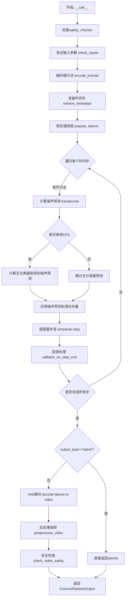
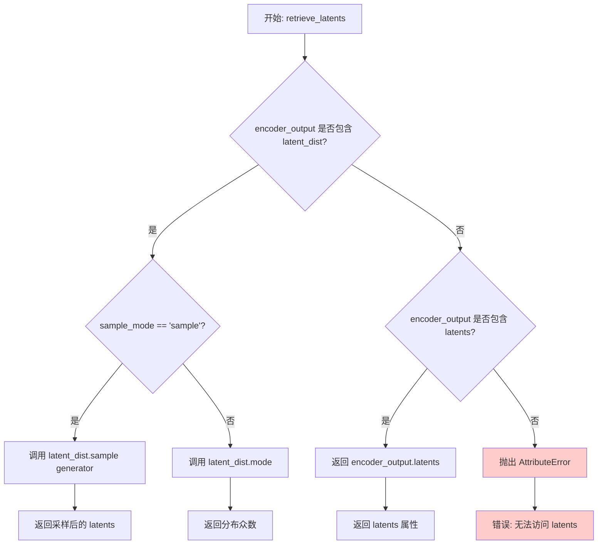
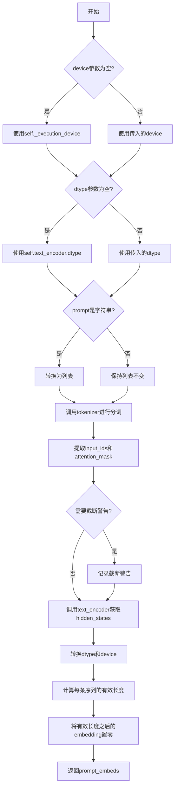
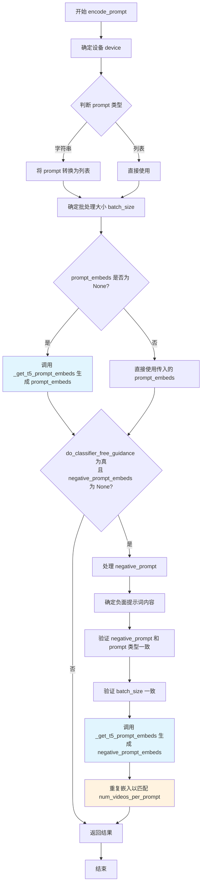
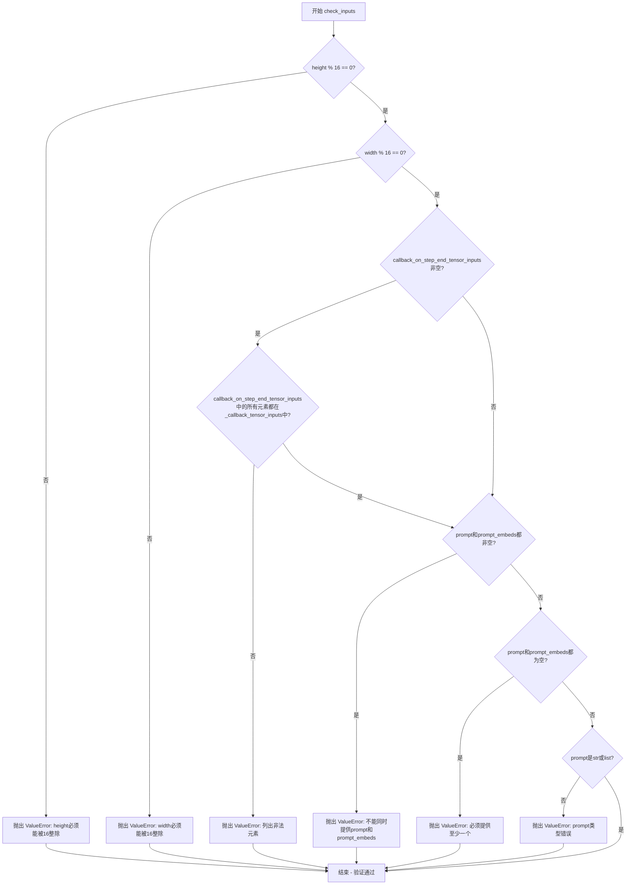
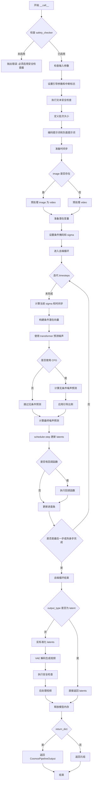
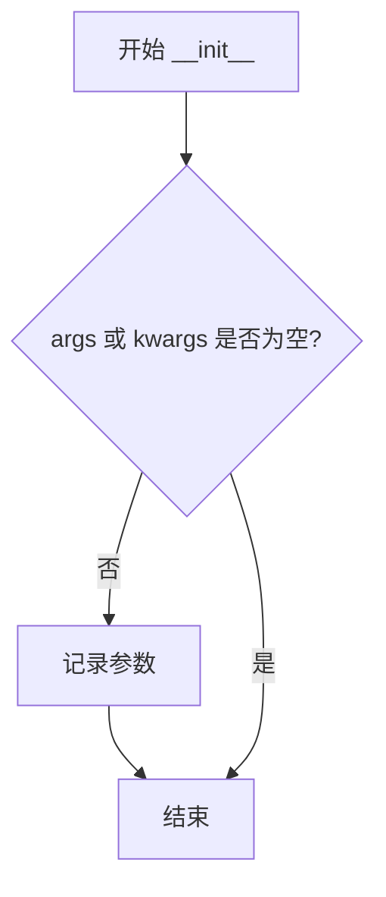
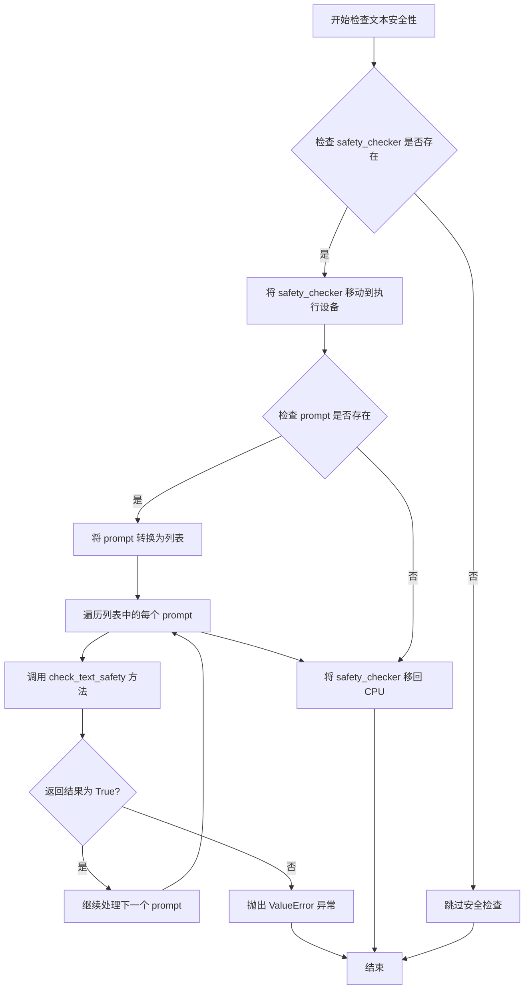
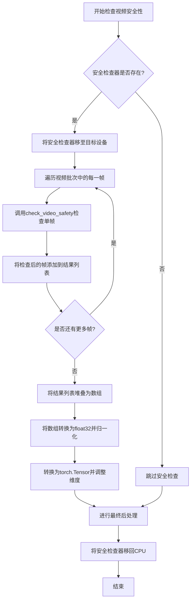

# `diffusers\src\diffusers\pipelines\cosmos\pipeline_cosmos2_video2world.py` 详细设计文档

NVIDIA Cosmos 2 Video-to-World diffusion pipeline that generates video worlds from image/video conditioning inputs using a T5 text encoder, transformer-based denoising, and VAE encoding/decoding, with integrated safety checking via Cosmos Guardrail.

## 整体流程



## 类结构

```
DiffusionPipeline (基类)
└── Cosmos2VideoToWorldPipeline
    ├── 依赖模块: T5EncoderModel, T5TokenizerFast
    ├── 依赖模块: CosmosTransformer3DModel, AutoencoderKLWan
    ├── 依赖模块: FlowMatchEulerDiscreteScheduler
    └── 依赖模块: CosmosSafetyChecker (可选)
```

## 全局变量及字段


### `DEFAULT_NEGATIVE_PROMPT`
    
默认负面提示词，用于引导模型避免生成低质量视频内容

类型：`str`
    


### `EXAMPLE_DOC_STRING`
    
示例文档字符串，包含管道使用示例和代码说明

类型：`str`
    


### `logger`
    
模块日志记录器，用于输出管道运行时的日志信息

类型：`logging.Logger`
    


### `XLA_AVAILABLE`
    
Torch XLA可用性标志，指示是否可以使用XLA加速

类型：`bool`
    


### `model_cpu_offload_seq`
    
CPU卸载顺序，指定模型组件从GPU卸载到CPU的顺序

类型：`str`
    


### `_callback_tensor_inputs`
    
回调张量输入列表，定义哪些张量可以传递给回调函数

类型：`list`
    


### `_optional_components`
    
可选组件列表，标识管道中的可选模块如safety_checker

类型：`list`
    


### `Cosmos2VideoToWorldPipeline.text_encoder`
    
T5文本编码器，用于将文本提示转换为嵌入向量

类型：`T5EncoderModel`
    


### `Cosmos2VideoToWorldPipeline.tokenizer`
    
T5分词器，用于将文本分割成token序列

类型：`T5TokenizerFast`
    


### `Cosmos2VideoToWorldPipeline.transformer`
    
条件Transformer去噪模型，用于在潜在空间中执行去噪操作生成视频

类型：`CosmosTransformer3DModel`
    


### `Cosmos2VideoToWorldPipeline.vae`
    
VAE编码器/解码器，用于在像素空间和潜在空间之间转换视频

类型：`AutoencoderKLWan`
    


### `Cosmos2VideoToWorldPipeline.scheduler`
    
流量匹配调度器，控制去噪过程中的噪声调度

类型：`FlowMatchEulerDiscreteScheduler`
    


### `Cosmos2VideoToWorldPipeline.safety_checker`
    
安全检查器，用于检测和过滤不安全的内容

类型：`CosmosSafetyChecker`
    


### `Cosmos2VideoToWorldPipeline.video_processor`
    
视频处理器，用于视频的预处理和后处理操作

类型：`VideoProcessor`
    


### `Cosmos2VideoToWorldPipeline.vae_scale_factor_temporal`
    
VAE时间下采样因子，用于计算潜在帧数

类型：`int`
    


### `Cosmos2VideoToWorldPipeline.vae_scale_factor_spatial`
    
VAE空间下采样因子，用于计算潜在空间维度

类型：`int`
    


### `Cosmos2VideoToWorldPipeline.sigma_max`
    
最大噪声sigma值，定义扩散过程的最大噪声水平

类型：`float`
    


### `Cosmos2VideoToWorldPipeline.sigma_min`
    
最小噪声sigma值，定义扩散过程的最小噪声水平

类型：`float`
    


### `Cosmos2VideoToWorldPipeline.sigma_data`
    
数据sigma值，用于归一化潜在表示

类型：`float`
    


### `Cosmos2VideoToWorldPipeline.final_sigmas_type`
    
最终sigma类型，指定调度器最后一步的sigma处理方式

类型：`str`
    
    

## 全局函数及方法


### `retrieve_timesteps`

该函数是扩散pipeline的辅助函数，用于调用调度器的`set_timesteps`方法并从中获取时间步调度。它支持自定义时间步或sigma值，并处理不同调度器的兼容性检查。

参数：

- `scheduler`：`SchedulerMixin`，调度器对象，用于获取时间步
- `num_inference_steps`：`int | None`，扩散推理步数，若使用则`timesteps`必须为`None`
- `device`：`str | torch.device | None`，时间步要移动到的设备，若为`None`则不移动
- `timesteps`：`list[int] | None`，自定义时间步列表，用于覆盖调度器的时间步间隔策略
- `sigmas`：`list[float] | None`，自定义sigma列表，用于覆盖调度器的sigma间隔策略
- `**kwargs`：可变关键字参数，将传递给调度器的`set_timesteps`方法

返回值：`tuple[torch.Tensor, int]`，第一个元素是调度器的时间步张量，第二个元素是推理步数

#### 流程图

```mermaid
flowchart TD
    A[开始] --> B{检查: timesteps 和 sigmas 是否同时存在?}
    B -->|是| C[抛出 ValueError: 只能选择一个]
    B -->|否| D{检查: timesteps 是否存在?}
    D -->|是| E{检查: scheduler.set_timesteps 是否接受 timesteps 参数?}
    E -->|否| F[抛出 ValueError: 当前调度器不支持自定义 timesteps]
    E -->|是| G[调用 scheduler.set_timesteps<br/>参数: timesteps=timesteps, device=device, **kwargs]
    G --> H[获取 scheduler.timesteps]
    H --> I[计算 num_inference_steps = len(timesteps)]
    I --> J[返回 timesteps, num_inference_steps]
    D -->|否| K{检查: sigmas 是否存在?}
    K -->|是| L{检查: scheduler.set_timesteps 是否接受 sigmas 参数?}
    L -->|否| M[抛出 ValueError: 当前调度器不支持自定义 sigmas]
    L -->|是| N[调用 scheduler.set_timesteps<br/>参数: sigmas=sigmas, device=device, **kwargs]
    N --> O[获取 scheduler.timesteps]
    O --> P[计算 num_inference_steps = len(timesteps)]
    P --> J
    K -->|否| Q[调用 scheduler.set_timesteps<br/>参数: num_inference_steps, device=device, **kwargs]
    Q --> R[获取 scheduler.timesteps]
    R --> J
```

#### 带注释源码

```python
def retrieve_timesteps(
    scheduler,
    num_inference_steps: int | None = None,
    device: str | torch.device | None = None,
    timesteps: list[int] | None = None,
    sigmas: list[float] | None = None,
    **kwargs,
):
    r"""
    Calls the scheduler's `set_timesteps` method and retrieves timesteps from the scheduler after the call. Handles
    custom timesteps. Any kwargs will be supplied to `scheduler.set_timesteps`.

    Args:
        scheduler (`SchedulerMixin`):
            The scheduler to get timesteps from.
        num_inference_steps (`int`):
            The number of diffusion steps used when generating samples with a pre-trained model. If used, `timesteps`
            must be `None`.
        device (`str` or `torch.device`, *optional*):
            The device to which the timesteps should be moved to. If `None`, the timesteps are not moved.
        timesteps (`list[int]`, *optional*):
            Custom timesteps used to override the timestep spacing strategy of the scheduler. If `timesteps` is passed,
            `num_inference_steps` and `sigmas` must be `None`.
        sigmas (`list[float]`, *optional*):
            Custom sigmas used to override the timestep spacing strategy of the scheduler. If `sigmas` is passed,
            `num_inference_steps` and `timesteps` must be `None`.

    Returns:
        `tuple[torch.Tensor, int]`: A tuple where the first element is the timestep schedule from the scheduler and the
        second element is the number of inference steps.
    """
    # 验证参数：timesteps 和 sigmas 不能同时传递
    if timesteps is not None and sigmas is not None:
        raise ValueError("Only one of `timesteps` or `sigmas` can be passed. Please choose one to set custom values")
    
    # 分支1：使用自定义时间步
    if timesteps is not None:
        # 检查调度器是否支持自定义时间步
        accepts_timesteps = "timesteps" in set(inspect.signature(scheduler.set_timesteps).parameters.keys())
        if not accepts_timesteps:
            raise ValueError(
                f"The current scheduler class {scheduler.__class__}'s `set_timesteps` does not support custom"
                f" timestep schedules. Please check whether you are using the correct scheduler."
            )
        # 调用调度器的 set_timesteps 方法
        scheduler.set_timesteps(timesteps=timesteps, device=device, **kwargs)
        timesteps = scheduler.timesteps
        num_inference_steps = len(timesteps)
    
    # 分支2：使用自定义 sigmas
    elif sigmas is not None:
        # 检查调度器是否支持自定义 sigmas
        accept_sigmas = "sigmas" in set(inspect.signature(scheduler.set_timesteps).parameters.keys())
        if not accept_sigmas:
            raise ValueError(
                f"The current scheduler class {scheduler.__class__}'s `set_timesteps` does not support custom"
                f" sigmas schedules. Please check whether you are using the correct scheduler."
            )
        # 调用调度器的 set_timesteps 方法
        scheduler.set_timesteps(sigmas=sigmas, device=device, **kwargs)
        timesteps = scheduler.timesteps
        num_inference_steps = len(timesteps)
    
    # 分支3：使用默认推理步数
    else:
        scheduler.set_timesteps(num_inference_steps, device=device, **kwargs)
        timesteps = scheduler.timesteps
    
    # 返回时间步张量和推理步数
    return timesteps, num_inference_steps
```


### `retrieve_latents`

该函数用于从编码器输出中提取潜在向量（latents），支持三种模式：从潜在分布中采样、获取潜在分布的众数（mode），或直接访问编码器输出中的 latents 属性。

参数：

- `encoder_output`：`torch.Tensor`，编码器输出对象，通常包含 `latent_dist` 或 `latents` 属性
- `generator`：`torch.Generator | None`，可选的随机数生成器，用于控制采样过程的随机性
- `sample_mode`：`str`，采样模式，默认为 "sample"，可选值为 "sample"（从分布采样）或 "argmax"（取分布的众数）

返回值：`torch.Tensor`，从编码器输出中提取的潜在向量

#### 流程图



#### 带注释源码

```python
# Copied from diffusers.pipelines.stable_diffusion.pipeline_stable_diffusion_img2img.retrieve_latents
def retrieve_latents(
    encoder_output: torch.Tensor, generator: torch.Generator | None = None, sample_mode: str = "sample"
):
    """
    从编码器输出中提取潜在向量。
    
    该函数支持三种提取方式：
    1. 当 encoder_output 包含 latent_dist 属性且 sample_mode="sample" 时，从分布中采样
    2. 当 encoder_output 包含 latent_dist 属性且 sample_mode="argmax" 时，获取分布的众数
    3. 当 encoder_output 包含 latents 属性时，直接返回该属性
    
    Args:
        encoder_output: 编码器输出对象，通常是 VAE 编码后的输出
        generator: 可选的随机数生成器，用于控制采样随机性
        sample_mode: 采样模式，"sample" 从分布采样，"argmax" 取众数
    
    Returns:
        torch.Tensor: 提取的潜在向量
    
    Raises:
        AttributeError: 当 encoder_output 既不包含 latent_dist 也不包含 latents 属性时
    """
    # 检查编码器输出是否包含 latent_dist 属性（Variational Autoencoder 的典型输出）
    if hasattr(encoder_output, "latent_dist") and sample_mode == "sample":
        # 模式1：从潜在分布中采样，使用 generator 控制随机性
        return encoder_output.latent_dist.sample(generator)
    # 检查是否需要获取分布的众数（确定性模式）
    elif hasattr(encoder_output, "latent_dist") and sample_mode == "argmax":
        # 模式2：返回潜在分布的众数（最大值对应的潜在向量）
        return encoder_output.latent_dist.mode()
    # 检查编码器输出是否直接包含 latents 属性
    elif hasattr(encoder_output, "latents"):
        # 模式3：直接返回预计算的 latents
        return encoder_output.latents
    else:
        # 错误处理：编码器输出格式不符合预期
        raise AttributeError("Could not access latents of provided encoder_output")
```


### `Cosmos2VideoToWorldPipeline.__init__`

该方法是 `Cosmos2VideoToWorldPipeline` 类的构造函数，负责初始化视频到世界（Video-to-World）生成管道所需的所有核心组件，包括文本编码器、分词器、Transformer模型、VAE模型、调度器以及安全检查器，并配置相关的缩放因子和sigma参数。

参数：

- `text_encoder`：`T5EncoderModel`，Frozen文本编码器，Cosmos使用T5模型（t5-11b变体）
- `tokenizer`：`T5TokenizerFast`，T5分词器，用于对文本进行分词处理
- `transformer`：`CosmosTransformer3DModel`，条件Transformer模型，用于对编码的图像潜向量进行去噪
- `vae`：`AutoencoderKLWan`，变分自编码器模型，用于对视频进行编码和解码，转换到/从潜向量表示
- `scheduler`：`FlowMatchEulerDiscreteScheduler`，调度器，与Transformer配合使用对编码的图像潜向量进行去噪
- `safety_checker`：`CosmosSafetyChecker`，可选参数，安全检查器，用于检测不安全的内容

返回值：`None`，构造函数不返回任何值，仅初始化对象状态

#### 流程图

```mermaid
flowchart TD
    A[开始 __init__] --> B{检查 safety_checker 是否为 None}
    B -->|是| C[创建 CosmosSafetyChecker 实例]
    B -->|否| D[使用传入的 safety_checker]
    C --> E[调用 super().__init__]
    D --> E
    E --> F[register_modules 注册所有模块]
    F --> G[计算 vae_scale_factor_temporal]
    G --> H[计算 vae_scale_factor_spatial]
    H --> I[创建 VideoProcessor 实例]
    I --> J[设置 sigma_max = 80.0]
    J --> K[设置 sigma_min = 0.002]
    K --> L[设置 sigma_data = 1.0]
    L --> M[设置 final_sigmas_type = 'sigma_min']
    M --> N{检查 scheduler 是否存在}
    N -->|是| O[注册配置到 scheduler]
    N -->|否| P[结束 __init__]
    O --> P
```

#### 带注释源码

```python
def __init__(
    self,
    text_encoder: T5EncoderModel,
    tokenizer: T5TokenizerFast,
    transformer: CosmosTransformer3DModel,
    vae: AutoencoderKLWan,
    scheduler: FlowMatchEulerDiscreteScheduler,
    safety_checker: CosmosSafetyChecker = None,
):
    """
    初始化 Cosmos2VideoToWorldPipeline 管道
    
    参数:
        text_encoder: Frozen text-encoder, Cosmos使用T5 (t5-11b变体)
        tokenizer: T5TokenizerFast分词器
        transformer: CosmosTransformer3DModel条件Transformer
        scheduler: FlowMatchEulerDiscreteScheduler去噪调度器
        vae: AutoencoderKLWan变分自编码器
        safety_checker: 可选的安全检查器
    """
    # 调用父类 DiffusionPipeline 的初始化方法
    super().__init__()
    
    # 如果未提供安全检查器，则创建一个默认实例
    # 这会抛出ImportError如果cosmos_guardrail未安装
    if safety_checker is None:
        safety_checker = CosmosSafetyChecker()
    
    # 将所有模型组件注册到管道中，便于后续管理和保存/加载
    self.register_modules(
        vae=vae,
        text_encoder=text_encoder,
        tokenizer=tokenizer,
        transformer=transformer,
        scheduler=scheduler,
        safety_checker=safety_checker,
    )
    
    # 计算VAE的时间缩放因子：基于VAE的temporal_downsample属性
    # 用于将视频帧数映射到潜空间帧数
    self.vae_scale_factor_temporal = 2 ** sum(self.vae.temperal_downsample) if getattr(self, "vae", None) else 4
    
    # 计算VAE的空间缩放因子：用于将图像尺寸映射到潜空间尺寸
    self.vae_scale_factor_spatial = 2 ** len(self.vae.temperal_downsample) if getattr(self, "vae", None) else 8
    
    # 创建视频处理器，用于预处理输入视频和后处理输出视频
    self.video_processor = VideoProcessor(vae_scale_factor=self.vae_scale_factor_spatial)
    
    # 设置Flow Match相关的sigma参数，用于控制去噪过程的噪声水平
    self.sigma_max = 80.0       # 最大sigma值，控制初始噪声水平
    self.sigma_min = 0.002      # 最小sigma值，控制最终噪声水平
    self.sigma_data = 1.0       # 数据sigma，用于归一化
    self.final_sigmas_type = "sigma_min"  # 最终sigma类型
    
    # 如果调度器存在，将sigma配置注册到调度器中
    if self.scheduler is not None:
        self.scheduler.register_to_config(
            sigma_max=self.sigma_max,
            sigma_min=self.sigma_min,
            sigma_data=self.sigma_data,
            final_sigmas_type=self.final_sigmas_type,
        )
```


### `Cosmos2VideoToWorldPipeline._get_t5_prompt_embeds`

该方法用于将文本提示（prompt）编码为T5文本编码器的隐藏状态（embedding）。它接收原始文本输入，通过T5分词器进行分词和编码，然后使用T5编码器模型生成文本嵌入向量，供后续的视频生成管道使用。

参数：

- `prompt`：`str | list[str]`，待编码的文本提示，可以是单个字符串或字符串列表
- `max_sequence_length`：`int`，最大序列长度，默认为512个token
- `device`：`torch.device | None`，执行设备，如果为None则使用管道的执行设备
- `dtype`：`torch.dtype | None`，返回的嵌入向量的数据类型，如果为None则使用文本编码器的数据类型

返回值：`torch.Tensor`，形状为`(batch_size, seq_len, hidden_size)`的文本嵌入张量

#### 流程图



#### 带注释源码

```python
def _get_t5_prompt_embeds(
    self,
    prompt: str | list[str] = None,
    max_sequence_length: int = 512,
    device: torch.device | None = None,
    dtype: torch.dtype | None = None,
):
    """
    将文本提示编码为T5文本编码器的隐藏状态
    
    参数:
        prompt: 输入的文本提示，可以是单个字符串或字符串列表
        max_sequence_length: 分词后的最大序列长度
        device: 计算设备
        dtype: 返回张量的数据类型
    
    返回:
        文本嵌入张量，形状为 (batch_size, seq_len, hidden_size)
    """
    # 确定设备：如果未指定则使用管道的执行设备
    device = device or self._execution_device
    # 确定数据类型：如果未指定则使用文本编码器的数据类型
    dtype = dtype or self.text_encoder.dtype
    # 标准化输入：如果是单个字符串则转换为列表
    prompt = [prompt] if isinstance(prompt, str) else prompt

    # 使用T5分词器对提示进行分词
    # padding="max_length": 将所有序列填充到max_sequence_length
    # truncation=True: 超过max_sequence_length的序列进行截断
    # return_tensors="pt": 返回PyTorch张量
    # return_length=True: 返回每个序列的实际长度
    text_inputs = self.tokenizer(
        prompt,
        padding="max_length",
        max_length=max_sequence_length,
        truncation=True,
        return_tensors="pt",
        return_length=True,
        return_offsets_mapping=False,
    )
    # 提取分词后的input_ids和attention_mask
    text_input_ids = text_inputs.input_ids
    # 将attention_mask转换为布尔值并移动到指定设备
    prompt_attention_mask = text_inputs.attention_mask.bool().to(device)

    # 检查是否存在因max_sequence_length限制而被截断的文本
    # 使用padding="longest"获取未截断的版本进行比较
    untruncated_ids = self.tokenizer(prompt, padding="longest", return_tensors="pt").input_ids
    # 如果未截断的序列长度大于截断后的长度，且两者不相等，说明有文本被截断
    if untruncated_ids.shape[-1] >= text_input_ids.shape[-1] and not torch.equal(text_input_ids, untruncated_ids):
        # 解码被截断的部分并记录警告
        removed_text = self.tokenizer.batch_decode(untruncated_ids[:, max_sequence_length - 1 : -1])
        logger.warning(
            "The following part of your input was truncated because `max_sequence_length` is set to "
            f" {max_sequence_length} tokens: {removed_text}"
        )

    # 调用T5文本编码器获取隐藏状态
    # text_input_ids: 分词后的输入ID
    # attention_mask: 注意力掩码，标识哪些位置是有效的
    prompt_embeds = self.text_encoder(
        text_input_ids.to(device), attention_mask=prompt_attention_mask
    ).last_hidden_state
    # 转换嵌入向量的数据类型和设备
    prompt_embeds = prompt_embeds.to(dtype=dtype, device=device)

    # 计算每条序列的有效长度（非padding的位置）
    lengths = prompt_attention_mask.sum(dim=1).cpu()
    # 将有效长度之后的embedding置零，避免padding位置对后续计算造成干扰
    for i, length in enumerate(lengths):
        prompt_embeds[i, length:] = 0

    return prompt_embeds
```


### `Cosmos2VideoToWorldPipeline.encode_prompt`

该方法用于将文本提示词（prompt）和负面提示词（negative_prompt）编码为文本编码器（text encoder）的隐藏状态（hidden states），以便后续用于视频生成。它支持无分类器自由引导（classifier-free guidance），并能处理批量生成和每个提示词生成多个视频的场景。

参数：

- `prompt`：`str | list[str]`，要编码的提示词，可以是单个字符串或字符串列表
- `negative_prompt`：`str | list[str] | None`，用于引导图像生成的负面提示词，如果不定义则需要传递 `negative_prompt_embeds`
- `do_classifier_free_guidance`：`bool`，是否使用无分类器自由引导，默认为 True
- `num_videos_per_prompt`：`int`，每个提示词应生成的视频数量，默认为 1
- `prompt_embeds`：`torch.Tensor | None`，预生成的文本嵌入，可用于轻松调整文本输入
- `negative_prompt_embeds`：`torch.Tensor | None`，预生成的负面文本嵌入
- `max_sequence_length`：`int`，提示词的最大令牌数，默认为 512
- `device`：`torch.device | None`，torch 设备
- `dtype`：`torch.dtype | None`，torch 数据类型

返回值：`tuple[torch.Tensor, torch.Tensor]`，返回提示词嵌入和负面提示词嵌入的元组

#### 流程图



#### 带注释源码

```python
def encode_prompt(
    self,
    prompt: str | list[str],
    negative_prompt: str | list[str] | None = None,
    do_classifier_free_guidance: bool = True,
    num_videos_per_prompt: int = 1,
    prompt_embeds: torch.Tensor | None = None,
    negative_prompt_embeds: torch.Tensor | None = None,
    max_sequence_length: int = 512,
    device: torch.device | None = None,
    dtype: torch.dtype | None = None,
):
    r"""
    Encodes the prompt into text encoder hidden states.

    Args:
        prompt (`str` or `list[str]`, *optional*):
            prompt to be encoded
        negative_prompt (`str` or `list[str]`, *optional*):
            The prompt or prompts not to guide the image generation. If not defined, one has to pass
            `negative_prompt_embeds` instead. Ignored when not using guidance (i.e., ignored if `guidance_scale` is
            less than `1`).
        do_classifier_free_guidance (`bool`, *optional*, defaults to `True`):
            Whether to use classifier free guidance or not.
        num_videos_per_prompt (`int`, *optional*, defaults to 1):
            Number of videos that should be generated per prompt. torch device to place the resulting embeddings on
        prompt_embeds (`torch.Tensor`, *optional*):
            Pre-generated text embeddings. Can be used to easily tweak text inputs, *e.g.* prompt weighting. If not
            provided, text embeddings will be generated from `prompt` input argument.
        negative_prompt_embeds (`torch.Tensor`, *optional*):
            Pre-generated negative text embeddings. Can be used to easily tweak text inputs, *e.g.* prompt
            weighting. If not provided, negative_prompt_embeds will be generated from `negative_prompt` input
            argument.
        device: (`torch.device`, *optional*):
            torch device
        dtype: (`torch.dtype`, *optional*):
            torch dtype
    """
    # 确定执行设备，如果未提供则使用当前执行设备
    device = device or self._execution_device

    # 将 prompt 转换为列表，如果是单个字符串则包装为列表
    prompt = [prompt] if isinstance(prompt, str) else prompt
    
    # 确定批处理大小：如果有 prompt 则使用其长度，否则使用 prompt_embeds 的批次大小
    if prompt is not None:
        batch_size = len(prompt)
    else:
        batch_size = prompt_embeds.shape[0]

    # 如果未提供 prompt_embeds，则从 prompt 生成
    if prompt_embeds is None:
        # 调用内部方法 _get_t5_prompt_embeds 生成文本嵌入
        prompt_embeds = self._get_t5_prompt_embeds(
            prompt=prompt, max_sequence_length=max_sequence_length, device=device, dtype=dtype
        )

        # 为每个提示词的每次生成复制文本嵌入（使用 mps 友好的方法）
        # 获取序列长度
        _, seq_len, _ = prompt_embeds.shape
        # 重复嵌入以支持多个视频生成
        prompt_embeds = prompt_embeds.repeat(1, num_videos_per_prompt, 1)
        # 调整形状以匹配批处理大小
        prompt_embeds = prompt_embeds.view(batch_size * num_videos_per_prompt, seq_len, -1)

    # 如果使用无分类器自由引导且未提供 negative_prompt_embeds，则生成负面嵌入
    if do_classifier_free_guidance and negative_prompt_embeds is None:
        # 如果未提供负面提示词，则使用默认负面提示词
        negative_prompt = negative_prompt if negative_prompt is not None else DEFAULT_NEGATIVE_PROMPT
        # 将负面提示词扩展为批处理大小
        negative_prompt = batch_size * [negative_prompt] if isinstance(negative_prompt, str) else negative_prompt

        # 验证 negative_prompt 和 prompt 类型一致
        if prompt is not None and type(prompt) is not type(negative_prompt):
            raise TypeError(
                f"`negative_prompt` should be the same type to `prompt`, but got {type(negative_prompt)} !="
                f" {type(prompt)}."
            )
        # 验证批处理大小一致
        elif batch_size != len(negative_prompt):
            raise ValueError(
                f"`negative_prompt`: {negative_prompt} has batch size {len(negative_prompt)}, but `prompt`:"
                f" {prompt} has batch size {batch_size}. Please make sure that passed `negative_prompt` matches"
                " the batch size of `prompt`."
            )

        # 调用内部方法生成负面提示词嵌入
        negative_prompt_embeds = self._get_t5_prompt_embeds(
            prompt=negative_prompt, max_sequence_length=max_sequence_length, device=device, dtype=dtype
        )

        # 为每个提示词的每次生成复制负面文本嵌入
        _, seq_len, _ = negative_prompt_embeds.shape
        negative_prompt_embeds = negative_prompt_embeds.repeat(1, num_videos_per_prompt, 1)
        negative_prompt_embeds = negative_prompt_embeds.view(batch_size * num_videos_per_prompt, seq_len, -1)

    # 返回提示词嵌入和负面提示词嵌入
    return prompt_embeds, negative_prompt_embeds
```


### `Cosmos2VideoToWorldPipeline.prepare_latents`

该方法负责为视频到世界的生成流程准备潜在向量（latents）。它将输入视频编码为潜在表示，处理条件帧与生成帧的对应关系，并创建用于无分类器自由引导（CFG）的条件掩码。

参数：

- `self`：`Cosmos2VideoToWorldPipeline`，管道实例本身
- `video`：`torch.Tensor`，输入视频张量，形状为 (batch_size, C, T, H, W)，其中 T 是帧数
- `batch_size`：`int`，批处理大小
- `num_channels_latents`：`int`，潜在通道数，默认 16
- `height`：`int`，生成视频的高度，默认 704
- `width`：`int`，生成视频的宽度，默认 1280
- `num_frames`：`int`，生成的视频总帧数，默认 93
- `do_classifier_free_guidance`：`bool`，是否启用无分类器自由引导，默认 True
- `dtype`：`torch.dtype | None`，潜在张量的数据类型
- `device`：`torch.device | None`，设备对象
- `generator`：`torch.Generator | list[torch.Generator] | None`，随机数生成器，用于生成确定性随机潜在向量
- `latents`：`torch.Tensor | None`，预生成的潜在向量，如果为 None 则随机生成

返回值：`tuple[torch.Tensor, torch.Tensor, torch.Tensor, torch.Tensor, torch.Tensor, torch.Tensor]`，返回元组包含：
- `latents`：主潜在向量，用于去噪过程
- `init_latents`：从视频编码的初始潜在向量（条件信息）
- `cond_indicator`：条件指示器，标记哪些帧是条件帧
- `uncond_indicator`：无条件指示器（CFG 时使用）
- `cond_mask`：条件掩码，用于控制条件帧的注意力
- `uncond_mask`：无条件掩码（CFG 时使用）

#### 流程图

```mermaid
flowchart TD
    A[开始 prepare_latents] --> B{generator list长度<br/>是否等于batch_size?}
    B -->|否| C[抛出ValueError]
    B -->|是| D[获取条件帧数量<br/>num_cond_frames = video.size(2)]
    D --> E{条件帧数 >=<br/>目标帧数?}
    E -->|是| F[截取最后num_frames帧<br/>计算条件潜在帧数]
    E -->|否| G[计算填充帧数<br/>用最后一帧填充]
    F --> H[使用VAE编码视频]
    G --> H
    H --> I[retrieve_latents获取潜在分布]
    I --> J[标准化latents<br/>使用VAE mean/std和sigma_data]
    J --> K[计算潜在空间形状<br/>batch_size × channels × frames × H × W]
    K --> L{latents是否<br/>为None?}
    L -->|是| M[使用randn_tensor<br/>生成随机潜在向量]
    L -->|否| N[使用传入的latents]
    M --> O[乘以sigma_max进行缩放]
    N --> O
    O --> P[创建条件指示器<br/>cond_indicator]
    P --> Q[创建条件掩码<br/>cond_mask]
    Q --> R{do_classifier<br/>free_guidance?}
    R -->|是| S[创建无条件掩码<br/>uncond_mask]
    R -->|否| T[uncond相关为None]
    S --> U[返回latents, init_latents<br/>cond_indicator, uncond_indicator<br/>cond_mask, uncond_mask]
    T --> U
```

#### 带注释源码

```python
def prepare_latents(
    self,
    video: torch.Tensor,
    batch_size: int,
    num_channels_latents: 16,
    height: int = 704,
    width: int = 1280,
    num_frames: int = 93,
    do_classifier_free_guidance: bool = True,
    dtype: torch.dtype | None = None,
    device: torch.device | None = None,
    generator: torch.Generator | list[torch.Generator] | None = None,
    latents: torch.Tensor | None = None,
) -> torch.Tensor:
    # 1. 验证生成器列表长度与批处理大小是否匹配
    if isinstance(generator, list) and len(generator) != batch_size:
        raise ValueError(
            f"You have passed a list of generators of length {len(generator)}, but requested an effective batch"
            f" size of {batch_size}. Make sure the batch size matches the length of the generators."
        )

    # 2. 获取条件帧数量（输入视频的帧数）
    num_cond_frames = video.size(2)
    
    # 3. 根据条件帧数与目标帧数的关系，处理视频帧
    if num_cond_frames >= num_frames:
        # 如果条件帧足够，取最后num_frames帧用于条件
        # 计算对应的潜在帧数（考虑VAE的时间下采样）
        num_cond_latent_frames = (num_frames - 1) // self.vae_scale_factor_temporal + 1
        video = video[:, :, -num_frames:]  # 截取最后num_frames帧
    else:
        # 如果条件帧不足，用最后一帧填充
        num_cond_latent_frames = (num_cond_frames - 1) // self.vae_scale_factor_temporal + 1
        num_padding_frames = num_frames - num_cond_frames  # 需要填充的帧数
        last_frame = video[:, :, -1:]  # 获取最后一帧
        # 重复最后一帧进行填充
        padding = last_frame.repeat(1, 1, num_padding_frames, 1, 1)
        # 在时间维度上拼接
        video = torch.cat([video, padding], dim=2)

    # 4. 使用VAE编码视频并获取潜在向量
    if isinstance(generator, list):
        # 如果有多个生成器，为每个样本单独编码
        init_latents = [
            retrieve_latents(self.vae.encode(video[i].unsqueeze(0)), generator=generator[i])
            for i in range(batch_size)
        ]
    else:
        # 使用单个生成器或无生成器
        init_latents = [retrieve_latents(self.vae.encode(vid.unsqueeze(0)), generator) for vid in video]

    # 5. 将所有潜在向量拼接并转换类型
    init_latents = torch.cat(init_latents, dim=0).to(dtype)

    # 6. 计算潜在向量的均值和标准差，用于标准化
    # 从VAE配置中获取latents_mean并调整形状为 (1, z_dim, 1, 1, 1)
    latents_mean = (
        torch.tensor(self.vae.config.latents_mean).view(1, self.vae.config.z_dim, 1, 1, 1).to(device, dtype)
    )
    # 从VAE配置中获取latents_std
    latents_std = (
        torch.tensor(self.vae.config.latents_std).view(1, self.vae.config.z_dim, 1, 1, 1).to(device, dtype)
    )
    # 标准化：减去均值，除以标准差，再乘以scheduler的sigma_data
    init_latents = (init_latents - latents_mean) / latents_std * self.scheduler.config.sigma_data

    # 7. 计算潜在空间的形状（考虑VAE的空间和时间下采样）
    num_latent_frames = (num_frames - 1) // self.vae_scale_factor_temporal + 1
    latent_height = height // self.vae_scale_factor_spatial
    latent_width = width // self.vae_scale_factor_spatial
    # 形状: (batch_size, channels, latent_frames, latent_height, latent_width)
    shape = (batch_size, num_channels_latents, num_latent_frames, latent_height, latent_width)

    # 8. 初始化主潜在向量
    if latents is None:
        # 随机生成潜在向量
        latents = randn_tensor(shape, generator=generator, device=device, dtype=dtype)
    else:
        # 使用传入的潜在向量
        latents = latents.to(device=device, dtype=dtype)

    # 9. 使用sigma_max缩放潜在向量（这是Flow Match Scheduler的标准做法）
    latents = latents * self.scheduler.config.sigma_max

    # 10. 创建用于条件帧的指示器和掩码
    # 形状: (batch_size, 1, num_latent_frames, 1, 1)
    padding_shape = (batch_size, 1, num_latent_frames, latent_height, latent_width)
    ones_padding = latents.new_ones(padding_shape)
    zeros_padding = latents.new_zeros(padding_shape)

    # 条件指示器：前num_cond_latent_frames帧标记为1.0（条件帧），其余为0.0（生成帧）
    cond_indicator = latents.new_zeros(1, 1, latents.size(2), 1, 1)
    cond_indicator[:, :, :num_cond_latent_frames] = 1.0
    # 条件掩码：条件帧位置为1.0，生成帧位置为0.0
    cond_mask = cond_indicator * ones_padding + (1 - cond_indicator) * zeros_padding

    # 11. 如果启用CFG，创建无条件指示器和掩码
    uncond_indicator = uncond_mask = None
    if do_classifier_free_guidance:
        # 无条件指示器与条件指示器相同
        uncond_indicator = latents.new_zeros(1, 1, latents.size(2), 1, 1)
        uncond_indicator[:, :, :num_cond_latent_frames] = 1.0
        # 无条件掩码
        uncond_mask = uncond_indicator * ones_padding + (1 - uncond_indicator) * zeros_padding

    # 12. 返回所有准备的张量
    return latents, init_latents, cond_indicator, uncond_indicator, cond_mask, uncond_mask
```


### `Cosmos2VideoToWorldPipeline.check_inputs`

该方法用于验证视频生成管道的输入参数是否合法，确保用户提供的参数符合模型要求，包括图像尺寸必须能被16整除、回调张量输入必须在允许列表中、以及prompt和prompt_embeds不能同时提供等。

参数：

- `prompt`：`str | list[str] | None`，用户提供的文本提示，用于指导视频生成
- `height`：`int`，生成视频的高度（像素），必须能被16整除
- `width`：`int`，生成视频的宽度（像素），必须能被16整除
- `prompt_embeds`：`torch.Tensor | None`，预生成的文本嵌入向量，不能与prompt同时提供
- `callback_on_step_end_tensor_inputs`：`list[str] | None`，在每个去噪步骤结束时回调的张量输入列表，必须是`_callback_tensor_inputs`属性的子集

返回值：`None`，该方法不返回任何值，仅通过抛出`ValueError`异常来处理无效输入

#### 流程图



#### 带注释源码

```
def check_inputs(
    self,
    prompt,
    height,
    width,
    prompt_embeds=None,
    callback_on_step_end_tensor_inputs=None,
):
    # 验证图像高度和宽度必须能被16整除，以满足模型的空间下采样要求
    if height % 16 != 0 or width % 16 != 0:
        raise ValueError(f"`height` and `width` have to be divisible by 16 but are {height} and {width}.")

    # 验证回调函数中指定的张量输入必须在允许的列表中
    # _callback_tensor_inputs定义了可以在回调中使用的张量类型
    if callback_on_step_end_tensor_inputs is not None and not all(
        k in self._callback_tensor_inputs for k in callback_on_step_end_tensor_inputs
    ):
        raise ValueError(
            f"`callback_on_step_end_tensor_inputs` has to be in {self._callback_tensor_inputs}, but found {[k for k in callback_on_step_end_tensor_inputs if k not in self._callback_tensor_inputs]}"
        )

    # 验证prompt和prompt_embeds不能同时提供，只能选择其中一种方式传递文本条件
    if prompt is not None and prompt_embeds is not None:
        raise ValueError(
            f"Cannot forward both `prompt`: {prompt} and `prompt_embeds`: {prompt_embeds}. Please make sure to"
            " only forward one of the two."
        )
    # 验证至少要提供prompt或prompt_embeds之一，不能两者都为空
    elif prompt is None and prompt_embeds is None:
        raise ValueError(
            "Provide either `prompt` or `prompt_embeds`. Cannot leave both `prompt` and `prompt_embeds` undefined."
        )
    # 验证prompt的类型必须是字符串或字符串列表
    elif prompt is not None and (not isinstance(prompt, str) and not isinstance(prompt, list)):
        raise ValueError(f"`prompt` has to be of type `str` or `list` but is {type(prompt)}")
```


### `Cosmos2VideoToWorldPipeline.__call__`

这是 Cosmos2VideoToWorldPipeline 的核心调用方法，用于根据输入图像或视频生成视频内容（Video-to-World生成）。该方法通过文本提示词引导，结合图像/视频 conditioning 输入，利用扩散模型Transformer进行去噪处理，最终生成高质量的视频序列。

参数：

- `image`：`PipelineImageInput`，可选，用于视频生成的条件输入图像
- `video`：`list[PipelineImageInput]`，可选，用于视频生成的条件输入视频帧列表
- `prompt`：`str | list[str]`，可选，引导视频生成的文本提示词
- `negative_prompt`：`str | list[str] | None`，可选，不引导视频生成的负面提示词
- `height`：`int`，默认 704，生成视频的高度（像素）
- `width`：`int`，默认 1280，生成视频的宽度（像素）
- `num_frames`：`int`，默认 93，生成视频的总帧数
- `num_inference_steps`：`int`，默认 35，去噪迭代步数，步数越多生成质量越高但推理越慢
- `guidance_scale`：`float`，默认 7.0，分类器自由引导（CFG）强度，值越大对提示词的遵循度越高
- `fps`：`int`，默认 16，生成视频的每秒帧数
- `num_videos_per_prompt`：`int | None`，默认 1，每个提示词生成的视频数量
- `generator`：`torch.Generator | list[torch.Generator] | None`，可选，用于控制随机数生成以实现可重复生成
- `latents`：`torch.Tensor | None`，可选，预生成的噪声潜在向量，可用于控制相同提示词下的不同生成结果
- `prompt_embeds`：`torch.Tensor | None`，可选，预生成的文本嵌入，可用于文本提示词加权等高级控制
- `negative_prompt_embeds`：`torch.Tensor | None`，可选，预生成的负面文本嵌入
- `output_type`：`str | None`，默认 "pil"，输出格式，可选 "pil" 或 "np"
- `return_dict`：`bool`，默认 True，是否返回 CosmosPipelineOutput 而不是元组
- `callback_on_step_end`：`Callable | PipelineCallback | MultiPipelineCallbacks | None`，可选，每个去噪步骤结束时调用的回调函数
- `callback_on_step_end_tensor_inputs`：`list[str]`，默认 ["latents"]，回调函数接收的 tensor 输入列表
- `max_sequence_length`：`int`，默认 512，提示词的最大 token 长度
- `sigma_conditioning`：`float`，默认 0.0001，用于缩放条件潜在向量的 sigma 值

返回值：`CosmosPipelineOutput | tuple`，当 `return_dict=True` 时返回 CosmosPipelineOutput 对象（包含生成的视频帧），否则返回元组（视频, 安全检查布尔值列表）

#### 流程图



#### 带注释源码

```python
@torch.no_grad()
@replace_example_docstring(EXAMPLE_DOC_STRING)
def __call__(
    self,
    image: PipelineImageInput = None,
    video: list[PipelineImageInput] = None,
    prompt: str | list[str] = None,
    negative_prompt: str | list[str] | None = None,
    height: int = 704,
    width: int = 1280,
    num_frames: int = 93,
    num_inference_steps: int = 35,
    guidance_scale: float = 7.0,
    fps: int = 16,
    num_videos_per_prompt: int | None = 1,
    generator: torch.Generator | list[torch.Generator] | None = None,
    latents: torch.Tensor | None = None,
    prompt_embeds: torch.Tensor | None = None,
    negative_prompt_embeds: torch.Tensor | None = None,
    output_type: str | None = "pil",
    return_dict: bool = True,
    callback_on_step_end: Callable[[int, int], None] | PipelineCallback | MultiPipelineCallbacks | None = None,
    callback_on_step_end_tensor_inputs: list[str] = ["latents"],
    max_sequence_length: int = 512,
    sigma_conditioning: float = 0.0001,
):
    r"""
    The call function to the pipeline for generation.
    """
    # 检查安全检查器是否启用，NVIDIA开放模型许可证要求必须启用安全检查器
    if self.safety_checker is None:
        raise ValueError(
            f"You have disabled the safety checker for {self.__class__}. This is in violation of the "
            "[NVIDIA Open Model License Agreement](https://www.nvidia.com/en-us/agreements/enterprise-software/nvidia-open-model-license). "
            f"Please ensure that you are compliant with the license agreement."
        )

    # 处理回调函数，将 PipelineCallback 或 MultiPipelineCallbacks 的 tensor_inputs 属性设置到 callback_on_step_end_tensor_inputs
    if isinstance(callback_on_step_end, (PipelineCallback, MultiPipelineCallbacks)):
        callback_on_step_end_tensor_inputs = callback_on_step_end.tensor_inputs

    # 1. 检查输入参数的有效性（高度宽度可被16整除、回调参数合法性等）
    self.check_inputs(prompt, height, width, prompt_embeds, callback_on_step_end_tensor_inputs)

    # 设置引导比例、当前时间步和中断标志
    self._guidance_scale = guidance_scale
    self._current_timestep = None
    self._interrupt = False

    # 获取执行设备
    device = self._execution_device

    # 2. 文本安全检查：使用 Cosmos Guardrail 检查提示词是否包含不安全内容
    if self.safety_checker is not None:
        self.safety_checker.to(device)
        if prompt is not None:
            prompt_list = [prompt] if isinstance(prompt, str) else prompt
            for p in prompt_list:
                if not self.safety_checker.check_text_safety(p):
                    raise ValueError(
                        f"Cosmos Guardrail detected unsafe text in the prompt: {p}. Please ensure that the "
                        f"prompt abides by the NVIDIA Open Model License Agreement."
                    )
        # 检查完后将安全检查器移回 CPU 以节省显存
        self.safety_checker.to("cpu")

    # 3. 定义批次大小：根据 prompt 或 prompt_embeds 确定
    if prompt is not None and isinstance(prompt, str):
        batch_size = 1
    elif prompt is not None and isinstance(prompt, list):
        batch_size = len(prompt)
    else:
        batch_size = prompt_embeds.shape[0]

    # 4. 编码输入提示词为文本嵌入
    (
        prompt_embeds,
        negative_prompt_embeds,
    ) = self.encode_prompt(
        prompt=prompt,
        negative_prompt=negative_prompt,
        do_classifier_free_guidance=self.do_classifier_free_guidance,
        num_videos_per_prompt=num_videos_per_prompt,
        prompt_embeds=prompt_embeds,
        negative_prompt_embeds=negative_prompt_embeds,
        device=device,
        max_sequence_length=max_sequence_length,
    )

    # 5. 准备时间步：创建线性 sigma 序列并从调度器获取 timesteps
    sigmas_dtype = torch.float32 if torch.backends.mps.is_available() else torch.float64
    sigmas = torch.linspace(0, 1, num_inference_steps, dtype=sigmas_dtype)
    timesteps, num_inference_steps = retrieve_timesteps(self.scheduler, device=device, sigmas=sigmas)
    # 处理最终 sigma 类型为 sigma_min 的情况：用倒数第二个 sigma 替换最后一个零 sigma
    if self.scheduler.config.final_sigmas_type == "sigma_min":
        self.scheduler.sigmas[-1] = self.scheduler.sigmas[-2]

    # 6. 准备潜在变量
    vae_dtype = self.vae.dtype
    transformer_dtype = self.transformer.dtype

    # 预处理图像或视频：统一转换为 video tensor
    if image is not None:
        video = self.video_processor.preprocess(image, height, width).unsqueeze(2)
    else:
        video = self.video_processor.preprocess_video(video, height, width)
    video = video.to(device=device, dtype=vae_dtype)

    # 计算潜在空间通道数（transformer 输入通道数减1，因为有一个条件通道）
    num_channels_latents = self.transformer.config.in_channels - 1
    # 准备初始潜在变量、条件潜在向量和条件掩码
    latents, conditioning_latents, cond_indicator, uncond_indicator, cond_mask, uncond_mask = self.prepare_latents(
        video,
        batch_size * num_videos_per_prompt,
        num_channels_latents,
        height,
        width,
        num_frames,
        self.do_classifier_free_guidance,
        torch.float32,
        device,
        generator,
        latents,
    )
    unconditioning_latents = None

    # 转换条件掩码到 transformer 的数据类型
    cond_mask = cond_mask.to(transformer_dtype)
    # 如果使用分类器自由引导，准备无条件掩码和无条件潜在向量
    if self.do_classifier_free_guidance:
        uncond_mask = uncond_mask.to(transformer_dtype)
        unconditioning_latents = conditioning_latents

    # 初始化填充掩码和 sigma 条件值
    padding_mask = latents.new_zeros(1, 1, height, width, dtype=transformer_dtype)
    sigma_conditioning = torch.tensor(sigma_conditioning, dtype=torch.float32, device=device)
    t_conditioning = sigma_conditioning / (sigma_conditioning + 1)

    # 7. 去噪循环：主生成过程
    num_warmup_steps = len(timesteps) - num_inference_steps * self.scheduler.order
    self._num_timesteps = len(timesteps)

    with self.progress_bar(total=num_inference_steps) as progress_bar:
        for i, t in enumerate(timesteps):
            # 检查是否中断（允许外部中断生成）
            if self.interrupt:
                continue

            self._current_timestep = t
            current_sigma = self.scheduler.sigmas[i]

            # 计算当前时间步的相关参数：c_in（输入缩放）、c_skip（跳过连接）、c_out（输出缩放）
            current_t = current_sigma / (current_sigma + 1)
            c_in = 1 - current_t
            c_skip = 1 - current_t
            c_out = -current_t
            # 扩展时间步以匹配潜在向量的形状 [B, 1, T, 1, 1]
            timestep = current_t.view(1, 1, 1, 1, 1).expand(
                latents.size(0), -1, latents.size(2), -1, -1
            )

            # 构建条件潜在向量：混合原始潜在向量和条件潜在向量
            cond_latent = latents * c_in
            cond_latent = cond_indicator * conditioning_latents + (1 - cond_indicator) * cond_latent
            cond_latent = cond_latent.to(transformer_dtype)
            cond_timestep = cond_indicator * t_conditioning + (1 - cond_indicator) * timestep
            cond_timestep = cond_timestep.to(transformer_dtype)

            # 使用 transformer 模型预测噪声
            noise_pred = self.transformer(
                hidden_states=cond_latent,
                timestep=cond_timestep,
                encoder_hidden_states=prompt_embeds,
                fps=fps,
                condition_mask=cond_mask,
                padding_mask=padding_mask,
                return_dict=False,
            )[0]
            # 应用 c_skip 和 c_out 进行噪声预测调整
            noise_pred = (c_skip * latents + c_out * noise_pred.float()).to(transformer_dtype)
            # 混合条件潜在向量
            noise_pred = cond_indicator * conditioning_latents + (1 - cond_indicator) * noise_pred

            # 如果使用分类器自由引导，计算无条件噪声预测
            if self.do_classifier_free_guidance:
                uncond_latent = latents * c_in
                uncond_latent = uncond_indicator * unconditioning_latents + (1 - uncond_indicator) * uncond_latent
                uncond_latent = uncond_latent.to(transformer_dtype)
                uncond_timestep = uncond_indicator * t_conditioning + (1 - uncond_indicator) * timestep
                uncond_timestep = uncond_timestep.to(transformer_dtype)

                # 使用负面提示词嵌入进行无条件噪声预测
                noise_pred_uncond = self.transformer(
                    hidden_states=uncond_latent,
                    timestep=uncond_timestep,
                    encoder_hidden_states=negative_prompt_embeds,
                    fps=fps,
                    condition_mask=uncond_mask,
                    padding_mask=padding_mask,
                    return_dict=False,
                )[0]
                noise_pred_uncond = (c_skip * latents + c_out * noise_pred_uncond.float()).to(transformer_dtype)
                noise_pred_uncond = (
                    uncond_indicator * unconditioning_latents + (1 - uncond_indicator) * noise_pred_uncond
                )
                # 应用引导比例：noise_pred + guidance_scale * (noise_pred - noise_pred_uncond)
                noise_pred = noise_pred + self.guidance_scale * (noise_pred - noise_pred_uncond)

            # 最终噪声预测：latents 与预测噪声的差值除以当前 sigma
            noise_pred = (latents - noise_pred) / current_sigma
            # 使用调度器进行去噪步骤
            latents = self.scheduler.step(noise_pred, t, latents, return_dict=False)[0]

            # 执行每步结束时的回调函数
            if callback_on_step_end is not None:
                callback_kwargs = {}
                for k in callback_on_step_end_tensor_inputs:
                    callback_kwargs[k] = locals()[k]
                callback_outputs = callback_on_step_end(self, i, t, callback_kwargs)

                # 更新回调函数可能修改的变量
                latents = callback_outputs.pop("latents", latents)
                prompt_embeds = callback_outputs.pop("prompt_embeds", prompt_embeds)
                negative_prompt_embeds = callback_outputs.pop("negative_prompt_embeds", negative_prompt_embeds)

            # 更新进度条：在最后一步或热身步完成后
            if i == len(timesteps) - 1 or ((i + 1) > num_warmup_steps and (i + 1) % self.scheduler.order == 0):
                progress_bar.update()

            # 如果使用 XLA（PyTorch XLA），标记计算步骤
            if XLA_AVAILABLE:
                xm.mark_step()

    # 重置当前时间步
    self._current_timestep = None

    # 8. 后处理：VAE 解码潜在向量生成最终视频
    if not output_type == "latent":
        # 反标准化：将潜在向量从 sigma_data 空间转换回原始潜在空间
        latents_mean = (
            torch.tensor(self.vae.config.latents_mean)
            .view(1, self.vae.config.z_dim, 1, 1, 1)
            .to(latents.device, latents.dtype)
        )
        latents_std = (
            torch.tensor(self.vae.config.latents_std)
            .view(1, self.vae.config.z_dim, 1, 1, 1)
            .to(latents.device, latents.dtype)
        )
        latents = latents * latents_std / self.scheduler.config.sigma_data + latents_mean
        # 使用 VAE 解码
        video = self.vae.decode(latents.to(self.vae.dtype), return_dict=False)[0]

        # 如果有安全检查器，执行视频安全检查
        if self.safety_checker is not None:
            self.safety_checker.to(device)
            video = self.video_processor.postprocess_video(video, output_type="np")
            video = (video * 255).astype(np.uint8)
            video_batch = []
            for vid in video:
                vid = self.safety_checker.check_video_safety(vid)
                video_batch.append(vid)
            video = np.stack(video_batch).astype(np.float32) / 255.0 * 2 - 1
            video = torch.from_numpy(video).permute(0, 4, 1, 2, 3)
            video = self.video_processor.postprocess_video(video, output_type=output_type)
            self.safety_checker.to("cpu")
        else:
            video = self.video_processor.postprocess_video(video, output_type=output_type)
    else:
        # 如果 output_type 是 latent，直接返回潜在向量
        video = latents

    # 释放所有模型的钩子和内存
    self.maybe_free_model_hooks()

    # 返回结果
    if not return_dict:
        return (video,)

    return CosmosPipelineOutput(frames=video)
```


### `CosmosSafetyChecker.__init__`

该方法是 `CosmosSafetyChecker` 类的构造函数，用于初始化安全检查器。由于代码中包含条件导入，当 `cosmos_guardrail` 库不可用时，会定义一个替代的 `CosmosSafetyChecker` 类，其 `__init__` 方法用于提示用户安装依赖。

参数：

- `*args`：可变位置参数，用于传递任意数量的位置参数（实际在此处未使用，仅用于兼容性）
- `**kwargs`：可变关键字参数，用于传递任意数量的关键字参数（实际在此处未使用，仅用于兼容性）

返回值：无（该方法不返回任何值）

#### 流程图



#### 带注释源码

```python
class CosmosSafetyChecker:
    def __init__(self, *args, **kwargs):
        """
        初始化 CosmosSafetyChecker。
        
        注意：当 cosmos_guardrail 库不可用时，此构造函数会被调用，
        并抛出一个 ImportError 提示用户安装必要的依赖。
        
        参数:
            *args: 可变位置参数，用于保持接口兼容性
            **kwargs: 可变关键字参数，用于保持接口兼容性
        """
        raise ImportError(
            "`cosmos_guardrail` is not installed. Please install it to use the safety checker for Cosmos: `pip install cosmos_guardrail`."
        )
```


### CosmosSafetyChecker.check_text_safety

该方法是外部库 `cosmos_guardrail` 中的 `CosmosSafetyChecker` 类的方法，用于检查输入文本是否包含不安全或违规内容。在 `Cosmos2VideoToWorldPipeline.__call__` 中被调用，用于在生成前验证用户提供的 prompt 是否符合安全要求。

参数：

-  `prompt`：`str`，需要检查安全性的文本 prompt

返回值：`bool`，返回 `True` 表示文本安全，返回 `False` 表示检测到不安全内容

#### 流程图



#### 带注释源码

```python
# 在 Cosmos2VideoToWorldPipeline.__call__ 方法中的调用位置：
if self.safety_checker is not None:
    self.safety_checker.to(device)  # 将安全检查器移动到执行设备
    if prompt is not None:
        prompt_list = [prompt] if isinstance(prompt, str) else prompt  # 统一转换为列表
        for p in prompt_list:
            # 调用外部库的 check_text_safety 方法检查文本安全性
            if not self.safety_checker.check_text_safety(p):
                raise ValueError(
                    f"Cosmos Guardrail detected unsafe text in the prompt: {p}. Please ensure that the "
                    f"prompt abides by the NVIDIA Open Model License Agreement."
                )
    self.safety_checker.to("cpu")  # 检查完成后将安全检查器移回 CPU 以释放显存

# CosmosSafetyChecker 类的定义来自外部库 cosmos_guardrail
# 该类的实际实现不可见，属于外部依赖
if is_cosmos_guardrail_available():
    from cosmos_guardrail import CosmosSafetyChecker
```


### `CosmosSafetyChecker.check_video_safety`

该方法用于检查单个视频帧的安全性，筛选不适合的内容（如NSFW等），确保输出符合安全标准。

参数：

-  `vid`：`numpy.ndarray`，待检查的视频帧（经过后处理和类型转换后的uint8格式视频数据）

返回值：`numpy.ndarray`，检查处理后的视频帧

#### 流程图



#### 带注释源码

```python
# 在 Cosmos2VideoToWorldPipeline.__call__ 方法中的调用上下文
# 位于去噪循环之后，输出类型不是 latent 时执行

if self.safety_checker is not None:
    # 将安全检查器移至执行设备（通常是GPU）
    self.safety_checker.to(device)
    
    # 将视频从latent空间解码并后处理为numpy数组
    video = self.video_processor.postprocess_video(video, output_type="np")
    
    # 将数值范围从 [-1, 1] 转换到 [0, 255] 的uint8类型
    video = (video * 255).astype(np.uint8)
    
    # 初始化结果视频批次列表
    video_batch = []
    
    # 遍历处理后的视频批次中的每一帧
    for vid in video:
        # 调用安全检查器的check_video_safety方法检查单帧安全性
        # 参数vid: numpy.ndarray类型，uint8格式的单个视频帧
        # 返回值: 经过安全检查处理后的视频帧（可能包含过滤、模糊等处理）
        vid = self.safety_checker.check_video_safety(vid)
        video_batch.append(vid)
    
    # 将检查后的视频帧列表堆叠为numpy数组
    video = np.stack(video_batch).astype(np.float32) / 255.0 * 2 - 1
    
    # 转换为PyTorch张量并调整维度顺序 (N, H, W, C) -> (N, C, H, W)
    video = torch.from_numpy(video).permute(0, 4, 1, 2, 3)
    
    # 进行最终的视频后处理（转换为目标输出类型）
    video = self.video_processor.postprocess_video(video, output_type=output_type)
    
    # 安全检查完成后，将安全检查器移回CPU以释放GPU内存
    self.safety_checker.to("cpu")
```

#### 外部依赖说明

由于 `CosmosSafetyChecker` 类来自外部库 `cosmos_guardrail`，其完整的类定义和方法实现不在本代码仓库中。上述信息基于：

1. **类的导入**：通过 `from cosmos_guardrail import CosmosSafetyChecker` 从外部库导入
2. **方法调用**：在 `__call__` 方法中的使用方式推断其签名和功能
3. **设计意图**：结合 NVIDIA Open Model License 要求，安全检查器用于过滤不符合安全标准的内容

## 关键组件


### Cosmos2VideoToWorldPipeline
主扩散管道类，负责视频到世界的生成，基于Cosmos Predict2模型实现图像/视频条件下的视频生成功能。

### retrieve_timesteps
全局函数，用于调用调度器的set_timesteps方法并获取时间步序列，支持自定义时间步和sigma值。

### retrieve_latents
全局函数，用于从编码器输出中提取潜在表示，支持sample和argmax两种模式。

### _get_t5_prompt_embeds
类方法，使用T5文本编码器将文本提示转换为文本嵌入向量，支持最大序列长度截断。

### encode_prompt
类方法，对提示和负提示进行编码，支持分类器自由引导（CFG），处理批量生成和嵌入复用。

### prepare_latents
类方法，准备去噪过程的潜在变量，包括视频编码、条件帧处理、潜在变量标准化和条件掩码生成。

### check_inputs
类方法，验证输入参数的有效性，确保高度和宽度可被16整除，提示和嵌入不同时提供。

### __call__
类方法，管道的主推理函数，执行完整的文本到视频生成流程，包含去噪循环、潜在变量处理和视频解码。

### CosmosSafetyChecker
安全检查器类，用于检测生成内容中的不安全文本和视频内容，需单独安装cosmos_guardrail包。

### VideoProcessor
视频处理器，负责视频的预处理（缩放、归一化）和后处理（格式转换、去归一化）。

### FlowMatchEulerDiscreteScheduler
流匹配欧拉离散调度器，用于去噪过程中的时间步进和噪声预测。

### AutoencoderKLWan
变分自编码器模型，用于视频在潜在表示空间和像素空间之间的编码和解码。

### CosmosTransformer3DModel
条件Transformer模型，用于对编码后的图像潜在表示进行去噪处理生成视频。


## 问题及建议


### 已知问题

-   **拼写错误**: 代码中多处使用 `temperal_downsample`，正确拼写应为 `temporal_downsample`（如 `self.vae.temperal_downsample`），这会导致潜在的属性查找错误或功能异常。
-   **安全检查器初始化矛盾**: `_optional_components` 中将 `safety_checker` 标记为可选，但在 `__init__` 中当 `safety_checker` 为 `None` 时会调用 `CosmosSafetyChecker()` 抛出 `ImportError`，与可选组件的声明不一致。
-   **设备转换效率低下**: 安全检查器在推理过程中被多次在不同设备间移动（先 `to(device)`，然后 `to("cpu")`，最后再 `to(device)` 和 `to("cpu")`），造成不必要的设备数据传输开销。
-   **变量命名不一致**: `prepare_latents` 方法中创建了 `uncond_mask` 变量但未直接返回，而在 `__call__` 中通过 `uncond_indicator` 和条件计算得到；`sigma_conditioning` 作为参数传入后又被转换为 tensor，命名和用途不够清晰。
-   **条件帧处理逻辑**: 当 `num_cond_frames >= num_frames` 时，代码直接截取最后 `num_frames` 帧，这种处理方式可能不符合用户预期的条件输入逻辑。
-   **类型检查不完整**: `check_inputs` 方法未验证 `video` 参数的有效性，也未检查 `num_frames` 与输入视频帧数的一致性。
-   **硬编码值**: `num_channels_latents = self.transformer.config.in_channels - 1` 依赖模型配置中的隐含假设，缺乏显式验证；`default negative prompt` 作为全局常量内联在代码中。
-   **调度器配置覆盖**: 在 `__init__` 中向调度器注册配置，但如果调度器已配置相同字段，新值可能不会生效或导致冲突，缺乏相应检查。

### 优化建议

-   **修复拼写**: 将所有 `temperal_downsample` 改为 `temporal_downsample`，确保与 VAE 模型属性一致。
-   **统一安全检查器逻辑**: 移除 `__init__` 中的强制 `CosmosSafetyChecker()` 调用，使其真正成为可选组件，或移除 `_optional_components` 中的声明以保持一致性。
-   **优化设备管理**: 在推理开始前将安全检查器保留在 CPU，仅在需要时进行内容检查；或使用 `torch.cuda.synchronize()` 配合单次设备转移。
-   **增强输入验证**: 在 `check_inputs` 或 `__call__` 初期添加 `video` 和 `image` 的互斥验证、`num_frames` 与视频帧数的兼容性检查。
-   **重构条件帧处理**: 考虑添加参数让用户指定条件帧的来源（首帧、末帧或特定帧），而非强制使用最后帧。
-   **提取配置常量**: 将 `num_channels_latents` 计算逻辑、默认 negative prompt 等提取为类属性或配置项，提高可维护性。
-   **添加调度器配置检查**: 在注册调度器配置前检查字段是否存在或冲突，提供明确的警告信息。
-   **优化内存使用**: 考虑使用 `torch.no_grad()` 包装非必要的梯度计算节点，复用 `ones_padding` 和 `zeros_padding` 等临时 tensor。

## 其它


### 设计目标与约束

**设计目标**：
- 实现基于Cosmos Predict2模型的条件视频生成管道
- 支持图像到视频（image-to-video）和视频到世界（video-to-world）的条件生成
- 提供高效的视频潜在空间编码和解码能力

**设计约束**：
- 高度和宽度必须能被16整除
- max_sequence_length默认为512个token
- 默认生成93帧视频，分辨率为704x1280
- 依赖NVIDIA的cosmos_guardrail库进行安全检查

### 错误处理与异常设计

**关键错误处理**：
- `check_inputs`方法验证高度/宽度 divisibility、prompt和prompt_embeds互斥、callback_on_step_end_tensor_inputs有效性
- `retrieve_timesteps`检查调度器是否支持自定义timesteps或sigmas
- `prepare_latents`验证generator列表长度与batch_size匹配
- `encode_prompt`验证negative_prompt与prompt类型一致、batch_size匹配
- 安全检查器强制启用，禁用时抛出ValueError违反NVIDIA Open Model License Agreement

### 数据流与状态机

**主生成流程状态机**：
1. **CHECK_INPUTS** - 验证输入参数有效性
2. **ENCODE_PROMPT** - 编码文本提示为embedding
3. **PREPARE_TIMESTEPS** - 初始化去噪调度器的时间步
4. **PREPARE_LATENTS** - 编码输入视频为潜在变量，准备条件mask
5. **DENOISING_LOOP** - 迭代去噪过程，包含条件/非条件预测
6. **DECODE_LATENTS** - 将潜在变量解码为最终视频
7. **SAFETY_CHECK** - 可选的安全检查

### 外部依赖与接口契约

**核心依赖**：
- `transformers.T5EncoderModel`, `T5TokenizerFast` - T5文本编码
- `CosmosTransformer3DModel` - 3D条件变换器（denoising backbone）
- `AutoencoderKLWan` - VAE编解码
- `FlowMatchEulerDiscreteScheduler` - Flow matching调度器
- `CosmosSafetyChecker` - 视频安全检查（必须安装cosmos_guardrail）
- `VideoProcessor` - 视频预处理/后处理
- `torch`, `numpy` - 基础计算库

**公开接口**：
- `__call__`方法：主生成接口，接受image/video、prompt、height、width、num_frames、num_inference_steps、guidance_scale等参数
- `encode_prompt`方法：编码提示文本
- `prepare_latents`方法：准备潜在变量
- 返回`CosmosPipelineOutput`包含frames列表

### 并发与异步处理

- 支持XLA设备加速（`torch_xla`）
- 通过`callback_on_step_end`支持每步回调
- 支持多generator并行生成
- `model_cpu_offload_seq`定义模型卸载顺序："text_encoder->transformer->vae"

### 性能优化策略

- 使用`randn_tensor`生成确定性随机潜在变量
- 支持模型CPU offload和sequential offload
- VAE/Transformer使用不同dtype（vae_dtype vs transformer_dtype）
- 条件帧处理使用indicator和mask机制避免重复计算
- timesteps预热步数（num_warmup_steps）控制

### 版本兼容性考虑

- 从`DiffusionPipeline`继承通用下载/保存方法
- 调度器配置支持sigma_max、sigma_min、sigma_data、final_sigmas_type参数注册
- 兼容MPS设备（float32 vs float64 dtype选择）
- 可选组件机制（_optional_components）处理safety_checker

    