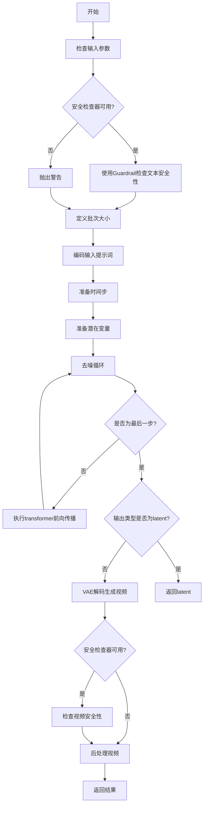
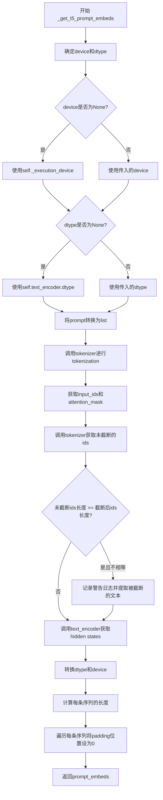
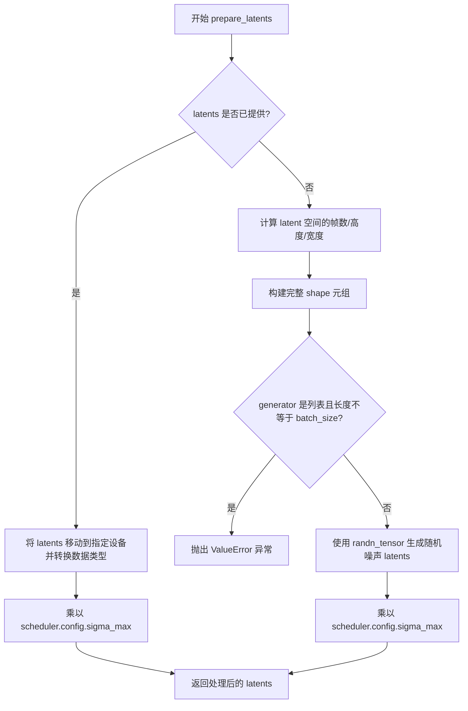
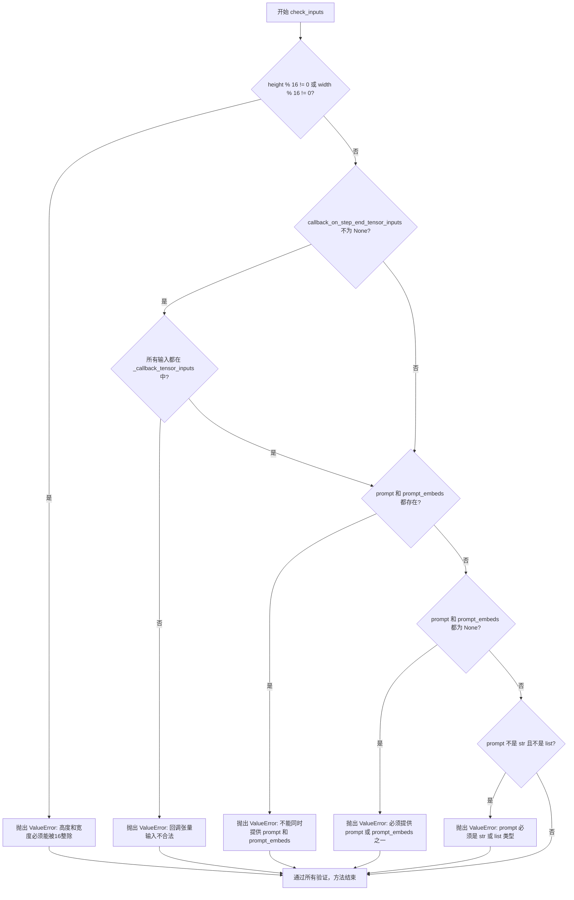
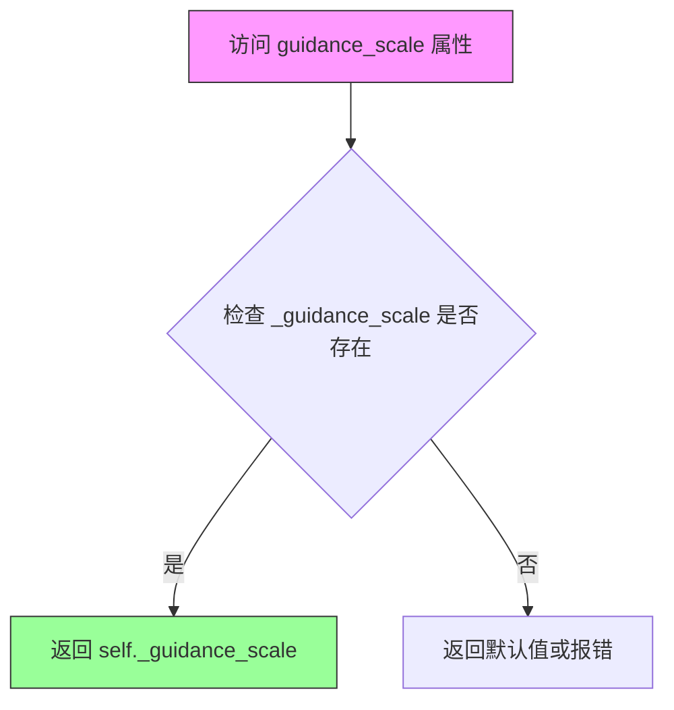
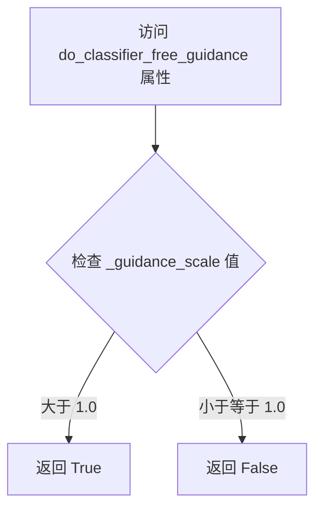
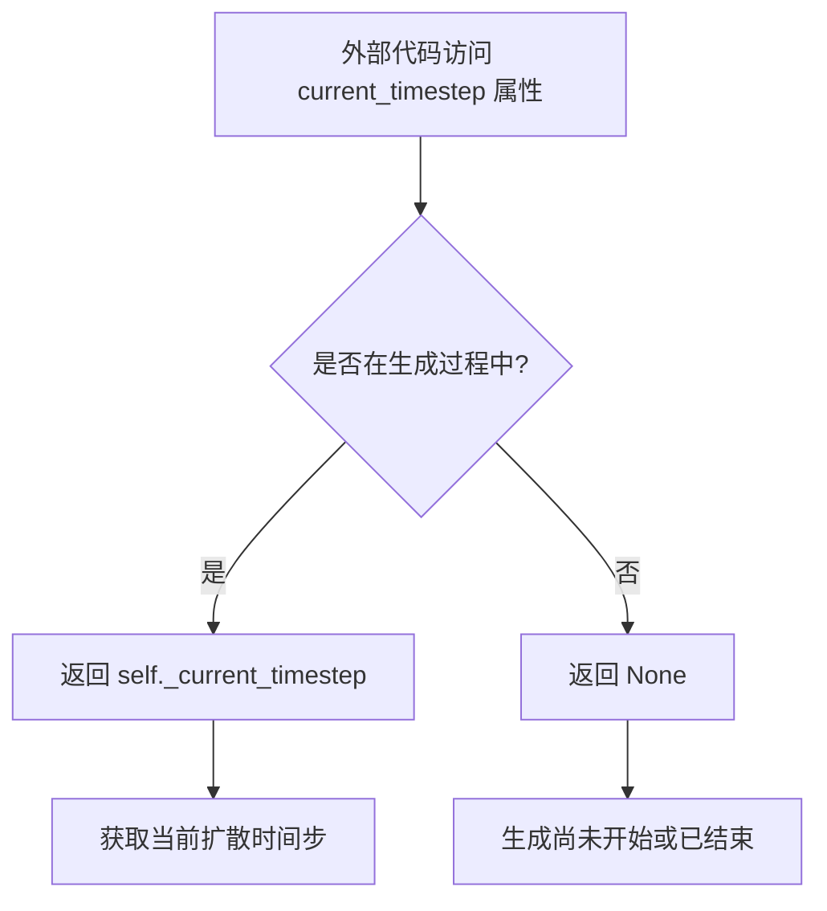
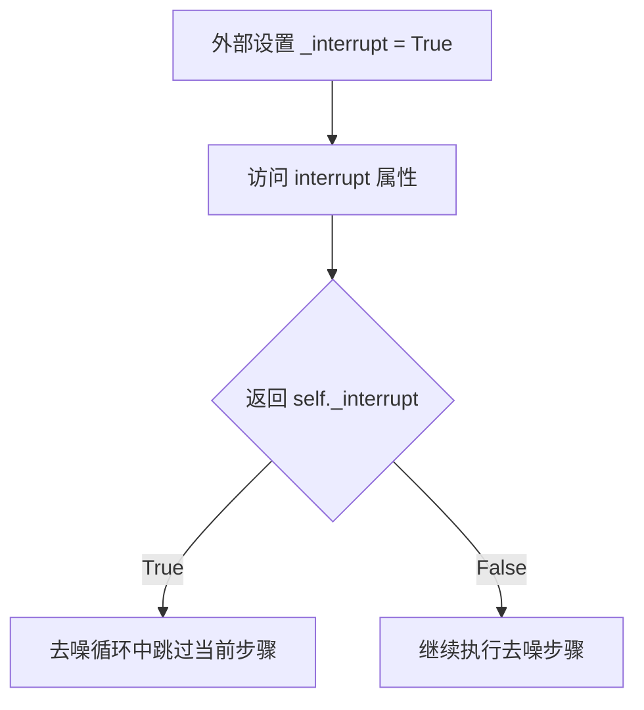

```mermaid
flowchart TD
    A[开始 __call__] --> B{安全检查器是否存在}
    B -->|否| C[抛出ValueError]
    B -->|是| D{callback_on_step_end类型检查}
    D --> E[调用check_inputs验证输入]
    E --> F[设置引导比例和中断标志]
    F --> G[安全检查: 检查提示词文本安全性]
    G --> H[根据prompt类型确定batch_size]
    H --> I[调用encode_prompt编码提示词]
    I --> J[retrieve_timesteps获取时间步]
    J --> K[prepare_latents准备潜在向量]
    K --> L[创建padding_mask]
    L --> M[初始化进度条和循环]
    M --> N{去噪循环: for each timestep}
    N -->|未中断| O[扩展timestep并缩放模型输入]
    O --> P[Transformer前向推理: 有条件预测]
    P --> Q{是否使用CFG}
    Q -->|是| R[Transformer前向推理: 无条件预测]
    Q -->|否| S[跳过无条件预测]
    R --> T[拼接噪声预测]
    S --> U[scheduler.step计算原始样本]
    T --> U
    U --> V[计算CFG加权噪声预测]
    V --> W[scheduler.step计算最终潜在向量]
    W --> X{是否有callback_on_step_end}
    X -->|是| Y[执行回调函数]
    X -->|否| Z[更新进度条]
    Y --> Z
    Z --> AA{是否为最后一步或warmup完成}
    AA -->|是| BB[更新进度条]
    AA -->|否| CC[继续下一步]
    BB --> DD{XLA可用?}
    DD -->|是| EE[xm.mark_step]
    DD -->|否| FF[检查中断标志]
    EE --> FF
    FF --> GG{循环结束?}
    GG -->|否| N
    GG -->|是| HH{output_type == 'latent'?}
    HH -->|否| II[VAE解码潜在向量]
    HH -->|是| JJ[直接使用latents作为视频]
    II --> KK{安全检查器存在?}
    KK -->|是| LL[后处理视频并检查安全性]
    KK -->|否| MM[仅后处理视频]
    LL --> NN[返回结果]
    MM --> NN
    JJ --> NN
    NN --> OO[maybe_free_model_hooks释放模型]
    OO --> PP{return_dict?}
    PP -->|是| QQ[返回CosmosPipelineOutput]
    PP -->|否| RR[返回tuple]
    QQ --> SS[结束]
    RR --> SS
```

# `diffusers\src\diffusers\pipelines\cosmos\pipeline_cosmos_text2world.py` 详细设计文档

这是一个基于扩散模型的文本到视频（Text-to-World）生成管道，使用 T5 编码器进行文本编码，通过 CosmosTransformer3DModel 进行去噪处理，并使用 VAE 进行视频解码，可生成符合文本描述的动态视频内容。

## 整体流程



## 类结构

```
DiffusionPipeline (基类)
└── CosmosTextToWorldPipeline
```

## 全局变量及字段


### `DEFAULT_NEGATIVE_PROMPT`
    
默认的负面提示文本，用于引导模型避免生成低质量视频

类型：`str`
    


### `EXAMPLE_DOC_STRING`
    
示例文档字符串，包含代码使用示例和说明

类型：`str`
    


### `XLA_AVAILABLE`
    
标识PyTorch XLA是否可用的布尔值

类型：`bool`
    


### `logger`
    
模块级别的日志记录器对象

类型：`logging.Logger`
    


### `CosmosTextToWorldPipeline.model_cpu_offload_seq`
    
定义模型CPU卸载顺序的字符串，指定text_encoder->transformer->vae的卸载序列

类型：`str`
    


### `CosmosTextToWorldPipeline._callback_tensor_inputs`
    
回调函数可用的张量输入名称列表，包含latents、prompt_embeds、negative_prompt_embeds

类型：`list[str]`
    


### `CosmosTextToWorldPipeline._optional_components`
    
可选组件列表，包含safety_checker以绕过某些测试失败

类型：`list[str]`
    


### `CosmosTextToWorldPipeline.vae_scale_factor_temporal`
    
VAE时间压缩比率，用于将帧数映射到潜在空间的帧数

类型：`int`
    


### `CosmosTextToWorldPipeline.vae_scale_factor_spatial`
    
VAE空间压缩比率，用于将高度和宽度映射到潜在空间的尺寸

类型：`int`
    


### `CosmosTextToWorldPipeline.video_processor`
    
视频处理对象，用于视频的后处理和格式转换

类型：`VideoProcessor`
    


### `CosmosTextToWorldPipeline.vae`
    
变分自编码器模型，用于视频的编码和解码

类型：`AutoencoderKLCosmos`
    


### `CosmosTextToWorldPipeline.text_encoder`
    
T5文本编码器模型，用于将文本提示编码为嵌入向量

类型：`T5EncoderModel`
    


### `CosmosTextToWorldPipeline.tokenizer`
    
T5快速分词器，用于将文本分词为token

类型：`T5TokenizerFast`
    


### `CosmosTextToWorldPipeline.transformer`
    
条件Transformer模型，用于去噪潜在空间表示

类型：`CosmosTransformer3DModel`
    


### `CosmosTextToWorldPipeline.scheduler`
    
EDM欧拉调度器，用于控制去噪过程中的时间步

类型：`EDMEulerScheduler`
    


### `CosmosTextToWorldPipeline.safety_checker`
    
Cosmos安全检查器，用于检测不安全的内容

类型：`CosmosSafetyChecker`
    
    

## 全局函数及方法


### `retrieve_timesteps`

该函数是扩散模型pipeline中的工具函数，用于获取推理过程中的时间步（timesteps）。它调用调度器（scheduler）的`set_timesteps`方法，支持自定义时间步或sigma值，并返回时间步序列和推理步数。

参数：

- `scheduler`：`SchedulerMixin`，调度器对象，用于生成时间步
- `num_inference_steps`：`int | None`，推理步数，当`timesteps`和`sigmas`都为`None`时使用
- `device`：`str | torch.device | None`，时间步要移动到的设备
- `timesteps`：`list[int] | None`，自定义时间步，用于覆盖调度器的默认时间步策略
- `sigmas`：`list[float] | None`，自定义sigma值，用于覆盖调度器的默认sigma策略
- `**kwargs`：任意关键字参数，会传递给`scheduler.set_timesteps`

返回值：`tuple[torch.Tensor, int]`，返回包含时间步张量和推理步数的元组

#### 流程图

```mermaid
flowchart TD
    A[开始: retrieve_timesteps] --> B{检查: timesteps 和 sigmas 是否同时存在?}
    B -->|是| C[抛出 ValueError: 只能选择一个]
    B -->|否| D{检查: timesteps 是否为 None?}
    D -->|否| E[检查: scheduler.set_timesteps 是否支持 timesteps 参数]
    E -->|不支持| F[抛出 ValueError: 当前调度器不支持自定义 timesteps]
    E -->|支持| G[调用 scheduler.set_timesteps(timesteps=timesteps, device=device, **kwargs)]
    G --> H[获取 scheduler.timesteps]
    H --> I[计算 num_inference_steps = len(timesteps)]
    I --> K[返回 timesteps, num_inference_steps]
    D -->|是| L{检查: sigmas 是否为 None?}
    L -->|否| M[检查: scheduler.set_timesteps 是否支持 sigmas 参数]
    M -->|不支持| N[抛出 ValueError: 当前调度器不支持自定义 sigmas]
    M -->|支持| O[调用 scheduler.set_timesteps(sigmas=sigmas, device=device, **kwargs)]
    O --> P[获取 scheduler.timesteps]
    P --> Q[计算 num_inference_steps = len(timesteps)]
    Q --> K
    L -->|是| R[调用 scheduler.set_timesteps(num_inference_steps, device=device, **kwargs)]
    R --> S[获取 scheduler.timesteps]
    S --> T[计算 num_inference_steps = len(timesteps)]
    T --> K
```

#### 带注释源码

```python
# Copied from diffusers.pipelines.stable_diffusion.pipeline_stable_diffusion.retrieve_timesteps
def retrieve_timesteps(
    scheduler,
    num_inference_steps: int | None = None,
    device: str | torch.device | None = None,
    timesteps: list[int] | None = None,
    sigmas: list[float] | None = None,
    **kwargs,
):
    r"""
    Calls the scheduler's `set_timesteps` method and retrieves timesteps from the scheduler after the call. Handles
    custom timesteps. Any kwargs will be supplied to `scheduler.set_timesteps`.

    Args:
        scheduler (`SchedulerMixin`):
            The scheduler to get timesteps from.
        num_inference_steps (`int`):
            The number of diffusion steps used when generating samples with a pre-trained model. If used, `timesteps`
            must be `None`.
        device (`str` or `torch.device`, *optional*):
            The device to which the timesteps should be moved to. If `None`, the timesteps are not moved.
        timesteps (`list[int]`, *optional*):
            Custom timesteps used to override the timestep spacing strategy of the scheduler. If `timesteps` is passed,
            `num_inference_steps` and `sigmas` must be `None`.
        sigmas (`list[float]`, *optional*):
            Custom sigmas used to override the timestep spacing strategy of the scheduler. If `sigmas` is passed,
            `num_inference_steps` and `timesteps` must be `None`.

    Returns:
        `tuple[torch.Tensor, int]`: A tuple where the first element is the timestep schedule from the scheduler and the
        second element is the number of inference steps.
    """
    # 验证：不能同时指定 timesteps 和 sigmas
    if timesteps is not None and sigmas is not None:
        raise ValueError("Only one of `timesteps` or `sigmas` can be passed. Please choose one to set custom values")
    
    # 处理自定义 timesteps 的情况
    if timesteps is not None:
        # 检查调度器的 set_timesteps 方法是否支持 timesteps 参数
        accepts_timesteps = "timesteps" in set(inspect.signature(scheduler.set_timesteps).parameters.keys())
        if not accepts_timesteps:
            raise ValueError(
                f"The current scheduler class {scheduler.__class__}'s `set_timesteps` does not support custom"
                f" timestep schedules. Please check whether you are using the correct scheduler."
            )
        # 调用调度器的 set_timesteps 方法设置自定义时间步
        scheduler.set_timesteps(timesteps=timesteps, device=device, **kwargs)
        # 从调度器获取生成的时间步
        timesteps = scheduler.timesteps
        # 计算推理步数
        num_inference_steps = len(timesteps)
    
    # 处理自定义 sigmas 的情况
    elif sigmas is not None:
        # 检查调度器的 set_timesteps 方法是否支持 sigmas 参数
        accept_sigmas = "sigmas" in set(inspect.signature(scheduler.set_timesteps).parameters.keys())
        if not accept_sigmas:
            raise ValueError(
                f"The current scheduler class {scheduler.__class__}'s `set_timesteps` does not support custom"
                f" sigmas schedules. Please check whether you are using the correct scheduler."
            )
        # 调用调度器的 set_timesteps 方法设置自定义 sigma
        scheduler.set_timesteps(sigmas=sigmas, device=device, **kwargs)
        # 从调度器获取生成的时间步
        timesteps = scheduler.timesteps
        # 计算推理步数
        num_inference_steps = len(timesteps)
    
    # 默认情况：使用 num_inference_steps 生成时间步
    else:
        scheduler.set_timesteps(num_inference_steps, device=device, **kwargs)
        timesteps = scheduler.timesteps
    
    # 返回时间步序列和推理步数
    return timesteps, num_inference_steps
```


### `CosmosTextToWorldPipeline.__init__`

该方法是 Cosmos 文本到世界生成管道的构造函数，负责初始化文本编码器、分词器、Transformer 模型、VAE、调度器和安全检查器等核心组件，并注册所有模块以及设置视频处理器的缩放因子。

参数：

- `text_encoder`：`T5EncoderModel`，冻结的文本编码器，用于将文本提示编码为嵌入向量
- `tokenizer`：`T5TokenizerFast`，T5 分词器，用于对文本进行分词处理
- `transformer`：`CosmosTransformer3DModel`，条件 Transformer 模型，用于对编码后的图像潜在表示进行去噪
- `vae`：`AutoencoderKLCosmos`，变分自编码器模型，用于对视频进行编码和解码
- `scheduler`：`EDMEulerScheduler`，调度器，用于在去噪过程中逐步减少噪声
- `safety_checker`：`CosmosSafetyChecker`，可选的安全检查器，用于检测不安全的内容

返回值：无（`__init__` 方法不返回任何值）

#### 流程图

```mermaid
graph TD
    A[开始 __init__] --> B[调用 super().__init__ 初始化基类]
    B --> C{检查 safety_checker 是否为 None}
    C -->|是| D[实例化 CosmosSafetyChecker]
    C -->|否| E[使用传入的 safety_checker]
    D --> F[调用 self.register_modules 注册所有模块]
    E --> F
    F --> G[vae: 变分自编码器]
    F --> H[text_encoder: 文本编码器]
    F --> I[tokenizer: 分词器]
    F --> J[transformer: Transformer 模型]
    F --> K[scheduler: 调度器]
    F --> L[safety_checker: 安全检查器]
    G --> M[计算 vae_scale_factor_temporal]
    M --> N[计算 vae_scale_factor_spatial]
    N --> O[创建 VideoProcessor 实例]
    O --> P[结束 __init__]
```

#### 带注释源码

```python
def __init__(
    self,
    text_encoder: T5EncoderModel,  # 冻结的 T5 文本编码器
    tokenizer: T5TokenizerFast,    # T5 分词器
    transformer: CosmosTransformer3DModel,  # 条件去噪 Transformer
    vae: AutoencoderKLCosmos,      # 视频 VAE 编解码器
    scheduler: EDMEulerScheduler, # EDM 欧拉调度器
    safety_checker: CosmosSafetyChecker = None,  # 可选的安全检查器
):
    # 调用父类 DiffusionPipeline 的初始化方法
    super().__init__()

    # 如果未提供安全检查器，则创建一个默认实例
    if safety_checker is None:
        safety_checker = CosmosSafetyChecker()

    # 注册所有模块到管道中，使其可通过管道属性访问
    self.register_modules(
        vae=vae,
        text_encoder=text_encoder,
        tokenizer=tokenizer,
        transformer=transformer,
        scheduler=scheduler,
        safety_checker=safety_checker,
    )

    # 计算 VAE 的时间压缩比，用于后续潜在空间的缩放
    # 如果 vae 存在则从配置获取，否则使用默认值 8
    self.vae_scale_factor_temporal = (
        self.vae.config.temporal_compression_ratio if getattr(self, "vae", None) else 8
    )
    # 计算 VAE 的空间压缩比，用于后续潜在空间的缩放
    self.vae_scale_factor_spatial = self.vae.config.spatial_compression_ratio if getattr(self, "vae", None) else 8
    
    # 创建视频后处理器，用于将 VAE 输出转换为最终视频格式
    self.video_processor = VideoProcessor(vae_scale_factor=self.vae_scale_factor_spatial)
```


### `CosmosTextToWorldPipeline._get_t5_prompt_embeds`

该方法使用T5文本编码器将文本提示转换为高维语义嵌入向量。它首先对输入文本进行tokenization处理，然后通过T5EncoderModel编码，最后对padding位置进行清零处理以确保嵌入向量的有效性。

参数：

- `prompt`：`str | list[str]`，要编码的文本提示，可以是单个字符串或字符串列表
- `max_sequence_length`：`int`，T5模型最大序列长度，默认为512个token
- `device`：`torch.device | None`，指定计算设备，若为None则使用执行设备
- `dtype`：`torch.dtype | None`，指定张量数据类型，若为None则使用text_encoder的数据类型

返回值：`torch.Tensor`，形状为`(batch_size, seq_len, hidden_dim)`的文本嵌入向量

#### 流程图



#### 带注释源码

```python
def _get_t5_prompt_embeds(
    self,
    prompt: str | list[str] = None,
    max_sequence_length: int = 512,
    device: torch.device | None = None,
    dtype: torch.dtype | None = None,
):
    """
    将文本提示编码为T5模型的嵌入向量表示。
    
    Args:
        prompt: 输入的文本提示，可以是单个字符串或字符串列表
        max_sequence_length: 最大序列长度，超过该长度将被截断
        device: 计算设备
        dtype: 张量数据类型
    
    Returns:
        编码后的文本嵌入向量，形状为 (batch_size, seq_len, hidden_size)
    """
    # 确定设备：如果未指定则使用执行设备
    device = device or self._execution_device
    # 确定数据类型：如果未指定则使用text_encoder的数据类型
    dtype = dtype or self.text_encoder.dtype
    # 将单个字符串转换为列表，便于批量处理
    prompt = [prompt] if isinstance(prompt, str) else prompt

    # 调用tokenizer对prompt进行tokenization
    # 返回max_length长度的token序列，启用padding和截断
    text_inputs = self.tokenizer(
        prompt,
        padding="max_length",           # 填充到最大长度
        max_length=max_sequence_length, # 最大序列长度
        truncation=True,                # 启用截断
        return_tensors="pt",             # 返回PyTorch张量
        return_length=True,              # 返回序列长度
        return_offsets_mapping=False,   # 不返回偏移映射
    )
    # 提取input_ids和attention_mask
    text_input_ids = text_inputs.input_ids
    # 将attention mask转换为布尔值并移动到指定设备
    prompt_attention_mask = text_inputs.attention_mask.bool().to(device)

    # 获取未截断的token ids用于检查是否发生截断
    untruncated_ids = self.tokenizer(prompt, padding="longest", return_tensors="pt").input_ids
    
    # 检查是否发生了截断：如果未截断序列更长且与截断后的序列不相等
    if untruncated_ids.shape[-1] >= text_input_ids.shape[-1] and not torch.equal(text_input_ids, untruncated_ids):
        # 解码被截断的部分用于日志警告
        removed_text = self.tokenizer.batch_decode(untruncated_ids[:, max_sequence_length - 1 : -1])
        logger.warning(
            "The following part of your input was truncated because `max_sequence_length` is set to "
            f" {max_sequence_length} tokens: {removed_text}"
        )

    # 调用T5编码器获取文本的隐藏状态表示
    prompt_embeds = self.text_encoder(
        text_input_ids.to(device), attention_mask=prompt_attention_mask
    ).last_hidden_state
    
    # 将嵌入向量转换为指定的数据类型和设备
    prompt_embeds = prompt_embeds.to(dtype=dtype, device=device)

    # 计算每条序列的实际长度（非padding token的数量）
    lengths = prompt_attention_mask.sum(dim=1).cpu()
    # 将padding位置的嵌入向量置零，避免无效信息干扰
    for i, length in enumerate(lengths):
        prompt_embeds[i, length:] = 0

    return prompt_embeds
```


### `CosmosTextToWorldPipeline.encode_prompt`

该方法负责将文本提示词（prompt）和负提示词（negative_prompt）编码为文本编码器的隐藏状态向量（embeddings），支持分类器自由引导（Classifier-Free Guidance）以提升生成质量，并处理多视频生成场景下的批次扩展。

参数：

- `self`：`CosmosTextToWorldPipeline` 类的实例方法，隐式传递
- `prompt`：`str | list[str]`，需要编码的主提示词，可以是单个字符串或字符串列表
- `negative_prompt`：`str | list[str] | None`，可选的负提示词，用于引导模型避免生成相关内容，默认为 None
- `do_classifier_free_guidance`：`bool`，是否启用分类器自由引导，默认为 True
- `num_videos_per_prompt`：`int`，每个提示词生成的视频数量，用于扩展批次，默认为 1
- `prompt_embeds`：`torch.Tensor | None`，预先计算的提示词嵌入向量，如提供则直接使用，默认为 None
- `negative_prompt_embeds`：`torch.Tensor | None`，预先计算的负提示词嵌入向量，如提供则直接使用，默认为 None
- `max_sequence_length`：`int`，文本序列的最大长度，默认为 512
- `device`：`torch.device | None`，执行设备，如未指定则使用当前执行设备
- `dtype`：`torch.dtype | None`，张量数据类型，如未指定则使用文本编码器的数据类型

返回值：`tuple[torch.Tensor, torch.Tensor]`，返回两个张量组成的元组，第一个是提示词嵌入向量，第二个是负提示词嵌入向量

#### 流程图

```mermaid
flowchart TD
    A[开始 encode_prompt] --> B{device 参数是否为空?}
    B -->|是| C[使用 self._execution_device]
    B -->|否| D[使用传入的 device]
    C --> E{device 已确定}
    D --> E
    E --> F{prompt 是否为字符串?}
    F -->|是| G[将 prompt 转换为列表]
    F -->|否| H[保持原样]
    G --> I{prompt_embeds 是否为空?}
    H --> I
    I -->|否| J[使用传入的 prompt_embeds]
    I -->|是| K[调用 _get_t5_prompt_embeds 生成嵌入]
    J --> L{do_classifier_free_guidance 为真且 negative_prompt_embeds 为空?}
    K --> L
    L -->|是| M[处理 negative_prompt]
    L -->|否| N[直接使用传入的 negative_prompt_embeds]
    M --> O[调用 _get_t5_prompt_embeds 生成负嵌入]
    N --> P{prompt_embeds 需要扩展?}
    O --> P
    P --> Q{num_videos_per_prompt > 1?}
    Q -->|是| R[重复 prompt_embeds 扩展批次]
    Q -->|否| S[保持不变]
    R --> T[返回 tuple[prompt_embeds, negative_prompt_embeds]]
    S --> T
```

#### 带注释源码

```python
def encode_prompt(
    self,
    prompt: str | list[str],
    negative_prompt: str | list[str] | None = None,
    do_classifier_free_guidance: bool = True,
    num_videos_per_prompt: int = 1,
    prompt_embeds: torch.Tensor | None = None,
    negative_prompt_embeds: torch.Tensor | None = None,
    max_sequence_length: int = 512,
    device: torch.device | None = None,
    dtype: torch.dtype | None = None,
):
    r"""
    Encodes the prompt into text encoder hidden states.

    Args:
        prompt (`str` or `list[str]`, *optional*):
            prompt to be encoded
        negative_prompt (`str` or `list[str]`, *optional*):
            The prompt or prompts not to guide the image generation. If not defined, one has to pass
            `negative_prompt_embeds` instead. Ignored when not using guidance (i.e., ignored if `guidance_scale` is
            less than `1`).
        do_classifier_free_guidance (`bool`, *optional*, defaults to `True`):
            Whether to use classifier free guidance or not.
        num_videos_per_prompt (`int`, *optional*, defaults to 1):
            Number of videos that should be generated per prompt. torch device to place the resulting embeddings on
        prompt_embeds (`torch.Tensor`, *optional*):
            Pre-generated text embeddings. Can be used to easily tweak text inputs, *e.g.* prompt weighting. If not
            provided, text embeddings will be generated from `prompt` input argument.
        negative_prompt_embeds (`torch.Tensor`, *optional*):
            Pre-generated negative text embeddings. Can be used to easily tweak text inputs, *e.g.* prompt
            weighting. If not provided, negative_prompt_embeds will be generated from `negative_prompt` input
            argument.
        device: (`torch.device`, *optional*):
            torch device
        dtype: (`torch.dtype`, *optional*):
            torch dtype
    """
    # 确定设备，如果未提供则使用当前执行设备
    device = device or self._execution_device

    # 将单个字符串转换为列表，统一处理方式
    prompt = [prompt] if isinstance(prompt, str) else prompt
    
    # 根据是否有 prompt 或 prompt_embeds 来确定批次大小
    if prompt is not None:
        batch_size = len(prompt)
    else:
        batch_size = prompt_embeds.shape[0]

    # 如果未提供 prompt_embeds，则调用内部方法生成
    if prompt_embeds is None:
        # 调用 T5 文本编码器生成提示词嵌入
        prompt_embeds = self._get_t5_prompt_embeds(
            prompt=prompt, max_sequence_length=max_sequence_length, device=device, dtype=dtype
        )

        # 为每个提示词生成多个视频而复制文本嵌入（使用 mps 友好的方法）
        _, seq_len, _ = prompt_embeds.shape
        # 重复嵌入以匹配 num_videos_per_prompt
        prompt_embeds = prompt_embeds.repeat(1, num_videos_per_prompt, 1)
        # 调整形状以适应批次大小
        prompt_embeds = prompt_embeds.view(batch_size * num_videos_per_prompt, seq_len, -1)

    # 如果启用分类器自由引导且未提供负提示词嵌入，则生成负嵌入
    if do_classifier_free_guidance and negative_prompt_embeds is None:
        # 如果未提供负提示词，则使用默认的负提示词
        negative_prompt = negative_prompt if negative_prompt is not None else DEFAULT_NEGATIVE_PROMPT
        # 将负提示词扩展为批次大小
        negative_prompt = batch_size * [negative_prompt] if isinstance(negative_prompt, str) else negative_prompt

        # 检查负提示词和提示词的类型一致性
        if prompt is not None and type(prompt) is not type(negative_prompt):
            raise TypeError(
                f"`negative_prompt` should be the same type to `prompt`, but got {type(negative_prompt)} !="
                f" {type(prompt)}."
            )
        # 检查负提示词和提示词的批次大小一致性
        elif batch_size != len(negative_prompt):
            raise ValueError(
                f"`negative_prompt`: {negative_prompt} has batch size {len(negative_prompt)}, but `prompt`:"
                f" {prompt} has batch size {batch_size}. Please make sure that passed `negative_prompt` matches"
                " the batch size of `prompt`."
            )

        # 调用 T5 文本编码器生成负提示词嵌入
        negative_prompt_embeds = self._get_t5_prompt_embeds(
            prompt=negative_prompt, max_sequence_length=max_sequence_length, device=device, dtype=dtype
        )

        # 为每个提示词生成多个视频而复制负文本嵌入
        _, seq_len, _ = negative_prompt_embeds.shape
        negative_prompt_embeds = negative_prompt_embeds.repeat(1, num_videos_per_prompt, 1)
        negative_prompt_embeds = negative_prompt_embeds.view(batch_size * num_videos_per_prompt, seq_len, -1)

    # 返回提示词嵌入和负提示词嵌入的元组
    return prompt_embeds, negative_prompt_embeds
```


### `CosmosTextToWorldPipeline.prepare_latents`

该方法用于在文本到视频生成流程中准备初始的潜在向量（latents）。如果用户已提供 latents，则对其进行设备迁移和缩放；如果未提供，则根据指定的视频尺寸和通道数随机生成噪声 latent，并乘以调度器的最大sigma值进行初始化。

参数：

- `self`：隐式参数，指向 `CosmosTextToWorldPipeline` 实例本身
- `batch_size`：`int`，要生成的视频批次大小
- `num_channels_latents`：`int`，潜在空间的通道数，默认为 16
- `height`：`int`，目标视频的高度像素值，默认为 704
- `width`：`int`，目标视频的宽度像素值，默认为 1280
- `num_frames`：`int`，目标视频的帧数，默认为 121
- `dtype`：`torch.dtype | None`，生成 latents 所使用的张量数据类型，默认为 None
- `device`：`torch.device | None`，生成 latents 所使用的计算设备，默认为 None
- `generator`：`torch.Generator | list[torch.Generator] | None`，用于控制随机数生成的 torch  Generator，可为单个或列表，默认为 None
- `latents`：`torch.Tensor | None`，用户预提供的潜在向量张量，若为 None 则随机生成，默认为 None

返回值：`torch.Tensor`，返回处理或生成后的潜在向量张量，形状为 (batch_size, num_channels_latents, num_latent_frames, latent_height, latent_width)

#### 流程图



#### 带注释源码

```python
def prepare_latents(
    self,
    batch_size: int,
    num_channels_latents: 16,
    height: int = 704,
    width: int = 1280,
    num_frames: int = 121,
    dtype: torch.dtype | None = None,
    device: torch.device | None = None,
    generator: torch.Generator | list[torch.Generator] | None = None,
    latents: torch.Tensor | None = None,
) -> torch.Tensor:
    """
    准备用于去噪过程的潜在向量。

    如果提供了 latents 张量，则将其移动到指定设备并转换数据类型，然后乘以调度器的最大 sigma 值进行缩放。
    如果未提供 latents，则根据视频尺寸计算 latent 空间的尺寸，随机生成噪声 latent 并进行相同缩放。

    Args:
        batch_size: 批次大小，控制同时生成的视频数量
        num_channels_latents: 潜在空间的通道数，对应 transformer 的输入通道
        height: 目标视频的高度（像素）
        width: 目标视频的宽度（像素）
        num_frames: 目标视频的总帧数
        dtype: 生成 latents 使用的 PyTorch 数据类型
        device: 生成 latents 使用的 PyTorch 设备
        generator: 随机数生成器，用于确保生成的可重复性
        latents: 可选的预提供潜在向量，若为 None 则随机生成

    Returns:
        缩放后的潜在向量张量，形状为 (batch_size, num_channels_latents, num_latent_frames, latent_height, latent_width)
    """
    # 如果用户已提供 latents，直接进行设备迁移和数据类型转换，然后缩放
    if latents is not None:
        return latents.to(device=device, dtype=dtype) * self.scheduler.config.sigma_max

    # 计算 latent 空间的空间维度和时间维度
    # temporal compression: 将时间帧数压缩到 latent 空间
    num_latent_frames = (num_frames - 1) // self.vae_scale_factor_temporal + 1
    # spatial compression: 将高度和宽度压缩到 latent 空间
    latent_height = height // self.vae_scale_factor_spatial
    latent_width = width // self.vae_scale_factor_spatial

    # 构建完整的 latent 张量形状：(batch, channels, frames, height, width)
    shape = (batch_size, num_channels_latents, num_latent_frames, latent_height, latent_width)

    # 验证 generator 列表长度与批次大小是否匹配
    if isinstance(generator, list) and len(generator) != batch_size:
        raise ValueError(
            f"You have passed a list of generators of length {len(generator)}, but requested an effective batch"
            f" size of {batch_size}. Make sure the batch size matches the length of the generators."
        )

    # 使用 randn_tensor 生成符合标准正态分布的随机噪声 latent
    latents = randn_tensor(shape, generator=generator, device=device, dtype=dtype)

    # 根据 EDM (Elucidating the Design Space of Diffusion Models) 公式进行缩放
    # sigma_max 表示噪声调度器的最大噪声水平
    return latents * self.scheduler.config.sigma_max
```


### `CosmosTextToWorldPipeline.check_inputs`

该方法用于验证文本到世界生成管道的输入参数是否合法，确保生成图像的高度和宽度符合模型要求（必须能被16整除），并检查回调张量输入和提示词的有效性。

参数：

- `self`：`CosmosTextToWorldPipeline` 实例本身
- `prompt`：`str` 或 `list`，用户提供的文本提示词，用于指导视频生成
- `height`：`int`，生成视频的高度（像素），必须能被16整除
- `width`：`int`，生成视频的宽度（像素），必须能被16整除
- `prompt_embeds`：`torch.Tensor` 或 `None`，预先编码的文本嵌入向量，可选
- `callback_on_step_end_tensor_inputs`：`list` 或 `None`，每个去噪步骤结束时回调函数需要接收的张量输入列表

返回值：`None`，该方法不返回任何值，仅通过抛出 `ValueError` 来处理验证失败的情况

#### 流程图



#### 带注释源码

```python
def check_inputs(
    self,
    prompt,
    height,
    width,
    prompt_embeds=None,
    callback_on_step_end_tensor_inputs=None,
):
    """
    验证文本到世界生成管道的输入参数是否合法。
    
    该方法执行以下检查：
    1. 确保高度和宽度能被16整除（模型架构要求）
    2. 验证回调张量输入是否在允许的列表中
    3. 确保 prompt 和 prompt_embeds 不能同时提供
    4. 确保至少提供 prompt 或 prompt_embeds 之一
    5. 验证 prompt 的类型必须是 str 或 list
    """
    
    # 检查1：验证高度和宽度是否符合模型要求（必须能被16整除）
    if height % 16 != 0 or width % 16 != 0:
        raise ValueError(f"`height` and `width` have to be divisible by 16 but are {height} and {width}.")

    # 检查2：验证回调张量输入是否在允许的列表中
    # _callback_tensor_inputs 定义为 ["latents", "prompt_embeds", "negative_prompt_embeds"]
    if callback_on_step_end_tensor_inputs is not None and not all(
        k in self._callback_tensor_inputs for k in callback_on_step_end_tensor_inputs
    ):
        raise ValueError(
            f"`callback_on_step_end_tensor_inputs` has to be in {self._callback_tensor_inputs}, but found {[k for k in callback_on_step_end_tensor_inputs if k not in self._callback_tensor_inputs]}"
        )

    # 检查3：不能同时提供 prompt 和 prompt_embeds
    if prompt is not None and prompt_embeds is not None:
        raise ValueError(
            f"Cannot forward both `prompt`: {prompt} and `prompt_embeds`: {prompt_embeds}. Please make sure to"
            " only forward one of the two."
        )
    
    # 检查4：必须至少提供 prompt 或 prompt_embeds 之一
    elif prompt is None and prompt_embeds is None:
        raise ValueError(
            "Provide either `prompt` or `prompt_embeds`. Cannot leave both `prompt` and `prompt_embeds` undefined."
        )
    
    # 检查5：验证 prompt 的类型
    elif prompt is not None and (not isinstance(prompt, str) and not isinstance(prompt, list)):
        raise ValueError(f"`prompt` has to be of type `str` or `list` but is {type(prompt)}")
```


### `CosmosTextToWorldPipeline.guidance_scale`

这是一个属性 getter 方法，用于获取分类器无指导推理（Classifier-Free Guidance）的比例系数。该属性返回在文本到视频生成过程中用于控制生成内容与提示词对齐程度的缩放因子。

参数：无（属性访问器不接受参数）

返回值：`float`，返回分类器无指导推理的指导比例系数（guidance scale），该值用于调整无条件预测与条件预测之间的权重。

#### 流程图



#### 带注释源码

```python
@property
def guidance_scale(self):
    """
    属性 getter：获取分类器无指导推理的指导比例系数
    
    guidance_scale 是用于控制生成内容与文本提示对齐程度的重要参数。
    在分类器无指导推理（Classifier-Free Guidance）中：
    - 当 guidance_scale > 1.0 时，模型会更多地参考文本提示进行生成
    - 当 guidance_scale = 1.0 时，相当于不使用分类器无指导推理
    
    在 __call__ 方法中，该值被设置为：
    self._guidance_scale = guidance_scale  # 默认值为 7.0
    
    Returns:
        float: 分类器无指导推理的指导比例系数
    """
    return self._guidance_scale
```


### `CosmosTextToWorldPipeline.do_classifier_free_guidance`

该属性用于判断当前是否启用无分类器自由引导（Classifier-Free Guidance，CFG）策略。通过检查引导比例阈值（`_guidance_scale > 1.0`）来决定是否在去噪过程中同时使用条件和无条件预测，以提升生成质量。

参数：无（属性访问器不接受外部参数）

返回值：`bool`，返回 `True` 表示启用无分类器自由引导（当 `guidance_scale > 1.0` 时），返回 `False` 表示禁用该策略。

#### 流程图



#### 带注释源码

```python
@property
def do_classifier_free_guidance(self):
    """
    属性：判断是否启用无分类器自由引导（Classifier-Free Guidance）

    该属性通过比较内部存储的引导比例 `_guidance_scale` 与阈值 1.0 来决定是否启用 CFG。
    在扩散模型的去噪循环中，CFG 策略通过同时预测条件（带文本嵌入）和无条件（不带文本嵌入）
    的噪声，然后按照 guidance_scale 加权组合两者，从而提升生成结果与文本提示的对齐度。

    当 guidance_scale <= 1.0 时，等同于标准采样，不使用 CFG 策略。

    返回值:
        bool: 如果 guidance_scale > 1.0 则返回 True，表示启用 CFG；否则返回 False。
    """
    return self._guidance_scale > 1.0
```


### `CosmosTextToWorldPipeline.num_timesteps`

该属性是一个只读属性，用于返回扩散模型在推理过程中使用的时间步长总数。它在管道执行 `__call__` 方法时由 `retrieve_timesteps` 函数设置，并在去噪循环开始前被初始化。

参数： 无（属性访问不需要参数）

返回值： `int`，返回去噪过程中使用的时间步总数，即推理步骤的数量。

#### 流程图

```mermaid
flowchart TD
    A[访问 num_timesteps 属性] --> B{检查 _num_timesteps 是否已设置}
    B -->|已设置| C[返回 self._num_timesteps]
    B -->|未设置| D[返回 None 或引发错误]
    
    E[在 __call__ 方法中] --> F[调用 retrieve_timesteps]
    F --> G[获取 timesteps 列表]
    G --> H[设置 self._num_timesteps = len(timesteps)]
    H --> I[去噪循环开始]
```

#### 带注释源码

```python
@property
def num_timesteps(self):
    """
    返回扩散管道在推理过程中使用的时间步总数。

    该属性是一个只读属性，它返回内部变量 _num_timesteps 的值。
    _num_timesteps 在调用管道生成视频时被设置，其值等于从调度器
    获取的时间步列表的长度，即 num_inference_steps。

    Returns:
        int: 推理过程中使用的时间步总数。如果在调用管道之前访问，
             则可能返回 None（取决于初始化方式）。
    """
    return self._num_timesteps
```

---

**补充说明：**

- **`_num_timesteps` 的设置位置**：在 `__call__` 方法的第 485 行左右，通过 `self._num_timesteps = len(timesteps)` 设置。
- **时间步的来源**：由 `retrieve_timesteps` 函数从调度器（scheduler）获取，该函数接收 `num_inference_steps` 参数并返回对应数量的时间步。
- **用途**：此属性允许外部代码查询当前管道的推理步数，可用于进度显示或调试目的。


### `CosmosTextToWorldPipeline.current_timestep`

该属性用于获取当前扩散过程的 timesteps，使外部代码能够查询管道在生成过程中正在执行的当前时间步。

参数：无（属性不接受参数）

返回值：`torch.Tensor` 或 `None`，返回当前扩散循环中正在处理的 timesteps，如果未在生成过程中则返回 `None`

#### 流程图



#### 带注释源码

```python
@property
def current_timestep(self):
    """
    当前属性用于获取当前扩散过程的 timesteps。
    
    在管道的 __call__ 方法执行期间，此属性返回当前正在处理的 timesteps 值，
    允许外部代码监控生成进度。该值在去噪循环中被动态更新：
    - 进入循环前初始化为 None
    - 循环中每个迭代步骤被设置为当前的 t 值
    - 循环结束后重置为 None
    
    Returns:
        返回当前的时间步，如果不在生成过程中则返回 None
    """
    return self._current_timestep
```


### `CosmosTextToWorldPipeline.interrupt`

该属性是管道的中断控制标志，用于在去噪循环中控制是否立即停止当前的生成任务。通过返回内部变量`_interrupt`的布尔值，调用者可以在外部设置此标志为`True`来中断长时间运行的视频生成过程。

参数： 无

返回值：`bool`，返回当前的中断状态。当返回`True`时，表示已请求中断管道执行；当返回`False`时，表示管道继续正常运行。

#### 流程图



#### 带注释源码

```python
@property
def interrupt(self):
    """
    中断属性，用于控制管道执行的中断状态。
    
    该属性返回一个布尔值，表示管道是否被请求中断。
    在 __call__ 方法的去噪循环中，会检查此属性来决定是否跳过当前步骤。
    
    Returns:
        bool: 当前的中断状态。True 表示请求中断，False 表示继续执行。
    """
    return self._interrupt


# 在管道调用中的使用示例（在 __call__ 方法中）：
# 初始化中断标志
self._interrupt = False

# 在去噪循环中检查中断标志
with self.progress_bar(total=num_inference_steps) as progress_bar:
    for i, t in enumerate(timesteps):
        if self.interrupt:  # 检查中断属性
            continue  # 如果中断标志为 True，跳过当前步骤
        
        # ... 正常的去噪逻辑 ...


# 外部可以通过以下方式中断管道：
# pipe._interrupt = True
# 或者在多线程/异步环境中从另一个线程设置
```


### CosmosTextToWorldPipeline.__call__

该方法是 Cosmos 文本到世界（Text-to-World）生成管道的核心调用函数，负责接收文本提示词并生成对应的视频内容。流程包括输入验证与安全检查、提示词编码、时间步准备、潜在向量初始化、去噪循环（包含Transformer推理和分类器自由引导）、VAE解码以及后处理（安全检查和视频格式转换）。

参数：

- `prompt`：`str | list[str]` | None，提示词或提示词列表，用于指导视频生成。若未定义，则必须提供`prompt_embeds`
- `negative_prompt`：`str | list[str]` | None，用于指定不希望出现在生成视频中的内容，生成负面提示词嵌入
- `height`：`int`，默认704，生成视频的高度（像素），必须被16整除
- `width`：`int`，默认1280，生成视频的宽度（像素），必须被16整除
- `num_frames`：`int`，默认121，生成视频的总帧数
- `num_inference_steps`：`int`，默认36，去噪迭代的步数，步数越多通常质量越高但推理越慢
- `guidance_scale`：`float`，默认7.0，分类器自由引导（CFG）尺度，用于控制生成内容与提示词的对齐程度
- `fps`：`int`，默认30，生成视频的帧率
- `num_videos_per_prompt`：`int | None`，默认1，每个提示词生成的视频数量
- `generator`：`torch.Generator | list[torch.Generator] | None`，用于使生成过程确定性的随机数生成器
- `latents`：`torch.Tensor | None`，预生成的噪声潜在向量，若提供则使用该向量而非随机生成
- `prompt_embeds`：`torch.Tensor | None`，预生成的文本嵌入，可用于微调提示词权重
- `negative_prompt_embeds`：`torch.Tensor | None`，预生成的负面文本嵌入
- `output_type`：`str | None`，默认"pil"，输出格式，可选"pil"（PIL图像）或"np"（numpy数组）或"latent"
- `return_dict`：`bool`，默认True，是否返回`CosmosPipelineOutput`字典格式结果
- `callback_on_step_end`：`Callable | PipelineCallback | MultiPipelineCallbacks | None`，每个去噪步骤结束时调用的回调函数
- `callback_on_step_end_tensor_inputs`：`list[str]`，默认["latents"]，回调函数接收的张量输入列表
- `max_sequence_length`：`int`，默认512，T5编码器的最大序列长度

返回值：`CosmosPipelineOutput` 或 `tuple`，若`return_dict`为True返回`CosmosPipelineOutput`对象（包含frames属性），否则返回元组（第一个元素为生成的视频列表）

#### 流程图



#### 带注释源码

```python
@torch.no_grad()
@replace_example_docstring(EXAMPLE_DOC_STRING)
def __call__(
    self,
    prompt: str | list[str] = None,
    negative_prompt: str | list[str] | None = None,
    height: int = 704,
    width: int = 1280,
    num_frames: int = 121,
    num_inference_steps: int = 36,
    guidance_scale: float = 7.0,
    fps: int = 30,
    num_videos_per_prompt: int | None = 1,
    generator: torch.Generator | list[torch.Generator] | None = None,
    latents: torch.Tensor | None = None,
    prompt_embeds: torch.Tensor | None = None,
    negative_prompt_embeds: torch.Tensor | None = None,
    output_type: str | None = "pil",
    return_dict: bool = True,
    callback_on_step_end: Callable[[int, int], None] | PipelineCallback | MultiPipelineCallbacks | None = None,
    callback_on_step_end_tensor_inputs: list[str] = ["latents"],
    max_sequence_length: int = 512,
):
    r"""
    The call function to the pipeline for generation.

    Args:
        prompt (`str` or `list[str]`, *optional*):
            The prompt or prompts to guide the image generation. If not defined, one has to pass `prompt_embeds`.
            instead.
        height (`int`, defaults to `720`):
            The height in pixels of the generated image.
        width (`int`, defaults to `1280`):
            The width in pixels of the generated image.
        num_frames (`int`, defaults to `121`):
            The number of frames in the generated video.
        num_inference_steps (`int`, defaults to `36`):
            The number of denoising steps. More denoising steps usually lead to a higher quality image at the
            expense of slower inference.
        guidance_scale (`float`, defaults to `7.0`):
            Guidance scale as defined in [Classifier-Free Diffusion
            Guidance](https://huggingface.co/papers/2207.12598). `guidance_scale` is defined as `w` of equation 2.
            of [Imagen Paper](https://huggingface.co/papers/2205.11487). Guidance scale is enabled by setting
            `guidance_scale > 1`.
        fps (`int`, defaults to `30`):
            The frames per second of the generated video.
        num_videos_per_prompt (`int`, *optional*, defaults to 1):
            The number of images to generate per prompt.
        generator (`torch.Generator` or `list[torch.Generator]`, *optional*):
            A [`torch.Generator`](https://pytorch.org/docs/stable/generated/torch.Generator.html) to make
            generation deterministic.
        latents (`torch.Tensor`, *optional*):
            Pre-generated noisy latents sampled from a Gaussian distribution, to be used as inputs for image
            generation. Can be used to tweak the same generation with different prompts. If not provided, a latents
            tensor is generated by sampling using the supplied random `generator`.
        prompt_embeds (`torch.Tensor`, *optional*):
            Pre-generated text embeddings. Can be used to easily tweak text inputs, *e.g.* prompt weighting. If not
            provided, text embeddings will be generated from `prompt` input argument.
        negative_prompt_embeds (`torch.FloatTensor`, *optional*):
            Pre-generated negative text embeddings. For PixArt-Sigma this negative prompt should be "". If not
            provided, negative_prompt_embeds will be generated from `negative_prompt` input argument.
        output_type (`str`, *optional*, defaults to `"pil"`):
            The output format of the generated image. Choose between `PIL.Image` or `np.array`.
        return_dict (`bool`, *optional*, defaults to `True`):
            Whether or not to return a [`CosmosPipelineOutput`] instead of a plain tuple.
        callback_on_step_end (`Callable`, `PipelineCallback`, `MultiPipelineCallbacks`, *optional*):
            A function or a subclass of `PipelineCallback` or `MultiPipelineCallbacks` that is called at the end of
            each denoising step during the inference. with the following arguments: `callback_on_step_end(self:
            DiffusionPipeline, step: int, timestep: int, callback_kwargs: Dict)`. `callback_kwargs` will include a
            list of all tensors as specified by `callback_on_step_end_tensor_inputs`.
        callback_on_step_end_tensor_inputs (`list`, *optional*):
            The list of tensor inputs for the `callback_on_step_end` function. The tensors specified in the list
            will be passed as `callback_kwargs` argument. You will only be able to include variables listed in the
            `._callback_tensor_inputs` attribute of your pipeline class.

    Examples:

    Returns:
        [`~CosmosPipelineOutput`] or `tuple`:
            If `return_dict` is `True`, [`CosmosPipelineOutput`] is returned, otherwise a `tuple` is returned where
            the first element is a list with the generated images and the second element is a list of `bool`s
            indicating whether the corresponding generated image contains "not-safe-for-work" (nsfw) content.
    """

    # 1. 检查安全检查器是否已禁用，若禁用则抛出错误（违反NVIDIA开源模型许可证）
    if self.safety_checker is None:
        raise ValueError(
            f"You have disabled the safety checker for {self.__class__}. This is in violation of the "
            "[NVIDIA Open Model License Agreement](https://www.nvidia.com/en-us/agreements/enterprise-software/nvidia-open-model-license). "
            f"Please ensure that you are compliant with the license agreement."
        )

    # 处理回调函数：如果传入的是PipelineCallback或MultiPipelineCallbacks，提取其tensor_inputs
    if isinstance(callback_on_step_end, (PipelineCallback, MultiPipelineCallbacks)):
        callback_on_step_end_tensor_inputs = callback_on_step_end.tensor_inputs

    # 2. 检查输入有效性：验证height/width可被16整除、callback张量输入有效性、prompt和prompt_embeds不能同时提供
    self.check_inputs(prompt, height, width, prompt_embeds, callback_on_step_end_tensor_inputs)

    # 设置引导比例（用于CFG）、当前时间步为None、清除中断标志
    self._guidance_scale = guidance_scale
    self._current_timestep = None
    self._interrupt = False

    # 获取执行设备
    device = self._execution_device

    # 3. 安全检查：移动安全检查器到设备，检查每个提示词的文本安全性，然后移回CPU
    if self.safety_checker is not None:
        self.safety_checker.to(device)
        if prompt is not None:
            prompt_list = [prompt] if isinstance(prompt, str) else prompt
            for p in prompt_list:
                if not self.safety_checker.check_text_safety(p):
                    raise ValueError(
                        f"Cosmos Guardrail detected unsafe text in the prompt: {p}. Please ensure that the "
                        f"prompt abides by the NVIDIA Open Model License Agreement."
                    )
        self.safety_checker.to("cpu")

    # 4. 定义批次大小（batch_size）
    if prompt is not None and isinstance(prompt, str):
        batch_size = 1
    elif prompt is not None and isinstance(prompt, list):
        batch_size = len(prompt)
    else:
        batch_size = prompt_embeds.shape[0]

    # 5. 编码输入提示词：生成prompt_embeds和negative_prompt_embeds
    (
        prompt_embeds,
        negative_prompt_embeds,
    ) = self.encode_prompt(
        prompt=prompt,
        negative_prompt=negative_prompt,
        do_classifier_free_guidance=self.do_classifier_free_guidance,
        num_videos_per_prompt=num_videos_per_prompt,
        prompt_embeds=prompt_embeds,
        negative_prompt_embeds=negative_prompt_embeds,
        device=device,
        max_sequence_length=max_sequence_length,
    )

    # 6. 准备时间步：使用scheduler获取去噪过程中使用的时间步序列
    timesteps, num_inference_steps = retrieve_timesteps(self.scheduler, num_inference_steps, device)

    # 7. 准备潜在变量：初始化用于去噪的随机潜在向量
    transformer_dtype = self.transformer.dtype
    num_channels_latents = self.transformer.config.in_channels
    latents = self.prepare_latents(
        batch_size * num_videos_per_prompt,
        num_channels_latents,
        height,
        width,
        num_frames,
        torch.float32,
        device,
        generator,
        latents,
    )

    # 创建填充掩码（padding mask），用于Transformer处理
    padding_mask = latents.new_zeros(1, 1, height, width, dtype=transformer_dtype)

    # 8. 去噪循环：主降噪过程
    num_warmup_steps = len(timesteps) - num_inference_steps * self.scheduler.order
    self._num_timesteps = len(timesteps)

    with self.progress_bar(total=num_inference_steps) as progress_bar:
        for i, t in enumerate(timesteps):
            # 检查是否中断（用户可设置interrupt标志停止生成）
            if self.interrupt:
                continue

            # 记录当前时间步
            self._current_timestep = t
            # 扩展timestep以匹配批次大小并转换dtype
            timestep = t.expand(latents.shape[0]).to(transformer_dtype)

            # 缩放模型输入（scheduler相关）
            latent_model_input = latents
            latent_model_input = self.scheduler.scale_model_input(latent_model_input, t)
            latent_model_input = latent_model_input.to(transformer_dtype)

            # 8.1 有条件预测：使用提示词嵌入进行Transformer前向推理
            noise_pred = self.transformer(
                hidden_states=latent_model_input,
                timestep=timestep,
                encoder_hidden_states=prompt_embeds,
                fps=fps,
                padding_mask=padding_mask,
                return_dict=False,
            )[0]

            # 8.2 无条件预测（CFG）：如果启用CFG，使用负面提示词嵌入进行单独预测
            sample = latents
            if self.do_classifier_free_guidance:
                noise_pred_uncond = self.transformer(
                    hidden_states=latent_model_input,
                    timestep=timestep,
                    encoder_hidden_states=negative_prompt_embeds,
                    fps=fps,
                    padding_mask=padding_mask,
                    return_dict=False,
                )[0]
                # 拼接无条件预测和有条件预测
                noise_pred = torch.cat([noise_pred_uncond, noise_pred])
                sample = torch.cat([sample, sample])

            # 8.3 计算原始样本（x0）：通过scheduler.step获取预测的原始样本
            noise_pred = self.scheduler.step(noise_pred, t, sample, return_dict=False)[1]
            self.scheduler._step_index -= 1

            # 8.4 应用CFG：根据引导尺度计算最终噪声预测
            if self.do_classifier_free_guidance:
                noise_pred_uncond, noise_pred_cond = noise_pred.chunk(2)
                noise_pred = noise_pred_cond + self.guidance_scale * (noise_pred_cond - noise_pred_uncond)

            # 8.5 预测样本（eps）：使用scheduler.step更新潜在向量
            latents = self.scheduler.step(
                noise_pred, t, latents, return_dict=False, pred_original_sample=noise_pred
            )[0]

            # 8.6 执行回调函数（如果在每步结束时调用）
            if callback_on_step_end is not None:
                callback_kwargs = {}
                for k in callback_on_step_end_tensor_inputs:
                    callback_kwargs[k] = locals()[k]
                callback_outputs = callback_on_step_end(self, i, t, callback_kwargs)

                # 允许回调函数修改latents和prompt_embeds
                latents = callback_outputs.pop("latents", latents)
                prompt_embeds = callback_outputs.pop("prompt_embeds", prompt_embeds)
                negative_prompt_embeds = callback_outputs.pop("negative_prompt_embeds", negative_prompt_embeds)

            # 8.7 更新进度条：当处于最后一步或完成warmup后每scheduler.order步更新
            if i == len(timesteps) - 1 or ((i + 1) > num_warmup_steps and (i + 1) % self.scheduler.order == 0):
                progress_bar.update()

            # 8.8 XLA优化：如果使用PyTorch XLA，标记计算步骤
            if XLA_AVAILABLE:
                xm.mark_step()

    # 9. 清除当前时间步
    self._current_timestep = None

    # 10. 后处理：如果不是latent输出模式
    if not output_type == "latent":
        # 10.1 潜在向量反标准化（如果VAE配置了latents_mean和latents_std）
        if self.vae.config.latents_mean is not None:
            latents_mean, latents_std = self.vae.config.latents_mean, self.vae.config.latents_std
            latents_mean = (
                torch.tensor(latents_mean)
                .view(1, self.vae.config.latent_channels, -1, 1, 1)[:, :, : latents.size(2)]
                .to(latents)
            )
            latents_std = (
                torch.tensor(latents_std)
                .view(1, self.vae.config.latent_channels, -1, 1, 1)[:, :, : latents.size(2)]
                .to(latents)
            )
            latents = latents * latents_std / self.scheduler.config.sigma_data + latents_mean
        else:
            latents = latents / self.scheduler.config.sigma_data
        
        # 10.2 使用VAE解码潜在向量到视频
        video = self.vae.decode(latents.to(self.vae.dtype), return_dict=False)[0]

        # 10.3 安全检查（视频内容安全）
        if self.safety_checker is not None:
            self.safety_checker.to(device)
            # 后处理视频为numpy数组并进行安全检查
            video = self.video_processor.postprocess_video(video, output_type="np")
            video = (video * 255).astype(np.uint8)
            video_batch = []
            for vid in video:
                vid = self.safety_checker.check_video_safety(vid)
                video_batch.append(vid)
            video = np.stack(video_batch).astype(np.float32) / 255.0 * 2 - 1
            video = torch.from_numpy(video).permute(0, 4, 1, 2, 3)
            video = self.video_processor.postprocess_video(video, output_type=output_type)
            self.safety_checker.to("cpu")
        else:
            video = self.video_processor.postprocess_video(video, output_type=output_type)
    else:
        # 如果output_type是latent，直接使用latents作为输出
        video = latents

    # 11. 释放所有模型的挂钩（用于模型卸载）
    self.maybe_free_model_hooks()

    # 12. 返回结果：根据return_dict决定返回格式
    if not return_dict:
        return (video,)

    return CosmosPipelineOutput(frames=video)
```

## 关键组件


### T5文本编码器与Tokenizer

负责将用户输入的文本提示（prompt）编码为Transformer可理解的嵌入向量。使用T5-11b模型作为文本编码器，配合T5TokenizerFast进行分词处理，支持最长512个token的序列长度。

### VAE（变分自编码器）

AutoencoderKLCosmos模型，负责在潜在空间和像素空间之间进行视频的编码与解码。支持temporal和spatial两个维度的压缩，通过video_processor进行后处理，将潜在向量转换为最终视频输出。

### 3D Transformer（CosmosTransformer3DModel）

条件去噪Transformer，接收潜在表示、时间步和文本嵌入作为输入，执行去噪预测。配置了in_channels参数确定潜在通道数，在去噪循环中通过Classifier-Free Guidance技术提升生成质量。

### EDMEulerScheduler

流匹配（Flow Matching）调度器，用于控制去噪过程的时间步调度。实现了sigma_data归一化处理，支持自定义timesteps和sigmas，提供step方法计算每一步的去噪结果。

### Safety Checker（CosmosSafetyChecker）

安全检查模块，用于检测生成的视频和输入文本是否包含不当内容。实现了check_text_safety和check_video_safety方法，在生成前后进行安全审查，符合NVIDIA开放模型许可协议要求。

### retrieve_timesteps函数

辅助函数，用于获取和设置调度器的时间步。支持三种模式：自定义timesteps列表、自定义sigmas列表或通过num_inference_steps自动计算。检查调度器是否支持相应的参数并返回时间步序列和推理步数。

### VideoProcessor视频处理器

负责视频的后处理工作，包括格式转换（ PIL / numpy / tensor）、帧率设置（fps参数）、数据类型转换（uint8/float32）等操作，将VAE解码后的视频转换为目标输出格式。

### 潜在变量准备与去噪循环

管道核心执行逻辑：prepare_latents方法初始化随机潜在张量，__call__方法中实现完整的去噪循环。在每个时间步执行Transformer前向传播、Classifier-Free Guidance处理、调度器步进，并通过callback机制支持中间结果干预。

### 输入验证与参数检查

check_inputs方法验证prompt、height、width、prompt_embeds等参数的合法性，确保height和width可被16整除，检查callback_on_step_end_tensor_inputs的有效性，防止无效输入导致后续处理失败。


## 问题及建议


### 已知问题

- **缺少num_frames验证**：check_inputs方法仅验证height和width的16倍数关系，未对num_frames进行有效性检查，可能导致后续处理出现异常
- **padding_mask未实际使用**：在__call__方法中创建了padding_mask并传递给transformer，但传入的全零张量实际上未起任何作用，可能是不完整的实现
- **safety_checker设备管理冗余**：在pipeline执行过程中多次将safety_checker在device和CPU之间转移（检查prompt后移至CPU，decode后移回device，再检查后移回CPU），这种频繁的设备转移影响性能
- **encode_prompt中变量处理逻辑混乱**：方法开头检查prompt是否为None来确定batch_size，但后续又直接使用传入的prompt_embeds，存在逻辑冗余
- **硬编码的默认参数**：prepare_latents方法中硬编码了height=704、width=1280、num_frames=121作为默认参数，但这些应该由调用方控制
- **缺少negative_prompt_embeds为空且不使用guidance的检查**：当do_classifier_free_guidance=False且negative_prompt_embeds=None时，方法仍会尝试处理负向提示嵌入
- **scheduler._step_index手动调整风险**：在去噪循环中手动修改scheduler._step_index -= 1来配合callback，这种直接操作内部状态的方式容易导致不可预测行为

### 优化建议

- 在check_inputs方法中添加num_frames的验证逻辑，确保其符合VAE的时间压缩比例要求
- 移除未使用的padding_mask参数，或实现其真正的功能（如注意力掩码）
- 优化safety_checker的设备管理，可在初始化时决定其设备位置，或在pipeline结束时统一处理设备转移
- 重构encode_prompt方法，理清prompt和prompt_embeds的处理逻辑，避免重复的条件判断
- 将prepare_latents的默认参数移除，强制调用方显式指定所有必要参数
- 添加对negative_prompt_embeds的显式检查，在do_classifier_free_guidance=False时给出明确处理方案
- 避免直接操作scheduler的内部状态，可通过官方API或callback机制实现类似功能
- 考虑将重复的文本嵌入复制逻辑提取为独立方法以提高代码复用性


## 其它


### 设计目标与约束

该pipeline的设计目标是实现高质量的文本到视频（Text-to-World）生成能力。具体约束包括：1）必须使用NVIDIA Cosmos-1.0-Diffusion-7B-Text2World预训练模型；2）输出视频分辨率需满足704x1280像素，帧数为121帧，fps为30；3）推理步数默认为36步；4）guidance_scale默认为7.0；5）支持分类器自由引导（CFG）技术以提升生成质量；6）安全性约束：必须启用safety_checker，否则抛出异常。

### 错误处理与异常设计

主要错误处理场景包括：1）输入验证错误：height和width必须被16整除，prompt与prompt_embeds不能同时传递，callback_on_step_end_tensor_inputs必须为合法tensor类型；2）模型加载错误：safety_checker为None时抛出ValueError，明确提示违反NVIDIA Open Model License Agreement；3）调度器参数错误：timesteps和sigmas不能同时传递，调度器必须支持自定义timesteps或sigmas；4）批次大小不匹配错误：generator列表长度与batch_size不匹配时抛出ValueError；5）类型错误：negative_prompt类型必须与prompt类型一致；6）安全检查错误：Guardrail检测到不安全文本时抛出ValueError。

### 数据流与状态机

Pipeline的数据流状态机包含以下状态：1）INITIALIZE：初始化pipeline组件；2）INPUT_VALIDATION：检查输入参数合法性；3）PROMPT_ENCODING：使用T5编码器将文本提示编码为embeddings；4）LATENT_PREPARATION：准备初始噪声latents；5）DENOISING_LOOP：执行去噪循环，包括前向传播、CFG处理、调度器步进；6）LATENT_DECODING：将latents解码为视频帧；7）SAFETY_CHECK：对生成的视频进行安全检查；8）OUTPUT_POSTPROCESSING：后处理输出视频格式。

### 外部依赖与接口契约

核心外部依赖包括：1）transformers库：提供T5EncoderModel和T5TokenizerFast；2）torch/torchvision：核心深度学习框架；3）numpy：数值计算；4）diffusers：DiffusionPipeline基类、调度器、VAE模型；5）cosmos_guardrail：安全检查模块（可选但强烈推荐）；6）torch_xla：XLA加速支持（可选）。接口契约方面：encode_prompt方法接受prompt/negative_prompt并返回embeddings；prepare_latents方法生成或处理latents；__call__方法为主生成接口，返回CosmosPipelineOutput或tuple。

### 配置参数与常量定义

关键配置参数包括：1）DEFAULT_NEGATIVE_PROMPT：默认负面提示词，用于引导生成高质量视频；2）vae_scale_factor_temporal/vae_scale_factor_spatial：VAE时空压缩比，默认为8；3）model_cpu_offload_seq：CPU卸载顺序"text_encoder->transformer->vae"；4）_callback_tensor_inputs：支持回调的tensor输入列表["latents", "prompt_embeds", "negative_prompt_embeds"]；5）_optional_components：可选组件列表["safety_checker"]。

### 性能优化与资源管理

Pipeline采用以下性能优化策略：1）模型CPU卸载：使用model_cpu_offload_seq定义卸载顺序；2）XLA支持：检测并使用torch_xla加速；3）内存优化：progress_bar显示进度，scheduler._step_index手动管理步数；4）批处理优化：num_videos_per_prompt参数支持单prompt生成多个视频；5）dtype管理：transformer使用float32，VAE使用其自身dtype；6）Safety checker设备迁移：检查完成后移至CPU节省GPU显存。

### 版本兼容性与扩展性

扩展性设计包括：1）DiffusionPipeline基类继承：便于与其他pipeline共享通用功能；2）register_modules方法：支持动态注册模块；3）callback机制：支持PipelineCallback和MultiPipelineCallbacks自定义回调；4）output_type灵活选择：支持"pil"、"np"、"latent"等多种输出格式；5）调度器兼容性：通过retrieve_timesteps适配不同调度器。


    