# `diffusers\src\diffusers\pipelines\cosmos\pipeline_cosmos_video2world.py` 详细设计文档

CosmosVideoToWorldPipeline是一个用于从图像或视频生成世界的扩散模型管道,基于NVIDIA Cosmos Predict-1模型,支持image-to-world和video-to-world生成任务,使用T5文本编码器、Transformer去噪网络和VAE解码器进行条件生成。

## 整体流程

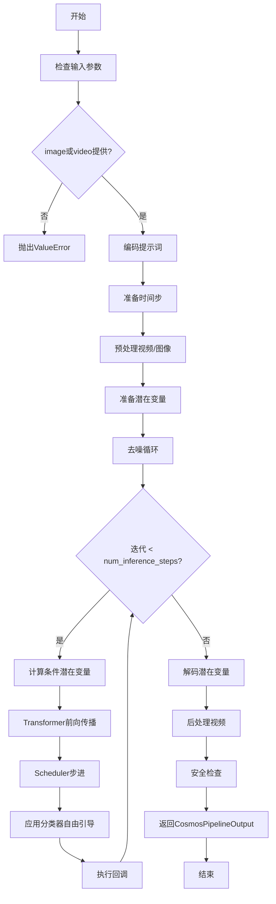

## 类结构

```
DiffusionPipeline (基类)
└── CosmosVideoToWorldPipeline (主管道类)
```

## 全局变量及字段


### `logger`
    
模块级日志记录器，用于输出调试和运行信息

类型：`logging.Logger`
    


### `DEFAULT_NEGATIVE_PROMPT`
    
默认负面提示词，用于引导生成避免低质量视频特征

类型：`str`
    


### `EXAMPLE_DOC_STRING`
    
示例文档字符串，包含pipeline使用示例代码

类型：`str`
    


### `XLA_AVAILABLE`
    
XLA可用性标志，指示torch XLA是否可用

类型：`bool`
    


### `is_cosmos_guardrail_available`
    
guardrail可用性检查函数引用，用于检测cosmos_guardrail包是否安装

类型：`Callable`
    


### `is_torch_xla_available`
    
torch XLA可用性检查函数引用，用于检测torch XLA是否可用

类型：`Callable`
    


### `CosmosVideoToWorldPipeline.vae`
    
VAE编码器/解码器，用于视频与潜在表示之间的转换

类型：`AutoencoderKLCosmos`
    


### `CosmosVideoToWorldPipeline.text_encoder`
    
T5文本编码器，将文本提示编码为隐藏状态

类型：`T5EncoderModel`
    


### `CosmosVideoToWorldPipeline.tokenizer`
    
T5分词器，用于对文本提示进行分词处理

类型：`T5TokenizerFast`
    


### `CosmosVideoToWorldPipeline.transformer`
    
3D Transformer去噪网络，用于去噪潜在表示生成视频

类型：`CosmosTransformer3DModel`
    


### `CosmosVideoToWorldPipeline.scheduler`
    
EDM Euler调度器，控制去噪过程的噪声调度

类型：`EDMEulerScheduler`
    


### `CosmosVideoToWorldPipeline.safety_checker`
    
安全检查器，用于检测生成内容是否安全

类型：`CosmosSafetyChecker`
    


### `CosmosVideoToWorldPipeline.vae_scale_factor_temporal`
    
时间压缩比，用于将视频帧数映射到潜在帧数

类型：`int`
    


### `CosmosVideoToWorldPipeline.vae_scale_factor_spatial`
    
空间压缩比，用于将空间分辨率映射到潜在空间分辨率

类型：`int`
    


### `CosmosVideoToWorldPipeline.video_processor`
    
视频处理器，用于视频的预处理和后处理

类型：`VideoProcessor`
    


### `CosmosVideoToWorldPipeline._guidance_scale`
    
引导强度，控制分类器自由引导的强度

类型：`float`
    


### `CosmosVideoToWorldPipeline._current_timestep`
    
当前时间步，记录去噪循环中的当前步骤

类型：`int`
    


### `CosmosVideoToWorldPipeline._num_timesteps`
    
总时间步数，记录去噪过程的总步数

类型：`int`
    


### `CosmosVideoToWorldPipeline._interrupt`
    
中断标志，用于控制去噪循环的中断

类型：`bool`
    


### `CosmosVideoToWorldPipeline.model_cpu_offload_seq`
    
CPU卸载顺序，定义模型组件卸载到CPU的顺序

类型：`str`
    


### `CosmosVideoToWorldPipeline._callback_tensor_inputs`
    
回调张量输入列表，指定哪些张量可以传递给回调函数

类型：`list[str]`
    


### `CosmosVideoToWorldPipeline._optional_components`
    
可选组件列表，定义pipeline中的可选模型组件

类型：`list[str]`
    
    

## 全局函数及方法


### `retrieve_timesteps`

该函数是调度器的辅助方法，用于调用调度器的 `set_timesteps` 方法并从中检索时间步。它支持自定义时间步（timesteps）或自定义 sigmas，任何额外的 kwargs 都将传递给调度器的 `set_timesteps` 方法。

参数：

- `scheduler`：`SchedulerMixin`，要获取时间步的调度器实例
- `num_inference_steps`：`int | None`，生成样本时使用的扩散步数。如果使用此参数，则 `timesteps` 必须为 `None`
- `device`：`str | torch.device | None`，时间步应移动到的目标设备。如果为 `None`，则不移动时间步
- `timesteps`：`list[int] | None`，用于覆盖调度器时间步间距策略的自定义时间步列表。如果传递此参数，则 `num_inference_steps` 和 `sigmas` 必须为 `None`
- `sigmas`：`list[float] | None`，用于覆盖调度器时间步间距策略的自定义 sigmas 列表。如果传递此参数，则 `num_inference_steps` 和 `timesteps` 必须为 `None`
- `**kwargs`：可变关键字参数，将传递给调度器的 `set_timesteps` 方法

返回值：`tuple[torch.Tensor, int]`，返回一个元组，其中第一个元素是来自调度器的时间步调度（torch.Tensor），第二个元素是推理步数（int）

#### 流程图

```mermaid
flowchart TD
    A[开始 retrieve_timesteps] --> B{同时传入 timesteps 和 sigmas?}
    B -->|是| C[抛出 ValueError]
    B -->|否| D{传入 timesteps?}
    D -->|是| E{scheduler.set_timesteps 支持 timesteps?}
    E -->|否| F[抛出 ValueError]
    E -->|是| G[调用 scheduler.set_timesteps<br/>timesteps=timesteps, device=device, **kwargs]
    G --> H[获取 scheduler.timesteps]
    H --> I[计算 num_inference_steps = len(timesteps)]
    I --> J[返回 timesteps, num_inference_steps]
    D -->|否| K{传入 sigmas?}
    K -->|是| L{scheduler.set_timesteps 支持 sigmas?}
    L -->|否| M[抛出 ValueError]
    L -->|是| N[调用 scheduler.set_timesteps<br/>sigmas=sigmas, device=device, **kwargs]
    N --> O[获取 scheduler.timesteps]
    O --> P[计算 num_inference_steps = len(timesteps)]
    P --> J
    K -->|否| Q[调用 scheduler.set_timesteps<br/>num_inference_steps, device=device, **kwargs]
    Q --> R[获取 scheduler.timesteps]
    R --> J
    C --> S[结束]
    F --> S
    M --> S
    J --> S
```

#### 带注释源码

```python
# Copied from diffusers.pipelines.stable_diffusion.pipeline_stable_diffusion.retrieve_timesteps
def retrieve_timesteps(
    scheduler,  # 调度器实例，用于获取时间步
    num_inference_steps: int | None = None,  # 推理步数，若提供此参数则timesteps必须为None
    device: str | torch.device | None = None,  # 目标设备，None则不移动时间步
    timesteps: list[int] | None = None,  # 自定义时间步列表，会覆盖调度器的默认策略
    sigmas: list[float] | None = None,  # 自定义sigmas列表，会覆盖调度器的默认策略
    **kwargs,  # 其他传递给scheduler.set_timesteps的参数
):
    r"""
    Calls the scheduler's `set_timesteps` method and retrieves timesteps from the scheduler after the call. Handles
    custom timesteps. Any kwargs will be supplied to `scheduler.set_timesteps`.

    Args:
        scheduler (`SchedulerMixin`):
            The scheduler to get timesteps from.
        num_inference_steps (`int`):
            The number of diffusion steps used when generating samples with a pre-trained model. If used, `timesteps`
            must be `None`.
        device (`str` or `torch.device`, *optional*):
            The device to which the timesteps should be moved to. If `None`, the timesteps are not moved.
        timesteps (`list[int]`, *optional*):
            Custom timesteps used to override the timestep spacing strategy of the scheduler. If `timesteps` is passed,
            `num_inference_steps` and `sigmas` must be `None`.
        sigmas (`list[float]`, *optional*):
            Custom sigmas used to override the timestep spacing strategy of the scheduler. If `sigmas` is passed,
            `num_inference_steps` and `timesteps` must be `None`.

    Returns:
        `tuple[torch.Tensor, int]`: A tuple where the first element is the timestep schedule from the scheduler and the
        second element is the number of inference steps.
    """
    # 校验：timesteps 和 sigmas 不能同时传入
    if timesteps is not None and sigmas is not None:
        raise ValueError("Only one of `timesteps` or `sigmas` can be passed. Please choose one to set custom values")
    
    # 处理自定义 timesteps 的情况
    if timesteps is not None:
        # 检查调度器的 set_timesteps 方法是否支持 timesteps 参数
        accepts_timesteps = "timesteps" in set(inspect.signature(scheduler.set_timesteps).parameters.keys())
        if not accepts_timesteps:
            raise ValueError(
                f"The current scheduler class {scheduler.__class__}'s `set_timesteps` does not support custom"
                f" timestep schedules. Please check whether you are using the correct scheduler."
            )
        # 调用调度器的 set_timesteps 方法设置自定义时间步
        scheduler.set_timesteps(timesteps=timesteps, device=device, **kwargs)
        # 从调度器获取设置后的时间步
        timesteps = scheduler.timesteps
        # 计算推理步数
        num_inference_steps = len(timesteps)
    
    # 处理自定义 sigmas 的情况
    elif sigmas is not None:
        # 检查调度器的 set_timesteps 方法是否支持 sigmas 参数
        accept_sigmas = "sigmas" in set(inspect.signature(scheduler.set_timesteps).parameters.keys())
        if not accept_sigmas:
            raise ValueError(
                f"The current scheduler class {scheduler.__class__}'s `set_timesteps` does not support custom"
                f" sigmas schedules. Please check whether you are using the correct scheduler."
            )
        # 调用调度器的 set_timesteps 方法设置自定义 sigmas
        scheduler.set_timesteps(sigmas=sigmas, device=device, **kwargs)
        # 从调度器获取设置后的时间步
        timesteps = scheduler.timesteps
        # 计算推理步数
        num_inference_steps = len(timesteps)
    
    # 默认情况：使用 num_inference_steps 设置时间步
    else:
        scheduler.set_timesteps(num_inference_steps, device=device, **kwargs)
        timesteps = scheduler.timesteps
    
    # 返回时间步张量和推理步数
    return timesteps, num_inference_steps
```


### `retrieve_latents`

从编码器输出中提取潜在变量（latents），支持多种获取方式：根据采样模式从潜在分布中采样或取众数，或者直接返回编码器输出中已有的潜在变量。

参数：

- `encoder_output`：`torch.Tensor`，编码器模型的输出对象，通常包含 `latent_dist` 或 `latents` 属性
- `generator`：`torch.Generator | None`，可选的随机数生成器，用于从潜在分布采样时保证 reproducibility
- `sample_mode`：`str`，采样模式，默认为 `"sample"`（随机采样），也可设为 `"argmax"`（取众数/最可能值）

返回值：`torch.Tensor`，从编码器输出中提取的潜在变量张量

#### 流程图

```mermaid
flowchart TD
    A[开始: retrieve_latents] --> B{encoder_output 是否有 latent_dist 属性?}
    B -- 是 --> C{sample_mode == 'sample'?}
    C -- 是 --> D[调用 latent_dist.sample&#40;generator&#41;]
    D --> F[返回采样结果]
    C -- 否 --> E{sample_mode == 'argmax'?}
    E -- 是 --> G[调用 latent_dist.mode&#40;&#41;]
    G --> F
    E -- 否 --> H{encoder_output 是否有 latents 属性?}
    H -- 是 --> I[返回 encoder_output.latents]
    B -- 否 --> H
    H -- 否 --> J[抛出 AttributeError]
    F --> K[结束]
    I --> K
    J --> K
```

#### 带注释源码

```python
# Copied from diffusers.pipelines.stable_diffusion.pipeline_stable_diffusion_img2img.retrieve_latents
def retrieve_latents(
    encoder_output: torch.Tensor, generator: torch.Generator | None = None, sample_mode: str = "sample"
):
    # 场景1: 编码器输出包含 latent_dist 属性，且需要采样模式
    if hasattr(encoder_output, "latent_dist") and sample_mode == "sample":
        # 从潜在分布中随机采样一个潜在变量
        return encoder_output.latent_dist.sample(generator)
    
    # 场景2: 编码器输出包含 latent_dist 属性，且需要取众数模式
    elif hasattr(encoder_output, "latent_dist") and sample_mode == "argmax":
        # 返回潜在分布的众数（即概率最大的那个潜在变量）
        return encoder_output.latent_dist.mode()
    
    # 场景3: 编码器输出直接包含 latents 属性
    elif hasattr(encoder_output, "latents"):
        # 直接返回预计算的潜在变量
        return encoder_output.latents
    
    # 错误场景: 无法从 encoder_output 中提取潜在变量
    else:
        raise AttributeError("Could not access latents of provided encoder_output")
```


### `CosmosVideoToWorldPipeline.__init__`

这是 `CosmosVideoToWorldPipeline` 类的构造函数，用于初始化视频到世界生成的扩散管道。该方法接收多个预训练模型组件（文本编码器、分词器、Transformer、VAE、调度器），并将它们注册到管道中，同时配置视频处理的缩放因子和安全检查器。

参数：

- `text_encoder`：`T5EncoderModel`，冻结的文本编码器，Cosmos 使用 T5 模型的具体变体（t5-11b）
- `tokenizer`：`T5TokenizerFast`，T5 文本分词器，用于将文本转换为 token
- `transformer`：`CosmosTransformer3DModel`，条件 Transformer 模型，用于对编码的图像潜在表示进行去噪
- `vae`：`AutoencoderKLCosmos`，变分自编码器模型，用于在潜在表示之间对视频进行编码和解码
- `scheduler`：`EDMEulerScheduler`，与 transformer 配合使用的调度器，用于对编码的图像潜在表示进行去噪
- `safety_checker`：`CosmosSafetyChecker = None`，可选的安全检查器，用于检测不安全内容

返回值：`None`，构造函数无返回值

#### 流程图

```mermaid
flowchart TD
    A[开始 __init__] --> B[调用 super().__init__]
    B --> C{检查 safety_checker 是否为 None}
    C -->|是| D[创建默认 CosmosSafetyChecker]
    C -->|否| E[使用传入的 safety_checker]
    D --> F[register_modules 注册所有模块]
    E --> F
    F --> G[提取 VAE 时空压缩比]
    G --> H[设置 vae_scale_factor_temporal]
    H --> I[设置 vae_scale_factor_spatial]
    I --> J[创建 VideoProcessor]
    J --> K[结束 __init__]
```

#### 带注释源码

```python
def __init__(
    self,
    text_encoder: T5EncoderModel,           # T5 文本编码器模型
    tokenizer: T5TokenizerFast,            # T5 分词器
    transformer: CosmosTransformer3DModel, # 3D 变换器模型
    vae: AutoencoderKLCosmos,               # VAE 编解码器
    scheduler: EDMEulerScheduler,           # Euler 调度器
    safety_checker: CosmosSafetyChecker = None, # 可选的安全检查器
):
    # 调用父类 DiffusionPipeline 的初始化方法
    super().__init__()

    # 如果未提供安全检查器，则创建默认实例
    # 这会抛出 ImportError 如果 cosmos_guardrail 未安装
    if safety_checker is None:
        safety_checker = CosmosSafetyChecker()

    # 注册所有子模块，使它们可以通过管道访问和保存/加载
    self.register_modules(
        vae=vae,
        text_encoder=text_encoder,
        tokenizer=tokenizer,
        transformer=transformer,
        scheduler=scheduler,
        safety_checker=safety_checker,
    )

    # 从 VAE 配置中提取时序压缩比，用于后续潜在帧数计算
    self.vae_scale_factor_temporal = (
        self.vae.config.temporal_compression_ratio if getattr(self, "vae", None) else 8
    )
    # 从 VAE 配置中提取空间压缩比，用于后续潜在尺寸计算
    self.vae_scale_factor_spatial = self.vae.config.spatial_compression_ratio if getattr(self, "vae", None) else 8
    
    # 创建视频处理器，使用空间缩放因子
    self.video_processor = VideoProcessor(vae_scale_factor=self.vae_scale_factor_spatial)
```


### `CosmosVideoToWorldPipeline._get_t5_prompt_embeds`

该方法用于将文本提示（prompt）编码为T5文本编码器的隐藏状态嵌入向量（embedding），支持单个字符串或字符串列表输入，并通过tokenizer进行分词和编码处理。

参数：

- `prompt`：`str | list[str]`，要编码的文本提示，可以是单个字符串或字符串列表，默认为None
- `max_sequence_length`：`int`，最大序列长度，默认为512个token
- `device`：`torch.device | None`，执行设备，默认为None（会自动获取执行设备）
- `dtype`：`torch.dtype | None`，目标数据类型，默认为None（会使用text_encoder的dtype）

返回值：`torch.Tensor`，返回形状为(batch_size, seq_len, hidden_size)的文本嵌入张量，其中batch_size为提示数量，seq_len为序列长度，hidden_size为T5编码器的隐藏层维度。

#### 流程图

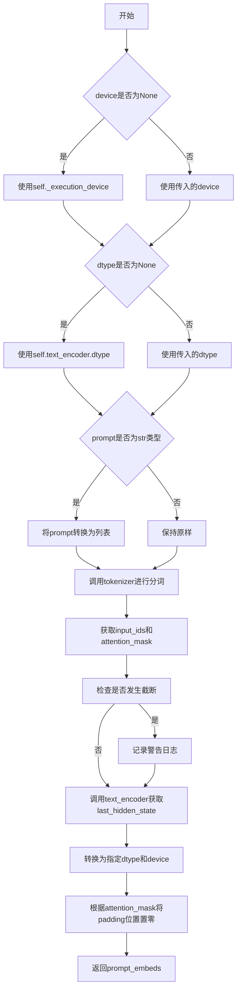

#### 带注释源码

```python
def _get_t5_prompt_embeds(
    self,
    prompt: str | list[str] = None,
    max_sequence_length: int = 512,
    device: torch.device | None = None,
    dtype: torch.dtype | None = None,
):
    """
    将文本提示编码为T5文本编码器的隐藏状态嵌入向量。
    
    Args:
        prompt: 要编码的文本提示，支持单个字符串或字符串列表
        max_sequence_length: 最大序列长度，默认512个token
        device: 执行设备，如果为None则使用self._execution_device
        dtype: 数据类型，如果为None则使用self.text_encoder.dtype
    
    Returns:
        torch.Tensor: 形状为(batch_size, seq_len, hidden_size)的文本嵌入张量
    """
    # 如果device为None，则使用执行设备
    device = device or self._execution_device
    # 如果dtype为None，则使用text_encoder的数据类型
    dtype = dtype or self.text_encoder.dtype
    # 如果prompt是单个字符串，转换为列表以统一处理
    prompt = [prompt] if isinstance(prompt, str) else prompt

    # 使用tokenizer对prompt进行分词和编码
    text_inputs = self.tokenizer(
        prompt,
        padding="max_length",              # 填充到最大长度
        max_length=max_sequence_length,    # 最大序列长度限制
        truncation=True,                    # 启用截断
        return_tensors="pt",               # 返回PyTorch张量
        return_length=True,                # 返回序列长度信息
        return_offsets_mapping=False,      # 不返回偏移映射
    )
    # 获取输入ID和注意力掩码
    text_input_ids = text_inputs.input_ids
    # 将注意力掩码转换为布尔值并移动到指定设备
    prompt_attention_mask = text_inputs.attention_mask.bool().to(device)

    # 检查是否发生截断，并记录警告信息
    untruncated_ids = self.tokenizer(prompt, padding="longest", return_tensors="pt").input_ids
    if untruncated_ids.shape[-1] >= text_input_ids.shape[-1] and not torch.equal(text_input_ids, untruncated_ids):
        # 解码被截断的部分用于日志记录
        removed_text = self.tokenizer.batch_decode(untruncated_ids[:, max_sequence_length - 1 : -1])
        logger.warning(
            "The following part of your input was truncated because `max_sequence_length` is set to "
            f" {max_sequence_length} tokens: {removed_text}"
        )

    # 调用T5文本编码器获取隐藏状态
    prompt_embeds = self.text_encoder(
        text_input_ids.to(device), attention_mask=prompt_attention_mask
    ).last_hidden_state
    # 将嵌入向量转换为指定的数据类型和设备
    prompt_embeds = prompt_embeds.to(dtype=dtype, device=device)

    # 根据注意力掩码将padding位置的嵌入向量置零
    lengths = prompt_attention_mask.sum(dim=1).cpu()
    for i, length in enumerate(lengths):
        prompt_embeds[i, length:] = 0  # 将padding位置置零

    return prompt_embeds
```


### `CosmosVideoToWorldPipeline.encode_prompt`

该方法用于将文本提示词（prompt）编码为文本编码器的隐藏状态（embeddings），支持正向提示词和负向提示词的编码处理，并在启用无分类器指导（classifier-free guidance）时自动生成负向提示词的嵌入向量。

参数：

- `prompt`：`str | list[str]`，要编码的文本提示词，支持单个字符串或字符串列表
- `negative_prompt`：`str | list[str] | None`，不参与图像生成的指导性提示词，若未定义则需传递 `negative_prompt_embeds`，在不使用 guidance 时会被忽略
- `do_classifier_free_guidance`：`bool`，是否启用无分类器指导，默认为 True
- `num_videos_per_prompt`：`int`，每个提示词生成的视频数量，默认为 1
- `prompt_embeds`：`torch.Tensor | None`，预生成的文本嵌入，可用于轻松调整文本输入，默认为 None
- `negative_prompt_embeds`：`torch.Tensor | None`，预生成的负向文本嵌入，默认为 None
- `max_sequence_length`：`int`，T5 编码器的最大序列长度，默认为 512
- `device`：`torch.device | None`，张量放置的计算设备，默认为 None
- `dtype`：`torch.dtype | None`，张量的数据类型，默认为 None

返回值：`tuple[torch.Tensor, torch.Tensor]`，返回包含正向提示词嵌入和负向提示词嵌入的元组

#### 流程图

```mermaid
flowchart TD
    A[开始 encode_prompt] --> B{device 和 dtype 是否为空}
    B -->|是| C[设置 device 为 _execution_device]
    B -->|否| D[使用传入的 device 和 dtype]
    C --> D
    D --> E{prompt 是否为字符串}
    E -->|是| F[将 prompt 转换为列表]
    E -->|否| G{prompt 是否为 None}
    F --> H
    G -->|否| H[获取 batch_size]
    G -->|是| I[batch_size = prompt_embeds.shape[0]]
    H --> J{prompt_embeds 是否为 None}
    J -->|是| K[调用 _get_t5_prompt_embeds 生成嵌入]
    J -->|否| L[跳过嵌入生成]
    K --> M{do_classifier_free_guidance 且 negative_prompt_embeds 为 None}
    L --> M
    M -->|是| N[设置负向提示词]
    M -->|否| O{negative_prompt_embeds 为 None}
    N --> P[验证 negative_prompt 与 prompt 类型匹配]
    P --> Q[验证 batch_size 匹配]
    Q --> R[调用 _get_t5_prompt_embeds 生成负向嵌入]
    R --> S[复制负向嵌入 num_videos_per_prompt 次]
    S --> T[reshape 为 batch_size * num_videos_per_prompt]
    O --> U{需要返回原始嵌入}
    T --> U
    L --> V{prompt_embeds 为 None}
    V -->|否| W[复制正向嵌入 num_videos_per_prompt 次]
    W --> X[reshape 为 batch_size * num_videos_per_prompt]
    V -->|是| Y[直接使用已有嵌入]
    X --> Z
    Y --> Z
    U --> Z[返回 prompt_embeds, negative_prompt_embeds]
```

#### 带注释源码

```python
def encode_prompt(
    self,
    prompt: str | list[str],
    negative_prompt: str | list[str] | None = None,
    do_classifier_free_guidance: bool = True,
    num_videos_per_prompt: int = 1,
    prompt_embeds: torch.Tensor | None = None,
    negative_prompt_embeds: torch.Tensor | None = None,
    max_sequence_length: int = 512,
    device: torch.device | None = None,
    dtype: torch.dtype | None = None,
):
    r"""
    Encodes the prompt into text encoder hidden states.

    Args:
        prompt (`str` or `list[str]`, *optional*):
            prompt to be encoded
        negative_prompt (`str` or `list[str]`, *optional*):
            The prompt or prompts not to guide the image generation. If not defined, one has to pass
            `negative_prompt_embeds` instead. Ignored when not using guidance (i.e., ignored if `guidance_scale` is
            less than `1`).
        do_classifier_free_guidance (`bool`, *optional*, defaults to `True`):
            Whether to use classifier free guidance or not.
        num_videos_per_prompt (`int`, *optional*, defaults to 1):
            Number of videos that should be generated per prompt. torch device to place the resulting embeddings on
        prompt_embeds (`torch.Tensor`, *optional*):
            Pre-generated text embeddings. Can be used to easily tweak text inputs, *e.g.* prompt weighting. If not
            provided, text embeddings will be generated from `prompt` input argument.
        negative_prompt_embeds (`torch.Tensor`, *optional*):
            Pre-generated negative text embeddings. Can be used to easily tweak text inputs, *e.g.* prompt
            weighting. If not provided, negative_prompt_embeds will be generated from `negative_prompt` input
            argument.
        device: (`torch.device`, *optional*):
            torch device
        dtype: (`torch.dtype`, *optional*):
            torch dtype
    """
    # 确定设备：如果未指定，则使用执行设备
    device = device or self._execution_device

    # 将字符串 prompt 转换为列表，统一处理逻辑
    prompt = [prompt] if isinstance(prompt, str) else prompt
    
    # 计算批处理大小
    if prompt is not None:
        batch_size = len(prompt)
    else:
        # 如果没有 prompt，则从已提供的 prompt_embeds 获取 batch_size
        batch_size = prompt_embeds.shape[0]

    # 如果未提供 prompt_embeds，则从 prompt 生成
    if prompt_embeds is None:
        # 调用内部方法 _get_t5_prompt_embeds 生成 T5 文本嵌入
        prompt_embeds = self._get_t5_prompt_embeds(
            prompt=prompt, max_sequence_length=max_sequence_length, device=device, dtype=dtype
        )

        # 为每个 prompt 生成的视频数量复制文本嵌入
        # 使用 MPS 友好的方法进行复制
        _, seq_len, _ = prompt_embeds.shape
        prompt_embeds = prompt_embeds.repeat(1, num_videos_per_prompt, 1)
        # reshape 为 batch_size * num_videos_per_prompt, seq_len, hidden_dim
        prompt_embeds = prompt_embeds.view(batch_size * num_videos_per_prompt, seq_len, -1)

    # 处理无分类器指导的负向嵌入
    if do_classifier_free_guidance and negative_prompt_embeds is None:
        # 如果未提供负向提示词，则使用默认负向提示词
        negative_prompt = negative_prompt if negative_prompt is not None else DEFAULT_NEGATIVE_PROMPT
        # 将负向提示词扩展为批处理大小
        negative_prompt = batch_size * [negative_prompt] if isinstance(negative_prompt, str) else negative_prompt

        # 验证 negative_prompt 与 prompt 的类型一致性
        if prompt is not None and type(prompt) is not type(negative_prompt):
            raise TypeError(
                f"`negative_prompt` should be the same type to `prompt`, but got {type(negative_prompt)} !="
                f" {type(prompt)}."
            )
        # 验证批处理大小一致性
        elif batch_size != len(negative_prompt):
            raise ValueError(
                f"`negative_prompt`: {negative_prompt} has batch size {len(negative_prompt)}, but `prompt`:"
                f" {prompt} has batch size {batch_size}. Please make sure that passed `negative_prompt` matches"
                " the batch size of `prompt`."
            )

        # 生成负向提示词嵌入
        negative_prompt_embeds = self._get_t5_prompt_embeds(
            prompt=negative_prompt, max_sequence_length=max_sequence_length, device=device, dtype=dtype
        )

        # 复制负向嵌入以匹配每个 prompt 生成的视频数量
        _, seq_len, _ = negative_prompt_embeds.shape
        negative_prompt_embeds = negative_prompt_embeds.repeat(1, num_videos_per_prompt, 1)
        # reshape 为 batch_size * num_videos_per_prompt, seq_len, hidden_dim
        negative_prompt_embeds = negative_prompt_embeds.view(batch_size * num_videos_per_prompt, seq_len, -1)

    # 返回正向和负向提示词嵌入
    return prompt_embeds, negative_prompt_embeds
```


### `CosmosVideoToWorldPipeline.prepare_latents`

该方法负责为视频到世界的生成流程准备潜在变量（latents）。它将输入视频编码为潜在表示，创建条件和非条件掩码，并初始化噪声潜在向量以用于扩散模型的去噪过程。

参数：

- `video`：`torch.Tensor`，输入视频张量，形状为 (batch, channels, frames, height, width)
- `batch_size`：`int`，批次大小
- `num_channels_latents`：`int`，潜在空间的通道数，默认为16
- `height`：`int`，输出视频的高度，默认为704像素
- `width`：`int`，输出视频的宽度，默认为1280像素
- `num_frames`：`int`，输出视频的帧数，默认为121帧
- `do_classifier_free_guidance`：`bool`，是否启用无分类器自由引导（CFG），默认为True
- `input_frames_guidance`：`bool`，是否对输入帧进行引导，默认为False
- `dtype`：`torch.dtype | None`，潜在张量的数据类型
- `device`：`torch.device | None`，计算设备
- `generator`：`torch.Generator | list[torch.Generator] | None`，用于生成随机数的生成器
- `latents`：`torch.Tensor | None`，可选的预定义潜在张量

返回值：`tuple[torch.Tensor, torch.Tensor, torch.Tensor, torch.Tensor, torch.Tensor, torch.Tensor]`，返回一个包含六个元素的元组：
- `latents`：初始化的噪声潜在张量
- `init_latents`：VAE编码后的视频潜在表示
- `cond_indicator`：条件帧的指示器张量
- `uncond_indicator`：无条件帧的指示器张量（用于CFG）
- `cond_mask`：条件帧的掩码
- `uncond_mask`：无条件帧的掩码

#### 流程图

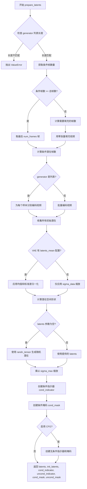

#### 带注释源码

```python
def prepare_latents(
    self,
    video: torch.Tensor,                    # 输入视频张量 (batch, channels, frames, height, width)
    batch_size: int,                         # 批次大小
    num_channels_latents: int = 16,         # 潜在通道数
    height: int = 704,                      # 输出高度
    width: int = 1280,                      # 输出宽度
    num_frames: int = 121,                  # 输出帧数
    do_classifier_free_guidance: bool = True,  # 是否启用无分类器引导
    input_frames_guidance: bool = False,    # 是否对输入帧进行引导
    dtype: torch.dtype | None = None,        # 数据类型
    device: torch.device | None = None,     # 计算设备
    generator: torch.Generator | list[torch.Generator] | None = None,  # 随机生成器
    latents: torch.Tensor | None = None,    # 可选的预定义潜在张量
) -> torch.Tensor:
    # 1. 验证生成器列表长度与批次大小是否匹配
    if isinstance(generator, list) and len(generator) != batch_size:
        raise ValueError(
            f"You have passed a list of generators of length {len(generator)}, but requested an effective batch"
            f" size of {batch_size}. Make sure the batch size matches the length of the generators."
        )

    # 2. 获取输入视频中的条件帧数量
    num_cond_frames = video.size(2)
    
    # 3. 根据条件帧数量处理视频：如果条件帧足够则取最后num_frames帧，否则进行填充
    if num_cond_frames >= num_frames:
        # 取最后 num_frames 帧用于条件处理
        num_cond_latent_frames = (num_frames - 1) // self.vae_scale_factor_temporal + 1
        video = video[:, :, -num_frames:]
    else:
        # 条件帧不足，用零张量填充到 num_frames
        num_cond_latent_frames = (num_cond_frames - 1) // self.vae_scale_factor_temporal + 1
        num_padding_frames = num_frames - num_cond_frames
        padding = video.new_zeros(video.size(0), video.size(1), num_padding_frames, video.size(3), video.size(4))
        video = torch.cat([video, padding], dim=2)

    # 4. 使用 VAE 编码视频到潜在空间
    if isinstance(generator, list):
        # 每个样本使用不同的生成器
        init_latents = [
            retrieve_latents(self.vae.encode(video[i].unsqueeze(0)), generator=generator[i])
            for i in range(batch_size)
        ]
    else:
        # 批量编码
        init_latents = [retrieve_latents(self.vae.encode(vid.unsqueeze(0)), generator) for vid in video]

    # 5. 拼接并转换数据类型
    init_latents = torch.cat(init_latents, dim=0).to(dtype)

    # 6. 根据 VAE 配置进行潜在表示的归一化处理
    if self.vae.config.latents_mean is not None:
        # 如果 VAE 配置了均值和标准差，进行标准化
        latents_mean, latents_std = self.vae.config.latents_mean, self.vae.config.latents_std
        latents_mean = (
            torch.tensor(latents_mean)
            .view(1, self.vae.config.latent_channels, -1, 1, 1)[:, :, : init_latents.size(2)]
            .to(init_latents)
        )
        latents_std = (
            torch.tensor(latents_std)
            .view(1, self.vae.config.latent_channels, -1, 1, 1)[:, :, : init_latents.size(2)]
            .to(init_latents)
        )
        # 应用归一化：(x - mean) * sigma_data / std
        init_latents = (init_latents - latents_mean) * self.scheduler.config.sigma_data / latents_std
    else:
        # 简化处理：仅乘以 sigma_data
        init_latents = init_latents * self.scheduler.config.sigma_data

    # 7. 计算潜在空间的形状参数
    num_latent_frames = (num_frames - 1) // self.vae_scale_factor_temporal + 1
    latent_height = height // self.vae_scale_factor_spatial
    latent_width = width // self.vae_scale_factor_spatial
    # 形状: (batch, channels, latent_frames, latent_height, latent_width)
    shape = (batch_size, num_channels_latents, num_latent_frames, latent_height, latent_width)

    # 8. 初始化噪声潜在张量
    if latents is None:
        # 使用随机张量初始化
        latents = randn_tensor(shape, generator=generator, device=device, dtype=dtype)
    else:
        # 使用提供的潜在张量并转换到指定设备和类型
        latents = latents.to(device=device, dtype=dtype)

    # 9. 使用 sigma_max 缩放初始潜在
    latents = latents * self.scheduler.config.sigma_max

    # 10. 创建条件指示器和掩码，用于标记哪些帧是条件帧
    padding_shape = (batch_size, 1, num_latent_frames, latent_height, latent_width)
    ones_padding = latents.new_ones(padding_shape)
    zeros_padding = latents.new_zeros(padding_shape)

    # 创建条件指示器：前 num_cond_latent_frames 帧标记为 1（条件帧）
    cond_indicator = latents.new_zeros(1, 1, latents.size(2), 1, 1)
    cond_indicator[:, :, :num_cond_latent_frames] = 1.0
    # 创建条件掩码：将条件帧位置填充为1，其他位置填充为0
    cond_mask = cond_indicator * ones_padding + (1 - cond_indicator) * zeros_padding

    # 11. 如果启用无分类器自由引导，创建无条件指示器和掩码
    uncond_indicator = uncond_mask = None
    if do_classifier_free_guidance:
        # 创建无条件指示器
        uncond_indicator = latents.new_zeros(1, 1, latents.size(2), 1, 1)
        uncond_indicator[:, :, :num_cond_latent_frames] = 1.0
        uncond_mask = zeros_padding
        
        # 根据 input_frames_guidance 决定无条件掩码的形式
        if not input_frames_guidance:
            # 如果不单独对输入帧进行引导，无条件部分也使用条件帧
            uncond_mask = uncond_indicator * ones_padding + (1 - uncond_indicator) * zeros_padding

    # 12. 返回所有准备好的潜在变量和掩码
    return latents, init_latents, cond_indicator, uncond_indicator, cond_mask, uncond_mask
```


### `CosmosVideoToWorldPipeline.check_inputs`

该方法用于验证图像到世界（Image-to-World）和视频到世界（Video-to-World）生成管道的输入参数是否合法，确保高度和宽度能被16整除、回调张量输入有效、提示词和提示词嵌入不同时提供、提示词类型正确，以及图像和视频输入互斥且至少提供一个。

参数：

- `self`：`CosmosVideoToWorldPipeline` 实例，管道对象本身
- `prompt`：`str | list[str] | None`，用于指导视频生成的提示词，可以是字符串或字符串列表
- `height`：`int`，生成视频的高度（像素），必须能被16整除
- `width`：`int`，生成视频的宽度（像素），必须能被16整除
- `prompt_embeds`：`torch.Tensor | None`，预生成的文本嵌入，与 `prompt` 互斥
- `callback_on_step_end_tensor_inputs`：`list[str] | None`，在每个去噪步骤结束时回调的张量输入列表，必须是 `_callback_tensor_inputs` 的子集
- `image`：`PipelineImageInput | None`，用于 conditioning 的输入图像，与 `video` 互斥
- `video`：`list[PipelineImageInput] | None`，用于 conditioning 的输入视频帧列表，与 `image` 互斥

返回值：`None`，该方法通过抛出 `ValueError` 来指示输入错误，不返回任何值

#### 流程图

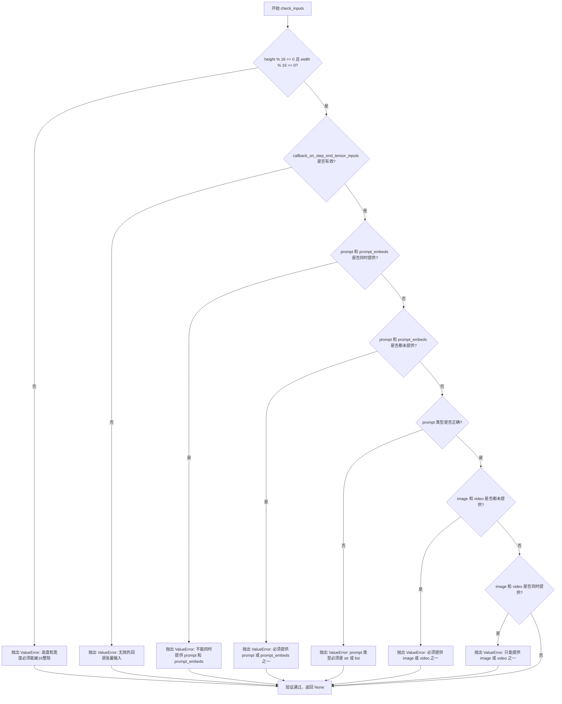

#### 带注释源码

```python
def check_inputs(
    self,
    prompt,
    height,
    width,
    prompt_embeds=None,
    callback_on_step_end_tensor_inputs=None,
    image=None,
    video=None,
):
    """
    验证管道输入参数的有效性。
    
    检查以下内容：
    1. height 和 width 必须能被 16 整除
    2. callback_on_step_end_tensor_inputs 必须是有效的回调张量输入
    3. prompt 和 prompt_embeds 不能同时提供
    4. prompt 和 prompt_embeds 不能同时为空
    5. prompt 必须是 str 或 list 类型
    6. image 和 video 不能同时为空
    7. image 和 video 不能同时提供
    """
    
    # 检查高度和宽度是否可以被16整除，这是Transformer模型的要求
    if height % 16 != 0 or width % 16 != 0:
        raise ValueError(f"`height` and `width` have to be divisible by 16 but are {height} and {width}.")

    # 验证回调张量输入是否在允许的列表中
    if callback_on_step_end_tensor_inputs is not None and not all(
        k in self._callback_tensor_inputs for k in callback_on_step_end_tensor_inputs
    ):
        raise ValueError(
            f"`callback_on_step_end_tensor_inputs` has to be in {self._callback_tensor_inputs}, but found {[k for k in callback_on_step_end_tensor_inputs if k not in self._callback_tensor_inputs]}"
        )

    # 检查 prompt 和 prompt_embeds 是否互斥，不能同时提供
    if prompt is not None and prompt_embeds is not None:
        raise ValueError(
            f"Cannot forward both `prompt`: {prompt} and `prompt_embeds`: {prompt_embeds}. Please make sure to"
            " only forward one of the two."
        )
    # 检查 prompt 和 prompt_embeds 是否至少提供一个
    elif prompt is None and prompt_embeds is None:
        raise ValueError(
            "Provide either `prompt` or `prompt_embeds`. Cannot leave both `prompt` and `prompt_embeds` undefined."
        )
    # 验证 prompt 的类型必须是 str 或 list
    elif prompt is not None and (not isinstance(prompt, str) and not isinstance(prompt, list)):
        raise ValueError(f"`prompt` has to be of type `str` or `list` but is {type(prompt)}")

    # 检查是否至少提供了 image 或 video 其中一个作为 conditioning 输入
    if image is None and video is None:
        raise ValueError("Either `image` or `video` has to be provided.")
    # 检查 image 和 video 是否互斥，只能选择其中一个作为输入
    if image is not None and video is not None:
        raise ValueError("Only one of `image` or `video` has to be provided.")
```


### `CosmosVideoToWorldPipeline.__call__`

该方法是 Cosmos 视频到世界生成管道的主入口函数，接收图像或视频作为输入条件，结合文本提示，通过扩散模型的去噪过程生成新的视频内容。

参数：

- `image`：`PipelineImageInput`，输入的图像条件，用于图像到世界的生成模式
- `video`：`list[PipelineImageInput]`，输入的视频帧列表，用于视频到世界的生成模式
- `prompt`：`str | list[str]`，引导视频生成的文本提示
- `negative_prompt`：`str | list[str] | None`，负面提示，用于排除不希望出现的内容
- `height`：`int`，生成视频的高度，默认 704 像素
- `width`：`int`，生成视频的宽度，默认 1280 像素
- `num_frames`：`int`，生成视频的帧数，默认 121 帧
- `num_inference_steps`：`int`，去噪推理的步数，默认 36 步
- `guidance_scale`：`float`，分类器自由引导的权重，默认 7.0
- `input_frames_guidance`：`bool`，是否对输入帧进行引导，默认 False
- `augment_sigma`：`float`，增强 sigma 值，默认 0.001
- `fps`：`int`，生成视频的帧率，默认 30 fps
- `num_videos_per_prompt`：`int | None`，每个提示生成的视频数量，默认 1
- `generator`：`torch.Generator | list[torch.Generator] | None`，用于生成确定性随机数的生成器
- `latents`：`torch.Tensor | None`，预生成的噪声潜在向量，可用于控制生成过程
- `prompt_embeds`：`torch.Tensor | None`，预生成的文本嵌入，可用于避免重复编码
- `negative_prompt_embeds`：`torch.Tensor | None`，预生成的负面文本嵌入
- `output_type`：`str`，输出格式，可选 "pil" 或 "latent"，默认 "pil"
- `return_dict`：`bool`，是否返回字典格式的结果，默认 True
- `callback_on_step_end`：`Callable | PipelineCallback | MultiPipelineCallbacks | None`，每步结束时的回调函数
- `callback_on_step_end_tensor_inputs`：`list[str]`，回调函数需要接收的张量输入列表，默认 ["latents"]
- `max_sequence_length`：`int`，文本编码的最大序列长度，默认 512

返回值：`CosmosPipelineOutput | tuple`，如果 `return_dict` 为 True，返回 `CosmosPipelineOutput` 对象，包含生成的视频帧；否则返回元组，第一个元素是视频帧列表

#### 流程图

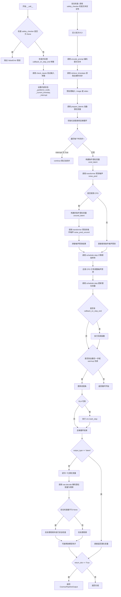

#### 带注释源码

```python
@torch.no_grad()
@replace_example_docstring(EXAMPLE_DOC_STRING)
def __call__(
    self,
    image: PipelineImageInput = None,
    video: list[PipelineImageInput] = None,
    prompt: str | list[str] = None,
    negative_prompt: str | list[str] | None = None,
    height: int = 704,
    width: int = 1280,
    num_frames: int = 121,
    num_inference_steps: int = 36,
    guidance_scale: float = 7.0,
    input_frames_guidance: bool = False,
    augment_sigma: float = 0.001,
    fps: int = 30,
    num_videos_per_prompt: int | None = 1,
    generator: torch.Generator | list[torch.Generator] | None = None,
    latents: torch.Tensor | None = None,
    prompt_embeds: torch.Tensor | None = None,
    negative_prompt_embeds: torch.Tensor | None = None,
    output_type: str | None = "pil",
    return_dict: bool = True,
    callback_on_step_end: Callable[[int, int], None] | PipelineCallback | MultiPipelineCallbacks | None = None,
    callback_on_step_end_tensor_inputs: list[str] = ["latents"],
    max_sequence_length: int = 512,
):
    # 检查 safety_checker 是否已禁用，NVIDIA 许可证要求必须启用安全检查
    if self.safety_checker is None:
        raise ValueError(
            f"You have disabled the safety check for {self.__class__}. This is in violation of the "
            "[NVIDIA Open Model License Agreement](https://www.nvidia.com/en-us/agreements/enterprise-software/nvidia-open-model-license). "
            f"Please ensure that you are compliant with the license agreement."
        )

    # 处理回调函数：如果传入的是 PipelineCallback 或 MultiPipelineCallbacks 对象，
    # 自动从中获取需要监听的 tensor 输入列表
    if isinstance(callback_on_step_end, (PipelineCallback, MultiPipelineCallbacks)):
        callback_on_step_end_tensor_inputs = callback_on_step_end.tensor_inputs

    # 1. 检查输入参数的有效性，包括高度宽度、提示、图像/视频等
    self.check_inputs(prompt, height, width, prompt_embeds, callback_on_step_end_tensor_inputs, image, video)

    # 初始化内部状态：引导比例、当前时间步和中断标志
    self._guidance_scale = guidance_scale
    self._current_timestep = None
    self._interrupt = False

    # 获取执行设备
    device = self._execution_device

    # 2. 安全检查：将 safety_checker 移到设备上，检查提示文本是否安全
    if self.safety_checker is not None:
        self.safety_checker.to(device)
        if prompt is not None:
            prompt_list = [prompt] if isinstance(prompt, str) else prompt
            for p in prompt_list:
                if not self.safety_checker.check_text_safety(p):
                    raise ValueError(
                        f"Cosmos Guardrail detected unsafe text in the prompt: {p}. Please ensure that the "
                        f"prompt abides by the NVIDIA Open Model License Agreement."
                    )
        # 检查完后移回 CPU，节省 GPU 显存
        self.safety_checker.to("cpu")

    # 3. 定义调用参数：根据 prompt 或 prompt_embeds 确定批次大小
    if prompt is not None and isinstance(prompt, str):
        batch_size = 1
    elif prompt is not None and isinstance(prompt, list):
        batch_size = len(prompt)
    else:
        batch_size = prompt_embeds.shape[0]

    # 4. 编码输入提示：生成 prompt_embeds 和 negative_prompt_embeds
    (
        prompt_embeds,
        negative_prompt_embeds,
    ) = self.encode_prompt(
        prompt=prompt,
        negative_prompt=negative_prompt,
        do_classifier_free_guidance=self.do_classifier_free_guidance,
        num_videos_per_prompt=num_videos_per_prompt,
        prompt_embeds=prompt_embeds,
        negative_prompt_embeds=negative_prompt_embeds,
        device=device,
        max_sequence_length=max_sequence_length,
    )

    # 5. 准备时间步：使用调度器获取去噪的时间步序列
    timesteps, num_inference_steps = retrieve_timesteps(self.scheduler, num_inference_steps, device)

    # 6. 准备潜在变量：获取 VAE 和 transformer 的数据类型
    vae_dtype = self.vae.dtype
    transformer_dtype = self.transformer.dtype

    # 预处理输入：根据是否有 image 或 video 进行预处理
    if image is not None:
        # 图像模式：将图像预处理并添加时间维度
        video = self.video_processor.preprocess(image, height, width).unsqueeze(2)
    else:
        # 视频模式：直接预处理视频
        video = self.video_processor.preprocess_video(video, height, width)
    # 将视频转移到指定设备并转换为 VAE 数据类型
    video = video.to(device=device, dtype=vae_dtype)

    # 计算潜在通道数（输入通道减1，因为有条件指标通道）
    num_channels_latents = self.transformer.config.in_channels - 1
    # 准备潜在变量、 conditioning 潜在变量、指标和掩码
    latents, conditioning_latents, cond_indicator, uncond_indicator, cond_mask, uncond_mask = self.prepare_latents(
        video,
        batch_size * num_videos_per_prompt,
        num_channels_latents,
        height,
        width,
        num_frames,
        self.do_classifier_free_guidance,
        input_frames_guidance,
        torch.float32,
        device,
        generator,
        latents,
    )
    # 将掩码转换为 transformer 数据类型
    cond_mask = cond_mask.to(transformer_dtype)
    if self.do_classifier_free_guidance:
        uncond_mask = uncond_mask.to(transformer_dtype)

    # 初始化增强 sigma 和填充掩码
    augment_sigma = torch.tensor([augment_sigma], device=device, dtype=torch.float32)
    padding_mask = latents.new_zeros(1, 1, height, width, dtype=transformer_dtype)

    # 7. 去噪循环：执行主要的扩散过程
    num_warmup_steps = len(timesteps) - num_inference_steps * self.scheduler.order
    self._num_timesteps = len(timesteps)

    # 创建进度条
    with self.progress_bar(total=num_inference_steps) as progress_bar:
        # 遍历每个时间步
        for i, t in enumerate(timesteps):
            # 检查中断标志，允许外部中断去噪过程
            if self.interrupt:
                continue

            self._current_timestep = t
            # 扩展时间步以匹配批次大小
            timestep = t.expand(latents.shape[0]).to(transformer_dtype)

            # 获取当前 sigma 值并比较与增强 sigma
            current_sigma = self.scheduler.sigmas[i]
            is_augment_sigma_greater = augment_sigma >= current_sigma

            # 获取条件化 c_in 值
            c_in_augment = self.scheduler._get_conditioning_c_in(augment_sigma)
            c_in_original = self.scheduler._get_conditioning_c_in(current_sigma)

            # 根据 sigma 比较结果调整条件指标
            current_cond_indicator = cond_indicator * 0 if is_augment_sigma_greater else cond_indicator
            # 为条件潜在变量添加噪声
            cond_noise = randn_tensor(latents.shape, generator=generator, device=device, dtype=torch.float32)
            cond_latent = conditioning_latents + cond_noise * augment_sigma[:, None, None, None, None]
            cond_latent = cond_latent * c_in_augment / c_in_original
            # 根据条件指标混合潜在变量
            cond_latent = current_cond_indicator * cond_latent + (1 - current_cond_indicator) * latents
            cond_latent = self.scheduler.scale_model_input(cond_latent, t)
            cond_latent = cond_latent.to(transformer_dtype)

            # 调用 transformer 模型预测噪声（条件分支）
            noise_pred = self.transformer(
                hidden_states=cond_latent,
                timestep=timestep,
                encoder_hidden_states=prompt_embeds,
                fps=fps,
                condition_mask=cond_mask,
                padding_mask=padding_mask,
                return_dict=False,
            )[0]

            # 初始化样本为当前潜在变量
            sample = latents
            
            # 如果使用分类器自由引导（CFG），还需要处理非条件分支
            if self.do_classifier_free_guidance:
                current_uncond_indicator = uncond_indicator * 0 if is_augment_sigma_greater else uncond_indicator
                uncond_noise = randn_tensor(latents.shape, generator=generator, device=device, dtype=torch.float32)
                uncond_latent = conditioning_latents + uncond_noise * augment_sigma[:, None, None, None, None]
                uncond_latent = uncond_latent * c_in_augment / c_in_original
                uncond_latent = current_uncond_indicator * uncond_latent + (1 - current_uncond_indicator) * latents
                uncond_latent = self.scheduler.scale_model_input(uncond_latent, t)
                uncond_latent = uncond_latent.to(transformer_dtype)

                # 调用 transformer 模型预测噪声（非条件分支，使用 negative_prompt_embeds）
                noise_pred_uncond = self.transformer(
                    hidden_states=uncond_latent,
                    timestep=timestep,
                    encoder_hidden_states=negative_prompt_embeds,
                    fps=fps,
                    condition_mask=uncond_mask,
                    padding_mask=padding_mask,
                    return_dict=False,
                )[0]
                # 拼接条件和非条件噪声预测
                noise_pred = torch.cat([noise_pred_uncond, noise_pred])
                sample = torch.cat([sample, sample])

            # 使用调度器步骤计算原始样本（x0）
            noise_pred = self.scheduler.step(noise_pred, t, sample, return_dict=False)[1]
            # 回退一步索引以便复用
            self.scheduler._step_index -= 1

            # 应用 CFG 引导：根据条件指标和引导比例调整噪声预测
            if self.do_classifier_free_guidance:
                noise_pred_uncond, noise_pred_cond = noise_pred.chunk(2, dim=0)
                # 对非条件预测应用条件指标
                noise_pred_uncond = (
                    current_uncond_indicator * conditioning_latents
                    + (1 - current_uncond_indicator) * noise_pred_uncond
                )
                # 对条件预测应用条件指标
                noise_pred_cond = (
                    current_cond_indicator * conditioning_latents + (1 - current_cond_indicator) * noise_pred_cond
                )
                # 应用 CFG 公式：pred = pred_cond + scale * (pred_cond - pred_uncond)
                noise_pred = noise_pred_cond + self.guidance_scale * (noise_pred_cond - noise_pred_uncond)
            else:
                noise_pred = (
                    current_cond_indicator * conditioning_latents + (1 - current_cond_indicator) * noise_pred
                )

            # 使用调度器步骤更新潜在变量（预测噪声模式）
            latents = self.scheduler.step(
                noise_pred, t, latents, return_dict=False, pred_original_sample=noise_pred
            )[0]

            # 如果提供了回调函数，在每步结束时调用
            if callback_on_step_end is not None:
                callback_kwargs = {}
                for k in callback_on_step_end_tensor_inputs:
                    callback_kwargs[k] = locals()[k]
                callback_outputs = callback_on_step_end(self, i, t, callback_kwargs)

                # 允许回调修改潜在变量和嵌入
                latents = callback_outputs.pop("latents", latents)
                prompt_embeds = callback_outputs.pop("prompt_embeds", prompt_embeds)
                negative_prompt_embeds = callback_outputs.pop("negative_prompt_embeds", negative_prompt_embeds)

            # 在特定条件下更新进度条：最后一步或完成 warmup 后每 scheduler.order 步
            if i == len(timesteps) - 1 or ((i + 1) > num_warmup_steps and (i + 1) % self.scheduler.order == 0):
                progress_bar.update()

            # 如果使用 PyTorch XLA，标记计算步骤
            if XLA_AVAILABLE:
                xm.mark_step()

    # 重置当前时间步
    self._current_timestep = None

    # 8. 后处理：如果不需要 latent 输出，则解码潜在变量
    if not output_type == "latent":
        # 逆归一化潜在变量（如果使用均值和标准差）
        if self.vae.config.latents_mean is not None:
            latents_mean, latents_std = self.vae.config.latents_mean, self.vae.config.latents_std
            latents_mean = (
                torch.tensor(latents_mean)
                .view(1, self.vae.config.latent_channels, -1, 1, 1)[:, :, : latents.size(2)]
                .to(latents)
            )
            latents_std = (
                torch.tensor(latents_std)
                .view(1, self.vae.config.latent_channels, -1, 1, 1)[:, :, : latents.size(2)]
                .to(latents)
            )
            latents = latents * latents_std / self.scheduler.config.sigma_data + latents_mean
        else:
            latents = latents / self.scheduler.config.sigma_data
        
        # 使用 VAE 解码潜在变量生成视频
        video = self.vae.decode(latents.to(vae_dtype), return_dict=False)[0]

        # 如果有安全检查器，进行安全检查
        if self.safety_checker is not None:
            self.safety_checker.to(device)
            # 后处理视频为 numpy 数组并转换为 uint8
            video = self.video_processor.postprocess_video(video, output_type="np")
            video = (video * 255).astype(np.uint8)
            video_batch = []
            # 对每个视频进行安全检查
            for vid in video:
                vid = self.safety_checker.check_video_safety(vid)
                video_batch.append(vid)
            # 重新归一化并转换为张量
            video = np.stack(video_batch).astype(np.float32) / 255.0 * 2 - 1
            video = torch.from_numpy(video).permute(0, 4, 1, 2, 3)
            video = self.video_processor.postprocess_video(video, output_type=output_type)
            self.safety_checker.to("cpu")
        else:
            video = self.video_processor.postprocess_video(video, output_type=output_type)
    else:
        # 直接返回潜在变量（用于调试或后续处理）
        video = latents

    # 释放所有模型的钩子（CPU offload 等）
    self.maybe_free_model_hooks()

    # 9. 返回结果
    if not return_dict:
        return (video,)

    # 返回 CosmosPipelineOutput 对象
    return CosmosPipelineOutput(frames=video)
```


### `CosmosVideoToWorldPipeline.guidance_scale`

该属性是一个只读的 getter 属性，用于获取在图像/视频生成过程中使用的分类器自由引导（Classifier-Free Guidance）比例。该比例控制生成过程中条件生成与非条件生成之间的权重，从而影响生成结果与提示词的对齐程度。

参数：无需参数

返回值：`float`，返回分类器自由引导的比例系数，用于控制生成内容与输入提示词的对齐程度。数值越大，生成内容与提示词越相关。

#### 流程图

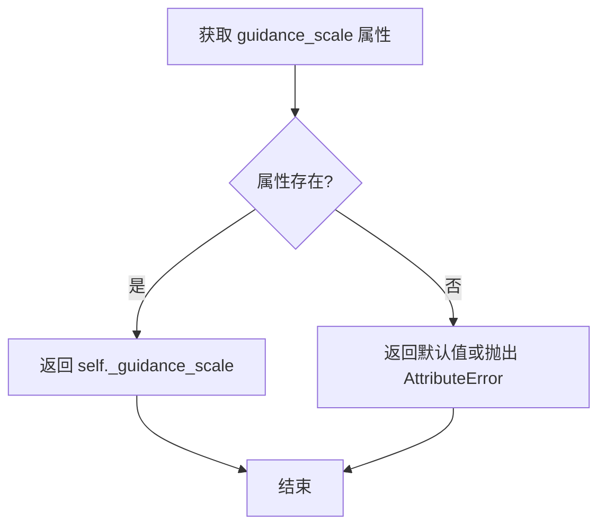

#### 带注释源码

```python
@property
def guidance_scale(self):
    """
    获取分类器自由引导（Classifier-Free Guidance）的比例系数。

    该属性返回一个浮点数，表示在扩散模型的采样过程中
    用于控制条件生成与非条件生成之间权重的比例系数。
    这个值在 __call__ 方法中被设置为 self._guidance_scale。

    返回值:
        float: 分类器自由引导的比例系数。值越大，生成内容
               与输入提示词的相关性越高。通常范围在 1.0 到 20.0 之间，
               默认值为 7.0。
    """
    return self._guidance_scale
```


### `CosmosVideoToWorldPipeline.do_classifier_free_guidance`

该属性用于判断当前是否启用分类器自由引导（Classifier-Free Guidance）。它通过检查引导系数 `guidance_scale` 是否大于 1.0 来决定是否启用无分类器引导生成。

参数：无（该方法为属性，无需参数）

返回值：`bool`，返回是否启用分类器自由引导。当 `guidance_scale > 1.0` 时返回 `True`，否则返回 `False`。

#### 流程图

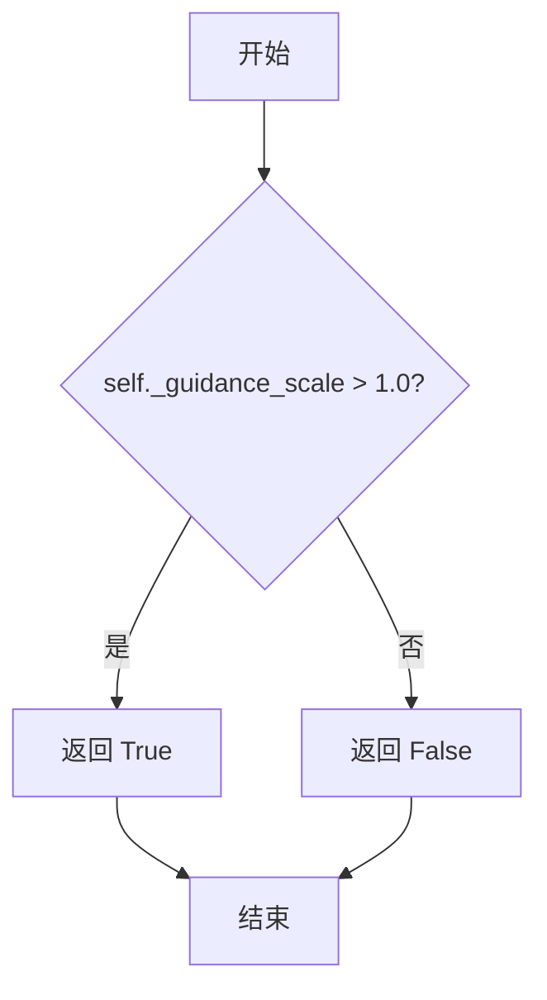

#### 带注释源码

```python
@property
def do_classifier_free_guidance(self):
    """
    属性：判断是否启用分类器自由引导（Classifier-Free Guidance）
    
    分类器自由引导是一种在扩散模型生成过程中同时使用条件（带提示词）
    和非条件（不带提示词）预测的技术，通过两者的差异来引导生成更符合
    提示词的结果。
    
    当 guidance_scale > 1.0 时，引导效果才会生效，此属性用于在流水线中
    动态判断是否需要进行非条件预测和引导计算。
    
    返回：
        bool: 如果 guidance_scale 大于 1.0 则返回 True，表示启用分类器自由引导；
              否则返回 False，表示不启用
    """
    return self._guidance_scale > 1.0
```


### `CosmosVideoToWorldPipeline.num_timesteps`

该属性是 `CosmosVideoToWorldPipeline` 类的只读属性，用于返回去噪推理过程中的时间步（timesteps）数量。在去噪循环开始前，`_num_timesteps` 会被设置为 `len(timesteps)`，该属性提供对此值的访问。

参数：
- 无参数（属性访问器）

返回值：`int`，返回推理过程中使用的时间步总数。

#### 流程图

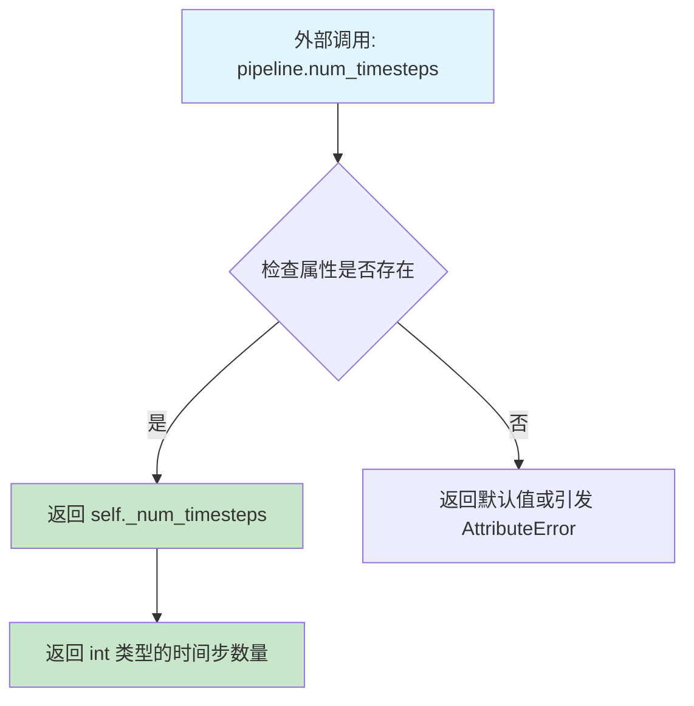

#### 带注释源码

```python
@property
def num_timesteps(self):
    """
    只读属性，返回去噪推理过程中的时间步数量。
    
    该属性在 __call__ 方法的去噪循环开始前被设置：
    self._num_timesteps = len(timesteps)
    
    Returns:
        int: 推理过程中使用的时间步总数
    """
    return self._num_timesteps
```


### `CosmosVideoToWorldPipeline.current_timestep`

该属性是一个只读属性，用于获取当前扩散过程的时间步（timestep）。在管道执行的去噪循环过程中，它返回当前正在处理的时间步值；在循环开始前和结束后返回 `None`。

参数：None

返回值：`torch.Tensor | None`，返回当前扩散迭代的时间步张量，如果当前不在去噪循环中则返回 `None`

#### 流程图

```mermaid
flowchart TD
    A[访问 current_timestep 属性] --> B{是否在去噪循环中}
    B -->|是 --> C[返回 self._current_timestep]
    B -->|否 --> D[返回 None]
    C --> E[获取当前扩散步骤的时间步]
    D --> F[扩散循环未开始或已结束]
```

#### 带注释源码

```python
@property
def current_timestep(self):
    """
    当前时间步属性
    
    该属性返回扩散去噪过程中的当前时间步。在 __call__ 方法的去噪循环中，
    每次迭代都会将 self._current_timestep 设置为当前的时间步值 t，使外部
    调用者能够实时监控扩散过程的进度。
    
    返回值:
        torch.Tensor | None: 当前去噪步骤的时间步张量。如果当前不在去噪循环中
                           （即循环开始前或结束后），则返回 None。
    
    使用场景:
        - 监控扩散模型的推理进度
        - 在回调函数中获取当前处理的时间步
        - 调试或日志记录扩散过程状态
    """
    return self._current_timestep
```


### `CosmosVideoToWorldPipeline.interrupt`

该属性是一个用于控制管道生成过程中断的开关属性。通过返回内部标志位 `_interrupt`，外部调用者可以在管道运行过程中动态设置该标志为 `True`，从而在下一个迭代周期跳过 denoising 循环，实现即时的生成中断控制。

参数：无（属性访问器不接受参数）

返回值：`bool`，返回当前的中断状态标志。`False` 表示继续生成，`True` 表示请求中断当前生成过程。

#### 流程图

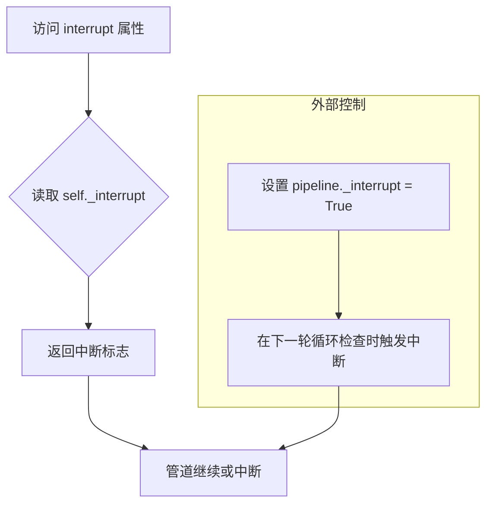

#### 带注释源码

```python
@property
def interrupt(self):
    """
    中断属性，用于控制管道执行过程的中断。
    
    该属性提供一个接口让外部代码可以在管道运行过程中请求中断生成过程。
    当设置为 True 时，denoising 循环中的每次迭代都会检查该属性，
    如果为 True 则跳过当前迭代，继续执行直到完成。
    
    使用示例：
        pipe = CosmosVideoToWorldPipeline.from_pretrained(...)
        # 在另一个线程或回调中设置中断标志
        pipe._interrupt = True  # 请求中断生成
    
    返回：
        bool: 当前的中断状态。初始值为 False，当外部代码请求中断时会被设置为 True。
    """
    return self._interrupt
```

#### 关联字段说明

| 字段名称 | 类型 | 描述 |
|---------|------|------|
| `_interrupt` | `bool` | 管道内部的中断标志位，用于控制生成过程是否被中断。该字段在 `__call__` 方法开始时被初始化为 `False`，外部可通过直接赋值 `pipeline._interrupt = True` 来请求中断。 |


### `CosmosSafetyChecker.__init__`

初始化方法，用于创建 CosmosSafetyChecker 安全检查器实例。如果 `cosmos_guardrail` 库未安装，则抛出 ImportError 提示用户安装。

参数：

- `*args`：可变位置参数，任意额外的位置参数（传递给底层安全检查器）
- `**kwargs`：可变关键字参数，任意额外的关键字参数（传递给底层安全检查器）

返回值：无返回值（方法内部会抛出异常）

#### 流程图

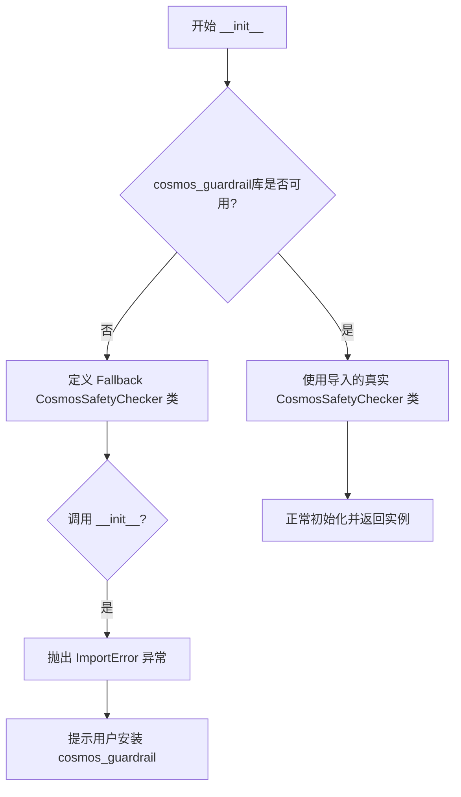

#### 带注释源码

```python
class CosmosSafetyChecker:
    def __init__(self, *args, **kwargs):
        """
        初始化 CosmosSafetyChecker 安全检查器。
        
        注意：当 cosmos_guardrail 库不可用时，此初始化方法会抛出 ImportError。
        这是因为在文件开头通过条件导入尝试导入真实的 CosmosSafetyChecker：
        
        if is_cosmos_guardrail_available():
            from cosmos_guardrail import CosmosSafetyChecker
        else:
            class CosmosSafetyChecker:
                ...
        
        当库可用时，使用真实的检查器类；不可用时，使用此 fallback 类
        并在初始化时提示用户安装。
        
        Args:
            *args: 可变位置参数，传递给底层安全检查器的任意额外参数
            **kwargs: 可变关键字参数，传递给底层安全检查器的任意额外参数
        
        Raises:
            ImportError: 当 cosmos_guardrail 库未安装时抛出，提示用户安装
        """
        raise ImportError(
            "`cosmos_guardrail` is not installed. Please install it to use the safety checker for Cosmos: `pip install cosmos_guardrail`."
        )
```


### `CosmosSafetyChecker.check_text_safety`

该方法由外部库 `cosmos_guardrail` 提供，用于检查输入文本是否包含不安全内容（违反NVIDIA开放模型许可证协议）。在 Cosmos 视频生成管道中，所有用户提供的 prompt 必须通过此安全检查，否则将抛出异常。

参数：

-  `text`：`str`，需要检查安全性的文本（prompt）

返回值：`bool`，如果文本通过安全检查返回 `True`，否则返回 `False`

#### 流程图

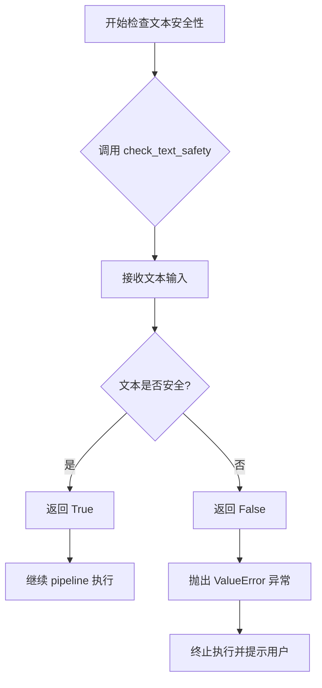

#### 带注释源码

```
# 注意：CosmosSafetyChecker 类从外部库 cosmos_guardrail 导入
# 以下是调用该方法的代码上下文（在 CosmosVideoToWorldPipeline.__call__ 中）：

if self.safety_checker is not None:
    # 将安全检查器移动到指定设备
    self.safety_checker.to(device)
    
    # 如果提供了 prompt
    if prompt is not None:
        # 统一转换为列表
        prompt_list = [prompt] if isinstance(prompt, str) else prompt
        
        # 遍历每个 prompt 进行安全检查
        for p in prompt_list:
            # 调用外部库的 check_text_safety 方法检查文本安全性
            if not self.safety_checker.check_text_safety(p):
                # 如果检测到不安全文本，抛出异常
                raise ValueError(
                    f"Cosmos Guardrail detected unsafe text in the prompt: {p}. Please ensure that the "
                    f"prompt abides by the NVIDIA Open Model License Agreement."
                )
    
    # 检查完成后将安全检查器移回 CPU
    self.safety_checker.to("cpu")

# 下面是 CosmosSafetyChecker 的 stub 定义（当库不可用时使用）：

if is_cosmos_guardrail_available():
    from cosmos_guardrail import CosmosSafetyChecker
else:
    class CosmosSafetyChecker:
        def __init__(self, *args, **kwargs):
            raise ImportError(
                "`cosmos_guardrail` is not installed. Please install it to use the safety checker for Cosmos: `pip install cosmos_guardrail`."
            )
```

#### 补充说明

由于 `CosmosSafetyChecker` 类及其 `check_text_safety` 方法来自外部库 `cosmos_guardrail`，其具体实现逻辑（如何判断文本是否安全、基于何种规则或模型）无法从此代码中获取。该方法在 pipeline 中的作用是：

1. **安全过滤**：防止用户通过 prompt 注入不安全或违规内容
2. **许可证合规**：确保生成的视频内容符合 NVIDIA Open Model License Agreement
3. **错误处理**：一旦检测到不安全文本，立即终止 pipeline 执行并向用户返回明确的错误信息


### `CosmosSafetyChecker.check_video_safety`

外部安全检查库的函数，用于检查输入视频帧是否包含不安全内容（如暴力、色情、仇恨等内容），并返回经过安全处理后的视频数据。

参数：

- `vid`：`numpy.ndarray`，输入的视频帧数据，形状为 (H, W, C)，值为 0-255 的 uint8 类型

返回值：`numpy.ndarray`，经过安全检查处理后的视频帧数据

#### 流程图

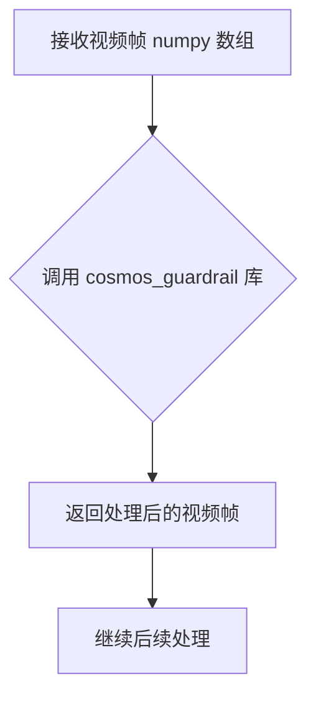

#### 带注释源码

```python
# 该方法是外部库 cosmos_guardrail 库中的 CosmosSafetyChecker 类的方法
# 在 diffusers 代码中仅调用了该方法，未定义其实现
# 实际实现位于 https://github.com/NVIDIA/Cosmos-Guardrail

# 在 pipeline 中的调用位置（Pipeline.__call__ 方法内）:
if self.safety_checker is not None:
    self.safety_checker.to(device)
    video = self.video_processor.postprocess_video(video, output_type="np")
    video = (video * 255).astype(np.uint8)  # 转换为 uint8 格式
    video_batch = []
    for vid in video:  # 遍历每一帧
        # 调用外部安全检查器检查视频安全性
        vid = self.safety_checker.check_video_safety(vid)
        video_batch.append(vid)
    video = np.stack(video_batch).astype(np.float32) / 255.0 * 2 - 1
    video = torch.from_numpy(video).permute(0, 4, 1, 2, 3)
    video = self.video_processor.postprocess_video(video, output_type=output_type)
    self.safety_checker.to("cpu")
```

---

**注意**：由于 `CosmosSafetyChecker` 是从外部库 `cosmos_guardrail` 导入的类，其 `check_video_safety` 方法的具体实现位于外部库中，上面的源码是根据调用上下文还原的调用逻辑，而非该方法本身的实现源码。

## 关键组件


### 张量索引与惰性加载

在 `prepare_latents` 方法中实现，通过条件帧选择和填充逻辑实现高效的张量处理。当输入帧数大于目标帧数时取最后帧，少于时用零填充，避免不必要的内存分配。

### 反量化支持

在 `prepare_latents` 和 `__call__` 方法中使用 `latents_mean` 和 `latents_std` 对潜在表示进行反量化处理。通过 `scheduler.config.sigma_data` 进行缩放，确保VAE输出的潜在向量正确转换。

### 量化策略

通过 `vae_dtype` 和 `transformer_dtype` 分别管理VAE和变换器的数据类型，在 `__call__` 方法中将视频和潜在向量转换为适当的dtype，支持bfloat16等混合精度推理。

### T5文本编码器

`_get_t5_prompt_embeds` 方法使用T5EncoderModel将文本提示编码为隐藏状态，`encode_prompt` 方法支持分类器自由引导，生成正向和负向提示嵌入。

### 3D变换器去噪

`__call__` 方法中的去噪循环使用CosmosTransformer3DModel进行多步去噪，通过 `condition_mask` 和 `padding_mask` 处理条件帧和非条件帧，支持增强sigma机制。

### VAE视频编解码

使用AutoencoderKLCosmos在 `prepare_latents` 中编码视频为潜在表示，在 `__call__` 结束时解码潜在向量为最终视频，支持均值-标准差反量化。

### EDMEulerScheduler调度器

使用EDMEulerScheduler管理去噪步骤的时间步，通过 `retrieve_timesteps` 获取调度器的时间步，提供sigma数据用于潜在向量缩放。

### CosmosSafetyChecker安全检查

在 `__call__` 方法中对提示词和生成视频进行安全检查，使用 `check_text_safety` 和 `check_video_safety` 方法检测不当内容，确保输出符合NVIDIA开放模型许可协议。

### 视频预处理与后处理

VideoProcessor处理图像和视频的预处理（resize、normalize）和后处理（转换为np数组或PIL图像），支持不同输出格式。

### 分类器自由引导实现

在去噪循环中分别处理条件和非条件潜在向量，通过 `cond_indicator` 和 `uncond_indicator` 标记条件帧，在推理时结合CFG权重进行噪声预测调整。

## 问题及建议


### 已知问题

-   **safety_checker 强制初始化问题**：在 `__init__` 方法中，即使传入了 `None`，也会创建一个 `CosmosSafetyChecker()` 实例，这会导致在没有安装 `cosmos_guardrail` 时立即抛出 ImportError，与 `_optional_components` 的设计意图相矛盾
-   **类型注解不完整**：`check_inputs` 方法的参数缺少类型注解，且 `callback_on_step_end_tensor_inputs` 参数使用了 `list[str]` 而不是完整的 `List[str]`
-   **设备转换开销**：在 `__call__` 方法中，安全检查器在检查prompt后被移到CPU，在decode视频时又移回device，这种反复的设备迁移会产生额外的性能开销
-   **调试代码残留**：在 `__call__` 方法的条件指示器计算中存在 `cond_indicator * 0` 和 `uncond_indicator * 0` 这样的冗余操作，看起来像是调试或开发过程中的残留代码
-   **属性实现不完整**：`guidance_scale` 属性依赖 `self._guidance_scale`，但在 `__call__` 外部没有明确初始化，可能导致意外行为；类似地，`interrupt` 属性依赖 `self._interrupt` 但没有默认值
-   **硬编码的scheduler依赖**：代码中多处直接访问 `self.scheduler.config.sigma_data`、`self.scheduler.config.sigma_max` 等配置属性，假设了特定的scheduler实现，缺少对不同scheduler类型的兼容性检查

### 优化建议

-   **修复 safety_checker 逻辑**：将 `_optional_components` 中的 `safety_checker` 正确实现为可选组件，当传入 `None` 时不应抛出异常，并修改 `__call__` 中对 `safety_checker is None` 的检查逻辑
-   **减少设备转换**：将安全检查器的设备管理重构为仅在必要时移动，可以考虑在pipeline级别缓存设备状态或使用上下文管理器
-   **清理调试代码**：移除 `cond_indicator * 0` 和 `uncond_indicator * 0` 这类冗余操作，或添加注释说明其存在理由
-   **完善属性初始化**：在 `__init__` 或 `__call__` 开始时明确初始化所有使用的实例变量，如 `self._guidance_scale`、`self._interrupt`、`self._num_timesteps` 等
-   **增强scheduler兼容性**：添加对scheduler必需属性的检查，在访问前验证属性存在性，避免潜在的 AttributeError
-   **类型注解补全**：为 `check_inputs` 方法的所有参数添加完整的类型注解，确保代码类型安全的一致性

## 其它


### 设计目标与约束

该管道旨在实现高质量的图像到视频和视频到视频生成，基于NVIDIA Cosmos-1.0-Diffusion-7B-Video2World模型。设计目标包括：支持图像和视频两种 conditioning 输入方式；实现 classifier-free guidance 以提升生成质量；支持自定义 timesteps 和 sigmas 调度；确保与 HuggingFace Diffusers 框架的兼容性。约束条件包括：输入图像/视频尺寸必须能被16整除；max_sequence_length 默认为512；仅支持 fp16/bf16 精度；需要 Cosmos Safety Checker 用于内容安全检查。

### 错误处理与异常设计

管道在多个关键点实现了错误处理机制。在 check_inputs 方法中验证：height 和 width 必须能被16整除；callback_on_step_end_tensor_inputs 必须在允许的列表中；prompt 和 prompt_embeds 不能同时提供；至少需要提供 image 或 video 其中之一。在 safety_checker 相关逻辑中，若未安装 cosmos_guardrail 包则抛出 ImportError；若禁用安全检查器则抛出 ValueError 违反许可证协议。在 retrieve_timesteps 函数中，验证 timesteps 和 sigmas 不能同时传递，以及调度器是否支持自定义时间步。

### 数据流与状态机

管道的数据流如下：首先接收 image 或 video 作为 conditioning 输入；然后通过 video_processor 预处理为统一格式；接着 encode_prompt 将文本 prompt 编码为 embedding；prepare_latents 从视频中提取 latents 并添加噪声；在 denoising loop 中，transformer 迭代地去噪 latent 最终得到视频 latent；最后通过 vae.decode 将 latent 解码为实际视频帧。状态机包含：初始化状态（模型加载完成）、推理状态（denoising 循环中）、完成状态（输出生成完毕）、中断状态（interrupt 标志被设置）。

### 外部依赖与接口契约

主要外部依赖包括：transformers 库提供 T5EncoderModel 和 T5TokenizerFast；numpy 用于后处理；torch 用于核心计算；diffusers 框架提供 DiffusionPipeline 基类；cosmos_guardrail（可选）提供内容安全检查；torch_xla（可选）支持 XLA 加速。接口契约方面：pipeline 接收 PipelineImageInput 或 list[PipelineImageInput] 类型的 image/video；输出 CosmosPipelineOutput 或 tuple；所有模型组件通过 register_modules 注册；支持 PipelineCallback 和 MultiPipelineCallbacks 回调机制。

### 性能特征与基准

默认配置下使用36个推理步骤生成121帧（4秒@30fps）的视频。视频分辨率默认为704x1280。模型支持 CPU offload，顺序为 text_encoder->transformer->vae。可选使用 torch.compile 加速 transformer。支持 XLA 设备加速（当 torch_xla 可用时）。guidance_scale 默认为7.0，augment_sigma 默认为0.001。批处理支持通过 num_videos_per_prompt 参数控制。

### 安全性考虑

管道集成了 Cosmos Safety Checker 用于检测不安全内容。在推理前对 prompt 进行文本安全检查（check_text_safety）；在视频生成后进行帧级安全检查（check_video_safety）。若检测到不安全内容，安全检查器会进行过滤。需要注意的是，禁用安全检查器将违反 NVIDIA Open Model License Agreement。安全检查器在检查完成后会被移至 CPU 以释放 GPU 显存。

### 兼容性考虑

管道继承自 DiffusionPipeline，支持标准的保存/加载流程。模型组件（text_encoder、tokenizer、transformer、vae、scheduler）都支持 from_pretrained 和 save_pretrained。video_processor 和 image_processor 适配了多种输入格式。向后兼容性通过 _optional_components 机制维护，允许 safety_checker 为 None（尽管实际上不是真正可选的）。支持 PyTorch MPS 友好的 tensor 操作。

### 配置参数详解

关键配置参数包括：height/width 控制输出视频分辨率；num_frames 控制输出帧数；num_inference_steps 控制去噪步数；guidance_scale 控制 classifier-free guidance 强度；input_frames_guidance 控制是否对输入帧应用 guidance；augment_sigma 控制噪声增强强度；fps 控制输出视频帧率；max_sequence_length 控制文本编码的最大长度；output_type 控制输出格式（pil/np/latent）。

### 测试策略

管道应包含以下测试用例：输入验证测试（尺寸检查、参数互斥检查）；图像 conditioning 功能测试；视频 conditioning 功能测试；无 classifier-free guidance 的生成测试；自定义 timesteps/sigmas 测试；回调机制测试；输出类型测试（latent vs decoded）；安全检查器集成测试；CPU/GPU 设备兼容性测试；XLA 加速测试（当可用时）。

### 部署注意事项

部署时需要确保：安装 cosmos_guardrail 包以使用安全检查功能；GPU 显存至少16GB 以处理704x1280分辨率的生成；建议使用 bfloat16 精度以平衡性能和内存；可通过 torch.compile 加速 transformer 推理；注意模型 offload 顺序以优化显存使用；生产环境中不应禁用安全检查器。

### 监控与日志

管道使用标准的 logging.get_logger(__name__) 进行日志记录。关键日志点包括：文本截断警告（当超过 max_sequence_length 时）；模型加载状态；推理进度（通过 progress_bar）。建议监控的指标包括：推理时间、GPU 显存使用、生成帧数、安全检查拦截率。

### 资源管理

管道实现了模型生命周期管理：使用 model_cpu_offload_seq 定义 offload 顺序；maybe_free_model_hooks 在推理完成后释放模型钩子；安全检查器在使用后立即移至 CPU。内存优化策略包括：分阶段加载模型组件；使用 vae_scale_factor_temporal 和 vae_scale_factor_spatial 计算 latent 维度；支持 latent 模式输出以节省解码显存。

### 版本历史与变更记录

该代码为 NVIDIA Cosmos 管道的一部分，继承自 CosmosTextToWorldPipeline。部分方法（如 _get_t5_prompt_embeds、encode_prompt）从 text2world 管道复制而来。retrieve_timesteps 和 retrieve_latents 函数从 Stable Diffusion 管道复制而来。EXAMPLE_DOC_STRING 提供了详细的使用示例。

    