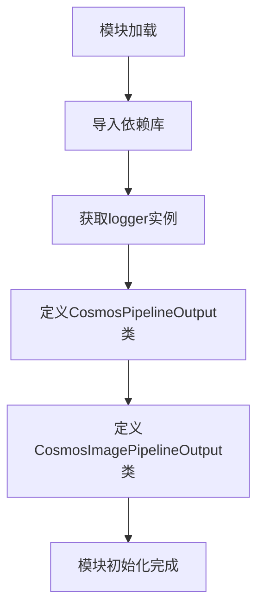
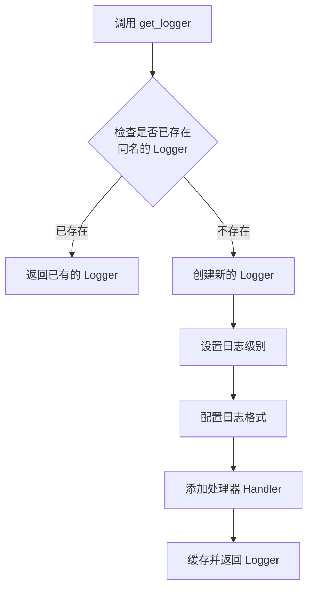

# `diffusers\src\diffusers\pipelines\cosmos\pipeline_output.py` 详细设计文档

定义了Cosmos扩散模型管道的输出类，用于封装图像和视频生成结果。CosmosPipelineOutput用于视频生成任务，CosmosImagePipelineOutput用于图像生成任务，两者都继承自diffusers库的BaseOutput基类，支持torch.Tensor、numpy数组和PIL图像多种格式。

## 整体流程



## 类结构

```
BaseOutput (diffusers基类)
├── CosmosPipelineOutput (视频管道输出)
└── CosmosImagePipelineOutput (图像管道输出)
```

## 全局变量及字段


### `logger`
    
用于记录模块运行时日志的Logger实例

类型：`logging.Logger`
    


### `CosmosPipelineOutput.frames`
    
视频输出帧，可以是torch.Tensor、np.ndarray或list[list[PIL.Image.Image]]格式的批量视频序列

类型：`torch.Tensor`
    


### `CosmosImagePipelineOutput.images`
    
图像输出，可以是PIL图像列表或NumPy数组格式的批量图像

类型：`list[PIL.Image.Image] | np.ndarray`
    
    

## 全局函数及方法


### `get_logger`

获取一个配置好的日志记录器实例，用于在模块中记录日志信息。该函数是 diffusers 库提供的工具函数，用于创建符合项目规范的 logger 对象。

参数：

- `name`：`str`，通常传入 `__name__` 以标识日志来源的模块路径

返回值：`logging.Logger`，返回一个配置好的 Python 标准库日志记录器对象

#### 流程图



#### 带注释源码

```
# 从 diffusers.utils 模块导入 get_logger 函数
# 该函数来自 Hugging Face diffusers 库
from diffusers.utils import BaseOutput, get_logger

# 调用 get_logger 并传入当前模块的 __name__ 参数
# __name__ 是 Python 的内置变量，表示当前模块的完全限定名
# 例如：如果这个文件是 utils.py，则 __name__ = 'utils'
logger = get_logger(__name__)

# 上述代码等同于（简化理解）：
# import logging
# logger = logging.getLogger(__name__)
# 但 diffusers 的 get_logger 做了额外的配置，
# 如设置统一的日志格式、默认级别等

# 后续可以这样使用 logger：
# logger.info("这是一条信息日志")
# logger.warning("这是一条警告日志")
# logger.error("这是一条错误日志")
```

---

**补充说明**：

- `get_logger` 是外部依赖函数，定义在 `diffusers.utils` 模块中
- 传入 `__name__` 的好处是可以在日志中清晰标识日志来源的模块
- 该函数通常会配置全局的日志格式和级别，确保项目日志风格一致
- 如果需要查看具体实现，建议查阅 diffusers 库的源码

## 关键组件


### CosmosPipelineOutput

用于 Cosmos any-to-world/video（任意到世界/视频）管道的输出类，封装了视频生成的结果数据。

### CosmosImagePipelineOutput

用于 Cosmos any-to-image（任意到图像）管道的输出类，封装了图像生成的结果数据，支持 PIL 图像列表或 NumPy 数组格式。

### frames 字段

类型：`torch.Tensor`
描述：视频输出帧数据，可为嵌套列表（batch_size 个子列表，每个包含 num_frames 个去噪后的 PIL 图像序列），也可为 NumPy 数组或 PyTorch 张量，形状为 (batch_size, num_frames, channels, height, width)。

### images 字段

类型：`list[PIL.Image.Image] | np.ndarray`
描述：去噪后的 PIL 图像列表（长度为 batch_size）或 NumPy 数组（形状为 batch_size, height, width, num_channels），用于呈现扩散管道的去噪图像结果。

### BaseOutput 继承关系

两个输出类均继承自 diffusers.utils.BaseOutput，这是 diffusers 库中的基础输出类，提供了统一的输出接口规范。

### 数据类型兼容性设计

代码支持多种数据格式（torch.Tensor、np.ndarray、PIL.Image.Image、list），体现了对不同工作流和后端处理需求的兼容性设计。


## 问题及建议


### 已知问题

- **类型注解与文档描述不一致**：`CosmosPipelineOutput.frames` 声明类型为 `torch.Tensor`，但文档字符串说明它也可以是 `np.ndarray` 或 `list[list[PIL.Image.Image]]`，这种类型与实际使用场景不符，可能导致类型检查工具误报或运行时类型错误
- **类型注解不完整**：`CosmosImagePipelineOutput.images` 使用联合类型 `list[PIL.Image.Image] | np.ndarray`，但文档描述中提到还可以是 `(batch_size, height, width, num_channels)` 形状的数组，类型声明未涵盖所有可能的输入形式
- **文档字符串格式错误**：视频输出类的 Args 中 "batch_size," 包含多余的逗号；图像输出类文档中 "num_channels)" 缺少对应的左括号，格式不规范
- **日志记录器未使用**：定义了 `logger = get_logger(__name__)` 但整个代码中未进行任何日志记录操作，造成资源浪费
- **缺少 `__all__` 导出定义**：模块未显式声明公共接口，降低了代码的可维护性和IDE自动补全的准确性

### 优化建议

- **统一类型定义**：为 `frames` 和 `images` 字段使用 `Any` 类型或创建泛型类型别名，以准确反映多态特性；或者提供多个输出类变体以覆盖不同的数据类型场景
- **修正文档字符串**：修复格式错误，确保文档与类型注解保持一致，并补充必要的使用示例
- **移除未使用的 logger**：如果当前不需要日志记录，可删除该定义以减少代码冗余
- **添加类型守卫或验证方法**：在输出类中添加验证方法（如 `validate()`），确保返回数据符合预期的形状和类型约束
- **定义 `__all__` 显式导出**：添加 `__all__ = ["CosmosPipelineOutput", "CosmosImagePipelineOutput"]` 明确公共接口

## 其它


### 设计目标与约束

本代码的设计目标是定义Diffusers库中Cosmos系列管道的输出数据结构，封装图像或视频生成结果。约束条件包括：必须继承BaseOutput以符合框架规范，支持torch.Tensor、np.ndarray、PIL.Image等多种数据格式，frames字段要求torch.Tensor类型以支持GPU加速计算，images字段支持PIL图像列表或NumPy数组以保证兼容性。

### 错误处理与异常设计

由于采用dataclass装饰器，主要依赖Python类型注解进行编译期检查。运行时需注意：frames字段必须为torch.Tensor类型，非tensor类型会导致类型检查失败；images字段为联合类型，需确保传入list[PIL.Image.Image]或np.ndarray类型。此外，需处理维度不匹配、batch_size为0、空列表等边界情况。建议在调用处添加前置验证逻辑。

### 外部依赖与接口契约

核心依赖包括：dataclass装饰器来自Python标准库；numpy提供数组支持；PIL.Image提供图像处理；torch提供张量运算；diffusers.utils.BaseOutput提供基类接口，get_logger提供日志功能。接口契约方面，CosmosPipelineOutput.frames必须为5D张量(batch_size, num_frames, channels, height, width)，CosmosImagePipelineOutput.images必须为图像列表或4D数组(batch_size, height, width, channels)。

### 性能考虑与资源管理

数据类实例化开销较低，适合高频创建。frames使用torch.Tensor可利用GPU加速，但需注意CUDA内存管理；images使用PIL.Image会占用较多CPU内存，大批量处理时需考虑生成后立即释放原始张量。暂无缓存机制，如需优化可考虑__slots__减少内存开销。

### 可扩展性与版本兼容性

当前支持三种输出格式，后续可扩展支持更多格式（如base64编码、分布式tensor）。版本兼容性方面，需确保与diffusers>=0.20.0配合使用，torch版本建议>=1.9.0，numpy>=1.20.0，Pillow>=8.0.0。Python版本需>=3.8以支持dataclass和联合类型语法。

### 安全考虑

frames和images字段直接存储原始数据，无内置敏感信息过滤。处理用户生成内容时需在管道层面进行图像内容安全审查。序列化/反序列化时需注意torch.Tensor的设备转移问题（CPU/GPU）。

### 测试策略建议

建议覆盖：类型验证测试（传入非指定类型应报错）、维度测试（异常维度tensor/array）、空值测试（None输入）、设备测试（CUDA tensor处理）、格式转换测试（torch转numpy再转PIL的完整性）。由于为数据容器类，单元测试重点在于字段类型和值域验证。

### 配置管理与常量定义

当前代码无硬编码配置常量，类型约束通过注解实现。如需扩展，建议将支持的图像通道数（3/4）、最大batch_size等定义为类常量。日志级别通过get_logger(__name__)从环境变量或配置文件读取，默认采用diffusers库配置。

### 文档与注释规范

类文档采用Google风格，Args参数说明完整。字段描述清晰标注了各输出格式的形状约定。建议补充：使用示例代码、异常情况说明、与旧版本API的兼容性说明。

### 潜在重构方向

可考虑添加from_dict/to_dict序列化方法以支持配置持久化；添加validate方法进行运行时校验；实现__post_init__进行自动类型转换（如numpy转tensor）；添加类型别名定义FrameType、ImageType提升代码可读性。


    