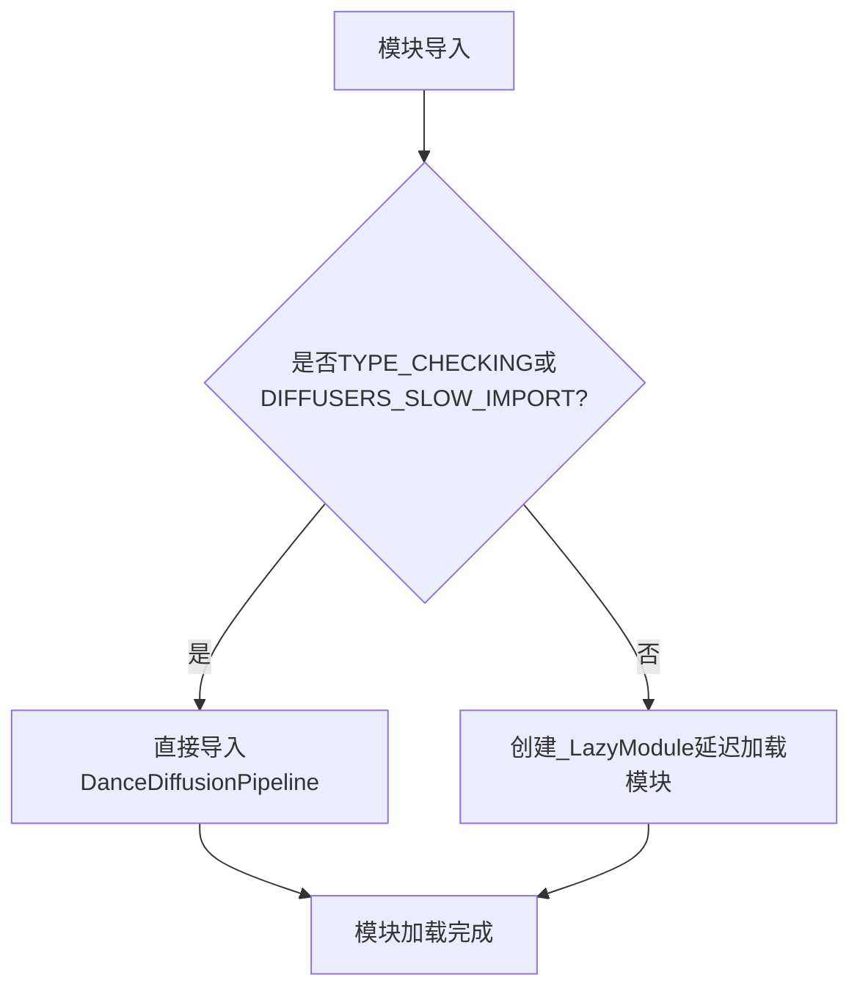

# `diffusers\src\diffusers\pipelines\dance_diffusion\__init__.py` 详细设计文档

这是一个Diffusers库的舞蹈扩散管道模块的初始化文件，通过延迟加载机制导入DanceDiffusionPipeline类，实现了按需加载以优化库的导入性能。

## 整体流程



## 类结构

```
diffusers package
└── pipelines
    └── dance_diffusion
        ├── __init__.py (当前文件)
        └── pipeline_dance_diffusion.py
```

## 全局变量及字段


### `_import_structure`
    
定义模块的导入结构，映射模块名到可导出对象的列表，用于延迟加载

类型：`Dict[str, List[str]]`
    


### `DIFFUSERS_SLOW_IMPORT`
    
控制是否使用慢速导入模式的标志变量，来自utils模块

类型：`bool`
    


    

## 全局函数及方法


## 关键组件


### 核心功能概述

该代码是Diffusers库中DanceDiffusion管道的模块初始化文件，通过LazyModule机制实现延迟导入，优化库的加载性能，在类型检查或特定配置下才会立即加载管道类。

### 文件运行流程

1. 导入必要的类型检查和工具模块
2. 定义可导出的模块结构字典`_import_structure`
3. 判断当前是否为类型检查模式或慢速导入模式
4. 若是，则直接导入`DanceDiffusionPipeline`类
5. 否则，使用`_LazyModule`替换当前模块，实现运行时延迟加载

### 类详细信息

#### _import_structure
- **类型**: dict
- **描述**: 存储模块导出结构信息的字典，键为模块名，值为可导出对象列表

#### DanceDiffusionPipeline
- **类型**: class
- **描述**: DanceDiffusion音频生成管道类，用于生成舞蹈相关的音频内容

### 全局变量和函数详细信息

#### TYPE_CHECKING
- **类型**: bool
- **描述**: 来自typing模块的标志，表示是否处于类型检查模式

#### DIFFUSERS_SLOW_IMPORT
- **类型**: bool
- **描述**: 来自utils模块的标志，控制是否使用慢速导入模式

#### _LazyModule
- **类型**: class
- **描述**: 延迟加载模块实现类，支持懒加载机制以优化导入速度

#### sys.modules
- **类型**: dict
- **描述**: Python标准库的模块缓存字典，用于存储已导入的模块

#### __spec__
- **类型**: ModuleSpec
- **描述**: 当前模块的规格信息，用于模块导入和懒加载配置

### 关键组件信息

### 延迟加载机制（Lazy Loading）
通过_LazyModule实现模块的延迟加载，只有在实际使用时才加载对应的类和资源，减少初始加载时间

### 类型检查支持（TYPE_CHECKING）
在类型检查模式下立即导入真实类，确保类型提示的正确性和IDE支持

### 模块导出结构（_import_structure）
定义了模块的公共API接口，明确哪些类可以被外部访问

### 潜在技术债务与优化空间

1. **错误处理缺失**: 当前代码缺少对导入失败的异常处理机制
2. **文档注释不足**: 缺少对模块功能和导出结构的详细文档说明
3. **版本兼容性**: 需要确保与不同版本Python和Diffusers库的兼容性

### 其它项目说明

#### 设计目标
- 优化Diffusers库的导入性能
- 提供清晰的模块导出接口
- 支持类型检查和运行时两种模式

#### 约束条件
- 依赖于Diffusers库的_LazyModule实现
- 需要与TYPE_CHECKING和DIFFUSERS_SLOW_IMPORT标志配合使用

#### 外部依赖
- typing模块: 用于TYPE_CHECKING
- sys模块: 用于模块缓存操作
- ...utils模块: 提供_DiffusersSLOW_IMPORT和_LazyModule


## 问题及建议


### 已知问题

-   缺少模块级文档字符串，无法了解该模块的用途和版本信息
-   外部依赖 `DIFFUSERS_SLOW_IMPORT` 和 `_LazyModule` 未进行可用性验证，若导入失败会抛出不清晰的错误
-   `TYPE_CHECKING` 分支中直接导入 `DanceDiffusionPipeline`，但未在 `else` 分支中处理可能的导入异常
-   未定义 `__all__`，无法明确公开的 API 接口
-   `DanceDiffusionPipeline` 作为单一导出项，若其不存在于 `pipeline_dance_diffusion` 模块中，运行时错误定位困难

### 优化建议

-   添加模块级 docstring，说明模块职责和主要导出类
-   在导入 `_LazyModule` 和 `DIFFERS_SLOW_IMPORT` 前添加 try-except 捕获，或在模块顶层添加断言验证依赖可用性
-   考虑在 `else` 分支中添加异常处理，提升错误可读性
-   显式定义 `__all__ = ["DanceDiffusionPipeline"]`，明确公共接口
-   添加类型注解和运行时验证，确保 `DanceDiffusionPipeline` 实际存在于目标模块中

## 其它


### 设计目标与约束

本模块的设计目标是通过延迟导入（Lazy Import）机制优化Diffusers库的加载性能，避免在包初始化时立即加载所有子模块，从而减少内存占用和启动时间。设计约束包括：必须保持与TYPE_CHECKING模式的兼容性，支持静态类型检查工具（如mypy、pyright）正确识别类型；同时需要确保运行时能够通过LazyModule正确延迟加载DanceDiffusionPipeline类。

### 错误处理与异常设计

本模块本身不直接处理业务逻辑错误，错误处理主要依赖于LazyModule的导入机制。如果在延迟加载时发生导入错误（如模块不存在、依赖缺失），Python会抛出标准的ImportError或ModuleNotFoundError。这些错误会向上传播到调用方，由调用方决定如何处理。_LazyModule内部已封装了导入逻辑，开发者无需额外捕获异常。

### 外部依赖与接口契约

本模块的外部依赖包括：1）typing.TYPE_CHECKING用于类型检查时的导入；2）DIFFUSERS_SLOW_IMPORT配置变量控制是否启用延迟导入；3）_LazyModule类来自...utils包，负责实现延迟加载逻辑；4）DanceDiffusionPipeline类来自.pipeline_dance_diffusion子模块。接口契约方面，本模块暴露的公共接口仅为DanceDiffusionPipeline类，调用方应通过from ...pipeline_dance_diffusion import DanceDiffusionPipeline的方式导入使用。

### 性能考虑

本模块的核心性能优化在于延迟加载机制。当DIFFUSERS_SLOW_IMPORT为True或处于TYPE_CHECKING模式时，模块会立即导入DanceDiffusionPipeline；否则使用_LazyModule将实际导入推迟到第一次访问时。这种设计显著减少了包级别的导入时间，但首次访问具体类时会有轻微延迟。内存优化方面，未访问的模块不会被加载到内存中。

### 兼容性设计

本模块需要兼容Python 3.7+（因使用TYPE_CHECKING和typing模块），同时需要与Diffusers库的整体架构兼容。module_spec（__spec__）的传递确保了Python导入系统的完整性维护，支持pickle序列化等场景。设计遵循PEP 562关于__getattr__的延迟加载最佳实践。

### 版本演化与扩展性

当前版本支持基本的延迟加载功能，未来可扩展方向包括：1）支持更多pipeline类的延迟导出；2）增加预加载配置选项；3）添加导入状态查询接口。_import_structure字典结构便于后续添加新的导出项而无需修改核心逻辑。

    