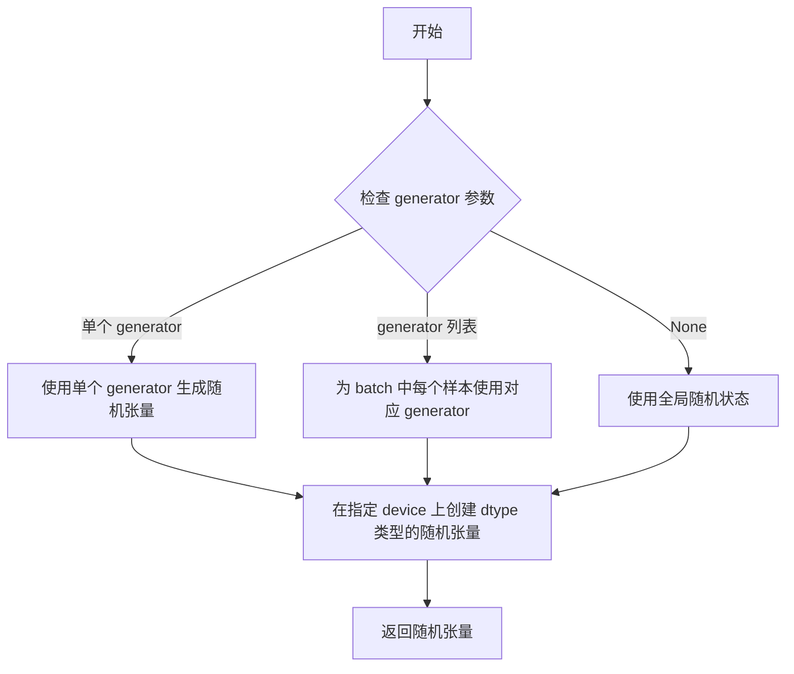
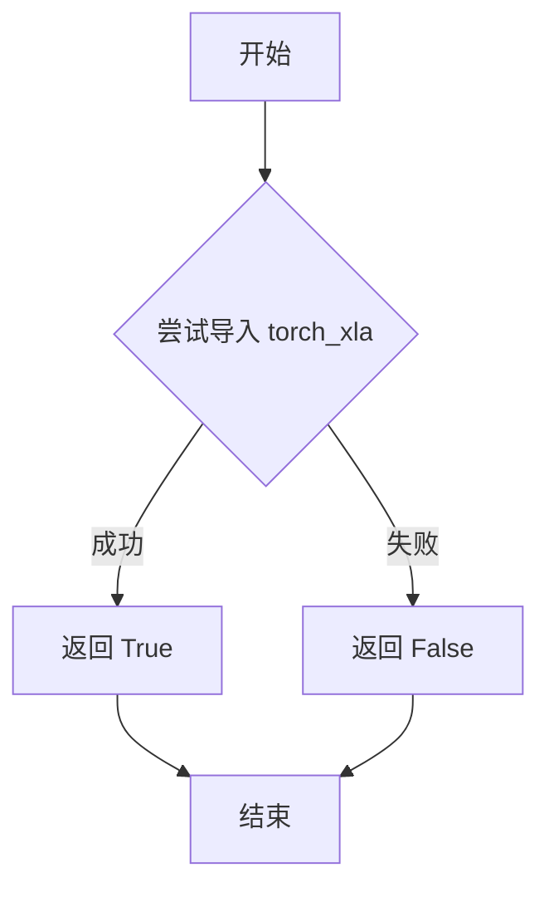
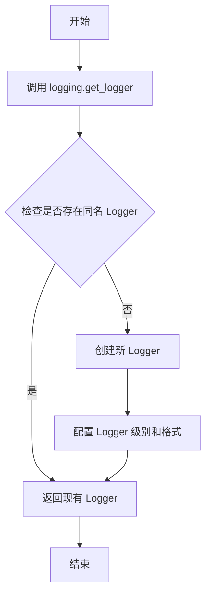

# `diffusers\src\diffusers\pipelines\dance_diffusion\pipeline_dance_diffusion.py` 详细设计文档

DanceDiffusionPipeline是一个基于扩散模型的音频生成管道，使用UNet1DModel进行去噪处理，通过调度器（SchedulerMixin）控制噪声去除过程，最终生成音频样本。该管道支持批量生成、可配置的推理步骤数和随机种子控制。

## 整体流程

```mermaid
graph TD
A[开始] --> B{传入audio_length_in_s?}
B -- 否 --> C[计算默认audio_length: sample_size/sample_rate]
B -- 是 --> D[使用传入的audio_length_in_s]
C --> E
D --> E[计算sample_size]
E --> F{验证sample_size >= 3 * down_scale_factor?}
F -- 否 --> G[抛出ValueError]
F -- 是 --> H[调整sample_size以适应down_scale_factor]
H --> I[初始化随机噪声audio]
I --> J[设置调度器的timesteps]
J --> K[遍历timesteps进行去噪]
K --> L{当前timestep}
L --> M[UNet预测噪声: model_output = unet(audio, t)]
M --> N[调度器计算上一步样本: audio = scheduler.step(model_output, t, audio)]
N --> O{XLA可用?}
O -- 是 --> P[xm.mark_step()
```

## 类结构

```
DiffusionPipeline (抽象基类)
├── DeprecatedPipelineMixin (混入类)
└── DanceDiffusionPipeline (具体实现)
```

## 全局变量及字段


### `XLA_AVAILABLE`
    
标识是否支持PyTorch XLA的布尔值

类型：`bool`
    


### `logger`
    
用于记录管道运行信息的日志记录器实例

类型：`logging.Logger`
    


### `randn_tensor`
    
从torch_utils导入的函数，用于生成随机张量

类型：`function`
    


### `AudioPipelineOutput`
    
管道输出类，包含生成的音频数据

类型：`class`
    


### `DeprecatedPipelineMixin`
    
提供已弃用管道兼容性的混入类

类型：`class`
    


### `DiffusionPipeline`
    
扩散管道基类，提供通用的加载、保存和设备运行方法

类型：`class`
    


### `UNet1DModel`
    
一维UNet模型，用于对音频数据进行去噪处理

类型：`class`
    


### `SchedulerMixin`
    
调度器混入类，提供时间步设置和去噪步骤计算功能

类型：`class`
    


### `DanceDiffusionPipeline._last_supported_version`
    
类属性，记录该管道最后支持的版本号字符串

类型：`str`
    


### `DanceDiffusionPipeline.model_cpu_offload_seq`
    
类属性，定义CPU卸载顺序的字符串，用于模型内存管理

类型：`str`
    


### `DanceDiffusionPipeline.unet`
    
继承自DiffusionPipeline的UNet1DModel去噪模型实例

类型：`UNet1DModel`
    


### `DanceDiffusionPipeline.scheduler`
    
继承自DiffusionPipeline的调度器实例，用于控制去噪过程的噪声调度

类型：`SchedulerMixin`
    
    

## 全局函数及方法


### `randn_tensor`

生成指定形状、数据类型和设备的随机张量，支持通过随机数生成器实现确定性采样。

参数：

- `shape`：`tuple`，张量的形状，指定要生成的随机张量的维度
- `generator`：`torch.Generator | list[torch.Generator] | None`，可选的 PyTorch 随机数生成器，用于控制随机性以实现可重复的生成结果
- `device`：`torch.device`，生成张量应放置的目标设备（如 CPU、CUDA）
- `dtype`：`torch.dtype`，张量的数据类型（如 `torch.float32`、`torch.float64`）

返回值：`torch.Tensor`，符合指定形状、设备和数据类型的随机张量，其值服从标准正态分布

#### 流程图



#### 带注释源码

```python
# 该函数定义在 diffusers 库的 utils/torch_utils.py 中
# 以下为基于调用方式的推断实现

def randn_tensor(
    shape: tuple,  # 张量形状，如 (batch_size, channels, length)
    generator: Optional[Union[torch.Generator, List[torch.Generator]]] = None,  # 随机数生成器
    device: torch.device = None,  # 目标设备
    dtype: torch.dtype = torch.float32,  # 数据类型
) -> torch.Tensor:
    """
    生成符合正态分布的随机张量。
    
    参数:
        shape: 张量的维度元组
        generator: 可选的生成器，用于确定性随机
        device: 张量存放设备
        dtype: 张量数据类型
    
    返回:
        随机张量
    """
    # 如果提供了生成器列表（batch 生成场景）
    if isinstance(generator, list):
        # 为 batch 中每个样本使用对应的生成器
        # 通过 torch.randn 与 generator 配合实现确定性生成
        tensor = torch.cat([
            torch.randn(1, generator=g, device=device, dtype=dtype) 
            for g in generator
        ], dim=0)
    else:
        # 使用单个生成器或全局随机状态
        # torch.randn 生成标准正态分布随机数
        tensor = torch.randn(
            shape, 
            generator=generator, 
            device=device, 
            dtype=dtype
        )
    
    return tensor
```

> **注意**：由于 `randn_tensor` 是从外部模块 `diffusers.utils.torch_utils` 导入的，上述源码为基于其使用方式的合理推断。实际实现可能包含额外的优化逻辑，如对 XLA 设备的特殊处理等。


### `is_torch_xla_available`

这是一个用于检查当前环境是否支持 PyTorch XLA（Accelerated Linear Algebra）的工具函数，通过尝试导入 `torch_xla` 模块来判断，返回布尔值表示 XLA 是否可用。

参数：无

返回值：`bool`，如果 PyTorch XLA 可用则返回 `True`，否则返回 `False`

#### 流程图



#### 带注释源码

```
# is_torch_xla_available 函数的源码位于 ...utils 模块中
# 以下是基于代码中使用方式的推断实现

def is_torch_xla_available() -> bool:
    """
    检查 PyTorch XLA 是否可用。
    
    此函数尝试导入 torch_xla 模块，如果成功则表示当前环境支持 XLA 加速。
    通常用于条件导入 torch_xla.core.xla_model 等模块。
    
    Returns:
        bool: 如果 torch_xla 可用返回 True，否则返回 False
    """
    try:
        import torch_xla
        return True
    except ImportError:
        return False

# 在当前代码中的使用方式：
if is_torch_xla_available():
    import torch_xla.core.xla_model as xm
    XLA_AVAILABLE = True
else:
    XLA_AVAILABLE = False
```

#### 在当前代码中的使用示例

```python
from ...utils import is_torch_xla_available, logging

# 根据 XLA 可用性进行条件导入和变量设置
if is_torch_xla_available():
    import torch_xla.core.xla_model as xm
    XLA_AVAILABLE = True
else:
    XLA_AVAILABLE = False

# 后续在 pipeline 中使用 XLA 加速
for t in self.progress_bar(self.scheduler.timesteps):
    # 1. predict noise model_output
    model_output = self.unet(audio, t).sample

    # 2. compute previous audio sample: x_t -> t_t-1
    audio = self_scheduler.step(model_output, t, audio).prev_sample

    if XLA_AVAILABLE:
        xm.mark_step()  # 标记 XLA 计算步骤
```


### `logging.get_logger`

获取指定名称的日志记录器（Logger）实例，用于在模块中记录日志信息。

参数：

- `name`：`str`，日志记录器的名称，通常传入 `__name__` 以获取当前模块的日志记录器

返回值：`logging.Logger`，返回对应的日志记录器实例

#### 流程图



#### 带注释源码

```python
# 从 utils 模块导入 logging 对象
from ...utils import logging

# 获取当前模块的日志记录器
# __name__ 是 Python 内置变量，表示当前模块的全限定名
# 例如：'src.diffusers.pipelines.dance_diffusion.pipeline_dance_diffusion'
logger = logging.get_logger(__name__)  # pylint: disable=invalid-name
```

#### 详细说明

| 项目 | 描述 |
|------|------|
| **函数来源** | `transformers.utils.logging` 或 `diffusers.utils.logging` |
| **主要用途** | 为当前模块创建一个专用的日志记录器，便于日志分类和过滤 |
| **日志级别** | 通常默认为 WARNING 级别，可通过环境变量或配置调整 |
| **格式化** | 日志格式已在框架层面统一配置，包含时间戳、模块名、级别和消息 |
| **使用示例** | `logger.info("信息消息")`、`logger.warning("警告消息")`、`logger.error("错误消息")` |

#### 在代码中的使用示例

```python
# 在 DanceDiffusionPipeline 中使用 logger
logger.info(
    f"{audio_length_in_s} is increased to {sample_size / self.unet.config.sample_rate} so that it can be handled"
    f" by the model. It will be cut to {original_sample_size / self.unet.config.sample_rate} after the denoising"
    " process."
)
```

---

#### 技术债务与优化空间

1. **静态 Logger 实例**：当前在模块级别创建 Logger，如果模块频繁加载可能导致资源浪费，可考虑延迟初始化
2. **全局日志配置**：日志级别和格式依赖框架全局配置，缺少细粒度的模块级控制
3. **缺少日志上下文**：未在 Logger 中添加额外上下文信息（如请求 ID），在分布式场景下追踪困难


### `DanceDiffusionPipeline.__init__`

该方法是 `DanceDiffusionPipeline` 类的构造函数，用于初始化音频生成管道。它继承自 `DiffusionPipeline` 基类，通过调用父类构造函数并使用 `register_modules` 方法注册 UNet 模型和调度器模块，使管道能够执行音频去噪生成任务。

参数：

- `self`：`DanceDiffusionPipeline`，隐式参数，管道实例本身，包含已注册的所有模块
- `unet`：`UNet1DModel`，用于对编码音频进行去噪的 UNet1D 模型，是管道的主要推理组件
- `scheduler`：`SchedulerMixin`，与 `unet` 结合使用以对编码音频潜在表示进行去噪的调度器（如 IPNDMScheduler）

返回值：`None`，构造函数不返回值，仅初始化实例状态

#### 流程图

```mermaid
flowchart TD
    A[开始 __init__] --> B[调用 super().__init__]
    B --> C[调用 self.register_modules]
    C --> D[注册 unet 和 scheduler]
    D --> E[结束 __init__]
    
    B --> F[继承 DiffusionPipeline 基类初始化逻辑]
    F --> G[设置默认设备、dtype 等基础属性]
    
    D --> H[将 unet 和 scheduler 绑定到 self 实例]
```

#### 带注释源码

```python
def __init__(self, unet: UNet1DModel, scheduler: SchedulerMixin):
    """
    初始化 DanceDiffusionPipeline 实例
    
    参数:
        unet: UNet1DModel 实例，用于音频去噪的模型
        scheduler: SchedulerMixin 实例，用于去噪过程的调度器
    """
    # 调用父类 DeprecatedPipelineMixin 和 DiffusionPipeline 的初始化方法
    # 完成基础属性的设置（如 device、dtype 等）
    super().__init__()
    
    # 使用 register_modules 方法将 unet 和 scheduler 注册到当前管道实例
    # 这些模块将作为实例属性 self.unet 和 self.scheduler 可访问
    # register_modules 是 DiffusionPipeline 提供的通用模块注册方法
    self.register_modules(unet=unet, scheduler=scheduler)
```


### `DanceDiffusionPipeline.__call__`

音频生成管道的主生成方法，执行音频去噪生成流程。通过迭代去噪过程，将随机噪声逐步转换为目标音频样本。

参数：

- `self`：`DanceDiffusionPipeline` 类的实例方法
- `batch_size`：`int`，要生成的音频样本数量，默认为 1
- `num_inference_steps`：`int`，去噪步骤数，默认为 100，步数越多通常音频质量越高但推理越慢
- `generator`：`torch.Generator | list[torch.Generator] | None`，可选的 PyTorch 生成器，用于确保生成的可确定性
- `audio_length_in_s`：`float | None`，生成的音频长度（秒），默认为 None，将使用 `unet.config.sample_size/unet.config.sample_rate` 计算
- `return_dict`：`bool`，是否返回 `AudioPipelineOutput` 对象而非元组，默认为 True

返回值：`AudioPipelineOutput | tuple`，返回生成的音频。如果 `return_dict` 为 True，返回 `AudioPipelineOutput` 对象（包含 `audios` 属性）；否则返回元组，第一个元素为生成的音频数组。

#### 流程图

```mermaid
flowchart TD
    A[开始 __call__] --> B{audio_length_in_s 是否为 None?}
    B -->|是| C[使用 unet.config.sample_size / sample_rate 计算 audio_length_in_s]
    B -->|否| D[使用传入的 audio_length_in_s]
    C --> E[计算 sample_size = audio_length_in_s * sample_rate]
    D --> E
    E --> F[计算 down_scale_factor = 2 ** len(unet.up_blocks)]
    F --> G{sample_size < 3 * down_scale_factor?}
    G -->|是| H[抛出 ValueError 异常]
    G -->|否| I[记录原始 sample_size]
    I --> J{sample_size % down_scale_factor != 0?}
    J -->|是| K[调整 sample_size 为 down_scale_factor 的倍数]
    J -->|否| L[保持 sample_size 不变]
    K --> L
    L --> M[获取 unet 参数的 dtype]
    M --> N[构建形状: (batch_size, in_channels, sample_size)]
    N --> O{generator 是列表且长度与 batch_size 不匹配?}
    O -->|是| P[抛出 ValueError 异常]
    O -->|否| Q[使用 randn_tensor 生成随机噪声 audio]
    Q --> R[设置调度器的 timesteps]
    R --> S[将 timesteps 转换为 dtype]
    S --> T[开始迭代遍历 timesteps]
    T --> U{迭代未结束?}
    U -->|是| V[调用 UNet 预测噪声 model_output]
    V --> W[调用调度器 step 计算上一步的音频]
    W --> X{是否启用 XLA?}
    X -->|是| Y[执行 mark_step]
    X -->|否| Z[跳过]
    Y --> T
    Z --> T
    U -->|否| AA[将 audio 限制在 [-1, 1] 范围内]
    AA --> AB[转换为 float 类型并移动到 CPU]
    AB --> AC[转换为 NumPy 数组]
    AC --> AD[裁剪到原始 sample_size]
    AD --> AE{return_dict 为 True?}
    AE -->|是| AF[返回 AudioPipelineOutput 对象]
    AE -->|否| AG[返回元组 (audio,)]
    AF --> AH[结束]
    AG --> AH
```

#### 带注释源码

```python
@torch.no_grad()
def __call__(
    self,
    batch_size: int = 1,
    num_inference_steps: int = 100,
    generator: torch.Generator | list[torch.Generator] | None = None,
    audio_length_in_s: float | None = None,
    return_dict: bool = True,
) -> AudioPipelineOutput | tuple:
    """
    管道调用函数，用于音频生成。

    参数:
        batch_size: 要生成的音频样本数量，默认为 1
        num_inference_steps: 去噪步骤数，默认为 50（注意：实际默认值为100）
        generator: 可选的 PyTorch 生成器，用于确保生成确定性
        audio_length_in_s: 生成的音频长度（秒），默认为 None
        return_dict: 是否返回 AudioPipelineOutput 对象，默认为 True

    返回:
        AudioPipelineOutput 或 tuple: 生成的音频
    """

    # 1. 如果未指定音频长度，则从 UNet 配置中获取默认长度
    if audio_length_in_s is None:
        audio_length_in_s = self.unet.config.sample_size / self.unet.config.sample_rate

    # 2. 计算样本大小（采样率 × 时长）
    sample_size = audio_length_in_s * self.unet.config.sample_rate

    # 3. 计算下采样因子（基于 UNet 上采样块的数量）
    down_scale_factor = 2 ** len(self.unet.up_blocks)

    # 4. 验证音频长度是否足够大（至少需要 3 倍的下采样因子）
    if sample_size < 3 * down_scale_factor:
        raise ValueError(
            f"{audio_length_in_s} is too small. Make sure it's bigger or equal to"
            f" {3 * down_scale_factor / self.unet.config.sample_rate}."
        )

    # 5. 记录原始样本大小，用于后续裁剪
    original_sample_size = int(sample_size)

    # 6. 调整样本大小以适配下采样因子（必须能被 down_scale_factor 整除）
    if sample_size % down_scale_factor != 0:
        sample_size = (
            (audio_length_in_s * self.unet.config.sample_rate) // down_scale_factor + 1
        ) * down_scale_factor
        logger.info(
            f"{audio_length_in_s} is increased to {sample_size / self.unet.config.sample_rate} so that it can be handled"
            f" by the model. It will be cut to {original_sample_size / self.unet.config.sample_rate} after the denoising"
            " process."
        )
    sample_size = int(sample_size)

    # 7. 获取 UNet 参数的数据类型
    dtype = next(self.unet.parameters()).dtype

    # 8. 构建音频张量的形状：(batch_size, 通道数, 样本数)
    shape = (batch_size, self.unet.config.in_channels, sample_size)

    # 9. 验证生成器列表长度与 batch_size 是否匹配
    if isinstance(generator, list) and len(generator) != batch_size:
        raise ValueError(
            f"You have passed a list of generators of length {len(generator)}, but requested an effective batch"
            f" size of {batch_size}. Make sure the batch size matches the length of the generators."
        )

    # 10. 使用随机噪声初始化音频（去噪过程的起点）
    audio = randn_tensor(shape, generator=generator, device=self._execution_device, dtype=dtype)

    # 11. 设置调度器的 timesteps（去噪步骤）
    self.scheduler.set_timesteps(num_inference_steps, device=audio.device)
    self.scheduler.timesteps = self.scheduler.timesteps.to(dtype)

    # 12. 迭代去噪过程
    for t in self.progress_bar(self.scheduler.timesteps):
        # 12.1 使用 UNet 预测噪声
        model_output = self.unet(audio, t).sample

        # 12.2 计算前一个音频样本：x_t -> x_{t-1}
        audio = self.scheduler.step(model_output, t, audio).prev_sample

        # 12.3 如果使用 XLA，加速执行
        if XLA_AVAILABLE:
            xm.mark_step()

    # 13. 后处理：将音频限制在 [-1, 1] 范围内
    audio = audio.clamp(-1, 1).float().cpu().numpy()

    # 14. 裁剪到原始请求的样本大小
    audio = audio[:, :, :original_sample_size]

    # 15. 根据 return_dict 返回结果
    if not return_dict:
        return (audio,)

    return AudioPipelineOutput(audios=audio)
```

## 关键组件


### DanceDiffusionPipeline

主Pipeline类，继承自DiffusionPipeline，负责音频生成的完整流程，包括噪声初始化、调度器去噪、音频后处理等核心逻辑。

### 张量索引与大小调整

处理可变长度音频生成，通过down_scale_factor计算合适的采样大小，并在去噪后裁剪回原始尺寸（audio = audio[:, :, :original_sample_size]）。

### 调度器集成

集成SchedulerMixin调度器，用于去噪过程中的时间步设置和噪声预测（self.scheduler.step），支持多种调度算法。

### XLA加速支持

通过is_torch_xla_available检测并集成PyTorch XLA，用于TPU设备加速（xm.mark_step()）。

### 音频后处理

去噪完成后进行音频 clamping (-1, 1)、类型转换（float）、设备迁移（cpu）和numpy转换。

### 模型CPU卸载序列

通过model_cpu_offload_seq = "unet"指定模型卸载顺序，优化推理内存占用。

### 参数校验与边界检查

对batch_size与generator长度不匹配、音频长度过小等场景进行校验，确保推理有效性。


## 问题及建议


### 已知问题

- **版本硬编码**: `_last_supported_version = "0.33.1"` 硬编码在类中，未来版本更新需要手动修改，容易遗漏导致兼容性问题
- **文档与实现不一致**: `__call__` 方法参数 `num_inference_steps` 默认值为100，但文档字符串中写的是"defaults to 50"，会造成用户困惑
- **DeprecatedPipelineMixin继承**: 该类继承自已弃用的 `DeprecatedPipelineMixin`，但未提供弃用说明或迁移路径
- **类型注解不完整**: 缺少对部分变量如 `model_output`、`down_scale_factor`、`dtype` 等的类型注解
- **XLA优化不完整**: 使用了 `xm.mark_step()` 但没有完整的XLA设备同步和优化机制，如 `xm.rendezvous` 或 XLA特定的性能优化
- **缺少参数验证**: 未对 `num_inference_steps` 的有效范围、负值或极端值进行验证，也未对 `audio_length_in_s` 设置上限检查
- **重复计算逻辑**: `sample_size` 的计算逻辑在代码中多次出现（原始值、调整后值），可以提取为独立方法
- **内存管理不足**: 未使用 `torch.cuda.empty_cache()` 清理缓存，未提供启用内存优化（如 `enable_sequential_cpu_offload`）的选项

### 优化建议

- 将版本号提取为配置常量或从版本管理文件中读取，避免硬编码
- 修正文档字符串中 `num_inference_steps` 的默认值描述（改为100）或调整代码默认值为50以保持一致
- 添加完整的参数验证逻辑，包括 `num_inference_steps > 0`、`audio_length_in_s > 0` 等
- 完善类型注解，使用 `Optional`、`Union` 等类型提示增强代码可读性和IDE支持
- 考虑实现 `enable_model_cpu_offload` 或 `enable_sequential_cpu_offload` 选项以支持更灵活的内存管理
- 将 `sample_size` 计算逻辑提取为私有方法 `_compute_sample_size`，减少代码重复
- 在XLA可用时添加更完整的设备同步机制，并添加性能日志记录推理时间
- 添加单元测试覆盖，特别是针对边界条件和错误处理路径

## 其它


### 设计目标与约束

设计目标：实现基于扩散模型的音频生成管道，能够根据随机噪声通过UNet1DModel去噪生成音频样本。约束条件：需要与HuggingFace Diffusers库的其他组件兼容，支持CPU和GPU设备，支持XLA加速，支持模型CPU卸载。

### 错误处理与异常设计

1. 输入验证错误：当audio_length_in_s太小时抛出ValueError，提示最小值要求
2. 批处理一致性错误：当generator列表长度与batch_size不匹配时抛出ValueError
3. 设备兼容性：通过is_torch_xla_available()检查XLA可用性，优雅降级
4. 内存溢出处理：支持模型CPU卸载（model_cpu_offload_seq）

### 数据流与状态机

数据流：随机噪声(latents) -> UNet去噪预测噪声 -> Scheduler计算上一步样本 -> 迭代直到完成 -> 输出音频。状态机：初始化(init) -> 设置时间步(set_timesteps) -> 迭代去噪(for loop) -> 后处理(clamp/转换) -> 返回结果。

### 外部依赖与接口契约

1. UNet1DModel：去噪模型，输入噪声和时间步，输出预测噪声
2. SchedulerMixin：调度器，执行去噪步骤计算
3. randn_tensor：生成随机张量
4. AudioPipelineOutput：输出数据结构
5. DiffusionPipeline：基类，提供执行设备、模型卸载等功能
6. DeprecatedPipelineMixin：提供向后兼容性支持

### 性能考虑

1. 使用torch.no_grad()禁用梯度计算
2. 支持XLA加速(mark_step)
3. 支持模型CPU卸载以节省显存
4. 批处理生成提高吞吐量
5. 支持自定义generator实现可复现生成

### 安全性考虑

1. 输入验证防止无效参数
2. 音频输出clamp到[-1,1]范围防止数值溢出
3. 模型参数类型转换确保兼容性

### 配置参数详解

_last_supported_version：最后支持的版本号(0.33.1)
model_cpu_offload_seq：模型卸载顺序("unet")
unet：UNet1DModel去噪模型
scheduler：调度器实例

### 使用示例与最佳实践

1. 使用from_pretrained加载预训练模型
2. 使用to("cuda")或to("cpu")指定设备
3. 设置audio_length_in_s控制音频长度
4. 设置num_inference_steps控制质量与速度权衡
5. 使用generator实现确定性生成

### 版本兼容性

_last_supported_version = "0.33.1"标记了最后兼容版本，DeprecatedPipelineMixin处理版本兼容性问题。

### 内存管理

1. 使用torch.no_grad()避免存储中间梯度
2. 支持model_cpu_offload_seq进行模型卸载
3. 音频数据最终转换到CPU和numpy数组释放GPU显存

### 并发与异步处理

1. 支持批处理(batch_size)并行生成多个样本
2. XLA模式下使用mark_step()支持TPU加速
3. 调度器时间步可配置支持不同的推理策略

    