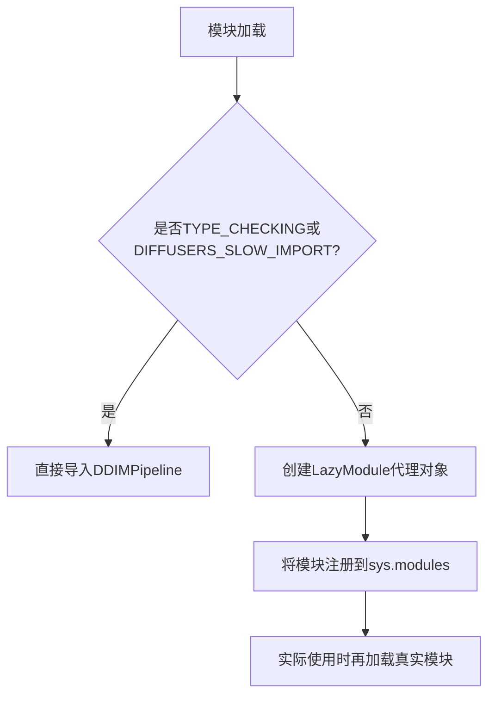
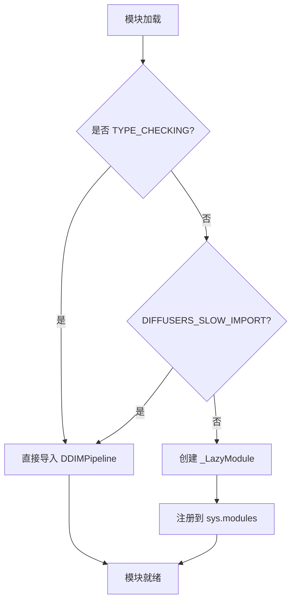

# `diffusers\src\diffusers\pipelines\ddim\__init__.py` 详细设计文档

这是一个Diffusers库的延迟导入模块，通过LazyModule机制实现了DDIMPipeline的延迟加载，支持TYPE_CHECKING和DIFFUSERS_SLOW_IMPORT两种导入模式，优化了大规模模型的导入性能。

## 整体流程



## 类结构

```
无显式类定义
└── 使用_LazyModule实现延迟加载
```

## 全局变量及字段


### `_import_structure`
    
定义模块的导入结构映射，键为子模块路径，值为导出的类名列表

类型：`Dict[str, List[str]]`
    


### `DIFFUSERS_SLOW_IMPORT`
    
标志位变量，控制是否启用慢速导入模式（TYPE_CHECKING时为True）

类型：`bool`
    


### `_LazyModule`
    
延迟加载模块的类，用于实现模块的按需导入机制

类型：`Type[_LazyModule]`
    


    

## 全局函数及方法


### `DDIMPipeline` (模块级延迟加载机制)

该代码是一个模块初始化文件，使用延迟加载（Lazy Loading）模式来导入DDIMPipeline类，以优化Diffusers库的导入性能。只有在类型检查或明确需要时，才会真正加载DDIMPipeline类，否则仅在首次访问时动态加载。

参数：

- 无

返回值：无

#### 流程图



#### 带注释源码

```python
# 导入类型检查标志，用于支持静态类型检查
from typing import TYPE_CHECKING

# 从工具模块导入延迟加载相关常量和类
# DIFFUSERS_SLOW_IMPORT: 控制是否使用延迟加载的标志
# _LazyModule: 自定义延迟加载模块类
from ...utils import DIFFUSERS_SLOW_IMPORT, _LazyModule

# 定义模块的导入结构字典
# 键为子模块名，值为该模块中导出的类/函数列表
_import_structure = {"pipeline_ddim": ["DDIMPipeline"]}

# 条件分支：处理导入方式
if TYPE_CHECKING or DIFFUSERS_SLOW_IMPORT:
    # 场景1: 类型检查模式或需要立即加载
    # 直接导入DDIMPipeline类，使其在运行时可用
    from .pipeline_ddim import DDIMPipeline
else:
    # 场景2: 正常运行时，使用延迟加载
    import sys
    
    # 将当前模块替换为LazyModule实例
    # 这样首次访问DDIMPipeline时才真正加载pipeline_ddim模块
    sys.modules[__name__] = _LazyModule(
        __name__,                          # 当前模块名
        globals()["__file__"],             # 模块文件路径
        _import_structure,                 # 导入结构定义
        module_spec=__spec__,              # 模块规格信息
    )
```

#### 关键组件信息

| 组件名称 | 一句话描述 |
|---------|-----------|
| `_import_structure` | 字典结构，定义子模块与导出成员的映射关系 |
| `_LazyModule` | 自定义模块类，实现按需动态加载子模块的延迟加载机制 |
| `TYPE_CHECKING` | Python类型检查标志，导入时为False，静态分析时为True |
| `DIFFUSERS_SLOW_IMPORT` | 配置标志，控制是否绕过延迟加载直接导入 |

#### 潜在的技术债务或优化空间

1. **隐式依赖耦合**：依赖`...utils`模块的具体实现细节，`_LazyModule`的行为不被当前模块控制
2. **循环导入风险**：如果`pipeline_ddim`模块也导入当前模块，可能导致导入失败
3. **错误提示不足**：延迟加载失败时，错误信息可能不够清晰，难以定位问题
4. **文档缺失**：缺少关于为何使用延迟加载的设计决策文档

#### 其它项目

- **设计目标**：减少库的整体导入时间，优化用户体验
- **约束条件**：必须保持与直接导入相同的行为语义
- **错误处理**：延迟加载失败时，Python会抛出标准的`ImportError`
- **外部依赖**：依赖`diffusers.utils`中的`_LazyModule`实现


## 关键组件


### 延迟导入机制

利用Python的LazyModule实现DDIMPipeline的惰性加载，在非TYPE_CHECKING模式下延迟导入以提升首次导入速度

### 模块初始化结构

定义_import_structure字典作为模块的导出接口规范，明确指定可导出的DDIMPipeline类

### 类型检查支持

通过TYPE_CHECKING条件分支，在类型检查时导入完整模块，非类型检查时使用延迟加载优化

### 动态模块替换

使用sys.modules[__name__]将当前模块动态替换为_LazyModule实例，实现透明的延迟加载机制


## 问题及建议


### 已知问题

- **导入路径一致性风险**: `_import_structure` 字典中使用 `"pipeline_ddim"` 作为键，但实际导入时使用 `from .pipeline_ddim import DDIMPipeline`，这种命名映射在大型项目中可能导致维护混乱
- **缺少模块文档**: 该延迟加载模块没有模块级别的文档字符串（docstring），难以理解其设计目的和使用场景
- **无错误处理机制**: 当 `pipeline_ddim` 模块不存在或 `DDIMPipeline` 类导入失败时，缺乏友好的错误提示和异常处理
- **硬编码的导入结构**: `_import_structure` 和 `__all__` 列表采用硬编码方式，未来扩展需要手动同步更新，容易引入遗漏
- **TYPE_CHECKING 条件冗余**: 代码中同时使用 `if TYPE_CHECKING or DIFFUSERS_SLOW_IMPORT:` 判断，但 LazyModule 本身已经处理了延迟加载逻辑，此条件判断可能造成混淆

### 优化建议

- 为模块添加文档字符串，说明其作为 DDIMPipeline 延迟加载入口的设计意图
- 使用 try-except 包装导入语句，提供更清晰的错误信息，例如提示用户安装所需依赖
- 考虑将导入结构配置外部化或使用装饰器模式，减少手动维护成本
- 简化条件逻辑，明确区分类型检查场景和运行时延迟加载场景，避免不必要的条件判断
- 添加类型注解和运行时检查，确保 `DIFFUSERS_SLOW_IMPORT` 等配置变量的正确性

## 其它


### 设计目标与约束

本模块的设计目标是实现Diffusers库中DDIMPipeline的延迟加载（Lazy Loading），以优化库的导入性能并减少启动时间。约束条件包括：必须兼容TYPE_CHECKING模式以支持类型检查，同时支持运行时动态导入；需要遵循Diffusers库的模块导入规范，使用_LazyModule机制实现惰性加载；仅导出DDIMPipeline类，其他内部实现细节应对外隐藏。

### 错误处理与异常设计

本模块本身不直接处理业务逻辑错误，其错误主要来源于导入阶段。若pipeline_ddim模块不存在或DDIMPipeline类缺失，将在被导入时抛出ImportError或AttributeError。延迟加载机制确保这些错误仅在实际使用Pipeline时触发，便于定位问题。建议调用方使用try-except块捕获导入错误，并提供友好的错误提示信息。

### 外部依赖与接口契约

本模块依赖以下外部组件：1) typing.TYPE_CHECKING用于类型检查时的导入；2) ...utils中的DIFFUSERS_SLOW_IMPORT配置开关和_LazyModule类；3) .pipeline_ddim模块中的DDIMPipeline类。接口契约规定：模块导出结构（_import_structure）必须与实际类名一致；_LazyModule接收的参数顺序为（模块名、文件路径、导入结构、模块规格）；在非TYPE_CHECKING且非DIFFUSERS_SLOW_IMPORT模式下，必须将当前模块注册到sys.modules中。

### 版本兼容性说明

本代码兼容Python 3.7+环境，需配合Diffusers库0.x或1.x版本使用。TYPE_CHECKING自Python 3.5引入，_LazyModule在Python 3.7+的importlib.util中正式支持。若使用较旧版本的Diffusers库，需确保utils模块中存在DIFFERS_SLOW_IMPORT和_LazyModule的实现。升级Diffusers版本时，应验证延迟加载机制的行为一致性。

### 性能考虑

延迟加载的主要性能收益在于：初始import时仅注册模块路径，不加载实际代码；DDIMPipeline类在实际使用时才被导入，减少了库的初始加载时间；sys.modules的动态注册避免了循环导入问题。潜在性能开销包括：首次访问时的模块查找和加载延迟，以及_LazyModule的动态属性解析。建议在需要频繁创建Pipeline实例的场景下，在程序早期预热导入相关类。

### 安全考虑

本模块的安全风险较低，主要关注点为：1) 动态导入路径的可控性，确保.pipeline_ddim模块来源可信；2) _LazyModule的module_spec参数（__spec__）需保持有效，否则可能导致加载失败；3) 在多线程环境下，延迟加载应考虑线程安全性（由import机制本身保证）。不建议从不可信来源加载自定义Pipeline实现。

### 使用示例

```python
# 方式一：直接导入（推荐）
from diffusers import DDIMPipeline
pipeline = DDIMPipeline.from_pretrained("model_path")

# 方式二：延迟导入检查
import diffusers.pipelines.ddim_pipeline as ddim_module
if hasattr(ddim_module, 'DDIMPipeline'):
    pipeline = ddim_module.DDIMPipeline.from_pretrained("model_path")

# 方式三：TYPE_CHECKING环境下的类型注解
from typing import TYPE_CHECKING
if TYPE_CHECKING:
    from diffusers.pipelines.ddim_pipeline import DDIMPipeline
```

### 测试策略

建议包含以下测试用例：1) 验证延迟加载机制，非导入状态下DDIMPipeline类不在全局命名空间；2) 验证实际使用时能正确加载类和创建实例；3) 验证TYPE_CHECKING模式下可直接导入；4) 验证DIFFUSERS_SLOW_IMPORT配置对加载行为的影响；5) 验证模块在sys.modules中的正确注册；6) 错误场景测试（模拟缺失模块的情况）。

### 配置与环境变量

DIFFUSERS_SLOW_IMPORT：控制是否启用延迟加载模式。当设置为True时，效果等同于TYPE_CHECKING，仅在需要时导入实际模块。该变量通常在调试或性能分析时使用，可通过环境变量DIFFUSERS_SLOW_IMPORT=1进行设置。

### 关键组件信息

_LazyModule：Diffusers库实现的延迟加载模块类，负责在首次访问属性时动态加载实际模块。__spec__：Python模块规范对象，包含模块的元信息，用于_LazyModule正确初始化。_import_structure：字典结构，定义模块公开导出的符号及其对应的类或函数。

### 潜在技术债务与优化空间

当前实现较为简洁，但存在以下优化空间：1) 缺乏显式的错误提示，当pipeline_ddim模块缺失时，错误信息可能不够友好；2) 未提供预加载接口，无法在预期使用前主动加载模块；3) 文档注释缺失，建议添加模块级文档字符串说明用途；4) 考虑使用Python 3.10+的__getattr__机制实现更现代的延迟加载，替代_LazyModule。


    