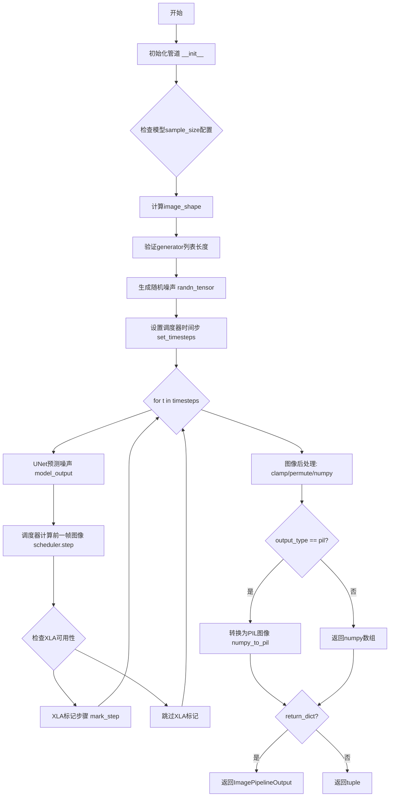
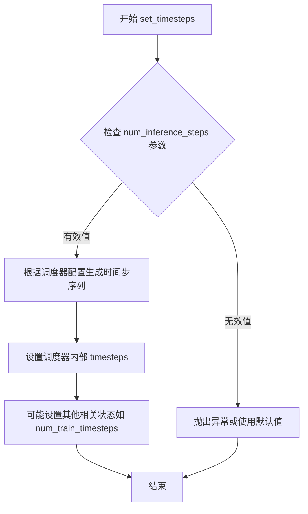
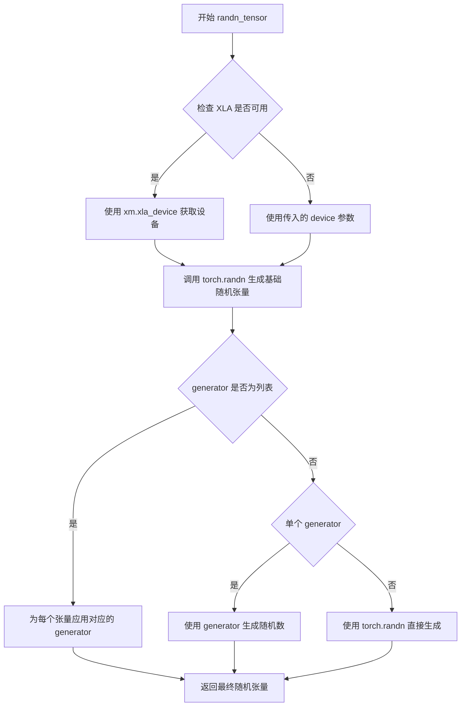
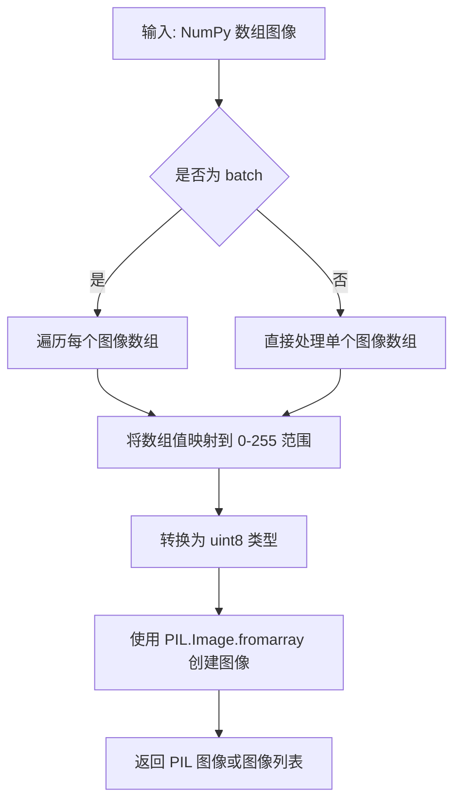
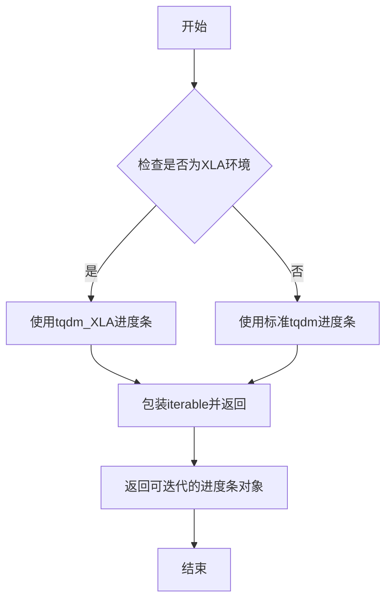

# `diffusers\src\diffusers\pipelines\ddim\pipeline_ddim.py` 详细设计文档

DDIMPipeline是一个基于DDIM（Denoising Diffusion Implicit Models）算法的图像生成管道，继承自DiffusionPipeline，利用UNet2DModel进行噪声预测，并通过DDIMScheduler调度实现从随机噪声到目标图像的去噪扩散过程。

## 整体流程



## 类结构

```
DiffusionPipeline (抽象基类/父类)
└── DDIMPipeline (具体实现类)
```

## 全局变量及字段


### `XLA_AVAILABLE`
    
标记torch_xla是否可用

类型：`bool`
    


### `is_torch_xla_available`
    
检测XLA可用性的工具函数

类型：`function`
    


### `randn_tensor`
    
生成随机高斯噪声的张量工具

类型：`function`
    


### `ImagePipelineOutput`
    
图像管道输出数据类

类型：`class`
    


### `DiffusionPipeline`
    
扩散管道基类

类型：`class`
    


### `UNet2DModel`
    
2D UNet去噪模型

类型：`class`
    


### `DDIMScheduler`
    
DDIM调度器类

类型：`class`
    


### `DDIMPipeline.model_cpu_offload_seq`
    
模型CPU卸载顺序配置

类型：`str`
    


### `DDIMPipeline.unet`
    
UNet2DModel去噪模型

类型：`UNet2DModel`
    


### `DDIMPipeline.scheduler`
    
DDIM调度器

类型：`DDIMScheduler`
    
    

## 全局函数及方法


### `DDIMPipeline.__init__`

这是 `DDIMPipeline` 类的构造函数，用于初始化扩散管道实例。它接收 UNet2DModel 和 DDIMScheduler 作为参数，确保调度器可以转换为 DDIM 格式，并注册所有模块。

参数：

- `unet`：`UNet2DModel`，用于去噪编码图像 latent 的 UNet 模型
- `scheduler`：`DDIMScheduler`，与 unet 结合使用以去噪编码图像的调度器

返回值：`None`，构造函数不返回值，仅初始化对象状态

#### 流程图

```mermaid
flowchart TD
    A[开始 __init__] --> B[调用 super().__init__ 初始化基类]
    B --> C[将 scheduler 转换为 DDIMScheduler]
    C --> D[通过 register_modules 注册 unet 和 scheduler 模块]
    D --> E[结束 __init__]
    
    style A fill:#f9f,color:#333
    style E fill:#9f9,color:#333
```

#### 带注释源码

```python
def __init__(self, unet: UNet2DModel, scheduler: DDIMScheduler):
    """
    初始化 DDIMPipeline 实例
    
    参数:
        unet: 用于图像去噪的 UNet2DModel 模型
        scheduler: 用于去噪过程的 DDIMScheduler 调度器
    """
    # 调用父类 DiffusionPipeline 的初始化方法
    # 设置基础管道配置和设备管理
    super().__init__()

    # 确保调度器始终可以转换为 DDIM 格式
    # 从现有调度器配置创建新的 DDIMScheduler 实例
    # 这确保了调度器具有 DDIM 特定的配置和功能
    scheduler = DDIMScheduler.from_config(scheduler.config)

    # 将 unet 和 scheduler 注册为管道的模块
    # 这允许管道保存/加载这些组件，并使它们可以通过属性访问
    # 同时支持模型 CPU offload 等高级功能
    self.register_modules(unet=unet, scheduler=scheduler)
```


### `DDIMPipeline.__call__`

该方法是DDIMPipeline的核心推理方法，通过去噪过程将随机噪声逐步转换为目标图像，实现基于DDIM（Denoising Diffusion Implicit Models）算法的图像生成功能。

参数：

- `batch_size`：`int`，可选，默认为1，要生成的图像数量
- `generator`：`torch.Generator | list[torch.Generator] | None`，可选，默认为None，用于确保生成可重复性的随机数生成器
- `eta`：`float`，可选，默认为0.0，对应DDIM论文中的η参数，控制DDIM与DDPM之间的插值，0为纯DDIM，1为纯DDPM
- `num_inference_steps`：`int`，可选，默认为50，去噪迭代的步数，步数越多图像质量越高但推理速度越慢
- `use_clipped_model_output`：`bool | None`，可选，默认为None，是否限制模型输出的取值范围，传递给调度器
- `output_type`：`str | None`，可选，默认为"pil"，输出格式，可选"pil"（PIL图像）或"np"（numpy数组）
- `return_dict`：`bool`，可选，默认为True，是否返回ImagePipelineOutput对象而非元组

返回值：`ImagePipelineOutput | tuple`，生成的单张或多张图像集合，若return_dict为True返回ImagePipelineOutput对象，否则返回(image_list,)元组

#### 流程图

```mermaid
flowchart TD
    A[开始 __call__] --> B{检查 sample_size 类型}
    B -->|int 类型| C[构建 image_shape = (batch_size, in_channels, sample_size, sample_size)]
    B -->|tuple 类型| D[构建 image_shape = (batch_size, in_channels, *sample_size)]
    C --> E[验证 generator 列表长度与 batch_size 一致]
    D --> E
    E --> F[使用 randn_tensor 生成初始高斯噪声 image]
    F --> G[调用 scheduler.set_timesteps 设置去噪时间步]
    G --> H[遍历时间步序列]
    H -->|当前时间步 t| I[调用 UNet 预测噪声 model_output]
    I --> J[调用 scheduler.step 计算 x_t-1]
    J --> K[更新 image 为 prev_sample]
    K --> L{是否启用 XLA}
    L -->|是| M[xm.mark_step 标记执行点]
    L -->|否| N{是否还有下一时间步}
    M --> N
    N -->|是| H
    N -->|否| O[对图像进行归一化处理: (image/2 + 0.5).clamp(0,1)]
    O --> P[转换为 CPU numpy 格式并调整维度顺序]
    P --> Q{output_type == 'pil'}
    Q -->|是| R[调用 numpy_to_pil 转换为 PIL Image]
    Q -->|否| S[直接返回 numpy 数组]
    R --> T{return_dict == True}
    S --> T
    T -->|是| U[返回 ImagePipelineOutput 对象]
    T -->|否| V[返回 (image,) 元组]
```

#### 带注释源码

```python
@torch.no_grad()
def __call__(
    self,
    batch_size: int = 1,
    generator: torch.Generator | list[torch.Generator] | None = None,
    eta: float = 0.0,
    num_inference_steps: int = 50,
    use_clipped_model_output: bool | None = None,
    output_type: str | None = "pil",
    return_dict: bool = True,
) -> ImagePipelineOutput | tuple:
    # 根据 unet 配置的 sample_size 确定生成图像的形状
    # 如果 sample_size 是整数，则为正方形图像；如果是元组，则支持非正方形
    if isinstance(self.unet.config.sample_size, int):
        image_shape = (
            batch_size,
            self.unet.config.in_channels,
            self.unet.config.sample_size,
            self.unet.config.sample_size,
        )
    else:
        image_shape = (batch_size, self.unet.config.in_channels, *self.unet.config.sample_size)

    # 验证当传入生成器列表时，其长度必须与 batch_size 匹配
    if isinstance(generator, list) and len(generator) != batch_size:
        raise ValueError(
            f"You have passed a list of generators of length {len(generator)}, but requested an effective batch"
            f" size of {batch_size}. Make sure the batch size matches the length of the generators."
        )

    # 步骤1: 采样高斯噪声作为去噪循环的起点
    # 使用 randn_tensor 生成指定形状的随机噪声，转移到执行设备并使用指定数据类型
    image = randn_tensor(image_shape, generator=generator, device=self._execution_device, dtype=self.unet.dtype)

    # 步骤2: 设置调度器的时间步
    # 根据 num_inference_steps 生成从 T 到 0 的时间步序列
    self.scheduler.set_timesteps(num_inference_steps)

    # 步骤3: 迭代去噪过程
    for t in self.progress_bar(self.scheduler.timesteps):
        # 3.1: 使用 UNet 模型预测噪声
        # 将当前噪声图像和时间步 t 输入 UNet，获取预测的噪声
        model_output = self.unet(image, t).sample

        # 3.2: 调用调度器执行单步去噪
        # 根据 DDIM 算法基于 eta 参数计算前一时刻的图像 x_t-1
        # eta=0 完全使用 DDIM 采样，eta=1 完全使用 DDPM 采样
        image = self.scheduler.step(
            model_output, t, image, eta=eta, use_clipped_model_output=use_clipped_model_output, generator=generator
        ).prev_sample

        # 步骤4: 如果使用 PyTorch XLA，进行标记步骤以优化 TPU 执行
        if XLA_AVAILABLE:
            xm.mark_step()

    # 步骤5: 后处理 - 将图像归一化到 [0, 1] 范围
    # 去噪过程产生的图像值域可能不在 [0,1]，需要进行转换
    image = (image / 2 + 0.5).clamp(0, 1)
    
    # 步骤6: 转换数据格式
    # 从 torch.Tensor 转换为 numpy 数组，并调整维度顺序 (B,C,H,W) -> (B,H,W,C)
    image = image.cpu().permute(0, 2, 3, 1).numpy()
    
    # 步骤7: 根据 output_type 转换为最终输出格式
    if output_type == "pil":
        image = self.numpy_to_pil(image)

    # 步骤8: 根据 return_dict 返回结果
    if not return_dict:
        return (image,)

    return ImagePipelineOutput(images=image)
```


### `DDIMScheduler.set_timesteps`

该方法用于设置去噪调度器的时间步（timesteps），决定了扩散模型在推理过程中需要执行的去噪步数。通常根据目标推理步数生成一系列时间步，并可能根据调度器的配置进行特定的采样策略调整。

参数：

- `num_inference_steps`：`int`，推理时执行的去噪步骤数量，决定生成图像的细节程度和质量

返回值：`None`，该方法直接修改调度器内部的状态（如 `self.timesteps`），不返回任何值

#### 流程图



#### 带注释源码

```
# 注意：由于提供的代码中未包含 DDIMScheduler 类的实现源码，
# 以下为基于 diffusers 库中 DDIMScheduler.set_timesteps 的典型实现逻辑推断

def set_timesteps(self, num_inference_steps: int, device: Union[str, torch.device] = "cpu"):
    """
    设置推理过程中的时间步序列
    
    参数:
        num_inference_steps: 推理时去噪的步数
        device: 时间步所在的设备
    """
    # 1. 获取调度器配置中的总训练时间步数
    # 通常在 DDIMScheduler 中 num_train_timesteps = 1000
    
    # 2. 根据 num_inference_steps 计算每步的间隔
    # step_ratio = num_train_timesteps // num_inference_steps
    
    # 3. 生成时间步序列（从最后一个时间步向前）
    # timesteps = torch.arange(0, num_inference_steps) * step_ratio
    # timesteps = timesteps.long().to(device)
    # timesteps = timesteps.flip(0)  # 从大到小排列
    
    # 4. 将时间步添加到调度器实例
    # self.timesteps = timesteps
    
    # 5. 可能还会设置其他与步数相关的属性
    # self.num_inference_steps = num_inference_steps
    
    pass  # 实际实现在 DDIMScheduler 类中
```

**注**：由于用户提供的代码仅为 `DDIMPipeline` 类，未包含 `DDIMScheduler` 类的源代码，因此 `set_timesteps` 方法的具体实现细节（如源码中的类字段、方法逻辑等）无法从给定代码中直接提取。上述源码为基于 diffusers 库通用实现的合理推断。如需获取完整的 `DDIMScheduler.set_timesteps` 源码，请参考 diffusers 库中的 `src/diffusers/schedulers/scheduling_ddim.py` 文件。


### DDIMScheduler.step

`step` 是 DDIMScheduler 类的方法，用于执行 DDIM（Denoising Diffusion Implicit Models）采样过程中的单步去噪计算。该方法根据模型预测的噪声输出，计算前一个时间步的图像（latent）状态，是扩散模型推理管道中的核心计算步骤。

参数：

- `model_output`：`torch.Tensor`，模型（UNet）预测的噪声输出，即 ε_θ(x_t, t)
- `t`：`int`，当前扩散时间步索引
- `sample`：`torch.Tensor`，当前时刻的图像 latent 表示 x_t
- `eta`：`float`，DDIM 参数 η，控制在采样过程中引入随机性的程度。η=0 为确定性 DDIM，η=1 相当于 DDPM
- `use_clipped_model_output`：`bool | None`，是否裁剪模型输出用于数值稳定性控制
- `generator`：`torch.Generator | None`，可选的随机数生成器，用于确保可复现性

返回值：返回一个包含 `prev_sample` 属性的对象（StepOutput），其中 `prev_sample` 为计算得到的 x_{t-1}，即前一时间步的图像 latent

#### 流程图

```mermaid
flowchart TD
    A[接收 model_output, t, sample] --> B{use_clipped_model_output}
    B -->|True| C[裁剪 model_output]
    B -->|False/None| D[使用原始 model_output]
    C --> E[计算_pred_original_sample]
    D --> E
    E --> F{eta == 0?}
    F -->|Yes| G[DDIM确定性模式<br/>prev_sample = pred_prev_sample]
    F -->|No| H[计算额外方差项<br/>pred_sample_direction<br/>variance]
    H --> I[prev_sample = pred_prev_sample + eta * variance_noise]
    G --> J[返回 StepOutput(prev_sample)]
    I --> J
```

#### 带注释源码

```python
# DDIMScheduler.step 方法的典型实现逻辑
def step(
    self,
    model_output: torch.Tensor,      # UNet 预测的噪声 ε_θ(x_t, t)
    timestep: int,                    # 当前时间步 t
    sample: torch.Tensor,             # 当前图像 x_t
    eta: float = 0.0,                 # DDIM 随机性参数 η ∈ [0, 1]
    use_clipped_model_prediction: bool = False,  # 是否裁剪预测
    generator: torch.Generator = None,  # 随机数生成器
) -> StepOutput:
    """
    执行单步 DDIM 去噪过程
    
    DDIM 核心公式:
    x_{t-1} = √αₜ₋₁ * pred_x0 + √(1-αₜ₋₁-αₜη²) * pred_direction + η * σₜ * ε
    
    其中:
    - pred_x0: 从噪声预测还原的原图
    - pred_direction: 预测的噪声方向
    - σₜ: 噪声标准差
    """
    
    # 1. 获取调度器配置参数
    prev_timestep = timestep - self.config.num_train_timesteps // self.num_inference_steps
    
    # 2. 计算 alpha_cumprod 相关值
    alpha_prod_t = self.alphas_cumprod[timestep]
    alpha_prod_t_prev = self.alphas_cumprod[prev_timestep] if prev_timestep >= 0 else torch.tensor(1.0)
    
    # 3. 计算预测的原图 x0
    # x0 = (x_t - √(1-αₜ) * ε) / √αₜ
    beta_prod_t = 1 - alpha_prod_t
    pred_original_sample = (sample - beta_prod_t ** (0.5) * model_output) / alpha_prod_t ** (0.5)
    
    # 4. 裁剪预测（可选，增强数值稳定性）
    if use_clipped_model_prediction:
        pred_original_sample = torch.clamp(pred_original_sample, -1, 1)
    
    # 5. 计算方差参数
    variance = self._get_variance(timestep, prev_timestep)
    std_dev_t = eta * variance ** (0.5)
    
    # 6. 计算预测方向（噪声方向）
    pred_sample_direction = (1 - alpha_prod_t_prev - std_dev_t**2) ** (0.5) * model_output
    
    # 7. 计算前一时刻样本
    # 确定性: η=0 时使用此路径
    pred_prev_sample = alpha_prod_t_prev ** (0.5) * pred_original_sample + pred_sample_direction
    
    # 8. 添加随机噪声（当 η > 0 时）
    if eta > 0:
        if generator is None:
            noise = torch.randn_like(sample)
        else:
            noise = torch.randn(sample.shape, generator=generator).to(sample.device)
        
        variance_noise = std_dev_t * noise
        prev_sample = pred_prev_sample + variance_noise
    else:
        prev_sample = pred_prev_sample
    
    return StepOutput(prev_sample=prev_sample)
```


### randn_tensor

生成指定形状的随机张量（服从标准正态分布），用于 diffusion 模型的噪声采样。支持通过 Generator 实现可重现的随机生成，并自动处理设备分配和数据类型转换。

参数：

- `shape`：`tuple[int, ...]` 或 `torch.Size`，要生成的随机张量的形状
- `generator`：`torch.Generator | list[torch.Generator] | None`，可选的随机数生成器，用于控制生成结果的确定性
- `device`：`torch.device`，生成张量应该放置的设备（CPU 或 CUDA）
- `dtype`：`torch.dtype`，生成张量的数据类型（如 torch.float32）

返回值：`torch.Tensor`，形状为 `shape` 的随机张量，服从标准正态分布

#### 流程图



#### 带注释源码

```
# 注：randn_tensor 函数定义不在当前代码文件中
# 此处展示从 ...utils.torch_utils 导入的函数_usage_示例：

# 使用示例（来自 DDIMPipeline.__call__ 方法）：
image_shape = (
    batch_size,
    self.unet.config.in_channels,
    self.unet.config.sample_size,
    self.unet.config.sample_size,
)

# 生成形状为 image_shape 的高斯噪声张量
# 参数：
#   - image_shape: 张量形状 (batch_size, channels, height, width)
#   - generator: 可选的随机数生成器，确保可重现性
#   - device: 执行设备（CPU/CUDA）
#   - dtype: 张量数据类型（通常为模型权重的数据类型）
image = randn_tensor(
    image_shape,                  # 张量形状元组
    generator=generator,          # torch.Generator 或 None
    device=self._execution_device,# torch.device
    dtype=self.unet.dtype         # torch.dtype
)
```

> **注意**：由于 `randn_tensor` 函数定义位于 `diffusers` 库的 `utils.torch_utils` 模块中，未在当前代码文件内展现。上述源码基于该函数的调用方式和使用场景进行注释说明。该函数内部通常封装了 `torch.randn`，并针对 XLA 设备（如 TPU）做了特殊处理。


### `DDIMPipeline.numpy_to_pil`

将 NumPy 数组格式的图像数据转换为 PIL 图像对象。此方法是继承自父类 `DiffusionPipeline` 的工具方法，用于在扩散 pipeline 输出时将图像格式从 NumPy 数组转换为 PIL Image，以便于显示和保存。

参数：

- `image`：`numpy.ndarray`，输入的图像数据，通常为形状为 (batch_size, height, width, channels) 的 NumPy 数组，像素值范围在 [0, 1] 或 [0, 255]

返回值：`PIL.Image.Image` 或 `list[PIL.Image.Image]`，返回转换后的 PIL 图像对象，如果是 batch 则返回图像列表

#### 流程图



#### 带注释源码

由于 `numpy_to_pil` 方法定义在父类 `DiffusionPipeline` 中，当前代码文件仅展示其调用逻辑：

```python
# 在 __call__ 方法中，图像经过归一化处理后转换为 NumPy 数组
image = (image / 2 + 0.5).clamp(0, 1)  # 将图像值从 [-1,1] 映射到 [0,1]
image = image.cpu().permute(0, 2, 3, 1).numpy()  # 转换为 (B, H, W, C) 格式的 NumPy 数组

# 根据 output_type 参数决定是否转换为 PIL 图像
if output_type == "pil":
    # 调用父类方法 numpy_to_pil 将 NumPy 数组转换为 PIL Image
    # 该方法通常包含以下逻辑：
    # 1. 将 [0,1] 范围的浮点数映射到 [0,255] 的整数
    # 2. 转换为 uint8 类型
    # 3. 使用 PIL.Image.fromarray() 创建图像对象
    image = self.numpy_to_pil(image)
```

#### 补充说明

由于该方法定义在父类 `DiffusionPipeline` 中，无法从此代码片段直接获取其完整实现。其完整源码通常位于 `diffusers/src/diffusers/pipelines/pipeline_utils.py` 的 `DiffusionPipeline` 类中。该方法的主要功能是将标准化后的 NumPy 数组图像转换回标准的 PIL Image 格式，以便用户进行后续的显示、保存或进一步处理操作。


### `DDIMPipeline.progress_bar`

这是一个从父类 `DiffusionPipeline` 继承的进度条方法，用于在迭代过程中显示进度。

参数：

- `iterable`：可迭代对象（通常是 `torch.Tensor` 或 `list`），需要遍历的 timesteps 序列
- `desc`：可选的字符串，进度条的描述文本
- `total`：可选的整数，总迭代次数
- `leave`：可选的布尔值，是否在完成后保留进度条
- `unit`：可选的字符串，进度单位名称

返回值：返回一个包装了原始可迭代对象的迭代器，支持在遍历时显示进度条。

#### 流程图



#### 带注释源码

```python
# progress_bar 方法定义（位于 DiffusionPipeline 父类中）
# 此代码基于 diffusers 库 common 实现模式推断

def progress_bar(
    self,
    iterable,
    desc=None,
    total=None,
    leave=True,
    unit="step",
):
    """
    为迭代添加进度条显示功能。
    
    参数:
        iterable: 要迭代的数据源（如 scheduler.timesteps）
        desc: 进度条左侧的描述文本
        total: 总迭代次数，默认从 iterable 长度推断
        leave: 完成后是否保留进度条
        unit: 迭代单位的名称
    
    返回:
        包装了进度条的迭代器对象
    """
    # 如果 total 未指定，尝试从 iterable 获取长度
    if total is None:
        try:
            total = len(iterable)
        except TypeError:
            # 如果 iterable 没有长度，则不显示总数
            total = float('nan')
    
    # 根据是否可用 XLA 选择不同的进度条实现
    if is_torch_xla_available():
        # XLA 环境使用特殊的进度条（不阻塞）
        from tqdm import tqdm as tqdm_xla
        return tqdm_xla(
            iterable,
            desc=desc,
            total=total,
            leave=leave,
            unit=unit,
            disable=False,  # 启用进度条
        )
    else:
        # 标准环境使用常规 tqdm
        from tqdm import tqdm
        return tqdm(
            iterable,
            desc=desc,
            total=total,
            leave=leave,
            unit=unit,
            disable=False,
        )

# 在 __call__ 方法中的实际调用：
# for t in self.progress_bar(self.scheduler.timesteps):
#     # 迭代处理每个 timestep
#     model_output = self.unet(image, t).sample
#     image = self.scheduler.step(...).prev_sample
```

---

**注意**：由于 `progress_bar` 方法定义在 `DiffusionPipeline` 父类中，而父类代码未在当前代码片段中提供，以上源码是根据 diffusers 库 common 实现模式的合理推断。实际的实现细节可能略有差异。


### `DDIMPipeline.__init__`

初始化DDIMPipeline管道对象，注册UNet2DModel模型和DDIMScheduler调度器，并确保调度器配置可以转换为DDIMScheduler格式。

参数：

- `self`：隐式参数，DDIMPipeline实例本身
- `unet`：`UNet2DModel`，用于对编码图像潜在表示进行去噪的UNet2DModel模型实例
- `scheduler`：`DDIMScheduler`，与unet结合使用对编码图像进行去噪的调度器，可以是DDIMScheduler或其他支持DDIM配置格式的调度器

返回值：无（`None`），该方法为构造函数，不返回任何值，仅初始化对象状态

#### 流程图

```mermaid
flowchart TD
    A[开始 __init__] --> B[调用 super().__init__]
    B --> C[从scheduler.config创建DDIMScheduler实例]
    C --> D[调用 self.register_modules 注册 unet 和 scheduler]
    D --> E[结束 __init__]
    
    style A fill:#f9f,stroke:#333
    style E fill:#9f9,stroke:#333
```

#### 带注释源码

```python
def __init__(self, unet: UNet2DModel, scheduler: DDIMScheduler):
    """
    DDIMPipeline 构造函数
    
    参数:
        unet: UNet2DModel 实例，用于图像去噪
        scheduler: DDIMScheduler 实例，用于控制去噪过程
    """
    # 调用父类 DiffusionPipeline 的初始化方法
    # 完成基础组件的初始化工作
    super().__init__()
    
    # 确保 scheduler 始终可以转换为 DDIMScheduler
    # 即使传入的是其他类型的调度器，也会通过 from_config 
    # 方法将其配置转换为 DDIMScheduler 格式
    # 这是为了保证管道内部始终使用统一的 DDIM 采样逻辑
    scheduler = DDIMScheduler.from_config(scheduler.config)
    
    # 注册模块，使 unet 和 scheduler 成为管道的可管理组件
    # 注册后可以通过 self.unet 和 self.scheduler 访问
    # 同时支持模型CPU卸载、设备管理等功能
    self.register_modules(unet=unet, scheduler=scheduler)
```


### `DDIMPipeline.__call__`

执行DDIM（Denoising Diffusion Implicit Models）推理流程的主方法，通过迭代去噪过程从随机噪声生成图像。

参数：

- `batch_size`：`int`，可选，默认值为 1，要生成的图像数量
- `generator`：`torch.Generator | list[torch.Generator] | None`，可选，默认值为 None，用于确保生成可重复性的随机数生成器
- `eta`：`float`，可选，默认值为 0.0，对应DDIM论文中的η参数，控制DDIM与DDPM的插值，0为纯DDIM，1为纯DDPM
- `num_inference_steps`：`int`，可选，默认值为 50，去噪迭代的步数，步数越多图像质量越高但推理越慢
- `use_clipped_model_output`：`bool | None`，可选，默认值为 None，是否裁剪模型输出，传递给调度器
- `output_type`：`str | None`，可选，默认值为 "pil"，输出图像的格式，可选"pil"或"numpy"数组
- `return_dict`：`bool`，可选，默认值为 True，是否返回ImagePipelineOutput对象而非元组

返回值：`ImagePipelineOutput | tuple`，生成的图像结果，如果是字典格式返回ImagePipelineOutput对象，否则返回(image,)元组

#### 流程图

```mermaid
flowchart TD
    A[开始 __call__] --> B{检查 sample_size 类型}
    B -->|int 类型| C[构建 image_shape: (batch_size, in_channels, sample_size, sample_size)]
    B -->|tuple 类型| D[构建 image_shape: (batch_size, in_channels, ...sample_size)]
    C --> E[验证 generator 列表长度]
    D --> E
    E --> F{generator 长度 == batch_size?}
    F -->|否| G[抛出 ValueError 异常]
    F -->|是| H[使用 randn_tensor 采样高斯噪声]
    H --> I[调用 scheduler.set_timesteps 设置去噪步数]
    I --> J[遍历 timesteps 列表]
    J --> K[第 t 步: 调用 UNet 预测噪声 model_output]
    K --> L[调用 scheduler.step 计算上一时刻图像 prev_sample]
    L --> M{XLA_AVAILABLE?}
    M -->|是| N[执行 xm.mark_step 同步]
    M -->|否| O[继续下一迭代]
    N --> O
    O --> J
    J -->|所有步完成| P[图像后处理: /2+0.5 归一化并 clamp]
    P --> Q[转换为 CPU numpy 数组并 permute 维度]
    Q --> R{output_type == 'pil'?}
    R -->|是| S[调用 numpy_to_pil 转换为 PIL Image]
    R -->|否| T[直接返回 numpy 数组]
    S --> U{return_dict?}
    T --> U
    U -->|是| V[返回 ImagePipelineOutput 对象]
    U -->|否| W[返回 (image,) 元组]
```

#### 带注释源码

```python
@torch.no_grad()
def __call__(
    self,
    batch_size: int = 1,
    generator: torch.Generator | list[torch.Generator] | None = None,
    eta: float = 0.0,
    num_inference_steps: int = 50,
    use_clipped_model_output: bool | None = None,
    output_type: str | None = "pil",
    return_dict: bool = True,
) -> ImagePipelineOutput | tuple:
    # 1. 根据 UNet 配置确定输出图像的形状
    #    如果 sample_size 是 int，则为正方形；否则使用元组尺寸
    if isinstance(self.unet.config.sample_size, int):
        image_shape = (
            batch_size,
            self.unet.config.in_channels,
            self.unet.config.sample_size,
            self.unet.config.sample_size,
        )
    else:
        image_shape = (batch_size, self.unet.config.in_channels, *self.unet.config.sample_size)

    # 2. 验证传入的生成器列表长度是否与 batch_size 匹配
    if isinstance(generator, list) and len(generator) != batch_size:
        raise ValueError(
            f"You have passed a list of generators of length {len(generator)}, but requested an effective batch"
            f" size of {batch_size}. Make sure the batch size matches the length of the generators."
        )

    # 3. 初始化：采样高斯噪声作为去噪过程的起点
    #    使用传入的 generator 确保可重复性，部署到执行设备，使用 UNet 的数据类型
    image = randn_tensor(image_shape, generator=generator, device=self._execution_device, dtype=self.unet.dtype)

    # 4. 配置调度器：设置推理所需的 timesteps 数量
    self.scheduler.set_timesteps(num_inference_steps)

    # 5. 主去噪循环：遍历每个 timestep 进行迭代去噪
    for t in self.progress_bar(self.scheduler.timesteps):
        # 5.1 第一步：使用 UNet 模型预测噪声输出
        #          输入当前噪声图像 image 和当前时间步 t，输出预测的噪声
        model_output = self.unet(image, t).sample

        # 5.2 第二步：调用调度器的 step 方法
        #          根据预测的噪声、当前时间步和 eta 参数计算上一时刻的图像
        #          eta=0 时为纯 DDIM 采样，eta=1 时为 DDPM 采样
        #          use_clipped_model_output 控制是否裁剪模型输出（数值稳定性）
        #          generator 用于确保采样过程中的随机性可重复
        image = self.scheduler.step(
            model_output, t, image, eta=eta, use_clipped_model_output=use_clipped_model_output, generator=generator
        ).prev_sample

        # 5.3 如果使用 XLA (TensorFlow/Lightning)，执行同步操作
        if XLA_AVAILABLE:
            xm.mark_step()

    # 6. 后处理：将生成的图像从 [-1,1] 范围转换到 [0,1] 范围
    image = (image / 2 + 0.5).clamp(0, 1)
    
    # 7. 格式转换：转换为 CPU 上的 numpy 数组，并调整维度顺序 (N,C,H,W) -> (N,H,W,C)
    image = image.cpu().permute(0, 2, 3, 1).numpy()
    
    # 8. 可选：将 numpy 数组转换为 PIL Image 格式
    if output_type == "pil":
        image = self.numpy_to_pil(image)

    # 9. 返回结果：根据 return_dict 参数决定返回格式
    if not return_dict:
        return (image,)

    return ImagePipelineOutput(images=image)
```

## 关键组件


### 张量索引与惰性加载

使用`randn_tensor`函数生成指定形状的随机噪声张量，并通过`self._execution_device`和`self.unet.dtype`属性延迟获取执行设备和张量类型，实现计算资源的惰性加载。

### 反量化支持

通过`(image / 2 + 0.5).clamp(0, 1)`操作将去噪后的图像从[-1, 1]范围反量化至[0, 1]标准范围，并使用`.cpu().permute(0, 2, 3, 1).numpy()`将张量转换为HWC格式的NumPy数组以适配后续图像处理流程。

### 量化策略

虽然代码本身未直接实现量化，但通过`self.unet.dtype`访问模型的 dtype 属性，为未来的量化模型（如INT8/INT4）支持预留了接口，可通过配置量化策略进行模型压缩。

### DDIMScheduler调度器

用于管理去噪过程的时间步调度，提供`set_timesteps`和`step`方法实现DDIM算法的核心迭代逻辑，支持eta参数控制DDIM与DDPM的采样策略切换。

### UNet2DModel去噪模型

核心的噪声预测网络，接受当前图像张量和时间步t作为输入，输出预测的噪声残差，用于迭代去噪过程中的噪声估计。

### 迭代去噪循环

通过遍历`self.scheduler.timesteps`实现逐步去噪的核心循环，每次迭代调用UNet预测噪声并使用调度器计算下一步的图像状态，直至完成指定的推理步数。

### XLA设备支持

通过`is_torch_xla_available()`检测TPU环境，并在每次迭代结束时调用`xm.mark_step()`实现XLA设备的异步执行优化。


## 问题及建议


### 已知问题

- **scheduler重复初始化**: `scheduler = DDIMScheduler.from_config(scheduler.config)` 会无条件将scheduler转换为DDIMScheduler，如果传入的已经是DDIMScheduler实例，会创建不必要的副本，增加内存开销
- **类型注解兼容性**: 使用了Python 3.10+的联合类型语法 `torch.Generator | list[torch.Generator]`，未做版本检查或使用 `Optional`/`Union` 兼容旧版本
- **use_clipped_model_output默认值处理**: 当 `use_clipped_model_output=None` 时直接传递给scheduler，可能导致某些scheduler行为不一致，应明确处理None情况
- **设备转换开销**: 在循环结束后统一执行 `.cpu().permute().numpy()`，大量中间结果停留在GPU内存中
- **缺少输入验证**: 未对 `num_inference_steps <= 0`、`eta` 范围（应限制在[0,1]）等进行校验
- **generator长度检查位置**: 在创建大量tensor之后才检查generator长度，前期计算浪费

### 优化建议

- **scheduler优化**: 添加类型检查，如果已是DDIMScheduler则跳过重新初始化；或使用 `isinstance(scheduler, DDIMScheduler)` 判断
- **类型注解兼容**: 改用 `Optional[Union[torch.Generator, List[torch.Generator]]]` 以支持Python 3.8+
- **设备管理优化**: 考虑使用 `torch.cuda.synchronize()` 配合 XLA，或在循环内适当位置添加设备转换减少峰值显存
- **输入参数校验**: 在函数开头添加参数合法性检查，提前抛出有意义的错误信息
- **generator预检查**: 在分配大tensor前验证generator长度
- **内存格式优化**: 考虑使用 `channels_last` 内存格式提升UNet推理性能
- **常量提取**: 将 `"pil"`、`"np.array"` 等字符串和 `0.5`、`127.5` 等魔数提取为模块级常量
- **文档增强**: 为eta参数在不同scheduler下的行为添加更明确的说明

## 其它


### 设计目标与约束

**设计目标**：实现基于DDIM算法的图像生成Pipeline，支持批量生成高质量图像，具备可扩展的调度器系统和设备迁移能力。

**约束条件**：
- 依赖PyTorch框架，要求CUDA或CPU设备
- 支持XLA加速（可选）
- 输入噪声必须与UNet配置的通道数匹配
- 批处理大小受限于设备内存
- 输出图像格式限于PIL.Image或numpy数组

### 错误处理与异常设计

**参数校验异常**：
- `batch_size`与`generator`列表长度不匹配时抛出`ValueError`
- `num_inference_steps`必须为正整数
- `eta`参数需在[0,1]范围内（DDIMScheduler约束）
- `output_type`仅支持"pil"或"numpy"（隐式）

**运行时异常**：
- 设备迁移失败时回退到CPU执行
- XLA加速时每步结束调用`xm.mark_step()`保持同步
- 模型输出类型不匹配时触发调度器内部异常

**异常传播**：
- 调度器配置错误沿用默认DDIM配置
- 图像形状不兼容时向上层传递RuntimeError

### 数据流与状态机

**主状态机**：
1. **初始化态**：加载UNet和Scheduler，注册模块
2. **噪声采样态**：根据batch_size生成高斯噪声tensor
3. **调度器配置态**：调用`set_timesteps`设置推理步数
4. **迭代去噪态**：循环执行timesteps，UNet预测噪声→Scheduler计算前一时刻图像
5. **后处理态**：归一化[0,1]→转numpy→PIL转换（可选）
6. **输出态**：返回ImagePipelineOutput或tuple

**状态转换条件**：
- 初始化→噪声采样：首次调用`__call__`
- 迭代去噪→后处理：遍历完所有timesteps
- 后处理→输出：`return_dict`参数决定返回格式

### 外部依赖与接口契约

**核心依赖**：
- `torch`：张量运算与自动微分
- `UNet2DModel`：去噪模型（输入：图像+ timestep，输出：噪声预测）
- `DDIMScheduler`：调度器（方法：`set_timesteps`、`step`）
- `randn_tensor`：工具函数生成确定性随机噪声
- `DiffusionPipeline`：基类（属性：`_execution_device`、`numpy_to_pil`）

**接口契约**：
- `unet.config.sample_size`：可为int或tuple[int,int]，决定输出分辨率
- `scheduler.step()`：必须返回含`prev_sample`属性的对象
- `ImagePipelineOutput`：必须含`images`属性（list类型）

**可选依赖**：
- `torch_xla`：XLA设备加速（`xm.mark_step()`同步）

### 性能考虑与优化空间

**当前性能特征**：
- 单次推理需`num_inference_steps`次UNet前向传播
- 内存占用：batch_size × in_channels × sample_size² × 4 bytes（float32）
- 默认50步推理，约需数秒至数十秒（GPU）

**优化方向**：
1. **调度器层面**：支持DDIM的更少步骤采样（如10-20步）
2. **模型层面**：集成ONNX导出或TensorRT加速
3. **内存层面**：启用`model_cpu_offload_seq`实现模型卸载
4. **XLA层面**：批量标记步骤减少同步开销
5. **批处理层面**：支持动态批处理（需上层调度器配合）

### 并发与线程安全

**线程安全性分析**：
- Pipeline实例为无状态设计（推理过程中修改内部tensor）
- 多次并发调用需创建独立Pipeline实例
- `randn_tensor`支持独立generator确保可复现性
- Scheduler内部状态非线程安全，单实例禁用并发推理

**GIL考虑**：
- PyTorch操作释放GIL，可并行执行非张量计算
- 建议使用`torch.multiprocessing`实现多进程批处理

### 配置与参数详解

| 参数名 | 类型 | 默认值 | 说明 |
|--------|------|--------|------|
| batch_size | int | 1 | 生成的图像数量 |
| generator | Generator/List/None | None | 随机数生成器，控制噪声采样 |
| eta | float | 0.0 | DDIM论文参数η，0=确定性，1=随机 |
| num_inference_steps | int | 50 | 去噪迭代次数，越多质量越高 |
| use_clipped_model_output | bool/None | None | 是否截断模型输出，超参数调优用 |
| output_type | str | "pil" | 输出格式："pil"或"numpy" |
| return_dict | bool | True | 是否返回结构化对象 |

### 使用示例与最佳实践

**基础用法**：
```python
pipe = DDIMPipeline.from_pretrained("fusing/ddim-lsun-bedroom")
image = pipe(num_inference_steps=50).images[0]
```

**确定性生成**：
```python
generator = torch.Generator(device="cuda").manual_seed(42)
image = pipe(generator=generator, num_inference_steps=50).images[0]
```

**高质量输出**：
```python
image = pipe(
    num_inference_steps=100,  # 增加步数
    eta=0.0,  # 确定性采样
    use_clipped_model_output=True  # 启用输出截断
).images[0]
```

**CPU卸载**：
```python
pipe.enable_model_cpu_offload()  # 推理后自动卸载至CPU
```

### 版本兼容性说明

**框架版本要求**：
- Python ≥ 3.8
- PyTorch ≥ 1.9（推荐2.0+）
- diffusers ≥ 0.14.0

**模型兼容性**：
- UNet2DModel需匹配diffusers库版本导出的config.json
- Scheduler配置需兼容DDIMScheduler的V1/V2格式

**破坏性变更历史**：
- v0.14.0：`ImagePipelineOutput`结构调整
- v0.13.0：移除`pipeline_info`参数
- 未来版本可能移除`eta`参数（统一为DDIM默认行为）

### 安全考虑

**输入验证**：
- 拒绝NaN/Inf噪声输入（可能因generator故障）
- 验证timesteps在有效范围内

**内存安全**：
- 大batch_size可能导致OOM，需设备内存检测
- 建议设置`torch.cuda.empty_cache()`定期释放缓存

**模型安全**：
- 加载预训练模型需验证Hub签名
- 恶意模型可能执行任意代码（沙箱建议）

### 测试策略建议

**单元测试**：
- 测试Pipeline初始化与参数校验
- 测试噪声形状匹配性
- 测试输出类型转换（PIL/numpy）

**集成测试**：
- 测试完整推理流程（50步）
- 测试调度器状态重置
- 测试设备迁移（CPU/GPU）

**性能基准**：
- 测量单图推理延迟
- 测量峰值显存占用
- 对比不同num_inference_steps的质量-速度权衡

### 部署注意事项

**容器化部署**：
- 基础镜像需含PyTorch和CUDA runtime
- 推荐安装diffusers[torch]稳定版本
- XLA支持需额外安装torch_xla

**API服务化**：
- 建议使用FastAPI包装为RESTful服务
- 实现健康检查端点（模型加载状态）
- 限制max_batch_size防止DDoS

**资源限制**：
- GPU推理建议显存≥8GB（batch_size=1）
- CPU推理需预留≥16GB RAM
- 设置推理超时（如300秒）


    