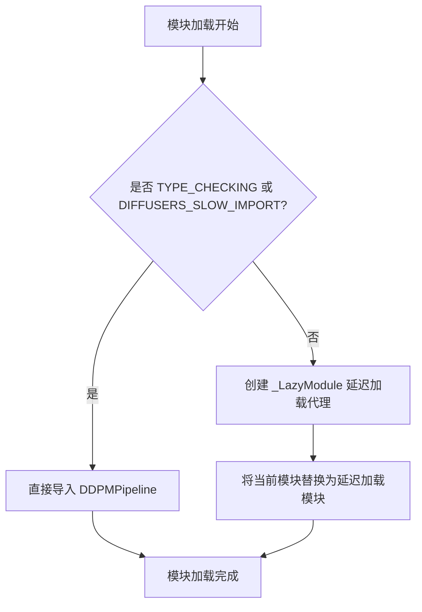

# `diffusers\src\diffusers\pipelines\ddpm\__init__.py` 详细设计文档

这是一个延迟加载模块的初始化文件，用于在diffusers库中按需导入DDPMPipeline类，从而优化包的导入时间并避免不必要的模块加载。

## 整体流程



## 类结构

```
延迟加载模块结构
└── _LazyModule (代理模块机制)
```

## 全局变量及字段


### `_import_structure`
    
定义了模块的导入结构，映射子模块名称到可导出的类或函数列表

类型：`Dict[str, List[str]]`
    


### `__name__`
    
当前模块的完整名称，用于标识模块在Python解释器中的身份

类型：`str`
    


### `__file__`
    
当前模块文件的路径，用于定位模块源代码的位置

类型：`str`
    


### `__spec__`
    
模块导入规范对象，包含了模块的导入元数据如名称、位置、加载器等信息

类型：`Optional[ModuleSpec]`
    


    

## 全局函数及方法


## 关键组件


### 延迟加载模块机制

使用`_LazyModule`实现模块的延迟加载，当`DIFFUSERS_SLOW_IMPORT`为True或`TYPE_CHECKING`时才会真正导入模块，否则将当前模块替换为懒加载模块，从而优化导入速度。

### 条件类型检查导入

通过`TYPE_CHECKING`或`DIFFUSERS_SLOW_IMPORT`条件判断，在类型检查时导入`DDPMPipeline`类，避免运行时的额外导入开销。

### 模块导入结构定义

使用`_import_structure`字典定义模块的公共接口，键为子模块名，值为可导出对象的列表，这里暴露了`DDPMPipeline`类。

### 懒加载模块注册

当不满足快速导入条件时，使用`sys.modules[__name__]`将当前模块替换为`_LazyModule`实例，实现按需加载。


## 问题及建议


### 已知问题

-   **错误处理缺失**：未对导入过程进行 `try-except` 包装，如果 `DDPMPipeline` 类不存在或导入路径错误，将导致整个模块加载失败
-   **`__spec__` 潜在空值风险**：代码直接使用 `module_spec=__spec__`，但未检查 `__spec__` 是否为 `None`，在某些动态导入场景下可能导致属性访问错误
-   **模块文档缺失**：该 `__init__.py` 文件缺少模块级文档字符串，无法快速了解模块职责和用途
-   **导入结构硬编码**：`_import_structure` 字典直接硬编码，扩展性差，新增管道时需手动维护该结构
-   **相对导入路径脆弱**：`from ...utils` 依赖相对路径定位，如果目录结构变化会导致导入失败
-   **单一导出点风险**：仅导出 `DDPMPipeline` 一个类，缺乏冗余设计

### 优化建议

-   添加模块级文档字符串，说明该模块为 DDPM 管道聚合入口
-   使用 `try-except` 包装可能失败的导入操作，提供降级方案或明确错误信息
-   在使用 `__spec__` 前增加 `or None` 检查，如 `module_spec=__spec__ if __spec__ else None`
-   考虑将导入结构提取为独立配置或使用自动发现机制，提高可维护性
-   添加类型检查分支的异常捕获，确保 `TYPE_CHECKING` 模式下导入失败不影响类型检查流程
-   建议添加 `__all__` 显式声明公开 API，提升模块接口清晰度


## 其它


### 设计目标与约束

该模块采用延迟加载（Lazy Loading）模式，主要目标是在diffusers库中实现DDPMPipeline的按需导入，避免在库初始化时加载所有模块，从而减少内存占用和加快导入速度。设计约束包括：仅在TYPE_CHECKING或DIFFUSERS_SLOW_IMPORT为True时执行直接导入，其他情况下通过_LazyModule实现延迟加载，必须保持与现有导入结构（_import_structure）的一致性。

### 错误处理与异常设计

该模块的错误处理主要集中在导入阶段：如果pipeline_ddpm模块不存在或DDPMPipeline类无法找到，延迟加载机制会在实际使用时抛出AttributeError或ImportError。建议在调用处添加try-except捕获ImportError，提供明确的错误信息指引用户正确安装相关依赖。

### 数据流与状态机

数据流主要涉及模块注册和导入请求两个阶段：模块注册阶段将当前模块替换为_LazyModule实例；导入请求阶段当代码尝试访问DDPMPipeline属性时，_LazyModule触发实际的模块加载和导入。没有复杂的状态机，仅有"未加载"和"已加载"两种状态。

### 外部依赖与接口契约

外部依赖包括：1）diffusers.utils中的DIFFUSERS_SLOW_IMPORT配置标志和_LazyModule延迟加载工具类；2）同目录下的pipeline_ddpm模块（需保证存在DDPMPipeline类）。接口契约要求：_import_structure字典格式必须为{"module_name": ["ClassName"]}，且模块名与实际文件名一致。

### 安全考虑

该模块本身不涉及用户输入或网络请求，安全性风险较低。但需确保pipeline_ddpm模块来源可信，避免通过延迟加载机制加载恶意模块。建议在生产环境中验证所有导入的模块签名。

### 性能考量

延迟加载的主要性能收益体现在：1）减少初始导入时间（跳过DDPMPipeline等重型模块）；2）降低内存占用（仅加载实际使用的模块）。性能开销在于首次访问时需要执行模块查找和加载操作。建议监控首次访问延迟，确保不影响用户体验。

### 配置管理

配置通过DIFFUSERS_SLOW_IMPORT环境变量/配置项控制：当设置为True时，强制执行直接导入（用于类型检查和静态分析）；默认为False时启用延迟加载。_import_structure字典定义了可导出的公共接口，module_spec参数保留了原始模块的元信息。

### 版本兼容性

该模式需兼容Python 3.7+（支持TYPE_CHECKING和__getattr__），并与diffusers库的版本策略保持一致。随着Python版本演进，可考虑使用PEP 562（__getattr__）实现更优雅的延迟加载。建议在文档中明确支持的Python和diffusers版本范围。

### 测试策略

建议测试：1）默认情况下DDPMPipeline不触发实际导入；2）DIFFUSERS_SLOW_IMPORT=True时立即导入；3）访问DDPMPipeline时正确触发加载；4）多次访问不会重复加载模块；5）错误情况下（如pipeline_ddpm不存在）抛出正确的异常类型。

### 部署注意事项

部署时需确保：1）diffusers.utils模块可用且包含所需工具；2）pipeline_ddpm.py文件存在于正确路径；3）Python环境满足版本要求；4）生产环境建议保持DIFFUSERS_SLOW_IMPORT=False以获得最佳性能。容器化部署时需注意包含所有必要的模块文件。

    