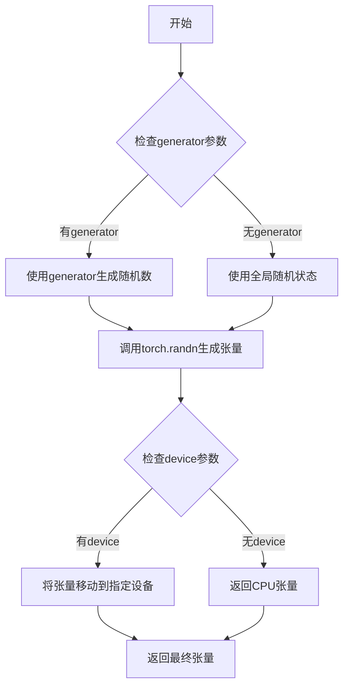
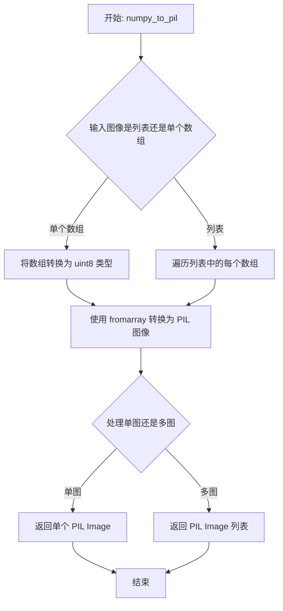
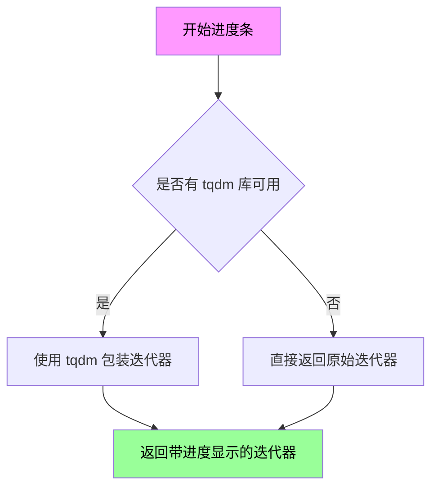

# `diffusers\src\diffusers\pipelines\ddpm\pipeline_ddpm.py` 详细设计文档

DDPMPipeline是一个基于扩散概率模型（DDPM）的图像生成管道，通过预训练的UNet2DModel对高斯噪声进行逐步去噪，结合DDPMScheduler调度器实现高质量图像生成，支持批量生成、随机种子控制和多步去噪推理。

## 整体流程

```mermaid
graph TD
A[开始] --> B[检查设备类型]
B --> C{设备是mps?}
C -- 是 --> D[在CPU生成随机噪声并移到设备]
C -- 否 --> E[直接在设备上生成随机噪声]
D --> F[设置去噪步骤数]
E --> F
F --> G[获取时间步列表]
G --> H{遍历时间步}
H -- 循环 --> I[UNet预测噪声]
I --> J[Scheduler计算上一步图像]
J --> K{XLA可用?]
K -- 是 --> L[标记执行步骤]
K -- 否 --> H
L --> H
H -- 结束 --> M[归一化图像到0-1]
M --> N[转换为numpy数组]
N --> O{output_type是pil?}
O -- 是 --> P[转换为PIL图像]
O -- 否 --> Q[返回结果]
P --> Q
```

## 类结构

```
DiffusionPipeline (基类)
└── DDPMPipeline
```

## 全局变量及字段


### `XLA_AVAILABLE`
    
指示是否支持PyTorch XLA

类型：`bool`
    


### `DDPMPipeline.model_cpu_offload_seq`
    
CPU卸载顺序配置

类型：`str`
    


### `DDPMPipeline.unet`
    
去噪UNet模型

类型：`UNet2DModel`
    


### `DDPMPipeline.scheduler`
    
噪声调度器

类型：`DDPMScheduler`
    
    

## 全局函数及方法


### `randn_tensor`

生成符合标准正态分布（高斯分布）的随机张量，用于扩散模型中的噪声采样。

参数：

- `shape`：`tuple` 或 `int`，输出张量的形状
- `generator`：`torch.Generator`，可选，用于控制随机数生成的确定性
- `device`：`torch.device`，可选，指定张量存放的设备
- `dtype`：`torch.dtype`，可选，指定张量的数据类型

返回值：`torch.Tensor`，符合标准正态分布的随机张量

#### 流程图



#### 带注释源码

```python
def randn_tensor(
    shape: tuple | int,
    generator: torch.Generator | None = None,
    device: torch.device | None = None,
    dtype: torch.dtype = torch.float32,
) -> torch.Tensor:
    """
    生成符合标准正态分布的随机张量。

    参数:
        shape: 输出张量的形状，可以是整数或元组
        generator: 可选的torch.Generator，用于控制随机数生成的确定性
        device: 可选的torch.device，指定张量存放的设备
        dtype: 张量的数据类型，默认为torch.float32

    返回:
        符合标准正态分布的随机张量
    """
    # 如果shape是整数，转换为元组
    if isinstance(shape, int):
        shape = (shape,)

    # 根据是否有generator选择生成方式
    if generator is not None:
        # 使用指定的generator生成随机张量，确保可复现性
        # tensor类型根据device参数确定
        tensor = torch.randn(shape, generator=generator, device=device, dtype=dtype)
    else:
        # 使用全局随机状态生成随机张量
        tensor = torch.randn(shape, device=device, dtype=dtype)

    return tensor
```


### DiffusionPipeline.numpy_to_pil

将 numpy 数组格式的图像数据转换为 PIL 图像对象。该方法继承自 DiffusionPipeline 基类，用于在图像生成流程的最后阶段将模型输出的数值数据转换为可显示的图像格式。

参数：

- `image`：`numpy.ndarray`，待转换的 numpy 数组，通常是形状为 (batch_size, height, width, channels) 的数组，数值范围在 [0, 1] 或 [0, 255]

返回值：`PIL.Image.Image` 或 `List[PIL.Image.Image]`，转换后的 PIL 图像对象或图像列表

#### 流程图



#### 带注释源码

```python
def numpy_to_pil(self, image):
    """
    将 numpy 数组转换为 PIL 图像。

    参数:
        image (numpy.ndarray): 
            形状为 (B, H, W, C) 的 numpy 数组，数值范围 [0, 1]
            或形状为 (B, C, H, W) 的数组

    返回值:
        Union[PIL.Image.Image, List[PIL.Image.Image]]: 
            PIL 图像对象或图像列表
    """
    if isinstance(image, list):
        # 处理批量图像列表
        return [self.numpy_to_pil(img) for img in image]
    
    # 将数值范围从 [0, 1] 转换到 [0, 255] 并转换为 uint8 类型
    image = (image * 255).round().astype("uint8")
    
    # 将 numpy 数组转换为 PIL 图像
    # 假设图像格式为 (height, width, channels)
    return PIL.Image.fromarray(image)
```


### `progress_bar`（继承自基类）

显示进度条，用于在迭代过程中向用户展示当前的处理进度。

参数：

-  `iterator`：迭代器（通常是 `self.scheduler.timesteps`），需要遍历的迭代对象

返回值：迭代器，返回遍历后的迭代器对象

#### 流程图



#### 带注释源码

```
def progress_bar(self, iterator):
    """
    显示进度的包装器，如果 tqdm 可用则显示进度条，否则返回原始迭代器。
    
    这是从基类 DiffusionPipeline 继承的方法，用于在长迭代过程中
    向用户提供视觉反馈。
    
    参数:
        iterator: 要遍历的迭代器对象（如 scheduler.timesteps）
        
    返回:
        迭代器: 如果 tqdm 可用返回 tqdm 包装后的迭代器，否则返回原始迭代器
    """
    # 检查是否导入了 tqdm 库
    if self._progress_bar is not None:
        # 使用 tqdm 包装迭代器以显示进度条
        return self._progress_bar(iterator)
    else:
        # 如果没有进度条配置，直接返回原始迭代器
        return iterator
```

> **注**：由于 `progress_bar` 方法定义在基类 `DiffusionPipeline` 中，当前代码文件仅展示了其使用方式（在 `__call__` 方法的 for 循环中：`for t in self.progress_bar(self.scheduler.timesteps):`）。该方法接收时间步迭代器，遍历时会在控制台显示当前迭代进度百分比。


### DDPMPipeline.__init__

初始化DDPMPipeline实例，注册UNet2DModel和DDPMScheduler组件到管道中。

参数：

- `unet`：`UNet2DModel`，用于去噪图像潜在表示的UNet模型
- `scheduler`：`DDPMScheduler`，与unet配合使用以去噪编码图像的调度器

返回值：`None`，构造函数不返回任何值

#### 流程图

```mermaid
flowchart TD
    A[开始 __init__] --> B[调用 super().__init__ 初始化基类]
    B --> C[调用 register_modules 注册 unet 和 scheduler]
    C --> D[结束 __init__]
    
    style A fill:#f9f,color:#000
    style D fill:#9f9,color:#000
```

#### 带注释源码

```python
def __init__(self, unet: UNet2DModel, scheduler: DDPMScheduler):
    """
    初始化 DDPMPipeline 实例
    
    参数:
        unet: UNet2DModel 实例，用于去噪图像潜在表示
        scheduler: DDPMScheduler 实例，用于去噪过程的调度
    """
    # 调用父类 DiffusionPipeline 的初始化方法
    # 设置基本的管道配置和设备管理
    super().__init__()
    
    # 将 unet 和 scheduler 注册为管道的模块
    # 这些模块会被纳入管道的管理体系，支持 save/load 和 device placement
    self.register_modules(unet=unet, scheduler=scheduler)
```


### `DDPMPipeline.__call__`

该方法是 DDPMPipeline 的核心调用函数，用于通过 DDPM（去噪扩散概率模型）算法生成图像。它接收生成参数（如批次大小、推理步数等），从随机噪声开始，通过 UNet 模型逐步去噪，最终输出生成的图像。

参数：

- `batch_size`：`int`，可选，默认为 1，要生成的图像数量
- `generator`：`torch.Generator | list[torch.Generator] | None`，可选，用于使生成具有确定性的随机生成器
- `num_inference_steps`：`int`，可选，默认为 1000，去噪步数。更多去噪步骤通常能带来更高质量的图像，但推理速度会更慢
- `output_type`：`str | None`，可选，默认为 "pil"，生成图像的输出格式，可选择 "PIL.Image" 或 "np.array"
- `return_dict`：`bool`，可选，默认为 True，是否返回 `ImagePipelineOutput` 而不是普通元组

返回值：`ImagePipelineOutput | tuple`，如果 `return_dict` 为 True，返回 `ImagePipelineOutput`，否则返回元组，第一个元素是生成的图像列表

#### 流程图

```mermaid
flowchart TD
    A[开始 __call__] --> B{检查 sample_size 类型}
    B -->|int 类型| C[image_shape = (batch_size, in_channels, sample_size, sample_size)]
    B -->|元组类型| D[image_shape = (batch_size, in_channels, *sample_size)]
    C --> E{设备类型是 mps?}
    D --> E
    E -->|是| F[使用 randn_tensor 生成噪声<br/>然后移到设备]
    E -->|否| G[使用 randn_tensor 直接在设备上生成噪声]
    F --> H[scheduler.set_timesteps 设置时间步]
    G --> H
    H --> I[获取 timesteps 列表]
    I --> J[遍历每个时间步 t]
    J --> K[1. UNet 预测噪声 model_output]
    K --> L[2. scheduler.step 计算上一步图像 x_t-1]
    L --> M{检查 XLA 可用性}
    M -->|是| N[xm.mark_step 标记步骤]
    M -->|否| O[继续下一迭代]
    N --> O
    O --> J
    J -->|所有步完成| P[图像后处理: /2 + 0.5 并 clamp 0-1]
    P --> Q[转换为 CPU numpy: permute(0, 2, 3, 1)]
    Q --> R{output_type == 'pil'?}
    R -->|是| S[使用 numpy_to_pil 转换]
    R -->|否| T[直接返回 numpy]
    S --> U{return_dict?}
    T --> U
    U -->|是| V[返回 ImagePipelineOutput]
    U -->|否| W[返回 tuple (image,)]
    V --> X[结束]
    W --> X
```

#### 带注释源码

```python
@torch.no_grad()
def __call__(
    self,
    batch_size: int = 1,
    generator: torch.Generator | list[torch.Generator] | None = None,
    num_inference_steps: int = 1000,
    output_type: str | None = "pil",
    return_dict: bool = True,
) -> ImagePipelineOutput | tuple:
    # 根据 unet 配置的 sample_size 确定图像形状
    # 如果 sample_size 是整数，则为正方形图像；否则使用元组定义的尺寸
    if isinstance(self.unet.config.sample_size, int):
        image_shape = (
            batch_size,
            self.unet.config.in_channels,
            self.unet.config.sample_size,
            self.unet.config.sample_size,
        )
    else:
        image_shape = (batch_size, self.unet.config.in_channels, *self.unet.config.sample_size)

    # MPS 设备上的 randn 不能 reproducible，需要特殊处理
    if self.device.type == "mps":
        # 在 mps 设备上先生成噪声再移过去
        image = randn_tensor(image_shape, generator=generator, dtype=self.unet.dtype)
        image = image.to(self.device)
    else:
        # 其他设备直接在其上生成随机噪声
        image = randn_tensor(image_shape, generator=generator, device=self.device, dtype=self.unet.dtype)

    # 设置调度器的去噪时间步
    self.scheduler.set_timesteps(num_inference_steps)

    # 遍历每个时间步进行去噪
    for t in self.progress_bar(self.scheduler.timesteps):
        # 1. 使用 UNet 预测噪声残差
        model_output = self.unet(image, t).sample

        # 2. 通过调度器计算上一步的图像 x_t -> x_t-1
        image = self.scheduler.step(model_output, t, image, generator=generator).prev_sample

        # 如果使用 XLA（加速设备），标记计算步骤
        if XLA_AVAILABLE:
            xm.mark_step()

    # 后处理：将图像从 [-1,1] 归一化到 [0,1]
    image = (image / 2 + 0.5).clamp(0, 1)
    # 转换为 CPU 上的 numpy 数组，排列维度为 (batch, height, width, channels)
    image = image.cpu().permute(0, 2, 3, 1).numpy()
    
    # 根据 output_type 转换格式
    if output_type == "pil":
        image = self.numpy_to_pil(image)

    # 返回结果
    if not return_dict:
        return (image,)

    return ImagePipelineOutput(images=image)
```

## 关键组件


### DDPMPipeline

DDPMPipeline是扩散模型推理管道，负责从随机噪声逐步去噪生成图像，继承自DiffusionPipeline基类。

### UNet2DModel (unet)

UNet2DModel是去噪模型，用于预测噪声并逐步重建图像。

### DDPMScheduler (scheduler)

DDPMScheduler是扩散调度器，管理去噪过程中的时间步和噪声预测更新逻辑。

### ImagePipelineOutput

ImagePipelineOutput是管道输出类，包含生成的图像列表。

### randn_tensor

randn_tensor是工具函数，用于生成符合正态分布的随机张量作为扩散过程的起始噪声。

### XLA_AVAILABLE

XLA_AVAILABLE是布尔标志，表示是否启用了PyTorch XLA加速，用于TPU设备优化。

### model_cpu_offload_seq

model_cpu_offload_seq是字符串"unet"，定义了模型组件的CPU卸载顺序。

### 去噪循环 (Denoising Loop)

去噪循环是核心推理流程，遍历调度器的所有时间步，每步调用unet预测噪声并通过scheduler.step()计算上一时刻的图像。

### 图像后处理

图像后处理包括归一化到[0,1]范围、张量转numpy、转换为PIL图像（如果指定）。


## 问题及建议


### 已知问题

- **硬编码设备判断**：使用 `self.device.type == "mps"` 进行特殊处理，这种硬编码方式不易扩展到其他设备（如 Vulkan、CUDA 等），且 `randn_tensor` 调用逻辑在 MPS 和其他设备间有重复代码。
- **类型注解兼容性问题**：参数 `generator: torch.Generator | list[torch.Generator] | None` 和 `output_type: str | None` 使用 Python 3.10+ 的 union 语法，不兼容旧版本 Python。
- **XLA 优化不彻底**：`xm.mark_step()` 仅在循环末尾调用，未在每个去噪步骤内部调用，可能无法最大化 XLA 编译优化效果。
- **缺少输入验证**：`__call__` 方法未验证 `batch_size`、`num_inference_steps` 等参数的有效性（如负数、零值），可能导致运行时错误或难以追踪的问题。
- **图像形状构建逻辑冗余**：通过 `isinstance` 判断 `sample_size` 类型来构建图像形状，可通过统一配置结构简化。
- **CPU Offload 未实际执行**：`model_cpu_offload_seq` 定义为类属性，但代码中未调用 `enable_model_cpu_offload()` 或相关方法，该属性形同虚设。
- **进度条依赖未显式定义**：依赖继承的 `self.progress_bar` 方法，但未在当前类或父类中明确其行为，可能导致不可预期的结果。

### 优化建议

- 将设备判断逻辑抽象为工具函数或配置驱动的方式，避免硬编码设备类型。
- 使用 `typing.Union` 替代 `|` 操作符以提升 Python 版本兼容性，或明确声明最低 Python 版本要求。
- 在每个去噪循环内部调用 `xm.mark_step()`，或考虑使用 `xm.parallel_barrier()` 优化同步。
- 添加参数验证逻辑，确保 `batch_size > 0`、`num_inference_steps > 0`，并对无效输入抛出明确异常。
- 统一 `sample_size` 配置格式，简化图像形状构建逻辑。
- 若需启用 CPU Offload 功能，应在 `__call__` 方法或初始化时调用相应启用方法；否则移除未使用的类属性。
- 明确 `progress_bar` 的来源和行为，添加文档说明或确保父类 `DiffusionPipeline` 已正确定义该方法。

## 其它


### 设计目标与约束

**设计目标：**
- 实现基于去噪扩散概率模型（DDPM）的图像生成pipeline
- 提供简单易用的API接口，使研究人员和开发者能够快速进行图像生成实验
- 支持批量生成图像，满足不同场景的需求
- 确保与HuggingFace Diffusers库的通用架构兼容

**设计约束：**
- 必须继承DiffusionPipeline基类以保持一致性
- 支持PyTorch设备管理，包括CPU、CUDA和MPS
- 输出格式支持PIL.Image和numpy数组
- 依赖HuggingFace的UNet2DModel和DDPMScheduler组件

### 错误处理与异常设计

**参数验证：**
- batch_size必须为正整数，否则抛出ValueError
- num_inference_steps必须为正整数，默认值为1000
- output_type仅支持"pil"和"numpy"（隐式），不支持的值会导致不可预期行为
- generator参数类型检查：支持torch.Generator、Generator列表或None

**设备相关错误：**
- 当设备为MPS时，randn_tensor无法保证可重现性，代码中已有注释说明
- XLA设备可用时执行xm.mark_step()，但未对XLA错误进行处理

**返回值处理：**
- 当return_dict=False时返回元组(image,)
- 当return_dict=True时返回ImagePipelineOutput对象
- 图像数据始终经过clamp(0,1)处理确保像素值合法

### 数据流与状态机

**输入数据流：**
1. 用户调用__call__方法，传入生成参数
2. 根据unet.config.sample_size确定图像shape
3. 使用randn_tensor生成初始高斯噪声

**去噪循环状态机：**
1. 初始化状态：生成随机噪声图像
2. 调度状态：通过scheduler.set_timesteps设置时间步
3. 迭代状态：对每个时间步t执行：
   - 使用UNet预测噪声（model_output）
   - 使用scheduler.step计算前一时刻图像
   - 可选的XLA设备同步
4. 最终状态：图像后处理（归一化、转换格式）

**输出数据流：**
- 原始输出：(batch_size, channels, height, width)张量
- 归一化：除以2加0.5，clamp到[0,1]
- 格式转换：permute到(height, width, channels)，转为numpy
- 可选PIL转换

### 外部依赖与接口契约

**必需的模型组件：**
- UNet2DModel：unet参数，必须是可用的UNet2DModel实例
- DDPMScheduler：scheduler参数，必须是SchedulerMixin的子类

**必需的工具函数：**
- randn_tensor：用于生成随机张量
- is_torch_xla_available：检查XLA可用性
- numpy_to_pil：numpy数组到PIL图像的转换

**配置依赖：**
- unet.config.sample_size：图像分辨率
- unet.config.in_channels：输入通道数

**设备约束：**
- 支持device.type为"cuda"、"cpu"、"mps"
- XLA支持为可选项

### 性能考虑与优化空间

**当前优化：**
- 使用torch.no_grad()禁用梯度计算
- 使用model_cpu_offload_seq进行CPU卸载序列管理
- XLA设备支持批处理优化

**潜在优化空间：**
- 缺乏混合精度推理支持（fp16）
- 缺少ONNX导出能力
- 缺少编译优化（torch.compile）
- 缺乏xformers内存优化集成
- 批量推理效率可进一步提升

### 版本兼容性考虑

**依赖版本：**
- PyTorch 1.0+（基于torch.Generator类型注解）
- Diffusers库通用接口
- Python 3.8+（基于类型注解语法）

**兼容性问题：**
- torch.Generator | list[torch.Generator] | None使用了Python 3.10+的联合类型语法
- list[torch.Generator]在Python 3.9以下需要from __future__ import annotations

### 资源管理与清理

**内存管理：**
- 图像数据最终转移到CPU（.cpu()）
- 使用torch.no_grad()避免梯度存储
- 中间变量image在循环中被覆盖

**GPU资源：**
- 依赖DiffusionPipeline的设备管理
- 缺少显式的GPU内存清理机制
- model_cpu_offload_seq提供了基础的卸载能力

### 配置与扩展性

**可配置项：**
- batch_size：生成图像数量
- num_inference_steps：去噪步数
- output_type：输出格式
- return_dict：返回值格式
- generator：随机性控制

**扩展能力：**
- 通过register_modules支持模块替换
- 继承DiffusionPipeline支持自定义调度器
- 可集成自定义的噪声生成策略
</content>
    