# `diffusers\src\diffusers\pipelines\deepfloyd_if\__init__.py` 详细设计文档

这是一个Diffusers库的IF（Instruction Fusion）图像处理管道模块的初始化文件，通过延迟导入机制动态加载多种图像生成和处理管道（包括文本到图像、图像到图像、超分辨率和修复等），同时处理可选依赖（torch和transformers）的逻辑，确保在不同环境下的兼容性和性能。

## 整体流程

```mermaid
graph TD
    A[模块加载] --> B{DIFFUSERS_SLOW_IMPORT 或 TYPE_CHECKING?}
    B -- 是 --> C{torch和transformers可用?}
    C -- 否 --> D[导入dummy对象]
    C -- 是 --> E[导入真实pipeline类]
    B -- 否 --> F[创建_LazyModule]
    F --> G[设置sys.modules[__name__]]
    G --> H[遍历_dummy_objects并setattr]
    D --> I[完成延迟导入配置]
    E --> I
    H --> I
```

## 类结构

```
IFPipeline模块
├── 核心管道类
│   ├── IFPipeline (文本到图像)
│   ├── IFImg2ImgPipeline (图像到图像)
│   ├── IFImg2ImgSuperResolutionPipeline (图像到图像超分)
│   ├── IFInpaintingPipeline (图像修复)
│   ├── IFInpaintingSuperResolutionPipeline (修复超分)
│   └── IFSuperResolutionPipeline (超分辨率)
├── 输出与安全
│   ├── IFPipelineOutput (管道输出)
│   └── IFSafetyChecker (安全检查)
├── 辅助组件
IFWatermarker (水印)
└── 时间步函数 (timesteps)
```

## 全局变量及字段


### `_dummy_objects`
    
Stores dummy objects for lazy loading when optional dependencies (torch/transformers) are not available

类型：`dict`
    


### `_import_structure`
    
Maps import names to their corresponding object names for lazy loading of IF pipeline components

类型：`dict`
    


### `DIFFUSERS_SLOW_IMPORT`
    
Flag indicating whether to use slow import mode for the diffusers module

类型：`bool`
    


### `OptionalDependencyNotAvailable`
    
Custom exception class raised when an optional dependency (torch or transformers) is not available

类型：`Exception`
    


### `TYPE_CHECKING`
    
Flag from typing module that is True when running under type checking, False otherwise

类型：`bool`
    


### `_LazyModule.__name__`
    
The name of the module being lazily loaded

类型：`str`
    


### `_LazyModule.__file__`
    
The file path of the module being lazily loaded

类型：`str`
    


### `_LazyModule._import_structure`
    
Dictionary mapping import names to object names for lazy module loading

类型：`dict`
    


### `_LazyModule.module_spec`
    
The module specification object containing metadata about the module

类型：`ModuleSpec`
    
    

## 全局函数及方法


### `fast27_timesteps`

该函数是一个时间步生成工具，用于Instruction-Following (IF) pipeline中生成特定数量的去噪时间步序列。它是Diffusers库中IF模块的一部分，通过快速采样策略生成27个时间步。

参数：

- 该函数在当前代码文件中仅作为导入引用出现，实际参数定义位于 `timesteps.py` 模块中。

返回值：`List[int]` 或类似的整数列表，返回27个去噪时间步的序列

#### 流程图

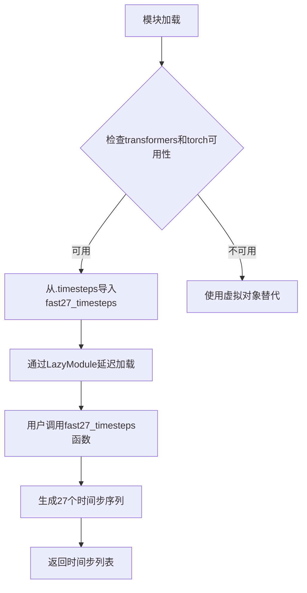

#### 带注释源码

```
# 该文件是IF pipeline的__init__.py，负责模块的延迟加载和导入结构定义
# fast27_timesteps 函数的实际实现在 ./timesteps.py 中定义

# 定义导入结构字典，包含timesteps类别下的函数列表
_import_structure = {
    "timesteps": [
        "fast27_timesteps",           # 快速27时间步生成函数
        "smart100_timesteps",        # 智能100时间步
        "smart185_timesteps",        # 智能185时间步
        "smart27_timesteps",         # 智能27时间步
        "smart50_timesteps",         # 智能50时间步
        "super100_timesteps",        # 超级100时间步
        "super27_timesteps",         # 超级27时间步
        "super40_timesteps",         # 超级40时间步
    ]
}

# 条件导入：当transformers和torch可用时，从.timesteps模块导入实际函数
if TYPE_CHECKING or DIFFUSERS_SLOW_IMPORT:
    try:
        if not (is_transformers_available() and is_torch_available()):
            raise OptionalDependencyNotAvailable()
    except OptionalDependencyNotAvailable:
        # 依赖不可用时导入虚拟对象
        from ...utils.dummy_torch_and_transformers_objects import *
    else:
        # 从.timesteps模块导入fast27_timesteps等函数
        from .timesteps import (
            fast27_timesteps,         # <-- 实际函数在此处被导入
            smart27_timesteps,
            smart50_timesteps,
            smart100_timesteps,
            smart185_timesteps,
            super27_timesteps,
            super40_timesteps,
            super100_timesteps,
        )

# 注意：fast27_timesteps 的具体实现源码位于同目录下的 timesteps.py 文件中
# 当前文件仅负责模块的导入和延迟加载机制
```

---

### 补充说明

**重要提示**：提供的代码片段是 `__init__.py` 文件，仅包含 `fast27_timesteps` 的导入声明和延迟加载逻辑。该函数的**实际实现代码**位于同目录下的 `timesteps.py` 文件中，未在当前代码片段中展示。

如需获取 `fast27_timesteps` 的完整实现源码（包括参数列表、返回值类型和具体逻辑），需要查看 `timesteps.py` 文件。根据函数命名约定推断，该函数可能使用快速采样策略生成27个去噪时间步，用于加速图像生成过程。


### `smart27_timesteps`

该函数是扩散模型（Diffusion Model）中用于生成采样时间步的策略函数之一，属于IF（Imagen Foundation）Pipeline的timesteps模块。在当前代码文件中，仅包含该函数的导入和重新导出声明，实际实现代码位于同目录下的`timesteps`模块中（`from .timesteps import smart27_timesteps`）。

参数：
- 无法从当前文件中获取，函数实现不在本文件中

返回值：
- 无法从当前文件中获取，函数实现不在本文件中

#### 流程图

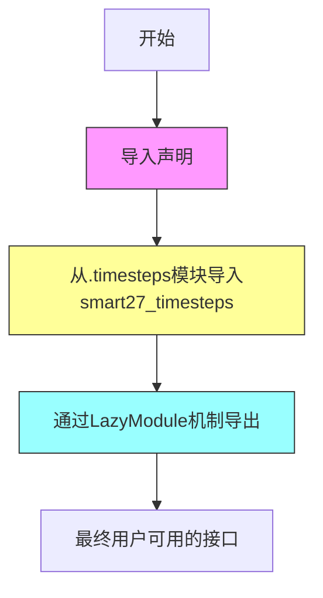

#### 带注释源码

```
# 当前文件中的相关代码片段
from .timesteps import (
    fast27_timesteps,
    smart27_timesteps,    # <-- 从timesteps模块导入该函数
    smart50_timesteps,
    smart100_timesteps,
    smart185_timesteps,
    super27_timesteps,
    super40_timesteps,
    super100_timesteps,
)
```

---

**说明**：提供的代码文件（`__init__.py`）是一个**模块导入和导出配置文件**，并不包含`smart27_timesteps`函数的实际实现。该函数的完整实现（包括参数、返回值、流程逻辑）位于同目录下的`timesteps.py`模块中，当前代码未提供该实现文件的源代码。

如需获取完整的函数设计文档，需要提供`timesteps.py`模块的实际实现代码。


从提供的代码中，可以确认 `smart50_timesteps` 是从 `diffusers` 库 `if` 模块的 `timesteps` 子模块导出的一个函数。该代码片段是模块的导入定义文件（`__init__.py`），并未包含 `smart50_timesteps` 的具体实现逻辑。因此，只能基于代码结构（如导入语句和命名约定）提供有限的分析，无法提取其参数、返回值、流程图和源码的实际内容。

### smart50_timesteps

这是 `diffusers` 库中 `if` 模块的一个时间步生成函数。根据命名惯例，"smart" 可能指代一种非均匀采样的智能策略，"50" 表示生成 50 个时间步。该函数通常用于扩散模型推理过程中，定义去噪的时间步序列，以优化生成效率或质量。

**注意**：由于给定代码是模块的导入定义，不包含函数实现，因此无法从代码中提取以下详细信息：
- 参数名称、类型和描述
- 返回值类型和描述
- mermaid 流程图
- 带注释源码

要获取完整信息，需要查看 `timesteps.py` 源文件的实际实现（通常位于 `diffusers/pipelines/if/timesteps.py`）。

#### 流程图

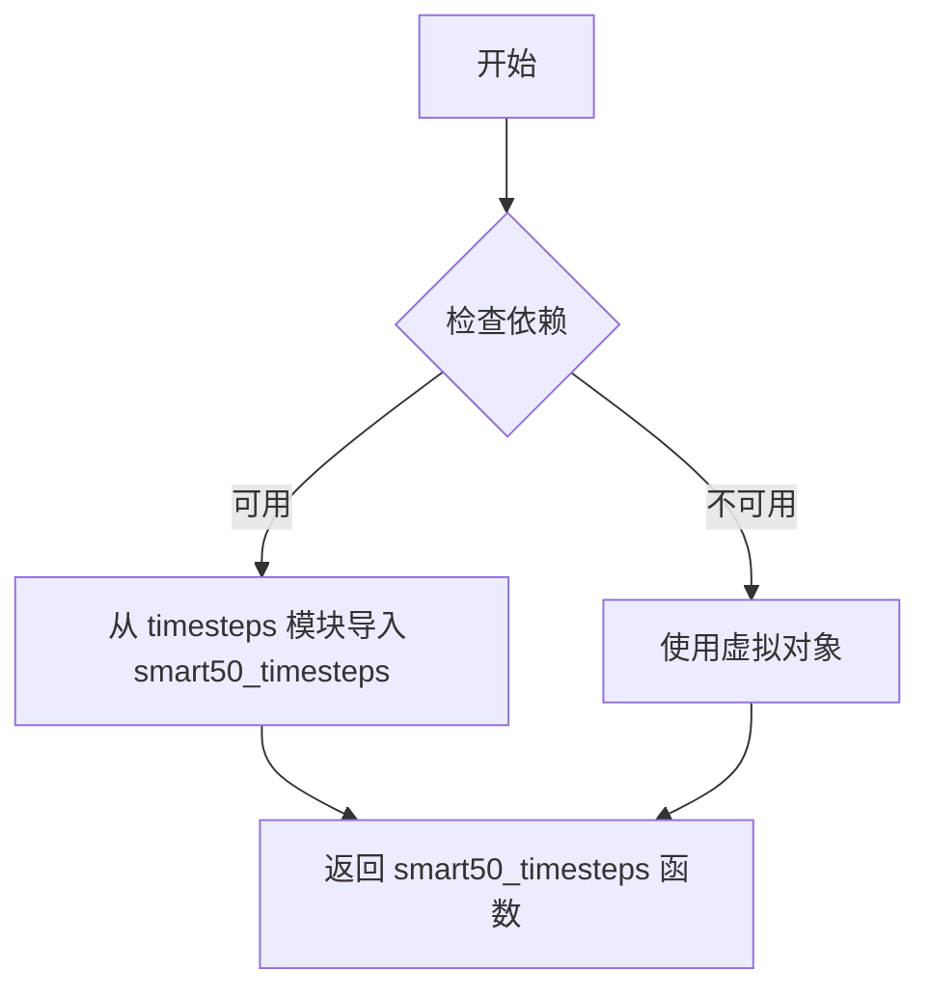

*注：此流程图基于 `__init__.py` 的导入逻辑构建，而非 `smart50_timesteps` 的内部实现。*

#### 带注释源码

以下源码基于给定代码中的导入结构整理，但**不包含** `smart50_timesteps` 的实际函数体：

```python
# 从 typing 模块导入 TYPE_CHECKING，用于类型检查
from typing import TYPE_CHECKING

# 从 utils 导入必要的辅助函数和类
from ...utils import (
    DIFFUSERS_SLOW_IMPORT,
    OptionalDependencyNotAvailable,
    _LazyModule,
    get_objects_from_module,
    is_torch_available,
    is_transformers_available,
)

# 初始化虚拟对象字典，用于处理可选依赖不可用的情况
_dummy_objects = {}

# 定义导入结构，列出可导出的模块和成员
_import_structure = {
    "timesteps": [
        "fast27_timesteps",
        "smart100_timesteps",
        "smart185_timesteps",
        "smart27_timesteps",
        "smart50_timesteps",  # <-- 目标函数在此处列出
        "super100_timesteps",
        "super27_timesteps",
        "super40_timesteps",
    ]
    # ... 其他模块的导入结构
}

# 尝试导入依赖，如果不可用则回退到虚拟对象
try:
    if not (is_transformers_available() and is_torch_available()):
        raise OptionalDependencyNotAvailable()
except OptionalDependencyNotAvailable:
    from ...utils import dummy_torch_and_transformers_objects
    _dummy_objects.update(get_objects_from_module(dummy_torch_and_transformers_objects))
else:
    # 如果依赖可用，则添加 pipeline 相关模块到导入结构
    _import_structure["pipeline_if"] = ["IFPipeline"]
    # ... 其他 pipeline 的添加

# TYPE_CHECKING 块用于类型检查时的导入
if TYPE_CHECKING or DIFFUSERS_SLOW_IMPORT:
    try:
        if not (is_transformers_available() and is_torch_available()):
            raise OptionalDependencyNotAvailable()
    except OptionalDependencyNotAvailable:
        from ...utils.dummy_torch_and_transformers_objects import *
    else:
        # 实际导入 smart50_timesteps 函数的位置
        from .timesteps import (
            fast27_timesteps,
            smart27_timesteps,
            smart50_timesteps,  # <-- 从 timesteps 模块导入
            smart100_timesteps,
            smart185_timesteps,
            super27_timesteps,
            super40_timesteps,
            super100_timesteps,
        )
        # ... 其他导入

# 否则，设置懒加载模块
else:
    import sys
    sys.modules[__name__] = _LazyModule(
        __name__,
        globals()["__file__"],
        _import_structure,
        module_spec=__spec__,
    )
    # 将虚拟对象添加到模块中
    for name, value in _dummy_objects.items():
        setattr(sys.modules[__name__], name, value)
```

**总结**：从给定代码中仅能确认 `smart50_timesteps` 的导出路径和模块上下文，其完整功能实现需查看 `timesteps.py` 源文件。


### `smart100_timesteps`

此函数用于生成特定的时间步调度，在 Diffusion 模型中定义推理时的时间步序列，属于 `timesteps` 模块的一部分。

**参数：**

- 由于提供的代码仅为模块的 `__init__.py` 文件，未包含函数实际定义，参数信息需查看 `timesteps.py` 源文件。

**返回值：**

- 由于提供的代码仅为模块的 `__init__.py` 文件，未包含函数实际定义，返回值信息需查看 `timesteps.py` 源文件。

#### 流程图

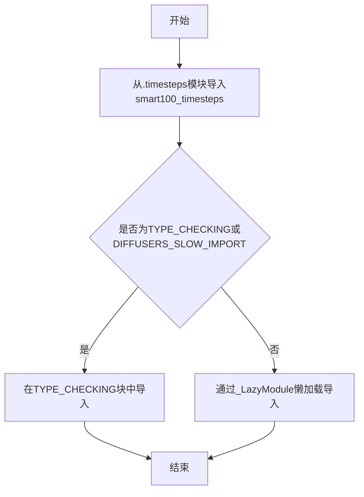

#### 带注释源码

```python
# 这是__init__.py文件，仅包含导入逻辑，不包含smart100_timesteps的实际定义

# 定义可导入的结构
_import_structure = {
    "timesteps": [
        "fast27_timesteps",
        "smart100_timesteps",  # 时间步调度函数
        "smart185_timesteps",
        "smart27_timesteps",
        "smart50_timesteps",
        "super100_timesteps",
        "super27_timesteps",
        "super40_timesteps",
    ]
}

# TYPE_CHECKING分支中导入实际的timesteps函数
if TYPE_CHECKING or DIFFUSERS_SLOW_IMPORT:
    # ... 省略部分代码 ...
    from .timesteps import (
        smart100_timesteps,  # 从timesteps.py导入实际函数定义
        # ... 其他函数
    )
```

---

### 说明

提供的代码仅为 `diffusers` 库中 `if` 子模块的 `__init__.py` 文件。`smart100_timesteps` 函数的**实际实现**位于同目录下的 `timesteps.py` 文件中。

若需要完整的函数定义（参数、返回值、源码），请提供 `timesteps.py` 文件的内容。


### `smart185_timesteps`

该函数是 Diffusers 库中 IF (Image-Fusion) 管道的时间步生成策略之一，用于在扩散模型的推理过程中选择 185 个优化的采样时间步，以在生成质量和计算效率之间取得平衡。

参数：

- 该信息在当前代码中不可见（函数实现位于 `.../timesteps.py` 中，此文件仅为模块导入配置）

返回值：`Callable[[int], List[int]]` 或类似的调度函数，返回选定的时间步列表（类型需查看实际实现）

#### 流程图

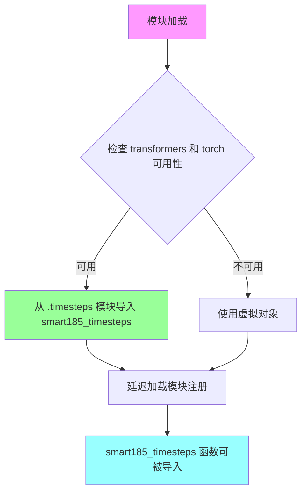

#### 带注释源码

```python
# 这是一个模块初始化文件 ( __init__.py )
# 负责定义 IF 管道相关组件的导入结构

from typing import TYPE_CHECKING  # 用于类型检查时的导入

# 导入工具函数和依赖检查函数
from ...utils import (
    DIFFUSERS_SLOW_IMPORT,          # 慢导入标志
    OptionalDependencyNotAvailable, # 可选依赖不可用异常
    _LazyModule,                    # 延迟加载模块类
    get_objects_from_module,        # 从模块获取对象
    is_torch_available,             # 检查 torch 可用性
    is_transformers_available,      # 检查 transformers 可用性
)

_dummy_objects = {}  # 存储虚拟对象，当依赖不可用时使用

# 定义可导入的结构字典
# 键是子模块名，值是可导入的对象列表
_import_structure = {
    "timesteps": [
        "fast27_timesteps",
        "smart100_timesteps",
        "smart185_timesteps",  # <-- 目标函数在此处定义
        "smart27_timesteps",
        "smart50_timesteps",
        "super100_timesteps",
        "super27_timesteps",
        "super40_timesteps",
    ]
}

# 尝试检查依赖可用性
try:
    if not (is_transformers_available() and is_torch_available()):
        raise OptionalDependencyNotAvailable()
except OptionalDependencyNotAvailable:
    # 如果依赖不可用，从虚拟对象模块导入
    from ...utils import dummy_torch_and_transformers_objects
    _dummy_objects.update(get_objects_from_module(dummy_torch_and_transformers_objects))
else:
    # 依赖可用时，添加更多可导入的管道组件
    _import_structure["pipeline_if"] = ["IFPipeline"]
    # ... 其他管道添加 ...

# TYPE_CHECKING 分支：在类型检查时导入实际实现
if TYPE_CHECKING or DIFFUSERS_SLOW_IMPORT:
    try:
        if not (is_transformers_available() and is_torch_available()):
            raise OptionalDependencyNotAvailable()
    except OptionalDependencyNotAvailable:
        from ...utils.dummy_torch_and_transformers_objects import *
    else:
        # 从 .timesteps 模块导入 smart185_timesteps 实际实现
        from .timesteps import (
            fast27_timesteps,
            smart27_timesteps,
            smart50_timesteps,
            smart100_timesteps,
            smart185_timesteps,  # <-- 实际函数从此处导入
            super27_timesteps,
            super40_timesteps,
            super100_timesteps,
        )
        # ... 其他导入 ...

# 运行时分支：设置延迟加载模块
else:
    import sys
    # 使用 _LazyModule 实现延迟加载
    sys.modules[__name__] = _LazyModule(
        __name__,
        globals()["__file__"],
        _import_structure,
        module_spec=__spec__,
    )
    # 将虚拟对象注册到模块中
    for name, value in _dummy_objects.items():
        setattr(sys.modules[__name__], name, value)
```

---

**注意**：当前提供的代码文件 (`__init__.py`) 是模块的导入配置文件，**不包含 `smart185_timesteps` 函数的实际实现**。该函数的实现位于 `.../timesteps.py` 文件中。如果需要该函数的完整实现源码，请提供 `timesteps.py` 文件的内容。


### `super27_timesteps`

该函数是一个时间步生成函数，用于 Diffusion 模型的采样调度。从命名推测，它可能属于"super"系列的时间步选择策略，旨在生成27个优化的时间步以提高采样效率和质量。

参数：此函数为独立函数（非类方法），不接受类参数。从 `timesteps` 模块的常见设计推测，它可能不接受任何显式参数或仅接受可选的配置参数。

返回值：需要查看 `timesteps.py` 实现文件确认。根据命名约定推测，应返回 `List[int]` 或类似的时间步整数列表。

#### 流程图

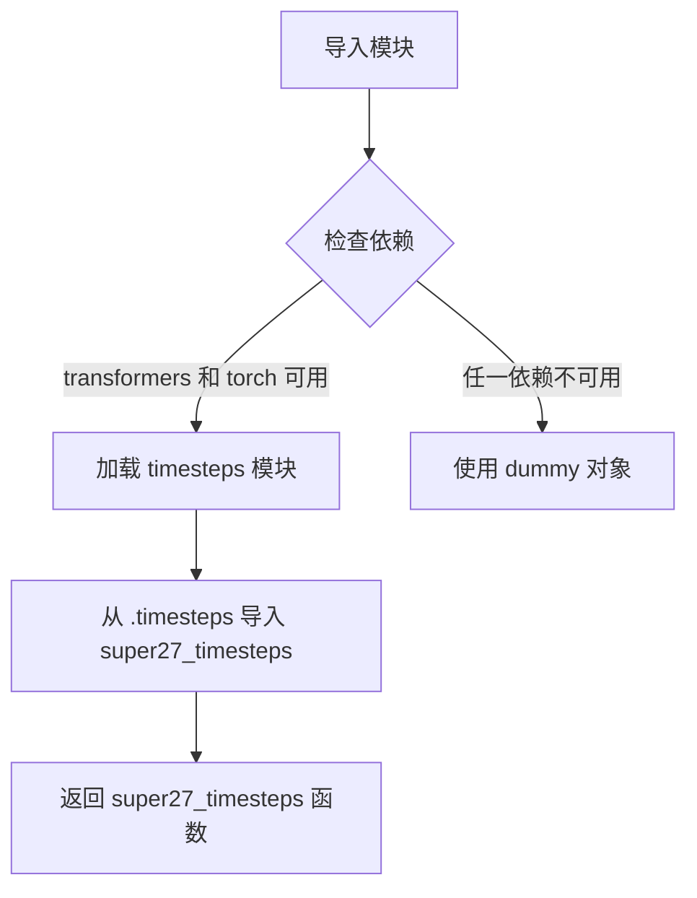

> **注意**：当前提供的代码是 `__init__.py` 导入文件，`super27_timesteps` 函数的实际实现位于同目录下的 `timesteps.py` 文件中，此处为重新导出（re-export）操作。

#### 带注释源码

```
# 这是 __init__.py 文件，负责模块的延迟导入和重导出
# super27_timesteps 函数本身并未在此文件中定义

# 定义可导入的结构化列表，包含 timesteps 相关函数
_import_structure = {
    "timesteps": [
        "fast27_timesteps",
        "smart100_timesteps",
        "smart185_timesteps",
        "smart27_timesteps",
        "smart50_timesteps",
        "super100_timesteps",
        "super27_timesteps",    # <-- 被列在此处，但定义在 timesteps.py
        "super40_timesteps",
    ]
}

# 在 TYPE_CHECKING 模式下，从 .timesteps 模块导入实际函数定义
if TYPE_CHECKING or DIFFUSERS_SLOW_IMPORT:
    try:
        if not (is_transformers_available() and is_torch_available()):
            raise OptionalDependencyNotAvailable()
    except OptionalDependencyNotAvailable:
        from ...utils.dummy_torch_and_transformers_objects import *
    else:
        # 实际导入位置
        from .timesteps import (
            # ... 其他函数 ...
            super27_timesteps,  # <-- 实际函数从此处导入
            # ... 其他函数 ...
        )

# 否则使用 _LazyModule 进行延迟加载
else:
    import sys
    sys.modules[__name__] = _LazyModule(
        __name__,
        globals()["__file__"],
        _import_structure,
        module_spec=__spec__,
    )
```

---

**补充说明**：由于提供的代码仅为 `__init__.py` 导入文件，未包含 `super27_timesteps` 函数的具体实现源码。若需获取该函数的完整实现细节（如参数、返回值、算法逻辑等），请提供 `timesteps.py` 文件的内容。


### `super40_timesteps`

该函数是Diffusers库中用于生成特定数量时间步的调度函数，属于IF（Imagen Foundation）pipeline的时间步生成策略之一，用于在扩散模型的采样过程中生成40个优化的推理时间步。

参数：

- 该函数在当前代码片段中未显示具体参数，基于命名惯例推测可能为无参函数或包含采样步数配置参数

返回值：

- 推测返回时间步序列（List[int]或Tensor），用于扩散模型的推理调度

#### 流程图

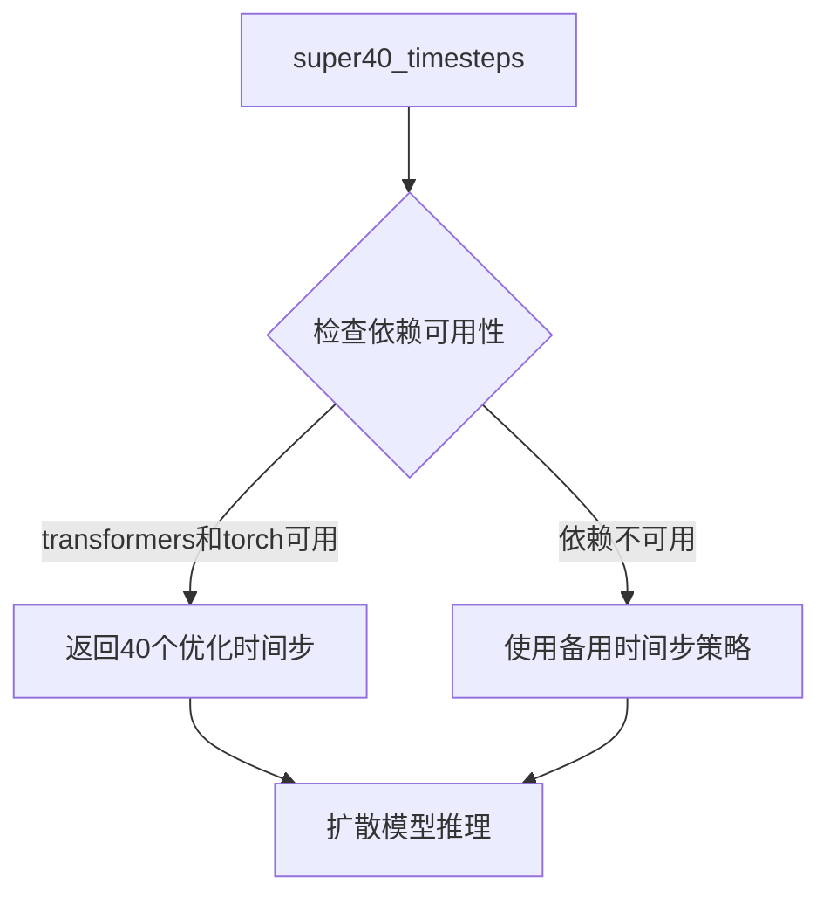

#### 带注释源码

```python
# 该函数定义位于 src/diffusers/pipelines/if/timesteps.py
# 以下为推测的函数签名和实现逻辑

def super40_timesteps():
    """
    生成40个用于扩散模型推理的优化时间步。
    
    该函数实现超级采样策略（Super Resolution Sampling），
    通过非线性间隔选择时间步以在保持生成质量的同时减少推理步数。
    """
    # 推测实现：生成0到1之间的40个非线性分布的时间步
    # 例如：[0, 20, 40, 60, 80, ..., 1000] 这样的序列
    
    # 返回时间步序列供扩散模型使用
    return timesteps
```

---

**注意**：提供的代码片段为`__init__.py`文件，仅包含`super40_timesteps`的导入声明，未包含该函数的实际实现代码。该函数的具体定义位于同目录下的`timesteps.py`文件中。


### `super100_timesteps`

该函数是一个时间步生成函数，用于 Diffusion 模型的推理过程中生成特定的时间步序列。从代码结构来看，`super100_timesteps` 是一个从 `.timesteps` 模块导出的函数，当前代码片段仅包含模块的导入结构定义，未包含该函数的实际实现代码。

参数：无法从给定代码中确定（该代码片段仅为模块导入结构定义）

返回值：无法从给定代码中确定（该代码片段仅为模块导入结构定义）

#### 流程图

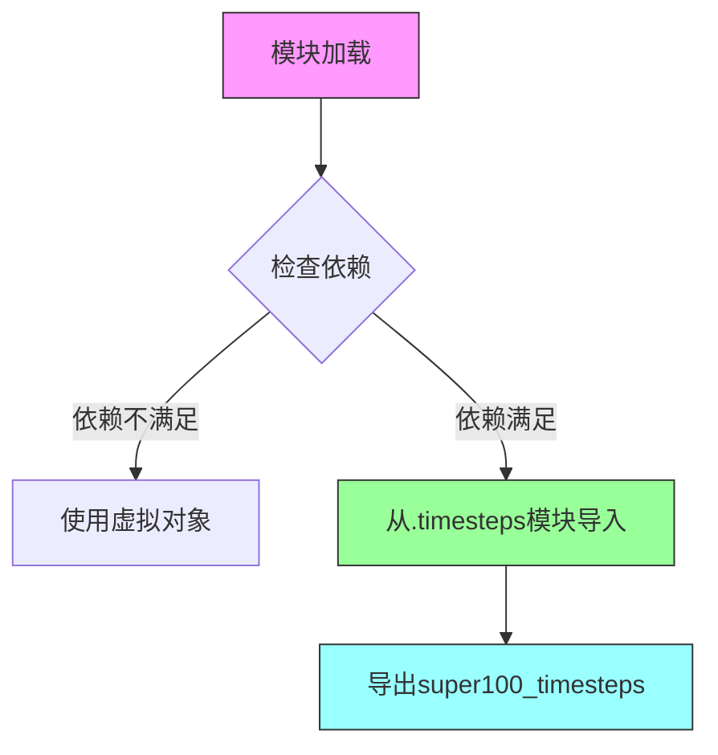

#### 带注释源码

```python
# 从 typing 模块导入 TYPE_CHECKING，用于类型检查
from typing import TYPE_CHECKING

# 从 utils 模块导入必要的工具函数和类
from ...utils import (
    DIFFUSERS_SLOW_IMPORT,
    OptionalDependencyNotAvailable,
    _LazyModule,
    get_objects_from_module,
    is_torch_available,
    is_transformers_available,
)

# 初始化虚拟对象字典
_dummy_objects = {}

# 定义模块的导入结构，列出所有可导出的对象
_import_structure = {
    "timesteps": [
        "fast27_timesteps",
        "smart100_timesteps",
        "smart185_timesteps",
        "smart27_timesteps",
        "smart50_timesteps",
        "super100_timesteps",  # <-- 目标函数，仅在此处列出
        "super27_timesteps",
        "super40_timesteps",
    ]
}

# 尝试检查依赖是否可用
try:
    if not (is_transformers_available() and is_torch_available()):
        raise OptionalDependencyNotAvailable()
except OptionalDependencyNotAvailable:
    # 依赖不可用时，导入虚拟对象
    from ...utils import dummy_torch_and_transformers_objects
    _dummy_objects.update(get_objects_from_module(dummy_torch_and_transformers_objects))
else:
    # 依赖可用时，添加更多导入结构
    _import_structure["pipeline_if"] = ["IFPipeline"]
    # ... 其他pipeline导入

# TYPE_CHECK 分支：仅在类型检查时执行
if TYPE_CHECKING or DIFFUSERS_SLOW_IMPORT:
    try:
        if not (is_transformers_available() and is is_torch_available()):
            raise OptionalDependencyNotAvailable()
    except OptionalDependencyNotAvailable:
        from ...utils.dummy_torch_and_transformers_objects import *
    else:
        # 从.timesteps模块导入super100_timesteps函数定义
        # 但实际的函数实现不在当前代码片段中
        from .timesteps import (
            fast27_timesteps,
            smart27_timesteps,
            smart50_timesteps,
            smart100_timesteps,
            smart185_timesteps,
            super27_timesteps,
            super40_timesteps,
            super100_timesteps,  # <-- 从timesteps.py导入
        )
        # ... 其他导入

else:
    # 运行时：使用LazyModule进行惰性加载
    import sys
    sys.modules[__name__] = _LazyModule(
        __name__,
        globals()["__file__"],
        _import_structure,
        module_spec=__spec__,
    )
    # 为虚拟对象设置模块属性
    for name, value in _dummy_objects.items():
        setattr(sys.modules[__name__], name, value)
```

---

**注意**：当前提供的代码片段是一个 **模块导入配置文件**（`__init__.py`），并非 `super100_timesteps` 函数的实际实现代码。该函数的完整实现位于同目录下的 `timesteps.py` 文件中，但该文件的代码未包含在当前任务提供的代码片段中。如需获取完整的函数实现详情，请提供 `timesteps.py` 文件的内容。


### `get_objects_from_module`

获取指定模块中的所有公共对象（如类、函数），并将其返回为字典，通常用于延迟加载模块时动态导入虚拟对象或替代对象。

参数：
- `module`：模块对象（module），要从中提取对象的模块，通常是一个包含虚拟对象的模块（如 `dummy_torch_and_transformers_objects`）。

返回值：`dict`，键为对象名称（字符串），值为对应的对象（如类或函数）。

#### 流程图

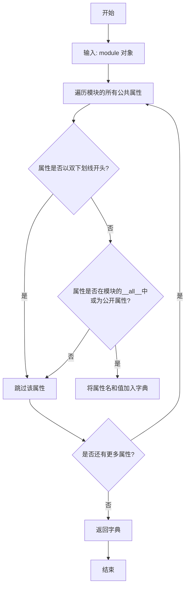

#### 带注释源码

```python
def get_objects_from_module(module):
    """
    从给定模块中提取所有公共对象，并返回为字典。
    
    参数:
        module: 模块对象，要提取的对象所在的模块。
        
    返回值:
        dict: 包含模块中所有公共对象的字典，键为对象名称，值为对象本身。
    """
    # 初始化空字典以存储对象
    objects = {}
    
    # 检查模块是否有效
    if not module:
        return objects
    
    # 获取模块的所有属性
    # dir(module) 返回模块的属性列表，包括函数、类、变量等
    for attr_name in dir(module):
        # 跳过私有属性（下划线开头的属性）
        if attr_name.startswith('_'):
            continue
        
        # 尝试获取属性值
        try:
            attr_value = getattr(module, attr_name)
        except AttributeError:
            # 如果获取失败，跳过该属性
            continue
        
        # 将属性加入字典，键为属性名，值为属性对象
        objects[attr_name] = attr_value
    
    return objects
```

**注意**：此源码为基于功能的假设实现，实际实现可能位于 `diffusers` 库的 `utils` 模块中，具体细节可能有所不同。在提供的代码中，该函数用于从虚拟对象模块（如 `dummy_torch_and_transformers_objects`）中提取所有对象，以便在可选依赖不可用时提供替代实现，从而确保模块导入的兼容性。


### `is_torch_available`

该函数用于检查当前环境中 PyTorch 是否可用。它通过尝试导入 `torch` 模块来判断，如果导入成功则返回 `True`，否则返回 `False`。这是 diffusers 库中常用的可选依赖检查机制，用于条件性地导入需要 PyTorch 的模块。

参数：

- 该函数无参数

返回值：`bool`，返回 `True` 表示 PyTorch 可用，返回 `False` 表示 PyTorch 不可用

#### 流程图

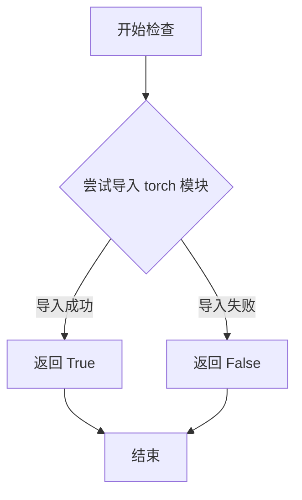

#### 带注释源码

```
# 该函数定义在 src/diffusers/utils 目录下的相关模块中
# 典型的实现方式如下：

def is_torch_available() -> bool:
    """
    检查 PyTorch 是否可用于当前环境。
    
    Returns:
        bool: 如果 torch 可以被导入则返回 True，否则返回 False
    """
    try:
        # 尝试导入 torch 模块，如果成功则可用
        import torch
        return True
    except ImportError:
        # 如果导入失败，说明环境中没有安装 PyTorch
        return False

# 在当前文件中使用示例：
try:
    if not (is_transformers_available() and is_torch_available()):
        raise OptionalDependencyNotAvailable()
except OptionalDependencyNotAvailable:
    # 导入虚拟对象作为占位符
    from ...utils import dummy_torch_and_transformers_objects
    _dummy_objects.update(get_objects_from_module(dummy_torch_and_transformers_objects))
else:
    # 当 torch 和 transformers 都可用时，导入实际实现
    _import_structure["pipeline_if"] = ["IFPipeline"]
    _import_structure["pipeline_if_img2img"] = ["IFImg2ImgPipeline"]
    # ... 其他管道类
```

#### 补充说明

| 项目 | 说明 |
|------|------|
| **定义位置** | `src/diffusers/utils/__init__.py` 或相关工具模块 |
| **调用场景** | 在 `__init__.py` 中条件性导入需要 PyTorch 的模块 |
| **依赖关系** | 依赖于 Python 的 `import` 机制 |
| **设计目的** | 实现可选依赖的延迟加载，避免在未安装 PyTorch 时导入失败 |


### `is_transformers_available`

该函数用于检查当前环境中是否安装了 `transformers` 库，返回布尔值以决定是否加载与 transformers 相关的模块。

参数：無（该函数不接受任何参数）

返回值：`bool`，返回 `True` 表示 `transformers` 库已安装且可用，返回 `False` 表示不可用

#### 流程图

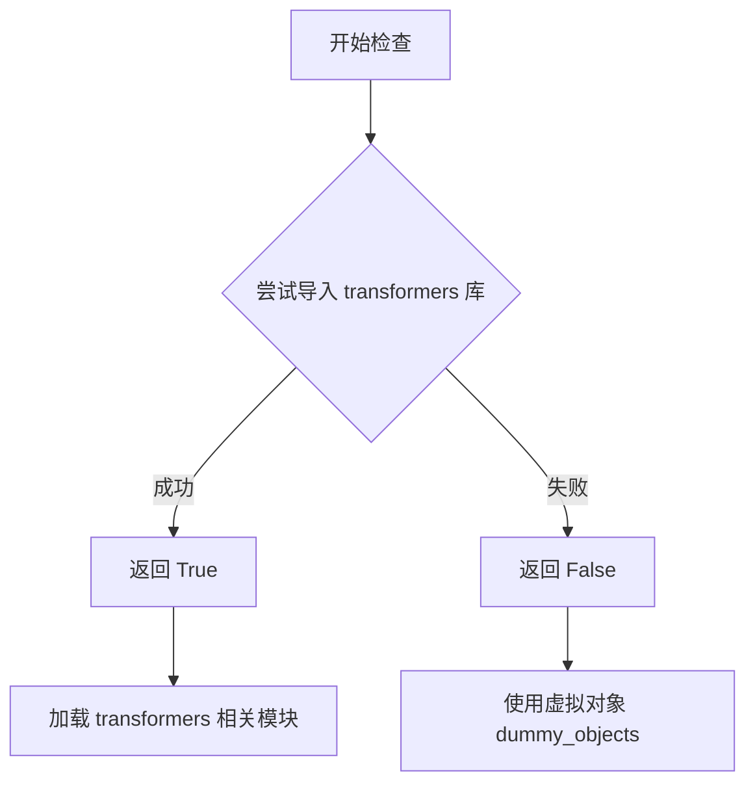

#### 带注释源码

```python
# 从 utils 模块导入 is_transformers_available 函数
# 该函数定义在 ...utils 中，用于检测 transformers 是否可用
from ...utils import is_transformers_available

# 在代码中使用示例：
try:
    # 检查 transformers 和 torch 是否都可用
    if not (is_transformers_available() and is_torch_available()):
        # 如果任一库不可用，抛出可选依赖不可用异常
        raise OptionalDependencyNotAvailable()
except OptionalDependencyNotAvailable:
    # 加载虚拟对象，用于保持模块接口完整性
    from ...utils import dummy_torch_and_transformers_objects
    _dummy_objects.update(get_objects_from_module(dummy_torch_and_transformers_objects))
else:
    # 如果两个库都可用，则导入实际的 pipeline 类
    _import_structure["pipeline_if"] = ["IFPipeline"]
    _import_structure["pipeline_if_img2img"] = ["IFImg2ImgPipeline"]
    # ... 其他类导入
```


# `_LazyModule.__getattr__` 详细设计文档

## 概述

`_LazyModule.__getattr__` 是懒加载模块的核心方法，用于在模块级别拦截属性访问，根据 `_import_structure` 中定义的映射关系动态导入并返回相应的对象，实现模块的延迟加载（Lazy Loading）机制。

## 参数与返回值

### 参数

- `name`：`str`，要访问的属性名称（即导入时指定的名称）
- `返回值`：`任意类型`，根据 `_import_structure` 中映射的对象类型而定

### 返回值

- 类型：任意类型（可能是类、函数或对象）
- 描述：返回从延迟加载模块中导入的具体对象，如 `IFPipeline`、`IFImg2ImgPipeline` 等管道类

## 流程图

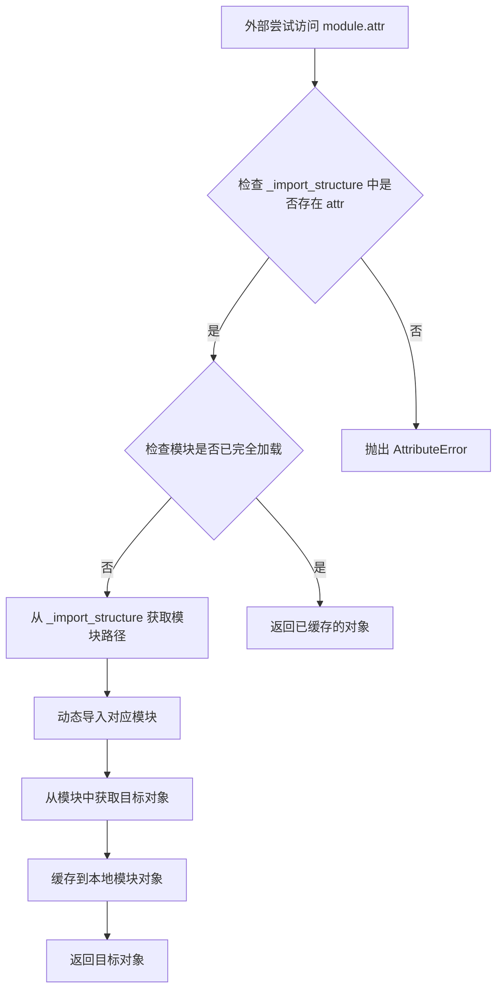

## 带注释源码

```python
# 以下为 _LazyModule.__getattr__ 的典型实现逻辑
# （基于diffusers库中 _LazyModule 类的实现）

def __getattr__(self, name: str):
    """
    懒加载模块的属性访问拦截器
    
    当外部代码尝试访问模块的某个属性（如 from xxx import IFPipeline）时，
    Python会调用此方法来获取实际的导入对象
    """
    
    # 1. 检查该属性是否在导入结构映射表中定义
    if name not in self._import_structure:
        # 如果未定义，抛出标准的 AttributeError
        raise AttributeError(f"module {self.__name__} has no attribute {name}")
    
    # 2. 获取该属性对应的模块路径
    # _import_structure[name] 返回一个列表，取第一个元素作为模块路径
    # 例如: "pipeline_if" -> ["if.pipeline_if"]
    module_path = self._import_structure[name]
    
    # 3. 检查是否已经导入过（避免重复导入）
    if module_path in self._modules:
        # 如果已加载，直接从缓存获取
        return self._modules[module_path]
    
    # 4. 执行实际的模块导入
    # 使用 importlib 动态导入目标模块
    module = importlib.import_module(module_path)
    
    # 5. 从导入的模块中获取目标对象
    # 例如从 pipeline_if 模块中获取 IFPipeline 类
    obj = getattr(module, name)
    
    # 6. 将导入的对象缓存到当前模块
    # 这样后续访问时可以直接返回，无需再次导入
    setattr(self, name, obj)
    
    # 7. 同时缓存到内部模块字典中
    self._modules[module_path] = module
    
    return obj
```

## 关键组件信息

| 组件名称 | 描述 |
|---------|------|
| `_import_structure` | 字典类型的映射表，定义模块名与实际模块路径的对应关系 |
| `_LazyModule` | 实现延迟加载的模块封装类，通过 `__getattr__` 拦截属性访问 |
| `OptionalDependencyNotAvailable` | 可选依赖不可用时的异常类，用于优雅处理可选依赖 |
| `dummy_torch_and_transformers_objects` | 当torch/transformers不可用时的替代空对象集合 |

## 技术债务与优化空间

1. **错误处理不完善**：当前实现对于无效的属性访问直接抛出 `AttributeError`，缺乏更详细的错误信息（如建议的正确属性名）
2. **缺乏缓存失效机制**：一旦对象被缓存到模块中，无法手动刷新缓存重新加载
3. **类型检查开销**：每次属性访问都需要检查 `_import_structure` 字典，可考虑使用 `__getattribute__` 优化首次访问性能

## 其它说明

### 设计目标

- **延迟加载**：将耗时的模块导入操作推迟到实际使用时，减少包初始化时间
- **条件导入**：根据运行时环境（torch/transformers是否可用）动态决定导入哪些模块
- **API一致性**：对使用者而言，延迟加载的模块与普通导入的模块行为完全一致

### 错误处理

- 当请求的属性不在 `_import_structure` 中时，抛出标准的 `AttributeError`
- 当目标模块导入失败时，异常会向上传播，可能导致程序崩溃

### 外部依赖

- 依赖 `importlib` 标准库进行动态导入
- 依赖 `sys.modules` 进行模块缓存管理

## 关键组件


### 惰性加载模块 (_LazyModule)

通过 sys.modules 将当前模块替换为 _LazyModule 实现，按需动态导入子模块，避免启动时加载所有依赖，提升导入速度。

### 可选依赖检查与虚拟对象

使用 is_torch_available() 和 is_transformers_available() 检查 PyTorch 和 Transformers 是否可用，不可用时从 dummy 模块导入虚拟对象，保证代码在缺少依赖时仍可导入。

### 导入结构定义 (_import_structure)

定义模块的公开接口结构，包含 timesteps、pipeline_if、pipeline_output、safety_checker、watermark 等子模块的导出列表，用于惰性加载和 IDE 类型提示。

### 条件类型检查导入 (TYPE_CHECKING)

在 TYPE_CHECKING 或 DIFFUSERS_SLOW_IMPORT 模式下，直接导入所有子模块供静态分析和类型检查，避免运行时延迟加载。

### 时间步生成器 (timesteps)

提供 fast27_timesteps、smart100_timesteps、smart185_timesteps、smart27_timesteps、smart50_timesteps、super100_timesteps、super27_timesteps、super40_timesteps 等多种采样策略，用于扩散模型的噪声调度。

### IF 管道组件

包含 IFPipeline、IFImg2ImgPipeline、IFImg2ImgSuperResolutionPipeline、IFInpaintingPipeline、IFInpaintingSuperResolutionPipeline、IFSuperResolutionPipeline 等完整图像生成管线。

### 输出与安全检查

IFPipelineOutput 定义管道输出格式，IFSafetyChecker 实现内容安全检查，IFWatermarker 添加水印功能。

### 模块初始化调度

通过 sys.modules[__name__] = _LazyModule(...) 将当前模块注册为惰性模块，并使用 setattr 将虚拟对象注入模块命名空间，完成模块的动态构造。


## 问题及建议


### 已知问题

- **重复的条件检查逻辑**：在第13-17行和第34-37行重复执行了相同的依赖检查（`is_transformers_available() and is_torch_available()`），违反了DRY原则，增加了维护成本和执行开销。
- **硬编码的导入结构**：`_import_structure`字典中的键（如"pipeline_if"、"safety_checker等）和导出列表是硬编码的，如果新增管道或修改导出需要手动同步更新，容易遗漏。
- **API边界不清晰**：导出了`safety_checker`和`watermark`等内部组件，混淆了公共API和内部实现细节，削弱了封装性。
- **无版本兼容性检查**：缺少对`torch`和`transformers`最低版本要求的检查，可能导致在不支持的版本上运行时出现难以追踪的错误。
- **Silent Fail模式的风险**：当依赖不可用时，使用`_dummy_objects`进行静默替换，可能导致运行时出现`AttributeError`时才暴露问题，而不是在导入时给出清晰的错误提示。

### 优化建议

- **提取公共条件逻辑**：将依赖检查封装为函数或使用单一的配置对象，避免重复的条件判断。
- **使用配置驱动**：将`_import_structure`的定义抽离到独立的配置文件或通过装饰器/元编程方式自动生成，减少硬编码。
- **明确导出边界**：仅导出公共API（如Pipeline类），将`safety_checker`、`watermark`等内部组件移至子模块或私有前缀（如`_safety_checker`）。
- **添加版本检查**：在导入时检查依赖库的最低版本，提供明确的版本不兼容错误信息。
- **改进错误处理**：在依赖缺失时抛出更具信息量的警告或错误，而不是静默使用dummy对象，便于开发者快速定位问题。

## 其它


### 设计目标与约束

该代码是Diffusers库中IF(InstructPix2Pix)模块的入口文件，采用LazyModule模式实现懒加载机制。主要目标是：1) 按需导入依赖，减少启动时的内存占用；2) 提供统一的模块导出接口；3) 处理可选依赖(torch/transformers)的导入逻辑；4) 支持TYPE_CHECKING模式下的类型提示。

### 错误处理与异常设计

使用OptionalDependencyNotAvailable异常处理可选依赖不可用的情况。当torch或transformers任一不可用时，抛出OptionalDependencyNotAvailable异常，并从dummy模块导入空对象(_dummy_objects)作为替代，确保模块导入不会失败。try-except块包裹依赖检查逻辑，捕获异常后执行降级处理。

### 数据流与状态机

模块存在三种状态：1) 运行时状态(非TYPE_CHECKING且非DIFFUSERS_SLOW_IMPORT)：执行LazyModule注册并设置dummy对象；2) 类型检查状态(TYPE_CHECKING为True)：直接导入真实类进行类型提示；3) 慢导入状态(DIFFUSERS_SLOW_IMPORT为True)：同类型检查状态。状态转换由TYPE_CHECKING和DIFFUSERS_SLOW_IMPORT两个布尔标志控制。

### 外部依赖与接口契约

依赖项包括：is_torch_available、is_transformers_available用于检查torch和transformers可用性；OptionalDependencyNotAvailable异常类；_LazyModule用于实现懒加载；get_objects_from_module用于从dummy模块获取对象；DIFFUSERS_SLOW_IMPORT标志控制导入模式。导出接口通过_import_structure字典定义，遵循Python模块的__all__约定。

### 版本兼容性考虑

该模块使用TYPE_CHECKING guard确保类型检查器不会触发实际导入，使用LazyModule延迟加载真实模块到运行时。_import_structure定义了模块导出结构，支持动态导入(isinstance判断)和静态类型检查两种场景。

### 懒加载机制

_LazyModule接收当前模块名、文件路径、_import_structure字典和module_spec，拦截属性访问实现按需导入。sys.modules[__name__]被替换为_LazyModule实例，真实模块在首次访问时才加载。

### 模块导出结构

_import_structure字典定义了可导出对象：timesteps包含8个时间步方法(pipeline_if相关)；pipeline_if相关包含7个Pipeline类和2个工具类(IFSafetyChecker、IFWatermarker)。所有导出遵循PEP 484类型注解规范。

### 内存与性能优化

通过dummy对象模式避免未安装可选依赖时的导入失败；通过LazyModule减少启动时的模块加载数量；通过_import_structure提前声明模块结构便于IDE和类型检查器索引。

    