# `diffusers\src\diffusers\pipelines\deepfloyd_if\pipeline_if.py` 详细设计文档

IFPipeline 是一个基于 DeepFloyd IF 模型的文本到图像生成扩散管道。它集成了 T5 文本编码器、UNet2DConditionModel 去噪网络、DDPMScheduler 调度器，并可选地包含安全检查器和水印处理器，支持通过文本提示生成高质量图像。

## 整体流程

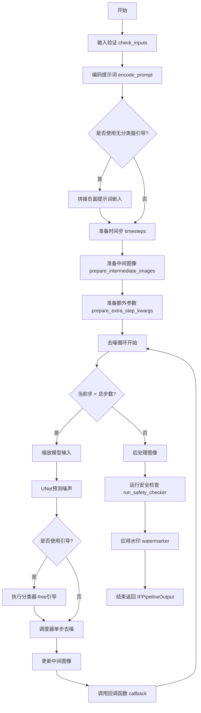

## 类结构

```
DiffusionPipeline (基类)
└── IFPipeline (主类)
    ├── StableDiffusionLoraLoaderMixin (混入类)
    └── 依赖组件:
        ├── T5Tokenizer (文本分词器)
        ├── T5EncoderModel (文本编码器)
        ├── UNet2DConditionModel (去噪UNet)
        ├── DDPMScheduler (噪声调度器)
        ├── IFSafetyChecker (安全检查器)
        ├── CLIPImageProcessor (特征提取器)
        └── IFWatermarker (水印处理器)
```

## 全局变量及字段


### `XLA_AVAILABLE`
    
是否使用PyTorch XLA

类型：`bool`
    


### `logger`
    
日志记录器

类型：`logging.Logger`
    


### `EXAMPLE_DOC_STRING`
    
示例文档字符串

类型：`str`
    


### `is_bs4_available`
    
BeautifulSoup4可用性标志

类型：`bool`
    


### `is_ftfy_available`
    
ftfy库可用性标志

类型：`bool`
    


### `IFPipeline.tokenizer`
    
文本分词器

类型：`T5Tokenizer`
    


### `IFPipeline.text_encoder`
    
T5文本编码模型

类型：`T5EncoderModel`
    


### `IFPipeline.unet`
    
条件UNet去噪网络

类型：`UNet2DConditionModel`
    


### `IFPipeline.scheduler`
    
DDPM噪声调度器

类型：`DDPMScheduler`
    


### `IFPipeline.feature_extractor`
    
图像特征提取器

类型：`CLIPImageProcessor | None`
    


### `IFPipeline.safety_checker`
    
NSFW安全检查器

类型：`IFSafetyChecker | None`
    


### `IFPipeline.watermarker`
    
图像水印处理器

类型：`IFWatermarker | None`
    


### `IFPipeline.bad_punct_regex`
    
特殊标点符号正则

类型：`re.Pattern`
    


### `IFPipeline._optional_components`
    
可选组件列表

类型：`list`
    


### `IFPipeline.model_cpu_offload_seq`
    
CPU卸载顺序

类型：`str`
    


### `IFPipeline._exclude_from_cpu_offload`
    
排除卸载的组件

类型：`list`
    
    

## 全局函数及方法


### `IFPipeline.encode_prompt`

该方法将文本提示（prompt）编码为文本嵌入向量（text embeddings），支持批量处理、负面提示词（negative prompt）和无分类器自由引导（classifier-free guidance），是图像生成管道的关键预处理步骤。

参数：

- `self`：`IFPipeline` 实例，管道对象本身
- `prompt`：`str | list[str]`，要编码的提示词，可以是单个字符串或字符串列表
- `do_classifier_free_guidance`：`bool`，是否启用无分类器自由引导，默认为 True
- `num_images_per_prompt`：`int`，每个提示词要生成的图像数量，默认为 1
- `device`：`torch.device | None`，用于放置生成嵌入的 torch 设备，如果为 None 则使用执行设备
- `negative_prompt`：`str | list[str] | None`，不引导图像生成的提示词，如果未定义则必须传入 `negative_prompt_embeds`
- `prompt_embeds`：`torch.Tensor | None`，预生成的文本嵌入，如果未提供将从 `prompt` 生成
- `negative_prompt_embeds`：`torch.Tensor | None`，预生成的负面文本嵌入，如果未提供将从 `negative_prompt` 生成
- `clean_caption`：`bool`，是否在编码前预处理和清理提示词，默认为 False

返回值：`tuple[torch.Tensor, torch.Tensor]`，返回两个张量——`prompt_embeds`（编码后的提示词嵌入）和 `negative_prompt_embeds`（编码后的负面提示词嵌入），如果未使用引导则后者为 None

#### 流程图

```mermaid
flowchart TD
    A[开始 encode_prompt] --> B{检查 prompt 和 negative_prompt 类型一致性}
    B --> C{device 为空?}
    C -->|是| D[使用 self._execution_device]
    C -->|否| E[使用传入的 device]
    D --> F{判断 batch_size}
    F -->|prompt 是 str| G[batch_size = 1]
    F -->|prompt 是 list| H[batch_size = len&#40;prompt&#41;]
    F -->|其他| I[batch_size = prompt_embeds.shape[0]]
    G --> J{max_length = 77}
    H --> J
    I --> J
    J --> K{prompt_embeds 为空?}
    K -->|是| L[_text_preprocessing 清理文本]
    K -->|否| M[跳过文本预处理]
    L --> N[tokenizer 分词]
    M --> N
    N --> O{检查是否被截断}
    O -->|是| P[记录警告日志]
    O -->|否| Q[继续]
    P --> Q
    Q --> R[text_encoder 生成 prompt_embeds]
    R --> S{text_encoder 存在?}
    S -->|是| T[dtype = text_encoder.dtype]
    S -->|否| U{unet 存在?}
    U -->|是| V[dtype = unet.dtype]
    U -->|否| W[dtype = None]
    T --> X
    V --> X
    W --> X
    X --> Y[prompt_embeds 复制 num_images_per_prompt 次]
    Y --> Z{do_classifier_free_guidance 且 negative_prompt_embeds 为空?}
    Z -->|是| AA[_text_preprocessing 处理 uncond_tokens]
    Z -->|否| DD[negative_prompt_embeds = None]
    AA --> AB[tokenizer 分词 uncond_tokens]
    AB --> AC[text_encoder 生成 negative_prompt_embeds]
    AC --> AD{do_classifier_free_guidance?}
    AD -->|是| AE[negative_prompt_embeds 复制并重塑]
    AD -->|否| AF[negative_prompt_embeds = None]
    AE --> AG[返回 prompt_embeds, negative_prompt_embeds]
    DD --> AG
    AF --> AG
```

#### 带注释源码

```python
@torch.no_grad()
def encode_prompt(
    self,
    prompt: str | list[str],
    do_classifier_free_guidance: bool = True,
    num_images_per_prompt: int = 1,
    device: torch.device | None = None,
    negative_prompt: str | list[str] | None = None,
    prompt_embeds: torch.Tensor | None = None,
    negative_prompt_embeds: torch.Tensor | None = None,
    clean_caption: bool = False,
):
    r"""
    Encodes the prompt into text encoder hidden states.

    Args:
        prompt (`str` or `list[str]`, *optional*):
            prompt to be encoded
        do_classifier_free_guidance (`bool`, *optional*, defaults to `True`):
            whether to use classifier free guidance or not
        num_images_per_prompt (`int`, *optional*, defaults to 1):
            number of images that should be generated per prompt
        device: (`torch.device`, *optional*):
            torch device to place the resulting embeddings on
        negative_prompt (`str` or `list[str]`, *optional*):
            The prompt or prompts not to guide the image generation. If not defined, one has to pass
            `negative_prompt_embeds`. instead. If not defined, one has to pass `negative_prompt_embeds`. instead.
            Ignored when not using guidance (i.e., ignored if `guidance_scale` is less than `1`).
        prompt_embeds (`torch.Tensor`, *optional*):
            Pre-generated text embeddings. Can be used to easily tweak text inputs, *e.g.* prompt weighting. If not
            provided, text embeddings will be generated from `prompt` input argument.
        negative_prompt_embeds (`torch.Tensor`, *optional*):
            Pre-generated negative text embeddings. Can be used to easily tweak text inputs, *e.g.* prompt
            weighting. If not provided, negative_prompt_embeds will be generated from `negative_prompt` input
            argument.
        clean_caption (bool, defaults to `False`):
            If `True`, the function will preprocess and clean the provided caption before encoding.
    """
    # 检查 prompt 和 negative_prompt 类型一致性，确保它们类型相同
    if prompt is not None and negative_prompt is not None:
        if type(prompt) is not type(negative_prompt):
            raise TypeError(
                f"`negative_prompt` should be the same type to `prompt`, but got {type(negative_prompt)} !="
                f" {type(prompt)}."
            )

    # 如果未指定 device，使用管道的执行设备
    if device is None:
        device = self._execution_device

    # 根据 prompt 类型确定批次大小
    if prompt is not None and isinstance(prompt, str):
        batch_size = 1
    elif prompt is not None and isinstance(prompt, list):
        batch_size = len(prompt)
    else:
        # 如果没有提供 prompt，则使用已提供的 prompt_embeds 的批次大小
        batch_size = prompt_embeds.shape[0]

    # T5 可以处理比 77 更长的序列，但 IF 的文本编码器训练时最大长度为 77
    max_length = 77

    # 如果未提供 prompt_embeds，则从 prompt 生成
    if prompt_embeds is None:
        # 文本预处理：清理 caption（如果 clean_caption 为 True）
        prompt = self._text_preprocessing(prompt, clean_caption=clean_caption)
        
        # 使用 tokenizer 将文本转换为 token IDs
        text_inputs = self.tokenizer(
            prompt,
            padding="max_length",
            max_length=max_length,
            truncation=True,
            add_special_tokens=True,
            return_tensors="pt",
        )
        text_input_ids = text_inputs.input_ids
        
        # 获取未截断的 token IDs 用于检测截断
        untruncated_ids = self.tokenizer(prompt, padding="longest", return_tensors="pt").input_ids

        # 检查是否发生了截断，如果是则记录警告
        if untruncated_ids.shape[-1] >= text_input_ids.shape[-1] and not torch.equal(
            text_input_ids, untruncated_ids
        ):
            removed_text = self.tokenizer.batch_decode(untruncated_ids[:, max_length - 1 : -1])
            logger.warning(
                "The following part of your input was truncated because CLIP can only handle sequences up to"
                f" {max_length} tokens: {removed_text}"
            )

        # 获取注意力掩码并移动到指定设备
        attention_mask = text_inputs.attention_mask.to(device)

        # 使用文本编码器生成嵌入
        prompt_embeds = self.text_encoder(
            text_input_ids.to(device),
            attention_mask=attention_mask,
        )
        # 提取第一个元素（通常包含隐藏状态）
        prompt_embeds = prompt_embeds[0]

    # 确定数据类型：优先使用 text_encoder 的 dtype，其次使用 unet 的 dtype
    if self.text_encoder is not None:
        dtype = self.text_encoder.dtype
    elif self.unet is not None:
        dtype = self.unet.dtype
    else:
        dtype = None

    # 将 prompt_embeds 转换为指定的数据类型和设备
    prompt_embeds = prompt_embeds.to(dtype=dtype, device=device)

    # 获取嵌入的形状
    bs_embed, seq_len, _ = prompt_embeds.shape
    
    # 为每个提示词生成的多个图像复制文本嵌入（使用 mps 友好的方法）
    prompt_embeds = prompt_embeds.repeat(1, num_images_per_prompt, 1)
    prompt_embeds = prompt_embeds.view(bs_embed * num_images_per_prompt, seq_len, -1)

    # 获取无分类器自由引导的无条件嵌入
    if do_classifier_free_guidance and negative_prompt_embeds is None:
        uncond_tokens: list[str]
        
        # 如果没有提供 negative_prompt，使用空字符串
        if negative_prompt is None:
            uncond_tokens = [""] * batch_size
        elif isinstance(negative_prompt, str):
            uncond_tokens = [negative_prompt]
        elif batch_size != len(negative_prompt):
            raise ValueError(
                f"`negative_prompt`: {negative_prompt} has batch size {len(negative_prompt)}, but `prompt`:"
                f" {prompt} has batch size {batch_size}. Please make sure that passed `negative_prompt` matches"
                " the batch size of `prompt`."
            )
        else:
            uncond_tokens = negative_prompt

        # 对无条件 token 进行与 prompt 相同的预处理
        uncond_tokens = self._text_preprocessing(uncond_tokens, clean_caption=clean_caption)
        
        # 使用 prompt_embeds 的序列长度作为最大长度
        max_length = prompt_embeds.shape[1]
        
        # tokenizer 处理无条件 token
        uncond_input = self.tokenizer(
            uncond_tokens,
            padding="max_length",
            max_length=max_length,
            truncation=True,
            return_attention_mask=True,
            add_special_tokens=True,
            return_tensors="pt",
        )
        attention_mask = uncond_input.attention_mask.to(device)

        # 使用文本编码器生成负面提示词嵌入
        negative_prompt_embeds = self.text_encoder(
            uncond_input.input_ids.to(device),
            attention_mask=attention_mask,
        )
        negative_prompt_embeds = negative_prompt_embeds[0]

    # 如果使用无分类器自由引导，处理负面提示词嵌入
    if do_classifier_free_guidance:
        # 获取序列长度
        seq_len = negative_prompt_embeds.shape[1]

        # 转换为指定的数据类型和设备
        negative_prompt_embeds = negative_prompt_embeds.to(dtype=dtype, device=device)

        # 为每个提示词生成的多个图像复制无条件嵌入
        negative_prompt_embeds = negative_prompt_embeds.repeat(1, num_images_per_prompt, 1)
        negative_prompt_embeds = negative_prompt_embeds.view(batch_size * num_images_per_prompt, seq_len, -1)

        # 对于无分类器自由引导，需要进行两次前向传播
        # 这里将无条件嵌入和文本嵌入连接成单个批次以避免两次前向传播
    else:
        # 如果不使用引导，将负面提示词嵌入设为 None
        negative_prompt_embeds = None

    return prompt_embeds, negative_prompt_embeds
```


### `IFPipeline.run_safety_checker`

检查生成图像是否包含不当内容（如 NSFW）或水印，并通过安全检查器进行过滤。如果未配置安全检查器，则直接返回原始图像和 None 值。

参数：

- `self`：IFPipeline 实例，当前 Pipeline 对象
- `image`：`torch.Tensor`，待检查的生成图像张量
- `device`：`torch.device`，用于运行安全检查器的设备
- `dtype`：`torch.dtype`，输入数据的精度类型（如 float16）

返回值：`tuple[torch.Tensor, list[bool] | None, list[bool] | None]`，返回包含三个元素的元组：
- 第一个元素为处理后的图像张量（可能已被安全检查器修改）
- 第二个元素为 NSFW 检测结果列表，None 表示无安全检查器
- 第三个元素为水印检测结果列表，None 表示无安全检查器

#### 流程图

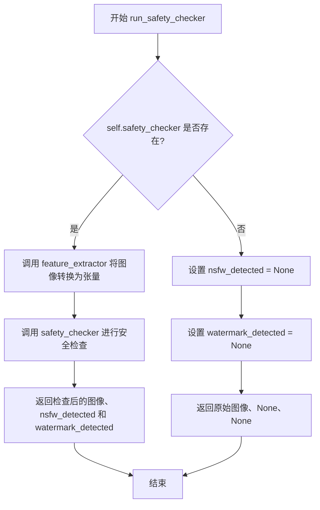

#### 带注释源码

```python
def run_safety_checker(self, image, device, dtype):
    """
    检查生成图像是否包含不当内容（NSFW）或水印
    
    参数:
        image: 生成的图像张量
        device: 运行设备
        dtype: 数据类型
    """
    # 检查是否配置了安全检查器
    if self.safety_checker is not None:
        # 使用特征提取器将 numpy 图像转换为 PyTorch 张量
        # 这会生成 CLIP 模型所需的输入格式
        safety_checker_input = self.feature_extractor(
            self.numpy_to_pil(image),  # 将张量转换为 PIL 图像
            return_tensors="pt"       # 返回 PyTorch 张量
        ).to(device)                  # 移动到指定设备
        
        # 调用安全检查器进行内容审查
        # 参数:
        #   images: 生成的图像
        #   clip_input: CLIP 模型的输入（特征提取后的像素值）
        image, nsfw_detected, watermark_detected = self.safety_checker(
            images=image,
            clip_input=safety_checker_input.pixel_values.to(dtype=dtype),
        )
    else:
        # 如果没有配置安全检查器，返回 None 表示未进行检测
        nsfw_detected = None
        watermark_detected = None

    # 返回处理后的图像和检测结果
    # 无论是否有安全检查器，都会返回图像（可能被修改或保持原样）
    return image, nsfw_detected, watermark_detected
```


### IFPipeline.prepare_extra_step_kwargs

准备调度器额外参数。该方法通过检查调度器的 `step` 方法签名，动态构建需要传递给调度器的额外参数字典，支持不同类型调度器的兼容性。

参数：

- `generator`：`torch.Generator | list[torch.Generator] | None`，用于生成确定性噪声的随机数生成器
- `eta`：`float`，DDIM 调度器使用的 eta 参数（取值范围 [0, 1]），其他调度器会忽略此参数

返回值：`dict[str, Any]`，包含调度器 step 方法所需的额外关键字参数，可能包含 `eta` 和/或 `generator` 键

#### 流程图

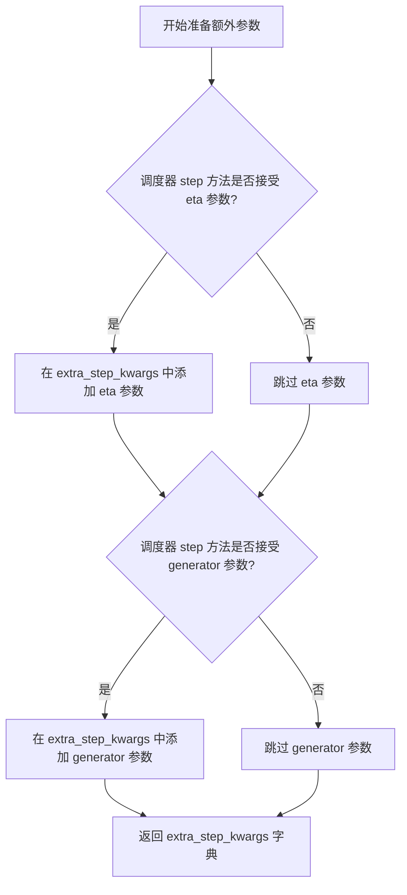

#### 带注释源码

```python
def prepare_extra_step_kwargs(self, generator, eta):
    """
    准备调度器额外参数
    
    由于并非所有调度器都具有相同的方法签名，此方法用于检查当前调度器
    支持哪些额外参数，并构建相应的参数字典。
    
    参数:
        generator: torch.Generator 或其列表，用于生成确定性随机数
        eta: float，DDIM 论文中的 eta (η) 参数，取值范围 [0, 1]
             仅 DDIMScheduler 使用此参数，其他调度器会忽略
    
    返回:
        dict: 包含调度器 step 方法所需额外参数的字典
    """
    
    # 通过 inspect 模块检查调度器 step 方法的签名
    # 判断该调度器是否接受 eta 参数
    accepts_eta = "eta" in set(inspect.signature(self.scheduler.step).parameters.keys())
    
    # 初始化额外参数字典
    extra_step_kwargs = {}
    
    # 如果调度器接受 eta 参数，则将其添加到参数字典中
    if accepts_eta:
        extra_step_kwargs["eta"] = eta

    # 检查调度器是否接受 generator 参数
    accepts_generator = "generator" in set(inspect.signature(self.scheduler.step).parameters.keys())
    
    # 如果调度器接受 generator 参数，则将其添加到参数字典中
    if accepts_generator:
        extra_step_kwargs["generator"] = generator
    
    # 返回构建好的参数字典，供调度器 step 方法使用
    return extra_step_kwargs
```


### IFPipeline.check_inputs

验证输入参数的有效性，确保传入的 prompt、callback_steps、negative_prompt、prompt_embeds 和 negative_prompt_embeds 符合管道的要求。如果参数无效，抛出相应的 ValueError 异常。

参数：

- `self`：IFPipeline 实例本身（隐式参数），不需要显式传递
- `prompt`：待验证的提示词，可以是字符串或字符串列表，也可以为 None
- `callback_steps`：回调步骤数，必须为正整数
- `negative_prompt`：负面提示词，可以是字符串或字符串列表，也可以为 None
- `prompt_embeds`：预生成的提示词嵌入张量，也可以为 None
- `negative_prompt_embeds`：预生成的负面提示词嵌入张量，也可以为 None

返回值：`None`，该方法不返回任何值，仅通过抛出异常来处理无效输入

#### 流程图

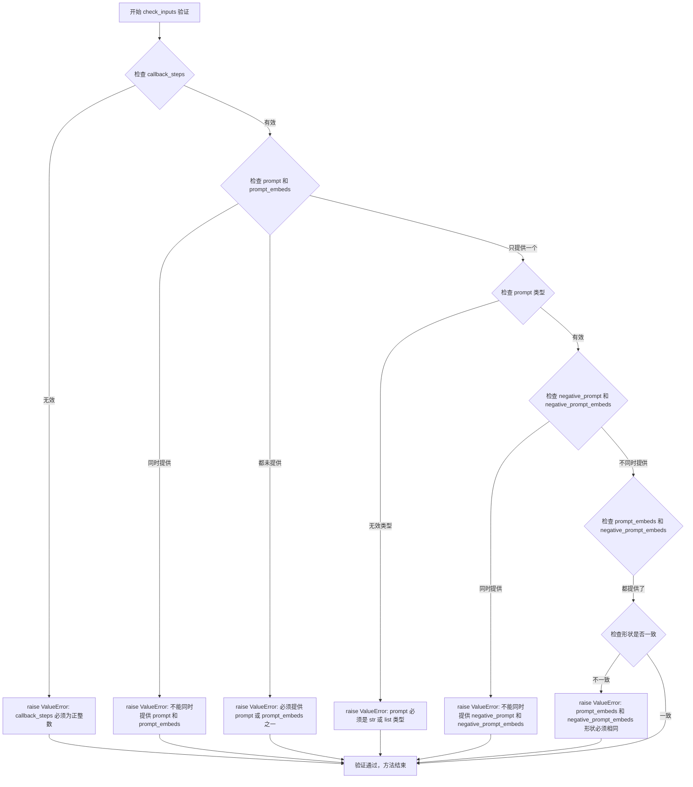

#### 带注释源码

```python
def check_inputs(
    self,
    prompt,
    callback_steps,
    negative_prompt=None,
    prompt_embeds=None,
    negative_prompt_embeds=None,
):
    """
    验证输入参数的有效性
    
    检查以下内容:
    1. callback_steps 必须为正整数
    2. prompt 和 prompt_embeds 不能同时提供
    3. prompt 和 prompt_embeds 必须至少提供一个
    4. prompt 类型必须为 str 或 list
    5. negative_prompt 和 negative_prompt_embeds 不能同时提供
    6. prompt_embeds 和 negative_prompt_embeds 形状必须一致
    """
    # 检查 callback_steps 是否为正整数
    if (callback_steps is None) or (
        callback_steps is not None and (not isinstance(callback_steps, int) or callback_steps <= 0)
    ):
        raise ValueError(
            f"`callback_steps` has to be a positive integer but is {callback_steps} of type"
            f" {type(callback_steps)}."
        )

    # 检查 prompt 和 prompt_embeds 是否同时提供
    if prompt is not None and prompt_embeds is not None:
        raise ValueError(
            f"Cannot forward both `prompt`: {prompt} and `prompt_embeds`: {prompt_embeds}. Please make sure to"
            " only forward one of the two."
        )
    # 检查 prompt 和 prompt_embeds 是否都未提供
    elif prompt is None and prompt_embeds is None:
        raise ValueError(
            "Provide either `prompt` or `prompt_embeds`. Cannot leave both `prompt` and `prompt_embeds` undefined."
        )
    # 检查 prompt 的类型是否有效
    elif prompt is not None and (not isinstance(prompt, str) and not isinstance(prompt, list)):
        raise ValueError(f"`prompt` has to be of type `str` or `list` but is {type(prompt)}")

    # 检查 negative_prompt 和 negative_prompt_embeds 是否同时提供
    if negative_prompt is not None and negative_prompt_embeds is not None:
        raise ValueError(
            f"Cannot forward both `negative_prompt`: {negative_prompt} and `negative_prompt_embeds`:"
            f" {negative_prompt_embeds}. Please make sure to only forward one of the two."
        )

    # 检查 prompt_embeds 和 negative_prompt_embeds 的形状是否一致
    if prompt_embeds is not None and negative_prompt_embeds is not None:
        if prompt_embeds.shape != negative_prompt_embeds.shape:
            raise ValueError(
                "`prompt_embeds` and `negative_prompt_embeds` must have the same shape when passed directly, but"
                f" got: `prompt_embeds` {prompt_embeds.shape} != `negative_prompt_embeds`"
                f" {negative_prompt_embeds.shape}."
            )
```


### `IFPipeline.prepare_intermediate_images`

该方法用于在扩散模型的去噪过程开始前，初始化中间噪声图像。它根据指定的批次大小、通道数、高度和宽度生成随机噪声张量，并使用调度器的初始噪声标准差进行缩放，以作为去噪循环的起点。

参数：

- `batch_size`：`int`，生成的噪声图像批次大小
- `num_channels`：`int`，噪声图像的通道数
- `height`：`int`，噪声图像的高度（像素）
- `width`：`int`，噪声图像的宽度（像素）
- `dtype`：`torch.dtype`，生成张量的数据类型
- `device`：`torch.device`，生成张量所在的设备
- `generator`：`torch.Generator | list[torch.Generator] | None`，用于确保生成可重复的随机数生成器

返回值：`torch.Tensor`，生成的中间噪声图像张量，形状为 (batch_size, num_channels, height, width)

#### 流程图

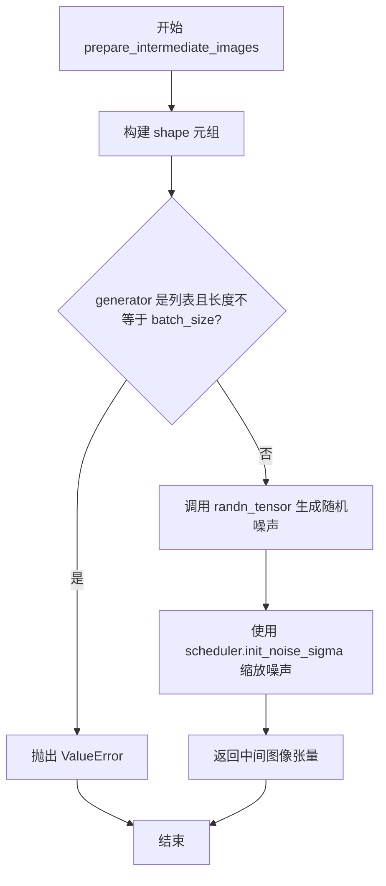

#### 带注释源码

```python
def prepare_intermediate_images(self, batch_size, num_channels, height, width, dtype, device, generator):
    """
    准备中间图像用于扩散模型的去噪过程。
    
    参数:
        batch_size: 批次大小
        num_channels: 图像通道数
        height: 图像高度
        width: 图像宽度
        dtype: 张量数据类型
        device: 计算设备
        generator: 随机数生成器
    """
    # 1. 根据参数构建目标形状元组
    shape = (batch_size, num_channels, height, width)
    
    # 2. 验证生成器列表长度与批次大小是否匹配
    if isinstance(generator, list) and len(generator) != batch_size:
        raise ValueError(
            f"You have passed a list of generators of length {len(generator)}, but requested an effective batch"
            f" size of {batch_size}. Make sure the batch size matches the length of the generators."
        )

    # 3. 使用 randn_tensor 生成指定形状的随机高斯噪声张量
    intermediate_images = randn_tensor(shape, generator=generator, device=device, dtype=dtype)

    # 4. 根据调度器要求的初始噪声标准差对噪声进行缩放
    # 这确保了初始噪声的幅度与调度器的预期一致
    intermediate_images = intermediate_images * self.scheduler.init_noise_sigma
    
    # 5. 返回准备好的中间噪声图像
    return intermediate_images
```


### `IFPipeline._text_preprocessing`

该方法是一个私有文本预处理函数，用于在将文本发送给T5编码器之前对其进行清洗和规范化处理。它支持两种处理模式：当`clean_caption`为True时，使用`_clean_caption`方法进行深度清洗（包括HTML标签、特殊字符、CJK字符等）；否则仅将文本转为小写并去除首尾空格。

参数：

- `text`：`str | list[str]`，需要预处理的原始文本，可以是单个字符串或字符串列表
- `clean_caption`：`bool`，是否执行深度清洗，默认为False。当为True时需要安装bs4和ftfy库

返回值：`list[str]`，返回处理后的文本列表

#### 流程图

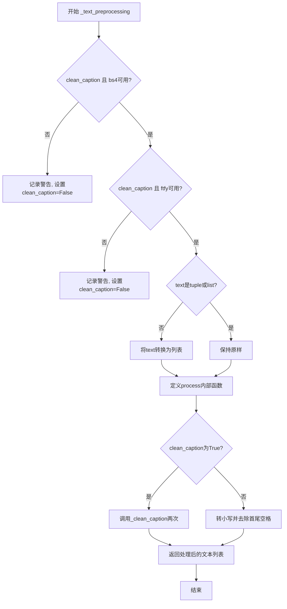

#### 带注释源码

```python
def _text_preprocessing(self, text, clean_caption=False):
    """
    文本预处理方法，用于清洗和规范输入文本
    
    Args:
        text: 输入的文本，字符串或字符串列表
        clean_caption: 是否进行深度清洗
    
    Returns:
        处理后的文本列表
    """
    # 检查bs4是否可用，如果clean_caption=True但bs4不可用则警告并禁用清洗
    if clean_caption and not is_bs4_available():
        logger.warning(BACKENDS_MAPPING["bs4"][-1].format("Setting `clean_caption=True`"))
        logger.warning("Setting `clean_caption` to False...")
        clean_caption = False

    # 检查ftfy是否可用，如果clean_caption=True但ftfy不可用则警告并禁用清洗
    if clean_caption and not is_ftfy_available():
        logger.warning(BACKENDS_MAPPING["ftfy"][-1].format("Setting `clean_caption=True`"))
        logger.warning("Setting `clean_caption` to False...")
        clean_caption = False

    # 确保text是列表类型，统一处理逻辑
    if not isinstance(text, (tuple, list)):
        text = [text]

    def process(text: str):
        """
        内部处理函数，对单个文本进行清洗
        
        Args:
            text: 待处理的字符串
        
        Returns:
            清洗后的字符串
        """
        if clean_caption:
            # 如果需要深度清洗，调用_clean_caption两次以确保彻底清洗
            text = self._clean_caption(text)
            text = self._clean_caption(text)
        else:
            # 否则仅转小写并去除首尾空格
            text = text.lower().strip()
        return text

    # 对列表中的每个文本元素应用process函数
    return [process(t) for t in text]
```


### `IFPipeline._clean_caption`

该方法是一个私有方法，用于清理和规范化文本描述（caption）。它通过多步骤处理流程，清除URL、HTML标签、CJK字符、特殊符号、HTML实体、IP地址、文件引用、电子邮件地址、数字序列以及常见的营销和网页噪声，并对引号和破折号进行标准化处理，最终返回清洁的文本。

**参数：**

- `caption`：`str`，需要进行清理的原始文本描述

**返回值：** `str`，返回清理和规范化后的文本描述

#### 流程图

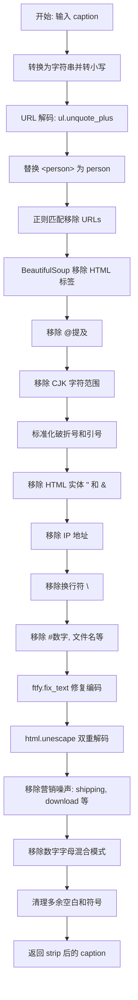

#### 带注释源码

```python
def _clean_caption(self, caption):
    """
    清理和规范化输入的文本描述（caption）。
    
    该方法执行多步骤的文本清理流程，包括：
    - URL 和 HTML 标签移除
    - CJK 字符移除
    - 特殊字符标准化
    - HTML 实体解码
    - 营销和噪声文本移除
    
    参数:
        caption: 需要清理的原始文本
        
    返回:
        清理后的文本字符串
    """
    # 1. 基础类型转换：将输入转为字符串并转小写
    caption = str(caption)
    caption = ul.unquote_plus(caption)  # URL 解码（如 %20 -> 空格）
    caption = caption.strip().lower()
    
    # 2. 特殊标记替换：将 <person> 替换为 person
    caption = re.sub("<person>", "person", caption)
    
    # 3. URLs 移除：使用正则表达式匹配 HTTP/HTTPS 和 www 开头的 URL
    # 匹配模式包括: https://..., www....
    caption = re.sub(
        r"\b((?:https?:(?:\/{1,3}|[a-zA-Z0-9%])|[a-zA-Z0-9.\-]+[.](?:com|co|ru|net|org|edu|gov|it)[\w/-]*\b\/?(?!@)))",
        "",
        caption,
    )
    caption = re.sub(
        r"\b((?:www:(?:\/{1,3}|[a-zA-Z0-9%])|[a-zA-Z0-9.\-]+[.](?:com|co|ru|net|org|edu|gov|it)[\w/-]*\b\/?(?!@)))",
        "",
        caption,
    )
    
    # 4. HTML 解析：使用 BeautifulSoup 提取纯文本，移除所有 HTML 标签
    caption = BeautifulSoup(caption, features="html.parser").text
    
    # 5. @提及移除：移除 @nickname 格式的用户名引用
    caption = re.sub(r"@[\w\d]+\b", "", caption)
    
    # 6. CJK 字符移除：移除多个 Unicode 范围内的 CJK 字符
    # 包括: CJK 笔画、片假名、 enclosed letters、compatibility、ideographs 等
    caption = re.sub(r"[\u31c0-\u31ef]+", "", caption)   # CJK Strokes
    caption = re.sub(r"[\u31f0-\u31ff]+", "", caption)   # Katakana Phonetic
    caption = re.sub(r"[\u3200-\u32ff]+", "", caption)   # Enclosed CJK
    caption = re.sub(r"[\u3300-\u33ff]+", "", caption)   # CJK Compatibility
    caption = re.sub(r"[\u3400-\u4dbf]+", "", caption)   # CJK Extension A
    caption = re.sub(r"[\u4dc0-\u4dff]+", "", caption)  # Yijing Hexagram
    caption = re.sub(r"[\u4e00-\u9fff]+", "", caption)   # CJK Unified Ideographs
    
    # 7. 破折号标准化：将各种语言的破折号统一替换为 "-"
    caption = re.sub(
        r"[\u002D\u058A\u05BE\u1400\u1806\u2010-\u2015\u2E17\u2E1A\u2E3A\u2E3B\u2E40\u301C\u3030\u30A0\uFE31\uFE32\uFE58\uFE63\uFF0D]+",
        "-",
        caption,
    )
    
    # 8. 引号标准化：将各种引号统一替换为标准双引号或单引号
    caption = re.sub(r"[`´«»""]¨]", '"', caption)  # 双引号统一
    caption = re.sub(r"['']", "'", caption)          # 单引号统一
    
    # 9. HTML 实体移除：移除 &quot; 和 &amp
    caption = re.sub(r"&quot;?", "", caption)
    caption = re.sub(r"&amp", "", caption)
    
    # 10. IP 地址移除
    caption = re.sub(r"\d{1,3}\.\d{1,3}\.\d{1,3}\.\d{1,3}", " ", caption)
    
    # 11. 文章 ID 移除：移除 "数字:数字" 结尾的模式
    caption = re.sub(r"\d:\d\d\s+$", "", caption)
    
    # 12. 换行符替换为空格
    caption = re.sub(r"\\n", " ", caption)
    
    # 13. #标签和文件名移除
    caption = re.sub(r"#\d{1,3}\b", "", caption)      # #123
    caption = re.sub(r"#\d{5,}\b", "", caption)       # #12345..
    caption = re.sub(r"\b\d{6,}\b", "", caption)      # 123456..
    caption = re.sub(r"[\S]+\.(?:png|jpg|jpeg|bmp|webp|eps|pdf|apk|mp4)", "", caption)  # 文件名
    
    # 14. 多余符号简化：双引号和双点压缩
    caption = re.sub(r"[\"']{2,}", r'"', caption)  # """AUSVERKAUFT"""
    caption = re.sub(r"[\.]{2,}", r" ", caption)   # ....AUSVERKAUFT
    
    # 15. 使用预定义正则移除特殊标点
    caption = re.sub(self.bad_punct_regex, r" ", caption)  # ***AUSVERKAUFT***
    caption = re.sub(r"\s+\.\s+", r" ", caption)  # " . "
    
    # 16. 连续分隔符处理：如果 caption 中有超过 3 个 - 或 _，则替换为空格
    regex2 = re.compile(r"(?:\-|\_)")
    if len(re.findall(regex2, caption)) > 3:
        caption = re.sub(regex2, " ", caption)
    
    # 17. ftfy 修复文本编码问题
    caption = ftfy.fix_text(caption)
    
    # 18. HTML 双重解码（处理双重编码的情况）
    caption = html.unescape(html.unescape(caption))
    
    # 19. 移除混合模式的字母数字序列（常见于产品编号、用户名等）
    caption = re.sub(r"\b[a-zA-Z]{1,3}\d{3,15}\b", "", caption)     # jc6640
    caption = re.sub(r"\b[a-zA-Z]+\d+[a-zA-Z]+\b", "", caption)     # jc6640vc
    caption = re.sub(r"\b\d+[a-zA-Z]+\d+\b", "", caption)           # 6640vc231
    
    # 20. 移除营销噪声文本
    caption = re.sub(r"(worldwide\s+)?(free\s+)?shipping", "", caption)
    caption = re.sub(r"(free\s)?download(\sfree)?", "", caption)
    caption = re.sub(r"\bclick\b\s(?:for|on)\s\w+", "", caption)
    caption = re.sub(r"\b(?:png|jpg|jpeg|bmp|webp|eps|pdf|apk|mp4)(\simage[s]?)?", "", caption)
    caption = re.sub(r"\bpage\s+\d+\b", "", caption)
    
    # 21. 移除复杂字母数字混合模式
    caption = re.sub(r"\b\d*[a-zA-Z]+\d+[a-zA-Z]+\d+[a-zA-Z\d]*\b", r" ", caption)  # j2d1a2a...
    
    # 22. 移除尺寸规格（如 1920x1080, 10×20）
    caption = re.sub(r"\b\d+\.?\d*[xх×]\d+\.?\d*\b", "", caption)
    
    # 23. 清理多余空白和符号
    caption = re.sub(r"\b\s+\:\s+", r": ", caption)      # " : " -> ": "
    caption = re.sub(r"(\D[,\./])\b", r"\1 ", caption)   # 符号后补空格
    caption = re.sub(r"\s+", " ", caption)               # 多空格合并
    
    # 24. 收尾清理：移除首尾引号和特殊符号
    caption.strip()
    caption = re.sub(r"^[\"\']([\w\W]+)[\"\']$", r"\1", caption)  # 移除首尾引号
    caption = re.sub(r"^[\'\_,\-\:;]", r"", caption)              # 移除开头特殊字符
    caption = re.sub(r"[\'\_,\-\:\-\+]$", r"", caption)           # 移除结尾特殊字符
    caption = re.sub(r"^\.\S+$", "", caption)                      # 移除单个点开头的词
    
    return caption.strip()
```


### `IFPipeline.__call__`

该方法是 IFPipeline 的主入口函数，执行完整的文本到图像生成流程。它接收提示词和生成参数，经过输入检查、提示词编码、时间步准备、去噪循环、图像后处理、安全检查和水印处理后，返回生成的图像及相关检测结果。

参数：

- `prompt`：`str | list[str] | None`，要引导图像生成的提示词，如果未定义则必须传递 prompt_embeds
- `num_inference_steps`：`int`，默认为 100，去噪步数，越多通常图像质量越高但推理越慢
- `timesteps`：`list[int] | None`，自定义去噪时间步，如果不定义则使用等间距的 num_inference_steps 个时间步，必须按降序排列
- `guidance_scale`：`float`，默认为 7.0，分类器自由引导比例，值大于1时启用引导，值越高越贴近文本提示但可能牺牲图像质量
- `negative_prompt`：`str | list[str] | Optional`，不引导图像生成的提示词，未使用引导时忽略
- `num_images_per_prompt`：`int | None`，默认为 1，每个提示词生成的图像数量
- `height`：`int | None`，生成图像的高度像素，默认为 self.unet.config.sample_size
- `width`：`int | None`，生成图像的宽度像素，默认为 self.unet.config.sample_size
- `eta`：`float`，默认为 0.0，对应 DDIM 论文中的 eta 参数，仅适用于 DDIMScheduler
- `generator`：`torch.Generator | list[torch.Generator] | None`，一个或多个 torch 生成器，用于使生成具有确定性
- `prompt_embeds`：`torch.Tensor | None`，预生成的文本嵌入，可用于轻松调整文本输入
- `negative_prompt_embeds`：`torch.Tensor | None`，预生成的负面文本嵌入
- `output_type`：`str | None`，默认为 "pil"，生成图像的输出格式，可选 PIL.Image.Image 或 np.array
- `return_dict`：`bool`，默认为 True，是否返回 IFPipelineOutput 而不是普通元组
- `callback`：`Callable[[int, int, torch.Tensor], None] | None`，每 callback_steps 步调用的回调函数
- `callback_steps`：`int`，默认为 1，回调函数被调用的频率
- `clean_caption`：`bool`，默认为 True，是否在创建嵌入前清理提示词，需要 beautifulsoup4 和 ftfy
- `cross_attention_kwargs`：`dict[str, Any] | None`，传递给 AttentionProcessor 的 kwargs 字典

返回值：`IFPipelineOutput | tuple`，当 return_dict 为 True 时返回 IFPipelineOutput，否则返回元组，第一个元素是生成的图像列表，第二个元素是 NSFW 和水印检测结果列表

#### 流程图

```mermaid
flowchart TD
    A[开始 __call__] --> B[1. 检查输入参数 check_inputs]
    B --> C[2. 定义调用参数<br>height/width/batch_size/device]
    C --> D[3. 计算是否启用分类器自由引导<br>do_classifier_free_guidance = guidance_scale > 1.0]
    D --> E[4. 编码输入提示词 encode_prompt]
    E --> F{do_classifier_free_guidance?}
    F -->|True| G[连接负面和正面提示词嵌入]
    F -->|False| H[跳过连接]
    G --> I
    H --> I[5. 准备时间步 scheduler.set_timesteps]
    I --> J[6. 准备中间图像 prepare_intermediate_images]
    J --> K[7. 准备额外步骤参数 prepare_extra_step_kwargs]
    K --> L[检查并卸载 text_encoder offload hook]
    L --> M[开始去噪循环]
    M --> N[当前时间步 t]
    N --> O[准备模型输入<br>scale_model_input]
    O --> P[UNet 预测噪声<br>noise_pred = unet<br>model_input, t, encoder_hidden_states]
    P --> Q{do_classifier_free_guidance?}
    Q -->|True| R[分离无条件和有条件预测<br>noise_pred = uncond + scale<br>× text - uncond]
    Q -->|False| S[使用原始预测]
    R --> T
    S --> T[scheduler.step 计算上一步图像]
    T --> U{是否调用回调?}
    U -->|Yes| V[调用 callback<br>callback/i, t, intermediate_images]
    U -->|No| W[更新进度条]
    V --> W
    W --> X{还有更多时间步?}
    X -->|Yes| N
    X -->|No| Y[获取最终图像]
    Y --> Z{output_type == 'pil'?}
    Z -->|Yes| AA[后处理: /2+0.5 clamp 0-1<br>permute numpy]
    Z -->|No| AB{output_type == 'pt'?}
    AA --> AC[运行安全检查 run_safety_checker]
    AC --> AD[转换为 PIL 图像]
    AD --> AE{水印器存在?}
    AE -->|Yes| AF[应用水印 apply_watermark]
    AE -->|No| AG[返回结果]
    AF --> AG
    AB -->|Yes| AH[卸载 unet offload hook]
    AH --> AG
    AG --> AI{maybe_free_model_hooks}
    AI --> AJ{return_dict?}
    AJ -->|Yes| AK[返回 IFPipelineOutput]
    AJ -->|No| AL[返回 tuple]
```

#### 带注释源码

```python
@torch.no_grad()
@replace_example_docstring(EXAMPLE_DOC_STRING)
def __call__(
    self,
    prompt: str | list[str] = None,
    num_inference_steps: int = 100,
    timesteps: list[int] = None,
    guidance_scale: float = 7.0,
    negative_prompt: str | list[str] | None = None,
    num_images_per_prompt: int | None = 1,
    height: int | None = None,
    width: int | None = None,
    eta: float = 0.0,
    generator: torch.Generator | list[torch.Generator] | None = None,
    prompt_embeds: torch.Tensor | None = None,
    negative_prompt_embeds: torch.Tensor | None = None,
    output_type: str | None = "pil",
    return_dict: bool = True,
    callback: Callable[[int, int, torch.Tensor], None] | None = None,
    callback_steps: int = 1,
    clean_caption: bool = True,
    cross_attention_kwargs: dict[str, Any] | None = None,
):
    """
    Pipeline 主入口函数，用于生成图像
    
    参数:
        prompt: 文本提示词或提示词列表
        num_inference_steps: 去噪步数，默认为100
        timesteps: 自定义时间步列表
        guidance_scale: 引导比例，用于分类器自由引导
        negative_prompt: 负面提示词
        num_images_per_prompt: 每个提示词生成的图像数
        height: 生成图像高度
        width: 生成图像宽度
        eta: DDIM 论文中的 eta 参数
        generator: 随机生成器，用于确定性生成
        prompt_embeds: 预计算的提示词嵌入
        negative_prompt_embeds: 预计算的负面提示词嵌入
        output_type: 输出类型，'pil' 或 'pt'
        return_dict: 是否返回字典格式
        callback: 推理过程中的回调函数
        callback_steps: 回调函数调用频率
        clean_caption: 是否清理提示词
        cross_attention_kwargs: 传递给注意力处理器的额外参数
    
    返回:
        IFPipelineOutput 或 tuple: 包含生成图像和检测结果
    """
    # 1. 检查输入参数，如果不正则抛出错误
    self.check_inputs(prompt, callback_steps, negative_prompt, prompt_embeds, negative_prompt_embeds)

    # 2. 定义调用参数，使用 UNet 配置中的 sample_size 作为默认值
    height = height or self.unet.config.sample_size
    width = width or self.unet.config.sample_size

    # 确定批量大小：根据 prompt 类型或 prompt_embeds 的形状
    if prompt is not None and isinstance(prompt, str):
        batch_size = 1
    elif prompt is not None and isinstance(prompt, list):
        batch_size = len(prompt)
    else:
        batch_size = prompt_embeds.shape[0]

    device = self._execution_device

    # 计算是否启用分类器自由引导（guidance_scale > 1.0）
    # guidance_scale 对应 Imagen 论文中的权重 w
    # guidance_scale = 1 表示不进行分类器自由引导
    do_classifier_free_guidance = guidance_scale > 1.0

    # 3. 编码输入提示词
    # 返回正面提示词嵌入和负面提示词嵌入
    prompt_embeds, negative_prompt_embeds = self.encode_prompt(
        prompt,
        do_classifier_free_guidance,
        num_images_per_prompt=num_images_per_prompt,
        device=device,
        negative_prompt=negative_prompt,
        prompt_embeds=prompt_embeds,
        negative_prompt_embeds=negative_prompt_embeds,
        clean_caption=clean_caption,
    )

    # 如果启用引导，将负面和正面提示词嵌入连接在一起
    # 这样可以在一次前向传播中同时计算无条件和有条件预测
    if do_classifier_free_guidance:
        prompt_embeds = torch.cat([negative_prompt_embeds, prompt_embeds])

    # 4. 准备时间步
    # 如果提供了自定义 timesteps，则使用它；否则从 num_inference_steps 生成
    if timesteps is not None:
        self.scheduler.set_timesteps(timesteps=timesteps, device=device)
        timesteps = self.scheduler.timesteps
        num_inference_steps = len(timesteps)
    else:
        self.scheduler.set_timesteps(num_inference_steps, device=device)
        timesteps = self.scheduler.timesteps

    # 如果调度器有 set_begin_index 方法，设置起始索引为 0
    if hasattr(self.scheduler, "set_begin_index"):
        self.scheduler.set_begin_index(0)

    # 5. 准备中间图像（潜在空间中的噪声图像）
    intermediate_images = self.prepare_intermediate_images(
        batch_size * num_images_per_prompt,
        self.unet.config.in_channels,
        height,
        width,
        prompt_embeds.dtype,
        device,
        generator,
    )

    # 6. 准备额外步骤参数
    # 不同调度器可能有不同的签名参数
    extra_step_kwargs = self.prepare_extra_step_kwargs(generator, eta)

    # HACK: 参见 enable_model_cpu_offload 中的注释
    # 手动卸载 text_encoder 的 offload hook
    if hasattr(self, "text_encoder_offload_hook") and self.text_encoder_offload_hook is not None:
        self.text_encoder_offload_hook.offload()

    # 7. 去噪循环
    # 计算预热步数（总步数减去实际推理步数）
    num_warmup_steps = len(timesteps) - num_inference_steps * self.scheduler.order
    
    # 创建进度条
    with self.progress_bar(total=num_inference_steps) as progress_bar:
        # 遍历每个时间步
        for i, t in enumerate(timesteps):
            # 如果启用分类器自由引导，将中间图像复制两份（无条件+有条件）
            model_input = (
                torch.cat([intermediate_images] * 2) if do_classifier_free_guidance else intermediate_images
            )
            
            # 调度器缩放模型输入
            model_input = self.scheduler.scale_model_input(model_input, t)

            # 预测噪声残差
            # 调用 UNet 进行噪声预测
            noise_pred = self.unet(
                model_input,
                t,
                encoder_hidden_states=prompt_embeds,
                cross_attention_kwargs=cross_attention_kwargs,
                return_dict=False,
            )[0]

            # 执行引导
            if do_classifier_free_guidance:
                # 将预测分离为无条件预测和文本条件预测
                noise_pred_uncond, noise_pred_text = noise_pred.chunk(2)
                # 分离方差
                noise_pred_uncond, _ = noise_pred_uncond.split(model_input.shape[1], dim=1)
                noise_pred_text, predicted_variance = noise_pred_text.split(model_input.shape[1], dim=1)
                
                # 应用引导：noise_pred = uncond + scale * (text - uncond)
                noise_pred = noise_pred_uncond + guidance_scale * (noise_pred_text - noise_pred_uncond)
                # 将预测的方差连接回去
                noise_pred = torch.cat([noise_pred, predicted_variance], dim=1)

            # 如果调度器的方差类型不是 learned 或 learned_range，分离方差
            if self.scheduler.config.variance_type not in ["learned", "learned_range"]:
                noise_pred, _ = noise_pred.split(model_input.shape[1], dim=1)

            # 计算上一步的噪声样本 x_t -> x_t-1
            # 使用调度器的 step 方法
            intermediate_images = self.scheduler.step(
                noise_pred, t, intermediate_images, **extra_step_kwargs, return_dict=False
            )[0]

            # 调用回调函数（如果提供）
            # 在最后一个时间步或预热步之后且每 scheduler.order 步调用
            if i == len(timesteps) - 1 or ((i + 1) > num_warmup_steps and (i + 1) % self.scheduler.order == 0):
                progress_bar.update()
                if callback is not None and i % callback_steps == 0:
                    callback(i, t, intermediate_images)

            # 如果使用 XLA（PyTorch on TPU），标记执行步骤
            if XLA_AVAILABLE:
                xm.mark_step()

    # 获取最终图像
    image = intermediate_images

    # 后处理
    if output_type == "pil":
        # 8. 后处理：将图像从 [-1,1] 归一化到 [0,1]
        image = (image / 2 + 0.5).clamp(0, 1)
        # 转换为 CPU 上的 numpy 数组，形状从 [B,C,H,W] 变为 [B,H,W,C]
        image = image.cpu().permute(0, 2, 3, 1).float().numpy()

        # 9. 运行安全检查器
        image, nsfw_detected, watermark_detected = self.run_safety_checker(image, device, prompt_embeds.dtype)

        # 10. 转换为 PIL 图像
        image = self.numpy_to_pil(image)

        # 11. 应用水印
        if self.watermarker is not None:
            image = self.watermarker.apply_watermark(image, self.unet.config.sample_size)
    
    elif output_type == "pt":
        # 对于 PyTorch 输出类型，不进行后处理
        nsfw_detected = None
        watermark_detected = None

        # 卸载 UNet 的 offload hook
        if hasattr(self, "unet_offload_hook") and self.unet_offload_hook is not None:
            self.unet_offload_hook.offload()
    else:
        # 其他输出类型（如 numpy）
        # 8. 后处理
        image = (image / 2 + 0.5).clamp(0, 1)
        image = image.cpu().permute(0, 2, 3, 1).float().numpy()

        # 9. 运行安全检查器
        image, nsfw_detected, watermark_detected = self.run_safety_checker(image, device, prompt_embeds.dtype)

    # 卸载所有模型
    self.maybe_free_model_hooks()

    # 返回结果
    if not return_dict:
        return (image, nsfw_detected, watermark_detected)

    # 返回 IFPipelineOutput 对象
    return IFPipelineOutput(images=image, nsfw_detected=nsfw_detected, watermark_detected=watermark_detected)
```


### IFPipeline.__init__

该方法是 IFPipeline 类的初始化构造函数，负责初始化文本编码器（tokenizer、text_encoder）、去噪模型（unet）、调度器（scheduler）、安全检查器（feature_extractor、safety_checker）和水印处理器（watermarker）等核心组件，并验证组件间的依赖关系。

参数：

- `tokenizer`：`T5Tokenizer`，T5分词器，用于将文本转换为token序列
- `text_encoder`：`T5EncoderModel`，T5文本编码器，将token序列编码为文本嵌入向量
- `unet`：`UNet2DConditionModel`，UNet条件扩散模型，用于预测噪声
- `scheduler`：`DDPMScheduler`，噪声调度器，控制去噪过程的噪声调度
- `safety_checker`：`IFSafetyChecker | None`，安全检查器，用于检测NSFW内容，可为None
- `feature_extractor`：`CLIPImageProcessor | None`，CLIP图像特征提取器，用于安全检查器的输入，可为None
- `watermarker`：`IFWatermarker | None`，水印处理器，用于添加隐形水印，可为None
- `requires_safety_checker`：`bool`，是否要求安全检查器，默认为True

返回值：`None`，该方法不返回任何值，仅进行对象初始化

#### 流程图

```mermaid
flowchart TD
    A[开始 __init__] --> B[调用父类初始化 super().__init__]
    B --> C{safety_checker is None<br/>且 requires_safety_checker is True?}
    C -->|是| D[输出安全检查器禁用警告]
    C -->|否| E{safety_checker is not None<br/>且 feature_extractor is None?}
    D --> E
    E -->|是| F[抛出 ValueError]
    E -->|否| G[调用 register_modules 注册所有模块]
    G --> H[调用 register_to_config 注册配置项]
    H --> I[结束 __init__]
    
    style F fill:#ff6b6b
    style D fill:#feca57
```

#### 带注释源码

```python
def __init__(
    self,
    tokenizer: T5Tokenizer,                          # T5分词器
    text_encoder: T5EncoderModel,                   # T5文本编码模型
    unet: UNet2DConditionModel,                    # UNet条件扩散模型
    scheduler: DDPMScheduler,                      # DDPM调度器
    safety_checker: IFSafetyChecker | None,        # 安全检查器（可选）
    feature_extractor: CLIPImageProcessor | None,  # 图像特征提取器（可选）
    watermarker: IFWatermarker | None,             # 水印处理器（可选）
    requires_safety_checker: bool = True,          # 是否要求安全检查器
):
    # 调用父类 DiffusionPipeline 和 StableDiffusionLoraLoaderMixin 的初始化方法
    super().__init__()

    # 如果安全检查器为None但要求必须使用安全检查器，则发出警告
    if safety_checker is None and requires_safety_checker:
        logger.warning(
            f"You have disabled the safety checker for {self.__class__} by passing `safety_checker=None`. Ensure"
            " that you abide to the conditions of the IF license and do not expose unfiltered"
            " results in services or applications open to the public. Both the diffusers team and Hugging Face"
            " strongly recommend to keep the safety filter enabled in all public facing circumstances, disabling"
            " it only for use-cases that involve analyzing network behavior or auditing its results. For more"
            " information, please have a look at https://github.com/huggingface/diffusers/pull/254 ."
        )

    # 如果提供了安全检查器但未提供特征提取器，则抛出错误
    # 安全检查器需要特征提取器来处理图像输入
    if safety_checker is not None and feature_extractor is None:
        raise ValueError(
            "Make sure to define a feature extractor when loading {self.__class__} if you want to use the safety"
            " checker. If you do not want to use the safety checker, you can pass `'safety_checker=None'` instead."
        )

    # 注册所有模块到当前pipeline实例，使这些组件可以通过pipeline.xxx访问
    self.register_modules(
        tokenizer=tokenizer,
        text_encoder=text_encoder,
        unet=unet,
        scheduler=scheduler,
        safety_checker=safety_checker,
        feature_extractor=feature_extractor,
        watermarker=watermarker,
    )

    # 将requires_safety_checker配置注册到pipeline的配置中
    self.register_to_config(requires_safety_checker=requires_safety_checker)
```


### `IFPipeline.encode_prompt`

该方法将输入的文本提示词（prompt）编码为文本encoder的隐藏状态（hidden states），支持无分类器引导（Classifier-Free Guidance），并返回正向和负向提示词的嵌入向量。

参数：

- `prompt`：`str | list[str]`，要编码的提示词，可以是单个字符串或字符串列表
- `do_classifier_free_guidance`：`bool`，是否使用无分类器引导（默认为 `True`）
- `num_images_per_prompt`：`int`，每个提示词生成的图像数量（默认为 1）
- `device`：`torch.device | None`，用于放置结果嵌入的 torch 设备
- `negative_prompt`：`str | list[str] | None`，不用于引导图像生成的提示词
- `prompt_embeds`：`torch.Tensor | None`，预生成的提示词嵌入
- `negative_prompt_embeds`：`torch.Tensor | None`，预生成的负面提示词嵌入
- `clean_caption`：`bool`，是否预处理和清理提供的标题（默认为 `False`）

返回值：`tuple[torch.Tensor, torch.Tensor | None]`，返回编码后的提示词嵌入和负面提示词嵌入（元组形式）

#### 流程图

```mermaid
flowchart TD
    A[开始 encode_prompt] --> B{检查 prompt 和 negative_prompt 类型是否一致}
    B -->|类型不一致| C[抛出 TypeError]
    B -->|类型一致| D{device 是否为 None}
    D -->|是| E[使用 self._execution_device]
    D -->|否| F[使用传入的 device]
    E --> G{确定 batch_size}
    F --> G
    G --> H{prompt_embeds 是否为 None}
    H -->|是| I[_text_preprocessing 预处理文本]
    I --> J[tokenizer 分词]
    J --> K[检查是否截断]
    K --> L[text_encoder 编码]
    H -->|否| M[跳过编码，使用已有 embeddings]
    L --> N{确定 dtype}
    N --> O{text_encoder 存在}
    O -->|是| P[使用 text_encoder.dtype]
    O -->|否| Q{unet 存在}
    Q -->|是| R[使用 unet.dtype]
    Q -->|否| S[使用 None]
    P --> T[转换为 dtype 和 device]
    R --> T
    S --> T
    M --> T
    T --> U{do_classifier_free_guidance 为真且 negative_prompt_embeds 为 None}
    U -->|是| V{negative_prompt 是否为 None}
    V -->|是| W[uncond_tokens = [''] * batch_size]
    V -->|否| X[处理 negative_prompt]
    W --> Y[_text_preprocessing 预处理]
    X --> Y
    Y --> Z[tokenizer 分词]
    Z --> AA[text_encoder 编码]
    AA --> AB[重复 embeddings 以支持多个图像]
    U -->|否| AC[negative_prompt_embeds = None]
    AB --> AD[返回 prompt_embeds, negative_prompt_embeds]
    AC --> AD
```

#### 带注释源码

```python
@torch.no_grad()
def encode_prompt(
    self,
    prompt: str | list[str],
    do_classifier_free_guidance: bool = True,
    num_images_per_prompt: int = 1,
    device: torch.device | None = None,
    negative_prompt: str | list[str] | None = None,
    prompt_embeds: torch.Tensor | None = None,
    negative_prompt_embeds: torch.Tensor | None = None,
    clean_caption: bool = False,
):
    r"""
    Encodes the prompt into text encoder hidden states.

    Args:
        prompt (`str` or `list[str]`, *optional*):
            prompt to be encoded
        do_classifier_free_guidance (`bool`, *optional*, defaults to `True`):
            whether to use classifier free guidance or not
        num_images_per_prompt (`int`, *optional*, defaults to 1):
            number of images that should be generated per prompt
        device: (`torch.device`, *optional*):
            torch device to place the resulting embeddings on
        negative_prompt (`str` or `list[str]`, *optional*):
            The prompt or prompts not to guide the image generation. If not defined, one has to pass
            `negative_prompt_embeds`. instead. If not defined, one has to pass `negative_prompt_embeds`. instead.
            Ignored when not using guidance (i.e., ignored if `guidance_scale` is less than `1`).
        prompt_embeds (`torch.Tensor`, *optional*):
            Pre-generated text embeddings. Can be used to easily tweak text inputs, *e.g.* prompt weighting. If not
            provided, text embeddings will be generated from `prompt` input argument.
        negative_prompt_embeds (`torch.Tensor`, *optional*):
            Pre-generated negative text embeddings. Can be used to easily tweak text inputs, *e.g.* prompt
            weighting. If not provided, negative_prompt_embeds will be generated from `negative_prompt` input
            argument.
        clean_caption (bool, defaults to `False`):
            If `True`, the function will preprocess and clean the provided caption before encoding.
    """
    # 检查 prompt 和 negative_prompt 类型是否一致
    if prompt is not None and negative_prompt is not None:
        if type(prompt) is not type(negative_prompt):
            raise TypeError(
                f"`negative_prompt` should be the same type to `prompt`, but got {type(negative_prompt)} !="
                f" {type(prompt)}."
            )

    # 如果没有指定 device，使用执行设备
    if device is None:
        device = self._execution_device

    # 确定 batch_size
    if prompt is not None and isinstance(prompt, str):
        batch_size = 1
    elif prompt is not None and isinstance(prompt, list):
        batch_size = len(prompt)
    else:
        batch_size = prompt_embeds.shape[0]

    # IF 模型使用固定的最大长度 77
    max_length = 77

    # 如果没有提供 prompt_embeds，则从 prompt 生成
    if prompt_embeds is None:
        # 文本预处理（清理标题等）
        prompt = self._text_preprocessing(prompt, clean_caption=clean_caption)
        
        # 使用 tokenizer 进行分词
        text_inputs = self.tokenizer(
            prompt,
            padding="max_length",
            max_length=max_length,
            truncation=True,
            add_special_tokens=True,
            return_tensors="pt",
        )
        text_input_ids = text_inputs.input_ids
        
        # 获取未截断的 token ids 以检查是否被截断
        untruncated_ids = self.tokenizer(prompt, padding="longest", return_tensors="pt").input_ids

        # 检查是否有内容被截断
        if untruncated_ids.shape[-1] >= text_input_ids.shape[-1] and not torch.equal(
            text_input_ids, untruncated_ids
        ):
            removed_text = self.tokenizer.batch_decode(untruncated_ids[:, max_length - 1 : -1])
            logger.warning(
                "The following part of your input was truncated because CLIP can only handle sequences up to"
                f" {max_length} tokens: {removed_text}"
            )

        attention_mask = text_inputs.attention_mask.to(device)

        # 使用 text_encoder 编码
        prompt_embeds = self.text_encoder(
            text_input_ids.to(device),
            attention_mask=attention_mask,
        )
        prompt_embeds = prompt_embeds[0]  # 获取隐藏状态

    # 确定数据类型（dtype）
    if self.text_encoder is not None:
        dtype = self.text_encoder.dtype
    elif self.unet is not None:
        dtype = self.unet.dtype
    else:
        dtype = None

    # 将 prompt_embeds 转换到正确的设备和 dtype
    prompt_embeds = prompt_embeds.to(dtype=dtype, device=device)

    # 获取嵌入的形状信息
    bs_embed, seq_len, _ = prompt_embeds.shape
    
    # 为每个提示词生成多个图像复制 embeddings
    prompt_embeds = prompt_embeds.repeat(1, num_images_per_prompt, 1)
    prompt_embeds = prompt_embeds.view(bs_embed * num_images_per_prompt, seq_len, -1)

    # 获取无分类器引导的 unconditional embeddings
    if do_classifier_free_guidance and negative_prompt_embeds is None:
        uncond_tokens: list[str]
        
        # 处理 negative_prompt
        if negative_prompt is None:
            uncond_tokens = [""] * batch_size
        elif isinstance(negative_prompt, str):
            uncond_tokens = [negative_prompt]
        elif batch_size != len(negative_prompt):
            raise ValueError(
                f"`negative_prompt`: {negative_prompt} has batch size {len(negative_prompt)}, but `prompt`:"
                f" {prompt} has batch size {batch_size}. Please make sure that passed `negative_prompt` matches"
                " the batch size of `prompt`."
            )
        else:
            uncond_tokens = negative_prompt

        # 预处理 unconditional tokens
        uncond_tokens = self._text_preprocessing(uncond_tokens, clean_caption=clean_caption)
        
        # 使用与 prompt_embeds 相同的长度
        max_length = prompt_embeds.shape[1]
        
        # tokenizer 处理
        uncond_input = self.tokenizer(
            uncond_tokens,
            padding="max_length",
            max_length=max_length,
            truncation=True,
            return_attention_mask=True,
            add_special_tokens=True,
            return_tensors="pt",
        )
        attention_mask = uncond_input.attention_mask.to(device)

        # 编码 negative_prompt
        negative_prompt_embeds = self.text_encoder(
            uncond_input.input_ids.to(device),
            attention_mask=attention_mask,
        )
        negative_prompt_embeds = negative_prompt_embeds[0]

    # 处理 negative_prompt_embeds 以支持分类器自由引导
    if do_classifier_free_guidance:
        # 复制 unconditional embeddings 以支持每个提示词生成多个图像
        seq_len = negative_prompt_embeds.shape[1]

        negative_prompt_embeds = negative_prompt_embeds.to(dtype=dtype, device=device)

        negative_prompt_embeds = negative_prompt_embeds.repeat(1, num_images_per_prompt, 1)
        negative_prompt_embeds = negative_prompt_embeds.view(batch_size * num_images_per_prompt, seq_len, -1)
    else:
        negative_prompt_embeds = None

    return prompt_embeds, negative_prompt_embeds
```


### `IFPipeline.run_safety_checker`

该方法用于对生成的图像进行安全检查，检测是否为 NSFW（不适合在工作场合查看）内容或带有水印。如果安全检查器未配置，则直接返回原始图像和 None 值。

参数：

- `image`：`torch.Tensor`，待检测的图像张量，通常是经过后处理的图像
- `device`：`torch.device`，用于将特征提取器的输出移动到指定设备
- `dtype`：`torch.dtype`，用于将 CLIP 输入转换为指定的数据类型

返回值：`tuple[torch.Tensor, Any, Any]`，返回包含三个元素的元组：
- `image`：处理后的图像张量
- `nsfw_detected`：检测到的 NSFW 内容标记，可能为 None 或布尔值列表
- `watermark_detected`：检测到的水印标记，可能为 None 或布尔值列表

#### 流程图

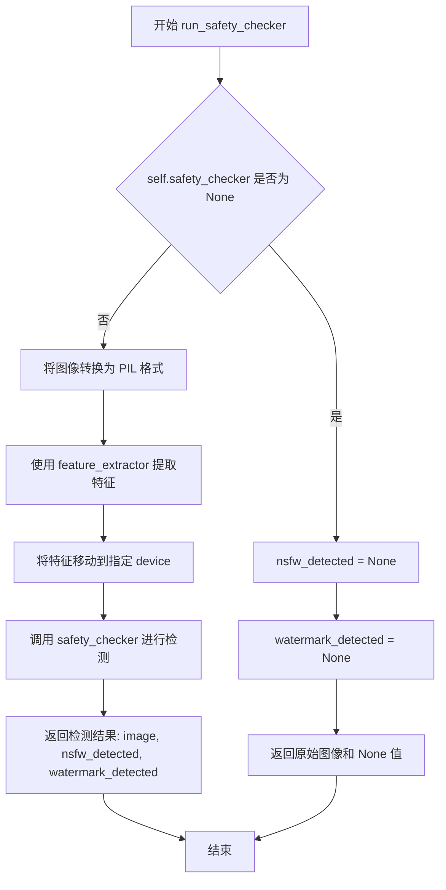

#### 带注释源码

```python
def run_safety_checker(self, image, device, dtype):
    """
    运行安全检查器，对生成的图像进行 NSFW 和水印检测。
    
    参数:
        image: 待检测的图像张量
        device: torch 设备，用于张量运算
        dtype: torch 数据类型，用于类型转换
        
    返回:
        包含处理后图像和检测结果的元组
    """
    # 检查安全检查器是否已配置
    if self.safety_checker is not None:
        # 1. 将 numpy/pytorch 图像转换为 PIL 图像
        # 2. 使用特征提取器提取 CLIP 特征
        # 3. 将特征张量移动到指定设备
        safety_checker_input = self.feature_extractor(
            self.numpy_to_pil(image),  # 图像格式转换
            return_tensors="pt"        # 返回 PyTorch 张量
        ).to(device)                   # 移动到目标设备
        
        # 调用安全检查器的 forward 方法进行内容检测
        # 参数:
        #   - images: 原始图像张量
        #   - clip_input: CLIP 模型的输入特征
        # 返回:
        #   - image: 处理后的图像（可能经过调整）
        #   - nsfw_detected: NSFW 检测结果
        #   - watermark_detected: 水印检测结果
        image, nsfw_detected, watermark_detected = self.safety_checker(
            images=image,
            clip_input=safety_checker_input.pixel_values.to(dtype=dtype),
        )
    else:
        # 安全检查器未配置时，返回 None 值
        nsfw_detected = None
        watermark_detected = None

    # 返回图像和检测结果元组
    return image, nsfw_detected, watermark_detected
```


### `IFPipeline.prepare_extra_step_kwargs`

该方法用于为调度器的 `step` 方法准备额外的关键字参数。由于不同调度器（如 DDPM、DDIM 等）具有不同的签名，该方法通过检查调度器是否接受 `eta` 和 `generator` 参数来动态构建参数字典，确保兼容性。

参数：

- `generator`：`torch.Generator | list[torch.Generator] | None`，随机数生成器，用于确保扩散过程的可重现性
- `eta`：`float`，DDIM 调度器中的噪声参数 η，对应 DDIM 论文中的 η 参数，取值范围应在 [0, 1] 之间

返回值：`dict`，包含额外参数的字典，可能包含 `eta` 和/或 `generator`，取决于调度器是否接受这些参数

#### 流程图

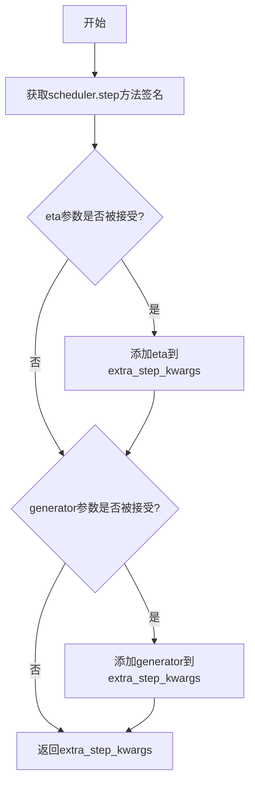

#### 带注释源码

```python
def prepare_extra_step_kwargs(self, generator, eta):
    # 准备调度器步骤的额外参数，因为并非所有调度器都具有相同的签名
    # eta (η) 仅与 DDIMScheduler 一起使用，对于其他调度器将被忽略
    # eta 对应 DDIM 论文中的 η：https://huggingface.co/papers/2010.02502
    # 取值应在 [0, 1] 之间

    # 检查调度器的 step 方法是否接受 eta 参数
    accepts_eta = "eta" in set(inspect.signature(self.scheduler.step).parameters.keys())
    
    # 初始化额外参数字典
    extra_step_kwargs = {}
    
    # 如果调度器接受 eta，则将其添加到参数字典中
    if accepts_eta:
        extra_step_kwargs["eta"] = eta

    # 检查调度器是否接受 generator 参数
    accepts_generator = "generator" in set(inspect.signature(self.scheduler.step).parameters.keys())
    
    # 如果调度器接受 generator，则将其添加到参数字典中
    if accepts_generator:
        extra_step_kwargs["generator"] = generator
    
    # 返回构建好的参数字典
    return extra_step_kwargs
```


### IFPipeline.check_inputs

该方法用于验证图像生成管道的输入参数有效性，确保用户提供的 prompt、callback_steps、negative_prompt 以及预计算的文本嵌入符合调用要求，防止因参数配置错误导致后续处理异常。

参数：

- `self`：`IFPipeline` 实例，当前 pipeline 对象本身
- `prompt`：`str | list[str] | None`，用户提供的文本提示，用于指导图像生成
- `callback_steps`：`int`，回调函数的调用频率，必须为正整数
- `negative_prompt`：`str | list[str] | None`，反向提示词，用于指导图像生成时避免的内容
- `prompt_embeds`：`torch.Tensor | None`，预计算的文本嵌入向量，可替代 prompt 直接传入
- `negative_prompt_embeds`：`torch.Tensor | None`，预计算的反向提示词嵌入向量

返回值：`None`，无返回值，该方法仅进行参数验证，验证失败时抛出 ValueError 异常

#### 流程图

```mermaid
flowchart TD
    A[开始 check_inputs] --> B{检查 callback_steps}
    B -->|为 None| C[抛出 ValueError]
    B -->|不为整数或 ≤ 0| D[抛出 ValueError]
    B -->|合法| E{prompt 和 prompt_embeds 同时存在?}
    E -->|是| F[抛出 ValueError: 只能传一个]
    E -->|否| G{prompt 和 prompt_embeds 都为 None?}
    G -->|是| H[抛出 ValueError: 至少提供一个]
    G -->|否| I{prompt 存在但类型不合法?}
    I -->|是| J[抛出 ValueError: 类型错误]
    I -->|否| K{negative_prompt 和 negative_prompt_embeds 同时存在?}
    K -->|是| L[抛出 ValueError: 只能传一个]
    K -->|否| M{prompt_embeds 和 negative_prompt_embeds 都存在?}
    M -->|否| N[验证通过，返回 None]
    M -->|是| O{两者形状相同?]
    O -->|否| P[抛出 ValueError: 形状不匹配]
    O -->|是| N
```

#### 带注释源码

```python
def check_inputs(
    self,
    prompt,                          # 用户输入的文本提示，支持字符串或字符串列表
    callback_steps,                  # 回调函数调用频率，必须为正整数
    negative_prompt=None,            # 可选的反向提示词
    prompt_embeds=None,              # 可选的预计算文本嵌入
    negative_prompt_embeds=None,    # 可选的预计算反向文本嵌入
):
    """
    验证 pipeline 输入参数的有效性。
    
    该方法检查以下约束：
    1. callback_steps 必须为正整数
    2. prompt 和 prompt_embeds 不能同时提供
    3. prompt 和 prompt_embeds 至少提供一个
    4. prompt 必须是 str 或 list 类型
    5. negative_prompt 和 negative_prompt_embeds 不能同时提供
    6. prompt_embeds 和 negative_prompt_embeds 形状必须一致
    """
    
    # -----------------------------------------------------------
    # 检查 1: callback_steps 验证
    # 必须是非 None 的正整数，用于控制推理过程中的回调频率
    # -----------------------------------------------------------
    if (callback_steps is None) or (
        callback_steps is not None and (not isinstance(callback_steps, int) or callback_steps <= 0)
    ):
        raise ValueError(
            f"`callback_steps` has to be a positive integer but is {callback_steps} of type"
            f" {type(callback_steps)}."
        )

    # -----------------------------------------------------------
    # 检查 2: prompt 和 prompt_embeds 互斥性验证
    # 两者不能同时提供，只能选择其中一种输入方式
    # -----------------------------------------------------------
    if prompt is not None and prompt_embeds is not None:
        raise ValueError(
            f"Cannot forward both `prompt`: {prompt} and `prompt_embeds`: {prompt_embeds}. Please make sure to"
            " only forward one of the two."
        )
    
    # -----------------------------------------------------------
    # 检查 3: 至少提供一个 prompt 输入
    # 用户必须通过 prompt 或 prompt_embeds 之一提供文本内容
    # -----------------------------------------------------------
    elif prompt is None and prompt_embeds is None:
        raise ValueError(
            "Provide either `prompt` or `prompt_embeds`. Cannot leave both `prompt` and `prompt_embeds` undefined."
        )
    
    # -----------------------------------------------------------
    # 检查 4: prompt 类型验证
    # 确保 prompt 符合预期的数据类型（字符串或字符串列表）
    # -----------------------------------------------------------
    elif prompt is not None and (not isinstance(prompt, str) and not isinstance(prompt, list)):
        raise ValueError(f"`prompt` has to be of type `str` or `list` but is {type(prompt)}")

    # -----------------------------------------------------------
    # 检查 5: negative_prompt 和 negative_prompt_embeds 互斥性
    # 与正向提示词类似，两者不能同时提供
    # -----------------------------------------------------------
    if negative_prompt is not None and negative_prompt_embeds is not None:
        raise ValueError(
            f"Cannot forward both `negative_prompt`: {negative_prompt} and `negative_prompt_embeds`:"
            f" {negative_prompt_embeds}. Please make sure to only forward one of the two."
        )

    # -----------------------------------------------------------
    # 检查 6: 嵌入向量形状一致性验证
    # 当同时提供正负向嵌入时，必须确保形状匹配以保证批处理一致性
    # -----------------------------------------------------------
    if prompt_embeds is not None and negative_prompt_embeds is not None:
        if prompt_embeds.shape != negative_prompt_embeds.shape:
            raise ValueError(
                "`prompt_embeds` and `negative_prompt_embeds` must have the same shape when passed directly, but"
                f" got: `prompt_embeds` {prompt_embeds.shape} != `negative_prompt_embeds`"
                f" {negative_prompt_embeds.shape}."
            )
```


### `IFPipeline.prepare_intermediate_images`

该方法用于在扩散模型的去噪过程开始前，准备中间图像（潜在空间噪声）。它根据指定的批次大小、通道数、高度和宽度生成初始随机噪声，并使用调度器的初始噪声标准差进行缩放，为后续的去噪迭代提供起点。

参数：

- `batch_size`：`int`，批处理大小，指定要生成的图像数量
- `num_channels`：`int`，图像的通道数，对应于潜在空间的通道数
- `height`：`int`，生成图像的高度（像素）
- `width`：`int`，生成图像的宽度（像素）
- `dtype`：`torch.dtype`，生成张量的数据类型（如 torch.float32）
- `device`：`torch.device`，生成张量所在的设备（如 CPU 或 CUDA）
- `generator`：`torch.Generator | list[torch.Generator] | None`，可选的随机数生成器，用于确保生成的可重复性

返回值：`torch.Tensor`，返回经过调度器初始噪声标准差缩放后的中间图像张量，形状为 `(batch_size, num_channels, height, width)`

#### 流程图

```mermaid
graph TD
    A[开始] --> B[计算shape: (batch_size, num_channels, height, width)]
    B --> C{检查generator是否为列表}
    C -->|是| D{generator列表长度是否等于batch_size}
    C -->|否| E[调用randn_tensor生成随机噪声]
    D -->|否| F[抛出ValueError异常]
    D -->|是| E
    E --> G[使用scheduler.init_noise_sigma缩放噪声]
    G --> H[返回中间图像张量]
    F --> I[结束]
    H --> I
```

#### 带注释源码

```python
def prepare_intermediate_images(self, batch_size, num_channels, height, width, dtype, device, generator):
    # 根据参数构建图像张量的形状元组
    shape = (batch_size, num_channels, height, width)
    
    # 如果传入的是生成器列表，则验证其长度是否与批处理大小匹配
    if isinstance(generator, list) and len(generator) != batch_size:
        raise ValueError(
            f"You have passed a list of generators of length {len(generator)}, but requested an effective batch"
            f" size of {batch_size}. Make sure the batch size matches the length of the generators."
        )

    # 使用randn_tensor生成指定形状的随机噪声张量
    # generator参数确保在需要时可以重现结果
    intermediate_images = randn_tensor(shape, generator=generator, device=device, dtype=dtype)

    # 根据调度器的初始噪声标准差对噪声进行缩放
    # 这是扩散模型去噪过程的重要预处理步骤
    intermediate_images = intermediate_images * self.scheduler.init_noise_sigma
    
    # 返回准备好的中间图像（潜在空间表示）
    return intermediate_images
```


### `IFPipeline._text_preprocessing`

该方法用于对输入的提示词（prompt）进行预处理，支持两种模式：简单的小写化和空格清理（默认模式），以及复杂的标题清理（通过 `_clean_caption` 方法实现）。它确保输入格式化为标准的文本列表，并验证必要的依赖库是否可用。

参数：

- `text`：混合类型（`str`、`list[str]` 或 `tuple[str]`），需要进行预处理的提示词文本或文本列表
- `clean_caption`：`bool`，是否执行深度清理（需要 `bs4` 和 `ftfy` 库支持），默认为 `False`

返回值：`list[str]`，返回处理后的字符串列表

#### 流程图

```mermaid
flowchart TD
    A[开始 _text_preprocessing] --> B{clean_caption 为 True 且 bs4 不可用?}
    B -- 是 --> C[记录警告并设置 clean_caption = False]
    B -- 否 --> D{clean_caption 为 True 且 ftfy 不可用?}
    D -- 是 --> E[记录警告并设置 clean_caption = False]
    D -- 否 --> F{text 不是 list 或 tuple?}
    F -- 是 --> G[将 text 包装为列表: text = [text]]
    F -- 否 --> H[继续]
    I[定义内部函数 process] --> J{clean_caption 为 True?}
    J -- 是 --> K[调用 _clean_caption 两次]
    J -- 否 --> L[执行 text.lower().strip()]
    K --> M[返回处理后的文本]
    L --> M
    G --> I
    H --> I
    M --> N[对列表中每个元素调用 process]
    O[返回结果列表] --> P[结束]
    N --> O
```

#### 带注释源码

```python
def _text_preprocessing(self, text, clean_caption=False):
    """
    对输入文本进行预处理，支持简单的空格清理或复杂的标题清理
    
    参数:
        text: 需要预处理的文本，可以是字符串、字符串列表或字符串元组
        clean_caption: 是否执行深度清理（需要 bs4 和 ftfy 库）
    
    返回:
        处理后的字符串列表
    """
    
    # 检查 clean_caption 模式所需的依赖库
    # 如果启用了 clean_caption 但缺少 bs4，则降级为 False
    if clean_caption and not is_bs4_available():
        logger.warning(BACKENDS_MAPPING["bs4"][-1].format("Setting `clean_caption=True`"))
        logger.warning("Setting `clean_caption` to False...")
        clean_caption = False

    # 如果启用了 clean_caption 但缺少 ftfy，则降级为 False
    if clean_caption and not is_ftfy_available():
        logger.warning(BACKENDS_MAPPING["ftfy"][-1].format("Setting `clean_caption=True`"))
        logger.warning("Setting `clean_caption` to False...")
        clean_caption = False

    # 统一将输入转换为列表格式，便于后续统一处理
    if not isinstance(text, (tuple, list)):
        text = [text]

    # 定义内部处理函数，对单个文本进行实际清理操作
    def process(text: str):
        if clean_caption:
            # 执行深度清理（调用两次以确保彻底清理）
            text = self._clean_caption(text)
            text = self._clean_caption(text)
        else:
            # 简单处理：转小写并去除首尾空格
            text = text.lower().strip()
        return text

    # 对列表中每个文本元素应用处理函数
    return [process(t) for t in text]
```


### `IFPipeline._clean_caption`

该方法用于深度清理和规范化输入的文本提示词（caption），通过移除URL、HTML标签、特殊符号、CJK字符、格式化文本等多类噪声内容，使其更适合用于图像生成模型的文本编码。

参数：

- `caption`：`str`，需要清理的原始文本提示词

返回值：`str`，清理并规范化后的文本提示词

#### 流程图

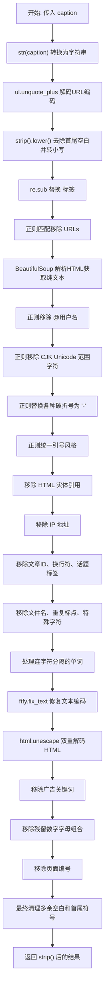

#### 带注释源码

```python
def _clean_caption(self, caption):
    """
    清理并规范化输入的文本提示词，移除噪声内容
    
    处理流程：
    1. 基本转换：字符串化、URL解码、转小写
    2. URL移除：匹配 http/https/www 开头的链接
    3. HTML解析：使用 BeautifulSoup 提取纯文本
    4. 用户名移除：匹配 @username 格式
    5. CJK字符移除：移除各类中日韩统一表意文字
    6. 符号规范化：破折号、引号统一格式
    7. HTML实体解码：移除 &quot; &amp; 等实体
    8. 格式清理：移除IP、编号、标签、文件名等
    9. 文本修复：使用 ftfy 修复编码问题
    10. 广告过滤：移除 shipping、download 等营销词
    """
    # ========== 基础转换 ==========
    caption = str(caption)                          # 确保为字符串类型
    caption = ul.unquote_plus(caption)              # 解码 URL 编码 (如 %20 -> 空格)
    caption = caption.strip().lower()              # 去除首尾空白，转为小写
    
    # ========== 标签处理 ==========
    caption = re.sub("<person>", "person", caption)  # 统一人物标签
    
    # ========== URL 移除 ==========
    # 匹配 http:// 或 https:// 开头的 URL
    caption = re.sub(
        r"\b((?:https?:(?:\/{1,3}|[a-zA-Z0-9%])|[a-zA-Z0-9.\-]+[.](?:com|co|ru|net|org|edu|gov|it)[\w/-]*\b\/?(?!@)))",  # noqa
        "",
        caption,
    )
    # 匹配 www. 开头的 URL
    caption = re.sub(
        r"\b((?:www:(?:\/{1,3}|[a-zA-Z0-9%])|[a-zA-Z0-9.\-]+[.](?:com|co|ru|net|org|edu|gov|it)[\w/-]*\b\/?(?!@)))",  # noqa
        "",
        caption,
    )
    
    # ========== HTML 解析 ==========
    # 使用 BeautifulSoup 提取纯文本，移除所有 HTML 标签
    caption = BeautifulSoup(caption, features="html.parser").text
    
    # ========== 用户名移除 ==========
    # 移除 @username 格式的社交媒体用户名
    caption = re.sub(r"@[\w\d]+\b", "", caption)
    
    # ========== CJK 字符移除 ==========
    # 移除各类中日韩统一表意文字、CJK 扩展字符
    # 31C0—31EF CJK Strokes (CJK 笔画)
    caption = re.sub(r"[\u31c0-\u31ef]+", "", caption)
    # 31F0—31FF Katakana Phonetic Extensions (片假名音扩展)
    caption = re.sub(r"[\u31f0-\u31ff]+", "", caption)
    # 3200—32FF Enclosed CJK Letters and Months (带圈CJK字母)
    caption = re.sub(r"[\u3200-\u32ff]+", "", caption)
    # 3300—33FF CJK Compatibility (CJK 兼容性)
    caption = re.sub(r"[\u3300-\u33ff]+", "", caption)
    # 3400—4DBF CJK Unified Ideographs Extension A (CJK 统一表意文字扩展A)
    caption = re.sub(r"[\u3400-\u4dbf]+", "", caption)
    # 4DC0—4DFF Yijing Hexagram Symbols (易经六十四卦符号)
    caption = re.sub(r"[\u4dc0-\u4dff]+", "", caption)
    # 4E00—9FFF CJK Unified Ideographs (CJK 统一表意文字)
    caption = re.sub(r"[\u4e00-\u9fff]+", "", caption)
    
    # ========== 破折号规范化 ==========
    # 将各类 Unicode 破折号统一替换为 ASCII 短横线
    caption = re.sub(
        r"[\u002D\u058A\u05BE\u1400\u1806\u2010-\u2015\u2E17\u2E1A\u2E3A\u2E3B\u2E40\u301C\u3030\u30A0\uFE31\uFE32\uFE58\uFE63\uFF0D]+",  # noqa
        "-",
        caption,
    )
    
    # ========== 引号规范化 ==========
    # 将各类引号统一为双引号
    caption = re.sub(r"[`´«»""¨]", '"', caption)
    # 将各类单引号统一为 ASCII 单引号
    caption = re.sub(r"['']", "'", caption)
    
    # ========== HTML 实体移除 ==========
    caption = re.sub(r"&quot;?", "", caption)  # 移除 &quot; 或 &quot
    caption = re.sub(r"&amp", "", caption)    # 移除 &amp
    
    # ========== IP 地址移除 ==========
    caption = re.sub(r"\d{1,3}\.\d{1,3}\.\d{1,3}\.\d{1,3}", " ", caption)
    
    # ========== 文章编号移除 ==========
    # 移除形如 "12:45 " 的文章结尾编号
    caption = re.sub(r"\d:\d\d\s+$", "", caption)
    
    # ========== 换行符处理 ==========
    # 将转义换行符替换为空格
    caption = re.sub(r"\\n", " ", caption)
    
    # ========== 话题标签移除 ==========
    # 移除 #123 格式的短标签
    caption = re.sub(r"#\d{1,3}\b", "", caption)
    # 移除 #12345... 格式的长数字标签
    caption = re.sub(r"#\d{5,}\b", "", caption)
    # 移除纯数字长串 (6位以上)
    caption = re.sub(r"\b\d{6,}\b", "", caption)
    
    # ========== 文件名移除 ==========
    # 移除各类图片、文档、媒体文件名
    caption = re.sub(r"[\S]+\.(?:png|jpg|jpeg|bmp|webp|eps|pdf|apk|mp4)", "", caption)
    
    # ========== 重复标点清理 ==========
    caption = re.sub(r"[\"']{2,}", r'"', caption)  # """AUSVERKAUFT"" -> """
    caption = re.sub(r"[\.]{2,}", r" ", caption)    # ... -> 空格
    
    # ========== 特殊字符清理 ==========
    # 使用预定义的正则移除各类特殊标点符号
    caption = re.sub(self.bad_punct_regex, r" ", caption)  # ***AUSVERKAUFT***
    # 移除 " . " 格式的孤立点号
    caption = re.sub(r"\s+\.\s+", r" ", caption)
    
    # ========== 连字符处理 ==========
    # 如果连字符或下划线超过3个，将其全部替换为空格
    # 例: "this-is-my-cute-cat" -> "this is my cute cat"
    regex2 = re.compile(r"(?:\-|\_)")
    if len(re.findall(regex2, caption)) > 3:
        caption = re.sub(regex2, " ", caption)
    
    # ========== 文本编码修复 ==========
    # 使用 ftfy 修复常见的文本编码错误
    caption = ftfy.fix_text(caption)
    # 双重 HTML 解码，处理双重转义情况
    caption = html.unescape(html.unescape(caption))
    
    # ========== 广告/营销词移除 ==========
    # 移除各类广告关键词
    caption = re.sub(r"\b[a-zA-Z]{1,3}\d{3,15}\b", "", caption)   # 例: jc6640
    caption = re.sub(r"\b[a-zA-Z]+\d+[a-zA-Z]+\b", "", caption)   # 例: jc6640vc
    caption = re.sub(r"\b\d+[a-zA-Z]+\d+\b", "", caption)         # 例: 6640vc231
    
    caption = re.sub(r"(worldwide\s+)?(free\s+)?shipping", "", caption)  # 邮递广告
    caption = re.sub(r"(free\s)?download(\sfree)?", "", caption)          # 下载广告
    caption = re.sub(r"\bclick\b\s(?:for|on)\s\w+", "", caption)          # 点击广告
    caption = re.sub(r"\b(?:png|jpg|jpeg|bmp|webp|eps|pdf|apk|mp4)(\simage[s]?)?", "", caption)  # 图片广告
    caption = re.sub(r"\bpage\s+\d+\b", "", caption)                       # 页码
    
    # ========== 复杂数字字母组合移除 ==========
    caption = re.sub(r"\b\d*[a-zA-Z]+\d+[a-zA-Z]+\d+[a-zA-Z\d]*\b", r" ", caption)  # j2d1a2a...
    
    # ========== 尺寸标注移除 ==========
    # 移除 1920x1080 或 1920×1080 等尺寸格式
    caption = re.sub(r"\b\d+\.?\d*[xх×]\d+\.?\d*\b", "", caption)
    
    # ========== 格式规范化 ==========
    caption = re.sub(r"\b\s+\:\s+", r": ", caption)      # 修复 " key : value" -> "key: value"
    caption = re.sub(r"(\D[,\./])\b", r"\1 ", caption)  # 在句末符号后加空格
    caption = re.sub(r"\s+", " ", caption)              # 合并多余空格
    
    # ========== 首尾清理 ==========
    caption.strip()  # 移除首尾空白 (注意：结果未重新赋值)
    
    # 移除首尾引号包裹
    caption = re.sub(r"^[\"\']([\w\W]+)[\"\']$", r"\1", caption)
    # 移除首部的特殊字符
    caption = re.sub(r"^[\'\_,\-\:;]", r"", caption)
    # 移除尾部的特殊字符
    caption = re.sub(r"[\'\_,\-\:\-\+]$", r"", caption)
    # 移除以点开头的短词
    caption = re.sub(r"^\.\S+$", "", caption)
    
    # 返回最终清理结果
    return caption.strip()
```


### IFPipeline.__call__

这是 DeepFloyd IF 图像生成管道的主入口方法，负责接收文本提示并通过去噪扩散过程生成相应图像。该方法整合了文本编码、U-Net 去噪、图像后处理、安全检查和水印处理等完整流程，支持分类器自由引导（Classifier-Free Guidance）以提升生成质量。

参数：

- `prompt`：`str | list[str] | None`，用于指导图像生成的文本提示。若未定义，则必须传递 `prompt_embeds`
- `num_inference_steps`：`int`，去噪步数，默认为 100。更多步数通常能生成更高质量的图像，但推理速度会更慢
- `timesteps`：`list[int] | None`，去噪过程使用的自定义时间步。若未定义，则使用等间距的 `num_inference_steps` 个时间步，必须按降序排列
- `guidance_scale`：`float`，分类器自由扩散引导中的引导尺度，默认为 7.0。参考 [Imagen Paper](https://huggingface.co/papers/2205.11487)，当 `guidance_scale > 1` 时启用引导，较高的值会使生成的图像更紧密地联系文本提示
- `negative_prompt`：`str | list[str] | None`，不希望出现的提示内容，用于引导图像生成。若未定义，则必须传递 `negative_prompt_embeds`
- `num_images_per_prompt`：`int | None`，每个提示生成的图像数量，默认为 1
- `height`：`int | None`，生成图像的高度（像素），默认为 `self.unet.config.sample_size`
- `width`：`int | None`，生成图像的宽度（像素），默认为 `self.unet.config.sample_size`
- `eta`：`float`，DDIM 论文中的参数 η，默认为 0.0。仅适用于 DDIMScheduler
- `generator`：`torch.Generator | list[torch.Generator] | None`，一个或多个 PyTorch 随机数生成器，用于确保生成的可重复性
- `prompt_embeds`：`torch.Tensor | None`，预生成的文本嵌入，可用于轻松调整文本输入（如提示权重）
- `negative_prompt_embeds`：`torch.Tensor | None`，预生成的负面文本嵌入
- `output_type`：`str | None`，生成图像的输出格式，默认为 `"pil"`，可选 `"pil"` 或 `"pt"`
- `return_dict`：`bool`，是否返回 `IFPipelineOutput` 而不是普通元组，默认为 True
- `callback`：`Callable[[int, int, torch.Tensor], None] | None`，每 `callback_steps` 步调用的回调函数，签名为 `callback(step: int, timestep: int, latents: torch.Tensor)`
- `callback_steps`：`int`，调用回调函数的频率，默认为 1
- `clean_caption`：`bool`，是否在创建嵌入前清理标题，默认为 True。需要安装 `beautifulsoup4` 和 `ftfy`
- `cross_attention_kwargs`：`dict[str, Any] | None`，传递给 AttentionProcessor 的参数字典

返回值：`IFPipelineOutput | tuple`，当 `return_dict` 为 True 时返回 `IFPipelineOutput`（包含 images、nsfw_detected、watermark_detected 字段），否则返回元组 `(image, nsfw_detected, watermark_detected)`

#### 流程图

```mermaid
flowchart TD
    A[开始 __call__] --> B[1. 检查输入参数 check_inputs]
    B --> C[2. 定义调用参数: height, width, batch_size, device]
    C --> D{guidance_scale > 1.0?}
    D -->|Yes| E[设置 do_classifier_free_guidance = True]
    D -->|No| F[设置 do_classifier_free_guidance = False]
    E --> G[3. 编码提示词 encode_prompt]
    F --> G
    G --> H{do_classifier_free_guidance?}
    H -->|Yes| I[prompt_embeds = torch.cat([negative_prompt_embeds, prompt_embeds])]
    H -->|No| J[4. 准备时间步 timesteps]
    I --> J
    J --> K{提供 timesteps?}
    K -->|Yes| L[scheduler.set_timesteps 使用自定义 timesteps]
    K -->|No| M[scheduler.set_timesteps 使用 num_inference_steps]
    L --> N[准备中间图像 prepare_intermediate_images]
    M --> N
    N --> O[准备额外步骤参数 prepare_extra_step_kwargs]
    O --> P{text_encoder_offload_hook 存在?}
    P -->|Yes| Q[offload text_encoder]
    P -->|No| R[7. 去噪循环]
    Q --> R
    R --> S[遍历 timesteps]
    S --> T[构建 model_input]
    T --> U[scheduler.scale_model_input]
    U --> V[UNet 预测噪声 noise_pred]
    V --> W{do_classifier_free_guidance?}
    W -->|Yes| X[分类器自由引导计算]
    W -->|No| Y[跳过引导]
    X --> Z[scheduler.step 更新中间图像]
    Y --> Z
    Z --> AA{执行回调条件?}
    AA -->|Yes| AB[调用 callback]
    AA -->|No| AC{还有更多 timesteps?}
    AB --> AC
    AC -->|Yes| S
    AC -->|No| AD[XLA mark_step]
    AD --> AE{output_type == 'pil'?}
    AE -->|Yes| AF[8. 后处理: clamp, permute, numpy]
    AE -->|No| AG{output_type == 'pt'?}
    AF --> AH[9. 运行安全检查 run_safety_checker]
    AH --> AI[10. 转换为 PIL 图像]
    AI --> AJ[11. 应用水印]
    AG --> AK[offload unet]
    AK --> AL[其他类型后处理]
    AL --> AM[运行安全检查]
    AJ --> AM
    AM --> AN[maybe_free_model_hooks]
    AN --> AO{return_dict?}
    AO -->|Yes| AP[返回 IFPipelineOutput]
    AO -->|No| AQ[返回 tuple]
    AP --> AR[结束]
    AQ --> AR
```

#### 带注释源码

```python
@torch.no_grad()
@replace_example_docstring(EXAMPLE_DOC_STRING)
def __call__(
    self,
    prompt: str | list[str] = None,
    num_inference_steps: int = 100,
    timesteps: list[int] = None,
    guidance_scale: float = 7.0,
    negative_prompt: str | list[str] | None = None,
    num_images_per_prompt: int | None = 1,
    height: int | None = None,
    width: int | None = None,
    eta: float = 0.0,
    generator: torch.Generator | list[torch.Generator] | None = None,
    prompt_embeds: torch.Tensor | None = None,
    negative_prompt_embeds: torch.Tensor | None = None,
    output_type: str | None = "pil",
    return_dict: bool = True,
    callback: Callable[[int, int, torch.Tensor], None] | None = None,
    callback_steps: int = 1,
    clean_caption: bool = True,
    cross_attention_kwargs: dict[str, Any] | None = None,
):
    """
    Function invoked when calling the pipeline for generation.
    """
    # 1. Check inputs. Raise error if not correct
    # 验证输入参数的合法性，包括 prompt 和 prompt_embeds 不能同时提供等
    self.check_inputs(prompt, callback_steps, negative_prompt, prompt_embeds, negative_prompt_embeds)

    # 2. Define call parameters
    # 从 UNet 配置中获取默认的图像尺寸
    height = height or self.unet.config.sample_size
    width = width or self.unet.config.sample_size

    # 确定批处理大小：根据 prompt 类型或预计算的 prompt_embeds
    if prompt is not None and isinstance(prompt, str):
        batch_size = 1
    elif prompt is not None and isinstance(prompt, list):
        batch_size = len(prompt)
    else:
        batch_size = prompt_embeds.shape[0]

    # 获取执行设备（CPU/GPU）
    device = self._execution_device

    # 这里 `guidance_scale` 与 Imagen 论文中的引导权重 w 类似
    # guidance_scale = 1 表示不使用分类器自由引导
    do_classifier_free_guidance = guidance_scale > 1.0

    # 3. Encode input prompt
    # 编码输入的文本提示为嵌入向量
    prompt_embeds, negative_prompt_embeds = self.encode_prompt(
        prompt,
        do_classifier_free_guidance,
        num_images_per_prompt=num_images_per_prompt,
        device=device,
        negative_prompt=negative_prompt,
        prompt_embeds=prompt_embeds,
        negative_prompt_embeds=negative_prompt_embeds,
        clean_caption=clean_caption,
    )

    # 如果使用分类器自由引导，将无条件嵌入和文本嵌入拼接
    if do_classifier_free_guidance:
        prompt_embeds = torch.cat([negative_prompt_embeds, prompt_embeds])

    # 4. Prepare timesteps
    # 设置调度器的时间步
    if timesteps is not None:
        self.scheduler.set_timesteps(timesteps=timesteps, device=device)
        timesteps = self.scheduler.timesteps
        num_inference_steps = len(timesteps)
    else:
        self.scheduler.set_timesteps(num_inference_steps, device=device)
        timesteps = self.scheduler.timesteps

    # 处理调度器的起始索引（部分调度器需要）
    if hasattr(self.scheduler, "set_begin_index"):
        self.scheduler.set_begin_index(0)

    # 5. Prepare intermediate images
    # 准备初始的中间图像（噪声）
    intermediate_images = self.prepare_intermediate_images(
        batch_size * num_images_per_prompt,  # 总批处理大小
        self.unet.config.in_channels,          # UNet 输入通道数
        height,
        width,
        prompt_embeds.dtype,
        device,
        generator,
    )

    # 6. Prepare extra step kwargs. TODO: Logic should ideally just be moved out of the pipeline
    # 为调度器步骤准备额外的参数（如 eta 和 generator）
    extra_step_kwargs = self.prepare_extra_step_kwargs(generator, eta)

    # HACK: see comment in `enable_model_cpu_offload`
    # 处理模型 offload 钩子
    if hasattr(self, "text_encoder_offload_hook") and self.text_encoder_offload_hook is not None:
        self.text_encoder_offload_hook.offload()

    # 7. Denoising loop
    # 计算预热步数（用于进度条显示）
    num_warmup_steps = len(timesteps) - num_inference_steps * self.scheduler.order
    with self.progress_bar(total=num_inference_steps) as progress_bar:
        for i, t in enumerate(timesteps):
            # 如果使用分类器自由引导，将中间图像复制两份（无条件 + 条件）
            model_input = (
                torch.cat([intermediate_images] * 2) if do_classifier_free_guidance else intermediate_images
            )
            # 根据调度器缩放模型输入
            model_input = self.scheduler.scale_model_input(model_input, t)

            # 预测噪声残差
            noise_pred = self.unet(
                model_input,
                t,
                encoder_hidden_states=prompt_embeds,
                cross_attention_kwargs=cross_attention_kwargs,
                return_dict=False,
            )[0]

            # 执行分类器自由引导
            if do_classifier_free_guidance:
                # 分离无条件预测和文本条件预测
                noise_pred_uncond, noise_pred_text = noise_pred.chunk(2)
                noise_pred_uncond, _ = noise_pred_uncond.split(model_input.shape[1], dim=1)
                noise_pred_text, predicted_variance = noise_pred_text.split(model_input.shape[1], dim=1)
                # 计算引导后的噪声预测
                noise_pred = noise_pred_uncond + guidance_scale * (noise_pred_text - noise_pred_uncond)
                # 拼接预测的方差
                noise_pred = torch.cat([noise_pred, predicted_variance], dim=1)

            # 处理方差类型（某些调度器不使用学习的方差）
            if self.scheduler.config.variance_type not in ["learned", "learned_range"]:
                noise_pred, _ = noise_pred.split(model_input.shape[1], dim=1)

            # 计算上一步的噪声样本：x_t -> x_t-1
            intermediate_images = self.scheduler.step(
                noise_pred, t, intermediate_images, **extra_step_kwargs, return_dict=False
            )[0]

            # 调用回调函数（如果提供）
            if i == len(timesteps) - 1 or ((i + 1) > num_warmup_steps and (i + 1) % self.scheduler.order == 0):
                progress_bar.update()
                if callback is not None and i % callback_steps == 0:
                    callback(i, t, intermediate_images)

            # XLA 设备支持：标记执行步骤
            if XLA_AVAILABLE:
                xm.mark_step()

    # 最终生成的图像
    image = intermediate_images

    # 根据输出类型进行处理
    if output_type == "pil":
        # 8. Post-processing: 将图像从 [-1,1] 归一化到 [0,1]，然后转换为 numpy
        image = (image / 2 + 0.5).clamp(0, 1)
        image = image.cpu().permute(0, 2, 3, 1).float().numpy()

        # 9. Run safety checker: 检查 NSFW 和水印
        image, nsfw_detected, watermark_detected = self.run_safety_checker(image, device, prompt_embeds.dtype)

        # 10. Convert to PIL: 转换为 PIL 图像
        image = self.numpy_to_pil(image)

        # 11. Apply watermark: 应用水印
        if self.watermarker is not None:
            image = self.watermarker.apply_watermark(image, self.unet.config.sample_size)
    elif output_type == "pt":
        # 返回 PyTorch 张量，不进行后处理
        nsfw_detected = None
        watermark_detected = None

        # Offload UNet
        if hasattr(self, "unet_offload_hook") and self.unet_offload_hook is not None:
            self.unet_offload_hook.offload()
    else:
        # 其他输出类型（numpy）的处理
        # 8. Post-processing
        image = (image / 2 + 0.5).clamp(0, 1)
        image = image.cpu().permute(0, 2, 3, 1).float().numpy()

        # 9. Run safety checker
        image, nsfw_detected, watermark_detected = self.run_safety_checker(image, device, prompt_embeds.dtype)

    # Offload all models: 释放所有模型的钩子
    self.maybe_free_model_hooks()

    # 返回结果
    if not return_dict:
        return (image, nsfw_detected, watermark_detected)

    return IFPipelineOutput(images=image, nsfw_detected=nsfw_detected, watermark_detected=watermark_detected)
```

## 关键组件


### IFPipeline

DeepFloyd IF图像生成的主扩散管道类，继承自DiffusionPipeline和StableDiffusionLoraLoaderMixin，整合了T5文本编码器、UNet2DConditionModel和DDPMScheduler，支持文本到图像生成、分类器自由引导、水印添加和安全检查。

### encode_prompt

将文本提示编码为文本编码器的隐藏状态。支持分类器自由引导（CFG），处理正面和负面提示，生成文本嵌入用于后续的图像生成过程。支持批量生成和提示嵌入的预生成。

### __call__

管道的主调用方法，执行完整的文本到图像生成流程。包含去噪循环、噪声预测、分类器自由引导应用、调度器步进、回调处理、图像后处理（归一化、PIL转换）、安全检查和水印应用。支持自定义推理步数、引导 scale、生成器等参数。

### prepare_intermediate_images

使用randn_tensor生成随机噪声张量作为去噪过程的初始中间图像。根据批大小、通道数、高度和宽度创建张量，并使用调度器的初始噪声标准差进行缩放。

### run_safety_checker

运行安全检查器以检测NSFW内容和数字水印。如果配置了安全检查器，使用feature_extractor处理图像并调用safety_checker进行检测。返回处理后的图像和检测结果标志。

### _text_preprocessing

文本预处理管道，支持可选的clean_caption模式。检查依赖库（bs4和ftfy）的可用性，将文本转换为小写并清理。对于干净模式，调用_clean_caption进行深度清理。

### _clean_caption

深度文本清理方法，执行大量正则表达式操作清理caption。移除URL、HTML标签、特殊Unicode字符、CJK字符、数字ID、文件名、社交媒体标签等。使用ftfy修复文本编码问题，最终返回清理后的文本。

### check_inputs

验证输入参数的合法性。检查callback_steps为正整数，确保prompt和prompt_embeds不同时提供，验证negative_prompt和negative_prompt_embeds的关系，检查嵌入维度匹配。

### prepare_extra_step_kwargs

准备调度器额外的步进参数。通过inspect检查调度器step方法支持的参数（如eta和generator），返回包含这些参数的字典供调度器使用。

### IFSafetyChecker

安全检查模块，用于检测生成的图像是否包含不当内容（NSFW）和水印。集成在管道的后处理阶段。

### IFWatermarker

数字水印模块，用于在生成的图像上添加不可见水印以追踪图像来源。通过apply_watermark方法应用水印。

### XLA支持

通过torch_xla实现TPU/XLA加速支持。检测XLA可用性并在去噪循环中使用xm.mark_step()进行设备同步，提高在TPU上的性能。

### 模型CPU卸载

通过model_cpu_offload_seq定义卸载顺序（text_encoder->unet），以及_exclude_from_cpu_offload排除列表（watermarker），实现内存优化的模型CPU卸载功能。

### 可选组件机制

通过_optional_components列表管理可选模块（tokenizer, text_encoder, safety_checker, feature_extractor, watermarker），允许在部分组件缺失时仍能实例化管道。


## 问题及建议


### 已知问题

-   **方法过长且职责不单一**：`encode_prompt` 方法包含约200行代码，混合了文本预处理、tokenization、编码和guidance处理等多种职责，难以维护和测试。
-   **正则表达式重复编译**：`bad_punct_regex` 在类级别编译，但 `_clean_caption` 方法中大量使用 `re.sub()` 且每次调用都重新编译正则表达式（如 `regex2`），影响性能。
-   **魔法数字和硬编码值**：代码中存在多个硬编码值（如 `max_length = 77`、`num_inference_steps = 100`、`guidance_scale = 7.0`），缺乏配置灵活性。
-   **代码重复**：在 `__call__` 方法中，处理 `output_type == "pil"` 和 `else` 分支时，有几乎相同的图像后处理和安全检查逻辑（代码行303-308和322-327）。
-   **类型提示不够精确**：部分参数使用 `Any` 类型（如 `callback`），且缺少对一些复杂参数结构的详细类型定义。
-   **冗余的装饰器**：`__call__` 方法同时使用了 `@torch.no_grad()` 装饰器和 `with self.progress_bar(...)` 上下文管理器，可能导致不必要的性能开销。
-   **潜在的内存问题**：在 `encode_prompt` 中，`untruncated_ids` 的计算用于警告日志，但会消耗内存进行不必要的tokenization。
-   **错误处理不完整**：`check_inputs` 方法未检查 `prompt_embeds` 和 `negative_prompt_embeds` 的设备兼容性，且 `run_safety_checker` 的错误处理较为简单。

### 优化建议

-   **重构大型方法**：将 `encode_prompt` 拆分为独立方法，如 `_tokenize_text`、`_encode_text_embeddings`、`_prepare_unconditional_embeddings`，每个方法负责单一职责。
-   **预编译正则表达式**：将 `_clean_caption` 中使用的所有正则表达式移到类级别或模块级别预编译，减少运行时开销。
-   **提取配置常量**：将硬编码值提取为类属性或配置文件，如 `DEFAULT_MAX_LENGTH = 77`、`DEFAULT_NUM_INFERENCE_STEPS = 100`。
-   **消除代码重复**：提取 `post_process_images` 公共方法处理图像后处理和安全检查逻辑，复用于不同 `output_type` 分支。
-   **改进类型提示**：使用 `Protocol` 或泛型定义更精确的回调函数类型，明确 `prompt_embeds` 等张量的形状约束。
-   **优化内存使用**：添加条件判断，仅在需要日志警告时才计算 `untruncated_ids`。
-   **增强错误处理**：在 `check_inputs` 中添加设备兼容性检查，完善 `run_safety_checker` 的异常捕获逻辑。
-   **添加缓存机制**：对于相同的 `prompt`，考虑缓存 `prompt_embeds` 以避免重复编码。

## 其它


### 设计目标与约束

**设计目标**：实现 DeepFloyd IF 文本到图像生成管道，支持通过 T5 文本编码器将文本提示转换为图像，具备安全检查和水印功能。

**核心约束**：
- T5 文本编码器最大序列长度为 77（尽管 T5 可以处理更长序列）
- 仅支持 PyTorch 后端
- 安全检查器和水印为可选组件
- 支持分类器自由引导（Classifier-Free Guidance）

### 错误处理与异常设计

**输入验证**：
- `check_inputs` 方法验证 `callback_steps` 必须为正整数
- 验证 `prompt` 和 `prompt_embeds` 不能同时提供
- 验证 `negative_prompt` 和 `negative_prompt_embeds` 不能同时提供
- 验证 `prompt_embeds` 和 `negative_prompt_embeds` 形状必须一致
- 验证 `prompt` 类型必须为 `str` 或 `list`

**运行时异常**：
- 初始化时若提供 `safety_checker` 但未提供 `feature_extractor` 抛出 `ValueError`
- `prepare_intermediate_images` 验证生成器列表长度与批次大小匹配
- `encode_prompt` 验证 `negative_prompt` 批次大小与 `prompt` 一致

**警告处理**：
- 未启用安全检查器时发出警告
- 文本被截断时发出警告
- 缺少可选依赖（bs4, ftfy）时降级处理

### 数据流与状态机

**主生成流程**：
1. 输入验证（check_inputs）
2. 编码提示词（encode_prompt）→ 生成 prompt_embeds 和 negative_prompt_embeds
3. 准备时间步（scheduler.set_timesteps）
4. 准备中间图像（prepare_intermediate_images）
5. 去噪循环（迭代 timesteps）：
   - 拼接条件/无条件输入
   - UNet 预测噪声
   - 执行分类器自由引导
   - 调度器步骤更新
6. 后处理（归一化、类型转换）
7. 安全检查（run_safety_checker）
8. 水印应用（watermarker）
9. 模型卸载

**条件分支**：
- `output_type="pil"`：完整后处理流程
- `output_type="pt"`：仅卸载模型，不进行后处理
- 其他类型：部分后处理，无 PIL 转换

### 外部依赖与接口契约

**必需的外部模型组件**：
- `T5Tokenizer` / `T5EncoderModel`：文本编码
- `UNet2DConditionModel`：去噪网络
- `DDPMScheduler`：噪声调度器

**可选组件**：
- `CLIPImageProcessor` (feature_extractor)：用于安全检查
- `IFSafetyChecker`：NSFW 检测
- `IFWatermarker`：水印添加

**可选依赖库**：
- `beautifulsoup4`：用于 clean_caption=True 时的 HTML 清理
- `ftfy`：用于修复损坏的文本编码
- `torch_xla`：用于 XLA 设备加速

**公共接口**：
- `IFPipeline.from_pretrained()`：从预训练模型加载
- `encode_prompt()`：独立编码提示词
- `__call__()`：主生成方法
- 支持 LoRA 微调（通过 StableDiffusionLoraLoaderMixin）

### 关键组件信息

| 组件名称 | 类型 | 描述 |
|---------|------|------|
| tokenizer | T5Tokenizer | T5 文本分词器 |
| text_encoder | T5EncoderModel | T5 文本编码器生成嵌入 |
| unet | UNet2DConditionModel | 条件 UNet 去噪模型 |
| scheduler | DDPMScheduler | DDPM 噪声调度器 |
| safety_checker | IFSafetyChecker | NSFW 内容检测器 |
| feature_extractor | CLIPImageProcessor | CLIP 图像特征提取器 |
| watermarker | IFWatermarker | 图像水印添加器 |

### 潜在技术债务与优化空间

1. **硬编码值**：max_length=77 硬编码在 encode_prompt 中，应从配置读取
2. **TODO 注释**：prepare_extra_step_kwargs 中有 TODO，逻辑应移出管道
3. **HACK 注释**：enable_model_cpu_offload 相关存在 HACK，需重构
4. **重复代码**：_text_preprocessing 中 _clean_caption 被调用两次（可能是疏漏）
5. **正则表达式编译**：bad_punct_regex 在类级别编译但可能未充分利用
6. **设备管理**：多处使用 self._execution_device，应统一管理
7. **类型注解**：部分参数使用 Union 而非 | 语法（Python 3.10+）

### 配置与常量

- `model_cpu_offload_seq = "text_encoder->unet"`：CPU 卸载顺序
- `_exclude_from_cpu_offload = ["watermarker"]`：水印器不参与 CPU 卸载
- `_optional_components`：可选组件列表
- `XLA_AVAILABLE`：XLA 加速可用性标志
</content]
    