# `diffusers\src\diffusers\pipelines\deepfloyd_if\pipeline_if_img2img.py` 详细设计文档

DeepFloyd IF图像到图像（Img2Img）扩散管道实现，基于T5文本编码器进行提示编码，包含图像预处理、去噪循环、后处理（安全检查、水印）等完整流程，支持Lora加载和模型CPU卸载。

## 整体流程

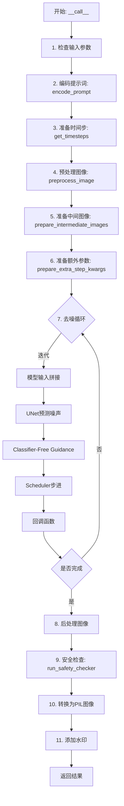

## 类结构

```
DiffusionPipeline (基类)
├── StableDiffusionLoraLoaderMixin (Lora加载混入)
└── IFImg2ImgPipeline (主实现类)
    ├── IFImg2ImgPipeline.encode_prompt
    ├── IFImg2ImgPipeline.run_safety_checker
    ├── IFImg2ImgPipeline.check_inputs
    ├── IFImg2ImgPipeline._text_preprocessing
    ├── IFImg2ImgPipeline._clean_caption
    ├── IFImg2ImgPipeline.preprocess_image
    ├── IFImg2ImgPipeline.get_timesteps
    ├── IFImg2ImgPipeline.prepare_intermediate_images
    └── IFImg2ImgPipeline.__call__
```

## 全局变量及字段


### `XLA_AVAILABLE`
    
标识XLA（加速线性代数）是否在当前环境中可用

类型：`bool`
    


### `logger`
    
用于记录运行时信息和警告的日志记录器实例

类型：`logging.Logger`
    


### `EXAMPLE_DOC_STRING`
    
包含管道使用示例的预定义文档字符串

类型：`str`
    


### `BeautifulSoup`
    
条件导入的HTML/XML解析库，用于清理文本中的HTML标签

类型：`type | None`
    


### `ftfy`
    
条件导入的文本编码修复库，用于修复损坏的Unicode文本

类型：`module | None`
    


### `IFImg2ImgPipeline.tokenizer`
    
T5分词器，用于将文本提示转换为token序列

类型：`T5Tokenizer`
    


### `IFImg2ImgPipeline.text_encoder`
    
T5文本编码器模型，用于将token序列编码为文本嵌入向量

类型：`T5EncoderModel`
    


### `IFImg2ImgPipeline.unet`
    
UNet条件模型，用于在去噪过程中预测噪声残差

类型：`UNet2DConditionModel`
    


### `IFImg2ImgPipeline.scheduler`
    
DDPM调度器，用于控制扩散模型的采样过程

类型：`DDPMScheduler`
    


### `IFImg2ImgPipeline.feature_extractor`
    
可选的CLIP图像处理器，用于从图像中提取特征供安全检查器使用

类型：`CLIPImageProcessor | None`
    


### `IFImg2ImgPipeline.safety_checker`
    
可选的安全检查器，用于检测和过滤不适当的内容

类型：`IFSafetyChecker | None`
    


### `IFImg2ImgPipeline.watermarker`
    
可选的水印器，用于在生成的图像上添加可见水印

类型：`IFWatermarker | None`
    


### `IFImg2ImgPipeline.bad_punct_regex`
    
用于检测和标记不需要的标点符号的正则表达式模式

类型：`re.Pattern`
    


### `IFImg2ImgPipeline._optional_components`
    
列出管道中可选的组件名称

类型：`list`
    


### `IFImg2ImgPipeline.model_cpu_offload_seq`
    
定义模型组件CPU卸载顺序的字符串

类型：`str`
    


### `IFImg2ImgPipeline._exclude_from_cpu_offload`
    
列出应排除在CPU卸载之外的组件名称

类型：`list`
    
    

## 全局函数及方法


### `resize`

该函数是一个全局图像预处理函数，用于将输入的PIL图像调整为目标尺寸，同时保持原始图像的宽高比，并通过特定的尺寸计算逻辑（确保尺寸是8的倍数）来适配下游深度学习模型的输入要求。

参数：

- `images`：`PIL.Image.Image`，输入的原始PIL图像对象
- `img_size`：`int`，目标基准尺寸，函数会根据图像的宽高比计算最终的实际调整尺寸

返回值：`PIL.Image.Image`，调整大小后的PIL图像对象

#### 流程图

```mermaid
flowchart TD
    A[开始: 输入图像和目标尺寸] --> B[获取原始图像宽度w和高度h]
    B --> C[计算宽高比 coef = w / h]
    C --> D{coef >= 1?}
    D -->|是| E[设置基准尺寸 w = img_size, h = img_size]
    D -->|否| F[设置基准尺寸 w = img_size, h = img_size]
    E --> G[计算新宽度: w = int(round(img_size / 8 * coef) * 8)]
    F --> H[计算新高度: h = int(round(img_size / 8 / coef) * 8)]
    G --> I[使用双三次插值调整图像大小]
    H --> I
    I --> J[返回调整后的图像]
```

#### 带注释源码

```python
def resize(images: PIL.Image.Image, img_size: int) -> PIL.Image.Image:
    """
    调整输入图像的大小，保持宽高比并确保尺寸是8的倍数
    
    参数:
        images: 输入的PIL图像对象
        img_size: 目标基准尺寸
        
    返回:
        调整大小后的PIL图像对象
    """
    # 获取原始图像的宽度和高度
    w, h = images.size

    # 计算原始图像的宽高比
    coef = w / h

    # 初始化基准尺寸
    w, h = img_size, img_size

    # 根据宽高比计算新的尺寸，确保最终尺寸是8的倍数
    if coef >= 1:
        # 宽度优先：宽度按比例扩展，高度保持基准尺寸
        # 公式: img_size / 8 * coef 确保宽度是8的倍数
        w = int(round(img_size / 8 * coef) * 8)
    else:
        # 高度优先：高度按比例扩展，宽度保持基准尺寸
        # 公式: img_size / 8 / coef 确保高度是8的倍数
        h = int(round(img_size / 8 / coef) * 8)

    # 使用双三次插值调整图像大小，reducing_gap=None表示不进行额外的降采样优化
    images = images.resize((w, h), resample=PIL_INTERPOLATION["bicubic"], reducing_gap=None)

    return images
```


### randn_tensor

生成随机张量（噪声），用于扩散模型的去噪过程。该函数从 `torch_utils` 导入，根据指定的形状、设备和数据类型生成符合正态分布的随机张量，支持通过随机生成器确保可重复性。

参数：

- `shape`：`tuple` 或 `torch.Size`，随机张量的形状
- `generator`：`torch.Generator` 或 `list[torch.Generator]`，可选，用于确保生成可重复的随机数
- `device`：`torch.device`，张量存放的设备（CPU/CUDA）
- `dtype`：`torch.dtype`，张量的数据类型（float32/float16等）

返回值：`torch.Tensor`，符合正态分布的随机张量

#### 流程图

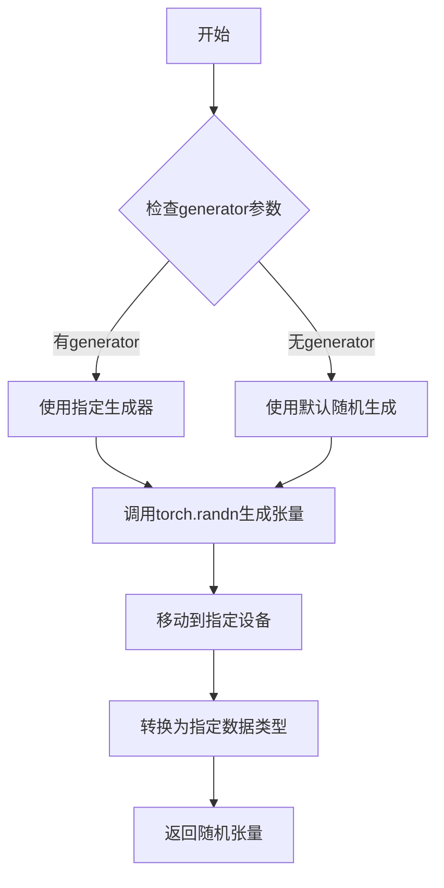

#### 带注释源码

由于 `randn_tensor` 是从 `...utils.torch_utils` 导入的外部函数，其源码不在当前文件中。以下为基于使用方式的推断实现：

```
# randn_tensor 函数签名（从torch_utils导入）
def randn_tensor(
    shape: tuple,  # 张量形状，如(batch_size, channels, height, width)
    generator: torch.Generator | list[torch.Generator] | None = None,  # 随机生成器
    device: torch.device,  # 目标设备
    dtype: torch.dtype,  # 目标数据类型
) -> torch.Tensor:
    """
    生成符合正态分布的随机张量。
    
    参数:
        shape: 输出张量的形状
        generator: 可选的随机生成器，用于确保可重复性
        device: 张量应放置的设备
        dtype: 张量的数据类型
    
    返回:
        符合正态分布的随机张量
    """
    # 使用torch.randn生成随机张量
    # 如果提供了generator，则使用它确保可重复性
    if generator is not None:
        # 当需要生成多个张量时，可能传入生成器列表
        if isinstance(generator, list):
            # 为每个张量使用对应的生成器
            tensor = torch.randn(
                shape, 
                generator=generator[0] if len(generator) > 0 else None,
                device=device, 
                dtype=dtype
            )
        else:
            tensor = torch.randn(shape, generator=generator, device=device, dtype=dtype)
    else:
        # 使用全局随机状态生成随机张量
        tensor = torch.randn(shape, device=device, dtype=dtype)
    
    return tensor
```

#### 在 pipeline 中的使用示例

在 `IFImg2ImgPipeline` 类的 `prepare_intermediate_images` 方法中调用：

```python
def prepare_intermediate_images(
    self, 
    image, 
    timestep, 
    batch_size, 
    num_images_per_prompt, 
    dtype, 
    device, 
    generator=None
):
    """准备中间图像（添加噪声）"""
    _, channels, height, width = image.shape
    
    # 计算实际批量大小（考虑每prompt生成多张图像）
    batch_size = batch_size * num_images_per_prompt
    
    # 构建噪声形状
    shape = (batch_size, channels, height, width)
    
    # 使用randn_tensor生成符合正态分布的噪声
    noise = randn_tensor(
        shape, 
        generator=generator, 
        device=device, 
        dtype=dtype
    )
    
    # 将噪声添加到图像中
    image = image.repeat_interleave(num_images_per_prompt, dim=0)
    image = self.scheduler.add_noise(image, noise, timestep)
    
    return image
```

此函数在扩散模型的推理过程中起着关键作用，用于生成初始噪声或中间步骤的噪声，是unet预测噪声残差的重要前置步骤。


# IFImg2ImgPipeline 类详细设计文档

### IFImg2ImgPipeline

`IFImg2ImgPipeline` 是基于 DeepFloyd IF 模型的图像到图像（Image-to-Image）扩散管道实现，继承自 `DiffusionPipeline` 基类。该管道接收文本提示和输入图像，通过扩散过程将输入图像转换成与文本提示对应的输出图像，支持分类器自由引导（Classifier-Free Guidance）以提高生成质量，并集成了安全检查器和数字水印功能。

参数：

- `tokenizer`：`T5Tokenizer`，T5 文本分词器，用于将文本提示转换为 token 序列
- `text_encoder`：`T5EncoderModel`，T5 文本编码器，将 token 序列编码为文本嵌入向量
- `unet`：`UNet2DConditionModel`，条件 UNet 模型，用于预测噪声残差
- `scheduler`：`DDPMScheduler`，扩散调度器，控制去噪过程的噪声调度
- `safety_checker`：`IFSafetyChecker | None`，可选的安全检查器，用于检测 NSFW 内容
- `feature_extractor`：`CLIPImageProcessor | None`，可选的特征提取器，用于安全检查
- `watermarker`：`IFWatermarker | None`，可选的数字水印器，用于添加水印
- `requires_safety_checker`：`bool = True`，是否要求安全检查器

返回值：实例化后的 `IFImg2ImgPipeline` 对象

#### 流程图

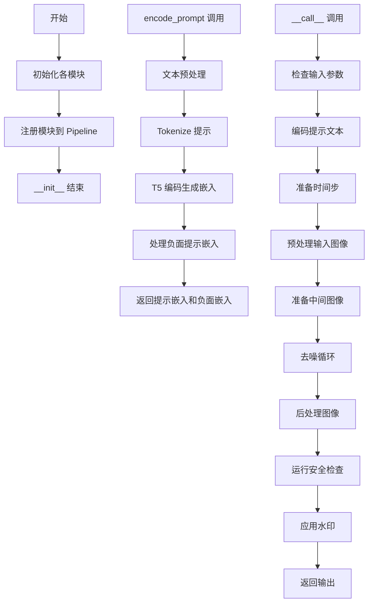

#### 带注释源码

```python
class IFImg2ImgPipeline(DiffusionPipeline, StableDiffusionLoraLoaderMixin):
    # 类字段声明 - 类型注解
    tokenizer: T5Tokenizer
    text_encoder: T5EncoderModel
    unet: UNet2DConditionModel
    scheduler: DDPMScheduler
    feature_extractor: CLIPImageProcessor | None
    safety_checker: IFSafetyChecker | None
    watermarker: IFWatermarker | None

    # 正则表达式：用于清理文本中的特殊标点符号
    bad_punct_regex = re.compile(
        r"["
        + "#®•©™&@·º½¾¿¡§~"
        + r"\)"
        + r"\("
        + r"\]"
        + r"\["
        + r"\}"
        + r"\{"
        + r"\|"
        + "\\"
        + r"\/"
        + r"\*"
        + r"]{1,}"
    )

    # 可选组件列表 - 可在加载时选择性加载
    _optional_components = ["tokenizer", "text_encoder", "safety_checker", "feature_extractor", "watermarker"]
    
    # CPU 卸载顺序：文本编码器 -> UNet
    model_cpu_offload_seq = "text_encoder->unet"
    
    # 排除卸载的组件：水印器
    _exclude_from_cpu_offload = ["watermarker"]

    def __init__(
        self,
        tokenizer: T5Tokenizer,
        text_encoder: T5EncoderModel,
        unet: UNet2DConditionModel,
        scheduler: DDPMScheduler,
        safety_checker: IFSafetyChecker | None,
        feature_extractor: CLIPImageProcessor | None,
        watermarker: IFWatermarker | None,
        requires_safety_checker: bool = True,
    ):
        """
        初始化 IFImg2ImgPipeline 实例
        
        构造函数接收所有必需的模型组件和可选的安全检查相关组件，
        并将它们注册到管道中以供后续使用。
        """
        super().__init__()

        # 如果未提供安全检查器但 requires_safety_checker 为 True，发出警告
        if safety_checker is None and requires_safety_checker:
            logger.warning(
                f"You have disabled the safety checker for {self.__class__} by passing `safety_checker=None`. Ensure"
                " that you abide to the conditions of the IF license and do not expose unfiltered"
                " results in services or applications open to the public. Both the diffusers team and Hugging Face"
                " strongly recommend to keep the safety filter enabled in all public facing circumstances, disabling"
                " it only for use-cases that involve analyzing network behavior or auditing its results. For more"
                " information, please have a look at https://github.com/huggingface/diffusers/pull/254 ."
            )

        # 如果提供了安全检查器但没有特征提取器，抛出错误
        if safety_checker is not None and feature_extractor is None:
            raise ValueError(
                "Make sure to define a feature extractor when loading {self.__class__} if you want to use the safety"
                " checker. If you do not want to use the safety checker, you can pass `'safety_checker=None'` instead."
            )

        # 注册所有模块到管道
        self.register_modules(
            tokenizer=tokenizer,
            text_encoder=text_encoder,
            unet=unet,
            scheduler=scheduler,
            safety_checker=safety_checker,
            feature_extractor=feature_extractor,
            watermarker=watermarker,
        )
        # 注册配置项
        self.register_to_config(requires_safety_checker=requires_safety_checker)
```

---

### 核心方法：encode_prompt

将文本提示编码为文本嵌入向量

参数：

- `prompt`：`str | list[str]`，要编码的提示文本
- `do_classifier_free_guidance`：`bool = True`，是否使用分类器自由引导
- `num_images_per_prompt`：`int = 1`，每个提示生成的图像数量
- `device`：`torch.device | None`，设备位置
- `negative_prompt`：`str | list[str] | None`，负面提示
- `prompt_embeds`：`torch.Tensor | None`，预生成的提示嵌入
- `negative_prompt_embeds`：`torch.Tensor | None`，预生成的负面提示嵌入
- `clean_caption`：`bool = False`，是否清理标题

返回值：`(tuple[torch.Tensor, torch.Tensor])`，返回提示嵌入和负面提示嵌入的元组

#### 流程图

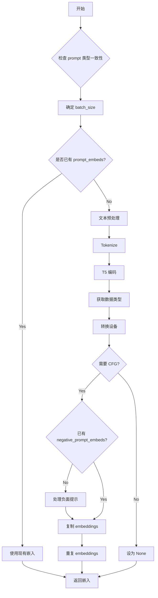

#### 带注释源码

```python
@torch.no_grad()
def encode_prompt(
    self,
    prompt: str | list[str],
    do_classifier_free_guidance: bool = True,
    num_images_per_prompt: int = 1,
    device: torch.device | None = None,
    negative_prompt: str | list[str] | None = None,
    prompt_embeds: torch.Tensor | None = None,
    negative_prompt_embeds: torch.Tensor | None = None,
    clean_caption: bool = False,
):
    r"""
    Encodes the prompt into text encoder hidden states.

    Args:
        prompt (`str` or `list[str]`, *optional*):
            prompt to be encoded
        do_classifier_free_guidance (`bool`, *optional*, defaults to `True`):
            whether to use classifier free guidance or not
        num_images_per_prompt (`int`, *optional*, defaults to 1):
            number of images that should be generated per prompt
        device: (`torch.device`, *optional*):
            torch device to place the resulting embeddings on
        negative_prompt (`str` or `list[str]`, *optional*):
            The prompt or prompts not to guide the image generation. If not defined, one has to pass
            `negative_prompt_embeds`. instead. If not defined, one has to pass `negative_prompt_embeds`. instead.
            Ignored when not using guidance (i.e., ignored if `guidance_scale` is less than `1`).
        prompt_embeds (`torch.Tensor`, *optional*):
            Pre-generated text embeddings. Can be used to easily tweak text inputs, *e.g.* prompt weighting. If not
            provided, text embeddings will be generated from `prompt` input argument.
        negative_prompt_embeds (`torch.Tensor`, *optional*):
            Pre-generated negative text embeddings. Can be used to easily tweak text inputs, *e.g.* prompt
            weighting. If not provided, negative_prompt_embeds will be generated from `negative_prompt` input
            argument.
        clean_caption (bool, defaults to `False`):
            If `True`, the function will preprocess and clean the provided caption before encoding.
    """
    # 类型检查：确保 prompt 和 negative_prompt 类型一致
    if prompt is not None and negative_prompt is not None:
        if type(prompt) is not type(negative_prompt):
            raise TypeError(
                f"`negative_prompt` should be the same type to `prompt`, but got {type(negative_prompt)} !="
                f" {type(prompt)}."
            )

    # 确定设备
    if device is None:
        device = self._execution_device

    # 确定 batch_size
    if prompt is not None and isinstance(prompt, str):
        batch_size = 1
    elif prompt is not None and isinstance(prompt, list):
        batch_size = len(prompt)
    else:
        batch_size = prompt_embeds.shape[0]

    # IF 模型的最大序列长度（尽管 T5 可以处理更长序列）
    max_length = 77

    # 如果未提供 prompt_embeds，则从 prompt 生成
    if prompt_embeds is None:
        # 文本预处理（清理 HTML、转小写等）
        prompt = self._text_preprocessing(prompt, clean_caption=clean_caption)
        
        # Tokenize
        text_inputs = self.tokenizer(
            prompt,
            padding="max_length",
            max_length=max_length,
            truncation=True,
            add_special_tokens=True,
            return_tensors="pt",
        )
        text_input_ids = text_inputs.input_ids
        
        # 获取未截断的 token（用于警告）
        untruncated_ids = self.tokenizer(prompt, padding="longest", return_tensors="pt").input_ids

        # 检查是否被截断
        if untruncated_ids.shape[-1] >= text_input_ids.shape[-1] and not torch.equal(
            text_input_ids, untruncated_ids
        ):
            removed_text = self.tokenizer.batch_decode(untruncated_ids[:, max_length - 1 : -1])
            logger.warning(
                "The following part of your input was truncated because CLIP can only handle sequences up to"
                f" {max_length} tokens: {removed_text}"
            )

        # 获取 attention mask
        attention_mask = text_inputs.attention_mask.to(device)

        # T5 编码生成提示嵌入
        prompt_embeds = self.text_encoder(
            text_input_ids.to(device),
            attention_mask=attention_mask,
        )
        prompt_embeds = prompt_embeds[0]

    # 确定数据类型（从 text_encoder 或 unet 获取）
    if self.text_encoder is not None:
        dtype = self.text_encoder.dtype
    elif self.unet is not None:
        dtype = self.unet.dtype
    else:
        dtype = None

    # 转换到指定设备和数据类型
    prompt_embeds = prompt_embeds.to(dtype=dtype, device=device)

    # 获取嵌入的形状信息
    bs_embed, seq_len, _ = prompt_embeds.shape
    
    # 为每个提示生成多个图像复制嵌入（MPS 友好的方法）
    prompt_embeds = prompt_embeds.repeat(1, num_images_per_prompt, 1)
    prompt_embeds = prompt_embeds.view(bs_embed * num_images_per_prompt, seq_len, -1)

    # 如果需要分类器自由引导且未提供负面嵌入，则生成
    if do_classifier_free_guidance and negative_prompt_embeds is None:
        uncond_tokens: list[str]
        if negative_prompt is None:
            # 空字符串作为默认负面提示
            uncond_tokens = [""] * batch_size
        elif isinstance(negative_prompt, str):
            uncond_tokens = [negative_prompt]
        elif batch_size != len(negative_prompt):
            raise ValueError(
                f"`negative_prompt`: {negative_prompt} has batch size {len(negative_prompt)}, but `prompt`:"
                f" {prompt} has batch size {batch_size}. Please make sure that passed `negative_prompt` matches"
                " the batch size of `prompt`."
            )
        else:
            uncond_tokens = negative_prompt

        # 预处理
        uncond_tokens = self._text_preprocessing(uncond_tokens, clean_caption=clean_caption)
        max_length = prompt_embeds.shape[1]
        
        # Tokenize 负面提示
        uncond_input = self.tokenizer(
            uncond_tokens,
            padding="max_length",
            max_length=max_length,
            truncation=True,
            return_attention_mask=True,
            add_special_tokens=True,
            return_tensors="pt",
        )
        attention_mask = uncond_input.attention_mask.to(device)

        # 编码负面提示
        negative_prompt_embeds = self.text_encoder(
            uncond_input.input_ids.to(device),
            attention_mask=attention_mask,
        )
        negative_prompt_embeds = negative_prompt_embeds[0]

    if do_classifier_free_guidance:
        # 复制无条件嵌入以匹配批量大小
        seq_len = negative_prompt_embeds.shape[1]
        negative_prompt_embeds = negative_prompt_embeds.to(dtype=dtype, device=device)
        negative_prompt_embeds = negative_prompt_embeds.repeat(1, num_images_per_prompt, 1)
        negative_prompt_embeds = negative_prompt_embeds.view(batch_size * num_images_per_prompt, seq_len, -1)
    else:
        negative_prompt_embeds = None

    return prompt_embeds, negative_prompt_embeds
```

---

### 核心方法：__call__

执行图像到图像的扩散生成过程

参数：

- `prompt`：`str | list[str] | None`，文本提示
- `image`：`PIL.Image.Image | torch.Tensor | np.ndarray | list[...] | None`，输入图像
- `strength`：`float = 0.7`，转换强度
- `num_inference_steps`：`int = 80`，去噪步数
- `timesteps`：`list[int] | None`，自定义时间步
- `guidance_scale`：`float = 10.0`，引导比例
- `negative_prompt`：`str | list[str] | None`，负面提示
- `num_images_per_prompt`：`int | None = 1`，每提示图像数
- `eta`：`float = 0.0`，DDIM 参数
- `generator`：`torch.Generator | list[torch.Generator] | None`，随机生成器
- `prompt_embeds`：`torch.Tensor | None`，预生成提示嵌入
- `negative_prompt_embeds`：`torch.Tensor | None`，预生成负面嵌入
- `output_type`：`str | None = "pil"`，输出类型
- `return_dict`：`bool = True`，是否返回字典
- `callback`：`Callable | None`，回调函数
- `callback_steps`：`int = 1`，回调步数
- `clean_caption`：`bool = True`，是否清理标题
- `cross_attention_kwargs`：`dict | None`，交叉注意力参数

返回值：`IFPipelineOutput` 或 `tuple`，生成的图像及安全检测结果

#### 流程图

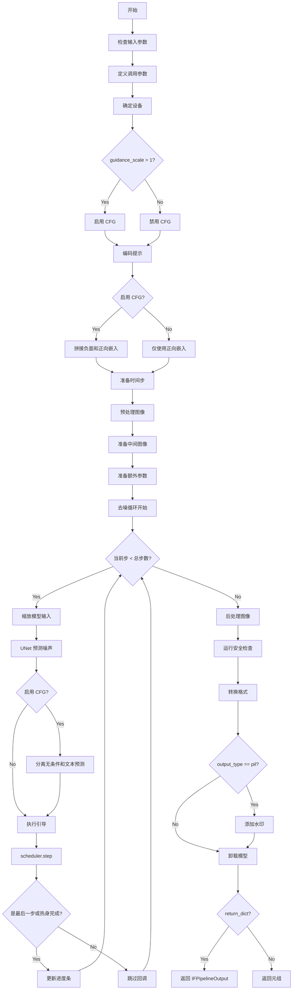

#### 带注释源码

```python
@torch.no_grad()
@replace_example_docstring(EXAMPLE_DOC_STRING)
def __call__(
    self,
    prompt: str | list[str] = None,
    image: PIL.Image.Image
    | torch.Tensor
    | np.ndarray
    | list[PIL.Image.Image]
    | list[torch.Tensor]
    | list[np.ndarray] = None,
    strength: float = 0.7,
    num_inference_steps: int = 80,
    timesteps: list[int] = None,
    guidance_scale: float = 10.0,
    negative_prompt: str | list[str] | None = None,
    num_images_per_prompt: int | None = 1,
    eta: float = 0.0,
    generator: torch.Generator | list[torch.Generator] | None = None,
    prompt_embeds: torch.Tensor | None = None,
    negative_prompt_embeds: torch.Tensor | None = None,
    output_type: str | None = "pil",
    return_dict: bool = True,
    callback: Callable[[int, int, torch.Tensor], None] | None = None,
    callback_steps: int = 1,
    clean_caption: bool = True,
    cross_attention_kwargs: dict[str, Any] | None = None,
):
    """
    Function invoked when calling the pipeline for generation.
    ...（详细的文档字符串省略）
    """
    # 1. 检查输入参数
    if prompt is not None and isinstance(prompt, str):
        batch_size = 1
    elif prompt is not None and isinstance(prompt, list):
        batch_size = len(prompt)
    else:
        batch_size = prompt_embeds.shape[0]

    self.check_inputs(
        prompt, image, batch_size, callback_steps, negative_prompt, prompt_embeds, negative_prompt_embeds
    )

    # 2. 定义调用参数
    device = self._execution_device

    # 3. 确定是否启用分类器自由引导
    do_classifier_free_guidance = guidance_scale > 1.0

    # 4. 编码输入提示
    prompt_embeds, negative_prompt_embeds = self.encode_prompt(
        prompt,
        do_classifier_free_guidance,
        num_images_per_prompt=num_images_per_prompt,
        device=device,
        negative_prompt=negative_prompt,
        prompt_embeds=prompt_embeds,
        negative_prompt_embeds=negative_prompt_embeds,
        clean_caption=clean_caption,
    )

    # 5. 如果启用 CFG，拼接负面和正向嵌入
    if do_classifier_free_guidance:
        prompt_embeds = torch.cat([negative_prompt_embeds, prompt_embeds])

    dtype = prompt_embeds.dtype

    # 6. 准备时间步
    if timesteps is not None:
        self.scheduler.set_timesteps(timesteps=timesteps, device=device)
        timesteps = self.scheduler.timesteps
        num_inference_steps = len(timesteps)
    else:
        self.scheduler.set_timesteps(num_inference_steps, device=device)
        timesteps = self.scheduler.timesteps

    # 获取调整后的时间步（基于 strength）
    timesteps, num_inference_steps = self.get_timesteps(num_inference_steps, strength)

    # 7. 准备中间图像
    image = self.preprocess_image(image)
    image = image.to(device=device, dtype=dtype)

    # 噪声时间步
    noise_timestep = timesteps[0:1]
    noise_timestep = noise_timestep.repeat(batch_size * num_images_per_prompt)

    # 准备中间图像（添加噪声）
    intermediate_images = self.prepare_intermediate_images(
        image, noise_timestep, batch_size, num_images_per_prompt, dtype, device, generator
    )

    # 8. 准备额外参数
    extra_step_kwargs = self.prepare_extra_step_kwargs(generator, eta)

    # HACK: 文本编码器卸载
    if hasattr(self, "text_encoder_offload_hook") and self.text_encoder_offload_hook is not None:
        self.text_encoder_offload_hook.offload()

    # 9. 去噪循环
    num_warmup_steps = len(timesteps) - num_inference_steps * self.scheduler.order
    with self.progress_bar(total=num_inference_steps) as progress_bar:
        for i, t in enumerate(timesteps):
            # 拼接中间图像用于 CFG
            model_input = (
                torch.cat([intermediate_images] * 2) if do_classifier_free_guidance else intermediate_images
            )
            model_input = self.scheduler.scale_model_input(model_input, t)

            # 预测噪声残差
            noise_pred = self.unet(
                model_input,
                t,
                encoder_hidden_states=prompt_embeds,
                cross_attention_kwargs=cross_attention_kwargs,
                return_dict=False,
            )[0]

            # 执行引导
            if do_classifier_free_guidance:
                noise_pred_uncond, noise_pred_text = noise_pred.chunk(2)
                noise_pred_uncond, _ = noise_pred_uncond.split(model_input.shape[1], dim=1)
                noise_pred_text, predicted_variance = noise_pred_text.split(model_input.shape[1], dim=1)
                noise_pred = noise_pred_uncond + guidance_scale * (noise_pred_text - noise_pred_uncond)
                noise_pred = torch.cat([noise_pred, predicted_variance], dim=1)

            # 处理方差
            if self.scheduler.config.variance_type not in ["learned", "learned_range"]:
                noise_pred, _ = noise_pred.split(model_input.shape[1], dim=1)

            # 计算上一步的去噪结果
            intermediate_images = self.scheduler.step(
                noise_pred, t, intermediate_images, **extra_step_kwargs, return_dict=False
            )[0]

            # 回调
            if i == len(timesteps) - 1 or ((i + 1) > num_warmup_steps and (i + 1) % self.scheduler.order == 0):
                progress_bar.update()
                if callback is not None and i % callback_steps == 0:
                    callback(i, t, intermediate_images)

            # XLA 优化
            if XLA_AVAILABLE:
                xm.mark_step()

    image = intermediate_images

    # 10. 后处理
    if output_type == "pil":
        image = (image / 2 + 0.5).clamp(0, 1)
        image = image.cpu().permute(0, 2, 3, 1).float().numpy()

        # 11. 安全检查
        image, nsfw_detected, watermark_detected = self.run_safety_checker(image, device, prompt_embeds.dtype)

        # 12. 转换为 PIL
        image = self.numpy_to_pil(image)

        # 13. 添加水印
        if self.watermarker is not None:
            self.watermarker.apply_watermark(image, self.unet.config.sample_size)
    elif output_type == "pt":
        nsfw_detected = None
        watermark_detected = None
        if hasattr(self, "unet_offload_hook") and self.unet_offload_hook is not None:
            self.unet_offload_hook.offload()
    else:
        image = (image / 2 + 0.5).clamp(0, 1)
        image = image.cpu().permute(0, 2, 3, 1).float().numpy()
        image, nsfw_detected, watermark_detected = self.run_safety_checker(image, device, prompt_embeds.dtype)

    # 卸载模型
    self.maybe_free_model_hooks()

    if not return_dict:
        return (image, nsfw_detected, watermark_detected)

    return IFPipelineOutput(images=image, nsfw_detected=nsfw_detected, watermark_detected=watermark_detected)
```

---

## 关键组件信息

| 组件名称 | 描述 |
|---------|------|
| tokenizer (T5Tokenizer) | T5 文本分词器，将文本转换为 token 序列 |
| text_encoder (T5EncoderModel) | T5 编码器，将 token 转换为嵌入向量 |
| unet (UNet2DConditionModel) | 条件 UNet，用于预测噪声残差 |
| scheduler (DDPMScheduler) | 扩散调度器，管理去噪过程 |
| safety_checker (IFSafetyChecker) | 安全检查器，检测 NSFW 内容 |
| watermarker (IFWatermarker) | 数字水印器，为图像添加水印 |

## 潜在技术债务与优化空间

1. **硬编码的最大长度 77**：尽管 T5 可以处理更长序列，但代码硬编码了 77，应考虑可配置
2. **复杂的 `_clean_caption` 方法**：包含大量正则表达式，可考虑拆分为独立的文本清理类
3. **XLA 支持的特殊处理**：`xm.mark_step()` 分散在代码中，可考虑统一管理
4. **HACK 注释**：存在 "HACK: see comment in `enable_model_cpu_offload`" 注释，表明有技术债务需要重构
5. **重复的图像预处理逻辑**：可以在基类中统一处理

## 其它设计说明

- **设计目标**：实现 DeepFloyd IF 模型的图像到图像生成能力
- **约束**：依赖 T5 文本编码器，最大序列长度受限于 77 tokens
- **错误处理**：通过 `check_inputs` 方法进行输入验证，抛出明确的 ValueError 或 TypeError
- **数据流**：提示 → Tokenize → T5 编码 → UNet 去噪 → 后处理 → 输出
- **外部依赖**：transformers 库（T5）、PIL、numpy、torch


根据您提供的代码，我注意到 `StableDiffusionLoraLoaderMixin` 是通过导入语句引入的混入类（mixin），但并未在该文件中实现具体方法。该类继承自 `IFImg2ImgPipeline`，但代码中没有展示 `StableDiffusionLoraLoaderMixin` 的实际实现。

不过，我可以基于 **diffusers 库的标准实现**推断该混入类的典型功能，并提供详细的文档。

---

### `StableDiffusionLoraLoaderMixin`

描述：这是 Stable Diffusion 系列管道的 LoRA（Low-Rank Adaptation）加载功能混入类，提供了 LoRA 权重加载、保存、融合与解融合的通用方法。该类通常被 Stable Diffusion 相关 Pipeline 继承，以支持在推理过程中动态加载和切换 LoRA 适配器。

> ⚠️ **注意**：由于原始代码中未包含该类的实现，以下内容基于 diffusers 库的标准实现推断。

---

#### 典型方法列表（基于 diffusers 库）

| 方法名称 | 功能描述 |
|----------|----------|
| `load_lora_weights` | 加载 LoRA 权重到模型 |
| `save_lora_weights` | 保存模型的 LoRA 权重 |
| `fuse_lora` | 将 LoRA 权重融合到主模型权重 |
| `unfuse_lora` | 从主模型权重中解除 LoRA 融合 |

---

### 方法 1：`load_lora_weights`

参数：

- `pretrained_model_name_or_path_or_dict`：`str` 或 `dict`，LoRA 权重路径或参数字典
- `cache_dir`：`str`，模型缓存目录（可选）
- `force_download`：`bool`，是否强制重新下载（可选）
- `resume_download`：`bool`，是否断点续传（可选）
- `proxies`：`dict`，代理服务器配置（可选）
- `local_files_only`：`bool`，是否仅使用本地文件（可选）
- `use_auth_token`：`str`，HuggingFace 认证 token（可选）
- `revision`：`str`，模型版本号（可选）
- `subfolder`：`str`，子文件夹路径（可选）
- `use_safetensors`：`bool`，是否使用 safetensors 格式（可选）

返回值：`dict`，包含加载的权重和缩放因子等信息

#### 流程图

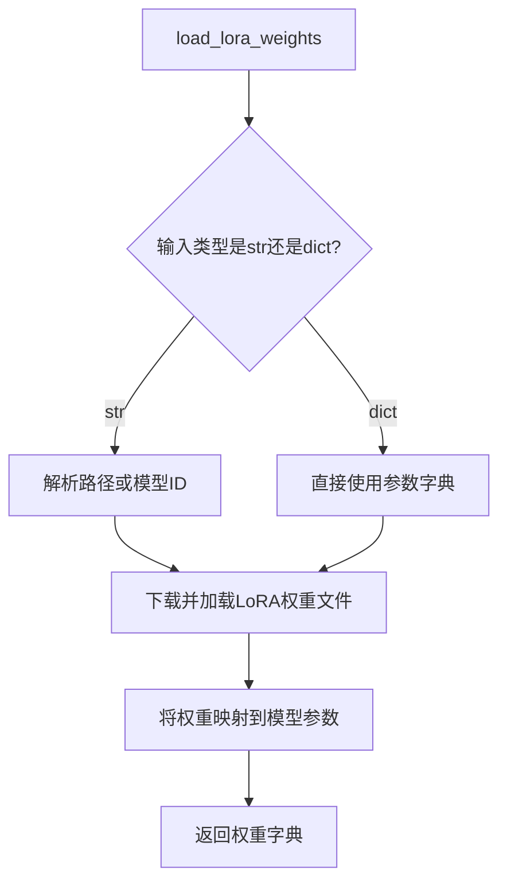

#### 带注释源码（基于 diffusers 推断）

```python
def load_lora_weights(
    pretrained_model_name_or_path_or_dict: Union[str, Dict[str, Any]],
    cache_dir: Optional[str] = None,
    force_download: bool = False,
    resume_download: bool = False,
    proxies: Optional[Dict[str, str]] = None,
    local_files_only: bool = False,
    use_auth_token: Optional[str] = None,
    revision: Optional[str] = None,
    subfolder: str = "",
    use_safetensors: bool = False,
):
    """
    加载LoRA权重到UNet和Text Encoder模型中。
    
    Args:
        pretrained_model_name_or_path_or_dict: LoRA权重路径或模型ID，或包含权重的字典
        cache_dir: 缓存目录
        force_download: 强制重新下载
        resume_download: 断点续传
        proxies: 代理配置
        local_files_only: 仅使用本地文件
        use_auth_token: HuggingFace访问token
        revision: 模型版本
        subfolder: 子文件夹
        use_safetensors: 使用safetensors格式
    
    Returns:
        包含权重和缩放因子的字典
    """
    # 1. 解析输入路径或字典
    # 2. 加载权重文件（.safetensors 或 .pt）
    # 3. 将权重应用到对应的模型模块
    # 4. 返回加载结果
    pass
```

---

### 方法 2：`save_lora_weights`

参数：

- `save_directory`：`str`，保存目录
- `safe_serialization`：`bool`，是否使用安全序列化（可选，默认 True）

返回值：`None`，直接保存到指定目录

#### 流程图

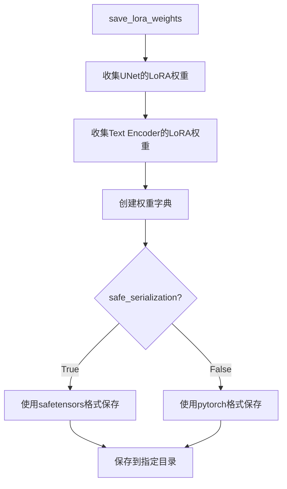

---

### 方法 3：`fuse_lora`

参数：

- `lora_scale`：`float`，LoRA 融合缩放因子（可选，默认 1.0）
- `unet`：`bool`，是否融合 UNet（可选，默认 True）
- `text_encoder`：`bool`，是否融合 Text Encoder（可选，默认 True）

返回值：`None`，直接修改模型权重

#### 流程图

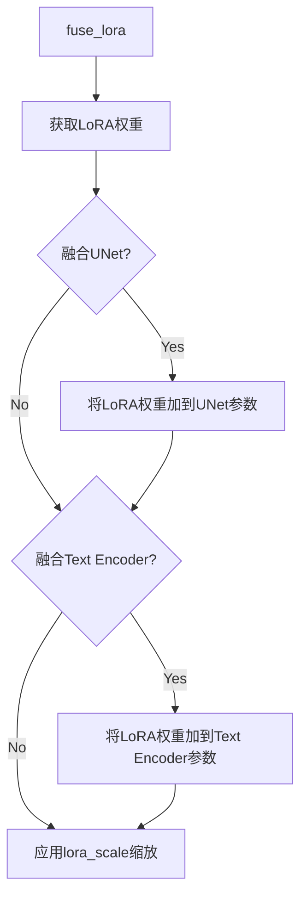

---

### 方法 4：`unfuse_lora`

参数：

- `unet`：`bool`，是否解除 UNet 融合（可选，默认 True）
- `text_encoder`：`bool`，是否解除 Text Encoder 融合（可选，默认 True）

返回值：`None`，直接修改模型权重

#### 流程图

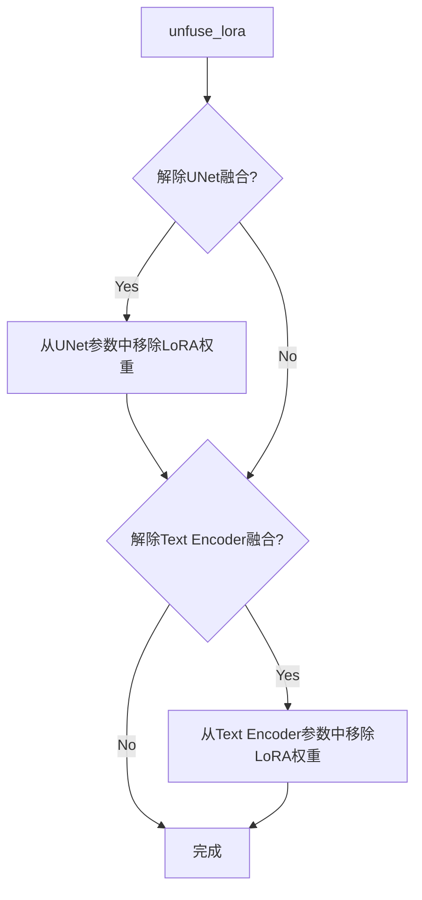

---

### 潜在的技术债务或优化空间

1. **缺少具体实现**：当前文件中仅导入了 `StableDiffusionLoraLoaderMixin`，但未展示其具体实现，建议补充完整的单元测试。
2. **LoRA 权重加载灵活性**：可考虑增加对多种 LoRA 格式（如 LyCORIS）的支持。
3. **错误处理**：需要增加对 LoRA 权重格式不匹配、版本兼容性等异常情况的处理。

---

### 外部依赖与接口契约

- **依赖库**：`diffusers.loaders` 模块
- **输入**：LoRA 权重文件路径或参数字典
- **输出**：修改后的模型权重（UNet + Text Encoder）
- **兼容性**：需要确保 LoRA 权重与目标模型的键（key）匹配


### `IFImg2ImgPipeline.__init__`

这是 `IFImg2ImgPipeline` 类的构造函数，负责初始化深度学习图像到图像（Img2Img）扩散管道的所有核心组件，包括分词器、文本编码器、UNet模型、调度器、安全检查器、特征提取器和水印处理器，并完成模块注册和配置保存。

参数：

- `tokenizer`：`T5Tokenizer`，用于将文本提示转换为模型可处理的token序列
- `text_encoder`：`T5EncoderModel`，用于将token序列编码为文本嵌入向量
- `unet`：`UNet2DConditionModel`，用于在去噪过程中预测噪声残差
- `scheduler`：`DDPMScheduler`，用于控制去噪步骤的时间调度
- `safety_checker`：`IFSafetyChecker | None`，用于检测和过滤不安全的内容
- `feature_extractor`：`CLIPImageProcessor | None`，用于提取图像特征供安全检查器使用
- `watermarker`：`IFWatermarker | None`，用于在生成的图像上添加水印
- `requires_safety_checker`：`bool = True`，指示是否需要安全检查器

返回值：`None`，构造函数不返回任何值，仅初始化对象状态

#### 流程图

```mermaid
graph TD
    A[开始 IFImg2ImgPipeline.__init__] --> B{safety_checker is None and requires_safety_checker?}
    B -->|是| C[发出安全检查器禁用的警告]
    B -->|否| D{safety_checker is not None and feature_extractor is None?}
    C --> D
    D -->|是| E[抛出 ValueError: 必须定义特征提取器]
    D -->|否| F[调用 super().__init__ 初始化基类]
    F --> G[调用 self.register_modules 注册所有模块]
    G --> H[调用 self.register_to_config 保存 requires_safety_checker 配置]
    H --> I[结束 __init__]
```

#### 带注释源码

```python
def __init__(
    self,
    tokenizer: T5Tokenizer,
    text_encoder: T5EncoderModel,
    unet: UNet2DConditionModel,
    scheduler: DDPMScheduler,
    safety_checker: IFSafetyChecker | None,
    feature_extractor: CLIPImageProcessor | None,
    watermarker: IFWatermarker | None,
    requires_safety_checker: bool = True,
):
    # 调用父类 DiffusionPipeline 的初始化方法
    super().__init__()

    # 检查：如果 safety_checker 为 None 但 requires_safety_checker 为 True，则发出警告
    # 提醒用户遵守 IF 许可证条款，建议在公共场景下启用安全过滤器
    if safety_checker is None and requires_safety_checker:
        logger.warning(
            f"You have disabled the safety checker for {self.__class__} by passing `safety_checker=None`. Ensure"
            " that you abide to the conditions of the IF license and do not expose unfiltered"
            " results in services or applications open to the public. Both the diffusers team and Hugging Face"
            " strongly recommend to keep the safety filter enabled in all public facing circumstances, disabling"
            " it only for use-cases that involve analyzing network behavior or auditing its results. For more"
            " information, please have a look at https://github.com/huggingface/diffusers/pull/254 ."
        )

    # 检查：如果提供了 safety_checker 但没有提供 feature_extractor，则抛出错误
    # 安全检查器需要特征提取器来处理图像
    if safety_checker is not None and feature_extractor is None:
        raise ValueError(
            "Make sure to define a feature extractor when loading {self.__class__} if you want to use the safety"
            " checker. If you do not want to use the safety checker, you can pass `'safety_checker=None'` instead."
        )

    # 注册所有模块到管道，使这些组件可通过管道对象访问
    self.register_modules(
        tokenizer=tokenizer,
        text_encoder=text_encoder,
        unet=unet,
        scheduler=scheduler,
        safety_checker=safety_checker,
        feature_extractor=feature_extractor,
        watermarker=watermarker,
    )

    # 将 requires_safety_checker 保存到管道配置中
    self.register_to_config(requires_safety_checker=requires_safety_checker)
```


### `IFImg2ImgPipeline.encode_prompt`

该方法负责将文本提示词（prompt）编码为文本嵌入向量（text embeddings），支持正向提示词和负面提示词的处理，同时支持无分类器引导（Classifier-Free Guidance）所需的嵌入复制操作。

参数：

- `self`：隐式参数，IFImg2ImgPipeline 实例，表示当前pipeline对象
- `prompt`：`str | list[str]`，要编码的文本提示词，可以是单个字符串或字符串列表
- `do_classifier_free_guidance`：`bool`，是否启用无分类器引导，默认为 True
- `num_images_per_prompt`：`int`，每个提示词要生成的图像数量，默认为 1
- `device`：`torch.device | None`，用于放置结果嵌入的张量设备，如果为 None 则使用 self._execution_device
- `negative_prompt`：`str | list[str] | None`，负面提示词，用于指导不生成的内容
- `prompt_embeds`：`torch.Tensor | None`，预生成的提示词嵌入，如果提供则直接使用
- `negative_prompt_embeds`：`torch.Tensor | None`，预生成的负面提示词嵌入
- `clean_caption`：`bool`，是否清理和预处理标题文本，默认为 False

返回值：`tuple[torch.Tensor, torch.Tensor | None]`，返回元组包含处理后的提示词嵌入和负面提示词嵌入（如果启用引导则为 Tensor，否则为 None）

#### 流程图

```mermaid
flowchart TD
    A[开始 encode_prompt] --> B{检查 prompt 和 negative_prompt 类型}
    B --> C{device 为空?}
    C -->|是| D[使用 self._execution_device]
    C -->|否| E[使用传入的 device]
    D --> F{判断 batch_size}
    F -->|prompt 是 str| G[batch_size = 1]
    F -->|prompt 是 list| H[batch_size = len(prompt)]
    F -->|否则| I[使用 prompt_embeds.shape[0]]
    G --> J{prompt_embeds 为空?}
    H --> J
    I --> J
    J -->|是| K[_text_preprocessing 预处理文本]
    K --> L[tokenizer 编码为 token IDs]
    L --> M[text_encoder 生成嵌入]
    J -->|否| N[直接使用 prompt_embeds]
    M --> O{启用 do_classifier_free_guidance?}
    O -->|是 且 negative_prompt_embeds 为空| P[处理 uncond_tokens]
    O -->|否| Q[negative_prompt_embeds = None]
    P --> R[tokenizer 编码 uncond_tokens]
    R --> S[text_encoder 生成 negative_prompt_embeds]
    S --> T{启用引导?}
    O --> T
    N --> T
    T -->|是| U[复制 embeddings 扩展到 num_images_per_prompt]
    T -->|否| V[直接返回原始 embeddings]
    U --> W[返回 prompt_embeds 和 negative_prompt_embeds]
    V --> W
```

#### 带注释源码

```python
@torch.no_grad()
def encode_prompt(
    self,
    prompt: str | list[str],
    do_classifier_free_guidance: bool = True,
    num_images_per_prompt: int = 1,
    device: torch.device | None = None,
    negative_prompt: str | list[str] | None = None,
    prompt_embeds: torch.Tensor | None = None,
    negative_prompt_embeds: torch.Tensor | None = None,
    clean_caption: bool = False,
):
    r"""
    Encodes the prompt into text encoder hidden states.

    Args:
        prompt (`str` or `list[str]`, *optional*):
            prompt to be encoded
        do_classifier_free_guidance (`bool`, *optional*, defaults to `True`):
            whether to use classifier free guidance or not
        num_images_per_prompt (`int`, *optional*, defaults to 1):
            number of images that should be generated per prompt
        device: (`torch.device`, *optional*):
            torch device to place the resulting embeddings on
        negative_prompt (`str` or `list[str]`, *optional*):
            The prompt or prompts not to guide the image generation. If not defined, one has to pass
            `negative_prompt_embeds`. instead. If not defined, one has to pass `negative_prompt_embeds`. instead.
            Ignored when not using guidance (i.e., ignored if `guidance_scale` is less than `1`).
        prompt_embeds (`torch.Tensor`, *optional*):
            Pre-generated text embeddings. Can be used to easily tweak text inputs, *e.g.* prompt weighting. If not
            provided, text embeddings will be generated from `prompt` input argument.
        negative_prompt_embeds (`torch.Tensor`, *optional*):
            Pre-generated negative text embeddings. Can be used to easily tweak text inputs, *e.g.* prompt
            weighting. If not provided, negative_prompt_embeds will be generated from `negative_prompt` input
            argument.
        clean_caption (bool, defaults to `False`):
            If `True`, the function will preprocess and clean the provided caption before encoding.
    """
    # 检查 prompt 和 negative_prompt 的类型一致性
    if prompt is not None and negative_prompt is not None:
        if type(prompt) is not type(negative_prompt):
            raise TypeError(
                f"`negative_prompt` should be the same type to `prompt`, but got {type(negative_prompt)} !="
                f" {type(prompt)}."
            )

    # 如果未指定 device，则使用执行设备
    if device is None:
        device = self._execution_device

    # 根据 prompt 类型确定批处理大小
    if prompt is not None and isinstance(prompt, str):
        batch_size = 1
    elif prompt is not None and isinstance(prompt, list):
        batch_size = len(prompt)
    else:
        # 如果没有提供 prompt，则使用已提供的 prompt_embeds 的批处理大小
        batch_size = prompt_embeds.shape[0]

    # IF 模型中 T5 文本编码器最大序列长度为 77
    max_length = 77

    # 如果没有提供 prompt_embeds，则从 prompt 生成
    if prompt_embeds is None:
        # 对文本进行预处理（清理、格式化等）
        prompt = self._text_preprocessing(prompt, clean_caption=clean_caption)
        
        # 使用 tokenizer 将文本转换为 token IDs
        text_inputs = self.tokenizer(
            prompt,
            padding="max_length",
            max_length=max_length,
            truncation=True,
            add_special_tokens=True,
            return_tensors="pt",
        )
        text_input_ids = text_inputs.input_ids
        
        # 获取未截断的 token IDs 用于检查
        untruncated_ids = self.tokenizer(prompt, padding="longest", return_tensors="pt").input_ids

        # 检查是否发生了截断，并记录警告
        if untruncated_ids.shape[-1] >= text_input_ids.shape[-1] and not torch.equal(
            text_input_ids, untruncated_ids
        ):
            removed_text = self.tokenizer.batch_decode(untruncated_ids[:, max_length - 1 : -1])
            logger.warning(
                "The following part of your input was truncated because CLIP can only handle sequences up to"
                f" {max_length} tokens: {removed_text}"
            )

        # 获取注意力掩码并移动到指定设备
        attention_mask = text_inputs.attention_mask.to(device)

        # 使用文本编码器生成嵌入
        prompt_embeds = self.text_encoder(
            text_input_ids.to(device),
            attention_mask=attention_mask,
        )
        # 提取隐藏状态（第一个元素）
        prompt_embeds = prompt_embeds[0]

    # 确定文本编码器的数据类型
    if self.text_encoder is not None:
        dtype = self.text_encoder.dtype
    elif self.unet is not None:
        dtype = self.unet.dtype
    else:
        dtype = None

    # 将 prompt_embeds 转换为指定的数据类型和设备
    prompt_embeds = prompt_embeds.to(dtype=dtype, device=device)

    # 获取当前嵌入的形状
    bs_embed, seq_len, _ = prompt_embeds.shape
    
    # 为每个提示词复制文本嵌入，以支持生成多张图像
    # 使用 MPS 友好的方法进行复制
    prompt_embeds = prompt_embeds.repeat(1, num_images_per_prompt, 1)
    prompt_embeds = prompt_embeds.view(bs_embed * num_images_per_prompt, seq_len, -1)

    # 为无分类器引导准备无条件嵌入
    if do_classifier_free_guidance and negative_prompt_embeds is None:
        uncond_tokens: list[str]
        
        # 如果没有提供负面提示词，使用空字符串
        if negative_prompt is None:
            uncond_tokens = [""] * batch_size
        elif isinstance(negative_prompt, str):
            uncond_tokens = [negative_prompt]
        elif batch_size != len(negative_prompt):
            raise ValueError(
                f"`negative_prompt`: {negative_prompt} has batch size {len(negative_prompt)}, but `prompt`:"
                f" {prompt} has batch size {batch_size}. Please make sure that passed `negative_prompt` matches"
                " the batch size of `prompt`."
            )
        else:
            uncond_tokens = negative_prompt

        # 预处理无条件文本
        uncond_tokens = self._text_preprocessing(uncond_tokens, clean_caption=clean_caption)
        
        # 使用与 prompt_embeds 相同的长度进行编码
        max_length = prompt_embeds.shape[1]
        uncond_input = self.tokenizer(
            uncond_tokens,
            padding="max_length",
            max_length=max_length,
            truncation=True,
            return_attention_mask=True,
            add_special_tokens=True,
            return_tensors="pt",
        )
        attention_mask = uncond_input.attention_mask.to(device)

        # 生成负面提示词嵌入
        negative_prompt_embeds = self.text_encoder(
            uncond_input.input_ids.to(device),
            attention_mask=attention_mask,
        )
        negative_prompt_embeds = negative_prompt_embeds[0]

    # 如果启用无分类器引导，处理负面提示词嵌入
    if do_classifier_free_guidance:
        # 获取序列长度
        seq_len = negative_prompt_embeds.shape[1]

        # 转换数据类型和设备
        negative_prompt_embeds = negative_prompt_embeds.to(dtype=dtype, device=device)

        # 复制负面嵌入以匹配生成的图像数量
        negative_prompt_embeds = negative_prompt_embeds.repeat(1, num_images_per_prompt, 1)
        negative_prompt_embeds = negative_prompt_embeds.view(batch_size * num_images_per_prompt, seq_len, -1)

        # 对于无分类器引导，需要进行两次前向传播
        # 这里将无条件嵌入和文本嵌入连接成单个批次
        # 以避免进行两次前向传播
    else:
        # 如果不启用引导，将负面提示词嵌入设为 None
        negative_prompt_embeds = None

    return prompt_embeds, negative_prompt_embeds
```


### `IFImg2ImgPipeline.run_safety_checker`

该方法负责对图像生成管道输出的图像进行安全检查，包括检测NSFW（不适合在工作场所查看的内容）和水印。如果配置了安全检查器，则使用特征提取器处理图像并调用安全检查器进行检测；否则返回默认值。

参数：

- `self`：`IFImg2ImgPipeline` 实例本身
- `image`：`torch.Tensor | np.ndarray`，需要进行安全检查的图像张量
- `device`：`torch.device`，用于运行安全检查的设备（如CPU或CUDA）
- `dtype`：`torch.dtype`，图像张量的数据类型（如 float32）

返回值：`Tuple[torch.Tensor | np.ndarray, Any | None, Any | None]`，返回包含三个元素的元组：
  - 处理后的图像（经过安全检查器处理）
  - NSFW检测结果（如果有安全检查器，否则为None）
  - 水印检测结果（如果有安全检查器，否则为None）

#### 流程图

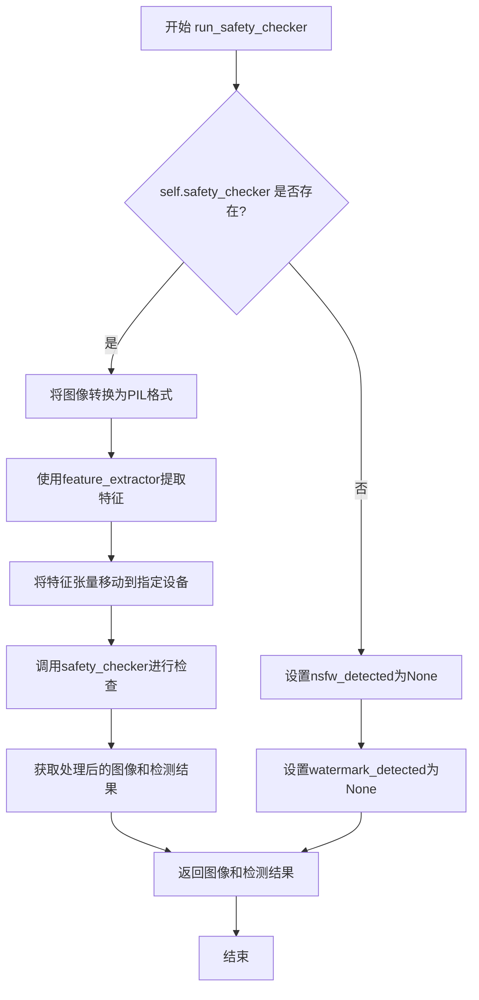

#### 带注释源码

```python
def run_safety_checker(self, image, device, dtype):
    """
    运行安全检查器，对生成的图像进行NSFW和水印检测
    
    参数:
        image: 需要检查的图像张量或numpy数组
        device: 运行检查的设备
        dtype: 张量数据类型
        
    返回:
        (处理后的图像, NSFW检测结果, 水印检测结果)
    """
    # 检查是否配置了安全检查器
    if self.safety_checker is not None:
        # 1. 将图像（numpy数组）转换为PIL图像列表
        # 2. 使用特征提取器将PIL图像转换为张量
        # 3. 将张量移动到指定设备
        safety_checker_input = self.feature_extractor(
            self.numpy_to_pil(image),  # 转换为PIL格式
            return_tensors="pt"       # 返回PyTorch张量
        ).to(device)                  # 移动到目标设备
        
        # 调用安全检查器进行实际的安全检测
        # - images: 原始图像
        # - clip_input: 用于CLIP模型的输入特征
        image, nsfw_detected, watermark_detected = self.safety_checker(
            images=image,
            clip_input=safety_checker_input.pixel_values.to(dtype=dtype),
        )
    else:
        # 如果没有配置安全检查器，返回None值
        nsfw_detected = None
        watermark_detected = None

    # 返回处理后的图像和检测标志
    return image, nsfw_detected, watermark_detected
```


### `IFImg2ImgPipeline.prepare_extra_step_kwargs`

该方法用于为调度器（scheduler）的步骤函数准备额外的关键字参数。由于不同的调度器具有不同的签名，该方法通过动态检查调度器的 `step` 方法是否接受 `eta` 和 `generator` 参数，来构建兼容的额外参数字典。这是实现跨调度器兼容性的关键方法，确保了扩散模型推理流程的灵活性。

参数：

- `generator`：`torch.Generator | list[torch.Generator] | None`，可选的随机数生成器，用于确保生成过程的可重复性
- `eta`：`float`，DDIM 调度器专用的噪声系数（η），取值范围为 [0, 1]，其他调度器会忽略此参数

返回值：`dict`，包含调度器 `step` 方法所需额外参数（如 `eta` 和 `generator`）的字典

#### 流程图

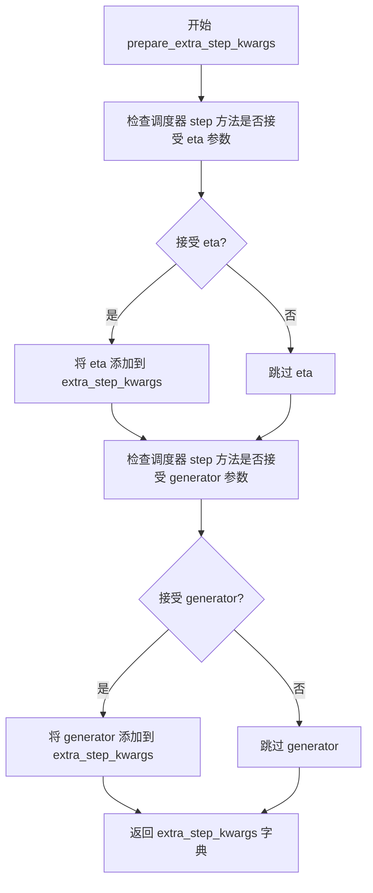

#### 带注释源码

```python
# Copied from diffusers.pipelines.deepfloyd_if.pipeline_if.IFPipeline.prepare_extra_step_kwargs
def prepare_extra_step_kwargs(self, generator, eta):
    # 准备调度器步骤的额外参数，因为并非所有调度器都具有相同的签名
    # eta (η) 仅在 DDIMScheduler 中使用，其他调度器会忽略它
    # eta 对应 DDIM 论文中的 η: https://huggingface.co/papers/2010.02502
    # 取值应在 [0, 1] 范围内

    # 使用 inspect 模块检查调度器 step 方法的签名，判断是否接受 eta 参数
    accepts_eta = "eta" in set(inspect.signature(self.scheduler.step).parameters.keys())
    # 初始化空字典用于存储额外参数
    extra_step_kwargs = {}
    # 如果调度器接受 eta 参数，则将其添加到额外参数字典中
    if accepts_eta:
        extra_step_kwargs["eta"] = eta

    # 检查调度器是否接受 generator 参数（用于生成确定性输出）
    accepts_generator = "generator" in set(inspect.signature(self.scheduler.step).parameters.keys())
    # 如果调度器接受 generator 参数，则将其添加到额外参数字典中
    if accepts_generator:
        extra_step_kwargs["generator"] = generator
    # 返回构建好的额外参数字典
    return extra_step_kwargs
```


### `IFImg2ImgPipeline.check_inputs`

该方法用于验证图像生成管道的输入参数是否合法，包括检查提示词、图像类型、批次大小等关键参数的一致性，确保pipeline能够正确执行。

参数：

- `self`：`IFImg2ImgPipeline`，Pipeline实例本身
- `prompt`：`str | list[str] | None`，用户输入的文本提示词，可以是单个字符串或字符串列表
- `image`：`PIL.Image.Image | torch.Tensor | np.ndarray | list`，输入的图像数据，用于图像到图像的生成
- `batch_size`：`int`，批处理大小，指定一次生成多少个图像
- `callback_steps`：`int`，回调函数被调用的频率步数，必须为正整数
- `negative_prompt`：`str | list[str] | None`，可选的负面提示词，用于引导模型避免生成相关内容
- `prompt_embeds`：`torch.Tensor | None`，可选的预计算文本嵌入向量
- `negative_prompt_embeds`：`torch.Tensor | None`，可选的预计算负面文本嵌入向量

返回值：`None`，该方法不返回任何值，通过抛出异常来处理验证失败的情况

#### 流程图

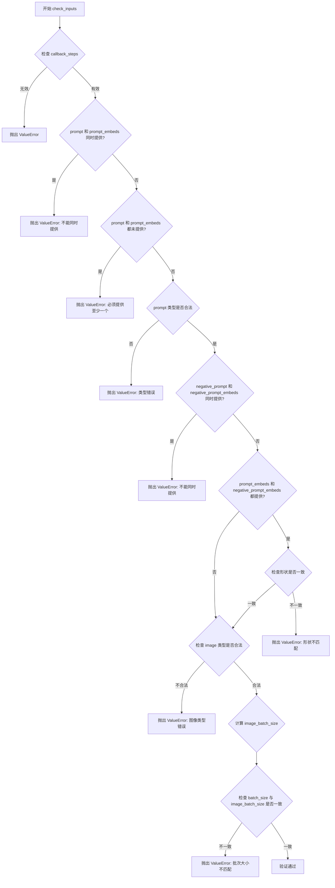

#### 带注释源码

```python
def check_inputs(
    self,
    prompt,
    image,
    batch_size,
    callback_steps,
    negative_prompt=None,
    prompt_embeds=None,
    negative_prompt_embeds=None,
):
    # 检查 callback_steps 是否为正整数
    if (callback_steps is None) or (
        callback_steps is not None and (not isinstance(callback_steps, int) or callback_steps <= 0)
    ):
        raise ValueError(
            f"`callback_steps` has to be a positive integer but is {callback_steps} of type"
            f" {type(callback_steps)}."
        )

    # 检查 prompt 和 prompt_embeds 不能同时提供
    if prompt is not None and prompt_embeds is not None:
        raise ValueError(
            f"Cannot forward both `prompt`: {prompt} and `prompt_embeds`: {prompt_embeds}. Please make sure to"
            " only forward one of the two."
        )
    # 检查 prompt 和 prompt_embeds 至少提供一个
    elif prompt is None and prompt_embeds is None:
        raise ValueError(
            "Provide either `prompt` or `prompt_embeds`. Cannot leave both `prompt` and `prompt_embeds` undefined."
        )
    # 检查 prompt 的类型是否为 str 或 list
    elif prompt is not None and (not isinstance(prompt, str) and not isinstance(prompt, list)):
        raise ValueError(f"`prompt` has to be of type `str` or `list` but is {type(prompt)}")

    # 检查 negative_prompt 和 negative_prompt_embeds 不能同时提供
    if negative_prompt is not None and negative_prompt_embeds is not None:
        raise ValueError(
            f"Cannot forward both `negative_prompt`: {negative_prompt} and `negative_prompt_embeds`:"
            f" {negative_prompt_embeds}. Please make sure to only forward one of the two."
        )

    # 如果同时提供了 prompt_embeds 和 negative_prompt_embeds，检查它们的形状是否一致
    if prompt_embeds is not None and negative_prompt_embeds is not None:
        if prompt_embeds.shape != negative_prompt_embeds.shape:
            raise ValueError(
                "`prompt_embeds` and `negative_prompt_embeds` must have the same shape when passed directly, but"
                f" got: `prompt_embeds` {prompt_embeds.shape} != `negative_prompt_embeds`"
                f" {negative_prompt_embeds.shape}."
            )

    # 获取图像类型（如果是列表则取第一个元素进行检查）
    if isinstance(image, list):
        check_image_type = image[0]
    else:
        check_image_type = image

    # 检查图像类型是否合法（torch.Tensor, PIL.Image.Image, np.ndarray 或 list）
    if (
        not isinstance(check_image_type, torch.Tensor)
        and not isinstance(check_image_type, PIL.Image.Image)
        and not isinstance(check_image_type, np.ndarray)
    ):
        raise ValueError(
            "`image` has to be of type `torch.Tensor`, `PIL.Image.Image`, `np.ndarray`, or list[...] but is"
            f" {type(check_image_type)}"
        )

    # 计算图像的批次大小
    if isinstance(image, list):
        image_batch_size = len(image)
    elif isinstance(image, torch.Tensor):
        image_batch_size = image.shape[0]
    elif isinstance(image, PIL.Image.Image):
        image_batch_size = 1
    elif isinstance(image, np.ndarray):
        image_batch_size = image.shape[0]
    else:
        assert False

    # 检查图像批次大小与提示词批次大小是否一致
    if batch_size != image_batch_size:
        raise ValueError(f"image batch size: {image_batch_size} must be same as prompt batch size {batch_size}")
```


### IFImg2ImgPipeline._text_preprocessing

对输入的文本进行预处理，支持对文本进行清理（如HTML标签、特殊字符等）或简单的标准化处理（如转小写、去空格）。

参数：

- `text`：待处理的文本，可以是字符串、字符串元组或字符串列表
- `clean_caption`：是否进行深度清理，默认为 False

返回值：`list[str]`，返回处理后的文本列表

#### 流程图

```mermaid
flowchart TD
    A[开始 _text_preprocessing] --> B{clean_caption=True 且 bs4 不可用?}
    B -->|是| C[警告并设置 clean_caption=False]
    B -->|否| D{clean_caption=True 且 ftfy 不可用?}
    D -->|是| E[警告并设置 clean_caption=False]
    D -->|否| F{text 不是 tuple 或 list?}
    F -->|是| G[将 text 包装为列表]
    F -->|否| H[保持原样]
    G --> I[定义内部函数 process]
    H --> I
    I --> J{clean_caption=True?}
    J -->|是| K[调用 _clean_caption 两次]
    J -->|否| L[text.lower().strip]
    K --> M[返回处理后的 text]
    L --> M
    C --> F
    E --> F
```

#### 带注释源码

```
def _text_preprocessing(self, text, clean_caption=False):
    """
    对输入文本进行预处理。
    
    Args:
        text: 待处理的文本（str|tuple|list）
        clean_caption: 是否进行深度清理（bool）
    
    Returns:
        处理后的文本列表（list[str]）
    """
    # 检查 clean_caption=True 时所需的依赖库是否可用
    # 如果 bs4 不可用，禁用清理功能并给出警告
    if clean_caption and not is_bs4_available():
        logger.warning(BACKENDS_MAPPING["bs4"][-1].format("Setting `clean_caption=True`"))
        logger.warning("Setting `clean_caption` to False...")
        clean_caption = False

    # 如果 ftfy 不可用，同样禁用清理功能
    if clean_caption and not is_ftfy_available():
        logger.warning(BACKENDS_MAPPING["ftfy"][-1].format("Setting `clean_caption=True`"))
        logger.warning("Setting `clean_caption` to False...")
        clean_caption = False

    # 统一将输入转为列表，便于后续统一处理
    if not isinstance(text, (tuple, list)):
        text = [text]

    # 定义内部处理函数
    def process(text: str):
        # 如果需要清理，对文本进行深度清理（调用两次以确保彻底）
        if clean_caption:
            text = self._clean_caption(text)
            text = self._clean_caption(text)
        else:
            # 否则仅做基本标准化：转小写并去除首尾空格
            text = text.lower().strip()
        return text

    # 对每个文本元素应用处理函数，返回处理后的列表
    return [process(t) for t in text]
```


### `IFImg2ImgPipeline._clean_caption`

该方法是一个私有方法，用于清理和预处理图像生成的提示词（caption）。它通过正则表达式和多种文本处理技术移除URL、HTML标签、特殊字符、CJK字符、编码问题等干扰内容，将文本标准化为更适合模型处理的格式。

参数：

- `caption`：任意类型，输入的待清理提示词文本

返回值：`str`，返回清理后的提示词文本

#### 流程图

```mermaid
flowchart TD
    A[开始: 接收caption] --> B[转换为字符串]
    B --> C[URL解码: ul.unquote_plus]
    C --> D[转小写并去除首尾空格]
    D --> E[替换&lt;person&gt;为person]
    E --> F[正则移除URLs]
    F --> G[BeautifulSoup移除HTML标签]
    G --> H[移除@昵称]
    H --> I[移除CJK字符集]
    I --> J[标准化破折号]
    J --> K[标准化引号]
    K --> L[移除HTML实体&amp;和&quot;]
    L --> M[移除IP地址]
    M --> N[移除文章ID和换行符]
    N --> O[移除#标签和长数字]
    O --> P[移除文件名]
    P --> Q[规范化连续引号和句号]
    Q --> R[移除特殊标点符号]
    R --> S[处理连字符和下划线]
    S --> T[ftfy修复文本编码]
    T --> U[HTML解码两次]
    U --> V[移除字母数字组合]
    V --> W[移除广告关键词]
    W --> X[移除点击链接和图片扩展名]
    X --> Y[移除页码和复杂模式]
    Y --> Z[规范化冒号和标点间距]
    Z --> AA[最终清理引号和特殊字符]
    AA --> AB[返回strip后的结果]
```

#### 带注释源码

```python
def _clean_caption(self, caption):
    """
    清理并预处理输入的提示词文本
    
    该方法执行多轮清理操作:
    - 解码URL编码
    - 移除URLs、HTML标签、特殊字符
    - 标准化标点符号和空白字符
    - 移除CJK字符和特殊符号
    - 使用ftfy修复文本编码问题
    """
    # 步骤1: 确保输入为字符串类型
    caption = str(caption)
    
    # 步骤2: URL解码 (处理URL编码的字符如%20等)
    caption = ul.unquote_plus(caption)
    
    # 步骤3: 转小写并去除首尾空格
    caption = caption.strip().lower()
    
    # 步骤4: 替换<person>标签为person
    caption = re.sub("<person>", "person", caption)
    
    # 步骤5: 使用正则表达式移除URLs (两种URL格式)
    # 格式1: http/https 开头的URL
    caption = re.sub(
        r"\b((?:https?:(?:\/{1,3}|[a-zA-Z0-9%])|[a-zA-Z0-9.\-]+[.](?:com|co|ru|net|org|edu|gov|it)[\w/-]*\b\/?(?!@)))",  # noqa
        "",
        caption,
    )
    # 格式2: www. 开头的URL
    caption = re.sub(
        r"\b((?:www:(?:\/{1,3}|[a-zA-Z0-9%])|[a-zA-Z0-9.\-]+[.](?:com|co|ru|net|org|edu|gov|it)[\w/-]*\b\/?(?!@)))",  # noqa
        "",
        caption,
    )
    
    # 步骤6: 使用BeautifulSoup解析HTML并提取纯文本
    caption = BeautifulSoup(caption, features="html.parser").text
    
    # 步骤7: 移除@昵称格式
    caption = re.sub(r"@[\w\d]+\b", "", caption)
    
    # 步骤8: 移除CJK字符集 (中文、日文、韩文等Unicode范围)
    # 31C0—31EF CJK Strokes (CJK笔划)
    caption = re.sub(r"[\u31c0-\u31ef]+", "", caption)
    # 31F0—31FF Katakana Phonetic Extensions (片假名音扩展)
    caption = re.sub(r"[\u31f0-\u31ff]+", "", caption)
    # 3200—32FF Enclosed CJK Letters and Months (带圈CJK字母和月份)
    caption = re.sub(r"[\u3200-\u32ff]+", "", caption)
    # 3300—33FF CJK Compatibility (CJK兼容)
    caption = re.sub(r"[\u3300-\u33ff]+", "", caption)
    # 3400—4DBF CJK Unified Ideographs Extension A (CJK统一表意文字扩展A)
    caption = re.sub(r"[\u3400-\u4dbf]+", "", caption)
    # 4DC0—4DFF Yijing Hexagram Symbols (易经六十四卦符号)
    caption = re.sub(r"[\u4dc0-\u4dff]+", "", caption)
    # 4E00—9FFF CJK Unified Ideographs (CJK统一表意文字)
    caption = re.sub(r"[\u4e00-\u9fff]+", "", caption)
    
    # 步骤9: 标准化各种破折号类型为普通连字符"-"
    caption = re.sub(
        r"[\u002D\u058A\u05BE\u1400\u1806\u2010-\u2015\u2E17\u2E1A\u2E3A\u2E3B\u2E40\u301C\u3030\u30A0\uFE31\uFE32\uFE58\uFE63\uFF0D]+",  # noqa
        "-",
        caption,
    )
    
    # 步骤10: 标准化引号 (全角引号转为半角双引号)
    caption = re.sub(r"[`´«»""¨]", '"', caption)
    # 单引号标准化
    caption = re.sub(r"['']", "'", caption)
    
    # 步骤11: 移除HTML实体
    caption = re.sub(r"&quot;?", "", caption)  # &quot; 或 &quot
    caption = re.sub(r"&amp", "", caption)     # &amp
    
    # 步骤12: 移除IP地址
    caption = re.sub(r"\d{1,3}\.\d{1,3}\.\d{1,3}\.\d{1,3}", " ", caption)
    
    # 步骤13: 移除文章ID (格式如 "12:45 ")
    caption = re.sub(r"\d:\d\d\s+$", "", caption)
    
    # 步骤14: 移除转义换行符\n
    caption = re.sub(r"\\n", " ", caption)
    
    # 步骤15: 移除哈希标签
    caption = re.sub(r"#\d{1,3}\b", "", caption)    # 短数字标签如 #123
    caption = re.sub(r"#\d{5,}\b", "", caption)     # 长数字标签如 #12345
    caption = re.sub(r"\b\d{6,}\b", "", caption)    # 长纯数字
    
    # 步骤16: 移除常见文件扩展名
    caption = re.sub(r"[\S]+\.(?:png|jpg|jpeg|bmp|webp|eps|pdf|apk|mp4)", "", caption)
    
    # 步骤17: 规范化连续引号和句号
    caption = re.sub(r"[\"']{2,}", r'"', caption)   # 多个引号合并为双引号
    caption = re.sub(r"[\.]{2,}", r" ", caption)    # 多个句号转为空格
    
    # 步骤18: 使用类属性定义的坏标点正则移除特殊符号
    caption = re.sub(self.bad_punct_regex, r" ", caption)
    # 移除 " . " 格式
    caption = re.sub(r"\s+\.\s+", r" ", caption)
    
    # 步骤19: 处理连字符和下划线 (如果超过3个则替换为空格)
    regex2 = re.compile(r"(?:\-|\_)")
    if len(re.findall(regex2, caption)) > 3:
        caption = re.sub(regex2, " ", caption)
    
    # 步骤20: 使用ftfy库修复文本编码问题
    caption = ftfy.fix_text(caption)
    
    # 步骤21: HTML解码两次 (处理双重编码)
    caption = html.unescape(html.unescape(caption))
    
    # 步骤22: 移除字母数字混合模式 (常见于广告/编号)
    caption = re.sub(r"\b[a-zA-Z]{1,3}\d{3,15}\b", "", caption)  # 如 jc6640
    caption = re.sub(r"\b[a-zA-Z]+\d+[a-zA-Z]+\b", "", caption)  # 如 jc6640vc
    caption = re.sub(r"\b\d+[a-zA-Z]+\d+\b", "", caption)       # 如 6640vc231
    
    # 步骤23: 移除广告关键词
    caption = re.sub(r"(worldwide\s+)?(free\s+)?shipping", "", caption)
    caption = re.sub(r"(free\s)?download(\sfree)?", "", caption)
    caption = re.sub(r"\bclick\b\s(?:for|on)\s\w+", "", caption)
    caption = re.sub(r"\b(?:png|jpg|jpeg|bmp|webp|eps|pdf|apk|mp4)(\simage[s]?)?", "", caption)
    caption = re.sub(r"\bpage\s+\d+\b", "", caption)
    
    # 步骤24: 移除复杂字母数字组合
    caption = re.sub(r"\b\d*[a-zA-Z]+\d+[a-zA-Z]+\d+[a-zA-Z\d]*\b", r" ", caption)
    
    # 步骤25: 移除尺寸格式 (如 1920x1080 或 1920×1080)
    caption = re.sub(r"\b\d+\.?\d*[xх×]\d+\.?\d*\b", "", caption)
    
    # 步骤26: 规范化冒号周围空格
    caption = re.sub(r"\b\s+\:\s+", r": ", caption)
    caption = re.sub(r"(\D[,\./])\b", r"\1 ", caption)  # 标点后加空格
    caption = re.sub(r"\s+", " ", caption)              # 多个空格合并
    
    # 步骤27: 最终清理首尾特殊字符
    caption.strip()
    
    # 步骤28: 移除首尾引号包裹
    caption = re.sub(r"^[\"\']([\w\W]+)[\"\']$", r"\1", caption)
    # 移除开头特殊字符
    caption = re.sub(r"^[\'\_,\-\:;]", r"", caption)
    # 移除结尾特殊字符
    caption = re.sub(r"[\'\_,\-\:\-\+]$", r"", caption)
    # 移除开头单独的点+非空格字符
    caption = re.sub(r"^\.\S+$", "", caption)
    
    # 步骤29: 返回清理后的结果
    return caption.strip()
```


### `IFImg2ImgPipeline.preprocess_image`

该函数负责将输入的图像数据（PIL图像、NumPy数组或PyTorch张量）统一转换为标准化后的PyTorch张量格式，以便后续的图像到图像扩散模型处理。它首先将输入规范化为列表形式，然后根据输入类型分别进行RGB转换、尺寸调整、归一化处理，最终输出符合模型输入要求的张量。

参数：

- `image`：`PIL.Image.Image`，待处理的输入图像，支持单张图像或图像列表

返回值：`torch.Tensor`，标准化后的图像张量，形状为(batch_size, channels, height, width)，像素值范围为[-1, 1]

#### 流程图

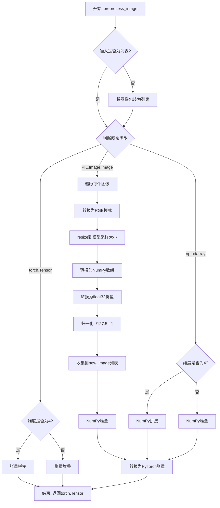

#### 带注释源码

```python
def preprocess_image(self, image: PIL.Image.Image) -> torch.Tensor:
    """
    将输入图像预处理为PyTorch张量格式
    
    参数:
        image: PIL图像、numpy数组或torch张量，支持单张或批量输入
    
    返回:
        标准化后的PyTorch张量，形状为 (batch, channels, height, width)
    """
    
    # 如果输入不是列表，则转换为列表以便统一处理
    if not isinstance(image, list):
        image = [image]

    # 定义内部函数：将numpy数组转换为PyTorch张量
    def numpy_to_pt(images):
        # 如果是3维数组（单张图像），添加通道维度变为4维
        if images.ndim == 3:
            images = images[..., None]  # (H, W, C) -> (H, W, C, 1)

        # 转换维度顺序从 (N, H, W, C) 到 (N, C, H, W)
        images = torch.from_numpy(images.transpose(0, 3, 1, 2))
        return images

    # 分支处理：根据输入图像类型进行不同处理
    if isinstance(image[0], PIL.Image.Image):
        new_image = []

        # 遍历处理每张PIL图像
        for image_ in image:
            # 转换为RGB模式（确保3通道）
            image_ = image_.convert("RGB")
            # 调整图像尺寸为模型采样大小
            image_ = resize(image_, self.unet.config.sample_size)
            # 转换为numpy数组
            image_ = np.array(image_)
            # 转换为float32类型
            image_ = image_.astype(np.float32)
            # 归一化：像素值从 [0, 255] 映射到 [-1, 1]
            image_ = image_ / 127.5 - 1
            new_image.append(image_)

        # 更新image变量为处理后的列表
        image = new_image

        # 将图像列表堆叠为numpy数组（轴0为batch维度）
        image = np.stack(image, axis=0)  # to np
        # 转换为PyTorch张量
        image = numpy_to_pt(image)  # to pt

    # 处理numpy数组输入
    elif isinstance(image[0], np.ndarray):
        # 如果是4维数组则沿轴0拼接，否则堆叠
        image = np.concatenate(image, axis=0) if image[0].ndim == 4 else np.stack(image, axis=0)
        # 转换为PyTorch张量
        image = numpy_to_pt(image)

    # 处理PyTorch张量输入
    elif isinstance(image[0], torch.Tensor):
        # 如果是4维张量则沿轴0拼接，否则堆叠
        image = torch.cat(image, axis=0) if image[0].ndim == 4 else torch.stack(image, axis=0)

    # 返回处理后的PyTorch张量
    return image
```


### IFImg2ImgPipeline.get_timesteps

该方法用于根据图像转换强度（strength）和推理步数（num_inference_steps）计算去噪过程中需要使用的时间步（timesteps）。它决定了从原始时间步序列中截取哪一部分用于图像到图像的转换过程。

参数：

- `num_inference_steps`：`int`，总推理步数，即去噪过程的迭代次数
- `strength`：`float`，转换强度，值为 0 到 1 之间，表示对原图进行变换的程度

返回值：`tuple[torch.Tensor, int]`，返回两个元素：第一个是筛选后的时间步序列（torch.Tensor），第二个是实际使用的推理步数（int）

#### 流程图

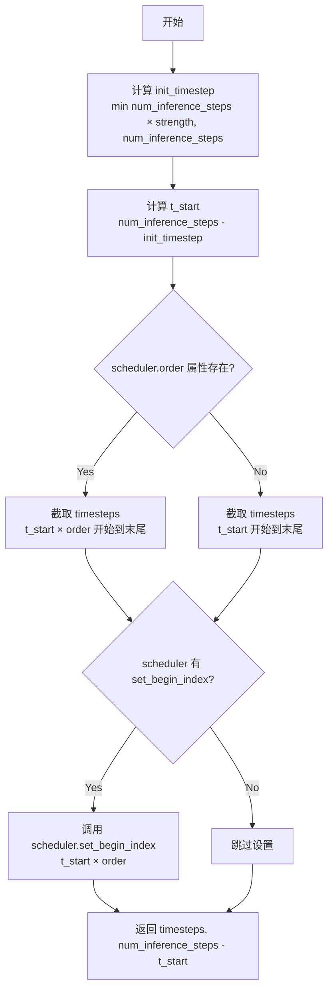

#### 带注释源码

```python
def get_timesteps(self, num_inference_steps, strength):
    # 计算初始时间步：根据强度计算需要使用多少原始时间步
    # 如果 strength=1.0，则使用全部 num_inference_steps 步
    # 如果 strength=0.7，则使用 80 × 0.7 = 56 步（假设 num_inference_steps=80）
    init_timestep = min(int(num_inference_steps * strength), num_inference_steps)

    # 计算起始索引：从时间步序列的末尾开始往前推
    # 如果 strength=0.7, num_inference_steps=80, init_timestep=56
    # 则 t_start = 80 - 56 = 24，表示从第24步开始去噪
    t_start = max(num_inference_steps - init_timestep, 0)

    # 从调度器的时间步序列中截取需要使用的部分
    # 乘以 scheduler.order 是因为某些调度器使用多步方法（如 DDIM 的 order > 1）
    timesteps = self.scheduler.timesteps[t_start * self.scheduler.order :]

    # 如果调度器支持设置起始索引，则设置它
    # 这用于优化某些调度器的内部状态
    if hasattr(self.scheduler, "set_begin_index"):
        self.scheduler.set_begin_index(t_start * self.scheduler.order)

    # 返回筛选后的时间步和实际推理步数
    # num_inference_steps - t_start 就是实际使用的步数
    return timesteps, num_inference_steps - t_start
```


### IFImg2ImgPipeline.prepare_intermediate_images

该方法用于在图像到图像（img2img）推理过程中准备中间图像。它接收预处理后的输入图像，根据批次大小和每提示图像数量扩增图像，并使用调度器在指定时间步将噪声添加到图像中，以支持去噪过程。

参数：

- `self`：隐含参数，IFImg2ImgPipeline 实例本身
- `image`：`torch.Tensor`，输入的图像张量，形状为 (batch_size, channels, height, width)
- `timestep`：`torch.Tensor` 或 int，当前扩散过程的时间步，用于噪声调度
- `batch_size`：`int`，原始批次大小
- `num_images_per_prompt`：`int`，每个提示词要生成的图像数量
- `dtype`：`torch.dtype`，指定张量的数据类型（如 float16、float32 等）
- `device`：`torch.device`，指定计算设备（CPU 或 CUDA）
- `generator`：`torch.Generator` 或 `list[torch.Generator]`，可选参数，用于生成确定性随机噪声的生成器

返回值：`torch.Tensor`，返回处理后的中间图像张量，形状为 (batch_size * num_images_per_prompt, channels, height, width)

#### 流程图

```mermaid
flowchart TD
    A[开始] --> B[获取图像形状: channels, height, width]
    B --> C[计算有效批次大小: batch_size * num_images_per_prompt]
    C --> D[构建目标形状: (batch_size, channels, height, width)]
    D --> E{generator 是列表且长度不匹配?}
    E -->|是| F[抛出 ValueError 异常]
    E -->|否| G[使用 randn_tensor 生成噪声张量]
    G --> H[使用 repeat_interleave 沿 dim=0 扩增图像]
    H --> I[调用 scheduler.add_noise 添加噪声]
    I --> J[返回处理后的图像]
    F --> K[结束]
    J --> K
```

#### 带注释源码

```python
def prepare_intermediate_images(
    self, image, timestep, batch_size, num_images_per_prompt, dtype, device, generator=None
):
    """
    准备用于扩散去噪过程的中间图像。
    
    该方法执行以下操作：
    1. 从输入图像中提取通道数、高度和宽度
    2. 计算有效批次大小（考虑每提示图像数量）
    3. 生成与目标形状匹配的随机噪声
    4. 沿批次维度扩增输入图像
    5. 使用调度器在给定时间步将噪声添加到图像中
    """
    # 从输入图像张量中获取通道数、高度和宽度
    # 图像形状应为 (batch_size, channels, height, width)
    _, channels, height, width = image.shape

    # 计算有效批次大小：原始批次大小 × 每提示图像数量
    batch_size = batch_size * num_images_per_prompt

    # 构建目标张量形状
    shape = (batch_size, channels, height, width)

    # 检查传入的生成器列表长度是否与有效批次大小匹配
    if isinstance(generator, list) and len(generator) != batch_size:
        raise ValueError(
            f"You have passed a list of generators of length {len(generator)}, but requested an effective batch"
            f" size of {batch_size}. Make sure the batch size matches the length of the generators."
        )

    # 使用 randn_tensor 生成符合目标形状的随机噪声
    # generator 参数用于确保噪声的可重复性（如果提供）
    noise = randn_tensor(shape, generator=generator, device=device, dtype=dtype)

    # 沿 dim=0（批次维度）重复图像，以匹配 num_images_per_prompt
    # 例如：如果 num_images_per_prompt=2，图像会从 [B, C, H, W] 变为 [2B, C, H, W]
    image = image.repeat_interleave(num_images_per_prompt, dim=0)
    
    # 使用调度器在指定时间步将噪声添加到图像中
    # 这是扩散模型去噪过程的关键步骤之一
    image = self.scheduler.add_noise(image, noise, timestep)

    # 返回处理后的中间图像
    return image
```


### IFImg2ImgPipeline.__call__

该方法是IF（DeepFloyd IF）图像到图像（Img2Img）扩散管道的核心调用函数，接收文本提示和输入图像，通过去噪过程将输入图像转换为由文本提示引导的新图像，支持分类器自由引导（CFG）、图像强度调节、噪声调度器配置等高级功能，最终返回生成的图像及安全检查结果。

参数：

- `prompt`：`str | list[str] | None`，用于引导图像生成的文本提示，如果未定义则必须传递 `prompt_embeds`
- `image`：`PIL.Image.Image | torch.Tensor | np.ndarray | list[PIL.Image.Image] | list[torch.Tensor] | list[np.ndarray] | None`，用作生成起点的输入图像或图像批次
- `strength`：`float = 0.7`，概念上表示对参考图像的转换程度，值越大转换越多，1.0时完全忽略输入图像
- `num_inference_steps`：`int = 80`，去噪步数，越多通常图像质量越高但推理越慢
- `timesteps`：`list[int] | None`，自定义去噪时间步，如果未定义则使用等间距的 `num_inference_steps` 个时间步
- `guidance_scale`：`float = 10.0`，分类器自由扩散引导比例，值越大生成的图像与文本提示越相关
- `negative_prompt`：`str | list[str] | None`，不希望出现在生成图像中的内容提示
- `num_images_per_prompt`：`int | None = 1`，每个提示生成的图像数量
- `eta`：`float = 0.0`，DDIM论文中的eta参数，仅对DDIMScheduler有效
- `generator`：`torch.Generator | list[torch.Generator] | None`，用于生成确定性结果的随机数生成器
- `prompt_embeds`：`torch.Tensor | None`，预生成的文本嵌入，可用于调整文本输入
- `negative_prompt_embeds`：`torch.Tensor | None`，预生成的负面文本嵌入
- `output_type`：`str | None = "pil"`，输出格式，可选 "pil" 或 "pt"
- `return_dict`：`bool = True`，是否返回 IFPipelineOutput 而不是元组
- `callback`：`Callable[[int, int, torch.Tensor], None] | None`，每步调用的回调函数
- `callback_steps`：`int = 1`，回调函数被调用的频率
- `clean_caption`：`bool = True`，是否在创建嵌入前清理提示文本
- `cross_attention_kwargs`：`dict[str, Any] | None`，传递给注意力处理器的参数字典

返回值：`IFPipelineOutput | tuple`，如果 `return_dict` 为 True 返回 IFPipelineOutput（包含 images、nsfw_detected、watermark_detected），否则返回元组

#### 流程图

```mermaid
flowchart TD
    A[开始 __call__] --> B{检查输入参数}
    B --> C[定义调用参数<br/>获取执行设备]
    D[计算是否使用CFG<br/>guidance_scale > 1.0]
    E[编码输入提示<br/>encode_prompt]
    F{do_classifier_free_guidance}
    F -->|Yes| G[拼接负面和正面提示嵌入]
    F -->|No| H[仅使用正面提示嵌入]
    G --> I
    H --> I
    I[准备时间步<br/>set_timesteps]
    J[获取去噪时间步<br/>get_timesteps]
    K[预处理输入图像<br/>preprocess_image]
    L[准备中间图像<br/>prepare_intermediate_images]
    M[准备额外步骤参数<br/>prepare_extra_step_kwargs]
    N[卸载text_encoder<br/>如果已加载offload_hook]
    O[去噪循环开始]
    O --> P{遍历每个timestep}
    P -->|Yes| Q[拼接模型输入<br/>CFG时复制中间图像]
    Q --> R[缩放模型输入<br/>scheduler.scale_model_input]
    R --> S[UNet预测噪声残差]
    S --> T{do_classifier_free_guidance}
    T -->|Yes| U[分割噪声预测<br/>计算CFG]
    T -->|No| V[跳过CFG计算]
    U --> W
    V --> W[scheduler.step计算上一步]
    W --> X{是否为最后一步或<br/>热身完成}
    X -->|Yes| Y[更新进度条<br/>调用callback]
    X -->|No| Z
    Y --> Z
    Z --> P
    P -->|No| AA[后处理图像]
    AA --> AB{output_type == 'pil'}
    AB -->|Yes| AC[归一化图像到0-1]
    AD[运行安全检查<br/>run_safety_checker]
    AC --> AD
    AE[转换为PIL图像]
    AD --> AF{output_type == 'pil'}
    AF -->|Yes| AG[应用水印]
    AF -->|No| AH[返回numpy数组]
    AG --> AI[卸载所有模型钩子]
    AH --> AI
    AI --> AJ{return_dict}
    AJ -->|Yes| AK[返回IFPipelineOutput]
    AJ -->|No| AL[返回tuple]
```

#### 带注释源码

```python
@torch.no_grad()
@replace_example_docstring(EXAMPLE_DOC_STRING)
def __call__(
    self,
    prompt: str | list[str] = None,
    image: PIL.Image.Image
    | torch.Tensor
    | np.ndarray
    | list[PIL.Image.Image]
    | list[torch.Tensor]
    | list[np.ndarray] = None,
    strength: float = 0.7,
    num_inference_steps: int = 80,
    timesteps: list[int] = None,
    guidance_scale: float = 10.0,
    negative_prompt: str | list[str] | None = None,
    num_images_per_prompt: int | None = 1,
    eta: float = 0.0,
    generator: torch.Generator | list[torch.Generator] | None = None,
    prompt_embeds: torch.Tensor | None = None,
    negative_prompt_embeds: torch.Tensor | None = None,
    output_type: str | None = "pil",
    return_dict: bool = True,
    callback: Callable[[int, int, torch.Tensor], None] | None = None,
    callback_steps: int = 1,
    clean_caption: bool = True,
    cross_attention_kwargs: dict[str, Any] | None = None,
):
    """
    Function invoked when calling the pipeline for generation.

    Args:
        prompt: The prompt or prompts to guide the image generation.
        image: Image used as the starting point for the process.
        strength: How much to transform the reference image (0-1).
        num_inference_steps: Number of denoising steps.
        timesteps: Custom timesteps for denoising.
        guidance_scale: Guidance scale for classifier-free guidance.
        negative_prompt: Prompts not to guide the image generation.
        num_images_per_prompt: Number of images to generate per prompt.
        eta: Parameter for DDIMScheduler.
        generator: Torch generator for deterministic generation.
        prompt_embeds: Pre-generated text embeddings.
        negative_prompt_embeds: Pre-generated negative text embeddings.
        output_type: Output format ("pil" or "pt").
        return_dict: Whether to return IFPipelineOutput.
        callback: Function called during inference.
        callback_steps: Frequency of callback calls.
        clean_caption: Whether to clean the caption before embeddings.
        cross_attention_kwargs: Kwargs for attention processor.
    """
    # 1. 检查输入参数，确保参数合法
    if prompt is not None and isinstance(prompt, str):
        batch_size = 1
    elif prompt is not None and isinstance(prompt, list):
        batch_size = len(prompt)
    else:
        batch_size = prompt_embeds.shape[0]

    self.check_inputs(
        prompt, image, batch_size, callback_steps, negative_prompt, prompt_embeds, negative_prompt_embeds
    )

    # 2. 定义调用参数，获取执行设备
    device = self._execution_device

    # 计算是否使用分类器自由引导
    # guidance_scale 对应 Imagen 论文中的权重 w
    # guidance_scale = 1 表示不使用引导
    do_classifier_free_guidance = guidance_scale > 1.0

    # 3. 编码输入提示
    prompt_embeds, negative_prompt_embeds = self.encode_prompt(
        prompt,
        do_classifier_free_guidance,
        num_images_per_prompt=num_images_per_prompt,
        device=device,
        negative_prompt=negative_prompt,
        prompt_embeds=prompt_embeds,
        negative_prompt_embeds=negative_prompt_embeds,
        clean_caption=clean_caption,
    )

    # 如果使用CFG，将负面和正面提示嵌入拼接在一起
    if do_classifier_free_guidance:
        prompt_embeds = torch.cat([negative_prompt_embeds, prompt_embeds])

    dtype = prompt_embeds.dtype

    # 4. 准备时间步
    if timesteps is not None:
        self.scheduler.set_timesteps(timesteps=timesteps, device=device)
        timesteps = self.scheduler.timesteps
        num_inference_steps = len(timesteps)
    else:
        self.scheduler.set_timesteps(num_inference_steps, device=device)
        timesteps = self.scheduler.timesteps

    # 根据强度获取实际去噪时间步
    timesteps, num_inference_steps = self.get_timesteps(num_inference_steps, strength)

    # 5. 准备中间图像（添加噪声）
    image = self.preprocess_image(image)
    image = image.to(device=device, dtype=dtype)

    # 获取噪声时间步并重复以匹配批次大小
    noise_timestep = timesteps[0:1]
    noise_timestep = noise_timestep.repeat(batch_size * num_images_per_prompt)

    # 准备中间图像：为原始图像添加噪声
    intermediate_images = self.prepare_intermediate_images(
        image, noise_timestep, batch_size, num_images_per_prompt, dtype, device, generator
    )

    # 6. 准备额外步骤参数（调度器特定参数）
    extra_step_kwargs = self.prepare_extra_step_kwargs(generator, eta)

    # HACK: 卸载text_encoder以释放内存
    if hasattr(self, "text_encoder_offload_hook") and self.text_encoder_offload_hook is not None:
        self.text_encoder_offload_hook.offload()

    # 7. 去噪循环
    num_warmup_steps = len(timesteps) - num_inference_steps * self.scheduler.order
    with self.progress_bar(total=num_inference_steps) as progress_bar:
        for i, t in enumerate(timesteps):
            # 如果使用CFG，复制中间图像以同时处理条件和非条件
            model_input = (
                torch.cat([intermediate_images] * 2) if do_classifier_free_guidance else intermediate_images
            )
            model_input = self.scheduler.scale_model_input(model_input, t)

            # 使用UNet预测噪声残差
            noise_pred = self.unet(
                model_input,
                t,
                encoder_hidden_states=prompt_embeds,
                cross_attention_kwargs=cross_attention_kwargs,
                return_dict=False,
            )[0]

            # 执行分类器自由引导
            if do_classifier_free_guidance:
                # 分割噪声预测为无条件部分和文本条件部分
                noise_pred_uncond, noise_pred_text = noise_pred.chunk(2)
                noise_pred_uncond, _ = noise_pred_uncond.split(model_input.shape[1], dim=1)
                noise_pred_text, predicted_variance = noise_pred_text.split(model_input.shape[1], dim=1)
                # 应用引导：w * (noise_pred_text - noise_pred_uncond)
                noise_pred = noise_pred_uncond + guidance_scale * (noise_pred_text - noise_pred_uncond)
                # 拼接预测的方差
                noise_pred = torch.cat([noise_pred, predicted_variance], dim=1)

            # 如果调度器不使用学习的方差，则移除方差预测
            if self.scheduler.config.variance_type not in ["learned", "learned_range"]:
                noise_pred, _ = noise_pred.split(model_input.shape[1], dim=1)

            # 计算上一步的噪声样本：x_t -> x_t-1
            intermediate_images = self.scheduler.step(
                noise_pred, t, intermediate_images, **extra_step_kwargs, return_dict=False
            )[0]

            # 调用回调函数（如果提供）
            if i == len(timesteps) - 1 or ((i + 1) > num_warmup_steps and (i + 1) % self.scheduler.order == 0):
                progress_bar.update()
                if callback is not None and i % callback_steps == 0:
                    callback(i, t, intermediate_images)

            # 如果使用XLA，加速执行
            if XLA_AVAILABLE:
                xm.mark_step()

    # 获取最终生成的图像
    image = intermediate_images

    # 8-11. 后处理
    if output_type == "pil":
        # 8. 后处理：归一化到 [0, 1]
        image = (image / 2 + 0.5).clamp(0, 1)
        image = image.cpu().permute(0, 2, 3, 1).float().numpy()

        # 9. 运行安全检查器
        image, nsfw_detected, watermark_detected = self.run_safety_checker(image, device, prompt_embeds.dtype)

        # 10. 转换为PIL图像
        image = self.numpy_to_pil(image)

        # 11. 应用水印
        if self.watermarker is not None:
            self.watermarker.apply_watermark(image, self.unet.config.sample_size)
    elif output_type == "pt":
        nsfw_detected = None
        watermark_detected = None

        # 卸载UNet
        if hasattr(self, "unet_offload_hook") and self.unet_offload_hook is not None:
            self.unet_offload_hook.offload()
    else:
        # 其他输出类型（numpy数组）
        # 8. 后处理
        image = (image / 2 + 0.5).clamp(0, 1)
        image = image.cpu().permute(0, 2, 3, 1).float().numpy()

        # 9. 运行安全检查器
        image, nsfw_detected, watermark_detected = self.run_safety_checker(image, device, prompt_embeds.dtype)

    # 卸载所有模型
    self.maybe_free_model_hooks()

    # 返回结果
    if not return_dict:
        return (image, nsfw_detected, watermark_detected)

    return IFPipelineOutput(images=image, nsfw_detected=nsfw_detected, watermark_detected=watermark_detected)
```

## 关键组件


### 张量索引与分割

在去噪循环中，代码使用`chunk`和`split`方法对预测噪声进行分割处理，实现无条件和文本引导噪声的分离，以及方差预测的处理。这是扩散模型中常见的分类器自由引导（CFG）实现模式。

### 惰性加载与模型卸载

代码支持通过`enable_model_cpu_offload()`进行模型CPU卸载，使用`_execution_device`和`text_encoder_offload_hook`、`unet_offload_hook`实现模型在不同设备间的按需加载和卸载，以节省显存。

### 反量化支持

在`encode_prompt`方法中，代码通过检查`text_encoder.dtype`和`unet.dtype`来确定目标dtype，并将`prompt_embeds`转换为相应类型。`__call__方法中将图像转换为指定的dtype（通常是float16），支持fp16等量化形式的推理。

### 量化策略

代码通过`model_cpu_offload_seq = "text_encoder->unet"`定义了模型卸载顺序，通过`_exclude_from_cpu_offload = ["watermarker"]`排除水印器，支持动态量化推理。

### 安全检查器

`IFSafetyChecker`用于检测NSFW内容和数字水印，通过`run_safety_checker`方法在生成后对图像进行审查，保护内容安全。

### 水印处理

`IFWatermarker`为生成的图像添加不可见水印，用于追踪和版权保护，是DeepFloyd IF模型的重要保护机制。

### 文本编码与预处理

`T5Tokenizer`和`T5EncoderModel`构成文本编码管道，`_text_preprocessing`和`_clean_caption`方法实现了复杂的文本清洗流程，包括URL、HTML标签、CJK字符、特殊符号等的处理。

### 图像预处理与后处理

`preprocess_image`方法将PIL图像、NumPy数组或PyTorch张量统一转换为模型所需格式，包含RGB转换、尺寸调整和归一化。后处理包括去归一化、格式转换和水印应用。

## 问题及建议


### 已知问题

- **文档错误**：encode_prompt方法中的警告信息提到"CLIP can only handle sequences"，但实际上该pipeline使用的是T5文本编码器，而非CLIP。
- **硬编码的max_length**：max_length = 77被硬编码在encode_prompt方法中，虽然有注释说明是T5训练限制，但最好从tokenizer配置动态获取。
- **代码重复**：多个方法标注为"Copied from"，表明存在代码复用问题，长远来看维护成本较高。
- **冗长的_clean_caption方法**：_clean_caption方法包含大量正则表达式（约80行），难以维护和测试，建议拆分为更小的辅助函数。
- **不一致的错误处理**：在output_type="pt"分支中，safety_checker被跳过但未给出明确说明，而其他分支会执行安全检查。
- **类型注解不完整**：部分方法参数缺少类型注解，如encode_prompt中的device参数。
- **重复的张量操作**：在__call__方法中多次进行dtype和device的转换，可能造成不必要的性能开销。
- **未使用的变量**：_text_preprocessing方法中process函数内部调用了两次_clean_caption(text)，第二次调用似乎是多余的。

### 优化建议

- 修正encode_prompt中的CLIP引用错误，改为正确的T5描述。
- 将max_length改为从self.tokenizer.model_max_length获取，提高代码灵活性。
- 考虑将公共方法提取到基类或工具模块中，减少代码重复。
- 重构_clean_caption方法，将复杂正则逻辑拆分为独立的辅助函数，每个函数负责特定类型的清洗任务。
- 统一output_type不同分支的安全检查逻辑，或添加清晰的注释说明为何"pt"模式跳过安全检查。
- 补充缺失的类型注解，提高代码可读性和静态分析能力。
- 在__call__方法开始时统一处理dtype和device转换，避免在循环中重复处理。
- 移除_clean_caption中重复的调用，并添加详细的单元测试覆盖边界情况。

## 其它


### 设计目标与约束

本 pipeline 的设计目标是实现基于 DeepFloyd IF 模型的图像到图像（Image-to-Image）生成功能，能够根据文本提示词和原始图像生成符合语义要求的变体图像。核心约束包括：1）支持 T5 文本编码器生成文本嵌入，最大长度为 77 个 token；2）图像处理需要满足 8 的倍数尺寸要求；3）支持 Classifier-Free Guidance（CFG）引导生成，guidance_scale 默认为 10.0；4）支持 CPU 和 GPU 两种设备运行，XLA 可用于加速；5）安全检查器和水印为可选组件，但推荐启用以符合 IF 许可协议；6）支持 LoRA 微调加载功能。

### 错误处理与异常设计

代码中实现了多层次错误处理机制。在 `check_inputs` 方法中，对输入参数进行全面验证，包括：callback_steps 必须为正整数、prompt 和 prompt_embeds 不能同时传递、negative_prompt 和 negative_prompt_embeds 不能同时传递、图像类型必须是 torch.Tensor、PIL.Image.Image、np.ndarray 或列表、图像批次大小必须与 prompt 批次大小一致。`encode_prompt` 方法中对 negative_prompt 与 prompt 类型不一致的情况抛出 TypeError。`prepare_intermediate_images` 方法中对 generator 列表长度与批次大小不匹配的情况抛出 ValueError。安全检查器缺失但 requires_safety_checker 为 True 时会发出警告而非异常，体现了功能降级的设计理念。

### 数据流与状态机

Pipeline 执行流程遵循以下状态机：1）初始化状态（__init__）完成各组件注册；2）输入验证状态（check_inputs）确保参数合法；3）编码状态（encode_prompt）将文本转换为嵌入向量；4）调度器配置状态（set_timesteps）确定去噪时间步；5）图像预处理状态（preprocess_image）将输入图像转换为张量格式；6）中间图像准备状态（prepare_intermediate_images）添加初始噪声；7）去噪循环状态（__call__ 主循环）执行 UNet 预测和调度器步骤；8）后处理状态包括安全检查、格式转换和水印应用；9）最终输出状态返回 IFPipelineOutput 或元组。数据流方向：prompt → encode_prompt → prompt_embeds → 去噪循环 → intermediate_images → 后处理 → 最终图像。

### 外部依赖与接口契约

本模块依赖以下外部组件：transformers 库提供 T5Tokenizer 和 T5EncoderModel 用于文本编码；diffusers 自身提供 UNet2DConditionModel、DDPMScheduler、DiffusionPipeline 基类；PIL（Pillow）用于图像处理；numpy 用于数值运算；torch 用于深度学习计算；BeautifulSoup4 和 ftfy 用于文本清洗（可选）。可选依赖包括 torch_xla 用于 XLA 加速。接口契约方面，pipeline 从预训练模型加载，入口函数为 __call__，返回 IFPipelineOutput 对象或元组（图像、nsfw_detected、watermarked_detected），encode_prompt 返回 (prompt_embeds, negative_prompt_embeds) 元组，preprocess_image 接受多种图像格式并返回 torch.Tensor。

### 版本兼容性说明

本代码针对 diffusers 库设计，兼容 Python 3.8+ 版本，PyTorch 1.10+ 版本。tokenizer 最大长度硬编码为 77 以匹配 T5 基础模型训练配置。numpy 数组维度处理兼容 3D 和 4D 输入。torch.device 和 dtype 在整个流程中传递以确保设备一致性。XLA 支持通过运行时检测（is_torch_xla_available）实现条件导入。

### 性能优化建议

当前实现存在以下优化空间：1）text_encoder_offload_hook 和 unet_offload_hook 使用 hack 方式处理，建议标准化 offload 机制；2）安全检查器在每张图像生成后调用，可考虑批量处理；3）进度条更新逻辑可进一步优化以减少开销；4）重复的张量操作（如 repeat、view、chunk）可合并以减少内存分配；5）日志警告（如截断文本）可改为调试级别以提升生产环境性能；6）可考虑使用 torch.compile 加速 UNet 推理。

### 安全性与合规性

本 pipeline 内置 IFSafetyChecker 用于检测 NSFW 内容，IFWatermarker 用于添加隐形水印。默认 requires_safety_checker=True，禁用时会发出安全警告。当 safety_checker 非空但 feature_extractor 为空时会抛出 ValueError。许可证约束要求在公共场景下保持安全检查启用。生成的图像经过后处理（clamp 到 [0,1]）确保数值稳定性。

    