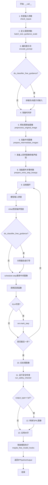
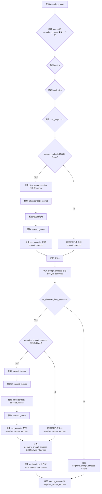
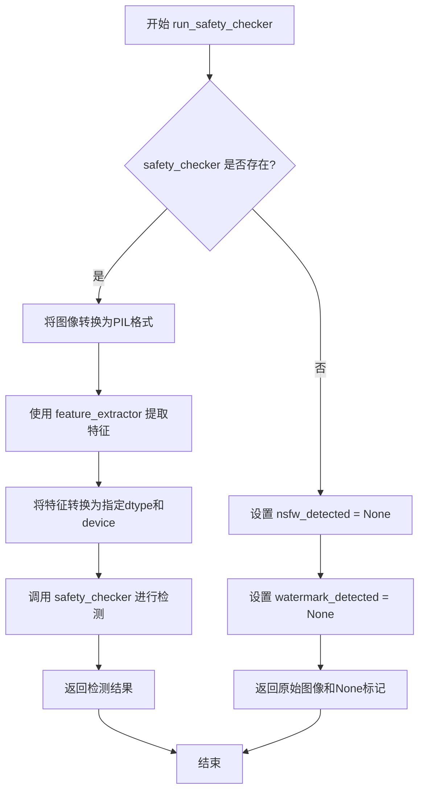
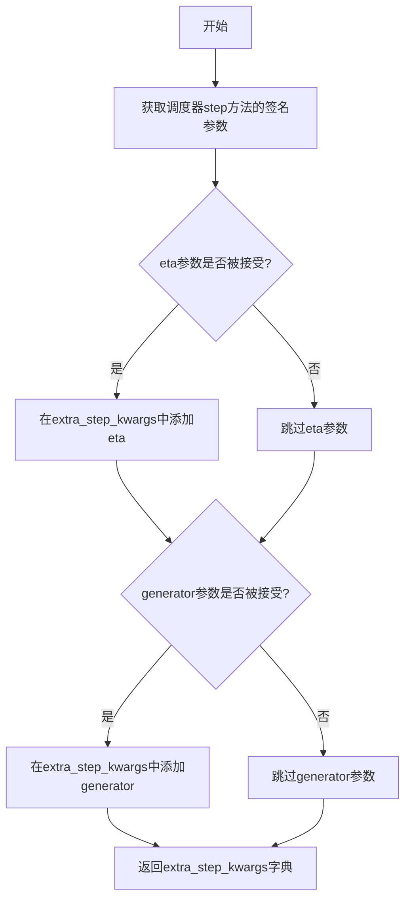
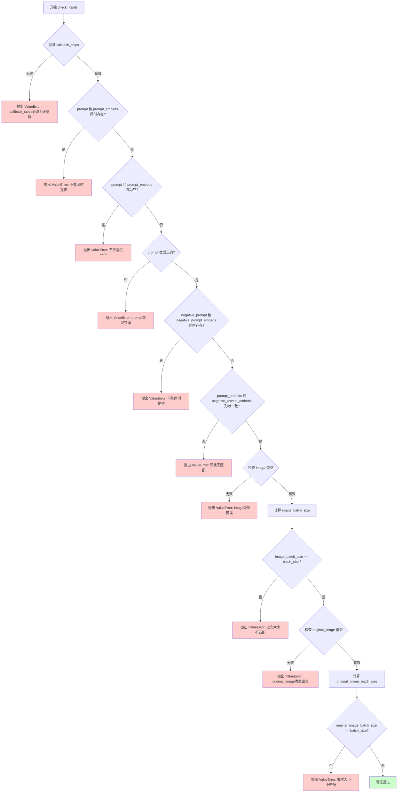
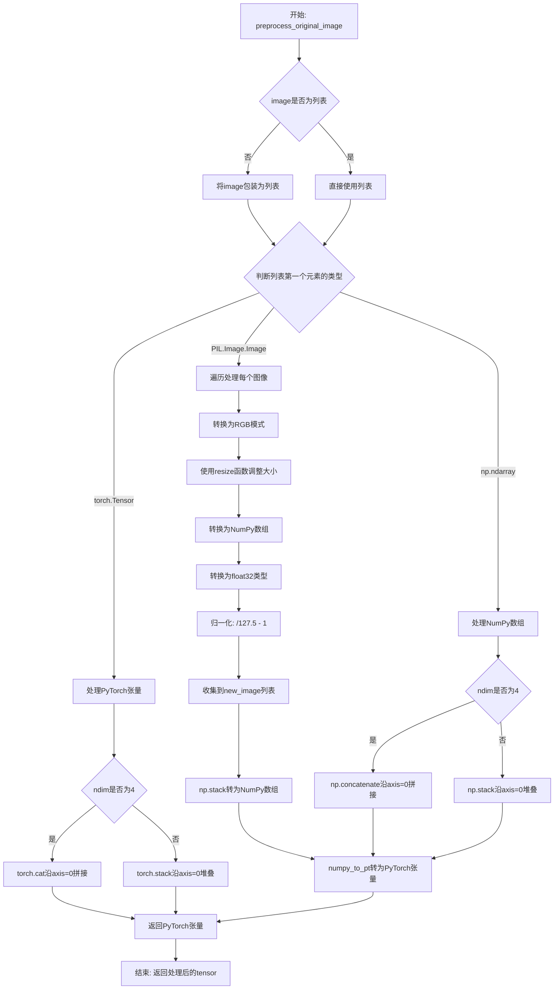
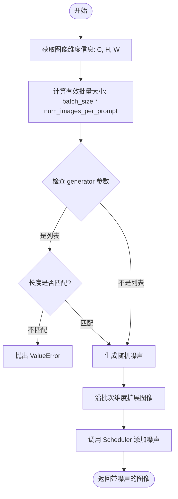
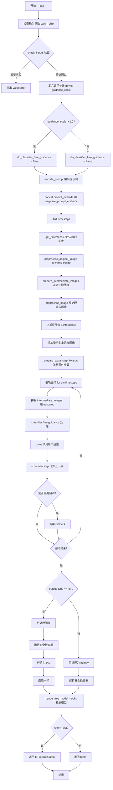

```mermaid
flowchart TD
    A[开始: _clean_caption] --> B[将 caption 转换为字符串]
    B --> C[URL 解码: ul.unquote_plus]
    C --> D[转小写并去除首尾空白]
    D --> E[替换特殊标记: <person> -> person]
    E --> F1[正则匹配移除 HTTP URLs]
    F1 --> F2[正则匹配移除 www URLs]
    F2 --> F3[HTML 解析移除标签]
    F3 --> F4[移除 @nickname 格式]
    F4 --> F5[移除 CJK 字符块<br/>31C0-31EF, 31F0-31FF, 3200-32FF...等]
    F5 --> F6[统一破折号格式]
    F6 --> F7[统一引号格式<br/>「」"" '' 等]
    F7 --> F8[移除 HTML 实体<br/>&quot; &amp 等]
    F8 --> F9[移除 IP 地址]
    F9 --> F10[移除文章 ID 格式]
    F10 --> F11[处理换行符 \n]
    F11 --> F12[移除 #数字 格式]
    F12 --> F13[移除长数字串]
    F13 --> F14[移除文件名]
    F14 --> F15[规范化连续引号和句点]
    F15 --> F16[使用 bad_punct_regex 移除特殊标点]
    F16 --> F17[处理点号周围空格]
    F17 --> F18[如果 - 或 _ 出现超过3次<br/>则替换为空格]
    F18 --> F19[ftfy.fix_text 修复文本编码]
    F19 --> F20[html.unescape 双重解码]
    F20 --> F21[移除字母数字混合模式<br/>如 jc6640, jc6640vc 等]
    F21 --> F22[移除营销关键词<br/>free shipping, download 等]
    F22 --> F23[移除图片格式关键词<br/>png, jpg 等]
    F23 --> F24[移除页码]
    F24 --> F25[移除复杂字母数字串]
    F25 --> F26[移除尺寸格式<br/>如 1920x1080]
    F26 --> F27[规范化冒号周围空格]
    F27 --> F28[规范化逗号句点]
    F28 --> F29[合并多个空格]
    F29 --> F30[去除首尾引号和特殊字符]
    F30 --> F31[去除首尾标点符号]
    F31 --> F32[去除以点开头的内容]
    F32 --> Z[返回 strip 后的结果]
```

# `diffusers\src\diffusers\pipelines\deepfloyd_if\pipeline_if_img2img_superresolution.py` 详细设计文档

IFImg2ImgSuperResolutionPipeline是一个用于DeepFloyd IF模型的图像超分辨率扩散管道，继承自DiffusionPipeline和StableDiffusionLoraLoaderMixin，提供基于文本提示的图像到图像超分辨率生成功能，支持噪声调度、图像预处理、安全检查和水印处理。

## 整体流程



## 类结构

```
DiffusionPipeline (抽象基类)
└── IFImg2ImgSuperResolutionPipeline
    ├── StableDiffusionLoraLoaderMixin (混入类)
    └── 依赖组件:
        ├── T5Tokenizer
        ├── T5EncoderModel
        ├── UNet2DConditionModel
        ├── DDPMScheduler (scheduler)
        ├── DDPMScheduler (image_noising_scheduler)
        ├── CLIPImageProcessor (feature_extractor)
        ├── IFSafetyChecker
        └── IFWatermarker
```

## 全局变量及字段


### `EXAMPLE_DOC_STRING`
    
示例文档字符串

类型：`str`
    


### `logger`
    
日志记录器

类型：`logging.Logger`
    


### `XLA_AVAILABLE`
    
XLA可用性标志

类型：`bool`
    


### `IFImg2ImgSuperResolutionPipeline.tokenizer`
    
T5分词器

类型：`T5Tokenizer`
    


### `IFImg2ImgSuperResolutionPipeline.text_encoder`
    
T5文本编码器模型

类型：`T5EncoderModel`
    


### `IFImg2ImgSuperResolutionPipeline.unet`
    
UNet条件扩散模型

类型：`UNet2DConditionModel`
    


### `IFImg2ImgSuperResolutionPipeline.scheduler`
    
主噪声调度器

类型：`DDPMScheduler`
    


### `IFImg2ImgSuperResolutionPipeline.image_noising_scheduler`
    
图像噪声调度器

类型：`DDPMScheduler`
    


### `IFImg2ImgSuperResolutionPipeline.feature_extractor`
    
特征提取器

类型：`CLIPImageProcessor | None`
    


### `IFImg2ImgSuperResolutionPipeline.safety_checker`
    
安全检查器

类型：`IFSafetyChecker | None`
    


### `IFImg2ImgSuperResolutionPipeline.watermarker`
    
水印处理器

类型：`IFWatermarker | None`
    


### `IFImg2ImgSuperResolutionPipeline.bad_punct_regex`
    
标点符号正则表达式

类型：`re.Pattern`
    


### `IFImg2ImgSuperResolutionPipeline._optional_components`
    
可选组件列表

类型：`list`
    


### `IFImg2ImgSuperResolutionPipeline.model_cpu_offload_seq`
    
CPU卸载顺序

类型：`str`
    


### `IFImg2ImgSuperResolutionPipeline._exclude_from_cpu_offload`
    
排除卸载的组件

类型：`list`
    
    

## 全局函数及方法


### `resize`

该函数是一个模块级工具函数，用于将 PIL 图像调整到指定尺寸，同时保持原始宽高比。它根据图像的宽高比计算新的宽高尺寸，确保调整后的图像能够适配目标尺寸，然后使用双三次插值进行高质量的图像缩放。

参数：

-  `images`：`PIL.Image.Image`，输入的原始 PIL 图像对象
-  `img_size`：`int`，目标尺寸（正方形边长），函数将根据图像宽高比计算最终尺寸

返回值：`PIL.Image.Image`，调整大小后的 PIL 图像对象

#### 流程图

```mermaid
flowchart TD
    A[开始] --> B[获取图像原始尺寸 w, h]
    B --> C[计算宽高比 coef = w / h]
    C --> D[将目标尺寸设置为 img_size, img_size]
    D --> E{coef >= 1?}
    E -->|是| F[计算新宽度: w = int(round(img_size / 8 * coef) * 8)]
    E -->|否| G[计算新高度: h = int(round(img_size / 8 / coef) * 8)]
    F --> H[使用双三次插值调整图像大小到 w, h]
    G --> H
    H --> I[返回调整后的图像]
    I --> J[结束]
```

#### 带注释源码

```python
# Copied from diffusers.pipelines.deepfloyd_if.pipeline_if_img2img.resize
def resize(images: PIL.Image.Image, img_size: int) -> PIL.Image.Image:
    """
    调整图像大小，保持宽高比
    
    参数:
        images: PIL.Image.Image - 输入的PIL图像
        img_size: int - 目标尺寸（正方形边长）
    
    返回:
        PIL.Image.Image - 调整大小后的图像
    """
    # 获取原始图像的宽度和高度
    w, h = images.size

    # 计算宽高比
    coef = w / h

    # 初始化目标尺寸为正方形
    w, h = img_size, img_size

    # 根据宽高比调整尺寸，确保最终尺寸是8的倍数（适合模型处理）
    if coef >= 1:
        # 宽图：以高度为基准，调整宽度使其与目标尺寸匹配，并确保宽度是8的倍数
        w = int(round(img_size / 8 * coef) * 8)
    else:
        # 高图：以宽度为基准，调整高度使其与目标尺寸匹配，并确保高度是8的倍数
        h = int(round(img_size / 8 / coef) * 8)

    # 使用双三次插值调整图像大小，reducing_gap=None 表示不进行降采样优化
    images = images.resize((w, h), resample=PIL_INTERPOLATION["bicubic"], reducing_gap=None)

    # 返回调整大小后的图像
    return images
```


### IFImg2ImgSuperResolutionPipeline.__init__

这是 `IFImg2ImgSuperResolutionPipeline` 类的构造函数，负责初始化超级分辨率管道所需的所有组件，包括 tokenizer、text_encoder、unet、scheduler 等，并进行安全性检查器的配置验证。

参数：

- `tokenizer`：`T5Tokenizer`，用于对文本提示进行分词
- `text_encoder`：`T5EncoderModel`，将文本提示编码为嵌入向量
- `unet`：`UNet2DConditionModel`，用于去噪的 UNet 模型
- `scheduler`：`DDPMScheduler`，用于去噪过程的调度器
- `image_noising_scheduler`：`DDPMScheduler`，用于向图像添加噪声的调度器
- `safety_checker`：`IFSafetyChecker | None`，内容安全检查器，可为 None
- `feature_extractor`：`CLIPImageProcessor | None`，用于提取图像特征的处理器，可为 None
- `watermarker`：`IFWatermarker | None`，用于添加水印的组件，可为 None
- `requires_safety_checker`：`bool`，是否需要安全检查器，默认为 True

返回值：`None`，构造函数无返回值

#### 流程图

```mermaid
flowchart TD
    A[开始 __init__] --> B[调用 super().__init__]
    B --> C{safety_checker is None<br/>且 requires_safety_checker 为 True?}
    C -->|是| D[输出警告: 禁用安全检查器]
    C -->|否| E{safety_checker is not None<br/>且 feature_extractor is None?}
    D --> E
    E -->|是| F[抛出 ValueError: 需要定义 feature_extractor]
    E -->|否| G{unet is not None<br/>且 unet.config.in_channels != 6?}
    F --> H[结束]
    G -->|是| I[输出警告: unet 输入通道数应为 6]
    G -->|否| J[调用 self.register_modules 注册所有模块]
    I --> J
    J --> K[调用 self.register_to_config 注册配置]
    K --> H
```

#### 带注释源码

```python
def __init__(
    self,
    tokenizer: T5Tokenizer,
    text_encoder: T5EncoderModel,
    unet: UNet2DConditionModel,
    scheduler: DDPMScheduler,
    image_noising_scheduler: DDPMScheduler,
    safety_checker: IFSafetyChecker | None,
    feature_extractor: CLIPImageProcessor | None,
    watermarker: IFWatermarker | None,
    requires_safety_checker: bool = True,
):
    """
    初始化 IFImg2ImgSuperResolutionPipeline 管道
    
    参数:
        tokenizer: T5Tokenizer 实例，用于文本分词
        text_encoder: T5EncoderModel 实例，用于文本编码
        unet: UNet2DConditionModel 实例，用于去噪
        scheduler: DDPMScheduler 实例，用于调度去噪步骤
        image_noising_scheduler: DDPMScheduler 实例，用于图像加噪
        safety_checker: IFSafetyChecker 实例或 None，用于内容安全检查
        feature_extractor: CLIPImageProcessor 实例或 None，用于图像特征提取
        watermarker: IFWatermarker 实例或 None，用于添加水印
        requires_safety_checker: bool，是否需要安全检查器
    """
    # 调用父类 DiffusionPipeline 和 StableDiffusionLoraLoaderMixin 的初始化方法
    super().__init__()

    # 检查: 如果 safety_checker 为 None 但 requires_safety_checker 为 True，则发出警告
    if safety_checker is None and requires_safety_checker:
        logger.warning(
            f"You have disabled the safety checker for {self.__class__} by passing `safety_checker=None`. Ensure"
            " that you abide to the conditions of the IF license and do not expose unfiltered"
            " results in services or applications open to the public. Both the diffusers team and Hugging Face"
            " strongly recommend to keep the safety filter enabled in all public facing circumstances, disabling"
            " it only for use-cases that involve analyzing network behavior or auditing its results. For more"
            " information, please have a look at https://github.com/huggingface/diffusers/pull/254 ."
        )

    # 检查: 如果提供了 safety_checker 但没有 feature_extractor，则抛出错误
    if safety_checker is not None and feature_extractor is None:
        raise ValueError(
            "Make sure to define a feature extractor when loading {self.__class__} if you want to use the safety"
            " checker. If you do not want to use the safety checker, you can pass `'safety_checker=None'` instead."
        )

    # 检查: 如果 unet 存在但输入通道数不是 6，发出警告
    if unet is not None and unet.config.in_channels != 6:
        logger.warning(
            "It seems like you have loaded a checkpoint that shall not be used for super resolution from {unet.config._name_or_path} as it accepts {unet.config.in_channels} input channels instead of 6. Please make sure to pass a super resolution checkpoint as the `'unet'`: IFSuperResolutionPipeline.from_pretrained(unet=super_resolution_unet, ...)`."
        )

    # 注册所有模块到管道中
    self.register_modules(
        tokenizer=tokenizer,
        text_encoder=text_encoder,
        unet=unet,
        scheduler=scheduler,
        image_noising_scheduler=image_noising_scheduler,
        safety_checker=safety_checker,
        feature_extractor=feature_extractor,
        watermarker=watermarker,
    )
    # 将 requires_safety_checker 注册到配置中
    self.register_to_config(requires_safety_checker=requires_safety_checker)
```


### IFImg2ImgSuperResolutionPipeline._text_preprocessing

该方法负责对输入的文本提示进行预处理，包括可选的清理操作（如HTML标签清理、特殊字符处理等），或将文本统一转为小写并去除首尾空格。

参数：

- `self`：隐式参数，类型为`IFImg2ImgSuperResolutionPipeline`实例，表示类的实例本身
- `text`：`str | tuple[str, ...] | list[str]`，需要预处理的文本提示，可以是单个字符串、字符串元组或字符串列表
- `clean_caption`：`bool`，默认为`False`，是否清理文本标签（如HTML、特殊字符等），需要安装`beautifulsoup4`和`ftfy`库

返回值：`list[str]`，返回处理后的字符串列表

#### 流程图

```mermaid
flowchart TD
    A[开始 _text_preprocessing] --> B{clean_caption 为 True?}
    B -->|是| C{bs4 可用?}
    B -->|否| H
    C -->|否| D[警告: 设置 clean_caption=False]
    D --> E{ftfy 可用?}
    C -->|是| E
    E -->|否| F[警告: 设置 clean_caption=False]
    F --> G[clean_caption = False]
    E -->|是| H
    G --> H
    H{text 是 tuple 或 list?}
    H -->|是| I[保持原样]
    H -->|否| J[转换为列表: text = [text]]
    J --> K[遍历 text 列表中的每个元素]
    I --> K
    K --> L{clean_caption 为 True?}
    L -->|是| M[调用 _clean_caption 两次]
    L -->|否| N[text.lower().strip()]
    M --> O[返回处理结果列表]
    N --> O
    O --> P[结束]
```

#### 带注释源码

```
def _text_preprocessing(self, text, clean_caption=False):
    # 如果需要清理caption但bs4库不可用，发出警告并禁用清理功能
    if clean_caption and not is_bs4_available():
        logger.warning(BACKENDS_MAPPING["bs4"][-1].format("Setting `clean_caption=True`"))
        logger.warning("Setting `clean_caption` to False...")
        clean_caption = False

    # 如果需要清理caption但ftfy库不可用，发出警告并禁用清理功能
    if clean_caption and not is_ftfy_available():
        logger.warning(BACKENDS_MAPPING["ftfy"][-1].format("Setting `clean_caption=True`"))
        logger.warning("Setting `clean_caption` to False...")
        clean_caption = False

    # 如果text不是tuple或list，统一转换为列表以便统一处理
    if not isinstance(text, (tuple, list)):
        text = [text]

    # 定义内部处理函数，对单个文本进行清理或标准化
    def process(text: str):
        if clean_caption:
            # 如果启用了清理功能，调用_clean_caption进行深度清理
            # 注意：这里调用了两次，可能是为了确保彻底清理
            text = self._clean_caption(text)
            text = self._clean_caption(text)
        else:
            # 否则仅进行基本的小写转换和首尾空格去除
            text = text.lower().strip()
        return text

    # 对列表中的每个文本元素应用process函数，返回处理后的列表
    return [process(t) for t in text]
```


### `IFImg2ImgSuperResolutionPipeline._clean_caption`

该方法用于清理和预处理图像生成的文本提示（caption），通过 URL 移除、HTML 解析、CJK 字符过滤、特殊字符规范化等步骤，生成适合模型输入的清洁文本。

参数：

- `caption`：任意类型，需要被清理的文本描述，会被转换为字符串后处理

返回值：`str`，返回清理并标准化后的文本描述

#### 流程图



#### 带注释源码

```python
def _clean_caption(self, caption):
    """
    清理并预处理文本 caption，用于图像生成提示词。
    
    该方法执行多轮文本清理，包括：
    - URL 和 HTML 标签移除
    - CJK 字符过滤
    - 特殊字符标准化
    - 营销文本过滤
    - 文本编码修复
    """
    # 1. 转换为字符串
    caption = str(caption)
    
    # 2. URL 解码：将 URL 编码的字符串还原（如 %20 -> 空格）
    caption = ul.unquote_plus(caption)
    
    # 3. 转小写并去除首尾空白
    caption = caption.strip().lower()
    
    # 4. 替换特殊标记：将 <person> 替换为 person
    caption = re.sub("<person>", "person", caption)
    
    # 5. 移除 URLs（两种正则分别处理 http/https 和 www 开头）
    # 正则匹配 HTTP/HTTPS URLs
    caption = re.sub(
        r"\b((?:https?:(?:\/{1,3}|[a-zA-Z0-9%])|[a-zA-Z0-9.\-]+[.](?:com|co|ru|net|org|edu|gov|it)[\w/-]*\b\/?(?!@)))",
        "",
        caption,
    )
    # 正则匹配 www URLs
    caption = re.sub(
        r"\b((?:www:(?:\/{1,3}|[a-zA-Z0-9%])|[a-zA-Z0-9.\-]+[.](?:com|co|ru|net|org|edu|gov|it)[\w/-]*\b\/?(?!@)))",
        "",
        caption,
    )
    
    # 6. HTML 解析：提取纯文本内容
    caption = BeautifulSoup(caption, features="html.parser").text
    
    # 7. 移除 @nickname 格式的社交媒体用户名
    caption = re.sub(r"@[\w\d]+\b", "", caption)
    
    # 8. 移除 CJK 字符范围（中日韩统一表意文字等）
    # 31C0—31EF CJK Strokes
    caption = re.sub(r"[\u31c0-\u31ef]+", "", caption)
    # 31F0—31FF Katakana Phonetic Extensions
    caption = re.sub(r"[\u31f0-\u31ff]+", "", caption)
    # 3200—32FF Enclosed CJK Letters and Months
    caption = re.sub(r"[\u3200-\u32ff]+", "", caption)
    # 3300—33FF CJK Compatibility
    caption = re.sub(r"[\u3300-\u33ff]+", "", caption)
    # 3400—4DBF CJK Unified Ideographs Extension A
    caption = re.sub(r"[\u3400-\u4dbf]+", "", caption)
    # 4DC0—4DFF Yijing Hexagram Symbols
    caption = re.sub(r"[\u4dc0-\u4dff]+", "", caption)
    # 4E00—9FFF CJK Unified Ideographs
    caption = re.sub(r"[\u4e00-\u9fff]+", "", caption)
    
    # 9. 统一各种破折号为标准 "-"
    caption = re.sub(
        r"[\u002D\u058A\u05BE\u1400\u1806\u2010-\u2015\u2E17\u2E1A\u2E3A\u2E3B\u2E40\u301C\u3030\u30A0\uFE31\uFE32\uFE58\uFE63\uFF0D]+",
        "-",
        caption,
    )
    
    # 10. 统一引号格式：将各种语言的引号统一为双引号或单引号
    caption = re.sub(r"[`´«»""¨]", '"', caption)
    caption = re.sub(r"['']", "'", caption)
    
    # 11. 移除 HTML 实体引用
    caption = re.sub(r"&quot;?", "", caption)  # &quot; 或 &quot
    caption = re.sub(r"&amp", "", caption)     # &amp
    
    # 12. 移除 IP 地址
    caption = re.sub(r"\d{1,3}\.\d{1,3}\.\d{1,3}\.\d{1,3}", " ", caption)
    
    # 13. 移除末尾的文章 ID 格式（如 "123:45 "）
    caption = re.sub(r"\d:\d\d\s+$", "", caption)
    
    # 14. 处理换行符
    caption = re.sub(r"\\n", " ", caption)
    
    # 15. 移除以 # 开头的数字标签
    caption = re.sub(r"#\d{1,3}\b", "", caption)    # #123
    caption = re.sub(r"#\d{5,}\b", "", caption)     # #12345...
    
    # 16. 移除长数字串
    caption = re.sub(r"\b\d{6,}\b", "", caption)
    
    # 17. 移除常见图片/文件格式的文件名
    caption = re.sub(r"[\S]+\.(?:png|jpg|jpeg|bmp|webp|eps|pdf|apk|mp4)", "", caption)
    
    # 18. 规范化连续引号和句点
    caption = re.sub(r"[\"']{2,}", r'"', caption)   # """"AUSVERKAUFT""" -> "
    caption = re.sub(r"[\.]{2,}", r" ", caption)    # "..." -> " "
    
    # 19. 使用预定义的正则移除特殊标点符号
    caption = re.sub(self.bad_punct_regex, r" ", caption)
    
    # 20. 移除 " . " 格式
    caption = re.sub(r"\s+\.\s+", r" ", caption)
    
    # 21. 如果 caption 中包含超过 3 个连字符或下划线，则替换为空格
    # （处理类似 this-is-my-cute-cat 的复合词）
    regex2 = re.compile(r"(?:\-|\_)")
    if len(re.findall(regex2, caption)) > 3:
        caption = re.sub(regex2, " ", caption)
    
    # 22. 使用 ftfy 修复文本编码问题
    caption = ftfy.fix_text(caption)
    
    # 23. 双重 HTML 解码（处理双重编码的情况）
    caption = html.unescape(html.unescape(caption))
    
    # 24. 移除字母数字混合模式（如产品型号、推广码等）
    caption = re.sub(r"\b[a-zA-Z]{1,3}\d{3,15}\b", "", caption)    # jc6640
    caption = re.sub(r"\b[a-zA-Z]+\d+[a-zA-Z]+\b", "", caption)  # jc6640vc
    caption = re.sub(r"\b\d+[a-zA-Z]+\d+\b", "", caption)        # 6640vc231
    
    # 25. 移除营销常用词
    caption = re.sub(r"(worldwide\s+)?(free\s+)?shipping", "", caption)
    caption = re.sub(r"(free\s)?download(\sfree)?", "", caption)
    caption = re.sub(r"\bclick\b\s(?:for|on)\s\w+", "", caption)
    
    # 26. 移除图片格式关键词
    caption = re.sub(r"\b(?:png|jpg|jpeg|bmp|webp|eps|pdf|apk|mp4)(\simage[s]?)?", "", caption)
    
    # 27. 移除页码
    caption = re.sub(r"\bpage\s+\d+\b", "", caption)
    
    # 28. 移除复杂字母数字串
    caption = re.sub(r"\b\d*[a-zA-Z]+\d+[a-zA-Z]+\d+[a-zA-Z\d]*\b", r" ", caption)
    
    # 29. 移除尺寸格式（如 1920x1080 或 1920×1080）
    caption = re.sub(r"\b\d+\.?\d*[xх×]\d+\.?\d*\b", "", caption)
    
    # 30. 规范化冒号周围空格
    caption = re.sub(r"\b\s+\:\s+", r": ", caption)
    
    # 31. 规范化逗号、句点周围的空格
    caption = re.sub(r"(\D[,\./])\b", r"\1 ", caption)
    
    # 32. 合并多个空格为单个空格
    caption = re.sub(r"\s+", " ", caption)
    
    # 33. 去除首尾空白（第一次）
    caption.strip()
    
    # 34. 去除首尾引号包裹的内容
    caption = re.sub(r"^[\"\']([\w\W]+)[\"\']$", r"\1", caption)
    
    # 35. 去除首部的特殊字符
    caption = re.sub(r"^[\'\_,\-\:;]", r"", caption)
    
    # 36. 去除尾部的特殊字符
    caption = re.sub(r"[\'\_,\-\:\-\+]$", r"", caption)
    
    # 37. 去除以点开头的单词（如 ".something"）
    caption = re.sub(r"^\.\S+$", "", caption)
    
    # 38. 最终去除首尾空白并返回
    return caption.strip()
```


### `IFImg2ImgSuperResolutionPipeline.encode_prompt`

该方法负责将文本提示（prompt）编码为文本编码器的隐藏状态向量（embeddings），支持无分类器引导（Classifier-Free Guidance）以实现文本条件的图像生成。

参数：

- `prompt`：`str | list[str]`，要编码的文本提示，可以是单个字符串或字符串列表
- `do_classifier_free_guidance`：`bool`，是否启用无分类器引导，默认为 `True`
- `num_images_per_prompt`：`int`，每个提示生成的图像数量，默认为 1
- `device`：`torch.device | None`，用于放置结果嵌入的 PyTorch 设备，默认为 `None`（自动获取执行设备）
- `negative_prompt`：`str | list[str] | None`，不引导图像生成的负面提示，若不定义则需传递 `negative_prompt_embeds`
- `prompt_embeds`：`torch.Tensor | None`，预生成的文本嵌入，可用于方便地调整文本输入
- `negative_prompt_embeds`：`torch.Tensor | None`，预生成的负面文本嵌入
- `clean_caption`：`bool`，是否在编码前预处理和清理提示文本，默认为 `False`

返回值：`tuple[torch.Tensor, torch.Tensor | None]`，返回元组 `(prompt_embeds, negative_prompt_embeds)`。其中 `prompt_embeds` 为编码后的文本嵌入张量，`negative_prompt_embeds` 为负面提示嵌入（当 `do_classifier_free_guidance` 为 `False` 时为 `None`）

#### 流程图



#### 带注释源码

```python
@torch.no_grad()
# Copied from diffusers.pipelines.deepfloyd_if.pipeline_if.IFPipeline.encode_prompt
def encode_prompt(
    self,
    prompt: str | list[str],
    do_classifier_free_guidance: bool = True,
    num_images_per_prompt: int = 1,
    device: torch.device | None = None,
    negative_prompt: str | list[str] | None = None,
    prompt_embeds: torch.Tensor | None = None,
    negative_prompt_embeds: torch.Tensor | None = None,
    clean_caption: bool = False,
):
    r"""
    Encodes the prompt into text encoder hidden states.

    Args:
        prompt (`str` or `list[str]`, *optional*):
            prompt to be encoded
        do_classifier_free_guidance (`bool`, *optional*, defaults to `True`):
            whether to use classifier free guidance or not
        num_images_per_prompt (`int`, *optional*, defaults to 1):
            number of images that should be generated per prompt
        device: (`torch.device`, *optional*):
            torch device to place the resulting embeddings on
        negative_prompt (`str` or `list[str]`, *optional*):
            The prompt or prompts not to guide the image generation. If not defined, one has to pass
            `negative_prompt_embeds`. instead. If not defined, one has to pass `negative_prompt_embeds`. instead.
            Ignored when not using guidance (i.e., ignored if `guidance_scale` is less than `1`).
        prompt_embeds (`torch.Tensor`, *optional*):
            Pre-generated text embeddings. Can be used to easily tweak text inputs, *e.g.* prompt weighting. If not
            provided, text embeddings will be generated from `prompt` input argument.
        negative_prompt_embeds (`torch.Tensor`, *optional*):
            Pre-generated negative text embeddings. Can be used to easily tweak text inputs, *e.g.* prompt
            weighting. If not provided, negative_prompt_embeds will be generated from `negative_prompt` input
            argument.
        clean_caption (bool, defaults to `False`):
            If `True`, the function will preprocess and clean the provided caption before encoding.
    """
    # 检查 prompt 和 negative_prompt 类型一致性
    if prompt is not None and negative_prompt is not None:
        if type(prompt) is not type(negative_prompt):
            raise TypeError(
                f"`negative_prompt` should be the same type to `prompt`, but got {type(negative_prompt)} !="
                f" {type(prompt)}."
            )

    # 确定设备，默认为执行设备
    if device is None:
        device = self._execution_device

    # 确定批处理大小
    if prompt is not None and isinstance(prompt, str):
        batch_size = 1
    elif prompt is not None and isinstance(prompt, list):
        batch_size = len(prompt)
    else:
        batch_size = prompt_embeds.shape[0]

    # T5 文本编码器最大处理长度为 77
    max_length = 77

    # 如果没有提供 prompt_embeds，则从 prompt 生成
    if prompt_embeds is None:
        # 预处理文本：清理和规范化
        prompt = self._text_preprocessing(prompt, clean_caption=clean_caption)
        # 使用 tokenizer 编码 prompt
        text_inputs = self.tokenizer(
            prompt,
            padding="max_length",
            max_length=max_length,
            truncation=True,
            add_special_tokens=True,
            return_tensors="pt",
        )
        text_input_ids = text_inputs.input_ids
        # 获取未截断的编码用于比较
        untruncated_ids = self.tokenizer(prompt, padding="longest", return_tensors="pt").input_ids

        # 检查是否发生了截断
        if untruncated_ids.shape[-1] >= text_input_ids.shape[-1] and not torch.equal(
            text_input_ids, untruncated_ids
        ):
            removed_text = self.tokenizer.batch_decode(untruncated_ids[:, max_length - 1 : -1])
            logger.warning(
                "The following part of your input was truncated because CLIP can only handle sequences up to"
                f" {max_length} tokens: {removed_text}"
            )

        attention_mask = text_inputs.attention_mask.to(device)

        # 使用 text_encoder 生成嵌入
        prompt_embeds = self.text_encoder(
            text_input_ids.to(device),
            attention_mask=attention_mask,
        )
        prompt_embeds = prompt_embeds[0]

    # 确定数据类型（dtype）
    if self.text_encoder is not None:
        dtype = self.text_encoder.dtype
    elif self.unet is not None:
        dtype = self.unet.dtype
    else:
        dtype = None

    # 转换 prompt_embeds 到指定设备和数据类型
    prompt_embeds = prompt_embeds.to(dtype=dtype, device=device)

    bs_embed, seq_len, _ = prompt_embeds.shape
    # 为每个提示生成多个图像而复制文本嵌入
    prompt_embeds = prompt_embeds.repeat(1, num_images_per_prompt, 1)
    prompt_embeds = prompt_embeds.view(bs_embed * num_images_per_prompt, seq_len, -1)

    # 为无分类器引导获取无条件嵌入
    if do_classifier_free_guidance and negative_prompt_embeds is None:
        uncond_tokens: list[str]
        if negative_prompt is None:
            uncond_tokens = [""] * batch_size
        elif isinstance(negative_prompt, str):
            uncond_tokens = [negative_prompt]
        elif batch_size != len(negative_prompt):
            raise ValueError(
                f"`negative_prompt`: {negative_prompt} has batch size {len(negative_prompt)}, but `prompt`:"
                f" {prompt} has batch size {batch_size}. Please make sure that passed `negative_prompt` matches"
                " the batch size of `prompt`."
            )
        else:
            uncond_tokens = negative_prompt

        # 预处理 uncond_tokens
        uncond_tokens = self._text_preprocessing(uncond_tokens, clean_caption=clean_caption)
        max_length = prompt_embeds.shape[1]
        uncond_input = self.tokenizer(
            uncond_tokens,
            padding="max_length",
            max_length=max_length,
            truncation=True,
            return_attention_mask=True,
            add_special_tokens=True,
            return_tensors="pt",
        )
        attention_mask = uncond_input.attention_mask.to(device)

        # 生成 negative_prompt_embeds
        negative_prompt_embeds = self.text_encoder(
            uncond_input.input_ids.to(device),
            attention_mask=attention_mask,
        )
        negative_prompt_embeds = negative_prompt_embeds[0]

    # 处理 negative_prompt_embeds
    if do_classifier_free_guidance:
        # 为每个提示复制无条件嵌入以进行生成
        seq_len = negative_prompt_embeds.shape[1]

        negative_prompt_embeds = negative_prompt_embeds.to(dtype=dtype, device=device)

        negative_prompt_embeds = negative_prompt_embeds.repeat(1, num_images_per_prompt, 1)
        negative_prompt_embeds = negative_prompt_embeds.view(batch_size * num_images_per_prompt, seq_len, -1)

        # 对于无分类器引导，需要进行两次前向传播
        # 这里将无条件和文本嵌入连接成一个批次以避免两次前向传播
    else:
        negative_prompt_embeds = None

    return prompt_embeds, negative_prompt_embeds
```


### `IFImg2ImgSuperResolutionPipeline.run_safety_checker`

该方法是图像超分辨率管道的安全检查模块，用于检测生成的图像是否包含不当内容（NSFW）或水印。如果安全检查器已配置，则调用安全检查器对图像进行审查；否则返回默认值。

参数：

- `image`：`torch.Tensor | np.ndarray`，待检查的图像数据，通常是经过后处理的图像张量
- `device`：`torch.device`，用于执行安全检查的设备（如 CPU 或 CUDA）
- `dtype`：`torch.dtype`，图像数据的精度类型（如 float16）

返回值：元组 `(image, nsfw_detected, watermark_detected)`
- `image`：经过安全检查后的图像数据
- `nsfw_detected`：检测到的不当内容标记（`bool | None`），`True` 表示检测到不当内容
- `watermark_detected`：检测到的水印标记（`bool | None`），`True` 表示检测到水印

#### 流程图



#### 带注释源码

```python
def run_safety_checker(self, image, device, dtype):
    # 检查安全检查器是否已配置
    if self.safety_checker is not None:
        # 使用特征提取器将图像转换为安全检查器所需的输入格式
        # 首先将numpy数组或张量转换为PIL图像
        safety_checker_input = self.feature_extractor(
            self.numpy_to_pil(image),  # 将图像转换为PIL格式
            return_tensors="pt"         # 返回PyTorch张量
        ).to(device)  # 将输入移动到指定设备
        
        # 调用安全检查器进行NSFW和水印检测
        # images: 待检查的图像
        # clip_input: CLIP模型的输入特征
        image, nsfw_detected, watermark_detected = self.safety_checker(
            images=image,
            clip_input=safety_checker_input.pixel_values.to(dtype=dtype),
        )
    else:
        # 如果未配置安全检查器，返回None作为检测结果
        nsfw_detected = None
        watermark_detected = None

    # 返回处理后的图像和检测结果
    return image, nsfw_detected, watermark_detected
```


### `IFImg2ImgSuperResolutionPipeline.prepare_extra_step_kwargs`

该方法用于为调度器（scheduler）的步骤准备额外的关键字参数。由于不同调度器的签名不完全相同，该方法通过检查调度器 `step` 方法的签名，动态地添加 `eta` 和 `generator` 参数，以确保与各种调度器兼容。

参数：

- `self`：`IFImg2ImgSuperResolutionPipeline` 实例本身，隐式传递
- `generator`：`torch.Generator | list[torch.Generator] | None`，用于控制生成随机性的生成器对象
- `eta`：`float`，DDIM 调度器参数 η，对应 DDIM 论文中的 η 参数，取值范围应为 [0, 1]

返回值：`dict`，包含调度器 `step` 方法所需的关键字参数的字典，可能包含 `eta` 和/或 `generator` 键

#### 流程图



#### 带注释源码

```python
# 复制自 diffusers.pipelines.deepfloyd_if.pipeline_if.IFPipeline.prepare_extra_step_kwargs
def prepare_extra_step_kwargs(self, generator, eta):
    """
    为调度器步骤准备额外的关键字参数，因为并非所有调度器都具有相同的签名。
    eta (η) 仅在 DDIMScheduler 中使用，对于其他调度器将被忽略。
    eta 对应于 DDIM 论文 (https://huggingface.co/papers/2010.02502) 中的 η 参数，
    取值应在 [0, 1] 之间。
    
    参数:
        generator: torch.Generator 或其列表，用于生成确定性随机数
        eta: float, DDIM 调度器的 eta 参数
    
    返回:
        dict: 包含调度器 step 方法所需参数的关键字参数字典
    """
    # 使用 inspect 模块获取调度器 step 方法的签名参数
    accepts_eta = "eta" in set(inspect.signature(self.scheduler.step).parameters.keys())
    
    # 初始化额外的关键字参数字典
    extra_step_kwargs = {}
    
    # 如果调度器接受 eta 参数，则将其添加到 extra_step_kwargs 中
    if accepts_eta:
        extra_step_kwargs["eta"] = eta

    # 检查调度器是否接受 generator 参数
    accepts_generator = "generator" in set(inspect.signature(self.scheduler.step).parameters.keys())
    
    # 如果调度器接受 generator 参数，则将其添加到 extra_step_kwargs 中
    if accepts_generator:
        extra_step_kwargs["generator"] = generator
    
    # 返回准备好的额外关键字参数
    return extra_step_kwargs
```


### IFImg2ImgSuperResolutionPipeline.check_inputs

该方法负责验证图像超分辨率管道的输入参数有效性，包括检查提示词、图像和原始图像的类型、批次大小一致性，以及回调步骤的正整数约束。如果任何验证失败，该方法将抛出详细的 `ValueError` 异常，帮助用户快速定位输入问题。

参数：

- `self`：`IFImg2ImgSuperResolutionPipeline`，类的实例本身
- `prompt`：`str | list[str] | None`，用于引导图像生成的文本提示词，可以是单个字符串或字符串列表
- `image`：`torch.Tensor | PIL.Image.Image | np.ndarray | list[...]`，待处理的输入图像，支持多种格式
- `original_image`：`torch.Tensor | PIL.Image.Image | np.ndarray | list[...]`，原始参考图像，用于超分辨率处理
- `batch_size`：`int`，批处理大小，需要与图像和提示词的批次大小一致
- `callback_steps`：`int`，回调函数调用间隔步数，必须为正整数
- `negative_prompt`：`str | list[str] | None`，可选的负面提示词，用于引导图像生成方向
- `prompt_embeds`：`torch.Tensor | None`，可选的预计算提示词嵌入向量
- `negative_prompt_embeds`：`torch.Tensor | None`，可选的预计算负面提示词嵌入向量

返回值：`None`，该方法不返回值，仅通过抛出异常来指示验证失败

#### 流程图



#### 带注释源码

```python
def check_inputs(
    self,
    prompt,
    image,
    original_image,
    batch_size,
    callback_steps,
    negative_prompt=None,
    prompt_embeds=None,
    negative_prompt_embeds=None,
):
    """
    验证图像超分辨率管道的输入参数有效性。
    
    该方法执行全面的输入验证，包括：
    1. callback_steps 必须是正整数
    2. prompt 和 prompt_embeds 不能同时提供
    3. prompt 和 prompt_embeds 至少提供一个
    4. prompt 必须是 str 或 list 类型
    5. negative_prompt 和 negative_prompt_embeds 不能同时提供
    6. prompt_embeds 和 negative_prompt_embeds 形状必须一致
    7. image 必须是支持的类型且批次大小匹配
    8. original_image 必须是支持的类型且批次大小匹配
    
    Args:
        prompt: 文本提示词，str 或 list[str] 类型
        image: 输入图像，支持 torch.Tensor, PIL.Image.Image, np.ndarray 或 list
        original_image: 原始参考图像，类型同 image
        batch_size: 预期的批处理大小
        callback_steps: 回调函数调用间隔，必须为正整数
        negative_prompt: 可选的负面提示词
        prompt_embeds: 可选的预计算提示词嵌入
        negative_prompt_embeds: 可选的预计算负面提示词嵌入
    
    Raises:
        ValueError: 任何验证失败时抛出，详细说明错误原因
    """
    # 验证 callback_steps：必须为正整数
    # 这是确保回调机制正常工作的基础约束
    if (callback_steps is None) or (
        callback_steps is not None and (not isinstance(callback_steps, int) or callback_steps <= 0)
    ):
        raise ValueError(
            f"`callback_steps` has to be a positive integer but is {callback_steps} of type"
            f" {type(callback_steps)}."
        )

    # 验证 prompt 和 prompt_embeds 的互斥关系
    # 两者同时提供会导致语义歧义
    if prompt is not None and prompt_embeds is not None:
        raise ValueError(
            f"Cannot forward both `prompt`: {prompt} and `prompt_embeds`: {prompt_embeds}. Please make sure to"
            " only forward one of the two."
        )
    # 验证至少提供一个
    elif prompt is None and prompt_embeds is None:
        raise ValueError(
            "Provide either `prompt` or `prompt_embeds`. Cannot leave both `prompt` and `prompt_embeds` undefined."
        )
    # 验证 prompt 的类型合法性
    elif prompt is not None and (not isinstance(prompt, str) and not isinstance(prompt, list)):
        raise ValueError(f"`prompt` has to be of type `str` or `list` but is {type(prompt)}")

    # 验证 negative_prompt 和 negative_prompt_embeds 的互斥关系
    if negative_prompt is not None and negative_prompt_embeds is not None:
        raise ValueError(
            f"Cannot forward both `negative_prompt`: {negative_prompt} and `negative_prompt_embeds`:"
            f" {negative_prompt_embeds}. Please make sure to only forward one of the two."
        )

    # 验证 prompt_embeds 和 negative_prompt_embeds 的形状一致性
    # 形状不匹配会导致后续处理失败
    if prompt_embeds is not None and negative_prompt_embeds is not None:
        if prompt_embeds.shape != negative_prompt_embeds.shape:
            raise ValueError(
                "`prompt_embeds` and `negative_prompt_embeds` must have the same shape when passed directly, but"
                f" got: `prompt_embeds` {prompt_embeds.shape} != `negative_prompt_embeds`"
                f" {negative_prompt_embeds.shape}."
            )

    # ===== 验证 image 参数 =====
    # 确定用于类型检查的图像样本（如果是列表则取第一个元素）
    if isinstance(image, list):
        check_image_type = image[0]
    else:
        check_image_type = image

    # 验证 image 的类型合法性
    # 支持 PyTorch 张量、PIL 图像、NumPy 数组或列表
    if (
        not isinstance(check_image_type, torch.Tensor)
        and not isinstance(check_image_type, PIL.Image.Image)
        and not isinstance(check_image_type, np.ndarray)
    ):
        raise ValueError(
            "`image` has to be of type `torch.Tensor`, `PIL.Image.Image`, `np.ndarray`, or list[...] but is"
            f" {type(check_image_type)}"
        )

    # 根据不同类型计算 image 的批次大小
    if isinstance(image, list):
        image_batch_size = len(image)
    elif isinstance(image, torch.Tensor):
        image_batch_size = image.shape[0]
    elif isinstance(image, PIL.Image.Image):
        image_batch_size = 1
    elif isinstance(image, np.ndarray):
        image_batch_size = image.shape[0]
    else:
        assert False  # 不应该到达这里

    # 验证 image 批次大小与预期批次大小一致
    if batch_size != image_batch_size:
        raise ValueError(f"image batch size: {image_batch_size} must be same as prompt batch size {batch_size}")

    # ===== 验证 original_image 参数 =====
    # 同样确定用于类型检查的图像样本
    if isinstance(original_image, list):
        check_image_type = original_image[0]
    else:
        check_image_type = original_image

    # 验证 original_image 的类型合法性
    if (
        not isinstance(check_image_type, torch.Tensor)
        and not isinstance(check_image_type, PIL.Image.Image)
        and not isinstance(check_image_type, np.ndarray)
    ):
        raise ValueError(
            "`original_image` has to be of type `torch.Tensor`, `PIL.Image.Image`, `np.ndarray`, or list[...] but is"
            f" {type(check_image_type)}"
        )

    # 根据不同类型计算 original_image 的批次大小
    if isinstance(original_image, list):
        image_batch_size = len(original_image)
    elif isinstance(original_image, torch.Tensor):
        image_batch_size = original_image.shape[0]
    elif isinstance(original_image, PIL.Image.Image):
        image_batch_size = 1
    elif isinstance(original_image, np.ndarray):
        image_batch_size = original_image.shape[0]
    else:
        assert False  # 不应该到达这里

    # 验证 original_image 批次大小与预期批次大小一致
    if batch_size != image_batch_size:
        raise ValueError(
            f"original_image batch size: {image_batch_size} must be same as prompt batch size {batch_size}"
        )
```


### `IFImg2ImgSuperResolutionPipeline.preprocess_original_image`

该方法负责将原始图像预处理为适合模型输入的张量格式。它支持多种输入类型（PIL图像、NumPy数组、PyTorch张量），并统一转换为归一化的PyTorch张量。

参数：

- `self`：`IFImg2ImgSuperResolutionPipeline` 实例本身
- `image`：`PIL.Image.Image`，要预处理的原始图像，可以是单张图像或图像列表

返回值：`torch.Tensor`，归一化后的图像张量，形状为 (batch_size, channels, height, width)，像素值范围为 [-1, 1]

#### 流程图



#### 带注释源码

```python
def preprocess_original_image(self, image: PIL.Image.Image) -> torch.Tensor:
    """
    预处理原始图像，将其转换为模型可用的PyTorch张量格式。
    
    支持三种输入类型：
    1. PIL.Image.Image - 图像处理流程
    2. np.ndarray - 直接转换为张量
    3. torch.Tensor - 直接堆叠/拼接
    
    返回的张量值域范围: [-1, 1]
    """
    
    # 步骤1: 确保输入为列表格式，便于统一处理
    if not isinstance(image, list):
        image = [image]

    # 定义内部辅助函数：将NumPy数组转换为PyTorch张量
    def numpy_to_pt(images):
        # 处理单通道图像（灰度图），添加通道维度
        if images.ndim == 3:
            images = images[..., None]  # (H, W) -> (H, W, 1)
        
        # 转换维度顺序: (N, H, W, C) -> (N, C, H, W)
        images = torch.from_numpy(images.transpose(0, 3, 1, 2))
        return images

    # 步骤2: 根据输入类型进行相应处理
    if isinstance(image[0], PIL.Image.Image):
        new_image = []

        # 遍历处理每张图像
        for image_ in image:
            # 2.1 转换为RGB模式（确保三通道）
            image_ = image_.convert("RGB")
            
            # 2.2 调整图像大小到模型需要的尺寸
            # 使用unet.config.sample_size作为目标尺寸
            image_ = resize(image_, self.unet.config.sample_size)
            
            # 2.3 转换为NumPy数组
            image_ = np.array(image_)
            
            # 2.4 转换为float32类型（精度要求）
            image_ = image_.astype(np.float32)
            
            # 2.5 归一化到[-1, 1]范围
            # 原始像素范围[0, 255] -> [0, 2] -> [-1, 1]
            image_ = image_ / 127.5 - 1
            
            # 2.6 收集处理后的图像
            new_image.append(image_)

        # 2.7 更新image变量为处理后的列表
        image = new_image

        # 2.8 堆叠为NumPy数组 -> 转换为PyTorch张量
        image = np.stack(image, axis=0)  # to np
        image = numpy_to_pt(image)       # to pt

    elif isinstance(image[0], np.ndarray):
        # 处理NumPy数组输入
        # 4D数组(ndim==4)表示多张图像，使用concatenate
        # 3D数组(ndim==3)表示单张图像列表，使用stack
        image = np.concatenate(image, axis=0) if image[0].ndim == 4 else np.stack(image, axis=0)
        image = numpy_to_pt(image)

    elif isinstance(image[0], torch.Tensor):
        # 处理PyTorch张量输入
        # 同样逻辑：4D使用cat，3D使用stack
        image = torch.cat(image, axis=0) if image[0].ndim == 4 else torch.stack(image, axis=0)

    # 步骤3: 返回处理后的张量
    return image
```


### IFImg2ImgSuperResolutionPipeline.preprocess_image

该方法用于将输入图像（支持 PIL.Image、numpy 数组或 PyTorch 张量）预处理为统一格式的 PyTorch 张量，并根据 num_images_per_prompt 参数复制图像以匹配批量生成需求。

参数：

- `image`：`PIL.Image.Image | np.ndarray | torch.Tensor | list[PIL.Image.Image | np.ndarray | torch.Tensor]`，输入图像，可以是单个图像、图像列表或张量
- `num_images_per_prompt`：`int`，每个提示词生成的图像数量，用于复制图像维度
- `device`：`torch.device`，目标设备，用于将处理后的张量移动到指定设备

返回值：`torch.Tensor`，预处理后的图像张量，形状为 (batch_size, channels, height, width)

#### 流程图

```mermaid
flowchart TD
    A[开始 preprocess_image] --> B{image 不是 torch.Tensor 且不是 list?}
    B -->|是| C[将 image 包装为列表]
    C --> D
    B -->|否| D{image[0] 是 PIL.Image?}
    
    D -->|是| E[遍历图像列表<br/>np.array 转为 float32<br/>/127.5 -1.0 归一化]
    E --> F[np.stack 堆叠为 numpy 数组]
    F --> G[torch.from_numpy 转为张量<br/>transpose 调整维度 HWC to CHW]
    D -->|否| H{image[0] 是 np.ndarray?}
    
    H -->|是| I[np.stack 堆叠为 numpy 数组<br/>处理 5 维情况]
    I --> G
    H -->|否| J{image 是 list 且 image[0] 是 torch.Tensor?}
    
    J -->|是| K{image[0].ndim == 3?}
    K -->|是| L[torch.stack 堆叠维度 0]
    K -->|否| M{image[0].ndim == 4?}
    M -->|是| N[torch.concat 拼接维度 0]
    M -->|否| O[抛出 ValueError: 维度必须是 3 或 4]
    J -->|否| P[结束]
    
    G --> Q[image.to device 和 dtype]
    L --> Q
    N --> Q
    O --> P
    
    Q --> R[repeat_interleave 复制图像<br/>num_images_per_prompt 次]
    R --> S[返回处理后的张量]
```

#### 带注释源码

```python
def preprocess_image(self, image: PIL.Image.Image, num_images_per_prompt, device) -> torch.Tensor:
    """
    预处理输入图像，将其转换为标准化格式的 PyTorch 张量。
    
    参数:
        image: 输入图像，支持 PIL.Image、numpy 数组、torch.Tensor 或它们的列表
        num_images_per_prompt: 每个提示词要生成的图像数量
        device: 目标设备
    
    返回:
        预处理后的图像张量
    """
    
    # 如果不是张量也不是列表，则包装为列表
    if not isinstance(image, torch.Tensor) and not isinstance(image, list):
        image = [image]

    # 处理 PIL.Image 类型的输入
    if isinstance(image[0], PIL.Image.Image):
        # 遍历所有图像：转numpy、float32转换、归一化到[-1, 1]
        image = [np.array(i).astype(np.float32) / 127.5 - 1.0 for i in image]

        # 将图像堆叠为 numpy 数组 (batch, H, W, C)
        image = np.stack(image, axis=0)  # to np
        # 转换为 PyTorch 张量并调整维度顺序 (batch, C, H, W)
        image = torch.from_numpy(image.transpose(0, 3, 1, 2))
    
    # 处理 numpy.ndarray 类型的输入
    elif isinstance(image[0], np.ndarray):
        # 堆叠为 numpy 数组
        image = np.stack(image, axis=0)  # to np
        # 如果是 5 维数组（多批次），取第一个批次
        if image.ndim == 5:
            image = image[0]

        # 转换为 PyTorch 张量并调整维度顺序
        image = torch.from_numpy(image.transpose(0, 3, 1, 2))
    
    # 处理 torch.Tensor 列表类型的输入
    elif isinstance(image, list) and isinstance(image[0], torch.Tensor):
        dims = image[0].ndim

        # 3维张量 (C, H, W)：使用 stack 堆叠
        if dims == 3:
            image = torch.stack(image, dim=0)
        # 4维张量 (B, C, H, W)：使用 concat 拼接
        elif dims == 4:
            image = torch.concat(image, dim=0)
        else:
            # 维度不支持，抛出异常
            raise ValueError(f"Image must have 3 or 4 dimensions, instead got {dims}")

    # 将图像移动到指定设备并转换为模型数据类型
    image = image.to(device=device, dtype=self.unet.dtype)

    # 根据 num_images_per_prompt 复制图像维度
    image = image.repeat_interleave(num_images_per_prompt, dim=0)

    return image
```


### `IFImg2ImgSuperResolutionPipeline.get_timesteps`

该方法根据推理步数和强度（strength）参数计算用于去噪过程的时间步（timesteps）。它通过计算初始时间步数量，确定从调度器时间步列表中的起始位置，并返回相应的时间步子集以及实际执行的推理步数。

参数：

- `num_inference_steps`：`int`，推理步数，即去噪过程的总迭代次数
- `strength`：`float`，强度参数，概念上表示对原始图像的变换程度，取值范围 0 到 1 之间

返回值：`tuple[timesteps, int]`，返回一个元组，包含：

- `timesteps`：调度器的时间步张量，表示实际用于去噪的时间步序列
- `num_inference_steps - t_start`：整数，表示实际执行的推理步数

#### 流程图

```mermaid
flowchart TD
    A[开始 get_timesteps] --> B[计算 init_timestep = min(num_inference_steps * strength, num_inference_steps)]
    B --> C[计算 t_start = max(num_inference_steps - init_timestep, 0)]
    C --> D[从调度器获取时间步: timesteps = scheduler.timesteps[t_start * scheduler.order:]]
    D --> E{调度器是否有 set_begin_index 方法?}
    E -->|是| F[调用 scheduler.set_begin_index(t_start * scheduler.order)]
    E -->|否| G[跳过设置]
    F --> H[返回 timesteps 和 num_inference_steps - t_start]
    G --> H
```

#### 带注释源码

```python
def get_timesteps(self, num_inference_steps, strength):
    """
    根据推理步数和强度参数获取用于去噪过程的时间步。
    
    该方法从调度器的完整时间步列表中提取子集，用于实现图像到图像的超分辨率处理。
    强度参数决定了从原始图像开始去噪的程度，强度越大，使用的推理步数越少（从更晚的时间步开始）。
    
    参数:
        num_inference_steps (int): 总推理步数，定义完整的去噪过程需要多少步迭代
        strength (float): 强度参数，范围 [0, 1]，值越大表示对原始图像变换越多
    
    返回:
        tuple: (timesteps, actual_inference_steps) - 时间步张量和实际推理步数
    """
    
    # 根据强度计算初始时间步数量，确保不超过总推理步数
    # 例如：100步 * 0.8强度 = 80步初始时间步
    init_timestep = min(int(num_inference_steps * strength), num_inference_steps)
    
    # 计算起始索引，确定从时间步列表的哪个位置开始
    # 强度越高，t_start越小，从越后面的时间步开始（噪声更少）
    t_start = max(num_inference_steps - init_timestep, 0)
    
    # 从调度器获取时间步序列，使用调度器的order参数进行索引
    # 这里切片获取从t_start开始到结尾的所有时间步
    timesteps = self.scheduler.timesteps[t_start * self.scheduler.order :]
    
    # 如果调度器支持设置起始索引，则配置调度器的起始位置
    # 这是优化的一部分，避免从已知的起始索引重新计算
    if hasattr(self.scheduler, "set_begin_index"):
        self.scheduler.set_begin_index(t_start * self.scheduler.order)
    
    # 返回时间步和实际执行的推理步数
    # 实际步数 = 总步数 - 起始索引
    return timesteps, num_inference_steps - t_start
```


### `IFImg2ImgSuperResolutionPipeline.prepare_intermediate_images`

该方法是超分辨率扩散管道的核心辅助函数之一，负责准备去噪过程的初始状态（中间图像）。它首先根据 `batch_size` 和 `num_images_per_prompt` 计算实际需要的图像数量，生成对应形状的随机噪声，然后将原始图像沿批次维度扩展，并使用调度器（scheduler）在特定的 `timestep`（时间步）将噪声添加到图像中，从而生成用于后续去噪循环的初始带噪图像。

参数：

-   `self`：`IFImg2ImgSuperResolutionPipeline`，管道实例本身。
-   `image`：`torch.Tensor`，预处理后的原始图像张量。
-   `timestep`：`torch.Tensor`，需要进行噪声添加的时间步长。
-   `batch_size`：`int`，提示词对应的批次大小。
-   `num_images_per_prompt`：`int`，每个提示词生成的图像数量。
-   `dtype`：`torch.dtype`，张量的数据类型（如 float16）。
-   `device`：`torch.device`，计算设备（如 cuda 或 cpu）。
-   `generator`：`torch.Generator | list[torch.Generator] | None`，可选的随机数生成器，用于保证噪声的可重复性。

返回值：`torch.Tensor`，返回添加了噪声且已扩展至目标批次大小的图像张量，准备送入去噪循环。

#### 流程图



#### 带注释源码

```python
def prepare_intermediate_images(
    self, image, timestep, batch_size, num_images_per_prompt, dtype, device, generator=None
):
    # 1. 获取输入图像的通道数、高度和宽度
    _, channels, height, width = image.shape

    # 2. 计算实际需要的总批次大小
    # 实际上是根据 prompt 数量 * 每个 prompt 生成的图像数量来决定生成多少个 latent
    batch_size = batch_size * num_images_per_prompt

    # 3. 定义目标张量的形状
    shape = (batch_size, channels, height, width)

    # 4. 验证传入的生成器列表长度是否有效
    if isinstance(generator, list) and len(generator) != batch_size:
        raise ValueError(
            f"You have passed a list of generators of length {len(generator)}, but requested an effective batch"
            f" size of {batch_size}. Make sure the batch size matches the length of the generators."
        )

    # 5. 使用 randn_tensor 生成指定形状的随机噪声
    # generator 参数确保了噪声的可复现性（如果提供）
    noise = randn_tensor(shape, generator=generator, device=device, dtype=dtype)

    # 6. 扩展原始图像以匹配目标批次大小
    # 例如，如果 batch_size=1, num_images_per_prompt=4，这里会将图像复制4份
    image = image.repeat_interleave(num_images_per_prompt, dim=0)
    
    # 7. 将噪声添加到图像中
    # 这里模拟了扩散过程中的前向过程（加噪），在特定的时间步 timestep 下进行
    image = self.scheduler.add_noise(image, noise, timestep)

    return image
```


### `IFImg2ImgSuperResolutionPipeline.__call__`

该方法是 IFImg2ImgSuperResolutionPipeline 的核心调用函数，用于执行图像超分辨率重建和图像到图像转换的扩散模型推理流程。它接收输入图像和原始图像，通过去噪循环逐步生成高分辨率图像，并可选地应用安全检查器和水印。

参数：

- `image`：`PIL.Image.Image | np.ndarray | torch.Tensor`，将用作生成过程起点的图像或图像批次张量
- `original_image`：`PIL.Image.Image | torch.Tensor | np.ndarray | list[PIL.Image.Image] | list[torch.Tensor] | list[np.ndarray]`，`image` 变化的原始图像参考
- `strength`：`float`，概念上表示对参考图像的变换程度，值在 0 到 1 之间，值越大添加的噪声越多
- `prompt`：`str | list[str]`，用于引导图像生成的提示词，若不定义则需传递 `prompt_embeds`
- `num_inference_steps`：`int`，去噪步骤数，默认 50
- `timesteps`：`list[int]`，自定义去噪时间步，若不定义则使用等间距的 `num_inference_steps` 个时间步
- `guidance_scale`：`float`，无分类器自由引导比例，默认 4.0，值越大生成的图像与文本提示越相关
- `negative_prompt`：`str | list[str] | None`，不引导图像生成的提示词
- `num_images_per_prompt`：`int`，每个提示词生成的图像数量，默认 1
- `eta`：`float`，DDIM 论文中的 eta 参数，仅适用于 DDIMScheduler，默认 0.0
- `generator`：`torch.Generator | list[torch.Generator] | None`，随机数生成器，用于确保生成的可重复性
- `prompt_embeds`：`torch.Tensor | None`，预生成的文本嵌入，可用于调整文本输入权重
- `negative_prompt_embeds`：`torch.Tensor | None`，预生成的负面文本嵌入
- `output_type`：`str`，输出格式，可选 "pil" 或 "pt"，默认 "pil"
- `return_dict`：`bool`，是否返回 IFPipelineOutput，默认 True
- `callback`：`Callable[[int, int, torch.Tensor], None] | None`，每 `callback_steps` 步调用的回调函数
- `callback_steps`：`int`，回调函数被调用的频率，默认 1
- `cross_attention_kwargs`：`dict[str, Any] | None`，传递给注意力处理器的参数字典
- `noise_level`：`int`，添加到上采样图像的噪声量，默认 250，范围 [0, 1000)
- `clean_caption`：`bool`，是否在创建嵌入前清理提示词，需要 beautifulsoup4 和 ftfy 库，默认 True

返回值：`IFPipelineOutput | tuple`，当 `return_dict` 为 True 时返回 `IFPipelineOutput`，包含生成的图像列表、NSFW 检测结果和水印检测结果；否则返回元组 (image, nsfw_detected, watermark_detected)

#### 流程图



#### 带注释源码

```python
@torch.no_grad()
@replace_example_docstring(EXAMPLE_DOC_STRING)
def __call__(
    self,
    # 输入图像：用于生成过程的起点
    image: PIL.Image.Image | np.ndarray | torch.Tensor,
    # 原始图像：image 变化的参考
    original_image: PIL.Image.Image
    | torch.Tensor
    | np.ndarray
    | list[PIL.Image.Image]
    | list[torch.Tensor]
    | list[np.ndarray] = None,
    # 变换强度：0-1之间，值越大添加噪声越多
    strength: float = 0.8,
    # 文本提示词
    prompt: str | list[str] = None,
    # 去噪步骤数
    num_inference_steps: int = 50,
    # 自定义时间步
    timesteps: list[int] = None,
    # 引导比例
    guidance_scale: float = 4.0,
    # 负面提示词
    negative_prompt: str | list[str] | None = None,
    # 每个提示词生成的图像数
    num_images_per_prompt: int | None = 1,
    # DDIM eta 参数
    eta: float = 0.0,
    # 随机数生成器
    generator: torch.Generator | list[torch.Generator] | None = None,
    # 预生成的文本嵌入
    prompt_embeds: torch.Tensor | None = None,
    # 预生成的负面文本嵌入
    negative_prompt_embeds: torch.Tensor | None = None,
    # 输出类型：'pil' 或 'pt'
    output_type: str | None = "pil",
    # 是否返回字典格式
    return_dict: bool = True,
    # 回调函数
    callback: Callable[[int, int, torch.Tensor], None] | None = None,
    # 回调频率
    callback_steps: int = 1,
    # 交叉注意力参数字典
    cross_attention_kwargs: dict[str, Any] | None = None,
    # 噪声级别
    noise_level: int = 250,
    # 是否清理提示词
    clean_caption: bool = True,
):
    """
    Function invoked when calling the pipeline for generation.
    """
    # 1. 检查输入参数，确定 batch_size
    if prompt is not None and isinstance(prompt, str):
        batch_size = 1
    elif prompt is not None and isinstance(prompt, list):
        batch_size = len(prompt)
    else:
        batch_size = prompt_embeds.shape[0]

    # 验证输入参数的有效性
    self.check_inputs(
        prompt,
        image,
        original_image,
        batch_size,
        callback_steps,
        negative_prompt,
        prompt_embeds,
        negative_prompt_embeds,
    )

    # 2. 定义调用参数
    # guidance_scale 对应 Imagen 论文中的权重 w
    # guidance_scale = 1 表示不使用 classifier free guidance
    do_classifier_free_guidance = guidance_scale > 1.0
    device = self._execution_device

    # 3. 编码输入提示词
    prompt_embeds, negative_prompt_embeds = self.encode_prompt(
        prompt,
        do_classifier_free_guidance,
        num_images_per_prompt=num_images_per_prompt,
        device=device,
        negative_prompt=negative_prompt,
        prompt_embeds=prompt_embeds,
        negative_prompt_embeds=negative_prompt_embeds,
        clean_caption=clean_caption,
    )

    # 如果使用 classifier free guidance，拼接无条件嵌入和条件嵌入
    if do_classifier_free_guidance:
        prompt_embeds = torch.cat([negative_prompt_embeds, prompt_embeds])

    dtype = prompt_embeds.dtype

    # 4. 准备 timesteps
    if timesteps is not None:
        self.scheduler.set_timesteps(timesteps=timesteps, device=device)
        timesteps = self.scheduler.timesteps
        num_inference_steps = len(timesteps)
    else:
        self.scheduler.set_timesteps(num_inference_steps, device=device)
        timesteps = self.scheduler.timesteps

    # 根据 strength 计算实际去噪时间步
    timesteps, num_inference_steps = self.get_timesteps(num_inference_steps, strength)

    # 5. 预处理原始图像
    original_image = self.preprocess_original_image(original_image)
    original_image = original_image.to(device=device, dtype=dtype)

    # 6. 准备中间图像（用于去噪循环）
    noise_timestep = timesteps[0:1]
    noise_timestep = noise_timestep.repeat(batch_size * num_images_per_prompt)

    intermediate_images = self.prepare_intermediate_images(
        original_image,
        noise_timestep,
        batch_size,
        num_images_per_prompt,
        dtype,
        device,
        generator,
    )

    # 7. 准备上采样图像和噪声级别
    _, _, height, width = original_image.shape

    # 预处理输入图像
    image = self.preprocess_image(image, num_images_per_prompt, device)

    # 上采样到目标分辨率
    upscaled = F.interpolate(image, (height, width), mode="bilinear", align_corners=True)

    # 设置噪声级别并添加噪声
    noise_level = torch.tensor([noise_level] * upscaled.shape[0], device=upscaled.device)
    noise = randn_tensor(upscaled.shape, generator=generator, device=upscaled.device, dtype=upscaled.dtype)
    upscaled = self.image_noising_scheduler.add_noise(upscaled, noise, timesteps=noise_level)

    # classifier free guidance 需要复制噪声级别
    if do_classifier_free_guidance:
        noise_level = torch.cat([noise_level] * 2)

    # 8. 准备额外的调度器参数
    extra_step_kwargs = self.prepare_extra_step_kwargs(generator, eta)

    # 临时卸载 text_encoder
    if hasattr(self, "text_encoder_offload_hook") and self.text_encoder_offload_hook is not None:
        self.text_encoder_offload_hook.offload()

    # 9. 去噪循环
    num_warmup_steps = len(timesteps) - num_inference_steps * self.scheduler.order
    with self.progress_bar(total=num_inference_steps) as progress_bar:
        for i, t in enumerate(timesteps):
            # 拼接中间图像和上采样图像作为模型输入
            model_input = torch.cat([intermediate_images, upscaled], dim=1)

            # 如果使用 classifier free guidance，复制输入
            model_input = torch.cat([model_input] * 2) if do_classifier_free_guidance else model_input
            model_input = self.scheduler.scale_model_input(model_input, t)

            # 使用 UNet 预测噪声残差
            noise_pred = self.unet(
                model_input,
                t,
                encoder_hidden_states=prompt_embeds,
                class_labels=noise_level,
                cross_attention_kwargs=cross_attention_kwargs,
                return_dict=False,
            )[0]

            # 执行 classifier free guidance
            if do_classifier_free_guidance:
                noise_pred_uncond, noise_pred_text = noise_pred.chunk(2)
                noise_pred_uncond, _ = noise_pred_uncond.split(model_input.shape[1] // 2, dim=1)
                noise_pred_text, predicted_variance = noise_pred_text.split(model_input.shape[1] // 2, dim=1)
                noise_pred = noise_pred_uncond + guidance_scale * (noise_pred_text - noise_pred_uncond)
                noise_pred = torch.cat([noise_pred, predicted_variance], dim=1)

            # 处理方差类型
            if self.scheduler.config.variance_type not in ["learned", "learned_range"]:
                noise_pred, _ = noise_pred.split(intermediate_images.shape[1], dim=1)

            # 计算上一步的去噪结果
            intermediate_images = self.scheduler.step(
                noise_pred, t, intermediate_images, **extra_step_kwargs, return_dict=False
            )[0]

            # 调用回调函数
            if i == len(timesteps) - 1 or ((i + 1) > num_warmup_steps and (i + 1) % self.scheduler.order == 0):
                progress_bar.update()
                if callback is not None and i % callback_steps == 0:
                    callback(i, t, intermediate_images)

            # XLA 设备优化
            if XLA_AVAILABLE:
                xm.mark_step()

    # 最终图像为中间图像
    image = intermediate_images

    # 10-13. 后处理
    if output_type == "pil":
        # 后处理：归一化到 [0,1]
        image = (image / 2 + 0.5).clamp(0, 1)
        image = image.cpu().permute(0, 2, 3, 1).float().numpy()

        # 运行安全检查器
        image, nsfw_detected, watermark_detected = self.run_safety_checker(image, device, prompt_embeds.dtype)

        # 转换为 PIL 图像
        image = self.numpy_to_pil(image)

        # 应用水印
        if self.watermarker is not None:
            self.watermarker.apply_watermark(image, self.unet.config.sample_size)
    elif output_type == "pt":
        nsfw_detected = None
        watermark_detected = None
    else:
        # 其他输出类型的后处理
        image = (image / 2 + 0.5).clamp(0, 1)
        image = image.cpu().permute(0, 2, 3, 1).float().numpy()
        image, nsfw_detected, watermark_detected = self.run_safety_checker(image, device, prompt_embeds.dtype)

    # 释放模型钩子
    self.maybe_free_model_hooks()

    # 返回结果
    if not return_dict:
        return (image, nsfw_detected, watermark_detected)

    return IFPipelineOutput(images=image, nsfw_detected=nsfw_detected, watermark_detected=watermark_detected)
```

## 关键组件


### 张量索引与批处理扩展

在 `encode_prompt` 方法中，使用 `repeat` 和 `view` 操作对文本嵌入进行批处理扩展以支持多图像生成。在 `__call__` 方法中使用 `chunk` 操作实现分类器自由引导（CFG）的条件与非条件预测分离。

### 图像预处理与归一化

`preprocess_image` 方法将 PIL 图像或 numpy 数组转换为 PyTorch 张量并进行归一化（除以 127.5 并减 1，映射到 [-1, 1] 范围）。支持张量、numpy 数组和 PIL 图像三种输入格式。

### 中间图像噪声调度

`prepare_intermediate_images` 方法使用随机噪声张量和调度器的 `add_noise` 功能向输入图像添加噪声，支持通过 generator 实现可重复的噪声生成。

### 条件噪声预测与引导

在去噪循环中，通过 UNet 模型预测噪声残差，然后使用分类器自由引导（CFG）公式 `noise_pred_uncond + guidance_scale * (noise_pred_text - noise_pred_uncond)` 结合条件与非条件预测。

### 超分辨率图像上采样与噪声融合

`preprocess_image` 将低分辨率图像上采样到目标尺寸，然后通过 `image_noising_scheduler.add_noise` 在指定噪声级别下向图像添加噪声，实现噪声感知的多尺度融合。

### 安全检查与内容过滤

`run_safety_checker` 方法调用 IFSafetyChecker 检测 NSFW 内容和数字水印，返回过滤后的图像和检测标志。

### 数字水印添加工具

`IFWatermarker` 组件在图像生成后自动添加强制性水印，用于追踪图像来源并符合 IF 许可证要求。

### 多调度器协调

同时使用主调度器（`scheduler`）进行去噪步骤和图像噪声调度器（`image_noising_scheduler`）向低分辨率输入添加噪声，支持协同工作的双阶段处理流程。

### 文本编码与提示处理

`_text_preprocessing` 和 `_clean_caption` 方法对输入提示进行深度清洗，包括 HTML 标签清理、URL 移除、CJK 字符处理和特殊符号规范化，确保文本嵌入质量。

### 模型 CPU 卸载协调

通过 `model_cpu_offload_seq` 定义模型组件的卸载顺序，并在 `__call__` 中使用 `text_encoder_offoffload_hook` 手动管理文本编码器的内存卸载，优化大模型推理的内存使用。


## 问题及建议


### 已知问题

1. **大量代码复制**：`_text_preprocessing`、`_clean_caption`、`encode_prompt`、`run_safety_checker`、`prepare_extra_step_kwargs`、`check_inputs`、`preprocess_image` 等方法均从其他 Pipeline 复制而来，导致代码冗余和维护困难。

2. **魔法数字和硬编码值**：`max_length = 77`、`noise_level = 250`、`strength = 0.8`、`guidance_scale = 4.0` 等关键参数被硬编码在代码中，缺乏可配置性。

3. **`check_inputs` 方法冗长且重复**：该方法包含大量重复的类型检查逻辑（对 `image` 和 `original_image` 分别进行了几乎相同的验证），违反了 DRY 原则。

4. **不安全的类型检查**：使用 `type() is not type()` 进行类型比较（如 `type(prompt) is not type(negative_prompt)`），而非 `isinstance()`，这种方式不够健壮。

5. **缺少输入验证**：
   - 未验证 `strength` 参数是否在 [0, 1] 范围内
   - 未验证 `num_inference_steps` 为正整数
   - 未验证 `image` 和 `original_image` 的尺寸兼容性

6. **潜在的内存问题**：在 `prepare_intermediate_images` 中使用 `randn_tensor` 生成噪声时，未对 `batch_size` 和图像尺寸进行上限检查，可能导致 OOM。

7. **`XLA_AVAILABLE` 手动管理**：使用全局变量和手动条件检查来处理 TPU 加速，这种模式容易出错且不易维护。

8. **重复的图像预处理逻辑**：`preprocess_image` 和 `preprocess_original_image` 方法功能相似但实现略有不同，可抽象为通用方法。

9. **回调函数类型提示不完整**：`callback: Callable[[int, int, torch.Tensor], None] | None` 缺少对 `timestep` 类型的精确说明。

10. **日志信息使用 f-string 但变量未正确格式化**：如 `logger.warning(f"It seems like you have loaded a checkpoint that shall not be used for super resolution from {unet.config._name_or_path}...")` 中直接使用变量而非正确的格式化。

### 优化建议

1. **提取共享基类或 Mixin**：将文本编码、安全检查、图像预处理等通用逻辑抽取到基类或 Mixin 中，减少代码重复。

2. **配置化参数**：将硬编码的魔法数字提取为 `__init__` 参数或配置文件，提供合理的默认值同时允许用户自定义。

3. **重构 `check_inputs` 方法**：
   - 提取通用的图像验证逻辑为私有方法（如 `_validate_image`）
   - 使用 `isinstance()` 替代 `type()` 比较
   - 添加对 `strength` 和 `num_inference_steps` 的范围验证

4. **添加资源管理**：
   - 在生成大规模张量前检查可用显存
   - 实现动态批处理或内存溢出保护机制
   - 使用上下文管理器确保资源正确释放

5. **改进类型安全**：
   - 使用 `isinstance()` 进行类型检查
   - 添加更精确的类型提示
   - 考虑使用 Pydantic 或 dataclass 进行输入验证

6. **统一 TPU/XLA 处理**：使用装饰器或上下文管理器封装 TPU 加速逻辑，而非全局变量检查。

7. **优化日志输出**：确保所有日志消息正确格式化，修复 f-string 中的变量引用问题。

8. **文档增强**：为关键方法添加更详细的文档字符串，说明参数约束、可能的异常和返回值含义。

9. **错误处理强化**：在图像预处理、数据转换等关键路径添加异常处理，提供有意义的错误信息。

10. **性能优化**：
    - 考虑使用 `@torch.jit.script` 优化静态计算图
    - 对不变化的张量使用 `torch.no_grad()` 包装
    - 评估是否可以使用 `torch.compile()` 加速推理


## 其它


### 设计目标与约束

本管道旨在实现 DeepFloyd IF 图像到图像超分辨率功能，将低分辨率图像升采样至高分辨率，同时保留原始图像的语义内容。核心约束包括：输入图像尺寸必须与 UNet 配置的 sample_size 相匹配；文本编码使用 T5 模型，最大序列长度为 77；支持分类器自由引导（CFG）来提升生成质量；管道设计遵循 Diffusers 库的 DiffusionPipeline 标准架构。

### 错误处理与异常设计

管道在多个关键点实现了输入验证和异常处理。在 check_inputs 方法中验证 callback_steps 必须为正整数、prompt 和 prompt_embeds 不能同时传递、图像类型必须为 torch.Tensor/PIL.Image/np.ndarray、batch_size 必须匹配。在 __call__ 方法中通过 try-except 机制处理可能的运行时异常，并通过 XLA_AVAILABLE 标志处理 TPU 兼容性。调度器参数通过 inspect.signature 动态检查以支持不同类型的调度器。

### 数据流与状态机

管道的数据流遵循以下状态转换：初始状态（接收图像和提示词）→ 编码状态（encode_prompt 生成文本嵌入）→ 预处理状态（preprocess_image 和 preprocess_original_image 转换输入）→ 噪声注入状态（prepare_intermediate_images 添加噪声）→ 去噪循环状态（UNet 迭代预测噪声）→ 后处理状态（安全检查、格式转换、水印添加）→ 最终状态（返回 IFPipelineOutput）。状态转换由调度器的 timesteps 控制，每次迭代通过 scheduler.step() 更新中间图像。

### 外部依赖与接口契约

本管道依赖以下核心外部组件：transformers 库提供 T5Tokenizer 和 T5EncoderModel 用于文本编码；torch 和 torch.nn.functional 提供张量操作和插值；diffusers 库的 UNet2DConditionModel、DDPMScheduler、DiffusionPipeline 等提供扩散模型基础设施；PIL 和 numpy 用于图像处理；可选依赖包括 beautifulsoup4 和 ftfy 用于文本清洗，torch_xla 用于 TPU 加速。接口契约规定：encode_prompt 返回 (prompt_embeds, negative_prompt_embeds) 元组；__call__ 返回 IFPipelineOutput 或 (images, nsfw_detected, watermark_detected) 元组。

### 性能优化考虑

管道实现了多项性能优化：model_cpu_offload_seq 定义了模型卸载顺序以节省显存；XLA_AVAILABLE 支持 TPU 加速；使用 torch.no_grad() 装饰器禁用梯度计算；通过 repeat_interleave 而非循环复制张量以提高效率；text_encoder_offload_hook 在推理前卸载文本编码器。潜在优化空间包括：使用 torch.compile 加速 UNet 推理；实现 VAE 分片处理大图像；添加混合精度推理选项；优化安全检查器的批处理效率。

### 安全性考虑

管道集成了 IFSafetyChecker 用于检测 NSFW 内容，IFWatermarker 用于添加水印。可通过 requires_safety_checker 参数控制安全检查器启用状态，但文档强烈建议保持启用以符合 IF 许可证。敏感信息处理：文本输入通过 _text_preprocessing 清洗，移除 URL、HTML 标签、特殊字符等潜在风险内容。模型输出经过安全检查器过滤后才返回给用户。

### 并发与线程安全

管道本身不涉及多线程并发操作，但支持通过 generator 参数传入确定性随机数生成器实现可复现的图像生成。外部调度器的 step 方法可能涉及内部状态修改，建议每个 pipeline 实例仅用于单次推理调用。图像预处理中的 PIL 操作非线程安全，但管道设计为顺序处理单批次图像。

### 配置与参数说明

关键配置参数包括：guidance_scale（默认 4.0）控制分类器自由引导强度；num_inference_steps（默认 50）控制去噪迭代次数；strength（默认 0.8）控制对原始图像的变换程度；noise_level（默认 250）控制添加到上采样图像的噪声量；output_type（默认 "pil"）指定输出格式。注册的可选组件包括 tokenizer、text_encoder、safety_checker、feature_extractor。

### 版本兼容性

本管道代码引用了 DeepFloyd IF 项目的多个模块，包括 pipeline_if、pipeline_if_img2img、pipeline_if_superresolution。依赖版本要求：transformers >= 4.30.0；torch >= 2.0.0；diffusers >= 0.21.0；Pillow >= 9.0.0；numpy >= 1.24.0。XLA 支持需要 torch_xla >= 2.0。代码使用了 Python 3.9+ 的类型联合语法（|）。

### 测试策略建议

应覆盖以下测试场景：有效输入的端到端推理；无效输入的异常抛出验证；不同 output_type（pil/pt/np）的输出格式；多提示词批处理；单张和批量图像处理；安全检查器的 NSFW 检测；确定性生成的 generator 参数；CPU offload 功能；TPU 兼容性（当 XLA_AVAILABLE 为真时）。基准测试应关注推理时间、显存占用、图像质量指标（PSNR/SSIM）。

### 资源管理与内存使用

管道通过 StableDiffusionLoraLoaderMixin 支持 LoRA 权重加载。通过 model_cpu_offload_seq = "text_encoder->unet" 定义标准卸载顺序，watermarker 被排除在自动卸载之外。使用 maybe_free_model_hooks() 在推理结束后释放模型内存。图像处理中的中间张量（如 intermediate_images、upscaled）应关注其生命周期以避免内存泄漏。批量大小和图像分辨率直接影响显存需求。

### 使用示例与注意事项

典型使用流程：加载 IF-I-XL-v1.0 和 IF-II-L-v1.0 模型；启用 model_cpu_offload 以节省显存；调用 encode_prompt 获取文本嵌入；先运行基础图像管道生成中间结果；最后调用本超分辨率管道。注意：原始图像和噪声图像的尺寸必须匹配；使用 fp16 变体可显著降低显存；clean_caption=True 需要安装 beautifulsoup4 和 ftfy；当 guidance_scale <= 1 时跳过 CFG 计算。


    