# `diffusers\src\diffusers\pipelines\deepfloyd_if\pipeline_if_inpainting.py` 详细设计文档

IFInpaintingPipeline是一个基于DeepFloyd IF模型的图像修复（inpainting）扩散管道，通过T5文本编码器理解文本提示，将原始图像和掩码结合，在潜在空间中进行去噪处理，生成符合文本描述的修复结果，同时集成了安全检查器和水印处理器。

## 整体流程

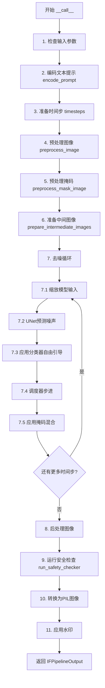

## 类结构

```
DiffusionPipeline (基类)
├── StableDiffusionLoraLoaderMixin (LoRA加载混合)
└── IFInpaintingPipeline (图像修复管道)
    ├── IFInpaintingSuperResolutionPipeline (超分辨率管道 - 示例引用)
    ├── IFSafetyChecker (安全检查器)
    └── IFWatermarker (水印处理器)
```

## 全局变量及字段


### `XLA_AVAILABLE`
    
PyTorch XLA可用性标志，指示是否支持TPU加速

类型：`bool`
    


### `logger`
    
模块级日志记录器，用于输出警告和信息

类型：`logging.Logger`
    


### `EXAMPLE_DOC_STRING`
    
示例文档字符串，包含pipeline使用示例和代码演示

类型：`str`
    


### `resize`
    
图像调整大小函数，将输入图像按比例缩放到目标尺寸

类型：`Callable[[PIL.Image.Image, int], PIL.Image.Image]`
    


### `IFInpaintingPipeline.tokenizer`
    
T5分词器，用于将文本prompt转换为token IDs

类型：`T5Tokenizer`
    


### `IFInpaintingPipeline.text_encoder`
    
T5文本编码器，将token IDs编码为文本嵌入向量

类型：`T5EncoderModel`
    


### `IFInpaintingPipeline.unet`
    
条件UNet模型，在去噪过程中根据文本嵌入生成图像特征

类型：`UNet2DConditionModel`
    


### `IFInpaintingPipeline.scheduler`
    
DDPM调度器，控制去噪过程的噪声调度和时间步

类型：`DDPMScheduler`
    


### `IFInpaintingPipeline.feature_extractor`
    
CLIP特征提取器，用于安全检查器提取图像特征

类型：`CLIPImageProcessor | None`
    


### `IFInpaintingPipeline.safety_checker`
    
安全检查器，过滤NSFW和包含水印的不当内容

类型：`IFSafetyChecker | None`
    


### `IFInpaintingPipeline.watermarker`
    
水印处理器，为生成的图像添加不可见水印

类型：`IFWatermarker | None`
    


### `IFInpaintingPipeline.bad_punct_regex`
    
坏标点符号正则表达式，用于文本预处理清理特殊字符

类型：`re.Pattern`
    


### `IFInpaintingPipeline._optional_components`
    
可选组件列表，定义哪些模块可以缺失而不报错

类型：`list[str]`
    


### `IFInpaintingPipeline.model_cpu_offload_seq`
    
CPU卸载顺序，指定模型从GPU卸载到CPU的顺序

类型：`str`
    


### `IFInpaintingPipeline._exclude_from_cpu_offload`
    
排除卸载的组件列表，这些模块不会被自动卸载到CPU

类型：`list[str]`
    
    

## 全局函数及方法


### `resize`

该函数是用于调整PIL图像大小的工具函数，通过计算原始图像的宽高比，将图像调整为目标尺寸（保持宽高比），同时确保调整后的尺寸是8的倍数（便于深度学习模型处理）。

参数：

- `images`：`PIL.Image.Image`，需要调整大小的输入图像
- `img_size`：`int`，目标尺寸（图像的目标边长，函数会保持宽高比）

返回值：`PIL.Image.Image`，调整大小后的图像

#### 流程图

```mermaid
flowchart TD
    A[开始] --> B[获取图像原始尺寸 w, h]
    B --> C[计算宽高比系数 coef = w / h]
    C --> D{coef >= 1?}
    D -->|是| E[w = int(round(img_size / 8 * coef) * 8)<br/>h = img_size]
    D -->|否| F[h = int(round(img_size / 8 / coef) * 8)<br/>w = img_size]
    E --> G[调用 images.resize 调整图像大小]
    F --> G
    G --> H[使用双三次插值<br/>PIL_INTERPOLATION['bicubic']]
    H --> I[返回调整后的图像]
    I --> J[结束]
```

#### 带注释源码

```python
# Copied from diffusers.pipelines.deepfloyd_if.pipeline_if_img2img.resize
def resize(images: PIL.Image.Image, img_size: int) -> PIL.Image.Image:
    # 获取输入图像的原始宽度和高度
    w, h = images.size

    # 计算图像的宽高比系数
    coef = w / h

    # 初始化目标尺寸为正方形
    w, h = img_size, img_size

    # 根据宽高比调整尺寸，保持图像比例
    # 确保调整后的尺寸是8的倍数，符合深度学习模型的要求
    if coef >= 1:
        # 宽图：宽度按比例扩展，高度保持为目标尺寸
        w = int(round(img_size / 8 * coef) * 8)
    else:
        # 高图：高度按比例扩展，宽度保持为目标尺寸
        h = int(round(img_size / 8 / coef) * 8)

    # 使用双三次插值调整图像大小
    # reducing_gap=None 表示不进行额外的缩小间隙优化
    images = images.resize((w, h), resample=PIL_INTERPOLATION["bicubic"], reducing_gap=None)

    # 返回调整大小后的图像
    return images
```


### IFInpaintingPipeline.__init__

该方法为 IFInpaintingPipeline 类的构造函数，负责初始化扩散管道所需的所有核心组件，包括分词器、文本编码器、UNet 模型、调度器、安全检查器、特征提取器和水印处理器，并进行安全检查器的配置验证。

参数：

- `tokenizer`：`T5Tokenizer`，用于将文本提示转换为token序列的分词器
- `text_encoder`：`T5EncoderModel`，将token序列编码为文本嵌入向量的文本编码器
- `unet`：`UNet2DConditionModel`，用于去噪的UNet条件扩散模型
- `scheduler`：`DDPMScheduler`，控制去噪过程的调度器
- `safety_checker`：`IFSafetyChecker | None`，用于检测NSFW内容的安全检查器，可为None
- `feature_extractor`：`CLIPImageProcessor | None`，用于安全检查的图像特征提取器，可为None
- `watermarker`：`IFWatermarker | None`，用于添加水印的水印处理器，可为None
- `requires_safety_checker`：`bool`，是否要求启用安全检查器，默认为True

返回值：`None`，该方法无返回值，直接初始化实例属性

#### 流程图

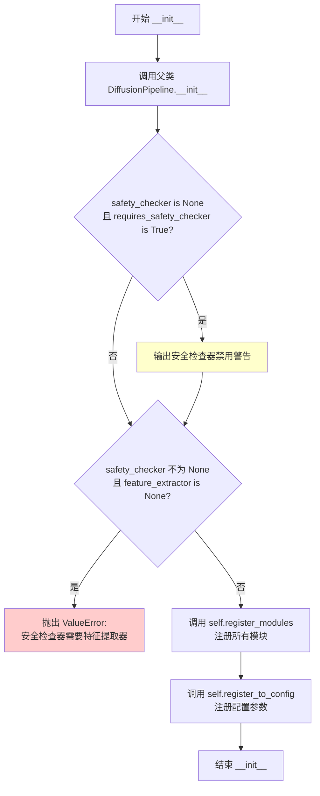

#### 带注释源码

```python
def __init__(
    self,
    tokenizer: T5Tokenizer,
    text_encoder: T5EncoderModel,
    unet: UNet2DConditionModel,
    scheduler: DDPMScheduler,
    safety_checker: IFSafetyChecker | None,
    feature_extractor: CLIPImageProcessor | None,
    watermarker: IFWatermarker | None,
    requires_safety_checker: bool = True,
):
    """
    初始化 IFInpaintingPipeline 管道组件
    
    参数:
        tokenizer: T5分词器，用于文本编码
        text_encoder: T5文本编码器模型
        unet: UNet2D条件模型，用于去噪预测
        scheduler: DDPM调度器
        safety_checker: 安全检查器，用于NSFW检测
        feature_extractor: CLIP图像处理器，用于安全检查
        watermarker: 水印处理器
        requires_safety_checker: 是否需要安全检查器
    """
    # 调用父类DiffusionPipeline的初始化方法
    super().__init__()

    # 检查：如果禁用了安全检查器但requires_safety_checker为True，发出警告
    if safety_checker is None and requires_safety_checker:
        logger.warning(
            f"You have disabled the safety checker for {self.__class__} by passing `safety_checker=None`. Ensure"
            " that you abide to the conditions of the IF license and do not expose unfiltered"
            " results in services or applications open to the public. Both the diffusers team and Hugging Face"
            " strongly recommend to keep the safety filter enabled in all public facing circumstances, disabling"
            " it only for use-cases that involve analyzing network behavior or auditing its results. For more"
            " information, please have a look at https://github.com/huggingface/diffusers/pull/254 ."
        )

    # 检查：如果提供了安全检查器但未提供特征提取器，抛出错误
    if safety_checker is not None and feature_extractor is None:
        raise ValueError(
            "Make sure to define a feature extractor when loading {self.__class__} if you want to use the safety"
            " checker. If you do not want to use the safety checker, you can pass `'safety_checker=None'` instead."
        )

    # 注册所有模块到管道实例，使这些组件可通过self.xxx访问
    self.register_modules(
        tokenizer=tokenizer,
        text_encoder=text_encoder,
        unet=unet,
        scheduler=scheduler,
        safety_checker=safety_checker,
        feature_extractor=feature_extractor,
        watermarker=watermarker,
    )
    # 将requires_safety_checker保存到配置中
    self.register_to_config(requires_safety_checker=requires_safety_checker)
```


### `IFInpaintingPipeline.encode_prompt`

该方法将文本提示（prompt）编码为文本编码器的隐藏状态向量（text encoder hidden states），用于后续的图像生成过程。支持无分类器引导（Classifier-Free Guidance），并能处理正面提示和负面提示的嵌入计算。

参数：

- `prompt`：`str | list[str]`，要编码的文本提示，可以是单个字符串或字符串列表
- `do_classifier_free_guidance`：`bool`，是否启用无分类器引导，默认为 True
- `num_images_per_prompt`：`int`，每个提示需要生成的图像数量，默认为 1
- `device`：`torch.device | None`，用于放置生成嵌入的张量设备，若为 None 则使用执行设备
- `negative_prompt`：`str | list[str] | None`，不希望出现的提示，用于引导生成不包含特定内容的图像
- `prompt_embeds`：`torch.Tensor | None`，预生成的文本嵌入，若提供则直接使用而不从 prompt 生成
- `negative_prompt_embeds`：`torch.Tensor | None`，预生成的负面文本嵌入
- `clean_caption`：`bool`，是否对文本进行清理预处理（如移除 URL、特殊字符等），默认为 False

返回值：`tuple[torch.Tensor, torch.Tensor]`，返回两个张量：第一个是编码后的提示嵌入（prompt_embeds），第二个是负面提示嵌入（negative_prompt_embeds）。若不启用引导且未提供 negative_prompt_embeds，则第二个返回值为 None

#### 流程图

```mermaid
flowchart TD
    A[开始 encode_prompt] --> B{参数校验}
    B --> C{device 为空?}
    C -->|是| D[使用执行设备 self._execution_device]
    C -->|否| E[使用传入 device]
    D --> F{判断 batch_size}
    F --> G{prompt 是 str?}
    G -->|是| H[batch_size = 1]
    G -->|否| I{prompt 是 list?}
    I -->|是| J[batch_size = len(prompt)]
    I -->|否| K[batch_size = prompt_embeds.shape[0]]
    H --> L{max_length = 77}
    J --> L
    K --> L
    L --> M{prompt_embeds 为空?}
    M -->|是| N[_text_preprocessing 清理文本]
    N --> O[tokenizer 分词]
    O --> P[text_encoder 编码]
    P --> Q[获取 prompt_embeds]
    M -->|否| Q
    Q --> R{确定 dtype}
    R --> S{text_encoder 存在?}
    S -->|是| T[dtype = text_encoder.dtype]
    S -->|否| U{unet 存在?}
    U -->|是| V[dtype = unet.dtype]
    U -->|否| W[dtype = None]
    T --> X[转换 prompt_embeds dtype 和 device]
    V --> X
    W --> X
    X --> Y[复制 prompt_embeds 以匹配 num_images_per_prompt]
    Y --> Z{启用 CFG?}
    Z -->|是| AA{negative_prompt_embeds 为空?}
    AA -->|是| AB[处理 negative_prompt]
    AB --> AC[生成 uncond_tokens]
    AC --> AD[_text_preprocessing 清理]
    AD --> AE[tokenizer 分词]
    AE --> AF[text_encoder 编码]
    AF --> AG[获取 negative_prompt_embeds]
    AA -->|否| AH[使用已有的 negative_prompt_embeds]
    Z -->|否| AI[negative_prompt_embeds = None]
    AG --> AJ[复制 negative_prompt_embeds]
    AH --> AJ
    AI --> AK[返回 prompt_embeds, negative_prompt_embeds]
    AJ --> AK
```

#### 带注释源码

```python
@torch.no_grad()
# 复制自 diffusers.pipelines.deepfloyd_if.pipeline_if.IFPipeline.encode_prompt
def encode_prompt(
    self,
    prompt: str | list[str],
    do_classifier_free_guidance: bool = True,
    num_images_per_prompt: int = 1,
    device: torch.device | None = None,
    negative_prompt: str | list[str] | None = None,
    prompt_embeds: torch.Tensor | None = None,
    negative_prompt_embeds: torch.Tensor | None = None,
    clean_caption: bool = False,
):
    r"""
    将提示编码为文本编码器隐藏状态

    参数:
        prompt: 要编码的提示，字符串或字符串列表
        do_classifier_free_guidance: 是否使用无分类器引导
        num_images_per_prompt: 每个提示生成的图像数量
        device: 放置结果嵌入的张量设备
        negative_prompt: 不引导图像生成的提示
        prompt_embeds: 预生成的文本嵌入
        negative_prompt_embeds: 预生成的负面文本嵌入
        clean_caption: 是否预处理清理标题
    """
    # 检查 prompt 和 negative_prompt 类型一致性
    if prompt is not None and negative_prompt is not None:
        if type(prompt) is not type(negative_prompt):
            raise TypeError(
                f"`negative_prompt` should be the same type to `prompt`, but got {type(negative_prompt)} !="
                f" {type(prompt)}."
            )

    # 确定设备，若未指定则使用执行设备
    if device is None:
        device = self._execution_device

    # 确定 batch_size
    if prompt is not None and isinstance(prompt, str):
        batch_size = 1
    elif prompt is not None and isinstance(prompt, list):
        batch_size = len(prompt)
    else:
        batch_size = prompt_embeds.shape[0]

    # IF 模型 text_encoder 训练时最大长度为 77
    max_length = 77

    # 若未提供 prompt_embeds，则从 prompt 生成
    if prompt_embeds is None:
        # 文本预处理：清理文本（可选）
        prompt = self._text_preprocessing(prompt, clean_caption=clean_caption)
        
        # 使用 tokenizer 将文本转为 token IDs
        text_inputs = self.tokenizer(
            prompt,
            padding="max_length",
            max_length=max_length,
            truncation=True,
            add_special_tokens=True,
            return_tensors="pt",
        )
        text_input_ids = text_inputs.input_ids
        
        # 获取未截断的 token 序列用于检查
        untruncated_ids = self.tokenizer(prompt, padding="longest", return_tensors="pt").input_ids

        # 检查是否发生截断并记录警告
        if untruncated_ids.shape[-1] >= text_input_ids.shape[-1] and not torch.equal(
            text_input_ids, untruncated_ids
        ):
            removed_text = self.tokenizer.batch_decode(untruncated_ids[:, max_length - 1 : -1])
            logger.warning(
                "The following part of your input was truncated because CLIP can only handle sequences up to"
                f" {max_length} tokens: {removed_text}"
            )

        # 获取 attention mask 并移动到指定设备
        attention_mask = text_inputs.attention_mask.to(device)

        # 使用 text_encoder 编码文本得到嵌入
        prompt_embeds = self.text_encoder(
            text_input_ids.to(device),
            attention_mask=attention_mask,
        )
        # 提取隐藏状态（取第一个元素）
        prompt_embeds = prompt_embeds[0]

    # 确定数据类型（dtype），优先使用 text_encoder 的 dtype，其次使用 unet 的 dtype
    if self.text_encoder is not None:
        dtype = self.text_encoder.dtype
    elif self.unet is not None:
        dtype = self.unet.dtype
    else:
        dtype = None

    # 将 prompt_embeds 转换到指定的数据类型和设备
    prompt_embeds = prompt_embeds.to(dtype=dtype, device=device)

    # 获取嵌入的形状信息
    bs_embed, seq_len, _ = prompt_embeds.shape
    
    # 复制文本嵌入以匹配每个提示生成的图像数量（使用 MPS 友好的方法）
    prompt_embeds = prompt_embeds.repeat(1, num_images_per_prompt, 1)
    prompt_embeds = prompt_embeds.view(bs_embed * num_images_per_prompt, seq_len, -1)

    # 获取无分类器引导的无条件嵌入
    if do_classifier_free_guidance and negative_prompt_embeds is None:
        uncond_tokens: list[str]
        if negative_prompt is None:
            # 若未提供负面提示，使用空字符串
            uncond_tokens = [""] * batch_size
        elif isinstance(negative_prompt, str):
            uncond_tokens = [negative_prompt]
        elif batch_size != len(negative_prompt):
            raise ValueError(
                f"`negative_prompt`: {negative_prompt} has batch size {len(negative_prompt)}, but `prompt`:"
                f" {prompt} has batch size {batch_size}. Please make sure that passed `negative_prompt` matches"
                " the batch size of `prompt`."
            )
        else:
            uncond_tokens = negative_prompt

        # 预处理无条件 tokens
        uncond_tokens = self._text_preprocessing(uncond_tokens, clean_caption=clean_caption)
        
        # 使用与 prompt_embeds 相同的长度
        max_length = prompt_embeds.shape[1]
        
        # tokenize 无条件输入
        uncond_input = self.tokenizer(
            uncond_tokens,
            padding="max_length",
            max_length=max_length,
            truncation=True,
            return_attention_mask=True,
            add_special_tokens=True,
            return_tensors="pt",
        )
        attention_mask = uncond_input.attention_mask.to(device)

        # 编码无条件输入
        negative_prompt_embeds = self.text_encoder(
            uncond_input.input_ids.to(device),
            attention_mask=attention_mask,
        )
        negative_prompt_embeds = negative_prompt_embeds[0]

    # 若启用 CFG，处理负面嵌入
    if do_classifier_free_guidance:
        # 获取序列长度
        seq_len = negative_prompt_embeds.shape[1]

        # 转换数据类型和设备
        negative_prompt_embeds = negative_prompt_embeds.to(dtype=dtype, device=device)

        # 复制无条件嵌入以匹配每个提示生成的图像数量
        negative_prompt_embeds = negative_prompt_embeds.repeat(1, num_images_per_prompt, 1)
        negative_prompt_embeds = negative_prompt_embeds.view(batch_size * num_images_per_prompt, seq_len, -1)

        # 对于 CFG，需要进行两次前向传播
        # 这里将无条件和文本嵌入连接成单个批次以避免两次前向传播
    else:
        negative_prompt_embeds = None

    return prompt_embeds, negative_prompt_embeds
```


### `IFInpaintingPipeline.run_safety_checker`

运行安全检查器，对生成的图像进行 NSFW（不适合在工作场所查看的内容）和水印检测。

参数：

- `image`：`torch.Tensor | np.ndarray`，待检查的图像数据
- `device`：`torch.device`，用于将数据移动到指定设备（如 CPU、GPU）
- `dtype`：`torch.dtype`，用于类型转换的数据类型（通常为 float16 或 float32）

返回值：`tuple[torch.Tensor | np.ndarray, Any, Any]`，返回一个元组，包含处理后的图像、NSFW 检测结果和水印检测结果。如果 `safety_checker` 为 `None`，则 NSFW 和水印检测结果均为 `None`。

#### 流程图

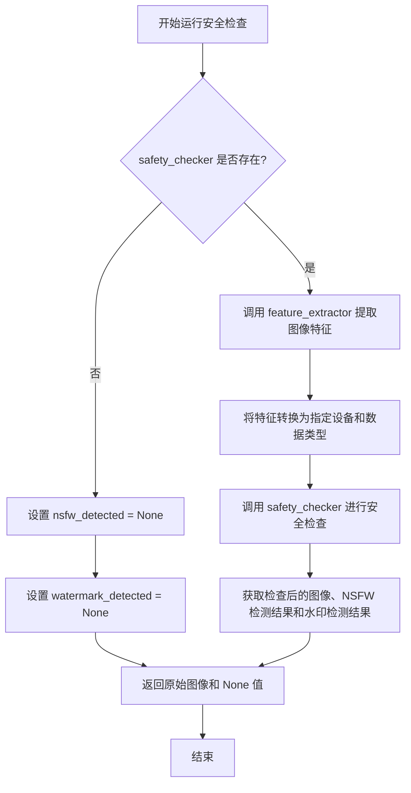

#### 带注释源码

```python
def run_safety_checker(self, image, device, dtype):
    """
    运行安全检查器，对生成的图像进行 NSFW 和水印检测。
    
    Args:
        image: 待检查的图像数据
        device: torch 设备对象
        dtype: torch 数据类型
    
    Returns:
        处理后的图像、NSFW 检测结果、水印检测结果
    """
    # 检查是否存在安全检查器
    if self.safety_checker is not None:
        # 将图像转换为 PIL 格式以提取特征
        safety_checker_input = self.feature_extractor(
            self.numpy_to_pil(image),  # 将 numpy 数组或 tensor 转换为 PIL Image
            return_tensors="pt"  # 返回 PyTorch tensor
        ).to(device)  # 移动到指定设备
        
        # 调用安全检查器进行实际检查
        # - images: 待检查的图像
        # - clip_input: 用于 CLIP 模型的输入特征
        image, nsfw_detected, watermark_detected = self.safety_checker(
            images=image,
            clip_input=safety_checker_input.pixel_values.to(dtype=dtype),
        )
    else:
        # 如果没有安全检查器，返回 None 值
        nsfw_detected = None
        watermark_detected = None

    # 返回检查结果
    return image, nsfw_detected, watermark_detected
```


### `IFInpaintingPipeline.prepare_extra_step_kwargs`

准备调度器（scheduler）的额外参数。由于不同的调度器可能有不同的签名，该方法通过检查调度器的 `step` 方法是否接受特定参数（如 `eta` 和 `generator`），动态构建需要传递给调度器的额外关键字参数字典。

参数：

- `generator`：`torch.Generator | list[torch.Generator] | None`，用于控制生成随机性的生成器对象。如果调度器支持，将传递给调度器的 `step` 方法。
- `eta`：`float`，DDIM 调度器中使用的 eta 参数（η），对应 DDIM 论文中的参数，取值范围应在 [0, 1] 之间。其他调度器会忽略此参数。

返回值：`dict`，包含调度器 `step` 方法所需额外参数（如 `eta` 和/或 `generator`）的字典。

#### 流程图

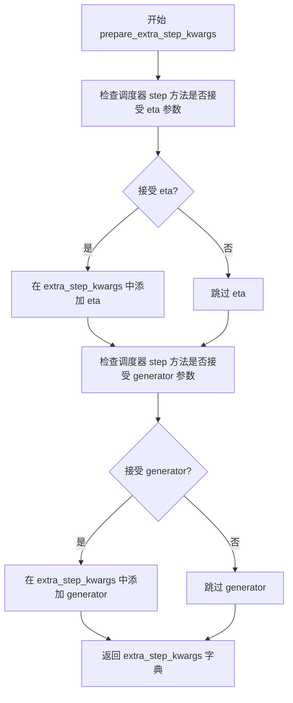

#### 带注释源码

```python
def prepare_extra_step_kwargs(self, generator, eta):
    """
    准备调度器的额外参数。
    
    由于并非所有调度器都具有相同的签名，这里通过检查调度器的 step 方法
    来确定它接受哪些参数，然后构建相应的参数字典。
    
    参数:
        generator: torch.Generator 或其列表，用于控制随机性生成
        eta: float，DDIM 调度器使用的 eta 参数 (η)，对应 DDIM 论文中的参数，
             取值范围应在 [0, 1]。其他调度器会忽略此参数。
    
    返回:
        dict: 包含额外参数的字典，可直接解包传递给调度器的 step 方法
    """
    
    # 使用 inspect 检查调度器的 step 方法签名，判断是否接受 eta 参数
    # eta (η) 主要用于 DDIMScheduler，其他调度器会忽略此参数
    # eta 对应 DDIM 论文: https://huggingface.co/papers/2010.02502
    accepts_eta = "eta" in set(inspect.signature(self.scheduler.step).parameters.keys())
    
    # 初始化空字典用于存储额外参数
    extra_step_kwargs = {}
    
    # 如果调度器接受 eta 参数，则将其添加到参数字典中
    if accepts_eta:
        extra_step_kwargs["eta"] = eta

    # 检查调度器是否接受 generator 参数
    # 某些调度器支持使用特定的随机生成器来控制噪声生成
    accepts_generator = "generator" in set(inspect.signature(self.scheduler.step).parameters.keys())
    
    # 如果调度器接受 generator 参数，则将其添加到参数字典中
    if accepts_generator:
        extra_step_kwargs["generator"] = generator
        
    # 返回构建好的参数字典，供调用者使用
    return extra_step_kwargs
```


### IFInpaintingPipeline.check_inputs

该函数是 `IFInpaintingPipeline` 类的输入验证方法，用于在图像修复（inpainting）流程执行前验证所有输入参数的有效性，确保 prompt、image、mask_image、batch_size 等参数符合要求，若参数不符合规范则抛出详细的 ValueError 异常。

参数：

- `self`：类实例本身，包含 pipeline 的配置和模块
- `prompt`：str | list[str] | None，需要进行修复的文本提示词，可为单个字符串或字符串列表
- `image`：torch.Tensor | PIL.Image.Image | np.ndarray | list[...]，待修复的输入图像，支持张量、PIL图像、numpy数组或其列表
- `mask_image`：torch.Tensor | PIL.Image.Image | np.ndarray | list[...]，修复掩码图像，白色像素区域将被重绘，黑色像素保留
- `batch_size`：int，批处理大小，需与图像数量匹配
- `callback_steps`：int，推理过程中回调函数的调用频率，必须为正整数
- `negative_prompt`：str | list[str] | None，可选的反向提示词，用于引导图像生成方向
- `prompt_embeds`：torch.Tensor | None，可选的预生成文本嵌入向量
- `negative_prompt_embeds`：torch.Tensor | None，可选的预生成反向文本嵌入向量

返回值：无返回值（None），验证通过则继续执行，验证失败则抛出 ValueError 异常

#### 流程图

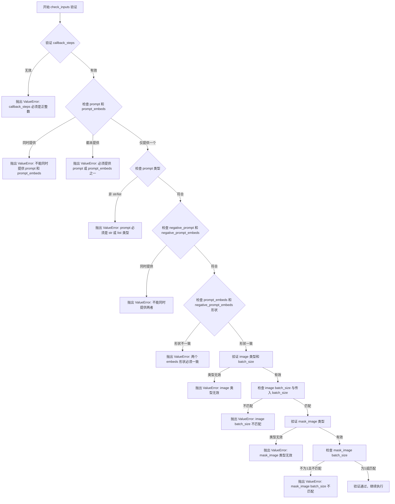

#### 带注释源码

```python
def check_inputs(
    self,
    prompt,
    image,
    mask_image,
    batch_size,
    callback_steps,
    negative_prompt=None,
    prompt_embeds=None,
    negative_prompt_embeds=None,
):
    # 验证 callback_steps 参数：必须为正整数
    if (callback_steps is None) or (
        callback_steps is not None and (not isinstance(callback_steps, int) or callback_steps <= 0)
    ):
        raise ValueError(
            f"`callback_steps` has to be a positive integer but is {callback_steps} of type"
            f" {type(callback_steps)}."
        )

    # 验证 prompt 和 prompt_embeds 互斥：不能同时提供
    if prompt is not None and prompt_embeds is not None:
        raise ValueError(
            f"Cannot forward both `prompt`: {prompt} and `prompt_embeds`: {prompt_embeds}. Please make sure to"
            " only forward one of the two."
        )
    # 至少需要提供其中一个
    elif prompt is None and prompt_embeds is None:
        raise ValueError(
            "Provide either `prompt` or `prompt_embeds`. Cannot leave both `prompt` and `prompt_embeds` undefined."
        )
    # 验证 prompt 类型：必须为 str 或 list
    elif prompt is not None and (not isinstance(prompt, str) and not isinstance(prompt, list)):
        raise ValueError(f"`prompt` has to be of type `str` or `list` but is {type(prompt)}")

    # 验证 negative_prompt 和 negative_prompt_embeds 互斥
    if negative_prompt is not None and negative_prompt_embeds is not None:
        raise ValueError(
            f"Cannot forward both `negative_prompt`: {negative_prompt} and `negative_prompt_embeds`:"
            f" {negative_prompt_embeds}. Please make sure to only forward one of the two."
        )

    # 验证 prompt_embeds 和 negative_prompt_embeds 形状一致性（当都提供时）
    if prompt_embeds is not None and negative_prompt_embeds is not None:
        if prompt_embeds.shape != negative_prompt_embeds.shape:
            raise ValueError(
                "`prompt_embeds` and `negative_prompt_embeds` must have the same shape when passed directly, but"
                f" got: `prompt_embeds` {prompt_embeds.shape} != `negative_prompt_embeds`"
                f" {negative_prompt_embeds.shape}."
            )

    # ========== 验证 image 参数 ==========
    # 获取第一个元素用于类型检查（如果是列表）
    if isinstance(image, list):
        check_image_type = image[0]
    else:
        check_image_type = image

    # 验证 image 类型：必须是 torch.Tensor、PIL.Image.Image、np.ndarray 或列表
    if (
        not isinstance(check_image_type, torch.Tensor)
        and not isinstance(check_image_type, PIL.Image.Image)
        and not isinstance(check_image_type, np.ndarray)
    ):
        raise ValueError(
            "`image` has to be of type `torch.Tensor`, `PIL.Image.Image`, `np.ndarray`, or list[...] but is"
            f" {type(check_image_type)}"
        )

    # 计算 image 的 batch_size
    if isinstance(image, list):
        image_batch_size = len(image)
    elif isinstance(image, torch.Tensor):
        image_batch_size = image.shape[0]
    elif isinstance(image, PIL.Image.Image):
        image_batch_size = 1
    elif isinstance(image, np.ndarray):
        image_batch_size = image.shape[0]
    else:
        assert False

    # 验证 image batch_size 与传入 batch_size 匹配
    if batch_size != image_batch_size:
        raise ValueError(f"image batch size: {image_batch_size} must be same as prompt batch size {batch_size}")

    # ========== 验证 mask_image 参数 ==========
    # 获取第一个元素用于类型检查
    if isinstance(mask_image, list):
        check_image_type = mask_image[0]
    else:
        check_image_type = mask_image

    # 验证 mask_image 类型
    if (
        not isinstance(check_image_type, torch.Tensor)
        and not isinstance(check_image_type, PIL.Image.Image)
        and not isinstance(check_image_type, np.ndarray)
    ):
        raise ValueError(
            "`mask_image` has to be of type `torch.Tensor`, `PIL.Image.Image`, `np.ndarray`, or list[...] but is"
            f" {type(check_image_type)}"
        )

    # 计算 mask_image 的 batch_size
    if isinstance(mask_image, list):
        image_batch_size = len(mask_image)
    elif isinstance(mask_image, torch.Tensor):
        image_batch_size = mask_image.shape[0]
    elif isinstance(mask_image, PIL.Image.Image):
        image_batch_size = 1
    elif isinstance(mask_image, np.ndarray):
        image_batch_size = mask_image.shape[0]
    else:
        assert False

    # 验证 mask_image batch_size：必须为1或与 batch_size 相同
    if image_batch_size != 1 and batch_size != image_batch_size:
        raise ValueError(
            f"mask_image batch size: {image_batch_size} must be `1` or the same as prompt batch size {batch_size}"
        )
```


### IFInpaintingPipeline._text_preprocessing

该方法用于对输入的文本提示进行预处理，支持两种模式：简单模式（转小写并去空格）和深度清洗模式（调用 `_clean_caption` 进行全面清洗）。在深度清洗前会检查依赖库 `bs4` 和 `ftfy` 是否可用。

参数：

- `text`：`str | list[str]`，待处理的文本提示，可以是单个字符串或字符串列表
- `clean_caption`：`bool`，是否进行深度清洗，默认为 False。为 True 时会调用 `_clean_caption` 进行全面清洗

返回值：`list[str]`，返回处理后的文本列表，始终返回列表格式

#### 流程图

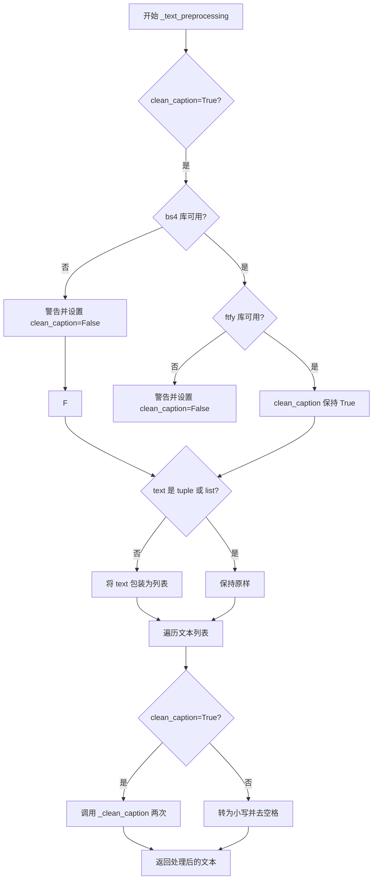

#### 带注释源码

```
def _text_preprocessing(self, text, clean_caption=False):
    """
    文本预处理方法，支持简单清洗和深度清洗两种模式
    
    Args:
        text: 输入的文本，可以是单个字符串或字符串列表
        clean_caption: 是否进行深度清洗（需要 bs4 和 ftfy 库支持）
    
    Returns:
        处理后的字符串列表
    """
    
    # 检查 clean_caption 为 True 时，bs4 库是否可用
    if clean_caption and not is_bs4_available():
        # 库不可用时发出警告，并自动关闭深度清洗功能
        logger.warning(BACKENDS_MAPPING["bs4"][-1].format("Setting `clean_caption=True`"))
        logger.warning("Setting `clean_caption` to False...")
        clean_caption = False

    # 检查 clean_caption 为 True 时，ftfy 库是否可用
    if clean_caption and not is_ftfy_available():
        # 库不可用时发出警告，并自动关闭深度清洗功能
        logger.warning(BACKENDS_MAPPING["ftfy"][-1].format("Setting `clean_caption=True`"))
        logger.warning("Setting `clean_caption` to False...")
        clean_caption = False

    # 统一将输入转为列表处理
    if not isinstance(text, (tuple, list)):
        text = [text]

    # 定义内部处理函数
    def process(text: str):
        if clean_caption:
            # 深度清洗模式：调用 _clean_caption 两次以确保彻底清洗
            text = self._clean_caption(text)
            text = self._clean_caption(text)
        else:
            # 简单模式：仅转小写并去除首尾空格
            text = text.lower().strip()
        return text

    # 对列表中每个文本元素进行处理
    return [process(t) for t in text]
```


### IFInpaintingPipeline._clean_caption

该方法是一个私有实例方法，属于 `IFInpaintingPipeline` 类，用于对图像修复管道的标题（caption）进行深度清洗和预处理。它通过 URL 解码、HTML 解析、正则表达式替换等技术移除标题中的 URL、HTML 标签、CJK 字符、特殊标点、营销文本等噪声内容，使标题更加简洁并适用于文本编码器。

参数：

- `self`：`IFInpaintingPipeline`，隐式参数，表示类的实例本身
- `caption`：任意类型（Any），待清洗的标题文本，可以是字符串或其他可转换为字符串的对象

返回值：`str`，返回清洗处理后的标题文本字符串

#### 流程图

```mermaid
flowchart TD
    A[开始: 接收caption] --> B[转换为字符串 str caption]
    C[URL解码: ul.unquote_plus]
    D[转小写并去空格: strip lower]
    E[替换特殊标签: &lt;person&gt; → person]
    F[正则移除URLs: http/https/www开头的链接]
    G[HTML解析: BeautifulSoup提取纯文本]
    H[正则移除@昵称]
    I[正则移除CJK字符集]
    J[正则统一破折号类型]
    K[正则统一引号类型]
    L[移除HTML实体: quot amp]
    M[移除IP地址]
    N[移除文章ID和换行符]
    O[移除#标签和长数字]
    O --> P[正则过滤文件名]
    P --> Q[压缩连续引号和句点]
    Q --> R[过滤特殊标点]
    R --> S{检查连字符/下划线是否超过3个}
    S -->|是| T[替换为空格]
    S -->|否| U[ftfy修复文本编码]
    U --> V[HTML unescape两次]
    V --> W[移除字母数字混合短码]
    W --> X[移除营销用语]
    X --> Y[移除图片格式词汇和页码]
    Y --> Z[移除混合模式字符串]
    Z --> AA[规范化冒号和标点间距]
    AA --> AB[压缩多余空格]
    AB --> AC[首尾修整去引号]
    AC --> AD[结束: 返回清洗后的caption]
```

#### 带注释源码

```python
def _clean_caption(self, caption):
    """
    清洗并预处理标题文本，移除噪声内容
    
    处理流程包含多个步骤：
    1. 基础转换：类型转换、大小写规范化
    2. URL和链接移除
    3. HTML标签解析和提取
    4. 特殊字符清理（CJK、标点、@提及等）
    5. 营销和噪声文本移除
    6. 格式规范化
    """
    # ========== 步骤1: 基础转换 ==========
    caption = str(caption)  # 统一转换为字符串类型
    caption = ul.unquote_plus(caption)  # URL解码（如 %20 转换为空格）
    caption = caption.strip().lower()  # 去除首尾空格并转小写
    caption = re.sub("<person>", "person", caption)  # 特殊标签替换
    
    # ========== 步骤2: URL移除 ==========
    # 匹配 http/https 开头的URL
    caption = re.sub(
        r"\b((?:https?:(?:\/{1,3}|[a-zA-Z0-9%])|[a-zA-Z0-9.\-]+[.](?:com|co|ru|net|org|edu|gov|it)[\w/-]*\b\/?(?!@)))",
        "",
        caption,
    )
    # 匹配 www 开头的URL
    caption = re.sub(
        r"\b((?:www:(?:\/{1,3}|[a-zA-Z0-9%])|[a-zA-Z0-9.\-]+[.](?:com|co|ru|net|org|edu|gov|it)[\w/-]*\b\/?(?!@)))",
        "",
        caption,
    )
    
    # ========== 步骤3: HTML解析 ==========
    # 使用BeautifulSoup提取纯文本，移除所有HTML标签
    caption = BeautifulSoup(caption, features="html.parser").text
    
    # ========== 步骤4: 移除@昵称 ==========
    caption = re.sub(r"@[\w\d]+\b", "", caption)
    
    # ========== 步骤5: CJK字符移除 ==========
    # 31C0—31EF CJK笔划
    caption = re.sub(r"[\u31c0-\u31ef]+", "", caption)
    # 31F0—31FF 片假名语音扩展
    caption = re.sub(r"[\u31f0-\u31ff]+", "", caption)
    # 3200—32FF CJK封闭字母和月份
    caption = re.sub(r"[\u3200-\u32ff]+", "", caption)
    # 3300—33FF CJK兼容性
    caption = re.sub(r"[\u3300-\u33ff]+", "", caption)
    # 3400—4DBF CJK统一表意文字扩展A
    caption = re.sub(r"[\u3400-\u4dbf]+", "", caption)
    # 4DC0—4DFF 易经六十四卦符号
    caption = re.sub(r"[\u4dc0-\u4dff]+", "", caption)
    # 4E00—9FFF CJK统一表意文字
    caption = re.sub(r"[\u4e00-\u9fff]+", "", caption)
    
    # ========== 步骤6: 破折号统一 ==========
    # 统一各种语言的破折号为标准 "-"
    caption = re.sub(
        r"[\u002D\u058A\u05BE\u1400\u1806\u2010-\u2015\u2E17\u2E1A\u2E3A\u2E3B\u2E40\u301C\u3030\u30A0\uFE31\uFE32\uFE58\uFE63\uFF0D]+",
        "-",
        caption,
    )
    
    # ========== 步骤7: 引号统一 ==========
    # 统一各种引号为双引号
    caption = re.sub(r"[`´«»""¨]", '"', caption)
    # 统一单引号
    caption = re.sub(r"['']", "'", caption)
    
    # ========== 步骤8: HTML实体移除 ==========
    caption = re.sub(r"&quot;?", "", caption)  # &quot; 或 &quot
    caption = re.sub(r"&amp", "", caption)     # &amp
    
    # ========== 步骤9: IP地址移除 ==========
    caption = re.sub(r"\d{1,3}\.\d{1,3}\.\d{1,3}\.\d{1,3}", " ", caption)
    
    # ========== 步骤10: 文章ID和换行符移除 ==========
    caption = re.sub(r"\d:\d\d\s+$", "", caption)  # 移除尾部文章ID
    caption = re.sub(r"\\n", " ", caption)         # 替换换行符
    
    # ========== 步骤11: 标签和长数字移除 ==========
    caption = re.sub(r"#\d{1,3}\b", "", caption)   # #123
    caption = re.sub(r"#\d{5,}\b", "", caption)    # #12345..
    caption = re.sub(r"\b\d{6,}\b", "", caption)   # 123456..
    
    # ========== 步骤12: 文件名移除 ==========
    caption = re.sub(r"[\S]+\.(?:png|jpg|jpeg|bmp|webp|eps|pdf|apk|mp4)", "", caption)
    
    # ========== 步骤13: 压缩重复字符 ==========
    caption = re.sub(r"[\"']{2,}", r'"', caption)  # """"AUSVERKAUFT""" → "AUSVERKAUFT"
    caption = re.sub(r"[\.]{2,}", r" ", caption)    # ... → 空格
    
    # ========== 步骤14: 特殊标点移除 ==========
    caption = re.sub(self.bad_punct_regex, r" ", caption)  # 使用类属性定义的正则
    caption = re.sub(r"\s+\.\s+", r" ", caption)            # " . " → " "
    
    # ========== 步骤15: 连字符处理 ==========
    # 如果连字符或下划线超过3个，则替换为空格
    regex2 = re.compile(r"(?:\-|\_)")
    if len(re.findall(regex2, caption)) > 3:
        caption = re.sub(regex2, " ", caption)
    
    # ========== 步骤16: ftfy修复 ==========
    # 修复损坏的UTF-8编码和HTML实体
    caption = ftfy.fix_text(caption)
    caption = html.unescape(html.unescape(caption))
    
    # ========== 步骤17: 字母数字混合码移除 ==========
    caption = re.sub(r"\b[a-zA-Z]{1,3}\d{3,15}\b", "", caption)    # jc6640
    caption = re.sub(r"\b[a-zA-Z]+\d+[a-zA-Z]+\b", "", caption)    # jc6640vc
    caption = re.sub(r"\b\d+[a-zA-Z]+\d+\b", "", caption)          # 6640vc231
    
    # ========== 步骤18: 营销用语移除 ==========
    caption = re.sub(r"(worldwide\s+)?(free\s+)?shipping", "", caption)
    caption = re.sub(r"(free\s)?download(\sfree)?", "", caption)
    caption = re.sub(r"\bclick\b\s(?:for|on)\s\w+", "", caption)
    
    # ========== 步骤19: 格式词汇移除 ==========
    caption = re.sub(r"\b(?:png|jpg|jpeg|bmp|webp|eps|pdf|apk|mp4)(\simage[s]?)?", "", caption)
    caption = re.sub(r"\bpage\s+\d+\b", "", caption)
    
    # ========== 步骤20: 更多混合模式移除 ==========
    caption = re.sub(r"\b\d*[a-zA-Z]+\d+[a-zA-Z]+\d+[a-zA-Z\d]*\b", r" ", caption)  # j2d1a2a...
    caption = re.sub(r"\b\d+\.?\d*[xх×]\d+\.?\d*\b", "", caption)  # 尺寸格式 1920x1080
    
    # ========== 步骤21: 格式规范化 ==========
    caption = re.sub(r"\b\s+\:\s+", r": ", caption)   # 规范化冒号
    caption = re.sub(r"(\D[,\./])\b", r"\1 ", caption) # 标点后加空格
    caption = re.sub(r"\s+", " ", caption)            # 压缩多余空格
    
    # ========== 步骤22: 首尾修整 ==========
    caption.strip()  # 去除首尾空格（实际未赋值）
    caption = re.sub(r"^[\"\']([\w\W]+)[\"\']$", r"\1", caption)  # 去除首尾引号
    caption = re.sub(r"^[\'\_,\-\:;]", r"", caption)               # 去除首部特殊字符
    caption = re.sub(r"[\'\_,\-\:\-\+]$", r"", caption)            # 去除尾部特殊字符
    caption = re.sub(r"^\.\S+$", "", caption)                      # 去除以点开头的单词
    
    return caption.strip()  # 返回最终清洗后的文本
```


### IFInpaintingPipeline.preprocess_image

该方法负责将输入图像（支持PIL.Image、numpy数组或torch.Tensor格式）统一预处理为PyTorch张量格式，以便后续在深度学习 pipeline 中进行处理。处理流程包括类型检查与统一、尺寸调整、数值归一化（到[-1, 1]区间）以及维度转换。

参数：

- `self`：实例方法隐含参数，指向 IFInpaintingPipeline 类的当前实例
- `image`：`PIL.Image.Image`，待预处理的输入图像，支持单张图像或图像列表，也支持 numpy array 或 torch.Tensor 格式

返回值：`torch.Tensor`，预处理后的图像张量，形状为 (B, C, H, W)，数值范围为 [-1, 1]

#### 流程图

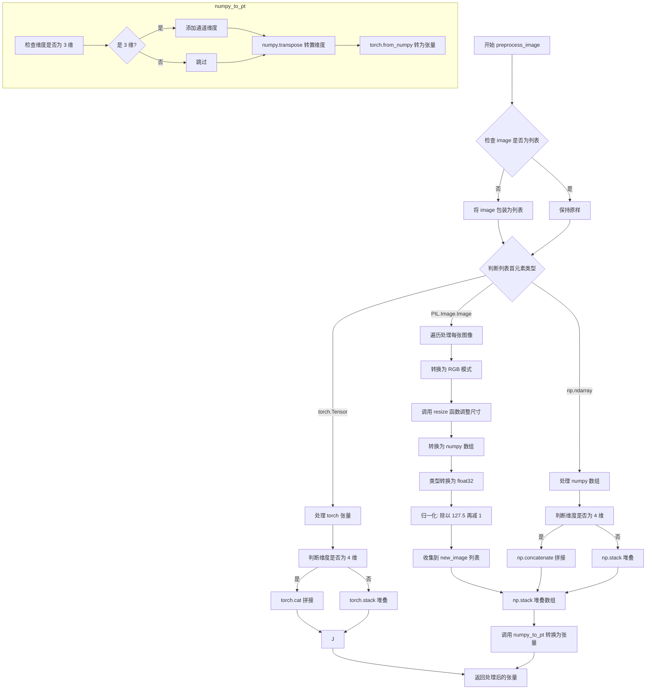

#### 带注释源码

```python
def preprocess_image(self, image: PIL.Image.Image) -> torch.Tensor:
    """
    预处理输入图像，将其转换为 PyTorch 张量格式。
    
    支持多种输入格式：PIL.Image.Image、numpy.ndarray、torch.Tensor。
    处理流程包括：尺寸调整、归一化、维度转换。
    
    参数:
        image: PIL.Image.Image - 输入图像，支持单张或列表形式
        
    返回:
        torch.Tensor - 预处理后的图像张量，形状 (B, C, H, W)，范围 [-1, 1]
    """
    
    # 如果输入不是列表，统一转换为列表处理，便于后续批量操作
    if not isinstance(image, list):
        image = [image]

    # 定义内部辅助函数：将 numpy 数组转换为 PyTorch 张量
    def numpy_to_pt(images):
        # 处理单张图像（3维）的特殊情况，需要添加通道维度变成4维
        if images.ndim == 3:
            images = images[..., None]  # (H, W, C) -> (H, W, C, 1)

        # 维度转换：numpy (B, H, W, C) -> torch (B, C, H, W)
        images = torch.from_numpy(images.transpose(0, 3, 1, 2))
        return images

    # 分支处理：PIL Image 格式
    if isinstance(image[0], PIL.Image.Image):
        new_image = []

        # 遍历处理列表中的每张图像
        for image_ in image:
            # 1. 转换为 RGB 模式（确保3通道）
            image_ = image_.convert("RGB")
            
            # 2. 调整图像尺寸到模型所需的采样大小
            # 使用 unet.config.sample_size 作为目标尺寸
            image_ = resize(image_, self.unet.config.sample_size)
            
            # 3. 转换为 numpy 数组
            image_ = np.array(image_)
            
            # 4. 转换为 float32 类型（精度要求）
            image_ = image_.astype(np.float32)
            
            # 5. 归一化：像素值 [0, 255] -> [-1, 1]
            # 计算公式：pixel / 127.5 - 1
            # 等价于：pixel * 2 / 255 - 1 = pixel / 127.5 - 1
            image_ = image_ / 127.5 - 1
            
            # 收集处理后的图像
            new_image.append(image_)

        # 更新 image 变量为处理后的列表
        image = new_image

        # 将图像列表堆叠为 numpy 数组（批量维度）
        image = np.stack(image, axis=0)  # to np
        
        # 转换为 PyTorch 张量
        image = numpy_to_pt(image)  # to pt

    # 分支处理：numpy array 格式
    elif isinstance(image[0], np.ndarray):
        # 4维数组（带批量维度）用 concatenate，3维用 stack
        image = np.concatenate(image, axis=0) if image[0].ndim == 4 else np.stack(image, axis=0)
        # 转换为 PyTorch 张量
        image = numpy_to_pt(image)

    # 分支处理：torch.Tensor 格式
    elif isinstance(image[0], torch.Tensor):
        # 4维张量用 cat，3维用 stack
        image = torch.cat(image, axis=0) if image[0].ndim == 4 else torch.stack(image, axis=0)

    # 返回预处理完成的图像张量
    return image
```


### `IFInpaintingPipeline.preprocess_mask_image`

该方法用于将各种格式（PyTorch张量、PIL图像、NumPy数组）的掩码图像预处理为统一的PyTorch张量格式，以便于后续的图像修复处理。方法会对掩码进行二值化处理（阈值0.5），并调整维度以适配模型输入要求。

参数：

- `mask_image`：掩码图像，支持 `torch.Tensor` | `np.ndarray` | `PIL.Image.Image` | `list[torch.Tensor]` | `list[np.ndarray]` | `list[PIL.Image.Image]`，待预处理的掩码图像，白色像素将被重绘，黑色像素将被保留

返回值：`torch.Tensor`，预处理后的掩码图像张量，形状为 (B, 1, H, W)，值为0或1

#### 流程图

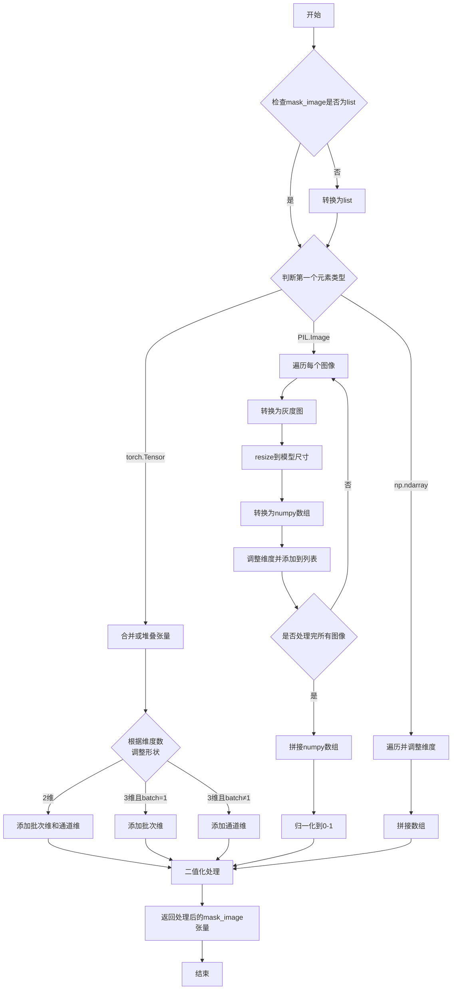

#### 带注释源码

```python
def preprocess_mask_image(self, mask_image) -> torch.Tensor:
    """
    预处理掩码图像，将其转换为统一格式的PyTorch张量。
    
    支持的输入格式：
    - torch.Tensor: 形状为 (H, W), (B, H, W), (B, 1, H, W) 的掩码
    - PIL.Image.Image: 单通道灰度图
    - np.ndarray: 任意形状的numpy数组
    
    处理步骤：
    1. 统一转换为list格式
    2. 根据输入类型进行相应处理
    3. 调整维度以适配模型 (B, 1, H, W)
    4. 二值化处理（阈值0.5）
    """
    
    # 如果输入不是list，统一转换为list以便批量处理
    if not isinstance(mask_image, list):
        mask_image = [mask_image]

    # 分支处理：输入为PyTorch张量
    if isinstance(mask_image[0], torch.Tensor):
        # 根据维度判断是批量还是单个张量，然后合并
        # 如果是4维(B,H,W,C格式的图像)，使用cat；否则使用stack
        mask_image = torch.cat(mask_image, axis=0) if mask_image[0].ndim == 4 else torch.stack(mask_image, axis=0)

        # 2维处理：(H,W) -> (1,1,H,W) - 单个掩码，添加批次和通道维
        if mask_image.ndim == 2:
            # Batch and add channel dim for single mask
            mask_image = mask_image.unsqueeze(0).unsqueeze(0)
        # 3维且batch=1处理：(1,H,W) -> (1,1,H,W) - 已是单个掩码，添加通道维
        elif mask_image.ndim == 3 and mask_image.shape[0] == 1:
            # Single mask, the 0'th dimension is considered to be
            # the existing batch size of 1
            mask_image = mask_image.unsqueeze(0)
        # 3维且batch>1处理：(B,H,W) -> (B,1,H,W) - 批量掩码，添加通道维
        elif mask_image.ndim == 3 and mask_image.shape[0] != 1:
            # Batch of mask, the 0'th dimension is considered to be
            # the batching dimension
            mask_image = mask_image.unsqueeze(1)

        # 二值化处理：小于0.5的设为0，大于等于0.5的设为1
        mask_image[mask_image < 0.5] = 0
        mask_image[mask_image >= 0.5] = 1

    # 分支处理：输入为PIL图像
    elif isinstance(mask_image[0], PIL.Image.Image):
        new_mask_image = []

        # 遍历每个掩码图像进行预处理
        for mask_image_ in mask_image:
            # 转换为灰度图（L模式），确保是单通道
            mask_image_ = mask_image_.convert("L")
            # resize到模型配置的样本尺寸
            mask_image_ = resize(mask_image_, self.unet.config.sample_size)
            # 转换为numpy数组
            mask_image_ = np.array(mask_image_)
            # 调整维度：(H,W) -> (1,1,H,W)
            mask_image_ = mask_image_[None, None, :]
            new_mask_image.append(mask_image_)

        mask_image = new_mask_image

        # 沿批次维度拼接：(B,1,H,W)
        mask_image = np.concatenate(mask_image, axis=0)
        # 转换为float32并归一化到0-1范围
        mask_image = mask_image.astype(np.float32) / 255.0
        # 二值化处理
        mask_image[mask_image < 0.5] = 0
        mask_image[mask_image >= 0.5] = 1
        # 转换为PyTorch张量
        mask_image = torch.from_numpy(mask_image)

    # 分支处理：输入为NumPy数组
    elif isinstance(mask_image[0], np.ndarray):
        # 遍历每个数组，调整维度并拼接
        # [None, None, :] 将 (H,W) 转换为 (1,1,H,W)
        mask_image = np.concatenate([m[None, None, :] for m in mask_image], axis=0)

        # 二值化处理
        mask_image[mask_image < 0.5] = 0
        mask_image[mask_image >= 0.5] = 1
        # 转换为PyTorch张量
        mask_image = torch.from_numpy(mask_image)

    return mask_image
```


### `IFInpaintingPipeline.get_timesteps`

该方法用于根据推理步数（num_inference_steps）和强度（strength）计算去噪过程的时间步序列。它确定从完整的调度器时间步序列中截取哪一段用于当前的图像修复任务，并返回调整后的时间步和实际推理步数。

参数：

- `num_inference_steps`：`int`，用户指定的去噪推理总步数
- `strength`：`float`，控制图像修复强度的参数，取值范围为 0 到 1，值越大表示对原始图像的修改越多

返回值：`(torch.Tensor, int)`，返回一个元组，包含 `timesteps`（截取后的时间步序列，类型为 `torch.Tensor`）和 `num_inference_steps - t_start`（实际用于去噪的步数，类型为 `int`）

#### 流程图

```mermaid
flowchart TD
    A[开始 get_timesteps] --> B[计算 init_timestep = min(num_inference_steps * strength, num_inference_steps)]
    B --> C[计算 t_start = max(num_inference_steps - init_timestep, 0)]
    C --> D[从 scheduler.timesteps 中切片: timesteps = scheduler.timesteps[t_start * scheduler.order:]]
    D --> E{scheduler 是否有 set_begin_index 方法?}
    E -->|是| F[调用 scheduler.set_begin_index(t_start * scheduler.order)]
    E -->|否| G[跳过设置]
    F --> H[返回 timesteps 和 num_inference_steps - t_start]
    G --> H
```

#### 带注释源码

```python
def get_timesteps(self, num_inference_steps, strength):
    # 计算初始时间步数，根据强度和总步数确定
    # strength 越高，init_timestep 越大，意味着从更接近原始噪声的状态开始
    init_timestep = min(int(num_inference_steps * strength), num_inference_steps)

    # 计算起始索引，确保从调度器时间步序列的适当位置开始
    # 如果 strength=1.0，则 t_start=0，使用全部时间步
    # 如果 strength<1.0，则跳过前面的时间步，减少噪声添加量
    t_start = max(num_inference_steps - init_timestep, 0)

    # 从调度器的时间步序列中截取需要使用的子序列
    # scheduler.order 表示调度器的阶数，用于正确索引
    timesteps = self.scheduler.timesteps[t_start * self.scheduler.order :]

    # 如果调度器支持设置起始索引（某些调度器需要），则设置内部状态
    if hasattr(self.scheduler, "set_begin_index"):
        self.scheduler.set_begin_index(t_start * self.scheduler.order)

    # 返回截取的时间步和实际推理步数
    return timesteps, num_inference_steps - t_start
```


### `IFInpaintingPipeline.prepare_intermediate_images`

该方法是图像修复（Inpainting）管道中的核心步骤，用于在去噪过程开始前准备中间图像。它通过生成随机噪声并使用调度器（scheduler）将噪声添加到输入图像中，同时根据掩码图像（mask_image）混合原始图像和噪声图像，从而为后续的去噪迭代提供初始的中间状态。

参数：

- `image`：`torch.Tensor`，输入的原始图像张量，形状为 (batch_size, channels, height, width)
- `timestep`：`torch.Tensor`，当前扩散过程的时间步，用于噪声调度
- `batch_size`：`int`，批处理大小，表示输入图像的数量
- `num_images_per_prompt`：`int`，每个提示词生成的图像数量，用于扩展批处理维度
- `dtype`：`torch.dtype`，目标数据类型，用于生成噪声和图像的类型转换
- `device`：`torch.device`，计算设备（CPU/CUDA），用于张量运算
- `mask_image`：`torch.Tensor`，掩码图像，白色像素表示需要重绘的区域，黑色像素表示保留区域
- `generator`：`torch.Generator | list[torch.Generator] | None`，可选的随机数生成器，用于确保噪声的可重复性

返回值：`torch.Tensor`，处理后的中间图像张量，形状为 (batch_size * num_images_per_prompt, channels, height, width)

#### 流程图

```mermaid
flowchart TD
    A[开始准备中间图像] --> B[获取图像shape信息<br/>image_batch_size, channels, height, width]
    B --> C[计算有效批处理大小<br/>batch_size * num_images_per_prompt]
    C --> D[构建目标shape<br/>batch_size, channels, height, width]
    D --> E{检查generator列表长度}
    E -->|长度不匹配| F[抛出ValueError异常]
    E -->|长度匹配| G[使用randn_tensor生成随机噪声]
    G --> H[沿batch维度重复图像<br/>repeat_interleave num_images_per_prompt次]
    H --> I[使用scheduler.add_noise<br/>将噪声添加到图像]
    I --> J[根据mask混合图像<br/>image = (1-mask)*image + mask*noised_image]
    J --> K[返回处理后的中间图像]
```

#### 带注释源码

```python
def prepare_intermediate_images(
    self, image, timestep, batch_size, num_images_per_prompt, dtype, device, mask_image, generator=None
):
    # 从输入图像张量中获取批量大小、通道数、高度和宽度
    image_batch_size, channels, height, width = image.shape

    # 计算有效批处理大小 = 原始批处理大小 * 每个提示生成的图像数量
    batch_size = batch_size * num_images_per_prompt

    # 定义目标张量形状，用于后续噪声生成
    shape = (batch_size, channels, height, width)

    # 检查generator列表长度是否与有效批处理大小匹配
    # 如果不匹配，抛出明确的错误信息
    if isinstance(generator, list) and len(generator) != batch_size:
        raise ValueError(
            f"You have passed a list of generators of length {len(generator)}, but requested an effective batch"
            f" size of {batch_size}. Make sure the batch size matches the length of the generators."
        )

    # 使用randn_tensor生成指定形状的随机噪声张量
    # 支持通过generator参数确保噪声的可重复性
    noise = randn_tensor(shape, generator=generator, device=device, dtype=dtype)

    # 沿batch维度重复图像，以匹配num_images_per_prompt
    # 例如：如果batch_size=2, num_images_per_prompt=3，则重复后batch维度变为6
    image = image.repeat_interleave(num_images_per_prompt, dim=0)

    # 使用调度器（scheduler）将噪声添加到图像中
    # 这是扩散模型去噪过程的逆过程，用于生成初始的噪声图像
    noised_image = self.scheduler.add_noise(image, noise, timestep)

    # 根据掩码图像混合原始图像和噪声图像
    # 掩码为1的位置（白色/需要重绘）使用噪声图像
    # 掩码为0的位置（黑色/保留原图）使用原始图像
    # 公式：output = (1 - mask) * original + mask * noised
    image = (1 - mask_image) * image + mask_image * noised_image

    # 返回处理后的中间图像，用于后续的去噪迭代
    return image
```


### `IFInpaintingPipeline.__call__`

该方法是 IFInpaintingPipeline 的主生成方法，负责根据文本提示（prompt）、原始图像（image）和掩码图像（mask_image）执行图像修复（inpainting）任务。方法通过编码提示词、准备中间图像、执行去噪循环（包括 classifier-free guidance），最终生成修复后的图像，并可选地运行安全检查器和水印处理。

参数：

- `prompt`：`str | list[str] | None`，用于引导图像生成的文本提示，若未定义则需传入 prompt_embeds
- `image`：`PIL.Image.Image | torch.Tensor | np.ndarray | list[PIL.Image.Image] | list[torch.Tensor] | list[np.ndarray]`，作为起点的原始图像
- `mask_image`：`PIL.Image.Image | torch.Tensor | np.ndarray | list[PIL.Image.Image] | list[torch.Tensor] | list[np.ndarray]`，用于遮盖图像的掩码，白色像素将被重绘，黑色像素将被保留
- `strength`：`float`，默认值 1.0，概念上表示对参考图像的变换程度，必须在 0 到 1 之间
- `num_inference_steps`：`int`，默认值 50，去噪步数，更多步数通常能获得更高质量的图像
- `timesteps`：`list[int] | None`，自定义去噪时间步，若未定义则使用等间距的 num_inference_steps 个时间步
- `guidance_scale`：`float`，默认值 7.0，Classifier-Free Diffusion Guidance 中的引导比例
- `negative_prompt`：`str | list[str] | None`，不用于引导图像生成的提示词
- `num_images_per_prompt`：`int | None`，默认值 1，每个提示词生成的图像数量
- `eta`：`float`，默认值 0.0，DDIM 论文中的参数 eta
- `generator`：`torch.Generator | list[torch.Generator] | None`，用于生成确定性结果的随机数生成器
- `prompt_embeds`：`torch.Tensor | None`，预生成的文本嵌入
- `negative_prompt_embeds`：`torch.Tensor | None`，预生成的负面文本嵌入
- `output_type`：`str | None`，默认值 "pil"，生成图像的输出格式
- `return_dict`：`bool`，默认值 True，是否返回 IFPipelineOutput
- `callback`：`Callable[[int, int, torch.Tensor], None] | None`，每 callback_steps 步调用的回调函数
- `callback_steps`：`int`，默认值 1，回调函数被调用的频率
- `clean_caption`：`bool`，默认值 True，是否在创建嵌入前清理提示词
- `cross_attention_kwargs`：`dict[str, Any] | None`，传递给 AttentionProcessor 的关键字参数

返回值：`IFPipelineOutput | tuple`，当 return_dict 为 True 时返回 IFPipelineOutput 对象，否则返回包含生成图像、nsfw 检测结果和水印检测结果的元组

#### 流程图

```mermaid
flowchart TD
    A[开始 __call__] --> B{检查输入参数}
    B -->|参数不合法| C[抛出 ValueError]
    B -->|参数合法| D[获取执行设备 device]
    E[判断是否启用 Classifier-Free Guidance] --> F{guidance_scale > 1.0}
    F -->|是| G[do_classifier_free_guidance = True]
    F -->|否| H[do_classifier_free_guidance = False]
    G --> I[调用 encode_prompt 编码提示词]
    H --> I
    I --> J[获取 prompt_embeds 和 negative_prompt_embeds]
    J --> K{do_classifier_free_guidance}
    K -->|是| L[prompt_embeds = torch.cat<br/>[negative_prompt_embeds, prompt_embeds]]
    K -->|否| M[保持原 prompt_embeds]
    L --> N[设置去噪时间步 timesteps]
    M --> N
    N --> O[调用 get_timesteps 获取调整后的时间步]
    O --> P[预处理图像: preprocess_image]
    P --> Q[预处理掩码: preprocess_mask_image]
    Q --> R[准备中间图像: prepare_intermediate_images]
    R --> S[准备额外步进参数: prepare_extra_step_kwargs]
    S --> T{检查 text_encoder_offload_hook]
    T -->|存在| U[调用 offload 卸载 text_encoder]
    T -->|不存在| V[进入去噪循环]
    U --> V
    V --> W[遍历 timesteps 进行去噪]
    W --> X[构建模型输入: model_input]
    X --> Y[UNet 预测噪声残差: noise_pred]
    Y --> Z{do_classifier_free_guidance}
    Z -->|是| AA[执行 Classifier-Free Guidance]
    Z -->|否| AB[跳过 guidance]
    AA --> AC[scheduler.step 更新中间图像]
    AB --> AC
    AC --> AD[应用掩码: intermediate_images<br/>= (1 - mask_image) * prev + mask_image * curr]
    AD --> AE{是否调用回调}
    AE -->|是| AF[callback(i, t, intermediate_images)]
    AE -->|否| AG[继续下一轮或结束循环]
    AF --> AG
    AG --> AH{遍历结束?}
    AH -->|否| W
    AH -->|是| AI{output_type == 'pil'}
    AI -->|是| AJ[后处理: clamp(0,1) + 转换到 numpy]
    AI -->|否| AK{output_type == 'pt'}
    AK -->|是| AL[跳过后处理,仅处理 offload]
    AK -->|否| AM[后处理: clamp(0,1) + 转换到 numpy]
    AJ --> AN[运行安全检查: run_safety_checker]
    AL --> AO[返回结果或应用水印]
    AM --> AN
    AN --> AO{return_dict]
    AO -->|是| AP[返回 IFPipelineOutput]
    AO -->|否| AQ[返回 tuple]
    AP --> AR[结束]
    AQ --> AR
```

#### 带注释源码

```python
@torch.no_grad()
@replace_example_docstring(EXAMPLE_DOC_STRING)
def __call__(
    self,
    prompt: str | list[str] = None,
    image: PIL.Image.Image
    | torch.Tensor
    | np.ndarray
    | list[PIL.Image.Image]
    | list[torch.Tensor]
    | list[np.ndarray] = None,
    mask_image: PIL.Image.Image
    | torch.Tensor
    | np.ndarray
    | list[PIL.Image.Image]
    | list[torch.Tensor]
    | list[np.ndarray] = None,
    strength: float = 1.0,
    num_inference_steps: int = 50,
    timesteps: list[int] = None,
    guidance_scale: float = 7.0,
    negative_prompt: str | list[str] | None = None,
    num_images_per_prompt: int | None = 1,
    eta: float = 0.0,
    generator: torch.Generator | list[torch.Generator] | None = None,
    prompt_embeds: torch.Tensor | None = None,
    negative_prompt_embeds: torch.Tensor | None = None,
    output_type: str | None = "pil",
    return_dict: bool = True,
    callback: Callable[[int, int, torch.Tensor], None] | None = None,
    callback_steps: int = 1,
    clean_caption: bool = True,
    cross_attention_kwargs: dict[str, Any] | None = None,
):
    """
    Function invoked when calling the pipeline for generation.
    """
    # 1. Check inputs. Raise error if not correct
    # 根据 prompt 或 prompt_embeds 确定批次大小
    if prompt is not None and isinstance(prompt, str):
        batch_size = 1
    elif prompt is not None and isinstance(prompt, list):
        batch_size = len(prompt)
    else:
        batch_size = prompt_embeds.shape[0]

    # 验证输入参数的合法性
    self.check_inputs(
        prompt,
        image,
        mask_image,
        batch_size,
        callback_steps,
        negative_prompt,
        prompt_embeds,
        negative_prompt_embeds,
    )

    # 2. Define call parameters
    # 获取执行设备 (CPU/CUDA/MPS等)
    device = self._execution_device

    # 3. Encode input prompt
    # 编码文本提示为 embedding
    prompt_embeds, negative_prompt_embeds = self.encode_prompt(
        prompt,
        do_classifier_free_guidance,
        num_images_per_prompt=num_images_per_prompt,
        device=device,
        negative_prompt=negative_prompt,
        prompt_embeds=prompt_embeds,
        negative_prompt_embeds=negative_prompt_embeds,
        clean_caption=clean_caption,
    )

    # 如果使用 classifier-free guidance，将负面和正面 embeddings 拼接
    if do_classifier_free_guidance:
        prompt_embeds = torch.cat([negative_prompt_embeds, prompt_embeds])

    dtype = prompt_embeds.dtype

    # 4. Prepare timesteps
    # 设置去噪调度器的时间步
    if timesteps is not None:
        self.scheduler.set_timesteps(timesteps=timesteps, device=device)
        timesteps = self.scheduler.timesteps
        num_inference_steps = len(timesteps)
    else:
        self.scheduler.set_timesteps(num_inference_steps, device=device)
        timesteps = self.scheduler.timesteps

    # 根据 strength 调整时间步，获取起始时间步
    timesteps, num_inference_steps = self.get_timesteps(num_inference_steps, strength)

    # 5. Prepare intermediate images
    # 预处理输入图像并转移到设备
    image = self.preprocess_image(image)
    image = image.to(device=device, dtype=dtype)

    # 预处理掩码图像并转移到设备
    mask_image = self.preprocess_mask_image(mask_image)
    mask_image = mask_image.to(device=device, dtype=dtype)

    # 调整掩码维度以匹配批次大小
    if mask_image.shape[0] == 1:
        mask_image = mask_image.repeat_interleave(batch_size * num_images_per_prompt, dim=0)
    else:
        mask_image = mask_image.repeat_interleave(num_images_per_prompt, dim=0)

    # 生成初始噪声时间步
    noise_timestep = timesteps[0:1]
    noise_timestep = noise_timestep.repeat(batch_size * num_images_per_prompt)

    # 准备中间图像 (添加初始噪声)
    intermediate_images = self.prepare_intermediate_images(
        image, noise_timestep, batch_size, num_images_per_prompt, dtype, device, mask_image, generator
    )

    # 6. Prepare extra step kwargs
    # 为调度器准备额外参数 (eta, generator等)
    extra_step_kwargs = self.prepare_extra_step_kwargs(generator, eta)

    # HACK: see comment in `enable_model_cpu_offload`
    # 处理模型 CPU 卸载
    if hasattr(self, "text_encoder_offload_hook") and self.text_encoder_offload_hook is not None:
        self.text_encoder_offload_hook.offload()

    # 7. Denoising loop
    # 计算预热步数
    num_warmup_steps = len(timesteps) - num_inference_steps * self.scheduler.order
    with self.progress_bar(total=num_inference_steps) as progress_bar:
        for i, t in enumerate(timesteps):
            # 准备模型输入 (如果使用 CFG, 则拼接无条件和有条件输入)
            model_input = (
                torch.cat([intermediate_images] * 2) if do_classifier_free_guidance else intermediate_images
            )
            # 调度器缩放模型输入
            model_input = self.scheduler.scale_model_input(model_input, t)

            # UNet 预测噪声残差
            noise_pred = self.unet(
                model_input,
                t,
                encoder_hidden_states=prompt_embeds,
                cross_attention_kwargs=cross_attention_kwargs,
                return_dict=False,
            )[0]

            # 执行 guidance
            if do_classifier_free_guidance:
                # 分离无条件预测和文本条件预测
                noise_pred_uncond, noise_pred_text = noise_pred.chunk(2)
                noise_pred_uncond, _ = noise_pred_uncond.split(model_input.shape[1], dim=1)
                noise_pred_text, predicted_variance = noise_pred_text.split(model_input.shape[1], dim=1)
                # 应用 guidance scale
                noise_pred = noise_pred_uncond + guidance_scale * (noise_pred_text - noise_pred_uncond)
                # 拼接预测的方差
                noise_pred = torch.cat([noise_pred, predicted_variance], dim=1)

            # 如果调度器不使用 learned 方差类型，则丢弃方差部分
            if self.scheduler.config.variance_type not in ["learned", "learned_range"]:
                noise_pred, _ = noise_pred.split(model_input.shape[1], dim=1)

            # 保存上一步的中间图像 (用于掩码混合)
            prev_intermediate_images = intermediate_images

            # 调度器执行单步去噪
            intermediate_images = self.scheduler.step(
                noise_pred, t, intermediate_images, **extra_step_kwargs, return_dict=False
            )[0]

            # 应用掩码: 保留原图的非掩码区域，用生成结果填充掩码区域
            intermediate_images = (1 - mask_image) * prev_intermediate_images + mask_image * intermediate_images

            # 调用回调函数 (如果提供了)
            if i == len(timesteps) - 1 or ((i + 1) > num_warmup_steps and (i + 1) % self.scheduler.order == 0):
                progress_bar.update()
                if callback is not None and i % callback_steps == 0:
                    callback(i, t, intermediate_images)

            # 如果使用 PyTorch XLA，进行标记
            if XLA_AVAILABLE:
                xm.mark_step()

    # 最终图像 = 最后一次迭代的中间图像
    image = intermediate_images

    # 8-10. Post-processing
    if output_type == "pil":
        # 后处理: 将图像从 [-1,1] 归一化到 [0,1]
        image = (image / 2 + 0.5).clamp(0, 1)
        # 转换为 numpy 格式 (N, H, W, C)
        image = image.cpu().permute(0, 2, 3, 1).float().numpy()

        # 运行安全检查器
        image, nsfw_detected, watermark_detected = self.run_safety_checker(image, device, prompt_embeds.dtype)

        # 转换为 PIL Image
        image = self.numpy_to_pil(image)

        # 应用水印
        if self.watermarker is not None:
            self.watermarker.apply_watermark(image, self.unet.config.sample_size)
    elif output_type == "pt":
        nsfw_detected = None
        watermark_detected = None

        # 卸载 UNet
        if hasattr(self, "unet_offload_hook") and self.unet_offload_hook is not None:
            self.unet_offload_hook.offload()
    else:
        # 其他输出类型 (如 numpy)
        image = (image / 2 + 0.5).clamp(0, 1)
        image = image.cpu().permute(0, 2, 3, 1).float().numpy()

        # 运行安全检查器
        image, nsfw_detected, watermark_detected = self.run_safety_checker(image, device, prompt_embeds.dtype)

    # 卸载所有模型
    self.maybe_free_model_hooks()

    # 返回结果
    if not return_dict:
        return (image, nsfw_detected, watermark_detected)

    return IFPipelineOutput(images=image, nsfw_detected=nsfw_detected, watermark_detected=watermark_detected)
```


### IFInpaintingPipeline.__init__

初始化 IFInpaintingPipeline 图像修复管道，负责接收并注册各个模型组件（分词器、文本编码器、UNet、调度器、安全检查器等），并进行必要的安全性检查配置。

参数：

- `tokenizer`：`T5Tokenizer`，T5 文本分词器，用于将文本提示转换为 token 序列
- `text_encoder`：`T5EncoderModel`，T5 文本编码器模型，用于将 token 序列编码为文本嵌入向量
- `unet`：`UNet2DConditionModel`，UNet 条件扩散模型，用于预测噪声残差
- `scheduler`：`DDPMScheduler`，噪声调度器，控制扩散过程中的噪声添加和去除
- `safety_checker`：`IFSafetyChecker | None`，安全检查器，用于检测 NSFW 内容（可选）
- `feature_extractor`：`CLIPImageProcessor | None`，CLIP 图像特征提取器，用于安全检查器的输入处理（可选）
- `watermarker`：`IFWatermarker | None`，水印处理器，用于在生成图像上添加水印（可选）
- `requires_safety_checker`：`bool`，是否需要安全检查器，默认为 True

返回值：无（`None`），该方法为构造函数，不返回任何值

#### 流程图

```mermaid
flowchart TD
    A[开始 __init__] --> B[调用 super().__init__]
    B --> C{safety_checker is None<br/>且 requires_safety_checker 为 True?}
    C -->|是| D[输出警告日志:<br/>禁用安全检查器]
    C -->|否| E{safety_checker 不为 None<br/>且 feature_extractor 为 None?}
    D --> E
    E -->|是| F[抛出 ValueError:<br/>安全检查器需要特征提取器]
    E -->|否| G[调用 register_modules<br/>注册所有组件]
    G --> H[调用 register_to_config<br/>注册配置参数]
    H --> I[结束 __init__]
```

#### 带注释源码

```python
def __init__(
    self,
    tokenizer: T5Tokenizer,
    text_encoder: T5EncoderModel,
    unet: UNet2DConditionModel,
    scheduler: DDPMScheduler,
    safety_checker: IFSafetyChecker | None,
    feature_extractor: CLIPImageProcessor | None,
    watermarker: IFWatermarker | None,
    requires_safety_checker: bool = True,
):
    """
    初始化 IFInpaintingPipeline 图像修复管道
    
    参数:
        tokenizer: T5 分词器
        text_encoder: T5 文本编码器
        unet: UNet 条件扩散模型
        scheduler: DDPMScheduler 噪声调度器
        safety_checker: 安全检查器（可选）
        feature_extractor: CLIP 图像特征提取器（可选）
        watermarker: 水印处理器（可选）
        requires_safety_checker: 是否需要安全检查器
    """
    # 调用父类 DiffusionPipeline 和 StableDiffusionLoraLoaderMixin 的初始化方法
    super().__init__()

    # 检查：如果 safety_checker 为 None 但 requires_safety_checker 为 True
    # 则发出警告，提醒用户关于 IF 许可证和潜在的安全风险
    if safety_checker is None and requires_safety_checker:
        logger.warning(
            f"You have disabled the safety checker for {self.__class__} by passing `safety_checker=None`. Ensure"
            " that you abide to the conditions of the IF license and do not expose unfiltered"
            " results in services or applications open to the public. Both the diffusers team and Hugging Face"
            " strongly recommend to keep the safety filter enabled in all public facing circumstances, disabling"
            " it only for use-cases that involve analyzing network behavior or auditing its results. For more"
            " information, please have a look at https://github.com/huggingface/diffusers/pull/254 ."
        )

    # 检查：如果 safety_checker 不为 None 但 feature_extractor 为 None
    # 则抛出 ValueError，因为安全检查器需要特征提取器来处理图像
    if safety_checker is not None and feature_extractor is None:
        raise ValueError(
            "Make sure to define a feature extractor when loading {self.__class__} if you want to use the safety"
            " checker. If you do not want to use the safety checker, you can pass `'safety_checker=None'` instead."
        )

    # 注册所有模块到管道，使其可以通过管道属性访问
    self.register_modules(
        tokenizer=tokenizer,
        text_encoder=text_encoder,
        unet=unet,
        scheduler=scheduler,
        safety_checker=safety_checker,
        feature_extractor=feature_extractor,
        watermarker=watermarker,
    )

    # 将 requires_safety_checker 配置注册到管道的配置中
    self.register_to_config(requires_safety_checker=requires_safety_checker)
```


### `IFInpaintingPipeline.encode_prompt`

该方法负责将文本提示（prompt）编码为文本编码器的隐藏状态向量，支持分类器自由引导（Classifier-Free Guidance），并可选择性地对文本进行预处理和清理。这是一个核心的文本编码功能，用于为后续的图像生成提供文本条件输入。

参数：

- `prompt`：`str | list[str]`，要编码的文本提示，可以是单个字符串或字符串列表
- `do_classifier_free_guidance`：`bool`，是否启用分类器自由引导，默认为 True
- `num_images_per_prompt`：`int`，每个提示要生成的图像数量，默认为 1
- `device`：`torch.device | None`，用于放置结果嵌入的 torch 设备，默认为 None（自动获取执行设备）
- `negative_prompt`：`str | list[str] | None`，不参与图像生成的提示，用于引导否定方向
- `prompt_embeds`：`torch.Tensor | None`，预生成的文本嵌入，可用于轻松调整文本输入
- `negative_prompt_embeds`：`torch.Tensor | None`，预生成的否定文本嵌入
- `clean_caption`：`bool`，是否在编码前清理和预处理提示文本，默认为 False

返回值：`tuple[torch.Tensor, torch.Tensor]`，返回两个张量——`prompt_embeds`（编码后的提示嵌入）和 `negative_prompt_embeds`（编码后的否定提示嵌入）

#### 流程图

```mermaid
flowchart TD
    A[开始 encode_prompt] --> B{检查 prompt 和 negative_prompt 类型一致性}
    B -->|类型不一致| C[抛出 TypeError]
    B -->|类型一致| D{device 是否为 None}
    D -->|是| E[device = self._execution_device]
    D -->|否| F[使用传入的 device]
    E --> G{判断 batch_size]
    F --> G
    G -->|prompt 是 str| H[batch_size = 1]
    G -->|prompt 是 list| I[batch_size = len(prompt)]
    G -->|其他情况| J[batch_size = prompt_embeds.shape[0]]
    H --> K{max_length = 77]
    I --> K
    J --> K
    K --> L{prompt_embeds 是否为 None}
    L -->|是| M[文本预处理 prompt]
    L -->|否| N[跳过后续编码步骤]
    M --> O[tokenizer 编码 prompt]
    O --> P[检查是否被截断]
    P -->|是| Q[记录警告日志]
    P -->|否| R[获取 attention_mask]
    Q --> R
    R --> S[text_encoder 编码得到 prompt_embeds]
    S --> T[确定 dtype]
    T -->|text_encoder 不为 None| U[dtype = text_encoder.dtype]
    T -->|unet 不为 None| V[dtype = unet.dtype]
    T -->|其他| W[dtype = None]
    U --> X[转换 prompt_embeds 的 dtype 和 device]
    V --> X
    W --> X
    X --> Y[复制 prompt_embeds 以支持多图生成]
    Y --> Z{do_classifier_free_guidance 为真<br>且 negative_prompt_embeds 为 None}
    Z -->|是| AA[处理 uncond_tokens]
    Z -->|否| FF[设置 negative_prompt_embeds 为 None]
    AA -->|negative_prompt 为 None| AB[uncond_tokens = [''] * batch_size]
    AA -->|negative_prompt 是 str| AC[uncond_tokens = [negative_prompt]]
    AA -->|negative_prompt 是 list| AD{batch_size == len(negative_prompt)]
    AD -->|是| AE[uncond_tokens = negative_prompt]
    AD -->|否| AF[抛出 ValueError]
    AB --> AG[文本预处理 uncond_tokens]
    AC --> AG
    AE --> AG
    AF --> AG
    AG --> AH[tokenizer 编码 uncond_tokens]
    AH --> AI[text_encoder 编码得到 negative_prompt_embeds]
    AI --> AJ[转换 dtype 和 device]
    AJ --> AK[复制 negative_prompt_embeds 以支持多图生成]
    AK --> AL[返回 prompt_embeds 和 negative_prompt_embeds]
    N --> AL
    FF --> AL
```

#### 带注释源码

```python
@torch.no_grad()
# Copied from diffusers.pipelines.deepfloyd_if.pipeline_if.IFPipeline.encode_prompt
def encode_prompt(
    self,
    prompt: str | list[str],
    do_classifier_free_guidance: bool = True,
    num_images_per_prompt: int = 1,
    device: torch.device | None = None,
    negative_prompt: str | list[str] | None = None,
    prompt_embeds: torch.Tensor | None = None,
    negative_prompt_embeds: torch.Tensor | None = None,
    clean_caption: bool = False,
):
    r"""
    Encodes the prompt into text encoder hidden states.

    Args:
        prompt (`str` or `list[str]`, *optional*):
            prompt to be encoded
        do_classifier_free_guidance (`bool`, *optional*, defaults to `True`):
            whether to use classifier free guidance or not
        num_images_per_prompt (`int`, *optional*, defaults to 1):
            number of images that should be generated per prompt
        device: (`torch.device`, *optional*):
            torch device to place the resulting embeddings on
        negative_prompt (`str` or `list[str]`, *optional*):
            The prompt or prompts not to guide the image generation. If not defined, one has to pass
            `negative_prompt_embeds`. instead. If not defined, one has to pass `negative_prompt_embeds`. instead.
            Ignored when not using guidance (i.e., ignored if `guidance_scale` is less than `1`).
        prompt_embeds (`torch.Tensor`, *optional*):
            Pre-generated text embeddings. Can be used to easily tweak text inputs, *e.g.* prompt weighting. If not
            provided, text embeddings will be generated from `prompt` input argument.
        negative_prompt_embeds (`torch.Tensor`, *optional*):
            Pre-generated negative text embeddings. Can be used to easily tweak text inputs, *e.g.* prompt
            weighting. If not provided, negative_prompt_embeds will be generated from `negative_prompt` input
            argument.
        clean_caption (bool, defaults to `False`):
            If `True`, the function will preprocess and clean the provided caption before encoding.
    """
    # 验证 prompt 和 negative_prompt 类型一致性
    if prompt is not None and negative_prompt is not None:
        if type(prompt) is not type(negative_prompt):
            raise TypeError(
                f"`negative_prompt` should be the same type to `prompt`, but got {type(negative_prompt)} !="
                f" {type(prompt)}."
            )

    # 如果未指定 device，使用执行设备
    if device is None:
        device = self._execution_device

    # 确定批次大小
    if prompt is not None and isinstance(prompt, str):
        batch_size = 1
    elif prompt is not None and isinstance(prompt, list):
        batch_size = len(prompt)
    else:
        batch_size = prompt_embeds.shape[0]

    # T5 虽能处理更长序列，但 IF 的文本编码器训练时最大长度为 77
    max_length = 77

    # 如果未提供 prompt_embeds，则从 prompt 生成
    if prompt_embeds is None:
        # 文本预处理（清理 HTML、URL 等）
        prompt = self._text_preprocessing(prompt, clean_caption=clean_caption)
        # 使用 tokenizer 编码 prompt
        text_inputs = self.tokenizer(
            prompt,
            padding="max_length",
            max_length=max_length,
            truncation=True,
            add_special_tokens=True,
            return_tensors="pt",
        )
        text_input_ids = text_inputs.input_ids
        # 获取未截断的 token IDs 用于比较
        untruncated_ids = self.tokenizer(prompt, padding="longest", return_tensors="pt").input_ids

        # 检查是否发生截断并记录警告
        if untruncated_ids.shape[-1] >= text_input_ids.shape[-1] and not torch.equal(
            text_input_ids, untruncated_ids
        ):
            removed_text = self.tokenizer.batch_decode(untruncated_ids[:, max_length - 1 : -1])
            logger.warning(
                "The following part of your input was truncated because CLIP can only handle sequences up to"
                f" {max_length} tokens: {removed_text}"
            )

        attention_mask = text_inputs.attention_mask.to(device)

        # 使用 text_encoder 编码得到嵌入
        prompt_embeds = self.text_encoder(
            text_input_ids.to(device),
            attention_mask=attention_mask,
        )
        prompt_embeds = prompt_embeds[0]

    # 确定数据类型（优先使用 text_encoder 的 dtype）
    if self.text_encoder is not None:
        dtype = self.text_encoder.dtype
    elif self.unet is not None:
        dtype = self.unet.dtype
    else:
        dtype = None

    # 转换 prompt_embeds 的 dtype 和 device
    prompt_embeds = prompt_embeds.to(dtype=dtype, device=device)

    bs_embed, seq_len, _ = prompt_embeds.shape
    # 为每个 prompt 复制文本嵌入以支持生成多张图像
    prompt_embeds = prompt_embeds.repeat(1, num_images_per_prompt, 1)
    prompt_embeds = prompt_embeds.view(bs_embed * num_images_per_prompt, seq_len, -1)

    # 获取分类器自由引导的无条件嵌入
    if do_classifier_free_guidance and negative_prompt_embeds is None:
        uncond_tokens: list[str]
        if negative_prompt is None:
            uncond_tokens = [""] * batch_size
        elif isinstance(negative_prompt, str):
            uncond_tokens = [negative_prompt]
        elif batch_size != len(negative_prompt):
            raise ValueError(
                f"`negative_prompt`: {negative_prompt} has batch size {len(negative_prompt)}, but `prompt`:"
                f" {prompt} has batch size {batch_size}. Please make sure that passed `negative_prompt` matches"
                " the batch size of `prompt`."
            )
        else:
            uncond_tokens = negative_prompt

        # 预处理无条件 token
        uncond_tokens = self._text_preprocessing(uncond_tokens, clean_caption=clean_caption)
        max_length = prompt_embeds.shape[1]
        uncond_input = self.tokenizer(
            uncond_tokens,
            padding="max_length",
            max_length=max_length,
            truncation=True,
            return_attention_mask=True,
            add_special_tokens=True,
            return_tensors="pt",
        )
        attention_mask = uncond_input.attention_mask.to(device)

        # 编码无条件嵌入
        negative_prompt_embeds = self.text_encoder(
            uncond_input.input_ids.to(device),
            attention_mask=attention_mask,
        )
        negative_prompt_embeds = negative_prompt_embeds[0]

    # 如果启用分类器自由引导，处理 negative_prompt_embeds
    if do_classifier_free_guidance:
        # 为每个 prompt 复制无条件嵌入
        seq_len = negative_prompt_embeds.shape[1]

        negative_prompt_embeds = negative_prompt_embeds.to(dtype=dtype, device=device)

        negative_prompt_embeds = negative_prompt_embeds.repeat(1, num_images_per_prompt, 1)
        negative_prompt_embeds = negative_prompt_embeds.view(batch_size * num_images_per_prompt, seq_len, -1)

        # 为了避免两次前向传播，这里将无条件嵌入和文本嵌入拼接在一起
    else:
        negative_prompt_embeds = None

    return prompt_embeds, negative_prompt_embeds
```


### `IFInpaintingPipeline.run_safety_checker`

该方法用于在图像生成完成后运行安全检查器，检测生成的图像是否包含不当内容（NSFW）或水印，并根据检测结果对图像进行相应处理。

参数：

- `self`：`IFInpaintingPipeline` 实例本身
- `image`：`torch.Tensor` 或 `np.ndarray`，需要进行检查的图像数据
- `device`：`torch.device`，用于将数据移动到指定设备
- `dtype`：`torch.dtype`，用于指定数据类型

返回值：

- `image`：经过安全检查器处理后的图像（如果 safety_checker 为 None，则返回原图）
- `nsfw_detected`：`bool` 或 `None`，标识是否检测到 NSFW 内容
- `watermark_detected`：`bool` 或 `None`，标识是否检测到水印

#### 流程图

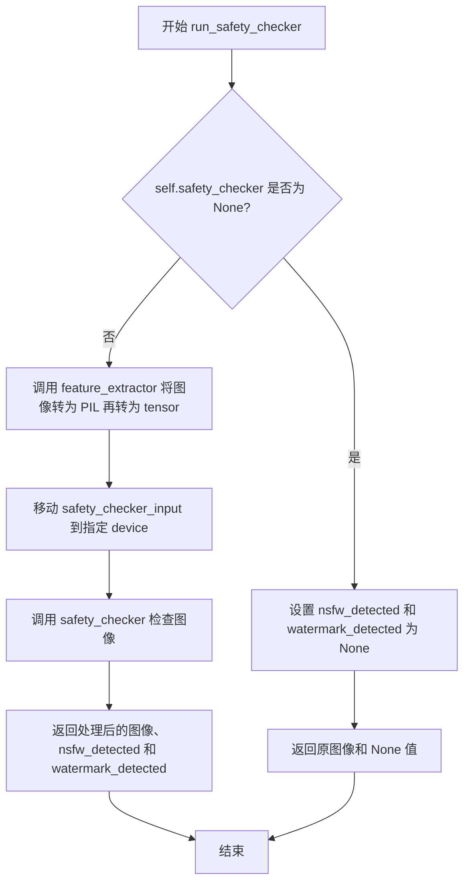

#### 带注释源码

```python
def run_safety_checker(self, image, device, dtype):
    """
    运行安全检查器以检测 NSFW 内容和水印。

    参数:
        image: 要检查的图像张量或数组
        device: 计算设备
        dtype: 数据类型

    返回:
        tuple: (处理后的图像, NSFW检测标志, 水印检测标志)
    """
    # 检查安全检查器是否已配置
    if self.safety_checker is not None:
        # 使用特征提取器将图像转换为 PyTorch 张量格式
        # 1. 将 numpy 数组或张量转换为 PIL 图像
        # 2. 使用 feature_extractor 提取特征并转换为 PyTorch 张量
        # 3. 移动到指定设备
        safety_checker_input = self.feature_extractor(
            self.numpy_to_pil(image),  # 转换图像为 PIL 格式
            return_tensors="pt"  # 返回 PyTorch 张量
        ).to(device)  # 移动到指定设备
        
        # 调用安全检查器进行实际检查
        # - images: 原始图像
        # - clip_input: 用于 CLIP 模型的输入
        image, nsfw_detected, watermark_detected = self.safety_checker(
            images=image,
            clip_input=safety_checker_input.pixel_values.to(dtype=dtype),  # 转换为指定数据类型
        )
    else:
        # 如果没有配置安全检查器，返回 None 值
        nsfw_detected = None
        watermark_detected = None

    # 返回处理后的图像和检测结果
    return image, nsfw_detected, watermark_detected
```


### IFInpaintingPipeline.prepare_extra_step_kwargs

该方法用于准备调度器（scheduler）的额外参数。由于不同的调度器可能有不同的签名（例如DDIMScheduler使用eta参数，而其他调度器可能不使用），该方法通过检查调度器的step方法签名来动态构建所需的参数字典。

参数：

- `generator`：`torch.Generator | list[torch.Generator] | None`，用于确保生成过程可重现的随机数生成器
- `eta`：`float`，DDIM论文中的η参数，仅被DDIMScheduler使用，其他调度器会忽略该参数，其值应在[0,1]范围内

返回值：`dict[str, Any]`，包含调度器step方法所需额外参数（如`eta`和/或`generator`）的字典

#### 流程图

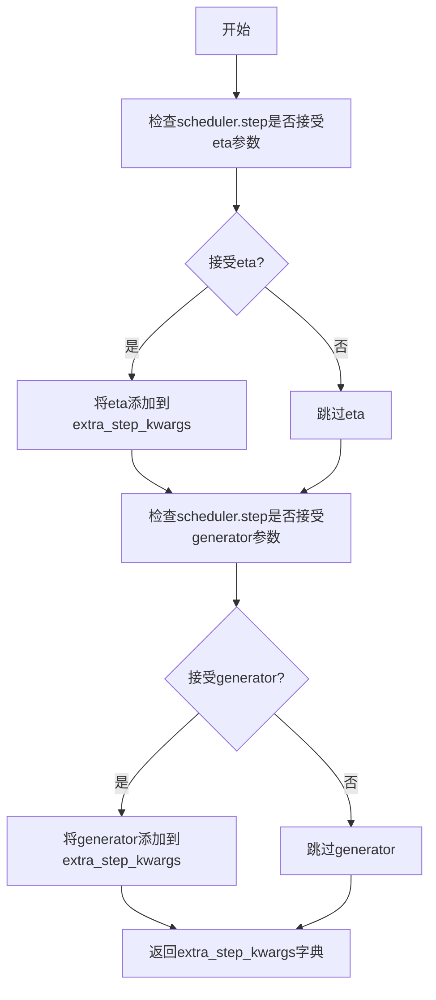

#### 带注释源码

```python
# Copied from diffusers.pipelines.deepfloyd_if.pipeline_if.IFPipeline.prepare_extra_step_kwargs
def prepare_extra_step_kwargs(self, generator, eta):
    # prepare extra kwargs for the scheduler step, since not all schedulers have the same signature
    # eta (η) is only used with the DDIMScheduler, it will be ignored for other schedulers.
    # eta corresponds to η in DDIM paper: https://huggingface.co/papers/2010.02502
    # and should be between [0, 1]

    # 使用inspect模块检查调度器的step方法签名，判断是否支持eta参数
    accepts_eta = "eta" in set(inspect.signature(self.scheduler.step).parameters.keys())
    # 初始化空字典用于存储额外的调度器参数
    extra_step_kwargs = {}
    # 如果调度器支持eta参数，则将其添加到参数字典中
    if accepts_eta:
        extra_step_kwargs["eta"] = eta

    # 检查调度器是否接受generator参数
    accepts_generator = "generator" in set(inspect.signature(self.scheduler.step).parameters.keys())
    # 如果调度器支持generator参数，则将其添加到参数字典中
    if accepts_generator:
        extra_step_kwargs["generator"] = generator
    
    # 返回构建好的参数字典，供scheduler.step调用使用
    return extra_step_kwargs
```


### `IFInpaintingPipeline.check_inputs`

该方法用于验证 `IFInpaintingPipeline` 管道输入参数的有效性，确保 `prompt`、`image`、`mask_image`、`batch_size` 和 `callback_steps` 等参数的类型、形状和组合方式符合预期，并在检测到无效输入时抛出详细的 `ValueError` 异常。

参数：

- `self`：隐式参数，类的实例本身
- `prompt`：`str | list[str] | None`，输入的文本提示词，用于指导图像生成
- `image`：`torch.Tensor | PIL.Image.Image | np.ndarray | list`，待处理的输入图像
- `mask_image`：`torch.Tensor | PIL.Image.Image | np.ndarray | list`，用于指示需要重绘区域的掩码图像
- `batch_size`：`int`，批处理大小，需与提示词和图像的批处理维度匹配
- `callback_steps`：`int`，回调函数被调用的频率步数，必须为正整数
- `negative_prompt`：`str | list[str] | None`，可选的负面提示词，用于引导模型避免生成相关内容
- `prompt_embeds`：`torch.Tensor | None`，可选的预生成文本嵌入向量，可替代 `prompt` 直接提供
- `negative_prompt_embeds`：`torch.Tensor | None`，可选的预生成负面文本嵌入向量

返回值：`None`，该方法不返回任何值，仅通过抛出异常来处理无效输入

#### 流程图

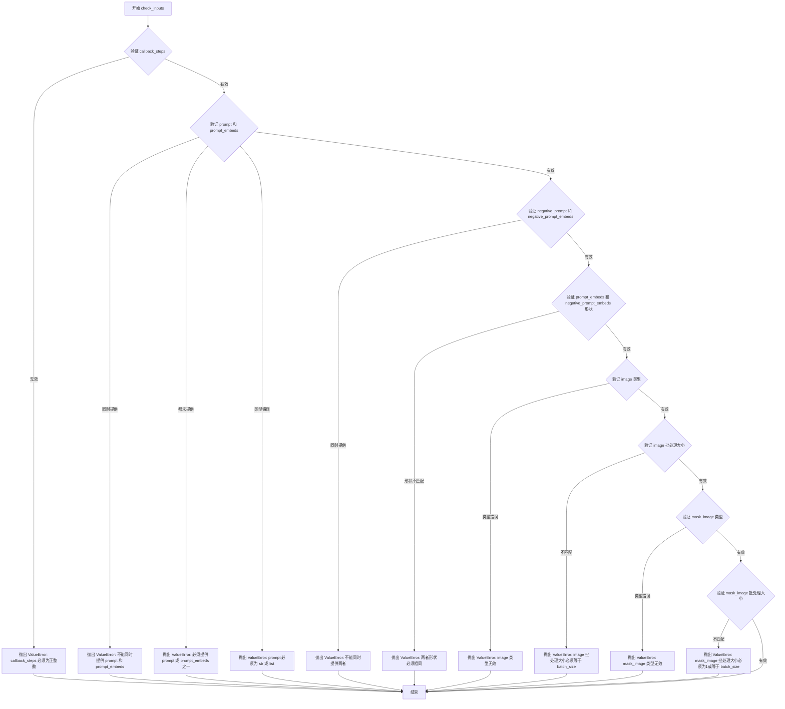

#### 带注释源码

```python
def check_inputs(
    self,
    prompt,                          # str | list[str] | None: 文本提示词
    image,                           # 输入图像 (torch.Tensor/PIL.Image.Image/np.ndarray/list)
    mask_image,                      # 掩码图像 (torch.Tensor/PIL.Image.Image/np.ndarray/list)
    batch_size,                     # int: 批处理大小
    callback_steps,                  # int: 回调步数
    negative_prompt=None,           # str | list[str] | None: 负面提示词
    prompt_embeds=None,              # torch.Tensor | None: 预生成文本嵌入
    negative_prompt_embeds=None,    # torch.Tensor | None: 预生成负面文本嵌入
):
    # 验证 callback_steps 参数
    # 必须为正整数，否则抛出异常
    if (callback_steps is None) or (
        callback_steps is not None and (not isinstance(callback_steps, int) or callback_steps <= 0)
    ):
        raise ValueError(
            f"`callback_steps` has to be a positive integer but is {callback_steps} of type"
            f" {type(callback_steps)}."
        )

    # 验证 prompt 和 prompt_embeds 不能同时提供
    # 两者是互斥的，只能选择其中一种方式提供文本信息
    if prompt is not None and prompt_embeds is not None:
        raise ValueError(
            f"Cannot forward both `prompt`: {prompt} and `prompt_embeds`: {prompt_embeds}. Please make sure to"
            " only forward one of the two."
        )
    # 验证至少提供其中之一
    elif prompt is None and prompt_embeds is None:
        raise ValueError(
            "Provide either `prompt` or `prompt_embeds`. Cannot leave both `prompt` and `prompt_embeds` undefined."
        )
    # 验证 prompt 的类型必须是 str 或 list
    elif prompt is not None and (not isinstance(prompt, str) and not isinstance(prompt, list)):
        raise ValueError(f"`prompt` has to be of type `str` or `list` but is {type(prompt)}")

    # 验证 negative_prompt 和 negative_prompt_embeds 不能同时提供
    if negative_prompt is not None and negative_prompt_embeds is not None:
        raise ValueError(
            f"Cannot forward both `negative_prompt`: {negative_prompt} and `negative_prompt_embeds`:"
            f" {negative_prompt_embeds}. Please make sure to only forward one of the two."
        )

    # 验证 prompt_embeds 和 negative_prompt_embeds 形状必须一致
    if prompt_embeds is not None and negative_prompt_embeds is not None:
        if prompt_embeds.shape != negative_prompt_embeds.shape:
            raise ValueError(
                "`prompt_embeds` and `negative_prompt_embeds` must have the same shape when passed directly, but"
                f" got: `prompt_embeds` {prompt_embeds.shape} != `negative_prompt_embeds`"
                f" {negative_prompt_embeds.shape}."
            )

    # ==================== 验证 image 参数 ====================
    # 获取用于类型检查的 image 样本（如果是列表则取第一个元素）
    if isinstance(image, list):
        check_image_type = image[0]
    else:
        check_image_type = image

    # 验证 image 必须是 torch.Tensor、PIL.Image.Image、np.ndarray 或 list 类型
    if (
        not isinstance(check_image_type, torch.Tensor)
        and not isinstance(check_image_type, PIL.Image.Image)
        and not isinstance(check_image_type, np.ndarray)
    ):
        raise ValueError(
            "`image` has to be of type `torch.Tensor`, `PIL.Image.Image`, `np.ndarray`, or list[...] but is"
            f" {type(check_image_type)}"
        )

    # 计算 image 的批处理大小
    if isinstance(image, list):
        image_batch_size = len(image)
    elif isinstance(image, torch.Tensor):
        image_batch_size = image.shape[0]
    elif isinstance(image, PIL.Image.Image):
        image_batch_size = 1
    elif isinstance(image, np.ndarray):
        image_batch_size = image.shape[0]
    else:
        assert False  # 不应到达此处

    # 验证 image 批处理大小必须等于 prompt 批处理大小
    if batch_size != image_batch_size:
        raise ValueError(f"image batch size: {image_batch_size} must be same as prompt batch size {batch_size}")

    # ==================== 验证 mask_image 参数 ====================
    # 获取用于类型检查的 mask_image 样本
    if isinstance(mask_image, list):
        check_image_type = mask_image[0]
    else:
        check_image_type = mask_image

    # 验证 mask_image 必须是 torch.Tensor、PIL.Image.Image、np.ndarray 或 list 类型
    if (
        not isinstance(check_image_type, torch.Tensor)
        and not isinstance(check_image_type, PIL.Image.Image)
        and not isinstance(check_image_type, np.ndarray)
    ):
        raise ValueError(
            "`mask_image` has to be of type `torch.Tensor`, `PIL.Image.Image`, `np.ndarray`, or list[...] but is"
            f" {type(check_image_type)}"
        )

    # 计算 mask_image 的批处理大小
    if isinstance(mask_image, list):
        image_batch_size = len(mask_image)
    elif isinstance(mask_image, torch.Tensor):
        image_batch_size = mask_image.shape[0]
    elif isinstance(mask_image, PIL.Image.Image):
        image_batch_size = 1
    elif isinstance(mask_image, np.ndarray):
        image_batch_size = mask_image.shape[0]
    else:
        assert False  # 不应到达此处

    # 验证 mask_image 批处理大小必须为 1 或等于 prompt 批处理大小
    # 注意：允许 mask_image 批处理大小为 1，这意味着同一掩码应用于所有图像
    if image_batch_size != 1 and batch_size != image_batch_size:
        raise ValueError(
            f"mask_image batch size: {image_batch_size} must be `1` or the same as prompt batch size {batch_size}"
        )
```


### IFInpaintingPipeline._text_preprocessing

该方法用于对输入的文本提示进行预处理，包括文本清洗、小写转换、去空格等操作，是文本编码前的重要预处理步骤。

参数：

- `text`：`str | list[str] | tuple[str]`，需要预处理的文本输入，可以是单个字符串或字符串列表/元组
- `clean_caption`：`bool`，是否执行深度文本清洗（需要beautifulsoup4和ftfy库支持），默认为False

返回值：`list[str]`，返回处理后的字符串列表

#### 流程图

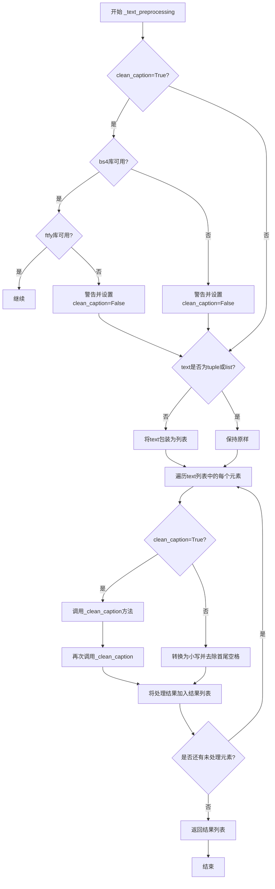

#### 带注释源码

```python
def _text_preprocessing(self, text, clean_caption=False):
    """
    对输入的文本进行预处理。
    
    处理流程：
    1. 检查clean_caption所需的依赖库是否可用
    2. 确保text是列表格式
    3. 对每个文本元素执行清洗或简单的小写/去空格处理
    
    参数:
        text: str | list[str] | tuple[str] - 输入的文本或文本列表
        clean_caption: bool - 是否执行深度文本清洗
    
    返回:
        list[str] - 处理后的文本列表
    """
    # 检查beautifulsoup4库是否可用，如果不可用则禁用clean_caption
    if clean_caption and not is_bs4_available():
        # 记录警告日志
        logger.warning(BACKENDS_MAPPING["bs4"][-1].format("Setting `clean_caption=True`"))
        logger.warning("Setting `clean_caption` to False...")
        # 禁用clean_caption功能
        clean_caption = False

    # 检查ftfy库是否可用，如果不可用则禁用clean_caption
    if clean_caption and not is_ftfy_available():
        logger.warning(BACKENDS_MAPPING["ftfy"][-1].format("Setting `clean_caption=True`"))
        logger.warning("Setting `clean_caption` to False...")
        clean_caption = False

    # 如果text不是列表或元组，则将其转换为列表
    if not isinstance(text, (tuple, list)):
        text = [text]

    # 定义内部处理函数
    def process(text: str):
        """
        对单个文本进行处理。
        
        如果clean_caption为True，则执行深度清洗（调用_clean_caption两次）；
        否则仅执行小写转换和首尾空格去除。
        """
        if clean_caption:
            # 执行深度文本清洗（调用两次以确保彻底清洗）
            text = self._clean_caption(text)
            text = self._clean_caption(text)
        else:
            # 简单处理：转换为小写并去除首尾空格
            text = text.lower().strip()
        return text

    # 对列表中的每个文本元素应用处理函数
    return [process(t) for t in text]
```


### IFInpaintingPipeline._clean_caption

该方法用于对文本提示（caption）进行深度清洗和预处理，清除特殊字符、HTML标签、URL链接、CJK字符、数字序列等干扰内容，转换为标准化的小写文本格式，以便于后续的文本编码处理。

参数：

- `caption`：`str`，需要清洗的原始文本提示

返回值：`str`，清洗和标准化后的文本字符串

#### 流程图

```mermaid
flowchart TD
    A[开始: 输入原始caption] --> B[转换为字符串]
    B --> C[URL解码: ul.unquote_plus]
    C --> D[转小写并去空格]
    D --> E[替换&lt;person&gt;为person]
    E --> F{clean_caption开关}
    F -->|是| G[BeautifulSoup移除HTML]
    F -->|否| H[直接转小写]
    G --> I[移除@昵称]
    H --> I
    I --> J[移除CJK字符范围]
    J --> K[统一破折号类型]
    K --> L[统一引号类型]
    L --> M[移除HTML实体&amp;quot;和&amp;amp;]
    M --> N[移除IP地址]
    N --> O[移除文章ID和换行符]
    O --> P[移除#开头的数字和长数字串]
    P --> Q[移除文件扩展名]
    Q --> R[处理重复引号和句点]
    R --> S[使用ftfy修复文本]
    S --> T[双重html.unescape解码]
    T --> U[移除混合字母数字模式]
    U --> V[移除广告关键词]
    V --> W[移除多余空白和标点]
    W --> X[去除首尾特殊字符]
    X --> Y[返回清洗后的caption]
```

#### 带注释源码

```python
def _clean_caption(self, caption):
    # 将输入转换为字符串类型，确保后续处理的一致性
    caption = str(caption)
    # 使用urllib解码URL编码的字符（如%20转换为空格）
    caption = ul.unquote_plus(caption)
    # 去除首尾空白并转换为小写
    caption = caption.strip().lower()
    # 将<person>标签替换为纯文本person
    caption = re.sub("<person>", "person", caption)
    
    # 移除HTTP/HTTPS URL链接（两种正则表达式覆盖不同格式）
    caption = re.sub(
        r"\b((?:https?:(?:\/{1,3}|[a-zA-Z0-9%])|[a-zA-Z0-9.\-]+[.](?:com|co|ru|net|org|edu|gov|it)[\w/-]*\b\/?(?!@)))",  # noqa
        "",
        caption,
    )
    caption = re.sub(
        r"\b((?:www:(?:\/{1,3}|[a-zA-Z0-9%])|[a-zA-Z0-9.\-]+[.](?:com|co|ru|net|org|edu|gov|it)[\w/-]*\b\/?(?!@)))",  # noqa
        "",
        caption,
    )
    
    # 使用BeautifulSoup解析HTML，提取纯文本内容
    caption = BeautifulSoup(caption, features="html.parser").text
    
    # 移除@开头的用户名/昵称
    caption = re.sub(r"@[\w\d]+\b", "", caption)
    
    # 移除CJK（中日韩）统一字符，涵盖多个Unicode范围
    # 包括CJK笔画、片假名、平假名、 enclosed CJK letters等
    caption = re.sub(r"[\u31c0-\u31ef]+", "", caption)
    caption = re.sub(r"[\u31f0-\u31ff]+", "", caption)
    caption = re.sub(r"[\u3200-\u32ff]+", "", caption)
    caption = re.sub(r"[\u3300-\u33ff]+", "", caption)
    caption = re.sub(r"[\u3400-\u4dbf]+", "", caption)
    caption = re.sub(r"[\u4dc0-\u4dff]+", "", caption)
    caption = re.sub(r"[\u4e00-\u9fff]+", "", caption)
    
    # 统一各种语言的破折号/连字符为标准英文短横线
    caption = re.sub(
        r"[\u002D\u058A\u05BE\u1400\u1806\u2010-\u2015\u2E17\u2E1A\u2E3A\u2E3B\u2E40\u301C\u3030\u30A0\uFE31\uFE32\uFE58\uFE63\uFF0D]+",  # noqa
        "-",
        caption,
    )
    
    # 统一引号风格：各种语言的单引号、双引号转为标准英文引号
    caption = re.sub(r"[`´«»""¨]", '"', caption)
    caption = re.sub(r"['']", "'", caption)
    
    # 移除HTML实体quot和amp
    caption = re.sub(r"&quot;?", "", caption)
    caption = re.sub(r"&amp", "", caption)
    
    # 移除IPv4地址
    caption = re.sub(r"\d{1,3}\.\d{1,3}\.\d{1,3}\.\d{1,3}", " ", caption)
    
    # 移除文章ID（格式如 1:23）
    caption = re.sub(r"\d:\d\d\s+$", "", caption)
    
    # 移除转义换行符\n
    caption = re.sub(r"\\n", " ", caption)
    
    # 移除推特风格的#标签（1-3位数字和5位以上数字）
    caption = re.sub(r"#\d{1,3}\b", "", caption)
    caption = re.sub(r"#\d{5,}\b", "", caption)
    # 移除长纯数字序列（6位以上）
    caption = re.sub(r"\b\d{6,}\b", "", caption)
    
    # 移除常见图片/文件扩展名
    caption = re.sub(r"[\S]+\.(?:png|jpg|jpeg|bmp|webp|eps|pdf|apk|mp4)", "", caption)
    
    # 处理连续重复的引号和句点
    caption = re.sub(r"[\"']{2,}", r'"', caption)
    caption = re.sub(r"[\.]{2,}", r" ", caption)
    
    # 移除自定义的坏标点符号（来自类属性bad_punct_regex）
    caption = re.sub(self.bad_punct_regex, r" ", caption)
    # 移除" . "这种带空格的句点
    caption = re.sub(r"\s+\.\s+", r" ", caption)
    
    # 如果连字符或下划线出现超过3次，将它们转换为空格（分割复合词）
    regex2 = re.compile(r"(?:\-|\_)")
    if len(re.findall(regex2, caption)) > 3:
        caption = re.sub(regex2, " ", caption)
    
    # 使用ftfy库修复常见的Unicode编码错误和文本损坏
    caption = ftfy.fix_text(caption)
    # 双重unescape处理HTML编码（处理双重编码的情况）
    caption = html.unescape(html.unescape(caption))
    
    # 移除混合字母数字模式（常见于用户名或广告）
    caption = re.sub(r"\b[a-zA-Z]{1,3}\d{3,15}\b", "", caption)  # 如jc6640
    caption = re.sub(r"\b[a-zA-Z]+\d+[a-zA-Z]+\b", "", caption)  # 如jc6640vc
    caption = re.sub(r"\b\d+[a-zA-Z]+\d+\b", "", caption)  # 如6640vc231
    
    # 移除常见广告关键词
    caption = re.sub(r"(worldwide\s+)?(free\s+)?shipping", "", caption)
    caption = re.sub(r"(free\s)?download(\sfree)?", "", caption)
    caption = re.sub(r"\bclick\b\s(?:for|on)\s\w+", "", caption)
    caption = re.sub(r"\b(?:png|jpg|jpeg|bmp|webp|eps|pdf|apk|mp4)(\simage[s]?)?", "", caption)
    caption = re.sub(r"\bpage\s+\d+\b", "", caption)
    
    # 移除包含数字和字母的复杂混合串
    caption = re.sub(r"\b\d*[a-zA-Z]+\d+[a-zA-Z]+\d+[a-zA-Z\d]*\b", r" ", caption)
    
    # 移除尺寸格式（如1920x1080，支持俄语字母x）
    caption = re.sub(r"\b\d+\.?\d*[xх×]\d+\.?\d*\b", "", caption)
    
    # 标准化冒号周围空格
    caption = re.sub(r"\b\s+\:\s+", r": ", caption)
    # 在非数字字符的标点后加空格
    caption = re.sub(r"(\D[,\./])\b", r"\1 ", caption)
    # 合并多余空格
    caption = re.sub(r"\s+", " ", caption)
    
    # 去除首尾空白
    caption.strip()
    
    # 去除首尾引号包裹
    caption = re.sub(r"^[\"\']([\w\W]+)[\"\']$", r"\1", caption)
    # 去除开头的不安全字符
    caption = re.sub(r"^[\'\_,\-\:;]", r"", caption)
    # 去除结尾的不安全字符
    caption = re.sub(r"[\'\_,\-\:\-\+]$", r" "", caption)
    # 去除开头的不含空格的点+字符
    caption = re.sub(r"^\.\S+$", "", caption)
    
    # 返回最终清洗后的文本（去除首尾空格）
    return caption.strip()
```


### IFInpaintingPipeline.preprocess_image

该方法负责将输入图像（支持PIL.Image、numpy.ndarray或torch.Tensor格式）统一预处理为PyTorch张量，并进行归一化处理（除以127.5并减去1，将像素值映射到[-1, 1]范围），以适配UNet模型的输入要求。

参数：

- `self`：`IFInpaintingPipeline`，预处理方法所属的管道实例
- `image`：`PIL.Image.Image`，待预处理的输入图像，支持单张图像或图像列表

返回值：`torch.Tensor`，预处理后的图像张量，形状为(B, C, H, W)，像素值范围为[-1, 1]

#### 流程图

```mermaid
flowchart TD
    A[开始 preprocess_image] --> B{image是否为list}
    B -->|否| C[将image包装为list]
    B -->|是| D{判断image[0]类型}
    
    C --> D
    
    D -->|PIL.Image.Image| E[遍历图像列表]
    E --> E1[转换为RGB模式]
    E1 --> E2[resize到unet.config.sample_size]
    E2 --> E3[转换为numpy数组]
    E3 --> E4[数据类型转换为float32]
    E4 --> E5[归一化: image / 127.5 - 1]
    E5 --> E6[添加到new_image列表]
    E6 --> E7[np.stack转为numpy数组]
    E7 --> K[调用numpy_to_pt转为torch.Tensor]
    
    D -->|np.ndarray| F{判断维度}
    F -->|ndim==4| F1[np.concatenate合并]
    F -->|其他| F2[np.stack堆叠]
    F1 --> K
    F2 --> K
    
    D -->|torch.Tensor| G{判断维度}
    G -->|ndim==4| G1[torch.cat合并]
    G -->|其他| G2[torch.stack堆叠]
    G1 --> H
    G2 --> H
    
    K --> H[返回torch.Tensor]
    
    subgraph numpy_to_pt [内部函数: numpy_to_pt]
        NT1[检查images.ndim是否为3] --> NT2[是则添加通道维度]
        NT2 --> NT3[numpy转置: (H,W,C) -> (C,H,W)]
        NT3 --> NT4[torch.from_numpy转换]
    end
```

#### 带注释源码

```python
def preprocess_image(self, image: PIL.Image.Image) -> torch.Tensor:
    """
    将输入图像预处理为PyTorch张量
    
    参数:
        image: PIL图像、numpy数组或torch张量，支持单张或批量输入
    
    返回:
        预处理后的torch.Tensor，形状 (B, C, H, W)，值域 [-1, 1]
    """
    # 如果输入不是列表，则包装为列表以统一处理
    if not isinstance(image, list):
        image = [image]

    # 定义内部辅助函数：将numpy数组转换为PyTorch张量
    def numpy_to_pt(images):
        # 如果是3维数组（无通道维度），添加通道维变成4维 (H, W, C) -> (H, W, C, 1)
        if images.ndim == 3:
            images = images[..., None]

        # 将numpy数组转为torch张量，并调整维度顺序 (H, W, C) -> (C, H, W)
        images = torch.from_numpy(images.transpose(0, 3, 1, 2))
        return images

    # 分支处理：PIL.Image.Image 类型输入
    if isinstance(image[0], PIL.Image.Image):
        new_image = []

        # 遍历每张图像进行预处理
        for image_ in image:
            # 转换为RGB模式（确保3通道）
            image_ = image_.convert("RGB")
            # 调整图像大小到UNet配置的样本尺寸
            image_ = resize(image_, self.unet.config.sample_size)
            # 转换为numpy数组
            image_ = np.array(image_)
            # 转换为float32类型
            image_ = image_.astype(np.float32)
            # 归一化：像素值从 [0, 255] 映射到 [-1, 1]
            image_ = image_ / 127.5 - 1
            new_image.append(image_)

        # 更新image变量为处理后的列表
        image = new_image

        # 将图像列表堆叠为numpy数组（轴0为批次维度）
        image = np.stack(image, axis=0)  # to np
        # 调用内部函数转换为PyTorch张量
        image = numpy_to_pt(image)  # to pt

    # 分支处理：numpy.ndarray 类型输入
    elif isinstance(image[0], np.ndarray):
        # 如果是4维数组（包含批次维），使用concatenate；否则使用stack
        image = np.concatenate(image, axis=0) if image[0].ndim == 4 else np.stack(image, axis=0)
        # 转换为PyTorch张量
        image = numpy_to_pt(image)

    # 分支处理：torch.Tensor 类型输入
    elif isinstance(image[0], torch.Tensor):
        # 如果是4维张量（包含批次维），使用cat；否则使用stack
        image = torch.cat(image, axis=0) if image[0].ndim == 4 else torch.stack(image, axis=0)

    # 返回预处理后的图像张量
    return image
```


### `IFInpaintingPipeline.preprocess_mask_image`

该方法用于将不同格式的掩码图像（torch.Tensor、PIL.Image 或 numpy.ndarray）统一预处理为标准的 torch.Tensor 格式，并进行二值化处理，确保掩码值为 0 或 1。

参数：

- `mask_image`：`torch.Tensor | PIL.Image.Image | np.ndarray | list[torch.Tensor] | list[PIL.Image.Image] | list[np.ndarray]`，待预处理的掩码图像，支持单张图像或图像列表

返回值：`torch.Tensor`，预处理后的二值化掩码图像张量，形状为 (B, 1, H, W)

#### 流程图

```mermaid
flowchart TD
    A[开始: preprocess_mask_image] --> B{输入是否为list?}
    B -->|否| C[转换为list]
    B -->|是| D{判断第一个元素类型}
    
    C --> D
    
    D -->|torch.Tensor| E[处理Tensor类型]
    D -->|PIL.Image.Image| F[处理PIL.Image类型]
    D -->|np.ndarray| G[处理np.ndarray类型]
    
    E --> H1{张量维度判断}
    H1 -->|ndim==2| I1[添加batch和channel维度]
    H1 -->|ndim==3且shape[0]==1| I2[添加batch维度]
    H1 -->|ndim==3且shape[0]!=1| I3[添加channel维度]
    I1 --> J1[二值化处理]
    I2 --> J1
    I3 --> J1
    
    F --> F1[转换为L通道]
    F1 --> F2[resize到sample_size]
    F2 --> F3[转为numpy数组]
    F3 --> F4[添加batch和channel维度]
    F4 --> F5[concatenate成数组]
    F5 --> F6[归一化到0-1]
    F6 --> J2[二值化处理]
    J2 --> J3[转为torch.Tensor]
    
    G --> G1[添加batch和channel维度]
    G1 --> G2[concatenate成数组]
    G2 --> J4[二值化处理]
    J4 --> J5[转为torch.Tensor]
    
    J1 --> K[返回处理后的mask]
    J3 --> K
    J5 --> K
```

#### 带注释源码

```python
def preprocess_mask_image(self, mask_image) -> torch.Tensor:
    """
    预处理掩码图像，将其转换为标准化的torch.Tensor格式
    
    处理逻辑：
    1. 将输入统一转换为list格式
    2. 根据输入类型（Tensor/PIL.Image/numpy）分别处理
    3. 统一转换为(B, 1, H, W)形状的张量
    4. 进行二值化：阈值0.5，小于0.5设为0，大于等于0.5设为1
    """
    
    # 如果输入不是list，则包装为list，以便统一处理
    if not isinstance(mask_image, list):
        mask_image = [mask_image]

    # 分支1：处理torch.Tensor类型的掩码
    if isinstance(mask_image[0], torch.Tensor):
        # 如果是4维张量，则在batch维度concat；否则在batch维度stack
        mask_image = torch.cat(mask_image, axis=0) if mask_image[0].ndim == 4 else torch.stack(mask_image, axis=0)

        # 根据原始张量维度添加适当的channel和batch维度
        if mask_image.ndim == 2:
            # 单个2D掩码：添加batch和channel维度 -> (1, 1, H, W)
            mask_image = mask_image.unsqueeze(0).unsqueeze(0)
        elif mask_image.ndim == 3 and mask_image.shape[0] == 1:
            # 已是batch=1的3D掩码：(1, H, W) -> (1, 1, H, W)
            mask_image = mask_image.unsqueeze(0)
        elif mask_image.ndim == 3 and mask_image.shape[0] != 1:
            # 批量3D掩码：(B, H, W) -> (B, 1, H, W)
            mask_image = mask_image.unsqueeze(1)

        # 二值化处理：小于0.5设为0，大于等于0.5设为1
        mask_image[mask_image < 0.5] = 0
        mask_image[mask_image >= 0.5] = 1

    # 分支2：处理PIL.Image类型的掩码
    elif isinstance(mask_image[0], PIL.Image.Image):
        new_mask_image = []

        # 遍历每个掩码图像进行转换
        for mask_image_ in mask_image:
            # 转换为灰度图（L通道）
            mask_image_ = mask_image_.convert("L")
            # 调整图像大小以匹配UNet的sample_size配置
            mask_image_ = resize(mask_image_, self.unet.config.sample_size)
            # 转换为numpy数组
            mask_image_ = np.array(mask_image_)
            # 添加batch和channel维度：(H, W) -> (1, 1, H, W)
            mask_image_ = mask_image_[None, None, :]
            new_mask_image.append(mask_image_)

        mask_image = new_mask_image

        # 在batch维度拼接所有掩码
        mask_image = np.concatenate(mask_image, axis=0)
        # 归一化到[0, 1]范围
        mask_image = mask_image.astype(np.float32) / 255.0
        # 二值化处理
        mask_image[mask_image < 0.5] = 0
        mask_image[mask_image >= 0.5] = 1
        # 转换为torch.Tensor
        mask_image = torch.from_numpy(mask_image)

    # 分支3：处理numpy.ndarray类型的掩码
    elif isinstance(mask_image[0], np.ndarray):
        # 为每个掩码添加batch和channel维度，然后拼接
        mask_image = np.concatenate([m[None, None, :] for m in mask_image], axis=0)

        # 二值化处理
        mask_image[mask_image < 0.5] = 0
        mask_image[mask_image >= 0.5] = 1
        # 转换为torch.Tensor
        mask_image = torch.from_numpy(mask_image)

    return mask_image
```


### `IFInpaintingPipeline.get_timesteps`

该方法用于根据推理步数和图像修复强度（strength）计算去噪过程的时间步（timesteps）。它决定了从原始时间步序列中提取哪一部分用于当前的去噪迭代。

参数：

- `num_inference_steps`：`int`，总推理步数，即去噪过程中要执行的迭代次数。
- `strength`：`float`，图像修复强度，值介于 0 到 1 之间，决定了对原始图像的修改程度。强度越大，添加的噪声越多，最终图像与原始图像的差异越大。

返回值：`tuple[torch.Tensor, int]`，返回元组，包含两个元素：第一个是 `torch.Tensor` 类型的时间步序列（从调度器中提取的相关时间步）；第二个是 `int` 类型，表示实际执行的推理步数（即 `num_inference_steps - t_start`）。

#### 流程图

```mermaid
flowchart TD
    A[开始] --> B[计算 init_timestep = min(num_inference_steps * strength, num_inference_steps)]
    B --> C[计算 t_start = max(num_inference_steps - init_timestep, 0)]
    C --> D[从 scheduler.timesteps 中提取子序列: timesteps = scheduler.timesteps[t_start * order :]]
    D --> E{scheduler 是否有 set_begin_index 方法?}
    E -->|是| F[调用 scheduler.set_begin_index(t_start * order) 设置起始索引]
    E -->|否| G[跳过]
    F --> H[返回 timesteps 和 num_inference_steps - t_start]
    G --> H
```

#### 带注释源码

```python
def get_timesteps(self, num_inference_steps, strength):
    # 根据强度计算初始时间步数
    # strength 越大，init_timestep 越大，意味着从更早的时间步开始去噪
    # 原始时间步数量受限于总推理步数
    init_timestep = min(int(num_inference_steps * strength), num_inference_steps)

    # 计算起始索引 t_start
    # 从时间步序列的末尾向前计算需要跳过的步数
    # 如果 strength 为 1.0，则 t_start 为 0，使用全部时间步
    # 如果 strength 较小，则跳过前面的时间步，从中间开始
    t_start = max(num_inference_steps - init_timestep, 0)

    # 从调度器的时间步序列中提取从 t_start 开始到末尾的时间步
    # 乘以 scheduler.order 是因为调度器可能使用多步采样方法（如 DDIM 的 order > 1）
    timesteps = self.scheduler.timesteps[t_start * self.scheduler.order :]

    # 如果调度器支持设置起始索引方法，则调用它来优化内部状态
    # 这是调度器的一个优化选项，可以避免重复计算已跳过的时间步
    if hasattr(self.scheduler, "set_begin_index"):
        self.scheduler.set_begin_index(t_start * self.scheduler.order)

    # 返回两个值：
    # 1. timesteps: 用于去噪循环的时间步序列
    # 2. num_inference_steps - t_start: 实际需要执行的去噪步数
    return timesteps, num_inference_steps - t_start
```


### `IFInpaintingPipeline.prepare_intermediate_images`

该方法用于在扩散模型的去噪过程中准备中间图像。它根据给定的掩码图像将噪声添加到输入图像中，并按照指定的批次大小和每提示图像数量处理图像。

参数：

- `self`：`IFInpaintingPipeline` 实例本身
- `image`：`torch.Tensor`，输入图像张量，形状为 (batch_size, channels, height, width)
- `timestep`：`torch.Tensor` 或 int，当前去噪时间步
- `batch_size`：`int`，原始批次大小
- `num_images_per_prompt`：`int`，每个提示生成的图像数量
- `dtype`：`torch.dtype`，输出张量的数据类型
- `device`：`torch.device`，计算设备
- `mask_image`：`torch.Tensor`，掩码图像张量，白色像素表示需要重绘的区域
- `generator`：`torch.Generator` 或 `list[torch.Generator]`，可选，用于生成确定性噪声的随机数生成器

返回值：`torch.Tensor`，处理后的中间图像张量

#### 流程图

```mermaid
flowchart TD
    A[开始] --> B[获取图像形状: image_batch_size, channels, height, width]
    B --> C[计算有效批次大小: batch_size = batch_size * num_images_per_prompt]
    C --> D{验证 generator 列表长度}
    D -->|长度不匹配| E[抛出 ValueError]
    D -->|长度匹配| F[使用 randn_tensor 生成噪声张量]
    F --> G[沿批次维度重复图像: repeat_interleave]
    G --> H[使用 scheduler.add_noise 添加噪声]
    H --> I[计算最终图像: (1 - mask) * image + mask * noised_image]
    I --> J[返回处理后的图像]
```

#### 带注释源码

```python
def prepare_intermediate_images(
    self, image, timestep, batch_size, num_images_per_prompt, dtype, device, mask_image, generator=None
):
    # 从输入图像张量中获取批量大小、通道数、高度和宽度
    image_batch_size, channels, height, width = image.shape

    # 计算有效批次大小：原始批次大小 × 每提示生成的图像数量
    batch_size = batch_size * num_images_per_prompt

    # 定义噪声和输出图像的目标形状
    shape = (batch_size, channels, height, width)

    # 验证：如果传入生成器列表，其长度必须与有效批次大小匹配
    if isinstance(generator, list) and len(generator) != batch_size:
        raise ValueError(
            f"You have passed a list of generators of length {len(generator)}, but requested an effective batch"
            f" size of {batch_size}. Make sure the batch size matches the length of the generators."
        )

    # 使用指定的生成器、设备和数据类型生成随机噪声张量
    noise = randn_tensor(shape, generator=generator, device=device, dtype=dtype)

    # 沿批次维度重复图像，以匹配每提示生成的图像数量
    image = image.repeat_interleave(num_images_per_prompt, dim=0)

    # 使用调度器的 add_noise 方法将噪声添加到图像中
    noised_image = self.scheduler.add_noise(image, noise, timestep)

    # 根据掩码图像混合原始图像和噪声图像：
    # - 黑色像素（mask=0）保留原始图像内容
    # - 白色像素（mask=1）使用噪声图像进行重绘
    image = (1 - mask_image) * image + mask_image * noised_image

    # 返回处理后的中间图像，用于后续去噪步骤
    return image
```


### IFInpaintingPipeline.__call__

该方法是 IF（DeepFloyd）图像修复管道的主入口函数，接收提示词、原始图像和掩码图像，通过去噪扩散过程生成修复后的图像。支持分类器自由引导（Classifier-Free Guidance）、自定义时间步、回调函数等功能，并返回生成的图像及安全检查结果。

参数：

- `prompt`：`str | list[str] | None`，用于引导图像生成的提示词，若未定义则需传递 `prompt_embeds`
- `image`：`PIL.Image.Image | torch.Tensor | np.ndarray | list[...] | None`，作为修复起点的原始图像
- `mask_image`：`PIL.Image.Image | torch.Tensor | np.ndarray | list[...] | None`，掩码图像，白色像素将被重绘，黑色像素将被保留
- `strength`：`float`，概念上表示对参考图像的变换程度，取值范围 0 到 1（默认 1.0）
- `num_inference_steps`：`int`，去噪步数，步数越多通常图像质量越高（默认 50）
- `timesteps`：`list[int] | None`，自定义去噪时间步，若未定义则使用等间距的 `num_inference_steps` 个时间步
- `guidance_scale`：`float`，分类器自由引导比例，越高生成的图像与文本提示越相关（默认 7.0）
- `negative_prompt`：`str | list[str] | None`，不引导图像生成的提示词
- `num_images_per_prompt`：`int | None`，每个提示词生成的图像数量（默认 1）
- `eta`：`float`，DDIM 论文中的参数 η，仅适用于 DDIMScheduler（默认 0.0）
- `generator`：`torch.Generator | list[torch.Generator] | None`，用于使生成具有确定性
- `prompt_embeds`：`torch.Tensor | None`，预生成的文本嵌入
- `negative_prompt_embeds`：`torch.Tensor | None`，预生成的负面文本嵌入
- `output_type`：`str | None`，生成图像的输出格式，可选 "pil" 或 "pt"（默认 "pil"）
- `return_dict`：`bool`，是否返回 IFPipelineOutput 而不是元组（默认 True）
- `callback`：`Callable[[int, int, torch.Tensor], None] | None`，每 `callback_steps` 步调用的回调函数
- `callback_steps`：`int`，回调函数被调用的频率（默认 1）
- `clean_caption`：`bool`，是否在创建嵌入前清理提示词（默认 True）
- `cross_attention_kwargs`：`dict[str, Any] | None`，传递给 AttentionProcessor 的参数字典

返回值：`IFPipelineOutput`，包含生成的图像列表、NSFW 检测结果和水印检测结果；若 `return_dict` 为 False，则返回元组 `(image, nsfw_detected, watermark_detected)`

#### 流程图

```mermaid
flowchart TD
    A[开始 __call__] --> B[1. 检查输入参数]
    B --> C[2. 定义调用参数<br/>获取执行设备 device<br/>判断是否使用分类器自由引导]
    C --> D[3. 编码输入提示词<br/>调用 encode_prompt]
    D --> E{do_classifier_free_guidance?}
    E -->|Yes| F[拼接 negative_prompt_embeds 和 prompt_embeds]
    E -->|No| G[仅使用 prompt_embeds]
    F --> H
    G --> H
    H --> I[4. 准备时间步 timesteps]
    I --> J[调用 get_timesteps 获取调整后的时间步]
    J --> K[5. 准备中间图像<br/>预处理 image 和 mask_image<br/>调用 prepare_intermediate_images]
    K --> L[6. 准备额外步骤参数<br/>调用 prepare_extra_step_kwargs]
    L --> M[文本编码器 offload 钩子处理]
    M --> N[7. 去噪循环]
    N --> O{遍历 timesteps}
    O -->|每次迭代| P[拼接模型输入<br/>调用 scheduler.scale_model_input]
    P --> Q[调用 UNet 预测噪声残差]
    Q --> R{do_classifier_free_guidance?}
    R -->|Yes| S[分离无条件和文本条件预测<br/>执行分类器自由引导]
    R -->|No| T
    S --> U[执行 scheduler.step 计算上一步的图像]
    T --> U
    U --> V[应用掩码: intermediate_images = (1-mask)*prev + mask*current]
    V --> W{是否调用回调?}
    W -->|Yes| X[调用 callback 函数]
    W -->|No| Y
    X --> Y
    Y --> Z{XLA_AVAILABLE?}
    Z -->|Yes| AA[执行 xm.mark_step]
    Z -->|No| AB
    AA --> AB
    AB{O 是否还有时间步?}
    AB -->|Yes| O
    AB -->|No| AC[去噪循环结束]
    AC --> AD{output_type == 'pil'?}
    AD -->|Yes| AE[后处理: clamp 和转换到 numpy]
    AD -->|No| AF{output_type == 'pt'?}
    AE --> AG[运行安全检查器]
    AG --> AH[转换为 PIL 图像]
    AH --> AI[应用水印]
    AF -->|Yes| AJ[设置 nsfw_detected=None<br/>offload UNet]
    AF -->|No| AK[后处理: clamp 和转换到 numpy<br/>运行安全检查器]
    AI --> AL
    AJ --> AL
    AK --> AL
    AL[释放模型钩子]
    AL --> AM{return_dict?}
    AM -->|Yes| AN[返回 IFPipelineOutput]
    AM -->|No| AO[返回元组]
    AN --> AP[结束]
    AO --> AP
```

#### 带注释源码

```python
@torch.no_grad()
@replace_example_docstring(EXAMPLE_DOC_STRING)
def __call__(
    self,
    prompt: str | list[str] = None,
    image: PIL.Image.Image
    | torch.Tensor
    | np.ndarray
    | list[PIL.Image.Image]
    | list[torch.Tensor]
    | list[np.ndarray] = None,
    mask_image: PIL.Image.Image
    | torch.Tensor
    | np.ndarray
    | list[PIL.Image.Image]
    | list[torch.Tensor]
    | list[np.ndarray] = None,
    strength: float = 1.0,
    num_inference_steps: int = 50,
    timesteps: list[int] = None,
    guidance_scale: float = 7.0,
    negative_prompt: str | list[str] | None = None,
    num_images_per_prompt: int | None = 1,
    eta: float = 0.0,
    generator: torch.Generator | list[torch.Generator] | None = None,
    prompt_embeds: torch.Tensor | None = None,
    negative_prompt_embeds: torch.Tensor | None = None,
    output_type: str | None = "pil",
    return_dict: bool = True,
    callback: Callable[[int, int, torch.Tensor], None] | None = None,
    callback_steps: int = 1,
    clean_caption: bool = True,
    cross_attention_kwargs: dict[str, Any] | None = None,
):
    """
    Function invoked when calling the pipeline for generation.
    """
    # 1. Check inputs. Raise error if not correct
    # 根据 prompt 或 prompt_embeds 确定批次大小
    if prompt is not None and isinstance(prompt, str):
        batch_size = 1
    elif prompt is not None and isinstance(prompt, list):
        batch_size = len(prompt)
    else:
        batch_size = prompt_embeds.shape[0]

    # 调用 check_inputs 验证所有输入参数的有效性
    self.check_inputs(
        prompt,
        image,
        mask_image,
        batch_size,
        callback_steps,
        negative_prompt,
        prompt_embeds,
        negative_prompt_embeds,
    )

    # 2. Define call parameters
    device = self._execution_device  # 获取执行设备（CPU/CUDA）

    # 判断是否使用分类器自由引导（guidance_scale > 1.0 启用）
    do_classifier_free_guidance = guidance_scale > 1.0

    # 3. Encode input prompt
    # 编码提示词为文本嵌入
    prompt_embeds, negative_prompt_embeds = self.encode_prompt(
        prompt,
        do_classifier_free_guidance,
        num_images_per_prompt=num_images_per_prompt,
        device=device,
        negative_prompt=negative_prompt,
        prompt_embeds=prompt_embeds,
        negative_prompt_embeds=negative_prompt_embeds,
        clean_caption=clean_caption,
    )

    # 如果使用分类器自由引导，将无条件嵌入和条件嵌入拼接
    if do_classifier_free_guidance:
        prompt_embeds = torch.cat([negative_prompt_embeds, prompt_embeds])

    dtype = prompt_embeds.dtype

    # 4. Prepare timesteps
    # 设置调度器的时间步
    if timesteps is not None:
        self.scheduler.set_timesteps(timesteps=timesteps, device=device)
        timesteps = self.scheduler.timesteps
        num_inference_steps = len(timesteps)
    else:
        self.scheduler.set_timesteps(num_inference_steps, device=device)
        timesteps = self.scheduler.timesteps

    # 根据 strength 调整时间步，决定从哪个时间步开始去噪
    timesteps, num_inference_steps = self.get_timesteps(num_inference_steps, strength)

    # 5. Prepare intermediate images
    # 预处理输入图像和掩码图像
    image = self.preprocess_image(image)
    image = image.to(device=device, dtype=dtype)

    mask_image = self.preprocess_mask_image(mask_image)
    mask_image = mask_image.to(device=device, dtype=dtype)

    # 调整掩码图像的批次大小以匹配生成数量
    if mask_image.shape[0] == 1:
        mask_image = mask_image.repeat_interleave(batch_size * num_images_per_prompt, dim=0)
    else:
        mask_image = mask_image.repeat_interleave(num_images_per_prompt, dim=0)

    # 准备噪声时间步
    noise_timestep = timesteps[0:1]
    noise_timestep = noise_timestep.repeat(batch_size * num_images_per_prompt)

    # 准备中间图像（添加噪声的图像）
    intermediate_images = self.prepare_intermediate_images(
        image, noise_timestep, batch_size, num_images_per_prompt, dtype, device, mask_image, generator
    )

    # 6. Prepare extra step kwargs. TODO: Logic should ideally just be moved out of the pipeline
    # 准备调度器额外参数（如 eta 和 generator）
    extra_step_kwargs = self.prepare_extra_step_kwargs(generator, eta)

    # HACK: see comment in `enable_model_cpu_offload`
    # 处理文本编码器的 offload 钩子
    if hasattr(self, "text_encoder_offload_hook") and self.text_encoder_offload_hook is not None:
        self.text_encoder_offload_hook.offload()

    # 7. Denoising loop
    # 去噪循环
    num_warmup_steps = len(timesteps) - num_inference_steps * self.scheduler.order
    with self.progress_bar(total=num_inference_steps) as progress_bar:
        for i, t in enumerate(timesteps):
            # 如果使用分类器自由引导，需要拼接无条件和条件输入
            model_input = (
                torch.cat([intermediate_images] * 2) if do_classifier_free_guidance else intermediate_images
            )
            # 缩放模型输入
            model_input = self.scheduler.scale_model_input(model_input, t)

            # predict the noise residual
            # 使用 UNet 预测噪声残差
            noise_pred = self.unet(
                model_input,
                t,
                encoder_hidden_states=prompt_embeds,
                cross_attention_kwargs=cross_attention_kwargs,
                return_dict=False,
            )[0]

            # perform guidance
            # 执行分类器自由引导
            if do_classifier_free_guidance:
                noise_pred_uncond, noise_pred_text = noise_pred.chunk(2)
                noise_pred_uncond, _ = noise_pred_uncond.split(model_input.shape[1], dim=1)
                noise_pred_text, predicted_variance = noise_pred_text.split(model_input.shape[1], dim=1)
                # 应用引导：noise_pred = noise_pred_uncond + guidance_scale * (noise_pred_text - noise_pred_uncond)
                noise_pred = noise_pred_uncond + guidance_scale * (noise_pred_text - noise_pred_uncond)
                noise_pred = torch.cat([noise_pred, predicted_variance], dim=1)

            # 如果调度器不使用学习的方差，则分离方差
            if self.scheduler.config.variance_type not in ["learned", "learned_range"]:
                noise_pred, _ = noise_pred.split(model_input.shape[1], dim=1)

            # compute the previous noisy sample x_t -> x_t-1
            # 保存上一步的中间图像用于掩码混合
            prev_intermediate_images = intermediate_images

            # 调用调度器执行一步去噪
            intermediate_images = self.scheduler.step(
                noise_pred, t, intermediate_images, **extra_step_kwargs, return_dict=False
            )[0]

            # 应用掩码：保留原始图像的未掩码区域，用生成的图像填充掩码区域
            intermediate_images = (1 - mask_image) * prev_intermediate_images + mask_image * intermediate_images

            # call the callback, if provided
            # 在特定条件下调用回调函数
            if i == len(timesteps) - 1 or ((i + 1) > num_warmup_steps and (i + 1) % self.scheduler.order == 0):
                progress_bar.update()
                if callback is not None and i % callback_steps == 0:
                    callback(i, t, intermediate_images)

            # XLA 设备支持：标记执行步骤
            if XLA_AVAILABLE:
                xm.mark_step()

    # 去噪循环结束，最终的中间图像即为生成的图像
    image = intermediate_images

    # 8-11. Post-processing
    if output_type == "pil":
        # 后处理：将图像从 [-1,1] 归一化到 [0,1]
        image = (image / 2 + 0.5).clamp(0, 1)
        # 转换到 numpy 格式并调整维度顺序 (B, C, H, W) -> (B, H, W, C)
        image = image.cpu().permute(0, 2, 3, 1).float().numpy()

        # 9. Run safety checker
        # 运行安全检查器检测 NSFW 和水印
        image, nsfw_detected, watermark_detected = self.run_safety_checker(image, device, prompt_embeds.dtype)

        # 10. Convert to PIL
        # 转换为 PIL 图像
        image = self.numpy_to_pil(image)

        # 11. Apply watermark
        # 应用水印
        if self.watermarker is not None:
            self.watermarker.apply_watermark(image, self.unet.config.sample_size)
    elif output_type == "pt":
        nsfw_detected = None
        watermark_detected = None

        # 处理 UNet offload 钩子
        if hasattr(self, "unet_offload_hook") and self.unet_offload_hook is not None:
            self.unet_offload_hook.offload()
    else:
        # 其他输出类型的后处理（返回 numpy 数组）
        image = (image / 2 + 0.5).clamp(0, 1)
        image = image.cpu().permute(0, 2, 3, 1).float().numpy()

        # 运行安全检查器
        image, nsfw_detected, watermark_detected = self.run_safety_checker(image, device, prompt_embeds.dtype)

    # Offload all models
    # 释放所有模型的钩子
    self.maybe_free_model_hooks()

    # 返回结果
    if not return_dict:
        return (image, nsfw_detected, watermark_detected)

    return IFPipelineOutput(images=image, nsfw_detected=nsfw_detected, watermark_detected=watermark_detected)
```

## 关键组件


### 张量索引与惰性加载

代码中通过 `model_cpu_offload_seq` 和 `_exclude_from_cpu_offload` 定义了模型组件的卸载顺序，并通过 `text_encoder_offload_hook`、`unet_offload_hook` 实现模型权重的动态卸载与加载，以降低显存占用。在 `__call__` 方法中通过 `xm.mark_step()` 实现 XLA 设备的惰性求值。

### 反量化支持

代码通过 `dtype` 参数支持多种数据类型（float16、float32 等），在 `encode_prompt` 中从 `text_encoder.dtype` 或 `unet.dtype` 获取目标精度，并在推理时使用 `.to(dtype=dtype, device=device)` 进行张量的类型转换和设备迁移，确保在不同精度下正确运行。

### 量化策略

虽然代码未直接使用量化库，但通过 `torch_dtype=torch.float16` 的 variant 加载和动态的 dtype 转换，支持半精度推理以减少显存占用和加速计算。

### 文本预处理与清洗

`_text_preprocessing` 方法结合 BeautifulSoup 和 ftfy 库对输入文本进行清洗，包括移除 URL、HTML 标签、CJK 字符、特殊符号等，并通过 `_clean_caption` 中的大量正则表达式处理各种噪声文本。

### 图像与掩码预处理

`preprocess_image` 将 PIL 图像、NumPy 数组或 PyTorch 张量统一转换为归一化到 [-1, 1] 的张量；`preprocess_mask_image` 将掩码统一转换为二值化（0/1）的张量，两者都通过 `resize` 函数统一到 `unet.config.sample_size` 尺寸。

### 安全检查与水印

`run_safety_checker` 使用 IFSafetyChecker 检测 NSFW 内容和潜水面，watermarker 在生成后应用水印，两者均可通过 `requires_safety_checker` 配置或设为 None 跳过。

### 分类器自由引导（CFG）

在 `__call__` 中通过 `do_classifier_free_guidance` 控制是否使用 CFG，将 `prompt_embeds` 与 `negative_prompt_embeds` 拼接后送入 UNet，并在噪声预测后通过 `chunk` 和加权计算实现文本条件的引导生成。

### 中间图像混合

在去噪循环中通过 `(1 - mask_image) * prev_intermediate_images + mask_image * intermediate_images` 将原始图像信息通过掩码逐步混合到中间结果中，实现修复区域的填充。

### 调度器与噪声预测

使用 DDPMScheduler，通过 `prepare_extra_step_kwargs` 适配不同调度器的参数接口，在每步去噪中通过 `scheduler.step` 计算前一时刻的图像状态，并处理 learnable variance。


## 问题及建议


### 已知问题

- **代码重复严重**：大量方法标注为"Copied from"，`resize`函数、`encode_prompt`、`_text_preprocessing`、`_clean_caption`等在多个pipeline中重复定义，应提取到共享基类或工具模块中
- **`assert False` 使用不当**：在`check_inputs`方法的图像类型检查中使用`assert False`作为默认分支，应抛出明确的`ValueError`异常
- **正则表达式编译缺失**：`bad_punct_regex`在类中定义为实例变量但未预编译，且`_clean_caption`中大量使用`re.sub`且每次都编译正则，应使用`re.compile`预编译
- **类型注解不一致**：部分参数缺少类型注解（如`callback`参数），且使用了Python 3.10+的联合类型语法`|`可能影响兼容性
- **图像预处理逻辑重复**：`preprocess_image`和`preprocess_mask_image`中存在重复的类型检查和转换逻辑，可以抽象出公共方法
- **Magic Number 硬编码**：`max_length=77`、`127.5`、`255.0`等数值直接使用，应定义为常量或从配置读取
- **安全检查器调用不灵活**：当`safety_checker`为None时直接跳过，但`nsfw_detected`和`watermark_detected`返回值处理不一致（pil模式返回检测结果，pt模式返回None）
- **设备管理风险**：`device = self._execution_device`在某些边界情况下可能未正确初始化
- **注释代码存在**：变量`coef`计算后有条件赋值但未在所有分支使用，代码略显冗余

### 优化建议

- 将跨pipeline共享的方法提取到基类或mixin中，使用组合而非复制来重用代码
- 将所有正则表达式改为预编译形式（`re.compile`），并考虑将`_clean_caption`的复杂清理逻辑拆分为多个小型函数
- 将`assert False`替换为明确的异常抛出，并统一错误消息格式
- 添加完整的类型注解，考虑使用`Union`替代`|`以提高兼容性
- 提取公共的图像类型检查和转换逻辑到工具函数中
- 定义常量类或枚举来管理magic number，将`127.5`、`255.0`等归一化参数统一管理
- 统一安全检查器的返回值处理逻辑，无论`output_type`如何都应保持一致的行为
- 增加更详细的日志记录，特别是在关键决策点（如是否执行安全检查）

## 其它


### 设计目标与约束

本Pipeline旨在实现基于DeepFloyd IF模型的图像修复（Inpainting）功能，能够根据文本提示和掩码图像对指定区域进行智能填充和生成。核心约束包括：1) 支持T5文本编码器生成文本嵌入；2) 仅支持FP16精度（通过variant="fp16"）；3) 必须在GPU环境运行（支持XLA加速）；4) 输入图像尺寸必须调整为模型配置的sample_size（通常为64或128）；5) 掩码图像需为单通道灰度图，白色像素表示待修复区域。

### 错误处理与异常设计

代码中实现了多层次错误检查机制：1) check_inputs方法全面验证输入参数合法性，包括callback_steps必须为正整数、prompt与prompt_embeds不能同时提供、image和mask_image类型必须是Tensor/PIL.Image/numpy.ndarray、batch_size必须匹配等；2) encode_prompt中对negative_prompt类型与prompt不一致的情况抛出TypeError；3) prepare_intermediate_images中对generator列表长度不匹配抛出ValueError；4) 缺失safety_checker但requires_safety_checker为True时仅warning不阻断执行；5) 缺失feature_extractor但存在safety_checker时抛出ValueError。异常处理遵循"快速失败"原则，在流程早期进行充分验证。

### 数据流与状态机

Pipeline主流程状态转换如下：1) INIT_STATE: 初始化组件（tokenizer, text_encoder, unet, scheduler, safety_checker, watermarker）；2) INPUT_VALIDATION: 调用check_inputs验证输入；3) PROMPT_ENCODING: 编码prompt和negative_prompt得到文本嵌入；4) IMAGE_PREPROCESSING: 预处理原始图像和掩码图像并移至设备；5) NOISE_SCHEDULING: 通过get_timesteps计算去噪时间步；6) DENOISING_LOOP: 迭代执行噪声预测和图像重建（核心循环）；7) POST_PROCESSING: 后处理（归一化、类型转换）；8) SAFETY_CHECK: 运行安全检查器检测NSFW和水印；9) OUTPUT: 返回IFPipelineOutput或元组。关键数据流动：prompt→text_encoder→prompt_embeds→unet(与timestep一起)→noise_pred→scheduler.step→intermediate_images→后处理→最终图像。

### 外部依赖与接口契约

核心依赖包括：transformers(CLIPImageProcessor, T5EncoderModel, T5Tokenizer)、diffusers内部模块(UNet2DConditionModel, DDPMScheduler, DiffusionPipeline)、PIL/numpy/torch用于图像张量处理、ftfy和beautifulsoup4用于caption清洗（可选）。外部契约：1) 输入image支持PIL.Image/torch.Tensor/numpy.ndarray或列表；2) mask_image格式要求同image但需为单通道；3) 输出通过IFPipelineOutput封装包含images、nsfw_detected、watermark_detected字段；4) 支持callback机制每callback_steps步回调；5) 支持cross_attention_kwargs传递注意力控制参数；6) enable_model_cpu_offload()和maybe_free_model_hooks()管理显存。

### 性能考虑与优化建议

当前实现包含多项性能优化：1) 使用@torch.no_grad()装饰器禁用梯度计算；2) 支持model_cpu_offload_seq实现模型在CPU/GPU间自动迁移；3) 支持XLA加速（torch_xla）；4) batch处理时使用repeat_interleave而非循环；5) 图像预处理使用numpy和PIL的高效操作。潜在优化空间：1) prelatency模式下可启用compile加速；2) 可考虑使用torch.compile替代@torch.no_grad；3) 多图推理时可启用kv cache；4) safety_checker可设为可选以提升速度；5) 中间图像使用float16可减少显存占用。

### 安全性考虑

代码实现了双重安全保障：1) IFSafetyChecker检测NSFW内容；2) IFWatermarker添加水印追踪。当requires_safety_checker=True时默认启用安全检查，检测到问题时nsfw_detected标志为True但不阻断输出（由调用方决定处理方式）。安全相关配置通过register_to_config持久化。需要注意的是当safety_checker=None时安全性完全依赖调用方遵守IF许可证协议。敏感信息处理：所有模型推理在GPU进行不涉及持久化存储，prompt文本通过T5编码后不保留原始文本。

### 并发与线程安全性

Pipeline本身非线程安全，设计为单次调用模式。关键共享状态包括：1) self.scheduler内部状态在去噪循环中被修改；2) self.register_modules注册的模型引用；3) progress_bar状态。并发使用建议：1) 每个线程创建独立Pipeline实例；2) 或使用torch.multiprocessing配合模型卸载；3) callback函数若涉及共享资源需自行加锁。XLA加速时使用xm.mark_step()确保设备同步。

### 配置与可扩展性

Pipeline通过register_modules实现组件可替换：1) _optional_components定义可选模块列表；2) 支持通过StableDiffusionLoraLoaderMixin加载LoRA权重自定义模型行为；3) cross_attention_kwargs支持传递至注意力处理器实现自定义控制；4) watermark和safety_checker可按需配置为None。扩展接口：1) 子类可重写_preprocessing、_text_preprocessing等方法；2) prepare_extra_step_kwargs支持不同scheduler的签名差异；3) 输出格式通过output_type参数支持pil/pt/np切换。

### 资源管理与内存使用

显存管理策略：1) model_cpu_offload_seq定义卸载顺序"text_encoder->unet"；2) watermarker被_exclude_from_cpu_offload排除在自动卸载外；3) maybe_free_model_hooks()在流程结束时释放钩子。内存使用峰值出现在：1) encode_prompt时text_encoder输出（batch_size * num_images_per_prompt * seq_len * hidden_dim）；2) 去噪循环中unet推理时unet输出和中间图像。float16 dtype可显著降低显存至约原来一半。建议：1) 12GB以下显存使用enable_model_cpu_offload；2) 超大batch可分片处理。

### 测试策略

建议覆盖测试场景：1) 输入验证边界（空prompt、非法mask类型、负数callback_steps等）；2) 不同output_type(pil/pt)输出格式正确性；3) do_classifier_free_guidance开启与关闭行为差异；4) strength参数对去噪步数的影响；5) 多图batch处理正确性；6) safety_checker启用/禁用场景；7) LoRA权重加载后模型功能正常；8) XLA设备兼容性；9) CPU offload模式稳定性；10) callback触发频率正确性。集成测试应包含完整pipeline推理并验证输出图像尺寸符合预期。


    