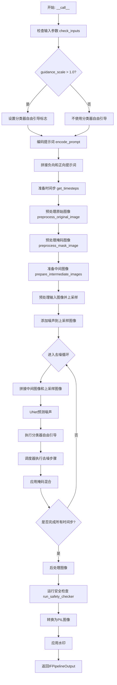
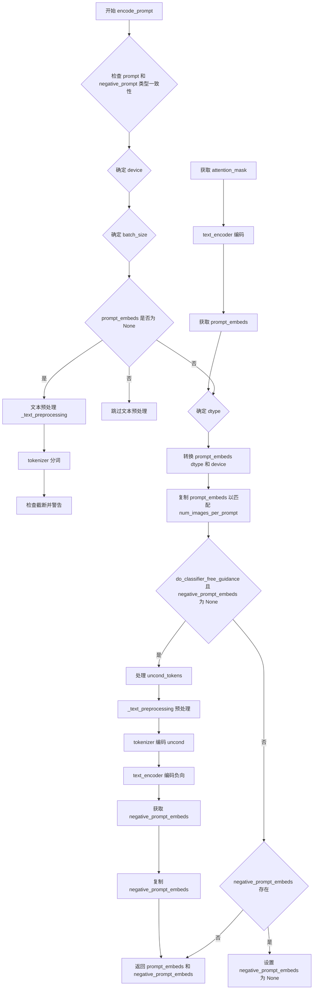
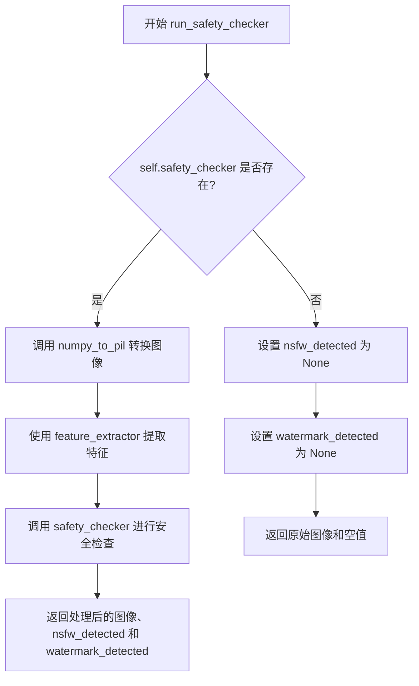
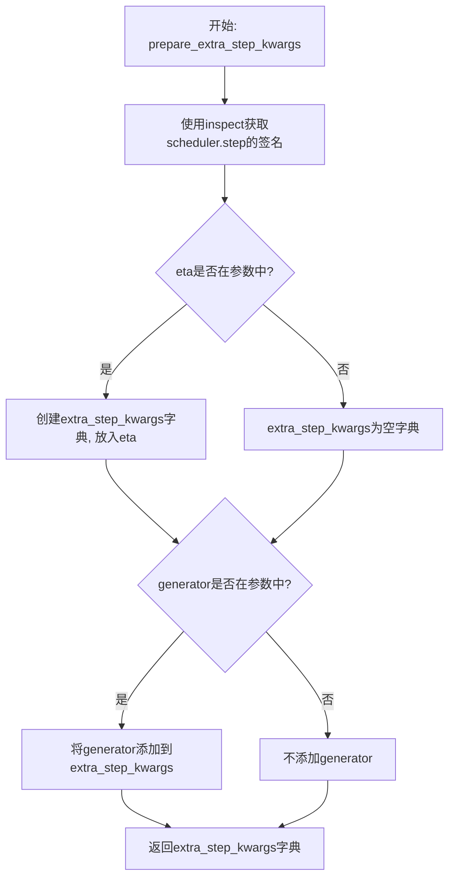
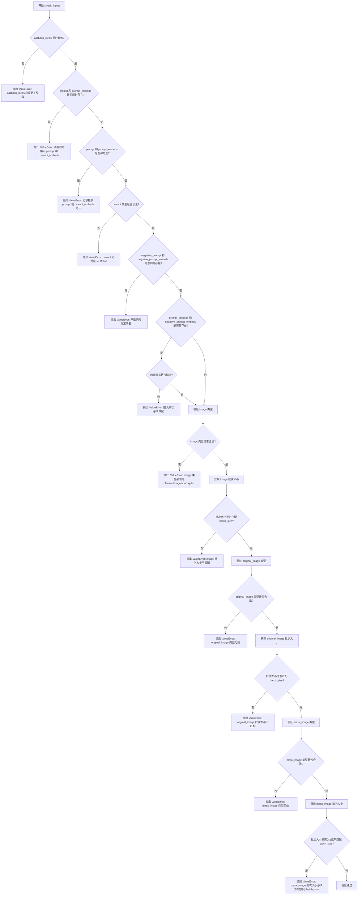
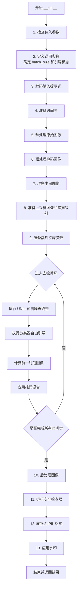

# `diffusers\src\diffusers\pipelines\deepfloyd_if\pipeline_if_inpainting_superresolution.py` 详细设计文档

这是DeepFloyd IF项目的图像修复超分辨率管道（IFInpaintingSuperResolutionPipeline），用于在已修复的图像基础上进行超分辨率增强。该管道结合了文本编码器（T5）、UNet2DConditionModel和DDPM调度器，支持图像修复、噪声调度、分类器自由引导、NSFW检测和水印处理等功能。

## 整体流程



## 类结构

```
DiffusionPipeline (基类)
└── IFInpaintingSuperResolutionPipeline
    └── StableDiffusionLoraLoaderMixin
```

## 全局变量及字段


### `XLA_AVAILABLE`
    
Boolean flag indicating whether PyTorch XLA is available for TPU support

类型：`bool`
    


### `logger`
    
Module-level logger instance for logging warnings and information

类型：`logging.Logger`
    


### `EXAMPLE_DOC_STRING`
    
Documentation string containing example usage of the pipeline

类型：`str`
    


### `bad_punct_regex`
    
Compiled regular expression pattern for detecting bad punctuation characters

类型：`re.Pattern`
    


### `resize`
    
Function to resize images to specified size while maintaining aspect ratio

类型：`Callable[[PIL.Image.Image, int], PIL.Image.Image]`
    


### `IFInpaintingSuperResolutionPipeline.tokenizer`
    
Tokenizer for encoding text prompts into token IDs

类型：`T5Tokenizer`
    


### `IFInpaintingSuperResolutionPipeline.text_encoder`
    
T5 text encoder model for generating text embeddings from token IDs

类型：`T5EncoderModel`
    


### `IFInpaintingSuperResolutionPipeline.unet`
    
UNet model for denoising image latents conditioned on text embeddings

类型：`UNet2DConditionModel`
    


### `IFInpaintingSuperResolutionPipeline.scheduler`
    
Denoising scheduler for the main image generation process

类型：`DDPMScheduler`
    


### `IFInpaintingSuperResolutionPipeline.image_noising_scheduler`
    
Denoising scheduler for adding noise to upscaled images

类型：`DDPMScheduler`
    


### `IFInpaintingSuperResolutionPipeline.feature_extractor`
    
CLIP image processor for extracting features for safety checker

类型：`CLIPImageProcessor | None`
    


### `IFInpaintingSuperResolutionPipeline.safety_checker`
    
Safety checker for detecting NSFW content in generated images

类型：`IFSafetyChecker | None`
    


### `IFInpaintingSuperResolutionPipeline.watermarker`
    
Watermarker for adding invisible watermarks to generated images

类型：`IFWatermarker | None`
    


### `IFInpaintingSuperResolutionPipeline.bad_punct_regex`
    
Compiled regex pattern for filtering bad punctuation in text preprocessing

类型：`re.Pattern`
    


### `IFInpaintingSuperResolutionPipeline.model_cpu_offload_seq`
    
String defining the sequence of models for CPU offloading optimization

类型：`str`
    


### `IFInpaintingSuperResolutionPipeline._optional_components`
    
List of optional component names that can be None during initialization

类型：`list[str]`
    


### `IFInpaintingSuperResolutionPipeline._exclude_from_cpu_offload`
    
List of component names to exclude from CPU offload optimization

类型：`list[str]`
    
    

## 全局函数及方法


### `resize`

该函数是一个全局工具函数，用于将输入的PIL图像调整到指定尺寸，同时保持原始宽高比，并确保调整后的尺寸是8的倍数（以满足深度学习模型的下采样要求）。

参数：

- `images`：`PIL.Image.Image`，需要调整大小的原始PIL图像对象
- `img_size`：`int`，目标尺寸（宽度和高度的目标值）

返回值：`PIL.Image.Image`，调整大小后的PIL图像对象

#### 流程图

```mermaid
flowchart TD
    A[开始] --> B[获取图像原始尺寸 w, h]
    B --> C[计算宽高比系数 coef = w / h]
    C --> D[初始化 w, h 为 img_size]
    D --> E{coef >= 1?}
    E -->|是| F[计算 w = int(round(img_size / 8 * coef) * 8)]
    E -->|否| G[计算 h = int(round(img_size / 8 / coef) * 8)]
    F --> H[使用双三次插值调整图像大小]
    G --> H
    H --> I[返回调整后的图像]
```

#### 带注释源码

```
# 全局函数：resize
# 用于调整图像大小，保持宽高比，并确保尺寸为8的倍数
def resize(images: PIL.Image.Image, img_size: int) -> PIL.Image.Image:
    # 获取原始图像的宽度和高度
    w, h = images.size

    # 计算原始图像的宽高比系数
    coef = w / h

    # 初始化目标尺寸为正方形
    w, h = img_size, img_size

    # 根据宽高比计算新的尺寸，确保最终尺寸是8的倍数
    # 这是因为在深度学习模型中，经常进行8倍下采样
    if coef >= 1:
        # 宽图：调整宽度，保持高度为img_size
        w = int(round(img_size / 8 * coef) * 8)
    else:
        # 高图：调整高度，保持宽度为img_size
        h = int(round(img_size / 8 / coef) * 8)

    # 使用双三次插值调整图像大小，reducing_gap参数设为None以获得更精确的尺寸
    images = images.resize((w, h), resample=PIL_INTERPOLATION["bicubic"], reducing_gap=None)

    # 返回调整大小后的图像
    return images
```


### IFInpaintingSuperResolutionPipeline.__init__

这是 `IFInpaintingSuperResolutionPipeline` 类的构造函数，负责初始化图像修复超分辨率管道所需的所有组件，包括分词器、文本编码器、UNet模型、调度器、安全检查器等，并进行参数校验和模块注册。

参数：

- `tokenizer`：`T5Tokenizer`，用于将文本提示转换为token序列的分词器
- `text_encoder`：`T5EncoderModel`，用于将token序列编码为文本嵌入的T5编码器模型
- `unet`：`UNet2DConditionModel`，用于去噪的UNet条件模型
- `scheduler`：`DDPMScheduler`，主去噪调度器
- `image_noising_scheduler`：`DDPMScheduler`，用于对图像添加噪声的调度器
- `safety_checker`：`IFSafetyChecker | None`，可选的安全检查器，用于过滤不安全内容
- `feature_extractor`：`CLIPImageProcessor | None`，可选的CLIP图像处理器，用于安全检查
- `watermarker`：`IFWatermarker | None`，可选的水印处理器
- `requires_safety_checker`：`bool`，是否需要安全检查器，默认为True

返回值：`None`，构造函数不返回值，仅初始化实例状态

#### 流程图

```mermaid
flowchart TD
    A[开始 __init__] --> B[调用 super().__init__]
    B --> C{safety_checker is None<br/>且 requires_safety_checker?}
    C -->|是| D[发出安全检查器警告]
    C -->|否| E{safety_checker not None<br/>且 feature_extractor is None?}
    D --> E
    E -->|是| F[抛出 ValueError]
    E -->|否| G{unet not None<br/>且 in_channels != 6?}
    F --> H[结束]
    G -->|是| I[发出UNet通道数警告]
    G -->|否| J[register_modules 注册所有模块]
    I --> J
    J --> K[register_to_config 注册配置]
    K --> L[结束]
```

#### 带注释源码

```python
def __init__(
    self,
    tokenizer: T5Tokenizer,
    text_encoder: T5EncoderModel,
    unet: UNet2DConditionModel,
    scheduler: DDPMScheduler,
    image_noising_scheduler: DDPMScheduler,
    safety_checker: IFSafetyChecker | None,
    feature_extractor: CLIPImageProcessor | None,
    watermarker: IFWatermarker | None,
    requires_safety_checker: bool = True,
):
    """初始化IF图像修复超分辨率管道
    
    参数:
        tokenizer: T5分词器
        text_encoder: T5文本编码器
        unet: UNet2D条件模型
        scheduler: 主去噪调度器
        image_noising_scheduler: 图像噪声调度器
        safety_checker: 安全检查器
        feature_extractor: 特征提取器
        watermarker: 水印处理器
        requires_safety_checker: 是否需要安全检查器
    """
    # 调用父类DiffusionPipeline的初始化方法
    super().__init__()

    # 检查：如果禁用了安全检查器但requires_safety_checker为True，发出警告
    if safety_checker is None and requires_safety_checker:
        logger.warning(
            f"You have disabled the safety checker for {self.__class__} by passing `safety_checker=None`. Ensure"
            " that you abide to the conditions of the IF license and do not expose unfiltered"
            " results in services or applications open to the public. Both the diffusers team and Hugging Face"
            " strongly recommend to keep the safety filter enabled in all public facing circumstances, disabling"
            " it only for use-cases that involve analyzing network behavior or auditing its results. For more"
            " information, please have a look at https://github.com/huggingface/diffusers/pull/254 ."
        )

    # 检查：如果使用安全检查器但未提供特征提取器，抛出错误
    if safety_checker is not None and feature_extractor is None:
        raise ValueError(
            "Make sure to define a feature extractor when loading {self.__class__} if you want to use the safety"
            " checker. If you do not want to use the safety checker, you can pass `'safety_checker=None'` instead."
        )

    # 检查：如果UNet不是6通道（超分辨率要求），发出警告
    if unet is not None and unet.config.in_channels != 6:
        logger.warning(
            "It seems like you have loaded a checkpoint that shall not be used for super resolution from {unet.config._name_or_path} as it accepts {unet.config.in_channels} input channels instead of 6. Please make sure to pass a super resolution checkpoint as the `'unet'`: IFSuperResolutionPipeline.from_pretrained(unet=super_resolution_unet, ...)`."
        )

    # 注册所有模块到管道中，使其可通过self.xxx访问
    self.register_modules(
        tokenizer=tokenizer,
        text_encoder=text_encoder,
        unet=unet,
        scheduler=scheduler,
        image_noising_scheduler=image_noising_scheduler,
        safety_checker=safety_checker,
        feature_extractor=feature_extractor,
        watermarker=watermarker,
    )
    # 将requires_safety_checker注册到配置中
    self.register_to_config(requires_safety_checker=requires_safety_checker)
```


### `IFInpaintingSuperResolutionPipeline._text_preprocessing`

该方法用于对输入的文本提示进行预处理，支持将文本转换为小写并去除首尾空格，或者调用 `_clean_caption` 方法进行更深入的清理（如移除URL、HTML标签、特殊字符等）。

参数：

- `text`：`str | tuple[str] | list[str]`，需要预处理的文本，可以是单个字符串或字符串列表/元组
- `clean_caption`：`bool`，是否执行深度清理（需要 bs4 和 ftfy 库），默认为 False

返回值：`list[str]`，返回处理后的字符串列表

#### 流程图

```mermaid
flowchart TD
    A[开始 _text_preprocessing] --> B{clean_caption 为 True 且 bs4 不可用?}
    B -->|是| C[记录警告, 设置 clean_caption = False]
    B -->|否| D{clean_caption 为 True 且 ftfy 不可用?}
    D -->|是| E[记录警告, 设置 clean_caption = False]
    D -->|否| F{text 是否为 tuple 或 list?}
    C --> F
    E --> F
    F -->|否| G[将 text 包装为列表: text = [text]]
    F -->|是| H[保持 text 为列表]
    G --> I[定义内部函数 process]
    H --> I
    I --> J{clean_caption 为 True?}
    J -->|是| K[调用 _clean_caption 两次]
    J -->|否| L[转换为小写并去除首尾空格]
    K --> M[返回处理后的文本]
    L --> M
    M --> N[对列表中每个元素调用 process]
    N --> O[返回结果列表]
```

#### 带注释源码

```python
def _text_preprocessing(self, text, clean_caption=False):
    """
    对输入文本进行预处理，支持深度清理或简单的小写和去空格处理。

    参数:
        text: 输入的文本，可以是字符串、字符串元组或字符串列表
        clean_caption: 是否执行深度清理（需要 beautifulsoup4 和 ftfy 库）

    返回:
        处理后的字符串列表
    """
    # 如果需要清理但缺少 bs4 库，发出警告并禁用清理功能
    if clean_caption and not is_bs4_available():
        logger.warning(BACKENDS_MAPPING["bs4"][-1].format("Setting `clean_caption=True`"))
        logger.warning("Setting `clean_caption` to False...")
        clean_caption = False

    # 如果需要清理但缺少 ftfy 库，发出警告并禁用清理功能
    if clean_caption and not is_ftfy_available():
        logger.warning(BACKENDS_MAPPING["ftfy"][-1].format("Setting `clean_caption=True`"))
        logger.warning("Setting `clean_caption` to False...")
        clean_caption = False

    # 统一转换为列表处理，便于后续迭代
    if not isinstance(text, (tuple, list)):
        text = [text]

    # 定义内部处理函数，对单个字符串进行处理
    def process(text: str):
        if clean_caption:
            # 执行深度清理（移除URL、HTML标签、特殊字符等）
            text = self._clean_caption(text)
            # 清理两次以确保彻底清理
            text = self._clean_caption(text)
        else:
            # 简单处理：转换为小写并去除首尾空格
            text = text.lower().strip()
        return text

    # 对列表中每个文本元素执行处理函数
    return [process(t) for t in text]
```


### `IFInpaintingSuperResolutionPipeline._clean_caption`

该方法用于清理和预处理图像生成任务的文本描述（caption），通过 URL 过滤、HTML 标签移除、CJK 字符过滤、特殊字符标准化等多种正则表达式操作，将原始文本转换为干净、规范的小写字符串，以提升文本编码的质量。

参数：

- `self`：`IFInpaintingSuperResolutionPipeline`，隐式参数，类实例本身
- `caption`：`Any`，需要清理的文本描述，支持任意类型（会转换为字符串）

返回值：`str`，返回清理后的文本描述

#### 流程图

```mermaid
flowchart TD
    A[开始: _clean_caption] --> B[将caption转换为字符串]
    B --> C[URL解码: ul.unquote_plus]
    C --> D[去除首尾空格并转为小写]
    E[正则替换<br>&lt;person&gt;为person] --> F[URL正则过滤]
    F --> G[WWW正则过滤]
    G --> H[HTML标签移除: BeautifulSoup]
    H --> I[@用户名正则过滤]
    I --> J[CJK字符块正则过滤]
    J --> K[多种破折号统一为-]
    K --> L[引号标准化]
    L --> M[&quot和&amp实体移除]
    M --> N[IP地址正则过滤]
    N --> O[文章ID正则过滤]
    O --> P[换行符正则过滤]
    P --> Q[标签符号#过滤]
    Q --> R[文件名扩展名过滤]
    R --> S[多余引号和句点合并]
    S --> T[标点符号规范化]
    T --> U[下划线/破折号超过3个则转为空格]
    U --> V[ftfy修复文本编码]
    V --> W[HTML实体双重解码]
    W --> X[字母数字混合模式过滤]
    X --> Y[广告关键词过滤]
    Y --> Z[页码数字过滤]
    Z --> AA[复杂字母数字串过滤]
    AA --> AB[尺寸规格过滤]
    AB --> AC[多余冒号空格修复]
    AC --> AD[字符间点号空格处理]
    AD --> AE[多余空格合并]
    AE --> AF[首尾引号移除]
    AF --> AG[首尾无关字符清理]
    AG --> AH[去除孤立点开头]
    AH --> AI[返回strip后的结果]
```

#### 带注释源码

```python
def _clean_caption(self, caption):
    # 将输入转换为字符串类型，确保后续处理的一致性
    caption = str(caption)
    
    # URL解码处理，将URL编码的字符串还原（如 %20 转换为空格）
    caption = ul.unquote_plus(caption)
    
    # 去除首尾空格并转换为小写，统一文本格式
    caption = caption.strip().lower()
    
    # 将 <person> 标签替换为 person，去除尖括号
    caption = re.sub("<person>", "person", caption)
    
    # ===== URL 过滤 =====
    # 匹配 http/https 开头的 URLs
    caption = re.sub(
        r"\b((?:https?:(?:\/{1,3}|[a-zA-Z0-9%])|[a-zA-Z0-9.\-]+[.](?:com|co|ru|net|org|edu|gov|it)[\w/-]*\b\/?(?!@)))",  # noqa
        "",
        caption,
    )  # regex for urls
    
    # 匹配 www. 开头的 URLs
    caption = re.sub(
        r"\b((?:www:(?:\/{1,3}|[a-zA-Z0-9%])|[a-zA-Z0-9.\-]+[.](?:com|co|ru|net|org|edu|gov|it)[\w/-]*\b\/?(?!@)))",  # noqa
        "",
        caption,
    )  # regex for urls
    
    # ===== HTML 标签移除 =====
    # 使用 BeautifulSoup 提取纯文本内容
    caption = BeautifulSoup(caption, features="html.parser").text

    # ===== @用户名过滤 =====
    caption = re.sub(r"@[\w\d]+\b", "", caption)

    # ===== CJK 字符过滤 =====
    # 31C0—31EF CJK Strokes
    # 31F0—31FF Katakana Phonetic Extensions
    # 3200—32FF Enclosed CJK Letters and Months
    # 3300—33FF CJK Compatibility
    # 3400—4DBF CJK Unified Ideographs Extension A
    # 4DC0—4DFF Yijing Hexagram Symbols
    # 4E00—9FFF CJK Unified Ideographs
    caption = re.sub(r"[\u31c0-\u31ef]+", "", caption)
    caption = re.sub(r"[\u31f0-\u31ff]+", "", caption)
    caption = re.sub(r"[\u3200-\u32ff]+", "", caption)
    caption = re.sub(r"[\u3300-\u33ff]+", "", caption)
    caption = re.sub(r"[\u3400-\u4dbf]+", "", caption)
    caption = re.sub(r"[\u4dc0-\u4dff]+", "", caption)
    caption = re.sub(r"[\u4e00-\u9fff]+", "", caption)

    # ===== 破折号统一 =====
    # 所有类型的破折号统一替换为英文短横线 "-"
    caption = re.sub(
        r"[\u002D\u058A\u05BE\u1400\u1806\u2010-\u2015\u2E17\u2E1A\u2E3A\u2E3B\u2E40\u301C\u3030\u30A0\uFE31\uFE32\uFE58\uFE63\uFF0D]+",  # noqa
        "-",
        caption,
    )

    # ===== 引号标准化 =====
    # 将各种语言的引号统一为双引号
    caption = re.sub(r"[`´«»""¨]", '"', caption)
    # 将单引号统一为英文单引号
    caption = re.sub(r"['']", "'", caption)

    # ===== HTML 实体移除 =====
    # 移除 &quot; 实体
    caption = re.sub(r"&quot;?", "", caption)
    # 移除 &amp 实体
    caption = re.sub(r"&amp", "", caption)

    # ===== IP 地址过滤 =====
    caption = re.sub(r"\d{1,3}\.\d{1,3}\.\d{1,3}\.\d{1,3}", " ", caption)

    # ===== 文章ID过滤 =====
    # 匹配形如 "12:34 " 结尾的文章ID
    caption = re.sub(r"\d:\d\d\s+$", "", caption)

    # ===== 换行符过滤 =====
    caption = re.sub(r"\\n", " ", caption)

    # ===== 标签符号过滤 =====
    # "#123"
    caption = re.sub(r"#\d{1,3}\b", "", caption)
    # "#12345.."
    caption = re.sub(r"#\d{5,}\b", "", caption)
    # "123456.." 纯数字串
    caption = re.sub(r"\b\d{6,}\b", "", caption)
    
    # ===== 文件名过滤 =====
    caption = re.sub(r"[\S]+\.(?:png|jpg|jpeg|bmp|webp|eps|pdf|apk|mp4)", "", caption)

    # ===== 多余字符合并 =====
    caption = re.sub(r"[\"']{2,}", r'"', caption)  # """AUSVERKAUFT"""
    caption = re.sub(r"[\.]{2,}", r" ", caption)  # """AUSVERKAUFT"""

    # ===== 标点符号处理 =====
    # 移除 bad_punct_regex 中的特殊标点
    caption = re.sub(self.bad_punct_regex, r" ", caption)  # ***AUSVERKAUFT***, #AUSVERKAUFT
    # 移除 " . " 模式
    caption = re.sub(r"\s+\.\s+", r" ", caption)  # " . "

    # ===== 下划线/破折号处理 =====
    # 如果 caption 中包含超过3个 - 或 _，则将它们全部替换为空格
    # this-is-my-cute-cat / this_is_my_cute_cat
    regex2 = re.compile(r"(?:\-|\_)")
    if len(re.findall(regex2, caption)) > 3:
        caption = re.sub(regex2, " ", caption)

    # ===== 文本编码修复 =====
    # 使用 ftfy 修复常见的文本编码问题
    caption = ftfy.fix_text(caption)
    # 双重 HTML 解码，处理双重转义的情况
    caption = html.unescape(html.unescape(caption))

    # ===== 字母数字混合模式过滤 =====
    # 移除如 jc6640 等混合模式
    caption = re.sub(r"\b[a-zA-Z]{1,3}\d{3,15}\b", "", caption)  # jc6640
    caption = re.sub(r"\b[a-zA-Z]+\d+[a-zA-Z]+\b", "", caption)  # jc6640vc
    caption = re.sub(r"\b\d+[a-zA-Z]+\d+\b", "", caption)  # 6640vc231

    # ===== 广告关键词过滤 =====
    caption = re.sub(r"(worldwide\s+)?(free\s+)?shipping", "", caption)
    caption = re.sub(r"(free\s)?download(\sfree)?", "", caption)
    caption = re.sub(r"\bclick\b\s(?:for|on)\s\w+", "", caption)
    caption = re.sub(r"\b(?:png|jpg|jpeg|bmp|webp|eps|pdf|apk|mp4)(\simage[s]?)?", "", caption)
    caption = re.sub(r"\bpage\s+\d+\b", "", caption)

    # ===== 复杂字母数字串过滤 =====
    caption = re.sub(r"\b\d*[a-zA-Z]+\d+[a-zA-Z]+\d+[a-zA-Z\d]*\b", r" ", caption)  # j2d1a2a...

    # ===== 尺寸规格过滤 =====
    caption = re.sub(r"\b\d+\.?\d*[xх×]\d+\.?\d*\b", "", caption)

    # ===== 格式修复 =====
    # 修复多余空格后的冒号
    caption = re.sub(r"\b\s+\:\s+", r": ", caption)
    # 在字符和点号之间添加空格
    caption = re.sub(r"(\D[,\./])\b", r"\1 ", caption)
    # 合并多余空格
    caption = re.sub(r"\s+", " ", caption)

    # 临时存储（此行似乎无效，未赋值给任何变量）
    caption.strip()

    # ===== 首尾字符清理 =====
    # 移除首尾引号
    caption = re.sub(r"^[\"\']([\w\W]+)[\"\']$", r"\1", caption)
    # 移除首部的引号、逗号、破折号等
    caption = re.sub(r"^[\'\_,\-\:;]", r"", caption)
    # 移除尾部的引号、逗号、破折号、加号等
    caption = re.sub(r"[\'\_,\-\:\-\+]$", r" "", caption)
    # 移除以点开头的非单词字符
    caption = re.sub(r"^\.\S+$", "", caption)

    # 返回清理后的结果
    return caption.strip()
```


### `IFInpaintingSuperResolutionPipeline.encode_prompt`

该函数将文本提示（prompt）编码为文本编码器（text_encoder）的隐藏状态（hidden states），支持正向提示和负向提示的嵌入生成，并可选择是否进行分类器自由引导（Classifier-Free Guidance）。

参数：

- `self`：`IFInpaintingSuperResolutionPipeline`，类的实例本身
- `prompt`：`str | list[str]`，要编码的提示词，支持单字符串或字符串列表
- `do_classifier_free_guidance`：`bool`，是否使用分类器自由引导，默认为 `True`
- `num_images_per_prompt`：`int`，每个提示词生成的图像数量，默认为 1
- `device`：`torch.device | None`，用于放置生成嵌入的张量设备，默认为 `None`
- `negative_prompt`：`str | list[str] | None`，负向提示词，用于指导不生成的内容，默认为 `None`
- `prompt_embeds`：`torch.Tensor | None`，预生成的提示词嵌入，如果未提供则从 `prompt` 生成，默认为 `None`
- `negative_prompt_embeds`：`torch.Tensor | None`，预生成的负向提示词嵌入，如果未提供则从 `negative_prompt` 生成，默认为 `None`
- `clean_caption`：`bool`，是否清理和预处理提示词文本，默认为 `False`

返回值：`tuple[torch.Tensor, torch.Tensor]`，返回提示词嵌入和负向提示词嵌入的元组

#### 流程图



#### 带注释源码

```python
@torch.no_grad()
# Copied from diffusers.pipelines.deepfloyd_if.pipeline_if.IFPipeline.encode_prompt
def encode_prompt(
    self,
    prompt: str | list[str],
    do_classifier_free_guidance: bool = True,
    num_images_per_prompt: int = 1,
    device: torch.device | None = None,
    negative_prompt: str | list[str] | None = None,
    prompt_embeds: torch.Tensor | None = None,
    negative_prompt_embeds: torch.Tensor | None = None,
    clean_caption: bool = False,
):
    r"""
    Encodes the prompt into text encoder hidden states.

    Args:
        prompt (`str` or `list[str]`, *optional*):
            prompt to be encoded
        do_classifier_free_guidance (`bool`, *optional*, defaults to `True`):
            whether to use classifier free guidance or not
        num_images_per_prompt (`int`, *optional*, defaults to 1):
            number of images that should be generated per prompt
        device: (`torch.device`, *optional*):
            torch device to place the resulting embeddings on
        negative_prompt (`str` or `list[str]`, *optional*):
            The prompt or prompts not to guide the image generation. If not defined, one has to pass
            `negative_prompt_embeds`. instead. If not defined, one has to pass `negative_prompt_embeds`. instead.
            Ignored when not using guidance (i.e., ignored if `guidance_scale` is less than `1`).
        prompt_embeds (`torch.Tensor`, *optional*):
            Pre-generated text embeddings. Can be used to easily tweak text inputs, *e.g.* prompt weighting. If not
            provided, text embeddings will be generated from `prompt` input argument.
        negative_prompt_embeds (`torch.Tensor`, *optional*):
            Pre-generated negative text embeddings. Can be used to easily tweak text inputs, *e.g.* prompt
            weighting. If not provided, negative_prompt_embeds will be generated from `negative_prompt` input
            argument.
        clean_caption (bool, defaults to `False`):
            If `True`, the function will preprocess and clean the provided caption before encoding.
    """
    # 检查 prompt 和 negative_prompt 类型一致性
    if prompt is not None and negative_prompt is not None:
        if type(prompt) is not type(negative_prompt):
            raise TypeError(
                f"`negative_prompt` should be the same type to `prompt`, but got {type(negative_prompt)} !="
                f" {type(prompt)}."
            )

    # 确定设备，如果未指定则使用执行设备
    if device is None:
        device = self._execution_device

    # 确定批处理大小
    if prompt is not None and isinstance(prompt, str):
        batch_size = 1
    elif prompt is not None and isinstance(prompt, list):
        batch_size = len(prompt)
    else:
        batch_size = prompt_embeds.shape[0]

    # T5 文本编码器的最大长度设为 77
    max_length = 77

    # 如果未提供 prompt_embeds，则从 prompt 生成
    if prompt_embeds is None:
        # 文本预处理（清理和规范化）
        prompt = self._text_preprocessing(prompt, clean_caption=clean_caption)
        # 使用 tokenizer 进行分词
        text_inputs = self.tokenizer(
            prompt,
            padding="max_length",
            max_length=max_length,
            truncation=True,
            add_special_tokens=True,
            return_tensors="pt",
        )
        text_input_ids = text_inputs.input_ids
        # 获取未截断的输入 ID 以检查是否发生了截断
        untruncated_ids = self.tokenizer(prompt, padding="longest", return_tensors="pt").input_ids

        # 检查是否发生截断并发出警告
        if untruncated_ids.shape[-1] >= text_input_ids.shape[-1] and not torch.equal(
            text_input_ids, untruncated_ids
        ):
            removed_text = self.tokenizer.batch_decode(untruncated_ids[:, max_length - 1 : -1])
            logger.warning(
                "The following part of your input was truncated because CLIP can only handle sequences up to"
                f" {max_length} tokens: {removed_text}"
            )

        # 获取注意力掩码
        attention_mask = text_inputs.attention_mask.to(device)

        # 使用文本编码器编码
        prompt_embeds = self.text_encoder(
            text_input_ids.to(device),
            attention_mask=attention_mask,
        )
        # 获取隐藏状态
        prompt_embeds = prompt_embeds[0]

    # 确定数据类型（dtype），优先使用 text_encoder 的 dtype，其次使用 unet 的 dtype
    if self.text_encoder is not None:
        dtype = self.text_encoder.dtype
    elif self.unet is not None:
        dtype = self.unet.dtype
    else:
        dtype = None

    # 将 prompt_embeds 转换为指定的数据类型和设备
    prompt_embeds = prompt_embeds.to(dtype=dtype, device=device)

    bs_embed, seq_len, _ = prompt_embeds.shape
    # 复制文本嵌入以匹配每个提示生成的图像数量
    prompt_embeds = prompt_embeds.repeat(1, num_images_per_prompt, 1)
    prompt_embeds = prompt_embeds.view(bs_embed * num_images_per_prompt, seq_len, -1)

    # 获取分类器自由引导的无条件嵌入
    if do_classifier_free_guidance and negative_prompt_embeds is None:
        uncond_tokens: list[str]
        if negative_prompt is None:
            # 如果没有负向提示，使用空字符串
            uncond_tokens = [""] * batch_size
        elif isinstance(negative_prompt, str):
            uncond_tokens = [negative_prompt]
        elif batch_size != len(negative_prompt):
            raise ValueError(
                f"`negative_prompt`: {negative_prompt} has batch size {len(negative_prompt)}, but `prompt`:"
                f" {prompt} has batch size {batch_size}. Please make sure that passed `negative_prompt` matches"
                " the batch size of `prompt`."
            )
        else:
            uncond_tokens = negative_prompt

        # 预处理无条件嵌入的文本
        uncond_tokens = self._text_preprocessing(uncond_tokens, clean_caption=clean_caption)
        max_length = prompt_embeds.shape[1]
        # 对无条件标记进行分词
        uncond_input = self.tokenizer(
            uncond_tokens,
            padding="max_length",
            max_length=max_length,
            truncation=True,
            return_attention_mask=True,
            add_special_tokens=True,
            return_tensors="pt",
        )
        attention_mask = uncond_input.attention_mask.to(device)

        # 使用文本编码器编码负向提示
        negative_prompt_embeds = self.text_encoder(
            uncond_input.input_ids.to(device),
            attention_mask=attention_mask,
        )
        negative_prompt_embeds = negative_prompt_embeds[0]

    if do_classifier_free_guidance:
        # 复制无条件嵌入以匹配每个提示生成的图像数量
        seq_len = negative_prompt_embeds.shape[1]

        negative_prompt_embeds = negative_prompt_embeds.to(dtype=dtype, device=device)

        negative_prompt_embeds = negative_prompt_embeds.repeat(1, num_images_per_prompt, 1)
        negative_prompt_embeds = negative_prompt_embeds.view(batch_size * num_images_per_prompt, seq_len, -1)

        # 对于分类器自由引导，需要进行两次前向传播
        # 这里将无条件嵌入和文本嵌入连接成一个批次以避免两次前向传播
    else:
        negative_prompt_embeds = None

    return prompt_embeds, negative_prompt_embeds
```


### `IFInpaintingSuperResolutionPipeline.run_safety_checker`

该方法用于对生成的图像进行安全检查，包括检测 NSFW（不适合在工作场所查看的内容）内容和数字水印。如果安全检查器已配置，则使用特征提取器处理图像并调用安全检查器进行检测；否则返回空值。

参数：

- `image`：需要检查的图像数据
- `device`：运行设备（torch.device）
- `dtype`：数据类型（用于 CLIP 输入）

返回值：

- `image`：处理后的图像
- `nsfw_detected`：是否检测到 NSFW 内容的布尔值或 None
- `watermark_detected`：是否检测到水印的布尔值或 None

#### 流程图



#### 带注释源码

```python
def run_safety_checker(self, image, device, dtype):
    """
    运行安全检查器来检测 NSFW 内容和水印。
    
    参数:
        image: 需要检查的图像数据
        device: 运行设备
        dtype: 数据类型
    
    返回:
        处理后的图像、NSFW 检测结果、水印检测结果
    """
    # 检查安全检查器是否已配置
    if self.safety_checker is not None:
        # 将图像转换为 PIL 格式以供特征提取器使用
        safety_checker_input = self.feature_extractor(
            self.numpy_to_pil(image), 
            return_tensors="pt"
        ).to(device)
        
        # 调用安全检查器进行图像检查
        image, nsfw_detected, watermark_detected = self.safety_checker(
            images=image,
            clip_input=safety_checker_input.pixel_values.to(dtype=dtype),
        )
    else:
        # 如果没有配置安全检查器，返回 None 值
        nsfw_detected = None
        watermark_detected = None

    return image, nsfw_detected, watermark_detected
```


### IFInpaintingSuperResolutionPipeline.prepare_extra_step_kwargs

该方法用于准备调度器（scheduler）的额外参数。由于不同的调度器具有不同的签名，该方法通过反射检查调度器的 `step` 方法是否接受 `eta` 和 `generator` 参数，并据此构建需要传递给调度器的额外关键字参数字典。

参数：

- `self`：`IFInpaintingSuperResolutionPipeline` 实例，隐含的类实例参数
- `generator`：`torch.Generator | list[torch.Generator] | None`，可选的随机数生成器，用于使去噪过程具有确定性
- `eta`：`float`，DDIM 调度器专用的 eta 参数（η），取值范围应为 [0, 1]。对于其他调度器，该参数将被忽略

返回值：`dict`，包含可能需要传递给调度器 `step` 方法的额外关键字参数字典，可能包含 `eta` 和/或 `generator` 键

#### 流程图



#### 带注释源码

```python
def prepare_extra_step_kwargs(self, generator, eta):
    # 使用 inspect 模块检查调度器的 step 方法是否接受 eta 参数
    # 因为不是所有调度器都支持 eta 参数（仅 DDIMScheduler 等少数调度器支持）
    # eta (η) 参数对应 DDIM 论文中的 eta: https://huggingface.co/papers/2010.02502
    # eta 的值应控制在 [0, 1] 范围内
    accepts_eta = "eta" in set(inspect.signature(self.scheduler.step).parameters.keys())
    
    # 初始化空字典用于存储额外参数
    extra_step_kwargs = {}
    
    # 如果调度器接受 eta 参数，则将其添加到 extra_step_kwargs 中
    if accepts_eta:
        extra_step_kwargs["eta"] = eta

    # 检查调度器的 step 方法是否接受 generator 参数
    # 不同的调度器对 generator 的支持情况不同
    accepts_generator = "generator" in set(inspect.signature(self.scheduler.step).parameters.keys())
    
    # 如果调度器接受 generator 参数，则将其添加到 extra_step_kwargs 中
    if accepts_generator:
        extra_step_kwargs["generator"] = generator
    
    # 返回包含额外参数的字典，供调度器的 step 方法使用
    return extra_step_kwargs
```


### IFInpaintingSuperResolutionPipeline.check_inputs

该方法用于验证图像修复和超分辨率管道的输入参数合法性，包括检查回调步数、提示词与嵌入的一致性、图像类型与批次大小匹配等，确保所有输入符合管道要求后才会执行后续处理。

参数：

- `prompt`：`str | list[str] | None`，用户提供的文本提示词，用于引导图像生成
- `image`：`torch.Tensor | PIL.Image.Image | np.ndarray | list`，待处理的输入图像
- `original_image`：`torch.Tensor | PIL.Image.Image | np.ndarray | list`，原始参考图像
- `mask_image`：`torch.Tensor | PIL.Image.Image | np.ndarray | list`，用于指示修复区域的掩码图像
- `batch_size`：`int`，批处理大小，用于验证图像数量
- `callback_steps`：`int`，回调函数调用间隔步数，必须为正整数
- `negative_prompt`：`str | list[str] | None`，负面提示词，用于引导避免生成特定内容
- `prompt_embeds`：`torch.Tensor | None`，预计算的提示词嵌入向量
- `negative_prompt_embeds`：`torch.Tensor | None`，预计算的负面提示词嵌入向量

返回值：`None`，通过抛出 ValueError 异常来处理验证失败情况

#### 流程图



#### 带注释源码

```python
def check_inputs(
    self,
    prompt,
    image,
    original_image,
    mask_image,
    batch_size,
    callback_steps,
    negative_prompt=None,
    prompt_embeds=None,
    negative_prompt_embeds=None,
):
    # 验证 callback_steps 参数有效性
    # 必须为正整数，不能为 None 或非正数
    if (callback_steps is None) or (
        callback_steps is not None and (not isinstance(callback_steps, int) or callback_steps <= 0)
    ):
        raise ValueError(
            f"`callback_steps` has to be a positive integer but is {callback_steps} of type"
            f" {type(callback_steps)}."
        )

    # 验证 prompt 和 prompt_embeds 互斥
    # 两者不能同时提供，只能选择其一
    if prompt is not None and prompt_embeds is not None:
        raise ValueError(
            f"Cannot forward both `prompt`: {prompt} and `prompt_embeds`: {prompt_embeds}. Please make sure to"
            " only forward one of the two."
        )
    # 验证至少提供一种提示词输入方式
    elif prompt is None and prompt_embeds is None:
        raise ValueError(
            "Provide either `prompt` or `prompt_embeds`. Cannot leave both `prompt` and `prompt_embeds` undefined."
        )
    # 验证 prompt 类型合法性
    elif prompt is not None and (not isinstance(prompt, str) and not isinstance(prompt, list)):
        raise ValueError(f"`prompt` has to be of type `str` or `list` but is {type(prompt)}")

    # 验证 negative_prompt 和 negative_prompt_embeds 互斥
    if negative_prompt is not None and negative_prompt_embeds is not None:
        raise ValueError(
            f"Cannot forward both `negative_prompt`: {negative_prompt} and `negative_prompt_embeds`:"
            f" {negative_prompt_embeds}. Please make sure to only forward one of the two."
        )

    # 验证嵌入向量形状一致性
    if prompt_embeds is not None and negative_prompt_embeds is not None:
        if prompt_embeds.shape != negative_prompt_embeds.shape:
            raise ValueError(
                "`prompt_embeds` and `negative_prompt_embeds` must have the same shape when passed directly, but"
                f" got: `prompt_embeds` {prompt_embeds.shape} != `negative_prompt_embeds`"
                f" {negative_prompt_embeds.shape}."
            )

    # ==================== 验证 image 参数 ====================
    # 获取第一个元素用于类型检查（如果是列表）
    if isinstance(image, list):
        check_image_type = image[0]
    else:
        check_image_type = image

    # 验证 image 类型合法性：torch.Tensor、PIL.Image.Image、np.ndarray 或 list
    if (
        not isinstance(check_image_type, torch.Tensor)
        and not isinstance(check_image_type, PIL.Image.Image)
        and not isinstance(check_image_type, np.ndarray)
    ):
        raise ValueError(
            "`image` has to be of type `torch.Tensor`, `PIL.Image.Image`, `np.ndarray`, or list[...] but is"
            f" {type(check_image_type)}"
        )

    # 根据不同类型获取 image 批次大小
    if isinstance(image, list):
        image_batch_size = len(image)
    elif isinstance(image, torch.Tensor):
        image_batch_size = image.shape[0]
    elif isinstance(image, PIL.Image.Image):
        image_batch_size = 1
    elif isinstance(image, np.ndarray):
        image_batch_size = image.shape[0]
    else:
        assert False

    # 验证 image 批次大小与 prompt 批次大小一致
    if batch_size != image_batch_size:
        raise ValueError(f"image batch size: {image_batch_size} must be same as prompt batch size {batch_size}")

    # ==================== 验证 original_image 参数 ====================
    # 同样逻辑验证 original_image
    if isinstance(original_image, list):
        check_image_type = original_image[0]
    else:
        check_image_type = original_image

    if (
        not isinstance(check_image_type, torch.Tensor)
        and not isinstance(check_image_type, PIL.Image.Image)
        and not isinstance(check_image_type, np.ndarray)
    ):
        raise ValueError(
            "`original_image` has to be of type `torch.Tensor`, `PIL.Image.Image`, `np.ndarray`, or list[...] but is"
            f" {type(check_image_type)}"
        )

    if isinstance(original_image, list):
        image_batch_size = len(original_image)
    elif isinstance(original_image, torch.Tensor):
        image_batch_size = original_image.shape[0]
    elif isinstance(original_image, PIL.Image.Image):
        image_batch_size = 1
    elif isinstance(original_image, np.ndarray):
        image_batch_size = original_image.shape[0]
    else:
        assert False

    if batch_size != image_batch_size:
        raise ValueError(
            f"original_image batch size: {image_batch_size} must be same as prompt batch size {batch_size}"
        )

    # ==================== 验证 mask_image 参数 ====================
    # mask_image 验证逻辑略有不同：允许批次大小为 1 或等于 batch_size
    if isinstance(mask_image, list):
        check_image_type = mask_image[0]
    else:
        check_image_type = mask_image

    if (
        not isinstance(check_image_type, torch.Tensor)
        and not isinstance(check_image_type, PIL.Image.Image)
        and not isinstance(check_image_type, np.ndarray)
    ):
        raise ValueError(
            "`mask_image` has to be of type `torch.Tensor`, `PIL.Image.Image`, `np.ndarray`, or list[...] but is"
            f" {type(check_image_type)}"
        )

    if isinstance(mask_image, list):
        image_batch_size = len(mask_image)
    elif isinstance(mask_image, torch.Tensor):
        image_batch_size = mask_image.shape[0]
    elif isinstance(mask_image, PIL.Image.Image):
        image_batch_size = 1
    elif isinstance(mask_image, np.ndarray):
        image_batch_size = mask_image.shape[0]
    else:
        assert False

    # mask_image 允许批次大小为 1（单张掩码应用于所有图像）
    if image_batch_size != 1 and batch_size != image_batch_size:
        raise ValueError(
            f"mask_image batch size: {image_batch_size} must be `1` or the same as prompt batch size {batch_size}"
        )
```


### `IFInpaintingSuperResolutionPipeline.preprocess_original_image`

该方法负责将输入的原始图像（支持 PIL.Image.Image、numpy.ndarray 或 torch.Tensor 格式）预处理为 PyTorch 张量格式，以便后续在深度学习 pipeline 中使用。核心操作包括图像类型检查、尺寸调整、归一化（缩放至 [-1, 1]）以及维度转换。

参数：

- `image`：`PIL.Image.Image`，需要预处理的原始图像，支持单张图像或图像列表

返回值：`torch.Tensor`，预处理后的图像张量，形状为 (B, C, H, W)，其中 B 为批次大小，C 为通道数（3），H 和 W 为调整后的图像尺寸

#### 流程图

```mermaid
flowchart TD
    A[开始] --> B{image是否为list?}
    B -->|否| C[将image转换为list]
    B -->|是| D{image[0]类型检查}
    C --> D
    D -->|PIL.Image.Image| E[遍历图像列表]
    D -->|np.ndarray| G[处理numpy数组]
    D -->|torch.Tensor| I[处理PyTorch张量]
    E --> E1[转换为RGB模式]
    E1 --> E2[resize到sample_size]
    E2 --> E3[转换为numpy数组]
    E3 --> E4[数据类型转为float32]
    E4 --> E5[归一化到[-1, 1]]
    E5 --> F[堆叠为numpy数组]
    G --> G1{维度检查}
    G1 -->|4维| G2[concatenate]
    G1 -->|3维| G3[stack]
    G2 --> H[转换为PyTorch张量]
    G3 --> H
    I --> I1{维度检查}
    I1 -->|4维| I2[cat]
    I1 -->|3维| I3[stack]
    I2 --> J[返回处理后的张量]
    I3 --> J
    F --> H
    H --> J
    J --> K[结束]
```

#### 带注释源码

```
def preprocess_original_image(self, image: PIL.Image.Image) -> torch.Tensor:
    # 如果输入不是列表，则包装为列表，便于统一处理
    if not isinstance(image, list):
        image = [image]

    # 定义内部辅助函数：将numpy数组转换为PyTorch张量
    def numpy_to_pt(images):
        # 对于3维图像（无通道维度），添加通道维度
        if images.ndim == 3:
            images = images[..., None]  # (H, W) -> (H, W, 1)

        # 转换维度顺序：从 (B, H, W, C) 转为 (B, C, H, W)
        images = torch.from_numpy(images.transpose(0, 3, 1, 2))
        return images

    # 处理PIL.Image类型的输入
    if isinstance(image[0], PIL.Image.Image):
        new_image = []

        # 逐张处理图像
        for image_ in image:
            # 转换为RGB模式（确保3通道）
            image_ = image_.convert("RGB")
            # 调整图像尺寸，使用unet配置的sample_size
            image_ = resize(image_, self.unet.config.sample_size)
            # 转换为numpy数组
            image_ = np.array(image_)
            # 转换为float32类型
            image_ = image_.astype(np.float32)
            # 归一化：像素值从[0, 255]映射到[-1, 1]
            # 原公式: image_ / 127.5 - 1
            # 即 0 -> -1, 255 -> 1
            image_ = image_ / 127.5 - 1
            new_image.append(image_)

        image = new_image

        # 将图像列表堆叠为numpy数组 (B, H, W, C)
        image = np.stack(image, axis=0)
        # 转换为PyTorch张量 (B, C, H, W)
        image = numpy_to_pt(image)

    # 处理numpy数组类型的输入
    elif isinstance(image[0], np.ndarray):
        # 如果是4维数组（多张图像），沿第0维拼接；否则堆叠
        image = np.concatenate(image, axis=0) if image[0].ndim == 4 else np.stack(image, axis=0)
        # 转换为PyTorch张量
        image = numpy_to_pt(image)

    # 处理PyTorch张量类型的输入
    elif isinstance(image[0], torch.Tensor):
        # 如果是4维张量，沿第0维拼接；否则堆叠
        image = torch.cat(image, axis=0) if image[0].ndim == 4 else torch.stack(image, axis=0)

    # 返回预处理后的图像张量
    return image
```


### `IFInpaintingSuperResolutionPipeline.preprocess_image`

该方法用于对输入图像进行预处理，将其转换为PyTorch张量格式，以便后续在深度学习推理流程中使用。该方法支持多种输入格式（PIL.Image、numpy数组、torch.Tensor），并将其统一转换为标准化张量，同时根据num_images_per_prompt参数进行批量复制。

参数：

- `image`：`PIL.Image.Image | torch.Tensor | list`，输入图像，可以是单个图像、图像列表或张量
- `num_images_per_prompt`：`int`，每个提示词生成的图像数量，用于决定图像批次的复制次数
- `device`：`torch.device`，目标设备，用于将处理后的张量移动到指定设备（如CPU或GPU）

返回值：`torch.Tensor`，处理后的图像张量，格式为(B, C, H, W)，其中B为批次大小，C为通道数，H和W为图像高度和宽度

#### 流程图

```mermaid
flowchart TD
    A[开始] --> B{检查image类型}
    B -->|非torch.Tensor且非list| C[将image包装为list]
    B -->|其他| D
    C --> D{image[0]类型判断}
    D -->|PIL.Image.Image| E[转换为numpy数组并归一化]
    D -->|np.ndarray| F[堆叠数组]
    D -->|torch.Tensor list| G[检查维度]
    E --> H[转换为torch.Tensor并转置维度]
    F --> I{检查是否为5维}
    I -->|是| J[取第0个]
    I -->|否| H
    J --> H
    G -->|3维| K[stack操作]
    G -->|4维| L[concat操作]
    G -->|其他维度| M[抛出ValueError异常]
    K --> N
    L --> N
    H --> N[将张量移动到指定设备]
    N --> O[转换为unet的数据类型]
    O --> P[按dim=0重复num_images_per_prompt次]
    P --> Q[返回处理后的张量]
```

#### 带注释源码

```python
# Copied from diffusers.pipelines.deepfloyd_if.pipeline_if_superresolution.IFSuperResolutionPipeline.preprocess_image
def preprocess_image(self, image: PIL.Image.Image, num_images_per_prompt, device) -> torch.Tensor:
    # 如果输入既不是torch.Tensor也不是list，则将其包装为list
    # 这是为了统一处理流程，方便后续的批量处理
    if not isinstance(image, torch.Tensor) and not isinstance(image, list):
        image = [image]

    # 根据不同的输入类型进行相应的处理
    if isinstance(image[0], PIL.Image.Image):
        # 将PIL图像转换为numpy数组，并进行归一化处理
        # 归一化公式: (pixel / 127.5) - 1.0，将像素值从[0, 255]映射到[-1, 1]
        image = [np.array(i).astype(np.float32) / 127.5 - 1.0 for i in image]

        # 将图像列表堆叠成numpy数组（轴0为批次维度）
        image = np.stack(image, axis=0)  # to np
        # 转换维度顺序: 从(H, W, C)转换为(C, H, W)
        # numpy的transpose参数表示新轴的顺序
        image = torch.from_numpy(image.transpose(0, 3, 1, 2))
    elif isinstance(image[0], np.ndarray):
        # 如果输入是numpy数组，先堆叠成批次
        image = np.stack(image, axis=0)  # to np
        # 如果是5维张量（通常意味着已经是批量处理的），取第一个样本
        if image.ndim == 5:
            image = image[0]

        # 转换维度顺序: 从(H, W, C)转换为(C, H, W)
        image = torch.from_numpy(image.transpose(0, 3, 1, 2))
    elif isinstance(image, list) and isinstance(image[0], torch.Tensor):
        # 获取第一个张量的维度信息
        dims = image[0].ndim

        # 根据不同维度进行不同的处理
        if dims == 3:
            # 3维张量（单通道图像）：使用stack增加批次维度
            image = torch.stack(image, dim=0)
        elif dims == 4:
            # 4维张量（已包含批次维度）：使用concat沿批次维度拼接
            image = torch.concat(image, dim=0)
        else:
            # 不支持的维度，抛出异常
            raise ValueError(f"Image must have 3 or 4 dimensions, instead got {dims}")

    # 将张量移动到指定设备，并转换为unet所需的数据类型
    # 这确保了图像数据与模型权重在同一设备上，且数据类型一致
    image = image.to(device=device, dtype=self.unet.dtype)

    # 根据num_images_per_prompt参数沿批次维度重复图像
    # 例如：如果num_images_per_prompt=2，则每个图像会被复制两次
    # 这样可以实现为每个提示词生成多个图像
    image = image.repeat_interleave(num_images_per_prompt, dim=0)

    return image
```


### `IFInpaintingSuperResolutionPipeline.preprocess_mask_image`

该方法负责将输入的掩码图像（mask_image）预处理为标准化的 PyTorch 张量格式，支持多种输入类型（torch.Tensor、PIL.Image、np.ndarray），并进行尺寸调整和二值化处理。

参数：

- `mask_image`：掩码图像，输入类型可以是 `torch.Tensor`、`PIL.Image.Image`、`np.ndarray` 或它们的列表，表示需要处理的掩码图像数据

返回值：`torch.Tensor`，返回预处理后的掩码图像张量，形状为 (B, 1, H, W)，值为 0 或 1

#### 流程图

```mermaid
flowchart TD
    A[开始 preprocess_mask_image] --> B{输入是否为列表}
    B -- 否 --> C[将 mask_image 包装为列表]
    B -- 是 --> D{判断输入类型}
    
    D --> E{类型为 torch.Tensor?}
    D --> F{类型为 PIL.Image.Image?}
    D --> G{类型为 np.ndarray?}
    
    E --> H{维度数量}
    H -- ndim==2 --> I[添加批量和通道维度<br/>unsqueeze(0).unsqueeze(0)]
    H -- ndim==3且shape[0]==1 --> J[添加批量维度<br/>unsqueeze(0)]
    H -- ndim==3且shape[0]!=1 --> K[添加通道维度<br/>unsqueeze(1)]
    H -- ndim==4 --> L[直接堆叠/拼接]
    
    I --> M[二值化: <0.5→0, >=0.5→1]
    J --> M
    K --> M
    L --> M
    
    F --> N[遍历每个mask_image]
    N --> O[转换为L模式<br/>convert('L')]
    O --> P[resize到sample_size]
    P --> Q[转为numpy数组]
    Q --> R[添加batch和channel维度]
    R --> S{是否还有更多mask?}
    S -- 是 --> N
    S -- 否 --> T[np.concatenate拼接]
    T --> U[归一化/255.0]
    U --> M
    
    G --> V[为每个mask添加维度并拼接]
    V --> M
    
    M --> W[返回 torch.Tensor]
```

#### 带注释源码

```python
def preprocess_mask_image(self, mask_image) -> torch.Tensor:
    """
    预处理掩码图像，将其转换为标准化的 PyTorch 张量格式
    
    参数:
        mask_image: 掩码图像，支持 torch.Tensor、PIL.Image.Image、np.ndarray 或其列表
        
    返回:
        torch.Tensor: 预处理后的掩码图像，形状为 (B, 1, H, W)，值为 0 或 1
    """
    # 如果输入不是列表，则包装为列表以便统一处理
    if not isinstance(mask_image, list):
        mask_image = [mask_image]

    # 处理 torch.Tensor 类型的输入
    if isinstance(mask_image[0], torch.Tensor):
        # 如果是4维张量则拼接，否则堆叠
        mask_image = torch.cat(mask_image, axis=0) if mask_image[0].ndim == 4 else torch.stack(mask_image, axis=0)

        # 根据不同的维度情况添加合适的维度
        if mask_image.ndim == 2:
            # 单个掩码：添加批量维度和通道维度 (H,W) -> (1,1,H,W)
            mask_image = mask_image.unsqueeze(0).unsqueeze(0)
        elif mask_image.ndim == 3 and mask_image.shape[0] == 1:
            # 已经是批量为1的情况：添加批量维度 (1,H,W) -> (1,1,H,W)
            mask_image = mask_image.unsqueeze(0)
        elif mask_image.ndim == 3 and mask_image.shape[0] != 1:
            # 批量掩码：添加通道维度 (B,H,W) -> (B,1,H,W)
            mask_image = mask_image.unsqueeze(1)

        # 二值化处理：将小于0.5的值设为0，大于等于0.5的值设为1
        mask_image[mask_image < 0.5] = 0
        mask_image[mask_image >= 0.5] = 1

    # 处理 PIL.Image 类型的输入
    elif isinstance(mask_image[0], PIL.Image.Image):
        new_mask_image = []

        # 遍历每个掩码图像进行转换
        for mask_image_ in mask_image:
            # 转换为灰度图（L模式：8位灰度）
            mask_image_ = mask_image_.convert("L")
            # 调整大小到模型配置的 sample_size
            mask_image_ = resize(mask_image_, self.unet.config.sample_size)
            # 转换为 numpy 数组
            mask_image_ = np.array(mask_image_)
            # 添加批量和通道维度: (H,W) -> (1,1,H,W)
            mask_image_ = mask_image_[None, None, :]
            new_mask_image.append(mask_image_)

        mask_image = new_mask_image

        # 在批量维度上拼接所有掩码
        mask_image = np.concatenate(mask_image, axis=0)
        # 转换为 float32 并归一化到 [0,1]
        mask_image = mask_image.astype(np.float32) / 255.0
        # 二值化处理
        mask_image[mask_image < 0.5] = 0
        mask_image[mask_image >= 0.5] = 1
        # 转换为 PyTorch 张量
        mask_image = torch.from_numpy(mask_image)

    # 处理 np.ndarray 类型的输入
    elif isinstance(mask_image[0], np.ndarray):
        # 为每个掩码添加批量和通道维度，然后拼接
        mask_image = np.concatenate([m[None, None, :] for m in mask_image], axis=0)

        # 二值化处理
        mask_image[mask_image < 0.5] = 0
        mask_image[mask_image >= 0.5] = 1
        # 转换为 PyTorch 张量
        mask_image = torch.from_numpy(mask_image)

    return mask_image
```


### `IFInpaintingSuperResolutionPipeline.get_timesteps`

该方法用于根据推理步骤数量和图像变形强度（strength）计算并返回调整后的时间步序列。它通过计算初始时间步来确定从调度器时间步序列中的起始位置，从而实现对去噪过程的控制。

参数：

- `num_inference_steps`：`int`，总推理步骤数，指定去噪过程需要执行的迭代次数
- `strength`：`float`，变形强度，值在0到1之间，概念上表示对参考图像的变换程度，数值越大表示添加的噪声越多

返回值：元组 `(timesteps, num_inference_steps - t_start)`

- `timesteps`：`torch.Tensor`，从调度器中获取的调整后的时间步序列
- `num_inference_steps - t_start`：`int`，实际执行的推理步骤数

#### 流程图

```mermaid
flowchart TD
    A[开始] --> B[计算初始时间步 init_timestep = min(int(num_inference_steps × strength), num_inference_steps)]
    B --> C[计算起始索引 t_start = max(num_inference_steps - init_timestep, 0)]
    C --> D[从调度器获取时间步序列 timesteps = scheduler.timesteps[t_start × scheduler.order :]]
    D --> E{调度器是否有 set_begin_index 方法?}
    E -->|是| F[设置调度器起始索引 scheduler.set_begin_index(t_start × scheduler.order)]
    E -->|否| G[跳过此步骤]
    F --> H[返回 timesteps 和 num_inference_steps - t_start]
    G --> H
```

#### 带注释源码

```python
def get_timesteps(self, num_inference_steps, strength):
    # 根据强度参数计算初始时间步
    # strength 越大，init_timestep 越大，添加的噪声越多
    init_timestep = min(int(num_inference_steps * strength), num_inference_steps)

    # 计算起始索引，确定从时间步序列的哪个位置开始
    # 这确保了当 strength < 1 时，可以跳过最初的噪声较少的时间步
    t_start = max(num_inference_steps - init_timestep, 0)

    # 从调度器获取时间步序列，使用 scheduler.order 进行索引计算
    # scheduler.order 表示调度器的阶数，用于多步调度器
    timesteps = self.scheduler.timesteps[t_start * self.scheduler.order :]

    # 如果调度器支持 set_begin_index 方法，设置其起始索引
    # 这是为了确保调度器从正确的位置开始处理
    if hasattr(self.scheduler, "set_begin_index"):
        self.scheduler.set_begin_index(t_start * self.scheduler.order)

    # 返回调整后的时间步序列和实际推理步骤数
    # num_inference_steps - t_start 表示实际需要执行的去噪步骤数
    return timesteps, num_inference_steps - t_start
```


### `IFInpaintingSuperResolutionPipeline.prepare_intermediate_images`

该方法负责为超分辨率修复管道准备中间图像。它通过将输入图像扩展到指定的批量大小，根据当前时间步长向图像添加噪声，然后使用蒙版将原始图像与噪声图像混合来执行图像修复的初始化步骤。

参数：

-  `image`：`torch.Tensor`，输入的图像张量，形状为 (batch_size, channels, height, width)。
-  `timestep`：`torch.Tensor` 或 `int`，扩散过程的时间步长，用于确定添加的噪声量。
-  `batch_size`：`int`，提示词的批次大小。
-  `num_images_per_prompt`：`int`，每个提示词生成的图像数量。
-  `dtype`：`torch.dtype`，生成噪声的数据类型。
-  `device`：`torch.device`，执行操作的设备（如 CPU 或 CUDA）。
-  `mask_image`：`torch.Tensor`，用于修复的蒙版图像，白色像素将被重新绘制，黑色像素将被保留。
-  `generator`：`torch.Generator | list[torch.Generator] | None`，用于生成确定性噪声的随机生成器列表或单个生成器。

返回值：`torch.Tensor`，处理后的中间图像张量，形状已扩展为包含所有生成的图像。

#### 流程图

```mermaid
graph TD
    A[开始: 输入 image, mask_image, timestep] --> B{计算有效批次大小};
    B --> C[shape = batch_size * num_images_per_prompt, C, H, W];
    C --> D{验证 generator};
    D -->|list 且长度不匹配| E[抛出 ValueError];
    D -->|有效| F[生成随机噪声 Noise];
    F --> G[沿批次维度重复图像: image.repeat_interleave];
    G --> H[调度器添加噪声: noised_image = scheduler.add_noise];
    H --> I[蒙版混合: result = (1-mask)*image + mask*noised_image];
    I --> J[结束: 返回处理后的 image];
```

#### 带注释源码

```python
def prepare_intermediate_images(
    self, image, timestep, batch_size, num_images_per_prompt, dtype, device, mask_image, generator=None
):
    # 获取输入图像的形状信息
    image_batch_size, channels, height, width = image.shape

    # 计算有效的总批次大小 (prompt batch * images per prompt)
    batch_size = batch_size * num_images_per_prompt

    # 定义噪声和目标图像的目标形状
    shape = (batch_size, channels, height, width)

    # 检查传入的 generator 列表长度是否与有效批次大小匹配
    if isinstance(generator, list) and len(generator) != batch_size:
        raise ValueError(
            f"You have passed a list of generators of length {len(generator)}, but requested an effective batch"
            f" size of {batch_size}. Make sure the batch size matches the length of the generators."
        )

    # 生成随机噪声 tensor
    noise = randn_tensor(shape, generator=generator, device=device, dtype=dtype)

    # 沿批次维度 (dim=0) 重复图像，以匹配 num_images_per_prompt
    # 例如：如果 batch_size=1, num_images_per_prompt=2，则结果形状为 (2, C, H, W)
    image = image.repeat_interleave(num_images_per_prompt, dim=0)
    
    # 使用调度器 (scheduler) 在特定 timestep 下向图像添加噪声
    # 这模拟了扩散过程中的前向传播
    noised_image = self.scheduler.add_noise(image, noise, timestep)

    # 执行图像修复 (Inpainting) 的核心逻辑：
    # 公式: Output = (1 - Mask) * Original_Image + Mask * Noised_Image
    # 黑色蒙版区域 (0) 保留原始图像，白色蒙版区域 (1) 替换为噪声图像，供后续去噪处理
    image = (1 - mask_image) * image + mask_image * noised_image

    return image
```


### `IFInpaintingSuperResolutionPipeline.__call__`

该方法是 Inpainting Super Resolution Pipeline 的核心调用函数，负责执行图像修复和超分辨率重建的完整流程。函数接收带掩码的图像、原始图像和掩码图像作为输入，通过去噪循环结合文本提示词指导，生成高质量的修复后超分辨率图像。

参数：

- `image`：`PIL.Image.Image | np.ndarray | torch.Tensor`，将用作过程起点的图像或图像批次张量
- `original_image`：`PIL.Image.Image | torch.Tensor | np.ndarray | list[PIL.Image.Image] | list[torch.Tensor] | list[np.ndarray]`，`image` 衍生自的原始图像
- `mask_image`：`PIL.Image.Image | torch.Tensor | np.ndarray | list[PIL.Image.Image] | list[torch.Tensor] | list[np.ndarray]`，用于掩码 `image` 的图像，白色像素将被重绘，黑色像素将被保留
- `strength`：`float`，概念上表示要变换参考图像的程度，值必须在 0 到 1 之间
- `prompt`：`str | list[str]`，引导图像生成的提示词，如不定义则需传入 `prompt_embeds`
- `num_inference_steps`：`int`，去噪步数，默认为 100
- `timesteps`：`list[int]`，自定义去噪过程使用的时间步，如不定义则使用等间距的 `num_inference_steps` 个时间步
- `guidance_scale`：`float`，分类器自由引导（Classifier-Free Diffusion Guidance）中的引导比例，默认为 4.0
- `negative_prompt`：`str | list[str] | None`，不引导图像生成的提示词
- `num_images_per_prompt`：`int | None`，每个提示词生成的图像数量，默认为 1
- `eta`：`float`，DDIM 论文中的参数 eta，仅适用于 DDIMScheduler
- `generator`：`torch.Generator | list[torch.Generator] | None`，用于使生成具有确定性的随机数生成器
- `prompt_embeds`：`torch.Tensor | None`，预生成的文本嵌入
- `negative_prompt_embeds`：`torch.Tensor | None`，预生成的负面文本嵌入
- `output_type`：`str | None`，生成图像的输出格式，可选 "pil" 或 "pt"，默认为 "pil"
- `return_dict`：`bool`，是否返回 IFPipelineOutput 而不是元组，默认为 True
- `callback`：`Callable[[int, int, torch.Tensor], None] | None`，每 `callback_steps` 步调用的回调函数
- `callback_steps`：`int`，调用回调函数的频率
- `cross_attention_kwargs`：`dict[str, Any] | None`，传递给 AttentionProcessor 的参数字典
- `noise_level`：`int`，添加到上采样图像的噪声量，必须在 [0, 1000) 范围内
- `clean_caption`：`bool`，是否在创建嵌入前清理标题，默认为 True

返回值：`IFPipelineOutput | tuple`，当 `return_dict` 为 True 时返回 `IFPipelineOutput`，否则返回包含生成图像和 NSFW/水印检测结果的元组

#### 流程图



#### 带注释源码

```python
@torch.no_grad()
@replace_example_docstring(EXAMPLE_DOC_STRING)
def __call__(
    self,
    image: PIL.Image.Image | np.ndarray | torch.Tensor,
    original_image: PIL.Image.Image
    | torch.Tensor
    | np.ndarray
    | list[PIL.Image.Image]
    | list[torch.Tensor]
    | list[np.ndarray] = None,
    mask_image: PIL.Image.Image
    | torch.Tensor
    | np.ndarray
    | list[PIL.Image.Image]
    | list[torch.Tensor]
    | list[np.ndarray] = None,
    strength: float = 0.8,
    prompt: str | list[str] = None,
    num_inference_steps: int = 100,
    timesteps: list[int] = None,
    guidance_scale: float = 4.0,
    negative_prompt: str | list[str] | None = None,
    num_images_per_prompt: int | None = 1,
    eta: float = 0.0,
    generator: torch.Generator | list[torch.Generator] | None = None,
    prompt_embeds: torch.Tensor | None = None,
    negative_prompt_embeds: torch.Tensor | None = None,
    output_type: str | None = "pil",
    return_dict: bool = True,
    callback: Callable[[int, int, torch.Tensor], None] | None = None,
    callback_steps: int = 1,
    cross_attention_kwargs: dict[str, Any] | None = None,
    noise_level: int = 0,
    clean_caption: bool = True,
):
    # 1. 检查输入参数，如果不符合要求则抛出错误
    # 确定 batch_size: 根据 prompt 或 prompt_embeds 确定批次大小
    if prompt is not None and isinstance(prompt, str):
        batch_size = 1
    elif prompt is not None and isinstance(prompt, list):
        batch_size = len(prompt)
    else:
        batch_size = prompt_embeds.shape[0]

    # 调用 check_inputs 方法验证所有输入参数的有效性
    self.check_inputs(
        prompt,
        image,
        original_image,
        mask_image,
        batch_size,
        callback_steps,
        negative_prompt,
        prompt_embeds,
        negative_prompt_embeds,
    )

    # 2. 定义调用参数
    # guidance_scale 定义参考 Imagen 论文中的权重 w，1 表示不进行分类器自由引导
    do_classifier_free_guidance = guidance_scale > 1.0

    # 获取执行设备
    device = self._execution_device

    # 3. 编码输入提示词
    # 调用 encode_prompt 方法将文本提示转换为嵌入向量
    prompt_embeds, negative_prompt_embeds = self.encode_prompt(
        prompt,
        do_classifier_free_guidance,
        num_images_per_prompt=num_images_per_prompt,
        device=device,
        negative_prompt=negative_prompt,
        prompt_embeds=prompt_embeds,
        negative_prompt_embeds=negative_prompt_embeds,
        clean_caption=clean_caption,
    )

    # 如果使用分类器自由引导，将负面和正面提示嵌入连接起来
    if do_classifier_free_guidance:
        prompt_embeds = torch.cat([negative_prompt_embeds, prompt_embeds])

    # 获取数据类型
    dtype = prompt_embeds.dtype

    # 4. 准备时间步
    # 如果提供了自定义时间步则使用，否则从调度器获取等间距的时间步
    if timesteps is not None:
        self.scheduler.set_timesteps(timesteps=timesteps, device=device)
        timesteps = self.scheduler.timesteps
        num_inference_steps = len(timesteps)
    else:
        self.scheduler.set_timesteps(num_inference_steps, device=device)
        timesteps = self.scheduler.timesteps

    # 根据强度获取实际的时间步
    timesteps, num_inference_steps = self.get_timesteps(num_inference_steps, strength)

    # 5. 准备原始图像
    # 预处理原始图像并转换为指定设备和数据类型
    original_image = self.preprocess_original_image(original_image)
    original_image = original_image.to(device=device, dtype=dtype)

    # 6. 准备掩码图像
    # 预处理掩码图像并转换为指定设备和数据类型
    mask_image = self.preprocess_mask_image(mask_image)
    mask_image = mask_image.to(device=device, dtype=dtype)

    # 根据批次大小扩展掩码图像
    if mask_image.shape[0] == 1:
        mask_image = mask_image.repeat_interleave(batch_size * num_images_per_prompt, dim=0)
    else:
        mask_image = mask_image.repeat_interleave(num_images_per_prompt, dim=0)

    # 6. 准备中间图像
    # 获取第一个时间步并扩展到批次大小
    noise_timestep = timesteps[0:1]
    noise_timestep = noise_timestep.repeat(batch_size * num_images_per_prompt)

    # 准备中间图像：添加噪声并根据掩码混合
    intermediate_images = self.prepare_intermediate_images(
        original_image,
        noise_timestep,
        batch_size,
        num_images_per_prompt,
        dtype,
        device,
        mask_image,
        generator,
    )

    # 7. 准备上采样图像和噪声级别
    # 获取原始图像的形状
    _, _, height, width = original_image.shape

    # 预处理输入图像
    image = self.preprocess_image(image, num_images_per_prompt, device)

    # 使用双线性插值将图像上采样到目标尺寸
    upscaled = F.interpolate(image, (height, width), mode="bilinear", align_corners=True)

    # 创建噪声级别张量
    noise_level = torch.tensor([noise_level] * upscaled.shape[0], device=upscaled.device)
    # 生成噪声并添加到上采样图像
    noise = randn_tensor(upscaled.shape, generator=generator, device=upscaled.device, dtype=upscaled.dtype)
    upscaled = self.image_noising_scheduler.add_noise(upscaled, noise, timesteps=noise_level)

    # 如果使用引导，复制噪声级别
    if do_classifier_free_guidance:
        noise_level = torch.cat([noise_level] * 2)

    # 8. 准备额外步骤参数
    # 为调度器步骤准备额外参数
    extra_step_kwargs = self.prepare_extra_step_kwargs(generator, eta)

    # HACK: 文本编码器卸载钩子处理
    if hasattr(self, "text_encoder_offload_hook") and self.text_encoder_offload_hook is not None:
        self.text_encoder_offload_hook.offload()

    # 9. 去噪循环
    # 计算预热步数
    num_warmup_steps = len(timesteps) - num_inference_steps * self.scheduler.order
    with self.progress_bar(total=num_inference_steps) as progress_bar:
        for i, t in enumerate(timesteps):
            # 连接中间图像和上采样图像作为模型输入
            model_input = torch.cat([intermediate_images, upscaled], dim=1)

            # 如果使用引导，复制输入
            model_input = torch.cat([model_input] * 2) if do_classifier_free_guidance else model_input
            # 缩放模型输入
            model_input = self.scheduler.scale_model_input(model_input, t)

            # 使用 UNet 预测噪声残差
            noise_pred = self.unet(
                model_input,
                t,
                encoder_hidden_states=prompt_embeds,
                class_labels=noise_level,
                cross_attention_kwargs=cross_attention_kwargs,
                return_dict=False,
            )[0]

            # 执行分类器自由引导
            if do_classifier_free_guidance:
                # 分离无条件预测和文本条件预测
                noise_pred_uncond, noise_pred_text = noise_pred.chunk(2)
                noise_pred_uncond, _ = noise_pred_uncond.split(model_input.shape[1] // 2, dim=1)
                noise_pred_text, predicted_variance = noise_pred_text.split(model_input.shape[1] // 2, dim=1)
                # 应用引导权重
                noise_pred = noise_pred_uncond + guidance_scale * (noise_pred_text - noise_pred_uncond)
                # 连接预测的方差
                noise_pred = torch.cat([noise_pred, predicted_variance], dim=1)

            # 如果调度器不使用学习的方差类型，则分离方差
            if self.scheduler.config.variance_type not in ["learned", "learned_range"]:
                noise_pred, _ = noise_pred.split(intermediate_images.shape[1], dim=1)

            # 计算前一时刻的去噪图像
            prev_intermediate_images = intermediate_images

            # 执行调度器步骤
            intermediate_images = self.scheduler.step(
                noise_pred, t, intermediate_images, **extra_step_kwargs, return_dict=False
            )[0]

            # 应用掩码：根据掩码混合原始图像和去噪图像
            intermediate_images = (1 - mask_image) * prev_intermediate_images + mask_image * intermediate_images

            # 调用回调函数（如提供）
            if i == len(timesteps) - 1 or ((i + 1) > num_warmup_steps and (i + 1) % self.scheduler.order == 0):
                progress_bar.update()
                if callback is not None and i % callback_steps == 0:
                    callback(i, t, intermediate_images)

            # XLA 设备支持
            if XLA_AVAILABLE:
                xm.mark_step()

    # 获取最终的中间图像作为输出
    image = intermediate_images

    # 10. 后处理
    if output_type == "pil":
        # 归一化到 [0, 1] 范围
        image = (image / 2 + 0.5).clamp(0, 1)
        # 转换为 numpy 格式
        image = image.cpu().permute(0, 2, 3, 1).float().numpy()

        # 11. 运行安全检查器
        image, nsfw_detected, watermark_detected = self.run_safety_checker(image, device, prompt_embeds.dtype)

        # 12. 转换为 PIL 图像
        image = self.numpy_to_pil(image)

        # 13. 应用水印
        if self.watermarker is not None:
            self.watermarker.apply_watermark(image, self.unet.config.sample_size)
    elif output_type == "pt":
        # 如果输出类型为 pt，不运行安全检查器
        nsfw_detected = None
        watermark_detected = None
    else:
        # 其他输出类型的后处理
        image = (image / 2 + 0.5).clamp(0, 1)
        image = image.cpu().permute(0, 2, 3, 1).float().numpy()

        # 11. 运行安全检查器
        image, nsfw_detected, watermark_detected = self.run_safety_checker(image, device, prompt_embeds.dtype)

    # 释放模型钩子
    self.maybe_free_model_hooks()

    # 返回结果
    if not return_dict:
        return (image, nsfw_detected, watermark_detected)

    return IFPipelineOutput(images=image, nsfw_detected=nsfw_detected, watermark_detected=watermark_detected)
```

## 关键组件


### 张量索引

代码中通过 `chunk`、`split` 和 `repeat_interleave` 等方法对张量进行索引操作，用于实现 classifier-free guidance。例如在去噪循环中，模型预测的噪声被分割为条件部分和非条件部分，然后根据 guidance_scale 进行加权组合。

### 惰性加载

代码中没有实现惰性加载。模型组件（tokenizer、text_encoder、unet等）通过 `register_modules` 在初始化时全部加载到内存中。

### 反量化支持

代码中没有反量化相关逻辑。所有张量操作使用标准的 float32/float16 数据类型。

### 量化策略

代码中没有量化（quantization）相关实现。管道使用标准的 torch.float16 或 torch.float32 数据类型。

### 关键组件

1. **IFInpaintingSuperResolutionPipeline** - 主扩散管道类，继承自DiffusionPipeline和StableDiffusionLoraLoaderMixin，用于图像修复后超分辨率处理

2. **encode_prompt** - 文本编码方法，将prompt转换为T5文本嵌入向量，支持classifier-free guidance

3. **preprocess_original_image/preprocess_image** - 图像预处理方法，将PIL图像或numpy数组转换为PyTorch张量并进行归一化

4. **preprocess_mask_image** - 掩码图像预处理，将掩码转换为二值张量并调整尺寸

5. **prepare_intermediate_images** - 准备中间图像，通过添加噪声实现图像去噪的迭代过程

6. **get_timesteps** - 根据强度参数计算去噪的时间步

7. **run_safety_checker** - 安全检查器，检测NSFW内容和数字水印

8. **_text_preprocessing/_clean_caption** - 文本清洗功能，移除URL、HTML标签、特殊字符等

9. **scheduler (DDPMScheduler)** - 主噪声调度器，控制去噪过程

10. **image_noising_scheduler** - 图像噪声调度器，用于超分辨率处理

11. **unet (UNet2DConditionModel)** - 条件UNet模型，预测噪声残差

12. **text_encoder (T5EncoderModel)** - T5文本编码器，生成文本嵌入

13. **safety_checker (IFSafetyChecker)** - 内容安全检查器

14. **watermarker (IFWatermarker)** - 数字水印添加器

15. **resize** - 图像尺寸调整辅助函数，保持宽高比并确保尺寸为8的倍数


## 问题及建议


### 已知问题

-   **超级方法问题**：`_clean_caption` 方法极其冗长（超过200行），包含大量重复的正则表达式处理逻辑，违反单一职责原则，难以维护和测试。
-   **代码重复**：多个方法通过"Copied from"注释从其他Pipeline复制（如`encode_prompt`、`run_safety_checker`、`prepare_extra_step_kwargs`、`check_inputs`、各种预处理方法等），导致代码冗余，一旦上游修改需要同步更新多处。
-   **不当的断言使用**：在`check_inputs`方法中使用`assert False`进行类型检查，这会在Python优化模式下被跳过，且抛出的是`AssertionError`而非有意义的业务异常。
-   **魔法数字和字符串**：代码中存在大量硬编码的值（如`77`最大长度、`127.5`归一化参数、`0.8`默认强度等），缺乏常量定义。
-   **重复的正则编译**：`resize`函数每次调用都会重新计算`coef`，且没有缓存机制；`_clean_caption`中的正则虽然使用了预编译的`bad_punct_regex`，但其他大量正则表达式在方法内每次调用都重新编译。
-   **类型检查效率低下**：`check_inputs`中对图像类型的检查使用多次`isinstance`判断，可以重构为更高效的检查方式。
-   **不一致的错误处理**：某些地方使用`logger.warning`，某些地方`raise ValueError`，错误处理风格不统一。
-   **XLA检查位置不当**：`xm.mark_step()`在循环内部每次都检查`XLA_AVAILABLE`，应在循环外判断。

### 优化建议

-   **提取文本清洗逻辑**：将`_clean_caption`拆分为多个小方法，每个方法负责一种清洗任务（如清洗URL、清洗HTML、清洗特殊字符等），提高可测试性和可维护性。
-   **使用基类或Mixin**：将共享的方法提取到基类`IFPipeline`中，避免跨多个文件复制相同代码。
-   **替换断言为异常**：将`assert False`替换为`raise ValueError("...")`，并提供有意义的错误信息。
-   **提取配置常量**：在类级别或模块级别定义常量（如`MAX_PROMPT_LENGTH = 77`、`NORMALIZATION_SCALE = 127.5`等），提高代码可读性。
-   **缓存正则表达式**：将`_clean_caption`中使用的所有正则表达式预编译为模块级或类级常量。
-   **优化类型检查**：使用`typing.get_origin`和`typing.get_args`或引入`numpy.ndarray`的类型联合检查辅助函数，减少重复的`isinstance`调用。
-   **统一错误处理**：建立统一的错误处理模式，对输入验证统一使用`ValueError`，对配置问题统一使用`RuntimeWarning`或`ValueError`。
-   **提取XLA判断**：在循环开始前判断`if XLA_AVAILABLE:`，在循环内直接调用`xm.mark_step()`，避免重复判断。


## 其它


### 设计目标与约束

**设计目标**：实现一个基于DeepFloyd IF模型的图像修复（Inpainting）与超分辨率（Super Resolution）联合Pipeline，支持文本引导的图像生成、噪声处理和图像增强。

**核心约束**：
- 输入通道限制：UNet模型需支持6通道输入（原图+mask）
- T5文本编码器最大序列长度限制为77tokens
- 必须配合安全检查器和水印处理器使用
- 支持CPU offload以降低显存占用

**性能目标**：
- 支持自定义denoising步数（默认100步）
- 支持classifier-free guidance（guidance_scale > 1.0）
- 支持批量生成（num_images_per_prompt）

---

### 错误处理与异常设计

**输入验证异常**：
- `callback_steps`必须为正整数，否则抛出`ValueError`
- `prompt`和`prompt_embeds`不能同时传递，否则抛出`ValueError`
- `negative_prompt`和`negative_prompt_embeds`不能同时传递，否则抛出`ValueError`
- `image`、`original_image`、`mask_image`类型必须为torch.Tensor、PIL.Image.Image、np.ndarray或list，否则抛出`ValueError`
- batch_size必须与image_batch_size一致，否则抛出`ValueError`

**模型加载异常**：
- 当`safety_checker`不为None但`feature_extractor`为None时，抛出`ValueError`
- 当UNet输入通道数不为6时，发出logger.warning警告

**运行时异常处理**：
- 使用`try-except`捕获图像预处理异常
- 对generator列表长度与batch_size不匹配时抛出`ValueError`
- XLA设备支持时使用`xm.mark_step()`进行标记

---

### 数据流与状态机

**Pipeline执行状态流转**：
```
[初始化] → [输入验证] → [编码Prompt] → [准备图像] → [去噪循环] → [后处理] → [输出]
              ↓
         [检查scheduler配置]
              ↓
         [准备中间图像]
              ↓
         [上采样+噪声]
              ↓
         [Denoising Loop]
              ↓
         [安全检查] → [添加水印]
```

**关键数据转换**：
1. PIL.Image → numpy → torch.Tensor（预处理）
2. prompt → T5Tokenizer → T5Encoder → prompt_embeds
3. latents + timestep → UNet预测噪声 → scheduler.step → 下一时刻latents
4. torch.Tensor → numpy → PIL.Image（后处理）

---

### 外部依赖与接口契约

**核心依赖**：
- `transformers`: T5Tokenizer, T5EncoderModel, CLIPImageProcessor
- `torch`: 张量操作、神经网络
- `diffusers`: DiffusionPipeline, UNet2DConditionModel, DDPMScheduler
- `PIL`: 图像加载与处理
- `numpy`: 数值计算
- `beautifulsoup4` (可选): HTML清理
- `ftfy` (可选): 文本修复
- `torch_xla` (可选): TPU支持

**接口契约**：
- `encode_prompt()`: 输入prompt/negative_prompt，输出prompt_embeds/negative_prompt_embeds
- `__call__()`: 主生成接口，输入图像、mask、prompt等，输出IFPipelineOutput
- `prepare_intermediate_images()`: 准备中间图像用于inpainting
- `preprocess_image()`: 图像预处理（归一化、resize）
- `run_safety_checker()`: NSFW和watermark检测

---

### 性能考虑

**显存优化**：
- 支持`model_cpu_offload_seq = "text_encoder->unet"`顺序offload
- watermarker默认排除在CPU offload之外
- 使用`torch.no_grad()`装饰器禁用梯度计算

**计算优化**：
- 支持XLA设备优化（`xm.mark_step()`）
- classifier-free guidance时复用unconditional embeddings
- 使用`repeat_interleave`而非循环处理批量图像

**推理加速**：
- 可自定义timesteps序列
- 支持eta参数（仅DDIMScheduler有效）
- 回调机制支持进度监控

---

### 安全性考虑

**内容安全**：
- 内置`IFSafetyChecker`进行NSFW检测
- 内置`IFWatermarker`添加隐形水印
- 默认启用安全检查器（可通过`safety_checker=None`禁用）
- 禁用时输出警告日志

**输入安全**：
- `_clean_caption()`清理HTML标签、URL、特殊字符
- 支持可选的文本预处理（需要bs4和ftfy库）
- 正则过滤敏感信息（IP地址、文件扩展名等）

**使用限制**：
- 遵守IF许可协议
- 建议在公共场景保持安全过滤器启用
- 仅用于分析网络行为或审计结果时可禁用

---

### 配置与参数说明

**关键配置参数**：
- `requires_safety_checker`: 是否需要安全检查器（默认True）
- `model_cpu_offload_seq`: CPU卸载顺序
- `_optional_components`: 可选组件列表
- `_exclude_from_cpu_offload`: 排除卸载的组件

**主方法参数**：
- `strength`: inpainting强度（0-1），决定添加噪声量
- `guidance_scale`: classifier-free guidance权重（>1.0启用）
- `num_inference_steps`: denoising步数
- `noise_level`: 上采样图像的噪声级别
- `clean_caption`: 是否清理caption文本

---

### 使用示例与用例

**基础图像修复**：
```python
pipe = IFInpaintingSuperResolutionPipeline.from_pretrained(...)
pipe.enable_model_cpu_offload()
prompt_embeds, negative_embeds = pipe.encode_prompt("blue sunglasses")
image = pipe(image=img, mask_image=mask, prompt_embeds=prompt_embeds).images
```

**超分辨率增强**：
```python
super_res_pipe = IFInpaintingSuperResolutionPipeline.from_pretrained(...)
result = super_res_pipe(image=low_res, original_image=original, mask_image=mask)
```

**自定义timesteps**：
```python
timesteps = list(range(1000, 0, -10))  # 自定义降噪 schedule
image = pipe(..., timesteps=timesteps).images
```

---

### 潜在技术债务与优化空间

**代码冗余**：
- 多个预处理方法（`preprocess_image`、`preprocess_original_image`、`preprocess_mask_image`）存在重复逻辑
- `_text_preprocessing`和`_clean_caption`可抽取为独立工具类
- 大量复制自其他Pipeline的方法可考虑继承或mixin

**架构优化**：
- 硬编码的max_length=77可抽取为配置
- 水印和安全检查器的后处理位置可重构为独立阶段
- 中间图像准备逻辑与主去噪循环耦合度过高

**测试覆盖**：
- 缺少对多种输入类型的组合测试
- 边界条件（batch_size=1、strength=0/1）测试不足
- XLA设备兼容性测试

**文档完善**：
- 示例代码中的错误处理可更详细
- 多阶段pipeline串联使用说明不足
- 性能调优指南缺失


    