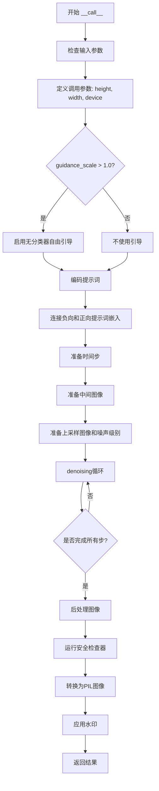
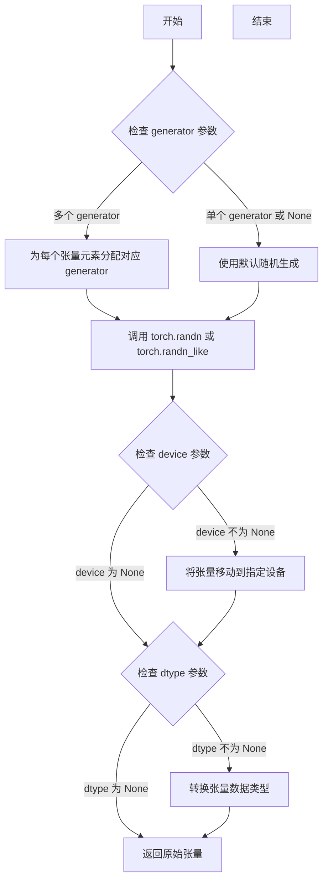
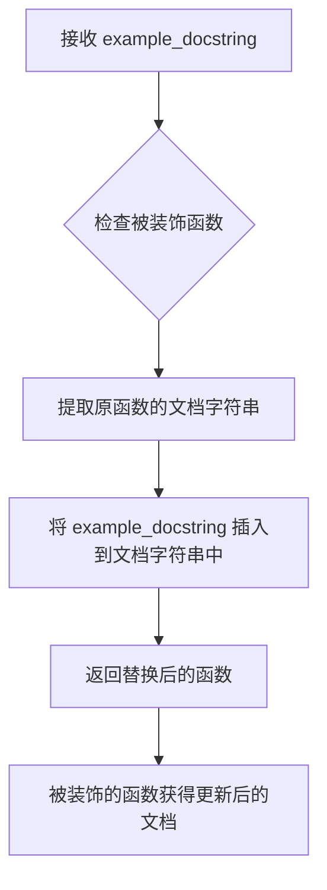
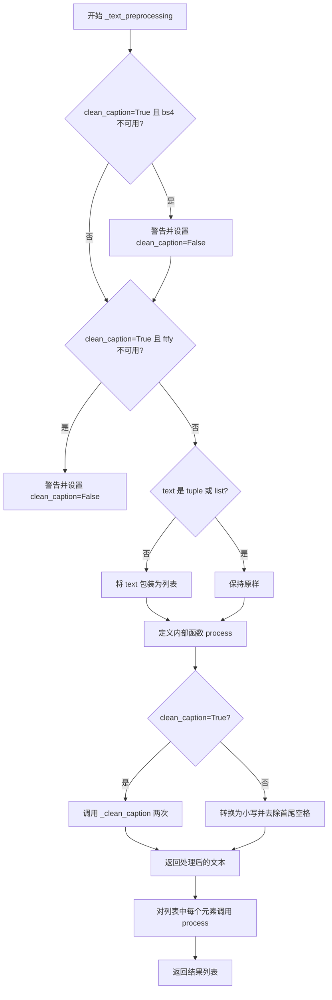
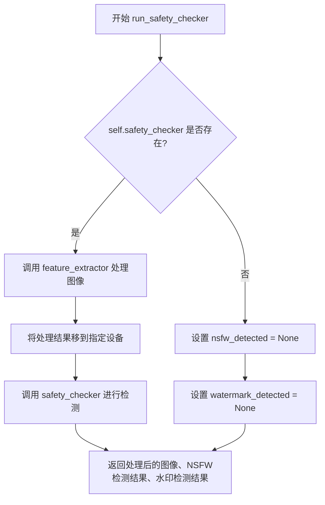
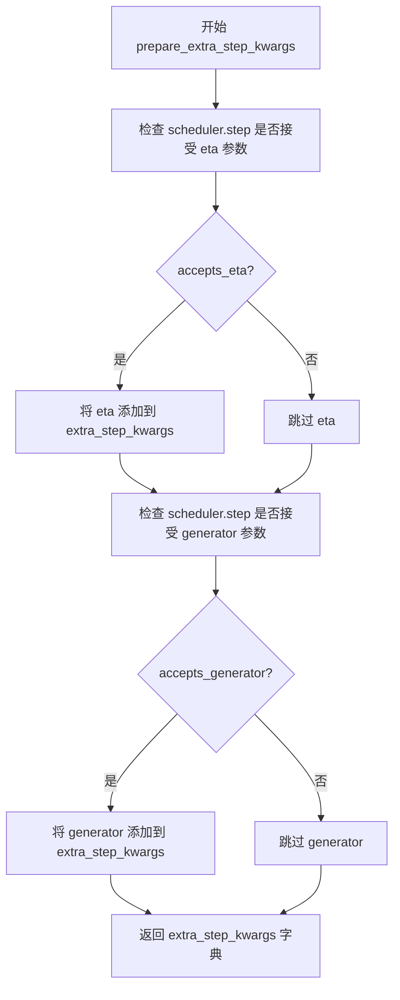

```mermaid
flowchart TD
    A[开始 __call__] --> B[检查输入参数 validate inputs]
    B --> C[定义调用参数 batch_size height width device]
    C --> D[编码输入提示词 encode_prompt]
    D --> E{guidance_scale > 1.0?}
    E -->|Yes| F[拼接负向和正向提示词 embeddings]
    E -->|No| G[仅使用正向提示词 embeddings]
    F --> G
    G --> H[准备时间步 prepare timesteps]
    H --> I[准备中间图像 prepare intermediate images]
    I --> J[准备额外步骤参数 prepare extra step kwargs]
    J --> K[预处理图像并上采样 preprocess + interpolate]
    K --> L[添加噪声到上采样图像 add noise]
    L --> M{guidance_scale > 1.0?}
    M -->|Yes| N[复制 noise_level 两倍]
    M -->|No| O[去噪循环开始]
    N --> O
    O --> P[拼接中间图像和上采样图像]
    P --> Q[拼接条件和无条件输入]
    Q --> R[缩放模型输入 scale_model_input]
    R --> S[UNet 预测噪声残差]
    S --> T{guidance_scale > 1.0?}
    T -->|Yes| U[执行 CFG 引导]
    T -->|No| V[跳过引导]
    U --> V
    V --> W[调度器执行一步去噪]
    W --> X{是否调用回调?}
    X -->|Yes| Y[调用 callback 函数]
    X -->|No| Z{是否为最后一个时间步?}
    Y --> Z
    Z -->|No| P
    Z -->|Yes| AA[后处理图像]
    AA --> BB{output_type == 'pil'?}
    BB -->|Yes| CC[转换为 PIL 图像]
    BB -->|No| DD[跳过转换]
    CC --> EE[运行安全检查器]
    DD --> EE
    EE --> FF[添加水印]
    FF --> GG[释放模型钩子]
    GG --> HH{return_dict == True?}
    HH -->|Yes| II[返回 IFPipelineOutput]
    HH -->|No| JJ[返回元组]
    II --> KK[结束]
    JJ --> KK
```

# `diffusers\src\diffusers\pipelines\deepfloyd_if\pipeline_if_superresolution.py` 详细设计文档

这是一个基于DeepFloyd IF模型的超分辨率扩散管道（IFSuperResolutionPipeline），用于将低分辨率图像通过文本引导的扩散模型upscaling到更高分辨率，同时支持NSFW检测和水印处理。

## 整体流程



## 类结构

```
DiffusionPipeline (基类)
└── IFSuperResolutionPipeline
    ├── StableDiffusionLoraLoaderMixin
    └── 依赖组件
        ├── T5Tokenizer
        ├── T5EncoderModel
        ├── UNet2DConditionModel
        ├── DDPMScheduler (scheduler)
        ├── DDPMScheduler (image_noising_scheduler)
        ├── CLIPImageProcessor
        ├── IFSafetyChecker
        └── IFWatermarker
```

## 全局变量及字段


### `logger`
    
用于记录日志的日志对象

类型：`logging.Logger`
    


### `EXAMPLE_DOC_STRING`
    
包含代码示例和使用说明的文档字符串

类型：`str`
    


### `XLA_AVAILABLE`
    
指示PyTorch XLA是否可用的布尔标志

类型：`bool`
    


### `is_bs4_available`
    
检查beautifulsoup4库是否可用的函数

类型：`Callable[[], bool]`
    


### `is_ftfy_available`
    
检查ftfy库是否可用的函数

类型：`Callable[[], bool]`
    


### `is_torch_xla_available`
    
检查PyTorch XLA是否可用的函数

类型：`Callable[[], bool]`
    


### `IFSuperResolutionPipeline.tokenizer`
    
用于将文本编码为token的T5分词器

类型：`T5Tokenizer`
    


### `IFSuperResolutionPipeline.text_encoder`
    
将token编码为文本嵌入的T5文本编码器模型

类型：`T5EncoderModel`
    


### `IFSuperResolutionPipeline.unet`
    
用于去噪的UNet条件模型

类型：`UNet2DConditionModel`
    


### `IFSuperResolutionPipeline.scheduler`
    
主去噪调度器，用于生成过程的噪声调度

类型：`DDPMScheduler`
    


### `IFSuperResolutionPipeline.image_noising_scheduler`
    
图像加噪调度器，用于对输入图像添加噪声

类型：`DDPMScheduler`
    


### `IFSuperResolutionPipeline.feature_extractor`
    
用于安全检查器的CLIP图像特征提取器，可为None

类型：`CLIPImageProcessor | None`
    


### `IFSuperResolutionPipeline.safety_checker`
    
内容安全检查器，用于检测NSFW和 watermarked 内容，可为None

类型：`IFSafetyChecker | None`
    


### `IFSuperResolutionPipeline.watermarker`
    
图像水印处理器，用于添加不可见水印，可为None

类型：`IFWatermarker | None`
    


### `IFSuperResolutionPipeline.bad_punct_regex`
    
用于清理文本中特殊标点符号的正则表达式

类型：`re.Pattern`
    


### `IFSuperResolutionPipeline._optional_components`
    
可选组件列表，包含可选模块的名称

类型：`list[str]`
    


### `IFSuperResolutionPipeline.model_cpu_offload_seq`
    
模型CPU卸载顺序，指定模型卸载的优先级

类型：`str`
    


### `IFSuperResolutionPipeline._exclude_from_cpu_offload`
    
从CPU卸载中排除的组件列表

类型：`list[str]`
    
    

## 全局函数及方法


### `randn_tensor`

生成指定形状的随机张量（服从标准正态分布），用于扩散模型中的噪声采样。

参数：

- `shape`：`tuple` 或 `list`，随机张量的形状
- `generator`：`torch.Generator` 或 `list[torch.Generator]`，可选，用于控制随机数生成以实现可重复性
- `device`：`torch.device`，可选，指定生成的张量应放置的设备
- `dtype`：`torch.dtype`，可选，指定张量的数据类型
- `layout`：`torch.layout`，可选，指定张量的内存布局

返回值：`torch.Tensor`，符合标准正态分布的随机张量

#### 流程图



#### 带注释源码

```python
# randn_tensor 函数源码（位于 diffusers/src/diffusers/utils/torch_utils.py）
# 注意：这是从外部模块导入的函数，此处展示典型实现

def randn_tensor(
    shape: Union[Tuple, List],
    generator: Optional[List["torch.Generator"]] = None,
    device: Optional["torch.device"] = None,
    dtype: Optional["torch.dtype"] = None,
    layout: Optional["torch.layout"] = None,
):
    """
    用于生成随机张量的工具函数。
    
    参数:
        shape: 张量的形状，例如 (batch_size, channels, height, width)
        generator: 可选的生成器或生成器列表，用于控制随机性
        device: 可选的设备参数
        dtype: 可选的数据类型
        layout: 可选的内存布局
    
    返回:
        torch.Tensor: 符合标准正态分布的随机张量
    """
    # 导入必要的模块
    import torch
    
    # 如果提供了生成器列表且长度与批次大小匹配
    if generator is not None and isinstance(generator, list) and len(generator) == shape[0]:
        # 为每个批次元素使用单独的生成器
        rand_tensor = torch.cat(
            [torch.randn(1, generator=generator[i], layout=layout, device=device, dtype=dtype) for i in range(shape[0])],
            dim=0
        )
    else:
        # 使用默认随机生成
        rand_tensor = torch.randn(shape, generator=generator, layout=layout, device=device, dtype=dtype)
    
    return rand_tensor
```

---

### 在 `IFSuperResolutionPipeline` 中的使用

#### 1. `prepare_intermediate_images` 方法中的调用

```python
def prepare_intermediate_images(self, batch_size, num_channels, height, width, dtype, device, generator):
    shape = (batch_size, num_channels, height, width)
    if isinstance(generator, list) and len(generator) != batch_size:
        raise ValueError(
            f"You have passed a list of generators of length {len(generator)}, but requested an effective batch"
            f" size of {batch_size}. Make sure the batch size matches the length of the generators."
        )

    # 使用 randn_tensor 生成初始噪声张量
    intermediate_images = randn_tensor(shape, generator=generator, device=device, dtype=dtype)

    # 根据调度器的初始噪声标准差缩放初始噪声
    intermediate_images = intermediate_images * self.scheduler.init_noise_sigma
    return intermediate_images
```

#### 2. `__call__` 方法中的调用

```python
# 准备上采样图像和噪声级别
image = self.preprocess_image(image, num_images_per_prompt, device)
upscaled = F.interpolate(image, (height, width), mode="bilinear", align_corners=True)

noise_level = torch.tensor([noise_level] * upscaled.shape[0], device=upscaled.device)
# 使用 randn_tensor 为上采样图像添加噪声
noise = randn_tensor(upscaled.shape, generator=generator, device=upscaled.device, dtype=upscaled.dtype)
upscaled = self.image_noising_scheduler.add_noise(upscaled, noise, timesteps=noise_level)
```


### `replace_example_docstring`

这是一个装饰器函数，用于替换被装饰函数的文档字符串中的示例部分。通常用于在文档中自动插入或更新示例代码。

参数：

- `example_docstring`：`str`，要替换的示例文档字符串内容

返回值：`Callable`，装饰器函数，返回一个可调用对象，用于装饰目标函数

#### 流程图



#### 带注释源码

```
# replace_example_docstring 是从 ...utils 模块导入的装饰器
# 它用于替换函数文档中的示例部分

# 使用示例（在代码中）:
@torch.no_grad()
@replace_example_docstring(EXAMPLE_DOC_STRING)
def __call__(
    self,
    prompt: str | list[str] = None,
    ...
):
    """
    Function invoked when calling the pipeline for generation.
    ...
    """
    # 函数实现
    ...

# 导入位置:
from ...utils import (
    BACKENDS_MAPPING,
    is_bs4_available,
    is_ftfy_available,
    logging,
    replace_example_docstring,  # <-- 从 utils 模块导入
)
```

> **注意**: `replace_example_docstring` 函数本身定义在 `...utils` 模块中，不在此代码文件内。上述信息基于其使用方式推断。完整的函数实现需要查看 `diffusers` 库的 `src/diffusers/utils` 模块中的源代码。


### `IFSuperResolutionPipeline.__init__`

该方法是 `IFSuperResolutionPipeline` 类的构造函数，负责初始化超分辨率扩散管道所需的所有组件，包括 tokenizer、text_encoder、unet、scheduler、图像降噪scheduler、安全检查器、特征提取器和 watermarker，并进行参数校验和模块注册。

参数：

- `tokenizer`：`T5Tokenizer`，用于将文本提示编码为token序列
- `text_encoder`：`T5EncoderModel`，将token序列编码为文本嵌入向量
- `unet`：`UNet2DConditionModel`，UNet模型，用于预测噪声残差
- `scheduler`：`DDPMScheduler`，主去噪调度器，控制去噪过程
- `image_noising_scheduler`：`DDPMScheduler`，图像降噪调度器，用于向输入图像添加噪声
- `safety_checker`：`IFSafetyChecker | None`，安全检查器，用于检测NSFW内容
- `feature_extractor`：`CLIPImageProcessor | None`，特征提取器，用于为安全检查器提取图像特征
- `watermarker`：`IFWatermarker | None`，水印器，用于在输出图像上添加水印
- `requires_safety_checker`：`bool`，是否要求安全检查器，默认为True

返回值：`None`，该方法为构造函数，不返回任何值

#### 流程图

```mermaid
flowchart TD
    A[开始 __init__] --> B[调用 super().__init__]
    B --> C{safety_checker is None<br/>且 requires_safety_checker is True?}
    C -->|是| D[记录警告: 禁用安全检查器]
    C -->|否| E{safety_checker is not None<br/>且 feature_extractor is None?}
    D --> E
    E -->|是| F[抛出 ValueError: 未定义特征提取器]
    E -->|否| G{unet is not None<br/>且 unet.config.in_channels != 6?}
    F --> H[结束]
    G -->|是| I[记录警告: UNet输入通道不正确]
    G -->|否| J[调用 self.register_modules 注册所有模块]
    I --> J
    J --> K[调用 self.register_to_config 保存 requires_safety_checker]
    K --> H
```

#### 带注释源码

```python
def __init__(
    self,
    tokenizer: T5Tokenizer,
    text_encoder: T5EncoderModel,
    unet: UNet2DConditionModel,
    scheduler: DDPMScheduler,
    image_noising_scheduler: DDPMScheduler,
    safety_checker: IFSafetyChecker | None,
    feature_extractor: CLIPImageProcessor | None,
    watermarker: IFWatermarker | None,
    requires_safety_checker: bool = True,
):
    """
    初始化 IFSuperResolutionPipeline 超分辨率扩散管道
    
    参数:
        tokenizer: T5Tokenizer 用于文本编码
        text_encoder: T5EncoderModel 文本编码器模型
        unet: UNet2DConditionModel UNet条件模型
        scheduler: DDPMScheduler 主去噪调度器
        image_noising_scheduler: DDPMScheduler 图像降噪调度器
        safety_checker: IFSafetyChecker | None 安全检查器
        feature_extractor: CLIPImageProcessor | None 特征提取器
        watermarker: IFWatermarker | None 水印器
        requires_safety_checker: bool 是否需要安全检查器
    """
    # 调用父类 DiffusionPipeline 和 StableDiffusionLoraLoaderMixin 的初始化方法
    super().__init__()

    # 检查1: 如果 safety_checker 为 None 但 requires_safety_checker 为 True，则发出警告
    # 这是为了确保用户明确知晓禁用了安全检查器，需要遵守 IF 许可证
    if safety_checker is None and requires_safety_checker:
        logger.warning(
            f"You have disabled the safety checker for {self.__class__} by passing `safety_checker=None`. Ensure"
            " that you abide to the conditions of the IF license and do not expose unfiltered"
            " results in services or applications open to the public. Both the diffusers team and Hugging Face"
            " strongly recommend to keep the safety filter enabled in all public facing circumstances, disabling"
            " it only for use-cases that involve analyzing network behavior or auditing its results. For more"
            " information, please have a look at https://github.com/huggingface/diffusers/pull/254 ."
        )

    # 检查2: 如果提供了 safety_checker 但没有 feature_extractor，则抛出错误
    # 安全检查器需要特征提取器来提取图像特征进行NSFW检测
    if safety_checker is not None and feature_extractor is None:
        raise ValueError(
            "Make sure to define a feature extractor when loading {self.__class__} if you want to use the safety"
            " checker. If you do not want to use the safety checker, you can pass `'safety_checker=None'` instead."
        )

    # 检查3: 如果提供了 unet 但其输入通道数不是6（超分辨率需要6通道），则发出警告
    # 超分辨率管道需要接受6通道输入（原始图像+噪声图像）
    if unet is not None and unet.config.in_channels != 6:
        logger.warning(
            "It seems like you have loaded a checkpoint that shall not be used for super resolution from {unet.config._name_or_path} as it accepts {unet.config.in_channels} input channels instead of 6. Please make sure to pass a super resolution checkpoint as the `'unet'`: IFSuperResolutionPipeline.from_pretrained(unet=super_resolution_unet, ...)`."
        )

    # 注册所有模块到管道中，使管道能够管理这些组件的生命周期
    self.register_modules(
        tokenizer=tokenizer,
        text_encoder=text_encoder,
        unet=unet,
        scheduler=scheduler,
        image_noising_scheduler=image_noising_scheduler,
        safety_checker=safety_checker,
        feature_extractor=feature_extractor,
        watermarker=watermarker,
    )
    
    # 将 requires_safety_checker 参数注册到配置中，以便后续访问
    self.register_to_config(requires_safety_checker=requires_safety_checker)
```


### `IFSuperResolutionPipeline._text_preprocessing`

对输入的文本进行预处理，支持将单个字符串或字符串列表统一转换为处理后的小写字符串列表，并可选地使用清理功能。

参数：

-  `text`：`str | tuple[str] | list[str]`，需要进行预处理的文本，可以是单个字符串或字符串元组/列表
-  `clean_caption`：`bool`，默认为False，是否清理标题（需要beautifulsoup4和ftfy库）

返回值：`list[str]`，返回处理后的字符串列表

#### 流程图



#### 带注释源码

```python
def _text_preprocessing(self, text, clean_caption=False):
    """
    预处理文本输入，统一转换为小写字符串列表
    
    参数:
        text: str | tuple[str] | list[str] - 输入文本
        clean_caption: bool - 是否清理标题
    
    返回:
        list[str] - 处理后的文本列表
    """
    
    # 检查beautifulsoup4是否可用，若不可用则禁用clean_caption
    if clean_caption and not is_bs4_available():
        logger.warning(BACKENDS_MAPPING["bs4"][-1].format("Setting `clean_caption=True`"))
        logger.warning("Setting `clean_caption` to False...")
        clean_caption = False

    # 检查ftfy是否可用，若不可用则禁用clean_caption
    if clean_caption and not is_ftfy_available():
        logger.warning(BACKENDS_MAPPING["ftfy"][-1].format("Setting `clean_caption=True`"))
        logger.warning("Setting `clean_caption` to False...")
        clean_caption = False

    # 统一将输入转换为列表
    if not isinstance(text, (tuple, list)):
        text = [text]

    # 定义内部处理函数
    def process(text: str):
        if clean_caption:
            # 如果需要清理标题，则调用_clean_caption两次
            text = self._clean_caption(text)
            text = self._clean_caption(text)
        else:
            # 否则仅转换为小写并去除首尾空格
            text = text.lower().strip()
        return text

    # 对列表中每个文本元素应用处理函数
    return [process(t) for t in text]
```


### IFSuperResolutionPipeline._clean_caption

该方法用于清理和规范化图像生成的提示文本（caption），通过移除URL、HTML标签、特殊字符、CJK字符、标点符号、电子邮箱、IP地址、数字序列、文件名以及各种噪声文本，同时修复HTML实体和文本编码问题，最终返回一个干净、标准化的提示文本。

参数：

- `self`：隐式参数，类型为 `IFSuperResolutionPipeline`，Pipeline 实例本身
- `caption`：待清理的提示文本，类型为 `任意类型（Any）`，待清洗的原始文本输入，会被转换为字符串处理

返回值：`str`，返回清理和规范化后的提示文本

#### 流程图

```mermaid
flowchart TD
    A[开始 _clean_caption] --> B[将 caption 转换为字符串 str(caption)]
    B --> C[URL 解码: ul.unquote_plus]
    C --> D[去除首尾空格并转为小写]
    D --> E[替换 <person> 为 person]
    E --> F[正则移除 HTTP/HTTPS URLs]
    F --> G[正则移除 www URLs]
    G --> H[BeautifulSoup 提取纯文本]
    H --> I[移除 @nickname 提及]
    I --> J[正则移除 CJK 统一表意文字]
    J --> K[统一破折号为 -]
    K --> L[统一引号为双引号或单引号]
    L --> M[移除 HTML 实体 &quot; 和 &amp]
    M --> N[移除 IP 地址]
    N --> O[移除文章 ID 和换行符]
    O --> P[移除 #数字 和长数字]
    P --> Q[移除文件名模式]
    Q --> R[清理连续引号和点号]
    R --> S[移除自定义坏标点]
    S --> T[清理点号周围空格]
    T --> U[如果 - 或 _ 超过3个, 替换为空格]
    U --> V[ftfy.fix_text 修复文本编码]
    V --> W[html.unescape 双重解码]
    W --> X[移除字母数字混合模式]
    X --> Y[移除特定营销关键词]
    Y --> Z[移除尺寸规格如 100x100]
    Z --> AA[标准化冒号空格]
    AA --> AB[清理尾部标点]
    AB --> AC[移除孤立点号]
    AC --> AD[去除首尾引号和特定字符]
    AD --> AE[返回 strip 后的结果]
    AE --> F[结束]
```

#### 带注释源码

```python
def _clean_caption(self, caption):
    """
    清理并规范化提示文本，移除噪声内容
    """
    # 1. 将输入转换为字符串并解码 URL 编码
    caption = str(caption)
    caption = ul.unquote_plus(caption)
    
    # 2. 基础规范化：去除首尾空格并转为小写
    caption = caption.strip().lower()
    
    # 3. 替换特殊标记 <person> 为 person
    caption = re.sub("<person>", "person", caption)
    
    # 4. 移除 HTTP/HTTPS URLs (正则匹配常见域名后缀)
    caption = re.sub(
        r"\b((?:https?:(?:\/{1,3}|[a-zA-Z0-9%])|[a-zA-Z0-9.\-]+[.](?:com|co|ru|net|org|edu|gov|it)[\w/-]*\b\/?(?!@)))",
        "",
        caption,
    )
    
    # 5. 移除 www 开头的 URLs
    caption = re.sub(
        r"\b((?:www:(?:\/{1,3}|[a-zA-Z0-9%])|[a-zA-Z0-9.\-]+[.](?:com|co|ru|net|org|edu|gov|it)[\w/-]*\b\/?(?!@)))",
        "",
        caption,
    )
    
    # 6. 使用 BeautifulSoup 提取纯文本，移除 HTML 标签
    caption = BeautifulSoup(caption, features="html.parser").text
    
    # 7. 移除 @用户名 提及
    caption = re.sub(r"@[\w\d]+\b", "", caption)
    
    # 8. 移除 CJK 统一表意文字 (U+4E00-U+9FFF) 及相关字符范围
    # 包括: CJK 笔画、片假名音扩展、封闭 CJK 字母、兼容字符、扩展 A 区、六十四卦符号
    caption = re.sub(r"[\u31c0-\u31ef]+", "", caption)  # CJK 笔画
    caption = re.sub(r"[\u31f0-\u31ff]+", "", caption)  # 片假名音扩展
    caption = re.sub(r"[\u3200-\u32ff]+", "", caption)  # 封闭 CJK 字母和月份
    caption = re.sub(r"[\u3300-\u33ff]+", "", caption)  # CJK 兼容
    caption = re.sub(r"[\u3400-\u4dbf]+", "", caption)  # CJK 扩展 A
    caption = re.sub(r"[\u4dc0-\u4dff]+", "", caption)  # 六十四卦符号
    caption = re.sub(r"[\u4e00-\u9fff]+", "", caption)  # CJK 统一表意文字
    
    # 9. 统一各种破折号字符为标准连字符 "-"
    caption = re.sub(
        r"[\u002D\u058A\u05BE\u1400\u1806\u2010-\u2015\u2E17\u2E1A\u2E3A\u2E3B\u2E40\u301C\u3030\u30A0\uFE31\uFE32\uFE58\uFE63\uFF0D]+",
        "-",
        caption,
    )
    
    # 10. 统一引号为标准双引号或单引号
    caption = re.sub(r"[`´«»""¨]", '"', caption)  # 统一为双引号
    caption = re.sub(r"['']", "'", caption)       # 统一为单引号
    
    # 11. 移除 HTML 实体
    caption = re.sub(r"&quot;?", "", caption)  # 移除 &quot; 及其变体
    caption = re.sub(r"&amp", "", caption)    # 移除 &amp
    
    # 12. 移除 IP 地址 (如 192.168.1.1)
    caption = re.sub(r"\d{1,3}\.\d{1,3}\.\d{1,3}\.\d{1,3}", " ", caption)
    
    # 13. 移除文章 ID (格式如 "12:34 " 结尾)
    caption = re.sub(r"\d:\d\d\s+$", "", caption)
    
    # 14. 移除转义换行符 \n
    caption = re.sub(r"\\n", " ", caption)
    
    # 15. 移除 Twitter/社交媒体风格标签
    caption = re.sub(r"#\d{1,3}\b", "", caption)      # 1-3位数字标签
    caption = re.sub(r"#\d{5,}\b", "", caption)       # 5位以上数字标签
    caption = re.sub(r"\b\d{6,}\b", "", caption)      # 6位以上纯数字
    
    # 16. 移除常见图片文件扩展名
    caption = re.sub(r"[\S]+\.(?:png|jpg|jpeg|bmp|webp|eps|pdf|apk|mp4)", "", caption)
    
    # 17. 规范化连续引号和点号
    caption = re.sub(r"[\"']{2,}", r'"', caption)  # ""AUSVERKAUFT"" -> "AUSVERKAUFT"
    caption = re.sub(r"[\.]{2,}", r" ", caption)   # ... -> 空格
    
    # 18. 移除自定义的坏标点符号 (来自 bad_punct_regex)
    caption = re.sub(self.bad_punct_regex, r" ", caption)
    
    # 19. 清理 " . " 模式为空格
    caption = re.sub(r"\s+\.\s+", r" ", caption)
    
    # 20. 如果连字符或下划线出现超过3次，将它们替换为空格
    # 例如: this-is-my-cute-cat -> this is my cute cat
    regex2 = re.compile(r"(?:\-|\_)")
    if len(re.findall(regex2, caption)) > 3:
        caption = re.sub(regex2, " ", caption)
    
    # 21. 使用 ftfy 修复文本编码问题
    caption = ftfy.fix_text(caption)
    
    # 22. 双重 HTML 解码，处理嵌套的 HTML 实体
    caption = html.unescape(html.unescape(caption))
    
    # 23. 移除字母数字混合模式 (可能是序列号、验证码等)
    caption = re.sub(r"\b[a-zA-Z]{1,3}\d{3,15}\b", "", caption)   # 如 jc6640
    caption = re.sub(r"\b[a-zA-Z]+\d+[a-zA-Z]+\b", "", caption)  # 如 jc6640vc
    caption = re.sub(r"\b\d+[a-zA-Z]+\d+\b", "", caption)         # 如 6640vc231
    
    # 24. 移除营销相关关键词
    caption = re.sub(r"(worldwide\s+)?(free\s+)?shipping", "", caption)
    caption = re.sub(r"(free\s)?download(\sfree)?", "", caption)
    caption = re.sub(r"\bclick\b\s(?:for|on)\s\w+", "", caption)  # click for/on xxx
    
    # 25. 移除图片类型关键词
    caption = re.sub(r"\b(?:png|jpg|jpeg|bmp|webp|eps|pdf|apk|mp4)(\simage[s]?)?", "", caption)
    
    # 26. 移除页码
    caption = re.sub(r"\bpage\s+\d+\b", "", caption)
    
    # 27. 移除复杂字母数字混合模式
    caption = re.sub(r"\b\d*[a-zA-Z]+\d+[a-zA-Z]+\d+[a-zA-Z\d]*\b", r" ", caption)  # 如 j2d1a2a
    
    # 28. 移除尺寸规格 (如 100x100, 100×100)
    caption = re.sub(r"\b\d+\.?\d*[xх×]\d+\.?\d*\b", "", caption)
    
    # 29. 标准化冒号周围空格
    caption = re.sub(r"\b\s+\:\s+", r": ", caption)
    
    # 30. 在标点符号后添加空格
    caption = re.sub(r"(\D[,\./])\b", r"\1 ", caption)
    
    # 31. 合并多个空格为单个空格
    caption = re.sub(r"\s+", " ", caption)
    
    # 32. 最终 strip
    caption.strip()
    
    # 33. 移除首尾引号包裹的内容
    caption = re.sub(r"^[\"\']([\w\W]+)[\"\']$", r"\1", caption)
    
    # 34. 移除首部的特定字符
    caption = re.sub(r"^[\'\_,\-\:;]", r"", caption)
    
    # 35. 移除尾部的特定字符
    caption = re.sub(r"[\'\_,\-\:\-\+]$", r"", caption)
    
    # 36. 移除孤立的点号开头的单词 (如 ".example")
    caption = re.sub(r"^\.\S+$", "", caption)
    
    # 37. 返回最终清理后的文本
    return caption.strip()
```


### `IFSuperResolutionPipeline.encode_prompt`

该方法用于将文本提示（prompt）编码为文本 encoder 的隐藏状态（hidden states），支持正面提示词和负面提示词的嵌入生成，并可选地使用分类器自由引导（Classifier-Free Guidance）技术。

参数：

- `prompt`：`str | list[str]`，要编码的提示词，可以是单个字符串或字符串列表
- `do_classifier_free_guidance`：`bool`，是否使用分类器自由引导，默认为 True
- `num_images_per_prompt`：`int`，每个提示词生成的图像数量，默认为 1
- `device`：`torch.device | None`，用于放置生成嵌入的 torch 设备，默认为 None（自动获取执行设备）
- `negative_prompt`：`str | list[str] | None`，不用于引导图像生成的提示词，若不定义则需传递 `negative_prompt_embeds`
- `prompt_embeds`：`torch.Tensor | None`，预生成的文本嵌入，可用于轻松调整文本输入，默认为 None
- `negative_prompt_embeds`：`torch.Tensor | None`，预生成的负面文本嵌入，默认为 None
- `clean_caption`：`bool`，是否在编码前对标题进行预处理和清理，默认为 False

返回值：`tuple[torch.Tensor, torch.Tensor]`，返回 `(prompt_embeds, negative_prompt_embeds)` 元组，分别表示编码后的提示词嵌入和负面提示词嵌入

#### 流程图

```mermaid
flowchart TD
    A[开始 encode_prompt] --> B{检查 prompt 和 negative_prompt 类型一致性}
    B -->|类型不一致| C[抛出 TypeError]
    B -->|类型一致| D[确定设备 device]
    D --> E{确定批量大小 batch_size}
    E -->|prompt 是字符串| F[batch_size = 1]
    E -->|prompt 是列表| G[batch_size = len(prompt)]
    E -->|其他情况| H[batch_size = prompt_embeds.shape[0]]
    F --> I{prompt_embeds 为空?}
    G --> I
    H --> I
    I -->|是| J[文本预处理 _text_preprocessing]
    J --> K[tokenizer 编码文本]
    K --> L[处理截断警告]
    L --> M[text_encoder 生成嵌入]
    M --> N[获取数据类型 dtype]
    I -->|否| O[使用提供的 prompt_embeds]
    O --> N
    N --> P{do_classifier_free_guidance 且 negative_prompt_embeds 为空?}
    P -->|是| Q{处理 negative_prompt]
    Q -->|negative_prompt 为 None| R[uncond_tokens = [''] * batch_size]
    Q -->|negative_prompt 是字符串| S[uncond_tokens = [negative_prompt]]
    Q -->|negative_prompt 是列表| T[检查 batch_size 是否匹配]
    T -->|匹配| U[uncond_tokens = negative_prompt]
    T -->|不匹配| V[抛出 ValueError]
    R --> W[文本预处理 uncond_tokens]
    S --> W
    U --> W
    W --> X[tokenizer 编码 uncond_tokens]
    X --> Y[text_encoder 生成 negative_prompt_embeds]
    Y --> Z[复制 negative_prompt_embeds 以匹配 num_images_per_prompt]
    P -->|否| AA[negative_prompt_embeds = None]
    Z --> AB[返回 prompt_embeds, negative_prompt_embeds]
    AA --> AB
```

#### 带注释源码

```python
@torch.no_grad()
# Copied from diffusers.pipelines.deepfloyd_if.pipeline_if.IFPipeline.encode_prompt
def encode_prompt(
    self,
    prompt: str | list[str],
    do_classifier_free_guidance: bool = True,
    num_images_per_prompt: int = 1,
    device: torch.device | None = None,
    negative_prompt: str | list[str] | None = None,
    prompt_embeds: torch.Tensor | None = None,
    negative_prompt_embeds: torch.Tensor | None = None,
    clean_caption: bool = False,
):
    r"""
    Encodes the prompt into text encoder hidden states.

    Args:
        prompt (`str` or `list[str]`, *optional*):
            prompt to be encoded
        do_classifier_free_guidance (`bool`, *optional*, defaults to `True`):
            whether to use classifier free guidance or not
        num_images_per_prompt (`int`, *optional*, defaults to 1):
            number of images that should be generated per prompt
        device: (`torch.device`, *optional*):
            torch device to place the resulting embeddings on
        negative_prompt (`str` or `list[str]`, *optional*):
            The prompt or prompts not to guide the image generation. If not defined, one has to pass
            `negative_prompt_embeds`. instead. If not defined, one has to pass `negative_prompt_embeds`. instead.
            Ignored when not using guidance (i.e., ignored if `guidance_scale` is less than `1`).
        prompt_embeds (`torch.Tensor`, *optional*):
            Pre-generated text embeddings. Can be used to easily tweak text inputs, *e.g.* prompt weighting. If not
            provided, text embeddings will be generated from `prompt` input argument.
        negative_prompt_embeds (`torch.Tensor`, *optional*):
            Pre-generated negative text embeddings. Can be used to easily tweak text inputs, *e.g.* prompt
            weighting. If not provided, negative_prompt_embeds will be generated from `negative_prompt` input
            argument.
        clean_caption (bool, defaults to `False`):
            If `True`, the function will preprocess and clean the provided caption before encoding.
    """
    # 检查 prompt 和 negative_prompt 的类型一致性
    if prompt is not None and negative_prompt is not None:
        if type(prompt) is not type(negative_prompt):
            raise TypeError(
                f"`negative_prompt` should be the same type to `prompt`, but got {type(negative_prompt)} !="
                f" {type(prompt)}."
            )

    # 确定设备，如果未提供则使用执行设备
    if device is None:
        device = self._execution_device

    # 确定批量大小
    if prompt is not None and isinstance(prompt, str):
        batch_size = 1
    elif prompt is not None and isinstance(prompt, list):
        batch_size = len(prompt)
    else:
        batch_size = prompt_embeds.shape[0]

    # T5 可以处理比 77 更长的输入序列，但 IF 的文本 encoder 是以最大长度 77 训练的
    max_length = 77

    # 如果没有提供 prompt_embeds，则从 prompt 生成
    if prompt_embeds is None:
        # 文本预处理（小写、清理等）
        prompt = self._text_preprocessing(prompt, clean_caption=clean_caption)
        # 使用 tokenizer 编码文本
        text_inputs = self.tokenizer(
            prompt,
            padding="max_length",
            max_length=max_length,
            truncation=True,
            add_special_tokens=True,
            return_tensors="pt",
        )
        text_input_ids = text_inputs.input_ids
        # 获取未截断的 token 序列（用于警告）
        untruncated_ids = self.tokenizer(prompt, padding="longest", return_tensors="pt").input_ids

        # 检查是否发生了截断，并警告用户
        if untruncated_ids.shape[-1] >= text_input_ids.shape[-1] and not torch.equal(
            text_input_ids, untruncated_ids
        ):
            removed_text = self.tokenizer.batch_decode(untruncated_ids[:, max_length - 1 : -1])
            logger.warning(
                "The following part of your input was truncated because CLIP can only handle sequences up to"
                f" {max_length} tokens: {removed_text}"
            )

        attention_mask = text_inputs.attention_mask.to(device)

        # 使用 text_encoder 生成文本嵌入
        prompt_embeds = self.text_encoder(
            text_input_ids.to(device),
            attention_mask=attention_mask,
        )
        prompt_embeds = prompt_embeds[0]

    # 确定数据类型（从 text_encoder 或 unet 获取）
    if self.text_encoder is not None:
        dtype = self.text_encoder.dtype
    elif self.unet is not None:
        dtype = self.unet.dtype
    else:
        dtype = None

    # 将 prompt_embeds 转换为指定的数据类型和设备
    prompt_embeds = prompt_embeds.to(dtype=dtype, device=device)

    bs_embed, seq_len, _ = prompt_embeds.shape
    # 为每个提示词生成的图像复制文本嵌入（使用 mps 友好的方法）
    prompt_embeds = prompt_embeds.repeat(1, num_images_per_prompt, 1)
    prompt_embeds = prompt_embeds.view(bs_embed * num_images_per_prompt, seq_len, -1)

    # 获取分类器自由引导的无条件嵌入
    if do_classifier_free_guidance and negative_prompt_embeds is None:
        uncond_tokens: list[str]
        if negative_prompt is None:
            # 如果没有提供 negative_prompt，使用空字符串
            uncond_tokens = [""] * batch_size
        elif isinstance(negative_prompt, str):
            uncond_tokens = [negative_prompt]
        elif batch_size != len(negative_prompt):
            raise ValueError(
                f"`negative_prompt`: {negative_prompt} has batch size {len(negative_prompt)}, but `prompt`:"
                f" {prompt} has batch size {batch_size}. Please make sure that passed `negative_prompt` matches"
                " the batch size of `prompt`."
            )
        else:
            uncond_tokens = negative_prompt

        # 对无条件 token 进行文本预处理
        uncond_tokens = self._text_preprocessing(uncond_tokens, clean_caption=clean_caption)
        max_length = prompt_embeds.shape[1]
        # 使用 tokenizer 编码无条件 token
        uncond_input = self.tokenizer(
            uncond_tokens,
            padding="max_length",
            max_length=max_length,
            truncation=True,
            return_attention_mask=True,
            add_special_tokens=True,
            return_tensors="pt",
        )
        attention_mask = uncond_input.attention_mask.to(device)

        # 使用 text_encoder 生成负面提示词嵌入
        negative_prompt_embeds = self.text_encoder(
            uncond_input.input_ids.to(device),
            attention_mask=attention_mask,
        )
        negative_prompt_embeds = negative_prompt_embeds[0]

    # 如果使用分类器自由引导
    if do_classifier_free_guidance:
        # 复制无条件嵌入以匹配每个提示词生成的图像数量
        seq_len = negative_prompt_embeds.shape[1]

        negative_prompt_embeds = negative_prompt_embeds.to(dtype=dtype, device=device)

        negative_prompt_embeds = negative_prompt_embeds.repeat(1, num_images_per_prompt, 1)
        negative_prompt_embeds = negative_prompt_embeds.view(batch_size * num_images_per_prompt, seq_len, -1)

        # 对于分类器自由引导，需要进行两次前向传播
        # 这里我们将无条件嵌入和文本嵌入拼接成一个批次，以避免进行两次前向传播
    else:
        negative_prompt_embeds = None

    return prompt_embeds, negative_prompt_embeds
```


### `IFSuperResolutionPipeline.run_safety_checker`

该方法用于对生成的图像进行安全检查，包括检测 NSFW（不适合在工作场所查看）内容和数字水印。如果配置了安全检查器，则使用 `feature_extractor` 处理图像并调用 `safety_checker` 进行检测；否则返回 None 值。

参数：

- `image`：`torch.Tensor`，需要进行检查的图像张量
- `device`：`torch.device`，执行检查的设备（如 CPU 或 CUDA）
- `dtype`：`torch.dtype`，图像张量的数据类型（如 float32）

返回值：`tuple`，包含三个元素：
- `image`：`torch.Tensor`，经过安全检查处理后的图像（可能被过滤或修改）
- `nsfw_detected`：`list[bool] | None`，检测到的 NSFW 内容标记列表，如果未配置检查器则为 None
- `watermark_detected`：`list[bool] | None`，检测到的水印标记列表，如果未配置检查器则为 None

#### 流程图



#### 带注释源码

```python
def run_safety_checker(self, image, device, dtype):
    """
    运行安全检查器，对图像进行 NSFW 和水印检测
    
    参数:
        image: 需要检查的图像张量
        device: 执行检查的设备
        dtype: 图像张量的数据类型
    
    返回:
        tuple: (处理后的图像, NSFW检测结果, 水印检测结果)
    """
    # 检查是否配置了安全检查器
    if self.safety_checker is not None:
        # 使用特征提取器将图像转换为安全检查器所需的格式
        # 将 numpy 数组转换为 PIL 图像，然后提取特征
        safety_checker_input = self.feature_extractor(
            self.numpy_to_pil(image),  # 将图像转换为 PIL 格式
            return_tensors="pt"       # 返回 PyTorch 张量
        ).to(device)                  # 移动到指定设备
        
        # 调用安全检查器进行 NSFW 和水印检测
        # clip_input 提供给 CLIP 模型用于视觉内容分析
        image, nsfw_detected, watermark_detected = self.safety_checker(
            images=image,                              # 待检查的图像
            clip_input=safety_checker_input.pixel_values.to(dtype=dtype),  # CLIP 输入
        )
    else:
        # 如果未配置安全检查器，返回 None 值
        nsfw_detected = None
        watermark_detected = None

    # 返回检查结果：处理后的图像和检测标记
    return image, nsfw_detected, watermark_detected
```


### `IFSuperResolutionPipeline.prepare_extra_step_kwargs`

该方法用于为调度器（scheduler）的 `step` 方法准备额外的关键字参数。由于不同调度器具有不同的签名，该方法通过检查调度器的 `step` 函数签名，动态添加 `eta`（用于 DDIM 调度器）和 `generator`（用于控制随机数生成）等参数，以确保跨调度器的兼容性。

参数：

- `generator`：`torch.Generator | list[torch.Generator] | None`，用于控制生成过程的随机数生成器，确保输出可复现
- `eta`：`float`，DDIM 调度器的 eta 参数，对应 DDIM 论文中的 η，应在 [0, 1] 范围内，其他调度器会忽略此参数

返回值：`dict`，包含可能需要传递给调度器 `step` 方法的关键字参数字典，可能包含 `eta` 和/或 `generator`

#### 流程图



#### 带注释源码

```python
def prepare_extra_step_kwargs(self, generator, eta):
    # 准备调度器步骤的额外参数，因为并非所有调度器都具有相同的函数签名
    # eta (η) 仅在 DDIMScheduler 中使用，对于其他调度器将被忽略
    # eta 对应于 DDIM 论文 (https://huggingface.co/papers/2010.02502) 中的 η
    # 取值应在 [0, 1] 范围内

    # 使用 inspect 模块检查 scheduler.step 函数的签名，判断是否支持 eta 参数
    accepts_eta = "eta" in set(inspect.signature(self.scheduler.step).parameters.keys())
    # 初始化额外的关键字参数字典
    extra_step_kwargs = {}
    # 如果调度器支持 eta 参数，则将其添加到 extra_step_kwargs 中
    if accepts_eta:
        extra_step_kwargs["eta"] = eta

    # 检查调度器是否接受 generator 参数
    accepts_generator = "generator" in set(inspect.signature(self.scheduler.step).parameters.keys())
    # 如果调度器支持 generator 参数，则将其添加到 extra_step_kwargs 中
    if accepts_generator:
        extra_step_kwargs["generator"] = generator
    # 返回包含额外参数的字典，供 scheduler.step 使用
    return extra_step_kwargs
```


### IFSuperResolutionPipeline.check_inputs

该方法用于验证输入参数的有效性，确保用户在调用超分辨率管道时提供的参数符合要求，包括检查提示词、图像类型、批处理大小、噪声级别等关键参数的合法性和一致性。

参数：

- `prompt`：`str | list[str]`，用户提供的文本提示词，用于指导图像生成
- `image`：`PIL.Image.Image | np.ndarray | torch.Tensor`，需要被超分辨率处理的输入图像
- `batch_size`：`int`，批处理大小，指定一次处理的图像数量
- `noise_level`：`int`，噪声级别，用于控制图像去噪过程的强度
- `callback_steps`：`int`，回调函数被调用的频率步数
- `negative_prompt`：`str | list[str] | None`，可选的负面提示词，用于指导模型避免生成某些内容
- `prompt_embeds`：`torch.Tensor | None`，可选的预计算文本嵌入向量
- `negative_prompt_embeds`：`torch.Tensor | None`，可选的预计算负面文本嵌入向量

返回值：`None`，该方法不返回任何值，仅通过抛出 ValueError 异常来处理无效输入

#### 流程图

```mermaid
flowchart TD
    A[开始 check_inputs] --> B{callback_steps 是否为正整数?}
    B -->|否| C[抛出 ValueError]
    B -->|是| D{prompt 和 prompt_embeds 是否同时提供?}
    D -->|是| E[抛出 ValueError]
    D -->|否| F{prompt 和 prompt_embeds 是否都未提供?}
    F -->|是| G[抛出 ValueError]
    F -->|否| H{prompt 是否为 str 或 list?}
    H -->|否| I[抛出 ValueError]
    H -->|是| J{negative_prompt 和 negative_prompt_embeds 是否同时提供?}
    J -->|是| K[抛出 ValueError]
    J -->|否| L{prompt_embeds 和 negative_prompt_embeds 是否都提供且形状相同?}
    L -->|否| M[抛出 ValueError]
    L -->|是| N{noise_level 是否在有效范围内 [0, num_train_timesteps)?}
    N -->|否| O[抛出 ValueError]
    N -->|是| P{image 类型是否有效?}
    P -->|否| Q[抛出 ValueError]
    P -->|是| R[计算 image_batch_size]
    R --> S{batch_size 是否等于 image_batch_size?}
    S -->|否| T[抛出 ValueError]
    S -->|是| U[结束 check_inputs]
    C --> U
    E --> U
    G --> U
    I --> U
    K --> U
    M --> U
    O --> U
    Q --> U
    T --> U
```

#### 带注释源码

```python
def check_inputs(
    self,
    prompt,
    image,
    batch_size,
    noise_level,
    callback_steps,
    negative_prompt=None,
    prompt_embeds=None,
    negative_prompt_embeds=None,
):
    # 检查 callback_steps 参数的有效性
    # 必须为正整数，否则抛出 ValueError 异常
    if (callback_steps is None) or (
        callback_steps is not None and (not isinstance(callback_steps, int) or callback_steps <= 0)
    ):
        raise ValueError(
            f"`callback_steps` has to be a positive integer but is {callback_steps} of type"
            f" {type(callback_steps)}."
        )

    # 检查 prompt 和 prompt_embeds 不能同时提供
    # 两者只能选择其一，避免重复输入导致冲突
    if prompt is not None and prompt_embeds is not None:
        raise ValueError(
            f"Cannot forward both `prompt`: {prompt} and `prompt_embeds`: {prompt_embeds}. Please make sure to"
            " only forward one of the two."
        )
    # 检查 prompt 和 prompt_embeds 至少要提供一个
    # 如果都未提供，则无法进行文本引导的图像生成
    elif prompt is None and prompt_embeds is None:
        raise ValueError(
            "Provide either `prompt` or `prompt_embeds`. Cannot leave both `prompt` and `prompt_embeds` undefined."
        )
    # 检查 prompt 的类型是否合法
    # 必须是字符串或字符串列表
    elif prompt is not None and (not isinstance(prompt, str) and not isinstance(prompt, list)):
        raise ValueError(f"`prompt` has to be of type `str` or `list` but is {type(prompt)}")

    # 检查 negative_prompt 和 negative_prompt_embeds 不能同时提供
    # 两者只能选择其一
    if negative_prompt is not None and negative_prompt_embeds is not None:
        raise ValueError(
            f"Cannot forward both `negative_prompt`: {negative_prompt} and `negative_prompt_embeds`:"
            f" {negative_prompt_embeds}. Please make sure to only forward one of the two."
        )

    # 如果同时提供了 prompt_embeds 和 negative_prompt_embeds
    # 检查它们的形状是否一致，确保对齐
    if prompt_embeds is not None and negative_prompt_embeds is not None:
        if prompt_embeds.shape != negative_prompt_embeds.shape:
            raise ValueError(
                "`prompt_embeds` and `negative_prompt_embeds` must have the same shape when passed directly, but"
                f" got: `prompt_embeds` {prompt_embeds.shape} != `negative_prompt_embeds`"
                f" {negative_prompt_embeds.shape}."
            )

    # 检查 noise_level 是否在有效的噪声级别范围内
    # 必须在 [0, num_train_timesteps) 范围内
    if noise_level < 0 or noise_level >= self.image_noising_scheduler.config.num_train_timesteps:
        raise ValueError(
            f"`noise_level`: {noise_level} must be a valid timestep in `self.noising_scheduler`, [0, {self.image_noising_scheduler.config.num_train_timesteps})"
        )

    # 确定图像的类型用于后续检查
    # 如果是列表则取第一个元素进行类型检查
    if isinstance(image, list):
        check_image_type = image[0]
    else:
        check_image_type = image

    # 检查输入图像的类型是否合法
    # 必须是 torch.Tensor、PIL.Image.Image、np.ndarray 或列表
    if (
        not isinstance(check_image_type, torch.Tensor)
        and not isinstance(check_image_type, PIL.Image.Image)
        and not isinstance(check_image_type, np.ndarray)
    ):
        raise ValueError(
            "`image` has to be of type `torch.Tensor`, `PIL.Image.Image`, `np.ndarray`, or list[...] but is"
            f" {type(check_image_type)}"
        )

    # 根据不同类型的图像计算图像批处理大小
    if isinstance(image, list):
        image_batch_size = len(image)
    elif isinstance(image, torch.Tensor):
        image_batch_size = image.shape[0]
    elif isinstance(image, PIL.Image.Image):
        image_batch_size = 1
    elif isinstance(image, np.ndarray):
        image_batch_size = image.shape[0]
    else:
        # 理论上不会到达这里，因为上面已经检查过类型
        assert False

    # 检查图像批处理大小是否与提示词批处理大小一致
    # 确保用户提供的 batch_size 与图像数量匹配
    if batch_size != image_batch_size:
        raise ValueError(f"image batch size: {image_batch_size} must be same as prompt batch size {batch_size}")
```


### `IFSuperResolutionPipeline.prepare_intermediate_images`

该方法用于在超分辨率扩散模型的推理过程中准备中间图像（latent images）。它根据指定的批次大小、通道数、高度和宽度生成初始随机噪声张量，并使用调度器的初始噪声标准差进行缩放，以作为去噪过程的起点。

参数：

- `batch_size`：`int`，批次大小，指定要生成的图像数量
- `num_channels`：`int`，通道数，通常为UNet输入通道数的一半（用于处理中间状态和上采样图像的拼接）
- `height`：`int`，生成图像的高度（像素）
- `width`：`int`，生成图像的宽度（像素）
- `dtype`：`torch.dtype`，生成张量的数据类型（如torch.float32）
- `device`：`torch.device`，生成张量所在的设备（如CPU或CUDA）
- `generator`：`torch.Generator` 或 `list[torch.Generator]`，可选的随机数生成器，用于确保生成的可重复性

返回值：`torch.Tensor`，生成的中间图像张量，形状为 (batch_size, num_channels, height, width)，已根据调度器的初始噪声标准差进行缩放

#### 流程图

```mermaid
flowchart TD
    A[开始准备中间图像] --> B[构建形状元组 shape = (batch_size, num_channels, height, width)]
    B --> C{generator是列表且长度 != batch_size?}
    C -->|是| D[抛出ValueError: 生成器列表长度与批次大小不匹配]
    C -->|否| E[调用randn_tensor生成随机噪声张量]
    E --> F[使用scheduler.init_noise_sigma缩放初始噪声]
    F --> G[返回处理后的中间图像张量]
    
    D --> H[结束]
    G --> H
```

#### 带注释源码

```python
def prepare_intermediate_images(self, batch_size, num_channels, height, width, dtype, device, generator):
    """
    准备超分辨率管道中的中间图像（latent representations）。
    
    该方法生成初始随机噪声作为去噪过程的起点，并根据调度器的要求进行缩放。
    在IFSuperResolutionPipeline中，中间图像与上采样图像在通道维度上拼接后输入UNet。
    
    参数:
        batch_size (int): 批次大小，指定生成的图像数量
        num_channels (int): 中间图像的通道数，通常为UNet输入通道数的一半
        height (int): 生成图像的高度
        width (int): 生成图像的宽度
        dtype (torch.dtype): 输出张量的数据类型
        device (torch.device): 输出张量所在的设备
        generator (torch.Generator | list[torch.Generator] | None): 随机数生成器，用于确保可重复性
    
    返回:
        torch.Tensor: 形状为(batch_size, num_channels, height, width)的中间图像张量
    """
    # 1. 构建目标形状元组
    shape = (batch_size, num_channels, height, width)
    
    # 2. 验证生成器列表长度
    if isinstance(generator, list) and len(generator) != batch_size:
        raise ValueError(
            f"You have passed a list of generators of length {len(generator)}, but requested an effective batch"
            f" size of {batch_size}. Make sure the batch size matches the length of the generators."
        )
    
    # 3. 使用randn_tensor生成标准正态分布的随机噪声张量
    #    generator参数确保如果提供则生成可重复的随机数
    intermediate_images = randn_tensor(shape, generator=generator, device=device, dtype=dtype)
    
    # 4. 根据调度器的init_noise_sigma对初始噪声进行缩放
    #    不同的调度器对初始噪声有不同的缩放要求（如DDPM使用1.0，DDIM可能不同）
    #    这一步确保中间图像符合调度器的噪声分布约定
    intermediate_images = intermediate_images * self.scheduler.init_noise_sigma
    
    # 5. 返回处理后的中间图像用于后续的去噪循环
    return intermediate_images
```


### `IFSuperResolutionPipeline.preprocess_image`

该方法负责将不同格式的输入图像（PIL图像、NumPy数组或PyTorch张量）统一预处理为与UNet模型兼容的PyTorch张量格式，并按指定的每提示图像数量进行复制，以适配后续的超分辨率扩散推理流程。

参数：

- `image`：`PIL.Image.Image | np.ndarray | torch.Tensor | list`，需要预处理的输入图像，支持单张图像或图像列表
- `num_images_per_prompt`：`int`，每个提示词要生成的图像数量，用于决定图像张量的复制倍数
- `device`：`torch.device`，目标计算设备，用于将处理后的张量移动到指定设备

返回值：`torch.Tensor`，预处理后的图像张量，形状为(batch_size, channels, height, width)，已复制到指定设备

#### 流程图

```mermaid
flowchart TD
    A[开始 preprocess_image] --> B{image是否为torch.Tensor或list}
    B -->|否| C[将image包装为list]
    B -->|是| D[保持原样]
    C --> E{image[0]类型}
    D --> E
    
    E -->|PIL.Image.Image| F[将每张PIL图像转为float32 NumPy数组]
    F --> G[归一化到[-1, 1]范围: / 127.5 - 1.0]
    G --> H[沿第0维堆叠为NumPy数组]
    H --> I[转换为PyTorch张量并转置维度 0,3,1,2]
    
    E -->|np.ndarray| J[沿第0维堆叠为NumPy数组]
    J --> K{维度是否为5}
    K -->|是| L[取第0个元素]
    K -->|否| M[直接转换]
    L --> M
    M --> I
    
    E -->|torch.Tensor list| N[检查维度]
    N --> O{维度==3}
    O -->|是| P[torch.stack沿dim=0合并]
    O -->|否| Q{维度==4}
    Q -->|是| R[torch.concat沿dim=0合并]
    Q -->|否| S[抛出ValueError]
    P --> T
    R --> T
    S --> U[结束 with Error]
    
    T[移动到指定设备] --> V[复制图像张量: repeat_interleave]
    V --> W[返回处理后的张量]
    
    I --> T
```

#### 带注释源码

```python
def preprocess_image(self, image, num_images_per_prompt, device):
    """
    预处理输入图像，将其转换为与UNet兼容的PyTorch张量格式
    
    参数:
        image: 输入图像，支持PIL.Image、np.ndarray、torch.Tensor或它们的列表
        num_images_per_prompt: 每个提示词生成的图像数量
        device: 目标torch设备
    
    返回:
        预处理后的torch.Tensor，形状为(batch_size, channels, height, width)
    """
    # 步骤1: 如果image既不是torch.Tensor也不是list，则包装为list
    # 这样可以统一处理单张图像和多张图像的情况
    if not isinstance(image, torch.Tensor) and not isinstance(image, list):
        image = [image]

    # 步骤2: 根据输入类型进行不同的处理
    # 情况A: PIL.Image.Image类型
    if isinstance(image[0], PIL.Image.Image):
        # 将PIL图像转换为NumPy数组，并归一化到[-1, 1]范围
        # PIL图像像素值范围为[0, 255]，除以127.5并减1后变为[-1, 1]
        image = [np.array(i).astype(np.float32) / 127.5 - 1.0 for i in image]

        # 将图像列表堆叠为单个NumPy数组，形状变为(batch, height, width, channels)
        image = np.stack(image, axis=0)  # to np
        
        # 转换为PyTorch张量并调整维度顺序
        # 从(num, h, w, c)转换为(num, c, h, w)
        image = torch.from_numpy(image.transpose(0, 3, 1, 2))
    
    # 情况B: np.ndarray类型
    elif isinstance(image[0], np.ndarray):
        # 堆叠为NumPy数组
        image = np.stack(image, axis=0)  # to np
        
        # 如果是5维张量（通常是多帧视频），取第一帧
        if image.ndim == 5:
            image = image[0]

        # 调整维度顺序: (n, h, w, c) -> (n, c, h, w)
        image = torch.from_numpy(image.transpose(0, 3, 1, 2))
    
    # 情况C: torch.Tensor列表
    elif isinstance(image[0], torch.Tensor):
        # 获取第一个张量的维度信息
        dims = image[0].ndim

        # 3维张量: (h, w, c) -> 使用stack添加batch维度
        if dims == 3:
            image = torch.stack(image, dim=0)
        # 4维张量: (batch, h, w, c) -> 使用concat沿batch维度拼接
        elif dims == 4:
            image = torch.concat(image, dim=0)
        else:
            # 不支持的维度，抛出错误
            raise ValueError(f"Image must have 3 or 4 dimensions, instead got {dims}")

    # 步骤3: 将图像移动到指定设备，并转换为UNet所需的数据类型
    image = image.to(device=device, dtype=self.unet.dtype)

    # 步骤4: 根据num_images_per_prompt复制图像张量
    # 例如: 如果batch=2, num_images_per_prompt=3, 结果batch=6
    image = image.repeat_interleave(num_images_per_prompt, dim=0)

    return image
```


### IFSuperResolutionPipeline.__call__

该方法是 IFSuperResolutionPipeline 的核心调用方法，用于执行超分辨率图像生成任务。它接收提示词、噪声水平、推理步数等参数，通过去噪循环对低分辨率图像进行上采样处理，并返回生成的超分辨率图像。

参数：

- `prompt`：`str | list[str] | None`，用于引导图像生成的提示词或提示词列表，若未定义则需传入 prompt_embeds
- `height`：`int | None`，生成图像的高度（像素），默认为 None
- `width`：`int | None`，生成图像的宽度（像素），默认为 None
- `image`：`PIL.Image.Image | np.ndarray | torch.Tensor | None`，待上采样的输入图像
- `num_inference_steps`：`int`，去噪步数，默认为 50，步数越多通常图像质量越高但推理速度越慢
- `timesteps`：`list[int] | None`，自定义去噪过程的时间步，若未定义则使用等间距的 num_inference_steps 个时间步
- `guidance_scale`：`float`，无分类器自由引导（CFG）比例，默认为 4.0，值越大生成的图像与文本提示越相关
- `negative_prompt`：`str | list[str] | None`，不希望用于引导图像生成的提示词
- `num_images_per_prompt`：`int`，每个提示词生成的图像数量，默认为 1
- `eta`：`float`，DDIM 论文中的参数 eta，仅适用于 DDIMScheduler，默认为 0.0
- `generator`：`torch.Generator | list[torch.Generator] | None`，用于生成确定性结果的随机数生成器
- `prompt_embeds`：`torch.Tensor | None`，预生成的文本嵌入，可用于调整文本输入
- `negative_prompt_embeds`：`torch.Tensor | None`，预生成的负面文本嵌入
- `output_type`：`str`，输出格式，可选 "pil" 或 "pt"，默认为 "pil"
- `return_dict`：`bool`，是否返回 IFPipelineOutput 对象而非元组，默认为 True
- `callback`：`Callable[[int, int, torch.Tensor], None] | None`，每 callback_steps 步调用的回调函数
- `callback_steps`：`int`，回调函数被调用的频率，默认为 1
- `cross_attention_kwargs`：`dict[str, Any] | None`，传递给注意力处理器的额外关键字参数
- `noise_level`：`int`，添加到上采样图像的噪声量，默认为 250，范围 [0, 1000)
- `clean_caption`：`bool`，是否在创建嵌入前清理提示词，默认为 True

返回值：`IFPipelineOutput | tuple`，当 return_dict 为 True 时返回 IFPipelineOutput 对象，包含生成图像、NSFW 检测标志和水印检测标志；否则返回元组

#### 流程图



#### 带注释源码

```python
@torch.no_grad()
@replace_example_docstring(EXAMPLE_DOC_STRING)
def __call__(
    self,
    prompt: str | list[str] = None,
    height: int = None,
    width: int = None,
    image: PIL.Image.Image | np.ndarray | torch.Tensor = None,
    num_inference_steps: int = 50,
    timesteps: list[int] = None,
    guidance_scale: float = 4.0,
    negative_prompt: str | list[str] | None = None,
    num_images_per_prompt: int | None = 1,
    eta: float = 0.0,
    generator: torch.Generator | list[torch.Generator] | None = None,
    prompt_embeds: torch.Tensor | None = None,
    negative_prompt_embeds: torch.Tensor | None = None,
    output_type: str | None = "pil",
    return_dict: bool = True,
    callback: Callable[[int, int, torch.Tensor], None] | None = None,
    callback_steps: int = 1,
    cross_attention_kwargs: dict[str, Any] | None = None,
    noise_level: int = 250,
    clean_caption: bool = True,
):
    """
    Function invoked when calling the pipeline for generation.

    Args:
        prompt (`str` or `list[str]`, *optional*):
            The prompt or prompts to guide the image generation. If not defined, one has to pass `prompt_embeds`.
            instead.
        height (`int`, *optional*, defaults to None):
            The height in pixels of the generated image.
        width (`int`, *optional*, defaults to None):
            The width in pixels of the generated image.
        image (`PIL.Image.Image`, `np.ndarray`, `torch.Tensor`):
            The image to be upscaled.
        num_inference_steps (`int`, *optional*, defaults to 50):
            The number of denoising steps. More denoising steps usually lead to a higher quality image at the
            expense of slower inference.
        timesteps (`list[int]`, *optional*, defaults to None):
            Custom timesteps to use for the denoising process. If not defined, equal spaced `num_inference_steps`
            timesteps are used. Must be in descending order.
        guidance_scale (`float`, *optional*, defaults to 4.0):
            Guidance scale as defined in [Classifier-Free Diffusion
            Guidance](https://huggingface.co/papers/2207.12598). `guidance_scale` is defined as `w` of equation 2.
            of [Imagen Paper](https://huggingface.co/papers/2205.11487). Guidance scale is enabled by setting
            `guidance_scale > 1`. Higher guidance scale encourages to generate images that are closely linked to
            the text `prompt`, usually at the expense of lower image quality.
        negative_prompt (`str` or `list[str]`, *optional*):
            The prompt or prompts not to guide the image generation. If not defined, one has to pass
            `negative_prompt_embeds` instead. Ignored when not using guidance (i.e., ignored if `guidance_scale` is
            less than `1`).
        num_images_per_prompt (`int`, *optional*, defaults to 1):
            The number of images to generate per prompt.
        eta (`float`, *optional*, defaults to 0.0):
            Corresponds to parameter eta (η) in the DDIM paper: https://huggingface.co/papers/2010.02502. Only
            applies to [`schedulers.DDIMScheduler`], will be ignored for others.
        generator (`torch.Generator` or `list[torch.Generator]`, *optional*):
            One or a list of [torch generator(s)](https://pytorch.org/docs/stable/generated/torch.Generator.html)
            to make generation deterministic.
        prompt_embeds (`torch.Tensor`, *optional*):
            Pre-generated text embeddings. Can be used to easily tweak text inputs, *e.g.* prompt weighting. If not
            provided, text embeddings will be generated from `prompt` input argument.
        negative_prompt_embeds (`torch.Tensor`, *optional*):
            Pre-generated negative text embeddings. Can be used to easily tweak text inputs, *e.g.* prompt
            weighting. If not provided, negative_prompt_embeds will be generated from `negative_prompt` input
            argument.
        output_type (`str`, *optional*, defaults to `"pil"`):
            The output format of the generate image. Choose between
            [PIL](https://pillow.readthedocs.io/en/stable/): `PIL.Image.Image` or `np.array`.
        return_dict (`bool`, *optional*, defaults to `True`):
            Whether or not to return a [`~pipelines.stable_diffusion.IFPipelineOutput`] instead of a plain tuple.
        callback (`Callable`, *optional*):
            A function that will be called every `callback_steps` steps during inference. The function will be
            called with the following arguments: `callback(step: int, timestep: int, latents: torch.Tensor)`.
        callback_steps (`int`, *optional*, defaults to 1):
            The frequency at which the `callback` function will be called. If not specified, the callback will be
            called at every step.
        cross_attention_kwargs (`dict`, *optional*):
            A kwargs dictionary that if specified is passed along to the `AttentionProcessor` as defined under
            `self.processor` in
            [diffusers.models.attention_processor](https://github.com/huggingface/diffusers/blob/main/src/diffusers/models/attention_processor.py).
        noise_level (`int`, *optional*, defaults to 250):
            The amount of noise to add to the upscaled image. Must be in the range `[0, 1000)`
        clean_caption (`bool`, *optional*, defaults to `True`):
            Whether or not to clean the caption before creating embeddings. Requires `beautifulsoup4` and `ftfy` to
            be installed. If the dependencies are not installed, the embeddings will be created from the raw
            prompt.

    Examples:

    Returns:
        [`~pipelines.stable_diffusion.IFPipelineOutput`] or `tuple`:
            [`~pipelines.stable_diffusion.IFPipelineOutput`] if `return_dict` is True, otherwise a `tuple. When
            returning a tuple, the first element is a list with the generated images, and the second element is a list
            of `bool`s denoting whether the corresponding generated image likely represents "not-safe-for-work" (nsfw)
            or watermarked content, according to the `safety_checker`.
    """
    # 1. Check inputs. Raise error if not correct
    # 根据 prompt 或 prompt_embeds 确定批处理大小
    if prompt is not None and isinstance(prompt, str):
        batch_size = 1
    elif prompt is not None and isinstance(prompt, list):
        batch_size = len(prompt)
    else:
        batch_size = prompt_embeds.shape[0]

    # 验证输入参数的有效性
    self.check_inputs(
        prompt,
        image,
        batch_size,
        noise_level,
        callback_steps,
        negative_prompt,
        prompt_embeds,
        negative_prompt_embeds,
    )

    # 2. Define call parameters
    # 如果未指定 height/width，则使用 UNet 配置的 sample_size
    height = height or self.unet.config.sample_size
    width = width or self.unet.config.sample_size

    # 获取执行设备
    device = self._execution_device

    # here `guidance_scale` is defined analog to the guidance weight `w` of equation (2)
    # of the Imagen paper: https://huggingface.co/papers/2205.11487 . `guidance_scale = 1`
    # corresponds to doing no classifier free guidance.
    do_classifier_free_guidance = guidance_scale > 1.0

    # 3. Encode input prompt
    # 编码输入提示词为文本嵌入
    prompt_embeds, negative_prompt_embeds = self.encode_prompt(
        prompt,
        do_classifier_free_guidance,
        num_images_per_prompt=num_images_per_prompt,
        device=device,
        negative_prompt=negative_prompt,
        prompt_embeds=prompt_embeds,
        negative_prompt_embeds=negative_prompt_embeds,
        clean_caption=clean_caption,
    )

    # 如果使用 CFG，将负向和正向嵌入拼接在一起
    if do_classifier_free_guidance:
        prompt_embeds = torch.cat([negative_prompt_embeds, prompt_embeds])

    # 4. Prepare timesteps
    # 根据传入的 timesteps 或 num_inference_steps 设置调度器的时间步
    if timesteps is not None:
        self.scheduler.set_timesteps(timesteps=timesteps, device=device)
        timesteps = self.scheduler.timesteps
        num_inference_steps = len(timesteps)
    else:
        self.scheduler.set_timesteps(num_inference_steps, device=device)
        timesteps = self.scheduler.timesteps

    # 兼容不同版本的调度器
    if hasattr(self.scheduler, "set_begin_index"):
        self.scheduler.set_begin_index(0)

    # 5. Prepare intermediate images
    # 准备中间图像（潜在空间中的噪声图像）
    num_channels = self.unet.config.in_channels // 2
    intermediate_images = self.prepare_intermediate_images(
        batch_size * num_images_per_prompt,
        num_channels,
        height,
        width,
        prompt_embeds.dtype,
        device,
        generator,
    )

    # 6. Prepare extra step kwargs. TODO: Logic should ideally just be moved out of the pipeline
    # 准备调度器步骤的额外参数
    extra_step_kwargs = self.prepare_extra_step_kwargs(generator, eta)

    # 7. Prepare upscaled image and noise level
    # 预处理输入图像并使用双线性插值上采样到目标尺寸
    image = self.preprocess_image(image, num_images_per_prompt, device)
    upscaled = F.interpolate(image, (height, width), mode="bilinear", align_corners=True)

    # 为上采样图像添加噪声
    noise_level = torch.tensor([noise_level] * upscaled.shape[0], device=upscaled.device)
    noise = randn_tensor(upscaled.shape, generator=generator, device=upscaled.device, dtype=upscaled.dtype)
    upscaled = self.image_noising_scheduler.add_noise(upscaled, noise, timesteps=noise_level)

    # 如果使用 CFG，复制 noise_level 以匹配拼接后的输入数量
    if do_classifier_free_guidance:
        noise_level = torch.cat([noise_level] * 2)

    # HACK: see comment in `enable_model_cpu_offload`
    # 文本编码器 offload 钩子处理
    if hasattr(self, "text_encoder_offload_hook") and self.text_encoder_offload_hook is not None:
        self.text_encoder_offload_hook.offload()

    # 8. Denoising loop
    # 计算预热步数（用于进度条显示）
    num_warmup_steps = len(timesteps) - num_inference_steps * self.scheduler.order
    with self.progress_bar(total=num_inference_steps) as progress_bar:
        for i, t in enumerate(timesteps):
            # 将中间图像和上采样图像在通道维度拼接
            model_input = torch.cat([intermediate_images, upscaled], dim=1)

            # 如果使用 CFG，复制拼接后的输入以同时处理条件和无条件预测
            model_input = torch.cat([model_input] * 2) if do_classifier_free_guidance else model_input
            # 缩放模型输入（调度器特定的处理）
            model_input = self.scheduler.scale_model_input(model_input, t)

            # predict the noise residual
            # 使用 UNet 预测噪声残差
            noise_pred = self.unet(
                model_input,
                t,
                encoder_hidden_states=prompt_embeds,
                class_labels=noise_level,
                cross_attention_kwargs=cross_attention_kwargs,
                return_dict=False,
            )[0]

            # perform guidance
            # 执行分类器自由引导
            if do_classifier_free_guidance:
                # 分离无条件预测和条件预测
                noise_pred_uncond, noise_pred_text = noise_pred.chunk(2)
                # 分离噪声预测和预测方差
                noise_pred_uncond, _ = noise_pred_uncond.split(model_input.shape[1] // 2, dim=1)
                noise_pred_text, predicted_variance = noise_pred_text.split(model_input.shape[1] // 2, dim=1)
                # 应用 CFG 引导
                noise_pred = noise_pred_uncond + guidance_scale * (noise_pred_text - noise_pred_uncond)
                # 拼接噪声预测和方差
                noise_pred = torch.cat([noise_pred, predicted_variance], dim=1)

            # 处理调度器的方差类型
            if self.scheduler.config.variance_type not in ["learned", "learned_range"]:
                noise_pred, _ = noise_pred.split(intermediate_images.shape[1], dim=1)

            # compute the previous noisy sample x_t -> x_t-1
            # 调度器执行一步去噪，获得上一步的图像
            intermediate_images = self.scheduler.step(
                noise_pred, t, intermediate_images, **extra_step_kwargs, return_dict=False
            )[0]

            # call the callback, if provided
            # 在适当的时机调用回调函数
            if i == len(timesteps) - 1 or ((i + 1) > num_warmup_steps and (i + 1) % self.scheduler.order == 0):
                progress_bar.update()
                if callback is not None and i % callback_steps == 0:
                    callback(i, t, intermediate_images)

            # 处理 TPU 加速
            if XLA_AVAILABLE:
                xm.mark_step()

    # 获取最终的生成图像
    image = intermediate_images

    # 9. Post-processing
    # 根据输出类型进行后处理
    if output_type == "pil":
        # 图像归一化到 [0, 1] 范围
        image = (image / 2 + 0.5).clamp(0, 1)
        # 转换维度顺序从 (B, C, H, W) 到 (B, H, W, C) 并转为 numpy
        image = image.cpu().permute(0, 2, 3, 1).float().numpy()

        # 10. Run safety check
        # 运行安全检查器检测 NSFW 和水印
        image, nsfw_detected, watermark_detected = self.run_safety_checker(image, device, prompt_embeds.dtype)

        # 11. Convert to PIL
        # 转换为 PIL 图像
        image = self.numpy_to_pil(image)

        # 12. Apply watermark
        # 应用水印
        if self.watermarker is not None:
            self.watermarker.apply_watermark(image, self.unet.config.sample_size)
    elif output_type == "pt":
        nsfw_detected = None
        watermark_detected = None

        # 处理 UNet offload
        if hasattr(self, "unet_offload_hook") and self.unet_offload_hook is not None:
            self.unet_offload_hook.offload()
    else:
        # 其他输出类型的处理（numpy 数组）
        # 9. Post-processing
        image = (image / 2 + 0.5).clamp(0, 1)
        image = image.cpu().permute(0, 2, 3, 1).float().numpy()

        # 10. Run safety checker
        image, nsfw_detected, watermark_detected = self.run_safety_checker(image, device, prompt_embeds.dtype)

    # Offload all models
    # 释放所有模型的钩子
    self.maybe_free_model_hooks()

    # 返回结果
    if not return_dict:
        return (image, nsfw_detected, watermark_detected)

    return IFPipelineOutput(images=image, nsfw_detected=nsfw_detected, watermark_detected=watermark_detected)
```

## 关键组件


### IFSuperResolutionPipeline

IFSuperResolutionPipeline是DeepFloyd IF图像超分辨率扩散管道，接收低分辨率图像和文本提示，通过T5文本编码器进行条件引导，使用UNet2DConditionModel在DDPM调度器下进行去噪推理，生成高分辨率图像，同时集成了安全检查器和水印模块以确保输出内容安全。

### T5Tokenizer与T5EncoderModel

文本编码组件，负责将自然语言提示转换为模型可理解的嵌入向量。T5Tokenizer处理文本分词和编码，T5EncoderModel将token序列编码为语义向量，用于引导图像生成过程。

### UNet2DConditionModel

条件去噪网络，接收带噪声的中间图像、噪声时间步、文本嵌入和噪声等级作为输入，预测噪声残差。这是扩散模型的核心组件，执行实际的图像生成和超分辨率任务。

### DDPMScheduler与image_noising_scheduler

双调度器系统。DDPMScheduler负责主要的去噪推理过程，控制噪声逐步减少的策略；image_noising_scheduler用于在推理开始前向低分辨率图像添加可控水平的噪声，以实现超分辨率效果。

### IFSafetyChecker

内容安全检查模块，对生成的图像进行NSFW检测，识别可能包含不当内容的图像，确保输出符合安全标准。

### IFWatermarker

水印模块，在生成的图像上添加不可见水印，用于标识图像来源和版权保护。

### _text_preprocessing与_clean_caption

文本预处理方法，对用户输入的提示进行清洗和规范化处理，包括URL移除、HTML标签清理、CJK字符处理、特殊符号标准化等，确保文本编码质量。

### encode_prompt方法

文本编码入口函数，支持直接输入提示词或预计算的嵌入向量。实现了分类器自由引导(CFG)功能，同时编码正向和负向提示以实现无分类器指导的图像生成。

### preprocess_image方法

图像预处理函数，将PIL图像、NumPy数组或PyTorch张量转换为统一的张量格式，并进行归一化处理(-1到1范围)，同时支持批量处理和图像重复以匹配提示数量。

### prepare_intermediate_images方法

中间图像准备函数，使用随机张量初始化去噪过程的起始点，并根据调度器的配置应用初始噪声标准差。

### check_inputs方法

输入验证函数，检查提示词、图像批次大小、噪声等级范围、回调步骤等参数的有效性，确保管道执行的合法性。

### __call__方法

管道的主入口函数，协调整个生成流程：编码提示词→准备时间步→初始化中间图像→预处理输入图像→添加噪声→去噪循环→后处理→安全检查→水印添加。支持多种输出格式和灵活的参数配置。


## 问题及建议


### 已知问题

- **代码重复严重**：大量方法（`_text_preprocessing`, `_clean_caption`, `encode_prompt`, `run_safety_checker`, `prepare_extra_step_kwargs`, `check_inputs`, `prepare_intermediate_images`）从 `IFPipeline` 完整复制过来，导致维护成本高，任何修改需要在多处同步更新。
- **日志信息格式化错误**：在 `__init__` 方法中存在多处 logger.warning 使用了未正确格式化的占位符（如 `{unet.config._name_or_path}` 和 `{unet.config.in_channels}` 应为 f-string 格式但未正确处理）。
- **硬编码的 token 长度限制**：`max_length = 77` 被硬编码在 `encode_prompt` 方法中，虽然有注释说明原因，但更佳实践是从 tokenizer 配置动态获取。
- **重复的 unescape 操作**：在 `_clean_caption` 方法中连续调用两次 `html.unescape(html.unescape(caption))`，第二次调用是冗余的。
- **类型检查不严格**：`preprocess_image` 方法中使用 `isinstance` 进行多重类型检查，代码分支多且复杂，容易引入边界情况 bug。
- **文档字符串过时**：EXAMPLE_DOC_STRING 中仍引用 `IFPipeline` 和 `IFSuperResolutionPipeline`，且描述了多阶段流程，与当前单阶段超分辨率 pipeline 不完全匹配。
- **变量命名不一致**：局部变量 `prompt_embeds` 在某些分支可能为 None，但后续代码直接使用而未做空值保护检查。
- **魔法数字**：代码中多处使用魔法数字（如 `num_train_timesteps` 的范围检查、noise_level 默认值 250 等），缺乏常量定义。

### 优化建议

- **提取基类或使用组合**：将共享方法提取到共同的基类 `IFBasePipeline` 中，或使用组合模式减少代码重复。
- **修复日志格式化**：确保所有 logger.warning/error 调用正确使用 f-string 格式。
- **动态获取配置值**：从 `self.tokenizer.model_max_length` 获取最大长度限制，从配置中读取默认值。
- **移除冗余操作**：删除 `_clean_caption` 中重复的 `html.unescape` 调用。
- **统一类型处理**：考虑使用 UnionType 或泛型简化 `preprocess_image` 的类型检查逻辑。
- **更新文档字符串**：修正 EXAMPLE_DOC_STRING 使其准确反映当前 pipeline 的用法。
- **提取常量**：将魔法数字提取为类级别常量或配置项，提高可读性和可维护性。
- **添加防御性编程**：在关键路径添加空值检查和类型验证，提高代码健壮性。

## 其它


### 设计目标与约束

本管道的设计目标是实现图像超分辨率（Super Resolution），将低分辨率图像通过深度学习模型提升至高分辨率，同时保持图像质量和细节。核心约束包括：1) 输入图像尺寸需与模型配置匹配；2) 仅支持T5文本编码器生成的embedding；3) 噪声等级（noise_level）必须在[0, 1000)范围内；4) 不支持CPU以外的设备外推理（仅支持CUDA和XLA）。

### 错误处理与异常设计

代码实现了多层错误检查机制。在`check_inputs`方法中验证：回调步骤必须为正整数；prompt和prompt_embeds不能同时传递；noise_level必须在有效范围内；输入图像类型必须是torch.Tensor、PIL.Image、np.ndarray或列表；批处理大小必须匹配。对于安全检查器，若未提供feature_extractor但提供了safety_checker，会抛出ValueError。若缺少必要的可选组件（如bs4或ftfy），会发出警告并回退到非清理模式。

### 数据流与状态机

管道的数据流遵循以下状态机：1) 初始化状态：加载模型组件（tokenizer、text_encoder、unet、scheduler等）；2) 预处理状态：对输入prompt进行文本清洗和编码，生成prompt_embeds和negative_prompt_embeds；3) 中间图像准备状态：使用randn_tensor生成初始噪声；4) 图像预处理状态：对输入图像进行标准化和上采样；5) 去噪循环状态：执行多次UNet推理和调度器步骤，逐步去除噪声；6) 后处理状态：执行安全检查、格式转换和水印添加；7) 最终状态：返回IFPipelineOutput或元组。

### 外部依赖与接口契约

主要外部依赖包括：transformers库提供T5Tokenizer和T5EncoderModel；diffusers库提供UNet2DConditionModel、DDPMScheduler、DiffusionPipeline等核心组件；PIL用于图像处理；numpy用于数值计算；torch提供深度学习张量操作；torch_xla用于XLA设备加速（可选）。接口契约要求：调用者需提供有效的prompt或预计算的prompt_embeds；图像输入必须是PIL.Image、np.ndarray或torch.Tensor；返回IFPipelineOutput（包含images、nsfw_detected、watermark_detected字段）或元组。

### 性能考虑与优化空间

性能优化机会包括：1) 模型CPU卸载：enable_model_cpu_offload()可减少显存占用；2) XLA加速：支持torch_xla用于TPU设备；3) 批处理：num_images_per_prompt参数支持批量生成；4) 噪声调度：image_noising_scheduler的init_noise_sigma影响收敛速度。潜在优化空间：文本预处理中的正则表达式可预编译；安全检查器可异步执行；水印处理可移至GPU；去噪循环中可使用混合精度推理（FP16）。

### 安全性考虑

代码包含安全检查机制：1) 安全检查器（IFSafetyChecker）用于检测NSFW内容；2) 水印处理器（IFWatermarker）添加不可见水印；3) 警告系统提醒禁用安全检查的风险。安全性约束：requires_safety_checker参数默认为True；建议在公共-facing应用中保持安全检查启用。

### 配置与可扩展性

管道支持灵活的组件配置：1) 可选组件注册：tokenizer、text_encoder、safety_checker、feature_extractor、watermarker均可在初始化时提供或省略；2) LoRA支持：继承StableDiffusionLoraLoaderMixin支持LoRA权重加载；3) 自定义调度器：可通过替换scheduler实现不同去噪算法；4) 回调机制：callback和callback_steps支持推理过程监控和自定义操作。

### 并发与异步考虑

代码支持有限的并发场景：1) 批处理生成：通过num_images_per_prompt参数一次生成多张图像；2) XLA标记步：xm.mark_step()用于XLA设备的异步执行；3) 模型卸载钩子：支持模型在不同设备间动态迁移。限制：不支持真正的异步推理；去噪循环必须顺序执行。

### 资源管理与清理

资源管理机制包括：1) 显存优化：maybe_free_model_hooks()在推理完成后释放模型内存；2) CPU卸载序列：model_cpu_offload_seq定义text_encoder->unet的卸载顺序；3) 梯度禁用：@torch.no_grad()装饰器确保推理不计算梯度；4) XLA设备处理：XLA_AVAILABLE标志处理TPU可用性。资源泄漏风险：需确保generator对象正确管理；长时间运行时需定期清理缓存。

    