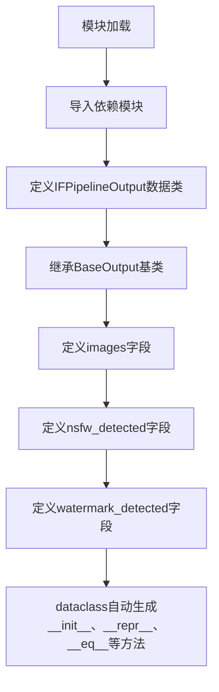
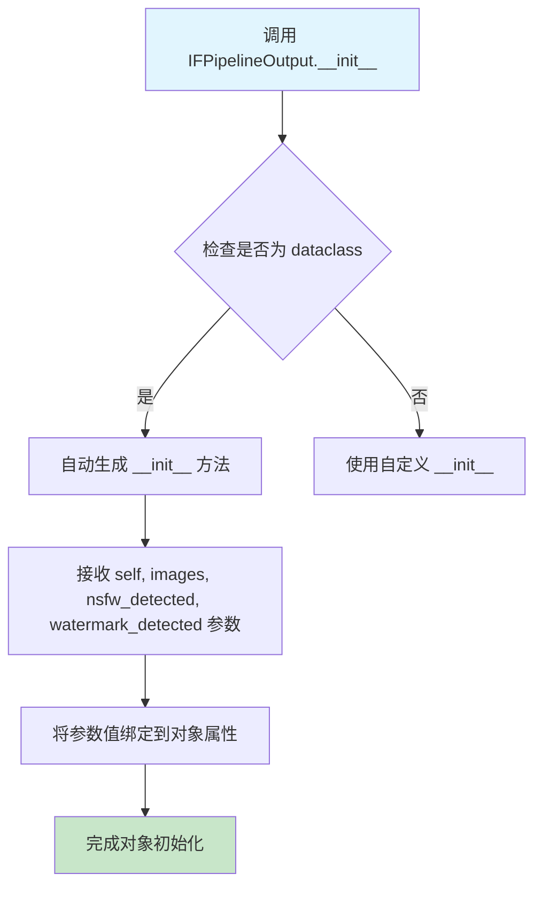
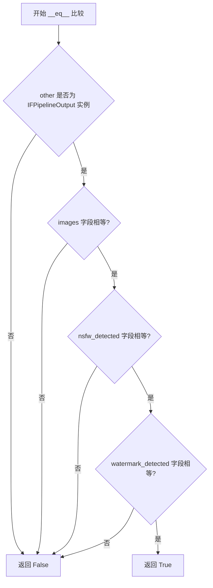
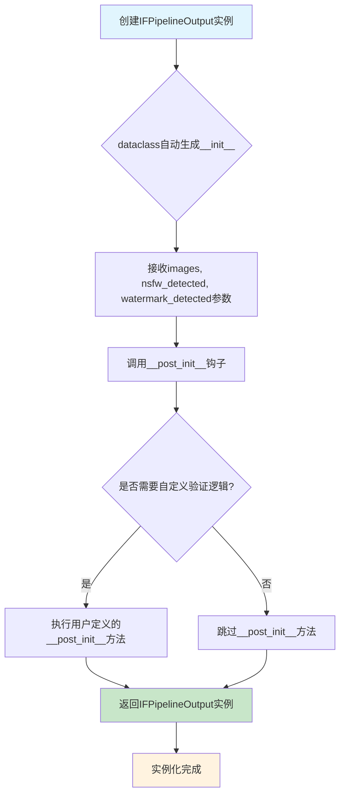

# `diffusers\src\diffusers\pipelines\deepfloyd_if\pipeline_output.py` 详细设计文档

这是Stable Diffusion pipelines的输出数据类，封装了生成的图像、NSFW内容检测结果和水印检测结果，用于在推理过程中传递模型输出数据

## 整体流程



## 类结构

```
BaseOutput (基类)
└── IFPipelineOutput (数据类)
```

## 全局变量及字段


### `IFPipelineOutput.images`
    
生成的图像列表或numpy数组

类型：`list[PIL.Image.Image] | np.ndarray`
    


### `IFPipelineOutput.nsfw_detected`
    
NSFW内容检测标志列表

类型：`list[bool] | None`
    


### `IFPipelineOutput.watermark_detected`
    
水印检测标志列表

类型：`list[bool] | None`
    
    

## 全局函数及方法


### IFPipelineOutput.__init__

这是一个自动生成的 dataclass 构造函数，用于初始化图像生成管道的输出对象，包含去噪后的图像列表以及 NSFW 和水印检测结果。

参数：

- `self`：自动传入的实例本身，表示当前 IFPipelineOutput 对象
- `images`：`list[PIL.Image.Image] | np.ndarray`，去噪后的图像列表（长度为 batch_size 的 PIL 图像列表）或 numpy 数组（形状为 batch_size, height, width, num_channels）
- `nsfw_detected`：`list[bool] | None`，标记对应生成图像是否可能包含"不适宜工作内容"（nsfw）的标志列表，如果无法执行安全检查则为 None
- `watermark_detected`：`list[bool] | None`，标记对应生成图像是否可能包含水印的标志列表，如果无法执行安全检查则为 None

返回值：`None`，构造函数不返回值，仅初始化对象状态

#### 流程图



#### 带注释源码

```python
# 由于使用了 @dataclass 装饰器，Python 会自动生成 __init__ 方法
# 这是自动生成的构造函数实现

def __init__(
    self,
    images: list[PIL.Image.Image] | np.ndarray,
    nsfw_detected: list[bool] | None,
    watermark_detected: list[bool] | None
) -> None:
    """
    自动生成的构造函数
    
    参数:
        images: 去噪后的图像列表或numpy数组
        nsfw_detected: NSFW内容检测标志列表
        watermark_detected: 水印检测标志列表
    
    返回值:
        无返回值，仅初始化对象
    """
    # dataclass 自动生成以下赋值语句
    self.images = images
    self.nsfw_detected = nsfw_detected
    self.watermark_detected = watermark_detected
    
    # dataclass 还会自动生成 __repr__, __eq__ 等方法
```


### `IFPipelineOutput.__repr__`

该方法为 `IFPipelineOutput` 数据类的自动生成的字符串表示方法，由 Python 的 `@dataclass` 装饰器自动生成，用于返回对象的可读字符串描述，便于调试和日志输出。

参数：

- `self`：`IFPipelineOutput`，隐式参数，表示当前实例对象

返回值：`str`，返回对象的官方字符串表示，包含类名和所有字段的名称及其值

#### 流程图

```mermaid
flowchart TD
    A[调用 IFPipelineOutput 实例的 __repr__ 方法] --> B{ dataclass 自动生成}
    B --> C[收集所有字段名: images, nsfw_detected, watermark_detected]
    C --> D[获取每个字段的当前值]
    D --> E[格式化为字符串: IFPipelineOutput(images=..., nsfw_detected=..., watermark_detected=...)]
    E --> F[返回格式化后的字符串]
```

#### 带注释源码

```python
# 由 @dataclass 装饰器自动生成的 __repr__ 方法
# 以下为 Python 解释器为该数据类自动生成的等效代码

def __repr__(self) -> str:
    """
    返回对象的官方字符串表示。
    
    返回格式: IFPipelineOutput(images=..., nsfw_detected=..., watermark_detected=...)
    其中 ... 为各字段的实际值。
    
    Returns:
        str: 包含类名和所有字段键值对的字符串表示
    """
    return (
        f"IFPipelineOutput("
        f"images={self.images!r}, "
        f"nsfw_detected={self.nsfw_detected!r}, "
        f"watermark_detected={self.watermark_detected!r})"
    )

# 使用示例:
# >>> output = IFPipelineOutput(images=[img1, img2], nsfw_detected=[False, False], watermark_detected=[True, False])
# >>> print(repr(output))
# IFPipelineOutput(images=[<PIL.Image.Image image mode=RGB size=...>, ...], nsfw_detected=[False, False], watermark_detected=[True, False])
```

#### 补充说明

| 项目 | 说明 |
|------|------|
| **方法来源** | 由 `@dataclass` 装饰器自动生成，无需手动定义 |
| **字符串格式** | 使用 `!r` 格式化参数，确保值以 repr 形式展示（如字符串带引号） |
| **调试友好度** | 高 - 可直接查看所有字段的当前状态 |
| **可定制性** | 可通过定义自定义 `__repr__` 方法覆盖默认行为 |
| **与 `__str__` 的关系** | 默认情况下 `__repr__ = __str__`，可通过装饰器参数 `repr=False` 禁用 |


### `IFPipelineOutput.__eq__`

描述：该方法是 `IFPipelineOutput` 类使用 `@dataclass` 装饰器后自动生成的 object equality 比较方法，用于比较两个 `IFPipelineOutput` 实例是否相等。自动生成的 `__eq__` 方法会比较所有字段（`images`、`nsfw_detected`、`watermark_detected`）的值。

参数：

-  `other`：`Any`，进行比较的另一个对象

返回值：`bool`，如果两个对象的所有字段值相等则返回 `True`，否则返回 `False`

#### 流程图



#### 带注释源码

```python
def __eq__(self, other: object) -> bool:
    """
    自动生成的相等性比较方法。
    比较当前对象与另一个对象的所有字段值是否相等。
    
    注意：此方法由 @dataclass 装饰器自动生成。
    如果需要自定义相等性逻辑，可以手动定义此方法。
    
    参数:
        other: 需要比较的对象，可以是任意类型
        
    返回值:
        bool: 所有字段值相等返回 True，否则返回 False
    """
    # dataclass 自动生成的比较逻辑
    if not isinstance(other, IFPipelineOutput):
        return NotImplemented
    
    # 依次比较所有字段：
    # 1. images 字段（list[PIL.Image.Image] 或 np.ndarray）
    # 2. nsfw_detected 字段（list[bool] 或 None）
    # 3. watermark_detected 字段（list[bool] 或 None）
    return (
        self.images == other.images
        and self.nsfw_detected == other.nsfw_detected
        and self.watermark_detected == other.watermark_detected
    )
```


### IFPipelineOutput

描述：IFPipelineOutput是Stable Diffusion管道的输出类，用于封装图像生成结果，包括去噪后的图像列表、NSFW内容检测标志和水印检测标志。该类继承自BaseOutput，使用dataclass实现，提供__post_init__钩子用于初始化后的数据验证和处理（如果需要）。

注意：当前代码中未显式定义`__post_init__`方法，以下为dataclass自动生成的初始化流程。

参数：
- `self`：隐式参数，IFPipelineOutput实例本身
- `images`：`list[PIL.Image.Image] | np.ndarray`，去噪后的PIL图像列表或numpy数组，形状为(batch_size, height, width, num_channels)
- `nsfw_detected`：`list[bool] | None`，标记对应生成图像是否可能包含"不适合工作场所"内容的标志列表，安全检查无法执行时为None
- `watermark_detected`：`list[bool] | None`，标记对应生成图像是否可能包含水印的标志列表，安全检查无法执行时为None

返回值：无显式返回值，dataclass自动生成`__init__`方法

#### 流程图



#### 带注释源码

```python
from dataclasses import dataclass

import numpy as np
import PIL.Image

from ...utils import BaseOutput


@dataclass
class IFPipelineOutput(BaseOutput):
    r"""
    Output class for Stable Diffusion pipelines.

    Args:
        images (`list[PIL.Image.Image]` or `np.ndarray`):
            list of denoised PIL images of length `batch_size` or numpy array of shape `(batch_size, height, width,
            num_channels)`. PIL images or numpy array present the denoised images of the diffusion pipeline.
        nsfw_detected (`list[bool]`):
            list of flags denoting whether the corresponding generated image likely represents "not-safe-for-work"
            (nsfw) content or a watermark. `None` if safety checking could not be performed.
        watermark_detected (`list[bool]`):
            list of flags denoting whether the corresponding generated image likely has a watermark. `None` if safety
            checking could not be performed.
    """

    # 定义三个类字段，用于存储管道输出数据
    images: list[PIL.Image.Image] | np.ndarray  # 去噪后的图像列表或numpy数组
    nsfw_detected: list[bool] | None            # NSFW内容检测结果
    watermark_detected: list[bool] | None       # 水印检测结果

    def __post_init__(self):
        """
        初始化后处理方法（dataclass自动调用）。
        
        此方法在dataclass的__init__方法执行完毕后自动调用，
        可用于添加自定义的验证逻辑或数据预处理。
        
        注意：当前代码中未显式实现此方法，
        如果需要添加验证逻辑，可以在此处添加。
        """
        # 潜在的验证逻辑示例：
        # 1. 验证images列表长度与nsfw_detected/watermark_detected长度一致
        # 2. 验证images中的图像格式正确
        # 3. 验证检测结果标志的类型正确
        
        pass  # 当前为空的__post_init__实现
```

---

### 补充说明

由于当前代码中**未显式定义`__post_init__`方法**，dataclass仅提供默认的`__init__`功能。如果需要实现初始化后验证，可以添加如下自定义逻辑：

```python
def __post_init__(self):
    # 验证images与检测结果列表长度一致
    if self.nsfw_detected is not None and len(self.images) != len(self.nsfw_detected):
        raise ValueError("images数量必须与nsfw_detected数量一致")
    
    if self.watermark_detected is not None and len(self.images) != len(self.watermark_detected):
        raise ValueError("images数量必须与watermark_detected数量一致")
```

## 关键组件


### IFPipelineOutput 类

IFPipelineOutput 是一个数据类，继承自 BaseOutput，用于封装 Stable Diffusion 图像生成管道的输出结果，包含生成的图像列表、NSFW 内容检测标志和水印检测标志。

### images 字段

图像输出字段，支持 PIL.Image.Image 列表或 NumPy 数组格式，用于存储去噪后的生成图像，batch_size 可以为 1 或多个图像。

### nsfw_detected 字段

NSFW 内容检测结果字段，类型为 list[bool] | None，用于标记生成的图像是否包含"不适宜工作内容"（Not Safe For Work），若无法执行安全检查则为 None。

### watermark_detected 字段

水印检测结果字段，类型为 list[bool] | None，用于标记生成的图像是否包含水印，若无法执行安全检查则为 None。

### BaseOutput 父类依赖

该类继承自 ...utils 模块中的 BaseOutput，可能包含基础输出接口的定义，如序列化方法或通用输出属性。


## 问题及建议


### 已知问题

- **字段缺少默认值导致实例化不灵活**：`images`、`nsfw_detected`、`watermark_detected` 均无默认值，在只想传递部分参数（如仅 `images`）时需要显式传递其他参数，使用体验不佳
- **类型注解兼容性问题**：使用了 Python 3.10+ 的联合类型语法 `|`（如 `list[PIL.Image.Image] | np.ndarray`），未添加 `from __future__ import annotations`，在 Python 3.9 环境下无法运行
- **缺少输入验证逻辑**：未在 `__post_init__` 中验证 `images` 的实际类型、维度或 `nsfw_detected`/`watermark_detected` 与 `images` 长度的一致性，可能导致运行时错误
- **文档与实现不完全匹配**：文档中提及 `num_channels` 参数，但代码中未体现；文档描述与实际字段存在细微差异
- **类型注解不够精确**：`np.ndarray` 未指定具体的 dtype 和 shape 范围，`list` 也未使用 `typing.List` 进行更明确的声明
- **可扩展性受限**：未来若需添加新字段（如生成种子、提示词等），必须修改类结构，属于破坏性变更

### 优化建议

- **添加字段默认值**：将 `nsfw_detected` 和 `watermark_detected` 的默认值设为 `None`，提升实例化便利性
- **添加 `__future__` 导入**：在文件顶部添加 `from __future__ import annotations` 以确保类型注解的向前兼容
- **实现 `__post_init__` 验证**：添加数据类型检查、维度验证和列表长度一致性检查，提升代码健壮性
- **使用 `typing` 模块增强类型标注**：考虑使用 `List`、`Optional`、`Union` 等提供更清晰的类型声明
- **添加 `field` 工厂函数**：配合 `dataclasses` 的 `field(default=None)` 明确指定默认值
- **完善文档字符串**：确保文档描述与实际实现保持一致
</think>

## 其它


### 设计目标与约束

**设计目标**：为Stable Diffusion图像生成管道提供标准化的输出数据结构，封装生成的图像内容以及相关的安全检测结果（NSFW和水印检测）。

**设计约束**：
- 必须继承自BaseOutput基类以保持与管道输出系统的一致性
- 使用Python 3.10+的类型注解（Union语法使用`|`操作符）
- images字段支持PIL.Image.Image列表或numpy数组两种格式
- nsfw_detected和watermark_detected可为None表示检测未执行

### 错误处理与异常设计

**类型约束**：
- `images`字段类型为`list[PIL.Image.Image] | np.ndarray`，传入其他类型将在运行时引发TypeError
- `nsfw_detected`和`watermark_detected`字段类型为`list[bool] | None`，传入非法值（如整数、字符串）将引发类型错误

**数据验证**：
- 不进行运行时数据验证，依赖调用方保证数据合法性
- list类型不检查元素是否为bool类型，numpy数组不检查元素类型和值范围

**异常传播**：异常由数据类构造时Python原生类型系统触发，无自定义异常处理逻辑

### 数据流与状态机

**数据流向**：
1. 管道执行图像生成→2. 安全检查器检测NSFW和水印→3. 构造IFPipelineOutput实例→4. 返回给调用方

**状态说明**：
- `images`：始终存在，包含生成的图像数据
- `nsfw_detected`：可能为None（检测未执行）或list[bool]（检测结果）
- `watermark_detected`：可能为None（检测未执行）或list[bool]（检测结果）

**状态组合**：
- 正常情况：images有值，nsfw_detected和watermark_detected为list[bool]
- 未启用安全检测：nsfw_detected和watermark_detected为None
- 部分检测：可能一个为list[bool]一个为None（取决于管道配置）

### 外部依赖与接口契约

**依赖项**：
- `dataclass`：Python标准库，用于创建数据类
- `numpy`：第三方库，提供np.ndarray类型支持
- `PIL.Image`：第三方库（Pillow），提供PIL.Image.Image类型支持
- `BaseOutput`：项目内部基类，从...utils模块导入

**接口契约**：
- 输入：构造时接受images、nsfw_detected、watermark_detected三个参数
- 输出：数据类实例，包含三个只读属性
- 序列化：继承自BaseOutput，应支持to_dict()等基类方法（需查阅BaseOutput具体实现）

**调用方职责**：
- 保证images长度与nsfw_detected、watermark_detected（如非None）长度一致
- 保证list元素类型正确（PIL.Image或bool）
- 处理可能的None值

### 性能考虑

- 使用@dataclass装饰器优化内存占用和访问速度
- 字段类型声明允许静态类型检查器优化
- 无缓存机制，重复访问属性无额外性能损耗
- numpy数组存储可利用向量化操作优化

### 安全性考虑

- NSFW检测结果标记为bool列表，需正确处理None状态
- 敏感内容检测结果不包含具体检测详情，仅返回布尔标记
- 数据类本身不执行任何敏感操作，仅作为数据容器

### 兼容性考虑

- Python版本：需要Python 3.10+（支持`|`联合类型语法）
- 依赖库版本：numpy>=1.20, Pillow>=8.0（建议）
- 向后兼容：新增字段需考虑与现有代码兼容性，建议使用默认值

### 使用示例

```python
# 构造输出对象
output = IFPipelineOutput(
    images=[PIL.Image.new('RGB', (512, 512))],
    nsfw_detected=[False],
    watermark_detected=[False]
)

# 访问输出
for img in output.images:
    img.save("output.png")

if output.nsfw_detected and any(output.nsfw_detected):
    print("警告：检测到NSFW内容")
```

### 测试策略

**单元测试**：
- 测试基本构造和属性访问
- 测试不同类型组合（list vs numpy array）
- 测试None值处理
- 测试dataclass特性（__eq__, __repr__, __init__）

**边界测试**：
- 空列表作为images
- 空列表作为nsfw_detected/watermark_detected
- 超大batch_size的内存占用


    